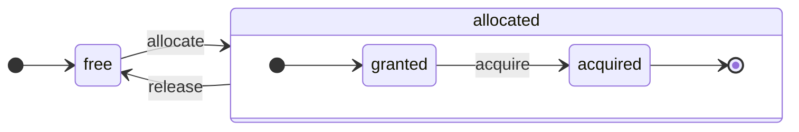
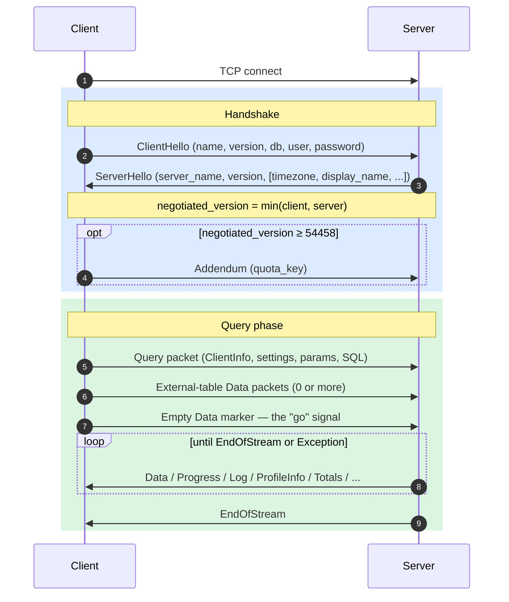
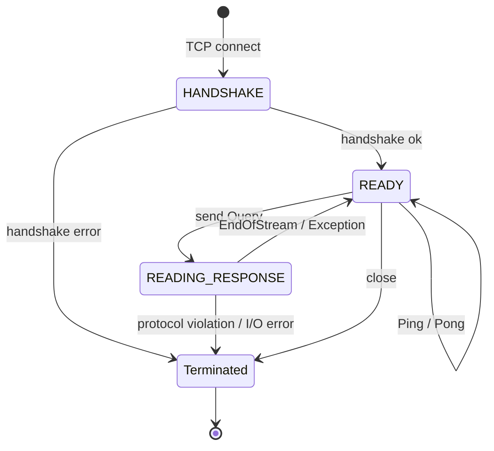
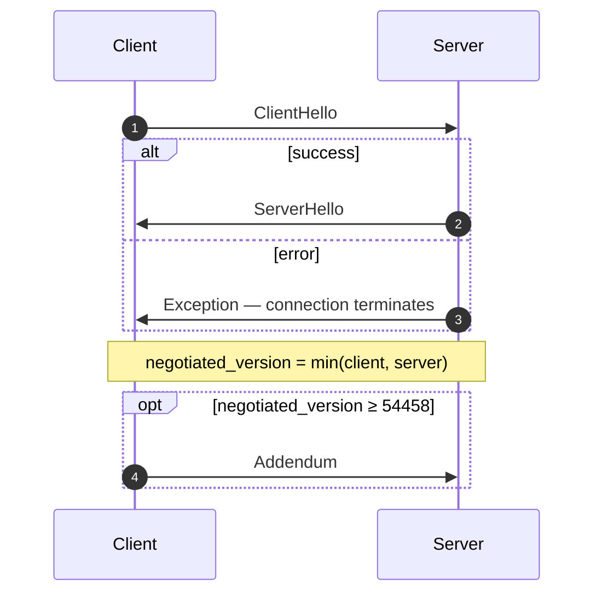
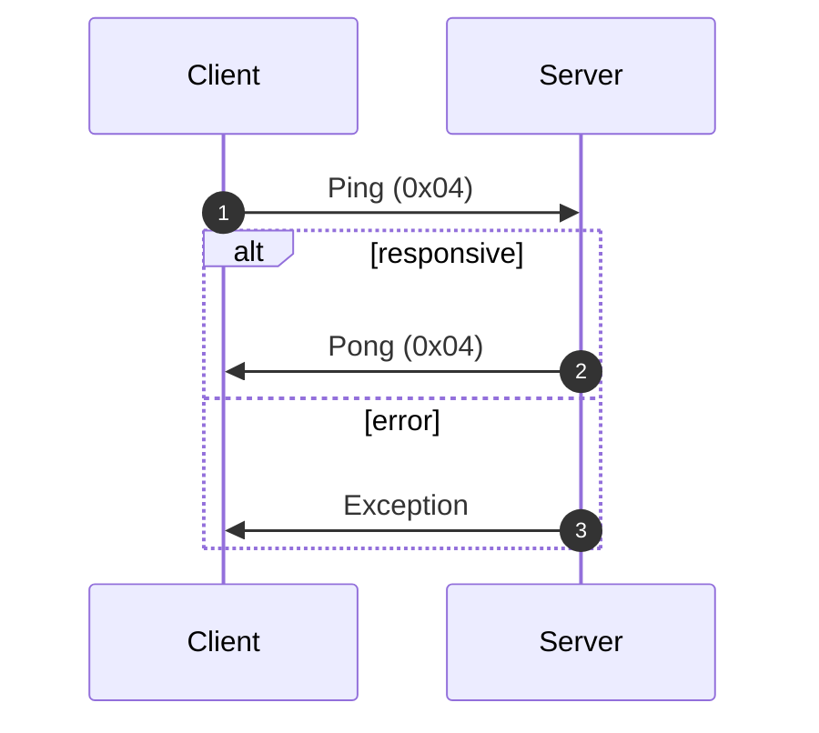
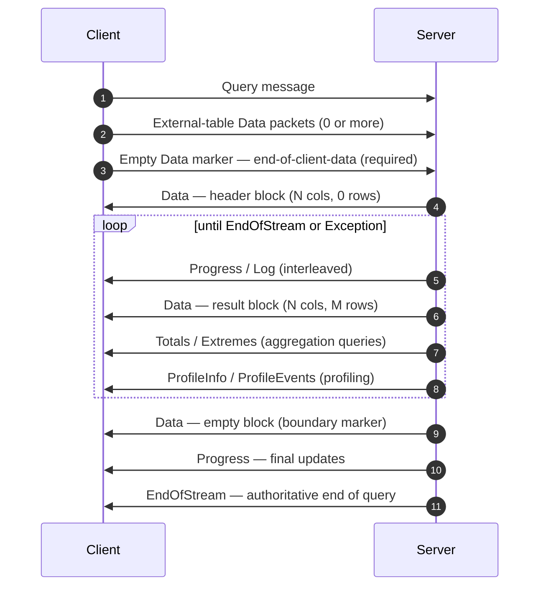
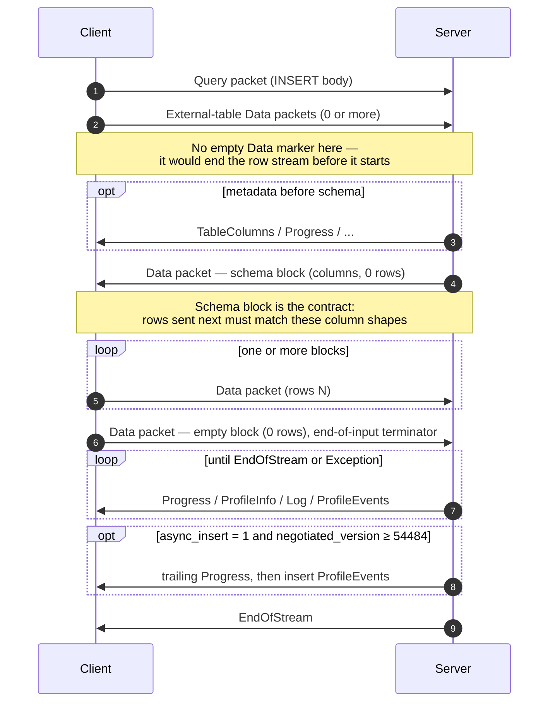
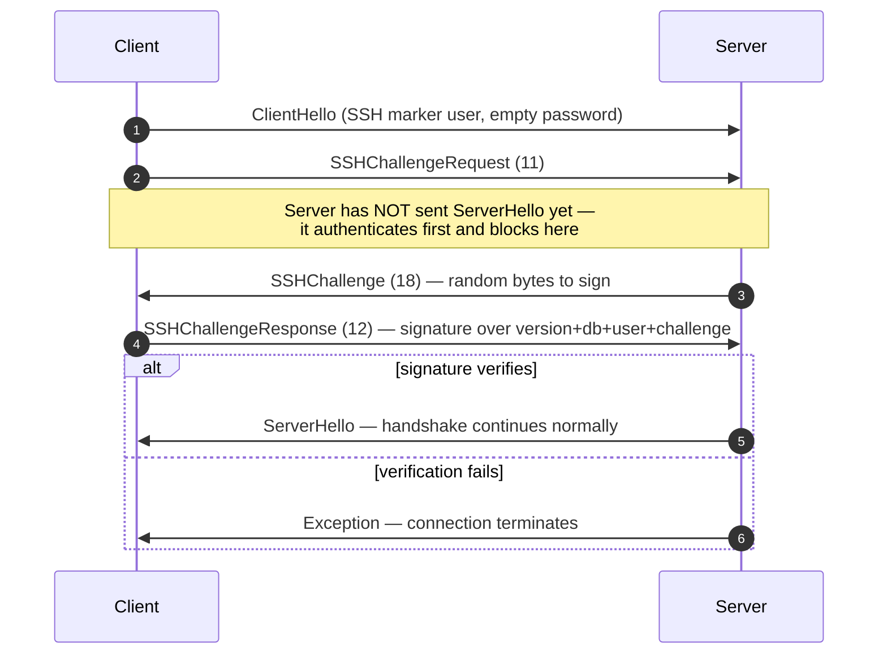

<a id="doc-01ce8e14d9837f831dedbd42"></a>

# ClickHouse/ClickHouse / docs/fr/resources/changelogs/oss/2026.mdx

Upstream: https://github.com/ClickHouse/ClickHouse/blob/28dc98b1fc057c08396c95e495b9327754a10b04/docs/fr/resources/changelogs/oss/2026.mdx

Commit: `28dc98b1fc057c08396c95e495b9327754a10b04`

Retrieved: 2026-10-01T15:20:10.316397+00:00

Kind: official-document

Raw SHA256: `c28e327b2bda01d7f861547a15edddd3bbacbafdbea360807dd556d35b5ece10`

Source text below is untrusted reference content. Acquisition does not verify technical claims.

License status: UPSTREAM_NOTICES_CAPTURED_PER_FILE_REVIEW_REQUIRED. See this repository's captured license files.

---

---
description: 'Historique des modifications pour 2026'
note: 'Ce fichier est généré avec python3 _site/scripts/update_changelogs.py'
slug: /whats-new/changelog/
sidebarTitle: '2026'
title: 'Historique des modifications 2026'
doc_type: 'changelog'
---

{/* Généré à partir du CHANGELOG.md à la racine du dépôt par
    _site/scripts/update_changelogs.py. */}

{/* AUTOGENERATED_START */}

### Version ClickHouse 26.8 LTS, 2026-08-27, FIXME (en cours)

#### Modification non rétrocompatible

* L’en-tête de requête HTTP `X-ClickHouse-Format` sélectionne désormais explicitement le format de la réponse : il s’agit d’un alias du paramètre `output_format`, il remplace donc la clause `FORMAT` de la requête et l’extension du chemin. Dans les versions précédentes, il définissait uniquement la valeur par défaut lorsque le format de sortie n’était pas spécifié, comme le paramètre `default_format`. Cela fournit une option &quot;hors bande&quot; pour demander des données dans le format souhaité. Il ne modifie jamais la manière dont le corps de requête d’un `INSERT` est analysé ; utilisez `input_format` ou `format` à cette fin. [#105249](https://github.com/ClickHouse/ClickHouse/pull/105249) ([Alexey Milovidov](https://github.com/alexey-milovidov)).
* Les nombres JSON non entre guillemets des colonnes `DateTime` et `DateTime64` dans `JSONEachRow` et les formats similaires sont désormais interprétés comme des timestamps Unix avec une précision inférieure à la seconde facultative, conformément à `Values`, `CAST` et `toDateTime64`. Auparavant, un nombre fractionnaire tel que `1703363853.035` était rejeté, tandis qu’un entier seul tel que `1703363853` était lu comme la valeur brute mise à l’échelle de `DateTime64`, produisant un timestamp `1970-...`. Les chaînes entre guillemets et la sortie JSON propre à ClickHouse ne sont pas affectées. [#108091](https://github.com/ClickHouse/ClickHouse/pull/108091) ([Alexey Milovidov](https://github.com/alexey-milovidov)).
* La valeur par défaut de `max_insert_threads` est passée de `1` à `auto`, ce qui correspond au nombre de cœurs CPU disponibles sur le serveur. Cela parallélise `INSERT SELECT` par défaut, et `max_insert_threads` peut désormais également paralléliser la partie écriture d’un simple `INSERT` lorsque le chemin d’écriture de destination peut être réparti en toute sécurité. Cela peut modifier le nombre de parties créées par ces requêtes et l’ordre des lignes insérées. Pour restaurer le comportement précédent, définissez `max_insert_threads` sur `1` ou `compatibility` sur une version antérieure à `26.8`. [#109000](https://github.com/ClickHouse/ClickHouse/pull/109000) ([Alexey Milovidov](https://github.com/alexey-milovidov)). [#109006](https://github.com/ClickHouse/ClickHouse/pull/109006) ([Alexey Milovidov](https://github.com/alexey-milovidov)).
* Les moteurs de base de données `PostgreSQL` et `MaterializedPostgreSQL` respectent désormais `remote_url_allow_hosts`, comme le font déjà le moteur de table `PostgreSQL`, la fonction de table `postgresql` et les dictionnaires créés par DDL. Lorsque `remote_url_allow_hosts` est configuré, `CREATE DATABASE` et les commandes `ATTACH DATABASE` exécutées par les utilisateurs rejettent désormais les bases de données `PostgreSQL` et `MaterializedPostgreSQL` pointant vers des hôtes non autorisés avec `UNACCEPTABLE_URL`. Les bases de données existantes continuent de se charger au démarrage du serveur. [#111135](https://github.com/ClickHouse/ClickHouse/pull/111135) ([Alexey Milovidov](https://github.com/alexey-milovidov)).
* Le codec expérimental `ALP(STD)` effectue désormais les calculs de mise à l’échelle de `Float32` en `Float64`. Cela améliore les taux de compression et évite une compression des données décimales générant de nombreuses exceptions, mais les valeurs `Float32` écrites par des versions antérieures peuvent désormais être décodées avec une différence de 1 ULP. [#111627](https://github.com/ClickHouse/ClickHouse/pull/111627) ([Raufs Dunamalijevs](https://github.com/rienath)).
* Suppression de la source de dictionnaire `library`. `SOURCE(LIBRARY(...))` échoue désormais avec `UNKNOWN_ELEMENT_IN_CONFIG`, et le paramètre de serveur `dictionaries_lib_path` est obsolète et n’a aucun effet. [#111980](https://github.com/ClickHouse/ClickHouse/pull/111980) ([Alexey Milovidov](https://github.com/alexey-milovidov)).
* Suppression du lecteur et du writer basés sur la bibliothèque Apache Arrow pour les formats `Arrow` et `ArrowStream`. L’implémentation native de ClickHouse, qui est la valeur par défaut depuis la version 26.7, est désormais la seule disponible. Les paramètres `input_format_arrow_use_native_reader` et `output_format_arrow_use_native_writer` sont obsolètes : ils sont toujours acceptés, mais n’ont aucun effet. Une requête qui les définissait sur `0` pour forcer l’implémentation Apache Arrow utilise donc désormais l’implémentation native. [#111996](https://github.com/ClickHouse/ClickHouse/pull/111996) ([Alexey Milovidov](https://github.com/alexey-milovidov)).
* Rejet des valeurs de paramètres de durée (millisecondes/secondes) qui entraînent un dépassement de capacité des microsecondes `Int64`. Cela pourrait constituer une incompatibilité uniquement si vous utilisiez des valeurs absurdement élevées qui entraînaient un dépassement. [#112757](https://github.com/ClickHouse/ClickHouse/pull/112757) ([Azat Khuzhin](https://github.com/azat)).
* Les identifiants TLS d’une source `MySQL` (`ssl_ca`, `ssl_cert`, `ssl_key`) ne peuvent plus être spécifiés comme chemins de fichiers dans SQL, par exemple dans `CREATE NAMED COLLECTION`, les arguments de requête ou `CREATE DICTIONARY`, car le serveur ouvre ces fichiers avec ses propres privilèges. Les chemins restent pris en charge dans le fichier de configuration du serveur. Dans les autres cas, transmettez le contenu du certificat ou de la clé dans les nouveaux paramètres `ssl_ca_pem`, `ssl_cert_pem` et `ssl_key_pem`, qui sont masqués dans les journaux et les requêtes `SHOW`, comme les mots de passe. [#112070](https://github.com/ClickHouse/ClickHouse/pull/112070) ([Alexey Milovidov](https://github.com/alexey-milovidov)).
* Les vérifications de privilèges pour les commandes `SYSTEM ... CACHE ON CLUSTER` utilisent désormais le privilège propre à chaque commande au lieu du groupe de privilèges `SYSTEM DROP CACHE`. Cela permet aux détenteurs d’un privilège de cache granulaire d’exécuter la commande correspondante et empêche les détenteurs du groupe d’exécuter `SYSTEM SYNC FILESYSTEM CACHE ON CLUSTER` sans disposer de `SYSTEM SYNC FILESYSTEM CACHE`. [#114042](https://github.com/ClickHouse/ClickHouse/pull/114042) ([Groene AI](https://github.com/groeneai)).
* Pour les vues dont le corps est un simple `SELECT` sur une seule table `Distributed`, l’intégralité de la requête externe est désormais envoyée aux segments (nouveau paramètre `optimize_trivial_view_pushdown_to_distributed`, activé par défaut). Cela modifie le comportement observable de ces vues : `FINAL` et `SAMPLE`, spécifiés sur la référence à la vue, sont désormais propagés à la table locale au segment au lieu d’être ignorés, et `extremes` n’est pas renvoyé sur les clusters à un seul segment. Définissez `optimize_trivial_view_pushdown_to_distributed = 0` pour rétablir le comportement précédent. [#101791](https://github.com/ClickHouse/ClickHouse/pull/101791) ([simonmichal](https://github.com/simonmichal)).
* Les parties de correctif `UPDATE` légères utilisent désormais un nouveau format v2 sur disque, trié par (`sorting_key..., _block_number, _block_offset`), et sont appliquées à l’aide d’un nouvel algorithme de fusion. La mémoire maximale est limitée par la plus grande séquence de clés de tri identiques plutôt que par l’intégralité du correctif, et les mises à jour qui traversent des limites de fusion ne basculent plus vers l’application Join en mémoire. Les parties de correctif à l’ancien format restent lisibles. Lors d’une mise à niveau progressive depuis une version antérieure à 26.8, conservez `patch_parts_version = 'v1'` ou utilisez le paramètre `compatibility` jusqu’à ce que toutes les répliques soient mises à niveau. [#103182](https://github.com/ClickHouse/ClickHouse/pull/103182) ([Anton Popov](https://github.com/CurtizJ)).
* Ajout de la clause `VALID FOR <interval>` à `CREATE USER` et `ALTER USER` comme raccourci pour `VALID UNTIL`. La date d’expiration est calculée en ajoutant l’intervalle indiqué à l’heure actuelle au moment de l’exécution de la requête, puis stockée sous la forme `VALID UNTIL`. La colonne `valid_until` de la table `system.users` a désormais le type `Array(DateTime64(0))` au lieu de `Array(DateTime)`, afin que les dates d’expiration au-delà de l’année 2106 soient représentées exactement ; les outils qui lisent cette colonne doivent prendre en charge ce nouveau type. [#110171](https://github.com/ClickHouse/ClickHouse/pull/110171) ([Alexey Milovidov](https://github.com/alexey-milovidov)).
* `EXPLAIN SYNTAX` renvoie désormais la requête reformatée sous la forme d’un unique enregistrement `String` (avec des sauts de ligne intégrés) au lieu d’un enregistrement par ligne ; sa sortie est donc une seule ligne récupérable et directement utilisable (par exemple, `SELECT count() FROM (EXPLAIN SYNTAX ...)` renvoie `1`). Ce comportement est contrôlé par la nouvelle option `single_record`, dont la valeur par défaut est `1` ; définissez `single_record = 0` pour rétablir la sortie historique d’un enregistrement par ligne. Les autres types de `EXPLAIN` (`PLAN`/`PIPELINE`/`AST`) conservent leur sortie arborescente par ligne. [#110479](https://github.com/ClickHouse/ClickHouse/pull/110479) ([Alexey Milovidov](https://github.com/alexey-milovidov)).
* Étend la plage prise en charge de `Date32` de `[1900-01-01, 2299-12-31]` à `[0000-01-01, 9999-12-31]`, afin de l’aligner sur `DateTime64`. L’analyse et les conversions acceptent désormais cette plage étendue au lieu de saturer silencieusement aux anciennes limites. Notes de compatibilité descendante : dans la conversion numérique `toDate32(N)`, les valeurs de `[120530, 2932896]` sont désormais interprétées comme des numéros de jour (dates allant de `2300-01-01` à `9999-12-31`) plutôt que comme des timestamps Unix du début de 1970, conformément à la règle selon laquelle un nombre compris dans la plage des numéros de jour est un numéro de jour ; les nombres inférieurs au numéro de jour correspondant à `0000-01-01` et les timestamps postérieurs à `9999-12-31` saturent aux nouvelles limites. [#111534](https://github.com/ClickHouse/ClickHouse/pull/111534) ([Alexey Milovidov](https://github.com/alexey-milovidov)).
* `arrayIntersect` et `arraySymmetricDifference` ne traitent plus une valeur répétée dans un même argument comme si elle apparaissait dans plusieurs arguments. Les requêtes s’appuyant sur le comportement précédent peuvent désormais renvoyer des résultats différents : `arrayIntersect([1], [2], [1, 1])` renvoie `[]` au lieu de `[1]`, `arrayIntersect([1, 2], [2], [1, 1, 2])` renvoie `[2]` au lieu de `[1, 2]`, et `arraySymmetricDifference([1], [2], [1, 1])` renvoie `[2, 1]` au lieu de `[2]`. Pour `arraySymmetricDifference`, deux arguments suffisent désormais : `arraySymmetricDifference([1], [2, 2])` renvoie `[2, 1]` au lieu de `[1]`. Une valeur n’est désormais comptée pour un argument que si elle était présente dans tous les arguments précédents, de sorte que le résultat contient exactement les valeurs présentes dans l’ensemble des arguments. Dans le cadre de ce même changement, `arrayIntersect` construit sa table de hachage à partir du plus petit argument plutôt que de tous les arguments, ce qui le rend jusqu’à 1,85 fois plus rapide et réduit d’un tiers son utilisation de mémoire lorsque la taille des arguments varie fortement. `arrayUnion` n’est pas affecté. [#113021](https://github.com/ClickHouse/ClickHouse/pull/113021) ([Alexey Milovidov](https://github.com/alexey-milovidov)).
* `disable_insertion_and_mutation` empêche désormais la consommation en arrière-plan des tables `Kafka`, `RabbitMQ` et `NATS`, tout en continuant d’autoriser les écritures directes vers le stockage externe. Les tables `Kafka2`, `NATS` et `RabbitMQ` concernées n’initialisent pas de consommateurs pour les `SELECT` directs. Le paramètre `message_queue_disable_insertion`, introduit récemment, nécessite désormais un redémarrage du serveur. [#113660](https://github.com/ClickHouse/ClickHouse/pull/113660) ([Christoph Wurm](https://github.com/cwurm)).
* Un `PARTITION BY` ou un `ORDER BY` de fenêtre portant sur une colonne `AggregateFunction` est désormais rejeté avec `ILLEGAL_COLUMN`, comme c’était déjà le cas pour un `ORDER BY` de niveau supérieur portant sur une telle colonne. Auparavant, une telle requête était acceptée par au moins un analyseur, et le `PARTITION BY` de fenêtre produisait des partitions différentes selon `max_threads`. Le rejet couvre également un état imbriqué dans `Array`, `Tuple`, `Map`, `Variant` ou `SimpleAggregateFunction`. Un `SimpleAggregateFunction` sur un type ordinaire, `QBit`, ainsi que `GROUP BY` et `DISTINCT` sur un état ne sont pas affectés. [#113878](https://github.com/ClickHouse/ClickHouse/pull/113878) ([Groene AI](https://github.com/groeneai)).
* Le paramètre `include_from` n’utilise plus `/etc/metrika.xml` par défaut. Auparavant, ce fichier était utilisé pour les substitutions de configuration dès lors qu’il existait, même si rien dans la configuration de ClickHouse n’y faisait référence. Si vous vous appuyiez sur ce fichier de substitutions implicite, ajoutez explicitement `<include_from>/etc/metrika.xml</include_from>` à chaque fichier de configuration concerné ; les fichiers `users.xml` chargés séparément et les configurations XML de dictionnaires nécessitent chacun leur propre élément `include_from`. [#114161](https://github.com/ClickHouse/ClickHouse/pull/114161) ([Alexey Milovidov](https://github.com/alexey-milovidov)).
* Le moteur de table `NATS` accepte les identifiants directement dans le nouveau paramètre `nats_credentials` (avec la même charge utile qu’un fichier `.creds`) et n’accepte plus `nats_credential_file` depuis SQL : ce chemin référence un fichier du système de fichiers du serveur, que celui-ci ouvre avec ses propres privilèges. Il ne peut donc être spécifié que dans une collection nommée définie dans le fichier de configuration du serveur, ou sous la forme `nats.credential_file` dans la configuration du serveur elle-même. Une requête peut remplacer un tel chemin configuré par des `nats_credentials` intégrés, sauf si l’opérateur l’a verrouillé avec `<nats_credential_file overridable="false">`. Les tables créées avant cette restriction continuent de fonctionner après une mise à niveau. [#114644](https://github.com/ClickHouse/ClickHouse/pull/114644) ([Alexey Milovidov](https://github.com/alexey-milovidov)).
* Les métriques asynchrones peuvent désormais être de type `Map`, et les métriques par cœur de CPU et par périphérique ont été converties en métriques clé-valeur uniques : `OSUserTimeCPU0`, `OSUserTimeCPU1`, ... sont devenues une seule métrique `OSUserTimeCPU`, avec une map associant le numéro du cœur de CPU à la valeur (de même pour les autres métriques `OS*TimeCPU*`, `CPUFrequencyMHz_*`, `Temperature*`, `EDAC*`, `Block*_*`, `Network(Receive|Send)*_*`, `Disk*_*`, `*BlobsQueueEstimate` et `AsyncLogging*QueueSize`). `system.asynchronous_metrics` comporte une nouvelle colonne `key_values Map(LowCardinality(String), Float64)` (la colonne `value` vaut `NaN` pour ces métriques), `system.asynchronous_metric_log` les enregistre sous forme d’une ligne par clé à l’aide d’une nouvelle colonne `key`, l’endpoint Prometheus les exporte avec un label (par ex. `ClickHouseAsyncMetrics_BlockReadBytes{device="sda"}`), et le `MetricsTransmitter` Graphite les envoie sous la forme `<prefix>.<Metric>.<key>`. Si votre monitoring lit les anciens noms de métriques, définissez le nouveau paramètre de serveur `asynchronous_metrics_key_values_mode` sur `legacy_names` pour publier à nouveau chaque clé en tant que métrique scalaire distincte sous son ancien nom, ou sur `both` pour publier les deux formes simultanément pendant la migration du monitoring ; le paramètre est appliqué par `SYSTEM RELOAD CONFIG`, sans redémarrage. [#115333](https://github.com/ClickHouse/ClickHouse/pull/115333) ([Alexey Milovidov](https://github.com/alexey-milovidov)). [#116791](https://github.com/ClickHouse/ClickHouse/pull/116791) ([Alexey Milovidov](https://github.com/alexey-milovidov)).

#### Nouvelle fonctionnalité

* Ajout des instructions `CREATE HANDLER`, `ALTER HANDLER` et `DROP HANDLER` permettant de définir des gestionnaires HTTP personnalisés en SQL, persistants dans un stockage local ou Keeper. Ajout des fonctions `currentHandler` et `currentRequestURL`, de la table `system.handlers` et des colonnes `http_handler_name` / `http_request_url` dans `system.query_log`. [#106231](https://github.com/ClickHouse/ClickHouse/pull/106231) ([Alexey Milovidov](https://github.com/alexey-milovidov)).
* Ajout d’un moyen d’accéder aux tables et aux bases de données via des chemins d’URL dans l’interface HTTP (p. ex. &#96;/database/table.format.gz?filter=a&gt;0&#96;), ainsi que de nouveaux paramètres (&#96;http&#95;allow&#95;database&#95;as&#95;path&#96;, &#96;http&#95;allow&#95;table&#95;as&#95;file&#96;, &#96;http&#95;allow&#95;filters&#95;as&#95;path&#96;, &#96;http&#95;allow&#95;filters&#95;as&#95;unrecognized&#95;url&#95;parameters&#96;, &#96;select&#96;, &#96;order&#96;, &#96;sort&#96;, &#96;filter&#96;, &#96;page&#96;, &#96;compression&#96;, &#96;format&#96;, &#96;input&#95;format&#96;, &#96;output&#95;format&#96;, &#96;default&#95;format&#96;, &#96;database&#96;) qui peuvent être combinés entre eux et avec le paramètre d’URL existant &#96;query&#96;. [#105249](https://github.com/ClickHouse/ClickHouse/pull/105249) ([Alexey Milovidov](https://github.com/alexey-milovidov)).
* Ajout de formats de tramage, sélectionnés par le nouveau paramètre `framing_output_format` : ils multiplexent différentes parties de la réponse à une requête dans un même flux de réponse HTTP — blocs de données, totaux et extrêmes, paquets de progression, événements de profil, journaux du serveur et exceptions. Formats de tramage implémentés : `None` (par défaut, tout fonctionne comme auparavant), `EventStream` (événements HTTP envoyés par le serveur), `JSONEachPacketBase64` et `JSONEachPacketString` (un objet JSON par paquet contenant des données encodées en Base64 ou sous forme de chaîne). [#110127](https://github.com/ClickHouse/ClickHouse/pull/110127) ([Alexey Milovidov](https://github.com/alexey-milovidov)).
* Ajout du paramètre serveur `default_session_user` : l’utilisateur utilisé pour l’authentification lorsqu’un client se connecte sans spécifier de nom d’utilisateur (auparavant codé en dur sur `default` ; les protocoles natif, MySQL et PostgreSQL acceptent désormais un nom d’utilisateur vide au lieu de le rejeter, et Arrow Flight respecte ce paramètre au lieu de son propre `default` codé en dur). Les points de terminaison de protocole composables de la section `protocols` peuvent le redéfinir pour chaque point de terminaison à l’aide d’une clé `default_session_user`, ce qui permet à différents ports d’écoute de servir différents utilisateurs anonymes. Le définir sur une chaîne vide interdit les connexions sans nom d’utilisateur. Les connexions interserveur n’utilisent jamais l’utilisateur de session par défaut. [#110179](https://github.com/ClickHouse/ClickHouse/pull/110179) ([Alexey Milovidov](https://github.com/alexey-milovidov)).
* Prise en charge des opérateurs pipe dans les requêtes SQL : `FROM t |> WHERE x > 1 |> AGGREGATE count() AS c GROUP BY y |> ORDER BY c DESC |> LIMIT 10`, similaire à la syntaxe pipe de GoogleSQL. Toute requête `SELECT` peut être suivie d’une chaîne d’opérateurs `|>`, chaque opérateur encapsulant la requête précédente dans une sous-requête ; l’AST obtenu est donc identique à celui de la requête équivalente avec des sous-requêtes imbriquées. Dans une requête commençant par la clause `FROM`, la clause `SELECT` est désormais facultative et vaut par défaut `SELECT *`. [#111151](https://github.com/ClickHouse/ClickHouse/pull/111151) ([Alexey Milovidov](https://github.com/alexey-milovidov)).
* Ajout des fonctions `parseQueryToJSON` et `formatQueryFromJSON` pour sérialiser et désérialiser les AST en JSON, ainsi que d’un dialecte expérimental `clickhouse_json` activé par `enable_json_ast_dialect`. [#100412](https://github.com/ClickHouse/ClickHouse/pull/100412) ([Alexey Milovidov](https://github.com/alexey-milovidov)). [#113480](https://github.com/ClickHouse/ClickHouse/pull/113480) ([Nikita Fomichev](https://github.com/fm4v)).
* Nouveau paramètre `run_query_in_background`. Le serveur accepte la requête, renvoie immédiatement un résultat vide et l’exécute jusqu’à son terme, indépendamment de ce qui arrive à la connexion. Le résultat est ignoré. Suivez la requête grâce à son `query_id` dans `system.processes` et `system.query_log`. Ce paramètre est destiné aux requêtes longues telles que `INSERT ... SELECT`, `CREATE TABLE … AS SELECT` ou `CREATE MATERIALIZED VIEW … POPULATE`, qui ne doivent pas être interrompues en cas de perte de connexion. [#112816](https://github.com/ClickHouse/ClickHouse/pull/112816) ([Miсhael Stetsyuk](https://github.com/mstetsyuk)).
* Ajout d’une nouvelle table système, `system.user_query_log`, qui permet à chaque utilisateur de consulter ses propres enregistrements du journal de requêtes sans nécessiter d’accès à la table du journal de requêtes. L’implémentation originale et l’idée sont de Yue Ni (@niyue), [#104462](https://github.com/ClickHouse/ClickHouse/issues/104462). [#110156](https://github.com/ClickHouse/ClickHouse/pull/110156) ([Alexey Milovidov](https://github.com/alexey-milovidov)).
* Implémentation des éléments restants de l’unification des URL (problème [#59617](https://github.com/ClickHouse/ClickHouse/issues/59617)). Le nouveau paramètre `s3_base` résout les URL relatives dans la fonction de table `s3` et le moteur de table `S3` (ainsi que dans les fonctions partageant leur configuration : `s3Cluster`, `gcs`, `oss`), de manière similaire à `url_base`. Le nouveau moteur de base de données `URL` traite les noms de table comme des URL, les résout par rapport à une URL de base facultative et les route en fonction du schéma d’URL, de sorte que les fichiers, le Web et le stockage objet sont gérés de manière uniforme. Il remplace `Filesystem` dans la base de données par défaut (`Overlay`) de `clickhouse-local` par une URL de base `file://`, afin que les noms de fichiers simples continuent de fonctionner. Vous pouvez également écrire `SELECT * FROM 'https://example.com/data.csv'`. [#111512](https://github.com/ClickHouse/ClickHouse/pull/111512) ([Alexey Milovidov](https://github.com/alexey-milovidov)).
* Ajout de la fonction de table `bigquery` et du moteur de table `BigQuery` pour lire et écrire dans des tables Google BigQuery, y compris des jeux de données publics. La structure de la table est déduite du schéma de la table BigQuery. L’authentification prend en charge un jeton d’accès OAuth, une clé de compte de service au format `JSON` et un client OAuth avec un jeton de rafraîchissement. [#110166](https://github.com/ClickHouse/ClickHouse/pull/110166) ([Alexey Milovidov](https://github.com/alexey-milovidov)).
* `CREATE MATERIALIZED VIEW ... POPULATE` sans autre clause est désormais atomique localement : la vue s’abonne aux nouveaux inserts de la table source et un instantané des données existantes est créé sous un bref verrou exclusif sur la source. Ainsi, les lignes insérées simultanément via le même serveur lors de la population ne sont plus omises ni dupliquées (nouveau paramètre `materialized_views_populate_atomically`, activé par défaut). La garantie ne couvre que le chemin d’insertion local ; les inserts arrivant sur une autre réplique ou via un chemin d’écriture distribué ne sont pas couverts. Elle nécessite également une source capable de fournir un instantané figé (la famille `MergeTree` et `Memory`) ; les autres sources, ainsi que `CREATE OR REPLACE` / `REPLACE` et les vues créées dans des bases de données `Replicated`, conservent le comportement de population non atomique historique. `POPULATE` peut désormais également être utilisé avec `TO` pour préremplir la table cible. [#108715](https://github.com/ClickHouse/ClickHouse/pull/108715) ([Alexey Milovidov](https://github.com/alexey-milovidov)).
* Keeper peut désormais stocker des données sur disque dans un arbre LSM personnalisé. Ses performances sont similaires à celles du stockage précédent. Utilisez le paramètre de coordination `use_lsmt_storage = true` pour l’activer, `storage_memory_only = false` pour stocker les fichiers sur disque, et ajoutez `data_storage_path` ou `data_storage_disk` à la configuration pour indiquer où placer les fichiers. Pour écrire dans S3, pointez `data_storage_disk` vers un disque de type `s3_plain`. [#113903](https://github.com/ClickHouse/ClickHouse/pull/113903) ([Michael Kolupaev](https://github.com/al13n321)).
* Le catalogue de moteurs « S3 tables » pour les lacs de données, identique à [#103220](https://github.com/ClickHouse/ClickHouse/pull/103220) mais avec un `INSERT` fonctionnel. [#113505](https://github.com/ClickHouse/ClickHouse/pull/113505) ([Konstantin Vedernikov](https://github.com/scanhex12)).
* Ajout de la prise en charge de Snowflake Horizon. Vous pouvez désormais interroger une table Iceberg via le catalogue Horizon et y écrire des données. [#114547](https://github.com/ClickHouse/ClickHouse/pull/114547) ([Melvyn Peignon](https://github.com/melvynator)).
* Ajout de la prise en charge du format de fichier `Puffin`. Il peut être utilisé avec les fonctions de table `file`, `url`, `s3` et similaires. [#103936](https://github.com/ClickHouse/ClickHouse/pull/103936) ([Konstantin Vedernikov](https://github.com/scanhex12)).
* Prise en charge du mode de cadre `GROUPS` pour les fonctions de fenêtre (SQL:2011), par exemple `any(price) OVER (PARTITION BY symbol ORDER BY ts GROUPS BETWEEN CURRENT ROW AND 1 FOLLOWING)`. Dans un cadre `GROUPS`, les limites sont calculées par groupes de pairs entiers — des ensembles de lignes ayant la même clé `ORDER BY` — ainsi, `N PRECEDING`/`N FOLLOWING` désignent `N` groupes de pairs avant/après le groupe de pairs de la ligne en cours, plutôt que des lignes physiques (`ROWS`) ou des écarts de valeurs `ORDER BY` (`RANGE`). [#108653](https://github.com/ClickHouse/ClickHouse/pull/108653) ([Nihal Z. Miaji](https://github.com/nihalzp)).
* Ajout de la fonction de table `mergeTreeCodecBlockCounts`, qui indique, pour chaque part, colonne et sous-flux d&#39;une table `MergeTree`, le nombre de blocs compressés utilisant chaque codec. [#109623](https://github.com/ClickHouse/ClickHouse/pull/109623) ([Raufs Dunamalijevs](https://github.com/rienath)).
* Ajout du type de données géospatiales `MultiPoint`, stocké au format `Array(Point)`, et intégré au type `Geometry`. [#109951](https://github.com/ClickHouse/ClickHouse/pull/109951) ([David Meng](https://github.com/davidmenggx)).
* Ajout de la colonne virtuelle `_etag` pour le stockage `HDFS`. [#108255](https://github.com/ClickHouse/ClickHouse/pull/108255) ([Zhang Yifan](https://github.com/zhangyifan27)).
* Le lecteur natif et le format de sortie `ORC` prennent désormais en charge `uniontype`, mappé au type ClickHouse `Variant`. Auparavant, la lecture de telles colonnes échouait avec `Unsupported ORC type` et leur écriture avec `ILLEGAL_COLUMN`. [#110078](https://github.com/ClickHouse/ClickHouse/pull/110078) ([Alexey Milovidov](https://github.com/alexey-milovidov)). [#110085](https://github.com/ClickHouse/ClickHouse/pull/110085) ([Alexey Milovidov](https://github.com/alexey-milovidov)).
* Ajout d&#39;un tokeniseur `japanese` pour les index de texte et les fonctions `tokens`, `hasAnyTokens` et `hasAllTokens`, utilisant l&#39;analyseur morphologique MeCab. Le dictionnaire est chargé à l&#39;exécution depuis un emplacement défini dans la configuration du serveur et vérifié par rapport à une somme de contrôle SHA-256 avant utilisation. [#111420](https://github.com/ClickHouse/ClickHouse/pull/111420) ([Jimmy Aguilar Mena](https://github.com/Ergus)).
* Ajout d&#39;un tokeniseur `chinese` pour la fonction `tokens` et les index de texte `MergeTree`. Il segmente le texte chinois en mots à l&#39;aide d&#39;un dictionnaire et d&#39;un modèle de Markov caché (l&#39;algorithme s&#39;inspire de [jieba](https://github.com/fxsjy/jieba)), avec les granularités `coarse_grained` (par défaut) et `fine_grained`. Fait suite à [#80174](https://github.com/ClickHouse/ClickHouse/issues/80174). [#89945](https://github.com/ClickHouse/ClickHouse/pull/89945) ([Amos Bird](https://github.com/amosbird)).
* Ajout d&#39;un nouveau tokeniseur `icu` pour les index de texte et les fonctions `tokens`, `hasAnyTokens` et `hasAllTokens`, offrant une segmentation des mots Unicode adaptée aux paramètres régionaux, y compris une segmentation fondée sur un dictionnaire pour des langues telles que le chinois, le japonais et le thaï. [#109940](https://github.com/ClickHouse/ClickHouse/pull/109940) ([Jimmy Aguilar Mena](https://github.com/Ergus)).
* Ajout d’un tokenizer `splitByRegexp` pour les index de texte et la fonction `tokens`. Il scinde l’entrée en tokens à l’aide d’une expression régulière servant de séparateur, par exemple `tokenizer = splitByRegexp('[^\p{L}\p{N}#+]+')`, ce qui permet de préserver les tokens contenant des caractères spéciaux tels que `C++` ou `C#`, que d’autres tokenizers sépareraient. [#110002](https://github.com/ClickHouse/ClickHouse/pull/110002) ([Jimmy Aguilar Mena](https://github.com/Ergus)).
* Le tableau de bord HTTP de Keeper inclut désormais un onglet Cluster qui affiche les membres de Raft sous forme de graphe de topologie avec des codes couleur indiquant l’état de santé, le lag et la priorité. Vous pouvez ainsi voir quels nœuds sont sains, en retard ou inaccessibles, et ouvrir directement le tableau de bord du leader. [#111655](https://github.com/ClickHouse/ClickHouse/pull/111655) ([yanglongwei](https://github.com/ylw510)).
* Une nouvelle option de configuration du serveur, `create_union_system_log_tables`, permet de demander la création et la maintenance automatique de tables `all_...` (par ex. `system.all_query_log`) qui permettent d’interroger l’union d’une table de journal système, de ses versions ayant subi une rotation et/ou des mêmes tables sur toutes les répliques d’un cluster. Les fonctions de table `remote`, `remoteSecure`, `cluster` et `clusterAllReplicas` acceptent désormais une clause `SETTINGS` finale avec les paramètres du stockage `Distributed` qu’elles créent, par ex. `clusterAllReplicas('default', system.query_log, SETTINGS skip_unavailable_shards = 1)`. [#112670](https://github.com/ClickHouse/ClickHouse/pull/112670) ([Alexey Milovidov](https://github.com/alexey-milovidov)).
* Ajout du paramètre `nats_credentials` au moteur de table NATS, permettant aux utilisateurs de spécifier directement des identifiants NATS sous forme de chaîne (correspondant au contenu d’un fichier `.creds`). [#110733](https://github.com/ClickHouse/ClickHouse/pull/110733) ([addshore](https://github.com/addshore)).
* Ajout de l’algorithme `IEJoin` basé sur le tri pour les jointures dont la clause `ON` comporte deux comparaisons d’inégalité (`<`, `<=`, `>`, `>=`) entre les tables jointes, activé en ajoutant `ie_join` au paramètre `join_algorithm`. Les types pris en charge sont `ALL INNER/LEFT/RIGHT/FULL JOIN` et `SEMI`/`ANTI LEFT/RIGHT JOIN`. Auparavant, ces requêtes étaient exécutées comme un `CROSS JOIN` avec un filtre (`INNER` uniquement), ce qui est bien plus lent sur les grandes tables. [#109920](https://github.com/ClickHouse/ClickHouse/pull/109920) ([Vladimir Cherkasov](https://github.com/vdimir)).
* Ajout de la fonction d’agrégation `gini`, qui calcule le coefficient de Gini de valeurs numériques finies et non négatives, y compris pour les agrégations groupées et distribuées. [#112280](https://github.com/ClickHouse/ClickHouse/pull/112280) ([Amirreza Akhondi](https://github.com/amirreza1307)). [#114643](https://github.com/ClickHouse/ClickHouse/pull/114643) ([Groene AI](https://github.com/groeneai)).
* Ajout du format de sortie `HiveText`, qui écrit du texte Apache Hive `LazySimpleSerDe`. Les champs sont séparés par `\x01` ; les lignes par le paramètre `format_hive_text_rows_delimiter` (par défaut `\n`) ; et les valeurs `Array`, `Map` et `Tuple` imbriquées utilisent la liste de séparateurs de Hive. La sortie cible le `LazySimpleSerDe` par défaut de Hive et n’est pas symétrique avec l’entrée `HiveText` de ClickHouse pour les valeurs imbriquées ou les délimiteurs de lignes personnalisés. [#107582](https://github.com/ClickHouse/ClickHouse/pull/107582) ([Alexey Milovidov](https://github.com/alexey-milovidov)).
* Ajout de la prise en charge de labels constants sur le point de terminaison des métriques Prometheus : une nouvelle section `<labels>` dans `<prometheus>` ajoute les labels configurés à chaque métrique exposée, ce qui aide à distinguer plusieurs clusters collectés par le même Prometheus. Les valeurs de label prennent en charge les substitutions de configuration standard telles que `from_env`. Clôture [#85969](https://github.com/ClickHouse/ClickHouse/issues/85969). [#111672](https://github.com/ClickHouse/ClickHouse/pull/111672) ([Valery Petrov](https://github.com/valerypetrov)).
* Ajout du paramètre `always_fetch_mutated_part`. Lorsqu’il est activé, une réplique peut télécharger des parties ayant subi des mutations depuis une autre réplique au lieu d’exécuter les mutations localement. [#113020](https://github.com/ClickHouse/ClickHouse/pull/113020) ([Rory Shanks](https://github.com/rorylshanks)).
* Ajout de la fonction d’agrégation `mergedJSONPatch` pour l’agrégation de correctifs de fusion de type RFC 7396 sur des valeurs `JSON`, avec prise en charge de la fusion des états et de l’utilisation avec `AggregatingMergeTree`. Les utilisateurs peuvent agréger une colonne `JSON` en utilisant un horodatage ou une autre colonne d’ordonnancement comme clé de tri afin de calculer l’état le plus récent. [#108349](https://github.com/ClickHouse/ClickHouse/pull/108349) ([larryluogit](https://github.com/larryluogit)).
* Ajout de la fonction `aiSimilarity`, qui calcule la similarité sémantique entre deux textes à l’aide d’un modèle d’embedding. Elle renvoie un `Nullable(Float32)` dans `[-1, 1]`, où `1` signifie que les textes sont identiques, ou `NULL` si un opérande est `NULL` ou vide, ou si son embedding a échoué. [#110777](https://github.com/ClickHouse/ClickHouse/pull/110777) ([David Meng](https://github.com/davidmenggx)).
* Ajout des paramètres de restauration `restore_table_data`, `restore_access_entities` et `restore_functions` pour contrôler précisément les éléments restaurés. Ils peuvent remplacer `structure_only` pour certaines catégories — par ex. `structure_only=true, restore_access_entities=true` restaure les définitions de tables et les entités d’accès sans les données des tables. [#102402](https://github.com/ClickHouse/ClickHouse/pull/102402) ([Nikita Fomichev](https://github.com/fm4v)).
* L’opérateur d’indice de tableau prend en charge un tableau d’entiers comme index : `arr[indexes]` renvoie les éléments aux positions indiquées, de manière équivalente à `arrayMap(i -> arr[i], indexes)`. [#108371](https://github.com/ClickHouse/ClickHouse/pull/108371) ([folly](https://github.com/ucasfl)).
* Ajout de la fonction `notHas`, la négation de `has` pour les tableaux, les maps et JSON. Lorsque le tableau recherché est un tableau constant, `notHas(constant_array, x)` est réécrit en `x NOT IN constant_array` par `optimize_rewrite_has_to_in` (activé par défaut), ce qui permet son exécution via une recherche dans un ensemble et l’élagage par l’index de clé primaire, comme avec `NOT IN`. [#109926](https://github.com/ClickHouse/ClickHouse/pull/109926) ([Nihal Z. Miaji](https://github.com/nihalzp)).
* Les fonctions `arrayElement` (l’opérateur `vec[n]`) et `arraySlice` fonctionnent désormais avec le type de données `QBit` : `qbit[n]` renvoie le n-ième élément du vecteur en pleine précision, et `arraySlice(qbit, offset, length)` renvoie une projection sur un sous-ensemble de dimensions. Les deux ne lisent que les plans de bits des groupes de stride dont elles ont besoin, et les tranches alignées sur les limites des groupes de stride réutilisent les flux stockés sans copie. Cela résout [#109942](https://github.com/ClickHouse/ClickHouse/issues/109942). [#109953](https://github.com/ClickHouse/ClickHouse/pull/109953) ([Utkal Singh](https://github.com/Utkal059)).
* Prise en charge des PNG animés dans le format de sortie `PNG`. Une colonne `t` transforme le résultat d’une requête en animation ; l’échelle de temps de `t` est définie par `output_format_image_time_multiplier_seconds` et `output_format_image_time_divisor_seconds`, tandis que `output_format_image_streaming_animation` permet d’écrire les images au fur et à mesure de leur production par la requête, au lieu de les mettre en mémoire tampon. [#112846](https://github.com/ClickHouse/ClickHouse/pull/112846) ([Alexey Milovidov](https://github.com/alexey-milovidov)).
* Nouvelle fonction `aiRedact` qui détecte et masque les informations personnelles identifiables (PII) dans le texte à l’aide d’un LLM provider. Spécifiez les catégories à masquer (par ex. `['email', 'name']`) ou transmettez un tableau vide pour utiliser un ensemble de catégories de PII par défaut. Les valeurs correspondantes sont remplacées par un jeton (`[REDACTED]` par défaut). [#110464](https://github.com/ClickHouse/ClickHouse/pull/110464) ([David Meng](https://github.com/davidmenggx)).
* Ajout de la fonction `aiFilter`, qui évalue une condition en langage naturel sur du texte à l’aide d’un LLM et renvoie un `UInt8` utilisable dans `WHERE`, `PREWHERE` et `JOIN ... ON`. [#110594](https://github.com/ClickHouse/ClickHouse/pull/110594) ([yanglongwei](https://github.com/ylw510)).
* Prise en charge des connexions TLS/SSL à PostgreSQL pour le moteur de table `PostgreSQL`, la fonction de table `postgresql`, les moteurs de base de données `PostgreSQL` et `MaterializedPostgreSQL`, ainsi que les dictionnaires `PostgreSQL` : `sslmode`, les certificats et la clé, fournis soit sous forme de contenu littéral (`sslrootcert_pem`, `sslcert_pem`, `sslkey_pem` ; masqués comme des mots de passe), soit sous forme de chemins (`sslrootcert`, `sslcert`, `sslkey` ; acceptés uniquement depuis une collection nommée définie dans le fichier de configuration du serveur). [#110615](https://github.com/ClickHouse/ClickHouse/pull/110615) ([Alexey Milovidov](https://github.com/alexey-milovidov)).
* ClickHouse server dispose désormais d’un port d’introspection. Il s’agit d’un écouteur TCP utilisant le protocole natif, qui démarre avant que le serveur ne commence à attacher les tables et ne s’arrête qu’une fois le détachement des tables terminé. Pendant ces périodes, un opérateur peut s’y connecter avec `clickhouse client` et exécuter des requêtes telles que `SHOW PROCESSLIST`, `SELECT * FROM system.stack_trace` ou `SYSTEM INSTRUMENT ADD 'QueryMetricLog::startQuery' SLEEP ENTRY 0.5`. De plus, la valeur par défaut du paramètre serveur `shutdown_wait_unfinished` passe de 5 à 120 secondes. La valeur par défaut précédente était inférieure à l’intervalle d’interrogation des connexions, de sorte que le serveur pouvait forcer son arrêt avant la fin du processus d’arrêt, au lieu d’attendre que les connexions en cours se terminent. [#110838](https://github.com/ClickHouse/ClickHouse/pull/110838) ([Miсhael Stetsyuk](https://github.com/mstetsyuk)).
* Introduction de métriques ZooKeeper émulées dans la commande Keeper `mntr` : `zk_leader_uptime`, `zk_sum_election_time`, `zk_cnt_election_time`, `zk_sum_leader_unavailable_time`, `zk_cnt_leader_unavailable_time` ; ajout également de métriques associées relatives au leader, uniquement pour Keeper : `KeeperLastLeaderElectionTime`, `KeeperLastLeaderUnavailableTime`. [#113334](https://github.com/ClickHouse/ClickHouse/pull/113334) ([Maxim Orlovsky](https://github.com/UberDever)).
* Prise en charge de ALTER TABLE ... MODIFY PROJECTION pour modifier les paramètres au niveau des projections (par ex. index&#95;granularity) d’une projection existante sans la reconstruire. Les nouveaux paramètres sont appliqués de manière différée lors des fusions. [#113343](https://github.com/ClickHouse/ClickHouse/pull/113343) ([Diego Gomes Tomé](https://github.com/diegomestre2)).
* Ajout d’une colonne `finish_time` à `system.mutations`, qui indique quand une mutation a été terminée. Les mutations inachevées et celles dont l’heure de fin est inconnue renvoient zéro. [#113474](https://github.com/ClickHouse/ClickHouse/pull/113474) ([Nikita Mikhaylov](https://github.com/nikitamikhaylov)).
* Ajout d’un nouveau niveau de fonctionnalité `private preview` entre `experimental` et `beta`, de sorte que les niveaux de fonctionnalité sont désormais ordonnés ainsi : `experimental < private preview < beta < production`. Le paramètre serveur `allow_feature_tier` comporte désormais un niveau supplémentaire : `0` autorise tous les niveaux, `1` exclut experimental, `2` exclut également private preview et `3` autorise uniquement les paramètres de production. Les configurations qui définissaient auparavant `allow_feature_tier = 2` afin de n’autoriser que les paramètres de production doivent désormais utiliser `3`. Closes [#113481](https://github.com/ClickHouse/ClickHouse/issues/113481). [#113581](https://github.com/ClickHouse/ClickHouse/pull/113581) ([Groene AI](https://github.com/groeneai)).
* L’interface Web SQL intégrée (`/play`) permet désormais de trier un résultat par ses colonnes, de le filtrer selon leurs valeurs et de le parcourir page par page, sans modifier la requête. Des flèches de tri et un champ de filtre apparaissent dans chaque en-tête de colonne, une cellule sélectionnée propose les comparaisons adaptées à sa valeur, et un paginateur avec une taille de page réglable apparaît sous un résultat qui ne tient pas sur un seul écran. Tout est exécuté par le serveur, à l’aide des paramètres de construction de requête `order`, `filter`, `limit` et `page` : c’est donc l’ensemble du résultat qui est mis en forme, et non uniquement les lignes affichées. Le tri, les filtres et la page sélectionnés sont inclus dans l’URL de la page, de sorte qu’un lien partagé reproduit le résultat. [#115540](https://github.com/ClickHouse/ClickHouse/pull/115540) ([Alexey Milovidov](https://github.com/alexey-milovidov)).
* `chdig` [v26.8.1](https://github.com/azat/chdig/releases/tag/v26.8.1) : ratatui, volets tmux, sessions tmuxinator, partage de logs en couleur, [présentation des fonctionnalités](https://github.com/azat/chdig/blob/v26.8.1/Documentation/Features.md). [#115216](https://github.com/ClickHouse/ClickHouse/pull/115216) ([Azat Khuzhin](https://github.com/azat)).

#### Fonctionnalité expérimentale

* Ajout d’un optimiseur Cascades expérimental basé sur les coûts pour les plans de requêtes distribuées, activé par `enable_cascades_optimizer = 1` avec `make_distributed_plan = 1`. Il choisit, en fonction du coût estimé, entre les stratégies de jointure shuffle, broadcast, répliquée et locale, les stratégies d’agrégation en deux phases, shuffle et locale, le top-N distribué en deux étapes, ainsi que les lectures parallèles et répliquées, en insérant des opérateurs exchange si nécessaire. [#86353](https://github.com/ClickHouse/ClickHouse/pull/86353) ([Alexander Gololobov](https://github.com/davenger)).
* Ajout du paramètre `MergeTree` expérimental `enable_adaptive_codec_selection`. Lorsqu’il est activé, les fusions et mutations sélectionnent, pour chaque block, le codec produisant la sortie la plus compacte pour les colonnes utilisant le codec par défaut. [#111834](https://github.com/ClickHouse/ClickHouse/pull/111834) ([Raufs Dunamalijevs](https://github.com/rienath)). * La sélection adaptative de codec ne compresse désormais chaque block qu’une seule fois au maximum avec chaque codec candidat, au lieu de mesurer tous les candidats puis de recompresser celui retenu. [#113511](https://github.com/ClickHouse/ClickHouse/pull/113511) ([Raufs Dunamalijevs](https://github.com/rienath)).
* Le binaire `clickhouse` est compilé pour WebAssembly (`wasm64`, via Emscripten), et `clickhouse local` exécute des requêtes, y compris sur des tables `MergeTree`, sous Node.js ≥ 24 et dans le navigateur. Une nouvelle tâche d’intégration continue `Build (wasm64)` fixe la compilation et le chemin d’exécution Node.js (celui du navigateur n’est pas encore couvert par l’intégration continue) et fournit le module WebAssembly comme artefact. [#113404](https://github.com/ClickHouse/ClickHouse/pull/113404) ([Alexey Milovidov](https://github.com/alexey-milovidov)).
* `parallel_replicas_plan_based` choisit désormais la frontière entre local et distant en optimisant le plan de requête, peut paralléliser les requêtes sur des vues avec un `UNION` sans `parallel_replicas_allow_view_over_mergetree`, revient au plan local pour les requêtes `IN (subquery)` au lieu d’échouer, et distribue désormais également les `JOIN` éligibles (`INNER`, `LEFT`, `RIGHT`, y compris `SEMI`/`ANTI`). [#111063](https://github.com/ClickHouse/ClickHouse/pull/111063) ([Igor Nikonov](https://github.com/devcrafter)). [#112268](https://github.com/ClickHouse/ClickHouse/pull/112268) ([Igor Nikonov](https://github.com/devcrafter)). [#112443](https://github.com/ClickHouse/ClickHouse/pull/112443) ([Igor Nikonov](https://github.com/devcrafter)).
* Les plans de requêtes distribuées (`make_distributed_plan`) prennent désormais également en charge les requêtes dont la source est connue, au moment de la planification, comme ne produisant aucune ligne, par exemple les lectures depuis une table `MergeTree` vide. [#111941](https://github.com/ClickHouse/ClickHouse/pull/111941) ([Groene AI](https://github.com/groeneai)).
* Ajout du paramètre `use_projection_index_in_read_pools`, désactivé par défaut. Lorsqu’il est activé, les plages entièrement filtrées par une projection ou un index de saut sont supprimées des pools de lecture `MergeTree` avant la création des tâches de lecture correspondantes, au lieu d’être ignorées granule par granule lors de la lecture. Cela évite de créer des tâches de lecture et d’initialiser des lecteurs pour des données qui ne seront pas lues. [#110291](https://github.com/ClickHouse/ClickHouse/pull/110291) ([Nikolai Kochetov](https://github.com/KochetovNicolai)). [#112296](https://github.com/ClickHouse/ClickHouse/pull/112296) ([Anton Popov](https://github.com/CurtizJ)).
* PromQL : correction des opérations sur des vecteurs instantanés sans tags, par exemple `vector(1) + vector(2)`, `topk(1, vector(1))`, `label_replace(vector(1), ...)` et les opérateurs binaires avec `on()`, qui échouaient avec une erreur de type. [#111872](https://github.com/ClickHouse/ClickHouse/pull/111872) ([Valery Petrov](https://github.com/valerypetrov)).
* PromQL : implémentation des fonctions `changes` et `resets`. [#112352](https://github.com/ClickHouse/ClickHouse/pull/112352) ([Valery Petrov](https://github.com/valerypetrov)).
* Signale l’erreur ayant annulé une requête distribuée (`make_distributed_plan = 1`) au lieu du simple code `QUERY_WAS_CANCELLED`. Auparavant, l’erreur réelle d’une tâche de worker en échec n’était visible que dans le journal du serveur. [#112590](https://github.com/ClickHouse/ClickHouse/pull/112590) ([Alexander Gololobov](https://github.com/davenger)).
* Lorsque `make_distributed_plan = 1`, ClickHouse désactive désormais les fonctionnalités qui ne sont pas encore prises en charge par les plans de requêtes distribuées, plutôt que de les laisser échouer ultérieurement. Closes [#109476](https://github.com/ClickHouse/ClickHouse/issues/109476). [#112463](https://github.com/ClickHouse/ClickHouse/pull/112463) ([alesapin](https://github.com/alesapin)).
* Les plans de requêtes distribuées (`make_distributed_plan`) utilisent désormais la matérialisation paresseuse pour les requêtes `ORDER BY ... LIMIT k`. [#113111](https://github.com/ClickHouse/ClickHouse/pull/113111) ([Shankar Iyer](https://github.com/shankar-iyer)).
* Prise en charge des fonctions fenêtre non partitionnées (`OVER (ORDER BY ...)`) dans les plans de requêtes distribuées (`make_distributed_plan`). Auparavant, toute requête utilisant une fonction fenêtre échouait, car `WindowStep` ne pouvait pas être sérialisé pour une exécution distante ; les fenêtres avec `PARTITION BY` restent pour l’instant rejetées. [#109802](https://github.com/ClickHouse/ClickHouse/pull/109802) ([Vighnesh Pathrikar](https://github.com/VighneshPath)).
* Ajout du paramètre `use_query_condition_cache_for_top_k`, qui active le cache des conditions de requête pour les requêtes `ORDER BY ... LIMIT n` (TopK). [#111492](https://github.com/ClickHouse/ClickHouse/pull/111492) ([Alexey Milovidov](https://github.com/alexey-milovidov)). Le [cache des conditions de requête](/fr/operations/query-condition-cache) est désormais activé par défaut pour les requêtes utilisant l’optimisation `ORDER BY <column> LIMIT n` (TopK). Il peut être désactivé avec le paramètre `use_query_condition_cache_for_top_k`. [#114539](https://github.com/ClickHouse/ClickHouse/pull/114539) ([Alexey Milovidov](https://github.com/alexey-milovidov)).
* Ajout d’une affinité statique entre partitions et segments pour `StorageKafka2` via les paramètres `kafka_partition_shard_num` et `kafka_shard_count`, permettant à plusieurs segments ClickHouse de consommer de façon déterministe des sous-ensembles disjoints de partitions Kafka. [#108886](https://github.com/ClickHouse/ClickHouse/pull/108886) ([johnjing](https://github.com/JingYanchao)).
* Renforcement des fonctions d’IA expérimentales : les points de terminaison non sécurisés (`http`) vers des hôtes distants sont désormais refusés par défaut (nouveau paramètre `ai_function_allow_insecure_endpoint`), les appels sortants à l’API sont limités par défaut pour chaque requête (`ai_function_max_api_calls_per_query` vaut désormais `1000` par défaut), et les réponses d’erreur des fournisseurs consignées dans les journaux sont assainies. [#111286](https://github.com/ClickHouse/ClickHouse/pull/111286) ([George Larionov](https://github.com/george-larionov)).
* PromQL : `quantile` avec un niveau de quantile hors de l’intervalle [0, 1] renvoie désormais -Inf/+Inf/NaN, comme Prometheus, au lieu de générer une erreur, et `histogram_quantile` ignore désormais les séries d’entrée dont l’étiquette `le` est absente ou non analysable, comme Prometheus. [#111871](https://github.com/ClickHouse/ClickHouse/pull/111871) ([Valery Petrov](https://github.com/valerypetrov)).
* Prise en charge des identifiants à plusieurs composants dans les tables TimeSeries. [#112799](https://github.com/ClickHouse/ClickHouse/pull/112799) ([Vitaly Baranov](https://github.com/vitlibar)).
* Ajout des paramètres `TimeSeries` `samples_index_granularity` et `tags_inner_granularity` pour contrôler la granularité d’index des tables internes. [#113075](https://github.com/ClickHouse/ClickHouse/pull/113075) ([Vitaly Baranov](https://github.com/vitlibar)).
* PromQL : ajout de la fonction `deriv` et correction d’un bogue où la fonction d’agrégation sous-jacente renvoyait des valeurs 1 000 fois trop faibles avec des horodatages à la milliseconde. [#112360](https://github.com/ClickHouse/ClickHouse/pull/112360) ([Valery Petrov](https://github.com/valerypetrov)).
* PromQL : rejette les séquences d’échappement inter-délimiteurs non valides dans les chaînes et les points de code de substitution Unicode non valides. [#113587](https://github.com/ClickHouse/ClickHouse/pull/113587) ([Minh Vu](https://github.com/fallintoplace)). [#113203](https://github.com/ClickHouse/ClickHouse/pull/113203) ([Minh Vu](https://github.com/fallintoplace)).
* PromQL : préserve les valeurs finies lors de l’utilisation de l’opérateur modulo avec un diviseur infini. [#113746](https://github.com/ClickHouse/ClickHouse/pull/113746) ([Minh Vu](https://github.com/fallintoplace)).
* PromQL : les fonctions de date et d’heure `hour`, `minute`, `month`, `year`, `day_of_week`, `day_of_month`, `day_of_year` et `days_in_month` peuvent désormais être appelées sans argument et utilisent alors `vector(time())` par défaut, comme dans Prometheus. [#111869](https://github.com/ClickHouse/ClickHouse/pull/111869) ([Valery Petrov](https://github.com/valerypetrov)).
* PromQL prend désormais en charge le paramètre `lookback_delta` de l’API HTTP Prometheus pour les requêtes instantanées et par plage. [#113971](https://github.com/ClickHouse/ClickHouse/pull/113971) ([Minh Vu](https://github.com/fallintoplace)).
* Les plans de requêtes distribuées (`make_distributed_plan`) prennent désormais en charge `IN (subquery)` sans le réécrire en `JOIN` : l’ensemble est construit une seule fois sur l’initiateur et ses valeurs sont transmises avec les tâches de travail. La surcharge forcée `rewrite_in_to_join` est supprimée ; la réécriture reste disponible en tant que paramètre explicite. [#113826](https://github.com/ClickHouse/ClickHouse/pull/113826) ([Alexander Gololobov](https://github.com/davenger)).
* Les requêtes en streaming prennent en charge les watermarks. [#106169](https://github.com/ClickHouse/ClickHouse/pull/106169) ([Mikhail Artemenko](https://github.com/Michicosun)).
* Ajout d’un cache de système de fichiers en lecture directe au chemin de lecture expérimental de `ReaderExecutor` (`use_reader_executor`, désactivé par défaut). [#110029](https://github.com/ClickHouse/ClickHouse/pull/110029) ([Sema Checherinda](https://github.com/CheSema)).
* PromQL : implémentation des fonctions `clamp`, `clamp_min`, `clamp_max` et `round`. [#111870](https://github.com/ClickHouse/ClickHouse/pull/111870) ([Valery Petrov](https://github.com/valerypetrov)).
* Collecte correcte des statistiques et des requêtes d’insertion via l’endpoint remote-write de Prometheus. [#112825](https://github.com/ClickHouse/ClickHouse/pull/112825) ([James Cunningham](https://github.com/JTCunning)).
* Les opérateurs d’agrégation PromQL acceptent désormais les majuscules et les minuscules, comme dans Prometheus. [#114076](https://github.com/ClickHouse/ClickHouse/pull/114076) ([Minh Vu](https://github.com/fallintoplace)).
* TimeSeries : stocke tous les tags dans la colonne `tags`. [#114300](https://github.com/ClickHouse/ClickHouse/pull/114300) ([Vitaly Baranov](https://github.com/vitlibar)).
* Applique l’optimisation de lecture dans l’ordre aux requêtes `ORDER BY` lorsque `parallel_replicas_plan_based` est activé : le tri est désormais transmis aux répliques et fusionné sur l’initiateur, de sorte que chaque réplique lit dans l’ordre de la clé de tri. Corrige également l’erreur `Unknown function __topKFilter` pour `ORDER BY` sur une colonne qui n’est pas une clé primaire lorsque ce paramètre est activé. [#114315](https://github.com/ClickHouse/ClickHouse/pull/114315) ([Igor Nikonov](https://github.com/devcrafter)).
* Rejette les sauts de ligne littéraux dans les chaînes PromQL ordinaires entre guillemets. [#114381](https://github.com/ClickHouse/ClickHouse/pull/114381) ([Minh Vu](https://github.com/fallintoplace)).
* Corrige les clés `GROUP BY` dupliquées dans la stratégie d’agrégation partielle de `make_distributed_plan` et autorise cette stratégie pour les agrégations sur une lecture distribuée. [#114523](https://github.com/ClickHouse/ClickHouse/pull/114523) ([Alexander Gololobov](https://github.com/davenger)).
* Lève une exception en cas de non-respect de la liste d’autorisation des types d’index hypothétiques pour WHATIF. [#114646](https://github.com/ClickHouse/ClickHouse/pull/114646) ([Yarik Briukhovetskyi](https://github.com/yariks5s)).
* Restaure la lecture des sous-colonnes quantifiées pour la recherche vectorielle (introduite dans la version 26.7). [#114763](https://github.com/ClickHouse/ClickHouse/pull/114763) ([Shankar Iyer](https://github.com/shankar-iyer)).
* Le moteur de table expérimental `TimeSeries` n’applique plus le codec `Gorilla` aux colonnes `value` créées automatiquement dans la table interne des échantillons ; elles utilisent désormais par défaut `CODEC(ZSTD(1))`. Les colonnes déclarées explicitement conservent les codecs définis par l’utilisateur. La valeur par défaut de la colonne `timestamp` reste inchangée (`CODEC(DoubleDelta, ZSTD(1))`). [#114790](https://github.com/ClickHouse/ClickHouse/pull/114790) ([Nikita Mikhaylov](https://github.com/nikitamikhaylov)).
* Une requête avec plan distribué (`make_distributed_plan`) arrête désormais ses étapes en amont lorsqu’une clause `LIMIT` est satisfaite, au lieu de calculer le résultat complet puis de le supprimer. [#114806](https://github.com/ClickHouse/ClickHouse/pull/114806) ([Alexander Gololobov](https://github.com/davenger)).
* Ajout d’un niveau de cache de pages en espace utilisateur au chemin de lecture du `ReaderExecutor` expérimental (`use_reader_executor`, désactivé par défaut). En cas d’absence dans le cache, l’exécuteur alimente désormais le cache de pages en espace utilisateur et sert les lectures suivantes depuis celui-ci, sans copie. [#114890](https://github.com/ClickHouse/ClickHouse/pull/114890) ([Sema Checherinda](https://github.com/CheSema)).
* Prise en charge de `ROLLUP`, `CUBE`, `GROUPING SETS` et de la fonction `grouping` dans les requêtes exécutées avec `make_distributed_plan = 1`. [#114950](https://github.com/ClickHouse/ClickHouse/pull/114950) ([Alexander Gololobov](https://github.com/davenger)).
* Correction de l’erreur `Illegal type Decimal(18, 0) of argument of function toIntervalNanosecond` lorsqu’une requête PromQL utilise `offset` dans un sélecteur de plage, par exemple `rate(m[2m] offset 5m)`. [#114997](https://github.com/ClickHouse/ClickHouse/pull/114997) ([Nikita Mikhaylov](https://github.com/nikitamikhaylov)).
* Une valeur très élevée de `distributed_plan_workers_num` ne provoque plus l’arrêt du serveur avec une erreur `std::length_error` lorsque les fonctionnalités expérimentales `make_distributed_plan` et `enable_cascades_optimizer` sont activées. Un tel nombre de nœuds est désormais rejeté avec `INVALID_SETTING_VALUE`. [#115398](https://github.com/ClickHouse/ClickHouse/pull/115398) ([Groene AI](https://github.com/groeneai)).
* Prise en charge de l’agrégation `GROUPING SETS` dans les plans distribués construits par l’optimiseur Cascades (`make_distributed_plan = 1, enable_cascades_optimizer = 1`). [#115426](https://github.com/ClickHouse/ClickHouse/pull/115426) ([Alexander Gololobov](https://github.com/davenger)).
* Les tables `TimeSeries` peuvent désormais conserver une table d’&quot;échantillons récents&quot; : lorsque le nouveau paramètre de moteur `recent_samples_ttl_seconds` est différent de zéro, le moteur crée une copie de la table des échantillons avec TTL (partitionnée par `recent_samples_partition_by`, par jour par défaut), alimentée à chaque insertion. Les requêtes PromQL dont l’intervalle de temps est couvert par la fenêtre TTL la lisent automatiquement, ce qui accélère de plusieurs fois les règles d’alerte/d’enregistrement et les tableaux de bord sur des plages courtes pour les grandes tables. Cette préférence peut être désactivée avec le nouveau paramètre de requête `time_series_prefer_recent_samples_table`. [#115441](https://github.com/ClickHouse/ClickHouse/pull/115441) ([Nikita Mikhaylov](https://github.com/nikitamikhaylov)).
* Implémentation des requêtes SELECT sur TimeSeries. [#115622](https://github.com/ClickHouse/ClickHouse/pull/115622) ([Vitaly Baranov](https://github.com/vitlibar)).
* Implémentation de l’endpoint `/api/v1/series` de l’API HTTP Prometheus pour les tables `TimeSeries` : sélecteurs de séries `match[]` (les valeurs répétées forment une union), plage temporelle `start`/`end` facultative et paramètre `limit` facultatif. [#115676](https://github.com/ClickHouse/ClickHouse/pull/115676) ([Nikita Mikhaylov](https://github.com/nikitamikhaylov)).
* Les plans de requêtes distribuées (`make_distributed_plan`) arrêtent désormais rapidement les étapes amont inactives une fois la clause `LIMIT` satisfaite : un sink exchange inactif lit `NoMoreDataNeeded` dès qu&#39;il arrive, et une source exchange inactive détecte la fermeture de sa sortie et transmet l&#39;arrêt vers l&#39;amont. Auparavant, ces étapes continuaient à lire et à calculer des données que personne ne consommait. [#115690](https://github.com/ClickHouse/ClickHouse/pull/115690) ([Alexander Gololobov](https://github.com/davenger)).
* Les répliques parallèles automatiques peuvent désormais collecter des statistiques d&#39;exécution et activer les répliques parallèles pour les requêtes prises en charge lorsque `parallel_replicas_plan_based` est activé. [#115788](https://github.com/ClickHouse/ClickHouse/pull/115788) ([Igor Nikonov](https://github.com/devcrafter)).
* Enregistrer une table externe d&#39;échantillons récents d&#39;une table TimeSeries en tant que dépendance référentielle. [#115944](https://github.com/ClickHouse/ClickHouse/pull/115944) ([Groene AI](https://github.com/groeneai)).

#### Amélioration des performances

* Nouvel algorithme adaptatif pour `GROUP BY` parallèle (contrôlé par le paramètre `enable_adaptive_aggregator`, activé par défaut) : chaque thread agrège dans sa propre table de hachage jusqu’à ce qu’elle contienne `adaptive_aggregator_freeze_threshold` clés, puis la fige. Les clés fréquentes continuent ainsi de mettre à jour de petites tables résidant dans le cache, sans coordination, tandis que les clés rares sont dirigées selon leur hash vers des files d’attente par compartiment et agrégées exactement une fois lors de la fusion parallèle des compartiments. [#111459](https://github.com/ClickHouse/ClickHouse/pull/111459) ([Nihal Z. Miaji](https://github.com/nihalzp)).
* Réduction de l’utilisation de la mémoire des tables `MergeTree` comportant de nombreuses parties de données grâce au partage, entre les parties d’une table, des métadonnées par partie dérivées du schéma (liste de colonnes, descriptions de colonnes, sérialisations et sous-flux de colonnes), au lieu de les recopier dans chaque partie. L’effet est maximal pour les tables larges comportant de nombreuses petites parties. [#109816](https://github.com/ClickHouse/ClickHouse/pull/109816) ([Raúl Marín](https://github.com/Algunenano)).
* Optimisation des requêtes `GROUP BY ... ORDER BY ... LIMIT` et `GROUP BY ... LIMIT` en maintenant un tas borné pendant l’agrégation afin d’élaguer les groupes qui ne peuvent pas figurer dans le résultat, ce qui réduit considérablement l’utilisation de la mémoire et le temps d’exécution des regroupements à cardinalité élevée. Contrôlée par le paramètre `enable_group_by_top_k_optimization`. Basée sur l’implémentation initiale de [Dmitriy Terenichev](https://github.com/Dmitry909) ([#78553](https://github.com/ClickHouse/ClickHouse/pull/78553)). [#96630](https://github.com/ClickHouse/ClickHouse/pull/96630) ([Konstantin Bogdanov](https://github.com/thevar1able)).
* Réduction de la taille des cellules de tables de hachage pour les clés d’agrégation composées d’un seul `String`, améliorant les charges de travail `GROUP BY` utilisant beaucoup de chaînes. Le nouveau paramètre `enable_packed_string_keys_in_aggregation` est activé par défaut ; le désactiver, ou définir `compatibility` sur une version antérieure à `26.8`, restaure la méthode historique `StringHashTable`, qui peut rester plus rapide pour les agrégations à très faible cardinalité avec des clés de plus de 11 octets. [#110573](https://github.com/ClickHouse/ClickHouse/pull/110573) ([Harikrishnan Prabakaran](https://github.com/harikrishnan94)). [#112089](https://github.com/ClickHouse/ClickHouse/pull/112089) ([Harikrishnan Prabakaran](https://github.com/harikrishnan94)).
* Parallélisation de la fusion finale des tables de hachage d’agrégation à un seul niveau avec le nouveau paramètre `enable_parallel_single_level_merge`, activé par défaut. Cela accélère les requêtes `GROUP BY` dont les tables de hachage par thread restent sous le seuil des tables à deux niveaux, mais pour lesquelles la fusion représente l’essentiel du temps d’exécution. [#110395](https://github.com/ClickHouse/ClickHouse/pull/110395) ([Nihal Z. Miaji](https://github.com/nihalzp)).
* Amélioration des performances de `DISTINCT` lorsque le flux d’entrée est trié selon un préfixe des colonnes distinctes, par exemple `SELECT DISTINCT a, b FROM table ORDER BY a`. Ces requêtes s’exécutent jusqu’à 2,4 fois plus rapidement. [#110170](https://github.com/ClickHouse/ClickHouse/pull/110170) ([Nihal Z. Miaji](https://github.com/nihalzp)).
* Accélération et réduction de l’utilisation de la mémoire des requêtes `DISTINCT` sur des tables `MergeTree` partitionnées en conservant les lignes de chaque partition dans un seul flux, afin que le `DISTINCT` préliminaire de chaque flux s’applique à un ensemble disjoint de clés, au lieu que le même ensemble de clés apparaisse dans plusieurs `DISTINCT` préliminaires. Cela s’applique lorsque l’expression de partition est une fonction déterministe des colonnes `DISTINCT` et est conditionné par une heuristique de coût fondée sur le nombre de partitions et leur déséquilibre (qui peut être activée ou désactivée via le paramètre `force_distinct_partitions_independently`, désactivé par défaut). Cette disjonction par partition est également propagée à travers les étapes `Expression`, `Filter` et `ARRAY JOIN` jusqu’aux consommateurs finaux `DISTINCT`, `LIMIT BY` et `GROUP BY`, afin qu’ils puissent eux aussi ignorer leur fusion. Contrôlée par les nouveaux paramètres `allow_distinct_partitions_independently` (activé par défaut) et `max_number_of_partitions_for_independent_distinct`, qui permet d’ajuster l’heuristique. [#108326](https://github.com/ClickHouse/ClickHouse/pull/108326) ([Nihal Z. Miaji](https://github.com/nihalzp)).
* Optimisation des fonctions `uniq`, `uniqExact` et `uniqHLL12` pour les agrégations sans clé. [#110150](https://github.com/ClickHouse/ClickHouse/pull/110150) ([Anton Popov](https://github.com/CurtizJ)).
* Le lecteur `Parquet` V3 peut désormais ignorer des groupes de lignes entiers à l’aide de la page de dictionnaire, en plus des statistiques min/max et des filtres de Bloom, pour les conditions d’égalité et `IN` lorsqu’un bloc de colonne est entièrement encodé par dictionnaire. Contrôlé par le nouveau paramètre `input_format_parquet_dictionary_filter_push_down`. [#106952](https://github.com/ClickHouse/ClickHouse/pull/106952) ([Alexey Milovidov](https://github.com/alexey-milovidov)). [#110567](https://github.com/ClickHouse/ClickHouse/pull/110567) ([Alexey Milovidov](https://github.com/alexey-milovidov)).
* Matérialisation différée pour la lecture de fichiers `Parquet` depuis le stockage d’objets, y compris les tables `Iceberg` : pour les requêtes `ORDER BY ... LIMIT n`, les colonnes inutiles au tri et au filtrage ne sont lues que pour les `n` lignes conservées après le `LIMIT`. Sur un fichier `Parquet` de 200 Mo sur `S3`, `SELECT k, s ... ORDER BY k DESC LIMIT 10` lit 3,3 Mo au lieu de 171 Mo (51 fois moins d’E/S, 8 fois plus rapide). Contrôlé par le nouveau paramètre `query_plan_optimize_lazy_materialization_for_object_storage` (activé par défaut et nécessitant également `query_plan_optimize_lazy_materialization`). [#110970](https://github.com/ClickHouse/ClickHouse/pull/110970) ([Alexey Milovidov](https://github.com/alexey-milovidov)). * La matérialisation différée pour les requêtes `ORDER BY ... LIMIT n` ([#110970](https://github.com/ClickHouse/ClickHouse/issues/110970)) s’applique désormais également aux fichiers Parquet locaux lus avec la fonction de table `file` et le moteur de table `File` : les colonnes inutiles au tri et au filtrage ne sont lues que pour les `n` lignes conservées après le `LIMIT`. La seconde lecture d’un fichier conservé échoue avec la nouvelle erreur `FILE_CHANGED_DURING_READ` si le fichier a été modifié entre les deux passages. Contrôlé par le nouveau paramètre `query_plan_optimize_lazy_materialization_for_file` (activé par défaut). Corrige également l’échec de la matérialisation différée pour le stockage d’objets avec `Not found column or subcolumn ... in block` lorsqu’une sous-colonne demandée (par exemple, d’une colonne `JSON`) est différée. [#114262](https://github.com/ClickHouse/ClickHouse/pull/114262) ([Alexey Milovidov](https://github.com/alexey-milovidov)).
* Les statistiques de colonnes sont désormais matérialisées par défaut lors de l’`INSERT` lorsque la taille active actuelle de la table, augmentée de la taille du bloc écrit, est au plus égale à la valeur du nouveau paramètre `materialize_statistics_on_insert_max_table_size` (25 Gio par défaut) ; la vérification s’effectue pour chaque bloc écrit, de sorte qu’un premier chargement massif dans une table vide peut tout de même matérialiser les statistiques pour chaque bloc écrit. Cela fournit à l’optimiseur de jointures basé sur les coûts des estimations précises pour les tables de dimensions récemment chargées et évite des ordres de jointure pathologiques (par exemple, TPC-H Q5 et Q8 ne dépassent plus le délai d’exécution avec un facteur d’échelle de 40), tandis que les grandes tables de faits existantes continuent de matérialiser les statistiques lors des fusions. [#109454](https://github.com/ClickHouse/ClickHouse/pull/109454) ([Alexey Milovidov](https://github.com/alexey-milovidov)).
* Accélération des fonctions de fenêtre sur les tables `MergeTree` partitionnées en lisant chaque partition dans son propre flux et en calculant les fonctions de fenêtre pour chaque partition, ce qui évite la dispersion par hachage qui redistribue habituellement chaque ligne entre les threads avant le tri des fenêtres. Cela s’applique lorsque l’expression de partition de la table est une fonction déterministe des colonnes `PARTITION BY` de la fenêtre et est conditionné par la même heuristique de coût que `GROUP BY` / `DISTINCT` pour chaque partition (suffisamment de partitions par rapport à `max_threads`, aucune partition dominante). Contrôlé par les nouveaux paramètres `allow_window_partitions_independently` (activé par défaut), `force_window_partitions_independently` et `max_number_of_partitions_for_independent_window`. [#114783](https://github.com/ClickHouse/ClickHouse/pull/114783) ([Nihal Z. Miaji](https://github.com/nihalzp)).
* Réduction de l’utilisation de la mémoire lors de l’écriture de parties empaquetées en écrivant l’archive finale directement dans le fichier de destination, au lieu de conserver une seconde copie complète en mémoire lors de la validation de la partie. [#111995](https://github.com/ClickHouse/ClickHouse/pull/111995) ([Alexey Milovidov](https://github.com/alexey-milovidov)).
* Ajout d’une nouvelle valeur de `join_algorithm`, `parallel_full_sorting_merge` : pour les jointures d’égalité compatibles avec le hachage, elle répartit une jointure par fusion avec tri complet en jointures par fusion indépendantes par segment, en fonction du hachage des clés de jointure, exécutées sur tous les threads. Elle conserve la faible consommation de mémoire en flux d’une jointure par fusion tout en la parallélisant (dans un benchmark, environ 2,4 fois plus rapide et utilisant environ 3,3 fois moins de mémoire que `parallel_hash`). Les jointures `ASOF` basculent vers un unique `full_sorting_merge` ; les types de clés incompatibles avec le hachage (à virgule flottante, `JSON`, `Object`, `Dynamic`) ignorent uniquement la réécriture de répartition par hachage et peuvent toujours être segmentés à la source par plages de clés primaires lorsque `query_plan_join_shard_by_pk_ranges` est activé. Le résultat n’est pas trié. [#109005](https://github.com/ClickHouse/ClickHouse/pull/109005) ([Alexey Milovidov](https://github.com/alexey-milovidov)).
* Ajout de l’élagage spatial GeoParquet aux niveaux des groupes de lignes et des pages dans le lecteur `Parquet`. L’élagage des groupes de lignes ignore les groupes entiers dont la boîte englobante ne chevauche pas la géométrie de la requête. L’élagage au niveau des pages utilise l’index de colonnes `covering.bbox` pour ignorer les pages non pertinentes au sein des groupes de lignes, et le pushdown des prédicats spatiaux s’applique désormais également lors de la lecture des lignes `Parquet`. [#104435](https://github.com/ClickHouse/ClickHouse/pull/104435) ([Vasily Chekalkin](https://github.com/bacek)).
* Le pushdown de filtres Parquet (élagage des groupes de lignes et index de colonnes) prend en charge davantage de conversions de types : `DateTime64(x) <-> DateTime64(y)`, `Decimal(x) <-> Decimal(y)`, `Float32 <-> Float64`. [#110457](https://github.com/ClickHouse/ClickHouse/pull/110457) ([Michael Kolupaev](https://github.com/al13n321)).
* Réduction des requêtes de lecture dupliquées sur les disques distants lorsque les plages de marques sont fragmentées, par exemple par des index primaires ou des index de saut. [#113584](https://github.com/ClickHouse/ClickHouse/pull/113584) ([Anton Popov](https://github.com/CurtizJ)).
* Accélération de l’exécution de `IN` sur des colonnes regroupées (par ex. triées par clé primaire) en réutilisant le résultat de la ligne précédente pour les lignes consécutives identiques. [#114853](https://github.com/ClickHouse/ClickHouse/pull/114853) ([Nikita Mikhaylov](https://github.com/nikitamikhaylov)).
* Une agrégation sans clés `GROUP BY` ne répartit plus sa sortie d’une seule ligne sur `max_threads` flux. Les requêtes dont le plan se poursuit après une telle agrégation bénéficient ainsi d’un pipeline bien plus léger (moins de processeurs à créer, planifier et profiler) sans perte de parallélisme. [#115170](https://github.com/ClickHouse/ClickHouse/pull/115170) ([Nikita Mikhaylov](https://github.com/nikitamikhaylov)).
* Keeper lit désormais les entrées du changelog avec moins de contention sur les verrous : les lectures de rattrapage sont planifiées sous un verrou partagé et effectuent les E/S disque sans verrou ; le rattrapage des suiveurs comme le chemin de validation peuvent pré-décoder les entrées dans un pool de threads en arrière-plan, réduisant les lectures disque redondantes et le décodage CPU sur le leader. [#108473](https://github.com/ClickHouse/ClickHouse/pull/108473) ([Antonio Andelic](https://github.com/antonio2368)).
* Accélération du démarrage de Keeper grâce à la lecture simultanée de plusieurs fichiers de changelog au lieu d’une lecture séquentielle, contrôlée par les nouveaux paramètres `log_startup_read_max_streams` et `log_startup_read_buffer_size`. [#109881](https://github.com/ClickHouse/ClickHouse/pull/109881) ([Antonio Andelic](https://github.com/antonio2368)).
* Ajout d’un nouveau type de schéma `bucketed` pour `system.metric_log`, qui stocke toutes les métriques dans une seule colonne `Map(Enum16(...), Int64)` à l’aide de la sérialisation `Map` segmentée en 128 buckets, ainsi que d’une colonne `ALIAS` par métrique à des fins de compatibilité : la table ne comporte plus que quelques colonnes au lieu de milliers, les valeurs nulles ne sont pas stockées et la lecture d’une seule métrique ne lit qu’un des 128 buckets. De plus, un `Map` avec des clés `Enum` peut désormais être indexé par le nom sous forme de chaîne de la valeur enum, par ex. `map['name']`. [#115380](https://github.com/ClickHouse/ClickHouse/pull/115380) ([Alexey Milovidov](https://github.com/alexey-milovidov)).
* Ajout d’une optimisation du plan de requête qui pousse les fonctions réduisant le volume (`length`, `lengthUTF8`, `empty`, `notEmpty`) en dessous des étapes `Sorting` et `Filter`, en remplaçant l’argument `String` / `FixedString` de grande taille par le résultat de taille fixe, afin qu’il ne soit ni mis en mémoire tampon par un tri ni copié par un filtre. Contrôlée par le nouveau paramètre `query_plan_push_down_volume_reducing_functions`, activé par défaut. [#106199](https://github.com/ClickHouse/ClickHouse/pull/106199) ([Peng](https://github.com/fastio)).
* Activation de `read_in_order_use_virtual_row` par défaut. Lors de la lecture dans l’ordre de la clé primaire (par ex. `ORDER BY primary_key LIMIT n`) d’une table comportant de nombreuses parties, seules les parties susceptibles de contribuer au résultat sont lues, auxquelles s’ajoute une fenêtre de lecture anticipée d’au plus `max_threads` parties afin de préserver le parallélisme. Cela réduit considérablement le pic de consommation mémoire. [#106215](https://github.com/ClickHouse/ClickHouse/pull/106215) ([Alexey Milovidov](https://github.com/alexey-milovidov)).
* Les requêtes d’agrégation sans fonctions d’agrégation utilisent désormais des méthodes basées sur `HashSet` au lieu de `HashMap` (pour les types de clés pris en charge). Des accélérations allant jusqu’à 1,8× ont été observées. [#108862](https://github.com/ClickHouse/ClickHouse/pull/108862) ([Nikita Taranov](https://github.com/nickitat)).
* Évite la surcharge des filtres d’exécution de `JOIN` lorsque le côté probe est estimé comme étant de petite taille. Le seuil est contrôlé par le nouveau paramètre `join_runtime_filter_min_probe_rows` (valeur par défaut : `1000`). [#104860](https://github.com/ClickHouse/ClickHouse/pull/104860) ([Vladimir Cherkasov](https://github.com/vdimir)).
* Les requêtes comportant des prédicats tels que `nullIf(key, sentinel) = const` peuvent désormais utiliser l’élagage par clé primaire, partition et index de saut. [#107308](https://github.com/ClickHouse/ClickHouse/pull/107308) ([Aditya Kumar](https://github.com/adityaksolves)).
* Ajout du paramètre serveur `jemalloc_merge_tree_arenas` pour contrôler les arènes jemalloc dédiées aux métadonnées des parties et des tables `MergeTree`. Sur les serveurs dotés de nombreux cœurs, un pool par CPU peut réduire la contention sur les verrous de l’allocateur entre les fusions concurrentes, et l’arène dédiée ne contient désormais que des métadonnées persistantes. [#109490](https://github.com/ClickHouse/ClickHouse/pull/109490) ([Raúl Marín](https://github.com/Algunenano)).
* Accélération de la décompression ZSTD sur `x86_64` pour les colonnes présentant de petits décalages de correspondance, telles que les colonnes d’entiers à largeur fixe, grâce à la vectorisation des copies chevauchantes à décalage court avec SSSE3 `pshufb`. Par exemple, la décompression d’une colonne `UInt64` est jusqu’à ~1,2× plus rapide sur AMD Zen 5. [#110909](https://github.com/ClickHouse/ClickHouse/pull/110909) ([Konstantin Bogdanov](https://github.com/thevar1able)).
* Accélération de `groupUniqArray` jusqu’à 3× pour les types numériques grâce à l’utilisation du hachage CRC32, comme dans `uniqExact`, et à l’insertion par ligne en ligne. [#110917](https://github.com/ClickHouse/ClickHouse/pull/110917) ([Manuel](https://github.com/raimannma)).
* Accélération de `estimateCompressionRatio` avec le codec `NONE`. [#111107](https://github.com/ClickHouse/ClickHouse/pull/111107) ([Raufs Dunamalijevs](https://github.com/rienath)).
* Réduction de la valeur par défaut de `max_snapshot_commit_thread_pool_size` à `16`, pour l’aligner sur `backup_threads`, afin de réduire la limitation CFS lors de la validation d’instantanés pour des tables comportant de nombreuses parties. [#111417](https://github.com/ClickHouse/ClickHouse/pull/111417) ([Han Fei](https://github.com/hanfei1991)).
* Réduction de l’utilisation du CPU lors de la validation d’instantanés pour des tables comportant un très grand nombre de fichiers. [#112297](https://github.com/ClickHouse/ClickHouse/pull/112297) ([Han Fei](https://github.com/hanfei1991)).
* Ignore le préchauffage des hachages de déduplication async-insert lorsque la déduplication est désactivée. [#111549](https://github.com/ClickHouse/ClickHouse/pull/111549) ([Sema Checherinda](https://github.com/CheSema)).
* Un `JOIN` dont la condition `ON` est toujours fausse, par exemple `ON 1 = 2`, `ON NULL` ou `a.t = 'A' AND a.t = 'B'`, ne lit plus le côté qui ne contribue pas au résultat. Ce comportement est contrôlé par le paramètre `query_plan_short_circuit_constant_false_join` (activé par défaut). [#110234](https://github.com/ClickHouse/ClickHouse/pull/110234) ([Groene AI](https://github.com/groeneai)).
* Accélération de la lecture des tables `Iceberg` grâce au préchargement du fichier manifeste suivant pendant l’analyse du manifeste en cours, ce qui permet de chevaucher les E/S et le traitement CPU. [#108543](https://github.com/ClickHouse/ClickHouse/pull/108543) ([Asya Shneerson](https://github.com/asya-ch)).
* Les requêtes avec `FINAL` qui lisent dans l’ordre de la clé primaire avec un petit `LIMIT` n’utilisent plus `split_intersecting_parts_ranges_into_layers_final`. [#110431](https://github.com/ClickHouse/ClickHouse/pull/110431) ([Nikolai Kochetov](https://github.com/KochetovNicolai)).
* Amélioration des performances de `RIGHT` et `FULL JOIN` avec l’algorithme `parallel_hash` lorsque le côté droit contient des clés de jointure `NULL` ou des lignes filtrées par l’expression `ON`, en évitant de reconstruire la map des valeurs nulles. [#111258](https://github.com/ClickHouse/ClickHouse/pull/111258) ([Hechem Selmi](https://github.com/m-selmi)).
* Accélération de `countSubstringsCaseInsensitiveUTF8` grâce à la correction d’une complexité quadratique qui pouvait faire durer l’exécution de la fonction plusieurs minutes sur une chaîne de recherche de quelques mégaoctets contenant de nombreuses correspondances. [#112003](https://github.com/ClickHouse/ClickHouse/pull/112003) ([Groene AI](https://github.com/groeneai)).
* L’API de requêtes Prometheus (`/api/v1/query`, `/api/v1/query_range`) du moteur expérimental `TimeSeries` exécute désormais les requêtes en parallèle plutôt que sur un seul thread. [#112108](https://github.com/ClickHouse/ClickHouse/pull/112108) ([Nikita Mikhaylov](https://github.com/nikitamikhaylov)).
* Les colonnes `timestamp` et `value` créées automatiquement dans la table interne des échantillons `TimeSeries` utilisent désormais par défaut `CODEC(DoubleDelta, ZSTD(1))` et `CODEC(Gorilla, ZSTD(1))`, respectivement. [#112110](https://github.com/ClickHouse/ClickHouse/pull/112110) ([Nikita Mikhaylov](https://github.com/nikitamikhaylov)).
* Correction d’une régression de performances lors de l’ingestion dans `system.query_log`. La construction des colonnes map `Settings` et `asynchronous_read_counters` était environ six fois plus lente qu’auparavant, ce qui pouvait faire dépasser le délai d’expiration de 180 secondes de `SYSTEM FLUSH LOGS query_log` sur les serveurs qui consignent de nombreuses requêtes avec beaucoup de paramètres modifiés. Résout [#112191](https://github.com/ClickHouse/ClickHouse/issues/112191). [#112210](https://github.com/ClickHouse/ClickHouse/pull/112210) ([Groene AI](https://github.com/groeneai)).
* Amélioration des performances des hash JOIN RIGHT et FULL comportant plusieurs disjonctions `OR` dans la clause ON, ainsi que des JOIN RIGHT/FULL avec des conditions résiduelles (d’inégalité). [#111590](https://github.com/ClickHouse/ClickHouse/pull/111590) ([Hechem Selmi](https://github.com/m-selmi)).
* Réduction de l’utilisation mémoire de `UNLOCK SNAPSHOT` en évitant de charger les métadonnées de chaque partie de données, inutilisées lors du déverrouillage, ce qui évite les erreurs de mémoire insuffisante pour les snapshots comportant un très grand nombre de parties. [#111849](https://github.com/ClickHouse/ClickHouse/pull/111849) ([Julia Kartseva](https://github.com/jkartseva)).
* Rétablissement de la préallocation mémoire pour les chemins dynamiques d’une colonne `JSON` lors des flush `INSERT` asynchrones, évitant les réallocations répétées lors de l’ajout de lignes par lots. [#112222](https://github.com/ClickHouse/ClickHouse/pull/112222) ([Groene AI](https://github.com/groeneai)).
* Réactivation de l’optimisation des clés consécutives pour l’agrégation `TTL ... GROUP BY` lors des fusions. Elle avait été accidentellement désactivée sur ce chemin d’exécution : les résultats restaient corrects, mais les fusions effectuaient davantage de travail que nécessaire. [#112314](https://github.com/ClickHouse/ClickHouse/pull/112314) ([Groene AI](https://github.com/groeneai)).
* Accélération de la lecture des colonnes `Nested` depuis des types encodés en binaire tels que `Native` et `RowBinary` lorsque `input_format_binary_decode_types_in_binary_format` est activé, et signalement des noms de types `Tuple` imbriqués mal formés comme erreurs de syntaxe plutôt que de passer un temps exponentiel à les analyser. [#112560](https://github.com/ClickHouse/ClickHouse/pull/112560) ([Alexey Milovidov](https://github.com/alexey-milovidov)).
* Amélioration des performances du regroupement et de la fusion de colonnes `Dynamic` et `Object` comportant de nombreuses variantes dynamiques ou chemins JSON. [#110583](https://github.com/ClickHouse/ClickHouse/pull/110583) ([Christoph Viebig](https://github.com/cv4g)).
* Accélération de `min` et `max` sur les types 128 bits et 256 bits (`Int128`, `UInt128`, `Int256`, `UInt256`, `Decimal128`, `Decimal256`). Jusqu’à 1,8 fois plus rapide pour les entiers larges et jusqu’à 3,4 fois plus rapide pour les décimaux larges. [#111965](https://github.com/ClickHouse/ClickHouse/pull/111965) ([Manuel](https://github.com/raimannma)).
* Activation par défaut et passage en bêta de deux fonctionnalités de stockage sur disque : 1) `packed_skip_index_max_bytes = '1M'` : les sous-flux d’index d’exclusion jusqu’à 1 MiB sont désormais écrits dans une seule archive `skp_idx.packed` par part, ce qui réduit le nombre d’objets et les requêtes d’écriture dans le stockage d’objets. Compatibilité : seules les parts nouvellement écrites sont concernées et restent entièrement lisibles dans les anciennes versions ; les versions antérieures à 26.6 n’utilisent simplement pas les index compactés pour l’élagage (ils sont traités comme non matérialisés). Définissez `packed_skip_index_max_bytes = 0` pour conserver la disposition autonome, avec un fichier par index. 2) `compute_exact_num_defaults_for_sparse_columns` avec `optimize_trivial_count_with_sparsity_filter` : des compteurs `num_defaults` exacts par colonne sont persistés et utilisés pour répondre à `SELECT count() FROM t WHERE <pred>` sans analyser les données lorsque le prédicat sépare les lignes entre valeurs par défaut et valeurs non par défaut. Compatibilité : l’indicateur `exact_num_defaults` dans `serialization.json` est ignoré par les anciennes versions, de sorte que les parts restent entièrement lisibles après une rétrogradation ; la réécriture du comptage s’applique uniquement aux parts comportant des compteurs exacts, de sorte que les résultats restent corrects pour les tables contenant des parts mixtes. [#111816](https://github.com/ClickHouse/ClickHouse/pull/111816) ([Raúl Marín](https://github.com/Algunenano)).
* Ajout d’une mise en cache facultative des jetons absents des index de texte. [#112742](https://github.com/ClickHouse/ClickHouse/pull/112742) ([Rory Shanks](https://github.com/rorylshanks)).
* Correction d’une réallocation quadratique lors de la réplication d’un `Array` dont les éléments contiennent des valeurs `JSON` dans des données partagées, par exemple un `Array(JSON)` constant passé à une fonction d’agrégation. Ces requêtes copiaient un nombre d’octets qui augmentait de manière quadratique avec le nombre de lignes. [#112897](https://github.com/ClickHouse/ClickHouse/pull/112897) ([Groene AI](https://github.com/groeneai)).
* Utilisation de l’index de clé primaire pour `pointInPolygon` lorsque l’argument point est une colonne clé entière de type `Point` (ou un autre `Tuple` de deux éléments numériques), par exemple `pointInPolygon(coord, [...])` pour une table ordonnée par `coord`. Auparavant, seule la forme `pointInPolygon((x, y), [...])` avec deux colonnes clés scalaires était analysée. Résout [#54805](https://github.com/ClickHouse/ClickHouse/issues/54805). [#112956](https://github.com/ClickHouse/ClickHouse/pull/112956) ([Alexey Milovidov](https://github.com/alexey-milovidov)).
* Suppression complète de l’étape de lecture des données pour les fusions `TTLDrop` afin de réduire l’utilisation de la mémoire, en particulier pour les tampons de lecture et de prélecture. Résout [#105639](https://github.com/ClickHouse/ClickHouse/issues/105639). [#105859](https://github.com/ClickHouse/ClickHouse/pull/105859) ([Pavel Kruglov](https://github.com/Avogar)).
* Réduction des allocations mémoire lors de la lecture des métadonnées de sauvegarde en déplaçant les entrées de fichiers vers des tables de correspondance en mémoire au lieu de les copier. [#111718](https://github.com/ClickHouse/ClickHouse/pull/111718) ([Julia Kartseva](https://github.com/jkartseva)).
* Utilisation de l’index de texte lorsque son expression contient une comparaison avec une chaîne vide, telle que `arrayFilter(s -> s != '', ...)`, même lorsque `optimize_empty_string_comparisons = 1` la réécrit en `notEmpty`. Corrige [#111788](https://github.com/ClickHouse/ClickHouse/issues/111788). [#112115](https://github.com/ClickHouse/ClickHouse/pull/112115) ([Jimmy Aguilar Mena](https://github.com/Ergus)).
* Rétablissement de l’élagage du cache des conditions de requête après un `lightweight DELETE` : les requêtes sélectives répétées sur une table ayant déjà fait l’objet d’un `lightweight DELETE` ne reviennent plus à la lecture de chaque marque. [#112947](https://github.com/ClickHouse/ClickHouse/pull/112947) ([Nikita Fomichev](https://github.com/fm4v)).
* Les fonctions d’ordre supérieur ne copient plus physiquement les colonnes capturées pour chaque élément de tableau lorsque `enable_lazy_columns_replication` est activé, ce qui réduit l’utilisation de la mémoire et le temps de copie pour les lambdas capturant de grandes colonnes. [#111581](https://github.com/ClickHouse/ClickHouse/pull/111581) ([Diego Gomes Tomé](https://github.com/diegomestre2)).
* Correction d’une régression des performances d’environ 1,5× introduite dans la version 26.5 pour `GROUP BY` sur des clés `Dynamic` et des sous-colonnes de chemins `JSON`. [#112316](https://github.com/ClickHouse/ClickHouse/pull/112316) ([Utkal Singh](https://github.com/Utkal059)).
* `text_index_posting_list_apply_mode` utilise désormais `lazy` par défaut : les requêtes utilisant des index de texte décodent donc les listes de publication à la demande, à la granularité des blocs compactés et à l’aide d’un curseur, au lieu de les matérialiser de manière anticipée en bitmaps pour les index de texte dont `posting_list_codec` est défini. [#113521](https://github.com/ClickHouse/ClickHouse/pull/113521) ([Anton Popov](https://github.com/CurtizJ)).
* Accélération des requêtes PromQL sur les tables `TimeSeries` : `timeSeriesIdToGroup` réutilise désormais le groupe de la ligne précédente lorsque des lignes consécutives portent le même identifiant de série, évitant ainsi la sérialisation de l’identifiant et la recherche de hachage pour chaque ligne. [#113580](https://github.com/ClickHouse/ClickHouse/pull/113580) ([Nikita Mikhaylov](https://github.com/nikitamikhaylov)).
* Les opérateurs d’agrégation PromQL `topk`, `bottomk` et `limitk` utilisent désormais un plan d’exécution parallèle en streaming à mémoire bornée, au lieu de regrouper toutes les séries dans une seule ligne. Les requêtes sur des métriques à forte cardinalité qui échouaient auparavant avec `MEMORY_LIMIT_EXCEEDED` s’exécutent désormais avec une mémoire bornée. [#113656](https://github.com/ClickHouse/ClickHouse/pull/113656) ([Nikita Mikhaylov](https://github.com/nikitamikhaylov)). [#114409](https://github.com/ClickHouse/ClickHouse/pull/114409) ([Alexey Milovidov](https://github.com/alexey-milovidov)).
* Accélération de la division d’entiers de 256 bits (`Int256`, `UInt256` et `Decimal256`), ce qui concerne `intDiv`, `modulo`, l’arithmétique `Decimal256` et la conversion de ces types en texte. [#112477](https://github.com/ClickHouse/ClickHouse/pull/112477) ([Konstantin Bogdanov](https://github.com/thevar1able)).
* Amélioration des performances de lecture de `MergeTree` pour les sous-colonnes `JSON` grâce à la réutilisation des métadonnées de sous-colonnes résolues lors des conversions nécessaires. [#113008](https://github.com/ClickHouse/ClickHouse/pull/113008) ([Rory Shanks](https://github.com/rorylshanks)).
* Accélération de la création d’index de saut basés sur le texte et les filtres de Bloom avec le tokenizer `sparseGrams`. [#110541](https://github.com/ClickHouse/ClickHouse/pull/110541) ([UnamedRus](https://github.com/UnamedRus)).
* La création de snapshots utilise désormais un pool de threads dédié, de sorte qu’un `BACKUP` concurrent intensif ne le prive plus de ressources. [#113509](https://github.com/ClickHouse/ClickHouse/pull/113509) ([Han Fei](https://github.com/hanfei1991)).
* Les sous-expressions PromQL partagées par plusieurs étapes du plan (l’opérande de `topk`/`bottomk`/`limitk`, le côté gauche de `or`) ne sont désormais évaluées qu’une seule fois au lieu de deux : le SQL généré à partir de PromQL matérialise les sous-requêtes partagées. Cela supprime un parcours dupliqué de la table d’échantillons ; `topk` sur `rate` est environ 2 fois plus rapide à froid, et les requêtes de règles kubernetes-mixin sont améliorées de 10 à 29 %. [#113772](https://github.com/ClickHouse/ClickHouse/pull/113772) ([Nikita Mikhaylov](https://github.com/nikitamikhaylov)).
* Vous pouvez désormais activer, lors de l’analyse, le repli anticipé par court-circuit pour les fonctions intégrées `and` et `or` avec le paramètre `enable_function_early_short_circuit`. Cela permet d’éviter l’exécution de sous-requêtes scalaires `count()` mortes à une seule ligne, tout en préservant l’inférence de types et la validation sémantique habituelles. Résout [#83017](https://github.com/ClickHouse/ClickHouse/issues/83017). [#83505](https://github.com/ClickHouse/ClickHouse/pull/83505) ([fhw12345](https://github.com/fhw12345)).
* Combine le coût des E/S et la sélectivité pour ordonner les conditions `PREWHERE`. Cela corrige une régression de performances de l’exécution de `PREWHERE` dans certains cas, introduite après [#101275](https://github.com/ClickHouse/ClickHouse/pull/101275). Fait partie de [#110462](https://github.com/ClickHouse/ClickHouse/issues/110462). [#110695](https://github.com/ClickHouse/ClickHouse/pull/110695) ([Pavel Kruglov](https://github.com/Avogar)).
* Amélioration des performances de `levenshteinDistance` (et de `editDistance`) pour les chaînes de longueur moyenne sur ARM, en évitant les allocations de tas par ligne dans le chemin de code Myers par blocs. [#108185](https://github.com/ClickHouse/ClickHouse/pull/108185) ([Groene AI](https://github.com/groeneai)).
* Ajout du paramètre `MergeTree` `merge_use_batch_sorting_queue`, qui permet d’utiliser facultativement la file de tri par lots pour les fusions `MergeTree` ordinaires, réduisant l’utilisation du CPU et le temps d’exécution pour les charges de fusion où la fusion triée représente un coût important. [#108468](https://github.com/ClickHouse/ClickHouse/pull/108468) ([Rory Shanks](https://github.com/rorylshanks)).
* Ajout du paramètre `merge_tree_min_bytes_per_read_stream` afin de réduire le nombre excessif de flux de lecture et la surcharge du pipeline lors de parcours `MergeTree` locaux, non ordonnés, à colonnes étroites et ordinaires sur des serveurs disposant d’un grand nombre de cœurs. [#109035](https://github.com/ClickHouse/ClickHouse/pull/109035) ([Jiebin Sun](https://github.com/jiebinn)).
* Accélération de la fonction `toStartOfInterval` (alias `time_bucket`, `date_bin`) jusqu’à 5 fois pour les intervalles `SECOND`, `MINUTE` et `HOUR`. [#109729](https://github.com/ClickHouse/ClickHouse/pull/109729) ([Manuel](https://github.com/raimannma)).
* Le protocole natif envoie désormais les colonnes `String` sous la forme d’un flux distinct de décalages d’octets cumulatifs (la même disposition que celle utilisée par `Array` pour ses décalages), suivi des données concaténées, au lieu d’un préfixe de longueur varint par valeur, lorsque les deux pairs utilisent la révision de protocole 54489 ou une version ultérieure. Un client peut alors lire les colonnes `String` avec une préallocation exacte du tampon et une seule copie en bloc, soit environ 4 fois plus rapidement qu’avec la disposition par valeur. Les anciens clients et serveurs ne sont pas affectés : la disposition est négociée via la révision du protocole. La même disposition est disponible dans les formats `Native` et `Buffers` via les nouveaux paramètres `output_format_native_write_string_with_size_stream` / `input_format_native_read_string_with_size_stream` (désactivés par défaut, afin que les formats restent portables). [#110320](https://github.com/ClickHouse/ClickHouse/pull/110320) ([vahid-sohrabloo](https://github.com/vahid-sohrabloo)).
* Évite la sérialisation JSON anticipée des entrées de manifeste Iceberg lorsque iceberg&#95;metadata&#95;log&#95;level est inférieur au seuil du site appelant. [#110437](https://github.com/ClickHouse/ClickHouse/pull/110437) ([Andy Bradshaw](https://github.com/andybradshaw)).
* Amélioration des performances de la jointure par fusion avec tri complet, jusqu’à 1,5 à 3 fois dans les scénarios clairsemés. [#111200](https://github.com/ClickHouse/ClickHouse/pull/111200) ([Vladimir Cherkasov](https://github.com/vdimir)).
* Amélioration de l’efficacité des statistiques minmax et des statistiques élémentaires des colonnes à virgule flottante. [#111221](https://github.com/ClickHouse/ClickHouse/pull/111221) ([Christoph Viebig](https://github.com/cv4g)).
* Active `join_runtime_filter_from_fixed_hash_table` lorsque les types des clés de jointure probe et build diffèrent (par exemple, une clé probe Nullable et une clé build non Nullable). [#111244](https://github.com/ClickHouse/ClickHouse/pull/111244) ([Hechem Selmi](https://github.com/m-selmi)).
* Les requêtes `COUNT()` renvoient désormais directement les métadonnées de cardinalité de l’index de texte. [#111494](https://github.com/ClickHouse/ClickHouse/pull/111494) ([Elmi Ahmadov](https://github.com/ahmadov)).
* Accélération du hachage par ligne des valeurs de colonnes JSON/`Object` stockées dans des données partagées (utilisé, par exemple, par `uniq`/`uniqExact` sur une colonne JSON et par les clés hachées `GROUP BY`/`DISTINCT`) en évitant de reconstruire un `ColumnDynamic` pour chaque valeur. Les valeurs de hachage restent inchangées. [#111501](https://github.com/ClickHouse/ClickHouse/pull/111501) ([Valery Petrov](https://github.com/valerypetrov)).
* Les fonctions `mapContainsKeyLike`, `mapContainsValueLike`, `mapExtractKeyLike` et `mapExtractValueLike`, avec un motif non constant, utilisent moins de mémoire et de temps lorsque enable&#95;lazy&#95;columns&#95;replication est activé. Le motif n’est plus copié de manière anticipée pour chaque entrée de map lors de la capture ; la copie est différée jusqu’à l’exécution de la lambda interne et libérée plus tôt, de sorte qu’une copie étendue de moins du motif est présente au pic d’utilisation mémoire. [#111749](https://github.com/ClickHouse/ClickHouse/pull/111749) ([Diego Gomes Tomé](https://github.com/diegomestre2)).
* Accélération du tri et d’autres opérations de comparaison sur des colonnes `JSON` dont les chemins sont stockés dans des données partagées. Auparavant, chaque comparaison de valeurs matérialisait une colonne `Dynamic` temporaire et exécutait une désérialisation binaire complète des deux côtés, ce qui rendait `ORDER BY` sur ces colonnes anormalement lent. [#111894](https://github.com/ClickHouse/ClickHouse/pull/111894) ([Groene AI](https://github.com/groeneai)).
* `clickhouse-client` n’envoie plus de ping au serveur avant chaque requête, ce qui supprime un aller-retour réseau par requête. Il ne rétablit plus non plus la connexion — en démarrant silencieusement une nouvelle session et en perdant ainsi les tables temporaires, la base de données courante et les paramètres de session — simplement parce que le serveur mettait trop de temps à répondre à un ping. [#111990](https://github.com/ClickHouse/ClickHouse/pull/111990) ([Alexey Milovidov](https://github.com/alexey-milovidov)).
* Utilisation plus judicieuse de l’optimisation des conditions transitives : le filtre supplémentaire créé par transitivité est désormais utilisé uniquement pour l’analyse d’index lorsque l’intégralité du filtre ne peut pas être appliquée. Consultez le paramètre `optimize_and_compare_chain`. [#112076](https://github.com/ClickHouse/ClickHouse/pull/112076) ([Yarik Briukhovetskyi](https://github.com/yariks5s)).
* Ajout de deux paramètres, `shrink_over_allocated_columns_min_waste_ratio` et `shrink_over_allocated_columns_min_waste_bytes`, qui permettent aux INSERT de réduire les colonnes surallouées (dont la mémoire réservée dépasse la mémoire utilisée en raison de la croissance par puissances de deux des colonnes à longueur variable) à leur taille utile avant la matérialisation et l’écriture des parts, réduisant ainsi le pic d’utilisation mémoire. Désactivé par défaut. [#112161](https://github.com/ClickHouse/ClickHouse/pull/112161) ([Pavel Kruglov](https://github.com/Avogar)).
* La réplication différée des colonnes pour `ARRAY JOIN` n&#39;est plus perdue lors de la sérialisation d&#39;un plan de requête. Avec `serialize_query_plan = 1`, le nœud exécutant un fragment de plan distant ignorait auparavant `enable_lazy_columns_replication` et matérialisait systématiquement chaque copie répliquée, alors même que ce paramètre est activé par défaut. [#112330](https://github.com/ClickHouse/ClickHouse/pull/112330) ([Groene AI](https://github.com/groeneai)).
* Le formatage des valeurs `Decimal` en texte est beaucoup plus rapide — jusqu&#39;à 190 fois pour un `Decimal256` avec une échelle élevée, et environ 1,6 fois pour un `Decimal64`. Sur les processeurs dotés d&#39;AVX-512 IFMA, la conversion d&#39;entiers 64 bits en texte est environ 1,4 fois plus rapide. Correction également de l&#39;arrondi de `toDecimalString`, qui perdait une retenue de la partie fractionnaire : `toDecimalString(toDecimal64('9.995', 3), 2)` renvoyait `9.00` et renvoie désormais `10.00`. [#112457](https://github.com/ClickHouse/ClickHouse/pull/112457) ([Konstantin Bogdanov](https://github.com/thevar1able)).
* Une égalité dans `WHERE` est désormais fusionnée dans la condition `JOIN` lorsque ses opérandes ont des types différents mais un supertype commun, comme `Int32` et `Nullable(Int32)`. Cela permet de convertir une jointure CROSS en jointure INNER. [#112630](https://github.com/ClickHouse/ClickHouse/pull/112630) ([Hechem Selmi](https://github.com/m-selmi)).
* Les requêtes sur des tables Iceberg comportant de nombreux fichiers de suppression démarrent désormais plus rapidement. ClickHouse lit et décode les fichiers manifestes de suppression en parallèle au lieu de les traiter un par un, ce qui permet de chevaucher les lectures de stockage. Le nouveau paramètre `iceberg_delete_manifest_decode_concurrency` (valeur par défaut : `4`) contrôle le nombre de fichiers décodés simultanément. [#112679](https://github.com/ClickHouse/ClickHouse/pull/112679) ([Asya Shneerson](https://github.com/asya-ch)).
* La journalisation asynchrone utilise désormais une file d&#39;attente bornée sans verrou : les threads qui écrivent des messages de journal ne se bloquent jamais sur un mutex et ne réveillent pas les threads de journalisation. [#112803](https://github.com/ClickHouse/ClickHouse/pull/112803) ([Alexey Milovidov](https://github.com/alexey-milovidov)).
* `randomHadamardTransform` appliquée à un vecteur constant n&#39;est désormais évaluée qu&#39;une seule fois au lieu d&#39;une fois par ligne. Cela accélère les requêtes de recherche vectorielle qui font subir une rotation au vecteur de requête avec `randomHadamardTransform` avant de le comparer à une colonne `QBit`. [#112921](https://github.com/ClickHouse/ClickHouse/pull/112921) ([Alexey Milovidov](https://github.com/alexey-milovidov)).
* Restaure le partage d&#39;ensembles entre les tâches de parties d&#39;une même mutation filtrant sur `IN (subquery)` dans une colonne de clé primaire. `enable_sharing_sets_for_mutations` est activé par défaut, mais l&#39;ensemble construit pour l&#39;analyse de la clé primaire ne participait plus au cache partagé, de sorte qu&#39;une table comportant N parties matérialisait le même ensemble N fois. [#112941](https://github.com/ClickHouse/ClickHouse/pull/112941) ([Groene AI](https://github.com/groeneai)).
* Correction de la complexité cubique de la planification de requêtes pour un `JOIN` avec une table `Merge` portant sur de nombreuses tables aux structures différentes. De telles requêtes pouvaient auparavant passer plusieurs minutes en planification sans respecter `max_execution_time` ni répondre à `KILL QUERY`. [#113140](https://github.com/ClickHouse/ClickHouse/pull/113140) ([Alexey Milovidov](https://github.com/alexey-milovidov)).
* Le cache de région de bucket du client `S3` fonctionne désormais aussi pour les catalogues de lac de données ; auparavant, chaque requête les concernant résolvait de nouveau la région. [#113330](https://github.com/ClickHouse/ClickHouse/pull/113330) ([Konstantin Vedernikov](https://github.com/scanhex12)).
* Correction d&#39;une régression de performances où une agrégation sans clés `GROUP BY` sérialisait, à chaque exécution, l&#39;intégralité de son sous-arbre de plan d&#39;entrée, y compris le contenu complet des littéraux évalués comme constantes, afin de calculer une clé de cache de taille de table de hachage qu&#39;elle ne peut jamais utiliser. Une requête telle que `SELECT quantileMerge(arrayJoin(arrayMap(x -> state, range(5000000))))` passait environ 63 ms par exécution dans l&#39;optimisation du plan de requête, contre 0,15 ms désormais. [#113333](https://github.com/ClickHouse/ClickHouse/pull/113333) ([Groene AI](https://github.com/groeneai)).
* Ajout d’une sérialisation Parquet optionnelle des types UInt128/UInt256/Int128/Int256 en DECIMAL afin de permettre l’élagage des groupes de lignes et des pages. [#113347](https://github.com/ClickHouse/ClickHouse/pull/113347) ([Ivan Babrou](https://github.com/bobrik)).
* Accélération de la planification des requêtes lorsque les statistiques de colonne `uniq_v2` sont utilisées. Le nombre estimé de valeurs distinctes est désormais mis en cache au lieu d’être recalculé à chaque requête, opération que la planification exécute de nombreuses fois par requête. (issue [#113038](https://github.com/ClickHouse/ClickHouse/issues/113038)). [#113357](https://github.com/ClickHouse/ClickHouse/pull/113357) ([Groene AI](https://github.com/groeneai)).
* Ne plus précharger les sous-flux inutiles lors de la lecture d’un chemin JSON complet à partir de données partagées avancées. [#113380](https://github.com/ClickHouse/ClickHouse/pull/113380) ([Pavel Kruglov](https://github.com/Avogar)).
* Le pushdown de filtres fonctionne désormais pour les sous-colonnes `Tuple` dans les fichiers Parquet et ORC. Un prédicat tel que `WHERE tup.1 = 555555` appliqué à `file`, `s3` ou `url` élague désormais les groupes de lignes et les pas d’index de lignes à l’aide des statistiques propres à l’élément du tuple, au lieu de lire le fichier entier. [#113383](https://github.com/ClickHouse/ClickHouse/pull/113383) ([Groene AI](https://github.com/groeneai)).
* Remplacement de la table de hachage par bucket au sein des fonctions d’agrégation `timeSeries*ToGrid` par un tableau plat et trié d’échantillons : l’ingestion d’échantillons devient un ajout O(1) pour les entrées ordonnées (cas très largement majoritaire), et la copie suivie d’un tri par bucket lors de la finalisation est supprimée. [#113681](https://github.com/ClickHouse/ClickHouse/pull/113681) ([Nikita Mikhaylov](https://github.com/nikitamikhaylov)).
* Amélioration des performances des requêtes PromQL sur le moteur TimeSeries : le SQL interne du sélecteur lit désormais directement les colonnes de clé primaire de la table d’échantillons (sans conversions de type inutiles) et vérifie la plage d’horodatages avant l’ensemble des ID de séries, ce qui accélère de 30 à 44 % les requêtes à froid riches en sélecteurs. [#113768](https://github.com/ClickHouse/ClickHouse/pull/113768) ([Nikita Mikhaylov](https://github.com/nikitamikhaylov)).
* Utilisation de maps d’ID typées dans le collecteur de tags de séries temporelles. [#113839](https://github.com/ClickHouse/ClickHouse/pull/113839) ([Vitaly Baranov](https://github.com/vitlibar)).
* Éviter le parcours redondant de vérification du tri lors de l’écriture de parties MergeTree dont les clés de tri sont toutes constantes. [#113899](https://github.com/ClickHouse/ClickHouse/pull/113899) ([Perfloop Agent](https://github.com/perfloop-agent)).
* Les sélecteurs PromQL qui correspondent à toutes les séries d’une métrique filtrent désormais la table d’échantillons d’une table `TimeSeries` à l’aide d’une plage continue de clé primaire sur `id` lors de l’analyse des index, au lieu d’une condition volumineuse `id IN <set>`, lorsque la disposition des ID est un tuple à deux composants avec le générateur d’ID canonique. Cette modification supprime le principal coût monothread de l’analyse des index pour les requêtes PromQL riches en sélecteurs : jusqu’à −45 % de latence à froid pour les requêtes de tableaux de bord et de règles, et −11 % de moyenne géométrique à froid sur l’ensemble complet pour une table de 62 milliards d’échantillons. [#114131](https://github.com/ClickHouse/ClickHouse/pull/114131) ([Nikita Mikhaylov](https://github.com/nikitamikhaylov)).
* Accélération des transformations vectorisées de tags TimeSeries en remplaçant le remappage basé sur le hachage par une indexation directe lorsque les ID de groupes de tags occupent une plage compacte. [#114244](https://github.com/ClickHouse/ClickHouse/pull/114244) ([Minh Vu](https://github.com/fallintoplace)).
* Les points de terminaison de l’API HTTP Prometheus `/api/v1/query` et `/api/v1/query_range` n’évaluent désormais qu’une seule fois une sous-requête PromQL partagée par plusieurs étapes du plan, comme le faisaient déjà les fonctions de table `prometheusQuery` et `prometheusQueryRange`. Auparavant, une requête effectuée avec `enable_analyzer = 0`, ou par un utilisateur dont le profil définissait ce paramètre, parcourait de nouveau la sous-requête partagée une fois par étape qui y faisait référence. [#114261](https://github.com/ClickHouse/ClickHouse/pull/114261) ([Groene AI](https://github.com/groeneai)).
* Réduction du coût de l’estimation de la sélectivité de `col IN (...)` à partir des statistiques de colonnes, qui pouvait ajouter des centaines de millisecondes à la planification d’une requête unique. L’estimateur n’exécute plus la sous-requête de `col IN (subquery)` pour remplir un ensemble dont il ne lui faut qu’une valeur de sélectivité : les ensembles non construits sont désormais ignorés. Pour un ensemble dépassant le nouveau paramètre `statistics_max_set_size_for_exact_selectivity_estimation` (10000 par défaut), la sélectivité est désormais déterminée à partir de la taille de l’ensemble et de sa plage de valeurs. [#114389](https://github.com/ClickHouse/ClickHouse/pull/114389) ([Nikita Taranov](https://github.com/nickitat)).
* L’analyse d’une requête HTTP comportant de nombreux paramètres de requête ou en-têtes portant le même nom (par exemple, des milliers de paramètres `role=` répétés) ne nécessite plus un temps quadratique. [#114410](https://github.com/ClickHouse/ClickHouse/pull/114410) ([James](https://github.com/sanjams2)).
* Correction d’une régression dans la version 26.7 : pour une table `MergeTree` ordonnée par `toUnixTimestamp` (ou une autre conversion en entier) d’une colonne `DateTime64`, un simple filtre de plage sur cette colonne n’utilisait plus la clé primaire et lisait tous les granules des parties correspondantes. De plus, un filtre tel que `toInt64(ts) >= c` sur une table ordonnée par la colonne `DateTime64` brute utilise désormais la clé primaire. [#114413](https://github.com/ClickHouse/ClickHouse/pull/114413) ([Alexey Milovidov](https://github.com/alexey-milovidov)).
* La vérification de cohérence coûteuse dans `ColumnArray` n’est désormais effectuée que dans les builds de débogage. [#114469](https://github.com/ClickHouse/ClickHouse/pull/114469) ([Anton Popov](https://github.com/CurtizJ)).
* Aucun tri-fusion n’est effectué pour un regroupement distribué dont la description de tri est entièrement constante. [#114626](https://github.com/ClickHouse/ClickHouse/pull/114626) ([Groene AI](https://github.com/groeneai)).
* Accélération de la construction d’ensembles pour `IN (subquery)` sur les tables `MergeTree` partitionnées en conservant les lignes de chaque partition dans un seul flux et en dédupliquant chaque flux indépendamment, afin que l’unique transformation de remplissage de l’ensemble — qui hachait auparavant chaque ligne en série — ne traite que des lignes uniques. Cela s’applique lorsque l’expression de partition est une fonction déterministe des colonnes de sortie de la sous-requête. L’optimisation n’est pas appliquée lorsque la plus grande partition contient plus de deux fois plus de lignes que la partition moyenne ; le nouveau paramètre `force_creating_set_partitions_independently` (désactivé par défaut) permet de contourner cette vérification. Contrôlé par le nouveau paramètre `allow_creating_set_partitions_independently` (activé par défaut). [#114645](https://github.com/ClickHouse/ClickHouse/pull/114645) ([Nihal Z. Miaji](https://github.com/nihalzp)).
* Parallélisation de la conversion à deux niveaux des états d’agrégation par thread avant leur fusion. Cela corrige une régression d’un facteur 2 à 3 pour les courtes requêtes `GROUP BY` avec des états d’agrégation volumineux (p. ex. `COUNT(DISTINCT ...)`, ClickBench Q10/Q11) sur les machines comptant un très grand nombre de cœurs, introduite dans les builds de développement 26.7 lorsque la comptabilisation de la mémoire d’agrégation a été rendue exacte. [#114691](https://github.com/ClickHouse/ClickHouse/pull/114691) ([Alexey Milovidov](https://github.com/alexey-milovidov)).
* Accélération des fonctions d’agrégation `timeSeries*ToGrid` : les calculs de compartiments par échantillon évitent désormais les divisions Int128, et les échantillons consécutifs dans le même compartiment évitent la recherche dans la table de hachage. [#114889](https://github.com/ClickHouse/ClickHouse/pull/114889) ([Nikita Mikhaylov](https://github.com/nikitamikhaylov)).
* L’ajout à une file de journal système ne provoque plus de copie profonde de toute la file lorsqu’elle s’agrandit. [#115030](https://github.com/ClickHouse/ClickHouse/pull/115030) ([Groene AI](https://github.com/groeneai)).
* Traitement des échantillons des fonctions d’agrégation `timeSeries*ToGrid` par séquences d’échantillons consécutifs appartenant à un même compartiment de grille, ce qui accélère d’un facteur 1,2 à 2 l’étape d’ingestion des échantillons de `timeSeriesRateToGrid` et des fonctions associées sur des données de séries temporelles triées. [#115041](https://github.com/ClickHouse/ClickHouse/pull/115041) ([Nikita Mikhaylov](https://github.com/nikitamikhaylov)).
* Utilise des masques de présence compacts pour les opérateurs d&#39;ensemble PromQL. [#115224](https://github.com/ClickHouse/ClickHouse/pull/115224) ([Minh Vu](https://github.com/fallintoplace)).
* Évaluation plus rapide des requêtes instantanées PromQL : les fonctions d&#39;agrégation `timeSeries*ToGrid` utilisent le chemin vectorisé de classification des échantillons pour les grilles à un seul point, et `timeSeriesIdToGroup` remplit directement sa colonne de résultat. [#115267](https://github.com/ClickHouse/ClickHouse/pull/115267) ([Nikita Mikhaylov](https://github.com/nikitamikhaylov)).
* Un `JOIN` dont la clause `ON` comporte plusieurs égalités reliées par `OR` ne matérialise plus les colonnes de clé du côté droit non sélectionnées par la requête. [#115465](https://github.com/ClickHouse/ClickHouse/pull/115465) ([Nikita Taranov](https://github.com/nickitat)).
* La création d&#39;un type `DateTime` ou `DateTime64` ne construit plus une table de recherche de fuseau horaire UTC inutilisée, ce qui accélère la création de ces types — et donc le démarrage de `clickhouse local` et de `clickhouse client`. [#115488](https://github.com/ClickHouse/ClickHouse/pull/115488) ([Konstantin Bogdanov](https://github.com/thevar1able)).
* Le rattachement des tables système ne copie plus deux fois les métadonnées de chaque table, y compris sa description complète des colonnes, uniquement pour définir le commentaire de la table. [#115490](https://github.com/ClickHouse/ClickHouse/pull/115490) ([Konstantin Bogdanov](https://github.com/thevar1able)).
* Le nom d&#39;hôte du client est désormais résolu lors de sa première remontée, plutôt qu&#39;à chaque invocation de `clickhouse client` et `clickhouse local`. [#115491](https://github.com/ClickHouse/ClickHouse/pull/115491) ([Konstantin Bogdanov](https://github.com/thevar1able)).
* Corrige une complexité quadratique lorsque les fonctions `h3kRing`, `h3ToChildren`, `h3PolygonToCells` et `h3PolygonToCellsWithContainment` construisent leur résultat sur un grand nombre de lignes. Lors d&#39;un test de charge CI, une requête sur 196 000 lignes passait 838 secondes à copier de la mémoire ; elle s&#39;exécute désormais en environ 5 secondes. [#115773](https://github.com/ClickHouse/ClickHouse/pull/115773) ([Groene AI](https://github.com/groeneai)).
* Accélère les vérifications de séries dupliquées pour les vecteurs de condition PromQL entièrement nuls. [#115822](https://github.com/ClickHouse/ClickHouse/pull/115822) ([Minh Vu](https://github.com/fallintoplace)).
* Accélère `GROUP BY` sans fonctions d&#39;agrégation sur des clés `String`, `FixedString` et `LowCardinality` : la requête ne réécrit plus un espace réservé inutilisé dans la table de hachage pour chaque ligne, mais uniquement pour celles qui ajoutent une nouvelle clé. [#115834](https://github.com/ClickHouse/ClickHouse/pull/115834) ([Nikita Taranov](https://github.com/nickitat)).
* Accélère `toUTCTimestamp`/`to_utc_timestamp` et `fromUTCTimestamp`/`from_utc_timestamp` pour les arguments `DateTime64`, en rétablissant leur débit antérieur à la correction du dépassement dans [#109738](https://github.com/ClickHouse/ClickHouse/issues/109738). Les résultats restent inchangés. Clôture [#115802](https://github.com/ClickHouse/ClickHouse/issues/115802). [#115838](https://github.com/ClickHouse/ClickHouse/pull/115838) ([Groene AI](https://github.com/groeneai)).
* Réduit l&#39;utilisation mémoire et le temps d&#39;optimisation des plans de requête pour les agrégations par clé sur de grands littéraux repliés en constantes. La clé de cache des statistiques de la table de hachage d&#39;agrégation est désormais hachée au fur et à mesure de sa sérialisation, au lieu d&#39;être d&#39;abord accumulée en mémoire ; ainsi, un plan contenant un grand littéral n&#39;en conserve plus de copie pendant l&#39;optimisation. Pour un littéral de 80 MB, le pic de mémoire diminue d&#39;environ 250 MB et le temps d&#39;optimisation est réduit d&#39;un facteur d&#39;environ 2,5. La clé calculée reste inchangée. [#115847](https://github.com/ClickHouse/ClickHouse/pull/115847) ([Groene AI](https://github.com/groeneai)).

#### Amélioration

* Les requêtes HTTP sortantes au format OpenAI sont désormais étiquetées avec le nom SQL de la fonction d’IA appelante afin d’identifier le point de terminaison en amont. [#110449](https://github.com/ClickHouse/ClickHouse/pull/110449) ([George Larionov](https://github.com/george-larionov)).
* Réduction de la latence d’annulation pour les formes positives de `LIMIT BY` : `KILL QUERY` et Ctrl+C interrompent désormais l’exécution en un seul bloc, au lieu d’attendre la fin de l’étape entière. [#106070](https://github.com/ClickHouse/ClickHouse/pull/106070) ([Roman Vasin](https://github.com/rvasin)).
* Lorsqu’un `INSERT` échoue parce que la table cible `TO` d’une vue matérialisée rejette l’écriture pendant la construction du pipeline d’insertion, le message d’erreur indique désormais la vue matérialisée et sa table cible au lieu de signaler uniquement l’erreur de stockage sous-jacente. [#107234](https://github.com/ClickHouse/ClickHouse/pull/107234) ([Groene AI](https://github.com/groeneai)).
* Avec `input_format_protobuf_oneof_presence`, ClickHouse n’exige plus que l’énumération de présence `oneof` répertorie exactement les tags déclarés dans le schéma Protobuf : les tags supplémentaires sans colonne correspondante dans la table cible sont désormais autorisés, ce qui facilite les modifications de schéma. [#109174](https://github.com/ClickHouse/ClickHouse/pull/109174) ([Ilya Golshtein](https://github.com/ilejn)).
* Les fonctions de distance transposées sur `QBit` (`L2DistanceTransposed`, `cosineDistanceTransposed`, `dotProductTransposed` et leurs variantes quantifiées) acceptent désormais un vecteur de référence plus long que le nombre de dimensions recherchées, en ignorant les éléments supplémentaires en fin de vecteur. Cela permet de réutiliser un vecteur de requête de taille complète pour une recherche Matryoshka à dimension réduite sans avoir à le découper au préalable. [#109388](https://github.com/ClickHouse/ClickHouse/pull/109388) ([Alexey Milovidov](https://github.com/alexey-milovidov)).
* La sous-statistique `NullCount` des statistiques `basic` est renommée `DefaultCount` et compte désormais les lignes égales à la valeur par défaut du type de colonne, et non plus uniquement les lignes `NULL` des colonnes `Nullable`. [#109977](https://github.com/ClickHouse/ClickHouse/pull/109977) ([Han Fei](https://github.com/hanfei1991)).
* Prise en charge des écritures concurrentes dans les tables `Iceberg` sur disque local : `LocalObjectStorage` implémente désormais les écritures conditionnelles, de sorte que l’opération de comparaison et d’échange qui publie un nouvel instantané via `version-hint.text` y fonctionne et que les rédacteurs concurrents ne risquent plus d’écraser les mises à jour des autres. [#112556](https://github.com/ClickHouse/ClickHouse/pull/112556) ([Alexey Milovidov](https://github.com/alexey-milovidov)).
* `ALTER TABLE ... MOVE/REPLACE PARTITION` entre deux tables `MergeTree` ayant une granularité incompatible génère désormais `BAD_ARGUMENTS` au lieu de `LOGICAL_ERROR`. [#110535](https://github.com/ClickHouse/ClickHouse/pull/110535) ([Groene AI](https://github.com/groeneai)).
* Le format `Values` n’enregistre plus de fausses erreurs d’analyse dans `system.errors` et `system.error_log` lorsque l’analyse en streaming bascule avec succès vers l’analyse d’expressions SQL. [#111141](https://github.com/ClickHouse/ClickHouse/pull/111141) ([Pablo Marcos](https://github.com/pamarcos)).
* Ajout du `ProfileEvent` `DuplicationDataHashComputations`, qui compte les calculs de hachage de données par colonne effectués lors de la déduplication de blocs `INSERT` dans des tables `*MergeTree`. [#111173](https://github.com/ClickHouse/ClickHouse/pull/111173) ([Valery Petrov](https://github.com/valerypetrov)).
* Mise en évidence des commandes `./clickhouse` et `sudo ./clickhouse install` dans la sortie du script d’installation universel. [#111514](https://github.com/ClickHouse/ClickHouse/pull/111514) ([Alexey Milovidov](https://github.com/alexey-milovidov)).
* Les jointures cartésiennes et les jointures à prédicat constant planifiées par l’analyseur n’échouent plus en raison d’un paramètre `join_algorithm` incompatible lorsque l’analyseur est utilisé. [#108289](https://github.com/ClickHouse/ClickHouse/pull/108289) ([János Benjamin Antal](https://github.com/antaljanosbenjamin)).
* `bitmaskToArray` et `bitmaskToList` prennent désormais en charge les arguments `Int128`, `UInt128`, `Int256` et `UInt256`. `bitPositionsToArray` est également plus rapide avec les arguments d’entiers de grande taille, car ses performances dépendent désormais du nombre de bits à 1 plutôt que de la position du bit à 1 le plus élevé. [#110743](https://github.com/ClickHouse/ClickHouse/pull/110743) ([Manuel](https://github.com/raimannma)).
* Correction d’un plantage dans les expressions compilées par JIT sur les builds macOS/aarch64 natifs compilés depuis les sources, grâce à l’utilisation du triplet hôte LLVM approprié pour le système d’exploitation hôte. [#111591](https://github.com/ClickHouse/ClickHouse/pull/111591) ([Raúl Marín](https://github.com/Algunenano)).
* Correction de `JSON_EXISTS`, `JSON_VALUE` et `JSON_QUERY` pour les entrées `Dynamic` lorsque les arguments de chemin de tuple contiennent des éléments `LowCardinality`, ce qui évite les exceptions `LOGICAL_ERROR`. Résout [#110345](https://github.com/ClickHouse/ClickHouse/issues/110345). [#109944](https://github.com/ClickHouse/ClickHouse/pull/109944) ([Groene AI](https://github.com/groeneai)).
* Les fichiers `ORC` corrompus dont l’arbre de types déclare plus de colonnes que le pied de page de la stripe provoquent désormais un échec de l’inférence de schéma avec `CANNOT_EXTRACT_TABLE_STRUCTURE`, au lieu d’interrompre les builds de débogage ou avec sanitizer. [#110967](https://github.com/ClickHouse/ClickHouse/pull/110967) ([Groene AI](https://github.com/groeneai)).
* Les tables de journaux système après rotation, telles que `system.metric_log`, peuvent désormais être marquées `table_readonly` même lorsque leurs métadonnées dépassent `max_query_size`, de sorte que la rotation ne journalise plus `QUERY_IS_TOO_LARGE` et se poursuit normalement. [#111703](https://github.com/ClickHouse/ClickHouse/pull/111703) ([Alexey Milovidov](https://github.com/alexey-milovidov)).
* Dans Play, ajout d’un bouton permettant de fermer tous les onglets à l’exception de l’onglet actif. [#111835](https://github.com/ClickHouse/ClickHouse/pull/111835) ([Mikhail Artemenko](https://github.com/Michicosun)). Correction du focus clavier après l’activation du bouton avec Entrée ou Espace lorsqu’il se masque. [#111899](https://github.com/ClickHouse/ClickHouse/pull/111899) ([Alexey Milovidov](https://github.com/alexey-milovidov)).
* Dans Play, maintenir `Ctrl` (`Cmd` sur Mac) tout en survolant une cellule de table dont la valeur est une URL d’image affiche désormais un aperçu de l’image. [#109347](https://github.com/ClickHouse/ClickHouse/pull/109347) ([Alexey Milovidov](https://github.com/alexey-milovidov)).
* Sous Linux, ClickHouse ajoute désormais une entrée dans `system.warnings` au démarrage lorsque `rseq` est indisponible, car les compteurs de profil par CPU basculent alors vers le chemin `sched_getcpu`, plus lent. [#109283](https://github.com/ClickHouse/ClickHouse/pull/109283) ([Azat Khuzhin](https://github.com/azat)).
* `COUNT(*)` sur la fonction de table `file` ne lève plus d’exception lorsque l’inférence de schéma encapsule les colonnes dans `Nullable`. Résout [#102044](https://github.com/ClickHouse/ClickHouse/issues/102044). [#102509](https://github.com/ClickHouse/ClickHouse/pull/102509) ([Rory Shanks](https://github.com/rorylshanks)).
* Les fonctions `L1Normalize`, `L2Normalize`, `LinfNormalize` et `LpNormalize` (ainsi que leurs alias) fonctionnent désormais avec des arguments `Array`, et non plus uniquement avec des arguments `Tuple`, en cohérence avec `L2Norm` et les fonctions de distance. [#110052](https://github.com/ClickHouse/ClickHouse/pull/110052) ([Alexey Milovidov](https://github.com/alexey-milovidov)).
* Suppression de l’ancien lecteur `ORC` basé sur Apache Arrow. Le format d’entrée `ORC` utilise désormais systématiquement le décodeur natif de ClickHouse, qui était déjà celui utilisé par défaut. Le paramètre `input_format_orc_use_fast_decoder` est obsolète et n’a aucun effet. [#110074](https://github.com/ClickHouse/ClickHouse/pull/110074) ([Alexey Milovidov](https://github.com/alexey-milovidov)).
* Les arguments couramment utilisés de `clickhouse-client` sont désormais configurables depuis XML (`<hints/>`, `<highlight/>`, `<echo/>`, `<echo_query_id/>`, `<echo_formatted/>`, `<print-profile-events/>`), et les valeurs de configuration du client sont préservées lorsque les options CLI correspondantes, définies par défaut, sont omises, pour des paramètres tels que `history_max_entries`, `suggestion_limit`, `progress`, `progress-table`, `enable_progress_table_toggle`, `print-memory-to-stderr`, `chime-threshold-seconds` et `profile-events-delay-ms`. [#110607](https://github.com/ClickHouse/ClickHouse/pull/110607) ([Larry Snizek](https://github.com/larry-cdn77)).
* Ajout du paramètre `analyzer_compatibility_apply_final_to_all_joined_tables` afin de restaurer l&#39;ancien comportement selon lequel `FINAL` appliqué à la table la plus à gauche d&#39;un `JOIN` s&#39;applique également aux autres tables jointes. Ce paramètre est enregistré dans l&#39;historique des modifications de paramètres, de sorte que `compatibility` avec des versions antérieures à 26.6 restaure automatiquement l&#39;ancienne sémantique. [#111589](https://github.com/ClickHouse/ClickHouse/pull/111589) ([Nikita Fomichev](https://github.com/fm4v)).
* Dans Play, le bouton `+` (nouvel onglet) s&#39;affiche désormais à la bonne hauteur dans Firefox. [#109524](https://github.com/ClickHouse/ClickHouse/pull/109524) ([Alexey Milovidov](https://github.com/alexey-milovidov)).
* Une sous-requête corrélée `EXISTS` imbriquée qui référence une colonne située dans une portée au-delà de sa requête externe immédiate échoue désormais avec `NOT_IMPLEMENTED` au lieu de l&#39;exception interne `NOT_FOUND_COLUMN_IN_BLOCK`. [#110310](https://github.com/ClickHouse/ClickHouse/pull/110310) ([Groene AI](https://github.com/groeneai)).
* La mise en forme d&#39;une requête `EXECUTE AS` après des réécritures d&#39;AST ne lève plus d&#39;exception côté client, par exemple dans l&#39;AST fuzzer. [#111725](https://github.com/ClickHouse/ClickHouse/pull/111725) ([Groene AI](https://github.com/groeneai)).
* Amélioration de la prise en charge des requêtes `DESCRIBE` pour les vues paramétrées et prise en charge des vues paramétrées dans les expressions scalaires du nouvel analyzer. Closes [#66307](https://github.com/ClickHouse/ClickHouse/issues/66307). Closes [#69598](https://github.com/ClickHouse/ClickHouse/issues/69598). [#68978](https://github.com/ClickHouse/ClickHouse/pull/68978) ([Dmitry Novik](https://github.com/novikd)).
* Les expressions `CREATE INDEX` et `CREATE HYPOTHETICAL INDEX` malformées qui ne peuvent pas survivre à un aller-retour format-analyse-format signalent désormais une exception au lieu de provoquer l&#39;erreur logique `Inconsistent AST formatting` dans les builds de débogage et avec sanitizer. [#109175](https://github.com/ClickHouse/ClickHouse/pull/109175) ([Groene AI](https://github.com/groeneai)).
* Interface Web : correction du champ utilisateur/mot de passe qui reste rouge même lorsque les identifiants sont corrects et que le serveur est joignable, et nouvelle vérification des identifiants après modification de la connexion afin qu&#39;une valeur correcte devienne verte. [#109414](https://github.com/ClickHouse/ClickHouse/pull/109414) ([Alexey Milovidov](https://github.com/alexey-milovidov)).
* Ajout des paramètres `text_index_max_processed_tokens_before_flush` et `text_index_max_memory_usage_before_flush` pour contrôler le moment où les générateurs d’index de texte vident les segments temporaires. [#111573](https://github.com/ClickHouse/ClickHouse/pull/111573) ([Rory Shanks](https://github.com/rorylshanks)).
* Ajout du paramètre `system_cache_extensions` pour contrôler quelles extensions de fichier sont stockées dans le cache système lorsque `use_split_cache` est activé. [#111575](https://github.com/ClickHouse/ClickHouse/pull/111575) ([Kirill](https://github.com/kirillgarbar)).
* Les messages d&#39;erreur des builds basés sur musl affichent désormais le texte `strerror` lisible par l’humain au lieu d&#39;une valeur vide ou numérique telle que `strerror: 0`. [#111620](https://github.com/ClickHouse/ClickHouse/pull/111620) ([Konstantin Bogdanov](https://github.com/thevar1able)).
* Le type de stockage effectif des collections nommées est désormais disponible sous la forme `named_collections_storage.type` dans `system.server_settings` et via `getServerSetting('named_collections_storage_type')`. [#111806](https://github.com/ClickHouse/ClickHouse/pull/111806) ([Pablo Marcos](https://github.com/pamarcos)).
* Assouplit une vérification de taille de permutation trop stricte dans `ColumnReplicated::permute` afin de respecter le contrat général de `IColumn::permute`, qui autorise une permutation plus courte que la colonne lorsqu&#39;une limite est définie. [#109897](https://github.com/ClickHouse/ClickHouse/pull/109897) ([Groene AI](https://github.com/groeneai)).
* Améliore la planification des requêtes en streaming en unifiant le plan de lecture interne, ce qui évite une double optimisation des lectures directes d&#39;index de texte. [#111821](https://github.com/ClickHouse/ClickHouse/pull/111821) ([Mikhail Artemenko](https://github.com/Michicosun)).
* UI web : l&#39;écart entre les boutons `Run one` et `Run all` correspond désormais à la marge gauche précédant le premier bouton. [#111988](https://github.com/ClickHouse/ClickHouse/pull/111988) ([Alexey Milovidov](https://github.com/alexey-milovidov)).
* La planification des réservations mémoire (expérimentale) n&#39;évince plus une allocation lorsqu&#39;une libération de mémoire en attente libérerait l&#39;espace nécessaire à une augmentation de réservation dépassant la limite : la décision d&#39;éviction attend désormais l&#39;application des diminutions en cours, évitant ainsi des interruptions inutiles de requêtes en cas de pression mémoire. [#112299](https://github.com/ClickHouse/ClickHouse/pull/112299) ([Sergei Trifonov](https://github.com/serxa)).
* Iceberg v2 exige `sequence_number` dans les fichiers manifest, mais d&#39;autres moteurs tels que BigQuery peuvent écrire des fichiers manifest sans ce champ. ClickHouse peut désormais lire ces tables. [#112431](https://github.com/ClickHouse/ClickHouse/pull/112431) ([Konstantin Vedernikov](https://github.com/scanhex12)).
* Affiche un avertissement lorsque les statistiques nécessaires à la réorganisation des jointures sont absentes. [#107666](https://github.com/ClickHouse/ClickHouse/pull/107666) ([Vladimir Cherkasov](https://github.com/vdimir)).
* Ajout de colonnes de compatibilité MySQL aux vues `INFORMATION_SCHEMA` : `SCHEMATA.DEFAULT_COLLATION_NAME` et `DEFAULT_ENCRYPTION` ; `TABLES.ENGINE` et les colonnes MySQL associées ; ainsi que `COLUMNS.COLUMN_KEY`, `PRIVILEGES`, `GENERATION_EXPRESSION`, `SRS_ID`. Cela permet aux clients compatibles avec MySQL d&#39;exécuter leurs requêtes d&#39;introspection de catalogue sans rencontrer `UNKNOWN_IDENTIFIER`. [#109351](https://github.com/ClickHouse/ClickHouse/pull/109351) ([Alexey Milovidov](https://github.com/alexey-milovidov)).
* Une référence non qualifiée à une clé `INNER JOIN` égalée dans la condition `ON` (par ex. `SELECT id FROM a INNER JOIN b ON a.id = b.id`) n&#39;est plus signalée comme un identifiant ambigu, puisque les deux côtés ont nécessairement la même valeur. [#109366](https://github.com/ClickHouse/ClickHouse/pull/109366) ([Alexey Milovidov](https://github.com/alexey-milovidov)).
* Renvoie le code HTTP `403 Forbidden` (au lieu de `500 Internal Server Error`) pour les exceptions `ACCESS_DENIED` via l&#39;interface HTTP. [#111043](https://github.com/ClickHouse/ClickHouse/pull/111043) ([Schum](https://github.com/Schum-io)).
* Écrit directement le SST de l&#39;index UNIQUE KEY dans le stockage de la part, au lieu de le placer dans un fichier temporaire local, supprimant ainsi la dépendance à un volume temporaire local et évitant une copie supplémentaire. [#111189](https://github.com/ClickHouse/ClickHouse/pull/111189) ([johnjing](https://github.com/JingYanchao)).
* `UTMToGeo` accepte désormais comme quatrième argument la lettre de bande de latitude MGRS renvoyée par `geoToUTM` (en plus de l&#39;indicateur entier d&#39;hémisphère), afin qu&#39;un résultat de `geoToUTM` puisse être directement transmis à `UTMToGeo`. [#111521](https://github.com/ClickHouse/ClickHouse/pull/111521) ([Alexey Milovidov](https://github.com/alexey-milovidov)).
* Corrige une `LOGICAL_ERROR` (&quot;L&#39;index Min-Max au niveau des parts a été construit à partir d&#39;un ensemble de colonnes inattendu&quot;) qui pouvait interrompre une fusion en arrière-plan dans les builds de débogage/avec sanitizer après l&#39;abaissement de `part_minmax_index_columns` (par exemple de `with_block_number_offset` à `partition_key_only`). [#111511](https://github.com/ClickHouse/ClickHouse/pull/111511) ([Groene AI](https://github.com/groeneai)).
* Corrige la sous-estimation par `ProfileEvents['JoinResultRowCount']` de la taille du résultat d’un `JOIN` qui déborde sur disque. Les lignes émises depuis des compartiments différés n’étaient comptabilisées que dans `JoinDelayedJoinedTransformRowCount` et manquaient dans le total. Les résultats de la requête étaient toujours corrects ; seul l’événement de profilage était erroné. [#112673](https://github.com/ClickHouse/ClickHouse/pull/112673) ([Groene AI](https://github.com/groeneai)).
* `SYSTEM DISABLE FAILPOINT` rejette désormais un nom de point de défaillance inexistant et lève `BAD_ARGUMENTS`, comme le faisait déjà `SYSTEM ENABLE FAILPOINT`. Auparavant, un nom mal saisi signalait une réussite tout en laissant le point de défaillance visé activé, sans indiquer que rien n’avait été désactivé. [#112680](https://github.com/ClickHouse/ClickHouse/pull/112680) ([Groene AI](https://github.com/groeneai)).
* Ajout d’une nouvelle colonne `skipping_indices_types` à la table `system.tables`. Elle contient les types distincts d’indices de saut de données définis pour chaque table. [#106388](https://github.com/ClickHouse/ClickHouse/pull/106388) ([Anton Popov](https://github.com/CurtizJ)).
* Ajout d’une vérification de cohérence garantissant qu’une requête distribuée comporte toujours une version client connue, en levant une erreur logique au lieu de transmettre silencieusement une version nulle aux segments distants. Les requêtes initiées par le serveur (vidages en arrière-plan, consommateurs de streaming, rechargements de dictionnaires, vidages d’insertions asynchrones) signalent désormais la version du serveur comme version de l’initiateur. [#109408](https://github.com/ClickHouse/ClickHouse/pull/109408) ([Alexey Milovidov](https://github.com/alexey-milovidov)).
* Réduction de la verbosité des diagnostics de recherche binaire de clé primaire par part dans `MergeTree`, en les faisant passer du niveau trace au niveau test. [#110324](https://github.com/ClickHouse/ClickHouse/pull/110324) ([Alexey Milovidov](https://github.com/alexey-milovidov)).
* Le chemin d’exemple de partitionnement Hive pour les tables de stockage d’objets (par exemple `S3`) est résolu lors de la première utilisation de la table plutôt que lors de `CREATE`/`ATTACH`, de sorte qu’un endpoint non joignable ne bloque plus la création de tables ni le démarrage du serveur. [#111842](https://github.com/ClickHouse/ClickHouse/pull/111842) ([Nikolay Degterinsky](https://github.com/evillique)).
* Correction de `ReadBufferFromPocoSocketBase::setReceiveTimeout`, qui appliquait son argument en secondes plutôt qu’en microsecondes, ainsi que des builds configurés avec `-DENABLE_LIBFIU=OFF`, qui ne compilaient pas. Dans les builds sans libfiu, `SYSTEM ENABLE FAILPOINT` et les commandes associées lèvent désormais une exception au lieu de ne rien faire silencieusement. [#112767](https://github.com/ClickHouse/ClickHouse/pull/112767) ([Alexey Milovidov](https://github.com/alexey-milovidov)).
* Corrige `clickhouse-local`, qui sous-estimait `rows_read` et les autres compteurs de progression dans les `statistics` de la sortie `JSON`/`XML` ainsi que dans la barre de progression : un incrément de progression reçu pendant l’assemblage du paquet de progression était ignoré. [#112958](https://github.com/ClickHouse/ClickHouse/pull/112958) ([Alexey Milovidov](https://github.com/alexey-milovidov)).
* Correction de l’erreur signalée lorsqu’un `INSERT` asynchrone dans une table `Distributed` nécessite un répertoire de file d’attente dont le nom dépasse la limite de 255 octets du système de fichiers (accessible avec `use_compact_format_in_distributed_parts_names = 0`). Il s’agissait d’une `LOGICAL_ERROR` pour un segment avec `internal_replication` et d’une erreur `Code: 1001. std::exception` non qualifiée dans les autres cas ; les deux signalent désormais `ARGUMENT_OUT_OF_BOUND` en indiquant la table, le cluster et la limite. [#113083](https://github.com/ClickHouse/ClickHouse/pull/113083) ([Groene AI](https://github.com/groeneai)).
* Rejette les limites de quota `execution_time` hors plage avec `BAD_ARGUMENTS` au lieu de s’appuyer sur un comportement indéfini lors de leur conversion en nanosecondes internes. [#113178](https://github.com/ClickHouse/ClickHouse/pull/113178) ([Alexey Milovidov](https://github.com/alexey-milovidov)).
* Les répliques parallèles automatiques prennent désormais en charge les requêtes `JOIN`. [#106073](https://github.com/ClickHouse/ClickHouse/pull/106073) ([Nikita Taranov](https://github.com/nickitat)).
* Prise en charge de l’authentification par jeton d’actualisation pour le catalogue `OneLake`. [#110413](https://github.com/ClickHouse/ClickHouse/pull/110413) ([alesapin](https://github.com/alesapin)).
* Le paramètre Keeper `write_snapshot_version` peut désormais être rechargé à chaud. [#112150](https://github.com/ClickHouse/ClickHouse/pull/112150) ([alesapin](https://github.com/alesapin)).
* Parallélisation de `SYSTEM DROP FILESYSTEM CACHE`. [#112532](https://github.com/ClickHouse/ClickHouse/pull/112532) ([Kseniia Sumarokova](https://github.com/kssenii)).
* L’imbrication non prise en charge d’une vue `SQL SECURITY DEFINER` ou `SQL SECURITY NONE` sur `s3Cluster`, `urlCluster` ou `fileCluster` est désormais rejetée avec une erreur de requête standard, au lieu de provoquer une erreur `LOGICAL_ERROR` dans les builds de débogage et avec les sanitizers. [#113371](https://github.com/ClickHouse/ClickHouse/pull/113371) ([Groene AI](https://github.com/groeneai)).
* Ajout du paramètre `analyzer_compatibility_multiple_joins_qualify_column_names` (valeur par défaut : `false`). Lorsqu’il est activé et que la clause `FROM` d’une requête contient au moins deux `JOIN`, les noms des colonnes de résultat produits par l’analyseur reproduisent la réécriture des jointures multiples de l’ancien analyseur : les colonnes développées à partir de `*` sont nommées `<alias-or-table>.<column>`, et une référence de colonne sans alias dans la liste `SELECT` conserve exactement le nom tel qu’il est écrit. Cela permet aux requêtes externes qui font référence à ces noms qualifiés, comme `SELECT ll.Date FROM (SELECT * FROM t AS ll JOIN t1 ON ... JOIN t2 ON ...)`, de fonctionner comme avec l’ancien analyseur. Cela corrige également la perte, par l’analyseur, des noms qualifiés de colonnes de résultat pour les colonnes développées à partir de `*` lorsque `group_by_use_nulls` est combiné avec `ROLLUP`, `CUBE` ou `GROUPING SETS`, ce qui produisait des noms de colonnes de résultat dupliqués et empêchait les requêtes externes de faire référence à ces colonnes. [#110746](https://github.com/ClickHouse/ClickHouse/pull/110746) ([Dmitry Novik](https://github.com/novikd)).
* `allow_experimental_delta_kernel_rs` a été renommé en `allow_delta_kernel_rs`. L’ancien nom est conservé comme alias. [#113476](https://github.com/ClickHouse/ClickHouse/pull/113476) ([Kseniia Sumarokova](https://github.com/kssenii)).
* Lorsque les fonctions de table `remote`/`remoteSecure` ou les moteurs de table `Remote`/`RemoteSecure` reçoivent une collection nommée introuvable avec une substitution `key = value`, ClickHouse signale désormais l’absence de cette collection au lieu de réanalyser l’appel de manière positionnelle et de signaler une erreur sans rapport. [#113510](https://github.com/ClickHouse/ClickHouse/pull/113510) ([Groene AI](https://github.com/groeneai)).
* Le démarrage du shell avec la complétion `clickhouse-bootstrap` n’affiche plus les variables d’environnement lorsque la complétion est chargée depuis le hook de complétion utilisateur. [#113694](https://github.com/ClickHouse/ClickHouse/pull/113694) ([Azat Khuzhin](https://github.com/azat)).
* Ajout de la valeur `sainte_lague` pour `shared_merge_tree_merge_coordinator_distribution_algorithm`, qui devient la valeur par défaut à la place de `water_filling`. [#113442](https://github.com/ClickHouse/ClickHouse/pull/113442) ([Mikhail Artemenko](https://github.com/Michicosun)).
* Ajout du paramètre `filesystem_cache_wait_for_concurrent_download_timeout_milliseconds` afin de limiter le temps pendant lequel une lecture attend qu’une autre requête télécharge un seul fragment (environ 1 MiB) dans le cache du système de fichiers, plutôt qu’un segment de fichier entier. [#113322](https://github.com/ClickHouse/ClickHouse/pull/113322) ([Kseniia Sumarokova](https://github.com/kssenii)).
* Ajout du paramètre Keeper `min_time_between_fsyncs_ms` (valeur par défaut : `5` ms), qui regroupe les ajouts au journal des modifications arrivant peu après le flush précédent au lieu d’en lancer immédiatement un autre. [#113749](https://github.com/ClickHouse/ClickHouse/pull/113749) ([Michael Kolupaev](https://github.com/al13n321)).
* Les tables Kafka avec des offsets stockés dans Keeper (`kafka_keeper_path`) renvoient désormais `ABORTED` au lieu de `LOGICAL_ERROR` lorsque la table devient inactive après la perte d’une session Keeper, par exemple lors d’une lecture directe ou du streaming d’une vue matérialisée. [#113913](https://github.com/ClickHouse/ClickHouse/pull/113913) ([Alexey Milovidov](https://github.com/alexey-milovidov)).
* Correction du formatage AST incohérent de `viewIfPermitted` : sous forme de fonction de table, un opérateur tel que `not` n’est plus formaté incorrectement dans sa branche `ELSE`, et sous forme d’expression, `viewIfPermitted(...)` ne reçoit plus de `ELSE` parasite. [#113652](https://github.com/ClickHouse/ClickHouse/pull/113652) ([Alexey Milovidov](https://github.com/alexey-milovidov)).
* Correction d’une erreur parasite `Failed to drop temporary table after refresh. Table ... is left behind and requires manual cleanup.` consignée lorsqu’une actualisation de vue matérialisée actualisable est annulée (par exemple lors de l’arrêt du serveur) alors que `database_atomic_wait_for_drop_and_detach_synchronously` est activé. La table temporaire était en fait supprimée ; aucun nettoyage manuel n’était donc nécessaire. [#113957](https://github.com/ClickHouse/ClickHouse/pull/113957) ([Groene AI](https://github.com/groeneai)).
* Le serveur renvoie désormais `UNKNOWN_ELEMENT_IN_CONFIG` en cas d’options de configuration inconnues dans sa configuration, ce qui permet de détecter rapidement les fautes de frappe et les options mal configurées. Cette vérification peut être désactivée avec `<skip_check_for_incorrect_settings>`. [#100332](https://github.com/ClickHouse/ClickHouse/pull/100332) ([Alexey Milovidov](https://github.com/alexey-milovidov)).
* Dans l’interface Web, l’historique du navigateur et l’URL ne sont plus mis à jour à chaque frappe ; ils sont enregistrés lorsqu’une requête est exécutée avec succès ou lors d’un changement d’onglet. [#113596](https://github.com/ClickHouse/ClickHouse/pull/113596) ([Alexey Milovidov](https://github.com/alexey-milovidov)).
* ClickHouse signale désormais un dépassement de pile au lieu de s’arrêter silencieusement : les gestionnaires de signaux fatals s’exécutent sur une pile de signaux alternative, de sorte que `SIGSEGV`, `SIGABRT`, `SIGILL`, `SIGBUS`, `SIGSYS`, `SIGFPE` et `SIGTRAP` produisent une trace de pile même lorsque le thread défaillant a épuisé sa pile. [#113927](https://github.com/ClickHouse/ClickHouse/pull/113927) ([Groene AI](https://github.com/groeneai)).
* `ALTER TABLE ... MODIFY COLUMN <col> Tuple(...)` sur un `Tuple` nommé est désormais limité aux métadonnées lorsqu’il s’agit uniquement d’ajouter des sous-champs, avec une rapidité équivalente à celle de `ADD COLUMN` au niveau supérieur. Fonctionnalité activée via `SET `allow&#95;metadata&#95;only&#95;named&#95;tuple&#95;alter` = 1`. [#107305](https://github.com/ClickHouse/ClickHouse/pull/107305) ([Amos Bird](https://github.com/amosbird)).
* Ajout du paramètre `input_format_json_max_object_size` pour limiter la taille des objets JSON lors de l’analyse. Clôture [#106704](https://github.com/ClickHouse/ClickHouse/issues/106704). [#107669](https://github.com/ClickHouse/ClickHouse/pull/107669) ([Pavel Kruglov](https://github.com/Avogar)).
* Évite de consigner `sasl.kerberos.kinit.cmd configuration parameter is ignored.` pour les configurations du moteur `Kafka` qui n’utilisent pas l’authentification Kerberos par keytab. [#108235](https://github.com/ClickHouse/ClickHouse/pull/108235) ([Ivan Shelestov](https://github.com/Shelestov7)).
* Ajout de system.s3(azure)&#95;queue&#95;metadata. [#108522](https://github.com/ClickHouse/ClickHouse/pull/108522) ([Kseniia Sumarokova](https://github.com/kssenii)).
* Consigne les échecs de connexion tolérés aux bases de données MySQL/PostgreSQL distantes sous forme d’avertissements plutôt que d’erreurs. [#109472](https://github.com/ClickHouse/ClickHouse/pull/109472) ([Shaohua Wang](https://github.com/tiandiwonder)).
* Lorsqu’aucun `port` ni `secure` n’est spécifié, `clickhouse-client` essaie simultanément le port par défaut 9000 et le port sécurisé 9440, puis utilise celui qui répond en premier ; ainsi, `clickhouse-client --host play.clickhouse.com --user play` se connecte via TLS sans `--secure`, même si le port non chiffré de ce serveur est silencieusement abandonné plutôt que refusé. Si le port qui a répondu s’avère inutilisable — par exemple, un port sécurisé avec un certificat non fiable — le client se rabat sur l’autre, car le protocole n’a pas été demandé explicitement. [#110130](https://github.com/ClickHouse/ClickHouse/pull/110130) ([Alexey Milovidov](https://github.com/alexey-milovidov)).
* Cliquer sur le logo cloud dans le Playground ouvre désormais le site web de ClickHouse dans un nouvel onglet, afin de ne pas perdre votre progression pendant l&#39;exécution des requêtes. [#110422](https://github.com/ClickHouse/ClickHouse/pull/110422) ([William Hatcher](https://github.com/williamhatcher)).
* Ajout du modificateur STREAM BOUNDED, qui lit uniquement le premier snapshot d&#39;une requête en streaming, puis se termine au lieu de s&#39;abonner aux mises à jour. [#110653](https://github.com/ClickHouse/ClickHouse/pull/110653) ([Smita Kulkarni](https://github.com/SmitaRKulkarni)).
* Ajout d&#39;informations sur l&#39;état interne des jointures à `EXPLAIN ANALYZE`. [#110892](https://github.com/ClickHouse/ClickHouse/pull/110892) ([Kirill Kopnev](https://github.com/Fgrtue)).
* Lorsqu&#39;une assertion de réentrance de `RWLockImpl::getLock()` se déclenche (`RWLock is already locked in exclusive mode` / `Cannot acquire exclusive lock while RWLock is already locked`), le message d&#39;erreur indique désormais les autres `query_id` qui détiennent actuellement le verrou, ainsi que le nombre de verrous que détient déjà le `query_id` demandeur, afin de faciliter le diagnostic de ces erreurs d&#39;ordre des verrous. [#110971](https://github.com/ClickHouse/ClickHouse/pull/110971) ([Groene AI](https://github.com/groeneai)).
* ClickHouse Keeper journalise désormais l&#39;événement &quot;Client has not sent any data&quot; au niveau `Information` au lieu de `Warning`, comme le TCP handler du serveur. Cela évite les avertissements parasites provenant des probes de vérification de l&#39;état TCP (par exemple, les probes de vivacité Kubernetes `tcpSocket`) qui ouvrent puis ferment immédiatement une connexion au port client de Keeper. [#111217](https://github.com/ClickHouse/ClickHouse/pull/111217) ([Zeynel](https://github.com/ZeynelKoca)).
* `MaterializedPostgreSQL` préserve désormais les valeurs `TOAST` PostgreSQL inchangées lors des mises à jour au lieu de les remplacer par des valeurs par défaut. [#111552](https://github.com/ClickHouse/ClickHouse/pull/111552) ([OrpheusAgent](https://github.com/OrpheusAgent)).
* keeper : augmentation de la valeur par défaut de `write_snapshot_version` à 8 et possibilité de le recharger à chaud. [#111715](https://github.com/ClickHouse/ClickHouse/pull/111715) ([Michael Kolupaev](https://github.com/al13n321)).
* Ajout du modificateur STREAM UNORDERED : ignore le tri par ordre de validation pour chaque snapshot. [#111794](https://github.com/ClickHouse/ClickHouse/pull/111794) ([Smita Kulkarni](https://github.com/SmitaRKulkarni)).
* Ajout d&#39;un nouveau MergeTree setting `text_index_version` qui contrôle la version du format sur disque des index de texte : `v0_initial`, `v1_with_codec` ou `v2_with_positions`. Lors d&#39;une rolling upgrade ou avant un downgrade, définissez-le sur une version antérieure afin que les serveurs plus récents continuent d&#39;écrire les parts d&#39;index de texte dans un format que les serveurs plus anciens peuvent encore lire ; le compatibility setting l&#39;ajuste automatiquement. [#111803](https://github.com/ClickHouse/ClickHouse/pull/111803) ([Anton Popov](https://github.com/CurtizJ)).
* Les fonctions de texte IA (`aiGenerate`, `aiClassify`, `aiExtract`, `aiTranslate`) rejettent désormais les réponses tronquées ou incomplètes des fournisseurs (par exemple lorsque le modèle atteint la limite `max_tokens`) au lieu de renvoyer silencieusement un résultat partiel. Le comportement dépend du setting `ai_function_throw_on_error`. [#111830](https://github.com/ClickHouse/ClickHouse/pull/111830) ([George Larionov](https://github.com/george-larionov)).
* Amélioration de `L2DistanceTransposedQuantized`, `cosineDistanceTransposedQuantized` et `dotProductTransposedQuantized` à précision réduite en reconstruisant les codes `QBit(Int8)` `p < 8` avec des centroïdes de préfixe de moyenne conditionnelle gaussienne. La pleine précision (`p = 8`) reste exacte au bit près ; les distances approximatives à précision réduite peuvent changer, et les gains en rappel et en latence dépendent de la charge de travail. [#111867](https://github.com/ClickHouse/ClickHouse/pull/111867) ([Sergey Kuznetsov](https://github.com/skuznetsov)).
* Correction du *cache des conditions de requête*, qui n&#39;était pas alimenté pour les granules éliminés par une conjonction autre que la dernière dans une clause `WHERE` comportant plusieurs conditions `AND`. [#112083](https://github.com/ClickHouse/ClickHouse/pull/112083) ([Shankar Iyer](https://github.com/shankar-iyer)).
* Ajout d’un nouveau paramètre `input_format_json_max_string_column_growth_step` qui limite la croissance par puissances de deux des tampons String internes lors de la construction d’une colonne JSON, réduisant ainsi le pic de mémoire lors de l’insertion de documents JSON volumineux. Désactivé par défaut. [#112159](https://github.com/ClickHouse/ClickHouse/pull/112159) ([Pavel Kruglov](https://github.com/Avogar)).
* Réduction du pic de mémoire lors de l’écriture de colonnes JSON avec une sérialisation de données partagées par buckets (`map_with_buckets` et avancée), en répartissant les données partagées dans les buckets un par un à l’écriture plutôt qu’en matérialisant tous les buckets simultanément. Cette amélioration est surtout bénéfique pour les colonnes Array(JSON) : pour les JSON scalaires, les données partagées sont réparties par granule (limité par index&#95;granularity&#95;bytes), le gain est donc faible. En revanche, un seul granule Array(JSON) peut contenir de nombreuses lignes imbriquées et donc une grande quantité de données partagées ; la répartition bucket par bucket réduit alors considérablement le pic de mémoire. [#112172](https://github.com/ClickHouse/ClickHouse/pull/112172) ([Pavel Kruglov](https://github.com/Avogar)).
* La documentation d’un paramètre dans `system.documentation` — affichée sur la page intégrée `/docs` et par la commande `help` — inclut désormais l’historique des modifications de sa valeur par défaut : la version dans laquelle le paramètre a été introduit, ainsi que chaque modification ultérieure de sa valeur par défaut, avec l’ancienne valeur, la nouvelle valeur et la raison de la modification. [#112177](https://github.com/ClickHouse/ClickHouse/pull/112177) ([Alexey Milovidov](https://github.com/alexey-milovidov)).
* `EXPLAIN ANALYZE` fonctionne désormais pour les requêtes en streaming. [#112445](https://github.com/ClickHouse/ClickHouse/pull/112445) ([Kirill Kopnev](https://github.com/Fgrtue)).
* Les modificateurs d’une déclaration de colonne — `COMMENT`, `CODEC`, `STATISTICS`, `TTL`, `COLLATE`, `PRIMARY KEY` et `SETTINGS` par colonne — peuvent désormais être écrits dans n’importe quel ordre dans `CREATE TABLE`, chacun au plus une fois. Auparavant, seul un ordre fixe était accepté et, par exemple, `x UInt64 CODEC(ZSTD) COMMENT 'text'` provoquait une erreur de syntaxe. Dans `ALTER TABLE ... ADD COLUMN` / `MODIFY COLUMN`, les modificateurs pris en charge — `COMMENT`, `CODEC`, `STATISTICS`, `TTL` et `SETTINGS` par colonne — peuvent également être écrits dans n’importe quel ordre ; `SETTINGS` par colonne dans `ADD COLUMN` et un `STATISTICS` déclaré dans `ADD COLUMN` / `MODIFY COLUMN` sont désormais appliqués au lieu d’être ignorés silencieusement, tandis que `COLLATE` et `PRIMARY KEY` dans ces commandes `ALTER` lèvent désormais une exception au lieu d’être ignorés silencieusement. [#112788](https://github.com/ClickHouse/ClickHouse/pull/112788) ([Alexey Milovidov](https://github.com/alexey-milovidov)).
* La méthode de lecture `pread_threadpool` nécessite l’appel système `preadv2` avec l’indicateur `RWF_NOWAIT` pour lire les données déjà présentes dans le cache de pages sans déléguer la lecture à un pool de threads. Au démarrage, le système vérifie désormais si cet appel système peut être utilisé. Si ce n’est pas le cas — parce que le noyau Linux est antérieur à 5.11 ou qu’un profil `seccomp` d’un environnement d’exécution de conteneurs rejette cet appel système — la valeur par défaut de `local_filesystem_read_method` est remplacée par `pread` et la raison est signalée dans le journal du serveur. Auparavant, chaque lecture nécessitait une délégation à un pool de threads sur ces systèmes, et un profil `seccomp` renvoyant `EPERM` faisait échouer les requêtes avec `CANNOT_READ_FROM_FILE_DESCRIPTOR`. [#112945](https://github.com/ClickHouse/ClickHouse/pull/112945) ([Alexey Milovidov](https://github.com/alexey-milovidov)).
* Signaler les métadonnées Thrift Parquet mal formées comme INCORRECT&#95;DATA. [#113311](https://github.com/ClickHouse/ClickHouse/pull/113311) ([Groene AI](https://github.com/groeneai)).
* Correction de la gestion par le codec GCD des valeurs signées à largeur fixe contenant des nombres négatifs. Auparavant, il calculait directement le diviseur à partir des valeurs signées, ce qui pouvait ne pas trouver le diviseur commun et réduire considérablement l’efficacité de la compression pour les colonnes d’entiers et de décimaux signés. Il calcule désormais le diviseur à partir des valeurs absolues pour les types signés, tout en préservant le comportement existant pour les types non signés et la décompression. [#113798](https://github.com/ClickHouse/ClickHouse/pull/113798) ([Kirill Shcherbatov](https://github.com/kshcherbatov)).
* Ajout des paramètres `enable_alp_codec`, `enable_sz3_codec`, `enable_zxc_codec` et `enable_quantized_codec` pour activer individuellement chaque codec de compression expérimental. [#113824](https://github.com/ClickHouse/ClickHouse/pull/113824) ([Raufs Dunamalijevs](https://github.com/rienath)).
* Autorise `ALTER TABLE ... MODIFY COLUMN` sur une colonne dont les sous-colonnes sont utilisées dans la clé primaire ou la clé de partition, à condition que les sous-colonnes utilisées dans la clé conservent un type compatible sur disque. Auparavant, tout `ALTER` de ce type était interdit. [#113862](https://github.com/ClickHouse/ClickHouse/pull/113862) ([Pavel Kruglov](https://github.com/Avogar)).
* Ajout du tableau de bord `Filesystem cache` à `system.dashboards`. [#113884](https://github.com/ClickHouse/ClickHouse/pull/113884) ([Kseniia Sumarokova](https://github.com/kssenii)).
* Les journaux de cache pour chaque remplissage de tampon sont désormais contrôlés par `filesystem_cache_verbose_logging`. [#113885](https://github.com/ClickHouse/ClickHouse/pull/113885) ([Groene AI](https://github.com/groeneai)).
* Lorsqu’une colonne présente une divergence entre son type déclaré et ses données lors d’une lecture `MergeTree` (provenance de types mixtes, par exemple après un `ALTER TABLE ... MODIFY COLUMN` dont la mutation n’est pas terminée), le serveur signale désormais une exception claire indiquant la colonne et les deux structures, au lieu d’effectuer un cast non vérifié : auparavant, les builds de débogage et avec sanitizer s’arrêtaient avec un simple `Bad cast from type A to B` ne mentionnant aucune colonne, tandis que les builds de release parcouraient silencieusement une mémoire incompatible. [#114087](https://github.com/ClickHouse/ClickHouse/pull/114087) ([Alexey Milovidov](https://github.com/alexey-milovidov)).
* Une fonction de fenêtre avec `PARTITION BY` fonctionne désormais avec `make_distributed_plan`. Lorsque la forme du plan le permet, elle s’exécute en parallèle sur des buckets recevant chacun des partitions complètes. [#114111](https://github.com/ClickHouse/ClickHouse/pull/114111) ([Vighnesh Pathrikar](https://github.com/VighneshPath)).
* UI Web : l’indicateur de chargement en forme de sablier du panneau des bases de données est de nouveau animé. [#114187](https://github.com/ClickHouse/ClickHouse/pull/114187) ([Alexey Milovidov](https://github.com/alexey-milovidov)).
* Une fonction de hachage 64 bits est désormais utilisée pour les méthodes d’agrégation externes `Nullable` à largeur fixe, évitant des collisions désastreuses pour les agrégations à très forte cardinalité. [#114210](https://github.com/ClickHouse/ClickHouse/pull/114210) ([Nikita Taranov](https://github.com/nickitat)).
* Les tables `Distributed` et `Buffer` qui omettent leur liste de colonnes déduisent désormais systématiquement leur structure en fonction des droits d’accès de l’utilisateur qui les crée. [#114211](https://github.com/ClickHouse/ClickHouse/pull/114211) ([Pedro Ferreira](https://github.com/PedroTadim)).
* `x IN (subquery)` sur une colonne `LowCardinality` renvoie désormais `LowCardinality(UInt8)` — le même type que `x IN (literal list)`. Auparavant, les deux formes renvoyaient des types différents, et les plans distribués comportant un tel `IN` nécessitaient un traitement particulier lors de la vérification des types du plan. [#114229](https://github.com/ClickHouse/ClickHouse/pull/114229) ([Alexander Gololobov](https://github.com/davenger)).
* `ie_join` est désormais activé par défaut : la valeur par défaut de `join_algorithm` est maintenant `direct,parallel_hash,hash,ie_join`. Un `JOIN` dont la clause `ON` ne contient que des conditions d’inégalité (deux comparaisons `<`, `<=`, `>`, `>=` entre des expressions des tables jointes) est désormais exécuté avec l’algorithme IEJoin basé sur le tri, au lieu d’un `CROSS JOIN` suivi d’un filtre. Les jointures `LEFT`/`RIGHT`/`FULL`/`SEMI`/`ANTI` avec de telles conditions sont également prises en charge. Comme `ie_join` est le dernier de la liste, il n’est utilisé que si les autres algorithmes ne s’appliquent pas. [#114327](https://github.com/ClickHouse/ClickHouse/pull/114327) ([Vladimir Cherkasov](https://github.com/vdimir)).
* Correction des graphiques de l’interface Web qui affichaient, dans l’infobulle, les données du point symétrique pour un résultat trié par `x` décroissant. Les colonnes `Date`, `Date32`, `DateTime` et `DateTime64` peuvent désormais être représentées graphiquement ; auparavant, seuls les timestamps Unix entiers étaient pris en charge. Les dates sur les axes et dans les infobulles sont affichées au format ISO 8601, et les quantités avec les suffixes `K`/`M`/`G`/..., comme dans le tableau de bord avancé. [#114349](https://github.com/ClickHouse/ClickHouse/pull/114349) ([Alexey Milovidov](https://github.com/alexey-milovidov)).
* Prise en charge de l’analyse des entiers dépassant la plage de 64 bits dans le type de données `JSON`, `JSONExtract` et `isValidJSON`. Ces valeurs sont lues dans des types entiers étendus tels que `Int128`/`UInt256`, au lieu d’entraîner le rejet de l’ensemble du document. [#114379](https://github.com/ClickHouse/ClickHouse/pull/114379) ([Pavel Kruglov](https://github.com/Avogar)).
* Les tables QueryRunner démarrent désormais des threads de travail à la demande et les libèrent lorsqu’ils sont inactifs, au lieu d’occuper des threads pendant toute la durée de vie de la table. [#114522](https://github.com/ClickHouse/ClickHouse/pull/114522) ([Miсhael Stetsyuk](https://github.com/mstetsyuk)).
* Ajout de l’observabilité des piles de fibres, utilisées pour la communication asynchrone avec les répliques distantes : événements de profil `FiberStackAllocs`, `FiberStackAllocBytes`, `FiberStackAllocNanoseconds`, `FiberStackFreeNanoseconds` et métriques `FiberStacks`, `FiberStackBytes`. [#114541](https://github.com/ClickHouse/ClickHouse/pull/114541) ([Alexey Milovidov](https://github.com/alexey-milovidov)).
* PromQL : prise en charge des modificateurs de timestamp `@ start()` et `@ end()`. [#114558](https://github.com/ClickHouse/ClickHouse/pull/114558) ([Minh Vu](https://github.com/fallintoplace)).
* Propagation du contexte de trace OpenTelemetry dans les fibres utilisées pour l’établissement asynchrone de connexions et l’exécution de requêtes distantes (requêtes hedged, `async_socket_for_remote`, `async_query_sending_for_remote`). Les spans des requêtes distantes d’une requête distribuée sont désormais correctement rattachés au span parent `Connection::sendQuery` de l’initiateur, au lieu d’être directement attachés au contexte de trace fourni par le client, et chaque exécution de tâche asynchrone produit son propre span. [#114813](https://github.com/ClickHouse/ClickHouse/pull/114813) ([Diego Gomes Tomé](https://github.com/diegomestre2)).
* Avec cette modification, lors de l’utilisation des index WHATIF, la référence servie par projection signale `not_applicable` pour chaque candidat, au lieu de faire échouer l’instruction. [#114846](https://github.com/ClickHouse/ClickHouse/pull/114846) ([Yarik Briukhovetskyi](https://github.com/yariks5s)).
* `DROP DATABASE` supprime désormais les tables dans l’ordre topologique inverse des dépendances de chargement et des dépendances référentielles (auparavant, uniquement les dépendances de chargement), de sorte qu’un arrêt brutal au milieu de `DROP DATABASE` ne puisse pas laisser une table dont les dépendances ont déjà été supprimées. [#114952](https://github.com/ClickHouse/ClickHouse/pull/114952) ([Alexey Milovidov](https://github.com/alexey-milovidov)).
* Dans les tableaux de bord de l’interface Web, l’écran d’erreur global est remplacé par un message au-dessus des tableaux de bord, afin qu’un graphique défaillant ne masque plus toute la page. [#115019](https://github.com/ClickHouse/ClickHouse/pull/115019) ([Mikhail Artemenko](https://github.com/Michicosun)).
* Externalisation sur disque des tables de la phase d’apprentissage de l’agrégateur adaptatif en cas de pression mémoire. [#115038](https://github.com/ClickHouse/ClickHouse/pull/115038) ([Groene AI](https://github.com/groeneai)).
* `clickhouse-local` répond désormais aux requêtes préliminaires CORS avec les mêmes en-têtes permissifs que `clickhouse-server`, afin que l’interface HTTP ouverte par `SYSTEM START LISTEN HTTP` puisse être utilisée depuis un navigateur sans configuration supplémentaire, y compris l’interface Web ouverte depuis une URL `file://`. [#115045](https://github.com/ClickHouse/ClickHouse/pull/115045) ([Alexey Milovidov](https://github.com/alexey-milovidov)).
* Prise en charge des opérateurs de correspondance d’expression régulière de style PostgreSQL : `~` (un alias de la fonction `match`), `~*` (correspondance insensible à la casse), `!~` et `!~*` (négations). Les commandes `\d`, `\dt`, `\dv` de `psql` fonctionnent désormais lors d’une connexion à ClickHouse via le protocole de compatibilité PostgreSQL, et l’échec d’une requête ne met plus fin à la connexion. [#115066](https://github.com/ClickHouse/ClickHouse/pull/115066) ([Alexey Milovidov](https://github.com/alexey-milovidov)).
* `clickhouse-client` n’affiche plus deux fois le message `Connecting to ...` lorsqu’il demande un mot de passe de manière interactive. [#115081](https://github.com/ClickHouse/ClickHouse/pull/115081) ([Alexey Milovidov](https://github.com/alexey-milovidov)).
* `EXPLAIN WHATIF` indique désormais pourquoi l’estimation empirique a été ignorée, dans une nouvelle ligne `empirical_reason` affichée lorsque `empirical_status` est `unsupported`. [#115140](https://github.com/ClickHouse/ClickHouse/pull/115140) ([Yarik Briukhovetskyi](https://github.com/yariks5s)).
* Lorsqu’aucun algorithme de jointure activé par le paramètre `join_algorithm` ne peut exécuter un `JOIN`, le message d’erreur indique désormais les algorithmes essayés, ainsi que la strictness et le type du JOIN ayant échoué, au lieu de signaler uniquement qu’aucun n’a fonctionné. [#115226](https://github.com/ClickHouse/ClickHouse/pull/115226) ([Alexey Elkin](https://github.com/elkinal)).
* Les requêtes de recherche vectorielle peuvent désormais utiliser l’index de similarité vectorielle lorsque le vecteur de référence est un littéral de tableau d’entiers, par ex. `ORDER BY L2Distance(vec, [1, 2])`. Auparavant, ces requêtes basculaient silencieusement vers un balayage exhaustif. [#115255](https://github.com/ClickHouse/ClickHouse/pull/115255) ([Robert Schulze](https://github.com/rschu1ze)).
* Les défaillances réseau côté client Azure (réinitialisation ou refus de connexion, erreurs DNS et TLS) font désormais l’objet de nouvelles tentatives en tant qu’erreurs de transport, au lieu d’apparaître comme une erreur `500` synthétique, à l’instar du client S3. [#115269](https://github.com/ClickHouse/ClickHouse/pull/115269) ([Arsen Muk](https://github.com/arsenmuk)).
* La documentation de toutes les instructions SQL (par ex. nom, syntaxe, description, exemples) peut désormais être récupérée depuis la table système `system.statements`. [#115341](https://github.com/ClickHouse/ClickHouse/pull/115341) ([Robert Schulze](https://github.com/rschu1ze)).
* `BACKUP` ne laisse plus de fichier de verrouillage dans sa destination lorsque la tentative qui l’a créé échoue avant d’écrire quoi que ce soit -- qu’elle échoue lors de la réservation de la destination ou lors de l’ouverture d’une archive. Aucune sauvegarde ultérieure ne pouvait reconnaître un tel verrou, de sorte que chaque nouvelle tentative vers la même destination échouait jusqu’à ce que le fichier soit supprimé manuellement. Les sauvegardes vers des destinations `S3` et `Azure` créent également le verrou de manière exclusive, et un verrou appartenant à une autre sauvegarde est signalé comme une sauvegarde concurrente plutôt que comme l’erreur renvoyée par le stockage. [#115387](https://github.com/ClickHouse/ClickHouse/pull/115387) ([Julia Kartseva](https://github.com/jkartseva)).
* Prise en charge de l’authentification par jeton Bearer dans BuilderRWBufferFromHTTP (tentative 2). [#115400](https://github.com/ClickHouse/ClickHouse/pull/115400) ([Sergei Trifonov](https://github.com/serxa)).
* Ajout de métriques dimensionnelles pour S3Queue. [#115422](https://github.com/ClickHouse/ClickHouse/pull/115422) ([Bharat Nallan](https://github.com/bharatnc)).
* Ajout de `keyword` comme alias du tokenizer d’index de texte `array` afin d’améliorer la compatibilité avec OpenSearch, Elasticsearch, SolR et Lucene. [#115507](https://github.com/ClickHouse/ClickHouse/pull/115507) ([Robert Schulze](https://github.com/rschu1ze)).
* Possibilité de créer ses propres tables S3. [#115652](https://github.com/ClickHouse/ClickHouse/pull/115652) ([Konstantin Vedernikov](https://github.com/scanhex12)).
* Ne pas journaliser la mémoire non suivie par thread pour les erreurs MEMORY&#95;LIMIT&#95;EXCEEDED qui ne concernent pas l’ensemble du serveur. [#115658](https://github.com/ClickHouse/ClickHouse/pull/115658) ([Azat Khuzhin](https://github.com/azat)).
* Le protocole remote-write de Prometheus prend désormais en charge les insertions asynchrones : les données de plusieurs requêtes remote-write concurrentes sont regroupées avant la formation des parts, conformément au paramètre `async_insert` (activé par défaut ; ajoutez `async_insert=0` à l’URL du handler pour conserver le comportement synchrone). Une requête n’est confirmée qu’après le flush des données dans toutes les tables internes de la table `TimeSeries` cible. [#115688](https://github.com/ClickHouse/ClickHouse/pull/115688) ([Nikita Mikhaylov](https://github.com/nikitamikhaylov)).
* Toutes les fonctions d’agrégation `timeSeries*` gèrent désormais les timestamps dupliqués selon une règle unique (la valeur la plus élevée l’emporte, NaN perd face à toute autre valeur), ce qui corrige les résultats dépendants de l’ordre de `timeSeriesInstantRateToGrid`, `timeSeriesInstantDeltaToGrid`, `timeSeriesLastTwoSamples` et `timeSeriesResampleToGridWithStaleness` lorsque certaines valeurs associées à un même timestamp sont NaN. Cette règle est désormais documentée et testée. [#115920](https://github.com/ClickHouse/ClickHouse/pull/115920) ([Vitaly Baranov](https://github.com/vitlibar)).

#### Correction de bogue (comportement incorrect visible par les utilisateurs dans une version stable officielle)

* Corrige la corruption des noms de colonnes et les exceptions `BAD_ARGUMENTS` avec `inject_random_order_for_select_without_order_by` : les requêtes `SELECT` comportant plusieurs colonnes n&#39;échouent plus, et les noms des colonnes de sortie pour `CREATE TABLE AS SELECT`, `CREATE VIEW AS SELECT` et les formats nommés tels que `JSONEachRow` sont préservés au lieu d&#39;être remplacés par des alias internes `__subquery_column_<UUID>`. Résout [#102812](https://github.com/ClickHouse/ClickHouse/issues/102812). Résout [#101107](https://github.com/ClickHouse/ClickHouse/issues/101107). [#105896](https://github.com/ClickHouse/ClickHouse/pull/105896) ([Groene AI](https://github.com/groeneai)).
* Corrige `NOT_FOUND_COLUMN_IN_BLOCK` dans le lecteur natif `Parquet` V3 lorsqu&#39;un `PREWHERE` contient des conjonctions partageant une expression intermédiaire commune. [#107059](https://github.com/ClickHouse/ClickHouse/pull/107059) ([Groene AI](https://github.com/groeneai)).
* Corrige `NOT_FOUND_COLUMN_IN_BLOCK` pour les requêtes utilisant les colonnes virtuelles `_part_starting_offset` ou `_part_offset` dans `WHERE` avec la matérialisation paresseuse. [#108287](https://github.com/ClickHouse/ClickHouse/pull/108287) ([Vladimir Cherkasov](https://github.com/vdimir)).
* Corrige `Not found column or subcolumn c.null in block` lors de l&#39;exécution de `WHERE col IS NULL` ou `IS NOT NULL` sur une colonne `Iceberg` dont le schéma a évolué, ajoutée après l&#39;écriture d&#39;anciens fichiers de données, avec `optimize_functions_to_subcolumns = 1` (par défaut). [#109515](https://github.com/ClickHouse/ClickHouse/pull/109515) ([Groene AI](https://github.com/groeneai)).
* Corrige les fausses erreurs `ICEBERG_SPECIFICATION_VIOLATION` lors de la lecture d&#39;une table `Iceberg` dont un type primitif décimal ou autre type paramétré est sérialisé avec des espaces différents selon les fichiers de métadonnées, par exemple `decimal(20,0)` dans les métadonnées de la table et `decimal(20, 0)` dans le manifeste. [#109676](https://github.com/ClickHouse/ClickHouse/pull/109676) ([Groene AI](https://github.com/groeneai)).
* Corrige le `PREWHERE` différé avec `optimize_move_to_prewhere = 1` lorsque `PREWHERE` est appliqué après `FINAL` : les conditions `WHERE` ne sont plus déplacées avant une politique de lignes différée, ce qui pouvait modifier le résultat de la requête. [#109703](https://github.com/ClickHouse/ClickHouse/pull/109703) ([Yarik Briukhovetskyi](https://github.com/yariks5s)).
* Corrige `BAD_GET` lors de la comparaison d&#39;une colonne `Array(String)` avec un littéral de tableau tel que `arr = ['x']` lorsque la colonne possède un index de saut `text`, `tokenbf_v1` ou `ngrambf_v1`. Ces comparaisons basculent désormais vers un parcours complet au lieu de faire échouer la requête. [#110057](https://github.com/ClickHouse/ClickHouse/pull/110057) ([Groene AI](https://github.com/groeneai)).
* Corrige les résultats incorrects pour `has`, `mapContainsKey` et `mapContainsValue` avec une valeur recherchée vide lorsqu&#39;un index de texte est présent. [#110246](https://github.com/ClickHouse/ClickHouse/pull/110246) ([Robert Schulze](https://github.com/rschu1ze)).
* Corrige `Host is empty in S3 URI` lorsqu&#39;une sous-requête scalaire est utilisée comme argument d&#39;URL de la fonction de table `s3`, ou comme argument de toute autre fonction de table, dans les requêtes `CREATE TABLE ... AS SELECT`. [#110254](https://github.com/ClickHouse/ClickHouse/pull/110254) ([Sema Checherinda](https://github.com/CheSema)).
* Corrige les vérifications de privilèges `ON CLUSTER` pour `SYSTEM STOP/START CLEANUP` et `SYSTEM STOP/START VIRTUAL PARTS UPDATE` : elles ne nécessitent plus `SYSTEM PULLING REPLICATION LOG` et utilisent désormais `SYSTEM CLEANUP` ou `SYSTEM VIRTUAL PARTS UPDATE`. [#110289](https://github.com/ClickHouse/ClickHouse/pull/110289) ([Groene AI](https://github.com/groeneai)).
* Corrige une réplique en lecture seule sur stockage d&#39;objets, avec `read_only = true`, qui ne détectait pas les nouvelles parties via `refresh_parts_interval`, ainsi que l&#39;échec de `table_disk = true` sur un tel disque avec `table_disk is not supported for non-ObjectStorage disks`. [#110460](https://github.com/ClickHouse/ClickHouse/pull/110460) ([Julia Kartseva](https://github.com/jkartseva)).
* Corrige les écritures via des fonctions de table de lac de données telles que `INSERT INTO FUNCTION icebergS3(...)`, qui produisaient des fichiers `Parquet` dont les colonnes de type chaîne perdaient l&#39;annotation de type `String`, rendant les données écrites illisibles par des lecteurs externes tels que Spark. [#110465](https://github.com/ClickHouse/ClickHouse/pull/110465) ([Shaohua Wang](https://github.com/tiandiwonder)).
* Corrige l&#39;échec de l&#39;inférence de schéma avec `Map cannot have a key of type LowCardinality(Nullable(String))` lors de la lecture de fichiers `ORC` dont les clés de map sont encodées par dictionnaire, y compris les fichiers écrits par Spark et ceux écrits par ClickHouse lui-même avec `output_format_orc_dictionary_key_size_threshold` activé. [#110492](https://github.com/ClickHouse/ClickHouse/pull/110492) ([Shaohua Wang](https://github.com/tiandiwonder)).
* Corrige des résultats incorrects de `IS NULL` / `IS NOT NULL` / `count()` avec `optimize_functions_to_subcolumns` sur une colonne rendue `Nullable` par un `ALTER MODIFY COLUMN T` limité aux métadonnées vers `Nullable(T)`. Pour les parties écrites avant la conversion, la sous-colonne `.null` est désormais dérivée de la colonne parente physiquement présente, plutôt que de la valeur par défaut du type de stockage. [#110584](https://github.com/ClickHouse/ClickHouse/pull/110584) ([Groene AI](https://github.com/groeneai)).
* Corrige des résultats de requête incorrects dus à l&#39;optimisation `optimize_and_compare_chain` lorsque des conditions transitives mélangent des types aux sémantiques de comparaison différentes, tels que `Enum` et `String`, `Decimal` et `Float64`, ou des valeurs `FixedString` de largeurs différentes. [#110621](https://github.com/ClickHouse/ClickHouse/pull/110621) ([Yarik Briukhovetskyi](https://github.com/yariks5s)).
* Corrige des résultats incorrects pour certaines requêtes de lecture dans l&#39;ordre lorsque l&#39;optimiseur élargit le préfixe de la clé de tri. [#110725](https://github.com/ClickHouse/ClickHouse/pull/110725) ([Groene AI](https://github.com/groeneai)).
* Corrige les instructions `CREATE` comportant une clause `COMMENT` afin qu&#39;elles génèrent une erreur de syntaxe lorsque le littéral de chaîne du commentaire est absent, au lieu d&#39;accepter silencieusement une requête mal analysée. Par exemple, `CREATE VIEW v COMMENT AS SELECT 1` ne crée plus de vue sans commentaire. [#111159](https://github.com/ClickHouse/ClickHouse/pull/111159) ([Shaohua Wang](https://github.com/tiandiwonder)).
* Corrige des résultats incorrects de `SummingMergeTree` et `CoalescingMergeTree` avec `FINAL` lorsque `optimize_move_to_prewhere_if_final = 1` et que la clause `WHERE` est une condition booléenne implicite sur une colonne de la clé de tri, telle que `WHERE k`. [#111342](https://github.com/ClickHouse/ClickHouse/pull/111342) ([Groene AI](https://github.com/groeneai)).
* Corrige les exceptions parasites `Directory '...' was created concurrently with remote path '...'` lors d&#39;opérations limitées aux métadonnées sur des bases de données et des tables reposant sur le stockage d&#39;objets, telles que `DROP DATABASE`. [#111353](https://github.com/ClickHouse/ClickHouse/pull/111353) ([Mikhail Artemenko](https://github.com/Michicosun)).
* Les catalogues REST de lac de données signalent désormais les identifiants obsolètes avec l&#39;exception appropriée, au lieu de les traiter silencieusement comme une table manquante ou de renvoyer `UNKNOWN_TABLE`. [#111379](https://github.com/ClickHouse/ClickHouse/pull/111379) ([alesapin](https://github.com/alesapin)).
* Corrige la non-prise en compte de `SQL SECURITY DEFINER` et `SQL SECURITY NONE` pour les vues paramétrées lorsque l&#39;analyzer est désactivé (`enable_analyzer = 0`). Auparavant, la sélection depuis une telle vue par un utilisateur ne disposant pas des privilèges sur la table sous-jacente échouait avec `ACCESS_DENIED`, alors que la même vue fonctionne lorsque l&#39;analyzer est activé. [#111458](https://github.com/ClickHouse/ClickHouse/pull/111458) ([Groene AI](https://github.com/groeneai)).
* Rejeter une colonne `Nullable(Nothing)`, ou tout autre type non autorisé dans les tables, lors de l’exécution de `CREATE TABLE` lorsque le schéma est inféré à partir du stockage, par exemple dans une table `remote`, `Remote` ou `Distributed` sans colonnes basée sur une vue effectuant `SELECT NULL`, plutôt que de persister des métadonnées qui ne peuvent pas être chargées au redémarrage suivant du serveur et bloquent le chargement de tables non liées. [#111487](https://github.com/ClickHouse/ClickHouse/pull/111487) ([Groene AI](https://github.com/groeneai)).
* Corriger `std::bad_variant_access` et l’évolution incorrecte du schéma `Iceberg` pour les colonnes imbriquées `Array(Map(...))` dont le `Struct` interne est modifié. [#111489](https://github.com/ClickHouse/ClickHouse/pull/111489) ([Konstantin Vedernikov](https://github.com/scanhex12)).
* Corriger l’échec de `ALTER MODIFY COLUMN` lors de la conversion d’une colonne `Nullable` vers un autre type avec un `DEFAULT`, par exemple de `Nullable(UInt8)` vers `String`, `LowCardinality(String)` ou `Array(UInt8)`. [#102156](https://github.com/ClickHouse/ClickHouse/pull/102156) ([DQ](https://github.com/il9ue)).
* Corriger l’erreur `BAD_ARGUMENTS` (`Dictionary not found`) renvoyée par `dictGet` après le rejet de `DETACH DICTIONARY ... PERMANENTLY` avec `HAVE_DEPENDENT_OBJECTS` ; le dictionnaire reste désormais utilisable lorsque le détachement est refusé. [#105259](https://github.com/ClickHouse/ClickHouse/pull/105259) ([Groene AI](https://github.com/groeneai)).
* Les fichiers de données des tables `Iceberg` écrits par ClickHouse intègrent désormais les ID de champs `Iceberg` dans `Avro` et `ORC`, les colonnes `String` d’`ORC` sont écrites en tant que `string` plutôt qu’en binaire, et les champs complexes `ORC` facultatifs (`Array`, `Map`, `Tuple`) préservent désormais les métadonnées `iceberg.required` correctes. Cela corrige les résultats `NULL` silencieux après le renommage de colonnes et rétablit la compatibilité avec les lecteurs conformes à la spécification, tels que Spark et `iceberg-java`. [#109994](https://github.com/ClickHouse/ClickHouse/pull/109994) ([Groene AI](https://github.com/groeneai)). [#111775](https://github.com/ClickHouse/ClickHouse/pull/111775) ([Groene AI](https://github.com/groeneai)).
* Corriger la lecture de fichiers sur les disques `plain_rewritable` après la réécriture d’un chemin existant avec un contenu de taille différente : des métadonnées en mémoire obsolètes pouvaient sinon déclencher `UNEXPECTED_END_OF_FILE`. [#110304](https://github.com/ClickHouse/ClickHouse/pull/110304) ([Konstantin Bogdanov](https://github.com/thevar1able)).
* Corriger la dérive du suivi de la mémoire par utilisateur causée par des enregistrements des journaux système tels que `query_log` et `query_views_log`, qui pouvaient sinon déclencher à tort la limite `max_memory_usage_for_user` pour les utilisateurs ayant des charges de travail continues. [#110708](https://github.com/ClickHouse/ClickHouse/pull/110708) ([Raúl Marín](https://github.com/Algunenano)).
* Corriger une condition de concurrence rare dans laquelle un `ALTER` ne modifiant que le commentaire ou les paramètres d’une table `ReplicatedMergeTree` pouvait supprimer silencieusement une colonne ajoutée par un `ALTER ... ADD COLUMN` concurrent, laissant une réplique avec des métadonnées de table obsolètes. [#111029](https://github.com/ClickHouse/ClickHouse/pull/111029) ([Shaohua Wang](https://github.com/tiandiwonder)).
* Corriger l’élagage incorrect de la clé primaire sur les tables dont le suffixe de clé de tri est décroissant, comme `ORDER BY (g, r DESC)`, ce qui pouvait éliminer des lignes correspondantes. [#111059](https://github.com/ClickHouse/ClickHouse/pull/111059) ([Nihal Z. Miaji](https://github.com/nihalzp)).
* Corriger une fuite de mémoire du certificat du pair à chaque négociation TLS lorsque la vérification des certificats est activée. [#111425](https://github.com/ClickHouse/ClickHouse/pull/111425) ([Konstantin Bogdanov](https://github.com/thevar1able)).
* Corriger les mutations utilisant un paramètre de requête comme partition dans `ALTER TABLE ... UPDATE/DELETE ... IN PARTITION {param:Type}` : la valeur de partition sérialisée peut désormais être réanalysée correctement, de sorte que `ALTER` n’écrit plus d’entrées de mutation empêchant le chargement de la table. [#111518](https://github.com/ClickHouse/ClickHouse/pull/111518) ([Michael Kolupaev](https://github.com/al13n321)).
* Corrige un crash sur macOS/aarch64 lors de la capture d&#39;une trace de pile sur une pile de coroutine ou de fibre, par exemple par le profileur de mémoire. [#111656](https://github.com/ClickHouse/ClickHouse/pull/111656) ([Raúl Marín](https://github.com/Algunenano)).
* Corrige un crash du serveur lors de la lecture de données `Protobuf` avec `input_format_allow_errors_num > 0` lorsqu&#39;un message valide précède, dans le même bloc, un message incorrect mais pouvant être ignoré. [#107739](https://github.com/ClickHouse/ClickHouse/pull/107739) ([Andrey Tsarevskiy | Андрей Царевский ](https://github.com/atsarevskiy)).
* Corrige `NOT_FOUND_COLUMN_IN_BLOCK` lorsqu&#39;une requête sur une table `Distributed` utilise `_shard_num` ou `shardNum`, qui devient `Nullable`, par exemple avec `FULL JOIN`, `join_use_nulls = 1`, `ORDER BY` et l&#39;analyzer. [#109798](https://github.com/ClickHouse/ClickHouse/pull/109798) ([Groene AI](https://github.com/groeneai)).
* Corrige des résultats incorrects et des exceptions `UNKNOWN_ELEMENT_OF_ENUM` dans les `LEFT`/`RIGHT`/`FULL`/`ASOF JOIN` avec `join_algorithm = 'full_sorting_merge'`, où les lignes non jointes pouvaient être remplies avec `0` au lieu de la valeur par défaut du type de la colonne. [#111197](https://github.com/ClickHouse/ClickHouse/pull/111197) ([Groene AI](https://github.com/groeneai)).
* Corrige une exception `LOGICAL_ERROR` lorsque le corps lambda d&#39;une fonction d&#39;ordre supérieur est un `if` ou un `multiIf` à condition constante mélangeant une branche littérale `Bool` et une branche de comparaison `UInt8`, par exemple `arrayFilter(p -> multiIf(false, true, p = 'ALL'), ['ALL'])`. [#111245](https://github.com/ClickHouse/ClickHouse/pull/111245) ([Groene AI](https://github.com/groeneai)).
* Un espace réservé `{_partition_id}` dans le chemin de `S3`, `AzureBlobStorage`, `URL` et de moteurs similaires de type fichier, sans `partition_strategy` explicite, implique à nouveau la stratégie `wildcard`, ce qui rétablit la compatibilité avec les DDL antérieurs à la version 26.6 qui avaient commencé à échouer avec `BAD_ARGUMENTS`. [#111279](https://github.com/ClickHouse/ClickHouse/pull/111279) ([Nikita Fomichev](https://github.com/fm4v)).
* Corrige `NUMBER_OF_COLUMNS_DOESNT_MATCH` pour les requêtes `GROUP BY` sur une table `Merge` enveloppant une table `Distributed`, lorsque la clé de regroupement est une fonction d&#39;une colonne et qu&#39;un agrégat lit cette même colonne. [#111334](https://github.com/ClickHouse/ClickHouse/pull/111334) ([Groene AI](https://github.com/groeneai)).
* `GRANT role TO role` sur un même rôle est désormais rejeté avec `BAD_ARGUMENTS`, au lieu de créer silencieusement une entrée autoréférentielle dans `system.role_grants`. [#103315](https://github.com/ClickHouse/ClickHouse/pull/103315) ([zxuhan7](https://github.com/zxuhan)).
* Corrige les écritures dans les tables `Iceberg` lorsque le fichier de métadonnées ne contient pas de section `refs`. [#106896](https://github.com/ClickHouse/ClickHouse/pull/106896) ([Aleksandr Musorin](https://github.com/AVMusorin)).
* Corrige le problème où `system.session_log` devenait illisible après une connexion Arrow Flight : la colonne `interface` est un `Enum8`, mais la valeur `ArrowFlight` était absente de son énumération. Une connexion via le protocole Arrow Flight écrivait donc la valeur brute `10`, et tout `SELECT` lisant une telle ligne levait l&#39;exception `Unexpected value 10 in enum`. [#110758](https://github.com/ClickHouse/ClickHouse/pull/110758) ([Alexey Milovidov](https://github.com/alexey-milovidov)).
* Corrige un dépassement d&#39;entier signé dans `toStartOfInterval` avec des intervalles inférieurs à la seconde : pour des valeurs `DateTime64` situées à moins d&#39;un intervalle de la limite inférieure de `Int64`, le résultat arrondi basculait silencieusement vers une valeur positive incohérente ; la fonction lève désormais une exception `DECIMAL_OVERFLOW`. [#111370](https://github.com/ClickHouse/ClickHouse/pull/111370) ([Alexey Milovidov](https://github.com/alexey-milovidov)).
* Corrige `readWKTPoint` et `readWKT`, qui renvoyaient des coordonnées non initialisées (scalaire) ou celles de la ligne précédente (vectorisé) pour un point vide associé à une dimension, tel que `POINT M EMPTY`. Ces entrées sont désormais rejetées avec `CANNOT_PARSE_TEXT`, comme `POINT EMPTY`. [#111517](https://github.com/ClickHouse/ClickHouse/pull/111517) ([Groene AI](https://github.com/groeneai)).
* Corrige les exceptions `Unexpected number of columns in result sample block` pour `RIGHT` et `FULL JOIN` lorsque le côté gauche comporte une colonne dupliquée portant le même nom, par exemple `1 AS b, 1 AS b`, qui est conservée par `UNION ALL`. [#111554](https://github.com/ClickHouse/ClickHouse/pull/111554) ([Groene AI](https://github.com/groeneai)).
* Corrige les exceptions `CANNOT_CONVERT_TYPE` et `LOGICAL_ERROR` dans les requêtes distribuées utilisant le combinator `-Tuple` avec le modificateur `RESPECT NULLS` ou `IGNORE NULLS` dans des combinators imbriqués, par exemple `anyRespectNullsStateTuple(...) IGNORE NULLS`. [#111570](https://github.com/ClickHouse/ClickHouse/pull/111570) ([Alexey Milovidov](https://github.com/alexey-milovidov)).
* Corrige la coloration syntaxique SQL dans Play sur iPhone, où l’agrandissement automatique du texte par Safari sous iOS pouvait désaligner la surcouche de coloration. [#111683](https://github.com/ClickHouse/ClickHouse/pull/111683) ([Alexey Milovidov](https://github.com/alexey-milovidov)).
* Corrige `UNKNOWN_QUERY_PARAMETER` lorsqu’une vue paramétrée est appelée avec un argument dont la valeur est une sous-requête et dont le type est `Array`, `Tuple` ou `LowCardinality`, par exemple `SELECT * FROM v(param = (SELECT groupArray(x) FROM t))`. [#111790](https://github.com/ClickHouse/ClickHouse/pull/111790) ([Groene AI](https://github.com/groeneai)).
* Corrige `TYPE_MISMATCH` (`Key type for complex key ... does not match`) lorsqu’un `JOIN` sur un dictionnaire utilise une clé de jointure `Nullable`, `LowCardinality` ou `LowCardinality(Nullable)`, alors que la clé du dictionnaire n’est pas encapsulée. La recherche dans le dictionnaire lors d’une jointure directe normalise désormais la clé selon le type déclaré de la clé du dictionnaire, comme le font déjà `dictGet` et `dictHas`, et une clé `NULL` ne correspond jamais. [#111857](https://github.com/ClickHouse/ClickHouse/pull/111857) ([Groene AI](https://github.com/groeneai)).
* Avec `fsync_part_directory = 1`, le renommage d’un répertoire de part de son nom temporaire vers son nom définitif est désormais lui aussi rendu durable par un fsync du répertoire parent, ainsi que du parent source lors d’un déplacement entre parents. Auparavant, seul le répertoire déplacé faisait l’objet d’un fsync, de sorte qu’une coupure de courant juste après la validation d’une part pouvait laisser cette part absente du disque et entraîner une perte de lignes malgré l’activation de ce paramètre. [#111861](https://github.com/ClickHouse/ClickHouse/pull/111861) ([Groene AI](https://github.com/groeneai)).
* Corrige les blocages dans `randChiSquared`, `randStudentT`, `randFisherF` et `randBinomial` avec des paramètres extrêmes. Ces requêtes ne pouvaient pas être interrompues par `max_execution_time` ou `KILL QUERY`. Ces paramètres sont désormais rejetés même lorsque `max_rand_distribution_parameter` ou `max_rand_distribution_trials` est défini sur `0`, et `max_rand_distribution_trials` ne peut plus être augmenté au-delà de sa valeur par défaut de `10^9` pour `randBinomial`. [#111909](https://github.com/ClickHouse/ClickHouse/pull/111909) ([Alexey Milovidov](https://github.com/alexey-milovidov)).
* Corrige les résultats incorrects lorsque l’analyzer réécrit des chaînes de comparaisons telles que `x = c1 OR x = c2 OR ...`, `x != c1 AND x != c2 AND ...` ou `has(const_array, x)` en `IN` et `NOT IN`. Corrige également les exceptions `Illegal type ... of argument of function in` pour les expressions de structure `Dynamic`, `Array(Dynamic)` ou `JSON`. [#111924](https://github.com/ClickHouse/ClickHouse/pull/111924) ([Groene AI](https://github.com/groeneai)).
* Correction de résultats erronés et de l’erreur `LOGICAL_ERROR` lors de la sélection d’une colonne `Nullable(Tuple(...))` avec l’une de ses sous-colonnes d’éléments pouvant contenir des valeurs nulles (`Variant`, `Dynamic` ou `LowCardinality`) depuis une table `MergeTree`. [#111949](https://github.com/ClickHouse/ClickHouse/pull/111949) ([Groene AI](https://github.com/groeneai)).
* Rejet des handshakes du protocole natif utilisant `USER_INTERSERVER_MARKER` pour un cluster inconnu ou configuré sans élément `<secret>`. Auparavant, ces handshakes pouvaient passer en mode interserveur avant l’authentification et lire des informations sur les tables locales. [#99675](https://github.com/ClickHouse/ClickHouse/pull/99675) ([Dan Anderson](https://github.com/MillaFleurs)).
* Correction des `JOIN` avec des tables `EmbeddedRocksDB`, `Redis` et `KeeperMap` qui pouvaient renvoyer silencieusement zéro ligne lorsque `DirectKeyValueJoin` est utilisé avec des clés `String` ou `Nullable(String)`. [#105253](https://github.com/ClickHouse/ClickHouse/pull/105253) ([Vladimir Cherkasov](https://github.com/vdimir)).
* Correction des vues matérialisées actualisables coordonnées dans une base de données `Replicated` qui restaient bloquées après leur rattachement à un Keeper sans l’indicateur de fonctionnalité `MULTI_READ` ; la vue s’arrête désormais proprement avec le statut `Disabled` au lieu d’enregistrer indéfiniment `Unexpected exception in refresh scheduling`. [#108890](https://github.com/ClickHouse/ClickHouse/pull/108890) ([Groene AI](https://github.com/groeneai)).
* Correction du client ZooKeeper qui envoyait un préfixe de longueur `int32` ayant subi un dépassement de capacité pour les requêtes de plus de `INT32_MAX` octets. Les requêtes surdimensionnées sont désormais rejetées côté client. La limite est configurable via `max_request_size` sous `<zookeeper>` ou, à défaut, obtenue depuis Keeper. Résout [#109165](https://github.com/ClickHouse/ClickHouse/issues/109165). [#109190](https://github.com/ClickHouse/ClickHouse/pull/109190) ([Arsen Muk](https://github.com/arsenmuk)).
* Correction du mode ordonné de `S3Queue`/`AzureQueue` avec des nœuds de traitement persistants : les verrous de compartiment sont désormais actualisés pendant le streaming, afin que le nettoyage TTL contrôlé par `persistent_processing_node_ttl_seconds` ne supprime pas les verrous d’un processeur actif. Si la propriété du verrou est néanmoins perdue, cela est détecté et signalé, et le streaming reprend avec un nouvel itérateur de fichiers. [#110292](https://github.com/ClickHouse/ClickHouse/pull/110292) ([Kseniia Sumarokova](https://github.com/kssenii)).
* Correction de données erronées et de possibles lectures hors limites lors de la lecture de colonnes `String` avec `string_serialization_version = 'with_size_stream'` après avoir ignoré des lignes initiales, ainsi que lors de la lecture de sous-objets de colonnes `JSON` stockées avec `object_shared_data_serialization_version = 'map'`. [#110471](https://github.com/ClickHouse/ClickHouse/pull/110471) ([Alexey Milovidov](https://github.com/alexey-milovidov)).
* Correction de `CREATE TABLE` et `ALTER TABLE` : l’analyseur acceptait une expression `DEFAULT` ou `MATERIALIZED` référençant une colonne virtuelle telle que `_table` ou `_database`. Ces expressions sont désormais rejetées lors de leur définition au lieu d’échouer ultérieurement à l’insertion avec `NOT_FOUND_COLUMN_IN_BLOCK`. [#111776](https://github.com/ClickHouse/ClickHouse/pull/111776) ([Groene AI](https://github.com/groeneai)).
* Correction d’une condition de concurrence dans les UDF exécutables, le moteur de table `executable` et les dictionnaires exécutables, où un `fcntl` sur un descripteur de fichier déjà fermé pouvait corrompre un descripteur sans rapport d’une requête concurrente et bloquer indéfiniment les requêtes. [#111779](https://github.com/ClickHouse/ClickHouse/pull/111779) ([Raúl Marín](https://github.com/Algunenano)).
* La création de statistiques `minmax` obsolètes émet désormais un avertissement au lieu de lever une exception. [#111785](https://github.com/ClickHouse/ClickHouse/pull/111785) ([Han Fei](https://github.com/hanfei1991)).
* Correction des tables `Iceberg` écrites par ClickHouse qui étaient illisibles par des lecteurs externes tels que PyIceberg et Spark. Les schémas `Avro` des listes de manifestes et des manifestes incluent désormais les propriétés `field-id` requises par `Iceberg`. [#111786](https://github.com/ClickHouse/ClickHouse/pull/111786) ([Groene AI](https://github.com/groeneai)).
* Régénère les colonnes `block_number` et `block_offset` matérialisées dans les parties lors des opérations d’attachement, de détachement, de déplacement et de clonage, afin qu’elles ne deviennent plus obsolètes après leur manipulation. [#111801](https://github.com/ClickHouse/ClickHouse/pull/111801) ([Mikhail Artemenko](https://github.com/Michicosun)).
* Corrige l’optimisation `query_plan_split_filter`, qui laissait une colonne interne `__split_filter` dans une branche de `INTERSECT` ou `UNION`, ce qui pouvait provoquer une exception `Block structure mismatch in IntersectOrExceptStep stream: different number of columns`. [#111930](https://github.com/ClickHouse/ClickHouse/pull/111930) ([Groene AI](https://github.com/groeneai)).
* Corrige `AMBIGUOUS_COLUMN_NAME` pour les requêtes qui répètent une condition `JOIN ON` dans `WHERE` avec `join_use_nulls = 1` ; ces requêtes renvoient désormais leur résultat au lieu d’échouer. [#112007](https://github.com/ClickHouse/ClickHouse/pull/112007) ([Groene AI](https://github.com/groeneai)).
* Corrige l’authentification DLF dans le catalogue REST `Paimon` : les requêtes suivant la première n’échouent plus avec HTTP 401, et les vérifications de l’existence des tables détectent désormais correctement HTTP 404. [#112015](https://github.com/ClickHouse/ClickHouse/pull/112015) ([JIaQi Tang](https://github.com/JiaQiTang98)).
* Corrige `LOGICAL_ERROR` lors du nettoyage concurrent de tables `Kafka` dans Keeper ; la création ou la suppression n’échoue plus si le chemin Keeper de la table disparaît après l’expiration de la session. [#112078](https://github.com/ClickHouse/ClickHouse/pull/112078) ([Groene AI](https://github.com/groeneai)).
* Corrige les fusions et les mutations lorsque l’index min-max au niveau des parties est activé pour les colonnes `_block_number` et `_block_offset`. [#109281](https://github.com/ClickHouse/ClickHouse/pull/109281) ([Mikhail Artemenko](https://github.com/Michicosun)).
* Corrige le cas où un échec de `INSERT` dans des tables `DeltaLakeLocal` ou `deltaLake` laissait un fichier de données non finalisé alors que l’écriture avait déjà commencé. [#109328](https://github.com/ClickHouse/ClickHouse/pull/109328) ([Groene AI](https://github.com/groeneai)).
* Corrige les fuites d’identifiants dans `SHOW CREATE`, `system.query_log`, les journaux du serveur et la sortie de `EXPLAIN` pour `s3`/`s3Cluster`, les moteurs reposant sur `S3`, `BACKUP ... TO S3`, ainsi que les arguments secrets des fonctions `encrypt`, `decrypt` et HMAC construits à partir d’expressions ou d’UDF SQL. [#109768](https://github.com/ClickHouse/ClickHouse/pull/109768) ([Raúl Marín](https://github.com/Algunenano)).
* Corrige la lecture de fichiers `Parquet` volumineux depuis des entrées zip `STORED` non compressées via `s3` et `file`. [#110495](https://github.com/ClickHouse/ClickHouse/pull/110495) ([Eva Wuuu](https://github.com/Gudauu)).
* Corrige le blocage de `EXPLAIN ANALYZE` sur des requêtes contenant une lecture en continu `FROM ... STREAM` masquée dans une sous-requête, une CTE ou une vue. Ces requêtes sont désormais rejetées avec `NOT_IMPLEMENTED`, comme le sont déjà les lectures en continu de premier niveau. [#110935](https://github.com/ClickHouse/ClickHouse/pull/110935) ([Groene AI](https://github.com/groeneai)).
* Rejette les vecteurs dont la norme au carré déborde vers l’infini lors de l’utilisation d’un index `vector_similarity` avec une quantification `i8`. Auparavant, ces vecteurs produisaient silencieusement des données incohérentes. [#111085](https://github.com/ClickHouse/ClickHouse/pull/111085) ([Groene AI](https://github.com/groeneai)).
* Exécute fsync sur les fichiers d’index de texte d’une partie fusionnée ou matérialisée lorsque `min_rows_to_fsync_after_merge`, `min_compressed_bytes_to_fsync_after_merge` ou `fsync_part_directory` sont définis. Auparavant, ces fichiers étaient les seuls de la partie à ne pas être synchronisés ; une coupure de courant juste après une fusion pouvait donc laisser une partie validée mais défectueuse et entraîner une perte de données. [#111335](https://github.com/ClickHouse/ClickHouse/pull/111335) ([Groene AI](https://github.com/groeneai)).
* Corrige la validation des chemins par rapport à `user_files`. [#111442](https://github.com/ClickHouse/ClickHouse/pull/111442) ([Alexander Tokmakov](https://github.com/tavplubix)).
* Corrige un problème où `SYSTEM REFRESH` sur une table `RabbitMQ` arrêtée ne consommait parfois pas l’arriéré de messages en file d’attente. L’opération d’actualisation attend désormais le démarrage de la boucle de livraison AMQP avant d’utiliser son unique cycle de streaming hors ordre. [#111480](https://github.com/ClickHouse/ClickHouse/pull/111480) ([Groene AI](https://github.com/groeneai)).
* Restreint l’accès aux objets locaux au chemin `user_files`. [#111483](https://github.com/ClickHouse/ClickHouse/pull/111483) ([Konstantin Vedernikov](https://github.com/scanhex12)).
* Corrige un segfault dû à un accès mémoire hors limites lors de la désérialisation d’un état de fonction d’agrégation malformé contenant une valeur `String`. Ces états sont désormais validés et rejetés. [#111606](https://github.com/ClickHouse/ClickHouse/pull/111606) ([Miсhael Stetsyuk](https://github.com/mstetsyuk)).
* Corrige un dépassement d’entier lors de l’analyse de `system.zookeeper_info`. [#111629](https://github.com/ClickHouse/ClickHouse/pull/111629) ([Kseniia Sumarokova](https://github.com/kssenii)).
* Corrige `NOT_FOUND_COLUMN_IN_BLOCK` lorsqu’une requête `FINAL` filtre sur une colonne de la clé de tri absente de la liste `SELECT` et que le filtre est déplacé vers `PREWHERE`, par exemple `SELECT s FROM t FINAL WHERE k GROUP BY s` avec `optimize_move_to_prewhere_if_final = 1`. [#111721](https://github.com/ClickHouse/ClickHouse/pull/111721) ([Groene AI](https://github.com/groeneai)).
* Corrige l’`INSERT` partitionné dans `DeltaLake` avec `allow_experimental_delta_lake_writes = 1`, qui corrompait les valeurs de partition contenant des caractères de chemin et rejetait les valeurs de partition `NULL`. Les valeurs de partition sont désormais encodées en pourcentage dans un unique segment de chemin, et les valeurs `NULL` ou les chaînes vides sont écrites sous la forme `__HIVE_DEFAULT_PARTITION__`, avec une entrée `partitionValues` nulle. [#111793](https://github.com/ClickHouse/ClickHouse/pull/111793) ([Groene AI](https://github.com/groeneai)).
* Corrige une exception et l’omission silencieuse de données lors de la lecture d’une sous-colonne dynamique via une table `Buffer`. [#111948](https://github.com/ClickHouse/ClickHouse/pull/111948) ([Alexey Milovidov](https://github.com/alexey-milovidov)).
* Corrige un problème où `clickhouse-client` perdait la base de données courante après `USE {db:Identifier}`. Si le client devait se reconnecter ultérieurement, il basculait silencieusement la session vers la base de données `default`. [#111982](https://github.com/ClickHouse/ClickHouse/pull/111982) ([Alexey Milovidov](https://github.com/alexey-milovidov)).
* Corrige une exception `LOGICAL_ERROR` (`Type mismatch when building statistics for column`) lors de mutations `MergeTree` après qu’un `ALTER MODIFY COLUMN` limité aux métadonnées avait modifié le type d’une colonne comportant des statistiques. Les colonnes effectivement réécrites par la mutation voient désormais leurs statistiques recalculées, tandis que les colonnes non modifiées conservent leurs statistiques existantes. [#112009](https://github.com/ClickHouse/ClickHouse/pull/112009) ([Groene AI](https://github.com/groeneai)).
* Corrige les lectures de tables `Paimon` qui pouvaient échouer lorsque l’indice mutable `snapshot/LATEST` était remplacé simultanément. Les indices non valides ou obsolètes sont désormais ignorés et le snapshot est chargé depuis le catalogue à la place. [#112010](https://github.com/ClickHouse/ClickHouse/pull/112010) ([JIaQi Tang](https://github.com/JiaQiTang98)).
* Corrige la lecture de fichiers `GeoParquet`, `Arrow` et `ArrowStream` dont la colonne de géométrie encodée en WKT utilise un mot-clé de type en minuscules, tel que `point(1 2)`, ou un conteneur vide tel que `LINESTRING EMPTY` ou `POLYGON()`. Corrige également la relecture de fichiers stockant la sortie de `wkt` pour une géométrie vide. [#112020](https://github.com/ClickHouse/ClickHouse/pull/112020) ([Groene AI](https://github.com/groeneai)).
* Corrige les surcharges de paramètres au niveau de la requête qui n’étaient pas appliquées à la copie native Azure. [#112037](https://github.com/ClickHouse/ClickHouse/pull/112037) ([Smita Kulkarni](https://github.com/SmitaRKulkarni)).
* Corrige `query_masking_rules`, qui réécrivait le type d&#39;une colonne `EPHEMERAL`, ce qui pouvait conduire `CREATE TABLE` à stocker un type incorrect ou à échouer. [#112048](https://github.com/ClickHouse/ClickHouse/pull/112048) ([Alexey Milovidov](https://github.com/alexey-milovidov)).
* Les paramètres des fonctions de table n&#39;acceptent plus les états d&#39;agrégat, qui déclenchaient auparavant une erreur logique, car ces paramètres ne sont pas pris en charge. Closes [#112085](https://github.com/ClickHouse/ClickHouse/issues/112085). [#112087](https://github.com/ClickHouse/ClickHouse/pull/112087) ([Pedro Ferreira](https://github.com/PedroTadim)).
* Corrige les résultats incorrects pour un `JOIN` dont l&#39;expression `ON` contient un conjonct constant, par exemple `ON l.id = r.id AND CAST(NULL AS Nullable(UInt8))`. [#112155](https://github.com/ClickHouse/ClickHouse/pull/112155) ([Vladimir Cherkasov](https://github.com/vdimir)).
* Corrige les résultats incorrects pour `hasAllTokens` et d&#39;autres recherches dans des index de texte à jetons multiples sur les builds qui n&#39;utilisent pas `simdcomp`, comme `aarch64`, lorsque `text_index_posting_list_apply_mode = 'lazy'`. [#112178](https://github.com/ClickHouse/ClickHouse/pull/112178) ([Groene AI](https://github.com/groeneai)).
* Corrige les résultats incorrects lorsqu&#39;une vue paramétrée est appelée avec un argument qui n&#39;est pas une attribution `parameter = value`. Ces appels sont désormais rejetés avec `UNKNOWN_QUERY_PARAMETER` dans les deux chemins d&#39;exécution. [#112194](https://github.com/ClickHouse/ClickHouse/pull/112194) ([Groene AI](https://github.com/groeneai)).
* Corrige les vues paramétrées dont le corps `SELECT` utilise `INTERSECT`, `EXCEPT` ou une chaîne `UNION` mélangeant `UNION DISTINCT` et `UNION ALL`, qui étaient incorrectement classées comme des vues ordinaires, ce qui empêchait le chargement de leurs métadonnées. [#112211](https://github.com/ClickHouse/ClickHouse/pull/112211) ([Groene AI](https://github.com/groeneai)).
* Corrige l&#39;inférence de schéma de la famille `TSV`, qui inférait `String` pour les valeurs décimales écrites avec un zéro initial, telles que `0.0` ou `0.5`, et interprétait une telle première ligne comme un en-tête. Corrige également `TSKV`, qui inférait un type numérique pour une valeur encodée par échappement telle que `x=1\x2E5`. Closes [#112105](https://github.com/ClickHouse/ClickHouse/issues/112105). [#112226](https://github.com/ClickHouse/ClickHouse/pull/112226) ([Groene AI](https://github.com/groeneai)).
* Corrige `system.s3_queue_settings`, qui signalait des valeurs incorrectes pour `bucketing_mode`, `partitioning_mode`, `partition_regex` et `partition_component`. [#112300](https://github.com/ClickHouse/ClickHouse/pull/112300) ([Bharat Nallan](https://github.com/bharatnc)).
* Corrige les résultats incorrects, l&#39;ordre incorrect de la sortie `ORDER BY` et les exceptions `BAD_TYPE_OF_FIELD` lorsque la clé primaire est un `Array` ou un `Tuple` et que la requête lui applique `plus`, `minus`, `multiply`, `divide` ou `intDiv`. [#112339](https://github.com/ClickHouse/ClickHouse/pull/112339) ([Groene AI](https://github.com/groeneai)).
* Corrige l&#39;exécution à distance des requêtes contenant `PASTE JOIN`, par exemple via une table `Distributed` ou une fonction de table `*Cluster`. ClickHouse ne formate plus la requête avec la syntaxe non valide `ALL PASTE JOIN`. [#112404](https://github.com/ClickHouse/ClickHouse/pull/112404) ([Groene AI](https://github.com/groeneai)).
* Corrige une `LOGICAL_ERROR` (`Invalid number of rows in Chunk`) dans `JoiningTransform` pour un `LEFT JOIN` avec des clés uniques à droite, une condition `ON` mixte et une faible valeur de `max_joined_block_size_rows`. [#106928](https://github.com/ClickHouse/ClickHouse/pull/106928) ([Groene AI](https://github.com/groeneai)).
* Correction de la colonne virtuelle `_tags` du moteur de table `S3Queue` : elle était déclarée mais jamais renseignée, si bien que `SELECT _tags` renvoyait toujours une map vide. Elle renvoie désormais les tags d’objet, comme le moteur `S3` et la fonction de table `s3`. [#108676](https://github.com/ClickHouse/ClickHouse/pull/108676) ([Groene AI](https://github.com/groeneai)).
* Correction de la perte de données d’une colonne sans expression par défaut lorsqu’une fusion s’exécute simultanément avec `ALTER TABLE... RENAME COLUMN`, ou lorsque les seules valeurs de la colonne proviennent d’un `UPDATE` lightweight. La colonne pouvait être supprimée de la partie fusionnée, et toutes ses valeurs étaient alors relues comme NULL. [#109356](https://github.com/ClickHouse/ClickHouse/pull/109356) ([Groene AI](https://github.com/groeneai)).
* Correction de la suppression d’indices de saut d’une partie de données (ou de l’échec de `CHECK TABLE` avec `UNEXPECTED_FILE_IN_DATA_PART`) après une mutation réécrivant intégralement une partie, telle que `ALTER TABLE... DROP COLUMN` sur une colonne `MATERIALIZED`, dans une partie `Wide`. [#109616](https://github.com/ClickHouse/ClickHouse/pull/109616) ([Groene AI](https://github.com/groeneai)).
* Correction de deux bugs dans le traitement de `DateTime64` par `toUTCTimestamp`/`fromUTCTimestamp` (et leurs alias `to_utc_timestamp`/`from_utc_timestamp`) ainsi que par `toTime64`. Premièrement, un dépassement d’entier signé près de la limite de `Int64` (désormais calculé en `Int128` et borné à la plage représentable). Deuxièmement, un résultat incorrect pour des valeurs fractionnaires négatives près d’une limite de décalage de fuseau horaire : la séparation des secondes était tronquée vers zéro, si bien que `timezoneOffset()` examinait la seconde suivante et pouvait sélectionner le mauvais côté d’un changement d’heure d’été ou de décalage. [#109738](https://github.com/ClickHouse/ClickHouse/pull/109738) ([Groene AI](https://github.com/groeneai)).
* Correction d’une erreur logique (&quot;Cannot determine row level filter; 0 columns deleted, 0 columns added&quot;) lors de la lecture d’une table `Merge` dont une table enfant possède une policy de ligne avec pour filtre une simple colonne existante (par exemple `CREATE ROW POLICY... USING flag`). [#109843](https://github.com/ClickHouse/ClickHouse/pull/109843) ([Groene AI](https://github.com/groeneai)).
* Correction de deux erreurs survenant lorsqu’une requête avec `GROUP BY GROUPING SETS` (ou une sous-requête scalaire ou de mutation en contenant un) s’exécute avec `force_aggregation_in_order = 1` : `Trying to get name of not a column: ExpressionList` avec l’ancien analyseur (`enable_analyzer = 0`), et `Memory bound merging of aggregated results is not supported for grouping sets.` pour une requête distribuée avec `enable_memory_bound_merging_of_aggregation_results = 1` sous l’analyseur. [#109862](https://github.com/ClickHouse/ClickHouse/pull/109862) ([Groene AI](https://github.com/groeneai)).
* Correction de l’analyse de `1`/`0` numériques comme valeurs `Bool` dans des types conteneurs (p. ex. `Array(Bool)`, `Tuple(Bool,...)`). Auparavant, `[1,0]` échouait avec `CANNOT_READ_ARRAY_FROM_TEXT`, tandis que `[true,false]` fonctionnait. [#109976](https://github.com/ClickHouse/ClickHouse/pull/109976) ([Groene AI](https://github.com/groeneai)).
* Correction d’une erreur `ILLEGAL_COLUMN` indue provenant de `ALTER TABLE... ADD COLUMN IF NOT EXISTS` lorsque la colonne existait déjà au moment de l’application. Cela se produisait lorsque la même colonne était ajoutée deux fois avec `IF NOT EXISTS` dans une même instruction, ou lorsqu’un `ALTER` simultané ajoutait la colonne entre les phases de préparation et d’application. [#110080](https://github.com/ClickHouse/ClickHouse/pull/110080) ([Groene AI](https://github.com/groeneai)).
* Correction d’un résultat incorrect où `length` (et la dimension QBit) appliqué à une colonne `FixedString` renvoyait `0` au lieu de la taille fixe `N` avec des répliques parallèles lorsque la requête comportait un filtre sélectif. [#110427](https://github.com/ClickHouse/ClickHouse/pull/110427) ([Groene AI](https://github.com/groeneai)).
* Correction de la perte du type `Geometry` par `flipCoordinates` : pour un argument `Geometry`, le résultat est désormais de nouveau de type `Geometry` plutôt que du `Variant(...)` sous-jacent, et peut donc être transmis directement à des fonctions telles que `areaCartesian`. [#110694](https://github.com/ClickHouse/ClickHouse/pull/110694) ([Groene AI](https://github.com/groeneai)).
* Correction de `optimize_injective_functions_in_group_by`, qui modifiait les résultats des requêtes avec `GROUP BY GROUPING SETS` et `GROUP BY... WITH TOTALS`. Ce paramètre est documenté comme préservant les résultats, mais l’élimination d’une fonction injective appliquée à une clé de regroupement produisait une valeur erronée (ou supprimait une ligne) pour les lignes où cette clé est absente de l’ensemble agrégé (un ensemble non membre de `GROUPING SETS`) ou pour la ligne `WITH TOTALS`. La valeur erronée pouvait coïncider avec une véritable valeur de clé, rendant une ligne de super-agrégation impossible à distinguer d’un groupe réel dans le même résultat de requête. [#110721](https://github.com/ClickHouse/ClickHouse/pull/110721) ([Groene AI](https://github.com/groeneai)).
* Les valeurs numériques `1`/`0` lors de l’analyse JSON de `Bool` respectent désormais le paramètre `allow_special_bool_values`. Auparavant, une entrée JSON telle que `{"v":1}` pour `Variant(Bool, UInt32)` était lue comme `Bool` même avec `allow_special_bool_values_inside_variant = 0`, car les analyseurs JSON de `Bool` ignoraient ce paramètre et `Bool` a une priorité de désérialisation dans `Variant` supérieure à celle des types entiers. [#110835](https://github.com/ClickHouse/ClickHouse/pull/110835) ([Groene AI](https://github.com/groeneai)).
* Correction d’une erreur logique `block.rows() == getRows()` (lecture hors limites et déduplication des insertions défaillante dans les builds de production) lorsqu’un `INSERT` passe par une vue matérialisée dépendante dont la cible est un `Alias`, dont la requête interne modifie le nombre de lignes, et derrière laquelle une table avec déduplication est accessible via l’alias. [#111103](https://github.com/ClickHouse/ClickHouse/pull/111103) ([Alexey Milovidov](https://github.com/alexey-milovidov)).
* Correction d’une erreur logique `Block structure mismatch` (dans les builds de débogage et avec les sanitizers) et d’une erreur `Illegal types of arguments` pour des opérations ensemblistes sur des colonnes d’états d’agrégation compatibles (par ex. `quantileState` et `quantilesState(0.9)`) imbriquées dans des colonnes conteneurs telles que `Tuple`, `Array`, `Map`, `Nullable` ou `Variant`. [#111191](https://github.com/ClickHouse/ClickHouse/pull/111191) ([Alexey Milovidov](https://github.com/alexey-milovidov)).
* Correction de `DISTINCT` avec un `LIMIT`/`OFFSET` ordonné renvoyant des lignes erronées lorsque l’indication de limite d’arrêt anticipé de DISTINCT ne pouvait pas borner le début du résultat : `LIMIT` négatif (renvoyait le début au lieu de la fin), `LIMIT`/`OFFSET` fractionnaire (la fraction n’est résolue qu’après une lecture complète) et `OFFSET` seul sans `LIMIT` (la fin après l’offset était supprimée). Par exemple, `SELECT DISTINCT intDiv(x, 100) FROM t ORDER BY intDiv(x, 100) LIMIT -1` sur une table composée de plusieurs parties renvoyait la plus petite valeur distincte au lieu de la plus grande. [#111326](https://github.com/ClickHouse/ClickHouse/pull/111326) ([Groene AI](https://github.com/groeneai)).
* Correction de résultats erronés lorsqu’une requête comporte un index skip `set` et un prédicat de la forme `(x AND <null-value>) OR y`, où le NULL est produit par une fonction (par ex. `toInt64OrNull('x')`, `nullIf(1, 1)`, `CAST(NULL AS Nullable(Int64))`). Une telle valeur était encapsulée par `__bitWrapperFunc` et propageait `NULL` au lieu du masque &quot;unknown&quot;, ce qui permettait à l’index `set` d’élaguer des granules correspondant réellement au prédicat et faisait renvoyer moins de lignes à la requête qu’elle n’aurait dû. [#111604](https://github.com/ClickHouse/ClickHouse/pull/111604) ([Groene AI](https://github.com/groeneai)).
* Correction de `DELETE`/`UPDATE` sur une table Iceberg supprimant silencieusement les mauvaises lignes (ou générant `NOT_FOUND_COLUMN_IN_BLOCK`) lorsque la table contient des fichiers de données écrits à la fois avant et après `ALTER TABLE... ADD COLUMN` et que `optimize_move_to_prewhere` est activé. [#111693](https://github.com/ClickHouse/ClickHouse/pull/111693) ([Groene AI](https://github.com/groeneai)).
* Correction d’une `LOGICAL_ERROR` (&quot;Invalid number of rows in Chunk&quot;) — et, dans les builds renforcés, d’un abandon associé pour accès hors limites — avec `ORDER BY ... WITH FILL ... INTERPOLATE` sur une table `Distributed` comportant deux segments ou plus, avec `clusterAllReplicas` ou avec des répliques parallèles à clé personnalisée, y compris lorsque le résultat est vide. `WITH FILL` n’est désormais appliqué que sur le nœud produisant le résultat final, ce qui corrige également la duplication des lignes générées pour combler les lacunes sur les segments/répliques. [#111919](https://github.com/ClickHouse/ClickHouse/pull/111919) ([Yakov Olkhovskiy](https://github.com/yakov-olkhovskiy)).
* `randBinomial` reste utilisable avec les probabilités dégénérées `0` et `1`, quel que soit le nombre d’essais. [#112021](https://github.com/ClickHouse/ClickHouse/pull/112021) ([Alexey Milovidov](https://github.com/alexey-milovidov)).
* Correction de résultats incorrects causés par une requête de recherche vectorielle qui corrompait le cache des conditions de requête. Une requête `SELECT... WHERE <condition> ORDER BY <distance function> LIMIT n` sur une table dotée d’un index `vector_similarity` pouvait enregistrer des granules comme ne correspondant pas à `<condition>`, de sorte qu’un `SELECT... WHERE <condition>` ordinaire ultérieur sur la même table renvoyait silencieusement moins de lignes. Les lectures de recherche vectorielle n’écrivent désormais plus dans le cache des conditions de requête. [#112086](https://github.com/ClickHouse/ClickHouse/pull/112086) ([Groene AI](https://github.com/groeneai)).
* Correction d’un bogue où un `CREATE VIEW` ou un `CREATE FUNCTION` dont la définition appelle `substr`, `mid` ou `byteSlice` sous une forme que la grammaire de `substring` ne peut pas réanalyser est accepté, mais dont les métadonnées écrites par ClickHouse ne constituent pas du SQL valide. La lecture ultérieure de cette définition échoue avec `SYNTAX_ERROR` et, au démarrage du serveur, interrompt le chargement des métadonnées, empêchant ainsi le serveur de démarrer. Ces définitions peuvent désormais être lues après écriture, et les fichiers de métadonnées existants de la forme `substring(x, a, b, c)` sont de nouveau lisibles, ce qui permet à un serveur affecté de démarrer sans intervention manuelle. [#112195](https://github.com/ClickHouse/ClickHouse/pull/112195) ([Groene AI](https://github.com/groeneai)).
* Correction d’une table `TimeSeries` dont les métadonnées locales divergeaient de celles de Keeper, ce qui bloquait indéfiniment la récupération de la réplique dans une base de données `Replicated`. La réplique ne desservait alors plus la base de données et restait défaillante après les redémarrages. Les tables internes d’une telle table sont désormais supprimées alors que la transaction de métadonnées de récupération est encore disponible, au lieu d’être reportées à une tâche en arrière-plan qui ne pouvait pas exécuter le `DROP`. [#112218](https://github.com/ClickHouse/ClickHouse/pull/112218) ([Groene AI](https://github.com/groeneai)).
* Correction de la lecture d’une sous-colonne d’une colonne `Nullable(Tuple(...))` dont l’élément est un `LowCardinality(T)` non nullable lorsque la même requête lit également la sous-colonne parente. Sur une partie Compact, la sous-colonne parente renvoyait des valeurs incorrectes, ou la requête échouait avec `Unexpected return type from assumeNotNull`, ou le serveur était arrêté par une assertion de durcissement de `string_view`, car la sous-colonne extraite était désérialisée dans un tampon `LowCardinality(Nullable(T))` dont les sous-flux étaient ensuite partagés avec la lecture de la sous-colonne parente. [#112232](https://github.com/ClickHouse/ClickHouse/pull/112232) ([Groene AI](https://github.com/groeneai)).
* Correction d’un blocage permanent du serveur sur macOS causé par des réveils perdus de `pthread_rwlock` lorsque le profileur de requêtes par échantillonnage est activé (bogue Apple FB24027930) : `pthread_rwlock` est désormais remplacé par une implémentation robuste aux signaux sur Darwin. [#112267](https://github.com/ClickHouse/ClickHouse/pull/112267) ([Raúl Marín](https://github.com/Algunenano)).
* Correction de la prise en compte insuffisante de `max_execution_time` et de `KILL QUERY` lorsqu’une requête évalue `geohashesInBox`, `arrayFold`, `sleep`, `base58Decode`, `h3PolygonToCells` ou `h3PolygonToCellsWithContainment`. De telles requêtes pouvaient continuer à s’exécuter pendant plusieurs minutes après leur annulation. Cela couvre désormais également les évaluations au sein d’expressions stockées dans les métadonnées de tables, telles que les clés de tri, les index d’évitement et les clés `PARTITION BY`. [#112273](https://github.com/ClickHouse/ClickHouse/pull/112273) ([Groene AI](https://github.com/groeneai)). [#113456](https://github.com/ClickHouse/ClickHouse/pull/113456) ([Groene AI](https://github.com/groeneai)).
* Corrige une erreur logique `Cannot add step Expression to QueryPlan because it has incompatible header with root step JoinLazyColumnsStep` pour une requête avec `FINAL`, un filtre `PREWHERE`, un `LIMIT` faible et `make_distributed_plan = 1`, lorsque les colonnes sélectionnées sont listées dans un ordre différent de celui des colonnes de la table. La matérialisation différée remplaçait un nœud du plan sans préserver son en-tête de sortie, ce qui rendait le plan de requête incohérent. [#112303](https://github.com/ClickHouse/ClickHouse/pull/112303) ([Groene AI](https://github.com/groeneai)).
* Corrige l&#39;écriture de tables Iceberg dont le schéma contient un tuple imbriqué dans un autre tuple. Les métadonnées publiées de la table remplaçaient les noms des champs du tuple interne par les noms positionnels `1`, `2`,..., de sorte qu&#39;avec le format `Parquet` par défaut, l&#39;`INSERT` échouait avec `INCORRECT_DATA` et qu&#39;avec `Avro`, la colonne ne pouvait pas être relue. [#112480](https://github.com/ClickHouse/ClickHouse/pull/112480) ([Groene AI](https://github.com/groeneai)).
* Corrige l&#39;erreur `ATTEMPT_TO_READ_AFTER_EOF` lors de la fusion de parties avec un index de texte si l&#39;une des parties fusionnées était vide, par exemple après une mutation ayant supprimé toutes les lignes de la partie. [#112490](https://github.com/ClickHouse/ClickHouse/pull/112490) ([Anton Popov](https://github.com/CurtizJ)).
* Corrige des résultats incorrects et une erreur logique lorsqu&#39;un argument qui doit être constant, comme l&#39;échelle de `toDecimal32` ou le fuseau horaire de `toDateTime`, provient d&#39;une sous-requête scalaire et que l&#39;ancien analyseur est utilisé. Cet argument était analysé comme si sa valeur était zéro ou vide, de sorte que le type de résultat déclaré ne correspondait pas à la valeur calculée, et `CREATE VIEW` ainsi que `CREATE MATERIALIZED VIEW` enregistraient un type de colonne incorrect. [#112492](https://github.com/ClickHouse/ClickHouse/pull/112492) ([Groene AI](https://github.com/groeneai)).
* Corrige une `LOGICAL_ERROR` (&quot;Part... contains column... that is absent in table...&quot;) lorsqu&#39;une réplique `ReplicatedMergeTree` applique une mutation à une partie récupérée depuis une autre réplique avant d&#39;appliquer son propre `ALTER... ADD COLUMN` en attente. Cette mutation est désormais reportée jusqu&#39;à l&#39;application de la modification des métadonnées. [#112510](https://github.com/ClickHouse/ClickHouse/pull/112510) ([Groene AI](https://github.com/groeneai)).
* Corrige des résultats de requête incorrects lors de l&#39;utilisation de GROUP BY avec ORDER BY et `arrayJoin` dans la projection. [#101775](https://github.com/ClickHouse/ClickHouse/pull/101775) ([Yash ](https://github.com/Onyx2406)).
* Corrige un plantage du serveur (accès hors limites) dans `S3Queue`/`AzureQueue` avec `enable_hash_ring_filtering = 1` lorsqu&#39;un lot contenait un fichier non traitable et que la requête Keeper visant à marquer le lot comme en cours de traitement échouait simultanément. [#108977](https://github.com/ClickHouse/ClickHouse/pull/108977) ([Groene AI](https://github.com/groeneai)).
* Corrige une erreur logique `Stream <col>.variant_discr... is not found` (arrêt du serveur dans les builds de débogage et avec les sanitizers) lorsque `ALTER TABLE... MODIFY COLUMN` transforme une colonne en type comportant des sous-colonnes dynamiques (par exemple `Variant` en `Dynamic`) dans une table avec des parties Wide, et que la partie est ensuite lue ou fusionnée. [#110204](https://github.com/ClickHouse/ClickHouse/pull/110204) ([Groene AI](https://github.com/groeneai)).
* Corrige un dépassement d&#39;entier signé (UBSan) lors de la conversion d&#39;une valeur `DateTime64` extrême (p. ex. `INT64_MIN`) en `Time`/`Time64` dans un fuseau horaire avec un décalage négatif. [#110451](https://github.com/ClickHouse/ClickHouse/pull/110451) ([Groene AI](https://github.com/groeneai)).
* Corrige le cas d&#39;une table MergeTree avec une projection `_part_offset` ou par ordre de commit qui devenait impossible à rattacher de façon permanente après la désactivation de `allow_part_offset_column_in_projections` ou `allow_commit_order_projection`, suivie du détachement de la table ou du redémarrage du serveur. Ces deux paramètres ne s&#39;appliquent qu&#39;à la création, ils ne sont donc plus vérifiés lors d&#39;un ATTACH. [#110570](https://github.com/ClickHouse/ClickHouse/pull/110570) ([Groene AI](https://github.com/groeneai)).
* Avec `analyzer_compatibility_join_using_top_level_identifier = 1`, un identifiant dans `JOIN... USING` peut désormais être résolu à partir d&#39;un alias défini sur une sous-expression de la liste SELECT (par exemple, `SELECT uniqExact(lower(x) AS id) FROM t1 JOIN t2 USING (id)`), comme avec l&#39;ancien analyseur. Auparavant, seuls les alias de projection de niveau supérieur étaient pris en compte, et ces requêtes échouaient avec une exception `UNKNOWN_IDENTIFIER`, même lorsque ce paramètre était activé. L&#39;indication d&#39;erreur suggérant ce paramètre est désormais également produite lorsque l&#39;alias correspondant est imbriqué. [#110739](https://github.com/ClickHouse/ClickHouse/pull/110739) ([Dmitry Novik](https://github.com/novikd)).
* Corrige un problème où des requêtes non authentifiées pouvaient amener ClickHouse à résoudre les noms d&#39;hôte fournis dans les en-têtes d&#39;adresse client transférée. ClickHouse n&#39;accepte désormais que des adresses IP numériques dans ces en-têtes. Les valeurs non valides sont ignorées pour l&#39;attribution des quotas selon l&#39;adresse transférée, sans résolution DNS. Lorsque `auth_use_forwarded_address` est activé, les adresses transférées non valides sont rejetées lors de l&#39;authentification. Les rejets sont consignés au niveau de débogage. [#111060](https://github.com/ClickHouse/ClickHouse/pull/111060) ([Dmitriy Borisenko](https://github.com/otselnik)).
* Corrige `NOT_FOUND_COLUMN_IN_BLOCK` lorsqu&#39;une politique de lignes et `additional_table_filters` font référence à la même colonne, qui n&#39;est par ailleurs pas sélectionnée par la requête. [#111099](https://github.com/ClickHouse/ClickHouse/pull/111099) ([Groene AI](https://github.com/groeneai)).
* Corrige l&#39;erreur `UNKNOWN_IDENTIFIER` pour les colonnes qualifiées par le nom d&#39;une CTE (`cte_name.column`) dans les requêtes stockées dans des vues lorsque l&#39;analyseur est activé. [#111386](https://github.com/ClickHouse/ClickHouse/pull/111386) ([Dmitry Novik](https://github.com/novikd)).
* Corrige une erreur `LOGICAL_ERROR` (`Got read request from replica N for unknown stream...`) susceptible d&#39;arrêter le serveur lors d&#39;une lecture avec des répliques parallèles, lorsque la requête est entièrement satisfaite par une optimisation de projection sur l&#39;initiateur (exact-count, minmax-count ou projection agrégée/normale stockée ne sélectionnant aucune plage). [#111689](https://github.com/ClickHouse/ClickHouse/pull/111689) ([Groene AI](https://github.com/groeneai)).
* Corrige un dépassement d&#39;entier signé dans la surcharge à trois arguments de `toStartOfInterval` : pour un argument `origin` proche de la limite inférieure de `Int64`, la fonction renvoyait une valeur ayant subi un dépassement au lieu de signaler une erreur. [#112045](https://github.com/ClickHouse/ClickHouse/pull/112045) ([Alexey Milovidov](https://github.com/alexey-milovidov)).
* Corrige une exception `LOGICAL_ERROR` (`Block structure mismatch in joined block stream`) sur une jointure multi-table dont les deux sous-jointures ne produisent aucune colonne de sortie, par exemple `SELECT count() FROM t1, t2, t3, t4 WHERE (t1.b = t2.b) AND (t3.a = t4.a)` avec `query_plan_optimize_join_order_limit` défini sur `0` ou `1`. [#112205](https://github.com/ClickHouse/ClickHouse/pull/112205) ([Groene AI](https://github.com/groeneai)).
* Corrige la fonction de table `values`, qui affichait une constante `Bool` non littérale (par ex. `CAST(true, 'Nullable(Bool)')`) insérée dans une colonne `String` ou textuelle sous la forme `1`/`0` au lieu de `true`/`false`. [#112308](https://github.com/ClickHouse/ClickHouse/pull/112308) ([Yakov Olkhovskiy](https://github.com/yakov-olkhovskiy)).
* Corrige une erreur `LOGICAL_ERROR` (`partitions_count > 0`) lors du partitionnement de blocs de données `Iceberg` vidés par des suppressions par position, par ex. lors du compactage d&#39;une table `Iceberg` partitionnée contenant des fichiers de données entièrement supprimés. [#112432](https://github.com/ClickHouse/ClickHouse/pull/112432) ([Pedro Ferreira](https://github.com/PedroTadim)).
* Correction de l’inférence de schéma qui proposait un type numérique pour des valeurs textuelles que l’analyseur de valeurs ne pouvait pas relire. L’inférence acceptait un exposant incomplet (`1e+`), une mantisse absente (`.`) ou un signe répété (`++inf`), que `readFloatTextPrecise` rejetait ensuite avec `CANNOT_PARSE_NUMBER` lors de la lecture du schéma inféré ; sur une colonne `Dynamic`, cela provoquait une erreur lors de l’INSERT. L’inférence valide désormais le nombre avec l’analyseur effectivement utilisé par le lecteur. Cela supprime également un cas où le type inféré dépendait de `max_read_buffer_size` et permet aux formes d’exposant valides avec un zéro initial, telles que `0e5`, d’inférer `Float64` en TSV, comme c’était déjà le cas en CSV. Fait suite à [#112226](https://github.com/ClickHouse/ClickHouse/issues/112226) et clôt la partie concernant l’exposant de [#112105](https://github.com/ClickHouse/ClickHouse/issues/112105). [#112453](https://github.com/ClickHouse/ClickHouse/pull/112453) ([Groene AI](https://github.com/groeneai)).
* Signale la position correcte des erreurs dans les requêtes PromQL. [#112494](https://github.com/ClickHouse/ClickHouse/pull/112494) ([Minh Vu](https://github.com/fallintoplace)).
* Corrige une `LOGICAL_ERROR` (`Cannot add transform Resize to Pipes because it has no outputs`) lorsqu’une requête effectuant une agrégation sur un cluster s’exécute avec `serialize_query_plan = 1` et des répliques parallèles basées sur le plan, car l’étape de fusion redimensionnait le pipeline à zéro flux. [#112506](https://github.com/ClickHouse/ClickHouse/pull/112506) ([Groene AI](https://github.com/groeneai)).
* Corrige un dépassement par valeur inférieure dans la vérification de la longueur du nom de table, qui permettait de créer une table impossible à supprimer. Lorsque le nom de base de données échappé atteignait 214 octets, la limite calculée pour le nom de fichier `metadata_dropped` revenait à zéro, de sorte que `CREATE TABLE` était accepté et que le `DROP TABLE` ou le `DROP DATABASE` suivant échouait avec `File name too long`. Un tel nom est désormais rejeté avec `ARGUMENT_OUT_OF_BOUND`, la même erreur déjà renvoyée juste en dessous de cette limite. [#112527](https://github.com/ClickHouse/ClickHouse/pull/112527) ([Groene AI](https://github.com/groeneai)).
* Corrige l’exception `Context has expired` lorsque `getClientHTTPHeader` est utilisé dans une sous-requête. [#112533](https://github.com/ClickHouse/ClickHouse/pull/112533) ([Alexey Milovidov](https://github.com/alexey-milovidov)).
* Corrige `s3_allow_server_credentials_in_user_queries`, qui rejetait à tort un `extra_credentials(role_arn = '...')` fourni dans une requête. L’assomption de rôle STS avec un rôle explicite est désormais toujours autorisée : elle n’expose pas les propres identifiants du serveur à la requête et constitue la méthode documentée pour accorder l’accès à un compartiment S3 privé. [#112603](https://github.com/ClickHouse/ClickHouse/pull/112603) ([Raúl Marín](https://github.com/Algunenano)).
* Corrige les compteurs de lecture (`read_rows`, `read_bytes`, `ProfileEvents['SelectedRows']`, `ProfileEvents['SelectedBytes']`) et la surconsommation des quotas `READ_ROWS` et `READ_BYTES` pour les requêtes dont le `ORDER BY` écrit sur disque. Les lignes relues depuis les fichiers temporaires de tri externe étaient à nouveau comptées comme des lectures depuis la source ; une requête avec écriture sur disque surestimait donc ses lectures et pouvait être rejetée avec `QUOTA_EXCEEDED` alors même qu’elle respectait son quota. [#112645](https://github.com/ClickHouse/ClickHouse/pull/112645) ([Groene AI](https://github.com/groeneai)).
* Corrige une table Iceberg dont le format d’écriture est `Avro` et qui sérialisait comme obligatoire un champ déclaré `"required": false` de type `list`, `map` ou `struct`, sans union `["null", T]`. Le schéma propre au fichier de données différait ainsi des métadonnées de la table et les autres lecteurs Iceberg voyaient un champ obligatoire. Un tel champ est désormais écrit sous la forme de l’union `["null", T]` utilisée par la spécification Iceberg pour les champs facultatifs. [#112648](https://github.com/ClickHouse/ClickHouse/pull/112648) ([Groene AI](https://github.com/groeneai)).
* Corrige les tables `DeltaLake` qui renvoyaient trop peu de lignes lorsque le prédicat `WHERE` contient une sous-expression placée sous un `NOT` que le traducteur de prédicats delta-kernel ne peut pas traiter. Cette sous-expression est désormais signalée à delta-kernel comme un prédicat explicitement inconnu, plutôt que comme la fin de l&#39;itérateur enfant, ce qui tronquait silencieusement la conjonction englobante. [#112652](https://github.com/ClickHouse/ClickHouse/pull/112652) ([Groene AI](https://github.com/groeneai)).
* Corrige une corruption du tas pouvant faire planter le serveur lors de son arrêt, causée par la méthode `const` `AccessRights::getFilters`, qui modifiait un arbre de droits d&#39;accès partagé par des requêtes concurrentes. [#112692](https://github.com/ClickHouse/ClickHouse/pull/112692) ([Groene AI](https://github.com/groeneai)).
* Corrige une erreur logique lors du formatage des requêtes lorsqu&#39;une clause `ARRAY JOIN` ne contient aucune expression. Une telle clause est désormais rejetée à l&#39;analyse avec `SYNTAX_ERROR`, comme un `USING` vide, au lieu d&#39;être acceptée puis formatée en un texte qui ne peut pas être analysé à nouveau. [#112699](https://github.com/ClickHouse/ClickHouse/pull/112699) ([Groene AI](https://github.com/groeneai)).
* Corrige un blocage de requête lors de l&#39;exécution locale de plans de requêtes distribués (`distributed_plan_execute_locally = 1`) : le lecteur d&#39;échange en mémoire pouvait bloquer l&#39;unique thread du pipeline avant que les sources produisant ses données ne soient démarrées. [#111762](https://github.com/ClickHouse/ClickHouse/pull/111762) ([Alexander Gololobov](https://github.com/davenger)).
* Corrige les champs `Iceberg` déclarés avec `"required": false` et de type `list`, `map` ou `struct`, qui étaient écrits comme `REQUIRED` dans le pied de page `Parquet`. Ces champs sont désormais écrits comme `OPTIONAL`, conformément au schéma `Iceberg` publié et aux autres lecteurs. [#112669](https://github.com/ClickHouse/ClickHouse/pull/112669) ([Groene AI](https://github.com/groeneai)).
* Corrige une utilisation après libération du tas dans l&#39;exécuteur de pipeline, pouvant faire planter le serveur lorsqu&#39;une requête supprime des processeurs à l&#39;exécution (par exemple `FINAL` avec des lectures différées ou un tri externe), détectée par l&#39;AST fuzzer. [#111017](https://github.com/ClickHouse/ClickHouse/pull/111017) ([Groene AI](https://github.com/groeneai)).
* Corrige une utilisation après libération (erreur de segmentation) lorsqu&#39;une requête avec un snapshot de stockage partagé (paramètre `enable_shared_storage_snapshot_in_query`) retire des parties de données du snapshot — par exemple, lorsqu&#39;une sous-requête en streaming lit la même table `MergeTree` qu&#39;une autre partie de la requête lit simultanément. [#111192](https://github.com/ClickHouse/ClickHouse/pull/111192) ([Alexey Milovidov](https://github.com/alexey-milovidov)).
* Rejette, lors de `CREATE TABLE`, les utilisations non prises en charge de colonnes `AggregateFunction` dans les expressions TTL (par exemple `TTL toDateTime(state)`), au lieu d&#39;échouer ultérieurement lors de l&#39;exécution de TTL avec `ILLEGAL_TYPE_OF_ARGUMENT`. Cela couvre également les états présents dans les alternatives `Variant` et les valeurs `Dynamic`. Les consommateurs d&#39;états valides, tels que `finalizeAggregation`, restent acceptés. [#107366](https://github.com/ClickHouse/ClickHouse/pull/107366) ([Ria Khatoniar](https://github.com/Ria-K912)).
* Corrige une `LOGICAL_ERROR` (`CTE '...' does not have query tree, but was not planned yet`) lorsqu&#39;une CTE `MATERIALIZED` est référencée depuis plusieurs positions de l&#39;arbre des jointures (par exemple, deux sous-requêtes jointes, ou une sous-requête jointe et une sous-requête scalaire dans `WHERE`) dans une requête sur une table `Distributed`. La requête s&#39;exécute désormais au lieu de lever l&#39;exception (qui arrêtait le serveur dans les builds de débogage/avec sanitizer). [#108924](https://github.com/ClickHouse/ClickHouse/pull/108924) ([Groene AI](https://github.com/groeneai)).
* Préserve l&#39;ordre d&#39;origine des clés dans la sérialisation Map segmentée afin de corriger les opérations de comparaison qui en dépendent. [#109178](https://github.com/ClickHouse/ClickHouse/pull/109178) ([Pavel Kruglov](https://github.com/Avogar)).
* Correction de `made_current_at` dans `system.iceberg_history`, qui devenait `1970-01-01` pour un snapshot conservé après `ALTER TABLE... EXECUTE expire_snapshots` sur une table Iceberg. Correction également de `system.iceberg_history`, qui ne renvoyait aucune ligne pour une table dont les métadonnées ne comportent pas de `snapshot-log`. [#111781](https://github.com/ClickHouse/ClickHouse/pull/111781) ([Groene AI](https://github.com/groeneai)).
* Corrige l’analyse par tentative de texte `FixedString`, qui laissait des octets partiellement ajoutés dans la colonne lorsque l’analyse échouait, ce qui pouvait provoquer une erreur logique `Sizes of nested column and null map of Nullable column are not equal` lors de la sérialisation de colonnes `Variant`/`Array`/`Nullable`, ou entraîner un décalage silencieux des octets du résultat. [#111908](https://github.com/ClickHouse/ClickHouse/pull/111908) ([Groene AI](https://github.com/groeneai)).
* Corrige `replaceOne`, `replaceAll`, `replaceRegexpOne` et `replaceRegexpAll`, qui ignoraient `max_execution_time` et `KILL QUERY`. Un appel vérifie désormais l’annulation pendant son exécution, afin qu’un remplacement de longue durée sur une grande valeur ou un grand nombre de lignes s’arrête au lieu de monopoliser un thread serveur jusqu’à son terme. Un tel appel ne peut pas renvoyer de résultat partiel. Ainsi, avec `timeout_overflow_mode = 'break'`, le dépassement du délai est signalé comme une erreur : toujours lors de l’évaluation constante, et dans le pipeline chaque fois que ce point de contrôle est atteint avant la vérification entre blocs de l’exécuteur, qui continue d’arrêter la requête silencieusement. [#112483](https://github.com/ClickHouse/ClickHouse/pull/112483) ([Groene AI](https://github.com/groeneai)).
* Corrige une erreur logique et un enregistrement de dépendance incorrect lorsqu’un corps de `VIEW` ordinaire référence une table ou un dictionnaire via un paramètre de requête, comme dans `CREATE VIEW v AS SELECT x FROM {db:Identifier}.t`. Une telle vue n’enregistre plus de dépendance référentielle vers une table du même nom dans la base de données courante, ce qui permet à nouveau de supprimer des tables non liées. [#112704](https://github.com/ClickHouse/ClickHouse/pull/112704) ([Groene AI](https://github.com/groeneai)).
* Corrige une erreur logique et une lecture avec un type incorrect d’une sous-colonne d’élément `Nested` dont la colonne avait été supprimée puis recréée. La sélection d’une telle sous-colonne avec sa colonne parente renvoyait l’élément entier à l’emplacement de la sous-colonne alors que le bloc déclarait toujours le type de l’élément, ce qui produisait des valeurs arbitraires dans les builds de production et une erreur logique dans les builds de débogage et avec sanitizer. [#112769](https://github.com/ClickHouse/ClickHouse/pull/112769) ([Groene AI](https://github.com/groeneai)).
* Correction de `Cannot read all data of type FixedString` lors de la lecture de la sous-colonne `product_quantization_codebook` d’une colonne utilisant un codec `Quantized('product',...)`. La table de codes par part est écrite après les données de toutes les granules ; elle n’est donc pas délimitée par des marques, et une lecture dont la plage de marques se terminait avant la marque finale de la part pouvait la lire de manière incomplète. [#112818](https://github.com/ClickHouse/ClickHouse/pull/112818) ([Alexey Milovidov](https://github.com/alexey-milovidov)).
* Corrige une erreur de segmentation et une corruption silencieuse des données lorsqu’un `INSERT` dans le moteur `File` ou la fonction de table `file` ajoute des données à un fichier non vide dans un format ne prenant pas en charge l’ajout, tel que `Avro`. L’écriture via un descripteur de fichier ou un chemin partitionné contournait la vérification existante ; le préfixe de format était donc omis et un second en-tête était écrit après les octets existants, rendant le fichier illisible. Un tel `INSERT` est désormais rejeté avec `CANNOT_APPEND_TO_FILE`, comme c’est déjà le cas pour un chemin simple. [#112839](https://github.com/ClickHouse/ClickHouse/pull/112839) ([Groene AI](https://github.com/groeneai)).
* Corrige `connectionId`, qui déclenchait `Context has expired` lorsqu’il était utilisé dans une sous-requête, en capturant l’ID de connexion du client lors de la construction de la fonction. Ferme [#112533](https://github.com/ClickHouse/ClickHouse/issues/112533). [#112870](https://github.com/ClickHouse/ClickHouse/pull/112870) ([ClickGap AI Bot](https://github.com/clickgapai)).
* Correction de l’analyse des entiers ne tenant pas dans le type cible par `Poco::NumberParser`, utilisé pour lire les nombres JSON. Ces nombres étaient silencieusement analysés en valeurs incorrectes (par exemple, `18446744073709551617` devenait `1`) au lieu d’être rejetés, et un nombre `UInt64` supérieur au maximum de `Int64` ne survivait pas à un aller-retour JSON de l’AST. [#112904](https://github.com/ClickHouse/ClickHouse/pull/112904) ([Alexey Milovidov](https://github.com/alexey-milovidov)).
* Correction de `IS DISTINCT FROM` pour les valeurs `Array` et `Map` comparées à `NULL`. Résout [#103042](https://github.com/ClickHouse/ClickHouse/issues/103042). [#103162](https://github.com/ClickHouse/ClickHouse/pull/103162) ([yanglongwei](https://github.com/ylw510)).
* Empêche l’épuisement des tentatives pour les DDL distribuées répliquées exécutées par le leader de bloquer définitivement les requêtes DDL `ON CLUSTER` ultérieures. [#108505](https://github.com/ClickHouse/ClickHouse/pull/108505) ([Ahaan Limaye](https://github.com/ahaanlimaye)).
* Correction d’une `LOGICAL_ERROR` (&quot;Tentative d’extraction d’un fragment de ChunkBuffer avant la fin de toutes les entrées&quot;) lorsqu’une opération sur les ensembles (`INTERSECT` / `UNION ALL` / `EXCEPT`) combine des branches utilisant des sous-requêtes corrélées et `correlated_subqueries_default_join_kind = 'left'`. [#108554](https://github.com/ClickHouse/ClickHouse/pull/108554) ([Groene AI](https://github.com/groeneai)).
* La conversion de valeurs à virgule flottante hors plage (`BFloat16`, `Float32`, `Float64`) et de valeurs `UInt64` supérieures à `Int64::max()` en `DateTime` et `Time` sature désormais de manière fiable aux limites de la plage sur toutes les architectures (auparavant, le résultat d’une conversion hors plage dépendait de l’architecture et pouvait reboucler sur x86-64), et les valeurs non finies (`NaN`, `inf`) lèvent désormais une exception au lieu de produire un résultat arbitraire. Le même correctif est appliqué au chemin de conversion de nombres à virgule flottante en `Date` de `toDate`, ainsi qu’aux conversions de `UInt64` et d’entiers larges (`(U)Int128`, `(U)Int256`) en `Date` et `Date32`, qui pouvaient renvoyer un jour antérieur à l’époque au lieu de saturer. La conversion d’un nombre en `Time` sature désormais aux limites de la plage du type pour tous les types source numériques (auparavant, les valeurs provenant de sources non signées étroites ou d’entiers larges étaient stockées sans limitation et limitées uniquement lors de leur affichage), et le cast précis vers `Time` ne rejette plus les valeurs négatives prises en charge par `Time` ni ne sature silencieusement les valeurs qui ne peuvent y être représentées. Le cast précis d’un nombre vers `Date32` (`accurateCast`, `accurateCastOrNull`) ne sature plus silencieusement une valeur hors plage ou non finie, mais lève une exception ou renvoie `NULL`, comme c’était déjà le cas pour `Date` et `DateTime`, et les variantes `OrDefault` renvoient la valeur par défaut de `Date32` pour une telle entrée. Le cast précis d’un nombre à virgule flottante non entier vers `Date`, `Date32`, `DateTime` ou `Time` est désormais rejeté au lieu d’être silencieusement tronqué. Correction également de la documentation de la fonction `toDateTime32`, qui affichait par erreur des exemples de `toDateTime64` et décrivait la plage de valeurs de `DateTime64`. [#110459](https://github.com/ClickHouse/ClickHouse/pull/110459) ([Alexey Milovidov](https://github.com/alexey-milovidov)).
* `ALTER TABLE... DETACH PARTITION/PART` effectue désormais un fsync du clone qu’il crée sous `detached/` (le sous-arbre de la part ainsi que la chaîne de répertoires jusqu’à la racine du disque) lorsque le paramètre `fsync_part_directory` de la table est activé, pour les stockages de parts Full (répertoire) et Packed. Auparavant, le clone n’était jamais synchronisé alors que la part de couverture vide qui retire les lignes de l’ensemble actif l’était. Par conséquent, une coupure de courant juste après l’accusé de réception pouvait détruire les données détachées sur btrfs (les entrées de répertoire non synchronisées du clone sont annulées, laissant `detached/` vide et rien à `ATTACH`). Cette fonctionnalité est contrôlée par le paramètre existant `fsync_part_directory` ; le comportement par défaut ne change pas. [#111426](https://github.com/ClickHouse/ClickHouse/pull/111426) ([Groene AI](https://github.com/groeneai)).
* Corrige `CREATE OR REPLACE`, qui laissait l’objet remplacé sous un nom interne lorsque l’appelant ne disposait pas du privilège nécessaire pour le supprimer. [#111466](https://github.com/ClickHouse/ClickHouse/pull/111466) ([Nikolay Degterinsky](https://github.com/evillique)).
* Corrige un plantage lors de l’exécution d’une lecture `STREAM` (`enable_streaming_queries = 1`) sur une table comportant plusieurs partitions et sur laquelle une politique de lignes est définie. Dans les builds de débogage et avec les sanitizers, l’opération échouait avec l’erreur logique `Filter column... not found in DAG outputs` ; dans les builds de publication, elle pouvait provoquer une erreur de segmentation. [#111572](https://github.com/ClickHouse/ClickHouse/pull/111572) ([Groene AI](https://github.com/groeneai)).
* Corrige `count()` sur les tables Iceberg dont le résumé d’instantané est imprécis ou corrompu : l’optimisation de comptage triviale déduit désormais le nombre exact de lignes à partir des fichiers manifestes et effectue une véritable analyse lorsque des suppressions au niveau des lignes rendent les décomptes des métadonnées inexacts. Corrige également `OPTIMIZE TABLE` d’Iceberg, qui écrivait des décomptes et une ascendance de listes de manifestes incorrects, et rend les métadonnées `totalBytes` robustes face aux résumés corrompus. [#111617](https://github.com/ClickHouse/ClickHouse/pull/111617) ([Melvyn Peignon](https://github.com/melvynator)).
* Corrige le remplissage d’une colonne DEFAULT absente d’une partie avec la valeur par défaut du type au lieu de l’expression DEFAULT lorsque la condition PREWHERE était divisée en plusieurs étapes de lecture. Closes [#111757](https://github.com/ClickHouse/ClickHouse/issues/111757). [#111795](https://github.com/ClickHouse/ClickHouse/pull/111795) ([Yarik Briukhovetskyi](https://github.com/yariks5s)).
* Corrige les erreurs logiques `Expected UInt64 column for __grouping_set, got BLOB` et `ColumnBLOB should be converted to a regular column before usage` dans une requête distribuée exécutée sur un shard avec `enable_parallel_blocks_marshalling` (activé par défaut), par exemple avec `GROUP BY GROUPING SETS` sur un cluster disposant d’une réplique locale, ou lors de la lecture d’une table `Merge` couvrant une table locale et une table distribuée. `BlocksMarshallingStep` n’est plus ajouté aux plans dont les blocs sont consommés dans le même processus. [#111997](https://github.com/ClickHouse/ClickHouse/pull/111997) ([Groene AI](https://github.com/groeneai)).
* Les opérations échouent désormais lorsque des statistiques MergeTree corrompues sont chargées, au lieu d’ignorer l’erreur. [#112201](https://github.com/ClickHouse/ClickHouse/pull/112201) ([Sergey Kuznetsov](https://github.com/skuznetsov-clickhouse)).
* Corrige une erreur logique lorsque PREWHERE est utilisé sur une table Merge reposant sur une autre table Merge ou sur une vue matérialisée dont le type de colonne diffère. Corrige également l’ignorance silencieuse d’une politique de lignes sur les tables qui lisent depuis des serveurs distants (une table Distributed, ou une table qui en encapsule une), ce qui pouvait exposer des lignes que la politique devait masquer ; ces requêtes sont désormais rejetées avec une erreur ILLEGAL&#95;PREWHERE. Définissez plutôt ces politiques sur les tables locales sous-jacentes de chaque serveur distant ; notez qu’une telle politique ne s’applique toujours pas aux lectures envoyées avec `serialize_query_plan = 1`, ce qui constitue un bogue distinct et préexistant. [#112326](https://github.com/ClickHouse/ClickHouse/pull/112326) ([Pedro Ferreira](https://github.com/PedroTadim)).
* Corrige `connection_pool_max_wait_ms` afin que sa valeur documentée et par défaut `0` corresponde à un délai d’attente infini. Une requête qui trouvait le pool de connexions plein réessayait auparavant dans une boucle serrée, consommant du CPU et journalisant `No free connections in pool. Waiting 0 ms.` à chaque itération. Elle attend désormais qu’une connexion soit rendue au pool. Closes [#112053](https://github.com/ClickHouse/ClickHouse/issues/112053). [#112380](https://github.com/ClickHouse/ClickHouse/pull/112380) ([Groene AI](https://github.com/groeneai)).
* Corrige la perte silencieuse d’écritures Iceberg confirmées sur HDFS : un commit Iceberg publie chaque nouveau fichier de métadonnées via une écriture conditionnelle, mais `HDFSObjectStorage` supprimait la condition et effectuait un simple écrasement. Ainsi, tous les rédacteurs concurrents recevaient une confirmation alors que l’instantané de l’un d’eux devenait inaccessible. HDFS refuse désormais les écritures conditionnelles ; par conséquent, les écritures Iceberg gérées par le stockage sur HDFS, y compris `CREATE TABLE... ENGINE = IcebergHDFS(...)` avec une liste explicite de colonnes, échouent désormais. Les lectures ne sont pas affectées. [#112437](https://github.com/ClickHouse/ClickHouse/pull/112437) ([Groene AI](https://github.com/groeneai)).
* Corrige une lecture hors limites (un plantage dans les builds de production) lors de la déduplication à l&#39;insertion lorsqu&#39;un `INSERT` passe par une vue matérialisée dont la requête interne modifie le nombre de lignes et que la table cible de déduplication est partitionnée. `DeduplicationInfo::filterToPartition` attribuait chaque jeton de déduplication aux partitions en parcourant la plage de lignes source du jeton dans un sélecteur de partitions dimensionné selon le bloc de sortie (plus petit) de la vue, ce qui entraînait une lecture hors limites. Désormais, pour toute cible de vue matérialisée — où le mappage des lignes source vers les partitions n&#39;existe plus après modification du nombre de lignes — chaque jeton est conservé dans chaque partition, au lieu d&#39;effectuer ce parcours hors limites (et au lieu de lever le `NOT_IMPLEMENTED` qu&#39;une vérification ultérieure déclenchait pour la même insertion). [#112649](https://github.com/ClickHouse/ClickHouse/pull/112649) ([Sema Checherinda](https://github.com/CheSema)).
* Corrige une erreur logique (qui interrompt l&#39;exécution dans les builds de débogage et avec sanitizer) lorsque `finalizeAggregation` est appliqué à une colonne dont les états d&#39;agrégat proviennent de fonctions différentes partageant une même représentation d&#39;état, mais se finalisant en types différents — par exemple `quantileState` et `quantilesState(0.9)` réunis par un `UNION` ou produits via `arrayReduce`. Ces requêtes renvoient désormais une erreur normale au lieu de planter. [#112662](https://github.com/ClickHouse/ClickHouse/pull/112662) ([Zain Ul Abidin](https://github.com/zainulabidin302)).
* Corrige `DELETE` sur les tables `KeeperMap`, qui supprimait uniquement les premières `max_block_size` lignes correspondantes tout en signalant que la mutation s&#39;était terminée avec succès. Corrige également le manque d&#39;atomicité de `DELETE` avec `keeper_map_strict_mode = 1` : il pouvait basculer vers des suppressions non versionnées et supprimer des lignes mises à jour simultanément, et appliquait les lignes correspondantes bloc par bloc, de sorte qu&#39;un conflit pouvait laisser la suppression partiellement appliquée. [#112777](https://github.com/ClickHouse/ClickHouse/pull/112777) ([Alexey Milovidov](https://github.com/alexey-milovidov)).
* Corrige l&#39;application d&#39;un `ALTER` sur des tables `MergeTree` alors qu&#39;une alter-mutation `RENAME COLUMN` incomplète est toujours en cours. Cela pouvait mettre à jour les métadonnées de stockage de manière incompatible et bloquer complètement les mutations ultérieures. [#112783](https://github.com/ClickHouse/ClickHouse/pull/112783) ([Mikhail Artemenko](https://github.com/Michicosun)).
* Corrige l&#39;échec du démarrage du serveur et de `ATTACH` avec `WITH RECURSIVE is not supported with the old analyzer` pour une vue avec une CTE récursive lorsque `enable_analyzer = 0` est la valeur par défaut du serveur. [#112784](https://github.com/ClickHouse/ClickHouse/pull/112784) ([Nikolay Degterinsky](https://github.com/evillique)).
* Corrige une erreur logique lorsqu&#39;un moteur de table `Join` est utilisé du côté droit d&#39;un JOIN dont la section `ON` contient une condition référençant les colonnes des deux tables, par exemple `ON (t.key = j.key) AND (t.a < j.a)`. Une telle requête est désormais rejetée avec une exception explicite au lieu de lever `required columns:... but not found any in left table` ou `std::bad_variant_access`. [#112815](https://github.com/ClickHouse/ClickHouse/pull/112815) ([Groene AI](https://github.com/groeneai)).
* Corrige des résultats incorrects pour un `JOIN` dont la clause `ON` contient une condition mixte, c&#39;est-à-dire une condition résiduelle non équijointure entre les deux côtés, telle que `ON (t1.key = t2.key) AND (t1.a * 10 < t2.a)`. Seule la famille hash évalue une telle condition, mais `full_sorting_merge`, `partial_merge` et la jointure directe clé-valeur indiquaient pouvoir exécuter ces jointures, puis ignoraient silencieusement la condition résiduelle, renvoyant des lignes supplémentaires. Ils les refusent désormais afin qu&#39;un algorithme hash soit utilisé à la place. [#112831](https://github.com/ClickHouse/ClickHouse/pull/112831) ([Groene AI](https://github.com/groeneai)).
* Corrige l&#39;erreur logique `ReadBufferFromEncryptedFile: Wrong file position` lors de la lecture d&#39;une part `Compact` depuis un disque `encrypted` avec des E/S directes, qui bloquait les fusions dans `system.replication_queue`. [#112943](https://github.com/ClickHouse/ClickHouse/pull/112943) ([Alexey Milovidov](https://github.com/alexey-milovidov)).
* Corrige un ralentissement quadratique lors de l’analyse syntaxique d’une requête PromQL comportant une longue suite finale de caractères non reconnus (par ex. une valeur `FixedString` complétée par des octets NUL) : l’analyse syntaxique d’une entrée invalide d’un mégaoctet pouvait monopoliser un thread pendant des dizaines de minutes et ne pouvait pas être annulée, car elle intervient durant l’analyse de la requête. Désormais, l’analyseur syntaxique s’arrête à la première erreur. [#112944](https://github.com/ClickHouse/ClickHouse/pull/112944) ([Alexey Milovidov](https://github.com/alexey-milovidov)).
* Refuse les durées PromQL dont les unités sont répétées ou ne sont pas classées de la plus longue à la plus courte. [#112954](https://github.com/ClickHouse/ClickHouse/pull/112954) ([Minh Vu](https://github.com/fallintoplace)).
* Corrige un blocage lors de l’écriture de données au format `Parquet` avec `output_format_parquet_parallel_encoding` activé (par défaut) et `max_threads` supérieur à 1. Si l’encodeur ne parvenait pas à planifier un thread supplémentaire, son compteur de threads actifs subissait un dépassement inférieur et l’écriture pouvait ne plus progresser indéfiniment, au lieu de se terminer ou de signaler une erreur. [#112959](https://github.com/ClickHouse/ClickHouse/pull/112959) ([Groene AI](https://github.com/groeneai)). [#113170](https://github.com/ClickHouse/ClickHouse/pull/113170) ([Alexey Milovidov](https://github.com/alexey-milovidov)).
* Corrige `geohashesInBox`, qui pouvait passer un temps non borné sur une zone d’aire nulle, telle que `geohashesInBox(0., 0., 180., 0., 12)`. Une telle requête renvoyait bien l’unique geohash attendu, mais effectuait environ 5e8 itérations de boucle vides par ligne et ignorait `max_execution_time` comme `KILL QUERY`. [#112976](https://github.com/ClickHouse/ClickHouse/pull/112976) ([Groene AI](https://github.com/groeneai)).
* Corrige un comportement indéfini (pointeur nul transmis à `memcpy`) dans `replaceRegexpOne`/`replaceRegexpAll` lorsque la chaîne de remplacement fait référence à un groupe de capture qui n’a pas participé à la correspondance, par ex. `replaceRegexpAll('abc', '(a)|(b)', '\\2')`. [#113012](https://github.com/ClickHouse/ClickHouse/pull/113012) ([Alexey Milovidov](https://github.com/alexey-milovidov)).
* Refuse une modification `SETTINGS` marquée comme écrite sans valeur lorsqu’elle porte une valeur autre que `true`, et n’omet plus jamais la valeur d’une telle modification lors du formatage d’une requête. Auparavant, une charge utile JSON d’AST spécialement conçue pouvait exécuter un paramètre `Bool` avec `false`, tandis que `system.query_log` et `formatQueryFromJSON` affichaient la forme sans valeur. [#113025](https://github.com/ClickHouse/ClickHouse/pull/113025) ([Alexey Milovidov](https://github.com/alexey-milovidov)).
* Corrige un comportement indéfini et une erreur de planification silencieuse lorsqu’une tâche en arrière-plan est planifiée avec un délai très long, par exemple par une vue matérialisée actualisable avec une énorme période `REFRESH AFTER`. Les délais sont désormais plafonnés à la plus grande valeur représentable au lieu de provoquer un dépassement. [#113041](https://github.com/ClickHouse/ClickHouse/pull/113041) ([Groene AI](https://github.com/groeneai)).
* Corrige une écriture hors limites lors de la lecture d’une colonne `DECIMAL` `Parquet` dont le type physique est plus large que le type correspondant à sa précision déclarée, par exemple `DECIMAL(9, 2)` stocké avec le type physique `INT64`. Ces fichiers `Parquet` sont valides et d’autres outils d’écriture les produisent, mais le lecteur dimensionnait la colonne de destination d’après la précision déclarée, tandis que le décodeur écrivait selon la largeur physique, corrompant ainsi la mémoire. La lecture d’un tel fichier déclenche désormais également `DECIMAL_OVERFLOW` lorsqu’une valeur ne tient pas dans la précision déclarée, au lieu de renvoyer des données corrompues, et s’effectue sans perte avec une indication de type au moins aussi large que le type physique. [#113046](https://github.com/ClickHouse/ClickHouse/pull/113046) ([Groene AI](https://github.com/groeneai)).
* Correction de `intDiv` sur une colonne non constante avec le diviseur constant -1, qui tronquait silencieusement le résultat de la division du plus petit entier signé (p. ex. `intDiv(-9223372036854775808, -1)`) au lieu de lever l&#39;exception `ILLEGAL_DIVISION`, comme le font les autres chemins d&#39;exécution. Ce dépassement silencieux pouvait également produire des résultats `ORDER BY`/`DISTINCT` incorrects, car l&#39;optimisation de lecture dans l&#39;ordre traite à juste titre `intDiv` avec une constante négative comme une fonction monotone, alors que la valeur tronquée violait l&#39;ordre de tri qui en résultait. [#113048](https://github.com/ClickHouse/ClickHouse/pull/113048) ([Alexey Milovidov](https://github.com/alexey-milovidov)).
* Correction d&#39;une incompatibilité empêchant le chargement, dans les versions ultérieures, des index textuels créés dans ClickHouse 26.3 avec le tokenizer `unicode_word`. [#113061](https://github.com/ClickHouse/ClickHouse/pull/113061) ([Robert Schulze](https://github.com/rschu1ze)).
* Correction d&#39;une erreur logique `Pipeline stuck` dans les requêtes qui répartissent les données par partition, comme une fonction de fenêtre avec `PARTITION BY` ou une jointure avec `join_algorithm = 'parallel_full_sorting_merge'`, lorsqu&#39;en aval, un fragment était terminé alors qu&#39;un bloc n&#39;avait été distribué que partiellement. [#113190](https://github.com/ClickHouse/ClickHouse/pull/113190) ([Groene AI](https://github.com/groeneai)).
* Correction de résultats incorrects lorsqu&#39;une jointure de hachage possède une seule clé `LowCardinality` d&#39;un type de plus de 8 octets (`UInt128`, `Int128`, `UInt256`, `Int256` et leurs variantes `Nullable`). Une telle jointure renvoyait silencieusement des lignes dont les valeurs de clé étaient différentes. [#113230](https://github.com/ClickHouse/ClickHouse/pull/113230) ([Groene AI](https://github.com/groeneai)).
* Correction de `ALTER TABLE ... ADD PROJECTION` sur une colonne `ALIAS` au niveau de la table, qui rendait la table inutilisable et entraînait l&#39;échec des `INSERT` ultérieurs avec `UNKNOWN_IDENTIFIER` (`Missing columns`) lorsque la session avait `optimize_respect_aliases = 0`. [#109091](https://github.com/ClickHouse/ClickHouse/pull/109091) ([Groene AI](https://github.com/groeneai)).
* Correction des exceptions `NOT_FOUND_COLUMN_IN_BLOCK` et `LOGICAL_ERROR` dans un `JOIN` `direct` sur une table de droite `MergeTree`, ainsi que des arrêts associés dans les builds de débogage et avec sanitizer. [#109932](https://github.com/ClickHouse/ClickHouse/pull/109932) ([Groene AI](https://github.com/groeneai)).
* Correction des comparaisons qui levaient auparavant `ILLEGAL_TYPE_OF_ARGUMENT` lorsque les opérandes n&#39;ont pas de plus petit supertype commun. Les tableaux tels que `Array(Int64)` et `Array(UInt64)`, ou `Array(Int256)` et `Array(UInt256)`, peuvent désormais être comparés lexicographiquement avec `=`, `!=`, `<`, `<=`, `>`, `>=`, `IS DISTINCT FROM` et `IS NOT DISTINCT FROM`. `isDistinctFrom` et `isNotDistinctFrom` comparent désormais également par valeur les paires prises en charge de types numériques et décimaux non tableaux, au lieu de lever une exception, et la comparaison d&#39;égalité des tableaux imbriqués dans `Tuple(Nullable(...))` est également corrigée. Clôture [#33897](https://github.com/ClickHouse/ClickHouse/issues/33897). [#110245](https://github.com/ClickHouse/ClickHouse/pull/110245) ([Diego Gomes Tomé](https://github.com/diegomestre2)).
* Correction d&#39;une `LOGICAL_ERROR` (`Bad cast from ColumnString to ColumnLowCardinality`) lors de l&#39;analyse de l&#39;index de clé primaire lorsqu&#39;une colonne de clé `LowCardinality` est enveloppée dans une chaîne de `CAST` imbriqués qui réintroduit `LowCardinality`, p. ex. `WHERE CAST(CAST(s, 'LowCardinality(String)'), 'String') < '5'`. Dans les builds de débogage et avec sanitizer, cela arrêtait le serveur ; dans les builds de publication, la requête échouait. [#111050](https://github.com/ClickHouse/ClickHouse/pull/111050) ([Groene AI](https://github.com/groeneai)).
* Correction de résultats incorrects pour un `FULL JOIN` sur une table utilisant le moteur `Join` avec `USING` lorsque la clé gauche est `Nullable` et que la clé de stockage ne l&#39;est pas : une ligne gauche sans correspondance avec une clé `NULL` renvoyait `0` au lieu de `NULL`. [#111371](https://github.com/ClickHouse/ClickHouse/pull/111371) ([Groene AI](https://github.com/groeneai)).
* Corrige l&#39;affichage de versions de lignes obsolètes ou supprimées lorsqu&#39;une base de données `MaterializedPostgreSQL` est lue via une table `Merge`. Ces lectures passent désormais par l&#39;encapsuleur `MaterializedPostgreSQL`, avec le même filtrage `FINAL` et `_sign = 1` que les lectures directes. [#112382](https://github.com/ClickHouse/ClickHouse/pull/112382) ([Alexey Milovidov](https://github.com/alexey-milovidov)).
* Corrige `Bad cast from ColumnNullable to ColumnString` lorsqu&#39;une mutation qui réécrit une part entière s&#39;exécute sur une part dont le type de colonne est antérieur à celui indiqué dans les métadonnées de la table, par exemple après `ALTER TABLE ... MODIFY COLUMN` suivi de `ALTER TABLE ... MATERIALIZE PROJECTION`. [#112501](https://github.com/ClickHouse/ClickHouse/pull/112501) ([Alexey Milovidov](https://github.com/alexey-milovidov)).
* Corrige les formats d&#39;entrée orientés lignes qui ignoraient `KILL QUERY` et `max_execution_time` pendant plusieurs minutes lors de l&#39;analyse d&#39;un bloc. Ils vérifient désormais l&#39;annulation toutes les 8 192 lignes, afin qu&#39;un `INSERT` interrompu, y compris lors d&#39;une vidange async-insert en arrière-plan, s&#39;arrête rapidement au lieu de s&#39;exécuter jusqu&#39;à la fin du bloc. [#112646](https://github.com/ClickHouse/ClickHouse/pull/112646) ([Groene AI](https://github.com/groeneai)).
* Corrige `RENAME TABLE`, qui vérifiait la longueur maximale du nom de table par rapport à la base de données source au lieu de la base de données de destination. Renommer une table dans une base de données au nom long pouvait créer une table que `DROP TABLE` ne pouvait pas supprimer, et renommer une table hors d&#39;une telle base de données était rejeté à tort. [#113019](https://github.com/ClickHouse/ClickHouse/pull/113019) ([Groene AI](https://github.com/groeneai)).
* Corrige `UNKNOWN_IDENTIFIER` lors d&#39;une sélection depuis une `VIEW` dont les types de colonnes déclarés diffèrent de ceux produits par sa requête interne, par exemple `SELECT sum(length(arr)) FROM v` où `v` déclare `arr Array(UInt8)` à partir d&#39;une colonne `String`. Avec `optimize_functions_to_subcolumns = 1` activé par défaut, l&#39;optimiseur réécrivait `length(arr)` en lecture de la sous-colonne `arr.size0` et transmettait ce nom à la requête interne, qui ne possède pas cette sous-colonne. [#113057](https://github.com/ClickHouse/ClickHouse/pull/113057) ([Groene AI](https://github.com/groeneai)).
* Corrige une exception (dans les builds de publication, une erreur empêchant le serveur de démarrer) lorsqu&#39;un prédicat de mutation utilise la table function `merge` sans nom de base de données explicite. La base de données de la table mutée est désormais utilisée, comme pour les noms de table. [#113185](https://github.com/ClickHouse/ClickHouse/pull/113185) ([Alexey Milovidov](https://github.com/alexey-milovidov)).
* Corrige des résultats erronés et une `LOGICAL_ERROR` lors de la lecture d&#39;une sous-colonne d&#39;un membre `Nested` supprimé puis réajouté, conjointement avec un membre existant du même groupe, sur une table `MergeTree` avec `share_nested_offsets = 1`. Les membres existants renvoyaient des valeurs d&#39;un bloc ultérieur lorsque la lecture couvrait plus d&#39;un bloc. [#113225](https://github.com/ClickHouse/ClickHouse/pull/113225) ([Groene AI](https://github.com/groeneai)).
* Corrige le blocage des instructions `ALTER`, `OPTIMIZE`, `TRUNCATE` et de manipulation de partitions avec `alter_sync = 2` sur `ReplicatedMergeTree` lorsque la table commence à s&#39;arrêter alors que l&#39;instruction attend une autre réplique, par exemple en raison d&#39;un `DROP DATABASE ... SYNC` concurrent. Une telle instruction échoue désormais avec `UNFINISHED` et respecte également `max_execution_time` et `KILL QUERY`. [#113228](https://github.com/ClickHouse/ClickHouse/pull/113228) ([Groene AI](https://github.com/groeneai)).
* N&#39;écrit pas de séquences d&#39;échappement ANSI dans `INTO OUTFILE` lorsque `stdout` est un TTY. [#113252](https://github.com/ClickHouse/ClickHouse/pull/113252) ([Azat Khuzhin](https://github.com/azat)).
* Corrige un rare use-after-free dans la file d&#39;attente d&#39;insertion asynchrone lorsque différentes entrées ont des échéances identiques. [#113363](https://github.com/ClickHouse/ClickHouse/pull/113363) ([Miсhael Stetsyuk](https://github.com/mstetsyuk)).
* Corrige les tables qui restaient silencieusement vides lorsque plusieurs bases de données `ENGINE = Backup` étaient créées à partir de la même sauvegarde, ou lorsqu&#39;une telle base de données était recréée sous un autre nom. La politique de stockage associée à une base de données `Backup` est désormais identifiée par un nom qui inclut également le nom de la base de données locale, afin que chaque base de données utilise le disque créé pour son propre chemin de données. [#113378](https://github.com/ClickHouse/ClickHouse/pull/113378) ([Groene AI](https://github.com/groeneai)).
* Corrige les lignes qui n&#39;étaient jamais supprimées lorsqu&#39;une table `MergeTree` comportait au moins deux règles `TTL ... DELETE WHERE` dont l&#39;expression temporelle était identique et qui ne différaient que par la condition `WHERE`. Après une fusion de suppression TTL, la valeur `rows_where_ttl_info` de la part était remise à zéro. Aucune autre fusion TTL n&#39;était alors planifiée pour celle-ci, et les lignes expirées étaient conservées indéfiniment sans erreur ni message de journal. Closes [#113116](https://github.com/ClickHouse/ClickHouse/issues/113116). [#113384](https://github.com/ClickHouse/ClickHouse/pull/113384) ([Groene AI](https://github.com/groeneai)).
* Une requête sur une table `Merge` (ou la fonction de table `merge`) qui correspond à de nombreuses tables réagit désormais à `KILL QUERY` et à `max_execution_time` lors de la création des plans de requête pour chaque table, plutôt qu&#39;une fois seulement la planification de tous les enfants terminée. Avec `timeout_overflow_mode = 'break'`, elle cesse également de créer des plans de requête pour les tables correspondantes restantes et renvoie le résultat partiel sans erreur, conformément à la documentation de ce mode. [#113415](https://github.com/ClickHouse/ClickHouse/pull/113415) ([Alexey Milovidov](https://github.com/alexey-milovidov)). [#113642](https://github.com/ClickHouse/ClickHouse/pull/113642) ([Groene AI](https://github.com/groeneai)).
* Corrige `clickhouse-client`, qui se terminait avec le code `139` au lieu de `0` après l&#39;annulation d&#39;une requête avec Ctrl+C, ou après un `INSERT` lisant des données depuis stdin. [#113431](https://github.com/ClickHouse/ClickHouse/pull/113431) ([Groene AI](https://github.com/groeneai)).
* Autorise les expressions `preprocessor` et `postprocessor` d&#39;un index de texte à référencer des colonnes `ALIAS`. [#110014](https://github.com/ClickHouse/ClickHouse/pull/110014) ([Jimmy Aguilar Mena](https://github.com/Ergus)).
* Corrige plusieurs cas où les répliques parallèles renvoyaient des lignes dupliquées : `distributed_aggregation_memory_efficient` était ignoré par les répliques parallèles basées sur un plan, de sorte que les compartiments de la fusion économe en mémoire arrivaient dans le désordre et étaient fusionnés deux fois ; un shard était également lu depuis toutes ses répliques alors que les données n&#39;étaient pas réparties entre elles, lorsque les répliques parallèles ne s&#39;appliquaient pas à la requête ou lorsque `parallel_replicas_mode` demandait un filtrage par clé personnalisée sans `parallel_replicas_custom_key`. [#112942](https://github.com/ClickHouse/ClickHouse/pull/112942) ([Nikita Taranov](https://github.com/nickitat)).
* Corrige `CREATE TABLE ... AS SELECT`, qui devenait impossible à interrompre lorsque son `SELECT` de remplissage échouait et que `database_atomic_wait_for_drop_and_detach_synchronously` était activé : le `DROP` interne de nettoyage de la table temporaire attendait la file d&#39;attente de suppression en arrière-plan et ignorait à la fois `KILL QUERY` et `max_execution_time`. [#113504](https://github.com/ClickHouse/ClickHouse/pull/113504) ([Groene AI](https://github.com/groeneai)).
* Corrige `ALTER TABLE ... EXECUTE remove_orphan_files`, qui supprimait un fichier `metadata/version-hint.text` actif d&#39;une table `Iceberg`. Son entrée dans l&#39;ensemble des éléments joignables était construite par concaténation de chaînes en supposant une barre oblique finale sur une valeur qui n&#39;en comporte jamais, de sorte que le véritable fichier d&#39;indication n&#39;était jamais reconnu comme joignable et était supprimé une fois plus ancien que le seuil `older_than`. Avec `iceberg_use_version_hint = 1`, la table ne pouvait alors plus être lue. [#113548](https://github.com/ClickHouse/ClickHouse/pull/113548) ([Groene AI](https://github.com/groeneai)).
* Correction d’une vue paramétrée qui perdait sa base de données lorsqu’une requête la référençant sans qualification était envoyée à un shard, lequel résolvait alors le nom dans sa propre base de données par défaut. Selon le contenu de cette base, la requête échouait avec `UNKNOWN_FUNCTION` ou renvoyait silencieusement des lignes d’une autre vue. Affecte `IN`, `JOIN` et `remote` via une table `Distributed`. [#113550](https://github.com/ClickHouse/ClickHouse/pull/113550) ([Groene AI](https://github.com/groeneai)).
* Correction d’une `LOGICAL_ERROR` lorsqu’une requête filtre `system.databases` sur la colonne `name` avec une sous-requête dans `indexHint`, par exemple `SELECT count() FROM system.databases WHERE indexHint(name IN (SELECT 'foo'))`. [#113556](https://github.com/ClickHouse/ClickHouse/pull/113556) ([Groene AI](https://github.com/groeneai)).
* Correction d’une boucle infinie dans les fusions en arrière-plan et `OPTIMIZE` lorsque `merge_max_block_size_bytes` était défini à une valeur inférieure au `byteSize()` d’une colonne vide. Une colonne `LowCardinality` vide conserve son dictionnaire, de sorte que la limite en octets pouvait être atteinte avant même qu’une seule ligne ne soit fusionnée ; la fusion produisait alors indéfiniment des blocs vides, consommant 100 % d’un cœur de CPU sans jamais libérer son emplacement dans le pool d’arrière-plan. [#113585](https://github.com/ClickHouse/ClickHouse/pull/113585) ([Groene AI](https://github.com/groeneai)).
* Correction d’une requête sur une colonne `Variant` qui ignorait `max_execution_time` et `KILL QUERY`. L’appel d’une fonction avec plusieurs arguments `Variant` résolvait la fonction une fois pour chaque alternative de chaque argument, et aucune des deux boucles effectuant ce travail ne vérifiait l’annulation ; une telle requête ne pouvait donc pas être arrêtée avant sa fin. [#113612](https://github.com/ClickHouse/ClickHouse/pull/113612) ([Groene AI](https://github.com/groeneai)).
* Correction de `Unknown compression method` pour les indications de compression `auto` et `none` lorsqu’elles étaient écrites dans une casse autre que tout en minuscules, par exemple `file('data.csv.gz', 'CSV', 'x String', 'AUTO')`. Les noms de codecs tels que `GZIP` étaient déjà acceptés sans distinction de casse ; les deux indications spéciales se comportent désormais de la même manière. [#113631](https://github.com/ClickHouse/ClickHouse/pull/113631) ([Groene AI](https://github.com/groeneai)).
* Correction du pliage de constantes avec le nouvel analyseur, qui modifiait le type d’une valeur constante `Geometry`. `Geometry` est un `Variant` nommé dont les alternatives peuvent partager la même représentation en stockage (`LineString`/`Ring`, `MultiLineString`/`Polygon` et les valeurs vides), de sorte que deux constantes pliées ne différant que par leur alternative pouvaient être fusionnées en une seule ; par exemple, `MULTIPOLYGON EMPTY` devenait `LINESTRING()`. [#110709](https://github.com/ClickHouse/ClickHouse/pull/110709) ([Groene AI](https://github.com/groeneai)).
* Correction d’une exception (`Cannot calculate columns sizes when columns or checksums are not initialized`) lors de la fusion d’une table `MergeTree` à une seule colonne, dont l’unique colonne possède un `TTL` expirant intégralement, avec `min_bytes_for_wide_part = 1`. [#111169](https://github.com/ClickHouse/ClickHouse/pull/111169) ([Groene AI](https://github.com/groeneai)).
* L’échec du démarrage d’un pool de planification en arrière-plan (par exemple le pool `iceberg` en cas d’épuisement global du pool de threads) n’interrompt plus le serveur : l’erreur est désormais une exception récupérable. La lecture de `system.background_schedule_pool` ne crée plus non plus ces pools comme effet secondaire. [#111209](https://github.com/ClickHouse/ClickHouse/pull/111209) ([Groene AI](https://github.com/groeneai)).
* Correction d’une lecture hors limites dans le protocole natif sur des données d’index corrompues. [#112331](https://github.com/ClickHouse/ClickHouse/pull/112331) ([Pavel Kruglov](https://github.com/Avogar)).
* Correction d’un interblocage qui bloque définitivement une base de données `Filesystem` ou `HDFS` lorsque deux requêtes résolvent simultanément le même nom de table. Toute requête ultérieure sur cette base reste bloquée indéfiniment et ne peut pas être interrompue ; le serveur doit donc être redémarré pour rétablir le fonctionnement. [#112495](https://github.com/ClickHouse/ClickHouse/pull/112495) ([Groene AI](https://github.com/groeneai)).
* Correction de l’inefficacité silencieuse de `max_execution_time` et de `KILL QUERY` pour une requête distribuée établissant des connexions aux répliques. Une telle requête s’arrête désormais à la tentative de connexion suivante, au lieu de parcourir toutes les répliques et tentatives restantes. [#112689](https://github.com/ClickHouse/ClickHouse/pull/112689) ([Groene AI](https://github.com/groeneai)).
* Correction du blocage de `DROP TABLE` et de `SYSTEM STOP VIEW` lorsqu’une vue matérialisée actualisable est bloquée pendant la planification de sa requête de rafraîchissement. [#113188](https://github.com/ClickHouse/ClickHouse/pull/113188) ([Nikolay Degterinsky](https://github.com/evillique)).
* Correction de `CREATE TABLE` avec `ENGINE = Distributed(...)` ou `ENGINE = Buffer(...)` sans liste de colonnes, qui révélait la structure d’une table référencée que l’utilisateur exécutant la création n’est pas autorisé à voir. Pour un `CREATE` local, la structure est désormais déduite dans le contexte de l’utilisateur concerné, ce qui requiert `SHOW COLUMNS` sur la table référencée. Un `CREATE` rejoué depuis la file DDL (`ON CLUSTER` ou dans une base de données `Replicated`) n’est pas concerné. [#113220](https://github.com/ClickHouse/ClickHouse/pull/113220) ([Groene AI](https://github.com/groeneai)). [#113372](https://github.com/ClickHouse/ClickHouse/pull/113372) ([Groene AI](https://github.com/groeneai)).
* Correction de la lecture de la base de données interne `_temporary_and_external_tables` via la fonction de table `merge` et le moteur de table `Merge`, qui permettait à une session de lire les tables temporaires d’autres sessions et utilisateurs. Une expression régulière de nom de base de données exclut désormais cette base, et la désigner explicitement est refusé, comme l’est son accès direct. [#113224](https://github.com/ClickHouse/ClickHouse/pull/113224) ([Alexey Milovidov](https://github.com/alexey-milovidov)).
* Correction de `countSubstrings`, `countSubstringsCaseInsensitive`, `countSubstringsCaseInsensitiveUTF8`, `countMatches` et `countMatchesCaseInsensitive`, qui ignoraient `KILL QUERY` et `max_execution_time` : un appel sur de nombreuses lignes, avec de nombreuses correspondances ou sur une valeur volumineuse pouvait continuer à s’exécuter plusieurs minutes après l’annulation de la requête. [#113369](https://github.com/ClickHouse/ClickHouse/pull/113369) ([Groene AI](https://github.com/groeneai)). [#113886](https://github.com/ClickHouse/ClickHouse/pull/113886) ([Groene AI](https://github.com/groeneai)).
* Correction d’une mutation d’une partie Compact qui produisait un résultat différent selon que les informations de sérialisation de la partie étaient encore en mémoire ou avaient été rechargées depuis `serialization.json`, lorsque la table utilise `serialization_info_version = 'basic'`. Avec `ReplicatedMergeTree`, deux répliques détenant une partie source identique octet pour octet écrivaient alors des parties mutées différentes, et la mutation échouait avec l’exception `CHECKSUM_DOESNT_MATCH`. Corrige [#113500](https://github.com/ClickHouse/ClickHouse/issues/113500). [#113588](https://github.com/ClickHouse/ClickHouse/pull/113588) ([Groene AI](https://github.com/groeneai)).
* Correction de `made_current_at` dans `system.iceberg_history`, qui indiquait la première date à laquelle un instantané était devenu courant au lieu de la plus récente, lorsque le même `snapshot-id` apparaît plusieurs fois dans le `snapshot-log` d’`Iceberg` (ce qui peut arriver après un retour en arrière). [#113598](https://github.com/ClickHouse/ClickHouse/pull/113598) ([Groene AI](https://github.com/groeneai)).
* Correction de valeurs erronées pour des colonnes virtuelles telles que `_table` ou `_database`, sélectionnées depuis le côté droit d’un `JOIN` avec une source clé-valeur telle que `EmbeddedRocksDB`, `KeeperMap`, `Redis` ou un dictionnaire. La requête pouvait à la place renvoyer une valeur de colonne de données ou échouer avec une exception `LOGICAL_ERROR`. [#113698](https://github.com/ClickHouse/ClickHouse/pull/113698) ([Groene AI](https://github.com/groeneai)).
* Correction de l’échec de `EXPLAIN ANALYZE` sur une table `Merge` avec plusieurs enfants, un `PREWHERE` portant directement sur une colonne et un `WHERE` distinct, avec le message `Required output position N is out of range for pass-through inputs`. Corrige [#113621](https://github.com/ClickHouse/ClickHouse/issues/113621). [#113725](https://github.com/ClickHouse/ClickHouse/pull/113725) ([Groene AI](https://github.com/groeneai)).
* Correction de l’échec de `clickhouse-disks move` lors du déplacement d’un répertoire, avec l’erreur `DIRECTORY_ALREADY_EXISTS`, sur les disques utilisant `metadata_type = plain_rewritable` (par exemple `s3_plain_rewritable`), qui laissait également un répertoire de destination vide. [#113727](https://github.com/ClickHouse/ClickHouse/pull/113727) ([Groene AI](https://github.com/groeneai)).
* Correction de l’échec des lectures de tables `Merge` avec `No set is registered for key ...` lorsqu’une table enfant déclare une colonne `ALIAS` contenant `IN` et que les tables enfants diffèrent quant à la valeur par défaut de cette colonne. [#113757](https://github.com/ClickHouse/ClickHouse/pull/113757) ([Groene AI](https://github.com/groeneai)).
* Correction de `UNKNOWN_IDENTIFIER` avec `enable_analyzer = 0` lorsqu’une clause `WHERE` fait référence à une colonne produite par `untuple` dans une sous-requête, par exemple `SELECT t.keys FROM (SELECT untuple(arrayJoin(m)) AS t FROM ...) WHERE t.values > 0`. La réécriture par `enable_optimize_predicate_expression` déplaçait ce prédicat dans la sous-requête sous forme de clause `HAVING`, où ce nom n’existe pas encore. [#113760](https://github.com/ClickHouse/ClickHouse/pull/113760) ([Groene AI](https://github.com/groeneai)).
* Correction de l’échec de `ALTER TABLE ... MODIFY COLUMN` avec `Cannot specify codec for column type ALIAS` lorsqu’une même instruction transforme une colonne `ALIAS` en colonne physique (`DEFAULT` ou `MATERIALIZED`) et spécifie un `CODEC`. Clôture [#113693](https://github.com/ClickHouse/ClickHouse/issues/113693). [#113853](https://github.com/ClickHouse/ClickHouse/pull/113853) ([Groene AI](https://github.com/groeneai)).
* Correction de `ORDER BY ALL` et `GROUP BY ALL` sur une table `Merge` jointe avec l’ancien analyseur (`allow_experimental_analyzer = 0`). La requête n’échoue plus avec une exception interne, et les builds de débogage et avec sanitizer n’avortent plus. [#109139](https://github.com/ClickHouse/ClickHouse/pull/109139) ([Groene AI](https://github.com/groeneai)).
* Correction d’une exception sporadique `Cannot parse string ... as UInt64 ... While executing ValuesBlockInputFormat` pouvant survenir lors de l’insertion de valeurs dont les expressions contiennent une conversion numérique, telle que `initializeAggregation('sumState', 0::UInt64)`. [#110637](https://github.com/ClickHouse/ClickHouse/pull/110637) ([Groene AI](https://github.com/groeneai)).
* Correction de faux échecs signalés par la vérification périodique d’un disque local sain. Lorsqu’un serveur exécute un Keeper intégré avec un disque `local`, deux threads de vérification pouvaient sonder le même fichier, journaliser temporairement `FILE_DOESNT_EXIST`, `CANNOT_READ_ALL_DATA` ou `CANNOT_UNLINK`, et compter temporairement le disque dans la métrique `BrokenDisks`. [#110773](https://github.com/ClickHouse/ClickHouse/pull/110773) ([Groene AI](https://github.com/groeneai)).
* Correction de résultats erronés et d’une erreur logique `Cannot serialize FutureSetFromSubquery with no query plan` pour les requêtes sur des tables `Merge` et la fonction de table `merge` lorsque les répliques parallèles basées sur le plan étaient activées. [#112849](https://github.com/ClickHouse/ClickHouse/pull/112849) ([Alexey Milovidov](https://github.com/alexey-milovidov)).
* Une table utilisant le moteur de base de données `URL` ne révèle plus l’existence d’un fichier local à un utilisateur ne disposant pas du privilège de lecture de la source. `EXISTS TABLE`, qui requiert uniquement le privilège `SHOW TABLES`, et la résolution du nom de table attendent désormais la vérification du privilège avant de sonder le système de fichiers. [#113029](https://github.com/ClickHouse/ClickHouse/pull/113029) ([Alexey Milovidov](https://github.com/alexey-milovidov)).
* Correction d’une expression TTL devenue inutilisable lorsque le repliement de constantes supprimait les colonnes auxquelles elle fait référence, par exemple `TTL d + INTERVAL 1 DAY DELETE WHERE isNull(x)` sur un `x` non-`Nullable`, ce qui faisait échouer chaque `INSERT` dans la table avec `Missing columns`. Correction également de l’échec du démarrage du serveur lorsqu’une table comportait une expression TTL sur une colonne `Variant` créée avec `variant_throw_on_type_mismatch = 0`. [#113042](https://github.com/ClickHouse/ClickHouse/pull/113042) ([Alexey Milovidov](https://github.com/alexey-milovidov)).
* Correction de l&#39;annulation des lectures de la fonction de table `postgresql` et du moteur de table `PostgreSQL`. Annuler alors que la lecture était encore en cours de démarrage pouvait provoquer une condition de concurrence sur le pointeur de transaction, entraînant la perte de l&#39;annulation et laissant la requête s&#39;exécuter jusqu&#39;à ce que PostgreSQL la termine. [#113150](https://github.com/ClickHouse/ClickHouse/pull/113150) ([Groene AI](https://github.com/groeneai)).
* `UNDROP TABLE` peut désormais être interrompu par `KILL QUERY` lorsqu&#39;il attend que les requêtes en cours libèrent la table supprimée. [#113263](https://github.com/ClickHouse/ClickHouse/pull/113263) ([Alexey Milovidov](https://github.com/alexey-milovidov)).
* Correction d&#39;une fuite de mémoire de l&#39;intégralité de l&#39;analyseur XML lorsqu&#39;un gestionnaire XML `Poco` lève une exception en cours d&#39;analyse, par exemple lors d&#39;un dépassement de capacité de `Poco::XML::NamePool` pendant l&#39;analyse d&#39;un document comportant de nombreux noms d&#39;éléments uniques. [#113348](https://github.com/ClickHouse/ClickHouse/pull/113348) ([Alexey Milovidov](https://github.com/alexey-milovidov)).
* Correction des écritures sur le disque `HDFS` : elles n&#39;échouent plus avec `Parent directory doesn't exist` lorsque la clé d&#39;objet générée contient des préfixes de répertoires imbriqués, car les répertoires parents manquants sont désormais créés. [#113396](https://github.com/ClickHouse/ClickHouse/pull/113396) ([Alexey Milovidov](https://github.com/alexey-milovidov)).
* Correction de résultats incorrects et, dans les builds avec assertions activées, d&#39;un échec d&#39;assertion pour un `JOIN` sur un dictionnaire dont la clause `ON` comporte une condition de non-équijointure sur les deux tables, telle que `ON (t.key = d.key) AND (t.a * 10 < d.a)`, lorsque `join_use_nulls` est activé. [#113534](https://github.com/ClickHouse/ClickHouse/pull/113534) ([Alexey Milovidov](https://github.com/alexey-milovidov)).
* Correction d&#39;une requête qui pouvait se bloquer jusqu&#39;à `receive_timeout` secondes lorsqu&#39;elle se terminait très rapidement sur l&#39;initiateur. [#113551](https://github.com/ClickHouse/ClickHouse/pull/113551) ([Nikita Taranov](https://github.com/nickitat)).
* Correction de `UPDATE` et de `DELETE` léger qui lisaient les mauvaises tables lorsque la base de données de la table mise à jour diffère de celle de la session. Les noms de tables non qualifiés et la fonction de table `merge` sont désormais résolus par rapport à la base de données de la table mise à jour, de sorte que l&#39;instruction ne met plus silencieusement à jour ou ne supprime plus des lignes sélectionnées dans une autre table. [#113748](https://github.com/ClickHouse/ClickHouse/pull/113748) ([Groene AI](https://github.com/groeneai)).
* Correction d&#39;un rejet erroné `TOO_MANY_PARTS` pour un `INSERT` parallèle : lorsque `max_insert_threads` parallélise un simple `INSERT`, la requête ne compte plus les parts validées par ses propres récepteurs frères. Clôture [#114015](https://github.com/ClickHouse/ClickHouse/issues/114015). [#114016](https://github.com/ClickHouse/ClickHouse/pull/114016) ([Alexey Milovidov](https://github.com/alexey-milovidov)).
* Correction de `NO_SUCH_COLUMN_IN_TABLE` lorsqu&#39;une requête avec des répliques parallèles sélectionne une colonne `ALIAS` d&#39;une table transmise comme table temporaire `GLOBAL JOIN`, de `MULTIPLE_EXPRESSIONS_FOR_ALIAS` lorsque les deux côtés d&#39;un `JOIN` distribué déclarent une colonne `ALIAS` portant le même nom, et de `UNKNOWN_IDENTIFIER` lorsqu&#39;une table `Distributed` déclare une colonne `ALIAS` basée sur une autre colonne `ALIAS`, y compris comme clé de `JOIN USING`. [#107700](https://github.com/ClickHouse/ClickHouse/pull/107700) ([Yakov Olkhovskiy](https://github.com/yakov-olkhovskiy)).
* Correction de la lecture d’un `Tuple` CSV dont le premier élément est `NULL`. Lorsque `input_format_csv_deserialize_separate_columns_into_tuple` et `input_format_null_as_default` sont activés, un `\N` initial dans une ligne telle que `\N,1` était interprété comme un `NULL` pour l’ensemble de la colonne. La ligne était alors remplacée par une valeur par défaut et les cellules des éléments restants provoquaient une erreur d’analyse. Le `NULL` initial est désormais traité comme la valeur du premier élément, et `input_format_null_as_default` s’applique à cet élément. Une ligne contenant un seul champ `\N` pour un `Tuple` nu entier manque désormais les éléments restants et est rejetée ; définissez `input_format_csv_deserialize_separate_columns_into_tuple = 0` pour relire un tel champ comme la colonne entière. [#109744](https://github.com/ClickHouse/ClickHouse/pull/109744) ([Groene AI](https://github.com/groeneai)).
* Correction d’une rare `Logical error: 'No more packets are available.'` pour une requête distribuée valide avec un `LIMIT`. Dans les builds de débogage et avec les sanitizers, elle entraînait également l’arrêt du serveur. [#110334](https://github.com/ClickHouse/ClickHouse/pull/110334) ([Groene AI](https://github.com/groeneai)).
* Correction d’une erreur logique (`!part.empty()`) lorsqu’une table `Distributed` définie avec un nom de base de données distante vide est utilisée dans un `JOIN` avec `distributed_product_mode = 'local'`. [#110677](https://github.com/ClickHouse/ClickHouse/pull/110677) ([Groene AI](https://github.com/groeneai)).
* Correction de la résolution des noms de colonnes pleinement qualifiés tels que `db.table.column` dans l’analyseur, pour les tables portant le même nom que leur base de données. Clôture [#82084](https://github.com/ClickHouse/ClickHouse/issues/82084). [#110976](https://github.com/ClickHouse/ClickHouse/pull/110976) ([Alexey Milovidov](https://github.com/alexey-milovidov)).
* Correction des jointures par hachage qui perdaient leurs optimisations post-build (conversion en table de hachage fixe, filtre d’exécution partagé, réordonnancement de la table de droite) dès lors qu’un seuil automatique de déversement sur disque était configuré, ce qui est le comportement par défaut depuis la version 26.5. [#111972](https://github.com/ClickHouse/ClickHouse/pull/111972) ([Alexey Milovidov](https://github.com/alexey-milovidov)).
* Correction d’un bogue où `ALTER TABLE ... MODIFY COLUMN`, modifiant un indicateur de type `JSON` (avec `allow_experimental_json_lazy_type_hints` activé) sur une colonne dont une sous-colonne est utilisée dans la clé primaire, la clé de tri, la clé de partition ou un index d’exclusion explicite, pouvait corrompre la clé ou l’index sur disque. Les lectures ordinaires le masquaient grâce à la structure mise en cache, mais après son rechargement (par exemple, au redémarrage du serveur), les requêtes échouaient avec `CANNOT_READ_ALL_DATA` ou renvoyaient des résultats incorrects. De tels `ALTER` sont désormais rejetés dès lors qu’ils modifient le type sur disque d’une sous-colonne `JSON` référencée. Les modifications d’indicateurs de type sur des colonnes hors de ces structures, ou celles qui laissent inchangé le type sur disque des sous-colonnes référencées (par exemple, l’ajout d’un chemin typé sans rapport), restent limitées aux métadonnées. [#112302](https://github.com/ClickHouse/ClickHouse/pull/112302) ([Pavel Kruglov](https://github.com/Avogar)).
* Correction de résultats incorrects lorsque `query_plan_join_swap_table` échange les tables d’un `ANY JOIN` alors que `join_any_take_last_row = 1` : ClickHouse conserve désormais l’ordre original des côtés de la jointure afin que `ANY JOIN` renvoie toujours la dernière ligne correspondante. Clôture [#111645](https://github.com/ClickHouse/ClickHouse/issues/111645). [#112458](https://github.com/ClickHouse/ClickHouse/pull/112458) ([Vladimir Cherkasov](https://github.com/vdimir)).
* Correction de `listObjects` sur un disque `AzureBlobStorage` avec endpoint préfixé, qui renvoyait des noms de blobs incorrects sur chaque page après la première, car la pagination contournait le wrapper client qui supprime le préfixe de l’endpoint. La pagination repasse désormais par le wrapper via le jeton de continuation, afin que les noms de blobs soient corrects sur chaque page. [#112872](https://github.com/ClickHouse/ClickHouse/pull/112872) ([Arsen Muk](https://github.com/arsenmuk)).
* Correction d’une allocation mémoire non bornée lors de la lecture d’un fichier `Parquet` dont les métadonnées Thrift déclarent une longueur de conteneur ou de chaîne supérieure à la taille des métadonnées elles-mêmes. Une telle longueur est désormais rejetée au lieu de donner lieu à une allocation. [#113212](https://github.com/ClickHouse/ClickHouse/pull/113212) ([Groene AI](https://github.com/groeneai)).
* Correction de `Cannot insert element into Set` (`NOT_IMPLEMENTED`) lorsque `read_in_order_use_virtual_row` est activé et qu’une requête `MergeTree` de lecture dans l’ordre combine `WITH FILL ... INTERPOLATE` avec un filtre `IN` ou `has`. [#113264](https://github.com/ClickHouse/ClickHouse/pull/113264) ([Groene AI](https://github.com/groeneai)).
* Correction du fait que `optimize_read_in_order` soit silencieusement ignoré pour certaines requêtes `ORDER BY`, notamment celles qui utilisent une ligne virtuelle ou `toString`/`CAST(..., 'Nullable(String)')` sur une clé de tri `String`. Correction également de résultats incorrects pour les filtres ou `ORDER BY` sur `toString` de valeurs `Time`, `Time64` ou `DateTime` dans des fuseaux horaires appliquant l’heure d’été. [#113291](https://github.com/ClickHouse/ClickHouse/pull/113291) ([Vladimir Cherkasov](https://github.com/vdimir)).
* Rejet des expressions `parallel_replicas_custom_key` non valides, telles que `tuple()` ou `(x, y)`, avec `ILLEGAL_TYPE_OF_COLUMN_FOR_FILTER` au lieu de lire au-delà de la fin de la liste des types de la clé personnalisée. [#113359](https://github.com/ClickHouse/ClickHouse/pull/113359) ([Nikita Taranov](https://github.com/nickitat)).
* Correction d’un échec de redémarrage du serveur après son arrêt pendant l’exécution de `DROP TABLE` sur une table utilisant une collection nommée : un `DROP NAMED COLLECTION` ultérieur pouvait réussir, laissant des métadonnées de table référençant une collection nommée inexistante et faisant échouer le démarrage suivant avec `NAMED_COLLECTION_DOESNT_EXIST`. [#113524](https://github.com/ClickHouse/ClickHouse/pull/113524) ([Alexey Milovidov](https://github.com/alexey-milovidov)).
* Correction de deux cas où une base de données AWS Glue `DataLakeCatalog` signalait à tort une table comme absente au lieu de renvoyer une erreur. `SHOW TABLES` et `system.tables` n’échouent plus avec `DATALAKE_DATABASE_ERROR` (&quot;Exception calling GetTables ... not found&quot;) lorsqu’une base de données Glue est introuvable pendant l’énumération de ses tables, par exemple parce qu’une base de données non liée du même compte AWS a été supprimée simultanément ; cette base ne contribue désormais plus aucune table à la liste au lieu d’interrompre l’énumération. `EXISTS TABLE` ne renvoie plus `0` pour une table existante lorsque l’appel `GetTable` sous-jacent échoue pour une raison autre que l’absence de la table, telle qu’un échec d’authentification, DNS ou 5xx. Toute autre erreur Glue continue de se propager dans les deux cas. [#113591](https://github.com/ClickHouse/ClickHouse/pull/113591) ([Groene AI](https://github.com/groeneai)).
* Correction d’un bug de durabilité dans Keeper : un plantage lors de la persistance du fichier d’état Raft (contenant `term` et `voted_for`) pouvait laisser le nœud sans état valide ni sauvegarde. Au redémarrage, le nœud pouvait être réinitialisé à `term = 0` et accorder un vote qu’il avait déjà accordé au cours de ce terme, ce qui pouvait entraîner deux leaders et la perte de données validées. L’état précédent est désormais conservé jusqu’à ce que le nouveau fichier d’état soit entièrement écrit et synchronisé. [#113654](https://github.com/ClickHouse/ClickHouse/pull/113654) ([Alexey Bakharew](https://github.com/alexbakharew)).
* Correction d’une condition de concurrence lorsqu’une table `MergeTree` est détruite alors que ses tâches en arrière-plan de rafraîchissement des statistiques, de rafraîchissement des parties ou de chargement des parties obsolètes/inattendues sont encore en cours d’exécution. [#113722](https://github.com/ClickHouse/ClickHouse/pull/113722) ([Alexey Milovidov](https://github.com/alexey-milovidov)).
* Correction de `ORDER BY ALL` dans une `WINDOW VIEW`, ainsi que des erreurs `UNKNOWN_IDENTIFIER` pour `INTERPOLATE`, `WINDOW` et `LIMIT BY` dans une requête avec jointure sur une table `Merge` ou `Distributed`, avec l’ancien analyzer. [#113759](https://github.com/ClickHouse/ClickHouse/pull/113759) ([Alexey Milovidov](https://github.com/alexey-milovidov)).
* Correction d’une fuite de mémoire dans le codec de compression expérimental `SZ3` : lorsque la compression de données peu compressibles ou corrompues échouait avec une exception, des tampons temporaires restaient alloués. [#113916](https://github.com/ClickHouse/ClickHouse/pull/113916) ([Alexey Milovidov](https://github.com/alexey-milovidov)).
* Correction de la complexité quadratique lors de l’analyse de l’argument d’adresse des fonctions de table `remote`, `mysql` et similaires : une adresse très longue (par exemple, un `FixedString` de la taille d’un mégaoctet complété par des zéros) bloquait la requête pendant l’analyse, sans possibilité de l’annuler. [#113918](https://github.com/ClickHouse/ClickHouse/pull/113918) ([Alexey Milovidov](https://github.com/alexey-milovidov)).
* Correction de l’échec de `OPTIMIZE TABLE` sur une table `Iceberg` avec l’erreur `Unsupported snapshot's operation type OVERWRITE` lorsque l’historique de la table contenait une suppression de lignes supprimant plus d’une ligne par fichier de suppression par position. Closes [#113745](https://github.com/ClickHouse/ClickHouse/issues/113745). [#113964](https://github.com/ClickHouse/ClickHouse/pull/113964) ([Groene AI](https://github.com/groeneai)).
* Ne plus répliquer `ALTER TABLE ATTACH PARTITION FROM` pour les bases de données répliquées. [#94835](https://github.com/ClickHouse/ClickHouse/pull/94835) ([MikhailBurdukov](https://github.com/MikhailBurdukov)).
* Les paramètres Azure de taille de téléversement non valides (par exemple `azure_min_upload_part_size = 0` ou `azure_max_blocks_in_multipart_upload = 0`) sont désormais rejetés rapidement avec une erreur explicite, au lieu de déclencher une exception interne (`second_size > 0`) plus loin dans le chemin d’écriture. Cela s’applique aussi bien aux paramètres de requête qu’à la configuration des disques Azure. [#103394](https://github.com/ClickHouse/ClickHouse/pull/103394) ([Statxc](https://github.com/statxc)).
* Correction de l’échappement incorrect des littéraux SQL dans `StorageSQLite` et la fonction de table `sqlite()` lors de la transmission des prédicats `WHERE` à SQLite : les guillemets simples et les caractères de contrôle (`\n`, `\r`, `\t`, `\`) étaient échappés par des barres obliques inverses, que SQLite n’interprète pas, entraînant des erreurs de syntaxe ou des résultats de requête incorrects. Correction également de l’échappement des littéraux de chaîne transmis à PostgreSQL : les chaînes imbriquées dans des listes `IN` conservaient l’échappement ClickHouse, et les caractères de contrôle étaient envoyés sous forme de séquences avec barre oblique inverse, que PostgreSQL interprète comme des octets différents. [#104217](https://github.com/ClickHouse/ClickHouse/pull/104217) ([Shaohua Wang](https://github.com/tiandiwonder)).
* Correction de l’exception `NOT_FOUND_COLUMN_IN_BLOCK` dans les requêtes `INNER JOIN ... ON arrayJoin(...) = ...` lorsque `query_plan_convert_join_to_in` est activé et que le SELECT référence la colonne de tableau source. [#104809](https://github.com/ClickHouse/ClickHouse/pull/104809) ([Shaohua Wang](https://github.com/tiandiwonder)).
* Correction des expressions IN et NOT IN dont les opérandes de droite non constants référencent des colonnes de la ligne en cours, et alignement du traitement des tuples du côté droit par le nouvel analyzer sur la sémantique IN existante de ClickHouse. Avec l’ancien analyzer, une simple colonne source utilisée à droite (`x IN (arr)`) est toujours résolue comme un nom de table et reste hors du périmètre. [#104993](https://github.com/ClickHouse/ClickHouse/pull/104993) ([Yue Ni](https://github.com/niyue)).
* Correction de l’erreur `Cannot add column ...: column with this name already exists` lors d’un `INSERT SELECT` depuis une fonction de table telle que `file`, `s3` ou `input`, lorsque la même colonne source est sélectionnée plusieurs fois. [#105982](https://github.com/ClickHouse/ClickHouse/pull/105982) ([etienne](https://github.com/crakjie)).
* Rejet de `max_replication_lag_to_enqueue = 0` pour les bases de données `Replicated`. Cette valeur rendait systématiquement vraie la vérification de désynchronisation après récupération et arrêtait le serveur avec `LOGICAL_ERROR` dans les builds de débogage et avec les sanitizers. `0` est désormais rejeté lors de l’analyse avec `BAD_ARGUMENTS`, quelle que soit la source (`CREATE DATABASE ... SETTINGS`, bloc de configuration serveur `<database_replicated>`, relecture de `ATTACH` et relecture des métadonnées existantes lors de la mise à niveau). La plus petite valeur valide est `1`. Closes [#98823](https://github.com/ClickHouse/ClickHouse/issues/98823). [#106006](https://github.com/ClickHouse/ClickHouse/pull/106006) ([Groene AI](https://github.com/groeneai)).
* Corrige l’erreur `Logical error: 'Pipeline stuck'` dans les requêtes qui utilisent `enable_sharding_aggregator = 1` avec un `UNION ALL` et `max_streams_for_union_step` inférieur à la largeur du pipeline. `BufferedShardByHashTransform` termine désormais les ports de sortie associés à des files vides dès que son entrée est épuisée, et continue de lire l’entrée lorsqu’un port vide demandé n’a rien à évacuer, même si une file sœur a atteint la limite de contre-pression. [#106251](https://github.com/ClickHouse/ClickHouse/pull/106251) ([Groene AI](https://github.com/groeneai)).
* Corrige un dépassement d’entier signé lorsqu’un paramètre de délai d’attente, tel que `interactive_delay`, était défini sur une valeur énorme : l’attente pouvait expirer immédiatement au lieu d’attendre, et le serveur pouvait s’arrêter sous Undefined Behavior Sanitizer. [#106961](https://github.com/ClickHouse/ClickHouse/pull/106961) ([Groene AI](https://github.com/groeneai)).
* L’exportation de valeurs `Time`/`Time64` hors d’une plage horaire valide (négatives ou `>= 24h`) vers le format `Arrow` est désormais rejetée avec une erreur explicite, au lieu d’écrire des données Arrow `time32`/`time64` non valides. [#107179](https://github.com/ClickHouse/ClickHouse/pull/107179) ([Shaohua Wang](https://github.com/tiandiwonder)).
* Corrige des résultats incorrects pour `GROUP BY` sur une table `Distributed` comportant des colonnes `ALIAS` dupliquées qui se développent en la même expression (par ex., deux colonnes définies comme `toString(x)`) avec une agrégation distribuée à deux niveaux ou économe en mémoire. Les clés dupliquées étaient regroupées en une seule sur les fragments, mais fusionnées à l’aide de l’ensemble complet des clés sur l’initiateur. Ainsi, avec une agrégation à deux niveaux, des groupes identiques provenant de différents fragments aboutissaient dans des compartiments différents et n’étaient pas fusionnés, renvoyant un groupe par fragment avec un `count()` réparti. [#108855](https://github.com/ClickHouse/ClickHouse/pull/108855) ([Groene AI](https://github.com/groeneai)).
* Corrige une erreur parasite `Inconsistent AST formatting` pour `ALTER TABLE ... MOVE PART ... TO SHARD '<path>'`. Le formateur de requêtes supprimait le mot-clé `SHARD`, de sorte que la requête reformatée ne pouvait pas être analysée à nouveau, générant une `LOGICAL_ERROR` (une exception gérée dans les builds de production, un arrêt dans les builds de débogage et avec sanitizer). [#109060](https://github.com/ClickHouse/ClickHouse/pull/109060) ([Groene AI](https://github.com/groeneai)).
* Rejette les décalages `Array` non monotones dans tous les chemins de lecture qui les décodent comme des valeurs absolues, au lieu de le faire uniquement dans le format `Native`. Un granule d’index de saut `set` corrompu passait auparavant sans vérification et était ensuite lu hors limites. [#109212](https://github.com/ClickHouse/ClickHouse/pull/109212) ([Groene AI](https://github.com/groeneai)).
* `JSONExtract` respecte désormais `cast_string_to_date_time_mode` lors de la conversion de valeurs JSON de type chaîne en `DateTime`/`DateTime64`, de manière cohérente avec `CAST`. Résout [#109126](https://github.com/ClickHouse/ClickHouse/issues/109126). [#109252](https://github.com/ClickHouse/ClickHouse/pull/109252) ([Utkal Singh](https://github.com/Utkal059)).
* Corrige une possible erreur logique &quot;Unexpected substream ... for column ...&quot; lors de la mise à jour du paramètre de compatibilité. [#109496](https://github.com/ClickHouse/ClickHouse/pull/109496) ([Pavel Kruglov](https://github.com/Avogar)).
* Définit le composant de coordination manquant dans le calcul de la taille de system.detached&#95;parts. [#109553](https://github.com/ClickHouse/ClickHouse/pull/109553) ([Den Kalantaevskii](https://github.com/Diskein)).
* Corrige le délai d’attente de bloc des insertions en flux (`input_format_max_block_wait_ms`), qui pouvait ne jamais expirer lorsque le profileur de requêtes était actif : l’interrogation du descripteur de fichier redémarrait avec le délai d’attente complet après chaque signal du profileur, de sorte qu’une source d’entrée bloquée pouvait retarder indéfiniment le vidage du bloc partiel au lieu de le vider lorsque la limite d’attente était atteinte. [#109602](https://github.com/ClickHouse/ClickHouse/pull/109602) ([Shaohua Wang](https://github.com/tiandiwonder)).
* Le pliage de constantes lors de la planification des requêtes n’exécute plus une fonction lorsque le type de son argument diffère de celui pour lequel la fonction a été résolue lors de l’analyse. Auparavant, une telle incompatibilité déclenchait une `LOGICAL_ERROR` lors du calcul de l’en-tête de sortie, ce qui correspond à un échec d’assertion dans les builds de débogage et avec sanitizers. Le pliage est désormais ignoré dans ce cas, et une requête réellement invalide renvoie toujours une erreur récupérable `ILLEGAL_TYPE_OF_ARGUMENT` via le chemin d’exécution normal. [#109747](https://github.com/ClickHouse/ClickHouse/pull/109747) ([Groene AI](https://github.com/groeneai)).
* Corrige l’échec en cours d’exécution d’une mutation qui référence la colonne virtuelle `_sample_factor`, avec le message `Unexpected const virtual column: _sample_factor`, laissant la mutation bloquée. Une mutation lit désormais cette colonne comme `1`, soit la même valeur que renvoie une requête sans `SAMPLE`. [#109813](https://github.com/ClickHouse/ClickHouse/pull/109813) ([Groene AI](https://github.com/groeneai)).
* Corrige trois problèmes liés à `use_constant_folding_in_index_analysis` : une erreur logique `Invalid partition key size` susceptible d’interrompre un `SELECT` utilisant une projection ordinaire lorsque la table définit `part_minmax_index_columns = '`with&#95;block&#95;number&#95;offset`'` ; des résultats incorrects (lignes silencieusement omises) pour un filtre sur une clé de partition modulo telle que `PARTITION BY id % 200` ; et un crash (condition de concurrence) lorsqu’un index `text` avec un tokenizer `sparseGrams` est interrogé avec un prédicat `LIKE` sur de nombreuses partitions avec `max_threads > 1`. [#109896](https://github.com/ClickHouse/ClickHouse/pull/109896) ([Groene AI](https://github.com/groeneai)).
* Corrige une condition de concurrence (et un crash rare) lorsqu’une erreur de parsing ou d’analyse est signalée pendant la lecture d’une table File ou de stockage d’objets. Une erreur de parsing levée lors de l’initialisation différée de `KeyCondition` était partagée sous la forme d’un seul objet d’exception entre les threads de lecture, et deux threads pouvaient ajouter simultanément `(in file/uri ...)` à son message, créant une condition de concurrence sur la chaîne du message d’exception. [#109911](https://github.com/ClickHouse/ClickHouse/pull/109911) ([Groene AI](https://github.com/groeneai)).
* Corrige la propagation des paramètres de requête dans `accurateCastOrDefault` et préserve les `NULL` source encodés par `Dynamic` et `Variant`. Clôture [#109943](https://github.com/ClickHouse/ClickHouse/issues/109943). [#109946](https://github.com/ClickHouse/ClickHouse/pull/109946) ([Pavel Kruglov](https://github.com/Avogar)). [#114912](https://github.com/ClickHouse/ClickHouse/pull/114912) ([Alexey Milovidov](https://github.com/alexey-milovidov)).
* Corrige les résultats incorrects de `subBitmap`, `bitmapSubsetInRange` et `bitmapSubsetLimit` pour les bitmaps encore stockés dans la représentation compacte, y compris pour les valeurs d’éléments `UInt64` et `Int64` supérieures à `2^32`, qui étaient tronquées à 32 bits. Les comparaisons effectuées par les fonctions bitmap sur des types d’éléments signés utilisent désormais systématiquement la valeur non signée du type d’élément : ainsi, dans un bitmap `Int8`, l’élément `-1` est comparé à `255` au lieu de `4294967295` après extension de signe. Cela corrige également `bitmapMin`, `bitmapMax`, `bitmapContains` et `bitmapTransform` sur les bitmaps ayant dépassé la représentation compacte. Les requêtes qui transmettaient des seuils étendus avec signe doivent être ajustées : sur un bitmap `Int8`, `bitmapSubsetInRange(bm, 4294967168, 4294967296)` devient `bitmapSubsetInRange(bm, 128, 256)`. Corrige également `groupNumericIndexedVector`, qui renvoyait des résultats différents pour les colonnes d’index `Int8` et `Int16` par rapport aux types d’index plus larges, ainsi que `numericIndexedVectorGetValue`, qui renvoyait `0` pour les index négatifs. Corrige la documentation des fonctions bitmap, notamment celle des fonctions de sous-ensemble décrites à tort comme utilisant une indexation à partir de 1, ainsi que la prise en charge des valeurs signées par `bitmapBuild` / `bitmapToArray`. [#110072](https://github.com/ClickHouse/ClickHouse/pull/110072) ([Rami Darwiche](https://github.com/RamiDarwiche)).
* Corrige le fait que `optimize_aggregation_in_order` ignorait l’annulation des requêtes. `AggregatingInOrderTransform` vérifie désormais les annulations lors de l’agrégation d’un fragment, afin qu’une requête interrompue par `KILL QUERY` ou par `max_execution_time` (avec le `timeout_overflow_mode = 'throw'` par défaut) s’arrête rapidement au lieu de s’exécuter jusqu’à la fin du fragment. [#110104](https://github.com/ClickHouse/ClickHouse/pull/110104) ([Groene AI](https://github.com/groeneai)).
* Corrige une condition de concurrence entre `KILL TRANSACTION` et `ALTER TABLE ... UPDATE/DELETE` exécuté dans une transaction : une annulation survenant entre l’enregistrement de la mutation dans la transaction et son enregistrement dans la table laissait une entrée de mutation orpheline, ce qui déclenchait une erreur logique (`Cannot find transaction ... that has started mutation ...`) dans les tâches d’arrière-plan et bloquait toutes les mutations ultérieures des parts affectées jusqu’au redémarrage du serveur. [#110226](https://github.com/ClickHouse/ClickHouse/pull/110226) ([Shaohua Wang](https://github.com/tiandiwonder)).
* Corrige une `LOGICAL_ERROR` (`Left and right columns have same names`) dans l’optimiseur d’ordre des jointures, qui pouvait être déclenchée par une jointure par virgule sur une vue portant sur plusieurs tables lorsque `query_plan_merge_expression_into_join` est activé. [#110227](https://github.com/ClickHouse/ClickHouse/pull/110227) ([Groene AI](https://github.com/groeneai)).
* L’estimation de cardinalité de l’ordre des jointures combine désormais les statistiques de colonnes des parts restant après l’élagage par partition/PK, plutôt que celles de toutes les parts actives. Auparavant, une requête réduite à une petite partition était planifiée à partir de statistiques portant sur l’ensemble de la table (une surestimation observée d’un facteur 2 500 du nombre de lignes inversait le côté de construction de la jointure de hachage), et la désactivation des statistiques produisait paradoxalement un meilleur plan. Corrige également un problème où FINAL différé était silencieusement désactivé pour les relations MergeTree sous un JOIN, car le résultat mis en cache de l’analyse d’index de l’optimiseur d’ordre des jointures était pris à tort pour une projection appliquée. [#110283](https://github.com/ClickHouse/ClickHouse/pull/110283) ([Sergey Kuznetsov](https://github.com/skuznetsov-clickhouse)).
* Corrige des résultats incorrects provenant de sous-requêtes scalaires corrélées lorsque la requête externe comporte des valeurs dupliquées pour la colonne corrélée et que la sous-requête est décorrélée via le chemin CROSS JOIN. Auparavant, des agrégats tels que `count()` et `sum()` étaient multipliés par le nombre de doublons. Cela affecte la fonctionnalité expérimentale `allow_experimental_correlated_subqueries`. [#110311](https://github.com/ClickHouse/ClickHouse/pull/110311) ([Groene AI](https://github.com/groeneai)).
* Corrige une erreur logique (`Function node with name '...' is not resolved as ordinary function`) qui pouvait survenir avec `optimize_or_like_chain` activé lorsqu’une fonction d’agrégation ou de fenêtre apparaissait à gauche d’un `LIKE`/`ILIKE`/`match` dans une chaîne `OR`. [#110641](https://github.com/ClickHouse/ClickHouse/pull/110641) ([Groene AI](https://github.com/groeneai)).
* Corrige un `TTL ... DELETE WHERE <cond>` qui ne supprimait jamais les lignes se mettant à correspondre à `<cond>` à la suite d’un `ALTER TABLE ... UPDATE` sur une colonne référencée dans le `WHERE`. La mutation recalcule désormais le TTL de la ligne, de sorte que les lignes expirées correspondant désormais à la condition sont supprimées au lieu d’être silencieusement conservées. [#110648](https://github.com/ClickHouse/ClickHouse/pull/110648) ([Groene AI](https://github.com/groeneai)).
* Corrige une fuite dans la comptabilisation de la mémoire : lorsqu’une allocation était rejetée par un traqueur de mémoire parent (par exemple, la limite de mémoire à l’échelle du serveur), les traqueurs aux niveaux du thread, de la requête et de l’utilisateur conservaient le montant rejeté. L’erreur s’accumulait au fil du temps, gonflant `MemoryTracking` et l’utilisation de mémoire par requête et par utilisateur, et pouvait entraîner des erreurs `MEMORY_LIMIT_EXCEEDED` injustifiées. [#110784](https://github.com/ClickHouse/ClickHouse/pull/110784) ([Seva Potapov](https://github.com/seva-potapov)).
* Corrige la sérialisation WKB non canonique d’un polygone vide : `wkb(POLYGON EMPTY)` produit désormais `numRings = 0` au lieu d’un unique anneau parasite sans point, de sorte qu’un aller-retour WKB d’un polygone vide standard préserve l’identité. [#110796](https://github.com/ClickHouse/ClickHouse/pull/110796) ([Groene AI](https://github.com/groeneai)).
* Corrige un problème survenant lors de l’utilisation d’alias de colonnes de CTE avec des requêtes `INTERSECT` ou `EXCEPT`, par ex. `WITH t (a, b) AS (SELECT 1, 2 INTERSECT SELECT 1, 2) SELECT a, b FROM t`, où la requête échouait avec l’erreur UNKNOWN&#95;IDENTIFIER. Clôture [#104770](https://github.com/ClickHouse/ClickHouse/issues/104770). [#110885](https://github.com/ClickHouse/ClickHouse/pull/110885) ([Yarik Briukhovetskyi](https://github.com/yariks5s)).
* Corrige une `std::length_error` (`LOGICAL_ERROR`) lors de la lecture d’une table MergeTree avec une valeur pathologique de `max_streams_for_merge_tree_reading` (proche du maximum de `UInt64`) associée à `allow_asynchronous_read_from_io_pool_for_merge_tree = 1`. Le paramètre est désormais limité au même plafond que `max_threads`. [#110936](https://github.com/ClickHouse/ClickHouse/pull/110936) ([Groene AI](https://github.com/groeneai)).
* Corrige un crash (déréférencement de pointeur nul lors de l’analyse de la requête) lorsque `getSubcolumn` est appelé sur un argument `JSON` avec un nom de sous-colonne interne d’indication de type, c’est-à-dire commençant par un marqueur de type backtick. [#110940](https://github.com/ClickHouse/ClickHouse/pull/110940) ([Groene AI](https://github.com/groeneai)).
* Corrige l’erreur `Nested type LineString cannot be inside Nullable type (ILLEGAL_TYPE_OF_ARGUMENT)` lors de la lecture d’une colonne spatiale nullable MySQL (`LINESTRING`, `POLYGON`, `MULTILINESTRING`, `MULTIPOLYGON`, `MULTIPOINT` ou le type générique `GEOMETRY`) via la fonction de table `mysql` ou les moteurs de table/base de données `MySQL`. Ces colonnes basculent désormais vers `Nullable(String)`, qui contient la valeur telle que MySQL la renvoie (un préfixe SRID de 4 octets suivi de la charge utile WKB). `POINT` reste mappé sur `Nullable(Point)`. [#110943](https://github.com/ClickHouse/ClickHouse/pull/110943) ([Groene AI](https://github.com/groeneai)).
* Corrige la sérialisation `Native` des wrappers `SimpleAggregateFunction` contenant des états d’agrégat versionnés pour les pairs plus anciens. [#110997](https://github.com/ClickHouse/ClickHouse/pull/110997) ([Groene AI](https://github.com/groeneai)).
* Corrige une erreur `LOGICAL_ERROR: ReadBuffer is canceled. Can't read from it.` qui pouvait survenir dans une jointure `grace_hash` lorsque la lecture de blocs déversés échouait en cours de lecture alors que plusieurs threads partageaient le lecteur. [#111056](https://github.com/ClickHouse/ClickHouse/pull/111056) ([Groene AI](https://github.com/groeneai)).
* Chaque clé SSH compte désormais individuellement dans la limite `max_authentication_methods_per_user`, afin que celle-ci s’applique de manière cohérente quelle que soit la syntaxe. Auparavant, plusieurs clés dans une même méthode `ssh_key` ne comptaient que pour une seule. [#111181](https://github.com/ClickHouse/ClickHouse/pull/111181) ([Yecine Megdiche](https://github.com/TheMC47)).
* Corrige une `LOGICAL_ERROR` (`Reading from materialized CTE '...' before its materialization completed - DelayedPortsProcessor gate is missing in the query plan`) lorsqu’une CTE matérialisée réutilisée (`enable_materialized_cte`) est lue dans une branche dont la sortie `WITH TOTALS` ou `extremes` est ignorée, notamment avec une agrégation externe, `INSERT ... SELECT`, des opérations sur les ensembles et `EXPLAIN ANALYZE`. [#111194](https://github.com/ClickHouse/ClickHouse/pull/111194) ([Groene AI](https://github.com/groeneai)).
* Corrige `map[key]`, qui renvoyait la valeur d’une clé dupliquée ultérieure au lieu de la première. Lorsqu’une colonne `Map` contenait des clés dupliquées, le résultat de `map[key]` pouvait dépendre des lignes précédentes dans le même bloc et du paramètre `optimize_functions_to_subcolumns`, de sorte qu’un `SELECT` et un `WHERE` sur la même ligne pouvaient donner des résultats différents. [#111246](https://github.com/ClickHouse/ClickHouse/pull/111246) ([Groene AI](https://github.com/groeneai)).
* Corrige une erreur logique `!rhs_literal->getValue().isNull()` dans l’optimiseur d’expressions logiques lorsqu’une chaîne de `AND` compare une colonne à une constante NULL d’un type non-`Nullable` (par exemple un `Variant` NULL) avec `use_variant_default_implementation_for_comparisons = 0`. [#111292](https://github.com/ClickHouse/ClickHouse/pull/111292) ([Groene AI](https://github.com/groeneai)).
* Corrige les erreurs `NOT_FOUND_COLUMN_IN_BLOCK` / `THERE_IS_NO_COLUMN` (et, dans certaines versions, des résultats incorrects sans message d’erreur) pour un `RIGHT JOIN` lorsque `parallel_replicas_min_number_of_rows_per_replica` est défini et qu’une colonne de la table de gauche est projetée. [#111332](https://github.com/ClickHouse/ClickHouse/pull/111332) ([Groene AI](https://github.com/groeneai)).
* `RESTORE` exécute désormais fsync sur les fichiers des parts restaurées lorsque `fsync_after_insert` est activé pour la table de destination, afin qu’une part restaurée soit aussi résistante à une coupure de courant qu’une part insérée. Auparavant, les fichiers restaurés étaient seulement écrits et fermés, sans jamais être synchronisés par fsync ; une coupure de courant juste après que `RESTORE` a renvoyé `RESTORED` pouvait donc laisser des parts incomplètes et la table vide. [#111378](https://github.com/ClickHouse/ClickHouse/pull/111378) ([Groene AI](https://github.com/groeneai)).
* Corrige une rare fenêtre de perte de données dans Keeper sur les disques de snapshots locaux : le chemin d’écriture des snapshots exécute désormais fsync sur leur répertoire après la suppression du marqueur `tmp_`, de sorte qu’une coupure de courant ne peut plus entraîner la disparition du marqueur tout en conservant le contenu du snapshot. Auparavant, un tel plantage amenait Keeper à considérer un snapshot valide et entièrement synchronisé comme incomplet, puis à le supprimer au redémarrage, entraînant la perte d’écritures confirmées même avec `force_sync=true`. Les disques de snapshots reposant sur du stockage objet ne sont pas concernés. [#111397](https://github.com/ClickHouse/ClickHouse/pull/111397) ([Groene AI](https://github.com/groeneai)).
* Corrige une lecture hors limites (version de production) / une erreur logique (débogage) dans l’optimisation de matérialisation paresseuse, ainsi qu’une erreur logique dans `Pipe::unitePipes` pour les tables `Merge`, lorsque l’optimisation de lecture directe depuis l’index de texte laisse une colonne virtuelle d’index inutilisée dans l’en-tête de lecture d’une table `MergeTree` comportant plusieurs index `text`. [#111467](https://github.com/ClickHouse/ClickHouse/pull/111467) ([Groene AI](https://github.com/groeneai)).
* Corrige le fait que la colonne virtuelle `_time` des fonctions de table `url`/`urlCluster` était toujours `NULL` dans les builds basés sur musl, en raison d’une analyse non portable de l’en-tête HTTP `Last-Modified`. [#111619](https://github.com/ClickHouse/ClickHouse/pull/111619) ([Konstantin Bogdanov](https://github.com/thevar1able)).
* Corrige une erreur `LOGICAL_ERROR` (`Cannot create part with type Compact and storage type Full because table does not support polymorphic parts`) levée lorsqu’une table `MergeTree` charge une part `Compact` existante alors que ses paramètres actuels désactivent les parts polymorphes (granularité non adaptative). Cela pouvait arriver, par exemple, lorsqu’une table en lecture seule partage un chemin sur disque avec une autre table et recharge ses parts via `SYSTEM RESTART DISK` ou au démarrage du serveur. Dans les builds de débogage et avec sanitizer, l’exception interrompt le serveur. [#111626](https://github.com/ClickHouse/ClickHouse/pull/111626) ([Groene AI](https://github.com/groeneai)).
* Corrige l’échec de `CREATE TABLE ... ENGINE = KeeperMap` avec `Coordination error: No node, path .../metadata/drop_lock_version` lorsqu’une autre table utilisant le même chemin Keeper est supprimée simultanément. La création traite désormais le sous-arbre de métadonnées disparu comme un nettoyage terminé et réessaie, comme elle le fait déjà pour la même situation une instruction plus loin. [#111966](https://github.com/ClickHouse/ClickHouse/pull/111966) ([Groene AI](https://github.com/groeneai)).
* Corrige une condition de concurrence entre une mutation `ReplicatedMergeTree` et la suppression d’anciens répertoires temporaires, qui pouvait publier une part modifiée à laquelle certains fichiers manquaient et faire échouer les lectures de cette part ainsi que toutes ses mutations ultérieures. [#111992](https://github.com/ClickHouse/ClickHouse/pull/111992) ([Alexey Milovidov](https://github.com/alexey-milovidov)).
* Corrige `quantileDeterministic`, `quantilesDeterministic` et `medianDeterministic`, qui renvoyaient des résultats différents pour les mêmes données à chaque exécution lorsque la requête utilise des répliques parallèles, une table distribuée ou l’agrégation externe, ou lorsque les états sont stockés dans une table (y compris dans une valeur `Dynamic`). Les états écrits avant cette version avec la notation de type non versionnée conservent le comportement précédent, car leur représentation interne ne peut pas changer. [#112052](https://github.com/ClickHouse/ClickHouse/pull/112052) ([Alexey Milovidov](https://github.com/alexey-milovidov)).
* Corrige l’omission de `serialize_string_in_memory_with_zero_byte` dans le plan de requête sérialisé. Avec `serialize_query_plan = 1`, un cluster exécuté avec ce paramètre désactivé pouvait présenter des divergences dans la représentation en mémoire sous forme de chaîne entre l’initiateur et le nœud exécutant le plan désérialisé, car le paramètre était lu lors de la désérialisation, mais jamais écrit lors de la sérialisation, et prenait donc toujours sa valeur par défaut sur le nœud exécutant. [#112131](https://github.com/ClickHouse/ClickHouse/pull/112131) ([Groene AI](https://github.com/groeneai)).
* Corrige l’affichage d’une trame de pile sous la forme de `?` au lieu de son nom de fonction dans les messages de journalisation fatals et dans la colonne `trace_full` de `system.crash_log`. Cela affectait les trames de fonctions ordinaires dont le code est attribué à un en-tête libc++ `__functional`, ce qui est courant dans les builds de release. [#112152](https://github.com/ClickHouse/ClickHouse/pull/112152) ([Alexey Milovidov](https://github.com/alexey-milovidov)).
* Corrige des cas où des lignes disparaissaient silencieusement lorsqu’une requête filtre sur `intDiv(constant, key)` ou `divide(constant, key)`. L’analyse de la clé primaire et des partitions indique le mauvais sens de monotonie pour une constante divisée par une colonne clé, de sorte que les granules correspondantes sont écartées et que la requête renvoie moins de lignes sans erreur. Corrige également `intDiv` avec un dividende constant non signé dont le bit de poids fort est défini, cesse de déclarer une monotonie lorsqu’un opérande `Decimal` fait calculer la division dans la taille native du type décimal, et empêche l’analyse des clés de lever `Cannot compare DB::IPv4 with long` pour une requête valide qui divise une constante `IPv4`/`IPv6` par une colonne clé. [#112156](https://github.com/ClickHouse/ClickHouse/pull/112156) ([Groene AI](https://github.com/groeneai)).
* Corrige le blocage indéfini de `DROP TABLE ... SYNC` lorsqu’une requête sur `system.replicas` avait été interrompue avant le traitement de ses requêtes de statut. [#112164](https://github.com/ClickHouse/ClickHouse/pull/112164) ([Nikolay Degterinsky](https://github.com/evillique)).
* Corrige un arrêt brutal du serveur (`SIGABRT`) lorsqu’une UDF WebAssembly `BUFFERED_V1` renvoie un tampon de résultat vide ; la requête échoue désormais avec une erreur `WASM_ERROR` interceptable et le serveur reste opérationnel. [#112182](https://github.com/ClickHouse/ClickHouse/pull/112182) ([Nikolai Ovchinnikov](https://github.com/kolsha)).
* Corrige une utilisation après libération lorsqu’un `JOIN` avec `join_algorithm = 'direct'` sur un dictionnaire recevait une clé de jointure stockée avec une sérialisation creuse. `getColumnVectorData` renvoyait une référence vers une colonne temporaire, de sorte que la recherche dans le dictionnaire lisait de la mémoire libérée : les builds de release pouvaient renvoyer des résultats incorrects et les builds de débogage ou avec sanitizer s’arrêtaient. [#112327](https://github.com/ClickHouse/ClickHouse/pull/112327) ([Groene AI](https://github.com/groeneai)).
* Corrige les cas où la politique de lignes n’était pas utilisée pour les projections MergeTree lors de l’exécution des requêtes. [#112329](https://github.com/ClickHouse/ClickHouse/pull/112329) ([Yarik Briukhovetskyi](https://github.com/yariks5s)).
* Correction d’une corruption de données lors de l’insertion dans une table Iceberg accessible via une `MATERIALIZED VIEW`. Le fichier de données était écrit en fonction des types de colonnes de la cible au moment du `CREATE`, plutôt que de son schéma Iceberg actif. Ainsi, une valeur `DateTime` était stockée sous la forme d’un simple `int` Avro et relue comme des microsecondes, tandis qu’avec `DateTime64(0)` ou `DateTime64(9)`, le fichier ne pouvait pas être relu du tout. Par conséquent, `INSERT INTO <materialized view>` sur une cible dont le schéma Iceberg comporte plus de colonnes que celles déclarées par la vue génère désormais `TYPE_MISMATCH` au lieu d’écrire une ligne corrompue. [#112359](https://github.com/ClickHouse/ClickHouse/pull/112359) ([Groene AI](https://github.com/groeneai)).
* Keeper ne refuse plus une requête `Set` avec des données vides lorsqu’elle dépasse `max_memory_usage_soft_limit`. Une telle requête ne peut pas augmenter la quantité de données stockées, et son refus empêchait les clients de rétablir leur session, ce qui pouvait maintenir les tables en lecture seule pendant toute la durée d’un incident de mémoire Keeper. [#112386](https://github.com/ClickHouse/ClickHouse/pull/112386) ([Shaohua Wang](https://github.com/tiandiwonder)).
* Correction d’un follower Keeper qui restait hors du quorum pendant une longue période, provoquant de nombreuses erreurs `Session expired`, après avoir correctement installé un snapshot volumineux : le leader ignorait l’accusé de réception du follower chaque fois que l’application du snapshot dépassait le délai d’installation du snapshot, puis faisait reculer l’index du journal de ce follower d’une entrée par aller-retour. Ajout également du paramètre Keeper `nuraft_snapshot_sync_ctx_timeout_ms` pour contrôler ce délai, qui ne pouvait auparavant être modifié que via `raft_limits_response_limit`, et donc pas sans ralentir également la détection des pairs inactifs. [#112405](https://github.com/ClickHouse/ClickHouse/pull/112405) ([Shaohua Wang](https://github.com/tiandiwonder)).
* Correction de conditions de concurrence dans les profile events et le memory tracker. [#112466](https://github.com/ClickHouse/ClickHouse/pull/112466) ([Miсhael Stetsyuk](https://github.com/mstetsyuk)).
* Correction d’un bug lié à la sécurité. [#112479](https://github.com/ClickHouse/ClickHouse/pull/112479) ([Kseniia Sumarokova](https://github.com/kssenii)).
* Correction de la lecture d’un index secondaire (d’exclusion) obsolète après une modification de type via `ALTER TABLE ... MODIFY COLUMN` dont la mutation n’a jamais été exécutée, par exemple parce que `KILL MUTATION` l’a supprimée : les granules sur disque étaient écrits avec l’ancien type, mais décodés avec le nouveau, générant `LOGICAL_ERROR`, demandant des allocations de plusieurs exaoctets ou renvoyant silencieusement un résultat erroné. Corrige également un résultat erroné provenant d’un index sur une expression dont la signification change alors que chaque octet stocké reste identique, de sorte qu’aucune mutation n’est créée : un `MODIFY COLUMN` modifiant uniquement le fuseau horaire d’un `DateTime`, ou uniquement un nom de type personnalisé, par exemple de `UInt8` à `Bool`. Un tel index est désormais ignoré pour la partie concernée. Closes [#112213](https://github.com/ClickHouse/ClickHouse/issues/112213). [#112484](https://github.com/ClickHouse/ClickHouse/pull/112484) ([Groene AI](https://github.com/groeneai)).
* Correction d’un plantage lors de la lecture d’un fichier Parquet dont les métadonnées de bloom filter étaient incohérentes. Ces fichiers pouvaient également renvoyer silencieusement moins de lignes qu’ils n’auraient dû. [#112498](https://github.com/ClickHouse/ClickHouse/pull/112498) ([Shaohua Wang](https://github.com/tiandiwonder)).
* Correction de la condition de concurrence dans readBigAt d’AsynchronousBoundedReadBuffer. Closes [#109678](https://github.com/ClickHouse/ClickHouse/issues/109678). [#112573](https://github.com/ClickHouse/ClickHouse/pull/112573) ([Kseniia Sumarokova](https://github.com/kssenii)).
* Correction d’une liste d’alias de colonnes telle que `(SELECT 1) AS t(x)` ou `WITH t(x) AS (SELECT 1)`, qui n’était pas visible dans la fonction de table `view` : une référence à `t.x` échouait avec `UNKNOWN_IDENTIFIER`, bien que la même construction fonctionne en dehors de `view`. [#112690](https://github.com/ClickHouse/ClickHouse/pull/112690) ([Groene AI](https://github.com/groeneai)).
* Correction de l’erreur logique `SortingAggregatedTransform already got bucket with number N` susceptible de se produire dans des requêtes `GROUP BY` distribuées à plusieurs niveaux utilisant une agrégation à deux niveaux. [#112794](https://github.com/ClickHouse/ClickHouse/pull/112794) ([Nikita Taranov](https://github.com/nickitat)).
* Correction d’une table `NATS` avec `nats_stream` défini qui ne consommait plus rien silencieusement après le redémarrage du serveur NATS. L’abonnement `JetStream` est désormais rétabli automatiquement, sans nécessiter `DETACH TABLE` ni `ATTACH TABLE`. [#112828](https://github.com/ClickHouse/ClickHouse/pull/112828) ([Groene AI](https://github.com/groeneai)).
* Correction d’une erreur transitoire Azure Blob Storage survenant lors de la lecture ou de la fusion — une erreur `403 Forbidden` due à la propagation des autorisations RBAC, un échec d’authentification des identifiants ou un délai d’expiration de connexion signalé comme `408` — qui était incorrectement classée comme non réessayable et signalée comme `POTENTIALLY_BROKEN_DATA_PART` (code 740), déclenchant une fausse alerte critique pour une part saine. Ces échecs transitoires sont désormais considérés comme réessayables, et un échec réellement persistant apparaît comme une simple erreur Azure plutôt que comme une part de données endommagée fictive. [#112871](https://github.com/ClickHouse/ClickHouse/pull/112871) ([Arsen Muk](https://github.com/arsenmuk)).
* Correction de la suppression par lot d’objets Azure, qui n’enregistrait aucun événement Delete dans `system.blob_storage_log` lorsque la requête par lot elle-même échouait, laissant l’ensemble du lot sans journalisation. Un événement Delete est désormais enregistré pour chaque objet en cas d’échec au niveau du lot. [#112873](https://github.com/ClickHouse/ClickHouse/pull/112873) ([Arsen Muk](https://github.com/arsenmuk)).
* Correction de la perte de l’index MinMax par part sur `_block_number` et `_block_offset` après le rechargement d’une table lorsque la part était produite par une mutation qui ne réécrit pas l’intégralité de la part. [#112878](https://github.com/ClickHouse/ClickHouse/pull/112878) ([Alexey Milovidov](https://github.com/alexey-milovidov)).
* Correction d’une erreur logique et de résultats incorrects lorsqu’une condition `JOIN ON` non équijointure, évaluée lors de la jointure, contient `arrayJoin`. Une jointure `hash`, `parallel_hash` ou `grace_hash` rejette désormais une telle condition avec `INVALID_JOIN_ON_EXPRESSION`. Lorsque l’expansion ne dépend que d’un seul côté, déplacez-la dans un `ARRAY JOIN` d’une sous-requête avant la jointure ; une condition dont l’argument de `arrayJoin` lit des colonnes des deux côtés doit être restructurée. [#112889](https://github.com/ClickHouse/ClickHouse/pull/112889) ([Groene AI](https://github.com/groeneai)).
* Correction de résultats incorrects avec `ORDER BY` lors de la lecture d’une table `Merge` sur des tables `Distributed` : des lignes pouvaient être renvoyées dans le désordre et certaines lignes devant figurer dans le résultat pouvaient manquer lorsque `LIMIT` était utilisé. [#112931](https://github.com/ClickHouse/ClickHouse/pull/112931) ([Alexey Milovidov](https://github.com/alexey-milovidov)).
* Correction de la conversion d’une constante `Bool` à droite de `IN` en `String` à gauche sous la forme `'1'`/`'0'` au lieu des formes canoniques `'true'`/`'false'` (désormais cohérente avec `CAST` et la fonction de table `values`). [#113051](https://github.com/ClickHouse/ClickHouse/pull/113051) ([Yakov Olkhovskiy](https://github.com/yakov-olkhovskiy)).
* Correction de la colonne `views` de `query_log` pour les insertions dans une table `Alias` dont la cible déclenche des vues matérialisées, qui était toujours vide. [#113076](https://github.com/ClickHouse/ClickHouse/pull/113076) ([Enric Calabuig](https://github.com/eclbg)).
* Correction de `LOGICAL_ERROR` lors de la lecture d’une table avec un index d’omission `set` défini sur une expression, lorsque la requête répète cette expression avec un opérande `Nullable`, par exemple `WHERE intDiv(id, (SELECT 1000)) = 3` sur `INDEX b_set intDiv(id, 1000) TYPE set(100)`. Une sous-requête scalaire suffit à le déclencher, car elle est typée `Nullable`. [#113244](https://github.com/ClickHouse/ClickHouse/pull/113244) ([George Larionov](https://github.com/george-larionov)).
* Corrige une erreur logique (exception) `Chunk info was not set for chunk in MergingAggregatedTransform` lorsque le paramètre `inject_random_order_for_select_without_order_by` est activé et qu’une requête d’agrégation lit une table `Merge` contenant une table enfant `Distributed` : l’encapsulation aléatoire `ORDER BY rand()` n’est plus injectée dans les requêtes planifiées uniquement jusqu’à une étape intermédiaire. [#113266](https://github.com/ClickHouse/ClickHouse/pull/113266) ([Alexey Milovidov](https://github.com/alexey-milovidov)).
* Corrige un blocage lors de l’optimisation du plan de requête lorsqu’une clause `WHERE` contient une grande constante de chaîne comportant de nombreux points et que la table possède un index d’omission `bloom_filter`, `tokenbf_v1`, `ngrambf_v1` ou `text`. La mise en correspondance d’un nom de colonne de filtre avec des colonnes d’index `JSONAllPaths(...)` énumérait tous les découpages du nom par un point, ce qui rendait quadratique la construction de la condition de l’index d’omission par rapport à la longueur de la constante. Résout [#113003](https://github.com/ClickHouse/ClickHouse/issues/113003). [#113289](https://github.com/ClickHouse/ClickHouse/pull/113289) ([Groene AI](https://github.com/groeneai)).
* Corrige l’`ATTACH` d’une table `Kafka` lorsque `kafka_num_consumers` dépasse la limite dérivée du nombre de cœurs de processeur. [#113390](https://github.com/ClickHouse/ClickHouse/pull/113390) ([Nikolay Degterinsky](https://github.com/evillique)).
* Corrige un blocage permanent de `DROP TABLE` et une fuite de mémoire après l’échec d’une requête utilisant une CTE matérialisée. La table restait bloquée dans la file d’attente de suppression jusqu’au redémarrage du serveur. [#113397](https://github.com/ClickHouse/ClickHouse/pull/113397) ([Shaohua Wang](https://github.com/tiandiwonder)).
* Corrige une erreur logique `IDENTIFIER is not a table expression` lorsqu’une fonction de table de la famille remote avec un argument `view(...)` est utilisée à gauche d’un `JOIN ... USING` dont la clé est un alias de la liste `SELECT`, avec `analyzer_compatibility_join_using_top_level_identifier = 1`. [#113400](https://github.com/ClickHouse/ClickHouse/pull/113400) ([Groene AI](https://github.com/groeneai)).
* Corrige la lecture des tables `Paimon` partitionnées par une colonne `TIMESTAMP` avec une précision supérieure à la milliseconde, qui échouait avec `scale 6 is not supported, only support scale <= 3`. Résout [#112768](https://github.com/ClickHouse/ClickHouse/issues/112768). [#113401](https://github.com/ClickHouse/ClickHouse/pull/113401) ([JIaQi Tang](https://github.com/JiaQiTang98)).
* Corrige une erreur de segmentation et une `LOGICAL_ERROR` (`No host found for exchange stream final_result__0_0`) lorsqu’une sous-requête définit `distributed_plan_execute_locally` dans sa propre clause `SETTINGS` avec `make_distributed_plan`. Le plan distribué et le code qui l’exécute lisaient le paramètre dans deux contextes différents et pouvaient donc diverger, ce qui amenait l’initiateur à construire un pipeline incohérent. [#113422](https://github.com/ClickHouse/ClickHouse/pull/113422) ([Groene AI](https://github.com/groeneai)).
* Corrige la lecture des tables Paimon contenant une colonne `ARRAY` ou `MAP` nullable. Ces tables ne pouvaient pas être lues, car le mappeur de schéma enveloppait le type composite dans `Nullable`, ce que ClickHouse interdit ; `DESC` et `SELECT` échouaient donc avec `Nested type Array(Nullable(Int32)) cannot be inside Nullable type`. Une colonne composite nullable est désormais mappée vers un type composite non-`Nullable`, et une valeur `NULL` est lue comme une valeur vide. Résout [#113337](https://github.com/ClickHouse/ClickHouse/issues/113337). [#113450](https://github.com/ClickHouse/ClickHouse/pull/113450) ([Groene AI](https://github.com/groeneai)).
* Corrige l’élagage des parties et des granules pour une condition `JOIN ON` impliquant des colonnes constantes de l’autre côté. [#113484](https://github.com/ClickHouse/ClickHouse/pull/113484) ([Vladimir Cherkasov](https://github.com/vdimir)).
* Arrêt de l’écriture de parts dont la disposition `Map` contredit leurs propres métadonnées, pour une valeur `Map` dans une colonne `Dynamic`. Des tables ne différant que par `map_serialization_version` partageaient le même objet de sérialisation en cache, de sorte qu’une part pouvait recevoir la disposition Map `basic` alors que ses métadonnées déclaraient `with_buckets`, entraînant ultérieurement l’échec de sa lecture avec `LOGICAL_ERROR: Stream ...buckets_info ... is not found`. Les parts déjà écrites de cette manière par une version antérieure restent illisibles et doivent être supprimées. [#113514](https://github.com/ClickHouse/ClickHouse/pull/113514) ([Groene AI](https://github.com/groeneai)).
* Correction d’un type de colonne inféré qui dépendait de l’ordre des requêtes précédentes pour une source dont le schéma est mis en cache. Les paramètres modifiant un type inféré étaient absents de la clé de cache d’inférence de schéma, de sorte que la valeur de la première requête déterminait le type utilisé par toutes les requêtes ultérieures : `input_format_try_infer_exponent_floats`, `max_parser_depth`, `input_format_json_infer_array_of_dynamic_from_array_of_different_types`, et, pour `Parquet`, `input_format_parquet_local_time_as_utc`, `input_format_parquet_allow_geoparquet_parser`, `input_format_parquet_skip_columns_with_unsupported_types_in_schema_inference` et `schema_inference_make_json_columns_nullable`. Enregistre également l’accesseur de clé de cache manquant pour `Form` et fait en sorte que l’accesseur de `Template` utilise la règle d’échappement de son propre format de ligne. [#113533](https://github.com/ClickHouse/ClickHouse/pull/113533) ([Groene AI](https://github.com/groeneai)).
* Correction d’une condition de concurrence théorique dans les événements de profilage lors de l’utilisation du paramètre `trace_profile_events_list` pour écrire les traces de pile de certains événements de profilage dans `system.trace_log`. [#113553](https://github.com/ClickHouse/ClickHouse/pull/113553) ([Miсhael Stetsyuk](https://github.com/mstetsyuk)).
* Correction de `RENAME DATABASE`, qui acceptait un nom cible suffisamment long pour rendre impossible la suppression des tables de la base de données. La vérification de la longueur des noms de table s’exécute désormais indépendamment de `check_table_dependencies` et couvre également les tables détachées, qui n’étaient jamais vérifiées et étaient donc affectées même avec les paramètres par défaut. Clôt [#101747](https://github.com/ClickHouse/ClickHouse/issues/101747). [#113557](https://github.com/ClickHouse/ClickHouse/pull/113557) ([Groene AI](https://github.com/groeneai)).
* Correction de l’erreur `LOGICAL_ERROR` `Reading from materialized CTE '...' before its materialization completed - DelayedPortsProcessor gate is missing in the query plan`, levée lorsqu’une table `Merge` comportant plusieurs tables enfants lit une CTE matérialisée référencée par la requête externe. [#113558](https://github.com/ClickHouse/ClickHouse/pull/113558) ([Alexey Milovidov](https://github.com/alexey-milovidov)).
* Correction d’une politique de lignes contenant une sous-requête scalaire qui n’était évaluée qu’une seule fois, puis réutilisée indéfiniment après lecture de la table via une table `Merge`. La condition de politique analysée est mise en cache et partagée par toutes les requêtes ; sa lecture via `Merge` réécrivait l’expression mise en cache sur place, ce qui provoquait également une condition de concurrence entre des requêtes simultanées utilisant la même politique. [#113563](https://github.com/ClickHouse/ClickHouse/pull/113563) ([Alexey Milovidov](https://github.com/alexey-milovidov)).
* Correction de `Unsupported JOIN keys of type keys256 in StorageJoin` lors de la lecture d’une table utilisant le moteur `Join` dont la clé est composite (plusieurs colonnes) ou constituée d’une seule valeur de 16 ou 32 octets, telle que `UUID`, `Int256` ou `FixedString(4)`. Une telle table pouvait être créée, alimentée et utilisée dans une jointure, mais ne pouvait jamais être relue avec `SELECT`. Clôt [#74362](https://github.com/ClickHouse/ClickHouse/issues/74362) et [#77394](https://github.com/ClickHouse/ClickHouse/issues/77394). [#113578](https://github.com/ClickHouse/ClickHouse/pull/113578) ([Groene AI](https://github.com/groeneai)).
* Dans l’interface Web, l’ouverture d’un lien avec `run=1` ne provoque plus l’exécution automatique des requêtes figurant dans les URL des autres onglets lors du prochain rechargement de la page. [#113595](https://github.com/ClickHouse/ClickHouse/pull/113595) ([Alexey Milovidov](https://github.com/alexey-milovidov)).
* Correction d’une erreur logique lors de la comparaison de tableaux dont le type d’élément est `Nothing`. [#113609](https://github.com/ClickHouse/ClickHouse/pull/113609) ([Groene AI](https://github.com/groeneai)).
* Les sauvegardes signalent désormais l&#39;erreur d&#39;accès au fichier de verrouillage sous-jacente, au lieu de signaler à tort une sauvegarde concurrente lorsque le stockage de destination ne peut pas lire le fichier .lock. [#113637](https://github.com/ClickHouse/ClickHouse/pull/113637) ([Kirill Shokhin](https://github.com/kirillshokhin)).
* Corrige l&#39;erreur logique `Sending a distributed query with unknown (zero) client version` lorsqu&#39;une table `Distributed` sans structure sur un segment distant est attachée ou chargée à partir de métadonnées écrites par une version antérieure du serveur. [#113675](https://github.com/ClickHouse/ClickHouse/pull/113675) ([Alexey Milovidov](https://github.com/alexey-milovidov)).
* Traite un octet NUL comme un littéral ordinaire dans les motifs de `match()`. [#113690](https://github.com/ClickHouse/ClickHouse/pull/113690) ([Vitaly Baranov](https://github.com/vitlibar)).
* Corrige le renvoi d&#39;une valeur arbitraire au lieu de 0 par `theilsU` sur un cadre de fenêtre lorsque le premier argument est constant dans le cadre. [#113691](https://github.com/ClickHouse/ClickHouse/pull/113691) ([Alexey Milovidov](https://github.com/alexey-milovidov)).
* Corrige `Logical error: Duplicate announcement received for replica number N` lorsque les répliques parallèles automatiques (`automatic_parallel_replicas_mode`) adoptent un plan dont la variante à nœud unique a été segmentée par `query_plan_join_shard_by_pk_ranges`. [#113730](https://github.com/ClickHouse/ClickHouse/pull/113730) ([Alexey Milovidov](https://github.com/alexey-milovidov)).
* Corrige `CANNOT_CONVERT_TYPE` et une exception dans `GroupingAggregatedTransform` lors de la lecture d&#39;une table `Merge` dont l&#39;une des tables enfants est une table `Distributed` avec des répliques parallèles à clé personnalisée (`parallel_replicas_mode = '`custom&#95;key&#95;sampling`'` ou `'custom_key_range'`). Clôture [#113741](https://github.com/ClickHouse/ClickHouse/issues/113741). [#113742](https://github.com/ClickHouse/ClickHouse/pull/113742) ([Alexey Milovidov](https://github.com/alexey-milovidov)).
* Corrige une `LOGICAL_ERROR` lorsqu&#39;un `SELECT` utilisait le modificateur `STREAM` sur une table nommée avec des répliques parallèles en mode tâches de lecture. Lorsqu&#39;une CTE matérialisée était utilisée comme ensemble `IN` dans `PREWHERE`, le serveur levait `Reading from materialized CTE ... DelayedPortsProcessor gate is missing in the query plan` (provoquant un arrêt du serveur dans les builds de débogage et avec sanitizer). Une table avec `STREAM` est désormais rejetée lorsque des répliques parallèles sont demandées : avec `enable_parallel_replicas = 2`, la requête échoue avec `SUPPORT_IS_DISABLED` ; avec `1`, elle s&#39;exécute sans répliques parallèles, comme c&#39;est déjà le cas pour `FINAL`. [#113754](https://github.com/ClickHouse/ClickHouse/pull/113754) ([Groene AI](https://github.com/groeneai)).
* Corrige un crash du serveur lors d&#39;une jointure avec une expression `ON` constante sur un côté droit contenant un `ARRAY JOIN`. La lecture d&#39;une colonne du côté droit répliquée de manière différée utilisait un `ColumnReplicated` déjà libéré. Clôture [#113859](https://github.com/ClickHouse/ClickHouse/issues/113859). [#113901](https://github.com/ClickHouse/ClickHouse/pull/113901) ([Groene AI](https://github.com/groeneai)).
* Corrige un comportement indéfini et des résultats incorrects dans `avg` sur `Date`/`DateTime`/`DateTime64`/`Time`/`Time64` : la moyenne est désormais calculée avec exactitude en arithmétique entière, ce qui corrige à la fois le dépassement à la limite de `Int64` (UB, résultat incorrect sur x86) et la perte de précision de `Float64` au-delà de 2^53 (visible à l&#39;échelle de la nanoseconde). [#113912](https://github.com/ClickHouse/ClickHouse/pull/113912) ([Alexey Milovidov](https://github.com/alexey-milovidov)).
* Corrige des résultats incorrects dans `JOIN` avec `join_algorithm = 'partial_merge'` lorsque le côté droit comporte des totaux : il pouvait rester non fusionné, de sorte que les jointures `LEFT` substituaient des valeurs par défaut aux correspondances réelles et les jointures `INNER`/`RIGHT` ne renvoyaient aucune ligne. Dans le chemin des lignes non jointes `RIGHT`/`FULL`, ce même état déréférençait un pointeur nul, provoquant un crash du serveur. [#113936](https://github.com/ClickHouse/ClickHouse/pull/113936) ([Groene AI](https://github.com/groeneai)).
* Correction d’un défaut dans les intégrations `MySQL` : le remplacement d’un identifiant TLS d’une collection nommée par une valeur vide de `ssl_ca_pem`/`ssl_cert_pem`/`ssl_key_pem` était accepté lorsque la collection stockait l’identifiant sous forme de contenu, supprimant silencieusement le CA ou le certificat client configuré au lieu de rejeter le remplacement. [#113947](https://github.com/ClickHouse/ClickHouse/pull/113947) ([Alexey Milovidov](https://github.com/alexey-milovidov)).
* Corrige une exception `std::out_of_range` (`Logical error: 'std::exception. Code: 1001, type: std::out_of_range'`, qui interrompt également le serveur dans les builds de débogage et avec sanitizer) dans le lecteur Parquet v3 lorsqu’une colonne nécessaire uniquement à l’évaluation du filtre était planifiée pour le décodage après la suppression de son emplacement de sortie. [#113956](https://github.com/ClickHouse/ClickHouse/pull/113956) ([Groene AI](https://github.com/groeneai)).
* Corrige une erreur logique (`Unexpected return type`) lorsqu’un filtre sur une vue dont le type de colonne diffère de celui du stockage sous-jacent (par exemple `information_schema.tables`, où `engine` est `Nullable(String)`, par-dessus `system.tables`, où il est `String`) est poussé vers le stockage. [#113984](https://github.com/ClickHouse/ClickHouse/pull/113984) ([Alexey Milovidov](https://github.com/alexey-milovidov)).
* Corrige le refus de démarrage de ClickHouse Keeper avec `CORRUPTED_DATA` après un crash lors de la troncature inter-segments du journal Raft (`writeAt`), qui pouvait laisser une entrée de journal acquittée bloquée derrière des segments de changelog obsolètes. [#114003](https://github.com/ClickHouse/ClickHouse/pull/114003) ([Nishant Agarwal](https://github.com/nishant-uxs)).
* Une table ou une base de données dont le nom est substitué dans un chemin ZooKeeper `ReplicatedMergeTree` via la macro `{database}` ou `{table}` est désormais rejetée si ce nom ne constitue pas un unique composant de chemin sûr. Auparavant, un nom contenant `/` était inséré sans échappement, de sorte que la table enregistrait ses znodes dans le sous-arbre Keeper d’une autre table et y rendait définitivement `ALTER` et `OPTIMIZE` inutilisables. Les composants `.` ou `..`, les caractères de contrôle et la syntaxe de macro sont également rejetés. Les tables existantes continuent d’être chargées et attachées. [#114006](https://github.com/ClickHouse/ClickHouse/pull/114006) ([Groene AI](https://github.com/groeneai)).
* Corrige une fuite de mémoire avec `optimize_aggregation_in_order = 1` lorsque la clé de tri de la table est un préfixe strict de la clé `GROUP BY` et qu’une fonction d’agrégation dont l’état utilise de la mémoire de tas est employée, comme `quantileDD`. La mémoire du serveur augmente avec chaque requête de ce type jusqu’au redémarrage. [#114010](https://github.com/ClickHouse/ClickHouse/pull/114010) ([Groene AI](https://github.com/groeneai)).
* Corrige une erreur logique lorsqu’un plan de requête distribué contient une fonction fenêtre produisant un état de fonction d’agrégation, par exemple `theilsUState(a, b) OVER (ORDER BY a)` avec `make_distributed_plan = 1`. Affecte les familles `cramersV`, `cramersVBiasCorrected`, `theilsU` et `contingency`. [#114020](https://github.com/ClickHouse/ClickHouse/pull/114020) ([Groene AI](https://github.com/groeneai)).
* Corrige des résultats incorrects pour `SELECT DISTINCT` avec un `LIMIT` devant lire l’intégralité de son entrée : `LIMIT n WITH TIES` supprimait les lignes ex æquo, `exact_rows_before_limit = 1` signalait un `rows_before_limit_at_least` tronqué, et `GROUP BY ... WITH TOTALS` calculait la ligne des totaux à partir d’un préfixe du flux. [#114025](https://github.com/ClickHouse/ClickHouse/pull/114025) ([Groene AI](https://github.com/groeneai)).
* Corrige `isProbablePrime` sur `UInt128`/`UInt256`, qui ignorait `max_execution_time` et `KILL QUERY`. Un bloc de valeurs de grande largeur s’exécutait jusqu’à son terme dans un seul appel de fonction sans point d’annulation, de sorte qu’une requête pouvait s’exécuter plusieurs minutes au-delà de son délai. [#114032](https://github.com/ClickHouse/ClickHouse/pull/114032) ([Groene AI](https://github.com/groeneai)).
* Corrige l&#39;absence d&#39;une ligne dans `system.query_views_log` pour une vue matérialisée qui échoue lors de la collecte de ses dépendances avec `materialized_views_ignore_errors` activé. Dans les builds de débogage et avec sanitizer, ce problème interrompait également le serveur avec `std::out_of_range` au lieu de journaliser la vue. [#114064](https://github.com/ClickHouse/ClickHouse/pull/114064) ([Groene AI](https://github.com/groeneai)).
* Corrige l&#39;erreur `Code: 46. DB::Exception: Unknown function exists. (UNKNOWN_FUNCTION)` levée lorsqu&#39;une clause `PREWHERE` contient un prédicat `IN (subquery)` et que `rewrite_in_to_join = 1` (ou `make_distributed_plan = 1`, qui l&#39;active de force) est défini. La même requête avec `WHERE` fonctionnait correctement. [#114067](https://github.com/ClickHouse/ClickHouse/pull/114067) ([RohithPariki](https://github.com/RohithPariki)).
* Corrige `ORDER BY ... LIMIT`, qui renvoyait moins de lignes que demandé, voire aucune, lorsqu&#39;une politique de lignes était le seul filtre de la requête et que la colonne de tri possédait un index de saut `minmax`. L&#39;optimisation top-K limitait la lecture avant l&#39;application de la politique de lignes. [#114073](https://github.com/ClickHouse/ClickHouse/pull/114073) ([Alexey Milovidov](https://github.com/alexey-milovidov)).
* Corrige `hasAny`, `hasAll`, `has`, `indexOf`, `mapContainsKey`, `mapContainsValue` et `mapContains`, qui renvoyaient trop peu de lignes ou échouaient avec `TOO_LARGE_STRING_SIZE` lorsqu&#39;un index `bloom_filter` était interrogé avec une constante `FixedString`. L&#39;index hachait la forme complétée de la constante, tandis que la fonction comparait sa forme non complétée, ce qui entraînait le saut d&#39;une granularité correspondante. [#114089](https://github.com/ClickHouse/ClickHouse/pull/114089) ([Alexey Milovidov](https://github.com/alexey-milovidov)).
* Corrige une erreur `LOGICAL_ERROR` &quot;Not-ready Set is passed as the second argument for function `globalNullIn`&quot; et la perte du véritable message d&#39;erreur de la requête, qui pouvaient se produire lorsque l&#39;élagage des parties fondé sur les statistiques exécutait spéculativement une sous-requête `IN`/`GLOBAL IN` pendant l&#39;analyse des index et que cette sous-requête échouait. [#114121](https://github.com/ClickHouse/ClickHouse/pull/114121) ([Groene AI](https://github.com/groeneai)).
* Respecte le paramètre `allow_calculating_subcolumns_sizes_for_merge_tree_reading` dans l&#39;optimisation PREWHERE. [#114146](https://github.com/ClickHouse/ClickHouse/pull/114146) ([Pavel Kruglov](https://github.com/Avogar)).
* Rejette les dictionnaires corrompus ou malveillants lorsque `lcp` dépasse le jeton précédent ou que `lcp + data_size` provoque un dépassement, avant l&#39;écriture dans le tampon. [#114155](https://github.com/ClickHouse/ClickHouse/pull/114155) ([Elmi Ahmadov](https://github.com/ahmadov)).
* Corrige `min` et `max` sur les colonnes `DateTime64`, qui renvoyaient des résultats erronés une fois l&#39;agrégat compilé par JIT lorsque les données contenaient des timestamps antérieurs à 1970. `is_signed` n&#39;était pas spécialisé pour `DateTime64` et `Time64`, qui dérivent de `Decimal64`, de sorte que le code généré comparait les nombres de ticks comme des entiers non signés et qu&#39;un timestamp antérieur à 1970 l&#39;emportait pour `max` et perdait pour `min`. [#114168](https://github.com/ClickHouse/ClickHouse/pull/114168) ([Groene AI](https://github.com/groeneai)).
* Corrige une exception lors de la lecture d&#39;une table `MergeTree` par couches de plages de clés primaires lorsqu&#39;une couche produit un pipeline vide. [#114177](https://github.com/ClickHouse/ClickHouse/pull/114177) ([Alexey Milovidov](https://github.com/alexey-milovidov)).
* Corrige le code d&#39;erreur signalé pour certaines colonnes sérialisées `Replicated` malformées reçues via le protocole natif : elles sont désormais rejetées avec `INCORRECT_DATA` au lieu de `LOGICAL_ERROR` (qui interrompait le serveur dans les builds de débogage et avec sanitizer). [#114186](https://github.com/ClickHouse/ClickHouse/pull/114186) ([Pavel Kruglov](https://github.com/Avogar)).
* Correction d’échecs de `ATTACH PARTITION FROM`, `REPLACE PARTITION`, `MOVE PARTITION TO TABLE` et de l’ajout d’une réplique `ReplicatedMergeTree`, avec les erreurs `Tables have different ...`, `METADATA_MISMATCH` ou `INCOMPATIBLE_COLUMNS`, pour les tables dont les définitions comportaient des parenthèses redondantes, telles que `PARTITION BY (a)`, `ORDER BY (b)`, `INDEX ix (b * c) TYPE minmax`, `PROJECTION p (SELECT (b) ...)`, `CONSTRAINT c CHECK (a > 0)`, `TTL (d + INTERVAL 10 YEAR)` ou `DEFAULT (a + 1)`. [#114188](https://github.com/ClickHouse/ClickHouse/pull/114188) ([Alexey Milovidov](https://github.com/alexey-milovidov)).
* Correction de `ALP`, `FPC` et `GCD`, qui omettaient leur paramètre dérivé du type dans le hachage du codec. Dans une part compacte, le processus d’écriture partage un flux compressé par hachage de codec distinct. Deux colonnes de largeurs de valeurs différentes utilisant le même codec pouvaient donc entrer en conflit et partager un objet codec avec une largeur incorrecte. Cela rejetait des insertions valides avec `CANNOT_COMPRESS` lorsque les largeurs différaient ou, sinon, compressait l’une des colonnes moins efficacement qu’elle n’aurait dû l’être. [#114189](https://github.com/ClickHouse/ClickHouse/pull/114189) ([Groene AI](https://github.com/groeneai)).
* Correction de `std::out_of_range: map::at: key not found` lorsqu’une expression de clé `MergeTree` contient un appel à `mortonEncode` ou `hilbertEncode` qui n’est pas lui-même une colonne de clé, par exemple `ORDER BY mortonEncode(hilbertEncode(x, y), x, y)` ou `PARTITION BY mortonEncode(x, y) % 4`. [#114233](https://github.com/ClickHouse/ClickHouse/pull/114233) ([Groene AI](https://github.com/groeneai)).
* Suppression de LIMIT/OFFSET simples de la requête source du backfill de la vue fenêtre. [#114247](https://github.com/ClickHouse/ClickHouse/pull/114247) ([Alexey Milovidov](https://github.com/alexey-milovidov)).
* Correction d’une `LOGICAL_ERROR` dans `arrayAutocorrelation` lorsque l’argument est un tableau non vide dont le type d’élément est `Nothing`, par exemple `SELECT arrayAutocorrelation([arrayMax([])])`. Un tel argument est désormais rejeté avec `ILLEGAL_COLUMN`. Le littéral de tableau vide `[]` continue de renvoyer `[]`. [#114249](https://github.com/ClickHouse/ClickHouse/pull/114249) ([Groene AI](https://github.com/groeneai)).
* Correction d’un serveur Keeper qui ne rejoignait jamais le cluster lorsque `nuraft_use_bg_thread_for_snapshot_io` est activé : le lot de journaux envoyé à un serveur en cours d’intégration était silencieusement ignoré, de sorte que le changement d’appartenance ne se terminait jamais. [#114275](https://github.com/ClickHouse/ClickHouse/pull/114275) ([Shaohua Wang](https://github.com/tiandiwonder)).
* Correction de la lecture de `XDG_CACHE_HOME` depuis `XDG_STATE_HOME`. [#114278](https://github.com/ClickHouse/ClickHouse/pull/114278) ([Alexey Milovidov](https://github.com/alexey-milovidov)).
* Enregistrement de l’espace de noms Iceberg dans le catalogue avant l’écriture des fichiers de table (nécessaire pour SeaweedFS). [#114285](https://github.com/ClickHouse/ClickHouse/pull/114285) ([Azat Khuzhin](https://github.com/azat)).
* Correction de résultats incohérents lorsqu’un filtre sur une colonne non clé de la table de droite était poussé sous un ANY INNER JOIN. [#114313](https://github.com/ClickHouse/ClickHouse/pull/114313) ([Kirill Shokhin](https://github.com/kirillshokhin)).
* Correction de la complétion bash avec bash-completion 2.12+ (&#95;comp&#95;get&#95;words). [#114339](https://github.com/ClickHouse/ClickHouse/pull/114339) ([Azat Khuzhin](https://github.com/azat)).
* Corrige un plantage lors de la lecture d’une table de data lake dont le schéma déclare une colonne sans nom. Les métadonnées Iceberg malformées sont rejetées avec `ICEBERG_SPECIFICATION_VIOLATION` ; un schéma fourni par un catalogue, Delta Lake ou Paimon est rejeté avec `AMBIGUOUS_COLUMN_NAME`. La vérification est inconditionnelle : une table Iceberg qui conserve simplement un schéma historique inutilisé comportant un nom de champ vide devient donc également illisible, au lieu d’échouer lors de la lecture de ce schéma. [#114394](https://github.com/ClickHouse/ClickHouse/pull/114394) ([Groene AI](https://github.com/groeneai)).
* Corrige un bug où un client se connectant à ClickHouse Keeper lors d’un changement de leader Raft pouvait être bloqué pendant toute la durée de `session_timeout_ms` (30 secondes par défaut) avant le rejet de sa connexion, au lieu d’être rejeté dès l’abandon de la requête en cours. Le client peut désormais se reconnecter plus rapidement à une autre réplique. [#114401](https://github.com/ClickHouse/ClickHouse/pull/114401) ([Groene AI](https://github.com/groeneai)).
* `BACKUP`, `RESTORE` et `ENGINE = Backup` vérifient désormais l’autorisation de l’emplacement de sauvegarde au regard des privilèges `SOURCES` de l’utilisateur, de la même manière que `s3()`, `file()` et `azureBlobStorage()`. Auparavant, un utilisateur disposant de `BACKUP`, mais pas de `SOURCES`, pouvait écrire une sauvegarde dans n’importe quel emplacement accessible au serveur et en lire une depuis celui-ci. L’écriture d’une sauvegarde nécessite désormais le droit `WRITE` sur la source de destination (`WRITE ON S3`, `WRITE ON AZURE`, `WRITE ON FILE`) et sa lecture nécessite `READ` ; les destinations `Disk(...)` restent limitées uniquement par `backups.allowed_disk`. [#114405](https://github.com/ClickHouse/ClickHouse/pull/114405) ([Groene AI](https://github.com/groeneai)).
* Corrige une fuite de table interne `_tmp_replace_*` avec `CREATE OR REPLACE` et l’échec de `CREATE OR REPLACE VIEW` avec `NOT_IMPLEMENTED` lorsque `ignore_drop_queries_probability` est défini. Les opérations DROP émises en interne font partie d’une même instruction utilisateur ; l’injection de fautes DROP ne leur est donc plus appliquée. [#114420](https://github.com/ClickHouse/ClickHouse/pull/114420) ([Groene AI](https://github.com/groeneai)).
* Corrige une `LOGICAL_ERROR` (`Bad cast from type DB::ASTLiteral to DB::ASTPartition`) et du SQL formaté impossible à analyser lorsqu’une commande `ALTER TABLE ... MOVE` désérialisée depuis un AST JSON (`dialect = clickhouse_json`) associait la forme `PART` à `TO TABLE` ou la forme `PARTITION` à `TO SHARD`. Ces charges utiles sont désormais rejetées avec `BAD_ARGUMENTS`. [#114429](https://github.com/ClickHouse/ClickHouse/pull/114429) ([Groene AI](https://github.com/groeneai)).
* Ne supprime pas les colonnes lorsqu’elles sont référencées à la fois dans les conditions de filtrage `PREWHERE` et `WHERE`, même si elles sont réécrites en colonnes virtuelles d’index de texte. [#114460](https://github.com/ClickHouse/ClickHouse/pull/114460) ([Elmi Ahmadov](https://github.com/ahmadov)).
* Corrige l’erreur `Not-ready Set is passed as the second argument for function 'in'` lorsqu’une mutation dont le prédicat contient `IN (subquery)` est annulée, par exemple par `KILL MUTATION` ou `DETACH DATABASE`, alors que le Set de la sous-requête est encore en cours de création. Associé : [#107619](https://github.com/ClickHouse/ClickHouse/issues/107619). [#114463](https://github.com/ClickHouse/ClickHouse/pull/114463) ([Groene AI](https://github.com/groeneai)).
* `ALTER TABLE ... DROP COLUMN` sur une colonne utilisée dans la clé de tri, primaire ou de partition échoue désormais avec `ALTER_OF_COLUMN_IS_FORBIDDEN` et une explication, comme `ALTER TABLE ... CLEAR COLUMN`. Auparavant, l’opération échouait avec l’erreur déroutante `UNKNOWN_IDENTIFIER: Missing columns` lors du recalcul des expressions de clé. Il en va de même pour la suppression ou l’effacement d’un groupe `Nested` entier par son préfixe commun lorsqu’une colonne du groupe est utilisée dans une clé ; auparavant, cela pouvait détruire silencieusement les données du groupe ou laisser une mutation qui ne se termine jamais. La suppression d’une colonne utilisée uniquement dans une expression `TTL` indique désormais également quelle expression TTL elle invalide. [#114468](https://github.com/ClickHouse/ClickHouse/pull/114468) ([Maksim Dergousov](https://github.com/m7kss1)).
* Correction de la lecture d’une colonne `Tuple` dont le premier élément est `NULL` dans les formats `CustomSeparated`, `Regexp` et `Template` avec la règle d’échappement `CSV`. Un `Tuple` nu y occupe un champ par élément, de sorte que le champ initial `\N` correspond à cet élément et non à l’ensemble de la colonne. Auparavant, il était interprété comme la colonne entière, décalant les champs des éléments restants vers les colonnes suivantes, et `CustomSeparated` ne pouvait donc pas relire sa propre sortie. Résout [#114402](https://github.com/ClickHouse/ClickHouse/issues/114402). [#114471](https://github.com/ClickHouse/ClickHouse/pull/114471) ([Groene AI](https://github.com/groeneai)).
* Correction de `arrayExists(x -> x = needle, arr)`, qui renvoyait un résultat erroné ou échouait avec `TOO_LARGE_STRING_SIZE` lorsque l’élément du tableau et le motif recherché étaient de types de chaînes différents (par exemple, un motif recherché `String` et un élément de `Array(FixedString(N))`). L’optimisation `optimize_rewrite_array_exists_to_has`, activée par défaut, réécrivait cet appel en `has`, qui ne compare pas les valeurs complétées par des zéros comme le fait `=`. [#114496](https://github.com/ClickHouse/ClickHouse/pull/114496) ([Groene AI](https://github.com/groeneai)).
* La lecture d’une table Iceberg dont les métadonnées décrivent une évolution de schéma interdite par la spécification Iceberg n’interrompt plus le serveur. Quatre violations de la spécification dans `IcebergSchemaProcessor` étaient signalées comme `LOGICAL_ERROR`, ce qui est traité comme un échec d’assertion, ou atteignaient une assertion fatale sans vérification préalable ; elles génèrent désormais `ICEBERG_SPECIFICATION_VIOLATION`. [#114518](https://github.com/ClickHouse/ClickHouse/pull/114518) ([Groene AI](https://github.com/groeneai)).
* Correction du format d’entrée `Regexp`, qui ignorait silencieusement la partie non analysée d’un champ mis en correspondance et enregistrait une valeur tronquée ou fabriquée au lieu de signaler une erreur : `v=-1` dans `UInt64` était lu comme `0`, et `v=2020-01-01junk` dans `Date` comme `1975-07-14` avec la règle `JSON`. Les champs malformés sont désormais rejetés avec les règles `Escaped`, `CSV` et `JSON`, conformément aux formats dont ces règles sont censées reproduire le comportement. Avec `Raw`, un champ mis en correspondance contenant une tabulation est désormais lu dans son intégralité au lieu d’être tronqué à la tabulation. [#114520](https://github.com/ClickHouse/ClickHouse/pull/114520) ([Groene AI](https://github.com/groeneai)).
* Correction de `LOGICAL_ERROR` lors du filtrage d’une colonne Iceberg que `ALTER TABLE ... MODIFY COLUMN` avait rendue `Nullable`. Résout [#85029](https://github.com/ClickHouse/ClickHouse/issues/85029). [#114521](https://github.com/ClickHouse/ClickHouse/pull/114521) ([Groene AI](https://github.com/groeneai)).
* `CREATE TABLE` et `ALTER TABLE` rejettent désormais les codecs avec perte tels que `SZ3` sur une colonne utilisée dans la clé de tri. [#114531](https://github.com/ClickHouse/ClickHouse/pull/114531) ([Groene AI](https://github.com/groeneai)).
* Correction d’une erreur `LOGICAL_ERROR` lors de la lecture d’une table Delta Lake dont `metaData.partitionColumns` nomme une colonne non déclarée par `metaData.schemaString`. De telles métadonnées sont désormais rejetées avec `BAD_ARGUMENTS` par le lecteur delta-kernel et avec `INCORRECT_DATA` par le lecteur historique, chaque fois que la table ou son schéma est lu depuis un snapshot, et non plus seulement lorsque la requête comporte un prédicat. [#114538](https://github.com/ClickHouse/ClickHouse/pull/114538) ([Groene AI](https://github.com/groeneai)).
* Rejet d’un Variant dont les branches ORC sont relues comme un seul type. [#114540](https://github.com/ClickHouse/ClickHouse/pull/114540) ([Groene AI](https://github.com/groeneai)).
* Correction de l’évaluation par l’index de texte de l’opérateur `LIKE/ILIKE` appliqué à des conteneurs Map ou JSON. [#114544](https://github.com/ClickHouse/ClickHouse/pull/114544) ([Elmi Ahmadov](https://github.com/ahmadov)).
* **Prise en charge des noms d’étiquettes entre guillemets dans les modificateurs de groupement PromQL.**. [#114545](https://github.com/ClickHouse/ClickHouse/pull/114545) ([Minh Vu](https://github.com/fallintoplace)).
* Corrige les littéraux `Time64` et les constantes de listes `IN` incorrects, souvent avec un signe inversé, produits lorsqu&#39;une remise à l&#39;échelle d&#39;un `Decimal64` d&#39;échelle inférieure provoquait un dépassement de `Int64`. Une telle conversion signale désormais `DECIMAL_OVERFLOW`, comme la branche `DateTime64` et le `CAST` explicite. [#114546](https://github.com/ClickHouse/ClickHouse/pull/114546) ([Groene AI](https://github.com/groeneai)).
* **Accepte les virgules finales dans les listes de labels de regroupement PromQL.**. [#114548](https://github.com/ClickHouse/ClickHouse/pull/114548) ([Minh Vu](https://github.com/fallintoplace)).
* Prend en charge les noms de métriques et de labels entre guillemets dans les sélecteurs PromQL. [#114551](https://github.com/ClickHouse/ClickHouse/pull/114551) ([Minh Vu](https://github.com/fallintoplace)).
* Une requête pouvait être annulée jusqu&#39;à 1 ms avant l&#39;expiration de son `max_execution_time`, échouant avec le message contradictoire `Timeout exceeded: elapsed 999.672 ms, maximum: 1000 ms`. [#114559](https://github.com/ClickHouse/ClickHouse/pull/114559) ([Alexey Milovidov](https://github.com/alexey-milovidov)).
* Corrige la lecture d&#39;une table pendant l&#39;exécution d&#39;une mutation : une colonne `MATERIALIZED` pouvait renvoyer une valeur obsolète, et sa sélection avec une colonne mise à jour pouvait générer une erreur. [#114561](https://github.com/ClickHouse/ClickHouse/pull/114561) ([Shaohua Wang](https://github.com/tiandiwonder)).
* Corrige `clickhouse-local`, qui acceptait un `CREATE TABLE` dont le nom était trop long pour la base de données `--default_database` configurée, produisant ainsi une table impossible à supprimer. `DatabaseOverlay` vérifie désormais la longueur du nom de table comme le fait la base de données sur disque dans laquelle il écrit. [#114567](https://github.com/ClickHouse/ClickHouse/pull/114567) ([Groene AI](https://github.com/groeneai)).
* Corrige un contournement du RBAC dans le moteur de table `Alias` qui permettait à des utilisateurs sans privilèges sur la table cible d&#39;en révéler le schéma, le nombre de lignes, la taille et l&#39;existence. [#114596](https://github.com/ClickHouse/ClickHouse/pull/114596) ([Kai Zhu](https://github.com/nauu)).
* Corrige la désactivation silencieuse et permanente des statistiques de tables de hachage — et, avec elles, de la préallocation des tables de hachage pour l&#39;agrégation — sur l&#39;ensemble du serveur lorsqu&#39;une requête utilisant l&#39;optimisation `FINAL` lazy (`query_plan_optimize_lazy_final`) était la première agrégation exécutée après le démarrage du serveur. [#114597](https://github.com/ClickHouse/ClickHouse/pull/114597) ([Alexey Milovidov](https://github.com/alexey-milovidov)).
* Corrige le cas d&#39;une colonne renommée, supprimée puis ajoutée de nouveau dans un seul `ALTER`, qui renvoyait les valeurs de la colonne supprimée au lieu de sa propre valeur par défaut tant que la mutation était en attente. [#114601](https://github.com/ClickHouse/ClickHouse/pull/114601) ([Shaohua Wang](https://github.com/tiandiwonder)).
* Corrige une boucle infinie impossible à annuler dans les fonctions `hop` et `windowID` lorsque la durée, en secondes, d&#39;un argument d&#39;intervalle est un multiple de 2^32 (par exemple, `toIntervalDay(2147483648)`) : la soustraction avec dépassement contournait la vérification de dépassement temporel et, avec des arguments constants, la boucle s&#39;exécutait lors de l&#39;analyse, alors que la requête ne pouvait même pas être interrompue. Le même intervalle pouvait également faire tourner indéfiniment un thread d&#39;arrière-plan d&#39;une `WINDOW VIEW` ; une telle vue fenêtre est désormais rejetée lors de sa création. [#114607](https://github.com/ClickHouse/ClickHouse/pull/114607) ([Alexey Milovidov](https://github.com/alexey-milovidov)).
* Corrige un bogue où une entité d&#39;accès contenant un paramètre de type `Map`, tel qu&#39;un profil de paramètres avec `http_response_headers` ou `additional_table_filters`, était stockée sous une forme que ClickHouse ne pouvait pas relire, rendant l&#39;entité définitivement impossible à charger après un redémarrage. [#114620](https://github.com/ClickHouse/ClickHouse/pull/114620) ([Groene AI](https://github.com/groeneai)).
* Corrige une vue matérialisée actualisable qui ne supprimait pas sa table cible remplacée lorsque `ignore_drop_queries_probability` est activé. Le `DROP` émis par une actualisation pour nettoyer la cible précédente est une étape de l&#39;actualisation, et non un `DROP` demandé par l&#39;utilisateur ; l&#39;injection de panne ne s&#39;y applique donc plus. [#114622](https://github.com/ClickHouse/ClickHouse/pull/114622) ([Groene AI](https://github.com/groeneai)).
* Corrige `has`, `indexOf`, `countEqual`, `mapContainsKey`, `mapContainsValue` et l’opérateur d’indexation de `Map`, qui renvoyaient &quot;not found&quot; pour une valeur recherchée `LowCardinality` constante égale à la valeur par défaut du type d’élément, par exemple un `String` vide ou le nombre zéro. [#114624](https://github.com/ClickHouse/ClickHouse/pull/114624) ([Groene AI](https://github.com/groeneai)).
* Correction de l’erreur logique `Multi-block postings must be compressed` dans les requêtes sur des tables dotées d’un index de texte en mode d’application différée de la liste de publications, lorsque la requête était annulée pendant la lecture. [#114636](https://github.com/ClickHouse/ClickHouse/pull/114636) ([Anton Popov](https://github.com/CurtizJ)).
* Correction du formatage d’un argument de sous-requête des fonctions de table `view` et `viewIfPermitted` lorsque la requête englobante comporte une clause `SETTINGS` finale. Une telle requête était formatée comme `view((SELECT ...))`, ce qui ne peut pas être réanalysé. La requête échouait donc à la vérification interne formatage-analyse-formatage et levait l’erreur `Inconsistent AST formatting`. [#114658](https://github.com/ClickHouse/ClickHouse/pull/114658) ([Groene AI](https://github.com/groeneai)).
* Correction d’une corruption de mémoire du tas lors de la lecture de Parquet via un format d’entrée possédant son propre buffer de lecture, par exemple un dictionnaire avec `SOURCE(FILE(... format 'Parquet'))`. Les tâches de prélecture et de décodage en arrière-plan pouvaient encore lire et écrire via le buffer après sa libération par le pipeline, ce qui pouvait arrêter le serveur. [#114668](https://github.com/ClickHouse/ClickHouse/pull/114668) ([Groene AI](https://github.com/groeneai)).
* Corrige la lecture d’une sous-colonne (`.size0`, `.null`, un élément de tuple, `String.size`) via une table `Merge` lorsque la table sous-jacente déclare la colonne parente comme `ALIAS`. Une telle lecture renvoyait la valeur par défaut du type et, lorsque le parent était sélectionné dans la même requête, pouvait renvoyer la valeur d’une colonne sans rapport. [#114673](https://github.com/ClickHouse/ClickHouse/pull/114673) ([Groene AI](https://github.com/groeneai)).
* Corrige `ANY RIGHT JOIN` et `SEMI RIGHT JOIN` avec plusieurs conditions reliées par `OR` dans la clause `ON`, qui renvoyaient deux fois certaines lignes de la table de droite et perdaient les correspondances d’autres lignes. Un `ANY LEFT JOIN` explicitement écrit était également concerné, car le planificateur peut permuter les tables et l’exécuter comme un `ANY RIGHT JOIN`. [#114676](https://github.com/ClickHouse/ClickHouse/pull/114676) ([Vladimir Cherkasov](https://github.com/vdimir)).
* Correction des résultats incorrects de l’optimisation triviale `GROUP BY ... LIMIT` (paramètre `optimize_trivial_group_by_limit_query`) pour les requêtes avec `DISTINCT`, `QUALIFY`, des fonctions de fenêtre ou `arrayJoin` dans la projection : ces éléments consomment ou filtrent les groupes après l’agrégation, de sorte que limiter l’agrégation à `LIMIT + OFFSET` clés pouvait renvoyer trop peu de lignes ou des valeurs incorrectes. L’optimisation ne s’applique plus à ces requêtes. [#114695](https://github.com/ClickHouse/ClickHouse/pull/114695) ([Alexey Milovidov](https://github.com/alexey-milovidov)).
* Correction de lignes manquantes dans le résultat d’un `SELECT` filtré par `pointInPolygon` sur une clé primaire MergeTree lorsque l’argument du polygone est un littéral constant non valide et que `validate_polygons = 0`. L’analyse de la clé primaire déduisait l’élimination de granules à partir d’un polygone qu’elle n’avait jamais validé et écartait des granules contenant des lignes correspondantes. [#114710](https://github.com/ClickHouse/ClickHouse/pull/114710) ([Groene AI](https://github.com/groeneai)).
* Corrige un arrêt du serveur qui se produit lorsque des états d’agrégation des combinateurs `-OrNull` ou `-OrDefault` sont fusionnés avec `group_by_overflow_mode = 'any'` et une valeur non nulle de `max_rows_to_group_by`, par exemple lorsqu’une requête lit via une projection d’agrégation. [#114740](https://github.com/ClickHouse/ClickHouse/pull/114740) ([Groene AI](https://github.com/groeneai)).
* Correction d’une `LOGICAL_ERROR` (&quot;Unexpected number of kept output positions after removing unused columns from `ReadFromMergeTree`&quot;) levée par un `SELECT ... FINAL` dont le `PREWHERE` utilise une colonne nécessaire à `FINAL` pour la fusion (`ver`, `is_deleted`, `sign`), sans sélectionner cette colonne. [#114746](https://github.com/ClickHouse/ClickHouse/pull/114746) ([Groene AI](https://github.com/groeneai)).
* Corrige une erreur logique (`Block structure mismatch`) lors de la lecture d’une table `Merge` avec `make_distributed_plan` activé sur des nœuds enfants contenant des opérations ensemblistes internes. [#114753](https://github.com/ClickHouse/ClickHouse/pull/114753) ([Alexey Milovidov](https://github.com/alexey-milovidov)).
* Rejette une valeur `kafka_num_consumers` absurdement élevée en renvoyant une erreur explicite, au lieu d’échouer lors d’une allocation dans le moteur de table `Kafka`. Auparavant, lorsque `kafka_disable_num_consumers_limit` était activé, une telle valeur provoquait une exception `std::length_error`. [#114764](https://github.com/ClickHouse/ClickHouse/pull/114764) ([Alexey Milovidov](https://github.com/alexey-milovidov)).
* Corrige une exception `LOGICAL_ERROR: Context has expired` lorsqu’une expression stockée contenant `accurateCastOrDefault` ou une fonction `to<Type>OrDefault` est évaluée après la fin de la requête qui l’a créée, par exemple une valeur par défaut `MATERIALIZED` de colonne lors d’un `INSERT` ou une expression de mutation. [#114769](https://github.com/ClickHouse/ClickHouse/pull/114769) ([Groene AI](https://github.com/groeneai)).
* Corrige une `LOGICAL_ERROR` (`Cannot find input column ... on its position in inputs of expression actions DAG`) lorsqu’une requête contient un `JOIN` au-dessus d’une table dont une colonne indexée en texte est utilisée à la fois par un prédicat de recherche textuelle dans `PREWHERE` et dans `WHERE`. [#114771](https://github.com/ClickHouse/ClickHouse/pull/114771) ([Groene AI](https://github.com/groeneai)).
* Corrige la perte d’un signal de réveil du thread de redémarrage au démarrage, depuis le thread d’attachement. [#114802](https://github.com/ClickHouse/ClickHouse/pull/114802) ([Azat Khuzhin](https://github.com/azat)).
* `OPTIMIZE TABLE` sur une table de stockage d’objets dont le moteur n’implémente pas la compaction signalait une réussite sans rien faire. Cette instruction renvoie désormais une erreur, comme avec tout autre moteur qui ne la prend pas en charge. Cela affecte `DeltaLake`, `Paimon`, `Hudi` et les moteurs simples de stockage d’objets (`S3`, `GCS`, `COSN`, `OSS`, `AzureBlobStorage`, `HDFS` et `URL` reposant sur le stockage d’objets) ; `Iceberg`, qui implémente la compaction, reste inchangé. Clôture [#114765](https://github.com/ClickHouse/ClickHouse/issues/114765). [#114805](https://github.com/ClickHouse/ClickHouse/pull/114805) ([Groene AI](https://github.com/groeneai)).
* `timeSeriesRange` et `timeSeriesFromGrid` déclenchaient un faux `DECIMAL_OVERFLOW` pour les timestamps antérieurs à 1970, car les timestamps de début et de fin étaient lus comme des valeurs non signées. De plus, pour les timestamps `DateTime`/`UInt32`, le pas était silencieusement tronqué à ses 32 bits de poids faible. Désormais, tous les calculs sont effectués en `Int64`. [#114815](https://github.com/ClickHouse/ClickHouse/pull/114815) ([Vitaly Baranov](https://github.com/vitlibar)).
* Corrige un arrêt brutal du serveur (`Logical error: Part patch-... doesn't exist`) lorsqu’un `DROP TABLE` s’exécute simultanément avec un `UPDATE` lightweight sur une table `ReplicatedMergeTree`. La mise à jour conserve désormais le verrou partagé de la table jusqu’à la validation de sa patch part, de sorte que le `DROP` attend au lieu de la supprimer. [#114826](https://github.com/ClickHouse/ClickHouse/pull/114826) ([Groene AI](https://github.com/groeneai)).
* Corrige plusieurs bugs dans les async inserts (plantage possible lorsque certaines requêtes échouent avec `MEMORY_LIMIT_EXCEEDED` et `async_insert_queue_flush_on_shutdown`, qui n’a jamais fonctionné). [#114839](https://github.com/ClickHouse/ClickHouse/pull/114839) ([Azat Khuzhin](https://github.com/azat)).
* Correction de `LOGICAL_ERROR: Unexpected return type from tuple. Expected Tuple(..., UInt8). Got Tuple(..., LowCardinality(UInt8))` lorsqu&#39;une colonne `LowCardinality` comparée à `IN (subquery)` est lue via `tuple(...)` au-delà d&#39;une limite de sous-requête, avec `enable_analyzer = 0`. Avec l&#39;ancien analyzer, `x IN (subquery)` sur une colonne `LowCardinality` renvoie désormais `LowCardinality(UInt8)`, le même type que `x IN (literal list)` et qu&#39;avec `enable_analyzer = 1`. [#114856](https://github.com/ClickHouse/ClickHouse/pull/114856) ([Nikita Fomichev](https://github.com/fm4v)).
* Les paramètres de quota des fonctions d&#39;IA (`ai_function_max_api_calls_per_query`, `ai_function_max_input_tokens_per_query`, `ai_function_max_output_tokens_per_query`) étaient appliqués par bloc plutôt que par requête, ce qui permettait à une requête de dépasser la limite configurée proportionnellement au nombre de blocs et de threads traités. Ils s&#39;appliquent désormais à l&#39;ensemble de la requête, par serveur : la limite d&#39;appels API est un plafond strict (réservation atomique), tandis que les limites de tokens sont appliquées au mieux. Une requête distribuée applique les limites indépendamment sur chaque serveur ou fragment participant. [#114885](https://github.com/ClickHouse/ClickHouse/pull/114885) ([George Larionov](https://github.com/george-larionov)).
* Correction d&#39;un arrêt du serveur qui se produisait lorsque le Global Thread pool était momentanément saturé alors que les tables étaient encore en cours de chargement. `AsyncLoader` continue désormais de s&#39;exécuter s&#39;il ne peut pas démarrer un worker de chargement supplémentaire, mais qu&#39;un worker peut encore vider les tâches en file d&#39;attente, au lieu d&#39;appeler `std::terminate`. [#114897](https://github.com/ClickHouse/ClickHouse/pull/114897) ([Groene AI](https://github.com/groeneai)).
* Correction d&#39;un comportement indéfini et de résultats incorrects aux limites dans `quantile` et `quantiles` pour les valeurs `DateTime64` et `Decimal` de grande taille. [#114919](https://github.com/ClickHouse/ClickHouse/pull/114919) ([Alexey Milovidov](https://github.com/alexey-milovidov)).
* Correction d&#39;un arrêt du serveur en présence d&#39;un pied de stripe ORC corrompu. [#114924](https://github.com/ClickHouse/ClickHouse/pull/114924) ([Groene AI](https://github.com/groeneai)).
* Correction d&#39;un plantage possible dû à une utilisation après libération de ThreadGroup (pour les INSERT asynchrones, les MV et EXPLAIN ANALYZE). [#114940](https://github.com/ClickHouse/ClickHouse/pull/114940) ([Azat Khuzhin](https://github.com/azat)).
* Correction d&#39;un blocage lors de la suppression d&#39;une table `TimeSeries` dont le nom est classé lexicographiquement avant ceux de ses tables internes, par exemple `` DROP TABLE `-ts` ``, ou lors de la suppression d&#39;une vue matérialisée déclarée avec `ENGINE = TimeSeries`. La suppression provoquait un auto-interblocage sur le verrou DDL et ne pouvait pas être annulée avec `KILL QUERY`. [#114953](https://github.com/ClickHouse/ClickHouse/pull/114953) ([Groene AI](https://github.com/groeneai)).
* Correction de `BAD_DATA_PART_NAME` (&quot;Trying to get part name in new format for old format version&quot;) sur un `ReplicatedMergeTree` créé avec la syntaxe positionnelle obsolète sous `allow_deprecated_syntax_for_merge_tree`. Une mutation pouvait être signalée comme terminée sur une réplique qui ne l&#39;avait pas appliquée, et la table pouvait rester en lecture seule après un redémarrage. [#114980](https://github.com/ClickHouse/ClickHouse/pull/114980) ([Groene AI](https://github.com/groeneai)).
* Correction de l&#39;erreur logique `Not-ready Set is passed as the second argument for function 'in'` pour une requête avec une sous-requête `IN` lisant depuis un cluster distant : la requête échoue désormais avec l&#39;erreur réelle de la sous-requête, telle qu&#39;un échec de connexion. [#114983](https://github.com/ClickHouse/ClickHouse/pull/114983) ([Alexey Milovidov](https://github.com/alexey-milovidov)).
* Correction d&#39;une erreur logique pour IN avec un Tuple non constant identique des deux côtés dans l&#39;ancien analyzer. [#114988](https://github.com/ClickHouse/ClickHouse/pull/114988) ([Groene AI](https://github.com/groeneai)).
* Correction de la lecture d&#39;un élément de tuple via un indice de structure Tuple positionnelle. [#115000](https://github.com/ClickHouse/ClickHouse/pull/115000) ([Groene AI](https://github.com/groeneai)).
* Ne pas attribuer d&#39;alias aux états de pré-agrégation d&#39;un agrégat de taille nulle dans arrayReduceInRanges. [#115008](https://github.com/ClickHouse/ClickHouse/pull/115008) ([Groene AI](https://github.com/groeneai)).
* Correction d&#39;un `INSERT` dans une table `Log`, `TinyLog` ou `StripeLog` qui échouait lors de la validation des tailles de fichiers enregistrées. Un tel insert pouvait conserver ses lignes dans la table malgré l&#39;erreur signalée, ou rendre incohérents les fichiers de données d&#39;une colonne de tableau. La lecture d&#39;une table `Log` ou `TinyLog` dont la colonne de tableau ne contient aucun élément alors que ses offsets en indiquent certains déclenche désormais une erreur mentionnant la colonne, au lieu de lire au-delà de la fin des éléments. Une colonne d&#39;éléments partiellement écrite était déjà rejetée. [#115027](https://github.com/ClickHouse/ClickHouse/pull/115027) ([Groene AI](https://github.com/groeneai)).
* Correction d&#39;un arrêt de l&#39;agrégateur adaptatif sur les colonnes répliquées à la demande. [#115034](https://github.com/ClickHouse/ClickHouse/pull/115034) ([Groene AI](https://github.com/groeneai)).
* Correction d&#39;une lecture hors limites dans `pointInPolygon` avec un polygone constant dont la boîte englobante n&#39;est pas bornée, par exemple lorsqu&#39;une coordonnée atteint `+-DBL_MAX`. Un tel polygone est désormais rejeté avec `BAD_ARGUMENTS`, et un polygone comportant un anneau vide est considéré comme n&#39;ayant pas d&#39;intérieur. Auparavant, la requête pouvait renvoyer un résultat incorrect ou arrêter le serveur dans les builds avec renforcement ou sanitizers activés. [#115035](https://github.com/ClickHouse/ClickHouse/pull/115035) ([Groene AI](https://github.com/groeneai)).
* Correction d&#39;une exception `out_of_range` levée sous la forme d&#39;une erreur interne `Code: 1001` lorsqu&#39;un pattern de `sequenceMatch`, `sequenceCount` ou `sequenceMatchEvents` contient le numéro d&#39;événement `0`, par exemple `sequenceMatch('(?0)')`. Un tel pattern est désormais rejeté avec `BAD_ARGUMENTS`. Une condition temporelle ne contenant qu&#39;un signe, telle que `sequenceMatch('(?1)(?t>+)(?2)')`, était silencieusement traitée comme `(?t>0)` et est désormais rejetée avec `SYNTAX_ERROR`. [#115056](https://github.com/ClickHouse/ClickHouse/pull/115056) ([Groene AI](https://github.com/groeneai)).
* Correction de `Found patch part ... that intersects mutation with version ...` (`LOGICAL_ERROR`) sur les tables utilisant des mises à jour légères. La fusion de parties de patch pouvait produire un patch dont la plage des versions de données englobait la version de données d&#39;une partie existante ; ce patch ne pouvait alors être ni appliqué ni ignoré, de sorte que toute opération ultérieure sur la partition échouait et que la file de réplication se bloquait. De telles fusions ne sont plus planifiées. [#115064](https://github.com/ClickHouse/ClickHouse/pull/115064) ([Alexey Milovidov](https://github.com/alexey-milovidov)).
* Correction d&#39;une `LOGICAL_ERROR` (`Cache file segment is in detached state`) lors de la lecture via le cache du système de fichiers avec le paramètre expérimental `use_reader_executor`. La régression a été introduite par [#110029](https://github.com/ClickHouse/ClickHouse/issues/110029) et n&#39;est présente dans aucune version ; aucun rétroportage n&#39;est donc nécessaire. [#115070](https://github.com/ClickHouse/ClickHouse/pull/115070) ([Groene AI](https://github.com/groeneai)).
* Serveur Arrow Flight : accepte les identifiants d&#39;authentification `Basic` encodés en Base64 sans remplissage, tels qu&#39;envoyés par des clients Flight basés sur Go, comme le pilote ADBC Flight SQL, et renvoie une erreur d&#39;authentification appropriée au lieu de l&#39;erreur générique `Unexpected error in RPC handling` lorsque l&#39;en-tête `authorization` est mal formé. [#115085](https://github.com/ClickHouse/ClickHouse/pull/115085) ([Alexey Milovidov](https://github.com/alexey-milovidov)).
* Correction de l&#39;autocomplétion (indications et complétion avec TAB depuis `system.completions`) dans le client intégré utilisé par l&#39;interface SSH et le terminal web : les suggestions étaient chargées via une connexion distincte qui s&#39;authentifiait en tant qu&#39;utilisateur `default` avec un mot de passe vide, ce qui échouait sur les serveurs où `default` possède un mot de passe et divulguait sinon les noms d&#39;entités auxquelles l&#39;utilisateur connecté n&#39;a pas accès. Les suggestions sont désormais chargées via la connexion de la session elle-même. [#115086](https://github.com/ClickHouse/ClickHouse/pull/115086) ([Alexey Milovidov](https://github.com/alexey-milovidov)).
* Correction d&#39;un problème où le serveur refusait de démarrer après la création d&#39;une table avec `CREATE TABLE ... AS url('http://host/**/', ...)` alors que `allow_experimental_url_wildcard_from_index_pages` était activé. Le chargement des métadonnées de cette table réévaluait la vérification expérimentale et échouait avec `SUPPORT_IS_DISABLED`, interrompant le démarrage. [#115095](https://github.com/ClickHouse/ClickHouse/pull/115095) ([Groene AI](https://github.com/groeneai)).
* Réécriture de bucketIndexForTimestamp en arithmétique 64 bits. [#115097](https://github.com/ClickHouse/ClickHouse/pull/115097) ([Vitaly Baranov](https://github.com/vitlibar)).
* Correction de la mise en forme de `ALTER TABLE ... MATERIALIZE INDEX`, `MATERIALIZE STATISTICS` et `MATERIALIZE PROJECTION`, qui supprimait la clause `IF EXISTS`, de sorte que la requête formatée ne correspondait pas à la requête analysée. Rejet également de quatre charges utiles JSON d&#39;AST `ALTER ... STATISTICS` que l&#39;analyseur SQL ne peut pas produire et qui étaient mises en forme sous la forme d&#39;une commande différente. [#115099](https://github.com/ClickHouse/ClickHouse/pull/115099) ([Groene AI](https://github.com/groeneai)).
* Correction d&#39;une exception (`Block structure mismatch in Expression for FilterSortedStreamByRange`) pour certaines requêtes `SELECT ... FINAL` avec `PREWHERE` sur une table dont la clé de tri est une expression. [#115113](https://github.com/ClickHouse/ClickHouse/pull/115113) ([Shaohua Wang](https://github.com/tiandiwonder)).
* Correction des surcharges CLI CORS de clickhouse-local. [#115129](https://github.com/ClickHouse/ClickHouse/pull/115129) ([Alexey Milovidov](https://github.com/alexey-milovidov)).
* Désactivation de l&#39;analyse distribuée des index avec les projections (résultats incorrects). [#115132](https://github.com/ClickHouse/ClickHouse/pull/115132) ([Azat Khuzhin](https://github.com/azat)).
* Correction de `if` et `multiIf` qui renvoyaient une valeur positive élevée au lieu d&#39;une valeur négative lorsqu&#39;une branche `Time` est combinée avec `Time64`, `DateTime` ou `DateTime64` et que l&#39;expression est compilée JIT. [#115146](https://github.com/ClickHouse/ClickHouse/pull/115146) ([Groene AI](https://github.com/groeneai)).
* Un terminal web intégré à une autre page, telle que la console SQL ou `play.html`, reçoit ses identifiants de cette page et n&#39;ouvre plus de connexion de son côté avant de les recevoir. Auparavant, il se connectait deux fois : une fois avec un mot de passe vide, puis de nouveau avec les véritables identifiants, et affichait `Connecting...` deux fois. [#115148](https://github.com/ClickHouse/ClickHouse/pull/115148) ([Alexey Milovidov](https://github.com/alexey-milovidov)).
* Correction de résultats incorrects lorsqu&#39;une clause `WHERE` contenait une expression `NULL` sous un `NOT`, par exemple `SELECT count() FROM t WHERE NOT (id >= 20 AND NULL)`. L&#39;analyse des index traitait une telle condition comme démontrablement vraie sur toute la plage, de sorte que le filtre était ignoré : `count()` renvoyait des lignes que la requête aurait dû rejeter, et `ALTER TABLE ... DELETE` avec cette condition supprimait des lignes qu&#39;il aurait dû conserver. [#115152](https://github.com/ClickHouse/ClickHouse/pull/115152) ([Groene AI](https://github.com/groeneai)).
* Correction de `EXPLAIN ANALYZE` qui perdait les statistiques de jointure d&#39;une vue déclarée `SQL SECURITY DEFINER` ou `SQL SECURITY NONE` dont le corps contient un JOIN. Dans les compilations de débogage et avec les sanitizers, la requête était interrompue avec l&#39;erreur logique `JoinStep analyzed without the analyze mode`. [#115156](https://github.com/ClickHouse/ClickHouse/pull/115156) ([Groene AI](https://github.com/groeneai)).
* Correction d&#39;une lecture hors limites lors de la désérialisation de listes de publication corrompues d&#39;un index de texte. [#115222](https://github.com/ClickHouse/ClickHouse/pull/115222) ([Anton Popov](https://github.com/CurtizJ)).
* Correction de résultats incorrects pour `SELECT count(arrayJoin(arr))` avec le paramètre par défaut `optimize_trivial_count_query = 1`. Le nombre de lignes stocké était renvoyé au lieu du nombre d&#39;éléments du tableau, et avec `file()` et `url()`, la requête renvoyait `0`. Résout [#115123](https://github.com/ClickHouse/ClickHouse/issues/115123). [#115227](https://github.com/ClickHouse/ClickHouse/pull/115227) ([Groene AI](https://github.com/groeneai)).
* Corrige l’erreur `NOT_FOUND_COLUMN_IN_BLOCK` sur chaque `INSERT` dans une table déclarant `STATISTICS(...)` sur une colonne `ALIAS` ou `EPHEMERAL`, ce qui rendait ces tables accessibles en lecture seule. [#115231](https://github.com/ClickHouse/ClickHouse/pull/115231) ([Groene AI](https://github.com/groeneai)).
* Corrige l’affichage des statistiques finales d’une requête terminée (`N rows in result`, `Read ... rows`) dans une couleur invisible dans l’interface Web. [#115245](https://github.com/ClickHouse/ClickHouse/pull/115245) ([Alexey Milovidov](https://github.com/alexey-milovidov)).
* Corrige des résultats silencieusement incorrects et un comportement indéfini lors de la lecture d’un état `AggregateFunction(uniq, ...)` mal formé. Le champ `skip_degree` de l’état sérialisé était utilisé comme exposant de décalage sans validation, de sorte qu’une valeur hors plage produisait une cardinalité arbitraire au lieu d’une erreur. Ces états sont désormais rejetés avec `INCORRECT_DATA`. [#115276](https://github.com/ClickHouse/ClickHouse/pull/115276) ([Groene AI](https://github.com/groeneai)).
* Corrige un contournement de politique de lignes par lequel la fonction de table mergeTreeIndex exposait les valeurs de la clé primaire et de l’index minmax des lignes masquées par une politique de lignes SELECT sur la table source ; la lecture de mergeTreeIndex pour une table dotée d’une politique de lignes est désormais refusée. [#115304](https://github.com/ClickHouse/ClickHouse/pull/115304) ([Yarik Briukhovetskyi](https://github.com/yariks5s)).
* Corrige `CREATE QUOTA` et `ALTER QUOTA`, qui ignoraient silencieusement tous les blocs `FOR INTERVAL` sauf le dernier lorsque la virgule séparant les intervalles était omise. Une telle instruction réussissait sans appliquer aucune des limites précédentes. Les intervalles s’accumulent désormais de nouveau, comme avant 2020. Closes [#115282](https://github.com/ClickHouse/ClickHouse/issues/115282). [#115320](https://github.com/ClickHouse/ClickHouse/pull/115320) ([Groene AI](https://github.com/groeneai)).
* Corrige des résultats erronés de `if`, `multiIf` et `CASE` lorsqu’une branche est de type `Date` ou `Date32` et que le type de résultat est `DateTime` ou `DateTime64`. Avec `compile_expressions = 1` (valeur par défaut), l’expression compilée copiait le nombre de jours de la date dans la colonne d’horodatage sans convertir les jours en secondes, de sorte que `if(cond, toDate32('1900-01-01'), toDateTime64('1970-01-01', 3))` renvoyait `1969-12-31 23:59:34.433`. Closes [#115272](https://github.com/ClickHouse/ClickHouse/issues/115272). [#115325](https://github.com/ClickHouse/ClickHouse/pull/115325) ([Groene AI](https://github.com/groeneai)).
* Ne laisse plus de métadonnées faisant référence à une collection nommée supprimée. [#115326](https://github.com/ClickHouse/ClickHouse/pull/115326) ([Groene AI](https://github.com/groeneai)).
* Corrige `timezoneOffset` (alias `timeZoneOffset`), qui renvoyait un décalage erroné d’exactement un jour pour les fuseaux horaires dont le décalage UTC diffère de celui du 1970-01-01 d’une journée entière, comme `Pacific/Kiritimati` et `Pacific/Apia` après avoir franchi la ligne de changement de date, ainsi que pour la plupart des fuseaux avant 1970. Corrige également `parseDateTime`, `parseDateTimeOrNull`, `parseDateTime64`, `parseDateTimeInJodaSyntax`, `EXTRACT(TIMEZONE_HOUR / TIMEZONE_MINUTE ...)`, `%z` de `formatDateTime`, `toUTCTimestamp` et `fromUTCTimestamp`, qui utilisent ce décalage. Closes [#115281](https://github.com/ClickHouse/ClickHouse/issues/115281). [#115332](https://github.com/ClickHouse/ClickHouse/pull/115332) ([Groene AI](https://github.com/groeneai)).
* Corrige un contournement des contraintes de paramètres : `SET <name> = DEFAULT` réinitialisait un paramètre sans vérifier les contraintes du profil de l’utilisateur, ce qui permettait de contourner une contrainte `MIN`/`MAX`/`CONST` en réinitialisant le paramètre plutôt qu’en lui attribuant une valeur, et à une session de quitter le mode readonly avec `SET readonly = DEFAULT`. [#115334](https://github.com/ClickHouse/ClickHouse/pull/115334) ([Alexey Milovidov](https://github.com/alexey-milovidov)).
* Serveur Arrow Flight : rejet des identifiants d’authentification Basic malformés qui ne comportent pas le séparateur entre le nom d’utilisateur et le mot de passe. [#115347](https://github.com/ClickHouse/ClickHouse/pull/115347) ([Alexey Milovidov](https://github.com/alexey-milovidov)).
* Correction d’une `LOGICAL_ERROR` (`Join is supported only for pipelines with one output port`) lors d’une JOIN `full_sorting_merge` avec `query_plan_join_shard_by_pk_ranges` activé, lorsqu’un des deux côtés est entièrement élagué — par la clé primaire, les statistiques des colonnes ou parce que la table est vide. [#115352](https://github.com/ClickHouse/ClickHouse/pull/115352) ([Alexey Milovidov](https://github.com/alexey-milovidov)).
* Désactivation du cache des conditions de requête pour les filtres sur &#95;part&#95;starting&#95;offset. [#115358](https://github.com/ClickHouse/ClickHouse/pull/115358) ([Azat Khuzhin](https://github.com/azat)).
* Correction de `randConstant`, qui renvoyait deux valeurs différentes dans une même requête lorsque ses appels avaient des alias différents. La documentation indique que `randConstant` conserve une valeur unique pour toute la requête, et `SELECT randConstant() = randConstant()` renvoyait déjà `1`, mais l’ajout d’alias, comme dans `SELECT randConstant() AS a, randConstant() AS b`, produisait deux valeurs sans rapport. [#115384](https://github.com/ClickHouse/ClickHouse/pull/115384) ([Alexey Milovidov](https://github.com/alexey-milovidov)).
* Correction de `uniq`, `uniqExact`, `uniqHLL12` et `uniqTheta`, qui renvoyaient un résultat incorrect pour un argument encapsulé dans une fonction injective masquant la nullabilité, par exemple `uniqExact(tuple(x))` sur une colonne `Nullable`. L’optimisation `optimize_injective_functions_inside_uniq` supprimait la fonction encapsulante, ce qui entraînait l’ignorance des lignes NULL au lieu de leur comptabilisation. [#115466](https://github.com/ClickHouse/ClickHouse/pull/115466) ([Vladimir Cherkasov](https://github.com/vdimir)).
* Correction de `GroupingAggregatedTransform`, qui produisait des fragments dupliqués pour le même compartiment. [#115487](https://github.com/ClickHouse/ClickHouse/pull/115487) ([Nikita Taranov](https://github.com/nickitat)).
* Correction du message d’erreur de `geoToH3`, qui indiquait la mauvaise position et le mauvais type d’argument lorsqu’une coordonnée n’est pas de type `Float64`. Avec l’ordre d’arguments par défaut `geotoh3_argument_order = 'lat_lon'`, le message désignait l’autre argument et affichait son type. Clôture [#101813](https://github.com/ClickHouse/ClickHouse/issues/101813). [#115503](https://github.com/ClickHouse/ClickHouse/pull/115503) ([Groene AI](https://github.com/groeneai)).
* Rejet d’un retour chariot seul (`\r`), en plus d’un saut de ligne (`\n`), dans les noms et valeurs d’en-têtes HTTP passant par le filtre d’en-têtes HTTP. Cette correction comble une faille d’injection d’en-têtes HTTP (scission requête/réponse) pour les fonctionnalités qui transmettent des en-têtes fournis par l’utilisateur, telles que la fonction et le moteur de table `url`, les dictionnaires HTTP et les catalogues de data lakes. [#115510](https://github.com/ClickHouse/ClickHouse/pull/115510) ([Sergei Trifonov](https://github.com/serxa)).
* Correction des caches configurés avec un nombre maximal d’entrées (politique `SLRU`), qui cessaient silencieusement d’accepter de nouvelles entrées dès lors que ce nombre d’entrées avait été consulté au moins deux fois. Les caches concernés incluent les caches de fichiers de métadonnées Iceberg et Paimon, le cache de métadonnées Parquet, les caches d’index de texte, le cache d’index de similarité vectorielle, le cache d’expressions compilées et le cache d’état des fichiers ObjectStorageQueue. [#115517](https://github.com/ClickHouse/ClickHouse/pull/115517) ([Groene AI](https://github.com/groeneai)).
* Correction d’un blocage pouvant durer jusqu’à une heure dans `BACKUP`/`RESTORE ... TO S3`, les disques GCS et la fonction de table `s3` lorsque la collection nommée définit `http_client = 'gcp_oauth'` et que le point de terminaison de jetons OAuth2 de Google accepte la connexion sans jamais répondre. La requête de jeton Bearer n’hérite plus du délai d’expiration de la requête de transfert de données de l’appelant ; l’attente de sa réponse est limitée à 10 secondes, comme pour les requêtes STS `AssumeRole`. [#115531](https://github.com/ClickHouse/ClickHouse/pull/115531) ([Groene AI](https://github.com/groeneai)).
* Correction de `dictGet` et de ses variantes dans les requêtes distribuées : un nom de dictionnaire non qualifié est désormais associé à la base de données courante de l’initiateur, au lieu d’être résolu dans la base de données courante de chaque fragment, où il était soit introuvable, soit résolu vers un autre dictionnaire du même nom. [#115541](https://github.com/ClickHouse/ClickHouse/pull/115541) ([Alexey Milovidov](https://github.com/alexey-milovidov)).
* Correction d’une condition de concurrence pouvant faire en sorte qu’une requête `STREAM BOUNDED` renvoie moins de lignes que celles validées avant son démarrage, généralement aucune. [#115543](https://github.com/ClickHouse/ClickHouse/pull/115543) ([Alexey Milovidov](https://github.com/alexey-milovidov)).
* Correction de l’écriture de snapshots Keeper sous forme de fichiers vides lorsque `compress_snapshots_with_zstd_format` est désactivé. Le serveur consignait `Created persistent snapshot`, mais le fichier de snapshot faisait 0 octet et le nœud refusait ensuite de démarrer avec `CORRUPTED_DATA`. Closes [#115388](https://github.com/ClickHouse/ClickHouse/issues/115388). [#115553](https://github.com/ClickHouse/ClickHouse/pull/115553) ([Groene AI](https://github.com/groeneai)).
* Correction de `read_rows`, `read_bytes`, `written_rows` et `written_bytes` dans `system.query_thread_log`, qui indiquaient un total cumulé sur toute la durée de vie d’un thread au lieu des valeurs de la requête consignée. Les lignes des threads mutualisés de longue durée, notamment le thread `HTTPHandler` initiateur de la requête, étaient affectées. [#115596](https://github.com/ClickHouse/ClickHouse/pull/115596) ([Groene AI](https://github.com/groeneai)).
* Correction d’une lecture hors limites des hachages de dictionnaire mis en cache lors d’une agrégation ou d’une jointure sur une clé `LowCardinality(String)` dont le dictionnaire s’agrandit pendant l’agrégation, problème accessible depuis `TTL ... GROUP BY`. Cela pouvait produire un hachage incorrect et un dépassement de tampon de tas signalé dans les builds avec sanitizer. [#115604](https://github.com/ClickHouse/ClickHouse/pull/115604) ([Groene AI](https://github.com/groeneai)).
* `CREATE TABLE` et `ALTER TABLE` rejettent désormais un codec avec perte tel que `SZ3` pour une colonne utilisée dans la clé de partition. [#115626](https://github.com/ClickHouse/ClickHouse/pull/115626) ([Groene AI](https://github.com/groeneai)).
* Correction des caractères d’échappement par barre oblique inverse non valides dans les index text, tokenbf&#95;v1 et ngrambf&#95;v1. [#115634](https://github.com/ClickHouse/ClickHouse/pull/115634) ([Elmi Ahmadov](https://github.com/ahmadov)).
* Correction de `removePartAndCoveredParts` lorsqu’elle est appelée pour une part présente dans l’ensemble des parties de données actives. [#115640](https://github.com/ClickHouse/ClickHouse/pull/115640) ([Mikhail Artemenko](https://github.com/Michicosun)).
* Les lecteurs KeeperMap peuvent désormais accepter des métadonnées partagées lorsque des clés primaires équivalentes ne diffèrent que par des parenthèses externes redondantes. [#115642](https://github.com/ClickHouse/ClickHouse/pull/115642) ([Sergey Kuznetsov](https://github.com/skuznetsov-clickhouse)).
* Correction d’un bogue où la restauration d’une base de données ou d’une table sous un nouveau nom supprimait les alias de table du corps des vues stockées, entraînant l’échec de la lecture d’une vue restaurée avec `UNKNOWN_IDENTIFIER`. Closes [#115479](https://github.com/ClickHouse/ClickHouse/issues/115479). [#115645](https://github.com/ClickHouse/ClickHouse/pull/115645) ([Groene AI](https://github.com/groeneai)).
* Correction de `Code: 349. Cannot convert NULL value to non-Nullable type` lorsqu’un prédicat `has` ou `notHas` contient un élément NULL dans un tableau et que la clé primaire est une `String`, `Array(String)` ou `Map(String, String)`, ainsi que de résultats incorrects lorsque cet élément est un `Dynamic` ou `Variant` contenant NULL. Le NULL est désormais supprimé de l’ensemble lors de l’analyse de la clé, comme c’était déjà le cas pour les autres types de clé. [#115647](https://github.com/ClickHouse/ClickHouse/pull/115647) ([Groene AI](https://github.com/groeneai)).
* Correction d’un bogue dans la fonction `formatRowNoNewline` qui pouvait produire des résultats incorrects ou une erreur logique lorsqu’une ligne est formatée en résultat vide. [#115669](https://github.com/ClickHouse/ClickHouse/pull/115669) ([Alexey Milovidov](https://github.com/alexey-milovidov)).
* Rejeter les valeurs `step` nulles ou négatives dans les requêtes Prometheus de plage portant sur un seul point. [#115679](https://github.com/ClickHouse/ClickHouse/pull/115679) ([Minh Vu](https://github.com/fallintoplace)).
* Rejeter les timestamps et les durées PromQL qui dépassent les limites d’Int64. [#115682](https://github.com/ClickHouse/ClickHouse/pull/115682) ([Minh Vu](https://github.com/fallintoplace)).
* Corriger les plantages du serveur provoqués par des entrées profondément imbriquées dans `readWKB`, `JSONMergePatch`, l’analyseur d’adresses des fonctions de table `url`/`remote`/`cluster`/`mysql`/`postgresql`, l’analyseur de la clause `CURSOR` et l’analyseur de schémas CapnProto. Corriger un plantage dans l’analyseur de l’instruction `EXECUTE` lorsqu’un argument n’est pas un littéral. [#115700](https://github.com/ClickHouse/ClickHouse/pull/115700) ([Alexey Milovidov](https://github.com/alexey-milovidov)).
* Ne plus renvoyer de mémoire non initialisée dans le résultat d’un littéral de chaîne binaire dont la longueur n’est pas un multiple de huit, ni par le décompresseur LZ4 lorsqu’un bloc compressé n’a pas de corps. [#115704](https://github.com/ClickHouse/ClickHouse/pull/115704) ([Alexey Milovidov](https://github.com/alexey-milovidov)).
* Limiter la taille du message de démarrage du protocole PostgreSQL wire, lu avant l’authentification. [#115708](https://github.com/ClickHouse/ClickHouse/pull/115708) ([Alexey Milovidov](https://github.com/alexey-milovidov)).
* Corriger l’erreur `MULTIPLE_EXPRESSIONS_FOR_ALIAS` dans les requêtes où l’alias d’une colonne coïncide avec celui d’une expression de table dans la section `FROM` (régression de l’analyseur dans la version 25.2). [#115714](https://github.com/ClickHouse/ClickHouse/pull/115714) ([Alexey Milovidov](https://github.com/alexey-milovidov)).
* Correction de `clickhouse-local`, qui terminait l’ensemble du processus lorsqu’un gestionnaire de connexion d’un listener démarré avec `SYSTEM START LISTEN` levait une exception, par exemple parce qu’un client envoyait un paquet malformé ou réinitialisait une socket keep-alive. Le processus journalise désormais l’erreur et continue de répondre aux requêtes, comme `clickhouse-server`. [#115715](https://github.com/ClickHouse/ClickHouse/pull/115715) ([Groene AI](https://github.com/groeneai)).
* Corriger `LOGICAL_ERROR: No available columns` lorsqu’une requête ne lit aucune colonne d’une expression de table qui n’en possède aucune, par exemple `SELECT count() FROM loop(db, tbl)`, où `tbl` est une table `Alias` dont la cible a été supprimée, ou une vue paramétrée. Une telle requête échoue désormais avec `UNSUPPORTED_METHOD` au lieu d’interrompre le serveur dans les builds de débogage et avec sanitizer. [#115716](https://github.com/ClickHouse/ClickHouse/pull/115716) ([Groene AI](https://github.com/groeneai)).
* Corriger `LOGICAL_ERROR` &quot;Lecture de la CTE matérialisée &#39;X&#39; avant la fin de sa matérialisation - la barrière DelayedPortsProcessor est absente du plan de requête&quot; lorsqu’une CTE `MATERIALIZED` est lue depuis une sous-requête `IN` sur une table `Distributed`. Clôture [#113184](https://github.com/ClickHouse/ClickHouse/issues/113184). [#115740](https://github.com/ClickHouse/ClickHouse/pull/115740) ([Groene AI](https://github.com/groeneai)).
* Rejeter les noms non valides de projections et d’index. [#115824](https://github.com/ClickHouse/ClickHouse/pull/115824) ([Alexander Tokmakov](https://github.com/tavplubix)).
* Rejeter les modificateurs de correspondance de vecteurs PromQL lorsqu’un opérande est un scalaire. [#115828](https://github.com/ClickHouse/ClickHouse/pull/115828) ([Minh Vu](https://github.com/fallintoplace)).
* Correction de `cast_keep_nullable`, qui ne préservait pas la nullabilité lorsque le type cible était `LowCardinality`. La conversion d’une valeur pouvant être NULL en `LowCardinality(T)` levait `CANNOT_INSERT_NULL_IN_ORDINARY_COLUMN` au lieu de produire `LowCardinality(Nullable(T))`. Clôture [#103485](https://github.com/ClickHouse/ClickHouse/issues/103485). [#115851](https://github.com/ClickHouse/ClickHouse/pull/115851) ([Groene AI](https://github.com/groeneai)).
* Ajout des chemins d&#39;Objects au hachage de déduplication afin d&#39;éviter toute déduplication incorrecte. [#115866](https://github.com/ClickHouse/ClickHouse/pull/115866) ([Mikhail f. Shiryaev](https://github.com/Felixoid)).
* Correction de `TYPE_MISMATCH` (&quot;CAST AS Array can only be performed between same-dimensional array types&quot;) pour une requête contenant une constante de type `Array(Map(...))`, telle que `has([map('k', 'v')], m)`, exécutée sur une table `Distributed` ou avec des répliques parallèles. [#115883](https://github.com/ClickHouse/ClickHouse/pull/115883) ([Alexey Milovidov](https://github.com/alexey-milovidov)).
* Correction de l&#39;erreur `Unknown identifier` levée lors de l&#39;optimisation du plan de requête avec `make_distributed_plan = 1` lorsqu&#39;une colonne de tri d&#39;une requête avec fenêtre passe par une étape `Expression` qui ne la mentionne pas. Clôt [#115737](https://github.com/ClickHouse/ClickHouse/issues/115737). [#115890](https://github.com/ClickHouse/ClickHouse/pull/115890) ([Groene AI](https://github.com/groeneai)).
* Correction de `h3kRing`, `h3HexRing`, `h3Line` et `h3ToChildren`, qui ignoraient `max_execution_time` et `KILL QUERY` lors du développement d&#39;un bloc de lignes. [#115893](https://github.com/ClickHouse/ClickHouse/pull/115893) ([Alexey Milovidov](https://github.com/alexey-milovidov)).
* La lecture via une table `Merge` correspondant à une table `Alias` dont la cible est une vue paramétrée ne lève plus l&#39;erreur `LOGICAL_ERROR: Table has no columns.` (qui provoque l&#39;arrêt du serveur dans les builds de débogage et avec sanitizer). Une telle table renvoie désormais `STORAGE_REQUIRES_PARAMETER`, la même erreur que la vue paramétrée elle-même. Toute autre table correspondante ne pouvant pas fournir de colonnes renvoie désormais `UNSUPPORTED_METHOD` au lieu d&#39;une erreur interne. [#115896](https://github.com/ClickHouse/ClickHouse/pull/115896) ([Groene AI](https://github.com/groeneai)).
* Correction de l&#39;aperçu à la volée d&#39;une mutation en attente dont l&#39;expression référence `_sample_factor`. Avec `apply_mutations_on_fly = 1` et une clause `SAMPLE`, l&#39;expression était évaluée avec le facteur d&#39;échantillonnage de la requête de lecture au lieu de la valeur persistée par la matérialisation en arrière-plan. Les lignes affichées dans l&#39;aperçu différaient donc du résultat matérialisé final, et un `ALTER TABLE t DELETE WHERE _sample_factor > 1` en attente pouvait empêcher une lecture `SAMPLE` de renvoyer des lignes. La colonne `_sample_factor` propre à la requête reste inchangée. [#115906](https://github.com/ClickHouse/ClickHouse/pull/115906) ([Groene AI](https://github.com/groeneai)).
* Correction d&#39;un cas où `ATTACH TABLE` contenant une définition `ENGINE = URL(...)` ne vérifiait pas le privilège `TABLE ENGINE` du moteur vers lequel le schéma d&#39;URL route. Un utilisateur ne disposant que de `TABLE ENGINE ON URL` pouvait attacher puis lire une table s&#39;appuyant sur `File`, `S3`, `AzureBlobStorage` ou `HDFS`, ce que `CREATE TABLE` refuse à juste titre. [#115914](https://github.com/ClickHouse/ClickHouse/pull/115914) ([Groene AI](https://github.com/groeneai)).
* Empêche un nœud de métadonnées KeeperMap non analysable de bloquer le démarrage du serveur. [#115941](https://github.com/ClickHouse/ClickHouse/pull/115941) ([Groene AI](https://github.com/groeneai)).
* Correction d&#39;un plantage de la fonction `showCertificate` sur un serveur obtenant son certificat TLS via ACME (Let&#39;s Encrypt). La fonction renvoie désormais le certificat effectivement servi, y compris après le rechargement du certificat. [#115976](https://github.com/ClickHouse/ClickHouse/pull/115976) ([Alexey Milovidov](https://github.com/alexey-milovidov)).
* Correction d&#39;un arrêt du serveur dans les builds de débogage et avec sanitizer lors de l&#39;insertion dans une vue matérialisée dont la cible `TO` est une autre vue matérialisée. Une telle insertion échouait déjà dans les versions publiées avec un `Code: 1001 STD_EXCEPTION` peu informatif ; elle renvoie désormais `NOT_IMPLEMENTED` en indiquant la vue en cause. [#115985](https://github.com/ClickHouse/ClickHouse/pull/115985) ([Groene AI](https://github.com/groeneai)).
* Les fichiers de statistiques au format `V3` sont désormais lus au lieu d’être rejetés avec `ILLEGAL_STATISTICS`. Ces fichiers n’étaient produits que par des builds de `master` durant une courte période, mais les parts qui les contenaient étaient totalement illisibles et, sur un disque en lecture seule, `ALTER TABLE ... MATERIALIZE STATISTICS` ne peut pas les régénérer. [#116030](https://github.com/ClickHouse/ClickHouse/pull/116030) ([Alexey Milovidov](https://github.com/alexey-milovidov)).
* Correction de l’erreur `LOGICAL_ERROR: Index with name auto_minmax_index_<column> already exists` lorsqu’une même instruction `ALTER TABLE` combinait `RENAME COLUMN` et une autre commande, telle que `MODIFY SETTING`, sur une table dotée d’indices minmax implicites (`add_minmax_index_for_numeric_columns` et similaires). Renommer une colonne classique ne fait également plus échouer un `DROP COLUMN` ultérieur avec `UNKNOWN_IDENTIFIER` et ne laisse plus un `ADD COLUMN` ultérieur sans son indice implicite. [#116063](https://github.com/ClickHouse/ClickHouse/pull/116063) ([Groene AI](https://github.com/groeneai)).
* Correction du crash des workers sans état avec le stockage d’objets. [#116067](https://github.com/ClickHouse/ClickHouse/pull/116067) ([Konstantin Vedernikov](https://github.com/scanhex12)).

#### Amélioration de la compilation/des tests/du packaging

* Fourniture d’artefacts signés pour macOS. [#115169](https://github.com/ClickHouse/ClickHouse/pull/115169) ([Konstantin Bogdanov](https://github.com/thevar1able)).
* Correction de la compilation depuis les sources avec clang 23. [#112288](https://github.com/ClickHouse/ClickHouse/pull/112288) ([Azat Khuzhin](https://github.com/azat)).
* Réduction des dépendances et de la taille du code de l’analyseur SQL, qui peut désormais être compilé indépendamment. Consultez `utils/wasm-parser` pour une build WebAssembly autonome. Les tables des mots-clés SQL et des types d’accès sont désormais générées à la compilation plutôt qu’à chaque démarrage du serveur. [#112067](https://github.com/ClickHouse/ClickHouse/pull/112067) ([Alexey Milovidov](https://github.com/alexey-milovidov)).
* La compilation depuis les sources échoue désormais lors de la génération CMake, au lieu de corrompre `StorageSystemLicenses.generated.cpp` en cas d’échec de la génération des licences. [#111222](https://github.com/ClickHouse/ClickHouse/pull/111222) ([Mikhail Artemenko](https://github.com/Michicosun)).
* Mise à jour de la bibliothèque Apache Thrift incluse vers la version 0.24.0. [#111278](https://github.com/ClickHouse/ClickHouse/pull/111278) ([Groene AI](https://github.com/groeneai)).
* Ajout de `libucontext` pour les builds musl, afin de prendre en charge le backend `ucontext` de `boost::context` utilisé par les builds avec sanitizer. [#111437](https://github.com/ClickHouse/ClickHouse/pull/111437) ([Konstantin Bogdanov](https://github.com/thevar1able)).
* Correction de problèmes de portabilité du code source lors de la compilation avec musl. [#111631](https://github.com/ClickHouse/ClickHouse/pull/111631) ([Konstantin Bogdanov](https://github.com/thevar1able)).
* La modification de `Core/ProtocolDefines.h` ne déclenche plus une reconstruction quasi complète lors de la compilation depuis les sources : l’inclusion a été supprimée de `BlockInfo.h` et ajoutée uniquement aux fichiers qui utilisent ses constantes. [#111650](https://github.com/ClickHouse/ClickHouse/pull/111650) ([Alexander Gololobov](https://github.com/davenger)).
* Correction d’un arrêt au démarrage dans les builds de débogage macOS, en désactivant les vérifications de débogage du traqueur de mémoire pour les allocations effectuées par les bibliothèques système. [#112080](https://github.com/ClickHouse/ClickHouse/pull/112080) ([Arsen Muk](https://github.com/arsenmuk)).
* Mise à jour de `libarchive` inclus vers la version 3.8.9. [#112434](https://github.com/ClickHouse/ClickHouse/pull/112434) ([Konstantin Bogdanov](https://github.com/thevar1able)).
* Mise à jour de `StringZilla` vers la version 5.0.5. [#112319](https://github.com/ClickHouse/ClickHouse/pull/112319) ([Konstantin Bogdanov](https://github.com/thevar1able)).
* Mise à jour de `jwt-cpp` vers la version 0.7.2. [#112595](https://github.com/ClickHouse/ClickHouse/pull/112595) ([Konstantin Bogdanov](https://github.com/thevar1able)).
* Mise à jour de l’amalgame SQLite inclus, de la version 3.41.2 à la version 3.53.4. [#112599](https://github.com/ClickHouse/ClickHouse/pull/112599) ([Konstantin Bogdanov](https://github.com/thevar1able)).
* Mise à jour de `aws-c-http` vers la version 0.11.0. [#112413](https://github.com/ClickHouse/ClickHouse/pull/112413) ([Govind R Nair](https://github.com/Revertionist)).
* Mise à jour de `libcotp` vers la version 4.2.1. [#112596](https://github.com/ClickHouse/ClickHouse/pull/112596) ([Konstantin Bogdanov](https://github.com/thevar1able)).
* OpenSSL peut désormais être compilé à partir de ses sources C portables sur les architectures dont la description de build ne contient aucun assembleur écrit à la main, au lieu d’échouer à l’édition de liens finale avec des symboles indéfinis. La nouvelle option CMake `OPENSSL_NO_ASM` sélectionne explicitement le même chemin. [#112863](https://github.com/ClickHouse/ClickHouse/pull/112863) ([Alexey Milovidov](https://github.com/alexey-milovidov)).
* Ajout d’une option CMake `ENABLE_ORC` (activée par défaut), permettant à une compilation d’inclure Parquet sans ORC, ni les protobuf et `protoc` qu’ORC implique. [#112864](https://github.com/ClickHouse/ClickHouse/pull/112864) ([Alexey Milovidov](https://github.com/alexey-milovidov)).
* `Common/Exception.cpp` ne nécessite plus la version corrigée de libc++ par ClickHouse pour être compilé. Ainsi, une compilation liée à une autre bibliothèque standard C++ produit des exceptions sans trace de pile au point de lancement, au lieu d’échouer à la compilation. [#112865](https://github.com/ClickHouse/ClickHouse/pull/112865) ([Alexey Milovidov](https://github.com/alexey-milovidov)).
* Dans les compilations musl pour aarch64, le déroulement de pile traverse désormais les cadres de signal et les appels système bloqués au lieu de s’arrêter au cadre libc, ce qui améliore les traces de pile du gestionnaire d’erreurs fatales et du profileur d’échantillonnage des requêtes. [#112592](https://github.com/ClickHouse/ClickHouse/pull/112592) ([Konstantin Bogdanov](https://github.com/thevar1able)).
* Mise à jour de `libexpat` intégré vers la version 2.8.2. [#112593](https://github.com/ClickHouse/ClickHouse/pull/112593) ([Konstantin Bogdanov](https://github.com/thevar1able)).
* Mise à jour de `simdjson` vers la version v4.6.5. [#112594](https://github.com/ClickHouse/ClickHouse/pull/112594) ([Konstantin Bogdanov](https://github.com/thevar1able)).
* Mise à jour d’Apache Arrow vers la version 25.0.0 et d’Apache ORC vers la version 2.3.1. [#112604](https://github.com/ClickHouse/ClickHouse/pull/112604) ([Konstantin Bogdanov](https://github.com/thevar1able)).
* Les compilations avec couverture (`WITH_COVERAGE`) lient désormais le runtime de profil compilé dans l’arborescence à partir des sources LLVM intégrées, au lieu de l’archive fournie avec la chaîne d’outils clang de l’hôte. [#112607](https://github.com/ClickHouse/ClickHouse/pull/112607) ([Konstantin Bogdanov](https://github.com/thevar1able)).
* Mise à jour de Protocol Buffers vers la version v35.1 et de gRPC vers la version v1.83.0. [#112614](https://github.com/ClickHouse/ClickHouse/pull/112614) ([Konstantin Bogdanov](https://github.com/thevar1able)).
* Ajout d’une cible WebAssembly expérimentale (`wasm64`, via Emscripten) : `emcmake cmake` configure désormais l’arborescence et les couches inférieures sont compilées. Correction également de `-DENABLE_LIBFIU=OFF`, qui ne pouvait être compilé sur aucune plateforme. [#112911](https://github.com/ClickHouse/ClickHouse/pull/112911) ([Alexey Milovidov](https://github.com/alexey-milovidov)).
* Correction de toutes les occurrences de `-Wunique-object-duplication` : des singletons mutables définis dans des headers obtenaient une copie par objet partagé au lieu d’une copie par processus. Cette correction consiste principalement à déplacer leur définition dans un fichier `.cpp`. [#112995](https://github.com/ClickHouse/ClickHouse/pull/112995) ([Alexey Milovidov](https://github.com/alexey-milovidov)).
* L’installation d’un paquet `tgz` sur un lien symbolique orphelin préserve désormais la chaîne de liens symboliques et applique les droits et le propriétaire de la cible empaquetée, au lieu de droits dérivés de `umask`. [#112766](https://github.com/ClickHouse/ClickHouse/pull/112766) ([Alexey Milovidov](https://github.com/alexey-milovidov)).
* Dans les compilations musl pour `aarch64`, `memmove` utilise désormais l’implémentation en assembleur d’ARM optimized-routines (partagée avec `memcpy`) au lieu de la boucle C générique traitant un mot à la fois. [#113502](https://github.com/ClickHouse/ClickHouse/pull/113502) ([Konstantin Bogdanov](https://github.com/thevar1able)).
* Dans les compilations musl, `getaddrinfo` avec `AI_ADDRCONFIG` suit désormais la sémantique de glibc : dans les environnements IPv4 uniquement, `localhost` ne se résout donc plus d’abord en une adresse `::1` inutilisable. De plus, `sysconf` renvoie les indications de taille de tampon de glibc pour `getpwuid_r`/`getgrgid_r` au lieu de -1, ce qui corrige libhdfs3. [#113485](https://github.com/ClickHouse/ClickHouse/pull/113485) ([Konstantin Bogdanov](https://github.com/thevar1able)).
* Dans les builds musl, `sched_getcpu` est désormais une lecture rseq (~1 ns) plutôt qu’un syscall, comme avec glibc, ce qui supprime la surcharge en temps système de `percpu_arena` de jemalloc pour les workloads à forte intensité d’allocations ; musl enregistre également rseq de manière anticipée et exporte l’ABI `__rseq_*` de glibc. [#113501](https://github.com/ClickHouse/ClickHouse/pull/113501) ([Konstantin Bogdanov](https://github.com/thevar1able)).
* Correction des builds locaux (hors CI) qui compilaient tout le code Rust fourni (le codec `PCO`, les lectures Delta Lake via `delta-kernel-rs`, `prqlc`, `chdig`, `wasmtime`, la recherche floue dans l’historique du client via `skim`) avec `opt-level = 0`. La variable CMake `SANITIZE` était déclarée avec `option`, de sorte que sa valeur par défaut était le BOOL `OFF`, qui échouait aux vérifications `STREQUAL ""` « sans sanitizer ». Par conséquent, chaque build configuré sans `-DSANITIZE=...` explicite empruntait le chemin de contournement du sanitizer, qui désactive l’optimisation Rust. [#114083](https://github.com/ClickHouse/ClickHouse/pull/114083) ([Alexey Milovidov](https://github.com/alexey-milovidov)).
* Publier les couches de l’image Docker compressées avec zstd. [#114342](https://github.com/ClickHouse/ClickHouse/pull/114342) ([Alexey Milovidov](https://github.com/alexey-milovidov)).
* Créer des paquets Debian uniquement pour les builds de release. [#114739](https://github.com/ClickHouse/ClickHouse/pull/114739) ([Alexey Milovidov](https://github.com/alexey-milovidov)).
* Correction de la compilation de `unit_tests_dbms` dans les configurations sans l’ensemble complet des bibliothèques (`ENABLE_LIBRARIES=0` ou `ENABLE_ROCKSDB=0`). [#115655](https://github.com/ClickHouse/ClickHouse/pull/115655) ([Alexey Milovidov](https://github.com/alexey-milovidov)).

### Version 26.7 de ClickHouse, 2026-07-22. [Présentation](https://presentations.clickhouse.com/2026-release-26.7/), [Vidéo](https://www.youtube.com/watch?v=mKBNLaFOVDA)

#### Changement incompatible avec les versions précédentes

* L’accès à S3 depuis le SQL utilisateur ne résout plus par défaut les propres informations d’authentification cloud du serveur (environnement, IMDS/IRSA, profil d’instance, fichiers de config AWS, STS basé sur `role_arn`, métadonnées OAuth GCP) ; une telle requête doit utiliser des informations d’authentification explicites ou `NOSIGN`. Les collections nommées définissent désormais par défaut `use_environment_credentials` sur `0`. Le comportement précédent peut être rétabli requête par requête avec `use_environment_credentials = 1` (ou globalement via la config `<s3>`) en combinaison avec le nouveau paramètre serveur `s3_allow_server_credentials_in_user_queries` (désactivé par défaut). Les informations d’authentification de config fournies explicitement et provisionnées par l’opérateur ne sont pas affectées. Au démarrage du serveur ou lors de `RESTORE`, une table persistante `S3`/`S3Queue`, un disque S3 dynamique ou un `DataLakeCatalog` dont la définition résout de telles informations d’authentification est chargé anonymement (inaccessible jusqu’à ce que de nouvelles informations d’authentification soient fournies) au lieu d’interrompre le démarrage ; ce comportement est contrôlé par le nouveau paramètre serveur `s3_load_table_anonymously_if_credentials_restricted` (activé par défaut). [#106855](https://github.com/ClickHouse/ClickHouse/pull/106855) ([Raúl Marín](https://github.com/Algunenano)).
* Le glob `**/` (n’importe quel nombre de répertoires) correspond désormais aussi au même répertoire. Auparavant, `**/` dans les motifs glob n’était pas traité comme un cas particulier, donc `data/**/file.txt` ne correspondait pas à `data/file.txt` (zéro niveau de répertoire). [#97676](https://github.com/ClickHouse/ClickHouse/pull/97676) ([Alexey Milovidov](https://github.com/alexey-milovidov)).
* Le format d’archive de sauvegarde `zip`/`zipx` est désormais refusé pour les sauvegardes stockées sur un stockage objet — destinations directes `S3(...)`/`AzureBlobStorage(...)` et destinations `Disk(...)` reposant sur S3 ou Azure — aussi bien pour `BACKUP` que pour `RESTORE`. Zip nécessite un accès aléatoire pour lire son répertoire central, ce qui est très lent sur un stockage objet. Utilisez plutôt un format basé sur tar, comme `tar.gz`. [#101770](https://github.com/ClickHouse/ClickHouse/pull/101770) ([Yash ](https://github.com/Onyx2406)).
* Étend la plage prise en charge de `DateTime64` de `[1900-01-01, 2299-12-31]` à `[0000-01-01, 9999-12-31]`. Les valeurs en dehors de l’ancienne plage sont désormais calculées correctement (via cctz) au lieu d’être ramenées à la borne la plus proche. Avec une précision de 8 ou 9, la plage reste plus étroite, car les ticks sont stockés en `Int64` (avec une précision à la nanoseconde, le maximum reste `2262-04-11`). Compatibilité descendante : si vous utilisiez auparavant des dates/heures hors plage, mais que vous vous appuyiez sur les règles de saturation très spécifiques à l’intérieur de l’ancienne plage, gardez à l’esprit que les résultats changent désormais pour être plus corrects. [#107907](https://github.com/ClickHouse/ClickHouse/pull/107907) ([Alexey Milovidov](https://github.com/alexey-milovidov)).
* `AggregatingMergeTree` rejette désormais, au moment de la création de la table, les schémas dans lesquels une colonne ne fait partie ni de la clé de tri ni d’une mesure d’état d’agrégation (`AggregateFunction`/`SimpleAggregateFunction`). De telles colonnes sont silencieusement réduites à une valeur arbitraire lors des fusions en arrière-plan, ce qui produit des résultats erronés pour les requêtes qui font un `GROUP BY` dessus ou les utilisent dans un filtre. Définissez `allow_dimensions_outside_sorting_key = 1` pour rétablir le comportement précédent. Closes [#751](https://github.com/ClickHouse/ClickHouse/issues/751). [#108087](https://github.com/ClickHouse/ClickHouse/pull/108087) ([Alexey Milovidov](https://github.com/alexey-milovidov)).
* Supprime la configuration de l’ordonnancement des workloads basée sur la config (les sections de config serveur `resources` et `workload_classifiers`). Utilisez plutôt les requêtes `CREATE RESOURCE` et `CREATE WORKLOAD`. Les sections de config obsolètes sont ignorées avec un avertissement. [#108286](https://github.com/ClickHouse/ClickHouse/pull/108286) ([Sergei Trifonov](https://github.com/serxa)).
* ClickHouse utilise désormais systématiquement le hachage unifié de déduplication des insertions, aussi bien pour les insertions synchrones que pour les insertions asynchrones ; les anciens comportements de déduplication par insertion ont été supprimés. Le paramètre serveur `insert_deduplication_version` est conservé comme garde-fou de migration : le serveur refuse de démarrer s’il est défini sur une valeur legacy (`old_separate_hashes` ou `compatible_double_hashes`). Pour effectuer une mise à niveau depuis une version qui utilisait une valeur legacy, exécutez d’abord une version qui prend en charge `compatible_double_hashes` (qui écrit à la fois les hachages legacy et le hachage unifié). Pour les tables répliquées, exécutez-la pendant au moins `replicated_deduplication_window_seconds` (une heure par défaut ; les fenêtres par défaut conservent les hachages unifiés de toutes les insertions sur cette durée, ce qui est considéré comme suffisant pour une boucle de nouvelle tentative d’insertion). Pour les tables non répliquées avec `non_replicated_deduplication_window` &gt; 0, cette fenêtre est basée sur le nombre d’insertions plutôt que sur le temps ; exécutez donc `compatible_double_hashes` pendant au moins ce nombre d’insertions. Supprimez ensuite le paramètre (ou définissez-le sur `new_unified_hash`) avant de passer à cette version. [#108361](https://github.com/ClickHouse/ClickHouse/pull/108361) ([Sema Checherinda](https://github.com/CheSema)). Si vous n’avez jamais défini `insert_deduplication_version`, vous pouvez ignorer ce point.
* Suppression des fonctions obsolètes depuis longtemps `snowflakeToDateTime`, `snowflakeToDateTime64`, `dateTimeToSnowflake` et `dateTime64ToSnowflake`. Elles ont été dépréciées dès la v24.6 au profit de `snowflakeIDToDateTime`, `snowflakeIDToDateTime64`, `dateTimeToSnowflakeID` et `dateTime64ToSnowflakeID`, qu’il faut désormais utiliser à la place. Le paramètre `allow_deprecated_snowflake_conversion_functions` (qui permettait auparavant de les réactiver) est désormais obsolète et n’a plus aucun effet. [#108711](https://github.com/ClickHouse/ClickHouse/pull/108711) ([Alexey Milovidov](https://github.com/alexey-milovidov)).
* Le paramètre `use_legacy_to_time` vaut désormais `0` par défaut ; `toTime` convertit donc les valeurs vers le type de données `Time` au lieu de convertir une valeur date-heure en date fixe. Le comportement legacy reste disponible via la fonction `toTimeWithFixedDate` ou en définissant `use_legacy_to_time = 1`. [#108729](https://github.com/ClickHouse/ClickHouse/pull/108729) ([Alexey Milovidov](https://github.com/alexey-milovidov)).
* Les modèles Naive Bayes (utilisés par `naiveBayesClassifier`) sont désormais configurés sous forme de dictionnaire avec le layout `NAIVE_BAYES`, construit au chargement à partir d’une table de comptes de n-grammes pré-agrégés par classe, au lieu de l’ancienne configuration côté serveur (un fichier de configuration XML référençant des fichiers de modèle `.bin` sérialisés), qui n’est plus prise en charge — les modèles existants doivent être recréés sous forme de dictionnaires. Trois nouvelles fonctions s’ajoutent à `naiveBayesClassifier` : `naiveBayesClassifierWithProb` renvoie la classe prédite avec sa probabilité, `naiveBayesClassifierWithAllProbs` renvoie chaque classe avec sa probabilité, et `naiveBayesNgrams` segmente le texte en n-grammes de la même façon que le dictionnaire, afin de construire les données d’entraînement à partir de texte brut étiqueté. En outre, plusieurs optimisations de performances ont été appliquées : sur un modèle de langue à trigrammes de points de code de 9.7 MiB, il utilise ~49× moins de mémoire (de 1.84 GiB à 38 MiB), se charge ~11× plus vite et classe ~11× plus vite. [#108773](https://github.com/ClickHouse/ClickHouse/pull/108773) ([Nihal Z. Miaji](https://github.com/nihalzp)).
* La fonction `hasColumnInTable` n’accepte plus les arguments optionnels `hostname`, `username` et `password` pour vérifier une colonne sur un serveur distant arbitraire ; seule la forme `hasColumnInTable(database, table, column)` reste disponible. Le mode distant supprimé posait un problème de sécurité : il permettait à n’importe quel utilisateur de déclencher des connexions sortantes vers des hôtes arbitraires et exposait des identifiants dans les journaux de requêtes, sans être protégé par le moindre privilège. [#110881](https://github.com/ClickHouse/ClickHouse/pull/110881) ([Alexey Milovidov](https://github.com/alexey-milovidov)).

#### Nouvelle fonctionnalité

* Ajout de `EXPLAIN ANALYZE` pour analyser les performances des requêtes : la requête est exécutée et les métriques d&#39;exécution réelles sont affichées dans le format habituel du plan de requête. [#106586](https://github.com/ClickHouse/ClickHouse/pull/106586) ([Kirill Kopnev](https://github.com/Fgrtue)). [#110668](https://github.com/ClickHouse/ClickHouse/pull/110668) ([Kirill Kopnev](https://github.com/Fgrtue)).
* Ajout de la prise en charge des clauses `WHERE` dans les définitions de projections. Les projections avec `WHERE` ne matérialisent que les lignes correspondant au prédicat, et l&#39;optimiseur peut les utiliser (en fonction du coût) lorsque le `WHERE` de la requête implique le `WHERE` de la projection. [#102347](https://github.com/ClickHouse/ClickHouse/pull/102347) ([S Bala Vignesh](https://github.com/SBALAVIGNESH123)).
* Ajout du paramètre `skip_unavailable_shards_mode` (également disponible comme paramètre du moteur `Distributed`) pour contrôler quelles exceptions provenant d&#39;un shard distant sont ignorées silencieusement lorsque `skip_unavailable_shards` est activé. [#79091](https://github.com/ClickHouse/ClickHouse/pull/79091) ([cjw](https://github.com/byte-sourcerer)).
* Ajout de la fonction d&#39;agrégation `groupFormat`, qui met en forme les lignes de chaque groupe à l&#39;aide d&#39;un format de sortie spécifié et renvoie le résultat sous forme de chaîne. [#93201](https://github.com/ClickHouse/ClickHouse/pull/93201) ([Yang Hu](https://github.com/wandersofb)).
* Ajout de `AWS_MSK_IAM` comme valeur prise en charge pour `kafka_sasl_mechanism`, permettant à ClickHouse de s&#39;authentifier auprès d&#39;Amazon MSK à l&#39;aide de rôles IAM sans avoir à gérer les identifiants SASL/SCRAM. [#96100](https://github.com/ClickHouse/ClickHouse/pull/96100) ([kalavt](https://github.com/kalavt)).
* Ajout du combinator de fonction d&#39;agrégation `-Tuple`, qui applique indépendamment la fonction d&#39;agrégation sous-jacente à chaque élément d&#39;une colonne `Tuple` et renvoie un `Tuple` des résultats, en préservant les noms des éléments : `sumTuple(t)` pour `t = (a, b)` renvoie `(sum(a), sum(b))`. Les fonctions d&#39;agrégation avec plusieurs arguments prennent un tuple par argument, apparié par position : `corrTuple((a1, a2), (b1, b2))` renvoie `(corr(a1, b1), corr(a2, b2))`. Contrairement à `-ForEach` sur des `Array`, les éléments peuvent avoir des types différents, et les types de résultat ainsi que les noms sont préservés pour chaque élément. [#98190](https://github.com/ClickHouse/ClickHouse/pull/98190) ([RinChanNOW](https://github.com/RinChanNOWWW)).
* Les index de texte prennent désormais en charge un argument `postprocessor` — une expression arbitraire qui transforme chaque jeton après la tokenisation (par exemple, `lower`). [#98939](https://github.com/ClickHouse/ClickHouse/pull/98939) ([Jimmy Aguilar Mena](https://github.com/Ergus)). [#108606](https://github.com/ClickHouse/ClickHouse/pull/108606) ([Jimmy Aguilar Mena](https://github.com/Ergus)).
* Ajout de la table système `system.stemmers`, qui répertorie toutes les langues pouvant être spécifiées pour la fonction `stem`. [#100611](https://github.com/ClickHouse/ClickHouse/pull/100611) ([Jimmy Aguilar Mena](https://github.com/Ergus)).
* Ajout de la prise en charge de `WITH TIES` pour `LIMIT` négatif. [#100930](https://github.com/ClickHouse/ClickHouse/pull/100930) ([Nihal Z. Miaji](https://github.com/nihalzp)).
* Ajout de la prise en charge des opérateurs postfixes SQL standard `AT TIME ZONE` et `AT LOCAL` comme sucre syntaxique pour `toTimeZone`. L&#39;expression `expr AT TIME ZONE zone` est désormais équivalente à `toTimeZone(expr, zone)`, et `expr AT LOCAL` est équivalente à `toTimeZone(expr, timeZone())`. [#106092](https://github.com/ClickHouse/ClickHouse/pull/106092) ([lizepeng](https://github.com/lvzhipin03)).
* Le table engine `URL` et la table function `url` aiguillent désormais vers le backend approprié en fonction du schéma de l’URL : `file://` est pris en charge par le moteur `File`, `s3://`/`gs://`/`gcs://`/`oss://` par `S3`, `az://`/`azure://`/`abfss://`/`abfs://` par `AzureBlobStorage`, `hdfs://` par `HDFS`, et `http(s)://` par le moteur `URL` comme auparavant. Le paramètre `url_base` est appliqué avant l’aiguillage selon le schéma. Seuls les schémas S3 résolus par les `url_scheme_mappers` par défaut sont aiguillés ; les autres schémas de fournisseurs S3-compatible (`cos`, `obs`, ...) ne le sont pas et nécessitent d’utiliser directement le moteur ou la fonction `s3`. [#106093](https://github.com/ClickHouse/ClickHouse/pull/106093) ([Alexey Milovidov](https://github.com/alexey-milovidov)).
* Ajout des table engines `Remote` et `RemoteSecure`, équivalents persistants des table functions `remote` et `remoteSecure`. `CREATE TABLE ... ENGINE = Remote('addresses', db, table, ...)` fonctionne désormais en plus de `CREATE TABLE ... AS remote(...)`. [#106189](https://github.com/ClickHouse/ClickHouse/pull/106189) ([Alexey Milovidov](https://github.com/alexey-milovidov)).
* Ajout des commandes indépendantes du moteur `SYSTEM STOP`, `SYSTEM START`, `SYSTEM PAUSE`, `SYSTEM CANCEL` et `SYSTEM REFRESH`, ainsi que de leurs variantes globales `... ALL BACKGROUND` à l’échelle du serveur, pour contrôler l’activité en arrière-plan des tables `Kafka`, `RabbitMQ`, `NATS`, `S3Queue`/`AzureQueue` et des vues matérialisées actualisables via une interface unifiée. Pour les vues matérialisées actualisables, elles servent d’alias aux commandes existantes `SYSTEM ... VIEW`. Dans le cadre de la prise en charge de ces contrôles pour NATS, les tables JetStream n’acquittent désormais les messages qu’après un insert réussi (au moins une fois ; auparavant, les messages étaient acquittés automatiquement à la livraison et pouvaient être perdus si l’insert échouait). Un nouveau paramètre `nats_wait_for_flush_interval` (par défaut `false`, ce qui préserve le comportement précédent à faible latence) permet, en option, de garder un cycle de consumption ouvert pendant tout l’intervalle de flush au lieu d’effectuer un flush dès que la queue est vide. Un nouveau paramètre `nats_commit_on_select` fait qu’un `SELECT` direct sur une table JetStream consomme (acquitte) les messages qu’il lit. [#107476](https://github.com/ClickHouse/ClickHouse/pull/107476) ([Samuel Krempaský](https://github.com/NIKTONIKTO717)).
* Ajout de la prise en charge, dans les table functions et table engines `mysql`, `postgresql` et `sqlite`, d’une query fournie par l’utilisateur (au lieu d’un nom de table) et transmise telle quelle à la base de données externe, soit sous forme de sous-requête `(SELECT ...)`, soit sous la forme `query('SELECT ...')`. La structure de la table résultante est déduite du résultat de la requête, et une telle table est en lecture seule. Closes [#46758](https://github.com/ClickHouse/ClickHouse/issues/46758). Basé sur l’implémentation initiale de [Denis Vidiaev](https://github.com/the-devid) ([#79652](https://github.com/ClickHouse/ClickHouse/pull/79652)). [#107740](https://github.com/ClickHouse/ClickHouse/pull/107740) ([Alexey Milovidov](https://github.com/alexey-milovidov)).
* Ajout d’onglets dans l’UI Web de ClickHouse (Play) pour travailler avec plusieurs requêtes à la fois. Les onglets, leurs titres, paramètres, état actif et petits snapshots de résultats sont conservés entre les rechargements (les résultats volumineux et les images ne sont pas restaurés), s’intègrent à l’historique du navigateur et à l’URL, et peuvent être changés avec la molette de la souris. [#107826](https://github.com/ClickHouse/ClickHouse/pull/107826) ([Alexey Milovidov](https://github.com/alexey-milovidov)).
* Introduction du table engine `QueryRunner`. Les enregistrements insérés dans une table `QueryRunner` représentent des requêtes que le moteur exécute. Le moteur peut être utilisé pour l’exécution asynchrone de requêtes, l’exécution par lots de requêtes générées, l’acheminement de requêtes vers des clusters distants, des benchmarks, du fuzzing et des tests avec trafic fantôme. [#107888](https://github.com/ClickHouse/ClickHouse/pull/107888) ([Miсhael Stetsyuk](https://github.com/mstetsyuk)).
* Ajout du format de sortie `GeoJSON` pour écrire des documents `FeatureCollection` [GeoJSON](https://geojson.org/), en produisant une entité par ligne. L’unique colonne de type géométrique (`Point`, `LineString`, `MultiLineString`, `Polygon`, `MultiPolygon`, `Ring` ou `Geometry`) devient la `geometry` de chaque entité ; une colonne nommée `id` devient l’`id` de l’entité ; et toutes les autres colonnes deviennent les `properties` de l’entité, sachant qu’une unique colonne de type objet nommée `properties` (un `JSON`, `Map` ou `Tuple` nommé) est écrite directement comme objet `properties`. Un `Ring` est écrit comme un `Polygon` à un seul anneau. Le nouveau paramètre `format_geojson_validate_geometry` (activé par défaut) contrôle si les géométries qui ne constituent pas des formes GeoJSON valides — comme un `Polygon` avec moins de quatre points ou un anneau de `Polygon` non fermé — sont rejetées à la lecture et à l’écriture. De plus, le format d’entrée `GeoJSON` déduit désormais la colonne `id` comme `Nullable(String)` au lieu de `String`, de sorte qu’une entité dont le membre `"id"` est absent ou explicitement défini à `null` est lue comme `NULL` et reste distincte d’une chaîne vide `""`. Basé sur l’implémentation initiale de [Mark Needham](https://github.com/mneedham) ([#98124](https://github.com/ClickHouse/ClickHouse/pull/98124)). [#108065](https://github.com/ClickHouse/ClickHouse/pull/108065) ([Nihal Z. Miaji](https://github.com/nihalzp)).
* Ajout de la fonction `dotProductTransposed` (alias `scalarProductTransposed`) qui calcule le produit scalaire approximatif entre une colonne `QBit` et un vecteur de référence, en complément des fonctions existantes `L2DistanceTransposed` et `cosineDistanceTransposed`. [#108100](https://github.com/ClickHouse/ClickHouse/pull/108100) ([Alexey Milovidov](https://github.com/alexey-milovidov)). Ajout des fonctions de distance transposée quantifiée `cosineDistanceTransposedQuantized`, `L2DistanceTransposedQuantized` et `dotProductTransposedQuantized`, qui opèrent sur un `QBit(Int8)` de codes Lloyd-Max `quantizeBFloat16ToInt8`, en déquantifiant les codes stockés à la volée. Un vecteur de référence en virgule flottante constitue la requête en pleine précision, comparée avec une précision `Float32` (une requête `Float64` est ramenée à cette précision) ; une référence `Array(Int8)` est elle-même déquantifiée, pour une distance quantifiée symétrique de type quantized-vs-quantized. [#109405](https://github.com/ClickHouse/ClickHouse/pull/109405) ([Alexey Milovidov](https://github.com/alexey-milovidov)).
* Ajout d’un paramètre `stride` optionnel au type de données `QBit` (`QBit(T, dimension, stride)`), qui stocke les groupes de dimensions dans des flux séparés, afin qu’une recherche vectorielle puisse lire efficacement uniquement les premières dimensions (par exemple pour les Matryoshka embeddings). Les fonctions de distance transposée acceptent un quatrième argument optionnel `used_dims` pour lire un nombre réduit de dimensions. [#108103](https://github.com/ClickHouse/ClickHouse/pull/108103) ([Alexey Milovidov](https://github.com/alexey-milovidov)).
* Ajout de la prise en charge du type d’élément `Int8` dans le type de données `QBit`, permettant le stockage et la recherche vectorielle par distance transposée (`L2DistanceTransposed`, `cosineDistanceTransposed`) sur des vecteurs d’entiers 8 bits quantifiés. [#108105](https://github.com/ClickHouse/ClickHouse/pull/108105) ([Alexey Milovidov](https://github.com/alexey-milovidov)).
* Nouvelle fonction `randomHadamardTransform(vector[, seed[, output_dims]])` : une transformée de Hadamard aléatoire déterministe d’un vecteur flottant — une rotation orthogonale qui préserve la norme, utile pour le prétraitement des embeddings avant la quantification et, lorsqu’elle est tronquée, comme projection aléatoire de Johnson–Lindenstrauss / Hadamard aléatoire sous-échantillonnée. [#108227](https://github.com/ClickHouse/ClickHouse/pull/108227) ([Alexey Milovidov](https://github.com/alexey-milovidov)).
* Prise en charge de la configuration du chargement différé des dictionnaires au cas par cas avec le paramètre `dictionary_lazy_load` dans la définition du dictionnaire, remplaçant le paramètre serveur global `dictionaries_lazy_load`, afin que certains dictionnaires puissent être chargés de façon différée tandis que d’autres sont chargés immédiatement. [#108314](https://github.com/ClickHouse/ClickHouse/pull/108314) ([Miсhael Stetsyuk](https://github.com/mstetsyuk)).
* Ajout d&#39;une page de recherche intégrée à la documentation, disponible à l&#39;emplacement `/docs` de l&#39;interface HTTP, qui fournit une recherche instantanée dans la table `system.documentation` et affiche la documentation de Reference (avec coloration syntaxique, formules mathématiques et liens croisés). [#108345](https://github.com/ClickHouse/ClickHouse/pull/108345) ([Alexey Milovidov](https://github.com/alexey-milovidov)).
* Ajout de la fonction `xxHash64Spark`, qui calcule des valeurs `xxHash64` compatibles avec Spark pour les entrées `String` et `NULL` à l&#39;aide de la graine `42` et renvoie `Int64`. [#108436](https://github.com/ClickHouse/ClickHouse/pull/108436) ([Lalit Yadav](https://github.com/lalitium)).
* `ALTER USER`, `ALTER ROLE` et `ALTER SETTINGS PROFILE` acceptent désormais `SET name = value` comme alias de `MODIFY SETTING name = value`. Cela modifie les paramètres individuellement, sans toucher aux autres, contrairement à la clause `SETTINGS` seule, qui remplace l&#39;intégralité de la liste des paramètres. Cela réduit le risque d&#39;effacer accidentellement d&#39;autres paramètres d&#39;un utilisateur. [#108722](https://github.com/ClickHouse/ClickHouse/pull/108722) ([Groene AI](https://github.com/groeneai)).
* Prise en charge de `ALTER TABLE ... MODIFY CONSTRAINT [IF EXISTS] name CHECK expr` pour modifier sur place l&#39;expression d&#39;une contrainte existante. [#108768](https://github.com/ClickHouse/ClickHouse/pull/108768) ([Alexey Milovidov](https://github.com/alexey-milovidov)).
* Web UI : ajout d&#39;un commutateur de codage couleur par colonne (l&#39;icône 🌈 dans l&#39;en-tête d&#39;une colonne) pour basculer entre barres, heatmap, catégoriel et aucune visualization. Les modes sélectionnés sont mémorisés dans l&#39;URL et l&#39;historique du navigateur. [#108873](https://github.com/ClickHouse/ClickHouse/pull/108873) ([Alexey Milovidov](https://github.com/alexey-milovidov)).
* `Keeper` gère désormais correctement l&#39;opcode `CreateContainer` (19) de `ZooKeeper`, derrière un nouveau flag de feature `create_container` à activer explicitement (désactivé par défaut, comme `create_ttl`). Une fois activé après une mise à niveau complète de l&#39;ensemble, les clients `ZooKeeper` externes (par ex. Java `ZooKeeper` 3.9+) peuvent créer des nœuds conteneurs sur `Keeper` au lieu de recevoir `ConnectionLoss` ; les nœuds conteneurs renvoient la valeur sentinelle `ephemeralOwner` attendue, et un thread de GC en arrière-plan sur le leader supprime automatiquement les conteneurs sans enfants. Une requête `Create` simple portant le flag de mode de création `CONTAINER` sans opcode 19 continue d&#39;être rejetée (`ZBADARGUMENTS`) : aucun client `ZooKeeper` connu n&#39;émet cette combinaison. Il s&#39;agit uniquement d&#39;une compatibilité de protocole côté serveur : le client `ZooKeeper` propre à ClickHouse (`zkutil`) reste inchangé et ne dispose d&#39;aucune API pour créer lui-même des nœuds conteneurs. [#108908](https://github.com/ClickHouse/ClickHouse/pull/108908) ([unintended](https://github.com/unintended)).
* Ajout des fonctions `geoToUTM`, `UTMToGeo`, `geoToMGRS` et `MGRSToGeo` pour convertir entre les coordonnées géographiques WGS84 et les systèmes de coordonnées UTM et MGRS. [#108939](https://github.com/ClickHouse/ClickHouse/pull/108939) ([Alexey Milovidov](https://github.com/alexey-milovidov)).
* Ajout de la fonction `digits(n, offset[, length])`, qui renvoie les chiffres de `n` à partir de l&#39;`offset` indexé à partir de 1 sur `length` chiffres, ou jusqu&#39;à la fin du nombre si `length` est omis. [#109012](https://github.com/ClickHouse/ClickHouse/pull/109012) ([Umang Agrawal](https://github.com/1000ms)).
* Ajout de la fonction arithmétique `sqr` pour calculer le carré d&#39;un nombre. [#109061](https://github.com/ClickHouse/ClickHouse/pull/109061) ([Lalit Yadav](https://github.com/lalitium)).
* Ajout d&#39;une nouvelle fonction `dictGetRoot`, qui renvoie l&#39;ancêtre le plus haut (la racine) d&#39;une clé dans un dictionnaire hiérarchique. Il s&#39;agit d&#39;un équivalent pratique de `dictGetHierarchy(dict_name, key)[-1]`. [#109459](https://github.com/ClickHouse/ClickHouse/pull/109459) ([Alexey Milovidov](https://github.com/alexey-milovidov)).
* Ajout des commandes `SYSTEM UNLOAD DICTIONARY` et `SYSTEM UNLOAD DICTIONARIES` pour libérer la mémoire des dictionnaires sans supprimer leur définition. Les dictionnaires seront rechargés de manière différée lors du prochain accès. [#109639](https://github.com/ClickHouse/ClickHouse/pull/109639) ([Matheus Nerone](https://github.com/Manerone)).
* Ajout des fonctions `geometryIntersectCartesian` et `geometryIntersectSpherical`, qui indiquent si deux géométries s&#39;intersectent. Contrairement à `polygonsIntersectCartesian`/`polygonsIntersectSpherical`, elles acceptent n&#39;importe quel type de données géométriques (`Point`, `LineString`, `MultiLineString`, `Ring`, `Polygon`, `MultiPolygon`), y compris le type commun `Geometry`, et les deux arguments peuvent être de types différents. [#110062](https://github.com/ClickHouse/ClickHouse/pull/110062) ([Alexey Milovidov](https://github.com/alexey-milovidov)).
* Les paramètres de requête (substitutions `{name:Type}`) peuvent désormais être utilisés comme valeurs de paramètre, à la fois dans la clause `SETTINGS` d&#39;une requête (telle que `SELECT` ou `INSERT`) et dans des requêtes `SET` autonomes, par exemple `SELECT ... SETTINGS max_threads = {threads:UInt64}` et `SET max_threads = {threads:UInt64}`. [#108760](https://github.com/ClickHouse/ClickHouse/pull/108760) ([Alexey Milovidov](https://github.com/alexey-milovidov)).

#### Fonctionnalité expérimentale

* Expansion des caractères génériques pour la fonction de table `url` et le moteur de table `URL` : les caractères génériques dans le chemin de l’URL sont développés en listant les pages d’index HTTP (listes de répertoires HTML ou en texte brut) et en extrayant les URL correspondantes, avec des limites sur la taille de la page d’index et le nombre de répertoires lus. Activé par le paramètre `allow_experimental_url_wildcard_from_index_pages`. [#95181](https://github.com/ClickHouse/ClickHouse/pull/95181) ([Yue Ni](https://github.com/niyue)).
* Les index de texte peuvent désormais stocker les positions des jetons (l’argument d’index `support_phrase_search`) pour permettre une correspondance exacte des expressions avec des lectures directes pour la fonction `hasPhrase`. Nécessite d’activer le paramètre `MergeTree` `allow_experimental_text_index_phrase_search`. [#103172](https://github.com/ClickHouse/ClickHouse/pull/103172) ([Elmi Ahmadov](https://github.com/ahmadov)). L’argument a d’abord été introduit sous le nom `positions`. [#109900](https://github.com/ClickHouse/ClickHouse/pull/109900) ([Elmi Ahmadov](https://github.com/ahmadov)).
* Prise en charge de la compaction des fichiers manifestes pour les tables `Iceberg` via `OPTIMIZE TABLE ... MANIFEST` (protégée par le paramètre `allow_experimental_iceberg_compaction`). Résout [#95174](https://github.com/ClickHouse/ClickHouse/issues/95174). [#98178](https://github.com/ClickHouse/ClickHouse/pull/98178) ([Smita Kulkarni](https://github.com/SmitaRKulkarni)). Correction de `OPTIMIZE TABLE ... MANIFEST` pour les tables `Iceberg` lorsque les tuples de partition du manifeste ne correspondent pas à leur spécification de partition. [#111368](https://github.com/ClickHouse/ClickHouse/pull/111368) ([Smita Kulkarni](https://github.com/SmitaRKulkarni)).
* Ajout d’une variante Real Doubles (RD) et d’un argument facultatif `ALP(AUTO|STD|RD)` au codec expérimental `ALP`. `ALP` seul sélectionne désormais automatiquement entre le schéma `STD` existant et `RD`, au lieu d’utiliser systématiquement `STD`. [#99654](https://github.com/ClickHouse/ClickHouse/pull/99654) ([Nazarii Piontko](https://github.com/nazarii-piontko)).
* Ajout d’un cache SLRU en mémoire pour les fichiers de métadonnées `Paimon` désérialisés (manifest lists et manifestes). Lorsqu’il est activé via le paramètre `use_paimon_metadata_files_cache`, les requêtes répétées sur la même table `Paimon` évitent de retélécharger et de réanalyser les métadonnées depuis l’object storage. [#104657](https://github.com/ClickHouse/ClickHouse/pull/104657) ([XiaoBinMu](https://github.com/Binnn-MX)).
* Ajout de « drivers » pour les fonctions définies par l’utilisateur exécutables. Un driver déclaré dans `<user_defined_executable_function_drivers_config>` peut être utilisé dans `CREATE FUNCTION name ARGUMENTS (...) RETURNS T ENGINE = DriverName(...) AS '...code...'` pour compiler ou autrement traiter un extrait de code utilisateur au moment de la création de la fonction, et produire une UDF exécutable. La configuration résultante est stockée dans `<dynamic_user_defined_executable_functions_path>`, et la requête d’origine est conservée sous la forme `ATTACH FUNCTION` afin que la fonction survive aux redémarrages du serveur. Un driver `c_function_body` de preuve de concept compile et exécute des corps de fonctions C dans des conteneurs Docker isolés en mode `executable_pool`. Basé sur l’implémentation initiale de [Daniil Timižev](https://github.com/dahbka-lis) ([#77128](https://github.com/ClickHouse/ClickHouse/pull/77128)). [#105131](https://github.com/ClickHouse/ClickHouse/pull/105131) ([Alexey Milovidov](https://github.com/alexey-milovidov)).
* Exécute `SELECT count(*) FROM t WHERE col <op> default(col)` à partir des statistiques de parcimonie par colonne dans `serialization.json`, sans aucune analyse des données, lorsque le prédicat partitionne exactement la colonne entre valeurs par défaut et non par défaut (avec le nouveau paramètre expérimental `optimize_trivial_count_with_sparsity_filter`, désactivé par défaut). [#105890](https://github.com/ClickHouse/ClickHouse/pull/105890) ([Raúl Marín](https://github.com/Algunenano)).
* Les requêtes d’API de la Query API Prometheus vers `/api/v1/query` et `/api/v1/query_range` sont désormais enregistrées dans `system.query_log` avec les métriques `read_rows` et `read_bytes`. [#106611](https://github.com/ClickHouse/ClickHouse/pull/106611) ([James Cunningham](https://github.com/JTCunning)).
* Le chemin de lecture expérimental `ReaderExecutor` (`use_reader_executor`, désactivé par défaut) peut désormais maintenir ouverte une connexion à une source distante et la réutiliser pour des lectures séquentielles, réduisant ainsi le nombre de requêtes vers l’object storage lors des parcours. [#107735](https://github.com/ClickHouse/ClickHouse/pull/107735) ([Sema Checherinda](https://github.com/CheSema)). Il prend également désormais en charge la lecture de fichiers chiffrés, avec un cache global des en-têtes de chiffrement configuré par le paramètre serveur `encryption_header_cache_size` et vidé par `SYSTEM DROP ENCRYPTION HEADERS CACHE`. [#109702](https://github.com/ClickHouse/ClickHouse/pull/109702) ([Sema Checherinda](https://github.com/CheSema)).
* Prise en charge des lectures basées sur un plan de requête distribué pour `SELECT ... FINAL` sur les tables de la famille `MergeTree` lorsque `make_distributed_plan` est activé. [#108148](https://github.com/ClickHouse/ClickHouse/pull/108148) ([Alexander Gololobov](https://github.com/davenger)).
* Ajout d’une exécution expérimentale des répliques parallèles basée sur le plan pour les requêtes `MergeTree`. [#108504](https://github.com/ClickHouse/ClickHouse/pull/108504) ([Igor Nikonov](https://github.com/devcrafter)).
* Ajout de la famille expérimentale de codecs vectoriels `Quantize` et d’une réécriture optionnelle de recherche vectorielle approximative en deux étapes sur des flux compagnons quantifiés. [#108565](https://github.com/ClickHouse/ClickHouse/pull/108565) ([Shankar Iyer](https://github.com/shankar-iyer)).
* Réactivation du codec de compression avec perte à erreur bornée expérimental `SZ3` pour les colonnes `Float32`/`Float64` (et leurs tableaux), initialement implémenté par [Konstantin Vedernikov](https://github.com/scanhex12) ([#83088](https://github.com/ClickHouse/ClickHouse/pull/83088)). Il nécessite `allow_experimental_codecs`. [#108788](https://github.com/ClickHouse/ClickHouse/pull/108788) ([Alexey Milovidov](https://github.com/alexey-milovidov)). Correction de la lecture des données compressées avec `SZ3('ALGO_LORENZO_REG', ...)`, qui échouait auparavant avec `CORRUPTED_DATA`, et suppression d’un comportement indéfini lors de la compression de valeurs en virgule flottante non finies (`NaN` et infinis). [#110762](https://github.com/ClickHouse/ClickHouse/pull/110762) ([Alexey Milovidov](https://github.com/alexey-milovidov)).
* Ajout du codec expérimental `ZXC` — un codec LZ asymétrique avec une compression lente et une décompression très rapide, offrant un taux de compression compris entre `LZ4` et `ZSTD`. Il nécessite `allow_experimental_codecs = 1`, et `system.compression_codecs` le signale comme expérimental. [#110620](https://github.com/ClickHouse/ClickHouse/pull/110620) ([Alexey Milovidov](https://github.com/alexey-milovidov)). [#111007](https://github.com/ClickHouse/ClickHouse/pull/111007) ([Alexey Milovidov](https://github.com/alexey-milovidov)).
* Vous pouvez désormais vous authentifier auprès de OneLake à l’aide d’un bearer token obtenu au préalable via le paramètre `onelake_bearer_token`, au lieu de `onelake_client_id` et `onelake_client_secret`. Cela évite de partager un secret client de longue durée. Le token n’est pas renouvelé ; la base de données doit donc être recréée une fois qu’il expire. [#109104](https://github.com/ClickHouse/ClickHouse/pull/109104) ([Asya Shneerson](https://github.com/asya-ch)).
* Les AI functions ne prennent plus la named collection comme premier argument positionnel. Les informations d’authentification proviennent des paramètres `ai_function_text_default_credentials` / `ai_function_embedding_default_credentials` ou d’une clé `credentials` dans un argument final facultatif `Map(String, String)`, qui transporte également les paramètres ajustables (`model`, `max_tokens`, `temperature`, `system_prompt`, `instructions`, `dimensions`). [#109232](https://github.com/ClickHouse/ClickHouse/pull/109232) ([George Larionov](https://github.com/george-larionov)). La fonction `aiEmbed` prend désormais `model` comme argument positionnel obligatoire (`aiEmbed(text, model[, params])`) au lieu de le lire depuis la named collection, ce qui garantit la reproductibilité des embeddings. [#110619](https://github.com/ClickHouse/ClickHouse/pull/110619) ([George Larionov](https://github.com/george-larionov)).
* Correction de `data_uncompressed_bytes` pour les index de saut empaquetés dans `skp_idx.packed` (via `packed_skip_index_max_bytes`) : la taille non compressée signalée correspondait en réalité à la taille compressée, ce qui pouvait également empêcher l’activation de `distributed_index_analysis`. [#109272](https://github.com/ClickHouse/ClickHouse/pull/109272) ([Raúl Marín](https://github.com/Algunenano)).
* Ajout d’un stockage expérimental de data part empaquetées pour les tables `MergeTree`, qui regroupe la plupart des fichiers d’une part dans une archive unique `data.packed` au lieu d’un fichier par flux (les projections et quelques fichiers de service, tels que `txn_version.txt`, sont toujours écrits séparément). Il est contrôlé par les paramètres `min_bytes_for_full_part_storage`, `min_rows_for_full_part_storage` et `min_level_for_full_part_storage`, et est désactivé par défaut. Une fois qu’une table écrit des parts empaquetées, les anciennes versions du serveur ne peuvent plus les lire ; l’activation de ce format empêche donc de revenir à une version antérieure du serveur. [#108118](https://github.com/ClickHouse/ClickHouse/pull/108118) ([Raúl Marín](https://github.com/Algunenano)).
* Ajout d’une table function expérimentale `eval`, qui évalue une expression constante en query string et exécute l’unique requête `SELECT` ainsi obtenue. La fonctionnalité est désactivée par défaut et peut être activée avec le paramètre `allow_experimental_eval_table_function`. Auteur : [Yue Ni](https://github.com/niyue). [#110132](https://github.com/ClickHouse/ClickHouse/pull/110132) ([Alexey Milovidov](https://github.com/alexey-milovidov)).
* Ajout de la prise en charge de la compression `zstd` au handler HTTP expérimental Prometheus remote-write v1. [#110907](https://github.com/ClickHouse/ClickHouse/pull/110907) ([James Cunningham](https://github.com/JTCunning)).
* L’écriture dans les tables `DeltaLake` (paramètre `allow_experimental_delta_lake_writes`) est passée en bêta. [#107034](https://github.com/ClickHouse/ClickHouse/pull/107034) ([Kseniia Sumarokova](https://github.com/kssenii)).
* Ajout des `ProfileEvents` `DistributedPlanRemoteTasks`, `DistributedPlanLocalExecution` et `DistributedPlanHostsUsed` pour observer l’exécution des plans de requête distribués expérimentaux (`make_distributed_plan`). [#107985](https://github.com/ClickHouse/ClickHouse/pull/107985) ([Shankar Iyer](https://github.com/shankar-iyer)).
* Suppression du stockage expérimental basé sur RocksDB dans Keeper (`experimental_use_rocksdb`). Un nouveau stockage sur disque plus performant arrive bientôt. [#108000](https://github.com/ClickHouse/ClickHouse/pull/108000) ([Michael Kolupaev](https://github.com/al13n321)).
* L’analyse d’index distribuée (fonctionnalité expérimentale contrôlée par le paramètre `distributed_index_analysis`) envoie désormais les longues listes de noms de data part aux serveurs distants sous forme de scalaires, au lieu de les intégrer au query text. Cela évite d’éventuels échecs dus aux limites `max_ast_elements` / `max_query_size` et supprime le surcoût lié au parsing de l’AST. [#110419](https://github.com/ClickHouse/ClickHouse/pull/110419) ([Azat Khuzhin](https://github.com/azat)).
* Optimisation des fonctions d’aggregation expérimentales `timeSeries*ToGrid` : les buckets sont désormais alignés à la fois sur le step et sur la window, et l’aggregation finale est nettement plus rapide lorsque la window est beaucoup plus grande que le step. Le format de serialization de l’aggregation state a été modifié de manière incompatible (ces fonctions sont expérimentales). [#106724](https://github.com/ClickHouse/ClickHouse/pull/106724) ([Vitaly Baranov](https://github.com/vitlibar)).
* Les target tables externes d’une table `TimeSeries` sont désormais enregistrées comme dépendances référentielles : comme pour les materialized views, cela empêche de supprimer une target table externe avant la table `TimeSeries` qui la référence (si `check_referential_table_dependencies` est activé). [#108388](https://github.com/ClickHouse/ClickHouse/pull/108388) ([Vitaly Baranov](https://github.com/vitlibar)).
* Ajout de la fonction PromQL `increase`. [#111023](https://github.com/ClickHouse/ClickHouse/pull/111023) ([Vitaly Baranov](https://github.com/vitlibar)).

#### Amélioration des performances

* Les `JOIN` peuvent désormais utiliser l’index de clé primaire ou les skip indexes de la table de gauche pour écarter des granules. Contrôlé par le paramètre `enable_join_runtime_filters_index_analysis`. [#109085](https://github.com/ClickHouse/ClickHouse/pull/109085) ([Shankar Iyer](https://github.com/shankar-iyer)).
* La sérialisation et la désérialisation de vecteurs de types trivialement sérialisables utilisent désormais un seul appel d’E/S sur le tampon au lieu de traiter les éléments un par un. [#89842](https://github.com/ClickHouse/ClickHouse/pull/89842) ([Jimmy Aguilar Mena](https://github.com/Ergus)).
* Optimisation des recherches inverses dans les dictionnaires : un prédicat d’égalité constant tel que `WHERE dictGet(dict, attr, key_expr) = value` est désormais directement replié en constante en un filtre sur la clé (`key_expr = const`, `key_expr IN [...]` ou `WHERE 0`) au lieu d’être réécrit en sous-requête `IN (SELECT ... FROM dictionary(...))`, et le chemin constant de `dictGetKeys` s’exécute désormais en parallèle. [#91164](https://github.com/ClickHouse/ClickHouse/pull/91164) ([Nihal Z. Miaji](https://github.com/nihalzp)).
* Ajout d’un nouveau paramètre `merge_tree_generic_exclusion_search_max_steps` qui limite le nombre d’étapes que l’algorithme de recherche par exclusion générique consacre à l’analyse de l’index de clé primaire de chaque part de données. Le budget est d’abord consommé sur les plus grandes plages de clés restantes, de sorte que même un petit budget permet d’écarter l’essentiel des données ; les plages qui n’ont pas été entièrement analysées sont lues en entier, de sorte que le résultat de la requête reste correct mais que davantage de granules peuvent être lus. La limite est appliquée de manière souple : elle peut être dépassée d’au plus `merge_tree_coarse_index_granularity` étapes, plus une étape pour chaque plage en laquelle la part est déjà divisée (par exemple, par le cache des conditions de requête). La valeur par défaut 0 signifie que le nombre d’étapes est illimité. [#92779](https://github.com/ClickHouse/ClickHouse/pull/92779) ([Michael Jarrett](https://github.com/EmeraldShift)).
* Les requêtes avec `ORDER BY` et `LIMIT` sur des vues au-dessus de tables `Distributed` utilisent désormais l’optimisation de fusion de flux triés : le `ORDER BY`/`LIMIT` externe est poussé dans la requête interne d’une vue simple, de sorte que chaque shard trie ses données localement et que le coordinateur fusionne des flux prétriés au lieu d’effectuer un tri complet. [#94102](https://github.com/ClickHouse/ClickHouse/pull/94102) ([matanper](https://github.com/matanper)).
* `optimize_or_like_chain` est désormais activé par défaut. Clôt [#87779](https://github.com/ClickHouse/ClickHouse/issues/87779). [#94517](https://github.com/ClickHouse/ClickHouse/pull/94517) ([Alexey Milovidov](https://github.com/alexey-milovidov)).
* Marque les tables de logs système `MergeTree` non répliquées avec rotation et sans TTL comme `table_readonly` afin d’éviter des opérations en arrière-plan inutiles. Le paramètre `MergeTree` `table_readonly` supprime désormais également toute activité en arrière-plan sur une table `MergeTree` simple — fusions ordinaires, TTL (`DELETE`/`MOVE`/recompression) et de recompression, mutations en arrière-plan et déplacements de parts en arrière-plan — et rejette les commandes de partition modifiantes (`ATTACH`/`MOVE`/`DROP`/`DROP DETACHED`/`FETCH`/`REPLACE PARTITION` ainsi que `MOVE PARTITION ... TO TABLE` vers la table), en plus des insertions, mutations et `OPTIMIZE` qu’il rejetait déjà. Par conséquent, une table `table_readonly` avec un TTL ne supprime plus ses données expirées tant que le paramètre est activé. [#95079](https://github.com/ClickHouse/ClickHouse/pull/95079) ([Mathuranath Metivier](https://github.com/matt-metivier)).
* Améliore les performances de récupération d’un seul enregistrement utilisateur dans `system.users` lorsque le serveur compte de nombreux utilisateurs. [#96699](https://github.com/ClickHouse/ClickHouse/pull/96699) ([Alistair Evans](https://github.com/alistairjevans)).
* La lecture ordonnée avec des replicas parallèles utilise désormais la même logique que la lecture locale pour diviser la table en `max_threads` parts, afin d’améliorer le parallélisme. [#101434](https://github.com/ClickHouse/ClickHouse/pull/101434) ([Nikita Taranov](https://github.com/nickitat)).
* Utilise les bornes de l’index minmax de partition pour élaguer davantage de granules lors de l’analyse de la clé primaire des tables `MergeTree`, lorsqu’une colonne de la clé primaire est aussi une colonne d’entrée de la clé de partition. Par exemple, dans une table `MergeTree` avec `ORDER BY (id, event_time)` et `PARTITION BY toYYYYMM(event_time)`, ClickHouse utilisera l’index minmax de partition sur `event_time` pendant l’analyse de l’index de clé primaire afin de prendre des décisions d’élagage des granules plus pertinentes. Contrôlé par le nouveau paramètre `use_partition_minmax_for_primary_key_pruning` (activé par défaut). [#103480](https://github.com/ClickHouse/ClickHouse/pull/103480) ([UnamedRus](https://github.com/UnamedRus)).
* Active le cache des conditions de requête pour les requêtes qui utilisent le filtrage dynamique Top-K (`ORDER BY ... LIMIT n`). L’entrée du cache est partitionnée selon les paramètres du plan Top-K, de sorte qu’une même requête réutilise les résultats mis en cache du filtre `WHERE`, tandis qu’un `LIMIT`, une colonne de tri ou un ordre de tri différent produit une nouvelle entrée. [#104478](https://github.com/ClickHouse/ClickHouse/pull/104478) ([Alexey Milovidov](https://github.com/alexey-milovidov)).
* Ajout du paramètre `use_constant_folding_in_index_analysis` (désactivé par défaut). Lorsqu’il est activé, l’analyse de la clé primaire `MergeTree`, de `MinMax` et des index de saut replie, séparément pour chaque part, les constantes au niveau de la partition dans le prédicat de filtre, ce qui améliore l’élagage pour les filtres dont les branches dépendent des valeurs de partition, par ex. `(a = 1 AND b >= 1) OR (a = 2 AND b > 10)` avec `PARTITION BY a`. [#104582](https://github.com/ClickHouse/ClickHouse/pull/104582) ([Mikhail Artemenko](https://github.com/Michicosun)).
* Pousse `LIMIT` dans aggregation-in-order pour permettre un arrêt anticipé lorsque la clé `GROUP BY` correspond à la clé `ORDER BY` et à la clé de tri de la table, réduisant significativement le nombre de lignes lues. [#104859](https://github.com/ClickHouse/ClickHouse/pull/104859) ([Konstantin Bogdanov](https://github.com/thevar1able)).
* La mise à jour des profile events est désormais jusqu’à 30 fois plus rapide, grâce à l’utilisation d’opérations atomiques par CPU pour les compteurs globaux du serveur et par utilisateur. Contrôlé par le paramètre serveur `user_profile_events_per_cpu` (il utilise environ 640 KiB par utilisateur sur 64 cœurs, donc avec un très grand nombre d’utilisateurs, il peut être judicieux de le laisser désactivé). [#105056](https://github.com/ClickHouse/ClickHouse/pull/105056) ([Azat Khuzhin](https://github.com/azat)).
* Active `allow_aggregate_partitions_independently` par défaut. Lorsqu’une clé `GROUP BY` est adaptée à la clé de partition, ClickHouse peut agréger chaque partition indépendamment et ignorer l’étape de fusion globale. Des heuristiques d’exécution ignorent automatiquement l’optimisation lorsque la disposition des partitions la rend défavorable (trop peu de partitions, trop de partitions ou tailles de partitions fortement déséquilibrées). [#105128](https://github.com/ClickHouse/ClickHouse/pull/105128) ([Alexey Milovidov](https://github.com/alexey-milovidov)).
* Les requêtes de vector search avec rescoring (`vector_search_with_rescoring = 1`) calculent désormais la distance exacte uniquement pour les lignes renvoyées par le vector index, en appliquant un filtre exact sur la position des lignes au lieu d’un rescoring en brute-force des lignes voisines du même granule `MergeTree`. [#105591](https://github.com/ClickHouse/ClickHouse/pull/105591) ([Sergey Kuznetsov](https://github.com/skuznetsov)). [#108846](https://github.com/ClickHouse/ClickHouse/pull/108846) ([Sergey Kuznetsov](https://github.com/skuznetsov)).
* Améliore les performances de l’algorithme de jointure `partial_merge` sur les clés `FixedString` en comparant des séries de valeurs d’un seul coup au lieu d’un appel de comparaison par valeur. [#105737](https://github.com/ClickHouse/ClickHouse/pull/105737) ([Artem Zuikov](https://github.com/4ertus2)).
* `SHOW TABLES` et `system.tables` sur les catalogues de data lake (Iceberg REST, Glue, Unity, Hive, Paimon) transmettent désormais au catalog les prédicats liés à l’espace de noms, évitant ainsi un balayage complet du catalog. Résout [#105022](https://github.com/ClickHouse/ClickHouse/issues/105022). [#106029](https://github.com/ClickHouse/ClickHouse/pull/106029) ([Smita Kulkarni](https://github.com/SmitaRKulkarni)).
* Limiter la mémoire non suivie par CPU afin d’éviter le surengagement de mémoire et les erreurs de mémoire insuffisante (les limites sont configurées avec les paramètres serveur `max_per_cpu_untracked_memory` et `per_cpu_untracked_memory_thread_buffer`). [#106055](https://github.com/ClickHouse/ClickHouse/pull/106055) ([Azat Khuzhin](https://github.com/azat)).
* Accélérer les opérateurs qui parcourent un flux trié pour repérer des séquences de valeurs de clé identiques — `DISTINCT` in order, `LIMIT BY` in order, negative `LIMIT BY` in order, les joins `full_sorting_merge` et `partial_merge`. [#106502](https://github.com/ClickHouse/ClickHouse/pull/106502) ([Nihal Z. Miaji](https://github.com/nihalzp)).
* Implémentation d’un lecteur et d’un writer natifs pour les formats `Arrow` et `ArrowStream`, sans utiliser la bibliothèque Apache Arrow, ce qui évite des copies et conversions de données supplémentaires. Il s’agit désormais du comportement par défaut (paramètres `input_format_arrow_use_native_reader` et `output_format_arrow_use_native_writer`) et il est plus rapide, aussi bien en lecture qu’en écriture. [#106522](https://github.com/ClickHouse/ClickHouse/pull/106522) ([Alexey Milovidov](https://github.com/alexey-milovidov)).
* Réactiver LTO pour jemalloc après correction d’une corruption du cache de thread apparue avec LTO, ce qui améliore les performances. [#106898](https://github.com/ClickHouse/ClickHouse/pull/106898) ([Azat Khuzhin](https://github.com/azat)).
* Réduction de l’utilisation mémoire et amélioration des performances des `JOIN`. Le côté droit d’un hash join utilise désormais une référence de ligne compacte de 8 octets basée sur un index, de sorte que les entrées de la table de hachage des joins `ALL` sont aussi petites que celles des joins `ANY`, quel que soit le type de clé. Mesuré sur de grosses requêtes de join `parallel_hash` — joins `INNER` et `ANY` sur des tables de 100 à 300 millions de lignes avec des clés `UInt64` et `String`, avec des clés à la fois uniques et dupliquées : la requête médiane est devenue environ 12 % plus rapide et a utilisé environ 15 % de mémoire de pointe en moins, sans qu’aucune requête ne devienne plus lente. Les joins `INNER` sur des clés `UInt64` ont le plus progressé (médiane d’environ 21 % plus rapide avec 38 % de mémoire en moins). [#107189](https://github.com/ClickHouse/ClickHouse/pull/107189) ([Harikrishnan Prabakaran](https://github.com/harikrishnan94)).
* Les clés de jointure `LowCardinality(String)` non-Nullable à une seule colonne sont désormais prises en charge nativement dans le hash join. [#107264](https://github.com/ClickHouse/ClickHouse/pull/107264) ([Nikita Taranov](https://github.com/nickitat)).
* Ajout de l’algorithme d’énumération de l’ordre des joins `dpsub` (programmation dynamique sur des sous-ensembles), qui fournit des plans de join optimaux avec moins de surcoût d’optimisation que `dpsize` et prend en charge les joins non internes. [#107351](https://github.com/ClickHouse/ClickHouse/pull/107351) ([Fisnik Kastrati](https://github.com/fkastrati)).
* Accélérer le chargement du cache du système de fichiers au démarrage en encodant la taille de chaque fichier de cache dans son nom (`<offset>_<size>`), ce qui évite un `stat` par fichier. Le chargement des fichiers de cache écrits par des versions plus anciennes reste pris en charge. [#107415](https://github.com/ClickHouse/ClickHouse/pull/107415) ([Alexey Milovidov](https://github.com/alexey-milovidov)).
* Amélioration des performances de `arrayElement` sur `Array(LowCardinality(String))` et des fonctions `LIKE` de map sur des `Map` avec des clés ou des valeurs `LowCardinality(String)`, en évitant la matérialisation inutile des chaînes. [#107450](https://github.com/ClickHouse/ClickHouse/pull/107450) ([Michael Jarrett](https://github.com/EmeraldShift)).
* Éviter de convertir une aggregation à un niveau en aggregation à deux niveaux lorsque l’utilisation mémoire est faible, en suivant la mémoire de l’état d’aggregation lui-même plutôt que celle de l’ensemble de la requête. [#107490](https://github.com/ClickHouse/ClickHouse/pull/107490) ([Hechem Selmi](https://github.com/m-selmi)).
* Accélérer l’analyse des requêtes d’aggregation : la clé de cache des statistiques de taille de la table de hachage d’aggregation est désormais calculée à partir du plan de requête, au lieu de construire l’AST complet de la requête. [#107643](https://github.com/ClickHouse/ClickHouse/pull/107643) ([Dmitry Novik](https://github.com/novikd)).
* Améliore considérablement les performances de `INTERSECT ALL` et `EXCEPT ALL` (le mode par défaut de `INTERSECT` et `EXCEPT`) en indexant le multiensemble sur la valeur de la ligne au lieu de hacher chaque ligne avec SipHash. [#107649](https://github.com/ClickHouse/ClickHouse/pull/107649) ([Raúl Marín](https://github.com/Algunenano)).
* Reconstruit les filtres de ROW POLICY sans conserver le verrou du cache, ce qui améliore la scalabilité des requêtes lors d&#39;opérations concurrentes `CREATE ROW POLICY` et `DROP ROW POLICY`. [#107917](https://github.com/ClickHouse/ClickHouse/pull/107917) ([Azat Khuzhin](https://github.com/azat)).
* Accélère les fonctions `match`, `extract`, `extractAll`, `replaceRegexpOne` et `replaceRegexpAll` pour les expressions régulières simples en les compilant en code natif avec LLVM. Contrôlé par le nouveau paramètre `compile_regular_expressions` (activé par défaut) ; les motifs en dehors du sous-ensemble pris en charge reviennent automatiquement au moteur RE2. [#108004](https://github.com/ClickHouse/ClickHouse/pull/108004) ([Alexey Milovidov](https://github.com/alexey-milovidov)).
* Accélère la décompression ZSTD sur AArch64 (ARM) pour les colonnes avec de petits offsets de correspondance, comme les colonnes d&#39;entiers à largeur fixe, en vectorisant avec NEON les copies chevauchantes à offset court. Par exemple, la décompression d&#39;une colonne `UInt64` est jusqu&#39;à ~2,3× plus rapide sur AWS Graviton 4. [#108049](https://github.com/ClickHouse/ClickHouse/pull/108049) ([Alexey Milovidov](https://github.com/alexey-milovidov)).
* Utilise la bibliothèque `libdeflate` pour la compression et la décompression gzip/zlib/deflate, ce qui les accélère (compression ~1,15× avec un meilleur ratio, décompression ~1,4–1,5×) pour les données `.gz`/HTTP/`url`/`s3` et le codec GZIP de Parquet. [#108074](https://github.com/ClickHouse/ClickHouse/pull/108074) ([Alexey Milovidov](https://github.com/alexey-milovidov)).
* Améliore les performances des requêtes de recherche textuelle combinées à un filtre sur la primary key. [#108114](https://github.com/ClickHouse/ClickHouse/pull/108114) ([Anton Popov](https://github.com/CurtizJ)).
* Utilise les statistiques d&#39;exécution collectées lors de la première exécution d&#39;une requête pour optimiser les exécutions suivantes : l&#39;algorithme de join `hash` peut automatiquement basculer vers `parallel_hash` en fonction des statistiques collectées. [#108125](https://github.com/ClickHouse/ClickHouse/pull/108125) ([Hechem Selmi](https://github.com/m-selmi)). La taille des JOIN runtime filters est optimisée à l&#39;aide de la taille de la hash table issue des statistiques d&#39;exécution du join, contrôlée par le nouveau paramètre `join_runtime_filter_size_from_hash_table_stats`. [#108313](https://github.com/ClickHouse/ClickHouse/pull/108313) ([Hechem Selmi](https://github.com/m-selmi)).
* Améliore la vitesse de décompression LZ4 pour les colonnes de taille fixe à faible cardinalité. [#108175](https://github.com/ClickHouse/ClickHouse/pull/108175) ([Nikita Taranov](https://github.com/nickitat)).
* Accélère les fonctions `trimLeft`/`trimRight`/`trimBoth` utilisant les espaces par défaut (ainsi que leurs alias `ltrim`/`rtrim`/`trim`) : les lignes consécutives ne nécessitant aucun trimming sont copiées en un seul batch, et l&#39;analyse des espaces ligne par ligne n&#39;est effectuée que pour les lignes qui ont réellement un espace au début ou à la fin. [#108177](https://github.com/ClickHouse/ClickHouse/pull/108177) ([Groene AI](https://github.com/groeneai)).
* Améliore les performances de `replaceAll` et `replaceRegexpAll` lorsque le motif est un seul caractère et que le remplacement est lui aussi un seul caractère (par exemple `replaceRegexpAll(s, ' ', '_')`). Ces remplacements ne modifient plus la structure de la chaîne : la colonne est donc désormais copiée une seule fois, et les octets correspondants sont réécrits sur place au lieu d&#39;exécuter une boucle de recherche pour chaque correspondance. [#108178](https://github.com/ClickHouse/ClickHouse/pull/108178) ([Groene AI](https://github.com/groeneai)).
* Améliore les performances de la fonction `pointInPolygon` avec un polygone constant. Le cache des polygones prétraités est désormais indexé sur les arguments constants bruts, de sorte qu’un polygone constant n’est analysé qu’une seule fois (en cas de cache miss) au lieu de l’être à nouveau pour chaque bloc d’entrée. [#108184](https://github.com/ClickHouse/ClickHouse/pull/108184) ([Groene AI](https://github.com/groeneai)).
* Accélère l’analyse de la représentation canonique de date-heure `YYYY-MM-DD hh:mm:ss` en mode best-effort (`date_time_input_format = 'best_effort'`, `cast_string_to_date_time_mode = 'best_effort'`), qui est le mode par défaut. Cela corrige une régression des performances d’analyse introduite lorsque ces valeurs par défaut sont passées de `basic` à `best_effort`. [#108187](https://github.com/ClickHouse/ClickHouse/pull/108187) ([Groene AI](https://github.com/groeneai)).
* Évite de maintenir les compteurs de sélectivité de `system.predicate_statistics_log` sur le chemin de lecture `MergeTree` lorsque la fonctionnalité est désactivée (`predicate_statistics_sample_rate = 0`, valeur par défaut). Cela supprime une mise à jour atomique par granule et un `popcount` de filtre en `O(rows)` à chaque lecture, corrigeant une régression de performances particulièrement visible sur AArch64. [#108190](https://github.com/ClickHouse/ClickHouse/pull/108190) ([Groene AI](https://github.com/groeneai)).
* Accélère l’analyse des nombres à virgule flottante à partir de texte avec `precise_float_parsing = 1`, au point de la rendre aussi rapide, voire plus rapide, que l’analyseur par défaut sur presque toutes les entrées. Met également à jour la bibliothèque `fast_float` intégrée vers la version v8.2.10. [#108205](https://github.com/ClickHouse/ClickHouse/pull/108205) ([Raúl Marín](https://github.com/Algunenano)).
* Utilise la bibliothèque `simdutf` pour les fonctions d’encodage et de décodage base64, ce qui améliore leurs performances. [#108333](https://github.com/ClickHouse/ClickHouse/pull/108333) ([Konstantin Bogdanov](https://github.com/thevar1able)).
* Optimise `DISTINCT` pour les clés coûteuses à forte cardinalité. [#108366](https://github.com/ClickHouse/ClickHouse/pull/108366) ([Nihal Z. Miaji](https://github.com/nihalzp)).
* Dans les builds non Linux (macOS et FreeBSD), jemalloc ne purge plus les pages sales de manière agressive (un appel système `madvise` par `free`) ; il utilise désormais un thread de purge en arrière-plan avec un `dirty_decay_ms` fini, comme sur Linux. Cela accélère considérablement les charges de travail à forte rotation d’allocations, comme les CTE récursives (~2x sur un benchmark de CTE récursive sur macOS), avec un impact RSS négligeable. [#108430](https://github.com/ClickHouse/ClickHouse/pull/108430) ([Alexey Milovidov](https://github.com/alexey-milovidov)).
* Accélère la planification des requêtes par l’analyseur pour les expressions qui référencent le même alias `WITH` ou répètent de nombreuses fois la même sous-expression (par exemple, des chaînes `if`/`multiIf` profondément imbriquées), en évitant de reconstruire les sous-expressions partagées lors de la construction du DAG d’actions. [#108523](https://github.com/ClickHouse/ClickHouse/pull/108523) ([Dmitry Novik](https://github.com/novikd)).
* Les Runtime Filters sont désormais construits sur les clés d’égalité même lorsque la clause `ON` contient aussi des prédicats de non-égalité, ce qui réduit le nombre de lignes entrant dans la jointure par hachage pour les jointures combinant des conditions d’égalité et de non-égalité. `LEFT ANTI JOIN` n’est pas affecté. [#108579](https://github.com/ClickHouse/ClickHouse/pull/108579) ([Antonio Álvarez Caballero](https://github.com/29antonioac)).
* Active `-fno-math-errno` globalement dans toute la base de code, ce qui permet au compilateur de mieux optimiser les fonctions mathématiques. [#108628](https://github.com/ClickHouse/ClickHouse/pull/108628) ([Nikita Taranov](https://github.com/nickitat)).
* Abaisse le seuil de préchargement logiciel pour les tables de hachage utilisées pour l’aggregation et les jointures, de `4 * L2 cache size` à `L2 cache size`, de sorte que le préchargement soit activé dès que la table de hachage ne tient plus dans le cache L2. Cela corrige une régression sur `GROUP BY` et `JOIN` avec des tables de hachage de taille moyenne (~1-8 MiB) sur les plateformes dont le cache L2 déclaré est grand (par ex. AArch64 avec un cache L2 de 2 MiB). [#108655](https://github.com/ClickHouse/ClickHouse/pull/108655) ([Groene AI](https://github.com/groeneai)).
* Amélioration des performances des fonctions de fenêtre. Les requêtes de fenêtre sur des tables larges incluant `SELECT *` utilisent désormais nettement moins de mémoire et s’exécutent plus rapidement. Les agrégats de fenêtre, notamment `quantile*`, `uniq*` et `groupArray`, sont plus rapides avec `OVER ()` et `OVER (ORDER BY ... RANGE ...)`. La fonction `cume_dist` est également plus rapide, et les fenêtres utilisant `PARTITION BY` ou `ORDER BY` offrent désormais de meilleures performances sur les colonnes comportant de nombreuses valeurs répétées. [#108688](https://github.com/ClickHouse/ClickHouse/pull/108688) ([Nihal Z. Miaji](https://github.com/nihalzp)).
* Analyse des requêtes accélérée pour les requêtes comportant de nombreuses chaînes `AND` de comparaisons, ou de très longues chaînes `AND` de comparaisons : l’optimisation `optimize_and_compare_chain` est désormais limitée par un budget de travail (nouveau paramètre `optimize_and_compare_chain_max_hash_work`) au lieu de hacher une grande partie de l’arbre de requête, et la résolution des lambdas ne recalcule plus les hachages du corps des lambdas pour son garde-fou de récursion. [#108757](https://github.com/ClickHouse/ClickHouse/pull/108757) ([Alexey Milovidov](https://github.com/alexey-milovidov)).
* Correction d’une régression de performances lors de la lecture de colonnes `JSON`/`Dynamic` avec plusieurs threads : une recherche par valeur du paramètre `input_format_binary_max_type_complexity` provoquait une contention sur le comptage de références dans le contexte de requête partagé, sérialisant les lectures parallèles ; la valeur du paramètre est désormais mise en cache par thread. [#108797](https://github.com/ClickHouse/ClickHouse/pull/108797) ([Seva Potapov](https://github.com/seva-potapov)).
* Correction d’une régression de performances (introduite dans [#71781](https://github.com/ClickHouse/ClickHouse/issues/71781)) où la lecture de nombreux petits fichiers depuis l’object storage via `s3` et d’autres fonctions de table ne faisait plus de prefetching et revenait à des lectures synchrones, ralentissant considérablement les lectures mono-thread et à faible concurrence de très nombreux petits fichiers. [#108872](https://github.com/ClickHouse/ClickHouse/pull/108872) ([Nikita Fomichev](https://github.com/fm4v)). Le prefetch initial des petits objets est désormais également lancé lorsque les lectures depuis l’object storage passent par le cache du système de fichiers (`filesystem_cache_name`), de sorte que les lectures de nombreux petits fichiers (par ex. l’ingestion `S3Queue`) avec le cache activé ne sont plus synchrones ni limitées par la latence. [#109478](https://github.com/ClickHouse/ClickHouse/pull/109478) ([Nikita Fomichev](https://github.com/fm4v)).
* Analyse des littéraux de tableaux et de tuples profondément imbriqués en temps linéaire plutôt qu’en temps quadratique. [#108892](https://github.com/ClickHouse/ClickHouse/pull/108892) ([Alexey Milovidov](https://github.com/alexey-milovidov)).
* Réduction de la surcharge due à la contention sur les verrous dans l’algorithme de jointure `parallel_hash`. [#108938](https://github.com/ClickHouse/ClickHouse/pull/108938) ([Hechem Selmi](https://github.com/m-selmi)).
* Accélération de `estimateCompressionRatio` pour les colonnes encodées en `T64` en calculant analytiquement la taille compressée au lieu de compresser. [#109054](https://github.com/ClickHouse/ClickHouse/pull/109054) ([Raufs Dunamalijevs](https://github.com/rienath)).
* Suppression d’un goulot d’étranglement mono-thread à l’étape de redistribution des plans de requête distribués : chaque flux amont répartit désormais ses lignes indépendamment par compartiment de destination au lieu de faire transiter l’ensemble du flux de données par une seule transformation. [#109206](https://github.com/ClickHouse/ClickHouse/pull/109206) ([Alexander Gololobov](https://github.com/davenger)).
* Réduction de l’utilisation du CPU au repos du serveur Keeper. [#109255](https://github.com/ClickHouse/ClickHouse/pull/109255) ([Michael Kolupaev](https://github.com/al13n321)).
* Accélération de la sérialisation et des fusions de colonnes `JSON` dont les données partagées contiennent de nombreux chemins clairsemés : lors de l’aplatissement des données partagées en colonnes par chemin, le parcours, pour chaque ligne, de toutes les colonnes de chemin accumulées est supprimé, et les lacunes sont remplies en bloc au lieu d’insérer des valeurs par défaut cellule par cellule. [#109341](https://github.com/ClickHouse/ClickHouse/pull/109341) ([Groene AI](https://github.com/groeneai)).
* Réduction de la surcharge CPU liée à l’évaluation des expressions pour les requêtes comportant un grand nombre de colonnes (par exemple, une recherche vectorielle sur une colonne `QBit` avec un petit stride, où chaque vecteur est développé en centaines de sous-colonnes de plans de bits, toutes passées à un unique appel `*DistanceTransposed`). [#109380](https://github.com/ClickHouse/ClickHouse/pull/109380) ([Alexey Milovidov](https://github.com/alexey-milovidov)).
* Amélioration des performances des fonctions Geo H3 (`h3ToGeoBoundary`, `h3ToGeo`, `h3CellAreaM2`/`h3CellAreaRads2`, `geoToH3`) en calculant les paires sinus/cosinus conjointement et en supprimant les appels trigonométriques redondants dans les transformations de coordonnées. Les résultats restent inchangés (strictement identiques bit pour bit). [#109399](https://github.com/ClickHouse/ClickHouse/pull/109399) ([Alexey Milovidov](https://github.com/alexey-milovidov)).
* Amélioration des performances, jusqu’à 7 fois, des comparaisons (`<`, `>`, `<=`, `>=`) sur les types entiers larges (`Int128`, `UInt128`, `Int256`, `UInt256` et les types qui en dérivent, comme `Decimal128`), ainsi que de la conversion d’entiers signés en `Int256` (jusqu’à 7 fois sur des données de signes mixtes), en rendant le code de comparaison et d’extension de signe sans branchement. [#109474](https://github.com/ClickHouse/ClickHouse/pull/109474) ([Manuel](https://github.com/raimannma)).
* Optimisation de `uniqCombined` (y compris dans le cas d’une aggregation sans clés) et de `uniqHLL12`. [#109794](https://github.com/ClickHouse/ClickHouse/pull/109794) ([Anton Popov](https://github.com/CurtizJ)). [#109831](https://github.com/ClickHouse/ClickHouse/pull/109831) ([Anton Popov](https://github.com/CurtizJ)).
* Les fonctions `arraySort` et `arrayReverseSort` sont plusieurs fois plus rapides sur des Array numériques (y compris `Decimal` et `DateTime64`) lorsqu’elles sont appelées sans lambda. [#109832](https://github.com/ClickHouse/ClickHouse/pull/109832) ([Manuel](https://github.com/raimannma)).
* Accélération de `addDays`, `addWeeks`, `subtractDays` et `subtractWeeks` sur les valeurs `DateTime` et `DateTime64` dans les fuseaux horaires à décalage fixe (comme UTC) grâce à un chemin rapide arithmétique. [#109836](https://github.com/ClickHouse/ClickHouse/pull/109836) ([Manuel](https://github.com/raimannma)).
* Optimisation de l’analyse de l’index textuel. [#109886](https://github.com/ClickHouse/ClickHouse/pull/109886) ([Anton Popov](https://github.com/CurtizJ)).
* Parallélisation du traitement des lignes non appariées dans l’algorithme de join `parallel_hash` dans deux cas supplémentaires : en présence d’un filtre résiduel, et dans le cas de petites join keys (table de hachage à un seul niveau). [#110008](https://github.com/ClickHouse/ClickHouse/pull/110008) ([Hechem Selmi](https://github.com/m-selmi)).
* Les réponses intégrées de l’interface web (l’interface Play, les tableaux de bord et les handlers de fichiers statiques) sont désormais compressées selon l’en-tête `Accept-Encoding` du client, à l’aide de zstd, gzip, deflate, brotli, lz4, xz, snappy ou bzip2. Par exemple, la page `/play` passe d’environ 350 KB non compressés à moins de 120 KB avec zstd, ce qui réduit les temps de chargement sur les connexions lentes. Les réponses déjà compressées ne sont pas modifiées, et `Vary: Accept-Encoding` est émis pour un partitionnement correct du CDN et du cache. [#110108](https://github.com/ClickHouse/ClickHouse/pull/110108) ([Sayantanu Dey](https://github.com/sayantanu-dey)).
* Place un filtre sous une window function ou sous `LIMIT BY` lorsque c’est sans risque : un prédicat écrit au-dessus (un `WHERE` externe autour de la subquery, ou une conjonction dans `QUALIFY`) qui ne référence que les colonnes `PARTITION BY` de la window, ou uniquement les key columns de `LIMIT BY` (pour `LIMIT n BY` avec `n >= 1` et sans `OFFSET`), atteint désormais le stockage et active le pruning par primary key et par partition, les skip indexes et les projections. Par exemple, `SELECT ... row_number() OVER (PARTITION BY key ORDER BY ts) AS rn ... QUALIFY rn = 1 AND key = 'x'` ne lit plus toute la table et n’applique plus la window à l’ensemble des données. [#110114](https://github.com/ClickHouse/ClickHouse/pull/110114) ([Groene AI](https://github.com/groeneai)). [#110116](https://github.com/ClickHouse/ClickHouse/pull/110116) ([Groene AI](https://github.com/groeneai)).
* Avec `join_use_nulls = 1`, un `WHERE` qui rejette les nulls et référence des colonnes des deux côtés d’un OUTER JOIN (par ex. `WHERE l.k = 42 AND r.k = 42`) convertit désormais la jointure en `INNER` (ou `LEFT`/`RIGHT`) et permet le pruning par primary key, comme avec `join_use_nulls = 0`. Auparavant, cette conversion était ignorée dans ce cas et les deux tables étaient lues intégralement. [#110121](https://github.com/ClickHouse/ClickHouse/pull/110121) ([Groene AI](https://github.com/groeneai)).
* Les fonctions avec un seul argument `Nullable` non constant partagent désormais la null map de l’argument avec le résultat, au lieu d’en allouer une nouvelle et de la fusionner. [#110151](https://github.com/ClickHouse/ClickHouse/pull/110151) ([Manuel](https://github.com/raimannma)).
* Évite une allocation sur le tas à chaque vérification d’hyperrectangle lors de l’analyse de l’index de primary key, ce qui accélère le filtrage des marques de 5 à 26 % selon la forme de la query. [#110153](https://github.com/ClickHouse/ClickHouse/pull/110153) ([Manuel](https://github.com/raimannma)).
* Améliore les performances des fonctions `arrayMin` et `arrayMax` sur des Array numériques d’environ 1,3 à 1,5x grâce à une réduction vectorisée au lieu d’une boucle de comparaison élément par élément. [#110163](https://github.com/ClickHouse/ClickHouse/pull/110163) ([Manuel](https://github.com/raimannma)).
* Vectorise la décompression du codec `Delta`. Le décodage est désormais 1,5 à 5 fois plus rapide pour les types de données 8/16/32 bits, ce qui rend les scans de colonnes compressées avec `Delta` jusqu’à 20 % plus rapides. [#110189](https://github.com/ClickHouse/ClickHouse/pull/110189) ([Manuel](https://github.com/raimannma)).
* Accélère les fonctions de recherche de chaînes (`like`, `position`, `match`, `countSubstrings`, `hasToken`, etc.) sur des colonnes `Enum` avec une aiguille constante en ne recherchant que les noms d’enum distincts, puis en réappliquant les résultats à chaque row, au lieu d’effectuer la recherche sur chaque row. [#110325](https://github.com/ClickHouse/ClickHouse/pull/110325) ([Alexey Milovidov](https://github.com/alexey-milovidov)).
* Accélère les fonctions d’agrégation `groupBitOr`/`groupBitAnd`/`groupBitXor` et la family des variances (`varPop`, `varSamp`, `stddevPop`, `stddevSamp`, `skewPop`, `skewSamp`, `kurtPop`, `kurtSamp`, `covarPop`, `covarSamp`, `corr`) grâce à un traitement vectorisé par lots : jusqu’à 4x plus rapide avec le combinator `-If` sur des conditions imprévisibles, et jusqu’à 3x plus rapide pour la family des variances sans celui-ci. [#110461](https://github.com/ClickHouse/ClickHouse/pull/110461) ([Manuel](https://github.com/raimannma)).
* Accélère l’analyse du text index (l’étape qui détermine quels granules lire) : utilise une recherche par exclusion au lieu d’itérer sur tous les granules, et évite de créer un bitmap temporaire pour chaque vérification de plage. [#110530](https://github.com/ClickHouse/ClickHouse/pull/110530) ([Anton Popov](https://github.com/CurtizJ)).
* Prendre en compte la taille sur disque des sous-colonnes `Map` dans l’optimisation automatique de `PREWHERE`. Cela corrige une régression de performances de `PREWHERE` introduite dans [#99200](https://github.com/ClickHouse/ClickHouse/pull/99200). Fait partie de [#110462](https://github.com/ClickHouse/ClickHouse/issues/110462). [#110623](https://github.com/ClickHouse/ClickHouse/pull/110623) ([Pavel Kruglov](https://github.com/Avogar)).
* Accélérer l’analyse syntaxique des valeurs `UUID` à partir de texte (par ex. `JSONExtract` vers `LowCardinality(UUID)`, `toUUID`, `CAST AS UUID`) en validant et en convertissant les chiffres hexadécimaux en un seul passage au lieu de deux. [#110625](https://github.com/ClickHouse/ClickHouse/pull/110625) ([Groene AI](https://github.com/groeneai)).
* Améliorer significativement les performances des fonctions d’agrégation `timeSeries*ToGrid` grâce à des implémentations plus rapides du tri et des tables de hachage. [#110875](https://github.com/ClickHouse/ClickHouse/pull/110875) ([Nikita Mikhaylov](https://github.com/nikitamikhaylov)).
* Les requêtes comme `SELECT * FROM t WHERE id` utilisent désormais l’index pour ignorer des blocs de données sur la colonne `id`. Corrige [#89222](https://github.com/ClickHouse/ClickHouse/issues/89222). [#89603](https://github.com/ClickHouse/ClickHouse/pull/89603) ([Aditya Chopra](https://github.com/adityachopra29)).
* Ajout du paramètre `query_plan_merge_expression_into_join` (activé par défaut) pour permettre la fusion d’étapes d’expression dans des étapes `JOIN` lors de l’optimisation du réordonnancement des jointures. Cela permet de réordonner les jointures à travers des sous-requêtes qui encapsulent des jointures (par ex., lorsqu’un `JOIN` se trouve dans une sous-requête avec des colonnes calculées), ce qui améliore l’optimisation des arbres de jointures complexes. [#98533](https://github.com/ClickHouse/ClickHouse/pull/98533) ([Vladimir Cherkasov](https://github.com/vdimir)).
* Optimiser les chaînes `AND` avec plusieurs conditions de comparaison sur la même expression : détecter les contradictions (par ex. `a < 3 AND a > 5` → `false`) et supprimer les conditions redondantes (par ex. `a = 3 AND a < 5` → `a = 3`). [#99736](https://github.com/ClickHouse/ClickHouse/pull/99736) ([Xiaozhe Yu](https://github.com/wudidapaopao)).
* Les CTE matérialisées référencées depuis plusieurs branches d’une requête `UNION` sont désormais matérialisées une seule fois et partagées entre toutes les branches. Auparavant, chaque branche recevait sa propre copie de la CTE, qui était intégrée directement puis évaluée séparément. [#102107](https://github.com/ClickHouse/ClickHouse/pull/102107) ([Dmitry Novik](https://github.com/novikd)).
* Les threads de `BackgroundSchedulePool` sont désormais créés à la demande plutôt que tous en une seule fois au démarrage du serveur. Un nouveau paramètre du serveur, `background_schedule_pool_initial_size` (par défaut `16`), contrôle le nombre de workers pré-lancés ; le pool s’agrandit jusqu’à `background_schedule_pool_size` si nécessaire. Cela réduit le nombre de threads inactifs sur les serveurs peu chargés. Corrige [#85265](https://github.com/ClickHouse/ClickHouse/issues/85265). [#105066](https://github.com/ClickHouse/ClickHouse/pull/105066) ([Alexey Milovidov](https://github.com/alexey-milovidov)).
* Ignorer les chargements inutiles de mark files pour la sérialisation avancée des données partagées du type `JSON`. [#107051](https://github.com/ClickHouse/ClickHouse/pull/107051) ([Pavel Kruglov](https://github.com/Avogar)).
* Le cache des polygones constants prétraités pour la fonction `pointInPolygon` est désormais partagé entre les requêtes et les threads, et sa taille est limitée par le nouveau paramètre serveur `point_in_polygon_cache_size` (256 MiB par défaut, `0` désactive le cache, modifiable à l’exécution). Auparavant, le cache conservait jusqu’à `max_threads` copies de chaque polygone prétraité, grossissait sans limite avec des polygones distincts et n’était jamais libéré avant le redémarrage du serveur. Il peut être vidé avec `SYSTEM DROP POINT IN POLYGON CACHE`, et son utilisation actuelle est exposée dans `system.metrics` sous les noms `PointInPolygonCacheBytes`, `PointInPolygonCacheCells` et `PointInPolygonCacheSizeLimit`. Clôture [#106393](https://github.com/ClickHouse/ClickHouse/issues/106393). [#107247](https://github.com/ClickHouse/ClickHouse/pull/107247) ([Nihal Z. Miaji](https://github.com/nihalzp)).
* Keeper ne conserve plus son verrou interne sur les snapshots pendant la sérialisation et l’écriture d’un snapshot sur disque, ni lors du déplacement de snapshots entre disques. Ainsi, les transferts de snapshots vers d’autres nœuds et le traitement Raft ne sont plus bloqués par la création locale de snapshots. [#107595](https://github.com/ClickHouse/ClickHouse/pull/107595) ([Antonio Andelic](https://github.com/antonio2368)).
* Parallélisation de l’éviction en arrière-plan du cache du système de fichiers (contrôlée par les paramètres `keep_free_space_ratio`). Ajout d’un nouveau paramètre `keep_free_space_eviction_threads` pour contrôler le parallélisme, et augmentation de la valeur par défaut de `keep_free_space_remove_batch` de `100` à `250`. [#108147](https://github.com/ClickHouse/ClickHouse/pull/108147) ([Kseniia Sumarokova](https://github.com/kssenii)).
* Limitation du nombre de parts préparées simultanément dans la copie Azure Blob Storage en lecture puis écriture (utilisée par les backups lorsqu’une copie native n’est pas disponible) à `max_inflight_parts_for_one_file`, afin d’éviter une utilisation excessive de la mémoire lorsque de nombreux fichiers volumineux sont copiés en parallèle. [#108232](https://github.com/ClickHouse/ClickHouse/pull/108232) ([Smita Kulkarni](https://github.com/SmitaRKulkarni)).
* Activation globale des trois caches de l’index de texte — auparavant, ils n’étaient activés qu’au sein des requêtes. De plus, la taille du cache des posting lists est désormais nulle, ce qui le désactive de fait à nouveau, car les posting lists sont volumineuses et leur mise en cache est trop coûteuse. [#108274](https://github.com/ClickHouse/ClickHouse/pull/108274) ([Robert Schulze](https://github.com/rschu1ze)).
* Ajout d’une compression en flux des marks en mémoire pendant leur chargement afin de réduire le pic d’utilisation mémoire. Clôture [#108285](https://github.com/ClickHouse/ClickHouse/issues/108285). [#108325](https://github.com/ClickHouse/ClickHouse/pull/108325) ([Pavel Kruglov](https://github.com/Avogar)).
* Le nouveau paramètre du cache du système de fichiers `reserve_granularity` (4 MiB par défaut) réserve de l’espace à l’avance dans des granules plus grossiers, ce qui réduit la contention sur les verrous dans le chemin critique de réservation d’espace du cache du système de fichiers. [#108369](https://github.com/ClickHouse/ClickHouse/pull/108369) ([Kseniia Sumarokova](https://github.com/kssenii)).
* Réduction de la quantité de mémoire utilisée par les métadonnées du cache du système de fichiers (par file segment et par clé). [#108477](https://github.com/ClickHouse/ClickHouse/pull/108477) ([Kseniia Sumarokova](https://github.com/kssenii)).
* Les requêtes vers `system.iceberg_history` avec des filtres `WHERE` sur les colonnes `database` et `table` n’accèdent désormais qu’aux bases de données correspondantes, ce qui peut faire gagner du temps si vous avez de nombreuses bases de données distantes sans rapport sur le serveur. [#108492](https://github.com/ClickHouse/ClickHouse/pull/108492) ([Den Kalantaevskii](https://github.com/Diskein)).
* Suppression de verrous inutiles dans le cache du système de fichiers afin de réduire la contention sur les verrous. [#108932](https://github.com/ClickHouse/ClickHouse/pull/108932) ([Kseniia Sumarokova](https://github.com/kssenii)).
* Réduction de l’utilisation mémoire lors du traitement des métadonnées de `BACKUP` et `RESTORE`. L’ouverture d’une sauvegarde (pour `RESTORE` ou comme base d’un `BACKUP` incrémental) analyse désormais les métadonnées `.backup` sous forme de flux au lieu de les charger dans un arbre de document XML en mémoire, ce qui évite, pour les sauvegardes volumineuses (en particulier incrémentales), d’allouer un arbre DOM de plusieurs gigaoctets. [#109107](https://github.com/ClickHouse/ClickHouse/pull/109107) ([Julia Kartseva](https://github.com/jkartseva)). La finalisation d’un `BACKUP` ne copie plus non plus les informations sur tous les fichiers dans un vecteur temporaire, ce qui, pour des sauvegardes portant sur des millions de fichiers, consommait temporairement plusieurs gigaoctets. [#109861](https://github.com/ClickHouse/ClickHouse/pull/109861) ([Julia Kartseva](https://github.com/jkartseva)). L’écriture des entrées de sauvegarde ne copie plus non plus la liste des informations de fichiers de l’hôte actuel. [#111162](https://github.com/ClickHouse/ClickHouse/pull/111162) ([Julia Kartseva](https://github.com/jkartseva)).
* Réduction de la consommation mémoire dans l’agrégateur. [#109224](https://github.com/ClickHouse/ClickHouse/pull/109224) ([Konstantin Vedernikov](https://github.com/scanhex12)).
* Prise en charge du cache des conditions de requête pour les fichiers `Parquet` locaux lus via le moteur de table `File` (auparavant pris en charge uniquement pour l’object storage et les lacs de données). [#109247](https://github.com/ClickHouse/ClickHouse/pull/109247) ([Alexey Milovidov](https://github.com/alexey-milovidov)).
* Réduction de l’utilisation mémoire du cache d’en-têtes d’index textuel d’un facteur de 2 à 2,5. Davantage d’en-têtes de parties de données tiennent dans le cache (paramètre `text_index_header_cache_size`), ce qui réduit les lectures disque pour les requêtes de recherche textuelle. [#109332](https://github.com/ClickHouse/ClickHouse/pull/109332) ([Anton Popov](https://github.com/CurtizJ)).
* Les fonctions de distance vectorielle transposées `L2DistanceTransposed`, `cosineDistanceTransposed` et `dotProductTransposed` appliquent désormais l’optimisation de lecture partielle par bit plane aux colonnes `Nullable(QBit)`, en ne lisant que les bit planes demandés au lieu de la colonne entière. [#109358](https://github.com/ClickHouse/ClickHouse/pull/109358) ([Alexey Milovidov](https://github.com/alexey-milovidov)).
* `IS NOT DISTINCT FROM` et `IS TRUE` utilisent désormais la clé primaire et les index MinMax pour élaguer les granules, comme `=`. Auparavant, `k IS NOT DISTINCT FROM 42` et `(k = 42) IS TRUE` effectuaient un parcours de tous les granules. [#110006](https://github.com/ClickHouse/ClickHouse/pull/110006) ([Groene AI](https://github.com/groeneai)).
* Les connexions mutualisées ne sont plus pingées avant chaque utilisation. Cela supprime un aller-retour `Ping`-`Pong` qui était ajouté à chaque connexion réutilisée, réduisant ainsi la latence des distributed queries et de `clickhouse-benchmark`. Une connexion mutualisée obsolète est détectée au moyen d’un `poll` avec délai nul (une vérification non bloquante qui n’ajoute aucun aller-retour) puis rétablie par reconnexion. [#110068](https://github.com/ClickHouse/ClickHouse/pull/110068) ([Alexey Milovidov](https://github.com/alexey-milovidov)).
* Correction de reconnexions intempestives de connexions HTTP keep-alive mutualisées via TLS (HTTPS, S3). La vérification d’obsolescence de la connexion utilisait `poll` sur le socket, ce qui signalait à tort comme fermée une connexion sécurisée active transportant un enregistrement TLS post-handshake non lu (un ticket de session ou `KeyUpdate`) ; elle utilise désormais un `MSG_PEEK` non bloquant sur les sockets simples et `SSL_peek`/`SSL_has_pending` sur les sockets TLS, ce qui détecte aussi correctement un arrêt TLS ordonné et un enregistrement TLS arrivé seulement partiellement. [#110402](https://github.com/ClickHouse/ClickHouse/pull/110402) ([Alexey Milovidov](https://github.com/alexey-milovidov)).
* Les requêtes accélérées par le filtrage dynamique TopK (`ORDER BY ... LIMIT k`) exploitent désormais plus pleinement le cache des conditions de requête : le cache est alimenté même lorsque la lazy materialization est appliquée à la requête, et ces requêtes peuvent réutiliser des entrées précédemment écrites par une requête ordinaire ayant le même prédicat `WHERE`. [#110507](https://github.com/ClickHouse/ClickHouse/pull/110507) ([Shankar Iyer](https://github.com/shankar-iyer)).
* Un motif `LIKE`/`NOT LIKE` sans jokers (`%`, `_`) utilise désormais une plage exacte de clé primaire ; il lit donc le même nombre de granules que le prédicat `=`/`!=` équivalent, au lieu d’une plage de préfixe plus large. [#107077](https://github.com/ClickHouse/ClickHouse/pull/107077) ([Groene AI](https://github.com/groeneai)).
* Correction d’une contention redondante sur le verrou d’un segment de fichier (une régression de performances introduite en 26.1) lors de la lecture des données via le cache du système de fichiers. [#109577](https://github.com/ClickHouse/ClickHouse/pull/109577) ([Kseniia Sumarokova](https://github.com/kssenii)).
* Correction d’un problème où les skip indexes définis sur des sous-colonnes `Tuple` n’étaient pas utilisés lorsque le champ était accédé via `tupleElement(t, 'name')`, `tupleElement(t, N)` ou `t.N`, alors que le tuple complet était également lu dans la même requête (par ex. `SELECT *`). Toutes ces formes élaguent désormais les granules de la même manière que l’accès à la sous-colonne nommée `t.name`. [#110056](https://github.com/ClickHouse/ClickHouse/pull/110056) ([Groene AI](https://github.com/groeneai)).
* Correction des requêtes lentes `ORDER BY ... LIMIT` sur les tables `Distributed` lorsque `prefer_localhost_replica` sélectionne une replica locale : la limite préliminaire a été supprimée du plan du shard local, ce qui empêchait la lazy materialization et le filtrage top-K dynamique. [#110136](https://github.com/ClickHouse/ClickHouse/pull/110136) ([Michael Jarrett](https://github.com/EmeraldShift)).
* Correction d’un problème où le text index n’était pas utilisé pour l’opérateur `ILIKE` lorsque l’index était défini sur une expression plutôt que sur une simple colonne (par exemple `assumeNotNull(col)` avec un preprocessor `lower(...)`) : de telles requêtes lisaient tous les granules au lieu d’utiliser l’index. Cela résout [#110350](https://github.com/ClickHouse/ClickHouse/issues/110350). [#110595](https://github.com/ClickHouse/ClickHouse/pull/110595) ([Elmi Ahmadov](https://github.com/ahmadov)).
* Réduction de la contention sur les verrous dans le cache du système de fichiers : les requêtes lisant depuis le cache ne se bloquent plus sur le verrou de la file de priorité lors de la mise à jour de la priorité LRU d’une entrée. [#109065](https://github.com/ClickHouse/ClickHouse/pull/109065) ([Antonio Andelic](https://github.com/antonio2368)).
* Les text index queries qui utilisent une expression `postprocessor` servant uniquement de filtre (par exemple `if(..., '', token)`) écartent désormais les tokens vides d’emblée au lieu de les matérialiser ligne par ligne, ce qui améliore les performances. [#109049](https://github.com/ClickHouse/ClickHouse/pull/109049) ([Elmi Ahmadov](https://github.com/ahmadov)).
* Réduction de la contention sur les verrous dans les files des journaux système, ce qui réduit la tail latency des requêtes sur les clusters chargés. [#110539](https://github.com/ClickHouse/ClickHouse/pull/110539) ([Sean Haynes](https://github.com/seandhaynes)).
* Amélioration des performances des fonctions de recherche de sous-chaînes (`position`, `countSubstrings`, `multiSearch*`, `replaceAll`, `replaceOne`, ainsi que leurs variantes insensibles à la casse et UTF-8) avec une aiguille non constante, jusqu’à 1,5x, grâce à l’utilisation de chercheurs de chaînes basés sur SIMD sur le chemin par ligne au lieu d’une implémentation naïve. [#110580](https://github.com/ClickHouse/ClickHouse/pull/110580) ([Raúl Marín](https://github.com/Algunenano)).
* La lazy materialization s’applique désormais aux requêtes `ReplacingMergeTree` avec `FINAL`, un filtre et un petit `LIMIT`, même sans `ORDER BY`. Les colonnes non nécessaires au filtre et à la fusion `FINAL` ne sont récupérées que pour les lignes restantes après la limite, ce qui accélère fortement ces requêtes lorsqu’elles sélectionnent des colonnes larges avec un filtre sélectif. Contrôlé par `query_plan_optimize_lazy_materialization` et `query_plan_max_limit_for_lazy_materialization`. [#110722](https://github.com/ClickHouse/ClickHouse/pull/110722) ([Nikolai Kochetov](https://github.com/KochetovNicolai)).
* Amélioration des performances d’async insert lorsque la déduplication est activée et qu’un flush est réparti sur plusieurs partitions : ClickHouse réutilise désormais les hachages de déduplication calculés d’une partition à l’autre au lieu de les recalculer pour chacune d’elles. [#111150](https://github.com/ClickHouse/ClickHouse/pull/111150) ([Valery Petrov](https://github.com/valerypetrov)).

#### Amélioration

* Ajout d&#39;un paramètre `input_format_csv_missing_nullable_as_empty_string` (désactivé par défaut). Lorsqu&#39;il est activé, une valeur manquante dans une colonne `Nullable(String)` d&#39;une entrée CSV est lue comme une `String` vide au lieu de `NULL`, indépendamment de `input_format_csv_empty_as_default`. [#58225](https://github.com/ClickHouse/ClickHouse/pull/58225) ([kevinyhzou](https://github.com/KevinyhZou)). [#107577](https://github.com/ClickHouse/ClickHouse/pull/107577) ([Alexey Milovidov](https://github.com/alexey-milovidov)).
* Les fonctions `toDateOrNull`, `toDateTimeOrNull` et `toDateTime64OrNull` acceptent désormais des arguments entiers de tous les types entiers natifs (interprétés de la même manière que par `toDate`, `toDateTime` et `toDateTime64`, avec un argument de fuseau horaire facultatif) et renvoient `NULL` pour les valeurs hors plage du type de résultat. Par exemple, `toDateTimeOrNull(1583851242, 'Asia/Shanghai')` renvoie `2020-03-10 22:40:42` et `toDateTimeOrNull(4294967296)` renvoie `NULL`. [#79791](https://github.com/ClickHouse/ClickHouse/pull/79791) ([Jitendra](https://github.com/jitendra1411)).
* Ajout d&#39;une colonne `is_wildcard` à la table `system.grants` pour indiquer si un privilège utilise une correspondance par préfixe avec caractère générique (par ex. `GRANT SELECT ON db*.*`). Auparavant, les privilèges avec joker et les privilèges exacts portant sur le même nom étaient indiscernables dans `system.grants`. Résout [#92835](https://github.com/ClickHouse/ClickHouse/issues/92835). [#98577](https://github.com/ClickHouse/ClickHouse/pull/98577) ([DQ](https://github.com/il9ue)).
* Autorise la compression Snappy dans l&#39;interface HTTP (`Accept-Encoding: snappy`) et ajoute le paramètre `snappy_mode` pour choisir entre le format de blocs Hadoop Snappy et le format de tramage Snappy pour les E/S Snappy génériques `file`/`url`. [#100752](https://github.com/ClickHouse/ClickHouse/pull/100752) ([Alexey Milovidov](https://github.com/alexey-milovidov)).
* Ajout de la compatibilité avec l&#39;ancien analyseur via le paramètre `analyzer_compatibility_allow_non_aggregate_in_having`. S&#39;il est activé, les conditions non agrégées sont déplacées de `HAVING` vers `WHERE`. [#104232](https://github.com/ClickHouse/ClickHouse/pull/104232) ([Dmitry Novik](https://github.com/novikd)).
* Ajout d&#39;un nouveau paramètre serveur `memory_worker_rss_speculative_reserve_ratio` (valeur par défaut : `1.0`) qui amène le memory tracker global à réserver spéculativement de la mémoire au-delà du RSS observé lorsque la croissance du RSS dépasse la comptabilisation du tracker entre deux échantillons. Ainsi, les allocations obtiennent `MEMORY_LIMIT_EXCEEDED` plus tôt et le kernel OOM-killer a moins de chances de se déclencher en premier. Définissez le ratio sur `0` pour désactiver cette réservation spéculative. [#104976](https://github.com/ClickHouse/ClickHouse/pull/104976) ([Alexey Milovidov](https://github.com/alexey-milovidov)).
* Ajout de métriques Prometheus optionnelles pour l&#39;activité d&#39;éviction du cache du système de fichiers (`filesystem_cache_evictions_total`, `filesystem_cache_evicted_bytes_total`, `filesystem_cache_evicted_segment_hits`, `filesystem_cache_evicted_segment_size_bytes`, ainsi que leurs variantes par utilisateur étiquetées avec `user_id`), exposées par cache via `system.dimensional_metrics`, `system.histogram_metrics` et l&#39;endpoint Prometheus. Elles sont contrôlées par les paramètres de configuration du cache disk `expose_prometheus_eviction_metrics` et `expose_prometheus_eviction_metrics_per_user` (tous deux désactivés par défaut), qui peuvent être activés ou désactivés à l&#39;exécution via `SYSTEM RELOAD CONFIG`. [#105020](https://github.com/ClickHouse/ClickHouse/pull/105020) ([Sacheendra Talluri](https://github.com/sacheendra)).
* Fait de `EXPLAIN [PLAN] actions=1, compact=1, pretty=1` la valeur par défaut. [#105036](https://github.com/ClickHouse/ClickHouse/pull/105036) ([Kirill Kopnev](https://github.com/Fgrtue)).
* Met à niveau `delta-kernel-rs` (la bibliothèque derrière l&#39;intégration `DeltaLake`) vers la version v0.23.0. [#105861](https://github.com/ClickHouse/ClickHouse/pull/105861) ([Smita Kulkarni](https://github.com/SmitaRKulkarni)).
* Ajout des commandes `du` et `wc` à `clickhouse-disks`. Elles affichent respectivement la taille totale en octets d’un fichier ou répertoire donné, ainsi que le nombre d’octets, de lignes et de mots dans un fichier. [#106268](https://github.com/ClickHouse/ClickHouse/pull/106268) ([Asya Shneerson](https://github.com/asya-ch)).
* Ajout d’une nouvelle métrique asynchrone `UntrackedMemory` (visible dans `system.asynchronous_metrics`) qui signale la mémoire déjà allouée par les threads mais pas encore comptabilisée dans le compteur global de suivi de la mémoire : chaque thread accumule localement de petites allocations et les signale par lots. Cela aide à expliquer les écarts entre `MemoryTracking` et l’utilisation mémoire réelle du processus. Les messages d’erreur `MEMORY_LIMIT_EXCEEDED` incluent désormais aussi la quantité de mémoire non suivie, ce qui permet de mieux comprendre pourquoi une requête ou le serveur a atteint sa limite mémoire. [#106386](https://github.com/ClickHouse/ClickHouse/pull/106386) ([Miсhael Stetsyuk](https://github.com/mstetsyuk)).
* Mise à niveau de ClickStack (l’interface utilisateur d&#39;observability) vers la version 2.28.0. [#106406](https://github.com/ClickHouse/ClickHouse/pull/106406) ([Aaron Knudtson](https://github.com/knudtty)).
* Ajout de la prise en charge de `BFloat16` dans `dotProduct` et amélioration de ses performances grâce au batching du chemin SIMD. [#106569](https://github.com/ClickHouse/ClickHouse/pull/106569) ([Nikita Taranov](https://github.com/nickitat)).
* Les paramètres `max_named_collection_num_to_throw`, `max_table_num_to_throw`, `max_replicated_table_num_to_throw`, `max_view_num_to_throw`, `max_dictionary_num_to_throw` et `max_database_num_to_throw` peuvent désormais être modifiés sans redémarrage du serveur. [#106821](https://github.com/ClickHouse/ClickHouse/pull/106821) ([Maxim Orlovsky](https://github.com/UberDever)).
* Prise en charge des valeurs `REDUCED_REDUNDANCY`, `STANDARD_IA`, `ONEZONE_IA`, `GLACIER_IR` et `EXPRESS_ONEZONE` (en plus de `STANDARD` et `INTELLIGENT_TIERING`) pour le paramètre `s3_storage_class_name`. [#107251](https://github.com/ClickHouse/ClickHouse/pull/107251) ([Aditya Kumar](https://github.com/adityaksolves)).
* Ajout du paramètre de création `materialized_postgresql_use_extended_date_and_time_types` pour le moteur de base de données `MaterializedPostgreSQL`. Par défaut (activé), les colonnes PostgreSQL `date`/`timestamp` sont inférées comme `Date32`/`DateTime64` ; le définir à `0` lors du `CREATE DATABASE` infère à la place les types plus étroits `Date`/`DateTime`. Ce paramètre ne s’applique pas au moteur de table `MaterializedPostgreSQL`. [#107428](https://github.com/ClickHouse/ClickHouse/pull/107428) ([Alexey Milovidov](https://github.com/alexey-milovidov)).
* Le quantificateur de tableau `SOME` / `ALL` (`expr OP SOME(array)` / `expr OP ALL(array)`) prend désormais aussi en charge les prédicats de comparaison par mot-clé `IS DISTINCT FROM` et `IS NOT DISTINCT FROM`, ainsi que les prédicats de recherche de chaînes `LIKE`, `ILIKE`, `NOT LIKE`, `NOT ILIKE` et `REGEXP`, réécrits en `arrayExists` / `arrayAll`. [#107454](https://github.com/ClickHouse/ClickHouse/pull/107454) ([Alexey Milovidov](https://github.com/alexey-milovidov)).
* Correction d’une fuite mémoire qui se produisait lors de l’échec de l’ouverture d’une base de données SQLite (par exemple, lorsque la table function `sqlite` ou le moteur de base de données `SQLite` reçoit un chemin qui ne peut pas être ouvert). [#107807](https://github.com/ClickHouse/ClickHouse/pull/107807) ([Alexey Milovidov](https://github.com/alexey-milovidov)).
* Dans l’interface Web (`play.html`), l’indication du raccourci d’exécution affiche désormais `Cmd+Enter` sur Mac et `Ctrl+Enter` sur les autres plateformes, au lieu de toujours afficher `Ctrl/Cmd+Enter`, et la partie `, +Shift to run all` n’est affichée que lorsqu’il y a plusieurs requêtes. [#107817](https://github.com/ClickHouse/ClickHouse/pull/107817) ([Alexey Milovidov](https://github.com/alexey-milovidov)). [#108957](https://github.com/ClickHouse/ClickHouse/pull/108957) ([Alexey Milovidov](https://github.com/alexey-milovidov)).
* Le moteur de table `Alias` prend désormais en charge la lecture avec des répliques parallèles lorsque la table cible appartient à la famille `MergeTree`. [#107830](https://github.com/ClickHouse/ClickHouse/pull/107830) ([Kai Zhu](https://github.com/nauu)).
* Ajout du type de statistiques de colonne `uniq_v2` — une alternative légère aux statistiques `uniq`, basée sur le sketch `uniqCombined64`. [#107863](https://github.com/ClickHouse/ClickHouse/pull/107863) ([Han Fei](https://github.com/hanfei1991)). Le type de statistiques de colonne `minmax` est désormais obsolète et la valeur par défaut de `auto_statistics_types` a été modifiée en `basic, uniq_v2`. [#108680](https://github.com/ClickHouse/ClickHouse/pull/108680) ([Han Fei](https://github.com/hanfei1991)).
* Les fonctions d’IA (`aiGenerate`, `aiEmbed`, `aiClassify`, `aiExtract`, `aiTranslate`) réessaient désormais les défaillances réseau transitoires (réinitialisations de connexion, échecs de connexion TLS, dépassements de délai, adresses inaccessibles) lorsque `ai_function_max_retries` est défini, conformément au comportement de nouvelle tentative de la fonction de table `url`. Auparavant, seules les réponses d’erreur HTTP côté fournisseur faisaient l’objet d’une nouvelle tentative. [#107927](https://github.com/ClickHouse/ClickHouse/pull/107927) ([Alexey Milovidov](https://github.com/alexey-milovidov)).
* `INSERT` dans une table `MergeTree` respecte désormais l’annulation de requête et `max_execution_time` lors de l’écriture d’un grand nombre de parts, au lieu de risquer de continuer à s’exécuter longtemps après avoir été interrompu. [#107929](https://github.com/ClickHouse/ClickHouse/pull/107929) ([Michael Kolupaev](https://github.com/al13n321)).
* Dans l’interface Web (`play.html`), l’icône du terminal Web peut désormais être ouverte dans un nouvel onglet du navigateur par un clic de molette ou avec Ctrl/Cmd/Shift+clic. [#108006](https://github.com/ClickHouse/ClickHouse/pull/108006) ([Alexey Milovidov](https://github.com/alexey-milovidov)).
* La génération SQL par IA dans le client n’envoie plus le paramètre `temperature`, sauf s’il est explicitement défini via `ai.temperature` dans la configuration. Cela corrige la génération SQL par IA pour les modèles qui rejettent le paramètre `temperature`. [#108014](https://github.com/ClickHouse/ClickHouse/pull/108014) ([Alexey Milovidov](https://github.com/alexey-milovidov)).
* Ajout de la table `system.masking_policies` et de l’introspection `SHOW MASKING POLICIES` aux builds open source. Les politiques de masquage elles-mêmes restent une fonctionnalité de ClickHouse Cloud ; la table est donc vide dans les builds open source, mais les requêtes d’introspection n’échouent plus avec une erreur. [#108030](https://github.com/ClickHouse/ClickHouse/pull/108030) ([Alexey Milovidov](https://github.com/alexey-milovidov)).
* Le consumer Kafka basé sur Keeper randomise désormais l’ordre dans lequel il acquiert des verrous temporaires de partition entre les répliques, ce qui améliore l’équité de la distribution des partitions et réduit la contention sur les verrous. Auparavant, le mélange prévu n’avait aucun effet. [#108033](https://github.com/ClickHouse/ClickHouse/pull/108033) ([Alexey Milovidov](https://github.com/alexey-milovidov)).
* Ajout de l’autocomplétion dans l’interface Web (`play.html`), basée sur `system.completions` et l’analyseur lexical SQL basé sur WASM. [#108059](https://github.com/ClickHouse/ClickHouse/pull/108059) ([Alexey Milovidov](https://github.com/alexey-milovidov)).
* `clickhouse-client` et `clickhouse-local` affichent désormais, à mesure de la saisie, des indications d’autocomplétion (texte « fantôme » en ligne) pour la suggestion la plus pertinente lorsque le curseur se trouve à la fin de la saisie. Les suggestions les plus pertinentes (utilisées récemment et identifiants déjà présents dans la requête) sont classées en tête. Naviguez avec Haut/Bas (ou Ctrl-Haut/Ctrl-Bas) ; acceptez une indication unique ou sélectionnée avec Tab ou Flèche droite, et une indication sélectionnée avec Entrée ; Tab ouvre aussi la liste de complétion classique. Ce comportement est contrôlé par la nouvelle option `--hints` (activée par défaut ; nécessite `--highlight`). [#108070](https://github.com/ClickHouse/ClickHouse/pull/108070) ([Alexey Milovidov](https://github.com/alexey-milovidov)).
* Prise en charge de la fonction `length` pour le type de données `QBit` — elle renvoie la dimension du vecteur sous forme de constante. [#108071](https://github.com/ClickHouse/ClickHouse/pull/108071) ([Alexey Milovidov](https://github.com/alexey-milovidov)). Prise en charge de `CAST` d’un `QBit` vers un `Array`, avec reconstruction du vecteur d’origine — l’inverse de la conversion existante de `Array` vers `QBit`. [#108072](https://github.com/ClickHouse/ClickHouse/pull/108072) ([Alexey Milovidov](https://github.com/alexey-milovidov)).
* Les requêtes adressées aux catalogs REST de data lakes (comme OneLake) incluent désormais un en-tête ClickHouse `User-Agent`. [#108117](https://github.com/ClickHouse/ClickHouse/pull/108117) ([Konstantin Vedernikov](https://github.com/scanhex12)).
* `arrayFold` respecte désormais l’annulation de requête et `max_execution_time`. Auparavant, un fold sur un array très long s’exécutait entièrement dans un seul appel de fonction et ne pouvait pas être interrompu ; `KILL QUERY` et les limites de temps étaient donc ignorés jusqu’à la fin du fold. [#108192](https://github.com/ClickHouse/ClickHouse/pull/108192) ([Groene AI](https://github.com/groeneai)).
* `MVTEncodeGeom` aligne désormais la géométrie sur la grille de pixels entiers avant le découpage et découpe les polygones avec la bibliothèque `wagyu`, de sorte que la sortie découpée soit valide (les anneaux auto-intersectants sont réparés) et alignée sur les bords, comme dans PostGIS `ST_AsMVTGeom`. [#108248](https://github.com/ClickHouse/ClickHouse/pull/108248) ([Saarthak Gupta](https://github.com/saarthak2002)).
* Ajout de `ProfileEvents` de pré-exécution de requête par phase : `QueryParseMicroseconds`, `QueryAnalysisMicroseconds`, `QueryPlanBuildMicroseconds` et `QueryPipelineBuildMicroseconds`. Ils indiquent où le temps est passé avant l’exécution de la requête (parsing, analyse, construction du plan de requête, construction du pipeline) et sont disponibles dans `system.query_log` et `system.events`. [#108282](https://github.com/ClickHouse/ClickHouse/pull/108282) ([Jordi Villar](https://github.com/jrdi)).
* Les opérations `ALTER TABLE` qui produiraient des métadonnées de table dépassant `max_query_size` sont désormais rejetées à l’avance, ce qui évite que des tables deviennent impossibles à charger pour des composants tels que la distribution DDL et la récupération de répliques. [#108283](https://github.com/ClickHouse/ClickHouse/pull/108283) ([Andrew Kravchuk](https://github.com/lockie)).
* Ajout des colonnes `settings` et `engine_settings` à `system.backups` et `system.backup_log`. `settings` expose les réglages spécifiques de backup/restore demandés pour une opération (par ex. `allow_s3_native_copy`, `deduplicate_files`, `structure_only`), et `engine_settings` expose les réglages effectivement utilisés par le lecteur et le rédacteur du moteur de backup (par ex. les réglages de requête S3 tels que `allow_native_copy`, qui peuvent différer de ceux demandés après fusion de la configuration de l’endpoint). Cela permet de voir avec quels réglages une opération `BACKUP`/`RESTORE` a réellement été exécutée. [#108334](https://github.com/ClickHouse/ClickHouse/pull/108334) ([Julia Kartseva](https://github.com/jkartseva)).
* Ajout d’une colonne `source` à `system.documentation` contenant le chemin du fichier source dans lequel la documentation de chaque entité est définie. La table documente désormais également les codecs de compression, les profile events, les métriques courantes, les métriques asynchrones, ainsi que les system tables elles-mêmes (avec leurs colonnes), et la documentation des settings inclut maintenant leur type et leur valeur par défaut. [#108346](https://github.com/ClickHouse/ClickHouse/pull/108346) ([Alexey Milovidov](https://github.com/alexey-milovidov)). Une valeur par défaut vide pour un setting est désormais affichée comme *chaîne vide* au lieu de backticks vides. [#108708](https://github.com/ClickHouse/ClickHouse/pull/108708) ([Alexey Milovidov](https://github.com/alexey-milovidov)).
* Prise en charge des lectures asynchrones depuis des réplicas distants (`async_socket_for_remote`) sur macOS grâce à l’implémentation des primitives de sondage basées sur epoll par-dessus `kqueue`. Cela permet aux distributed queries de lire les shards en parallèle sur macOS au lieu de le faire en série. [#108403](https://github.com/ClickHouse/ClickHouse/pull/108403) ([Raúl Marín](https://github.com/Algunenano)).
* Prise en charge de `BFloat16` dans les fonctions mathématiques binaires. [#108442](https://github.com/ClickHouse/ClickHouse/pull/108442) ([Zhang Yifan](https://github.com/zhangyifan27)).
* `MergeTree` peut désormais lire un flux compressé dont les blocs utilisent différents codecs. Il s’agit du prérequis côté lecture pour la sélection adaptative des codecs ([#105404](https://github.com/ClickHouse/ClickHouse/issues/105404)). [#108592](https://github.com/ClickHouse/ClickHouse/pull/108592) ([Raufs Dunamalijevs](https://github.com/rienath)).
* La valeur automatique de `max_threads` et de settings similaires est désormais affichée dans `system.settings` sous la forme `auto(8)` au lieu de `'auto(8)'` ; les apostrophes qui l’entouraient étaient un artifact de longue date intégré à la valeur. La compatibilité entre versions est préservée : l’ancienne forme entre guillemets reste acceptée lors de l’analyse des settings reçus de serveurs plus anciens. [#108657](https://github.com/ClickHouse/ClickHouse/pull/108657) ([Alexey Milovidov](https://github.com/alexey-milovidov)).
* Plusieurs améliorations d’ergonomie pour la Web UI `/schema` : chargement du schéma avec Entrée, barres de défilement adaptées au thème, noms de table lisibles, regroupement cohérent par database des tables indépendantes, absence de sélection de texte pendant le glisser-déposer, et formulaire d’authentication de style `play` (Credential Management API, credentials fournies via l’URL avec suppression du mot de passe, et validation des credentials en direct). [#108724](https://github.com/ClickHouse/ClickHouse/pull/108724) ([Alexey Milovidov](https://github.com/alexey-milovidov)).
* Le mode d’application lazy de la posting-list du text index n’est plus expérimental et peut être sélectionné avec `text_index_posting_list_apply_mode = 'lazy'` sans `allow_experimental_text_index_lazy_apply`. Le setting de seuil de densité a été renommé de `text_index_density_threshold` en `text_index_lazy_intersection_density_threshold`. [#108814](https://github.com/ClickHouse/ClickHouse/pull/108814) ([Anton Popov](https://github.com/CurtizJ)).
* Ajout d’un type de catalog `delta_sharing` à `DataLakeCatalog` pour le REST endpoint Iceberg de Databricks Delta Sharing, dont les namespaces sont plats et qui ignore le filtre d’énumération `parent`. Utilisez-le à la place de `catalog_type = 'rest'` pour de tels endpoints, sans quoi `SHOW TABLES` risquerait de se bloquer. [#108865](https://github.com/ClickHouse/ClickHouse/pull/108865) ([Seva Potapov](https://github.com/seva-potapov)).
* Ajout d’une nouvelle option `clickhouse-client`/`clickhouse-local` `--echo-query-separator` qui affiche un séparateur personnalisé avant la query formatée affichée en écho, ce qui permet de distinguer plus facilement la query saisie de sa version reformatée affichée en écho. Désactivée par défaut. [#108888](https://github.com/ClickHouse/ClickHouse/pull/108888) ([David Meng](https://github.com/davidmenggx)).
* Améliorations du panneau des bases de données de la Web UI : le nombre de tables est désormais affiché entre parenthèses à côté du nom d’une base de données lorsqu’elle est dépliée. [#108891](https://github.com/ClickHouse/ClickHouse/pull/108891) ([Alexey Milovidov](https://github.com/alexey-milovidov)). Un bouton d’actualisation à côté d’une base de données dépliée recharge sa liste de tables. [#108958](https://github.com/ClickHouse/ClickHouse/pull/108958) ([Alexey Milovidov](https://github.com/alexey-milovidov)). Lorsque le panneau est rouvert, les bases de données précédemment dépliées sont restaurées. [#108964](https://github.com/ClickHouse/ClickHouse/pull/108964) ([Alexey Milovidov](https://github.com/alexey-milovidov)).
* Permet de calculer le bénéfice combiné des skip indexes dans `EXPLAIN WHATIF` : il affiche le ratio de données correspondant à l’intersection de tous les index hypothétiques existants qui conviennent. [#108934](https://github.com/ClickHouse/ClickHouse/pull/108934) ([Yarik Briukhovetskyi](https://github.com/yariks5s)).
* Correction de la réinitialisation de la position de défilement horizontal de la table de résultats dans la Web UI après avoir cliqué sur un lien dans une cellule puis être revenu à la page. [#108941](https://github.com/ClickHouse/ClickHouse/pull/108941) ([Alexey Milovidov](https://github.com/alexey-milovidov)).
* Le database engine `MySQL`, le table engine et la table function associent désormais les column types spatiaux de MySQL (`LINESTRING`, `POLYGON`, `MULTILINESTRING`, `MULTIPOLYGON` et le type générique `GEOMETRY`) aux types géométriques ClickHouse correspondants au lieu de `String`. Ce comportement est contrôlé par le nouveau drapeau `geometry` du paramètre `mysql_datatypes_support_level`, activé par défaut. `POINT` continue d’être toujours converti en `Point`. La colonne générique `GEOMETRY` est associée au type générique `Geometry` ; la lecture d’une valeur dont le sous-type n’a pas d’équivalent dans ClickHouse (`MULTIPOINT`, `GEOMETRYCOLLECTION`) lève une exception au moment de la lecture. [#108944](https://github.com/ClickHouse/ClickHouse/pull/108944) ([Alexey Milovidov](https://github.com/alexey-milovidov)).
* Web UI (`play.html`) : navigation complète au clavier — navigation avec les touches fléchées dans le panneau des bases de données et la table de résultats, accès au clavier aux boutons de la barre d’outils, au sélecteur de thème et au menu de téléchargement, ainsi que contours de focus visibles. [#108972](https://github.com/ClickHouse/ClickHouse/pull/108972) ([Alexey Milovidov](https://github.com/alexey-milovidov)).
* HTTP interface : lorsque des credentials sont fournis à la fois via des paramètres d’URL (`user`/`password`) et un en-tête `Authorization`, les paramètres d’URL ont désormais la priorité au lieu que la requête soit rejetée. Cela corrige l’échec du téléchargement des résultats depuis la Web UI (`play.html`) avec `AUTHENTICATION_FAILED` (erreur 516) lorsque le navigateur a mémorisé des identifiants Basic. [#108980](https://github.com/ClickHouse/ClickHouse/pull/108980) ([Alexey Milovidov](https://github.com/alexey-milovidov)).
* Restaure `show_data_lake_catalogs_in_system_tables` comme paramètre ne contrôlant que la visibilité de `DataLakeCatalog` dans `system.tables`, `system.columns` et `system.completions`. Ajout de `show_remote_databases_in_system_tables`, activé par défaut, pour permettre aux utilisateurs de masquer séparément les bases de données `MySQL` et `PostgreSQL` dans ces tables système. [#109082](https://github.com/ClickHouse/ClickHouse/pull/109082) ([Pablo Marcos](https://github.com/pamarcos)).
* Utilise par défaut l’algorithme précis d’analyse des flottants (valeur représentable la plus proche) et applique le paramètre `precise_float_parsing` aux input formats (`CSV`, `TSV`, `JSON`, `VALUES`, ...) ainsi qu’aux littéraux numériques, et pas seulement à `toFloat*`/`CAST`. Définissez `precise_float_parsing = 0` pour retrouver le comportement précédent, plus rapide dans certains cas mais moins précis. Ferme [#60146](https://github.com/ClickHouse/ClickHouse/issues/60146). Ferme [#74647](https://github.com/ClickHouse/ClickHouse/issues/74647). Ferme [#68914](https://github.com/ClickHouse/ClickHouse/issues/68914). [#109086](https://github.com/ClickHouse/ClickHouse/pull/109086) ([Raúl Marín](https://github.com/Algunenano)).
* Une requête avec un seul CTE est désormais formatée avec les mêmes retours à la ligne et la même indentation qu’une requête avec plusieurs CTE. Auparavant, `WITH a AS (...)` gardait le CTE sur la même ligne que `WITH`, tandis qu’avec deux CTE ou plus, `WITH` était placé sur sa propre ligne et chaque CTE était indenté. [#109092](https://github.com/ClickHouse/ClickHouse/pull/109092) ([Groene AI](https://github.com/groeneai)).
* Web UI : lorsque la complétion en surbrillance est identique au mot déjà saisi, ou au même mot avec une casse différente (par ex. `HASH` proposé pour `hash`), appuyer sur Flèche droite/Tab/Entrée ne réécrit plus le mot et n’est plus absorbé par l’autocomplétion — la touche déplace le curseur ou insère un saut de ligne comme prévu. [#109106](https://github.com/ClickHouse/ClickHouse/pull/109106) ([Alexey Milovidov](https://github.com/alexey-milovidov)). [#109384](https://github.com/ClickHouse/ClickHouse/pull/109384) ([Alexey Milovidov](https://github.com/alexey-milovidov)).
* Ajout dans la Web UI (`play.html`) de la mise en surbrillance des parenthèses arc-en-ciel, des crochets correspondants, des identifiants correspondants et des groupes de chiffres, comme dans `clickhouse-client`. [#109108](https://github.com/ClickHouse/ClickHouse/pull/109108) ([Alexey Milovidov](https://github.com/alexey-milovidov)).
* Dans la Web UI, `Tab` et `Shift+Tab` ajoutent et retirent désormais une indentation de 4 espaces aux lignes sélectionnées. [#109110](https://github.com/ClickHouse/ClickHouse/pull/109110) ([Alexey Milovidov](https://github.com/alexey-milovidov)).
* Web UI : la position d’une erreur de syntaxe dans l’éditeur de requête est mise en surbrillance avec un fond rouge. La surbrillance disparaît dès que l’utilisateur redonne le focus à l’éditeur. [#109112](https://github.com/ClickHouse/ClickHouse/pull/109112) ([Alexey Milovidov](https://github.com/alexey-milovidov)).
* `clickhouse-compressor --stat` et la détection du codec par défaut pour les anciennes parts signalent désormais les en-têtes de block corrompus comme une corruption, au lieu d’une erreur de fin de fichier trompeuse. [#109157](https://github.com/ClickHouse/ClickHouse/pull/109157) ([Raufs Dunamalijevs](https://github.com/rienath)).
* ClickHouse Keeper respecte désormais le paramètre `os_collect_psi_metrics` et n’effectue pas la collecte des métriques PSI lorsqu’il est désactivé. [#109179](https://github.com/ClickHouse/ClickHouse/pull/109179) ([Maxim Orlovsky](https://github.com/UberDever)).
* Dans la Web UI, lorsque les onglets de requête sont affichés, les paramètres de connexion (hôte, utilisateur, mot de passe) sont masqués derrière un bouton en forme de clé dans l’angle supérieur droit et affichés dans un menu déroulant à la demande. [#109243](https://github.com/ClickHouse/ClickHouse/pull/109243) ([Alexey Milovidov](https://github.com/alexey-milovidov)).
* Web UI : afficher un résultat à valeur unique (une ligne, une colonne, par ex. `SHOW CREATE TABLE`) sur toute la hauteur au lieu de le limiter à trois lignes. [#109245](https://github.com/ClickHouse/ClickHouse/pull/109245) ([Alexey Milovidov](https://github.com/alexey-milovidov)).
* Dans la Web UI, cliquer sur une table dans le panneau des bases de données avec le bouton central de la souris, avec Shift, ou avec le modificateur d’ouverture dans un nouvel onglet propre à la plateforme (Cmd sur macOS, Ctrl ailleurs) ouvre désormais sa requête dans un nouvel onglet de la Web UI. [#109246](https://github.com/ClickHouse/ClickHouse/pull/109246) ([Alexey Milovidov](https://github.com/alexey-milovidov)).
* Le cache des conditions de requête pour les fichiers `Parquet` distants (stockage objet) utilise désormais l’ETag en plus du chemin, afin que l’écrasement d’un objet sur place ne serve plus de résultats obsolètes depuis le cache. [#109310](https://github.com/ClickHouse/ClickHouse/pull/109310) ([Alexey Milovidov](https://github.com/alexey-milovidov)).
* Dans la Web UI, les chaînes vides et les NULL ne sont plus colorés dans le mode de coloration catégorielle. [#109342](https://github.com/ClickHouse/ClickHouse/pull/109342) ([Alexey Milovidov](https://github.com/alexey-milovidov)).
* Web UI : en cliquant sur l’icône d’une table dans le panneau des bases de données, on affiche désormais la liste de ses colonnes, avec des icônes de type, une barre de taille proportionnelle à la taille compressée, et une infobulle indiquant les tailles compressée et non compressée ainsi que le taux de compression. [#109346](https://github.com/ClickHouse/ClickHouse/pull/109346) ([Alexey Milovidov](https://github.com/alexey-milovidov)).
* Web UI : afficher le titre complet de l’onglet dans une infobulle au survol lorsqu’il est tronqué. [#109354](https://github.com/ClickHouse/ClickHouse/pull/109354) ([Alexey Milovidov](https://github.com/alexey-milovidov)).
* Dans la Web UI, un clic molette sur le titre d’un onglet (ou un Ctrl/Shift/Cmd+clic) duplique désormais l’onglet. [#109357](https://github.com/ClickHouse/ClickHouse/pull/109357) ([Alexey Milovidov](https://github.com/alexey-milovidov)).
* Web UI : redimensionner uniformément les zones de progression finale et de statistiques de requête afin d’éviter des retours à la ligne maladroits lorsque la fenêtre du navigateur est étroite. [#109363](https://github.com/ClickHouse/ClickHouse/pull/109363) ([Alexey Milovidov](https://github.com/alexey-milovidov)).
* Web UI : sélectionner une base de données dans le panneau des bases de données l’utilise désormais comme base de données par défaut pour les requêtes exécutées depuis l’éditeur. [#109372](https://github.com/ClickHouse/ClickHouse/pull/109372) ([Alexey Milovidov](https://github.com/alexey-milovidov)).
* Prise en charge de `reinterpret` d’un `Array` d’éléments de taille fixe vers un `String`, l’inverse du `reinterpret` existant d’un `String`/`FixedString` vers un `Array`. [#109383](https://github.com/ClickHouse/ClickHouse/pull/109383) ([Alexey Milovidov](https://github.com/alexey-milovidov)).
* Dans la Web UI, ne pas afficher les bascules de code couleur par colonne lorsque le résultat ne contient qu’une seule ligne au maximum. [#109385](https://github.com/ClickHouse/ClickHouse/pull/109385) ([Alexey Milovidov](https://github.com/alexey-milovidov)).
* Autoriser `CAST` entre des types `QBit` qui diffèrent par le type d’élément et/ou le stride, tant que la dimension reste identique (par exemple `CAST(x AS QBit(Float64, N))` à partir d’un `QBit(Float32, N)`). Les changements portant uniquement sur le stride sont sans perte ; les changements de type d’élément suivent la sémantique de conversion correspondante d’`Array` (par exemple, `Float32` vers `BFloat16` peut entraîner une perte de précision, et `accurateCast` / `accurateCastOrNull` rejettent les lignes qui ne sont pas représentables exactement). [#109387](https://github.com/ClickHouse/ClickHouse/pull/109387) ([Alexey Milovidov](https://github.com/alexey-milovidov)).
* Les fonctions `quantizeBFloat16ToInt8` et `dequantizeInt8ToBFloat16` acceptent désormais aussi des arguments `Array` et `QBit`, en appliquant le codec Lloyd-Max à l’ensemble du vecteur (et en renvoyant un `Array`/`QBit` du type d’élément correspondant), en plus des surcharges scalaires existantes. [#109398](https://github.com/ClickHouse/ClickHouse/pull/109398) ([Alexey Milovidov](https://github.com/alexey-milovidov)).
* Web UI : le lien Documentation inclut désormais le nom de l’utilisateur courant dans l’URL. [#109419](https://github.com/ClickHouse/ClickHouse/pull/109419) ([Alexey Milovidov](https://github.com/alexey-milovidov)).
* Prise en charge de `arraySum`, `arrayAvg` et `arrayProduct` pour les `Array` de `BFloat16`. [#109420](https://github.com/ClickHouse/ClickHouse/pull/109420) ([Alexey Milovidov](https://github.com/alexey-milovidov)).
* Le spécificateur de format `%f`, de style MySQL, dans `parseDateTime` / `parseDateTime64` (et leurs variantes `OrZero` / `OrNull`) accepte désormais entre 1 et 6 chiffres fractionnaires, interprétés comme des microsecondes alignées à gauche comme dans `STR_TO_DATE` de MySQL, au lieu d’exiger exactement 6 chiffres. Correction également du mauvais alignement des tables `PrettyCompact` dans les exemples de documentation des fonctions intégrées. [#109421](https://github.com/ClickHouse/ClickHouse/pull/109421) ([Alexey Milovidov](https://github.com/alexey-milovidov)).
* Web UI : les onglets de requête sont désormais persistants : chaque onglet conserve son résultat affiché (y compris les images et les graphiques) ainsi que sa requête en cours d’exécution lorsque vous changez d’onglet puis y revenez, et les requêtes longues continuent de s’exécuter en arrière-plan. Les titres des onglets affichent une icône de chargement, une barre de progression et une coche de validation pour leur requête. [#109425](https://github.com/ClickHouse/ClickHouse/pull/109425) ([Alexey Milovidov](https://github.com/alexey-milovidov)).
* Web UI : affiche correctement une erreur lorsqu’une requête échoue après qu’une partie de son résultat a déjà été transmise en flux, au lieu d’afficher une `SyntaxError: Unexpected end of JSON input` côté client (ou, avec `http_write_exception_in_output_format`, de marquer à tort la requête en échec comme réussie). [#109430](https://github.com/ClickHouse/ClickHouse/pull/109430) ([Alexey Milovidov](https://github.com/alexey-milovidov)).
* Ajout de colonnes épinglées dans la Web UI : une colonne peut être épinglée depuis son en-tête afin de rester visible (fixée sur le bord) pendant le défilement horizontal de la table de résultats. [#109439](https://github.com/ClickHouse/ClickHouse/pull/109439) ([Alexey Milovidov](https://github.com/alexey-milovidov)).
* Dans le tableau de bord avancé (`/dashboard`), les graphiques de métriques spécifiques peuvent désormais être ajoutés directement à partir du nom de la métrique tel qu’il apparaît dans le code source ou la documentation, ce qui facilite l’ajout de plusieurs métriques lors des sessions de débogage. [#109449](https://github.com/ClickHouse/ClickHouse/pull/109449) ([Mikhail Artemenko](https://github.com/Michicosun)).
* Web UI : correction d’un problème de fermeture de la liste déroulante des paramètres de connexion lors de la sélection de texte à la souris, puis d’un glissement au-delà de sa bordure. [#109451](https://github.com/ClickHouse/ClickHouse/pull/109451) ([Alexey Milovidov](https://github.com/alexey-milovidov)).
* Web UI : le survol de l’en-tête d’une colonne de la table de résultats affiche désormais le nom complet de la colonne et son type dans une infobulle, afin que les en-têtes tronqués puissent être lus en entier. [#109463](https://github.com/ClickHouse/ClickHouse/pull/109463) ([Alexey Milovidov](https://github.com/alexey-milovidov)). Correction également du tronquage avec des points de suspension des titres d’en-tête de colonne, même lorsque la colonne était suffisamment large pour afficher le titre complet. [#110397](https://github.com/ClickHouse/ClickHouse/pull/110397) ([Alexey Milovidov](https://github.com/alexey-milovidov)).
* Prise en charge, dans les builds macOS, des dictionnaires de cache SSD (layout `SSD_CACHE`) et du moteur de table `FileLog`. [#109493](https://github.com/ClickHouse/ClickHouse/pull/109493) ([Raúl Marín](https://github.com/Algunenano)).
* Web UI : ne restaure pas les onglets contenant des requêtes vides à l’ouverture de la page. [#109529](https://github.com/ClickHouse/ClickHouse/pull/109529) ([Alexey Milovidov](https://github.com/alexey-milovidov)).
* Correction des suggestions d’autocomplétion illisibles à la saisie et des couleurs vives dans le client interactif sur les terminaux dont `TERM` ne contient pas `256` (par exemple Ghostty, kitty, Alacritty, foot) : les couleurs vives sont désormais systématiquement émises sous forme de codes de couleur aixterm, au lieu de revenir à gras + couleur sombre, que les terminaux modernes affichent comme une couleur sombre difficile à lire sur fond sombre. [#109622](https://github.com/ClickHouse/ClickHouse/pull/109622) ([Alasdair Brown](https://github.com/sdairs)).
* Activation des arènes jemalloc par CPU et du profilage des allocations dans les builds macOS. [#109684](https://github.com/ClickHouse/ClickHouse/pull/109684) ([Raúl Marín](https://github.com/Algunenano)).
* Autorise la modification de certains paramètres d’authentification d’une base de données de catalogue de data lake `OneLake` avec `ALTER DATABASE ... MODIFY SETTING`. [#110019](https://github.com/ClickHouse/ClickHouse/pull/110019) ([alesapin](https://github.com/alesapin)).
* Le moteur `Hive` lit désormais les métadonnées des fichiers `ORC` (index min/max, nombres de lignes) avec le lecteur `ORC` natif de ClickHouse au lieu de l’adaptateur `ORC` Apache Arrow. [#110086](https://github.com/ClickHouse/ClickHouse/pull/110086) ([Alexey Milovidov](https://github.com/alexey-milovidov)).
* Taille du binaire réduite d’environ 10,5 Mo en exécutant les opérations de comparaison et arithmétiques sur des paires de types mixtes rarement utilisées (`Decimal` par rapport à un entier d’une largeur différente, ainsi que les paires impliquant `Int128`/`UInt128`/`Int256`/`UInt256`) via une conversion vers un type commun au lieu d’un kernel compilé dédié à chaque combinaison de types. Les paires de même type, les paires courantes, ainsi que `plus`/`minus`/`multiply`, limitées par la mémoire, conservent leurs kernels dédiés ; les résultats, les types de résultat et les cas exceptionnels restent inchangés. [#110131](https://github.com/ClickHouse/ClickHouse/pull/110131) ([Alexey Milovidov](https://github.com/alexey-milovidov)).
* Une sous-requête à droite de `IN` dont l’unique colonne est un tableau avec une dimension de plus que l’argument de gauche est désormais interprétée comme l’ensemble des éléments du tableau (comme un littéral de tableau ou une fonction renvoyant un tableau), au lieu d’échouer avec une erreur déroutante d’incompatibilité de types. Par exemple, `x IN (SELECT groupArray(x) FROM ...)` fonctionne désormais. [#110169](https://github.com/ClickHouse/ClickHouse/pull/110169) ([Alexey Milovidov](https://github.com/alexey-milovidov)).
* La lecture depuis un moteur de table `SQLite` ou une fonction de table `sqlite` ne monopolise plus inutilement un cœur de CPU entier lorsque la base de données SQLite est verrouillée par une autre connexion. La lecture reste désormais inactive en attendant le verrou et peut toujours être annulée. [#110248](https://github.com/ClickHouse/ClickHouse/pull/110248) ([Groene AI](https://github.com/groeneai)).
* Arrondit à trois chiffres les valeurs de temps écoulé, de débit et de ratio dans les messages de journalisation et d’exception, afin que des nombres comme `1.345844286 sec.` ne soient plus affichés avec leur précision complète. [#110277](https://github.com/ClickHouse/ClickHouse/pull/110277) ([Alexey Milovidov](https://github.com/alexey-milovidov)).
* Dans la Web UI (Play), `BFloat16` est désormais reconnu comme un nombre à virgule flottante et ses colonnes sont alignées à droite et colorées en conséquence. [#110433](https://github.com/ClickHouse/ClickHouse/pull/110433) ([Alexey Milovidov](https://github.com/alexey-milovidov)).
* Prise en charge de la clause `SETTINGS` pour le moteur de table `PostgreSQL` et la fonction de table `postgresql` (par exemple `SETTINGS postgresql_connection_pool_size = 50`), ce qui assure une parité fonctionnelle avec le moteur `MySQL`. [#110614](https://github.com/ClickHouse/ClickHouse/pull/110614) ([Alexey Milovidov](https://github.com/alexey-milovidov)).
* `SHOW CREATE TABLE` (ainsi que `SHOW CREATE VIEW` / `SHOW CREATE DICTIONARY`) suggère désormais, dans le message d’erreur, une table au nom similaire lorsque la table demandée n’existe pas, comme le font déjà les requêtes `SELECT`. [#110633](https://github.com/ClickHouse/ClickHouse/pull/110633) ([Alexey Milovidov](https://github.com/alexey-milovidov)).
* Active par défaut le paramètre `merge_selector_enable_heuristic_to_lower_max_parts_to_merge_at_once` : le merge selector réduit désormais automatiquement le nombre maximal de parts à fusionner en une seule fois en fonction du niveau de remplissage de la partition. Voir [#91163](https://github.com/ClickHouse/ClickHouse/pull/91163). [#110726](https://github.com/ClickHouse/ClickHouse/pull/110726) ([Mikhail Artemenko](https://github.com/Michicosun)).
* Accepte les commandes de nettoyage PostgreSQL `RESET`, `UNLISTEN` et `DISCARD` comme des opérations sans effet dans le PostgreSQL wire protocol au lieu d’échouer avec une erreur de syntaxe. Cela améliore la compatibilité avec des drivers tels que Skunk, qui envoient `RESET ALL` et `UNLISTEN *` lors de l’établissement et du nettoyage de la connexion. [#110780](https://github.com/ClickHouse/ClickHouse/pull/110780) ([Alexey Milovidov](https://github.com/alexey-milovidov)).
* Modifie la valeur par défaut du paramètre `auto_statistics_types` de `basic, uniq` à `basic, uniq_v2`. [#110878](https://github.com/ClickHouse/ClickHouse/pull/110878) ([Han Fei](https://github.com/hanfei1991)).
* `randomHadamardTransform` calcule désormais une transformée exacte préservant la longueur pour toute longueur de vecteur dont le plus grand facteur impair est au plus égal à 64 (par exemple `3584 = 512 * 7`, courant dans les modèles d&#39;embedding), étendant ainsi les familles précédentes `2^N`, `2^k * {12, 20}` et `2^k * 9`. Une transformée complète d&#39;une longueur qui ne peut pas être représentée exactement lève désormais une exception au lieu de compléter silencieusement avec des zéros jusqu&#39;à un vecteur plus long ; passez `output_dims` pour calculer une projection tronquée d&#39;une longueur arbitraire. [#111006](https://github.com/ClickHouse/ClickHouse/pull/111006) ([Alexey Milovidov](https://github.com/alexey-milovidov)).
* Correction d&#39;une exception `LOGICAL_ERROR` lors de la sauvegarde d&#39;une base de données `Replicated` en cours de suppression et de recréation simultanées ; ces sauvegardes échouent désormais proprement avec `CANNOT_GET_REPLICATED_DATABASE_SNAPSHOT`. [#100651](https://github.com/ClickHouse/ClickHouse/pull/100651) ([Alexey Milovidov](https://github.com/alexey-milovidov)).
* Affiche désormais l&#39;erreur réelle sous-jacente lorsqu&#39;une archive zip ne peut pas être extraite (par exemple, lorsque l&#39;archive est lue depuis S3 et que le read buffer refuse un seek). Auparavant, l&#39;erreur réelle était masquée par le message générique `Couldn't unpack zip archive: Code = -100` / `Couldn't open zip archive`. [#105103](https://github.com/ClickHouse/ClickHouse/pull/105103) ([Groene AI](https://github.com/groeneai)).
* Correction d&#39;un message trompeur &quot;Maybe you meant X?&quot; après un redémarrage du serveur (ou `DETACH DATABASE`/`ATTACH DATABASE`) : la suppression d&#39;une table déjà supprimée pouvait suggérer comme alternative le nom qui venait d&#39;être supprimé. [#106238](https://github.com/ClickHouse/ClickHouse/pull/106238) ([Groene AI](https://github.com/groeneai)).
* Correction d&#39;une logical error (`Logical error: 'removed'`, provoquant l&#39;arrêt du serveur dans les builds de débogage) dans la queue de suppression des tables en arrière-plan, déclenchée lorsque le même UUID explicite est réutilisé dans plusieurs query `CREATE OR REPLACE TABLE`, ce qui place dans la queue plusieurs tables supprimées partageant cet UUID. [#107031](https://github.com/ClickHouse/ClickHouse/pull/107031) ([Groene AI](https://github.com/groeneai)).
* Correction d&#39;une logical error `Inconsistent AST formatting` qui pouvait arrêter le serveur dans les builds de débogage et avec sanitizer lorsqu&#39;une lambda avec alias était utilisée comme opérande d&#39;un operator d&#39;accès (élément de tuple `.N` ou élément de tableau `[]`) à une position autre que la première dans une liste d&#39;expressions, par ex. `SELECT 1, ((p0, p1) -> p0 AS a7).4[3] FROM t`. [#107092](https://github.com/ClickHouse/ClickHouse/pull/107092) ([Groene AI](https://github.com/groeneai)).
* Une cluster table function (`urlCluster`, `fileCluster`, `s3Cluster`, ...) imbriquée dans une autre distributed query, telle que `clusterAllReplicas(..., urlCluster(...))`, est désormais rejetée avec une erreur `BAD_ARGUMENTS` au lieu d&#39;échouer avec une logical error (`Distributed task iterator is not initialized`). [#107107](https://github.com/ClickHouse/ClickHouse/pull/107107) ([Groene AI](https://github.com/groeneai)).
* `OPTIMIZE ... DRY RUN` interrompu par un timeout de query (`max_execution_time` avec `timeout_overflow_mode = 'break'`) renvoie désormais `TIMEOUT_EXCEEDED` au lieu d&#39;une logical error liée à `rows_sources` (qui arrêtait le serveur dans les builds de débogage/avec sanitizer). [#107114](https://github.com/ClickHouse/ClickHouse/pull/107114) ([Groene AI](https://github.com/groeneai)).
* Fin de la journalisation d&#39;une erreur bénigne `Net Exception: Socket is not connected` pendant la finalisation d&#39;une session `ZooKeeper` sur macOS. `clickhouse keeper-client` n&#39;affiche plus cette erreur parasite sur stderr à la fermeture. [#107438](https://github.com/ClickHouse/ClickHouse/pull/107438) ([Groene AI](https://github.com/groeneai)).
* Correction d&#39;un overflow d&#39;entier signé lorsqu&#39;une refreshable materialized view retente un refresh ayant échoué avec `refresh_retries` défini sur une très grande valeur (proche du maximum de `Int64`). L&#39;overflow pouvait arrêter le serveur dans les builds avec le sanitizer de comportement indéfini. [#108005](https://github.com/ClickHouse/ClickHouse/pull/108005) ([Groene AI](https://github.com/groeneai)).
* Corrige un `LOGICAL_ERROR` (arrêt du serveur dans les builds de débogage/sanitizer) lorsqu’un `JOIN` utilise l’opérateur de comparaison null-safe (`<=>` / `IS NOT DISTINCT FROM`) et que l’une des clés est une scalar subquery, par ex. `... JOIN t2 ON (SELECT x FROM t1) <=> t2.k`, avec l’ancien analyzer (`enable_analyzer = 0`). Une telle query renvoie désormais une erreur `NOT_FOUND_COLUMN_IN_BLOCK` normale au lieu d’une erreur logique. [#108123](https://github.com/ClickHouse/ClickHouse/pull/108123) ([Groene AI](https://github.com/groeneai)).
* Les queries de vector search qui sélectionnent la colonne `_distance` renvoient désormais une erreur appropriée au lieu d’échouer avec une erreur logique. [#108423](https://github.com/ClickHouse/ClickHouse/pull/108423) ([Robert Schulze](https://github.com/rschu1ze)).
* Corrige un `std::future_error` (`The associated promise has been destructed prior to the associated state becoming ready`) qui pouvait survenir et provoquer l’arrêt du serveur dans les builds de débogage et sanitizer lorsque la planification de la tâche asynchrone finale de finalisation du téléversement multipart S3/Azure échouait (par exemple en cas d’épuisement du pool de threads). La véritable erreur de planification est désormais signalée à la place. [#108730](https://github.com/ClickHouse/ClickHouse/pull/108730) ([Groene AI](https://github.com/groeneai)).
* Évite une sortie excessive du server log ainsi qu’un message d’erreur démesuré lors de la compilation d’une très grande regular expression (par exemple un pattern `LIKE` ou `match` avec des centaines de milliers de wildcards) ; ces patterns échouent désormais avec une erreur `CANNOT_COMPILE_REGEXP` claire. [#108821](https://github.com/ClickHouse/ClickHouse/pull/108821) ([Raúl Marín](https://github.com/Algunenano)).
* Corrige un comportement indéfini lors de la conversion en chaîne d’un packet type de protocol hors plage (par ex. dans les messages d’erreur `Unexpected packet from server` / `Received ... packet`) pour une connection désynchronisée ou fuzzée. [#108885](https://github.com/ClickHouse/ClickHouse/pull/108885) ([Groene AI](https://github.com/groeneai)).
* Corrige une erreur interne trompeuse (`Method getResultType is not supported for TABLE query tree node`) lorsqu’une expression de table était utilisée comme argument de gauche de l’opérateur `IN` ; ces queries produisent désormais un message d’erreur clair. [#109412](https://github.com/ClickHouse/ClickHouse/pull/109412) ([Alexey Milovidov](https://github.com/alexey-milovidov)).
* Corrige la lecture d’une Iceberg table avec un metadata file dont le numéro de version ne contient que des chiffres mais dépasse la plage des entiers 32 bits (par exemple `v99999999999999999999.metadata.json`). Un tel nom produisait auparavant un `std::out_of_range` (`STD_EXCEPTION`) opaque au lieu d’une erreur `BAD_ARGUMENTS` claire. [#109619](https://github.com/ClickHouse/ClickHouse/pull/109619) ([Groene AI](https://github.com/groeneai)).
* Corrige une possible `Logical error: 'ReadBuffer is canceled. Can't read from it.'` lorsqu’un input format basé sur des lignes (par ex. `TSV`/`CSV`) ne parvenait pas à parse l’entrée et que la lecture sous-jacente avait déjà été annulée (par exemple un chunk HTTP malformé ou un corps tronqué). La construction des diagnostics de parsing verbose ne lit plus depuis un buffer annulé. [#109708](https://github.com/ClickHouse/ClickHouse/pull/109708) ([Groene AI](https://github.com/groeneai)).
* Les filter expressions de ROW POLICY utilisant `arrayJoin` (ou son alias `unnest`) sont désormais rejetées avec une erreur claire ; auparavant, de telles policies provoquaient une erreur logique `column->size() == num_rows` au query time. [#109753](https://github.com/ClickHouse/ClickHouse/pull/109753) ([Raúl Marín](https://github.com/Algunenano)). [#109973](https://github.com/ClickHouse/ClickHouse/pull/109973) ([Raúl Marín](https://github.com/Algunenano)).
* La lecture d’une Paimon table dont le schéma contient un Nested type non pris en charge (par exemple un champ `ROW`) signale désormais une erreur `BAD_ARGUMENTS` claire indiquant le type non pris en charge, au lieu d’un simple `DB::Exception. (OK)` avec le code d’erreur 0 et aucun message. [#109762](https://github.com/ClickHouse/ClickHouse/pull/109762) ([Groene AI](https://github.com/groeneai)).
* Correction d’un `LOGICAL_ERROR` (`std::length_error`) lorsqu’une requête avec le paramètre expérimental `make_distributed_plan = 1` utilisait une valeur très élevée pour `distributed_plan_default_reader_bucket_count` ou `distributed_plan_default_shuffle_join_bucket_count`. Ces valeurs sont désormais rejetées avec `INVALID_SETTING_VALUE`. [#109770](https://github.com/ClickHouse/ClickHouse/pull/109770) ([Groene AI](https://github.com/groeneai)).
* Correction d’un `LOGICAL_ERROR` (`query tree node does not have valid source node`) lorsqu’une CTE récursive résolvait un identifiant d’une portée externe comme colonne corrélée (avec `allow_experimental_correlated_subqueries = 1`). Ces requêtes renvoient désormais une erreur `UNSUPPORTED_METHOD` explicite. [#109863](https://github.com/ClickHouse/ClickHouse/pull/109863) ([Groene AI](https://github.com/groeneai)).
* Correction d’un overflow d’entier signé lorsque `ORDER BY ... WITH FILL` saute un très grand intervalle sur une colonne `Int64`/`UInt64` (par exemple, un pas de 2 sur un intervalle proche de 2^63). L’overflow avait un comportement indéfini sous les sanitizers et rebouclait silencieusement dans les builds de production. [#109937](https://github.com/ClickHouse/ClickHouse/pull/109937) ([Groene AI](https://github.com/groeneai)).
* Correction d’une erreur logique `Bad cast from type DB::FunctionNode to DB::ConstantNode` (arrêt du serveur dans les builds de débogage/sanitizer) lors de l’exécution de `SELECT ... ORDER BY ... WITH FILL` sur une table `Distributed` avec une faible valeur de `optimize_const_name_size`. [#109938](https://github.com/ClickHouse/ClickHouse/pull/109938) ([Groene AI](https://github.com/groeneai)).
* Correction d’une erreur logique `Invalid number of rows in Chunk` lorsqu’une cible `INTERPOLATE` est un alias d’une colonne `WITH FILL` avec l’ancien analyseur (`enable_analyzer = 0`). Ces requêtes sont désormais rejetées avec une erreur `INVALID_WITH_FILL_EXPRESSION` explicite. [#110103](https://github.com/ClickHouse/ClickHouse/pull/110103) ([Groene AI](https://github.com/groeneai)).
* Correction d’une erreur logique (arrêt du serveur dans les builds de débogage/sanitizer) lorsque les fonctions `indexHint`/`ignore`/`isZeroOrNull` reçoivent un argument dont le type est résolu en `Nothing`, par exemple dans des expressions comme `indexHint(assumeNotNull(materialize(NULL)))`. [#110192](https://github.com/ClickHouse/ClickHouse/pull/110192) ([Groene AI](https://github.com/groeneai)).
* Correction d’une erreur logique `Too large size (...) passed to allocator` qui pouvait se produire lorsqu’une valeur hors plage était définie pour un paramètre de taille de read buffer tel que `max_read_buffer_size` ou `max_read_buffer_size_local_fs`. Ces valeurs sont désormais plafonnées à 256 MiB par la vérification de cohérence des paramètres, ainsi qu’au point de consommation pour `INSERT ... FROM INFILE`, qui lit les fichiers dans `clickhouse-client`, où cette vérification ne s’applique pas. [#110207](https://github.com/ClickHouse/ClickHouse/pull/110207) ([Alexey Milovidov](https://github.com/alexey-milovidov)).
* `CHECK TABLE` signale désormais la corruption réelle pour une projection part dont les métadonnées n’ont pas pu être chargées, au lieu de l’erreur trompeuse `Columns doesn't match ... Expected: 0 columns`. [#110262](https://github.com/ClickHouse/ClickHouse/pull/110262) ([Raúl Marín](https://github.com/Algunenano)).
* Une incompatibilité de type lorsqu’une valeur lue depuis une source PostgreSQL (par exemple la table function `postgresql` ou le table engine `PostgreSQL`) ne peut pas être analysée dans le type de colonne déclaré (par exemple une colonne `text` déclarée en `Int32`) est désormais signalée comme une véritable erreur de requête ; auparavant, cela interrompait le serveur dans les builds de débogage et sanitizer. [#110264](https://github.com/ClickHouse/ClickHouse/pull/110264) ([Groene AI](https://github.com/groeneai)).
* Prise en charge du query profiler, des profileurs mémoire et de trace, ainsi que de la symbolisation de `system.trace_log` sur macOS. [#109825](https://github.com/ClickHouse/ClickHouse/pull/109825) ([Raúl Marín](https://github.com/Algunenano)).
* Mise à jour de `chdig` vers la [v26.7.1](https://github.com/azat/chdig/releases/tag/v26.7.1) : traces de pile compressées pour le partage, motifs de requête, prise en charge de la mémoire à arènes séparées, améliorations de Perfetto et correctifs de compatibilité. [#110938](https://github.com/ClickHouse/ClickHouse/pull/110938) ([Azat Khuzhin](https://github.com/azat)).
* Correction d&#39;une inférence de monotonie incorrecte pour `intDiv` sur une clé non signée divisée par une constante signée, ce qui pouvait désactiver l&#39;élagage de l&#39;index de clé primaire pour les prédicats `IN`/`NOT IN` qui franchissent la limite signée du type de résultat ; les builds de Débogage pouvaient également déclencher une `LOGICAL_ERROR` `Invalid binary search result in MergeTreeSetIndex`. [#107586](https://github.com/ClickHouse/ClickHouse/pull/107586) ([Groene AI](https://github.com/groeneai)).
* Ajout du paramètre `allow_lossy_numeric_supertype` (désactivé par défaut). Lorsqu&#39;il est activé, `if`, `multiIf`, `coalesce`, `ifNull`, `array` et `map`, appliqués à des arguments numériques qui n&#39;ont pas de type commun sans perte (par exemple `Decimal` et `Float64`, ou `Int64` et `Float64`), renvoient `Float64` au lieu de `Variant`, afin que le résultat puisse être utilisé avec des fonctions d&#39;agrégation telles que `sum`, `avg`, `min` et `max`. Les messages d&#39;erreur pertinents des fonctions d&#39;agrégation mentionnent désormais le paramètre par son nom. Clôt [#106707](https://github.com/ClickHouse/ClickHouse/issues/106707). [#107236](https://github.com/ClickHouse/ClickHouse/pull/107236) ([Groene AI](https://github.com/groeneai)).
* Démarrage du point de terminaison Prometheus (pour les configurations avec métriques uniquement) et de la collecte asynchrone des métriques avant le chargement des tables, afin que les métriques soient visibles pendant la phase de chargement des métadonnées, qui peut être longue. [#108402](https://github.com/ClickHouse/ClickHouse/pull/108402) ([Christoph Wurm](https://github.com/cwurm)).

#### Correction de bug (comportement incorrect perceptible par l’utilisateur dans une version stable officielle)

* Correction de l&#39;échec de `TRUNCATE TABLE` et de `DROP PARTITION` sur les tables comportant de nombreux blocs de déduplication, lorsque leur suppression en une seule requête ZooKeeper pouvait dépasser la limite par défaut de 1 MB de `jute.maxbuffer`. [#105991](https://github.com/ClickHouse/ClickHouse/pull/105991) ([Clayton McClure](https://github.com/cmcclure-twilio)). Cela ne vous concerne que si vous utilisez Apache ZooKeeper (non recommandé) au lieu de ClickHouse Keeper.
* Correction de l&#39;utilisation de noms de colonnes qualifiés (`database.table.column`) dans la clause `WHERE` des mutations, comme `DELETE FROM` et `ALTER TABLE ... UPDATE/DELETE`, sur les tables de la famille `MergeTree` ; auparavant, ces requêtes échouaient avec une erreur de colonnes manquantes. Closes [#71760](https://github.com/ClickHouse/ClickHouse/issues/71760). [#109491](https://github.com/ClickHouse/ClickHouse/pull/109491) ([Mikhail Artemenko](https://github.com/Michicosun)).
* Correction du cache des résultats de requête pour les requêtes PromQL. Le dialecte `promql` contournait la vérification des fonctions non déterministes et pouvait renvoyer des résultats obsolètes ancrés sur `now()` ; l&#39;API HTTP Prometheus (`/api/v1/query`, `/api/v1/query_range`) ne stockait quant à elle jamais d&#39;entrées de cache. [#110887](https://github.com/ClickHouse/ClickHouse/pull/110887) ([Nikita Mikhaylov](https://github.com/nikitamikhaylov)).
* Correction de l&#39;échec du démarrage du serveur lorsque la variable d&#39;environnement `TZ` est vide. Closes [#68920](https://github.com/ClickHouse/ClickHouse/issues/68920). [#68921](https://github.com/ClickHouse/ClickHouse/pull/68921) ([Ardenwick](https://github.com/ardenwick)).
* Correction de l&#39;échec du démarrage du serveur lorsqu&#39;un database engine `Backup` fait référence à une sauvegarde devenue indisponible (par exemple, lorsque ses fichiers ont été supprimés ou que le stockage sous-jacent est inaccessible). La base de données est désormais chargée sans tables au lieu d&#39;empêcher le démarrage de l&#39;ensemble du serveur. [#83188](https://github.com/ClickHouse/ClickHouse/pull/83188) ([Vitaly Orlov](https://github.com/orloffv)).
* Lors de l&#39;utilisation d&#39;insertions en arrière-plan dans des tables avec l&#39;engine `Distributed`, les délais causés par des erreurs répétées lors de l&#39;envoi de données vers des shards distants diminuent désormais une fois les erreurs résolues. Auparavant, le délai ne faisait qu&#39;augmenter et n&#39;était jamais réinitialisé. [#87378](https://github.com/ClickHouse/ClickHouse/pull/87378) ([Andrei Kochemirovskii](https://github.com/Blackmorse)).
* Correction de `broken_data_files` dans `system.distribution_queue` et de la métrique `BrokenDistributedFilesToInsert`, qui indiquaient toujours `0` pour les fichiers corrompus détectés lors de l&#39;analyse de la queue async-insert `Distributed` au démarrage. [#92124](https://github.com/ClickHouse/ClickHouse/pull/92124) ([KG.Xu](https://github.com/squalfof)).
* Correction de la récupération de la journalisation après une erreur de disque plein. Auparavant, lorsque le disque de logs était plein, ClickHouse entrait dans un état d&#39;échec et inondait continuellement syslog de messages d&#39;erreur (avec potentiellement plus de 100 GB/heure écrits), sans jamais récupérer même après la libération d&#39;espace disque. Désormais, le système de journalisation récupère automatiquement dès que de l&#39;espace disque redevient disponible, sans nécessiter de redémarrage du serveur. [#93127](https://github.com/ClickHouse/ClickHouse/pull/93127) ([jaehanbyun](https://github.com/jaehanbyun)).
* Transmission des identifiants statiques S3 aux lectures de tables Unity `DataLakeCatalog` lorsque `vended_credentials` est désactivé, évitant ainsi les échecs d&#39;accès anonyme au stockage objet. [#96910](https://github.com/ClickHouse/ClickHouse/pull/96910) ([kgeg401](https://github.com/kgeg401)).
* Correction d&#39;un crash dans le code d&#39;analyse du schéma du table engine `DeltaLake`. [#97112](https://github.com/ClickHouse/ClickHouse/pull/97112) ([Kseniia Sumarokova](https://github.com/kssenii)).
* Correction d&#39;un problème de sécurité où un client TCP non authentifié pouvait sonder l&#39;existence de tables et l&#39;état de la réplication via le port interserveur. [#99854](https://github.com/ClickHouse/ClickHouse/pull/99854) ([Shaohua Wang](https://github.com/tiandiwonder)).
* Corrige une erreur de syntaxe lorsqu’un alias suit une sous-requête dans `DESCRIBE TABLE`. Corrige [#100031](https://github.com/ClickHouse/ClickHouse/issues/100031). [#100205](https://github.com/ClickHouse/ClickHouse/pull/100205) ([Yarik Briukhovetskyi](https://github.com/yariks5s)).
* Corrige une exception dans les sous-requêtes corrélées lorsque les colonnes externes deviennent `Nullable` avec `group_by_use_nulls` et `ROLLUP`/`CUBE`. [#100365](https://github.com/ClickHouse/ClickHouse/pull/100365) ([Alexey Milovidov](https://github.com/alexey-milovidov)).
* Corrige un arrêt brutal du serveur (dans les builds avec sanitizer) et une perte silencieuse de données au démarrage de la table lorsqu’une part `MergeTree` transactionnelle annulée intersecte une part validée. [#100992](https://github.com/ClickHouse/ClickHouse/pull/100992) ([Tuan Pham Anh](https://github.com/tuanpach)).
* Corrige `indexOfAssumeSorted`, qui renvoyait des résultats incorrects pour les colonnes `Array(LowCardinality(String))` dans les tables `MergeTree`. [#101771](https://github.com/ClickHouse/ClickHouse/pull/101771) ([Yash ](https://github.com/Onyx2406)).
* Corrige un élagage incorrect de la clé primaire lorsque la clé de tri d’une table enveloppe une colonne `Date` dans `toDateTime` (par exemple, `ORDER BY toDateTime(date_column)`) et qu’une requête filtre sur la colonne d’origine avec une comparaison comme `WHERE date_column >= '...'`. `toDateTime(Date)` déborde pour les valeurs `Date` au-delà de la plage de `DateTime` (après `2106-02-07`), de sorte que la clé stockée n’est pas monotone ; ClickHouse n’utilise donc plus l’élagage par clé primaire pour cette combinaison clé/prédicat, car cela pourrait sinon exclure des granules contenant des lignes correspondantes. Clôt [#101744](https://github.com/ClickHouse/ClickHouse/issues/101744). [#101814](https://github.com/ClickHouse/ClickHouse/pull/101814) ([Nihal Z. Miaji](https://github.com/nihalzp)).
* Corrige `intDivOrNull`, `moduloOrNull` et `positiveModuloOrNull`, qui renvoyaient `0` au lieu de `NULL`, ainsi que `intDivOrNull` et `intDivOrZero`, qui levaient une exception au lieu de renvoyer `NULL` / `0`, lorsque la division entraînait une exception en virgule flottante (division par zéro ou `INT_MIN / -1`), y compris pour des arguments mixtes signés/non signés. [#101976](https://github.com/ClickHouse/ClickHouse/pull/101976) ([Yarik Briukhovetskyi](https://github.com/yariks5s)).
* Corrige des exceptions `LOGICAL_ERROR` lors de la lecture de tables `Iceberg` ou `DeltaLake` dans des cas limites, tels que des mises à jour concurrentes des métadonnées `Iceberg` ou des lectures via la fonction de table `merge` sur des tables `DeltaLake`. [#102033](https://github.com/ClickHouse/ClickHouse/pull/102033) ([Groene AI](https://github.com/groeneai)).
* Corrige les requêtes HTTP sortantes (par ex. la fonction `aiGenerate`, la fonction de table `url`, S3) qui échouaient avec `No route to host` sur des hôtes annonçant à la fois des adresses IPv4 et IPv6 lorsqu’une seule famille d’adresses était routable. Le pool de connexions HTTP bascule désormais vers l’adresse résolue suivante lorsque la première échoue avec une erreur réseau, au lieu de propager l’erreur dès la toute première requête. [#103786](https://github.com/ClickHouse/ClickHouse/pull/103786) ([Alexey Milovidov](https://github.com/alexey-milovidov)).
* Corrige un arrêt brutal du serveur pendant `RESTORE` de sauvegardes contenant des tables avec des dépendances cycliques. [#103824](https://github.com/ClickHouse/ClickHouse/pull/103824) ([Konstantin Bogdanov](https://github.com/thevar1able)).
* L’inférence de schéma pour les colonnes Arrow `time32`/`time64` (par ex. `SELECT * FROM file(..., 'Arrow')`) infère désormais `Time64` au lieu de `DateTime64` ; tout ce qui, en aval, s’appuie sur l’ancien type inféré verra le nouveau type après une mise à niveau. De plus, les valeurs `Time`/`Time64` peuvent désormais être exportées vers Arrow avec le type temporel Apache Arrow approprié, sélectionné selon la précision. Corrige [#104038](https://github.com/ClickHouse/ClickHouse/issues/104038). [#104316](https://github.com/ClickHouse/ClickHouse/pull/104316) ([/bin/cat](https://github.com/Maoyao233)).
* Correction d&#39;une condition de concurrence entre `ALTER TABLE ... RENAME COLUMN` et un `OPTIMIZE TABLE ... FINAL` concurrent (ou toute fusion en arrière-plan) dans `MergeTree`, qui pouvait remplacer silencieusement par des valeurs par défaut les données de la colonne renommée. [#104822](https://github.com/ClickHouse/ClickHouse/pull/104822) ([Groene AI](https://github.com/groeneai)).
* Correction d&#39;une erreur logique `Block structure mismatch` lors d&#39;un `INSERT` concurrent alors qu&#39;un `ALTER TABLE ... RENAME COLUMN` est en cours, dans une base de données `Atomic` avec `lazy_load_tables = 1` après `DETACH DATABASE`/`ATTACH DATABASE`. [#104852](https://github.com/ClickHouse/ClickHouse/pull/104852) ([Groene AI](https://github.com/groeneai)).
* Correction de `groupConcat` lorsque les syntaxes paramétrique et à deux arguments sont mélangées, par ex. `groupConcat(',', 2)(x, '/')` : le paramètre de limite de lignes était silencieusement ignoré, si bien que toutes les lignes étaient renvoyées au lieu du nombre demandé ; le délimiteur du second argument remplace désormais correctement celui du paramètre. [#104882](https://github.com/ClickHouse/ClickHouse/pull/104882) ([Yarik Briukhovetskyi](https://github.com/yariks5s)).
* Correction d&#39;une `LOGICAL_ERROR` (`Expected one block from input stream`) levée par `KILL QUERY`/`KILL MUTATION`/`KILL PART_MOVE_TO_SHARD`/`KILL TRANSACTION` lorsque leur clause `WHERE` contient une sous-requête évaluée pour chaque ligne, ou lorsque `max_block_size` est suffisamment petit pour que le `SELECT` interne sur la table `system.*` concernée produise plus d&#39;un bloc. [#104927](https://github.com/ClickHouse/ClickHouse/pull/104927) ([Groene AI](https://github.com/groeneai)).
* Correction de `CAST` d&#39;unités d&#39;intervalle plus petites vers des unités plus grandes, qui renvoyait des résultats incorrects (par exemple, `CAST(toIntervalSecond(60) AS IntervalMinute)` renvoyait `0` au lieu de `1`). Clôt [#104986](https://github.com/ClickHouse/ClickHouse/issues/104986). [#105058](https://github.com/ClickHouse/ClickHouse/pull/105058) ([Yarik Briukhovetskyi](https://github.com/yariks5s)).
* Correction d&#39;une erreur logique (`Assertion 'row < chunk.getNumRows()' failed`) dans les requêtes `LIMIT ... WITH TIES` exécutées avec le pipeline de lecture dans l&#39;ordre (`optimize_read_in_order = 1` et `read_in_order_use_virtual_row_per_block = 1`). [#105102](https://github.com/ClickHouse/ClickHouse/pull/105102) ([Groene AI](https://github.com/groeneai)).
* Correction d&#39;une fuite dans les vues matérialisées actualisables (`MATERIALIZED VIEW ... REFRESH ...`) : la table interne temporaire qu&#39;une actualisation écartait via `EXCHANGE TABLES` ne pouvait pas être supprimée si elle dépassait `max_table_size_to_drop`, si bien que chaque actualisation suivante créait encore une nouvelle table interne temporaire, faisant grossir le répertoire de données de la vue jusqu&#39;à épuiser le disque. La suppression interne de la tâche d&#39;actualisation contourne désormais `max_table_size_to_drop` et `max_partition_size_to_drop` ; ces garde-fous s&#39;appliquent toujours à un `DROP TABLE` de la vue elle-même lancé par l&#39;utilisateur. Clôt [#104900](https://github.com/ClickHouse/ClickHouse/issues/104900). [#105106](https://github.com/ClickHouse/ClickHouse/pull/105106) ([Groene AI](https://github.com/groeneai)).
* Correction d&#39;une erreur inattendue `DATA_TYPE_CANNOT_BE_USED_IN_KEY` sur des requêtes `ALTER` qui ne modifient pas la clé de tri (modification de paramètres, de commentaires, de codecs, ajout d&#39;une colonne hors clé, etc.) pour les tables `MergeTree` dont la clé de tri contient un `SimpleAggregateFunction` (ou un autre type autorisé uniquement avec `allow_suspicious_primary_key = 1`). [#105111](https://github.com/ClickHouse/ClickHouse/pull/105111) ([Groene AI](https://github.com/groeneai)).
* Correction d’un use-after-free lors de l’interrogation des colonnes d’état des répliques de `system.clusters` (telles que `is_active`, `unsynced_after_recovery`, `recovery_time`) pendant la suppression ou le détachement d’une base de données `Replicated`. De plus, les exceptions Keeper bénignes ignorées dans ce chemin de code (la base de données affectée est traitée comme temporairement indisponible et ignorée) sont désormais journalisées au niveau `Information` au lieu de `Error` ; elles ne sont donc plus transmises aux clients avec la valeur par défaut `send_logs_level = 'warning'`. [#105149](https://github.com/ClickHouse/ClickHouse/pull/105149) ([Groene AI](https://github.com/groeneai)).
* Correction d’un problème où l’exécution de plusieurs instructions dans `clickhouse-local --ignore-error` réaffichait chaque instruction suivante dans le message d’erreur pour chaque erreur lexicale ou de parenthèses non appariées. [#105480](https://github.com/ClickHouse/ClickHouse/pull/105480) ([Groene AI](https://github.com/groeneai)).
* Correction d’un plantage rare du serveur lorsque des vues matérialisées actualisables sont supprimées ou remplacées en parallèle de la planification de leur rafraîchissement. [#105588](https://github.com/ClickHouse/ClickHouse/pull/105588) ([Groene AI](https://github.com/groeneai)).
* Rejet de `ALTER TABLE ... DELETE` et `ALTER TABLE ... UPDATE` sur les tables `Iceberg` dont le format des fichiers de données n’est pas `Parquet`, avec une erreur `NOT_IMPLEMENTED` explicite au lieu de faire planter le serveur ou de corrompre silencieusement la table. [#105893](https://github.com/ClickHouse/ClickHouse/pull/105893) ([Groene AI](https://github.com/groeneai)).
* Correction de résultats erronés provenant d’une vue définie avec `EXCEPT` ou `INTERSECT` dont l’opérande est une chaîne `UNION`, après `DETACH`/`ATTACH` ou un redémarrage du serveur. Le formateur n’ajoutait pas de parenthèses autour des enfants `UNION` de `INTERSECT`/`EXCEPT`, si bien que le SQL stocké était réanalysé avec une préséance inversée. [#105935](https://github.com/ClickHouse/ClickHouse/pull/105935) ([Groene AI](https://github.com/groeneai)).
* Correction d’une mauvaise détection de données `JSON` comme `TSKV` lors de l’auto-détection du format. Clôt [#100797](https://github.com/ClickHouse/ClickHouse/issues/100797). [#106009](https://github.com/ClickHouse/ClickHouse/pull/106009) ([Pavel Kruglov](https://github.com/Avogar)).
* Interdiction de créer directement un index de saut `minmax` sur des colonnes `JSON` — cela pouvait ensuite faire échouer des insertions avec une exception `NO_COMMON_TYPE` lorsque des tableaux de types mixtes étaient insérés. Créez plutôt l’index sur des sous-colonnes typées (par ex. `INDEX idx json.field TYPE minmax`). [#106094](https://github.com/ClickHouse/ClickHouse/pull/106094) ([linhaojie](https://github.com/linhaojie)).
* Correction d’une erreur logique (`Parsed partition value ... doesn't match partition value for an existing part with the same partition ID`) déclenchée par `OPTIMIZE TABLE ... PARTITION ...` et d’autres requêtes qui déterminent une valeur de partition, sur des tables avec une clé de partition de type `Time`. [#106202](https://github.com/ClickHouse/ClickHouse/pull/106202) ([Groene AI](https://github.com/groeneai)).
* Correction d’une partie de données incorrectement marquée comme ayant une projection cassée après qu’un lightweight delete n’a laissé aucune partie de projection — soit lorsque la projection est reconstruite avec zéro ligne en sortie, soit lorsqu’elle est supprimée (`lightweight_mutation_projection_mode = 'rebuild'`/`'drop'`). Cet état cassé désactivait auparavant l’optimisation des projections pour les requêtes sur cette partie. [#106273](https://github.com/ClickHouse/ClickHouse/pull/106273) ([Shaohua Wang](https://github.com/tiandiwonder)).
* Correction de `removeDirectory` sur les disques de stockage objet `plain` (tels que `s3_plain`) qui supprimait tous les fichiers d’un répertoire non vide comme si la suppression était récursive ; la suppression d’un répertoire non vide échoue désormais avec `CANNOT_RMDIR`, et la suppression récursive traite explicitement son contenu. [#106281](https://github.com/ClickHouse/ClickHouse/pull/106281) ([RinChanNOW](https://github.com/RinChanNOWWW)).
* Correction d’une erreur logique (`Part ... doesn't exist`) qui pouvait faire arrêter le serveur pendant la récupération d’un `INSERT` avec quorum à la suite d’une erreur matérielle Keeper lorsque le quorum était simultanément marqué comme ayant échoué. [#106424](https://github.com/ClickHouse/ClickHouse/pull/106424) ([Alexey Milovidov](https://github.com/alexey-milovidov)).
* Corrige une exception `LOGICAL_ERROR` liée à des noms de colonnes dupliqués lors de l’application de row policies. [#106438](https://github.com/ClickHouse/ClickHouse/pull/106438) ([János Benjamin Antal](https://github.com/antaljanosbenjamin)).
* Corrige un problème où `CREATE OR REPLACE TABLE` et `REPLACE TABLE` laissaient une table `_tmp_replace_*` orpheline sur le disque et remplaçaient la table d’origine par une table vide lorsque la table cible existante dépassait `max_table_size_to_drop`. La vérification de taille s’effectue désormais avant l’échange, de sorte qu’un dépassement interrompt proprement l’opération avec le nom de table visible par l’utilisateur dans l’erreur. [#106782](https://github.com/ClickHouse/ClickHouse/pull/106782) ([Groene AI](https://github.com/groeneai)).
* Corrige le fait que `JSON_QUERY`/`JSON_VALUE`/`JSON_EXISTS` renvoyaient `Dynamic` au lieu de `String`/`UInt8` pour des arguments `Dynamic`. Clôt [#106461](https://github.com/ClickHouse/ClickHouse/issues/106461). [#106877](https://github.com/ClickHouse/ClickHouse/pull/106877) ([Pavel Kruglov](https://github.com/Avogar)).
* Corrige des résultats erronés lors de l’exécution d’une query sur une table `ReplacingMergeTree` avec `FINAL` et un filtre sur un text index lorsque `query_plan_optimize_lazy_final` était activé. L’optimization lazy de `FINAL` construisait des étapes de lecture qui ne reproduisaient pas le direct read depuis le text index, si bien que le filtre éliminait toutes les lignes correspondantes. [#106894](https://github.com/ClickHouse/ClickHouse/pull/106894) ([Jimmy Aguilar Mena](https://github.com/Ergus)).
* Applique `query_masking_rules` aux messages ajoutés aux exceptions, afin que les identifiants encodés dans l’URL dans les suffixes `(in file/uri ...)` des erreurs provenant des table functions `jdbc`/`odbc` ne soient pas divulgués lorsque des masking rules sont configurées. [#106916](https://github.com/ClickHouse/ClickHouse/pull/106916) ([Gaurav Dubey](https://github.com/gaurav0107)).
* Corrige le marquage de parts comme cassées et détachées lors de tout rechargement de part (redémarrage du server, `DETACH`/`ATTACH`) pour les tables ayant une colonne `LowCardinality(Nullable(...))` dans la partition key. Depuis la version 26.5, le fichier d’index minmax par part n’était pas écrit lorsque le minimum et le maximum d’une telle colonne étaient `NULL`, alors que la vérification de cohérence de la part exigeait toujours ce fichier. Les parts écrites par les versions affectées ne disposent pas du fichier d’index minmax et doivent toujours être rattachées manuellement. Clôt [#106837](https://github.com/ClickHouse/ClickHouse/issues/106837). [#106945](https://github.com/ClickHouse/ClickHouse/pull/106945) ([Pedro Ferreira](https://github.com/PedroTadim)).
* Corrige une `LOGICAL_ERROR` (`Unexpected expression in JOIN ON section. Expected boolean (UInt8), got 'Nothing'`) lorsqu’un prédicat non-équi `JOIN ... ON` fait référence à une colonne de type `Nothing`, par exemple une colonne produite par `ARRAY JOIN []`. [#106981](https://github.com/ClickHouse/ClickHouse/pull/106981) ([Groene AI](https://github.com/groeneai)).
* Corrige une `LOGICAL_ERROR` rare (`Attempt to release query context that does not exist`) ainsi que le crash du server associé lors de la lecture de tables `MergeTree` via un cache disk de filesystem créé avec `enable_filesystem_query_cache_limit = 1`. [#107028](https://github.com/ClickHouse/ClickHouse/pull/107028) ([Groene AI](https://github.com/groeneai)).
* Corrige un crash du server lors du déplacement d’une part vide vers un disk `plain_rewritable` (par exemple, avec `ALTER TABLE ... MOVE PARTITION ... TO DISK` pour une part vide conservée par `remove_empty_parts = 0`). [#107040](https://github.com/ClickHouse/ClickHouse/pull/107040) ([Groene AI](https://github.com/groeneai)).
* Corrige un ordre des lignes incorrect dans les queries `ORDER BY` sur `UNION ALL` avec `optimize_read_in_order` et `read_in_order_use_virtual_row` activés. Clôt [#106879](https://github.com/ClickHouse/ClickHouse/issues/106879). [#107053](https://github.com/ClickHouse/ClickHouse/pull/107053) ([Vladimir Cherkasov](https://github.com/vdimir)).
* Correction d&#39;une `LOGICAL_ERROR` (`Unsupported argument types`) dans la fonction `geohashesInBox` lorsque ses arguments de coordonnées mélangeaient des valeurs constantes et non constantes, ou lorsqu&#39;une coordonnée était de type `BFloat16`. Les arguments `Float32` mixtes const/non-const fonctionnent désormais, et les arguments `BFloat16` sont rejetés avec un message d&#39;erreur explicite. [#107063](https://github.com/ClickHouse/ClickHouse/pull/107063) ([Groene AI](https://github.com/groeneai)).
* Correction de résultats erronés (lignes dupliquées) pour `SELECT DISTINCT` sur un `GROUP BY` avec `WITH CUBE`, `WITH ROLLUP` ou `GROUPING SETS` sur les mêmes clés. L&#39;optimisation `query_plan_remove_redundant_distinct` ne supprime plus `DISTINCT` dans ces cas, car les modificateurs de regroupement produisent des lignes supplémentaires dont les colonnes clés prennent leurs valeurs par défaut, ce qui peut entrer en collision avec de vraies valeurs de groupe. [#107072](https://github.com/ClickHouse/ClickHouse/pull/107072) ([Groene AI](https://github.com/groeneai)).
* Correction d&#39;un résultat erroné dans un `OUTER JOIN` lorsque le filtre `WHERE` est une conjonction contenant un terme constant (par exemple `p AND 1`, ou `WHERE p QUALIFY NULL` lorsque `QUALIFY NULL` est fusionné dans `WHERE`). Le terme constant pouvait être poussé du côté non préservé de la jointure puis supprimé du filtre post-jointure, si bien que la jointure produisait des lignes sans correspondance dont les colonnes du côté concerné prenaient leurs valeurs par défaut, et ces lignes passaient alors incorrectement le filtre. [#107084](https://github.com/ClickHouse/ClickHouse/pull/107084) ([Groene AI](https://github.com/groeneai)).
* Correction d&#39;un problème où les fonctions définies par l&#39;utilisateur `executable_pool` configurées avec `<lifetime>` ne prenaient pas en compte les modifications du script sous-jacent. Auparavant, seul `SYSTEM RELOAD FUNCTIONS` relisait un script modifié ; les rechargements périodiques via `<lifetime>` continuaient d&#39;exécuter l&#39;ancienne version. [#107087](https://github.com/ClickHouse/ClickHouse/pull/107087) ([Groene AI](https://github.com/groeneai)).
* Correction d&#39;une exception `LOGICAL_ERROR` (`Cannot find input column ... on its position in inputs of expression actions DAG`) pour une sous-requête scalaire corrélée sur une source projetant deux fois le même identifiant de colonne (par ex. `SELECT number, *`) lorsque `correlated_subqueries_default_join_kind = 'left'`. [#107112](https://github.com/ClickHouse/ClickHouse/pull/107112) ([Groene AI](https://github.com/groeneai)).
* Correction d&#39;une situation de concurrence sur le collecteur de traces global du serveur entre le démarrage du profileur par un thread de travail et l&#39;arrêt du serveur. [#107307](https://github.com/ClickHouse/ClickHouse/pull/107307) ([Groene AI](https://github.com/groeneai)).
* Les sauvegardes incrémentielles ne stockent plus les identifiants `S3` dans le localisateur `<base_backup>` du fichier de métadonnées `.backup`. Les sauvegardes créées avec `use_same_s3_credentials_for_base_backup = 1`, ou avec des identifiants explicites de sauvegarde de base correspondant à ce localisateur, stockent désormais un marqueur non secret et sont restaurées sans paramètres supplémentaires au moment de la restauration ; pour les sauvegardes créées avec des identifiants explicites de sauvegarde de base différents ou des arguments supplémentaires d&#39;authentification de base, transmettez-les à `RESTORE` avec le paramètre `base_backup`. Les sauvegardes créées par d&#39;anciennes versions avec des identifiants intégrés restent restaurables. [#107357](https://github.com/ClickHouse/ClickHouse/pull/107357) ([Pablo Marcos](https://github.com/pamarcos)).
* Correction d&#39;un problème où l&#39;en-tête `CSVWithNames` et `CSVWithNamesAndTypes` comportait moins de colonnes que les données lorsque `output_format_csv_serialize_tuple_into_separate_columns` est activé (par défaut). L&#39;en-tête (et la ligne des types) aplatit désormais les colonnes `Tuple` en champs feuille avec des noms en notation pointée (par ex. `t.a`, `t.b`), afin que le nombre de colonnes de l&#39;en-tête corresponde à celui des données. Un nouveau paramètre `output_format_csv_header_serialize_tuple_into_separate_columns` (par défaut `1`) contrôle ce comportement et peut être défini sur `0` pour rétablir l&#39;ancien en-tête à nom unique. [#107371](https://github.com/ClickHouse/ClickHouse/pull/107371) ([Groene AI](https://github.com/groeneai)).
* Correction de la lecture des tables `Iceberg` v3 dont les data files `Parquet` contiennent des colonnes réservées de lignage des lignes (telles que `_row_id`) ; le lecteur `Parquet` natif ne lève plus `ICEBERG_SPECIFICATION_VIOLATION` pour les ID de champ réservés qui ne font pas partie du schéma de table. [#107377](https://github.com/ClickHouse/ClickHouse/pull/107377) ([Greg Maher](https://github.com/gregakinman)).
* Correction d’un rare arrêt brutal du server pendant l’extinction (`std::future_error`: `The associated promise has been destructed prior to the associated state becoming ready`), causé par le retrait d’une tâche planifiée de la file d’attente d’un thread pool avant son exécution. [#107383](https://github.com/ClickHouse/ClickHouse/pull/107383) ([Groene AI](https://github.com/groeneai)).
* Correction des engines de table et de database `MaterializedPostgreSQL` afin qu’une table ou une database unique puisse être répliquée à partir d’un schéma PostgreSQL autre que celui par défaut (`materialized_postgresql_schema`), y compris lorsque des tables portant le même nom existent dans plusieurs schémas d’une même database (auparavant, elles partageaient une publication et un replication slot, ce qui provoquait des interférences). [#107425](https://github.com/ClickHouse/ClickHouse/pull/107425) ([Alexey Milovidov](https://github.com/alexey-milovidov)).
* Correction d’un problème où `MaterializedPostgreSQL` arrêtait la replication d’une database entière (avec `LOGICAL_ERROR: Columns number mismatch`) lorsqu’une seule table répliquée avait vu sa structure changer pendant que le server était arrêté. Désormais, seule la table concernée est ignorée et peut être récupérée avec `DETACH`/`ATTACH`. [#107427](https://github.com/ClickHouse/ClickHouse/pull/107427) ([Alexey Milovidov](https://github.com/alexey-milovidov)).
* Le `BACKUP` d’une database `MaterializedPostgreSQL` ne reste plus bloqué indéfiniment avec `Table ... were created or changed its definition during scanning`, et sauvegarde désormais effectivement les données de la table (via le `ReplacingMergeTree` sous-jacent), qui peuvent être restaurées sous forme de `ReplacingMergeTree` standalone. [#107433](https://github.com/ClickHouse/ClickHouse/pull/107433) ([Alexey Milovidov](https://github.com/alexey-milovidov)).
* Correction d’une régression où le paramètre `compatibility = '26.6'` (qui active implicitement la partition strategy `hive`) acceptait silencieusement `{_partition_id}` dans les chemins de table S3/object storage au lieu de lever `BAD_ARGUMENTS`. [#107437](https://github.com/ClickHouse/ClickHouse/pull/107437) ([Lefteris](https://github.com/LefterisXefteris)).
* Correction d’une fuite mémoire dans le `mongo-c-driver` fourni, qui pouvait se produire lors de la lecture depuis MongoDB (par exemple via un Dictionary MongoDB ou la table function `mongodb`) si une erreur de lecture pouvant donner lieu à un réessai était suivie de l’échec de la nouvelle sélection du server lors du réessai. [#107448](https://github.com/ClickHouse/ClickHouse/pull/107448) ([Groene AI](https://github.com/groeneai)).
* Correction d’une exception lors de l’insertion dans une table `Iceberg` dont les metadata avaient été créées par un external engine et omettaient les tableaux optionnels `snapshots`, `metadata-log` ou `snapshot-log`. Ces insertions réussissent désormais au lieu d’échouer. [#107473](https://github.com/ClickHouse/ClickHouse/pull/107473) ([Shaohua Wang](https://github.com/tiandiwonder)).
* Correction de `DELETE FROM` (lightweight delete), qui exigeait le privilege `ALTER UPDATE` en plus de `ALTER DELETE`. Un utilisateur disposant uniquement de `ALTER DELETE` peut désormais exécuter `DELETE FROM`, conformément à la documentation. [#107491](https://github.com/ClickHouse/ClickHouse/pull/107491) ([Shaohua Wang](https://github.com/tiandiwonder)).
* Correction de `NOT_FOUND_COLUMN_IN_BLOCK` lors de la lecture de fichiers partitionnés Hive avec `use_hive_partitioning = 1` et une clause `WHERE`/`PREWHERE` qui filtre un column réel (non virtuel) alors qu’un column de partition Hive est également sélectionné. [#107505](https://github.com/ClickHouse/ClickHouse/pull/107505) ([Groene AI](https://github.com/groeneai)).
* Correction d’une `LOGICAL_ERROR` (`Different order of columns in UNION subquery`) lorsque l’ancien analyzer (`enable_analyzer = 0`) lit un sous-ensemble de columns à partir d’une subquery dont les branches `UNION` sont des set operations `INTERSECT`/`EXCEPT`. [#107511](https://github.com/ClickHouse/ClickHouse/pull/107511) ([Groene AI](https://github.com/groeneai)).
* Correction d’un problème où les valeurs `NULL` étaient silencieusement converties en chaînes vides lors de l’insertion de données `Arrow`/`ORC` dans une column `LowCardinality(Nullable(...))`. Il s’agissait d’une régression introduite en version 26.5. [#107532](https://github.com/ClickHouse/ClickHouse/pull/107532) ([Jimmy Aguilar Mena](https://github.com/Ergus)).
* Corrige une erreur logique (`Stream ... variant_discr ... is not found`) qui pouvait survenir lors de la fusion ou de la lecture d’une part `MergeTree` produite par une mutation sur une table avec une colonne `Dynamic`. [#107562](https://github.com/ClickHouse/ClickHouse/pull/107562) ([Alexey Milovidov](https://github.com/alexey-milovidov)).
* Corrige une erreur logique (`WhichDataType(const_type).isArray()`) lors de l’analyse de la clé primaire lorsque `pointInPolygon` est appelé avec un argument de polygone constant d’un type conteneur tel que `Variant` ou `Dynamic` (par exemple, `pointInPolygon((x, y), if(c, [(0, 0), ...], NULL))`). [#107589](https://github.com/ClickHouse/ClickHouse/pull/107589) ([Groene AI](https://github.com/groeneai)).
* Corrige une erreur logique (`Last stored last_written_position in meta file ... is bigger than current last_written_pos`) dans le moteur `FileLog` qui pouvait se produire lorsqu’un fichier surveillé était supprimé puis recréé en réutilisant le même inode. [#107617](https://github.com/ClickHouse/ClickHouse/pull/107617) ([Groene AI](https://github.com/groeneai)).
* Corrige un arrêt rare du serveur (`std::future_error`: `The associated promise has been destructed prior to the associated state becoming ready`) pendant le traitement des requêtes du client ZooKeeper, lorsqu’une requête Keeper asynchrone était abandonnée lors de son envoi, par exemple en cas de pression mémoire. [#107647](https://github.com/ClickHouse/ClickHouse/pull/107647) ([Groene AI](https://github.com/groeneai)).
* Corrige `RESTORE` pour les tables `ReplicatedMergeTree` afin que les parts au contenu dupliqué issues d’une sauvegarde soient conservées au lieu d’être dédupliquées silencieusement. [#107652](https://github.com/ClickHouse/ClickHouse/pull/107652) ([Pablo Marcos](https://github.com/pamarcos)).
* Corrige le filtre de jointure à l’exécution qui produisait des résultats incorrects pour les colonnes `JSON`. Closes [#107646](https://github.com/ClickHouse/ClickHouse/issues/107646). [#107663](https://github.com/ClickHouse/ClickHouse/pull/107663) ([Pavel Kruglov](https://github.com/Avogar)).
* Corrige des résultats incorrects pour des requêtes distribuées sélectionnant des colonnes `ALIAS` partageant une sous-expression commune : les colonnes pouvaient être mal alignées et les valeurs renvoyées sous la mauvaise colonne. [#107675](https://github.com/ClickHouse/ClickHouse/pull/107675) ([Vladimir Cherkasov](https://github.com/vdimir)).
* Les quotas indexés par `normalized_query_hash` comptabilisent désormais toutes les ressources (`read_rows`, `read_bytes`, `result_rows`, `result_bytes`, `execution_time`, `written_bytes`, `errors`) par modèle de requête, comme les compteurs du nombre de requêtes, au lieu de les imputer à un compartiment unique partagé par utilisateur. [#107681](https://github.com/ClickHouse/ClickHouse/pull/107681) ([Alexey Milovidov](https://github.com/alexey-milovidov)).
* Corrige une erreur logique `Block structure mismatch in UnionStep stream` (arrêt du serveur sur les builds de débogage/avec sanitizer, `Code: 49` sur les builds de release) qui se produisait lorsque des branches sœurs d’un `UNION`/`INTERSECT`/`EXCEPT` ne différaient que par leur prédicat `WHERE` et que le prédicat d’une branche était réduit à une colonne `Const`. [#107719](https://github.com/ClickHouse/ClickHouse/pull/107719) ([Groene AI](https://github.com/groeneai)).
* Corrige des erreurs logiques (`Bad cast`) causées par une suppression incohérente de `LowCardinality` imbriqué dans des colonnes `Variant` et `Dynamic`, par exemple dans `concat`, `format` et l’analyse de la clé primaire. Closes [#107598](https://github.com/ClickHouse/ClickHouse/issues/107598). [#107773](https://github.com/ClickHouse/ClickHouse/pull/107773) ([Pavel Kruglov](https://github.com/Avogar)).
* Corrige un fort déséquilibre dans la répartition du travail avec les répliques parallèles lorsque le cluster contient des répliques inactives (par exemple, des entrées obsolètes laissées après l’autoscaling). Ces répliques ne sont désormais plus prises en compte par le coordinateur de lecture, de sorte que le travail est réparti entre les répliques en ligne au lieu de s’accumuler sur une seule. [#107805](https://github.com/ClickHouse/ClickHouse/pull/107805) ([Alexey Milovidov](https://github.com/alexey-milovidov)).
* Corrige l&#39;exception `Not-ready Set is passed as the second argument` qui pouvait se produire lorsque la construction d&#39;un ensemble pour une sous-requête `IN` échouait silencieusement pendant l&#39;analyse de la clé primaire (par exemple, en cas de timeout de sous-requête avec `overflow_mode = 'break'`), laissant cet ensemble définitivement non construit dans le pipeline de requête. [#107924](https://github.com/ClickHouse/ClickHouse/pull/107924) ([Alexey Milovidov](https://github.com/alexey-milovidov)).
* Corrige un plantage du serveur dans le pushdown de prédicat (`enable_optimize_predicate_expression`, ancien analyseur) lorsqu&#39;une sous-requête `UNION` apparaît dans une condition `JOIN ... ON`. [#107930](https://github.com/ClickHouse/ClickHouse/pull/107930) ([Groene AI](https://github.com/groeneai)).
* Corrige des erreurs intempestives `CHECKSUM_DOESNT_MATCH` et de lecture `Parquet` (et, pour certains formats, des résultats silencieusement erronés) lorsqu&#39;un objet S3 ou S3-compatible (par ex. GCS) est remplacé sur place pendant sa lecture. Ces lectures échouent désormais avec une erreur claire, pouvant donner lieu à un réessai, au lieu de renvoyer des données reconstituées à partir de deux versions de l&#39;objet ; ce comportement est contrôlé par le nouveau paramètre `s3_validate_etag_on_read` (activé par défaut). [#107934](https://github.com/ClickHouse/ClickHouse/pull/107934) ([Shaohua Wang](https://github.com/tiandiwonder)).
* Corrige un échec de `SELECT` avec `NOT_FOUND_COLUMN_IN_BLOCK` sur une table dotée d&#39;un index de skipping de données `set` lorsqu&#39;une ROW POLICY la filtre à l&#39;aide d&#39;une condition toujours vraie combinée à une vérification sur une colonne non indexée. [#107971](https://github.com/ClickHouse/ClickHouse/pull/107971) ([Shaohua Wang](https://github.com/tiandiwonder)).
* Corrige l&#39;analyse des paramètres de commande des fonctions définies par l&#39;utilisateur exécutables afin que les placeholders dont le nom est vide ou invalide ne soient pas acceptés comme paramètres. [#107983](https://github.com/ClickHouse/ClickHouse/pull/107983) ([Goutam Adwant](https://github.com/goutamadwant)).
* Corrige une régression de performances pour les sous-colonnes `Map` avec `PREWHERE`. Clôt [#107912](https://github.com/ClickHouse/ClickHouse/issues/107912). Causée par [#99200](https://github.com/ClickHouse/ClickHouse/pull/99200). [#107988](https://github.com/ClickHouse/ClickHouse/pull/107988) ([Pavel Kruglov](https://github.com/Avogar)).
* Corrige une écriture hors limites lors de la lecture d&#39;une colonne `Variant` à partir d&#39;un bloc `Native` mal formé dont les discriminateurs référencent un index de variante inexistant. [#107991](https://github.com/ClickHouse/ClickHouse/pull/107991) ([uwezkhan](https://github.com/uwezkhan)).
* Corrige des résultats de requête erronés dus à un élagage incorrect de la clé primaire et des partitions lorsque `toStartOfDay`, `toStartOfISOYear`, `toDaysSinceYearZero`, `toRelativeSecondNum`, `toRelativeMinuteNum`, `toRelativeHourNum`, `toRelativeWeekNum`, `toRelativeDayNum`, `toMonthNumSinceEpoch` ou `toYearNumSinceEpoch` est appliqué à une colonne clé `Date32` contenant des dates en dehors de la plage que la fonction peut représenter (en particulier les dates antérieures à `1970-01-01`). Ces fonctions se déclarent monotones auprès de l&#39;index primaire, mais auparavant elles bouclaient pour de tels arguments, de sorte que l&#39;index pouvait élaguer des granules qui contenaient en réalité des lignes correspondantes ; elles saturent désormais aux limites de leur type de résultat et restent monotones sur toute la plage `Date32`. [#108018](https://github.com/ClickHouse/ClickHouse/pull/108018) ([Nihal Z. Miaji](https://github.com/nihalzp)).
* Correction de `accurateCastOrNull` pour un `Tuple` dont l&#39;élément est `Dynamic`/`Variant` : un véritable `NULL` source était traité comme un échec de conversion. Pour un élément cible `Nullable`, un `NULL` source reste désormais un élément `NULL` (comme avec une source simple `Tuple(Nullable(...))`) ; pour un élément cible non `Nullable`, un `NULL` source met désormais l&#39;ensemble du tuple à null au lieu de produire la valeur par défaut de l&#39;élément ; les échecs d&#39;analyse/de dépassement de capacité mettent toujours l&#39;ensemble du tuple à null. [#108023](https://github.com/ClickHouse/ClickHouse/pull/108023) ([Groene AI](https://github.com/groeneai)). Correction également d&#39;une erreur logique lors du cast d&#39;une colonne `Dynamic` ou `Variant` imbriquée dans un `Tuple` vers un type d&#39;élément non `Nullable` avec `accurateCastOrNull` ou `accurateCastOrDefault`. [#108061](https://github.com/ClickHouse/ClickHouse/pull/108061) ([Alexey Milovidov](https://github.com/alexey-milovidov)).
* Correction de `numericIndexedVectorPointwiseMultiply`, qui renvoyait un résultat vide lors d&#39;une multiplication par un vecteur composé uniquement de `1` avec une configuration BSI (bit-sliced index) différente. [#108027](https://github.com/ClickHouse/ClickHouse/pull/108027) ([Alexey Milovidov](https://github.com/alexey-milovidov)).
* Correction de `toTime64` et de `CAST(... AS Time64)`, qui ne bornaient pas les valeurs hors plage à la plage `Time64` dans les modes de dépassement de capacité `saturate` et `ignore`, ce qui pouvait produire des valeurs s&#39;affichant de manière identique mais comparées comme différentes. [#108028](https://github.com/ClickHouse/ClickHouse/pull/108028) ([Alexey Milovidov](https://github.com/alexey-milovidov)).
* `getClientHTTPHeader` est désormais correctement traité comme non déterministe, de sorte que son résultat n&#39;est plus réutilisé à tort par le cache de résultats de requête. [#108029](https://github.com/ClickHouse/ClickHouse/pull/108029) ([Alexey Milovidov](https://github.com/alexey-milovidov)).
* `clickhouse-client --port 9440` active de nouveau automatiquement une connexion sécurisée (TLS) ; ce comportement avait été cassé par une refactorisation qui ne transmettait plus le port à la vérification de la connexion sécurisée. [#108032](https://github.com/ClickHouse/ClickHouse/pull/108032) ([Alexey Milovidov](https://github.com/alexey-milovidov)).
* Une erreur transitoire lors de l&#39;actualisation des data parts d&#39;une table en lecture seule n&#39;arrête plus définitivement la tâche d&#39;actualisation en arrière-plan. [#108034](https://github.com/ClickHouse/ClickHouse/pull/108034) ([Alexey Milovidov](https://github.com/alexey-milovidov)).
* Correction des avertissements de surcharge mémoire/CPU/mutation dans `system.warnings`, qui avaient un cycle de métriques asynchrones de retard (et étaient absents au premier cycle). [#108035](https://github.com/ClickHouse/ClickHouse/pull/108035) ([Alexey Milovidov](https://github.com/alexey-milovidov)).
* La table function `mongodb` accepte désormais `oid_columns` lorsqu&#39;il est passé comme argument nommé (par ex. `oid_columns='_id'`), au lieu de le rejeter avec `BAD_ARGUMENTS`. [#108039](https://github.com/ClickHouse/ClickHouse/pull/108039) ([Alexey Milovidov](https://github.com/alexey-milovidov)).
* Correction d&#39;une exception `Bad cast from type DB::ColumnNullable to DB::ColumnVector<...>` (erreur logique) lorsqu&#39;un astérisque qualifié (`t.*`) sélectionne une clé `JOIN USING` et que ce join est imbriqué sous un join `PASTE`/`CROSS`/par virgule ou un join externe `ON`, avec `join_use_nulls = 0`. [#108043](https://github.com/ClickHouse/ClickHouse/pull/108043) ([Groene AI](https://github.com/groeneai)).
* Correction de la gestion incorrecte des assertions de largeur nulle (`\b`, `^`, `$`) dans les fonctions regexp « match all » `extractAll`, `extractAllGroupsVertical`, `extractAllGroupsHorizontal`, `countMatches` et `splitByRegexp`. Par exemple, `extractAll('new york is the greatest', '\b(\w)')` renvoie désormais correctement la première lettre de chaque mot au lieu de toutes les lettres. [#108047](https://github.com/ClickHouse/ClickHouse/pull/108047) ([Alexey Milovidov](https://github.com/alexey-milovidov)).
* Correction de `CREATE TABLE ... AS SELECT` sur les bases de données `Atomic`, qui laissait une table vide lorsque la requête échouait — par exemple lorsque l’utilisateur n’a pas accès à une table référencée dans une sous-requête. Auparavant, une nouvelle tentative indiquait que la table existait déjà au lieu de renvoyer l’erreur d’origine. La table est désormais créée via une table temporaire et ne devient visible qu’une fois entièrement remplie. [#108048](https://github.com/ClickHouse/ClickHouse/pull/108048) ([Alexey Milovidov](https://github.com/alexey-milovidov)).
* Autorise les requêtes sur un dictionnaire `range_hashed` ou `complex_key_range_hashed` utilisant une plage `DateTime64`, `Decimal` ou en virgule flottante avec un argument correspondant pour `dictGet`/`dictHas`. Auparavant, ces requêtes échouaient avec `must be convertible to Int64`, et les intervalles ouverts des plages `Decimal`/`DateTime64` renvoyaient incorrectement la valeur par défaut. [#108052](https://github.com/ClickHouse/ClickHouse/pull/108052) ([Alexey Milovidov](https://github.com/alexey-milovidov)).
* Correction d’une exception (`CANNOT_PARSE_TEXT`) lors du chargement d’un dictionnaire avec une clé composite dont les colonnes de clé ne sont pas les premières colonnes dans la définition du dictionnaire, avec une source `ClickHouse` locale utilisant une requête explicite. Les colonnes source sont désormais mises en correspondance avec la structure du dictionnaire par nom plutôt que par position. [#108053](https://github.com/ClickHouse/ClickHouse/pull/108053) ([Alexey Milovidov](https://github.com/alexey-milovidov)).
* Correction de l’échec de la fonction de table `values` avec `ARGUMENT_OUT_OF_BOUND` lorsqu’un littéral décimal qui n’est pas exactement représentable dans une colonne flottante étroite (comme `0.1` pour une colonne `Float32`) est utilisé, par ex. `SELECT * FROM values('x Float32', 0.1)`. Ces valeurs sont désormais acceptées et converties vers la valeur représentable la plus proche, conformément à `CAST` et `INSERT ... VALUES`. [#108055](https://github.com/ClickHouse/ClickHouse/pull/108055) ([Alexey Milovidov](https://github.com/alexey-milovidov)).
* Correction d’une `LOGICAL_ERROR` (`No available columns`) lors de l’exécution de `SELECT count()` (ou d’autres requêtes triviales) sur une table pour laquelle l’utilisateur ne dispose d’un accès `SELECT` que sur une colonne `ALIAS`. [#108056](https://github.com/ClickHouse/ClickHouse/pull/108056) ([Alexey Milovidov](https://github.com/alexey-milovidov)).
* Correction de `mapFilter`, `mapSort` (et ses variantes) et `mapConcat`, qui supprimaient `LowCardinality` des types de clé et de valeur d’un `Map`. Auparavant, `mapFilter` sur une colonne `Map(LowCardinality(String), String)` renvoyait `Map(String, String)`, ce qui pouvait corrompre les métadonnées d’une table créée via `CREATE TABLE ... AS SELECT` et faire échouer `CHECK TABLE`. [#108057](https://github.com/ClickHouse/ClickHouse/pull/108057) ([Alexey Milovidov](https://github.com/alexey-milovidov)).
* Correction de résultats incorrects lors de l’utilisation de `hasToken` sur des index de texte avec un tokenizer autre que `splitByNonAlpha`. [#108066](https://github.com/ClickHouse/ClickHouse/pull/108066) ([Robert Schulze](https://github.com/rschu1ze)).
* Correction d’un blocage de `SYSTEM RELOAD DICTIONARIES` (et `RELOAD DICTIONARY`) lorsque de nombreux dictionnaires MySQL définis en XML partageaient un même pool de connexions via `share_connection`. Ces pools respectent désormais `connection_pool_size` et `connection_wait_timeout` (5 secondes par défaut) définis dans la configuration, comme les dictionnaires définis via des named collections. [#108083](https://github.com/ClickHouse/ClickHouse/pull/108083) ([Alexey Milovidov](https://github.com/alexey-milovidov)).
* Autorise `EXISTS <dictionary>` pour un utilisateur qui ne possède que le privilège `SHOW DICTIONARIES` sur le dictionnaire (auparavant, `SHOW TABLES` était requis). [#108084](https://github.com/ClickHouse/ClickHouse/pull/108084) ([Alexey Milovidov](https://github.com/alexey-milovidov)).
* Correction de `CREATE TABLE dst AS src SETTINGS ...` (et de variantes similaires avec `ORDER BY`/`PARTITION BY` mais sans `ENGINE` explicite), qui omettait silencieusement le moteur, les clauses de stockage de la table source (comme le `TTL` de la table et les clés) ainsi que les paramètres. Le moteur et les clauses de stockage non redéfinies sont désormais hérités de la table source, et les paramètres spécifiés sont fusionnés par-dessus ceux de la table source. [#108085](https://github.com/ClickHouse/ClickHouse/pull/108085) ([Alexey Milovidov](https://github.com/alexey-milovidov)).
* Correction d’un échec de `INSERT` dans des tables `MergeTree` avec `filesystem error: in rename: Permission denied` sur des systèmes de fichiers basés sur Windows (WSL, CIFS/SMB, montages bind Docker Desktop), causé par le rédacteur de part qui laissait des descripteurs de fichier ouverts lors du renommage du répertoire de part. [#108089](https://github.com/ClickHouse/ClickHouse/pull/108089) ([Alexey Milovidov](https://github.com/alexey-milovidov)).
* Correction d’un crash (déréférencement de pointeur nul) lors d’une requête sur une table `Hive` sans clause `WHERE`, par ex. `SELECT * FROM hive_table`. [#108094](https://github.com/ClickHouse/ClickHouse/pull/108094) ([Alexey Milovidov](https://github.com/alexey-milovidov)).
* Correction d’un `LOGICAL_ERROR` (&quot;Unexpected return type from if&quot;) lors de la lecture d’une colonne avec `apply_mutations_on_fly = 1` après un `ALTER UPDATE col = ... WHERE <cond>` avec une condition non constante ou fausse, suivi de `ALTER MODIFY COLUMN col <new type>`. [#108128](https://github.com/ClickHouse/ClickHouse/pull/108128) ([Groene AI](https://github.com/groeneai)).
* Correction de `toStartOfInterval` et `dateTrunc`, qui renvoyaient une valeur arrondie au lieu du début de l’intervalle contenant la valeur lorsque l’entrée avait une précision plus fine que l’unité d’intervalle ; par ex. `toStartOfInterval(toDateTime64('2023-10-09 10:11:12.000999', 6), INTERVAL 1 millisecond)` renvoyait `10:11:12.001` au lieu de `10:11:12.000`. La surcharge avec une origine explicite était également affectée. Ferme [#103535](https://github.com/ClickHouse/ClickHouse/issues/103535). [#108186](https://github.com/ClickHouse/ClickHouse/pull/108186) ([Yarik Briukhovetskyi](https://github.com/yariks5s)).
* Masquage des informations sensibles dans la colonne `view_query` de `system.query_views_log`. [#108214](https://github.com/ClickHouse/ClickHouse/pull/108214) ([Valerii Mordovskii](https://github.com/Fidelaggio)).
* Correction d’un blocage sur une table `MergeTree` attachée avec un skip index `hypothesis` hérité (un type d’index supprimé conservé uniquement pour la compatibilité avec `ATTACH`). Auparavant, un `DELETE` lightweight, `OPTIMIZE`, un `INSERT` simple ou un `SELECT` filtré sur une telle table échouait avec `ILLEGAL_INDEX` (&quot;Index of type &#39;hypothesis&#39; is no longer supported&quot;), et la mutation `DELETE` était relancée indéfiniment. L’index obsolète est désormais traité comme inerte : il est conservé tel quel lors des merge/mutation, ignoré à l’insert et lors de la planification des requêtes, et peut toujours être supprimé avec `ALTER TABLE ... DROP INDEX`. [#108217](https://github.com/ClickHouse/ClickHouse/pull/108217) ([Groene AI](https://github.com/groeneai)).
* Correction du paramètre `type_json_allow_duplicated_key_with_literal_and_nested_object`, qui ne fonctionnait pas avec des chemins typés dans `JSON`. [#108218](https://github.com/ClickHouse/ClickHouse/pull/108218) ([Pavel Kruglov](https://github.com/Avogar)).
* Correction d’un `LOGICAL_ERROR` (`Different list of shards in child plans`) lors de l’exécution d’une requête avec `make_distributed_plan = 1` sur une table `MergeTree` ayant une projection normale/agrégée. [#108256](https://github.com/ClickHouse/ClickHouse/pull/108256) ([Groene AI](https://github.com/groeneai)).
* Correction de `replaceRegexpOne` et `replaceRegexpAll` afin que `.` corresponde par défaut aux caractères de nouvelle ligne, conformément aux autres fonctions d’expressions régulières. [#108265](https://github.com/ClickHouse/ClickHouse/pull/108265) ([linjiayu1025-collab](https://github.com/linjiayu1025-collab)).
* Correction d&#39;une erreur logique lors du cast d&#39;un `Array(Dynamic)` ou d&#39;un `Array(Variant)` en `QBit` avec `accurateCastOrNull`, p. ex. `accurateCastOrNull(CAST(range(114), 'Array(Dynamic)'), 'QBit(Float32, 114)')`. [#108288](https://github.com/ClickHouse/ClickHouse/pull/108288) ([Groene AI](https://github.com/groeneai)).
* `index_granularity_bytes` est désormais respecté pour les colonnes d&#39;état `AggregateFunction`. Auparavant, la limite en octets des granules était ignorée pour ces colonnes (par exemple les états `uniqExact` dans les tables `AggregatingMergeTree` et les projections d&#39;agrégation), ce qui produisait des granules bien plus volumineux que la limite configurée et augmentait l&#39;amplification de lecture ainsi que la mémoire utilisée à l&#39;exécution de la requête. [#108297](https://github.com/ClickHouse/ClickHouse/pull/108297) ([Groene AI](https://github.com/groeneai)).
* Correction du fait que les conditions des `UPDATE`/`DELETE` lightweight étaient évaluées deux fois, ce qui pouvait entraîner un comportement incorrect pour les conditions non déterministes et du travail supplémentaire pour les conditions déterministes. Clôt [#86032](https://github.com/ClickHouse/ClickHouse/issues/86032). [#108323](https://github.com/ClickHouse/ClickHouse/pull/108323) ([ofeliacode](https://github.com/ofeliacode)).
* Correction d&#39;une exception dans un gestionnaire HTTP prédéfini lorsqu&#39;un en-tête dont l&#39;expression régulière `headers_regexp` autorise une valeur vide est absent de la requête. [#108324](https://github.com/ClickHouse/ClickHouse/pull/108324) ([Vitaly Baranov](https://github.com/vitlibar)).
* Correction de `arrayPartialSort` avec un argument de limite non constant. [#108327](https://github.com/ClickHouse/ClickHouse/pull/108327) ([Vitaly Baranov](https://github.com/vitlibar)).
* Correction d&#39;un `INSERT` annulé ou `KILL`é qui continuait à s&#39;exécuter longtemps pendant la construction d&#39;un index de saut (par exemple un index `set(0)` non borné sur une colonne à forte cardinalité). La construction de l&#39;index s&#39;arrête désormais rapidement lorsque la requête est annulée. [#108351](https://github.com/ClickHouse/ClickHouse/pull/108351) ([Shaohua Wang](https://github.com/tiandiwonder)).
* Correction d&#39;un `SELECT` depuis la fonction de table `primes` qui ne répondait pas à l&#39;annulation : avec un `step` (ou une `limit`) important, la requête pouvait continuer à s&#39;exécuter longtemps après `KILL QUERY` ou un délai d&#39;expiration. Elle s&#39;arrête désormais rapidement. [#108353](https://github.com/ClickHouse/ClickHouse/pull/108353) ([Shaohua Wang](https://github.com/tiandiwonder)).
* Correction de l&#39;analyse des noms de type dont le nom contient la sous-chaîne `INT` (par exemple un nom de type de style fonction, comme `quantileInterpolatedWeighted`, utilisé à la place d&#39;un type de données). Ces noms étaient confondus avec des types entiers MySQL et leur premier groupe d&#39;arguments `(...)` était silencieusement interprété comme un modificateur de largeur d&#39;affichage, ce qui pouvait casser l&#39;aller-retour du formatage de la requête. [#108354](https://github.com/ClickHouse/ClickHouse/pull/108354) ([Groene AI](https://github.com/groeneai)).
* Correction d&#39;une incohérence où un `ARRAY JOIN` mal formé suivi d&#39;une virgule et d&#39;une liste de tables entre parenthèses était analysé à tort comme un CROSS JOIN au lieu d&#39;être rejeté. [#108365](https://github.com/ClickHouse/ClickHouse/pull/108365) ([Raúl Marín](https://github.com/Algunenano)).
* Masquage des arguments secrets de fonctions telles que `encrypt`, `decrypt` et `HMAC` dans la sortie de `EXPLAIN actions`, `EXPLAIN header` et `EXPLAIN PIPELINE` lorsque `format_display_secrets_in_show_and_select` est désactivé (par défaut). [#108386](https://github.com/ClickHouse/ClickHouse/pull/108386) ([Raúl Marín](https://github.com/Algunenano)).
* Correction de `CREATE OR REPLACE` d&#39;une vue matérialisée actualisable avec une cible `TO` : elle était rejetée à tort parce que la table cible appartient déjà à la vue en cours de remplacement. [#108392](https://github.com/ClickHouse/ClickHouse/pull/108392) ([Nikolay Degterinsky](https://github.com/evillique)).
* Correction d’un plantage du serveur (`Received signal 4`, instruction illégale) pouvant être déclenché par un flux du protocole TCP natif malformé ou désynchronisé. L’adresse initiale fournie par le client est désormais validée pour s’assurer qu’il s’agit bien d’un `host:port` numérique avant d’être analysée, au lieu de laisser un port non numérique atteindre la fonction libc piégée `getservbyname`. [#108410](https://github.com/ClickHouse/ClickHouse/pull/108410) ([Groene AI](https://github.com/groeneai)).
* Correction d’un plantage du serveur pendant l’arrêt lorsqu’une base de données qui s’arrête lève une exception (par exemple lorsqu’un flush de table rencontre un délai d’expiration ZooKeeper). Le reste de la séquence d’arrêt n’est désormais plus ignoré, de sorte que les logs système sont vidés et leurs threads rejoints avant la sortie du serveur. [#108417](https://github.com/ClickHouse/ClickHouse/pull/108417) ([Groene AI](https://github.com/groeneai)).
* Correction de fonctions d’expression régulière (`match`, `extract`, `extractAll`, `replaceRegexpOne`, `replaceRegexpAll`, etc.) qui renvoyaient silencieusement des résultats erronés lorsque le motif contenait un octet NUL (`\0`). Le NUL est désormais traité comme un octet littéral ordinaire, conformément à RE2. [#108427](https://github.com/ClickHouse/ClickHouse/pull/108427) ([Alexey Milovidov](https://github.com/alexey-milovidov)).
* Correction de `clickhouse-local`, qui renvoyait une réponse vide aux requêtes HTTP `OPTIONS` lorsqu’aucun `http_options_response` n’était configuré, ce qui amenait l’UI web (`/play`) à afficher la connexion comme rompue alors même que les requêtes fonctionnaient. [#108428](https://github.com/ClickHouse/ClickHouse/pull/108428) ([Alexey Milovidov](https://github.com/alexey-milovidov)).
* Correction d’une exception `LOGICAL_ERROR` (&quot;Invalid action query tree node ...&quot;) lorsqu’une requête distribuée dédupliquait à la fois des colonnes `ALIAS` dupliquées et structurellement identiques, et référençait une fonction de table avec un argument de collection nommée `key = value` (par exemple `oss(s3_conn, filename = '...')`). [#108435](https://github.com/ClickHouse/ClickHouse/pull/108435) ([Groene AI](https://github.com/groeneai)).
* Correction d’un plantage du serveur (`LOGICAL_ERROR: 'Unexpected exception in refresh scheduling'`) pouvant se produire au démarrage lorsqu’une vue matérialisée actualisable coordonnée dans une base de données `Replicated` était attachée à un Keeper ne prenant pas en charge l’indicateur de fonctionnalité `MULTI_READ` (par exemple après une rétrogradation de Keeper). La vue est désormais arrêtée proprement au lieu d’entraîner l’arrêt brutal du serveur. [#108441](https://github.com/ClickHouse/ClickHouse/pull/108441) ([Groene AI](https://github.com/groeneai)).
* Correction de l’erreur `NOT_FOUND_COLUMN_IN_BLOCK` (par ex. `Column _part not found`) lors de la sélection de colonnes virtuelles dans une table `MergeTree` avec des réplicas parallèles, y compris via `SELECT *` avec `asterisk_include_virtual_columns = 1`. [#108451](https://github.com/ClickHouse/ClickHouse/pull/108451) ([Groene AI](https://github.com/groeneai)).
* `SYSTEM RESET DDL WORKER` requiert désormais le nouveau privilège `SYSTEM RESET DDL WORKER`. Auparavant, tout utilisateur authentifié (y compris les utilisateurs `readonly`) pouvait l’exécuter et réinitialiser de manière répétée l’état du worker DDL, bloquant ainsi le DDL `ON CLUSTER`. [#108460](https://github.com/ClickHouse/ClickHouse/pull/108460) ([Groene AI](https://github.com/groeneai)).
* Restriction du chemin du modèle de `catboostEvaluate` au répertoire `user_files`, comme pour la fonction de table `file` et les sources de dictionnaire. Auparavant, la fonction acceptait un chemin arbitraire dans le système de fichiers sans vérification de confinement, ce qui permettait de sonder l’existence de fichiers en dehors de `user_files` et d’en déclencher la lecture. Les modèles doivent désormais se trouver dans `user_files`. [#108463](https://github.com/ClickHouse/ClickHouse/pull/108463) ([Groene AI](https://github.com/groeneai)).
* La fonction `hasColumnInTable` requiert désormais le privilège `SHOW COLUMNS` sur la table cible, le même droit requis par `DESCRIBE` et `SHOW CREATE TABLE`. Auparavant, tout utilisateur pouvait appeler `hasColumnInTable` pour sonder les noms de colonnes et tester l’existence de la table et de la base de données sans aucun contrôle d’accès. [#108464](https://github.com/ClickHouse/ClickHouse/pull/108464) ([Groene AI](https://github.com/groeneai)).
* Correction d’une allocation mémoire excessive lors de la désérialisation d’états malveillants de fonctions d’agrégation pour `mannWhitneyUTest`, `rankCorr`, `largestTriangleThreeBuckets`, `quantileGK`, `sequenceMatch`/`sequenceCount` et `groupArrayIntersect`. Un état mal formé pouvait déclarer un nombre d’éléments énorme et amener le serveur à tenter d’allouer des dizaines de gigaoctets à partir de quelques octets d’entrée ; ces états sont désormais rejetés avec `TOO_LARGE_ARRAY_SIZE`. [#108465](https://github.com/ClickHouse/ClickHouse/pull/108465) ([Groene AI](https://github.com/groeneai)).
* Validation de la cible de redirection d’une réponse S3 `301 Moved Permanently` par rapport à `remote_url_allow_hosts` (`RemoteHostFilter`). Auparavant, la gestion des 301 par le SDK AWS suivait l’endpoint fourni par l’attaquant dans la réponse (en-tête `Location` ou élément `<Endpoint>`) sans vérification de l’hôte, si bien qu’un serveur S3-compatible malveillant ou compromis pouvait rediriger ClickHouse vers un hôte arbitraire (SSRF). Le chemin de redirection 307 effectuait déjà cette vérification ; les deux chemins ont désormais un comportement cohérent. [#108466](https://github.com/ClickHouse/ClickHouse/pull/108466) ([Groene AI](https://github.com/groeneai)).
* Correction d’une fuite d’identifiants : les anciens réglages `storage_aws_access_key_id`, `storage_aws_secret_access_key`, `storage_catalog_credential` et `storage_auth_header` du moteur de base de données `DataLakeCatalog` s’affichaient en plaintext dans `system.databases.engine_full` et `SHOW CREATE DATABASE`. Ils sont désormais masqués sous la forme `[HIDDEN]`. [#108470](https://github.com/ClickHouse/ClickHouse/pull/108470) ([Groene AI](https://github.com/groeneai)).
* Correction de l’identification des utilisateurs `ssl_certificate` afin qu’un unique joker `*` corresponde exactement à un seul composant de nom (RFC 6125 6.4.3). Auparavant, un joker dans un sujet SAN `CN` ou `DNS:` (par exemple `*.corp.example.com`) correspondait aussi à des noms comportant plusieurs libellés, tels que `evil.deep.corp.example.com`, permettant au détenteur d’un certificat pour un sous-domaine plus profond de s’authentifier comme l’utilisateur joker. La correspondance `URI:` SAN reste inchangée. [#108472](https://github.com/ClickHouse/ClickHouse/pull/108472) ([Groene AI](https://github.com/groeneai)).
* Correction d’une injection SQL dans le MySQL wire protocol : l’argument `SHOW TABLE STATUS LIKE` et la valeur `SET <mysql_setting>` envoyés via la MySQL interface (port 9004) sont désormais analysés puis à nouveau placés entre guillemets, au lieu d’être concaténés tels quels dans la query réécrite. Correction également de `KILL QUERY <id>` via la MySQL interface, qui ignorait silencieusement les identifiants de connexion à plusieurs chiffres. [#108474](https://github.com/ClickHouse/ClickHouse/pull/108474) ([Groene AI](https://github.com/groeneai)).
* Les valeurs sensibles transmises comme paramètres de chaîne de requête HTTP (par exemple la liaison de paramètre de query `param_*`, telle que `param_secret_key`/`param_aws_secret_access_key`, le paramètre `password` ou les paramètres `signature` de type S3) ne sont plus écrites telles quelles dans `system.text_log` ou les OpenTelemetry spans. La ligne de journal `Request URI` masque désormais les valeurs des paramètres dont les noms semblent sensibles, en les remplaçant par `[HIDDEN]`. [#108475](https://github.com/ClickHouse/ClickHouse/pull/108475) ([Groene AI](https://github.com/groeneai)).
* Application de la configuration `http_forbid_headers` pendant l’inférence de schéma pour la fonction de table `url` et le moteur de stockage `URL`. Auparavant, un en-tête interdit était quand même envoyé sur le réseau pendant l’inférence du schéma (par exemple avec le format `Regexp` ou `DESCRIBE`), et son response body pouvait être répercuté dans une erreur d’analyse, divulguant des secrets. Le filtre d’en-tête est désormais vérifié avant tout accès réseau sur ce chemin d’inférence, conformément au comportement existant de `urlCluster`. [#108476](https://github.com/ClickHouse/ClickHouse/pull/108476) ([Groene AI](https://github.com/groeneai)).
* Correction de résultats erronés lors de l’utilisation de `SELECT ... SAMPLE ...` avec le query condition cache (réglage `use_query_condition_cache`, activé par défaut). [#108488](https://github.com/ClickHouse/ClickHouse/pull/108488) ([Groene AI](https://github.com/groeneai)).
* Correction d’un crash du serveur (dépassement de pile) provoqué par des expressions profondément imbriquées telles que `[[[ ... ]]]` ou `array(array( ... ))` lorsque `max_parser_depth` est défini sur une valeur élevée. [#108493](https://github.com/ClickHouse/ClickHouse/pull/108493) ([Raúl Marín](https://github.com/Algunenano)).
* Correction d’un blocage indéfini du moteur de table `RabbitMQ` lors d’un `DROP TABLE` ou de l’arrêt du serveur lorsque le broker fermait la connexion AMQP en raison de heartbeats manqués, sans envoyer de TCP RST. Tous les appels bloquants de la boucle d’événements ont désormais un délai d’expiration de 30 secondes, de sorte que l’arrêt se termine toujours. [#108497](https://github.com/ClickHouse/ClickHouse/pull/108497) ([Aly Ayman](https://github.com/alyelmorsy-dataengineer)).
* Les requêtes secondaires exécutées dans le cadre de requêtes internes seront désormais journalisées comme des requêtes internes. [#108506](https://github.com/ClickHouse/ClickHouse/pull/108506) ([Miсhael Stetsyuk](https://github.com/mstetsyuk)).
* Le moteur de table `ArrowFlight` et la fonction de table `arrowFlight` respectent désormais la liste d’autorisation `<remote_url_allow_hosts>`. Auparavant, l’hôte et le port de la connexion n’étaient pas validés, de sorte qu’une requête pouvait atteindre des hôtes ne figurant pas dans la liste d’autorisation. [#108507](https://github.com/ClickHouse/ClickHouse/pull/108507) ([Groene AI](https://github.com/groeneai)).
* Les commandes du MySQL wire protocol `COM_FIELD_LIST` (`mysql_list_fields`) et `COM_INIT_DB` (`USE database`) appliquent désormais le même contrôle d’accès que leurs équivalents SQL (`SHOW COLUMNS`/`DESCRIBE` et `USE`). Auparavant, elles pouvaient divulguer les noms de colonnes de tables pour lesquelles l’utilisateur ne disposait que d’autorisations partielles sur les colonnes, et changer la base de données courante sans le privilège `SHOW DATABASES`. [#108508](https://github.com/ClickHouse/ClickHouse/pull/108508) ([Groene AI](https://github.com/groeneai)).
* `http_forbid_headers` est désormais évalué sans tenir compte de la casse. Les noms d’en-tête HTTP ne sont pas sensibles à la casse, donc l’interdiction de `Authorization` bloque désormais aussi `authorization`, `AUTHORIZATION` et les autres variantes de casse. Les motifs `header_regexp` configurés sont désormais mis en correspondance sans tenir compte de la casse, sans nécessiter de drapeau `(?i)` explicite. [#108509](https://github.com/ClickHouse/ClickHouse/pull/108509) ([Groene AI](https://github.com/groeneai)).
* Correction d’un crash du serveur (faute de segmentation) pouvant se produire lorsqu’une requête distribuée référençait une CTE `MATERIALIZED` pas encore matérialisée comme table externe et que la source distante était créée de manière paresseuse. [#108547](https://github.com/ClickHouse/ClickHouse/pull/108547) ([Groene AI](https://github.com/groeneai)).
* Correction de résultats erronés lorsque le cache des conditions de requête (`use_query_condition_cache = 1`) réutilisait une exclusion de marques dérivée d’un skip index pour une requête qui exécutait un ensemble différent de skip indexes, par exemple avec `use_skip_indexes = 0`, `ignore_data_skipping_indices` ou un mode `use_skip_indexes_for_disjunctions` différent. Les entrées de cache dérivées de skip indexes sont désormais indexées par l’ensemble effectif des skip indexes exécutés. [#108548](https://github.com/ClickHouse/ClickHouse/pull/108548) ([Groene AI](https://github.com/groeneai)).
* Correction de plusieurs bugs dans `changeYear`, `changeMonth`, `changeDay`, `changeHour`, `changeMinute` et `changeSecond` avec des arguments `DateTime64` : la colonne de résultat était créée avec l’échelle par défaut, codée en dur à 3, au lieu de l’échelle de l’argument, ce qui entraînait une `LOGICAL_ERROR` (`writeSlice expects same column types`) lorsque le résultat était passé à `arrayPushBack`/`arrayPushFront`/`arrayConcat` ; les entrées avec une précision à la nanoseconde (échelle 9) déclenchaient `DECIMAL_OVERFLOW` ; et les entrées sous-seconde antérieures à l’époque Unix renvoyaient une seconde calendaire incorrecte. Correction également de `timeSlots` sur `DateTime64`, qui ignorait l’échelle de l’argument optionnel `Size` dans son type de retour déclaré et renvoyait des timestamps incorrects pour l’échelle la plus élevée dans `Size`. [#108551](https://github.com/ClickHouse/ClickHouse/pull/108551) ([Groene AI](https://github.com/groeneai)). [#108681](https://github.com/ClickHouse/ClickHouse/pull/108681) ([Takumi Hara](https://github.com/takumihara)). [#108994](https://github.com/ClickHouse/ClickHouse/pull/108994) ([Groene AI](https://github.com/groeneai)).
* Corrige l’erreur `NOT_FOUND_COLUMN_IN_BLOCK` lorsqu’un prédicat composé reçoit un alias dans `GROUP BY` puis est référencé à nouveau, avec `enable_identifier_resolve_cache` activé (par défaut). [#108553](https://github.com/ClickHouse/ClickHouse/pull/108553) ([Groene AI](https://github.com/groeneai)).
* Corrige une erreur logique (`Equal values are not contiguous within the range assumed to be sorted`) lors de l’exécution de `DISTINCT` sur une lecture `STREAM` (`SELECT DISTINCT ... FROM table STREAM`). Les optimisations de lecture ordonnée ne sont plus appliquées aux lectures `STREAM`, qui produisent les lignes dans l’ordre de commit plutôt que dans l’ordre de la clé de tri. [#108568](https://github.com/ClickHouse/ClickHouse/pull/108568) ([Groene AI](https://github.com/groeneai)).
* Corrige les projections qui renvoyaient la valeur par défaut du type d’une colonne (par ex. `0`) au lieu de sa valeur `DEFAULT` déclarée (par ex. `-1`) dans deux cas : lors de la lecture d’une colonne ajoutée avec `ALTER TABLE ... ADD COLUMN ... DEFAULT` après la création de la projection (les lectures depuis la table de base étaient déjà correctes), et après expiration du `TTL` de la colonne sur une Wide part. [#108569](https://github.com/ClickHouse/ClickHouse/pull/108569) ([Shaohua Wang](https://github.com/tiandiwonder)). [#109013](https://github.com/ClickHouse/ClickHouse/pull/109013) ([Shaohua Wang](https://github.com/tiandiwonder)).
* Corrige une erreur `ReadBuffer is canceled. Can't read from it.` qui pouvait survenir lorsqu’un envoi vers S3 (par exemple une sauvegarde) était retenté après une erreur de lecture passagère. [#108573](https://github.com/ClickHouse/ClickHouse/pull/108573) ([Groene AI](https://github.com/groeneai)).
* Corrige `ATTACH PARTITION ... FROM`, qui rejetait les tables dont les clés primaires sont équivalentes mais déclarées différemment (l’une avec `PRIMARY KEY` explicite, l’autre implicite via `ORDER BY`). [#108590](https://github.com/ClickHouse/ClickHouse/pull/108590) ([Jordi Orihuela](https://github.com/jordiori)).
* Corrige l’échec de la lecture directe depuis l’index de texte lorsque plusieurs index de texte sont partiellement matérialisés. Corrige [#108530](https://github.com/ClickHouse/ClickHouse/issues/108530). [#108607](https://github.com/ClickHouse/ClickHouse/pull/108607) ([Anton Popov](https://github.com/CurtizJ)).
* Corrige une fuite de métadonnées où `DESCRIBE loop('db', 'table')` et `DESCRIBE loop(<inner table function>)` contournaient la vérification d’accès `SHOW COLUMNS` / à la source, permettant à un utilisateur non privilégié de lire le schéma des colonnes d’une table. [#108624](https://github.com/ClickHouse/ClickHouse/pull/108624) ([Groene AI](https://github.com/groeneai)).
* Corrige la colonne virtuelle `_etag` pour les moteurs de table `S3Queue` et `AzureQueue` : elle était déclarée mais jamais renseignée, donc `SELECT _etag` renvoyait toujours une chaîne vide. Elle renvoie désormais l’ETag de l’objet, comme le moteur `S3` et la fonction de table `s3`. [#108625](https://github.com/ClickHouse/ClickHouse/pull/108625) ([Groene AI](https://github.com/groeneai)).
* Corrige la lecture des fichiers `Arrow`, `ArrowStream` et `ORC` basés sur Arrow dont la colonne timestamp utilise un décalage UTC numérique fixe (par ex. `+05:30`, `-08:00`, `00:00`) ou le marqueur non IANA `fixed` comme fuseau horaire, ce qui échouait auparavant avec `Cannot load time zone ...` (`BAD_ARGUMENTS`). [#108633](https://github.com/ClickHouse/ClickHouse/pull/108633) ([Groene AI](https://github.com/groeneai)).
* Corrige une exception (`LOGICAL_ERROR: Join is supported only for pipelines with one output port` ou `NOT_IMPLEMENTED: MergeJoinAlgorithm is not implemented for strictness Semi`) lorsque `join_algorithm = 'full_sorting_merge'` était utilisé pour une jointure `SEMI`/`ANTI`, y compris les jointures produites par la décorrélation d’une sous-requête corrélée `EXISTS`. `full_sorting_merge` refuse désormais les combinaisons de strictness/kind qu’il ne peut pas exécuter, afin que le planificateur se rabatte sur un autre algorithme activé ou indique que la jointure ne peut pas être exécutée. [#108658](https://github.com/ClickHouse/ClickHouse/pull/108658) ([Groene AI](https://github.com/groeneai)).
* Correction d’un heap buffer overflow lors de la construction d’un text index avec `positions = 1` sur un grand nombre de jetons courts distincts. [#108659](https://github.com/ClickHouse/ClickHouse/pull/108659) ([Groene AI](https://github.com/groeneai)).
* Une query qui lit depuis S3 ou écrit vers S3 et qui est annulée (par ex. par `KILL QUERY`) alors qu’une requête S3 est en cours est désormais signalée comme annulée au lieu de renvoyer une erreur réseau/S3 trompeuse. En particulier, un backup ou un restore vers S3 annulé signale désormais `BACKUP_CANCELLED`/`RESTORE_CANCELLED` dans `system.backups`. [#108673](https://github.com/ClickHouse/ClickHouse/pull/108673) ([Julia Kartseva](https://github.com/jkartseva)).
* Correction d’un échec au démarrage : une base de données `DataLakeCatalog` créée par une ancienne version (25.12 ou antérieure) avec un `auth_header` mal formé ne pouvait pas être attachée après une mise à niveau vers 26.2 ou une version ultérieure, ce qui empêchait le serveur de démarrer. `auth_header` n’est désormais validé que lors de `CREATE`, et lors de `ATTACH`, le catalog est construit de manière différée à la première utilisation au lieu de l’être au démarrage ; ainsi, une seule base de données catalog mal configurée ou inaccessible ne bloque plus le démarrage du serveur. [#108674](https://github.com/ClickHouse/ClickHouse/pull/108674) ([Groene AI](https://github.com/groeneai)).
* Correction d’une erreur logique (`Sort order of blocks violated`) lors d’une fusion, ainsi que de lectures incorrectes, lorsqu’un élément `LowCardinality` non nullable d’une colonne `Nullable(Tuple(...))` est utilisé comme sous-colonne (par exemple comme clé de tri). [#108679](https://github.com/ClickHouse/ClickHouse/pull/108679) ([Groene AI](https://github.com/groeneai)).
* Correction d’un possible crash (use-after-free) lorsque `SYSTEM FLUSH DISTRIBUTED` s’exécute en même temps qu’un `DROP TABLE` sur la même table `Distributed`. [#108684](https://github.com/ClickHouse/ClickHouse/pull/108684) ([Groene AI](https://github.com/groeneai)).
* Correction d’un crash dans le décodage Base64 de la clé de compte Azure, via `azureBlobStorage` (ainsi que les table functions et stockages Azure associés), lorsque la clé n’est pas un Base64 valide : un octet `>= 0x80` provoquait une lecture hors limites, et tout octet invalide entraînait un comportement indéfini. Les clés invalides sont désormais rejetées proprement. [#108716](https://github.com/ClickHouse/ClickHouse/pull/108716) ([Groene AI](https://github.com/groeneai)).
* Correction de l’erreur `NUMBER_OF_COLUMNS_DOESNT_MATCH` lorsqu’une subquery sur une table `Distributed` lit deux colonnes `ALIAS` ou plus qui se développent en une même expression (par exemple `a1 String ALIAS toString(x), a2 String ALIAS toString(x)`) et que la subquery alimente une query externe, par ex. `SELECT count() FROM (SELECT a1, a2 FROM dist GROUP BY a1, a2)`. [#108725](https://github.com/ClickHouse/ClickHouse/pull/108725) ([Groene AI](https://github.com/groeneai)).
* Correction de `CREATE OR REPLACE MATERIALIZED VIEW ... POPULATE`, qui laissait la nouvelle vue désabonnée de sa table source, ce qui ignorait silencieusement chaque ligne insérée après le remplacement. [#108728](https://github.com/ClickHouse/ClickHouse/pull/108728) ([Alexey Milovidov](https://github.com/alexey-milovidov)).
* Correction d’une exception (`Cannot find sharding key column`, et dans les builds de débogage et avec sanitizer, un arrêt du serveur) lorsque la clé de sharding d’une table `Distributed` est une expression que l’analyzer réduit à une constante, par exemple `if(1, toInt32(id), toInt32(id) + 1)`, avec `optimize_skip_unused_shards = 1`. [#108737](https://github.com/ClickHouse/ClickHouse/pull/108737) ([Groene AI](https://github.com/groeneai)).
* Correction d’une erreur logique (`Bad cast from type DB::ColumnNullable to DB::ColumnString`) et de résultats potentiellement erronés lors de l’utilisation de `group_by_use_nulls` avec une clé de groupement constante `LowCardinality` dans `GROUPING SETS`/`ROLLUP`/`CUBE`. [#108771](https://github.com/ClickHouse/ClickHouse/pull/108771) ([Alexey Milovidov](https://github.com/alexey-milovidov)).
* Correction de l’élagage des partitions et de la clé primaire, qui se désactivait silencieusement lorsqu’une colonne de clé `LowCardinality(FixedString)` (ou `LowCardinality(Nullable(FixedString))`) était enveloppée dans une fonction de clé, par exemple `PARTITION BY sipHash64(k) % N` avec `WHERE k = 'literal'`. Ces requêtes analysaient alors toutes les partitions au lieu de les élaguer. [#108777](https://github.com/ClickHouse/ClickHouse/pull/108777) ([Groene AI](https://github.com/groeneai)).
* Correction d’une erreur logique (arrêt du server dans les builds de débogage et avec sanitizer) lorsqu’un `INSERT ... SELECT` via une table `Alias`, ou vers une table `TimeSeries`, était annulé sans exception, par exemple avec `timeout_overflow_mode = 'break'`. [#108783](https://github.com/ClickHouse/ClickHouse/pull/108783) ([Groene AI](https://github.com/groeneai)). [#108796](https://github.com/ClickHouse/ClickHouse/pull/108796) ([Shaohua Wang](https://github.com/tiandiwonder)).
* Correction d’une erreur logique `Bad cast from type DB::ColumnSparse to DB::ColumnString` (arrêt du server dans les builds de débogage et avec sanitizer) lorsque `groupConcat` est appliqué à un `Tuple` dont l’élément `String` est stocké de façon sparse. [#108790](https://github.com/ClickHouse/ClickHouse/pull/108790) ([Groene AI](https://github.com/groeneai)).
* Correction de `TYPE_MISMATCH` dans `mapFilter`, `mapSort`, `mapReverseSort`, `mapPartialSort` et `mapConcat` lorsqu’une valeur `Map` contient une `Map` imbriquée avec `LowCardinality`, par ex. `mapFilter((k, v) -> 1, map('a'::LowCardinality(String), map('x'::LowCardinality(String), 'y')))`. [#108798](https://github.com/ClickHouse/ClickHouse/pull/108798) ([Groene AI](https://github.com/groeneai)).
* Correction du fait que `insert_quorum = 'auto'` ne rejetait pas immédiatement les inserts lorsque moins de la majorité des répliques étaient en vie. Ces inserts échouent désormais immédiatement avec `TOO_FEW_LIVE_REPLICAS` au lieu d’écrire une part locale puis d’expirer plus tard avec `UNKNOWN_STATUS_OF_INSERT`. [#108800](https://github.com/ClickHouse/ClickHouse/pull/108800) ([Gagan Dhakrey](https://github.com/gagandhakrey)).
* Correction d’un bogue où la ligne `WITH TOTALS` d’un `JOIN` pouvait contenir des valeurs par défaut (telles que `0`) au lieu des valeurs constantes provenant d’une sous-requête constante sur un côté de la jointure. Le résultat incorrect n’apparaissait que pour certains ordres de jointure ou avec le paramètre `query_plan_join_swap_table`. [#108807](https://github.com/ClickHouse/ClickHouse/pull/108807) ([Vladimir Cherkasov](https://github.com/vdimir)).
* Correction d’une faute de segmentation (déréférencement de pointeur nul) pouvant se produire lorsque l’arrêt du server s’exécutait en parallèle de l’arrêt d’une table `S3Queue`/`AzureQueue`. [#108810](https://github.com/ClickHouse/ClickHouse/pull/108810) ([Miсhael Stetsyuk](https://github.com/mstetsyuk)).
* Correction d’un arrêt au démarrage (`Cannot allocate ThreadStack`, `EINVAL`) sur des builds glibc exécutés sur des CPU avec une grande taille de pile de signaux (par exemple Intel Sapphire Rapids / Granite Rapids avec un noyau compatible AMX), où la taille de la pile alternative de signaux n’était pas arrondie à un multiple de la taille de page. [#108813](https://github.com/ClickHouse/ClickHouse/pull/108813) ([Groene AI](https://github.com/groeneai)).
* Correction de l’échec occasionnel des requêtes distribuées avec `UNEXPECTED_PACKET_FROM_SERVER` (`expected TablesStatusResponse, got ProfileInfo`) lorsqu’une connexion laissée désynchronisée par une requête précédemment annulée était réutilisée depuis le pool. [#108854](https://github.com/ClickHouse/ClickHouse/pull/108854) ([Alexey Milovidov](https://github.com/alexey-milovidov)).
* Correction d’une erreur logique (une exception dans les builds de release, un arrêt du serveur dans les builds de débogage et avec sanitizer) qui pouvait se produire lors d’un appel de fonction avec plus d’un argument `LowCardinality` sur une table distribuée, par exemple `concatAssumeInjective((SELECT toLowCardinality('p')), s)` utilisée comme clé `GROUP BY` avec la table function `remote`. Les messages étaient `Default functions implementation for LowCardinality is supported only with a single LowCardinality argument` ou `Expected the argument ... to have N rows, but it has M`. [#108871](https://github.com/ClickHouse/ClickHouse/pull/108871) ([Groene AI](https://github.com/groeneai)).
* Correction de `reinterpret(x, 'Decimal128(scale)')` (ainsi que des cibles `Decimal32`/`Decimal64`/`Decimal256`/`DateTime64`) qui produisait une colonne de résultat dont l’échelle interne était celle de la source au lieu de l’échelle cible demandée lorsque la source et la cible avaient le même type physique. Les valeurs étaient correctes, mais l’objet colonne était structurellement incohérent avec son type déclaré. [#108878](https://github.com/ClickHouse/ClickHouse/pull/108878) ([Groene AI](https://github.com/groeneai)).
* Correction d’une `LOGICAL_ERROR` (`New empty part is about to materialize but the directory already exist`) qui pouvait provoquer l’arrêt du serveur dans les builds de débogage et avec sanitizer lorsqu’une opération `DROP`/`DETACH`/`MOVE`/`REPLACE PARTITION` sur une table `MergeTree` s’exécutait après qu’une précédente opération du même type avait été interrompue (par exemple à la suite d’une transaction annulée ou d’un crash) et avait laissé derrière elle un répertoire `tmp_empty_<part>` obsolète. Le répertoire obsolète est désormais récupéré au lieu de provoquer un échec. [#108879](https://github.com/ClickHouse/ClickHouse/pull/108879) ([Groene AI](https://github.com/groeneai)).
* Correction de ClickHouse Keeper, qui renvoyait un `dataLength = 0` incorrect dans le `Stat` des réponses `Create2`, ainsi que du client ClickHouse ZooKeeper, qui ne désérialisait pas le `Stat` des réponses `Create2`. [#108909](https://github.com/ClickHouse/ClickHouse/pull/108909) ([unintended](https://github.com/unintended)).
* Correction de `clickhouse-local`, qui rejetait une valeur d’option vide écrite juste après `=` (par exemple `--format_csv_null_representation=''`) ; il se comporte désormais comme `--format_csv_null_representation ""` et `SET format_csv_null_representation = ''`. [#108910](https://github.com/ClickHouse/ClickHouse/pull/108910) ([Vismay](https://github.com/vismaytiwari)).
* Correction d’une `LOGICAL_ERROR` (`Inconsistent AST formatting`) qui provoquait l’arrêt du serveur dans les builds de débogage et avec sanitizer lors du formatage d’un type de données `Tuple` mélangeant des éléments nommés et non nommés (par exemple `Tuple(a UInt8, UInt16)`). [#108915](https://github.com/ClickHouse/ClickHouse/pull/108915) ([Groene AI](https://github.com/groeneai)).
* Correction d’un défaut de segmentation lors de la fusion d’états d’agrégation `uniqExact` avec `GROUPING SETS`, `ROLLUP` ou `CUBE` et `max_threads > 1`. [#108928](https://github.com/ClickHouse/ClickHouse/pull/108928) ([Raúl Marín](https://github.com/Algunenano)).
* Correction de résultats potentiellement erronés ou de lectures hors limites lorsqu’un `INSERT` est annulé après une erreur au milieu d’un lot (par exemple dans les tables `Buffer`, les insertions asynchrones ou les moteurs `Kafka`/`RabbitMQ`/`FileLog`) alors que la réplication paresseuse des colonnes (`enable_lazy_columns_replication`) est activée. [#108935](https://github.com/ClickHouse/ClickHouse/pull/108935) ([Groene AI](https://github.com/groeneai)).
* `join_any_take_last_row` est désormais respecté par tous les chemins de jointure basés sur le hachage pris en charge, y compris les jointures qui utilisent automatiquement le spilling to disk. [#108936](https://github.com/ClickHouse/ClickHouse/pull/108936) ([János Benjamin Antal](https://github.com/antaljanosbenjamin)).
* Correction d’un bogue dans l’analyseur où `FINAL` sur une table d’un `JOIN` (par ex. `FROM t1 FINAL JOIN t2`) était incorrectement appliqué également aux autres tables jointes, ce qui pouvait ralentir ce type de requêtes. [#108979](https://github.com/ClickHouse/ClickHouse/pull/108979) ([Vladimir Cherkasov](https://github.com/vdimir)).
* Corrige un `LOGICAL_ERROR` (&quot;Impossible de trouver la colonne `__grouping_set` dans l&#39;en-tête de MergingAggregatedTransform avec grouping sets&quot;, ou &quot;Les informations de chunk n&#39;étaient pas définies pour le chunk dans MergingAggregatedTransform&quot;) qui pouvait se produire, avec l&#39;analyseur désactivé, pour un `UNION ALL`/`INTERSECT`/`EXCEPT` où une branche utilise `GROUP BY GROUPING SETS` avec des répliques parallèles et une autre branche utilise `FINAL`. [#109003](https://github.com/ClickHouse/ClickHouse/pull/109003) ([Groene AI](https://github.com/groeneai)).
* Corrige un `LOGICAL_ERROR` dans le planificateur automatique des répliques parallèles qui pouvait se produire lorsque `automatic_parallel_replicas_mode` est activé en même temps que `parallel_replicas_min_number_of_rows_per_replica` est supérieur à 0. [#109011](https://github.com/ClickHouse/ClickHouse/pull/109011) ([Groene AI](https://github.com/groeneai)).
* Corrige une allocation mémoire excessive lors de l&#39;inférence de schéma du format `MsgPack` : une entrée corrompue dont l&#39;en-tête de tableau/map/chaîne/binaire déclare un très grand nombre d&#39;éléments ne provoque plus une allocation unique de plusieurs gigaoctets et est rejetée comme entrée malformée. Cela corrige une situation de mémoire insuffisante dans les builds de release (ainsi qu&#39;un arrêt `allocation-size-too-big` avec les sanitizers). [#109019](https://github.com/ClickHouse/ClickHouse/pull/109019) ([Groene AI](https://github.com/groeneai)).
* Corrige le fait que `use_client_time_zone` était ignoré pour les littéraux de chaîne `DateTime`/`DateTime64` interprétés côté serveur (`INSERT` asynchrone, littéraux `SELECT`). Le client propage désormais son fuseau horaire local sous la forme de `session_timezone` lorsque `use_client_time_zone` est activé, afin que l&#39;analyse côté serveur corresponde au chemin `INSERT` synchrone. [#109051](https://github.com/ClickHouse/ClickHouse/pull/109051) ([Groene AI](https://github.com/groeneai)).
* Corrige l&#39;erreur `NOT_FOUND_COLUMN_IN_BLOCK` lorsque `query_plan_optimize_lazy_final` est activé en même temps qu&#39;un filtre `WHERE` partiellement déplacé vers `PREWHERE` (via `optimize_move_to_prewhere_if_final`). [#109073](https://github.com/ClickHouse/ClickHouse/pull/109073) ([Groene AI](https://github.com/groeneai)).
* Corrige une erreur lors de l&#39;utilisation d&#39;un astérisque qualifié comme `b.*` dans une requête où `b` est un alias de table (ou de sous-requête/CTE) qui partage son nom avec une colonne non composite d&#39;une autre table. Ces requêtes n&#39;échouent plus et sélectionnent correctement toutes les colonnes de `b`. [#109078](https://github.com/ClickHouse/ClickHouse/pull/109078) ([Vladimir Cherkasov](https://github.com/vdimir)).
* Corrige une erreur logique `Block structure mismatch in JoinStep` (un arrêt du serveur dans les builds de débogage et avec sanitizer) lorsqu&#39;une sous-requête corrélée est décorrélée en jointure et que la relation source porte plusieurs fois le même nom de colonne, par exemple `WITH t AS (SELECT number, * FROM numbers(3)) SELECT *, (SELECT t.number WHERE t.number >= 0) FROM t` avec `correlated_subqueries_default_join_kind = 'right'`. [#109114](https://github.com/ClickHouse/ClickHouse/pull/109114) ([Groene AI](https://github.com/groeneai)).
* Corrige un blocage où une requête lisant via le filesystem cache pouvait continuer à attendre un téléchargement en cours après avoir été annulée avec `KILL QUERY`, et où la suppression d&#39;une refreshable materialized view — ou l&#39;exécution de `SYSTEM STOP VIEW` sur celle-ci — dont le rafraîchissement était bloqué dans une telle attente pouvait elle aussi se bloquer. [#109116](https://github.com/ClickHouse/ClickHouse/pull/109116) ([Murphy](https://github.com/murphy-4o)).
* Corrige le fait que le paramètre `parallel_view_processing` était ignoré lors de l&#39;insertion dans une table avec des materialized views — depuis la version 25.10, les vues s&#39;exécutaient toujours en parallèle, quel que soit ce paramètre. [#109170](https://github.com/ClickHouse/ClickHouse/pull/109170) ([Antonio Andelic](https://github.com/antonio2368)).
* Corrige une incohérence du parseur où une liste de colonnes `INSERT` acceptait un sélecteur de colonnes qualifié écrit sous la forme `t.* LIKE '<pattern>'` / `t.* ILIKE '<pattern>'` mais rejetait sa forme canonique `t.COLUMNS('<regexp>')`, rompant l&#39;aller-retour du format de requête (et provoquant un arrêt du serveur dans les builds de débogage et avec sanitizer). [#109176](https://github.com/ClickHouse/ClickHouse/pull/109176) ([Groene AI](https://github.com/groeneai)).
* Correction des incréments non monotones de `ProfileEvents` : les compteurs `NetworkReceiveBytes` et `AIOWriteBytes` pouvaient être incrémentés d&#39;une valeur négative (avec bouclage vers une valeur énorme) en cas de délai d&#39;attente sur socket ou d&#39;échec AIO, et `MemoryOvercommitWaitTimeMicroseconds` était mesuré avec une horloge non monotone. [#109180](https://github.com/ClickHouse/ClickHouse/pull/109180) ([Azat Khuzhin](https://github.com/azat)).
* Correction de l&#39;inférence de schéma pour les formats `Arrow`, `ArrowStream`, `Avro` ainsi que pour les lecteurs hérités `ORC` et `Parquet`, qui renvoyaient `Nullable(Tuple)` pour des colonnes de structure nullables alors que le type `Nullable(Tuple)` n&#39;est pas autorisé (`allow_experimental_nullable_tuple_type` est désactivé). `DESCRIBE` renvoyait un type que `CREATE TABLE` rejetait, si bien que la création d&#39;une table ou l&#39;insertion de données à l&#39;aide du schéma inféré échouait avec l&#39;erreur `Nullable Tuple type is not allowed`. [#109185](https://github.com/ClickHouse/ClickHouse/pull/109185) ([Nihal Z. Miaji](https://github.com/nihalzp)).
* Correction d&#39;un résultat incorrect pour les sous-requêtes corrélées `EXISTS` et les sous-requêtes scalaires lorsque la corrélation apparaissait uniquement dans la projection de la sous-requête, avec une clause `WHERE` non corrélée (la sous-requête pouvait s&#39;évaluer à false / `NULL` pour chaque ligne). Corrige [#105760](https://github.com/ClickHouse/ClickHouse/issues/105760). [#109186](https://github.com/ClickHouse/ClickHouse/pull/109186) ([Dmitry Novik](https://github.com/novikd)).
* Correction de `CREATE USER ... HOST LIKE 'a', 'b'` (et de l&#39;équivalent `ALTER USER`), qui ne conservait silencieusement que le premier motif. Tous les motifs `HOST LIKE` spécifiés sont désormais stockés dans la liste d&#39;autorisation des hôtes de l&#39;utilisateur. [#109187](https://github.com/ClickHouse/ClickHouse/pull/109187) ([Groene AI](https://github.com/groeneai)).
* Correction d&#39;un index de texte défini sur `mapValues(map)` ou `mapKeys(map)` qui n&#39;était silencieusement pas utilisé lorsqu&#39;une table était interrogée via une table utilisant le moteur `Distributed` avec l&#39;analyseur. L&#39;index était utilisé pour la table locale et via les fonctions de table `cluster`/`remote`, mais une requête passant par une table utilisant le moteur `Distributed` l&#39;ignorait (et échouait avec `INDEX_NOT_USED` sous `force_data_skipping_indices`). [#109188](https://github.com/ClickHouse/ClickHouse/pull/109188) ([Groene AI](https://github.com/groeneai)).
* Correction d&#39;une fausse `LOGICAL_ERROR` (`There was an error on <host>: Cannot obtain error message (probably it's a bug)`) qui pouvait arrêter le serveur dans les builds de débogage et avec sanitizer lors de l&#39;exécution d&#39;une requête DDL sur une base de données `Replicated`, alors que son nœud d&#39;état `finished` par hôte dans Keeper avait déjà été nettoyé. [#109192](https://github.com/ClickHouse/ClickHouse/pull/109192) ([Groene AI](https://github.com/groeneai)).
* Correction des ratios `SAMPLE` avec un exposant dont la magnitude déborde `Int32` (par ex. `SAMPLE 1e-3000000000`), qui étaient silencieusement traités comme `SAMPLE 1`. [#109197](https://github.com/ClickHouse/ClickHouse/pull/109197) ([Raúl Marín](https://github.com/Algunenano)).
* Correction de la vérification d&#39;accès pour `SYSTEM PREWARM PRIMARY INDEX CACHE ... ON CLUSTER`, qui exigeait à tort le privilège `SYSTEM PREWARM MARK CACHE` au lieu de `SYSTEM PREWARM PRIMARY INDEX CACHE`. [#109198](https://github.com/ClickHouse/ClickHouse/pull/109198) ([Raúl Marín](https://github.com/Algunenano)).
* Correction des requêtes `ALTER` qui échouaient pour les tables `MergeTree` créées avec un paramètre `disk` personnalisé (`SETTINGS disk = disk(...)`). Corrige [#63019](https://github.com/ClickHouse/ClickHouse/issues/63019). [#109199](https://github.com/ClickHouse/ClickHouse/pull/109199) ([Mikhail Artemenko](https://github.com/Michicosun)).
* Correction d’un crash du serveur lorsque des états des fonctions d’agrégation `cramersV`, `cramersVBiasCorrected`, `contingency` ou `theilsU` issus d’un contexte de fenêtre (`OVER ()`) et d’une agrégation simple sont combinés via des opérations ensemblistes chaînées (`EXCEPT`, `INTERSECT`) ou des `UNION ALL` imbriqués, puis lus, par exemple via le combinateur `-Merge`. [#109200](https://github.com/ClickHouse/ClickHouse/pull/109200) ([Groene AI](https://github.com/groeneai)).
* Correction d’un résultat erroné pour `ANY JOIN` avec une condition `ON` constante (p. ex. `t1 ANY INNER JOIN t2 ON 1`) : la requête renvoyait le produit cartésien complet au lieu du résultat de `ANY JOIN`. [#109207](https://github.com/ClickHouse/ClickHouse/pull/109207) ([Vladimir Cherkasov](https://github.com/vdimir)).
* Correction d’un crash du serveur lors d’un insert asynchrone avec déduplication lorsque `optimize_on_insert` vide le bloc inséré (par exemple, des lignes dont la somme est nulle dans `SummingMergeTree`). [#109229](https://github.com/ClickHouse/ClickHouse/pull/109229) ([Den Kalantaevskii](https://github.com/Diskein)).
* Correction de `SYSTEM DROP REPLICA` et `SYSTEM DROP DATABASE REPLICA ... FROM ZKPATH` afin qu’ils rejettent les chemins ZooKeeper vides ou limités à la racine au moment de l’analyse avec `BAD_ARGUMENTS`, acheminent les chemins Keeper auxiliaires vers le Keeper nommé et normalisent les chemins Keeper afin que les vérifications locales d’autoprotection ne puissent pas viser la mauvaise réplique ni contourner la protection prévue. [#109230](https://github.com/ClickHouse/ClickHouse/pull/109230) ([Groene AI](https://github.com/groeneai)).
* Correction de la priorité des paramètres S3 afin qu’un bloc de point de terminaison `<s3>` à portée d’URL prenne le pas sur les valeurs par défaut `<s3>` de niveau supérieur. [#109251](https://github.com/ClickHouse/ClickHouse/pull/109251) ([Bharat Nallan](https://github.com/bharatnc)).
* Correction d’un bogue où les valeurs `DEFAULT` des colonnes n’étaient pas appliquées pour `INSERT INTO TABLE FUNCTION` (par exemple `remote` ou `file`) avec des données `VALUES` intégrées lorsque le serveur analyse lui-même ces données intégrées (`send_table_structure_on_insert_with_inline_data = 0`). Un `NULL` explicite inséré dans une colonne non `Nullable` avec un `DEFAULT` devenait `0` au lieu de la valeur par défaut déclarée. Le comportement est désormais identique à celui d’un `INSERT` dans une table simple et du protocole HTTP. [#109258](https://github.com/ClickHouse/ClickHouse/pull/109258) ([Groene AI](https://github.com/groeneai)).
* Correction de l’échec de `CREATE TABLE ... AS SELECT` depuis `s3Cluster` (et d’autres fonctions de table de cluster comme `fileCluster`/`urlCluster`) avec `NOT_FOUND_COLUMN_IN_BLOCK` dans une base de données `Replicated`. [#109266](https://github.com/ClickHouse/ClickHouse/pull/109266) ([Groene AI](https://github.com/groeneai)).
* Correction de `SHOW TABLES` et `SELECT ... FROM system.tables`, qui renvoyaient des résultats différents pour les bases de données de catalogue de data lake : les tables que ClickHouse ne peut pas lire sont désormais masquées de manière cohérente dans les deux cas. [#109273](https://github.com/ClickHouse/ClickHouse/pull/109273) ([Smita Kulkarni](https://github.com/SmitaRKulkarni)).
* Correction d’un bogue où la fusion d’une table `MergeTree` avec des projections alors que le paramètre `enable_block_number_column` ou `enable_block_offset_column` est activé produisait des parties de projection contenant une colonne parasite `_block_number`/`_block_offset`. La partie de projection fusionnée ne correspondait alors plus à la définition de la projection ni aux parties de projection produites par insert, de sorte que `CHECK TABLE` et `OPTIMIZE ... DRY RUN` la signalaient comme corrompue (`CORRUPTED_DATA`). [#109284](https://github.com/ClickHouse/ClickHouse/pull/109284) ([Groene AI](https://github.com/groeneai)).
* Autorise la lecture d’un `array` Avro d’enregistrements `{key, value}` à deux champs dans une colonne `Map` de ClickHouse. Il s’agit de l’encodage produit par Iceberg et Spark pour un `MAP<K, V>` avec une clé non chaîne (les maps natives d’Avro ne prennent en charge que les clés de type chaîne). Auparavant, un tel fichier pouvait être lu comme `Array(Tuple(key, value))`, mais pas comme `Map(K, V)`, ce qui échouait avec `Type Map(...) is not compatible with Avro array`. [#109289](https://github.com/ClickHouse/ClickHouse/pull/109289) ([Groene AI](https://github.com/groeneai)).
* Correction d’un crash du serveur sur `CREATE HYPOTHETICAL INDEX ... TYPE set` (et `ngrambf_v1`/`tokenbf_v1`) lorsque l’argument d’index requis était omis. Ces instructions sont désormais rejetées avec une erreur explicite. [#109294](https://github.com/ClickHouse/ClickHouse/pull/109294) ([Groene AI](https://github.com/groeneai)).
* Correction d’une `LOGICAL_ERROR` (`Current component is empty`) qui pouvait être déclenchée par des opérations de mutation telles que `KILL MUTATION` sur une table `MergeTree` stockant ses métadonnées dans Keeper, lorsque le paramètre serveur `enforce_keeper_component_tracking` est activé. [#109297](https://github.com/ClickHouse/ClickHouse/pull/109297) ([Groene AI](https://github.com/groeneai)).
* Correction de la lecture de timestamps `ORC` au-delà d’environ l’année 2262 dans une colonne `DateTime64` avec une échelle inférieure à 9. Le lecteur `ORC` natif convertissait auparavant chaque timestamp via un intermédiaire fixe `DateTime64(9)`, ce qui entraînait un dépassement de capacité de `Int64` à l’échelle de la nanoseconde et rejetait ces valeurs avec `VALUE_IS_OUT_OF_RANGE_OF_DATA_TYPE`, même lorsque l’échelle `DateTime64` demandée (par exemple `DateTime64(6)`, telle que produite par Iceberg) peut représenter la valeur. Les timestamps sont désormais lus directement à l’échelle demandée, et `date_time_overflow_behavior` est respecté même lorsque l’échelle cible ne peut pas contenir la valeur. [#109302](https://github.com/ClickHouse/ClickHouse/pull/109302) ([Groene AI](https://github.com/groeneai)).
* `clickhouse-local`, lorsqu’il agit comme serveur (après `SYSTEM START LISTEN HTTP`), utilise désormais le format de sortie par défaut `TabSeparated` pour les connexions HTTP, comme `clickhouse-server`, au lieu de la valeur par défaut interactive `PrettyCompact`. Cela corrige la connexion à `clickhouse-local` via HTTP avec des pilotes tels que `clickhouse-connect`. La session interactive dans le terminal continue d’afficher les résultats en `PrettyCompact`. [#109362](https://github.com/ClickHouse/ClickHouse/pull/109362) ([Alexey Milovidov](https://github.com/alexey-milovidov)).
* Correction d’un échec transitoire `Code: 499 ... InvalidPart` (`S3_ERROR`) lors des téléversements multipart vers S3. MinIO peut brièvement signaler comme manquante une part qui vient d’être téléversée lors de `CompleteMultipartUpload` ; cette erreur fait désormais l’objet de nouvelles tentatives, comme le `NoSuchKey` déjà géré, dans les limites de `s3_max_unexpected_write_error_retries`. [#109364](https://github.com/ClickHouse/ClickHouse/pull/109364) ([Groene AI](https://github.com/groeneai)).
* Correction de l’erreur `UNKNOWN_IDENTIFIER` sur `ALTER TABLE ... DROP COLUMN` lorsqu’une autre colonne possède une expression `DEFAULT` ou `MATERIALIZED` qui définit et référence un alias inline. [#109374](https://github.com/ClickHouse/ClickHouse/pull/109374) ([Alexey Milovidov](https://github.com/alexey-milovidov)).
* Correction d’une data race (et du rare crash qui en résultait) dans la fusion parallèle des aggregate states `uniqExact` avec des sets à deux niveaux, qui pouvait se produire avec `GROUPING SETS`, `ROLLUP` et `CUBE`. [#109389](https://github.com/ClickHouse/ClickHouse/pull/109389) ([Groene AI](https://github.com/groeneai)).
* Correction d’une erreur (`NOT_FOUND_COLUMN_IN_BLOCK`, ou `std::bad_function_call` dans les versions plus anciennes) lors de l’exécution de `CREATE TABLE ... ON CLUSTER ... AS SELECT` lisant une table `Distributed` sur un cluster comportant au moins deux shards. [#109407](https://github.com/ClickHouse/ClickHouse/pull/109407) ([Alexey Milovidov](https://github.com/alexey-milovidov)).
* Correction des fusions pour les tables avec `TTL ... GROUP BY` (rollup) : les parts déjà entièrement agrégées pouvaient être replanifiées pour fusion indéfiniment, et les tables avec des colonnes `MATERIALIZED` ou des colonnes virtuelles persistantes activées étaient traitées incorrectement — ces colonnes sont désormais agrégées avec `any`. Clôt [#105647](https://github.com/ClickHouse/ClickHouse/issues/105647). [#109410](https://github.com/ClickHouse/ClickHouse/pull/109410) ([Mikhail Artemenko](https://github.com/Michicosun)). [#109532](https://github.com/ClickHouse/ClickHouse/pull/109532) ([Mikhail Artemenko](https://github.com/Michicosun)).
* Correction de `IN` avec une simple colonne de type Array comme argument de droite, qui renvoyait silencieusement un résultat incorrect (toujours faux) ou levait une exception, afin que `x IN arr` se comporte comme `has(arr, x)`. [#109416](https://github.com/ClickHouse/ClickHouse/pull/109416) ([Alexey Milovidov](https://github.com/alexey-milovidov)).
* Correction des erreurs `UNKNOWN_IDENTIFIER` sur les opérations `ALTER TABLE` (`RENAME`/`ADD`/`MODIFY COLUMN`, ainsi que `MATERIALIZE INDEX` sur une table avec des parts récemment insérées) pour les tables `MergeTree` avec un index min-max implicite sur les colonnes virtuelles persistantes `_block_number`/`_block_offset` (activé par `add_minmax_index_for_block_number_column`/`add_minmax_index_for_block_offset_column`). [#109428](https://github.com/ClickHouse/ClickHouse/pull/109428) ([Groene AI](https://github.com/groeneai)). [#110236](https://github.com/ClickHouse/ClickHouse/pull/110236) ([Groene AI](https://github.com/groeneai)).
* Correction d&#39;une `LOGICAL_ERROR` dans `arrayFold` sur un argument `Array(LowCardinality(T))` non constant (par exemple `arrayFold((acc, x) -> acc + x, materialize([1, 2, 3]::Array(LowCardinality(Int64))), toInt64(0))`), qui échouait avec `Arguments of 'plus' have incorrect data types` (provoquant un arrêt du serveur dans les builds debug et avec sanitizer). [#109462](https://github.com/ClickHouse/ClickHouse/pull/109462) ([Groene AI](https://github.com/groeneai)).
* Correction de `CHECK TABLE` sur une table `ReplicatedMergeTree` qui signalait une part saine comme corrompue lorsqu&#39;une erreur ZooKeeper transitoire pouvant donner lieu à un réessai (par exemple une perte de connexion) survenait pendant la vérification ; ces erreurs sont désormais remontées comme des erreurs de requête pouvant donner lieu à un réessai. [#109465](https://github.com/ClickHouse/ClickHouse/pull/109465) ([Alexey Milovidov](https://github.com/alexey-milovidov)).
* Correction de segfaults dans `groupArrayLastMerge` et la fonction d&#39;agrégation `largestTriangleThreeBuckets` : la désérialisation des états de fonctions d&#39;agrégation est désormais validée, de sorte qu&#39;un état corrompu ne provoque pas d&#39;accès mémoire hors limites. [#109485](https://github.com/ClickHouse/ClickHouse/pull/109485) ([Miсhael Stetsyuk](https://github.com/mstetsyuk)). [#109492](https://github.com/ClickHouse/ClickHouse/pull/109492) ([Miсhael Stetsyuk](https://github.com/mstetsyuk)).
* Correction de la non-application de la limite globale `max_rows_in_join` / `max_bytes_in_join` pour l&#39;algorithme de jointure `parallel_hash`, où une requête avec `join_overflow_mode = 'throw'` pouvait réussir silencieusement au lieu de lever `SET_SIZE_LIMIT_EXCEEDED`. [#109488](https://github.com/ClickHouse/ClickHouse/pull/109488) ([Hechem Selmi](https://github.com/m-selmi)).
* Correction de la lecture de tables Paimon partitionnées par une colonne `BIGINT` dont la valeur ne tenait pas dans `Int32`. Ces valeurs de partition étaient tronquées (par exemple `9223372036854775807` devenait `-1`), ce qui produisait un chemin de partition incorrect et échouait avec une erreur de système de fichiers. [#109510](https://github.com/ClickHouse/ClickHouse/pull/109510) ([Groene AI](https://github.com/groeneai)).
* Correction d&#39;un crash lors de la lecture de tables Iceberg avec des fichiers de suppression par égalité. Si une colonne était Nullable dans le fichier de suppression par égalité mais non Nullable dans le schéma de table (ou inversement), les valeurs lues depuis le fichier de suppression étaient insérées dans une colonne d&#39;un type différent via un cast non vérifié (confusion de type de colonne), ce qui corrompait la colonne et faisait planter le serveur. [#109551](https://github.com/ClickHouse/ClickHouse/pull/109551) ([Miсhael Stetsyuk](https://github.com/mstetsyuk)).
* Correction du fait que `connect_timeout` ainsi que les timeouts de lecture et d&#39;écriture MySQL n&#39;étaient pas pris en compte : une tentative de connexion à un serveur MySQL qui ne répondait pas pouvait rester bloquée plus de deux minutes même avec `connect_timeout = 1`, car les signaux périodiques du Sampling query profiler réinitialisaient en permanence l&#39;échéance interne du poll du client MySQL. [#109592](https://github.com/ClickHouse/ClickHouse/pull/109592) ([Shaohua Wang](https://github.com/tiandiwonder)).
* Correction d’un `LOGICAL_ERROR` (`creation_csn is not set while removal_csn is set to 1`) qui pouvait être levé lorsqu’un `TRUNCATE` non transactionnel s’exécutait en parallèle d’une transaction non validée ayant inséré dans la même table. Un tel `TRUNCATE` ne supprime désormais plus les parts créées par des transactions pas encore validées. [#109598](https://github.com/ClickHouse/ClickHouse/pull/109598) ([Tuan Pham Anh](https://github.com/tuanpach)).
* Correction des erreurs `TYPE_MISMATCH` lors de la lecture de colonnes `Parquet` de type struct dont la nullabilité physique diffère du type ClickHouse demandé : un groupe `Parquet` non nullable peut désormais être lu comme `Nullable(Tuple(...))`, et le lecteur `Parquet` natif peut lire une struct physiquement nullable (un groupe `Parquet` `OPTIONAL`) comme `Nullable(Tuple(...))`. [#109615](https://github.com/ClickHouse/ClickHouse/pull/109615) ([Groene AI](https://github.com/groeneai)). [#109898](https://github.com/ClickHouse/ClickHouse/pull/109898) ([Groene AI](https://github.com/groeneai)).
* Correction d’une perte silencieuse de données lorsqu’un `INSERT ... VALUES` dans un flux multi-requêtes est suivi d’un commentaire SQL final (par exemple `VALUES (1) -- comment`) dans le chemin d’analyse des insertions intégrées côté serveur (`send_table_structure_on_insert_with_inline_data = 0`). Le commentaire final était interprété comme des données de ligne au-delà du `;` final, ce qui faisait que les requêtes suivantes du flux étaient ignorées silencieusement. [#109643](https://github.com/ClickHouse/ClickHouse/pull/109643) ([Groene AI](https://github.com/groeneai)).
* Correction d’un segfault lorsqu’une requête arrive dans un court intervalle pendant l’arrêt du serveur après une erreur au démarrage. [#109675](https://github.com/ClickHouse/ClickHouse/pull/109675) ([Miсhael Stetsyuk](https://github.com/mstetsyuk)).
* Correction d’index de skipping obsolètes (`text`, `bloom_filter`, etc.) et de projections après la matérialisation de lightweight updates avec `ALTER TABLE ... APPLY PATCHES`. Auparavant, les fichiers d’index et de projection qui dépendent d’une colonne mise à jour par patch restaient inchangés, de sorte que les requêtes qui les utilisaient pouvaient renvoyer des résultats erronés (par ex. `hasToken` omettant une ligne mise à jour, ou une projection renvoyant des agrégats obsolètes une fois la patch part consommée supprimée). [#109709](https://github.com/ClickHouse/ClickHouse/pull/109709) ([Groene AI](https://github.com/groeneai)).
* Correction de `system.tables`, qui ignorait silencieusement certaines bases de données pour les utilisateurs disposant d’autorisations par base lorsque la requête ne lisait que les colonnes `name`/`database`. Introduit dans la version 26.2. [#109723](https://github.com/ClickHouse/ClickHouse/pull/109723) ([Samay Sharma](https://github.com/samay-sharma)).
* Correction d’un `LOGICAL_ERROR` lors de l’écriture d’une colonne `LowCardinality(Time)` au format `Arrow` avec `output_format_arrow_low_cardinality_as_dictionary = 1`. [#109730](https://github.com/ClickHouse/ClickHouse/pull/109730) ([Groene AI](https://github.com/groeneai)).
* Correction de `ObjectStorageQueue`/`AzureQueue` (et de la table function `azureBlobStorage`) qui ignoraient silencieusement des objets lorsque l’object storage renvoyait une page de listing vide accompagnée d’un token de continuation. Azure Blob Storage se comporte ainsi (par ex. lorsqu’un listing franchit une limite de partition interne), et l’itérateur de liste asynchrone traitait la page vide comme la fin du listing et abandonnait le token. Il suit désormais le token de continuation. [#109761](https://github.com/ClickHouse/ClickHouse/pull/109761) ([Gal Ben Moshe](https://github.com/GalBenMoshe)).
* Correction du partition pruning qui ne renvoyait aucune ligne pour les Iceberg tables partitionnées par une colonne d’horodatage (`DateTime64`). [#109764](https://github.com/ClickHouse/ClickHouse/pull/109764) ([Den Kalantaevskii](https://github.com/Diskein)).
* Correction d’une exception `ILLEGAL_COLUMN` dans la fonction `conv` pour les arguments `FixedString` ; ils sont désormais correctement convertis en `String`. Closes [#109670](https://github.com/ClickHouse/ClickHouse/issues/109670). [#109771](https://github.com/ClickHouse/ClickHouse/pull/109771) ([hp](https://github.com/hp77-creator)).
* La fonction `getClientHTTPHeader` traite désormais les noms d’en-tête comme insensibles à la casse, conformément à la [RFC 9110](https://www.rfc-editor.org/info/rfc9110/#section-5.1) ; en particulier, l’en-tête `authorization` est désormais filtré quelle que soit la casse. Clôt [#103957](https://github.com/ClickHouse/ClickHouse/issues/103957). [#109791](https://github.com/ClickHouse/ClickHouse/pull/109791) ([Mikhail f. Shiryaev](https://github.com/Felixoid)).
* Correction de `max_execution_time` (avec `timeout_overflow_mode = 'throw'`) qui, dans certains cas, n’annulait jamais une requête : lorsque le surveillant interne des délais d’expiration attendait déjà une requête avec une échéance plus lointaine, une requête avec une échéance plus proche enregistrée ensuite pouvait être entièrement ignorée, ce qui lui permettait de s’exécuter bien au-delà de sa limite de temps. [#109792](https://github.com/ClickHouse/ClickHouse/pull/109792) ([Shaohua Wang](https://github.com/tiandiwonder)).
* Correction du nom de fichier des fichiers de métadonnées Iceberg compressés avec gzip. ClickHouse les écrivait sous la forme `v{N}.gzip.metadata.json` (le jeton HTTP `Content-Encoding`), alors que la spécification Iceberg attend l’extension `gz`, soit `v{N}.gz.metadata.json`. En conséquence, Spark et les autres lecteurs du catalogue Hadoop ne pouvaient pas trouver les métadonnées écrites par ClickHouse. ClickHouse écrit désormais `v{N}.gz.metadata.json` et continue à lire l’ancien nom `gzip` pour assurer la rétrocompatibilité. [#109812](https://github.com/ClickHouse/ClickHouse/pull/109812) ([Groene AI](https://github.com/groeneai)).
* Correction de l’erreur `NOT_IMPLEMENTED` (&quot;Method getDataAt is not supported for Nullable(String)&quot;) qui pouvait être levée par une jointure avec `enable_join_runtime_filters = 1` (activé par défaut depuis la version 26.2) lorsque la clé de jointure côté build était `LowCardinality(Nullable(...))` avec des valeurs `NULL` et que le filtre d’exécution se rabattait sur son bloom filter. [#109824](https://github.com/ClickHouse/ClickHouse/pull/109824) ([Groene AI](https://github.com/groeneai)).
* Les moteurs de base de données externes (par ex. `PostgreSQL`) ne poussent plus les comparaisons de plage (`>=`, `>`, `<=`, `<`) sur les colonnes `UUID`. ClickHouse et les bases de données externes ordonnent les UUID différemment, de sorte que ce pushdown supprimait silencieusement des lignes du résultat ; ces prédicats sont désormais évalués par ClickHouse à la place. [#109833](https://github.com/ClickHouse/ClickHouse/pull/109833) ([Vismay](https://github.com/vismaytiwari)).
* Correction d’un crash du serveur lorsqu’une expression lambda était passée là où une fonction d’ordre supérieur attend une valeur concrète (par exemple l’accumulateur de `arrayFold`, comme dans `arrayFold(lambda, arr, another_lambda)`). Ces requêtes sont désormais rejetées avec `ILLEGAL_TYPE_OF_ARGUMENT` au lieu de provoquer un crash lorsque `enable_analyzer = 0`. [#109840](https://github.com/ClickHouse/ClickHouse/pull/109840) ([Groene AI](https://github.com/groeneai)).
* Correction de la fonction de table `icebergLocal` et du moteur `IcebergLocal`, qui déclaraient `azure` au lieu de `local` comme type de stockage objet, ce qui les faisait échouer à la vérification du type de disque (`Disk type doesn't match`) lorsqu’ils étaient utilisés avec un disque local via `SETTINGS disk = '...'`. [#109872](https://github.com/ClickHouse/ClickHouse/pull/109872) ([Pedro Ferreira](https://github.com/PedroTadim)).
* Correction de la lecture des tables Iceberg partitionnées plusieurs fois par la même colonne source (par exemple `PARTITIONED BY (hours(ts), ts)`). Ces tables échouaient auparavant avec `Cannot add column ...: column with this name already exists (ILLEGAL_COLUMN)`. [#109895](https://github.com/ClickHouse/ClickHouse/pull/109895) ([Groene AI](https://github.com/groeneai)).
* Correction de résultats de requête erronés causés par l’index de clé primaire, qui élaguait incorrectement des granules pour les tables avec une colonne clé inversée (`DESC`) lorsque les parts n’avaient pas de marque finale (granularité non adaptative, `index_granularity_bytes = 0`). [#109901](https://github.com/ClickHouse/ClickHouse/pull/109901) ([Nihal Z. Miaji](https://github.com/nihalzp)).
* Correction de `generateRandomStructure`, qui produisait occasionnellement une chaîne de structure invalide avec deux types de données concaténés (par exemple `Decimal32(7)IPv4`) lorsque l&#39;imbrication des types dépassait la limite interne de profondeur, ce qui rendait le résultat impossible à parser. [#109928](https://github.com/ClickHouse/ClickHouse/pull/109928) ([Groene AI](https://github.com/groeneai)).
* Correction de l&#39;erreur `NOT_IMPLEMENTED` (`Method getDataAt is not supported for Nullable(String) in case if value is NULL`) lorsqu&#39;un index `text` est construit sur `Array(LowCardinality(Nullable(String)))` (y compris les champs `Nested` stockés ainsi) et qu&#39;un tableau indexé contient un élément `NULL`. Les éléments `NULL` du tableau sont désormais ignorés lors de la construction de l&#39;index, comme pour `Array(Nullable(String))`. [#110055](https://github.com/ClickHouse/ClickHouse/pull/110055) ([Groene AI](https://github.com/groeneai)).
* Correction de résultats erronés lorsqu&#39;un skip index `minmax` est construit sur une colonne `LowCardinality(Nullable(...))` : les prédicats `WHERE`/`PREWHERE`/`HAVING ... IS NULL` poussés vers le stockage éliminaient auparavant tous les granules et renvoyaient 0 ligne, alors même que la colonne contenait des valeurs `NULL`. [#110061](https://github.com/ClickHouse/ClickHouse/pull/110061) ([Groene AI](https://github.com/groeneai)).
* Correction de `distinct_overflow_mode = 'break'` : `DISTINCT` renvoie désormais le résultat partiel accumulé jusqu&#39;à la limite et cesse de lire la source, comme indiqué dans la documentation. Auparavant, le chunk qui dépassait `max_rows_in_distinct` / `max_bytes_in_distinct` était ignoré (résultats tronqués ou vides) et la requête continuait à lire et à insérer dans l&#39;ensemble de hachage jusqu&#39;à la fin de l&#39;entrée, ce qui pouvait aboutir à `MEMORY_LIMIT_EXCEEDED`. [#110075](https://github.com/ClickHouse/ClickHouse/pull/110075) ([Sergey Kuznetsov](https://github.com/skuznetsov-clickhouse)).
* Correction d&#39;une logical error `ChunkInfoRowNumbers does not exist` sur `OPTIMIZE TABLE` d&#39;une Iceberg table contenant un fichier de données dans un format autre que Parquet (par ex. `ORC`) plus récent que tous les position delete files. [#110107](https://github.com/ClickHouse/ClickHouse/pull/110107) ([Alexey Milovidov](https://github.com/alexey-milovidov)).
* Correction de `max_bytes_in_distinct` et `max_bytes_in_set` : les clés de type chaîne sont stockées dans une arena qui n&#39;était pas prise en compte par les contrôles de limite, si bien que `DISTINCT` / `IN` sur des clés de chaîne pouvaient utiliser une quantité de mémoire dépassant la limite en octets de l&#39;intégralité du payload des clés (sans borne sur leur longueur). Les limites tiennent désormais compte de l&#39;arena, conformément à la documentation ; les queries sur des clés de chaîne proches de la limite en octets peuvent maintenant l&#39;atteindre plus tôt (à juste titre). [#110120](https://github.com/ClickHouse/ClickHouse/pull/110120) ([Sergey Kuznetsov](https://github.com/skuznetsov-clickhouse)).
* Correction d&#39;une `LOGICAL_ERROR` (`Bad cast from type ColumnLowCardinality to ColumnString`) lorsque `identity` (ou le résultat d&#39;une scalar subquery) encapsule une valeur contenant un `LowCardinality` imbriqué et que la requête utilise `WITH TOTALS`/`WITH ROLLUP`. [#110138](https://github.com/ClickHouse/ClickHouse/pull/110138) ([Groene AI](https://github.com/groeneai)).
* Correction de la lecture des fichiers `Npy` avec des dimensions internes de taille nulle : le nombre de lignes matérialisées et les résultats de `count`, optimisés ou non, sont désormais cohérents. [#110146](https://github.com/ClickHouse/ClickHouse/pull/110146) ([Yanjun Qiu](https://github.com/qiuyanjun888)).
* Correction d&#39;une explosion quadratique du temps d&#39;exécution (et d&#39;une absence de prise en compte de `max_execution_time`) dans aggregation in order lors d&#39;un regroupement sur plusieurs clés dont le sort order n&#39;est qu&#39;un préfixe de la grouping key. [#110159](https://github.com/ClickHouse/ClickHouse/pull/110159) ([Alexey Milovidov](https://github.com/alexey-milovidov)).
* Correction d&#39;une logical error (`Unexpected number of columns in result sample block`) lorsqu&#39;un filtre contenant une correlated subquery (par exemple `exists((SELECT ...))`) est optimisé avec `convert_query_to_cnf` ou `optimize_and_compare_chain`. [#110187](https://github.com/ClickHouse/ClickHouse/pull/110187) ([Alexey Milovidov](https://github.com/alexey-milovidov)).
* Correction d&#39;une exception (`UNION mode UNION_DEFAULT must be normalized`) lorsqu&#39;une mutation `DELETE` ou `ALTER UPDATE` utilisait une opération ensembliste (`UNION`/`UNION ALL`/`UNION DISTINCT`/`EXCEPT`/`INTERSECT`) à l&#39;intérieur d&#39;une sous-requête dans sa condition `WHERE` ou dans une attribution `UPDATE`. [#110196](https://github.com/ClickHouse/ClickHouse/pull/110196) ([Alexey Milovidov](https://github.com/alexey-milovidov)).
* Correction d&#39;une erreur logique `ReadBuffer is canceled. Can't read from it.` (arrêt du serveur dans les builds debug/sanitizer) qui pouvait se produire lors de la lecture d&#39;une archive zip (par ex. pendant `RESTORE` depuis une sauvegarde zip) après l&#39;échec en cours de flux d&#39;une lecture précédente de la même archive. [#110197](https://github.com/ClickHouse/ClickHouse/pull/110197) ([Groene AI](https://github.com/groeneai)).
* Correction d&#39;un arrêt lent du serveur et d&#39;un `KILL MUTATION` qui ne répondait pas lorsqu&#39;une mutation avec `x IN (subquery)` construisait le Set de la sous-requête pendant l&#39;analyse de la clé primaire ; la construction du Set est désormais annulée rapidement. [#110198](https://github.com/ClickHouse/ClickHouse/pull/110198) ([Alexey Milovidov](https://github.com/alexey-milovidov)).
* Keeper rejette désormais les paramètres de coordination `max_requests_batch_size` et `max_requests_append_size` lorsqu&#39;ils sont définis à `0`, au lieu de rester bloqué dans une boucle infinie d&#39;append-entries dans une configuration multi-nœuds. [#110200](https://github.com/ClickHouse/ClickHouse/pull/110200) ([Alexey Milovidov](https://github.com/alexey-milovidov)).
* Correction d&#39;une erreur `NOT_FOUND_COLUMN_IN_BLOCK` lors de l&#39;utilisation de `GROUP BY ALL` sur une expression tuple avec `ORDER BY`. [#110206](https://github.com/ClickHouse/ClickHouse/pull/110206) ([Alexey Milovidov](https://github.com/alexey-milovidov)).
* Correction d&#39;une erreur `NOT_FOUND_COLUMN_IN_BLOCK` sur `INSERT` dans une table ayant une contrainte `CHECK` qui référence une sous-colonne (telle que `x.null` d&#39;une colonne `Nullable` ou `arr.size0` d&#39;un `Array`). [#110208](https://github.com/ClickHouse/ClickHouse/pull/110208) ([Alexey Milovidov](https://github.com/alexey-milovidov)).
* Correction de la lecture des tables Iceberg dont l&#39;ordre de tri par défaut référence une colonne nécessitant des guillemets (par ex. `@timestamp`). Ces tables étaient illisibles, car le `ORDER BY` de stockage synthétisé était construit à partir du nom brut de la colonne et échouait à l&#39;analyse avec `SYNTAX_ERROR`. [#110233](https://github.com/ClickHouse/ClickHouse/pull/110233) ([Groene AI](https://github.com/groeneai)).
* Correction de `system.tables` pour une base de données `DataLakeCatalog` (Iceberg/Glue), qui interrompait toute la requête, ou omettait silencieusement des tables, lorsque les métadonnées d&#39;une seule table ne pouvaient pas être résolues. Une telle table reste désormais listée par nom avec des valeurs par défaut/`NULL` pour les colonnes nécessitant l&#39;objet de stockage ouvert (`engine`, `total_rows`, etc.), quelle que soit la valeur de `database_datalake_require_metadata_access`. L&#39;accès direct à la table défectueuse signale toujours l&#39;erreur. [#110242](https://github.com/ClickHouse/ClickHouse/pull/110242) ([Groene AI](https://github.com/groeneai)).
* Correction d&#39;un possible plantage (heap-buffer-overflow) lorsqu&#39;une colonne d&#39;état de fonction d&#39;agrégation de la famille `quantileTDigest` était utilisée comme clé `GROUP BY` et sérialisée de manière concurrente par plusieurs threads. [#110263](https://github.com/ClickHouse/ClickHouse/pull/110263) ([Groene AI](https://github.com/groeneai)).
* Correction de l&#39;échec de `INSERT` dans une table Microsoft Fabric / OneLake `DataLakeCatalog` avec `IncorrectEndpointError` (HTTP 400) en dirigeant les écritures ADLS Gen2 (DFS) vers l&#39;hôte de l&#39;endpoint `.dfs` plutôt que vers l&#39;hôte `.blob`. Remarque : avec `remote_url_allow_hosts`, les deux hôtes Fabric `.blob` (lecture) et `.dfs` (écriture) doivent être autorisés pour `INSERT`. [#110290](https://github.com/ClickHouse/ClickHouse/pull/110290) ([Mohammad Lareb Zafar](https://github.com/zlareb1)).
* Correction d’un arrêt du serveur lors de l’analyse de certaines requêtes PRQL (`SET dialect = 'prql'`). Une panique dans le compilateur `prqlc` interrompait le processus au lieu d’être signalée comme une erreur de requête. [#110316](https://github.com/ClickHouse/ClickHouse/pull/110316) ([Groene AI](https://github.com/groeneai)).
* Correction de résultats de requête silencieusement erronés lorsqu’une projection part écrite avant la modification de l’ensemble des colonnes de la projection (par exemple après une mise à niveau entre des versions qui matérialisent différemment la source d’une colonne `ALIAS`, ou après qu’un `ALTER TABLE ... MODIFY COLUMN` a redéfini une colonne `ALIAS` utilisée par une projection) était lue via la projection ou fusionnée : la colonne manquante était remplie avec des valeurs par défaut au lieu des données réelles. Ces parts sont désormais lues depuis la table de base, et les fusions reconstruisent la projection à partir des données de base. [#110328](https://github.com/ClickHouse/ClickHouse/pull/110328) ([Shaohua Wang](https://github.com/tiandiwonder)).
* Correction du non-respect de `max_execution_time` par `ORDER BY ... WITH FILL` et de sa lenteur à s’annuler lors de la génération d’une grande plage de remplissage (en particulier avec `INTERPOLATE`). [#110332](https://github.com/ClickHouse/ClickHouse/pull/110332) ([Alexey Milovidov](https://github.com/alexey-milovidov)).
* Correction d’une erreur logique (un arrêt du serveur dans les builds debug/sanitizer) lorsqu’un `ALTER` à plusieurs commandes, tel que `UPDATE ..., DELETE ...`, était exécuté sur une table Iceberg. De telles mutations sont désormais rejetées avec une erreur `NOT_IMPLEMENTED` explicite. [#110347](https://github.com/ClickHouse/ClickHouse/pull/110347) ([Groene AI](https://github.com/groeneai)).
* Correction d’un bogue du parser où `COMMENT` était interprété à tort comme un alias implicite lorsqu’une requête `SELECT` se terminait directement après un simple identifiant de table (par ex. `... FROM t COMMENT 'x'`), provoquant une erreur de syntaxe trompeuse au lieu d’appliquer le commentaire à la vue ou à la table. [#110372](https://github.com/ClickHouse/ClickHouse/pull/110372) ([Aditya Kumar](https://github.com/adityaksolves)).
* Correction d’un plantage du serveur (débordement natif de pile) lors de la copie ou de la destruction d’un littéral `Array`/`Tuple`/`Map`/`Object` profondément imbriqué, par exemple dans une requête contenant un littéral très profondément imbriqué avec une valeur élevée de `max_parser_depth`. [#110393](https://github.com/ClickHouse/ClickHouse/pull/110393) ([Raúl Marín](https://github.com/Algunenano)).
* Correction de deux cas où la vector search pouvait renvoyer moins de lignes que prévu : des valeurs de `vector_search_index_fetch_multiplier` inférieures à 1.0 pouvaient tronquer à zéro le nombre de fetch calculé et produire un résultat vide (ces valeurs sont désormais rejetées), et l’optimisation de vector search est désormais ignorée pour les requêtes `LIMIT ... WITH TIES`, car elle limitait la recherche à exactement N candidats et supprimait les lignes à égalité avec la N-ième ligne. [#110452](https://github.com/ClickHouse/ClickHouse/pull/110452) ([Tamish Mhatre](https://github.com/tamish560)). [#110453](https://github.com/ClickHouse/ClickHouse/pull/110453) ([Tamish Mhatre](https://github.com/tamish560)).
* Correction de l’erreur logique `Expected CommonSubplanReferenceStep to reference CommonSubplanStep`, de l’erreur `Subplan cannot be used to build pipeline` et de l’erreur logique `Trying to extract chunk from ChunkBuffer before all inputs are finished` pour `IN (subquery)` lorsque la sous-requête contient une sous-requête corrélée et que le Set est construit pendant l’analyse d’index. [#110491](https://github.com/ClickHouse/ClickHouse/pull/110491) ([Alexey Milovidov](https://github.com/alexey-milovidov)).
* Correction de la substitution des query parameters dans les définitions d’une clause `WINDOW` nommée. Auparavant, les paramètres à cet endroit restaient silencieusement non substitués, et un paramètre `Identifier` non défini pouvait entraîner l’exception `Logical error: '!part.empty()'` pendant `EXPLAIN SYNTAX`. [#110506](https://github.com/ClickHouse/ClickHouse/pull/110506) ([Alexey Milovidov](https://github.com/alexey-milovidov)).
* Correction de l’échec du démarrage du serveur pour les tables `MergeTree` sur des object storage disks lorsqu’un fichier résiduel `txn_version.txt.tmp` avait corrompu les métadonnées au niveau du disk. [#110519](https://github.com/ClickHouse/ClickHouse/pull/110519) ([Alexey Milovidov](https://github.com/alexey-milovidov)).
* Correction d’une erreur logique dans le filesystem cache (`Expected file ... not to exist`) qui pouvait se produire lorsqu’un téléchargement du cache en arrière-plan échouait avec une erreur sans rapport avec le système de fichiers (par exemple lors de l’exécution de `OPTIMIZE` sur une table Iceberg), laissant derrière lui un fichier de cache orphelin vide. [#110549](https://github.com/ClickHouse/ClickHouse/pull/110549) ([Groene AI](https://github.com/groeneai)).
* Correction de la lecture d’un flux au format `Native` corrompu dont le nombre de types `Dynamic` ou le nombre de chemins `JSON`/`Object` est proche de `SIZE_MAX` : ces entrées malformées sont désormais rejetées avec une erreur `INCORRECT_DATA` explicite au lieu d’un `std::length_error` non intercepté. [#110590](https://github.com/ClickHouse/ClickHouse/pull/110590) ([Alexey Milovidov](https://github.com/alexey-milovidov)).
* Correction d’un plantage du serveur dans le database engine `MaterializedPostgreSQL` qui pouvait se produire lorsqu’une table était detached (ou que sa structure était modifiée) alors qu’elle était encore en file d’attente pour la synchronisation. [#110596](https://github.com/ClickHouse/ClickHouse/pull/110596) ([Alexey Milovidov](https://github.com/alexey-milovidov)).
* Correction du mauvais fonctionnement de `SET param_<name>` dans le client (et des options `--param_<name>`) lorsque le nom du paramètre correspond à un setting name intégré tel que `limit`, `offset`, `max_threads` ou `log_comment`. Selon le setting en conflit, la query échouait avec `CANNOT_PARSE_QUOTED_STRING`, la valeur était normalisée silencieusement (par ex. `max_threads=0` devenait `auto(N)`), ou un alias de setting était perdu. Un tel paramètre cassait également tous les `SET param_*` suivants dans la même session. [#110597](https://github.com/ClickHouse/ClickHouse/pull/110597) ([Raúl Marín](https://github.com/Algunenano)).
* Correction de la lecture des subcolumns d’une column ayant une expression `DEFAULT` et non matérialisée dans une part (par ex. après `ALTER TABLE ADD COLUMN` ou pendant `ALTER TABLE MATERIALIZE COLUMN`) : la subcolumn était remplie avec les valeurs par défaut du type au lieu de l’expression `DEFAULT` évaluée, et les fonctions de distance vectorielle transposées (`cosineDistanceTransposed` et autres) sur de telles columns `QBit` échouaient avec l’erreur `SIZES_OF_ARRAYS_DONT_MATCH`. Cela clôt [#110634](https://github.com/ClickHouse/ClickHouse/issues/110634). [#110636](https://github.com/ClickHouse/ClickHouse/pull/110636) ([Alexey Milovidov](https://github.com/alexey-milovidov)).
* Correction d’une erreur `LOGICAL_ERROR` `Invalid partition key size: 0` qui pouvait faire échouer un `INSERT` dans une table `MergeTree` partitionnée avec `non_replicated_deduplication_window` activé, lorsqu’un lot d’async insert n’était dédupliqué que partiellement (certaines valeurs `insert_deduplication_token` étaient des doublons et d’autres étaient nouvelles). [#110651](https://github.com/ClickHouse/ClickHouse/pull/110651) ([Groene AI](https://github.com/groeneai)).
* Un flush d’asynchronous insert en arrière-plan s’interrompt désormais rapidement lorsqu’il est tué avec `KILL QUERY` ; auparavant, le flush d’une charge utile volumineuse mise en tampon continuait son analyse jusqu’au bout et ignorait l’annulation. [#110652](https://github.com/ClickHouse/ClickHouse/pull/110652) ([Shaohua Wang](https://github.com/tiandiwonder)).
* Correction de résultats erronés avec `GROUP BY` et `optimize_aggregation_in_order`, ainsi qu’avec `DISTINCT` et `optimize_distinct_in_order`, au-dessus d’un JOIN `partial_merge`. L’optimisation de lecture dans l’ordre était propagée à travers le partial-merge join, qui retrie son entrée de gauche selon la clé de jointure et ne préserve donc pas l’ordre d’origine du flux de gauche ; les lignes étaient donc regroupées incorrectement. [#110671](https://github.com/ClickHouse/ClickHouse/pull/110671) ([Groene AI](https://github.com/groeneai)).
* Correction d’un overflow d’entier signé dans `toStartOfInterval` avec un nombre d’intervalles `MONTH`, `WEEK` ou `DAY` extrême sur des valeurs `Date`/`Date32`/`DateTime64`. [#110688](https://github.com/ClickHouse/ClickHouse/pull/110688) ([Groene AI](https://github.com/groeneai)).
* Corrige l’erreur `NOT_FOUND_COLUMN_IN_BLOCK` pour les requêtes avec une sous-requête dans `FROM` lorsque des parallel replicas s’exécutent en mode `custom_key_sampling` / `custom_key_range`. De telles requêtes (par ex. `SELECT * FROM (SELECT id, k, v FROM t WHERE id < 20) ORDER BY k`) échouaient auparavant avec `Not found column __table2.id in block ...`. [#110690](https://github.com/ClickHouse/ClickHouse/pull/110690) ([Groene AI](https://github.com/groeneai)).
* Corrige le rejet par `readWKT` des chaînes WKT précédées d’espaces (par ex. `readWKT(' POINT(1 2)')`), alors qu’elles sont acceptées par les lecteurs typés `readWKTPoint`/`readWKTPolygon`/... ainsi que par la grammaire WKT. [#110706](https://github.com/ClickHouse/ClickHouse/pull/110706) ([Groene AI](https://github.com/groeneai)).
* Corrige une logical error (`Column ... already added for reading`, un arrêt du server dans les builds de Débogage/sanitizer) lorsque le même prédicat d’index texte est utilisé à la fois dans `PREWHERE` et `WHERE` d’une requête sur une table `Merge` reposant sur une table `Distributed`. [#110710](https://github.com/ClickHouse/ClickHouse/pull/110710) ([Groene AI](https://github.com/groeneai)).
* Corrige l’erreur `NOT_FOUND_COLUMN_IN_BLOCK` pour les fonctions de distance transposées sur des colonnes `QBit` (telles que `cosineDistanceTransposed`) appelées avec une sous-requête scalaire ou un Reference vector constant lorsque les parallel replicas sont activées. Cela clôt [#110719](https://github.com/ClickHouse/ClickHouse/issues/110719). [#110729](https://github.com/ClickHouse/ClickHouse/pull/110729) ([Alexey Milovidov](https://github.com/alexey-milovidov)).
* Corrige une `LOGICAL_ERROR` rare (`Unexpected number of parts to remove from parts_queue` ; un arrêt du server dans les builds de Débogage/sanitizer) sur `ReplicatedMergeTree` lorsque deux opérations de partition (par exemple deux requêtes `MOVE PARTITION`/`REPLACE PARTITION`, ou l’une d’elles en concurrence avec un `DROP_RANGE` en arrière-plan) annulaient en même temps la vérification en arrière-plan des parts sur des plages qui se chevauchent. [#110738](https://github.com/ClickHouse/ClickHouse/pull/110738) ([Groene AI](https://github.com/groeneai)).
* Corrige une logical error `Hash is not set for serialization` qui pouvait se produire lorsqu’une colonne avec un codec `Quantized(...)` était encapsulée dans une autre serialization, par exemple dans une table `Merge` sur des sources dont la colonne de même nom a des types différents (fusionnés dans un `Variant`). [#110776](https://github.com/ClickHouse/ClickHouse/pull/110776) ([Groene AI](https://github.com/groeneai)).
* Corrige un blocage du server lors de la multiplication de l’état d’une aggregate function `median`/`quantile` par une constante entière énorme (par ex. `medianState(x) * 18446744073709551615`). La requête ne répondait plus à l’annulation et pouvait s’exécuter indéfiniment. [#110779](https://github.com/ClickHouse/ClickHouse/pull/110779) ([Groene AI](https://github.com/groeneai)).
* Corrige un crash du server (division entière par zéro) lorsqu’un quota avec un intervalle de longueur nulle (par exemple `CREATE QUOTA q FOR INTERVAL 0 SECOND MAX queries = 1000`) était consommé. Une durée d’intervalle de quota non positive est désormais rejetée lors de la création du quota. [#110846](https://github.com/ClickHouse/ClickHouse/pull/110846) ([Pedro Ferreira](https://github.com/PedroTadim)).
* Corrige le fait que `throwIf(notLike(col, pattern))` (et d’autres `throwIf` appliqués à une fonction) lançait systématiquement une exception lorsque `col` est `LowCardinality`. L’implémentation `LowCardinality` par défaut exécutait `throwIf` sur le Dictionary entier, qui contient toujours la default value réservée même lorsqu’aucune ligne n’y fait référence ; ainsi, une valeur non nulle dans cet emplacement inutilisé faisait lever une exception par `throwIf` pour des données qui ne satisfont pas la condition. [#110864](https://github.com/ClickHouse/ClickHouse/pull/110864) ([Groene AI](https://github.com/groeneai)).
* Propage les rôles actifs d’une requête (`SET ROLE` ou le paramètre `role`) aux nœuds distants lors des lectures sur répliques parallèles et des lectures `Distributed` sur un cluster sécurisé par un secret interserveur ; auparavant, les nœuds distants revenaient aux rôles par défaut de l’utilisateur, ce qui évaluait les politiques de lignes de manière incohérente par rapport à l’initiateur. [#110867](https://github.com/ClickHouse/ClickHouse/pull/110867) ([Nikolay Degterinsky](https://github.com/evillique)).
* Correction d’un problème dans les tables Iceberg qui produisaient des ID de champ dupliqués après `ALTER TABLE ... ADD COLUMN` lorsque le schéma initial contient des champs imbriqués (`Tuple`/`Array`/`Map`). `last-column-id` enregistre désormais l’ID de champ maximal attribué, y compris aux enfants imbriqués, de sorte qu’une colonne ajoutée ultérieurement ne réutilise plus l’ID d’un champ imbriqué et que les lectures n’échouent plus avec `ICEBERG_SPECIFICATION_VIOLATION` (`Duplicate field id`). [#110884](https://github.com/ClickHouse/ClickHouse/pull/110884) ([Groene AI](https://github.com/groeneai)).
* Correction d’un plantage dans les builds FIPS lors de l’utilisation d’une clé SSH Ed25519 (`CREATE USER ... IDENTIFIED WITH ssh_key ... TYPE 'ssh-ed25519'`, ou d’une telle clé dans `users.xml`). Ed25519 n’est pas approuvé par FIPS ; ces clés sont désormais rejetées avec une erreur `LIBSSH_ERROR` explicite. [#110891](https://github.com/ClickHouse/ClickHouse/pull/110891) ([Konstantin Bogdanov](https://github.com/thevar1able)).
* Corrige les résultats en précision réduite des fonctions de distance transposées sur les colonnes `QBit` (`cosineDistanceTransposed`, `L2DistanceTransposed`, `dotProductTransposed`). Les valeurs tronquées à `precision` plans de bits étaient reconstruites en complétant les bits supprimés par des zéros, ce qui biaisait chaque valeur reconstruite vers zéro et devenait pathologique à faible précision : pour `QBit(BFloat16)` avec une précision de 1, seul le bit de signe subsistait, de sorte que chaque valeur était reconstruite en `±0.0` et que la distance devenait la même constante pour chaque ligne, sans aucune information de classement. Les valeurs tronquées sont désormais reconstruites vers le point médian borné de la cellule de précision restante (codes `Int8` bruts vers le centre de leur cellule ; les zéros exacts et les infinis sont préservés), de sorte qu’une `precision` plus faible échange de la précision contre de la vitesse sans produire de résultats fortement biaisés. Les résultats en pleine précision restent inchangés. Cela clôt [#110898](https://github.com/ClickHouse/ClickHouse/issues/110898). [#110911](https://github.com/ClickHouse/ClickHouse/pull/110911) ([Alexey Milovidov](https://github.com/alexey-milovidov)).
* Corrige un plantage du serveur (use-after-free) lors d’un arrêt propre après l’exécution de requêtes sur des tables Iceberg depuis des sessions qui utilisaient également des tables temporaires. [#110914](https://github.com/ClickHouse/ClickHouse/pull/110914) ([Miсhael Stetsyuk](https://github.com/mstetsyuk)).
* Correction de `LOGICAL_ERROR: Cannot sum Bools` (arrêt du serveur dans les builds debug/sanitizer) lors de la fusion d’aggregate states `sumMap`/`sumMapWithOverflow`/`sumMapFiltered` avec des valeurs `Bool` qui avaient été sérialisées dans l’ancien format d’état (version 0). Le même correctif corrige également deux cas silencieux de résultats erronés avec des états `Bool` version 0 : les clés de map de type `Bool` n’étaient pas dédupliquées entre les états, et la compaction des valeurs nulles supprimait les mauvaises entrées. [#110922](https://github.com/ClickHouse/ClickHouse/pull/110922) ([Groene AI](https://github.com/groeneai)).
* Correction d’un plantage lorsqu’une aggregate function avec le combinator `-Tuple` était utilisée avec `RESPECT NULLS` et produisait un état intermédiaire (`-State`, agrégation distribuée, `WITH ROLLUP`/`WITH CUBE`). La fonction combinée portait le nom de la mauvaise variante d’état, de sorte que son type `AggregateFunction` sérialisé était résolu à nouveau vers une disposition mémoire incompatible lors d’un aller-retour. [#110930](https://github.com/ClickHouse/ClickHouse/pull/110930) ([Groene AI](https://github.com/groeneai)).
* Corrige le cas où `PREWHERE` (et les politiques au niveau des lignes) sur une colonne Iceberg renommée par schema evolution renvoyait silencieusement `0` ligne pour d’anciens data files. Ces requêtes renvoient désormais les lignes correctes, comme avec `WHERE`. [#110941](https://github.com/ClickHouse/ClickHouse/pull/110941) ([Groene AI](https://github.com/groeneai)).
* Corrige une `LOGICAL_ERROR` (`LazyMaterializingTransform: Number of rows in lazy chunk N does not match number of offsets M`) qui pouvait se produire pour les requêtes de vector search avec `vector_search_with_rescoring = 1`, combiné à la lazy materialization, lorsque plusieurs distances étaient ex æquo. [#111003](https://github.com/ClickHouse/ClickHouse/pull/111003) ([Groene AI](https://github.com/groeneai)).
* Corrige la lecture des données `Arrow`/`ArrowStream` avec des colonnes imbriquées `Array`/`Map` vides produites par Apache Arrow Java &lt; 19.0.0 (fourni avec Apache Spark), auparavant rejetées avec une erreur `INCORRECT_DATA` indiquant que le tampon d&#39;offsets était trop petit. [#111101](https://github.com/ClickHouse/ClickHouse/pull/111101) ([Raúl Marín](https://github.com/Algunenano)).
* Corrige des lectures obsolètes sur les disks `plain_rewritable` lorsque le page cache est activé. [#111105](https://github.com/ClickHouse/ClickHouse/pull/111105) ([Mikhail Artemenko](https://github.com/Michicosun)).
* Corrige l&#39;erreur `CANNOT_CONVERT_TYPE` pour les constantes de type `Variant` (y compris `Geometry`) dans les distributed queries et les requêtes avec parallel replicas. [#111136](https://github.com/ClickHouse/ClickHouse/pull/111136) ([Nikita Fomichev](https://github.com/fm4v)).
* Corrige un bug où la lecture de fichiers volumineux depuis HDFS pouvait échouer ou être incorrecte lorsqu&#39;une seule read request dépassait la limite de taille 32 bits de `hdfsPread` (`INT_MAX`). [#98470](https://github.com/ClickHouse/ClickHouse/pull/98470) ([Arup Chauhan](https://github.com/arup-chauhan)).
* Corrige l&#39;utilisation incorrecte du text index pour les comparaisons d&#39;égalité avec une aiguille vide. [#108340](https://github.com/ClickHouse/ClickHouse/pull/108340) ([Robert Schulze](https://github.com/rschu1ze)).
* Corrige un blocage dans `SYSTEM SYNC MERGES` avec le merge selector `Manual` lorsqu&#39;une fusion planifiée ne pouvait pas être placée dans un background pool saturé. [#108770](https://github.com/ClickHouse/ClickHouse/pull/108770) ([Alexey Milovidov](https://github.com/alexey-milovidov)).
* Corrige `ATTACH TABLE ... AS REPLICATED`, qui écartait des données committed et ressuscitait des rows antérieures à la mutation lorsqu&#39;un fichier `txn_version.txt.tmp` stale était laissé dans une data part. [#108772](https://github.com/ClickHouse/ClickHouse/pull/108772) ([Alexey Milovidov](https://github.com/alexey-milovidov)).
* Corrige une possible race condition dans `ALTER TABLE ... MOVE PARTITION TO TABLE` avec des tables `MergeTree` non répliquées, qui pouvait produire des data parts intersecting, car le commit des parts déplacées et l&#39;allocation du numéro de bloc n&#39;étaient pas sous le même lock. [#108922](https://github.com/ClickHouse/ClickHouse/pull/108922) ([Mikhail Artemenko](https://github.com/Michicosun)).
* Corrige la lecture des tables `Iceberg` écrites par Databricks UniForm, qui écrit un schéma placeholder dégénéré (avec une liste de champs vide) dans les manifest files. [#108945](https://github.com/ClickHouse/ClickHouse/pull/108945) ([Konstantin Vedernikov](https://github.com/scanhex12)).
* Corrige un use-after-free lors de la lecture d&#39;une table `Hive` non partitionnée avec plusieurs threads. [#109164](https://github.com/ClickHouse/ClickHouse/pull/109164) ([Alexey Milovidov](https://github.com/alexey-milovidov)).
* Corrige le fait que le log level de la console n&#39;était pas rétabli après le démarrage du server lorsque `logger.startup_console_log_level` est défini : le niveau était récupéré depuis la mauvaise clé de configuration, si bien que la console restait au Startup level élevé pendant toute la lifetime du server. Corrige [#103472](https://github.com/ClickHouse/ClickHouse/issues/103472). [#109858](https://github.com/ClickHouse/ClickHouse/pull/109858) ([Garrett Thomas](https://github.com/garrettthomaskth)).
* Corrige des anomalies d&#39;isolation des snapshots dans les transactions de metadata du disk `plain_rewritable`. Corrige [#92055](https://github.com/ClickHouse/ClickHouse/issues/92055). [#110948](https://github.com/ClickHouse/ClickHouse/pull/110948) ([Mikhail Artemenko](https://github.com/Michicosun)).
* Corrige un plantage (`front() called on an empty vector`) dans `clickhouse-client --login` lorsque l’hôte n’était pas fourni explicitement via l’argument `--host`, par exemple s’il provenait de `--connection`, du fichier de configuration ou de la variable d’environnement `CLICKHOUSE_HOST`. Closes [#103603](https://github.com/ClickHouse/ClickHouse/issues/103603). [#110279](https://github.com/ClickHouse/ClickHouse/pull/110279) ([Christoph Wurm](https://github.com/cwurm)).
* Corrige une erreur logique (`!part.empty()`) lorsqu’un argument lambda est un identifiant entre accents graves dont le nom contient un point (par exemple `__table1.`). Une telle requête produisait auparavant une exception gérée dans les builds de release et faisait avorter le serveur dans les builds de débogage et avec sanitizer lors du formatage d’un message d’erreur. [#108735](https://github.com/ClickHouse/ClickHouse/pull/108735) ([Groene AI](https://github.com/groeneai)).
* Corrige un `LOGICAL_ERROR` (`No set is registered for key`) dans `ALTER TABLE ... DROP COLUMN`, les mutations `ALTER TABLE ... DELETE`/`UPDATE` et les `DELETE FROM` légers, sur des tables ayant une colonne `ALIAS` dont l’expression utilise l’opérateur `IN` (y compris via une autre colonne `ALIAS`). [#111039](https://github.com/ClickHouse/ClickHouse/pull/111039) ([Pedro Ferreira](https://github.com/PedroTadim)).
* Corrige une perte de données silencieuse avec les insertions asynchrones et la déduplication (`async_insert=1`, `async_insert_deduplicate=1`). Lorsque plusieurs entrées async-insert avec des valeurs `insert_deduplication_token` distinctes étaient regroupées dans un seul flush écrivant dans des partitions disjointes, chaque token était enregistré dans le journal de déduplication de chaque partition touchée par le flush, et non pas uniquement dans la partition où aboutissaient ses propres lignes. Une insertion ultérieure réutilisant l’un de ces tokens dans une partition dans laquelle elle n’avait jamais écrit était alors silencieusement dédupliquée. Les tokens ne sont désormais enregistrés que pour la partition où leurs lignes ont effectivement été écrites. Closes [#111031](https://github.com/ClickHouse/ClickHouse/issues/111031). [#111049](https://github.com/ClickHouse/ClickHouse/pull/111049) ([Groene AI](https://github.com/groeneai)).
* Corrige une exception `LOGICAL_ERROR` (`ScatterExchangeStep should have one source shard, got 8`) et des lignes dupliquées lors de requêtes sur une table `Merge` reposant sur des tables ou vues `Distributed`, avec le paramètre expérimental `make_distributed_plan = 1`. Closes [#107946](https://github.com/ClickHouse/ClickHouse/issues/107946). [#108401](https://github.com/ClickHouse/ClickHouse/pull/108401) ([Groene AI](https://github.com/groeneai)).
* Sérialise une colonne `Nullable(Tuple(...))` comme un seul champ `CSV` au lieu de l’aplatir en colonnes distinctes. Auparavant, une valeur non nulle était écrite sous forme de plusieurs champs `CSV`, tandis que `NULL` correspondait à un unique `\N`, ce qui produisait un nombre de colonnes dépendant de la ligne et cassait les en-têtes `CSVWithNames`/`CSVWithNamesAndTypes` ainsi que les allers-retours. [#108959](https://github.com/ClickHouse/ClickHouse/pull/108959) ([Groene AI](https://github.com/groeneai)).
* Corrige une erreur logique (`KeyCondition uses PREWHERE output`) dans le lecteur `Parquet` v3 lorsqu’une condition de clé au niveau du format fait référence à une colonne qui n’est pas lue depuis le fichier `Parquet`. [#109267](https://github.com/ClickHouse/ClickHouse/pull/109267) ([Groene AI](https://github.com/groeneai)).
* Corrige des résultats incorrects pour les lectures via des fonctions de table avec `FINAL` ou `SAMPLE` sous `serialize_query_plan = 1`. Corrige également la clé de cache des statistiques de table de hachage d’agrégation pour les fonctions de table afin que différentes fonctions de table ne partagent plus la même entrée de préallocation. [#109847](https://github.com/ClickHouse/ClickHouse/pull/109847) ([Azat Khuzhin](https://github.com/azat)).
* Corrige le nettoyage d’un `BACKUP ... TO Memory(...)` qui échoue avant la finalisation : la sauvegarde en échec restait enregistrée, empêchant ainsi la réutilisation de son nom. [#109947](https://github.com/ClickHouse/ClickHouse/pull/109947) ([Julia Kartseva](https://github.com/jkartseva)).
* Correction de l’arithmétique sur des intervalles extrêmes pour `WITH FILL STEP` et les fonctions d’intervalle date/heure `add*` / `subtract*` : les deltas hors plage ne reposent plus sur un dépassement de capacité signé, et `WITH FILL` avec un pas `YEAR` énorme ne se bloque plus en faisant reculer le calendrier. [#110158](https://github.com/ClickHouse/ClickHouse/pull/110158) ([Groene AI](https://github.com/groeneai)).
* Correction des erreurs `411 Length Required` provenant des services Azure : le transport HTTP Azure basé sur Poco définit désormais `Content-Length` à partir du corps de la requête pour les clients SDK qui ne le définissent pas eux-mêmes, comme Azure Key Vault. [#110299](https://github.com/ClickHouse/ClickHouse/pull/110299) ([Konstantin Bogdanov](https://github.com/thevar1able)).
* L’optimisation lazy de `FINAL` (`query_plan_optimize_lazy_final`, désactivée par défaut) n’est plus appliquée lorsque la requête lit dans l’ordre de la clé de tri, car son plan de remplacement ne préserve pas cet ordre et pouvait renvoyer des résultats mal ordonnés. Elle n’est pas non plus appliquée lorsqu’un `LIMIT` inférieur au nombre de lignes à lire s’applique directement à l’étape de lecture, où le passage obligatoire de construction de l’ensemble empêche l’arrêt anticipé. [#110576](https://github.com/ClickHouse/ClickHouse/pull/110576) ([Nikolai Kochetov](https://github.com/KochetovNicolai)).
* Correction de `readWKT` et `readWKTPoint`, qui renvoyaient des coordonnées non initialisées (scalaire) ou reprises de la ligne précédente (vectorisé) pour `POINT EMPTY`. `POINT EMPTY` est désormais rejeté avec `CANNOT_PARSE_TEXT`, car le `Point` de ClickHouse est un `Tuple(Float64, Float64)` fixe sans représentation vide. [#110692](https://github.com/ClickHouse/ClickHouse/pull/110692) ([Groene AI](https://github.com/groeneai)).
* Correction d’une mauvaise gestion du fuseau horaire lors de la matérialisation des colonnes du côté droit dans les hash joins. Corrige [#111033](https://github.com/ClickHouse/ClickHouse/issues/111033). [#111074](https://github.com/ClickHouse/ClickHouse/pull/111074) ([Yarik Briukhovetskyi](https://github.com/yariks5s)).
* Correction de résultats `count()` erronés et de lignes ignorées lorsqu’une clé `String` (ou `FixedString` plus étroit) ou un skip index minmax est filtré par une comparaison avec une constante `FixedString` plus large, par exemple `toFixedString('abc', 257) = string_col`. L’élagage sur clé primaire et minmax construisait la plage à partir de la constante complétée par des NUL et sautait à tort des granules correspondants. [#111106](https://github.com/ClickHouse/ClickHouse/pull/111106) ([Groene AI](https://github.com/groeneai)).
* Correction des inserts asynchrones au format `Native` afin qu’une entrée mise en tampon devenant incompatible après `ALTER ... MODIFY COLUMN` ne fasse plus échouer tout le lot. Corrige [#111064](https://github.com/ClickHouse/ClickHouse/issues/111064). [#111108](https://github.com/ClickHouse/ClickHouse/pull/111108) ([Mikhail f. Shiryaev](https://github.com/Felixoid)).
* Correction de `CREATE OR REPLACE` d’un Dictionary avec un objet d’un autre type : l’opération échouait avec `CANNOT_DETACH_DICTIONARY_AS_TABLE` alors que le remplacement avait déjà été validé, laissant une table orpheline `_tmp_replace_*`. [#111142](https://github.com/ClickHouse/ClickHouse/pull/111142) ([Nikolay Degterinsky](https://github.com/evillique)).
* Correction de `INCOMPATIBLE_TYPE_OF_JOIN` pour un join `ANY` sur une table utilisant le engine `Join` lorsqu’un filtre `WHERE` sur une colonne du côté droit permettait au planner de requête de réécrire le join en `SEMI` ou `ANTI`. Une table utilisant le engine `Join` a une strictness déclarée fixe qui ne peut pas être modifiée ; cette conversion est donc désormais refusée pour de telles tables. [#111362](https://github.com/ClickHouse/ClickHouse/pull/111362) ([Groene AI](https://github.com/groeneai)).
* Correction de la table function `format`, qui ne renvoyait aucune colonne lorsque les données d’entrée étaient analysées en zéro ligne (par exemple un document JSON vide ou une `FeatureCollection` GeoJSON sans features). Elle renvoie désormais un résultat vide avec les bonnes colonnes au lieu de lever `NOT_FOUND_COLUMN_IN_BLOCK`. Corrige [#111390](https://github.com/ClickHouse/ClickHouse/issues/111390). [#111428](https://github.com/ClickHouse/ClickHouse/pull/111428) ([Groene AI](https://github.com/groeneai)).

#### Amélioration de la compilation/des tests/du packaging

* Les builds avec sanitizer capturent désormais le rapport du sanitizer dans le buffer global `sanitizer_report`, afin que l&#39;analyzer de core dumps puisse le lire depuis le core dump. [#109333](https://github.com/ClickHouse/ClickHouse/pull/109333) ([Miсhael Stetsyuk](https://github.com/mstetsyuk)).
* Compiler `musl` à partir du code source au lieu d&#39;utiliser des binaires intégrés. [#97452](https://github.com/ClickHouse/ClickHouse/pull/97452) ([Konstantin Bogdanov](https://github.com/thevar1able)).
* Utilisation des implémentations SIMD de `memcmp`/`memcpy`/`memmove`/`memset`/`bcmp`/`memmem` fournies par LLVM-libc. [#107566](https://github.com/ClickHouse/ClickHouse/pull/107566) ([Konstantin Bogdanov](https://github.com/thevar1able)). Correction d&#39;une corruption silencieuse de `memmove` dans les builds de débogage `-O0` (`-DDEBUG_O_LEVEL=0`) sur les machines avec AVX-512. [#110904](https://github.com/ClickHouse/ClickHouse/pull/110904) ([Konstantin Bogdanov](https://github.com/thevar1able)).
* Suppression des usages de la bibliothèque `curl` dans l&#39;ensemble du codebase et des bibliothèques tierces intégrées. [#108296](https://github.com/ClickHouse/ClickHouse/pull/108296) ([Konstantin Bogdanov](https://github.com/thevar1able)).
* Mise à jour de `mariadb-connector-c` vers la version 3.4.9. [#108328](https://github.com/ClickHouse/ClickHouse/pull/108328) ([Konstantin Bogdanov](https://github.com/thevar1able)).
* Mise à jour de `libssh` vers la version 0.12.0. [#108329](https://github.com/ClickHouse/ClickHouse/pull/108329) ([Konstantin Bogdanov](https://github.com/thevar1able)).
* Correction d&#39;un blocage lors du `COMMIT` d&#39;une transaction sous macOS. [#108375](https://github.com/ClickHouse/ClickHouse/pull/108375) ([Raúl Marín](https://github.com/Algunenano)).
* Ajout d&#39;une option CMake `COMPRESS_DEBUG_SECTIONS` qui compresse les sections de débogage DWARF dans les fichiers objets (`-gz`), activée automatiquement lorsque le compilateur le prend en charge, afin de réduire la taille des répertoires de builds de débogage ; les binaires finaux restent non compressés, donc la symbolisation des stack traces à l&#39;exécution n&#39;est pas affectée. [#109306](https://github.com/ClickHouse/ClickHouse/pull/109306) ([Murphy](https://github.com/murphy-4o)). La toolchain LLVM intégrée est désormais compilée avec zlib, de sorte que son clang prend en charge `-gz=zlib`, et le lien symbolique `clang++-21` manquant a été ajouté. [#109596](https://github.com/ClickHouse/ClickHouse/pull/109596) ([Murphy](https://github.com/murphy-4o)).
* Les builds de débogage compilent désormais les crates Rust intégrées avec des informations de débogage réduites (`debug = 1`, niveau `limited` de cargo) et sans cache incrémental (`REDUCE_RUST_DEBUG_INFO`, activé par défaut), ce qui réduit la taille des artéfacts de build Rust (~12 → ~7 GB à partir de zéro) et empêche la croissance non bornée du cache cargo entre les recompilations. Définissez `-DREDUCE_RUST_DEBUG_INFO=OFF` pour restaurer les informations DWARF complètes et la compilation incrémentale. [#109471](https://github.com/ClickHouse/ClickHouse/pull/109471) ([Murphy](https://github.com/murphy-4o)).
* Prise en charge de l&#39;exchange de distributed query en streaming et des lectures `STREAM` sous macOS. [#109769](https://github.com/ClickHouse/ClickHouse/pull/109769) ([Raúl Marín](https://github.com/Algunenano)).
* Passage de `libarchive` de la version 3.8.7 à la version 3.8.8. [#109874](https://github.com/ClickHouse/ClickHouse/pull/109874) ([Robert Schulze](https://github.com/rschu1ze)).
* Passage de `c-ares` de la version 1.34.6 à la version 1.34.8. [#109905](https://github.com/ClickHouse/ClickHouse/pull/109905) ([Robert Schulze](https://github.com/rschu1ze)).
* Mise à jour de `krb5` pour corriger CVE-2026-40355 et CVE-2026-40356. [#109910](https://github.com/ClickHouse/ClickHouse/pull/109910) ([Robert Schulze](https://github.com/rschu1ze)).
* Suppression de la dépendance tierce `libpng`. `FORMAT PNG` utilise désormais un petit encodeur PNG intégré (s&#39;appuyant sur le zlib fourni) à la place. [#110051](https://github.com/ClickHouse/ClickHouse/pull/110051) ([Alexey Milovidov](https://github.com/alexey-milovidov)).
* Suivi des allocations C brutes (ne passant pas par `operator new`) dans le memory tracker sur macOS en encapsulant la zone malloc de jemalloc, afin que les limites mémoire leur soient bien appliquées. [#110370](https://github.com/ClickHouse/ClickHouse/pull/110370) ([Raúl Marín](https://github.com/Algunenano)).
* Les Docker images `-distroless` pour `clickhouse-server` et `clickhouse-keeper` sont désormais construites à partir de l&#39;étape de production sans shell ; auparavant, elles étaient construites à partir de l&#39;étape de débogage et incluaient `/busybox/sh`. Clôt [#105677](https://github.com/ClickHouse/ClickHouse/issues/105677). [#105678](https://github.com/ClickHouse/ClickHouse/pull/105678) ([ashishch432](https://github.com/ashishch432)).
* Mise à jour de `abseil-cpp` vers la version LTS `20260526.0`. [#108991](https://github.com/ClickHouse/ClickHouse/pull/108991) ([Konstantin Bogdanov](https://github.com/thevar1able)).

### Version de ClickHouse 26.6, 2026-06-25. [Présentation](https://presentations.clickhouse.com/2026-release-26.6/), [Vidéo](https://www.youtube.com/watch?v=-NmqMH9y4EY)

#### Changement incompatible avec les versions précédentes

* Cette modification supprime la fonctionnalité `allow_experimental_query_deduplication`. Cette fonctionnalité était expérimentale depuis longtemps, n’avait pas de tests et ne sera pas prise en charge (les tests initiaux étaient instables et ont été supprimés dans [#49579](https://github.com/ClickHouse/ClickHouse/pull/49579)). [#99398](https://github.com/ClickHouse/ClickHouse/pull/99398) ([Igor Nikonov](https://github.com/devcrafter)).
* La fonctionnalité `SYSTEM INSTRUMENT` basée sur XRay utilise désormais `arguments` au lieu de `parameters` : la colonne `system.instrumentation.parameters` a été renommée en `arguments`, et la syntaxe `SYSTEM INSTRUMENT ADD ... HANDLER PARAMETERS ...` a été renommée en `SYSTEM INSTRUMENT ADD ... HANDLER ARGUMENTS ...`. Les requêtes ou automatisations qui utilisent l’ancienne colonne ou l’ancienne syntaxe doivent être mises à jour pour utiliser les nouveaux noms ; les anciens ne sont plus pris en charge. [#103854](https://github.com/ClickHouse/ClickHouse/pull/103854) ([Pablo Marcos](https://github.com/pamarcos)).
* Le paramètre `show_data_lake_catalogs_in_system_tables` a été renommé en `show_remote_databases_in_system_tables` et son périmètre a été élargi : lorsque sa valeur est 0 (valeur par défaut), les bases de données `MySQL` et `PostgreSQL` sont elles aussi masquées dans `system.tables`, `system.columns` et `system.completions`, en plus des catalogues de data lake. L’ancien nom du paramètre est conservé comme alias. [#104416](https://github.com/ClickHouse/ClickHouse/pull/104416) ([Pablo Marcos](https://github.com/pamarcos)).
* La build x86 par défaut cible désormais x86-64-v3 (AVX2) au lieu de x86-64-v2 (SSE4.2). Cela nécessite un CPU prenant en charge AVX2 (Intel Haswell ou plus récent, AMD Excavator ou plus récent). Si votre CPU ne prend pas en charge AVX2, utilisez la build `amd64compat`, qui cible le x86-64 standard. [#105019](https://github.com/ClickHouse/ClickHouse/pull/105019) ([Raúl Marín](https://github.com/Algunenano)).
* Rejette les `Dynamic`/`Variant` imbriqués dans les agrégats `min`/`max` et les indexes `minmax`. Auparavant, seuls les `Dynamic`/`Variant` de niveau supérieur étaient vérifiés. Closes [#104747](https://github.com/ClickHouse/ClickHouse/issues/104747). [#105468](https://github.com/ClickHouse/ClickHouse/pull/105468) ([Pavel Kruglov](https://github.com/Avogar)).
* `icebergHash` et `icebergBucket` rejettent désormais les arguments `Int128`, `UInt128`, `Int256`, `UInt256` et `Decimal256` avec une erreur explicite. Auparavant, ils tronquaient silencieusement les valeurs de plus grande taille et produisaient des hash en collision. La spec Iceberg ne définit le hachage que pour les entiers sur 32 ou 64 bits et les décimaux avec une précision allant jusqu’à 38 ; convertissez en `Int64` ou `Decimal128` pour conserver le comportement précédent pour les valeurs compatibles. [#105866](https://github.com/ClickHouse/ClickHouse/pull/105866) ([Raúl Marín](https://github.com/Algunenano)).
* Ajout d’un contrôle granulaire de l’écho des requêtes dans la CLI. L’option `--echo` accepte désormais une valeur booléenne facultative et fonctionne à la fois en mode interactif et en batch mode. Les nouvelles options `--echo-formatted` et `--echo-query-id` contrôlent respectivement si les requêtes affichées en écho sont formatées et si le `query_id` est imprimé. L’option `--hilite`/`--highlight` contrôle désormais aussi la mise en surbrillance des requêtes affichées en écho. En conséquence, `--echo` est maintenant une option à valeur booléenne ; une requête positionnelle placée juste après `--echo` sans valeur explicite est donc interprétée comme sa valeur. Utilisez plutôt `--echo --query "..."` ou `--echo=false`. [#106191](https://github.com/ClickHouse/ClickHouse/pull/106191) ([Alexey Milovidov](https://github.com/alexey-milovidov)).
* Suppression des fonctions KQL (Kusto) expérimentales `array_sort_asc` et `array_sort_desc`, ainsi que de leurs backends SQL `kql_array_sort_asc` et `kql_array_sort_desc`. Ces fonctions étaient expérimentales, de qualité médiocre, et à l’origine de bugs de correction et d’analyse syntaxique. Les requêtes qui utilisent ces noms renvoient désormais `UNKNOWN_FUNCTION`. [#108101](https://github.com/ClickHouse/ClickHouse/pull/108101) ([Groene AI](https://github.com/groeneai)).
* `ALTER TABLE ... REPLACE PARTITION ... FROM ...` ne supprime plus silencieusement les données de la partition de destination lorsque la table source ne contient aucune part dans la partition demandée. Auparavant, une telle requête supprimait la partition de destination sans rien écrire à la place — un piège pouvant entraîner une perte de données. Elle est désormais rejetée avec `BAD_ARGUMENTS` par défaut. Pour rétablir l’ancien comportement d’effacement silencieux, définissez le nouveau paramètre `allow_replace_partition_from_empty_source = 1`, ou définissez `compatibility` sur `26.5` ou une version antérieure ; pour supprimer explicitement les données de destination, utilisez `ALTER TABLE ... DROP PARTITION`. [#104939](https://github.com/ClickHouse/ClickHouse/pull/104939) ([Groene AI](https://github.com/groeneai)).
* La valeur par défaut du paramètre serveur `insert_deduplication_version` passe de `compatible_double_hashes` à `new_unified_hash`. La déduplication des insertions s’applique désormais à l’ensemble du bloc inséré (par insert) plutôt qu’à chaque part/partition : une nouvelle tentative du même insert est toujours dédupliquée, mais deux inserts différents qui produisent une part identique ne sont plus dédupliqués entre eux, et des inserts des mêmes lignes dans un ordre différent ne sont plus dédupliqués. Définissez `insert_deduplication_version = compatible_double_hashes` pour rétablir le comportement précédent. Les instances mises à niveau directement depuis une version dont la valeur par défaut était `old_separate_hashes` doivent d’abord fonctionner avec `compatible_double_hashes` jusqu’à ce que la plus longue fenêtre de déduplication pertinente soit écoulée avant de s’appuyer sur `new_unified_hash`. [#107886](https://github.com/ClickHouse/ClickHouse/pull/107886) ([Sema Checherinda](https://github.com/CheSema)).

#### Nouvelle fonctionnalité

* Ajout de la prise en charge des requêtes continues sur les tables `MergeTree`, mises en œuvre via une série de lectures d’instantanés. Il s’agit d’une première étape vers une prise en charge générale des requêtes en continu. [#105114](https://github.com/ClickHouse/ClickHouse/pull/105114) ([Mikhail Artemenko](https://github.com/Michicosun)).
* Ajout d’index de saut hypothétiques (what-if). Utilisez `CREATE HYPOTHETICAL INDEX ... ON t (expr) TYPE ...` pour définir un index de saut virtuel limité à la session, puis `EXPLAIN WHATIF SELECT ...` pour estimer son taux de saut et son coût sans le matérialiser. Les index définis sont visibles dans la nouvelle table `system.hypothetical_indexes`. [#104608](https://github.com/ClickHouse/ClickHouse/pull/104608) ([Yarik Briukhovetskyi](https://github.com/yariks5s)).
* Ajout d’une interface web intégrée `/schema` à `clickhouse-server` qui visualise le graphe de dépendances entre les tables, les vues matérialisées, les vues matérialisées actualisables, les dictionnaires, les tables distribuées et les vues. [#105276](https://github.com/ClickHouse/ClickHouse/pull/105276) ([Nikita Mikhaylov](https://github.com/nikitamikhaylov)).
* Ajout de la prise en charge du format de sortie `PNG`, permettant de restituer directement les résultats d’une requête sous forme d’images PNG. [#74691](https://github.com/ClickHouse/ClickHouse/pull/74691) ([Maksim Dergousov](https://github.com/m7kss1)).
* Ajout de la détection de l’agent IA de développement (Claude Code, Cursor, Codex, Gemini CLI, Goose, etc.) ayant invoqué `clickhouse-client` ou `clickhouse-local`, sur la base des variables d’environnement. L’agent détecté est signalé dans la nouvelle colonne `client_agent` de `system.query_log`, `system.query_thread_log` et `system.processes`. [#106619](https://github.com/ClickHouse/ClickHouse/pull/106619) ([Alexey Milovidov](https://github.com/alexey-milovidov)).
* Ajout d’une nouvelle table système `system.documentation` qui regroupe dans une seule table la documentation de référence intégrée des composants uniformes du système (fonctions, moteurs de table, types de données, paramètres, formats et autres), la documentation étant rendue en Markdown. [#107463](https://github.com/ClickHouse/ClickHouse/pull/107463) ([Alexey Milovidov](https://github.com/alexey-milovidov)).
* Ajout du format d’entrée `GeoJSON` pour lire des documents `FeatureCollection` [GeoJSON](https://geojson.org/), en produisant une ligne par entité avec les colonnes `id` (`String`), `geometry` (`Geometry`) et `properties` (`Nullable(JSON)`). Les géométries `Point`, `LineString`, `MultiLineString`, `Polygon` et `MultiPolygon` sont lues dans le type natif `Geometry` de ClickHouse. `GeometryCollection` et `MultiPoint`, que le type `Geometry` ne peut pas représenter, lèvent une exception par défaut, ou peuvent être stockés sous forme de `NULL` via le paramètre `input_format_geojson_unsupported_geometry_handling`. Contribue à [#91533](https://github.com/ClickHouse/ClickHouse/issues/91533). [#98124](https://github.com/ClickHouse/ClickHouse/pull/98124) ([Mark Needham](https://github.com/mneedham)).
* Ajout de fonctions pour servir directement des Mapbox Vector Tiles depuis SQL : `MVTEncodeGeom` projette une géométrie dans l’espace pixel d’une tuile de carte et la découpe, `MVTEncode` agrège les géométries projetées d’un groupe dans les octets binaires d’une tuile monocouche, et `MVTBoundingBox` / `MVTBoundingBoxMercator` renvoient la boîte englobante d’une tuile afin d’y restreindre les lignes. Les géométries de type point, ligne et polygone sont prises en charge. Également disponible sous les alias PostGIS `ST_AsMVTGeom` et `ST_AsMVT`. [#106107](https://github.com/ClickHouse/ClickHouse/pull/106107) ([Saarthak Gupta](https://github.com/saarthak2002)).
* `clickhouse-local` prend désormais en charge les requêtes `SYSTEM START LISTEN` et `SYSTEM STOP LISTEN`, ce qui permet de le transformer en serveur acceptant des connexions TCP et HTTP. [#101143](https://github.com/ClickHouse/ClickHouse/pull/101143) ([Alexey Milovidov](https://github.com/alexey-milovidov)).
* Ajout d’une commande interactive `help` à `clickhouse-client` et `clickhouse-local`. La saisie de `help <name>` (ou `/help`, `man`, `/man`) affiche dans le terminal la documentation d’une fonction, d’un moteur de table, d’un type de données, d’un format, d’un paramètre ou d’un autre composant, rendue à partir de Markdown avec coloration syntaxique SQL. Lorsque le terme est ambigu, toutes les correspondances sont affichées ; s’il est introuvable, des noms similaires sont suggérés. [#108042](https://github.com/ClickHouse/ClickHouse/pull/108042) ([Alexey Milovidov](https://github.com/alexey-milovidov)).
* Prise en charge de l’écriture dans Azure Data Lake Storage Gen2. [#105406](https://github.com/ClickHouse/ClickHouse/pull/105406) ([Konstantin Vedernikov](https://github.com/scanhex12)).
* Ajout du format `RowBinaryWithNamesAndTypesAndDefaults` pour une meilleure prise en charge de l’évolution du schéma. [#105736](https://github.com/ClickHouse/ClickHouse/pull/105736) ([Mark Zitnik](https://github.com/mzitnik)).
* Implémentation de `ADD ENUM VALUES` dans les requêtes `ALTER TABLE` afin de simplifier l’ajout de nouvelles valeurs à un type `Enum` existant, sans devoir redéfinir toutes les valeurs `Enum` actuelles. [#93830](https://github.com/ClickHouse/ClickHouse/pull/93830) ([Ilya Golshtein](https://github.com/ilejn)).
* La vue matérialisée actualisable prend désormais en charge `REFRESH DEPENDS ON`, afin de déclencher des actualisations en fonction des actualisations d’une autre RMV plutôt que selon une planification temporelle. (`REFRESH EVERY ... DEPENDS ON` existait déjà, mais ne pouvait pas être utilisé de manière fiable pour ce cas d’usage.) Voir la documentation de `CREATE MATERIALIZED VIEW`. [#104440](https://github.com/ClickHouse/ClickHouse/pull/104440) ([Michael Kolupaev](https://github.com/al13n321)).
* Ajout de la prise en charge de la sélection de colonnes par motif de nom avec `* LIKE '<pattern>'` et `* ILIKE '<pattern>'`, y compris les formes qualifiées telles que `table.* LIKE '<pattern>'` et `table.* ILIKE '<pattern>'`. `LIKE` fait correspondre les noms de colonnes en respectant la casse, `ILIKE` sans tenir compte de la casse. [#104569](https://github.com/ClickHouse/ClickHouse/pull/104569) ([Yue Ni](https://github.com/niyue)).
* Ajout de la syntaxe `ESCAPE`, qui définit un caractère d’échappement personnalisé dans un motif `LIKE`, afin de traiter `%` et `_` comme des caractères littéraux plutôt que comme des caractères génériques. [#99774](https://github.com/ClickHouse/ClickHouse/pull/99774) ([Ilya Yatsishin](https://github.com/qoega)).
* Ajout des paramètres de table `MergeTree` `materialize_projections_on_insert` et `materialize_projections_on_merge`. Lorsque `materialize_projections_on_insert = 0`, les `INSERT` n’effectuent pas la construction des projection parts, ce qui améliore le débit d’insertion pour les tables comportant de nombreuses projections. Lorsque `materialize_projections_on_merge = 1`, une fusion reconstruit une projection absente de toutes ses parts sources, de sorte que les projections peuvent être construites lors des fusions plutôt qu’à l’insertion. Les fusions continuent de ne combiner que les parts qui partagent le même ensemble de projections. [#100993](https://github.com/ClickHouse/ClickHouse/pull/100993) ([Christoph Wurm](https://github.com/cwurm)).
* Ajout d’un nouveau paramètre `MergeTree` immuable, `allow_tuple_element_aggregation`, désactivé par défaut. Lorsqu’il est activé, `SummingMergeTree`, `AggregatingMergeTree` et `CoalescingMergeTree` aplatissent récursivement les colonnes `Tuple` et agrègent chaque élément feuille indépendamment pendant les fusions, exactement comme s’il s’agissait d’une colonne de premier niveau : `SummingMergeTree` en fait la somme, `AggregatingMergeTree` fusionne son état de fonction d’agrégation, et `CoalescingMergeTree` conserve sa dernière valeur non-NULL. Le paramètre doit être spécifié au moment de la création de la table et est ignoré silencieusement par les engines qui ne le prennent pas en charge. [#98039](https://github.com/ClickHouse/ClickHouse/pull/98039) ([johnjing](https://github.com/JingYanchao)).
* Nouvelles fonctions `quantizeBFloat16ToInt8` et `dequantizeInt8ToBFloat16` : un codec scalaire qui compresse les composantes d’embedding en 8 bits à l’aide d’un quantificateur gaussien de Lloyd-Max à 256 niveaux, à partir duquel des codes Int4/Int2/binary peuvent être extraits par troncature de bits. [#108102](https://github.com/ClickHouse/ClickHouse/pull/108102) ([Alexey Milovidov](https://github.com/alexey-milovidov)).
* Ajout des fonctions `arrayTopK` et `arrayBottomK` : - `arrayTopK(k, array)` renvoie les K plus grands éléments par ordre décroissant - `arrayBottomK(k, array)` renvoie les K plus petits éléments par ordre croissant. [#104563](https://github.com/ClickHouse/ClickHouse/pull/104563) ([Vitaly Baranov](https://github.com/vitlibar)).
* Ajout d’une nouvelle table système `system.iceberg_files` exposant les métadonnées par fichier des tables `Iceberg`, avec une ligne par fichier de données ou de suppression dans le snapshot courant de chaque table. Cela clôt [#98777](https://github.com/ClickHouse/ClickHouse/issues/98777). [#104415](https://github.com/ClickHouse/ClickHouse/pull/104415) ([Asya Shneerson](https://github.com/asya-ch)).
* Ajout de la table `system.constraints`, qui fournit des informations sur toutes les contraintes `CHECK` et `ASSUME` de l’ensemble des tables, y compris le nom, le type et l’expression de la contrainte. [#105337](https://github.com/ClickHouse/ClickHouse/pull/105337) ([Pedro Ferreira](https://github.com/PedroTadim)).
* Ajout d’une nouvelle table `system.dictionary_layouts` qui répertorie les layouts de dictionnaire disponibles, ainsi que leur documentation intégrée (`description`, `syntax`, `examples`, `introduced_in`, `related`). [#106182](https://github.com/ClickHouse/ClickHouse/pull/106182) ([Alexey Milovidov](https://github.com/alexey-milovidov)).
* Ajout d’une nouvelle table `system.dictionary_sources` qui répertorie les sources de dictionnaire disponibles, ainsi que leur documentation intégrée (`description`, `syntax`, `examples`, `introduced_in`, `related`). [#106184](https://github.com/ClickHouse/ClickHouse/pull/106184) ([Alexey Milovidov](https://github.com/alexey-milovidov)).
* Ajout d’une nouvelle table `system.data_skipping_index_types` qui répertorie les types d’index de saut de données disponibles, ainsi que leur documentation intégrée (`description`, `syntax`, `examples`, `introduced_in`, `related`). [#106186](https://github.com/ClickHouse/ClickHouse/pull/106186) ([Alexey Milovidov](https://github.com/alexey-milovidov)).
* Ajout d’une nouvelle table `system.disk_types` qui répertorie les types de disque disponibles, ainsi que leur documentation intégrée (`description`, `syntax`, `examples`, `introduced_in`, `related`). [#106187](https://github.com/ClickHouse/ClickHouse/pull/106187) ([Alexey Milovidov](https://github.com/alexey-milovidov)).
* Implémentation de `SYSTEM RESTART DISK <name>` : cette commande recharge désormais les métadonnées en mémoire d’un disque et réanalyse les data parts des tables readonly-replica qui s’y trouvent. Cela permet à une replica readonly d’une table sur un stockage partagé `plain_rewritable` de voir à la demande les données écrites par un autre serveur, sans attendre `refresh_parts_interval` ni redémarrer le serveur. [#106645](https://github.com/ClickHouse/ClickHouse/pull/106645) ([Jordi Villar](https://github.com/jrdi)).
* La syntaxe de style PostgreSQL `expr OP SOME(array)` / `expr OP ALL(array)` (avec un côté droit qui n’est pas une sous-requête) est désormais prise en charge et réécrite en `has` / `NOT has` pour `=`/`<>`, ou en lambdas `arrayExists` / `arrayAll` pour les autres opérateurs de comparaison. `ANY` n’est pas accepté pour la forme tableau, car `any` est aussi une fonction d’agrégation ; utilisez `SOME` à la place. La forme sous-requête de `ANY`/`SOME`/`ALL` continue d’être abaissée en `IN` / `NOT IN`. [#105129](https://github.com/ClickHouse/ClickHouse/pull/105129) ([Alexey Milovidov](https://github.com/alexey-milovidov)).
* Ajout de deux nouvelles stratégies `load_balancing`, `hostname_longest_common_prefix` et `hostname_longest_common_suffix`, qui privilégient la replica dont le hostname partage le plus long préfixe commun (respectivement suffixe commun) avec le hostname de l’initiateur. Elles sont utiles lorsque le centre de données est encodé sous forme de préfixe ou de suffixe dans des hostnames dont les segments numériques ont une longueur variable, et que les stratégies existantes `nearest_hostname` et `hostname_levenshtein_distance` sélectionnent la mauvaise replica. [#107360](https://github.com/ClickHouse/ClickHouse/pull/107360) ([Denny [DBA at Innervate]](https://github.com/den-crane)).
* Ajout des informations sur le certificat client TLS (subjects, numéro de série, issuer et période de validité) dans la table `system.session_log` afin d’améliorer l’observabilité de l’authentification par certificat. [#107679](https://github.com/ClickHouse/ClickHouse/pull/107679) ([Alexey Milovidov](https://github.com/alexey-milovidov)).
* Ajout d’un identifiant facultatif `external_id` pour l’accès S3 basé sur les rôles. [#106941](https://github.com/ClickHouse/ClickHouse/pull/106941) ([Elian Gidoni](https://github.com/eliangidoni)).
* Ajout d’un nouveau setting `S3Queue`, `after_processing_move_preserve_path`. Lorsqu’il est activé avec `after_processing='move'` et `after_processing_move_prefix`, les objets traités sont déplacés en conservant l’intégralité de leur path source sous le préfixe de destination, au lieu d’être aplatis pour ne conserver que le nom du fichier. [#105354](https://github.com/ClickHouse/ClickHouse/pull/105354) ([Asya Shneerson](https://github.com/asya-ch)).
* Ajout du server setting `message_queue_disable_insertion` pour désactiver l’insertion depuis les engines de file de messages (`Kafka`, `RabbitMQ`, `NATS`) vers les materialized views attachées. Utile dans les scénarios de replica en lecture seule. [#104911](https://github.com/ClickHouse/ClickHouse/pull/104911) ([JIaQi Tang](https://github.com/JiaQiTang98)).
* Ajout de `LOCALTIME` et `LOCALTIMESTAMP` (syntaxe SQL standard / PostgreSQL). `LOCALTIMESTAMP` est un alias de `now()` (renvoie `DateTime`) ; `LOCALTIME` renvoie l’heure courante sous forme de valeur `Time`. [#106139](https://github.com/ClickHouse/ClickHouse/pull/106139) ([Thomas Cabral](https://github.com/thomas-cabral)).
* Ajout de `date_part('unit', expr)` comme sucre syntaxique pour `EXTRACT(unit FROM expr)`. Les unités d’Interval standard ainsi que les extensions PostgreSQL (`epoch`, `dow`, `doy`, `isodow`, `isoyear`, `century`, `decade`, `millennium`) sont toutes prises en charge. [#105127](https://github.com/ClickHouse/ClickHouse/pull/105127) ([Alexey Milovidov](https://github.com/alexey-milovidov)).
* Prise en charge de `EXTRACT(TIMEZONE_HOUR FROM dt)` et `EXTRACT(TIMEZONE_MINUTE FROM dt)`, compatibles avec PostgreSQL, pour extraire les composantes heure et minute d’un décalage de timezone, ainsi que de `EXTRACT(<unit> FROM INTERVAL n <unit>)` / `date_part('<unit>', INTERVAL n <unit>)` pour extraire la valeur d’un interval. [#106227](https://github.com/ClickHouse/ClickHouse/pull/106227) ([Vinayak Joshi](https://github.com/vinayakj592)).
* Ajout des alias d’agrégation `min_by` et `max_by` pour `argMin` et `argMax`. [#105712](https://github.com/ClickHouse/ClickHouse/pull/105712) ([Joey Yu](https://github.com/itsjoeoui)). Ces alias sont stupides, les vrais ingénieurs utilisent les noms d’origine de ClickHouse.
* Ajout de `REGEXP_SUBSTR` comme alias insensible à la casse de `regexpExtract` pour la compatibilité avec Oracle/MySQL/Snowflake. [#105122](https://github.com/ClickHouse/ClickHouse/pull/105122) ([Alexey Milovidov](https://github.com/alexey-milovidov)).
* Ajout de `SESSION_USER` comme alias insensible à la casse de `currentUser()` pour la compatibilité PostgreSQL / SQL standard. [#106081](https://github.com/ClickHouse/ClickHouse/pull/106081) ([Takumi Hara](https://github.com/takumihara)).
* Prise en charge d’un modificateur final `NULL` / `NOT NULL` dans `ALTER TABLE ... ADD/MODIFY COLUMN`, à l’image de `CREATE TABLE`. [#106150](https://github.com/ClickHouse/ClickHouse/pull/106150) ([Takumi Hara](https://github.com/takumihara)).
* Vous pouvez désormais utiliser la fonction `h3PolygonToCellsWithContainment` de h3 pour bénéficier de son nouvel algorithme, qui prend en charge les modes de containment basés sur le centre, entièrement contenus et avec chevauchement. [#104455](https://github.com/ClickHouse/ClickHouse/pull/104455) ([Youssef Kadry](https://github.com/yousefQadry)).
* Ajoute les flags `IPV4_PREFIX_BITS and IPV6_PREFIX_BITS` lorsque le keying est effectué à partir de `IP_ADDRESS` ou `FORWARDED_IP_ADDRESS`. [#89270](https://github.com/ClickHouse/ClickHouse/pull/89270) ([Aditya Chopra](https://github.com/adityachopra29)).
* `formatReadableTimeDelta` accepte désormais en entrée une expression `INTERVAL` d&#39;un type autre que `Month` et `Year`. [#64315](https://github.com/ClickHouse/ClickHouse/pull/64315) ([Francisco J. Jurado Moreno](https://github.com/Beetelbrox)).
* L&#39;utilisateur peut désormais spécifier un argument de précision facultatif pour les fonctions `formatReadableSize`, `formatReadableDecimalSize` et `formatReadableQuantity`, afin de contrôler le nombre de chiffres après la virgule. La valeur par défaut est 2, ce qui préserve le comportement antérieur. [#104648](https://github.com/ClickHouse/ClickHouse/pull/104648) ([Antonio Filipovic](https://github.com/antoniofilipovic)).
* Ajoute le paramètre `output_format_float_precision` pour contrôler le nombre de chiffres décimaux dans la sortie texte des nombres à virgule flottante. [#99721](https://github.com/ClickHouse/ClickHouse/pull/99721) ([phulv94](https://github.com/phulv94)).
* Ajout du paramètre `output_format_always_write_decimal_point_in_float_and_decimal` pour toujours afficher un point décimal pour les nombres à virgule flottante et les nombres `Decimal` dans les formats texte, même lorsque la valeur est un nombre entier. Par exemple, produit `1.` au lieu de `1`. Désactivé par défaut. [#62614](https://github.com/ClickHouse/ClickHouse/pull/62614) ([Ilya Yatsishin](https://github.com/qoega)).
* Ajoute la prise en charge de nouveaux éléments de configuration de handler HTTP `<url_prefix>` et `<full_url_prefix>` (correspondent à tous les paths sous un path de base, utile par exemple pour les handlers Prometheus), ainsi que de `<url_regexp>`, `<full_url_regexp>` et `<headers_regexp>`. L&#39;ancienne forme `<url>regex:...</url>` est désormais obsolète. [#107492](https://github.com/ClickHouse/ClickHouse/pull/107492) ([Vitaly Baranov](https://github.com/vitlibar)).
* Prend en charge les statistiques `basic`, une statistique compacte par colonne qui stocke les min/max numériques, la longueur moyenne des chaînes et le nombre de valeurs NULL lorsque cela s&#39;applique. [#106048](https://github.com/ClickHouse/ClickHouse/pull/106048) ([Han Fei](https://github.com/hanfei1991)).
* Prend en charge les nœuds TTL dans ClickHouse Keeper, activables via le flag de feature `create_ttl`. [#100397](https://github.com/ClickHouse/ClickHouse/pull/100397) ([Konstantin Vedernikov](https://github.com/scanhex12)).
* Introduit une fonctionnalité de réservation de mémoire pour les workloads. Consultez la documentation sur la [planification des workloads](https://clickhouse.com/docs/operations/workload-scheduling). [#82414](https://github.com/ClickHouse/ClickHouse/pull/82414) ([Sergei Trifonov](https://github.com/serxa)).

#### Fonctionnalité expérimentale

* Exécution distribuée des requêtes en plusieurs étapes : le planificateur divise le plan de requête en étapes reliées par des échanges scatter / broadcast / gather / shuffle et envoie les fragments du plan aux nœuds worker. Les données entre les étapes sont transmises en flux via TCP ou via des fichiers temporaires dans un stockage objet partagé ; ce mécanisme prend en charge les hash joins distribués en mode shuffle et broadcast, l’agrégation shuffle et le tri distribué. Cette fonctionnalité est expérimentale et désactivée par défaut. [#106020](https://github.com/ClickHouse/ClickHouse/pull/106020) ([Alexander Gololobov](https://github.com/davenger)). Le moteur expérimental de plan de requête distribué (`make_distributed_plan`) peut désormais utiliser, pour chaque worker, un port distinct pour la répartition des tâches et les échanges en streaming, configuré par réplique dans `<remote_servers>` avec `stateless_worker_port` et `streaming_exchange_port`. Lorsqu’ils ne sont pas définis, les anciens ports au niveau du serveur (`stateless_worker_client.port` et `distributed_query.streaming_exchange_port`) sont utilisés. Cela permet d’exécuter plusieurs workers sur un même hôte. [#107885](https://github.com/ClickHouse/ClickHouse/pull/107885) ([Alexander Gololobov](https://github.com/davenger)).
* Ajout de l’algorithme expérimental de réordonnancement des join `dphyp` pour les inner joins comme option du paramètre `query_plan_optimize_join_order_algorithm`, ainsi que du paramètre `query_plan_optimize_join_order_max_searched_plans`, qui borne la recherche de l’ordre des join et bascule vers l’algorithme suivant de la chaîne lorsque cette limite est dépassée ; définissez-le sur `0` pour conserver le comportement précédent de recherche non bornée. [#98798](https://github.com/ClickHouse/ClickHouse/pull/98798) ([Alexander Gololobov](https://github.com/davenger)).
* Ajout de la fonction `aiEmbed` pour utiliser des API de LLM afin de générer des embeddings directement depuis ClickHouse. [#102922](https://github.com/ClickHouse/ClickHouse/pull/102922) ([George Larionov](https://github.com/george-larionov)).
* Ajout d’un canary OOM Linux expérimental : un processus enfant sacrificiel que le Linux OOM killer cible avant le processus principal du serveur. Lorsqu’il est activé avec `oom_canary_enable`, il réduit la pression mémoire en purgeant les caches de l’allocateur, en annulant les requêtes, en annulant les fusions et en enregistrant un événement dans `system.crash_log`. La réponse à l’OOM nécessite une preuve d’OOM-kill dans `memory.events` de cgroup v2. [#101942](https://github.com/ClickHouse/ClickHouse/pull/101942) ([Peng](https://github.com/fastio)).
* L’interface de terminal web à l’adresse `/webterminal` est désormais une fonctionnalité de production et elle est activée par défaut. Elle est contrôlée par le nouveau paramètre serveur `enable_webterminal` ; l’ancien paramètre `allow_experimental_webterminal` est obsolète, mais reste pris en charge pour assurer la backward compatibility. Pour désactiver le endpoint, définissez `enable_webterminal` sur `false`. [#106255](https://github.com/ClickHouse/ClickHouse/pull/106255) ([Alexey Milovidov](https://github.com/alexey-milovidov)).
* Les endpoints HTTP PromQL permettent désormais de spécifier la base de données et la table via des query parameters d’URL (`database=`, `table=`, ou `table=db.table`). Le repli implicite précédent vers la table `default.prometheus` est supprimé : si ni la config du handler ni l’URL ne spécifient de table, le handler renvoie désormais `The time series table name is not set`. Pour conserver l’ancien comportement, configurez `<table>default.prometheus</table>` ou passez `table=...` dans l’URL. [#107553](https://github.com/ClickHouse/ClickHouse/pull/107553) ([Vitaly Baranov](https://github.com/vitlibar)).
* Ajout de la prise en charge de la fonction PromQL `histogram_quantile` dans les fonctions de table `prometheusQuery` et `prometheusQueryRange`. Cela permet de calculer des quantiles sur les buckets d’histogrammes Prometheus classiques identifiés par le label `le`. [#103477](https://github.com/ClickHouse/ClickHouse/pull/103477) ([Joe Smith](https://github.com/Yasumoto)).
* Ajout du mode d’application lazy des posting lists pour le text index. Lorsqu’il est activé via `SET allow_experimental_text_index_lazy_apply = 1` et `SET text_index_posting_list_apply_mode = 'lazy'`, les posting lists sont décodées à la demande à la granularité des blocs compressés à l’aide d’une approche basée sur un curseur, au lieu d’être entièrement matérialisées en Roaring Bitmaps, ce qui réduit l’utilisation mémoire et le temps CPU pour les text index queries sélectives. [#100035](https://github.com/ClickHouse/ClickHouse/pull/100035) ([Peng](https://github.com/fastio)).
* Ajout de la prise en charge de l’ABI [AssemblyScript](https://www.assemblyscript.org) pour les UDF WebAssembly. Vous pouvez essayer l’ABI AssemblyScript sans installer la toolchain localement en utilisant le [playground](https://pastila.nl/?0009878e/b9768c4e2144d0c2f3dd512e7a1aaf69.html) dans le navigateur, qui compile le code AssemblyScript et charge le module WebAssembly obtenu dans une instance locale de ClickHouse. [#104606](https://github.com/ClickHouse/ClickHouse/pull/104606) ([Vladimir Cherkasov](https://github.com/vdimir)).
* Possibilité d’attacher des handlers Prometheus au port HTTP principal avec un préfixe facultatif. [#104975](https://github.com/ClickHouse/ClickHouse/pull/104975) ([James Cunningham](https://github.com/JTCunning)).
* Ajout du setting expérimental `MergeTree` `packed_skip_index_max_bytes`, qui regroupe les petits substreams d’indices de saut dans une archive unique `skp_idx.packed` par part, ce qui réduit la pression sur les inodes lorsque de nombreux indices de saut sont définis sur une table. La décision est prise par substream au moment de l’écriture : les substreams dont la taille sérialisée reste sous le threshold sont placés dans l’archive, tandis que les plus gros conservent le layout standalone `skp_idx_<name>.idx2` / `.mrk2`. Une même part peut mélanger les layouts. Les indices full-text ne sont pas pris en charge et restent toujours stockés fichier par fichier. La valeur par défaut est 0 (packing désactivé). [#105321](https://github.com/ClickHouse/ClickHouse/pull/105321) ([Raúl Marín](https://github.com/Algunenano)).
* Prise en charge de la sérialisation `Buffers` pour les UDF WebAssembly avec `ABI BUFFERED_V1`, et ajout de `webassembly_udf_enable_fuel` comme setting persisted de fonction UDF WASM. [#105574](https://github.com/ClickHouse/ClickHouse/pull/105574) ([Antonio Andelic](https://github.com/antonio2368)).
* Ajout d’un setting expérimental `use_reader_executor` (désactivé par défaut) qui fait passer les reads par un nouveau `ReaderExecutor` basé sur un pipeline, au lieu de la chaîne legacy de read buffers. [#106570](https://github.com/ClickHouse/ClickHouse/pull/106570) ([Sema Checherinda](https://github.com/CheSema)). Ajout de metrics d’observabilité pour le chemin de lecture expérimental `use_reader_executor`, y compris un KPI modélisé de coût de lecture (`ReaderExecutorModeledCostMsPerRequestedMiB`). [#106968](https://github.com/ClickHouse/ClickHouse/pull/106968) ([Sema Checherinda](https://github.com/CheSema)). Introduction du buffer `ChainedBuffers` derrière le chemin de lecture expérimental `use_reader_executor`, avec une metric `ReaderExecutorChainedBufferBytes`. [#107210](https://github.com/ClickHouse/ClickHouse/pull/107210) ([Sema Checherinda](https://github.com/CheSema)).
* L’ordre de tri décroissant dans les sorting keys `MergeTree` (par ex. `ORDER BY (time DESC, key)`) est désormais toujours pris en charge et ne nécessite plus le setting expérimental `allow_experimental_reverse_key`, désormais Obsolete. [#106440](https://github.com/ClickHouse/ClickHouse/pull/106440) ([Nikita Mikhaylov](https://github.com/nikitamikhaylov)).
* `Nullable(Tuple(...))` est désormais Beta. Désactivé par défaut ; définissez `enable_nullable_tuple_type = 1` pour l’utiliser. [#107754](https://github.com/ClickHouse/ClickHouse/pull/107754) ([Nihal Z. Miaji](https://github.com/nihalzp)).

#### Amélioration des performances

* Divers changements apportés à Keeper le rendent globalement environ 2x plus rapide (meilleur traitement par lots, mise en pipeline des messages vers le leader, mise en pipeline des ajouts au journal). [#101757](https://github.com/ClickHouse/ClickHouse/pull/101757) ([Michael Kolupaev](https://github.com/al13n321)).
* Réduit le surcoût par query pour les requêtes `SELECT` simples (parsing, analyse et planification). Par exemple, `SELECT count() FROM hits` sur une seule connection est environ 50 % plus rapide. [#104513](https://github.com/ClickHouse/ClickHouse/pull/104513) ([Raúl Marín](https://github.com/Algunenano)).
* Optimise l’analyse de l’index de clé primaire pour les clés primaires longues et à forte cardinalité. Pour une clé primaire longue, le temps d’exécution de l’analyse d’index dépend désormais principalement de la complexité du filter de la query (les key columns qu’elle utilise réellement), et non de la longueur de la clé primaire — ainsi, étendre la sorting key n’ajoute qu’un surcoût négligeable à l’analyse d’index pour les queries qui ne filtrent que sur quelques-unes de ses columns. Pour une clé primaire à forte cardinalité, lorsque ClickHouse ne conserve en mémoire qu’un préfixe sélectif des key columns et ne charge pas les suivantes, l’analyse d’index fonctionne désormais uniquement sur ce préfixe in-memory au lieu de la clé entière. L’optimization est activée par défaut et peut être désactivée avec le nouveau setting `use_lightweight_primary_key_index_analysis`. Closes [#65103](https://github.com/ClickHouse/ClickHouse/issues/65103). [#91836](https://github.com/ClickHouse/ClickHouse/pull/91836) ([Nihal Z. Miaji](https://github.com/nihalzp)).
* La build x86 par défaut cible désormais x86-64-v3 (AVX2) au lieu de x86-64-v2 (SSE4.2). Cela nécessite un CPU prenant en charge AVX2 (Intel Haswell ou version ultérieure, AMD Excavator ou version ultérieure). Si votre CPU ne prend pas en charge AVX2, utilisez la build `amd64compat`, qui cible le x86-64 standard. [#105019](https://github.com/ClickHouse/ClickHouse/pull/105019) ([Raúl Marín](https://github.com/Algunenano)).
* Utilise `ipnsort` et `driftsort` (tri stable) — des ports C++ des implémentations de tri de la bibliothèque standard de Rust — pour les tris par comparaison à usage général. Accélère `ORDER BY` sur les columns non numériques et les tris stables, et élimine un cas défavorable sur des entrées triées dans l’ordre inverse. [#106650](https://github.com/ClickHouse/ClickHouse/pull/106650) ([Alexey Milovidov](https://github.com/alexey-milovidov)).
* Nouvelle optimization de `GROUP BY` pour les clés à forte cardinalité réparties uniformément, qui répartit les lignes entre les threads en hachant la grouping key, de sorte que chaque thread agrège un sous-ensemble disjoint de clés sans phase de merge. Définissez `enable_sharding_aggregator = 1` pour l’activer. [#104233](https://github.com/ClickHouse/ClickHouse/pull/104233) ([Nihal Z. Miaji](https://github.com/nihalzp)).
* Active le prefetching de la hash table pour les queries `GROUP BY` avec clé de type chaîne, améliorant d’environ 8 % les performances d’aggregation sur des chaînes à forte cardinalité. [#101007](https://github.com/ClickHouse/ClickHouse/pull/101007) ([Le Zhang](https://github.com/damahua)).
* Réduit le pic d’utilisation mémoire lors du merge de résultats partiels d’aggregation à deux niveaux avec de grands aggregate states (par ex. `groupArray`), en libérant progressivement les états source de chaque bucket pendant le merge au lieu de tous les conserver jusqu’à la fin. [#102330](https://github.com/ClickHouse/ClickHouse/pull/102330) ([Yuri Fedoseev](https://github.com/yurifedoseev)).
* La représentation en mémoire de `Enum` `DataType` a été optimisée. L’empreinte mémoire des tables contenant le type `Enum` peut être réduite jusqu’à un facteur 10 pour le composant `Enum`. Le temps nécessaire pour retrouver le nom à partir de la valeur (nombre) est similaire ou plus rapide. La recherche par nom est légèrement plus lente, mais ce mode d’accès est moins courant. [#95668](https://github.com/ClickHouse/ClickHouse/pull/95668) ([Ilya Yatsishin](https://github.com/qoega)).
* Ajoute un cache de résolution d’identifiants afin d’éviter les résolutions d’identifiants redondantes pendant la query analysis. [#88043](https://github.com/ClickHouse/ClickHouse/pull/88043) ([Max Justus Spransy](https://github.com/maxjustus)).
* Amélioration des performances de l’analyse des requêtes sur des tables comportant de nombreuses colonnes : évite de calculer les hachages des nœuds de colonne (qui incluent l’expression complète de la table source) lorsque ce n’est pas nécessaire. L’analyse de sous-requêtes `SELECT *` imbriquées sur une table avec ~1200 colonnes est désormais environ 50 fois plus rapide. [#106957](https://github.com/ClickHouse/ClickHouse/pull/106957) ([Dmitry Novik](https://github.com/novikd)).
* Accélération de l’analyse des requêtes comportant de nombreux appels de fonction, ou des appels de fonction profondément imbriqués, grâce à la suppression d’un hachage redondant de l’arbre de requête du cache de résolution des fonctions. [#107516](https://github.com/ClickHouse/ClickHouse/pull/107516) ([Dmitry Novik](https://github.com/novikd)).
* Correction des longs blocages à la connexion et au démarrage des requêtes avec le stockage d’accès répliqué lorsque de nombreuses entités d’accès (row policies, rôles, quotas, settings profiles) changent en même temps. Chaque cache par entité est désormais recalculé une seule fois par lot de notifications au lieu d’une fois par entité modifiée, supprimant ainsi un travail quadratique qui pouvait maintenir le verrou d’accès pendant plusieurs minutes. [#107672](https://github.com/ClickHouse/ClickHouse/pull/107672) ([Azat Khuzhin](https://github.com/azat)).
* Partage du `FixedHashMap` du hash join comme JOIN runtime filter du côté probe. Lorsque la hash table du côté build est (ou peut être convertie en) `FixedHashMap`, elle est publiée comme runtime filter et remplace le `Set`/`BloomFilter` que `BuildRuntimeFilterStep` installerait autrement. Contrôlé par le nouveau paramètre `join_runtime_filter_from_fixed_hash_table` (valeur par défaut : `true`). [#105640](https://github.com/ClickHouse/ClickHouse/pull/105640) ([Xiaozhe Yu](https://github.com/wudidapaopao)).
* Application lazy des index de selector et de replication dans le cas d’un `JOIN` suivi d’un `LIMIT` sélectif, d’un `TopN` ou d’un autre `JOIN`. Pour contrôler le nombre de colonnes de charge utile permettant d’activer l’indexation lazy du selector, utilisez le paramètre `query_plan_min_columns_for_join_lazy_indexing` (0 signifie que l’optimization est désactivée). Pour contrôler le `LIMIT` auquel l’optimization s’applique, utilisez le paramètre `query_plan_max_limit_for_join_lazy_indexing`. [#106566](https://github.com/ClickHouse/ClickHouse/pull/106566) ([Hechem Selmi](https://github.com/m-selmi)).
* Le réordonnancement des JOIN par DP (programmation dynamique) est désormais autorisé avec les parallel replicas. [#105889](https://github.com/ClickHouse/ClickHouse/pull/105889) ([Nikita Taranov](https://github.com/nickitat)).
* Amélioration du query plan lorsque JOIN utilise des Runtime Filters (`enable_join_runtime_filters` activé par défaut) : le modèle de coût de réordonnancement des jointures voit désormais au-delà de `WindowTransform` (et des autres plan steps qui préservent les rows) dans le sous-arbre droit et utilise le nombre de rows sous-jacent ainsi que le NDV par column au lieu de se rabattre sur l’absence de STATISTICS. [#107229](https://github.com/ClickHouse/ClickHouse/pull/107229) ([UnamedRus](https://github.com/UnamedRus)).
* Dévirtualisation de l’émission des rows non jointes dans les jointures RIGHT et FULL en les regroupant par lots. [#105679](https://github.com/ClickHouse/ClickHouse/pull/105679) ([Hechem Selmi](https://github.com/m-selmi)).
* Prise en charge des méthodes compactes `keys32` et `keys64` dans `HashJoin`. [#107202](https://github.com/ClickHouse/ClickHouse/pull/107202) ([Nikita Taranov](https://github.com/nickitat)).
* Prise en charge des méthodes compactes `keys32` et `keys64` dans `Set`. [#107564](https://github.com/ClickHouse/ClickHouse/pull/107564) ([Nikita Taranov](https://github.com/nickitat)).
* Gestion plus optimale des nullable columns dans l’aggregation. [#106015](https://github.com/ClickHouse/ClickHouse/pull/106015) ([Nikita Taranov](https://github.com/nickitat)).
* Amélioration des performances des requêtes `LIMIT BY`. [#103349](https://github.com/ClickHouse/ClickHouse/pull/103349) ([Nihal Z. Miaji](https://github.com/nihalzp)).
* Accélère les requêtes `ORDER BY ... LIMIT BY` en exécutant `LIMIT BY` dans chaque flux trié parallèle pendant `Sort` lorsque les colonnes de `LIMIT BY` forment un préfixe de `ORDER BY`. Cela réduit le nombre de lignes passant par la fusion de tri finale et par les étapes de pipeline en aval. Cette optimisation est contrôlée par le nouveau paramètre `query_plan_push_limit_by_into_sort` (activé par défaut). [#104000](https://github.com/ClickHouse/ClickHouse/pull/104000) ([Nihal Z. Miaji](https://github.com/nihalzp)).
* Accélère les requêtes `SELECT ... LIMIT N BY <cols>` lorsque `<cols>` sont un préfixe de la clé de tri de la table, ou le deviennent après que `WHERE col = const` a fixé les colonnes de tête. Lorsque cette option est activée, `MergeTree` lit les données dans l’ordre de la clé primaire et `LIMIT BY` filtre d’abord en mode streaming avec une mémoire en O(1) par flux trié, ce qui élimine l’essentiel des données, puis exécute finalement un `LIMIT BY` ordinaire sur les données réduites pour obtenir le résultat final. Contrôlé par le nouveau paramètre `optimize_limit_by_in_order` (activé par défaut). [#105135](https://github.com/ClickHouse/ClickHouse/pull/105135) ([Nihal Z. Miaji](https://github.com/nihalzp)).
* Accélère les requêtes `LIMIT BY` sur les tables `MergeTree` partitionnées en exécutant `LIMIT BY` dans le flux de chaque partition en parallèle, au lieu de fusionner tous les flux en un seul avant d’appliquer la limite. Cela s’applique lorsque l’expression de partition est une fonction déterministe des colonnes de `LIMIT BY`, de sorte qu’aucun groupe `LIMIT BY` ne puisse s’étendre sur deux partitions. Contrôlé par le nouveau paramètre `allow_limit_by_partitions_independently` (activé par défaut). [#105126](https://github.com/ClickHouse/ClickHouse/pull/105126) ([Nihal Z. Miaji](https://github.com/nihalzp)).
* Accélère les requêtes `LIMIT BY` en supprimant les expressions de clé redondantes : une clé qui est une fonction déterministe des autres clés est supprimée (par ex. `LIMIT 5 BY x, f(x)` devient `LIMIT 5 BY x`), et une fonction injective d’une clé est remplacée par son argument (par ex. `LIMIT 5 BY toString(x)` devient `LIMIT 5 BY x`). Cela permet d’évaluer moins d’expressions, et à moindre coût, par ligne. Contrôlé par les nouveaux paramètres `optimize_limit_by_function_keys` et `optimize_injective_functions_in_limit_by`, tous deux activés par défaut. [#106818](https://github.com/ClickHouse/ClickHouse/pull/106818) ([Nihal Z. Miaji](https://github.com/nihalzp)).
* Accélère l’agrégation distribuée, la répartition en buckets des jointures `grace_hash` et le partitionnement parallèle des fenêtres en remplaçant le hachage des colonnes par chunk par un kernel utilisant le CRC32C matériel. [#106538](https://github.com/ClickHouse/ClickHouse/pull/106538) ([Harikrishnan Prabakaran](https://github.com/harikrishnan94)).
* Optimise `L1Distance`, `L2Distance`, `L2SquaredDistance`, `LinfDistance` et `cosineDistance` pour les arguments de type Array grâce à une auto-vectorisation multi-cible sur x86-64-v4/v3. Pour les arguments Array non constants, toutes sauf `LpDistance`, qui utilise `std::pow` avec un exposant déterminé à l’exécution, peuvent désormais utiliser des kernels vectorisés par le compilateur. Les chemins rapides existants AVX-512 et Sapphire Rapids `BFloat16` à arguments constants pour `L2Distance` et `cosineDistance` sont conservés. [#101310](https://github.com/ClickHouse/ClickHouse/pull/101310) ([Peng](https://github.com/fastio)).
* Amélioration des performances des fonctions `{Norm}Distance` et `dotProduct`. [#106007](https://github.com/ClickHouse/ClickHouse/pull/106007) ([Nikita Taranov](https://github.com/nickitat)).
* Amélioration des performances de la fonction `arrayNorm`. [#106211](https://github.com/ClickHouse/ClickHouse/pull/106211) ([Nikita Taranov](https://github.com/nickitat)).
* Les performances de `dotProduct` ont été améliorées dans certains cas. [#106210](https://github.com/ClickHouse/ClickHouse/pull/106210) ([Nikita Taranov](https://github.com/nickitat)).
* Amélioration des performances des chemins AVX-512 const-left pour `L2Distance` et `cosineDistance` sur `Array(Float32)`, `Array(Float64)` et `Array(BFloat16)` lorsque la longueur du tableau est un multiple exact de la largeur de traitement vectoriel. [#104625](https://github.com/ClickHouse/ClickHouse/pull/104625) ([Sergey Kuznetsov](https://github.com/skuznetsov)).
* Activation de la génération de code AVX-512 pour AMD et amélioration de la génération de code pour `arrayDistance`. [#106505](https://github.com/ClickHouse/ClickHouse/pull/106505) ([Nikita Taranov](https://github.com/nickitat)).
* Amélioration des performances des fonctions `L2DistanceTransposed` et `cosineDistanceTransposed` pour le type de données `QBit`. [#106701](https://github.com/ClickHouse/ClickHouse/pull/106701) ([Raufs Dunamalijevs](https://github.com/rienath)).
* Amélioration des performances des fonctions `encrypt`, `decrypt`, `tryDecrypt`, `aes_encrypt_mysql` et `aes_decrypt_mysql` jusqu’à un facteur de 10, en récupérant les performances perdues lors de la migration de BoringSSL vers OpenSSL 3.x (24.4). [#107339](https://github.com/ClickHouse/ClickHouse/pull/107339) ([Konstantin Bogdanov](https://github.com/thevar1able)).
* Amélioration des performances des fonctions `encrypt`, `decrypt` et `halfMD5` en évitant les recherches implicites du provider OpenSSL pour chaque ligne dans OpenSSL 3.x. [#99105](https://github.com/ClickHouse/ClickHouse/pull/99105) ([Konstantin Bogdanov](https://github.com/thevar1able)).
* Ajout d’une implémentation SIMD de `SHA1` qui calcule le hachage de plusieurs entrées en parallèle à l’aide d’AVX-512, augmentant ainsi le débit. [#105459](https://github.com/ClickHouse/ClickHouse/pull/105459) ([Joanna Hulboj](https://github.com/jh0x)).
* Ajout d’un backend AArch64 ASIMD/NEON pour l’implémentation multi-buffer de `MD5`. [#105563](https://github.com/ClickHouse/ClickHouse/pull/105563) ([Venkata  Vineel ](https://github.com/vyalamar)).
* Regroupement des blocks source avant le calcul de la projection pendant `MATERIALIZE PROJECTION` afin de réduire le nombre de projection parts temporaires et le surcoût des fusions. Accélération d’environ 3,4x sur une table de 50 M de lignes. [#100047](https://github.com/ClickHouse/ClickHouse/pull/100047) ([Amos Bird](https://github.com/amosbird)).
* Réduction de la latence de `INSERT` pour les tables `MergeTree` avec des index de saut sur les colonnes `ORDER BY` en évitant les permutations redondantes de colonnes lors de l’écriture des parts (~17 % sur des workloads de type traces). [#101101](https://github.com/ClickHouse/ClickHouse/pull/101101) ([Amos Bird](https://github.com/amosbird)).
* Activation des chemins de code SIMD d’Arrow (NEON sur ARM, SSE4.2/AVX2/AVX512 sur x86) et utilisation de ceux-ci pour accélérer le décodage des colonnes Parquet `FLOAT`/`DOUBLE` encodées en `BYTE_STREAM_SPLIT`. [#106376](https://github.com/ClickHouse/ClickHouse/pull/106376) ([Raúl Marín](https://github.com/Algunenano)).
* Amélioration des performances d’insertion pour les colonnes `LowCardinality` avec des index `bloom_filter`. [#106410](https://github.com/ClickHouse/ClickHouse/pull/106410) ([Michael Jarrett](https://github.com/EmeraldShift)).
* Parallélisation des copies de blobs dans `DiskObjectStorageTransaction::copyFile` à l’aide d’un thread pool par disk. [#105089](https://github.com/ClickHouse/ClickHouse/pull/105089) ([Asya Shneerson](https://github.com/asya-ch)).
* Évite la lecture du contenu des fichiers lors de l’utilisation du input format `One` avec des table functions de type fichier comme `file` et `s3`. [#105157](https://github.com/ClickHouse/ClickHouse/pull/105157) ([Yue Ni](https://github.com/niyue)).
* Accélération d’environ 3x du démarrage de `clickhouse` sur macOS en n’exportant pas les symboles dynamiques, que l’éditeur de liens dynamique traiterait sinon à chaque lancement. [#107768](https://github.com/ClickHouse/ClickHouse/pull/107768) ([Raúl Marín](https://github.com/Algunenano)).
* Accélération du chargement du filesystem cache au démarrage en évitant une ouverture de répertoire redondante pour chaque clé de cache. [#107414](https://github.com/ClickHouse/ClickHouse/pull/107414) ([Alexey Milovidov](https://github.com/alexey-milovidov)).
* Accélération du chargement du filesystem cache au démarrage en permettant aux threads chargés du listage des répertoires d&#39;aider au chargement des métadonnées du cache une fois le listage terminé, au lieu de laisser la moitié des threads inactifs. [#107416](https://github.com/ClickHouse/ClickHouse/pull/107416) ([Alexey Milovidov](https://github.com/alexey-milovidov)).
* Réduction du surcoût au démarrage du processus `clickhouse` grâce à la mise à jour de la bibliothèque WasmEdge intégrée, qui ne génère plus de secret de hash aléatoire dans un initialiseur global à chaque démarrage. [#107869](https://github.com/ClickHouse/ClickHouse/pull/107869) ([Raúl Marín](https://github.com/Algunenano)).
* La primary key de `MergeTree` et les skip indexes peuvent désormais éliminer des granules pour les filters où `ifNull` ou `coalesce` encapsule une condition, comme `ifNull(key = 0, 0)` ou `coalesce(key = 0, 0)`. De tels prédicats — souvent générés par des générateurs de query pour transformer une comparaison potentiellement `NULL` en booléen déterminé — étaient auparavant opaques pour l&#39;index analysis et ne permettaient pas d&#39;ignorer des granules. Cela étend le paramètre existant `allow_key_condition_coalesce_rewrite` (activé par défaut). Corrige [#106264](https://github.com/ClickHouse/ClickHouse/issues/106264). [#106272](https://github.com/ClickHouse/ClickHouse/pull/106272) ([Andy Zhao](https://github.com/andyzzhao)).
* L&#39;évaluation des skip indexes sur les types `DateTime64` devrait consommer moins de CPU en 26.6. [#107707](https://github.com/ClickHouse/ClickHouse/pull/107707) ([Shankar Iyer](https://github.com/shankar-iyer)).
* Amélioration des performances de l&#39;analyse du text index dans les recherches multi-token grâce à l&#39;optimisation du traitement des tokens rares. [#98226](https://github.com/ClickHouse/ClickHouse/pull/98226) ([Anton Popov](https://github.com/CurtizJ)).
* Utilisation d&#39;un cache pour les segments compressés des listes de publication du text index. [#106299](https://github.com/ClickHouse/ClickHouse/pull/106299) ([Anton Popov](https://github.com/CurtizJ)).
* Amélioration des performances de la generic exclusion search pour les queries qui sélectionnent de grandes plages consécutives de la table. [#93813](https://github.com/ClickHouse/ClickHouse/pull/93813) ([Michael Jarrett](https://github.com/EmeraldShift)).
* Les clients `S3` ayant le même endpoint et le même bucket partagent un cache, ce qui évite les découvertes de région en double. Corrige [#92482](https://github.com/ClickHouse/ClickHouse/issues/92482). [#96802](https://github.com/ClickHouse/ClickHouse/pull/96802) ([Andrey Zvonov](https://github.com/zvonand)).
* Si une query contient `has(<constant array>, <expr>)`, l&#39;analyzer transformera le nœud pour utiliser une implémentation `in` plus rapide lorsque c&#39;est possible. [#97341](https://github.com/ClickHouse/ClickHouse/pull/97341) ([Shankar Iyer](https://github.com/shankar-iyer)).
* Lorsqu&#39;un nouveau job est planifié dans `ThreadPool`, le worker thread devenu idle le plus récemment (LIFO) est réveillé plutôt qu&#39;un thread arbitraire. Cela réduit la fragmentation mémoire due aux caches d&#39;allocator par thread. L&#39;ordre de traitement des jobs reste inchangé. [#100177](https://github.com/ClickHouse/ClickHouse/pull/100177) ([Alexey Milovidov](https://github.com/alexey-milovidov)).
* Amélioration des performances des runtime filters approximatifs et des Bloom filter indexes. [#100201](https://github.com/ClickHouse/ClickHouse/pull/100201) ([Christoph Viebig](https://github.com/cv4g)).
* `ASOF JOIN` peut désormais utiliser l&#39;algorithme de join `parallel_hash`, en parallélisant la phase de construction sur des valeurs distinctes de clé d&#39;égalité. Auparavant, `ASOF` était systématiquement exclu de `parallel_hash`. [#105375](https://github.com/ClickHouse/ClickHouse/pull/105375) ([Greg Maher](https://github.com/gregakinman)).
* Évite de lire des entrées non bornées pour les queries `INTERSECT` et `EXCEPT` lorsqu&#39;une entrée vide permet de savoir que le résultat sera vide. [#105393](https://github.com/ClickHouse/ClickHouse/pull/105393) ([Yue Ni](https://github.com/niyue)).
* Ajout de `constinit` pour divers bloqueurs de `MemoryTracker`. [#105490](https://github.com/ClickHouse/ClickHouse/pull/105490) ([Azat Khuzhin](https://github.com/azat)).
* Amélioration des performances de `bitmapContains` pour les états `groupBitmap` autres que `UInt64`, en évitant les appels répétés à `rb_max` lors des vérifications de plage. [#105960](https://github.com/ClickHouse/ClickHouse/pull/105960) ([Yue Ni](https://github.com/niyue)).
* Accélération des requêtes discontinues sur les colonnes `LowCardinality` reposant sur un dictionnaire unique. [#103662](https://github.com/ClickHouse/ClickHouse/pull/103662) ([Ivan Babrou](https://github.com/bobrik)).
* Ajout d&#39;un chemin rapide pour la phase de probe de `HashJoin` lorsque le block ne contient qu&#39;une seule ligne. [#106008](https://github.com/ClickHouse/ClickHouse/pull/106008) ([Nikita Taranov](https://github.com/nickitat)).
* Les prédicats de requêtes telles que `SELECT ... FROM view(SELECT ... FROM remote(...)) WHERE ... ` sont désormais propagés à la query envoyée au shard distant. L&#39;optimization `allow_push_predicate_ast_for_distributed_subqueries` ne couvrait pas le cas des table functions. [#105986](https://github.com/ClickHouse/ClickHouse/pull/105986) ([Nikolai Kochetov](https://github.com/KochetovNicolai)).
* Activation par défaut de `enable_join_transitive_predicates`. [#103724](https://github.com/ClickHouse/ClickHouse/pull/103724) ([Alexander Gololobov](https://github.com/davenger)).
* Ajout de la prise en charge des fonctions `multiSearchAny`, `multiSearchAnyUTF8` et `multiMatchAny` dans les text indexes. Amélioration également de l&#39;analyse des text indexes pour la fonction `match` : les Patterns comportant des groupes alternatifs permettent désormais d&#39;ignorer davantage de granules. [#106279](https://github.com/ClickHouse/ClickHouse/pull/106279) ([Anton Popov](https://github.com/CurtizJ)).
* Autorise la fusion dans le PREWHERE existant, lors d&#39;un second passage de l&#39;optimiseur, des filters introduits après la sélection PREWHERE initiale (predicate pushdown, runtime filters, ou PREWHERE explicite plus un WHERE défini par le planificateur), au lieu de les conserver comme une étape Filter distincte au-dessus de la lecture `MergeTree`. [#105445](https://github.com/ClickHouse/ClickHouse/pull/105445) ([Yarik Briukhovetskyi](https://github.com/yariks5s)).
* Le `QueryConditionCache` enregistre désormais individuellement les granules filtrés, y compris dans les lots de lecture qui ne passent que partiellement PREWHERE, ce qui réduit le nombre de marks relus par les queries suivantes avec la même condition. [#105335](https://github.com/ClickHouse/ClickHouse/pull/105335) ([Han Fei](https://github.com/hanfei1991)).
* Ajout du paramètre Keeper `nuraft_use_bg_thread_for_snapshot_io`, activé par défaut, afin que `NuRaft` lise les objets snapshot depuis un background thread plutôt que depuis les worker threads de Raft. [#106285](https://github.com/ClickHouse/ClickHouse/pull/106285) ([Antonio Andelic](https://github.com/antonio2368)).
* Réduction du pic d&#39;utilisation mémoire lors de l&#39;application des snapshots reçus dans ClickHouse Keeper avec `KeeperMemoryStorage`. [#105851](https://github.com/ClickHouse/ClickHouse/pull/105851) ([Antonio Andelic](https://github.com/antonio2368)).
* Redirige les allocations LLVM/JIT vers une Arena jemalloc dédiée. Réduit la fragmentation RSS causée par l&#39;entrelacement des structures de suivi JIT de longue durée avec les allocations de query de courte durée. Ajoute de nouvelles métriques asynchrones `jemalloc.jit_arena.active_bytes`, `jemalloc.jit_arena.dirty_bytes`, `CompiledExpressionCacheBytesMax` et `CompiledExpressionCacheCountMax` pour l&#39;observabilité. `SYSTEM DROP COMPILED EXPRESSION CACHE` supprime désormais également les instances CHJIT sous-jacentes et purge l&#39;Arena JIT. [#104113](https://github.com/ClickHouse/ClickHouse/pull/104113) ([Raúl Marín](https://github.com/Algunenano)).
* Correction d&#39;une memory reservation excessive lors de la lecture de colonnes `Nullable(String)` encodées par dictionnaire sparse depuis `Parquet` avec le lecteur native V3. [#102805](https://github.com/ClickHouse/ClickHouse/pull/102805) ([Francisco](https://github.com/Milias)).
* Correction de `CREATE TABLE ... CLONE AS (and REPLACE / ATTACH PARTITION ... FROM)` sur les disques chiffrés, qui copiait les données au lieu de créer des liens physiques. [#106731](https://github.com/ClickHouse/ClickHouse/pull/106731) ([Nikita Mikhaylov](https://github.com/nikitamikhaylov)).
* Amélioration de l’estimation de la cardinalité dans l’optimiseur du plan de requête : une colonne produite par une fonction déterministe à un seul argument (par ex. `toYear(date)`) hérite désormais du nombre de valeurs distinctes de son argument comme borne supérieure, au lieu d’être laissée sans statistiques, ce qui permet un réordonnancement des jointures plus précis. [#107757](https://github.com/ClickHouse/ClickHouse/pull/107757) ([Alexander Gololobov](https://github.com/davenger)).
* Réduction de la surcharge CPU de la journalisation asynchrone à des débits de logs élevés en ne notifiant le consommateur de logs qu’au passage d’une file d’attente vide à non vide, au lieu de le faire à chaque message. [#107352](https://github.com/ClickHouse/ClickHouse/pull/107352) ([Nikita Mikhaylov](https://github.com/nikitamikhaylov)).
* Suppression des calculs redondants pendant l’exécution des requêtes dans davantage de scénarios. [#106113](https://github.com/ClickHouse/ClickHouse/pull/106113) ([Yarik Briukhovetskyi](https://github.com/yariks5s)).
* Parallélisation du traitement du résultat d’une CTE récursive : un `GROUP BY` ou toute autre opération sur un grand résultat `WITH RECURSIVE` n’est désormais plus limité à un seul thread. [#107694](https://github.com/ClickHouse/ClickHouse/pull/107694) ([Alexey Milovidov](https://github.com/alexey-milovidov)).
* Amélioration des performances de la recherche de sous-chaîne insensible à la casse (`positionCaseInsensitiveUTF8`, `ILIKE`, `multiSearchAnyCaseInsensitiveUTF8` et fonctions associées) grâce à l’ajout d’un chemin SIMD NEON sur ARM et d’un kernel AVX2 plus large sur x86. [#107882](https://github.com/ClickHouse/ClickHouse/pull/107882) ([Raúl Marín](https://github.com/Algunenano)).
* Correction d’une régression d’environ 16 % du débit du codec à virgule flottante `FPC` sur ARM, introduite lorsque ses tables de prédiction ont commencé à utiliser `VectorWithMemoryTracking`. [#108182](https://github.com/ClickHouse/ClickHouse/pull/108182) ([Groene AI](https://github.com/groeneai)).

#### Amélioration

* Le `MemoryWorker` d’arrière-plan met désormais à jour périodiquement la hard memory limit du serveur en fonction de la memory usage actuelle et de la quantité de mémoire que le noyau signale comme disponible, afin que ClickHouse laisse de la place aux autres processus exécutés sur le même hôte. La formule est `(resident memory + system MemAvailable) * max_server_memory_usage_to_ram_ratio`. Le même server setting `max_server_memory_usage_to_ram_ratio` contrôle à la fois la limite au démarrage et l’ajustement dynamique ; définissez-le sur `0` pour désactiver les deux. Pour ne conserver que la limite statique au démarrage/rechargement (le comportement des versions précédentes), définissez le nouveau server setting `memory_worker_dynamic_hard_limit` sur `0`. [#104964](https://github.com/ClickHouse/ClickHouse/pull/104964) ([Alexey Milovidov](https://github.com/alexey-milovidov)).
* Prise en charge du client PostgreSQL C# dans le protocole `PostgreSQL`. Cela clôt [#18611](https://github.com/ClickHouse/ClickHouse/issues/18611). [#80785](https://github.com/ClickHouse/ClickHouse/pull/80785) ([Konstantin Vedernikov](https://github.com/scanhex12)).
* Les mutations utilisent désormais l’analyseur. [#98884](https://github.com/ClickHouse/ClickHouse/pull/98884) ([Nikolai Kochetov](https://github.com/KochetovNicolai)).
* Ajout d’un contrôle granulaire de l’affichage des queries en écho dans la CLI. L’option `--echo` accepte désormais une valeur booléenne facultative et fonctionne à la fois en mode interactif et en batch mode. Les nouvelles options `--echo-formatted` et `--echo-query-id` contrôlent respectivement le formatage des queries affichées en écho et l’affichage du `query_id`. L’option `--hilite`/`--highlight` contrôle désormais également la mise en évidence des queries affichées en écho. Effet secondaire : `--echo` est maintenant une option à valeur booléenne ; une query positionnelle placée directement après un `--echo` seul est donc traitée comme sa valeur. Utilisez plutôt `--echo --query "..."` ou `--echo=false`. [#106191](https://github.com/ClickHouse/ClickHouse/pull/106191) ([Alexey Milovidov](https://github.com/alexey-milovidov)).
* Prise en charge de la schema evolution avec des vérifications de cohérence concurrentes pour les catalogs de data lake. [#106102](https://github.com/ClickHouse/ClickHouse/pull/106102) ([Konstantin Vedernikov](https://github.com/scanhex12)).
* Prise en charge du cache disk pour les table engines Data Lake. [#102017](https://github.com/ClickHouse/ClickHouse/pull/102017) ([RinChanNOW](https://github.com/RinChanNOWWW)).
* Correction de la lecture des données de table pour les databases `DataLakeCatalog` avec `catalog_type = 'onelake'`, via l’utilisation par défaut de l’endpoint Blob OneLake (`.blob.fabric.microsoft.com`). Définissez `onelake_use_blob_endpoint = false` pour conserver le comportement précédent avec l’endpoint DFS (`.dfs.fabric.microsoft.com`). [#106843](https://github.com/ClickHouse/ClickHouse/pull/106843) ([Konstantin Vedernikov](https://github.com/scanhex12)).
* Mise à jour de la valeur par défaut du setting `persistent_processing_node_ttl_seconds` de `S3(Azure)Queue`, de `1 hour` à `6 hours` (ce qui correspond au délai de nettoyage après un redémarrage non propre du service, etc.). La valeur par défaut précédente convenait pour le ttl des processing nodes, mais elle est également utilisée pour le ttl du verrou de bucket, qui peut être conservé plus longtemps ; par conséquent, 1 heure n’était pas suffisant. [#106838](https://github.com/ClickHouse/ClickHouse/pull/106838) ([Kseniia Sumarokova](https://github.com/kssenii)).
* Réduction de la taille par défaut du metadata cache `Iceberg`, de 1 Go à 128 Mo. [#106492](https://github.com/ClickHouse/ClickHouse/pull/106492) ([Konstantin Vedernikov](https://github.com/scanhex12)).
* Propagation du `query_id` de la tâche streaming `S3Queue` aux inserts des tables dépendantes. [#106494](https://github.com/ClickHouse/ClickHouse/pull/106494) ([Christoph Wurm](https://github.com/cwurm)).
* Renseigne `used_storages` dans `system.query_log` avec le nom du storage engine lors de l’exécution de queries sur des tables via `DataLakeCatalog`. [#100706](https://github.com/ClickHouse/ClickHouse/pull/100706) ([Melvyn Peignon](https://github.com/melvynator)).
* Vous pouvez vérifier quelles valeurs de &#39;operation&#39; et de &#39;summary&#39; possèdent les snapshots d’Iceberg. Utile pour les tests et le débogage. [#106246](https://github.com/ClickHouse/ClickHouse/pull/106246) ([Den Kalantaevskii](https://github.com/Diskein)).
* Finalise la requête finale de téléversement multipart `S3` de manière asynchrone via le gestionnaire de tâches, afin qu’elle puisse se chevaucher avec le téléversement de la dernière part au lieu de s’exécuter en série pendant la finalisation. [#105487](https://github.com/ClickHouse/ClickHouse/pull/105487) ([Asya Shneerson](https://github.com/asya-ch)).
* Ajout de quatre nouveaux paramètres de table `MergeTree` pour contrôler les paramètres par défaut des index de texte : `text_index_dictionary_block_size`, `text_index_dictionary_block_frontcoding_compression`, `text_index_posting_list_block_size` et `text_index_posting_list_codec`. Ces paramètres permettent d’ajuster le comportement des index de texte au niveau de la table sans devoir spécifier de paramètres dans chaque définition d’index. Les arguments explicites définis par index gardent la préséance. [#100626](https://github.com/ClickHouse/ClickHouse/pull/100626) ([Anton Popov](https://github.com/CurtizJ)).
* Autorise les projections à surcharger d’autres paramètres `MergeTree` (compression, format des parts, sérialisation) au-delà de `index_granularity`, avec une liste blanche des paramètres autorisés et une validation. [#101170](https://github.com/ClickHouse/ClickHouse/pull/101170) ([Amos Bird](https://github.com/amosbird)).
* Ajout des colonnes `current_projection`, `current_projection_progress`, `projections_completed` et `projections_remaining` à `system.merges` pour exposer la progression des fusions de projections. [#102611](https://github.com/ClickHouse/ClickHouse/pull/102611) ([Amos Bird](https://github.com/amosbird)).
* Correction de `PREWHERE` avec une sous-requête `IN` sur les colonnes de clé primaire qui n’utilisait pas l’index de clé primaire pour l’élagage des granules, provoquant des parcours complets de la table au lieu de lire uniquement les granules pertinentes. [#102570](https://github.com/ClickHouse/ClickHouse/pull/102570) ([Nikita Mikhaylov](https://github.com/nikitamikhaylov)).
* La fonction `h3PolygonToCells` applique désormais la taille maximale du tableau à tous les polygones d’un `MultiPolygon`, valide les codes de retour de la bibliothèque H3 sous-jacente et rejette les arguments `MultiLineString` au lieu de renvoyer silencieusement un résultat vide. [#106399](https://github.com/ClickHouse/ClickHouse/pull/106399) ([Raúl Marín](https://github.com/Algunenano)).
* Ajoute une nouvelle table `system.keeper_snapshots`, réservée à Keeper, contenant des informations sur les snapshots locaux de ClickHouse Keeper. [#105571](https://github.com/ClickHouse/ClickHouse/pull/105571) ([Miсhael Stetsyuk](https://github.com/mstetsyuk)).
* Ajoute une nouvelle table `system.keeper_changelogs`, réservée à Keeper, contenant des informations sur les fichiers de changelog locaux de ClickHouse Keeper (journal Raft). [#105617](https://github.com/ClickHouse/ClickHouse/pull/105617) ([Miсhael Stetsyuk](https://github.com/mstetsyuk)).
* Ajoute une table `system.keeper_cluster`, réservée à Keeper. Elle contient une ligne par membre du cluster Raft tel qu’il est vu par le Keeper actuel. [#105646](https://github.com/ClickHouse/ClickHouse/pull/105646) ([Miсhael Stetsyuk](https://github.com/mstetsyuk)).
* Ajoute davantage d’événements de profil Keeper (server-side + client-side) pour les watches. Clôt [#97703](https://github.com/ClickHouse/ClickHouse/issues/97703). [#105336](https://github.com/ClickHouse/ClickHouse/pull/105336) ([Konstantin Vedernikov](https://github.com/scanhex12)).
* Ajout de `coordination_settings` pour Keeper afin de limiter l’admission des log entries non validées de `NuRaft` et le throttling des sondes arrière append-entries. [#106108](https://github.com/ClickHouse/ClickHouse/pull/106108) ([Antonio Andelic](https://github.com/antonio2368)).
* Ajoute le paramètre `enable_compression` pour la fonction de table `mysql`, le moteur de table `MySQL`, le moteur de base de données `MySQL`, le dictionnaire `SOURCE(MYSQL)` et les named collections. Lorsqu’il est activé, ClickHouse négocie la compression au niveau du protocole MySQL pour toutes les données transférées via la connexion. [#103229](https://github.com/ClickHouse/ClickHouse/pull/103229) ([Bernard Lim](https://github.com/bernardlim)).
* Réduction de la latence d&#39;annulation des query exécutées via le PostgreSQL wire protocol : `KILL QUERY` interrompt désormais la sérialisation de la sortie au sein d&#39;un seul chunk au lieu d&#39;attendre que le chunk entier soit envoyé au client. [#106535](https://github.com/ClickHouse/ClickHouse/pull/106535) ([Roman Vasin](https://github.com/rvasin)).
* Réduction de la latence d&#39;annulation des query exécutées via le MySQL wire protocol : `KILL QUERY` interrompt désormais la sérialisation de la sortie au sein d&#39;un seul chunk au lieu d&#39;attendre que le chunk entier soit envoyé au client. [#107228](https://github.com/ClickHouse/ClickHouse/pull/107228) ([Roman Vasin](https://github.com/rvasin)).
* Correction de la lecture de la longueur de `auth_response` lors du handshake MySQL, où un octet de longueur `>= 128` était interprété comme une valeur de plusieurs gigaoctets parce qu&#39;il était lu comme un `char` signé. [#107384](https://github.com/ClickHouse/ClickHouse/pull/107384) ([uwezkhan](https://github.com/uwezkhan)).
* `MaterializedPostgreSQL` mappe désormais les colonnes PostgreSQL `numeric(p, 0)` avec une précision supérieure à 76 (par ex. `numeric(78, 0)`, utilisé pour des entiers 256 bits) vers `Int256` dans ClickHouse au lieu d&#39;échouer avec &quot;Precision too big&quot;. Les valeurs qui ne tiennent pas dans `Int256` sont rejetées avec une erreur explicite. [#107431](https://github.com/ClickHouse/ClickHouse/pull/107431) ([Alexey Milovidov](https://github.com/alexey-milovidov)).
* Envoie une exception au client lorsque l&#39;établissement de la TCP connection échoue. [#107317](https://github.com/ClickHouse/ClickHouse/pull/107317) ([Nikolai Kochetov](https://github.com/KochetovNicolai)).
* Les utilisateurs peuvent désormais insert des champs `Fixed` `Avro` pour les variantes d&#39;entiers 8 bits/16 bits/32 bits/64 bits. [#98139](https://github.com/ClickHouse/ClickHouse/pull/98139) ([Patrick Pichler](https://github.com/patrickpichler)).
* Le format `AvroConfluent` effectue désormais des retries via le Confluent Schema Registry HTTP client en cas d&#39;échecs transitoires (timeouts de transport, connexion refusée, erreurs DNS, HTTP `5xx`/`408`/`429`) avec un backoff exponentiel, au lieu d&#39;abandonner l&#39;INSERT dès le premier incident réseau. Les nouveaux settings `format_avro_schema_registry_max_retries` (par défaut `5`) et `format_avro_schema_registry_retry_initial_backoff_ms` (par défaut `100`) contrôlent cette politique. Les erreurs de validation de schéma (HTTP `409`, JSON Avro mal formé) restent fatales. [#106661](https://github.com/ClickHouse/ClickHouse/pull/106661) ([Groene AI](https://github.com/groeneai)).
* Enregistre les privileges dans `system.query_log.used_privileges` pour tous les contrôles d&#39;accès granted, y compris ceux qui passent par le chemin non bloquant `isGranted` (`checkAccessWithFilter`). Auparavant, seuls les privileges vérifiés via des points d&#39;entrée bloquants (`checkAccess` / `checkGrantOption`) étaient enregistrés, ce qui rendait `READ ON FILE` / `READ ON S3` / `READ ON AZURE` / `READ ON URL` invisibles dans le journal d&#39;audit pour `DESCRIBE`, `CREATE TABLE AS` et les query similaires qui utilisent les table functions `file` / `s3` / `azure` / `url`. L&#39;application des contrôles d&#39;accès ne change pas. [#104693](https://github.com/ClickHouse/ClickHouse/pull/104693) ([Alexey Bakharew](https://github.com/alexbakharew)).
* Ajout des métriques asynchrones `TotalUncompressedBytesOfMergeTreeTables` et `TotalUncompressedBytesOfMergeTreeTablesSystem`, qui indiquent la taille totale non compressée des données stockées dans les tables de la famille MergeTree. [#106364](https://github.com/ClickHouse/ClickHouse/pull/106364) ([Alexey Milovidov](https://github.com/alexey-milovidov)).
* Ajoute l&#39;événement de profil `GlobalMemoryLimitExceeded` afin que les operators puissent surveiller quand la memory limit globale du serveur est atteinte. [#106466](https://github.com/ClickHouse/ClickHouse/pull/106466) ([Sacheendra Talluri](https://github.com/sacheendra)).
* Renseigne les compteurs `ProfileEvents` `ExecutableUserDefinedFunction*` pour les UDF `executable_pool`. Le nombre d’invocations par appel, le temps écoulé et le temps d’attente dans le pool, l’utilisation CPU et le pic de mémoire des processus enfants, ainsi que les octets stdin/stdout sont désormais visibles dans `system.query_log.ProfileEvents`. [#105010](https://github.com/ClickHouse/ClickHouse/pull/105010) ([Xu Jia](https://github.com/XuJia0210)) [#105618](https://github.com/ClickHouse/ClickHouse/pull/105618) ([Ilya Andreev](https://github.com/andreev-io)).
* Ajout des métriques asynchrones `ExecutableUserDefinedFunctionMemoryResidentBytes` et `ExecutableUserDefinedFunctionProcesses`, qui indiquent la mémoire résidente (`VmRSS`) et le nombre de processus actifs des fonctions définies par l’utilisateur `executable` et `executable_pool`, y compris les processus descendants et les workers inactifs du pool. [#107300](https://github.com/ClickHouse/ClickHouse/pull/107300) ([Hanzi Jiang](https://github.com/HanziJiang)).
* Ajout de trois métriques async disponibles uniquement sous Linux — `MemoryThreadStacksCount`, `MemoryThreadStacksVirtual` et `MemoryThreadStacksResident` — qui distinguent la mémoire de pile pthread du reste de la mémoire anonyme. Activées via `asynchronous_metrics_enable_heavy_metrics`. Nécessite Linux 5.17+ (`prctl(PR_SET_VMA_ANON_NAME)`) ainsi qu’un `/proc/self/smaps` lisible ; sinon, les métriques sont absentes et la limitation est signalée dans `system.warnings`. [#106230](https://github.com/ClickHouse/ClickHouse/pull/106230) ([Raúl Marín](https://github.com/Algunenano)).
* Expose les métriques asynchrones `MemoryThreadStacks*` (taille résidente/virtuelle et nombre de piles de threads) sur macOS. [#107752](https://github.com/ClickHouse/ClickHouse/pull/107752) ([Raúl Marín](https://github.com/Algunenano)).
* Les moteurs de table disposent désormais d’une documentation intégrée, consultable via les nouvelles colonnes `description`, `syntax`, `examples`, `introduced_in` et `related` de la table `system.table_engines`. [#106177](https://github.com/ClickHouse/ClickHouse/pull/106177) ([Alexey Milovidov](https://github.com/alexey-milovidov)).
* Les moteurs de base de données disposent désormais d’une documentation intégrée, consultable via les nouvelles colonnes `description`, `syntax`, `examples`, `introduced_in` et `related` de la table `system.database_engines`. [#106178](https://github.com/ClickHouse/ClickHouse/pull/106178) ([Alexey Milovidov](https://github.com/alexey-milovidov)).
* Les types de données disposent désormais d’une documentation intégrée, consultable via les nouvelles colonnes `description`, `syntax`, `examples`, `introduced_in` et `related` de la table `system.data_type_families`. [#106180](https://github.com/ClickHouse/ClickHouse/pull/106180) ([Alexey Milovidov](https://github.com/alexey-milovidov)).
* Les formats d’entrée/sortie disposent désormais d’une documentation intégrée, consultable via les nouvelles colonnes `description`, `examples`, `introduced_in` et `related` de la table `system.formats`. [#106181](https://github.com/ClickHouse/ClickHouse/pull/106181) ([Alexey Milovidov](https://github.com/alexey-milovidov)).
* Les combinateurs de fonctions d’agrégation disposent désormais d’une documentation intégrée, consultable via les nouvelles colonnes `description`, `syntax`, `examples`, `introduced_in` et `related` de la table `system.aggregate_function_combinators`. [#106185](https://github.com/ClickHouse/ClickHouse/pull/106185) ([Alexey Milovidov](https://github.com/alexey-milovidov)).
* Ajout de l’option en ligne de commande `--chime` à `clickhouse-client`, `clickhouse-local` et au client intégré. Lorsqu’une requête se termine (avec succès ou avec erreur) après avoir duré au moins N secondes, le client écrit le caractère de contrôle ASCII `BEL` (`\x07`) sur stderr. Selon les préférences de l’utilisateur, le terminal peut alors émettre un son ou afficher un flash visuel. Activée par défaut avec un seuil de 5 secondes ; passez `--chime N` pour définir un seuil personnalisé ou `--chime 0` pour la désactiver. Résout [#92718](https://github.com/ClickHouse/ClickHouse/issues/92718). [#104545](https://github.com/ClickHouse/ClickHouse/pull/104545) ([Groene AI](https://github.com/groeneai)).
* Dans `clickhouse-client`, lorsque le terminal ne prend pas en charge le collage entre crochets, les sauts de ligne d’une requête multiligne collée sont désormais intégrés au même tampon d’édition au lieu de faire passer à l’invite de continuation pour chaque ligne. La requête collée reste sous une seule invite, et les touches fléchées permettent de naviguer d’une ligne à l’autre. Il s’agit d’une amélioration au mieux, qui repose sur le comportement habituel du collage avec tampon TTY. [#104299](https://github.com/ClickHouse/ClickHouse/pull/104299) ([Alexey Milovidov](https://github.com/alexey-milovidov)). Fonctionne désormais aussi lorsque la coloration syntaxique est désactivée (`--highlight 0`). [#106665](https://github.com/ClickHouse/ClickHouse/pull/106665) ([Alexey Milovidov](https://github.com/alexey-milovidov)).
* Ajoute un contrôle du pager à l’exécution, de type MySQL, pour `clickhouse-client`/`clickhouse-local`. [#105706](https://github.com/ClickHouse/ClickHouse/pull/105706) ([Azat Khuzhin](https://github.com/azat)).
* `clickhouse-client` respecte désormais les terminaux non UTF-8 : lorsque l’encodage des caractères du terminal n’est pas UTF-8 (par exemple avec `LANG=C`), les formats `Pretty` reviennent à des bordures de grille ASCII au lieu d’afficher des caractères Unicode de tracé de boîtes qui corrompraient le terminal. [#106213](https://github.com/ClickHouse/ClickHouse/pull/106213) ([Alexey Milovidov](https://github.com/alexey-milovidov)).
* Assainit les chaînes d’affichage fournies par le serveur dans le traitement du paquet `Hello` de `clickhouse-client` (nom du serveur, fuseau horaire, nom d’affichage, patterns et messages des règles de mot de passe) afin qu’un serveur malveillant ne puisse pas injecter des octets que le client afficherait tels quels, et limite leur taille pour se prémunir contre des allocations non bornées. [#105243](https://github.com/ClickHouse/ClickHouse/pull/105243) ([Raúl Marín](https://github.com/Algunenano)).
* L’interface Web affiche désormais le résultat sous forme d’image lorsqu’une requête utilise un format de sortie d’image tel que `FORMAT PNG`, au lieu d’afficher les octets bruts sous forme de table. [#107638](https://github.com/ClickHouse/ClickHouse/pull/107638) ([Alexey Milovidov](https://github.com/alexey-milovidov)).
* Ajoute le paramètre `output_format_pretty_use_nbsp_for_padding` pour rendre les caractères de remplissage de mise en page dans les formats `Pretty` de type tableau sous forme de `U+00A0` NO-BREAK SPACE lorsque `output_format_pretty_grid_charset` vaut `UTF-8`. Cela permet à une sortie `Pretty` copiée de conserver l’alignement du tableau dans les outils qui compressent les espaces ordinaires. Le paramètre est désactivé par défaut, et la sortie avec le jeu de caractères `ASCII` conserve les espaces ordinaires. [#103559](https://github.com/ClickHouse/ClickHouse/pull/103559) ([Ashrith Bandla](https://github.com/ashrithb)).
* Le script d’installation universel installe désormais aussi `clickhousectl` dans `~/.local/bin` sur Linux et macOS, avec un lien symbolique `chctl`. Définissez `CLICKHOUSE_ONLY=1` pour l’ignorer. [#105399](https://github.com/ClickHouse/ClickHouse/pull/105399) ([Alasdair Brown](https://github.com/sdairs)).
* Correction d’une erreur parasite `Syntax error: Unterminated quoted string` qui pouvait se produire de manière intermittente lors de l’installation de ClickHouse via `curl https://clickhouse.com/ | sh` alors qu’un binaire `clickhouse` existait déjà dans le répertoire courant. [#106417](https://github.com/ClickHouse/ClickHouse/pull/106417) ([Alexey Milovidov](https://github.com/alexey-milovidov)).
* Corrige la hauteur du panneau de gauche sur la page `play.html` lorsque le terminal web est ouvert, afin que le bouton de bascule du terminal en bas reste visible. [#105087](https://github.com/ClickHouse/ClickHouse/pull/105087) ([Alexey Milovidov](https://github.com/alexey-milovidov)).
* Évite de sélectionner l’unique requête dans l’interface Web après son exécution. [#105711](https://github.com/ClickHouse/ClickHouse/pull/105711) ([Joey Yu](https://github.com/itsjoeoui)).
* L’interface SQL Web agrandit désormais l’éditeur de requêtes lorsqu’une requête dépasse d’au plus 30 % la hauteur actuelle de l’éditeur. [#105713](https://github.com/ClickHouse/ClickHouse/pull/105713) ([Joey Yu](https://github.com/itsjoeoui)).
* Dans l’interface web, disposer horizontalement les icônes du menu inférieur (Terminal web et GitHub) lorsque le panneau de gauche est déployé, afin de laisser plus d’espace vertical à la liste des bases de données et des tables. [#106427](https://github.com/ClickHouse/ClickHouse/pull/106427) ([Alexey Milovidov](https://github.com/alexey-milovidov)).
* Dans l’interface web (`play.html`), la touche `Escape` désactive désormais la cellule actuellement sélectionnée dans le tableau de résultats. [#107777](https://github.com/ClickHouse/ClickHouse/pull/107777) ([Alexey Milovidov](https://github.com/alexey-milovidov)).
* Améliorations du panneau des bases de données dans l’interface SQL web (Play) : une infobulle sur l’icône de la base de données, un bouton pour masquer le panneau, des noms de bases de données et de tables cliquables sur toute leur largeur, et une correction du décalage de largeur du panneau lors de l’apparition de la barre de défilement. [#108013](https://github.com/ClickHouse/ClickHouse/pull/108013) ([Alexey Milovidov](https://github.com/alexey-milovidov)).
* Ajout d’un paramètre serveur (`min_allocation_size_to_throw_on_memory_limit`) pour permettre à toute allocation de lever `MEMORY_LIMIT_EXCEEDED` ; cela devrait aider à éviter les OOM. [#105265](https://github.com/ClickHouse/ClickHouse/pull/105265) ([Azat Khuzhin](https://github.com/azat)).
* Autoriser l’authentification `NONE` pour SSH (ce qui évite de demander un mot de passe aux utilisateurs `no_password`). [#105476](https://github.com/ClickHouse/ClickHouse/pull/105476) ([Azat Khuzhin](https://github.com/azat)).
* Réinitialiser la liste des groupes supplémentaires dans `clickhouse su` avant l’abandon des privilèges, afin d’aligner le comportement sur celui de `/bin/su` et `sudo`. Auparavant, le processus après abandon des privilèges héritait des groupes supplémentaires de l’utilisateur appelant. [#105247](https://github.com/ClickHouse/ClickHouse/pull/105247) ([Raúl Marín](https://github.com/Algunenano)).
* Ajout de la prise en charge de `BFloat16` pour les fonctions de prédicat numériques (`isFinite`, `isNaN`). [#105391](https://github.com/ClickHouse/ClickHouse/pull/105391) ([Mohamed Hussain S](https://github.com/mohhddhassan)).
* Réduire la consommation mémoire des dictionnaires polygonaux (`polygon_index_cell`, `polygon_index_each`) et faire en sorte que `system.dictionaries.bytes_allocated` reflète correctement l’index de recherche qu’ils construisent. [#105431](https://github.com/ClickHouse/ClickHouse/pull/105431) ([Raúl Marín](https://github.com/Algunenano)).
* Corrige les consumers du Kafka table engine qui continuaient à utiliser un poll interval court après l’attribution des partitions, afin qu’ils reviennent à la valeur configurée de `kafka_poll_timeout_ms` et évitent des polls à vide excessifs, des parts insérées plus petites et une surcharge de merge supplémentaire après les rééquilibrages. [#100431](https://github.com/ClickHouse/ClickHouse/pull/100431) ([sugaf1204](https://github.com/sugaf1204)).
* Identifier les colonnes par leur position (plutôt que par leur nom) lors de la suppression des colonnes inutilisées dans le query plan. Cela permet de supprimer les colonnes inutilisées même en présence de noms de colonnes dupliqués. [#100586](https://github.com/ClickHouse/ClickHouse/pull/100586) ([János Benjamin Antal](https://github.com/antaljanosbenjamin)).
* ClickHouse lève désormais une exception appropriée lorsqu’on tente d’utiliser `table_readonly` avec des engines répliqués, avec une meilleure gestion des exceptions pour les DDL queries (et `DatabaseReplicated`) liées à ce paramètre. [#100950](https://github.com/ClickHouse/ClickHouse/pull/100950) ([alesapin](https://github.com/alesapin)). `OPTIMIZE TABLE ... ON CLUSTER` et les autres DDL ne se bloquent plus lorsque la target table a `table_readonly = 1`. Le paramètre lève désormais un nouveau code d’erreur dédié, `TABLE_IS_PERMANENTLY_READ_ONLY`, que `DDLWorker` traite comme non réessayable (contrairement à `TABLE_IS_READ_ONLY`, transitoire, qui survient lors de déconnexions temporaires de ZooKeeper pour `ReplicatedMergeTree`). Le paramètre `table_readonly` est également désormais explicitement rejeté pour `ReplicatedMergeTree`, à la fois lors de la création et via `ALTER MODIFY SETTING`. Suite de [#97652](https://github.com/ClickHouse/ClickHouse/issues/97652). [#105109](https://github.com/ClickHouse/ClickHouse/pull/105109) ([Alexey Milovidov](https://github.com/alexey-milovidov)).
* Correction des actualisations de vues matérialisées actualisables qui pouvaient échouer avec `UNKNOWN_TABLE` après le remplacement de la table cible (par exemple via `EXCHANGE TABLES` ou une suppression suivie d’une recréation) : l’actualisation résout désormais la table cible par son nom au lieu de s’appuyer sur un UUID obsolète. [#102724](https://github.com/ClickHouse/ClickHouse/pull/102724) ([Seva Potapov](https://github.com/seva-potapov)).
* Ajout d’un paramètre `wait_for_part_commit_in_dependent_materialized_views` (par défaut `false`). Lorsqu’un `SELECT` de vue matérialisée relit sa propre table source (par exemple via un `INNER JOIN` sur la source), la cascade pouvait manquer la ligne en cours d’insertion, car la part insérée n’est validée qu’après l’exécution des vues dépendantes. L’activation de ce paramètre valide la part avant le déclenchement des vues dépendantes, afin qu’elles voient la ligne en cours d’insertion, au prix d’un parallélisme d’insertion moindre. [#105943](https://github.com/ClickHouse/ClickHouse/pull/105943) ([Elmi Ahmadov](https://github.com/ahmadov)).
* Ne plus masquer les erreurs fatales (par ex. `MEMORY_LIMIT_EXCEEDED`) dans `tryDeserialize`. [#106808](https://github.com/ClickHouse/ClickHouse/pull/106808) ([Azat Khuzhin](https://github.com/azat)).
* Vérification différée du droit `CREATE TEMPORARY TABLE` dans `InverseDictionaryLookupPass`. [#107098](https://github.com/ClickHouse/ClickHouse/pull/107098) ([Azat Khuzhin](https://github.com/azat)).
* Correction d’une erreur `ILLEGAL_TYPE_OF_ARGUMENT` pour les requêtes distribuées avec `serialize_query_plan = 1` contenant une lambda avec un argument constant (par ex. `arrayMap(t -> t.2, ...)`). Les colonnes constantes des nœuds `INPUT` d’`ActionsDAG` sont désormais préservées lors de la sérialisation du plan de requête. [#107124](https://github.com/ClickHouse/ClickHouse/pull/107124) ([Alexey Milovidov](https://github.com/alexey-milovidov)).
* La désérialisation des états des fonctions d’agrégation `contingency`, `cramersV`, `cramersVBiasCorrected` et `theilsU` vérifie désormais que les décomptes stockés forment une table de contingence cohérente et lève une exception `CORRUPTED_DATA` dans le cas contraire. Ferme [#106899](https://github.com/ClickHouse/ClickHouse/issues/106899). [#107185](https://github.com/ClickHouse/ClickHouse/pull/107185) ([Nihal Z. Miaji](https://github.com/nihalzp)).
* Préservation des codes d’erreur d’origine pour les exceptions encapsulées dans `arrow::Status`. [#107267](https://github.com/ClickHouse/ClickHouse/pull/107267) ([Azat Khuzhin](https://github.com/azat)).
* Prise en charge de `keyed_by_normalized_query_hash` pour les quotas définis dans la configuration serveur statique (`users.xml`), en cohérence avec la syntaxe DDL existante `CREATE QUOTA ... KEYED BY normalized_query_hash`. [#107654](https://github.com/ClickHouse/ClickHouse/pull/107654) ([Alexey Milovidov](https://github.com/alexey-milovidov)).
* Le paramètre de compatibilité n’applique plus les paramètres obsolètes ; ils ne sont donc plus marqués comme modifiés et ne génèrent plus d’avertissements d’obsolescence. [#107737](https://github.com/ClickHouse/ClickHouse/pull/107737) ([Maxim Orlovsky](https://github.com/UberDever)).
* Les insertions asynchrones n’enregistrent plus la liste complète des `query_id` au niveau `trace`/`debug`, ce qui, depuis la version 26.2, pouvait faire exploser `text_log` sur les services avec un trafic important d’insertions asynchrones. Les lignes détaillées sont désormais consignées au niveau `test`. [#107852](https://github.com/ClickHouse/ClickHouse/pull/107852) ([Sema Checherinda](https://github.com/CheSema)).
* Amélioration du cache du système de fichiers : les entrées de priorité invalidées n’épinglent plus `KeyMetadata`. Suite de [#106387](https://github.com/ClickHouse/ClickHouse/pull/106387). [#107903](https://github.com/ClickHouse/ClickHouse/pull/107903) ([Kseniia Sumarokova](https://github.com/kssenii)).
* Amélioration des métriques de `FileCache`. [#106116](https://github.com/ClickHouse/ClickHouse/pull/106116) ([Kseniia Sumarokova](https://github.com/kssenii)).
* Ne plus afficher le préambule &quot;Stack trace (when copying this message, always include the lines below):&quot; dans les messages d’exception lorsque la trace de pile est en réalité vide. [#106524](https://github.com/ClickHouse/ClickHouse/pull/106524) ([Alexey Milovidov](https://github.com/alexey-milovidov)).
* Correction d’un possible débordement dans `roundUpToMultiple` lors du calcul de l’alignement des limites du cache du système de fichiers pour de très grands offsets. [#92579](https://github.com/ClickHouse/ClickHouse/pull/92579) ([Bharat Nallan](https://github.com/bharatnc)).
* `EXPLAIN SYNTAX` formate désormais systématiquement les opérateurs comme des appels de fonction dans la sortie d’explication (par exemple `plus(1, 2)` au lieu de `1 + 2`). [#94681](https://github.com/ClickHouse/ClickHouse/pull/94681) ([Mohamed Abdelhalim ](https://github.com/1abdelhalim)).
* Amélioration des suggestions de noms de table dans les messages d’erreur : le nom exact n’est plus proposé, et le nom de la base de données est désormais inclus dans la suggestion (par ex. &quot;Maybe you meant `other_db.my_table`?&quot;). [#95116](https://github.com/ClickHouse/ClickHouse/pull/95116) ([Mathuranath Metivier](https://github.com/matt-metivier)).
* Amélioration du message d’erreur pour les identifiants non résolus dans les requêtes sans clause `FROM`, avec une suggestion d’en ajouter une. [#101769](https://github.com/ClickHouse/ClickHouse/pull/101769) ([Yash ](https://github.com/Onyx2406)).
* Ajout d’une option `EXPLAIN PIPELINE` pour compacter les chaînes de processeurs répétées. [#104662](https://github.com/ClickHouse/ClickHouse/pull/104662) ([Yue Ni](https://github.com/niyue)).
* Correction d’une lecture avec dépassement de tampon du tas lors de la construction d’un message d’erreur de syntaxe (`UTF8::computeWidthImpl` via `parseQuery.cpp`), qui se produisait lorsque le parseur revenait en arrière au-delà du premier point-virgule / jeton de fin de flux ; les builds de release assemblaient alors des octets provenant de la mémoire voisine du tas dans l’erreur affichée, tandis que les builds ASan s’arrêtaient. [#105086](https://github.com/ClickHouse/ClickHouse/pull/105086) ([Groene AI](https://github.com/groeneai)).
* La stratégie de partitionnement Hive devient la valeur par défaut via le paramètre de compatibilité `file_like_engine_default_partition_strategy`. [#86746](https://github.com/ClickHouse/ClickHouse/pull/86746) ([Kseniia Sumarokova](https://github.com/kssenii)).
* Utilisation d’une pile de thread plus grande (8 MiB) sur macOS pour s’aligner sur la valeur par défaut de Linux, ce qui corrige de rares plantages du serveur dus à un débordement de pile pendant la compilation JIT. [#107033](https://github.com/ClickHouse/ClickHouse/pull/107033) ([Raúl Marín](https://github.com/Algunenano)).
* La limite de taille du stockage temporaire de `clickhouse-local` n’est plus codée en dur à 1 GiB. La valeur par défaut passe à 1 TiB et peut être configurée avec le paramètre serveur `max_temporary_data_on_disk_size`. [#106689](https://github.com/ClickHouse/ClickHouse/pull/106689) ([Alexey Milovidov](https://github.com/alexey-milovidov)).
* Ajout de la commande `read-checksums` à `clickhouse-disks`. Elle lit le fichier `checksums.txt` d’un `MergeTreeDataPart` et l’affiche sous forme de table lisible, séparée par des tabulations. [#106901](https://github.com/ClickHouse/ClickHouse/pull/106901) ([Asya Shneerson](https://github.com/asya-ch)).
* Ajout d’une commande `read-bitmap` à `clickhouse-disks`. [#107834](https://github.com/ClickHouse/ClickHouse/pull/107834) ([murphy-4o](https://github.com/murphy-4o)).
* Chdig : activation de TLS pour les connexions sécurisées (auparavant, cela entraînait soit &quot;unknown setting `skip_verify`&quot;, soit &quot;connection reset by peer&quot;). [#105864](https://github.com/ClickHouse/ClickHouse/pull/105864) ([Azat Khuzhin](https://github.com/azat)).
* [`chdig` v26.5.1](https://github.com/azat/chdig/releases/tag/v26.5.1). [#105918](https://github.com/ClickHouse/ClickHouse/pull/105918) ([Azat Khuzhin](https://github.com/azat)).
* [`chdig` v26.6.1](https://github.com/azat/chdig/releases/v26.6.1) - `{asynchronous_,}metric_log`, formes de requêtes, cartes de chaleur, logs/traces stockés sur disque (auparavant, cela pouvait utiliser &gt;40GiB pour 1 heure de traces). [#107678](https://github.com/ClickHouse/ClickHouse/pull/107678) ([Azat Khuzhin](https://github.com/azat)).
* La configuration du serveur (`programs/server/config.xml`) définit désormais `keep_alive_timeout` à 30 (au lieu de 10), en l&#39;alignant sur la valeur par défaut effectivement documentée et implémentée. [#107779](https://github.com/ClickHouse/ClickHouse/pull/107779) ([Dan Checkoway](https://github.com/dcheckoway)).
* La valeur par défaut du paramètre serveur `disk_connections_rcvbuf` est passée de `0` (autotuning TCP du kernel) à `204800` (200 KB), ce qui plafonne le tampon de réception TCP par socket pour les connexions disque de stockage objet (`S3`/`Azure`/`GCS`). [#107859](https://github.com/ClickHouse/ClickHouse/pull/107859) ([Sema Checherinda](https://github.com/CheSema)).
* L&#39;optimiseur `PREWHERE` regroupe désormais les conjoncts qui font référence au même ensemble de colonnes avant d&#39;estimer la sélectivité, afin que des conditions comme `a > 2500 AND a < 2502` soient évaluées ensemble comme une plage combinée plutôt que comme deux prédicats indépendants, ce qui produit une estimation de sélectivité plus précise. [#106337](https://github.com/ClickHouse/ClickHouse/pull/106337) ([Han Fei](https://github.com/hanfei1991)).
* Ajout d&#39;implémentations de sockets sécurisés et non sécurisés compatibles avec silk fiber. [#107680](https://github.com/ClickHouse/ClickHouse/pull/107680) ([Miсhael Stetsyuk](https://github.com/mstetsyuk)).
* Correction d&#39;un message d&#39;erreur illisible (arguments inversés) et d&#39;une faute de frappe dans la fonction `nested`. [#108031](https://github.com/ClickHouse/ClickHouse/pull/108031) ([Alexey Milovidov](https://github.com/alexey-milovidov)).
* Ajout d&#39;une commande `sed` à `clickhouse-disks` qui applique une expression sed à un chemin donné, sur place. [#107131](https://github.com/ClickHouse/ClickHouse/pull/107131) ([Asya Shneerson](https://github.com/asya-ch)).
* Ajout du paramètre `materialized_postgresql_use_extended_date_and_time_types`, défini au moment de la création, pour le moteur de base de données `MaterializedPostgreSQL`. Par défaut (activé), les colonnes PostgreSQL `date`/`timestamp` sont inférées comme `Date32`/`DateTime64` ; le définir à `0` au moment du `CREATE DATABASE` infère les types plus étroits `Date`/`DateTime`. [#107428](https://github.com/ClickHouse/ClickHouse/pull/107428) ([Alexey Milovidov](https://github.com/alexey-milovidov)).

#### Correction de bug (comportement incorrect perceptible par l’utilisateur dans une version stable officielle)

* Rend possible la suppression des detached parts avec le suffixe `tryN`. [#58957](https://github.com/ClickHouse/ClickHouse/pull/58957) ([János Benjamin Antal](https://github.com/antaljanosbenjamin)).
* Corrige une exception `MULTIPLE_EXPRESSIONS_FOR_ALIAS` pour les requêtes avec des alias de projection dupliqués (par exemple `SELECT *, day + 365 AS day`) dans des sous-requêtes imbriquées lors de l’exécution avec des répliques parallèles. [#80310](https://github.com/ClickHouse/ClickHouse/pull/80310) ([Alexey Milovidov](https://github.com/alexey-milovidov)).
* Corrige un bug où `splitMultipartQuery` renvoyait une erreur &quot;Empty query&quot; pour les requêtes se terminant par un commentaire après un point-virgule. [#85491](https://github.com/ClickHouse/ClickHouse/pull/85491) ([Yarik Briukhovetskyi](https://github.com/yariks5s)).
* Corrige une exception avec les `ARRAY JOIN` : `Function writeSlice expects same column types for GenericArraySlice and GenericArraySink`, qui se produit lorsque des types numériques `LowCardinality` sont utilisés (issue [#57243](https://github.com/ClickHouse/ClickHouse/issues/57243)). [#91784](https://github.com/ClickHouse/ClickHouse/pull/91784) ([Jimmy Aguilar Mena](https://github.com/Ergus)).
* Corrige l’exception `NOT_FOUND_COLUMN_IN_BLOCK` lors de l’utilisation de `LIMIT BY` avec des colonnes constantes en combinaison avec `DISTINCT` et `ORDER BY`, avec le nouvel analyzer. [#93195](https://github.com/ClickHouse/ClickHouse/pull/93195) ([Ashrith Bandla](https://github.com/ashrithb)).
* Corrige la création silencieuse de colonnes `NOT NULL` en `Nullable` lorsque `data_type_default_nullable = 1` et que la table est créée dans une base de données `Replicated` ou via `ON CLUSTER`. [#97572](https://github.com/ClickHouse/ClickHouse/pull/97572) ([xiaohuanlin](https://github.com/xiaohuanlin)).
* Corrige la stabilité de la connexion HiveCatalog en ajoutant un mécanisme de nouvelle tentative automatique et une logique de reconnexion pour gérer les erreurs TTransportException lors de la communication avec Hive Metastore. [#98471](https://github.com/ClickHouse/ClickHouse/pull/98471) ([Dmitriy Borisenko](https://github.com/otselnik)).
* Corrige la fonction `nested` (utilisée en interne par `ARRAY JOIN`) qui supprimait `LowCardinality` des types de colonnes, ce qui faisait que `Array(LowCardinality(String))` devenait `Array(String)` en sortie. Clôt [#95582](https://github.com/ClickHouse/ClickHouse/issues/95582). [#98974](https://github.com/ClickHouse/ClickHouse/pull/98974) ([Yash ](https://github.com/Onyx2406)).
* Corrige l’exception &quot;Distributed task iterator is not initialized&quot; lors de l’utilisation de `url`, `s3` ou de table functions similaires dans des requêtes avec répliques parallèles activées. [#100146](https://github.com/ClickHouse/ClickHouse/pull/100146) ([Alexey Milovidov](https://github.com/alexey-milovidov)).
* Corrige une exception de logical error lors de la lecture d’Iceberg tables dont la version du format a été mise à niveau par un outil externe (par ex. Spark). [#100407](https://github.com/ClickHouse/ClickHouse/pull/100407) ([Alexey Milovidov](https://github.com/alexey-milovidov)).
* Les functions `like`, `ilike`, `notLike`, `notILike` et `match` prennent désormais en charge un haystack constant avec une needle non constante (par ex. `'foo' LIKE pattern_column`), ce qui provoquait auparavant `ILLEGAL_COLUMN`. [#100479](https://github.com/ClickHouse/ClickHouse/pull/100479) ([Yash ](https://github.com/Onyx2406)).
* Corrige un nombre de lignes erroné renvoyé par une requête `MaterializedView` avec `query_plan_enable_optimizations = 0` lorsque la vue mappe une colonne entière vers une colonne `Bool`. [#100692](https://github.com/ClickHouse/ClickHouse/pull/100692) ([Maksim Moisiuk](https://github.com/Maximus5)).
* Corrige une exception (`LOGICAL_ERROR: 'PREWHERE passed to format that doesn't support it'`) lors de la lecture d’Iceberg tables contenant des fichiers de données ORC avec la PREWHERE optimization activée. [#101206](https://github.com/ClickHouse/ClickHouse/pull/101206) ([Groene AI](https://github.com/groeneai)).
* Correction d&#39;une condition de concurrence dans RestCatalog. [#101216](https://github.com/ClickHouse/ClickHouse/pull/101216) ([Smita Kulkarni](https://github.com/SmitaRKulkarni)).
* Correction de l&#39;erreur `NOT_FOUND_COLUMN_IN_BLOCK` lors d&#39;une sélection depuis une VIEW sur une table avec une projection normale. [#101218](https://github.com/ClickHouse/ClickHouse/pull/101218) ([Amos Bird](https://github.com/amosbird)).
* Correction de métadonnées obsolètes dans FileLog lorsqu&#39;un fichier est supprimé puis recréé. [#101408](https://github.com/ClickHouse/ClickHouse/pull/101408) ([Azat Khuzhin](https://github.com/azat)).
* Correction d&#39;une réorganisation des jointures qui supprimait silencieusement les lignes non appariées d&#39;un `RIGHT`/`LEFT JOIN` lorsqu&#39;il était joint par virgule (produit cartésien) à une autre table, par ex. `t1 RIGHT JOIN t2 ON t1.c = t2.c, t3`. La requête renvoyait auparavant le résultat d&#39;une jointure interne au lieu de celui d&#39;une jointure externe. [#101684](https://github.com/ClickHouse/ClickHouse/pull/101684) ([Groene AI](https://github.com/groeneai)).
* Correction du fait que la clause `FORMAT` était consommée par `INSERT` au lieu de s&#39;appliquer à la sortie de `EXPLAIN` dans `EXPLAIN INSERT INTO ... SELECT ... FORMAT ...`. [#101772](https://github.com/ClickHouse/ClickHouse/pull/101772) ([Yash ](https://github.com/Onyx2406)).
* Correction d&#39;une sélection incorrecte du codec de compression pour les parts `MergeTree` lorsque le paramètre `default_compression_codec` au niveau de la table était explicitement configuré. Les parts écrites à l&#39;insert, lors des merges et pour les projections utilisaient le codec par défaut global du server au lieu du paramètre défini au niveau de la table (la part vide produite par une mutation supprimant entièrement les données est désormais également couverte). [#101784](https://github.com/ClickHouse/ClickHouse/pull/101784) ([Yash ](https://github.com/Onyx2406)).
* Rejet des valeurs `Float64` négatives (par ex. `-100.5`) dans les workload settings comme `max_bytes_per_second`, `max_cpus`, etc. Auparavant, seuls les entiers négatifs étaient validés, ce qui permettait à des flottants négatifs de créer silencieusement des nœuds de scheduler défectueux. Résout [#101825](https://github.com/ClickHouse/ClickHouse/issues/101825). [#101842](https://github.com/ClickHouse/ClickHouse/pull/101842) ([Groene AI](https://github.com/groeneai)).
* Correction d&#39;une `LOGICAL_ERROR` (&quot;Port is not connected&quot;, code 49) qui pouvait survenir lors de l&#39;exécution de requêtes impliquant une VIEW avec agrégation dans un JOIN. [#102574](https://github.com/ClickHouse/ClickHouse/pull/102574) ([Jimmy Aguilar Mena](https://github.com/Ergus)).
* Correction de métadonnées de part incohérentes après des mutations sur des colonnes avec des serializations non par défaut. [#102817](https://github.com/ClickHouse/ClickHouse/pull/102817) ([Eduard Karacharov](https://github.com/korowa)).
* Correction d&#39;un problème où la mise à jour des métadonnées avant l&#39;exécution d&#39;une mutation permet de résoudre [#96806](https://github.com/ClickHouse/ClickHouse/issues/96806). [#102882](https://github.com/ClickHouse/ClickHouse/pull/102882) ([Smita Kulkarni](https://github.com/SmitaRKulkarni)).
* Correction d&#39;un problème où les requêtes SELECT étaient nettement plus lentes lorsque des `INSERT` concurrents étaient en cours d&#39;exécution. Auparavant, un pipeline `INSERT` réservait des CPU slots jusqu&#39;à `max_threads` au démarrage de la requête, même lorsque la plupart des slots n&#39;étaient jamais utilisés, ce qui privait de ressources les SELECT concurrents. L&#39;allocation des CPU slots est désormais pilotée par la demande : le pipeline ne demande des slots qu&#39;au moment où il exécute réellement du travail parallélisable. Cela s&#39;applique à la fois au contrôle de la concurrence et au scheduler CPU préemptif pour les workloads. Le nouveau server setting `concurrent_threads_lazy_allocation` (par défaut `true`) sert de mécanisme de rollback. [#102928](https://github.com/ClickHouse/ClickHouse/pull/102928) ([Seva Potapov](https://github.com/seva-potapov)).
* Correction de la propagation de `NULL` lors de la lecture de sous-colonnes extraites de colonnes `Nullable(Tuple(...))`. Par exemple, pour `tup Nullable(Tuple(s Nullable(String)))`, `SELECT tup.s` renvoie désormais correctement `NULL` dans les lignes où le tuple externe est `NULL`, au lieu de valeurs parasites. Cela couvre tous les types d’élément pouvant représenter `NULL` : `Nullable`, `Dynamic`, `Variant` et `LowCardinality(Nullable(...))`. Clôture [#105356](https://github.com/ClickHouse/ClickHouse/issues/105356). [#102942](https://github.com/ClickHouse/ClickHouse/pull/102942) ([Nihal Z. Miaji](https://github.com/nihalzp)).
* Renvoie désormais `INCORRECT_DATA` au lieu de `LOGICAL_ERROR` lorsque les données fournies par le client au format Native sont tronquées ou mal formées. [#102975](https://github.com/ClickHouse/ClickHouse/pull/102975) ([János Benjamin Antal](https://github.com/antaljanosbenjamin)).
* Ajout d’une vérification d’annulation à l’opération de lecture d’ObjectStorage. Clôture [#98165](https://github.com/ClickHouse/ClickHouse/issues/98165). [#103016](https://github.com/ClickHouse/ClickHouse/pull/103016) ([Smita Kulkarni](https://github.com/SmitaRKulkarni)).
* Prise en compte de `input_format_binary_max_type_complexity` lors du décodage des paramètres de fonctions d’agrégation. Clôture [#102903](https://github.com/ClickHouse/ClickHouse/issues/102903). [#103026](https://github.com/ClickHouse/ClickHouse/pull/103026) ([Pavel Kruglov](https://github.com/Avogar)).
* Correction de l’inférence de nullabilité pour les colonnes geo dans le lecteur Parquet basé sur Arrow. Clôture [#101845](https://github.com/ClickHouse/ClickHouse/issues/101845). [#103032](https://github.com/ClickHouse/ClickHouse/pull/103032) ([Pavel Kruglov](https://github.com/Avogar)).
* Correction de `recursiveRemoveLowCardinality`, qui effaçait les noms personnalisés des types geometry (par ex. `LineString` vs `Ring`, `MultiLineString` vs `Polygon`), ce qui entraînait une mauvaise interprétation du type geometry. Clôture [#103207](https://github.com/ClickHouse/ClickHouse/issues/103207). [#103041](https://github.com/ClickHouse/ClickHouse/pull/103041) ([Joanna Hulboj](https://github.com/jh0x)).
* Correction d’un problème où `input_format_max_block_size_bytes` était silencieusement ignoré lors de l’analyse de `INSERT` lorsque `max_insert_block_size_bytes` vaut `0` (valeur par défaut). Ce paramètre limite désormais correctement la taille des blocs produits par les formats d’entrée orientés lignes. [#103068](https://github.com/ClickHouse/ClickHouse/pull/103068) ([Kirill Kopnev](https://github.com/Fgrtue)).
* Correction d’un problème où ClickHouse produisait parfois des tokens GSSAPI invalides en raison d’une suppression incorrecte des octets nuls de fin. [#103114](https://github.com/ClickHouse/ClickHouse/pull/103114) ([Michael Jarrett](https://github.com/EmeraldShift)).
* Correction du repliement de constantes au niveau de l’analyseur pour les fonctions à court-circuit (`if`, `multiIf`, `and`, `or`, etc.), afin que les branches statiquement inatteignables ne lèvent plus d’exceptions au moment de l’analyse. Par exemple, `WITH 0 AS n SELECT multiIf(n = 0, 0, intDiv(100, n))` renvoie désormais correctement `0` au lieu d’échouer avec une erreur de division par zéro. [#103157](https://github.com/ClickHouse/ClickHouse/pull/103157) ([Peng](https://github.com/fastio)).
* `EXPLAIN SYNTAX` développe les vues paramétrées. [#103263](https://github.com/ClickHouse/ClickHouse/pull/103263) ([Jordi Villar](https://github.com/jrdi)).
* Correction d’une corruption de données lors de l’écriture de fichiers Parquet (et d’autres formats avec pied de page, comme ORC et Arrow) vers HDFS via `INSERT INTO FUNCTION hdfs(...)`. Depuis la version 26.1, `WriteBufferFromHDFS` ne vidait pas son tampon de travail lors de `finalize()`, si bien que jusqu’aux `DBMS_DEFAULT_BUFFER_SIZE` derniers octets de chaque fichier étaient silencieusement perdus, y compris le pied de page `PAR1` de Parquet. La lecture de tels fichiers renvoyait `Not a Parquet file (wrong magic bytes at the end of file)`. [#103268](https://github.com/ClickHouse/ClickHouse/pull/103268) ([Groene AI](https://github.com/groeneai)).
* Corrige des résultats erronés et une possible erreur logique pour les sous-requêtes corrélées lorsqu’une limite de taille de jointure (`max_rows_in_join` / `max_bytes_in_join`) est définie avec `join_overflow_mode = 'break'`. La jointure créée en interne pour évaluer une sous-requête corrélée ignore désormais ces limites utilisateur, et ne peut donc plus s’arrêter prématurément ni supprimer des lignes. [#103322](https://github.com/ClickHouse/ClickHouse/pull/103322) ([Groene AI](https://github.com/groeneai)).
* Corrige un bogue où `ALTER TABLE ... MODIFY SETTING` sur une table `EmbeddedRocksDB` pouvait enregistrer une valeur de paramètre invalide dans le fichier de métadonnées de la table, même lorsque le serveur rejetait la requête. Au redémarrage suivant du serveur, la table ne pouvait plus être attachée à cause de `CANNOT_PARSE_BOOL` (ou d’une erreur d’analyse similaire) et, dans les bases de données où les échecs de chargement sont fatals, le serveur refusait de démarrer. Les valeurs de paramètre invalides sont désormais rejetées avant toute écriture des métadonnées. [#103417](https://github.com/ClickHouse/ClickHouse/pull/103417) ([Groene AI](https://github.com/groeneai)).
* Corrige un arrêt brutal du serveur lors de la création d’une table avec un moteur de stockage sur object storage (`AzureBlobStorage`, `DeltaLakeAzure`, `S3`, `HDFS`) utilisant un nombre d’arguments non pris en charge. Le serveur renvoie désormais une erreur `NUMBER_OF_ARGUMENTS_DOESNT_MATCH` explicite au lieu de s’interrompre dans les builds debug/sanitizer. [#103544](https://github.com/ClickHouse/ClickHouse/pull/103544) ([Groene AI](https://github.com/groeneai)).
* Corrige un plantage du serveur lors de l’analyse des paramètres des types de données `JSON` et `Dynamic` lorsque l’arbre syntaxique abstrait (AST) était structurellement mal formé (par exemple produit par l’AST fuzzer) : l’expression de paramètre `equals(name, value)` pouvait se retrouver avec moins de deux enfants, que `DataTypeObject` et `DataTypeDynamic` déréférençaient alors sans vérification des limites. [#103545](https://github.com/ClickHouse/ClickHouse/pull/103545) ([Groene AI](https://github.com/groeneai)).
* Corrige des erreurs logiques dans l’analyzer en cas de collision de noms de colonnes dans une lambda utilisée dans `PREWHERE`. Clôt [#103584](https://github.com/ClickHouse/ClickHouse/issues/103584). [#103627](https://github.com/ClickHouse/ClickHouse/pull/103627) ([Pavel Kruglov](https://github.com/Avogar)).
* Corrige l’erreur sporadique `Logical error: 'Database <name> not found'` provenant de `DataLakeConfiguration::getCatalog` lorsqu’une table avec moteur `Iceberg` est chargée dans une base de données classique pendant le chargement asynchrone des métadonnées. [#103775](https://github.com/ClickHouse/ClickHouse/pull/103775) ([Groene AI](https://github.com/groeneai)).
* Corrige les erreurs `MULTIPLE_EXPRESSIONS_FOR_ALIAS` renvoyées par des répliques distantes lors de l’exécution de requêtes qui référencent des alias de projection dans `PREWHERE` / `WHERE` / `HAVING` / `QUALIFY` (par ex. `SELECT x AS a, y AS b, (a AND b) AS c FROM t PREWHERE c`) ou de requêtes `SELECT *` sur des auto-jointures avec des noms de colonnes en conflit, avec des répliques parallèles et `parallel_replicas_local_plan = 0`. Clôt [#74324](https://github.com/ClickHouse/ClickHouse/issues/74324). [#103806](https://github.com/ClickHouse/ClickHouse/pull/103806) ([Groene AI](https://github.com/groeneai)).
* Corrige un arrêt brutal du serveur lorsqu’une requête utilise des comparaisons imbriquées `coalesce`/`ifNull` (par ex. `WHERE coalesce(a, b, coalesce(c, d), e) = const`) sur une table `MergeTree` avec plusieurs skip indexes `minmax` et `use_skip_indexes_for_disjunctions = 1`. La réécriture par skip index de `<op>(coalesce(...), const)` est désormais appliquée récursivement aux arguments internes de `coalesce`, de sorte que la RPN `KeyCondition` de chaque index corresponde à celle du modèle, comme le suppose déjà le code de suivi des disjonctions. [#103929](https://github.com/ClickHouse/ClickHouse/pull/103929) ([Groene AI](https://github.com/groeneai)).
* Correction d’un problème où `max_rows_to_transfer` et `max_bytes_to_transfer` étaient silencieusement ignorés pour les requêtes `GLOBAL IN` et `GLOBAL JOIN` avec le nouvel analyseur. Les paramètres lèvent désormais `SET_SIZE_LIMIT_EXCEEDED` (ou interrompent l’exécution, selon `transfer_overflow_mode`) lorsque la table externe matérialisée dépasse la limite configurée, conformément au comportement de l’ancien analyseur. Clôt [#103333](https://github.com/ClickHouse/ClickHouse/issues/103333). [#104119](https://github.com/ClickHouse/ClickHouse/pull/104119) ([Groene AI](https://github.com/groeneai)).
* Correction de lectures excessives de métadonnées de catalogue/S3 lorsqu’une instruction `INSERT` ou DDL référence une table inexistante dans une base de données de catalogue DataLake avec `show_data_lake_catalogs_in_system_tables` activé. Le mécanisme de suggestion en cas de faute de frappe chargeait l’intégralité des métadonnées Iceberg de chaque table pour tout le catalogue, ce qui pouvait épuiser la mémoire sur les grands catalogues. [#104124](https://github.com/ClickHouse/ClickHouse/pull/104124) ([DQ](https://github.com/il9ue)).
* Correction d’un plantage (`LOGICAL_ERROR` &quot;Columns are assumed to be of identical types, but they are different in Nullable&quot; dans les builds de débogage, un SIGSEGV dû à un pointeur nul dans `ColumnString::compareAt` dans les builds de release) et d’un résultat erroné pouvant se produire dans des requêtes utilisant `direct` `join_algorithm` avec une table `MergeTree` à droite, lorsque le plan de requête réordonnait les colonnes pendant l’optimisation. Les colonnes du côté droit pouvaient se retrouver dans des emplacements associés à de mauvais noms, de sorte qu’un filtre ou une comparaison sur la clé de jointure voyait une colonne du mauvais type. Problème révélé par AST fuzzer sous l’identifiant STID 2139-5111 et signalé dans [#107272](https://github.com/ClickHouse/ClickHouse/issues/107272). [#104174](https://github.com/ClickHouse/ClickHouse/pull/104174) ([Groene AI](https://github.com/groeneai)).
* Rejet d’un identifiant de partition entier hors plage pour `Date`, au lieu d’un overflow silencieux ou d’une `LOGICAL_ERROR` lors de `ALTER`. [#104250](https://github.com/ClickHouse/ClickHouse/pull/104250) ([Azat Khuzhin](https://github.com/azat)).
* Désactivation de `additional_table_filters` avec les répliques parallèles et l’analyseur, en l’absence de sérialisation du plan de requête. Auparavant, cela pouvait conduire à des résultats incorrects. [#104296](https://github.com/ClickHouse/ClickHouse/pull/104296) ([Azat Khuzhin](https://github.com/azat)).
* Correction de `dictGetOrNull`, qui écrasait silencieusement les autres colonnes de la projection `SELECT` avec `NULL` lorsqu’il était appelé avec une colonne de clé `Nullable` dont les valeurs sont absentes du dictionnaire. La fonction modifiait sur place une null map aliasée en entrée ; elle effectue désormais un clonage profond de la colonne de résultat avant la mutation. Clôt [#73633](https://github.com/ClickHouse/ClickHouse/issues/73633). [#104327](https://github.com/ClickHouse/ClickHouse/pull/104327) ([Groene AI](https://github.com/groeneai)).
* Correction d’une patch part corrompue après `ALTER TABLE ... DROP PARTITION ID 'patch-...'`, suivi de `DETACH`/`ATTACH TABLE`. Auparavant, la part de couverture vide était écrite sans `partition.dat` ni `source_parts.dat`, ce qui entraînait une entrée `broken-on-start_patch-...` dans `system.detached_parts` après l’attachement suivant ou le redémarrage du serveur. Clôt [#93132](https://github.com/ClickHouse/ClickHouse/issues/93132). Clôt [#102103](https://github.com/ClickHouse/ClickHouse/issues/102103). [#104353](https://github.com/ClickHouse/ClickHouse/pull/104353) ([Groene AI](https://github.com/groeneai)).
* Correction de `INSERT` en streaming avec `input_format_max_block_wait_ms` pour l’interface `HTTP` et pour `INSERT SELECT FROM input`, afin que les blocs d’entrée partiels soient vidés avant la fin de la requête. [#104534](https://github.com/ClickHouse/ClickHouse/pull/104534) ([Alexey Milovidov](https://github.com/alexey-milovidov)).
* Correction d’un bug où des requêtes combinant `arrayJoin` avec `ORDER BY ... LIMIT` après un `JOIN` pouvaient renvoyer silencieusement zéro ligne. L’optimisation du query plan qui remonte l’évaluation d’une fonction au-dessus de `SortingStep` ne s’applique plus lorsque l’expression remontée contient `arrayJoin`, car `arrayJoin` peut modifier le nombre de lignes. Clôture [#82279](https://github.com/ClickHouse/ClickHouse/issues/82279). [#104558](https://github.com/ClickHouse/ClickHouse/pull/104558) ([Groene AI](https://github.com/groeneai)).
* Correction d’un arrêt brutal rare du server lors de la destruction d’une table de la famille `MergeTree`. L’arrêt pouvait se produire lorsque `shutdown` levait une exception avant que le scheduler de tâches en arrière-plan ne soit complètement arrêté : une tâche en arrière-plan se déclenchant dans cet intervalle très bref pouvait dispatcher un appel `virtual` via un objet de stockage partiellement détruit et déclencher `__cxa_pure_virtual`. [#104561](https://github.com/ClickHouse/ClickHouse/pull/104561) ([Groene AI](https://github.com/groeneai)).
* Correction d’un résultat incohérent dans une subcolumn combinée `JSON` avec un type hint contenant une valeur nulle. [#104584](https://github.com/ClickHouse/ClickHouse/pull/104584) ([Pavel Kruglov](https://github.com/Avogar)).
* Correction de résultats erronés ou d’une projection non utilisée lorsqu’une projection agrégée contient plusieurs agrégats `sumIf` avec des conditions `IN (...)` différentes. [#104765](https://github.com/ClickHouse/ClickHouse/pull/104765) ([Jimmy Aguilar Mena](https://github.com/Ergus)).
* Correction d’un nombre de lignes erroné provenant de `arrayJoin()` utilisé dans `JOIN ON` : le résultat était multiplié une fois de trop par la longueur du tableau. [#104785](https://github.com/ClickHouse/ClickHouse/pull/104785) ([Shaohua Wang](https://github.com/tiandiwonder)).
* Correction de `deltaSumTimestamp`, qui renvoyait des résultats erronés pour des types entiers signés passant par zéro. Résout [#104750](https://github.com/ClickHouse/ClickHouse/issues/104750). [#104830](https://github.com/ClickHouse/ClickHouse/pull/104830) ([Konstantin Bogdanov](https://github.com/thevar1able)).
* Correction d’une incompatibilité de structure de bloc dans UnionStep après une descente de filtre avec des constantes NULL. Clôture [#104821](https://github.com/ClickHouse/ClickHouse/issues/104821). [#104853](https://github.com/ClickHouse/ClickHouse/pull/104853) ([Pavel Kruglov](https://github.com/Avogar)).
* Correction de `Logical error: 'Metadata is not initialized'` levée par `DELETE FROM` sur une table `Iceberg`, `DeltaLake` ou `Hudi` fraîchement attachée dont le metadata file est corrompu ou impossible à charger. Une exception standard visible par l’utilisateur est désormais renvoyée à la place, et le server continue de fonctionner. Clôture [#104891](https://github.com/ClickHouse/ClickHouse/issues/104891). [#104917](https://github.com/ClickHouse/ClickHouse/pull/104917) ([Groene AI](https://github.com/groeneai)).
* Correction du fait que `max_memory_usage_soft_limit` n’était pas mis à jour on-the-fly lorsque la configuration changeait. La soft memory limit était calculée une seule fois au démarrage puis mise en cache, si bien que les rechargements ultérieurs de la config n’avaient aucun effet. Après cette correction, la limite est recalculée et appliquée immédiatement à chaque rechargement de config, sans nécessiter de redémarrage de Keeper. [#104940](https://github.com/ClickHouse/ClickHouse/pull/104940) ([Kai Zhu](https://github.com/nauu)).
* Correction de la résolution des symboles JIT sur macOS afin que la compilation JIT de sort, expression et aggregate n’échoue plus avec `CANNOT_COMPILE_CODE: Could not find symbol _<name>`. [#104946](https://github.com/ClickHouse/ClickHouse/pull/104946) ([Alexei Fedotov](https://github.com/leshikus)).
* Correction d’une exception (`Received signal 6 (abort)` dans le durcissement des vecteurs, observable sous la forme de `Tuple::back()` sur un vecteur vide) lors de l’exécution d’une query de la forme `SELECT ... FROM <Distributed table> WHERE/HAVING/GROUP BY ... (sharding_key_column IN tuple())` avec `optimize_skip_unused_shards_rewrite_in` activé sous le nouvel analyzer. [#104966](https://github.com/ClickHouse/ClickHouse/pull/104966) ([Alexey Milovidov](https://github.com/alexey-milovidov)).
* Correction d’un arrêt du serveur `Logical error: 'Inconsistent AST formatting'` (STID 1941-1bfa) sur des requêtes comme `CREATE TABLE t (c0 Int CODEC(not((not(materialize(1), materialize(2)))), ZSTD)) ENGINE = Memory` dans les builds de débogage / avec sanitizers. Le formateur n’émet plus de parenthèses externes redondantes autour d’un appel à la fonction `tuple(...)` à plusieurs arguments apparaissant dans les listes d’arguments de `CODEC` / `STATISTICS` / `BACKUP_NAME` (où la forme opérateur `(a, b)` est désactivée), ce qui préserve la stabilité de l’aller-retour format-analyse-format. [#104991](https://github.com/ClickHouse/ClickHouse/pull/104991) ([Groene AI](https://github.com/groeneai)).
* Correction de `NOT_FOUND_COLUMN_IN_BLOCK` levée par `ALTER TABLE ... MATERIALIZE INDEX` sur des parts créées en 25.8 et contenant un skip index sur une colonne ajoutée via un `ALTER TABLE ... ADD COLUMN` distinct. La mutation lit désormais correctement toutes les colonnes requises par chaque skip index et projection préexistants sur la part lors du recalcul forcé. Clôt [#104872](https://github.com/ClickHouse/ClickHouse/issues/104872). [#105039](https://github.com/ClickHouse/ClickHouse/pull/105039) ([Groene AI](https://github.com/groeneai)).
* Correction de deux cas de `LOGICAL_ERROR: Reading from materialized CTE 'X' before it has been materialized` levés par des requêtes avec `enable_materialized_cte` : (1) un materialized CTE réutilisé filtré par `IN (subquery)` sur un autre materialized CTE, et (2) un materialized CTE référencé à la fois directement et dans un filtre `WHERE ... IN (...)` qui atteint une primary key MergeTree via une sous-requête `IN` imbriquée. `EXPLAIN` sur les mêmes requêtes était également affecté, car les bogues se déclenchaient pendant l’optimisation du plan. Clôt [#101940](https://github.com/ClickHouse/ClickHouse/issues/101940), clôt [#102320](https://github.com/ClickHouse/ClickHouse/issues/102320). [#105041](https://github.com/ClickHouse/ClickHouse/pull/105041) ([Dmitry Novik](https://github.com/novikd)).
* Correction de l’estimation de la sélectivité `PREWHERE` des statistiques `countmin` pour les colonnes `Float32`. Deux bogues faisaient que les statistiques `countmin` produisaient silencieusement des estimations erronées pour les colonnes `Float32` : `ConditionSelectivityEstimator` ignorait complètement les statistiques lorsque le type de la colonne (`Float32`) était plus étroit que le type du littéral (`Float64`), revenant à la sélectivité par défaut et ignorant le sketch ; et `StatisticsCountMinSketch::estimateEqual` hachait les N premiers octets d’un objet `Field`, mais `Field` stocke `Float32` comme `Float64` (`NearestFieldType<Float32>` = `Float64`), de sorte que le motif d’octets utilisé au moment de la requête différait des octets `Float32` réellement stockés lors du build. [#105047](https://github.com/ClickHouse/ClickHouse/pull/105047) ([Han Fei](https://github.com/hanfei1991)).
* Les requêtes `ATTACH TABLE name <clauses>;` qui fournissent des clauses de stockage (`ORDER BY`, `PARTITION BY`, `PRIMARY KEY`, `SAMPLE BY`, `TTL`, `UNIQUE KEY` ou les `SETTINGS` de l’engine) sans `ENGINE` lèvent désormais `BAD_ARGUMENTS` au lieu de rattacher silencieusement la table avec sa définition stockée et d’ignorer les clauses fournies par l’utilisateur. Les `SETTINGS` de session au niveau de la requête (comme `log_comment`) sont toujours appliqués. Utilisez `ATTACH TABLE t;` pour rattacher la table avec les métadonnées stockées, ou `ALTER TABLE t MODIFY SETTING ...` après `ATTACH` pour modifier les settings. [#105068](https://github.com/ClickHouse/ClickHouse/pull/105068) ([Groene AI](https://github.com/groeneai)).
* Correction d’un use-after-free dans `runningAccumulate` lorsqu’il est appelé sur une colonne dont la fonction d’agrégation renvoie son propre état (par ex. `uniqStateOrDefaultState`, `sumStateOrDefaultState`, `uniqStateForEachState`). [#105085](https://github.com/ClickHouse/ClickHouse/pull/105085) ([János Benjamin Antal](https://github.com/antaljanosbenjamin)).
* Correction d’un bogue dans l’UI Web (`play.html`) : l’exécution d’une requête alors que le curseur se trouvait après l’unique `;` final signalait &quot;empty query&quot; au lieu d’exécuter la requête. [#105107](https://github.com/ClickHouse/ClickHouse/pull/105107) ([Alexey Milovidov](https://github.com/alexey-milovidov)).
* Correction de `LOGICAL_ERROR: 'No user in current context, it's a bug'` lorsqu’un `CREATE TABLE ... AS SELECT` à l’intérieur d’une base de données `Replicated` lit depuis `system.current_roles` ou `system.enabled_roles`. La requête aboutit désormais et renvoie un ensemble de résultats vide dans ce contexte interne de worker DDL. [#105150](https://github.com/ClickHouse/ClickHouse/pull/105150) ([Groene AI](https://github.com/groeneai)).
* Correction de `ILLEGAL_TYPE_OF_ARGUMENT` lors de la fusion des états d’agrégation `quantileExactWeightedInterpolated`, `quantileDD` ou `quantilePrometheusHistogram` avec leurs équivalents au pluriel `quantilesXxxMerge` (et inversement). Les variantes au singulier et au pluriel de ces trois familles de quantiles partagent le même état d’agrégation interne, mais n’étaient pas répertoriées dans la table interne de correspondance des noms. La fusion d’états entre fonctions — ainsi que l’optimisation de fusion de fonctions pour ces familles — était donc rejetée. [#105189](https://github.com/ClickHouse/ClickHouse/pull/105189) ([Groene AI](https://github.com/groeneai)).
* Correction de résultats incorrects de `toStartOfWeek`, `toLastDayOfWeek`, `toMonday`, `toStartOfMonth`, `toLastDayOfMonth`, `toStartOfQuarter` et `toStartOfYear` pour des arguments `Date32` et `DateTime64` dont le résultat sort de la plage `Date` : au lieu de déborder vers des dates arbitraires, les résultats antérieurs à `1970-01-01` sont désormais limités à `1970-01-01`, et les résultats postérieurs à `2149-06-06` à `2149-06-06`. Cela corrige également des résultats de requête erronés (parts et granules incorrectement élaguées) lorsque de telles fonctions étaient utilisées dans `WHERE` sur une clé `Date32` ou `DateTime64` contenant des valeurs hors plage. [#105244](https://github.com/ClickHouse/ClickHouse/pull/105244) ([Yarik Briukhovetskyi](https://github.com/yariks5s)).
* Correction d’une erreur logique dans `arrayRemove` lorsque le premier argument est un tableau de `Variant` dont les alternatives sont toutes incompatibles avec le type du second argument et que `variant_throw_on_type_mismatch` est désactivé. La fonction traite désormais la comparaison comme &quot;jamais égale&quot; et renvoie le tableau inchangé au lieu de déclencher un échec de `assertTypeEquality` côté serveur. [#105248](https://github.com/ClickHouse/ClickHouse/pull/105248) ([Groene AI](https://github.com/groeneai)).
* La requête peut désormais s’exécuter avec succès même si `FileCache` ne parvient pas à créer certains répertoires sur le disque pour la mise en cache. [#105250](https://github.com/ClickHouse/ClickHouse/pull/105250) ([Den Kalantaevskii](https://github.com/Diskein)).
* Correction d’un arrêt du serveur avec `Assertion 'px != 0' failed` dans `ExtremesTransform` lorsqu’une requête avec `extremes = 1` rencontre une exception (par exemple `MEMORY_LIMIT_EXCEEDED`) alors que la transformation construit ses colonnes d’extrêmes à partir du premier bloc. Le client reçoit désormais l’exception d’origine au lieu de faire planter le serveur. [#105264](https://github.com/ClickHouse/ClickHouse/pull/105264) ([Groene AI](https://github.com/groeneai)).
* `LEFT ANTI JOIN` renvoie désormais correctement la colonne de clé de jointure du côté droit avec des valeurs par défaut pour les lignes sans correspondance, au lieu de dupliquer la valeur de clé de gauche. Auparavant, `SELECT a.x AS l, b.x AS r FROM a LEFT ANTI JOIN b ON a.x = b.x` pouvait renvoyer `r = a.x` pour les lignes sans correspondance alors qu’il devait renvoyer la valeur par défaut (`0` pour `Int32`, `''` pour `String`, `NULL` pour `Nullable`). Seule la colonne de clé de jointure était affectée ; les colonnes non clés du côté droit recevaient déjà correctement leurs valeurs par défaut. Le même bogue apparaissait dans `RIGHT ANTI JOIN` chaque fois que l’optimiseur inversait les côtés. Clôt [#99959](https://github.com/ClickHouse/ClickHouse/issues/99959). [#105278](https://github.com/ClickHouse/ClickHouse/pull/105278) ([Groene AI](https://github.com/groeneai)).
* Corrige une perte de données dans `clickhouse-local` lorsqu&#39;il est redémarré à plusieurs reprises avec un `--default_database` autre que `default` (par exemple `clickhouse-local --path X -- --default_database=mydb`) : la recherche de l&#39;UUID persisté de la base de données était codée en dur sur `metadata/default`, si bien qu&#39;un nouvel UUID était généré à chaque redémarrage et que les tables de l&#39;exécution précédente devenaient invisibles. Clôt [#101831](https://github.com/ClickHouse/ClickHouse/issues/101831). [#105284](https://github.com/ClickHouse/ClickHouse/pull/105284) ([Groene AI](https://github.com/groeneai)).
* Corrige une erreur logique `Mutation of `Memory` table produced incomplete output` déclenchée lors de l&#39;exécution de `ALTER TABLE <memory_table> APPLY PATCHES` ou `ALTER TABLE <memory_table> APPLY DELETED MASK`. Les tables `Memory` ne possèdent ni patch parts ni masques de suppression ; ces deux commandes sont donc désormais correctement traitées comme des opérations sans effet. [#105286](https://github.com/ClickHouse/ClickHouse/pull/105286) ([Groene AI](https://github.com/groeneai)).
* Corrige les requêtes longues avec Unity Catalog en transmettant un paramètre `table_id` dans la requête. [#105303](https://github.com/ClickHouse/ClickHouse/pull/105303) ([Konstantin Vedernikov](https://github.com/scanhex12)).
* Corrige `CANNOT_CONVERT_TYPE` pour `Merge` sur `Merge` sur `Distributed` avec `distributed_group_by_no_merge=1`. [#105330](https://github.com/ClickHouse/ClickHouse/pull/105330) ([Azat Khuzhin](https://github.com/azat)).
* Corrige le fait que `clickhouse local` et `clickhouse client` ignoraient silencieusement `--query`/`-q` lorsqu&#39;un argument de fichier positionnel était également fourni. Les deux formes produisent désormais `BAD_ARGUMENTS` de manière cohérente. [#105334](https://github.com/ClickHouse/ClickHouse/pull/105334) ([Raúl Marín](https://github.com/Algunenano)).
* Corrige le fait que `REPLACE TEMPORARY TABLE` créait silencieusement une nouvelle table lorsque la cible n&#39;existait pas. L&#39;instruction génère désormais `UNKNOWN_TABLE`, conformément à la sémantique de `REPLACE TABLE`. Utilisez `CREATE OR REPLACE TEMPORARY TABLE` pour conserver le comportement create-or-replace. [#105373](https://github.com/ClickHouse/ClickHouse/pull/105373) ([Groene AI](https://github.com/groeneai)).
* Corrige l&#39;échec de lectures longues (par ex. `INSERT ... SELECT`) depuis une base de données `DataLakeCatalog` avec `catalog_type = 'glue'`, avec une erreur `ExpiredToken` une fois les credentials de session AWS STS capturés au chargement des métadonnées de la table arrivés à expiration. Les credentials AWS STS sont désormais actualisés en cours de requête, de sorte que ces lectures se poursuivent après l&#39;expiration du token. [#105381](https://github.com/ClickHouse/ClickHouse/pull/105381) ([Pratima Patel](https://github.com/pratimapatel2008)).
* Corrige une erreur logique avec `LIMIT BY` négatif dans certains cas lorsqu&#39;il est utilisé avec `ARRAY JOIN`. [#105403](https://github.com/ClickHouse/ClickHouse/pull/105403) ([Nihal Z. Miaji](https://github.com/nihalzp)).
* Corrige la surévaluation de `read_bytes` (ainsi que des octets/s dérivés affichés dans `system.query_log`, la barre de progression, etc.) lors de la lecture de Parquet files. L&#39;implémentation précédente signalait la taille compressée totale du row group à chaque bloc, si bien que la lecture de K colonnes sur N était surcomptée d&#39;un facteur `N / K`. Le total est désormais calculé uniquement sur les colonnes sélectionnées. Corrige également le suivi de progression au niveau du fichier pour les Iceberg tables, qui auparavant ne signalait jamais la taille du fichier de données. [#105413](https://github.com/ClickHouse/ClickHouse/pull/105413) ([Groene AI](https://github.com/groeneai)).
* Corrige un segfault possible du serveur dans les cluster table functions (`s3Cluster`, `urlCluster`, `fileCluster`, ...) lorsque le planificateur produit un `SELECT` avec l&#39;indicateur `recursive_with` activé mais sans expression `WITH`. Clôt [#105370](https://github.com/ClickHouse/ClickHouse/issues/105370). [#105433](https://github.com/ClickHouse/ClickHouse/pull/105433) ([Groene AI](https://github.com/groeneai)).
* Corrige un résultat incorrect de `countDistinct` / `uniqExact` sur des colonnes `Nullable` lorsque `count_distinct_optimization = 1` (le groupe NULL était compté à tort). [#105439](https://github.com/ClickHouse/ClickHouse/pull/105439) ([Raúl Marín](https://github.com/Algunenano)).
* Correction d’un heap-buffer-overflow lors de la lecture de fichiers Arrow ou ArrowStream avec des offsets intermédiaires corrompus dans une colonne binaire ou de type chaîne, ainsi que d’un déréférencement de pointeur nul lors de la lecture de colonnes Arrow géolocalisées. [#105449](https://github.com/ClickHouse/ClickHouse/pull/105449) ([Raúl Marín](https://github.com/Algunenano)).
* Validation des types `Dynamic`/`Variant` dans la window `PARTITION BY` ; cela n’était auparavant pas vérifié lorsque `allow_suspicious_types_in_group_by` est désactivé. Clôture [#105028](https://github.com/ClickHouse/ClickHouse/issues/105028). [#105450](https://github.com/ClickHouse/ClickHouse/pull/105450) ([Pavel Kruglov](https://github.com/Avogar)).
* Correction du non-fonctionnement de `input_format_json_empty_as_default` dans les formats JSONStrings*. Clôture [#104913](https://github.com/ClickHouse/ClickHouse/issues/104913). [#105453](https://github.com/ClickHouse/ClickHouse/pull/105453) ([Pavel Kruglov](https://github.com/Avogar)).
* Correction de l’insert de `NULL` dans une colonne `Variant` via le format `VALUES` lors de l’analyse des expressions. Clôture [#104909](https://github.com/ClickHouse/ClickHouse/issues/104909). [#105455](https://github.com/ClickHouse/ClickHouse/pull/105455) ([Pavel Kruglov](https://github.com/Avogar)).
* Correction de `dictGetOrDefault`, qui levait `CANNOT_INSERT_NULL_IN_ORDINARY_COLUMN` lorsque l’argument par défaut est une expression `Nullable` et que `short_circuit_function_evaluation` est activé, avec un mélange de clés de dictionnaire trouvées et introuvables. [#105461](https://github.com/ClickHouse/ClickHouse/pull/105461) ([Raúl Marín](https://github.com/Algunenano)).
* Correction de la troncature silencieuse de valeurs dans les colonnes `Dynamic` lorsque le reader de texte `Quoted` (Values) bascule vers `String` pour des types inférés incomplets comme `Map(Array(Nothing), ...)`. Auparavant, ce mécanisme de repli entourait le field brut par une concaténation naïve de `'...'`, si bien qu’une apostrophe interne (toujours présente dans ce type de repli) fermait prématurément la chaîne entre guillemets et faisait perdre le reste de la valeur. [#105463](https://github.com/ClickHouse/ClickHouse/pull/105463) ([Groene AI](https://github.com/groeneai)).
* Correction d’un SIGSEGV lors de la lecture de subcolumns `Dynamic` depuis une table `Memory` compressée après `ALTER`. Clôture [#104901](https://github.com/ClickHouse/ClickHouse/issues/104901). [#105464](https://github.com/ClickHouse/ClickHouse/pull/105464) ([Pavel Kruglov](https://github.com/Avogar)).
* Correction de `toFloat64`/`toUInt32`/`toString`/etc. sur `Dynamic`, qui ignorait `cast_keep_nullable`. Clôture [#104789](https://github.com/ClickHouse/ClickHouse/issues/104789). [#105467](https://github.com/ClickHouse/ClickHouse/pull/105467) ([Pavel Kruglov](https://github.com/Avogar)).
* Ajout de `skip_first_lines` à la clé de cache du schéma pour les formats `WithNames`. Clôture [#104527](https://github.com/ClickHouse/ClickHouse/issues/104527). [#105469](https://github.com/ClickHouse/ClickHouse/pull/105469) ([Pavel Kruglov](https://github.com/Avogar)).
* Correction d’un segfault du server dans `uniqStateOrNull` / `uniqStateOrDefault` / `uniqOrNullState` (et des chaînes de combinators similaires sur `uniq`) lorsqu’ils sont utilisés avec `GROUP BY ... WITH ROLLUP`, `WITH CUBE` ou `WITH TOTALS` et un argument `Nullable`. [#105470](https://github.com/ClickHouse/ClickHouse/pull/105470) ([Groene AI](https://github.com/groeneai)).
* Correction de l’exception `NOT_FOUND_COLUMN_IN_BLOCK` lors de l’utilisation combinée de `ORDER BY ... WITH FILL INTERPOLATE` et `LIMIT N BY` avec l’analyseur activé. Clôture [#103474](https://github.com/ClickHouse/ClickHouse/issues/103474). [#105481](https://github.com/ClickHouse/ClickHouse/pull/105481) ([Yakov Olkhovskiy](https://github.com/yakov-olkhovskiy)).
* Correction de `toStartOfMillisecond` et `toStartOfMicrosecond`, qui renvoyaient un résultat décalé de près d’une seconde pour les valeurs `DateTime64` négatives (antérieures à l’époque Unix), ainsi que du signed-integer-overflow signalé par `UndefinedBehaviorSanitizer` dans `toStartOfSecond`, `toStartOfMillisecond` et `toStartOfMicrosecond` pour des entrées `DateTime64` proches de `INT64_MIN`. [#105482](https://github.com/ClickHouse/ClickHouse/pull/105482) ([Groene AI](https://github.com/groeneai)).
* Ajout d’un nouveau paramètre de compatibilité `analyzer_compatibility_prefer_alias_over_subcolumn` (désactivé par défaut). Lorsqu’il est activé, le nouvel analyseur privilégie l’interprétation par préfixe d’alias plutôt que les correspondances avec des sous-colonnes `Tuple` / des colonnes à notation pointée pour les identifiants en plusieurs parties, rétablissant ainsi le comportement de l’interpréteur précédent. Cela évite les erreurs `AMBIGUOUS_IDENTIFIER` (et apparentées) lorsqu’une requête joint une table dont le nom correspond à une table interne d’une CTE/sous-requête utilisant `SELECT *` sur une jointure, où des colonnes renommées via l’astérisque (par ex. `b.id`) feraient sinon fuiter les identifiants de la table interne dans la portée externe. [#105491](https://github.com/ClickHouse/ClickHouse/pull/105491) ([Vladimir Cherkasov](https://github.com/vdimir)).
* Une requête de recherche vectorielle exécutée avec l’optimisation *index only* renvoie désormais la valeur correcte pour `L2Distance()` si elle figure dans la liste `SELECT`. La fonction renvoyait à tort la valeur de distance *L2-squared*. Notez que la requête de recherche vectorielle renvoyait bien les résultats dans le bon ordre ; seules les applications **récupérant et interprétant explicitement** la valeur `L2Distance()` voyaient la valeur au carré. [#105495](https://github.com/ClickHouse/ClickHouse/pull/105495) ([Shankar Iyer](https://github.com/shankar-iyer)).
* Correction d’un problème rare dans le nouveau moteur de table Kafka, où les messages pouvaient être traités incorrectement lors de la réattribution des partitions d’un topic, ce qui pouvait entraîner des messages ignorés après un rollback d’offset. [#105500](https://github.com/ClickHouse/ClickHouse/pull/105500) ([János Benjamin Antal](https://github.com/antaljanosbenjamin)).
* Correction d’une exception (`Trying to execute PLACEHOLDER action` erreur logique) lorsqu’une CTE `MATERIALIZED` dont le corps est une sous-requête corrélée est utilisée comme opérande droit de `IN`. Une telle CTE est désormais rejetée au moment de l’analyse, de façon cohérente avec le fait que le même motif est déjà rejeté lorsque la CTE est référencée directement dans `FROM`. [#105518](https://github.com/ClickHouse/ClickHouse/pull/105518) ([Groene AI](https://github.com/groeneai)).
* Correction de la compression stdout/stdin qui n’était pas appliquée lorsque le format était explicitement spécifié. Closes [#104441](https://github.com/ClickHouse/ClickHouse/issues/104441). [#105528](https://github.com/ClickHouse/ClickHouse/pull/105528) ([Pavel Kruglov](https://github.com/Avogar)).
* Correction d’un segfault dans la désérialisation de `singleValueOrNull` pour le type `JSON`. Closes [#103630](https://github.com/ClickHouse/ClickHouse/issues/103630). [#105535](https://github.com/ClickHouse/ClickHouse/pull/105535) ([Pavel Kruglov](https://github.com/Avogar)).
* Correction de `clickhouse-format --backslash`, qui supprimait silencieusement les données `INSERT` `VALUES`. Closes [#103533](https://github.com/ClickHouse/ClickHouse/issues/103533). [#105536](https://github.com/ClickHouse/ClickHouse/pull/105536) ([Pavel Kruglov](https://github.com/Avogar)).
* Correction de `variant_throw_on_type_mismatch/dynamic_throw_on_type_mismatch=false`, qui n’interceptait pas les exceptions pendant l’exécution de la fonction. Closes [#103484](https://github.com/ClickHouse/ClickHouse/issues/103484). [#105543](https://github.com/ClickHouse/ClickHouse/pull/105543) ([Pavel Kruglov](https://github.com/Avogar)).
* Correction du fait que `input_format_try_infer_datetimes` était ignoré lors de l’insertion dans des données partagées en `JSON`. Closes [#103221](https://github.com/ClickHouse/ClickHouse/issues/103221). [#105544](https://github.com/ClickHouse/ClickHouse/pull/105544) ([Pavel Kruglov](https://github.com/Avogar)).
* Correction de `histogram`, qui produisait des résultats incorrects pour de petites entrées non triées. Closes [#103109](https://github.com/ClickHouse/ClickHouse/issues/103109). [#105548](https://github.com/ClickHouse/ClickHouse/pull/105548) ([Pavel Kruglov](https://github.com/Avogar)).
* Correction du retour circulaire de `DateTime` pour les valeurs hors plage dans `JSONExtract` et lors des désérialisations de texte. Closes [#103094](https://github.com/ClickHouse/ClickHouse/issues/103094). [#105551](https://github.com/ClickHouse/ClickHouse/pull/105551) ([Pavel Kruglov](https://github.com/Avogar)).
* Correction de l&#39;utilisation de la table d&#39;insertion dans les fonctions de table lorsque `optimize_trivial_insert_select` est activé. Closes [#103083](https://github.com/ClickHouse/ClickHouse/issues/103083). [#105555](https://github.com/ClickHouse/ClickHouse/pull/105555) ([Pavel Kruglov](https://github.com/Avogar)).
* Correction de l&#39;expression `CASE`, qui renvoyait la branche `ELSE` au lieu du `THEN` correspondant lorsque l&#39;expression et une valeur `WHEN` étaient toutes deux `NULL`. [#105556](https://github.com/ClickHouse/ClickHouse/pull/105556) ([Raúl Marín](https://github.com/Algunenano)).
* Correction d&#39;un crash dans `replxx` provoqué par l&#39;atteinte de la limite `FD_SETSIZE` de `select` (désormais remplacé par `poll`). Auparavant, avec SSH ou le terminal Web activé, cela pouvait faire planter le serveur. [#105559](https://github.com/ClickHouse/ClickHouse/pull/105559) ([Azat Khuzhin](https://github.com/azat)).
* Matérialisation des sous-colonnes dans `executePartitionByExpression` avant l&#39;exécution de l&#39;expression. Closes [#103057](https://github.com/ClickHouse/ClickHouse/issues/103057). [#105573](https://github.com/ClickHouse/ClickHouse/pull/105573) ([Pavel Kruglov](https://github.com/Avogar)).
* Correction de l&#39;exception `NOT_FOUND_COLUMN_IN_BLOCK` lorsqu&#39;une expression `TTL` fait référence à une sous-colonne. [#105578](https://github.com/ClickHouse/ClickHouse/pull/105578) ([Pavel Kruglov](https://github.com/Avogar)).
* Correction d&#39;un crash du serveur (SIGSEGV), exploitable par tout utilisateur disposant des droits `CREATE TABLE`, lors de l&#39;envoi de `CREATE TABLE ... TO INNER UUID '...'` sans clause `ENGINE` via HTTP ou le protocole natif. Le même bug faisait également planter le client. Le parser signale désormais une erreur `BAD_ARGUMENTS` appropriée au lieu de déréférencer un pointeur nul. [#105579](https://github.com/ClickHouse/ClickHouse/pull/105579) ([Groene AI](https://github.com/groeneai)).
* Correction de la perte des données accumulées entre les lignes par la fonction de fenêtre `estimateCompressionRatio`. Closes [#101738](https://github.com/ClickHouse/ClickHouse/issues/101738). [#105581](https://github.com/ClickHouse/ClickHouse/pull/105581) ([Pavel Kruglov](https://github.com/Avogar)).
* Correction d&#39;un crash lors de l&#39;insertion de tuples de tailles différentes dans la même clause VALUES dans une colonne `String`. Closes [#101727](https://github.com/ClickHouse/ClickHouse/issues/101727). [#105582](https://github.com/ClickHouse/ClickHouse/pull/105582) ([Pavel Kruglov](https://github.com/Avogar)).
* L&#39;extraction des valeurs de partition Hive respecte désormais le paramètre `cast_string_to_date_time_mode` et accepte par défaut les timestamps ISO 8601 avec suffixes de fuseau horaire (p. ex. `+0000`, `+00:00`, `Z`) dans les clés de partition. [#105584](https://github.com/ClickHouse/ClickHouse/pull/105584) ([Alexey Milovidov](https://github.com/alexey-milovidov)).
* Correction de l&#39;erreur `NOT_IMPLEMENTED` sur `toString` à partir de `DateTime` avec un Timezone contenant une valeur `NULL`. Closes [#103712](https://github.com/ClickHouse/ClickHouse/issues/103712). [#105587](https://github.com/ClickHouse/ClickHouse/pull/105587) ([Yarik Briukhovetskyi](https://github.com/yariks5s)).
* Correction d&#39;une lecture hors limites lors de la désérialisation Native d&#39;une colonne `Dynamic` aplatie. [#105666](https://github.com/ClickHouse/ClickHouse/pull/105666) ([Pavel Kruglov](https://github.com/Avogar)).
* Corrige un `LOGICAL_ERROR` (`Unexpected return type from if`) déclenché pendant la planification de la requête pour des expressions `if` dont le type de résultat est `Variant` et dont la deuxième ou la troisième branche est un `if` à condition constante sur un littéral `UInt64` pouvant tenir dans un `Int64`. Clôt [#105649](https://github.com/ClickHouse/ClickHouse/issues/105649). [#105680](https://github.com/ClickHouse/ClickHouse/pull/105680) ([Groene AI](https://github.com/groeneai)).
* Corrige des résultats erronés lors de la lecture d’une table Iceberg avec `iceberg_use_version_hint = 1` après qu’un autre writer (comme la table function `icebergLocal`/`icebergS3`), sans ce paramètre, a fait avancer la table. `version-hint.text` est désormais maintenu synchronisé par chaque writer dès lors que le fichier existe, de sorte que les lecteurs suivants utilisant l’indice voient le dernier snapshot. [#105682](https://github.com/ClickHouse/ClickHouse/pull/105682) ([Groene AI](https://github.com/groeneai)).
* Corrige un sous-comptage silencieux dans les requêtes `SELECT` lorsque `use_query_condition_cache = 1` (par défaut). Une requête de la forme `PREWHERE pk_prefix = X WHERE non_pk IN (...)` sur une colonne avec un bloom-filter skip index empoisonnait le `QueryConditionCache` pour le prédicat `pk_prefix = X`, de sorte qu’une requête bénigne ultérieure `SELECT count() ... WHERE pk_prefix = X` renvoyait un résultat incorrect, sous-compté. Affectait toutes les releases 26.x. [#104781](https://github.com/ClickHouse/ClickHouse/issues/104781). [#105686](https://github.com/ClickHouse/ClickHouse/pull/105686) ([Groene AI](https://github.com/groeneai)).
* Corrige `singleValueOrNullMerge`, qui renvoyait une valeur concrète au lieu de `NULL` lors de la fusion d’un état ayant déjà observé plusieurs valeurs distinctes. [#105734](https://github.com/ClickHouse/ClickHouse/pull/105734) ([Minh Vu](https://github.com/fallintoplace)).
* Corrige la récupération après erreur du input format `Template` après des lignes malformées. [#105735](https://github.com/ClickHouse/ClickHouse/pull/105735) ([Yue Ni](https://github.com/niyue)).
* Corrige un plantage dans la table function `mongodb`, le stockage MongoDB et la dictionary source MongoDB lorsque le nom de la collection est vide ou contient des octets NUL. [#105776](https://github.com/ClickHouse/ClickHouse/pull/105776) ([Raúl Marín](https://github.com/Algunenano)).
* Corrige le nettoyage des snapshots `Keeper` après des writes échouées afin que les snapshots partiels soient nettoyés en toute sécurité et que les writes échouées puissent être retentées sans faire avancer `latest_snapshot_meta`. [#105779](https://github.com/ClickHouse/ClickHouse/pull/105779) ([Antonio Andelic](https://github.com/antonio2368)).
* Corrige le rejet de `ALTER TABLE ... CLEAR COLUMN` pour les colonnes `columns_to_sum` explicites de `SummingMergeTree` et `CoalescingMergeTree`. [#105785](https://github.com/ClickHouse/ClickHouse/pull/105785) ([Antonio Andelic](https://github.com/antonio2368)).
* Corrige une assertion dans `DatabaseCatalog::tryGetDatabase` (et l’erreur `UNKNOWN_DATABASE` qui en résultait dans les builds de release) lors de la création d’une parameterized view dont le nom de la database est fourni via un query parameter, par exemple `CREATE VIEW {db:Identifier}.v AS SELECT {p:UInt64}`. Les Parameters dans les parties DDL de l’instruction `CREATE` sont désormais substitués au moment de la création, tandis que les paramètres dans le corps du `SELECT` restent disponibles pour substitution au moment de l’appel de la vue. [#105799](https://github.com/ClickHouse/ClickHouse/pull/105799) ([Groene AI](https://github.com/groeneai)).
* Corrige `Bad get: has Decimal32, requested Decimal128` dans `sumMap` et `sumMapWithOverflow` sur une colonne `Nested(... Nullable(Decimal(P, S)))` lorsque l’aggregate state est sérialisé (par ex. parallel replicas, `sumMapState` via un formatter d’état binaire, external aggregation). [#105816](https://github.com/ClickHouse/ClickHouse/pull/105816) ([Groene AI](https://github.com/groeneai)).
* Correction des erreurs `Expected ColumnLowCardinality, got String` / `Bad cast from type DB::ColumnString to DB::ColumnLowCardinality` lorsque `apply_mutations_on_fly = 1` est utilisé sur une table avec des mutations `UPDATE`/`DELETE` à la volée en attente, mises en file avant une mutation `ALTER MODIFY COLUMN ... LowCardinality(...)`. [#105847](https://github.com/ClickHouse/ClickHouse/pull/105847) ([Raúl Marín](https://github.com/Algunenano)).
* Les écritures Iceberg préservent désormais les valeurs NULL dans les colonnes de partition `Nullable(T)`. Auparavant, un NULL écrit par ClickHouse apparaissait comme la valeur par défaut du type interne (`0` pour `int`) lorsqu’il était relu par Spark ou d’autres lecteurs Iceberg. Résout [#105852](https://github.com/ClickHouse/ClickHouse/issues/105852). [#105862](https://github.com/ClickHouse/ClickHouse/pull/105862) ([Groene AI](https://github.com/groeneai)).
* Correction du pushdown des filtres `Parquet` et `ORC` pour les prédicats `IN (subquery)`, ce qui permet à l’élagage des groupes de lignes, des pages et des filtres Bloom de fonctionner pour les lectures `file`, `url`, `s3` et depuis le stockage objet. [#105863](https://github.com/ClickHouse/ClickHouse/pull/105863) ([Arsen Muk](https://github.com/arsenmuk)).
* Correction de la lecture ordonnée pour les tables `Merge` (avec le nouvel analyseur). [#105867](https://github.com/ClickHouse/ClickHouse/pull/105867) ([Nikolai Kochetov](https://github.com/KochetovNicolai)).
* Correction d’Iceberg v2 merge-on-read : les suppressions par position pouvaient renvoyer des lignes incorrectes lorsqu’un seul fichier de suppression référençait plusieurs fichiers de données et que plusieurs de ces fichiers de suppression s’appliquaient au même fichier de données. Le lecteur en streaming (`use_roaring_bitmap_iceberg_positional_deletes = 0`) filtre désormais les lignes du fichier de suppression par `file_path` en C++ au lieu de s’appuyer sur l’élagage des groupes de lignes Parquet, ce qui rétablit l’invariant des positions croissantes. [#105888](https://github.com/ClickHouse/ClickHouse/pull/105888) ([Groene AI](https://github.com/groeneai)).
* Correction de l’erreur `Cannot find column` pour les requêtes distribuées avec un filtre `IN Array(...)` dans le nouvel analyseur. [#105894](https://github.com/ClickHouse/ClickHouse/pull/105894) ([Nikolai Kochetov](https://github.com/KochetovNicolai)).
* Correction d’un SIGSEGV dans `ALTER TABLE ... MODIFY COLUMN ... Nullable(...)` sur les tables `MergeTree` lorsqu’une colonne avec `STATISTICS` est supprimée simultanément par un autre `ALTER`. Résout [#105912](https://github.com/ClickHouse/ClickHouse/issues/105912). [#105917](https://github.com/ClickHouse/ClickHouse/pull/105917) ([Groene AI](https://github.com/groeneai)).
* Correction d’un plantage du serveur qui pouvait se produire lorsqu’une requête lisant depuis PostgreSQL — via la table function postgresql, le PostgreSQL table engine, ou un dictionnaire avec une source PostgreSQL — était annulée (par exemple avec KILL QUERY) et que l’annulation de la requête PostgreSQL distante échouait. [#105949](https://github.com/ClickHouse/ClickHouse/pull/105949) ([Rory Shanks](https://github.com/rorylshanks)).
* Correction de la mise en forme de `SYSTEM INSTRUMENT ADD` afin que les arguments du gestionnaire soient séparés par un seul espace, et rejet des listes d’arguments d’instrumentation `SLEEP` invalides comportant plus de deux valeurs ou une plage dans laquelle le minimum est supérieur au maximum. [#105984](https://github.com/ClickHouse/ClickHouse/pull/105984) ([Pablo Marcos](https://github.com/pamarcos)).
* Correction de résultats potentiellement erronés pour les requêtes qui combinent un OUTER JOIN avec un INNER JOIN ultérieur faisant référence au côté de l’outer join qui fournit les NULL. Le réordonnancement des jointures pouvait choisir un plan qui déplaçait les conditions de l’inner join dans la clause ON de l’outer join. [#105992](https://github.com/ClickHouse/ClickHouse/pull/105992) ([Vladimir Cherkasov](https://github.com/vdimir)).
* Correction d’un plantage possible dû à un littéral de chaîne trop volumineux envoyé dans la requête. [#105996](https://github.com/ClickHouse/ClickHouse/pull/105996) ([Nikita Taranov](https://github.com/nickitat)).
* Corrige l&#39;exception `INVALID_WITH_FILL_EXPRESSION` lors de l&#39;utilisation de `INTERPOLATE ()` (vide) avec un préfixe de tri dans `ORDER BY` et `use_with_fill_by_sorting_prefix` activé. Les colonnes du préfixe de tri sont désormais correctement exclues de l&#39;ensemble d&#39;interpolation implicite, conformément au comportement de `INTERPOLATE (col)` lorsqu&#39;une colonne est explicitement nommée. [#106001](https://github.com/ClickHouse/ClickHouse/pull/106001) ([Yakov Olkhovskiy](https://github.com/yakov-olkhovskiy)).
* Corrige l&#39;échec silencieux des opérations de partition `ALTER TABLE` pour les clés de partition `Bool`. Clôt [#101722](https://github.com/ClickHouse/ClickHouse/issues/101722). [#106004](https://github.com/ClickHouse/ClickHouse/pull/106004) ([Pavel Kruglov](https://github.com/Avogar)).
* Corrige `JSONExtractRaw` et `JSONHas` pour les chemins `JSON` typés avec des valeurs par défaut. Clôt [#101721](https://github.com/ClickHouse/ClickHouse/issues/101721). [#106005](https://github.com/ClickHouse/ClickHouse/pull/106005) ([Pavel Kruglov](https://github.com/Avogar)).
* Corrige l&#39;ajout incorrect d&#39;un préfixe &#39;/&#39; sur des chemins de base vides dans les configurations de data lake. Clôt [#105989](https://github.com/ClickHouse/ClickHouse/issues/105989). [#106013](https://github.com/ClickHouse/ClickHouse/pull/106013) ([thewisenerd](https://github.com/thewisenerd)).
* Corrige le fait que le moteur de table `IcebergLocal` devienne en lecture seule après un cycle `DETACH` + `ATTACH` ou un redémarrage du serveur, ce qui faisait échouer tous les `INSERT` suivants avec `Local object storage Local is readonly. (READONLY)`. [#106016](https://github.com/ClickHouse/ClickHouse/pull/106016) ([Groene AI](https://github.com/groeneai)).
* Corrige les défaillances de `Keeper` pendant le rattrapage d&#39;un follower lorsque la nouvelle file de réponses du répartiteur de requêtes pouvait se remplir avant le démarrage du thread de réponse. [#106049](https://github.com/ClickHouse/ClickHouse/pull/106049) ([Antonio Andelic](https://github.com/antonio2368)).
* Meilleure compatibilité avec l&#39;ancien analyzer. Si la table contient des colonnes comme `x.a Array, x.b Array, x String`, les arrays sont désormais privilégiés pour `ARRAY JOIN x`. [#106069](https://github.com/ClickHouse/ClickHouse/pull/106069) ([Nikolai Kochetov](https://github.com/KochetovNicolai)).
* Corrige la désactivation silencieuse du cache du système de fichiers pour Azure Blob Storage (par ex. des tables Delta Lake sur Azure), car les métadonnées de l&#39;objet n&#39;incluaient pas l&#39;ETag du blob. [#106091](https://github.com/ClickHouse/ClickHouse/pull/106091) ([thewisenerd](https://github.com/thewisenerd)).
* Corrige `system.dictionaries`, qui renvoyait 0 ligne en cas de révocation partielle de `SHOW DICTIONARIES`. [#106105](https://github.com/ClickHouse/ClickHouse/pull/106105) ([Pavel Kruglov](https://github.com/Avogar)).
* Corrige un plantage du serveur lors de l&#39;exécution de requêtes sur des tables DeltaLake avec `allow_experimental_delta_kernel_rs` activé et un identifiant ou une option contenant des octets invalides (la FFI Rust paniquait au-delà de la frontière `extern "C"`). [#106109](https://github.com/ClickHouse/ClickHouse/pull/106109) ([Raúl Marín](https://github.com/Algunenano)).
* Corrige des résultats incorrects pour les requêtes sur des tables dont le `ORDER BY` contient une fonction monotone décroissante telle que `(c0 / -42)` ou `intDiv(c0, -42)`. Les prédicats sur la colonne sous-jacente (par exemple `c0 < 0`) pouvaient à tort élaguer des granules contenant des lignes correspondantes, produisant des résultats manquants. Clôt [#106084](https://github.com/ClickHouse/ClickHouse/issues/106084). Clôt [#106124](https://github.com/ClickHouse/ClickHouse/issues/106124). Clôt [#106080](https://github.com/ClickHouse/ClickHouse/issues/106080). [#106136](https://github.com/ClickHouse/ClickHouse/pull/106136) ([Nihal Z. Miaji](https://github.com/nihalzp)).
* Corrige la prise en charge de l&#39;utilisation des UDF SQL `WASM` dans les définitions de `MATERIALIZED VIEW`. [#106161](https://github.com/ClickHouse/ClickHouse/pull/106161) ([Yue Ni](https://github.com/niyue)).
* L’Iceberg partition pruning gère désormais correctement les filtres `WHERE partition_col = (SELECT ... FROM ...)` lorsque l’analyzer encapsule le résultat de la sous-requête scalaire dans un `_CAST(Const, 'TargetType')` interne avec des types source et cible identiques. Auparavant, ces filtres désactivaient l’élagage des partitions et déclenchaient un parcours complet de la table. [#106204](https://github.com/ClickHouse/ClickHouse/pull/106204) ([Groene AI](https://github.com/groeneai)).
* Correction du paramètre `--query_id` de clickhouse local pour permettre de spécifier un Query id personnalisé. [#106205](https://github.com/ClickHouse/ClickHouse/pull/106205) ([Yue Ni](https://github.com/niyue)).
* Correction d’un problème où la classe de stockage S3 (`s3_storage_class` / `s3_storage_class_name`) était ignorée pour les objets écrits via multipart upload sur les disques `S3` et le stockage objet, ce qui entraînait la création des objets volumineux avec la classe `STANDARD` par défaut. Le nom de l’option est désormais accepté aussi bien sous la forme `s3_storage_class` que `s3_storage_class_name` pour les disques, le stockage objet et les sauvegardes. [#106214](https://github.com/ClickHouse/ClickHouse/pull/106214) ([Alexey Milovidov](https://github.com/alexey-milovidov)).
* Correction d’un problème où Keeper se bloquait parfois au démarrage lorsque le paramètre `nuraft_max_log_gap_in_stream` était défini sur une valeur autre que celle par défaut (la valeur par défaut est 0, c.-à-d. que le pipelining des requêtes `append_entries` est désactivé). [#106220](https://github.com/ClickHouse/ClickHouse/pull/106220) ([Michael Kolupaev](https://github.com/al13n321)).
* Validation de l’état corrompu de la fonction d’agrégation `DDSketch` (clés de bin) à l’insertion au lieu d’accepter des données malformées. [#106236](https://github.com/ClickHouse/ClickHouse/pull/106236) ([Yarik Briukhovetskyi](https://github.com/yariks5s)).
* Correction d’une incohérence du mode du coordinateur lorsque des sous-requêtes redéfinissent les paramètres in-order. [#106243](https://github.com/ClickHouse/ClickHouse/pull/106243) ([Nikita Taranov](https://github.com/nickitat)).
* Correction d’un problème où `optimize_skip_unused_shards` ne s’appliquait pas (et où `force_optimize_skip_unused_shards` échouait à tort) lorsqu’une table `Distributed` était interrogée via une table `Merge` ou la fonction de table `merge`, avec le prédicat appliqué à un niveau supérieur. [#106250](https://github.com/ClickHouse/ClickHouse/pull/106250) ([Nikolai Kochetov](https://github.com/KochetovNicolai)).
* Correction de `INTERPOLATE ()`, qui renvoyait `INVALID_WITH_FILL_EXPRESSION` lorsque des colonnes `ORDER BY` étaient aliasées dans la liste `SELECT` avec l’ancien analyzer. Ferme [#106248](https://github.com/ClickHouse/ClickHouse/issues/106248). [#106252](https://github.com/ClickHouse/ClickHouse/pull/106252) ([Yakov Olkhovskiy](https://github.com/yakov-olkhovskiy)).
* Correction d’un arrêt brutal lors de la désérialisation d’un état `AggregateFunction(uniqTheta, ...)` malformé depuis une entrée `RowBinary` ou un query parameter. L’entrée invalide est désormais rejetée avec `CORRUPTED_DATA` au lieu de remonter sous la forme d’une `std::exception` et d’interrompre le processus via `abortOnFailedAssertion`. [#106260](https://github.com/ClickHouse/ClickHouse/pull/106260) ([Groene AI](https://github.com/groeneai)).
* Rejette désormais les octets `IntervalKind` hors plage lors du décodage du type `RowBinaryWithNamesAndTypes` (`input_format_binary_decode_types_in_binary_format = 1`) avec une erreur `INCORRECT_DATA` explicite, au lieu de construire un `DataTypeInterval` avec un type invalide susceptible de provoquer ensuite un comportement indéfini dans les chemins de hachage. [#106261](https://github.com/ClickHouse/ClickHouse/pull/106261) ([Groene AI](https://github.com/groeneai)).
* Correction d’un problème de rollback en cas d’échec de downgrade de `SLRU` dans `26.1+`. Correction de la priorité de séparation du cache `System`/`Data` avec la fonctionnalité `keep_free_space_ratio`. [#106286](https://github.com/ClickHouse/ClickHouse/pull/106286) ([Kseniia Sumarokova](https://github.com/kssenii)).
* Lire la sous-colonne `null` comme un chemin `JSON` dans `Nullable(JSON)` au lieu de la null-map. Clôt [#106085](https://github.com/ClickHouse/ClickHouse/issues/106085). [#106295](https://github.com/ClickHouse/ClickHouse/pull/106295) ([Pavel Kruglov](https://github.com/Avogar)).
* Correction de `RestCatalog::empty`, qui renvoyait un résultat incorrect lorsqu’un REST catalog Iceberg contenait des tables. [#106301](https://github.com/ClickHouse/ClickHouse/pull/106301) ([Lefteris](https://github.com/LefterisXefteris)).
* Correction d’une exception pour les requêtes `INNER JOIN` avec une table `MergeTree` de gauche vide lorsque `enable_parallel_replicas`, `query_plan_use_new_logical_join_step` et `query_plan_optimize_join_order_algorithm = 'greedy'` sont activés. [#106338](https://github.com/ClickHouse/ClickHouse/pull/106338) ([Nikolai Kochetov](https://github.com/KochetovNicolai)).
* Correction d’une conversion incorrecte de valeurs `Float16` subnormales en `Float32` (par ex. lors de leur lecture depuis des fichiers Numpy `.npy`), causée par un décalage de mantisse d’un bit. [#106343](https://github.com/ClickHouse/ClickHouse/pull/106343) ([Joanna Hulboj](https://github.com/jh0x)).
* Correction d’un plantage et d’une possible erreur `NOT_FOUND_COLUMN_IN_BLOCK` lorsque l’optimisation basée sur les contraintes (`optimize_using_constraints`) est utilisée avec des sous-requêtes corrélées. [#106349](https://github.com/ClickHouse/ClickHouse/pull/106349) ([Raúl Marín](https://github.com/Algunenano)).
* Correction d’une lecture hors limites dans `sipHash64Keyed`, `sipHash128Keyed` et `sipHash128ReferenceKeyed` lors du hachage d’une colonne dont tous les tableaux sont vides et dont la clé n’est pas constante. [#106355](https://github.com/ClickHouse/ClickHouse/pull/106355) ([Raúl Marín](https://github.com/Algunenano)).
* Correction de `SYSTEM RELOAD CONFIG`, qui supprimait les paramètres Azure Blob Storage propres à chaque endpoint (comme `use_native_copy`), ce qui faisait ignorer les paramètres configurés d’un disque pour `BACKUP`/`RESTORE` jusqu’au redémarrage du serveur. [#106357](https://github.com/ClickHouse/ClickHouse/pull/106357) ([Julia Kartseva](https://github.com/jkartseva)).
* Correction de `regexpExtract(haystack, pattern)` afin que les patterns sans groupe de capture renvoient la correspondance complète au lieu de lever `INDEX_OF_POSITIONAL_ARGUMENT_IS_OUT_OF_RANGE`. [#106374](https://github.com/ClickHouse/ClickHouse/pull/106374) ([Groene AI](https://github.com/groeneai)).
* Correction de l’exception `LOGICAL_ERROR` lors du prétéléchargement du cache lorsqu’un objet S3 distant est remplacé par un contenu plus court entre son énumération et sa lecture. [#106375](https://github.com/ClickHouse/ClickHouse/pull/106375) ([Nikita Fomichev](https://github.com/fm4v)).
* Correction de l’augmentation de l’utilisation mémoire dans le cache du système de fichiers. [#106387](https://github.com/ClickHouse/ClickHouse/pull/106387) ([Kseniia Sumarokova](https://github.com/kssenii)).
* Correction de plusieurs lectures hors limites du tas dans le lecteur du format Arrow IPC (`ArrowColumnToCHColumn`). Un fichier Arrow malformé pouvait déclarer plus de lignes que ses buffers n’en contiennent, déclarer des longueurs d’éléments enfants list/struct/map incohérentes avec leur parent, fournir des offsets de liste non monotones ou tronquer un bitmap de validité enfant, provoquant ainsi des lectures au-delà de la fin des allocations du tas. Cela pouvait être exploité par tout utilisateur disposant du privilège `SELECT` via `file()`, `format()`, les fonctions de table ou des entrées ArrowFlight. Tous les buffers de données, offsets, view-struct et validity-bitmap sont désormais validés avant tout accès brut par pointeur, et la cohérence des formes et offsets list/struct/map est vérifiée. [#106395](https://github.com/ClickHouse/ClickHouse/pull/106395) ([Raúl Marín](https://github.com/Algunenano)).
* Correction des sauvegardes échouant avec `FILE_DOESNT_EXIST` lorsque la cible REPLACE d’une vue matérialisée actualisable est collectée sur une base de données Replicated ou Shared dont la vue matérialisée n’est pas encore instanciée sur la réplique qui lance la sauvegarde. [#106411](https://github.com/ClickHouse/ClickHouse/pull/106411) ([Julia Kartseva](https://github.com/jkartseva)).
* Correction d&#39;une erreur logique `Column identifier ... is already registered` lorsqu&#39;un prédicat de mutation (`DELETE`/`UPDATE`) contient une sous-requête `IN`/`EXISTS` qui lit à partir d&#39;une expression de table par défaut imbriquée dans une autre sous-requête. [#106414](https://github.com/ClickHouse/ClickHouse/pull/106414) ([Alexey Milovidov](https://github.com/alexey-milovidov)).
* Correction d&#39;une erreur logique (`Left and right columns have same names`) dans l&#39;optimiseur de l&#39;ordre des jointures, qui pouvait survenir pour des jointures exécutées avec des répliques parallèles lorsque deux relations du graphe de jointure partagent des noms de colonnes. [#106418](https://github.com/ClickHouse/ClickHouse/pull/106418) ([Alexey Milovidov](https://github.com/alexey-milovidov)).
* Correction d&#39;une erreur logique lors de la construction d&#39;un dictionnaire polygonal à partir de données source contenant des coordonnées de points `NaN` ou infinies. Ces coordonnées sont désormais rejetées avec un message d&#39;erreur explicite. [#106423](https://github.com/ClickHouse/ClickHouse/pull/106423) ([Alexey Milovidov](https://github.com/alexey-milovidov)).
* Correction d&#39;un bug où les colonnes `used_privileges` et `missing_privileges` de `system.query_log` pouvaient contenir des chaînes de privilèges issues, par fuite, de requêtes antérieures sans rapport, exécutées par un autre utilisateur, sur une autre base de données ou dans une autre session. [#106425](https://github.com/ClickHouse/ClickHouse/pull/106425) ([Alexey Milovidov](https://github.com/alexey-milovidov)).
* Les fonctions `base58Encode`, `base58Decode` et `tryBase58Decode` respectent désormais `max_execution_time` et l&#39;annulation de requête sur les entrées volumineuses, et rejettent les entrées de plus de 10 KB au lieu de s&#39;exécuter pendant très longtemps. La limite est configurable via le nouveau paramètre `function_base58_max_input_size` (`0` la désactive). [#106428](https://github.com/ClickHouse/ClickHouse/pull/106428) ([Alexey Milovidov](https://github.com/alexey-milovidov)).
* Correction de résultats sporadiquement incorrects pour les requêtes `ORDER BY ... DESC` lors de la lecture de wide parts en ordre inverse avec `read_in_order_use_virtual_row_per_block = 1` et un `max_block_size` faible. [#106429](https://github.com/ClickHouse/ClickHouse/pull/106429) ([Vladimir Cherkasov](https://github.com/vdimir)).
* Correction d&#39;une exception `NOT_FOUND_COLUMN_IN_BLOCK` lors de l&#39;interrogation d&#39;une table Iceberg ou S3 avec un `WHERE` composé contenant `IS NOT NULL` sur une colonne absente de la liste `SELECT`, avec le Native reader Parquet V3. [#106443](https://github.com/ClickHouse/ClickHouse/pull/106443) ([Shaohua Wang](https://github.com/tiandiwonder)).
* Permet à l&#39;utilisateur de spécifier des en-têtes pour `HTTPDictionary` à l&#39;aide de named collections. [#106459](https://github.com/ClickHouse/ClickHouse/pull/106459) ([Jan Rada](https://github.com/ZelvaMan)).
* Correction d&#39;un cas où un worker thread pouvait rester attaché à un groupe de threads obsolète après l&#39;échec partiel de `CurrentThread::attachToGroup`, ce qui entraînait ensuite l&#39;échec de tâches sur le même thread avec `Thread is already attached to a group`. [#106462](https://github.com/ClickHouse/ClickHouse/pull/106462) ([Mikhail f. Shiryaev](https://github.com/Felixoid)).
* Correction d&#39;une exception lorsqu&#39;une requête de vector search utilise un vector index ainsi qu&#39;un autre skip index comme `minmax`, avec `use_skip_indexes_on_data_read = 1`. [#106473](https://github.com/ClickHouse/ClickHouse/pull/106473) ([Shankar Iyer](https://github.com/shankar-iyer)).
* Les valeurs d&#39;énumération `Avro` mal formées sont désormais validées et rejetées avec une erreur, au lieu de provoquer une lecture hors limites et un arrêt lors de la désérialisation de données `Avro` corrompues. [#106476](https://github.com/ClickHouse/ClickHouse/pull/106476) ([Miсhael Stetsyuk](https://github.com/mstetsyuk)).
* Correction d&#39;une progression surestimée lors de la lecture de tables Iceberg avec des filtres `_file` ou `_path`. Auparavant, l&#39;indicateur de progression `total_bytes_to_read` incluait tous les fichiers du manifest, indépendamment du filtrage. [#106491](https://github.com/ClickHouse/ClickHouse/pull/106491) ([Pedro Ferreira](https://github.com/PedroTadim)).
* Correction d’une `Bad cast exception` pour les dictionnaires Redis qui utilisent `STORAGE_TYPE 'simple'` avec un layout `cache`/`direct` et une clé chaîne unique (complexe) ; ces dictionnaires fonctionnent désormais, et les clés composites sur un stockage `simple` signalent maintenant une erreur explicite. [#106501](https://github.com/ClickHouse/ClickHouse/pull/106501) ([Vladimir Cherkasov](https://github.com/vdimir)).
* Correction d’un bogue de résultats incorrects où `WHERE c0 = const` ne renvoyait aucune ligne pour les tables avec `ORDER BY f(c0)` lorsque `f(const)` s’évalue à NaN, par exemple `ORDER BY sqrt(c0)` avec une constante négative. L’analyse de la clé primaire élaguait à tort chaque granule et empoisonnait le cache des conditions de requête pour les requêtes suivantes. [#106507](https://github.com/ClickHouse/ClickHouse/pull/106507) ([Groene AI](https://github.com/groeneai)).
* Correction du fait que `LIMIT WITH TIES` et `LIMIT WITH TIES` fractionnaire ne respectaient pas la collation de `ORDER BY ... COLLATE` lors de la détermination des ex æquo. Les lignes égales selon la collation (par exemple `'1'` et `'01'` avec une collation numérique) étaient comparées octet par octet, si bien que certaines lignes ex æquo étaient exclues à tort du résultat. [#106539](https://github.com/ClickHouse/ClickHouse/pull/106539) ([Nihal Z. Miaji](https://github.com/nihalzp)).
* Correction des optimisations `DISTINCT` in order et `LIMIT BY` in order (y compris `LIMIT BY` négatif) qui renvoyaient des résultats incorrects lorsque l’entrée était triée avec une collation (`ORDER BY ... COLLATE`). Les lignes égales selon la collation (par exemple `'a'` et `'A'` avec une collation insensible à la casse) sont ordonnées par clé de collation et ne sont pas adjacentes par valeur ; l’optimisation in order est donc désormais ignorée lorsqu’un collateur est utilisé. [#106564](https://github.com/ClickHouse/ClickHouse/pull/106564) ([Nihal Z. Miaji](https://github.com/nihalzp)).
* Correction de résultats incorrects pour `SELECT c, count() FROM t WHERE c GROUP BY c` sur des tables avec la projection implicite `_minmax_count_projection`, une projection d’agrégation explicite ou une projection normale : auparavant, chaque groupe se réduisait à une seule ligne avec une clé constante et le nombre total de lignes. [#106590](https://github.com/ClickHouse/ClickHouse/pull/106590) ([Groene AI](https://github.com/groeneai)).
* Correction d’un bogue empêchant les utilisateurs d’utiliser des sous-requêtes scalaires dans le premier argument de `IN` lorsque le second argument est un tuple non constant. [#106610](https://github.com/ClickHouse/ClickHouse/pull/106610) ([Yarik Briukhovetskyi](https://github.com/yariks5s)).
* Correction de l’exception `Mutation of `Memory` table produced incomplete output` levée lors de l’exécution de commandes `ALTER TABLE <memory_table>` sans effet sur les données ligne par ligne sur un moteur `Memory`, à savoir `APPLY PATCHES`, `APPLY DELETED MASK`, `MATERIALIZE STATISTICS`, `MATERIALIZE INDEX`, `MATERIALIZE PROJECTION` et `REWRITE PARTS`. Les tables `Memory` ne possèdent pas ces structures ; ces commandes sont donc désormais traitées comme des no-op. [#106621](https://github.com/ClickHouse/ClickHouse/pull/106621) ([Groene AI](https://github.com/groeneai)).
* Correction du fait que `session_timezone` était ignoré lors de la sérialisation des colonnes `LowCardinality(DateTime)` vers des formats texte (CSV, TSV, JSONEachRow, etc.). Auparavant, après la première écriture d’une colonne `LowCardinality(DateTime)` sur un serveur, chaque requête ultérieure écrivant une telle colonne affichait la chaîne d’heure locale dans le premier fuseau horaire rencontré, indépendamment de `session_timezone`. [#106634](https://github.com/ClickHouse/ClickHouse/pull/106634) ([Groene AI](https://github.com/groeneai)).
* Correction d’une `LOGICAL_ERROR` &quot;Trying to get name of not a column: `ExpressionList`&quot; levée par des requêtes qui passent un astérisque dans `multiIf` à un argument de fonction de table, par exemple `numbers(multiIf(*, ...), 2)`. La requête rejette désormais ce sélecteur impossible à résoudre avec `UNSUPPORTED_METHOD`. [#106647](https://github.com/ClickHouse/ClickHouse/pull/106647) ([Groene AI](https://github.com/groeneai)).
* Corrige un problème empêchant le server de démarrer avec `Too many marks in file ...skp_idx_idx.cmrk4, marks expected 0 (bytes size 0)` lorsqu&#39;une table `MergeTree` comporte une part d&#39;index de saut avec zéro granule et un fichier de marks non vide sur le disque. [#106675](https://github.com/ClickHouse/ClickHouse/pull/106675) ([Groene AI](https://github.com/groeneai)).
* Rejette les glob patterns `file` pathologiques qui entraîneraient une récursion non bornée lors du listage des répertoires. Une profondeur de récursion maximale de 1000 est désormais imposée ; les query qui la dépassent lèvent `TOO_DEEP_RECURSION` au lieu de faire planter le server par débordement de pile. [#106676](https://github.com/ClickHouse/ClickHouse/pull/106676) ([Groene AI](https://github.com/groeneai)).
* Corrige l&#39;arrêt du server avec `Bad cast from type DB::ColumnNothing to DB::ColumnVector<char8_t>` dans `FunctionIf::executeForConstAndNullableCondition` lorsque la condition `if`/`multiIf` est réduite par évaluation constante à `Const(Nullable(Nothing))` (par exemple, un indice hors limites sur un tableau vide, comme `arraySort(x -> x, [])[toNullable(1)]`). [#106678](https://github.com/ClickHouse/ClickHouse/pull/106678) ([Groene AI](https://github.com/groeneai)).
* Corrige l&#39;exception `'Trying to read from input() twice.'` levée lorsque la table function `input` est encapsulée dans une CTE non matérialisée référencée à plus d&#39;un endroit dans la query. La query est désormais rejetée avec une erreur explicite `INVALID_USAGE_OF_INPUT` au moment de la planification. `input` est un flux client à usage unique et ne peut être consommé que par une seule source dans le query plan. [#106682](https://github.com/ClickHouse/ClickHouse/pull/106682) ([Groene AI](https://github.com/groeneai)).
* Fait en sorte que `FORMAT` s&#39;applique aussi à la sortie de `EXPLAIN` dans `EXPLAIN ... INSERT ... SELECT ... FORMAT ...`, y compris lorsque `SETTINGS` précède `FORMAT` ou lorsque le output format est `Values`. Suite de [#101772](https://github.com/ClickHouse/ClickHouse/issues/101772). [#106686](https://github.com/ClickHouse/ClickHouse/pull/106686) ([Alexey Milovidov](https://github.com/alexey-milovidov)).
* Corrige une rare erreur parasite `RESOURCE_ACCESS_DENIED` (&quot;Scheduler queue with resource request is about to be destructed&quot;) pour une query qui avait en réalité obtenu l&#39;accès à une ressource de workload, causée par la réutilisation d&#39;un objet request thread-local qui conservait l&#39;échec d&#39;une request précédente. [#106690](https://github.com/ClickHouse/ClickHouse/pull/106690) ([Alexey Milovidov](https://github.com/alexey-milovidov)).
* Corrige une condition de concurrence entre la destruction d&#39;objets `INATSConsumer` et les appels à `INATSConsumer::onMsg` sur ces objets via des callbacks dans la bibliothèque NATS. [#106692](https://github.com/ClickHouse/ClickHouse/pull/106692) ([Miсhael Stetsyuk](https://github.com/mstetsyuk)).
* Corrige `match`, `extract`, `extractAll` et `countMatches`, qui renvoyaient des résultats incorrects pour des regular expressions contenant des séquences d&#39;échappement hexadécimales ou octales. [#106709](https://github.com/ClickHouse/ClickHouse/pull/106709) ([ofeliacode](https://github.com/ofeliacode)).
* Le TLS Raft interne de Keeper respecte désormais le paramètre `openSSL.client.verificationMode`. Auparavant, la vérification du certificat du pair était toujours activée pour la communication Raft inter-Keeper, indépendamment de ce paramètre ; `none` était donc ignoré silencieusement. Désormais, `none` désactive explicitement la vérification du certificat du pair Raft, tandis que l&#39;absence de paramètre conserve le comportement précédent, sécurisé par défaut. Les configurations qui définissent explicitement `none` cesseront de vérifier les certificats des pairs Raft après upgrade, conformément à l&#39;intention de la configuration. [#106726](https://github.com/ClickHouse/ClickHouse/pull/106726) ([Antonio Andelic](https://github.com/antonio2368)).
* Corrige une logical error dans les scripts de démarrage de `SYSTEM RELOAD CONFIG`. De plus, charge les scripts de démarrage lors de `SYSTEM RELOAD CONFIG` (fonctionnalité actuellement réservée à un usage interne). [#106727](https://github.com/ClickHouse/ClickHouse/pull/106727) ([Miсhael Stetsyuk](https://github.com/mstetsyuk)).
* Annule une modification qui faisait que `sumMap` / le combinator `-Map` rejetait les types de valeurs numériques portant des noms personnalisés (tels que `SimpleAggregateFunction(sum, T)` et `Bool`) avec l’erreur `ILLEGAL_TYPE_OF_ARGUMENT: Values for -Map cannot be summed`, ce qui cassait des agrégations qui fonctionnaient auparavant. [#106729](https://github.com/ClickHouse/ClickHouse/pull/106729) ([Nikita Fomichev](https://github.com/fm4v)).
* Correction de plusieurs problèmes de sécurité mémoire et d’épuisement des ressources dans des readers de format accessibles à partir d’entrées non fiables : une lecture hors limites sur le heap dans le traitement de la longueur des niveaux de définition/répétition de `DataPageV2` par le Parquet reader natif, un dépassement de pile sur des Parquet files avec des schémas profondément imbriqués, ainsi que des allocations qui ignoraient `max_memory_usage` lors du parsing de géométries WKB/WKT GeoParquet et de chaînes/octets Avro. [#106739](https://github.com/ClickHouse/ClickHouse/pull/106739) ([Raúl Marín](https://github.com/Algunenano)).
* Correction d’un heap buffer overflow (crash du server) dans `decodeHTMLComponent` lors du décodage de chaînes contenant les entités HTML expansives `&nGt;` ou `&nLt;`, exploitable par n’importe quel utilisateur avec un simple `SELECT`. [#106741](https://github.com/ClickHouse/ClickHouse/pull/106741) ([Raúl Marín](https://github.com/Algunenano)).
* Rejette `CREATE TABLE`, `ALTER TABLE ADD INDEX` et `CREATE INDEX` avec `GRANULARITY 0` pour les skipping indexes avec une erreur `BAD_ARGUMENTS` explicite. Auparavant, cela déclenchait une exception `Inconsistent AST formatting` dans les builds de débogage. [#106783](https://github.com/ClickHouse/ClickHouse/pull/106783) ([Groene AI](https://github.com/groeneai)).
* Correction d’Azure BACKUP/RESTORE, qui ignorait les paramètres d’endpoint pour les disques `azure_blob_storage` au format hérité. [#106784](https://github.com/ClickHouse/ClickHouse/pull/106784) ([Julia Kartseva](https://github.com/jkartseva)).
* Correction d’une exception `Bad cast` lors de l’élagage des parties à l’aide des statistiques `MinMax` lorsqu’une Key column est `LowCardinality` et que la constante du predicate est `LowCardinality(Nullable(...))`. [#106793](https://github.com/ClickHouse/ClickHouse/pull/106793) ([Groene AI](https://github.com/groeneai)).
* Correction de colonnes incohérentes (menant ensuite à `LOGICAL_ERROR`) en cas d’exception (par ex. `MEMORY_LIMIT_EXCEEDED`) pendant le parsing. [#106802](https://github.com/ClickHouse/ClickHouse/pull/106802) ([Azat Khuzhin](https://github.com/azat)).
* Correction du cas où, après configuration de `keeper_server.http_control.secure_port`, le server renvoyait une réponse HTTP à des clients HTTPS. [#106822](https://github.com/ClickHouse/ClickHouse/pull/106822) ([linjiayu1025-collab](https://github.com/linjiayu1025-collab)).
* Correction d’une logical error dans `parseDateTime` avec des octets d’entrée non ASCII. [#106856](https://github.com/ClickHouse/ClickHouse/pull/106856) ([Pavel Kruglov](https://github.com/Avogar)).
* Correction de `SHOW CREATE ROW POLICY`, qui produisait `restrictive`/`permissive` en minuscules au lieu de majuscules, contrairement aux autres mots-clés. [#106865](https://github.com/ClickHouse/ClickHouse/pull/106865) ([Valery Petrov](https://github.com/valerypetrov)).
* Correction du cas où les parallel replicas n’étaient pas appliquées à une vue avec `UNION` en raison d’une table vide dans le `UNION`. [#106900](https://github.com/ClickHouse/ClickHouse/pull/106900) ([Igor Nikonov](https://github.com/devcrafter)).
* Correction d’un crash du server (SIGSEGV) lors de la lecture de données `Protobuf` tronquées avec `input_format_allow_errors_num > 0`. [#106905](https://github.com/ClickHouse/ClickHouse/pull/106905) ([Andrey Tsarevskiy | Андрей Царевский ](https://github.com/atsarevskiy)).
* Correction de l’exception `THERE_IS_NO_COLUMN` pour les distributed queries impliquant l’optimization `optimize_rewrite_aggregate_function_with_if` lorsque le function argument de l’aggregate function nécessite un cast vers le type `Nullable`. [#106908](https://github.com/ClickHouse/ClickHouse/pull/106908) ([Yakov Olkhovskiy](https://github.com/yakov-olkhovskiy)).
* Corrige une exception (`LOGICAL_ERROR`) dans le JOIN runtime filter lorsque la clé de jointure contient un type `Variant` ou `Dynamic` imbriqué dans un `Tuple`, un `Array` ou un `Map`, et que le côté droit de la jointure ne comporte qu’une seule valeur distincte. [#106931](https://github.com/ClickHouse/ClickHouse/pull/106931) ([Groene AI](https://github.com/groeneai)).
* Corrige un dépassement d’entier signé (comportement indéfini) dans `arrayLevenshteinDistanceWeighted` et `arraySimilarity` lorsque les tableaux de poids contiennent de grandes valeurs entières. La distance pondérée est désormais accumulée dans un entier large pour les poids entiers, de sorte que les grandes pondérations entières ne débordent plus et restent exactes. [#106934](https://github.com/ClickHouse/ClickHouse/pull/106934) ([Groene AI](https://github.com/groeneai)).
* Corrige un crash du serveur (déréférencement de pointeur nul) lors de l’exécution de `TRUNCATE` ou `DROP` sur une table `EmbeddedRocksDB` dont le handle RocksDB avait été libéré, par exemple une table `read_only` dont le répertoire de données avait été vidé par un `TRUNCATE` précédent. [#106940](https://github.com/ClickHouse/ClickHouse/pull/106940) ([Groene AI](https://github.com/groeneai)).
* Corrige une exception (`std::length_error` signalée comme un `LOGICAL_ERROR`) lors de la lecture à partir d’une table function `*Cluster` telle que `urlCluster`, avec un paramètre `max_streams_for_files_processing_in_cluster_functions` très élevé. Le nombre de streams est désormais limité à une valeur raisonnable. [#106946](https://github.com/ClickHouse/ClickHouse/pull/106946) ([Groene AI](https://github.com/groeneai)).
* Corrige un crash du serveur (déréférencement de pointeur nul de `DB::IConnections`) dans `RemoteQueryExecutor` lorsqu’une distributed query est annulée juste avant d’être envoyée à un shard. [#106950](https://github.com/ClickHouse/ClickHouse/pull/106950) ([Groene AI](https://github.com/groeneai)).
* Corrige le fait que `elapsed_us` soit toujours égal à zéro, ainsi que le sous-comptage de `read_rows`/`read_bytes`, dans `system.processors_profile_log` et `system.query_log` pour les requêtes de flush d’asynchronous insert (`AsyncInsertFlush`). [#106982](https://github.com/ClickHouse/ClickHouse/pull/106982) ([Christoph Wurm](https://github.com/cwurm)).
* Corrige un crash (`Source column is not Map` / `SIGSEGV`) lors de la fusion de blocks triés contenant une column `Variant` avec une variante `Map` dont l’ordre de stockage local diffère de l’ordre global. [#107011](https://github.com/ClickHouse/ClickHouse/pull/107011) ([Groene AI](https://github.com/groeneai)).
* Corrige une logical error `conflicted_part_name.has_value()` levée lors d’un insert synchrone dans une table `ReplicatedMergeTree` lorsque l’inserted block avait été entièrement deduplicated et que le nœud de déduplication de la part en conflit avait déjà été supprimé (par exemple par un `DROP PARTITION` concurrent). [#107026](https://github.com/ClickHouse/ClickHouse/pull/107026) ([Groene AI](https://github.com/groeneai)).
* Corrige une exception (logical error `this->visited_views == right->visited_views`) sur `INSERT` lorsque deux materialized views sur la même source table écrivent dans la même target table et qu’une vue dépendante lit cette table cible, avec `materialized_views_squash_parallel_inserts` activé. [#107027](https://github.com/ClickHouse/ClickHouse/pull/107027) ([Groene AI](https://github.com/groeneai)).
* Corrige une logical error `Block structure mismatch in UnionStep stream` (arrêt du serveur sur les builds debug/sanitizer, `Code: 49` sur les builds de release) qui se produisait lorsqu’une branche d’un `UNION`/`INTERSECT`/`EXCEPT` lisait une column sérialisée en `Sparse`, tandis que la branche sœur lisait cette même column comme une column complète (par exemple lors de l’alimentation d’une materialized view). [#107041](https://github.com/ClickHouse/ClickHouse/pull/107041) ([Groene AI](https://github.com/groeneai)).
* Correction d’une exception `LOGICAL_ERROR` lors d’un insert dans une table DeltaLake avec des colonnes qui ne correspondent pas à son schéma d’écriture (par exemple, une colonne `Nested` aplatie en subcolumns, ou une table function avec un sous-ensemble explicite de colonnes). Ces inserts échouent désormais avec une erreur `INCOMPATIBLE_COLUMNS` visible par l’utilisateur. Clôture [#87402](https://github.com/ClickHouse/ClickHouse/issues/87402). [#107058](https://github.com/ClickHouse/ClickHouse/pull/107058) ([Groene AI](https://github.com/groeneai)).
* Correction de l’erreur `TYPE_MISMATCH` (&quot;Impossible de convertir la chaîne ... en type ...&quot;) pour les queries `ORDER BY <numeric column> ... LIMIT n` lorsque la lazy materialization plaçait une autre colonne avant la colonne de tri. Le seuil top-K est désormais lu à partir de la bonne colonne de tri. [#107060](https://github.com/ClickHouse/ClickHouse/pull/107060) ([Groene AI](https://github.com/groeneai)).
* Correction d’une erreur de syntaxe lorsqu’une clause `FORMAT`, `SETTINGS` ou `INTO OUTFILE` suit `SHOW ROW POLICIES` ou `SHOW MASKING POLICIES` (par ex. `SHOW ROW POLICIES FORMAT TabSeparated`). [#107061](https://github.com/ClickHouse/ClickHouse/pull/107061) ([Groene AI](https://github.com/groeneai)).
* Correction d’un `ALTER TABLE ... RENAME COLUMN a TO b, RENAME COLUMN c TO a` composé qui réutilise un nom de colonne libéré (un &quot;échange&quot;) entre des colonnes de types différents. La part materialized enregistrait le mauvais column type, ce qui faisait ensuite échouer un `SELECT` avec `Conversion between numeric types and IPv6 is not supported` (ou provoquait un arrêt au chargement de la part dans les builds de Débogage). [#107064](https://github.com/ClickHouse/ClickHouse/pull/107064) ([Groene AI](https://github.com/groeneai)).
* Correction de résultats non déterministes de la fonction `roundDown` lorsque le tableau de boundaries contient `NaN`. La même valeur d’entrée pouvait renvoyer une boundary finie ou `NaN` selon les rows voisines dans un lot. Les boundaries `NaN` sont désormais ignorées, de sorte que le résultat dépend uniquement des boundaries finies. [#107065](https://github.com/ClickHouse/ClickHouse/pull/107065) ([Groene AI](https://github.com/groeneai)).
* Correction de `quantileTDigest` et `quantileTDigestWeighted`, qui lançaient `DECIMAL_OVERFLOW` pour des arguments `Date` et `DateTime` lorsque le quantile interpolé était fractionnaire mais restait dans la plage (par exemple `quantileTDigestWeighted(date, weight)` sur des valeurs qui tiennent toutes dans le type). Le résultat fractionnaire est désormais tronqué au type de résultat, conformément à `quantilesTDigestWeighted` ; les véritables valeurs hors plage lèvent toujours une erreur. Clôture : [#106722](https://github.com/ClickHouse/ClickHouse/issues/106722). [#107066](https://github.com/ClickHouse/ClickHouse/pull/107066) ([Groene AI](https://github.com/groeneai)).
* Correction de `trimLeft`, `trimRight` et `trimBoth` (ainsi que de leurs alias `ltrim`, `rtrim`, `trim`), qui lançaient `TOO_LARGE_STRING_SIZE` lorsque le character set de trim personnalisé dépassait 16 caractères. Les ensembles de trim de toute longueur sont désormais de nouveau pris en charge. [#107071](https://github.com/ClickHouse/ClickHouse/pull/107071) ([Nikita Fomichev](https://github.com/fm4v)).
* Correction de la troncature silencieuse de valeurs entières hors plage dans les définitions de type `Enum8`/`Enum16`. `Enum8('a' = 200)` lève désormais `ARGUMENT_OUT_OF_BOUND` au lieu de créer silencieusement `Enum8('a' = -56)`. [#107081](https://github.com/ClickHouse/ClickHouse/pull/107081) ([Groene AI](https://github.com/groeneai)).
* Correction d’un ordre de rows incorrect (et d’une `LOGICAL_ERROR` &quot;Rows are not sorted with permutation&quot; dans les builds de Débogage) pour les queries multi-colonnes `ORDER BY ... LIMIT` qui trient sur des colonnes `Nullable` lorsque plusieurs rows sont à égalité sur les premières colonnes. [#107094](https://github.com/ClickHouse/ClickHouse/pull/107094) ([Groene AI](https://github.com/groeneai)).
* Correction d’une `LOGICAL_ERROR` (`Expected the argument N to have X rows, but it has Y`) lors de l’exécution d’une fonction sur une colonne `Dynamic` produite par un JOIN sur `Dynamic` (par exemple les lignes non appariées d’un `RIGHT`/`FULL JOIN`, ou une sous-requête `EXISTS` corrélée décorrélée en jointure). [#107095](https://github.com/ClickHouse/ClickHouse/pull/107095) ([Groene AI](https://github.com/groeneai)).
* Correction d’une recréation intempestive de session ZooKeeper lors du rechargement de la configuration. [#107096](https://github.com/ClickHouse/ClickHouse/pull/107096) ([Azat Khuzhin](https://github.com/azat)).
* Le mutex n’est plus conservé pendant les lectures ZooKeeper lors de l’actualisation des entités d’accès. [#107097](https://github.com/ClickHouse/ClickHouse/pull/107097) ([Azat Khuzhin](https://github.com/azat)).
* Correction d’une exception `Logical error: Too large size passed to allocator` lors d’un `INSERT` dans une table `MergeTree` lorsque `adaptive_write_buffer_initial_size` est défini sur une valeur extrêmement élevée. La taille initiale adaptative du tampon d’écriture est désormais plafonnée à la taille maximale du tampon. [#107104](https://github.com/ClickHouse/ClickHouse/pull/107104) ([Groene AI](https://github.com/groeneai)).
* Correction de `LOGICAL ERROR` (`Bad cast from type DB::ColumnString to DB::ColumnLowCardinality`) lorsqu’une constante `Variant` contenant un membre `LowCardinality` est comparée à une colonne clé dont l’expression de clé est une fonction déterministe non monotone (par exemple un skip index `minmax` sur `sipHash64(col)`). [#107111](https://github.com/ClickHouse/ClickHouse/pull/107111) ([Groene AI](https://github.com/groeneai)).
* Correction d’une erreur logique `Bad cast from type DB::IColumn const* to DB::ColumnNullable const*` lorsqu’un astérisque qualifié (`t.*`) sur une clé `JOIN ... USING` est passé à une aggregate function et que l’autre côté d’un OUTER JOIN a une clé `Nullable` (avec `join_use_nulls = 0`). [#107129](https://github.com/ClickHouse/ClickHouse/pull/107129) ([Groene AI](https://github.com/groeneai)).
* Correction des lots `ALTER TABLE ... ON CLUSTER` qui mélangent `MODIFY SETTING`/`RESET SETTING` avec une modification de commentaire (par exemple `MODIFY COMMENT 'x', MODIFY SETTING old_parts_lifetime = 123`) et qui n’étaient appliqués que sur la réplique leader, laissant les autres répliques diverger. Correction également d’un `MODIFY COLUMN ... COMMENT` positionnel ou avec `SETTINGS` par colonne, incorrectement classé comme simple modification locale des métadonnées de commentaire, ce qui excluait la réorganisation des colonnes des métadonnées répliquées et pouvait provoquer `INCOMPATIBLE_COLUMNS` au redémarrage d’une réplique. [#107142](https://github.com/ClickHouse/ClickHouse/pull/107142) ([Groene AI](https://github.com/groeneai)).
* Correction d’une `LOGICAL_ERROR` (&quot;Table expression ... data must be initialized&quot;) déclenchée lorsqu’un sélecteur d’astérisque qualifié (par exemple `x.*`) référençait un CTE récursif par son nom dans son propre terme récursif. Ces sélecteurs développent désormais les colonnes de la table récursive, de la même manière qu’une colonne qualifiée (`x.a`) ou un sélecteur non qualifié (`*`) le fait déjà à cette position. [#107144](https://github.com/ClickHouse/ClickHouse/pull/107144) ([Groene AI](https://github.com/groeneai)).
* Correction de résultats de la requête erronés causés par le query condition cache lorsque des mutations à la volée (`apply_mutations_on_fly`) ou des patch parts filtraient des lignes avant `PREWHERE`. Une requête lue avec `apply_mutations_on_fly = 1` pouvait contaminer le cache, de sorte qu’une requête ultérieure avec `apply_mutations_on_fly = 0` et le même prédicat sautait des marques qu’elle aurait dû lire et renvoyait trop peu de lignes. La même correction couvre également les politiques de sécurité au niveau des lignes, qui sont ajoutées comme filtre avant `PREWHERE` : une requête exécutée sous une row policy restrictive pouvait contaminer le cache pour une requête ultérieure utilisant le même prédicat sans cette policy. [#107145](https://github.com/ClickHouse/ClickHouse/pull/107145) ([Groene AI](https://github.com/groeneai)).
* Correction de `BACKUP` vers `AzureBlobStorage` : la copie d’un fichier de données à l’intérieur d’une sauvegarde écrivait l’objet de destination en dehors du répertoire de sauvegarde. Les vérifications de l’existence des objets de sauvegarde sur les destinations `S3` utilisent désormais des requêtes `HeadObject` exactes au lieu d’un listage par préfixe, ce qui évite les faux positifs avec des clés ayant des préfixes similaires. [#107153](https://github.com/ClickHouse/ClickHouse/pull/107153) ([Pablo Marcos](https://github.com/pamarcos)).
* Correction d’un dépassement d’entier signé dans `quantileExactExclusive`, `quantilesExactExclusive`, `quantileExactInclusive` et `quantilesExactInclusive`, qui pouvait produire un résultat erroné pour des entrées `Int64` couvrant une grande plage de valeurs. [#107154](https://github.com/ClickHouse/ClickHouse/pull/107154) ([Groene AI](https://github.com/groeneai)).
* Correction d’une `LOGICAL_ERROR` (&quot;Unexpected exception in refresh scheduling&quot;) qui pouvait placer le serveur dans une boucle de plantage au redémarrage lorsqu’une vue matérialisée actualisable a une dépendance `REFRESH ... DEPENDS ON <name>` dont le nom non qualifié correspond à celui d’une table temporaire ou d’une CTE. [#107156](https://github.com/ClickHouse/ClickHouse/pull/107156) ([Groene AI](https://github.com/groeneai)).
* S’assurer que les scripts de démarrage ne sont pas exécutés lors du rechargement de la configuration, car cela est sémantiquement incorrect, inattendu pour les utilisateurs et connu pour être source d’erreurs. [#107187](https://github.com/ClickHouse/ClickHouse/pull/107187) ([Miсhael Stetsyuk](https://github.com/mstetsyuk)).
* Plafonnement de la valeur maximale de `queue_size` pour la pré-réservation. [#107205](https://github.com/ClickHouse/ClickHouse/pull/107205) ([Elian Gidoni](https://github.com/eliangidoni)).
* Correction de l’erreur `Argument ... of GROUPING function is not a part of GROUP BY clause` pour les requêtes qui utilisent la fonction `grouping` avec le paramètre `group_by_use_nulls` activé. [#107206](https://github.com/ClickHouse/ClickHouse/pull/107206) ([Nikolai Kochetov](https://github.com/KochetovNicolai)).
* Correction de l’ordre incorrect des résultats pour `ORDER BY` sur `UNION ALL` avec `optimize_read_in_order` activé lorsque le pipeline d’union était réduit en raison du paramètre `max_streams_for_union_step` ; cette réduction est désormais ignorée lorsque le plan s’appuie sur des output streams `UNION` triés. Corrige [#106880](https://github.com/ClickHouse/ClickHouse/issues/106880). [#107208](https://github.com/ClickHouse/ClickHouse/pull/107208) ([Vladimir Cherkasov](https://github.com/vdimir)).
* Correction d’un possible déréférencement de pointeur nul lors de la résolution de la configuration du proxy pendant la phase tardive d’arrêt du serveur. [#107231](https://github.com/ClickHouse/ClickHouse/pull/107231) ([Pedro Ferreira](https://github.com/PedroTadim)).
* Correction des requêtes lightweight `UPDATE` avec les parallel replicas héritées activées pour les tables `MergeTree` non répliquées. [#107246](https://github.com/ClickHouse/ClickHouse/pull/107246) ([Groene AI](https://github.com/groeneai)).
* Correction d’un arrêt brutal du serveur (erreur logique `std::out_of_range`) lors d’un insert dans une table `Iceberg` dont les noms de colonnes du bloc d’écriture ne correspondent pas aux identifiants de champ du schéma le plus récent (par exemple après qu’un processus d’écriture concurrent renomme une colonne dans la fenêtre `iceberg_metadata_staleness_ms`). L’insert échoue désormais avec une erreur de requête claire au lieu de faire planter le serveur. [#107279](https://github.com/ClickHouse/ClickHouse/pull/107279) ([Groene AI](https://github.com/groeneai)).
* Correction du blocage à l’arrêt sur le serveur et en local, dû au fait que des thread pools statiques conservaient des idle threads indéfiniment si `max_*_thread_pool_free_size > 0`. [#107291](https://github.com/ClickHouse/ClickHouse/pull/107291) ([Miсhael Stetsyuk](https://github.com/mstetsyuk)).
* Correction du fait que la table function `s3` ignorait silencieusement une valeur positionnelle `partition_strategy` en minuscules (par ex. `hive`). [#107297](https://github.com/ClickHouse/ClickHouse/pull/107297) ([Julia Kartseva](https://github.com/jkartseva)).
* Correction de la gestion de `low_cardinality_allow_in_native_format=0` dans la sérialisation parallèle des blocs. [#107319](https://github.com/ClickHouse/ClickHouse/pull/107319) ([Azat Khuzhin](https://github.com/azat)).
* Corrige des résultats erronés (souvent vides) de `ORDER BY <col> LIMIT n` lorsque l’optimisation `use_skip_indexes_for_top_k` est active et qu’une part avec un skip index `minmax` sur la colonne de tri a eu des lignes supprimées par un lightweight `DELETE`. L’optimisation ne classe plus le `minmax` obsolète des parts affectées par un lightweight `DELETE` avant les parts qui contiennent les premières lignes encore actives. [#107320](https://github.com/ClickHouse/ClickHouse/pull/107320) ([Groene AI](https://github.com/groeneai)).
* Correction d’un bogue dans ClickHouse Keeper où les métadonnées du snapshot signalées via `last_snapshot` (et `zk_latest_snapshot_size` dans `mntr`) pouvaient revenir en arrière après l’installation d’un snapshot obsolète ou dupliqué, ce qui pouvait aussi permettre à un snapshot local avec le même index d’écraser sur place un fichier snapshot enregistré alors qu’il était encore en cours de diffusion vers un pair ou de téléversement vers S3. [#107321](https://github.com/ClickHouse/ClickHouse/pull/107321) ([Antonio Andelic](https://github.com/antonio2368)).
* Correction d’un possible dépassement de pile du serveur (crash) lors de la lecture d’un schéma ou d’une valeur profondément imbriqués dans les formats `MsgPack`, `BSON`, `ORC`, `Parquet`, `JSON`, `DeltaLake`, `Iceberg` et `Paimon`. De telles entrées profondément imbriquées sont désormais rejetées avec une exception. [#107341](https://github.com/ClickHouse/ClickHouse/pull/107341) ([Raúl Marín](https://github.com/Algunenano)).
* Corrige une possible logical error dans `SYSTEM SYNC DATABASE REPLICA ... STRICT` et fait en sorte que le modificateur `STRICT` prenne réellement effet pour les répliques de base de données. [#107344](https://github.com/ClickHouse/ClickHouse/pull/107344) ([Pedro Ferreira](https://github.com/PedroTadim)).
* Corrige un arrêt du serveur dans les builds de débogage/sanitizer lors de la lecture d’une table `DeltaLake` dont le schéma ClickHouse nomme une colonne absente du mapping de colonnes Delta, par exemple après le renommage ou la suppression d’une colonne dans le journal Delta. La query échoue désormais avec une erreur `INCORRECT_DATA` interceptable à la place. [#107347](https://github.com/ClickHouse/ClickHouse/pull/107347) ([Groene AI](https://github.com/groeneai)).
* Corrige `ORDER BY ... WITH FILL`, qui produisait des lignes supplémentaires lorsqu’une colonne `ORDER BY` située avant la colonne de remplissage utilisait une collation `COLLATE`. Les lignes sont désormais groupées selon le préfixe de tri avec cette collation, conformément à l’ordre de tri. [#107365](https://github.com/ClickHouse/ClickHouse/pull/107365) ([Groene AI](https://github.com/groeneai)).
* Correction d’un crash (`LOGICAL_ERROR` dans les builds de débogage) et d’un bogue silencieux produisant des résultats erronés (dans les builds de release) lors de la lecture d’une table Iceberg dont les métadonnées réassocient un `schema-id` existant à un schéma différent selon les versions de métadonnées. De telles métadonnées sont désormais rejetées avec `ICEBERG_SPECIFICATION_VIOLATION`. [#107370](https://github.com/ClickHouse/ClickHouse/pull/107370) ([Groene AI](https://github.com/groeneai)).
* Corrige une `LOGICAL_ERROR` (`Variant N (T) has size X, but expected Y`) lorsqu’une fonction telle que `toString` ou `concat` est appliquée à une colonne `Variant` ou `Dynamic` qui contient une seule variante non vide ainsi que des NULL, et que la fonction renvoie sa colonne d’entrée inchangée. [#107374](https://github.com/ClickHouse/ClickHouse/pull/107374) ([Groene AI](https://github.com/groeneai)).
* Corrige `Logical error: 'Duplicate announcement received for replica number N'`, qui pouvait se produire avec des replicas parallèles lorsqu’une scalar subquery contenait des sous-requêtes imbriquées lisant la même table. [#107381](https://github.com/ClickHouse/ClickHouse/pull/107381) ([Groene AI](https://github.com/groeneai)).
* Corrige `getServerSetting` afin de renvoyer la valeur effective courante des server settings modifiables à l’exécution (tels que `max_server_memory_usage`, `mark_cache_size`, `max_concurrent_queries`, les tailles de thread pool, etc.), conformément à ce qui est signalé par `system.server_settings`. [#107388](https://github.com/ClickHouse/ClickHouse/pull/107388) ([Alexey Milovidov](https://github.com/alexey-milovidov)).
* Correction de `arrayResize` avec un argument de taille `Decimal` : la taille est désormais interprétée selon sa valeur réelle (par ex. `arrayResize([1, 2, 3], 1.5::Decimal(2, 1))` renvoie un élément) au lieu de la représentation brute non mise à l’échelle. [#107389](https://github.com/ClickHouse/ClickHouse/pull/107389) ([Alexey Milovidov](https://github.com/alexey-milovidov)).
* Correction d’un `LOGICAL_ERROR` (`block.rows() == getRows()`) déclenché lors d’un `INSERT` asynchrone dans une table `Alias` lorsque `use_strict_insert_block_limits` était activé. [#107400](https://github.com/ClickHouse/ClickHouse/pull/107400) ([Groene AI](https://github.com/groeneai)).
* Correction d’une erreur logique (`Unexpected return type from equals. Expected Nullable(UInt8). Got UInt8`) lorsque l’optimisation de descente de disjonction (prédicat partiel) pousse une condition sur une clé `USING` dont le type est élargi par le JOIN. Correction également d’un crash du serveur (segmentation fault) dans l’analyseur lors de la résolution des identifiants dans des requêtes `JOIN ... USING` contenant des branches `if`/`multiIf` constantes faisant référence à des identifiants inconnus. [#107407](https://github.com/ClickHouse/ClickHouse/pull/107407) ([Groene AI](https://github.com/groeneai)).
* Correction d’un heap buffer overflow (crash du serveur) dans `windowFunnel` lors de la finalisation d’un état de fonction d’agrégation forgé avec un type d’événement hors plage, exploitable par n’importe quel utilisateur avec un simple `SELECT`. [#107412](https://github.com/ClickHouse/ClickHouse/pull/107412) ([uwezkhan](https://github.com/uwezkhan)).
* Correction d’un comportement indéfini lorsqu’une valeur en virgule flottante non finie (telle que `nan` ou `inf`) est passée comme argument d’horodatage/de durée des fonctions de table `prometheusQuery` / `prometheusQueryRange`. Un tel argument lève désormais `BAD_ARGUMENTS` au lieu de produire un horodatage erroné. [#107417](https://github.com/ClickHouse/ClickHouse/pull/107417) ([Groene AI](https://github.com/groeneai)).
* Correction de l’arrêt silencieux de la réplication des modifications par `MaterializedPostgreSQL` lorsque le nom de la base de données ou de la table PostgreSQL contient des lettres majuscules (le consommateur `pgoutput` demandait un nom de publication non cité et converti en minuscules, qui ne correspondait pas à la publication préservant la casse). [#107423](https://github.com/ClickHouse/ClickHouse/pull/107423) ([Alexey Milovidov](https://github.com/alexey-milovidov)).
* Correction d’une exception (`Logical error: Not-ready Set is passed as the second argument for function 'in'`) lorsqu’une expression de clé (`ORDER BY`, `PRIMARY KEY`, `PARTITION BY` ou un `INDEX` de saut) contenait un opérateur `IN` avec une table à droite, par ex. `ORDER BY (x IN some_table)`. De telles expressions de clé sont désormais rejetées lors de la création de la table. [#107424](https://github.com/ClickHouse/ClickHouse/pull/107424) ([Groene AI](https://github.com/groeneai)).
* Correction de résultats incorrects produits par l’optimisation `optimize_rewrite_aggregate_function_with_if` pour les fonctions d’agrégation qui préservent les valeurs de charge utile `NULL` (la famille `*_respect_nulls` : `anyRespectNulls`, `first_value_respect_nulls`, `anyLast_respect_nulls`, `last_value_respect_nulls`). L’optimisation ne réécrit plus `f(if(cond, x, NULL))` sous la forme `-If` pour ces fonctions. [#107430](https://github.com/ClickHouse/ClickHouse/pull/107430) ([Groene AI](https://github.com/groeneai)).
* Correction d’une exception parasite `filesystem error: in last_write_time: No such file or directory` lors du listage d’un répertoire d’object storage sur disque local (par ex. une table Iceberg sur un disque `local`) pendant que des fichiers sont remplacés de manière concurrente. Une entrée supprimée en parallèle est désormais omise du listage au lieu de l’interrompre. [#107432](https://github.com/ClickHouse/ClickHouse/pull/107432) ([Groene AI](https://github.com/groeneai)).
* Correction de l’erreur `THERE_IS_NO_COLUMN` lorsque `optimize_if_transform_strings_to_enum = 1` et que l’expression `if`/`transform` optimisée sur des littéraux de chaîne est une clé `GROUP BY` ou `ORDER BY` sur une table Distributed ou avec des parallel replicas. [#107455](https://github.com/ClickHouse/ClickHouse/pull/107455) ([Groene AI](https://github.com/groeneai)).
* Correction d’un rare plantage du serveur lors du traitement de `DISTINCT`, qui pouvait se produire lorsqu’une allocation échouait (par exemple en cas d’atteinte d’une limite mémoire) pendant l’initialisation de l’ensemble des clés distinctes. [#107467](https://github.com/ClickHouse/ClickHouse/pull/107467) ([Groene AI](https://github.com/groeneai)).
* Correction de `LOGICAL_ERROR: Unexpected return type from materialize` (et d’erreurs similaires d’incompatibilité de type) lorsque `apply_mutations_on_fly = 1` est utilisé sur une table avec un `UPDATE` on-fly en attente, dont la colonne cible est également lue comme entrée d’une fonction par un `UPDATE` on-fly antérieur, avant une mutation `ALTER MODIFY COLUMN ... LowCardinality(...)`. [#107475](https://github.com/ClickHouse/ClickHouse/pull/107475) ([Groene AI](https://github.com/groeneai)).
* Correction d’identifiants AWS STS obsolètes lors de la lecture de tables `DeltaLake` via `S3` : le moteur conserve désormais le client `S3` muni d’identifiants fraîchement renouvelés lors de l’actualisation de son instantané, de sorte que les lectures de longue durée n’échouent plus après l’expiration du TTL du jeton STS. Le fournisseur d’identifiants STS assume-role prend désormais lui aussi en charge le rafraîchissement des identifiants pour tout accès à `S3` utilisant STS. [#107480](https://github.com/ClickHouse/ClickHouse/pull/107480) ([Elmi Ahmadov](https://github.com/ahmadov)).
* Correction de `SELECT ... FINAL` et `OPTIMIZE TABLE ... FINAL`, qui renvoyaient des lignes dupliquées après que `CREATE TABLE ... CLONE AS`, `ATTACH PARTITION ... FROM` ou `MOVE PARTITION ... TO TABLE` avaient adopté des parts d’un `MergeTree` simple dans un `ReplacingMergeTree`, `SummingMergeTree` ou `AggregatingMergeTree`. Le merge level de la part adoptée est désormais réinitialisé à 0 lorsque les engines source et destination diffèrent, afin que la destination la déduplique lors de la fusion suivante. [#107481](https://github.com/ClickHouse/ClickHouse/pull/107481) ([Groene AI](https://github.com/groeneai)).
* Correction d’un underflow d’entier dans le parser du PostgreSQL wire protocol, où un message avec un champ de longueur inférieur à 4 provoquait un bouclage de `size - 4` et un `resize`/`ignore` surdimensionné. [#107485](https://github.com/ClickHouse/ClickHouse/pull/107485) ([uwezkhan](https://github.com/uwezkhan)).
* Le suivi de l’annulation de query est désormais meilleur pendant l’attente du quorum dans ReplicatedMergeTree. [#107513](https://github.com/ClickHouse/ClickHouse/pull/107513) ([Nikita Taranov](https://github.com/nickitat)).
* Correction de `Not-ready Set is passed as the second argument for function 'in'` (`LOGICAL_ERROR`) lors de l’interrogation d’une table avec une clé `PARTITION BY` et une sous-requête `IN`/`NOT IN` incluse dans une expression plus large, par exemple `WHERE (c0 IN (SELECT ...)) != 0`. [#107515](https://github.com/ClickHouse/ClickHouse/pull/107515) ([Groene AI](https://github.com/groeneai)).
* Correction de `currentUser()`, `user()`, `SESSION_USER` et `authenticatedUser()`, qui s’évaluaient en chaîne vide lors de la phase de vidage des asynchronous insert (avec `async_insert = 1`). Cela affectait les expressions de colonne `DEFAULT`/`MATERIALIZED` ainsi que les materialized views qui référencent ces fonctions, lesquelles stockaient silencieusement une chaîne vide au lieu de l’utilisateur effectuant l’insert. [#107541](https://github.com/ClickHouse/ClickHouse/pull/107541) ([Groene AI](https://github.com/groeneai)).
* Avec `enable_analyzer = 1` (par défaut), interroger une table par son seul nom lorsqu’elle n’existe que dans une autre base de données suggère désormais la bonne table ; par exemple, `SELECT * FROM functions` renvoie `Maybe you meant system.functions?`. Auparavant, le nouvel analyseur renvoyait l’erreur `Unknown table expression identifier` sans suggestion, tandis que l’ancien analyseur fournissait déjà cette indication utile. [#107550](https://github.com/ClickHouse/ClickHouse/pull/107550) ([Groene AI](https://github.com/groeneai)).
* La mémoire utilisée par la bibliothèque rapidjson (dans `prettyPrintJSON`, `JSONMergePatch` et le parser JSON rapidjson) est désormais comptabilisée par le memory tracker, de sorte que les entrées pathologiques sont rejetées avec `MEMORY_LIMIT_EXCEEDED` au lieu d’allouer de la mémoire sans limite. [#107555](https://github.com/ClickHouse/ClickHouse/pull/107555) ([Raúl Marín](https://github.com/Algunenano)).
* Corrige une `LOGICAL_ERROR` (`updateFormatPrewhereInfo called more than once`) déclenchée lors de l&#39;interrogation d&#39;une source `file()`, `url()` ou de stockage objet avec à la fois un `PREWHERE` explicite et un `WHERE`, lorsque `optimize_prewhere_after_pushdown` était activé. [#107568](https://github.com/ClickHouse/ClickHouse/pull/107568) ([Groene AI](https://github.com/groeneai)).
* Corrige un crash (déréférencement de pointeur nul) pouvant se produire lorsqu&#39;un plan de requête distribué était exécuté localement (`make_distributed_plan` + `distributed_plan_execute_locally`) avec `log_formatted_queries = 1`. [#107570](https://github.com/ClickHouse/ClickHouse/pull/107570) ([Groene AI](https://github.com/groeneai)).
* Corrige un arrêt du serveur (`std::terminate`, signal 6) pendant le démontage d&#39;une requête avec plan distribué (`make_distributed_plan = 1`) lorsqu&#39;une vérification d&#39;état d&#39;un worker ne parvenait pas à reprogrammer la vérification suivante (par exemple `CANNOT_SCHEDULE_TASK` à l&#39;arrêt ou `MEMORY_LIMIT_EXCEEDED`). La requête échoue désormais proprement et le serveur continue de fonctionner. [#107575](https://github.com/ClickHouse/ClickHouse/pull/107575) ([Groene AI](https://github.com/groeneai)).
* Ajout de vérifications de limites manquantes lors de l&#39;analyse d&#39;Elf et de DWARF. [#107579](https://github.com/ClickHouse/ClickHouse/pull/107579) ([Michael Kolupaev](https://github.com/al13n321)).
* Ajout de vérifications de limites manquantes dans le lecteur ORC. [#107580](https://github.com/ClickHouse/ClickHouse/pull/107580) ([Michael Kolupaev](https://github.com/al13n321)).
* Corrige une exception (`Digest does not match` logical error) pouvant se produire avec `RENAME TABLE`, `RENAME DATABASE` ou `CREATE OR REPLACE TABLE` impliquant une table `TimeSeries` dans une base de données `Replicated`. Le renommage d&#39;une table `TimeSeries` est désormais pris en charge. [#107583](https://github.com/ClickHouse/ClickHouse/pull/107583) ([Groene AI](https://github.com/groeneai)).
* Corrige un déni de service non authentifié par épuisement de la mémoire sur le port du protocole MySQL. [#107599](https://github.com/ClickHouse/ClickHouse/pull/107599) ([Shaohua Wang](https://github.com/tiandiwonder)).
* Corrige `DROP TABLE` sur une table `TimeSeries` dans une base de données `Replicated`, qui laissait auparavant fuir les tables internes et faisait réessayer indéfiniment la tâche de suppression en arrière-plan (`DROP TABLE ... SYNC` restait bloqué). [#107604](https://github.com/ClickHouse/ClickHouse/pull/107604) ([Groene AI](https://github.com/groeneai)).
* Corrige deux problèmes de traversée de chemin dans le protocole de récupération de part répliquée, qui pouvaient permettre à une réplique malveillante d&#39;écrire des fichiers en dehors du répertoire de la part. [#107606](https://github.com/ClickHouse/ClickHouse/pull/107606) ([Antonio Andelic](https://github.com/antonio2368)).
* Corrige l&#39;erreur &#39;Account must be specified error&#39; lors de la lecture d&#39;une table Delta Lake via Azure. [#107620](https://github.com/ClickHouse/ClickHouse/pull/107620) ([Smita Kulkarni](https://github.com/SmitaRKulkarni)).
* Corrige le cas où `ALTER TABLE ... REPLACE PARTITION` sur une table `MergeTree` simple ressuscitait les parts remplacées après un redémarrage du serveur, ce qui amenait la table à renvoyer à la fois les lignes de remplacement et les anciennes lignes remplacées. [#107623](https://github.com/ClickHouse/ClickHouse/pull/107623) ([Groene AI](https://github.com/groeneai)).
* Corrige un crash du serveur lors de la lecture d&#39;une vue matérialisée dont la cible est une table `Distributed` alors que la requête s&#39;exécute avec `enable_analyzer = 0`. [#107653](https://github.com/ClickHouse/ClickHouse/pull/107653) ([Groene AI](https://github.com/groeneai)).
* Lorsque plusieurs quotas sont attribués au même utilisateur ou rôle, ils sont désormais tous appliqués conjointement (une requête est rejetée si l&#39;un d&#39;eux est dépassé), au lieu qu&#39;un seul quota soit appliqué et choisi de manière non déterministe. `SHOW QUOTA` et `system.quota_usage` affichent désormais tous les quotas appliqués à l&#39;utilisateur courant. [#107664](https://github.com/ClickHouse/ClickHouse/pull/107664) ([Alexey Milovidov](https://github.com/alexey-milovidov)).
* Correction de `s3` et des autres table functions de l’object storage qui renvoyaient `LOGICAL_ERROR` au lieu de `BAD_ARGUMENTS` lorsqu’un argument key-value était dupliqué, par exemple `s3('http://...', format = 'CSV', format = 'TSV')`. [#107670](https://github.com/ClickHouse/ClickHouse/pull/107670) ([Groene AI](https://github.com/groeneai)).
* Correction de l’interface MySQL, qui était inutilisable avec `MySQL Connector/J` 8.2.0 et les versions ultérieures (y compris 9.x). Le champ `info` du paquet `OK` est désormais encodé avec sa longueur, comme sur le MySQL server, ce qui permet au JDBC driver de se connecter. [#107693](https://github.com/ClickHouse/ClickHouse/pull/107693) ([Alexey Milovidov](https://github.com/alexey-milovidov)).
* Correction d’une `LOGICAL_ERROR` (&quot;Input nodes size mismatch in dag&quot;) lorsqu’une query avec `make_distributed_plan = 1` effectue une jointure sur une clé enveloppée dans une fonction dont les deux côtés n’ont pas de type commun (par exemple `ON intDiv(-1, t1.key) = t2.key` avec une clé de droite de type `UInt64`). [#107701](https://github.com/ClickHouse/ClickHouse/pull/107701) ([Groene AI](https://github.com/groeneai)).
* La lecture de données Arrow/ArrowStream avec des columns `String`/`Binary` vides produites par Apache Arrow Java &lt; 19.0.0 (y compris Apache Spark) ne déclenche plus d’erreur `INCORRECT_DATA`. [#107764](https://github.com/ClickHouse/ClickHouse/pull/107764) ([Raúl Marín](https://github.com/Algunenano)).
* Correction d’une exception `BAD_GET` (&quot;Bad get: has String, requested UInt64&quot;) lors de l’estimation des column statistics `countmin` lorsqu’une query compare une column à un literal d’un autre type qui n’est pas converti au préalable, comme `numeric_col IN (SELECT '5')` ou `string_col IN (SELECT 5)`. [#107793](https://github.com/ClickHouse/ClickHouse/pull/107793) ([Groene AI](https://github.com/groeneai)).
* Correction des table functions `odbc` et `jdbc`, qui pouvaient rester bloquées pendant plusieurs minutes et ignorer l’annulation de query (`KILL QUERY`, `max_execution_time`) lorsque le bridge cessait de répondre pendant l’inférence de la structure de la table distante. [#107809](https://github.com/ClickHouse/ClickHouse/pull/107809) ([Alexey Milovidov](https://github.com/alexey-milovidov)).
* Correction d’une exception (`Logical error: 'index >= result.start'`) lors du formatage d’une query mal formée qui mélange les formes positionnelle et nommée de l’argument secret des table functions `s3`/`gcs`, par exemple `s3('url', 'a', 'b', secret_access_key = 'c')`. [#107818](https://github.com/ClickHouse/ClickHouse/pull/107818) ([Groene AI](https://github.com/groeneai)).
* Correction du skip index `set`, qui n’effectuait pas de pruning des granules sur les columns `LowCardinality`. [#107868](https://github.com/ClickHouse/ClickHouse/pull/107868) ([Konstantin Bogdanov](https://github.com/thevar1able)).
* Correction de insert deduplication, qui calculait des hash incorrects pour les columns `String` et `Array` avec le server setting `insert_deduplication_version = new_unified_hash` : des inserts identiques pouvaient ne pas être dédupliqués, car le hash de déduplication dépendait de la position de la row dans le inserted block. [#107915](https://github.com/ClickHouse/ClickHouse/pull/107915) ([Sema Checherinda](https://github.com/CheSema)).
* Correction de résultats incorrects de `ORDER BY` sur des columns `Nullable` avec plusieurs clés de tri sur macOS (Apple Silicon), causés par une extension de signe manquante dans le comparateur de tri JIT-compiled. [#107973](https://github.com/ClickHouse/ClickHouse/pull/107973) ([Raúl Marín](https://github.com/Algunenano)).
* Correction d’une régression des performances lors de la lecture de columns `Dynamic` avec plusieurs threads. Causée par [#100730](https://github.com/ClickHouse/ClickHouse/pull/100730). Ferme [#107942](https://github.com/ClickHouse/ClickHouse/issues/107942). [#107997](https://github.com/ClickHouse/ClickHouse/pull/107997) ([Pavel Kruglov](https://github.com/Avogar)).
* Le paramètre de data lake obsolète `storage_catalog_url` est désormais correctement rejeté par la protection du catalog (auparavant, seuls `storage_catalog_type` et `storage_aws_access_key_id` étaient vérifiés), et le message d&#39;erreur liste tous les paramètres obsolètes. [#108040](https://github.com/ClickHouse/ClickHouse/pull/108040) ([Alexey Milovidov](https://github.com/alexey-milovidov)).
* Correction d&#39;une erreur logique `Bad cast from type DB::ColumnSparse to DB::ColumnVector<char8_t>` lorsqu&#39;une requête `LIKE` lit depuis un index `text` via le chemin de repli en lecture directe sur une colonne stockée en mode clairsemé. [#108068](https://github.com/ClickHouse/ClickHouse/pull/108068) ([Groene AI](https://github.com/groeneai)).
* Exécute toujours les gestionnaires de fin de lot du cache d&#39;accès, même pour un lot vide. [#108124](https://github.com/ClickHouse/ClickHouse/pull/108124) ([Azat Khuzhin](https://github.com/azat)).
* Correction d&#39;une `LOGICAL_ERROR` (`Column identifier is already registered`) pour certaines requêtes avec `UNION ALL`. [#100770](https://github.com/ClickHouse/ClickHouse/pull/100770) ([Shaohua Wang](https://github.com/tiandiwonder)).
* Correction d&#39;une utilisation après libération du mutex de stockage du workload pendant l&#39;arrêt du serveur. [#101447](https://github.com/ClickHouse/ClickHouse/pull/101447) ([Tuan Pham Anh](https://github.com/tuanpach)).
* Correction d&#39;un interblocage dans `ALTER DATABASE MODIFY COMMENT` avec le catalog `Shared`. [#103683](https://github.com/ClickHouse/ClickHouse/pull/103683) ([Nikolay Degterinsky](https://github.com/evillique)).
* Un identifiant vide entre guillemets Unicode déclenche désormais une `SYNTAX_ERROR` au lieu de `CANNOT_PARSE_QUOTED_STRING`. [#104173](https://github.com/ClickHouse/ClickHouse/pull/104173) ([leonard9893](https://github.com/leonard9893)).
* Préserve les types de paramètres d&#39;origine des fonctions d&#39;agrégation `timeSeries*` afin que les types `AggregateFunction` conservent correctement leur forme lors du cycle de rattachement de table et avec les répliques parallèles. [#104812](https://github.com/ClickHouse/ClickHouse/pull/104812) ([Vitaly Baranov](https://github.com/vitlibar)).
* Correction d&#39;une `LOGICAL_ERROR` pour une CTE matérialisée avec `serialize_query_plan` et des répliques parallèles. [#104896](https://github.com/ClickHouse/ClickHouse/pull/104896) ([Igor Nikonov](https://github.com/devcrafter)).
* Correction d&#39;un dépassement d&#39;entier signé dans les fonctions `timeSeries*ToGrid` lorsque le paramètre de staleness (fenêtre) est proche de `INT64_MAX`. [#105319](https://github.com/ClickHouse/ClickHouse/pull/105319) ([Groene AI](https://github.com/groeneai)).
* Une valeur du paramètre `compatibility` ne rétablit plus `apply_row_policy_after_final` à `false`, de sorte que les politiques de lignes sont désormais toujours appliquées correctement avec `FINAL`. [#105637](https://github.com/ClickHouse/ClickHouse/pull/105637) ([Yarik Briukhovetskyi](https://github.com/yariks5s)).
* Correction de `clickhouse chdig client` en respectant `SETPGROUP`/`RESETIDS`/`SETSIGDEF` dans le stub `posix_spawn`. [#105858](https://github.com/ClickHouse/ClickHouse/pull/105858) ([Azat Khuzhin](https://github.com/azat)).
* Correction d&#39;une exception lors des vérifications de cohérence de merge-tree sur les projections lorsque l&#39;exécuteur de fusion/mutation n&#39;était pas initialisé. [#105919](https://github.com/ClickHouse/ClickHouse/pull/105919) ([Mikhail Artemenko](https://github.com/Michicosun)).
* Lors de l&#39;analyse d&#39;index sur les projections, l&#39;index `minmax` est désormais chargé depuis la projection elle-même plutôt que depuis la part parente, ce qui produit des résultats corrects. [#105940](https://github.com/ClickHouse/ClickHouse/pull/105940) ([Mikhail Artemenko](https://github.com/Michicosun)).
* Correction d&#39;une exception dans `addMonotonicChain` pour `materialize(monotonic_chain(...))`. [#106050](https://github.com/ClickHouse/ClickHouse/pull/106050) ([Nikolai Kochetov](https://github.com/KochetovNicolai)).
* Correction de l&#39;échec de `RESTORE` sur les sauvegardes incluant des dépendances de `MASKING POLICY`. [#106086](https://github.com/ClickHouse/ClickHouse/pull/106086) ([Julia Kartseva](https://github.com/jkartseva)).
* Correction d&#39;une possible corruption de mémoire lors de l&#39;expansion des fonctions SQL définies par l&#39;utilisateur avec `prefer_column_name_to_alias` activé. [#106121](https://github.com/ClickHouse/ClickHouse/pull/106121) ([Nikolai Kochetov](https://github.com/KochetovNicolai)).
* Un dictionnaire utilisant la connexion bridge est désormais rechargé après un redémarrage du serveur, ce qui rétablit la connexion. Ferme [#106151](https://github.com/ClickHouse/ClickHouse/issues/106151). [#106152](https://github.com/ClickHouse/ClickHouse/pull/106152) ([Pedro Ferreira](https://github.com/PedroTadim)).
* Correction du cache du système de fichiers pour `LocalObjectStorage`. [#106239](https://github.com/ClickHouse/ClickHouse/pull/106239) ([Kseniia Sumarokova](https://github.com/kssenii)).
* Correction de la source distante différée pour les fonctions de table avec `use_delayed_remote_source`. [#106470](https://github.com/ClickHouse/ClickHouse/pull/106470) ([Nikolay Degterinsky](https://github.com/evillique)).
* Correction de `timeSeriesLastToGrid` pour les timestamps antérieurs au début de la grille et ceux situés hors de la fenêtre. [#106504](https://github.com/ClickHouse/ClickHouse/pull/106504) ([Vitaly Baranov](https://github.com/vitlibar)). [#106577](https://github.com/ClickHouse/ClickHouse/pull/106577) ([Vitaly Baranov](https://github.com/vitlibar)).
* Correction d&#39;une `LOGICAL_ERROR` (`Inconsistent AST formatting`) sur un nom de fonction contenant des paramètres de requête. [#106635](https://github.com/ClickHouse/ClickHouse/pull/106635) ([Vitaly Baranov](https://github.com/vitlibar)).
* Correction d&#39;une erreur logique lorsqu&#39;une table est supprimée avant la désérialisation d&#39;une tâche du plan distribué. [#106944](https://github.com/ClickHouse/ClickHouse/pull/106944) ([Alexander Gololobov](https://github.com/davenger)).
* Utilisation d&#39;une comparaison exacte pour les clés `GROUP BY` de `Nullable`. [#107050](https://github.com/ClickHouse/ClickHouse/pull/107050) ([Nikolai Kochetov](https://github.com/KochetovNicolai)).
* Correction d&#39;une `LOGICAL_ERROR` (`Trying to get name of not a column`) déclenchée lorsqu&#39;un argument de fonction de table n&#39;était pas une expression de colonne (par exemple, un sélecteur `*` non résolu provenant de `multiIf`/`CASE`). [#107411](https://github.com/ClickHouse/ClickHouse/pull/107411) ([Alexey Milovidov](https://github.com/alexey-milovidov)).
* Correction de la croissance non bornée du cache des fuseaux horaires (`DateLUT`) lorsque de nombreux noms de fuseaux horaires invalides distincts sont traités. [#107464](https://github.com/ClickHouse/ClickHouse/pull/107464) ([Alexey Milovidov](https://github.com/alexey-milovidov)).
* Écriture de l&#39;entrée `part_log` avant de signaler qu&#39;une simple mutation `MergeTree` est terminée. [#107741](https://github.com/ClickHouse/ClickHouse/pull/107741) ([Azat Khuzhin](https://github.com/azat)).
* `arrayFold` vérifie désormais la validité de son argument de type tableau en cas d&#39;entrée malformée. [#107932](https://github.com/ClickHouse/ClickHouse/pull/107932) ([Michael Kolupaev](https://github.com/al13n321)).
* Correction d&#39;une rare situation de concurrence de données et d&#39;une possible utilisation après libération dans le lecteur d&#39;archive d&#39;index de saut mis en cache d&#39;une part `MergeTree`, qui pouvait se produire lorsqu&#39;une requête lisait des index de saut pendant que la part était déplacée ou renommée. [#107995](https://github.com/ClickHouse/ClickHouse/pull/107995) ([Raúl Marín](https://github.com/Algunenano)).
* Correction d&#39;une régression des performances pour les sous-colonnes `Map` avec `PREWHERE`. [#107988](https://github.com/ClickHouse/ClickHouse/pull/107988) ([Pavel Kruglov](https://github.com/Avogar)).
* Corrige `parseDateTimeBestEffort` avec un fuseau horaire qui déclenchait `CANNOT_PARSE_DATETIME` sur des lignes NULL de `toString(Nullable(DateTime64))`. [#108310](https://github.com/ClickHouse/ClickHouse/pull/108310) ([Yarik Briukhovetskyi](https://github.com/yariks5s)).
* Correction de la table function et de l&#39;engine `ArrowFlight`, qui rejetaient une named collection omettant la clé facultative `dataset` avec l&#39;erreur `No such key 'dataset'`. [#108041](https://github.com/ClickHouse/ClickHouse/pull/108041) ([Alexey Milovidov](https://github.com/alexey-milovidov)).
* Correction d&#39;une logical error `Inconsistent AST formatting` pour une window function sans argument dans une déclaration `CODEC` ou d&#39;engine (par ex. `CODEC(cume_dist() OVER (...))`) ; cette fonction conserve désormais ses parenthèses afin que la query survive à un aller-retour format/parse. [#107806](https://github.com/ClickHouse/ClickHouse/pull/107806) ([Alexey Milovidov](https://github.com/alexey-milovidov)).
* Corrige `hasToken` lorsqu&#39;une aiguille contenant un séparateur renvoyait silencieusement des résultats via un text index au lieu de lever `BAD_ARGUMENTS`. [#108189](https://github.com/ClickHouse/ClickHouse/pull/108189) ([Jimmy Aguilar Mena](https://github.com/Ergus)).
* Le paramètre `use_skip_indexes_on_data_read` peut désormais être rétabli à sa valeur par défaut d&#39;avant la version 26.1 (`false`) via le paramètre `compatibility`, ce qui offre une solution de repli en cas de régression des performances lorsque le chemin on-data-read empêche l&#39;élagage des plages de marques des skip indexes `minmax`/`set`/`bloom_filter`. [#108330](https://github.com/ClickHouse/ClickHouse/pull/108330) ([egor romanov](https://github.com/egor-click)).
* Correction d&#39;un crash possible (déréférencement de pointeur nul) lorsque la redéfinition `database`/`db` d&#39;une named collection passée à `remote`/`remoteSecure` n&#39;est pas un nom de database constant, par ex. `remote(nc, database = (SELECT 1))`. La query échoue désormais avec une erreur explicite au lieu de provoquer un crash. [#108271](https://github.com/ClickHouse/ClickHouse/pull/108271) ([Groene AI](https://github.com/groeneai)).
* Correction d&#39;une refreshable materialized view qui pouvait se bloquer si la connection à ZooKeeper était perdue au mauvais moment. [#108234](https://github.com/ClickHouse/ClickHouse/pull/108234) ([Michael Kolupaev](https://github.com/al13n321)).
* Corrige `Bad cast from type DB::ColumnVector<...> to DB::ColumnTuple` lors de la lecture d&#39;une column `Array(Tuple(...))` dont la valeur est remplie avec des valeurs par défaut, par ex. après `ALTER TABLE ... ADD COLUMN` ou après une mutation `ALTER TABLE ... CLEAR COLUMN` inachevée appliquée à la volée. [#107232](https://github.com/ClickHouse/ClickHouse/pull/107232) ([Groene AI](https://github.com/groeneai)).
* Corrige une logical error `Bad cast from type DB::ColumnDynamic to DB::ColumnNullable` lorsqu&#39;une référence explicite à une clé `JOIN ... USING` dont le common supertype est `Dynamic` est passée à une aggregate function, par exemple `count(t.key) IGNORE NULLS`. [#107289](https://github.com/ClickHouse/ClickHouse/pull/107289) ([Groene AI](https://github.com/groeneai)).
* Corrige une perte silencieuse de données sur `MergeTree` simple (non répliqué) lorsque `REPLACE PARTITION`, `MOVE PARTITION`, `DETACH PARTITION` ou `DETACH PART` est exécuté sur une partition qui contient encore des correctifs lightweight `UPDATE` non appliqués. Ces opérations rejettent désormais la commande, comme le fait déjà `ReplicatedMergeTree`. [#107386](https://github.com/ClickHouse/ClickHouse/pull/107386) ([Groene AI](https://github.com/groeneai)).
* Corrige un crash (SIGSEGV dans les builds release, assertion d&#39;incompatibilité de type dans les builds debug) dans `has` sur une `Map` avec une clé `Dynamic` lorsque l&#39;argument de recherche est `LowCardinality`, par ex. `has(map('a'::Dynamic, ...), toLowCardinality('b'))`. [#107956](https://github.com/ClickHouse/ClickHouse/pull/107956) ([Groene AI](https://github.com/groeneai)).
* Correction d’un `LOGICAL_ERROR` (&quot;Block structure mismatch ... between `ConvertingTransform` and `RemovingReplicatedColumnsTransform`&quot;) lors de l’insertion dans une vue matérialisée dont la table cible `TO` déclare une colonne avec un `Enum` plus large que celui produit par le `SELECT` de la vue. L’élargissement valide de l’`Enum` est désormais correctement appliqué. [#107648](https://github.com/ClickHouse/ClickHouse/pull/107648) ([Groene AI](https://github.com/groeneai)).
* Correction de l’erreur `NUMBER_OF_COLUMNS_DOESNT_MATCH` lors de l’interrogation d’une table `Distributed` (ou de l’utilisation de parallel replicas) comportant plusieurs colonnes `ALIAS` qui se développent en une même expression et qui sont référencées conjointement avec `ORDER BY`/`GROUP BY`/`HAVING`. [#107913](https://github.com/ClickHouse/ClickHouse/pull/107913) ([Yakov Olkhovskiy](https://github.com/yakov-olkhovskiy)).
* Correction d’un comportement indéfini (pointeur nul passé à `memcpy`) dans les fonctions `detectCharset` et `detectLanguageUnknown` lorsque la chaîne d’entrée dépasse 32768 octets et qu’aucun jeu de caractères ne peut être détecté. [#108250](https://github.com/ClickHouse/ClickHouse/pull/108250) ([Groene AI](https://github.com/groeneai)).
* Correction d’un `signed integer overflow` (comportement indéfini) dans `dateDiff` avec les unités `hour` et `minute`, sur des valeurs `DateTime64` extrêmes proches des limites de la plage `Int64`. [#108229](https://github.com/ClickHouse/ClickHouse/pull/108229) ([Groene AI](https://github.com/groeneai)).
* Correction de `Too many marks` pour un index de texte sur une merged part vide. [#106867](https://github.com/ClickHouse/ClickHouse/pull/106867) ([Azat Khuzhin](https://github.com/azat)).
* Correction d’un `LOGICAL_ERROR` (&quot;Unexpected return type from if&quot;) lors de la lecture d’une colonne avec `apply_mutations_on_fly = 1` après un `ALTER UPDATE col = ... WHERE <cond>` avec une condition non constante ou fausse, suivi de `ALTER MODIFY COLUMN col <new type>`. [#108128](https://github.com/ClickHouse/ClickHouse/pull/108128) ([Groene AI](https://github.com/groeneai)).
* Correction d’un arrêt du serveur (`Logical error` dans `IColumn::insertFrom`) lors du transtypage d’un `Array(Dynamic)` ou d’un `Array(Variant)` en `QBit` avec `accurateCastOrNull`, par exemple `accurateCastOrNull(CAST(range(114), 'Array(Dynamic)'), 'QBit(Float32, 114)')`. [#108288](https://github.com/ClickHouse/ClickHouse/pull/108288) ([Groene AI](https://github.com/groeneai)).
* Correction d’une erreur de syntaxe lorsqu’un alias suit une sous-requête dans `DESCRIBE TABLE (...) AS ...`. [#100205](https://github.com/ClickHouse/ClickHouse/pull/100205) ([Yarik Briukhovetskyi](https://github.com/yariks5s)).
* `getClientHTTPHeader` est désormais correctement traité comme non déterministe, de sorte que son résultat n’est plus réutilisé à tort par le cache de résultat de la requête. [#108029](https://github.com/ClickHouse/ClickHouse/pull/108029) ([Alexey Milovidov](https://github.com/alexey-milovidov)).

#### Amélioration de la compilation/des tests/du packaging

* Compiler `delta-kernel-rs` avec la feature `default-engine-native-tls` afin que son propre client HTTP (`reqwest`) puisse réutiliser l’OpenSSL déjà lié à ClickHouse. Il ne s’agit que d’une activation partielle de `native-tls` : `object_store` force toujours `reqwest/rustls-tls-native-roots`, de sorte que `reqwest` se retrouve avec les backends `native-tls` et `rustls`. `delta-kernel-rs` reste désactivé sous MSan pour le moment, car `ring` est toujours compilé via `object_store` (à la fois transitivement via `rustls` et directement pour la signature HMAC des requêtes AWS), et son assembleur écrit à la main ne génère pas les symboles requis par MSan (suivi en amont dans [arrow-rs-object-store#585](https://github.com/apache/arrow-rs-object-store/pull/585)). [#96856](https://github.com/ClickHouse/ClickHouse/pull/96856) ([Austin Bonander](https://github.com/abonander)).
* Ajouter une optimisation post-édition de liens PGO (Profile-Guided Optimization) et BOLT (Binary Optimization and Layout Tool) pour le binaire `clickhouse`. Les profils sont collectés à partir des workloads d’intégration continue et appliqués, dans la mesure du possible, lors des builds de release — les deux étapes reviennent à une sortie non optimisée si un profil est obsolète ou incompatible. À ce jour, PGO n’apporte aucun bénéfice. [#100938](https://github.com/ClickHouse/ClickHouse/pull/100938) ([Alexey Milovidov](https://github.com/alexey-milovidov)).
* Ajouter le mode `--storage` à `clickhouse keeper-bench`, qui exécute des benchmarks de `KeeperStorage` in-process (sans réseau, sans raft, sans machine à états), en utilisant les mêmes sections de config `setup`/`generator` que le mode réseau. [#103081](https://github.com/ClickHouse/ClickHouse/pull/103081) ([Michael Kolupaev](https://github.com/al13n321)).
* Corriger la compilation avec `ENABLE_AWS_S3=OFF`. [#105390](https://github.com/ClickHouse/ClickHouse/pull/105390) ([Yue Ni](https://github.com/niyue)).
* Mettre à jour `mongo-cxx-driver` vers r4.3.0. [#105522](https://github.com/ClickHouse/ClickHouse/pull/105522) ([Konstantin Bogdanov](https://github.com/thevar1able)).
* Corriger la compilation avec RapidJSON. [#105674](https://github.com/ClickHouse/ClickHouse/pull/105674) ([Ilya Golshtein](https://github.com/ilejn)).
* Accélérer la compilation en supprimant les inclusions transitives des en-têtes `base/` largement utilisés et en retirant le code inutilisé de `Poco/Logger.h` embarqué. [#105702](https://github.com/ClickHouse/ClickHouse/pull/105702) ([Raúl Marín](https://github.com/Algunenano)).
* Mettre à jour `libxml2` de 2.15.1 à 2.15.3. [#105985](https://github.com/ClickHouse/ClickHouse/pull/105985) ([Konstantin Bogdanov](https://github.com/thevar1able)).
* Utiliser `expat` 2.8.1 dans Poco. [#105988](https://github.com/ClickHouse/ClickHouse/pull/105988) ([Konstantin Bogdanov](https://github.com/thevar1able)).
* Mettre à niveau `thrift` vers `v0.23.0`. [#105993](https://github.com/ClickHouse/ClickHouse/pull/105993) ([Konstantin Bogdanov](https://github.com/thevar1able)).
* Utiliser le tag `postgres` `REL_18_4`. [#105994](https://github.com/ClickHouse/ClickHouse/pull/105994) ([Konstantin Bogdanov](https://github.com/thevar1able)).
* Mettre à niveau `krb5` vers 1.22.2. [#106076](https://github.com/ClickHouse/ClickHouse/pull/106076) ([Konstantin Bogdanov](https://github.com/thevar1able)).
* Mettre à jour le bundle `curl` vers 8.20.0. [#106077](https://github.com/ClickHouse/ClickHouse/pull/106077) ([Konstantin Bogdanov](https://github.com/thevar1able)).
* `mariadb-connector-c` a été mis à niveau vers la version 3.1.29. Tous les patchs pertinents pour ClickHouse ont été conservés. [#106287](https://github.com/ClickHouse/ClickHouse/pull/106287) ([Nikita Mikhaylov](https://github.com/nikitamikhaylov)).
* Mise à jour des digests de l&#39;image de base distroless pour corriger des CVE dans libssl3t64. [#106360](https://github.com/ClickHouse/ClickHouse/pull/106360) ([Rahul Nair](https://github.com/motsc)).
* Utilisation de `wasmtime` v45.0.1. [#106836](https://github.com/ClickHouse/ClickHouse/pull/106836) ([Konstantin Bogdanov](https://github.com/thevar1able)).
* `openssl` a été mis à niveau vers la version 3.5.7. [#106844](https://github.com/ClickHouse/ClickHouse/pull/106844) ([Konstantin Bogdanov](https://github.com/thevar1able)).
* La compilation Docker distroless met désormais aussi à jour les tags flottants `:X.Y-distroless` et `:X.Y.Z-distroless`, et non plus seulement le tag de version complète. [#106932](https://github.com/ClickHouse/ClickHouse/pull/106932) ([Rahul Nair](https://github.com/motsc)).
* Désactivation de fonctionnalités `curl` inutilisées, telles que l&#39;authentification NTLM, les cookies, alt-svc, HSTS, DNS-over-HTTPS, netrc, MIME et AWS SigV4. [#107226](https://github.com/ClickHouse/ClickHouse/pull/107226) ([Konstantin Bogdanov](https://github.com/thevar1able)).
* Mise à jour de `NuRaft` avec un correctif pour un livelock lors de l&#39;installation d&#39;un snapshot, qui survenait lorsque les E/S du snapshot s&#39;exécutaient sur un thread d&#39;arrière-plan. Le paramètre Keeper `nuraft_use_bg_thread_for_snapshot_io` reste désactivé par défaut ; l’intégration continue le randomise désormais pour couvrir les deux modes. [#107338](https://github.com/ClickHouse/ClickHouse/pull/107338) ([Antonio Andelic](https://github.com/antonio2368)).
* Correction de la compilation de `abseil` lorsque le chemin de checkout de ClickHouse contient une sous-chaîne correspondant à une extension d&#39;en-tête. [#107349](https://github.com/ClickHouse/ClickHouse/pull/107349) ([zhiqiang](https://github.com/zhiqiang-hhhh)).
* Détermination de la taille du cache L2 à partir de `CPUID` sur x86&#95;64 au lieu de `sysconf(_SC_LEVEL2_CACHE_SIZE)`, spécifique à glibc, qui n&#39;est pas disponible avec musl libc. [#107469](https://github.com/ClickHouse/ClickHouse/pull/107469) ([Konstantin Bogdanov](https://github.com/thevar1able)).
* Augmentation de la taille de pile à 8 MiB pour les builds musl afin de prendre en charge des requêtes fortement imbriquées. [#107470](https://github.com/ClickHouse/ClickHouse/pull/107470) ([Konstantin Bogdanov](https://github.com/thevar1able)).
* Dérivation de l&#39;ensemble des symboles de bibliothèque C localisés dans les bibliothèques statiques Rust à partir des bibliothèques de référence réelles plutôt que d&#39;une liste d&#39;autorisation maintenue manuellement, afin de couvrir tous les builtins compiler-rt et les fonctions libm de la plateforme. [#107571](https://github.com/ClickHouse/ClickHouse/pull/107571) ([Raúl Marín](https://github.com/Algunenano)).
* Basculement des images distroless du serveur et de Keeper vers `gcr.io/distroless/base-nossl-debian13` afin qu&#39;elles n&#39;embarquent que les bibliothèques effectivement liées par ClickHouse et n&#39;incluent plus celles que nous lions déjà statiquement. [#107837](https://github.com/ClickHouse/ClickHouse/pull/107837) ([Rahul Nair](https://github.com/motsc)).
* Réactivation de 50 stateless tests sur MacOS (`arm_darwin`) qui étaient ignorés car obsolètes, et utilisation de `fsync` au lieu de `F_FULLFSYNC` pour la synchronisation des répertoires sur MacOS. [#107887](https://github.com/ClickHouse/ClickHouse/pull/107887) ([Raúl Marín](https://github.com/Algunenano)).

### Version 26.5 de ClickHouse, 2026-05-21. [Présentation](https://presentations.clickhouse.com/2026-release-26.5/), [Vidéo](https://www.youtube.com/watch?v=P1IDAvsi7p8)

#### Changement incompatible avec les versions précédentes

* Les valeurs par défaut de `date_time_input_format` et `cast_string_to_date_time_mode` ont été remplacées de `basic` par `best_effort`. Les requêtes qui ne parvenaient auparavant pas à analyser des chaînes de date/heure non basiques (par ex. `2024 April 4`, `Apr 15, 2020 10:30:00`) peuvent désormais aboutir par défaut. Pour conserver l&#39;ancien comportement d&#39;analyse strict, définissez ces paramètres sur `basic` (ou utilisez `compatibility`). [#89334](https://github.com/ClickHouse/ClickHouse/pull/89334) ([Alexey Milovidov](https://github.com/alexey-milovidov)).
* Le nom d&#39;élément de `Tuple` `null` est désormais interdit, car il entre en conflit avec le nom de sous-colonne utilisé pour les null maps de `Nullable`, ce qui entraîne une résolution ambiguë des sous-colonnes. [#98377](https://github.com/ClickHouse/ClickHouse/pull/98377) ([Alexey Milovidov](https://github.com/alexey-milovidov)).
* Ajout des paramètres `dynamic_disk_allow_from_env`, `dynamic_disk_allow_from_zk`, `dynamic_disk_allow_include` pour interdire l&#39;utilisation de `from_env`, `from_zk` et `include` dans les disques dynamiques. Il s&#39;agit d&#39;un changement incompatible avec les versions précédentes, car il interdit désormais par défaut un comportement qui était auparavant autorisé par défaut. [#99138](https://github.com/ClickHouse/ClickHouse/pull/99138) ([Kseniia Sumarokova](https://github.com/kssenii)).
* Vous ne pouvez plus utiliser le lecteur et le writer Parquet obsolètes basés sur Arrow. L&#39;implémentation native sera utilisée à la place. [#100949](https://github.com/ClickHouse/ClickHouse/pull/100949) ([Alexey Milovidov](https://github.com/alexey-milovidov)).
* `SHOW CREATE TABLE t` privilégie désormais la table temporaire lorsque des tables permanente et temporaire nommées `t` existent toutes deux et qu&#39;aucune base de données n&#39;est spécifiée, conformément au comportement existant de `DESCRIBE TABLE`. En outre, la syntaxe `DESCRIBE TEMPORARY TABLE` est désormais prise en charge. [#100966](https://github.com/ClickHouse/ClickHouse/pull/100966) ([Alexey Milovidov](https://github.com/alexey-milovidov)).
* La valeur par défaut de `http_max_fields` a été réduite de 1,000,000 à 1,000 et celle de `http_max_field_name_size` de 128 KB à 4 KB afin de limiter l&#39;utilisation de la mémoire en phase de pré-authentification par les connexions HTTP. Ajout des paramètres `http_max_request_header_size` et `http_headers_read_timeout`. Les utilisateurs qui s&#39;appuyaient sur les anciennes limites plus élevées peuvent les rétablir via les paramètres. [#103285](https://github.com/ClickHouse/ClickHouse/pull/103285) ([Sema Checherinda](https://github.com/CheSema)).
* Ajout d&#39;une colonne imbriquée `histograms` à `system.metric_log` qui capture un instantané de chaque métrique d&#39;histogramme enregistrée par ligne, avec un nouveau paramètre `system_metric_log_show_zero_values_in_histograms` pour contrôler l&#39;émission des valeurs zéro. Cela rend la table `system.histogram_metric_log` obsolète. [#103770](https://github.com/ClickHouse/ClickHouse/pull/103770) ([Miсhael Stetsyuk](https://github.com/mstetsyuk)).
* `CAST` vers `DateTime` ou `DateTime64` sans fuseau horaire explicite préserve désormais le fuseau horaire de son argument source (lorsque la source est un `DateTime`/`DateTime64` avec un fuseau horaire explicite), conformément au comportement des fonctions `toDateTime`/`toDateTime64`. Ferme [#55072](https://github.com/ClickHouse/ClickHouse/issues/55072). [#104433](https://github.com/ClickHouse/ClickHouse/pull/104433) ([Alexey Milovidov](https://github.com/alexey-milovidov)).
* Suppression de la table function `kql`. Utilisez `SET dialect = 'kusto'` pour exécuter des requêtes dans le dialecte KQL. [#105101](https://github.com/ClickHouse/ClickHouse/pull/105101) ([Alexey Milovidov](https://github.com/alexey-milovidov)).
* Les window functions `RANK` et `DENSE_RANK` rejettent désormais les arguments et lèvent `NUMBER_OF_ARGUMENTS_DOESNT_MATCH`, conformément au standard SQL. Auparavant, des requêtes telles que `RANK(x) OVER (ORDER BY id)` étaient acceptées silencieusement, l&#39;argument étant ignoré. Pour rétablir l&#39;ancien comportement permissif, définissez `allow_rank_dense_rank_arguments = 1`. Ferme [#49526](https://github.com/ClickHouse/ClickHouse/issues/49526). [#104324](https://github.com/ClickHouse/ClickHouse/pull/104324) ([Groene AI](https://github.com/groeneai)).

#### Nouvelle fonctionnalité

* Ajout d’un nouveau paramètre `max_bytes_ratio_before_external_join`, calqué sur `max_bytes_ratio_before_external_group_by` et `max_bytes_ratio_before_external_sort`. Il exprime le seuil de spill sur disque pour les hash joins sous forme de fraction de la mémoire disponible ; combiné au seuil absolu `max_bytes_before_external_join`, c’est le plus petit des deux seuils qui s’applique. [#103862](https://github.com/ClickHouse/ClickHouse/pull/103862) ([Alexey Milovidov](https://github.com/alexey-milovidov)). Le paramètre `new max_bytes_ratio_before_external_join` est désormais activé par défaut à 0.5, comme `max_bytes_ratio_before_external_group_by` et `max_bytes_ratio_before_external_sort`. Les hash joins basculent automatiquement vers grace hash join dès que les données du côté droit dépassent la moitié de la mémoire système disponible (lorsque des limites mémoire sont configurées). [#104285](https://github.com/ClickHouse/ClickHouse/pull/104285) ([Alexey Milovidov](https://github.com/alexey-milovidov)).
* Ajout de la fonction de table `filesystem`. Elle permet de représenter la structure d’un répertoire sous forme de table, et d’interroger avec SQL les métadonnées et le contenu des fichiers. À l’origine [#42039](https://github.com/ClickHouse/ClickHouse/pull/42039) par @perst20. Voir [#42039](https://github.com/ClickHouse/ClickHouse/issues/42039). Voir [#50208](https://github.com/ClickHouse/ClickHouse/issues/50208). [#53610](https://github.com/ClickHouse/ClickHouse/pull/53610) ([Alexey Milovidov](https://github.com/alexey-milovidov)).
* Permet de passer des noms de fonction seuls à des fonctions d’ordre supérieur comme `arrayMap`, `arrayFilter`, etc. Par exemple, `arrayMap(negate, [1, 2, 3])` est désormais équivalent à `arrayMap(x -> negate(x), [1, 2, 3])`. [#101033](https://github.com/ClickHouse/ClickHouse/pull/101033) ([Alexey Milovidov](https://github.com/alexey-milovidov)).
* Ajout du paramètre `send_table_structure_on_insert_with_inline_data` et de l’option client `--inline-insert-data` pour permettre au serveur d’analyser lui-même les données INSERT inline via le protocole natif, en évitant l’aller-retour nécessaire pour récupérer la structure de la table et en améliorant les performances pour de nombreux petits inserts. [#101034](https://github.com/ClickHouse/ClickHouse/pull/101034) ([Alexey Milovidov](https://github.com/alexey-milovidov)).
* Ajout des fonctions `tokenizeQuery` et `highlightQuery` pour la tokenisation des requêtes SQL et la coloration syntaxique. `tokenizeQuery` renvoie les tokens du lexer avec leurs offsets en octets et leurs types ; `highlightQuery` renvoie des plages de coloration syntaxique basées sur le parser avec des catégories de surlignage (keyword, identifier, function, number, string, etc.). [#101054](https://github.com/ClickHouse/ClickHouse/pull/101054) ([Alexey Milovidov](https://github.com/alexey-milovidov)).
* Ajout du paramètre `url_base` pour résoudre les URL relatives dans la fonction de table `url` et le moteur de table `URL`, conformément à la RFC 3986. [#101113](https://github.com/ClickHouse/ClickHouse/pull/101113) ([Alexey Milovidov](https://github.com/alexey-milovidov)).
* Prise en charge des valeurs négatives dans la clause `LIMIT BY` pour sélectionner des lignes à partir de la *fin* de chaque groupe plutôt que du début. Par exemple, `LIMIT -2 BY id` renvoie les deux dernières lignes par `id`. Les offsets négatifs (`LIMIT -1 OFFSET -1 BY id`) et les signes mixtes (`LIMIT -2 OFFSET 1 BY id`) sont également pris en charge. [#103222](https://github.com/ClickHouse/ClickHouse/pull/103222) ([Nihal Z. Miaji](https://github.com/nihalzp)).
* Prise en charge de la fonction `json_value` pour produire des sorties en `tuple` et `array`, afin d’améliorer les performances de plusieurs requêtes JSON. [#78362](https://github.com/ClickHouse/ClickHouse/pull/78362) ([kevinyhzou](https://github.com/KevinyhZou)). Prise en charge de l’argument JSONPath multi-chemins `Tuple`/`Array` dans `JSON_VALUE`, `JSON_EXISTS` et `JSON_QUERY`, par @KevinyhZou. [#101102](https://github.com/ClickHouse/ClickHouse/pull/101102) ([Alexey Milovidov](https://github.com/alexey-milovidov)).
* Introduction d’un nouveau paramètre `kafka_autodetect_client_rack`. Lorsqu’il est défini, il détecte la zone de disponibilité via les mécanismes du cloud et la propage comme paramètre `client.rack` de `librdkafka` afin d’éviter les communications inter-zones. [#81323](https://github.com/ClickHouse/ClickHouse/pull/81323) ([Ilya Golshtein](https://github.com/ilejn)).
* Ajout du type d’événement `Read` à `system.blob_storage_log` pour suivre les opérations de lecture du stockage objet, contrôlé par le nouveau paramètre `enable_blob_storage_log_for_read_operations`. [#96867](https://github.com/ClickHouse/ClickHouse/pull/96867) ([Alexey Milovidov](https://github.com/alexey-milovidov)).
* Les utilisateurs peuvent désormais voir les watches ZooKeeper émises par `clickhouse-server` grâce à la nouvelle table `system.zookeeper_watches`. [#99277](https://github.com/ClickHouse/ClickHouse/pull/99277) ([Den Kalantaevskii](https://github.com/Diskein)).
* Ajout de l’événement de profil `Shards`, qui comptabilise le nombre de shards impliqués dans les distributed queries, totalisé sur l’ensemble des tables. [#99470](https://github.com/ClickHouse/ClickHouse/pull/99470) ([Alexey Milovidov](https://github.com/alexey-milovidov)).
* Les UDF `WASM` peuvent être déclarées `DETERMINISTIC` et faire l’objet d’un repliement de constantes. [#100005](https://github.com/ClickHouse/ClickHouse/pull/100005) ([Vasily Chekalkin](https://github.com/bacek)).
* Ajout du paramètre `parallel_replicas_prefer_local_replica` : lorsqu’il est désactivé, les répliques parallèles sont sélectionnées uniquement par l’algorithme de load balancing, ce qui permet même aux queries `max_parallel_replicas = 1` d’être dirigées vers un autre hôte. [#100139](https://github.com/ClickHouse/ClickHouse/pull/100139) ([Alexey Milovidov](https://github.com/alexey-milovidov)).
* Ajout des server settings `{disk,storage,http}_connections_rcvbuf` et `{disk,storage,http}_connections_sndbuf` pour contrôler la taille des tampons des sockets TCP sur les HTTP connections sortantes, ce qui permet aux opérateurs de surcharger l’autotuning du noyau et de plafonner l’utilisation mémoire par connexion. [#100478](https://github.com/ClickHouse/ClickHouse/pull/100478) ([Sema Checherinda](https://github.com/CheSema)).
* Prise en charge de `CREATE OR REPLACE MATERIALIZED VIEW` avec la même sémantique de permutation atomique que `CREATE OR REPLACE TABLE`. Fonctionne avec les tables internes, les tables `TO`, `POPULATE`, `REFRESH` et `ON CLUSTER`. [#100539](https://github.com/ClickHouse/ClickHouse/pull/100539) ([DQ](https://github.com/il9ue)).
* Ajout des histogram metrics `s3_read_request_duration_microseconds` et `s3_read_request_bytes` pour observer la durée de vie des connexions des requêtes GET S3 et le volume d’octets consommés, visibles dans `system.histogram_metrics` et sur le Prometheus endpoint. [#102058](https://github.com/ClickHouse/ClickHouse/pull/102058) ([Sema Checherinda](https://github.com/CheSema)).
* Ajout des table engines `Paimon`, `PaimonS3`, `PaimonAzure`, `PaimonHDFS` et `PaimonLocal` avec prise en charge de l’Incremental read, reposant sur le suivi de progression des snapshots Keeper. Le mode incrémental ne renvoie que les nouvelles lignes depuis le dernier snapshot committed. Des lectures delta ciblées d’un snapshot sont disponibles via `paimon_target_snapshot_id`, ainsi que des limites de snapshots par requête via `max_consume_snapshots`. Le metadata refresh en arrière-plan est configurable avec `paimon_metadata_refresh_interval_sec`. Contrôlé par `allow_experimental_paimon_storage_engine`. [#102343](https://github.com/ClickHouse/ClickHouse/pull/102343) ([XiaoBinMu](https://github.com/Binnn-MX)).
* Ajout d’un nouveau paramètre de Kafka table, `kafka_map_virtual_columns_on_write`. Lorsqu’il est activé, les colonnes nommées `_key`, `_timestamp`, `_headers.name` et `_headers.value` dans le schéma de la Kafka table sont produites comme clé, timestamp et headers correspondants du message Kafka lors de `INSERT`, et sont exclues du message payload. [#103243](https://github.com/ClickHouse/ClickHouse/pull/103243) ([Alexey Milovidov](https://github.com/alexey-milovidov)).
* Ajout des requêtes `SYSTEM PAUSE VIEW [db.]name` et `SYSTEM PAUSE VIEWS` pour les vues matérialisées actualisables. Contrairement à `SYSTEM STOP VIEW`, `SYSTEM PAUSE VIEW` n’interrompt pas l’actualisation en cours — l’actualisation déjà lancée est autorisée à aller jusqu’au bout, et seules les actualisations suivantes sont empêchées. L’annulation se fait via `SYSTEM START VIEW` ou `SYSTEM START VIEWS`, qui effacent désormais de manière uniforme les états arrêté et en pause. [#103252](https://github.com/ClickHouse/ClickHouse/pull/103252) ([Nikita Mikhaylov](https://github.com/nikitamikhaylov)).
* Ajout de la fonction `regexpPosition` (avec les alias compatibles PostgreSQL `regexpInstr` et `regexp_instr`) qui renvoie la position en octets de la N-ième correspondance regex dans une chaîne. Prend en charge le décalage de départ, le mode retour après correspondance, les flags regex et la sélection du groupe de capture. [#104172](https://github.com/ClickHouse/ClickHouse/pull/104172) ([Abhinav Agarwal](https://github.com/aagarwal-gtr)).
* Nouvelles fonctions `isPrime` et `isProbablePrime` pour les tests de primalité. `isPrime` renvoie un résultat exact pour les entiers non signés jusqu’à `UInt64`. `isProbablePrime` prend également en charge `UInt128` et `UInt256` ; pour ces types plus larges, `0` signifie assurément composé et `1` signifie probablement premier. Le deuxième argument facultatif de `isProbablePrime`, `rounds`, contrôle le niveau de confiance (plafonné à `256`) ; la valeur par défaut de `25` itérations borne le taux de faux positifs pour un composé aléatoire à moins de `10^-15`, et `isProbablePrime` peut être annulée. [#104234](https://github.com/ClickHouse/ClickHouse/pull/104234) ([Nihal Z. Miaji](https://github.com/nihalzp)). [#104639](https://github.com/ClickHouse/ClickHouse/pull/104639) ([Alexey Milovidov](https://github.com/alexey-milovidov)). [#104806](https://github.com/ClickHouse/ClickHouse/pull/104806) ([Nihal Z. Miaji](https://github.com/nihalzp)).
* `clear` et `/clear` effacent désormais le terminal dans les outils en ligne de commande clickhouse, au lieu d’être exécutés comme une requête erronée. [#104318](https://github.com/ClickHouse/ClickHouse/pull/104318) ([Tyler Hannan](https://github.com/tylerhannan)).
* La fonction de table `file` peut désormais accepter un `Array(String)` de chemins dans les requêtes `SELECT`. [#104442](https://github.com/ClickHouse/ClickHouse/pull/104442) ([Yue](https://github.com/niyue)).
* Ajout des colonnes `deterministic` et `higher_order` à la table `system.functions`. [#104479](https://github.com/ClickHouse/ClickHouse/pull/104479) ([Pedro Ferreira](https://github.com/PedroTadim)).
* Ajout d’un paramètre facultatif de variante d’encodage à `bech32Encode` (`bech32` / `bech32m`) et d’un mode de décodage brut à `bech32Decode` pour l’encodage d’adresses non-SegWit (par ex. Cosmos SDK, Injective, Osmosis). [#98986](https://github.com/ClickHouse/ClickHouse/pull/98986) ([Yash ](https://github.com/Onyx2406)).
* Vous pouvez désormais écrire des données au format `AvroConfluent`, qui était auparavant limité à l’entrée. Cela permet de produire directement depuis ClickHouse des messages Avro encadrés par Confluent Schema Registry, par exemple lors de l’écriture vers Kafka. Le schéma est automatiquement enregistré dans le registre. Utilisez le nouveau paramètre `output_format_avro_confluent_subject` pour spécifier le nom du sujet. [#101935](https://github.com/ClickHouse/ClickHouse/pull/101935) ([János Benjamin Antal](https://github.com/antaljanosbenjamin)).
* Ajout de la fonction `prettyPrintJSON` pour mettre en forme une chaîne JSON dans un format lisible par l’humain. Utile pour les tableaux de bord ou les rapports, où le formatage nécessitait auparavant une étape supplémentaire côté client. Clôt [#62523](https://github.com/ClickHouse/ClickHouse/issues/62523). [#102594](https://github.com/ClickHouse/ClickHouse/pull/102594) ([Dmitry Prokofyev](https://github.com/prokofyevDmitry)).
* Ajout de `STRING_AGG` comme alias insensible à la casse de `groupConcat`, pour la compatibilité avec PostgreSQL / le SQL standard. [#105125](https://github.com/ClickHouse/ClickHouse/pull/105125) ([Alexey Milovidov](https://github.com/alexey-milovidov)).
* Les résultats de chaque sous-requête peuvent désormais être mis en cache indépendamment à l’aide de `SETTINGS use_query_cache = true` sur des sous-requêtes spécifiques, sans mettre en cache l’intégralité de la requête englobante. Un nouveau paramètre, `query_cache_for_subqueries = true`, permet de propager en masse `use_query_cache` à toutes les sous-requêtes. Remarque : `use_query_cache` sur la requête englobante ne se propage plus automatiquement aux sous-requêtes. [#99804](https://github.com/ClickHouse/ClickHouse/pull/99804) ([Vincent Voyer](https://github.com/vvo)).
* Ajout de la coloration syntaxique basée sur un lexer dans l’éditeur de requêtes de l’interface web (`play.html`), calquée sur les couleurs de `clickhouse-client`. [#105105](https://github.com/ClickHouse/ClickHouse/pull/105105) ([Alexey Milovidov](https://github.com/alexey-milovidov)).

#### Fonctionnalité expérimentale

* Ajout d’une interface de terminal web expérimentale à `/webterminal`, qui fournit dans le navigateur une session interactive `clickhouse-client` via WebSocket. Désactivée par défaut ; activez-la avec le paramètre serveur `allow_experimental_webterminal`. Voir [ici](https://play.clickhouse.com/webterminal?user=play). [#100277](https://github.com/ClickHouse/ClickHouse/pull/100277) ([Alexey Milovidov](https://github.com/alexey-milovidov)). [#105191](https://github.com/ClickHouse/ClickHouse/pull/105191) ([Alexey Milovidov](https://github.com/alexey-milovidov)). [#105059](https://github.com/ClickHouse/ClickHouse/pull/105059) ([Alexey Milovidov](https://github.com/alexey-milovidov)).
* Le moteur `Kafka2` (expérimental, avec un stockage des offsets basé sur Keeper) prend désormais en charge les requêtes `SELECT` directes ainsi que le paramètre `kafka_commit_on_select`. [#100276](https://github.com/ClickHouse/ClickHouse/pull/100276) ([Alexey Milovidov](https://github.com/alexey-milovidov)).
* Les UDF `WASM` peuvent désormais convertir un plus grand nombre de types numériques : les entiers plus petits en entiers plus larges (par ex. `Int8` vers `UInt64`), et n’importe quel entier en nombre à virgule flottante (par ex. `Int32` vers `Float32`). [#100435](https://github.com/ClickHouse/ClickHouse/pull/100435) ([Vasily Chekalkin](https://github.com/bacek)).
* Prise en charge de la fonction `LIKE` dans la requête `DELETE FROM system.webassembly_modules`. [#104397](https://github.com/ClickHouse/ClickHouse/pull/104397) ([Vladimir Cherkasov](https://github.com/vdimir)).
* Prise en charge des types géo pour `Iceberg`. [#103113](https://github.com/ClickHouse/ClickHouse/pull/103113) ([Konstantin Vedernikov](https://github.com/scanhex12)).
* Ajout de la prise en charge des instructions préparées au serveur ArrowFlight SQL. [#103047](https://github.com/ClickHouse/ClickHouse/pull/103047) ([Yakov Olkhovskiy](https://github.com/yakov-olkhovskiy)).
* Robustesse du parseur KQL (pour la prise en charge du langage Kusto) améliorée grâce à la préservation de la profondeur du parseur et des compteurs de retours arrière entre les étapes du parseur KQL, afin que les limites du parseur soient suivies de manière cohérente pour les requêtes KQL complexes. [#103528](https://github.com/ClickHouse/ClickHouse/pull/103528) ([Yakov Olkhovskiy](https://github.com/yakov-olkhovskiy)).

#### Amélioration des performances

* Réutilisation du cache de métadonnées du footer Parquet lors de la lecture de fichiers Parquet locaux via la table function `file` ou le table engine `File`. Auparavant, le cache n’était consulté que pour les backends de stockage objet. [#104260](https://github.com/ClickHouse/ClickHouse/pull/104260) ([Alexey Milovidov](https://github.com/alexey-milovidov)).
* Propagation de `ORDER BY ... LIMIT n` à travers les jointures `LEFT`/`RIGHT` lorsque la clé de tri ne référence que des colonnes du côté préservé par la jointure, ce qui limite le nombre de lignes que l’entrée de ce côté doit produire avant la jointure. Contrôlé par le nouveau paramètre `query_plan_top_k_through_join` (activé par défaut). [#104268](https://github.com/ClickHouse/ClickHouse/pull/104268) ([Alexey Milovidov](https://github.com/alexey-milovidov)).
* Activation par défaut des paramètres `use_top_k_dynamic_filtering` et `use_skip_indexes_for_top_k` afin d’améliorer les performances des requêtes `ORDER BY ... LIMIT N`. [#99537](https://github.com/ClickHouse/ClickHouse/pull/99537) ([Alexey Milovidov](https://github.com/alexey-milovidov)). Restriction par défaut de `use_top_k_dynamic_filtering` aux colonnes de tri de longueur fixe, afin d’éviter des régressions sur les requêtes `ORDER BY <var-length-column> LIMIT N` où le coût de comparaison du seuil pour chaque ligne dépasse les gains d’E/S. Le comportement précédent reste disponible via le nouveau paramètre `use_top_k_dynamic_filtering_for_variable_length_types`. [#104216](https://github.com/ClickHouse/ClickHouse/pull/104216) ([Alexey Milovidov](https://github.com/alexey-milovidov)).
* Utilisation de la fonctionnalité oversize-arena de `jemalloc` pour réduire les défauts de page. [#103958](https://github.com/ClickHouse/ClickHouse/pull/103958) ([Nikita Taranov](https://github.com/nickitat)).
* Limitation du nombre de streams actifs simultanément dans `UNION ALL` afin de réduire le pic d’utilisation mémoire. [#100176](https://github.com/ClickHouse/ClickHouse/pull/100176) ([Alexey Milovidov](https://github.com/alexey-milovidov)).
* Légère optimisation du userspace page cache. [#100300](https://github.com/ClickHouse/ClickHouse/pull/100300) ([Alexey Milovidov](https://github.com/alexey-milovidov)). Désormais, le userspace page cache est toujours meilleur que l’OS page cache.
* Les lectures à froid depuis le stockage objet via le userspace page cache (`use_page_cache_for_object_storage = 1`) sont désormais nettement plus rapides, car les défauts de cache consécutifs sont regroupés en une seule requête HTTP au lieu d’une requête par bloc `page_cache_block_size`. [#104230](https://github.com/ClickHouse/ClickHouse/pull/104230) ([Alexey Milovidov](https://github.com/alexey-milovidov)).
* Accélération de l’analyse d’index impliquant des conversions de type et l’application de fonctions. Closes [#55653](https://github.com/ClickHouse/ClickHouse/issues/55653). [#100366](https://github.com/ClickHouse/ClickHouse/pull/100366) ([Alexey Milovidov](https://github.com/alexey-milovidov)).
* Accélération des requêtes volumineuses sur les tables `Merge` portant sur un très grand nombre de tables sous-jacentes. Closes [#32465](https://github.com/ClickHouse/ClickHouse/issues/32465). [#100369](https://github.com/ClickHouse/ClickHouse/pull/100369) ([Alexey Milovidov](https://github.com/alexey-milovidov)).
* Suppression de la vtable des types de champs de paramètres, ce qui réduit d’environ 28x la taille de copie de `Settings` et améliore la localité du cache grâce à une organisation en tableaux typés pour tous les types de paramètres. [#102269](https://github.com/ClickHouse/ClickHouse/pull/102269) ([Raúl Marín](https://github.com/Algunenano)).
* Ajout des paramètres `max_threads_min_free_memory_per_thread` et `max_insert_threads_min_free_memory_per_thread` pour réduire automatiquement le parallélisme des requêtes lorsque le serveur manque de mémoire libre. [#100383](https://github.com/ClickHouse/ClickHouse/pull/100383) ([Alexey Milovidov](https://github.com/alexey-milovidov)).
* Réduction de l’utilisation mémoire sur les systèmes disposant de peu de mémoire (&lt; 4 GiB). [#100389](https://github.com/ClickHouse/ClickHouse/pull/100389) ([Alexey Milovidov](https://github.com/alexey-milovidov)).
* Ajout de `OptimizeTrivialGroupByLimitPass`. Pour les requêtes triviales `SELECT ... FROM t GROUP BY k LIMIT n` (sans `HAVING`, `ORDER BY` ni window functions), l’analyzer définit désormais `max_rows_to_group_by = n + offset` avec `group_by_overflow_mode = 'any'`, de sorte que l’aggregation s’arrête dès que `n` clés distinctes ont été produites, au lieu de regrouper l’ensemble des données en entrée. Contrôlé par le nouveau paramètre `optimize_trivial_group_by_limit_query` (activé par défaut). [#104473](https://github.com/ClickHouse/ClickHouse/pull/104473) ([Amos Bird](https://github.com/amosbird)) ([Alexey Milovidov](https://github.com/alexey-milovidov)).
* Index min-max implicite au niveau du granule pour les virtual columns `_part_offset` et `_block_number`, y compris pour les projections. Permet un pruning rapide des granules en fonction des prédicats sur les colonnes virtuelles. [#103952](https://github.com/ClickHouse/ClickHouse/pull/103952) ([Mikhail Artemenko](https://github.com/Michicosun)). [#104746](https://github.com/ClickHouse/ClickHouse/pull/104746) ([Mikhail Artemenko](https://github.com/Michicosun)). [#105137](https://github.com/ClickHouse/ClickHouse/pull/105137) ([Mikhail Artemenko](https://github.com/Michicosun)).
* Pour la famille de méthodes d’aggregation `prealloc_serialized`, précalcule les hash par ligne pendant la passe de sérialisation par batch et les utilise pour (a) éviter de recalculer le hash dans `emplaceKey`/`findKey` et (b) effectuer un software prefetch du bucket de la ligne suivante. Accélère l’aggregation multi-clés de chaînes/sérialisée en masquant la latence des défauts de cache de la hash table. [#104475](https://github.com/ClickHouse/ClickHouse/pull/104475) ([Amos Bird](https://github.com/amosbird)) ([Alexey Milovidov](https://github.com/alexey-milovidov)).
* Query condition cache pour les tables `Iceberg`. [#102115](https://github.com/ClickHouse/ClickHouse/pull/102115) ([Konstantin Vedernikov](https://github.com/scanhex12)).
* Optimise `cramersV`, `cramersVBiasCorrected`, `theilsU` et `contingency` lorsqu’ils sont utilisés avec des window functions. Corrige [#83521](https://github.com/ClickHouse/ClickHouse/issues/83521). [#93384](https://github.com/ClickHouse/ClickHouse/pull/93384) ([Nihal Z. Miaji](https://github.com/nihalzp)).
* Ajout d’une query optimization qui réécrit `tupleElement(dictGet('dict', ('a', 'b', 'c'), key), N)` en `dictGet('dict', 'a', key)`, évitant de récupérer des dictionary attributes inutiles. Contrôlé par le paramètre `optimize_dictget_tuple_element` (activé par défaut). [#100186](https://github.com/ClickHouse/ClickHouse/pull/100186) ([Alexey Milovidov](https://github.com/alexey-milovidov)).
* Active le buffering pour les étapes de tri sur l’initiateur pour les distributed queries avec tri. [#100661](https://github.com/ClickHouse/ClickHouse/pull/100661) ([Nikita Taranov](https://github.com/nickitat)).
* Amélioration des performances pour `partial_merge` JOIN. [#100945](https://github.com/ClickHouse/ClickHouse/pull/100945) ([Artem Zuikov](https://github.com/4ertus2)).
* Réduction légère de la surallocation mémoire dans `partial_merge` JOIN. [#100963](https://github.com/ClickHouse/ClickHouse/pull/100963) ([Artem Zuikov](https://github.com/4ertus2)).
* Optimise les allocations/deallocations en mettant en cache les paramètres de sampling au lieu de parcourir toute la hiérarchie du traqueur mémoire. [#101267](https://github.com/ClickHouse/ClickHouse/pull/101267) ([Azat Khuzhin](https://github.com/azat)).
* Réduit le surcoût des allocations mémoire lors des multipart uploads S3 en préallouant les conteneurs internes de suivi. [#101799](https://github.com/ClickHouse/ClickHouse/pull/101799) ([Gagan Dhakrey](https://github.com/gagandhakrey)).
* Ajoute un software prefetch dans la phase de probe du hash join afin de réduire la latence d’accès mémoire pour les grandes hash tables, contrôlé par le paramètre `enable_software_prefetch_in_join`. [#102444](https://github.com/ClickHouse/ClickHouse/pull/102444) ([Xiaozhe Yu](https://github.com/wudidapaopao)).
* Optimisation du layout de `MemoryTracker`, avec un gain de performances d’environ 25 %. [#103464](https://github.com/ClickHouse/ClickHouse/pull/103464) ([Azat Khuzhin](https://github.com/azat)).
* Réécriture des prédicats `coalesce(a, b, ...) <op> const` et `ifNull(a, b) <op> const` avant l’analyse des index, afin que la clé primaire par colonne et les skip indexes sur chaque argument puissent élaguer les granules. Contrôlé par le nouveau paramètre `allow_key_condition_coalesce_rewrite` (activé par défaut). [#103468](https://github.com/ClickHouse/ClickHouse/pull/103468) ([Manuel](https://github.com/raimannma)).
* Amélioration significative des performances des requêtes lors de la lecture de catalogs Iceberg avec de gros fichiers de métadonnées JSON grâce à l’optimisation du traitement des slashs échappés. [#103998](https://github.com/ClickHouse/ClickHouse/pull/103998) ([Mohaidoss](https://github.com/mohaidoss)).
* Évite le surcoût de l’index uncompressed cache lorsque le cache est désactivé (paramètre serveur `index_uncompressed_cache_size = 0`, valeur par défaut). [#104063](https://github.com/ClickHouse/ClickHouse/pull/104063) ([Michael Kolupaev](https://github.com/al13n321)).
* Correction des requêtes `ORDER BY ... LIMIT` avec une petite limite qui lisaient un nombre excessif de granules lorsqu’elles étaient combinées avec un filtre `WHERE` peu sélectif. Auparavant, tout filtre au-dessus d’une lecture dans l’ordre désactivait le découpage des tâches par plage de marques, de sorte que le pipeline ne pouvait pas annuler entre les granules et lisait la part entière pour chaque flux. [#104112](https://github.com/ClickHouse/ClickHouse/pull/104112) ([Vladimir Cherkasov](https://github.com/vdimir)).
* Correction de l’absence de réutilisation du cache des tailles de hash table après réordonnancement des côtés du JOIN. [#104131](https://github.com/ClickHouse/ClickHouse/pull/104131) ([Nikita Taranov](https://github.com/nickitat)).
* Lorsque `fsync_after_insert` est activé, le fsync des fichiers de part est désormais effectué en parallèle via l’IO thread pool, ce qui accélère la finalisation des insertions sur les wide tables. Le chargement complet de ClickBench `hits` est environ 22 % plus rapide. [#104137](https://github.com/ClickHouse/ClickHouse/pull/104137) ([Alexey Milovidov](https://github.com/alexey-milovidov)).
* Vectorisation de `find_first_symbols`, `find_first_not_symbols`, `find_last_symbols_or_null`, `find_last_not_symbols_or_null` et `splitInto` sur AArch64 à l’aide de NEON. Auparavant, ces helpers n’avaient un chemin SIMD que sur x86 (SSE2 / SSE4.2) et retombaient sur une boucle scalaire sur ARM. Accélère le parsing TSV d’environ 2x, les fonctions d’URL et `splitByChar` d’environ 1,3x sur le dataset ClickBench `hits` ; le parsing de JSON très denses (cadence de champs inférieure à 16 octets) régresse légèrement, conformément au compromis SSE2 existant. [#104228](https://github.com/ClickHouse/ClickHouse/pull/104228) ([Alexey Milovidov](https://github.com/alexey-milovidov)).
* La lecture de données via une colonne `ALIAS` triviale (par ex. `some_alias['key']` où `some_alias ALIAS m`) emprunte désormais le même chemin de lecture par sous-colonne qu’une référence directe à la colonne sous-jacente, rétablissant d’importantes économies d’E/S pour les colonnes aliasées `Map`, `Array`, `Tuple` et `Nullable`. [#104245](https://github.com/ClickHouse/ClickHouse/pull/104245) ([Raúl Marín](https://github.com/Algunenano)).
* Réduction de la contention sur les verrous dans le chemin de lecture asynchrone du système de fichiers distant en rendant `AsyncReadCounters` lock-free par requête. [#104374](https://github.com/ClickHouse/ClickHouse/pull/104374) ([Nikita Mikhaylov](https://github.com/nikitamikhaylov)).
* Plan de requête légèrement amélioré pour le scan ordonné des projections. [#103723](https://github.com/ClickHouse/ClickHouse/pull/103723) ([Mikhail Artemenko](https://github.com/Michicosun)).
* Extension de `optimizeUseNormalProjections` pour gérer également un cas spécifique où rien n’était filtré, mais où la clé de tri de la projection peut supprimer l’étape de tri du plan de requête. [#104680](https://github.com/ClickHouse/ClickHouse/pull/104680) ([Mikhail Artemenko](https://github.com/Michicosun)).
* Permet au sucre syntaxique `json.path[]` et aux indications de type explicites de fonctionner correctement sur des paths `JSON` typés. [#99179](https://github.com/ClickHouse/ClickHouse/pull/99179) ([Pavel Kruglov](https://github.com/Avogar)).
* Optimise `json.path[N].nested.path` (qui se développe en `tupleElement(tupleElement(json.path[N], 'nested'), 'path')`) en `json.path[].nested.path[N]`, ce qui permet de lire beaucoup moins de données. [#99802](https://github.com/ClickHouse/ClickHouse/pull/99802) ([Pavel Kruglov](https://github.com/Avogar)).
* Optimise les vérifications d’accès `SHOW TABLES` dans `system.parts` en déplaçant les vérifications de grants au niveau de la base de données hors de la boucle sur les tables. [#100860](https://github.com/ClickHouse/ClickHouse/pull/100860) ([Shaohua Wang](https://github.com/tiandiwonder)).
* Supprime une vérification d’accès `SHOW TABLES` redondante par table dans la voie rapide `SELECT name` / `SELECT database, name` de `system.tables`. [#100881](https://github.com/ClickHouse/ClickHouse/pull/100881) ([Shaohua Wang](https://github.com/tiandiwonder)).
* Active la compilation JIT sur macOS. [#100947](https://github.com/ClickHouse/ClickHouse/pull/100947) ([Alexey Milovidov](https://github.com/alexey-milovidov)).
* Évite de différer la policy de ligne après `FINAL` lorsqu’elle dépend uniquement des colonnes de clé de tri et qu’elle est déterministe, et évite aussi le report `PREWHERE` correspondant qu’elle imposait dans ce cas. [#102884](https://github.com/ClickHouse/ClickHouse/pull/102884) ([Yarik Briukhovetskyi](https://github.com/yariks5s)).
* Ajoute la prise en charge de `hasAny` et `hasAll` comme prédicats de filtre dans les index de texte. [#103266](https://github.com/ClickHouse/ClickHouse/pull/103266) ([Anton Popov](https://github.com/CurtizJ)).
* Redirige l’état du tas MergeTree de longue durée de vie (métadonnées par part et par table) vers une arena jemalloc dédiée, exposée via les métriques asynchrones `jemalloc.mergetree_arena.*`. Réduit la fragmentation de l’arena par défaut en régime stabilisé et évite que les survivants par part n’immobilisent des pages qui pourraient autrement expirer. [#104136](https://github.com/ClickHouse/ClickHouse/pull/104136) ([Raúl Marín](https://github.com/Algunenano)).
* Améliore la gestion des timeouts du client ZooKeeper sous forte charge lorsque de nombreuses requêtes sont pipelinées sur une seule session. Le client ZooKeeper utilise désormais un timeout basé sur la progression : tant que des données sont reçues du serveur dans `session_timeout_ms`, l’attente est prolongée. Un plafond strict de `3 * session_timeout_ms` par requête continue de borner la latence côté appelant. Ferme [#100466](https://github.com/ClickHouse/ClickHouse/issues/100466). [#104351](https://github.com/ClickHouse/ClickHouse/pull/104351) ([Antonio Andelic](https://github.com/antonio2368)).
* Déplace les indicateurs de trace par événement dans un tableau séparé et les alloue à la demande, réduisant ainsi le surcoût du tracing `ProfileEvents`. [#105030](https://github.com/ClickHouse/ClickHouse/pull/105030) ([Azat Khuzhin](https://github.com/azat)).
* Ajoute `compareTrackAt` pour `ColumnDecimal`, ce qui améliore les performances de comparaison des colonnes `Decimal`. [#105110](https://github.com/ClickHouse/ClickHouse/pull/105110) ([Artem Zuikov](https://github.com/4ertus2)).
* Ajoute une implémentation SIMD de `MD5` (`AVX2` / `AVX512`) qui calcule le hash de plusieurs entrées en parallèle, améliorant ainsi le débit. [#105161](https://github.com/ClickHouse/ClickHouse/pull/105161) ([Joanna Hulboj](https://github.com/jh0x)).

#### Amélioration

* Amélioration de la sortie d’aide de toutes les applications ClickHouse : `--help` renvoie désormais systématiquement le code de sortie `0`, affiche sa sortie sur `stdout`, et `clickhouse --help` au niveau racine liste toutes les sous-commandes. Ajout d’une option `--no-sudo` pour `clickhouse start` / `restart` (utile dans Docker), ainsi que d’une sous-commande `clickhouse help`. Suite de [#58244](https://github.com/ClickHouse/ClickHouse/issues/58244) par @qoega. [#98148](https://github.com/ClickHouse/ClickHouse/pull/98148) ([Alexey Milovidov](https://github.com/alexey-milovidov)).
* La valeur par défaut de `input_format_column_name_matching_mode` passe de `match_case` à `auto`. Les formats d’entrée qui font correspondre les noms de colonnes en entrée au schéma de la table (`JSONEachRow`, `CSVWithNames`, `JSONColumns`, `BSONEachRow`, `RowBinaryWithNames`, etc.) tentent désormais d’abord une correspondance sensible à la casse, puis basculent vers une correspondance insensible à la casse si aucune correspondance sensible à la casse n’est trouvée. Le comportement strict précédent est conservé sous `compatibility`. [#104320](https://github.com/ClickHouse/ClickHouse/pull/104320) ([Alexey Milovidov](https://github.com/alexey-milovidov)).
* Ajout de `STDDEV` comme alias insensible à la casse de `stddevSamp` pour la compatibilité PostgreSQL/standard SQL. [#105120](https://github.com/ClickHouse/ClickHouse/pull/105120) ([Alexey Milovidov](https://github.com/alexey-milovidov)).
* Ajout de `array_to_string` comme alias insensible à la casse de `arrayStringConcat` pour la compatibilité PostgreSQL. [#105121](https://github.com/ClickHouse/ClickHouse/pull/105121) ([Alexey Milovidov](https://github.com/alexey-milovidov)).
* Ajout de `unnest` comme alias insensible à la casse de `arrayJoin` pour la compatibilité PostgreSQL (forme d’appel de fonction). [#105124](https://github.com/ClickHouse/ClickHouse/pull/105124) ([Alexey Milovidov](https://github.com/alexey-milovidov)).
* La barre de progression de `clickhouse-client` affiche désormais, à côté de la RAM, les données temporaires utilisées sur disque (par ex. pour le tri externe, l’agrégation ou JOIN), avec en plus une ventilation par hôte pour les requêtes distribuées. [#105190](https://github.com/ClickHouse/ClickHouse/pull/105190) ([Alexey Milovidov](https://github.com/alexey-milovidov)).
* Ajout de `system.predicate_statistics_log`, un nouveau journal échantillonné de la sélectivité des filtres de prédicat et de l’élagage des granules d’index MergeTree par requête. Désactivé par défaut ; à activer via le paramètre serveur `predicate_statistics_sample_rate`. Nécessaire pour les recommandations automatiques d’index et de projections. [#98727](https://github.com/ClickHouse/ClickHouse/pull/98727) ([Yarik Briukhovetskyi](https://github.com/yariks5s)).
* Autorise l’omission du shard local lorsqu’une table est manquante et que `skip_unavailable_shards` est activé. [#100141](https://github.com/ClickHouse/ClickHouse/pull/100141) ([Alexey Milovidov](https://github.com/alexey-milovidov)).
* Ajout d’avertissements au démarrage (visibles dans `system.warnings`) lorsqu’un ensemble mdraid Linux est en cours de resynchronisation ou se trouve dans un état dégradé, car ces deux situations peuvent affecter les performances des E/S disque ou indiquer des défaillances de disque. [#100941](https://github.com/ClickHouse/ClickHouse/pull/100941) ([Alexey Milovidov](https://github.com/alexey-milovidov)).
* Les UDFs WASM apparaissent désormais dans `system.functions` avec les colonnes `origin` (`WasmUserDefined`), `syntax`, `arguments` et `returned_value` correctement renseignées à partir de leurs métadonnées de type ClickHouse. Auparavant, elles étaient soit absentes, soit listées en double avec une origine incorrecte. [#101053](https://github.com/ClickHouse/ClickHouse/pull/101053) ([Vasily Chekalkin](https://github.com/bacek)).
* La fonction de table `generate_series` prend désormais en charge des valeurs de pas négatives pour générer des séquences décroissantes, par ex. `SELECT * FROM generate_series(99, 0, -1)`. [#101056](https://github.com/ClickHouse/ClickHouse/pull/101056) ([Alexey Milovidov](https://github.com/alexey-milovidov)).
* Correction des exceptions `Context has expired` levées par certaines fonctions (`dotProduct`, `formatRow`, `structureToCapnProtoSchema`/`structureToProtobufSchema`, fonctions définies par l’utilisateur) lorsqu’elles sont utilisées dans des chemins d’exécution différée, tels que les expressions `DEFAULT`/`MATERIALIZED` et les paramètres du moteur de table, en veillant à ce que ces fonctions conservent une référence forte au contexte lorsque nécessaire. [#101109](https://github.com/ClickHouse/ClickHouse/pull/101109) ([Alexey Milovidov](https://github.com/alexey-milovidov)).
* Correction d’erreurs logiques `Cache limits violated` intempestives sur des priorités créées avec des limites à zéro (comme la priorité du filesystem cache par requête utilisée lorsque `enable_filesystem_query_cache_limit` est activé). [#101428](https://github.com/ClickHouse/ClickHouse/pull/101428) ([Alexey Milovidov](https://github.com/alexey-milovidov)).
* Détection automatique de la région pour les endpoints `s3express`. [#101520](https://github.com/ClickHouse/ClickHouse/pull/101520) ([Pradeep Chhetri](https://github.com/chhetripradeep)).
* Prise en charge des identifiants de champ pour les data files lors des écritures `Iceberg`. Clôt [#102322](https://github.com/ClickHouse/ClickHouse/issues/102322). [#102362](https://github.com/ClickHouse/ClickHouse/pull/102362) ([Konstantin Vedernikov](https://github.com/scanhex12)).
* Le panneau de gauche de la web UI (`play.html`) défile désormais indépendamment, reste visible lorsque la page défile, et un clic sur une table fait défiler jusqu’à la zone de requête. [#102498](https://github.com/ClickHouse/ClickHouse/pull/102498) ([Alexey Milovidov](https://github.com/alexey-milovidov)).
* Permet d’ouvrir l’interface Play dans un nouvel onglet via Ctrl/Cmd/Shift+clic ou clic du milieu sur le logo ClickHouse dans le panneau de gauche. [#102501](https://github.com/ClickHouse/ClickHouse/pull/102501) ([Alexey Milovidov](https://github.com/alexey-milovidov)).
* Nouvelles metrics pour suivre la mémoire utilisée par les primary keys des projections et l’index granularity des projections sur l’ensemble des tables. [#102587](https://github.com/ClickHouse/ClickHouse/pull/102587) ([Narasimha Pakeer](https://github.com/npakeer)).
* Application de `max_network_bandwidth_for_user` et `max_network_bandwidth_for_all_users` aux lectures/écritures sur remote filesystem. [#103080](https://github.com/ClickHouse/ClickHouse/pull/103080) ([Azat Khuzhin](https://github.com/azat)).
* Amélioration de la résilience des backups lorsque les Refreshable Materialized Views sont constamment rafraîchies, en prenant les décisions à partir de l’état instantané des tables plutôt que d’un état global. [#103384](https://github.com/ClickHouse/ClickHouse/pull/103384) ([Nikita Mikhaylov](https://github.com/nikitamikhaylov)).
* `SELECT * FROM system.databases` répertorie désormais toujours les databases du data lake catalog, indépendamment du paramètre `show_data_lake_catalogs_in_system_tables`. Auparavant, elles étaient masquées par défaut, ce qui était incohérent avec `SHOW DATABASES`, qui les affichait toujours. [#103444](https://github.com/ClickHouse/ClickHouse/pull/103444) ([Alsu Giliazova](https://github.com/alsugiliazova)).
* Alignement de la valeur par défaut du server setting `concurrent_threads_soft_limit_ratio_to_cores` dans le code sur la valeur fournie dans `config.xml` (`2`), afin que le scheduler de threads concurrent `max_min_fair` par défaut limite les threads de query processing à 2x le nombre de cœurs dès le départ, même lorsque le `config.xml` fourni n’est pas utilisé. [#103446](https://github.com/ClickHouse/ClickHouse/pull/103446) ([Alexey Milovidov](https://github.com/alexey-milovidov)).
* Robustesse améliorée du sanitizer dans le parser et dans certains cas limites des fonctions de chaîne, grâce à la gestion des entrées vides dans `getURLScheme`, à l’évitement de l’arithmétique sur pointeur nul dans les vérifications `max_query_size` de `Lexer::nextToken`, et à l’arrêt anticipé de l’évaluation de sous-séquence UTF-8 sur des haystacks vides avant le décodage. [#103489](https://github.com/ClickHouse/ClickHouse/pull/103489) ([Yakov Olkhovskiy](https://github.com/yakov-olkhovskiy)).
* Amélioration de la justesse de l’inférence de monotonie pour `divide(0, x)` et `intDiv(0, x)` : auparavant, ces fonctions étaient systématiquement considérées comme monotones, alors que `0 / x` n’est pas monotone sur tout intervalle incluant 0, car `0 / 0` n’est pas défini (`NaN`/`Inf` pour `divide`, exception de division par zéro pour `intDiv`). Cette hypothèse erronée amenait `KeyCondition::applyMonotonicFunctionsChainToRange` à produire des intervalles avec `left > right`, ce qui déclenchait une `LOGICAL_ERROR` `Invalid binary search result in MergeTreeSetIndex` dans les builds de débogage lorsqu’une expression `IN` / `NOT IN` sur la clé primaire encapsulait la clé dans `divide(0, key)` ou `intDiv(0, key)`. Les builds de release n’étaient pas affectés — l’assertion est conditionnée par `#ifndef NDEBUG`. [#103621](https://github.com/ClickHouse/ClickHouse/pull/103621) ([Groene AI](https://github.com/groeneai)).
* Remplacement des métriques asynchrones `HTTPConnectionPool*TCP{Rcv,Snd}BufBytes_{p50,p75,p90,p95}` par un histogramme à buckets `http_pool_tcp_buf_bytes` (labels `group`, `direction`) dans `system.histogram_metrics`. Les métriques asynchrones de total par groupe sont conservées. [#103704](https://github.com/ClickHouse/ClickHouse/pull/103704) ([Sema Checherinda](https://github.com/CheSema)).
* Les paramètres du serveur `{disk,storage,http}_connections_{rcvbuf,sndbuf}` sont désormais indiqués comme modifiables sans redémarrage dans `system.server_settings`. Leurs valeurs peuvent être mises à jour via `SYSTEM RELOAD CONFIG` ; le mécanisme d’application à l’exécution était déjà en place depuis [#100478](https://github.com/ClickHouse/ClickHouse/issues/100478). [#103772](https://github.com/ClickHouse/ClickHouse/pull/103772) ([Sema Checherinda](https://github.com/CheSema)).
* Ajout de la prise en charge des symboles résolus (`Array(String)`) dans `flameGraph`. [#103816](https://github.com/ClickHouse/ClickHouse/pull/103816) ([Azat Khuzhin](https://github.com/azat)).
* Le client CLI peut désormais spécifier `<rainbow_parentheses>false</rainbow_parentheses>` dans sa config, dans les environnements où les couleurs du terminal nuisent à la lisibilité des parenthèses (de même, `clickhouse format` prend désormais en charge `--no_rainbow_parentheses`). [#103851](https://github.com/ClickHouse/ClickHouse/pull/103851) ([Larry Snizek](https://github.com/larry-cdn77)).
* Correction de la recherche UTF-8 insensible à la casse dans `MultiVolnitsky` en annulant les insertions partielles de `putNGram` en cas d’échec et en basculant les needles en échec vers des searchers de repli, afin d’éviter un état incohérent. [#103864](https://github.com/ClickHouse/ClickHouse/pull/103864) ([Yakov Olkhovskiy](https://github.com/yakov-olkhovskiy)).
* Implémentation de `sched_getcpu` via `rseq` TLS dans musl avec compatibilité glibc. [#104016](https://github.com/ClickHouse/ClickHouse/pull/104016) ([Azat Khuzhin](https://github.com/azat)).
* Une refreshable materialized view Replicated en mode APPEND ne sera plus rafraîchie deux fois si la connexion à ZooKeeper est brièvement perdue pendant le rafraîchissement. [#104051](https://github.com/ClickHouse/ClickHouse/pull/104051) ([Michael Kolupaev](https://github.com/al13n321)).
* Les tables Distributed sans liste de colonnes explicite peuvent désormais valider les clés de sharding par rapport à la structure inférée de la table distante. [#104111](https://github.com/ClickHouse/ClickHouse/pull/104111) ([Yue](https://github.com/niyue)).
* Correction du REST catalog avec le path `Azure` `abfss`. [#104120](https://github.com/ClickHouse/ClickHouse/pull/104120) ([Konstantin Vedernikov](https://github.com/scanhex12)).
* Les paramètres d’authentication `role_arn` et `role_session_name` sont désormais pris en compte dans le client de snapshot S3 de Keeper, ce qui permet aux téléversements de snapshots d’utiliser une authentication STS basée sur `AssumeRole`. [#104140](https://github.com/ClickHouse/ClickHouse/pull/104140) ([Alexey Milovidov](https://github.com/alexey-milovidov)).
* Corrige une fuite de mémoire lors de l’exécution de requêtes avec des CTE `MATERIALIZED`. [#104153](https://github.com/ClickHouse/ClickHouse/pull/104153) ([Alexey Milovidov](https://github.com/alexey-milovidov)).
* Corrige l’exception `lowerUTF8` / `upperUTF8` lors du traitement de grands jeux de données non ASCII (p. ex. lors de la création d’index de texte), lorsque le tampon de sortie accumulé dépasse 2 GiB ; rejette les lignes individuelles excessivement longues avec un message d’erreur clair. [#104229](https://github.com/ClickHouse/ClickHouse/pull/104229) ([Shaohua Wang](https://github.com/tiandiwonder)).
* Renforce le chargement des statistiques de colonnes de MergeTree face aux défaillances d’E/S transitoires afin d’éviter la désactivation permanente des optimisations fondées sur les statistiques pour les parts affectées. [#104372](https://github.com/ClickHouse/ClickHouse/pull/104372) ([zoomxi](https://github.com/zoomxi)).
* `INSERT INTO ... SELECT FROM input(...)` ne nécessite plus le grant `CREATE TEMPORARY TABLE`. [#104470](https://github.com/ClickHouse/ClickHouse/pull/104470) ([Alexey Milovidov](https://github.com/alexey-milovidov)).
* Ajoute un nouveau paramètre MergeTree `concurrent_part_removal_threshold_for_remote_disk` (par défaut `16`), utilisé à la place de `concurrent_part_removal_threshold` lorsqu’au moins une part en cours de suppression est stockée sur un disk distant. Le seuil précédent de `100` pouvait faire en sorte que `DROP TABLE` et d’autres opérations de suppression de parts sur des backends d’object storage restent bloqués pendant des dizaines de secondes, car les suppressions étaient effectuées en série alors que chacune correspond à un aller-retour réseau distinct. Le nouveau paramètre fait emprunter bien plus tôt le chemin de suppression en parallèle sur le stockage distant, tout en laissant inchangé le comportement sur disk local. [#104676](https://github.com/ClickHouse/ClickHouse/pull/104676) ([Groene AI](https://github.com/groeneai)).
* Le nouveau paramètre `defer_partition_pruning_after_final` (par défaut `1`) permet de désactiver le comportement introduit en 26.3 consistant à ne pas appliquer le partition pruning sous `FINAL`. Définissez-le sur `0` pour rétablir le partition pruning d’avant la version 26.3 — nettement plus rapide sur les workloads de journaux d’événements où les lignes ayant la même PK ne peuvent pas s’étendre sur plusieurs partitions. `compatibility = '26.2'` le bascule automatiquement à `0`. [#104705](https://github.com/ClickHouse/ClickHouse/pull/104705) ([Nikita Fomichev](https://github.com/fm4v)).
* Corrige `intExp2`, qui renvoyait des résultats erronés pour les entrées hors plage (shifts `>= 64` sous JIT, et entiers dont la valeur absolue dépasse `INT_MAX` sur les deux chemins de code). [#105054](https://github.com/ClickHouse/ClickHouse/pull/105054) ([Raúl Marín](https://github.com/Algunenano)).
* Met entre guillemets les arguments shell construits à partir des options CLI et des entrées analysées dans `clickhouse install` et `clickhouse git-import`, afin que les paths, les noms d’utilisateur/groupe et les hashes de commit contenant des espaces ou des métacaractères shell soient correctement gérés. [#105232](https://github.com/ClickHouse/ClickHouse/pull/105232) ([Raúl Marín](https://github.com/Algunenano)).
* Le table engine `Alias` n’est désormais plus Experimental et est disponible sans le paramètre `allow_experimental_alias_table_engine`. [#103488](https://github.com/ClickHouse/ClickHouse/pull/103488) ([Alexey Milovidov](https://github.com/alexey-milovidov)).
* Ajoute l’option `--queries-format` à `clickhouse-benchmark` pour choisir entre le format d’entrée par défaut, avec échappement des tabulations et une requête par ligne (`tsv`), et l’analyse de l’entrée standard comme un script contenant plusieurs requêtes séparées par `;` (`script`). [#99972](https://github.com/ClickHouse/ClickHouse/pull/99972) ([Aleksandr Musorin](https://github.com/AVMusorin)).
* Les opérateurs de Tuple appliqués élément par élément `tuplePlus`, `tupleMinus`, `tupleMultiply`, `tupleDivide`, `tupleModulo`, `tupleIntDiv` et `tupleIntDivOrZero` sont désormais variadiques et acceptent deux tuples ou plus de même taille, avec une application élément par élément selon un left-fold. Auparavant, ils n’acceptaient que deux arguments exactement. [#104659](https://github.com/ClickHouse/ClickHouse/pull/104659) ([Aruj Bansal](https://github.com/arujbansal)).
* Ajout d’une nouvelle interface web intégrée à `/processors-profile` qui visualise sous forme de carte de chaleur le pipeline de toute requête `SELECT` passée, à partir de `system.query_log` et `system.processors_profile_log`. Chaque processeur est coloré en fonction de son `elapsed_us` et affiche, au survol, des statistiques par processeur (lignes, octets, temps d’attente). [#104614](https://github.com/ClickHouse/ClickHouse/pull/104614) ([Nikita Mikhaylov](https://github.com/nikitamikhaylov)).
* Le réglage `query_plan_use_logical_join_step` (et son alias `query_plan_use_new_logical_join_step`) est désormais obsolète et n’a plus aucun effet ; l’étape de jointure logique est désormais toujours utilisée. [#104017](https://github.com/ClickHouse/ClickHouse/pull/104017) ([Vladimir Cherkasov](https://github.com/vdimir)).
* Le champ de saisie `user` dans `play.html` et les autres pages web intégrées (`dashboard.html`, `jemalloc.html`, `merges.html`, `binary.html`, `webterminal.html`) n’est plus prérempli avec le texte littéral `default`. Il affiche désormais un texte indicatif `user` et reste vide par défaut. Lorsqu’il est laissé vide, la page n’envoie pas de paramètre d’URL `user=` (et le JSON d’authentification de WebTerminal omet le champ `user`) ; le serveur applique donc son comportement habituel de repli vers l’utilisateur `default`, et les identifiants HTTP fournis par d’autres canaux (`X-ClickHouse-User`, HTTP Basic, configuration `<handler><user>` propre au handler) ne sont plus écrasés. [#105254](https://github.com/ClickHouse/ClickHouse/pull/105254) ([Alexey Milovidov](https://github.com/alexey-milovidov)).
* Lecteur `ORC` : dissociation de la lecture basée sur les offsets (`readBigAt`) de `use_prefetch`, afin que les données encodées EC sur `HDFS` puissent être lues correctement même lorsque `use_prefetch = false` (par exemple par Gluten). [#103348](https://github.com/ClickHouse/ClickHouse/pull/103348) ([zhanglistar](https://github.com/zhanglistar)).
* Les fichiers téléchargés depuis `play.html` au format `CSVWithNames` utilisent désormais l’extension `.csv`. [#103737](https://github.com/ClickHouse/ClickHouse/pull/103737) ([JackFielding](https://github.com/JackFielding)).
* Validation des entrées renforcée pour le catalogue BigLake. [#105117](https://github.com/ClickHouse/ClickHouse/pull/105117) ([Konstantin Vedernikov](https://github.com/scanhex12)).

#### Correction de bug (comportement incorrect perceptible par l’utilisateur dans une version stable officielle)

* Corrige le formatage incohérent en mémorisant si une expression était entre parenthèses. [#92340](https://github.com/ClickHouse/ClickHouse/pull/92340) ([Alexey Milovidov](https://github.com/alexey-milovidov)).
* Corrige la justesse de la comparaison entre les types Decimal et Float. [#94293](https://github.com/ClickHouse/ClickHouse/pull/94293) ([zoomxi](https://github.com/zoomxi)).
* Autorise les arguments positionnels dans les requêtes distribuées. [#94359](https://github.com/ClickHouse/ClickHouse/pull/94359) ([simonmichal](https://github.com/simonmichal)).
* Corrige un échec d’assertion dans `DatabaseCatalog::updateDependencies` lors de la suppression puis de la recréation d’une vue matérialisée portant le même nom ; corrige également la perte silencieuse des dépendances de vue lors de `RENAME TABLE` ou `EXCHANGE TABLES` lorsque les dépendances référentielles étaient vides. [#98779](https://github.com/ClickHouse/ClickHouse/pull/98779) ([Alexey Milovidov](https://github.com/alexey-milovidov)).
* Corrige un arrêt du serveur (échec d’assertion dans `DatabaseCatalog::getTableImpl`) qui survenait lors de la création d’une table via `ON CLUSTER` avec un UUID identique à celui d’une base de données existante. [#98861](https://github.com/ClickHouse/ClickHouse/pull/98861) ([xiaohuanlin](https://github.com/xiaohuanlin)).
* Corrige l’utilisation des skip indexes lors de la lecture des données (avec le paramètre `use_skip_indexes_on_data_read` activé) et des patch parts existantes créées par des lightweight updates. [#99543](https://github.com/ClickHouse/ClickHouse/pull/99543) ([Alexey Milovidov](https://github.com/alexey-milovidov)).
* Corrige l’exception &quot;Not-ready Set&quot; lorsqu’un filtre avec `IN (subquery)` est déplacé vers PREWHERE par l’optimiseur de requêtes. [#100375](https://github.com/ClickHouse/ClickHouse/pull/100375) ([Alexey Milovidov](https://github.com/alexey-milovidov)).
* Corrige l’erreur &quot;Cannot find column&quot; lors de l’utilisation conjointe de `ADD COLUMN` et `RENAME COLUMN` dans une même instruction `ALTER TABLE`. [#100387](https://github.com/ClickHouse/ClickHouse/pull/100387) ([Alexey Milovidov](https://github.com/alexey-milovidov)).
* Corrige les vues mêlant les opérateurs `UNION` et `INTERSECT`/`EXCEPT`, qui renvoyaient des résultats incorrects après `DETACH`/`ATTACH` ou un redémarrage du serveur. [#100390](https://github.com/ClickHouse/ClickHouse/pull/100390) ([Alexey Milovidov](https://github.com/alexey-milovidov)).
* Corrige l’exception &quot;Trying to execute PLACEHOLDER action&quot; qui pouvait survenir lors de tests de charge avec l’AST fuzzer lorsqu’une sous-requête corrélée apparaissait dans une clause IN. [#100398](https://github.com/ClickHouse/ClickHouse/pull/100398) ([Alexey Milovidov](https://github.com/alexey-milovidov)).
* Corrige une exception de type logical error lors de l’insertion dans une table Iceberg avec une colonne `Date` partitionnée par les transformations `year`, `month` ou `day`. [#100404](https://github.com/ClickHouse/ClickHouse/pull/100404) ([Alexey Milovidov](https://github.com/alexey-milovidov)).
* Corrige l’utilisation d’un skip index avec des données incompatibles après qu’un `ALTER TABLE MODIFY COLUMN` a modifié le type de la colonne, ce qui pouvait provoquer des plantages du serveur dans les builds avec sanitizer ou des résultats de requête incorrects. [#100526](https://github.com/ClickHouse/ClickHouse/pull/100526) ([Alexey Milovidov](https://github.com/alexey-milovidov)).
* Corrige une fuite d’identifiants dans `query_log` pour les table functions `paimonCluster`, `paimonS3Cluster`, `paimonAzureCluster` et `deltaLakeS3`. [#100529](https://github.com/ClickHouse/ClickHouse/pull/100529) ([JIaQi Tang](https://github.com/JiaQiTang98)).
* Corrige le risque que `DROP TABLE` sur des tables du moteur Kafka reste bloqué indéfiniment en raison d’un interblocage dans `rd_kafka_consumer_close`. [#100604](https://github.com/ClickHouse/ClickHouse/pull/100604) ([Alexey Milovidov](https://github.com/alexey-milovidov)).
* Remplace la liste `source_table_engines` codée en dur par une résolution à l’exécution via `StorageFactory` et `DatabaseFactory`. Ajoute `source_access_type` à `DatabaseFactory::EngineFeatures` afin que `CREATE DATABASE` avec des moteurs source (PostgreSQL, MySQL, S3, etc.) exige les mêmes droits d’accès aux sources que `CREATE TABLE`. Corrige le cas où `GRANT TABLE ENGINE ON *` échouait avec `table_engines_require_grant=false`. Clôt [#71544](https://github.com/ClickHouse/ClickHouse/issues/71544). [#100746](https://github.com/ClickHouse/ClickHouse/pull/100746) ([pufit](https://github.com/pufit)).
* Corrige un crash du serveur lors de la lecture d’une table dont la colonne `ALIAS` contenait une sous-requête corrélée imbriquée dans un appel de fonction (par ex. `ALIAS toString(intDivOrZero(x, (SELECT ...)))`). `CREATE TABLE` et `ALTER TABLE` rejettent désormais toute sous-requête, à n’importe quelle profondeur, dans les expressions de colonne `DEFAULT` / `ALIAS` / `MATERIALIZED`, avec `THERE_IS_NO_DEFAULT_VALUE`. Auparavant, la validation superficielle acceptait les sous-requêtes imbriquées, si bien que le cas corrélé provoquait un crash à la lecture et que le cas imbriqué non corrélé semblait fonctionner, mais pouvait entraîner un comportement inattendu ; les deux sont désormais rejetés au moment du DDL. [#100753](https://github.com/ClickHouse/ClickHouse/pull/100753) ([Groene AI](https://github.com/groeneai)).
* Corrige un crash du serveur (`Logical error: Bad cast from type DB::FunctionNode to DB::ColumnNode`) pouvant se produire lors de l’utilisation de requêtes avec des sous-requêtes corrélées sur des tables ayant des définitions `CONSTRAINT ... ASSUME`, lorsque les paramètres `optimize_substitute_columns` et `convert_query_to_cnf` sont activés. [#100756](https://github.com/ClickHouse/ClickHouse/pull/100756) ([Groene AI](https://github.com/groeneai)).
* Corrige une exception pouvant se produire lors de l’insertion d’une ligne dans une colonne JSON, lorsque la ligne introduisait un nouveau champ dynamique en parallèle d’un champ typé avec une valeur incompatible, puis que la colonne était utilisée comme clé de GROUP BY. [#100758](https://github.com/ClickHouse/ClickHouse/pull/100758) ([Jimmy Aguilar Mena](https://github.com/Ergus)).
* Corrige le contournement silencieux de l’ordonnancement des E/S des workloads pour les écritures vers S3 / le stockage objet passant par le chemin `DiskObjectStorageTransaction` (utilisé par les disques `s3_with_keeper` et explicitement lorsque `use_fake_transaction=false`). Auparavant, les écritures INSERT dans des tables MergeTree sur ces disques ignoraient la limitation `CREATE RESOURCE` / `CREATE WORKLOAD`, car le lien vers la ressource n’était jamais injecté dans `WriteSettings` pour le chemin d’écriture transactionnel. [#100777](https://github.com/ClickHouse/ClickHouse/pull/100777) ([JIaQi Tang](https://github.com/JiaQiTang98)).
* Corrige une collision du cache de schéma partagé entre `Protobuf` et `ProtobufList` : lire d’abord un message au format `FORMAT Protobuf`, puis au format `FORMAT ProtobufList`, pouvait échouer, car `ProtobufList` forçait le schéma mis en cache vers sa forme enveloppe. `ProtobufList` retombe désormais sur le type de message mis en cache lorsqu’aucun schéma d’enveloppe n’est disponible. [#100849](https://github.com/ClickHouse/ClickHouse/pull/100849) ([Callum Cooper](https://github.com/callumc34)).
* Corrige un heap-buffer-overflow dans le pont Rust CXX dû à une incompatibilité d’ABI de `std::exception`. [#100931](https://github.com/ClickHouse/ClickHouse/pull/100931) ([Azat Khuzhin](https://github.com/azat)).
* `FunctionVariantAdaptor` lève désormais `ILLEGAL_TYPE_OF_ARGUMENT` lorsque toutes les alternatives `Variant` sont incompatibles avec une fonction, au lieu de renvoyer silencieusement `Nullable(Nothing)`. Auparavant, un prédicat `WHERE function(variant_col)` dans lequel aucun type alternatif n’était compatible renvoyait 0 ligne sans erreur, tandis que le contexte `SELECT` équivalent levait déjà correctement une erreur. [#100939](https://github.com/ClickHouse/ClickHouse/pull/100939) ([Vasily Chekalkin](https://github.com/bacek)).
* `TRUNCATE ALL TABLES` n’échoue plus lorsque la base de données contient des vues. [#100943](https://github.com/ClickHouse/ClickHouse/pull/100943) ([Alexey Milovidov](https://github.com/alexey-milovidov)).
* Corrige l’optimisation `optimize_rewrite_array_exists_to_has` afin de gérer correctement les cas d’incompatibilité de type (par ex. Date vs String) et la réactive par défaut. [#100944](https://github.com/ClickHouse/ClickHouse/pull/100944) ([Alexey Milovidov](https://github.com/alexey-milovidov)).
* Corrige la priorité des paramètres S3 afin que les paramètres de disque de `storage_configuration` remplacent la section globale `<s3>`, et que les paramètres au niveau utilisateur/profil/requête remplacent les deux. [#100975](https://github.com/ClickHouse/ClickHouse/pull/100975) ([Alexey Milovidov](https://github.com/alexey-milovidov)).
* Corrige la sérialisation sparse qui perdait le signe du zéro négatif (-0.0) pour les colonnes BFloat16, Float32 et Float64. [#100983](https://github.com/ClickHouse/ClickHouse/pull/100983) ([Takumi Hara](https://github.com/takumihara)).
* Corrige deux bugs dans l’analyseur de géométrie WKT utilisé lors de la lecture de fichiers GeoParquet et Arrow encodés en WKT : les géométries `MULTILINESTRING` étaient incorrectement analysées comme `Polygon` (ce qui provoquait une exception pour les typed columns et une corruption silencieuse des données pour les colonnes `Geometry` mixtes), et une chaîne WKT mal formée sans mot-clé de type déclenchait un comportement indéfini au lieu d’une erreur propre. [#100997](https://github.com/ClickHouse/ClickHouse/pull/100997) ([Vasily Chekalkin](https://github.com/bacek)).
* Corrige les requêtes `grouping`/`GROUPING SETS` sur des tables Distributed avec un seul shard qui échouaient avec &quot;Method executeImpl is not supported for &#39;grouping&#39; function&quot;. [#101030](https://github.com/ClickHouse/ClickHouse/pull/101030) ([Alexey Milovidov](https://github.com/alexey-milovidov)).
* Corrige `LOGICAL_ERROR` &quot;Column identifier is already registered&quot; dans le planificateur, qui pouvait survenir lorsque la même expression de table était traitée plusieurs fois. [#101048](https://github.com/ClickHouse/ClickHouse/pull/101048) ([Alexey Milovidov](https://github.com/alexey-milovidov)).
* Corrige l’exception LOGICAL&#95;ERROR &quot;Column identifier is already registered&quot; lorsque le paramètre `additional_result_filter` est utilisé avec des requêtes UNION ou EXCEPT. [#101051](https://github.com/ClickHouse/ClickHouse/pull/101051) ([Alexey Milovidov](https://github.com/alexey-milovidov)).
* Corrige un crash du serveur (Logical error: Bad cast from ColumnVector to ColumnNullable) lors de l’utilisation de `* APPLY` avec des fonctions d’agrégation et `group_by_use_nulls=1` avec GROUPING SETS, ROLLUP ou CUBE. [#101062](https://github.com/ClickHouse/ClickHouse/pull/101062) ([Groene AI](https://github.com/groeneai)).
* Corrige une boucle infinie lorsque `input_format_csv_skip_first_lines` ou `input_format_tsv_skip_first_lines` dépasse le nombre de lignes du fichier. [#101111](https://github.com/ClickHouse/ClickHouse/pull/101111) ([Alexey Milovidov](https://github.com/alexey-milovidov)).
* Corrige un accès hors limites dans l’optimisation de lazy materialization, qui pouvait provoquer une exception dans les versions de débogage. [#101144](https://github.com/ClickHouse/ClickHouse/pull/101144) ([Alexey Milovidov](https://github.com/alexey-milovidov)).
* Corrige l’inférence de type dans les CTE récursives : les types de colonnes sont désormais élargis itérativement via `getLeastSupertype` entre les parties non récursive et récursive du `UNION ALL` jusqu’à convergence, évitant ainsi un dépassement d’entier dans des expressions telles que `x + 1`. [#101155](https://github.com/ClickHouse/ClickHouse/pull/101155) ([Alexey Milovidov](https://github.com/alexey-milovidov)).
* Limite à 256 MiB les paramètres de taille de bloc de compression MergeTree (max&#95;compress&#95;block&#95;size, min&#95;compress&#95;block&#95;size, marks&#95;compress&#95;block&#95;size, primary&#95;key&#95;compress&#95;block&#95;size) afin d’éviter un crash du serveur lorsque des valeurs extrêmes sont définies via CREATE TABLE SETTINGS. [#101159](https://github.com/ClickHouse/ClickHouse/pull/101159) ([Groene AI](https://github.com/groeneai)).
* Corrige un crash LOGICAL&#95;ERROR dans `QueryAnalyzer::resolve()` lorsqu&#39;une ROW POLICY utilise une sous-requête scalaire dans sa clause `USING` (par ex. `USING (SELECT 1)`). Clôt [#100695](https://github.com/ClickHouse/ClickHouse/issues/100695). [#101263](https://github.com/ClickHouse/ClickHouse/pull/101263) ([Groene AI](https://github.com/groeneai)).
* Corrige un comportement indéfini dans `MergeTreeDataPartWriterCompact::cancel` lorsqu&#39;une allocation de stream échoue. [#101292](https://github.com/ClickHouse/ClickHouse/pull/101292) ([Alexey Milovidov](https://github.com/alexey-milovidov)).
* Corrige un cas où le fuseau horaire n&#39;était pas inclus lors de l&#39;affectation dans l&#39;instruction ALTER. Clôt [#101328](https://github.com/ClickHouse/ClickHouse/issues/101328). En lien avec https://github.com/ClickHouse/ClickHouse/pull/100647. [#101403](https://github.com/ClickHouse/ClickHouse/pull/101403) ([Yarik Briukhovetskyi](https://github.com/yariks5s)).
* Corrige un crash du serveur (LOGICAL&#95;ERROR) pour les requêtes INSERT SELECT avec ORDER BY ALL lorsque le pipeline SELECT produit plusieurs streams. [#101443](https://github.com/ClickHouse/ClickHouse/pull/101443) ([Groene AI](https://github.com/groeneai)).
* Corrige des résultats de requête incorrects causés par le réordonnancement des join, qui poussait un filtre de INNER JOIN (ne référant que le côté préservé d&#39;un outer join) dans la clause ON de l&#39;outer join. [#101504](https://github.com/ClickHouse/ClickHouse/pull/101504) ([Vladimir Cherkasov](https://github.com/vdimir)).
* N&#39;applique pas la lazy materialization pour les plans avec arrayJoin, ce qui pouvait empêcher le respect de la limit. Clôt [#101608](https://github.com/ClickHouse/ClickHouse/issues/101608). [#101644](https://github.com/ClickHouse/ClickHouse/pull/101644) ([Vladimir Cherkasov](https://github.com/vdimir)).
* Corrige des résultats de requête JOIN incorrects lorsque l&#39;optimisation `mergeFilterIntoJoinCondition` supprimait silencieusement une condition d&#39;égalité WHERE avec des types incompatibles. [#101652](https://github.com/ClickHouse/ClickHouse/pull/101652) ([Xiaozhe Yu](https://github.com/wudidapaopao)).
* Corrige l&#39;indice de test `error`, qui ne fonctionnait pas pour les erreurs de syntaxe/d&#39;analyse — auparavant, `-- { error SYNTAX_ERROR }` sur une requête mal formée échouait avec &quot;Expected server error&quot; au lieu de correspondre à l&#39;erreur d&#39;analyse côté client. [#101675](https://github.com/ClickHouse/ClickHouse/pull/101675) ([Groene AI](https://github.com/groeneai)).
* Corrige le fait que `INTO OUTFILE ... TRUNCATE` n&#39;utilisait pas réellement un renommage atomique — l&#39;écriture se faisait directement dans le fichier d&#39;origine au lieu d&#39;un fichier temporaire, si bien qu&#39;en cas d&#39;échec de la requête, le contenu d&#39;origine était détruit. Désormais, les données sont écrites dans un fichier temporaire, puis renommées uniquement en cas de succès. [#101884](https://github.com/ClickHouse/ClickHouse/pull/101884) ([Pablo Marcos](https://github.com/pamarcos)).
* Corrige une exception `Unsupported DeltaLake type: varchar(n)` lors de la lecture de tables Delta Lake dont le schéma contient des types de colonnes varchar(n) ou char(n). Ces types sont désormais mappés vers String, conformément à la manière dont le protocole Delta Lake les stocke sous forme de simples tableaux d&#39;octets dans Parquet. [#101973](https://github.com/ClickHouse/ClickHouse/pull/101973) ([Flavio Malavazi](https://github.com/flaviomalavazi)).
* Corrige une perte silencieuse de données lors de la lecture d&#39;archives tar depuis S3 avec `schema_inference_mode=union` et des schémas Parquet hétérogènes — le parquet metadata cache réutilisait à tort les metadata du premier fichier pour tous les fichiers suivants de l&#39;archive. [#101990](https://github.com/ClickHouse/ClickHouse/pull/101990) ([Ahaan Limaye](https://github.com/ahaanlimaye)).
* Corrige un crash du serveur (LOGICAL&#95;ERROR) lors de l&#39;exécution de ALTER TABLE UPDATE/DELETE sur des tables Iceberg lorsqu&#39;aucun SELECT ou INSERT n&#39;avait été exécuté au préalable sur la table pendant la même durée de vie du serveur. [#102113](https://github.com/ClickHouse/ClickHouse/pull/102113) ([Alexey Milovidov](https://github.com/alexey-milovidov)).
* Corrige un possible crash lorsqu&#39;une requête ALTER est exécutée sur des tables d&#39;une base de données en mémoire (par ex. des tables temporaires). [#102360](https://github.com/ClickHouse/ClickHouse/pull/102360) ([Den Kalantaevskii](https://github.com/Diskein)).
* Correction de `formatQuery`, qui produisait des grants dupliqués tels que `GRANT FILE ON *.*, FILE ON *.* TO x` au lieu de `GRANT FILE ON *.* TO x`, lors du formatage de grants READ/WRITE rétrocompatibles sur la même source. [#102411](https://github.com/ClickHouse/ClickHouse/pull/102411) ([Groene AI](https://github.com/groeneai)).
* Corrige une perte de parallélisme pour l&#39;agrégation après des requêtes `read-in-order` lorsque `max_streams_to_max_threads_ratio` est supérieur à 1. [#102467](https://github.com/ClickHouse/ClickHouse/pull/102467) ([Alexey Milovidov](https://github.com/alexey-milovidov)).
* Correction d&#39;un crash (`LOGICAL_ERROR: Unknown virtual column`) lors de la sélection de sous-colonnes (comme `.null` pour Nullable, `.size0` pour Array, des éléments de tuple ou des clés/valeurs de map) depuis une table utilisant le table engine Buffer. [#102470](https://github.com/ClickHouse/ClickHouse/pull/102470) ([Groene AI](https://github.com/groeneai)).
* Corrige l&#39;exception &quot;Cannot fold actions for projection&quot; dans l&#39;optimisation du réordonnancement des jointures lorsqu&#39;un LEFT/RIGHT JOIN avec `join_use_nulls` est combiné à d&#39;autres jointures impliquant plus de deux tables. [#102516](https://github.com/ClickHouse/ClickHouse/pull/102516) ([Alexey Milovidov](https://github.com/alexey-milovidov)).
* Correction d&#39;un overflow silencieux dans les opérations scalaires pointwise sur numericIndexedVector (par ex. `numericIndexedVectorPointwiseAdd`) lorsque le scalaire est hors plage. Ces entrées lèvent désormais `INCORRECT_DATA` au lieu de renvoyer des valeurs corrompues. [#102546](https://github.com/ClickHouse/ClickHouse/pull/102546) ([FriendLey](https://github.com/FriendLey)).
* Corrige un formatage AST incohérent pour INSERT avec SAMPLE et OFFSET au niveau de la requête. Clôt [#102523](https://github.com/ClickHouse/ClickHouse/issues/102523). [#102547](https://github.com/ClickHouse/ClickHouse/pull/102547) ([zoomxi](https://github.com/zoomxi)).
* Corrige l&#39;exception `LOGICAL_ERROR` dans `groupConcat` lors de la désérialisation d&#39;un état de fonction d&#39;agrégation malformé. [#102558](https://github.com/ClickHouse/ClickHouse/pull/102558) ([Christoph Wurm](https://github.com/cwurm)).
* Désormais, les caractères parasites en fin de valeurs CSV Time64 ne sont plus acceptés avec `input_format_csv_use_default_on_bad_values=0`. Clôt [#102490](https://github.com/ClickHouse/ClickHouse/issues/102490). [#102596](https://github.com/ClickHouse/ClickHouse/pull/102596) ([Yarik Briukhovetskyi](https://github.com/yariks5s)).
* Corrige l&#39;exception UNKNOWN&#95;ELEMENT&#95;OF&#95;ENUM lors de l&#39;insertion de la valeur par défaut dans une colonne JSON avec des paths typés Enum. Clôt [#102359](https://github.com/ClickHouse/ClickHouse/issues/102359). [#102687](https://github.com/ClickHouse/ClickHouse/pull/102687) ([Pavel Kruglov](https://github.com/Avogar)).
* Corrige la corruption de columns&#95;substreams.txt lors du renommage d&#39;une colonne dans certains cas. Clôt [#102259](https://github.com/ClickHouse/ClickHouse/issues/102259). [#102689](https://github.com/ClickHouse/ClickHouse/pull/102689) ([Pavel Kruglov](https://github.com/Avogar)).
* Corrige l&#39;insertion dans le type de données Time lors du parsing JSON. Clôt [#102016](https://github.com/ClickHouse/ClickHouse/issues/102016). [#102690](https://github.com/ClickHouse/ClickHouse/pull/102690) ([Pavel Kruglov](https://github.com/Avogar)).
* Corrige l&#39;encodage hexadécimal de l&#39;échantillon de contenu dans les noms de fichiers de schéma mis en cache. Clôt [#101904](https://github.com/ClickHouse/ClickHouse/issues/101904). [#102703](https://github.com/ClickHouse/ClickHouse/pull/102703) ([Pavel Kruglov](https://github.com/Avogar)).
* Correction d’une violation de l’ordre de tri (crash en débogage, corruption silencieuse des données en release) lors d’une fusion `SummingMergeTree` lorsque la clé `ORDER BY` est une expression de hachage sur une colonne `Float32` contenant des valeurs NaN de signalisation. [#102791](https://github.com/ClickHouse/ClickHouse/pull/102791) ([Groene AI](https://github.com/groeneai)).
* Rend `DETACH DATABASE ... SYNC` et d’autres opérations qui appellent `waitDetachedTableNotInUse` annulables via `KILL QUERY` et réactives à l’arrêt du serveur, évitant ainsi des blocages indéfinis lorsqu’une requête concurrente conserve une référence à une table. [#102804](https://github.com/ClickHouse/ClickHouse/pull/102804) ([Antonio Andelic](https://github.com/antonio2368)).
* Correction d’un résultat potentiellement incorrect pour `ANY RIGHT JOIN`. [#102893](https://github.com/ClickHouse/ClickHouse/pull/102893) ([Nikita Taranov](https://github.com/nickitat)).
* Correction de l’échec des requêtes S3 avec `ios_base::clear: unspecified iostream_category error` au lieu d’être retentées, en raison du fait que Poco `BufferedStreamBuf::flushBuffer` ne gérait pas les écritures partielles depuis la couche socket. [#102894](https://github.com/ClickHouse/ClickHouse/pull/102894) ([Sema Checherinda](https://github.com/CheSema)).
* Correction de l’échec de la fonction de table `input('auto')` via l’interface HTTP dans les requêtes INSERT SELECT. [#102902](https://github.com/ClickHouse/ClickHouse/pull/102902) ([Miсhael Stetsyuk](https://github.com/mstetsyuk)).
* Désactivation de l’optimisation triviale LIMIT avec les politiques de lignes/additional&#95;table&#95;filters (pour permettre une analyse d’index parallèle). [#102921](https://github.com/ClickHouse/ClickHouse/pull/102921) ([Azat Khuzhin](https://github.com/azat)).
* Masque la clé secrète dans la fonction SQL `HMAC`. Correction de [#102927](https://github.com/ClickHouse/ClickHouse/issues/102927). [#102997](https://github.com/ClickHouse/ClickHouse/pull/102997) ([Mikhail f. Shiryaev](https://github.com/Felixoid)).
* Correction de l’exception `MULTIPLE_EXPRESSIONS_FOR_ALIAS` levée sur des requêtes distribuées qui référencent plusieurs fois le même appel à `quantile` (par ex. dans `SELECT`, `HAVING` et `ORDER BY`) avec `optimize_syntax_fuse_functions` activé. [#103014](https://github.com/ClickHouse/ClickHouse/pull/103014) ([tanner-bruce](https://github.com/tanner-bruce)).
* Corrige un cas détecté par la CI où un set non prêt était transmis lorsque le filtre dépend de la colonne de gauche. Clôt [#102966](https://github.com/ClickHouse/ClickHouse/issues/102966). [#103029](https://github.com/ClickHouse/ClickHouse/pull/103029) ([Yarik Briukhovetskyi](https://github.com/yariks5s)).
* Correction de castOrNull vers JSON dans certains cas. Clôt [#101818](https://github.com/ClickHouse/ClickHouse/issues/101818). [#103036](https://github.com/ClickHouse/ClickHouse/pull/103036) ([Pavel Kruglov](https://github.com/Avogar)).
* Correction de `SELECT DISTINCT` qui renvoyait silencieusement des résultats incomplets lorsqu’une projection agrégée correspondait à la requête et que certaines parties de la table n’avaient pas de données de projection (par ex. la projection avait été ajoutée à une table contenant déjà des données, et `MATERIALIZE PROJECTION` n’avait pas été exécuté). Clôt [#102951](https://github.com/ClickHouse/ClickHouse/issues/102951). [#103052](https://github.com/ClickHouse/ClickHouse/pull/103052) ([Nihal Z. Miaji](https://github.com/nihalzp)).
* Correction de l’exception `TOO_FEW_ARGUMENTS_FOR_FUNCTION` lorsqu’un prédicat `WHERE` tel que `AND(OR(A, A), A)` se réduit à un seul argument de premier niveau lors de l’extraction des expressions communes dans l’analyseur. [#103072](https://github.com/ClickHouse/ClickHouse/pull/103072) ([Peng](https://github.com/fastio)).
* Correction de l’erreur logique `Function writeSlice expects same column types for GenericArraySlice and GenericArraySink` déclenchée lors de l’évaluation de `if`/`ifNull` sur des tuples, des maps ou des arrays contenant un élément `QBit`. `ColumnQBit::structureEquals` comparait à tort le tuple interne d’une colonne `QBit` à l’enveloppe externe de l’autre, si bien que des colonnes `QBit` structurellement identiques étaient considérées comme différentes. [#103084](https://github.com/ClickHouse/ClickHouse/pull/103084) ([Groene AI](https://github.com/groeneai)).
* `DETACH DATABASE` avec `database_atomic_wait_for_drop_and_detach_synchronously` respecte désormais `KILL QUERY` au lieu de rester bloqué indéfiniment lorsqu’une référence à une table est conservée. [#103095](https://github.com/ClickHouse/ClickHouse/pull/103095) ([Alexey Milovidov](https://github.com/alexey-milovidov)).
* Correction d’un segfault lors de la suppression d’un module WASM à l’aide d’un prédicat qui n’est pas un identifiant (par ex. `WHERE 1=1`). [#103101](https://github.com/ClickHouse/ClickHouse/pull/103101) ([Joe Redfern](https://github.com/JosephRedfern)).
* Correction d’une rupture de compatibilité ascendante où d’anciens clients échouaient avec `UNEXPECTED_PACKET_FROM_SERVER` lors d’un insert dans un server plus récent via `remote()` ou des distributed tables, en raison de l’appel inconditionnel à `sendProgress` à la fin de `processInsertQuery`. [#103148](https://github.com/ClickHouse/ClickHouse/pull/103148) ([Sema Checherinda](https://github.com/CheSema)).
* Avec IN, un second argument tuple non constant ne doit pas CAST les éléments du tuple vers le type du membre de gauche, car cela peut provoquer un overflow. Clôt [#103055](https://github.com/ClickHouse/ClickHouse/issues/103055). [#103169](https://github.com/ClickHouse/ClickHouse/pull/103169) ([Yarik Briukhovetskyi](https://github.com/yariks5s)).
* Correction d’une utilisation de valeur non initialisée dans une fonction du protocol. [#103187](https://github.com/ClickHouse/ClickHouse/pull/103187) ([Pavel Kruglov](https://github.com/Avogar)).
* Correction de `LOGICAL_ERROR` (`Bad cast … to ColumnLowCardinality`) lors de l’analyse d’index MergeTree lorsqu’une clause `WHERE` compare une key column `LowCardinality` à une constante cast vers un type contenant un `LowCardinality` imbriqué (par exemple `Variant(LowCardinality(Date), String)`). [#103211](https://github.com/ClickHouse/ClickHouse/pull/103211) ([Groene AI](https://github.com/groeneai)).
* Correction de `Logical error: 'index < bucket_count'` dans la famille d’aggregate functions `timeSeries*ToGrid` (par ex. `timeSeriesResampleToGridWithStaleness`, `timeSeriesChangesToGrid`, `timeSeriesResetsToGrid`, `timeSeriesRateToGrid`) lorsqu’elle est appelée avec des paramètres de timestamp extrêmes qui feraient déborder l’arithmétique signée sur 64 bits lors du calcul du nombre de buckets. Le nombre total de buckets de grille est également limité à 16 millions afin d’éviter des allocations mémoire accidentellement massives dues à des entrées malveillantes. [#103223](https://github.com/ClickHouse/ClickHouse/pull/103223) ([Groene AI](https://github.com/groeneai)).
* Correction de l’exception `Logical error: 'Port is already connected'` lors de l’expansion du pipeline dans le chemin `FINAL` lazy de `ReplacingMergeTree`. Le bug affectait les queries avec `query_plan_optimize_lazy_final = 1` lorsque `ReadFromMergeTree::initializePipeline` insérait des transformations internes (par ex. un `Resize`) qui reliaient entre eux les processors du sous-pipeline, ce qui amenait `LazyUnorderedReadFromMergeTreeSource::expandPipeline` à tenter de connecter des ports de sortie déjà connectés. [#103230](https://github.com/ClickHouse/ClickHouse/pull/103230) ([Groene AI](https://github.com/groeneai)).
* Correction de résultats erronés de `LIMIT BY` et `DISTINCT` lorsque l’entrée est un `UNION ALL` de subqueries triées. L’optimiseur de query plan traitait à tort une telle union comme globalement triée, ce qui entraînait le renvoi de lignes supplémentaires. [#103231](https://github.com/ClickHouse/ClickHouse/pull/103231) ([Nihal Z. Miaji](https://github.com/nihalzp)).
* Correction d’un crash possible lors du calcul des statistiques dans le Map type avec lazy replication. Clôt [#102390](https://github.com/ClickHouse/ClickHouse/issues/102390). [#103273](https://github.com/ClickHouse/ClickHouse/pull/103273) ([Pavel Kruglov](https://github.com/Avogar)).
* Corrige une data race dans les sources de dictionnaires ClickHouse, MySQL, PostgreSQL et XDBC, où `clone() const` lit et `isModified() const` écrit dans la même chaîne `invalidate_query_response`. [#103277](https://github.com/ClickHouse/ClickHouse/pull/103277) ([Miсhael Stetsyuk](https://github.com/mstetsyuk)).
* Corrige une détection incorrecte de la monotonie pour `Date32`. Clôt [#101265](https://github.com/ClickHouse/ClickHouse/issues/101265). [#103283](https://github.com/ClickHouse/ClickHouse/pull/103283) ([Yarik Briukhovetskyi](https://github.com/yariks5s)).
* Limite à 64 KB les chaînes du paquet TCP Hello de pré-authentification et ajoute le paramètre serveur `handshake_timeout_milliseconds` pour limiter la durée totale du handshake, afin d’empêcher des clients non authentifiés de consommer une quantité excessive de mémoire ou de monopoliser des threads indéfiniment. [#103284](https://github.com/ClickHouse/ClickHouse/pull/103284) ([Sema Checherinda](https://github.com/CheSema)).
* Corrige le cas où, dans les statistiques ColumnIndex de Parquet, min&#95;value &gt; max&#95;value pour les colonnes String. [#103334](https://github.com/ClickHouse/ClickHouse/pull/103334) ([Saurabh Kumar Ojha](https://github.com/saurabhojha)).
* Corrige la gestion incorrecte des lignes NULL pour les entrées `Nullable(Tuple(...))` dans `flattenTuple` et `tupleToNameValuePairs`. `flattenTuple` préserve désormais la null map externe afin que les lignes NULL restent NULL. `tupleToNameValuePairs` change désormais le type de valeur du résultat en `Nullable(T)` lorsque c&#39;est possible quand l&#39;entrée est `Nullable(Tuple(...))`, afin que les lignes NULL produisent `[('a', NULL), ('b', NULL)]` au lieu de `[('a', 0), ('b', 0)]`. Lorsque le type d&#39;élément ne peut pas être encapsulé dans `Nullable` (par exemple `Array`), des valeurs par défaut sont utilisées à la place de NULL. Clôt [#103312](https://github.com/ClickHouse/ClickHouse/issues/103312). [#103383](https://github.com/ClickHouse/ClickHouse/pull/103383) ([Nihal Z. Miaji](https://github.com/nihalzp)).
* Vérifie les données Dynamic aplaties malformées dans le Native format. [#103392](https://github.com/ClickHouse/ClickHouse/pull/103392) ([Pavel Kruglov](https://github.com/Avogar)).
* Corrige un RPC périmé provoquant un blocage de la réplication après une synchronisation par snapshot. [#103406](https://github.com/ClickHouse/ClickHouse/pull/103406) ([Seva Potapov](https://github.com/seva-potapov)).
* Corrige un arrêt du serveur dû à `LOGICAL_ERROR` &quot;Cannot pop N rows from X&quot; (dans les builds de débogage / avec sanitizer) lors de la lecture d&#39;un document BSON malformé contenant une valeur dont le type BSON est incompatible avec le type de colonne cible dans une colonne `Nullable(T)` ou `Array(Nullable(T))`. La ligne malformée produit désormais une exception `ILLEGAL_COLUMN` propre, comme prévu. [#103418](https://github.com/ClickHouse/ClickHouse/pull/103418) ([Groene AI](https://github.com/groeneai)).
* Corrige un arrêt du serveur dans `arrayFill` et `arrayReverseFill` lorsqu&#39;ils sont appliqués à une colonne `Array(String)` dont la première ligne est vide, avec une lambda constante à false. La boucle aggregate / sous-tableau provoquait un underflow d&#39;un index `size_t` vers `SIZE_MAX`, ce qui entraînait ensuite une lecture hors limites dans `ColumnString::doInsertManyFrom`. Même famille de bugs que [#12263](https://github.com/ClickHouse/ClickHouse/issues/12263). [#103424](https://github.com/ClickHouse/ClickHouse/pull/103424) ([Groene AI](https://github.com/groeneai)).
* Corrige les erreurs ACCESS&#95;DENIED / UNKNOWN&#95;TABLE dans les RMV APPEND en aval avec SQL SECURITY DEFINER lorsqu&#39;un EXCHANGE d&#39;un RMV REPLACE en amont bascule l&#39;identité du stockage cible en cours de résolution. [#103427](https://github.com/ClickHouse/ClickHouse/pull/103427) ([Alexander Gololobov](https://github.com/davenger)).
* Renseigne la colonne `_time` à partir de la fonction de table `url`. [#103437](https://github.com/ClickHouse/ClickHouse/pull/103437) ([Nikita Taranov](https://github.com/nickitat)).
* Correction d’une lecture potentiellement hors limites dans le chemin de décompression du codec `ALP` lors du traitement d’une entrée malformée avec une largeur de bit invalide. [#103457](https://github.com/ClickHouse/ClickHouse/pull/103457) ([Raufs Dunamalijevs](https://github.com/rienath)).
* Correction d’un bug où `SYSTEM SYNC FILESYSTEM CACHE '<name>' ON CLUSTER ...` pouvait perdre le nom du cache lors du formatage de la requête, ce qui amenait les nœuds distants à synchroniser tous les caches du système de fichiers au lieu du seul cache demandé. [#103469](https://github.com/ClickHouse/ClickHouse/pull/103469) ([Asish Kumar](https://github.com/officialasishkumar)).
* Correction du traitement d’un chemin encodé en URL dans `deltaLakeAzure`. Clôt [#103509](https://github.com/ClickHouse/ClickHouse/issues/103509). [#103525](https://github.com/ClickHouse/ClickHouse/pull/103525) ([Smita Kulkarni](https://github.com/SmitaRKulkarni)).
* Correction d’un heap-use-after-free lors de la multiplication d’un état `AggregateFunction` par un entier (par ex. `quantilesExactState(...) * N`). La boucle d’exponentiation par dichotomie fusionnait l’état avec lui-même, ce qui n’est pas défini lorsque le `merge` de la fonction d’agrégation réalloue son stockage interne. Clôt STID 0988-40af. [#103536](https://github.com/ClickHouse/ClickHouse/pull/103536) ([Groene AI](https://github.com/groeneai)).
* Correction d’un `LOGICAL_ERROR` rare &quot;Part X intersects previous part Y&quot; déclenché au démarrage d’une table `ReplicatedMergeTree` lorsque deux parts vides inattendues sur disque avaient des plages de blocs qui se chevauchaient sans que l’une contienne l’autre. L’exception interrompait le thread d’attachement de la table et empêchait son démarrage. [#103537](https://github.com/ClickHouse/ClickHouse/pull/103537) ([Groene AI](https://github.com/groeneai)).
* Correction de `Logical error: Incorrect mark rows for part ...` (assertion de débogage uniquement) déclenché par des mutations sur des tables `MergeTree` avec une granularité d’index non adaptative (`index_granularity_bytes = 0`) dont la dernière mark de données était incomplète (cas reproduit de la manière la plus fiable via `DETACH`/`ATTACH` suivi d’un lightweight `DELETE`). [#103538](https://github.com/ClickHouse/ClickHouse/pull/103538) ([Groene AI](https://github.com/groeneai)).
* Correction du cas où `clickhouse-local` renvoyait silencieusement 0 ligne lors de la lecture des pseudo-fichiers `/proc` et `/sys` via la fonction de table `file()` (par ex. `SELECT * FROM file('/proc/cpuinfo', 'RawBLOB')`). [#103548](https://github.com/ClickHouse/ClickHouse/pull/103548) ([Ashrith Bandla](https://github.com/ashrithb)).
* Correction de la gestion de l’argument `max_string_length` pour le moteur de table `GenerateRandom`. [#103550](https://github.com/ClickHouse/ClickHouse/pull/103550) ([Alex Kuleshov](https://github.com/0xAX)).
* Correction du masquage des identifiants imbriqués dans les logs. [#103552](https://github.com/ClickHouse/ClickHouse/pull/103552) ([Vitaly Baranov](https://github.com/vitlibar)).
* Correction de la détection de SVE utilisant des instructions SVE lorsqu’elles ne sont pas disponibles. [#103568](https://github.com/ClickHouse/ClickHouse/pull/103568) ([Raúl Marín](https://github.com/Algunenano)).
* Correction de l’analyse des arguments de stockage de `GenerateRandom`. [#103574](https://github.com/ClickHouse/ClickHouse/pull/103574) ([Konstantin Bogdanov](https://github.com/thevar1able)).
* Correction d’une boucle infinie dans `WITH FILL` pour des données commençant par ±inf. [#103580](https://github.com/ClickHouse/ClickHouse/pull/103580) ([Konstantin Bogdanov](https://github.com/thevar1able)).
* Corrige `JSONExtract` dans un type `Variant`, qui tronquait silencieusement les nombres JSON à partie fractionnaire. Auparavant, `JSONExtract('{"x": 3.14}', 'x', 'Variant(Int64, Float64)')` renvoyait `Int64=3` et `JSONExtract('{"x": 3.14}', 'x', 'Variant(String, Int64)')` renvoyait `Int64=3`, en supprimant la partie fractionnaire. La valeur fractionnaire est désormais préservée sans perte : un membre `Float64`/`Decimal` la prend en charge lorsqu’il est présent, sinon un membre `String` capture le JSON d’origine. Les types `Variant` ne contenant que des membres entiers (par ex. `Variant(Int64, Int32)`) et l’extraction directe d’entiers (`JSONExtract(json, 'Int64')`, `JSONExtractInt`, etc.) restent inchangés. [#103620](https://github.com/ClickHouse/ClickHouse/pull/103620) ([Groene AI](https://github.com/groeneai)).
* Corrige `SYSTEM INSTRUMENT REMOVE` sans arguments, qui produisait `std::bad_optional_access` (code d’erreur 1001) au lieu de `SYNTAX_ERROR` (code d’erreur 62). [#103622](https://github.com/ClickHouse/ClickHouse/pull/103622) ([Pablo Marcos](https://github.com/pamarcos)).
* Corrige une erreur logique / un comportement indéfini dans les `window view` `windowID` et `tumble` lorsqu’elles sont appelées avec une chaîne de fuseau horaire comme 3e argument. [#103641](https://github.com/ClickHouse/ClickHouse/pull/103641) ([Alexey Milovidov](https://github.com/alexey-milovidov)).
* La journalisation du client S3 traite désormais les réponses HTTP 400 qui incluent un en-tête x-amz-bucket-region non vide (région de signature SigV4 incorrecte) comme un simple cas informatif de mauvaise région, avec une ligne de journal plus explicite au lieu du chemin générique de type erreur. Le fournisseur d’identifiants d’identité web STS n’est ajouté à la chaîne d’identifiants S3 que lorsque l’identité web est configurée, ce qui réduit les avertissements parasites pour les déploiements qui ne l’utilisent pas. Clôt [#99140](https://github.com/ClickHouse/ClickHouse/issues/99140). [#103673](https://github.com/ClickHouse/ClickHouse/pull/103673) ([MeltonSmith](https://github.com/MeltonSmith)).
* Corrige `SYSTEM SYNC REPLICA <db>.<tbl> IF EXISTS` pour qu’il réussisse silencieusement lorsque la base de données n’existe pas, conformément au comportement existant pour une table manquante et au précédent établi par `DROP TABLE IF EXISTS`. Auparavant, la requête levait `UNKNOWN_DATABASE` malgré `IF EXISTS`. Clôt [#103629](https://github.com/ClickHouse/ClickHouse/issues/103629). [#103689](https://github.com/ClickHouse/ClickHouse/pull/103689) ([Groene AI](https://github.com/groeneai)).
* Corrige l’erreur logique `Arguments of 'plus' have incorrect data types` levée par `FunctionBinaryArithmetic::executeImpl2` lorsqu’une table `MergeTree` avait `Array(LowCardinality(...))` dans sa clé de tri et qu’une clause `WHERE` utilisait `plus` / `minus` entre cette colonne et une constante `Array` d’un type d’élément différent. `KeyCondition::getMonotonicityForRange` supprime désormais `LowCardinality` récursivement avant d’invoquer le dispatch numérique interne. [#103701](https://github.com/ClickHouse/ClickHouse/pull/103701) ([Groene AI](https://github.com/groeneai)).
* Corrige une condition de concurrence lors du redimensionnement dynamique du cache dans 26.1+. [#103702](https://github.com/ClickHouse/ClickHouse/pull/103702) ([Kseniia Sumarokova](https://github.com/kssenii)).
* Corrige un problème où les index de saut `text` et `bloom&#95;filter` sur des colonnes `ALIAS` dont l’expression contenait une lambda avec des constantes capturées (par ex. `arrayMap((k, v) -> concat(k, '=', v), mapKeys(m), mapValues(m)))` étaient silencieusement ignorés. [#103708](https://github.com/ClickHouse/ClickHouse/pull/103708) ([Anton Popov](https://github.com/CurtizJ)).
* Corrige `position` et `positionCaseInsensitive` avec un `start_pos` proche de `UINT64_MAX`, qui pouvaient se bloquer ou provoquer une faute de segmentation en raison d’un dépassement dans l’arithmétique des pointeurs. [#103766](https://github.com/ClickHouse/ClickHouse/pull/103766) ([Raúl Marín](https://github.com/Algunenano)).
* Corrige un comportement indéfini lors de l’analyse de dateTime avec une double partie fractionnaire. [#103773](https://github.com/ClickHouse/ClickHouse/pull/103773) ([Yarik Briukhovetskyi](https://github.com/yariks5s)).
* Correction d’une régression affectant l’exactitude des données dans la version 26.x : `if` et `multiIf` compilés en JIT avec un type de résultat `Decimal` et un littéral non `Decimal` (entier ou flottant) dans l’une des branches renvoyaient silencieusement une valeur inférieure d’un facteur `10^scale`. Le chemin lent (sans JIT) n’était pas affecté. Solution de contournement pour les versions concernées : `SET compile_expressions = 0`. [#103809](https://github.com/ClickHouse/ClickHouse/pull/103809) ([Groene AI](https://github.com/groeneai)).
* Corrige la transmission du tokenizer depuis le text index vers les fonctions prises en charge. [#103826](https://github.com/ClickHouse/ClickHouse/pull/103826) ([Elmi Ahmadov](https://github.com/ahmadov)).
* Corrige des résultats erronés de `numbers`, `generate_series` et d’autres sources similaires respectant les plages lorsque la clause `WHERE` utilise `IN` ou `NOT IN` sur un tuple dont les éléments se dédupliquent en une seule Key column (par exemple, `WHERE tuple(number, number) NOT IN (tuple(1, 2))`). Clôt [#103660](https://github.com/ClickHouse/ClickHouse/issues/103660). [#103835](https://github.com/ClickHouse/ClickHouse/pull/103835) ([Groene AI](https://github.com/groeneai)).
* Maintient le pic réel de mémoire du hash join avec spilling automatique sous `max_bytes_before_external_join`. Auparavant, la préallocation pilotée par les statistiques, le doublement sur place de la hash table et les buckets en mémoire non bornés de `GraceHashJoin` pouvaient chacun faire dépasser à la query la limite configurée et déclencher `MEMORY_LIMIT_EXCEEDED`. [#103838](https://github.com/ClickHouse/ClickHouse/pull/103838) ([Alexey Milovidov](https://github.com/alexey-milovidov)).
* Corrige un blocage à l’arrêt de `clickhouse-local` lorsque les logs système (comme `text_log` ou `filesystem_cache_log`) sont configurés. `SystemLogs::flushImpl` appelait `BaseDaemon::instance().flushTextLogs()`, ce qui levait `std::bad_cast` en dehors de `clickhouse-server` et laissait les threads de sauvegarde actifs jusqu’à ce que `pthread_cond_destroy` bloque la destruction des files de logs système. [#103874](https://github.com/ClickHouse/ClickHouse/pull/103874) ([Alexey Milovidov](https://github.com/alexey-milovidov)).
* Rejette les requêtes CTE `MATERIALIZED` dont le body aboutit à des column types inférés différents selon les références, avec une erreur `TYPE_MISMATCH` explicite au lieu de faire planter le server avec une `LOGICAL_ERROR` `Bad cast`. Cela se produisait auparavant lorsque le body de la CTE référençait des identifiants de la portée externe (par exemple, un alias de la projection de la subquery appelante) qui étaient intégrés comme des constantes différentes selon la référence. [#103879](https://github.com/ClickHouse/ClickHouse/pull/103879) ([Groene AI](https://github.com/groeneai)).
* Corrige une utilisation d’une valeur non initialisée dans les optimiseurs de query plan de conversion de JOIN (`tryConvertAnyOuterJoinToInnerJoin`, `tryConvertAnyJoinToSemiOrAntiJoin`) lorsque le filter au-dessus d’un `ANY` `OUTER` `JOIN` contient une fonction non deterministic telle que `rand`, `now` ou `rowNumberInAllBlocks`. L’optimiseur ne tente plus de constant-fold de tels filtres et laisse le JOIN inchangé, ce qui empêche aussi les conversions incorrectes en `INNER`/`SEMI`/`ANTI JOIN` qui pouvaient supprimer silencieusement des rows. [#103880](https://github.com/ClickHouse/ClickHouse/pull/103880) ([Groene AI](https://github.com/groeneai)).
* Corrige un use-after-free dans `StorageKafka2` qui pouvait faire planter le server lorsqu’une session Keeper est remplacée pendant que le consumer détient des verrous éphémères de topic-partition. [#103890](https://github.com/ClickHouse/ClickHouse/pull/103890) ([Groene AI](https://github.com/groeneai)).
* Correction d’une `LOGICAL_ERROR` &quot;Primary key type mismatch&quot; levée lors d’une jointure avec une table `EmbeddedRocksDB` via `JOIN ... USING (key)` contre une subquery dont la Key column a un type différent (par ex. `Nullable(UInt64)`, `Int64`, `Decimal`) de la primary key du stockage. Le planner refuse désormais `DirectKeyValueJoin` en cas d’incompatibilité de type et se rabat sur `HashJoin`, qui gère la conversion de type. [#103928](https://github.com/ClickHouse/ClickHouse/pull/103928) ([Groene AI](https://github.com/groeneai)).
* `SET max_threads = DEFAULT` (et de même pour `max_final_threads` et `max_parsing_threads`) ne perd plus l’état auto. Auparavant, après la réinitialisation de l’un de ces paramètres, `system.settings` affichait le nombre de cœurs résolu (par ex. `32`) au lieu de `'auto(32)'`, et le serveur se comportait comme si la valeur avait été explicitement définie. [#103991](https://github.com/ClickHouse/ClickHouse/pull/103991) ([Groene AI](https://github.com/groeneai)).
* Correction de `SIZES_OF_ARRAYS_DONT_MATCH` lors de la lecture de colonnes `AggregateFunction(topK(N), String)` dont l’`alpha_size` persisté avait été augmenté par un cycle deserialize+serialize antérieur à la version 25.12. [#104002](https://github.com/ClickHouse/ClickHouse/pull/104002) ([Raúl Marín](https://github.com/Algunenano)).
* Correction d’une vulnérabilité d’injection SQL dans les sources de dictionnaire PostgreSQL, Cassandra et XDBC : les clés de chaîne contenant des guillemets simples étaient échappées avec `\'` (backslash), que ces backends interprètent comme un backslash littéral plutôt que comme une séquence d’échappement, ce qui permettait d’injecter du SQL arbitraire dans les requêtes de lookup de dictionnaire. `ExternalQueryBuilder` émet désormais l’échappement SQL standard `''` pour ces backends ; les sources de dictionnaire ClickHouse et MySQL continuent d’utiliser l’échappement par backslash. [#104009](https://github.com/ClickHouse/ClickHouse/pull/104009) ([Shaohua Wang](https://github.com/tiandiwonder)).
* Correction d’une incompatibilité de type possible dans l’agrégation lorsqu’un type de colonne était modifié vers ou depuis LowCardinality et que la projection min-max n’était pas reconstruite. [#104013](https://github.com/ClickHouse/ClickHouse/pull/104013) ([Nikita Taranov](https://github.com/nickitat)).
* Correction d’une boucle infinie d’optimisations de requête causée par l’absence de propagation de la prévention de suppression des colonnes inutilisées lors de la fusion des expressions. [#104083](https://github.com/ClickHouse/ClickHouse/pull/104083) ([János Benjamin Antal](https://github.com/antaljanosbenjamin)).
* Correction de `LOGICAL_ERROR` dans `StreamingStorageRegistry::renameTable` lors du renommage par lot de tables de streaming (S3Queue, Kafka, RabbitMQ), en utilisant un suivi d’identité basé sur l’UUID plutôt que sur le nom. [#104101](https://github.com/ClickHouse/ClickHouse/pull/104101) ([Nikita Taranov](https://github.com/nickitat)).
* Correction de résultats erronés lorsqu’une CTE construite avec `UNION ALL` contenait une branche `SELECT DISTINCT` et que la requête externe ne projetait qu’un sous-ensemble des colonnes de la CTE. Le nouveau pass `RemoveUnusedProjectionColumnsPass` de l’analyzer supprimait à tort la colonne non référencée de la projection `DISTINCT` interne, ce qui fusionnait en une seule des lignes qui auraient dû rester distinctes (même valeur dans la colonne projetée mais valeur différente dans la colonne supprimée). [#104114](https://github.com/ClickHouse/ClickHouse/pull/104114) ([Groene AI](https://github.com/groeneai)).
* Correction de plusieurs problèmes de justesse dans des cas limites du paramètre `optimize_inverse_dictionary_lookup`, où l’optimisation pouvait supprimer silencieusement des lignes ou masquer des exceptions. Ferme [#103270](https://github.com/ClickHouse/ClickHouse/issues/103270). Ferme [#103085](https://github.com/ClickHouse/ClickHouse/issues/103085). [#104133](https://github.com/ClickHouse/ClickHouse/pull/104133) ([Nihal Z. Miaji](https://github.com/nihalzp)).
* Correction d’une écriture hors limites lors de la désérialisation de l’état `quantileTiming`. [#104141](https://github.com/ClickHouse/ClickHouse/pull/104141) ([Alexey Milovidov](https://github.com/alexey-milovidov)).
* Correction d’un comportement indéfini lorsqu’une valeur `Float64` hors plage est convertie vers un type entier large (`UInt64`, `Int64`, `Int128`, `UInt128`, `Int256`, `UInt256`). Auparavant, les valeurs égales à `Float64(numeric_limits<T>::max())` (qui s’arrondit à une valeur supérieure au maximum réel) contournaient la vérification des limites et produisaient un UB lors du cast suivant. Cela affectait l’analyse des paramètres des fonctions d’agrégation (`topK`, `histogram`, `uniqUpTo`, `groupArrayInsertAt`, etc.), ainsi que les paramètres de type entier via `SET <setting> = <Float64>`. Ferme [#103817](https://github.com/ClickHouse/ClickHouse/issues/103817). [#104154](https://github.com/ClickHouse/ClickHouse/pull/104154) ([Groene AI](https://github.com/groeneai)).
* Corrige l’exception `LOGICAL_ERROR` &quot;Unexpected return type from comparison. Expected `UInt8`. Got `Const(Nullable(UInt8))`&quot; lors de la comparaison d’un `Tuple(Tuple(Nullable(...)))` imbriqué (ou plus profondément) avec un littéral `String`. Le type de retour de la comparaison est désormais correctement inféré en `Nullable(UInt8)`, conformément au comportement à l’exécution. [#104171](https://github.com/ClickHouse/ClickHouse/pull/104171) ([Groene AI](https://github.com/groeneai)).
* Corrige un arrêt du serveur (`UndefinedBehaviorSanitizer: reference binding to null pointer`, segfault dans les builds de release) sur `SELECT ... FROM <ReplacingMergeTree(version, is_deleted)> FINAL PREWHERE is_deleted = <expr> AND <other column expr>` lorsque `query_plan_optimize_lazy_final = 1`. L’étape de lecture lazy-FINAL non intersectante perdait la colonne `is_deleted` dans son en-tête de sortie, car PREWHERE la consommait en entrée sans la réexposer en sortie. L’étape `addIsDeletedFilter` en aval déréférençait alors un pointeur `ActionsDAG::Node` nul. [#104177](https://github.com/ClickHouse/ClickHouse/pull/104177) ([Groene AI](https://github.com/groeneai)).
* Lors de l’appel de la table system.failpoints, un failpoint était utilisé, ce qui pouvait le désactiver. [#104237](https://github.com/ClickHouse/ClickHouse/pull/104237) ([Pedro Ferreira](https://github.com/PedroTadim)).
* Corrige `MemorySanitizer: use-of-uninitialized-value` dans les fonctions `detectLanguage*` lorsque l’entrée contient un caractère UTF-8 se terminant exactement à la limite du buffer. [#104257](https://github.com/ClickHouse/ClickHouse/pull/104257) ([Raúl Marín](https://github.com/Algunenano)).
* Corrige une logical error (`Bad cast from type DB::CachedObjectStorage to DB::S3ObjectStorage`) qui interrompait l’analyse des arguments des table functions et engines de data lake (`icebergS3`, `deltaLakeS3`, etc.) lorsqu’ils étaient appelés avec `SETTINGS disk = '...'` sur un disk dont l’object storage sous-jacent est encapsulé par un décorateur tel qu’un filesystem cache. Corrige aussi [#89300](https://github.com/ClickHouse/ClickHouse/issues/89300). [#104258](https://github.com/ClickHouse/ClickHouse/pull/104258) ([Groene AI](https://github.com/groeneai)).
* Corrige l’analyse des expressions d’indice entre parenthèses sur des colonnes nommées `values`, par exemple `(values['a'])`, afin qu’elles ne soient plus interprétées comme des expressions de table SQL standard `VALUES`. [#104312](https://github.com/ClickHouse/ClickHouse/pull/104312) ([Desel72](https://github.com/Desel72)).
* Corrige un arrêt du serveur/`LOGICAL_ERROR` dans le thread d’eviction en arrière-plan du filesystem cache (`SLRUFileCachePriority::collectEvictionInfo`) qui pouvait se produire lorsque `keep_free_space_size_ratio` ou `keep_free_space_elements_ratio` était suffisamment élevé pour déclencher une eviction alors que toutes les cache entries avaient déjà été promues dans la protected queue du SLRU (file probationary vide). [#104313](https://github.com/ClickHouse/ClickHouse/pull/104313) ([Groene AI](https://github.com/groeneai)).
* Corrige les exceptions (`NOT_FOUND_COLUMN_IN_BLOCK`, `LOGICAL_ERROR`, `AMBIGUOUS_COLUMN_NAME`) lors de l’utilisation de projections avec des vues UNION ALL, des window functions ou des collisions de noms entre alias et colonnes. Régression introduite par [#88798](https://github.com/ClickHouse/ClickHouse/issues/88798). [#104317](https://github.com/ClickHouse/ClickHouse/pull/104317) ([Amos Bird](https://github.com/amosbird)).
* Corrige un possible underflow dans l’analyse des arrays Postgres. [#104322](https://github.com/ClickHouse/ClickHouse/pull/104322) ([Grant Holly](https://github.com/grantholly-clickhouse)).
* Les fonctions qui renvoient un type non `Nullable` (comme `Array`, `Tuple` ou `Map`) acceptent désormais des arguments `Nullable`. Les fonctions concernées incluent `extractAll`, `extractAllGroups`, `extractAllGroupsHorizontal`, `extractAllGroupsVertical`, `extractGroups`, `splitByChar`, `splitByString`, `splitByRegexp`, `splitByWhitespace`, `splitByNonAlpha` et `alphaTokens`. Les lignes d&#39;entrée `NULL` produisent la valeur par défaut du type de résultat (par ex. un tableau vide) au lieu de lever l&#39;erreur &quot;Nested type is not allowed inside Nullable type&quot;. [#104326](https://github.com/ClickHouse/ClickHouse/pull/104326) ([Alexey Milovidov](https://github.com/alexey-milovidov)).
* Correction des statistiques Iceberg pour les tables partitionnées. Cela clôt [#104321](https://github.com/ClickHouse/ClickHouse/issues/104321). [#104329](https://github.com/ClickHouse/ClickHouse/pull/104329) ([Konstantin Vedernikov](https://github.com/scanhex12)).
* Correction d&#39;une erreur logique fatale au démarrage du serveur sur macOS (et sur des builds jemalloc similaires), où `Jemalloc::verifySetup` signalait à tort une incohérence de `jemalloc_enable_background_threads` parce que les mallctls optionnels `background_thread` / `max_background_threads` sont absents ; la vérification est désormais ignorée lorsque ces mallctls ne sont pas disponibles, et `getValue` ne laisse plus la sortie non initialisée en cas d&#39;échec. Clôt [#102183](https://github.com/ClickHouse/ClickHouse/issues/102183). [#104330](https://github.com/ClickHouse/ClickHouse/pull/104330) ([SAYON DEEP](https://github.com/sayondeep)).
* Correction d&#39;une régression où des requêtes `SELECT` avec `max_rows_to_read_leaf` et `read_overflow_mode_leaf = 'throw'` pouvaient lever à tort `TOO_MANY_ROWS`, même lorsqu&#39;un skip index aurait réduit le volume lu sous la limite leaf. Les paramètres symétriques non-leaf (`max_rows_to_read` / `read_overflow_mode`) étaient déjà pris en charge. [#104331](https://github.com/ClickHouse/ClickHouse/pull/104331) ([Groene AI](https://github.com/groeneai)).
* `toUUID`, `toUUIDOrNull`, `toUUIDOrZero`, `toUUIDOrDefault`, `CAST` vers `UUID` et `Nullable(UUID)`, `accurateCastOrNull` vers `UUID`, ainsi que les formats d&#39;entrée qui analysent un UUID depuis du texte (`Avro`, `MsgPack`, `JSONExtract`, ...) rejettent désormais les chaînes de la bonne longueur mais contenant des caractères non hexadécimaux. Auparavant, ces entrées étaient silencieusement transformées en UUID fabriqués en lisant au-delà de la fin de la table de correspondance des chiffres hexadécimaux ; désormais, `toUUID` lève `CANNOT_PARSE_UUID`, et les variantes `Or*` renvoient `NULL` / le zero UUID / la valeur par défaut fournie. [#104370](https://github.com/ClickHouse/ClickHouse/pull/104370) ([Groene AI](https://github.com/groeneai)).
* Correction de `Bad cast` `LOGICAL_ERROR` dans `caseWithExpression` (et en SQL `CASE expr WHEN ... THEN ... ELSE ...`) lorsque le supertype des seules branches THEN et le supertype de l&#39;ensemble (THEN + ELSE) se retrouvent dans des stockages `ColumnDecimal` différents -- par exemple, des valeurs THEN `(UInt16, Int8)` avec un ELSE de `Decimal(9, 2)`. Clôt [#104335](https://github.com/ClickHouse/ClickHouse/issues/104335). [#104378](https://github.com/ClickHouse/ClickHouse/pull/104378) ([Groene AI](https://github.com/groeneai)).
* Les défaillances internes signalées via `logExceptionBeforeStart` (flushes d&#39;insertions asynchrones, refresh de vues matérialisées, erreurs d&#39;analyse levées lors de requêtes internes) incrémentent désormais correctement les ProfileEvents `FailedInternalQuery`, `FailedInternalSelectQuery` et `FailedInternalInsertQuery`, en plus des compteurs visibles par l&#39;utilisateur `FailedQuery`, `FailedSelectQuery` et `FailedInsertQuery`. Auparavant, ces compteurs internes restaient à zéro pour les défaillances survenant avant le début de l&#39;exécution de la requête, ce qui sous-estimait une grande catégorie de défaillances internes. [#104399](https://github.com/ClickHouse/ClickHouse/pull/104399) ([Groene AI](https://github.com/groeneai)).
* Corrige l’erreur `Code: 36. BAD_ARGUMENTS Expected literal, got {name:Type}` levée lorsqu’un query parameter est utilisé dans le paramètre `base_backup` d’une instruction `BACKUP` ou `RESTORE` (par ex. `BACKUP ... SETTINGS base_backup = S3({backup_name:String}, ...)`). La régression a été introduite dans `26.1.5` par la PR [#99205](https://github.com/ClickHouse/ClickHouse/issues/99205). Clôt [#103324](https://github.com/ClickHouse/ClickHouse/issues/103324). [#104413](https://github.com/ClickHouse/ClickHouse/pull/104413) ([Groene AI](https://github.com/groeneai)).
* Corrige un arrêt brutal du serveur lors des écritures `IcebergLocal`/`IcebergS3` quand `ALTER TABLE ... DROP COLUMN` est suivi d’un `INSERT` avec `iceberg_metadata_staleness_ms` supérieur à zéro. `ALTER` invalide désormais le cache local des fichiers de métadonnées Iceberg, afin que les lectures et écritures suivantes prennent en compte le nouveau schéma. [#104419](https://github.com/ClickHouse/ClickHouse/pull/104419) ([Groene AI](https://github.com/groeneai)).
* Corrige `DROP ROLE`, `DROP USER`, `DROP SETTINGS PROFILE`, `DROP ROW POLICY`, `DROP QUOTA` et `DROP MASKING POLICY` afin de supprimer les références à l’entité supprimée de toute autre access entity qui la référençait (par ex. la liste `DEFAULT ROLE` d’un utilisateur, la liste `TO` d’un settings profile, les bénéficiaires d’une row policy) et de persister ce nettoyage sur disque. Auparavant, l’état en mémoire semblait correct, car `SHOW CREATE` filtre les UUID inconnus, mais les fichiers `.sql` sur disque conservaient des entrées orphelines `ID('<dropped-uuid>')`, et les références réapparaissaient au redémarrage suivant du serveur, provoquant des erreurs `ACCESS_ENTITY_NOT_FOUND` lors de l’exécution de distributed query. [#104427](https://github.com/ClickHouse/ClickHouse/pull/104427) ([Groene AI](https://github.com/groeneai)).
* Corrige un arrêt brutal du serveur déclenché par `azureBlobStorage`, le moteur `AzureBlobStorage` et DeltaLake sur Azure avec une connection string dont l’URL `BlobEndpoint` comporte un port vide, non numérique ou hors plage (par ex. `BlobEndpoint=http://host:abc/`). Le serveur renvoie désormais une erreur `BAD_ARGUMENTS` propre au lieu de s’interrompre dans les builds debug/sanitizer. [#104460](https://github.com/ClickHouse/ClickHouse/pull/104460) ([Groene AI](https://github.com/groeneai)).
* Autorise l’utilisation d’un identifiant non quoté comme nom d’utilisateur dans les table functions `remote` et `remoteSecure`, comme c’est déjà le cas pour les arguments de database et de table. Auparavant, une telle query échouait avec une erreur d’authentication trompeuse faisant référence à l’utilisateur `default`. [#104465](https://github.com/ClickHouse/ClickHouse/pull/104465) ([Alexey Milovidov](https://github.com/alexey-milovidov)).
* Corrige `Logical error: Incorrect ASTSelectWithUnionQuery (modes: M, selects: N)` déclenchée lorsque le corps d’une user-defined function SQL contient un `UNION ALL` imbriqué entre parenthèses (par ex. `CREATE FUNCTION f AS x -> (SELECT 1 UNION ALL (SELECT 1 UNION ALL SELECT 1))`). [#104477](https://github.com/ClickHouse/ClickHouse/pull/104477) ([Groene AI](https://github.com/groeneai)).
* Corrige `uniqThetaIntersect`, qui renvoyait la cardinalité du premier argument au lieu de `0` lorsque le deuxième argument est un état `uniqTheta` vide — par exemple le résultat de `uniqThetaMergeStateIf(s, predicate)` lorsque le prédicat exclut chaque ligne. [#104529](https://github.com/ClickHouse/ClickHouse/pull/104529) ([Groene AI](https://github.com/groeneai)).
* Correction de `SHOW TABLES` et `system.tables`, qui tronquaient silencieusement la liste pour les bases de données `DataLakeCatalog` adossées à des catalogues REST Iceberg (`iceberg-rest`, `onelake`, `biglake`). Lorsque le serveur de catalogue paginait la réponse `list-tables` ou `list-namespaces` (par exemple Microsoft Fabric / OneLake au-delà d&#39;environ 50 tables par espace de noms), les tables des pages suivantes devenaient silencieusement invisibles pour `SHOW TABLES` et `system.tables`, alors qu&#39;elles restaient interrogeables via un `SELECT` direct. `RestCatalog` suit désormais le jeton de continuation `next-page-token` défini par la spécification OpenAPI REST d&#39;Iceberg, en cohérence avec le comportement existant de `PaimonRestCatalog` et `UnityCatalog`. [#104531](https://github.com/ClickHouse/ClickHouse/pull/104531) ([Groene AI](https://github.com/groeneai)).
* La fonction de table `input` déduit désormais sa structure à partir de la clause `FORMAT` de la requête `INSERT` englobante lorsque ce format possède un schéma fixe (`LineAsString`, `RawBLOB`, `JSONAsString`, etc.), de sorte que les utilisateurs n&#39;ont plus à répéter la structure sous la forme `input('line String')` pour ces formats. [#104532](https://github.com/ClickHouse/ClickHouse/issues/104532). [#104533](https://github.com/ClickHouse/ClickHouse/pull/104533) ([Groene AI](https://github.com/groeneai)).
* Mise à jour du type de données des champs dans l&#39;historique d&#39;Iceberg, de `Int32` à `Int64`. Ferme [#94176](https://github.com/ClickHouse/ClickHouse/issues/94176). [#104579](https://github.com/ClickHouse/ClickHouse/pull/104579) ([Smita Kulkarni](https://github.com/SmitaRKulkarni)).
* Correction de `Inconsistent AST formatting` `LOGICAL_ERROR` lors de l&#39;analyse syntaxique d&#39;un appel de fonction dans lequel une lambda suit une virgule, par exemple ``SELECT substring(x, `x` -> `x`)``. L&#39;analyseur fusionnait auparavant silencieusement les arguments précédents avec le côté gauche de la lambda, produisant un appel à argument unique qui ne pouvait pas être réanalysé pour redonner le même AST. Il préserve désormais l&#39;arité d&#39;origine de la fonction. [#104626](https://github.com/ClickHouse/ClickHouse/pull/104626) ([Groene AI](https://github.com/groeneai)).
* `CHECK TABLE t` donne désormais priorité à une table `TEMPORARY` plutôt qu&#39;à une table permanente du même nom lorsqu&#39;aucun qualificatif de base de données n&#39;est fourni, conformément à la priorité déjà utilisée par `SHOW CREATE TABLE`, `DESCRIBE TABLE`, `OPTIMIZE TABLE` et `ALTER TABLE`. Auparavant, `CHECK TABLE t` ignorait complètement les tables temporaires, ce qui entraînait un échec avec `UNKNOWN_TABLE` sur une table temporaire `Log` ou `File`, alors même que ces moteurs prennent en charge `CHECK`. Suite de [#100966](https://github.com/ClickHouse/ClickHouse/pull/100966). [#104637](https://github.com/ClickHouse/ClickHouse/pull/104637) ([Groene AI](https://github.com/groeneai)).
* Correction de la boucle d&#39;arrêt et de redémarrage de Keeper lorsque `get /keeper/availability_zone` est envoyé avec `quorum_reads=true` à un Keeper sans `<placement>` configuré. [#104663](https://github.com/ClickHouse/ClickHouse/pull/104663) ([myeongjun](https://github.com/myeongjjun)).
* Correction d&#39;une condition de concurrence TOCTOU dans `FutureSetFromTuple::buildOrderedSetInplace` provoquant une erreur logique. [#104673](https://github.com/ClickHouse/ClickHouse/pull/104673) ([Miсhael Stetsyuk](https://github.com/mstetsyuk)).
* Correction de plusieurs fonctions qui renvoyaient des résultats différents pour la même entrée selon que les arguments étaient passés sous forme de colonnes ou de constantes : `bitRotateLeft` / `bitRotateRight` (comptes de décalage aux limites), `length(FixedString)` / `concatWithSeparator` avec des entrées `LowCardinality(Nullable)`, `roundDown` sur NaN et `rightUTF8` sur de l&#39;UTF-8 invalide. [#104710](https://github.com/ClickHouse/ClickHouse/pull/104710) ([Raúl Marín](https://github.com/Algunenano)).
* Correction de `anyHeavy`, qui renvoyait une valeur non dominante lorsque la valeur la plus fréquente était la valeur par défaut de la colonne et que les données étaient réparties sur plusieurs `parts` `MergeTree` (chemin de lecture de colonnes creuses). [#104712](https://github.com/ClickHouse/ClickHouse/pull/104712) ([Raúl Marín](https://github.com/Algunenano)).
* Corrige plusieurs défauts dans la gestion des contraintes de paramètres : les contraintes `MergeTreeSettings` déclarées sur le nom canonique d’un paramètre pouvaient être contournées en écrivant via un alias de ce paramètre ; la vérification de contrainte `disallowed_values` lançait une exception sur les chemins de limitation (requêtes secondaires, workers `ON CLUSTER`, vues `SQL SECURITY DEFINER`) au lieu d’ignorer silencieusement la modification. [#104737](https://github.com/ClickHouse/ClickHouse/pull/104737) ([Raúl Marín](https://github.com/Algunenano)).
* Corrige une exception `LOGICAL_ERROR` (`Metadata is not initialized`) levée par `OPTIMIZE TABLE`, `ALTER TABLE ... DELETE`, `ALTER TABLE ... ADD COLUMN` et d’autres variantes de `ALTER` sur une table `Iceberg` / `IcebergLocal` / `DeltaLake` / `Hudi` attachée à la demande dont les métadonnées n’avaient pas encore été chargées (généralement après un redémarrage du server, ou après l’échec d’une précédente écriture de métadonnées ayant laissé sur disque un fichier de métadonnées corrompu). L’opération s’exécute désormais normalement si les métadonnées se chargent correctement, ou expose l’échec de chargement sous-jacent sous la forme d’une exception ordinaire visible par l’utilisateur, au lieu d’interrompre le server dans les builds debug / sanitizer. [#104738](https://github.com/ClickHouse/ClickHouse/pull/104738) ([Groene AI](https://github.com/groeneai)).
* Corrige un segfault dû à un bug de use-after-free dans `AvroConfluentRowInputFormat`. [#104751](https://github.com/ClickHouse/ClickHouse/pull/104751) ([Miсhael Stetsyuk](https://github.com/mstetsyuk)).
* Les variantes scalaires de `numericIndexedVectorPointwiseMultiply`, `numericIndexedVectorPointwiseDivide`, `numericIndexedVectorPointwiseEqual` et `numericIndexedVectorPointwiseNotEqual` lèvent désormais `INCORRECT_DATA` lorsqu’elles sont appelées avec un scalaire `UInt64` supérieur à `Int64::max`. [#104784](https://github.com/ClickHouse/ClickHouse/pull/104784) ([FriendLey](https://github.com/FriendLey)).
* Corrige un bug où la redéfinition manuelle d’un paramètre via son alias (par ex. `SET enable_analyzer = 1` au lieu de `SET allow_experimental_analyzer = 1`) après l’application d’un paramètre `compatibility` pouvait être annulée par une modification ultérieure du paramètre `compatibility`. [#104829](https://github.com/ClickHouse/ClickHouse/pull/104829) ([Raúl Marín](https://github.com/Algunenano)).
* Corrige la désactivation du logger AWS après https://github.com/ClickHouse/ClickHouse/commit/0e8ad4355c9d. [#104837](https://github.com/ClickHouse/ClickHouse/pull/104837) ([Konstantin Bogdanov](https://github.com/thevar1able)).
* Corrige trois fonctions supplémentaires qui renvoyaient des résultats différents pour une même entrée selon que les arguments étaient fournis sous forme de colonnes ou de constantes : `transform` (et, par son intermédiaire, `caseWithExpression`) avec une valeur par défaut constante `Date`/`Date32`/`Enum`/`FixedString`, les opérateurs de comparaison entre un `String` et un `FixedString` constant, et `if`/`ifNull`/`nullIf` avec une branche `FixedString` sous une condition constante. [#104858](https://github.com/ClickHouse/ClickHouse/pull/104858) ([Raúl Marín](https://github.com/Algunenano)).
* Corrige l’arrêt du server avec `Bad cast from type DB::ColumnConst to DB::ColumnNullable` lors du partition pruning pour les tables `MergeTree` lorsque la partition expression contient une chaîne de fonctions qui se réduit à une unique valeur constante (comme `floor(NULL, toRelativeYearNum(...))`). [#104861](https://github.com/ClickHouse/ClickHouse/pull/104861) ([Groene AI](https://github.com/groeneai)).
* Corrige une data race `ThreadSanitizer` dans le constructeur par copie de `ContextData` : `table_function_results` était copié depuis l’objet source sans prendre `table_function_results_mutex`, de sorte qu’un writer concurrent de `Context::executeTableFunction` pouvait entrer en concurrence avec la lecture non synchronisée dans le constructeur par copie. [#104879](https://github.com/ClickHouse/ClickHouse/pull/104879) ([Groene AI](https://github.com/groeneai)).
* Corrige les vérifications de cohérence des data parts pour les types à structure dynamique et détecte les `columns_substreams.txt` corrompus. Nouvelle soumission de https://github.com/ClickHouse/ClickHouse/pull/103858 avec des modifications supplémentaires. [#104888](https://github.com/ClickHouse/ClickHouse/pull/104888) ([Pavel Kruglov](https://github.com/Avogar)).
* Correction d’une condition de concurrence entre DROP et UNDROP dans DatabaseCatalog. [#104915](https://github.com/ClickHouse/ClickHouse/pull/104915) ([Azat Khuzhin](https://github.com/azat)).
* Correction du redimensionnement dynamique du filesystem cache avec des segments partiellement téléchargés, y compris la restauration de la comptabilisation après un échec d’éviction. [#104921](https://github.com/ClickHouse/ClickHouse/pull/104921) ([Antonio Andelic](https://github.com/antonio2368)).
* `DETACH TABLE` sur une temporary table (sans le mot-clé `TEMPORARY`) renvoie désormais correctement `SYNTAX_ERROR`, conformément au comportement de `DETACH TEMPORARY TABLE`. Auparavant, cela définissait silencieusement un indicateur interne `is_detached`, puis se terminait sans erreur. Pour supprimer une temporary table, utilisez `DROP TEMPORARY TABLE` ou `DROP TABLE` (ce dernier résout la temporary table via `Context::ResolveExternal`). Clôt [#103475](https://github.com/ClickHouse/ClickHouse/issues/103475). [#104943](https://github.com/ClickHouse/ClickHouse/pull/104943) ([Groene AI](https://github.com/groeneai)).
* La table function `filesystem` respecte désormais `max_memory_usage` / `max_server_memory_usage` lors du chargement du contenu des fichiers. Auparavant, des lectures de contenu volumineuses ou de nombreuses lectures parallèles pouvaient dépasser la limite sans lever `MEMORY_LIMIT_EXCEEDED`, puis se faire tuer par l’OOM killer. [#104956](https://github.com/ClickHouse/ClickHouse/pull/104956) ([Alexey Milovidov](https://github.com/alexey-milovidov)).
* Correction d’un `LOGICAL_ERROR` déclenché lors du filtrage de `system.detached_tables` sur `uuid` (par ex. `SELECT count() FROM system.detached_tables WHERE uuid = '...'`). La query renvoie désormais le résultat attendu au lieu d’interrompre le server. [#104979](https://github.com/ClickHouse/ClickHouse/pull/104979) ([Groene AI](https://github.com/groeneai)).
* `flattenTuple` ne lève plus de `LOGICAL_ERROR` lorsqu’elle est appelée sur un tuple dont la structure imbriquée ne contient que des feuilles `Tuple()` vides (par ex. `Tuple(c0 Array(Tuple()))` ou `Tuple(c0 Tuple())`). De telles entrées produisent désormais une exception `ILLEGAL_TYPE_OF_ARGUMENT` visible par l’utilisateur, expliquant que le résultat de l’aplatissement serait un tuple vide. [#104989](https://github.com/ClickHouse/ClickHouse/pull/104989) ([Groene AI](https://github.com/groeneai)).
* Correction d’un arrêt brutal du server et d’un bug produisant des résultats incorrects en silence lors de l’exécution de queries sur `loop(remote(...))` (ou tout `loop()` encapsulant un storage pouvant différer l’aggregation) avec `GROUP BY`. Le planner externe ajoutait auparavant `MergingAggregatedStep` en fonction de l’étape de processing signalée par le storage interne, mais `LoopSource` matérialise toujours son select interne avec `QueryProcessingStage::Complete` et émet de simples chunks de colonnes, si bien que `MergingAggregatedTransform` déclenchait un `LOGICAL_ERROR` (`Chunk info was not set for chunk in MergingAggregatedTransform`) avec `enable_parallel_replicas = 1` et supprimait silencieusement l’aggregation externe dans les autres cas. [#105001](https://github.com/ClickHouse/ClickHouse/pull/105001) ([Groene AI](https://github.com/groeneai)).
* `clickhouse-benchmark --reconnect` (forme simple, sans valeur) a été involontairement cassé en 25.4 par une modification qui transformait `--reconnect` en option entière, nécessitant une valeur. Cette forme fonctionne désormais à nouveau et équivaut à `--reconnect=1` (reconnexion à chaque query). [#105006](https://github.com/ClickHouse/ClickHouse/pull/105006) ([Groene AI](https://github.com/groeneai)).
* Correction d’une sortie JSON mal formée pour les noms de colonnes se terminant par des séquences UTF-8 incomplètes. [#105012](https://github.com/ClickHouse/ClickHouse/pull/105012) ([Pablo Marcos](https://github.com/pamarcos)).
* Correction d’une perte silencieuse de données après `EXCHANGE TABLES` ou `CREATE OR REPLACE TABLE` sur la source table d’une vue matérialisée. L’arête de dépendance entre la vue matérialisée et sa table source est désormais conservée sur le nom d’origine afin qu’elle continue à se déclencher lors des inserts. Régression introduite par [#98779](https://github.com/ClickHouse/ClickHouse/issues/98779) ; rétablit le comportement antérieur à la régression. [#105029](https://github.com/ClickHouse/ClickHouse/pull/105029) ([Sema Checherinda](https://github.com/CheSema)).
* Correction de `CANNOT_COMPILE_CODE Could not find symbol __fixunsdfti` lors de la compilation JIT d&#39;expressions convertissant un `Float` en `UInt128`, comme `toUInt128(<Float64 expression>)`. Les builtins non signés de compiler-rt pour la conversion de flottants en entiers 128 bits manquaient dans le résolveur de symboles JIT. Corrige [#105031](https://github.com/ClickHouse/ClickHouse/issues/105031). [#105048](https://github.com/ClickHouse/ClickHouse/pull/105048) ([Raúl Marín](https://github.com/Algunenano)).
* Correction de l&#39;absence d&#39;affichage par `clickhouse-local` des messages de log d&#39;une requête en échec lorsque `send_logs_level` est défini. [#105067](https://github.com/ClickHouse/ClickHouse/pull/105067) ([Alexey Milovidov](https://github.com/alexey-milovidov)).
* Correction de résultats incorrects lorsque la même vue paramétrée est référencée plus d&#39;une fois dans la même requête avec des valeurs d&#39;argument différentes. Auparavant, l&#39;analyseur regroupait ces appels en un seul, supprimant silencieusement tous les filtres sauf le premier. [#105170](https://github.com/ClickHouse/ClickHouse/pull/105170) ([Alexey Milovidov](https://github.com/alexey-milovidov)).
* Correction de l&#39;affichage en double de la ligne `TOTALS` en bas du tableau de résultats dans l&#39;interface web `play.html`. [#103803](https://github.com/ClickHouse/ClickHouse/pull/103803) ([Alexey Milovidov](https://github.com/alexey-milovidov)).
* Rejet des vecteurs non finis (`NaN`, `±Inf`) lors de la recherche vectorielle (qu&#39;il s&#39;agisse des vecteurs recherchés ou des vecteurs de référence) ; ils provoquaient auparavant un comportement indéfini dans `usearch`. [#104079](https://github.com/ClickHouse/ClickHouse/pull/104079) ([Groene AI](https://github.com/groeneai)).
* PromQL : correction de l&#39;opérateur d&#39;agrégation pour les vecteurs vides. [#104425](https://github.com/ClickHouse/ClickHouse/pull/104425) ([Vitaly Baranov](https://github.com/vitlibar)).
* PromQL : correction de la gestion des erreurs dans l&#39;API de requête Prometheus. [#104741](https://github.com/ClickHouse/ClickHouse/pull/104741) ([Vitaly Baranov](https://github.com/vitlibar)).
* Correction d&#39;une condition de concurrence dans `MergeTreeTransaction::afterCommit` où, après une perte de connexion entre l&#39;écriture du `CSN` de commit dans ZooKeeper et la finalisation de la transaction, la réponse `COMMIT` pouvait parvenir au client avant que les nouveaux `creation_csn` / `removal_csn` ne deviennent visibles dans `system.parts`. [#104708](https://github.com/ClickHouse/ClickHouse/pull/104708) ([Tuan Pham Anh](https://github.com/tuanpach)).
* Correction d&#39;une croissance exponentielle de la mémoire dans l&#39;analyseur KQL lors de la conversion d&#39;un indexage de tableaux imbriqués (`arr[arr[arr[...]]]`). [#105142](https://github.com/ClickHouse/ClickHouse/pull/105142) ([Alexey Milovidov](https://github.com/alexey-milovidov)).
* Correction de résultats incorrects pour `RIGHT ANY JOIN` lorsque la table de droite comporte plusieurs lignes par clé et que le bloc de sortie est scindé en raison de limites de taille. Corrige [#99431](https://github.com/ClickHouse/ClickHouse/issues/99431). [#102064](https://github.com/ClickHouse/ClickHouse/pull/102064) ([Vladimir Cherkasov](https://github.com/vdimir)).
* Vérification du dépassement de pile dans le lecteur `Avro` lors de la désérialisation de types imbriqués. [#102417](https://github.com/ClickHouse/ClickHouse/pull/102417) ([Pavel Kruglov](https://github.com/Avogar)).
* Correction de lignes dupliquées dans `system.completions` pour les paramètres `MergeTree` — chaque nom de paramètre apparaissait deux fois, car `getMergeTreeSettings` et `getReplicatedMergeTreeSettings` étaient tous deux exportés malgré des noms de paramètres identiques. Corrige [#102013](https://github.com/ClickHouse/ClickHouse/issues/102013). [#102015](https://github.com/ClickHouse/ClickHouse/pull/102015) ([Groene AI](https://github.com/groeneai)).
* Correction de `StorageObjectStorageQueue` (`S3Queue`, `AzureQueue`), qui bloquait l’arrêt tant que les fichiers partiellement traités n’avaient pas été entièrement lus depuis l’object storage. La source interrompt désormais immédiatement la lecture lors de l’arrêt ; la déduplication garantit que les lignes déjà envoyées vers la table de destination avant l’arrêt ne sont pas dupliquées lorsque le fichier est retenté au démarrage suivant. [#103126](https://github.com/ClickHouse/ClickHouse/pull/103126) ([Tuan Pham Anh](https://github.com/tuanpach)).
* Correction des inserts multi-blocs dans le table engine `Alias` avec `insert_deduplication_token`, afin que tous les blocks soient conservés. [#103246](https://github.com/ClickHouse/ClickHouse/pull/103246) ([Enric Calabuig](https://github.com/eclbg)).
* Correction de `JSONHas` et `JSONExtractBool` sur les columns `JSON` natives, qui renvoyaient la valeur extraite (convertie en `UInt8`) au lieu de `0`/`1`. [#103313](https://github.com/ClickHouse/ClickHouse/pull/103313) ([zxuhan7](https://github.com/zxuhan)).
* Protection du input format `CustomSeparated` contre les données malformées ou malveillantes qui omettent `format_custom_row_after_delimiter`. La détection d’en-tête, l’inférence de schéma et les lignes avec un nombre variable de columns accumulaient auparavant des fields sans limite et pouvaient allouer plusieurs gigaoctets de mémoire avant d’échouer. Les lectures échouent désormais avec `INCORRECT_DATA` dès qu’une seule ligne contient plus de 1,000,000 fields. [#103404](https://github.com/ClickHouse/ClickHouse/pull/103404) ([Groene AI](https://github.com/groeneai)).
* Correction de `RESTORE` des tables `MergeTree` replicated, afin que l’attachement des parts restaurées utilise `backup_restore_keeper_max_retries` au lieu du budget habituel de tentatives Keeper pour les insert. [#104610](https://github.com/ClickHouse/ClickHouse/pull/104610) ([Pablo Marcos](https://github.com/pamarcos)).
* Correction de résultats erronés pour `WHERE p AND <LowCardinality(Nullable(int)) constant>` sur les tables `MergeTree`. Auparavant, de telles queries renvoyaient zéro ligne, car le part pruning déduisait une valeur par défaut `NULL` du type `LowCardinality(Nullable(...))` et synthétisait une garde `notEquals(x, NULL)`, ce qui élaguait chaque part. [#104767](https://github.com/ClickHouse/ClickHouse/pull/104767) ([Groene AI](https://github.com/groeneai)).
* Correction d’un résultat d’aggregation incorrect lors d’un regroupement par une fonction non injective d’une column qui est aussi la partition key (par ex. `PARTITION BY a` avec `GROUP BY intDiv(a, 2)` ou `a % 2`). Les values provenant de partitions différentes mais correspondant au même groupe n’étaient pas fusionnées, ce qui produisait des lignes de groupe dupliquées avec `allow_aggregate_partitions_independently = 1`. [#104869](https://github.com/ClickHouse/ClickHouse/pull/104869) ([Nihal Z. Miaji](https://github.com/nihalzp)).
* Correction d’une condition de concurrence dans le transfert de snapshot de `Keeper`, où un snapshot pouvait être supprimé ou déplacé pendant son envoi à un follower en cours de récupération. [#104941](https://github.com/ClickHouse/ClickHouse/pull/104941) ([Antonio Andelic](https://github.com/antonio2368)).
* Correction d’un bug silencieux produisant des résultats erronés dans `hilbertEncode` et `mortonEncode`, où un premier argument `Tuple` non constant (masque de plage) utilisait les values de la ligne 0 pour piloter le décalage de bits de chaque ligne. Les fonctions calculent désormais les values du masque pour chaque ligne, de sorte que le résultat ne dépend plus du fait que l’entrée soit constante ni de la taille du block. [#104992](https://github.com/ClickHouse/ClickHouse/pull/104992) ([Groene AI](https://github.com/groeneai)).
* Correction de `clickhouse-local`, qui ignorait silencieusement la configuration au niveau utilisateur (`profiles`, `users`, `quotas`, paramètres de contrôle d’accès) lorsque le configuration file était détecté automatiquement à partir de `./clickhouse-local.xml`, `~/.clickhouse-local/config.xml` ou `/etc/clickhouse-local/config.xml`. Auparavant, ces paramètres n’étaient appliqués que lorsque `--config-file` était passé ou que `./config.xml` existait dans le current directory ; désormais, tous les chemins de discovery se comportent de manière cohérente. [#105008](https://github.com/ClickHouse/ClickHouse/pull/105008) ([Groene AI](https://github.com/groeneai)).
* Correction d’un problème où les colonnes `BFloat16` renvoyaient silencieusement zéro correspondance lorsqu’elles étaient comparées à un littéral de chaîne (par ex. `WHERE bf16_col = '49.9'`). [#105042](https://github.com/ClickHouse/ClickHouse/pull/105042) ([Raúl Marín](https://github.com/Algunenano)).
* Correction de `CLEAR COLUMN` et de la gestion du TTL pendant les merges pour `SummingMergeTree`, `AggregatingMergeTree` et `CoalescingMergeTree` lorsque les colonnes requises pour le merge sont absentes ou expirées. Clôt [#101953](https://github.com/ClickHouse/ClickHouse/issues/101953). [#105203](https://github.com/ClickHouse/ClickHouse/pull/105203) ([Antonio Andelic](https://github.com/antonio2368)).
* Correction d’une situation de concurrence entre `DNSCacheUpdater::run` et `Context::reloadClusterConfig` grâce à l’ajout d’une vérification explicite contre les valeurs nulles pour `shared->clusters_config` avant son déréférencement. [#105220](https://github.com/ClickHouse/ClickHouse/pull/105220) ([Mikhail f. Shiryaev](https://github.com/Felixoid)).
* Correction de l’analyse `best_effort` des dates et heures pour `toDateTime64` avec une précision `ms` et `ns`. [#105233](https://github.com/ClickHouse/ClickHouse/pull/105233) ([Kaviraj Kanagaraj](https://github.com/kavirajk)).
* Correction de `OSIOWaitMicroseconds`, qui signalait l’attente d’E/S sur toute la durée de vie du thread au lieu de l’attente d’E/S par query. [#105246](https://github.com/ClickHouse/ClickHouse/pull/105246) ([Mikhail f. Shiryaev](https://github.com/Felixoid)).
* Le table engine `Hudi` génère désormais `INCORRECT_DATA` (une exception normale au niveau de la query) au lieu de `LOGICAL_ERROR` lorsqu’un fichier Parquet dans le répertoire de la table ne respecte pas la convention de nommage Hudi `[FileId]_[FileWriteToken]_[Timestamp].[extension]`. Auparavant, de tels noms de fichiers provoquaient une exception dans les builds de débogage. [#105266](https://github.com/ClickHouse/ClickHouse/pull/105266) ([Groene AI](https://github.com/groeneai)).
* Correction d’un interblocage dans `ParallelFormattingOutputFormat` en cas d’échec de planification : lorsque `scheduleFormatterThreadForUnitWithNumber` lève une exception (par ex. `CANNOT_SCHEDULE_TASK`), l’unité restait dans l’état `READY_TO_FORMAT` sans thread de formatage pour la traiter, ce qui entraînait un blocage. L’appel de planification est désormais encapsulé dans `try`/`catch` et tout échec est redirigé via `onBackgroundException` afin que le collector s’arrête proprement. [#105275](https://github.com/ClickHouse/ClickHouse/pull/105275) ([Azat Khuzhin](https://github.com/azat)).
* Correction d’une perte silencieuse de données dans les async inserts `Distributed` lors de la récupération après un arrêt anormal : si le dernier fichier `.bin` d’un batch sauvegardé était intact mais qu’un fichier intermédiaire était corrompu, `DistributedAsyncInsertBatch::recoverBatch` ne validait que l’en-tête du dernier fichier, puis `sendBatch` marquait l’ensemble du batch — y compris les fichiers intacts — comme défectueux, entraînant la perte de leurs rows. L’en-tête de chaque fichier est désormais validé individuellement afin que seul le fichier réellement défectueux soit déplacé vers `broken/` et que les rows restantes atteignent le shard distant. [#105281](https://github.com/ClickHouse/ClickHouse/pull/105281) ([Groene AI](https://github.com/groeneai)).
* Correction d’une régression dans `clickhouse extract-from-config --try` : lorsque la config utilisait des attributs `from_env` et n’avait pas d’élément `include_from` (ou en avait un pointant vers un fichier manquant), toutes les substitutions `from_env` étaient silencieusement ignorées et renvoyaient des chaînes vides. Cela cassait la découverte du port dans le point d’entrée Docker en 26.2.5. Clôt [#101704](https://github.com/ClickHouse/ClickHouse/issues/101704). [#105283](https://github.com/ClickHouse/ClickHouse/pull/105283) ([Groene AI](https://github.com/groeneai)).
* Correction d’un échec de `INSERT INTO` dans une table `SQLite`, avec une erreur de syntaxe SQLite, lorsque la valeur insérée est un `Enum`, un `JSON` ou une `AggregateFunction` dont la représentation textuelle contient une apostrophe. Le paramètre `output_format_values_escape_quote_with_quote` est désormais respecté par les sérialisations correspondantes (auparavant, seuls `String` et `FixedString` le respectaient). [#105285](https://github.com/ClickHouse/ClickHouse/pull/105285) ([Groene AI](https://github.com/groeneai)).
* Correction de `Code: 44. ILLEGAL_COLUMN: Cannot add column ...: column with this name already exists`, déclenchée par des requêtes distribuées avec `allow_push_predicate_ast_for_distributed_subqueries = 1` (par défaut) lorsqu’un tuple `GLOBAL IN` correspond à une sous-requête dont la projection contient des noms de colonnes en double, par ex. `(x, y) GLOBAL IN (SELECT number, number FROM numbers(5))`. [#105290](https://github.com/ClickHouse/ClickHouse/pull/105290) ([Groene AI](https://github.com/groeneai)).
* Correction de `reinterpret` vers `Array(LowCardinality(...))`, qui renvoyait à l’exécution une erreur `NOT_IMPLEMENTED` trompeuse ; la fonction renvoie désormais `ILLEGAL_TYPE_OF_ARGUMENT` lors de la vérification des types. [#105301](https://github.com/ClickHouse/ClickHouse/pull/105301) ([Raúl Marín](https://github.com/Algunenano)).
* `minMap`/`maxMap` (forme tableau) et `minMappedArrays`/`maxMappedArrays` traitent désormais `NaN` de manière cohérente avec `ORDER BY` : `NaN` est traité en dernier (renvoyé uniquement lorsque toutes les valeurs sont `NaN`). Auparavant, les résultats dépendaient de la position de `NaN` dans les données en raison de la sémantique de comparaison non ordonnée d’IEEE 754, et ne concordaient pas avec la forme à argument `Map` de `minMap`/`maxMap`, corrigée dans [#100448](https://github.com/ClickHouse/ClickHouse/pull/100448). [#105331](https://github.com/ClickHouse/ClickHouse/pull/105331) ([Raúl Marín](https://github.com/Algunenano)).
* Correction d’une fuite de mémoire dans le cache `ColumnsDescription` propre à chaque table pour les tables de la famille `MergeTree` avec des colonnes `Nested`. Les entrées n’étaient jamais évincées au fil des cycles `ALTER ADD COLUMN`/`DROP COLUMN` lorsque `share_nested_offsets = 1` (par défaut). [#105376](https://github.com/ClickHouse/ClickHouse/pull/105376) ([Groene AI](https://github.com/groeneai)).
* Correction de l’exception `BAD_ARGUMENTS` &quot;C&#39;est un bug ! Seuls les types entiers sont pris en charge par `__bitWrapperFunc`&quot;, déclenchée lorsqu’un `SELECT` avec un index de saut `TYPE set(N)` comporte un atome `WHERE` dont le type de résultat est `Float`, `BFloat16` ou tout autre type non entier (par exemple `WHERE c0 + 0.1` ou `WHERE log(c0)`). Dans ce cas, l’index de saut repasse désormais par le chemin de filtre normal. [#105384](https://github.com/ClickHouse/ClickHouse/pull/105384) ([Groene AI](https://github.com/groeneai)).

#### Amélioration de la compilation/des tests/du packaging

* Ne plus utiliser les bibliothèques et fichiers d&#39;en-tête système de `compiler-rt`. Résout [#91475](https://github.com/ClickHouse/ClickHouse/issues/91475). [#102857](https://github.com/ClickHouse/ClickHouse/pull/102857) ([Konstantin Bogdanov](https://github.com/thevar1able)).
* Actualiser l&#39;image de base Docker distroless pour corriger des CVE OpenSSL dans `libssl3t64`. [#103583](https://github.com/ClickHouse/ClickHouse/pull/103583) ([Rahul Nair](https://github.com/motsc)).
* Récupérer de manière fiable la clé GPG lors des releases en chaînant plusieurs serveurs de clés Ubuntu, au lieu de subir des dépassements de délai sur `keyserver.ubuntu.com`. [#103834](https://github.com/ClickHouse/ClickHouse/pull/103834) ([Mikhail f. Shiryaev](https://github.com/Felixoid)).
* Supprimer et interdire les vérifications `CMake` à la compilation (`check_*`, `try_compile`, `try_run`). Le compilateur et la chaîne d&#39;outils étant fixes, la détection de fonctionnalités à la configuration est inutile et désormais bloquée à l&#39;échelle du projet ; tout comportement spécifique à une version doit être explicitement conditionné par `CMAKE_CXX_COMPILER_VERSION`. [#103980](https://github.com/ClickHouse/ClickHouse/pull/103980) ([Alexey Milovidov](https://github.com/alexey-milovidov)).
* Mettre à jour `libarchive` de 3.8.6 à 3.8.7. [#104047](https://github.com/ClickHouse/ClickHouse/pull/104047) ([Robert Schulze](https://github.com/rschu1ze)).
* Mettre à jour `mongo-c-driver` vers la version 2.3.0. [#104300](https://github.com/ClickHouse/ClickHouse/pull/104300) ([Raúl Marín](https://github.com/Algunenano)).
* Mettre à jour les dépendances LLVM pour 22.x. [#104381](https://github.com/ClickHouse/ClickHouse/pull/104381) ([Joshua Carp](https://github.com/jmcarp)).
* Permettre la compilation sur macOS et FreeBSD des classes du client intégré et du descripteur PTY en utilisant les fonctions POSIX portables `posix_openpt` / `grantpt` / `unlockpt`, et en supprimant les gardes `#if` spécifiques à Linux. [#104436](https://github.com/ClickHouse/ClickHouse/pull/104436) ([Alexey Milovidov](https://github.com/alexey-milovidov)).
* Mettre à niveau `librdkafka` vers la version 2.14.1. [#105222](https://github.com/ClickHouse/ClickHouse/pull/105222) ([János Benjamin Antal](https://github.com/antaljanosbenjamin)).

### Version de ClickHouse 26.4, 2026-04-30. [Présentation](https://presentations.clickhouse.com/2026-release-26.4/), [Vidéo](https://www.youtube.com/watch?v=9lSVy7k2EoI)

#### Changement incompatible avec les versions précédentes

* L’opérateur `IN` utilise désormais une sémantique de valeur exacte pour le type `Bool` : seules les valeurs `0` et `1` de l’ensemble correspondent à des valeurs `Bool`. Auparavant, les valeurs numériques supérieures à `255` dans l’ensemble `IN` étaient incorrectement ramenées à `true` lors de la comparaison avec `Bool`, si bien que `SELECT CAST(1, 'Bool') IN (256)` renvoyait 1. Désormais, il renvoie correctement `0`. Clôt [#92980](https://github.com/ClickHouse/ClickHouse/issues/92980). [#93115](https://github.com/ClickHouse/ClickHouse/pull/93115) ([Ashrith Bandla](https://github.com/ashrithb)).
* La bibliothèque H3 a été mise à jour vers la v4, ce qui améliore la précision des calculs de longueur, de surface et d’autres mesures. Ce changement n’est pas rétrocompatible, car les nouveaux résultats diffèrent des précédents. [#100348](https://github.com/ClickHouse/ClickHouse/pull/100348) ([Alexey Milovidov](https://github.com/alexey-milovidov)).
* Interdit l’utilisation de `SELECT` comme identifiant non délimité dans un élément de la liste d’expressions `WITH`. [#101059](https://github.com/ClickHouse/ClickHouse/pull/101059) ([Aruj Bansal](https://github.com/arujbansal)).
* Ce correctif modifie la manière dont la table Merge gérera les colonnes virtuelles. Si la table sous-jacente contient `_table` ou `_database`, ces colonnes seront lues depuis le stockage ; sinon, elles seront remplies après l’étape de lecture à l’aide de l’étape d’expression. [#101742](https://github.com/ClickHouse/ClickHouse/pull/101742) ([Mikhail Artemenko](https://github.com/Michicosun)).
* L’opérateur `IN` rejette désormais aussi les conversions `Decimal` avec perte à l’intérieur des types composites (`Tuple`, `Array`, `Map`), ce qui aligne son comportement sur celui des comparaisons scalaires de premier niveau. Auparavant, les vérifications de précision ne s’appliquaient qu’aux valeurs scalaires de premier niveau : par exemple, `CAST('33.3', 'Decimal64(1)') IN (33.33)` renvoyait correctement `0`, mais `CAST(['33.3'], 'Array(Decimal64(1))') IN ([33.33])` renvoyait incorrectement `1`, car la conversion avec perte se produisait à l’intérieur d’un `Array`. Désormais, les deux cas renvoient correctement `0`. [#101812](https://github.com/ClickHouse/ClickHouse/pull/101812) ([Nihal Z. Miaji](https://github.com/nihalzp)).
* Les valeurs par défaut de `http_max_fields` ont été réduites de 1,000,000 à 1,000 et celles de `http_max_field_name_size` de 128 KB à 4 KB afin de limiter l’utilisation mémoire avant authentification par les connexions HTTP. Les paramètres `http_max_request_header_size` et `http_headers_read_timeout` ont été ajoutés. Les utilisateurs qui dépendent des anciennes limites plus élevées peuvent les rétablir via les paramètres. [#103285](https://github.com/ClickHouse/ClickHouse/pull/103285) ([Sema Checherinda](https://github.com/CheSema)).

#### Nouvelle fonctionnalité

* Ajout du spilling automatique pour les hash joins et les parallel hash joins, en les convertissant en grace hash join lorsque la limite mémoire est atteinte. Ce comportement est contrôlé par `max_bytes_before_external_join`. [#97813](https://github.com/ClickHouse/ClickHouse/pull/97813) ([János Benjamin Antal](https://github.com/antaljanosbenjamin)).
* Ajout de la prise en charge d’Arrow Flight SQL. [#91170](https://github.com/ClickHouse/ClickHouse/pull/91170) ([Yakov Olkhovskiy](https://github.com/yakov-olkhovskiy)).
* Ajout de la prise en charge de l’Incremental read pour les table engines `Paimon`, avec suivi de progression des snapshots via Keeper, y compris des lectures delta ciblées de snapshots via `paimon_target_snapshot_id`, et extension de la couverture des tests pour les scénarios de type mapping, de partition pruning et d’Incremental read. [#93655](https://github.com/ClickHouse/ClickHouse/pull/93655) ([XiaoBinMu](https://github.com/Binnn-MX)).
* La fonction `stem` n’est plus expérimentale (auparavant, il fallait activer le paramètre `allow_experimental_nlp_functions`). [#102399](https://github.com/ClickHouse/ClickHouse/pull/102399) ([Jimmy Aguilar Mena](https://github.com/Ergus)). Vous pouvez désormais facilement appliquer la racinisation à tous les mots/tokens des colonnes `String`, `FixedString`, `Array([Fixed]String)`, `Nullable`, `LowCardinality` et `Const` avec la fonction `stem`. [#99137](https://github.com/ClickHouse/ClickHouse/pull/99137) ([Jimmy Aguilar Mena](https://github.com/Ergus)).
* Implémentation d’un nouveau comportement pour `max_insert_block_size_rows`, `max_insert_block_size_bytes`, `min_insert_block_size_rows`, `min_insert_block_size_bytes` lors du squashing, sous le paramètre de compatibilité `use_strict_insert_block_limits`. [#94207](https://github.com/ClickHouse/ClickHouse/pull/94207) ([Kirill Kopnev](https://github.com/Fgrtue)).
* Ajout de la fonction `arrayAutocorrelation(arr [, max_lag])`, qui calcule l’autocorrélation normalisée d’un tableau numérique pour chaque décalage. Prend en charge les types de tableaux d’entiers, de flottants et de décimaux. [#94776](https://github.com/ClickHouse/ClickHouse/pull/94776) ([Wenyu Chen](https://github.com/wenyuchen96)).
* Ajout de la fonction SQL `obfuscateQuery`. Ferme [#98010](https://github.com/ClickHouse/ClickHouse/issues/98010). [#98305](https://github.com/ClickHouse/ClickHouse/pull/98305) ([Xuewei Wang](https://github.com/Sallery-X)).
* Ajout de la prise en charge des types Map et JSON/Object comme dictionary attributes. Les dictionnaires peuvent désormais stocker et récupérer des types complexes, notamment Map(String, String), Map(String, Array(String)), JSON et Nullable(JSON), dans les layouts FLAT et HASHED. [#98627](https://github.com/ClickHouse/ClickHouse/pull/98627) ([yanglongwei](https://github.com/ylw510)).
* Ajout de deux nouveaux MergeTree settings — `replicated_fetches_min_part_level` et `replicated_fetches_min_part_level_timeout_seconds` — qui permettent aux répliques d’éviter de récupérer auprès de leurs pairs des parts fraîchement insérées (non fusionnées), réduisant ainsi la surcharge de réplication lors d’une ingestion intensive. [#98625](https://github.com/ClickHouse/ClickHouse/pull/98625) ([tanner-bruce](https://github.com/tanner-bruce)).
* Ajout de la prise en charge des skip indexes MergeTree pour les JSON columns à l’aide de JSONAllPaths avec les types d’index bloom&#95;filter, tokenbf&#95;v1, ngrambf&#95;v1 et text (inversé), permettant de sauter des granules en fonction de l’ensemble des JSON paths présents dans chaque granule. [#98886](https://github.com/ClickHouse/ClickHouse/pull/98886) ([Pavel Kruglov](https://github.com/Avogar)).
* La fonction `printf` prend désormais en charge les format strings non constants, ce qui permet d’utiliser des motifs de format différents pour chaque ligne selon les valeurs des colonnes. [#98991](https://github.com/ClickHouse/ClickHouse/pull/98991) ([Yash ](https://github.com/Onyx2406)).
* Ajout d’un nouvel index de projection, `commit_order`, qui réorganise les données dans l’ordre d’insertion. [#99004](https://github.com/ClickHouse/ClickHouse/pull/99004) ([Mikhail Artemenko](https://github.com/Michicosun)).
* Ajout de la fonction `highlight`, qui entoure les occurrences des termes de recherche dans une chaîne de texte avec des balises HTML (par défaut `<em>`/`</em>`). Prend en charge la correspondance ASCII insensible à la casse, la fusion automatique des correspondances qui se chevauchent et des balises d&#39;ouverture/fermeture personnalisées. [#99131](https://github.com/ClickHouse/ClickHouse/pull/99131) ([Peng](https://github.com/fastio)).
* Mise en œuvre de quotas par hash de requête normalisée pour protéger les services ClickHouse publics contre les abus. 1. Prise en charge de `NORMALIZED_QUERY_HASH` comme type de quota key — avec des buckets de quotas distincts pour chaque requête normalisée unique, de sorte que `CREATE QUOTA q KEYED BY normalized_query_hash` suit chaque requête distincte indépendamment. 2. Prise en charge de `QUERIES_PER_NORMALIZED_HASH` comme type de ressource de quota -- limite le nombre maximal d&#39;exécutions d&#39;une même requête normalisée au cours d&#39;un intervalle, de sorte que `MAX queries_per_normalized_hash = 100` empêche qu&#39;un même query pattern soit exécuté plus de 100 fois. [#99586](https://github.com/ClickHouse/ClickHouse/pull/99586) ([Alexey Milovidov](https://github.com/alexey-milovidov)).
* Les utilisateurs peuvent désormais écrire des requêtes avec `NATURAL JOIN`, qui met automatiquement en correspondance toutes les colonnes portant le même nom et déduplique ces colonnes dans le résultat. [#99840](https://github.com/ClickHouse/ClickHouse/pull/99840) ([Peter Nguyen](https://github.com/petern48)).
* Prise en charge de `SET TIME ZONE 'tz'` comme alias de `SET session_timezone`. [#99883](https://github.com/ClickHouse/ClickHouse/pull/99883) ([phulv94](https://github.com/phulv94)).
* Ajout de la prise en charge des requêtes paramétrées dans l&#39;interface web (`play.html`) : les query parameters comme `{name:Type}` sont détectés et des champs de saisie s&#39;affichent pour permettre de renseigner leurs valeurs. [#100041](https://github.com/ClickHouse/ClickHouse/pull/100041) ([Alexey Milovidov](https://github.com/alexey-milovidov)).
* Prise en charge de la clause SQL standard `VALUES` comme expression de table dans `FROM`, par ex. `SELECT * FROM (VALUES (1, 'a'), (2, 'b')) AS t(id, val)`. [#100143](https://github.com/ClickHouse/ClickHouse/pull/100143) ([Desel72](https://github.com/Desel72)).
* Ajout d&#39;unités compatibles PostgreSQL à l&#39;opérateur `EXTRACT` : `EPOCH`, `DOW`, `DOY`, `ISODOW`, `ISOYEAR`, `WEEK`, `CENTURY`, `DECADE`, `MILLENNIUM`. Correction également de `EXTRACT(WEEK FROM date)`, qui renvoyait auparavant une erreur. [#100274](https://github.com/ClickHouse/ClickHouse/pull/100274) ([Alexey Milovidov](https://github.com/alexey-milovidov)).
* Ajout de la prise en charge des littéraux d&#39;intervalle composés conformes au standard SQL avec qualificateurs de plage `TO`, par ex. `INTERVAL '1:30' HOUR TO MINUTE`. Ils sont décomposés en interne en sommes d&#39;intervalles. [#100453](https://github.com/ClickHouse/ClickHouse/pull/100453) ([Desel72](https://github.com/Desel72)).
* Ajout de metrics asynchrones pour la mémoire tampon TCP du noyau, en réception et en émission (`sk_rmem_alloc`, `sk_wmem_alloc`), des sockets du pool de connexions HTTP, rapportées sous forme de percentiles p50/p75/p90/p95 et de totaux par groupe de connexions. [#100575](https://github.com/ClickHouse/ClickHouse/pull/100575) ([Sema Checherinda](https://github.com/CheSema)).
* Ajout d&#39;une interface web de profiling jemalloc pour ClickHouse Keeper, disponible à l&#39;adresse `/jemalloc` sur le port HTTP control. [#100606](https://github.com/ClickHouse/ClickHouse/pull/100606) ([murphy-4o](https://github.com/murphy-4o)).
* Mise en œuvre de la commande `SYSTEM FLUSH OBJECT STORAGE QUEUE db.table PATH 'x'` pour les modes ordered et unordered. [#100709](https://github.com/ClickHouse/ClickHouse/pull/100709) ([Bharat Nallan](https://github.com/bharatnc)).
* Ajout de la fonction `JSONAllValues`, qui renvoie toutes les valeurs d’une colonne `JSON` sous forme de `Array(String)`, avec des valeurs sérialisées en représentation textuelle et ordonnées par nom de chemin. Ajout de la prise en charge d’un text index pour l’expression `JSONAllValues` sur les colonnes `JSON`. Lorsqu’un text index est créé sur `JSONAllValues(json_column)`, il est automatiquement utilisé pour filtrer les requêtes sur les sous-colonnes `JSON` (par exemple, `json_column.key1 = 'value'`). [#100730](https://github.com/ClickHouse/ClickHouse/pull/100730) ([Anton Popov](https://github.com/CurtizJ)).
* Ajout d’un nouveau paramètre `input_format_column_name_matching_mode`, qui permet différents niveaux de sensibilité à la casse pour les input formats. [#99346](https://github.com/ClickHouse/ClickHouse/pull/99346) ([manerone](https://github.com/Manerone)).
* Ajout de la commande `watch` à `clickhouse-keeper-client`, avec prise en charge des watches dans les commandes `get`, `exists` et `ls`. [#100834](https://github.com/ClickHouse/ClickHouse/pull/100834) ([Den Kalantaevskii](https://github.com/Diskein)).
* Ajout de la requête `getChildrenRecursive` (ListRecursive) à ClickHouse Keeper et de la commande `lsr` à `clickhouse-keeper-client`. Cela résout [#99916](https://github.com/ClickHouse/ClickHouse/issues/99916). [#100998](https://github.com/ClickHouse/ClickHouse/pull/100998) ([Konstantin Vedernikov](https://github.com/scanhex12)).
* Ajout de la nouvelle fonction `arrayTranspose`, qui prend un tableau bidimensionnel (matrice) et le transpose : `SELECT arrayTranspose([[1, 2, 3], [4, 5, 6]])`. [#101214](https://github.com/ClickHouse/ClickHouse/pull/101214) ([Vitaly Baranov](https://github.com/vitlibar)).
* Le paramètre `auto_statistics_types mergetree` a désormais pour valeur par défaut `'minmax, uniq'` — des statistiques minmax et uniq sont automatiquement créées pour toutes les colonnes adaptées dans les nouvelles tables - `materialize_statistics_on_insert` a désormais pour valeur par défaut false — les statistiques sont maintenant construites lors des merges plutôt qu’au moment de l’insert, ce qui réduit la surcharge des insertions. Utilisez `SET materialize_statistics_on_insert = 1` pour restaurer l’ancien comportement. [#101275](https://github.com/ClickHouse/ClickHouse/pull/101275) ([Han Fei](https://github.com/hanfei1991)).
* Ajout du paramètre de refresh `prefer_dependency_replica` pour les chaînes de dépendances de materialized views afin de réduire les données manquantes dues au retard de réplication entre replicas. [#101591](https://github.com/ClickHouse/ClickHouse/pull/101591) ([Seva Potapov](https://github.com/seva-potapov)).
* Ajout d’une fonction `hasPhrase` (alias `matchPhrase`) pour la recherche de phrases (séquences continues de jetons). La recherche se fait en brute-force, c.-à-d. qu’elle n’est pas encore prise en charge par le text index. [#101997](https://github.com/ClickHouse/ClickHouse/pull/101997) ([Elmi Ahmadov](https://github.com/ahmadov)).
* Ajout des histogram metrics `s3_read_request_duration_microseconds` et `s3_read_request_bytes` pour observer la durée de vie des connexions des requêtes GET S3 et le volume d’octets consommés, visibles dans `system.histogram_metrics` et sur le Prometheus endpoint. [#102058](https://github.com/ClickHouse/ClickHouse/pull/102058) ([Sema Checherinda](https://github.com/CheSema)).
* Les valeurs `Date` et `Date32` peuvent désormais être ajoutées à des valeurs `Time` et `Time64` à l’aide de l’opérateur `+`, produisant un résultat `DateTime` ou `DateTime64`. Par exemple, `SELECT toDate('2024-01-15') + toTime('14:30:25')` renvoie `2024-01-15 14:30:25`. Le résultat est calculé dans le session timezone, et les résultats hors plage sont gérés conformément au paramètre `date_time_overflow_behavior`. Résout [#95914](https://github.com/ClickHouse/ClickHouse/issues/95914). [#102421](https://github.com/ClickHouse/ClickHouse/pull/102421) ([Nihal Z. Miaji](https://github.com/nihalzp)).
* Le text index est désormais GA et reste activé indépendamment du paramètre `compatibility`, ce qui évite toute désactivation inattendue lors des restaurations depuis une sauvegarde ou en compatibility mode. [#101518](https://github.com/ClickHouse/ClickHouse/pull/101518) ([Nikita Fomichev](https://github.com/fm4v)).

#### Fonctionnalité expérimentale

* Ajout de `ALTER TABLE ... EXECUTE remove_orphan_files` pour les tables Iceberg afin d’identifier et de supprimer du stockage objet les fichiers non référencés. [#99127](https://github.com/ClickHouse/ClickHouse/pull/99127) ([murphy-4o](https://github.com/murphy-4o)).
* Ajout du paramètre `query_plan_optimize_join_order_randomize`, qui randomise les statistiques utilisées pour réordonner les jointures, ce qui est utile pour les tests. [#100643](https://github.com/ClickHouse/ClickHouse/pull/100643) ([Vladimir Cherkasov](https://github.com/vdimir)).
* Ajout de la prise en charge des fonctions d’IA dans ClickHouse, permettant aux utilisateurs d’appeler des points de terminaison OpenAI et Anthropic à l’aide de SQL. `aiGenerate` est incluse comme première fonction de ce type. [#100831](https://github.com/ClickHouse/ClickHouse/pull/100831) ([George Larionov](https://github.com/george-larionov)).
* Ajout des fonctions d’IA `aiClassify`, `aiExtract` et `aiTranslate` pour utiliser des API de LLM dans ClickHouse. [#100832](https://github.com/ClickHouse/ClickHouse/pull/100832) ([George Larionov](https://github.com/george-larionov)).
* Ajout de `system.histogram_metric_log`, une nouvelle table système qui crée périodiquement des instantanés de toutes les métriques d’histogramme (par ex. les latences S3/Azure, les durées des étapes de traitement des requêtes Keeper). De plus, la colonne `value` de `system.histogram_metrics` devient `Float64`, car ce type est plus flexible et plus compatible avec le modèle de données Prometheus. [#103046](https://github.com/ClickHouse/ClickHouse/pull/103046) ([Miсhael Stetsyuk](https://github.com/mstetsyuk)). La structure de la table est susceptible d’être modifiée dans les versions futures.

#### Amélioration des performances

* ClickHouse peut désormais effectuer le pruning de data parts entières dans les requêtes SELECT à partir des statistiques min/max. [#94140](https://github.com/ClickHouse/ClickHouse/pull/94140) ([zoomxi](https://github.com/zoomxi)).
* Réduit la contention sur les verrous lors des opérations readonly sur les tables ReplicatedMergeTree avec des mutations terminées. [#95771](https://github.com/ClickHouse/ClickHouse/pull/95771) ([Eduard Karacharov](https://github.com/korowa)).
* Respecte `optimize_read_in_order` lors de la lecture des projections. Clôture [#89453](https://github.com/ClickHouse/ClickHouse/issues/89453). [#95885](https://github.com/ClickHouse/ClickHouse/pull/95885) ([Andrey Zvonov](https://github.com/zvonand)).
* Série de petites améliorations pour le hash join et le concurrent hash join. [#96663](https://github.com/ClickHouse/ClickHouse/pull/96663) ([Yarik Briukhovetskyi](https://github.com/yariks5s)).
* Optimise la transformation `DISTINCT` en désactivant l’optimisation des colonnes `LowCardinality` lorsque les données d’entrée sont presque toutes distinctes. [#97113](https://github.com/ClickHouse/ClickHouse/pull/97113) ([Nihal Z. Miaji](https://github.com/nihalzp)).
* Optimisation des performances des requêtes `LIKE` signalée dans [#97723](https://github.com/ClickHouse/ClickHouse/issues/97723). Ces requêtes peuvent désormais utiliser des index de texte. [#98149](https://github.com/ClickHouse/ClickHouse/pull/98149) ([Elmi Ahmadov](https://github.com/ahmadov)).
* Les fonctions mathématiques vectorisées (`exp`, `log`, `sigmoid`, `tanh`) sont désormais accélérées sur AArch64 (avec NEON/SVE), ainsi que sur FreeBSD/Darwin, où elles utilisaient auparavant un fallback scalaire plus lent. [#98230](https://github.com/ClickHouse/ClickHouse/pull/98230) ([Raúl Marín](https://github.com/Algunenano)).
* Les requêtes filtrant sur les colonnes de clé primaire de `MergeTree` avec des alternances regexp sur des chaînes littérales, telles que `^(abc-1|abc-2)`, peuvent désormais utiliser le pruning de clé primaire lorsque les alternatives partagent un préfixe commun. [#98988](https://github.com/ClickHouse/ClickHouse/pull/98988) ([Yash ](https://github.com/Onyx2406)).
* Généralise le filtrage dynamique top-k de `ORDER BY ... LIMIT` pour prendre en charge les types `Nullable`, `String` et `COLLATE`. [#99033](https://github.com/ClickHouse/ClickHouse/pull/99033) ([murphy-4o](https://github.com/murphy-4o)).
* Accélère le hash join sur des clés `Int32` et `Int64` de petite plage grâce à une hash table à index direct. [#99275](https://github.com/ClickHouse/ClickHouse/pull/99275) ([Hechem Selmi](https://github.com/m-selmi)).
* Requêtes discontinues plus rapides pour les colonnes `LowCardinality` avec un seul dictionnaire. [#99285](https://github.com/ClickHouse/ClickHouse/pull/99285) ([Ivan Babrou](https://github.com/bobrik)).
* Accélère les fonctions `var*Stable` et `stddev*Stable` pour les colonnes `Float64` en dévirtualisant la boucle interne. Remarque : cela active des optimisations du compilateur (FMA/registres) qui modifient les résultats en virgule flottante au niveau des ULP. [#99460](https://github.com/ClickHouse/ClickHouse/pull/99460) ([Riyane El Qoqui](https://github.com/riyaneel)).
* Utilise l’encodage base58 optimisé de Firedancer pour les entrées de 32/64 octets (automatiquement pour `base58Encode`). Permet d’utiliser le décodage base58 optimisé si le résultat décodé fait 32/64 octets (explicitement avec `base58Decode('...', 32)` ou équivalent). [#99461](https://github.com/ClickHouse/ClickHouse/pull/99461) ([Joanna Hulboj](https://github.com/jh0x)).
* Active des optimisations basées sur les sections de l’éditeur de liens (`-ffunction-sections`, `-fdata-sections`, `--icf=all`) afin de réduire la taille du binaire et d’améliorer l’utilisation du cache d’instructions. [#99474](https://github.com/ClickHouse/ClickHouse/pull/99474) ([Alexey Milovidov](https://github.com/alexey-milovidov)).
* Corrige le scaling négatif pour les requêtes courtes avec agrégation sur des machines dotées de nombreux cœurs. Lorsqu’une requête lit peu de marks, le pipeline ne s’étend plus jusqu’à `max_threads` après l’agrégation, ce qui évite le surcoût lié à des streams en grande partie vides. [#99493](https://github.com/ClickHouse/ClickHouse/pull/99493) ([Alexey Milovidov](https://github.com/alexey-milovidov)).
* Améliore les performances des requêtes avec répliques parallèles en sélectionnant correctement la taille de la tâche de lecture. [#99801](https://github.com/ClickHouse/ClickHouse/pull/99801) ([Nikita Taranov](https://github.com/nickitat)).
* Autorise le prefetch lors de la lecture d’un fichier distant via le cache de pages en espace utilisateur. [#99919](https://github.com/ClickHouse/ClickHouse/pull/99919) ([Alexey Milovidov](https://github.com/alexey-milovidov)).
* Évite le calcul inutile de la sous-colonne `.size` de `String` lors de l’énumération des sous-colonnes. [#99941](https://github.com/ClickHouse/ClickHouse/pull/99941) ([Pavel Kruglov](https://github.com/Avogar)).
* Rend la barre de progression de clickhouse-client moins saccadée lors d’une utilisation depuis un hôtel avec des clusters comportant un très grand nombre de répliques. [#100145](https://github.com/ClickHouse/ClickHouse/pull/100145) ([Alexey Milovidov](https://github.com/alexey-milovidov)).
* Démarre `MemoryWorker` dans `clickhouse-local` lorsque le cache de pages est activé, afin que le cache de pages en espace utilisateur puisse être effectivement utilisé. [#100306](https://github.com/ClickHouse/ClickHouse/pull/100306) ([Alexey Milovidov](https://github.com/alexey-milovidov)).
* Optimise les requêtes en propageant la clause `LIMIT` dans le `UNION ALL`. [#100364](https://github.com/ClickHouse/ClickHouse/pull/100364) ([Alexey Milovidov](https://github.com/alexey-milovidov)).
* Ajoute la prise en charge de la compilation JIT pour les comparaisons de colonnes `String` et `FixedString` dans `ORDER BY`, améliorant les performances du tri en phase de fusion de 6 à 17 % pour les clés de tri fortement basées sur des chaînes. Coécrit avec @lgbo-ustc. [#100577](https://github.com/ClickHouse/ClickHouse/pull/100577) ([Raúl Marín](https://github.com/Algunenano)).
* Lorsque `read_in_order_use_virtual_row` est activé avec le nouveau paramètre `read_in_order_use_virtual_row_per_block`, les informations de frontière des lignes virtuelles sont désormais émises après chaque block lu depuis `MergeTree`, ce qui permet à la fusion de reprioriser les sources en cours de stream pour les parts dont les données sont entièrement filtrées par `WHERE`/`PREWHERE`/`JOIN`. Ferme [#99945](https://github.com/ClickHouse/ClickHouse/issues/99945). [#100603](https://github.com/ClickHouse/ClickHouse/pull/100603) ([Vladimir Cherkasov](https://github.com/vdimir)).
* Conversion plus rapide de `Float` vers `String` pour les grandes valeurs entières en étendant le chemin rapide `itoa` avec un arrondi compatible avec dragonbox. [#100649](https://github.com/ClickHouse/ClickHouse/pull/100649) ([Raúl Marín](https://github.com/Algunenano)).
* Remplace `dragonbox` par `zmij` pour une conversion de `Float` en `String` 1,5 à 3 fois plus rapide. [#100650](https://github.com/ClickHouse/ClickHouse/pull/100650) ([Raúl Marín](https://github.com/Algunenano)).
* Accélère la conversion de `Int128`/`UInt128` en chaîne en remplaçant la division logicielle par la réduction de Barrett et en déroulant la boucle de conversion. [#100671](https://github.com/ClickHouse/ClickHouse/pull/100671) ([Raúl Marín](https://github.com/Algunenano)).
* Évite de lancer des threads redondants dans la fusion parallèle de `uniqExact`. [#100686](https://github.com/ClickHouse/ClickHouse/pull/100686) ([Jiebin Sun](https://github.com/jiebinn)).
* Ajoute une fusion parallèle par lots pour `uniqExact`. [#100687](https://github.com/ClickHouse/ClickHouse/pull/100687) ([Jiebin Sun](https://github.com/jiebinn)).
* Améliore la parallélisation des requêtes avec des views simples (reposant sur une table `MergeTree` sous-jacente) exécutées avec des répliques parallèles. [#100815](https://github.com/ClickHouse/ClickHouse/pull/100815) ([Igor Nikonov](https://github.com/devcrafter)).
* Ajoute la prise en charge des répliques parallèles sur les vues simples (y compris les vues `UNION ALL` éligibles sur des tables `MergeTree`) lorsque `parallel_replicas_allow_view_over_mergetree=1`. Cela permet de paralléliser la requête externe de la vue plutôt que la requête interne, ce qui accroît la parallélisation des requêtes entre les nœuds. [#100958](https://github.com/ClickHouse/ClickHouse/pull/100958) ([Igor Nikonov](https://github.com/devcrafter)).
* Optimise la lecture dans l’ordre de la clé primaire pour `full_sorting_merge` lorsque des filtres avec `IN` sont présents dans le plan de requête. [#101261](https://github.com/ClickHouse/ClickHouse/pull/101261) ([Nikita Taranov](https://github.com/nickitat)).
* Optimise les allocations/désallocations en mettant en cache les paramètres d’échantillonnage au lieu de parcourir toute la hiérarchie du memory tracker. [#101267](https://github.com/ClickHouse/ClickHouse/pull/101267) ([Azat Khuzhin](https://github.com/azat)).
* Corrige une régression importante des performances d’INSERT lorsque `deduplicate_insert = 'enable'` (par défaut depuis la version 26.2) en reportant le calcul du hash des données du squashing vers le sink et en utilisant le hachage par lots des colonnes via `updateHashWithValueRange`, ce qui réduit le surcoût d’environ 2,5 s à environ 0,5 s pour 5 M de lignes avec 22 colonnes. [#101494](https://github.com/ClickHouse/ClickHouse/pull/101494) ([Sema Checherinda](https://github.com/CheSema)).
* Réduit le surcoût des verrous profilés en utilisant `try_lock` pour éviter de mesurer les acquisitions sans contention et en supprimant la mesure du temps de détention. [#101502](https://github.com/ClickHouse/ClickHouse/pull/101502) ([Antonio Andelic](https://github.com/antonio2368)).
* Remplace les intrinsics AVX-512 écrites à la main dans `arrayDotProduct` par des boucles auto-vectorisables indépendantes de la plateforme, avec ajout de la prise en charge d’AVX2 et d’ARM NEON. [#101571](https://github.com/ClickHouse/ClickHouse/pull/101571) ([Peng](https://github.com/fastio)).
* Améliore les performances de `INSERT VALUES` pour les colonnes `Map`, `Array` et `Tuple` lorsque les valeurs sont transmises sous forme de chaînes échappées (par ex. `'{\'key\':1}'`), en évitant un recours inutile au parser d’expressions SQL. [#102119](https://github.com/ClickHouse/ClickHouse/pull/102119) ([Joanna Hulboj](https://github.com/jh0x)).
* Corrige une utilisation excessive du CPU par le table engine `RabbitMQ`. [#102711](https://github.com/ClickHouse/ClickHouse/pull/102711) ([Jaap Elst](https://github.com/jaapieaapie1)).
* L’optimiseur de l’ordre des JOIN déduit désormais les prédicats transitifs d’équi-jointure à partir des conditions de jointure existantes. Par exemple, avec `A.x = B.x AND B.x = C.x`, l’équivalence `A.x = C.x` est reconnue, ce qui permet à l’optimiseur d’envisager des jointures directes entre des tables connectées transitivement. Cela peut améliorer la qualité du plan pour les schémas en étoile et en flocon, où les tables de dimension sont reliées par une table de faits commune. La fonctionnalité est contrôlée par le nouveau paramètre `enable_join_transitive_predicates` (désactivé par défaut). [#98479](https://github.com/ClickHouse/ClickHouse/pull/98479) ([Alexander Gololobov](https://github.com/davenger)).
* Optimise `TRUNCATE DATABASE TABLES LIKE` en pré-annulant les merges en parallèle. [#98597](https://github.com/ClickHouse/ClickHouse/pull/98597) ([Shaohua Wang](https://github.com/tiandiwonder)).
* Ajoute la prise en charge de la monotonie pour la multiplication, ce qui permet le pruning par clé primaire pour les expressions `key * constant`. [#98983](https://github.com/ClickHouse/ClickHouse/pull/98983) ([Amos Bird](https://github.com/amosbird)).
* Les dictionnaires de cache ne prennent plus de verrou exclusif dans `hasKeys` ; cela réduit la contention sur les verrous en utilisant un verrou partagé pour les lectures du cache. [#100796](https://github.com/ClickHouse/ClickHouse/pull/100796) ([liuguangliang](https://github.com/sourcelliu)).
* Intègre en ligne la sous-requête VIEW dans le query tree afin de permettre l’application de davantage d’optimisations à la VIEW. [#100830](https://github.com/ClickHouse/ClickHouse/pull/100830) ([Dmitry Novik](https://github.com/novikd)).
* Optimise le chargement du cache au démarrage du serveur. [#101500](https://github.com/ClickHouse/ClickHouse/pull/101500) ([Kseniia Sumarokova](https://github.com/kssenii)).
* Implémenter la matérialisation paresseuse des colonnes pour ReplacingMergeTree avec FINAL lorsque le prédicat est suffisamment sélectif. [#101647](https://github.com/ClickHouse/ClickHouse/pull/101647) ([Nikolai Kochetov](https://github.com/KochetovNicolai)).
* Réactiver l’optimisation `optimize_rewrite_array_exists_to_has` (désactivée par défaut depuis la version 23.10). Elle réécrit `arrayExists(x -> x = elem, arr)` en `has(arr, elem)`, bien plus rapide, et évite désormais correctement cette réécriture lorsque le type d’élément du tableau et `elem` ne sont pas compatibles avec `has` (par ex. `Date` vs `String`), ce qui permet aux requêtes qui échouaient auparavant de continuer à fonctionner. Clôt [#71431](https://github.com/ClickHouse/ClickHouse/issues/71431). [#100944](https://github.com/ClickHouse/ClickHouse/pull/100944) ([Alexey Milovidov](https://github.com/alexey-milovidov)).

#### Amélioration

* Sortie `EXPLAIN PLAN pretty=1` améliorée : affichage des colonnes de sortie de la requête de niveau supérieur, des libellés/symboles des relations de join avec le nombre estimé de lignes de résultat et la localité, ainsi que des colonnes de sortie pour chaque étape de type join/source. Les changements couvrent la partie Information Deficit de [#98117](https://github.com/ClickHouse/ClickHouse/issues/98117). [#99462](https://github.com/ClickHouse/ClickHouse/pull/99462) ([Kirill Kopnev](https://github.com/Fgrtue)).
* Ajout du paramètre de table MergeTree `share_nested_offsets` (par défaut `true`). Lorsqu’il est défini sur `false`, les colonnes Array avec des noms à points (par ex. `n.a`, `n.b`) sont traitées comme des colonnes indépendantes au lieu de partager des fichiers d’offsets et de vérifier l’égalité des tailles de tableaux selon l’ancienne sémantique `Nested`. [#98416](https://github.com/ClickHouse/ClickHouse/pull/98416) ([Amos Bird](https://github.com/amosbird)).
* Les utilisateurs peuvent désormais spécifier plusieurs méthodes d’authentification dans la configuration users.xml/yaml (en SQL, cela a toujours été possible). [#91998](https://github.com/ClickHouse/ClickHouse/pull/91998) ([Flip-Liquid](https://github.com/Flip-Liquid)).
* Rechargement automatique des connexions inter-nœuds Raft utilisant TLS. [#93455](https://github.com/ClickHouse/ClickHouse/pull/93455) ([Evgeny](https://github.com/evkuzin)).
* Extension de `cast_keep_nullable` pour fonctionner avec les types Dynamic/JSON. Lorsqu’il est activé, le CAST de NULL depuis des types pouvant être Nullable renvoie NULL ; sinon, NULL déclenche l’erreur `CANNOT_INSERT_NULL_IN_ORDINARY_COLUMN`. [#96504](https://github.com/ClickHouse/ClickHouse/pull/96504) ([Seva Potapov](https://github.com/seva-potapov)).
* Réduction de l’empreinte mémoire des structures de données internes (objets `ISerialization`) grâce à l’introduction d’un pool d’objets. [#96563](https://github.com/ClickHouse/ClickHouse/pull/96563) ([Nikita Mikhaylov](https://github.com/nikitamikhaylov)).
* Ajout de la prise en charge des champs `password` et `identity` à la config XML de keeper-client. [#96800](https://github.com/ClickHouse/ClickHouse/pull/96800) ([Grigorii Sokolik](https://github.com/GSokol)).
* Amélioration des écritures `Iceberg` pour Unity Catalog. [#98162](https://github.com/ClickHouse/ClickHouse/pull/98162) ([Konstantin Vedernikov](https://github.com/scanhex12)).
* Ajout du paramètre `finalize_projection_parts_synchronously` pour permettre la finalisation synchrone des projection parts pendant INSERT, réduisant le pic d’utilisation mémoire pour les tables comportant de nombreuses projections tout en conservant par défaut le comportement asynchrone existant. [#98228](https://github.com/ClickHouse/ClickHouse/pull/98228) ([Amos Bird](https://github.com/amosbird)).
* Ajout de la colonne `projections_duration_ms` à `system.part_log`, qui enregistre pour chaque projection la durée des opérations de merge/rebuild en millisecondes. [#98292](https://github.com/ClickHouse/ClickHouse/pull/98292) ([Amos Bird](https://github.com/amosbird)).
* Amélioration de l’annulation des queries utilisant ExpressionTransform et NumbersRangedSource via KILL QUERY et l’annulation de query (Ctrl+C) dans clickhouse-client. [#98908](https://github.com/ClickHouse/ClickHouse/pull/98908) ([Roman Vasin](https://github.com/rvasin)).
* Remplacement de la liste codée en dur `source_table_engines` par une recherche à l’exécution via `StorageFactory::getAllStorages()`. Cela ajoute des vérifications d’accès pour certains table engines manquants et clôt [#71544](https://github.com/ClickHouse/ClickHouse/issues/71544). [#98984](https://github.com/ClickHouse/ClickHouse/pull/98984) ([pufit](https://github.com/pufit)).
* Ajout d’un paramètre pour contrôler le comportement en cas d’incompatibilité de type pour Variant et Dynamic (déclencher une exception ou renvoyer NULL). [#99085](https://github.com/ClickHouse/ClickHouse/pull/99085) ([Bharat Nallan](https://github.com/bharatnc)).
* Améliore la compatibilité avec `Iceberg` et Spark : corrige les incohérences de gestion des chemins dues à l’utilisation conjointe des chemins de stockage et des chemins de métadonnées ; impose que les tables `Iceberg` enregistrent un emplacement de table qui soit soit une URL, soit un chemin absolu ; ajoute un mécanisme de repli pour le calcul de la taille des fichiers dans `Azure`, car certains lecteurs ClickHouse ne prennent pas en charge le comptage des octets après parcours ; gère `version-hint.txt` de manière compatible avec Spark ; introduit des abstractions au niveau des types afin de réduire à l’avenir les risques de confusion entre types de chemins ; ajoute des tests pour `Azure` et `Local` qui vérifient l’interopérabilité entre moteurs sans téléversement ni téléchargement intermédiaires ; corrige l’utilisation des suppressions par position, qui reposait auparavant sur des heuristiques d’inférence de chemin là où cette approche n’est pas appropriée. [#99163](https://github.com/ClickHouse/ClickHouse/pull/99163) ([Daniil Ivanik](https://github.com/divanik)). [#100420](https://github.com/ClickHouse/ClickHouse/pull/100420) ([Daniil Ivanik](https://github.com/divanik)).
* Corrige une possible condition de concurrence dans `IPartitionStrategy::cached_result`, introduite dans https://github.com/ClickHouse/ClickHouse/pull/92844. [#99400](https://github.com/ClickHouse/ClickHouse/pull/99400) ([Arthur Passos](https://github.com/arthurpassos)).
* Les utilisateurs peuvent désormais écrire des types de données Interval de ClickHouse au format Arrow. [#99519](https://github.com/ClickHouse/ClickHouse/pull/99519) ([Peter Nguyen](https://github.com/petern48)).
* Ajoute la prise en charge native de l’importation et de l’exportation des types de données `UUID` aux formats `Arrow` et `Parquet`. Les utilisateurs peuvent désormais interroger et transférer directement des données UUID entre ClickHouse et d’autres outils de données, sans conversion manuelle en chaîne ni solution de contournement. Ajoute également l’inférence logique automatique pour les UUID de premier niveau, ainsi que la prise en charge d’indices de schéma explicites pour les UUID imbriqués. [#99521](https://github.com/ClickHouse/ClickHouse/pull/99521) ([Ivan](https://github.com/ivanmantova)).
* Prend en charge les archives `7z` sur le stockage objet. Clôt [#70968](https://github.com/ClickHouse/ClickHouse/issues/70968). [#99600](https://github.com/ClickHouse/ClickHouse/pull/99600) ([Alexey Milovidov](https://github.com/alexey-milovidov)).
* Ajoute les ProfileEvents `ObjectStorageListedObjects`, `ObjectStorageGlobFilteredObjects`, `ObjectStoragePredicateFilteredObjects` et `ObjectStorageReadObjects` pour l’introspection du pipeline de listage et de lecture des fichiers du stockage objet (`S3`, `Azure`, etc.). [#99778](https://github.com/ClickHouse/ClickHouse/pull/99778) ([Sema Checherinda](https://github.com/CheSema)).
* Corrige l’échec de la fonction de table `merge` avec l’erreur `UNKNOWN_IDENTIFIER` lors de l’interrogation de colonnes qui ne sont pas présentes dans toutes les tables distribuées/distantes sous-jacentes. [#99833](https://github.com/ClickHouse/ClickHouse/pull/99833) ([Alexey Milovidov](https://github.com/alexey-milovidov)).
* Le temps de commit est désormais inclus dans la métrique du temps total d’exécution des mutations pour ReplicatedMergeTree. Il avait été perdu après [#96376](https://github.com/ClickHouse/ClickHouse/issues/96376). [#99936](https://github.com/ClickHouse/ClickHouse/pull/99936) ([alesapin](https://github.com/alesapin)).
* Ajoute un journal en écriture anticipée pour les objets blob en attente de suppression dans `MetadataStorageFromDisk`, ce qui améliore la durabilité et la cohérence entre les métadonnées et le stockage objet distant lors de la suppression d’objets. [#100019](https://github.com/ClickHouse/ClickHouse/pull/100019) ([Maksim Kita](https://github.com/kitaisreal)).
* Désactive AI SQL generation (commande `??`) dans le client embarqué (protocoles SSH et WebSocket) afin d’empêcher l’accès aux variables d’environnement du serveur. [#100290](https://github.com/ClickHouse/ClickHouse/pull/100290) ([Alexey Milovidov](https://github.com/alexey-milovidov)).
* Modifie l’interface des inserts Iceberg avec le catalogue. Déprécie les paramètres : `storage_catalog_type`, `storage_aws_access_key_id`, etc. [#100334](https://github.com/ClickHouse/ClickHouse/pull/100334) ([Konstantin Vedernikov](https://github.com/scanhex12)).
* Rendre les tabulations sous forme de 4 espaces lors du collage dans clickhouse-client. Corrige [#100405](https://github.com/ClickHouse/ClickHouse/issues/100405). [#100416](https://github.com/ClickHouse/ClickHouse/pull/100416) ([Raúl Marín](https://github.com/Algunenano)).
* Éviter de parcourir l’ensemble du catalogue distant du data lake pour les suggestions de table « Maybe you meant … » lorsque `show_data_lake_catalogs_in_system_tables` est désactivé. [#100452](https://github.com/ClickHouse/ClickHouse/pull/100452) ([Alsu Giliazova](https://github.com/alsugiliazova)).
* Appliquer `distributed_index_analysis_min_indexes_bytes_to_activate` après l’élagage des partitions. [#100477](https://github.com/ClickHouse/ClickHouse/pull/100477) ([Azat Khuzhin](https://github.com/azat)).
* Correction d’un échec d’assertion dans le push down du bloom filter Parquet lors de l’utilisation de clauses IN/NOT IN vides. [#100543](https://github.com/ClickHouse/ClickHouse/pull/100543) ([zoomxi](https://github.com/zoomxi)).
* Les statistiques de colonnes MinMax stockent désormais les valeurs minimale et maximale sous forme de Field (typé) au lieu de Float64. Le format sérialisé inclut le nom du type de la colonne avec les valeurs. La version du fichier de statistiques passe à V2 ; les fichiers écrits par des versions antérieures nécessitent une re-matérialisation (ALTER TABLE … MATERIALIZE STATISTICS ALL). Corrige [#53140](https://github.com/ClickHouse/clickhouse-private/issues/53140). [#100605](https://github.com/ClickHouse/ClickHouse/pull/100605) ([Han Fei](https://github.com/hanfei1991)).
* Mise à jour de `cppkafka` pour inclure le correctif d’interblocage lors de la fermeture du consumer. [#100612](https://github.com/ClickHouse/ClickHouse/pull/100612) ([Azat Khuzhin](https://github.com/azat)).
* Les informations d’objet utilisées pour analyser les data files dans Iceberg contiennent désormais le nombre de lignes du fichier et sa taille en octets, extraits du manifest file. [#100645](https://github.com/ClickHouse/ClickHouse/pull/100645) ([Daniil Ivanik](https://github.com/divanik)).
* Ajout du paramètre de configuration `use_separate_cache_arena` pour contrôler la séparation de l’Arena mémoire du cache. [#100664](https://github.com/ClickHouse/ClickHouse/pull/100664) ([Seva Potapov](https://github.com/seva-potapov)).
* Ajoute la prise en charge native de l’import des data types `StringView` et `BinaryView` d’Apache Arrow dans les colonnes `String` de ClickHouse, ce qui améliore la compatibilité pour l’ingestion basée sur Arrow. [#100762](https://github.com/ClickHouse/ClickHouse/pull/100762) ([Ivan](https://github.com/ivanmantova)).
* Certains server settings du Keeper server sont désormais rechargés à chaud si le config file est modifié à l’exécution : max&#95;requests&#95;batch&#95;size, max&#95;requests&#95;batch&#95;bytes&#95;size, max&#95;request&#95;size, quorum&#95;reads. [#100773](https://github.com/ClickHouse/ClickHouse/pull/100773) ([Michael Kolupaev](https://github.com/al13n321)).
* Incrémente les profile events `MemoryAllocatedWithoutCheck/MemoryAllocatedWithoutCheckBytes` dans les builds de release. [#100899](https://github.com/ClickHouse/ClickHouse/pull/100899) ([Pavel Kruglov](https://github.com/Avogar)).
* Le suivi de la mémoire avec cgroupv2 exclut désormais `slab_reclaimable` de la mémoire du noyau, ce qui fournit une mesure plus précise de l’utilisation de la mémoire non récupérable. [#100901](https://github.com/ClickHouse/ClickHouse/pull/100901) ([Antonio Andelic](https://github.com/antonio2368)).
* `use_partition_pruning = 0` désactive désormais aussi l’élagage des index `MinMax` et l’optimisation de comptage sur les colonnes de clé de partition, en plus de désactiver l’élagage basé sur les clés de partition. [#100904](https://github.com/ClickHouse/ClickHouse/pull/100904) ([Nihal Z. Miaji](https://github.com/nihalzp)).
* `pretty=1` dans `EXPLAIN [PLAN]` affiche désormais les expressions dans un format lisible. [#100927](https://github.com/ClickHouse/ClickHouse/pull/100927) ([Kirill Kopnev](https://github.com/Fgrtue)).
* `accurateCastOrNull` et `accurateCastOrDefault` prennent désormais en charge les types cibles `Tuple`, y compris les `Tuples` imbriqués avec des éléments `Nullable`. Auparavant, ces fonctions rejetaient les cibles `Tuple` car `Tuple` ne pouvait pas être utilisé dans `Nullable`. Clôt [#100820](https://github.com/ClickHouse/ClickHouse/issues/100820). [#100942](https://github.com/ClickHouse/ClickHouse/pull/100942) ([Nihal Z. Miaji](https://github.com/nihalzp)).
* Correction de la duplication des graphiques dans l’interface Play lors du basculement entre les thèmes clair et sombre. [#101058](https://github.com/ClickHouse/ClickHouse/pull/101058) ([Alexey Milovidov](https://github.com/alexey-milovidov)).
* Mise à jour de chdig vers [v26.3.1](https://github.com/azat/chdig/releases/tag/v26.3.1) (interface perfetto, sparklines dans le résumé pour CPU/Memory/Merges/Queries, system.warnings, recherche regexp dans les logs). [#101092](https://github.com/ClickHouse/ClickHouse/pull/101092) ([Azat Khuzhin](https://github.com/azat)). Mise à jour de chdig vers [v26.4.3](https://github.com/azat/chdig/releases/tag/v26.4.3) (améliorations de perfetto, corrections pour le partage via pastila.nl, diffs de flamegraph, modification des paramètres en temps réel). [#103145](https://github.com/ClickHouse/ClickHouse/pull/103145) ([Azat Khuzhin](https://github.com/azat)).
* Vous pouvez désormais ajouter une virgule finale dans la clause `WITH` avant une requête `SELECT`. [#101093](https://github.com/ClickHouse/ClickHouse/pull/101093) ([Aruj Bansal](https://github.com/arujbansal)).
* Ajout du paramètre MergeTree `compress_per_column_in_compact_parts` pour contrôler l’organisation des blocs compressés dans les parts compactes. Quand sa valeur est `true` (par défaut, ce qui préserve le comportement actuel), chaque colonne démarre un nouveau bloc compressé, ce qui permet une décompression sélective. Quand sa valeur est `false`, toutes les colonnes d’une granule sont regroupées dans le même bloc compressé, ce qui améliore le taux de compression et les performances de lecture pour les charges de travail qui lisent toujours toutes les colonnes. [#101114](https://github.com/ClickHouse/ClickHouse/pull/101114) ([Amos Bird](https://github.com/amosbird)).
* Afficher l’infobulle d’informations sur la table dans l’interface Play uniquement au survol du nom de la table, et non de toute la ligne. [#101118](https://github.com/ClickHouse/ClickHouse/pull/101118) ([Alexey Milovidov](https://github.com/alexey-milovidov)).
* Ajout d’icônes spécifiques aux moteurs et amélioration de l’UX de la liste des tables dans la barre latérale de l’interface Play. [#101134](https://github.com/ClickHouse/ClickHouse/pull/101134) ([Alexey Milovidov](https://github.com/alexey-milovidov)).
* Prise en charge de `Nullable(Tuple)` pour les formats `Arrow`, `ArrowStream`, `ORC` et l’ancien format `Parquet`. [#101272](https://github.com/ClickHouse/ClickHouse/pull/101272) ([Nihal Z. Miaji](https://github.com/nihalzp)).
* Affichage de la ligne TOTALS en pied de tableau dans l’interface web (play.html). [#101286](https://github.com/ClickHouse/ClickHouse/pull/101286) ([Alexey Milovidov](https://github.com/alexey-milovidov)).
* Prise en charge du mode multi-requêtes dans l’interface web (`play.html`) : exécutez plusieurs requêtes à la fois, avec exécution parallèle des requêtes de type `SELECT` et affichage des résultats par requête. [#101290](https://github.com/ClickHouse/ClickHouse/pull/101290) ([Alexey Milovidov](https://github.com/alexey-milovidov)).
* Correction du redimensionnement des colonnes dans l’interface web play.html après la refactorisation de la table de résultats en composant web. [#101295](https://github.com/ClickHouse/ClickHouse/pull/101295) ([Alexey Milovidov](https://github.com/alexey-milovidov)).
* Ajout de la possibilité de limiter le nombre de flushes du profil jemalloc sur MEMORY&#95;LIMIT&#95;EXCEEDED par intervalle de temps. [#101396](https://github.com/ClickHouse/ClickHouse/pull/101396) ([Azat Khuzhin](https://github.com/azat)).
* Ajout des paramètres de Keeper `nuraft_streaming_mode` (par défaut `false`), `nuraft_max_log_gap_in_stream` et `nuraft_max_bytes_in_flight_in_stream`. Résout [#90743](https://github.com/ClickHouse/ClickHouse/issues/90743). [#101427](https://github.com/ClickHouse/ClickHouse/pull/101427) ([Kseniia Sumarokova](https://github.com/kssenii)).
* Ajout de la métrique asynchrone `CGroupMemoryUsedWithoutPageCache`, qui signale l’utilisation de la mémoire du cgroup en excluant à la fois le cache de pages de l’OS du noyau et le userspace page cache de ClickHouse, à l’image de `MemoryResidentWithoutPageCache`. La description de la métrique `CGroupMemoryUsed` a également été clarifiée. [#101513](https://github.com/ClickHouse/ClickHouse/pull/101513) ([Francesco Ciocchetti](https://github.com/primeroz)).
* Ajout d’un sucre syntaxique au niveau du parser pour la syntaxe de fonction `OVERLAY` standard SQL. La fonction `overlay` existe déjà ; cela ajoute la prise en charge de la forme basée sur des mots-clés utilisant `PLACING`, `FROM` et `FOR` comme séparateurs. [#101681](https://github.com/ClickHouse/ClickHouse/pull/101681) ([Desel72](https://github.com/Desel72)).
* Ajout de l’alias de colonne `INDEX_LENGTH` à la table système `information_schema.tables`, par analogie avec les alias existants en majuscules dans cette table. [#101705](https://github.com/ClickHouse/ClickHouse/pull/101705) ([Robert Schulze](https://github.com/rschu1ze)).
* La table système `information_schema.tables` ignore désormais les parties de table inactives. Cela rend les valeurs de taille de table affichées plus réalistes. [#101706](https://github.com/ClickHouse/ClickHouse/pull/101706) ([Robert Schulze](https://github.com/rschu1ze)).
* La fonction `ngrams` rejette désormais les longueurs de ngram invalides. Exemple : `SELECT ngrams('abc', 0)` renvoie maintenant une erreur. [#101922](https://github.com/ClickHouse/ClickHouse/pull/101922) ([Robert Schulze](https://github.com/rschu1ze)).
* Suite à [#91820](https://github.com/ClickHouse/ClickHouse/issues/91820) et [#90837](https://github.com/ClickHouse/ClickHouse/issues/90837) : filtrer les algorithmes non pris en charge dans le message d’erreur ; exécuter les tests spécifiques à FIPS dans les builds FIPS. [#102067](https://github.com/ClickHouse/ClickHouse/pull/102067) ([Mikhail f. Shiryaev](https://github.com/Felixoid)).
* Limitation de la hauteur des cellules à trois lignes dans l’interface web (`play.html`), avec des cellules dépliables au clic. [#102154](https://github.com/ClickHouse/ClickHouse/pull/102154) ([Alexey Milovidov](https://github.com/alexey-milovidov)).
* Ajout d’une nouvelle option permettant de forcer le style (virtuel/chemin) pour les S3 endpoints. Résout [#82019](https://github.com/ClickHouse/ClickHouse/issues/82019) ; [#76007](https://github.com/ClickHouse/ClickHouse/issues/76007) Suite de https://github.com/ClickHouse/ClickHouse/pull/83168. [#102378](https://github.com/ClickHouse/ClickHouse/pull/102378) ([Konstantin Vedernikov](https://github.com/scanhex12)).
* Le paramètre `restore_replace_external_engines_to_null` ignore désormais également la restauration des databases utilisant des engines externes (par ex. `DataLakeCatalog`, `MySQL`, `PostgreSQL`, `S3`) au lieu d’échouer ou d’initier des connexions externes. [#102400](https://github.com/ClickHouse/ClickHouse/pull/102400) ([Nikita Fomichev](https://github.com/fm4v)).
* Ajout de la prise en charge de l’index analysis pour les text index de la fonction `hasPhrase` via le mode `HINT`. [#102438](https://github.com/ClickHouse/ClickHouse/pull/102438) ([Elmi Ahmadov](https://github.com/ahmadov)).
* Traiter STATISTICS comme read-only dans ColumnDependency pour corriger LOGICAL&#95;ERROR lors de MATERIALIZE STATISTICS ALL. [#102627](https://github.com/ClickHouse/ClickHouse/pull/102627) ([Konstantin Bogdanov](https://github.com/thevar1able)).
* Créer et peupler `system.asynchronous_metric_log` en mode keeper-as-server. [#102664](https://github.com/ClickHouse/ClickHouse/pull/102664) ([Miсhael Stetsyuk](https://github.com/mstetsyuk)).
* Ajout de l’option de configuration `default_system_log_flush_policy.skip_alias_columns` pour permettre d’omettre les colonnes ALIAS des tables de log système, ce qui corrige le problème des logs système sur S3 qui refusent les colonnes ALIAS. [#102669](https://github.com/ClickHouse/ClickHouse/pull/102669) ([Miсhael Stetsyuk](https://github.com/mstetsyuk)).
* Ne pas activer les statistiques automatiques pour les tables système. Elles ont rarement l’occasion d’en tirer parti. [#102862](https://github.com/ClickHouse/ClickHouse/pull/102862) ([Han Fei](https://github.com/hanfei1991)).
* Prise en charge du tokenizer `array` pour l’optimisation de LIKE. [#102880](https://github.com/ClickHouse/ClickHouse/pull/102880) ([Elmi Ahmadov](https://github.com/ahmadov)).
* Envoyer MemoryAllocatedWithoutCheck même dans les builds de release. [#103064](https://github.com/ClickHouse/ClickHouse/pull/103064) ([Azat Khuzhin](https://github.com/azat)).
* Exposer `untracked&#95;memory` par thread dans `system.stack&#95;trace`. [#103065](https://github.com/ClickHouse/ClickHouse/pull/103065) ([Azat Khuzhin](https://github.com/azat)).

#### Correction de bug (comportement incorrect perceptible par l’utilisateur dans une version stable officielle)

* Corrige l’erreur `Block structure mismatch in stream` causée par des colonnes inutiles renvoyées par la lazy materialization. Corrige [#95191](https://github.com/ClickHouse/ClickHouse/issues/95191). [#96682](https://github.com/ClickHouse/ClickHouse/pull/96682) ([Nikolai Kochetov](https://github.com/KochetovNicolai)).
* Corrige une erreur logique dans une requête de policy de masquage des données avec `ON CLUSTER`. [#97594](https://github.com/ClickHouse/ClickHouse/pull/97594) ([Bharat Nallan](https://github.com/bharatnc)).
* Corrige un bug lors de l’utilisation d’Unity Catalog avec GCS. [#98456](https://github.com/ClickHouse/ClickHouse/pull/98456) ([Melvyn Peignon](https://github.com/melvynator)).
* `DataLakeCatalog` respecte désormais la configuration `http_forbid_headers` du serveur lors de la validation du paramètre `auth_header`. [#98827](https://github.com/ClickHouse/ClickHouse/pull/98827) ([Michael Anastasakis](https://github.com/michael-anastasakis)).
* Corrige les appels N+1 à `HeadObject` pour les globs S3 avec expansion d’accolades. [#99219](https://github.com/ClickHouse/ClickHouse/pull/99219) ([Konstantin Bogdanov](https://github.com/thevar1able)).
* Valide les modifications de paramètres dans les requêtes CREATE lorsque l’engine lui-même prend aussi en charge des settings. [#99279](https://github.com/ClickHouse/ClickHouse/pull/99279) ([János Benjamin Antal](https://github.com/antaljanosbenjamin)).
* Corrige l’échec de `ALTER TABLE UPDATE/DELETE` avec l’erreur `Missing columns` lorsqu’une table possède une colonne MATERIALIZED dont l’expression dépend d’une colonne EPHEMERAL. [#99281](https://github.com/ClickHouse/ClickHouse/pull/99281) ([Yash ](https://github.com/Onyx2406)).
* Les informations d’authentification dans les chaînes de connexion JDBC, ODBC et NATS sont désormais masquées dans les query logs et la sortie de `SHOW CREATE`, ce qui évite l’exposition accidentelle d’informations sensibles. Pour les chaînes de connexion au format URI (par ex. `{scheme}://{user}:{password}@{host}`), seule la partie mot de passe est masquée, tandis que le reste reste visible pour faciliter le débogage. Le paramètre `nats_token` est désormais lui aussi masqué. [#99344](https://github.com/ClickHouse/ClickHouse/pull/99344) ([János Benjamin Antal](https://github.com/antaljanosbenjamin)).
* Corrige `parseDateTimeBestEffort`, qui interprétait incorrectement les mots commençant par des préfixes de mois au format DD-month-YYYY. Closes [#99345](https://github.com/ClickHouse/ClickHouse/issues/99345#event-23517658314). [#99350](https://github.com/ClickHouse/ClickHouse/pull/99350) ([Pavel Kruglov](https://github.com/Avogar)).
* Corrige l’ignorance de TABLE&#95;UUID&#95;MISMATCH en l’absence de l’analyzer. [#99380](https://github.com/ClickHouse/ClickHouse/pull/99380) ([Azat Khuzhin](https://github.com/azat)).
* Corrige un bug où des settings explicites envoyés avec `compatibility` dans la même requête pouvaient être ignorés silencieusement lorsque leur valeur correspondait à la valeur par défaut du serveur. [#99402](https://github.com/ClickHouse/ClickHouse/pull/99402) ([Raufs Dunamalijevs](https://github.com/rienath)).
* Corrige des cas où des nombres avec des zéros initiaux dans le path de partitioning Hive provoquaient des erreurs. Corrige [#98801](https://github.com/ClickHouse/ClickHouse/issues/98801). [#99458](https://github.com/ClickHouse/ClickHouse/pull/99458) ([Yarik Briukhovetskyi](https://github.com/yariks5s)).
* Corrige un heap-use-after-free lorsqu’une table est supprimée de façon concurrente avec une requête de lecture en cours d’exécution (19 occurrences dans la CI au cours des 90 derniers jours). [#99483](https://github.com/ClickHouse/ClickHouse/pull/99483) ([Alexey Milovidov](https://github.com/alexey-milovidov)).
* Corrige un bug dans Keeper où une read request pouvait rester bloquée (provoquant l’expiration de la session) si une autre session sans lien sur le même serveur était fermée exactement au mauvais moment. [#99484](https://github.com/ClickHouse/ClickHouse/pull/99484) ([Michael Kolupaev](https://github.com/al13n321)).
* Valide la structure des colonnes avant d’appliquer les patchs. [#99531](https://github.com/ClickHouse/ClickHouse/pull/99531) ([Seva Potapov](https://github.com/seva-potapov)).
* Corrige l’échec d’assertion `rows_sources` lors d’une fusion verticale lorsque `SYSTEM STOP/START MERGES` est activé et désactivé rapidement pendant la fusion d’une table avec des colonnes `Dynamic`. [#99532](https://github.com/ClickHouse/ClickHouse/pull/99532) ([Alexey Milovidov](https://github.com/alexey-milovidov)).
* Corrige un partition pruning incorrect pour `toWeek()` qui faisait que les queries avec `WHERE toWeek(date, mode) = N` renvoyaient des résultats vides pour les semaines 49 à 52 sur des tables partitionnées par `toYYYYMM(date)`. [#99542](https://github.com/ClickHouse/ClickHouse/pull/99542) ([Takumi Hara](https://github.com/takumihara)).
* Corrige une exception dans les fonctions opérant sur ColumnReplicated avec des lignes non référencées produites par JOIN. [#99564](https://github.com/ClickHouse/ClickHouse/pull/99564) ([Hechem Selmi](https://github.com/m-selmi)).
* Corrige le fait que `CLEAR COLUMN` ne reconstruisait pas les projections et ne réévaluait pas les colonnes matérialisées qui dépendent de la colonne effacée, ce qui pouvait provoquer des exceptions ou une corruption des données lors des fusions suivantes. [#99565](https://github.com/ClickHouse/ClickHouse/pull/99565) ([Desel72](https://github.com/Desel72)).
* Corrige une exception (`Bad get: has Tuple, actual type String`) dans `ConditionSelectivityEstimator` lorsqu’une query utilise IN avec un seul query parameter scalaire (par ex. `WHERE col IN ({p:String})`) sur une table qui a des column statistics et avec `use_statistics` activé. [#99614](https://github.com/ClickHouse/ClickHouse/pull/99614) ([Ilya Yatsishin](https://github.com/qoega)).
* Une part avec des projections inconnues ne doit pas être marquée comme perdue définitivement. [#99623](https://github.com/ClickHouse/ClickHouse/pull/99623) ([Sema Checherinda](https://github.com/CheSema)).
* Corrige une rare exception de logical error pendant une fusion verticale lorsque `SYSTEM STOP MERGES` et `SYSTEM START MERGES` sont exécutés de manière concurrente. [#99628](https://github.com/ClickHouse/ClickHouse/pull/99628) ([Desel72](https://github.com/Desel72)).
* Corrige une référence pendante dans injectRequiredColumns provoquant un plantage pendant la fusion. [#99679](https://github.com/ClickHouse/ClickHouse/pull/99679) ([Tuan Pham Anh](https://github.com/tuanpach)).
* Corrige un comportement indéfini dans le lecteur Avro format lors de la lecture de numeric values qui dépassent le column type cible. Désormais, les queries échouent en cas de dépassement au lieu de produire silencieusement des valeurs incorrectes. [#99697](https://github.com/ClickHouse/ClickHouse/pull/99697) ([asyablue22](https://github.com/asyablue22)).
* Corrige l’analyse des guillemets de style shell dans les arguments de la table function `executable`. [#99794](https://github.com/ClickHouse/ClickHouse/pull/99794) ([Nikita Semenov](https://github.com/leftmain)).
* Corrige un arrêt à tort dans `NativeReader` lors de la désérialisation d’un flux au Native format avec une incohérence du nombre de lignes : `LOGICAL_ERROR` est remplacé par `INCORRECT_DATA` afin que l’erreur soit traitée comme une erreur de données au lieu de déclencher `abort()` dans les builds sanitizer/debug. [#99822](https://github.com/ClickHouse/ClickHouse/pull/99822) ([Rahul Nair](https://github.com/motsc)).
* Corrige l’arrêt du processus lors de la désérialisation d’une colonne `Tuple` lorsque le type de sérialisation dans le flux binaire est `DETACHED`. [#99823](https://github.com/ClickHouse/ClickHouse/pull/99823) ([Rahul Nair](https://github.com/motsc)).
* Corrige une fausse exception `LOGICAL_ERROR` lors du redimensionnement dynamique du filesystem cache en raison d’une race condition dans la promotion de la sous-file SLRU. [#99850](https://github.com/ClickHouse/ClickHouse/pull/99850) ([Alexey Milovidov](https://github.com/alexey-milovidov)).
* Corrige les queries d’async insert qui signalaient `written_rows`, `read_rows` et `result_rows` à zéro dans `query_log` et la sortie du client. [#99879](https://github.com/ClickHouse/ClickHouse/pull/99879) ([Sema Checherinda](https://github.com/CheSema)).
* Correction de l&#39;exception &quot;Bad cast from type X to Y&quot; dans `KILL QUERY` lorsque la requête interne sur les tables système renvoie des colonnes encapsulées dans `ColumnConst`. [#99881](https://github.com/ClickHouse/ClickHouse/pull/99881) ([Alexey Milovidov](https://github.com/alexey-milovidov)).
* Correction d&#39;une erreur logique avec une sous-requête corrélée dans un argument `untuple`. [#99917](https://github.com/ClickHouse/ClickHouse/pull/99917) ([Vladimir Cherkasov](https://github.com/vdimir)).
* Corrige une exception lors de l&#39;appel à `right`, `rightUTF8` ou à d&#39;autres fonctions de sous-chaîne avec une longueur égale à INT64&#95;MIN (-9223372036854775808), ce qui provoquait auparavant un comportement indéfini en raison d&#39;un dépassement de capacité d&#39;entier. Les fonctions signalent désormais correctement une erreur ARGUMENT&#95;OUT&#95;OF&#95;BOUND. [#99934](https://github.com/ClickHouse/ClickHouse/pull/99934) ([Jimmy Aguilar Mena](https://github.com/Ergus)).
* Désormais, ClickHouse devrait gérer correctement les tables de type Spark (où chaque fichier a soit un chemin absolu complet, soit un chemin relatif par rapport au chemin commun de la table). Corrige [#92348](https://github.com/ClickHouse/ClickHouse/issues/92348). [#99935](https://github.com/ClickHouse/ClickHouse/pull/99935) ([alesapin](https://github.com/alesapin)).
* Correction de l&#39;exception &quot;Inconsistent AST formatting&quot; pour `ALTER TABLE ... MODIFY QUERY` avec des sous-requêtes imbriquées contenant `SETTINGS` lorsque l&#39;instruction `ALTER` contient elle aussi `SETTINGS`. [#99938](https://github.com/ClickHouse/ClickHouse/pull/99938) ([Nikita Mikhaylov](https://github.com/nikitamikhaylov)).
* Annule [#97114](https://github.com/ClickHouse/ClickHouse/issues/97114) &quot;Move join step row estimation before check for 1 child&quot; en raison d&#39;une suspicion de régression des performances. [#99957](https://github.com/ClickHouse/ClickHouse/pull/99957) ([Alexander Gololobov](https://github.com/davenger)).
* Corrige un bug où ClickHouse pouvait ignorer des fichiers si l&#39;en-tête `Content-Length` était absent de la réponse à leur requête HEAD (par exemple, en raison d&#39;un transcodage décompressif dans GCS). [#99971](https://github.com/ClickHouse/ClickHouse/pull/99971) ([Yarik Briukhovetskyi](https://github.com/yariks5s)).
* Correction d&#39;un échec d&#39;assertion (exception dans les builds de débogage, résultats incorrects dans les builds de release) lors de la multiplication des états d&#39;agrégat `NumericIndexedVector` par une constante entière paire, causé par un auto-XOR sur des bitmaps Roaring aliasés dans `pointwiseAddInplace`. [#99976](https://github.com/ClickHouse/ClickHouse/pull/99976) ([Desel72](https://github.com/Desel72)).
* Empêche l&#39;exception `Unexpected return type` dans l&#39;ancien pushdown de filtre à travers des `JOIN USING` chaînés lorsque les types de clé changent après les conversions de jointure. [#99999](https://github.com/ClickHouse/ClickHouse/pull/99999) ([Alexey Milovidov](https://github.com/alexey-milovidov)).
* Correction de l&#39;exception `LOGICAL_ERROR` &quot;Unexpected node type for table expression ... Actual IDENTIFIER&quot; lorsqu&#39;une sous-requête scalaire est utilisée dans un argument de fonction de table non résolu, par exemple `SELECT * FROM remote('localhost', view(SELECT 2 AS x), concat(x, (SELECT 1)))`. [#100014](https://github.com/ClickHouse/ClickHouse/pull/100014) ([Alexey Milovidov](https://github.com/alexey-milovidov)).
* Correction de l&#39;échec de `INSERT` avec `VALUES` lorsque les données étaient suivies d&#39;un commentaire SQL final (`--` ou `/* */`) sur la ligne suivante. Le commentaire est désormais ignoré au lieu d&#39;être analysé comme une autre ligne. [#100016](https://github.com/ClickHouse/ClickHouse/pull/100016) ([Pratima Patel](https://github.com/pratimapatel2008)).
* Correction d&#39;une exception dans `arrayRemove` lors de la comparaison de tuples avec des composantes NULL. [#100017](https://github.com/ClickHouse/ClickHouse/pull/100017) ([Alexey Milovidov](https://github.com/alexey-milovidov)).
* Corrige une fuite de données entre utilisateurs dans `system.asynchronous_inserts` : tout utilisateur disposant de `SELECT` sur la table pouvait voir des entrées d’async insert en attente appartenant à d’autres utilisateurs. Les entrées sont désormais filtrées en fonction de l’utilisateur courant, sauf si celui-ci possède le privilège `SHOW_USERS`. [#100024](https://github.com/ClickHouse/ClickHouse/pull/100024) ([Shaohua Wang](https://github.com/tiandiwonder)).
* Corrige le cas où le cast de Time64 vers UInt64 pouvait limiter les valeurs à 24 heures. [#100025](https://github.com/ClickHouse/ClickHouse/pull/100025) ([Yarik Briukhovetskyi](https://github.com/yariks5s)).
* Corrige un plantage du serveur local lorsque CREATE DICTIONARY comporte une définition avec une valeur de liste contenant une fonction inexistante. [#100036](https://github.com/ClickHouse/ClickHouse/pull/100036) ([Yakov Olkhovskiy](https://github.com/yakov-olkhovskiy)).
* Corrige l’impossibilité pour les formats `CSV` et `MsgPack` d’analyser correctement `Nullable(Tuple)`. Clôt [#99753](https://github.com/ClickHouse/ClickHouse/issues/99753). [#100038](https://github.com/ClickHouse/ClickHouse/pull/100038) ([Nihal Z. Miaji](https://github.com/nihalzp)).
* Corrige l’échec de `CREATE VIEW` avec `UNKNOWN_IDENTIFIER` lors de l’utilisation d’un alias d’expression de fonction dans WITH (par ex. `tuple(...)`) comme opérande droit de `IN`. [#100042](https://github.com/ClickHouse/ClickHouse/pull/100042) ([Peng](https://github.com/fastio)).
* Corrige l’échec des aggregate functions de séries temporelles (par ex. `timeSeriesResampleToGridWithStaleness`) avec `ILLEGAL_TYPE_OF_ARGUMENT` lorsqu’elles sont utilisées avec `initializeAggregation` ou `AggregatingMergeTree` avec des parallel replicas. [#100053](https://github.com/ClickHouse/ClickHouse/pull/100053) ([Alexey Milovidov](https://github.com/alexey-milovidov)).
* Corrige le traitement des valeurs négatives dans NumericIndexedVectorDataBSI. [#100086](https://github.com/ClickHouse/ClickHouse/pull/100086) ([Daniil Ivanik](https://github.com/divanik)).
* Corrige le fait que les fonctions `accurateCastOrDefault` et `to*OrDefault` ne préservaient pas le type de colonne Const pour les entrées constantes. [#100132](https://github.com/ClickHouse/ClickHouse/pull/100132) ([Alexey Milovidov](https://github.com/alexey-milovidov)).
* Les query parameters omis avec le type `LowCardinality(Nullable(T))` prennent désormais correctement la valeur NULL par défaut, comme `Nullable(T)`. [#100144](https://github.com/ClickHouse/ClickHouse/pull/100144) ([Denys Melnyk](https://github.com/germiBest)).
* Corrige l’utilisation d’une valeur non initialisée dans StringSearcher.h. [#100225](https://github.com/ClickHouse/ClickHouse/pull/100225) ([Konstantin Bogdanov](https://github.com/thevar1able)).
* Autorise l’annulation des subqueries scalaires et d’autres pipelines d’analyse via Ctrl+C. Auparavant, appuyer sur Ctrl+C pendant l’exécution d’une subquery scalaire longue n’avait aucun effet tant que celle-ci n’était pas terminée. Corrige également la barre de progression et les statistiques JSON afin qu’elles indiquent correctement les lignes lues pendant l’exécution de la subquery scalaire, à la fois dans `clickhouse-client` et `clickhouse-local`. Coécrit avec @YjyJeff. [#100230](https://github.com/ClickHouse/ClickHouse/pull/100230) ([Raúl Marín](https://github.com/Algunenano)).
* Corrige une exception `LOGICAL_ERROR` dans les queries impliquant des colonnes `Dynamic` avec des CROSS JOIN et des Runtime Filters, due au fait que `ColumnVariant::filter` partageait des pointeurs de variant column au lieu de les cloner dans le chemin d’optimisation `hasOnlyNulls`. Clôt https://github.com/ClickHouse/ClickHouse/pull/100147. [#100234](https://github.com/ClickHouse/ClickHouse/pull/100234) ([Pavel Kruglov](https://github.com/Avogar)).
* Corrige un bug sur les Array de Variant qui pouvait réinterpréter le data type lors de l’appel des fonctions `arrayFirst`/`arrayLast`. Par exemple, auparavant, `Array(Variant(Date, Bool))` était converti en `Bool` alors que le variant type sous-jacent réel était `Date`. [#100255](https://github.com/ClickHouse/ClickHouse/pull/100255) ([timothygk](https://github.com/timothygk)).
* Quelques modifications mineures apportées aux fonctions : les fonctions h3 valident désormais mieux les bornes ; readWKB vérifie les limites de taille (nouveau paramètre : `max_wkb_geometry_elements`) ; les fonctions de génération aléatoire limitent désormais le nombre maximal d’itérations dans leurs calculs. Complément à [#93543](https://github.com/ClickHouse/ClickHouse/issues/93543). [#100270](https://github.com/ClickHouse/ClickHouse/pull/100270) ([Alexey Milovidov](https://github.com/alexey-milovidov)).
* Correction d’un problème où cutURLParameter pouvait ignorer à tort des paramètres lorsqu’ils apparaissaient comme sous-chaînes d’autres paramètres. [#100280](https://github.com/ClickHouse/ClickHouse/pull/100280) ([Nikita Semenov](https://github.com/leftmain)).
* Correction d’une exception lorsque le paramètre de chemin de fichier des métadonnées Iceberg contient un octet nul. [#100283](https://github.com/ClickHouse/ClickHouse/pull/100283) ([Alexey Milovidov](https://github.com/alexey-milovidov)).
* Correction du nombre quadratique de requêtes exécutées lorsque `distributed_index_analysis` est utilisé avec des prédicats contenant des sous-requêtes `IN`. [#100287](https://github.com/ClickHouse/ClickHouse/pull/100287) ([Anton Popov](https://github.com/CurtizJ)).
* Correction de l’exception &quot;Block structure mismatch&quot; lors de l’utilisation de `GROUP BY ... WITH TOTALS HAVING` combiné à `UNION DISTINCT` et à des expressions Nullable. [#100293](https://github.com/ClickHouse/ClickHouse/pull/100293) ([Alexey Milovidov](https://github.com/alexey-milovidov)).
* Correction de l’exception LOGICAL&#95;ERROR dans `estimateCompressionRatio` lorsque le paramètre `block_size_bytes` est extrêmement élevé. [#100298](https://github.com/ClickHouse/ClickHouse/pull/100298) ([Alexey Milovidov](https://github.com/alexey-milovidov)).
* Correction de l’exception &quot;Inconsistent AST formatting&quot; dans les versions de débogage lors de l’utilisation de `GROUP BY CUBE(...) WITH ROLLUP` ou de combinaisons similaires. [#100376](https://github.com/ClickHouse/ClickHouse/pull/100376) ([Alexey Milovidov](https://github.com/alexey-milovidov)).
* Correction d’une exception lors de la création d’une vue avec des alias de colonnes et des requêtes `SELECT *` ou `EXCEPT`/`INTERSECT`. [#100386](https://github.com/ClickHouse/ClickHouse/pull/100386) ([Alexey Milovidov](https://github.com/alexey-milovidov)).
* Correction de `DROP TABLE`, qui restait bloqué indéfiniment sur des tables utilisant le moteur Kafka lorsque des consommateurs restaient bloqués dans un rééquilibrage après une erreur de heartbeat. [#100388](https://github.com/ClickHouse/ClickHouse/pull/100388) ([Alexey Milovidov](https://github.com/alexey-milovidov)).
* Correction de l’exception `ReadBuffer is canceled. Can't read from it.` dans les opérations de sauvegarde/restauration utilisant des archives zip. [#100400](https://github.com/ClickHouse/ClickHouse/pull/100400) ([Alexey Milovidov](https://github.com/alexey-milovidov)).
* Correction de l’exception `TOO_MANY_ROWS` pour les requêtes `SELECT count()` avec `max_rows_to_read` / `force_primary_key` lorsque les données sont réparties sur plusieurs parts avec des limites de granules non alignées. [#100408](https://github.com/ClickHouse/ClickHouse/pull/100408) ([Alexey Milovidov](https://github.com/alexey-milovidov)).
* Correction de `system.completions` afin de filtrer correctement les bases de données, les tables et les colonnes selon les droits d’accès dans toutes les combinaisons de grant : par table, par base de données et revoke par colonne. [#100432](https://github.com/ClickHouse/ClickHouse/pull/100432) ([Shaohua Wang](https://github.com/tiandiwonder)).
* Correction d’un SEGFAULT dans NuRaft dû à une condition de concurrence. [#100444](https://github.com/ClickHouse/ClickHouse/pull/100444) ([Pablo Marcos](https://github.com/pamarcos)).
* `min`/`max`/`argMin`/`argMax` traitent désormais NaN de manière cohérente avec `ORDER BY` : NaN est toujours ignoré (et n’est renvoyé que si toutes les valeurs sont NaN). Auparavant, les résultats dépendaient de la position de NaN dans les données, en raison de la sémantique de comparaison non ordonnée d’IEEE 754. [#100448](https://github.com/ClickHouse/ClickHouse/pull/100448) ([Raúl Marín](https://github.com/Algunenano)).
* Correction d’un bug de copier-coller où `delta_lake_snapshot_end_version`, défini sans `delta_lake_snapshot_start_version`, était ignoré silencieusement au lieu de produire une erreur `BAD_ARGUMENTS`. [#100454](https://github.com/ClickHouse/ClickHouse/pull/100454) ([Mohammad Lareb Zafar](https://github.com/zlareb1)).
* `StorageRabbitMQ::shutdown` n’est pas idempotente (elle accède inconditionnellement à des pointeurs faibles, puis détruit les pointeurs partagés correspondants), mais elle est désormais appelée deux fois : une fois dans `StreamingStorageRegistry`, puis dans `DatabaseCatalog`. Ce correctif rend la méthode idempotente et ajoute des vérifications défensives de nullité. [#100455](https://github.com/ClickHouse/ClickHouse/pull/100455) ([Miсhael Stetsyuk](https://github.com/mstetsyuk)).
* Correction de l’exception `LOGICAL_ERROR` lors de l’utilisation de `accurateCastOrNull` avec le type cible `QBit`. [#100470](https://github.com/ClickHouse/ClickHouse/pull/100470) ([Raufs Dunamalijevs](https://github.com/rienath)).
* Correction de l’exception LOGICAL&#95;ERROR &quot;Stream ... not found&quot; lors d’un insert dans une table contenant des colonnes `Array(JSON)` imbriquées, dans des wide parts avec `optimize_on_insert=0`. [#100475](https://github.com/ClickHouse/ClickHouse/pull/100475) ([Pavel Kruglov](https://github.com/Avogar)).
* Validation des chemins d’entrée de fichier dans les métadonnées de sauvegarde afin de rejeter les traversées de répertoires, les chemins absolus et les noms vides pendant `RESTORE`. [#100483](https://github.com/ClickHouse/ClickHouse/pull/100483) ([Pablo Marcos](https://github.com/pamarcos)).
* Correction du non-fonctionnement de la syntaxe `LIMIT m OFFSET n WITH TIES`. Cette syntaxe est équivalente à `LIMIT n, m WITH TIES`, qui fonctionnait déjà. [#100491](https://github.com/ClickHouse/ClickHouse/pull/100491) ([Nihal Z. Miaji](https://github.com/nihalzp)).
* Correction de l’exception &quot;No set is registered for key&quot; lors de l’utilisation de `IN` avec des colonnes `Nullable(Tuple)` ayant des champs nommés et des éléments `LowCardinality`. [#100523](https://github.com/ClickHouse/ClickHouse/pull/100523) ([Alexey Milovidov](https://github.com/alexey-milovidov)).
* Correction d’un heap-buffer-overflow dans usearch `sorted_buffer_gt::insert()` qui pouvait provoquer un crash ou corrompre silencieusement la mémoire pendant une recherche de similarité vectorielle. [#100537](https://github.com/ClickHouse/ClickHouse/pull/100537) ([Dustin Healy](https://github.com/dustinhealy)).
* Correction de `EXECUTE AS`, qui ignorait les clauses `FORMAT` et `INTO OUTFILE` spécifiées dans la requête. [#100538](https://github.com/ClickHouse/ClickHouse/pull/100538) ([pufit](https://github.com/pufit)).
* Correction d’un formatage AST incohérent pour SAMPLE avec OFFSET au niveau de la requête. Clôt [#100576](https://github.com/ClickHouse/ClickHouse/issues/100576). [#100579](https://github.com/ClickHouse/ClickHouse/pull/100579) ([Pavel Kruglov](https://github.com/Avogar)).
* Correction du Polaris catalog avec Azure. Depuis la version 25.12, ce catalogue avec Azure ajoutait le bucket au début du chemin. Par exemple `abfss://polaris-polaris@<some_url>.windows.net/polaris-polaris/<other-path>` au lieu de `abfss://polaris-polaris@<some_url>.windows.net/<other-path>`. Cette PR supprime le bucket du chemin. [#100583](https://github.com/ClickHouse/ClickHouse/pull/100583) ([Konstantin Vedernikov](https://github.com/scanhex12)).
* Correction d’une exception d’incompatibilité de type dans transform lorsque la colonne `default` est const sur certains blocs. Clôt [#100574](https://github.com/ClickHouse/ClickHouse/issues/100574). [#100616](https://github.com/ClickHouse/ClickHouse/pull/100616) ([Pavel Kruglov](https://github.com/Avogar)).
* Corrige des cas de NOT&#95;FOUND&#95;COLUMN&#95;IN&#95;BLOCK où la partie SELECT de la projection contient des colonnes qui n’existent pas dans la partie SELECT d’origine de la requête. Clôt [#100194](https://github.com/ClickHouse/ClickHouse/issues/100194). [#100623](https://github.com/ClickHouse/ClickHouse/pull/100623) ([Yarik Briukhovetskyi](https://github.com/yariks5s)).
* Vérifie que les dimensions de forme du format Npy sont cohérentes avec la taille du fichier et les limites de dépassement afin d’éviter des dénis de service provoqués par des fichiers `.npy` malveillants avec des dimensions démesurées. Rejette également les formes vides et limite la mémoire par ligne à 2 GiB. [#100625](https://github.com/ClickHouse/ClickHouse/pull/100625) ([Raúl Marín](https://github.com/Algunenano)).
* Corrige la non-prise en compte de `session_timezone` lors de l’analyse de valeurs `DateTime` pendant les async inserts (TCP) et tous les inserts via HTTP. [#100647](https://github.com/ClickHouse/ClickHouse/pull/100647) ([Sema Checherinda](https://github.com/CheSema)).
* Permet de passer une clé de sharding à `cluster()` et `clusterAllReplicas()` table functions lorsqu’une table function est utilisée comme source (par ex. `cluster('name', view(...), sharding_key)`). [#100665](https://github.com/ClickHouse/ClickHouse/pull/100665) ([Sergey Veletskiy](https://github.com/velom)).
* Corrige un crash du serveur (échec d’assertion) lors de l’utilisation de fonctions d’agrégation paramétriques avec le combinateur Array et des arguments NULL, comme `quantileIfArrayArray(0.5)([[NULL]], [[1]])`. [#100679](https://github.com/ClickHouse/ClickHouse/pull/100679) ([nerve-bot](https://github.com/nerve-bot)).
* Corrige une exception lors du calcul du supertype commun pour des tuples vides et non vides avec `use_variant_as_common_type` activé. [#100699](https://github.com/ClickHouse/ClickHouse/pull/100699) ([Antonio Andelic](https://github.com/antonio2368)).
* Le serveur ne échoue plus au démarrage lorsqu’un disque Azure blob storage est configuré mais que le endpoint est temporairement inaccessible (par ex. en cas d’échec DNS). [#100701](https://github.com/ClickHouse/ClickHouse/pull/100701) ([Raúl Marín](https://github.com/Algunenano)).
* Corrige un comportement indéfini dans `positiveModulo` lorsque le diviseur non signé ne peut pas être représenté dans le type de résultat signé. [#100705](https://github.com/ClickHouse/ClickHouse/pull/100705) ([Raúl Marín](https://github.com/Algunenano)).
* Corrige un crash du serveur (erreur logique &quot;Unexpected return type from &#95;&#95;topKFilter&quot;) lorsque `use_top_k_dynamic_filtering` est activé et que la colonne `ORDER BY` est de type `Dynamic` ou `Variant`. [#100742](https://github.com/ClickHouse/ClickHouse/pull/100742) ([Groene AI](https://github.com/groeneai)).
* Corrige un crash du serveur lors de l’utilisation de la fonction `has()` avec PREWHERE/WHERE sur une clé Tuple contenant des éléments LowCardinality. [#100760](https://github.com/ClickHouse/ClickHouse/pull/100760) ([Groene AI](https://github.com/groeneai)).
* Corrige l’échec d’assertion `file_offset_of_buffer_end <= getFileSize()` (exception dans les builds de débogage) lors de la lecture de tables `Log` ou `StripeLog` sur S3 object storage avec des écritures concurrentes. [#100763](https://github.com/ClickHouse/ClickHouse/pull/100763) ([Alexey Milovidov](https://github.com/alexey-milovidov)).
* Corrige une exception dans l’estimateur de sélectivité des statistiques lorsqu’une WHERE clause contient une expression de fonction (par ex. toDecimal64(col, 3)) sur une table avec les statistiques activées. L’estimateur ignore désormais ces prédicats au lieu de tenter un transtypage invalide. [#100764](https://github.com/ClickHouse/ClickHouse/pull/100764) ([Han Fei](https://github.com/hanfei1991)).
* Corrige un cas rare où une jointure avec réordonnancement peut produire un résultat incorrect. [#100790](https://github.com/ClickHouse/ClickHouse/pull/100790) ([Yarik Briukhovetskyi](https://github.com/yariks5s)).
* Corrige les types d&#39;argument `AggregateFunction` incorrects dans le comptage trivial optimisé, qui provoquaient une exception `NUMBER_OF_ARGUMENTS_DOESNT_MATCH` lors de requêtes sur des expressions comme `count(v0 + v1)` sur des tables distribuées. [#100794](https://github.com/ClickHouse/ClickHouse/pull/100794) ([YjyJeff](https://github.com/YjyJeff)).
* Certains catalogues pouvaient afficher des secrets dans la section `SETTINGS` du résultat de la requête `select * from system.databases`. Cette PR empêche désormais ce comportement. [#100800](https://github.com/ClickHouse/ClickHouse/pull/100800) ([Konstantin Vedernikov](https://github.com/scanhex12)).
* Corrige un comportement indéfini (débordement d&#39;entier signé) dans `toStartOfInterval` lors de l&#39;utilisation d&#39;intervalles Week, Quarter ou Year avec un argument origin et des valeurs d&#39;intervalle extrêmes. [#100817](https://github.com/ClickHouse/ClickHouse/pull/100817) ([Raúl Marín](https://github.com/Algunenano)).
* Corrige l&#39;impossibilité, pour les combinateurs de fonctions d&#39;agrégation `If`, `Distinct`, `DistinctIf`, `IfState ` avec un type de retour `Tuple` et un ou plusieurs arguments `Nullable`, de lire d&#39;anciens états sérialisés après l&#39;introduction de `Nullable(Tuple)`. Clôt [#98917](https://github.com/ClickHouse/ClickHouse/issues/98917). [#100826](https://github.com/ClickHouse/ClickHouse/pull/100826) ([Nihal Z. Miaji](https://github.com/nihalzp)).
* Corrige un segfault dans s3Cluster et les requêtes distribuées dû à une utilisation après libération dans le pool de connexions. [#100837](https://github.com/ClickHouse/ClickHouse/pull/100837) ([Konstantin Bogdanov](https://github.com/thevar1able)).
* Corrige un segfault dû au déréférencement d&#39;un pointeur nul lors du chargement des dictionnaires pendant l&#39;arrêt du serveur. `Context::getUserDefinedSQLObjectsStorage` (qui déréférence `user_defined_sql_objects_storage`) est appelé par les threads des dictionnaires en concurrence avec le thread principal appelant `Context::shutdown` (qui définit `user_defined_sql_objects_storage` à null). Il faut s&#39;assurer de désactiver les mises à jour futures dans le chargeur de dictionnaires, d&#39;arrêter les requêtes de dictionnaire en cours et de joindre les threads de chargement des dictionnaires, le tout avant d&#39;exécuter `Context::shutdown`. Comme pour les requêtes normales. [#100839](https://github.com/ClickHouse/ClickHouse/pull/100839) ([Miсhael Stetsyuk](https://github.com/mstetsyuk)).
* Corrige un débordement de tampon dans `ULIDStringToDateTime` lorsque l&#39;entrée contient des octets non ASCII. [#100843](https://github.com/ClickHouse/ClickHouse/pull/100843) ([Konstantin Bogdanov](https://github.com/thevar1able)).
* Corrige un plantage (`LOGICAL_ERROR`) lors d&#39;une requête sur une table `Merge` (ou la fonction de table `merge()`) qui encapsule plusieurs tables, dont une table `Distributed`, avec `distributed_group_by_no_merge=1` activé. [#100859](https://github.com/ClickHouse/ClickHouse/pull/100859) ([Groene AI](https://github.com/groeneai)).
* Cast&#95;keep&#95;nullable, lorsqu&#39;il est activé, ne lèvera pas d&#39;exception lors du transtypage d&#39;une valeur null dynamique vers variant. [#100864](https://github.com/ClickHouse/ClickHouse/pull/100864) ([Seva Potapov](https://github.com/seva-potapov)).
* Corrige les commandes `get`, `exists` et `ls` de `clickhouse-keeper-client`, qui affichaient des messages d&#39;erreur `watch_id` en double sur stdout au lieu de stderr. [#100893](https://github.com/ClickHouse/ClickHouse/pull/100893) ([Mohammad Lareb Zafar](https://github.com/zlareb1)).
* Corrige une exception dans `intDiv`/`intDivOrZero` sur des tableaux de tuples Nullable, par ex. `SELECT intDiv([divide((1, 2), ... AND NULL)], 2)`. [#100895](https://github.com/ClickHouse/ClickHouse/pull/100895) ([Raúl Marín](https://github.com/Algunenano)).
* Évalue les arguments de moteur pour `StorageAlias` avant d&#39;enregistrer la définition, afin que des expressions comme `currentDatabase()` soient résolues en littéraux avant d&#39;être enregistrées dans la base de données. [#100902](https://github.com/ClickHouse/ClickHouse/pull/100902) ([Nikolay Degterinsky](https://github.com/evillique)).
* Correction de `processAndOptimizeTextIndexFunctions` lorsque `query_plan_merge_expressions = 0`, quand `ExpressionStep` se trouve directement au-dessus de `ReadFromMergeTree`. Corrige [#100879](https://github.com/ClickHouse/ClickHouse/issues/100879). [#100909](https://github.com/ClickHouse/ClickHouse/pull/100909) ([Jimmy Aguilar Mena](https://github.com/Ergus)).
* Mise à jour de replxx pour inclure la correction d’un accès hors limites dans do&#95;complete&#95;line. [#100925](https://github.com/ClickHouse/ClickHouse/pull/100925) ([Azat Khuzhin](https://github.com/azat)).
* Correction de résultats incorrects lorsqu’un JOIN avec l’optimisation shard-by-PK utilise le cache des conditions de requête et que certaines parts sont filtrées par des conditions mises en cache. [#100926](https://github.com/ClickHouse/ClickHouse/pull/100926) ([Groene AI](https://github.com/groeneai)).
* Correction de `divide` et `intDiv`, qui renvoyaient `ILLEGAL_DIVISION` lorsqu’ils étaient utilisés dans des expressions de filtre pendant l’analyse des index dans certains cas. [#100928](https://github.com/ClickHouse/ClickHouse/pull/100928) ([Nihal Z. Miaji](https://github.com/nihalzp)).
* Correction des erreurs &quot;La table cible n&#39;existe pas&quot; pour les vues matérialisées avec tables internes lors du démarrage asynchrone, dues à un ordre incorrect des dépendances au démarrage. [#100946](https://github.com/ClickHouse/ClickHouse/pull/100946) ([Nikolay Degterinsky](https://github.com/evillique)).
* Correction d’un comportement indéfini (débordement d’entier signé) dans parseDateTimeBestEffort lors de l’analyse de chaînes datetime comportant plus de 18 chiffres de fraction de seconde. [#100948](https://github.com/ClickHouse/ClickHouse/pull/100948) ([Vasily Chekalkin](https://github.com/bacek)).
* Correction d’un crash lors de l’utilisation d’un index de recherche textuelle avec une clause `IN` contenant une sous-requête de tuple, par exemple `WHERE (id, str) IN (SELECT (id, str) FROM ...)`, ou lorsque le nombre de colonnes dans la sous-requête ne correspond pas au tuple à gauche de `IN`. [#100959](https://github.com/ClickHouse/ClickHouse/pull/100959) ([Anton Popov](https://github.com/CurtizJ)).
* Correction d’un crash lors de la construction d’un dictionnaire Polygon à partir d’une table `MergeTree` utilisant une sérialisation sparse des colonnes. [#100964](https://github.com/ClickHouse/ClickHouse/pull/100964) ([Anton Popov](https://github.com/CurtizJ)).
* Correction de l’erreur logique &quot;Invalid action query tree node&quot; lors de l’utilisation de `INTERSECT ALL` / `UNION ALL` avec des expressions évaluées comme constantes. [#100977](https://github.com/ClickHouse/ClickHouse/pull/100977) ([Alexey Milovidov](https://github.com/alexey-milovidov)).
* Correction de l’impossibilité, pour la fonction d’agrégation `sumCountOrDefault` avec un ou plusieurs argument `Nullable`, de lire d’anciens états sérialisés après l’introduction de `Nullable(Tuple)`. Clôt [#100882](https://github.com/ClickHouse/ClickHouse/issues/100882). [#101021](https://github.com/ClickHouse/ClickHouse/pull/101021) ([Nihal Z. Miaji](https://github.com/nihalzp)).
* Correction d’un crash (`Logical error: isConst/isSparse/isReplicated assertTypeEquality`) dans les algorithmes de fusion lorsque la réplication paresseuse des colonnes (`enable_lazy_columns_replication`) produit des colonnes `ColumnReplicated` qui se retrouvent dans des pipelines de fusion avec tri avec des entrées arrivant tardivement. [#101036](https://github.com/ClickHouse/ClickHouse/pull/101036) ([Groene AI](https://github.com/groeneai)).
* Correction de l’erreur `UNKNOWN_IDENTIFIER` incorrecte lorsque le même alias est utilisé pour plusieurs expressions dans `SELECT` ; l’erreur correcte `MULTIPLE_EXPRESSIONS_FOR_ALIAS` est désormais renvoyée. [#101040](https://github.com/ClickHouse/ClickHouse/pull/101040) ([Alexey Milovidov](https://github.com/alexey-milovidov)).
* Correction des colonnes ALIAS de types `DateTime`/`DateTime64` qui n’appliquaient pas la conversion de fuseau horaire lorsque le fuseau horaire déclaré diffère de celui de l’expression. [#101043](https://github.com/ClickHouse/ClickHouse/pull/101043) ([Alexey Milovidov](https://github.com/alexey-milovidov)).
* Correction des politiques de ligne qui n’étaient pas enregistrées dans `query_log` pour les vues, les sous-requêtes et `INSERT ... SELECT`. Bien que les politiques de ligne aient été appliquées lors de la planification de la requête, elles n’étaient pas transmises des sous-planificateurs au planificateur parent pour la journalisation. Les politiques de ligne (pour la journalisation uniquement) sont désormais conservées dans `QueryAccessInfo`, afin que les planificateurs et sous-planificateurs puissent tous les deux les renseigner. [#101044](https://github.com/ClickHouse/ClickHouse/pull/101044) ([Narasimha Pakeer](https://github.com/npakeer)).
* Correction d’une exception dans `DirectJoinMergeTreeEntity` lorsque les blocks du pipeline contiennent des colonnes `ColumnConst` fusionnées avec des colonnes ordinaires. [#101046](https://github.com/ClickHouse/ClickHouse/pull/101046) ([Alexey Milovidov](https://github.com/alexey-milovidov)).
* Correction d’un espace superflu dans le formatage des alias de colonnes CTE (`WITH t (a, b)` → `WITH t(a, b)`). [#101049](https://github.com/ClickHouse/ClickHouse/pull/101049) ([Alexey Milovidov](https://github.com/alexey-milovidov)).
* Correction d’un échec des fonctions de table `remote`/`cluster` avec des fonctions de table imbriquées comme `merge` lorsque l’analyseur est activé. [#101055](https://github.com/ClickHouse/ClickHouse/pull/101055) ([Alexey Milovidov](https://github.com/alexey-milovidov)).
* Correction de `OFFSET` appliqué deux fois dans les requêtes distribuées lorsque `prefer_localhost_replica=1`, ce qui produisait moins de lignes que prévu. [#101071](https://github.com/ClickHouse/ClickHouse/pull/101071) ([Nihal Z. Miaji](https://github.com/nihalzp)).
* Correction d’un plantage lors de l’utilisation du format `Regexp` avec une expression régulière invalide dans le paramètre `format_regexp`. [#101074](https://github.com/ClickHouse/ClickHouse/pull/101074) ([Nihal Z. Miaji](https://github.com/nihalzp)).
* Correction de l’erreur &quot;Illegal type Decimal64 of start parameter&quot; pour les fonctions d’agrégation de séries temporelles lors de l’utilisation de `serialize_query_plan=1` avec des répliques parallèles. [#101083](https://github.com/ClickHouse/ClickHouse/pull/101083) ([Groene AI](https://github.com/groeneai)).
* Correction d’une exception dans `optimizeLazyMaterialization` lorsqu’une projection avec PREWHERE est utilisée avec `ORDER BY ... LIMIT`. [#101115](https://github.com/ClickHouse/ClickHouse/pull/101115) ([Anton Popov](https://github.com/CurtizJ)).
* Correction d’un plantage du serveur (SIGABRT) lors de l’utilisation de fonctions d’agrégation avec le combinator `Null`, réservé à un usage interne (par ex. `sumNull`, `avgNull`), et avec le paramètre `aggregate_functions_null_for_empty = 1` activé. [#101147](https://github.com/ClickHouse/ClickHouse/pull/101147) ([Groene AI](https://github.com/groeneai)).
* Correction d’un use-after-free dans le chemin d’écriture du cache du système de fichiers, qui pouvait entraîner des lectures depuis une mémoire déjà libérée lors de la journalisation des segments de fichier terminés (détecté par MemorySanitizer dans BuzzHouse). [#101161](https://github.com/ClickHouse/ClickHouse/pull/101161) ([Groene AI](https://github.com/groeneai)).
* Correction d’un plantage du serveur avec &quot;Trying to attach external table to a ready set without explicit elements&quot; lorsque l’analyse d’index distribuée rencontre un prédicat GLOBAL IN dont le set a été construit sans éléments explicites. [#101178](https://github.com/ClickHouse/ClickHouse/pull/101178) ([Groene AI](https://github.com/groeneai)).
* Correction des fonctions d’agrégation `MAX`/`MIN` sur des colonnes `Decimal`, qui renvoyaient des résultats incorrects lorsque la compilation JIT est activée (une fois le seuil de compilation atteint). [#101203](https://github.com/ClickHouse/ClickHouse/pull/101203) ([Raúl Marín](https://github.com/Algunenano)).
* Correction de la désactivation permanente des optimisations `minmax_count_projection` et des optimisations triviales de `COUNT(*)` après un lightweight delete, même après la fusion de toutes les parts portant un masque de lightweight delete. [#101212](https://github.com/ClickHouse/ClickHouse/pull/101212) ([Anton Popov](https://github.com/CurtizJ)).
* Corrige un cas pouvant entraîner l’erreur logique `Having zero bytes, ...` du cache, lorsqu’un objet distant est écrasé entre `list` et `read`, ce qui produisait auparavant des métadonnées d’objet obsolètes. [#101219](https://github.com/ClickHouse/ClickHouse/pull/101219) ([Kseniia Sumarokova](https://github.com/kssenii)).
* Corrige un crash du serveur (LOGICAL&#95;ERROR: Bad cast from ColumnVector to ColumnLowCardinality) lors d’une requête sur une table MergeTree avec `ORDER BY CAST(lc_column, 'Type')`, lorsque `lc_column` est de type LowCardinality. [#101220](https://github.com/ClickHouse/ClickHouse/pull/101220) ([Groene AI](https://github.com/groeneai)).
* Corrige le nettoyage des processing nodes obsolètes dans `S3Queue`. [#101230](https://github.com/ClickHouse/ClickHouse/pull/101230) ([Kseniia Sumarokova](https://github.com/kssenii)).
* Corrige un comportement indéfini dans mergeTreeAnalyzeIndexes() en cas d’argument `optimizations` invalide. [#101253](https://github.com/ClickHouse/ClickHouse/pull/101253) ([Azat Khuzhin](https://github.com/azat)).
* Corrige l’exception `Logical error: 'partitions_count > 0'` lors de l’exécution d’instructions `ALTER TABLE UPDATE` consécutives sur une table Iceberg partitionnée. [#101278](https://github.com/ClickHouse/ClickHouse/pull/101278) ([Desel72](https://github.com/Desel72)).
* Corrige des résultats de requête erronés lorsqu’une constante entière de grande taille (par ex. 256, 2147483648) est utilisée comme prédicat booléen dans une WHERE clause avec AND sur des tables MergeTree. Par exemple, `SELECT count() FROM t WHERE (2147483648 > b) AND 2147483648` renvoyait incorrectement 0 au lieu de correspondre à toutes les lignes. [#101287](https://github.com/ClickHouse/ClickHouse/pull/101287) ([Groene AI](https://github.com/groeneai)).
* Corrige les insert-select depuis un cluster delta lake avec replicated merge tree. [#101299](https://github.com/ClickHouse/ClickHouse/pull/101299) ([Konstantin Vedernikov](https://github.com/scanhex12)).
* Corrige un crash avec &quot;Logical error: Reading from materialized CTE before materialization&quot; lorsqu’une sous-requête scalaire référence une chaîne de materialized CTE dépendantes. [#101305](https://github.com/ClickHouse/ClickHouse/pull/101305) ([Groene AI](https://github.com/groeneai)).
* Corrige une data race sur `storage_id` dans `IStorage::getDependentViewsByColumn`. [#101385](https://github.com/ClickHouse/ClickHouse/pull/101385) ([Nikolay Degterinsky](https://github.com/evillique)).
* Corrige le formatting et le clonage de l’AST BACKUP FROM SNAPSHOT. [#101405](https://github.com/ClickHouse/ClickHouse/pull/101405) ([Pablo Marcos](https://github.com/pamarcos)).
* Corrige un crash LOGICAL&#95;ERROR &quot;Current component is empty&quot; lors d’une requête sur `system.part_moves_between_shards` avec `enforce_keeper_component_tracking` activé. [#101462](https://github.com/ClickHouse/ClickHouse/pull/101462) ([Groene AI](https://github.com/groeneai)).
* Corrige une faute de segmentation dans DataTypeDynamic::create() lorsque le fuzzer génère un AST de type Dynamic mal formé. [#101464](https://github.com/ClickHouse/ClickHouse/pull/101464) ([Groene AI](https://github.com/groeneai)).
* Génère une erreur lorsque `delta_lake_snapshot_version` ou les paramètres de version CDF sont utilisés sans DeltaKernel activé, au lieu de renvoyer silencieusement des données erronées. [#101489](https://github.com/ClickHouse/ClickHouse/pull/101489) ([Desel72](https://github.com/Desel72)).
* Corrige l’exception `NOT_FOUND_COLUMN_IN_BLOCK` lors de l’utilisation de ARRAY JOIN avec JOIN USING et du paramètre `analyzer_compatibility_join_using_top_level_identifier` activé. Ferme [#101240](https://github.com/ClickHouse/ClickHouse/issues/101240). [#101507](https://github.com/ClickHouse/ClickHouse/pull/101507) ([Vladimir Cherkasov](https://github.com/vdimir)).
* Correction de la boucle de retry d’INSERT Iceberg qui échouait lorsque la table avait été créée avec `iceberg_metadata_file_path` et que la version cible des métadonnées existait déjà. [#101548](https://github.com/ClickHouse/ClickHouse/pull/101548) ([Groene AI](https://github.com/groeneai)).
* Suppression de Nullable de la colonne de résultat dans arrayIntersect et les fonctions associées afin d’éviter une incohérence de sérialisation/désérialisation. [#101569](https://github.com/ClickHouse/ClickHouse/pull/101569) ([George Larionov](https://github.com/george-larionov)).
* Correction d’un crash du serveur (LOGICAL&#95;ERROR) lors d’un SELECT sur une vue matérialisée reposant sur le table engine IcebergLocal. [#101577](https://github.com/ClickHouse/ClickHouse/pull/101577) ([Groene AI](https://github.com/groeneai)).
* Correction d’un message d’erreur incorrect lors de l’appel à `intExp10` avec un argument NaN — il indiquait `intExp2` au lieu de `intExp10`. [#101582](https://github.com/ClickHouse/ClickHouse/pull/101582) ([Krishna Chaitanya](https://github.com/Krishnachaitanyakc)).
* Correction du fait que `allow_statistics=0` ne bloquait pas `ALTER TABLE ADD STATISTICS` et `ALTER TABLE DROP STATISTICS` après la refactorisation de [#100288](https://github.com/ClickHouse/ClickHouse/issues/100288). [#101585](https://github.com/ClickHouse/ClickHouse/pull/101585) ([Krishna Chaitanya](https://github.com/Krishnachaitanyakc)).
* Correction de l’échec de `KeeperMap` `CREATE TABLE` avec &quot;Cannot create metadata for table&quot; lorsque des nœuds ZooKeeper résiduels issus d’un drop partiel antérieur à la version 25.1 ne contenaient pas le nœud `drop_lock_version`. [#101623](https://github.com/ClickHouse/ClickHouse/pull/101623) ([Antonio Andelic](https://github.com/antonio2368)).
* Correction d’une possible erreur logique lors de la lecture des sous-colonnes de Map. Ferme [#100769](https://github.com/ClickHouse/ClickHouse/issues/100769). Ferme [#101336](https://github.com/ClickHouse/ClickHouse/issues/101336). [#101641](https://github.com/ClickHouse/ClickHouse/pull/101641) ([Pavel Kruglov](https://github.com/Avogar)).
* Correction de la priorité d’une correspondance exacte de sous-colonne sur une correspondance par préfixe dans `getSubcolumnData` afin d’éviter un crash potentiel. Ferme [#101271](https://github.com/ClickHouse/ClickHouse/issues/101271). [#101645](https://github.com/ClickHouse/ClickHouse/pull/101645) ([Pavel Kruglov](https://github.com/Avogar)).
* Correction d’un crash (LOGICAL&#95;ERROR: &quot;ColumnUnique can&#39;t contain null values&quot;) lors de la comparaison d’une colonne `LowCardinality` avec une constante NULL de type `Variant` alors que `use_variant_default_implementation_for_comparisons` est désactivé. [#101690](https://github.com/ClickHouse/ClickHouse/pull/101690) ([Groene AI](https://github.com/groeneai)).
* Ajout d’une protection contre les flux vides dans Bzip2ReadBuffer afin qu’il renvoie EOF au lieu de lever UNEXPECTED&#95;END&#95;OF&#95;FILE lorsque le flux interne est vide. [#101691](https://github.com/ClickHouse/ClickHouse/pull/101691) ([ClickGap AI Bot](https://github.com/clickgapai)).
* Correction du texte de description inversé pour la colonne `alterable` dans `system.s3_queue_settings` et `system.azure_queue_settings` — les significations de `0` et `1` ont été permutées pour correspondre au comportement réel du code. [#101703](https://github.com/ClickHouse/ClickHouse/pull/101703) ([ClickGap AI Bot](https://github.com/clickgapai)).
* Correction du fait que positiveModulo(tuple, number) était incorrectement dirigé vers la division au lieu du modulo. [#101709](https://github.com/ClickHouse/ClickHouse/pull/101709) ([ClickGap AI Bot](https://github.com/clickgapai)).
* Correction d’un crash lorsque `thread_pool_size` est configuré sur un disk enveloppé par un cache. Auparavant, `FileCacheSettings::loadFromConfig()` rejetait `thread_pool_size` comme un setting inconnu, empêchant le serveur de démarrer. Ce setting est un paramètre `IDisk` valide qui contrôle le nombre de threads utilisés pour les opérations de copie de disk à disk lors des déplacements de parts en arrière-plan. [#101712](https://github.com/ClickHouse/ClickHouse/pull/101712) ([Francisco](https://github.com/Milias)).
* Correction de la création de dictionnaire `RANGE_HASHED`, qui acceptait silencieusement un attribut de plage `MAX` inexistant et utilisait une configuration de type incorrecte lorsque les attributs de plage min et max avaient des types différents. Le bug provenait d&#39;une erreur de copier-coller dans `buildRangeConfiguration`, qui recherchait `min_attr_name` au lieu de `max_attr_name` pour l&#39;attribut max. [#101732](https://github.com/ClickHouse/ClickHouse/pull/101732) ([Yakov Olkhovskiy](https://github.com/yakov-olkhovskiy)).
* Correction d&#39;un crash de type use-after-free dans le scheduler de lease CPU lorsque le temporisateur d&#39;attente survit au worker thread dont il référence `ProfileEvents::Counters`. [#101761](https://github.com/ClickHouse/ClickHouse/pull/101761) ([Antonio Andelic](https://github.com/antonio2368)).
* Correction d&#39;un bug dans les fonctions arrayLevenshteinDistanceWeighted et arraySimilarity. Clôt [#101725](https://github.com/ClickHouse/ClickHouse/issues/101725). [#101767](https://github.com/ClickHouse/ClickHouse/pull/101767) ([Mikhail f. Shiryaev](https://github.com/Felixoid)).
* Correction de l&#39;API de requête Prometheus, qui ignorait les corps de formulaire POST. [#101794](https://github.com/ClickHouse/ClickHouse/pull/101794) ([James Cunningham](https://github.com/JTCunning)).
* Correction d&#39;une exception s&#39;échappant du destructeur S3 `Client::~Client` et provoquant l&#39;arrêt du serveur. [#101798](https://github.com/ClickHouse/ClickHouse/pull/101798) ([Gagan Dhakrey](https://github.com/gagandhakrey)).
* Correction d&#39;un use-after-scope dans la désérialisation en parallèle des paths dynamiques du type `Object`, qui pouvait provoquer des crashs lors de la lecture de tables comportant de nombreux paths dynamiques. [#101823](https://github.com/ClickHouse/ClickHouse/pull/101823) ([Antonio Andelic](https://github.com/antonio2368)).
* Correction d&#39;une sortie incorrecte dans la fonction `formatDateTime` avec le formatter `%W` sous certains paramètres de formatting (non par défaut). [#101847](https://github.com/ClickHouse/ClickHouse/pull/101847) ([Robert Schulze](https://github.com/rschu1ze)).
* Correction d&#39;un faux négatif de `shouldPatchFunction` dans `SYSTEM INSTRUMENT ADD` lorsque la chaîne recherchée apparaît d&#39;abord dans un argument de template du nom de symbole démêlé. [#101885](https://github.com/ClickHouse/ClickHouse/pull/101885) ([Pablo Marcos](https://github.com/pamarcos)).
* Correction de la perte du registre UDF lorsque la session ZooKeeper expire pendant le refresh périodique — toutes les user-defined functions pouvaient devenir indisponibles jusqu&#39;à ce qu&#39;un full refresh réussisse. [#101891](https://github.com/ClickHouse/ClickHouse/pull/101891) ([Nikita Fomichev](https://github.com/fm4v)).
* Correction de la description de `system.codecs` pour `AES_256_GCM_SIV`, afin d&#39;indiquer `AES-256` au lieu de `AES-128`. [#101917](https://github.com/ClickHouse/ClickHouse/pull/101917) ([Jimmy Aguilar Mena](https://github.com/Ergus)).
* Correction de l&#39;utilisation d&#39;Extremes incorrects dans un min-max index créé sur une JSON column, entraînant un résultat de query erroné. Clôt [#101700](https://github.com/ClickHouse/ClickHouse/issues/101700). [#101918](https://github.com/ClickHouse/ClickHouse/pull/101918) ([Pavel Kruglov](https://github.com/Avogar)).
* Le tokenizer `splitByString` rejette désormais les chaînes de séparation vides. [#101928](https://github.com/ClickHouse/ClickHouse/pull/101928) ([Robert Schulze](https://github.com/rschu1ze)).
* Correction de `materialize_skip_indexes_on_merge=false`, qui ne désactivait pas les text indexes (full-text) pendant le merge. Auparavant, seuls les skip indexes non textuels (minmax, set, bloom&#95;filter) étaient désactivés ; les text indexes continuaient à être construits, gaspillant du CPU et des E/S. [#101932](https://github.com/ClickHouse/ClickHouse/pull/101932) ([Groene AI](https://github.com/groeneai)).
* Le tokenizer `sparseGrams` générait des tokens plus longs que la longueur maximale fournie (à cause d&#39;un `+2` codé en dur dans l&#39;implémentation). [#101934](https://github.com/ClickHouse/ClickHouse/pull/101934) ([Elmi Ahmadov](https://github.com/ahmadov)).
* Corrige un SIGSEGV dans `MergeTreeDataPartWriterWide::cancel` lorsqu’un constructeur de flux lève une exception pendant `addStreams`, laissant une entrée nulle dans `column_streams`. [#101936](https://github.com/ClickHouse/ClickHouse/pull/101936) ([Antonio Andelic](https://github.com/antonio2368)).
* Corrige une exception lors de requêtes sur des tables Merge ou Distributed avec un index full-text et des conditions de filtrage combinées mêlant `has*Tokens` et LIKE, lorsque `query_plan_direct_read_from_text_index` est activé. [#101939](https://github.com/ClickHouse/ClickHouse/pull/101939) ([Jimmy Aguilar Mena](https://github.com/Ergus)).
* Corrige un comportement indéfini lors de l’analyse de paquets Query du protocole natif contenant des valeurs `QueryProcessingStage` non valides. [#101972](https://github.com/ClickHouse/ClickHouse/pull/101972) ([Raúl Marín](https://github.com/Algunenano)).
* Ferme la connexion TCP lorsqu’une exception se produit pendant l’analyse de la requête initiale afin d’éviter la lecture de données parasites depuis un flux désynchronisé. [#101989](https://github.com/ClickHouse/ClickHouse/pull/101989) ([Raúl Marín](https://github.com/Algunenano)).
* Corrige un bug de concurrence SLRU dans le filesystem cache 26.1+, qui peut entraîner une logical error de réservation d’espace. En build de débogage, cela peut également provoquer l’échec de l’assertion : `'Previous state is Evicting, but expected state to be Active while setting Evicting flag for 2c1e3484ecdc6b78a8978fa5b17c5097:0:339 (state: Evicting)'.`. [#101991](https://github.com/ClickHouse/ClickHouse/pull/101991) ([Kseniia Sumarokova](https://github.com/kssenii)).
* Corrige une exception lors de la conversion d’une chaîne contenant des données supplémentaires vers le type vide `Tuple()`. [#102011](https://github.com/ClickHouse/ClickHouse/pull/102011) ([Alexey Milovidov](https://github.com/alexey-milovidov)).
* Corrige un ordre de lignes incorrect dans les requêtes qui utilisent ORDER BY avec l’algorithme de jointure grace&#95;hash. Les requêtes concernées pouvaient renvoyer des résultats dans le mauvais ordre, produisant silencieusement une sortie incorrecte. [#102036](https://github.com/ClickHouse/ClickHouse/pull/102036) ([János Benjamin Antal](https://github.com/antaljanosbenjamin)).
* Corrige une LOGICAL ERROR (Unexpected size of index type) pouvant se produire dans des requêtes RIGHT JOIN et FULL JOIN lorsque le paramètre `max_bytes_in_join` était défini. [#102042](https://github.com/ClickHouse/ClickHouse/pull/102042) ([Jimmy Aguilar Mena](https://github.com/Ergus)).
* Corrige les cas où Time avec des valeurs négatives renvoyait un résultat erroné lors d’une comparaison avec DateTime. Clôt [#101670](https://github.com/ClickHouse/ClickHouse/issues/101670). [#102056](https://github.com/ClickHouse/ClickHouse/pull/102056) ([Yarik Briukhovetskyi](https://github.com/yariks5s)).
* Corrige un crash lors de l’actualisation d’une UDF, causé par `ZooKeeperRetriesControl` qui retentait sur une session ZooKeeper obsolète (expirée) sans la renouveler. [#102059](https://github.com/ClickHouse/ClickHouse/pull/102059) ([Nikita Fomichev](https://github.com/fm4v)).
* Corrige l’absence d’espaces lors du formatage d’un unlock snapshot. clôt https://github.com/clickhouse/clickhouse/issues/101723. [#102063](https://github.com/ClickHouse/ClickHouse/pull/102063) ([Han Fei](https://github.com/hanfei1991)).
* Corrige un crash (SIGSEGV) lors d’une requête sur une vue avec une WHERE clause, lorsque la requête interne produit des colonnes de types différents de ceux des métadonnées de la vue (par ex. Nullable issu d’un LEFT JOIN avec `join_use_nulls`). [#102085](https://github.com/ClickHouse/ClickHouse/pull/102085) ([Miсhael Stetsyuk](https://github.com/mstetsyuk)).
* Corrige des entrées de `VectorSimilarityIndexCache` qui n’étaient jamais évincées après la suppression d’une part, en raison de clés de cache incohérentes. [#102152](https://github.com/ClickHouse/ClickHouse/pull/102152) ([Seva Potapov](https://github.com/seva-potapov)).
* Envoie un NACK pour les messages corrompus lors de l’utilisation du stockage RabbitMQ. [#102157](https://github.com/ClickHouse/ClickHouse/pull/102157) ([Seva Potapov](https://github.com/seva-potapov)).
* Corrige une erreur logique lors de l’analyse d’une chaîne de tuple vide invalide. [#102289](https://github.com/ClickHouse/ClickHouse/pull/102289) ([Nihal Z. Miaji](https://github.com/nihalzp)).
* Corrige des résultats d’agrégation incorrects (lignes dupliquées) lors de l’utilisation de `optimize_aggregation_in_order=1` avec des colonnes GROUP BY ordonnées différemment de la clé de tri de la table. [#102299](https://github.com/ClickHouse/ClickHouse/pull/102299) ([Groene AI](https://github.com/groeneai)).
* Corrige un plantage dans `IcebergLocal` `ALTER TABLE ... UPDATE` lors de l’utilisation du format Avro, causé par l’absence de déballage des types enveloppes `LowCardinality`/`Nullable` avant la sérialisation. [#102337](https://github.com/ClickHouse/ClickHouse/pull/102337) ([Desel72](https://github.com/Desel72)).
* Corrige une faute de segmentation dans les mutations sur des colonnes matérialisées sans expression. Ferme [#102185](https://github.com/ClickHouse/ClickHouse/issues/102185). [#102342](https://github.com/ClickHouse/ClickHouse/pull/102342) ([zoomxi](https://github.com/zoomxi)).
* Correction de Coalescing merge tree pour le type tableau. Cela ferme [#89509](https://github.com/ClickHouse/ClickHouse/issues/89509). [#102384](https://github.com/ClickHouse/ClickHouse/pull/102384) ([Konstantin Vedernikov](https://github.com/scanhex12)).
* Corrige une faute de segmentation (ou `LOGICAL_ERROR` dans les builds de débogage) lors de la lecture de fichiers Parquet avec le pushdown du filtre de Bloom activé et des conditions d’égalité/inégalité dans la clause WHERE. Le plantage était dû à un accès mémoire hors limites lors de la récupération des données du filtre de Bloom par le préchargeur Parquet, et pouvait également entraîner des résultats de requête erronés non déterministes. [#102385](https://github.com/ClickHouse/ClickHouse/pull/102385) ([Groene AI](https://github.com/groeneai)).
* Corrige un abandon `LOGICAL_ERROR` lors du redimensionnement dynamique du cache du système de fichiers SLRU, causé par des statistiques d’éviction partagées entre les sous-files d’attente et un chemin de récupération incorrect pour les candidats en échec. [#102396](https://github.com/ClickHouse/ClickHouse/pull/102396) ([Antonio Andelic](https://github.com/antonio2368)).
* Corrige l’échec d’initialisation, sur un nouveau replica, des tables alias sans table cible dans la base de données Replicated. Ferme [#101320](https://github.com/ClickHouse/ClickHouse/issues/101320). [#102397](https://github.com/ClickHouse/ClickHouse/pull/102397) ([Nikolay Degterinsky](https://github.com/evillique)).
* Corrige une lecture hors limites dans les fonctions de recherche de chaînes (`countSubstrings`, `position`, etc.) lors de la recherche d’un needle composé entièrement d’octets nuls. [#102401](https://github.com/ClickHouse/ClickHouse/pull/102401) ([Raúl Marín](https://github.com/Algunenano)).
* Les paramètres d’index de texte intégral (`enable_full_text_index`, `allow_experimental_full_text_index`, `use_skip_indexes_on_data_read`) ne sont plus désactivés lorsque le paramètre `compatibility` pointe vers une version antérieure à 26.1. Auparavant, cela pouvait empêcher `SharedDatabaseCatalog` de créer des tables avec des index de texte intégral. [#102422](https://github.com/ClickHouse/ClickHouse/pull/102422) ([Nikita Fomichev](https://github.com/fm4v)).
* Corrige une lecture hors limites dans `printf` avec un `%` final. [#102472](https://github.com/ClickHouse/ClickHouse/pull/102472) ([Raúl Marín](https://github.com/Algunenano)).
* Corrige une exception chassert `ReadBuffer is canceled` dans les builds de débogage dans AsynchronousMetrics, causée par le fait que le retour en arrière ne réinitialisait pas l’indicateur d’annulation du buffer. [#102524](https://github.com/ClickHouse/ClickHouse/pull/102524) ([Yuri Fedoseev](https://github.com/yurifedoseev)).
* Corrige `hasToken` / `hasTokenOrNull` avec des needles composés uniquement de séparateurs (par ex. `'()'`, `'!!!'`) sur des colonnes dotées d’un index de texte intégral : auparavant, l’index ignorait silencieusement tous les granules au lieu de lever `BAD_ARGUMENTS` (pour `hasToken`) ou de renvoyer `NULL` (pour `hasTokenOrNull`). [#102544](https://github.com/ClickHouse/ClickHouse/pull/102544) ([Jimmy Aguilar Mena](https://github.com/Ergus)).
* Corrige les OOM sur de très grosses requêtes multi dans Keeper. Pour le tracing OpenTelemetry, nous allouons systématiquement &gt;1 KiB pour les spans OpenTelemetry dans les objets `ZooKeeperRequest`, ce qui signifie que, pour des requêtes multi vraiment énormes, nous essayons d’allouer &gt;10 GiB de mémoire supplémentaire. Pour corriger cela, nous conservons désormais les données partagées en mémoire statique et utilisons `std::unique_ptr` à la place de `std::optional` dans `ZooKeeperOpentelemetrySpans`. [#102586](https://github.com/ClickHouse/ClickHouse/pull/102586) ([Miсhael Stetsyuk](https://github.com/mstetsyuk)).
* Corrige le gonflement de la CurrentMetric de `NamedCollection` provoqué par `CREATE NAMED COLLECTION IF NOT EXISTS` sur des collections existantes, ainsi que l’absence d’initialisation pour les collections chargées depuis la config ou le stockage SQL au démarrage. Clôt [#102507](https://github.com/ClickHouse/ClickHouse/issues/102507). [#102598](https://github.com/ClickHouse/ClickHouse/pull/102598) ([Pablo Marcos](https://github.com/pamarcos)).
* Corrige une exception dans `getStructureOfRemoteTable` lorsque le shard local renvoie des colonnes vides en raison d’un DDL concurrent. [#102604](https://github.com/ClickHouse/ClickHouse/pull/102604) ([Alexey Milovidov](https://github.com/alexey-milovidov)).
* Corrige une exception `LOGICAL_ERROR` lorsque plusieurs requêtes concurrentes `CREATE TABLE IF NOT EXISTS` ciblent la même table `S3Queue` dans une base de données Shared. [#102610](https://github.com/ClickHouse/ClickHouse/pull/102610) ([Nikita Taranov](https://github.com/nickitat)).
* Corrige le crash `LOGICAL_ERROR` « Unexpected number of rows in column subchunk » dans le lecteur natif Parquet V3 lors de la lecture de colonnes Nullable avec un filtre WHERE. [#102628](https://github.com/ClickHouse/ClickHouse/pull/102628) ([Groene AI](https://github.com/groeneai)).
* Corrige la description de l’événement de profil `AzureWriteMicroseconds`, qui indiquait « read » au lieu de « write ». [#102639](https://github.com/ClickHouse/ClickHouse/pull/102639) ([Miсhael Stetsyuk](https://github.com/mstetsyuk)).
* Corrige un problème avec la politique de lignes qui provoque l’exception « Not found column in block » dans certains cas particuliers. [#102648](https://github.com/ClickHouse/ClickHouse/pull/102648) ([Yarik Briukhovetskyi](https://github.com/yariks5s)).
* Corrige une exception du serveur dans ClusterDiscovery lorsqu’un cluster statique (défini dans la config) n’avait temporairement aucun nœud actif. [#102661](https://github.com/ClickHouse/ClickHouse/pull/102661) ([Kseniia Sumarokova](https://github.com/kssenii)).
* Corrige une inférence erronée du type de données date en cas de dépassement après ajustement du fuseau horaire. Clôt [#102601](https://github.com/ClickHouse/ClickHouse/issues/102601). [#102674](https://github.com/ClickHouse/ClickHouse/pull/102674) ([Pavel Kruglov](https://github.com/Avogar)).
* Corrige le blocage infini de `SYSTEM WAIT VIEW` lorsque la vue matérialisée actualisable est supprimée alors que l’attente est en cours. [#102681](https://github.com/ClickHouse/ClickHouse/pull/102681) ([Nikolay Degterinsky](https://github.com/evillique)).
* Corrige CASE avec une expression Dynamic qui renvoyait ELSE pour toutes les lignes. Clôt [#102511](https://github.com/ClickHouse/ClickHouse/issues/102511). [#102684](https://github.com/ClickHouse/ClickHouse/pull/102684) ([Pavel Kruglov](https://github.com/Avogar)).
* Corrige la sérialisation du type Dynamic aplati avec des types de données encodés en binaire. Clôt [#101911](https://github.com/ClickHouse/ClickHouse/issues/101911). [#102692](https://github.com/ClickHouse/ClickHouse/pull/102692) ([Pavel Kruglov](https://github.com/Avogar)).
* Corrige le fait que format&#95;schema&#95;source=&#39;query&#39; ignorait silencieusement les résultats sur plusieurs lignes. Clôt [#101905](https://github.com/ClickHouse/ClickHouse/issues/101905). [#102698](https://github.com/ClickHouse/ClickHouse/pull/102698) ([Pavel Kruglov](https://github.com/Avogar)).
* Signale le code de sortie réel via le client SSH au lieu de ramener toutes les erreurs à `1`. Résout [#101741](https://github.com/ClickHouse/ClickHouse/issues/101741). [#102700](https://github.com/ClickHouse/ClickHouse/pull/102700) ([Konstantin Bogdanov](https://github.com/thevar1able)).
* Corrige la perte des en-têtes HTTP pour les handlers de requêtes dynamiques/prédéfinies. Résout [#101846](https://github.com/ClickHouse/ClickHouse/issues/101846). [#102706](https://github.com/ClickHouse/ClickHouse/pull/102706) ([Konstantin Bogdanov](https://github.com/thevar1able)).
* Applique une correction d&#39;échantillonnage de Poisson aux heap profiles jemalloc réduits afin de correspondre à la sortie de jeprof. Auparavant, le format réduit sous-estimait les tailles d&#39;allocation réelles car il ne tenait pas compte de la probabilité d&#39;échantillonnage. [#102759](https://github.com/ClickHouse/ClickHouse/pull/102759) ([Antonio Andelic](https://github.com/antonio2368)).
* Corrige le crash dans la fonction `hasPhrase` avec un argument `NULL`. [#102802](https://github.com/ClickHouse/ClickHouse/pull/102802) ([Nikita Taranov](https://github.com/nickitat)).
* Corrige un crash du serveur (SIGSEGV) lors de la lecture de fichiers Avro avec des schémas récursifs contenant des références cycliques à des types symboliques. Ces schémas sont désormais détectés et rejetés avec un message d&#39;erreur clair, au lieu de provoquer un crash. [#102853](https://github.com/ClickHouse/ClickHouse/pull/102853) ([Groene AI](https://github.com/groeneai)).
* Corrige un crash du serveur (assertion LOGICAL&#95;ERROR) lorsqu&#39;une fonction sur une colonne `Variant` atteint une limite mémoire ou rencontre une autre exception sans rapport avec une conversion de type lors du transtypage du résultat dans `FunctionVariantAdaptor`. L&#39;exception est désormais propagée correctement au lieu d&#39;être classée à tort comme une erreur interne. [#102855](https://github.com/ClickHouse/ClickHouse/pull/102855) ([Groene AI](https://github.com/groeneai)).
* Corrige un crash du serveur dans les builds debug/sanitizer lorsqu&#39;une `std::length_error` est levée pendant l&#39;inférence de schéma (par exemple à cause de valeurs extrêmes de `input_format_msgpack_number_of_columns` ou de données d&#39;entrée malformées). [#102859](https://github.com/ClickHouse/ClickHouse/pull/102859) ([Groene AI](https://github.com/groeneai)).
* Fait en sorte que la représentation de null dans la sérialisation des colonnes répliquées et creuses respecte les paramètres (par exemple `format&#95;tsv&#95;null&#95;representation`). [#102888](https://github.com/ClickHouse/ClickHouse/pull/102888) ([Hechem Selmi](https://github.com/m-selmi)).
* Rétroporté dans [#103499](https://github.com/ClickHouse/ClickHouse/issues/103499) : corrige les requêtes S3 qui échouaient avec `ios_base::clear: unspecified iostream_category error` au lieu d&#39;être retentées, parce que Poco `BufferedStreamBuf::flushBuffer` ne gérait pas les écritures courtes depuis la couche socket. [#102894](https://github.com/ClickHouse/ClickHouse/pull/102894) ([Sema Checherinda](https://github.com/CheSema)).
* Corrige le fait que les optimisations `minmax_count_projection` et les optimisations triviales de `COUNT(*)` restaient désactivées de façon permanente après un lightweight delete, même après la fusion de toutes les parties portant un masque de lightweight delete. [#102900](https://github.com/ClickHouse/ClickHouse/pull/102900) ([Anton Popov](https://github.com/CurtizJ)).
* Corrige des crashes aléatoires dans jemalloc dus à LTO. [#102913](https://github.com/ClickHouse/ClickHouse/pull/102913) ([Azat Khuzhin](https://github.com/azat)).
* Optimise les chaînes de OR de row policy en IN dans le nouvel analyseur. [#102915](https://github.com/ClickHouse/ClickHouse/pull/102915) ([Azat Khuzhin](https://github.com/azat)).
* Corrige une corruption des métadonnées jemalloc causée par la libération du page cache avec un alignement incorrect, ce qui peut entraîner des crashes. [#102918](https://github.com/ClickHouse/ClickHouse/pull/102918) ([Azat Khuzhin](https://github.com/azat)).
* Les INSERT simples sans vues matérialisées ne demandent plus un nombre excessif de slots et de threads ConcurrencyControl (`max_threads` au lieu de `max_insert_threads`), ce qui évite la famine de slots CC et l&#39;explosion du nombre de threads sur les clusters avec un fort débit d&#39;INSERT. [#102961](https://github.com/ClickHouse/ClickHouse/pull/102961) ([Sema Checherinda](https://github.com/CheSema)).
* Réintroduction d&#39;ArrowMemoryPool pour permettre de lever MEMORY&#95;LIMIT&#95;EXCEEDED et éviter un OOM du noyau. [#102999](https://github.com/ClickHouse/ClickHouse/pull/102999) ([Azat Khuzhin](https://github.com/azat)).
* Correction de la prise en compte de `cast_string_to_date_time_mode` pour `CAST` vers `Nullable(DateTime)`. Clôt [#101840](https://github.com/ClickHouse/ClickHouse/issues/101840). [#103035](https://github.com/ClickHouse/ClickHouse/pull/103035) ([Pavel Kruglov](https://github.com/Avogar)).
* Ajout de la prise en charge des colonnes `ALIAS` dans l&#39;optimisation de lecture directe de l&#39;index de texte. [#103037](https://github.com/ClickHouse/ClickHouse/pull/103037) ([Anton Popov](https://github.com/CurtizJ)).
* Rétroporté dans [#103454](https://github.com/ClickHouse/ClickHouse/issues/103454) : correction de `SELECT DISTINCT`, qui renvoyait silencieusement des résultats incomplets lorsqu&#39;une projection d&#39;agrégation correspondait à la query et que certaines parts de la table ne contenaient pas de données de projection (par ex. si la projection avait été ajoutée à une table contenant déjà des données et que `MATERIALIZE PROJECTION` n&#39;avait pas été exécuté). Clôt [#102951](https://github.com/ClickHouse/ClickHouse/issues/102951). [#103052](https://github.com/ClickHouse/ClickHouse/pull/103052) ([Nihal Z. Miaji](https://github.com/nihalzp)).
* Correction de résultats erronés renvoyés par `WHERE x AND toNullable(N)` sur des tables `MergeTree` lorsque `N` est un entier plus large que `UInt8` (par ex. `256`, `65535`, `2147483648` ou tout entier négatif). Le filtre écartait à tort toutes les lignes, car `splitFilterNodeForAllowedInputs` utilisait un zéro `NULL` lors de la conversion en booléen du reste `Nullable` d&#39;un `AND` réduit, ce qui transformait la comparaison en `NULL` selon la logique ternaire. [#103077](https://github.com/ClickHouse/ClickHouse/pull/103077) ([Groene AI](https://github.com/groeneai)).
* Correction du type d&#39;argument incorrect signalé dans les messages d&#39;erreur des fonctions de recherche de chaînes (par ex. `locate`, `position`) lorsque les arguments sont passés dans l&#39;ordre inversé (`locate(needle, haystack)` avec `function_locate_has_mysql_compatible_argument_order = 1`). [#103102](https://github.com/ClickHouse/ClickHouse/pull/103102) ([Alex Kuleshov](https://github.com/0xAX)).
* Correction d&#39;un blocage indéfini de waitForPause lorsque disableFailPoint est appelé alors qu&#39;aucun thread n&#39;est en pause sur le failpoint. [#103119](https://github.com/ClickHouse/ClickHouse/pull/103119) ([Shaohua Wang](https://github.com/tiandiwonder)).
* Limitation à 64 KB des chaînes du paquet TCP Hello avant authentification, et ajout du server setting `handshake_timeout_milliseconds` pour limiter la durée totale du handshake, afin d&#39;empêcher des clients non authentifiés de consommer excessivement de la mémoire ou de monopoliser des threads indéfiniment. [#103284](https://github.com/ClickHouse/ClickHouse/pull/103284) ([Sema Checherinda](https://github.com/CheSema)).
* Correction de Parquet ColumnIndex lorsque les stats indiquent min&#95;value &gt; max&#95;value pour des colonnes String. [#103334](https://github.com/ClickHouse/ClickHouse/pull/103334) ([Saurabh Kumar Ojha](https://github.com/saurabhojha)).
* Vérification de la présence de données Dynamic aplaties mal formées au format Native. [#103392](https://github.com/ClickHouse/ClickHouse/pull/103392) ([Pavel Kruglov](https://github.com/Avogar)).
* Remplissage de la colonne `_time` à partir de la table function `url`. [#103437](https://github.com/ClickHouse/ClickHouse/pull/103437) ([Nikita Taranov](https://github.com/nickitat)).
* Correction de la détection SVE, qui utilisait des instructions SVE lorsqu&#39;elles n&#39;étaient pas disponibles. [#103568](https://github.com/ClickHouse/ClickHouse/pull/103568) ([Raúl Marín](https://github.com/Algunenano)).

#### Amélioration de la compilation/des tests/du packaging

* La dépendance Libstemmer (Snowball) utilise désormais la version plus récente v3.0.1. [#99256](https://github.com/ClickHouse/ClickHouse/pull/99256) ([Jimmy Aguilar Mena](https://github.com/Ergus)).
* Randomisation des paramètres dans clickhouse-test : `use_skip_indexes_for_top_k`, `use_top_k_dynamic_filtering`, `query_plan_max_limit_for_top_k_optimization`. [#91782](https://github.com/ClickHouse/ClickHouse/pull/91782) ([Nikita Fomichev](https://github.com/fm4v)).
* Implémentation d’un test de stress pour les fonctions, afin de vérifier la solidité de leurs différentes propriétés. [#93543](https://github.com/ClickHouse/ClickHouse/pull/93543) ([Michael Kolupaev](https://github.com/al13n321)).
* Fournit sa propre configuration CMake pour `llvm-project` au lieu d’importer celle d’upstream. [#97453](https://github.com/ClickHouse/ClickHouse/pull/97453) ([Konstantin Bogdanov](https://github.com/thevar1able)).
* Randomisation de davantage de paramètres `optimize_*` dans l’infrastructure de test afin d’améliorer la couverture des passes d’optimisation des requêtes. [#97547](https://github.com/ClickHouse/ClickHouse/pull/97547) ([Alexey Milovidov](https://github.com/alexey-milovidov)).
* Utilise la toolchain Rust nightly-2026-03-22. [#98602](https://github.com/ClickHouse/ClickHouse/pull/98602) ([Konstantin Bogdanov](https://github.com/thevar1able)).
* Utilise `wasmtime` v42.0.1. [#98603](https://github.com/ClickHouse/ClickHouse/pull/98603) ([Konstantin Bogdanov](https://github.com/thevar1able)).
* Utilise `llvm-project` 22.1.1. [#98882](https://github.com/ClickHouse/ClickHouse/pull/98882) ([Konstantin Bogdanov](https://github.com/thevar1able)).
* Remplace `SANITIZE_COVERAGE` (callbacks personnalisés du sanitizer, granularité au niveau des symboles) par la couverture source LLVM (`WITH_COVERAGE`, `-fprofile-instr-generate -fcoverage-mapping`) pour le pipeline nightly de couverture par test. Le serveur lit désormais ses propres informations de couverture dans les sections ELF au démarrage et collecte des tuples `(file, line_start, line_end)` par test via une nouvelle commande `SYSTEM SET COVERAGE TEST 'name'`. La sélection des tests dans les checks CI ciblés utilise des requêtes par plage de lignes sur une nouvelle table CIDB `checks_coverage_lines` et classe les tests candidats selon le nombre de lignes modifiées du diff qu’ils couvrent. [#99513](https://github.com/ClickHouse/ClickHouse/pull/99513) ([Nikita Fomichev](https://github.com/fm4v)).
* Corrige une erreur d’édition de liens de llvm-libc avec un build en -O0. [#100023](https://github.com/ClickHouse/ClickHouse/pull/100023) ([Zheguang Zhao](https://github.com/zheguang)).
* Corrige deux messages d’erreur au démarrage du conteneur lorsque la configuration ne contenait pas les paramètres `logger.log` et `logger.errorlog` (par ex. lorsque tous les messages de log doivent être envoyés vers STDOUT/STDERR). [#100239](https://github.com/ClickHouse/ClickHouse/pull/100239) ([Simon](https://github.com/simonhammes)).
* Préfère `ld64.lld` au `ld` d’Apple (cctools-port ld64) pour les builds macOS. Cela devrait réduire significativement les temps d’édition de liens sur Darwin, car le ld64 de cctools-port est très lent avec `-ffunction-sections` et `-dead_strip`. Revient à `ld` si `ld64.lld` n’est pas disponible. [#100275](https://github.com/ClickHouse/ClickHouse/pull/100275) ([Alexey Milovidov](https://github.com/alexey-milovidov)).
* Tests pour s’assurer que les répertoires n’enregistrent aucun secret (REST + Glue). [#100307](https://github.com/ClickHouse/ClickHouse/pull/100307) ([Konstantin Vedernikov](https://github.com/scanhex12)).
* Répète les tests récemment modifiés avec différents paramètres randomisés. [#100385](https://github.com/ClickHouse/ClickHouse/pull/100385) ([Alexey Milovidov](https://github.com/alexey-milovidov)).
* Suivre les dépendances de fichiers `#embed` dans CMake et activer le mode de dépendance de ccache pour garantir des reconstructions correctes. [#100411](https://github.com/ClickHouse/ClickHouse/pull/100411) ([Alexey Milovidov](https://github.com/alexey-milovidov)).
* Ajouter des tests de validité pour les requêtes TPC-H. [#100580](https://github.com/ClickHouse/ClickHouse/pull/100580) ([Raufs Dunamalijevs](https://github.com/rienath)).
* Utiliser `aws-sdk-cpp` 1.11.771. [#100582](https://github.com/ClickHouse/ClickHouse/pull/100582) ([Konstantin Bogdanov](https://github.com/thevar1able)).
* Autoriser les fichiers XML de tests de performance à référencer des fichiers de requêtes SQL externes et des paramètres via l’attribut file. [#100747](https://github.com/ClickHouse/ClickHouse/pull/100747) ([Raufs Dunamalijevs](https://github.com/rienath)).
* Corriger la compilation avec `-march=x86-64-v4` en ajoutant l’inclusion manquante de `TargetSpecific.h` dans `LowerUpperImpl.h`. [#100932](https://github.com/ClickHouse/ClickHouse/pull/100932) ([Alexey Milovidov](https://github.com/alexey-milovidov)).
* Corriger la compilation sur gentoo en ajoutant `--no-default-config` à cxxflags. [#100973](https://github.com/ClickHouse/ClickHouse/pull/100973) ([Isak Ellmer](https://github.com/spinojara)).
* Ajout de `utils/auto-bisect/` — un framework de bissection basé sur shell qui télécharge des binaires CI précompilés et exécute un script de test fourni par l’utilisateur afin de trouver le premier commit ayant introduit une régression, sans nécessiter de compilation locale. [#100989](https://github.com/ClickHouse/ClickHouse/pull/100989) ([Nikita Fomichev](https://github.com/fm4v)).
* Désactiver ThinLTO par défaut dans CMake afin que les compilations locales des développeurs ne l’activent plus implicitement. Les builds de release de la CI ne sont pas affectés, puisqu’ils transmettent explicitement `-DENABLE_THINLTO=1`. [#101041](https://github.com/ClickHouse/ClickHouse/pull/101041) ([Alexey Milovidov](https://github.com/alexey-milovidov)).
* Ajouter le benchmark TPC-DS SF1 aux tests de performance. [#101209](https://github.com/ClickHouse/ClickHouse/pull/101209) ([Raufs Dunamalijevs](https://github.com/rienath)).
* Ajout de tests sans état pour les lightweight deletes de MergeTree, couvrant : le cycle de vie du flag `has_lightweight_delete`, l’exactitude de `COUNT(*)` avec `optimize_trivial_count_query`, l’intégrité des colonnes `MATERIALIZED`/`DEFAULT`, la récupération du flag `ReplicatedMergeTree`, `read_in_order` avec des lignes supprimées, plusieurs cycles de suppression/fusion, le masquage de la colonne `_row_exists`, la diversité des prédicats et l’application de RBAC pour `ALTER DELETE`. [#101792](https://github.com/ClickHouse/ClickHouse/pull/101792) ([Nikita Fomichev](https://github.com/fm4v)).
* Les images Docker distroless sont désormais publiées avec des variantes ubuntu et alpine pour les releases taguées. [#101941](https://github.com/ClickHouse/ClickHouse/pull/101941) ([Rahul Nair](https://github.com/motsc)).
* Les stack traces affichent désormais des chemins relatifs simples et propres (par ex. `src/Common/Exception.cpp`) au lieu de chemins pollués par le répertoire de build (par ex. `./ci/tmp/fast_build/./src/Common/Exception.cpp`). [#102000](https://github.com/ClickHouse/ClickHouse/pull/102000) ([Raúl Marín](https://github.com/Algunenano)).
* Ajouter un Style check CI qui rejette les fichiers de plus de 5 Mo commités dans le repository, avec une whitelist pour les données de test légitimes déjà présentes. Supprimer le fichier `zookeeper_log.parquet` inutilisé de 14 Mo. [#102080](https://github.com/ClickHouse/ClickHouse/pull/102080) ([Raúl Marín](https://github.com/Algunenano)).
* Supprimer environ 400 directives `#include` inutilisées des headers afin de réduire les temps de compilation. [#102585](https://github.com/ClickHouse/ClickHouse/pull/102585) ([Raúl Marín](https://github.com/Algunenano)).
* Utiliser `wasmtime` v43.0.1. [#102603](https://github.com/ClickHouse/ClickHouse/pull/102603) ([Konstantin Bogdanov](https://github.com/thevar1able)).
* Utilisation d’`openssl` 3.5.6. [#102606](https://github.com/ClickHouse/ClickHouse/pull/102606) ([Konstantin Bogdanov](https://github.com/thevar1able)).
* Utilisation d’`xz` 5.8.3. [#102607](https://github.com/ClickHouse/ClickHouse/pull/102607) ([Konstantin Bogdanov](https://github.com/thevar1able)).
* Mise à niveau de l’image Docker distroless de base, de Debian 12 (glibc 2.36, OpenSSL 3.0) vers Debian 13 (glibc 2.41, OpenSSL 3.5), ce qui réduit la surface d’exposition aux CVE à zéro vulnérabilité exploitable. [#101678](https://github.com/ClickHouse/ClickHouse/pull/101678) ([Rahul Nair](https://github.com/motsc)).

### Version de ClickHouse 26.3 LTS, 2026-03-26. [Présentation](https://presentations.clickhouse.com/), [Vidéo](https://www.youtube.com/watch?v=_bY0ucNB1lQ)

#### Changement incompatible avec les versions précédentes

* Revenir à une version antérieure après une mise à niveau peut entraîner une perte de données. Propage les versions de sérialisation des types de données aux types de données imbriqués. Par exemple, la version de sérialisation de String `with_size_stream` ne s’appliquait auparavant qu’aux colonnes String de premier niveau et aux éléments de Tuple. Désormais, elle s’applique à tout type String à l’intérieur de n’importe quel type imbriqué, comme `Array`/`Map`/`Variant`/`JSON`/etc. Ce comportement est contrôlé par le paramètre MergeTree `propagate_types_serialization_versions_to_nested_types`, désormais activé par défaut. Après ce changement, les nouvelles data parts créées ne peuvent plus être lues par les versions antérieures, mais les anciennes parts peuvent être lues par la nouvelle version sans problème. **La mise à niveau est sûre, mais pas le retour à une version antérieure : si vous devez revenir en arrière après une mise à niveau vers 26.3, les données écrites par 26.3 dans des colonnes avec des types imbriqués seront illisibles !** Voir [#101429](https://github.com/ClickHouse/ClickHouse/issues/101429) pour plus de détails. [#94859](https://github.com/ClickHouse/ClickHouse/pull/94859) ([Pavel Kruglov](https://github.com/Avogar)).
* Supprime le type de skip index `hypothesis`. Il s’agissait d’une fonctionnalité expérimentale obscure, d’une utilité pratique limitée. La création de tables avec `INDEX ... TYPE hypothesis` produit désormais une erreur. [#96874](https://github.com/ClickHouse/ClickHouse/pull/96874) ([Alexey Milovidov](https://github.com/alexey-milovidov)).
* Supprime la fonction expérimentale `detectProgrammingLanguage`. [#99567](https://github.com/ClickHouse/ClickHouse/pull/99567) ([Alexey Milovidov](https://github.com/alexey-milovidov)).
* Corrige la priorité de l’opérateur `NOT` pour l’aligner sur le standard SQL : `NOT` a désormais une priorité plus faible que `IS NULL`, `BETWEEN`, `LIKE` et les opérateurs arithmétiques. Par exemple, `NOT (x) IS NULL` est maintenant analysé comme `NOT (x IS NULL)` au lieu de `(NOT x) IS NULL`. Cela peut modifier le résultat des requêtes qui s’appuyaient sur le comportement précédent (non standard). [#97680](https://github.com/ClickHouse/ClickHouse/pull/97680) ([Alexey Milovidov](https://github.com/alexey-milovidov)).
* Corrige les métadonnées des projections normales afin que les projections avec des clés de tri sur plusieurs colonnes soient correctement reconnues. S’appuie sur [#90429](https://github.com/ClickHouse/ClickHouse/issues/90429). [#91352](https://github.com/ClickHouse/ClickHouse/pull/91352) ([Amos Bird](https://github.com/amosbird)).
* Corrige le non-respect du paramètre replace&#95;long&#95;file&#95;name&#95;to&#95;hash par les fichiers de skip index, ce qui provoquait des erreurs &quot;File name too long&quot; et empêchait la lecture d’index aux noms longs. Les noms de fichiers des skip indexes sont désormais hachés lorsqu’ils dépassent max&#95;file&#95;name&#95;length, comme pour les fichiers de colonnes. Ce changement est rétrocompatible (les nouveaux serveurs lisent les anciennes parts), mais un retour à une version antérieure — ou des serveurs plus anciens lors d’une rolling upgrade — peut faire ignorer les index aux noms longs. [#97128](https://github.com/ClickHouse/ClickHouse/pull/97128) ([Raúl Marín](https://github.com/Algunenano)).
* Active async insert par défaut. ClickHouse regroupera désormais par défaut toutes les petites insertions en batch. Ce paramètre est défini dans compatibility. Si vous définissez `compatibility=<version less than 26.2>`, la valeur par défaut restera l’ancienne, `false`. Vous pouvez désactiver/activer async inserts à plusieurs niveaux : dans la config des profils utilisateurs, pour la session, pour la requête ou pour la table MergeTree. [#97590](https://github.com/ClickHouse/ClickHouse/pull/97590) ([Sema Checherinda](https://github.com/CheSema)).
* Modifie la valeur par défaut de `mysql_datatypes_support_level`, qui passe de vide à `decimal,datetime64,date2Date32`, ce qui active par défaut le mapping correct de MySQL `DATE` vers `Date32`, de `DECIMAL`/`NUMERIC` vers `Decimal`, et de `DATETIME`/`TIMESTAMP` avec précision vers `DateTime64`. Auparavant, les colonnes MySQL `DATE` étaient mappées vers `Date`, qui ne peut pas représenter les dates antérieures au 1970-01-01, ce qui entraînait une corruption des données. [#97716](https://github.com/ClickHouse/ClickHouse/pull/97716) ([Alexey Milovidov](https://github.com/alexey-milovidov)).
* Accepter une liste de noms de parts au lieu d&#39;une expression régulière pour `mergeTreeAnalyzeIndexes{,UUID}`, car les expressions régulières sont lentes (*Fonctionnalité expérimentale*). [#98474](https://github.com/ClickHouse/ClickHouse/pull/98474) ([Azat Khuzhin](https://github.com/azat)).
* La valeur par défaut de `stderr_reaction` passe de `throw` à `log_last` pour les UDF exécutables. Les UDF qui écrivent des avertissements sur stderr n&#39;échouent plus lorsque le code de sortie est 0. Les exceptions liées au code de sortie incluent désormais le contenu de stderr. [#99232](https://github.com/ClickHouse/ClickHouse/pull/99232) ([Xu Jia](https://github.com/XuJia0210)).

#### Nouvelle fonctionnalité

* Ajout de la sérialisation par buckets pour les colonnes Map dans MergeTree (`map_serialization_version = 'with_buckets'`). Les clés sont réparties dans des buckets basés sur le hachage afin que la lecture d’une seule clé (`m['key']`) ne lise qu’un seul bucket au lieu de toute la colonne, ce qui apporte une accélération de 2 à 49x pour les lookups sur une seule clé selon la taille de la map. Le nombre de buckets et la stratégie de répartition peuvent être contrôlés par de nouveaux MergeTree settings : `map_serialization_version`, `max_buckets_in_map`, `map_buckets_strategy`, `map_buckets_coefficient` et `map_buckets_min_avg_size`. [#99200](https://github.com/ClickHouse/ClickHouse/pull/99200) ([Pavel Kruglov](https://github.com/Avogar)).
* Prise en charge des CTE matérialisées. Permet d’évaluer les CTE une seule fois pendant l’exécution de la requête et de stocker leurs résultats dans des tables temporaires. Résout [#53449](https://github.com/ClickHouse/ClickHouse/issues/53449). [#94849](https://github.com/ClickHouse/ClickHouse/pull/94849) ([Dmitry Novik](https://github.com/novikd)).
* Autorise certaines fonctions SQL standard sans parenthèses pour des raisons de compatibilité, comme `NOW`. Résout [#52102](https://github.com/ClickHouse/ClickHouse/issues/52102). [#95949](https://github.com/ClickHouse/ClickHouse/pull/95949) ([Aly Kafoury](https://github.com/AlyHKafoury)).
* Vous pouvez désormais utiliser la fonction de tri naturel sous la forme `naturalSortKey(s)`. [#90322](https://github.com/ClickHouse/ClickHouse/pull/90322) ([Nazarii Piontko](https://github.com/nazarii-piontko)).
* Vous pouvez désormais utiliser une entrée JSON/Object native avec les fonctions JSONExtract. Résout [#88370](https://github.com/ClickHouse/ClickHouse/issues/88370). [#96711](https://github.com/ClickHouse/ClickHouse/pull/96711) ([Fisnik Kastrati](https://github.com/fkastrati)).
* Si un query parameter est de type `Nullable` et n’est pas spécifié, nous supposerons que sa valeur est `NULL`. [#93869](https://github.com/ClickHouse/ClickHouse/pull/93869) ([Vikash Kumar](https://github.com/vikashkumar2020)).
* Prise en charge d’un auxiliary ZooKeeper pour la database `Replicated`. [#95590](https://github.com/ClickHouse/ClickHouse/pull/95590) ([RinChanNOW](https://github.com/RinChanNOWWW)).
* Prise en charge de la fonction `has` pour le JSON type afin de vérifier l’existence d’un chemin, comme pour Map. [#96927](https://github.com/ClickHouse/ClickHouse/pull/96927) ([DQ](https://github.com/il9ue)).
* Ajout de la table function `mergeTreeTextIndex(database, table, index)`, qui permet de lire directement des données depuis un text index. Cette fonction peut être utilisée pour l’introspection ou pour effectuer des aggregations sur les données de l’index textuel. [#97003](https://github.com/ClickHouse/ClickHouse/pull/97003) ([Anton Popov](https://github.com/CurtizJ)).
* Ajout du MergeTree setting `table_readonly` pour marquer les tables comme read-only, empêchant les inserts et les modifications. [#97652](https://github.com/ClickHouse/ClickHouse/pull/97652) ([Alexey Milovidov](https://github.com/alexey-milovidov)).
* Ajout du new setting `use_partition_pruning` et de l’alias `use_partition_key`. Définissez-le sur `false` pour désactiver le partition pruning basé sur la partition key. [#97888](https://github.com/ClickHouse/ClickHouse/pull/97888) ([Nihal Z. Miaji](https://github.com/nihalzp)).
* Implémente `ALTER TABLE ... EXECUTE expire_snapshots('<timestamp>')` pour les Iceberg tables. [#97904](https://github.com/ClickHouse/ClickHouse/pull/97904) ([murphy-4o](https://github.com/murphy-4o)). [#99130](https://github.com/ClickHouse/ClickHouse/pull/99130)
* Autorise chaque entrée `type=http` dans `<protocols>` à spécifier une clé `<handlers>` personnalisée pointant vers une section de config `<http_handlers_*>` distincte, ce qui permet d’appliquer des règles de routage HTTP différentes selon le port. [#98414](https://github.com/ClickHouse/ClickHouse/pull/98414) ([Amos Bird](https://github.com/amosbird)).
* Ajout de l’option `pretty=1` à `EXPLAIN` pour une sortie indentée en arborescence, et de `compact=1` pour regrouper les étapes `Expression`, ce qui rend les query plans plus lisibles. [#98500](https://github.com/ClickHouse/ClickHouse/pull/98500) ([Kirill Kopnev](https://github.com/Fgrtue)).
* Ajout du paramètre serveur `restore_access_entities_with_current_grants`. Lorsqu’il est activé, les utilisateurs/rôles restaurés depuis des backups voient leurs grants limités à ce que l’utilisateur effectuant la restauration est autorisé à accorder (même sémantique que `GRANT CURRENT GRANTS`), au lieu d’échouer avec `ACCESS_DENIED`. [#98795](https://github.com/ClickHouse/ClickHouse/pull/98795) ([pufit](https://github.com/pufit)).
* Ajout des fonctions `caseFoldUTF8` et `removeDiacriticsUTF8` pour le repliement de casse Unicode et la suppression des signes diacritiques. [#98973](https://github.com/ClickHouse/ClickHouse/pull/98973) ([George Larionov](https://github.com/george-larionov)).
* Ajout de la fonction de chaîne `normalizeUTF8NFKCCasefold` pour la normalisation Unicode NFKC&#95;Casefold, qui combine la normalisation NFKC avec le repliement de casse. [#99276](https://github.com/ClickHouse/ClickHouse/pull/99276) ([George Larionov](https://github.com/george-larionov)).
* Ajout du tokenizer `unicode_word` pour les full-text indexes et de la fonction `tokens`. Il découpe le texte selon les règles Unicode de délimitation des mots : les mots ASCII sont formés avec des caractères connecteurs (tiret bas, deux-points, point, apostrophe), tandis que les caractères Unicode non ASCII deviennent des tokens d’un seul caractère. Remarque : la version 26.3 n’accepte ce tokenizer que sous le nom `unicode_word` ; il a été renommé `asciiCJK` dans la version 26.4. [#99357](https://github.com/ClickHouse/ClickHouse/pull/99357) ([Amos Bird](https://github.com/amosbird)).
* Ajout des settings `max_skip_unavailable_shards_num` et `max_skip_unavailable_shards_ratio` pour limiter le nombre de shards pouvant être ignorés silencieusement lorsque `skip_unavailable_shards` est activé. Si le nombre ou la proportion de shards indisponibles dépasse le threshold configuré, une exception est levée au lieu de renvoyer silencieusement des résultats incomplets. [#99369](https://github.com/ClickHouse/ClickHouse/pull/99369) ([Alexey Milovidov](https://github.com/alexey-milovidov)).
* Les utilisateurs peuvent désormais utiliser le keyword `SOME` pour les expressions de subquery. Il se comporte exactement comme `ANY`. [#99842](https://github.com/ClickHouse/ClickHouse/pull/99842) ([Artem Kytkin](https://github.com/Vinceent)).
* Ajout du setting `output_format_trim_fixed_string` pour supprimer les null bytes de fin des values `FixedString` dans les output formats textuels. [#97558](https://github.com/ClickHouse/ClickHouse/pull/97558) ([NeedmeFordev](https://github.com/spider-yamet)).
* Prise en charge des expressions de table join entre parenthèses dans la clause FROM, par exemple `SELECT * FROM (t1 CROSS JOIN t2)`. [#97650](https://github.com/ClickHouse/ClickHouse/pull/97650) ([Alexey Milovidov](https://github.com/alexey-milovidov)).
* Implémentation de la fonction `toDaysInMonth` : elle renvoie le nombre de jours du mois correspondant à la date spécifiée. [#99227](https://github.com/ClickHouse/ClickHouse/pull/99227) ([Vitaly Baranov](https://github.com/vitlibar)).

#### Fonctionnalité expérimentale

* Ajout de la prise en charge expérimentale des fonctions définies par l’utilisateur (UDF) basées sur WebAssembly, ce qui permet d’implémenter une logique de fonction personnalisée en WebAssembly et de l’exécuter dans ClickHouse. Remerciements particuliers à [Alexey Smirnov](https://github.com/lioshik) pour sa contribution à la prise en charge du backend Wasmtime. [#88747](https://github.com/ClickHouse/ClickHouse/pull/88747) ([Vladimir Cherkasov](https://github.com/vdimir)). Améliorations incrémentales de la prise en charge des UDF WASM. [#99373](https://github.com/ClickHouse/ClickHouse/pull/99373) ([Vasily Chekalkin](https://github.com/bacek)).
* Ajout de la prise en charge des dialectes SQL externes à l’aide de la bibliothèque `polyglot`. [#99496](https://github.com/ClickHouse/ClickHouse/pull/99496) ([Alexey Milovidov](https://github.com/alexey-milovidov)).
* Ajout du codec de compression `ALP` pour nombres à virgule flottante (sans fallback ALP&#95;rd pour les doubles non compressibles). [#91362](https://github.com/ClickHouse/ClickHouse/pull/91362) ([Nazarii Piontko](https://github.com/nazarii-piontko)).
* Ajout de la prise en charge expérimentale des indications de type différées pour les colonnes `JSON`. Lorsqu’elle est activée via `allow_experimental_json_lazy_type_hints`, l’instruction `ALTER TABLE ... MODIFY COLUMN json JSON(path TypeName)` qui se contente d’ajouter ou de modifier des indications de type s’exécute instantanément comme une opération limitée aux métadonnées, sans réécrire les données historiques. Les indications de type sont appliquées au moment de l’exécution des requêtes pour les anciennes parties, puis matérialisées lors des INSERTs et des fusions en arrière-plan. [#97412](https://github.com/ClickHouse/ClickHouse/pull/97412) ([tanner-bruce](https://github.com/tanner-bruce)).
* Activation des lectures parallèles avec le moteur de table YTsaurus. [#97343](https://github.com/ClickHouse/ClickHouse/pull/97343) ([MikhailBurdukov](https://github.com/MikhailBurdukov)).

#### Amélioration des performances

* Améliore les performances des lacs de données. Dans les versions précédentes, la lecture depuis le stockage objet ne redimensionnait pas le pipeline en fonction du nombre de threads de traitement. Cela apporte des gains de plusieurs ordres de grandeur (~40x) sur les machines multicœurs. [#99548](https://github.com/ClickHouse/ClickHouse/pull/99548) ([Alexey Milovidov](https://github.com/alexey-milovidov)).
* Désormais, la relation entre `enable_parallel_replicas` et `automatic_parallel_replicas_mode` est la suivante. Une requête ne peut utiliser des répliques parallèles que si `enable_parallel_replicas > 0`. De plus, si `automatic_parallel_replicas_mode=1`, la décision d’utiliser des répliques parallèles est prise lors de la planification, sur la base des statistiques collectées au préalable. Si `automatic_parallel_replicas_mode=0`, les répliques parallèles seront utilisées pour toutes les requêtes prises en charge, indépendamment des statistiques. Une exception notable concerne les insert-select distribués avec répliques parallèles : dans ce cas, les requêtes seront toujours exécutées comme si `automatic_parallel_replicas_mode=0`. [#97517](https://github.com/ClickHouse/ClickHouse/pull/97517) ([Nikita Taranov](https://github.com/nickitat)).
* Autorise l’élagage de partitions lorsque le prédicat contient n’importe quel opérateur de comparaison (`=`, `<`, `>`, `!=`) et que la clé de partition est encapsulée dans une chaîne de fonctions déterministes (par exemple, `PARTITION BY x` et des prédicats comme `cityHash64(x) % 5 > 2`, `toYYYYMM(x) < 2026`, `toYYYYMM(x) = 2026` ou `toYYYYMM(x) != 2026` utiliseront tous la clé de partition pour l’élagage). Résout [#28800](https://github.com/ClickHouse/ClickHouse/issues/28800). [#98432](https://github.com/ClickHouse/ClickHouse/pull/98432) ([Nihal Z. Miaji](https://github.com/nihalzp)).
* Autorise l’optimisation de lecture ordonnée et l’élagage par clé primaire lorsque le type cible de `CAST` est `Nullable` et que la conversion est monotone ; par exemple, avec `PRIMARY KEY x`, ClickHouse peut utiliser l’optimisation de lecture ordonnée pour `ORDER BY x::Nullable(UInt64)` et appliquer l’élagage par clé primaire à des prédicats tels que `WHERE x::Nullable(UInt64) > 500000`. [#98482](https://github.com/ClickHouse/ClickHouse/pull/98482) ([Nihal Z. Miaji](https://github.com/nihalzp)).
* Autorise l’élagage d’index et le pushdown des filtres lorsqu’une colonne entière est comparée à un littéral flottant ; par exemple, des prédicats comme `WHERE x < 10.5` peuvent désormais utiliser la clé primaire pour l’élagage, et des filtres tels que `prime < 1e9` ou `number < 1e5` sont maintenant poussés vers les fonctions de table `primes()` et `numbers()` au lieu de provoquer une exécution non bornée. Résout [#85167](https://github.com/ClickHouse/ClickHouse/issues/85167). [#98516](https://github.com/ClickHouse/ClickHouse/pull/98516) ([Nihal Z. Miaji](https://github.com/nihalzp)).
* Ajout d’un nouveau cache SLRU pour les métadonnées Parquet afin d’améliorer les performances de lecture en supprimant la nécessité de retélécharger des fichiers uniquement pour lire leurs métadonnées. [#98140](https://github.com/ClickHouse/ClickHouse/pull/98140) ([Grant Holly](https://github.com/grantholly-clickhouse)).
* Prend en charge l’inversion des côtés des jointures ANTI, SEMI et FULL en fonction des statistiques de l’optimiseur. [#97498](https://github.com/ClickHouse/ClickHouse/pull/97498) ([Hechem Selmi](https://github.com/m-selmi)).
* Optimise le skipping des granules pour `pointInPolygon` avec de grands polygones et corrige le fait que l’analyse d’index de `pointInPolygon` pouvait lever une exception lors de l’élagage par clé primaire. [#91633](https://github.com/ClickHouse/ClickHouse/pull/91633) ([Nihal Z. Miaji](https://github.com/nihalzp)).
* Améliore les performances de la fonction `levenshteinDistance`. [#94543](https://github.com/ClickHouse/ClickHouse/pull/94543) ([Joanna Hulboj](https://github.com/jh0x)).
* Optimise les conversions par lot du type Decimal en évitant les appels de fonction pour chaque élément. [#95923](https://github.com/ClickHouse/ClickHouse/pull/95923) ([Konstantin Bogdanov](https://github.com/thevar1able)).
* Les tables Iceberg prennent désormais en charge le préchargement asynchrone des métadonnées via le paramètre de table `iceberg_metadata_async_prefetch_period_ms`, qui préalimente périodiquement le cache de métadonnées. De plus, le paramètre de requête `iceberg_metadata_staleness_ms` permet aux requêtes SELECT d&#39;utiliser les métadonnées en cache si elles sont plus récentes que le seuil d&#39;obsolescence spécifié, ce qui évite les appels au catalogue Iceberg pendant le traitement des requêtes. [#96191](https://github.com/ClickHouse/ClickHouse/pull/96191) ([Arsen Muk](https://github.com/arsenmuk)).
* Le mode ordered de `S3Queue` utilise S3 ListObjectsV2 StartAfter pour éviter de relister l&#39;historique complet du préfixe, réduisant ainsi les appels à ListObjects. [#96370](https://github.com/ClickHouse/ClickHouse/pull/96370) ([Venkata  Vineel ](https://github.com/vyalamar)).
* Réduction de la consommation mémoire pour la déduplication des insertions. En général, le block d&#39;origine est nécessaire à la déduplication, mais pour une insertion synchrone, il peut être omis, ce qui permet d&#39;économiser durablement de la mémoire. [#96661](https://github.com/ClickHouse/ClickHouse/pull/96661) ([Sema Checherinda](https://github.com/CheSema)).
* Utilisation d&#39;une valeur spécifique à l&#39;architecture pour la taille des lignes de cache au lieu d&#39;une valeur codée en dur de 64. [#97357](https://github.com/ClickHouse/ClickHouse/pull/97357) ([Nikita Taranov](https://github.com/nickitat)).
* Lecture dans le Dictionary de l&#39;index de texte légèrement optimisée, avec une amélioration des performances globales de l&#39;analyse de l&#39;index de texte. [#97519](https://github.com/ClickHouse/ClickHouse/pull/97519) ([Anton Popov](https://github.com/CurtizJ)).
* Accélération de la décompression `LZ4` des blocks de 16 octets sur ARM. [#97774](https://github.com/ClickHouse/ClickHouse/pull/97774) ([Raúl Marín](https://github.com/Algunenano)).
* Refactorisation de la tokenization vers une nouvelle interface haute performance, remplaçant l&#39;ancienne API de type itérateur afin de prendre en charge SIMD et les tokenizers Stateful. Fait partie de [#90268](https://github.com/ClickHouse/ClickHouse/issues/90268). [#97871](https://github.com/ClickHouse/ClickHouse/pull/97871) ([Amos Bird](https://github.com/amosbird)).
* Amélioration des performances de l&#39;analyse de l&#39;index de texte pour les requêtes avec des conditions combinées impliquant à la fois des colonnes indexées et non indexées. Auparavant, l&#39;optimisation de sortie anticipée lors de l&#39;analyse de l&#39;index était désactivée à tort dans de tels cas. [#98096](https://github.com/ClickHouse/ClickHouse/pull/98096) ([Anton Popov](https://github.com/CurtizJ)).
* Amélioration des performances des requêtes avec des expressions constantes qui génèrent des Array ou des maps très longs. [#98287](https://github.com/ClickHouse/ClickHouse/pull/98287) ([Alexey Milovidov](https://github.com/alexey-milovidov)).
* Correction de l&#39;analyse des conditions sur la clé pour les clés primaires `DateTime64` comparées à des constantes entières, ce qui empêchait auparavant tout Granule pruning. [#98410](https://github.com/ClickHouse/ClickHouse/pull/98410) ([Amos Bird](https://github.com/amosbird)).
* Le paramètre `optimize_syntax_fuse_functions` est activé par défaut. [#98424](https://github.com/ClickHouse/ClickHouse/pull/98424) ([Alexey Milovidov](https://github.com/alexey-milovidov)).
* Optimisation de la aggregate function `avgWeighted` grâce à l&#39;utilisation d&#39;accumulateurs locaux au lieu d&#39;un store-forwarding par ligne via l&#39;aggregate state, avec un gain de performances pouvant atteindre 27 % pour les entrées Nullable. [#98793](https://github.com/ClickHouse/ClickHouse/pull/98793) ([Antonio Andelic](https://github.com/antonio2368)).
* Améliore les performances et réduit la consommation mémoire des window functions parallèles dans certains scénarios, ainsi que pour les workloads `arrayFold` avec de grands Array. Cela peut également réduire la pression liée aux défauts de page et améliorer la stabilité sous des limites mémoire strictes pour les requêtes concernées. [#98892](https://github.com/ClickHouse/ClickHouse/pull/98892) ([filimonov](https://github.com/filimonov)).
* Amélioration des performances des merges triés. [#99013](https://github.com/ClickHouse/ClickHouse/pull/99013) ([Artem Zuikov](https://github.com/4ertus2)).
* Optimisation de `INTERSECT ALL` et `EXCEPT ALL`. [#99097](https://github.com/ClickHouse/ClickHouse/pull/99097) ([Raufs Dunamalijevs](https://github.com/rienath)).
* Prise en charge de l’optimisation `read_in_order_use_virtual_row` pour les lectures en ordre inverse. [#99198](https://github.com/ClickHouse/ClickHouse/pull/99198) ([Vladimir Cherkasov](https://github.com/vdimir)).
* Réduction de la contention du cache dans les JOIN `RIGHT` et `FULL` en vérifiant si JoinUsedFlags est défini avant l’écriture. [#99274](https://github.com/ClickHouse/ClickHouse/pull/99274) ([Hechem Selmi](https://github.com/m-selmi)).
* Optimisation de `PrefetchingHelper::calcPrefetchLookAhead` en remplaçant les calculs en virgule flottante par une arithmétique entière, ce qui améliore l’organisation du cache d’instructions et réduit le surcoût en cycles dans les boucles d’agrégation. [#99327](https://github.com/ClickHouse/ClickHouse/pull/99327) ([Riyane El Qoqui](https://github.com/riyaneel)).
* Réduction de la consommation mémoire de Keeper en remplaçant `absl::flat_hash_set` par `CompactChildrenSet` pour stocker les nœuds enfants. Le nouveau conteneur stocke 0 ou 1 enfant en ligne, sans allocation sur le tas, ce qui couvre la majorité des nœuds Keeper. Cela réduit la taille de `KeeperMemNode` de 144 à 128 octets. [#99860](https://github.com/ClickHouse/ClickHouse/pull/99860) ([Antonio Andelic](https://github.com/antonio2368)).
* Les projections agrégées sont désormais correctement prises en charge dans les vues. Corrige [#32753](https://github.com/ClickHouse/ClickHouse/issues/32753). [#88798](https://github.com/ClickHouse/ClickHouse/pull/88798) ([Amos Bird](https://github.com/amosbird)).
* Prise en charge de l’optimisation de conversion de jointure OUTER en INNER avec `join_use_nulls`. Ferme [#90978](https://github.com/ClickHouse/ClickHouse/issues/90978). [#95968](https://github.com/ClickHouse/ClickHouse/pull/95968) ([Vladimir Cherkasov](https://github.com/vdimir)).
* Amélioration de la lecture des sous-colonnes grâce à un calcul correct des tailles avant lecture. Cela réduit l’utilisation de la mémoire et accélère la lecture des sous-colonnes. [#96251](https://github.com/ClickHouse/ClickHouse/pull/96251) ([Pavel Kruglov](https://github.com/Avogar)).
* Les caches de marks, de données non compressées et de pages utilisent désormais des arènes jemalloc distinctes afin d’éviter la fragmentation mémoire lorsque des allocations de courte durée, par exemple pour les requêtes, sont mélangées à des allocations plus longues pour les caches. [#96812](https://github.com/ClickHouse/ClickHouse/pull/96812) ([Seva Potapov](https://github.com/seva-potapov)). [#98812](https://github.com/ClickHouse/ClickHouse/pull/98812). [#99021](https://github.com/ClickHouse/ClickHouse/pull/99021)
* Les tables avec des règles `DELETE TTL` peuvent désormais utiliser l’algorithme de fusion verticale. [#97332](https://github.com/ClickHouse/ClickHouse/pull/97332) ([murphy-4o](https://github.com/murphy-4o)).
* Application des index de saut de données pendant l’analyse distribuée des index. [#97767](https://github.com/ClickHouse/ClickHouse/pull/97767) ([Azat Khuzhin](https://github.com/azat)).
* Les marks des index secondaires sont désormais préchauffés lorsque le paramètre `prewarm_mark_cache` est activé (chargés dans le cache des index marks lors des fetches de data parts et au démarrage de la table). [#97772](https://github.com/ClickHouse/ClickHouse/pull/97772) ([Anton Popov](https://github.com/CurtizJ)).
* Réduction du verrouillage dans le contrôle d’accès. [#97894](https://github.com/ClickHouse/ClickHouse/pull/97894) ([Nikita Taranov](https://github.com/nickitat)).
* Lorsque apply&#95;row&#95;policy&#95;after&#95;final ou apply&#95;prewhere&#95;after&#95;final est activé, les conditions AND composées dans les row policies et PREWHERE sont désormais décomposées pour extraire les atomes de clé de tri en vue de l’analyse de l’index de clé primaire. Auparavant, si un filtre différé contenait à la fois des prédicats sur la clé de tri et hors clé de tri (par ex. x &gt; 1 AND y != &#39;foo&#39;), l’expression entière était exclue de l’analyse des index. Désormais, les atomes de clé de tri (comme x &gt; 1) sont extraits et utilisés pour l’élagage des granules, même à partir d’expressions AND imbriquées. [#98513](https://github.com/ClickHouse/ClickHouse/pull/98513) ([Yarik Briukhovetskyi](https://github.com/yariks5s)).
* Réduit la contention des verrous dans MergeTreeBackgroundExecutor en permettant de libérer les ressources des tâches sans acquérir le verrou. Ferme [#93620](https://github.com/ClickHouse/ClickHouse/issues/93620). [#98604](https://github.com/ClickHouse/ClickHouse/pull/98604) ([Dmitry Novik](https://github.com/novikd)).
* Corrige une consommation mémoire excessive (~514 MiB) lors de l’auto-détection du format à la lecture de données non Arrow (par ex. du JSON depuis `url` ou `file` sans format explicite), due au fait que le lecteur ArrowStream interprétait à tort les premiers octets comme une longueur de métadonnées énorme. [#98893](https://github.com/ClickHouse/ClickHouse/pull/98893) ([Konstantin Bogdanov](https://github.com/thevar1able)).

#### Amélioration

* Permet d’analyser des fichiers GeoParquet contenant différents types Geo dans une même colonne. [#97851](https://github.com/ClickHouse/ClickHouse/pull/97851) ([Mark Needham](https://github.com/mneedham)).
* Introduction de la fonction SQL `tokensForLikePattern`, qui découpe en tokens les motifs LIKE tout en respectant la sémantique des caractères génériques : `%` et `_` sont traités comme des caractères génériques, les caractères génériques échappés (`\%`, `\_`) comme des littéraux, et les tokens adjacents à des caractères génériques non échappés sont ignorés. [#97872](https://github.com/ClickHouse/ClickHouse/pull/97872) ([Amos Bird](https://github.com/amosbird)).
* Ajout d’un placeholder `{_schema_hash}` pour le moteur de table S3, qui insère un hash des définitions de colonnes de la table dans le chemin S3. [#98265](https://github.com/ClickHouse/ClickHouse/pull/98265) ([Miсhael Stetsyuk](https://github.com/mstetsyuk)).
* `SymbolIndex`, `addressToSymbol`, `system.symbols` et `buildId` fonctionnent désormais sur macOS grâce à l’analyse des tables de symboles Mach-O. [#99014](https://github.com/ClickHouse/ClickHouse/pull/99014) ([Alexey Milovidov](https://github.com/alexey-milovidov)).
* La table `system.stack_trace` fonctionne désormais sur macOS, ce qui permet l’introspection des stack traces de tous les threads du serveur. [#98982](https://github.com/ClickHouse/ClickHouse/pull/98982) ([Alexey Milovidov](https://github.com/alexey-milovidov)).
* Ajout de l’option de config LDAP par serveur `<follow_referrals>` (valeur par défaut : `false`) pour contrôler si le client LDAP suit les referrals. Désactiver le suivi des referrals évite les timeouts et les blocages lors des recherches à partir d’un base DN à la racine d’un domaine Active Directory. Les log messages liés aux referrals passent de `warn` à `trace`. [#96765](https://github.com/ClickHouse/ClickHouse/pull/96765) ([paf91](https://github.com/paf91)).
* Nous suivons désormais tous les data skipping indices utilisés pendant l’exécution d’une query dans la table query&#95;log, dans une nouvelle colonne nommée `skip_indices`. Corrige [#78676](https://github.com/ClickHouse/ClickHouse/issues/78676). Auteur original : @pheepa. [#87862](https://github.com/ClickHouse/ClickHouse/pull/87862) ([Grant Holly](https://github.com/grantholly-clickhouse)).
* Les indications ACCESS&#95;DENIED ne révèlent plus les noms de colonnes, sauf si l’utilisateur est autorisé à afficher toutes les colonnes requises ; les noms de base de données et de table restent visibles dans l’indication. [#91067](https://github.com/ClickHouse/ClickHouse/pull/91067) ([filimonov](https://github.com/filimonov)).
* Ajout d’un thread de nettoyage dédié pour MergeTree afin d’éviter les retards de nettoyage en cas de forte charge de merge. Cela résout [#86181](https://github.com/ClickHouse/ClickHouse/issues/86181). [#91574](https://github.com/ClickHouse/ClickHouse/pull/91574) ([Amos Bird](https://github.com/amosbird)).
* Recharge la config du cluster si les IP du hostname du serveur local ont changé, au lieu de celles de n’importe quel hôte. Corrige [#81215](https://github.com/ClickHouse/ClickHouse/issues/81215), [#70156](https://github.com/ClickHouse/ClickHouse/issues/70156) et [#65268](https://github.com/ClickHouse/ClickHouse/issues/65268). [#93726](https://github.com/ClickHouse/ClickHouse/pull/93726) ([Zhigao Hong](https://github.com/zghong)).
* Permet à optimize&#95;aggregators&#95;of&#95;group&#95;by&#95;keys d’optimiser correctement les aggregate functions dans les queries GROUPING SETS. [#93935](https://github.com/ClickHouse/ClickHouse/pull/93935) ([Xiaozhe Yu](https://github.com/wudidapaopao)).
* Keeper-bench : signale les errors dans les metrics et génère un fichier JSON de metrics pour le mode --input-request-log. [#95748](https://github.com/ClickHouse/ClickHouse/pull/95748) ([Mohammad Lareb Zafar](https://github.com/zlareb1)).
* Ajout de la clause ROLE à CREATE USER. [#97074](https://github.com/ClickHouse/ClickHouse/pull/97074) ([Vitaly Baranov](https://github.com/vitlibar)).
* Vous pouvez désormais définir les paramètres `internal&#95;replication` pour un cluster créé par la base de données Replicated. [#97228](https://github.com/ClickHouse/ClickHouse/pull/97228) ([Pervakov Grigorii](https://github.com/GrigoryPervakov)).
* Le nouveau paramètre `allow_nullable_tuple_in_extracted_subcolumns` contrôle si les sous-colonnes `Tuple(...)` extraites de `Tuple`, `Variant`, `Dynamic` et `JSON` sont renvoyées sous la forme `Nullable(Tuple(...))` (`NULL` pour les lignes avec valeur manquante) ou sous la forme `Tuple(...)` (valeurs de tuple par défaut pour les lignes avec valeur manquante). Désactivé par défaut, ce paramètre ne peut être modifié qu’en redémarrant le serveur. [#97299](https://github.com/ClickHouse/ClickHouse/pull/97299) ([Nihal Z. Miaji](https://github.com/nihalzp)).
* Ajout d’informations sur les filtres différés en tant qu’élément distinct dans la sortie de la requête EXPLAIN (lors de l’utilisation de Row Policies/PREWHERE avec FINAL). En lien : [#91065](https://github.com/ClickHouse/ClickHouse/pull/91065). [#97374](https://github.com/ClickHouse/ClickHouse/pull/97374) ([Yarik Briukhovetskyi](https://github.com/yariks5s)).
* Activation par défaut de `type_json_allow_duplicated_key_with_literal_and_nested_object`. Cela permet d’éviter les erreurs liées aux clés dupliquées lors de l’analyse de JSON tels que `{"a" : 42, "a" : {"b" : 42}}`, que ClickHouse peut formater à partir des données JSON d’origine `{"a" : 42, "a.b" : 42}`. [#97423](https://github.com/ClickHouse/ClickHouse/pull/97423) ([Pavel Kruglov](https://github.com/Avogar)).
* Amélioration de Keeper : `find_super_nodes` est une commande très utile pour le débogage d’une croissance inattendue du nombre de nœuds dans Keeper. Malheureusement, s’il existe plusieurs super-nœuds, il est presque impossible d’en trouver plus d’un, car la commande reste bloquée indéfiniment lors du parcours des nœuds enfants du premier super-nœud rencontré. Cette PR interdit de parcourir les nœuds enfants des super-nœuds. [#97819](https://github.com/ClickHouse/ClickHouse/pull/97819) ([pufit](https://github.com/pufit)).
* Prise en charge initiale de l’autocomplétion pour `clickhouse-keeper-client`. [#97828](https://github.com/ClickHouse/ClickHouse/pull/97828) ([Konstantin Bogdanov](https://github.com/thevar1able)).
* Vidage des tampons de logging asynchrone en cas de crash. [#97836](https://github.com/ClickHouse/ClickHouse/pull/97836) ([Azat Khuzhin](https://github.com/azat)).
* Activation par défaut de la fonctionnalité d’usurpation d’identité (voir [EXECUTE AS target&#95;user](https://clickhouse.com/docs/sql-reference/statements/execute_as)). [#97870](https://github.com/ClickHouse/ClickHouse/pull/97870) ([Vitaly Baranov](https://github.com/vitlibar)).
* Amélioration de l’annulation des requêtes avec le table engine SQLite via KILL QUERY et l’annulation de requête (Ctrl+C) dans clickhouse-client. [#97944](https://github.com/ClickHouse/ClickHouse/pull/97944) ([Roman Vasin](https://github.com/rvasin)).
* Ajout du paramètre serveur `jemalloc_profiler_sampling_rate` pour contrôler `lg_prof_sample` de jemalloc et l’exposer comme métrique asynchrone `jemalloc.prof.lg_sample`. [#97945](https://github.com/ClickHouse/ClickHouse/pull/97945) ([Antonio Andelic](https://github.com/antonio2368)).
* Prise en charge des weights dans l’implémentation d’une file bornée concurrente. [#97962](https://github.com/ClickHouse/ClickHouse/pull/97962) ([Daniil Ivanik](https://github.com/divanik)).
* Ajout de sslmode aux keys autorisées pour les dictionary sources PostgreSQL. Auparavant, sslmode ne figurait pas dans la liste d’autorisation `dictionary&#95;allowed&#95;keys` de PostgreSQLDictionarySource.cpp, ce qui rendait impossible la configuration du mode SSL pour les connexions de dictionnaires PostgreSQL. Cela empêchait les dictionnaires de se connecter aux serveurs PostgreSQL qui exigent SSL (par exemple AWS RDS, qui l’impose par défaut), car la connexion échouait lors de la négociation TLS et le serveur rejetait le fallback non chiffré. [#98014](https://github.com/ClickHouse/ClickHouse/pull/98014) ([mcalfin](https://github.com/mcalfin)).
* Affiche une erreur claire « no such file » lorsqu’un chemin de fichier inexistant est passé à `clickhouse` ou `clickhouse-local`, au lieu d’un message générique déroutant. [#98048](https://github.com/ClickHouse/ClickHouse/pull/98048) ([Raúl Marín](https://github.com/Algunenano)).
* Les index de texte peuvent désormais être créés sur des colonnes `Nullable([Fixed]String)` et `Array(Nullable([Fixed]String))`. [#98118](https://github.com/ClickHouse/ClickHouse/pull/98118) ([Jimmy Aguilar Mena](https://github.com/Ergus)).
* Évite la suppression des collections nommées dont dépendent les sources de dictionnaire. [#98127](https://github.com/ClickHouse/ClickHouse/pull/98127) ([Pablo Marcos](https://github.com/pamarcos)).
* Active l’algorithme de jointure `grace_hash` pour les requêtes avec totaux. [#98144](https://github.com/ClickHouse/ClickHouse/pull/98144) ([János Benjamin Antal](https://github.com/antaljanosbenjamin)).
* Annule plus tôt les fusions en arrière-plan dans DROP DATABASE pour ordinary shared merge tree. [#98161](https://github.com/ClickHouse/ClickHouse/pull/98161) ([Shaohua Wang](https://github.com/tiandiwonder)).
* Améliore l’annulation des requêtes avec MongoDB et MySQL via KILL QUERY et l’annulation de requête (Ctrl+C) dans clickhouse-client. [#98187](https://github.com/ClickHouse/ClickHouse/pull/98187) ([Roman Vasin](https://github.com/rvasin)).
* Supprime NetlinkMetricsProvider et utilise exclusivement procfs pour la collecte des métriques taskstats par thread. La collecte basée sur Netlink est problématique dans les environnements conteneurisés et présente une latence en queue plus élevée en cas de contention. [#98229](https://github.com/ClickHouse/ClickHouse/pull/98229) ([Amos Bird](https://github.com/amosbird)).
* Remanie la gestion des fichiers manifestes Iceberg pour corriger les problèmes de mise en cache de ces fichiers. [#98231](https://github.com/ClickHouse/ClickHouse/pull/98231) ([Daniil Ivanik](https://github.com/divanik)).
* Désormais, les cas où la clé de tri de la table peut être une expression comme `toDate(time)` sont pris en compte, et il est possible de décider de ne pas différer ce type d’expression si elle fait partie des filtres. [#98237](https://github.com/ClickHouse/ClickHouse/pull/98237) ([Yarik Briukhovetskyi](https://github.com/yariks5s)).
* Ajoute une nouvelle métrique `MaxAllocatedEphemeralLockSequentialNumber` pour le numéro séquentiel maximal alloué aux znodes de verrouillage éphémères dans ZooKeeper. [#98243](https://github.com/ClickHouse/ClickHouse/pull/98243) ([Miсhael Stetsyuk](https://github.com/mstetsyuk)).
* Met à jour ClickStack vers la version 2.20.0. [#98252](https://github.com/ClickHouse/ClickHouse/pull/98252) ([Aaron Knudtson](https://github.com/knudtty)).
* Ajout d’un nouvel événement de profil `KeeperRequestTotalWithSubrequests` qui compte individuellement chaque sous-requête au sein d’une requête multiple, offrant une meilleure visibilité sur la charge réelle de Keeper. L’événement existant `KeeperRequestTotal` continue de compter chaque requête multiple comme une seule requête. [#98348](https://github.com/ClickHouse/ClickHouse/pull/98348) ([Antonio Andelic](https://github.com/antonio2368)).
* `SYSTEM RELOAD DICTIONARIES` recharge désormais les dictionnaires dans l’ordre topologique afin que les dictionnaires s’alimentant à partir d’autres dictionnaires voient des données à jour après le rechargement. [#98356](https://github.com/ClickHouse/ClickHouse/pull/98356) ([Alexey Milovidov](https://github.com/alexey-milovidov)).
* Redémarre le cache de statistiques après modification du paramètre MergeTree. [#98520](https://github.com/ClickHouse/ClickHouse/pull/98520) ([Han Fei](https://github.com/hanfei1991)).
* Seules les répliques « vivantes » (auxquelles on peut se connecter) participent à l’analyse distribuée des index. [#98521](https://github.com/ClickHouse/ClickHouse/pull/98521) ([Azat Khuzhin](https://github.com/azat)).
* Ajoute un paramètre `access_control_improvements.disallow_config_defined_profiles_for_sql_defined_users` (désactivé/autorisé par défaut) qui interdit l’utilisation de profils de paramètres définis dans la configuration (à l’exception du profil `default`) pour les utilisateurs définis en SQL. [#98662](https://github.com/ClickHouse/ClickHouse/pull/98662) ([Alexander Tokmakov](https://github.com/tavplubix)).
* Limite le nombre de nœuds utilisés par l’heuristique automatique des répliques parallèles au nombre réel de nœuds du cluster (au lieu du seul paramètre `max_parallel_replicas`). [#98668](https://github.com/ClickHouse/ClickHouse/pull/98668) ([Nikita Taranov](https://github.com/nickitat)).
* Implémente les requêtes spéculatives et la lecture asynchrone pour l’analyse distribuée des index. [#98724](https://github.com/ClickHouse/ClickHouse/pull/98724) ([Azat Khuzhin](https://github.com/azat)).
* La désérialisation des états binaires `AggregateFunction` exige désormais de consommer l’intégralité de l’entrée. Si des octets de fin superflus sont présents, ClickHouse lève une exception au lieu d’accepter des données d’état mal formées. [#98786](https://github.com/ClickHouse/ClickHouse/pull/98786) ([Nihal Z. Miaji](https://github.com/nihalzp)).
* Fait en sorte que TRUNCATE DATABASE réagisse à l’annulation d’une requête. [#98828](https://github.com/ClickHouse/ClickHouse/pull/98828) ([Shaohua Wang](https://github.com/tiandiwonder)).
* Améliore `keeper-bench` avec le pipelining des requêtes, une période de préchauffage, des statistiques par opération, des graines reproductibles et une meilleure gestion des erreurs. [#98906](https://github.com/ClickHouse/ClickHouse/pull/98906) ([Antonio Andelic](https://github.com/antonio2368)).
* Prend en charge la clause SAMPLE dans l’analyse distribuée des index. [#98931](https://github.com/ClickHouse/ClickHouse/pull/98931) ([Azat Khuzhin](https://github.com/azat)).
* Affiche le titre du graphique dans le tableau de bord même lorsque la requête renvoie un résultat vide ou rencontre une erreur. [#98975](https://github.com/ClickHouse/ClickHouse/pull/98975) ([Yash ](https://github.com/Onyx2406)).
* Les messages d’erreur de l’analyseur n’affichent plus toutes les colonnes d’une table (ce qui pouvait produire des exceptions de plus de 150 KB). Les listes de colonnes sont désormais limitées à 10 entrées. [#99002](https://github.com/ClickHouse/ClickHouse/pull/99002) ([Yash ](https://github.com/Onyx2406)).
* Renvoie correctement les statistiques de colonnes des sous-requêtes avec jointures afin que la requête parente puisse les utiliser pour réordonner les jointures. [#99096](https://github.com/ClickHouse/ClickHouse/pull/99096) ([Alexander Gololobov](https://github.com/davenger)).
* Marque immédiatement la session ZooKeeper comme expirée lorsque la finalisation commence, au lieu d’attendre que le thread d’envoi se termine. Cela permet aux autres threads d’établir une nouvelle session sans délai. [#99102](https://github.com/ClickHouse/ClickHouse/pull/99102) ([Raúl Marín](https://github.com/Algunenano)).
* Utilise davantage de fonctions mathématiques de LLVM-libc : `exp`, `exp2`, `expm1`, `fabs`, `fabsl`, `floor`, `fmodl`, `log`, `log2`, `logf`, `pow`, `scalbn`, `scalbnl`, `copysignl`, `nan`, `nanf`, `nanl`, ainsi que les constantes partagées `explogxf`. [#99118](https://github.com/ClickHouse/ClickHouse/pull/99118) ([Konstantin Bogdanov](https://github.com/thevar1able)).
* Réduit l’utilisation de la mémoire et corrige un risque de sortie dupliquée dans le format `collapsed` de `system.jemalloc_profile_text`. [#99121](https://github.com/ClickHouse/ClickHouse/pull/99121) ([Antonio Andelic](https://github.com/antonio2368)).
* Ajoute la colonne `is_subrequest` à `system.aggregated_zookeeper_log` pour séparer les requêtes autonomes des sous-requêtes à l’intérieur des requêtes Multi/MultiRead. Auparavant, les sous-requêtes étaient agrégées dans les mêmes groupes que les requêtes autonomes et, comme chaque sous-opération était journalisée avec la durée totale de la multi-requête, la latence moyenne devenait trompeuse. Les sous-requêtes ont désormais une latence nulle. [#99169](https://github.com/ClickHouse/ClickHouse/pull/99169) ([Miсhael Stetsyuk](https://github.com/mstetsyuk)).
* Autoriser la commande `ALTER TABLE MODIFY COLUMN x TTL ...` sans spécifier le type de colonne. [#99208](https://github.com/ClickHouse/ClickHouse/pull/99208) ([Nikolay Degterinsky](https://github.com/evillique)).
* Ignorer les requêtes Keeper obsolètes pour les sessions déjà déconnectées, afin d’éviter des allers-retours Raft inutiles. Le nombre de sessions terminées conservées est plafonné par le paramètre de coordination `max_finished_sessions_cache_size`. [#99246](https://github.com/ClickHouse/ClickHouse/pull/99246) ([Antonio Andelic](https://github.com/antonio2368)).
* Prise en charge d’un text index construit sur `mapValues(map)` avec l’opérateur `IN`. [#99286](https://github.com/ClickHouse/ClickHouse/pull/99286) ([Anton Popov](https://github.com/CurtizJ)).
* Prise en charge de l’autocomplétion de type shell dans clickhouse keeper-client (prise en charge de la complétion d’arguments entre guillemets, p. ex. `'foo ba'`, des arguments échappés, p. ex. `foo\ ba`, et affichage par `ls` des nœuds entre guillemets lorsqu’ils contiennent des espaces). [#99312](https://github.com/ClickHouse/ClickHouse/pull/99312) ([Azat Khuzhin](https://github.com/azat)).
* Empêcher la commande Keeper `mntr` de se bloquer en raison d’une contention sur les verrous. [#99472](https://github.com/ClickHouse/ClickHouse/pull/99472) ([Antonio Andelic](https://github.com/antonio2368)).
* Réduire la contention sur les verrous dans le dispatcher de Keeper en invoquant les callbacks et en répartissant les requêtes de lecture hors de la portée du mutex, et ajouter des gardes de verrou profilés pour l’observabilité. [#99751](https://github.com/ClickHouse/ClickHouse/pull/99751) ([Antonio Andelic](https://github.com/antonio2368)).
* Tolérer l’absence de padding à la fin du dernier bloc des fichiers Parquet. [#99857](https://github.com/ClickHouse/ClickHouse/pull/99857) ([Seva Potapov](https://github.com/seva-potapov)).

#### Correction de bug (comportement incorrect perceptible par l’utilisateur dans une version stable officielle)

* Corrige la manière dont la cible d&#39;une table Alias est enregistrée en tant que dépendance DDL lorsqu&#39;elle n&#39;est pas entièrement qualifiée : elle est désormais enregistrée avec la base de données de la table Alias plutôt qu&#39;avec la base de données de session. [#95175](https://github.com/ClickHouse/ClickHouse/pull/95175) ([Enric Calabuig](https://github.com/eclbg)).
* Corrige un résultat erroné ou une exception lors de la lecture des sous-colonnes de colonnes ALIAS. [#95408](https://github.com/ClickHouse/ClickHouse/pull/95408) ([Pavel Kruglov](https://github.com/Avogar)).
* Corrige une colonne manquante lorsqu&#39;un alias d&#39;identifiant non standard est utilisé dans un JOIN avec l&#39;ancien analyseur. Corrige [#25594](https://github.com/ClickHouse/ClickHouse/issues/25594), [#47288](https://github.com/ClickHouse/ClickHouse/issues/47288) et [#53263](https://github.com/ClickHouse/ClickHouse/issues/53263). [#95679](https://github.com/ClickHouse/ClickHouse/pull/95679) ([Zhigao Hong](https://github.com/zghong)).
* Corrige un plantage dans les fonctions du dialecte Kusto `bin()`, `bin_at()`, `extract()` et `indexof()` lorsque des arguments vides sont fournis. [#95736](https://github.com/ClickHouse/ClickHouse/pull/95736) ([NeedmeFordev](https://github.com/spider-yamet)).
* Interdit le montage de local&#95;object&#95;storage (utilisé par les datalakes au-dessus du système de fichiers local et éventuellement par LocalDisk) ailleurs que dans user&#95;files&#95;path dans clickhouse-client. [#96201](https://github.com/ClickHouse/ClickHouse/pull/96201) ([Daniil Ivanik](https://github.com/divanik)).
* Dans le moteur de table `DeltaLake`, corrige une condition de concurrence logique lors d&#39;un changement de version du snapshot et supprime les rechargements de snapshot lourds et redondants. [#96226](https://github.com/ClickHouse/ClickHouse/pull/96226) ([Kseniia Sumarokova](https://github.com/kssenii)).
* Corrige une erreur logique lors de l&#39;attachement d&#39;une part dans MergeTree s&#39;il y a eu plusieurs renommages successifs entre le détachement et l&#39;attachement. [#96351](https://github.com/ClickHouse/ClickHouse/pull/96351) ([Alexey Milovidov](https://github.com/alexey-milovidov)).
* Corrige un bug où des paramètres explicites envoyés avec `compatibility` dans la même requête pouvaient être ignorés silencieusement lorsque leur valeur correspondait à la valeur par défaut du serveur. [#97078](https://github.com/ClickHouse/ClickHouse/pull/97078) ([Raufs Dunamalijevs](https://github.com/rienath)).
* Corrige le fait que le client signalait `NETWORK_ERROR` au lieu de la véritable erreur d&#39;analyse (avec le bon numéro de ligne) lorsqu&#39;un INSERT avec parsing parallèle rencontrait des données invalides. [#97339](https://github.com/ClickHouse/ClickHouse/pull/97339) ([Alexey Milovidov](https://github.com/alexey-milovidov)).
* Corrige le fait que la fonction d&#39;agrégation `sumCount` ne pouvait pas lire les anciens états sérialisés après l&#39;introduction de `Nullable(Tuple)`. Clôt [#97370](https://github.com/ClickHouse/ClickHouse/issues/97370). [#97502](https://github.com/ClickHouse/ClickHouse/pull/97502) ([Nihal Z. Miaji](https://github.com/nihalzp)).
* Corrige une exception dans une comparaison de tuples impliquant des éléments de type `Nothing` (par ex. une comparaison avec des éléments de tuple `NULL`) lorsqu&#39;elle est utilisée avec `GROUPING SETS` et `ORDER BY`. [#97509](https://github.com/ClickHouse/ClickHouse/pull/97509) ([Alexey Milovidov](https://github.com/alexey-milovidov)).
* Corrige le calcul non déterministe de `uncompressed_hash` pour les parts Compact de MergeTree lorsque plusieurs codecs de compression sont utilisés, ce qui pouvait entraîner un comportement incorrect de déduplication. [#97522](https://github.com/ClickHouse/ClickHouse/pull/97522) ([Alexey Milovidov](https://github.com/alexey-milovidov)).
* Corrige une erreur logique liée à un stream manquant lors d&#39;un INSERT SELECT avec JSON et des buckets dans les données partagées. Clôt [#97331](https://github.com/ClickHouse/ClickHouse/issues/97331). [#97523](https://github.com/ClickHouse/ClickHouse/pull/97523) ([Pavel Kruglov](https://github.com/Avogar)).
* Correction des exceptions `MEMORY_LIMIT_EXCEEDED` signalées à tort comme `CORRUPTED_DATA` lors des merges de SummingMergeTree et CoalescingMergeTree. [#97537](https://github.com/ClickHouse/ClickHouse/pull/97537) ([János Benjamin Antal](https://github.com/antaljanosbenjamin)).
* Correction de l’exception &quot;Context has expired&quot; pour les sous-requêtes corrélées contenant des fonctions de table comme `url()`. [#97544](https://github.com/ClickHouse/ClickHouse/pull/97544) ([Alexey Milovidov](https://github.com/alexey-milovidov)).
* Correction des exceptions et des comportements incorrects dans `optimize_syntax_fuse_functions` avec les projections d’agrégation, les types Date et la préservation des noms de colonnes. [#97545](https://github.com/ClickHouse/ClickHouse/pull/97545) ([Alexey Milovidov](https://github.com/alexey-milovidov)).
* Suppression d’une query rewrite incorrecte de `replaceRegexpOne` vers `extract`, qui produisait des résultats erronés lorsque l’expression régulière ne correspondait pas ; correction également d’une exception lorsque `replaceRegexpOne` est utilisé avec `GROUP BY ... WITH CUBE` et `group_by_use_nulls=1`. [#97546](https://github.com/ClickHouse/ClickHouse/pull/97546) ([Alexey Milovidov](https://github.com/alexey-milovidov)).
* Correction de `DROP DATABASE` avec `database_atomic_wait_for_drop_and_detach_synchronously`, qui pouvait rester bloqué indéfiniment lorsque la requête était interrompue. [#97586](https://github.com/ClickHouse/ClickHouse/pull/97586) ([Alexey Milovidov](https://github.com/alexey-milovidov)).
* Correction de `KILL QUERY`, qui ne pouvait pas arrêter des requêtes bloquées lors de la génération `WITH FILL`, du chargement de dictionnaires via `dictGet` ou de `ALTER DELETE` avec `mutations_sync=1` sur `ReplicatedMergeTree`. [#97589](https://github.com/ClickHouse/ClickHouse/pull/97589) ([Alexey Milovidov](https://github.com/alexey-milovidov)).
* La fonction de table `loop` appelait directement `inner_storage->read()`, en contournant la couche d’interpréteur où sont appliquées les row policies, les autorisations au niveau des colonnes et les autres contrôles de sécurité. Cela permettait à un utilisateur soumis à des row policies de lire toutes les lignes via `loop(table)`, même lorsqu’un SELECT direct renvoyait zéro ligne. [#97682](https://github.com/ClickHouse/ClickHouse/pull/97682) ([pufit](https://github.com/pufit)).
* Correction d’un partition pruning incorrect lors de l’utilisation de valeurs DateTime64 antérieures à l’époque Unix avec la fonction `toDate()`. [#97746](https://github.com/ClickHouse/ClickHouse/pull/97746) ([Yarik Briukhovetskyi](https://github.com/yariks5s)).
* Après ce correctif, `hasPartitionId` renverra false si une autre partition avec un ID de partition plus élevé existe dans l’ensemble des data parts. [#97748](https://github.com/ClickHouse/ClickHouse/pull/97748) ([Mikhail Artemenko](https://github.com/Michicosun)).
* Correction de crashs possibles lors de la lecture de granules vides dans les advanced shared data en JSON. Closes [#97563](https://github.com/ClickHouse/ClickHouse/issues/97563). [#97778](https://github.com/ClickHouse/ClickHouse/pull/97778) ([Pavel Kruglov](https://github.com/Avogar)).
* Correction de `Cannot schedule a file` `LOGICAL_ERROR` sur un `INSERT` dans `Distributed`, en raison d’une concurrence entre `DROP` et `INSERT`. [#97822](https://github.com/ClickHouse/ClickHouse/pull/97822) ([Azat Khuzhin](https://github.com/azat)).
* Correction d’un crash/assert du serveur ClickHouse lors d’un appel à `mapContainsKey/mapContainsKeyLike` avec l’index de saut `tokenbf_v1`. [#97826](https://github.com/ClickHouse/ClickHouse/pull/97826) ([Shankar Iyer](https://github.com/shankar-iyer)).
* Correction des exceptions LOGICAL&#95;ERROR causées par `LowCardinality` dans des types composés (`Variant`, `Dynamic`, `Tuple`) dans `concatWithSeparator`, `format`, les sous-requêtes `IN`, `GLOBAL IN` et les jointures avec runtime filters. [#97831](https://github.com/ClickHouse/ClickHouse/pull/97831) ([Raúl Marín](https://github.com/Algunenano)).
* Correction de l’exception `LOGICAL_ERROR` `Chunk info was not set for chunk in MergingAggregatedTransform` lors de l’utilisation de `ARRAY JOIN` avec la table function `merge()` sur plusieurs tables Distributed combinées avec `GROUP BY`. [#97838](https://github.com/ClickHouse/ClickHouse/pull/97838) ([Raúl Marín](https://github.com/Algunenano)).
* Correction d’un plantage du serveur (`std::terminate`) provoqué par une exception non interceptée dans le destructeur du pool de connexions HTTP lorsque la limite stricte du groupe de connexions est atteinte en cas de forte concurrence. L’exception `HTTP_CONNECTION_LIMIT_REACHED` pouvait s’échapper de `~PooledConnection` lors du retour d’une connexion dans le pool, entraînant un `SIGABRT`. [#97850](https://github.com/ClickHouse/ClickHouse/pull/97850) ([Antonio Andelic](https://github.com/antonio2368)).
* Correction d’un résultat incorrect lorsque l’algorithme `grace_hash` est utilisé avec des jointures non équi et que le bloc de gauche ne peut pas être traité entièrement en raison des contraintes de taille sur le résultat de la jointure. [#97866](https://github.com/ClickHouse/ClickHouse/pull/97866) ([János Benjamin Antal](https://github.com/antaljanosbenjamin)).
* Correction d’une dégradation des performances dans l’analyse des métadonnées DeltaLake introduite dans [#96686](https://github.com/ClickHouse/ClickHouse/pull/96686). [#97880](https://github.com/ClickHouse/ClickHouse/pull/97880) ([Kseniia Sumarokova](https://github.com/kssenii)).
* Correction d’une data race dans le client ZooKeeper entre sendThread et receiveThread. [#97887](https://github.com/ClickHouse/ClickHouse/pull/97887) ([Pablo Marcos](https://github.com/pamarcos)).
* Correction d’un bug qui empêchait l’utilisation d’une CTE avec des insertions distribuées via SELECT. Suite de https://github.com/ClickHouse/ClickHouse/pull/87789. Clôt [#95837](https://github.com/ClickHouse/ClickHouse/issues/95837). [#97889](https://github.com/ClickHouse/ClickHouse/pull/97889) ([Yarik Briukhovetskyi](https://github.com/yariks5s)).
* Correction d’une exception levée par `CachedOnDiskReadBufferFromFile::readBigAt`. Clôt [#97325](https://github.com/ClickHouse/ClickHouse/issues/97325). [#97890](https://github.com/ClickHouse/ClickHouse/pull/97890) ([Kseniia Sumarokova](https://github.com/kssenii)).
* Correction de l’exception `LOGICAL_ERROR` dans le moteur `Alias` avec des colonnes matérialisées, due à une incompatibilité entre colonnes. Clôt [#97907](https://github.com/ClickHouse/ClickHouse/issues/97907). [#97921](https://github.com/ClickHouse/ClickHouse/pull/97921) ([Kai Zhu](https://github.com/nauu)).
* Correction d’une perte de données de Keeper après redémarrage lors de l’utilisation d’Azure Blob Storage avec les métadonnées `s3_plain` pour le stockage des logs. [#97987](https://github.com/ClickHouse/ClickHouse/pull/97987) ([Antonio Andelic](https://github.com/antonio2368)).
* Correction d’une mauvaise compilation JIT de la fonction `sign` pour les types entiers plus larges que `Int8` : les valeurs en dehors de l’intervalle -128..127 pouvaient produire un signe incorrect. [#98012](https://github.com/ClickHouse/ClickHouse/pull/98012) ([Alexey Milovidov](https://github.com/alexey-milovidov)).
* Correction de l’exception `DUPLICATE_COLUMN` et de NULL silencieux lors de la lecture de tables Delta Lake utilisant le mode de mappage de colonnes &quot;name&quot; avec des champs de struct dont les noms contiennent des points (par ex. ``STRUCT<`a.foo`: STRING, `b.foo`: STRING>``). [#98013](https://github.com/ClickHouse/ClickHouse/pull/98013) ([Caio Ishizaka Costa](https://github.com/ch-caioishizaka)).
* Correction d’une mutation après une lightweight update et des index secondaires. [#98044](https://github.com/ClickHouse/ClickHouse/pull/98044) ([Raúl Marín](https://github.com/Algunenano)).
* Correction d’un résultat incorrect pour les requêtes FINAL lors du mélange de skip indexes sur clé primaire et hors clé primaire. [#98097](https://github.com/ClickHouse/ClickHouse/pull/98097) ([Raúl Marín](https://github.com/Algunenano)).
* Application des vérifications `READ ON FILE` pour le scalaire file() et DESCRIBE TABLE file(). [#98115](https://github.com/ClickHouse/ClickHouse/pull/98115) ([Nikolay Degterinsky](https://github.com/evillique)).
* Corrige un crash où l&#39;exécution d&#39;une requête sur des fichiers avec un motif glob (par exemple, `file('dir/**', 'LineAsString')`) levait une exception du système de fichiers non gérée (`STD_EXCEPTION`) si le répertoire contenait un lien symbolique orphelin. Les liens symboliques orphelins sont désormais ignorés silencieusement, et la requête renvoie les résultats de tous les fichiers valides. [#98143](https://github.com/ClickHouse/ClickHouse/pull/98143) ([Mark Andreev](https://github.com/mrk-andreev)).
* Corrige un segfault dans l&#39;optimisation du plan de requête lors de la conversion d&#39;une jointure externe en jointure interne avec `arrayJoin` dans une expression de filtre. [#98147](https://github.com/ClickHouse/ClickHouse/pull/98147) ([Alexey Milovidov](https://github.com/alexey-milovidov)).
* Corrige le dysfonctionnement du format `ProtobufList` avec le moteur Kafka, dû au fait que l&#39;état de lecture n&#39;était pas réinitialisé entre les messages. [#98151](https://github.com/ClickHouse/ClickHouse/pull/98151) ([Alexey Milovidov](https://github.com/alexey-milovidov)).
* Corrige une erreur logique avec analyzer&#95;compatibility&#95;join&#95;using&#95;top&#95;level&#95;identifier et ARRAY JOIN, clôt [#98164](https://github.com/ClickHouse/ClickHouse/issues/98164). [#98179](https://github.com/ClickHouse/ClickHouse/pull/98179) ([Vladimir Cherkasov](https://github.com/vdimir)).
* Définit le composant `Watch` pour les réponses watch dans `aggregated_zookeeper_log` au lieu de le laisser vide. [#98202](https://github.com/ClickHouse/ClickHouse/pull/98202) ([Antonio Andelic](https://github.com/antonio2368)).
* Si les colonnes de la clé de partition ne sont pas incluses dans la clé de tri, l&#39;élagage des partitions pouvait ignorer à tort des partitions contenant des lignes qui auraient dû être retenues lors de la déduplication FINAL. [#98242](https://github.com/ClickHouse/ClickHouse/pull/98242) ([Yarik Briukhovetskyi](https://github.com/yariks5s)).
* Corrige l&#39;erreur logique &quot;Bad cast from type DB::ColumnConst to DB::ColumnArray&quot; dans `kql_array_sort_asc`/`kql_array_sort_desc` lorsqu&#39;elles sont appelées avec des arguments de tableau constants. [#98251](https://github.com/ClickHouse/ClickHouse/pull/98251) ([Alexey Milovidov](https://github.com/alexey-milovidov)).
* Corrige un accès hors limites dans `ColumnConst::getExtremes` qui pouvait provoquer un crash lorsque `extremes = 1` est activé. [#98263](https://github.com/ClickHouse/ClickHouse/pull/98263) ([Alexey Milovidov](https://github.com/alexey-milovidov)).
* Corrige un interblocage potentiel lorsque deux opérations concurrentes `MOVE PARTITION` travaillent sur la même paire de tables dans des directions opposées. [#98264](https://github.com/ClickHouse/ClickHouse/pull/98264) ([Alexey Milovidov](https://github.com/alexey-milovidov)).
* Le serveur HTTP renvoie désormais un message d&#39;erreur dans le corps de la réponse pour les réponses 400 Bad Request causées par des en-têtes mal formés, au lieu d&#39;un corps vide. [#98268](https://github.com/ClickHouse/ClickHouse/pull/98268) ([Alexey Milovidov](https://github.com/alexey-milovidov)).
* Corrige des résultats erronés avec l&#39;analyse d&#39;index distribuée (fonctionnalité expérimentale) et le cache des conditions de requête. [#98269](https://github.com/ClickHouse/ClickHouse/pull/98269) ([Azat Khuzhin](https://github.com/azat)).
* Corrige l&#39;exception LOGICAL&#95;ERROR &quot;Invalid binary search result in `MergeTreeSetIndex`&quot; déclenchée par la conversion `toDate` sur des colonnes de clé contenant des données franchissant le seuil de 65535. [#98276](https://github.com/ClickHouse/ClickHouse/pull/98276) ([Alexey Milovidov](https://github.com/alexey-milovidov)).
* Corrige l&#39;exception `LOGICAL_ERROR` lorsqu&#39;une RIGHT JOIN encapsulée dans une CROSS JOIN est permutée par l&#39;optimisation `query_plan_join_swap_table` dans le chemin de code hérité de l&#39;étape de jointure. [#98279](https://github.com/ClickHouse/ClickHouse/pull/98279) ([Alexey Milovidov](https://github.com/alexey-milovidov)).
* Vérifie les données corrompues lors de la désérialisation de `DDSketch` afin d&#39;éviter les segfaults, les exceptions, les boucles infinies et les OOM lors de la lecture d&#39;états de fonctions d&#39;agrégation `quantilesDD` corrompus. [#98284](https://github.com/ClickHouse/ClickHouse/pull/98284) ([Alexey Milovidov](https://github.com/alexey-milovidov)).
* Corrige LOGICAL&#95;ERROR &quot;Trying to execute PLACEHOLDER action&quot; lorsque des colonnes corrélées issues de requêtes englobantes sont référencées à l&#39;intérieur de fonctions lambda telles que `arrayMap`. [#98285](https://github.com/ClickHouse/ClickHouse/pull/98285) ([Alexey Milovidov](https://github.com/alexey-milovidov)).
* Corrige une exception d&#39;erreur logique dans `caseWithExpression` lorsque l&#39;expression `CASE` implique `materialize(NULL)` ou d&#39;autres arguments `Nullable(Nothing)`. [#98290](https://github.com/ClickHouse/ClickHouse/pull/98290) ([Alexey Milovidov](https://github.com/alexey-milovidov)).
* Corrige une exception de conversion de type incorrecte lors du filtrage de la colonne virtuelle `_table` dans la fonction de table `merge`. [#98291](https://github.com/ClickHouse/ClickHouse/pull/98291) ([Alexey Milovidov](https://github.com/alexey-milovidov)).
* Corrige un échec sporadique de déduplication où des réinsertions étaient dédupliquées à tort en raison d&#39;un ordre de nettoyage incohérent entre les répertoires ZooKeeper `blocks/` et `deduplication_hashes/`. [#98293](https://github.com/ClickHouse/ClickHouse/pull/98293) ([Alexey Milovidov](https://github.com/alexey-milovidov)).
* Corrige une exception lorsque `ORDER BY ... WITH FILL` est utilisé avec `LIMIT BY`. [#98361](https://github.com/ClickHouse/ClickHouse/pull/98361) ([Alexey Milovidov](https://github.com/alexey-milovidov)).
* Corrige une corruption silencieuse des données lors de l&#39;insertion d&#39;une colonne Parquet/Arrow `Date` dans une colonne `Enum` — la conversion de type incompatible est désormais correctement rejetée au lieu de stocker des valeurs d&#39;énumération invalides. [#98364](https://github.com/ClickHouse/ClickHouse/pull/98364) ([Alexey Milovidov](https://github.com/alexey-milovidov)).
* Corrige une exception lors de la lecture d&#39;un fichier Arrow avec une colonne `Array` dans une table comportant une colonne `Nested`. [#98365](https://github.com/ClickHouse/ClickHouse/pull/98365) ([Alexey Milovidov](https://github.com/alexey-milovidov)).
* Corrige les mutations `MATERIALIZE INDEX` et `MATERIALIZE PROJECTION` qui restaient bloquées lorsque l&#39;index ou la projection était supprimé avant la fin de la mutation. [#98369](https://github.com/ClickHouse/ClickHouse/pull/98369) ([Alexey Milovidov](https://github.com/alexey-milovidov)).
* Corrige une exception lors de la lecture depuis `Nullable(Tuple(...))` lorsqu&#39;un nom d&#39;élément de Tuple entre en conflit avec la sous-colonne Nullable `null`. [#98372](https://github.com/ClickHouse/ClickHouse/pull/98372) ([Alexey Milovidov](https://github.com/alexey-milovidov)).
* Corrige l&#39;exception &quot;Column ... query tree node does not have valid source node&quot; lors d&#39;une jointure entre une table `Merge` (encapsulant une table `Distributed`) et une autre table. [#98376](https://github.com/ClickHouse/ClickHouse/pull/98376) ([Alexey Milovidov](https://github.com/alexey-milovidov)).
* Corrige la conversion incorrecte de Parquet `Bool` vers `FixedString` dans le lecteur natif V3, qui produisait des octets bruts au lieu d&#39;une représentation textuelle. [#98378](https://github.com/ClickHouse/ClickHouse/pull/98378) ([Alexey Milovidov](https://github.com/alexey-milovidov)).
* Corrige `tryGetColumnDescription` pour filtrer les sous-colonnes selon la nature de la colonne parente, de manière cohérente avec les autres méthodes de recherche de colonnes. [#98391](https://github.com/ClickHouse/ClickHouse/pull/98391) ([Alexey Milovidov](https://github.com/alexey-milovidov)).
* Accepte les informations d&#39;identification base64 sans padding dans l&#39;authentification HTTP Basic. Certains clients HTTP omettent le caractère de padding final `=` dans l&#39;en-tête `Authorization: Basic`, ce qui provoquait auparavant des échecs d&#39;authentification. [#98392](https://github.com/ClickHouse/ClickHouse/pull/98392) ([Amos Bird](https://github.com/amosbird)).
* Correction de résultats incorrects de partition pruning après la fusion de parts avec des colonnes de clé de partition `Nullable`, en raison de bornes erronées dans l’index min-max. [#98405](https://github.com/ClickHouse/ClickHouse/pull/98405) ([Amos Bird](https://github.com/amosbird)).
* Correction d’une exception rare dans l’exécuteur du pipeline, pouvant se manifester par `Received signal 6` (uniquement dans les versions de débogage), lorsque l’expansion du pipeline entrait en concurrence avec l’annulation de la requête. [#98428](https://github.com/ClickHouse/ClickHouse/pull/98428) ([Alexey Milovidov](https://github.com/alexey-milovidov)).
* Correction de l’exception &quot;Column identifier is already registered&quot; lorsque `count_distinct_optimization` est utilisé avec une clause `QUALIFY`. [#98433](https://github.com/ClickHouse/ClickHouse/pull/98433) ([Alexey Milovidov](https://github.com/alexey-milovidov)).
* Correction de l’exception &quot;cannot be inside Nullable type&quot; lors de l’utilisation de `IN`/`NOT IN` avec des arguments de colonne `LowCardinality` (par ex. `a NOT IN (b)` où `a` est `LowCardinality(String)`). [#98443](https://github.com/ClickHouse/ClickHouse/pull/98443) ([Alexey Milovidov](https://github.com/alexey-milovidov)).
* Correction de l’exception &quot;Pipeline stuck&quot; dans les jointures `full_sorting_merge`, causée par un interblocage dans `PingPongProcessor` lorsque l’optimisation `FilterBySetOnTheFly` créait une dépendance circulaire avec `MergeJoinTransform`. [#98454](https://github.com/ClickHouse/ClickHouse/pull/98454) ([Alexey Milovidov](https://github.com/alexey-milovidov)).
* Correction de l’exception `LOGICAL_ERROR` &quot;Projection cannot increase the number of rows in a block&quot; lors de la fusion de parts avec un TTL qui supprime toutes les lignes et une projection d’agrégation avec une clé `GROUP BY` constante. [#98458](https://github.com/ClickHouse/ClickHouse/pull/98458) ([Alexey Milovidov](https://github.com/alexey-milovidov)).
* Correction d’une exception d’erreur logique lorsque `CROSS JOIN` est utilisé avec `INNER JOIN USING`. [#98459](https://github.com/ClickHouse/ClickHouse/pull/98459) ([Alexey Milovidov](https://github.com/alexey-milovidov)).
* Correction d’un déréférencement de pointeur nul dans `dictGetOrDefault` lorsque l’argument de clé est `Nullable`. [#98460](https://github.com/ClickHouse/ClickHouse/pull/98460) ([Alexey Milovidov](https://github.com/alexey-milovidov)).
* Correction d’une exception dans les requêtes `DISTINCT` lors de l’utilisation de projections d’agrégation, lorsque `materialize` provoque des différences de type `LowCardinality` entre la requête et la projection. [#98462](https://github.com/ClickHouse/ClickHouse/pull/98462) ([Alexey Milovidov](https://github.com/alexey-milovidov)).
* Correction de l’exception LOGICAL&#95;ERROR lorsque `arrayJoin` est utilisé dans une expression de filtre avec OUTER JOIN et `join_use_nulls` activé. [#98464](https://github.com/ClickHouse/ClickHouse/pull/98464) ([Alexey Milovidov](https://github.com/alexey-milovidov)).
* Correction d’une exception d’erreur logique &quot;Replica decided to read in WithOrder mode, not in ReverseOrder&quot; lors de l’utilisation de répliques parallèles avec `optimize_aggregation_in_order`. [#98467](https://github.com/ClickHouse/ClickHouse/pull/98467) ([Alexey Milovidov](https://github.com/alexey-milovidov)).
* Correction d’un problème où ClickHouse Keeper déconnectait les clients Java ZooKeeper après une requête `addWatch`. Le client Java attend un corps `ErrorResponse` de 4 octets dans la réponse à `addWatch`, mais Keeper envoyait un corps vide, provoquant une `EOFException` et la déconnexion de la session. Cela cassait `CuratorCache` d’Apache Curator ainsi que toute application Java utilisant des watches persistants. Corrige [#98079](https://github.com/ClickHouse/ClickHouse/issues/98079). [#98499](https://github.com/ClickHouse/ClickHouse/pull/98499) ([Antonio Andelic](https://github.com/antonio2368)).
* Correction des métriques Keeper `zk_followers` et `zk_synced_followers`, qui ne diminuaient pas lorsqu’un follower tombait en panne. Ajout des nouvelles métriques `zk_learners` et `zk_synced_non_voting_followers` à la commande à quatre lettres `mntr`. Corrige [#54173](https://github.com/ClickHouse/ClickHouse/issues/54173). [#98504](https://github.com/ClickHouse/ClickHouse/pull/98504) ([Antonio Andelic](https://github.com/antonio2368)).
* Correction d’une exception LOGICAL&#95;ERROR dans `renameAndCommitEmptyParts` qui pouvait survenir lorsque `TRUNCATE TABLE` s’exécute en concurrence avec `OPTIMIZE TABLE` lors de l’utilisation de transactions MergeTree. [#98508](https://github.com/ClickHouse/ClickHouse/pull/98508) ([Alexey Milovidov](https://github.com/alexey-milovidov)).
* Correction du port Raft sécurisé de Keeper, qui ignorait `cipherList` et `dhParamsFile` de la configuration `openSSL` et utilisait toujours les valeurs par défaut au lieu de celles spécifiées par l’utilisateur. Ferme [#51188](https://github.com/ClickHouse/ClickHouse/issues/51188). [#98509](https://github.com/ClickHouse/ClickHouse/pull/98509) ([Antonio Andelic](https://github.com/antonio2368)).
* Correction de messages de log Keeper trompeurs tels que &quot;Receiving request for session X took 9963 ms&quot;, où le temps indiqué correspondait en réalité à une attente inactive dans `poll()` entre les heartbeats, et non à l’exécution de l’opération elle-même. Corrige [#79026](https://github.com/ClickHouse/ClickHouse/issues/79026). [#98510](https://github.com/ClickHouse/ClickHouse/pull/98510) ([Antonio Andelic](https://github.com/antonio2368)).
* Correction d’un résultat inattendu avec read&#95;in&#95;order&#95;use&#95;virtual&#95;row et les fonctions monotones, ferme [#97837](https://github.com/ClickHouse/ClickHouse/issues/97837). [#98514](https://github.com/ClickHouse/ClickHouse/pull/98514) ([Vladimir Cherkasov](https://github.com/vdimir)).
* Correction de `LOGICAL_ERROR: Not-ready Set is passed as the second argument for function 'in'` lors de l’utilisation de `PREWHERE` avec une sous-requête `IN` sur des tables MergeTree. [#98522](https://github.com/ClickHouse/ClickHouse/pull/98522) ([Alexey Milovidov](https://github.com/alexey-milovidov)).
* Correction des connexions TCP de Keeper qui empêchaient l’arrêt gracieux du serveur en ne répondant pas au signal d’arrêt. [#98525](https://github.com/ClickHouse/ClickHouse/pull/98525) ([Alexey Milovidov](https://github.com/alexey-milovidov)).
* Correction de l’exception &quot;Sorting column wasn&#39;t found in the ActionsDAG&#39;s outputs&quot; lorsque `query_plan_convert_join_to_in` est activé avec `query_plan_merge_expressions = 0`. [#98526](https://github.com/ClickHouse/ClickHouse/pull/98526) ([Alexey Milovidov](https://github.com/alexey-milovidov)).
* Correction de l’échec de la source de dictionnaire MongoDB avec les named collections. Ferme [#97840](https://github.com/ClickHouse/ClickHouse/issues/97840). [#98528](https://github.com/ClickHouse/ClickHouse/pull/98528) ([Pablo Marcos](https://github.com/pamarcos)).
* Correction de LOGICAL&#95;ERROR lorsque Identifier est vide après substitution des paramètres. [#98530](https://github.com/ClickHouse/ClickHouse/pull/98530) ([Pervakov Grigorii](https://github.com/GrigoryPervakov)).
* Correction d’un interblocage du pipeline lors de l’utilisation de `sort_overflow_mode = 'break'` avec des fonctions de fenêtre. [#98543](https://github.com/ClickHouse/ClickHouse/pull/98543) ([Alexey Milovidov](https://github.com/alexey-milovidov)).
* Correction du rollback de colonne dans le moteur Buffer lors du traitement d’une exception pendant l’ajout d’un nouveau block. L’ancienne logique pouvait entraîner un état en mémoire corrompu des colonnes. [#98551](https://github.com/ClickHouse/ClickHouse/pull/98551) ([Pavel Kruglov](https://github.com/Avogar)).
* Correction de l&#39;exception `Bad cast from type ColumnConst to ColumnDynamic` dans la comparaison null-safe (`<=>` / `IS NOT DISTINCT FROM`) avec des colonnes `Dynamic` ou `Variant` constantes et `NULL`. Correction également de `IS DISTINCT FROM` avec `Dynamic`/`Variant` vs `NULL`, qui renvoyait auparavant toujours 0 à tort. [#98553](https://github.com/ClickHouse/ClickHouse/pull/98553) ([Alexey Milovidov](https://github.com/alexey-milovidov)).
* Correction de l&#39;utilisation de l&#39;index de texte avec d&#39;autres skip indexes. Auparavant, des logical errors telles que &quot;Trying to get non-existing mark&quot; pouvaient être levées lorsqu&#39;un filtre de requête utilisait simultanément un index de texte et d&#39;autres skip indexes classiques. [#98555](https://github.com/ClickHouse/ClickHouse/pull/98555) ([Anton Popov](https://github.com/CurtizJ)).
* Correction de la logical error &quot;TABLE&#95;FUNCTION is not allowed in expression context&quot; lorsqu&#39;une table function avec un alias apparaît plusieurs fois dans le même scope de requête (par exemple dans les clauses `PREWHERE` et `QUALIFY`). [#98557](https://github.com/ClickHouse/ClickHouse/pull/98557) ([Alexey Milovidov](https://github.com/alexey-milovidov)).
* Correction de la distributed index analysis avec des expressions (et pas seulement des colonnes) dans la PK (ce qui entraînait l&#39;absence de filtrage des granules redondants sur les répliques distantes). [#98561](https://github.com/ClickHouse/ClickHouse/pull/98561) ([Azat Khuzhin](https://github.com/azat)).
* Interdiction de supprimer une colonne lorsque ses subcolumns sont utilisées dans les expressions default/alias d&#39;autres colonnes, et utilisation de l&#39;analyzer pour les expressions par défaut lors d&#39;un alter drop column. [#98569](https://github.com/ClickHouse/ClickHouse/pull/98569) ([Nikita Mikhaylov](https://github.com/nikitamikhaylov)).
* Correction des requêtes S3 réessayées à tort sur des erreurs non réessayables (y compris `HTTP_CONNECTION_LIMIT_REACHED`) dans le client HTTP. [#98598](https://github.com/ClickHouse/ClickHouse/pull/98598) ([Sema Checherinda](https://github.com/CheSema)).
* Correction d&#39;un overflow decimal lors du partition pruning avec DateTime64. [#98628](https://github.com/ClickHouse/ClickHouse/pull/98628) ([Yarik Briukhovetskyi](https://github.com/yariks5s)).
* Correction de deux bugs dans la compilation JIT d&#39;expression : une erreur de copier-coller dans le type checking de `nativeCast` qui rendait inaccessibles les branches de cast entier-vers-entier et float-vers-float, ainsi qu&#39;un `nullptr` TargetMachine incorrect transmis à LLVM `PassBuilder`, empêchant l&#39;enregistrement des passes d&#39;optimisation spécifiques à la cible. [#98660](https://github.com/ClickHouse/ClickHouse/pull/98660) ([Alexey Milovidov](https://github.com/alexey-milovidov)).
* Correction d&#39;un contournement RBAC qui permettait aux utilisateurs de DESCRIBE n&#39;importe quelle table via `remote()`, `remoteSecure()`, `cluster()` ou `clusterAllReplicas()` pointant vers localhost, sans nécessiter le privilege `SHOW_COLUMNS`. [#98669](https://github.com/ClickHouse/ClickHouse/pull/98669) ([pufit](https://github.com/pufit)).
* Correction de l&#39;exception `BAD_GET` et de résultats de requête incorrects lorsqu&#39;une expression non booléenne (par ex. `sin(col)`) est utilisée à la fois dans WHERE et SELECT avec un JOIN, en raison d&#39;une optimisation de filter push-down corrompant des nœuds DAG partagés. [#98681](https://github.com/ClickHouse/ClickHouse/pull/98681) ([Alexey Milovidov](https://github.com/alexey-milovidov)).
* Correction de LOGICAL&#95;ERROR &quot;Replica decided to read in Default mode, not in WithOrder&quot; lors de l&#39;utilisation de `read_in_order_through_join` avec des parallel replicas. [#98685](https://github.com/ClickHouse/ClickHouse/pull/98685) ([Alexey Milovidov](https://github.com/alexey-milovidov)).
* Correction de l&#39;exception &quot;Bad cast from type `DB::TableFunctionNode` to `DB::QueryNode`&quot; lors de l&#39;utilisation de la table function `input` comme argument de `remote`. [#98694](https://github.com/ClickHouse/ClickHouse/pull/98694) ([Alexey Milovidov](https://github.com/alexey-milovidov)).
* Correction de la résurrection d&#39;outdated data parts causée par un nettoyage incorrect de covering parts vides. [#98698](https://github.com/ClickHouse/ClickHouse/pull/98698) ([Shaohua Wang](https://github.com/tiandiwonder)).
* Correction d’une exception dans `LogicalExpressionOptimizerPass` lorsqu’une fonction booléenne dans une comparaison `equals` renvoie un type `Variant`. [#98712](https://github.com/ClickHouse/ClickHouse/pull/98712) ([Alexey Milovidov](https://github.com/alexey-milovidov)).
* Correction de `parseDateTimeBestEffort`, qui analysait incorrectement les mots commençant par des préfixes de mois ou de jours de la semaine. Résout [#97965](https://github.com/ClickHouse/ClickHouse/issues/97965). [#98742](https://github.com/ClickHouse/ClickHouse/pull/98742) ([Pavel Kruglov](https://github.com/Avogar)).
* Correction de l’exception `UNKNOWN_IDENTIFIER` lors des requêtes sur la fonction de table `merge()` ou le moteur `Merge` appliqués à des tables avec des colonnes JSON ayant des paramètres différents (par ex. des champs `SKIP` différents) et des colonnes ALIAS référençant des sous-chemins JSON, avec le nouvel analyseur activé. Résout [#97812](https://github.com/ClickHouse/ClickHouse/issues/97812). [#98753](https://github.com/ClickHouse/ClickHouse/pull/98753) ([Pavel Kruglov](https://github.com/Avogar)).
* Correction de l’optimisation `optimize_skip_unused_shards` avec l’analyseur lorsque le stockage `Distributed` est utilisé dans une `View`. [#98754](https://github.com/ClickHouse/ClickHouse/pull/98754) ([Nikolai Kochetov](https://github.com/KochetovNicolai)).
* Correction de l’accès aux sous-colonnes d’un tuple par leur nom (par ex. `SELECT x.a` pour `Tuple(a UUID, b Int32)`) pour les tables externes transmises via `--external` dans `clickhouse-client`. Résout [#96925](https://github.com/ClickHouse/ClickHouse/issues/96925). [#98755](https://github.com/ClickHouse/ClickHouse/pull/98755) ([Pavel Kruglov](https://github.com/Avogar)).
* Correction de l’exception `reverseUTF8` sur une entrée UTF-8 invalide (tronquée). [#98770](https://github.com/ClickHouse/ClickHouse/pull/98770) ([Alexey Milovidov](https://github.com/alexey-milovidov)).
* Correction de la détection de l’utilité d’un skip index de type Set avec un prédicat OR avec false (c.-à-d. or(x, 0)). [#98776](https://github.com/ClickHouse/ClickHouse/pull/98776) ([Azat Khuzhin](https://github.com/azat)).
* Correction d’une exception `LOGICAL_ERROR` (incompatibilité de structure de block dans `removeUnusedColumns`) pouvant se produire avec `FINAL` + `PREWHERE` + une expression `WHERE` constante + des agrégats indépendants des colonnes comme `count()`. [#98778](https://github.com/ClickHouse/ClickHouse/pull/98778) ([Alexey Milovidov](https://github.com/alexey-milovidov)).
* Les entrées de `system.trace_log` pour les rechargements automatiques des Dictionaries ClickHouse ont désormais des Query id non vides. [#98784](https://github.com/ClickHouse/ClickHouse/pull/98784) ([Miсhael Stetsyuk](https://github.com/mstetsyuk)).
* Correction d’un crash pouvant entraîner le déréférencement d’un pointeur nul dans des tables système créées entre le moment où un instantané des tables est pris dans l’appel `IDatabaseTablesIterator::table()` et celui où les tables sont modifiées par un autre thread lors d’une itération ultérieure. [#98792](https://github.com/ClickHouse/ClickHouse/pull/98792) ([Grant Holly](https://github.com/grantholly-clickhouse)).
* Correction de `SYSTEM START REPLICATED VIEW`, qui ne réveillait pas la tâche de refresh. [#98797](https://github.com/ClickHouse/ClickHouse/pull/98797) ([Pablo Marcos](https://github.com/pamarcos)).
* Correction de l’exception &quot;Inconsistent table names&quot; lors de l’utilisation de la fonction de table `view()` contenant des JOIN imbriqués dans un autre JOIN (uniquement avec l’ancien analyseur). [#98809](https://github.com/ClickHouse/ClickHouse/pull/98809) ([Alexey Milovidov](https://github.com/alexey-milovidov)).
* Correction de l’ajustement de RLIMIT&#95;SIGPENDING (via pending&#95;signals). [#98829](https://github.com/ClickHouse/ClickHouse/pull/98829) ([Azat Khuzhin](https://github.com/azat)).
* Correction d’une exception lors de la composition de `loop` avec des cluster table functions. [#98860](https://github.com/ClickHouse/ClickHouse/pull/98860) ([Konstantin Bogdanov](https://github.com/thevar1able)).
* LEFT ANTI JOIN avec plusieurs colonnes de clé de jointure renvoyait des résultats incorrects lorsque `enable_join_runtime_filters=1` (valeur par défaut). [#98871](https://github.com/ClickHouse/ClickHouse/pull/98871) ([Alexander Gololobov](https://github.com/davenger)).
* Correction de `WITH FILL STALENESS`, qui produisait des lignes remplies en trop lorsque les données étaient lues en plusieurs chunks (par ex. avec un `index_granularity` faible). [#98895](https://github.com/ClickHouse/ClickHouse/pull/98895) ([Alexey Milovidov](https://github.com/alexey-milovidov)).
* Correction de l&#39;erreur LOGICAL&#95;ERROR « RPNBuilderFunctionTreeNode has A arguments, attempted to get argument at index B ». [#98900](https://github.com/ClickHouse/ClickHouse/pull/98900) ([Azat Khuzhin](https://github.com/azat)).
* Correction d&#39;une dérive du suivi mémoire causée par l&#39;absence de rollback après des allocations échouées, par le comportement indéfini de `nallocx(0)` et par une erreur de décalage d&#39;une unité dans le suivi du pic global. Extension du suivi pour couvrir les buffers circulaires `io_uring`. [#98915](https://github.com/ClickHouse/ClickHouse/pull/98915) ([Antonio Andelic](https://github.com/antonio2368)).
* Interdiction d&#39;attacher des tables locales de data lake en dehors des chemins utilisateur, et pas seulement d&#39;en créer. [#98936](https://github.com/ClickHouse/ClickHouse/pull/98936) ([Daniil Ivanik](https://github.com/divanik)).
* Correction d&#39;une race condition pouvant provoquer une exception « ReadBuffer is canceled » dans les requêtes utilisant `urlCluster` ou des cluster table functions similaires. [#98955](https://github.com/ClickHouse/ClickHouse/pull/98955) ([Alexey Milovidov](https://github.com/alexey-milovidov)).
* Correction de l&#39;exception `LOGICAL_ERROR` dans les fonctions financières (`financialNetPresentValue`, `financialInternalRateOfReturn`, etc.) lorsque des arguments de type `BFloat16` sont passés. [#98958](https://github.com/ClickHouse/ClickHouse/pull/98958) ([Alexey Milovidov](https://github.com/alexey-milovidov)).
* Correction du fait que les skip indexes (et les conditions de clé primaire) n&#39;étaient pas appliqués aux colonnes ALIAS lorsque la fusion des expressions du query plan est désactivée (`query_plan_merge_expressions = 0` ou `query_plan_enable_optimizations = 0`). [#98960](https://github.com/ClickHouse/ClickHouse/pull/98960) ([Peng](https://github.com/fastio)).
* Incrémente `InsertQuery` ProfileEvent pour les async inserts. Clôt [#98626](https://github.com/ClickHouse/ClickHouse/issues/98626). [#98962](https://github.com/ClickHouse/ClickHouse/pull/98962) ([Narasimha Pakeer](https://github.com/npakeer)).
* Correction de l&#39;exception « Inconsistent KeyCondition behavior » dans les builds de débogage lorsque la clé primaire contient des valeurs flottantes NaN, en faisant en sorte que `accurateLess` et `accurateEquals` traitent NaN de manière cohérente avec l&#39;ordre de tri de ClickHouse. Clôt [#98075](https://github.com/ClickHouse/ClickHouse/issues/98075). [#98964](https://github.com/ClickHouse/ClickHouse/pull/98964) ([Alexey Milovidov](https://github.com/alexey-milovidov)).
* SummingMergeTree n&#39;additionne plus les colonnes Bool (ni les autres colonnes de type domain). Les valeurs Bool sont conservées telles quelles au lieu d&#39;être additionnées arithmétiquement. [#98976](https://github.com/ClickHouse/ClickHouse/pull/98976) ([Yash ](https://github.com/Onyx2406)).
* Correction de l&#39;exception Scalar doesn&#39;t exist qui se produisait lors de l&#39;interrogation d&#39;un shard distant avec `optimize_const_name_size` activé et `enable_scalar_subquery_optimization` = 0. Les grandes constantes remplacées par des références `__getScalar` dans la requête distante n&#39;étaient pas envoyées au shard, ce qui provoquait l&#39;échec de la requête. [#98979](https://github.com/ClickHouse/ClickHouse/pull/98979) ([andriibeee](https://github.com/andriibeee)).
* Corrige `NOT_FOUND_COLUMN_IN_BLOCK` pour certaines requêtes avec `GROUP BY` et des expressions incluant une recherche inverse dans un Dictionary, des comparaisons de conversion `Date/DateTime` et des comparaisons de tuples. Clôt [#98888](https://github.com/ClickHouse/ClickHouse/issues/98888). [#98980](https://github.com/ClickHouse/ClickHouse/pull/98980) ([Nihal Z. Miaji](https://github.com/nihalzp)).
* Correction d’un comportement indéfini (déréférencement de pointeur nul) lors de la modification d’une colonne version/sign/is&#95;deleted en `EPHEMERAL` ou `ALIAS` dans les moteurs MergeTree. De telles modifications sont désormais correctement rejetées. [#98985](https://github.com/ClickHouse/ClickHouse/pull/98985) ([Alexey Milovidov](https://github.com/alexey-milovidov)).
* Correction d’un problème où `system.grants` omettait les paramètres d’expression régulière pour les privilèges `URL` et `S3` dans la colonne `access_object`. [#98987](https://github.com/ClickHouse/ClickHouse/pull/98987) ([DQ](https://github.com/il9ue)).
* Correction des lectures Iceberg BigLake : les identifiants ADC sont désormais transmis au client GCS S3 (ce qui corrige les erreurs 403), les identifiants OAuth2 sont encodés dans l’URL avant l’envoi (ce qui corrige les échecs d’authentification pour les jetons contenant des caractères spéciaux), et le parcours des espaces de noms ne s’interrompt plus sur les réponses HTTP 400 de BigLake. [#98998](https://github.com/ClickHouse/ClickHouse/pull/98998) ([Nikita Fomichev](https://github.com/fm4v)).
* Correction de `clickhouse-client` qui ne parvenait pas à changer de fuseau horaire lorsque la variable d’environnement `TZ` utilisait une syntaxe de chemin de fichier POSIX (par ex. `TZ=:/etc/localtime`). [#99000](https://github.com/ClickHouse/ClickHouse/pull/99000) ([Yash ](https://github.com/Onyx2406)).
* Corrige un pruning incorrect ou insuffisant lorsque `startsWith`, `LIKE` et `NOT LIKE` sont utilisés avec une colonne `FixedString`. De plus, la fonction de transtypage de `FixedString` vers `String` peut désormais effectuer le pruning des granules lorsqu’elle est appliquée à une colonne clé. Clôt [#98940](https://github.com/ClickHouse/ClickHouse/issues/98940). [#99001](https://github.com/ClickHouse/ClickHouse/pull/99001) ([Nihal Z. Miaji](https://github.com/nihalzp)).
* Correction de `windowFunnel` avec `strict_deduplication`, qui renvoyait un niveau incorrect lorsqu’un événement dupliqué était rencontré. [#99003](https://github.com/ClickHouse/ClickHouse/pull/99003) ([Yash ](https://github.com/Onyx2406)).
* Corrige un bug où EXISTS ignorait les clauses LIMIT et OFFSET dans les sous-requêtes, provoquant des résultats incorrects lorsque la sous-requête ne renvoyait aucune ligne en raison d’un offset ou d’une limite à zéro. Clôt [#88722](https://github.com/ClickHouse/ClickHouse/issues/88722). [#99005](https://github.com/ClickHouse/ClickHouse/pull/99005) ([andriibeee](https://github.com/andriibeee)).
* Corrige l’exception &quot;Block structure mismatch&quot; lorsque l’optimisation de descente de filtre rencontre une expression AND qui se résout par court-circuit en une constante avec `GROUPING SETS`. [#99010](https://github.com/ClickHouse/ClickHouse/pull/99010) ([Alexey Milovidov](https://github.com/alexey-milovidov)).
* Corrige une exception lors de la lecture de patch parts (lightweight updates) sans colonne `_part_offset` dans le plan de requête. [#99023](https://github.com/ClickHouse/ClickHouse/pull/99023) ([Alexey Milovidov](https://github.com/alexey-milovidov)).
* Une requête comme `SELECT * FROM table WHERE pk_id = ''`, où `pk_id` est la clé primaire et de type `String`, utilisera désormais correctement l’index de clé primaire pour filtrer les granules. [#99027](https://github.com/ClickHouse/ClickHouse/pull/99027) ([Shankar Iyer](https://github.com/shankar-iyer)).
* Corrige l’exception `DEPENDENCIES_NOT_FOUND` dans le moteur Kafka lorsqu’une vue matérialisée est détachée pendant que le thread d’arrière-plan traite un flux de données. [#99028](https://github.com/ClickHouse/ClickHouse/pull/99028) ([Alexey Milovidov](https://github.com/alexey-milovidov)).
* Corrige une exception lors de la création d’une table avec une colonne `EPHEMERAL` portant le même nom qu’une colonne virtuelle (par ex. `_part_offset`). [#99031](https://github.com/ClickHouse/ClickHouse/pull/99031) ([Alexey Milovidov](https://github.com/alexey-milovidov)).
* Corrige le message trompeur &quot;inflate failed: buffer error&quot; lors de la lecture de fichiers compressés inexistants via la fonction de table `url()` avec des motifs glob. Renvoie désormais un résultat vide, comme prévu, lorsque `http_skip_not_found_url_for_globs` est activé. [#99034](https://github.com/ClickHouse/ClickHouse/pull/99034) ([Alexey Milovidov](https://github.com/alexey-milovidov)).
* Corrige un plantage du serveur (std::terminate) lors de l’exécution de `ALTER TABLE ... DROP PART` sur une patch part après une modification du schéma (par ex. ADD COLUMN). Le plantage était dû à l’absence de colonnes système (`_part`) dans les métadonnées de la coverage part vide, ce qui entraînait une exception non interceptée à l’intérieur d’un NOEXCEPT&#95;SCOPE. [#99036](https://github.com/ClickHouse/ClickHouse/pull/99036) ([Peng](https://github.com/fastio)).
* Le processus du serveur ClickHouse pouvait planter si une exception de dépassement de memory limit était levée pendant une *lecture disque mise en cache*. Ce problème est désormais corrigé. [#99042](https://github.com/ClickHouse/ClickHouse/pull/99042) ([Shankar Iyer](https://github.com/shankar-iyer)).
* Corrige `LOGICAL_ERROR` lors de l’interrogation d’une table comportant à la fois une ROW POLICY et une colonne ALIAS avec `dictGet`. Le problème était dû à un accès prématuré à l’expression de table pendant la résolution de la colonne ALIAS dans le nouvel analyseur. [#99065](https://github.com/ClickHouse/ClickHouse/pull/99065) ([Peng](https://github.com/fastio)).
* Corrige une erreur de dépassement de limites lorsque l’utilisateur tente d’interroger uniquement des colonnes virtuelles d’une table Iceberg avec le format Avro pour les données. Il s’agit d’un scénario extrêmement rare, donc il n’est pas considéré comme critique. Corrige [#88238](https://github.com/ClickHouse/ClickHouse/issues/88238). [#99080](https://github.com/ClickHouse/ClickHouse/pull/99080) ([alesapin](https://github.com/alesapin)).
* Corrige un segfault dans un CTE récursif avec `remote()` + `view()`. [#99081](https://github.com/ClickHouse/ClickHouse/pull/99081) ([Konstantin Bogdanov](https://github.com/thevar1able)).
* Ignore l’analyse d’index supplémentaire inutile lorsque l’optimisation read-in-order est appliquée. [#99084](https://github.com/ClickHouse/ClickHouse/pull/99084) ([Vladimir Cherkasov](https://github.com/vdimir)).
* Corrige un plantage déclenché par une exception de memory limit levée pendant l’application d’une patch part. [#99086](https://github.com/ClickHouse/ClickHouse/pull/99086) ([Anton Popov](https://github.com/CurtizJ)).
* Corrige une assertion de débogage dans `DDLWorker`, causée par un `first_failed_task_name` obsolète après la suppression d’une entrée ZooKeeper pendant la récupération après réinitialisation. [#99099](https://github.com/ClickHouse/ClickHouse/pull/99099) ([Antonio Andelic](https://github.com/antonio2368)).
* Corrige la reconstruction des index de texte lors des merges avec TTL. [#99107](https://github.com/ClickHouse/ClickHouse/pull/99107) ([Anton Popov](https://github.com/CurtizJ)).
* Corrige un plantage dans la query `ALTER TABLE ... REMOVE SETTINGS` pour le table engine Iceberg. Corrige [#86330](https://github.com/ClickHouse/ClickHouse/issues/86330). [#99108](https://github.com/ClickHouse/ClickHouse/pull/99108) ([alesapin](https://github.com/alesapin)).
* Corrige un bug dans l’optimisation `query_plan_convert_any_join_to_semi_or_anti_join`, qui renvoyait un résultat incorrect pour les lignes sans correspondance. Lié à : https://github.com/ClickHouse/ClickHouse/pull/95995. [#99112](https://github.com/ClickHouse/ClickHouse/pull/99112) ([Yarik Briukhovetskyi](https://github.com/yariks5s)).
* Corrige l’exception LOGICAL&#95;ERROR dans `ASTColumnsExceptTransformer::transform`. [#99119](https://github.com/ClickHouse/ClickHouse/pull/99119) ([Pablo Marcos](https://github.com/pamarcos)).
* Corrige un contournement du RBAC qui permettait aux utilisateurs d’obtenir la structure d’une table via `DESCRIBE TABLE` ou `CREATE TABLE AS` sur des fonctions de table (`mysql()`, `postgresql()`, `sqlite()`, `arrowFlight()`, `jdbc()`, `odbc()`, etc.) sans disposer des privilèges d’accès à la source requis. Pour les fonctions qui déduisent le schéma à partir de serveurs distants, cela permettait aussi de déclencher des connexions sortantes (SSRF) sans autorisation. [#99122](https://github.com/ClickHouse/ClickHouse/pull/99122) ([pufit](https://github.com/pufit)).
* Corrige un crash de Keeper (segfault dans NuRaft) lors d’une reconfiguration dynamique et d’un transfert de leadership. [#99133](https://github.com/ClickHouse/ClickHouse/pull/99133) ([JIaQi Tang](https://github.com/JiaQiTang98)).
* Corrige un crash lors de l’utilisation d’une Buffer table avec SAMPLE lorsque la destination ne le prend pas en charge. [#99141](https://github.com/ClickHouse/ClickHouse/pull/99141) ([Kseniia Sumarokova](https://github.com/kssenii)).
* Corrige une LOGICAL&#95;ERROR due à un ordre de colonnes incohérent dans les patch parts. [#99164](https://github.com/ClickHouse/ClickHouse/pull/99164) ([Pablo Marcos](https://github.com/pamarcos)).
* Corrige un crash très rare lorsqu’une Iceberg table contient des fichiers de formats mixtes (ORC et Parquet). Corrige [#88126](https://github.com/ClickHouse/ClickHouse/issues/88126). [#99168](https://github.com/ClickHouse/ClickHouse/pull/99168) ([alesapin](https://github.com/alesapin)).
* Corrige le fait que max&#95;execution&#95;time ne s’appliquait pas aux opérations de backup/restore. [#99205](https://github.com/ClickHouse/ClickHouse/pull/99205) ([Kseniia Sumarokova](https://github.com/kssenii)).
* Corrige le fait que `insert_deduplication_token` était ignoré silencieusement pour les requêtes `INSERT SELECT` sans `ORDER BY ALL`. Auparavant, la déduplication était entièrement désactivée pour les `INSERT SELECT` non triés, même lorsqu’un token utilisateur explicite était fourni. Désormais, fournir `insert_deduplication_token` suffit à activer la déduplication, indépendamment de `ORDER BY ALL`. [#99206](https://github.com/ClickHouse/ClickHouse/pull/99206) ([Desel72](https://github.com/Desel72)).
* Corrige des vérifications d’accès excessives lors de l’optimisation `InverseDictionaryLookupPass` en vérifiant l’autorisation `CREATE_TEMPORARY_TABLE` une seule fois avant le passage, au lieu de le faire pour chaque nœud visité. [#99210](https://github.com/ClickHouse/ClickHouse/pull/99210) ([Mikhail Artemenko](https://github.com/Michicosun)).
* Corrige `clickhouse format --obfuscate`, qui produisait du SQL invalide en obscurcissant les types de skip index, les noms de compression codec, les noms de database engine et les définitions de dictionary layout/source. [#99260](https://github.com/ClickHouse/ClickHouse/pull/99260) ([Raúl Marín](https://github.com/Algunenano)).
* Corrige un bug où, dans certains cas, la comparaison entre les types Time[64] et DateTime[64] prêtait à confusion ; désormais, dans ce type de cas, les valeurs Time[64] sont converties en DateTime[64] en ajoutant `1970-01-01` comme partie date. [#99267](https://github.com/ClickHouse/ClickHouse/pull/99267) ([Yarik Briukhovetskyi](https://github.com/yariks5s)).
* Applique les contraintes de settings dans le worker DDL pour les distributed DDL queries. [#99317](https://github.com/ClickHouse/ClickHouse/pull/99317) ([Pablo Marcos](https://github.com/pamarcos)).
* Corrige des problèmes mineurs liés à l’authentification TOTP : l’option CLI `--one-time-password` avec un mot de passe vide, ainsi que la validation des valeurs de configuration `<digits>` et `<period>`. [#99322](https://github.com/ClickHouse/ClickHouse/pull/99322) ([Vladimir Cherkasov](https://github.com/vdimir)).
* Corrige l’erreur logique `unordered_map::at: key not found` dans le format de sortie Avro lors de la sérialisation de colonnes `Enum8`/`Enum16` contenant des valeurs absentes de la définition de l’enum. [#99332](https://github.com/ClickHouse/ClickHouse/pull/99332) ([Desel72](https://github.com/Desel72)).
* Correction de `CHECK TABLE` avec une sérialisation sparse à l’intérieur de `Tuple` avec `Dynamic`. Closes [#96588](https://github.com/ClickHouse/ClickHouse/issues/96588). [#99351](https://github.com/ClickHouse/ClickHouse/pull/99351) ([Pavel Kruglov](https://github.com/Avogar)).
* Correction d’une validation trop stricte du préprocesseur d’index de texte. [#99359](https://github.com/ClickHouse/ClickHouse/pull/99359) ([Anton Popov](https://github.com/CurtizJ)).
* Correction de la compatibilité lors de la mise à niveau de tables répliquées avec des index minmax implicites de la version 25.10 vers des versions plus récentes. [#99392](https://github.com/ClickHouse/ClickHouse/pull/99392) ([Raúl Marín](https://github.com/Algunenano)).
* Suppression de la prise en charge des fonctions négatives (`notEquals`, `notLike`, `notIn`) dans l’analyse des index de texte. Ces fonctions ne pouvaient jamais ignorer de granules ; analyser l’index pour elles ne faisait donc qu’ajouter un surcoût, sans aucun bénéfice. [#99393](https://github.com/ClickHouse/ClickHouse/pull/99393) ([Anton Popov](https://github.com/CurtizJ)).
* Correction de `optimize_skip_unused_shards` avec le nouvel analyseur lorsqu’une table `Distributed` était utilisée dans une sous-requête `IN`. [#99436](https://github.com/ClickHouse/ClickHouse/pull/99436) ([Nikolai Kochetov](https://github.com/KochetovNicolai)).
* Correction d’un heap-use-after-free dans `INTERSECT`/`EXCEPT` lorsque la requête produit des noms de colonnes en double. [#99471](https://github.com/ClickHouse/ClickHouse/pull/99471) ([Alexey Milovidov](https://github.com/alexey-milovidov)).
* Correction d’une erreur logique dans `ALTER TABLE ... DROP PART` lorsqu’un paramètre de requête typé est utilisé pour le nom de la part. [#99489](https://github.com/ClickHouse/ClickHouse/pull/99489) ([Alexey Milovidov](https://github.com/alexey-milovidov)).
* Correction de l’exception `NOT_FOUND_COLUMN_IN_BLOCK` lorsqu’un prédicat d’index de texte (par exemple `hasAllTokens`) est référencé à la fois dans les clauses `SELECT` et `WHERE` via un alias. [#99504](https://github.com/ClickHouse/ClickHouse/pull/99504) ([Anton Popov](https://github.com/CurtizJ)).
* Correction de résultats incorrects lors de l’utilisation de `hasAllTokens` avec `OR` sur des colonnes ayant des index de texte distincts. [#99505](https://github.com/ClickHouse/ClickHouse/pull/99505) ([Anton Popov](https://github.com/CurtizJ)).
* Initialisation du page cache dans `clickhouse-local` afin que le paramètre `page_cache_max_size` prenne effet. [#99510](https://github.com/ClickHouse/ClickHouse/pull/99510) ([Alexey Milovidov](https://github.com/alexey-milovidov)).
* Correction d’un rare marquage incorrect d’une part de données comme corrompue, suivi de son détachement après une requête `DETACH/ATTACH TABLE`. [#99529](https://github.com/ClickHouse/ClickHouse/pull/99529) ([Anton Popov](https://github.com/CurtizJ)).
* Correction de l’exception `std::length_error` lors de l’interrogation de tables système vides au format Pretty via l’interface HTTP. [#99541](https://github.com/ClickHouse/ClickHouse/pull/99541) ([Alexey Milovidov](https://github.com/alexey-milovidov)).
* Correction de `LOGICAL_ERROR` lors de l’utilisation de `ALTER TABLE ADD COLUMN` pour créer une colonne `EPHEMERAL` portant le même nom qu’une colonne virtuelle (par exemple `_part_offset`). [#99549](https://github.com/ClickHouse/ClickHouse/pull/99549) ([Alexey Milovidov](https://github.com/alexey-milovidov)).
* Correction du fait que les entrées `VectorSimilarityIndexCache` n’étaient jamais évincées après la suppression d’une part en raison d’une discordance des clés de cache. [#99575](https://github.com/ClickHouse/ClickHouse/pull/99575) ([Seva Potapov](https://github.com/seva-potapov)).
* Interdiction de lire les credentials Google à partir d’un fichier local. Ce paramètre n’est pas sûr, car il permet de lire d’autres credentials si le chemin du fichier est connu. [#99584](https://github.com/ClickHouse/ClickHouse/pull/99584) ([Konstantin Vedernikov](https://github.com/scanhex12)).
* Correction d’une dégradation des performances dans l’analyseur. Suppression des colonnes inutilisées dans ARRAY JOIN. [#99587](https://github.com/ClickHouse/ClickHouse/pull/99587) ([Dmitry Novik](https://github.com/novikd)).
* Correction de la lecture de l’index de texte dans une table avec des lightweight deletes existants et des politiques de lignes. [#99661](https://github.com/ClickHouse/ClickHouse/pull/99661) ([Anton Popov](https://github.com/CurtizJ)).
* Correction d’un déréférencement de `nullptr` dans le lecteur Parquet lorsque le chemin de filtrage dans le décodeur rencontre des pages filtrées. Clôt [#99676](https://github.com/ClickHouse/ClickHouse/issues/99676). [#99677](https://github.com/ClickHouse/ClickHouse/pull/99677) ([Alexey Milovidov](https://github.com/alexey-milovidov)).
* Correction d’un déplacement incorrect dans AsynchronousReadBufferFromFileDescriptor avec O&#95;DIRECT. Clôt [#99358](https://github.com/ClickHouse/ClickHouse/issues/99358). [#99678](https://github.com/ClickHouse/ClickHouse/pull/99678) ([Pavel Kruglov](https://github.com/Avogar)).
* Correction d’un heap-buffer-overflow dans `CompressionCodecT64` et d’un arrêt du processus dans `CompressionCodecMultiple` lors de la décompression de données compressées mal formées. Ces deux problèmes ont été découverts par de nouvelles cibles libFuzzer. Les codecs lèvent désormais une exception au lieu de provoquer un plantage. [#99680](https://github.com/ClickHouse/ClickHouse/pull/99680) ([Rahul](https://github.com/motsc)).
* Le traitement est désormais retardé jusqu’à ce que le serveur ait terminé le chargement de toutes les tables. [#99700](https://github.com/ClickHouse/ClickHouse/pull/99700) ([Seva Potapov](https://github.com/seva-potapov)).
* Correction du contournement de `RemoteHostFilter` par la source de dictionnaire MySQL pour les paramètres DDL inline. [#99720](https://github.com/ClickHouse/ClickHouse/pull/99720) ([Shaohua Wang](https://github.com/tiandiwonder)).
* Correction d’une erreur logique lors de l’itération sur les tables du lac de données dans `system.tables`. [#99739](https://github.com/ClickHouse/ClickHouse/pull/99739) ([Konstantin Vedernikov](https://github.com/scanhex12)).
* Correction de l’analyse des prédicats avec la fonction `IN` dans l’index de texte avec préprocesseur. Correction également d’une collision entre les tokens recherchés dans l’index de texte, qui pouvait entraîner des résultats incorrects. [#99755](https://github.com/ClickHouse/ClickHouse/pull/99755) ([Anton Popov](https://github.com/CurtizJ)).
* Correction d’une boucle infinie lors de la lecture de fichiers au format `Npy` avec des dimensions négatives dans la forme. [#99812](https://github.com/ClickHouse/ClickHouse/pull/99812) ([Desel72](https://github.com/Desel72)).
* Correction d’un global-buffer-overflow dans la fonction `CRC32` sur des arguments `FixedString` lorsqu’elle est évaluée avec zéro ligne pendant le calcul de l’en-tête du plan de requête. [#99835](https://github.com/ClickHouse/ClickHouse/pull/99835) ([Alexey Milovidov](https://github.com/alexey-milovidov)).
* Correction d’un plantage (déréférencement de pointeur nul) lors de l’exécution de `ALTER TABLE ... MODIFY COLUMN ... COMMENT` sur des tables Iceberg. [#99838](https://github.com/ClickHouse/ClickHouse/pull/99838) ([Desel72](https://github.com/Desel72)).
* Correction du paramètre `aggregate_functions_null_for_empty` pour qu’il fonctionne avec des fonctions d’agrégation renvoyant des types non `Nullable`, comme `Array` ou `Map` (par exemple `groupArray`, `sumMap`). [#99839](https://github.com/ClickHouse/ClickHouse/pull/99839) ([Alexey Milovidov](https://github.com/alexey-milovidov)).
* Correction de l’exception LOGICAL&#95;ERROR dans la fonction `midpoint` lorsqu’elle est appelée avec un mélange de types entiers signés et non signés. [#99867](https://github.com/ClickHouse/ClickHouse/pull/99867) ([Alexey Milovidov](https://github.com/alexey-milovidov)).
* Correction de l’exception &quot;Block structure mismatch&quot; dans les requêtes avec clause HAVING, lorsque l’expression de filtre contient à la fois un agrégat encapsulé dans une fonction produisant NULL et `materialize(0)`. [#99915](https://github.com/ClickHouse/ClickHouse/pull/99915) ([Alexey Milovidov](https://github.com/alexey-milovidov)).
* Corrige l&#39;échec d&#39;assertion dans `sipHash128Keyed` (et dans des fonctions de hachage avec clé similaires) lorsque l&#39;argument de données est un Map dont les clés sont des tableaux ou d&#39;autres types de tableaux imbriqués. [#99921](https://github.com/ClickHouse/ClickHouse/pull/99921) ([Alexey Milovidov](https://github.com/alexey-milovidov)).
* Corrige l&#39;exception `LOGICAL_ERROR` &quot;Not-ready Set&quot; dans la fonction `IN` lors de l&#39;optimisation du plan de requête avec `convertAnyJoinToSemiOrAntiJoin`. [#99939](https://github.com/ClickHouse/ClickHouse/pull/99939) ([Alexey Milovidov](https://github.com/alexey-milovidov)).

#### Amélioration de la compilation/des tests/du packaging

* Réduction du temps de compilation par suppression d’inclusions lourdes de fichiers d’en-tête et déplacement des instanciations de modèles coûteuses hors des en-têtes. [#97893](https://github.com/ClickHouse/ClickHouse/pull/97893) ([Raúl Marín](https://github.com/Algunenano)).
* Réduction du temps de compilation des fonctions arithmétiques et des en-têtes associés en réduisant les matrices de dispatch des modèles et en supprimant des inclusions lourdes. [#98204](https://github.com/ClickHouse/ClickHouse/pull/98204) ([Raúl Marín](https://github.com/Algunenano)).
* Utilisation de `mongo-c-driver` 2.2.2. [#98304](https://github.com/ClickHouse/ClickHouse/pull/98304) ([Konstantin Bogdanov](https://github.com/thevar1able)).
* Utilisation de `postgres` REL&#95;18&#95;3. [#98306](https://github.com/ClickHouse/ClickHouse/pull/98306) ([Konstantin Bogdanov](https://github.com/thevar1able)).
* Activation de l’allocateur jemalloc pour les builds UBSan afin d’éviter l’accumulation de RSS due au mauvais comportement de restitution de mémoire de malloc dans glibc. [#98444](https://github.com/ClickHouse/ClickHouse/pull/98444) ([Alexey Milovidov](https://github.com/alexey-milovidov)).
* Utilisation du mangling de symboles Rust v0 et suppression des symboles internes de la bibliothèque PRQL afin de réduire l’inflation des noms de symboles provenant des bibliothèques de combinators de parsing. [#98446](https://github.com/ClickHouse/ClickHouse/pull/98446) ([Alexey Milovidov](https://github.com/alexey-milovidov)).
* Ajout de la suite de benchmark TPC-H et du README TPC-DS à `tests/benchmarks`. [#98495](https://github.com/ClickHouse/ClickHouse/pull/98495) ([Raufs Dunamalijevs](https://github.com/rienath)).
* Ajout de tests de correction pour les 99 requêtes TPC-DS. [#99204](https://github.com/ClickHouse/ClickHouse/pull/99204) ([Raufs Dunamalijevs](https://github.com/rienath)).
* Ajout d’un test d’intégration reproduisant le bug d’une réplique hors ligne avec DDL CREATE TABLE + ALTER ([#44070](https://github.com/ClickHouse/ClickHouse/issues/44070)), marqué comme échec attendu. [#99259](https://github.com/ClickHouse/ClickHouse/pull/99259) ([Raufs Dunamalijevs](https://github.com/rienath)).
* Intégration de jemalloc avec le préfixe `je_` et suppression de l’utilisation de l’option --wrap de l’éditeur de liens. [#99342](https://github.com/ClickHouse/ClickHouse/pull/99342) ([Azat Khuzhin](https://github.com/azat)).

### Version de ClickHouse 26.2, 2026-02-26. [Présentation](https://presentations.clickhouse.com/2026-release-26.2/), [Vidéo](https://www.youtube.com/watch?v=7qHba08vNfo)

#### Changement incompatible avec les versions précédentes

* La déduplication est désormais activée par défaut pour tous les inserts. Elle était auparavant désactivée pour les async inserts et pour les MV, mais activée pour les sync inserts. L’objectif est d’avoir les mêmes valeurs par défaut pour les deux modes d’insert. Si vous avez explicitement désactivé la déduplication sur votre cluster, vous devez définir explicitement `deduplicate_insert='backward_compatible_choice'` pour conserver l’ancien comportement. Même chose pour `deduplicate_blocks_in_dependent_materialized_views`. [#95970](https://github.com/ClickHouse/ClickHouse/pull/95970) ([Sema Checherinda](https://github.com/CheSema)).
* Format de stockage des statistiques amélioré. Toutes les statistiques sont désormais stockées dans un seul fichier. [#93414](https://github.com/ClickHouse/ClickHouse/pull/93414) ([Anton Popov](https://github.com/CurtizJ)). Si vous n’avez pas explicitement activé les statistiques de table, vous pouvez ignorer ce point.
* Limitation des métadonnées en mémoire de S3(Azure)Queue. Les system tables sont renommées de `azure_queue` en `azure_queue_metadata_cache` et de `system.s3queue` en `s3queue_metadata_cache`. [#95809](https://github.com/ClickHouse/ClickHouse/pull/95809) ([Kseniia Sumarokova](https://github.com/kssenii)).
* Auparavant, l’application d’une fonction à une colonne `Variant` renvoyait silencieusement des NULL lorsqu’un sous-type de variant était incompatible avec la fonction ; désormais, une exception est levée, ce qui peut casser des requêtes qui reposaient sur ce comportement silencieux avec NULL. [#95811](https://github.com/ClickHouse/ClickHouse/pull/95811) ([Bharat Nallan](https://github.com/bharatnc)).
* Les colonnes `DATE` provenant de PostgreSQL sont désormais inférées comme `Date32` dans ClickHouse (dans les versions précédentes, elles étaient inférées comme `Date`, ce qui entraînait un overflow pour les valeurs hors d’une plage étroite). L’insertion de valeurs `Date32` dans PostgreSQL est désormais autorisée. Closes [#73084](https://github.com/ClickHouse/ClickHouse/issues/73084). [#95999](https://github.com/ClickHouse/ClickHouse/pull/95999) ([Alexey Milovidov](https://github.com/alexey-milovidov)).
* La sémantique du paramètre `do_not_merge_across_partitions_select_final` a été clarifiée. Auparavant, la fonctionnalité pouvait être activée automatiquement lorsque le paramètre n’était pas explicitement défini dans les configs. Cela a provoqué de la confusion à plusieurs reprises et, malheureusement, conduit à certains problèmes en production. Désormais, les règles sont plus simples : `do_not_merge_across_partitions_select_final=1` active la fonctionnalité sans condition. Si `do_not_merge_across_partitions_select_final=0`, alors le mode automatique est utilisé uniquement si le nouveau paramètre `enable_automatic_decision_for_merging_across_partitions_for_final=1`, et n’est pas utilisé sinon. Afin de préserver autant que possible l’ancien comportement, les valeurs par défaut ont été définies sur `do_not_merge_across_partitions_select_final=0` et `enable_automatic_decision_for_merging_across_partitions_for_final=1`. [#96110](https://github.com/ClickHouse/ClickHouse/pull/96110) ([Nikita Taranov](https://github.com/nickitat)).
* Lors de la création d’une table S3 avec des colonnes explicitement spécifiées, ClickHouse vérifie désormais que ces noms de colonnes existent bien dans le schéma du fichier distant. Les requêtes qui fonctionnaient auparavant avec des noms de colonnes non concordants échoueront désormais au moment de la création de la table. This closes [#96089](https://github.com/ClickHouse/ClickHouse/issues/96089). [#96194](https://github.com/ClickHouse/ClickHouse/pull/96194) ([Konstantin Vedernikov](https://github.com/scanhex12)).
* Interdire l’utilisation de subqueries dans ORDER BY et les autres key expressions de table. [#96847](https://github.com/ClickHouse/ClickHouse/pull/96847) ([Alexey Milovidov](https://github.com/alexey-milovidov)).
* Activer `apply_row_policy_after_final` par défaut. Initialement, lorsque `optimize_move_to_prewhere_if_final=0`, ROW POLICY et PREWHERE respectaient tous deux FINAL et étaient appliqués après FINAL. Ce comportement a été rompu par [#87303](https://github.com/ClickHouse/ClickHouse/issues/87303), qui ignorait `optimize_move_to_prewhere_if_final` pour le filtre ROW POLICY. Pour corriger cela, cette PR active le paramètre `apply_row_policy_after_final` introduit dans [#91065](https://github.com/ClickHouse/ClickHouse/issues/91065). Avec `apply_row_policy_after_final` activé, ROW POLICY continuera par défaut à respecter FINAL, comme auparavant. Cette PR introduit un changement non rétrocompatible, car elle modifie le comportement pour `optimize_move_to_prewhere_if_final=1`. Désormais, pour que ROW POLICY soit appliqué avant FINAL, il faut utiliser `apply_row_policy_after_final` au lieu de `optimize_move_to_prewhere_if_final`. [#97279](https://github.com/ClickHouse/ClickHouse/pull/97279) ([Nikolai Kochetov](https://github.com/KochetovNicolai)).
* Le type `Date` est désormais sérialisé en tant que type natif `date32` d’Arrow dans les formats Arrow/ArrowStream, au lieu de `uint16`. Des outils comme PyArrow reconnaîtront désormais correctement la colonne comme étant de type date. L’ancien comportement peut être restauré avec le paramètre `output_format_arrow_date_as_uint16`. La lecture des anciens fichiers Arrow qui utilisaient `uint16` pour les colonnes `Date` reste prise en charge. [#96860](https://github.com/ClickHouse/ClickHouse/pull/96860) ([Alexey Milovidov](https://github.com/alexey-milovidov)).

#### Nouvelle fonctionnalité

* Les utilisateurs peuvent désormais utiliser ClickStack (une UI d’observability) directement depuis ClickHouse, ce qui est utile pour le débogage et le développement local. [#96597](https://github.com/ClickHouse/ClickHouse/pull/96597) ([Aaron Knudtson](https://github.com/knudtty)).
* Prise en charge du mot de passe à usage unique basé sur le temps (TOTP) comme méthode d’authentification. [#71273](https://github.com/ClickHouse/ClickHouse/pull/71273) ([Vladimir Cherkasov](https://github.com/vdimir)).
* Ajout du paramètre de base de données `lazy_load_tables`. Lorsqu’il est activé, les tables ne sont pas chargées au démarrage de la base de données — un `StorageTableProxy` léger est créé à la place et le véritable table engine est matérialisé lors du premier accès. [#96283](https://github.com/ClickHouse/ClickHouse/pull/96283) ([xiaohuanlin](https://github.com/xiaohuanlin)).
* Ajout du paramètre `input_format_max_block_wait_ms` pour émettre des blocs de données en cas de timeout et autorisation du traitement des données restantes lorsqu’une connexion HTTP est fermée de manière inattendue. [#94509](https://github.com/ClickHouse/ClickHouse/pull/94509) ([Mostafa Mohamed Salah](https://github.com/Sasao4o)).
* Intégration du catalog Google BigLake. Cela clôt [#95339](https://github.com/ClickHouse/ClickHouse/issues/95339). [#97104](https://github.com/ClickHouse/ClickHouse/pull/97104) ([Konstantin Vedernikov](https://github.com/scanhex12)).
* Ajout de la table système `system.tokenizers`, qui affiche tous les tokenizers disponibles. [#96753](https://github.com/ClickHouse/ClickHouse/pull/96753) ([Robert Schulze](https://github.com/rschu1ze)).
* Ajout de la nouvelle table système `system.user_defined_functions` pour surveiller l’état de chargement et la configuration des UDF. [#90340](https://github.com/ClickHouse/ClickHouse/pull/90340) ([Xu Jia](https://github.com/XuJia0210)).
* Ajout de la table `system.jemalloc_stats`, qui expose les statistiques de l’allocateur mémoire jemalloc (via `malloc_stats_print`) afin de diagnostiquer l’utilisation mémoire sur les serveurs compilés avec jemalloc. Ajout également d’un endpoint HTTP `/jemalloc.html` sur la ClickHouse HTTP interface pour une visualisation interactive de ces statistiques. [#97077](https://github.com/ClickHouse/ClickHouse/pull/97077) ([Antonio Andelic](https://github.com/antonio2368)).
* Ajout de la table `system.jemalloc_profile_text` pour lire et analyser les heap profiles jemalloc. Le format de sortie est contrôlé par le paramètre `jemalloc_profile_text_output_format` (raw, symbolized ou collapsed ; collapsed par défaut). La résolution des frames inline est contrôlée par `jemalloc_profile_text_symbolize_with_inline` (lorsqu’il est activé, les frames inline sont incluses au prix d’une symbolization plus lente ; lorsqu’il est désactivé, elles sont ignorées pour une sortie plus rapide). Pour le format collapsed, `jemalloc_profile_text_collapsed_use_count` contrôle si les stacks sont pondérées par le nombre d’allocations actives (true) ou par les octets actifs (false, par défaut). Cela facilite le profiling mémoire et la visualisation en flame graph des heap profiles jemalloc. Corrige [#93248](https://github.com/ClickHouse/ClickHouse/issues/93248). [#97218](https://github.com/ClickHouse/ClickHouse/pull/97218) ([Antonio Andelic](https://github.com/antonio2368)).
* Ajout du paramètre `default_dictionary_database`, qui permet à ClickHouse de résoudre les external dictionaries référencés sans qualificatif de base de données dans une base de données par défaut spécifiée. Cela simplifie la migration des dictionaries globaux définis en XML vers des dictionaries par base de données définis en SQL, permettant ainsi aux requêtes de dictionnaire existantes (par ex. dictGet(&#39;name&#39;, …)) de continuer à fonctionner sans modification. [#91412](https://github.com/ClickHouse/ClickHouse/pull/91412) ([Dmitrii Plotnikov](https://github.com/dimbo4ka)).
* Prise en charge de ZooKeeper auxiliaire pour `DatabaseReplicated`. [#91683](https://github.com/ClickHouse/ClickHouse/pull/91683) ([RinChanNOW](https://github.com/RinChanNOWWW)).
* Implémentation de la nouvelle table function `primes` et de la nouvelle table système `system.primes`, qui contient des nombres premiers par ordre croissant. Clôt [#90839](https://github.com/ClickHouse/ClickHouse/issues/90839). [#92776](https://github.com/ClickHouse/ClickHouse/pull/92776) ([Nihal Z. Miaji](https://github.com/nihalzp)).
* Les async inserts prennent en charge le quorum parallèle. Les données insérées sont répliquées sur le quorum. Si des doublons sont détectés, la requête attend que les données précédemment insérées soient elles aussi répliquées. [#93356](https://github.com/ClickHouse/ClickHouse/pull/93356) ([Sema Checherinda](https://github.com/CheSema)).
* Ajout des fonctions `colorOKLABToSRGB` et `colorSRGBToOKLAB` pour convertir une valeur de sRGB vers OKLAB et inversement. [#93361](https://github.com/ClickHouse/ClickHouse/pull/93361) ([Pranav Tiwari](https://github.com/pranavt84)).
* Nouveau paramètre `deduplicate_insert`, qui remplace `insert_deduplicate` et `async_insert_deduplicate`. [#94413](https://github.com/ClickHouse/ClickHouse/pull/94413) ([Sema Checherinda](https://github.com/CheSema)).
* Le paramètre serveur `insert_deduplication_version` permet de migrer vers un hash de déduplication unifié. [#95409](https://github.com/ClickHouse/ClickHouse/pull/95409) ([Sema Checherinda](https://github.com/CheSema)).
* Ajout de la fonction de hachage `xxh3_128`. [#96055](https://github.com/ClickHouse/ClickHouse/pull/96055) ([Raúl Marín](https://github.com/Algunenano)).
* Ajout de la requête `OPTIMIZE <table> DRY RUN PARTS <part names>` pour simuler des merges sans valider la part résultante. Cela peut être utile à des fins de test : vérifier la validité des merges dans la nouvelle version, reproduire de manière déterministe des bogues liés aux merges et mesurer de manière fiable les performances des merges. [#96122](https://github.com/ClickHouse/ClickHouse/pull/96122) ([Anton Popov](https://github.com/CurtizJ)).
* Ajout d&#39;une nouvelle vérification activée par défaut via le paramètre `check_named_collection_dependencies` afin d&#39;éviter la suppression de named collections utilisées par des tables. [#96181](https://github.com/ClickHouse/ClickHouse/pull/96181) ([Pablo Marcos](https://github.com/pamarcos)).
* Ajout de `system.fail_points` pour inspecter les failpoints existants sur le serveur et voir s&#39;ils sont activés ou non. Cela aidera à automatiser les tests. [#96762](https://github.com/ClickHouse/ClickHouse/pull/96762) ([Pedro Ferreira](https://github.com/PedroTadim)).
* Ajout de l&#39;accès basé sur les rôles au Glue catalog. Utilisez les paramètres `aws_role_arn` et, éventuellement, `aws_role_session_name`. [#90825](https://github.com/ClickHouse/ClickHouse/pull/90825) ([Antonio Andelic](https://github.com/antonio2368)).
* Ajout d&#39;un paramètre `add_minmax_index_for_temporal_columns` qui, lorsqu&#39;il est activé, crée automatiquement des indexes minmax pour toutes les colonnes `Date`, `Date32`, `Time`, `Time64`, `DateTime` et `DateTime64`. [#93355](https://github.com/ClickHouse/ClickHouse/pull/93355) ([Michael Jarrett](https://github.com/EmeraldShift)).
* Prise en charge des alias de table étendus pour les JOINs (requêtes comme `SELECT * FROM (SELECT 1) AS t(a) JOIN (SELECT 1) AS u(b) ON a = b`). Résout [#95131](https://github.com/ClickHouse/ClickHouse/issues/95131). [#95331](https://github.com/ClickHouse/ClickHouse/pull/95331) ([Yarik Briukhovetskyi](https://github.com/yariks5s)).
* Ajout de la prise en charge de `ALTER TABLE RENAME COLUMN` pour les tables Iceberg. Auparavant, seuls `ADD COLUMN`, `DROP COLUMN` et `MODIFY COLUMN` étaient pris en charge. [#97455](https://github.com/ClickHouse/ClickHouse/pull/97455) ([murphy-4o](https://github.com/murphy-4o)).

#### Fonctionnalité expérimentale

* L’index de texte est désormais GA. [#96794](https://github.com/ClickHouse/ClickHouse/pull/96794) ([Robert Schulze](https://github.com/rschu1ze)).
* Le type de données `QBit`, destiné au stockage vectoriel quantifié compacté en bits (utilisé pour la recherche approximative des plus proches voisins), est désormais généralement disponible et ne nécessite plus l’activation d’un paramètre expérimental. [#95358](https://github.com/ClickHouse/ClickHouse/pull/95358) ([Raufs Dunamalijevs](https://github.com/rienath)).
* La recherche vectorielle dans ClickHouse peut désormais utiliser les répliques du cluster pour *répartir* la charge et les recherches sur les parties de l’index vectoriel. Cela permet à ClickHouse de prendre en charge de grands index vectoriels qui dépassent la capacité mémoire d’une seule VM. [#95876](https://github.com/ClickHouse/ClickHouse/pull/95876) ([Shankar Iyer](https://github.com/shankar-iyer)).
* Ajout d’un server-side AST fuzzer contrôlé par les paramètres `ast_fuzzer_runs` et `ast_fuzzer_any_query`. Lorsqu’il est activé, le serveur exécute des mutations aléatoires de chaque requête après son exécution normale, en rejetant les résultats. [#97568](https://github.com/ClickHouse/ClickHouse/pull/97568) ([Alexey Milovidov](https://github.com/alexey-milovidov)).
* Ajout de la fonction `iif` au dialecte KQL expérimental. [#94790](https://github.com/ClickHouse/ClickHouse/pull/94790) ([happyso](https://github.com/sunyeongchoi)).
* L’inférence de schéma respecte désormais `allow_experimental_nullable_tuple_type`. Lorsqu’elle est activée, elle permet aux types Tuple inférés d’être `Nullable(Tuple(...))`, afin que les objets imbriqués manquants puissent devenir `NULL` au lieu d’un tuple composé d’éléments `NULL`. [#95525](https://github.com/ClickHouse/ClickHouse/pull/95525) ([Nihal Z. Miaji](https://github.com/nihalzp)).
* Le paramètre `use_statistics_cache` est désormais activé par défaut, de sorte que les statistiques de colonne sont mises en cache en mémoire pour accélérer l’optimisation des requêtes sans devoir les recharger depuis chaque part. [#95950](https://github.com/ClickHouse/ClickHouse/pull/95950) ([Han Fei](https://github.com/hanfei1991)).

#### Amélioration des performances

* Autoriser l’utilisation de toute expression déterministe dans la clé primaire pour l’élagage des données (par ex. `ORDER BY cityHash64(user_id)`/ `ORDER BY length(user_id)`). Pour les expressions déterministes, ClickHouse peut appliquer l’expression aux constantes de la requête et utiliser le résultat dans l’index de la clé primaire pour des prédicats tels que `=`, `IN` et `has`. Si l’expression est également injective (par ex. `ORDER BY hex(p)` ou `ORDER BY reverse(tuple(reverse(p), hex(p)))`), l’index peut aussi être utilisé efficacement pour les formes négatives : `!=`, `NOT IN` et `NOT has`. Clôt [#10685](https://github.com/ClickHouse/ClickHouse/issues/10685). Clôt [#82161](https://github.com/ClickHouse/ClickHouse/issues/82161). [#92952](https://github.com/ClickHouse/ClickHouse/pull/92952) ([Nihal Z. Miaji](https://github.com/nihalzp)).
* Améliorer le format de stockage des statistiques. Toutes les statistiques sont désormais stockées dans un seul fichier. [#93414](https://github.com/ClickHouse/ClickHouse/pull/93414) ([Anton Popov](https://github.com/CurtizJ)).
* Autoriser la lecture parallélisée pour les moteurs/fonctions de table distants dans le cache du système de fichiers. [#71781](https://github.com/ClickHouse/ClickHouse/pull/71781) ([Kseniia Sumarokova](https://github.com/kssenii)).
* Autoriser l’utilisation du cache de pages en espace utilisateur avec les fichiers locaux et les fonctions de table de stockage objet. [#77874](https://github.com/ClickHouse/ClickHouse/pull/77874) ([Michael Kolupaev](https://github.com/al13n321)).
* Éviter les `memcpy` inutiles dans le cache de pages en espace utilisateur. [#77884](https://github.com/ClickHouse/ClickHouse/pull/77884) ([Michael Kolupaev](https://github.com/al13n321)).
* La valeur par défaut de `concurrent_threads_scheduler` est désormais `max_min_fair` au lieu de `fair_round_robin`. Cela améliore l’équité sous forte charge en donnant la priorité aux requêtes disposant de moins d’emplacements alloués, afin que les requêtes courtes ne soient pas pénalisées par les requêtes longues. [#95300](https://github.com/ClickHouse/ClickHouse/pull/95300) ([Sergei Trifonov](https://github.com/serxa)).
* Si une requête `FINAL` utilisait une condition sur la clé primaire pour le filtrage, suivie de skip indexes pour d’autres conditions, l’étape de traitement `PrimaryKeyExpand` ne vérifiera désormais l’intersection que pour les plages de clé primaire initialement présélectionnées. [#94903](https://github.com/ClickHouse/ClickHouse/pull/94903) ([Shankar Iyer](https://github.com/shankar-iyer)).
* Lors de l’utilisation de répliques parallèles avec des fonctions de table comme `s3(...)`, les requêtes comportant une seule sous-requête englobant la fonction de table sont désormais automatiquement parallélisées entre les répliques, alors qu’auparavant seules les références directes à des fonctions de table l’étaient. Clôt [#92264](https://github.com/ClickHouse/ClickHouse/issues/92264). [#96332](https://github.com/ClickHouse/ClickHouse/pull/96332) ([phulv94](https://github.com/phulv94)).
* Activer la séparation des données et des fichiers système mis en cache en segments distincts. [#87834](https://github.com/ClickHouse/ClickHouse/pull/87834) ([MikhailBurdukov](https://github.com/MikhailBurdukov)).
* Accélérer certaines opérations de hash join en implémentant une répartition dynamique pour `ColumnVector::replicate`. [#79573](https://github.com/ClickHouse/ClickHouse/pull/79573) ([Raúl Marín](https://github.com/Algunenano)).
* Amélioration des performances du parallel hash join dans les cas impliquant des prédicats complexes. Auparavant, les lignes non jointes étaient traitées dans un seul thread, ce qui était sous-optimal ; cette optimisation parallélise leur traitement sur plusieurs threads. Peut être activé ou désactivé via le paramètre `parallel_non_joined_rows_processing`. Activé par défaut. [#92068](https://github.com/ClickHouse/ClickHouse/pull/92068) ([Yarik Briukhovetskyi](https://github.com/yariks5s)).
* Optimiser légèrement l’analyse du type JSON. [#93614](https://github.com/ClickHouse/ClickHouse/pull/93614) ([Pavel Kruglov](https://github.com/Avogar)).
* Réduire l’empreinte mémoire de l’AST. Cette optimisation est pertinente, car les champs ne sont pas utilisés lorsque la mise en évidence ne l’est pas non plus et qu’il n’y a pas d’analyse de VALUES. [#93974](https://github.com/ClickHouse/ClickHouse/pull/93974) ([Ilya Yatsishin](https://github.com/qoega)).
* Optimise la consommation mémoire des objets AST `Tuple` nommés. Place les noms de colonnes sous forme de chaînes dans l’objet tuple au lieu de les stocker dans des nœuds littéraux AST génériques. [#94704](https://github.com/ClickHouse/ClickHouse/pull/94704) ([Ilya Yatsishin](https://github.com/qoega)).
* La dévirtualisation est améliorée grâce à des options supplémentaires de l’éditeur de liens. [#94737](https://github.com/ClickHouse/ClickHouse/pull/94737) ([Nikita Taranov](https://github.com/nickitat)).
* Améliore les performances du clonage de réplicas pour les tables ReplicatedMergeTree comportant de nombreuses parts en regroupant les requêtes ZooKeeper par lots. [#94847](https://github.com/ClickHouse/ClickHouse/pull/94847) ([c-end](https://github.com/c-end)).
* Lorsque l’étape de lecture comportait déjà des filtres PREWHERE, il n’était pas possible d’ajouter un nouveau filtre. Cette modification reporte l’optimisation PREWHERE après l’optimisation des runtime filters de JOIN afin que les runtime filters puissent eux aussi être poussés vers PREWHERE. [#95838](https://github.com/ClickHouse/ClickHouse/pull/95838) ([Alexander Gololobov](https://github.com/davenger)).
* Accélère la compression du codec `T64` en utilisant la répartition dynamique sur x86. [#95881](https://github.com/ClickHouse/ClickHouse/pull/95881) ([Raúl Marín](https://github.com/Algunenano)).
* Accélère `uniq` sur les types numériques en regroupant les insertions par lots lorsque c’est possible (not null, pas de -If, pas de GROUP BY, ni IPv6 ni String). [#95904](https://github.com/ClickHouse/ClickHouse/pull/95904) ([Raúl Marín](https://github.com/Algunenano)).
* Optimisations de bas niveau pour Keeper : il a été constaté que `ZooKeeper::observeOperations` représentait &gt;20 % de la consommation CPU du thread de réception de ZooKeeper. Cette modification y remédie en : 1. utilisant `CityHash64` au lieu de `SipHash` pour `AggregatedZooKeeperLog::stats`, ce qui est &gt;10x plus rapide. 2. utilisant `std::array<std::atomic<UInt32>, N>` au lieu de `std::unordered_map` et `std::mutex` pour `Coordination::ErrorCounter`. [#95962](https://github.com/ClickHouse/ClickHouse/pull/95962) ([Miсhael Stetsyuk](https://github.com/mstetsyuk)).
* Supprime l’alignement sur 64 octets pour ProfileEvents::Counter afin d’économiser de la mémoire. [#96097](https://github.com/ClickHouse/ClickHouse/pull/96097) ([Azat Khuzhin](https://github.com/azat)).
* Optimisation mémoire : réduit d’un facteur 50 la taille de la structure `CachedOnDiskReadBufferFromFile`. [#96098](https://github.com/ClickHouse/ClickHouse/pull/96098) ([Azat Khuzhin](https://github.com/azat)).
* Ne copie pas les anciennes données lors du redimensionnement d’une table de hachage si elle est vide. [#96180](https://github.com/ClickHouse/ClickHouse/pull/96180) ([Raúl Marín](https://github.com/Algunenano)).
* Prend en charge les runtime filters de JOIN pour les JOIN `RIGHT OUTER`. [#96183](https://github.com/ClickHouse/ClickHouse/pull/96183) ([Hechem Selmi](https://github.com/m-selmi)).
* L’optimisation `enable_join_runtime_filters` est désormais activée par défaut. [#89314](https://github.com/ClickHouse/ClickHouse/pull/89314) ([Alexey Milovidov](https://github.com/alexey-milovidov)).
* Auparavant, l’optimisation de lecture directe du text index n’était appliquée que lorsque toutes les parts disposaient d’un text index matérialisé. Cette PR ajoute une prise en charge partielle : si certaines parts disposent d’un text index matérialisé, elles l’utiliseront, tandis que celles qui n’en ont pas reviendront à l’exécution de la filter expression d’origine. [#96411](https://github.com/ClickHouse/ClickHouse/pull/96411) ([Anton Popov](https://github.com/CurtizJ)).
* Ajout d’index secondaires `minmax` sur les colonnes temporelles et d’index `bloom_filter` sur les colonnes `query_id`/`initial_query_id` dans les tables de logs système pour accélérer le filtrage. [#96712](https://github.com/ClickHouse/ClickHouse/pull/96712) ([Alexey Milovidov](https://github.com/alexey-milovidov)).
* L’optimisation de lazy materialization s’applique désormais à toutes les branches d’une requête `UNION ALL`, et non plus seulement à la première. Les requêtes qui combinent plusieurs lectures triées et limitées à partir de différentes tables `MergeTree` via `UNION ALL` bénéficient maintenant d’une lecture différée des colonnes sur chaque branche, ce qui réduit les E/S. [#96832](https://github.com/ClickHouse/ClickHouse/pull/96832) ([Federico Ginosa](https://github.com/menxit)).
* Optimise le calcul de l’index de saut minmax lors d’`INSERT` en supprimant une copie de données inutile et en activant un calcul vectorisé min/max pour les colonnes numériques. [#97392](https://github.com/ClickHouse/ClickHouse/pull/97392) ([Raúl Marín](https://github.com/Algunenano)).
* Le moteur Storage `DeltaLake` récupère désormais le résultat de `count()` depuis les métadonnées delta lake et affiche des statistiques de table correctes dans system.tables (total des octets/lignes). [#96190](https://github.com/ClickHouse/ClickHouse/pull/96190) ([Kseniia Sumarokova](https://github.com/kssenii)).
* Les colonnes inutilisées sont désormais également supprimées à l’étape de lecture dans le cas d’une lecture depuis un MergeTree. Cela est particulièrement utile lorsqu’un filtre est poussé dans `PREWHERE`. [#89982](https://github.com/ClickHouse/ClickHouse/pull/89982) ([János Benjamin Antal](https://github.com/antaljanosbenjamin)).
* Améliore le traitement de la requête `SHOW TABLES` en ne récupérant que le nom des tables, et améliore getLightweightTablesIterator afin qu’il renvoie une structure ne contenant que les noms de tables. Résout [#93835](https://github.com/ClickHouse/ClickHouse/issues/93835). [#94467](https://github.com/ClickHouse/ClickHouse/pull/94467) ([Smita Kulkarni](https://github.com/SmitaRKulkarni)).
* Améliore `assumeNotNull`, `coalesce` et `ifNull` afin d’activer l’élagage de la clé primaire et de l’index de saut pour les prédicats de plage lorsque les colonnes de clé sont encapsulées dans ces fonctions. Clôt [#94689](https://github.com/ClickHouse/ClickHouse/issues/94689). [#94754](https://github.com/ClickHouse/ClickHouse/pull/94754) ([Nihal Z. Miaji](https://github.com/nihalzp)).
* Ajoute les extensions with&#95;data et with&#95;stat à la requête getChildren de Keeper. Cela permet de récupérer non seulement la liste des enfants, mais aussi leur `stat` et/ou leurs `data` en une seule opération. [#94826](https://github.com/ClickHouse/ClickHouse/pull/94826) ([Nikolay Degterinsky](https://github.com/evillique)).
* L’analyse d’index n’est effectuée qu’une seule fois (dans la plupart des cas), que l’exécution se fasse finalement avec un plan local ou un plan avec des répliques parallèles. [#94854](https://github.com/ClickHouse/ClickHouse/pull/94854) ([Nikita Taranov](https://github.com/nickitat)).
* Permet d’activer l’analyse d’index distribuée en fonction du nombre de parts (`distributed_index_analysis_min_parts_to_activate`) et de la taille des index (`distributed_index_analysis_min_indexes_size_to_activate`). [#95216](https://github.com/ClickHouse/ClickHouse/pull/95216) ([Azat Khuzhin](https://github.com/azat)).
* Active l’optimisation PREWHERE pour les tables Iceberg. [#95476](https://github.com/ClickHouse/ClickHouse/pull/95476) ([Konstantin Vedernikov](https://github.com/scanhex12)).
* Réduit l’empreinte mémoire de certaines classes AST. [#95514](https://github.com/ClickHouse/ClickHouse/pull/95514) ([Raúl Marín](https://github.com/Algunenano)).
* Limite le nombre de flux du pipeline générés lorsque `split_intersecting_parts_ranges_into_layers` est activé. Cela permet d’éviter une consommation mémoire excessive. [#96478](https://github.com/ClickHouse/ClickHouse/pull/96478) ([Nikita Taranov](https://github.com/nickitat)).
* Implémente l’optimisation par ensembles équivalents pour plusieurs jointures. Les requêtes comportant plusieurs opérations `INNER JOIN` consécutives bénéficient désormais d’une meilleure optimisation du pushdown des filtres. Lorsque des tables sont jointes sur des colonnes équivalentes (par exemple, `t1 JOIN t2 ON t1.id = t2.id JOIN t3 ON t2.id = t3.id WHERE t1.id > 10`), les filtres appliqués à n’importe quelle table de la chaîne sont automatiquement poussés vers toutes les tables. Clôt [#96550](https://github.com/ClickHouse/ClickHouse/issues/96550). [#96596](https://github.com/ClickHouse/ClickHouse/pull/96596) ([Vladimir Cherkasov](https://github.com/vdimir)).
* Optimisation de l’analyse des métadonnées delta lake. Utilise les changements de la PR delta-kernel https://github.com/delta-io/delta-kernel-rs/pull/1827. [#96686](https://github.com/ClickHouse/ClickHouse/pull/96686) ([Kseniia Sumarokova](https://github.com/kssenii)).
* Dans une base de données Replicated, le cluster mis en cache n’est plus mis à jour pour chaque requête factice. [#96897](https://github.com/ClickHouse/ClickHouse/pull/96897) ([Tuan Pham Anh](https://github.com/tuanpach)).
* Utilisation de l’index de clé primaire lors du filtrage avec `startsWithUTF8` si le préfixe ne contient que des caractères ASCII. [#97055](https://github.com/ClickHouse/ClickHouse/pull/97055) ([vkcku](https://github.com/vkcku)).

#### Amélioration

* Ajout du tracing OpenTelemetry pour les requêtes Keeper. [#91332](https://github.com/ClickHouse/ClickHouse/pull/91332) ([Miсhael Stetsyuk](https://github.com/mstetsyuk)).
* Nouvelles options de configuration : `logger.startup_console_level` &amp; `logger.shutdown_console_level` permettant de redéfinir respectivement le niveau de log de la console pendant le démarrage et l’arrêt de ClickHouse. [#95919](https://github.com/ClickHouse/ClickHouse/pull/95919) ([Garrett Thomas](https://github.com/garrettthomaskth)).
* Prise en compte des surcharges en ligne de commande lors du rechargement de la configuration. Clôture [#80294](https://github.com/ClickHouse/ClickHouse/issues/80294). [#80295](https://github.com/ClickHouse/ClickHouse/pull/80295) ([Alexey Milovidov](https://github.com/alexey-milovidov)).
* Prise en charge des surcharges key-value pour les paramètres des named collections dans la table function `mongodb`. [#89616](https://github.com/ClickHouse/ClickHouse/pull/89616) ([vanchaklar](https://github.com/vanchaklar)).
* L’optimisation de lecture dans l’ordre pour les tables Iceberg fonctionne désormais avec des fonctions de tri complexes comme `icebergBucket` et `icebergTruncate`, et non plus seulement avec de simples références de colonne. [#90256](https://github.com/ClickHouse/ClickHouse/pull/90256) ([Konstantin Vedernikov](https://github.com/scanhex12)).
* Ajout d’une nouvelle colonne nommée parts&#95;postpone&#95;reasons dans system.mutations afin d’améliorer le diagnostic ; elle affiche les raisons du report des parts. [#92206](https://github.com/ClickHouse/ClickHouse/pull/92206) ([Shaohua Wang](https://github.com/tiandiwonder)).
* Suivi des variations du nombre de lignes à lire (dues aux insertions/suppressions ou à l’utilisation du query condition cache) dans `DataflowStatisticsCache`. [#93636](https://github.com/ClickHouse/ClickHouse/pull/93636) ([Nikita Taranov](https://github.com/nickitat)).
* Prise en charge de la requête SYSTEM RESET DDL WORKER [ON CLUSTER]. Elle demande la réinitialisation de l’état de DDLWorker dans son thread principal. Cela est utile pour réactualiser l’état actif de la replica lorsque les identifiants d’hôte sont mis à jour. [#93780](https://github.com/ClickHouse/ClickHouse/pull/93780) ([Tuan Pham Anh](https://github.com/tuanpach)).
* Prise en charge de `mutation_ids` dans `system.part_log` pour les types d’événement `MUTATE_PART` et `MUTATE_PART_START`. [#93811](https://github.com/ClickHouse/ClickHouse/pull/93811) ([Shaohua Wang](https://github.com/tiandiwonder)).
* Les opérations en arrière-plan (Mutate, Merge) peuvent désormais être configurées indépendamment via le profil &#39;background&#39;. Auparavant, elles partageaient les paramètres des requêtes classiques via le profil &#39;default&#39;. [#93905](https://github.com/ClickHouse/ClickHouse/pull/93905) ([Arsen Muk](https://github.com/arsenmuk)).
* Ajout de davantage d’informations dans `system.crash_log`. [#94112](https://github.com/ClickHouse/ClickHouse/pull/94112) [#95857](https://github.com/ClickHouse/ClickHouse/pull/95857) ([Miсhael Stetsyuk](https://github.com/mstetsyuk)).
* Ajout de la nouvelle métrique `QueryNonInternal` pour suivre le nombre de requêtes non internes en cours d’exécution. Cette métrique est exposée sous la forme `ClickHouseMetrics_QueryNonInternal` et aide les opérateurs à surveiller la concurrence des requêtes par rapport à la limite `max_concurrent_queries`, qui ne s’applique qu’aux requêtes non internes. [#94284](https://github.com/ClickHouse/ClickHouse/pull/94284) ([Ashwath Singh](https://github.com/ashwath)).
* Prise en charge de la collecte de statistiques sur les octets en entrée pour les colonnes issues de compact parts dans `RuntimeDataflowStatisticsCacheUpdater`. [#94626](https://github.com/ClickHouse/ClickHouse/pull/94626) ([Nikita Taranov](https://github.com/nickitat)).
* Ajout d’une vérification pour détecter une mauvaise configuration de Keeper entraînant des échecs d’assemblage du cluster. Clôture [#60932](https://github.com/ClickHouse/ClickHouse/issues/60932). [#94682](https://github.com/ClickHouse/ClickHouse/pull/94682) ([Konstantin Bogdanov](https://github.com/thevar1able)).
* Amélioration de la désérialisation des préfixes JSON lors du chargement des parts. [#94848](https://github.com/ClickHouse/ClickHouse/pull/94848) ([Pavel Kruglov](https://github.com/Avogar)).
* Refonte de l’écriture pour utiliser le pipeline INSERT complet, ce qui déclenche les vues matérialisées sur la table cible. [#94890](https://github.com/ClickHouse/ClickHouse/pull/94890) ([Kai Zhu](https://github.com/nauu)).
* Utiliser les optimisations du plan de recherche de similarité vectorielle uniquement si l’index existe pour la colonne de recherche. [#94998](https://github.com/ClickHouse/ClickHouse/pull/94998) ([Eduard Karacharov](https://github.com/korowa)).
* Vérifier la limite totale de mémoire avant l’authentification de l’utilisateur et lever `(total) memory limit exceeded` si la limite totale dépasse la valeur autorisée. [#95003](https://github.com/ClickHouse/ClickHouse/pull/95003) ([Nikolai Kochetov](https://github.com/KochetovNicolai)).
* Ajout de l’option de configuration `throw_on_unmatched_row_policies` qui, lorsqu’elle est activée, lève une exception si un utilisateur interroge une table avec des politiques de ligne mais qu’aucune ne s’applique à lui, ce qui évite le comportement ambigu consistant à renvoyer toutes les lignes en raison d’une mauvaise configuration du contrôle d’accès. [#95014](https://github.com/ClickHouse/ClickHouse/pull/95014) ([Vitaly Baranov](https://github.com/vitlibar)).
* Mise à jour dynamique des jetons d’accès S3 dans les requêtes longues avec Unity Catalog. Cela clôt [#93981](https://github.com/ClickHouse/ClickHouse/issues/93981). [#95069](https://github.com/ClickHouse/ClickHouse/pull/95069) ([Konstantin Vedernikov](https://github.com/scanhex12)).
* Désactiver la décroissance des pages sales de jemalloc si ClickHouse est soumis à une pression mémoire soutenue pendant `memory_worker_decay_adjustment_period_ms` millisecondes. Réactiver la décroissance des pages sales de jemalloc si ClickHouse fonctionne dans des conditions normales pendant la même durée. [#95145](https://github.com/ClickHouse/ClickHouse/pull/95145) ([Antonio Andelic](https://github.com/antonio2368)).
* Prise en charge d’un Zookeeper auxiliaire pour S3Queue à l’aide du paramètre `keeper_path` de s3Queue. [#95203](https://github.com/ClickHouse/ClickHouse/pull/95203) ([Diego Nieto](https://github.com/lesandie)).
* Respect de `max_parts_to_merge_at_once` dans les fusions de parts supprimées par TTL. [#95315](https://github.com/ClickHouse/ClickHouse/pull/95315) ([Kseniia Sumarokova](https://github.com/kssenii)).
* Ajouter `connection_address` et `connection_port` à query&#95;log pour refléter la connexion physique (`address` et `port` sont remplacés en cas de connexion via un proxy et auth&#95;use&#95;forwarded&#95;address=1). [#95471](https://github.com/ClickHouse/ClickHouse/pull/95471) ([Yakov Olkhovskiy](https://github.com/yakov-olkhovskiy)).
* Correction d’un comptage incorrect de la mémoire pour le cache des conditions de requête. Le principal problème était que la clé de cache, composée de plusieurs chaînes (comme part&#95;name, l’ID de la table et la condition SQL complète), n’était pas prise en compte. [#95478](https://github.com/ClickHouse/ClickHouse/pull/95478) ([Nikita Mikhaylov](https://github.com/nikitamikhaylov)).
* Le serveur démarré avec la configuration embarquée permettra de gérer les utilisateurs et les grants, en les enregistrant dans le répertoire `access`, comme avec la configuration standard. Cela améliore les tests. Toutes les améliorations liées à access&#95;control ont également été activées dans la config embarquée et dans clickhouse-local. [#95481](https://github.com/ClickHouse/ClickHouse/pull/95481) ([Alexey Milovidov](https://github.com/alexey-milovidov)).
* Amélioration des messages d’erreur d’authentification S3 pour inclure une indication invitant à vérifier les identifiants lorsque l’accès est refusé. [#95648](https://github.com/ClickHouse/ClickHouse/pull/95648) ([Gerald Latkovic](https://github.com/batkovic75)).
* Activer le cache de statistiques et définir sa période de mise à jour sur 300 s. [#95841](https://github.com/ClickHouse/ClickHouse/pull/95841) ([Han Fei](https://github.com/hanfei1991)).
* Ajouter le nom du composant à `system.aggregated_zookeeper_log`. [#95882](https://github.com/ClickHouse/ClickHouse/pull/95882) ([Antonio Andelic](https://github.com/antonio2368)).
* Évite les lectures depuis l’object storage lors des requêtes sur les tables `DeltaLake` via `system.tables`. [#95899](https://github.com/ClickHouse/ClickHouse/pull/95899) ([Antonio Andelic](https://github.com/antonio2368)).
* Active `enable_max_bytes_limit_for_min_age_to_force_merge` par défaut si le paramètre `compatibility` est défini sur `26.2` ou plus. [#95917](https://github.com/ClickHouse/ClickHouse/pull/95917) ([Christoph Wurm](https://github.com/cwurm)).
* Delta Lake est désormais disponible sur macOS. Résout le ticket #95979. [#95985](https://github.com/ClickHouse/ClickHouse/pull/95985) ([Alexey Milovidov](https://github.com/alexey-milovidov)).
* Dans les versions précédentes, lors de la combinaison d’expressions ALTER conflictuelles avec UPDATE et RENAME COLUMN, une erreur logique était levée au lieu d’une exception appropriée. Résout [#70678](https://github.com/ClickHouse/ClickHouse/issues/70678). [#96022](https://github.com/ClickHouse/ClickHouse/pull/96022) ([Alexey Milovidov](https://github.com/alexey-milovidov)).
* Améliore la sortie de l’aide pour toutes les applications ClickHouse et ajoute l’option `--no-sudo`, avec quelques correctifs. Cela fait suite à [#58244](https://github.com/ClickHouse/ClickHouse/issues/58244) de [Ilya Yatsishin](https://github.com/qoega). [#96025](https://github.com/ClickHouse/ClickHouse/pull/96025) ([Alexey Milovidov](https://github.com/alexey-milovidov)).
* Ajoute l’alias `distanceCosine` pour `cosineDistance`, car toutes les autres fonctions de distance disposent déjà d’un alias de cette forme. [#96065](https://github.com/ClickHouse/ClickHouse/pull/96065) ([Raufs Dunamalijevs](https://github.com/rienath)).
* Ajoute la prise en charge de l’extension Keeper `with_data` afin d’améliorer la récupération des tables dans Database Replicated. [#96090](https://github.com/ClickHouse/ClickHouse/pull/96090) ([Nikolay Degterinsky](https://github.com/evillique)).
* Met à jour chdig vers [v26.2.1](https://github.com/azat/chdig/releases/tag/v26.2.1) (nouvelles fonctionnalités et prise en charge de MacOS). [#96113](https://github.com/ClickHouse/ClickHouse/pull/96113) ([Azat Khuzhin](https://github.com/azat)).
* Améliore le pushdown des filtres pour `numbers` et `primes`. ClickHouse peut désormais déduire des bornes de valeurs prudentes à partir des conditions `WHERE` lorsque des bornes exactes ne peuvent pas être déterminées, et restreindre en conséquence la génération de la séquence (par exemple, pour `WHERE number % 5 < 2 AND number > 100 AND number < 300`, ClickHouse ne générera que des nombres entre 100 et 300, puis appliquera le prédicat), évitant ainsi les scans non bornés. Résout [#84853](https://github.com/ClickHouse/ClickHouse/issues/84853). Résout [#93913](https://github.com/ClickHouse/ClickHouse/issues/93913). [#96115](https://github.com/ClickHouse/ClickHouse/pull/96115) ([Nihal Z. Miaji](https://github.com/nihalzp)).
* Le Formatter entourait auparavant SELECT de parenthèses lorsqu’une clause `COMMENT` était présente afin de lever l’ambiguïté lors du parsing. À la place, il place `COMMENT` avant `AS SELECT`, ce qui supprime l’ambiguïté sans recourir aux parenthèses. [#96293](https://github.com/ClickHouse/ClickHouse/pull/96293) ([Alexey Milovidov](https://github.com/alexey-milovidov)).
* Le paramètre de config `allow_impersonate_user` se trouve désormais dans la section `access_control_improvements` au lieu d’être un server setting autonome. [#96451](https://github.com/ClickHouse/ClickHouse/pull/96451) ([Vitaly Baranov](https://github.com/vitlibar)).
* Rend le paramètre de configuration `core_dump.size_limit` rechargeable à chaud, afin d’éviter d’avoir à redémarrer les servers pour que les modifications de configuration prennent effet. [#96524](https://github.com/ClickHouse/ClickHouse/pull/96524) ([Miсhael Stetsyuk](https://github.com/mstetsyuk)).
* Améliore l’interopérabilité des Profilers CPU et temps réel avec les timeouts de socket. [#96601](https://github.com/ClickHouse/ClickHouse/pull/96601) ([Sergei Trifonov](https://github.com/serxa)).
* Empêche la réapparition de données supprimées si ADD COLUMN est exécuté peu après la mutation DROP COLUMN. [#96713](https://github.com/ClickHouse/ClickHouse/pull/96713) ([Alexey Milovidov](https://github.com/alexey-milovidov)).
* Modifie le type de `function_id` dans `system.instrumentation`, de LowCardinality(Int32) à Int32. [#96726](https://github.com/ClickHouse/ClickHouse/pull/96726) (Copilot).
* L&#39;attente synchrone des mutations respecte désormais l&#39;annulation des requêtes et les limites de temps. [#96756](https://github.com/ClickHouse/ClickHouse/pull/96756) ([Alexey Milovidov](https://github.com/alexey-milovidov)).
* Ajoute la commande système `SYSTEM RELOAD DELTA KERNEL TRACING <level>` pour permettre de modifier la journalisation de delta-kernel, ce qui peut être utile pour le débogage. [#96763](https://github.com/ClickHouse/ClickHouse/pull/96763) ([Kseniia Sumarokova](https://github.com/kssenii)).
* Le filtrage par famille d&#39;adresses IP, c&#39;est-à-dire les paramètres `dns_allow_resolve_names_to_ipv4/ipv6`, s&#39;applique même si le cache DNS est désactivé. [#96810](https://github.com/ClickHouse/ClickHouse/pull/96810) ([c-end](https://github.com/c-end)).
* Améliore l&#39;introspection de jemalloc. [#96840](https://github.com/ClickHouse/ClickHouse/pull/96840) ([Azat Khuzhin](https://github.com/azat)).
* Corrige l&#39;erreur `QUERY_CACHE_USED_WITH_SYSTEM_TABLE` dans l&#39;interface web `/play` lors de requêtes sur des tables système. [#96869](https://github.com/ClickHouse/ClickHouse/pull/96869) ([Alexey Milovidov](https://github.com/alexey-milovidov)).
* Améliore l&#39;interface web : modifie le favicon pour indiquer l&#39;état d&#39;exécution d&#39;une requête ; affiche les erreurs des requêtes auxiliaires (chargement des bases de données et des tables) au lieu de les ignorer silencieusement. Clôt [#85055](https://github.com/ClickHouse/ClickHouse/issues/85055). [#96883](https://github.com/ClickHouse/ClickHouse/pull/96883) ([Alexey Milovidov](https://github.com/alexey-milovidov)).
* Rend le panneau de gauche de l&#39;interface `/play` cliquable pour afficher ou masquer la liste des bases de données. [#96884](https://github.com/ClickHouse/ClickHouse/pull/96884) ([Alexey Milovidov](https://github.com/alexey-milovidov)).
* `DROP DATABASE` supprime désormais les tables dans l&#39;ordre inverse des dépendances, ce qui améliore la résistance aux crashs lorsque la base de données contient des tables avec des dépendances de chargement (par exemple, des tables `Distributed` utilisant `joinGet`). [#97057](https://github.com/ClickHouse/ClickHouse/pull/97057) ([Alexey Milovidov](https://github.com/alexey-milovidov)).
* Met à jour yaml-cpp pour éviter d&#39;ignorer du YAML non valide. [#97333](https://github.com/ClickHouse/ClickHouse/pull/97333) ([Azat Khuzhin](https://github.com/azat)).
* Affiche un indicateur de chargement dans la barre latérale de `play.html` pendant la récupération des tables. [#97531](https://github.com/ClickHouse/ClickHouse/pull/97531) ([Alexey Milovidov](https://github.com/alexey-milovidov)).
* Ajoute un bouton de copie dans le presse-papiers pour les résultats bruts des requêtes dans l&#39;interface web intégrée (play.html). [#97532](https://github.com/ClickHouse/ClickHouse/pull/97532) ([Alexey Milovidov](https://github.com/alexey-milovidov)).
* Corrige l&#39;obfuscateur de requêtes (`clickhouse-format --obfuscate`) afin de produire du SQL pouvant être analysé dans davantage de cas. [#97584](https://github.com/ClickHouse/ClickHouse/pull/97584) ([Alexey Milovidov](https://github.com/alexey-milovidov)).

#### Correction de bug (comportement incorrect perceptible par l’utilisateur dans une version stable officielle)

* Après des ALTER ne portant que sur les métadonnées, comme l’extension des éléments d’un Enum, l’optimisation de l’agrégation avec projection peut finir par produire une exception. [#84143](https://github.com/ClickHouse/ClickHouse/pull/84143) ([Alexey Milovidov](https://github.com/alexey-milovidov)).
* Les vues matérialisées utilisent désormais comme contexte d’exécution la base de données dans laquelle elles ont été créées, ce qui signifie que : - il est possible d’omettre la qualification explicite de la base de données pour les noms référencés dans la requête SELECT de la vue - si aucune qualification explicite de base de données n’est fournie, la base de données où la vue matérialisée a été créée est utilisée par défaut. [#88193](https://github.com/ClickHouse/ClickHouse/pull/88193) ([Dmitry Kovalev](https://github.com/dk-github)).
* Corrige la substitution des paramètres de requête dans les méthodes d’authentication de CREATE USER lors de l’utilisation de ON CLUSTER. Les paramètres de requête dans les méthodes d’authentication (par ex. `password`) n’étaient pas remplacés, ce qui provoquait des erreurs UNKNOWN&#95;QUERY&#95;PARAMETER sur les nœuds distants. [#92777](https://github.com/ClickHouse/ClickHouse/pull/92777) ([xiaohuanlin](https://github.com/xiaohuanlin)).
* Corrige des incohérences dans l’analyse du text index pour les fonctions `has`, `mapContainsKey` et `mapContainsValue`. Auparavant, les requêtes utilisant ces fonctions pouvaient renvoyer des résultats différents selon que l’expression était évaluée avec ou sans text index. [#93578](https://github.com/ClickHouse/ClickHouse/pull/93578) ([Anton Popov](https://github.com/CurtizJ)).
* Corrige un crash lors de l’attachement d’une table à une base de données `MaterializedPostgreSQL` si `dropReplicationSlot` lève une exception pendant le déroulage de la pile. [#96871](https://github.com/ClickHouse/ClickHouse/pull/96871) ([Alexey Milovidov](https://github.com/alexey-milovidov)).
* Les sauvegardes pouvaient faire planter le serveur si un grand nombre de sauvegardes concurrentes entraient en conflit sur les mêmes fichiers. [#93659](https://github.com/ClickHouse/ClickHouse/pull/93659) ([Alexey Milovidov](https://github.com/alexey-milovidov)).
* Corrige les requêtes avec parallel replicas et JOIN sur une table non-MT. Ferme [#92056](https://github.com/ClickHouse/ClickHouse/issues/92056). [#93902](https://github.com/ClickHouse/ClickHouse/pull/93902) ([Igor Nikonov](https://github.com/devcrafter)).
* Corrige un problème où des colonnes Iceberg contenant un point dans leur nom renvoyaient NULL comme valeur. [#94335](https://github.com/ClickHouse/ClickHouse/pull/94335) ([Mikhail Koviazin](https://github.com/mkmkme)).
* Corrige la gestion des chaînes UTF8 dans `stringJaccardIndexUTF8` et améliore les performances. [#94613](https://github.com/ClickHouse/ClickHouse/pull/94613) ([Joanna Hulboj](https://github.com/jh0x)).
* Corrige de possibles dépassements de capacité dans `WITH FILL STALENESS` (entraînant un comportement indéfini et/ou des boucles infinies). Corrige également une possible boucle infinie due à de grands sauts. Ajoute la prise en charge de l’ancien analyzer (principalement pour les tests de stress). [#94663](https://github.com/ClickHouse/ClickHouse/pull/94663) ([Azat Khuzhin](https://github.com/azat)).
* Corrige un possible blocage de distributed queries lorsque des hostnames se résolvent en plusieurs adresses et qu’une replica distante se fige. [#94726](https://github.com/ClickHouse/ClickHouse/pull/94726) ([c-end](https://github.com/c-end)).
* Corrige un résultat incorrect lors de la jointure de plusieurs expressions de table, lorsque l’expression de table la plus à gauche est une table function `-Cluster`. Résout [#89996](https://github.com/ClickHouse/ClickHouse/issues/89996). [#94748](https://github.com/ClickHouse/ClickHouse/pull/94748) ([Konstantin Bogdanov](https://github.com/thevar1able)).
* Corrige un pruning incorrect de la primary key et du skip index pour les predicates impliquant `toWeek`, `toYearWeek`, `toStartOfWeek`, `toLastDayOfWeek` et `toDayOfWeek`, et corrige des exceptions dans certaines de ces fonctions pour des requêtes valides avec `LowCardinality(String)`. [#94816](https://github.com/ClickHouse/ClickHouse/pull/94816) ([Nihal Z. Miaji](https://github.com/nihalzp)).
* Supprime le contournement inutile de la vérification des privilèges dans les requêtes `ATTACH` pour une vue avec SQL Security. Cela évite une potentielle escalade de privilèges lorsqu’un utilisateur attache une vue avec un définisseur sans valider les accès requis. [#94865](https://github.com/ClickHouse/ClickHouse/pull/94865) ([pufit](https://github.com/pufit)).
* Corrige un crash au démarrage de `ReplicatedMergeTree` causé par la suppression concurrente des répertoires `delete_tmp_*`. [#94892](https://github.com/ClickHouse/ClickHouse/pull/94892) ([myeongjun](https://github.com/myeongjjun)).
* Corrige la perte des informations de déduplication lors d’un `INSERT` dans des tables Iceberg avec des vues matérialisées, ce qui provoquait une exception. [#94938](https://github.com/ClickHouse/ClickHouse/pull/94938) ([Daniil Ivanik](https://github.com/divanik)).
* Corrige un bug où `SYSTEM DROP QUERY CACHE TAG 'TAGNAME' ON CLUSTER <CLUSTERNAME>` supprimait l’intégralité du cache sur le cluster. [#94978](https://github.com/ClickHouse/ClickHouse/pull/94978) ([Rory Crispin](https://github.com/RoryCrispin)).
* Préserve une granularité d’index constante (use&#95;const&#95;adaptive&#95;granularity) après les fusions verticales (v2 avec un correctif pour Nested, et plus généralement). [#95013](https://github.com/ClickHouse/ClickHouse/pull/95013) ([Azat Khuzhin](https://github.com/azat)).
* Corrige une condition de concurrence dans le cache du système de fichiers dans la version 26.1 après [ClickHouse/ClickHouse[#82764](https://github.com/ClickHouse/ClickHouse/issues/82764)](https://github.com/ClickHouse/ClickHouse/pull/82764). [#95042](https://github.com/ClickHouse/ClickHouse/pull/95042) ([Kseniia Sumarokova](https://github.com/kssenii)).
* Corrige l’annulation de la fonction de table postgresql() via KILL QUERY et l’annulation de requête (Ctrl+C) dans clickhouse-client. [#95136](https://github.com/ClickHouse/ClickHouse/pull/95136) ([Roman Vasin](https://github.com/rvasin)).
* Corrige l’inférence de type pour les colonnes qualifiées provenant des tables sources lorsque plusieurs jointures sont utilisées avec la clause `USING`. Auparavant, les jointures suivantes mettaient incorrectement à jour les types des colonnes sources sous-jacentes vers un supertype commun, même lorsque la colonne n’était pas impliquée dans cette jointure (par exemple, dans `SELECT t2.a FROM t1 LEFT JOIN t2 USING (a) LEFT JOIN t3 USING (a)`, la colonne `t2.a` n’est utilisée que par la première jointure, son type devrait donc être le supertype de `t1.a` et `t2.a`, à l’exclusion de `t3.a`). Cela pouvait entraîner des erreurs logiques ou des crashs lorsque des fonctions attendaient des types de colonnes différents de ceux réellement présents dans le plan d’exécution. [#95157](https://github.com/ClickHouse/ClickHouse/pull/95157) ([Vladimir Cherkasov](https://github.com/vdimir)).
* N’effectue la transformation des colonnes qu’une seule fois lors de la récupération du contenu de la liste .avro du manifest et des fichiers. [#95164](https://github.com/ClickHouse/ClickHouse/pull/95164) ([Daniil Ivanik](https://github.com/divanik)).
* Corrige un calcul incorrect de la taille des colonnes JSON, qui pouvait entraîner une utilisation excessive de la mémoire ou des statistiques de colonnes erronées. [#95207](https://github.com/ClickHouse/ClickHouse/pull/95207) ([Azat Khuzhin](https://github.com/azat)).
* Corrige une comptabilisation mémoire inexacte lors de l’application de gros patch parts après des lightweight updates. Auparavant, l’application de gros patchs pouvait provoquer une utilisation excessive de la mémoire et conduire à l’arrêt du processus serveur par l’OOM killer. [#95231](https://github.com/ClickHouse/ClickHouse/pull/95231) ([Anton Popov](https://github.com/CurtizJ)).
* Corrige un comportement indéfini qui pouvait provoquer des résultats incorrects ou une exception lorsqu’une requête distribuée avec `max_parallel_replicas` basculait vers une réplique locale pendant l’analyse des index. [#95263](https://github.com/ClickHouse/ClickHouse/pull/95263) ([Azat Khuzhin](https://github.com/azat)).
* Corrige l’agrégation des colonnes creuses pour `sum` et timeseries lorsque `group_by_overflow_mode` est défini sur `any`. [#95301](https://github.com/ClickHouse/ClickHouse/pull/95301) ([Mikhail Koviazin](https://github.com/mkmkme)).
* Corrige un problème de fiabilité dans la politique de disque `plain_rewritable`, où une erreur réseau survenant en cours de suppression d’un fichier de métadonnées pouvait laisser le stockage dans un état incohérent. [#95302](https://github.com/ClickHouse/ClickHouse/pull/95302) ([Mikhail Artemenko](https://github.com/Michicosun)).
* Remplace Date par Date32 pour Iceberg. [#95322](https://github.com/ClickHouse/ClickHouse/pull/95322) ([Konstantin Vedernikov](https://github.com/scanhex12)).
* L’argument password de la table function `redis` sera désormais masqué dans les logs et les tables système (par ex. : `query_log`). [#95325](https://github.com/ClickHouse/ClickHouse/pull/95325) ([János Benjamin Antal](https://github.com/antaljanosbenjamin)).
* Corrige un bogue où des tables pouvaient être supprimées ou modifiées alors qu’une requête distribuée était encore en cours d’exécution sur celles-ci, ce qui pouvait provoquer des exceptions ou des résultats incorrects. [#95356](https://github.com/ClickHouse/ClickHouse/pull/95356) ([Azat Khuzhin](https://github.com/azat)).
* Corrige une erreur logique dans certains cas lorsque des valeurs négatives de `LIMIT/OFFSET` sont utilisées dans des requêtes distribuées. [#95357](https://github.com/ClickHouse/ClickHouse/pull/95357) ([Nihal Z. Miaji](https://github.com/nihalzp)).
* Corrige un bogue où clickhouse-client demandait le mot de passe deux fois lors d’une connexion via ssh. [#95372](https://github.com/ClickHouse/ClickHouse/pull/95372) ([Isak Ellmer](https://github.com/spinojara)).
* Corrige une condition de concurrence dans le stockage S3(Azure)Queue. [#95385](https://github.com/ClickHouse/ClickHouse/pull/95385) ([Kseniia Sumarokova](https://github.com/kssenii)).
* Corrige l’erreur de filtre prewhere provoquée par des expressions lambda dans prewhere. [#95395](https://github.com/ClickHouse/ClickHouse/pull/95395) ([Xiaozhe Yu](https://github.com/wudidapaopao)).
* Corrige `optimize_syntax_fuse_functions` afin de ne pas réécrire `sum/count/avg` en `sumCount()` lorsque l’argument d’agrégation est `Nullable`. Ferme [#95390](https://github.com/ClickHouse/ClickHouse/issues/95390). [#95441](https://github.com/ClickHouse/ClickHouse/pull/95441) ([Nihal Z. Miaji](https://github.com/nihalzp)).
* Évite un plantage possible des requêtes distribuées en cas d’annulation. [#95466](https://github.com/ClickHouse/ClickHouse/pull/95466) ([Aleksandr Musorin](https://github.com/AVMusorin)).
* Corrige la déduplication lors du streaming depuis le moteur S3(Azure)Queue. [#95467](https://github.com/ClickHouse/ClickHouse/pull/95467) ([Kseniia Sumarokova](https://github.com/kssenii)).
* Corrige la mise à jour des politiques de lignes attribuées à l’utilisateur initial dans les requêtes distribuées. [#95469](https://github.com/ClickHouse/ClickHouse/pull/95469) ([Vitaly Baranov](https://github.com/vitlibar)).
* Corrige la vérification des disques chiffrés sur plain&#95;rewritable (corrige l’erreur possible `It is not possible to register multiple plain-rewritable disks with the same object storage prefix`). [#95470](https://github.com/ClickHouse/ClickHouse/pull/95470) ([Azat Khuzhin](https://github.com/azat)).
* La table function `mergeTreeProjection` n’effectuait pas de vérification d’accès, ce qui permettait à des utilisateurs sans permission SELECT sur une table (mais disposant de permissions pour les table functions) de lire des données dans ses projections. Ce correctif ajoute la même vérification d’accès que celle déjà présente dans `mergeTreeIndex` et `mergeTreeAnalyzeIndexes`. [#95480](https://github.com/ClickHouse/ClickHouse/pull/95480) ([Alexey Milovidov](https://github.com/alexey-milovidov)).
* Corrige une erreur logique possible lors de la lecture de la sous-colonne `size` à partir des sous-colonnes dynamiques des types Dynamic/JSON. [#95573](https://github.com/ClickHouse/ClickHouse/pull/95573) ([Pavel Kruglov](https://github.com/Avogar)).
* Correction d’une régression dans la réplication zero-copy (expérimentale) introduite par [#94262](https://github.com/ClickHouse/ClickHouse/issues/94262), où des parts partagées pouvaient être supprimées avant que d’autres répliques aient fini de les récupérer. [#95597](https://github.com/ClickHouse/ClickHouse/pull/95597) ([filimonov](https://github.com/filimonov)).
* Correction d’un crash lors de l’application de `tupleElement` à des Arrays de JSON. Clôt [#95581](https://github.com/ClickHouse/ClickHouse/issues/95581). [#95647](https://github.com/ClickHouse/ClickHouse/pull/95647) ([Pavel Kruglov](https://github.com/Avogar)).
* Correction d’une exception d’erreur logique lors de l’utilisation d’un sélecteur (`*`) à l’intérieur d’une fonction lambda dans une clause VALUES d’un JOIN avec USING. Clôt [#93675](https://github.com/ClickHouse/ClickHouse/issues/93675). [#95661](https://github.com/ClickHouse/ClickHouse/pull/95661) ([Vladimir Cherkasov](https://github.com/vdimir)).
* Correction de l’erreur logique `There was an error: Cannot obtain error message` lors de l’attente d’une DDL distribuée et de la suppression concurrente de la base de données Replicated. Corrige [#95539](https://github.com/ClickHouse/ClickHouse/issues/95539). [#95664](https://github.com/ClickHouse/ClickHouse/pull/95664) ([Alexander Tokmakov](https://github.com/tavplubix)).
* Correction de la fonction `IN`, qui renvoyait des résultats incorrects avec des valeurs `NULL` lorsque `transform_null_in` est activé. Clôt [#65776](https://github.com/ClickHouse/ClickHouse/issues/65776). [#95674](https://github.com/ClickHouse/ClickHouse/pull/95674) ([Nihal Z. Miaji](https://github.com/nihalzp)).
* Gestion correcte des types LowCardinality Nullable dans `CAST` lorsque le paramètre `cast_keep_nullable` est activé. Clôt [#95670](https://github.com/ClickHouse/ClickHouse/issues/95670). [#95747](https://github.com/ClickHouse/ClickHouse/pull/95747) ([Alexey Milovidov](https://github.com/alexey-milovidov)).
* Correction du squashing des données delta lake partitionnées. [#95773](https://github.com/ClickHouse/ClickHouse/pull/95773) ([Kseniia Sumarokova](https://github.com/kssenii)).
* Correction d’une race condition sur une colonne de jointure Nullable dans les Runtime Filters. [#95775](https://github.com/ClickHouse/ClickHouse/pull/95775) ([Hechem Selmi](https://github.com/m-selmi)).
* Correction d’une possible erreur logique dans une requête avec sélecteur (`*`, `table.*`) et `analyzer_compatibility_join_using_top_level_identifier` lorsque la colonne `USING` a des types différents dans les tables et dans la liste SELECT. Clôt [#90477](https://github.com/ClickHouse/ClickHouse/issues/90477). [#95808](https://github.com/ClickHouse/ClickHouse/pull/95808) ([Vladimir Cherkasov](https://github.com/vdimir)).
* Correction de bugs de sûreté mémoire dans les opérations du thread pool parallèle (backups, aggregation, distributed queries) qui pouvaient provoquer des exceptions lorsqu’une erreur survenait lors de l’ordonnancement des tâches. [#95818](https://github.com/ClickHouse/ClickHouse/pull/95818) ([Raúl Marín](https://github.com/Algunenano)).
* Correction d’un crash sur `DROP WORKLOAD` lorsqu’il s’exécute en parallèle avec des queries utilisant le workload en cours de suppression. [#95856](https://github.com/ClickHouse/ClickHouse/pull/95856) ([Alexey Milovidov](https://github.com/alexey-milovidov)).
* Correction de lenteurs lors de l’interrogation des tables système avec un utilisateur disposant de grants limités sur de nombreuses bases de données. Clôt [#89371](https://github.com/ClickHouse/ClickHouse/issues/89371). [#95874](https://github.com/ClickHouse/ClickHouse/pull/95874) ([pufit](https://github.com/pufit)).
* Correction de l’exécution de `tupleElement` sur du JSON avec des chemins imbriqués, ce qui pouvait auparavant conduire à un résultat de query erroné. [#95907](https://github.com/ClickHouse/ClickHouse/pull/95907) ([Pavel Kruglov](https://github.com/Avogar)).
* Correction d’une erreur `NOT_SUPPORTED` qui pouvait se produire lors de l’utilisation de l’algorithme de join `direct` avec une table MergeTree vide. [#95935](https://github.com/ClickHouse/ClickHouse/pull/95935) ([Vladimir Cherkasov](https://github.com/vdimir)).
* Correction d’un problème où le client ne suggérait ni ne complétait automatiquement les noms d’alias pour les paramètres. Clôt [#92190](https://github.com/ClickHouse/ClickHouse/issues/92190). [#95945](https://github.com/ClickHouse/ClickHouse/pull/95945) ([phulv94](https://github.com/phulv94)).
* Correction de event&#95;date dans system.asynchronous&#95;metric&#95;log. [#95947](https://github.com/ClickHouse/ClickHouse/pull/95947) ([Raúl Marín](https://github.com/Algunenano)).
* Correction des skipping paths dans le type de données JSON. Auparavant, avec `JSON(SKIP path)`, toutes les clés JSON ayant le préfixe `path` étaient ignorées, y compris des clés comme `"pathpath"` ; cela pouvait donc entraîner une perte de données pour ces paths lors d’un insert. Désormais, le problème est corrigé et seule la clé `"path"` est ignorée. [#95948](https://github.com/ClickHouse/ClickHouse/pull/95948) ([Pavel Kruglov](https://github.com/Avogar)).
* Une part avec des projections inconnues ne doit pas être marquée comme perdue définitivement. [#95952](https://github.com/ClickHouse/ClickHouse/pull/95952) ([Mikhail Artemenko](https://github.com/Michicosun)).
* Correction d’un problème où une chaîne vide devenait `NULL` dans une table `Join` avec une clé `Nullable(String)`. Clôt [#71414](https://github.com/ClickHouse/ClickHouse/issues/71414). [#96002](https://github.com/ClickHouse/ClickHouse/pull/96002) ([Alexey Milovidov](https://github.com/alexey-milovidov)).
* Désormais, le moteur PostgreSQL peut lire correctement `BOOLEAN[]`. Clôt [#72754](https://github.com/ClickHouse/ClickHouse/issues/72754). [#96006](https://github.com/ClickHouse/ClickHouse/pull/96006) ([Alexey Milovidov](https://github.com/alexey-milovidov)).
* Correction du format `ProtobufList` dans le cas d’une lecture depuis un fichier vide. Clôt [#70059](https://github.com/ClickHouse/ClickHouse/issues/70059). [#96007](https://github.com/ClickHouse/ClickHouse/pull/96007) ([Alexey Milovidov](https://github.com/alexey-milovidov)).
* Correction du format `ProtobufList`, qui produisait un enregistrement fantôme pour les tables vides. Clôt [#72596](https://github.com/ClickHouse/ClickHouse/issues/72596). [#96010](https://github.com/ClickHouse/ClickHouse/pull/96010) ([Alexey Milovidov](https://github.com/alexey-milovidov)).
* Correction d’une incompatibilité de type dans la fonction `if` entre `UInt64` et `Int32`, dans un cas inhabituel impliquant des distributed queries, PREWHERE et l’inférence de type. Clôt [#70017](https://github.com/ClickHouse/ClickHouse/issues/70017). [#96012](https://github.com/ClickHouse/ClickHouse/pull/96012) ([Alexey Milovidov](https://github.com/alexey-milovidov)).
* Correction des requêtes compilées par `JIT` impliquant des types `Bool`. [#96013](https://github.com/ClickHouse/ClickHouse/pull/96013) ([Alexey Milovidov](https://github.com/alexey-milovidov)).
* Correction d’une erreur logique lors de la lecture d’une colonne UUID à partir d’une colonne SQLite TEXT. Clôt [#71263](https://github.com/ClickHouse/ClickHouse/issues/71263). [#96016](https://github.com/ClickHouse/ClickHouse/pull/96016) ([Alexey Milovidov](https://github.com/alexey-milovidov)).
* Correction de la conversion de types du moteur SQLite pour `DateTime`, `Date`, `UUID` et d’autres types. Clôt [#73481](https://github.com/ClickHouse/ClickHouse/issues/73481). [#96017](https://github.com/ClickHouse/ClickHouse/pull/96017) ([Alexey Milovidov](https://github.com/alexey-milovidov)).
* Les valeurs `FixedString` étaient incorrectement échappées dans les requêtes vers des bases de données externes, SQLite et PostgreSQL. Clôt [#73519](https://github.com/ClickHouse/ClickHouse/issues/73519). Coécrit avec @jh0x. [#96019](https://github.com/ClickHouse/ClickHouse/pull/96019) ([Alexey Milovidov](https://github.com/alexey-milovidov)).
* Corrige un échec d’assertion dans WindowTransform avec un décalage PRECEDING important. Clôt [#75852](https://github.com/ClickHouse/ClickHouse/issues/75852). [#96026](https://github.com/ClickHouse/ClickHouse/pull/96026) ([Alexey Milovidov](https://github.com/alexey-milovidov)).
* Corrige un bug pouvant entraîner une corruption de données lorsque des async inserts concurrentes utilisent les mêmes noms de paramètre, mais avec des valeurs différentes. [#96035](https://github.com/ClickHouse/ClickHouse/pull/96035) ([Seva Potapov](https://github.com/seva-potapov)).
* Corrige la période des profileurs globaux (contrôlée par `global_profiler_real_time_period_ns` et `global_profiler_cpu_time_period_ns`). Au lieu de la valeur configurée, une valeur tronquée était utilisée, ce qui amenait le profiler à se réveiller plus souvent que prévu. [#96048](https://github.com/ClickHouse/ClickHouse/pull/96048) ([Antonio Andelic](https://github.com/antonio2368)).
* Auparavant, si le fichier de données de référence dans le fichier manifeste Iceberg pour la suppression par position était présent dans une entrée mais valait null, les bornes correctes n’étaient pas obtenues pour les fichiers de données correspondants. Cette PR corrige ce bug. [#96061](https://github.com/ClickHouse/ClickHouse/pull/96061) ([Daniil Ivanik](https://github.com/divanik)).
* Corrige la révocation des rôles par défaut. [#96103](https://github.com/ClickHouse/ClickHouse/pull/96103) ([Vitaly Baranov](https://github.com/vitlibar)).
* Corrige un use-after-free dans l’analyse d’index dans le cas rare où `use_primary_key` est désactivé et qu’un très grand nombre de disjonctions de conditions utilisent l’index. [#96112](https://github.com/ClickHouse/ClickHouse/pull/96112) ([Alexey Milovidov](https://github.com/alexey-milovidov)).
* Corrige une régression du codec `Gorilla` lorsqu’une taille explicitement spécifiée ne correspond pas à la taille du type de données et que la taille du tampon est trop petite. Dans les versions précédentes, cela provoquait une exception lors de la décompression. Clôt [#78253](https://github.com/ClickHouse/ClickHouse/issues/78253). [#96118](https://github.com/ClickHouse/ClickHouse/pull/96118) ([Alexey Milovidov](https://github.com/alexey-milovidov)).
* Évite un interblocage dans les dictionnaires chargés lorsqu’un dictionnaire référence une table Merge qui le référence récursivement. Clôt [#78360](https://github.com/ClickHouse/ClickHouse/issues/78360). [#96120](https://github.com/ClickHouse/ClickHouse/pull/96120) ([Alexey Milovidov](https://github.com/alexey-milovidov)).
* Corrige l’utilisation d’une valeur non initialisée dans `formatDateTime` avec des formatteurs non fixes, comme les styles MySQL et JODA. [#96133](https://github.com/ClickHouse/ClickHouse/pull/96133) ([Alexey Milovidov](https://github.com/alexey-milovidov)).
* La combinaison des settings `use_const_adaptive_granularity` et `index_granularity_bytes` (qui signifie &quot;granularité non adaptative&quot;) entraînait un mauvais calcul du nombre de lignes à lire ainsi qu’une exception. [#96143](https://github.com/ClickHouse/ClickHouse/pull/96143) ([Alexey Milovidov](https://github.com/alexey-milovidov)).
* L’exécution d’une mutation ALTER UPDATE invalide sur des tables de type fichier sur stockage objet, telles que S3 et Azure, pouvait entraîner un déréférencement de nullptr. Clôt [#92994](https://github.com/ClickHouse/ClickHouse/issues/92994). [#96162](https://github.com/ClickHouse/ClickHouse/pull/96162) ([Alexey Milovidov](https://github.com/alexey-milovidov)).
* Corrige `AccessRights::contains`, qui renvoyait des résultats incorrects avec des révocations partielles. [#96170](https://github.com/ClickHouse/ClickHouse/pull/96170) ([pufit](https://github.com/pufit)).
* Corrige une collision de hachage dans le cache des conditions de requête pour les constantes de CTE repliées, ce qui pouvait conduire à un résultat de requête erroné. Clôt [#96060](https://github.com/ClickHouse/ClickHouse/issues/96060). [#96172](https://github.com/ClickHouse/ClickHouse/pull/96172) ([Alexey Milovidov](https://github.com/alexey-milovidov)).
* Corrige un possible interblocage dans ProcessList. Cela peut se produire en raison d’une inversion de verrous si l’overcommit tracker mémoire se déclenche pendant l’ajout d’une tâche au vérificateur d’annulation. [#96182](https://github.com/ClickHouse/ClickHouse/pull/96182) ([Antonio Andelic](https://github.com/antonio2368)).
* Correction d’un bogue où des requêtes impliquant des jointures externes (LEFT, RIGHT ou FULL) combinées à plusieurs INNER JOIN pouvaient renvoyer des résultats incorrects en raison d’un réordonnancement illégal des jointures. Lorsque la condition ON d’une jointure externe faisait référence à des colonnes de plusieurs tables précédemment jointes, l’optimiseur ne tenait pas compte de toutes les dépendances entre tables et pouvait réordonner les jointures de manière incorrecte, ce qui produisait des lignes manquantes. Résout [#95972](https://github.com/ClickHouse/ClickHouse/issues/95972). [#96193](https://github.com/ClickHouse/ClickHouse/pull/96193) ([Vladimir Cherkasov](https://github.com/vdimir)).
* Lorsqu’une table n’a pas de statistiques définies, ClickHouse ne doit pas essayer de les charger. Cela évite un surcoût (plus de 100 ms) lié à la vérification de l’existence des fichiers de statistiques. (issue [#96068](https://github.com/ClickHouse/ClickHouse/issues/96068)). [#96233](https://github.com/ClickHouse/ClickHouse/pull/96233) ([Han Fei](https://github.com/hanfei1991)).
* Corrige `optimize_syntax_fuse_functions` afin de ne pas réécrire `sum/count/avg` en `sumCount()` lorsque l’argument d’agrégation est `LowCardinality(Nullable)`. Résout [#95390](https://github.com/ClickHouse/ClickHouse/issues/95390). [#96239](https://github.com/ClickHouse/ClickHouse/pull/96239) ([Nihal Z. Miaji](https://github.com/nihalzp)).
* Corrige un partition pruning incorrect pour la fonction `not IN` et `not has` dans certains cas. [#96241](https://github.com/ClickHouse/ClickHouse/pull/96241) ([Nihal Z. Miaji](https://github.com/nihalzp)).
* Corrige `stack-use-after-scope` dans l’index de similarité vectorielle. [#96259](https://github.com/ClickHouse/ClickHouse/pull/96259) ([Alexey Milovidov](https://github.com/alexey-milovidov)).
* Corrige le fait que le lanceur de tests ne reconnaissait pas les commentaires d’indication d’erreur lorsqu’une requête était précédée d’un commentaire SQL. [#96336](https://github.com/ClickHouse/ClickHouse/pull/96336) ([Yakov Olkhovskiy](https://github.com/yakov-olkhovskiy)).
* Corrige une erreur logique dans KeyCondition lorsqu’une table a une clé primaire Nullable et que la requête utilise la fonction `coalesce`, dont le premier argument est une constante. [#96340](https://github.com/ClickHouse/ClickHouse/pull/96340) ([Alexey Milovidov](https://github.com/alexey-milovidov)).
* L’interaction entre `GROUPING SETS`, `group_by_use_nulls` et le type de données `Tuple` avec `LowCardinality` à l’intérieur pouvait produire une structure de block inattendue dans le query pipeline, ce qui entraînait une erreur logique. Ce problème est apparu après l’introduction des `Tuple` `Nullable`. [#96358](https://github.com/ClickHouse/ClickHouse/pull/96358) ([Alexey Milovidov](https://github.com/alexey-milovidov)).
* Il était possible de créer une table avec une expression vide `()` comme index, ce qui entraînait un accès mémoire invalide. [#96363](https://github.com/ClickHouse/ClickHouse/pull/96363) ([Alexey Milovidov](https://github.com/alexey-milovidov)).
* Correction d’un crash dans l’ancien analyseur en présence de JOIN et d’alias dupliqués. [#96405](https://github.com/ClickHouse/ClickHouse/pull/96405) ([Ilya Golshtein](https://github.com/ilejn)).
* Corrige l’erreur `Nested columns sizes are inconsistent with local_discriminators` due à une optimisation incorrecte du filtrage en place pour les colonnes Variant. [#96410](https://github.com/ClickHouse/ClickHouse/pull/96410) ([Alexey Milovidov](https://github.com/alexey-milovidov)).
* Corrige le fait que `CREATE TABLE ... CLONE AS ...` ignorait le qualificateur complet de la table source. [#96415](https://github.com/ClickHouse/ClickHouse/pull/96415) ([Hasyimi Bahrudin](https://github.com/hasyimibhar)).
* Correction de l’annulation de la table function `mysql` via KILL QUERY et de l’annulation de requête (Ctrl+C) dans clickhouse-client. [#96437](https://github.com/ClickHouse/ClickHouse/pull/96437) ([Roman Vasin](https://github.com/rvasin)).
* Correction d’un livelock dans le thread de vérification des annulations pour les requêtes avec des valeurs élevées de `max_execution_time`. [#96450](https://github.com/ClickHouse/ClickHouse/pull/96450) ([Sergei Trifonov](https://github.com/serxa)).
* Correction d’une erreur logique dans certains cas lorsque `LIMIT/OFFSET` fractionnaire est utilisé dans des requêtes distribuées. [#96475](https://github.com/ClickHouse/ClickHouse/pull/96475) ([Nihal Z. Miaji](https://github.com/nihalzp)).
* Correction d’un déréférencement de pointeur nul dans certaines expressions avec des fonctions lambda. [#96479](https://github.com/ClickHouse/ClickHouse/pull/96479) ([Alexey Milovidov](https://github.com/alexey-milovidov)).
* Correction de résultats incorrects lorsque des colonnes `LowCardinality` sont converties en `Nullable`. [#96483](https://github.com/ClickHouse/ClickHouse/pull/96483) ([Nihal Z. Miaji](https://github.com/nihalzp)).
* Correction d’un crash lors de la création d’une table Iceberg avec une clause `ORDER BY` référençant une colonne inexistante ou utilisant un argument positionnel. Ferme [#93280](https://github.com/ClickHouse/ClickHouse/issues/93280). [#96484](https://github.com/ClickHouse/ClickHouse/pull/96484) ([Konstantin Vedernikov](https://github.com/scanhex12)).
* Correction d’une exception de runtime filter pour des colonnes Tuple avec des sous-champs Nullable. [#96509](https://github.com/ClickHouse/ClickHouse/pull/96509) ([Alexey Milovidov](https://github.com/alexey-milovidov)).
* Correction d’une exception `LOGICAL_ERROR` dans le lecteur natif Parquet V3 lorsque la colonne de filtre `PREWHERE` contient des valeurs UInt8 non booléennes. [#96594](https://github.com/ClickHouse/ClickHouse/pull/96594) ([Alexey Milovidov](https://github.com/alexey-milovidov)).
* Correction de la régénération implicite des index dans les tables répliquées lors de modifications des métadonnées. [#96600](https://github.com/ClickHouse/ClickHouse/pull/96600) ([Raúl Marín](https://github.com/Algunenano)).
* Correction d’une course de données sur DROP WORKLOAD. [#96614](https://github.com/ClickHouse/ClickHouse/pull/96614) ([Sergei Trifonov](https://github.com/serxa)).
* Correction d’un bug dans les écritures vers une table Iceberg où des insertions partitionnées pouvaient produire une répartition incorrecte des données entre les fichiers de partition. [#96620](https://github.com/ClickHouse/ClickHouse/pull/96620) ([Konstantin Vedernikov](https://github.com/scanhex12)).
* Correction d’un `heap-use-after-free` dans `CREATE TABLE` avec des contraintes. [#96669](https://github.com/ClickHouse/ClickHouse/pull/96669) ([Nikita Taranov](https://github.com/nickitat)).
* Validation de la witness version dans bech32 afin d’éviter un débordement de tampon. [#96671](https://github.com/ClickHouse/ClickHouse/pull/96671) ([Raúl Marín](https://github.com/Algunenano)).
* Correction de `system.tables`, qui renvoyait des erreurs lorsqu’un REST catalog de data lake était créé avec un paramètre `auth_header` non valide. [#96680](https://github.com/ClickHouse/ClickHouse/pull/96680) ([Han Fei](https://github.com/hanfei1991)).
* Correction de `min(timestamp)`, qui renvoyait l’époque (`1970-01-01`) via `_minmax_count_projection` après une fusion TTL lorsque toutes les lignes d’un block étaient filtrées. [#96703](https://github.com/ClickHouse/ClickHouse/pull/96703) ([Raquel Barbadillo](https://github.com/rbarbadillo)).
* Amélioration de la validation du paramètre `iceberg_metadata_file_path` pour empêcher la traversée de chemin et garantir que le fichier de métadonnées spécifié se trouve dans le répertoire de la table. [#96754](https://github.com/ClickHouse/ClickHouse/pull/96754) ([Daniil Ivanik](https://github.com/divanik)).
* Correction d’un crash dans `ifNull` avec un argument `Variant` utilisé dans `GROUP BY`. [#96790](https://github.com/ClickHouse/ClickHouse/pull/96790) ([Alexey Milovidov](https://github.com/alexey-milovidov)).
* Correction des collisions de clés de cache entre les tables avec le paramètre `table_disk=1`. [#96818](https://github.com/ClickHouse/ClickHouse/pull/96818) ([Raufs Dunamalijevs](https://github.com/rienath)).
* Correction du blocage du thread de purge de MemoryWorker à cause d’une condition de concurrence. [#96819](https://github.com/ClickHouse/ClickHouse/pull/96819) ([Antonio Andelic](https://github.com/antonio2368)).
* Les données contenant des informations d’authentification ne sont plus journalisées dans les catalogues Iceberg. [#96831](https://github.com/ClickHouse/ClickHouse/pull/96831) ([Konstantin Vedernikov](https://github.com/scanhex12)).
* Correction du code de sortie de clickhouse-client après une erreur du serveur. [#96841](https://github.com/ClickHouse/ClickHouse/pull/96841) ([Vitaly Baranov](https://github.com/vitlibar)).
* Les requêtes avec des `CROSS JOIN` et des répliques parallèles activées pouvaient renvoyer un résultat incorrect. Corrige [#74337](https://github.com/ClickHouse/ClickHouse/issues/74337). [#96848](https://github.com/ClickHouse/ClickHouse/pull/96848) ([Igor Nikonov](https://github.com/devcrafter)).
* Correction de l’échec des requêtes `ALTER TABLE DROP COLUMN` après qu’une lightweight update avait déjà été effectuée sur la même colonne. [#96861](https://github.com/ClickHouse/ClickHouse/pull/96861) ([Anton Popov](https://github.com/CurtizJ)).
* Correction d’un dépassement de pile (crash) lors de la création de sauvegardes basées sur des archives (`.zip`, `.tzst`) sur un disque de stockage objet `plain_rewritable`. [#96872](https://github.com/ClickHouse/ClickHouse/pull/96872) ([Alexey Milovidov](https://github.com/alexey-milovidov)).
* Correction d’un crash du serveur lorsque la sauvegarde échoue en raison d’un disque plein ou d’autres erreurs d’E/S sur le système de fichiers de destination. [#96873](https://github.com/ClickHouse/ClickHouse/pull/96873) ([Alexey Milovidov](https://github.com/alexey-milovidov)).
* Correction de `EXCEPT ALL` et `INTERSECT ALL`, qui ignoraient les multiplicités de lignes et se comportaient comme leurs équivalents `DISTINCT`. [#96876](https://github.com/ClickHouse/ClickHouse/pull/96876) ([Alexey Milovidov](https://github.com/alexey-milovidov)).
* Correction d’une exception `std::terminate` dans `indexOfAssumeSorted` lorsqu’elle est appelée avec des types incompatibles (par exemple, un tableau `IPv4` avec une valeur de recherche entière). [#96877](https://github.com/ClickHouse/ClickHouse/pull/96877) ([Alexey Milovidov](https://github.com/alexey-milovidov)).
* Correction de l’exception `Bad cast from type DB::ColumnNullable to DB::ColumnString` lors de l’utilisation de fonctions de fenêtre avec `group_by_use_nulls = 1` et CUBE/ROLLUP/GROUPING SETS. [#96878](https://github.com/ClickHouse/ClickHouse/pull/96878) ([Alexey Milovidov](https://github.com/alexey-milovidov)).
* Correction de résultats incorrects lorsque des expressions compilées par JIT convertissent `DateTime` en `DateTime64` (par exemple, dans `CASE`/`if`/`multiIf` avec des types DateTime mixtes). La valeur était réinterprétée au lieu d’être correctement mise à l’échelle, ce qui produisait des horodatages erronés une fois la compilation de l’expression activée. [#96879](https://github.com/ClickHouse/ClickHouse/pull/96879) ([Alexey Milovidov](https://github.com/alexey-milovidov)).
* Correction d’une exception d’erreur logique dans `CoalescingMergeTree` lorsqu’une expression de skip index produit une colonne constante (par exemple, `bloom_filter` sur `ifNotFinite(1, c0)` pour une colonne entière). [#96880](https://github.com/ClickHouse/ClickHouse/pull/96880) ([Alexey Milovidov](https://github.com/alexey-milovidov)).
* Correction d’un numéro de port erroné dans le message d’erreur lors d’une connexion accidentelle en HTTP au port du protocole natif avec TLS activé. [#96881](https://github.com/ClickHouse/ClickHouse/pull/96881) ([Alexey Milovidov](https://github.com/alexey-milovidov)).
* Correction du fait que `SETTINGS` par sous-requête n’était pas appliqué aux fonctions de table comme `file` dans les CTE et les sous-requêtes. [#96882](https://github.com/ClickHouse/ClickHouse/pull/96882) ([Alexey Milovidov](https://github.com/alexey-milovidov)).
* Corrige une fuite de mémoire des objets BIO lors de la lecture de certificats X509. [#96885](https://github.com/ClickHouse/ClickHouse/pull/96885) ([Alexey Milovidov](https://github.com/alexey-milovidov)).
* Corrige l&#39;exception `LOGICAL_ERROR` dans l&#39;analyseur de requêtes lorsqu&#39;une expression lambda est passée là où une valeur concrète est attendue (par exemple comme argument accumulateur de `arrayFold`). [#96892](https://github.com/ClickHouse/ClickHouse/pull/96892) ([Alexey Milovidov](https://github.com/alexey-milovidov)).
* Corrige l&#39;exception `ColumnNullable is not compatible with original` lors du transtypage de types imbriqués complexes (Array de Tuple Nullable contenant une Map avec des valeurs Enum Nullable). [#96924](https://github.com/ClickHouse/ClickHouse/pull/96924) ([Alexey Milovidov](https://github.com/alexey-milovidov)).
* Corrige une situation de concurrence lors du chargement parallèle d&#39;un dictionnaire `HASHED` partitionné, qui pouvait occasionnellement empêcher le chargement de certaines lignes. [#96953](https://github.com/ClickHouse/ClickHouse/pull/96953) ([Alexey Milovidov](https://github.com/alexey-milovidov)).
* Corrige une situation de concurrence entre `REPLACE PARTITION` et les mutations en arrière-plan, qui pouvait rendre simultanément visibles les anciennes et les nouvelles données après le remplacement. [#96955](https://github.com/ClickHouse/ClickHouse/pull/96955) ([Alexey Milovidov](https://github.com/alexey-milovidov)).
* Corrige la fonction `arrayJoin`, qui produisait des lignes en double lorsqu&#39;elle était utilisée avec INNER JOIN et la clause WHERE, en raison de l&#39;optimisation partielle de descente de prédicat qui poussait à tort sous un JOIN les filtres contenant `arrayJoin`. [#96989](https://github.com/ClickHouse/ClickHouse/pull/96989) ([Alexey Milovidov](https://github.com/alexey-milovidov)).
* Corrige un plantage (SEGFAULT) dans `clearCaches`, causé par le fait que `BlockIO::operator=` ne déplaçait pas `query_metadata_cache`, ce qui entraînait la destruction prématurée de snapshots de stockage mis en cache et une utilisation après libération du stockage `MergeTreeData`. [#96995](https://github.com/ClickHouse/ClickHouse/pull/96995) ([Alexey Milovidov](https://github.com/alexey-milovidov)).
* Corrige un échec d&#39;assertion dans `IfTransformStringsToEnumPass` lorsque la fonction `if` ou `transform` renvoie `Nullable(String)` (par exemple avec `GROUP BY ... WITH CUBE` et `group_by_use_nulls = true`). [#97002](https://github.com/ClickHouse/ClickHouse/pull/97002) ([Alexey Milovidov](https://github.com/alexey-milovidov)).
* Corrige l&#39;écriture de données incorrectes lors de `INSERT ... SELECT` avec `UNION ALL` et `JOIN`, où des colonnes de chaînes constantes pouvaient recevoir des valeurs erronées après la fusion des blocs. [#97019](https://github.com/ClickHouse/ClickHouse/pull/97019) ([Hasyimi Bahrudin](https://github.com/hasyimibhar)).
* Corrige l&#39;exception `assert_cast` (ou une corruption silencieuse des données dans les builds de release) lors de la création des statistiques de colonnes après qu&#39;un `ALTER TABLE MODIFY COLUMN` a modifié le type de la colonne. [#97027](https://github.com/ClickHouse/ClickHouse/pull/97027) ([Alexey Milovidov](https://github.com/alexey-milovidov)).
* Corrige des lectures de mémoire non initialisée dans Azure Blob Storage, le protocole SSH et les interfaces Arrow Flight. [#97053](https://github.com/ClickHouse/ClickHouse/pull/97053) ([Alexey Milovidov](https://github.com/alexey-milovidov)).
* Corrige des cas où les index affectaient le résultat des requêtes avec row policy/PREWHERE et FINAL. [#97076](https://github.com/ClickHouse/ClickHouse/pull/97076) ([Yarik Briukhovetskyi](https://github.com/yariks5s)).
* Corrige la situation de concurrence résiduelle entre `REPLACE PARTITION` et les mutations en arrière-plan dans les tables `MergeTree`, qui pouvait faire réapparaître d&#39;anciennes données. [#97105](https://github.com/ClickHouse/ClickHouse/pull/97105) ([Alexey Milovidov](https://github.com/alexey-milovidov)).
* Corrige les index implicites avec des colonnes alias et effectue une validation complète avant leur création. [#97115](https://github.com/ClickHouse/ClickHouse/pull/97115) ([Raúl Marín](https://github.com/Algunenano)).
* Corrige une erreur logique dans `FunctionVariantAdaptor` avec des fonctions nécessitant des arguments constants, comme `arrayROCAUC`. [#97116](https://github.com/ClickHouse/ClickHouse/pull/97116) ([Bharat Nallan](https://github.com/bharatnc)).
* Corrige des mutations bloquées lorsque `PartCheckThread` remet en file d’attente un `GET_PART` pour une part déjà mutée, en laissant des entrées fantômes dans `parts_to_do`. [#97162](https://github.com/ClickHouse/ClickHouse/pull/97162) ([Alexey Milovidov](https://github.com/alexey-milovidov)).
* Corrige l’estimation du nombre de lignes dans le plan d’exécution pour des sous-requêtes avec `ORDER BY ... LIMIT`, ce qui pouvait amener l’optimiseur à choisir un ordre de jointure sous-optimal. [#97193](https://github.com/ClickHouse/ClickHouse/pull/97193) ([Alexander Gololobov](https://github.com/davenger)).
* Corrige l’exception `LOGICAL_ERROR` dans `FunctionVariantAdaptor` lorsqu’une fonction opérant sur des colonnes Variant renvoie le type `Nothing`, ce qui peut se produire avec des tableaux vides dans des requêtes `UNION ALL`. [#97213](https://github.com/ClickHouse/ClickHouse/pull/97213) ([Alexey Milovidov](https://github.com/alexey-milovidov)).
* Corrige une data race lors des opérations de copie multipart vers S3 (par ex. lors d’un `BACKUP`/`RESTORE` vers S3), qui pouvait provoquer des exceptions en cas d’accès concurrent. [#97227](https://github.com/ClickHouse/ClickHouse/pull/97227) ([Azat Khuzhin](https://github.com/azat)).
* Corrige l’exception `LOGICAL_ERROR` lorsque `arrayJoin` dans la clause `WHERE` référence des colonnes des deux côtés d’un `JOIN`. [#97239](https://github.com/ClickHouse/ClickHouse/pull/97239) ([Alexey Milovidov](https://github.com/alexey-milovidov)).
* Corrige l’exception `LOGICAL_ERROR` lors de la lecture de la sous-colonne `.size` d’un `Nullable(String)` sparse dans un Tuple avec PREWHERE. [#97264](https://github.com/ClickHouse/ClickHouse/pull/97264) ([Alexey Milovidov](https://github.com/alexey-milovidov)).
* Corrige l’exception &quot;Le nombre de lignes dans le chunk lazy ne correspond pas au nombre d’offsets&quot; dans `LazyMaterializingTransform` lors de la lecture de tables avec une granularité d’index non adaptative (`index_granularity_bytes = 0`) en utilisant `ORDER BY ... LIMIT`. [#97270](https://github.com/ClickHouse/ClickHouse/pull/97270) ([Alexey Milovidov](https://github.com/alexey-milovidov)).
* Corrige le fait que `SYSTEM RESTART REPLICA` fasse disparaître une table de la base de données lorsque sa recréation échoue avec une exception sans lien avec ZooKeeper (par ex. memory limit), ce qui provoquait des incohérences d’empreinte de métadonnées dans `DatabaseReplicated`. [#97276](https://github.com/ClickHouse/ClickHouse/pull/97276) ([Alexey Milovidov](https://github.com/alexey-milovidov)).
* Le champ `readonly` dans `system.merge_tree_settings` reflète désormais correctement que certains paramètres MergeTree (par ex. `index_granularity`) sont inconditionnellement en lecture seule. [#97277](https://github.com/ClickHouse/ClickHouse/pull/97277) ([Robert Schulze](https://github.com/rschu1ze)).
* Corrige un crash lors de l’optimisation de `count()` sur des tables `MergeTree` lorsque le snapshot de stockage a été créé sans données. [#97281](https://github.com/ClickHouse/ClickHouse/pull/97281) ([Pablo Marcos](https://github.com/pamarcos)).
* Corrige un crash possible lors de la résolution des noms de fonctions à partir des informations de débogage pour les stack traces. [#97294](https://github.com/ClickHouse/ClickHouse/pull/97294) ([Azat Khuzhin](https://github.com/azat)).
* Corrige une erreur logique avec analyzer&#95;compatibility&#95;join&#95;using&#95;top&#95;level&#95;identifier et les colonnes ALIAS. Ferme [#96228](https://github.com/ClickHouse/ClickHouse/issues/96228). [#97297](https://github.com/ClickHouse/ClickHouse/pull/97297) ([Vladimir Cherkasov](https://github.com/vdimir)).
* Corrige l’exception `LOGICAL_ERROR` dans `applyOrder` lors de l’utilisation de colonnes indexées en texte avec la clause `QUALIFY`. [#97313](https://github.com/ClickHouse/ClickHouse/pull/97313) ([Alexey Milovidov](https://github.com/alexey-milovidov)).
* La table système `system.functions` affiche désormais `categories = 'Internal'` pour les fonctions internes, au lieu de `categories = ''`. [#97315](https://github.com/ClickHouse/ClickHouse/pull/97315) ([Robert Schulze](https://github.com/rschu1ze)).
* Une requête comportant une chaîne de RIGHT JOIN avec les répliques parallèles activées peut produire un résultat incorrect. Corrige [#74341](https://github.com/ClickHouse/ClickHouse/issues/74341). [#97316](https://github.com/ClickHouse/ClickHouse/pull/97316) ([Igor Nikonov](https://github.com/devcrafter)).
* Corrige des erreurs `TABLE_UUID_MISMATCH` intempestives pouvant survenir avec les vues matérialisées actualisables et dans d&#39;autres scénarios où des tables sont renommées. [#97323](https://github.com/ClickHouse/ClickHouse/pull/97323) ([Azat Khuzhin](https://github.com/azat)).
* Corrige un segfault dans la sauvegarde `StorageKeeperMap`, dû à une utilisation après libération d&#39;un pointeur de stockage devenu orphelin dans un lot de sauvegarde lazy. [#97336](https://github.com/ClickHouse/ClickHouse/pull/97336) ([Alexey Milovidov](https://github.com/alexey-milovidov)).
* Corrige la fonction `exists` avec une sous-requête scalaire dans un `ALTER UPDATE/DELETE` lorsque `mutations_execute_subqueries_on_initiator` est activé. La sous-requête scalaire était évaluée incorrectement, ce qui pouvait entraîner une erreur ou une commande de mutation corrompue, rendant la table impossible à charger au redémarrage suivant du serveur. [#97347](https://github.com/ClickHouse/ClickHouse/pull/97347) ([Kirill Kopnev](https://github.com/Fgrtue)).
* Corrige l&#39;exception logique `Unexpected return type from equals. Expected Nullable(UInt8). Got Const(LowCardinality(Nullable(UInt8)))` lors de la comparaison de NULL avec une colonne Variant contenant des types LowCardinality. [#97379](https://github.com/ClickHouse/ClickHouse/pull/97379) ([Alexey Milovidov](https://github.com/alexey-milovidov)).
* Corrige une possible condition de concurrence lorsque `EXCHANGE TABLES` est exécuté en parallèle avec le query cache shardé activé. [#97411](https://github.com/ClickHouse/ClickHouse/pull/97411) ([Konstantin Vedernikov](https://github.com/scanhex12)).
* Corrige l&#39;exception `LOGICAL_ERROR` lors de la conversion d&#39;Array vers `QBit`, lorsque `nullable_source` d&#39;un wrapper `Tuple` externe remplace la colonne de tableau convertie par un type de colonne incompatible. Clôt [#97389](https://github.com/ClickHouse/ClickHouse/issues/97389). [#97413](https://github.com/ClickHouse/ClickHouse/pull/97413) ([Alexey Milovidov](https://github.com/alexey-milovidov)).
* Corrige une incohérence de formatting aller-retour de l&#39;AST pour les littéraux de tuple avec alias entre parenthèses ; par exemple, `(('a', 'b') AS x)` était incorrectement reformaté en `tuple(('a', 'b') AS x)`. [#97418](https://github.com/ClickHouse/ClickHouse/pull/97418) ([Alexey Milovidov](https://github.com/alexey-milovidov)).
* Corrige une exception lors d&#39;insertions asynchrones avec déduplication lorsqu&#39;un échec de parsing produisait un bloc vide de zéro ligne. [#97460](https://github.com/ClickHouse/ClickHouse/pull/97460) ([Sema Checherinda](https://github.com/CheSema)).
* Corrige l&#39;exception &quot;Number of rows in lazy chunk does not match number of offsets&quot; dans `LazyMaterializingTransform` lors de la lecture de tables avec granularité d&#39;index non adaptative (`index_granularity_bytes = 0`) en utilisant `ORDER BY ... LIMIT`. [#97482](https://github.com/ClickHouse/ClickHouse/pull/97482) ([Alexey Milovidov](https://github.com/alexey-milovidov)).
* Corrige les paramètres d&#39;insert pour Iceberg. Ajoute un alias pour le paramètre `allow_experimental_insert_into_iceberg`. [#97483](https://github.com/ClickHouse/ClickHouse/pull/97483) ([Konstantin Vedernikov](https://github.com/scanhex12)).
* Corrige `ACCESS_DENIED` pour les utilisateurs dépourvus de la permission `CREATE TEMPORARY TABLE` lorsque l&#39;optimisation `optimize_inverse_dictionary_lookup` réécrit les prédicats `dictGet(...)`. ClickHouse ignore désormais cette réécriture et exécute l&#39;expression d&#39;origine. Clôt [#97269](https://github.com/ClickHouse/ClickHouse/issues/97269). [#97484](https://github.com/ClickHouse/ClickHouse/pull/97484) ([Nihal Z. Miaji](https://github.com/nihalzp)).
* Correction d’un échec d’assertion (exception dans les builds de débogage/sanitizer) dans `Set` et `MergeTreeIndexSet` lors du traitement de colonnes comportant des sous-colonnes `sparse` internes (par ex. des colonnes `Tuple` issues de parts MergeTree avec des profils de sérialisation `sparse` différents). [#97493](https://github.com/ClickHouse/ClickHouse/pull/97493) ([Alexey Milovidov](https://github.com/alexey-milovidov)).
* Correction d’un possible use-after-free dans StorageKafka2. [#97520](https://github.com/ClickHouse/ClickHouse/pull/97520) ([Bharat Nallan](https://github.com/bharatnc)).
* Correction de `INTO OUTFILE` avec `TRUNCATE` et le paramètre `into_outfile_create_parent_directories` lorsque le chemin de sortie contient des répertoires. [#97549](https://github.com/ClickHouse/ClickHouse/pull/97549) ([Alexey Milovidov](https://github.com/alexey-milovidov)).
* Correction de l’erreur `BAD_ARGUMENTS` lors de requêtes sur des tables avec des expressions lambda dans des colonnes ALIAS via la table function `merge()`, avec l’analyseur activé. [#97551](https://github.com/ClickHouse/ClickHouse/pull/97551) ([Alexey Milovidov](https://github.com/alexey-milovidov)).
* Correction de l’exception `system.zookeeper_info` lorsque le zxid de Keeper vaut 0. [#97553](https://github.com/ClickHouse/ClickHouse/pull/97553) ([Alexey Milovidov](https://github.com/alexey-milovidov)).
* Correction d’une possible erreur logique dans le dictionnaire `ip_trie` lorsque le type de la clé n’est pas String. [#97555](https://github.com/ClickHouse/ClickHouse/pull/97555) ([Bharat Nallan](https://github.com/bharatnc)).
* Correction de l’authentification OAuth du catalogue REST, qui ne fonctionnait pas pour le `RestCatalog` de base (elle ne fonctionnait que pour des catalogues dérivés comme `OneLakeCatalog`). Cela a cassé le catalogue REST par défaut après l’introduction du catalogue BigLake. [#97561](https://github.com/ClickHouse/ClickHouse/pull/97561) ([Konstantin Vedernikov](https://github.com/scanhex12)).
* Les fonctions de géométrie (`perimeterSpherical`, `areaSpherical`, etc.) acceptent désormais des sous-types géométriques individuels (`Polygon`, `Ring`, `Point`, etc.) en plus du type Variant `Geometry`. [#97571](https://github.com/ClickHouse/ClickHouse/pull/97571) ([Alexey Milovidov](https://github.com/alexey-milovidov)).
* Correction de l’exception `LOGICAL_ERROR` lors de l’utilisation de `isNull`/`isNotNull` sur des sous-colonnes de types `Nullable(Tuple(... Nullable(T) ...))`. Clôt [#97224](https://github.com/ClickHouse/ClickHouse/issues/97224). [#97582](https://github.com/ClickHouse/ClickHouse/pull/97582) ([Alexey Milovidov](https://github.com/alexey-milovidov)).
* Correction d’un déréférencement de pointeur nul lors de l’application de patch parts pendant les lightweight updates. [#97583](https://github.com/ClickHouse/ClickHouse/pull/97583) ([Alexey Milovidov](https://github.com/alexey-milovidov)).
* `BaseSettings::readBinary` transmet à `field_infos[]` l’index renvoyé par `accessor.find` sans vérifier la valeur sentinelle « non trouvé » (c.-à-d. `-1`), ce qui peut provoquer un accès hors limites à un `std::vector`. Le problème a été détecté grâce au hardening de libcxx. Cela s’est probablement produit lors de la désérialisation du query plan lorsqu’un serveur plus récent envoie un paramètre inconnu à un serveur plus ancien. La méthode de lecture basée sur les chaînes gérait déjà correctement ce cas ; il manquait simplement la même vérification dans `readBinary`. [#97585](https://github.com/ClickHouse/ClickHouse/pull/97585) ([Miсhael Stetsyuk](https://github.com/mstetsyuk)).
* Correction de résultats incorrects pour des queries `UNION ALL` dans lesquelles une branche avait un predicate constant faux : la branche lisait à tort des données au lieu de ne rien renvoyer. [#97620](https://github.com/ClickHouse/ClickHouse/pull/97620) ([Bharat Nallan](https://github.com/bharatnc)).
* Correction de l’échec de `IN (col)` avec une référence à une seule colonne, qui produisait l’erreur `UNSUPPORTED_METHOD`. [#97646](https://github.com/ClickHouse/ClickHouse/pull/97646) ([Alexey Milovidov](https://github.com/alexey-milovidov)).
* Correction d’une exception d’erreur logique lors de `GROUP BY ... WITH ROLLUP/CUBE` lorsque les clés incluent `LowCardinality(Nullable(...))` à l’intérieur de `Nullable(Tuple(...))`. [#97647](https://github.com/ClickHouse/ClickHouse/pull/97647) ([Alexey Milovidov](https://github.com/alexey-milovidov)).
* Correction d’une incohérence de formatage de l’AST pour `NOT (1, 1, 1)` pouvant provoquer `LOGICAL_ERROR` dans les versions de débogage. [#97653](https://github.com/ClickHouse/ClickHouse/pull/97653) ([Alexey Milovidov](https://github.com/alexey-milovidov)).
* Correction d’une exception de `keeper-converter` lorsqu’il rencontre des fichiers journaux de transactions ZooKeeper vides. [#97673](https://github.com/ClickHouse/ClickHouse/pull/97673) ([Alexey Milovidov](https://github.com/alexey-milovidov)).

#### Amélioration de la compilation/des tests/du packaging

* ClickHouse peut être compilé avec clang-23 (master). [#95578](https://github.com/ClickHouse/ClickHouse/pull/95578) ([Alexey Milovidov](https://github.com/alexey-milovidov)).
* Corrige le forçage de `is_local` à false lorsque `bind_host` est configuré, et le remplace par un test d’intégration. Suite de [#74741](https://github.com/ClickHouse/ClickHouse/pull/74741). [#93109](https://github.com/ClickHouse/ClickHouse/pull/93109) [#96018](https://github.com/ClickHouse/ClickHouse/pull/96018) ([Zhigao Hong](https://github.com/zghong)).
* Tests de stress : corrige les tests de stress et de mise à niveau dans la CI. Ignore les tags `no-{build}`. Ajoute une randomisation de compatibilité. [#94693](https://github.com/ClickHouse/ClickHouse/pull/94693) ([Nikita Fomichev](https://github.com/fm4v)).
* Publie le binaire parser&#95;memory&#95;profiler issu du build. Cet outil permet d’analyser la consommation mémoire de l’AST. [#95826](https://github.com/ClickHouse/ClickHouse/pull/95826) ([Ilya Yatsishin](https://github.com/qoega)).
* Ajoute l’option `--symbolize` à l’outil `parser_memory_profiler`, qui génère des fichiers `.heap.sym` avec les symboles résolus dans les résultats. [#96477](https://github.com/ClickHouse/ClickHouse/pull/96477) ([Ilya Yatsishin](https://github.com/qoega)).
* Épingle les images Docker tierces utilisées dans les tests d’intégration à des versions spécifiques. [#96500](https://github.com/ClickHouse/ClickHouse/pull/96500) ([Alexey Milovidov](https://github.com/alexey-milovidov)).
* Restaure la possibilité de lier `OpenSSL` dynamiquement. Ce n’est pas recommandé et ce n’est utilisé par aucun build de production, mais l’option existe toujours pour les passionnés. [#96506](https://github.com/ClickHouse/ClickHouse/pull/96506) ([Govind R Nair](https://github.com/Revertionist)).
* Réduit la plage `magic_enum` de [-100, 1000] à la plage par défaut [-128, 127] en utilisant une spécialisation par type pour `Coordination::OpNum`, ce qui améliore le temps de compilation. [#96632](https://github.com/ClickHouse/ClickHouse/pull/96632) ([Alexey Milovidov](https://github.com/alexey-milovidov)).
* Supprime des templates C++ inutiles des classes Function afin de réduire les temps de compilation. [#96646](https://github.com/ClickHouse/ClickHouse/pull/96646) ([Alexey Milovidov](https://github.com/alexey-milovidov)).
* Déplace la génération de `StorageSystemLicenses` à l’étape de configuration afin d’améliorer le parallélisme de compilation. [#96697](https://github.com/ClickHouse/ClickHouse/pull/96697) ([Alexey Milovidov](https://github.com/alexey-milovidov)).
* Parallélise l’analyse des licences. [#96727](https://github.com/ClickHouse/ClickHouse/pull/96727) ([Raúl Marín](https://github.com/Algunenano)).
* Ajoute un test fonctionnel stateless pour la prise en charge du protocole SSH. [#96996](https://github.com/ClickHouse/ClickHouse/pull/96996) ([Alexey Milovidov](https://github.com/alexey-milovidov)).
* Ajoute Kafka 3.9.0 à l’infrastructure des tests fonctionnels stateless, ce qui permet de tester directement les table engines Kafka et Kafka2 en utilisant ClickHouse Keeper comme ZooKeeper. Six nouveaux tests stateless couvrent les bases de la production/consommation, les virtual columns, INSERT, plusieurs formats, la gestion des messages corrompus et le stockage des offsets basé sur Keeper. [#96997](https://github.com/ClickHouse/ClickHouse/pull/96997) ([Alexey Milovidov](https://github.com/alexey-milovidov)).
* Ajoute un workflow CI pour compiler une toolchain clang optimisée avec PGO+BOLT. [#96991](https://github.com/ClickHouse/ClickHouse/pull/96991) ([Alexey Milovidov](https://github.com/alexey-milovidov)).
* Utilise dans la CI le build LLVM/Clang optimisé avec PGO, ce qui devrait accélérer la compilation de 20 à 30 %. [#97031](https://github.com/ClickHouse/ClickHouse/pull/97031) ([Alexey Milovidov](https://github.com/alexey-milovidov)).
* Remplace les fonctions mathématiques de glibc par des implémentations de llvm-libc. [#90151](https://github.com/ClickHouse/ClickHouse/pull/90151) ([Konstantin Bogdanov](https://github.com/thevar1able)).
* Met à jour Boost de 1.83 à 1.90, corrigeant un échec d&#39;assertion `devector` dans les compilations de débogage. [#97037](https://github.com/ClickHouse/ClickHouse/pull/97037) ([Alexey Milovidov](https://github.com/alexey-milovidov)).
* Met à jour `postgres` vers REL&#95;18&#95;1. [#95189](https://github.com/ClickHouse/ClickHouse/pull/95189) ([Konstantin Bogdanov](https://github.com/thevar1able)).
* Utilise `libexpat` 2.7.3. [#95218](https://github.com/ClickHouse/ClickHouse/pull/95218) ([Konstantin Bogdanov](https://github.com/thevar1able)).
* Utilise `OpenSSL` 3.5.5. [#95345](https://github.com/ClickHouse/ClickHouse/pull/95345) ([Konstantin Bogdanov](https://github.com/thevar1able)).
* Utilise `simdjson` v4.2.4. [#97129](https://github.com/ClickHouse/ClickHouse/pull/97129) ([Konstantin Bogdanov](https://github.com/thevar1able)).
* Utilise `libarchive` 3.8.5. [#97131](https://github.com/ClickHouse/ClickHouse/pull/97131) ([Konstantin Bogdanov](https://github.com/thevar1able)).
* Utilise `fast_float` v8.2.3. [#97133](https://github.com/ClickHouse/ClickHouse/pull/97133) ([Konstantin Bogdanov](https://github.com/thevar1able)).
* Utilise `abseil-cpp` 20260107.1 et `s2geometry` v0.13.1. [#97134](https://github.com/ClickHouse/ClickHouse/pull/97134) ([Konstantin Bogdanov](https://github.com/thevar1able)).
* Fait passer `libxml2` à la version 2.15.1. [#95574](https://github.com/ClickHouse/ClickHouse/pull/95574) ([Robert Schulze](https://github.com/rschu1ze)).
* Met à niveau 7 images Docker de tests d&#39;intégration Tier-3, en remplaçant des images de base en fin de vie ou supprimées par des versions actuellement prises en charge. [#97314](https://github.com/ClickHouse/ClickHouse/pull/97314) ([Rahul](https://github.com/motsc)).
* Ajoute des requêtes de benchmark TPC-DS. [#97349](https://github.com/ClickHouse/ClickHouse/pull/97349) ([Raufs Dunamalijevs](https://github.com/rienath)).
* Remplace les options cmake individuelles de jeu d&#39;instructions x86 (`ENABLE_SSSE3`, `ENABLE_AVX2`, `NO_SSE3_OR_HIGHER`, `ARCH_NATIVE`, etc.) par une unique option numérique `X86_ARCH_LEVEL` (`1`/`2`/`3`/`4`), alignée sur les niveaux standard de microarchitecture x86-64 déjà utilisés par le système de dispatch à l&#39;exécution. [#97354](https://github.com/ClickHouse/ClickHouse/pull/97354) ([Raúl Marín](https://github.com/Algunenano)).
* Évite d&#39;instancier des variantes de template `division_by_nullable=true` pour les opérations autres que la division dans `FunctionBinaryArithmetic`, ce qui réduit le temps de compilation et la taille du binaire. [#97496](https://github.com/ClickHouse/ClickHouse/pull/97496) ([Raúl Marín](https://github.com/Algunenano)).
* Réduit le volume d&#39;inclusions de `Exception.h` en le supprimant d&#39;en-têtes largement utilisés comme `typeid_cast.h`, `assert_cast.h`, `Context_fwd.h`, `IDataType.h` et divers en-têtes `Column`. [#97497](https://github.com/ClickHouse/ClickHouse/pull/97497) ([Raúl Marín](https://github.com/Algunenano)).
* Utilise toujours les en-têtes `compiler-rt` fournis avec le projet (interfaces Sanitizer et XRay) au lieu de ceux du compilateur hôte, et compile par défaut les bibliothèques `compiler-rt` à partir des sources. [#97499](https://github.com/ClickHouse/ClickHouse/pull/97499) ([Raúl Marín](https://github.com/Algunenano)).
* Éviter d’inclure les en-têtes boost/multiprecision dans `wide_integer_impl.h` sur les plateformes disposant d’un `long double` suffisant, ce qui améliore le temps de compilation. [#96633](https://github.com/ClickHouse/ClickHouse/pull/96633) ([Alexey Milovidov](https://github.com/alexey-milovidov)).
* Mettre en place le job de couverture de code LLVM et l’activer dans un premier temps pour la branche master. [#90952](https://github.com/ClickHouse/ClickHouse/pull/90952) ([Alexey Bakharew](https://github.com/alexbakharew)).
* Activer le durcissement rapide de libcxx pour les builds de release. Cela est principalement nécessaire pour les vérifications de dépassement de limites. D’après les résultats des tests de performance, aucun impact notable sur les performances n’est attendu. [#94757](https://github.com/ClickHouse/ClickHouse/pull/94757) ([Miсhael Stetsyuk](https://github.com/mstetsyuk)).

### Version 26.1 de ClickHouse, 2026-01-29. [Présentation](https://presentations.clickhouse.com/2026-release-26.1/), [Vidéo](https://www.youtube.com/watch?v=fWuYt4M0xE4)

#### Changement incompatible avec les versions précédentes

* Corrige un formatage incohérent causé par une substitution incorrecte d&#39;alias dans le formateur. Cela clôt [#82833](https://github.com/ClickHouse/ClickHouse/issues/82833). Cela clôt [#82832](https://github.com/ClickHouse/ClickHouse/issues/82832). Cela clôt [#68296](https://github.com/ClickHouse/ClickHouse/issues/68296). Cette modification peut être rétro-incompatible : lorsque l&#39;analyseur est désactivé, certaines requêtes CREATE VIEW avec IN référençant un alias ne peuvent pas être traitées. Pour éviter cette incompatibilité, activez l&#39;analyseur (il est activé par défaut depuis la version 24.3). [#82838](https://github.com/ClickHouse/ClickHouse/pull/82838) ([Alexey Milovidov](https://github.com/alexey-milovidov)).
* Les codecs `DEFLATE_QPL` et `ZSTD_QAT` ont été supprimés. Il est conseillé aux utilisateurs de convertir les données existantes compressées avec `DEFLATE_QPL` ou `ZSTD_QAT` vers un autre codec avant la mise à niveau. Notez que, pour utiliser ces codecs, les paramètres `enable_deflate_qpl_codec` et `enable_zstd_qat_codec` devaient être activés. [#92150](https://github.com/ClickHouse/ClickHouse/pull/92150) ([Robert Schulze](https://github.com/rschu1ze)).
* Améliore le débogage des UDF en activant la capture de stderr dans `system.query_log.exception`. Auparavant, stderr des UDF n&#39;était consigné que dans des fichiers et n&#39;était pas exposé dans les journaux de requêtes, ce qui rendait le débogage impossible. Désormais, stderr déclenche des exceptions par défaut et est entièrement accumulé (jusqu&#39;à 1 Mo) avant qu&#39;une exception ne soit levée, de sorte que les traces d&#39;appels Python complètes et les messages d&#39;erreur apparaissent dans `system.query_log.exception` pour faciliter le dépannage. [#92209](https://github.com/ClickHouse/ClickHouse/pull/92209) ([Xu Jia](https://github.com/XuJia0210)).
* Une liste de colonnes vide dans la clause `JOIN USING ()` est désormais considérée comme une erreur de syntaxe. Auparavant, cela était censé produire `INVALID_JOIN_ON_EXPRESSION` pendant l&#39;exécution de la requête. Dans certains cas, comme lors d&#39;une jointure avec le moteur `Join`, cela menait à `LOGICAL_ERROR`, clôt [#82502](https://github.com/ClickHouse/ClickHouse/issues/82502). [#92371](https://github.com/ClickHouse/ClickHouse/pull/92371) ([Vladimir Cherkasov](https://github.com/vdimir)).
* Utilise par défaut une correspondance partielle pour SKIP REGEXP dans le type JSON. Clôt [#79250](https://github.com/ClickHouse/ClickHouse/issues/79250). [#92847](https://github.com/ClickHouse/ClickHouse/pull/92847) ([Pavel Kruglov](https://github.com/Avogar)).
* Annule &quot;Allow INSERT into simple ALIAS columns&quot; (annule ClickHouse/ClickHouse[#84154](https://github.com/ClickHouse/ClickHouse/issues/84154)). Cela ne fonctionne pas avec les formats personnalisés et n&#39;est protégé par aucun paramètre. [#92849](https://github.com/ClickHouse/ClickHouse/pull/92849) ([Azat Khuzhin](https://github.com/azat)).
* Ajoute un paramètre pour lever une erreur si un catalogue de data lake n&#39;a pas accès au stockage objet. [#93606](https://github.com/ClickHouse/ClickHouse/pull/93606) ([Konstantin Vedernikov](https://github.com/scanhex12)).
* Le moteur de base de données `Lazy` a été supprimé et n&#39;est plus disponible. Clôt [#91231](https://github.com/ClickHouse/ClickHouse/issues/91231). [#93627](https://github.com/ClickHouse/ClickHouse/pull/93627) ([Alexey Milovidov](https://github.com/alexey-milovidov)).
* Supprime le mode `transposed_with_wide_view` de `metric_log` : il est inutilisable en raison d&#39;un bug. Il n&#39;est plus possible de définir `system.metric_log` avec ce mode. Cela annule partiellement [#78412](https://github.com/ClickHouse/ClickHouse/issues/78412). [#93867](https://github.com/ClickHouse/ClickHouse/pull/93867) ([Alexey Milovidov](https://github.com/alexey-milovidov)).
* L&#39;ordonnancement CPU des workloads est désormais préemptif par défaut. Voir le paramètre serveur `cpu_slot_preemption`. [#94060](https://github.com/ClickHouse/ClickHouse/pull/94060) ([Sergei Trifonov](https://github.com/serxa)).
* Échapper les noms de fichiers d’index pour éviter des parts corrompues. Avec ce changement, ClickHouse ne pourra plus charger les index dont le nom contient des caractères non ASCII et qui ont été créés par des versions précédentes. Pour gérer ce cas, vous pouvez utiliser le paramètre MergeTree `escape_index_filenames`. [#94079](https://github.com/ClickHouse/ClickHouse/pull/94079) ([Raúl Marín](https://github.com/Algunenano)).
* Les paramètres de format `exact_rows_before_limit`, `rows_before_aggregation`, `cross_to_inner_join_rewrite`, `regexp_dict_allow_hyperscan`, `regexp_dict_flag_case_insensitive`, `regexp_dict_flag_dotall` et `dictionary_use_async_executor` ont été convertis en paramètres ordinaires (non liés au format). Il s’agit d’un changement purement interne, sans effet visible pour l’utilisateur, sauf dans le cas (peu probable) où vous auriez spécifié l’un de ces paramètres dans des définitions de moteurs de table Iceberg ou DeltaLake ou Kafka ou S3 ou S3Queue ou Azure ou Hive ou RabbitMQ ou Set ou FileLog ou NATS. Dans ce cas, ces paramètres étaient auparavant ignorés ; désormais, de telles définitions génèrent une erreur. [#94106](https://github.com/ClickHouse/ClickHouse/pull/94106) ([Robert Schulze](https://github.com/rschu1ze)).
* Les fonctions `joinGet/joinGetOrNull` imposent désormais les privilèges `SELECT` sur la table Join sous-jacente. Après ce changement, l’exécution de `joinGet('db.table', 'column', key)` exige que l’utilisateur dispose du privilège `SELECT` à la fois sur les colonnes de clé définies dans la table Join et sur la colonne d’attribut récupérée. Les requêtes ne disposant pas de ces privilèges échoueront avec `ACCESS_DENIED`. Pour migrer, accordez les privilèges nécessaires à l’aide de `GRANT SELECT ON db.join_table TO user` pour un accès à toute la table, ou de `GRANT SELECT(key_col, attr_col) ON db.join_table TO user` pour un accès au niveau des colonnes. Ce changement affecte tous les utilisateurs et applications qui s’appuient sur `joinGet`/`joinGetOrNull` lorsque des privilèges `SELECT` explicites n’étaient pas configurés auparavant. [#94307](https://github.com/ClickHouse/ClickHouse/pull/94307) ([Vladimir Cherkasov](https://github.com/vdimir)).
* Vérifier `SHOW COLUMNS` pour les requêtes `CREATE TABLE ... AS ...`. Auparavant, `SHOW TABLES` était vérifié, ce qui correspond à un privilège incorrect pour ce type de vérification d’autorisation. [#94556](https://github.com/ClickHouse/ClickHouse/pull/94556) ([pufit](https://github.com/pufit)).
* Rendre le format de sortie `Hash` indépendant de la taille des blocks. [#94503](https://github.com/ClickHouse/ClickHouse/pull/94503) ([Alexey Milovidov](https://github.com/alexey-milovidov)). Notez que cela modifie les valeurs de hachage en sortie par rapport aux versions précédentes.

#### Nouvelle fonctionnalité

* API HTTP et interface Web intégrée pour ClickHouse Keeper. [#78181](https://github.com/ClickHouse/ClickHouse/pull/78181) ([pufit](https://github.com/pufit) et [speeedmaster](https://github.com/speeedmaster)).
* La déduplication d’async insert fonctionne désormais avec les vues matérialisées dépendantes. Lorsqu’une collision sur `block&#95;id` se produit, le bloc d’origine est filtré pour supprimer les lignes associées à ce `block&#95;id`, puis les lignes restantes sont transformées à l’aide de toutes les requêtes `select` pertinentes des vues matérialisées, ce qui reconstruit le bloc d’origine sans les lignes en conflit. [#89140](https://github.com/ClickHouse/ClickHouse/pull/89140) ([Sema Checherinda](https://github.com/CheSema)). Il est désormais possible d’utiliser la déduplication avec les async inserts lorsque des vues matérialisées sont impliquées. [#93957](https://github.com/ClickHouse/ClickHouse/pull/93957) ([Sema Checherinda](https://github.com/CheSema)).
* Introduction d’une nouvelle syntaxe et d’une nouvelle infrastructure afin de simplifier et d’étendre la fonctionnalité d’index de projection. Cela fait suite à https://github.com/ClickHouse/ClickHouse/pull/81021. [#91844](https://github.com/ClickHouse/ClickHouse/pull/91844) ([Amos Bird](https://github.com/amosbird)).
* Ajout de la prise en charge des index de texte pour les colonnes `Array`. [#89895](https://github.com/ClickHouse/ClickHouse/pull/89895) ([Jimmy Aguilar Mena](https://github.com/Ergus)).
* Active `use_variant_as_common_type` par défaut, ce qui permet d’utiliser des types incompatibles dans un `Array`, dans des requêtes `UNION` et dans les branches de `if`/`multiIf`/`case`. [#90677](https://github.com/ClickHouse/ClickHouse/pull/90677) ([Alexey Milovidov](https://github.com/alexey-milovidov)).
* Nouvelle table système `zookeeper_info`. Implémente [#88014](https://github.com/ClickHouse/ClickHouse/issues/88014). [#90809](https://github.com/ClickHouse/ClickHouse/pull/90809) ([Smita Kulkarni](https://github.com/SmitaRKulkarni)).
* Prise en charge du type `Variant` dans toutes les fonctions. [#90900](https://github.com/ClickHouse/ClickHouse/pull/90900) ([Bharat Nallan](https://github.com/bharatnc)).
* Ajoute une métrique `ClickHouse_Info` au endpoint Prometheus `/metrics`, contenant principalement des informations de version, afin de pouvoir créer des graphiques suivant l’évolution détaillée des versions au fil du temps. [#91125](https://github.com/ClickHouse/ClickHouse/pull/91125) ([Christoph Wurm](https://github.com/cwurm)).
* Introduction d’une nouvelle commande Keeper à quatre lettres, `rcfg`, qui permet de modifier la configuration du cluster. Cette commande offre plus de possibilités de modification de la configuration que la requête standard `reconfigure`. La commande prend une chaîne `json` comme argument. L’ensemble des octets envoyés à l’interface TCP doit avoir la forme suivante : `rcfg{json_string_length_big_endian}{json_string}`. Voici un exemple de commande : `{"preconditions": {"leaders": [1, 2], "members": [1, 2, 3, 4, 5]}, "actions": [{"transfer_leadership": [3]}, {"remove_members": [1, 2]}, {"set_priority": [{"id": 4, "priority": 100}, {"id": 5, "priority": 100}]}, {"transfer_leadership": [4, 5]}, {"set_priority": [{"id": 3, "priority": 0}]}]}`. [#91354](https://github.com/ClickHouse/ClickHouse/pull/91354) ([alesapin](https://github.com/alesapin)).
* Ajoute la fonction `reverseBySeparator`, qui inverse l’ordre des sous-chaînes d’une chaîne séparées par un séparateur donné. Clôt [#91463](https://github.com/ClickHouse/ClickHouse/issues/91463). [#91780](https://github.com/ClickHouse/ClickHouse/pull/91780) ([Xuewei Wang](https://github.com/Sallery-X)).
* Ajoute le nouveau paramètre `max_insert_block_size_bytes`, qui permet de contrôler plus finement la formation des blocs insérés. [#92833](https://github.com/ClickHouse/ClickHouse/pull/92833) ([Kirill Kopnev](https://github.com/Fgrtue)).
* Il est possible d’exécuter des requêtes DDL avec la clause `ON CLUSTER` pour une base de données Replicated si le paramètre `ignore_on_cluster_for_replicated_database` est activé. Dans ce cas, le nom du cluster est ignoré. [#92872](https://github.com/ClickHouse/ClickHouse/pull/92872) ([Kirill](https://github.com/kirillgarbar)).
* Implémentation de la fonction `mergeTreeAnalyzeIndexes`. [#92954](https://github.com/ClickHouse/ClickHouse/pull/92954) ([Azat Khuzhin](https://github.com/azat)).
* Ajout du nouveau paramètre `use_primary_key`. Définissez-le sur `false` pour désactiver le pruning des granules basé sur la clé primaire. [#93319](https://github.com/ClickHouse/ClickHouse/pull/93319) ([Nihal Z. Miaji](https://github.com/nihalzp)).
* Ajout de la fonction de table `icebergLocalCluster`. [#93323](https://github.com/ClickHouse/ClickHouse/pull/93323) ([Anton Ivashkin](https://github.com/ianton-ru)).
* Ajout de la fonction `cosineDistanceTransposed`, qui approxime la [distance cosinus](https://en.wikipedia.org/wiki/Cosine_similarity#Cosine_distance) entre deux points. [#93621](https://github.com/ClickHouse/ClickHouse/pull/93621) ([Raufs Dunamalijevs](https://github.com/rienath)).
* Ajout de la colonne `files` à la table system.parts, qui affiche le nombre de fichiers dans chaque data part. [#94337](https://github.com/ClickHouse/ClickHouse/pull/94337) ([Match](https://github.com/gayanMatch)).
* Ajout d’un scheduler max-min fair pour le contrôle de la concurrence. Il offre une meilleure équité en cas de forte sursouscription, lorsque de nombreuses requêtes se disputent un nombre limité de CPU slots. Les requêtes de courte durée ne sont pas pénalisées par les requêtes de longue durée qui ont accumulé davantage de slots au fil du temps. Activé via la valeur `max_min_fair` du paramètre serveur `concurrent_threads_scheduler`. [#94732](https://github.com/ClickHouse/ClickHouse/pull/94732) ([Sergei Trifonov](https://github.com/serxa)).
* Ajout de la possibilité, pour le client ClickHouse, de remplacer le TLS SNI lors de la connexion au serveur. [#89761](https://github.com/ClickHouse/ClickHouse/pull/89761) ([Matt Klein](https://github.com/mattklein123)).
* Prise en charge des tables temporaires dans les appels de fonction `joinGet`. [#92973](https://github.com/ClickHouse/ClickHouse/pull/92973) ([Eduard Karacharov](https://github.com/korowa)).
* Prise en charge des vecteurs de suppression dans le moteur de table `DeltaLake`. [#93852](https://github.com/ClickHouse/ClickHouse/pull/93852) ([Kseniia Sumarokova](https://github.com/kssenii)).
* Prise en charge des vecteurs de suppression pour `deltaLakeCluster`. [#94365](https://github.com/ClickHouse/ClickHouse/pull/94365) ([Kseniia Sumarokova](https://github.com/kssenii)).
* Prise en charge de Google Cloud Storage pour les data lakes. [#93866](https://github.com/ClickHouse/ClickHouse/pull/93866) ([Konstantin Vedernikov](https://github.com/scanhex12)).

#### Fonctionnalité expérimentale

* Passage de `QBit` du statut Experimental à Beta. [#93816](https://github.com/ClickHouse/ClickHouse/pull/93816) ([Raufs Dunamalijevs](https://github.com/rienath)).
* Ajout de la prise en charge de `Nullable(Tuple)`. Définissez `allow_experimental_nullable_tuple_type = 1` pour l’activer. [#89643](https://github.com/ClickHouse/ClickHouse/pull/89643) ([Nihal Z. Miaji](https://github.com/nihalzp)).
* Prise en charge du REST catalog Paimon, dans la continuité de https://github.com/ClickHouse/ClickHouse/pull/84423. [#92011](https://github.com/ClickHouse/ClickHouse/pull/92011) ([JIaQi Tang](https://github.com/JiaQiTang98)).

#### Amélioration des performances

* Le paramètre `use_skip_indexes_on_data_read` est désormais activé par défaut. Ce paramètre permet un filtrage en flux, en même temps que la lecture, ce qui améliore les performances des requêtes et le temps de démarrage. [#93407](https://github.com/ClickHouse/ClickHouse/pull/93407) ([Shankar Iyer](https://github.com/shankar-iyer)).
* Améliore les performances de `DISTINCT` sur les colonnes `LowCardinality`. Clôt [#5917](https://github.com/ClickHouse/ClickHouse/issues/5917). [#91639](https://github.com/ClickHouse/ClickHouse/pull/91639) ([Nihal Z. Miaji](https://github.com/nihalzp)).
* Optimise la fonction d&#39;agrégation `distinctJSONPaths` afin qu&#39;elle lise uniquement les chemins JSON à partir des data parts, et non la JSON column entière. [#92196](https://github.com/ClickHouse/ClickHouse/pull/92196) ([Pavel Kruglov](https://github.com/Avogar)).
* Davantage de filtres sont pushed down dans les JOIN. [#85556](https://github.com/ClickHouse/ClickHouse/pull/85556) ([Nikita Taranov](https://github.com/nickitat)).
* Prend en charge davantage de cas de push down à partir de la condition ON du join lorsque le filtre n&#39;utilise des entrées que d&#39;un seul côté. Prend en charge les joins `ANY`, `SEMI`, `ANTI`. [#92584](https://github.com/ClickHouse/ClickHouse/pull/92584) ([Dmitry Novik](https://github.com/novikd)).
* Permet d&#39;utiliser des sets équivalents pour push down les filtres dans `SEMI JOIN`. Clôt [#85239](https://github.com/ClickHouse/ClickHouse/issues/85239). [#92837](https://github.com/ClickHouse/ClickHouse/pull/92837) ([Dmitry Novik](https://github.com/novikd)).
* Évite de lire le côté gauche d&#39;un hash join lorsque le côté droit est vide. Auparavant, le côté gauche était lu jusqu&#39;au premier block non vide, ce qui pouvait entraîner beaucoup de travail en cas de filtrage ou d&#39;agrégation importants. [#94062](https://github.com/ClickHouse/ClickHouse/pull/94062) ([Alexander Gololobov](https://github.com/davenger)).
* Utilisation de la méthode &quot;fastrange&quot; (Daniel Lemire) pour partitionner les données au sein du query pipeline. Cela peut améliorer le tri parallèle et les JOIN. [#93080](https://github.com/ClickHouse/ClickHouse/pull/93080) ([Alexey Milovidov](https://github.com/alexey-milovidov)).
* Améliore les performances des fonctions de fenêtre lorsque PARTITION BY correspond à la sorting key ou en est un préfixe. [#87299](https://github.com/ClickHouse/ClickHouse/pull/87299) ([Nikita Taranov](https://github.com/nickitat)).
* Le filtre externe est pushed down dans les vues, ce qui permet d&#39;appliquer PREWHERE sur les nœuds locaux et distants. Résout [#88189](https://github.com/ClickHouse/ClickHouse/issues/88189). [#88316](https://github.com/ClickHouse/ClickHouse/pull/88316) ([Igor Nikonov](https://github.com/devcrafter)).
* Met en œuvre des compilations JIT pour davantage de fonctions. Clôt [#73509](https://github.com/ClickHouse/ClickHouse/issues/73509). [#88770](https://github.com/ClickHouse/ClickHouse/pull/88770) ([Alexey Milovidov](https://github.com/alexey-milovidov) avec [Taiyang Li](https://github.com/taiyang-li)).
* Si un skip index utilisé dans une requête `FINAL` porte sur une colonne faisant partie de la primary key, l&#39;étape supplémentaire consistant à vérifier l&#39;intersection de la primary key dans les autres parts n&#39;est pas nécessaire et n&#39;est désormais plus effectuée. Résout [#85897](https://github.com/ClickHouse/ClickHouse/issues/85897). [#93899](https://github.com/ClickHouse/ClickHouse/pull/93899) ([Shankar Iyer](https://github.com/shankar-iyer)).
* Optimise les performances et l&#39;utilisation mémoire pour les `LIMIT` et `OFFSET` fractionnaires. [#91167](https://github.com/ClickHouse/ClickHouse/pull/91167) ([Ahmed Gouda](https://github.com/0xgouda)).
* Corrige l&#39;utilisation d&#39;une logique de lecture aléatoire plus rapide pour le mécanisme de prefetch du Parquet reader V3. Clôt [#90890](https://github.com/ClickHouse/ClickHouse/issues/90890). [#91435](https://github.com/ClickHouse/ClickHouse/pull/91435) ([Arsen Muk](https://github.com/arsenmuk)).
* Amélioration des performances de `icebergCluster`. Closes [#91462](https://github.com/ClickHouse/ClickHouse/issues/91462). [#91537](https://github.com/ClickHouse/ClickHouse/pull/91537) ([Yang Jiang](https://github.com/Ted-Jiang)).
* Ne pas filtrer sur les colonnes virtuelles avec des filtres constants. [#91588](https://github.com/ClickHouse/ClickHouse/pull/91588) ([c-end](https://github.com/c-end)).
* Réduction de l’utilisation mémoire des INSERT/fusions avec les wide parts pour les tables très larges grâce à l’activation de tampons d’écriture adaptatifs. Ajout de la prise en charge des tampons d’écriture adaptatifs pour les disques chiffrés. [#92250](https://github.com/ClickHouse/ClickHouse/pull/92250) ([Azat Khuzhin](https://github.com/azat)).
* Amélioration des performances de la recherche en texte intégral avec le text index et le tokenizer `sparseGrams`, en réduisant le nombre de tokens recherchés dans l’index. [#93078](https://github.com/ClickHouse/ClickHouse/pull/93078) ([Anton Popov](https://github.com/CurtizJ)).
* La fonction `isValidASCII` a été optimisée pour les résultats positifs, c.-à-d. pour les valeurs d’entrée entièrement ASCII. [#93347](https://github.com/ClickHouse/ClickHouse/pull/93347) ([Robert Schulze](https://github.com/rschu1ze)).
* L’optimisation de lecture dans l’ordre détecte désormais lorsque les colonnes ORDER BY sont constantes du fait des conditions WHERE, ce qui permet des lectures efficaces en ordre inverse. Cela profite aux requêtes multi-tenant comme `WHERE tenant='42' ORDER BY tenant, event_time DESC`, qui peuvent désormais utiliser InReverseOrder au lieu de nécessiter un tri complet.&quot;. [#94103](https://github.com/ClickHouse/ClickHouse/pull/94103) ([matanper](https://github.com/matanper)).
* Introduction d’une classe AST Enum spécialisée pour stocker les paramètres de valeur sous forme de paires (chaîne, entier) au lieu d’enfants ASTLiteral, afin d’optimiser la consommation mémoire. [#94178](https://github.com/ClickHouse/ClickHouse/pull/94178) ([Ilya Yatsishin](https://github.com/qoega)).
* Analyse d’index distribuée sur plusieurs répliques. Bénéfique pour le stockage partagé et les très grands volumes de données dans le cluster. Cela s’applique à SharedMergeTree (ClickHouse Cloud) et pourrait s’appliquer à d’autres types de tables MergeTree sur stockage partagé. [#86786](https://github.com/ClickHouse/ClickHouse/pull/86786) ([Azat Khuzhin](https://github.com/azat)).
* Réduction du surcoût des runtime filters de jointure en les désactivant dans les cas suivants : - trop de bits sont définis dans le bloom filter - trop peu de lignes sont filtrées à l’exécution. [#91578](https://github.com/ClickHouse/ClickHouse/pull/91578) ([Alexander Gololobov](https://github.com/davenger)).
* Utilisation d’un tampon en mémoire pour l’entrée des sous-requêtes corrélées afin d’éviter de l’évaluer plusieurs fois. Fait partie de [#79890](https://github.com/ClickHouse/ClickHouse/issues/79890). [#91205](https://github.com/ClickHouse/ClickHouse/pull/91205) ([Dmitry Novik](https://github.com/novikd)).
* Autoriser toutes les répliques à récupérer les plages orphelines dans la lecture en parallel replicas. Cela améliore l’équilibrage de charge et réduit la latence de fin de distribution. [#91374](https://github.com/ClickHouse/ClickHouse/pull/91374) ([zoomxi](https://github.com/zoomxi)).
* L’agrégation/le tri/la jointure externes respectent désormais le paramètre de requête `temporary_files_codec` dans tous les contextes. Correction de l’absence de profile events pour grace hash join. [#92388](https://github.com/ClickHouse/ClickHouse/pull/92388) ([Vladimir Cherkasov](https://github.com/vdimir)).
* Renforcement de la détection de l’utilisation mémoire des requêtes pour le spilling to disk pendant l’agrégation/le tri. [#92500](https://github.com/ClickHouse/ClickHouse/pull/92500) ([Azat Khuzhin](https://github.com/azat)).
* Estimation du nombre total de lignes et des statistiques NDV (nombre de valeurs distinctes) des colonnes clés d’agrégation. [#92812](https://github.com/ClickHouse/ClickHouse/pull/92812) ([Alexander Gololobov](https://github.com/davenger)).
* Optimisation de la compression des listes de postings avec simdcomp. [#92871](https://github.com/ClickHouse/ClickHouse/pull/92871) ([Peng Jian](https://github.com/fastio)).
* Refonte du traitement du mode Ordered de S3Queue avec des buckets. Cela devrait également améliorer les performances en réduisant le nombre de requêtes vers Keeper. [#92889](https://github.com/ClickHouse/ClickHouse/pull/92889) ([Kseniia Sumarokova](https://github.com/kssenii)).
* Les fonctions `mapContainsKeyLike` et `mapContainsValueLike` peuvent désormais exploiter un text index sur `mapKeys()` ou `mapValues()`, respectivement. [#93049](https://github.com/ClickHouse/ClickHouse/pull/93049) ([Michael Jarrett](https://github.com/EmeraldShift)).
* Réduction de l’utilisation mémoire sur les systèmes non Linux (activation de la purge immédiate des dirty pages de jemalloc). [#93360](https://github.com/ClickHouse/ClickHouse/pull/93360) ([Eduard Karacharov](https://github.com/korowa)).
* Forcer la purge des Arena de jemalloc lorsque le ratio entre la taille des dirty pages et `max_server_memory_usage` dépasse `memory_worker_purge_dirty_pages_threshold_ratio`. [#93500](https://github.com/ClickHouse/ClickHouse/pull/93500) ([Eduard Karacharov](https://github.com/korowa)).
* Réduction de l’utilisation mémoire pour l’AST. [#93601](https://github.com/ClickHouse/ClickHouse/pull/93601) ([Nikolai Kochetov](https://github.com/KochetovNicolai)).
* Dans certains cas, nous avons constaté que ClickHouse ne respectait pas la memory limit lors de la lecture d’une table. Ce comportement a été corrigé. [#93715](https://github.com/ClickHouse/ClickHouse/pull/93715) ([Nikita Mikhaylov](https://github.com/nikitamikhaylov)).
* Activer par défaut les extensions Keeper `CHECK_STAT` et `TRY_REMOVE`. [#93886](https://github.com/ClickHouse/ClickHouse/pull/93886) ([Mikhail Artemenko](https://github.com/Michicosun)).
* Analyser les bornes inférieure et supérieure des noms de fichiers correspondant aux suppressions par position à partir des entrées du manifest file Iceberg afin d’améliorer la sélection des data files correspondants. [#93980](https://github.com/ClickHouse/ClickHouse/pull/93980) ([Daniil Ivanik](https://github.com/divanik)).
* Ajouter deux paramètres supplémentaires pour contrôler le nombre maximal de subcolumns dynamiques dans une JSON column. Le premier est le MergeTree setting `merge_max_dynamic_subcolumns_in_compact_part` (similaire à `merge_max_dynamic_subcolumns_in_wide_part`, déjà ajouté), qui limite le nombre de subcolumns dynamiques créées lors d’un merge vers une compact part. Le second est le paramètre au niveau de la query `max_dynamic_subcolumns_in_json_type_parsing`, qui limite le nombre de subcolumns dynamiques créées lors du parsing des données JSON, ce qui permettra de définir la limite on insert. [#94184](https://github.com/ClickHouse/ClickHouse/pull/94184) ([Pavel Kruglov](https://github.com/Avogar)).
* Légère optimisation du squashing des JSON columns dans certains cas. [#94247](https://github.com/ClickHouse/ClickHouse/pull/94247) ([Pavel Kruglov](https://github.com/Avogar)).
* Réduire la taille des queue du thread pool sur la base du retour d’expérience en production. Ajouter une vérification explicite de la consommation mémoire avant toute lecture de données depuis MergeTree. [#94692](https://github.com/ClickHouse/ClickHouse/pull/94692) ([Nikita Mikhaylov](https://github.com/nikitamikhaylov)).
* S’assurer que le scheduler privilégie le thread MemoryWorker en cas de pénurie de CPU, car il protège le processus ClickHouse contre une menace existentielle. [#94864](https://github.com/ClickHouse/ClickHouse/pull/94864) ([Nikita Mikhaylov](https://github.com/nikitamikhaylov)).
* Exécuter la purge des dirty pages de jemalloc dans un thread distinct du thread principal de MemoryWorker. Si la purge est lente, cela pourrait retarder les mises à jour de l’utilisation de la RSS, ce qui pourrait entraîner l’arrêt du processus par manque de mémoire. Introduction d’une nouvelle config, `memory_worker_purge_total_memory_threshold_ratio`, pour démarrer la purge des dirty pages en fonction du ratio d’utilisation mémoire totale. [#94902](https://github.com/ClickHouse/ClickHouse/pull/94902) ([Antonio Andelic](https://github.com/antonio2368)).

#### Amélioration

* `system.blob_storage_log` est désormais disponible pour Azure Blob Storage. [#93105](https://github.com/ClickHouse/ClickHouse/pull/93105) ([Alexey Milovidov](https://github.com/alexey-milovidov)).
* Implémente `blob_storage_log` pour Local et HDFS. Corrige une erreur lorsque `S3Queue` utilisait autre chose que le nom du disque pour la journalisation dans `blob_storage_log`. Ajoute la colonne `error_code` à `blob_storage_log`. Scinde le fichier de configuration des tests pour simplifier les tests en local. [#93106](https://github.com/ClickHouse/ClickHouse/pull/93106) ([Alexey Milovidov](https://github.com/alexey-milovidov)).
* `clickhouse-client` et `clickhouse-local` mettront désormais en évidence les groupes de chiffres (milliers, millions, etc.) au sein des littéraux numériques pendant la saisie. Cela clôt [#93100](https://github.com/ClickHouse/ClickHouse/issues/93100). [#93108](https://github.com/ClickHouse/ClickHouse/pull/93108) ([Alexey Milovidov](https://github.com/alexey-milovidov)).
* Ajoute la prise en charge, dans `clickhouse-client`, des arguments de ligne de commande avec une espace autour du signe égal. Clôt [#93077](https://github.com/ClickHouse/ClickHouse/issues/93077). [#93174](https://github.com/ClickHouse/ClickHouse/pull/93174) ([Cole Smith](https://github.com/colesmith54)).
* Avec `<interactive_history_legacy_keymap>true</interactive_history_legacy_keymap>`, le client CLI peut désormais revenir à Ctrl-R pour la recherche classique comme auparavant, tandis que Ctrl-T effectue une recherche approximative. [#87785](https://github.com/ClickHouse/ClickHouse/pull/87785) ([Larry Snizek](https://github.com/larry-cdn77)).
* L’instruction de vidage des caches `SYSTEM DROP [...] CACHE` donnait la fausse impression qu’elle désactivait le cache. ClickHouse prend désormais en charge l’instruction `SYSTEM CLEAR [...] CACHE`, plus explicite. L’ancienne syntaxe reste disponible. [#93727](https://github.com/ClickHouse/ClickHouse/pull/93727) ([Pranav Tiwari](https://github.com/pranavt84)).
* Prend en charge plusieurs colonnes comme clé primaire dans `EmbeddedRocksDB`. Clôt [#32819](https://github.com/ClickHouse/ClickHouse/issues/32819). [#33917](https://github.com/ClickHouse/ClickHouse/pull/33917) ([usurai](https://github.com/usurai)).
* Il est désormais possible d’utiliser un `IN` non constant pour des scalaires (requêtes comme `val1 NOT IN if(cond, val2, val3)`). [#93495](https://github.com/ClickHouse/ClickHouse/pull/93495) ([Yarik Briukhovetskyi](https://github.com/yariks5s)).
* Empêche la propagation des en-têtes `x-amz-server-side-encryption` vers les requêtes S3 `HeadObject`, `UploadPart` et `CompleteMultipartUpload`, car elles ne sont pas prises en charge. [#64577](https://github.com/ClickHouse/ClickHouse/pull/64577) ([Francisco J. Jurado Moreno](https://github.com/Beetelbrox)).
* Ajoute le suivi du partitionnement Hive pour le mode ordered dans S3Queue. Résout [#71161](https://github.com/ClickHouse/ClickHouse/issues/71161). [#81040](https://github.com/ClickHouse/ClickHouse/pull/81040) ([Anton Ivashkin](https://github.com/ianton-ru)).
* Optimise la réservation d’espace dans le cache du système de fichiers. `FileCache::collectCandidatesForEviction` sera exécuté sans verrou unique. [#82764](https://github.com/ClickHouse/ClickHouse/pull/82764) ([Kseniia Sumarokova](https://github.com/kssenii)).
* Prend en charge une stratégie composite de rotation (taille + temps) pour le journal du serveur. [#87620](https://github.com/ClickHouse/ClickHouse/pull/87620) ([Jianmei Zhang](https://github.com/zhangjmruc)).
* Le client CLI peut désormais spécifier `<warnings>false</warnings>` au lieu de l’option de ligne de commande `--no-warnings`. [#87783](https://github.com/ClickHouse/ClickHouse/pull/87783) ([Larry Snizek](https://github.com/larry-cdn77)).
* Ajout de la prise en charge de la fonction d&#39;agrégation `avg` avec des valeurs Date, DateTime et Time comme arguments. Clôt [#82267](https://github.com/ClickHouse/ClickHouse/issues/82267). [#87845](https://github.com/ClickHouse/ClickHouse/pull/87845) ([Yarik Briukhovetskyi](https://github.com/yariks5s)).
* L&#39;optimisation `use_join_disjunctions_push_down` est activée par défaut. [#89313](https://github.com/ClickHouse/ClickHouse/pull/89313) ([Alexey Milovidov](https://github.com/alexey-milovidov)).
* Prise en charge d&#39;un plus grand nombre de moteurs de table et de types de sources de données dans les sous-requêtes corrélées. Clôt [#80775](https://github.com/ClickHouse/ClickHouse/issues/80775). [#90175](https://github.com/ClickHouse/ClickHouse/pull/90175) ([Dmitry Novik](https://github.com/novikd)).
* Si le schéma d&#39;une vue paramétrée est spécifié explicitement, il est affiché. Clôt [#88875](https://github.com/ClickHouse/ClickHouse/issues/88875), [#81385](https://github.com/ClickHouse/ClickHouse/issues/81385). [#90220](https://github.com/ClickHouse/ClickHouse/pull/90220) ([Grigorii Sokolik](https://github.com/GSokol)).
* Gère correctement les écarts dans les entrées de log de Keeper lorsque les logs se situent avant le dernier index validé. [#90403](https://github.com/ClickHouse/ClickHouse/pull/90403) ([Antonio Andelic](https://github.com/antonio2368)).
* Amélioration du paramètre `min_free_disk_bytes_to_perform_insert` afin qu&#39;il fonctionne correctement avec les volumes JBOD. [#90878](https://github.com/ClickHouse/ClickHouse/pull/90878) ([Aleksandr Musorin](https://github.com/AVMusorin)).
* Permet de spécifier le paramètre `storage_class_name` dans les collections nommées pour le moteur de table `S3` et la fonction de table `s3`. [#91926](https://github.com/ClickHouse/ClickHouse/pull/91926) ([János Benjamin Antal](https://github.com/antaljanosbenjamin)).
* Prise en charge de l&#39;accès à un ZooKeeper auxiliaire via `system.zookeeper`. [#92092](https://github.com/ClickHouse/ClickHouse/pull/92092) ([RinChanNOW](https://github.com/RinChanNOWWW)).
* Ajout de nouvelles métriques pour Keeper : les profile events `KeeperChangelogWrittenBytes`, `KeeperChangelogFileSyncMicroseconds`, `KeeperSnapshotWrittenBytes` et `KeeperSnapshotFileSyncMicroseconds`, ainsi que les histogram metrics `KeeperBatchSizeElements` et `KeeperBatchSizeBytes`. [#92149](https://github.com/ClickHouse/ClickHouse/pull/92149) ([Miсhael Stetsyuk](https://github.com/mstetsyuk)).
* Ajout d&#39;un nouveau paramètre, `trace_profile_events_list`, qui limite le tracing avec `trace_profile_event` à la liste spécifiée de noms d&#39;événements. Cela permet une collecte de données plus précise sur les charges de travail importantes. [#92298](https://github.com/ClickHouse/ClickHouse/pull/92298) ([Alexey Milovidov](https://github.com/alexey-milovidov)).
* Prise en charge de SYSTEM NOTIFY FAILPOINT pour les failpoints pouvant être mis en pause. - Prise en charge de SYSTEM WAIT FAILPOINT fp PAUSE/RESUME. [#92368](https://github.com/ClickHouse/ClickHouse/pull/92368) ([Shaohua Wang](https://github.com/tiandiwonder)).
* Ajout de la colonne `creation` (`implicit`/`explicit`) à `system.data_skipping_indices`. [#92378](https://github.com/ClickHouse/ClickHouse/pull/92378) ([Raúl Marín](https://github.com/Algunenano)).
* Permet de transmettre à la source du dictionnaire la description des colonnes des tables dynamiques YTsaurus. [#92391](https://github.com/ClickHouse/ClickHouse/pull/92391) ([MikhailBurdukov](https://github.com/MikhailBurdukov)).
* Dans [#63985](https://github.com/ClickHouse/ClickHouse/pull/63985), nous avons permis de spécifier, port par port, tous les paramètres nécessaires à la configuration de TLS (voir [protocoles composables](https://clickhouse.com/docs/operations/settings/composable-protocols)), de sorte qu&#39;il n&#39;est plus nécessaire de s&#39;appuyer sur une configuration TLS globale. Cependant, l&#39;implémentation exige encore implicitement la présence d&#39;une section de configuration globale `openSSL.server`, ce qui pose problème dans les configurations où des paramètres TLS différents sont requis selon le port. Par exemple, dans les déploiements keeper-in-server, des configurations TLS distinctes sont nécessaires pour la communication inter-keeper et pour les connexions du clickhouse client. [#92457](https://github.com/ClickHouse/ClickHouse/pull/92457) ([Miсhael Stetsyuk](https://github.com/mstetsyuk)).
* Introduction d&#39;un nouveau paramètre `input_format_binary_max_type_complexity`, qui limite le nombre total de nœuds de type pouvant être décodés au format binaire afin d&#39;éviter les payloads malveillants. [#92519](https://github.com/ClickHouse/ClickHouse/pull/92519) ([Raufs Dunamalijevs](https://github.com/rienath)).
* Afficher les tâches en cours d&#39;exécution dans `system.background_schedule_pool{,_log}`. Ajout de la documentation. [#92587](https://github.com/ClickHouse/ClickHouse/pull/92587) ([Azat Khuzhin](https://github.com/azat)).
* Exécuter la requête en cours dans la recherche Ctrl+R du client si aucune correspondance n&#39;est trouvée dans l&#39;historique. [#92749](https://github.com/ClickHouse/ClickHouse/pull/92749) ([Azat Khuzhin](https://github.com/azat)).
* Prise en charge de `EXPLAIN indices = 1` comme alias de `EXPLAIN indexes = 1`. Ferme [#92483](https://github.com/ClickHouse/ClickHouse/issues/92483). [#92774](https://github.com/ClickHouse/ClickHouse/pull/92774) ([Pranav Tiwari](https://github.com/pranavt84)).
* Le lecteur Parquet permet désormais de lire des colonnes Tuple ou Map au format JSON : `select x from file(f.parquet, auto, 'x JSON')` fonctionne même si le type de la colonne `x` dans `f.parquet` est tuple ou map. [#92864](https://github.com/ClickHouse/ClickHouse/pull/92864) ([Michael Kolupaev](https://github.com/al13n321)).
* Prise en charge des tuples vides dans le lecteur Parquet. [#92868](https://github.com/ClickHouse/ClickHouse/pull/92868) ([Michael Kolupaev](https://github.com/al13n321)).
* Basculement vers une copie en lecture-écriture pour Azure Blob Storage lorsque la copie native échoue avec BadRequest (par ex. liste de blocs invalide). Auparavant, cela ne se produisait qu&#39;en cas d&#39;erreur Unauthorized, observée lors de la copie d&#39;un blob vers différents comptes de stockage. Mais nous observons aussi parfois l&#39;erreur &quot;The specified block list is invalid&quot;. La condition a donc été mise à jour pour basculer vers la lecture-écriture pour tous les échecs de copie native. [#92888](https://github.com/ClickHouse/ClickHouse/pull/92888) ([Smita Kulkarni](https://github.com/SmitaRKulkarni)).
* Correction du throttling de l&#39;endpoint de métadonnées EC2 lors de l&#39;exécution d&#39;un grand nombre de requêtes S3 concurrentes avec des credentials de profil d&#39;instance EC2. Auparavant, chaque requête créait son propre `AWSInstanceProfileCredentialsProvider`, ce qui entraînait des requêtes concurrentes vers le service de métadonnées EC2 et pouvait provoquer des timeouts ainsi que des erreurs `HTTP response code: 403`. Désormais, le fournisseur de credentials est mis en cache et partagé entre toutes les requêtes. [#92891](https://github.com/ClickHouse/ClickHouse/pull/92891) ([Sav](https://github.com/sberss)).
* Refonte du paramètre `insert_select_deduplicate` afin de préserver la rétrocompatibilité. [#92951](https://github.com/ClickHouse/ClickHouse/pull/92951) ([Sema Checherinda](https://github.com/CheSema)).
* Journaliser les tâches d&#39;arrière-plan plus lentes que la moyenne (`background_schedule_pool_log.duration_threshold_milliseconds=30`) afin d&#39;éviter une journalisation excessive. [#92965](https://github.com/ClickHouse/ClickHouse/pull/92965) ([Azat Khuzhin](https://github.com/azat)).
* Dans les versions précédentes, certains noms de fonctions C++ s’affichaient de manière incorrecte (« mangled ») dans `system.trace_log` et `system.symbols`, et la fonction `demangle` ne les traitait pas correctement. Corrige [#93074](https://github.com/ClickHouse/ClickHouse/issues/93074). [#93075](https://github.com/ClickHouse/ClickHouse/pull/93075) ([Alexey Milovidov](https://github.com/alexey-milovidov)).
* Introduction du paramètre de sauvegarde `backup_data_from_refreshable_materialized_view_targets` pour ne pas sauvegarder les cibles des vues matérialisées actualisables. Les RMV avec une stratégie d’actualisation APPEND sont toujours sauvegardées. [#93076](https://github.com/ClickHouse/ClickHouse/pull/93076) ([Julia Kartseva](https://github.com/jkartseva)). [#93658](https://github.com/ClickHouse/ClickHouse/pull/93658) ([Julia Kartseva](https://github.com/jkartseva))
* Utilisation d’informations minimales de débogage au lieu de l’absence totale d’informations de débogage pour les unités de traduction volumineuses, comme les fonctions. [#93079](https://github.com/ClickHouse/ClickHouse/pull/93079) ([Alexey Milovidov](https://github.com/alexey-milovidov)).
* Ajout de la prise en charge de la compatibilité MinIO au SDK C++ AWS S3 via l’implémentation d’une correspondance des codes d’erreur pour les erreurs spécifiques à MinIO. Cette modification permet à ClickHouse de gérer correctement les erreurs du serveur MinIO et de les réessayer lors de l’utilisation de déploiements MinIO au lieu d’AWS S3, ce qui améliore la fiabilité pour les utilisateurs qui exécutent du stockage objet sur des clusters MinIO autohébergés. [#93082](https://github.com/ClickHouse/ClickHouse/pull/93082) ([XiaoBinMu](https://github.com/Binnn-MX)).
* Écriture de profils jemalloc symbolisés (ce qui supprime la nécessité d’un binaire lors de la génération du profil du tas). [#93099](https://github.com/ClickHouse/ClickHouse/pull/93099) ([Azat Khuzhin](https://github.com/azat)).
* Restauration de l’outil `clickhouse git-import` : il ne fonctionnait plus avec des commits volumineux et invalides. Voir https://presentations.clickhouse.com/2020-matemarketing/. [#93202](https://github.com/ClickHouse/ClickHouse/pull/93202) ([Alexey Milovidov](https://github.com/alexey-milovidov)).
* Ne plus afficher les mots de passe du stockage URL dans le query log. [#93245](https://github.com/ClickHouse/ClickHouse/pull/93245) ([Konstantin Vedernikov](https://github.com/scanhex12)).
* Prise en charge du type `Geometry` pour `flipCoordinates`. [#93303](https://github.com/ClickHouse/ClickHouse/pull/93303) ([Bharat Nallan](https://github.com/bharatnc)).
* Amélioration de l’UX de SYSTEM INSTRUMENT ADD/REMOVE : utilisation de littéraux `String` pour les noms de fonctions, application du correctif à toutes les fonctions correspondantes et possibilité d’utiliser function&#95;name dans `REMOVE`. [#93345](https://github.com/ClickHouse/ClickHouse/pull/93345) ([Pablo Marcos](https://github.com/pamarcos)).
* Ajout d’un nouveau paramètre `materialize_statistics_on_merge` qui active ou désactive la matérialisation des statistiques lors de la fusion. La valeur par défaut est `1`. [#93379](https://github.com/ClickHouse/ClickHouse/pull/93379) ([Han Fei](https://github.com/hanfei1991)).
* ClickHouse peut désormais analyser `SELECT` sans parenthèses dans les requêtes `DESCRIBE SELECT`. Corrige [#58382](https://github.com/ClickHouse/ClickHouse/issues/58382). [#93429](https://github.com/ClickHouse/ClickHouse/pull/93429) ([Yarik Briukhovetskyi](https://github.com/yariks5s)).
* Ajout d’une randomisation probabiliste des vérifications de validité du cache. [#93439](https://github.com/ClickHouse/ClickHouse/pull/93439) ([Kseniia Sumarokova](https://github.com/kssenii)).
* Ajout du paramètre `type_json_allow_duplicated_key_with_literal_and_nested_object` pour autoriser les chemins dupliqués dans JSON lorsque l’un correspond à un littéral et l’autre à un objet imbriqué, par ex. `{"a" : 42, "a" : {"b" : 42}}`. Certaines données ont pu être créées avant l’ajout de cette restriction sur les chemins dupliqués dans https://github.com/ClickHouse/ClickHouse/pull/79317, et toute manipulation ultérieure de ces données peut désormais provoquer des erreurs. Avec ce paramètre, ces anciennes données peuvent encore être utilisées sans erreur. [#93604](https://github.com/ClickHouse/ClickHouse/pull/93604) ([Pavel Kruglov](https://github.com/Avogar)).
* N&#39;affichez plus les valeurs des types simples sur des lignes distinctes dans Pretty JSON. [#93836](https://github.com/ClickHouse/ClickHouse/pull/93836) ([Pavel Kruglov](https://github.com/Avogar)).
* Lorsqu’il y a beaucoup d’instructions `alter table ... modify setting ...`, il peut arriver que le verrou ne soit pas acquis pendant 5 secondes. Il vaut mieux renvoyer `timeout` que `logical error`. [#93856](https://github.com/ClickHouse/ClickHouse/pull/93856) ([Han Fei](https://github.com/hanfei1991)).
* Éviter une sortie excessive en cas d’erreur de syntaxe. Avant ce changement, l’intégralité du script SQL était affichée, ce qui pouvait contenir un grand nombre de requêtes. [#93876](https://github.com/ClickHouse/ClickHouse/pull/93876) ([Alexey Milovidov](https://github.com/alexey-milovidov)).
* Effectuer un calcul correct de la taille en octets de la requête `check` avec statistiques dans Keeper. [#93907](https://github.com/ClickHouse/ClickHouse/pull/93907) ([Mikhail Artemenko](https://github.com/Michicosun)).
* Ajout du paramètre `use_hash_table_stats_for_join_reordering` pour contrôler si les statistiques de taille des tables de hachage à l’exécution sont utilisées pour réordonner les jointures. Ce paramètre est activé par défaut, ce qui préserve le comportement existant de `collect_hash_table_stats_during_joins`. [#93912](https://github.com/ClickHouse/ClickHouse/pull/93912) ([Vladimir Cherkasov](https://github.com/vdimir)).
* Les utilisateurs peuvent désormais consulter partiellement les paramètres globaux imbriqués du server dans la table `system.server_settings` (par ex. `logger.level`). Cela ne couvre que les paramètres à structure fixe (pas de listes, d’énumérations, de répétitions, etc.). [#94001](https://github.com/ClickHouse/ClickHouse/pull/94001) ([Hechem Selmi](https://github.com/m-selmi)).
* `QBit` peut désormais être comparé pour l’égalité. [#94078](https://github.com/ClickHouse/ClickHouse/pull/94078) ([Raufs Dunamalijevs](https://github.com/rienath)).
* Lorsque Keeper détecte un snapshot corrompu ou des changelogs incohérents, lever une exception au lieu d’interrompre manuellement ou de nettoyer automatiquement les fichiers. Cela devrait rendre le comportement de Keeper plus sûr, en reposant sur une intervention manuelle. [#94168](https://github.com/ClickHouse/ClickHouse/pull/94168) ([Antonio Andelic](https://github.com/antonio2368)).
* Correction des résidus potentiels laissés en cas d’échec de `CREATE TABLE`. [#94174](https://github.com/ClickHouse/ClickHouse/pull/94174) ([Azat Khuzhin](https://github.com/azat)).
* Correction d’un accès à de la mémoire non initialisée (un bug dans OpenSSL) lorsqu’une clé TLS protégée par mot de passe est utilisée. [#94182](https://github.com/ClickHouse/ClickHouse/pull/94182) ([Konstantin Bogdanov](https://github.com/thevar1able)).
* Mise à niveau de chdig vers [v26.1.1](https://github.com/azat/chdig/releases/tag/v26.1.1). [#94290](https://github.com/ClickHouse/ClickHouse/pull/94290) ([Azat Khuzhin](https://github.com/azat)).
* Prise en charge d’un partitionnement plus générique pour le mode ordered de S3Queue. [#94321](https://github.com/ClickHouse/ClickHouse/pull/94321) ([Bharat Nallan](https://github.com/bharatnc)).
* Ajout de l’alias `use_statistics` pour le paramètre `allow_statistics_optimize`. C’est plus cohérent avec les paramètres existants `use_primary_key` et `use_skip_indexes`. [#94366](https://github.com/ClickHouse/ClickHouse/pull/94366) ([Robert Schulze](https://github.com/rschu1ze)).
* Activation du paramètre `input_format_numbers_enum_on_conversion_error` pour la conversion de Numbers en Enums afin de vérifier si l’élément existe. [#94384](https://github.com/ClickHouse/ClickHouse/pull/94384) ([Elmi Ahmadov](https://github.com/ahmadov)).
* En mode ordered de S3(Azure)Queue, nettoyage des nœuds en échec selon les limites de suivi (auparavant, cela n’était fait qu’en mode unordered, à la fois pour les éléments en échec et ceux traités ; désormais, cela s’applique aussi au mode ordered, mais uniquement pour les nœuds en échec). [#94412](https://github.com/ClickHouse/ClickHouse/pull/94412) ([Kseniia Sumarokova](https://github.com/kssenii)).
* Activation de la gestion des accès pour l’utilisateur `default` dans clickhouse-local. L’utilisateur par défaut de `clickhouse-local` ne disposait pas du privilège access&#95;management, ce qui faisait échouer des opérations comme `DROP ROW POLICY IF EXISTS` avec l’erreur `ACCESS_DENIED`, alors que cet utilisateur ne devrait avoir aucune restriction. [#94501](https://github.com/ClickHouse/ClickHouse/pull/94501) ([Alexey Milovidov](https://github.com/alexey-milovidov)).
* Activation des collections nommées pour les dictionnaires et les tables YTsaurus. [#94582](https://github.com/ClickHouse/ClickHouse/pull/94582) ([MikhailBurdukov](https://github.com/MikhailBurdukov)).
* Ajout de la prise en charge des collections nommées définies en SQL dans BACKUP/RESTORE pour S3 et Azure Blob Storage. Résout [#94604](https://github.com/ClickHouse/ClickHouse/issues/94604). [#94605](https://github.com/ClickHouse/ClickHouse/pull/94605) ([Pablo Marcos](https://github.com/pamarcos)).
* Prise en charge du bucketing basé sur la clé de partition pour S3Queue en mode ordered. [#94698](https://github.com/ClickHouse/ClickHouse/pull/94698) ([Bharat Nallan](https://github.com/bharatnc)).
* Ajout d’une métrique asynchrone indiquant le temps écoulé de la fusion la plus longue en cours d’exécution. [#94825](https://github.com/ClickHouse/ClickHouse/pull/94825) ([Raúl Marín](https://github.com/Algunenano)).
* Ajout d’une vérification de l’appartenance du fichier avant d’appliquer la suppression par position à l’aide de IcebergBitmapPositionDeleteTransform. [#94897](https://github.com/ClickHouse/ClickHouse/pull/94897) ([Yang Jiang](https://github.com/Ted-Jiang)).
* Désormais, `view_duration_ms` indique la durée pendant laquelle le groupe a été actif, et non la somme des durées des threads qu’il contient. [#94966](https://github.com/ClickHouse/ClickHouse/pull/94966) ([Sema Checherinda](https://github.com/CheSema)).
* Suppression de la limite du nombre maximal de tokens de recherche dans les fonctions `hasAnyTokens` et `hasAllTokens`, auparavant fixée à 64. Exemple : `SELECT count() FROM table WHERE hasAllTokens(text, ['token_1', 'token_2', [...], 'token_65']]);` La requête entraînait une erreur `BAD_ARGUMENTS` car elle contenait 65 tokens de recherche. Avec cette PR, cette limite a été entièrement supprimée, et la même requête s’exécute désormais sans erreur. [#95152](https://github.com/ClickHouse/ClickHouse/pull/95152) ([Elmi Ahmadov](https://github.com/ahmadov)).
* Ajout d’un paramètre `input_format_numbers_enum_on_conversion_error` pour la conversion de Numbers en Enums afin de vérifier si l’élément existe. Résout : [#56144](https://github.com/ClickHouse/ClickHouse/issues/56144). [#56240](https://github.com/ClickHouse/ClickHouse/pull/56240) ([Nikolay Degterinsky](https://github.com/evillique)).
* Partage des ressources du parseur de format entre la lecture du fichier de données et celle du fichier de suppression par position dans les tables Iceberg afin de réduire les allocations mémoire. [#94701](https://github.com/ClickHouse/ClickHouse/pull/94701) ([Yang Jiang](https://github.com/Ted-Jiang)).

#### Correction de bug (comportement incorrect perceptible par l’utilisateur dans une version stable officielle)

* Corrige un bug où les gestionnaires de requêtes prédéfinies interprétaient les espaces en fin de ligne comme des données lors des insertions. [#83604](https://github.com/ClickHouse/ClickHouse/pull/83604) ([Fabian Ponce](https://github.com/FabianPonce)).
* Corrige l’erreur INCOMPATIBLE&#95;TYPE&#95;OF&#95;JOIN lorsque le moteur Join est utilisé et que l’optimisation de jointure outer vers inner est appliquée. Résout [#80794](https://github.com/ClickHouse/ClickHouse/issues/80794). [#84292](https://github.com/ClickHouse/ClickHouse/pull/84292) ([Vladimir Cherkasov](https://github.com/vdimir)).
* Corrige l’exception &quot;Invalid number of rows in Chunk&quot; lors de l’utilisation d’un hash join avec `allow_experimental_join_right_table_sorting` activé. [#86440](https://github.com/ClickHouse/ClickHouse/pull/86440) ([yanglongwei](https://github.com/ylw510)).
* Remplace systématiquement les noms de fichiers par un hash dans MergeTree si le système de fichiers est insensible à la casse. Auparavant, sur les systèmes dotés d’un système de fichiers insensible à la casse (comme MacOS), cela pouvait entraîner une corruption des données lorsque plusieurs noms de colonne/sous-colonne ne différaient que par la casse. [#86559](https://github.com/ClickHouse/ClickHouse/pull/86559) ([Pavel Kruglov](https://github.com/Avogar)).
* Ajoute une vérification complète des permissions à l’étape de création pour la requête sous-jacente d’une vue matérialisée. [#89180](https://github.com/ClickHouse/ClickHouse/pull/89180) ([pufit](https://github.com/pufit)).
* Corrige un crash dans la fonction `icebergHash` avec un argument constant. [#90335](https://github.com/ClickHouse/ClickHouse/pull/90335) ([Michael Kolupaev](https://github.com/al13n321)).
* Corrige une erreur logique lorsqu’une mutation sans transaction modifie des parts dans une transaction active, finalement annulée. [#90469](https://github.com/ClickHouse/ClickHouse/pull/90469) ([Shaohua Wang](https://github.com/tiandiwonder)).
* Met correctement à jour `system.warnings` après la conversion d’une base de données ordinaire en base de données atomic. [#90473](https://github.com/ClickHouse/ClickHouse/pull/90473) ([sdk2](https://github.com/sdk2)).
* Corrige une assertion lors de la lecture d’un fichier Parquet, lorsqu’une partie d’une expression **prewhere** est utilisée ailleurs dans la requête. [#90635](https://github.com/ClickHouse/ClickHouse/pull/90635) ([Max Kainov](https://github.com/maxknv)).
* Corrige un crash dans un cluster à nœud unique lors de la lecture depuis Iceberg en mode split-by-buckets. Cela clôt [#90913](https://github.com/ClickHouse/ClickHouse/issues/90913#issue-3668583963). [#91553](https://github.com/ClickHouse/ClickHouse/pull/91553) ([Konstantin Vedernikov](https://github.com/scanhex12)).
* Corrige une possible erreur logique dans le moteur Log lors de la lecture des sous-colonnes. Clôt [#91710](https://github.com/ClickHouse/ClickHouse/issues/91710). [#91711](https://github.com/ClickHouse/ClickHouse/pull/91711) ([Pavel Kruglov](https://github.com/Avogar)).
* Corrige l’erreur logique : &#39;Storage does not support transaction&#39; pendant ATTACH AS REPLICATED. [#91772](https://github.com/ClickHouse/ClickHouse/pull/91772) ([Shaohua Wang](https://github.com/tiandiwonder)).
* Corrige le fonctionnement incorrect des runtime filters lorsque LEFT ANTI JOIN comporte une post-condition supplémentaire. [#91824](https://github.com/ClickHouse/ClickHouse/pull/91824) ([Alexander Gololobov](https://github.com/davenger)).
* Corrige une erreur survenant en présence d’une comparaison null-safe impliquant le type Nothing. Clôt [#91834](https://github.com/ClickHouse/ClickHouse/issues/91834). Clôt [#84870](https://github.com/ClickHouse/ClickHouse/issues/84870). Clôt [#91821](https://github.com/ClickHouse/ClickHouse/issues/91821). [#91884](https://github.com/ClickHouse/ClickHouse/pull/91884) ([Yarik Briukhovetskyi](https://github.com/yariks5s)).
* Corrige des bugs de décodage DELTA&#95;BYTE&#95;ARRAY dans le lecteur Parquet natif, qui affectaient les données de chaînes très répétitives. [#91929](https://github.com/ClickHouse/ClickHouse/pull/91929) ([Daniel Muino](https://github.com/dmuino)).
* Met en cache le schéma uniquement pour le fichier dont il a été inféré dans les globs, au lieu de tous les fichiers lors de l&#39;inférence de schéma. Clôt [#91745](https://github.com/ClickHouse/ClickHouse/issues/91745). [#92006](https://github.com/ClickHouse/ClickHouse/pull/92006) ([Pavel Kruglov](https://github.com/Avogar)).
* Corrige l&#39;erreur `Couldn't pack tar archive: Failed to write all bytes` causée par un en-tête de taille d&#39;entrée d&#39;archive incorrect. Corrige [#89075](https://github.com/ClickHouse/ClickHouse/issues/89075). [#92122](https://github.com/ClickHouse/ClickHouse/pull/92122) ([Julia Kartseva](https://github.com/jkartseva)).
* Libère le flux de requête dans insert select afin d&#39;éviter la fermeture de la connexion HTTP. [#92175](https://github.com/ClickHouse/ClickHouse/pull/92175) ([Sema Checherinda](https://github.com/CheSema)).
* Corrige une erreur logique pour les requêtes avec plusieurs JOIN avec la clause `USING` et `join_use_nulls`. [#92251](https://github.com/ClickHouse/ClickHouse/pull/92251) ([Vladimir Cherkasov](https://github.com/vdimir)).
* Corrige une erreur logique lors de la réorganisation des jointures avec join&#95;use&#95;nulls, clôt https://github.com/clickhouse/clickhouse/issues/90795. [#92289](https://github.com/ClickHouse/ClickHouse/pull/92289) ([Vladimir Cherkasov](https://github.com/vdimir)).
* Corrige le formatage AST incohérent de `arrayElement` avec un littéral négatif. Clôt [#92288](https://github.com/ClickHouse/ClickHouse/issues/92288) Clôt [#92212](https://github.com/ClickHouse/ClickHouse/issues/92212) Clôt [#91832](https://github.com/ClickHouse/ClickHouse/issues/91832) Clôt [#91789](https://github.com/ClickHouse/ClickHouse/issues/91789) Clôt [#91735](https://github.com/ClickHouse/ClickHouse/issues/91735) Clôt [#88495](https://github.com/ClickHouse/ClickHouse/issues/88495) Clôt [#92386](https://github.com/ClickHouse/ClickHouse/issues/92386). [#92293](https://github.com/ClickHouse/ClickHouse/pull/92293) ([Pavel Kruglov](https://github.com/Avogar)).
* Corrige un crash possible avec le paramètre `join_on_disk_max_files_to_merge`. [#92335](https://github.com/ClickHouse/ClickHouse/pull/92335) ([Bharat Nallan](https://github.com/bharatnc)).
* Problème connexe #https://github.com/ClickHouse/support-escalation/issues/6365. [#92339](https://github.com/ClickHouse/ClickHouse/pull/92339) ([Tuan Pham Anh](https://github.com/tuanpach)).
* Corrige l&#39;absence de vérification d&#39;accès dans `SYSTEM SYNC FILE CACHE`. Clôt [#92101](https://github.com/ClickHouse/ClickHouse/issues/92101). [#92372](https://github.com/ClickHouse/ClickHouse/pull/92372) ([Kseniia Sumarokova](https://github.com/kssenii)).
* Corrige l&#39;application de `count_distinct_optimization` aux fonctions de fenêtre et à plusieurs arguments. [#92376](https://github.com/ClickHouse/ClickHouse/pull/92376) ([Raúl Marín](https://github.com/Algunenano)).
* Corrige l&#39;erreur &quot;Cannot write to finalized buffer&quot; lors de l&#39;utilisation de certaines fonctions d&#39;agrégation avec des fonctions de fenêtre. Clôt [#91415](https://github.com/ClickHouse/ClickHouse/issues/91415). [#92395](https://github.com/ClickHouse/ClickHouse/pull/92395) ([Jimmy Aguilar Mena](https://github.com/Ergus)).
* Corrige une erreur logique avec `CREATE TABLE ... AS urlCluster()` et le moteur de base de données `Replicated`. Clôt [#92216](https://github.com/ClickHouse/ClickHouse/issues/92216). [#92418](https://github.com/ClickHouse/ClickHouse/pull/92418) ([Kseniia Sumarokova](https://github.com/kssenii)).
* Hérite, lors d&#39;une mutation dans MergeTree, des paramètres d&#39;information de sérialisation de la part source. Cela corrige un résultat potentiellement incorrect d&#39;une requête sur une part mutée après des modifications de la sérialisation des types de données. [#92419](https://github.com/ClickHouse/ClickHouse/pull/92419) ([Pavel Kruglov](https://github.com/Avogar)).
* Correction d’un conflit possible entre une colonne et une sous-colonne portant le même nom, qui entraînait l’utilisation d’une mauvaise sérialisation et des échecs de requête. Clôt [#90219](https://github.com/ClickHouse/ClickHouse/issues/90219). Clôt [#85161](https://github.com/ClickHouse/ClickHouse/issues/85161). [#92453](https://github.com/ClickHouse/ClickHouse/pull/92453) ([Pavel Kruglov](https://github.com/Avogar)).
* Correction de `LOGICAL_ERROR`s causées par une modification indésirable du plan de requête lors de la conversion d’une jointure externe en jointure interne. Assouplit également les conditions d’optimisation pour pouvoir l’appliquer lorsque des fonctions injectives sont appliquées aux clés d’agrégation dans les jointures. [#92503](https://github.com/ClickHouse/ClickHouse/pull/92503) ([János Benjamin Antal](https://github.com/antaljanosbenjamin)).
* Correction d’une possible erreur `SIZES_OF_COLUMNS_DOESNT_MATCH` lors du tri d’une colonne Tuple vide. Clôt [#92422](https://github.com/ClickHouse/ClickHouse/issues/92422). [#92520](https://github.com/ClickHouse/ClickHouse/pull/92520) ([Pavel Kruglov](https://github.com/Avogar)).
* Vérification des chemins typés incompatibles dans le type JSON. Clôt [#91577](https://github.com/ClickHouse/ClickHouse/issues/91577). [#92539](https://github.com/ClickHouse/ClickHouse/pull/92539) ([Pavel Kruglov](https://github.com/Avogar)).
* Correction d’un interblocage avec SHOW CREATE DATABASE pour une base de données Backup. [#92541](https://github.com/ClickHouse/ClickHouse/pull/92541) ([Azat Khuzhin](https://github.com/azat)).
* Utilisation du code d’erreur approprié lors de la validation d’un index hypothétique. [#92559](https://github.com/ClickHouse/ClickHouse/pull/92559) ([Raúl Marín](https://github.com/Algunenano)).
* Correction de la résolution des sous-colonnes dynamiques dans les alias de colonne dans l’analyseur. Auparavant, une sous-colonne dynamique dans un alias de colonne était enveloppée dans `getSubcolumn` et, dans certains cas, pouvait ne pas être résolue du tout. Clôt [#91434](https://github.com/ClickHouse/ClickHouse/issues/91434). [#92583](https://github.com/ClickHouse/ClickHouse/pull/92583) ([Pavel Kruglov](https://github.com/Avogar)).
* Empêche un crash dans tokens() avec un deuxième argument NULL. [#92586](https://github.com/ClickHouse/ClickHouse/pull/92586) ([Raúl Marín](https://github.com/Algunenano)).
* Correction d’un crash potentiel causé par une mutation en place des colonnes PREWHERE const sous-jacentes. Cela pouvait se produire lors de la réduction de la taille d’une colonne (`IColumn::shrinkToFit`) ou du filtrage (`IColumn::filter`), qui pouvaient être déclenchés concurremment par plusieurs threads. [#92588](https://github.com/ClickHouse/ClickHouse/pull/92588) ([Arsen Muk](https://github.com/arsenmuk)).
* La création et la matérialisation de text indexes sur des tables contenant de grandes parts (plus de 4 294 967 295 lignes) sont temporairement désactivées. Cette limitation évite des résultats de requête incorrects, car l’implémentation actuelle de l’index ne prend pas encore en charge des parts aussi volumineuses. [#92644](https://github.com/ClickHouse/ClickHouse/pull/92644) ([Anton Popov](https://github.com/CurtizJ)).
* Correction d’une erreur logique `Too large size (A) passed to allocator` lors de l’exécution de JOINs. Clôt [#92043](https://github.com/ClickHouse/ClickHouse/issues/92043). [#92667](https://github.com/ClickHouse/ClickHouse/pull/92667) ([Yarik Briukhovetskyi](https://github.com/yariks5s)).
* Correction d’un bogue qui faisait que les index `ngrambf_v1` avec une longueur de ngram (1er paramètre) &gt; 8 pouvaient lever une exception. [#92672](https://github.com/ClickHouse/ClickHouse/pull/92672) ([Robert Schulze](https://github.com/rschu1ze)).
* Correction d’une exception non interceptée lors du rechargement en arrière-plan des collections nommées lorsque le stockage ZooKeeper est utilisé. Clôt https://github.com/ClickHouse/clickhouse-private/issues/44180. [#92717](https://github.com/ClickHouse/ClickHouse/pull/92717) ([Kseniia Sumarokova](https://github.com/kssenii)).
* Revoit la logique incorrecte des vérifications des grants d’accès pour les grants avec caractères génériques. La tentative précédente https://github.com/ClickHouse/ClickHouse/pull/90928 corrigeait une vulnérabilité critique, mais s’est révélée trop restrictive, ce qui faisait échouer certaines instructions `GRANT` avec caractères génériques à cause de révocations sans rapport. [#92725](https://github.com/ClickHouse/ClickHouse/pull/92725) ([pufit](https://github.com/pufit)).
* Corrige un bug dans la logique de skipping des données lorsque `not match(...)` est utilisé dans `WHERE`, ce qui provoquait des résultats incorrects. Clôt [#92492](https://github.com/ClickHouse/ClickHouse/issues/92492). [#92726](https://github.com/ClickHouse/ClickHouse/pull/92726) ([Nihal Z. Miaji](https://github.com/nihalzp)).
* N’essaie pas de supprimer les répertoires temporaires au démarrage si une table MergeTree est créée sur un disque en lecture seule. [#92748](https://github.com/ClickHouse/ClickHouse/pull/92748) ([Alexey Milovidov](https://github.com/alexey-milovidov)).
* Corrige `Cannot add action to empty ExpressionActionsChain` pour ALTER TABLE REWRITE PARTS (v2). [#92754](https://github.com/ClickHouse/ClickHouse/pull/92754) ([Azat Khuzhin](https://github.com/azat)).
* Évite un crash dû à la lecture depuis une `Connection` déconnectée. [#92807](https://github.com/ClickHouse/ClickHouse/pull/92807) ([Raufs Dunamalijevs](https://github.com/rienath)).
* Corrige l’erreur logique ` Failed to set file processing within 100 retries` dans le stockage `S3Queue` en mode `Ordered`. Elle est désormais remplacée par un avertissement. Cette erreur pouvait survenir avant la version 25.10 si la session Keeper expirait ; toutefois, dans les versions 25.10+, elle restera un avertissement, car il reste théoriquement possible qu’elle se produise en cas de forte concurrence de traitement en mode `Ordered`. [#92814](https://github.com/ClickHouse/ClickHouse/pull/92814) ([Kseniia Sumarokova](https://github.com/kssenii)).
* Auparavant, certaines requêtes utilisant le sharding PK avec une condition fausse échouaient. Ce n’est désormais plus le cas. Nécessaire pour https://github.com/ClickHouse/ClickHouse/pull/89313. [#92815](https://github.com/ClickHouse/ClickHouse/pull/92815) ([Yarik Briukhovetskyi](https://github.com/yariks5s)).
* Corrige le calcul des tailles non compressées des text indexes dans la table `system.parts`. [#92832](https://github.com/ClickHouse/ClickHouse/pull/92832) ([Anton Popov](https://github.com/CurtizJ)).
* Corrige l’utilisation du primary index dans les lightweight updates comportant une clause `IN` avec des subqueries dans le prédicat de la clause `WHERE`. [#92838](https://github.com/ClickHouse/ClickHouse/pull/92838) ([Anton Popov](https://github.com/CurtizJ)).
* Corrige la création d’un type hint pour le chemin &#39;skip&#39; en JSON. Clôt [#92731](https://github.com/ClickHouse/ClickHouse/issues/92731). [#92842](https://github.com/ClickHouse/ClickHouse/pull/92842) ([Pavel Kruglov](https://github.com/Avogar)).
* Dans le S3 table engine, il faut éviter de mettre en cache la partition key en présence de fonctions non déterministes. [#92844](https://github.com/ClickHouse/ClickHouse/pull/92844) ([Miсhael Stetsyuk](https://github.com/mstetsyuk)).
* Corrige une possible erreur `FILE_DOESNT_EXIST` après la mutation d’une colonne sparse avec `ratio_of_defaults_for_sparse_serialization=0.0`. Clôt [#92633](https://github.com/ClickHouse/ClickHouse/issues/92633). [#92860](https://github.com/ClickHouse/ClickHouse/pull/92860) ([Pavel Kruglov](https://github.com/Avogar)).
* Corrige la schema inference Parquet dans l’ancien parquet reader (non utilisé par défaut) lorsqu’une JSON column vient après une colonne Tuple. Corrige également l’échec de l’ancien parquet reader (non utilisé par défaut) sur les tuples vides. [#92867](https://github.com/ClickHouse/ClickHouse/pull/92867) ([Michael Kolupaev](https://github.com/al13n321)).
* Correction d’une erreur logique avec plusieurs jointures sur une condition constante et `join_use_nulls`, ferme [#92640](https://github.com/ClickHouse/ClickHouse/issues/92640). [#92892](https://github.com/ClickHouse/ClickHouse/pull/92892) ([Vladimir Cherkasov](https://github.com/vdimir)).
* Correction d’une erreur possible `NOT_FOUND_COLUMN_IN_BLOCK` lors d’un insert dans une table avec une sous-colonne dans l’expression de partition. Ferme [#93210](https://github.com/ClickHouse/ClickHouse/issues/93210). Ferme [#83406](https://github.com/ClickHouse/ClickHouse/issues/83406). [#92905](https://github.com/ClickHouse/ClickHouse/pull/92905) ([Pavel Kruglov](https://github.com/Avogar)).
* Correction de l’erreur `NO_SUCH_COLUMN_IN_TABLE` dans le moteur Merge sur des tables avec alias. Ferme [#88665](https://github.com/ClickHouse/ClickHouse/issues/88665). [#92910](https://github.com/ClickHouse/ClickHouse/pull/92910) ([Pavel Kruglov](https://github.com/Avogar)).
* Correction du cas NULL != NULL pour `full_sorting_join` sur une colonne LowCardinality(Nullable(T)). [#92924](https://github.com/ClickHouse/ClickHouse/pull/92924) ([Vladimir Cherkasov](https://github.com/vdimir)).
* Correction de plusieurs crashs lors des merges de text indexes dans les tables `MergeTree`. [#92925](https://github.com/ClickHouse/ClickHouse/pull/92925) ([Anton Popov](https://github.com/CurtizJ)).
* Restauration des wrappers LowCardinality sur les résultats d’expressions SET si nécessaire pendant l’aggregation TTL afin d’éviter des exceptions lors de l’optimisation de la table. [#92971](https://github.com/ClickHouse/ClickHouse/pull/92971) ([Seva Potapov](https://github.com/seva-potapov)).
* Correction d’une erreur logique lors de l’index analysis lorsqu’un tableau vide est utilisé dans la fonction `has`. Ferme [#92906](https://github.com/ClickHouse/ClickHouse/issues/92906). [#92995](https://github.com/ClickHouse/ClickHouse/pull/92995) ([Nihal Z. Miaji](https://github.com/nihalzp)).
* Correction d’un blocage possible lors de l’arrêt du background schedule pool (pouvant entraîner des blocages du server à l’arrêt). [#93008](https://github.com/ClickHouse/ClickHouse/pull/93008) ([Azat Khuzhin](https://github.com/azat)).
* Correction d’une erreur possible FILE&#95;DOESNT&#95;EXIST après une mutation de colonne sparse lorsque le paramètre `ratio_of_defaults_for_sparse_serialization` a été modifié à `1.0` via alter. [#93016](https://github.com/ClickHouse/ClickHouse/pull/93016) ([Pavel Kruglov](https://github.com/Avogar)).
* Correction d’un bug dans la logique de skipping des données lorsque `not materialize(...)` ou `not CAST(...)` est utilisé dans WHERE, ce qui provoquait des résultats incorrects. Ferme [#88536](https://github.com/ClickHouse/ClickHouse/issues/88536). [#93017](https://github.com/ClickHouse/ClickHouse/pull/93017) ([Nihal Z. Miaji](https://github.com/nihalzp)).
* Correction d’une utilisation possible de parts obsolètes en raison d’une situation de compétition TOCTOU sur des parts partagées. [#93022](https://github.com/ClickHouse/ClickHouse/pull/93022) ([Azat Khuzhin](https://github.com/azat)).
* Correction d’un crash lors de la désérialisation d’un aggregate state `groupConcat` mal formé avec des offsets hors limites. [#93028](https://github.com/ClickHouse/ClickHouse/pull/93028) ([Raufs Dunamalijevs](https://github.com/rienath)).
* Correction d’un état de connexion corrompu après l’annulation préliminaire de distributed queries. [#93029](https://github.com/ClickHouse/ClickHouse/pull/93029) ([Azat Khuzhin](https://github.com/azat)).
* Correction des résultats de jointure lorsque la join key du côté droit est une colonne sparse. Cela ferme [#92920](https://github.com/ClickHouse/ClickHouse/issues/92920). Je ne peux reproduire le bug qu’avec `set compatibility='23.3'`. Je ne sais pas s’il faut le rétroporter. [#93038](https://github.com/ClickHouse/ClickHouse/pull/93038) ([Amos Bird](https://github.com/amosbird)).
* Corrige un possible `Cannot finalize buffer after cancellation` dans `estimateCompressionRatio()`. Correctif : [#87380](https://github.com/ClickHouse/ClickHouse/issues/87380). [#93068](https://github.com/ClickHouse/ClickHouse/pull/93068) ([Azat Khuzhin](https://github.com/azat)).
* Corrige les merges d’index textuels construits à partir d’expressions complexes (comme `concat(col1, col2)`). [#93073](https://github.com/ClickHouse/ClickHouse/pull/93073) ([Anton Popov](https://github.com/CurtizJ)).
* Corrige l’application d’une projection lorsque le filtre contient des sous-colonnes. Ferme [#92882](https://github.com/ClickHouse/ClickHouse/issues/92882). [#93141](https://github.com/ClickHouse/ClickHouse/pull/93141) ([Pavel Kruglov](https://github.com/Avogar)).
* Corrige une erreur logique survenant dans certains cas lorsque des filtres runtime de jointure sont ajoutés au plan de requête. Cela était dû au renvoi incorrect de colonnes constantes dupliquées depuis l’un des côtés de la jointure. [#93144](https://github.com/ClickHouse/ClickHouse/pull/93144) ([Alexander Gololobov](https://github.com/davenger)).
* La fonction spéciale `__applyFilter`, utilisée par les filtres runtime de jointure, renvoyait `ILLEGAL&#95;TYPE&#95;OF&#95;ARGUMENT` dans certains cas pourtant valides. [#93187](https://github.com/ClickHouse/ClickHouse/pull/93187) ([Alexander Gololobov](https://github.com/davenger)).
* Empêche que différentes colonnes interpolées ne soient fusionnées en une seule colonne dans un bloc lorsque ces colonnes interpolées sont en réalité des alias de la même colonne. [#93197](https://github.com/ClickHouse/ClickHouse/pull/93197) ([Yakov Olkhovskiy](https://github.com/yakov-olkhovskiy)).
* N’ajoute pas de filtre runtime lors d’une jointure avec une table de droite déjà remplie. [#93211](https://github.com/ClickHouse/ClickHouse/pull/93211) ([Alexander Gololobov](https://github.com/davenger)).
* Corrige le nettoyage des watches persistantes de Keeper après une session expirée. Ferme [#92480](https://github.com/ClickHouse/ClickHouse/issues/92480). [#93213](https://github.com/ClickHouse/ClickHouse/pull/93213) ([Konstantin Vedernikov](https://github.com/scanhex12)).
* Corrige ORDER BY sur un Tuple dans Iceberg. Ferme [#92977](https://github.com/ClickHouse/ClickHouse/issues/92977). [#93225](https://github.com/ClickHouse/ClickHouse/pull/93225) ([Konstantin Vedernikov](https://github.com/scanhex12)).
* Corrige un bug du paramètre S3Queue `s3queue_migrate_old_metadata_to_buckets`. Ferme [#93392](https://github.com/ClickHouse/ClickHouse/issues/93392), [#93196](https://github.com/ClickHouse/ClickHouse/issues/93196), [#81739](https://github.com/ClickHouse/ClickHouse/issues/81739). [#93232](https://github.com/ClickHouse/ClickHouse/pull/93232) ([Kseniia Sumarokova](https://github.com/kssenii)).
* Supprime les colonnes inutilisées lorsque la projection est reconstruite pendant le merge. Cela réduit l’utilisation de la mémoire et crée moins de parts temporaires. [#93233](https://github.com/ClickHouse/ClickHouse/pull/93233) ([Nikolai Kochetov](https://github.com/KochetovNicolai)).
* Corrige la suppression de colonnes inutilisées dans des sous-requêtes en présence d’une sous-requête corrélée scalaire. Avant ce correctif, une colonne pouvait être supprimée si elle n’était utilisée que dans la sous-requête corrélée, ce qui faisait échouer la requête avec l’erreur `NOT_FOUND_COLUMN_IN_BLOCK`. [#93273](https://github.com/ClickHouse/ClickHouse/pull/93273) ([Dmitry Novik](https://github.com/novikd)).
* Corrige une possible sous-colonne manquante dans une MV lors d’un ALTER de la table source. Ferme [#93231](https://github.com/ClickHouse/ClickHouse/issues/93231). [#93276](https://github.com/ClickHouse/ClickHouse/pull/93276) ([Pavel Kruglov](https://github.com/Avogar)).
* Correction de la planification des requêtes du moteur de table `Merge` avec l’analyseur, qui pouvait lever ILLEGAL&#95;COLUMN pour `hostName()` lors de la fusion de tables locales et distantes/Distributed. Clôt [#92059](https://github.com/ClickHouse/ClickHouse/issues/92059). [#93286](https://github.com/ClickHouse/ClickHouse/pull/93286) ([Jinlin](https://github.com/withlin)).
* Correction d’un cas où NOT IN avec des arguments Array non constants renvoyait une valeur incorrecte + prise en charge des fonctions Array non constantes. Clôt [#14980](https://github.com/ClickHouse/ClickHouse/issues/14980). [#93314](https://github.com/ClickHouse/ClickHouse/pull/93314) ([Yarik Briukhovetskyi](https://github.com/yariks5s)).
* Correction de l’erreur `Not found column` pour l’optimisation `use_top_k_dynamic_filtering`. Corrige [#93186](https://github.com/ClickHouse/ClickHouse/issues/93186). [#93316](https://github.com/ClickHouse/ClickHouse/pull/93316) ([Nikolai Kochetov](https://github.com/KochetovNicolai)).
* Correction de la reconstruction des index de texte créés à partir de sous-colonnes. [#93326](https://github.com/ClickHouse/ClickHouse/pull/93326) ([Anton Popov](https://github.com/CurtizJ)).
* Correction de la gestion d’un tableau vide comme deuxième argument dans les fonctions `hasAllTokens` et `hasAnyTokens`. [#93328](https://github.com/ClickHouse/ClickHouse/pull/93328) ([Anton Popov](https://github.com/CurtizJ)).
* Correction d’une erreur logique lorsque des runtime filters sont utilisés dans une requête avec des totaux pour la table du côté droit. [#93330](https://github.com/ClickHouse/ClickHouse/pull/93330) ([Alexander Gololobov](https://github.com/davenger)).
* Le serveur ne plante plus si la fonction `tokens` est appelée avec des paramètres de tokenizer non constants (les 2e, 3e et 4e paramètres), par ex. `SELECT tokens(NULL, 1, materialize(1))`. [#93383](https://github.com/ClickHouse/ClickHouse/pull/93383) ([Robert Schulze](https://github.com/rschu1ze)).
* Correction d’une vulnérabilité de dépassement d’entier dans la désérialisation de l’état de `groupConcat`, qui pouvait entraîner des problèmes de sécurité mémoire avec des aggregate states forgés. [#93426](https://github.com/ClickHouse/ClickHouse/pull/93426) ([Raufs Dunamalijevs](https://github.com/rienath)).
* Correction de l’analyse d’index de texte sur les colonnes de tableau lorsque l’index ne contient aucun token (tous les tableaux sont vides ou tous les tokens sont ignorés par le tokenizer). [#93457](https://github.com/ClickHouse/ClickHouse/pull/93457) ([Anton Popov](https://github.com/CurtizJ)).
* Évite la connexion OAuth dans ClickHouse Client lorsque le nom d’utilisateur/mot de passe figure dans la chaîne de connexion. [#93459](https://github.com/ClickHouse/ClickHouse/pull/93459) ([Krishna Mannem](https://github.com/kcmannem)).
* Correction de la prise en charge des credentials fournis par Azure ADLS Gen2 dans DataLakeCatalog - analyse des clés `adls.sas-token.*` provenant des REST catalogs Iceberg et correction de l’analyse des URL ABFSS. [#93477](https://github.com/ClickHouse/ClickHouse/pull/93477) ([Karun Anantharaman](https://github.com/karunmotorq)).
* Correction de la prise en charge de GLOBAL IN avec l’analyseur (auparavant, l’ensemble était recréé sur le nœud distant). [#93507](https://github.com/ClickHouse/ClickHouse/pull/93507) ([Azat Khuzhin](https://github.com/azat)).
* Correction de l’extraction d’une sous-colonne lors de la désérialisation directement dans des colonnes Sparse. [#93512](https://github.com/ClickHouse/ClickHouse/pull/93512) ([Pavel Kruglov](https://github.com/Avogar)).
* Correction de la lecture directe depuis l’index de texte avec des requêtes de recherche dupliquées. [#93516](https://github.com/ClickHouse/ClickHouse/pull/93516) ([Anton Popov](https://github.com/CurtizJ)).
* Correction de l’erreur NOT&#95;FOUND&#95;COLUMN&#95;IN&#95;BLOCK lorsque le runtime filter est activé et que des tables jointes renvoient plusieurs fois la même colonne (par ex. SELECT a, a, a FROM t). [#93526](https://github.com/ClickHouse/ClickHouse/pull/93526) ([Alexander Gololobov](https://github.com/davenger)).
* Correction d’un bug où clickhouse-client demandait le mot de passe deux fois lors d’une connexion via ssh. [#93547](https://github.com/ClickHouse/ClickHouse/pull/93547) ([Isak Ellmer](https://github.com/spinojara)).
* S’assurer que ZooKeeper est bien finalisé lors de l’arrêt (corrige un possible blocage à l’arrêt dans des cas très improbables). [#93602](https://github.com/ClickHouse/ClickHouse/pull/93602) ([Azat Khuzhin](https://github.com/azat)).
* Correction de LOGICAL&#95;ERROR lors de la restauration de ReplicatedMergeTree en cas de concurrence pendant la déduplication. [#93612](https://github.com/ClickHouse/ClickHouse/pull/93612) ([Pablo Marcos](https://github.com/pamarcos)).
* Correction de l’utilisation d’une colonne Sparse pour la mise à jour TTL lors d’une désérialisation directe dans des colonnes Sparse dans certains formats d’entrée. Cela corrige l’erreur logique possible `Unexpected type of result TTL column`. [#93619](https://github.com/ClickHouse/ClickHouse/pull/93619) ([Pavel Kruglov](https://github.com/Avogar)).
* Correction de fonctions d’index H3 qui plantaient parfois ou restaient bloquées lorsqu’elles étaient appelées avec des entrées invalides. [#93657](https://github.com/ClickHouse/ClickHouse/pull/93657) ([Michael Kolupaev](https://github.com/al13n321)).
* L’utilisation de l’index `ngram_bf` sur des données non UTF-8 entraînait une lecture de mémoire non initialisée, avec des valeurs pouvant se retrouver dans la structure d’index résultante. Ferme [#92576](https://github.com/ClickHouse/ClickHouse/issues/92576). [#93663](https://github.com/ClickHouse/ClickHouse/pull/93663) ([Alexey Milovidov](https://github.com/alexey-milovidov)).
* Validation de la taille attendue du tampon décompressé. [#93690](https://github.com/ClickHouse/ClickHouse/pull/93690) ([Raúl Marín](https://github.com/Algunenano)).
* Empêche les utilisateurs d’obtenir la liste des colonnes d’une table sans vérification du privilège `SHOW COLUMNS` en utilisant le moteur de table `merge`. [#93695](https://github.com/ClickHouse/ClickHouse/pull/93695) ([János Benjamin Antal](https://github.com/antaljanosbenjamin)).
* Correction de la matérialisation des skip indexes créés à partir de sous-colonnes. [#93708](https://github.com/ClickHouse/ClickHouse/pull/93708) ([Anton Popov](https://github.com/CurtizJ)).
* Nous stockons des pointeurs partagés vers les stockages dans `QueryPipeline::resources::storage_holders` pour nous assurer que les objets `IStorage` ne sont pas détruits tant que `PipelineExecutor` est actif. [#93746](https://github.com/ClickHouse/ClickHouse/pull/93746) ([Miсhael Stetsyuk](https://github.com/mstetsyuk)).
* Correction de l’opération Attach des DB Replicated lorsque l’hôte interserver changeait après un redémarrage. [#93779](https://github.com/ClickHouse/ClickHouse/pull/93779) ([Tuan Pham Anh](https://github.com/tuanpach)).
* Correction de l’assertion `!read_until_position` dans `ReadBufferFromS3`, qui se produisait lorsque le cache était activé. [#93809](https://github.com/ClickHouse/ClickHouse/pull/93809) ([Kseniia Sumarokova](https://github.com/kssenii)).
* Correction d’une erreur logique dans un cas rare où un tuple vide est utilisé avec la colonne `Map`. Ferme [#93784](https://github.com/ClickHouse/ClickHouse/issues/93784). [#93814](https://github.com/ClickHouse/ClickHouse/pull/93814) ([Nihal Z. Miaji](https://github.com/nihalzp)).
* Correction de la corruption de `_part_offset` lorsque les projections sont reconstruites pendant les merges, et optimisation du traitement des projections en évitant des lectures inutiles de la colonne `_part_offset` ainsi qu’en ignorant les colonnes non nécessaires dans les calculs de projection. Cela prolonge les optimisations introduites dans [#93233](https://github.com/ClickHouse/ClickHouse/issues/93233). [#93827](https://github.com/ClickHouse/ClickHouse/pull/93827) ([Amos Bird](https://github.com/amosbird)).
* Suppression de la gestion de &#39;Bad version&#39;. [#93843](https://github.com/ClickHouse/ClickHouse/pull/93843) ([Anton Ivashkin](https://github.com/ianton-ru)).
* Correction de `optimize_inverse_dictionary_lookup`, qui ne fonctionnait pas avec une requête distribuée lorsque la clé était de type intégral signé. Closes [#93259](https://github.com/ClickHouse/ClickHouse/issues/93259). [#93848](https://github.com/ClickHouse/ClickHouse/pull/93848) ([Nihal Z. Miaji](https://github.com/nihalzp)).
* Correction de `lag`/`lead`, qui ne fonctionnaient pas avec une requête distribuée `remote()`. Closes [#90014](https://github.com/ClickHouse/ClickHouse/issues/90014). [#93858](https://github.com/ClickHouse/ClickHouse/pull/93858) ([Nihal Z. Miaji](https://github.com/nihalzp)).
* Correction d’un bug dans le mécanisme de dispatch de system instrument. [#93937](https://github.com/ClickHouse/ClickHouse/pull/93937) ([Pablo Marcos](https://github.com/pamarcos)).
* Dans https://github.com/ClickHouse/ClickHouse/pull/89173, nous avons ajouté un field supplémentaire à la structure que `TraceSender` envoie via un pipe interne. Cependant, la taille du buffer n’a pas été mise à jour ([ici](https://github.com/ClickHouse/ClickHouse/pull/89173/changes#diff-36ecfac5cde34c92c031652d8a77f0d12782cd5d43e68d6ef159e6d46a54224fL44)) ; nous écrivions donc plus de données dans le buffer que `buffer_size`, ce qui entraînait plusieurs flushes. Et comme `TraceSender::send` est appelé depuis différents threads, les flushes de différents threads peuvent s’entrelacer, ce qui rompt l’invariant sur lequel s’appuie l’extrémité réceptrice (`TraceCollector`). [#93966](https://github.com/ClickHouse/ClickHouse/pull/93966) ([Miсhael Stetsyuk](https://github.com/mstetsyuk)).
* Correction de la conversion de type vers le supertype lors de l’opération JOIN du storage `Join` avec la clause `USING`. Fixes [#91672](https://github.com/ClickHouse/ClickHouse/issues/91672). Fixes [#78572](https://github.com/ClickHouse/ClickHouse/issues/78572). [#94000](https://github.com/ClickHouse/ClickHouse/pull/94000) ([Dmitry Novik](https://github.com/novikd)).
* Correction de l’ajout incorrect de FilterStep lorsqu’un filtre d’exécution de join est appliqué à une Merge table. [#94021](https://github.com/ClickHouse/ClickHouse/pull/94021) ([Alexander Gololobov](https://github.com/davenger)).
* Une requête `SELECT` contenant un prédicat sur plusieurs colonnes avec des skip indexes bloom filter, en présence à la fois de conditions `OR` et `NOT`, pouvait renvoyer des résultats incohérents. C’est désormais corrigé. [#94026](https://github.com/ClickHouse/ClickHouse/pull/94026) ([Shankar Iyer](https://github.com/shankar-iyer)).
* Correction de CLEAR column avec des index dépendants. [#94057](https://github.com/ClickHouse/ClickHouse/pull/94057) ([Raúl Marín](https://github.com/Algunenano)).
* Correction d’une utilisation de valeur non initialisée dans `ReadWriteBufferFromHTTP`. [#94058](https://github.com/ClickHouse/ClickHouse/pull/94058) ([Alexey Milovidov](https://github.com/alexey-milovidov)).
* Correction d’une validation incorrecte des paths typés dans JSON. Cette validation a été introduite dans https://github.com/ClickHouse/ClickHouse/pull/92842 et peut entraîner une erreur au démarrage de tables existantes. [#94070](https://github.com/ClickHouse/ClickHouse/pull/94070) ([Pavel Kruglov](https://github.com/Avogar)).
* Correction d’un crash pendant l’analyse du filtre en présence d’un OUTER JOIN. Fixes [#90979](https://github.com/ClickHouse/ClickHouse/issues/90979). [#94080](https://github.com/ClickHouse/ClickHouse/pull/94080) ([Dmitry Novik](https://github.com/novikd)).
* Correction de la précision de `uniqTheta` lors de l’utilisation, en parallèle, de clés d’agrégation UInt8 (`max_threads` &gt; 1 - par défaut). [#94095](https://github.com/ClickHouse/ClickHouse/pull/94095) ([Azat Khuzhin](https://github.com/azat)).
* Correction d’un crash provoqué par une exception levée lors d’un appel à `socket.setBlocking(true)` à l’intérieur de `SCOPE_EXIT`. [#94100](https://github.com/ClickHouse/ClickHouse/pull/94100) ([Miсhael Stetsyuk](https://github.com/mstetsyuk)).
* Correction d&#39;une perte de données lorsque `DROP PARTITION` supprime des parts créées par des entrées de log plus récentes dans ReplicatedMergeTree. [#94123](https://github.com/ClickHouse/ClickHouse/pull/94123) ([Tuan Pham Anh](https://github.com/tuanpach)).
* Correction du lecteur Parquet v3, qui gérait incorrectement les tableaux traversant des limites de page. Cela se produit par exemple avec des fichiers écrits par Arrow sans activer les statistiques de page ni l&#39;index de page. N&#39;affecte que les colonnes de type Array. Le symptôme le plus probable est qu&#39;un tableau est tronqué environ toutes les ~1 Mo de données. En attendant ce correctif, utilisez ce paramètre comme solution de contournement : `input_format_parquet_use_native_reader_v3 = 0`. [#94125](https://github.com/ClickHouse/ClickHouse/pull/94125) ([Michael Kolupaev](https://github.com/al13n321)).
* Correction d&#39;un trop grand nombre de watches dans ReplicatedMergeTree lors de l&#39;attente d&#39;une entrée de log. [#94133](https://github.com/ClickHouse/ClickHouse/pull/94133) ([Azat Khuzhin](https://github.com/azat)).
* Les fonctions `arrayShuffle`, `arrayPartialShuffle` et `arrayRandomSample` matérialisent désormais les colonnes constantes, afin que différentes lignes produisent des résultats différents. [#94134](https://github.com/ClickHouse/ClickHouse/pull/94134) ([Joanna Hulboj](https://github.com/jh0x)).
* Correction d&#39;une data race lors de l&#39;évaluation des fonctions de table dans les vues matérialisées. [#94171](https://github.com/ClickHouse/ClickHouse/pull/94171) ([Alexey Milovidov](https://github.com/alexey-milovidov)).
* Correction d&#39;un déréférencement de pointeur nul dans les moteurs de base de données `PostgreSQL` (lorsque la requête est incorrecte). Clôture [#92887](https://github.com/ClickHouse/ClickHouse/issues/92887). [#94180](https://github.com/ClickHouse/ClickHouse/pull/94180) ([Alexey Milovidov](https://github.com/alexey-milovidov)).
* Correction d&#39;une fuite mémoire dans les vues matérialisées actualisables utilisant des requêtes `SELECT` avec plusieurs sous-requêtes. [#94200](https://github.com/ClickHouse/ClickHouse/pull/94200) ([Antonio Andelic](https://github.com/antonio2368)).
* Correction d&#39;une data race entre `DataPartStorageOnDiskBase::remove` et `system.parts`. Clôture [#49076](https://github.com/ClickHouse/ClickHouse/issues/49076). [#94262](https://github.com/ClickHouse/ClickHouse/pull/94262) ([Alexey Milovidov](https://github.com/alexey-milovidov)).
* Suppression du mauvais spécificateur `noexcept` dans l&#39;affectation par copie de HashTable, qui pouvait entraîner un crash (`std::terminate`) en cas d&#39;exception mémoire. [#94275](https://github.com/ClickHouse/ClickHouse/pull/94275) ([Nikita Taranov](https://github.com/nickitat)).
* Auparavant, créer une projection avec des colonnes dupliquées dans GROUP BY (par exemple, `GROUP BY c0, c0`) puis insérer des données provoquait une `std::length_error` si `optimize_row_order` est activé. Clôture [#94065](https://github.com/ClickHouse/ClickHouse/issues/94065). [#94277](https://github.com/ClickHouse/ClickHouse/pull/94277) ([Alexey Milovidov](https://github.com/alexey-milovidov)).
* Correction d&#39;un bug obscur dans le client ZooKeeper à la connexion, provoquant des blocages et des crashs. [#94320](https://github.com/ClickHouse/ClickHouse/pull/94320) ([Azat Khuzhin](https://github.com/azat)).
* Correction d&#39;une optimisation réécrivant les fonctions en accès aux sous-colonnes, qui n&#39;était pas appliquée aux sous-colonnes. [#94323](https://github.com/ClickHouse/ClickHouse/pull/94323) ([Pavel Kruglov](https://github.com/Avogar)).
* Correction d&#39;un résultat potentiellement incorrect dans des RIGHT JOIN imbriqués lorsque `enable_lazy_columns_replication` est activé. Le bug faisait que toutes les lignes des colonnes répliquées renvoyaient à tort la même valeur au lieu de leurs valeurs distinctes. Clôture [#93891](https://github.com/ClickHouse/ClickHouse/issues/93891). [#94339](https://github.com/ClickHouse/ClickHouse/pull/94339) ([Vladimir Cherkasov](https://github.com/vdimir)).
* Correction du pushdown de filtre pour `SEMI JOIN` à l’aide d’ensembles d’équivalence. Le filtre n’est pas poussé vers le bas si les types d’argument ont changé. Corrige [#93264](https://github.com/ClickHouse/ClickHouse/issues/93264). [#94340](https://github.com/ClickHouse/ClickHouse/pull/94340) ([Dmitry Novik](https://github.com/novikd)).
* Correction de l’utilisation de DeltaLake CDF avec le moteur de base de données DataLake (intégration des catalogs Delta Lake). Clôt [#94122](https://github.com/ClickHouse/ClickHouse/issues/94122). [#94342](https://github.com/ClickHouse/ClickHouse/pull/94342) ([Kseniia Sumarokova](https://github.com/kssenii)).
* Correction de la valeur incorrecte de la métrique `FilesystemCacheSizeLimit` lorsqu’une cache policy `SLRU` était utilisée. [#94363](https://github.com/ClickHouse/ClickHouse/pull/94363) ([Kseniia Sumarokova](https://github.com/kssenii)).
* La création d’un moteur de base de données Backup avec moins de deux arguments renvoie désormais un message d’erreur plus explicite (`Wrong number of arguments` au lieu de `std::out_of_range: InlinedVector::at(size_type) const failed bounds check.`). [#94374](https://github.com/ClickHouse/ClickHouse/pull/94374) ([Robert Schulze](https://github.com/rschu1ze)).
* Ignore les révocations impossibles de privilèges globaux au niveau de la base de données pour les privilèges avec l’option GRANT. [#94386](https://github.com/ClickHouse/ClickHouse/pull/94386) ([pufit](https://github.com/pufit)).
* Correction de la lecture des offsets épars depuis des parties compactes. Clôt [#94385](https://github.com/ClickHouse/ClickHouse/issues/94385). [#94399](https://github.com/ClickHouse/ClickHouse/pull/94399) ([Pavel Kruglov](https://github.com/Avogar)).
* N’empêche plus l’ALTER des colonnes utilisant des index implicites, même si le mode `throw` de `alter_column_secondary_index_mode` est utilisé. [#94425](https://github.com/ClickHouse/ClickHouse/pull/94425) ([Raúl Marín](https://github.com/Algunenano)).
* Correction d’un crash dans `TCPHandler` lorsque plusieurs appels à `receivePacketsExpectQuery` lisent `Protocol::Client::IgnoredPartUUIDs`. [#94434](https://github.com/ClickHouse/ClickHouse/pull/94434) ([Miсhael Stetsyuk](https://github.com/mstetsyuk)).
* Correction du masquage des données sensibles dans `system.functions`. [#94436](https://github.com/ClickHouse/ClickHouse/pull/94436) ([Vitaly Baranov](https://github.com/vitlibar)).
* Correction d’un déréférencement de pointeur nul avec `send_profile_events` désactivé. Cette fonctionnalité a été introduite récemment pour le driver Python de ClickHouse. Clôt [#92488](https://github.com/ClickHouse/ClickHouse/issues/92488). [#94466](https://github.com/ClickHouse/ClickHouse/pull/94466) ([Alexey Milovidov](https://github.com/alexey-milovidov)).
* Correction d’une incompatibilité `.mrk` de l’index de texte pendant les fusions. [#94494](https://github.com/ClickHouse/ClickHouse/pull/94494) ([Peng Jian](https://github.com/fastio)).
* Lorsque `read_in_order_use_virtual_row` est activé, le code accédait aux colonnes d’index en se basant sur la taille complète de la clé primaire sans vérifier si l’index avait été tronqué, ce qui entraînait une utilisation après libération / mémoire non initialisée. Clôt [#85596](https://github.com/ClickHouse/ClickHouse/issues/85596). [#94500](https://github.com/ClickHouse/ClickHouse/pull/94500) ([Alexey Milovidov](https://github.com/alexey-milovidov)).
* Correction d’une erreur due à une incompatibilité de type lors de l’envoi de tables externes pour des sous-requêtes avec GLOBAL IN si les types sont Nullable. Clôt [#94097](https://github.com/ClickHouse/ClickHouse/issues/94097). [#94511](https://github.com/ClickHouse/ClickHouse/pull/94511) ([Alexey Milovidov](https://github.com/alexey-milovidov)).
* Dans les versions précédentes, les requêtes comportant plusieurs conditions d’index sur la même expression pouvaient, à tort, lever l’exception `Not found column`. Clôt [#60660](https://github.com/ClickHouse/ClickHouse/issues/60660). [#94515](https://github.com/ClickHouse/ClickHouse/pull/94515) ([Alexey Milovidov](https://github.com/alexey-milovidov)).
* Corrige la gestion incorrecte d’une colonne de jointure Nullable dans les filtres d’exécution. [#94555](https://github.com/ClickHouse/ClickHouse/pull/94555) ([Alexander Gololobov](https://github.com/davenger)).
* La création d’un workload dans un autre workload déjà en cours d’utilisation ne provoque plus de crash. [#94599](https://github.com/ClickHouse/ClickHouse/pull/94599) ([Sergei Trifonov](https://github.com/serxa)).
* Corrige un crash lors de l’optimisation de ANY LEFT JOIN lorsque `isNotNull` est évalué sur une colonne absente. [#94600](https://github.com/ClickHouse/ClickHouse/pull/94600) ([Molly](https://github.com/ggmolly)).
* Corrige l’évaluation des expressions par défaut lorsqu’elles référencent d’autres colonnes ayant des valeurs par défaut calculées. [#94615](https://github.com/ClickHouse/ClickHouse/pull/94615) ([Alexey Milovidov](https://github.com/alexey-milovidov)).
* Corrige les problèmes d’autorisation dans les opérations BACKUP/RESTORE. [#94617](https://github.com/ClickHouse/ClickHouse/pull/94617) ([Pablo Marcos](https://github.com/pamarcos)).
* Corrige un crash dû à une conversion de type incorrecte lorsque le type de données est `Nullable(DateTime64)`. [#94627](https://github.com/ClickHouse/ClickHouse/pull/94627) ([Miсhael Stetsyuk](https://github.com/mstetsyuk)).
* Corrige un bug où certaines requêtes distribuées avec `ORDER BY` pouvaient renvoyer des colonnes `ALIAS` avec des valeurs inversées (c.-à-d. la colonne `a` affichant les données de la colonne `b`, et inversement). [#94644](https://github.com/ClickHouse/ClickHouse/pull/94644) ([filimonov](https://github.com/filimonov)).
* Corrige l’enregistrement des résultats de keeper-bench dans un fichier. [#94654](https://github.com/ClickHouse/ClickHouse/pull/94654) ([Antonio Andelic](https://github.com/antonio2368)).
* Corrige des estimations incorrectes avec des statistiques de type MinMax lorsque la colonne contient des valeurs négatives à virgule flottante. [#94665](https://github.com/ClickHouse/ClickHouse/pull/94665) ([zoomxi](https://github.com/zoomxi)).
* Corrige la lecture des fichiers Parquet lorsque la clé d’une map est une struct. [#94670](https://github.com/ClickHouse/ClickHouse/pull/94670) ([Konstantin Vedernikov](https://github.com/scanhex12)).
* Corrige un résultat de RIGHT JOIN potentiellement incorrect lors de l’utilisation de conditions ON complexes. Clôt [#92913](https://github.com/ClickHouse/ClickHouse/issues/92913). [#94680](https://github.com/ClickHouse/ClickHouse/pull/94680) ([Vladimir Cherkasov](https://github.com/vdimir)).
* Préserve la granularité d’index constante (use&#95;const&#95;adaptive&#95;granularity) après les fusions verticales. [#94725](https://github.com/ClickHouse/ClickHouse/pull/94725) ([Azat Khuzhin](https://github.com/azat)).
* Corrige un bug de mutation avec des sous-requêtes scalaires et des dépendances de table. Si une table avait des dépendances (index ou projections) sur une colonne, les sous-requêtes scalaires pouvaient être évaluées et mises en cache sans données, entraînant des modifications incorrectes. [#94731](https://github.com/ClickHouse/ClickHouse/pull/94731) ([Raúl Marín](https://github.com/Algunenano)).
* Corrige le fallback de cpu&#95;pressure d’AsynchronousMetrics en cas d’erreur. [#94827](https://github.com/ClickHouse/ClickHouse/pull/94827) ([Raúl Marín](https://github.com/Algunenano)).
* La fonction `getURLHostRFC` n’effectuait pas de vérification des limites avant le déréférencement des pointeurs. Lorsqu’une chaîne vide était passée à `domainRFC`, elle lisait de la mémoire non initialisée, déclenchant des erreurs MSan. [#94851](https://github.com/ClickHouse/ClickHouse/pull/94851) ([Alexey Milovidov](https://github.com/alexey-milovidov)).
* Corrige le caractère readonly des disques chiffrés. [#94852](https://github.com/ClickHouse/ClickHouse/pull/94852) ([Azat Khuzhin](https://github.com/azat)).
* Corrige une erreur logique dans `LIMIT/OFFSET` fractionnaire lors de l’utilisation de l’ancien analyseur avec les tables Distributed. Clôt [#94712](https://github.com/ClickHouse/ClickHouse/issues/94712). [#94999](https://github.com/ClickHouse/ClickHouse/pull/94999) ([Ahmed Gouda](https://github.com/0xgouda)).
* Corrige un plantage dans certaines conditions lorsque les filtres runtime de jointure sont activés par défaut. [#95000](https://github.com/ClickHouse/ClickHouse/pull/95000) ([Alexander Gololobov](https://github.com/davenger)).
* Améliore le masquage des mots de passe dans les URL utilisées dans le moteur de table `URL()` et la fonction de table `url()`. [#95006](https://github.com/ClickHouse/ClickHouse/pull/95006) ([Vitaly Baranov](https://github.com/vitlibar)).
* La fonction `toStartOfInterval` fonctionne désormais de la même manière que `toStartOfX`, où `X` vaut `Day, Week, Month, Quarter, Year` lorsque `enable_extended_results_for_datetime_functions` est activé. [#95011](https://github.com/ClickHouse/ClickHouse/pull/95011) ([Kirill Kopnev](https://github.com/Fgrtue)).
* Corrige les comparaisons de chaînes constantes qui ne respectaient pas les paramètres `cast_string_to_date_time_mode`, `bool_true_representation`, `bool_false_representation` et `input_format_null_as_default`. Résout [#91681](https://github.com/ClickHouse/ClickHouse/issues/91681). [#95040](https://github.com/ClickHouse/ClickHouse/pull/95040) ([Nihal Z. Miaji](https://github.com/nihalzp)).
* Corrige une data race dans le cache du système de fichiers. [#95064](https://github.com/ClickHouse/ClickHouse/pull/95064) ([Alexey Milovidov](https://github.com/alexey-milovidov)).
* Corrige une rare condition de concurrence dans le lecteur Parquet. [#95068](https://github.com/ClickHouse/ClickHouse/pull/95068) ([Alexey Milovidov](https://github.com/alexey-milovidov)).
* Corrige un plantage dans l’optimisation top K lorsque `LIMIT` vaut zéro. Résout [#93893](https://github.com/ClickHouse/ClickHouse/issues/93893). [#95072](https://github.com/ClickHouse/ClickHouse/pull/95072) ([Alexey Milovidov](https://github.com/alexey-milovidov)).
* La conversion de DateTime/entiers vers Time64 extrait la composante horaire via `toTime`, qui n’est pas monotone. Le template `ToDateTimeMonotonicity` indiquait à tort que cette conversion était monotone, ce qui provoquait l’exception &quot;Invalid binary search result in MergeTreeSetIndex&quot; dans les builds de débogage. [#95125](https://github.com/ClickHouse/ClickHouse/pull/95125) ([Alexey Milovidov](https://github.com/alexey-milovidov)).
* Ne recrée la liste des entrées du fichier manifeste que si nécessaire (auparavant, cela était fait à chaque itération). [#95162](https://github.com/ClickHouse/ClickHouse/pull/95162) ([Daniil Ivanik](https://github.com/divanik)).

#### Amélioration de la compilation/des tests/du packaging

* Ajout d&#39;un ensemble d&#39;outils pour le profilage des allocations mémoire dans le parseur SQL de ClickHouse à l&#39;aide des capacités de profilage du tas de jemalloc. [#94072](https://github.com/ClickHouse/ClickHouse/pull/94072) ([Ilya Yatsishin](https://github.com/qoega)).
* Ajout d&#39;un outil qui simplifie le débogage des allocations mémoire dans le parseur. Il utilise la métrique jemalloc `stats.allocated` avant et après l&#39;analyse de la requête en représentation AST pour montrer ce qui a été alloué. Il prend également en charge un mode de profilage mémoire qui génère un dump du profil avant et après afin de produire des rapports indiquant où les allocations se sont produites. [#93523](https://github.com/ClickHouse/ClickHouse/pull/93523) ([Ilya Yatsishin](https://github.com/qoega)).
* Suppression des inclusions transitives de libc++. [#92523](https://github.com/ClickHouse/ClickHouse/pull/92523) ([Raúl Marín](https://github.com/Algunenano)).
* Exécution en parallèle de certains tests séquentiels : https://github.com/ClickHouse/ClickHouse/pull/93030/changes#diff-c3a73510dae653c9bbfa24300b32f5d6ec663fd4e72cc4a3d5daa6e4342915df. [#93030](https://github.com/ClickHouse/ClickHouse/pull/93030) ([Nikita Fomichev](https://github.com/fm4v)).
* Nettoyage de certaines options de compilation. [#93679](https://github.com/ClickHouse/ClickHouse/pull/93679) ([Raúl Marín](https://github.com/Algunenano)).
* Passage de c-ares de v1.34.5 à v1.34.6. Cela corrige la `CVE-2025-62408` de c-ares, qui n&#39;est pas pertinente pour ClickHouse. [#94129](https://github.com/ClickHouse/ClickHouse/pull/94129) ([Govind R Nair](https://github.com/Revertionist)).
* Utilisation de `curl` 8.18.0. [#94742](https://github.com/ClickHouse/ClickHouse/pull/94742) ([Konstantin Bogdanov](https://github.com/thevar1able)).

{/* AUTOGENERATED_END */}

<a id="doc-d6c03669c8884e320b2b97d7"></a>

# ClickHouse/ClickHouse / docs/fr/resources/changelogs/security-changelog.mdx

Upstream: https://github.com/ClickHouse/ClickHouse/blob/28dc98b1fc057c08396c95e495b9327754a10b04/docs/fr/resources/changelogs/security-changelog.mdx

Commit: `28dc98b1fc057c08396c95e495b9327754a10b04`

Retrieved: 2026-10-01T15:20:10.316397+00:00

Kind: official-document

Raw SHA256: `23426e4f13358495fad9e2edb39c4685fcbd469d04754ec739b87a33ac4d4e10`

Source text below is untrusted reference content. Acquisition does not verify technical claims.

License status: UPSTREAM_NOTICES_CAPTURED_PER_FILE_REVIEW_REQUIRED. See this repository's captured license files.

---

---
slug: /whats-new/security-changelog
sidebarTitle: 'Historique des changements de sécurité'
title: 'Historique des changements de sécurité'
description: 'Historique des changements de sécurité détaillant les mises à jour et les changements liés à la sécurité'
doc_type: 'changelog'
keywords: ['sécurité', 'CVE', 'vulnérabilités', 'correctifs de sécurité', 'patchs']
---

<div id="fixed-in-clickhouse-release-2025-01-05">
  ## Corrigé dans ClickHouse v25.1.5.5, 2025-01-05
</div>

<div id="CVE-2025-1385">
  ### [CVE-2025-1385](https://github.com/ClickHouse/ClickHouse/security/advisories/GHSA-5phv-x8x4-83x5)
</div>

Lorsque la fonctionnalité library bridge est activée, clickhouse-library-bridge expose une API HTTP sur localhost. Cela permet à clickhouse-server de charger dynamiquement une bibliothèque depuis un chemin spécifié et de l’exécuter dans un processus isolé. Combinée à la fonctionnalité des moteurs de table de ClickHouse qui permet de téléverser des fichiers vers des répertoires spécifiques, cette configuration peut être exploitée sur un serveur mal configuré par un attaquant disposant des privilèges nécessaires pour accéder aux deux moteurs de table, ce qui lui permet d’exécuter du code arbitraire sur le serveur ClickHouse.

Le correctif a été déployé dans les versions open source suivantes : v24.3.18.6, v24.8.14.27, v24.11.5.34, v24.12.5.65, v25.1.5.5

ClickHouse Cloud n’est pas affecté par cette vulnérabilité.

Credits : [Arseniy Dugin](https://github.com/ZerLes)

<div id="fixed-in-clickhouse-release-2024-08-01">
  ## Corrigé dans ClickHouse v24.5, 2024-08-01
</div>

<div id="CVE-2024-6873">
  ### [CVE-2024-6873](https://github.com/ClickHouse/ClickHouse/security/advisories/GHSA-432f-r822-j66f)
</div>

Il est possible de rediriger le flot d’exécution du processus serveur ClickHouse à partir d’un vecteur non authentifié en envoyant une requête spécialement conçue vers l’interface native du serveur ClickHouse. Cette redirection est limitée à ce qui est disponible dans une plage mémoire de 256 octets au moment de l’exécution. Cette vulnérabilité a été identifiée dans le cadre de notre programme de bug bounty, et aucun code d’exécution de code à distance (RCE) de type preuve de concept connu n’a été produit ni exploité.

Le correctif a été intégré aux versions open-source suivantes : v23.8.15.35-lts, v24.3.4.147-lts, v24.4.2.141-stable, v24.5.1.1763, v24.6.1.4423-stable

ClickHouse Cloud utilise un versionnement différent, et un correctif pour cette vulnérabilité a été appliqué à toutes les instances exécutant la version v24.2 ou ultérieure.

Credits :  malacupa (chercheur indépendant)

<div id="fixed-in-clickhouse-release-24-01-30">
  ## Corrigé dans ClickHouse v24.1, 2024-01-30
</div>

<div id="CVE-2024-22412">
  ### [CVE-2024-22412](https://github.com/ClickHouse/ClickHouse/security/advisories/GHSA-45h5-f7g3-gr8r)
</div>

Lors d’un changement de rôle utilisateur dans ClickHouse avec le cache de requêtes activé, il existe un risque d’obtenir des données inexactes. ClickHouse recommande aux utilisateurs de versions vulnérables de ClickHouse de ne pas utiliser le cache de requêtes lorsque leur application change dynamiquement de rôle.

Le correctif a été intégré aux versions open-source suivantes : v24.1.1.2048, v24.1.8.22-stable, v23.12.6.19-stable, v23.8.12.13-lts, v23.3.22.3-lts

ClickHouse Cloud utilise une numérotation de versions différente, et un correctif pour cette vulnérabilité a été appliqué dans la version v24.0.2.54535.

Crédits : Evan Johnson et Alan Braithwaite de l’équipe Runreveal - Plus d’informations sont disponibles dans [leur article de blog](https://blog.runreveal.com/cve-2024-22412-behind-the-bug-a-classic-caching-problem-in-the-clickhouse-query-cache/).

<div id="fixed-in-clickhouse-release-23-10-5-20-2023-11-26">
  ## Corrigé dans ClickHouse v23.10.5.20, 2023-11-26
</div>

<div id="CVE-2023-47118">
  ### [CVE-2023-47118](https://github.com/ClickHouse/ClickHouse/security/advisories/GHSA-g22g-p6q2-x39v)
</div>

Une vulnérabilité de dépassement de tampon sur le tas affecte l&#39;interface native, active par défaut sur le port 9000/tcp. En déclenchant un bogue dans le codec de compression T64, un attaquant peut provoquer le crash du processus du serveur ClickHouse. Cette vulnérabilité peut être exploitée sans authentification.

Le correctif a été déployé dans les versions open-source suivantes : v23.10.2.13, v23.9.4.11, v23.8.6.16, v23.3.16.7

ClickHouse Cloud utilise un versionnage différent, et un correctif pour cette vulnérabilité a été appliqué dans la version v23.9.2.47475.

Crédits :  malacupa (chercheur indépendant)

<div id="CVE-2023-48298">
  ### [CVE-2023-48298](https://github.com/ClickHouse/ClickHouse/security/advisories/GHSA-qw9f-qv29-8938)
</div>

Une vulnérabilité de sous-dépassement d&#39;entier dans le codec de compression FPC. Un attaquant peut l&#39;exploiter pour provoquer le crash du processus du serveur ClickHouse. Cette vulnérabilité peut être exploitée sans authentification.

Le correctif a été intégré dans les versions open source suivantes : v23.10.4.25, v23.9.5.29, v23.8.7.24, v23.3.17.13.

ClickHouse Cloud utilise un versionnage différent, et un correctif pour cette vulnérabilité a été appliqué dans la version v23.9.2.47475.

Crédits :  malacupa (chercheur indépendant)

<div id="CVE-2023-48704">
  ### [CVE-2023-48704](https://github.com/ClickHouse/ClickHouse/security/advisories/GHSA-5rmf-5g48-xv63)
</div>

Une vulnérabilité de type dépassement de tampon sur le tas affecte l’interface native, qui s’exécute par défaut sur le port 9000/tcp. En déclenchant un bug dans le codec Gorilla, un attaquant peut provoquer le crash du processus du serveur ClickHouse. Cette vulnérabilité peut être exploitée sans authentification.

Le correctif a été intégré aux versions open source suivantes : v23.10.5.20, v23.9.6.20, v23.8.8.20, v23.3.18.15.

ClickHouse Cloud utilise un versionnement différent, et un correctif pour cette vulnérabilité a été appliqué dans la version v23.9.2.47551.

Crédits :  malacupa (chercheur indépendant)

<div id="fixed-in-clickhouse-release-22-9-1-2603-2022-9-22">
  ## Corrigé dans ClickHouse 22.9.1.2603, 2022-09-22
</div>

<div id="CVE-2022-44011">
  ### CVE-2022-44011
</div>

Un problème de dépassement de tampon sur le tas a été découvert dans le serveur ClickHouse. Un utilisateur malveillant capable de charger des données dans le serveur ClickHouse pouvait provoquer son arrêt brutal en insérant un objet CapnProto malformé.

Le correctif a été intégré aux versions 22.9.1.2603, 22.8.2.11, 22.7.4.16, 22.6.6.16, 22.3.12.19

Crédits : Kiojj (chercheur indépendant)

<div id="CVE-2022-44010">
  ### CVE-2022-44010
</div>

Une vulnérabilité de type dépassement de tampon sur le tas a été découverte dans le serveur ClickHouse. Un attaquant pouvait envoyer une requête HTTP spécialement conçue vers l’endpoint HTTP (à l’écoute sur le port 8123 par défaut), provoquant un dépassement de tampon sur le tas qui fait planter le processus du serveur ClickHouse. Cette attaque ne nécessite pas d’authentification.

Le correctif a été intégré dans les versions 22.9.1.2603, 22.8.2.11, 22.7.4.16, 22.6.6.16, 22.3.12.19

Crédits : Kiojj (chercheur indépendant)

<div id="fixed-in-clickhouse-release-21-10-2-215-2021-10-18">
  ## Corrigé dans ClickHouse 21.10.2.15, 2021-10-18
</div>

<div id="cve-2021-43304">
  ### CVE-2021-43304
</div>

Dépassement de tampon sur le tas dans le codec de compression LZ4 de ClickHouse lors de l’analyse d’une requête malveillante. Aucune vérification ne garantit que les opérations de copie dans la boucle `LZ4::decompressImpl`, et en particulier l’opération de copie arbitraire `wildCopy<copy_amount>(op, ip, copy_end)`, ne dépassent pas les limites du tampon de destination.

Crédits : JFrog Security Research Team

<div id="cve-2021-43305">
  ### CVE-2021-43305
</div>

Dépassement de tampon sur le tas dans le codec de compression LZ4 de ClickHouse lors de l&#39;analyse d&#39;une requête malveillante. Aucune vérification ne permet de s&#39;assurer que les opérations de copie dans la boucle LZ4::decompressImpl, et en particulier l&#39;opération de copie arbitraire `wildCopy<copy_amount>(op, ip, copy_end)`, ne dépassent pas les limites du tampon de destination. Cette vulnérabilité est très similaire à CVE-2021-43304, mais l&#39;opération de copie vulnérable se trouve dans un autre appel à wildCopy.

Crédits : JFrog Security Research Team

<div id="cve-2021-42387">
  ### CVE-2021-42387
</div>

lecture hors limites de la mémoire du tas dans le codec de compression LZ4 de ClickHouse lors de l&#39;analyse d&#39;une requête malveillante. Dans le cadre de la boucle LZ4::decompressImpl(), une valeur non signée de 16 bits fournie par l&#39;utilisateur (« offset ») est lue à partir des données compressées. L&#39;offset est ensuite utilisé pour déterminer la longueur d&#39;une opération de copie, sans vérifier les limites supérieures de la source de cette opération.

Crédits : JFrog Security Research Team

<div id="cve-2021-42388">
  ### CVE-2021-42388
</div>

Lecture hors limites de la mémoire du tas dans le codec de compression LZ4 de ClickHouse lors de l&#39;analyse syntaxique d&#39;une requête malveillante. Dans la boucle LZ4::decompressImpl(), une valeur non signée de 16 bits fournie par l&#39;utilisateur (« offset ») est lue à partir des données compressées. Cet offset est ensuite utilisé pour déterminer la longueur d&#39;une opération de copie, sans vérifier la borne inférieure de la source de cette copie.

Crédits : JFrog Security Research Team

<div id="cve-2021-42389">
  ### CVE-2021-42389
</div>

Division par zéro dans le codec de compression Delta de ClickHouse lors de l&#39;analyse d&#39;une requête malveillante. Le premier octet du tampon compressé est utilisé dans une opération modulo sans vérifier qu&#39;il est différent de 0.

Crédits : JFrog Security Research Team

<div id="cve-2021-42390">
  ### CVE-2021-42390
</div>

Division par zéro dans le codec de compression DeltaDouble de ClickHouse lors de l&#39;analyse d&#39;une requête malveillante. Le premier octet du buffer compressé est utilisé dans une opération modulo sans qu&#39;il soit vérifié qu&#39;il est différent de 0.

Crédits : JFrog Security Research Team

<div id="cve-2021-42391">
  ### CVE-2021-42391
</div>

Division par zéro dans le codec de compression Gorilla de ClickHouse lors de l&#39;analyse d&#39;une requête malveillante. Le premier octet du buffer compressé est utilisé dans une opération modulo sans vérifier s&#39;il vaut 0.

Crédits : JFrog Security Research Team

<div id="fixed-in-clickhouse-release-21-4-3-21-2021-04-12">
  ## Corrigé dans ClickHouse 21.4.3.21, 2021-04-12
</div>

<div id="cve-2021-25263">
  ### CVE-2021-25263
</div>

Un attaquant disposant du privilège CREATE DICTIONARY peut lire un fichier arbitraire en dehors du répertoire autorisé.

Le correctif a été appliqué aux versions 20.8.18.32-lts, 21.1.9.41-stable, 21.2.9.41-stable, 21.3.6.55-lts, 21.4.3.21-stable et ultérieures.

Crédits : [Vyacheslav Egoshin](https://twitter.com/vegoshin)

<div id="fixed-in-clickhouse-release-19-14-3-3-2019-09-10">
  ## Corrigé dans la version 19.14.3.3 de ClickHouse, 2019-09-10
</div>

<div id="cve-2019-15024">
  ### CVE-2019-15024
</div>

Un attaquant disposant d’un accès en écriture à ZooKeeper et capable d’exécuter un serveur personnalisé accessible depuis le réseau sur lequel ClickHouse s’exécute peut créer un serveur malveillant sur mesure qui se comportera comme une réplique ClickHouse et l’enregistrer dans ZooKeeper. Lorsqu’une autre réplique récupérera une partie de données depuis cette réplique malveillante, elle pourra forcer clickhouse-server à écrire dans un chemin arbitraire du système de fichiers.

Crédits : Eldar Zaitov de l’équipe Yandex Information Security

<div id="cve-2019-16535">
  ### CVE-2019-16535
</div>

Une lecture hors limites (OOB), une écriture hors limites (OOB) et un sous-débordement d’entier dans des algorithmes de décompression peuvent permettre une RCE ou un DoS via le protocole natif.

Crédits : Eldar Zaitov, de l’équipe de sécurité de l’information de Yandex

<div id="cve-2019-16536">
  ### CVE-2019-16536
</div>

Un dépassement de pile entraînant un déni de service peut être provoqué par un client authentifié malveillant.

Crédits : Eldar Zaitov de l’équipe Yandex Information Security

<div id="fixed-in-clickhouse-release-19-13-6-1-2019-09-20">
  ## Corrigé dans la version 19.13.6.1 de ClickHouse, 2019-09-20
</div>

<div id="cve-2019-18657">
  ### CVE-2019-18657
</div>

La fonction de table `url` présentait une vulnérabilité permettant à un attaquant d’injecter des en-têtes HTTP arbitraires dans la requête.

Crédits : [Nikita Tikhomirov](https://github.com/NSTikhomirov)

<div id="fixed-in-clickhouse-release-18-12-13-2018-09-10">
  ## Corrigé dans la version 18.12.13 de ClickHouse, 2018-09-10
</div>

<div id="cve-2018-14672">
  ### CVE-2018-14672
</div>

Les fonctions de chargement de modèles CatBoost permettaient une traversée de répertoires et la lecture de fichiers arbitraires via des messages d’erreur.

Crédits : Andrey Krasichkov, de l’équipe de sécurité de l’information de Yandex

<div id="fixed-in-clickhouse-release-18-10-3-2018-08-13">
  ## Corrigé dans la version 18.10.3 de ClickHouse, 2018-08-13
</div>

<div id="cve-2018-14671">
  ### CVE-2018-14671
</div>

unixODBC permettait de charger des bibliothèques partagées arbitraires depuis le système de fichiers, ce qui a entraîné une vulnérabilité d’exécution de code à distance.

Crédits : Andrey Krasichkov et Evgeny Sidorov de l’équipe Yandex Information Security

<div id="fixed-in-clickhouse-release-1-1-54388-2018-06-28">
  ## Corrigé dans la version 1.1.54388 de ClickHouse, 2018-06-28
</div>

<div id="cve-2018-14668">
  ### CVE-2018-14668
</div>

La fonction de table &quot;remote&quot; autorisait des caractères arbitraires dans les champs &quot;user&quot;, &quot;password&quot; et &quot;default&#95;database&quot;, ce qui a conduit à des attaques de falsification de requêtes interprotocoles.

Crédits : Andrey Krasichkov de l’équipe Yandex Information Security Team

<div id="fixed-in-clickhouse-release-1-1-54390-2018-07-06">
  ## Corrigé dans la version 1.1.54390 de ClickHouse, 2018-07-06
</div>

<div id="cve-2018-14669">
  ### CVE-2018-14669
</div>

Le client MySQL de ClickHouse avait la fonctionnalité &quot;LOAD DATA LOCAL INFILE&quot; activée, ce qui permettait à une base de données MySQL malveillante de lire des fichiers arbitraires depuis le serveur ClickHouse connecté.

Crédits : Andrey Krasichkov et Evgeny Sidorov de l’équipe Yandex Information Security

<div id="fixed-in-clickhouse-release-1-1-54131-2017-01-10">
  ## Corrigé dans la version 1.1.54131 de ClickHouse, 2017-01-10
</div>

<div id="cve-2018-14670">
  ### CVE-2018-14670
</div>

Une configuration incorrecte du paquet .deb pouvait entraîner une utilisation non autorisée de la base de données.

Crédits : le National Cyber Security Centre (NCSC) du Royaume-Uni

<a id="doc-5e03263669d61c60f546587d"></a>

# ClickHouse/ClickHouse / docs/fr/resources/develop-contribute/contribute/backports.mdx

Upstream: https://github.com/ClickHouse/ClickHouse/blob/28dc98b1fc057c08396c95e495b9327754a10b04/docs/fr/resources/develop-contribute/contribute/backports.mdx

Commit: `28dc98b1fc057c08396c95e495b9327754a10b04`

Retrieved: 2026-10-01T15:20:10.316397+00:00

Kind: official-document

Raw SHA256: `55e0f3b19f719dc4c10a8445990b11f20c01f861ba808ff9366399f85198434f`

Source text below is untrusted reference content. Acquisition does not verify technical claims.

License status: UPSTREAM_NOTICES_CAPTURED_PER_FILE_REVIEW_REQUIRED. See this repository's captured license files.

---

---
description: 'Présentation de la politique de backport de ClickHouse et du système automatisé qui l’applique'
sidebarTitle: 'Système de backport'
slug: /development/backports
title: 'Système de backport'
doc_type: 'reference'
---

Ce document décrit la politique de backport de ClickHouse et le système automatisé qui l’applique.

## Modèle de publication {#release-model}

Les versions de ClickHouse suivent le schéma `YY.M.patch.build-type`, où `YY` correspond à l’année sur deux chiffres, `M` au mois de release (sans zéro initial), `patch` au numéro de correctif dans la branche, `build` à un numéro de build croissant, et `type` vaut soit `stable`, soit `lts`.

Exemple : `25.3.8.23-lts` — LTS de mars 2025, correctif 8, build 23.

Il existe deux cycles de publication :

* Les versions **stables** sont publiées environ une fois par mois. Les trois versions stables les plus récentes reçoivent des correctifs, ce qui représente environ trois mois de support actif par version.
* Les versions **LTS (support à long terme)** sont publiées en mars et en août chaque année. Deux versions LTS sont prises en charge simultanément, chacune pendant au moins 12 mois.

Il est recommandé aux utilisateurs exécutant des charges de travail en production d’utiliser soit la dernière version stable, soit une version LTS, et de passer rapidement aux nouvelles versions de correctif, car les releases de correctifs n’introduisent pas de changements incompatibles.

## Politique de backport {#backport-policy}

Tous les changements ne font pas l’objet d’un backport. L’objectif est de préserver la stabilité des branches de release, donc le périmètre des backports est volontairement limité :

* **Correctifs de sécurité** — toujours backportés.
* **Correctifs de bugs critiques** (exceptions (erreurs logiques), perte de données, résultats erronés, problèmes RBAC) — automatiquement sélectionnés pour le backport selon les règles générales de backport ; identifiés par le label `pr-critical-bugfix`, qui déclenche l’ajout automatique de `pr-must-backport`.
* **Correctifs de stabilité et de régression** — backportés lorsque le risque du changement est faible par rapport au risque de laisser le bug en place ; identifiés par `pr-must-backport`, ajouté manuellement par les mainteneurs.
* **Correctifs de bugs mineurs avec une solution de contournement disponible** — généralement non backportés afin d’éviter de déstabiliser les branches de release.
* **Nouvelles fonctionnalités, améliorations, optimisations des performances** — non backportées.

Le label `pr-must-backport` est le mécanisme de forçage manuel utilisé par les mainteneurs pour marquer une PR à backporter. Le label `pr-critical-bugfix` déclenche l’ajout automatique de `pr-must-backport` par le hook CI (voir `pr_labels_and_category.py`).

**Escalade des conflits.** Lorsque le backport automatique ne peut pas résoudre les conflits de fusion, une PR de cherry-pick doit tout de même être créée et assignée à l’auteur, à la personne qui a fusionné la PR, ainsi qu’aux personnes déjà assignées à la PR d’origine, afin qu’une personne puisse résoudre les conflits et finaliser le backport.

## Outil de backport {#backport-tool}

La politique de backport décrite ci-dessus est mise en œuvre par l’outil automatisé situé dans `ci/tools/cherry_pick.py`. L’outil s’exécute sous forme de workflow GitHub Actions sur l’infrastructure ClickHouse et couvre l’ensemble des besoins : détection des branches de release actives, sélection des PR éligibles au backport, exécution de la procédure de cherry-pick et de backport en deux étapes, gestion des conflits, application de la politique de délai et synchronisation des labels.

L’objectif à long terme est d’extraire cette implémentation dans un outil Python open source autonome que d’autres projets pourront adopter. La conception visée est la suivante :

* **Configurable** — tous les paramètres de la politique (labels éligibles, fenêtre de délai, seuils de PR stale, etc.) sont définis dans un fichier de configuration afin que l’outil puisse être adapté aux exigences de backport de n’importe quel projet sans modification du code.
* **Distribuable** — empaqueté sous la forme d’une wheel Python autonome installable depuis PyPI, sans dépendre de l’infrastructure CI de ClickHouse.
* **Programmable** — expose un modèle objet clair pour les pull requests, les labels et les branches de release afin que les utilisateurs puissent créer des workflows personnalisés par script au-dessus du moteur principal.

### Tests {#testing}

Une composante prévue de l’outil autonome est une suite de tests dédiée, accompagnée d’une infrastructure de test légère. Cette infrastructure pourra créer des dépôts GitHub temporaires (ou leurs équivalents locaux) préremplis avec :

* un ensemble configurable de branches représentant les lignes de release,
* des pull requests portant différentes combinaisons de labels de backport,
* des release PR avec le label `release` pointant vers les branches de release.

Cela permet aux tests de couvrir l’ensemble de la boucle d’automatisation — détection des labels, création de branches de cherry-pick, gestion des conflits, création de PR de backport, logique d’assignation et politique de délai — sur un dépôt réel mais jetable, sans toucher à l’état de production. La même infrastructure peut aussi être réutilisée pour effectuer des tests de régression sur les changements de policy avant leur déploiement.

## Branches de release actives {#active-release-branches}

Une branche de release active est toute branche dont la release PR correspondante (portant le label `release`) est encore ouverte sur GitHub. L’automatisation des backports les détecte dynamiquement à chaque exécution ; aucune modification de configuration n’est donc nécessaire lorsqu’une nouvelle release est publiée ou qu’une ancienne atteint sa fin de vie.

Un label spécifique à une version définit la release la plus *ancienne* que la PR doit atteindre : elle est backportée vers cette release **ainsi que vers chaque branche de release active plus récente**, et pas uniquement vers celle qui est nommée. Par exemple, `v25.3-must-backport` sur une PR fusionnée dans la branche de développement est backportée vers `25.3` ainsi que vers chaque release active ultérieure (`25.4`, `25.5`, …). Si plusieurs labels spécifiques à une version sont présents, c’est la version la plus basse qui l’emporte, puisqu’elle couvre déjà les plus récentes.

La release nommée n’a pas besoin d’être elle-même active. Un label visant une release en fin de vie (sans release PR ouverte) propage malgré tout le correctif vers chaque release active ultérieure, de sorte qu’une mise à niveau depuis cette release ne perde jamais silencieusement le correctif. Par exemple, `v25.12-must-backport` sur une PR continue d’être backporté vers `26.1`, `26.2`, … même après que `25.12` elle-même a atteint sa fin de vie.

## Implémentation {#implementation}

### Vue d’ensemble {#overview}

L’automatisation du backport s’exécute toutes les heures via le workflow GitHub Actions `CherryPick` (`.github/workflows/cherry_pick.yml`), implémenté dans `ci/tools/cherry_pick.py`. Elle s’appuie sur l’API GitHub et sur des opérations git locales sur un runner `style-checker-aarch64` self-hosted.

Le processus se déroule en deux étapes pour chaque paire (PR d’origine, branche de release) :

1. Une **PR de cherry-pick** est créée afin d’isoler la résolution des conflits de la véritable cible de fusion. En l’absence de conflits, elle est fusionnée automatiquement.
2. Une **PR de backport** est créée sur la branche de release réelle, avec les modifications issues du cherry-pick regroupées en un seul commit.

### Labels {#labels}

Les labels de la PR d&#39;origine déterminent si le backport a lieu et, le cas échéant, vers quelles branches.

| Label                                               | Effet                                                                                                                                                                                                                                                                                                                                   |
| --------------------------------------------------- | --------------------------------------------------------------------------------------------------------------------------------------------------------------------------------------------------------------------------------------------------------------------------------------------------------------------------------------- |
| `pr-must-backport`                                  | Backport vers toutes les branches de release actives                                                                                                                                                                                                                                                                                    |
| `pr-must-backport-force`                            | Backport vers toutes les branches de release actives (équivalent à `pr-must-backport`)                                                                                                                                                                                                                                                  |
| `pr-critical-bugfix`                                | Déclenche automatiquement `pr-must-backport` (via `AUTO_BACKPORT` dans `pr_labels_and_category.py`)                                                                                                                                                                                                                                     |
| `v{VER}-must-backport` (e.g. `v25.3-must-backport`) | Backport vers cette branche de release **et toutes les branches de release actives plus récentes** — la version indique la release *la plus ancienne* que la PR doit atteindre, même si la release nommée est elle-même en fin de vie. En présence de plusieurs labels de ce type, c&#39;est la version la plus basse qui l&#39;emporte |
| `pr-backports-created`                              | Défini par le bot lorsque toutes les PR de backport requises ont été créées ; supprimé si une PR de cherry-pick est rouverte                                                                                                                                                                                                            |
| `pr-cherrypick`                                     | Appliqué aux PR de cherry-pick créées par le bot                                                                                                                                                                                                                                                                                        |
| `pr-backport`                                       | Appliqué aux PR de backport créées par le bot                                                                                                                                                                                                                                                                                           |
| `do not test`                                       | Appliqué aux PR de cherry-pick afin que la CI ne s&#39;exécute pas sur celles-ci                                                                                                                                                                                                                                                        |

### Nommage des branches et des PR {#branch-and-pr-naming}

Pour chaque numéro de PR d’origine `N` et chaque branche de release `release/X.Y` :

* Branche de cherry-pick : `cherrypick/release/X.Y/N`
* Branche de backport : `backport/release/X.Y/N`
* Titre de la PR de cherry-pick : `Cherry pick #N to release/X.Y: <original title>`
* Titre de la PR de backport : `Backport #N to release/X.Y: <original title>`

### Procédure étape par étape {#step-by-step-process}

#### 1. Découvrir les releases actives {#discover-active-releases}

`BackportPRs.receive_release_prs` interroge GitHub pour récupérer toutes les PR ouvertes portant le label `release`. Les références `head` de ces PR correspondent aux noms des branches de release (par ex. `release/25.3`). À partir de là, il déduit l’ensemble des labels spécifiques à une version à rechercher : chaque label `v{VER}-must-backport` présent dans le dépôt dont la version n’est pas plus récente que la release active la plus récente. Les labels plus anciens sont inclus même lorsque leur release n’est plus active (un label plus récent que toutes les releases actives est ignoré, puisqu’il ne pourrait s’appliquer à aucune branche active), de sorte qu’une PR étiquetée pour une release en fin de vie est tout de même trouvée tant qu’une release plus récente est active.

#### 2. Trouver les PR à backporter {#find-prs-to-backport}

`BackportPRs.receive_prs_for_backport` utilise l’API de recherche de GitHub pour trouver les PR fusionnées qui :

* portent au moins un label de backport (`pr-must-backport`, `pr-must-backport-force`, `pr-critical-bugfix` ou un label spécifique à une version), et
* ne portent **pas** déjà `pr-backports-created`, et
* ont été fusionnées après la date du commit le plus ancien trouvé sur l’une des branches de release, et
* ont été mises à jour au cours des 90 derniers jours (afin de conserver l’efficacité de la requête de recherche).

#### 3. Étape de cherry-pick (`ReleaseBranch.create_cherrypick`) {#cherry-pick-stage}

Pour chaque paire (PR d’origine, branche de release) pour laquelle aucune PR de cherry-pick n’existe encore :

1. Placez-vous sur la branche de release et créez une **branche de backport** (`backport/release/X.Y/N`) à partir de celle-ci.
2. Exécutez `git merge -s ours` sur le premier parent du commit de fusion afin de créer une base de fusion synthétique sans modification de contenu.
3. Créez de force une **branche de cherry-pick** (`cherrypick/release/X.Y/N`) pointant directement vers le commit de fusion de la PR d’origine.
4. Tentez un `git merge --no-commit --no-ff` de la branche de cherry-pick dans la branche de backport :
   * Si tout est déjà à jour, cela signifie que la modification est déjà présente dans la branche de release — marquez l’opération comme terminée et passez à la suite.
   * Sinon (avec ou sans conflits), réinitialisez et poussez les deux branches.
5. Créez la PR de cherry-pick ciblant `backport/release/X.Y/N` depuis `cherrypick/release/X.Y/N`, avec les labels `pr-cherrypick` et `do not test`.
6. Propagez `pr-bugfix` ou `pr-critical-bugfix` depuis la PR d’origine, le cas échéant.
7. Les personnes assignées ne sont **pas** définies à ce stade ; elles ne sont ajoutées qu’en cas de conflits détectés.

#### 4. Fusion automatique des PR de cherry-pick sans conflit {#auto-merge-conflict-free-cherry-pick-prs}

Si la PR de cherry-pick est fusionnable (sans conflits), le bot la fusionne automatiquement via l’API GitHub et passe immédiatement à l’étape de backport.

#### 5. Étape de backport (`ReleaseBranch.create_backport`) {#backport-stage}

Après la fusion de la PR de cherry-pick :

1. Placez-vous sur la branche de backport et récupérez les dernières modifications.
2. Trouvez la base de fusion entre la branche de release et la branche de backport.
3. Exécutez `git reset --soft` jusqu’à la base de fusion afin de regrouper tous les commits cherry-pickés en un seul.
4. Effectuez un commit en utilisant le titre de la PR de backport comme message.
5. Force-poussez la branche de backport et ouvrez une PR de backport ciblant la branche de release réelle.
6. Ajoutez à la PR le label `pr-backport` (ainsi que `pr-bugfix` / `pr-critical-bugfix`, le cas échéant).
7. Assignez la PR à l’auteur de la PR d’origine, à la personne qui l’a fusionnée et aux personnes assignées existantes (hors comptes robotisés).

#### 6. Finalisation {#completion}

Lorsque toutes les branches de release associées à une PR d’origine donnée ont fait l’objet d’un backport, le bot ajoute `pr-backports-created` à la PR d’origine.

#### 7. Vérification préalable {#pre-check}

Avant d’entamer tout travail sur une PR, `ReleaseBranch.pre_check` exécute `git merge-base --is-ancestor` afin de vérifier que le commit de fusion n’est pas déjà présent dans l’historique de la branche de release. Si c’est le cas, la PR est considérée comme déjà backportée et ignorée.

### Gestion des cherry-pick PR obsolètes {#stale-cherry-pick-pr-handling}

La classe `CherryPickPRs` s’exécute au début de chaque exécution horaire et gère deux scénarios :

* **cherry-pick PR orphelines** : si la branche de release d’une cherry-pick PR n’a plus de release PR ouverte (c.-à-d. que la release est clôturée), la cherry-pick PR est automatiquement fermée.
* **cherry-pick PR rouvertes** : si une PR d’origine a déjà `pr-backports-created`, mais qu’une cherry-pick PR correspondante est toujours ouverte, le label `pr-backports-created` est supprimé de la PR d’origine afin qu’elle puisse être retraitée.

Pour les cherry-pick PR en attente d’une résolution manuelle des conflits :

* Après **3 jours** sans mise à jour, le bot publie un commentaire de relance en mentionnant les personnes assignées.
* Après **7 jours** sans mise à jour, le bot publie un commentaire de fermeture et ferme la PR.

### Résolution des conflits {#conflict-resolution}

Lorsqu&#39;un cherry-pick entraîne des conflits, la cherry-pick PR reste ouverte pour qu&#39;une personne les résolve. Le bot l&#39;assigne à l&#39;auteur de la PR d&#39;origine, à la personne qui l&#39;a fusionnée, ainsi qu&#39;aux personnes assignées. Une fois les conflits résolus et la cherry-pick PR fusionnée, le bot crée la backport PR lors de la prochaine exécution planifiée, à l&#39;heure.

Pour abandonner complètement un backport, fermez la cherry-pick PR. Le bot le considérera comme volontairement ignoré.

Pour recréer entièrement une cherry-pick PR défectueuse :

1. Supprimez le label `pr-cherrypick` de la cherry-pick PR.
2. Supprimez la branche `cherrypick/...`.
3. Supprimez `pr-backports-created` de la PR d&#39;origine, s&#39;il est présent.

### CI pour les PR de backport {#ci-for-backport-prs}

Les PR de backport ciblent des branches de release et utilisent donc un workflow CI dédié (`BackportPR`, défini dans `ci/workflows/backport_branches.py`) plutôt que le workflow standard pour les pull requests. Ce workflow exécute un sous-ensemble représentatif de la CI : builds ASan/UBSan et TSan, builds de release, builds macOS, tests fonctionnels sous ASan, tests de stress sous TSan et tests d&#39;intégration. Il vérifie que la branche de backport contient entre 1 et 50 commits et au moins un fichier modifié (contrôle assuré par `check_backport_branch.py`).

### Authentification {#authentication}

Le workflow utilise une clé SSH (`ROBOT_CLICKHOUSE_SSH_KEY`) pour les opérations de push git. Les appels à l’API GitHub sont authentifiés via `get_best_robot_token`, qui sélectionne le token disposant du quota restant le plus élevé dans un pool stocké dans SSM (`/github-tokens`). `ROBOT_CLICKHOUSE_COMMIT_TOKEN` est utilisé par l’étape checkout du workflow Actions, et non pour les appels à l’API. Les comptes robot (`robot-clickhouse`, `clickhouse-gh`) sont exclus lors de l’attribution d’un responsable.

### Cache de l’API GitHub {#github-api-cache}

`GitHubCache` (dans `cache_utils.py`) enregistre le cache d’objets PyGithub dans S3, ce qui réduit le nombre d’appels à l’API d’une exécution horaire à l’autre. Le cache est téléchargé au début et envoyé à la fin de chaque exécution.

### Gestion des erreurs {#error-handling}

Les erreurs survenant lors du traitement de chaque PR sont interceptées et consignées, mais n’interrompent pas l’exécution. Une fois toutes les PR traitées, si des erreurs se sont produites, une `BackportException` est levée. En CI, cela déclenche une notification via `CIBuddy` dans le canal de discussion de l’équipe.

<a id="doc-9bc4abe219e0cf3d71697c13"></a>

# ClickHouse/ClickHouse / docs/fr/resources/develop-contribute/contribute/building-and-benchmarking-deflate-qpl.mdx

Upstream: https://github.com/ClickHouse/ClickHouse/blob/28dc98b1fc057c08396c95e495b9327754a10b04/docs/fr/resources/develop-contribute/contribute/building-and-benchmarking-deflate-qpl.mdx

Commit: `28dc98b1fc057c08396c95e495b9327754a10b04`

Retrieved: 2026-10-01T15:20:10.316397+00:00

Kind: official-document

Raw SHA256: `22db8b9e90f7bdd9b8a568b54dbd880cda082b5528095ee602c3d3f321e9fdc2`

Source text below is untrusted reference content. Acquisition does not verify technical claims.

License status: UPSTREAM_NOTICES_CAPTURED_PER_FILE_REVIEW_REQUIRED. See this repository's captured license files.

---

---
description: 'Comment compiler ClickHouse et exécuter un benchmark avec le codec DEFLATE_QPL'
sidebarTitle: 'Compilation et benchmark de DEFLATE_QPL'
slug: /development/building_and_benchmarking_deflate_qpl
title: 'Exécuter un benchmark avec DEFLATE_QPL'
doc_type: 'guide'
---

* Assurez-vous que votre machine hôte remplit les [prérequis](https://intel.github.io/qpl/documentation/get_started_docs/installation.html#prerequisites) de QPL

* deflate&#95;qpl est activé par défaut lors de la compilation avec CMake. Si vous l’avez modifié par inadvertance, veuillez vérifier que l’indicateur de compilation est bien défini : ENABLE&#95;QPL=1

* Pour les exigences générales, veuillez consulter les [instructions générales de compilation](/fr/resources/develop-contribute/build/build) de ClickHouse

<div id="files-list">
  ## Liste des fichiers
</div>

Le dossier `benchmark_sample` dans [qpl-cmake](https://github.com/ClickHouse/ClickHouse/tree/master/contrib/qpl-cmake) fournit des exemples pour exécuter le benchmark avec des scripts Python :

`client_scripts` contient des scripts Python pour exécuter un benchmark typique, par exemple :

* `client_stressing_test.py` : script Python pour le test de charge des requêtes avec [1~4] instances de serveur.
* `queries_ssb.sql` : ce fichier répertorie toutes les requêtes du [Star Schema Benchmark](/fr/get-started/sample-datasets/star-schema)
* `allin1_ssb.sh` : ce script shell exécute automatiquement l&#39;ensemble du workflow du benchmark en mode all in one.

`database_files` signifie que les fichiers de base de données seront stockés selon le codec lz4/deflate/zstd.

<div id="run-benchmark-automatically-for-star-schema">
  ## Exécuter automatiquement le benchmark du Star Schema :
</div>

```bash
$ cd ./benchmark_sample/client_scripts
$ sh run_ssb.sh
```

Une fois l’opération terminée, veuillez vérifier tous les résultats dans ce dossier :`./output/`

En cas d’échec, veuillez exécuter manuellement le benchmark comme indiqué dans les sections ci-dessous.

<div id="definition">
  ## Définition
</div>

[CLICKHOUSE&#95;EXE] désigne le chemin vers le programme exécutable ClickHouse.

<div id="environment">
  ## Environnement
</div>

* CPU : Sapphire Rapid
* Pour connaître les exigences relatives au système d’exploitation, consultez [System Requirements for QPL](https://intel.github.io/qpl/documentation/get_started_docs/installation.html#system-requirements)
* Pour la configuration d’IAA, consultez [Accelerator Configuration](https://intel.github.io/qpl/documentation/get_started_docs/installation.html#accelerator-configuration)
* Installez les modules Python :

```bash
pip3 install clickhouse_driver numpy
```

[Vérification de l’IAA]

```bash
$ accel-config list | grep -P 'iax|state'
```

Résultat attendu :

```bash
    "dev":"iax1",
    "state":"enabled",
            "state":"enabled",
```

Si rien ne s’affiche, cela signifie que l’IAA n’est pas prête. Veuillez vérifier à nouveau la configuration de l’IAA.

<div id="generate-raw-data">
  ## Générer des données brutes
</div>

```bash
$ cd ./benchmark_sample
$ mkdir rawdata_dir && cd rawdata_dir
```

Utilisez [`dbgen`](/fr/get-started/sample-datasets/star-schema) pour générer 100 millions de lignes de données avec le paramètre :
-s 20

Les fichiers tels que `*.tbl` devraient être générés dans `./benchmark_sample/rawdata_dir/ssb-dbgen` :

<div id="database-setup">
  ## Configuration de la base de données
</div>

Configurer la base de données avec le codec LZ4

```bash
$ cd ./database_dir/lz4
$ [CLICKHOUSE_EXE] server -C config_lz4.xml >&/dev/null&
$ [CLICKHOUSE_EXE] client
```

Ici, vous devriez voir le message `Connected to ClickHouse server` dans la console, ce qui signifie que le client a correctement établi la connexion avec le serveur.

Suivez les trois étapes ci-dessous décrites dans [Star Schema Benchmark](/fr/get-started/sample-datasets/star-schema)

* Créer des tables dans ClickHouse
* Insérer les données. Utilisez ici `./benchmark_sample/rawdata_dir/ssb-dbgen/*.tbl` comme données d&#39;entrée.
* Convertir le &quot;schéma en étoile&quot; en &quot;schéma plat&quot; dénormalisé

Configurez la base de données avec le codec IAA Deflate

```bash
$ cd ./database_dir/deflate
$ [CLICKHOUSE_EXE] server -C config_deflate.xml >&/dev/null&
$ [CLICKHOUSE_EXE] client
```

Répétez les trois étapes comme pour lz4 ci-dessus

Configurez la base de données avec le codec ZSTD

```bash
$ cd ./database_dir/zstd
$ [CLICKHOUSE_EXE] server -C config_zstd.xml >&/dev/null&
$ [CLICKHOUSE_EXE] client
```

Effectuez les trois mêmes étapes que ci-dessus pour `lz4`

[self-check]
Pour chaque codec (`lz4`/`zstd`/`deflate`), exécutez la requête ci-dessous afin de vous assurer que les bases de données ont bien été créées :

```sql
SELECT count() FROM lineorder_flat
```

Le résultat ci-dessous devrait s’afficher :

```sql
┌───count()─┐
│ 119994608 │
└───────────┘
```

[Vérification automatique du codec IAA Deflate]

La première fois que vous exécutez une insertion ou une requête depuis le client, la console du serveur ClickHouse devrait afficher ce message de journal :

```text
Hardware-assisted DeflateQpl codec is ready!
```

Si vous ne trouvez jamais ceci, mais voyez plutôt un autre log comme ci-dessous :

```text
Initialization of hardware-assisted DeflateQpl codec failed
```

Cela signifie que les périphériques IAA ne sont pas prêts ; vous devez vérifier à nouveau la configuration d’IAA.

<div id="benchmark-with-single-instance">
  ### Benchmark sur une seule instance
</div>

* Avant de démarrer le benchmark, veuillez désactiver C6 et régler le gouverneur de fréquence du CPU sur `performance`

```bash
$ cpupower idle-set -d 3
$ cpupower frequency-set -g performance
```

* Pour éliminer l&#39;impact des contraintes mémoire entre les sockets, nous utilisons `numactl` pour affecter le serveur à un socket et le client à un autre socket.
* Une instance unique signifie qu&#39;un seul serveur est connecté à un seul client

Exécutez maintenant le benchmark pour LZ4/Deflate/ZSTD, respectivement :

LZ4:

```bash
$ cd ./database_dir/lz4 
$ numactl -m 0 -N 0 [CLICKHOUSE_EXE] server -C config_lz4.xml >&/dev/null&
$ cd ./client_scripts
$ numactl -m 1 -N 1 python3 client_stressing_test.py queries_ssb.sql 1 > lz4.log
```

IAA deflate :

```bash
$ cd ./database_dir/deflate
$ numactl -m 0 -N 0 [CLICKHOUSE_EXE] server -C config_deflate.xml >&/dev/null&
$ cd ./client_scripts
$ numactl -m 1 -N 1 python3 client_stressing_test.py queries_ssb.sql 1 > deflate.log
```

ZSTD:

```bash
$ cd ./database_dir/zstd
$ numactl -m 0 -N 0 [CLICKHOUSE_EXE] server -C config_zstd.xml >&/dev/null&
$ cd ./client_scripts
$ numactl -m 1 -N 1 python3 client_stressing_test.py queries_ssb.sql 1 > zstd.log
```

Trois logs devraient maintenant s’afficher comme prévu :

```text
lz4.log
deflate.log
zstd.log
```

Comment vérifier les métriques de performance :

Nous nous concentrons sur le QPS ; veuillez rechercher le mot-clé `QPS_Final` et relever les statistiques

<div id="benchmark-with-multi-instances">
  ## Benchmark avec plusieurs instances
</div>

* Pour réduire l’impact des limitations mémoire lorsqu’un trop grand nombre de threads est utilisé, nous recommandons d’exécuter le benchmark avec plusieurs instances.
* Plusieurs instances signifie que plusieurs serveurs (2 ou 4) sont connectés chacun à leur client respectif.
* Les cœurs d’un socket doivent être répartis équitablement et attribués aux différents serveurs.
* Avec plusieurs instances, il faut créer un nouveau dossier pour chaque codec et insérer le jeu de données en suivant des étapes similaires à celles d’une instance unique.

Il y a 2 différences :

* Côté client, vous devez lancer ClickHouse avec le port attribué lors de la création de la table et de l’insertion des données.
* Côté serveur, vous devez lancer ClickHouse avec le fichier de config XML spécifique dans lequel le port a été attribué. Tous les fichiers de config XML personnalisés pour plusieurs instances sont fournis dans ./server&#95;config.

Ici, nous supposons qu’il y a 60 cœurs par socket et prenons 2 instances comme exemple.
Lancez le serveur pour la première instance
LZ4 :

```bash
$ cd ./database_dir/lz4
$ numactl -C 0-29,120-149 [CLICKHOUSE_EXE] server -C config_lz4.xml >&/dev/null&
```

ZSTD:

```bash
$ cd ./database_dir/zstd
$ numactl -C 0-29,120-149 [CLICKHOUSE_EXE] server -C config_zstd.xml >&/dev/null&
```

IAA Deflate :

```bash
$ cd ./database_dir/deflate
$ numactl -C 0-29,120-149 [CLICKHOUSE_EXE] server -C config_deflate.xml >&/dev/null&
```

[Démarrer le serveur pour la deuxième instance]

LZ4:

```bash
$ cd ./database_dir && mkdir lz4_s2 && cd lz4_s2
$ cp ../../server_config/config_lz4_s2.xml ./
$ numactl -C 30-59,150-179 [CLICKHOUSE_EXE] server -C config_lz4_s2.xml >&/dev/null&
```

ZSTD:

```bash
$ cd ./database_dir && mkdir zstd_s2 && cd zstd_s2
$ cp ../../server_config/config_zstd_s2.xml ./
$ numactl -C 30-59,150-179 [CLICKHOUSE_EXE] server -C config_zstd_s2.xml >&/dev/null&
```

IAA Deflate :

```bash
$ cd ./database_dir && mkdir deflate_s2 && cd deflate_s2
$ cp ../../server_config/config_deflate_s2.xml ./
$ numactl -C 30-59,150-179 [CLICKHOUSE_EXE] server -C config_deflate_s2.xml >&/dev/null&
```

Création des tables &amp;&amp; insertion de données pour la deuxième instance

Création des tables :

```bash
$ [CLICKHOUSE_EXE] client -m --port=9001 
```

Insertion de données :

```bash
$ [CLICKHOUSE_EXE] client --query "INSERT INTO [TBL_FILE_NAME] FORMAT CSV" < [TBL_FILE_NAME].tbl  --port=9001
```

* [TBL&#95;FILE&#95;NAME] représente le nom d’un fichier correspondant à l’expression régulière : *. tbl sous `./benchmark_sample/rawdata_dir/ssb-dbgen`.
* `--port=9001` désigne le port attribué à l’instance de serveur, également défini dans config&#95;lz4&#95;s2.xml/config&#95;zstd&#95;s2.xml/config&#95;deflate&#95;s2.xml. Pour davantage d’instances, vous devez le remplacer par la valeur 9002/9003, qui correspond respectivement aux instances s3/s4. Si vous ne le définissez pas, le port utilisé par défaut est 9000, déjà attribué à la première instance.

Benchmark avec 2 instances

LZ4 :

```bash
$ cd ./database_dir/lz4
$ numactl -C 0-29,120-149 [CLICKHOUSE_EXE] server -C config_lz4.xml >&/dev/null&
$ cd ./database_dir/lz4_s2
$ numactl -C 30-59,150-179 [CLICKHOUSE_EXE] server -C config_lz4_s2.xml >&/dev/null&
$ cd ./client_scripts
$ numactl -m 1 -N 1 python3 client_stressing_test.py queries_ssb.sql 2  > lz4_2insts.log
```

ZSTD:

```bash
$ cd ./database_dir/zstd
$ numactl -C 0-29,120-149 [CLICKHOUSE_EXE] server -C config_zstd.xml >&/dev/null&
$ cd ./database_dir/zstd_s2
$ numactl -C 30-59,150-179 [CLICKHOUSE_EXE] server -C config_zstd_s2.xml >&/dev/null& 
$ cd ./client_scripts
$ numactl -m 1 -N 1 python3 client_stressing_test.py queries_ssb.sql 2 > zstd_2insts.log
```

IAA deflate

```bash
$ cd ./database_dir/deflate
$ numactl -C 0-29,120-149 [CLICKHOUSE_EXE] server -C config_deflate.xml >&/dev/null&
$ cd ./database_dir/deflate_s2
$ numactl -C 30-59,150-179 [CLICKHOUSE_EXE] server -C config_deflate_s2.xml >&/dev/null&
$ cd ./client_scripts
$ numactl -m 1 -N 1 python3 client_stressing_test.py queries_ssb.sql 2 > deflate_2insts.log
```

Ici, le dernier argument : `2` de client&#95;stressing&#95;test.py correspond au nombre d’instances. Pour utiliser davantage d’instances, vous devez le remplacer par la valeur 3 ou 4. Ce script prend en charge jusqu’à 4 instances/

À présent, trois logs devraient s’afficher comme prévu :

```text
lz4_2insts.log
deflate_2insts.log
zstd_2insts.log
```

Comment vérifier les métriques de performance :

Nous nous concentrons sur le QPS ; veuillez rechercher le mot-clé : `QPS_Final` et recueillir les statistiques.

La configuration du benchmark pour 4 instances est similaire à celle des 2 instances ci-dessus.
Nous recommandons d&#39;utiliser les données du benchmark sur 2 instances comme rapport final pour examen.

<div id="tips">
  ## Conseils
</div>

Avant de lancer un nouveau serveur ClickHouse, assurez-vous qu’aucun processus ClickHouse ne s’exécute en arrière-plan ; vérifiez-le et arrêtez l’ancien :

```bash
$ ps -aux| grep clickhouse
$ kill -9 [PID]
```

En comparant la liste des requêtes dans ./client&#95;scripts/queries&#95;ssb.sql avec le [Star Schema Benchmark](/fr/get-started/sample-datasets/star-schema) officiel, vous constaterez que 3 requêtes n’y figurent pas : Q1.2/Q1.3/Q3.4 . En effet, l’utilisation du CPU est très faible (&lt; 10 %) pour ces requêtes, ce qui ne permet pas de mettre en évidence des différences de performances.

<a id="doc-01264d6db723d43d7bbacd49"></a>

# ClickHouse/ClickHouse / docs/fr/resources/develop-contribute/contribute/continuous-integration.mdx

Upstream: https://github.com/ClickHouse/ClickHouse/blob/28dc98b1fc057c08396c95e495b9327754a10b04/docs/fr/resources/develop-contribute/contribute/continuous-integration.mdx

Commit: `28dc98b1fc057c08396c95e495b9327754a10b04`

Retrieved: 2026-10-01T15:20:10.316397+00:00

Kind: official-document

Raw SHA256: `51f75dcdf199e7034ffa47901991d69e456de501fbf6acc58acf51c0aa7caef2`

Source text below is untrusted reference content. Acquisition does not verify technical claims.

License status: UPSTREAM_NOTICES_CAPTURED_PER_FILE_REVIEW_REQUIRED. See this repository's captured license files.

---

---
description: 'Aperçu du système d’intégration continue de ClickHouse'
sidebarTitle: 'Intégration continue (CI)'
slug: /development/continuous-integration
title: 'Intégration continue (CI)'
doc_type: 'reference'
---

Lorsque vous soumettez une pull request, certaines vérifications automatisées sont exécutées sur votre code par le [système d’intégration continue (CI)](/fr/resources/develop-contribute/contribute/tests#test-automation) de ClickHouse.
Cela se produit après qu’un mainteneur du dépôt (quelqu’un de l’équipe ClickHouse) a passé votre code en revue et ajouté le label `can be tested` à votre pull request.
Les résultats des vérifications sont affichés sur la page GitHub de la pull request, comme décrit dans la [documentation GitHub sur les vérifications](https://docs.github.com/en/github/collaborating-with-issues-and-pull-requests/about-status-checks).
Si une vérification échoue, il peut vous être demandé de la corriger.
Cette page présente un aperçu des vérifications que vous pouvez rencontrer et de ce que vous pouvez faire pour les corriger.

S’il semble que l’échec de la vérification ne soit pas lié à vos modifications, il peut s’agir d’une défaillance temporaire ou d’un problème d’infrastructure.
Poussez un commit vide sur la pull request pour redémarrer les vérifications CI :

```shell
git commit --allow-empty
git push
```

Si vous ne savez pas quoi faire, demandez de l’aide à l’un des mainteneurs du projet.

## Fusion avec master {#merge-with-master}

Vérifie que la PR peut être fusionnée avec `master`.
Sinon, la vérification échoue avec le message `Cannot fetch mergecommit`.
Pour que cette vérification réussisse, résolvez le conflit comme indiqué dans la [documentation GitHub](https://docs.github.com/en/github/collaborating-with-issues-and-pull-requests/resolving-a-merge-conflict-on-github), ou fusionnez la branche `master` dans la branche de votre pull request à l’aide de git.

## Vérification de la documentation (Mintlify) {#docs-check}

Valide la documentation Mintlify, les liens et ancres internes, les redirections, les importations d’extraits et les changelogs. Les défaillances des liens externes sont signalées comme des avertissements.
Rejette également les modifications directes des zones générées et des copies de documentation en lecture seule. Mettez plutôt à jour la documentation structurée dans l’enregistrement source ; les mises à jour générées intentionnellement doivent porter le label `pr-autogenerated-docs`.
Si la vérification échoue après une modification de la documentation, ouvrez son rapport et recherchez les messages `ERROR` et `WARNING`.

## Vérification de la description {#description-check}

Vérifiez que la description de votre pull request respecte le modèle [PULL&#95;REQUEST&#95;TEMPLATE.md](https://github.com/ClickHouse/ClickHouse/blob/master/.github/PULL_REQUEST_TEMPLATE.md).
Vous devez indiquer une catégorie de changelog pour votre modification (par exemple, Bug Fix) et rédiger un message clair pour l’utilisateur décrivant la modification pour [CHANGELOG.md](/fr/resources/changelogs/oss/2026)

## Image Docker {#docker-image}

Compile les images Docker du serveur ClickHouse et de Keeper afin de vérifier qu’elles se compilent correctement.

### Tests officiels de la bibliothèque Docker {#official-docker-library-tests}

Exécute les tests de la [bibliothèque officielle Docker](https://github.com/docker-library/official-images/tree/master/test#alternate-config-files) pour vérifier que l’image Docker `clickhouse/clickhouse-server` fonctionne correctement.

Pour ajouter de nouveaux tests, créez un répertoire `ci/jobs/scripts/docker_server/tests/$test_name` et ajoutez-y le script `run.sh`.

Des informations complémentaires sur ces tests sont disponibles dans la [documentation des scripts des jobs CI](https://github.com/ClickHouse/ClickHouse/tree/master/ci/jobs/scripts/docker_server).

## Vérification « Marker » {#marker-check}

Cette vérification indique que le système de CI a commencé à traiter la pull request.
Lorsqu’elle est au statut &#39;pending&#39;, cela signifie que toutes les vérifications n’ont pas encore été lancées.
Une fois toutes les vérifications lancées, son statut passe à &#39;success&#39;.

## Style check {#style-check}

Exécute différentes vérifications de style sur le code source. Chaque sous-vérification ci-dessous correspond à un `testname` dans [`ci/jobs/check_style.py`](https://github.com/ClickHouse/ClickHouse/blob/master/ci/jobs/check_style.py) et peut être exécutée individuellement avec `--test <name>` (voir ci-dessous).

##### cpp {#cpp}

Vérifications du style C++ basées sur des Regex via [`check_cpp.sh`](https://github.com/ClickHouse/ClickHouse/blob/master/ci/jobs/scripts/check_style/check_cpp.sh). En cas d’échec, corrigez les problèmes en suivant le [guide de style du code](/fr/resources/develop-contribute/contribute/style).

##### whitespace_check {#whitespace-check}

Signale les doubles espaces après les virgules en C++ qui ne relèvent pas de l’alignement des colonnes.

##### catch_all {#catch-all}

Interdit `catch (...)` en dehors des destructeurs, de `main` et des points d’entrée du fuzzer, où il est dangereux d’intercepter et d’ignorer une exception inconnue.

##### yamllint {#yamllint}

Vérifie la conformité des fichiers de workflow YAML dans `.github/` à l’aide de `.yamllint`.

##### xmllint {#xmllint}

Valide les fichiers XML situés dans `tests/` et `programs/`.

##### functional_tests_check {#functional-tests-check}

Vérifie les tests sans état : les requêtes avec un filter sur `event_date` doivent utiliser `>= yesterday()` plutôt que `today()` (pour éviter toute instabilité autour de minuit), et les noms des fichiers de test ne doivent pas contenir `fail`.

##### test_numbers_check {#test-numbers-check}

Détecte d’importantes lacunes dans la numérotation des tests sans état (`tests/queries/0_stateless/<NNNNN>_*`).

##### liens symboliques {#symlinks}

Détecte les liens symboliques cassés dans le dépôt.

##### divers {#various}

Vérifications diverses du dépôt via [`various_checks.sh`](https://github.com/ClickHouse/ClickHouse/blob/master/ci/jobs/scripts/check_style/various_checks.sh) : les requêtes sur `system.query_log` / `system.parts` / etc. doivent filtrer sur `currentDatabase`, les chemins ZooKeeper de `Replicated*MergeTree` doivent inclure un préfixe propre à chaque test, les répertoires de tests d’intégration doivent contenir `__init__.py`, pas de BOM UTF, pas de bits d’exécution sur les fichiers source ou de données, pas de tags `:latest` sur les images tierces dans docker-compose, et plus encore.

### Exécuter le job Style Check en local {#running-style-check-locally}

L’intégralité du job *Style Check* peut être exécutée en local dans un conteneur Docker avec :

```sh
python -m ci.praktika run "Style check"
```

Pour exécuter une vérification spécifique (par exemple, la vérification *cpp*) :

```sh
python -m ci.praktika run "Style check" --test cpp
```

Ces commandes récupèrent l’image Docker `clickhouse/style-test` et exécutent le job dans un environnement conteneurisé.
Aucune dépendance n’est requise en dehors de Python 3 et de Docker.

## Exécuter les tests sans état {#running-stateless-tests}

Une instance de ClickHouse installée localement avec les paramètres par défaut peut convenir à certains cas de test, mais ne permet pas d’exécuter correctement toutes les requêtes de test. En CI, chaque job installe une configuration ClickHouse spécifique (par ex., stockage S3, répliques parallèles), ce qui peut être fastidieux à reproduire manuellement. Pour éviter cela, vous pouvez reproduire n’importe quel job CI en local en utilisant la même orchestration que la CI — aucune configuration manuelle n’est nécessaire.

#### Prérequis {#ci-prerequisites}

* Python 3 (bibliothèque standard uniquement)
* Docker

Installez Docker sur Ubuntu si nécessaire, puis reconnectez-vous :

```sh
sudo apt-get update
sudo apt-get install docker.io
sudo usermod -aG docker "$USER"
sudo tee /etc/docker/daemon.json <<'EOF'
{
  "ipv6": true,
  "ip6tables": true
}
EOF
sudo systemctl restart docker
```

#### Exécuter un job de CI en local {#run-ci-job-locally}

Choisissez le nom d’un job dans un rapport de CI et exécutez-le en local :

```bash
python -m ci.praktika run "<JOB_NAME>"
```

* Indiquez toujours le nom du job exactement tel qu’il apparaît dans le rapport CI (il peut contenir des espaces et des virgules), par ex. : `"Stateless tests (amd_debug, parallel)"`. Cela applique la même configuration ClickHouse et exécute les mêmes tests qu’en CI.
* L’architecture et le type de build dans le nom du job (par ex. `amd_debug`) sont des libellés propres à la CI. Lors d’une exécution en local, ils n’ont aucun effet : le job utilisera le binaire que vous fournissez, sur l’architecture sur laquelle vous l’exécutez. Le nom du job détermine uniquement la configuration ClickHouse et l’ensemble de tests (sauf substitution via `--test`).
* En CI, les tests fonctionnels sont répartis en lots pour optimiser l’utilisation des ressources. Par exemple, `"Stateless tests (amd_debug, parallel)"` et `"Stateless tests (amd_debug, sequential)"` couvrent ensemble l’intégralité du périmètre : les tests compatibles avec une exécution en parallèle s’exécutent concurremment, et les autres s’exécutent de façon séquentielle. Cette répartition réduit le temps total d’exécution en CI en maximisant le parallélisme lorsque c’est possible. Pour reproduire localement l’ensemble du périmètre de test, exécutez les deux lots.
* Il existe également un job CI `"Fast test"` qui exécute un sous-ensemble limité de tests fonctionnels afin de vérifier les fonctionnalités de base de ClickHouse. Il utilise un build sans tous les modules optionnels et constitue le moyen le plus rapide de détecter les régressions. Vous pouvez l’exécuter localement de la même manière. Placez votre binaire ClickHouse dans l’un des chemins de recherche par défaut (`./ci/tmp/clickhouse`, `./build/programs/clickhouse` ou `./clickhouse`) ; sinon, le job tentera d’abord de compiler ClickHouse :
  ```bash
  python -m ci.praktika run "Fast test"
  ```

#### Exécuter des tests spécifiques dans un job CI {#run-specific-tests-within-ci-job}

Avec `--test`, le job prépare un environnement ClickHouse identique à celui utilisé en CI, mais n’exécute que les tests sélectionnés :

```bash
python -m ci.praktika run "Stateless tests (amd_debug, parallel)" \
  --test 00001_select1
```

* Vous pouvez indiquer plusieurs noms de tests :
  ```bash
  python -m ci.praktika run "Stateless tests (amd_debug, parallel)" \
    --test 00001_select1 00002_log_and_exception_messages_formatting
  ```
* Conseil : si n’importe quelle configuration ClickHouse vous convient et que vous avez simplement besoin d’exécuter des tests spécifiques, utilisez l’alias `functional` au lieu du nom complet du job :
  ```bash
  python -m ci.praktika run functional --test 00001_select1
  ```

#### Options de personnalisation supplémentaires {#additional-customization-options}

* `--path PATH` — chemin personnalisé vers le binaire ClickHouse. Par défaut, le runner recherche, dans l’ordre : `./ci/tmp/clickhouse`, `./build/programs/clickhouse`, `./clickhouse`.
* `--count N` — répéter chaque test N fois.
* `--workers N` — remplace le calcul automatique du nombre de workers parallèles en fonction de la capacité de la machine.

## Vérification de compilation {#build-check}

Compile ClickHouse dans différentes configurations pour les étapes suivantes.

### Exécuter des builds en local {#running-builds-locally}

Les builds peuvent être exécutés en local dans un environnement similaire à la CI avec :

```bash
python -m ci.praktika run "<BUILD_JOB_NAME>"
```

Aucune dépendance autre que Python 3 et Docker n’est nécessaire.

#### Jobs de build disponibles {#available-build-jobs}

Les noms des jobs de build sont exactement ceux qui apparaissent dans le rapport CI :

**Builds AMD64 :**

* `Build (amd_debug)` - Compilation de débogage avec symboles
* `Build (amd_release)` - Compilation optimisée de release
* `Build (amd_asan)` - Compilation avec Address Sanitizer
* `Build (amd_tsan)` - Compilation avec Thread Sanitizer
* `Build (amd_msan)` - Compilation avec Memory Sanitizer
* `Build (amd_ubsan)` - Compilation avec Undefined Behavior Sanitizer
* `Build (amd_binary)` - Compilation de release rapide sans Thin LTO
* `Build (amd_compat)` - Compilation de compatibilité pour les anciens systèmes
* `Build (amd_musl)` - Compilation avec musl libc
* `Build (amd_darwin)` - Compilation macOS
* `Build (amd_freebsd)` - Compilation FreeBSD

**Builds ARM64 :**

* `Build (arm_release)` - Compilation de release optimisée ARM64
* `Build (arm_asan)` - Compilation ARM64 avec Address Sanitizer
* `Build (arm_coverage)` - Compilation ARM64 avec instrumentation de couverture
* `Build (arm_binary)` - Compilation de release rapide ARM64 sans Thin LTO
* `Build (arm_darwin)` - Compilation macOS ARM64
* `Build (arm_v80compat)` - Compilation de compatibilité ARMv8.0

**Autres architectures :**

* `Build (ppc64le)` - PowerPC 64 bits Little Endian
* `Build (riscv64)` - RISC-V 64 bits
* `Build (s390x)` - IBM System/390 64 bits
* `Build (loongarch64)` - LoongArch 64 bits
* `Build (wasm64)` - WebAssembly 64 bits, via Emscripten. Expérimental : compile le binaire `clickhouse` et vérifie que `clickhouse local` exécute des requêtes sous Node.js ≥ 24 (le module s’exécute également dans les navigateurs, mais CI ne le vérifie pas encore)

Si le job réussit, les résultats de la compilation seront disponibles dans le répertoire `<repo_root>/ci/tmp/build`.

**Remarque :** Pour les builds qui ne relèvent pas de la catégorie « Autres architectures » (qui utilisent la compilation croisée), l’architecture de votre machine locale doit correspondre au type de build afin de produire la compilation demandée par `BUILD_JOB_NAME`.

#### Exemple {#example-run-local}

Pour exécuter un build local de débogage :

```bash
python -m ci.praktika run "Build (amd_debug)"
```

Si l’approche ci-dessus ne fonctionne pas dans votre cas, utilisez les options CMake du journal de compilation et suivez la [procédure générale de compilation](/fr/resources/develop-contribute/build/build).

## Tests fonctionnels sans état {#functional-stateless-tests}

Exécute les [tests fonctionnels sans état](/fr/resources/develop-contribute/contribute/tests#functional-tests) pour les binaires ClickHouse compilés avec différentes configurations -- release, debug, avec sanitizers, etc.
Consultez le rapport pour voir quels tests échouent, puis reproduisez l&#39;échec en local comme décrit [ici](/fr/resources/develop-contribute/contribute/tests#functional-tests).
Notez que vous devez utiliser la configuration de build appropriée pour reproduire le problème -- un test peut échouer avec AddressSanitizer, mais réussir en Débogage.
Téléchargez le binaire depuis la [page des vérifications de build de la CI](/fr/get-started/setup/self-managed/advanced), ou compilez-le localement.

Dans les pull requests, la plupart des jobs de sanitizer dont le nom se termine par `selected tests` n&#39;exécutent pas toute la suite de tests.
Ils exécutent uniquement les tests sélectionnés pour la modification : les tests que la pull request ajoute ou modifie, les tests qui ont déjà échoué dans cette pull request et les tests qui couvrent les lignes modifiées selon la base de données de couverture.
Toute la suite est également exécutée dans les configurations de binaires debug et simples, les builds avec sanitizers sont testés via le [test de stress](#stress-test), et la branche master exécute toute la suite dans chaque configuration.

## Tests d’intégration {#integration-tests}

Exécuter les [tests d’intégration](/fr/resources/develop-contribute/contribute/tests#integration-tests).

## Validation des correctifs de bugs {#bugfix-validate-check}

Vérifie qu&#39;il y a soit un nouveau test (fonctionnel ou d’intégration), soit des tests modifiés qui échouent avec le binaire compilé sur la branche master.
Cette vérification est déclenchée lorsque la pull request porte le label &quot;pr-bugfix&quot;.

## Test de stress {#stress-test}

Exécute des tests fonctionnels sans état en parallèle à partir de plusieurs clients afin de détecter les erreurs liées à la concurrence. En cas d&#39;échec :

* Corrigez d&#39;abord tous les autres échecs de test ;
  * Consultez le rapport pour trouver les logs du serveur et les vérifier afin d&#39;identifier les causes possibles
    de l&#39;erreur.

## Vérification de compatibilité {#compatibility-check}

Vérifie que le binaire `clickhouse` fonctionne sur des distributions utilisant d&#39;anciennes versions de libc.
En cas d&#39;échec, demandez de l&#39;aide à un mainteneur.

## AST fuzzer {#ast-fuzzer}

Exécute des requêtes générées aléatoirement pour détecter les erreurs du programme.
S’il échoue, demandez de l’aide à un mainteneur.

## Tests de performance {#performance-tests}

Mesurez les changements de performance des requêtes.
C&#39;est la vérification la plus longue et son exécution prend un peu moins de 6 heures.
Le rapport du test de performance est décrit en détail [ici](https://github.com/ClickHouse/ClickHouse/blob/master/tests/performance/scripts/README.md#how-to-read-the-report).

## Annulation de pull requests {#revert-pull-requests}

Une pull request qui annule un changement fusionné obtient immédiatement le feu vert : tous les jobs d&#39;intégration continue sont ignorés à l&#39;exception du style check, afin que l&#39;annulation puisse être fusionnée au plus vite.
L&#39;idée est qu&#39;une annulation rétablit un état de `master` que l&#39;intégration continue a déjà validé, alors que l&#39;état qu&#39;elle remplace est cassé : chaque minute consacrée aux vérifications de la pull request elle-même est une minute de plus pendant laquelle `master` reste cassé.
Le style check s&#39;exécute néanmoins, car il est rapide et détecte une annulation laissée non formatée par la résolution des conflicts.
La merge queue exécute néanmoins son propre (petit) ensemble de vérifications, et l&#39;intégration continue complète s&#39;exécute sur `master` après la fusion.

Une pull request n&#39;est considérée comme une annulation que d&#39;après la forme canonique de son titre, c&#39;est-à-dire celle que produisent `git revert` et le bouton « Revert » de GitHub : `Revert "<title of the reverted change>"`.
Annuler une annulation imbrique les wrappers (`Revert "Revert "..."`), si bien que la profondeur d&#39;imbrication détermine l&#39;effet net : une profondeur impaire correspond à une véritable annulation et est ignorée, tandis qu&#39;une profondeur paire réapplique le changement d&#39;origine et est testée comme d&#39;habitude.
Une pull request qui ne fait que mentionner une annulation dans son texte est testée comme d&#39;habitude.

Pour exécuter malgré tout l&#39;intégration continue complète sur une pull request d&#39;annulation, par exemple lorsque l&#39;annulation a nécessité de résoudre des conflicts ou que vous doutez qu&#39;il s&#39;agisse du bon correctif, ajoutez le label `ci-force-all` et poussez un commit vide pour relancer les vérifications.

## Annuler les régressions d’intégration continue {#revert-ci-regressions}

Il ne s’agit pas d’une vérification de votre pull request : elle s’exécute sur `master` toutes les heures et peut annuler une pull request déjà fusionnée.

Le job récupère les tests en échec enregistrés par la base de données d’intégration continue pour `master` au cours des dernières 24 heures et les regroupe par nom de test, toutes vérifications confondues.
L’échec d’un même test dans la build de débogage et dans la build tsan correspond à un seul échec, avec une seule cause à rechercher ; les vérifications dans lesquelles il est apparu sont versées à l’investigation comme éléments de preuve : une modification qui casse un test le casse généralement dans plusieurs builds simultanément.
Les échecs qui ne sont attribués à aucun test, comme un échec de build ou une tâche ayant dépassé le délai imparti, sont exclus : la question « pourquoi cette vérification échoue-t-elle ? » n’a pas de réponse unique à annuler.
Les lignes que le harnais de test écrit à propos de l’ensemble du script sous un nom ressemblant à celui d’un test, comme `Test script failed` ou `Server died`, sont exclues de la même manière.
Un test ayant échoué sur plus d’un commit de `master` est confié à un agent d’IA, qui reçoit le dépôt avec l’historique complet de `master` et un accès en lecture seule à la base de données d’intégration continue, et doit répondre à une seule question : cet échec a-t-il été introduit par une pull request récemment fusionnée, et laquelle ?
L’agent ne dispose d’aucun identifiant GitHub ni d’aucun moyen d’en obtenir un -- il s’exécute sous son propre utilisateur non privilégié, dans un environnement vide, avec les endpoints d’identifiants cloud bloqués par un firewall pour cet utilisateur -- et travaille dans un clone jetable du dépôt plutôt que dans le checkout du job. Ainsi, aucune de ses conclusions -- ni rien de ce qu’il pourrait y laisser -- ne peut atteindre GitHub autrement que par les vérifications ci-dessous.
Le seuil compte les commits plutôt que les lignes en échec : un mauvais commit qui échoue dans trois builds ne représente toujours qu’une seule occurrence et ne déclenche aucune action.
Il les compte également par mode d’échec : les sorties enregistrées sont soumises à une empreinte dont les parties volatiles (adresses, timestamps, noms de bases de données aléatoires) sont normalisées, et un test dont le nom recouvre deux causes différentes -- une régression sur un commit et un flaky sans lien sur un autre -- n’est pas considéré comme un échec répété. Rien n’est donc investigué tant qu’une même cause ne se répète pas.

Seule une réponse sans ambiguïté mène à une action.
Lorsque l’agent signale une régression avec un niveau de confiance élevé et que la pull request identifiée passe les vérifications de sécurité (fusionnée dans `master` au cours des trois derniers jours, n’étant pas elle-même une annulation, n’ayant pas déjà été annulée et dont l’annulation s’applique proprement), le job l’annule, fusionne immédiatement l’annulation sans attendre les vérifications et ouvre une pull request en brouillon intitulée `Reapply \"...\"` qui réintroduit la modification.
Un verdict de régression doit indiquer à la fois la pull request et le commit `master` par lequel elle a été introduite, et les deux doivent correspondre : le job compare le numéro à l’enregistrement GitHub du commit de fusion produit par cette pull request et n’agit sur aucun des deux s’ils ne correspondent pas.
Rien n’est annulé une fois l’échec disparu : un échec reste dans la fenêtre d’observation pendant une journée entière après avoir cessé, donc, juste avant l’annulation, le job interroge à nouveau la base de données d’intégration continue. Un échec absent des commits `master` les plus récents sur lesquels chaque vérification affectée s’est exécutée est enregistré comme déjà corrigé et laissé tel quel.
Les commits les plus récents sont déterminés d’après l’historique de la branche elle-même, et non selon le moment où leurs vérifications se sont exécutées -- un ancien commit dont la vérification a démarré tardivement ne doit pas être interprété comme une preuve récente de succès.
L’absence plutôt qu’une réussite, car la plupart des éléments investigués par ce job ne possèdent aucune ligne de réussite à trouver : une erreur logique ou une vérification bloquée est enregistrée sous le texte de l’échec lui-même, et uniquement lorsqu’elle se produit.
Une vérification n’est considérée comme ayant testé un commit que lorsqu’une de ses exécutions a terminé ses tests : une exécution interrompue en cours de route -- enregistrée par le harnais sous `Test script failed` ou `Server died` à côté des lignes de test qu’elle a effectivement produites -- a exécuté *certains* tests, pas nécessairement celui-ci, et son silence concernant l’échec ne constitue pas une preuve. En revanche, une réexécution de la même vérification terminée sur le même commit en constitue une.
L’importance de l’absence dépend de la fréquence des échecs -- quelques commits sans échec ne signifient rien pour un problème qui échoue une fois sur cent ; l’exigence est donc supérieure à la plus longue période de silence enregistrée entre ses propres occurrences.
Lorsque la question ne peut recevoir aucune réponse -- une vérification dans laquelle l’échec a été observé ne remonte plus sous ce nom, ou l’historique des commits depuis le début de l’échec est plus long que ce que renvoie la requête -- cela est également enregistré et rien n’est annulé.
Au plus deux pull requests sont annulées par exécution.

Si votre pull request a été annulée :

* La pull request d’annulation explique ce qui échoue et pourquoi la modification a été mise en cause. Si l’attribution est erronée, indiquez-le dans cette pull request et réintroduisez la modification.
* La pull request en brouillon `Reapply \"...\"` conserve votre modification inchangée. Corrigez l’échec sur cette branche, marquez-la comme prête pour révision et laissez-la suivre le processus normal d’intégration continue.

Chaque investigation est enregistrée dans la table `checks_investigated` de la base de données d’intégration continue, y compris celles qui n’aboutissent à aucune annulation.
Les valeurs sont reprises de `checks` telles qu’elles y ont été enregistrées. Les deux tables peuvent donc être jointes entre elles : directement sur `test_name`, avec `has(check_names, check_name)` et `has(commit_shas, commit_sha)` pour les colonnes qui regroupent plusieurs lignes de `checks` dans un tableau, et avec `offending_pull_request_number = pull_request_number` pour la pull request incriminée. L’historique des éléments examinés par le job, de ses conclusions et des actions qu’il a effectuées peut être interrogé sur [play.clickhouse.com](https://play.clickhouse.com/) :

```sql
SELECT investigation_time, test_name, check_names, failure_count, commit_count, verdict, confidence, action, explanation
FROM checks_investigated
WHERE investigation_time >= now() - INTERVAL 7 DAY
ORDER BY investigation_time DESC;
```

Le job est implémenté dans `ci/jobs/revert_ci_regressions.py` et s’exécute dans le cadre du workflow `Hourly`.
L’exécuter avec `--dry-run` examine et évalue chaque garde-fou, sans rien modifier : ni table, ni lignes, ni branche, ni pull request, ni fusion ; les lignes qui auraient été écrites sont affichées à la place.
Un workflow distinct, `.github/workflows/revert_broken_prs.yml`, annule les fusions intégrées alors que leur propre intégration continue était en échec ; tous deux utilisent le même nom de branche `revert-<pull request number>`, de sorte qu’une pull request n’est jamais annulée deux fois.
Une annulation lancée manuellement est également prise en compte : le job s’abstient si l’annulation est déjà sur `master`, si une branche nommée `revert-<pull request number>` ou `revert-<pull request number>-<branch>` (ce que crée le bouton `Revert` sur GitHub) existe, ou si une pull request provenant d’une telle branche est ouverte ou fusionnée.

<a id="doc-3b098a687dde56a100db69bf"></a>

# ClickHouse/ClickHouse / docs/fr/resources/develop-contribute/contribute/contrib.mdx

Upstream: https://github.com/ClickHouse/ClickHouse/blob/28dc98b1fc057c08396c95e495b9327754a10b04/docs/fr/resources/develop-contribute/contribute/contrib.mdx

Commit: `28dc98b1fc057c08396c95e495b9327754a10b04`

Retrieved: 2026-10-01T15:20:10.316397+00:00

Kind: official-document

Raw SHA256: `28e2daafb219957ed29faecc743c31a045ef87a45285b4e1e5ea72dffeb96b5f`

Source text below is untrusted reference content. Acquisition does not verify technical claims.

License status: UPSTREAM_NOTICES_CAPTURED_PER_FILE_REVIEW_REQUIRED. See this repository's captured license files.

---

---
description: 'Page décrivant l''utilisation par ClickHouse de composants tiers et la manière
  d''ajouter et de maintenir des bibliothèques tierces.'
sidebarTitle: 'Bibliothèques tierces'
slug: /development/contrib
title: 'Bibliothèques tierces'
doc_type: 'reference'
---

ClickHouse utilise des bibliothèques tierces à différentes fins, par exemple pour se connecter à d&#39;autres bases de données, pour décoder/encoder des données lors du chargement/de l&#39;enregistrement depuis/vers le disque, ou pour implémenter certaines fonctions SQL spécialisées.
Afin de ne pas dépendre des bibliothèques disponibles sur le système cible, chaque bibliothèque tierce est importée en tant que sous-module Git dans l&#39;arborescence source de ClickHouse, puis compilée et liée avec ClickHouse.
La liste des bibliothèques tierces et de leurs licences peut être obtenue à l&#39;aide de la requête suivante :

```sql
SELECT library_name, license_type, license_path FROM system.licenses ORDER BY library_name COLLATE 'en';
```

Notez que les bibliothèques répertoriées sont celles qui se trouvent dans le répertoire `contrib/` du dépôt ClickHouse.
Selon les options de compilation, il se peut que certaines de ces bibliothèques n&#39;aient pas été compilées et que, par conséquent, leurs fonctionnalités ne soient pas disponibles à l&#39;exécution.

[Exemple](https://sql.clickhouse.com?query_id=478GCPU7LRTSZJBNY3EJT3)

<div id="adding-and-maintaining-third-party-libraries">
  ## Ajout et maintenance de bibliothèques tierces
</div>

Chaque bibliothèque tierce doit se trouver dans un répertoire dédié sous le répertoire `contrib/` du dépôt ClickHouse.
Évitez de copier simplement du code externe dans le répertoire de la bibliothèque.
Créez plutôt un sous-module Git pour récupérer le code tiers depuis un dépôt upstream externe.

Tous les sous-modules utilisés par ClickHouse sont répertoriés dans le fichier `.gitmodule`.

* Si la bibliothèque peut être utilisée telle quelle (cas par défaut), vous pouvez référencer directement le dépôt upstream.
* Si la bibliothèque doit être modifiée, créez un fork du dépôt upstream dans l’[organisation ClickHouse sur GitHub](https://github.com/ClickHouse).

Dans ce dernier cas, nous cherchons à isoler autant que possible les correctifs personnalisés des commits upstream.
Pour ce faire, créez une branche avec le préfixe `ClickHouse/` à partir de la branche ou du tag que vous souhaitez intégrer, par exemple `ClickHouse/2024_2` (pour la branche `2024_2`) ou `ClickHouse/release/vX.Y.Z` (pour le tag `release/vX.Y.Z`).
Évitez de suivre les branches de développement upstream `master`/ `main` / `dev` (c’est-à-dire les branches préfixées `ClickHouse/master` / `ClickHouse/main` / `ClickHouse/dev` dans le dépôt forké).
Ce sont des cibles mouvantes, ce qui complique un versionnage correct.
Les « branches préfixées » garantissent que les pulls depuis le dépôt upstream vers le fork laisseront intactes les branches personnalisées `ClickHouse/`.
Les sous-modules dans `contrib/` ne doivent suivre que les branches `ClickHouse/` des dépôts tiers forkés.

Les correctifs ne sont appliqués que sur les branches `ClickHouse/` des bibliothèques externes.

Il existe deux façons de procéder :

* vous souhaitez créer un nouveau correctif sur une branche préfixée `ClickHouse/` dans le dépôt forké, par exemple un correctif sanitizer. Dans ce cas, poussez le correctif sous forme de branche avec le préfixe `ClickHouse/`, par exemple `ClickHouse/fix-sanitizer-disaster`. Créez ensuite une PR de la nouvelle branche vers la branche de suivi personnalisée, par exemple `ClickHouse/2024_2 <-- ClickHouse/fix-sanitizer-disaster`, puis fusionnez la PR.
* vous mettez à jour le sous-module et devez réappliquer d’anciens correctifs. Dans ce cas, recréer d’anciennes PR serait excessif. À la place, faites simplement un cherry-pick des anciens commits dans la nouvelle branche `ClickHouse/` (correspondant à la nouvelle version). N’hésitez pas à squash les commits des PR qui en contenaient plusieurs. Dans le meilleur des cas, nous avons déjà contribué les correctifs personnalisés à upstream et pouvons omettre ces correctifs dans la nouvelle version.

Une fois le sous-module mis à jour, mettez à jour le sous-module dans ClickHouse pour qu’il pointe vers le nouveau hash dans le fork.

Créez les correctifs des bibliothèques tierces en gardant à l’esprit le dépôt officiel et envisagez de contribuer le correctif au dépôt upstream.
Ainsi, d’autres en bénéficieront également et cela ne représentera pas une charge de maintenance pour l’équipe ClickHouse.

<a id="doc-8fffccfd8451909eec3f043f"></a>

# ClickHouse/ClickHouse / docs/fr/resources/develop-contribute/contribute/integrating-rust-libraries.mdx

Upstream: https://github.com/ClickHouse/ClickHouse/blob/28dc98b1fc057c08396c95e495b9327754a10b04/docs/fr/resources/develop-contribute/contribute/integrating-rust-libraries.mdx

Commit: `28dc98b1fc057c08396c95e495b9327754a10b04`

Retrieved: 2026-10-01T15:20:10.316397+00:00

Kind: official-document

Raw SHA256: `28934ee5d760ecb990ffda321410de7e7e98e11113c08a4d88f9d797ab0d69f9`

Source text below is untrusted reference content. Acquisition does not verify technical claims.

License status: UPSTREAM_NOTICES_CAPTURED_PER_FILE_REVIEW_REQUIRED. See this repository's captured license files.

---

---
description: 'Guide d’intégration de bibliothèques Rust dans ClickHouse'
sidebarTitle: 'Bibliothèques Rust'
slug: /development/integrating_rust_libraries
title: 'Intégrer des bibliothèques Rust'
doc_type: 'guide'
---

L’intégration de bibliothèques Rust est décrite ici à partir de l’intégration de la fonction de hash BLAKE3.

La première étape consiste à ajouter la bibliothèque au dossier /rust. Pour cela, vous devez créer un projet Rust vide et inclure la bibliothèque requise dans Cargo.toml. Il faut également configurer la compilation de la nouvelle bibliothèque en bibliothèque statique en ajoutant `crate-type = ["staticlib"]` à Cargo.toml.

Ensuite, vous devez lier la bibliothèque à CMake à l’aide de la bibliothèque Corrosion. La première étape consiste à ajouter le dossier de la bibliothèque dans le CMakeLists.txt situé dans le dossier /rust. Vous devez ensuite ajouter le fichier CMakeLists.txt au répertoire de la bibliothèque. Dans ce fichier, vous devez appeler la fonction d’importation de Corrosion. Les lignes suivantes ont été utilisées pour importer BLAKE3 :

```CMake
corrosion_import_crate(MANIFEST_PATH Cargo.toml NO_STD)

target_include_directories(_ch_rust_blake3 INTERFACE include)
add_library(ch_rust::blake3 ALIAS _ch_rust_blake3)
```

Ainsi, nous allons créer une cible CMake correcte à l’aide de Corrosion, puis la renommer sous un nom plus pratique. Notez que le nom `_ch_rust_blake3` provient de Cargo.toml, où il est utilisé comme nom de projet (`name = "_ch_rust_blake3"`).

Comme les types de données Rust ne sont pas compatibles avec les types de données C/C++, nous utiliserons notre projet de bibliothèque vide pour créer des méthodes d’adaptation assurant la conversion des données reçues depuis le C/C++, l’appel des méthodes de la bibliothèque, ainsi que la conversion inverse des données de sortie. Par exemple, cette méthode a été écrite pour BLAKE3 :

```rust
#[no_mangle]
pub unsafe extern "C" fn blake3_apply_shim(
    begin: *const c_char,
    _size: u32,
    out_char_data: *mut u8,
```

```rust
#[no_mangle]
pub unsafe extern "C" fn blake3_apply_shim(
    begin: *const c_char,
    _size: u32,
    out_char_data: *mut u8,
) -> *mut c_char {
    if begin.is_null() {
        let err_str = CString::new("input was a null pointer").unwrap();
        return err_str.into_raw();
    }
    let mut hasher = blake3::Hasher::new();
    let input_bytes = CStr::from_ptr(begin);
    let input_res = input_bytes.to_bytes();
    hasher.update(input_res);
    let mut reader = hasher.finalize_xof();
    reader.fill(std::slice::from_raw_parts_mut(out_char_data, blake3::OUT_LEN));
    std::ptr::null_mut()
}
```

Cette méthode prend en entrée une chaîne compatible C, sa taille et un pointeur vers la chaîne de sortie. Elle convertit ensuite les entrées compatibles C en types utilisés par les méthodes réelles de la bibliothèque, puis les appelle. Après cela, elle doit reconvertir les sorties des méthodes de la bibliothèque en types compatibles C. Dans ce cas précis, la bibliothèque permettait l’écriture directe dans le pointeur via la méthode fill(), la conversion n’était donc pas nécessaire. Le principal conseil ici est de créer le moins de méthodes possible, afin de réduire le nombre de conversions à effectuer à chaque appel et de limiter la surcharge.

Il convient de noter que l’attribut `#[no_mangle]` et `extern "C"` sont obligatoires pour toutes ces méthodes. Sans eux, il ne sera pas possible d’effectuer une compilation correctement compatible avec C/C++. De plus, ils sont nécessaires pour l’étape suivante de l’intégration.

Après avoir écrit le code des méthodes d’adaptation, nous devons préparer le fichier d’en-tête de la bibliothèque. Cela peut être fait manuellement, ou vous pouvez utiliser la bibliothèque cbindgen pour le générer automatiquement. Si vous utilisez cbindgen, vous devrez écrire un script de build build.rs et inclure cbindgen comme build-dependency.

Un exemple de script de build pouvant générer automatiquement un fichier d’en-tête :

```rust
    let crate_dir = env::var("CARGO_MANIFEST_DIR").unwrap();

    let package_name = env::var("CARGO_PKG_NAME").unwrap();
    let output_file = ("include/".to_owned() + &format!("{}.h", package_name)).to_string();

    match cbindgen::generate(&crate_dir) {
        Ok(header) => {
            header.write_to_file(&output_file);
        }
        Err(err) => {
            panic!("{}", err)
        }
    }
```

De plus, vous devez utiliser l’attribut #[no&#95;mangle] et `extern "C"` pour tout attribut destiné à être compatible avec C. Sans cela, la bibliothèque risque d’être mal compilée et cbindgen ne pourra pas lancer la génération automatique du fichier d’en-tête.

Après toutes ces étapes, vous pouvez tester votre bibliothèque dans un petit projet afin de repérer d&#39;éventuels problèmes de compatibilité ou de génération de fichiers d&#39;en-tête. Si des problèmes surviennent lors de la génération de ces fichiers, vous pouvez essayer d&#39;ajuster cette génération à l&#39;aide du fichier cbindgen.toml (vous trouverez un modèle ici : [https://github.com/eqrion/cbindgen/blob/master/template.toml](https://github.com/eqrion/cbindgen/blob/master/template.toml)).

Il convient également de signaler un problème rencontré lors de l&#39;intégration de BLAKE3 :
MemorySanitizer peut provoquer de faux positifs, car il est incapable de déterminer si certaines variables en Rust sont initialisées ou non. Le problème a été résolu en écrivant une méthode dont la définition est plus explicite pour certaines variables, même si cette implémentation est plus lente et n&#39;est utilisée que pour corriger les builds avec MemorySanitizer.

<a id="doc-e093a058186da225273a81b6"></a>

# ClickHouse/ClickHouse / docs/fr/resources/develop-contribute/contribute/profile-guided-optimization.mdx

Upstream: https://github.com/ClickHouse/ClickHouse/blob/28dc98b1fc057c08396c95e495b9327754a10b04/docs/fr/resources/develop-contribute/contribute/profile-guided-optimization.mdx

Commit: `28dc98b1fc057c08396c95e495b9327754a10b04`

Retrieved: 2026-10-01T15:20:10.316397+00:00

Kind: official-document

Raw SHA256: `16f9e7931e4c9f4658482d2427f9875138d6ec4d23785f1a1a3431b412922998`

Source text below is untrusted reference content. Acquisition does not verify technical claims.

License status: UPSTREAM_NOTICES_CAPTURED_PER_FILE_REVIEW_REQUIRED. See this repository's captured license files.

---

---
description: "Documentation sur l'optimisation guidée par profil"
sidebarTitle: "Optimisation guidée par profil (PGO)"
slug: /operations/optimizing-performance/profile-guided-optimization
title: "Optimisation guidée par profil"
doc_type: 'guide'
---

L&#39;optimisation guidée par profil (PGO) est une technique d&#39;optimisation du compilateur qui consiste à optimiser un programme en fonction de son profil d&#39;exécution.

D&#39;après les tests, la PGO permet d&#39;améliorer les performances de ClickHouse. Ils montrent des gains pouvant atteindre 15 % de QPS sur la suite de tests ClickBench. Des résultats plus détaillés sont disponibles [ici](https://pastebin.com/xbue3HMU). Les gains de performances dépendent de votre charge de travail habituelle : vous pouvez obtenir de meilleurs ou de moins bons résultats.

Vous trouverez plus d&#39;informations sur la PGO dans ClickHouse dans l&#39;[issue](https://github.com/ClickHouse/ClickHouse/issues/44567) GitHub correspondante.

<div id="how-to-build-clickhouse-with-pgo">
  ## Comment compiler ClickHouse avec PGO ?
</div>

Il existe deux grands types de PGO : [Instrumentation](https://clang.llvm.org/docs/UsersManual.html#using-sampling-profilers) et [Sampling](https://clang.llvm.org/docs/UsersManual.html#using-sampling-profilers) (également appelé AutoFDO). Ce guide décrit le PGO par instrumentation avec ClickHouse.

1. Compilez ClickHouse en mode instrumenté. Avec Clang, cela peut se faire en passant l’option `-fprofile-generate` à `CXXFLAGS`.
2. Exécutez ClickHouse instrumenté sur une charge de travail représentative. Ici, vous devez utiliser votre charge de travail habituelle. L’une des approches possibles consiste à utiliser [ClickBench](https://github.com/ClickHouse/ClickBench) comme charge de travail représentative. ClickHouse en mode instrumentation peut être lent : préparez-vous à cela et n’exécutez pas ClickHouse instrumenté dans des environnements sensibles aux performances.
3. Recompilez ensuite ClickHouse avec l’option du compilateur `-fprofile-use` et les profils collectés à l’étape précédente.

Un guide plus détaillé sur l’utilisation de PGO est disponible dans la [documentation](https://clang.llvm.org/docs/UsersManual.html#profile-guided-optimization) de Clang.

Si vous comptez collecter directement une charge de travail représentative depuis un environnement de production, nous vous recommandons d’utiliser le Sampling PGO.

<a id="doc-bdaaf75f1d850ebb51541765"></a>

# ClickHouse/ClickHouse / docs/fr/resources/develop-contribute/contribute/style.mdx

Upstream: https://github.com/ClickHouse/ClickHouse/blob/28dc98b1fc057c08396c95e495b9327754a10b04/docs/fr/resources/develop-contribute/contribute/style.mdx

Commit: `28dc98b1fc057c08396c95e495b9327754a10b04`

Retrieved: 2026-10-01T15:20:10.316397+00:00

Kind: official-document

Raw SHA256: `822290c5aade4fc9ceea45295d1c542bb47a967cf362d737eff65910bf885ce0`

Source text below is untrusted reference content. Acquisition does not verify technical claims.

License status: UPSTREAM_NOTICES_CAPTURED_PER_FILE_REVIEW_REQUIRED. See this repository's captured license files.

---

---
description: 'Guide de style pour le code C++ de ClickHouse'
sidebarTitle: 'Guide de style C++'
slug: /development/style
title: 'Guide de style C++'
doc_type: 'guide'
---

<div id="general-recommendations">
  ## Recommandations générales
</div>

Ce qui suit relève de recommandations, et non d&#39;exigences.
Si vous modifiez du code, il est logique de respecter la mise en forme du code existant.
Un style de code est nécessaire pour garantir la cohérence. La cohérence facilite la lecture du code et les recherches dans le code.
Nombre de ces règles n&#39;ont pas de justification logique ; elles découlent des pratiques établies.

<div id="formatting">
  ## Formatage
</div>

**1.** La majeure partie de la mise en forme est effectuée automatiquement par `clang-format`.

**2.** L&#39;indentation est de 4 espaces. Configurez votre environnement de développement de sorte qu&#39;une tabulation ajoute quatre espaces.

**3.** Les accolades ouvrantes et fermantes doivent figurer sur une ligne distincte.

```cpp
inline void readBoolText(bool & x, ReadBuffer & buf)
{
    char tmp = '0';
    readChar(tmp, buf);
    x = tmp != '0';
}
```

**4.** Si le corps entier de la fonction est un seul `statement`, il peut être placé sur une seule ligne. Ajoutez des espaces autour des accolades (à l&#39;exception de l&#39;espace en fin de ligne).

```cpp
inline size_t mask() const                { return buf_size() - 1; }
inline size_t place(HashValue x) const    { return x & mask(); }
```

**5.** Pour les fonctions. Ne pas mettre d&#39;espaces autour des parenthèses.

```cpp
void reinsert(const Value & x)
```

```cpp
memcpy(&buf[place_value], &x, sizeof(x));
```

**6.** Dans les expressions `if`, `for`, `while` et autres, une espace est insérée avant la parenthèse ouvrante (contrairement aux appels de fonction).

```cpp
for (size_t i = 0; i < rows; i += storage.index_granularity)
```

**7.** Ajoutez des espaces autour des opérateurs binaires (`+`, `-`, `*`, `/`, `%`, ...) et de l&#39;opérateur ternaire `?:`.

```cpp
UInt16 year = (s[0] - '0') * 1000 + (s[1] - '0') * 100 + (s[2] - '0') * 10 + (s[3] - '0');
UInt8 month = (s[5] - '0') * 10 + (s[6] - '0');
UInt8 day = (s[8] - '0') * 10 + (s[9] - '0');
```

**8.** Si un saut de ligne est saisi, placez l&#39;opérateur sur une nouvelle ligne et augmentez l&#39;indentation qui le précède.

```cpp
if (elapsed_ns)
    message << " ("
        << rows_read_on_server * 1000000000 / elapsed_ns << " rows/s., "
        << bytes_read_on_server * 1000.0 / elapsed_ns << " MB/s.) ";
```

**9.** Vous pouvez utiliser des espaces pour aligner le contenu au sein d&#39;une ligne, si vous le souhaitez.

```cpp
dst.ClickLogID         = click.LogID;
dst.ClickEventID       = click.EventID;
dst.ClickGoodEvent     = click.GoodEvent;
```

**10.** N&#39;utilisez pas d&#39;espaces autour des opérateurs `.`, `->`.

Si nécessaire, l&#39;opérateur peut être renvoyé à la ligne suivante. Dans ce cas, le décalage qui le précède est augmenté.

**11.** N&#39;utilisez pas d&#39;espace pour séparer les opérateurs unaires (`--`, `++`, `*`, `&`, ...) de l&#39;argument.

**12.** Placez un espace après une virgule, mais pas avant. La même règle s&#39;applique au point-virgule à l&#39;intérieur d&#39;une expression `for`.

**13.** N&#39;utilisez pas d&#39;espaces pour séparer l&#39;opérateur `[]`.

**14.** Dans une expression `template <...>`, insérez un espace entre `template` et `<` ; pas d&#39;espace après `<` ni avant `>`.

```cpp
template <typename TKey, typename TValue>
struct AggregatedStatElement
{}
```

**15.** Dans les classes et les structures, écrivez `public`, `private` et `protected` au même niveau que `class/struct`, et indentez le reste du code.

```cpp
template <typename T>
class MultiVersion
{
public:
    /// Version of object for usage. shared_ptr manage lifetime of version.
    using Version = std::shared_ptr<const T>;
    ...
}
```

**16.** Si le même `namespace` est utilisé pour l&#39;ensemble du fichier et qu&#39;il n&#39;y a rien d&#39;autre de significatif, aucun décalage n&#39;est nécessaire à l&#39;intérieur du `namespace`.

**17.** Si le bloc d&#39;une expression `if`, `for`, `while` ou autre ne contient qu&#39;une seule `statement`, les accolades sont facultatives. Placez la `statement` sur une ligne séparée à la place. Cette règle s&#39;applique également aux `if`, `for`, `while` imbriqués, ...

Mais si l&#39;`instruction` interne contient des accolades ou `else`, le bloc externe doit également être entouré d&#39;accolades.

```cpp
/// Finish write.
for (auto & stream : streams)
    stream.second->finalize();
```

**18.** Il ne doit pas y avoir d&#39;espaces en fin de ligne.

**19.** Les fichiers sources sont encodés en UTF-8.

**20.** Les caractères non-ASCII peuvent être utilisés dans les littéraux de chaîne de caractères.

```cpp
<< ", " << (timer.elapsed() / chunks_stats.hits) << " μsec/hit.";
```

**21.** N’écrivez pas plusieurs expressions sur une même ligne.

**22.** Regroupez les sections de code à l’intérieur des fonctions et ne les séparez pas par plus d’une ligne vide.

**23.** Séparez les fonctions, les classes, etc. par une ou deux lignes vides.

**24.** `A const` (associé à une valeur) doit être écrit avant le nom du type.

```cpp
//correct
const char * pos
const std::string & s
//incorrect
char const * pos
```

**25.** Lors de la déclaration d’un pointeur ou d’une référence, les symboles `*` et `&` doivent être entourés d’espaces.

```cpp
//correct
const char * pos
//incorrect
const char* pos
const char *pos
```

**26.** Lorsque vous utilisez des types template, donnez-leur un alias avec le mot-clé `using` (sauf dans les cas les plus simples).

Autrement dit, les paramètres du template sont spécifiés uniquement dans `using` et ne sont pas répétés dans le code.

`using` peut être déclaré localement, par exemple à l&#39;intérieur d&#39;une fonction.

```cpp
//correct
using FileStreams = std::map<std::string, std::shared_ptr<Stream>>;
FileStreams streams;
//incorrect
std::map<std::string, std::shared_ptr<Stream>> streams;
```

**27.** Ne déclarez pas plusieurs variables de types différents dans une seule instruction.

```cpp
//incorrect
int x, *y;
```

**28.** N&#39;utilisez pas de transtypages de style C.

```cpp
//incorrect
std::cerr << (int)c <<; std::endl;
//correct
std::cerr << static_cast<int>(c) << std::endl;
```

**29.** Dans les classes et les structs, regroupez séparément les membres et les fonctions dans chaque scope de visibilité.

**30.** Pour les petites classes et les petits structs, il n&#39;est pas nécessaire de séparer la déclaration des méthodes de leur implémentation.

Il en va de même pour les petites méthodes, dans n&#39;importe quelle classe ou struct.

Pour les classes template et les structs template, ne séparez pas les déclarations des méthodes de leur implémentation (car sinon, elles doivent être définies dans la même unité de traduction).

**31.** Vous pouvez revenir à la ligne à 140 caractères, au lieu de 80.

**32.** Utilisez toujours les opérateurs de pré-incrémentation/prédécrémentation si la forme postfixée n&#39;est pas nécessaire.

```cpp
for (Names::const_iterator it = column_names.begin(); it != column_names.end(); ++it)
```

<div id="comments">
  ## Commentaires
</div>

**1.** Veillez à commenter toutes les parties non triviales du code.

C’est très important. Le simple fait de rédiger un commentaire peut vous faire comprendre que le code n’est pas nécessaire ou qu’il est mal conçu.

```cpp
/** Part of piece of memory, that can be used.
  * For example, if internal_buffer is 1MB, and there was only 10 bytes loaded to buffer from file for reading,
  * then working_buffer will have size of only 10 bytes
  * (working_buffer.end() will point to position right after those 10 bytes available for read).
  */
```

**2.** Les commentaires peuvent être aussi détaillés que nécessaire.

**3.** Placez les commentaires avant le code qu’ils décrivent. Dans de rares cas, ils peuvent aussi se trouver après le code, sur la même ligne.

```cpp
/** Parses and executes the query.
*/
void executeQuery(
    ReadBuffer & istr, /// Where to read the query from (and data for INSERT, if applicable)
    WriteBuffer & ostr, /// Where to write the result
    Context & context, /// DB, tables, data types, engines, functions, aggregate functions...
    BlockInputStreamPtr & query_plan, /// Here could be written the description on how query was executed
    QueryProcessingStage::Enum stage = QueryProcessingStage::Complete /// Up to which stage process the SELECT query
    )
```

**4.** Les commentaires doivent être rédigés en anglais uniquement.

**5.** Si vous écrivez une bibliothèque, incluez dans le fichier d’en-tête principal des commentaires détaillés qui l’expliquent.

**6.** N’ajoutez pas de commentaires qui n’apportent pas d’informations supplémentaires. En particulier, ne laissez pas de commentaires vides comme ceci :

```cpp
/*
* Procedure Name:
* Original procedure name:
* Author:
* Date of creation:
* Dates of modification:
* Modification authors:
* Original file name:
* Purpose:
* Intent:
* Designation:
* Classes used:
* Constants:
* Local variables:
* Parameters:
* Date of creation:
* Purpose:
*/
```

L’exemple est tiré de la ressource http://home.tamk.fi/~jaalto/course/coding-style/doc/unmaintainable-code/.

**7.** N’écrivez pas de commentaires superflus (auteur, date de création, etc.) au début de chaque fichier.

**8.** Les commentaires sur une seule ligne commencent par trois barres obliques : `///` et les commentaires sur plusieurs lignes commencent par `/**`. Ces commentaires sont considérés comme de la &quot;documentation&quot;.

Remarque : vous pouvez utiliser Doxygen pour générer de la documentation à partir de ces commentaires. Mais Doxygen n’est généralement pas utilisé, car il est plus pratique de parcourir le code dans l’IDE.

**9.** Les commentaires sur plusieurs lignes ne doivent pas comporter de lignes vides au début et à la fin (à l’exception de la ligne qui ferme le commentaire).

**10.** Pour commenter du code, utilisez des commentaires ordinaires, pas des commentaires de &quot;documentation&quot;.

**11.** Supprimez les portions de code mises en commentaire avant de valider.

**12.** N’utilisez pas de grossièretés dans les commentaires ou le code.

**13.** N’utilisez pas de majuscules. N’abusez pas de la ponctuation.

```cpp
/// WHAT THE FAIL???
```

**14.** N’utilisez pas de commentaires comme délimiteurs.

```cpp
///******************************************************
```

**15.** N’engagez pas de discussion dans les commentaires.

```cpp
/// Why did you do this stuff?
```

**16.** Il n&#39;est pas nécessaire d&#39;ajouter un commentaire à la fin d&#39;un bloc pour en expliquer le contenu.

```cpp
/// for
```

<div id="names">
  ## Noms
</div>

**1.** Utilisez des lettres minuscules et des caractères de soulignement dans les noms de variables et de membres de classe.

```cpp
size_t max_block_size;
```

**2.** Pour les noms de fonctions (méthodes), utilisez le camelCase, avec une minuscule initiale.

```cpp
std::string getName() const override { return "Memory"; }
```

**3.** Pour les noms de classes (structs), utilisez le CamelCase en commençant par une majuscule. Les interfaces n’utilisent pas de préfixe autre que I.

```cpp
class StorageMemory : public IStorage
```

**4.** Les `using` se nomment comme les classes.

**5.** Noms des arguments de type de template : dans les cas simples, utilisez `T` ; `T`, `U` ; `T1`, `T2`.

Pour les cas plus complexes, suivez les règles de nommage des classes ou ajoutez le préfixe `T`.

```cpp
template <typename TKey, typename TValue>
struct AggregatedStatElement
```

**6.** Les noms des arguments constants d’un template : soit ils respectent les règles de nommage des variables, soit on utilise `N` dans les cas simples.

```cpp
template <bool without_www>
struct ExtractDomain
```

**7.** Pour les classes abstraites (interfaces), vous pouvez ajouter le préfixe `I`.

```cpp
class IProcessor
```

**8.** Si vous utilisez une variable localement, vous pouvez lui donner un nom court.

Dans tous les autres cas, utilisez un nom qui décrit clairement ce qu’elle représente.

```cpp
bool info_successfully_loaded = false;
```

**9.** Les noms des `define` et des constantes globales s’écrivent en MAJUSCULES avec des traits de soulignement.

```cpp
#define MAX_SRC_TABLE_NAMES_TO_STORE 1000
```

**10.** Les noms de fichiers doivent suivre le même style que leur contenu.

Si un fichier contient une seule classe, donnez-lui le même nom que la classe (CamelCase).

Si le fichier contient une seule fonction, donnez-lui le même nom que la fonction (camelCase).

**11.** Si le nom contient une abréviation :

* Pour les noms de variables, l’abréviation doit être en minuscules `mysql_connection` (et non `mySQL_connection`).
* Pour les noms de classes et de fonctions, conservez les majuscules dans l’abréviation `MySQLConnection` (et non `MySqlConnection`).

**12.** Les arguments du constructeur utilisés uniquement pour initialiser les membres de la classe doivent porter le même nom que ces membres, mais avec un trait de soulignement à la fin.

```cpp
FileQueueProcessor(
    const std::string & path_,
    const std::string & prefix_,
    std::shared_ptr<FileHandler> handler_)
    : path(path_),
    prefix(prefix_),
    handler(handler_),
    log(&Logger::get("FileQueueProcessor"))
{
}
```

Le suffixe « &#95; » peut être omis si l’argument n’est pas utilisé dans le corps du constructeur.

**13.** Il n’y a pas de différence entre les noms des variables locales et ceux des membres de la classe (aucun préfixe n’est requis).

```cpp
timer (not m_timer)
```

**14.** Pour les constantes d’un `enum`, utilisez le CamelCase avec une majuscule initiale. ALL&#95;CAPS est également accepté. Si l’`enum` n’est pas local, utilisez un `enum class`.

```cpp
enum class CompressionMethod
{
    QuickLZ = 0,
    LZ4     = 1,
};
```

**15.** Tous les noms doivent être en anglais. La translittération de mots hébreux n&#39;est pas autorisée.

pas T&#95;PAAMAYIM&#95;NEKUDOTAYIM

**16.** Les abréviations sont acceptables si elles sont bien connues (si vous pouvez facilement en trouver la signification sur Wikipedia ou dans un moteur de recherche).

`AST`, `SQL`.

Pas `NVDH` (une suite de lettres aléatoires)

Les mots tronqués sont acceptables si la forme abrégée est d&#39;usage courant.

Vous pouvez également utiliser une abréviation si le nom complet figure à côté dans les commentaires.

**17.** Les noms de fichiers de code source C++ doivent avoir l&#39;extension `.cpp`. Les fichiers d&#39;en-tête doivent avoir l&#39;extension `.h`.

**18.** Le nom du produit s’écrit `ClickHouse` — en un seul mot, avec un `C` majuscule et un `H` majuscule. La vérification de style `clickhouse_spelling` accepte également les orthographes conventionnelles des jetons `clickhouse` et `CLICKHOUSE` ; toutes les autres variantes sont des fautes d’orthographe. Elle vérifie le code, les commentaires, les messages, la documentation et les noms de fichiers. Utilisez `clickhouse` pour les jetons uniquement en minuscules, tels que les noms de paquets, d’exécutables et d’hôtes ; utilisez `ClickHouse` dans les identifiants CamelCase ; et utilisez `CLICKHOUSE` pour les macros et les variables d’environnement.

`ClickHouse`, `clickhouse-client`, `CLICKHOUSE_DATABASE`

Pas `Clickhouse`, `clickHouse`, `click_house`, `CLICK_HOUSE`, `click-house`, `Click House`

<div id="how-to-write-code">
  ## Comment écrire du code
</div>

**1.** Gestion de la mémoire.

La désallocation manuelle de la mémoire (`delete`) ne doit être utilisée que dans le code de bibliothèque.

Dans le code de bibliothèque, l’opérateur `delete` ne doit être utilisé que dans les destructeurs.

Dans le code applicatif, la mémoire doit être libérée par l’objet qui en est propriétaire.

Exemples :

* Le plus simple est de placer un objet sur la pile, ou d’en faire un membre d’une autre classe.
* Pour un grand nombre de petits objets, utilisez des conteneurs.
* Pour désallouer automatiquement un petit nombre d’objets alloués sur le tas, utilisez `shared_ptr/unique_ptr`.

**2.** Gestion des ressources.

Utilisez `RAII` et reportez-vous à ce qui précède.

**3.** Gestion des erreurs.

Utilisez des exceptions. Dans la plupart des cas, il suffit de lever une exception, sans avoir besoin de la capturer (grâce à `RAII`).

Dans les applications de traitement de données hors ligne, il est souvent acceptable de ne pas capturer les exceptions.

Dans les serveurs qui traitent les requêtes des utilisateurs, il suffit généralement de capturer les exceptions au niveau supérieur du gestionnaire de connexion.

Dans les fonctions de thread, vous devez capturer et conserver toutes les exceptions afin de les relancer dans le thread principal après `join`.

```cpp
/// If there weren't any calculations yet, calculate the first block synchronously
if (!started)
{
    calculate();
    started = true;
}
else /// If calculations are already in progress, wait for the result
    pool.wait();

if (exception)
    exception->rethrow();
```

Ne masquez jamais les exceptions sans les traiter. Ne consignez jamais aveuglément toutes les exceptions dans les logs.

```cpp
//Not correct
catch (...) {}
```

Si vous devez ignorer certaines exceptions, ne le faites que pour des exceptions bien précises et relancez toutes les autres.

```cpp
catch (const DB::Exception & e)
{
    if (e.code() == ErrorCodes::UNKNOWN_AGGREGATE_FUNCTION)
        return nullptr;
    else
        throw;
}
```

Lorsque vous utilisez des fonctions avec des codes de réponse ou `errno`, vérifiez toujours le résultat et lancez une exception en cas d’erreur.

```cpp
if (0 != close(fd))
    throw ErrnoException(ErrorCodes::CANNOT_CLOSE_FILE, "Cannot close file {}", file_name);
```

Vous pouvez utiliser assert pour vérifier un invariant dans le code.

**4.** Types d’exception.

Il n’est pas nécessaire d’utiliser une hiérarchie d’exceptions complexe dans le code de l’application. Le message de l’exception doit être compréhensible pour un administrateur système.

**5.** Lever des exceptions depuis les destructeurs.

Ce n’est pas recommandé, mais c’est autorisé.

Utilisez les options suivantes :

* Créez une fonction (`done()` ou `finalize()`) qui effectuera à l’avance tout le travail susceptible de provoquer une exception. Si cette fonction a été appelée, il ne devrait plus y avoir d’exception dans le destructeur ensuite.
* Les tâches trop complexes (comme l’envoi de messages sur le réseau) peuvent être placées dans une méthode distincte que l’utilisateur de la classe devra appeler avant la destruction.
* S’il y a une exception dans le destructeur, il vaut mieux l’écrire dans le journal que la masquer (si le logger est disponible).
* Dans les applications simples, il est acceptable de s’appuyer sur `std::terminate` (pour les cas où `noexcept` est utilisé par défaut en C++11) pour gérer les exceptions.

**6.** Blocs de code anonymes.

Vous pouvez créer un bloc de code distinct à l’intérieur d’une même fonction afin de rendre certaines variables locales, de sorte que les destructeurs soient appelés à la sortie du bloc.

```cpp
Block block = data.in->read();

{
    std::lock_guard<std::mutex> lock(mutex);
    data.ready = true;
    data.block = block;
}

ready_any.set();
```

**7.** Multithreading.

Dans les programmes de traitement de données hors ligne :

* Essayez d’obtenir les meilleures performances possibles sur un seul cœur de CPU. Vous pourrez ensuite paralléliser votre code si nécessaire.

Dans les applications serveur :

* Utilisez le pool de threads pour traiter les requêtes. Jusqu’à présent, nous n’avons eu aucune tâche nécessitant un changement de contexte en espace utilisateur.

`fork` n’est pas utilisé pour la parallélisation.

**8.** Synchronisation des threads.

Il est souvent possible de faire en sorte que différents threads utilisent des zones mémoire distinctes (mieux encore : des lignes de cache distinctes) et de se passer de toute synchronisation entre threads (à l’exception de `joinAll`).

Si une synchronisation est nécessaire, dans la plupart des cas, il suffit d’utiliser un mutex avec `lock_guard`.

Dans les autres cas, utilisez les primitives de synchronisation du système. N’utilisez pas l’attente active.

Les opérations atomiques ne doivent être utilisées que dans les cas les plus simples.

N’essayez pas d’implémenter des structures de données sans verrou, sauf si c’est votre domaine d’expertise principal.

**9.** Pointeurs ou références.

Dans la plupart des cas, privilégiez les références.

**10.** `const`.

Utilisez des références constantes, des pointeurs vers des constantes, `const_iterator` et des méthodes `const`.

Considérez `const` comme le choix par défaut et n’utilisez le non-`const` que lorsque c’est nécessaire.

Lors du passage de variables par valeur, utiliser `const` n’a généralement pas de sens.

**11.** unsigned.

Utilisez `unsigned` si nécessaire.

**12.** Types numériques.

Utilisez les types `UInt8`, `UInt16`, `UInt32`, `UInt64`, `Int8`, `Int16`, `Int32` et `Int64`, ainsi que `size_t`, `ssize_t` et `ptrdiff_t`.

N&#39;utilisez pas ces types pour représenter des nombres : `signed/unsigned long`, `long long`, `short`, `signed/unsigned char`, `char`.

**13.** Passage d’arguments.

Passez les valeurs complexes par valeur si elles doivent être déplacées, et utilisez `std::move` ; passez-les par référence si vous voulez mettre à jour la valeur dans une boucle.

Si une fonction prend possession d’un objet créé sur le tas, le type de l’argument doit être `shared_ptr` ou `unique_ptr`.

**14.** Valeurs de retour.

Dans la plupart des cas, utilisez simplement `return`. N’écrivez pas `return std::move(res)`.

Si la fonction alloue un objet sur le tas et le renvoie, utilisez `shared_ptr` ou `unique_ptr`.

Dans de rares cas (mise à jour d’une valeur dans une boucle), il peut être nécessaire de renvoyer la valeur via un argument. Dans ce cas, l’argument doit être une référence.

```cpp
using AggregateFunctionPtr = std::shared_ptr<IAggregateFunction>;

/** Allows creating an aggregate function by its name.
  */
class AggregateFunctionFactory
{
public:
    AggregateFunctionFactory();
    AggregateFunctionPtr get(const String & name, const DataTypes & argument_types) const;
```

**15.** `namespace`.

Il n&#39;est pas nécessaire d&#39;utiliser un `namespace` distinct pour le code applicatif.

Les petites bibliothèques n&#39;en ont pas non plus besoin.

Pour les bibliothèques de taille moyenne à grande, placez tout dans un `namespace`.

Dans le fichier `.h` de la bibliothèque, vous pouvez utiliser `namespace detail` pour masquer les détails d&#39;implémentation dont le code applicatif n&#39;a pas besoin.

Dans un fichier `.cpp`, vous pouvez utiliser un `namespace` `static` ou anonyme pour masquer des symboles.

De plus, un `namespace` peut être utilisé pour un `enum` afin d&#39;éviter que les noms correspondants ne se retrouvent dans un `namespace` externe (mais il est préférable d&#39;utiliser un `enum class`).

**16.** Initialisation différée.

Si des arguments sont nécessaires pour l&#39;initialisation, il ne faut normalement pas écrire de constructeur par défaut.

Si, plus tard, vous devez retarder l&#39;initialisation, vous pouvez ajouter un constructeur par défaut qui créera un objet invalide. Ou, pour un petit nombre d&#39;objets, vous pouvez utiliser `shared_ptr/unique_ptr`.

```cpp
Loader(DB::Connection * connection_, const std::string & query, size_t max_block_size_);

/// For deferred initialization
Loader() {}
```

**17.** Fonctions virtuelles.

Si la classe n&#39;est pas destinée à un usage polymorphique, il n&#39;est pas nécessaire de déclarer les fonctions comme virtuelles. Cela s&#39;applique également au destructeur.

**18.** Encodages.

Utilisez UTF-8 partout. Utilisez `std::string` et `char *`. N&#39;utilisez pas `std::wstring` ni `wchar_t`.

**19.** Journalisation.

Voir les exemples présents partout dans le code.

Avant de valider, supprimez toute journalisation inutile ou de débogage, ainsi que tout autre type de sortie de débogage.

La journalisation dans les boucles doit être évitée, même au niveau Trace.

Les logs doivent être lisibles à tous les niveaux de journalisation.

La journalisation ne devrait, pour l&#39;essentiel, être utilisée que dans le code applicatif.

Les messages de log doivent être rédigés en anglais.

Le log devrait de préférence être compréhensible pour l&#39;administrateur système.

N&#39;utilisez pas de grossièretés dans le log.

Utilisez l&#39;encodage UTF-8 dans le log. Dans de rares cas, vous pouvez y utiliser des caractères non ASCII.

**20.** Entrée-sortie.

N&#39;utilisez pas `iostreams` dans les boucles internes critiques pour les performances de l&#39;application (et n&#39;utilisez jamais `stringstream`).

Utilisez plutôt la bibliothèque `DB/IO`.

**21.** Date et heure.

Voir la bibliothèque `DateLUT`.

**22.** include.

Utilisez toujours `#pragma once` au lieu des gardes d&#39;inclusion.

**23.** using.

`using namespace` ne doit pas être utilisé. Vous pouvez utiliser `using` pour quelque chose de spécifique. Mais limitez-le à une portée locale, à l&#39;intérieur d&#39;une classe ou d&#39;une fonction.

**24.** N&#39;utilisez pas `trailing return type` pour les fonctions, sauf si nécessaire.

```cpp
auto f() -> void
```

**25.** Déclaration et initialisation des variables.

```cpp
//right way
std::string s = "Hello";
std::string s{"Hello"};

//wrong way
auto s = std::string{"Hello"};
```

**26.** Pour les fonctions virtuelles, écrivez `virtual` dans la classe de base, mais `override` à la place de `virtual` dans les classes dérivées.

<div id="unused-features-of-c">
  ## Éléments de C++ non utilisés
</div>

**1.** L’héritage virtuel n’est pas utilisé.

**2.** Les constructions qui bénéficient d’une syntaxe simplifiée en C++ moderne, par ex.

```cpp
// Traditional way without syntactic sugar
template <typename G, typename = std::enable_if_t<std::is_same<G, F>::value, void>> // SFINAE via std::enable_if, usage of ::value
std::pair<int, int> func(const E<G> & e) // explicitly specified return type
{
    if (elements.count(e)) // .count() membership test
    {
        // ...
    }

    elements.erase(
        std::remove_if(
            elements.begin(), elements.end(),
            [&](const auto x){
                return x == 1;
            }),
        elements.end()); // remove-erase idiom

    return std::make_pair(1, 2); // create pair via make_pair()
}

// With syntactic sugar (C++14/17/20)
template <typename G>
requires std::same_v<G, F> // SFINAE via C++20 concept, usage of C++14 template alias
auto func(const E<G> & e) // auto return type (C++14)
{
    if (elements.contains(e)) // C++20 .contains membership test
    {
        // ...
    }

    elements.erase_if(
        elements,
        [&](const auto x){
            return x == 1;
        }); // C++20 std::erase_if

    return {1, 2}; // or: return std::pair(1, 2); // create pair via initialization list or value initialization (C++17)
}
```

<div id="platform">
  ## Plateforme
</div>

**1.** Nous écrivons du code pour une plateforme spécifique.

Mais, toutes choses égales par ailleurs, le code multiplateforme ou portable est préférable.

**2.** Langage : C++20 (voir la liste des [fonctionnalités C++20 disponibles](https://en.cppreference.com/w/cpp/compiler_support#C.2B.2B20_features)).

**3.** Compilateur : `clang`. Au moment de la rédaction (mars 2025), le code est compilé avec clang version &gt;= 19.

La bibliothèque standard est utilisée (`libc++`).

**4.** OS : Ubuntu Linux, version non antérieure à Precise.

**5.** Le code est écrit pour l&#39;architecture CPU x86&#95;64.

Le jeu d&#39;instructions du CPU correspond au plus petit ensemble pris en charge par nos serveurs. Actuellement, il s&#39;agit de SSE 4.2.

**6.** Utilisez les options de compilation `-Wall -Wextra -Werror -Weverything` avec quelques exceptions.

**7.** Utilisez l&#39;édition de liens statique avec toutes les bibliothèques, sauf celles qu&#39;il est difficile de lier statiquement (voir la sortie de la commande `ldd`).

**8.** Le code est développé et débogué en configuration Release.

<div id="tools">
  ## Outils
</div>

**1.** KDevelop est un bon IDE.

**2.** Pour le débogage, utilisez `gdb`, `valgrind` (`memcheck`), `strace`, `-fsanitize=...` ou `tcmalloc_minimal_debug`.

**3.** Pour le profilage, utilisez `Linux Perf`, `valgrind` (`callgrind`) ou `strace -cf`.

**4.** Le code source est dans Git.

**5.** La compilation utilise `CMake`.

**6.** Les programmes sont publiés sous forme de paquets `deb`.

**7.** Les commits vers master ne doivent pas faire échouer la compilation.

Cependant, seules certaines révisions sont considérées comme exploitables.

**8.** Faites des commits aussi souvent que possible, même si le code n&#39;est que partiellement prêt.

Utilisez des branches à cette fin.

Si votre code dans la branche `master` ne peut pas encore être compilé, excluez-le de la compilation avant le `push`. Vous devrez le terminer ou le supprimer dans les jours qui suivent.

**9.** Pour les modifications non triviales, utilisez des branches et publiez-les sur le serveur.

**10.** Le code inutilisé est supprimé du dépôt.

<div id="libraries">
  ## Bibliothèques
</div>

**1.** La bibliothèque standard C++20 est utilisée (les extensions expérimentales sont autorisées), ainsi que les frameworks `boost` et `Poco`.

**2.** L&#39;utilisation de bibliothèques issues de paquets du système d&#39;exploitation est interdite. L&#39;utilisation de bibliothèques préinstallées l&#39;est également. Toutes les bibliothèques doivent être placées sous forme de code source dans le répertoire `contrib` et compilées avec ClickHouse. Voir [Directives pour l&#39;ajout de nouvelles bibliothèques tierces](/fr/resources/develop-contribute/contribute/contrib#adding-and-maintaining-third-party-libraries) pour plus de détails.

**3.** La préférence est toujours donnée aux bibliothèques déjà utilisées.

<div id="general-recommendations">
  ## Recommandations générales
</div>

**1.** Écrivez le moins de code possible.

**2.** Essayez la solution la plus simple.

**3.** N&#39;écrivez pas de code tant que vous ne savez pas comment il va fonctionner ni comment fonctionnera la boucle interne.

**4.** Dans les cas les plus simples, utilisez `using` plutôt que des classes ou des structs.

**5.** Si possible, n&#39;écrivez ni constructeurs de copie, ni opérateurs d&#39;affectation, ni destructeurs (à l&#39;exception d&#39;un destructeur virtuel, si la classe contient au moins une fonction virtuelle), ni constructeurs de déplacement, ni opérateurs d&#39;affectation par déplacement. En d&#39;autres termes, les fonctions générées par le compilateur doivent fonctionner correctement. Vous pouvez utiliser `default`.

**6.** La simplification du code est encouragée. Réduisez la taille de votre code lorsque c&#39;est possible.

<div id="additional-recommendations">
  ## Recommandations supplémentaires
</div>

**1.** Spécifier explicitement `std::` pour les types de `stddef.h`

n’est pas recommandé. Autrement dit, nous recommandons d’écrire `size_t` plutôt que `std::size_t`, car c’est plus court.

Ajouter `std::` reste acceptable.

**2.** Spécifier explicitement `std::` pour les fonctions de la bibliothèque standard C

n’est pas recommandé. Autrement dit, écrivez `memcpy` plutôt que `std::memcpy`.

La raison est qu’il existe des fonctions non standard similaires, comme `memmem`. Il nous arrive d’utiliser ces fonctions. Elles n’existent pas dans `namespace std`.

Si vous écrivez systématiquement `std::memcpy` au lieu de `memcpy`, alors `memmem` sans `std::` paraîtra étrange.

Néanmoins, vous pouvez quand même utiliser `std::` si vous le préférez.

**3.** Utiliser des fonctions C lorsque les mêmes fonctions sont disponibles dans la bibliothèque standard C++.

C’est acceptable si cela est plus efficace.

Par exemple, utilisez `memcpy` plutôt que `std::copy` pour copier de gros blocs de mémoire.

**4.** Arguments de fonction sur plusieurs lignes.

Tous les styles de retour à la ligne ci-dessous sont autorisés :

```cpp
function(
  T1 x1,
  T2 x2)
```

```cpp
function(
  size_t left, size_t right,
  const & RangesInDataParts ranges,
  size_t limit)
```

```cpp
function(size_t left, size_t right,
  const & RangesInDataParts ranges,
  size_t limit)
```

```cpp
function(size_t left, size_t right,
      const & RangesInDataParts ranges,
      size_t limit)
```

```cpp
function(
      size_t left,
      size_t right,
      const & RangesInDataParts ranges,
      size_t limit)
```

<a id="doc-4fad6c2a678289425f74a7a4"></a>

# ClickHouse/ClickHouse / docs/fr/resources/develop-contribute/contribute/tests.mdx

Upstream: https://github.com/ClickHouse/ClickHouse/blob/28dc98b1fc057c08396c95e495b9327754a10b04/docs/fr/resources/develop-contribute/contribute/tests.mdx

Commit: `28dc98b1fc057c08396c95e495b9327754a10b04`

Retrieved: 2026-10-01T15:20:10.316397+00:00

Kind: official-document

Raw SHA256: `d6fd0abda98dde0f381ef3e161fd9a60c2fcc0482a9b9e71276211cfee02a735`

Source text below is untrusted reference content. Acquisition does not verify technical claims.

License status: UPSTREAM_NOTICES_CAPTURED_PER_FILE_REVIEW_REQUIRED. See this repository's captured license files.

---

---
description: 'Guide pour tester ClickHouse et exécuter la suite de tests'
sidebarTitle: 'Tests'
slug: /development/tests
title: 'Tests de ClickHouse'
doc_type: 'guide'
---

## Types de tests {#test-types}

ClickHouse comprend les tests suivants :

* [Tests fonctionnels](#functional-tests) - un ensemble de requêtes et de scripts comprenant les sous-ensembles suivants, qui se recoupent
  * [Test rapide](#running-fast-tests) - le sous-ensemble minimal
  * [Tests sans état](#running-stateless-tests) qui ne nécessitent pas de préremplir les bases de données avec des données
  * Tests séquentiels qui ne peuvent pas être exécutés en parallèle
* [Tests d&#39;intégration](#integration-tests), exécutés par `pytest` dans un cluster
* [Tests unitaires](#unit-tests)
* [Tests de performance](#performance-tests)
* [Tests de build](#build-tests)
* [Sanitizers](#sanitizers)
* [Fuzzers](#fuzzing)
  et quelques autres ; voir les sections ci-dessous.

## Tests fonctionnels {#functional-tests}

Les tests fonctionnels sont les plus simples et les plus pratiques à utiliser.
La plupart des fonctionnalités de ClickHouse peuvent être testées avec des tests fonctionnels, et ils sont obligatoires pour toute modification du code de ClickHouse pouvant être testée de cette façon.

Chaque test fonctionnel envoie une ou plusieurs requêtes au serveur ClickHouse en cours d’exécution et compare le résultat à la référence.

Les tests se trouvent dans le répertoire `./tests/queries`.

Chaque test peut être de l’un des deux types suivants : `.sql` et `.sh`.

* Un test `.sql` est un simple script SQL envoyé à `clickhouse-client` via un pipe.
* Un test `.sh` est un script exécuté directement.

Les tests SQL sont généralement préférables aux tests `.sh`.
N’utilisez les tests `.sh` que lorsque vous devez tester une fonctionnalité qui ne peut pas l’être en SQL pur, par exemple pour envoyer des données d’entrée à `clickhouse-client` via un pipe ou pour tester `clickhouse-local`.

<Note>
  Une erreur fréquente lors des tests des types de données `DateTime` et `DateTime64` consiste à supposer que le serveur utilise un fuseau horaire spécifique (par ex. &quot;UTC&quot;). Ce n’est pas le cas : les fuseaux horaires utilisés dans les exécutions de tests CI
  sont délibérément choisis de manière aléatoire. La solution de contournement la plus simple consiste à spécifier explicitement le fuseau horaire des valeurs de test, par ex. `toDateTime64(val, 3, 'Europe/Amsterdam')`.
</Note>

### Exécuter un test en local {#running-a-test-locally}

Démarrez le serveur ClickHouse en local, à l’écoute du port par défaut (9000).
Pour exécuter, par exemple, le test `01428_hash_set_nan_key`, placez-vous dans le dossier du dépôt et lancez la commande suivante :

```sh
PATH=<path to clickhouse-client>:$PATH tests/clickhouse-test 01428_hash_set_nan_key
```

Les résultats des tests (`stderr` et `stdout`) sont enregistrés dans les fichiers `01428_hash_set_nan_key.[stderr|stdout]`, situés à côté du test correspondant (pour `queries/0_stateless/foo.sql`, la sortie se trouvera dans `queries/0_stateless/foo.stdout`).

Consultez `tests/clickhouse-test --help` pour connaître toutes les options de `clickhouse-test`.
Vous pouvez exécuter tous les tests ou un sous-ensemble de tests en fournissant un filtre sur les noms de test : `./clickhouse-test substring`.
Il existe également des options pour exécuter les tests en parallèle ou dans un ordre aléatoire.

#### Exécuter les tests sur macOS (Darwin) {#running-tests-on-macos}

De nombreux tests fonctionnels s’appuient sur des utilitaires GNU en ligne de commande (`timeout`, `head`, `sed`, `grep`, `date`, etc.). macOS fournit les variantes BSD de ces outils, dont le comportement et les options diffèrent (par exemple, BSD `head` refuse `head -c 1G`, BSD `ps` ne prend pas en charge les options longues `--` et `timeout` n’existe pas du tout). Exécuter les tests avec les outils BSD entraîne des échecs parasites.

Les runners CI macOS installent les outils GNU via Homebrew et les placent avant les outils BSD dans le `PATH`. Reproduisez la même configuration en local :

```sh
brew install coreutils gnu-sed grep
export PATH="$(brew --prefix)/opt/coreutils/libexec/gnubin:$(brew --prefix)/opt/gnu-sed/libexec/gnubin:$(brew --prefix)/opt/grep/libexec/gnubin:$PATH"
```

`coreutils` fournit GNU `timeout`, `head`, `date` et autres outils du même type ; `gnu-sed` et `grep` fournissent GNU `sed` et `grep`. Après cela, `which timeout head sed grep` devrait pointer vers les chemins `gnubin`.

### Exécution des tests rapides {#running-fast-tests}

Il vous faudra peut-être une machine suffisamment puissante pour exécuter un sous-ensemble de tests (appelé &quot;test rapide&quot;). La configuration suivante fonctionne sur une instance Ubuntu AWS amd64 `t3.2xlarge` avec 100 Go d’espace de stockage.

1. Installez les prérequis, puis reconnectez-vous.

```sh
sudo apt-get update
sudo apt-get install docker.io
sudo usermod -aG docker "$USER"
```

2. Récupérez le code source.

```sh
git clone --single-branch https://github.com/ClickHouse/ClickHouse
cd ClickHouse
```

3. Compilez le code et exécutez les &quot;tests rapides&quot;.

```sh
python -m ci.praktika run fast
```

Vous devriez obtenir

```sh
Failed: 0, Passed: 7394, Skipped: 1795
```

Si vous laissez l’exécution sans surveillance, vous pouvez utiliser `nohup` ou `disown` pour qu’elle continue à s’exécuter après la perte de la connexion `ssh`.

### Exécution des tests sans état {#running-stateless-tests}

Il vous faudra peut-être une machine assez puissante pour exécuter les tests sans état. La configuration ci-dessous fonctionne sur une instance Ubuntu AWS amd64 `m7i.8xlarge` avec 200 Go de stockage.

1. Installez les prérequis, puis reconnectez-vous.

```sh
sudo apt-get update
sudo apt-get install docker.io
sudo usermod -aG docker "$USER"
sudo tee /etc/docker/daemon.json <<'EOF'
{
  "ipv6": true,
  "ip6tables": true
}
EOF
sudo systemctl restart docker
```

2. Récupérez le code source.

```sh
git clone --single-branch https://github.com/ClickHouse/ClickHouse
cd ClickHouse
```

3. Compilez le code.

```sh
python -m ci.praktika run build_debug
cp ci/tmp/build/programs/clickhouse ci/tmp
```

4. Exécutez des tests sans état, qui peuvent s’exécuter en parallèle.

```sh
python -m ci.praktika run functional
```

Vous devriez obtenir

```sh
Failed: 0, Passed: 8497, Skipped: 103
```

Remarque : les commandes `python -m ci.praktika run` lancent un job d’intégration continue spécifique. Pour en savoir plus sur la CI de ClickHouse, consultez [cette page](/fr/resources/develop-contribute/contribute/continuous-integration#running-stateless-tests).

### Ajouter un nouveau test {#adding-a-new-test}

Pour ajouter un nouveau test, créez d’abord un fichier `.sql` ou `.sh` dans le répertoire `queries/0_stateless`.
Générez ensuite le fichier `.reference` correspondant à l’aide de `clickhouse-client < 12345_test.sql > 12345_test.reference` ou de `./12345_test.sh > ./12345_test.reference`.

Les tests doivent uniquement créer, supprimer, interroger, etc. des tables dans la base de données `test`, qui est automatiquement créée au préalable.
Il est possible d’utiliser des tables temporaires.

Pour retrouver localement le même environnement qu’en CI, installez les configurations de test (elles utiliseront une implémentation factice de ZooKeeper et ajusteront certains paramètres)

```sh
cd <repository>/tests/config
sudo ./install.sh
```

<Note>
  Les tests doivent être

  * minimaux : ne créer que les tables, colonnes et la complexité strictement nécessaires,
  * rapides : ne pas prendre plus de quelques secondes (mieux : moins d’une seconde),
  * corrects et déterministes : échouer si et seulement si la fonctionnalité testée ne fonctionne pas,
  * isolés/sans état : ne pas dépendre de l’environnement ni du moment de l’exécution,
  * exhaustifs : couvrir les cas limites comme les zéros, les valeurs NULL, les ensembles vides et les exceptions (tests négatifs : utilisez pour cela la syntaxe `-- { serverError xyz }` et `-- { clientError xyz }`),
  * nettoyer les tables à la fin du test (au cas où il resterait des éléments),
  * s’assurer que les autres tests ne vérifient pas la même chose (autrement dit, faites d’abord un grep).
</Note>

### Tests basés sur des modèles avec Jinja {#templated-tests-with-jinja}

Un test `.sql` peut être écrit sous forme de modèle [Jinja2](https://jinja.palletsprojects.com/) en ajoutant le suffixe `.j2` au nom du fichier ; ainsi, `foo.sql` devient `foo.sql.j2`. Avant d’exécuter le test, `clickhouse-test` génère à partir du modèle un script `.sql` ordinaire, puis exécute le résultat.

C’est utile lorsqu’un test répète la même requête avec de légères variations : une boucle génère les requêtes à partir d’un modèle compact au lieu de les écrire une par une à la main. Les constructions les plus couramment utilisées sont :

* ` ... ` pour répéter un bloc,
* `{{ expression }}` pour insérer une valeur dans la sortie,
* `-%}` et `{%-` pour supprimer les espaces adjacents afin que le script généré reste propre.

Par exemple, ce modèle :

```sql

SELECT toTypeName(0::{{ type }});

```

s’affiche ainsi :

```sql
SELECT toTypeName(0::UInt8);
SELECT toTypeName(0::UInt16);
SELECT toTypeName(0::UInt32);
```

La sortie attendue peut être fournie soit sous la forme d’un simple fichier `<name>.reference` contenant les résultats après expansion complète, soit sous la forme d’un modèle `<name>.reference.j2`, que `clickhouse-test` génère de la même façon avant la comparaison. Utilisez la forme avec modèle lorsque la sortie attendue suit elle aussi un schéma répétitif. Pour plus d’exemples, consultez les fichiers `*.sql.j2` existants dans `tests/queries/0_stateless/`.

### Limiter l’exécution des tests {#restricting-test-runs}

Un test peut avoir zéro, un ou plusieurs *tags* indiquant les restrictions sur les contextes dans lesquels il s’exécute dans la CI.

Pour les tests `.sql`, les tags sont placés sur la première ligne sous forme de commentaire SQL :

```sql
-- Tags: no-fasttest, no-replicated-database
-- no-fasttest: <provide_a_reason_for_the_tag_here>
-- no-replicated-database: <provide_a_reason_here>

SELECT 1
```

Pour les tests `.sh`, les tags sont écrits sous forme de commentaire à la deuxième ligne :

```bash
#!/usr/bin/env bash
# Tags: no-fasttest, no-replicated-database
# - no-fasttest: <provide_a_reason_for_the_tag_here>
# - no-replicated-database: <provide_a_reason_here>
```

Liste des tags disponibles :

| Nom du tag                     | Description                                                                                | Exemple d&#39;utilisation                                                                                          |
| ------------------------------ | ------------------------------------------------------------------------------------------ | ------------------------------------------------------------------------------------------------------------------ |
| `disabled`                     | Le test n&#39;est pas exécuté                                                              |                                                                                                                    |
| `long`                         | Le temps d&#39;exécution du test passe de 1 à 10 minutes                                   |                                                                                                                    |
| `deadlock`                     | Le test est exécuté en boucle pendant une longue période                                   |                                                                                                                    |
| `race`                         | Identique à `deadlock`. Préférez `deadlock`                                                |                                                                                                                    |
| `shard`                        | Le serveur doit écouter sur `127.0.0.*`                                                    |                                                                                                                    |
| `distributed`                  | Identique à `shard`. Préférez `shard`                                                      |                                                                                                                    |
| `global`                       | Identique à `shard`. Préférez `shard`                                                      |                                                                                                                    |
| `zookeeper`                    | Le test nécessite ZooKeeper ou ClickHouse Keeper pour s&#39;exécuter                       | Le test utilise `ReplicatedMergeTree`                                                                              |
| `replica`                      | Identique à `zookeeper`. Préférez `zookeeper`                                              |                                                                                                                    |
| `no-fasttest`                  | Le test n&#39;est pas exécuté dans [test rapide](#test-types)                              | Le test utilise le moteur de table `MySQL`, qui est désactivé dans test rapide                                    |
| `fasttest-only`                | Le test est exécuté uniquement dans [test rapide](#test-types)                             |                                                                                                                    |
| `no-[asan, tsan, msan, ubsan]` | Désactive les tests dans les builds avec des [sanitizers](#sanitizers)                     | Le test est exécuté sous QEMU, qui ne fonctionne pas avec les sanitizers                                           |
| `no-replicated-database`       | Désactive le test lorsque la base de données par défaut utilise `ReplicatedDatabaseEngine` |                                                                                                                    |
| `no-ordinary-database`         | Désactive le test lorsque le moteur de base de données par défaut est `Ordinary`           |                                                                                                                    |
| `no-parallel`                  | Empêche l&#39;exécution d&#39;autres tests en parallèle avec celui-ci                      | Le test lit les tables `system` et les invariants peuvent être rompus                                              |
| `no-parallel-replicas`         | Désactive le test lorsque les répliques parallèles sont activées                           |                                                                                                                    |
| `no-debug`                     | Désactive les tests dans les builds Debug                                                  |                                                                                                                    |
| `no-release`                   | Désactive les tests dans les builds Release                                                |                                                                                                                    |
| `no-darwin`                    | Désactive le test sur macOS (Darwin)                                                       | Le test repose sur des fonctionnalités propres à Linux, comme les distributed queries, `procfs` ou le serveur HTTP |

Les options suivantes sont également prises en charge : `no-polymorphic-parts`, `no-random-settings`, `no-random-merge-tree-settings`, `no-backward-compatibility-check`, `no-cpu-x86_64`, `no-cpu-aarch64`, `no-cpu-ppc64le`, `no-s3-storage`.

En plus des paramètres ci-dessus, vous pouvez utiliser les flags `USE_*` de `system.build_options` pour indiquer l&#39;utilisation de fonctionnalités ClickHouse particulières.
Par exemple, si votre test utilise une table MySQL, vous devez ajouter le tag `use-mysql`.

### Définition des limites pour les paramètres aléatoires {#specifying-limits-for-random-settings}

Un test peut définir des valeurs minimales et maximales autorisées pour les paramètres pouvant être attribués aléatoirement pendant l’exécution du test.

Pour les tests `.sh`, les limites sont indiquées sous forme de commentaire sur la ligne à côté des tags, ou sur la deuxième ligne si aucun tag n’est spécifié :

```bash
#!/usr/bin/env bash
# Tags: no-fasttest
# Random settings limits: max_block_size=(1000, 10000); index_granularity=(100, None)
```

Pour les tests `.sql`, les tags sont indiqués sous forme de commentaire SQL sur la ligne suivante ou sur la première ligne :

```sql
-- Tags: no-fasttest
-- Random settings limits: max_block_size=(1000, 10000); index_granularity=(100, None)
SELECT 1
```

Si vous ne devez spécifier qu’une seule limite, vous pouvez utiliser `None` pour l’autre.

### Choisir le nom du test {#choosing-the-test-name}

Le nom du test commence par un préfixe à cinq chiffres, suivi d&#39;un nom descriptif, comme `00422_hash_function_constexpr.sql`.
Pour choisir le préfixe, repérez le plus grand préfixe déjà présent dans le directory, puis incrémentez-le de un.

```sh
ls tests/queries/0_stateless/[0-9]*.reference | tail -n 1
```

Entre-temps, il est possible que d&#39;autres tests soient ajoutés avec le même préfixe numérique, mais cela ne pose aucun problème et vous n&#39;aurez pas à le modifier par la suite.

### Vérifier qu’une erreur doit se produire {#checking-for-an-error-that-must-occur}

Il arrive que vous souhaitiez vérifier qu’une erreur du serveur se produit avec une requête incorrecte. Nous prenons en charge des annotations spéciales à cet effet dans les tests SQL, sous la forme suivante :

```sql
SELECT x; -- { serverError 49 }
```

Ce test vérifie que le serveur renvoie une erreur de code 49 signalant la colonne inconnue `x`.
S&#39;il n&#39;y a pas d&#39;erreur, ou si l&#39;erreur est différente, le test échouera.
Si vous voulez vous assurer qu&#39;une erreur se produit côté client, utilisez plutôt l&#39;annotation `clientError`.

Ne vérifiez pas le libellé exact du message d&#39;erreur : il peut changer à l&#39;avenir et faire échouer le test inutilement.
Vérifiez uniquement le code d&#39;erreur.
Si le code d&#39;erreur existant n&#39;est pas assez précis pour vos besoins, envisagez d&#39;en ajouter un nouveau.

### Tester une requête distribuée {#testing-a-distributed-query}

Si vous souhaitez utiliser des requêtes distribuées dans des tests fonctionnels, vous pouvez utiliser la fonction de table `remote` avec les adresses `127.0.0.{1..2}` pour que le serveur puisse s’interroger lui-même, ou utiliser des clusters de test prédéfinis dans le fichier de configuration du serveur, comme `test_shard_localhost`.
N’oubliez pas d’ajouter les mots `shard` ou `distributed` au nom du test, afin qu’il soit exécuté par la CI dans les configurations appropriées, où le serveur est configuré pour prendre en charge les requêtes distribuées.

### Travailler avec les fichiers temporaires {#working-with-temporary-files}

Dans un test shell, il peut parfois être nécessaire de créer un fichier à la volée pour l&#39;utiliser.
Gardez à l&#39;esprit que certaines vérifications CI exécutent les tests en parallèle. Si vous créez ou supprimez un fichier temporaire dans votre script sans lui donner un nom unique, cela peut faire échouer certaines vérifications CI, comme Flaky.
Pour éviter ce problème, utilisez la variable d&#39;environnement `$CLICKHOUSE_TEST_UNIQUE_NAME` afin de donner aux fichiers temporaires un nom unique pour le test en cours d&#39;exécution.
Vous avez ainsi la garantie que le fichier que vous créez pendant la phase de préparation ou supprimez pendant la phase de nettoyage est uniquement utilisé par ce test, et non par un autre test exécuté en parallèle.

## Bogues connus {#known-bugs}

Lorsque nous connaissons des bogues pouvant être facilement reproduits par des tests fonctionnels, nous plaçons des tests fonctionnels préparés dans le répertoire `tests/queries/bugs`.
Ces tests seront déplacés vers `tests/queries/0_stateless` une fois les bogues corrigés.

## Tests d’intégration {#integration-tests}

Les tests d’intégration permettent de tester ClickHouse dans une configuration en cluster, ainsi que son interaction avec d’autres serveurs comme MySQL, Postgres ou MongoDB.
Ils sont utiles pour émuler des partitions réseau, des pertes de paquets, etc.
Ces tests sont exécutés sous Docker et créent plusieurs conteneurs exécutant différents logiciels.

Consultez `tests/integration/README.md` pour savoir comment exécuter ces tests.

Notez que l’intégration de ClickHouse avec des drivers tiers n’est pas testée.
Par ailleurs, nous ne disposons actuellement pas de tests d’intégration pour nos drivers JDBC et ODBC.

## Tests unitaires {#unit-tests}

Les tests unitaires sont utiles lorsque vous souhaitez tester non pas ClickHouse dans son ensemble, mais une bibliothèque ou une classe isolée.
Vous pouvez activer ou désactiver la compilation des tests avec l’option CMake `ENABLE_TESTS`.
Les tests unitaires (et les autres programmes de test) se trouvent dans les sous-répertoires `tests` du code.
Pour exécuter les tests unitaires, tapez `ninja test`.
Certains tests utilisent `gtest`, mais d’autres sont simplement des programmes qui renvoient un code de sortie non nul en cas d’échec.

Il n’est pas nécessaire d’avoir des tests unitaires si le code est déjà couvert par des tests fonctionnels (et les tests fonctionnels sont généralement beaucoup plus simples à utiliser).

Vous pouvez exécuter des vérifications `gtest` individuelles en appelant directement l’exécutable, par exemple :

```bash
$ ./src/unit_tests_dbms --gtest_filter=LocalAddress*
```

## Tests de performance {#performance-tests}

Les tests de performance permettent de mesurer et de comparer les performances de certaines parties isolées de ClickHouse à l’aide de requêtes synthétiques.
Les tests de performance se trouvent dans `tests/performance/`.
Chaque test est représenté par un fichier `.xml` contenant une description du cas de test.
Les tests sont exécutés avec l’outil `docker/test/performance-comparison`. Consultez le fichier README pour savoir comment l’utiliser.

Chaque test exécute une ou plusieurs requêtes (éventuellement avec des combinaisons de paramètres) en boucle.

Si vous souhaitez améliorer les performances de ClickHouse dans un scénario donné, et si les améliorations peuvent être observées sur des requêtes simples, il est fortement recommandé d’écrire un test de performance.
Il est également recommandé d’écrire des tests de performance lorsque vous ajoutez ou modifiez des fonctions SQL relativement isolées et peu obscures.
Il est toujours judicieux d’utiliser `perf top` ou d’autres outils `perf` pendant vos tests.

## Outils et scripts de test {#test-tools-and-scripts}

Certains programmes du répertoire `tests` ne sont pas des tests à proprement parler, mais des outils de test.
Par exemple, pour `Lexer`, il existe un outil `src/Parsers/tests/lexer` qui se contente d&#39;effectuer la tokenisation de stdin et d&#39;écrire le résultat en couleur sur stdout.
Vous pouvez utiliser ce type d&#39;outils comme exemples de code, ainsi que pour l&#39;exploration et les tests manuels.

## Tests divers {#miscellaneous-tests}

Il existe des tests pour les modèles d’apprentissage automatique dans `tests/external_models`.
Ces tests ne sont plus mis à jour et doivent être portés dans les tests d’intégration.

Il existe un test distinct pour les insertions avec quorum.
Ce test exécute un cluster ClickHouse sur des serveurs distincts et émule divers cas de défaillance : partition réseau, perte de paquets (entre les nœuds ClickHouse, entre ClickHouse et ZooKeeper, entre le serveur ClickHouse et le client, etc.), `kill -9`, `kill -STOP` et `kill -CONT`, comme [Jepsen](https://aphyr.com/tags/Jepsen). Ensuite, le test vérifie que toutes les insertions validées ont bien été écrites et qu’aucune des insertions rejetées ne l’a été.

## Tests manuels {#manual-testing}

Lorsque vous développez une nouvelle fonctionnalité, il est également logique de la tester manuellement.
Vous pouvez procéder comme suit :

Compilez ClickHouse. Exécutez ClickHouse depuis le terminal : placez-vous dans le répertoire `programs/clickhouse-server` et lancez-le avec `./clickhouse-server`. Par défaut, il utilisera la configuration (`config.xml`, `users.xml` et les fichiers contenus dans les répertoires `config.d` et `users.d`) du répertoire courant. Pour vous connecter au serveur ClickHouse, exécutez `programs/clickhouse-client/clickhouse-client`.

Notez que tous les outils ClickHouse (serveur, client, etc.) ne sont en réalité que des liens symboliques vers un unique binaire nommé `clickhouse`.
Vous trouverez ce binaire dans `programs/clickhouse`.
Tous les outils peuvent également être appelés sous la forme `clickhouse tool` au lieu de `clickhouse-tool`.

Vous pouvez également installer le paquet ClickHouse : soit la release stable depuis le dépôt ClickHouse, soit compiler vous-même le paquet avec `./release` à la racine des sources ClickHouse.
Démarrez ensuite le serveur avec `sudo clickhouse start` (ou `stop` pour arrêter le serveur).
Consultez les logs dans `/etc/clickhouse-server/clickhouse-server.log`.

Si ClickHouse est déjà installé sur votre système, vous pouvez compiler un nouveau binaire `clickhouse` et remplacer le binaire existant :

```bash
$ sudo clickhouse stop
$ sudo cp ./clickhouse /usr/bin/
$ sudo clickhouse start
```

Vous pouvez aussi arrêter le service système clickhouse-server et lancer votre propre instance avec la même configuration, mais avec les logs dans le terminal :

```bash
$ sudo clickhouse stop
$ sudo -u clickhouse /usr/bin/clickhouse server --config-file /etc/clickhouse-server/config.xml
```

Exemple avec gdb :

```bash
$ sudo -u clickhouse gdb --args /usr/bin/clickhouse server --config-file /etc/clickhouse-server/config.xml
```

Si le service `clickhouse-server` est déjà en cours d’exécution et que vous ne souhaitez pas l’arrêter, vous pouvez modifier les numéros de port dans votre `config.xml` (ou les surcharger dans un fichier du répertoire `config.d`), indiquer un chemin de données approprié, puis le lancer.

Le binaire `clickhouse` n’a pratiquement aucune dépendance et fonctionne sur un large éventail de distributions Linux.
Pour tester rapidement vos modifications sur un serveur de manière un peu sommaire, vous pouvez simplement copier votre binaire `clickhouse` fraîchement compilé sur votre serveur avec `scp`, puis l’exécuter comme dans les exemples ci-dessus.

## Tests de build {#build-tests}

Les tests de build permettent de vérifier que le build n&#39;est pas défectueux sur diverses configurations alternatives et sur certains autres systèmes.
Ces tests sont également automatisés.

Exemples :

* compilation croisée pour Darwin x86&#95;64 (macOS)
* compilation croisée pour FreeBSD x86&#95;64
* compilation croisée pour Linux AArch64
* build sur Ubuntu avec des bibliothèques issues des paquets système (déconseillé)
* build avec liaison dynamique des bibliothèques (déconseillé)

Par exemple, un build avec des paquets système est une mauvaise pratique, car nous ne pouvons pas garantir la version exacte des paquets présents sur un système.
Mais c&#39;est réellement nécessaire pour les mainteneurs Debian.
Pour cette raison, nous devons au moins prendre en charge cette variante de build.
Autre exemple : la liaison dynamique est une source fréquente de problèmes, mais elle est nécessaire pour certains passionnés.

Même si nous ne pouvons pas exécuter tous les tests sur toutes les variantes de build, nous voulons au moins vérifier que les différentes variantes de build ne sont pas défectueuses.
C&#39;est à cela que servent les tests de build.

Nous vérifions également qu&#39;il n&#39;existe pas d&#39;unités de traduction trop longues à compiler ou nécessitant trop de RAM.

Nous vérifions également qu&#39;il n&#39;existe pas de frames de pile trop volumineuses.

## Tester la compatibilité du protocole {#testing-for-protocol-compatibility}

Lorsque nous faisons évoluer le protocole réseau de ClickHouse, nous vérifions manuellement que l’ancien clickhouse-client fonctionne avec le nouveau clickhouse-server et que le nouveau clickhouse-client fonctionne avec l’ancien clickhouse-server (simplement en exécutant les binaires des paquets correspondants).

Nous testons également automatiquement certains cas à l’aide de tests d’intégration :

* si les données écrites par une ancienne version de ClickHouse peuvent être lues correctement par la nouvelle version ;
* si les requêtes distribuées fonctionnent dans un cluster utilisant différentes versions de ClickHouse.

## Aide du compilateur {#help-from-the-compiler}

Le code principal de ClickHouse (situé dans le répertoire `src`) est compilé avec `-Wall -Wextra -Werror`, ainsi qu’avec quelques avertissements supplémentaires activés.
En revanche, ces options ne sont pas activées pour les bibliothèques tierces.

Clang propose encore davantage d’avertissements utiles : vous pouvez les passer en revue avec `-Weverything` et en retenir certains pour la compilation par défaut.

Nous utilisons toujours clang pour compiler ClickHouse, aussi bien en développement qu’en production.
Vous pouvez compiler sur votre propre machine en mode debug (pour économiser la batterie de votre ordinateur portable), mais notez que le compilateur peut générer davantage d’avertissements avec `-O3` grâce à une meilleure analyse du flux de contrôle et à l’analyse interprocédurale.
Lors d’une compilation avec clang en mode debug, la version debug de `libc++` est utilisée, ce qui permet de détecter davantage d’erreurs à l’exécution.

## Sanitizers {#sanitizers}

<Note>
  Si le processus (serveur ClickHouse ou client) plante au démarrage lors d’une exécution en local, vous devrez peut-être désactiver la randomisation de l’espace d’adressage : `sudo sysctl kernel.randomize_va_space=0`
</Note>

### Sanitizer d’adresses {#address-sanitizer}

Nous exécutons des tests fonctionnels, d’intégration, de stress et unitaires avec ASan à chaque commit.

### Thread sanitizer {#thread-sanitizer}

Nous exécutons des tests fonctionnels, d’intégration, de stress et unitaires avec TSan à chaque commit.

### Sanitizer mémoire {#memory-sanitizer}

Nous exécutons des tests fonctionnels, d’intégration, de stress et unitaires avec MSan à chaque commit.

### Sanitizer pour comportements indéfinis {#undefined-behaviour-sanitizer}

Nous exécutons, à chaque commit, les tests fonctionnels, d’intégration, de stress et unitaires avec UBSan.
Le code de certaines bibliothèques tierces n’est pas instrumenté pour détecter les comportements indéfinis.

### Valgrind (memcheck) {#valgrind-memcheck}

Nous exécutions autrefois les tests fonctionnels sous Valgrind pendant la nuit, mais ce n’est plus le cas.
Cela prend plusieurs heures.
Actuellement, il existe un faux positif connu dans la bibliothèque `re2`, voir [cet article](https://research.swtch.com/sparse).

## Fuzzing {#fuzzing}

Le fuzzing de ClickHouse est mis en œuvre à la fois avec [libFuzzer](https://llvm.org/docs/LibFuzzer.html) et des requêtes SQL aléatoires.
Tous les tests de fuzzing doivent être effectués avec des sanitizers (Address et Undefined).

LibFuzzer est utilisé pour tester de manière isolée le code des bibliothèques.
Les fuzzers sont implémentés dans le code de test et portent le suffixe &quot;&#95;fuzzer&quot;.
Vous trouverez un exemple de fuzzer dans `src/Parsers/fuzzers/lexer_fuzzer.cpp`.
Les configurations, dictionnaires et corpus spécifiques à LibFuzzer sont stockés dans `tests/fuzz`.
Nous vous encourageons à écrire des tests de fuzzing pour chaque fonctionnalité qui traite des entrées utilisateur.

Les fuzzers ne sont pas compilés par défaut.
Pour compiler les fuzzers, les options `-DENABLE_FUZZING=1` et `-DENABLE_TESTS=1` doivent toutes deux être définies.
Nous recommandons de désactiver Jemalloc lors de la compilation des fuzzers.
La configuration utilisée pour intégrer le fuzzing de ClickHouse à
Google OSS-Fuzz se trouve dans `docker/fuzz`.

Nous utilisons également un test de fuzzing simple pour générer des requêtes SQL aléatoires et vérifier que le serveur ne s’arrête pas pendant leur exécution.
Vous pouvez le trouver dans `00746_sql_fuzzy.python`.
Ce test doit être exécuté en continu (pendant la nuit et au-delà).

Nous utilisons également un fuzzer de requêtes sophistiqué basé sur l’AST, capable de trouver un très grand nombre de cas limites.
Il effectue des permutations et des substitutions aléatoires dans l’AST des requêtes.
Il mémorise les nœuds AST des tests précédents pour les réutiliser dans le fuzzing des tests suivants, qu’il traite dans un ordre aléatoire.
Vous pouvez en apprendre davantage sur ce fuzzer dans [cet article de blog](https://clickhouse.com/blog/fuzzing-click-house).

## Test de stress {#stress-test}

Les tests de stress constituent une autre forme de fuzzing.
Ils exécutent tous les tests fonctionnels en parallèle, dans un ordre aléatoire, sur un seul serveur.
Les résultats des tests ne sont pas vérifiés.

Les points suivants sont vérifiés :

* le serveur ne plante pas et aucun piège de débogage ou de sanitizer ne se déclenche ;
* il n&#39;y a pas d&#39;interblocages ;
* la structure de la base de données est cohérente ;
* le serveur peut s&#39;arrêter correctement après le test puis redémarrer sans exception.

Il existe cinq variantes (Débogage, ASan, TSan, MSan, UBSan).

## Thread fuzzer {#thread-fuzzer}

Le Thread Fuzzer (à ne pas confondre avec le Thread Sanitizer) est un autre type de fuzzing qui permet de rendre aléatoire l&#39;ordre d&#39;exécution des threads.
Il aide à détecter encore plus de cas particuliers.

## Audit de sécurité {#security-audit}

Notre équipe de sécurité a effectué un examen sommaire des fonctionnalités de ClickHouse sous l’angle de la sécurité.

## Analyseurs statiques {#static-analyzers}

Nous exécutons `clang-tidy` à chaque commit.
Les vérifications `clang-static-analyzer` sont également activées.
`clang-tidy` est aussi utilisé pour certaines vérifications de style.

Nous avons évalué `clang-tidy`, `Coverity`, `cppcheck`, `PVS-Studio`, `tscancode`, `CodeQL`.
Vous trouverez les instructions d’utilisation dans le répertoire `tests/instructions/`.

Si vous utilisez `CLion` comme IDE, vous pouvez profiter immédiatement de certaines vérifications `clang-tidy`.

Nous utilisons également `shellcheck` pour l’analyse statique des scripts shell.

## Durcissement {#hardening}

Dans la compilation de débogage, nous utilisons un allocator personnalisé qui applique l’ASLR aux allocations au niveau utilisateur.

Nous protégeons également manuellement les régions mémoire qui sont censées être en lecture seule après l’allocation.

Dans la compilation de débogage, nous utilisons également une personnalisation de libc qui garantit qu’aucune fonction « nocive » (Obsolete, non sécurisée, non thread-safe) n’est appelée.

Les assertions de débogage sont largement utilisées.

Dans la compilation de débogage, si une exception avec le code « logical error » (ce qui indique un bug) est levée, le programme est arrêté prématurément.
Cela permet d’utiliser des exceptions dans la compilation de release, tout en les transformant en assertions dans la compilation de débogage.

La version de débogage de jemalloc est utilisée pour les compilations de débogage.
La version de débogage de libc++ est utilisée pour les compilations de débogage.

## Contrôles d’intégrité à l’exécution {#runtime-integrity-checks}

Les données stockées sur disque font l’objet de sommes de contrôle.
Les données des tables MergeTree sont protégées simultanément par des sommes de contrôle de trois façons* (blocs de données compressés, blocs de données non compressés, somme de contrôle globale sur l’ensemble des blocs).
Les données transférées sur le réseau entre le client et le serveur, ou entre serveurs, font également l’objet de sommes de contrôle.
La réplication garantit des données identiques bit à bit sur les répliques.

Cela est nécessaire pour se prémunir contre les défaillances matérielles (altération de bits sur les supports de stockage, inversions de bits dans la RAM du serveur, inversions de bits dans la RAM du contrôleur réseau, inversions de bits dans la RAM du commutateur réseau, inversions de bits dans la RAM du client, inversions de bits sur le réseau).
Notez que les inversions de bits sont fréquentes et susceptibles de se produire même avec de la RAM ECC et en présence de sommes de contrôle TCP (si vous exploitez des milliers de serveurs traitant chaque jour des pétaoctets de données).
[Voir la vidéo (russe)](https://www.youtube.com/watch?v=ooBAQIe0KlQ).

ClickHouse fournit des outils de diagnostic qui aideront les ingénieurs d’exploitation à détecter les défaillances matérielles.

* et ce n’est pas lent.

## Style de code {#code-style}

Les règles de style de code sont décrites [ici](/fr/resources/develop-contribute/contribute/style).

Pour détecter certaines violations courantes des règles de style, vous pouvez utiliser le script `utils/check-style`.

Pour imposer un style correct à votre code, vous pouvez utiliser `clang-format`.
Le fichier `.clang-format` se trouve à la racine du code source.
Il correspond en grande partie à notre style de code actuel.
Mais il n&#39;est pas recommandé d&#39;appliquer `clang-format` à des fichiers existants, car cela dégrade le formatage.
Vous pouvez utiliser l&#39;outil `clang-format-diff`, que vous trouverez dans le dépôt source de clang.

Vous pouvez aussi essayer l&#39;outil `uncrustify` pour reformater votre code.
Le fichier de configuration `uncrustify.cfg` se trouve à la racine du code source.
Il est moins éprouvé que `clang-format`.

`CLion` possède son propre formateur de code, qui doit être ajusté à notre style de code.

## Couverture des tests {#test-coverage}

Nous suivons également la couverture des tests, mais uniquement pour les tests fonctionnels et seulement pour clickhouse-server.
Elle est mesurée quotidiennement.

## Tests des tests {#tests-for-tests}

Il existe une vérification automatisée pour détecter les tests instables.
Elle exécute tous les nouveaux tests 100 fois (pour les tests fonctionnels) ou 10 fois (pour les tests d&#39;intégration).
Si un test échoue ne serait-ce qu&#39;une seule fois, il est considéré comme instable.

## Automatisation des tests {#test-automation}

Nous exécutons les tests avec [GitHub Actions](https://github.com/features/actions).

Les tâches de build et les tests sont exécutés dans Sandbox à chaque commit.
Les paquets générés et les résultats des tests sont publiés sur GitHub et peuvent être téléchargés via des liens directs.
Les artefacts sont conservés pendant plusieurs mois.
Lorsque vous envoyez une pull request sur GitHub, nous lui attribuons l’étiquette &quot;can be tested&quot; et notre système de CI construira pour vous des paquets ClickHouse (release, debug, avec address sanitizer, etc.).

<a id="doc-eeff21832bf643baa65816db"></a>

# ClickHouse/ClickHouse / docs/fr/resources/develop-contribute/index.mdx

Upstream: https://github.com/ClickHouse/ClickHouse/blob/28dc98b1fc057c08396c95e495b9327754a10b04/docs/fr/resources/develop-contribute/index.mdx

Commit: `28dc98b1fc057c08396c95e495b9327754a10b04`

Retrieved: 2026-10-01T15:20:10.316397+00:00

Kind: official-document

Raw SHA256: `48d69b13055f12f978273207e332b3c58d6cf9034ddb72bf84cbfba6e1bad2c8`

Source text below is untrusted reference content. Acquisition does not verify technical claims.

License status: UPSTREAM_NOTICES_CAPTURED_PER_FILE_REVIEW_REQUIRED. See this repository's captured license files.

---

---
description: 'Page d’index pour le développement et la contribution'
slug: /development/
title: 'développement et contribution'
doc_type: 'landing-page'
---

Dans cette section de la documentation, vous trouverez les pages suivantes :

{/* La table des matières ci-dessous est générée automatiquement à partir des champs YAML
     du front matter : title, description, slug.

     Si vous avez repéré une erreur ou souhaitez améliorer les descriptions, veuillez modifier
     directement les fichiers concernés.
  */}

{/*AUTOGENERATED_START*/}

| Page                                                                                                                         | Description                                                                                                                                |
| ---------------------------------------------------------------------------------------------------------------------------- | ------------------------------------------------------------------------------------------------------------------------------------------ |
| [Prérequis pour les développeurs](/fr/resources/develop-contribute/introduction/developer-instruction)                          | Prérequis et instructions de configuration pour le développement de ClickHouse                                                             |
| [Comment compiler ClickHouse sur Linux](/fr/resources/develop-contribute/build/build)                                           | Guide pas à pas pour compiler ClickHouse à partir du code source sur des systèmes Linux                                                    |
| [Compiler sur macOS pour macOS](/fr/resources/develop-contribute/build/build-osx)                                               | Guide pour compiler ClickHouse à partir du code source sur macOS                                                                           |
| [Compiler sur Linux pour macOS](/fr/resources/develop-contribute/build/build-cross-osx)                                         | Guide de compilation croisée de ClickHouse depuis Linux pour macOS                                                                         |
| [Comment compiler ClickHouse sur Linux pour AARCH64](/fr/resources/develop-contribute/build/build-cross-arm)                    | Guide pour compiler ClickHouse à partir du code source pour l&#39;architecture AARCH64                                                     |
| [Comment compiler ClickHouse sur Linux pour RISC-V 64](/fr/resources/develop-contribute/build/build-cross-riscv)                | Guide pour compiler ClickHouse à partir du code source pour l&#39;architecture RISC-V 64                                                   |
| [Compiler sur Linux pour s390x (zLinux)](/fr/resources/develop-contribute/build/build-cross-s390x)                              | Guide pour compiler ClickHouse à partir du code source pour l&#39;architecture s390x                                                       |
| [Build on Linux for E2K](/fr/resources/develop-contribute/build/build-e2k)                                                      | Guide pour compiler ClickHouse à partir du code source pour l&#39;architecture E2K                                                         |
| [Compiler sur Linux pour LoongArch64](/fr/resources/develop-contribute/build/build-cross-loongarch)                             | Guide pour compiler ClickHouse à partir du code source pour l&#39;architecture LoongArch64                                                 |
| [Protocole natif](/fr/resources/develop-contribute/native-protocol/protocol) | Spécification du protocole TCP natif de ClickHouse : tramage des paquets, cycle de vie de la connexion, négociation de version et corps de chaque message |
| [Format Native](/fr/resources/develop-contribute/native-protocol/format) | Spécification du format Native en colonnes de ClickHouse : primitives du wire format, structure de Block et de Column, encodage de chaque type de données et trame de compression |
| [CityHash](/fr/resources/develop-contribute/native-protocol/hash)                                                               | Hachage utilisé par le protocole natif.                                                                                                    |
| [Tester ClickHouse](/fr/resources/develop-contribute/contribute/tests)                                                          | Guide pour tester ClickHouse et exécuter la suite de tests                                                                                 |
| [Vue d&#39;ensemble de l&#39;architecture](/fr/resources/develop-contribute/introduction/architecture)                          | Vue d&#39;ensemble complète de l&#39;architecture de ClickHouse et de sa conception orientée colonnes                                      |
| [Intégration continue (CI)](/fr/resources/develop-contribute/contribute/continuous-integration)                                 | Vue d&#39;ensemble du système d&#39;intégration continue de ClickHouse                                                                     |
| [Backport System](/fr/resources/develop-contribute/contribute/backports)                                                        | Vue d&#39;ensemble de la politique de backport et de l&#39;automatisation de ClickHouse                                                    |
| [Bibliothèques tierces](/fr/resources/develop-contribute/contribute/contrib)                                                    | Page décrivant l&#39;utilisation de composants tiers dans ClickHouse et expliquant comment ajouter et maintenir des bibliothèques tierces. |
| [Guide de style C++](/fr/resources/develop-contribute/contribute/style)                                                         | Recommandations de style de code pour le développement C++ de ClickHouse                                                                   |
| [Intégration de bibliothèques Rust](/fr/resources/develop-contribute/contribute/integrating-rust-libraries)                     | Guide pour intégrer des bibliothèques Rust à ClickHouse                                                                                    |
| [Exécuter le benchmark avec DEFLATE&#95;QPL](/fr/resources/develop-contribute/contribute/building-and-benchmarking-deflate-qpl) | Compiler l&#39;intégration DEFLATE&#95;QPL et en mesurer les performances.                                                                 |
| [Optimisation guidée par le profilage](/fr/resources/develop-contribute/contribute/profile-guided-optimization)                 | Optimisation guidée par le profilage pour les builds de ClickHouse.                                                                        |
| [Créer des intégrations avec ClickHouse](/fr/resources/develop-contribute/integrations/building-integrations)                   | Créer une intégration avec ClickHouse.                                                                                                     |
| [Tester votre intégration avec ClickHouse](/fr/resources/develop-contribute/integrations/testing-your-integration)              | Tester une intégration avec ClickHouse.                                                                                                    |
| [Documenter votre intégration avec ClickHouse](/fr/resources/develop-contribute/integrations/documenting-your-integration)      | Documenter une intégration avec ClickHouse.                                                                                                |
| [Feuille de route](/fr/resources/develop-contribute/roadmap)                                                                    | Feuille de route du développement de ClickHouse.                                                                                           |

{/*AUTOGENERATED_END*/}

<a id="doc-ef0f2621098bef9a5a88f11b"></a>

# ClickHouse/ClickHouse / docs/fr/resources/develop-contribute/integrations/building-integrations.mdx

Upstream: https://github.com/ClickHouse/ClickHouse/blob/28dc98b1fc057c08396c95e495b9327754a10b04/docs/fr/resources/develop-contribute/integrations/building-integrations.mdx

Commit: `28dc98b1fc057c08396c95e495b9327754a10b04`

Retrieved: 2026-10-01T15:20:10.316397+00:00

Kind: official-document

Raw SHA256: `80312e88ad3aefafc0c373cc82a85435c1c64680c2a68767122d60b6eb5a1fd2`

Source text below is untrusted reference content. Acquisition does not verify technical claims.

License status: UPSTREAM_NOTICES_CAPTURED_PER_FILE_REVIEW_REQUIRED. See this repository's captured license files.

---

---
slug: /integrations/integration-development/building-integrations
title: 'Développer des intégrations avec ClickHouse'
sidebarTitle: 'Développer des intégrations'
description: "Présentation de l'ingestion, de la consommation, des protocoles réseau et des conventions des clients pour les intégrations ClickHouse."
keywords: ['partenaire', 'intégration', 'ingestion', 'consommation', 'ClickPipes', 'bibliothèques clientes', 'user-agent']
doc_type: 'guide'
---

Cette page vous présente le périmètre des intégrations afin de vous aider à cadrer les travaux d’ingestion et de consommation. Pour la validation et la publication, poursuivez avec [Tester votre intégration](/fr/resources/develop-contribute/integrations/testing-your-integration) et [Documenter votre intégration](/fr/resources/develop-contribute/integrations/documenting-your-integration).

<div id="ingestion">
  ## Ingestion
</div>

Deux options permettent d’acheminer les données vers ClickHouse. Choisissez selon que votre produit doit assurer lui-même l’ingestion ou la déléguer.

<div id="path-a-clickpipes">
  ### Option A : ClickPipes (Managed, ClickHouse Cloud uniquement)
</div>

Si vous préférez ne pas mettre en place ni exploiter d’infrastructure d’ingestion, [ClickPipes](/fr/integrations/clickpipes/home) est le service géré qui récupère les données depuis les sources de votre client vers son service ClickHouse Cloud. ClickPipes gère la mise à l’échelle, la parallélisation, les nouvelles tentatives et le suivi du lag.

Les sources actuellement prises en charge incluent :

* **Streaming :** Apache Kafka (y compris MSK, Confluent Cloud, Redpanda, Azure Event Hubs, WarpStream), Amazon Kinesis
* **Object storage :** Amazon S3 (et les stockages compatibles S3), Google Cloud Storage, Azure Blob Storage
* **CDC :** PostgreSQL, MySQL, MongoDB, BigQuery

<div id="path-b-language-client">
  ### Voie B : ingestion autogérée via un client officiel
</div>

Si vous contrôlez le pipeline, utilisez l’un des [clients officiels](/fr/integrations/language-clients/index). Ils gèrent la sérialisation, le batching, TLS, la compression et le pool de connexions. Vous fournissez des types primitifs du runtime ; le client se charge du format de transmission.

* Clients officiels : Python, Go, Java, JavaScript, Rust, C#, C++
* Les deux protocoles de communication : HTTP (tous les clients) et TCP natif (clients Go et C++ uniquement)
* Authentification : nom d’utilisateur et mot de passe via TLS par défaut ; mTLS et l’authentification SSL par certificat client sont pris en charge par tous les principaux clients
* Le format des données est généralement un détail d’implémentation. Les clients convertissent les types du runtime au format ClickHouse Native ou RowBinary. Si vous produisez déjà de l’Arrow, du Parquet, du JSONEachRow ou un autre format, la plupart des clients exposent une API d’octets bruts pour les données présérialisées
* Pour le débit, regroupez **10K–100K lignes** par lot et visez environ **une insertion par seconde** comme limite supérieure pour les insertions synchrones. Si la mise en lot côté client n’est pas pratique, utilisez les [insertions asynchrones](/fr/concepts/features/operations/insert/asyncinserts) pour déplacer le batching vers le serveur

Voir aussi : [Insertions en masse](/fr/concepts/features/operations/insert/bulkinserts).

<div id="consumption">
  ## Consommation
</div>

HTTP et le TCP natif transportent tous deux des requêtes. Le protocole natif est binaire et génère moins de surcharge. HTTP fonctionne avec des répartiteurs de charge et des proxys. Les deux sont pris en charge de façon équivalente ; choisissez en fonction de votre infrastructure, pas d’éventuels écarts de fonctionnalités.

* **Code d’application :** utilisez les mêmes [clients officiels](/fr/integrations/language-clients/index) que pour l’ingestion
* **Outils BI et SQL :** ClickHouse fournit un [pilote JDBC v2 officiel](/fr/integrations/language-clients/java/index) (Java) et un [pilote ODBC](/fr/concepts/features/interfaces/odbc). Tableau, Looker, Power BI, Metabase, Apache Superset et Grafana s’intègrent via ces pilotes ou des connecteurs dédiés maintenus par ClickHouse et ses partenaires
* **Format de résultat :** les clients gèrent généralement eux-mêmes la sérialisation. Vous pouvez demander Arrow, Parquet ou d’autres formats colonnaires pour le transfert si votre produit en a besoin

<div id="result-set-sizing">
  ### Dimensionnement des ensembles de résultats
</div>

La plupart des requêtes analytiques renvoient de petits ensembles de résultats (agrégats, résumés, top-N), et la transmission sur le réseau constitue rarement le goulot d’étranglement. Les tables ClickHouse peuvent contenir des milliards de lignes, et un `SELECT *` non borné sur une grande table de faits peut déplacer des téraoctets. **Définissez la requête côté application :** utilisez `LIMIT`, la pagination, la lecture en streaming et des listes explicites de colonnes. Si vous créez des fonctionnalités analytiques destinées aux utilisateurs, considérez les ensembles de résultats non bornés comme un problème d’UX, pas comme un problème de transport.

ClickHouse dispose d’un système de types riche : arrays, tuples, maps, JSON, nested, LowCardinality, etc. Les clients officiels convertissent ces types en types idiomatiques du langage. Si votre produit expose des données ClickHouse aux utilisateurs finaux, prévoyez tôt une stratégie de correspondance des types.

<div id="next-steps">
  ## Prochaines étapes
</div>

Choisissez une approche et réalisez un prototype avec un essai [ClickHouse Cloud](https://clickhouse.com/cloud), puis enregistrez votre intégration dans le [partner portal](https://clickhouse.com/partners).

<div id="user-agent-string-convention">
  ## Convention de chaîne user-agent
</div>

Les clients HTTP doivent définir une chaîne `User-Agent` qui identifie votre intégration. ClickHouse l’analyse côté serveur pour suivre son adoption, faire remonter des données de télémétrie d’usage et orienter la feuille de route.

Format :

```text
<app_name>/<app_version> <client_name>/<client_version> (<comment>; <key1>: <value1>; <key2>: <value2>)
```

Exemples :

* `clickhouse-java/0.8.0`
* `my-analytics-app/3.1.2 clickhouse-js/1.2.0 (env: staging; region: us-east-1; lv: node/20.10)`

Règles :

* Aucun espace dans le nom ou la version du client
* Si vous ajoutez un commentaire, il doit apparaître en premier
* Clés de métadonnées standard : `lv` (version du langage ou du framework), `os`, `arch`
* Les clients TCP et utilisant le protocole natif indiquent le nom et la version du client via des champs du protocole, et non via `User-Agent`

Si vous utilisez JDBC, consultez [l’identification du client](/fr/integrations/language-clients/java/jdbc#client-identification) pour savoir comment le pilote définit `User-Agent` et les champs associés.

<div id="sandbox-and-trial-access">
  ## Accès au sandbox et à l’essai gratuit
</div>

[ClickHouse Cloud](https://clickhouse.com/cloud) propose un essai gratuit pour le développement et la validation d’intégrations. Si vous êtes partenaire House Mate, vous pouvez demander des crédits de développement supplémentaires via le [partner portal](https://clickhouse.com/partners).

<a id="doc-c80708e1469102d73f7c1827"></a>

# ClickHouse/ClickHouse / docs/fr/resources/develop-contribute/integrations/documenting-your-integration.mdx

Upstream: https://github.com/ClickHouse/ClickHouse/blob/28dc98b1fc057c08396c95e495b9327754a10b04/docs/fr/resources/develop-contribute/integrations/documenting-your-integration.mdx

Commit: `28dc98b1fc057c08396c95e495b9327754a10b04`

Retrieved: 2026-10-01T15:20:10.316397+00:00

Kind: official-document

Raw SHA256: `52972888a37cde9aea55067ace00f6f2fdca6f5c8f5f430a0cf61a718a5678de`

Source text below is untrusted reference content. Acquisition does not verify technical claims.

License status: UPSTREAM_NOTICES_CAPTURED_PER_FILE_REVIEW_REQUIRED. See this repository's captured license files.

---

---
slug: /integrations/integration-development/documenting-your-integration
sidebarTitle: "Documenter votre intégration"
title: "Documenter votre intégration ClickHouse"
description: "Comment contribuer des pages d’intégration à ce dépôt, y compris les sections requises et un squelette à copier-coller."
keywords: ['partenaire', 'intégration', 'documentation', 'contribution', 'pull request', "documentation d’intégration"]
doc_type: 'guide'
---

La documentation des intégrations sur ce site offre aux utilisateurs finaux un point d’entrée unique pour évaluer et dépanner leurs configurations. Cette page explique ce qu’il faut inclure, où placer les fichiers et comment ouvrir une pull request.

Commencez par [Développer des intégrations](/fr/resources/develop-contribute/integrations/building-integrations) et [Tester votre intégration](/fr/resources/develop-contribute/integrations/testing-your-integration) si ce n’est pas déjà fait.

<div id="where-docs-live">
  ## Où se trouve la documentation
</div>

* **Dépôt :** [`ClickHouse/ClickHouse`](https://github.com/ClickHouse/ClickHouse) (`docs/` dans cette arborescence)
* **Format :** MDX, compilé avec [Mintlify](https://www.mintlify.com/)
* **Emplacement :** `docs/integrations/<category>/<your-integration>/`, où `<category>` correspond à la fonction de votre produit (`data-visualization`, `data-ingestion`, `language-clients`, etc.)
* **Processus :** ouvrez une pull request sur `master`. L’équipe des intégrations de ClickHouse en fait la revue. Les nouveaux contributeurs signent le Contributor License Agreement lorsque le bot le demande dans la PR. Consultez le [guide de contribution à la documentation](https://github.com/ClickHouse/ClickHouse/tree/master/docs#readme) pour un aperçu local (`mint dev` depuis `docs/`)

Les pages d’intégration de ce dépôt constituent la référence principale pour les utilisateurs finaux. Vous pouvez ajouter sur votre page d’intégration un lien vers une documentation complémentaire sur votre site pour les détails spécifiques à votre produit.

Bons exemples : [Tableau](/fr/integrations/connectors/data-visualization/tableau/tableau-and-clickhouse) et [Metabase](/fr/integrations/connectors/data-visualization/metabase-and-clickhouse).

<div id="choosing-a-category">
  ## Choisir une catégorie
</div>

Choisissez la catégorie qui correspond le mieux à votre produit. Parcourez les catégories existantes dans [Intégrations](/fr/integrations/home) avant d’ouvrir une PR. En cas de doute, indiquez la catégorie envisagée dans la description de la PR et l’équipe des intégrations vous aidera à classer la page.

<div id="required-sections">
  ## Sections requises
</div>

Chaque page d’intégration doit couvrir les points suivants, idéalement dans cet ordre :

1. **Objectif.** Le problème que l’intégration résout, en deux ou trois phrases. Évitez tout texte marketing. Les lecteurs sont généralement des ingénieurs en train d’évaluer une configuration
2. **Prérequis et matrice des versions prises en charge.** Ce que l’utilisateur doit avoir installé et les versions prises en charge pour **ClickHouse Cloud et le self-hosted (open source)**. Un petit tableau convient bien
3. **Procédure de configuration.** Des instructions étape par étape pour obtenir une connexion opérationnelle, avec une **présentation parallèle de Cloud et du self-hosted** lorsqu’ils diffèrent (hôte, port, TLS)
4. **Authentification.** Les modes d’authentification pris en charge (nom d’utilisateur et mot de passe sur TLS au minimum, ainsi que mTLS, certificat client SSL, et remarques sur les listes d’autorisation IP le cas échéant)
5. **Exemple de bout en bout.** Au moins un exemple réaliste, de la connexion à un résultat utile. Utilisez un [jeu de données d’exemple ClickHouse](/fr/get-started/sample-datasets/index) afin que les lecteurs puissent le reproduire
6. **Limites connues et caractéristiques de performance.** Lacunes du système de types, seuils de jeu de résultats, remarques sur le débit, fonctionnalités non prises en charge. La transparence à ce sujet permet d’éviter des allers-retours avec le support
7. **Dépannage.** Erreurs fréquentes et leurs résolutions. Deux ou trois cas courants suffisent pour une première version

<div id="style-notes">
  ## Notes de style
</div>

* **Présentez à la fois Cloud et le self-hosted.** Cloud utilise généralement HTTPS sur le port `8443` et le native TCP sur `9440`. Le self-hosted utilise par défaut `8123` et `9000`
* **Utilisez les encadrés Mintlify** (`<Note>`, `<Warning>`, `<Tip>`) pour les appels d’attention au lieu de paragraphes en gras
* **Ajoutez des liens vers une documentation plus détaillée.** Pointez vers la documentation existante pour les types de données, les formats, JDBC, ClickPipes et autres sujets similaires au lieu de les réexpliquer
* **Pas de marketing.** Les pages d’intégration ici sont des références techniques. Le contenu promotionnel a sa place sur votre site ; nous pouvons y renvoyer depuis le répertoire des partenaires

<div id="copy-paste-skeleton">
  ## Squelette à copier-coller
</div>

Remplissez les sections entre crochets, enregistrez-le sous `docs/integrations/<category>/<your-integration>/index.mdx`, puis ouvrez une PR.

```mdx
---
title: '[Your product] and ClickHouse'
sidebarTitle: '[Your product]'
slug: /integrations/[your-product]
description: '[One sentence: what the integration does.]'
doc_type: 'guide'
keywords: ['[your product]', 'integration']
---

[One to three sentences: what the integration does and why a
ClickHouse user would want it.]

## Prerequisites

- [Your product, version X.Y or later]
- ClickHouse Cloud, or self-hosted ClickHouse version [X.Y] or later
- [Anything else: driver, plugin, network access requirements]

### Version matrix

| [Your product] | ClickHouse Cloud | ClickHouse open source | Notes    |
| -------------- | ---------------- | ---------------------- | -------- |
| X.Y            | ✅               | ✅ 24.x+               | [if any] |

## Setup

### Connect to ClickHouse Cloud

1. In the ClickHouse Cloud console, select your service and click **Connect**.
2. Choose **HTTPS**. Copy the host, port (8443), username, and password.
3. In [your product], [steps to configure the connection].

### Connect to self-hosted ClickHouse

1. [How to point at a self-hosted instance — host, port 8123 or 9000, TLS notes.]
2. In [your product], [steps to configure the connection].

## Authentication

[List supported auth modes — username/password over TLS, mTLS, etc. — and how
to configure each.]

## Example: querying the [dataset] dataset

[Walkthrough using one of the ClickHouse example datasets, end-to-end.]

## Known limits

- [Types not yet supported, e.g., deeply nested JSON]
- [Result-set size thresholds or other performance notes]
- [Feature gaps]

## Troubleshooting

### [Common error message]

[Cause and resolution.]

### [Another common error]

[Cause and resolution.]
```

<div id="review">
  ## Relecture
</div>

L&#39;équipe des intégrations de ClickHouse examine les PR pour en vérifier l&#39;exactitude technique, la couverture de Cloud et du self-hosted, ainsi que le respect du style de la documentation. Poursuivez les échanges dans la PR jusqu&#39;à l&#39;approbation des réviseurs. Cette approbation conditionne la fusion.

<a id="doc-a9d1747fde85fd6d8ebb5202"></a>

# ClickHouse/ClickHouse / docs/fr/resources/develop-contribute/integrations/index.mdx

Upstream: https://github.com/ClickHouse/ClickHouse/blob/28dc98b1fc057c08396c95e495b9327754a10b04/docs/fr/resources/develop-contribute/integrations/index.mdx

Commit: `28dc98b1fc057c08396c95e495b9327754a10b04`

Retrieved: 2026-10-01T15:20:10.316397+00:00

Kind: official-document

Raw SHA256: `98c6d3237640c84c3a17dfc1cf438272e61f4e2d241ee95be3f1a138ccf05cba`

Source text below is untrusted reference content. Acquisition does not verify technical claims.

License status: UPSTREAM_NOTICES_CAPTURED_PER_FILE_REVIEW_REQUIRED. See this repository's captured license files.

---

---
slug: /integrations/integration-development
title: 'Développement d’intégrations'
sidebarTitle: 'Vue d’ensemble'
description: 'Guides pour créer, tester et documenter des intégrations ClickHouse.'
keywords: ['développement d’intégration', 'créer une intégration', 'partenaire', 'partenaire d’intégration']
doc_type: 'landing-page'
---

Ces guides s’adressent à vous si vous développez un produit qui se connecte à ClickHouse. Ils présentent les points d’intégration, expliquent comment valider votre connecteur et comment publier sa documentation sur ce site.

<Info>
  **Partner portal**

  Utilisez le [partner portal](https://clickhouse.com/partners) pour enregistrer votre intégration et accéder aux ressources partenaires. Les guides ci-dessous expliquent comment créer, tester et documenter votre connecteur.
</Info>

<div id="guides">
  ## Guides
</div>

Lisez-les dans cet ordre :

| Guide                                                                                                   | Ce qu’il couvre                                                                                   |
| ------------------------------------------------------------------------------------------------------- | ------------------------------------------------------------------------------------------------- |
| [Créer des intégrations](/fr/resources/develop-contribute/integrations/building-integrations)              | Parcours d’ingestion et de consommation, protocoles réseau, clients et conventions de user-agent  |
| [Tester votre intégration](/fr/resources/develop-contribute/integrations/testing-your-integration)         | Modes de déploiement, jeux de données, couverture des types et éléments à signaler avant la revue |
| [Documenter votre intégration](/fr/resources/develop-contribute/integrations/documenting-your-integration) | Sections de documentation requises, règles de style et modèle de PR pour la page de votre produit |

Après avoir prototypé et testé votre intégration, ajoutez sa page sous [`docs/integrations/<category>/<your-integration>/`](/fr/resources/develop-contribute/integrations/documenting-your-integration) et ouvrez une pull request dans [`ClickHouse/ClickHouse`](https://github.com/ClickHouse/ClickHouse) sur `master`.

<a id="doc-1b5a02af12921767b3cd342f"></a>

# ClickHouse/ClickHouse / docs/fr/resources/develop-contribute/integrations/testing-your-integration.mdx

Upstream: https://github.com/ClickHouse/ClickHouse/blob/28dc98b1fc057c08396c95e495b9327754a10b04/docs/fr/resources/develop-contribute/integrations/testing-your-integration.mdx

Commit: `28dc98b1fc057c08396c95e495b9327754a10b04`

Retrieved: 2026-10-01T15:20:10.316397+00:00

Kind: official-document

Raw SHA256: `91cebffb66d0e6688fae666766fc7a3649f2d2792c2c6d66fc9081102f87a48f`

Source text below is untrusted reference content. Acquisition does not verify technical claims.

License status: UPSTREAM_NOTICES_CAPTURED_PER_FILE_REVIEW_REQUIRED. See this repository's captured license files.

---

---
slug: /integrations/integration-development/testing-your-integration
sidebarTitle: 'Tester votre intégration'
title: 'Tester votre intégration ClickHouse'
description: 'Matrice de validation de premier niveau pour les intégrations sur ClickHouse Cloud et la version open source auto-hébergée.'
keywords: ['partenaire', 'intégration', 'test', 'validation', 'jeux de données d’exemple', 'ClickHouse Cloud', 'open source']
doc_type: 'guide'
---

Validez votre intégration sur les deux modes de déploiement de ClickHouse, ainsi qu’avec des jeux de données qui mettent le système de types de ClickHouse à l’épreuve à une échelle représentative, avant de la soumettre pour examen. Cette page définit ce que signifie « testé » au premier niveau. La validation formelle suit un processus distinct pour les partenaires qui accèdent à des niveaux de partenariat supérieurs.

Consultez [Développer des intégrations](/fr/resources/develop-contribute/integrations/building-integrations) pour les modes d’ingestion et de consommation, et [Documenter votre intégration](/fr/resources/develop-contribute/integrations/documenting-your-integration) pour savoir comment publier vos résultats.

<div id="test-matrix">
  ## Matrice de test
</div>

Couvrez les deux modes de déploiement. La plupart des clients utilisent l’un ou l’autre, et le comportement diffère sur certains points (authentification, réseau, fonctionnalités disponibles).

* **ClickHouse Cloud :** inscrivez-vous pour un [essai gratuit](https://clickhouse.com/cloud). Aucune carte de crédit n’est requise pour le tier Development
* **Auto-hébergé (open source) :** utilisez la version stable la plus récente depuis les [releases GitHub](https://github.com/ClickHouse/ClickHouse/releases). Le [guide d’installation](/fr/get-started/setup/install) est le moyen le plus rapide d’obtenir une instance locale avec Docker

Testez les deux et documentez tout écart fonctionnel sur votre page d’intégration.

<div id="what-to-test">
  ## Ce qu’il faut tester
</div>

**Correction fonctionnelle.** Testez chaque chemin de code exposé par votre intégration : ingestion des données, exécution de requêtes, découverte du schéma, gestion des erreurs et reconnexion. Si votre produit expose du SQL aux utilisateurs finaux, vérifiez que les requêtes générées par votre UI sont transmises et traitées correctement de bout en bout.

**Couverture du système de types.** ClickHouse prend en charge Array, Tuple, Map, JSON, Nested, LowCardinality, les variantes de Decimal, Date et DateTime, UUID, IPv4 et IPv6, les enum, ainsi que les types de fonctions d’agrégation. Les intégrations rencontrent souvent des problèmes avec les Array imbriqués, les Tuple profondément imbriqués et les colonnes JSON. Votre bibliothèque client et votre UI doivent les gérer correctement et, au minimum, produire une erreur compréhensible au lieu de tronquer silencieusement les données ou de les afficher de manière incorrecte.

**Montée en charge.** Testez avec des tailles de jeux de résultats et des nombres de lignes correspondant à ceux qu’utiliseront vos clients. Pour la BI destinée aux utilisateurs, cela signifie souvent des tables contenant des centaines de millions, voire des milliards de lignes, et des jeux de résultats allant d’agrégations simples à des dizaines de milliers de lignes. Les lectures sans limite (`SELECT *`) doivent échouer de manière prévisible ou être paginées, et non se bloquer.

**Authentification.** Validez au moins une connexion avec TLS activé. Si vous exposez une configuration d’authentification, testez chaque mode que vous documentez (nom d’utilisateur et mot de passe via TLS, mTLS, certificat client SSL).

**Cycle de vie des connexions.** Vérifiez un comportement cohérent en cas de connexions interrompues, de redémarrages du serveur et de requêtes lentes. De nombreuses escalades de support proviennent de la gestion des connexions plutôt que de la sémantique des requêtes.

<div id="recommended-example-datasets">
  ## Jeux de données d’exemple recommandés
</div>

L’ensemble complet est disponible dans la section [**Jeux de données d’exemple**](/fr/get-started/sample-datasets/index). Les quatre jeux de données suivants couvrent la plupart des besoins en tests d’intégration :

* **[Événements GitHub](/fr/get-started/sample-datasets/github-events) :** 3,1 Md de lignes avec des payloads d’événements imbriqués. Idéal pour les arrays, tuples et types imbriqués
* **[Données des taxis de NYC](/fr/get-started/sample-datasets/nyc-taxi) :** des milliards de lignes avec un schéma bien connu. Adapté aux tests de débit et de performances en lecture
* **[Stack Overflow](/fr/get-started/sample-datasets/stackoverflow) :** données relationnelles sur plusieurs tables pour des scénarios BI riches en JOIN
* **[Hacker News](/fr/get-started/sample-datasets/hacker-news) :** 28 M de lignes, rapide à charger, utile pour itérer

Pour une validation à très grande échelle, utilisez **[WikiStat](/fr/get-started/sample-datasets/wikistat)** (~500 milliards d’enregistrements).

<div id="what-to-capture-from-your-testing">
  ## Ce qu’il faut retenir de vos tests
</div>

Lorsque vous soumettez votre intégration pour évaluation, partagez :

* les versions de ClickHouse testées (Cloud et open source)
* les jeux de données et leur échelle approximative (lignes, taille sur disque)
* les types que votre intégration prend en charge et ceux qu’elle ne prend pas en charge (cela devient la section **Limites connues** de votre documentation)
* les caractéristiques de performance à signaler, comme les seuils de jeu de résultats à partir desquels le comportement change

Un court rapport de test permet de gagner du temps lors de la revue. Un paragraphe et un tableau suffisent.

<a id="doc-bd68af61e18c907e480b7b5b"></a>

# ClickHouse/ClickHouse / docs/fr/resources/develop-contribute/introduction/architecture.mdx

Upstream: https://github.com/ClickHouse/ClickHouse/blob/28dc98b1fc057c08396c95e495b9327754a10b04/docs/fr/resources/develop-contribute/introduction/architecture.mdx

Commit: `28dc98b1fc057c08396c95e495b9327754a10b04`

Retrieved: 2026-10-01T15:20:10.316397+00:00

Kind: official-document

Raw SHA256: `1c798f24b599f080fa8760deb5c2bce12d6cb8c7502ca0c830602698db827578`

Source text below is untrusted reference content. Acquisition does not verify technical claims.

License status: UPSTREAM_NOTICES_CAPTURED_PER_FILE_REVIEW_REQUIRED. See this repository's captured license files.

---

---
description: 'Vue d’ensemble complète de l’architecture de ClickHouse et de sa conception
  orientée colonnes'
sidebarTitle: 'Vue d’ensemble de l’architecture'
slug: /development/architecture
title: 'Vue d’ensemble de l’architecture'
doc_type: 'reference'
---

ClickHouse est un véritable SGBD orienté colonnes. Les données sont stockées par colonnes et, pendant l’exécution, traitées sous forme de tableaux (vecteurs ou fragments de colonnes).
Chaque fois que possible, les opérations sont appliquées à des tableaux plutôt qu’à des valeurs individuelles.
C’est ce qu’on appelle l’« exécution vectorisée des requêtes », et cela permet de réduire le coût réel du traitement des données.

Cette idée n’est pas nouvelle.
Elle remonte à `APL` (un langage de programmation, 1957) et à ses descendants : `A +` (dialecte d’APL), `J` (1990), `K` (1993) et `Q` (langage de programmation de Kx Systems, 2003).
La programmation par tableaux est utilisée dans le traitement des données scientifiques. Cette idée n’est pas nouvelle non plus dans les bases de données relationnelles. Par exemple, elle est utilisée dans le système `VectorWise` (également connu sous le nom d’Actian Vector Analytic Database d’Actian Corporation).

Il existe deux approches différentes pour accélérer le query processing : l’exécution vectorisée des requêtes et la génération de code à l’exécution. Cette dernière élimine toute indirection et tout dispatch dynamique. Aucune de ces approches n’est intrinsèquement supérieure à l’autre. La génération de code à l’exécution peut être plus efficace lorsqu’elle fusionne de nombreuses opérations, exploitant ainsi pleinement les unités d’exécution du CPU et le pipeline. L’exécution vectorisée des requêtes peut être moins pratique, car elle implique des vecteurs temporaires qui doivent être écrits dans le cache puis relus. Si les données temporaires ne tiennent pas dans le cache L2, cela devient problématique. En revanche, l’exécution vectorisée des requêtes exploite plus facilement les capabilities SIMD du CPU. Un [article de recherche](http://15721.courses.cs.cmu.edu/spring2016/papers/p5-sompolski.pdf) rédigé par des collègues montre qu’il est préférable de combiner les deux approches. ClickHouse utilise l’exécution vectorisée des requêtes et prend en charge, de façon encore limitée, la génération de code à l’exécution.

## Colonnes {#columns}

L’interface `IColumn` sert à représenter les colonnes en mémoire (en réalité, des fragments de colonnes). Cette interface fournit des méthodes utilitaires pour implémenter différents opérateurs relationnels. Presque toutes les opérations sont immuables : elles ne modifient pas la colonne d’origine, mais en créent une nouvelle, modifiée. Par exemple, la méthode `IColumn :: filter` accepte un masque d’octets servant de filtre. Elle est utilisée pour les opérateurs relationnels `WHERE` et `HAVING`. Autres exemples : la méthode `IColumn :: permute` pour prendre en charge `ORDER BY`, et la méthode `IColumn :: cut` pour prendre en charge `LIMIT`.

Les différentes implémentations de `IColumn` (`ColumnUInt8`, `ColumnString`, etc.) sont responsables de la disposition en mémoire des colonnes. Cette disposition est généralement un tableau contigu. Pour les colonnes de type entier, il s’agit simplement d’un tableau contigu, comme `std :: vector`. Pour les colonnes `String` et `Array`, il y a deux vecteurs : un pour tous les éléments du tableau, stockés de manière contiguë, et un second pour les décalages jusqu’au début de chaque tableau. Il existe aussi `ColumnConst`, qui ne stocke qu’une seule valeur en mémoire, mais se présente comme une colonne.

## Field {#field}

Néanmoins, il est également possible de travailler avec des valeurs individuelles. Pour représenter une valeur individuelle, on utilise `Field`. `Field` est simplement une union discriminée de `UInt64`, `Int64`, `Float64`, `String` et `Array`. `IColumn` fournit la méthode `operator []` pour récupérer la n-ième valeur sous forme de `Field`, ainsi que la méthode `insert` pour ajouter un `Field` à la fin d&#39;une colonne. Ces méthodes ne sont pas très efficaces, car elles nécessitent de manipuler des objets `Field` temporaires représentant une valeur individuelle. Il existe des méthodes plus efficaces, telles que `insertFrom`, `insertRangeFrom`, etc.

`Field` ne contient pas suffisamment d&#39;informations sur le type de données spécifique d&#39;une table. Par exemple, `UInt8`, `UInt16`, `UInt32` et `UInt64` sont tous représentés sous la forme de `UInt64` dans un `Field`.

## Fuites d’abstraction {#leaky-abstractions}

`IColumn` possède des méthodes pour les transformations relationnelles courantes des données, mais elles ne couvrent pas tous les besoins. Par exemple, `ColumnUInt64` n’a pas de méthode pour calculer la somme de deux colonnes, et `ColumnString` n’a pas de méthode pour effectuer une recherche de sous-chaîne. Ces innombrables routines sont implémentées en dehors de `IColumn`.

Diverses fonctions sur les colonnes peuvent être implémentées de façon générique, mais peu efficace, à l’aide des méthodes de `IColumn` pour extraire des valeurs `Field`, ou de façon spécialisée en s’appuyant sur la connaissance de l’agencement mémoire interne des données dans une implémentation `IColumn` donnée. Cela se fait en transtypant les fonctions vers un type `IColumn` spécifique et en manipulant directement la représentation interne. Par exemple, `ColumnUInt64` expose la méthode `getData`, qui renvoie une référence à un tableau interne ; une routine distincte lit alors ce tableau directement ou le remplit directement. Nous avons des « abstractions à fuites » pour permettre des spécialisations efficaces de diverses routines.

## Types de données {#data_types}

`IDataType` est responsable de la sérialisation et de la désérialisation : il lit et écrit des blocs de colonnes ou des valeurs individuelles sous forme binaire ou textuelle. `IDataType` correspond directement aux types de données des tables. Par exemple, il existe `DataTypeUInt32`, `DataTypeDateTime`, `DataTypeString`, etc.

`IDataType` et `IColumn` ne sont que faiblement liés. Différents types de données peuvent être représentés en mémoire par les mêmes implémentations de `IColumn`. Par exemple, `DataTypeUInt32` et `DataTypeDateTime` sont tous deux représentés par `ColumnUInt32` ou `ColumnConstUInt32`. De plus, un même type de données peut être représenté par différentes implémentations de `IColumn`. Par exemple, `DataTypeUInt8` peut être représenté par `ColumnUInt8` ou `ColumnConstUInt8`.

`IDataType` stocke uniquement des métadonnées. Par exemple, `DataTypeUInt8` ne stocke absolument rien (à l&#39;exception du pointeur virtuel `vptr`) et `DataTypeFixedString` stocke uniquement `N` (la taille des chaînes de longueur fixe).

`IDataType` dispose de méthodes utilitaires pour différents formats de données. Il peut s&#39;agir, par exemple, de méthodes permettant de sérialiser une valeur avec d&#39;éventuels guillemets, de sérialiser une valeur pour JSON ou de sérialiser une valeur dans le format XML. Il n&#39;existe pas de correspondance directe avec les formats de données. Par exemple, les différents formats de données `Pretty` et `TabSeparated` peuvent utiliser la même méthode utilitaire `serializeTextEscaped` de l&#39;interface `IDataType`.

## Block {#block}

Un `Block` est un conteneur qui représente un sous-ensemble (fragment) d’une table en mémoire. Il s’agit simplement d’un ensemble de triplets : `(IColumn, IDataType, column name)`. Lors de l’exécution d’une requête, les données sont traitées par des `Block`. Si nous avons un `Block`, nous avons des données (dans l’objet `IColumn`), des informations sur leur type (dans `IDataType`) qui indiquent comment traiter cette colonne, ainsi que le nom de la colonne. Il peut s’agir soit du nom de colonne d’origine de la table, soit d’un nom artificiel attribué pour obtenir des résultats de calcul temporaires.

Lorsque nous calculons une fonction sur des colonnes dans un block, nous ajoutons au block une autre colonne contenant son résultat, et nous ne touchons pas aux colonnes servant d’arguments à la fonction, car les opérations sont immuables. Plus tard, les colonnes inutiles peuvent être supprimées du block, mais pas modifiées. Cela facilite l’élimination des sous-expressions communes.

Des blocks sont créés pour chaque fragment de données traité. Notez que, pour un même type de calcul, les noms et les types des colonnes restent les mêmes d’un block à l’autre, et seules les données des colonnes changent. Il est préférable de séparer les données du block de son en-tête, car les blocks de petite taille entraînent un surcoût important lié aux chaînes temporaires lors de la copie des `shared_ptr` et des noms de colonnes.

## Processeurs {#processors}

Voir la description sur [https://github.com/ClickHouse/ClickHouse/blob/master/src/Processors/IProcessor.h](https://github.com/ClickHouse/ClickHouse/blob/master/src/Processors/IProcessor.h).

## Formats {#formats}

Les formats de données sont implémentés à l’aide de processeurs.

## E/S {#io}

Pour les entrées/sorties orientées octets, il existe les classes abstraites `ReadBuffer` et `WriteBuffer`. Elles sont utilisées à la place des `iostream` de C++. Ne vous inquiétez pas : tout projet C++ mature utilise autre chose que les `iostream`, et ce pour de bonnes raisons.

`ReadBuffer` et `WriteBuffer` ne sont qu’un tampon contigu et un curseur pointant sur une position dans ce tampon. Les implémentations peuvent posséder ou non la mémoire du tampon. Une méthode virtuelle permet de remplir le tampon avec les données suivantes (pour `ReadBuffer`) ou d’évacuer le contenu du tampon vers une destination (pour `WriteBuffer`). Les méthodes virtuelles sont rarement appelées.

Les implémentations de `ReadBuffer`/`WriteBuffer` servent à travailler avec des fichiers, des descripteurs de fichier et des sockets réseau, à implémenter la compression (`CompressedWriteBuffer` est initialisé avec un autre WriteBuffer et effectue la compression avant d’y écrire les données), ainsi qu’à d’autres usages — les noms `ConcatReadBuffer`, `LimitReadBuffer` et `HashingWriteBuffer` parlent d’eux-mêmes.

Les Read/WriteBuffers ne manipulent que des octets. Des fonctions des fichiers d’en-tête `ReadHelpers` et `WriteHelpers` facilitent la mise en forme des entrées/sorties. Par exemple, il existe des helpers pour écrire un nombre au format décimal.

Voyons ce qui se passe lorsque vous voulez écrire un jeu de résultats au format `JSON` sur stdout.
Vous disposez d’un jeu de résultats prêt à être récupéré depuis un `QueryPipeline` pulling.
Commencez par créer un `WriteBufferFromFileDescriptor(STDOUT_FILENO)` pour écrire des octets sur stdout.
Ensuite, vous connectez le résultat du pipeline de requête à `JSONRowOutputFormat`, qui est initialisé avec ce `WriteBuffer`, afin d’écrire les lignes au format `JSON` sur stdout.
Cela peut être fait via la méthode `complete`, qui transforme un `QueryPipeline` pulling en `QueryPipeline` complété.
En interne, `JSONRowOutputFormat` écrira différents délimiteurs JSON et appellera la méthode `IDataType::serializeTextJSON` avec une référence à `IColumn` et le numéro de ligne comme arguments. Par conséquent, `IDataType::serializeTextJSON` appellera une méthode de `WriteHelpers.h` : par exemple, `writeText` pour les types numériques et `writeJSONString` pour `DataTypeString`.

## Tables {#tables}

L’interface `IStorage` représente les tables. Les différentes implémentations de cette interface correspondent à différents moteurs de table. `StorageMergeTree`, `StorageMemory`, etc. en sont des exemples. Les instances de ces classes ne sont rien d’autre que des tables.

Les méthodes clés de `IStorage` sont `read` et `write`, ainsi que d’autres comme `alter`, `rename` et `drop`. La méthode `read` accepte les arguments suivants : un ensemble de colonnes à lire dans une table, la requête `AST` à prendre en compte et le nombre souhaité de flux. Elle renvoie un `Pipe`.

Dans la plupart des cas, la méthode `read` est uniquement chargée de lire les colonnes spécifiées dans une table, et non d’effectuer un traitement supplémentaire des données.
Tout le traitement ultérieur des données est pris en charge par une autre partie du pipeline, qui ne relève pas de la responsabilité de `IStorage`.

Mais il existe des exceptions notables :

* La requête `AST` est transmise à la méthode `read`, et le moteur de table peut l’utiliser pour déterminer comment exploiter les index et lire moins de données dans une table.
* Parfois, le moteur de table peut lui-même traiter les données jusqu’à une étape donnée. Par exemple, `StorageDistributed` peut envoyer une requête à des serveurs distants, leur demander de traiter les données jusqu’à un stade où les données de différents serveurs distants peuvent être fusionnées, puis renvoyer ces données prétraitées. L’interpréteur de requêtes termine ensuite le traitement des données.

La méthode `read` de la table peut renvoyer un `Pipe` composé de plusieurs `Processors`. Ces `Processors` peuvent lire les données d’une table en parallèle.
Vous pouvez ensuite relier ces processeurs à diverses autres transformations (telles que l’évaluation d’expressions ou le filtrage), qui peuvent être exécutées indépendamment.
Puis créer un `QueryPipeline` par-dessus et l’exécuter via `PipelineExecutor`.

Il existe également des `TableFunction`s. Ce sont des fonctions qui renvoient un objet `IStorage` temporaire à utiliser dans la clause `FROM` d’une requête.

Pour vous faire rapidement une idée de la manière d’implémenter votre moteur de table, regardez quelque chose de simple, comme `StorageMemory` ou `StorageTinyLog`.

> En résultat de la méthode `read`, `IStorage` renvoie `QueryProcessingStage` : des informations sur les parties de la requête déjà calculées dans le stockage.

## Analyseurs syntaxiques {#parsers}

Une requête est analysée par un analyseur syntaxique récursif descendant, écrit à la main. Par exemple, `ParserSelectQuery` appelle simplement de manière récursive les analyseurs syntaxiques sous-jacents pour différentes parties de la requête. Les analyseurs syntaxiques créent un `AST`. L&#39;`AST` est représenté par des nœuds, qui sont des instances de `IAST`.

> Les générateurs d&#39;analyseurs syntaxiques ne sont pas utilisés pour des raisons historiques.

## Interpreter {#interpreters}

Les Interpreter sont chargés de créer le pipeline d’exécution des requêtes à partir d’un AST. Il existe des Interpreter simples, comme `InterpreterExistsQuery` et `InterpreterDropQuery`, ainsi que l’Interpreter plus sophistiqué `InterpreterSelectQuery`.

Le pipeline d’exécution des requêtes est un ensemble de processeurs capables de consommer et de produire des fragments (ensembles de colonnes de types spécifiques).
Un processeur communique via des ports et peut avoir plusieurs ports d’entrée et plusieurs ports de sortie.
Vous trouverez une description plus détaillée dans [src/Processors/IProcessor.h](https://github.com/ClickHouse/ClickHouse/blob/master/src/Processors/IProcessor.h).

Par exemple, le résultat de l’interprétation de la requête `SELECT` est un `QueryPipeline` « pulling » doté d’un port de sortie spécial permettant de lire le jeu de résultats.
Le résultat de la requête `INSERT` est un `QueryPipeline` « pushing » avec un port d’entrée permettant d’écrire les données à insérer.
Et le résultat de l’interprétation de la requête `INSERT SELECT` est un `QueryPipeline` « complété » qui n’a ni entrée ni sortie, mais copie simultanément les données de `SELECT` vers `INSERT`.

`InterpreterSelectQueryAnalyzer` interprète une requête `SELECT`. Il introduit une couche d’abstraction supplémentaire entre `AST` et `QueryPipeline`, appelée `QueryTree`. Il est utilisé par défaut depuis la version `24.3`, constitue la seule analyse qu’une requête puisse demander depuis la version `26.9`, lorsque le paramètre `enable_analyzer` est devenu obsolète et figé à `1`, et il est la seule analyse de requêtes existante depuis la version `26.10`, lorsque l’autre a été supprimée. Jusque-là, `InterpreterSelectQuery` remplissait le même rôle à l’aide des mécanismes `ExpressionAnalyzer` et `ExpressionActions`, et `enable_analyzer` permettait de choisir entre les deux.

`ExpressionAnalyzer` et `ExpressionActions` restent utilisés pour les expressions autonomes — une expression `TTL`, une clé de partitionnement, une valeur par défaut de colonne, une projection — qui sont compilées sans requête englobante.

## Fonctions {#functions}

Il existe des fonctions ordinaires et des fonctions d’agrégation. Pour les fonctions d’agrégation, voir la section suivante.

Les fonctions ordinaires ne modifient pas le nombre de lignes : elles se comportent comme si elles traitaient chaque ligne indépendamment. En réalité, les fonctions ne sont pas appelées pour chaque ligne individuellement, mais pour des `Block` de données, afin de mettre en œuvre l’exécution vectorisée des requêtes.

Il existe aussi quelques fonctions diverses, comme [blockSize](/fr/reference/functions/regular-functions/other-functions#blockSize), [rowNumberInBlock](/fr/reference/functions/regular-functions/other-functions#rowNumberInBlock) et [runningAccumulate](/fr/reference/functions/regular-functions/other-functions#runningAccumulate), qui tirent parti du traitement par blocs et rompent l’indépendance des lignes.

ClickHouse est à typage fort, il n’y a donc pas de conversion de type implicite. Si une fonction ne prend pas en charge une combinaison de types donnée, elle lève une exception. Mais les fonctions peuvent fonctionner (être surchargées) pour de nombreuses combinaisons de types différentes. Par exemple, la fonction `plus` (qui implémente l’opérateur `+`) fonctionne avec n’importe quelle combinaison de types numériques : `UInt8` + `Float32`, `UInt16` + `Int8`, etc. De plus, certaines fonctions variadiques peuvent accepter un nombre quelconque d’arguments, comme la fonction `concat`.

L’implémentation d’une fonction peut être légèrement contraignante, car une fonction doit gérer explicitement les types de données et les `IColumns` pris en charge. Par exemple, la fonction `plus` contient du code généré par l’instanciation d’un template C++ pour chaque combinaison de types numériques, ainsi que pour les arguments gauche et droit, constants ou non constants.

C’est un excellent cas d’usage pour implémenter la génération de code à l’exécution afin d’éviter l’encombrement du code généré par les templates. Cela permet également d’ajouter des fonctions fusionnées, comme fused multiply-add, ou d’effectuer plusieurs comparaisons en une seule itération de boucle.

En raison de l’exécution vectorisée des requêtes, les fonctions ne sont pas évaluées en court-circuit. Par exemple, si vous écrivez `WHERE f(x) AND g(y)`, les deux côtés sont calculés, y compris pour les lignes où `f(x)` vaut zéro (sauf lorsque `f(x)` est une expression constante nulle). Mais si la sélectivité de la condition `f(x)` est élevée et que le calcul de `f(x)` est bien moins coûteux que celui de `g(y)`, il vaut mieux implémenter un calcul en plusieurs passes. On commencerait par calculer `f(x)`, puis on filtrerait les colonnes selon le résultat, et on ne calculerait `g(y)` que pour des fragments de données plus petits et filtrés.

## Fonctions d&#39;agrégation {#aggregate-functions}

Les fonctions d&#39;agrégation sont des fonctions à état. Elles accumulent les valeurs qui leur sont transmises dans un état interne et permettent d&#39;obtenir des résultats à partir de cet état. Elles sont gérées via l&#39;interface `IAggregateFunction`. Les états peuvent être assez simples (l&#39;état de `AggregateFunctionCount` n&#39;est qu&#39;une valeur `UInt64`) ou très complexes (l&#39;état de `AggregateFunctionUniqCombined` combine un tableau linéaire, une table de hachage et une structure de données probabiliste `HyperLogLog`).

Les états sont alloués dans `Arena` (un pool mémoire) afin de gérer plusieurs états lors de l&#39;exécution d&#39;une requête `GROUP BY` à forte cardinalité. Ils peuvent avoir un constructeur et un destructeur non triviaux : par exemple, des états d&#39;agrégation complexes peuvent eux-mêmes allouer de la mémoire supplémentaire. Il faut donc prêter une attention particulière à la création et à la destruction de ces états, ainsi qu&#39;au transfert correct de leur ownership et à l&#39;ordre dans lequel ils sont détruits.

Les états d&#39;agrégation peuvent être sérialisés et désérialisés pour être transmis sur le réseau lors de l&#39;exécution distribuée des requêtes, ou pour être écrits sur disque lorsqu&#39;il n&#39;y a pas assez de RAM. Ils peuvent même être stockés dans une table avec `DataTypeAggregateFunction` afin de permettre l&#39;agrégation incrémentielle des données.

> Le format de données sérialisé des états de fonctions d&#39;agrégation n&#39;est actuellement pas versionné. Ce n&#39;est pas gênant si les états d&#39;agrégation ne sont stockés que temporairement. Mais nous disposons du moteur de table `AggregatingMergeTree` pour l&#39;agrégation incrémentielle, et il est déjà utilisé en production. C&#39;est pourquoi la rétrocompatibilité est indispensable si le format sérialisé d&#39;une fonction d&#39;agrégation doit être modifié à l&#39;avenir.

## Serveur {#server}

Le serveur prend en charge plusieurs interfaces :

* Une interface HTTP pour tout client externe.
* Une interface TCP pour le client natif ClickHouse et pour la communication entre serveurs lors de l&#39;exécution distribuée des requêtes.
* Une interface pour le transfert des données de réplication.

En interne, il s&#39;agit simplement d&#39;un serveur multithread rudimentaire, sans coroutines ni fibres. Comme le serveur n&#39;est pas conçu pour traiter un grand nombre de requêtes simples, mais plutôt un nombre relativement faible de requêtes complexes, chacune d&#39;elles peut traiter un volume considérable de données à des fins d&#39;analytique.

Le serveur initialise la classe `Context` avec l&#39;environnement nécessaire à l&#39;exécution des requêtes : la liste des bases de données disponibles, les utilisateurs et les droits d&#39;accès, les paramètres, les clusters, la liste des processus, le journal des requêtes, etc. Les Interpreters utilisent cet environnement.

Nous assurons une compatibilité ascendante et descendante complète pour le protocole TCP du serveur : les anciens clients peuvent communiquer avec les nouveaux serveurs, et les nouveaux clients peuvent communiquer avec les anciens serveurs. Mais nous ne souhaitons pas la maintenir indéfiniment, et nous supprimons la prise en charge des anciennes versions au bout d&#39;environ un an.

<Note>
  Pour la plupart des applications externes, nous recommandons d&#39;utiliser l&#39;interface HTTP, car elle est simple et facile à utiliser. Le protocole TCP est plus étroitement lié aux structures de données internes : il utilise un format interne pour transmettre des blocs de données, ainsi qu&#39;un mécanisme de tramage personnalisé pour les données compressées.
</Note>

## Configuration {#configuration}

Le serveur ClickHouse repose sur les bibliothèques POCO C++ et utilise `Poco::Util::AbstractConfiguration` pour représenter sa configuration. La configuration est stockée par la classe `Poco::Util::ServerApplication`, dont hérite la classe `DaemonBase`, elle-même héritée par la classe `DB::Server`, qui implémente `clickhouse-server`. La configuration est donc accessible via la méthode `ServerApplication::config()`.

La configuration est lue depuis plusieurs fichiers (au format XML ou YAML), puis fusionnée en une seule `AbstractConfiguration` par la classe `ConfigProcessor`. Elle est chargée au démarrage du serveur et peut être rechargée ultérieurement si l&#39;un des fichiers de configuration est mis à jour, supprimé ou ajouté. La classe `ConfigReloader` est également chargée de surveiller périodiquement ces changements et d&#39;exécuter la procédure de rechargement. La requête `SYSTEM RELOAD CONFIG` déclenche également le rechargement de la configuration.

Pour les requêtes et les sous-systèmes autres que `Server`, la configuration est accessible à l&#39;aide de la méthode `Context::getConfigRef()`. Chaque sous-système capable de recharger sa configuration sans redémarrer le serveur doit s&#39;enregistrer dans le callback de rechargement de la méthode `Server::main()`. Notez que si la nouvelle configuration contient une erreur, la plupart des sous-systèmes l&#39;ignoreront, consigneront des avertissements dans le journal et continueront de fonctionner avec la configuration précédemment chargée. En raison de la nature de `AbstractConfiguration`, il n&#39;est pas possible de transmettre une référence à une section spécifique ; `String config_prefix` est donc généralement utilisé à la place.

### Contexte {#context}

ClickHouse gère les paramètres selon une hiérarchie de contextes :

* **Contexte global** - paramètres à l’échelle du serveur définis via des fichiers de configuration
* **Contexte de session** - paramètres de session utilisateur issus des profils, de la configuration utilisateur et des commandes SET
* **Contexte de requête** - paramètres au niveau de la requête issus de la clause SETTINGS
* **Contexte d’arrière-plan** - paramètres à l’échelle du serveur pour les opérations d’arrière-plan (Mutate, Merge) définis via le profil &#39;background&#39;

Lors de la planification d’une opération (requêtes, mutations, etc.), le serveur construit le contexte correspondant en fusionnant les paramètres dans l’ordre suivant (les sections suivantes remplacent les précédentes) :

1. Valeurs globales par défaut
2. Configuration globale
3. Paramètres du profil (de la section `<profiles>`)
4. Paramètres utilisateur (de la section `<users>`)
5. Paramètres de session (de la commande SET)
6. Paramètres de requête (de la clause SETTINGS)

<Note>
  Les opérations d’arrière-plan peuvent être configurées via les paramètres globaux et ceux du profil &#39;background&#39; ; les paramètres de session et de requête n’ont aucun effet dans ce cas. Si aucune configuration explicite n’est fournie, la configuration hérite du contexte global. Le nom de profil par défaut pour ces opérations est &#39;background&#39;, mais il peut être redéfini via le paramètre serveur `background_profile`.
</Note>

## Threads et jobs {#threads-and-jobs}

Pour exécuter des requêtes et effectuer des activités annexes, ClickHouse alloue des threads à partir de l’un de ses pools de threads afin d’éviter les créations et destructions fréquentes de threads. Il existe plusieurs pools de threads, sélectionnés selon le rôle et la structure d’un job :

* Pool serveur pour les sessions client entrantes.
* Pool global de threads pour les jobs d’usage général, les activités en arrière-plan et les threads autonomes.
* Pool de threads IO pour les jobs principalement bloqués sur des opérations IO et peu consommateurs de CPU.
* Pools d’arrière-plan pour les tâches périodiques.
* Pools pour les tâches préemptables pouvant être divisées en étapes.

Le pool serveur est une instance de la classe `Poco::ThreadPool` définie dans la méthode `Server::main()`. Il peut contenir au maximum `max_connection` threads. Chaque thread est dédié à une seule connexion active.

Le pool global de threads est la classe singleton `GlobalThreadPool`. Pour y allouer un thread, on utilise `ThreadFromGlobalPool`. Son interface est similaire à `std::thread`, mais il récupère un thread dans le pool global et effectue toute l’initialisation nécessaire. Il est configuré avec les settings suivants :

* `max_thread_pool_size` - limite du nombre de threads dans le pool.
* `max_thread_pool_free_size` - limite du nombre de threads inactifs en attente de nouveaux jobs.
* `thread_pool_queue_size` - limite du nombre de jobs planifiés.

Le pool global est universel, et tous les pools décrits ci-dessous sont implémentés par-dessus. On peut y voir une hiérarchie de pools. Chaque pool spécialisé récupère ses threads depuis le pool global à l’aide de la classe `ThreadPool`. Ainsi, le rôle principal de tout pool spécialisé est de limiter le nombre de jobs simultanés et d’en assurer la planification. S’il y a plus de jobs planifiés que de threads dans un pool, `ThreadPool` accumule les jobs dans une file d’attente avec priorités. Chaque job possède une priorité entière. La priorité par défaut est zéro. Tous les jobs ayant une priorité plus élevée démarrent avant ceux de priorité inférieure. En revanche, il n’y a pas de différence entre les jobs déjà en cours d’exécution : la priorité n’a donc d’importance que lorsque le pool est surchargé.

Le pool de threads IO est implémenté comme un simple `ThreadPool` accessible via la méthode `IOThreadPool::get()`. Il est configuré de la même manière que le pool global, avec les settings `max_io_thread_pool_size`, `max_io_thread_pool_free_size` et `io_thread_pool_queue_size`. Son objectif principal est d’éviter que des jobs IO n’épuisent le pool global, ce qui pourrait empêcher les requêtes d’exploiter pleinement le CPU. Backup vers S3 effectue un volume important d’opérations IO et, pour éviter tout impact sur les requêtes interactives, il existe un `BackupsIOThreadPool` distinct configuré avec les settings `max_backups_io_thread_pool_size`, `max_backups_io_thread_pool_free_size` et `backups_io_thread_pool_queue_size`.

Pour l’exécution des tâches périodiques, il existe la classe `BackgroundSchedulePool`. Vous pouvez y enregistrer des tâches à l’aide d’objets `BackgroundSchedulePool::TaskHolder`, et le pool garantit qu’aucune tâche n’exécute deux jobs en même temps. Il permet également de reporter l’exécution d’une tâche à un instant précis dans le futur ou de désactiver temporairement une tâche. Le `Context` global fournit quelques instances de cette classe pour différents usages. Pour les tâches d’usage général, on utilise `Context::getSchedulePool()`.

Il existe également des pools de threads spécialisés pour les tâches préemptables. Une tâche `IExecutableTask` de ce type peut être divisée en une séquence ordonnée de jobs, appelés étapes. Pour planifier ces tâches de manière à permettre aux tâches courtes d’être prioritaires sur les longues, `MergeTreeBackgroundExecutor` est utilisé. Comme son nom l’indique, il sert aux opérations d’arrière-plan liées à MergeTree, telles que les merges, mutations, fetches et moves. Des instances de pool sont disponibles via `Context::getCommonExecutor()` et d’autres méthodes similaires.

Quel que soit le pool utilisé pour un job, une instance `ThreadStatus` est créée au démarrage pour ce job. Elle encapsule toutes les informations propres au thread : id du thread, id de la requête, compteurs de performance, consommation de ressources et de nombreuses autres données utiles. Le job peut y accéder via un pointeur local au thread avec l’appel `CurrentThread::get()`, ce qui évite de devoir la transmettre à chaque fonction.

Si le thread est lié à l’exécution d’une requête, alors l’élément le plus important attaché à `ThreadStatus` est le contexte de requête `ContextPtr`. Chaque requête a son thread principal dans le pool serveur. Le thread principal effectue cet attachement en conservant un objet `ThreadStatus::QueryScope query_scope(query_context)`. Il crée également un groupe de threads représenté par l’objet `ThreadGroupStatus`. Chaque thread supplémentaire alloué pendant l’exécution de cette requête est attaché à son groupe de threads via l’appel `CurrentThread::attachTo(thread_group)`. Les groupes de threads servent à agréger les compteurs d’événements de profil et à suivre la consommation mémoire de tous les threads dédiés à une seule tâche (voir les classes `MemoryTracker` et `ProfileEvents::Counters` pour plus d’informations).

## Contrôle de la concurrence {#concurrency-control}

Une requête qui peut être parallélisée utilise le paramètre `max_threads` pour limiter son parallélisme. La valeur par défaut de ce paramètre est choisie de manière à permettre à une seule requête d’exploiter au mieux tous les cœurs CPU. Mais que se passe-t-il s’il y a plusieurs requêtes concurrentes et que chacune utilise la valeur par défaut du paramètre `max_threads` ? Les requêtes se partageront alors les ressources CPU. Le système d’exploitation garantira l’équité en basculant constamment d’un thread à l’autre, ce qui entraîne une certaine pénalité en termes de performances. `ConcurrencyControl` permet de réduire cette pénalité et d’éviter d’allouer un trop grand nombre de threads. Le paramètre de configuration `concurrent_threads_soft_limit_num` sert à limiter le nombre de threads concurrents pouvant être alloués avant d’appliquer une forme de pression sur le CPU.

La notion de `slot` CPU est introduite. Un slot est une unité de concurrence : pour exécuter un thread, une requête doit d’abord acquérir un slot, puis le libérer lorsque le thread s’arrête. Le nombre de slots est limité globalement sur un serveur. Plusieurs requêtes concurrentes entrent en compétition pour les slots CPU si la demande totale dépasse le nombre total de slots. `ConcurrencyControl` est chargé de résoudre cette compétition en assurant un ordonnancement équitable des slots CPU.

Chaque slot peut être vu comme une machine à états indépendante avec les états suivants :

* `free` : le slot est disponible et peut être alloué à n’importe quelle requête.
* `granted` : le slot est `allocated` à une requête spécifique, mais n’est pas encore acquis par un thread.
* `acquired` : le slot est `allocated` à une requête spécifique et acquis par un thread.

Notez qu’un slot `allocated` peut se trouver dans deux états différents : `granted` et `acquired`. Le premier est un état transitoire, qui doit en pratique être bref (à partir du moment où un slot est alloué à une requête jusqu’au moment où la procédure de montée en charge est exécutée par l’un des threads de cette requête).



L’API de `ConcurrencyControl` se compose des fonctions suivantes :

1. Créer une allocation de ressources pour une requête : `auto slots = ConcurrencyControl::instance().allocate(1, max_threads);`. Elle allouera au moins 1 slot et au plus `max_threads` slots. Notez que le premier slot est accordé immédiatement, mais que les slots restants peuvent l’être plus tard. La limite est donc souple, car chaque requête obtiendra au moins un thread.
2. Pour chaque thread, un slot doit être obtenu à partir d’une allocation : `while (auto slot = slots->tryAcquire()) spawnThread([slot = std::move(slot)] { ... });`.
3. Mettre à jour le nombre total de slots : `ConcurrencyControl::setMaxConcurrency(concurrent_threads_soft_limit_num)`. Cela peut être fait à l’exécution, sans redémarrage du serveur.

Cette API permet aux requêtes de démarrer avec au moins un thread (en cas de pression sur le CPU), puis de monter progressivement jusqu’à `max_threads`.

## Exécution distribuée des requêtes {#distributed-query-execution}

Les serveurs d’un cluster sont, dans l’ensemble, indépendants. Vous pouvez créer une table `Distributed` sur un seul serveur ou sur tous les serveurs d’un cluster. La table `Distributed` ne stocke pas elle-même les données : elle fournit uniquement une « vue » de toutes les tables locales réparties sur plusieurs nœuds du cluster. Lorsque vous effectuez un SELECT sur une table `Distributed`, celle-ci réécrit la requête, choisit les nœuds distants selon les paramètres d’équilibrage de charge, puis leur transmet la requête. La table `Distributed` demande aux serveurs distants de traiter la requête uniquement jusqu’à l’étape où les résultats intermédiaires provenant de différents serveurs peuvent être fusionnés. Elle reçoit ensuite ces résultats intermédiaires et les fusionne. La table distribuée essaie de déléguer autant de travail que possible aux serveurs distants et évite d’envoyer trop de données intermédiaires sur le réseau.

Les choses se compliquent lorsque vous avez des sous-requêtes dans des clauses IN ou JOIN, et que chacune d’elles utilise une table `Distributed`. Nous avons différentes stratégies pour exécuter ces requêtes.

Il n’existe pas de plan de requête global pour l’exécution distribuée des requêtes. Chaque nœud dispose de son propre plan de requête local pour sa part du travail. Nous ne prenons en charge qu’une exécution distribuée simple, en un seul passage : nous envoyons les requêtes aux nœuds distants, puis nous fusionnons les résultats. Mais cela n’est pas faisable pour des requêtes complexes avec des `GROUP BY` à forte cardinalité ou avec de grandes quantités de données temporaires pour JOIN. Dans ce type de cas, il faut « redistribuer » les données entre les serveurs, ce qui nécessite une coordination supplémentaire. ClickHouse ne prend pas en charge ce type d’exécution de requête, et nous devons encore travailler sur ce point.

## MergeTree {#merge-tree}

`MergeTree` est une famille de moteurs de stockage qui prend en charge l’indexation par clé primaire. La clé primaire peut être un tuple arbitraire de colonnes ou d’expressions. Les données d’une table `MergeTree` sont stockées dans des « parts ». Chaque part stocke les données dans l’ordre de la clé primaire, de sorte qu’elles sont ordonnées lexicographiquement selon le tuple de la clé primaire. Toutes les colonnes de la table sont stockées dans des fichiers `column.bin` distincts au sein de ces parts. Les fichiers se composent de blocs compressés. Chaque bloc contient généralement entre 64 KB et 1 MB de données non compressées, selon la taille moyenne des valeurs. Les blocs se composent de valeurs de colonnes placées de façon contiguë les unes à la suite des autres. Les valeurs sont dans le même ordre pour chaque colonne (la clé primaire définit l’ordre), de sorte que lorsque vous parcourez plusieurs colonnes, vous obtenez les valeurs des lignes correspondantes.

La clé primaire elle-même est « clairsemée ». Elle n’adresse pas chaque ligne individuellement, mais seulement certaines plages de données. Un fichier `primary.idx` distinct contient la valeur de la clé primaire pour chaque N-ième ligne, où N est appelé `index_granularity` (généralement, N = 8192). De plus, pour chaque colonne, il existe des fichiers `column.mrk` avec des « marks », c’est-à-dire des décalages vers chaque N-ième ligne dans le fichier de données. Chaque mark est une paire : le décalage dans le fichier jusqu’au début du bloc compressé, et le décalage dans le bloc décompressé jusqu’au début des données. En général, les blocs compressés sont alignés sur les marks, et le décalage dans le bloc décompressé est nul. Les données de `primary.idx` résident toujours en mémoire, et les données des fichiers `column.mrk` sont mises en cache.

Lorsque nous devons lire quelque chose à partir d’une part dans `MergeTree`, nous examinons les données de `primary.idx` et localisons les plages susceptibles de contenir les données demandées, puis nous examinons les données de `column.mrk` et calculons les décalages indiquant où commencer la lecture de ces plages. En raison de ce caractère clairsemé, des données excédentaires peuvent être lues. ClickHouse n’est pas adapté à une forte charge de requêtes ponctuelles simples, car toute la plage contenant `index_granularity` lignes doit être lue pour chaque clé, et l’intégralité du bloc compressé doit être décompressée pour chaque colonne. Nous avons rendu l’index clairsemé parce que nous devons pouvoir gérer des milliers de milliards de lignes sur un seul server sans consommation mémoire notable pour l’index. De plus, comme la clé primaire est clairsemée, elle n’est pas unique : elle ne peut pas vérifier l’existence de la clé dans la table au moment de l’INSERT. Une table peut contenir de nombreuses lignes avec la même clé.

Lorsque vous `INSERT` un lot de données dans `MergeTree`, ce lot est trié selon l’ordre de la clé primaire et forme une nouvelle part. Des threads d’arrière-plan sélectionnent périodiquement certaines parts et les fusionnent en une seule part triée afin de maintenir un nombre de parts relativement faible. C’est pourquoi cela s’appelle `MergeTree`. Bien sûr, la fusion entraîne une « amplification des écritures ». Toutes les parts sont immuables : elles sont seulement créées et supprimées, mais jamais modifiées. Lorsqu’un SELECT est exécuté, il conserve un snapshot de la table (un ensemble de parts). Après la fusion, nous conservons également les anciennes parts pendant un certain temps pour faciliter la reprise après une défaillance ; ainsi, si nous constatons qu’une part fusionnée est probablement corrompue, nous pouvons la remplacer par ses parts sources.

`MergeTree` n’est pas un arbre LSM, car il ne contient ni MEMTABLE ni LOG : les données insérées sont écrites directement dans le système de fichiers. Ce comportement rend MergeTree bien plus adapté à l’insertion de données par lots. Par conséquent, insérer fréquemment de petites quantités de lignes n’est pas idéal pour MergeTree. Par exemple, quelques lignes par seconde conviennent, mais le faire mille fois par seconde n’est pas optimal pour MergeTree. Cependant, il existe un mode async insert pour les petits inserts afin de surmonter cette limitation. Nous l’avons conçu ainsi par souci de simplicité, et parce que nous insérons déjà les données par lots dans nos applications

Il existe des moteurs MergeTree qui effectuent un travail supplémentaire pendant les fusions en arrière-plan. `CollapsingMergeTree` et `AggregatingMergeTree` en sont des exemples. Cela peut être considéré comme une prise en charge spéciale des mises à jour. Gardez à l’esprit qu’il ne s’agit pas de véritables mises à jour, car les utilisateurs n’ont généralement aucun contrôle sur le moment où les fusions en arrière-plan sont exécutées, et les données d’une table `MergeTree` sont presque toujours stockées dans plus d’une part, et non sous une forme entièrement fusionnée.

## Réplication {#replication}

Dans ClickHouse, la réplication peut être configurée table par table. Vous pouvez avoir sur le même serveur certaines tables répliquées et d’autres non répliquées. Vous pouvez également avoir des tables répliquées de différentes façons, par exemple une table avec un facteur de réplication de deux et une autre de trois.

La réplication est implémentée dans le moteur de stockage `ReplicatedMergeTree`. Le chemin dans `ZooKeeper` est spécifié comme paramètre du moteur de stockage. Toutes les tables ayant le même chemin dans `ZooKeeper` deviennent des répliques les unes des autres : elles synchronisent leurs données et maintiennent leur cohérence. Les répliques peuvent être ajoutées ou supprimées dynamiquement, simplement en créant ou en supprimant une table.

La réplication utilise un schéma multi-maître asynchrone. Vous pouvez insérer des données dans n’importe quelle réplique disposant d’une session avec `ZooKeeper`, et les données sont répliquées de manière asynchrone vers toutes les autres répliques. Comme ClickHouse ne prend pas en charge les UPDATE, la réplication est sans conflit. Comme, par défaut, les insertions ne font pas l’objet d’une confirmation par quorum, des données tout juste insérées peuvent être perdues en cas de panne d’un nœud. Le quorum d’insertion peut être activé à l’aide du paramètre `insert_quorum`.

Les métadonnées de réplication sont stockées dans ZooKeeper. Un journal de réplication répertorie les actions à exécuter. Ces actions incluent : récupérer une part, fusionner des parts, supprimer une partition, etc. Chaque réplique copie le journal de réplication dans sa file d’attente, puis exécute les actions de cette file. Par exemple, lors d’une insertion, l’action « récupérer la part » est créée dans le journal, et chaque réplique télécharge ensuite cette part. Les fusions sont coordonnées entre les répliques afin d’obtenir des résultats identiques octet pour octet. Toutes les parts sont fusionnées de la même manière sur toutes les répliques. L’un des leaders lance d’abord une nouvelle fusion et écrit les actions « fusionner des parts » dans le journal. Plusieurs répliques (ou même toutes) peuvent être leaders en même temps. Il est possible d’empêcher une réplique de devenir leader à l’aide du paramètre `replicated_can_become_leader` de `merge_tree`. Les leaders sont responsables de la planification des fusions en arrière-plan.

La réplication est physique : seules les parts compressées sont transférées entre les nœuds, et non les requêtes. Dans la plupart des cas, les fusions sont exécutées indépendamment sur chaque réplique afin de réduire les coûts réseau en évitant l’amplification du trafic réseau. Les grandes parts fusionnées ne sont envoyées sur le réseau qu’en cas de retard de réplication important.

En outre, chaque réplique stocke son état dans ZooKeeper sous la forme de l’ensemble des parts et de leurs sommes de contrôle. Lorsque l’état du système de fichiers local diverge de l’état de référence dans ZooKeeper, la réplique rétablit sa cohérence en téléchargeant les parts manquantes ou corrompues depuis d’autres répliques. Lorsqu’il existe des données inattendues ou corrompues sur le système de fichiers local, ClickHouse ne les supprime pas, mais les déplace vers un répertoire distinct et les ignore.

<Note>
  Le cluster ClickHouse se compose de shards indépendants, et chaque shard se compose de répliques. Le cluster n’est **pas élastique** : après l’ajout d’un nouveau shard, les données ne sont pas rééquilibrées automatiquement entre les shards. On part plutôt du principe que la charge du cluster sera répartie de manière inégale. Cette implémentation vous donne davantage de contrôle, et elle convient à des clusters relativement petits, par exemple de quelques dizaines de nœuds. Mais pour les clusters de plusieurs centaines de nœuds que nous utilisons en production, cette approche devient un inconvénient important. Nous devrions implémenter un moteur de table couvrant l’ensemble du cluster, avec des régions répliquées dynamiquement, qui pourraient être scindées et équilibrées automatiquement entre les clusters.
</Note>

<a id="doc-a3de505ea2c3ed9cf08fb221"></a>

# ClickHouse/ClickHouse / docs/fr/resources/develop-contribute/introduction/developer-instruction.mdx

Upstream: https://github.com/ClickHouse/ClickHouse/blob/28dc98b1fc057c08396c95e495b9327754a10b04/docs/fr/resources/develop-contribute/introduction/developer-instruction.mdx

Commit: `28dc98b1fc057c08396c95e495b9327754a10b04`

Retrieved: 2026-10-01T15:20:10.316397+00:00

Kind: official-document

Raw SHA256: `e4e8539ca6d7234a5f242fdb45f3c3d211dfe48d24921839103d18a2f6891557`

Source text below is untrusted reference content. Acquisition does not verify technical claims.

License status: UPSTREAM_NOTICES_CAPTURED_PER_FILE_REVIEW_REQUIRED. See this repository's captured license files.

---

---
description: 'Prérequis et instructions de configuration pour le développement avec ClickHouse'
sidebarTitle: 'Prérequis'
slug: /development/developer-instruction
title: 'Prérequis pour les développeurs'
doc_type: 'guide'
---

ClickHouse peut être compilé sur Linux, FreeBSD et macOS.
Si vous utilisez Windows, vous pouvez tout de même compiler ClickHouse dans une machine virtuelle sous Linux, par exemple [VirtualBox](https://www.virtualbox.org/) avec Ubuntu.

<div id="create-a-repository-on-github">
  ## Créer un dépôt sur GitHub
</div>

Pour commencer à développer pour ClickHouse, vous aurez besoin d’un compte [GitHub](https://www.github.com/).
Veuillez également générer une clé SSH en local (si vous n’en avez pas déjà une) et ajouter la clé publique à GitHub, car il s’agit d’un prérequis pour soumettre des correctifs.

Ensuite, créez un fork du [dépôt ClickHouse](https://github.com/ClickHouse/ClickHouse/) dans votre compte personnel en cliquant sur le bouton &quot;fork&quot; en haut à droite.

Pour proposer des modifications, par exemple un correctif pour une issue ou une fonctionnalité, validez d’abord vos changements dans une branche de votre fork, puis créez une &quot;Pull Request&quot; vers le dépôt principal.

Pour travailler avec des dépôts Git, veuillez installer Git. Par exemple, sur Ubuntu, exécutez :

```sh
sudo apt update
sudo apt install git
```

Vous trouverez un aide-mémoire Git [ici](https://education.github.com/git-cheat-sheet-education.pdf).
Un manuel Git détaillé est disponible [ici](https://git-scm.com/book/en/v2).

<div id="clone-the-repository-to-your-development-machine">
  ## Clonez le dépôt sur votre machine de développement
</div>

Commencez par récupérer les fichiers sources sur votre machine de travail en clonant le dépôt :

```sh
git clone git@github.com:your_github_username/ClickHouse.git  # replace the placeholder with your GitHub user name
cd ClickHouse
```

Cette commande crée un répertoire `ClickHouse/` contenant le code source, les tests et d&#39;autres fichiers.
Vous pouvez spécifier un répertoire de destination personnalisé après l&#39;URL, mais il est important que ce chemin ne contienne pas d&#39;espaces, car cela pourrait casser le build par la suite.

Le dépôt Git de ClickHouse utilise des sous-modules pour récupérer des bibliothèques tierces.
Les sous-modules ne sont pas extraits par défaut.
Vous pouvez soit

* exécuter `git clone` avec l&#39;option `--recurse-submodules`,

* si `git clone` est exécuté sans `--recurse-submodules`, exécuter `git submodule update --init --jobs <N>` pour extraire explicitement tous les sous-modules. (`<N>` peut par exemple être défini sur `12` pour paralléliser le téléchargement.)

* si `git clone` est exécuté sans `--recurse-submodules` et que vous souhaitez utiliser une extraction superficielle ([shallow](https://github.blog/2020-12-21-get-up-to-speed-with-partial-clone-and-shallow-clone/)) des sous-modules afin d&#39;en omettre l&#39;historique pour gagner de l&#39;espace, exécutez `./contrib/update-submodules.sh`. Cette alternative est utilisée par la CI, mais elle n&#39;est pas recommandée pour le développement local, car elle rend l&#39;utilisation des sous-modules moins pratique et plus lente.

Pour vérifier l&#39;état des sous-modules Git, exécutez `git submodule status`.

Si vous obtenez le message d&#39;erreur suivant

```bash
Permission denied (publickey).
fatal: Could not read from remote repository.

Please make sure you have the correct access rights
and the repository exists.
```

les clés SSH de connexion à GitHub sont absentes.
Ces clés se trouvent normalement dans `~/.ssh`.
Pour que les clés SSH soient reconnues, vous devez les ajouter dans les paramètres de GitHub.

Vous pouvez également cloner le dépôt via HTTPS :

```sh
git clone https://github.com/ClickHouse/ClickHouse.git
```

Cela ne vous permettra toutefois pas d’envoyer vos modifications au serveur.
Vous pouvez néanmoins l’utiliser temporairement et ajouter les clés SSH plus tard en remplaçant l’adresse distante du dépôt à l’aide de la commande `git remote`.

Vous pouvez également ajouter l’adresse du dépôt ClickHouse d’origine à votre dépôt local pour récupérer les mises à jour depuis celui-ci :

```sh
git remote add upstream git@github.com:ClickHouse/ClickHouse.git
```

Après avoir exécuté cette commande avec succès, vous pourrez récupérer les mises à jour du dépôt principal de ClickHouse en exécutant `git pull upstream master`.

<Tip>
  N’utilisez pas `git push` tel quel : vous risquez de pousser vers le mauvais dépôt distant et/ou la mauvaise branche.
  Il est préférable de préciser explicitement les noms du dépôt distant et de la branche, par exemple `git push origin my_branch_name`.
</Tip>

<div id="writing-code">
  ## Écrire du code
</div>

Vous trouverez ci-dessous quelques liens utiles pour écrire du code pour ClickHouse :

* [Architecture de ClickHouse](/fr/resources/develop-contribute/introduction/architecture).
* [Guide de style du code](/fr/resources/develop-contribute/contribute/style).
* [Bibliothèques tierces](/fr/resources/develop-contribute/contribute/contrib#adding-and-maintaining-third-party-libraries)
* [Écrire des tests](/fr/resources/develop-contribute/contribute/tests)
* [Issues ouvertes](https://github.com/ClickHouse/ClickHouse/issues?q=is%3Aopen+is%3Aissue+label%3A%22easy+task%22)

<div id="ide">
  ### IDE
</div>

[Visual Studio Code](https://code.visualstudio.com/) et [Neovim](https://neovim.io/) sont deux options qui ont bien fonctionné jusqu’ici pour développer ClickHouse. Si vous utilisez VS Code, nous vous recommandons d’utiliser l’[extension clangd](https://marketplace.visualstudio.com/items?itemName=llvm-vs-code-extensions.vscode-clangd) à la place d’IntelliSense, car elle est nettement plus performante.

[CLion](https://www.jetbrains.com/clion/) est une autre excellente option. Cependant, il peut être plus lent sur de gros projets comme ClickHouse. Voici quelques points à garder à l’esprit lorsque vous utilisez CLion :

* CLion crée lui-même un répertoire `build` et sélectionne automatiquement `debug` comme type de build
* Il utilise une version de CMake définie dans CLion, et non celle que vous avez installée
* CLion utilise `make` pour exécuter les tâches de compilation au lieu de `ninja` (c’est le comportement normal)

Vous pouvez également utiliser d’autres IDE, comme [Sublime Text](https://www.sublimetext.com/), [Qt Creator](https://www.qt.io/product/development-tools) ou [Kate](https://kate-editor.org/).

<div id="create-a-pull-request">
  ## Créer une pull request
</div>

Accédez au dépôt de votre fork dans l&#39;interface de GitHub.
Si vous avez travaillé dans une branche, vous devez sélectionner cette branche.
Un bouton &quot;Pull request&quot; sera affiché à l&#39;écran.
Concrètement, cela signifie « créer une demande pour faire accepter mes modifications dans le dépôt principal ».

Une pull request peut être créée même si le travail n&#39;est pas encore terminé.
Dans ce cas, veuillez mettre le mot &quot;WIP&quot; (work in progress) au début du titre ; vous pourrez le modifier plus tard.
C&#39;est utile pour la relecture collaborative et la discussion autour des modifications, ainsi que pour exécuter tous les tests disponibles.
Il est important de fournir une brève description de vos modifications ; elle sera ensuite utilisée pour générer le changelog de la release.

Les tests démarreront dès que des employés de ClickHouse auront ajouté à votre PR le tag &quot;can be tested&quot;.
Les résultats de quelques premières vérifications (par ex. le style de code) arriveront en quelques minutes.
Les résultats des vérifications de build arriveront dans la demi-heure.
L&#39;ensemble principal des tests remontera ses résultats en moins d&#39;une heure.

Le système préparera séparément des builds binaires de ClickHouse pour votre pull request.
Pour récupérer ces builds, cliquez sur le lien &quot;Details&quot; à côté de l&#39;entrée &quot;Builds&quot; dans la liste des vérifications.
Vous y trouverez des liens directs vers les paquets .deb de ClickHouse générés, que vous pouvez déployer même sur vos serveurs de production (si vous n&#39;avez peur de rien).

<div id="write-documentation">
  ## Rédiger la documentation
</div>

Toute pull request qui ajoute une nouvelle fonctionnalité doit être accompagnée d’une documentation adéquate.
Si vous souhaitez prévisualiser vos modifications de la documentation, suivez les instructions du [README de la documentation](https://github.com/ClickHouse/ClickHouse/tree/master/docs#readme) (`mint dev` depuis `docs/`).
Lorsque vous ajoutez une nouvelle fonction à ClickHouse, vous pouvez utiliser le modèle ci-dessous comme référence :

````markdown
# newFunctionName

A short description of the function goes here. It should describe briefly what it does and a typical usage case.

**Syntax**

\```sql
newFunctionName(arg1, arg2[, arg3])
\```

**Arguments**

- `arg1` — Description of the argument. [DataType](/reference/data-types/float)
- `arg2` — Description of the argument. [DataType](/reference/data-types/float)
- `arg3` — Description of optional argument (optional). [DataType](/reference/data-types/float)

**Implementation Details**

A description of implementation details if relevant.

**Returned value**

- Returns {insert what the function returns here}. [DataType](/reference/data-types/float)

**Example**

\```sql title="Query"
SELECT 'write your example query here';
\```

\```response title="Response"
┌───────────────────────────────────┐
│ the result of the query           │
└───────────────────────────────────┘
\```
````

<div id="using-test-data">
  ## Utilisation de données de test
</div>

Le développement de ClickHouse nécessite souvent le chargement de jeux de données réalistes.
C’est particulièrement important pour les tests de performances.
Nous mettons à disposition un jeu de données anonymisées d’analyse d’audience web, spécialement préparé à cet effet.
Cela nécessite en outre environ 3 Go d’espace disque libre.

```sh
    sudo apt install wget xz-utils

    wget https://datasets.clickhouse.com/hits/tsv/hits_v1.tsv.xz
    wget https://datasets.clickhouse.com/visits/tsv/visits_v1.tsv.xz

    xz -v -d hits_v1.tsv.xz
    xz -v -d visits_v1.tsv.xz

    clickhouse-client
```

Dans clickhouse-client :

```sql
CREATE DATABASE IF NOT EXISTS test;

CREATE TABLE test.hits ( WatchID UInt64,  JavaEnable UInt8,  Title String,  GoodEvent Int16,  EventTime DateTime,  EventDate Date,  CounterID UInt32,  ClientIP UInt32,  ClientIP6 FixedString(16),  RegionID UInt32,  UserID UInt64,  CounterClass Int8,  OS UInt8,  UserAgent UInt8,  URL String,  Referer String,  URLDomain String,  RefererDomain String,  Refresh UInt8,  IsRobot UInt8,  RefererCategories Array(UInt16),  URLCategories Array(UInt16),  URLRegions Array(UInt32),  RefererRegions Array(UInt32),  ResolutionWidth UInt16,  ResolutionHeight UInt16,  ResolutionDepth UInt8,  FlashMajor UInt8,  FlashMinor UInt8,  FlashMinor2 String,  NetMajor UInt8,  NetMinor UInt8,  UserAgentMajor UInt16,  UserAgentMinor FixedString(2),  CookieEnable UInt8,  JavascriptEnable UInt8,  IsMobile UInt8,  MobilePhone UInt8,  MobilePhoneModel String,  Params String,  IPNetworkID UInt32,  TraficSourceID Int8,  SearchEngineID UInt16,  SearchPhrase String,  AdvEngineID UInt8,  IsArtifical UInt8,  WindowClientWidth UInt16,  WindowClientHeight UInt16,  ClientTimeZone Int16,  ClientEventTime DateTime,  SilverlightVersion1 UInt8,  SilverlightVersion2 UInt8,  SilverlightVersion3 UInt32,  SilverlightVersion4 UInt16,  PageCharset String,  CodeVersion UInt32,  IsLink UInt8,  IsDownload UInt8,  IsNotBounce UInt8,  FUniqID UInt64,  HID UInt32,  IsOldCounter UInt8,  IsEvent UInt8,  IsParameter UInt8,  DontCountHits UInt8,  WithHash UInt8,  HitColor FixedString(1),  UTCEventTime DateTime,  Age UInt8,  Sex UInt8,  Income UInt8,  Interests UInt16,  Robotness UInt8,  GeneralInterests Array(UInt16),  RemoteIP UInt32,  RemoteIP6 FixedString(16),  WindowName Int32,  OpenerName Int32,  HistoryLength Int16,  BrowserLanguage FixedString(2),  BrowserCountry FixedString(2),  SocialNetwork String,  SocialAction String,  HTTPError UInt16,  SendTiming Int32,  DNSTiming Int32,  ConnectTiming Int32,  ResponseStartTiming Int32,  ResponseEndTiming Int32,  FetchTiming Int32,  RedirectTiming Int32,  DOMInteractiveTiming Int32,  DOMContentLoadedTiming Int32,  DOMCompleteTiming Int32,  LoadEventStartTiming Int32,  LoadEventEndTiming Int32,  NSToDOMContentLoadedTiming Int32,  FirstPaintTiming Int32,  RedirectCount Int8,  SocialSourceNetworkID UInt8,  SocialSourcePage String,  ParamPrice Int64,  ParamOrderID String,  ParamCurrency FixedString(3),  ParamCurrencyID UInt16,  GoalsReached Array(UInt32),  OpenstatServiceName String,  OpenstatCampaignID String,  OpenstatAdID String,  OpenstatSourceID String,  UTMSource String,  UTMMedium String,  UTMCampaign String,  UTMContent String,  UTMTerm String,  FromTag String,  HasGCLID UInt8,  RefererHash UInt64,  URLHash UInt64,  CLID UInt32,  YCLID UInt64,  ShareService String,  ShareURL String,  ShareTitle String,  `ParsedParams.Key1` Array(String),  `ParsedParams.Key2` Array(String),  `ParsedParams.Key3` Array(String),  `ParsedParams.Key4` Array(String),  `ParsedParams.Key5` Array(String),  `ParsedParams.ValueDouble` Array(Float64),  IslandID FixedString(16),  RequestNum UInt32,  RequestTry UInt8) ENGINE = MergeTree PARTITION BY toYYYYMM(EventDate) SAMPLE BY intHash32(UserID) ORDER BY (CounterID, EventDate, intHash32(UserID), EventTime);

CREATE TABLE test.visits ( CounterID UInt32,  StartDate Date,  Sign Int8,  IsNew UInt8,  VisitID UInt64,  UserID UInt64,  StartTime DateTime,  Duration UInt32,  UTCStartTime DateTime,  PageViews Int32,  Hits Int32,  IsBounce UInt8,  Referer String,  StartURL String,  RefererDomain String,  StartURLDomain String,  EndURL String,  LinkURL String,  IsDownload UInt8,  TraficSourceID Int8,  SearchEngineID UInt16,  SearchPhrase String,  AdvEngineID UInt8,  PlaceID Int32,  RefererCategories Array(UInt16),  URLCategories Array(UInt16),  URLRegions Array(UInt32),  RefererRegions Array(UInt32),  IsYandex UInt8,  GoalReachesDepth Int32,  GoalReachesURL Int32,  GoalReachesAny Int32,  SocialSourceNetworkID UInt8,  SocialSourcePage String,  MobilePhoneModel String,  ClientEventTime DateTime,  RegionID UInt32,  ClientIP UInt32,  ClientIP6 FixedString(16),  RemoteIP UInt32,  RemoteIP6 FixedString(16),  IPNetworkID UInt32,  SilverlightVersion3 UInt32,  CodeVersion UInt32,  ResolutionWidth UInt16,  ResolutionHeight UInt16,  UserAgentMajor UInt16,  UserAgentMinor UInt16,  WindowClientWidth UInt16,  WindowClientHeight UInt16,  SilverlightVersion2 UInt8,  SilverlightVersion4 UInt16,  FlashVersion3 UInt16,  FlashVersion4 UInt16,  ClientTimeZone Int16,  OS UInt8,  UserAgent UInt8,  ResolutionDepth UInt8,  FlashMajor UInt8,  FlashMinor UInt8,  NetMajor UInt8,  NetMinor UInt8,  MobilePhone UInt8,  SilverlightVersion1 UInt8,  Age UInt8,  Sex UInt8,  Income UInt8,  JavaEnable UInt8,  CookieEnable UInt8,  JavascriptEnable UInt8,  IsMobile UInt8,  BrowserLanguage UInt16,  BrowserCountry UInt16,  Interests UInt16,  Robotness UInt8,  GeneralInterests Array(UInt16),  Params Array(String),  `Goals.ID` Array(UInt32),  `Goals.Serial` Array(UInt32),  `Goals.EventTime` Array(DateTime),  `Goals.Price` Array(Int64),  `Goals.OrderID` Array(String),  `Goals.CurrencyID` Array(UInt32),  WatchIDs Array(UInt64),  ParamSumPrice Int64,  ParamCurrency FixedString(3),  ParamCurrencyID UInt16,  ClickLogID UInt64,  ClickEventID Int32,  ClickGoodEvent Int32,  ClickEventTime DateTime,  ClickPriorityID Int32,  ClickPhraseID Int32,  ClickPageID Int32,  ClickPlaceID Int32,  ClickTypeID Int32,  ClickResourceID Int32,  ClickCost UInt32,  ClickClientIP UInt32,  ClickDomainID UInt32,  ClickURL String,  ClickAttempt UInt8,  ClickOrderID UInt32,  ClickBannerID UInt32,  ClickMarketCategoryID UInt32,  ClickMarketPP UInt32,  ClickMarketCategoryName String,  ClickMarketPPName String,  ClickAWAPSCampaignName String,  ClickPageName String,  ClickTargetType UInt16,  ClickTargetPhraseID UInt64,  ClickContextType UInt8,  ClickSelectType Int8,  ClickOptions String,  ClickGroupBannerID Int32,  OpenstatServiceName String,  OpenstatCampaignID String,  OpenstatAdID String,  OpenstatSourceID String,  UTMSource String,  UTMMedium String,  UTMCampaign String,  UTMContent String,  UTMTerm String,  FromTag String,  HasGCLID UInt8,  FirstVisit DateTime,  PredLastVisit Date,  LastVisit Date,  TotalVisits UInt32,  `TraficSource.ID` Array(Int8),  `TraficSource.SearchEngineID` Array(UInt16),  `TraficSource.AdvEngineID` Array(UInt8),  `TraficSource.PlaceID` Array(UInt16),  `TraficSource.SocialSourceNetworkID` Array(UInt8),  `TraficSource.Domain` Array(String),  `TraficSource.SearchPhrase` Array(String),  `TraficSource.SocialSourcePage` Array(String),  Attendance FixedString(16),  CLID UInt32,  YCLID UInt64,  NormalizedRefererHash UInt64,  SearchPhraseHash UInt64,  RefererDomainHash UInt64,  NormalizedStartURLHash UInt64,  StartURLDomainHash UInt64,  NormalizedEndURLHash UInt64,  TopLevelDomain UInt64,  URLScheme UInt64,  OpenstatServiceNameHash UInt64,  OpenstatCampaignIDHash UInt64,  OpenstatAdIDHash UInt64,  OpenstatSourceIDHash UInt64,  UTMSourceHash UInt64,  UTMMediumHash UInt64,  UTMCampaignHash UInt64,  UTMContentHash UInt64,  UTMTermHash UInt64,  FromHash UInt64,  WebVisorEnabled UInt8,  WebVisorActivity UInt32,  `ParsedParams.Key1` Array(String),  `ParsedParams.Key2` Array(String),  `ParsedParams.Key3` Array(String),  `ParsedParams.Key4` Array(String),  `ParsedParams.Key5` Array(String),  `ParsedParams.ValueDouble` Array(Float64),  `Market.Type` Array(UInt8),  `Market.GoalID` Array(UInt32),  `Market.OrderID` Array(String),  `Market.OrderPrice` Array(Int64),  `Market.PP` Array(UInt32),  `Market.DirectPlaceID` Array(UInt32),  `Market.DirectOrderID` Array(UInt32),  `Market.DirectBannerID` Array(UInt32),  `Market.GoodID` Array(String),  `Market.GoodName` Array(String),  `Market.GoodQuantity` Array(Int32),  `Market.GoodPrice` Array(Int64),  IslandID FixedString(16)) ENGINE = CollapsingMergeTree(Sign) PARTITION BY toYYYYMM(StartDate) SAMPLE BY intHash32(UserID) ORDER BY (CounterID, StartDate, intHash32(UserID), VisitID);

```

Importez les données :

```bash
clickhouse-client --max_insert_block_size 100000 --query "INSERT INTO test.hits FORMAT TSV" < hits_v1.tsv
clickhouse-client --max_insert_block_size 100000 --query "INSERT INTO test.visits FORMAT TSV" < visits_v1.tsv
```

<a id="doc-066bdfd9c5e1a01642d60d9c"></a>

# ClickHouse/ClickHouse / docs/fr/resources/develop-contribute/native-protocol/format.mdx

Upstream: https://github.com/ClickHouse/ClickHouse/blob/28dc98b1fc057c08396c95e495b9327754a10b04/docs/fr/resources/develop-contribute/native-protocol/format.mdx

Commit: `28dc98b1fc057c08396c95e495b9327754a10b04`

Retrieved: 2026-10-01T15:20:10.316397+00:00

Kind: official-document

Raw SHA256: `4dc06d92b8462019e382b577dbb0f96cb87c02244a45be1662be112755d012e8`

Source text below is untrusted reference content. Acquisition does not verify technical claims.

License status: UPSTREAM_NOTICES_CAPTURED_PER_FILE_REVIEW_REQUIRED. See this repository's captured license files.

---

---
description: 'Spécification du format Native en colonnes de ClickHouse : primitives du wire format, structure de Block et de Column, encodage de chaque type de données et trame de compression'
sidebarTitle: 'Format Native'
slug: /native-protocol/format
title: 'Format Native'
doc_type: 'reference'
keywords: ['format Native', 'en colonnes', 'block', 'wire format', 'sérialisation', 'compression']
---

Le format Native est le format binaire en colonnes que ClickHouse utilise pour transporter des données tabulaires. Il apparaît à plusieurs endroits :

* dans le corps des paquets `Data`, `Totals`, `Extremes`, `Log` et `ProfileEvents` du [protocole TCP natif](/fr/resources/develop-contribute/native-protocol/protocol) (le paquet `TableColumns` n&#39;est **pas** un bloc Native — il transporte deux chaînes binaires, sa structure relève donc de la [spécification du protocole natif](/fr/resources/develop-contribute/native-protocol/protocol)) ;
* dans la sortie de `SELECT ... FORMAT Native` via HTTP ;
* dans les exports de fichiers écrits avec `INTO OUTFILE ... FORMAT Native` ;
* dans les charges utiles de réplication inter-serveurs.

Cette page décrit les octets à l&#39;intérieur d&#39;un Block — la charge utile en colonnes — ainsi que l&#39;encodage des types, colonne par colonne, qui le constituent. L&#39;encapsulation des paquets, l&#39;état de la connexion et la négociation de version relèvent de la [spécification du protocole natif](/fr/resources/develop-contribute/native-protocol/protocol).

Tous les champs entiers sur plusieurs octets sont en little-endian. Les entiers signés utilisent le complément à deux.

<Tip>
  Pour une introduction orientée utilisateur au format `Native` (avec des exemples `curl`), consultez la [page du format Native](/fr/reference/formats/Native). Cette spécification est la référence wire de bas niveau.
</Tip>

## Vue d’ensemble {#overview}

Tout ce qui transporte des lignes sur le réseau est un **bloc** : un fragment auto-descriptif de lignes stockées colonne par colonne. Toutes les valeurs de la colonne 1 viennent d’abord, puis toutes celles de la colonne 2, et ainsi de suite. Un bloc ne transporte que les colonnes auxquelles la requête fait référence, jamais la table entière.

Le `data` d’une colonne est organisé selon la *famille* à laquelle appartient son type. Les familles, par complexité croissante du décodeur, sont :


* Les types **à taille fixe** présentent `data` sous la forme de `bytes_per_value × num_rows` octets bruts, sans encapsulation par ligne.
* Les types **composites** (`Nullable`, `Array`, `Tuple`, `Map`, `Nested`) ont une structure récursive entièrement dérivable de la chaîne de type, sans préfixe de version ni état d&#39;un bloc à l&#39;autre.
* Les types **versionnés / avec état** (`LowCardinality`, `JSON`, `Variant`, `Dynamic`) commencent chaque bloc non vide par un préfixe de version de sérialisation/état. Sur le wire `Native`, ce préfixe et tout dictionnaire sont **propres à chaque bloc** — le format ne transporte aucun état *d&#39;un bloc à l&#39;autre* (l&#39;émetteur crée un nouvel état de sérialisation pour chaque bloc et définit `low_cardinality_max_dictionary_size = 0`). L&#39;état entre blocs relève du stockage sur disque de MergeTree, pas du wire layout `Native`.

## Primitifs wire {#wire-primitives}

Le format Native repose sur quatre encodages primitifs.

| Primitif              | Taille               | Description                                                                                                               |
| --------------------- | -------------------- | ------------------------------------------------------------------------------------------------------------------------- |
| VarUInt               | 1–10 B               | Entier non signé à longueur variable LEB-128                                                                              |
| entier à taille fixe | 1, 2, 4, 8, 16, 32 B | little-endian, complément à deux pour les entiers signés                                                                  |
| String                | variable             | Préfixe de longueur VarUInt + octets bruts par valeur ; un [flux d’offsets](#string-type) distinct à la révision `54492`+ |
| Bool                  | 1 B                  | `0x00` = false, valeur non nulle = true                                                                                   |

### VarUInt {#varuint}

Un entier non signé à longueur variable utilisant l’encodage LEB-128. Chaque octet contient 7 bits de données aux positions 0–6 et 1 bit de continuation à la position 7. Le bit de continuation vaut `1` lorsque d’autres octets suivent et `0` dans l’octet final.

| Plage de valeurs                 | Octets     |
| -------------------------------- | ---------- |
| 0 – 127                          | 1          |
| 128 – 16383                      | 2          |
| 16384 – 2097151                  | 3          |
| jusqu’à la valeur max. de UInt64 | jusqu’à 10 |

Encodage de la valeur `300` :

```text
300 = 0b100101100

Byte 0: 0xAC = 0b10101100   (data: 0101100, continuation: 1)
Byte 1: 0x02 = 0b00000010   (data: 0000010, continuation: 0)
```

Décodage des octets `0xAC 0x02` :

```text
Byte 0: data = 0x2C, continuation = 1 → accumulator = 0x2C, shift = 7
Byte 1: data = 0x02, continuation = 0 → accumulator = (0x02 << 7) | 0x2C = 300
```

### Entiers de taille fixe {#fixed-width-integers}

| Type    | Bytes | Encodage                                 |
| ------- | ----- | ---------------------------------------- |
| UInt8   | 1     | Octet brut                               |
| UInt16  | 2     | Little-endian                            |
| UInt32  | 4     | Little-endian                            |
| UInt64  | 8     | Little-endian                            |
| UInt128 | 16    | Little-endian                            |
| UInt256 | 32    | Little-endian                            |
| Int8    | 1     | Octet brut, complément à deux            |
| Int16   | 2     | Little-endian, complément à deux         |
| Int32   | 4     | Little-endian, complément à deux         |
| Int64   | 8     | Little-endian, complément à deux         |
| Int128  | 16    | Little-endian, complément à deux         |
| Int256  | 32    | Little-endian, complément à deux         |
| Float32 | 4     | IEEE 754 simple précision, little-endian |
| Float64 | 8     | IEEE 754 double précision, little-endian |

Par exemple, la valeur UInt32 `1` est encodée sous la forme `01 00 00 00`, et la valeur Int32 `-1` sous la forme `FF FF FF FF`.

### String {#string}

Une séquence d’octets précédée de sa longueur :

```text
[VarUInt: byte_length] [byte_length bytes: raw value]
```

La séquence d’octets n’a pas besoin d’être du UTF-8 valide. Une chaîne vide s’encode en un seul octet `0x00`, et les chaînes peuvent contenir n’importe quelle valeur d’octet, y compris un NUL intégré. La chaîne `"ab"` s’encode en `02 61 62` ; pour la décoder, lisez la longueur VarUInt (`2`), puis lisez ce nombre d’octets.

### Bool {#bool}

Un seul octet. `0x00` correspond à false ; toute valeur non nulle correspond à true (sous sa forme canonique, `0x01`).

## Structure des blocs et des colonnes {#block-and-column-structure}

### wire layout du bloc {#block-wire-layout}

```text
[BlockInfo]               metadata (only on the TCP Data-packet path; see below)
[VarUInt: num_columns]    number of columns in this block
[VarUInt: num_rows]       number of rows in this block
[Column × num_columns]    column entries, omitted when num_columns = 0
```

La présence du préfixe `BlockInfo` dépend du canal, car l’écriture est paramétrée par une *révision* (voir [Révision du protocole et format Native](#protocol-revision) pour le traitement complet, y compris le fait que `client_protocol_version` s’applique uniquement à la sortie) :

* Sur le **protocole TCP natif**, le serveur écrit les blocs à la révision négociée de la connexion (une valeur élevée — `DBMS_TCP_PROTOCOL_VERSION`, voir `src/Core/ProtocolDefines.h`). `BlockInfo` est écrit dès que cette révision est supérieure à zéro, ce qui est toujours le cas pour une connexion réelle. L’octet `has_custom_serialization` dans chaque colonne (voir la [wire layout des colonnes](#column-wire-layout)) est écrit à partir de la révision `54454`.
* Le *format de sortie* `Native` — `SELECT ... FORMAT Native` sur HTTP, `INTO OUTFILE ... FORMAT Native`, ainsi que le format `Native` produit par `clickhouse-client` — sérialise à la révision `0` *par défaut*. À la révision `0`, le préfixe `BlockInfo` et l’octet `has_custom_serialization` sont tous deux omis, de sorte qu’un bloc se résume à `num_columns`, `num_rows` et aux colonnes.

  Sur HTTP, cette révision n’est pas fixe : un client peut l’augmenter avec le paramètre de requête `?client_protocol_version=<n>`, et le serveur utilise cette valeur comme révision de sérialisation pour la réponse.

  Avec une valeur suffisamment élevée, la sortie HTTP inclut le préfixe `BlockInfo` (écrit dès que la révision est supérieure à `0`) et l’octet `has_custom_serialization` (écrit à partir de la révision `54454`), exactement comme sur le chemin TCP. Les clients ne doivent donc pas supposer que chaque payload HTTP `FORMAT Native` est en révision `0`.

En d’autres termes, les exemples d’octets de cette section qui commencent par un préfixe `BlockInfo` décrivent la charge utile du paquet Data en TCP. La même requête exécutée via `FORMAT Native` produit la forme plus courte affichée à côté.

### BlockInfo {#blockinfo}

BlockInfo est une séquence de champs, chacun précédé d’un ID de champ VarUInt, terminée par un ID de champ égal à `0`. Le wire format n’est **pas** auto-descriptif : un ID de champ n’encode ni la longueur ni le type de sa valeur, donc le lecteur doit déjà connaître le type de chaque ID de champ qu’il peut rencontrer. Le lecteur natif de ClickHouse traite un ID de champ non reconnu comme une corruption et lève une exception (`UNKNOWN_BLOCK_INFO_FIELD`). La compatibilité ascendante est assurée par la révision du protocole : l’émetteur n’écrit un champ que si la révision négociée est au moins égale à la révision minimale de ce champ, de sorte qu’un récepteur plus ancien ne voie jamais un champ qu’il ne connaît pas.

| ID de champ | Champ                            | Type          | Révision min | Description                                                                                                                      |
| ----------- | -------------------------------- | ------------- | ------------ | -------------------------------------------------------------------------------------------------------------------------------- |
| 1           | is&#95;overflows                 | UInt8         | 0            | Bloc d’overflow issu de GROUP BY. `0` pour les blocs sans overflow.                                                              |
| 2           | bucket&#95;number                | Int32         | 0            | Bucket d’agrégation. `-1` pour les blocs sans bucket.                                                                            |
| 3           | out&#95;of&#95;order&#95;buckets | Liste d’Int32 | 54480        | Buckets différés pendant l’agrégation distribuée. Encodés sous la forme d’un compteur VarUInt suivi d’autant de valeurs `Int32`. |
| 0           | (terminateur)                    | —             | —            | Fin de BlockInfo. Toujours requis.                                                                                               |

Les champs `1` et `2` ont une révision minimale de `0` ; ils sont donc présents dès qu’un `BlockInfo` est écrit. Le champ `3` n’est écrit qu’à partir de la révision `54480`. Wire layout pour le cas le plus courant (révision inférieure à `54480`) :

```text
[VarUInt: 1] [UInt8: is_overflows]
[VarUInt: 2] [Int32: bucket_number]
[VarUInt: 0]
```

### Wire layout d’une colonne {#column-wire-layout}

Une colonne apparaît `num_columns` fois dans un bloc.

| # | Champ                            | Type                                 | Condition                                      | Description                                                                                                                                                                                                                                                                                                                                                                    |
| - | -------------------------------- | ------------------------------------ | ---------------------------------------------- | ------------------------------------------------------------------------------------------------------------------------------------------------------------------------------------------------------------------------------------------------------------------------------------------------------------------------------------------------------------------------------ |
| 1 | name                             | String                               | toujours                                       | Nom de la colonne                                                                                                                                                                                                                                                                                                                                                              |
| 2 | type                             | String *ou* encodage binaire de type | toujours                                       | Chaîne de type ClickHouse (par ex., `"UInt64"`, `"Array(String)"`) par défaut ; un encodage binaire de type lorsque `output_format_native_encode_types_in_binary_format = 1` (voir la note ci-dessous)                                                                                                                                                                         |
| 3 | has&#95;custom&#95;serialization | UInt8                                | fonctionnalité `CUSTOM_SERIALIZATION` (v54454) | `0` = par défaut, `1` = personnalisé (`kind&#95;stack` suit)                                                                                                                                                                                                                                                                                                                   |
| 4 | kind&#95;stack                   | octets                               | lorsque le champ 3 = `1`                       | Un octet d’enum UInt8 (voir ci-dessous) décrivant la sérialisation non par défaut (sparse, etc.). Pour la valeur `COMBINATION`, il est suivi d’un compteur VarUInt puis d’autant d’octets kind supplémentaires. Pour un `Tuple` (et d’autres types composites avec des informations de sérialisation au niveau des éléments), la charge utile est récursive — voir ci-dessous. |
| 5 | data                             | octets                               | toujours                                       | Valeurs de la colonne pour les `num_rows` lignes. Disposition selon le type — voir [types de données](#data-types). Pour les colonnes sparse, voir ci-dessous.                                                                                                                                                                                                                 |

Un décodeur s’appuie sur la chaîne `type`. Les chaînes de type contiennent souvent des paramètres entre parenthèses ; le décodeur supprime le suffixe `(...)` pour trouver le type de base, puis analyse les paramètres afin de déterminer la taille, l’échelle ou le type interne. L’analyse d’une liste de paramètres avec des types imbriqués (un `Tuple` à l’intérieur d’un `Array`, par exemple) nécessite un séparateur de virgules tenant compte de la profondeur, qui suit l’imbrication des parenthèses plutôt qu’un simple découpage sur `,`.

<Info>
  **Encodage binaire de type**

  Le champ `type` n’est une `String` textuelle qu’en mode par défaut. Lorsque le paramètre de requête `output_format_native_encode_types_in_binary_format = 1` est défini, ce champ contient à la place un **encodage binaire de type** — le même encodage à base de tags documenté dans [encodage binaire des types de données](/fr/reference/data-types/data-types-binary-encoding) — et les listes de types `Dynamic` aplaties utilisent le même encodage binaire pour leurs noms de type individuels. Un décodeur qui lirait toujours le champ 2 comme une chaîne préfixée par sa longueur interpréterait le premier tag binaire de type comme une longueur de chaîne et se désynchroniserait ; il doit donc savoir quel mode le flux utilise.
</Info>


#### kind_stack et encodage sparse {#kind-stack-and-sparse-encoding}

L’octet `kind_stack` énumère une sérialisation non standard par colonne :

| Byte   | Name                         | Meaning                                                                                 | Wire impact on `data`                                                                              |
| ------ | ---------------------------- | --------------------------------------------------------------------------------------- | -------------------------------------------------------------------------------------------------- |
| `0x00` | DEFAULT                      | Sérialisation par défaut                                                                | Identique à `has_custom = 0`                                                                       |
| `0x01` | SPARSE                       | Sérialisation sparse (v54465+)                                                          | Flux d’offsets + valeurs non standard ; voir ci-dessous                                            |
| `0x02` | DETACHED                     | Colonne encapsulée dans un `ColumnBLOB` par le marshalling parallèle des blocs (v54478+) | Blob prémarshallé : `VarUInt size` + ce nombre d’octets ; voir ci-dessous                          |
| `0x03` | DETACHED&#95;OVER&#95;SPARSE | Colonne sparse encapsulée dans un `ColumnBLOB`                                          | Même charge utile de blob que `DETACHED` ; voir ci-dessous                                         |
| `0x04` | REPLICATED                   | Représentation dictionnaire pour les valeurs répétées (v54482+)                         | Flux d’index + valeurs d’éléments encodées densément ; voir ci-dessous                             |
| `0x05` | COMBINATION                  | Pile multi-kind                                                                         | Suivi d’un `VarUInt` `count` puis de `count` octets kind supplémentaires — voir la note ci-dessous |

**La charge utile de `COMBINATION` utilise une énumération différente.** Les cinq lignes ci-dessus sont des codes *compacts* sur un octet. `COMBINATION` (`0x05`) est l’échappement générique pour toute pile non couverte par ces codes : il est suivi d’un `VarUInt` `count`, puis de `count` entrées sur un octet. Ces entrées ne sont **pas** les codes compacts du tableau — ce sont les valeurs brutes de `ISerialization::Kind` :

| Byte   | Nested `Kind` |
| ------ | ------------- |
| `0x00` | DEFAULT       |
| `0x01` | SPARSE        |
| `0x02` | DETACHED      |
| `0x03` | REPLICATED    |

Les valeurs d’octet diffèrent des codes compacts : `REPLICATED` vaut `0x03` dans cette énumération imbriquée, mais `0x04` comme code compact, et il n’existe pas d’entrée `DETACHED_OVER_SPARSE` — cette combinaison apparaît comme deux entrées consécutives, `SPARSE` puis `DETACHED`. Un décodeur qui continue d’utiliser le tableau compact pour les octets imbriqués fera une correspondance incorrecte de `0x03`/`0x04` et se désynchronisera.

Le `count` est la longueur complète de la pile, **y compris l’entrée initiale `DEFAULT`** qui commence chaque pile. Les codes compacts couvrent déjà toutes les piles à une et deux entrées, donc un `COMBINATION` a toujours un `count` d’au moins trois.

**Validité de la pile de kinds.** Un décodeur rejette une pile mal formée avec `INCORRECT_DATA` au lieu de construire la sérialisation qu’elle décrit :

* la pile commence par `DEFAULT` ;
* la pile est une sous-séquence de `DEFAULT`, `SPARSE`, `REPLICATED`, `DETACHED` — l’ordre dans lequel les kinds s’encapsulent les uns les autres. `SPARSE` peut se trouver à l’intérieur de `REPLICATED`, mais pas l’inverse, et `DETACHED` est toujours en dernier, car un `ColumnBLOB` contient la forme sérialisée de tout ce qui se situe en dessous. Cela signifie également qu’aucun kind n’apparaît deux fois, ce qui borne `count` par le nombre de kinds.

Notez que cet ordre n’est pas celui des valeurs d’octet des kinds ci-dessus. Toute autre pile décrit une disposition de colonne qu’aucun writer ne produit et qu’aucune étape de materialization ne déballe pour revenir à une full column du type déclaré — un `ColumnSparse` dont la colonne de valeurs est elle-même sparse ou replicated, par exemple, reste encapsulé.

**`kind_stack` récursif pour les colonnes `Tuple`.** La charge utile `kind_stack` ci-dessus correspond à l’octet (ou à la séquence `COMBINATION`) des informations de sérialisation propres à une colonne. Un `Tuple` transporte un `SerializationInfoTuple`, qui écrit d’abord la charge utile kind-stack propre au tuple, puis une charge utile kind-stack complète pour *chaque* élément, dans l’ordre ; un décodeur relit ensuite cette même structure récursive. Ainsi, pour `Tuple(A, B, C)`, les octets du champ 4 sont `[tuple_kind][A_kind][B_kind][C_kind]`, et la charge utile de chaque élément est elle-même récursive si cet élément est à nouveau composite. L’octet `has_custom_serialization` (champ 3) est défini dès que les informations propres au tuple *ou celles de l’un de ses éléments* sont non standard ; ainsi, un `Tuple` dont le seul élément spécial est sparse ou replicated déclenche quand même la charge utile kind-stack. Un décodeur qui ne lit que le seul octet d’énumération initial d’un `Tuple` s’arrêtera trop tôt et interprétera à tort les octets kind des éléments restants comme des données de colonne.

**Format sparse sur le wire.** Quand `kind_stack = 0x01`, les `data` de la colonne sont constituées de deux flux écrits l’un à la suite de l’autre dans l’unique flux TCP partagé :

1. **Flux d’offsets** — une séquence de `VarUInt`. Chaque valeur `v` est soit :
   * `v` avec le bit de poids fort en position 62 à zéro : `(v & 0x3FFFFFFFFFFFFFFF)` = le nombre de positions par défaut avant la prochaine valeur non par défaut explicite. Cette position non par défaut est `cursor + group_size`, où `cursor` est la position courante ; ensuite `cursor` avance de `group_size + 1`.
   * `v` avec le bit 62 défini (`END_OF_GRANULE_FLAG`) : la valeur, drapeau retiré, = le nombre de positions par défaut finales après la dernière valeur non par défaut. Cela marque la fin du flux d’offsets pour le bloc.
2. **Flux de valeurs** — `count` valeurs non par défaut encodées de manière dense dans le type interne, où `count` est le nombre de VarUInt non-EOG lus ci-dessus.

Un décodeur reconstruit une colonne dense de `num_rows` entrées en remplissant chaque position non explicite avec la valeur par défaut du type interne (`0` pour les entiers et les nombres à virgule flottante, `""` pour `String`, `0` jour pour `Date`, etc.).

Une colonne `Nullable(T)` sparse est un cas particulier, car la valeur par défaut de `Nullable(T)` est **NULL**. L’encodage sparse supprime entièrement le flux de null map habituel de `Nullable` : le flux d’offsets identifie les positions non par défaut — c’est-à-dire non NULL —, le flux de valeurs ne contient que ces valeurs non NULL, stockées de manière dense dans `T`, et chaque position non explicite est reconstruite comme NULL. Un décodeur ne doit donc *pas* chercher de null map dans le flux de valeurs, et ne doit *pas* combler les lacunes avec un `0` présent ; il les remplit avec NULL.

**Wire format répliqué.** Quand `kind_stack = 0x04`, la colonne `data` est un dictionnaire : une liste de valeurs d’élément distinctes, plus un index par ligne dans cette liste (le même schéma de lookup que `LowCardinality`). Quand le type interne est lui-même versionné — par exemple `LowCardinality(T)` —, son state prefix est écrit **en premier**, avant le flux d’index : la sérialisation répliquée délègue la prefix phase au type interne avant d’écrire `num_rows`. Les types internes dont le préfixe est vide (les types feuille et les composites simples) n’ajoutent ici aucun octet.

```text
[inner type's state prefix]              empty for leaf inners; e.g. LowCardinality version (Int64 = 1)
[VarUInt num_rows]
[UInt8  size_of_indexes_type]            width of each index: 1, 2, 4, or 8 bytes
[indexes: num_rows × size_of_indexes_type bytes]
[VarUInt num_elements]
[elements: num_elements dense inner-type values]
```

Un décodeur reconstruit une colonne dense en sélectionnant `elements[indexes[i]]` pour chaque ligne de sortie `i`. Les types internes composites sont traités récursivement : la liste des éléments est matérialisée dans le type interne, puis indexée. Les types internes pris en charge incluent les types feuille, `Nullable(T)`, `Array(T)`, `Tuple(...)`, `Map(K, V)`, `Nested(...)` (chaque champ étant développé comme un `Array`) et `LowCardinality(T)` (le dictionnaire partagé est conservé ; seules les clés par élément sont indexées).

**Wire format detached.** `DETACHED` (`0x02`) et `DETACHED_OVER_SPARSE` (`0x03`) apparaissent *bien* sur le wire — ils ne sont pas purement internes. Sur le chemin TCP, lorsque la compression est activée et que la révision négociée est au moins `DBMS_MIN_REVISON_WITH_PARALLEL_BLOCK_MARSHALLING` (v54478), la colonne passe par trois étapes :

1. Chaque colonne éligible (non-`const`, non-`Tuple`, dans un bloc contenant plus d’une ligne) est encapsulée dans un `ColumnBLOB` qui contient la colonne déjà sérialisée et compressée hors du thread principal.
2. `DETACHED` est ajouté à la pile des kinds de la colonne encapsulée.
3. Le `data` de la colonne est écrit sous la forme d’une taille de blob `VarUInt`, suivie d’exactement ce nombre d’octets du blob.

Si la colonne encapsulée était sparse, sa pile est `{DEFAULT, SPARSE, DETACHED}`, ce qui se sérialise en `DETACHED_OVER_SPARSE`. Un client qui décode une telle colonne lit la longueur du blob et ses octets, puis décompresse le blob pour récupérer la charge utile de la colonne interne (voir la [note `ColumnBLOB`](#compression-negotiation) dans la section sur la compression).

`DETACHED` est directionnel : il ne peut apparaître que dans les blocs de résultat envoyés par un serveur, et uniquement pour une colonne de premier niveau entière — jamais comme l&#39;un des kinds d&#39;élément d&#39;un `Tuple`. Contrairement aux autres kinds, il transforme la colonne à l&#39;exécution en `ColumnBLOB` au lieu d&#39;une colonne du type déclaré ; un receiver ne l&#39;accepte donc que si son propre pipeline reconvertit le blob. Un serveur rejette par conséquent `DETACHED` dans tout bloc envoyé par un client — qu&#39;il s&#39;agisse de données d&#39;external table, de scalars ou de données d&#39;insert — avec `INCORRECT_DATA`.

### Variantes de bloc {#block-variants}

Tous les paquets de la famille Data partagent le même wire format Block. Les variantes ne diffèrent que par leur nombre de colonnes et de lignes :

| Variante         | num&#95;columns | num&#95;rows | Rôle                                                                     |
| ---------------- | --------------- | ------------ | ------------------------------------------------------------------------ |
| Bloc d’en-tête   | N &gt; 0        | 0            | Annonce le schéma de résultat (noms de colonnes + types).                |
| Bloc de résultat | N &gt; 0        | M &gt; 0     | Lignes de résultat proprement dites.                                     |
| Bloc vide        | 0               | 0            | Sentinelle — fin d’entrée côté client ; marqueur de limite côté serveur. |

### Exemples à l’échelle de l’octet {#byte-level-examples}

Tous les exemples de cette section sont tirés du **chemin des paquets TCP Data** ; ils incluent donc le préfixe `BlockInfo` et l’octet `has_custom_serialization`. Avec `FORMAT Native`, les mêmes blocs sont plus courts — la forme courte équivalente est indiquée lorsque c’est utile.

Un bloc vide (avec BlockInfo), 8 octets au total :

```text
01 00                   BlockInfo: field_id=1, is_overflows=0
02 FF FF FF FF          BlockInfo: field_id=2, bucket_number=-1
00                      BlockInfo terminator
00                      num_columns = 0
00                      num_rows = 0
```

Un bloc d’en-tête pour `SELECT 1` annonce une colonne nommée `"1"` de type `UInt8`, avec zéro ligne. À partir du protocole ≥ 54454, l’octet `has_custom_serialization` est inclus :

```text
01 00                   BlockInfo: is_overflows = 0
02 FF FF FF FF          BlockInfo: bucket_number = -1
00                      BlockInfo terminator
01                      num_columns = 1
00                      num_rows = 0
01 "1"                  Column[0].name = "1"
05 "UInt8"              Column[0].type = "UInt8"
00                      Column[0].has_custom_serialization = 0
                        Column[0].data: no bytes (num_rows = 0)
```

Le bloc de résultats de la même requête, avec une ligne :

```text
01 00                   BlockInfo: is_overflows = 0
02 FF FF FF FF          BlockInfo: bucket_number = -1
00                      BlockInfo terminator
01                      num_columns = 1
01                      num_rows = 1
01 "1"                  Column[0].name = "1"
05 "UInt8"              Column[0].type = "UInt8"
00                      Column[0].has_custom_serialization = 0
01                      Column[0].data: one UInt8 byte = 1
```

Avec `FORMAT Native` (révision `0`), le même bloc de résultats ne comporte ni `BlockInfo` ni l’octet `has_custom_serialization` — `SELECT 1 FORMAT Native` fait 11 octets :

```text
01                      num_columns = 1
01                      num_rows = 1
01 "1"                  Column[0].name = "1"
05 "UInt8"              Column[0].type = "UInt8"
01                      Column[0].data: one UInt8 byte = 1
```

(Un résultat sans aucune ligne, comme un bloc contenant uniquement un en-tête, ne produit aucun octet avec `FORMAT Native` : le format de sortie n’émet pas de blocs vides.)

## Révision du protocole et format Native {#protocol-revision}

Un flux d’octets Native est avant tout déterminé par la **révision du protocole** utilisée par son lecteur et son rédacteur. La révision n’apparaît nulle part dans les octets eux-mêmes — il n’existe pas de champ de révision dans la représentation transmise — mais elle détermine malgré tout si plusieurs fonctionnalités sont présentes ou non. Pour cette raison, un décodeur doit connaître la révision avec laquelle une charge utile a été écrite avant de pouvoir l’analyser. Comme la révision ne figure pas dans le flux, le lecteur et le rédacteur doivent s’accorder dessus d’une autre manière.

Il s’agit d’un simple `UInt64`, et `NativeWriter` comme `NativeReader` le prennent comme argument du constructeur. Le rédacteur l’appelle `client_revision` et le lecteur l’appelle `server_revision`, mais c’est le même nombre. La révision la plus récente prise en charge par cette version est `DBMS_TCP_PROTOCOL_VERSION` (voir `src/Core/ProtocolDefines.h`).

### Ce que conditionne la révision {#what-the-revision-gates}

Chaque fonctionnalité est conditionnée par un seuil `DBMS_MIN_REVISION_WITH_*`. Le rédacteur n’émet la fonctionnalité qu’à partir du moment où sa révision atteint ce seuil, et le lecteur la recherche selon exactement la même règle, afin que les deux restent synchronisés — si la révision est incorrecte d’un côté ou de l’autre, ils se désynchronisent. Les seuils importants pour le format Native sont les suivants :

| Fonctionnalité                                    | Constante de seuil                                                 | Révision | Effet en dessous du seuil                                                                                                                                                                                                                                                                                                                                                                                                                                                                                                                                                                                                                                                                                                                                                                                                                                                                                                                                                            |
| ------------------------------------------------- | ------------------------------------------------------------------ | -------- | ------------------------------------------------------------------------------------------------------------------------------------------------------------------------------------------------------------------------------------------------------------------------------------------------------------------------------------------------------------------------------------------------------------------------------------------------------------------------------------------------------------------------------------------------------------------------------------------------------------------------------------------------------------------------------------------------------------------------------------------------------------------------------------------------------------------------------------------------------------------------------------------------------------------------------------------------------------------------------------ |
| Préfixe `BlockInfo`                               | (toute valeur `> 0`)                                               | `1`      | Le préfixe [`BlockInfo`](#blockinfo) est entièrement omis ; un bloc se limite alors à `num_columns`, `num_rows`, colonnes.                                                                                                                                                                                                                                                                                                                                                                                                                                                                                                                                                                                                                                                                                                                                                                                                                                                           |
| Octet `has_custom_serialization`                  | `DBMS_MIN_REVISION_WITH_CUSTOM_SERIALIZATION`                      | `54454`  | L’octet [`has_custom_serialization`](#column-wire-layout) par colonne est omis ; chaque colonne utilise la sérialisation par défaut (pas de formes sparse, replicated ou detached).                                                                                                                                                                                                                                                                                                                                                                                                                                                                                                                                                                                                                                                                                                                                                                                                  |
| `LowCardinality` sur le wire                      | `DBMS_MIN_REVISION_WITH_LOW_CARDINALITY_TYPE`                      | `54405`  | Cas particulier — ne suit **pas** la règle simple applicable en dessous du seuil. `LowCardinality(T)` n’est réduit au type de base `T` que lorsque la révision est *non nulle* et inférieure à `54405`, ou lorsque cette suppression est forcée séparément. La révision `0` le conserve. Voir la note ci-dessous.                                                                                                                                                                                                                                                                                                                                                                                                                                                                                                                                                                                                                                                                    |
| Sérialisation V2 de `Dynamic` / `JSON`            | `DBMS_MIN_REVISION_WITH_V2_DYNAMIC_AND_JSON_SERIALIZATION`         | `54473`  | `Dynamic` et `JSON`/`Object` utilisent la sérialisation V1 (avec le parameter `max_dynamic_*`) au lieu de V2.                                                                                                                                                                                                                                                                                                                                                                                                                                                                                                                                                                                                                                                                                                                                                                                                                                                                        |
| Sérialisation `String` par offsets                | `DBMS_MIN_REVISION_WITH_STRING_WITH_SIZE_STREAM_SERIALIZATION`     | `54492`  | En dessous du seuil, les données de colonne `String` utilisent la disposition par valeur (préfixe de longueur `VarUInt` + octets bruts par ligne) au lieu de la [disposition par offsets](#string-type) (offsets d’octets cumulés sous forme de `UInt64`, puis toutes les données concaténées). Conditionnée uniquement par la révision, sans marqueur wire par colonne. À partir du seuil, la disposition par offsets s’applique également à `String` imbriqué dans des types composites (`Array`, `Nullable`, `Map`, `Tuple`, `Variant`, `Dynamic`, `JSON`), mais **pas** au dictionnaire d’une colonne `LowCardinality` : un dictionnaire `LowCardinality` est toujours écrit avec la sérialisation imbriquée par défaut, de sorte que ses valeurs `String` conservent la disposition par valeur (cela inclut `LowCardinality(String)` et `LowCardinality(Nullable(String))`). Le format `Buffers` ne fait pas partie du protocole et utilise toujours la disposition par valeur. |
| Gestion de version des fonctions d’agrégation     | `DBMS_MIN_REVISION_WITH_AGGREGATE_FUNCTIONS_VERSIONING`            | `54452`  | L’état `AggregateFunction` est écrit sans version embarquée.                                                                                                                                                                                                                                                                                                                                                                                                                                                                                                                                                                                                                                                                                                                                                                                                                                                                                                                         |
| `skip_degree` dans l’état `quantileDeterministic` | `DBMS_MIN_REVISION_WITH_QUANTILE_DETERMINISTIC_SKIP_DEGREE`        | `54491`  | Les états `AggregateFunction(quantileDeterministic, ...)` (ainsi que les formulations `quantiles`/`median` de la même fonction) sont écrits avec la version d’état `0`, sans le `UInt8 skip_degree` final. Voir la note sous [les alias de type](#type-aliases).                                                                                                                                                                                                                                                                                                                                                                                                                                                                                                                                                                                                                                                                                                                     |
| `out_of_order_buckets` dans `BlockInfo`           | `DBMS_MIN_REVISION_WITH_OUT_OF_ORDER_BUCKETS_IN_AGGREGATION`       | `54480`  | Le field `BlockInfo` d’ID `3` n’est pas écrit (voir [BlockInfo](#blockinfo)).                                                                                                                                                                                                                                                                                                                                                                                                                                                                                                                                                                                                                                                                                                                                                                                                                                                                                                        |
| Marshalling parallèle des blocs (`DETACHED`)      | `DBMS_MIN_REVISON_WITH_PARALLEL_BLOCK_MARSHALLING`                 | `54478`  | Les colonnes ne sont jamais encapsulées dans un `ColumnBLOB` ; aucun type `DETACHED` / `DETACHED_OVER_SPARSE` n’apparaît (voir [kind&#95;stack](#kind-stack-and-sparse-encoding)).                                                                                                                                                                                                                                                                                                                                                                                                                                                                                                                                                                                                                                                                                                                                                                                                   |
| Parameter de type `DateTime(tz)`                  | `DBMS_MIN_REVISION_WITH_TIME_ZONE_PARAMETER_IN_DATETIME_DATA_TYPE` | `54337`  | Le parameter de timezone est supprimé de la chaîne `type` — `DateTime('UTC')` est annoncé comme un simple `DateTime`.                                                                                                                                                                                                                                                                                                                                                                                                                                                                                                                                                                                                                                                                                                                                                                                                                                                                |

Cela fait de la révision `0` l’encodage le plus conservateur dans presque tous les cas : le flux ne contient pas de `BlockInfo`, pas d’octet `has_custom_serialization`, `Dynamic`/`JSON` en V1, pas de version de fonction d’agrégation, et un `DateTime` simple sans parameter de timezone. Les versions d’*état* des fonctions d’agrégation constituent l’exception à la révision `0` : il n’existe aucun pair permettant d’en dériver une version — le flux est écrit puis relu par celui qui l’a produit (un data file `StripeLog`, un backup `Set`/`Join`, un fichier au format `Native`) — le rédacteur conserve donc une version fixée sur le type (en l’indiquant dans la chaîne de type comme d’habitude) au lieu de rétrograder l’état vers la version `0`, et seul un type qui ne fixe aucune version est écrit dans la version `0`.

`LowCardinality` est la seule exception, et c’est un point important. La condition vérifiée par le rédacteur est `remove_low_cardinality || (client_revision && client_revision < DBMS_MIN_REVISION_WITH_LOW_CARDINALITY_TYPE)`. L’astuce tient au `client_revision &&` initial : lorsque la révision vaut exactement `0`, toute la condition est court-circuitée en false.

Ainsi, à la révision `0` — la valeur par défaut de `FORMAT Native` — `LowCardinality(T)` n’est **pas** supprimé. Sa chaîne de type et son préfixe d’état par bloc restent dans le flux, et le lecteur de révision `0` les relit directement. La suppression ne s’applique qu’à une révision non nulle inférieure à `54405`, ou lorsqu’elle est forcée indépendamment de la révision.

Ce forçage correspond au flag `remove_low_cardinality`. La sortie de `FORMAT Native` ne l’active jamais, mais le chemin TCP natif l’active lorsque `low_cardinality_allow_in_native_format = 0` (valeur par défaut : `1`). Autrement dit, ce parameter modifie la sortie TCP native, mais n’a aucun effet sur `FORMAT Native`.

En pratique : un flux `FORMAT Native` par défaut peut légitimement contenir `LowCardinality` ; ne le considérez donc pas comme une fonctionnalité absente à la révision `0`.

### D’où vient la révision selon le mode de transport des données {#revision-per-channel}

Les mêmes octets Native peuvent transiter par différents chemins : le protocole TCP natif, une requête HTTP ou un fichier sur disque. Chaque chemin définit la révision à sa façon. Point important : le côté lecture et le côté écriture sont configurés séparément, et peuvent donc se retrouver avec des révisions différentes.

#### Protocole TCP natif — négocié dans les deux sens {#revision-tcp}

Sur le [protocole TCP natif](/fr/resources/develop-contribute/native-protocol/protocol), la révision est issue du handshake Hello initial. Le client envoie `DBMS_TCP_PROTOCOL_VERSION`, le serveur renvoie la sienne, puis chaque côté sérialise selon la **révision annoncée par l’autre** : le serveur construit son `NativeReader`/`NativeWriter` à partir de `client_tcp_protocol_version`, tandis que le client utilise la `server_revision` reçue. Il n’y a pas de `min` explicite, mais aucune des deux parties ne peut émettre une fonctionnalité qu’elle n’a pas implémentée ; en pratique, chaque sens est donc limité par le plus ancien des deux pairs.

Lorsque les deux pairs utilisent la même build récente, les deux sens aboutissent à la même révision (`DBMS_TCP_PROTOCOL_VERSION`, voir `src/Core/ProtocolDefines.h`) et tous les mécanismes de contrôle sont actifs. C’est le cas le plus courant, mais ce n’est pas garanti. Avec des pairs de versions différentes ou tiers, les deux sens peuvent se retrouver à des révisions distinctes ; ces mécanismes doivent donc être interprétés pour chaque sens : `BlockInfo` est présent pour toute révision non nulle, mais le reste — y compris `has_custom_serialization` — n’apparaît que lorsque la révision effective de ce sens atteint les seuils correspondants. Un pair annonçant une révision inférieure à `54454`, par exemple, n’envoie ni ne reçoit l’octet `has_custom_serialization`.

#### Sortie `FORMAT Native` — révision 0 par défaut, pouvant être relevée via HTTP {#revision-output}

Le format de *sortie* `Native` utilise par défaut la révision **`0`**. Cela couvre `SELECT ... FORMAT Native` via HTTP, `INTO OUTFILE ... FORMAT Native`, ainsi que la sortie `Native` produite par `clickhouse-client` ; dans chaque cas, la fabrique de sortie transmet directement `FormatSettings::client_protocol_version` au `NativeWriter`, qui régit le tramage `BlockInfo` / `has_custom_serialization` *ainsi que* la disposition `String` avec offsets. Ainsi, un `SELECT ... FORMAT Native` HTTP avec un `client_protocol_version` relevé (≥ `54492`) écrit la disposition avec offsets, tandis que la révision par défaut `0` conserve la disposition portable par valeur.

Avec HTTP, toutefois, cela ne s’arrête pas là. Un client peut relever cette valeur avec le paramètre de requête `?client_protocol_version=<n>`, que le handler HTTP traite comme un paramètre réservé plutôt que comme un paramètre SQL : il est placé dans le contexte de la requête, puis la couche de format le copie dans `FormatSettings`. Si vous le définissez à une valeur suffisamment élevée, la sortie HTTP `FORMAT Native` commence à inclure le préfixe `BlockInfo` et l’octet `has_custom_serialization`, comme sur le chemin TCP — ne partez donc pas du principe qu’un payload HTTP `FORMAT Native` est toujours en révision `0`.

Comme le paramètre est placé dans le contexte de l’ensemble de la requête, il atteint chaque `NativeWriter` créé pour cette requête, et pas seulement le flux de résultats. En particulier, une écriture côté serveur telle que `INSERT INTO FUNCTION file('x.native', 'Native', ...) SELECT ...` via HTTP avec un `?client_protocol_version=` relevé écrit le fichier à cette révision. Il s’agit d’un comportement ancien (antérieur à la sérialisation `String` avec offsets et qui s’applique également à `BlockInfo` et à `has_custom_serialization`) et il est asymétrique : le côté lecture (ci-dessous) n’est pas relevé de la même manière, de sorte qu’un tel fichier ne peut pas être relu via `file(...)`. N’incluez pas `client_protocol_version` dans une requête qui écrit des données destinées à être relues. `INTO OUTFILE` et la sortie locale de `clickhouse-client` n’offrent pas ce type de réglage et restent à `0`.

#### Entrée `FORMAT Native` — toujours à la révision 0 {#revision-input}

Le format d’*entrée* `Native` crée toujours son `NativeReader` à la révision **`0`**. Il n’attend jamais de préfixe `BlockInfo`, ne lit jamais l’octet `has_custom_serialization` et suppose toujours la sérialisation par défaut, qu’il analyse le corps d’un `INSERT ... FORMAT Native`, lise un fichier `Native` ou infère un schéma. `?client_protocol_version=<n>` n’augmente pas la révision d’entrée (seule la sortie lit ce paramètre).

Puisque la révision d’entrée est toujours `0`, le format d’entrée lit systématiquement la disposition `String` pour chaque valeur ; un flux écrit avec la disposition par offsets (sur le protocole TCP natif ou via un `SELECT ... FORMAT Native` avec un `client_protocol_version` augmenté) ne peut pas être relu via l’entrée `FORMAT Native` — même asymétrie que pour le tramage `BlockInfo`.

### Implications pour un aller-retour {#revision-round-trip}

Pour `FORMAT Native`, la valeur par défaut est la révision `0` des deux côtés. Les données écrites par `SELECT ... FORMAT Native` avec la révision `0` peuvent être relues directement par `INSERT ... FORMAT Native`, sans surprise.

Un flux produit avec une révision de sortie augmentée (`?client_protocol_version=<n>` sur le `SELECT`) contient le tramage `BlockInfo` et `has_custom_serialization` ainsi que la disposition `String` des offsets, qu&#39;un format d&#39;entrée — toujours en révision `0` — ne relit pas. Augmenter `client_protocol_version` n&#39;a donc de sens que pour un consommateur qui utilise le protocole TCP natif, et non pour un aller-retour `FORMAT Native` via HTTP.

Les fichiers constituent le cas asymétrique. Un `?client_protocol_version=` augmenté sur un `INSERT INTO FUNCTION file(...)` côté serveur (ou `s3`, `url`) *écrit* le fichier avec cette révision, mais une *lecture* `file(...)` analyse toujours avec la révision `0` — un tel fichier ne peut donc pas faire un aller-retour. Soit n&#39;ajoutez pas `client_protocol_version` à la requête d&#39;écriture afin que le fichier soit en simple révision `0`, soit transférez les données via le protocole TCP natif, où chaque sens utilise la révision négociée lors du handshake.

| Canal                                                          | Révision d&#39;écriture                          | Révision de lecture                              | `BlockInfo` / sérialisation personnalisée                                                                          |
| -------------------------------------------------------------- | ------------------------------------------------ | ------------------------------------------------ | ------------------------------------------------------------------------------------------------------------------ |
| Paquet Data en TCP natif                                       | Révision annoncée par le pair (dans chaque sens) | Révision annoncée par le pair (dans chaque sens) | `BlockInfo` dès que la révision est `> 0` ; `has_custom_serialization` à partir de `≥ 54454`                       |
| `SELECT ... FORMAT Native` sur HTTP                            | `client_protocol_version` (par défaut `0`)       | n/a                                              | Uniquement si `client_protocol_version` est augmenté                                                               |
| `INSERT ... FORMAT Native` sur HTTP (body)                     | n/a                                              | `0` (toujours)                                   | Tramage absent ; `String` toujours par valeur                                                                      |
| `INSERT INTO FUNCTION file`/`s3`/`url(..., 'Native')` sur HTTP | `client_protocol_version` (par défaut `0`)       | `0` (lit toujours)                               | Lors de l&#39;écriture uniquement si `client_protocol_version` est augmenté — un tel fichier ne peut pas être relu |
| `INTO OUTFILE` / `clickhouse-client` local `FORMAT Native`     | `0`                                              | `0`                                              | Absent (mais `LowCardinality` est conservé — voir la note ci-dessus)                                               |

<Info>
  **Révision du protocole vs version de sérialisation**

  Ne confondez pas la révision du protocole avec la [version de sérialisation](#serialization-version-concept). Ici, la révision vaut pour l&#39;ensemble de la connexion ou de la requête et n&#39;apparaît jamais dans les octets. La version de sérialisation, elle, est propre à chaque colonne, est portée par les [types versionnés](#versioned-types) et est écrite dans chaque bloc non vide. La révision détermine si une fonctionnalité est présente ou non ; la version de sérialisation, une fois dans une colonne versionnée, choisit quelle variante de l&#39;encodage de ce type précis suit.
</Info>

## Types de données {#data-types}

Cette section documente l’encodage wire des types que le format Native peut transporter dans le `data` d’une colonne, répartis en quatre familles selon une complexité croissante du décodeur. Deux types — `AggregateFunction(func, ...)` et `QBit(T, N[, stride])` — sont des types de colonne `Native` valides, mais leurs payloads spécifiques à la fonction ou au type ne sont pas couverts ici ; ils sont signalés ci-dessous aux endroits où ils pourraient sinon être confondus avec des alias.

| Famille                | Section                                             | Flux par colonne | État inter-blocs                                                                  |
| ---------------------- | --------------------------------------------------- | ---------------- | --------------------------------------------------------------------------------- |
| À largeur fixe         | [Types à largeur fixe](#fixed-width-types)          | Un               | Aucun                                                                             |
| À longueur variable    | [Types à longueur variable](#variable-length-types) | Un               | Aucun                                                                             |
| Composite (forme fixe) | [Types composites](#composite-types)                | Plusieurs        | Aucun                                                                             |
| Versionnés / avec état | [Types versionnés](#versioned-types)                | Plusieurs        | Aucun sur le wire Native — préfixe d’état par bloc, réinitialisé pour chaque bloc |

### Types à largeur fixe {#fixed-width-types}

Chaque valeur occupe un nombre constant d’octets. Une colonne de `M` lignes occupe exactement `bytes_per_row × M` octets dans le flux binaire, concaténés sans séparateurs ni remplissage.

| Chaîne de type      | Octets par valeur | Valeur logique                                                                                                  | Encodage binaire                                                        |
| ------------------- | ----------------- | --------------------------------------------------------------------------------------------------------------- | ----------------------------------------------------------------------- |
| `UInt8`             | 1                 | Entier non signé sur 8 bits                                                                                     | Octet brut                                                              |
| `UInt16`            | 2                 | Entier non signé sur 16 bits                                                                                    | Little-endian                                                           |
| `UInt32`            | 4                 | Entier non signé sur 32 bits                                                                                    | Little-endian                                                           |
| `UInt64`            | 8                 | Entier non signé sur 64 bits                                                                                    | Little-endian                                                           |
| `UInt128`           | 16                | Entier non signé sur 128 bits                                                                                   | Little-endian                                                           |
| `UInt256`           | 32                | Entier non signé sur 256 bits                                                                                   | Little-endian                                                           |
| `Int8`              | 1                 | Entier signé sur 8 bits, complément à deux                                                                      | Octet brut                                                              |
| `Int16`             | 2                 | Entier signé sur 16 bits, complément à deux                                                                     | Little-endian                                                           |
| `Int32`             | 4                 | Entier signé sur 32 bits, complément à deux                                                                     | Little-endian                                                           |
| `Int64`             | 8                 | Entier signé sur 64 bits, complément à deux                                                                     | Little-endian                                                           |
| `Int128`            | 16                | Entier signé sur 128 bits, complément à deux                                                                    | Little-endian                                                           |
| `Int256`            | 32                | Entier signé sur 256 bits, complément à deux                                                                    | Little-endian                                                           |
| `Float32`           | 4                 | IEEE 754 simple précision                                                                                       | Little-endian                                                           |
| `Float64`           | 8                 | IEEE 754 double précision                                                                                       | Little-endian                                                           |
| `BFloat16`          | 2                 | 16 bits de poids fort d’un `Float32` IEEE 754                                                                   | Little-endian                                                           |
| `Bool`              | 1                 | `0x00` = false, `0x01` = true                                                                                   | Octet brut                                                              |
| `Date`              | 2                 | Jours depuis le `1970-01-01`                                                                                    | Little-endian UInt16                                                    |
| `Date32`            | 4                 | Jours depuis le `1970-01-01` (signé ; dates antérieures à 1970 acceptées)                                       | Little-endian Int32                                                     |
| `DateTime`          | 4                 | Unix timestamp en secondes                                                                                      | Little-endian UInt32                                                    |
| `DateTime(tz)`      | 4                 | Identique à `DateTime` ; le fuseau horaire est une métadonnée                                                   | Little-endian UInt32                                                    |
| `DateTime64(s)`     | 8                 | Ticks à l’échelle `s` (10^-s secondes depuis l’epoch)                                                           | Little-endian Int64                                                     |
| `DateTime64(s, tz)` | 8                 | Identique à `DateTime64(s)` ; le fuseau horaire est une métadonnée                                              | Little-endian Int64                                                     |
| `Time`              | 4                 | Durée horodatée signée en secondes                                                                              | Little-endian Int32                                                     |
| `Time64(s)`         | 8                 | Durée horodatée signée en ticks à l’échelle `s`                                                                 | Little-endian Int64                                                     |
| `Interval<Unit>`    | 8                 | Compte signé ; l’unité figure dans la chaîne de type                                                            | Little-endian Int64                                                     |
| `UUID`              | 16                | Identifiant sur 128 bits                                                                                        | Deux moitiés LE UInt64 avec permutation des octets (voir [UUID](#uuid)) |
| `IPv4`              | 4                 | Adresse IPv4                                                                                                    | Little-endian UInt32                                                    |
| `IPv6`              | 16                | Adresse IPv6                                                                                                    | Ordre des octets réseau, sans permutation                               |
| `Enum8`             | 1                 | Signé sur 8 bits (index de variant)                                                                             | Octet brut                                                              |
| `Enum16`            | 2                 | Signé sur 16 bits (index de variant)                                                                            | Little-endian                                                           |
| `Decimal(P, S)`     | 4 / 8 / 16 / 32   | `value × 10^S` sous forme d’entier signé ; la largeur dépend de P (≤9 → 4 B, ≤18 → 8 B, ≤38 → 16 B, ≤76 → 32 B) | Entier signé little-endian                                              |

#### Types entiers {#integer-types}

`UInt8`–`UInt256` et `Int8`–`Int256` sont des encodages binaires directs de valeurs entières. Un décodeur lit `bytes_per_row × num_rows` octets et les interprète selon le type.

Une colonne `UInt32` contenant `[1, 256, 65536]` :

```text
01 00 00 00              row 0: 1
00 01 00 00              row 1: 256
00 00 01 00              row 2: 65536
```

Une colonne `Int32` contenant `[-1, 42]` :

```text
FF FF FF FF              row 0: -1
2A 00 00 00              row 1: 42
```

#### Float32 et Float64 {#float32-and-float64}

Nombres à virgule flottante binaires IEEE 754 standard : 4 octets en simple précision (`binary32`) et 8 octets en double précision (`binary64`), tous deux en little-endian. NaN, ±Infinity, ±0.0 et les nombres subnormaux sont tous préservés à l’aller-retour, sans normalisation.

Valeur `1.5` de `Float32` (`0x3FC00000`) :

```text
00 00 C0 3F              little-endian IEEE 754
```

`Float64`, valeur `1.5` (`0x3FF8000000000000`) :

```text
00 00 00 00 00 00 F8 3F  little-endian IEEE 754
```

#### BFloat16 {#bfloat16}

Le format en virgule flottante brain-float : les 16 bits de poids fort d’un `Float32` IEEE 754 — 1 bit de signe, 8 bits d’exposant, 7 bits de mantisse. Chaque valeur occupe 2 octets, en little-endian, et contient le motif binaire brut sur 16 bits. Pour retrouver la valeur numérique, il faut l’élargir de nouveau en `Float32` en plaçant le motif dans la moitié haute et en mettant à zéro la moitié basse (`bits << 16` réinterprété en `Float32`) ; la valeur élargie utilise alors la même représentation textuelle que `Float32`.

Valeur `BFloat16` `1.5` (motif `0x3FC0`, moitié haute de `Float32` `0x3FC00000`) :

```text
C0 3F                    little-endian, widens to Float32 1.5
```

#### Bool {#bool-type}

Compatible au niveau binaire avec `UInt8` : 1 octet par ligne, `0x00` = false, `0x01` = true. La chaîne de type sur le wire est littéralement `Bool` (et non `UInt8`) ; un décodeur qui se base sur la chaîne de type doit donc le reconnaître séparément.

Une colonne `Bool` `[true, false, true]` :

```text
01 00 01
```

#### Date et Date32 {#date-and-date32}

Tous deux encodent les dates sous forme d’un nombre entier de jours par rapport à l’époque Unix `1970-01-01`. Aucun ne comporte de composante horaire.

| Type     | Octets | Encodage             | Plage                                                         |
| -------- | ------ | -------------------- | ------------------------------------------------------------- |
| `Date`   | 2      | UInt16 little-endian | `1970-01-01` à `2149-06-06`                                   |
| `Date32` | 4      | Int32 little-endian  | large plage signée, dates antérieures à 1970 prises en charge |

Valeur `Date` `1970-01-02` (1 jour) :

```text
01 00                    UInt16 LE = 1
```

Valeur `1900-01-01` de `Date32` (-25567 jours) :

```text
21 9C FF FF              Int32 LE = -25567
```

#### DateTime {#datetime}

Compatible au niveau du format binaire avec `UInt32` : un horodatage Unix en secondes, sur 4 octets little-endian. Le type peut apparaître sous la forme `DateTime` ou `DateTime('Timezone')` ; le fuseau horaire n’affecte que l’affichage et ne fait pas partie de la valeur transmise sur le wire. Deux colonnes `DateTime` avec des paramètres de fuseau horaire différents produisent des octets identiques pour le même instant. Un décodeur supprime le suffixe de paramètre `(...)` et traite la colonne comme `UInt32`.

Valeur `DateTime('UTC')` : `2024-03-15 14:30:00 UTC` (timestamp `1710513000`) :

```text
68 5B F4 65              UInt32 LE = 1710513000
```

#### DateTime64(scale[, timezone]) {#datetime64}

8 octets, Int64 little-endian représentant des ticks de `10^-scale` seconde depuis l’époque Unix. Le paramètre `scale` (0–9) figure dans la chaîne de type et définit l’unité de temps :

| Scale | Taille du tick | Nom usuel |
| ----- | -------------- | --------- |
| 0     | 1 seconde      | secondes  |
| 3     | 1 milliseconde | ms        |
| 6     | 1 microseconde | µs        |
| 9     | 1 nanoseconde  | ns        |

Le type se présente sous la forme `DateTime64(s)` (timezone implicite par défaut du serveur) ou `DateTime64(s, 'TimezoneName')` (timezone explicite, pour l’affichage uniquement). Les valeurs négatives représentent des ticks antérieurs à l’époque.

Valeur `DateTime64(3, 'UTC')` : `2024-01-15 12:30:45.123 UTC` (1705321845123 ms)

```text
83 51 1A 0D 8D 01 00 00  Int64 LE = 1705321845123
```

`DateTime64(0)` de valeur `2024-01-15 12:30:45 UTC` (1705321845 s) :

```text
75 25 A5 65 00 00 00 00  Int64 LE = 1705321845
```

#### Time et Time64(scale) {#time-and-time64}

Une durée d’horloge plutôt qu&#39;un point dans le temps. `Time` est un décompte signé de secondes, un Int32 little-endian sur 4 octets ; `Time64(scale)` est un décompte signé de ticks à l&#39;échelle décimale indiquée (0–9), un Int64 little-endian sur 8 octets — avec la même représentation sur le wire que `DateTime64`.

La forme textuelle est `[-]HH:MM:SS[.fraction]`, mais contrairement à `DateTime`, le champ des heures n&#39;est **pas** ramené à une journée de 24 heures : il correspond au nombre total d&#39;heures et peut dépasser 23. La valeur absolue affichée est plafonnée à `999:59:59` (`3599999` secondes) ; au-delà, elle est affichée avec les secondes à cette limite et la fraction stockée conservée telle quelle, si bien qu&#39;un décompte de ticks de `3700000.25` s&#39;affiche `999:59:59.250000`. `CAST` sature la valeur stockée au plus grand tick représentable à l&#39;échelle cible (`999:59:59.999999` pour `Time64(6)`), et non à la seconde entière, tandis que les opérations arithmétiques peuvent encore laisser dans la colonne un décompte de ticks hors plage qui n&#39;est plafonné qu&#39;à l&#39;affichage. Rien de tout cela n&#39;affecte les octets sur le wire, qui ne sont que l&#39;entier signé brut.

Valeur `Time` `45296` (`12:34:56`) :

```text
F0 B0 00 00              Int32 LE = 45296
```

Valeur `45296789` en ticks de `Time64(3)` (`12:34:56.789`) :

```text
95 2C B3 02 00 00 00 00  Int64 LE = 45296789
```

<Note>
  `Time` et `Time64` sont expérimentaux et nécessitent l’activation de `allow_experimental_time_time64_type = 1` sur le serveur.
</Note>

#### Interval {#interval}

`Interval<Unit>` — `IntervalSecond`, `IntervalMinute`, `IntervalHour`, `IntervalDay`, `IntervalWeek`, `IntervalMonth`, `IntervalQuarter`, `IntervalYear`, `IntervalNanosecond`, etc. Toutes les unités partagent le même encodage binaire : le nombre est représenté par un Int64 signé de 8 octets en little-endian. L&#39;unité n&#39;existe **que** dans la chaîne de type — elle ne modifie ni les octets sur le wire ni la forme textuelle, qui est l&#39;entier brut. Un seul chemin de décodage gère toutes les unités.

Valeur `IntervalDay` `5` :

```text
05 00 00 00 00 00 00 00  Int64 LE = 5
```

#### UUID {#uuid}

16 octets par valeur. L’encodage binaire **n’est pas** constitué des 16 octets canoniques en big-endian : chaque moitié de 8 octets est inversée indépendamment, octet par octet.

Le modèle logique est un identifiant de 128 bits sous forme textuelle canonique `xxxxxxxx-xxxx-xxxx-xxxx-xxxxxxxxxxxx`, où les octets sont conventionnellement écrits en big-endian. Le modèle sur le fil prend ces 16 octets canoniques, les divise en deux moitiés de 8 octets et écrit chaque moitié en little-endian :

* Octets sur le fil 0..7 = octets canoniques 0..7 inversés.
* Octets sur le fil 8..15 = octets canoniques 8..15 inversés.

UUID `550e8400-e29b-41d4-a716-446655440000` :

```text
Canonical bytes (16):    55 0E 84 00 E2 9B 41 D4  A7 16 44 66 55 44 00 00

Wire bytes:
D4 41 9B E2 00 84 0E 55  high half byte-reversed
00 00 44 55 66 44 16 A7  low half byte-reversed
```

L’UUID nul (entièrement composé de zéros) s’écrit de la même façon dans les deux représentations.

#### IPv4 et IPv6 {#ipv4-and-ipv6}

Deux types d’adresses apparentés, mais encodés différemment.

`IPv4` occupe 4 octets et est encodé sous forme d’un UInt32 little-endian contenant l’adresse canonique sur 32 bits (la valeur `(a << 24) | (b << 16) | (c << 8) | d` dérivée de `a.b.c.d`). Les octets sur le wire correspondent aux octets en ordre réseau, mais inversés.

`192.168.1.10` (valeur canonique sur 32 bits `0xC0A8010A`) :

```text
0A 01 A8 C0              Little-endian UInt32
```

`IPv6` fait 16 octets, écrits **tels quels en ordre des octets réseau** sans swap — dans le même ordre d’octets que `inet_pton(AF_INET6, ...)`.

`2001:db8::1`:

```text
20 01 0D B8 00 00 00 00  network bytes 0..7
00 00 00 00 00 00 00 01  network bytes 8..15
```

L&#39;asymétrie est délibérée : IPv4 est stocké sous forme de `u32` pour les opérations arithmétiques et les requêtes compactes sur des plages, tandis qu&#39;IPv6 conserve la disposition en ordre réseau courante dans la plupart des API réseau.

#### Enum8 and Enum16 {#enum8-and-enum16}

Compatibles au niveau binaire avec `Int8` et `Int16` respectivement : 1 ou 2 octets par ligne, complément à deux en little-endian pour la variante sur 16 bits. La correspondance complète des variantes se trouve dans la chaîne de type :

```text
Enum8('active' = 1, 'inactive' = 2, 'banned' = -1)
Enum16('a' = 1, 'b' = 30000)
```

Un décodeur peut supprimer le suffixe de paramètre `(...)` et traiter le type comme `Int8` / `Int16` — les octets transmis ne contiennent que l’index entier. Un client qui expose le libellé analyse la correspondance `'name' = value` à partir de la chaîne de type et la conserve avec la colonne : l’entier seul ne permet pas de retrouver le libellé. Une sortie textuelle affiche le libellé (`active`) plutôt que l’index, entre apostrophes (`'active'`) lorsque l’enum est imbriqué dans un type composite. Comme cette correspondance ne peut pas être reconstituée à partir de la colonne entière, elle doit être conservée pour les enums imbriqués tels que `Array(Enum8(...))` ou `Map(Enum16(...), V)`.

Une colonne `Enum8('active' = 1, 'inactive' = 2)` `[active, inactive, active]` :

```text
01 02 01
```

Une valeur `30000` de `Enum16(...)` :

```text
30 75                    Int16 LE = 30000
```

#### Decimal(P, S) {#decimal}

Un entier signé mis à l’échelle par une puissance de 10. La taille en octets de l’entier est implicitement déterminée par la **précision** `P` ; l’**échelle** `S` correspond à l’exposant négatif (le nombre de chiffres après le séparateur décimal). Les deux figurent dans la chaîne de type.

| Précision (P) | Entier sous-jacent | Octets |
| ------------- | ------------------ | ------ |
| 1 ≤ P ≤ 9     | Int32              | 4      |
| 10 ≤ P ≤ 18   | Int64              | 8      |
| 19 ≤ P ≤ 38   | Int128             | 16     |
| 39 ≤ P ≤ 76   | Int256             | 32     |

L’encodage wire est l’entier sous-jacent en complément à deux little-endian, et la valeur décimale logique est `wire_integer × 10^(-S)`.

ClickHouse émet toujours `Decimal(P, S)`, quelle que soit la façon dont le type a été déclaré. `Decimal32(S)`, `Decimal64(S)`, etc. sont tous normalisés en `Decimal(P, S)` sur le wire (avec `P` fixé au maximum naturel pour cette largeur : 9, 18, 38, 76). Un décodeur qui reconnaît uniquement `Decimal(P, S)` couvre toutes les variantes émises par le serveur.

Valeur `123.4567` de `Decimal(9, 4)` → entier sous-jacent `1234567` :

```text
87 D6 12 00              Int32 LE = 1234567
```

`Decimal(18, 1)` avec la valeur `-1.5` → entier sous-jacent `-15` :

```text
F1 FF FF FF FF FF FF FF  Int64 LE = -15
```

`Decimal(38, 4)` valeur `123.4567` (16 octets au total) :

```text
87 D6 12 00 00 00 00 00 00 00 00 00 00 00 00 00
```

#### Nothing {#nothing}

Le type `Nothing` ne contient aucune valeur. En pratique, il n’apparaît que comme type interne de `Nullable(Nothing)` — c’est ce que le serveur renvoie pour une expression comme `SELECT NULL`, dont la seule valeur possible est l’absence de valeur. Conceptuellement, il s’agit d’un type unitaire.

Dans le format binaire transmis, il occupe exactement **un octet de remplissage par ligne**. Le serveur émet le caractère ASCII `'0'` (`0x30`), mais le désérialiseur ignore ces octets — leur contenu n’est pas défini et les décodeurs ne doivent supposer aucune valeur particulière. Le nombre d’octets écrits est `num_rows × 1`, donc le `num_rows` de l’en-tête de colonne détermine entièrement la quantité à lire.

Cet octet par ligne préserve l’invariant du Block : chaque colonne a une longueur déductible de `num_rows`, ce qui permet aux décodeurs d’avancer sans préfixe de longueur pour chaque cellule. Le `Nullable` englobant indique toujours NULL pour chaque position, de sorte que ces octets de remplissage ne sont jamais examinés.

Une colonne `Nullable(Nothing)` avec 3 lignes (toutes NULL) :

```text
01 01 01                 null map: 1, 1, 1 (three NULLs)
30 30 30                 Nothing placeholder bytes (one per row)
```

Le préfixe de la null-map correspond à l&#39;encodage standard de `Nullable` (voir [Nullable](#nullable)) ; les trois octets internes forment le `payload` de `Nothing`, que le décodeur saute.

### Types à longueur variable {#variable-length-types}

Chaque valeur inclut sa propre longueur dans le format binaire transmis.

#### String {#string-type}

Chaîne de type : `String`. Une colonne `String` possède deux dispositions wire, sélectionnées selon la révision du protocole (voir [Ce que contrôle la révision](#what-the-revision-gates)). La révision correspond à celle négociée pour le protocole TCP natif et à `client_protocol_version` pour la sortie `FORMAT Native` (valeur par défaut : `0`) ; l&#39;entrée `FORMAT Native` utilise toujours la révision `0` et le format `Buffers` utilise toujours la disposition par valeur.

**Disposition par valeur** — en dessous de `DBMS_MIN_REVISION_WITH_STRING_WITH_SIZE_STREAM_SERIALIZATION` (`54492`), y compris pour la révision `0` par défaut de `FORMAT Native` : une séquence de `num_rows` séquences d&#39;octets précédées de leur longueur :

```text
[VarUInt: byte_length] [byte_length bytes: raw value]
[VarUInt: byte_length] [byte_length bytes: raw value]
...
```

Il n’y a pas de séparateurs entre les lignes, hormis les préfixes de longueur, ni d’état par ligne. Une chaîne vide est représentée par un unique octet `0x00`. Le nombre total d’octets consommés par la colonne est `Σ (varuint_size(len_i) + len_i)` sur l’ensemble des lignes.

Une colonne de 3 chaînes `["ab", "", "c"]` (6 octets au total) :

```text
02 61 62                 row 0: length 2, "ab"
00                       row 1: length 0, empty
01 63                    row 2: length 1, "c"
```

**Disposition par offsets** — à partir de la révision `54492` : deux flux concaténés : d’abord les offsets cumulés en octets, puis toutes les données :

```text
[UInt64 × num_rows: cumulative byte offset (end of each value), little-endian]
[last offset bytes: all values concatenated, no separators]
```

Les offsets sont envoyés tels quels, comme un `Array` envoie ses offsets via le protocole natif. L’offset `i` correspond à la position de fin de la valeur `i` dans le blob de données ; la taille de la valeur `i` est donc `offset[i] - offset[i-1]` (avec `offset[-1] = 0`), et le dernier offset correspond à la taille totale du blob de données. Un décodeur lit `8 × num_rows` octets d’offsets, puis l’intégralité du blob de données en une seule opération, en utilisant le dernier offset comme longueur exacte ; cela permet de préallouer précisément le tampon et d’effectuer une copie en bloc plutôt qu’une analyse ligne par ligne, sans conversion de taille en offset. Une colonne avec `num_rows = 0` ne contribue aucun octet à aucun des deux flux.

Les mêmes 3 chaînes `["ab", "", "c"]` (27 octets au total) :

```text
02 00 00 00 00 00 00 00  row 0 offset: 2  (end of "ab")
02 00 00 00 00 00 00 00  row 1 offset: 2  (end of "", so unchanged)
03 00 00 00 00 00 00 00  row 2 offset: 3  (end of "c")
61 62 63                 "ab" + "" + "c"
```

Lorsque la disposition des offsets est utilisée, il s&#39;applique à tous les `String` du block, y compris aux `String` imbriqués dans des types composites (`Array(String)`, `Nullable(String)`, `Map`, `Tuple`, `Variant`, `Dynamic`, `JSON`) — à une exception près : le dictionnaire d&#39;une colonne [`LowCardinality`](#lowcardinality) est toujours écrit avec la sérialisation imbriquée par défaut. Ses valeurs `String` conservent donc la disposition par valeur à chaque révision. Cela couvre `LowCardinality(String)`, `LowCardinality(Nullable(String))` et tout autre dictionnaire `LowCardinality` contenant des `String`.

Dans les deux dispositions, le type `String` de ClickHouse est orienté octets plutôt que texte : la validité UTF-8 n&#39;est pas vérifiée, et une valeur peut contenir n&#39;importe quels octets, y compris des NUL intégrés. Un décodeur ciblant un type de chaîne UTF-8 valide les données à la lecture ou expose les octets bruts à l&#39;appelant.

#### FixedString(N) {#fixedstring}

Chaîne de type : `FixedString(N)`, où `N` est un entier positif (par exemple, `FixedString(16)`). La colonne contient exactement `N × num_rows` octets bruts, sans préfixe de longueur ni séparateur. Un décodeur analyse `N` à partir de la chaîne de type et consomme ce nombre d’octets par ligne.

Lorsqu’une instruction SQL insère une valeur plus courte que `N` octets (par exemple, `CAST('abc' AS FixedString(5))`), le serveur la complète à droite avec des octets NUL (`0x00`) jusqu’à la longueur déclarée. Ces octets de remplissage font partie de la valeur stockée et sont transmis tels quels sur le wire ; leur suppression relève du client. Comme `String`, `FixedString(N)` s’apparente davantage à un tableau d’octets qu’à du texte : il est généralement utilisé pour des identifiants à largeur fixe, des octets d’adresse ou des condensats de hachage.

Deux valeurs `FixedString(3)` `["abc", "de\0"]` (6 octets au total) :

```text
61 62 63                 row 0: 3 bytes, "abc"
64 65 00                 row 1: 3 bytes, "de" + NUL padding
```

Comparaison des deux types de chaînes :

| Propriété                           | `String`                                                                      | `FixedString(N)`                    |
| ----------------------------------- | ----------------------------------------------------------------------------- | ----------------------------------- |
| Préfixe de longueur par ligne       | Oui (VarUInt), ou un flux d’offsets distinct à partir de la révision `54492`+ | Non                                 |
| Taille d’une ligne                  | Variable                                                                      | Exactement `N` octets               |
| Nombre total d’octets de la colonne | Variable                                                                      | `N × num_rows`                      |
| Remplissage par octets NUL          | s.o.                                                                          | Complété à droite par le serveur    |
| UTF-8 attendu                       | Généralement (non imposé)                                                     | Non (traité comme des octets bruts) |
| Paramètre de type                   | None                                                                          | Entier `N` obligatoire              |

### Types composites {#composite-types}

Les types composites encapsulent un ou plusieurs types internes et partagent un modèle binaire commun sur le wire : **plusieurs flux par colonne**. Une même colonne logique est encodée sous la forme de deux séquences d’octets ou plus, lues indépendamment puis concaténées.

Ils partagent trois propriétés structurelles :

* **Forme fixe par schéma.** La structure est entièrement déterminée par la chaîne de type au moment du décodage. `Array(UInt32)` a toujours la même organisation de flux, d’un bloc à l’autre.
* **Aucun préfixe de version propre.** Le wrapper composite lui-même n’ajoute aucun octet de version ; son encapsulation (offsets, null-map, flux d’éléments) reste stable d’une version de ClickHouse à l’autre. Cela s’applique uniquement au *wrapper* — voir la note ci-dessous sur la phase de préfixe pour les types internes versionnés.
* **Aucun état inter-blocs propre.** L’encapsulation du wrapper est entièrement auto-descriptive pour chaque bloc ; toute problématique d’état inter-blocs provient d’un type interne versionné, et non du wrapper.

Les composites sont récursifs — un type interne peut lui-même être un composite.

**Phase de préfixe avant les flux de données.** La lecture d’une colonne se déroule en deux phases, dans cet ordre : une **phase de préfixe d’état**, puis la **phase des flux de données**. Un wrapper composite n’a pas d’octets de préfixe qui lui soient propres, mais il *délègue* la phase de préfixe à sa sérialisation interne avant d’écrire le moindre de ses propres flux de données : `SerializationArray` exécute la phase de préfixe de son type interne avant d’écrire les offsets du tableau, et `Tuple`, `Map`, `Nested` et `Nullable` font de même via leurs sérialisations d’éléments (`Nullable` exécute le préfixe interne avant sa null map).

Ainsi, lorsqu’un composite encapsule un [type versionné/avec état](#versioned-types) (`LowCardinality`, `Variant`, `Dynamic`, `JSON`), le préfixe de version/d’état de ce type interne est émis *en premier*, avant les offsets du wrapper et le payload des éléments. Par exemple, `Array(LowCardinality(String))` se présente ainsi : `[LowCardinality state prefix]` → `[array offsets]` → `[flattened LowCardinality element payload]`, et non avec les offsets en premier.

Un décodeur qui lit les offsets avant d’exécuter la phase de préfixe interne se désynchronisera sur tout composite contenant `LowCardinality`, `Variant`, `Dynamic` ou `JSON`. Lorsque tous les types internes sont soit des types feuilles simples, soit d’autres composites non versionnés, la phase de préfixe n’émet aucun octet et la description « offsets d’abord » ci-dessous s’applique telle quelle.

#### Nullable(T) {#nullable}

Chaîne de type : `Nullable(InnerType)`. Exemples : `Nullable(UInt32)`, `Nullable(String)`, `Nullable(FixedString(16))`, `Nullable(DateTime('UTC'))`.

Comme les autres types composites, `Nullable` délègue la [phase de préfixe](#composite-types) à sa sérialisation interne avant d’écrire la null-map : lorsque le type interne est versionné, son préfixe d’état est émis **en premier**. Ainsi, `Nullable(Tuple(LowCardinality(String)))` commence par le préfixe d’état de `LowCardinality`, et non par la null-map. Lorsque le type interne est un type feuille ou un autre type non versionné, la phase de préfixe n’émet aucun octet.

La disposition sur le wire correspond à la phase de préfixe interne (vide sauf si le type interne est versionné), suivie de deux flux concaténés, en commençant par la null-map :

```text
[inner type's state prefix]   empty for leaf/non-versioned inners; emitted first when the inner is versioned
[null-map stream]             num_rows × UInt8
[values stream]               inner type's encoding for num_rows values
```

La null-map comporte exactement `num_rows` octets, un par ligne :

| Valeur d’octet               | Signification                                                                                         |
| ---------------------------- | ----------------------------------------------------------------------------------------------------- |
| `0x00`                       | Une valeur est présente sur cette ligne.                                                              |
| non nulle (canonique `0x01`) | La valeur est NULL. Les octets correspondants dans le flux de valeurs sont une valeur de remplissage. |

Le flux de valeurs contient l’encodage standard du type interne pour **l’ensemble des** `num_rows` lignes, y compris aux positions nulles. Un décodeur doit tout de même lire les octets de remplissage aux positions nulles pour avancer dans le flux, mais il doit consulter la null-map avant d’interpréter une quelconque valeur individuelle. Les émetteurs peuvent écrire n’importe quels octets aux positions nulles ; les décodeurs ne doivent donc pas s’appuyer sur une valeur de remplissage spécifique.

Valeurs de remplissage par famille de types internes :

| Famille de types internes                       | Valeur de remplissage à la position nulle              |
| ----------------------------------------------- | ------------------------------------------------------ |
| Fixed-width (UInt/Int/Float/DateTime/UUID/etc.) | Octets initialisés à zéro sur toute la largeur du type |
| `String`                                        | Chaîne vide — un seul octet `0x00`                     |
| `FixedString(N)`                                | `N` octets à zéro                                      |
| `Array(T)`                                      | Tableau vide — les offsets n’avancent pas              |
| `Tuple(T1, T2, ...)`                            | Chaque élément utilise sa propre valeur de remplissage |

`Nullable(T)` peut apparaître dans `Array`, `Tuple`, `Map` et `Nested` — `Array(Nullable(T))` et `Tuple(Nullable(T1), T2)` sont courants. La nullabilité ne se compose pas avec elle-même : `Nullable(Nullable(T))` est rejeté par le serveur.

Un `Nullable(UInt8)` avec trois lignes `[5, NULL, 9]` (6 octets au total) :

```text
00 01 00                 null-map: present, null, present
05 00 09                 values:   5, placeholder, 9
```

Un `Nullable(String)` comportant trois lignes `["hello", NULL, "world"]` (15 octets au total) :

```text
00 01 00                 null-map
05 'h' 'e' 'l' 'l' 'o'   row 0: "hello"
00                       row 1: placeholder (empty string)
05 'w' 'o' 'r' 'l' 'd'   row 2: "world"
```

#### Array(T) {#array}

Chaîne de type : `Array(InnerType)`. Exemples : `Array(UInt32)`, `Array(String)`, `Array(Nullable(UInt32))`, `Array(Array(UInt8))`.

La disposition sur le wire correspond à la [phase de préfixe](#composite-types) interne (vide sauf si le type interne est versionné), suivie de deux flux concaténés, avec les offsets en premier :

```text
[inner type's state prefix]   empty for leaf/non-versioned inners; emitted first when the inner is versioned
[offsets stream]              num_rows × UInt64 LE
[values stream]               inner type's encoding for offsets[num_rows - 1] values
```

Le flux d’offsets est composé exactement de `num_rows` valeurs UInt64 en little-endian, chacune représentant la **position de fin cumulée** dans le flux de valeurs après les éléments de cette ligne :

* L’indice de début des éléments pour la ligne `N` = `offsets[N - 1]` (ou `0` lorsque `N == 0`).
* L’indice de fin des éléments (exclusif) pour la ligne `N` = `offsets[N]`.
* Le nombre d’éléments de la ligne `N` = `offsets[N] - offsets[N - 1]`.

`offsets[num_rows - 1]` correspond donc au nombre total d’éléments sur l’ensemble des lignes, et le flux de valeurs contient ce nombre de valeurs internes concaténées bout à bout.

Les offsets sont **monotones non décroissants** ; des offsets consécutifs identiques indiquent une ligne vide, et un décodeur doit rejeter les offsets non monotones comme corrompus. Une colonne vide (`num_rows == 0`) écrit zéro octet — aucun flux d’offsets ni flux de valeurs. Les types internes peuvent être de tout type, y compris d’autres types composites : `Array(Array(T))`, `Array(Tuple(...))` et `Array(Nullable(T))` sont tous valides.

`Array(UInt32)` avec les lignes `[[10, 20, 30], [], [40, 50]]` (44 octets au total) :

```text
Offsets (3 × UInt64 LE = 24 bytes):
03 00 00 00 00 00 00 00      offsets[0] = 3
03 00 00 00 00 00 00 00      offsets[1] = 3 (empty row)
05 00 00 00 00 00 00 00      offsets[2] = 5

Values (5 × UInt32 LE = 20 bytes):
0A 00 00 00                  10
14 00 00 00                  20
1E 00 00 00                  30
28 00 00 00                  40
32 00 00 00                  50
```

Chaque offset correspond à la *fin* cumulée de la portion du flux partagé des valeurs associée à une ligne ; le début est l’offset précédent (ou `0` pour la ligne 0). Deux offsets consécutifs identiques correspondent à une ligne vide :


`Array(String)` avec les lignes `[["a", "bb"], []]` (20 octets au total) :

```text
Offsets (2 × UInt64 LE = 16 bytes):
02 00 00 00 00 00 00 00      offsets[0] = 2
02 00 00 00 00 00 00 00      offsets[1] = 2 (empty row)

Values (2 strings, 4 bytes total):
01 'a'                       row's first string: "a"
02 'b' 'b'                   row's second string: "bb"
```

`Array(Array(UInt32))` avec les lignes `[[[1,2]], [], [[3], [4,5]]]` présente la même structure imbriquée :

* Offsets externes : `[1, 1, 3]` — la ligne 0 contient 1 tableau interne, la ligne 1 n’en contient aucun, la ligne 2 en contient 2.
* Le `Array(UInt32)` intermédiaire décode 3 lignes avec les offsets `[2, 3, 5]`.
* Le `UInt32` le plus interne décode 5 valeurs : `[1, 2, 3, 4, 5]`.

Cela représente 24 (offsets externes) + 24 (offsets intermédiaires) + 20 (valeurs) = 68 octets.

#### Tuple(T1, T2, ...) {#tuple}

Chaîne de type : `Tuple(T1, T2, ..., Tn)`. Exemples : `Tuple(UInt32, String)`, `Tuple(Int32)`, `Tuple(Array(UInt32), String)`, `Tuple(UInt8, Tuple(Int32, String))`. ClickHouse prend également en charge les **tuples nommés** via `Tuple(a UInt32, b String)` ; les noms ne sont que des métadonnées et n’affectent pas le wire format.

La disposition sur le wire correspond à la [phase de préfixe](#composite-types) des éléments (chaque élément versionné apporte son préfixe d’état, dans l’ordre de déclaration ; elle est vide pour les éléments non versionnés), suivie de *N* flux concaténés, un par type d’élément, dans l’ordre de déclaration :

```text
[element state prefixes]   in declaration order; empty unless an element type is versioned
[stream for T1]    inner T1's encoding for num_rows values
[stream for T2]    inner T2's encoding for num_rows values
 ...
[stream for Tn]    inner Tn's encoding for num_rows values
```

Chaque flux encode exactement `num_rows` valeurs. Il n’y a pas de préfixe de longueur, pas de flux d’offsets, ni de séparateurs entre les flux. Une colonne vide (`num_rows == 0`) écrit zéro octet par flux. Les types d’éléments peuvent être de tout type, y compris d’autres types composites — `Tuple(Tuple(...), ...)`, `Tuple(Array(...), ...)` et `Tuple(Nullable(T1), T2)` sont tous valides.

Le tuple sans élément `Tuple()` est lui aussi valide — il résulte d’expressions comme `SELECT tuple()` ou `CAST(x AS Tuple())`. Comme il n’a pas de flux d’éléments, il se sérialise comme [Nothing](#nothing) : **un octet factice (`0x30`, ASCII `'0'`) par ligne**, que le désérialiseur ignore. Le nombre de lignes provient de l’en-tête du block, exactement comme pour `Nothing`.

`Tuple(UInt8, UInt8)` avec 3 lignes `(1,4), (2,5), (3,6)` :

```text
Element 0 stream (3 × UInt8 = 3 bytes):
01 02 03

Element 1 stream (3 × UInt8 = 3 bytes):
04 05 06
```

La disposition n’est **pas** organisée par lignes : la relecture des octets bruts renvoie `[1, 2, 3]` pour l’élément 0 et `[4, 5, 6]` pour l’élément 1.

`Tuple(UInt32, String)` avec 2 lignes `(10, "a")`, `(20, "bb")` (13 octets au total) :

```text
Element 0 stream (2 × UInt32 LE = 8 bytes):
0A 00 00 00                  10
14 00 00 00                  20

Element 1 stream (2 strings, 5 bytes total):
01 'a'                       "a"
02 'b' 'b'                   "bb"
```

#### Map(K, V) {#map}

Chaîne de type : `Map(KeyType, ValueType)`. Exemples : `Map(String, UInt32)`, `Map(String, Array(UInt32))`, `Map(UInt8, Tuple(Int32, String))`, `Map(Array(String), Int8)`. Le format wire n’impose aucune restriction à l’un ou l’autre type : `K` et `V` peuvent tous deux être de n’importe quel type pris en charge, y compris des types composites. (Les règles de ClickHouse au niveau SQL concernant les types de clé acceptés ont varié selon les versions ; consultez la documentation SQL correspondant à la version ciblée du serveur.)

La disposition sur le wire est identique, octet pour octet, à `Array(Tuple(K, V))` ; elle commence donc par la [phase de préfixe](#composite-types) interne (vide, sauf si `K` ou `V` est versionné) :

```text
[K/V state prefixes]   from the inner Tuple's prefix phase; empty unless K or V is versioned
[offsets stream]    num_rows × UInt64 LE                   ← from Array
[keys stream]       K's encoding for total_pairs values    ┐ from Tuple's
[values stream]     V's encoding for total_pairs values    ┘ per-element streams
```

où `total_pairs = offsets[num_rows - 1]` (ou `0` lorsque `num_rows == 0`). Le flux d’offsets a la même sémantique que [Array](#array). Les clés sont alignées positionnellement avec les valeurs : la paire `i` est `(keys[i], values[i])`.

La représentation en mémoire d’une colonne Map dans ClickHouse est un tableau de tuples ; le système de types l’expose comme un type distinct pour plus d’ergonomie en SQL (`m['key']`, `mapKeys`, `mapValues`). Le format wire est une sérialisation directe de ce stockage ; `Map` et `Array(Tuple(K, V))` sont donc interchangeables octet pour octet.

Les offsets sont monotones et non décroissants, et les flux de clés et de valeurs contiennent tous deux exactement `total_pairs` valeurs. Une colonne vide n’écrit aucun octet. Au sein d’une même ligne, les clés sont généralement uniques, mais il s’agit d’une règle sémantique, non imposée par le format wire : le format wire permet de préserver des clés dupliquées à l’aller comme au retour, et la sémantique côté serveur ne résout les doublons que lorsqu’une fonction compatible avec Map consomme la ligne.

`Map(UInt8, UInt8)` avec 2 lignes `{1:10, 2:20}`, `{3:30}` (22 octets au total) :

```text
Offsets (2 × UInt64 LE = 16 bytes):
02 00 00 00 00 00 00 00      offsets[0] = 2
03 00 00 00 00 00 00 00      offsets[1] = 3

Keys (3 × UInt8 = 3 bytes):
01 02 03                     keys: 1, 2, 3

Values (3 × UInt8 = 3 bytes):
0A 14 1E                     values: 10, 20, 30
```

Les clés et les valeurs sont stockées dans des flux distincts, et non entrelacés — la paire `i` est reconstituée en lisant ensemble `keys[i]` et `values[i]`.

`Map(String, UInt32)` avec 1 ligne `{'a':1, 'b':2}` (20 octets au total) :

```text
Offsets (1 × UInt64 LE = 8 bytes):
02 00 00 00 00 00 00 00      offsets[0] = 2

Keys (2 strings, 4 bytes total):
01 'a'                       "a"
01 'b'                       "b"

Values (2 × UInt32 LE = 8 bytes):
01 00 00 00                  1
02 00 00 00                  2
```

#### Nested(name1 T1, name2 T2, ...) {#nested}

La représentation on-wire de `Nested` dépend du paramètre `flatten_nested` côté serveur, ce qui donne lieu à deux cas distincts.


**Cas A : `flatten_nested = 1` (valeur par défaut du serveur).** Lorsque la table a été créée avec les paramètres par défaut, `Nested` **n&#39;est pas un type wire**. Le serveur stocke et présente la colonne sous la forme de N colonnes `Array(T_i)` parallèles avec des **noms en notation pointée** (`outer.field1`, `outer.field2`, etc.). Au niveau du format, il n&#39;y a rien de nouveau — chaque colonne en notation pointée est un [Array](#array) classique :

```text
DESCRIBE TABLE t   -- t has column n Nested(a UInt8, b String)
id     UInt8
n.a    Array(UInt8)
n.b    Array(String)
```

**Cas B : `flatten_nested = 0`.** Lorsque la table a été créée avec `flatten_nested = 0`, la colonne apparaît dans la représentation binaire comme une seule colonne avec la chaîne de type `Nested(name1 T1, name2 T2, ...)`, et sa structure après la chaîne de type est **strictement identique, octet pour octet, à `Array(Tuple(T1, T2, ..., Tn))`** — y compris la [phase de préfixe](#composite-types) interne, de sorte que tout champ versionné `T_i` émet d&#39;abord son préfixe d&#39;état, avant les offsets. L&#39;exemple ci-dessous utilise des champs non versionnés ; la phase de préfixe est donc vide :

```text
Nested(a UInt8, b String) bytes (after type string):
  02 00 00 00 00 00 00 00       offsets[0] = 2
  03 00 00 00 00 00 00 00       offsets[1] = 3
  0A 14 1E                       UInt8 stream
  01 'x' 01 'y' 01 'z'           String stream

Array(Tuple(a UInt8, b String)) bytes (after type string):
  02 00 00 00 00 00 00 00       offsets[0] = 2
  03 00 00 00 00 00 00 00       offsets[1] = 3
  0A 14 1E                       UInt8 stream
  01 'x' 01 'y' 01 'z'           String stream
```

La seule différence réside dans la chaîne de type : `Nested` préserve les noms de champ (`a`, `b`), alors que `Array(Tuple)` ne les conserve pas sous forme de positions nommées.

La chaîne de type du cas B est une liste de paires (nom, type) séparées par des virgules. Le premier espace sépare un nom de son type ; le type lui-même peut contenir d&#39;autres espaces, virgules et parenthèses. L&#39;analyse nécessite donc le même découpeur tenant compte de la profondeur que celui utilisé pour `Tuple`. La disposition sur le wire :

```text
[offsets stream]    num_rows × UInt64 LE                       ← from Array
[field1 stream]     T1's encoding for total_elements values    ┐ from Tuple's
[field2 stream]     T2's encoding for total_elements values    │ per-element
 ...                                                            │ streams
[fieldn stream]     Tn's encoding for total_elements values    ┘
```

où `total_elements = offsets[num_rows - 1]` (ou `0` lorsque `num_rows == 0`). Les offsets sont monotones et non décroissants, et chaque flux de champ contient exactement `total_elements` valeurs. Le serveur impose lors de `INSERT` que, dans une même ligne, tous les champs contiennent le même nombre d’éléments. Une colonne vide n’écrit aucun octet.

`Nested(a UInt8, b String)` avec 2 lignes `[(10,'x'),(20,'y')]` et `[(30,'z')]` (25 octets après la chaîne de type) :

```text
Offsets (2 × UInt64 LE = 16 bytes):
02 00 00 00 00 00 00 00      offsets[0] = 2
03 00 00 00 00 00 00 00      offsets[1] = 3

Field 'a' stream (3 × UInt8 = 3 bytes):
0A 14 1E                     10, 20, 30

Field 'b' stream (3 strings, 6 bytes):
01 'x' 01 'y' 01 'z'         "x", "y", "z"
```

### Alias de type {#type-aliases}

Plusieurs types sont de simples alias : le serveur envoie le nom de l&#39;alias dans l&#39;en-tête de colonne, mais les octets qui suivent sont ceux d&#39;un type sous-jacent. Un décodeur associe l&#39;alias à ce type et réutilise son codec — aucun nouveau format wire n&#39;entre en jeu.

Les types géographiques sont des alias de tableaux et de tuples imbriqués :

| Chaîne de type                     | Type wire sous-jacent     |
| ---------------------------------- | ------------------------- |
| `Point`                            | `Tuple(Float64, Float64)` |
| `Ring`, `LineString`, `MultiPoint` | `Array(Point)`            |
| `Polygon`, `MultiLineString`       | `Array(Ring)`             |
| `MultiPolygon`                     | `Array(Polygon)`          |

Ainsi, une colonne `Point` est décodée exactement comme `Tuple(Float64, Float64)` (affichée sous la forme `(1,2)`), un `Ring` comme `Array(Tuple(Float64, Float64))` (`[(0,0),(1,1)]`), et ainsi de suite dans la hiérarchie.

`Geometry` est également un alias, mais d&#39;un [`Variant`](#variant) plutôt que d&#39;un tableau imbriqué : son payload est la variante des sept types geo ci-dessus. L&#39;en-tête de colonne ne contient que la chaîne de type `Geometry` — il **ne détaille pas** la variante — donc un décodeur doit l&#39;étendre lui-même. Contrairement à un `Variant` défini par l&#39;utilisateur, les discriminants de `Geometry` ne suivent **pas** l&#39;ordre trié par nom : ils sont fixés pour assurer la compatibilité, et les nouveaux types geo sont uniquement ajoutés à la fin. Le mapping est `0` = `LineString`, `1` = `MultiLineString`, `2` = `MultiPolygon`, `3` = `Point`, `4` = `Polygon`, `5` = `Ring`, `6` = `MultiPoint` (ajouté dans la version 26.7 — les flux provenant de serveurs plus anciens ne contiennent simplement jamais le discriminant `6`). Chaque valeur sélectionnée est ensuite décodée via l&#39;alias geo correspondant ci-dessus (`NULL` utilise le discriminant `NULL` `255` de `Variant`).

`SimpleAggregateFunction(func, T)` est un alias de son type de valeur `T`. Il stocke une valeur d&#39;agrégation déjà finalisée, donc sa représentation wire et son affichage sont exactement ceux de `T` (`SimpleAggregateFunction(sum, UInt64)` est décodé comme `UInt64`). Seule la forme à type de valeur unique est un alias de cette manière ; le type sous-jacent peut lui-même être composite.

<Note>
  Deux types associés ne sont **pas** des alias. Ce sont des types de colonnes `Native` valides — un client peut, par exemple, recevoir une colonne `AggregateFunction` depuis un combinateur `-State` ou une agrégation distribuée — mais chacun transporte sa propre payload spécialisée, qui n’est pas traitée dans cette page :

  * `AggregateFunction(func, ...)` contient un état d’agrégation *intermédiaire* (et non une valeur finalisée) ; son format binaire est spécifique à la fonction d’agrégation et à sa version. Le nom de la fonction peut comporter des paramètres, chacun affiché sous forme de littéral SQL, comme dans `AggregateFunction(topK(3), UInt64)`. Certaines fonctions d’agrégation affichent un suffixe `::Type` explicite sur un paramètre, comme dans `AggregateFunction(topK('3'::Decimal32(0)), UInt64)`, car une valeur `Decimal` ou un entier large n’a pas de forme littérale simple pouvant être affichée ; ce comportement est propre à chaque fonction et non au format, de sorte qu’un décodeur qui inspecte les paramètres doit accepter les deux graphies. Un décodeur qui n’a besoin que des types d’arguments n’est pas concerné. Une fonction d’agrégation versionnée indique explicitement une version d’état non nulle comme premier argument de la chaîne de type — `AggregateFunction(1, quantileDeterministic, UInt64, UInt64)` — tandis que la version `0` n’est pas affichée, de sorte que la chaîne de type reste `AggregateFunction(quantileDeterministic, UInt64, UInt64)`. Sur une connexion négociée (révision supérieure à `0`), l’émetteur choisit la version uniquement à partir de la révision du protocole — jamais à partir d’une version éventuellement épinglée dans son type local, car, dans le format binaire, la version `0` est indiscernable de « l’absence de version annoncée » — ainsi, une même fonction peut annoncer différentes versions selon les connexions, et le lecteur doit utiliser la version de la chaîne de type plutôt que de supposer qu’il s’agit de la plus récente. À la révision `0`, il n’y a aucun pair à partir duquel dériver une version — le flux est auto-descriptif et relu par celui qui l’a écrit — une version épinglée dans le type est donc conservée dans le flux (et dans la chaîne de type annoncée), plutôt que d’être rétrogradée vers `0`. `quantileDeterministic` (ainsi que les graphies `quantilesDeterministic` et `medianDeterministic`) est versionnée à partir de la révision `54491` : la version `1` ajoute un `UInt8 skip_degree` à la fin de l’état, et son préfixe est identique octet pour octet à celui de la version `0`. En dessous de cette révision, l’émetteur produit des états de version `0`, de sorte qu’un pair plus ancien n’est pas affecté. Tout cela s’applique également à un état imbriqué dans un type conteneur — `Array`, `Tuple`, `Map`, `Nullable`, `Variant` (où la version explicitement indiquée de l’alternative modifie la chaîne de type sans modifier l’ordre des discriminants), ou un wrapper `Nested` / `SimpleAggregateFunction`. Le nom personnalisé d’un wrapper contient une seconde copie de son type d’argument ; l’émetteur doit donc reconstruire cette copie avec la même version d’état d’agrégation négociée, sans quoi son en-tête peut annoncer la version `1` pour une payload de version `0`. Un cas particulier de `Variant` n’a aucune représentation dans le format binaire : lorsque deux alternatives ne diffèrent que par une version d’état explicitement indiquée (ce qui est légal comme type de colonne, puisque les chaînes de type diffèrent), les revérsionner pour la révision négociée les fusionnerait en une même alternative ; l’expéditeur doit donc faire échouer le transfert plutôt que d’annoncer des versions avec lesquelles la payload n’est pas écrite. `Dynamic` constitue l’exception délibérée au versionnement dérivé de la révision : une colonne `Dynamic` annonce elle-même ses types imbriqués — via ses propres listes de types et via l’[encodage binaire des types](/fr/reference/data-types/data-types-binary-encoding), dont le champ de version explicite contient une version d’état indiquée explicitement (les valeurs de son variant partagé intègrent leur type de cette façon, même au repos) — et ces annonces font partie des données de la colonne elle-même, identiques pour chaque pair et chaque support ; elles ne sont donc jamais réécrites pour une révision négociée. Un état imbriqué dans une valeur `Dynamic` est par conséquent écrit dans la version indiquée par son type (qu’un état nouvellement créé contient, puisqu’un résultat de la requête `-State` indique explicitement sa version), et dans la version `0` lorsque le type n’en indique aucune, de la même façon sur toute connexion et tout support.
  * `QBit(T, N[, stride])` stocke un vecteur dont les plans de bits sont transposés pour les charges de travail de recherche vectorielle ; son format de flux on-wire (flux de plans de bits `FixedString` regroupés par groupe, au nombre de `element_size * (N / stride)`, avec un `stride` explicite) et son encodage binaire des types (balise `0x36`, ou `0x37` `QBitWithStride` lorsque `stride != N`) sont documentés sur la [page du type de données `QBit`](/fr/reference/data-types/qbit) et dans la référence de l’[encodage binaire des types](/fr/reference/data-types/data-types-binary-encoding), afin qu’un lecteur `Native` n’ait pas à les retrouver dans le code source C++.
</Note>

### Types versionnés {#versioned-types}

Les types versionnés comportent un préfixe de version de sérialisation on-wire qui indique quelle variante de l’encodage suit. Ils peuvent aussi utiliser plusieurs flux (comme les composites). Avec le format `Native`, le préfixe et tout dictionnaire sont définis par bloc — ces types ne conservent aucun état d’un bloc à l’autre (voir [la note sur le préfixe par bloc](#serialization-version-concept) ci-dessous) ; un état de sérialisation entre les blocs n’existe que dans le flux sur disque de MergeTree.

Ces types sont nettement plus complexes que les composites à structure fixe, et un client visant de simples requêtes analytiques peut en remettre la prise en charge à plus tard.

#### Version de sérialisation : concept {#serialization-version-concept}

Une **version de sérialisation** est un numéro de version on-wire, propre à chaque type et à chaque colonne, qui indique quelle variante de l’encodage d’un type l’expéditeur utilise. C’est le premier élément du préfixe d’état de la colonne ; le décodeur le lit donc en premier et l’aiguille vers le parseur approprié pour le reste de la colonne.

Elle est distincte de la version du protocole :

| Dimension           | Version du protocole                                       | Version de sérialisation (cette section)   |
| ------------------- | ---------------------------------------------------------- | ------------------------------------------ |
| Portée              | À l’échelle de la connexion                                | Par type, par colonne                      |
| Négociée            | Oui, lors du handshake                                     | Non — l’expéditeur écrit, le récepteur lit |
| Contrôle            | Quelles fonctionnalités au niveau des paquets sont actives | Quelle variante on-wire d’un type          |
| Lecture obligatoire | Oui                                                        | Oui, pour chaque colonne versionnée        |

La plupart des types versionnés écrivent la version sous forme de UInt64 little-endian, immédiatement avant toute autre donnée du préfixe d’état ; quelques-uns utilisent VarUInt ou UInt8. Le décodeur lit d’abord la version et rejette les valeurs inconnues — une version plus élevée implique un format d’expéditeur plus récent que le décodeur ne comprend pas, et une mauvaise analyse corrompt chaque octet suivant.

Le préfixe d’état est émis au début de **chaque bloc dont le nombre de lignes est supérieur à zéro**, immédiatement avant le payload de ce bloc.

Le writer et le reader Native ne conservent **pas** l’état de sérialisation d’un bloc à l’autre : `NativeWriter` crée un nouvel état de sérialisation et écrit un préfixe d’état pour chaque bloc de colonne non vide qu’il écrit, et `NativeReader` crée un nouvel état de désérialisation et le lit pour chaque bloc non vide qu’il lit (tous deux omettent entièrement le préfixe lorsque `rows == 0`).

Les header blocks (`rows = 0`) et les blocs vides n’émettent donc rien, et un décodeur doit relire le préfixe d’état au début de chaque bloc non vide. Un décodeur qui ne lit le préfixe qu’une seule fois et traite les blocs suivants comme ne contenant que le payload lira le préfixe du bloc suivant comme des données et se désynchronisera :


#### Référence des versions de sérialisation {#serialization-version-reference}

| Type                                                                                         | Largeur du champ | Valeur | Nom                                    | Signification                                                                                                                          |
| -------------------------------------------------------------------------------------------- | ---------------- | ------ | -------------------------------------- | -------------------------------------------------------------------------------------------------------------------------------------- |
| **Object** (base du JSON)                                                                    | UInt64 LE        | `0`    | `V1`                                   | Encodage d&#39;origine. Inclut le paramètre `max_dynamic_paths` et une liste de chemins dynamiques.                                    |
|                                                                                              |                  | `1`    | `STRING`                               | Mode de compatibilité du format natif — `Object` est transmis sous la forme d&#39;une seule colonne `String` contenant du texte JSON.  |
|                                                                                              |                  | `2`    | `V2`                                   | Disposition V1 sans le paramètre `max_dynamic_paths`.                                                                                  |
|                                                                                              |                  | `3`    | `FLATTENED`                            | Mode de compatibilité du format natif — représentation aplatie des chemins.                                                            |
|                                                                                              |                  | `4`    | `V3`                                   | V2 avec, en plus, un sous-champ de version de sérialisation des données partagées et un indicateur de statistiques.                    |
| **Données partagées d&#39;Object** (sous-flux utilisé dans Object `V3`)                      | VarUInt          | `0`    | `MAP`                                  | Données partagées encodées sous la forme de `Map(String, String)`.                                                                     |
|                                                                                              |                  | `1`    | `MAP_WITH_BUCKETS`                     | Identique à `MAP`, mais réparti en N buckets pour améliorer l&#39;efficacité du scan.                                                  |
|                                                                                              |                  | `2`    | `ADVANCED`                             | Format de granule compact avec des flux séparés pour les chemins / marks / métadonnées.                                                |
| **Dynamic**                                                                                  | UInt64 LE        | `1`    | `V1`                                   | Encodage d&#39;origine. Inclut `max_dynamic_types` et une liste de types Variant au runtime.                                           |
|                                                                                              |                  | `2`    | `V2`                                   | V1 sans le paramètre `max_dynamic_types`.                                                                                              |
|                                                                                              |                  | `3`    | `FLATTENED`                            | Mode de compatibilité du format natif.                                                                                                 |
|                                                                                              |                  | `4`    | `V3`                                   | V2 avec, en plus, des noms de types Variant encodés en binaire et la prise en charge de statistiques vides.                            |
| **Variant** mode des discriminateurs                                                         | UInt64 LE        | `0`    | `BASIC`                                | Le discriminateur de chaque ligne est écrit littéralement.                                                                             |
|                                                                                              |                  | `1`    | `COMPACT`                              | Si toutes les lignes d&#39;une granule partagent le même discriminateur, seule une valeur unique + un marqueur de granule sont écrits. |
| **Variant** format de granule (lorsque le mode est `COMPACT`)                                | UInt8            | `0`    | `PLAIN`                                | La granule contient des discriminateurs hétérogènes.                                                                                   |
|                                                                                              |                  | `1`    | `COMPACT`                              | La granule a un seul discriminateur pour toutes les lignes.                                                                            |
| **LowCardinality** sérialisation des clés                                                    | Int64            | `1`    | `sharedDictionariesWithAdditionalKeys` | Seule version actuellement définie.                                                                                                    |
| **JSON-as-String** fallback (lorsque `output_format_native_write_json_as_string` est activé) | UInt64 LE        | `1`    | `JSONStringSerializationVersion`       | La colonne JSON arrive sous la forme d&#39;une colonne `String` précédée de ce préfixe.                                                |

Quelques points à noter à propos du tableau :

* **Les valeurs ne sont pas contiguës.** `Dynamic` utilise `1`, `2`, `3`, `4`, avec `V3` à `4` et `FLATTENED` à `3`. Un nombre plus élevé n&#39;est pas nécessairement plus récent.
* **Certaines valeurs sont propres au format natif.** `Object::STRING`, `Object::FLATTENED` et `Dynamic::FLATTENED` existent pour assurer la compatibilité du protocole natif avec les clients qui n&#39;implémentent pas entièrement Object/Dynamic. Elles n&#39;apparaissent pas dans le stockage sur disque de MergeTree.
* **`V3` est principalement utilisé sur disque.** Les clients qui utilisent le protocole TCP natif voient généralement `FLATTENED` (valeur `3`) plutôt que `V3` (valeur `4`).

#### LowCardinality(T) {#lowcardinality}

Le type versionné le plus simple. Il remplace une colonne de `N` valeurs sous-jacentes par un petit dictionnaire de valeurs uniques, ainsi que `N` indices dans ce dictionnaire.

Chaîne de type : `LowCardinality(InnerType)`. Exemples : `LowCardinality(String)`, `LowCardinality(FixedString(4))`, `LowCardinality(Nullable(String))`.

```text
[per block with rows > 0]:
  [8 bytes:  Int64 LE state prefix = 1]             ← repeated at the start of every non-empty block
  [8 bytes:  UInt64 LE metadata]                    ← key type code (low byte) + flag bits
  [8 bytes:  UInt64 LE dict_size]                   ← number of dict entries (incl. placeholder slot)
  [N bytes:  dict values]                           ← inner type's encoding for dict_size values
  [8 bytes:  UInt64 LE keys_count]                  ← number of values at this recursive level (see below)
  [K bytes:  keys]                                  ← (1 << key_type_code) bytes per key
```

Le préfixe d’état (Int64 LE = 1) est l’unique version définie, `sharedDictionariesWithAdditionalKeys` ; toutes les autres valeurs sont réservées.

Les métadonnées UInt64 par bloc forment un champ de bits :

| Bit range    | Meaning                                                                                                                                                                                                                                                                                                                                                                                |
| ------------ | -------------------------------------------------------------------------------------------------------------------------------------------------------------------------------------------------------------------------------------------------------------------------------------------------------------------------------------------------------------------------------------- |
| 0..7         | Code du type de clé : `0` = UInt8, `1` = UInt16, `2` = UInt32, `3` = UInt64. Le plus petit type capable d’indexer `dict_size` entrées est choisi.                                                                                                                                                                                                                                      |
| 8 (`0x100`)  | `NeedGlobalDictionaryBit` — un dictionnaire unique partagé entre les blocs. **Jamais défini dans le format `Native`** : le writer Native utilise `low_cardinality_max_dictionary_size = 0`, et le reader Native rejette ce bit (`native_format` lève `INCORRECT_DATA` — &quot;cannot use global dictionary&quot;). Il appartient au flux sur disque de MergeTree, pas au flux binaire. |
| 9 (`0x200`)  | `HasAdditionalKeysBit` — défini lorsque le bloc transporte des clés de dictionnaire supplémentaires (écrites avant les index). Toujours défini pour un bloc `Native` non vide.                                                                                                                                                                                                         |
| 10 (`0x400`) | `NeedUpdateDictionary` — défini lorsque le bloc transporte une mise à jour du dictionnaire. Toujours défini pour un bloc `Native` non vide, puisque chaque bloc transporte son propre dictionnaire autonome.                                                                                                                                                                           |

Pour une réponse de query typique avec un seul bloc de données par colonne, les métadonnées valent `0x600` (HasAdditionalKeys + NeedUpdateDictionary).

Les valeurs du dict sont `dict_size` valeurs encodées à l’aide du type interne T. Le dictionnaire réserve des emplacements initiaux pour des valeurs spéciales : une colonne non nullable en réserve un (`dict[0]` contient la valeur par défaut du type interne, par exemple `""` pour `String`), et les véritables valeurs distinctes commencent à `dict[1]`.

Pour `LowCardinality(Nullable(T))`, le dict est toujours encodé comme un T simple (sans flux null-map), mais **deux** emplacements sont réservés : `dict[0]` est le marqueur NULL et `dict[1]` est la valeur par défaut du type interne (par exemple `""` pour `String`) ; les véritables valeurs distinctes commencent à `dict[2]`. La clé d’une ligne NULL pointe vers `dict[0]`, et cet emplacement est écrit dans le flux binaire sous la forme des octets par défaut du type interne.

Les clés sont des index dans le dict ; chaque index occupe `1 << key_type_code` octets (1, 2, 4 ou 8), et la valeur `N` est reconstruite comme `dict[keys[N]]`.

`keys_count` est le nombre de valeurs `LowCardinality` au **niveau récursif courant**, et pas nécessairement le nombre de lignes du bloc. Pour une colonne `LowCardinality` de niveau supérieur, les deux coïncident. Mais lorsque `LowCardinality` se trouve dans un type composite, le compte correspond au nombre de valeurs aplaties transmis par le type composite : pour `Array(LowCardinality(String))` avec trois lignes contenant cinq éléments au total, `keys_count` vaut `5`, pas `3` ; pour `Map(K, LowCardinality(V))`, c’est le nombre total de paires, et ainsi de suite. Un décodeur doit prendre `keys_count` dans ce champ au lieu de supposer qu’il s’agit du nombre de lignes du bloc. Lorsque ce compte aplati est nul — par exemple, pour un bloc dont les tableaux sont tous vides — la phase de données `LowCardinality` n’écrit **rien du tout** : seul le préfixe d’état (émis dans la [phase de préfixe des types composites](#composite-types)) est présent, sans métadonnées, dictionnaire ni `keys_count` à la suite.

Le préfixe d’état est lu au début de chaque bloc dont le nombre de lignes est supérieur à zéro — les blocs d’en-tête (rows = 0) et les blocs vides n’émettent rien. Dans un bloc, `keys_count` est égal au nombre de lignes, `dict_size` est égal au nombre de valeurs dans le flux du dictionnaire, et chaque clé tient dans `1 << key_type_code` octets.

<Note>
  Dans le format `Native`, chaque bloc transporte un **dictionnaire autonome, local au bloc** — il n’existe aucun état de dictionnaire entre les blocs. Le writer Native définit `low_cardinality_max_dictionary_size = 0`, donc `SerializationLowCardinality` ne construit jamais de dictionnaire partagé : chaque bloc non vide écrit ses clés comme des additional keys locales au bloc avec `NeedGlobalDictionaryBit` non défini (metadata `0x600`), et le reader Native rejette `NeedGlobalDictionaryBit` lorsque `native_format` vaut true. Un décodeur doit donc réinitialiser le dictionnaire à chaque bloc et lire les entrées `dict_size` présentes dans ce bloc ; conserver un dictionnaire du bloc précédent entraînerait une mauvaise lecture des clés du bloc suivant. (La persistance d’un dictionnaire LC entre les blocs relève du stockage sur disque de MergeTree, et non du wire layout Native.)
</Note>

`LowCardinality(String)` avec les valeurs `['a', 'b', 'a', 'c', 'b']` :

```text
01 00 00 00 00 00 00 00      state prefix Int64 = 1
00 06 00 00 00 00 00 00      metadata UInt64 = 0x600
04 00 00 00 00 00 00 00      dict_size = 4
00                           dict[0] = "" (placeholder)
01 'a'                       dict[1] = "a"
01 'b'                       dict[2] = "b"
01 'c'                       dict[3] = "c"
05 00 00 00 00 00 00 00      keys_count = 5
01 02 01 03 02               keys (UInt8): 1, 2, 1, 3, 2
```

Reconstitué : `dict[1], dict[2], dict[1], dict[3], dict[2]` = `["a", "b", "a", "c", "b"]`.

`LowCardinality(Nullable(String))` avec les valeurs `['a', NULL, '', 'b']` montre les deux emplacements réservés — `dict[0]` pour NULL et `dict[1]` pour la chaîne vide par défaut :

```text
01 00 00 00 00 00 00 00      state prefix Int64 = 1
00 06 00 00 00 00 00 00      metadata UInt64 = 0x600
04 00 00 00 00 00 00 00      dict_size = 4
00                           dict[0] = "" → NULL marker
00                           dict[1] = "" → inner default value
01 'a'                       dict[2] = "a"
01 'b'                       dict[3] = "b"
04 00 00 00 00 00 00 00      keys_count = 4
02 00 01 03                  keys (UInt8): 2, 0, 1, 3
```

Reconstitué : `dict[2]` = `"a"`, `dict[0]` = `NULL`, `dict[1]` = `""`, `dict[3]` = `"b"`, c.-à-d. `["a", NULL, "", "b"]`. `dict[0]` et `dict[1]` correspondent tous deux à des octets vides dans la représentation binaire transmise ; le fait d’être `NULL` vient de la clé qui pointe vers l’emplacement `0`, et non des octets eux-mêmes.

#### JSON (Tier 1 : String fallback) {#json-tier-1-string-fallback}

Le type `JSON` de ClickHouse possède plusieurs encodages binaires (voir [la référence sur la version de sérialisation](#serialization-version-reference)). Le Tier 1 est le plus simple : lorsque le paramètre par requête `output_format_native_write_json_as_string = 1` est défini, le serveur convertit chaque valeur JSON en son texte sérialisé et émet la colonne sous forme de `String` avec un marqueur de préfixe d’état.

Chaîne de type : `JSON`.

```text
[8 bytes:  Int64 LE state prefix = 1]        ← JSONStringSerializationVersion
[per block with rows > 0]:
  [N bytes: String column encoding for num_rows JSON text values]
```

La valeur du préfixe d’état est `1` pour ce String fallback. Les autres valeurs indiquent différents encodages `JSON`/`Object` : `0` = V1, `2` = V2 (la valeur par défaut sur le protocole TCP natif), `3` = FLATTENED, `4` = V3 (voir [la référence sur la version de sérialisation](#serialization-version-reference)). Un décodeur qui rencontre ici une valeur autre que `1` n’est pas en train de lire le String fallback. Le préfixe est lu au début de chaque bloc avec lignes &gt; 0, et le flux de valeurs est une colonne [String](#string-type) standard de `num_rows` lignes.

Valeur `JSON` `'{"a":1}'` (une ligne) :

```text
01 00 00 00 00 00 00 00      state prefix Int64 = 1
07 7B 22 61 22 3A 31 7D      String: 7 bytes {"a":1}
```

La valeur est émise sous la forme de son texte JSON compact — `{"a":1}`, l’entier étant conservé comme entier. Le texte n’est qu’une valeur `String`, donc le client reçoit le JSON comme un contenu opaque en transit, mais ne retrouve pas les chemins individuels ni leurs types ClickHouse ; pour conserver un typage fidèle par chemin, l’encodage de niveau 2 ci-dessous est nécessaire.

#### Variant(T1, T2, ...) {#variant}

Une union discriminée : chaque ligne contient une valeur d’un seul des types de variante, ou NULL. Chaque ligne porte un **discriminateur global** d’un octet qui sélectionne son type, puis les valeurs de chaque type sont stockées de manière dense, en une séquence contiguë par type de variante.

Chaîne de type : `Variant(T1, T2, ...)`. Le serveur met l’ordre sous forme canonique (les types de variante sont triés par nom), de sorte que la chaîne de type reçue énumère déjà les types dans l’**ordre des discriminateurs globaux** : le discriminateur `0` sélectionne le premier type indiqué, `1` le deuxième, et ainsi de suite. `255` (`NULL_DISCRIMINATOR`) signifie que la ligne vaut NULL. Les éléments Variant ne sont jamais `Nullable` — NULL est géré par le discriminateur. Exemples : `Variant(String, UInt64)`, `Variant(Array(UInt8), String)`.

Le préfixe d’état contient un mode de discriminateurs `UInt64 LE` : `0` = BASIC (le discriminateur de chaque ligne est écrit littéralement), `1` = COMPACT (encodage des granules par longueur de séquence). Le serveur utilise BASIC sur le protocole natif par défaut (`use_compact_variant_discriminators_serialization = false`) ; seul BASIC est spécifié ici.

```text
[per block with rows > 0]:
  [8 bytes:  UInt64 LE discriminators mode = 0]    ← state prefix, repeated at the start of every non-empty block;
                                                     followed by each variant element's own state prefix
                                                     (empty for leaf types)
  [num_rows bytes: UInt8 discriminators]           ← one global discriminator per row; 255 = NULL
  [for each variant type i, in declared order]:
    [values for the rows whose discriminator == i] ← dense encoding in type i; count = #rows selecting i
```

Pour reconstruire, parcourez les discriminateurs de gauche à droite en maintenant un compteur courant pour chaque type. La ligne `r` avec le discriminateur `d` (≠ 255) prend la valeur à l’index `counter[d]` dans la séquence de valeurs du type de variante `d`, puis `counter[d]` est incrémenté. Les lignes dont le discriminateur vaut `255` sont `NULL` et ne consomment aucune valeur d’aucune séquence, de sorte que la somme des compteurs par type est égale au nombre de lignes non-`NULL`.

Le préfixe d’état (le mode `UInt64`) est lu au début de chaque bloc contenant des lignes &gt; 0 ; le bloc d’en-tête et les blocs vides n’émettent rien. Chaque discriminateur non-`NULL` est inférieur au nombre de types de variante, et le type de variante `i` est décodé pour exactement `count[i]` lignes.

<Note>
  Les éléments de `Variant` qui sont eux-mêmes Stateful (`LowCardinality`, `Variant`, `Dynamic`, `JSON`) émettent leur propre préfixe d’état dans la phase de préfixe d’état par élément, après le mode `UInt64`. Les types feuilles et les composites simples (`Array`, `Tuple`, `Map` de types feuilles) ont des préfixes d’état vides et se composent librement.
</Note>

`Variant(String, UInt64)` avec les valeurs `[42, 'hi', NULL]` (l’ordre canonique place `String` avant `UInt64`, donc discriminateur 0 = String, 1 = UInt64) :

```text
00 00 00 00 00 00 00 00      state prefix: UInt64 discriminators mode = 0 (BASIC)
01 00 FF                     discriminators (3 rows): 1 (UInt64), 0 (String), 255 (NULL)
02 68 69                     String run (1 value): len=2 "hi"
2A 00 00 00 00 00 00 00      UInt64 run (1 value): 42
```

Reconstruction : ligne 0 = UInt64 run[0] = `42`; ligne 1 = String run[0] = `"hi"`; ligne 2 = NULL.

Le flux de discriminateurs constitue l’index ; chaque discriminateur non-NULL prend la valeur suivante dans la séquence dense de son type, tandis que `255` (NULL) ne consomme rien. Ce même parcours reconstruit [Dynamic](#dynamic), qui ne diffère que par la façon dont NULL est encodé :


#### Dynamic {#dynamic}

Colonne dont le type de valeur est déterminé à l’exécution : chaque ligne contient une valeur d’un ensemble de types déterminé à l’exécution, ou `NULL`. Contrairement à `Variant`, l’ensemble des types **n’apparaît pas** dans la chaîne de type de la colonne — il est porté par le préfixe d’état.

Chaîne de type : `Dynamic` ou `Dynamic(max_types=N)`. Le paramètre `max_types` limite le nombre de types distincts suivis par la colonne, mais n’affecte pas le wire format ci-dessous.

`Dynamic` a quatre encodages : `V1 = 1`, `V2 = 2`, `FLATTENED = 3`, `V3 = 4`. Celui émis par le server dépend du canal et des query settings :

* Avec `clickhouse-client` et HTTP `FORMAT Native`, la revision du writer est `0` (sauf si elle est augmentée avec `client_protocol_version`), donc l’encodage par défaut est **V1**.
* Avec le native TCP protocol à la revision négociée, l’encodage par défaut est **V2**. Le writer `Native` laisse les statistics désactivées ; une payload `V2` par défaut ne contient donc aucune statistique par variante — après la liste des types viennent directement le préfixe `Variant` imbriqué et les données. (Les statistiques par variante relèvent du stockage sur disk de MergeTree, et ne font pas partie du Native wire.)
* Le query setting `output_format_native_use_flattened_dynamic_and_json_serialization = 1` remplace ces deux comportements et émet **FLATTENED (version 3)** quelle que soit la revision.

<Info>
  **Portée**

  Cette page spécifie uniquement le layout **`FLATTENED`**. Les layouts binaires non aplatis `V1`/`V2`/`V3` correspondent à la représentation interne/sur disque (listes de types encodées en binaire, statistiques par variante) et **ne** sont **pas** spécifiés ici. Un client qui veut décoder `Dynamic` à l’aide de cette page doit demander `FLATTENED` en définissant `output_format_native_use_flattened_dynamic_and_json_serialization = 1` ; le layout ci-dessous suppose ce réglage. Comme l’octet de version se trouve en tête du préfixe, un decoder peut détecter l’encodage réellement reçu et rejeter `V1`/`V2`/`V3` s’il n’implémente que `FLATTENED`.
</Info>

Le layout **FLATTENED (version 3)** sélectionné par ce réglage :

```text
[per block with rows > 0]:
  [8 bytes:  UInt64 LE version = 3]                ← state prefix, repeated at the start of every non-empty block
  [VarUInt num_types]                              ← number of runtime types
  [num_types × type]                               ← type names, in wire order; each a String, or a binary
                                                     type encoding when output_format_native_encode_types_in_binary_format = 1
  [per type: its own state prefix]                 ← empty for leaf types; + indexes-type prefix (empty, integer)
  [num_rows × discriminator]                       ← width by num_types (UInt8 if ≤ 255, else UInt16/32/64);
                                                     NULL discriminator = num_types (one past the last type)
  [for each type i, in wire order]:
    [values for the rows whose discriminator == i] ← dense encoding in type i
```

La largeur du discriminant correspond au plus petit entier non signé pouvant indexer `num_types` types plus l’emplacement NULL — `UInt8` pour `num_types ≤ 255`, puis `UInt16`, `UInt32`, `UInt64`. NULL est la valeur de discriminant `num_types` elle-même, ce qui diffère de `Variant`, où NULL est la valeur fixe `255`. La reconstruction suit le même parcours dense que `Variant` : conservez un compteur par type, et la ligne `r` dont le discriminant est `d` (≠ `num_types`) prend la valeur `counter[d]` dans la série du type `d`.

Le préfixe d’état (version + liste des types) est lu au début de chaque bloc contenant des lignes &gt; 0 ; l’en-tête et les blocs vides n’émettent rien.

<Info>
  **Comptages malformés**

  `num_types` est lu à partir du flux avant tout nom de type. Un décodeur doit le traiter comme non fiable et ne doit pas l’utiliser directement pour dimensionner une allocation — ni un décompte proche de `SIZE_MAX` (qui peut provoquer un dépassement dans les calculs intermédiaires ou lever une exception autre qu’une `DB::Exception`), ni un décompte important mais représentable tel que `100000000` (qui est bien inférieur au `max_size()` d’un vecteur, mais allouerait pourtant des gigaoctets avant même qu’un seul nom de type ne soit lu). ClickHouse lit la liste des types une entrée à la fois, avec seulement un indice de pré-allocation plafonné, de sorte qu’un `num_types` corrompu est rejeté soit comme `INCORRECT_DATA` (&quot;la colonne `Dynamic` a trop de types&quot;, lorsque le décompte dépasse ce que le conteneur peut contenir), soit comme une erreur de lecture ordinaire une fois que le flux n’a plus d’entrées de type — jamais comme une panne par manque de mémoire.

  Ne limitez **pas**, cependant, le `num_types` **flattened** par `ColumnDynamic::MAX_DYNAMIC_TYPES_LIMIT` (`254` dans ClickHouse) : la liste de types flattened contient *tous* les types d’exécution distincts, y compris ceux qui ont débordé dans le variant partagé, de sorte qu’un block flattened valide peut légitimement en lister bien davantage. La limite `MAX_DYNAMIC_TYPES_LIMIT` s’applique uniquement au décompte `num_dynamic_types` dans les préfixes non aplatis `V1`/`V2`/`V3`, qui compte les slots de variant ordinaires et est plafonné par cette limite (ClickHouse le valide à cet endroit avant le `+ 1` pour le variant partagé).
</Info>

<Note>
  Les types d’exécution dont la sérialisation est Stateful (`LowCardinality`, `Variant`, `Dynamic`, `JSON`) comportent des préfixes d’état imbriqués après la liste des noms de type.
</Note>

La liste des types au runtime suit normalement la canonicalisation de `Variant` — les slots de variant ordinaires sont écrits dans l’ordre `DataTypeVariant` (nom de type), de sorte que l’ordre de transmission ne suit pas l’ordre d’insertion. Elle n’est cependant **pas toujours** triée globalement : les types qui ont débordé dans le variant partagé (par exemple avec `Dynamic(max_types=N)`) sont ajoutés après les slots ordinaires dans l’ordre de première apparition, de sorte que la fin de la liste peut ne plus respecter l’ordre des noms de type. Un décodeur doit donc traiter la liste de types transmise comme faisant autorité pour l’attribution du discriminateur et ne doit pas la retrier lui-même. Pour les lignes `[42::UInt64, "hi", NULL]`, les deux types sont `String` et `UInt64`, et `"String"` se trie avant `"UInt64"` ; les discriminateurs sont donc `0` = String, `1` = UInt64, `2` = NULL :

```text
03 00 00 00 00 00 00 00      state prefix: UInt64 version = 3 (FLATTENED)
02                           VarUInt num_types = 2
06 53 74 72 69 6E 67         type[0] = "String"
06 55 49 6E 74 36 34         type[1] = "UInt64"
01 00 02                     discriminators (3 rows): 1 (UInt64), 0 (String), 2 (NULL)
02 68 69                     String run (type[0], 1 value): len=2 "hi"
2A 00 00 00 00 00 00 00      UInt64 run (type[1], 1 value): 42
```

Reconstitué : ligne 0 = UInt64 run[0] = `42`; ligne 1 = String run[0] = `"hi"`; ligne 2 = NULL. Les séquences par type suivent le même ordre de transmission que la liste des types (`String` avant `UInt64`).

#### JSON (Tier 2 : Object FLATTENED) {#json-tier-2-flattened-object}

L’encodage JSON le plus riche : au lieu de ramener chaque valeur à du texte (Tier 1), la colonne est scindée en une sous-colonne par chemin JSON. Ce mode est sélectionné si l’on **ne** demande **pas** le mécanisme de repli Tier 1 (`output_format_native_write_json_as_string = 0`) tout en activant l’indicateur de sérialisation aplatie (`output_format_native_use_flattened_dynamic_and_json_serialization = 1`) ; le server émet alors la **version 3** de sérialisation.

Il existe deux types de chemins :

* Les **chemins typés** sont déclarés dans la chaîne de type, par exemple `JSON(a UInt32, b String)`, et décodés selon leur type déclaré. Un nom de chemin contenant des points est placé entre accents graves dans la chaîne de type.
* Les **chemins dynamiques** sont découverts à l’exécution et chacun est décodé comme une colonne [Dynamic](#dynamic).

En mode FLATTENED, il n’y a **pas de colonne de données partagées** (cette zone de débordement appartient aux encodages Object non plats V2/V3). Chaque chemin est une colonne complète de `num_rows` valeurs.

```text
[per block with rows > 0]:
  -- prefix phase (repeated at the start of every non-empty block):
  [8 bytes:  UInt64 LE version = 3]                ← state prefix
  [VarUInt num_dynamic_paths]
  [num_dynamic_paths × String]                     ← dynamic path names, in wire order
  [per typed path: its column's state prefix]      ← empty for leaf types
  [per dynamic path: a Dynamic state prefix]       ← version + type list (see Dynamic)
  -- data phase:
  [for each typed path:   its column's data]       ← num_rows values in the declared type
  [for each dynamic path: its Dynamic data]        ← num_rows values (discriminators + runs)
```

Notez la structure en deux phases : **tous** les préfixes d’état des chemins apparaissent d’abord, puis **toutes** les données des chemins. Le préfixe `Dynamic` d’un chemin dynamique (dans la phase de préfixe) est donc séparé de ses données (dans la phase de données). Le préfixe d’état est lu au début de chaque bloc avec un nombre de lignes &gt; 0, et chaque colonne de chemin (typée ou dynamique) contient exactement `num_rows` valeurs. L’objet de la ligne `r` est reconstitué en lisant la valeur de chaque chemin à l’index `r` ; un chemin dynamique dont le discriminateur `Dynamic` vaut NULL pour cette ligne n’apporte aucune clé.

<Info>
  **Comptages malformés**

  `num_dynamic_paths` dans la disposition FLATTENED documentée ici — ainsi que le nombre de chemins dynamiques dans les encodages non plats `V1`/`V2`/`V3` — est lu dans le flux avant les noms de chemin. (Il n’y a pas de champ flattened-paths distinct dans les préfixes non plats : `V1`/`V2`/`V3` ne contiennent que le nombre de chemins dynamiques, plus une valeur `max_dynamic_paths` dans `V1` qui est lue puis ignorée, ainsi que les métadonnées `V3` de données partagées ci-dessous.) Comme pour [`Dynamic`](#dynamic), un décodeur doit traiter ces comptages comme non fiables et ne doit pas dimensionner directement une allocation à partir d’eux — ni pour un comptage de la famille `SIZE_MAX`, ni pour un comptage grand mais représentable. ClickHouse lit les noms de chemin une entrée à la fois, avec seulement un indice de pré-allocation plafonné ; un comptage corrompu est donc rejeté soit comme `INCORRECT_DATA` (&quot;JSON/Object column has too many paths&quot;, lorsqu’il dépasse ce que le conteneur peut contenir), soit comme une erreur de lecture ordinaire une fois que le flux n’a plus de noms de chemin.

  Le préfixe non plat `V3` contient en outre un comptage `shared_data_buckets` (présent lorsque la version de sérialisation des données partagées est `MAP_WITH_BUCKETS` ou `ADVANCED`). Il dimensionne directement l’état du reader par bucket et les vecteurs de colonnes (et non via une boucle d’agrandissement à la demande) ; un décodeur doit donc rejeter d’emblée un nombre de buckets invraisemblable. Contrairement aux comptages de chemins et de types, ce comptage est soumis à un invariant strict côté écriture : le nombre de buckets est choisi à partir de petits MergeTree settings (`object_shared_data_buckets_for_compact_part` / `object_shared_data_buckets_for_wide_part`) qui sont non nuls et plafonnés à `256`, de sorte que la seule plage de valeurs valide on-wire est `1 … 256`. ClickHouse rejette toute valeur hors de cette plage — y compris un comptage grand mais représentable tel que `100000`, bien inférieur au `max_size()` du conteneur — avec `INCORRECT_DATA` (&quot;JSON/Object column has an invalid number of shared data buckets&quot;).
</Info>

Valeur `JSON` `{"a": 42, "b": "hi"}` (une ligne, les deux chemins étant dynamiques). Un entier JSON est inféré comme `Int64` :

```text
03 00 00 00 00 00 00 00      version = 3 (Object)
02                           num_dynamic_paths = 2
01 61                        path "a"
01 62                        path "b"
03 00 00 00 00 00 00 00 01 05 49 6E 74 36 34      "a" Dynamic prefix: version 3, 1 type, "Int64"
03 00 00 00 00 00 00 00 01 06 53 74 72 69 6E 67   "b" Dynamic prefix: version 3, 1 type, "String"
00 2A 00 00 00 00 00 00 00   "a" data: discriminator 0, Int64 42
00 02 68 69                  "b" data: discriminator 0, String "hi"
```

#### JSON non aplati (V2/V3) {#json-non-flat}

Les encodages `Object` non aplatis (`V1`/`V2`/`V3`) sont utilisés par le stockage sur disque de MergeTree et correspondent à ce que le serveur émet sur le wire lorsque l’indicateur flattened est désactivé — `V1` via `clickhouse-client` / HTTP `FORMAT Native` (revision `0`), `V2` via le native TCP protocol. Ils incluent une colonne de données partagées et ne sont **pas** spécifiés sur cette page. Notez qu’ils n’incluent **pas** de statistiques par chemin sur le wire Native : `NativeWriter` laisse les statistiques désactivées, de sorte que le préfixe de structure `Object` ne contient pas de section de statistiques, et les octets qui suivent sont directement les préfixes typed/dynamic/données partagées et les données. Les statistiques n’apparaissent que sur les chemins sur disque de MergeTree où elles sont activées. Pour décoder une colonne `JSON` à l’aide de cette page, un client doit sélectionner l’un des tiers documentés : définissez `output_format_native_write_json_as_string = 1` pour le [String fallback](#json-tier-1-string-fallback), ou `output_format_native_use_flattened_dynamic_and_json_serialization = 1` (avec `output_format_native_write_json_as_string = 0`) pour la disposition [FLATTENED Object](#json-tier-2-flattened-object).

## Trame de compression {#compression-frame}

ClickHouse peut compresser les données de colonnes d’un flux `Native` à l’aide d’un format de trame interne. La [structure de la trame](#frame-format) ci-dessous est **indépendante du transport** — les mêmes trames apparaissent aussi bien avec le protocole TCP natif que sur HTTP — mais la façon dont la compression est demandée, ainsi que ce qui entoure les trames, diffère selon le transport.

* **Protocole TCP natif.** La compression s’active explicitement pour chaque requête via le flag `compression` dans le [Query packet](/fr/resources/develop-contribute/native-protocol/protocol#query). Lorsqu’elle est active, le body de chaque paquet `Data`, `Totals`, `Extremes`, `Log` et `ProfileEvents` — les octets après la chaîne `table_name` — est encapsulé dans le format de trame. L’enveloppe du paquet elle-même, le code de type du paquet et la chaîne `table_name` ne sont **pas** compressés ; le server les écrit dans le flux brut. Tout ce que `NativeWriter` émet entre dans le flux compressé ; le préfixe `BlockInfo` est donc le premier élément à l’intérieur de la trame, avec les dimensions et les colonnes. Un client doit donc décompresser la trame avant de pouvoir lire `BlockInfo`.
* **HTTP.** `SELECT ... FORMAT Native&compress=1` encapsule l’intégralité du flux d’octets `FORMAT Native` dans les mêmes trames (le server utilise le même `CompressedWriteBuffer` interne), et `?decompress=1` attend les mêmes trames dans un body d’entrée `Native`, qu’il décode via le `CompressedReadBuffer` correspondant. Sur ce chemin, il n’y a ni type de paquet TCP, ni `table_name`, ni enveloppe de paquet : toute la payload compressée n’est constituée que de blocks `Native` encapsulés (un préfixe `BlockInfo` n’est présent que si la revision négociée est supérieure à `0`, exactement comme dans la structure non compressée ci-dessus). Cette encapsulation interne `compress`/`decompress` se distingue de la compression du transport HTTP (`Content-Encoding: gzip`/`zstd`, activée par `enable_http_compression`), qui encapsule la réponse au niveau HTTP et ne correspond pas au format de trame ci-dessous.

Ainsi, un client qui n’implémente que la structure non compressée `FORMAT Native` doit quand même ajouter cette couche de trame pour lire une réponse HTTP `Native` compressée ou pour envoyer un body de requête `decompress=1`.

### Format de la trame {#frame-format}

```text
[16 bytes: CityHash128 checksum over the 9-byte header + compressed body]
[1 byte:   method]                 ← 0x82 = LZ4, 0x90 = ZSTD, 0x02 = NONE
[4 bytes:  compressed_size LE u32] ← INCLUDES the 9-byte header, EXCLUDES the 16-byte checksum
[4 bytes:  uncompressed_size LE u32]
[N bytes:  compressed body]        ← N = compressed_size - 9
```

La taille totale de la trame est `16 + compressed_size` = `16 + 9 + body_size` = `25 + body_size`. Notez bien la distinction suivante : la somme de contrôle couvre l’en-tête de 9 octets ainsi que le corps, tandis que `compressed_size` inclut l’en-tête et le corps, mais **pas** la somme de contrôle elle-même :


### Valeurs des octets de méthode {#method-byte-values}

Ces trois codecs sont ceux que le serveur produit pour le tramage `Native` sur flux complet : la sortie HTTP `compress=1` utilise le codec par défaut du serveur (`ZSTD(3)`), et le protocole TCP natif utilise `LZ4`, `ZSTD` ou `NONE` selon `network_compression_method`. Un `client` `Native` générique n’a besoin de produire et de consommer que ceux-ci.

| Byte   | Method | Body encoding                                                                                                                         |
| ------ | ------ | ------------------------------------------------------------------------------------------------------------------------------------- |
| `0x02` | NONE   | Le corps correspond aux octets bruts (sans compression). La trame est tout de même émise ; le récepteur vérifie la somme de contrôle. |
| `0x82` | LZ4    | Le corps utilise le **format de bloc LZ4** — *et non* le format de trame LZ4. Aucun nombre magique.                                   |
| `0x90` | ZSTD   | Le corps est un flux zstd brut à trame unique (le nombre magique zstd standard fait partie du corps).                                 |

L’octet de méthode encode également les [codecs au niveau des colonnes](/fr/reference/statements/create/table/codec). Ceux-ci sont appliqués par colonne sur les chemins sur disque de MergeTree plutôt qu’au tramage sur flux complet, mais le chemin d’entrée HTTP `decompress=1` prend le codec dans l’octet de méthode de chaque trame, de sorte que n’importe lequel de ces octets peut légitimement apparaître en entrée. Un décodeur conforme doit donc reconnaître tout l’espace alloué et rejeter un octet qu’il n’implémente pas, plutôt que de mal interpréter le corps. Leurs corps sont spécifiques à chaque codec et sortent du cadre de ce contrat de trame générique :

| Byte   | Method                                                                     |
| ------ | -------------------------------------------------------------------------- |
| `0x91` | `Multiple` (un codec composé encapsulant une séquence de codecs imbriqués) |
| `0x92` | `Delta`                                                                    |
| `0x93` | `T64`                                                                      |
| `0x94` | `DoubleDelta`                                                              |
| `0x95` | `Gorilla`                                                                  |
| `0x96` | `AES_128_GCM_SIV` (chiffrement)                                            |
| `0x97` | `AES_256_GCM_SIV` (chiffrement)                                            |
| `0x98` | `FPC`                                                                      |
| `0x9a` | `GCD`                                                                      |
| `0x9c` | `ALP`                                                                      |
| `0x9d` | `SZ3`                                                                      |
| `0x9e` | `Quantized`                                                                |
| `0x9f` | `ZXC`                                                                      |

`DoubleDelta` (`0x94`) stocke les différences secondes sous forme de bits de préfixe/signe/magnitude, en commençant par le bit de poids fort. Le décodage par mots préserve cet encodage, le nombre d’éléments et le padding du dernier octet.

`0x9c` (`ALP`) est un codec **bêta** sans perte pour `Float32` et `Float64` (compression adaptative sans perte en virgule flottante). Une table peut être créée avec `CODEC(ALP)` uniquement lorsque le paramètre `enable_alp_codec` est défini, mais l’octet de méthode est toujours accepté lors de la décompression afin que les données précédemment écrites restent lisibles. `0x9d` (`SZ3`) est un codec **expérimental** *avec perte* et à erreur bornée pour `Float32`, `Float64` et `Array` de ces types. Une table peut être créée avec `CODEC(SZ3)` uniquement lorsque le paramètre `enable_sz3_codec` est défini, mais l’octet de méthode est toujours accepté lors de la décompression afin que les données précédemment écrites restent lisibles. `0x9f` (`ZXC`) est un codec LZ asymétrique **expérimental** : lent à compresser, mais très rapide à décompresser, avec un ratio situé entre `LZ4` et `ZSTD`. Une table peut être créée avec `CODEC(ZXC)` uniquement lorsque le paramètre `enable_zxc_codec` est défini, mais l’octet de méthode est toujours accepté lors de la décompression afin que les données précédemment écrites restent lisibles. Les octets `0x99` (`DeflateQpl`) et `0x9b` (`ZSTD_QPL`) avaient été attribués à des codecs qui ont depuis été supprimés ; ils sont réservés et ne sont pas réutilisés.

`0x9e` (`Quantized`) est un codec de colonne **expérimental** pour les colonnes de vecteurs denses (`Array(Float32)` et assimilés). Comme `NONE`, il agit en passthrough — le corps en pleine précision est stocké tel quel — mais sa présence associe une sérialisation qui écrit un flux compagnon quantifié compact utilisé pour accélérer la recherche vectorielle. Une table peut être créée avec `CODEC(Quantized(...))` uniquement lorsque le paramètre `enable_quantized_codec` est défini, et l’octet de méthode est toujours accepté lors de la décompression.

### Somme de contrôle {#checksum}

ClickHouse utilise CityHash v1.0.2 (la variante historique), **et non** la version moderne de Google CityHash ; les deux produisent des résultats différents.

La somme de contrôle est calculée sur les 9 octets d’en-tête (method + compressed&#95;size + uncompressed&#95;size) plus les N octets du corps — c’est-à-dire tout ce qui se trouve entre la somme de contrôle et la fin de la trame. Dans la sortie de 16 octets de CityHash128, les 8 premiers octets correspondent à la moitié basse (LE) et les 8 suivants à la moitié haute (LE). Un décodeur recalcule CityHash128 sur l’en-tête et le corps reçus, puis compare le résultat aux 16 octets de tête ; en cas de non-correspondance, les données sont corrompues et le décodeur échoue.

### Limites par bloc {#per-block-boundaries}

La charge utile compressée d’un Block est un **flux d’une ou plusieurs trames**, et pas nécessairement d’une seule trame. L’émetteur écrit le bloc sérialisé via un `CompressedWriteBuffer`, qui émet une trame chaque fois que son tampon interne se remplit (≈ 1 MB, `DBMS_DEFAULT_BUFFER_SIZE`), puis une trame finale lorsque le bloc est vidé. Ainsi, un petit bloc tient dans une seule trame ; un grand bloc s’étend sur plusieurs trames consécutives.

L’invariant ne vaut que dans un seul sens : puisque l’émetteur vide le tampon compressé à la fin de chaque bloc, **chaque fin de bloc coïncide avec une limite de trame** — mais l’inverse n’est pas vrai. Une limite de trame intermédiaire, émise lorsque le tampon s’est rempli au milieu d’un bloc, tombe au *milieu* d’un bloc et ne constitue pas une limite de bloc. Un décodeur doit donc utiliser les dimensions propres au bloc (`num_columns`/`num_rows`) pour déterminer où se termine un bloc ; il ne doit pas supposer que chaque trame correspond à un bloc complet.

Un récepteur lit les trames en flux : lire 16 + 9 octets, lire exactement `compressed_size - 9` octets de corps, décompresser en exactement `uncompressed_size` octets, puis fournir ces octets au décodeur de bloc ; lorsque le décodeur a besoin de plus de données que n’en contient la trame courante, il récupère la trame suivante. Comme l’émetteur vide le tampon pour chaque bloc, une fois un bloc entièrement décodé, le tampon de trame est vide et le bloc suivant commence sur une nouvelle trame.

Sur le protocole TCP natif, l’enveloppe de paquet — le VarUInt du type de paquet et la chaîne `table_name` — est écrite dans le flux **brut**, hors de la charge utile compressée ; seul le corps du bloc (BlockInfo + colonnes) est découpé en trames. Le chemin HTTP `compress`/`decompress` n’a pas une telle enveloppe : l’ensemble du flux est constitué de blocs découpés en trames.

### Négociation {#compression-negotiation}

Avec le protocole TCP natif, la compression s’applique par requête, et non par connexion. Le champ `compression: bool` du Query packet l’active pour cette requête uniquement. Le serveur respecte cette demande et émet des corps `Data`/`Totals`/`Extremes`/`Log`/`ProfileEvents` compressés pendant toute la durée de vie de la requête (`Log`/`ProfileEvents` uniquement à partir de v54481+). Il attend également que les blocs de Data *envoyés* par le client — tables externes, marqueur vide de fin de données et lignes INSERT — soient encapsulés de la même façon. Les requêtes suivantes sur la même connexion peuvent utiliser un réglage différent.

En HTTP, il n’y a pas de Query packet : le paramètre de requête `compress=1` sélectionne une sortie encapsulée pour cette requête, et `decompress=1` indique que le corps de la requête est encapsulé. La sortie `compress=1` est écrite avec le codec par défaut du serveur (`ZSTD(3)`) plutôt qu’avec `network_compression_method` ; le lecteur `decompress=1` détermine le codec à partir de l’octet de méthode de chaque trame, de sorte que n’importe quel codec est accepté en entrée.

<Note>
  Lorsque la compression est activée, le serveur peut également faire passer les colonnes par le chemin parallèle de sérialisation des blocs / `ColumnBLOB` (`PARALLEL_BLOCK_MARSHALLING`, v54478) pour les blocs de plus d’une ligne. Une implémentation qui compresse les données INSERT doit être capable de gérer ce chemin (ou de le désactiver explicitement) afin d’éviter une désynchronisation du flux.
</Note>

## Glossaire {#glossary}

**Bloc** — l’unité d’échange de données du format Native. Un bloc auto-descriptif de lignes stockées en format colonnaire. Voir [structure des blocks et des colonnes](#block-and-column-structure).

**BlockInfo** — l’en-tête de métadonnées qui précède un Bloc sur le chemin des paquets TCP Data (écrit chaque fois que la révision de la connexion est supérieure à zéro). Une séquence de champs, conditionnés par la révision et balisés par un ID de champ. Omis par le format de sortie `Native`, qui sérialise à la révision `0`. Voir [BlockInfo](#blockinfo).

**Corps de colonne** — les octets d’une Column qui contiennent les valeurs proprement dites, après l’en-tête de colonne (nom, type, octet has&#95;custom&#95;serialization). L’agencement dépend du type. Voir [organisation on-wire des colonnes](#column-wire-layout).

**Type composite** — un type construit à partir d’un ou de plusieurs types internes, encodé sous forme de plusieurs flux par colonne. Le wire format est stable et non versionné. Voir [types composites](#composite-types).

**Dictionnaire (LowCardinality)** — le tableau de valeurs uniques auquel une colonne `LowCardinality(T)` fait référence via des indices entiers. Voir [LowCardinality](#lowcardinality).

**Bloc vide** — un Bloc avec `num_columns = 0` et `num_rows = 0`. Utilisé comme sentinelle : un marqueur client-side de fin d’entrée et un marqueur server-side de limite de flux. Voir [variantes de bloc](#block-variants).

**Bloc d’en-tête** — un Bloc avec `num_columns > 0` et `num_rows = 0`, envoyé par le server comme premier paquet Data d’une réponse à une query. Il annonce le schéma du résultat. Voir [variantes de bloc](#block-variants).

**Type interne** — le type qu’un type composite encapsule. `Array(UInt32)` a pour type interne `UInt32` ; le type interne de `Nullable(T)` est `T`.

**Flux d’offsets** — le tableau UInt64 des positions de fin cumulées que `Array`, `Map` et `Nested` utilisent pour délimiter les frontières des éléments ligne par ligne. Voir [Array](#array).

**Valeur d’espace réservé** — les octets écrits aux positions nulles dans le flux de valeurs d’une colonne `Nullable(T)`. Le décodeur les lit pour faire avancer le flux, mais ignore leur contenu. Voir [Nullable](#nullable).

**Bloc de résultat** — un Bloc avec `num_rows > 0` contenant les lignes réelles du résultat de la requête. Voir [variantes de bloc](#block-variants).

**Bloc de schéma** — synonyme de bloc d’en-tête, utilisé lors de la description de la phase INSERT, où le bloc de schéma indique au client les structures de colonnes attendues.

**Version de sérialisation** — un numéro de version on-wire par type, que les types versionnés utilisent pour déclarer quelle variante de l’encodage suit. À distinguer de la version du protocole. Voir [version de sérialisation : concept](#serialization-version-concept).

**Préfixe d’état** — les octets qui précèdent la payload par bloc d’un type versionné. Transporte la version de sérialisation et (pour LowCardinality) les métadonnées du dictionnaire par bloc. Émis au début de chaque bloc avec rows &gt; 0 ; non conservé d’un bloc à l’autre.

**Stream** — une séquence contiguë d’octets dans le corps d’une colonne, encodant un sous-composant logique (une null-map, un tableau d’offsets, un flux de valeurs). Les types à plusieurs flux concatènent deux flux ou plus par colonne.

<a id="doc-30be10db71ede7bfd1f51c57"></a>

# ClickHouse/ClickHouse / docs/fr/resources/develop-contribute/native-protocol/hash.mdx

Upstream: https://github.com/ClickHouse/ClickHouse/blob/28dc98b1fc057c08396c95e495b9327754a10b04/docs/fr/resources/develop-contribute/native-protocol/hash.mdx

Commit: `28dc98b1fc057c08396c95e495b9327754a10b04`

Retrieved: 2026-10-01T15:20:10.316397+00:00

Kind: official-document

Raw SHA256: `7c96770a2ab66ea806f20dabb92fc6305cb758e9f378f60b855935dbbb71af03`

Source text below is untrusted reference content. Acquisition does not verify technical claims.

License status: UPSTREAM_NOTICES_CAPTURED_PER_FILE_REVIEW_REQUIRED. See this repository's captured license files.

---

---
slug: /native-protocol/hash
title: 'CityHash'
description: 'Hachage du protocole natif'
doc_type: 'référence'
keywords: ['CityHash', 'hachage du protocole natif', 'fonction de hachage', 'Google CityHash', 'hachage de protocole']
---

ClickHouse utilise **une ancienne version** de [CityHash de Google](https://github.com/google/cityhash).

<Info>
  CityHash a modifié l&#39;algorithme après son intégration dans ClickHouse.

  La documentation de CityHash précise explicitement que l&#39;utilisateur ne doit pas se fier à des
  valeurs de hachage spécifiques, ni les enregistrer quelque part, ni les utiliser comme clé de sharding.

  Mais comme nous avons exposé cette fonction aux utilisateurs, nous avons dû figer la version de CityHash (à la 1.0.2). Nous garantissons désormais que le comportement des fonctions CityHash disponibles en SQL ne changera pas.

  — Alexey Milovidov
</Info>

<Info>
  **Remarque**

  La version actuelle de CityHash de Google [diffère](https://github.com/ClickHouse/ClickHouse/issues/8354) de la variante `cityHash64` de ClickHouse.

  N&#39;utilisez pas `farmHash64` pour obtenir la valeur de CityHash de Google ! [FarmHash](https://opensource.googleblog.com/2014/03/introducing-farmhash.html) est le successeur de CityHash, mais ils ne sont pas entièrement compatibles.

  | String                                                     | ClickHouse64         | CityHash64          | FarmHash64           |
  | ---------------------------------------------------------- | -------------------- | ------------------- | -------------------- |
  | `Moscow`                                                   | 12507901496292878638 | 5992710078453357409 | 5992710078453357409  |
  | `How can you write a big system without C++?  -Paul Glick` | 6237945311650045625  | 749291162957442504  | 11716470977470720228 |
</Info>

Voir aussi [Introducing CityHash](https://opensource.googleblog.com/2011/04/introducing-cityhash.html) pour une description et
les raisons de sa création. En bref : un hachage **non cryptographique** plus rapide que [MurmurHash](http://en.wikipedia.org/wiki/MurmurHash), mais plus complexe.

<div id="implementations">
  ## Implémentations
</div>

<div id="go">
  ### Go
</div>

Vous pouvez utiliser le paquet Go [go-faster/city](https://github.com/go-faster/city), qui implémente les deux variantes.

<a id="doc-f6199f020da496000e143ad1"></a>

# ClickHouse/ClickHouse / docs/fr/resources/develop-contribute/native-protocol/protocol.mdx

Upstream: https://github.com/ClickHouse/ClickHouse/blob/28dc98b1fc057c08396c95e495b9327754a10b04/docs/fr/resources/develop-contribute/native-protocol/protocol.mdx

Commit: `28dc98b1fc057c08396c95e495b9327754a10b04`

Retrieved: 2026-10-01T15:20:10.316397+00:00

Kind: official-document

Raw SHA256: `660f03004d08fbc9b9730da470bc03f5cadfee6e1455231ae9e6a8ded3052e3b`

Source text below is untrusted reference content. Acquisition does not verify technical claims.

License status: UPSTREAM_NOTICES_CAPTURED_PER_FILE_REVIEW_REQUIRED. See this repository's captured license files.

---

---
description: 'Spécification du protocole TCP natif de ClickHouse : tramage des paquets, cycle de vie de la connexion, négociation de version et corps de chaque message'
sidebarTitle: 'Protocole natif'
slug: /native-protocol/protocol
title: 'Protocole natif'
doc_type: 'reference'
keywords: ['protocole natif', 'TCP', 'protocole réseau', 'handshake', 'paquets', 'connexion']
---

Le protocole natif est le protocole binaire orienté connexion utilisé par les clients et serveurs ClickHouse sur TCP. Il transporte les requêtes SQL, les données de résultat, les charges utiles `INSERT`, la télémétrie d&#39;exécution et les signaux d&#39;erreur. C&#39;est le protocole sous-jacent au client en ligne de commande, au client C++ et à la plupart des drivers natifs tiers.

Cette page couvre le protocole lui-même : tramage des paquets, machine à états de la connexion, négociation de version et corps de chaque message autre que `Block`. Les octets à l&#39;intérieur des paquets de la famille `Data` (le `Block`, ses colonnes et les encodages propres à chaque type) relèvent d&#39;un sujet distinct, documenté dans la spécification [Native Format](/fr/resources/develop-contribute/native-protocol/format).

<Info>
  **Spécification complémentaire**

  Cette page est l&#39;un des deux volets de cet ensemble et est publiée avec la spécification complémentaire [Native Format](/fr/resources/develop-contribute/native-protocol/format). Les deux spécifications se répartissent clairement les rôles : cette page couvre la couche des paquets et du transport ; la spécification Native Format couvre les octets à l&#39;intérieur des paquets de la famille `Data`.
</Info>

Quelques propriétés restent vraies dans l&#39;ensemble du protocole. Le protocole est binaire et positionnel : il n&#39;y a pas de balises de champ, sauf dans `BlockInfo`, donc un seul octet mal placé désynchronise tout ce qui suit. Il est avec état, et chaque connexion TCP traite une requête à la fois — il n&#39;y a pas de multiplexage. Les entiers à largeur fixe sont en little-endian.

## Vue d’ensemble {#overview}

| Propriété           | Valeur                                                                                         |
| ------------------- | ---------------------------------------------------------------------------------------------- |
| Transport           | TCP, éventuellement encapsulé dans TLS                                                         |
| Ordre des octets    | Little-endian pour les entiers à largeur fixe                                                  |
| Encodage            | Binaire et positionnel (sans balises de champ, sauf dans `BlockInfo`)                          |
| Modèle de connexion | Avec état, une requête à la fois, sans multiplexage                                            |
| Versionnement       | Négocié lors du handshake ; certaines fonctionnalités dépendent de la version                  |
| Format de données   | Le [Native Format](/fr/resources/develop-contribute/native-protocol/format) pour toutes les données tabulaires |

Chaque message transmis commence par un code de type de paquet `VarUInt`, suivi d’un corps dont la structure dépend de ce code et de la version du protocole négociée.

Une connexion se déroule en trois phases — un handshake initial unique, puis un nombre quelconque d’échanges `Ping` ou `Query`, puis la fermeture :



Le protocole TCP natif transporte toujours des données tabulaires au format Native, quelle que soit la clause `FORMAT` dans la requête SQL. Le reformatage en `RowBinary`, `CSV`, `JSON`, etc. relève du client et s’effectue après le décodage des blocs Native. (L’interface HTTP suit un chemin de code différent qui, lui, *respecte bien* la clause `FORMAT` ; HTTP n’est pas traité ici.)

## Sécurité {#security}

### Sécurité de transport (TLS) {#transport-security}

TLS se situe à la couche de transport, en dessous du protocole. Lorsqu’il est activé, l’ensemble du flux TCP est chiffré, et les messages du protocole sont rigoureusement identiques octet pour octet, que TLS soit utilisé ou non.

### Authentification {#authentication}

L’authentification a lieu lors du handshake, dans le message [`ClientHello`](#clienthello). Les champs `user` et `password` sont transmis sous forme de chaînes en clair ; la protection des credentials en transit repose donc sur le chiffrement au niveau du transport (TLS).

Un champ `user` vide est interprété par le serveur comme l’utilisateur de session par défaut configuré : le paramètre serveur `default_session_user` (dont la valeur par défaut est `default`), susceptible d’être remplacé pour chaque listener dans la section `protocols`. Si le serveur est configuré avec un utilisateur de session par défaut vide, ou s’il est antérieur à la version 26.8, un champ `user` vide est rejeté avec une exception. Notez que `clickhouse-client` n’envoie jamais de nom d’utilisateur vide : il remplace cette valeur par `default` côté client.

L’authentification SSH par challenge-response est disponible à partir de la version 54466 du protocole — voir [Authentification SSH par challenge-response](#ssh-authentication).

### Secret inter-serveurs {#inter-server-secret}

Pour l’exécution de requêtes distribuées, les serveurs s’authentifient mutuellement en prouvant qu’ils connaissent un secret partagé, sans transmettre ce secret sur le réseau. Chaque `Query` contient un `auth_hash` SHA-256 de 32 octets dans le champ 4 de [`Query`](#query), calculé à partir d’un salt, d’un nonce, du secret configuré et de la requête, puis recalculé et comparé par le serveur destinataire. Ce mécanisme est conditionné par la fonctionnalité `INTERSERVER_SECRET` (v54441). Les clients externes envoient toujours ici une chaîne vide. Voir [Authentification inter-serveurs](#inter-server-authentication).

## Gestion des versions et feature gates {#versioning-and-feature-gates}

### Négociation de la version {#version-negotiation}

Le client et le serveur indiquent tous deux la version maximale du protocole qu’ils prennent en charge lors de l’établissement de la connexion. La **version négociée** est la plus petite des deux :

```text
negotiated_version = min(client_version, server_version)
```

Chaque message ultérieur utilise la version négociée pour déterminer quels champs sont présents dans les données binaires sérialisées transmises.

### Feature gates {#feature-gates}

Une fonctionnalité est définie par la version du protocole qui l’a introduite, et elle est **active** lorsque la version négociée est supérieure ou égale à ce numéro.

<Warning>
  Lorsqu’une fonctionnalité est active, ses champs **doivent** être présents dans le flux binaire. Le protocole étant strictement positionnel, l’omission d’un champ soumis à un feature gate corrompt le flux d’octets de tous les champs suivants.
</Warning>

### Tableau des fonctionnalités {#feature-table}

| Fonctionnalité                                               | Version | Affecte                             | Impact sur le format binaire                                                                                                                                                                                                                                                                                                                                                                                                                                                                                                                                                                                                                                                                                                                                                                                    |
| ------------------------------------------------------------ | ------- | ----------------------------------- | --------------------------------------------------------------------------------------------------------------------------------------------------------------------------------------------------------------------------------------------------------------------------------------------------------------------------------------------------------------------------------------------------------------------------------------------------------------------------------------------------------------------------------------------------------------------------------------------------------------------------------------------------------------------------------------------------------------------------------------------------------------------------------------------------------------- |
| BLOCK&#95;INFO                                               | all     | Block                               | Ajoute le préfixe BlockInfo (`is_overflows`, `bucket_number`) à chaque Block.                                                                                                                                                                                                                                                                                                                                                                                                                                                                                                                                                                                                                                                                                                                                   |
| CLIENT&#95;INFO                                              | 54032   | Query                               | Ajoute le bloc ClientInfo au corps de Query.                                                                                                                                                                                                                                                                                                                                                                                                                                                                                                                                                                                                                                                                                                                                                                    |
| TIMEZONE                                                     | 54058   | ServerHello                         | Ajoute le champ `timezone` à ServerHello.                                                                                                                                                                                                                                                                                                                                                                                                                                                                                                                                                                                                                                                                                                                                                                       |
| QUOTA&#95;KEY&#95;IN&#95;CLIENT&#95;INFO                     | 54060   | ClientInfo                          | Ajoute le champ `quota_key` à ClientInfo.                                                                                                                                                                                                                                                                                                                                                                                                                                                                                                                                                                                                                                                                                                                                                                       |
| DISPLAY&#95;NAME                                             | 54372   | ServerHello                         | Ajoute le champ `display_name` à ServerHello.                                                                                                                                                                                                                                                                                                                                                                                                                                                                                                                                                                                                                                                                                                                                                                   |
| VERSION&#95;PATCH                                            | 54401   | ServerHello, ClientInfo             | Ajoute le champ `version_patch` aux deux.                                                                                                                                                                                                                                                                                                                                                                                                                                                                                                                                                                                                                                                                                                                                                                       |
| SERVER&#95;LOGS                                              | 54406   | Log                                 | Le serveur émet des paquets Log lorsque `send_logs_level` est défini.                                                                                                                                                                                                                                                                                                                                                                                                                                                                                                                                                                                                                                                                                                                                           |
| COLUMN&#95;DEFAULTS&#95;METADATA                             | 54410   | TableColumns                        | Le serveur peut envoyer le paquet [`TableColumns`](#tablecolumns) (type 11) avec les métadonnées des valeurs par défaut des colonnes avant le bloc de schéma d’entrée/INSERT. Envoyé uniquement lorsque la version négociée ≥ 54410 **et** que `input_format_defaults_for_omitted_fields` est activé. En dessous de cette version, le paquet n’est jamais envoyé ; les clients ne doivent pas l’attendre.                                                                                                                                                                                                                                                                                                                                                                                                       |
| WRITE&#95;CLIENT&#95;INFO                                    | 54420   | Progress                            | Ajoute `wrote_rows` et `wrote_bytes` à Progress. (Malgré son nom, cela ne contrôle **pas** le bloc ClientInfo — c’est le rôle de `CLIENT_INFO` (v54032).)                                                                                                                                                                                                                                                                                                                                                                                                                                                                                                                                                                                                                                                       |
| SETTINGS&#95;SERIALIZED&#95;AS&#95;STRINGS                   | 54429   | Query (encodage des settings)       | Modifie **la manière dont** la liste des settings, toujours présente, est encodée ; ne contrôle **pas** si les settings sont envoyés. v54429+ écrit chaque setting sous la forme `(name, flags, value-as-string)` ; les pairs plus anciens écrivent `(name, type-specific-binary-value)` sans indicateurs. Voir [Setting](#setting).                                                                                                                                                                                                                                                                                                                                                                                                                                                                            |
| INTERSERVER&#95;SECRET                                       | 54441   | Query                               | Ajoute à Query le champ inter-serveur `auth_hash` — un SHA-256 salé du secret du cluster, et non le secret brut. Les clients externes envoient une chaîne vide. Voir [Inter-server authentication](#inter-server-authentication).                                                                                                                                                                                                                                                                                                                                                                                                                                                                                                                                                                               |
| OPEN&#95;TELEMETRY                                           | 54442   | ClientInfo                          | Ajoute le trace context OpenTelemetry à ClientInfo.                                                                                                                                                                                                                                                                                                                                                                                                                                                                                                                                                                                                                                                                                                                                                             |
| DISTRIBUTED&#95;DEPTH                                        | 54448   | ClientInfo                          | Ajoute le champ `distributed_depth` à ClientInfo.                                                                                                                                                                                                                                                                                                                                                                                                                                                                                                                                                                                                                                                                                                                                                               |
| INITIAL&#95;QUERY&#95;START&#95;TIME                         | 54449   | ClientInfo                          | Ajoute le champ `initial_time` (Int64, largeur fixe).                                                                                                                                                                                                                                                                                                                                                                                                                                                                                                                                                                                                                                                                                                                                                           |
| PROFILE&#95;EVENTS                                           | 54451   | ProfileEvents                       | Le serveur émet des paquets ProfileEvents pendant l’exécution de la requête.                                                                                                                                                                                                                                                                                                                                                                                                                                                                                                                                                                                                                                                                                                                                    |
| PARALLEL&#95;REPLICAS                                        | 54453   | ClientInfo                          | Ajoute à ClientInfo des champs de coordination des replicas parallèles.                                                                                                                                                                                                                                                                                                                                                                                                                                                                                                                                                                                                                                                                                                                                         |
| CUSTOM&#95;SERIALIZATION                                     | 54454   | Block (Column)                      | Ajoute l’octet `has_custom_serialization` après la type string de chaque colonne.                                                                                                                                                                                                                                                                                                                                                                                                                                                                                                                                                                                                                                                                                                                               |
| ADDENDUM                                                     | 54458   | Handshake                           | Le client envoie un addendum (`quota_key`) après l’échange de handshake.                                                                                                                                                                                                                                                                                                                                                                                                                                                                                                                                                                                                                                                                                                                                        |
| PARAMETERS                                                   | 54459   | Query                               | Ajoute la liste des paramètres au corps de Query.                                                                                                                                                                                                                                                                                                                                                                                                                                                                                                                                                                                                                                                                                                                                                               |
| SERVER&#95;QUERY&#95;TIME&#95;IN&#95;PROGRESS                | 54460   | Progress                            | Ajoute le champ `elapsed_ns` à Progress.                                                                                                                                                                                                                                                                                                                                                                                                                                                                                                                                                                                                                                                                                                                                                                        |
| PASSWORD&#95;COMPLEXITY&#95;RULES                            | 54461   | ServerHello                         | Ajoute à ServerHello une liste de motifs regex de politique de mot de passe et de messages lisibles par l’utilisateur.                                                                                                                                                                                                                                                                                                                                                                                                                                                                                                                                                                                                                                                                                          |
| INTERSERVER&#95;SECRET&#95;V2                                | 54462   | ServerHello                         | Ajoute à ServerHello un nonce `UInt64` de 8 octets. Utilisé pour la signature des requêtes inter-serveurs ; les clients externes le décodent et l’ignorent.                                                                                                                                                                                                                                                                                                                                                                                                                                                                                                                                                                                                                                                     |
| TOTAL&#95;BYTES&#95;IN&#95;PROGRESS                          | 54463   | Progress                            | Ajoute à Progress le champ `total_bytes_to_read` (VarUInt), entre `total_rows` et `wrote_rows`.                                                                                                                                                                                                                                                                                                                                                                                                                                                                                                                                                                                                                                                                                                                 |
| TIMEZONE&#95;UPDATES                                         | 54464   | TimezoneUpdate                      | Ajoute le paquet serveur `TimezoneUpdate` (type 17). Corps : un seul `String` contenant le timezone de la session. Envoyé uniquement par l’initialiseur de la table function `input`, juste après le bloc de schéma d’entrée, afin que le client analyse les lignes qu’il envoie avec la `session_timezone` du serveur. Voir [TimezoneUpdate](#timezoneupdate).                                                                                                                                                                                                                                                                                                                                                                                                                                                 |
| SPARSE&#95;SERIALIZATION                                     | 54465   | Block (Column)                      | Le serveur peut définir `has_custom_serialization = 1` et émettre une colonne encodée en sparse. Wire format : type sur 1 octet (0x01 = SPARSE), puis flux de décalages VarUInt terminé par EOG, puis les valeurs non par défaut encodées de manière dense dans le type interne. Voir [kind&#95;stack and sparse encoding](/fr/resources/develop-contribute/native-protocol/format#kind-stack-and-sparse-encoding).                                                                                                                                                                                                                                                                                                                                                                                                            |
| SSH&#95;AUTHENTICATION                                       | 54466   | Flux d’authentification             | Ajoute l’authentification SSH par challenge-response. Opt-in : le client envoie un `user` de la forme `" SSH KEY AUTHENTICATION " + <real_user>` avec un mot de passe vide pour la déclencher. Voir [SSH challenge-response authentication](#ssh-authentication).                                                                                                                                                                                                                                                                                                                                                                                                                                                                                                                                               |
| TABLE&#95;READ&#95;ONLY&#95;CHECK                            | 54467   | TablesStatusResponse                | Ajoute un indicateur `is_readonly` à la ligne de chaque table dans TablesStatusResponse. Les clients externes qui n’émettent pas `TablesStatusRequest` ne voient aucun changement du wire format.                                                                                                                                                                                                                                                                                                                                                                                                                                                                                                                                                                                                               |
| SYSTEM&#95;KEYWORDS&#95;TABLE                                | 54468   | tables système                      | Le serveur renseigne `system.keywords` afin que le `clickhouse-client` canonique puisse autocompléter les keywords. Aucun changement du wire format du protocole natif.                                                                                                                                                                                                                                                                                                                                                                                                                                                                                                                                                                                                                                         |
| ROWS&#95;BEFORE&#95;AGGREGATION                              | 54469   | ProfileInfo                         | Ajoute `applied_aggregation` (Bool) et `rows_before_aggregation` (VarUInt) à ProfileInfo, dans cet ordre à la fin.                                                                                                                                                                                                                                                                                                                                                                                                                                                                                                                                                                                                                                                                                              |
| CHUNKED&#95;PROTOCOL                                         | 54470   | Tramage de connexion                | Le tramage par fragments de chaque paquet encapsule chaque corps de paquet. Négocié dans Addendum. ServerHello contient la préférence du serveur pour chaque direction ; Addendum contient le choix final du client. Voir [chunked framing](#chunked-framing).                                                                                                                                                                                                                                                                                                                                                                                                                                                                                                                                                  |
| VERSIONED&#95;PARALLEL&#95;REPLICAS&#95;PROTOCOL             | 54471   | ServerHello, Addendum               | Les deux côtés échangent une version `VarUInt` du protocole de coordination des répliques parallèles. Le champ de ServerHello est placé **immédiatement après `protocol_version`** (avant `timezone`). Le champ d’Addendum est ajouté après les chaînes du protocole fragmenté. Valeur actuelle : `8` (`DBMS_PARALLEL_REPLICAS_PROTOCOL_VERSION`). La version `8` ajoute [`MergeTreeAllRangesAnnouncementResponse`](#mergetreeallrangesannouncementresponse) (paquet client `14`) : lorsque la version négociée des répliques parallèles est `≥ 8`, l’initiateur répond à chaque announcement de follower en mode non-`Default` avec la liste autoritative des parts pour ce stream, et le follower l’attend avant d’émettre des requêtes de lecture. En dessous de `8`, l’announcement est en fire-and-forget. |
| INTERSERVER&#95;EXTERNALLY&#95;GRANTED&#95;ROLES             | 54472   | Query                               | Ajoute un champ `String external_roles` au corps de Query, entre le terminateur des settings et le hachage du secret inter-server. Les clients externes envoient une liste de rôles vide (un seul octet `0x00`, c.-à-d. VarUInt 0 dans une enveloppe String).                                                                                                                                                                                                                                                                                                                                                                                                                                                                                                                                                   |
| V2&#95;DYNAMIC&#95;AND&#95;JSON&#95;SERIALIZATION            | 54473   | Column body                         | Le serveur peut émettre la sérialisation V2 pour les types de colonnes `Dynamic` et `JSON` — cela détermine la version de `state_prefix` utilisée. Voir [versioned types](/fr/resources/develop-contribute/native-protocol/format#versioned-types).                                                                                                                                                                                                                                                                                                                                                                                                                                                                                                                                                                            |
| SERVER&#95;SETTINGS                                          | 54474   | ServerHello                         | Le serveur diffuse ses server settings non par défaut sous forme de liste à la fin de ServerHello, après `nonce`. Format : triplets `(key, flags, value)` terminés par une clé vide — identique à la settings list du Query packet.                                                                                                                                                                                                                                                                                                                                                                                                                                                                                                                                                                             |
| QUERY&#95;AND&#95;LINE&#95;NUMBERS                           | 54475   | ClientInfo                          | Ajoute `script_query_number` (VarUInt) et `script_line_number` (VarUInt) à la fin de ClientInfo. Utilisé par clickhouse-client pour attribuer les erreurs dans les scripts multi-instructions ; les clients externes envoient `0, 0`.                                                                                                                                                                                                                                                                                                                                                                                                                                                                                                                                                                           |
| JWT&#95;IN&#95;INTERSERVER                                   | 54476   | ClientInfo                          | Ajoute un indicateur de présence JWT de type UInt8 ainsi qu’un `String jwt` optionnel à la fin de ClientInfo. Les clients externes (sans JWT) envoient l’octet `0x00`. (Écrit `DBMS_MIN_REVISON_WITH_JWT_IN_INTERSERVER` en C++ — notez la faute de frappe dans le nom de la constante.)                                                                                                                                                                                                                                                                                                                                                                                                                                                                                                                        |
| QUERY&#95;PLAN&#95;SERIALIZATION                             | 54477   | ServerHello, QueryPlan packet       | ServerHello ajoute `VarUInt query_plan_serialization_version` après les server settings. Introduit également `ClientPacket::QueryPlan` (code `13`) pour le transport inter-server de plans de requête préconstruits — les clients externes ne l’envoient jamais. La version `10` de sérialisation des plans de requête préfixe le plan sérialisé par `VarUInt max_threads` et `Bool concurrency_control` ; lorsque l’un ou l’autre n’est pas défini par défaut, les initiateurs utilisent l’expédition SQL pour les pairs dont la version est antérieure à `10`, afin que le pair construise son plan à partir des settings de requête transmis.                                                                                                                                                                |
| PARALLEL&#95;BLOCK&#95;MARSHALLING                           | 54478   | Block (Column)                      | Le serveur peut encapsuler les colonnes dans `ColumnBLOB` (compressé inline) pour le traitement parallèle. Dépend du fait que la requête ait la compression activée ET `rows > 1` ; sinon, le format binaire habituel des colonnes s’applique. Les clients qui n’activent jamais la compression sur les Query packets sortants ne voient aucun changement sur le wire.                                                                                                                                                                                                                                                                                                                                                                                                                                          |
| VERSIONED&#95;CLUSTER&#95;FUNCTION&#95;PROTOCOL              | 54479   | ServerHello                         | Ajoute `VarUInt cluster_function_protocol_version` à la fin de ServerHello. Utilisé pour les table functions `*Cluster` (`s3Cluster`, etc.). Valeur actuelle : `8` (`DBMS_CLUSTER_PROCESSING_PROTOCOL_VERSION`) ; la version `7` est réservée à une fonctionnalité d’un dépôt privé (compaction Iceberg), et `8` ajoute un `read_source_index` optionnel à la charge utile inter-server des tâches de lecture du cluster (le corps de `ReadTaskResponse`, qui reste non spécifié ici — voir ci-dessous). Les clients externes le décodent et l’ignorent.                                                                                                                                                                                                                                                        |
| OUT&#95;OF&#95;ORDER&#95;BUCKETS&#95;IN&#95;AGGREGATION      | 54480   | BlockInfo                           | Ajoute le champ 3 (`out_of_order_buckets: Vec<Int32>`) au flux de BlockInfo balisé par champs. Décodé comme `[VarUInt count][Int32]*count`. Les clients externes ne l’émettent pas eux-mêmes ; le décodeur lit toute liste non vide envoyée par le serveur.                                                                                                                                                                                                                                                                                                                                                                                                                                                                                                                                                     |
| COMPRESSED&#95;LOGS&#95;PROFILE&#95;EVENTS&#95;COLUMNS       | 54481   | Log, ProfileEvents, TableColumns    | Le serveur peut encapsuler les corps des paquets [`Log`](#log), [`ProfileEvents`](#profileevents) et [`TableColumns`](#tablecolumns) dans la [trame de compression](/fr/resources/develop-contribute/native-protocol/format#compression-frame). À cette version, les trois corps passent par le même chemin de sortie éventuellement compressé, qui ne devient une véritable trame de compression que lorsque la requête a `compression = true`. Les clients qui n’activent jamais la compression sur les Query packets sortants ne voient aucun changement sur le wire.                                                                                                                                                                                                                                                       |
| REPLICATED&#95;SERIALIZATION                                 | 54482   | Block (Column)                      | Le serveur peut émettre des colonnes avec `kind&#95;stack 0x04 = REPLICATED` — une forme compacte de type dictionnaire pour les valeurs répétées — voir [kind&#95;stack and sparse encoding](/fr/resources/develop-contribute/native-protocol/format#kind-stack-and-sparse-encoding). En dessous de cette version, l’émetteur développait ces colonnes avant l’envoi. Décodé via recherche d’index (`elements[indexes[i]]` par row) ; types feuille et types internes `Nullable`/`Array`/`Tuple`/`Map`/`Nested`/`LowCardinality` pris en charge.                                                                                                                                                                                                                                                                               |
| NULLABLE&#95;SPARSE&#95;SERIALIZATION                        | 54483   | Block (Column)                      | Compose la sérialisation sparse avec `Nullable(T)`. En dessous de cette version, l’émetteur développait sparse pour les colonnes Nullable avant l’envoi ; à partir de v54483, les données sur le wire sont sparse-over-Nullable. Voir [kind&#95;stack and sparse encoding](/fr/resources/develop-contribute/native-protocol/format#kind-stack-and-sparse-encoding).                                                                                                                                                                                                                                                                                                                                                                                                                                                            |
| PROGRESS&#95;IN&#95;ASYNC&#95;INSERT                         | 54484   | Progress (INSERT)                   | Lors d’un INSERT **asynchrone** (`async_insert = 1`), une fois l’insert flushé, le serveur envoie un paquet [`Progress`](#progress) supplémentaire, puis les `ProfileEvents` de l’insert, avant `EndOfStream`. Dépend de la version *négociée* ≥ 54484 ; en dessous, le serveur omet ce Progress final. Le format binaire de Progress est inchangé — seule son émission est nouvelle. En pratique, l’incrément transporte le temps écoulé ; les compteurs de rows écrites sont signalés via les ProfileEvents associés. Un client qui draine déjà les paquets Progress entrelacés n’a besoin d’aucun changement de format, seulement de tolérer un paquet supplémentaire.                                                                                                                                       |
| CLIENT&#95;AGENT&#95;IN&#95;CLIENT&#95;INFO                  | 54485   | ClientInfo                          | Ajoute un `String` `client_agent` final à ClientInfo. Le client canonique détecte automatiquement un identifiant d’agent dans son environnement (par exemple `claude-code`, `cursor`, `gemini-cli` ou la valeur de la variable `AGENT`) ; un client externe pour lequel rien n’est détecté envoie une chaîne vide. Obligatoire dès lors que la version négociée est ≥ 54485 — l’omettre désynchronise le reste du Query packet.                                                                                                                                                                                                                                                                                                                                                                                 |
| INTERNAL&#95;QUERY&#95;FLAG                                  | 54486   | ClientInfo                          | Ajoute un `UInt8` final `is_internal` à ClientInfo. `1` pour une requête interne au serveur (non émise par l’utilisateur), propagée aux requêtes distantes afin que leurs lignes `system.query_log` soient marquées comme internes ; les clients externes envoient `0`. Obligatoire dès lors que la version négociée est ≥ 54486 — l’omettre désynchronise le reste du Query packet.                                                                                                                                                                                                                                                                                                                                                                                                                            |
| INTERSERVER&#95;CURRENT&#95;ROLES                            | 54488   | ClientInfo                          | Ajoute à ClientInfo une liste `String` optionnelle `current_roles` finale (`[UInt8 present]`, puis, si `1`, `[VarUInt count][String]*count`) et, pour les requêtes inter-serveurs, étend `auth_hash` afin de couvrir la liste sérialisée. Contient les noms des rôles actifs (activés) de l’initiateur afin qu’un nœud secondaire applique les politiques de lignes de la même manière au lieu de revenir aux rôles par défaut de l’utilisateur. Renseignée uniquement pour les requêtes inter-serveurs et seulement lorsque `push_external_roles_in_interserver_queries = 1` ; les clients externes envoient `0` (absent). Obligatoire dès lors que la version négociée est ≥ 54488 — omettre l’octet de présence désynchronise le reste du Query packet.                                                      |
| CURRENT&#95;AGGREGATION&#95;VARIANT&#95;SELECTION&#95;METHOD | 54489   | Agrégation (buckets à deux niveaux) | La méthode d’agrégation pour une seule clé `String` suit `enable_packed_string_keys_in_aggregation`. Un pair antérieur à cette révision utilise toujours la méthode compactée et ne connaît pas ce setting ; échanger des buckets à deux niveaux avec lui placerait donc la même clé dans des buckets différents. L’initiateur échoue de manière sûre pour un tel pair : il met à zéro les seuils à deux niveaux pour celui-ci et rebucketise lui-même ses blocs à un seul niveau. Comparée à la révision du pair plutôt qu’à sa version, car la méthode peut changer au sein d’une même version. Aucun changement du wire format du protocole natif.                                                                                                                                                           |
| HTTP&#95;HANDLER&#95;IN&#95;CLIENT&#95;INFO                  | 54490   | ClientInfo                          | Ajoute `http_handler_name` et `http_request_url` (tous deux de type `String`) à la branche **HTTP** de ClientInfo, immédiatement après `http_referer`. Ils contiennent le nom du gestionnaire HTTP correspondant défini en SQL et l’URL de la requête, afin que `currentHandler`/`currentRequestURL` et les colonnes `http_handler_name`/`http_request_url` de `system.query_log` restent renseignés sur les shards distants pour les requêtes distribuées de gestionnaire. Écrits uniquement lorsque `query_interface = HTTP` (chaînes vides pour une requête HTTP sans gestionnaire) ; obligatoire dès lors que la version négociée est ≥ 54490 — l’omettre désynchronise le reste du Query packet.                                                                                                           |
| QUANTILE&#95;DETERMINISTIC&#95;SKIP&#95;DEGREE               | 54491   | Block (Column)                      | Fait passer la version d’état de `AggregateFunction(quantileDeterministic, ...)` (ainsi que de ses variantes `quantiles`/`median`) de `0` à `1`, ce qui ajoute un `UInt8 skip_degree` final à chaque état sérialisé. Seule la charge utile d’état de cette fonction d’agrégation change ; le tramage des colonnes reste inchangé et toutes les autres fonctions d’agrégation conservent leur propre version. En dessous de cette révision, l’émetteur produit des états de version `0` ; un pair plus ancien n’est donc pas affecté.                                                                                                                                                                                                                                                                            |
| STRING&#95;WITH&#95;SIZE&#95;STREAM&#95;SERIALIZATION        | 54492   | Block (Column)                      | Les colonnes `String` passent d’une disposition avec préfixe de longueur par valeur à un flux distinct de décalages cumulés en octets (la même disposition de décalages qu’utilise un `Array`), envoyé tel quel : `[UInt64 × num_rows offsets][data blob]`. Dépend de la révision négociée ; en dessous de 54492, l’émetteur utilise les préfixes de longueur par valeur. Le format binaire ne contient aucun marqueur par colonne pour cela — les deux pairs le déduisent uniquement de la révision. Voir [String column layout](/fr/resources/develop-contribute/native-protocol/format#string-type).                                                                                                                                                                                                                        |

## Enveloppe de paquet {#packet-envelope}

Tous les messages transmis sur le réseau ont la même structure externe, dans les deux sens :

```text
[VarUInt: packet_type_code]    always encoded as VarUInt
[message body]                 format depends on packet_type_code
```

Les tableaux complets des types de paquets se trouvent dans la [référence des types de paquets](#packet-type-reference).

Le type de paquet est un `VarUInt`, et non un octet de largeur fixe. Pour les valeurs inférieures à 128, un `VarUInt` produit le même octet, mais les implémentations doivent utiliser l&#39;encodage `VarUInt` afin de rester compatibles si de futurs types de paquets devaient atteindre 128 ou plus.

La [référence des messages](#message-reference) documente uniquement la **charge utile** de chaque paquet — les octets situés après le code du type de paquet. La numérotation des champs commence à 1 avec le premier champ de la charge utile.

### Tramage par fragments (v54470+) {#chunked-framing}

Lorsque la fonctionnalité `CHUNKED_PROTOCOL` est **négociée** (voir [le handshake](#handshake-phase)), chaque paquet sur le wire est tramé par fragments. Ce tramage est **propre à chaque sens** : client→serveur et serveur→client sont négociés séparément et peuvent au final utiliser des modes différents (avec fragments ou sans encapsulation).

Format binaire par paquet :

```text
<chunk>...   one or more chunks; their payloads concatenated form the whole packet
[u32 LE = 0] zero-size terminator marking end of packet
```

Format binaire par fragment :

```text
[u32 LE: chunk_size]   chunk_size in [1, UINT32_MAX]
[chunk_size bytes]     packet bytes (see note below)
```

Le type de paquet `VarUInt` se trouve **dans** le flux découpé en fragments : c’est le premier octet de la charge utile du paquet (le premier octet du premier fragment), et non un octet distinct envoyé avant le tramage. La charge utile fragmentée de chaque paquet correspond à l’intégralité de `[VarUInt packet_type_code][message body]` de l’[enveloppe de paquet](#packet-envelope). Un client qui laisse le type de paquet en dehors du flux découpé en fragments amène le pair à lire cet octet de type comme le premier octet de la taille de fragment `u32`, ce qui désynchronise la connexion.

Un même paquet peut être réparti sur plusieurs fragments si le tampon d’écriture se remplit en plein milieu du paquet ; la coupure peut se produire n’importe où, y compris au milieu du `VarUInt` du type de paquet. Le lecteur concatène les charges utiles des fragments et traite le zéro final sur 4 octets comme une limite de paquet transparente — il le consomme, mais ne le transmet pas à ce qui lit les corps de paquet.

Les paquets sans corps restent enveloppés : un paquet d’un seul octet comme `Ping` ou `Pong` devient `[u32 size = 1][0x04][u32 0]` une fois le découpage en fragments négocié. Toute mention ailleurs sur cette page d’un « octet unique sur le réseau » correspond à la forme antérieure au découpage en fragments.

**Négociation.** `ServerHello` et `Addendum` transportent chacun deux champs `String`, un par direction, avec des valeurs tirées de `{"chunked", "notchunked", "chunked_optional", "notchunked_optional"}` :

* `chunked` / `notchunked` sont stricts : ce côté exige exactement ce mode.
* Les variantes `_optional` sont souples : elles acceptent le mode choisi par l’autre côté.

La valeur retenue pour chaque direction est calculée par paire :

| Préférence serveur      | Préférence client       | Valeur retenue                                               |
| ----------------------- | ----------------------- | ------------------------------------------------------------ |
| `*_optional`            | n’importe laquelle      | suivre le CLIENT (son `starts_with("chunked")`)              |
| n’importe laquelle      | `*_optional`            | suivre le SERVEUR                                            |
| `chunked` strict        | `chunked` strict        | `chunked`                                                    |
| `notchunked` strict     | `notchunked` strict     | `notchunked`                                                 |
| incompatibilité stricte | incompatibilité stricte | **erreur de protocole** — la connexion DOIT être interrompue |

Côté client, la préférence d’ENVOI du client est négociée avec la préférence de RÉCEPTION du serveur, et inversement.

**Temporalité.** Les chaînes de négociation transitent sur le réseau sans tramage : `ClientHello` → `ServerHello` (préférences du serveur) → `Addendum` (valeurs négociées du client). Le basculement vers le tramage s’applique à chaque octet envoyé *après* l’écriture de l’`Addendum`. L’`Addendum` lui-même, le `ClientHello` et le `ServerHello` sont toujours envoyés sans tramage.

## Cycle de vie de la connexion {#connection-lifecycle}

À tout moment, une connexion se trouve dans un seul des quatre états suivants : `HANDSHAKE`, `READY`, `READING_RESPONSE`, ou terminée. Comme le protocole ne prend pas en charge le multiplexage, un client qui envoie une nouvelle requête avant d’avoir entièrement lu la réponse précédente entrelace les octets dans le flux de données transmis et corrompt le flux.

### États {#states}



Le scénario nominal suit un chemin direct — `HANDSHAKE → READY → READING_RESPONSE → READY` — avec la boucle `Ping`/`Pong` sur elle-même, et toutes les transitions d’échec convergent vers l’unique sink `Terminated`.

| State              | Description                                                                                                                                                                                                                                                                                                                                                                                                                                                                                                                                                                    |
| ------------------ | ------------------------------------------------------------------------------------------------------------------------------------------------------------------------------------------------------------------------------------------------------------------------------------------------------------------------------------------------------------------------------------------------------------------------------------------------------------------------------------------------------------------------------------------------------------------------------ |
| `HANDSHAKE`        | État initial après l’ouverture de la connexion TCP. Seuls les messages de [handshake](#handshake-phase) sont valides. Passe à `READY` en cas de succès ou se termine en cas d’échec.                                                                                                                                                                                                                                                                                                                                                                                           |
| `READY`            | Au repos. Le client peut envoyer [Ping](#ping-phase), [Query](#query-phase), ou fermer la connexion. La connexion peut rester en `READY` indéfiniment (sous réserve de `idle_connection_timeout`, voir les [limites de connexion](#connection-limits)). Un paquet `Data` (2) ou `Scalar` (7) constitue ici une violation du protocole : le serveur met fin à la connexion sans décoder le corps du paquet, et sans envoyer au préalable de paquet `Exception`. Comme le corps n’est pas lu, le client peut observer une réinitialisation TCP plutôt qu’une fermeture ordonnée. |
| `READING_RESPONSE` | État atteint lorsque le client envoie une Query. Le client doit vider intégralement le flux de réponse du serveur avant de revenir à `READY`. Le seul paquet client→serveur autorisé ici est Cancel (non décrit sur cette page).                                                                                                                                                                                                                                                                                                                                               |
| Terminated         | N’est plus utilisable. Le client doit ouvrir une nouvelle connexion TCP et relancer le handshake.                                                                                                                                                                                                                                                                                                                                                                                                                                                                              |

### Phase de handshake {#handshake-phase}

Authentification et négociation de la version du protocole. Cette phase ne se produit qu’une seule fois par connexion, avant toute autre opération.

La connexion TCP vient de s’ouvrir et aucun message n’a encore été échangé. Le déroulement :



1. Le client envoie [`ClientHello`](#clienthello) avec la version maximale du protocole qu’il prend en charge.

2. Le client lit la réponse et la traite selon le type de paquet :

   | Type de paquet  | Action                                                                                                               |
   | --------------- | -------------------------------------------------------------------------------------------------------------------- |
   | `Hello` (0)     | Décode [`ServerHello`](#serverhello). Calcule `negotiated_version = min(client_ver, server_ver)`. Passe à l’étape 3. |
   | `Exception` (2) | Décode [`Exception`](#exception). Le retourne comme erreur et termine la connexion.                                  |
   | anything else   | Violation du protocole. Termine la connexion.                                                                        |

3. Si `negotiated_version ≥ 54458` (la fonctionnalité `ADDENDUM`), le client envoie un [`Addendum`](#addendum). Cette décision repose sur la version **négociée**, et non sur la version déclarée du client.

En cas de succès, la connexion passe à `READY` ; en cas d’erreur, elle est interrompue.

### Phase Ping {#ping-phase}

Une vérification de vivacité au niveau de l’application, indépendante du keepalive TCP. Un aller-retour Ping/Pong réussi confirme que la connexion TCP est active dans les deux sens et que le serveur répond. Ping est sans état et n’est corrélé à aucune requête, de sorte que plusieurs Pings successifs sont indépendants.

À partir de `READY`, le flux est :



1. Le client envoie [`Ping`](#ping).
2. Le client lit la réponse :

   | Type de paquet  | Action                                                      |
   | --------------- | ----------------------------------------------------------- |
   | `Pong` (4)      | Disponibilité confirmée. Revenir à `READY`.                 |
   | `Exception` (2) | Décoder [`Exception`](#exception) et la renvoyer en erreur. |
   | tout autre cas  | Violation du protocole.                                     |

### Phase de requête {#query-phase}

Le client soumet une instruction SQL ; le serveur renvoie en continu des blocs de résultats et la télémétrie d’exécution. La réponse est une séquence de paquets qui se termine par exactement un `EndOfStream` ou une `Exception`.

À partir de `READY`, le flux est :



En cas d’erreur à n’importe quelle étape, le serveur envoie une `Exception` au lieu de `EndOfStream`, ce qui met fin à la requête.

1. Le client envoie [`Query`](#query) avec un `query_id` unique (généralement un UUID).
2. Le client envoie les tables externes éventuelles, puis le marqueur Data vide. Le paquet Data vide a `table_name = ""`, `num_columns = 0`, `num_rows = 0`. Le serveur ne commence pas à exécuter la requête tant qu’il n’a pas reçu ce marqueur. Une table externe peut être répartie sur plusieurs paquets `Data` portant le même `table_name` ; le premier d’entre eux fixe le schéma de la table, et chaque paquet suivant pour ce nom doit porter les mêmes noms et types de colonnes, dans le même ordre, faute de quoi le serveur rejette la requête avec `INCORRECT_DATA` (voir [Data](#data)).
3. Le client passe à `READING_RESPONSE` et vide son tampon d’écriture.
4. Le client lit les paquets de réponse en boucle et les traite selon leur type :

   | Type de paquet       | Action                                                                                                                                                                                                                     |
   | -------------------- | -------------------------------------------------------------------------------------------------------------------------------------------------------------------------------------------------------------------------- |
   | `Data` (1)           | Décode le bloc. Le premier paquet Data est l’en-tête de schéma ; les suivants sont des blocs de résultat (à accumuler) ; un bloc vide est un marqueur de délimitation. `num_rows == 0` n’est **pas** la fin de la requête. |
   | `Progress` (3)       | Métriques d’exécution. Chaque paquet est un **incrément** par rapport au précédent — à accumuler localement.                                                                                                               |
   | `EndOfStream` (5)    | Requête terminée. Quitter la boucle et revenir à `READY`.                                                                                                                                                                  |
   | `ProfileInfo` (6)    | Données de profiling post-exécution.                                                                                                                                                                                       |
   | `Totals` (7)         | Bloc des totaux d’agrégation (même format binaire que Data).                                                                                                                                                               |
   | `Extremes` (8)       | Bloc des valeurs min/max (même format binaire que Data).                                                                                                                                                                   |
   | `Log` (10)           | Ligne du journal du serveur.                                                                                                                                                                                               |
   | `TableColumns` (11)  | Métadonnées des valeurs par défaut des colonnes.                                                                                                                                                                           |
   | `ProfileEvents` (14) | Compteurs de performance.                                                                                                                                                                                                  |
   | `Exception` (2)      | Décode et renvoie comme erreur. Quitter la boucle et revenir à `READY`.                                                                                                                                                    |
   | tout autre type      | Inattendu pendant la phase de requête. Mettre fin à la connexion.                                                                                                                                                          |

À la réception de `EndOfStream` ou d’une `Exception` gérée, la connexion revient à `READY`. Une violation du protocole ou une erreur d’E/S y met fin.

<Note>
  Le cas `num_rows == 0` piège souvent les nouvelles implémentations. Un bloc de zéro ligne est un marqueur de délimitation ou un en-tête de schéma, pas un signal de fin de flux. Seuls `EndOfStream` ou `Exception` mettent fin à la réponse.
</Note>

### Phase INSERT {#insert-phase}

La phase INSERT correspond à la [phase de requête](#query-phase), avec deux échanges supplémentaires. Le client soumet une instruction `INSERT` ; le serveur répond avec un **bloc de schéma** décrivant la table cible ; le client envoie des paquets Data contenant les lignes, puis le marqueur Data vide ; le serveur termine avec `EndOfStream` ou `Exception`.

À partir de `READY`, la requête SQL est un `INSERT` de la forme `INSERT INTO <table> [(<cols>)] VALUES` — sans littéral `VALUES (...)` intégré à la requête, puisque les données des lignes transitent via des paquets Data. Le flux :



1. Le client envoie [`Query`](#query) avec `body` contenant la requête SQL INSERT.
2. Le client envoie les éventuelles tables externes (cas rare pour INSERT). Contrairement à la [phase de requête](#query-phase), il n’envoie **pas** ici de marqueur Data vide. Le paquet `Query` de `INSERT` est envoyé avec des données en attente ; le bloc vide de fin de données est donc reporté à l’étape 5. L’envoyer avant le bloc de schéma amènerait le serveur à l’interpréter comme la fin du flux de lignes, à terminer l’INSERT sans aucune ligne, puis à analyser le premier vrai paquet de lignes comme un paquet de niveau supérieur parasite.
3. Le client consomme les paquets de métadonnées (TableColumns, Progress, ProfileInfo, Log, ProfileEvents) jusqu’à lire le paquet Data de schéma — un Block avec 0 ligne, mais la structure complète des colonnes (noms et types). Le bloc de schéma fait foi : les lignes envoyées ensuite par le client doivent correspondre à cette structure de colonnes.
4. Le client envoie un ou plusieurs blocs de données. Pour chaque bloc, il écrit `VarUInt(ClientPacket::Data = 2)`, puis `String("")` pour le nom vide de la table externe, puis le Block. Les types de colonnes doivent correspondre, par position, à ceux des colonnes du bloc de schéma.
5. Le client envoie le terminateur de fin d’entrée : un paquet Data avec un Block vide (0 colonne, 0 ligne).
6. Le client consomme le flux de réponse jusqu’à `EndOfStream` (succès) ou `Exception` (échec).

**INSERT asynchrone (v54484+).** Lorsque la requête contient `async_insert = 1`, le serveur place les lignes en file d’attente et les écrit dans le cadre d’un lot. À la version négociée ≥ 54484 (`PROGRESS_IN_ASYNC_INSERT`), une fois l’écriture terminée, le serveur émet un paquet [`Progress`](#progress) supplémentaire, immédiatement suivi des `ProfileEvents` de l’INSERT, puis de `EndOfStream`. En dessous de 54484, le serveur omet ce `Progress` final. Ce paquet est un `Progress` ordinaire ; comme le serveur réinitialise le pipeline de requête avant d’y intégrer les compteurs d’écriture, l’incrément ne contient en pratique que le temps écoulé, et les statistiques sur les lignes et octets écrits parviennent au client via les `ProfileEvents` associés. Un client qui consomme déjà les paquets `Progress` entrelacés à l’étape 6 n’a qu’à accepter un paquet de plus.

La connexion revient à l’état `READY` à la réception de `EndOfStream` ou d’une `Exception` gérée. Les violations du protocole et les erreurs d’E/S y mettent fin.

## Référence des messages {#message-reference}

Les champs sont listés dans l&#39;ordre du format wire. La colonne `Type` utilise :

* `VarUInt` — entier non signé à longueur variable (voir [VarUInt](/fr/resources/develop-contribute/native-protocol/format#varuint)).
* `String` — octets préfixés par un VarUInt (voir [String](/fr/resources/develop-contribute/native-protocol/format#string)).
* `UInt8`, `Int32`, etc. — entiers little-endian à largeur fixe.
* `Bool` — un seul octet, `0x00` ou `0x01`.

La colonne `Role` indique qui utilise chaque champ :

* **client** — défini par les clients externes.
* **inter-serveur** — n&#39;a de sens que pour la communication de serveur à serveur ; les clients externes écrivent une valeur par défaut.
* **universal** — utilisé par les deux.

Ces tableaux documentent uniquement le corps de chaque paquet, après le code de type de paquet.

### ClientHello (type de paquet 0) {#clienthello}

Client → Serveur. Le premier message après l’établissement de la connexion TCP.

| # | Champ                | Type    | Rôle      | Description                                                                                                                                                                                                                                                          |
| - | -------------------- | ------- | --------- | -------------------------------------------------------------------------------------------------------------------------------------------------------------------------------------------------------------------------------------------------------------------- |
| 1 | client&#95;name      | String  | universel | Identifiant du client (p. ex., `"clickhouse-client"`)                                                                                                                                                                                                                |
| 2 | version&#95;major    | VarUInt | universel | Version majeure du client                                                                                                                                                                                                                                            |
| 3 | version&#95;minor    | VarUInt | universel | Version mineure du client                                                                                                                                                                                                                                            |
| 4 | protocol&#95;version | VarUInt | universel | Version maximale du protocole prise en charge par le client                                                                                                                                                                                                          |
| 5 | database             | String  | universel | Nom de la base de données par défaut                                                                                                                                                                                                                                 |
| 6 | user                 | String  | universel | Nom d’utilisateur pour l’authentification. Une valeur vide désigne l’utilisateur de session par défaut du serveur (le paramètre de serveur `default_session_user` ; rejeté par les serveurs antérieurs à la version 26.8). Voir [Authentification](#authentication). |
| 7 | password             | String  | universel | Mot de passe (en texte brut)                                                                                                                                                                                                                                         |

### ServerHello (type de paquet 0) {#serverhello}

Serveur → Client. Réponse à ClientHello lorsque l&#39;authentification réussit.

| #  | Champ                                          | Type        | Rôle          | Condition                                                 | Description                                                                                                                                                                                                                                                                                                                                                                                                                                                                                                             |
| -- | ---------------------------------------------- | ----------- | ------------- | --------------------------------------------------------- | ----------------------------------------------------------------------------------------------------------------------------------------------------------------------------------------------------------------------------------------------------------------------------------------------------------------------------------------------------------------------------------------------------------------------------------------------------------------------------------------------------------------------- |
| 1  | server&#95;name                                | String      | universel     | toujours                                                  | Identifiant du serveur                                                                                                                                                                                                                                                                                                                                                                                                                                                                                                  |
| 2  | version&#95;major                              | VarUInt     | universel     | toujours                                                  | Version majeure du serveur                                                                                                                                                                                                                                                                                                                                                                                                                                                                                              |
| 3  | version&#95;minor                              | VarUInt     | universel     | toujours                                                  | Version mineure du serveur                                                                                                                                                                                                                                                                                                                                                                                                                                                                                              |
| 4  | protocol&#95;version                           | VarUInt     | universel     | toujours                                                  | Version du protocole du serveur                                                                                                                                                                                                                                                                                                                                                                                                                                                                                         |
| 4a | parallel&#95;replicas&#95;protocol&#95;version | VarUInt     | universel     | VERSIONED&#95;PARALLEL&#95;REPLICAS&#95;PROTOCOL (v54471) | Version du protocole de coordination des répliques parallèles du serveur. **Position dans le format binaire : immédiatement après `protocol_version`**, avant `timezone`. Valeur actuelle : `8`.                                                                                                                                                                                                                                                                                                                         |
| 5  | timezone                                       | String      | universel     | TIMEZONE (v54058)                                         | Fuseau horaire du serveur (par ex. : `"UTC"`)                                                                                                                                                                                                                                                                                                                                                                                                                                                                           |
| 6  | display&#95;name                               | String      | universel     | DISPLAY&#95;NAME (v54372)                                 | Nom du serveur lisible par l&#39;humain                                                                                                                                                                                                                                                                                                                                                                                                                                                                                 |
| 7  | version&#95;patch                              | VarUInt     | universel     | VERSION&#95;PATCH (v54401)                                | Version corrective du serveur                                                                                                                                                                                                                                                                                                                                                                                                                                                                                           |
| 8  | proto&#95;send&#95;chunked&#95;srv             | String      | universel     | CHUNKED&#95;PROTOCOL (v54470)                             | Mode de fragmentation sortante préféré du serveur. L&#39;une des valeurs suivantes : `"chunked"`, `"notchunked"`, `"chunked_optional"`, `"notchunked_optional"`. Voir [tramage par fragments](#chunked-framing). **Se trouve AVANT `password_complexity_rules` dans le format binaire même si sa version d&#39;activation est plus élevée.**                                                                                                                                                                             |
| 9  | proto&#95;recv&#95;chunked&#95;srv             | String      | universel     | CHUNKED&#95;PROTOCOL (v54470)                             | Mode de fragmentation entrante préféré du serveur. Même ensemble de valeurs que le champ 8.                                                                                                                                                                                                                                                                                                                                                                                                                             |
| 10 | password&#95;complexity&#95;rules              | Rule[]      | universel     | PASSWORD&#95;COMPLEXITY&#95;RULES (v54461)                | Politique de mot de passe du serveur. `VarUInt count` suivi de `count × Rule`. Voir ci-dessous.                                                                                                                                                                                                                                                                                                                                                                                                                         |
| 11 | nonce                                          | UInt64      | inter-serveur | INTERSERVER&#95;SECRET&#95;V2 (v54462)                    | Nonce aléatoire LE de 8 octets. Le schéma de signature des query inter-serveurs du serveur l&#39;utilise. Les clients externes DOIVENT le décoder (pour conserver l&#39;alignement du flux) et DEVRAIENT ignorer sa valeur.                                                                                                                                                                                                                                                                                             |
| 12 | server&#95;settings                            | paramètre[] | universel     | SERVER&#95;SETTINGS (v54474)                              | Diffusion des paramètres non par défaut du serveur. Format : zéro, un ou plusieurs triplets `(String key, VarUInt flags, String value)`, terminés par une clé vide. Identique à la [liste des paramètres du paquet Query](#setting).                                                                                                                                                                                                                                                                                    |
| 13 | query&#95;plan&#95;serialization&#95;version   | VarUInt     | universel     | QUERY&#95;PLAN&#95;SERIALIZATION (v54477)                 | Version de sérialisation du plan de query prise en charge par le serveur. Les clients externes la décodent puis l&#39;ignorent.                                                                                                                                                                                                                                                                                                                                                                                         |
| 14 | cluster&#95;function&#95;protocol&#95;version  | VarUInt     | universel     | VERSIONED&#95;CLUSTER&#95;FUNCTION&#95;PROTOCOL (v54479)  | Version du protocole de fonction de table `*Cluster` du serveur. Valeur actuelle : `8`. Cette valeur conditionne des champs additionnels dans la charge utile de tâche de lecture de cluster inter-serveurs (le corps `ReadTaskResponse`, autrement non spécifié) ; la version `7` est réservée à une fonctionnalité de dépôt privé (compaction Iceberg), et `8` ajoute un `read_source_index` facultatif. Les clients externes ne participent pas aux lectures de cluster — ils décodent ce champ puis l&#39;ignorent. |

**Rule** — élément de `password_complexity_rules` :

| # | Champ   | Type   | Description                                                                                           |
| - | ------- | ------ | ----------------------------------------------------------------------------------------------------- |
| 1 | pattern | String | Expression régulière à laquelle un mot de passe conforme doit correspondre.                           |
| 2 | message | String | Explication lisible par l&#39;humain affichée lorsqu&#39;un mot de passe ne respecte pas cette règle. |

Cette liste reflète la configuration de politique de mot de passe définie par l&#39;opérateur du serveur et reste purement indicative : le serveur n&#39;applique pas ces règles pendant le handshake. Un client qui propose une fonctionnalité de changement ou de définition de mot de passe peut s&#39;en servir pour signaler les erreurs avant d&#39;envoyer au serveur un mot de passe non conforme.

<Note>
  Pour borner l&#39;utilisation des ressources face à un serveur hostile ou mal configuré, plafonnez la valeur décodée de `count` à 256 entrées et limitez chaque String `pattern` et `message` à 4096 octets. Une valeur `count` de `0` (aucune paire ensuite) est le cas le plus courant sur les serveurs sans politique de mot de passe configurée.
</Note>

### Addendum (sans type de paquet) {#addendum}

Client → Serveur, activé par `ADDENDUM` (v54458). Envoyé immédiatement après la fin du handshake. Il ne s&#39;agit pas d&#39;un type de paquet distinct — les champs sont transmis bruts dans le format binaire, sans octet de préfixe de type de paquet.

| # | Champ                                          | Type    | Rôle      | Condition                                                 | Description                                                                                                                                                                                                                                                                                        |
| - | ---------------------------------------------- | ------- | --------- | --------------------------------------------------------- | -------------------------------------------------------------------------------------------------------------------------------------------------------------------------------------------------------------------------------------------------------------------------------------------------- |
| 1 | quota&#95;key                                  | String  | universel | toujours                                                  | Clé de quota de ressource pour les quotas à clé côté serveur. Les clients qui n&#39;utilisent pas de quota à clé envoient une chaîne vide.                                                                                                                                                         |
| 2 | proto&#95;send&#95;chunked                     | String  | universel | CHUNKED&#95;PROTOCOL (v54470)                             | Fragmentation sortante négociée du client : `"chunked"` ou `"notchunked"`. Calculée à partir de `proto_recv_chunked_srv` de ServerHello.                                                                                                                                                           |
| 3 | proto&#95;recv&#95;chunked                     | String  | universel | CHUNKED&#95;PROTOCOL (v54470)                             | Fragmentation entrante négociée du client. Calculée à partir de `proto_send_chunked_srv`.                                                                                                                                                                                                          |
| 4 | parallel&#95;replicas&#95;protocol&#95;version | VarUInt | universel | VERSIONED&#95;PARALLEL&#95;REPLICAS&#95;PROTOCOL (v54471) | Version du protocole de coordination des répliques parallèles prise en charge par le client. Les clients externes ne participant pas aux requêtes distribuées DEVRAIENT tout de même envoyer une version valide (actuellement `8`) afin que la vérification de compatibilité du serveur réussisse. |

Le basculement vers le tramage par fragments s&#39;applique *après* l&#39;envoi de cet Addendum — l&#39;Addendum lui-même n&#39;est pas tramé.

### Ping (type de paquet 4) {#ping}

Client → Serveur. Pas de corps — le paquet se compose d’un seul octet `0x04` avant le tramage par fragments ; lorsque le découpage en fragments est négocié, l’octet devient la charge utile d’un fragment d’un octet (voir [tramage par fragments](#chunked-framing)).

### Pong (type de paquet 4) {#pong}

Serveur → Client. Sans corps — le paquet se compose d’un unique octet `0x04` avant le tramage par fragments ; lorsque le découpage en blocs est négocié, cet octet devient la charge utile d’un octet d’un bloc (voir [le tramage par fragments](#chunked-framing)).

### Exception (type de paquet 2) {#exception}

Serveur → client. Envoyé lorsque le serveur rencontre une erreur à n’importe quelle étape.

| # | Champ                     | Type   | Rôle      | Description                                                                          |
| - | ------------------------- | ------ | --------- | ------------------------------------------------------------------------------------ |
| 1 | code                      | Int32  | universel | Code d’erreur                                                                        |
| 2 | name                      | String | universel | Classe d’exception (par ex. `"DB::Exception"`)                                       |
| 3 | message                   | String | universel | Message d’erreur lisible par un humain                                               |
| 4 | stack&#95;trace           | String | universel | Stack trace côté serveur                                                             |
| 5 | has&#95;nested (obsolète) | Bool   | universel | Octet de compatibilité obsolète. Toujours écrit sous la forme `false` par le serveur |

### Query (type de paquet 1) {#query}

Client → serveur.

| #  | Champ              | Type        | Rôle          | Condition                                                 | Description                                                                                                                                                                                                                                                                                                                                                                |
| -- | ------------------ | ----------- | ------------- | --------------------------------------------------------- | -------------------------------------------------------------------------------------------------------------------------------------------------------------------------------------------------------------------------------------------------------------------------------------------------------------------------------------------------------------------------- |
| 1  | query&#95;id       | String      | universel     | toujours                                                  | Identifiant unique de la requête (UUID)                                                                                                                                                                                                                                                                                                                                    |
| 2  | client&#95;info    | ClientInfo  | universel     | CLIENT&#95;INFO (v54032)                                  | Voir [ClientInfo](#clientinfo)                                                                                                                                                                                                                                                                                                                                             |
| 3  | settings           | Setting[]   | universel     | toujours                                                  | Voir [Setting](#setting). **Toujours présent** (terminé par une clé vide) ; seul l’*encodage* propre à chaque setting dépend de la version — voir la note sur l’encodage dans [Setting](#setting). Un client ne doit pas omettre ce champ pour les versions négociées inférieures à `54429`.                                                                               |
| 3a | external&#95;roles | String      | universel     | INTERSERVER&#95;EXTERNALLY&#95;GRANTED&#95;ROLES (v54472) | Liste sérialisée des noms de rôles accordés par une source externe. Liste vide = octet `0x00` (VarUInt 0) encapsulé dans une String (`[VarUInt 1][0x00]` sur le wire). Les clients externes envoient toujours une liste vide.                                                                                                                                              |
| 4  | auth&#95;hash      | String      | inter-serveur | INTERSERVER&#95;SECRET (v54441)                           | Hash d’authentification inter-serveur — **pas** la valeur brute du secret de cluster. Voir [Inter-server authentication](#inter-server-authentication) ci-dessous. Les clients externes (et toute `InitialQuery`) envoient une chaîne vide.                                                                                                                                |
| 5  | stage              | VarUInt     | universel     | toujours                                                  | Étape du traitement de la requête. `0` = FetchColumns, `1` = WithMergeableState, `2` = Complete, `3` = WithMergeableStateAfterAggregation, `4` = WithMergeableStateAfterAggregationAndLimit, `7` = QueryPlan. Les valeurs `3`/`4` apparaissent dans les requêtes distribuées ; `7` accompagne un plan de requête sérialisé. Les clients externes envoient normalement `2`. |
| 6  | compression        | VarUInt     | universel     | toujours                                                  | 0 = désactivé, 1 = activé                                                                                                                                                                                                                                                                                                                                                  |
| 7  | query&#95;body     | String      | universel     | toujours                                                  | Texte SQL                                                                                                                                                                                                                                                                                                                                                                  |
| 8  | parameters         | Parameter[] | client        | PARAMETERS (v54459)                                       | Voir [Parameter](#parameter). Terminé par une clé vide.                                                                                                                                                                                                                                                                                                                    |

### ClientInfo (intégré à Query) {#clientinfo}

Client → Server, intégré au corps de Query (champ 2). Conditionné par `CLIENT_INFO` (v54032). (Certains champs de ClientInfo sont conditionnés par des versions ultérieures, comme indiqué champ par champ ci-dessous.)

| #  | Champ                                 | Type                      | Rôle         | Condition                                                 | Description                                                                                                                                                                                                                                                                                                                                                                                                                                                                                                                                                                                                                                                                                                                                                                                                                                                                                                                     |
| -- | ------------------------------------- | ------------------------- | ------------ | --------------------------------------------------------- | ------------------------------------------------------------------------------------------------------------------------------------------------------------------------------------------------------------------------------------------------------------------------------------------------------------------------------------------------------------------------------------------------------------------------------------------------------------------------------------------------------------------------------------------------------------------------------------------------------------------------------------------------------------------------------------------------------------------------------------------------------------------------------------------------------------------------------------------------------------------------------------------------------------------------------- |
| 1  | query&#95;kind                        | UInt8                     | universel    | toujours                                                  | 0 = NoQuery, 1 = InitialQuery, 2 = SecondaryQuery. Les clients externes envoient `1`.                                                                                                                                                                                                                                                                                                                                                                                                                                                                                                                                                                                                                                                                                                                                                                                                                                           |
| 2  | initial&#95;user                      | String                    | universel    | toujours                                                  | Utilisateur ayant initié la requête                                                                                                                                                                                                                                                                                                                                                                                                                                                                                                                                                                                                                                                                                                                                                                                                                                                                                             |
| 3  | initial&#95;query&#95;id              | String                    | universel    | toujours                                                  | ID de la requête d’origine                                                                                                                                                                                                                                                                                                                                                                                                                                                                                                                                                                                                                                                                                                                                                                                                                                                                                                      |
| 4  | initial&#95;address                   | String                    | universel    | toujours                                                  | Adresse du socket du client à l&#39;origine. Le serveur ne résout jamais cette valeur (aucune résolution de nom d&#39;hôte ni de nom de service). Pour un `SECONDARY_QUERY` (où la valeur est conservée et utilisée, par ex. dans `system.query_log` et pour l&#39;authentification inter-server), la syntaxe acceptée est IPv4 `a.b.c.d:port` ou IPv6 entre crochets `[addr]:port`, l&#39;hôte devant être un littéral IP et le port un nombre décimal dans `0..65535` ; toute autre forme (par exemple `localhost:9000`, `host:http`, `:9000` ou un chemin de socket UNIX tel que `/tmp/ch.sock`) est rejetée avec `INCORRECT_DATA`. Pour un `INITIAL_QUERY`, le serveur écrase ce champ avec l&#39;adresse réelle du pair, donc toute valeur est acceptée (une valeur qui n&#39;est pas un simple `ip:port` est remplacée par la valeur par défaut `0.0.0.0:0`). Les clients externes doivent envoyer leur propre `ip:port`. |
| 5  | initial&#95;time                      | Int64                     | client       | INITIAL&#95;QUERY&#95;START&#95;TIME (v54449)             | Heure de début de la requête (en microsecondes). Encodage sur 8 octets à largeur fixe, et non en VarUInt                                                                                                                                                                                                                                                                                                                                                                                                                                                                                                                                                                                                                                                                                                                                                                                                                        |
| 6  | query&#95;interface                   | UInt8                     | universel    | toujours                                                  | 1 = TCP, 2 = HTTP                                                                                                                                                                                                                                                                                                                                                                                                                                                                                                                                                                                                                                                                                                                                                                                                                                                                                                               |
| 7  | os&#95;user                           | String                    | client       | si interface = TCP                                        | Nom d&#39;utilisateur de l&#39;OS                                                                                                                                                                                                                                                                                                                                                                                                                                                                                                                                                                                                                                                                                                                                                                                                                                                                                               |
| 8  | client&#95;hostname                   | String                    | client       | si interface = TCP                                        | Nom d’hôte de la machine cliente                                                                                                                                                                                                                                                                                                                                                                                                                                                                                                                                                                                                                                                                                                                                                                                                                                                                                                |
| 9  | client&#95;name                       | String                    | client       | si interface = TCP                                        | Nom de l’application cliente                                                                                                                                                                                                                                                                                                                                                                                                                                                                                                                                                                                                                                                                                                                                                                                                                                                                                                    |
| 10 | version&#95;major                     | VarUInt                   | universel    | si interface = TCP                                        | Version majeure du client                                                                                                                                                                                                                                                                                                                                                                                                                                                                                                                                                                                                                                                                                                                                                                                                                                                                                                       |
| 11 | version&#95;minor                     | VarUInt                   | universel    | si interface = TCP                                        | Version mineure du client                                                                                                                                                                                                                                                                                                                                                                                                                                                                                                                                                                                                                                                                                                                                                                                                                                                                                                       |
| 12 | protocol&#95;version                  | VarUInt                   | universel    | si interface = TCP                                        | Version propre du protocole TCP du client d&#39;origine (`DBMS_TCP_PROTOCOL_VERSION`), **et non** la version négociée. La révision du pair détermine uniquement quels champs sont présents ; cette valeur correspond à la version intégrée à la compilation de l&#39;initiateur. Ainsi, lorsqu&#39;un client plus récent communique avec un serveur plus ancien, elle peut être supérieure à la révision négociée ou à celle du serveur.                                                                                                                                                                                                                                                                                                                                                                                                                                                                                        |
| 13 | quota&#95;key                         | String                    | universel    | QUOTA&#95;KEY&#95;IN&#95;CLIENT&#95;INFO (v54060)         | Clé de quota de ressources pour les quotas à clé côté serveur. Les clients qui n’utilisent pas de quota à clé envoient une chaîne vide.                                                                                                                                                                                                                                                                                                                                                                                                                                                                                                                                                                                                                                                                                                                                                                                         |
| 14 | distributed&#95;depth                 | VarUInt                   | inter-server | DISTRIBUTED&#95;DEPTH (v54448)                            | Profondeur d&#39;imbrication de la requête distribuée. Les clients externes envoient `0`.                                                                                                                                                                                                                                                                                                                                                                                                                                                                                                                                                                                                                                                                                                                                                                                                                                       |
| 15 | version&#95;patch                     | VarUInt                   | universel    | VERSION&#95;PATCH (v54401), TCP uniquement                | Version de correctif du client                                                                                                                                                                                                                                                                                                                                                                                                                                                                                                                                                                                                                                                                                                                                                                                                                                                                                                  |
| 16 | open&#95;telemetry                    | (ci-dessous)              | client       | OPEN&#95;TELEMETRY (v54442)                               | Contexte de trace. Les clients sans tracing envoient `0`.                                                                                                                                                                                                                                                                                                                                                                                                                                                                                                                                                                                                                                                                                                                                                                                                                                                                       |
| 17 | collaborate&#95;with&#95;initiator    | VarUInt                   | inter-server | PARALLEL&#95;REPLICAS (v54453)                            | Bool encodé en VarUInt. Les clients externes envoient `0`.                                                                                                                                                                                                                                                                                                                                                                                                                                                                                                                                                                                                                                                                                                                                                                                                                                                                      |
| 18 | count&#95;participating&#95;replicas  | VarUInt                   | inter-server | PARALLEL&#95;REPLICAS (v54453)                            | Les clients externes envoient `0`.                                                                                                                                                                                                                                                                                                                                                                                                                                                                                                                                                                                                                                                                                                                                                                                                                                                                                              |
| 19 | number&#95;of&#95;current&#95;replica | VarUInt                   | inter-server | PARALLEL&#95;REPLICAS (v54453)                            | Les clients externes envoient `0`.                                                                                                                                                                                                                                                                                                                                                                                                                                                                                                                                                                                                                                                                                                                                                                                                                                                                                              |
| 20 | script&#95;query&#95;number           | VarUInt                   | client       | QUERY&#95;AND&#95;LINE&#95;NUMBERS (v54475)               | Position de l&#39;instruction dans un script multi-instruction, indexée à partir de 1. Les clients externes envoient `0`.                                                                                                                                                                                                                                                                                                                                                                                                                                                                                                                                                                                                                                                                                                                                                                                                       |
| 21 | script&#95;line&#95;number            | VarUInt                   | client       | QUERY&#95;AND&#95;LINE&#95;NUMBERS (v54475)               | Numéro de ligne dans le script source, indexé à partir de 1. Les clients externes envoient `0`.                                                                                                                                                                                                                                                                                                                                                                                                                                                                                                                                                                                                                                                                                                                                                                                                                                 |
| 22 | jwt&#95;present                       | UInt8                     | inter-server | JWT&#95;IN&#95;INTERSERVER (v54476)                       | `0` = aucun JWT ; `1` = un JWT suit. Les clients externes sans authentification JWT envoient `0`.                                                                                                                                                                                                                                                                                                                                                                                                                                                                                                                                                                                                                                                                                                                                                                                                                               |
| 23 | jwt                                   | String                    | inter-server | JWT&#95;IN&#95;INTERSERVER (v54476), si jwt&#95;present=1 | Bearer token JWT, présent uniquement lorsque le champ 22 = `1`.                                                                                                                                                                                                                                                                                                                                                                                                                                                                                                                                                                                                                                                                                                                                                                                                                                                                 |
| 24 | client&#95;agent                      | String                    | client       | CLIENT&#95;AGENT&#95;IN&#95;CLIENT&#95;INFO (v54485)      | Champ final. Identifiant de l&#39;outil/agent client, détecté automatiquement à partir de l&#39;environnement (par ex. `claude-code`, `cursor`, `gemini-cli` ou la variable d&#39;environnement `AGENT`). Les clients externes sans agent détecté envoient une chaîne vide. Présent sur le chemin Query normal dès que la version négociée est ≥ 54485 (envoyé sur toutes les interfaces, pas uniquement TCP).                                                                                                                                                                                                                                                                                                                                                                                                                                                                                                                  |
| 25 | is&#95;internal                       | UInt8                     | client       | INTERNAL&#95;QUERY&#95;FLAG (v54486)                      | Champ final. `1` pour une requête interne au serveur (non émise par un utilisateur), propagé aux requêtes distantes pour les identifier comme internes dans `system.query_log` ; orthogonal à `query_kind` (champ 1). Les clients externes envoient `0`. Présent dès que la version négociée est ≥ 54486 (envoyé sur toutes les interfaces, pas uniquement TCP).                                                                                                                                                                                                                                                                                                                                                                                                                                                                                                                                                                |
| 26 | current&#95;roles                     | UInt8 [+ liste de String] | inter-server | INTERSERVER&#95;CURRENT&#95;ROLES (v54488)                | Champ final. `[UInt8 present]`, puis, lorsque `present = 1`, une liste `[VarUInt count][String]*count` des noms des rôles actifs (activés) de l’initiateur. Permet à un nœud secondaire d’appliquer les politiques de lignes aux rôles de l’initiateur plutôt qu’aux rôles par défaut de l’utilisateur. Renseigné uniquement pour les requêtes inter-server et seulement lorsque `push_external_roles_in_interserver_queries = 1` ; sinon, et pour les clients externes, `present = 0`. L’octet de présence est requis dès que la version négociée est ≥ 54488 (envoyé sur toutes les interfaces, pas uniquement TCP). Pour les requêtes inter-server, la liste sérialisée est également incorporée dans `auth_hash` (voir [Authentification inter-server](#inter-server-authentication)).                                                                                                                                      |

<Info>
  **Disposition dépendante de l’interface (champs 7–12)**

  Les champs 7 à 12 ci-dessus correspondent à la branche **TCP**. Lorsque `query_interface` (champ 6) n’est **pas** TCP, ces champs sont *remplacés* par une autre disposition sur le wire — il ne s’agit pas simplement de champs omis de façon facultative ; un décodeur doit donc bifurquer selon la valeur du champ 6.

  * `query_interface = 2` (**HTTP**) : les informations de requête HTTP relayée par le server sont écrites à la place — `http_method` (`UInt8`), `http_user_agent` (`String`), puis `forwarded_for` (`String`, conditionné par `X_FORWARDED_FOR_IN_CLIENT_INFO` v54443), `http_referer` (`String`, conditionné par `REFERER_IN_CLIENT_INFO` v54447), et enfin `http_handler_name` (`String`) et `http_request_url` (`String`) (tous deux conditionnés par `HTTP_HANDLER_IN_CLIENT_INFO` v54490, dans cet ordre). Les champs `os_user`/`client_hostname`/`client_name`/`version_*`/`protocol_version` ne sont pas présents. Les deux derniers contiennent le nom du handler HTTP défini en SQL correspondant et l’URL de requête afin qu’ils soient conservés jusqu’aux segments distants (vides pour une query HTTP sans handler).
  * Toute autre interface : aucun des champs TCP (7–12) ni aucun des champs HTTP n’est écrit ; le flux continue directement avec `quota_key`.

  Après cette bifurcation, la disposition redevient commune : `quota_key` (champ 13) et `distributed_depth` (champ 14) suivent pour toutes les interfaces, puis `version_patch` (champ 15) n’est écrit que pour TCP.

  Cette bifurcation concerne surtout le trafic inter-serveurs, où le server initiateur relaie une query arrivée initialement via HTTP. Un décodeur qui lit systématiquement les champs TCP interprétera mal ces paquets — en traitant `http_method` ou `http_user_agent` comme `quota_key`.
</Info>

Encodage OpenTelemetry (champ 16) :

```text
[UInt8: has_trace]              0 = no trace data follows, 1 = trace data follows
If has_trace == 1:
  [16 bytes: trace_id]          byte-swapped per-8-bytes
  [8 bytes:  span_id]           byte-swapped
  [String:   trace_state]       W3C trace state
  [UInt8:    trace_flags]       W3C trace flags
```

### Authentification inter-serveur {#inter-server-authentication}

Le champ 4 de Query (`auth_hash`) n’est **pas** le secret de cluster transmis sur le réseau. Envoyer le secret brut ferait à la fois échouer l’authentification et le divulguerait. À la place, un serveur agissant comme client inter-serveur prouve qu’il connaît le secret à l’aide d’un Hash SHA-256 salé :

1. **Entrer en mode inter-serveur.** Le serveur qui se connecte l’indique dans `ClientHello` : le champ `user` contient le marqueur inter-serveur et `password` est vide. Il ajoute ensuite deux chaînes supplémentaires — le nom du cluster et un `salt` de 32 octets nouvellement généré (`encodeSHA256` d’une valeur aléatoire) — immédiatement après les champs `user`/`password`, dans le même paquet `ClientHello`. Le serveur lit ces deux chaînes **avant** d’envoyer `ServerHello`, donc un client doit les écrire d’emblée ; attendre `ServerHello` d’abord provoque un interblocage, car le serveur reste bloqué à les lire.
2. **Obtenir le nonce.** `ServerHello` contient un nonce `UInt64` de 8 octets lorsque `INTERSERVER_SECRET_V2` (v54462) est négocié.
3. **Calculer le Hash.** Pour chaque paquet Query autre que `InitialQuery`, le client écrit `encodeSHA256(salt + nonce + cluster_secret + query + query_id + initial_user + external_roles + current_roles)` dans le champ 4 — un condensat de 32 octets. (`nonce` est sous forme de chaîne décimale et n’est présent que si une version ≥ v54462 a été négociée ; `external_roles` n’est ajouté que lorsque `INTERSERVER_EXTERNALLY_GRANTED_ROLES` (v54472) est négocié ; `current_roles` est la liste sérialisée des noms de rôles — `[VarUInt count][String]*count`, sans l’octet de présence — ajoutée uniquement lorsque `INTERSERVER_CURRENT_ROLES` (v54488) est négocié et que la liste est présente.) Pour un `InitialQuery`, ou lorsqu’aucun secret de cluster n’est configuré, le client écrit à la place une chaîne vide.
4. **Vérifier.** Le serveur lit le champ 4 avec une limite de 32 octets et recalcule la même concaténation à l’aide de sa propre copie du secret de cluster ; la connexion est rejetée si les condensats diffèrent.

Les clients externes (non inter-serveur) n’entrent jamais dans ce mode et envoient toujours un `auth_hash` vide.

### Paramètre {#setting}

Encodé directement dans la liste des paramètres du corps de Query (le paquet [Query](#query), champ 3). La liste est **toujours présente**, quelle que soit la version négociée, et se termine par un Setting avec une clé vide — un simple `VarUInt 0`, sans indicateurs ni valeur après. Seul l&#39;encodage de chaque paramètre dépend de la version négociée, selon `SETTINGS_SERIALIZED_AS_STRINGS` (v54429).

**v54429+ (`STRINGS_WITH_FLAGS`)** — chaque paramètre est le triplet présenté ici :

| # | Champ | Type    | Rôle      | Description                                           |
| - | ----- | ------- | --------- | ----------------------------------------------------- |
| 1 | key   | String  | universel | Nom du paramètre. Vide = fin de la liste.             |
| 2 | flags | VarUInt | universel | Indicateurs de bits de métadonnées ; voir ci-dessous. |
| 3 | value | String  | universel | Valeur du paramètre sous forme de chaîne              |

Les champs 2 et 3 sont absents lorsque `key` est vide.

**Avant 54429 (`BINARY`)** — chaque paramètre est `[String key][type-specific binary value]` : le champ `flags` n&#39;est **pas** écrit, et la valeur est encodée dans la forme binaire native du paramètre (par exemple, un entier de largeur fixe ou une chaîne préfixée par sa longueur) plutôt que comme chaîne décimale/texte. La liste se termine toujours par un `key` vide. Un client ciblant une version négociée inférieure à `54429` doit lire et écrire cette forme binaire, et non le triplet ci-dessus. (Les paramètres personnalisés définis par l&#39;utilisateur font exception : ils comportent toujours `flags` et une valeur de chaîne, dans les deux encodages.)

Le champ `flags` regroupe :

* `0x01` — **Important** : le paramètre affecte les résultats de la requête et ne doit pas être ignoré silencieusement par des pairs plus anciens.
* `0x02` — **Custom** : un paramètre personnalisé défini par l&#39;utilisateur.
* `0x0c` — un champ de **tier sur 2 bits**, et non un indicateur indépendant : `0x00` = Production, `0x04` = Obsolete, `0x08` = Experimental, `0x0c` = Beta. Lisez bien les 2 bits (`flags & 0x0c`) — un test naïf `flags & 0x04` classerait à tort Beta (`0x0c`) comme Obsolete.
* `0x80` — **HotReload** (rechargement de la config sans redémarrage ; défini dans l&#39;enum des indicateurs, rencontré principalement pour les paramètres de coordination).

### Paramètre {#parameter}

Paramètres de requête, pour les requêtes paramétrées telles que `SELECT {x:UInt64}`. Ils sont encodés de façon identique à un [Setting](#setting) avec l&#39;indicateur `Custom` (`0x02`) activé, et se terminent de la même manière par une clé vide.

| # | Champ | Type    | Rôle   | Description                                                                                  |
| - | ----- | ------- | ------ | -------------------------------------------------------------------------------------------- |
| 1 | key   | String  | client | Nom du paramètre. Vide = fin de la liste.                                                    |
| 2 | flags | VarUInt | client | Toujours `0x02` (Custom)                                                                     |
| 3 | value | String  | client | Valeur du paramètre sous forme de chaîne. Voir la note ci-dessous concernant les guillemets. |

<Note>
  La valeur du paramètre est la représentation SQL de la valeur, et non un littéral brut. Les paramètres de type chaîne doivent être transmis déjà entre guillemets simples (par exemple, la valeur de `{name:String}` est `'Alice'`, et non `Alice`) ; sinon, l&#39;analyseur de valeurs du serveur les rejette.
</Note>

### Data (type de paquet 1 serveur→client, type de paquet 2 client→serveur) {#data}

Dans les deux sens. Transporte des blocs de résultats, des données INSERT, des tables externes et des marqueurs de fin des données.

Le format binaire transmis est symétrique — dans les deux sens, un préfixe `table_name` est inclus avant le Block. Seul l’octet du type de paquet diffère.

```text
[VarUInt: packet_type]     1 (server→client) or 2 (client→server)
[String:  table_name]      External table name; empty in most cases
[Block]                    See the Native Format spec for the Block layout
```

| Champ          | Type   | Rôle      | Description                                                                                                                                                                                                                                                                                                                                                                                                                                                                                                                                                                                                                                                                                                                                                                                                 |
| -------------- | ------ | --------- | ----------------------------------------------------------------------------------------------------------------------------------------------------------------------------------------------------------------------------------------------------------------------------------------------------------------------------------------------------------------------------------------------------------------------------------------------------------------------------------------------------------------------------------------------------------------------------------------------------------------------------------------------------------------------------------------------------------------------------------------------------------------------------------------------------------- |
| table&#95;name | String | universel | Nom de la table externe. La valeur vide (`""`) est le cas le plus courant — pour la table principale, le résultat de la requête et le flux de lignes INSERT. Un `table_name` vide à lui seul n’est **pas** le marqueur de fin des données (les paquets de lignes INSERT normaux contiennent eux aussi `""`). Un nom non vide peut se répéter sur plusieurs paquets client `Data` d’une même requête : le premier paquet portant un nom donné crée la table externe et fixe son schéma (un paquet comportant des colonnes mais avec `num_rows = 0` compte), et chaque paquet ultérieur portant ce nom doit déclarer les mêmes noms et types de colonnes dans le même ordre — le serveur compare l’en-tête du bloc avec le schéma fixé et répond par une `Exception` (`INCORRECT_DATA`) en cas de divergence. |
| Corps du bloc  | —      | —         | Voir [Structure des blocs et des colonnes](/fr/resources/develop-contribute/native-protocol/format#block-and-column-structure).                                                                                                                                                                                                                                                                                                                                                                                                                                                                                                                                                                                                                                                                                            |

Le **marqueur de fin des données** est un paquet dont le Block est vide — `0` colonnes et `0` lignes — quelle que soit la valeur de `table_name`. Le serveur traite un paquet client `Data` comme terminateur uniquement lorsque le bloc décodé est vide (`block.empty()`) ; un paquet avec `table_name = ""` et un bloc non vide est un paquet de lignes ordinaire, pas un terminateur. Ainsi, un flux de lignes INSERT est une séquence de blocs `Data` non vides suivie d’un bloc `Data` vide qui y met fin.

Les variantes de bloc et leur signification sont décrites dans [Variantes de bloc](/fr/resources/develop-contribute/native-protocol/format#block-variants).

### Progress (type de paquet 3) {#progress}

Serveur → Client. Envoyé périodiquement pendant l’exécution d’une requête. Tous les champs sont des VarUInt, et chaque paquet contient **les incréments depuis le paquet `Progress` précédent**, et non des totaux cumulés. Avant l’envoi, le serveur lit ses compteurs et les réinitialise atomiquement à zéro, puis calcule `elapsed_ns` comme le temps écoulé depuis le dernier envoi. Un client **doit donc accumuler** localement les paquets successifs pour obtenir des totaux cumulés — traiter un paquet comme une valeur absolue fait reculer l’affichage de progression ou provoque un sous-comptage dès que plusieurs paquets arrivent.

| # | Champ           | Type    | Rôle      | Condition                                              | Description                                                                                                                        |
| - | --------------- | ------- | --------- | ------------------------------------------------------ | ---------------------------------------------------------------------------------------------------------------------------------- |
| 1 | rows            | VarUInt | universel | toujours                                               | Lignes lues depuis le paquet précédent (à ajouter au total cumulé)                                                                 |
| 2 | bytes           | VarUInt | universel | toujours                                               | Octets lus depuis le paquet précédent (à ajouter au total cumulé)                                                                  |
| 3 | total&#95;rows  | VarUInt | universel | toujours                                               | Incrément du nombre total estimé de lignes à lire ; à cumuler (peut valoir 0 dans un paquet donné)                                 |
| 4 | total&#95;bytes | VarUInt | universel | TOTAL&#95;BYTES&#95;IN&#95;PROGRESS (v54463)           | Incrément du nombre total estimé d’octets à lire ; à cumuler. Se situe ENTRE `total_rows` et `wrote_rows` dans l’encodage binaire. |
| 5 | wrote&#95;rows  | VarUInt | universel | WRITE&#95;CLIENT&#95;INFO (v54420)                     | Lignes écrites depuis le paquet précédent (pour INSERT) ; à cumuler                                                                |
| 6 | wrote&#95;bytes | VarUInt | universel | WRITE&#95;CLIENT&#95;INFO (v54420)                     | Octets écrits depuis le paquet précédent (pour INSERT) ; à cumuler                                                                 |
| 7 | elapsed&#95;ns  | VarUInt | universel | SERVER&#95;QUERY&#95;TIME&#95;IN&#95;PROGRESS (v54460) | Nanosecondes écoulées depuis le paquet précédent (un delta, pas le temps total de la requête) ; à cumuler                          |

### ProfileInfo (type de paquet 6) {#profileinfo}

Serveur → Client. Envoyé une fois par requête, vers la fin de l’exécution.

| # | Champ                           | Type    | Rôle      | Condition                                | Description                                                                                                                                                                                                                                                                                                               |
| - | ------------------------------- | ------- | --------- | ---------------------------------------- | ------------------------------------------------------------------------------------------------------------------------------------------------------------------------------------------------------------------------------------------------------------------------------------------------------------------------- |
| 1 | rows                            | VarUInt | universel | toujours                                 | Nombre total de lignes traitées                                                                                                                                                                                                                                                                                           |
| 2 | blocks                          | VarUInt | universel | toujours                                 | Nombre total de blocs traités                                                                                                                                                                                                                                                                                             |
| 3 | bytes                           | VarUInt | universel | toujours                                 | Nombre total d’octets traités                                                                                                                                                                                                                                                                                             |
| 4 | applied&#95;limit               | Bool    | universel | toujours                                 | Indique si une clause LIMIT a été appliquée                                                                                                                                                                                                                                                                               |
| 5 | rows&#95;before&#95;limit       | VarUInt | universel | toujours                                 | Nombre de lignes avant LIMIT                                                                                                                                                                                                                                                                                              |
| 6 | *obsolete*                      | Bool    | universel | toujours                                 | Octet de compatibilité obsolète. Le serveur écrit toujours `true` ici et le client l’ignore à la lecture ; ce n’est **pas** un indicateur signifiant que « `rows_before_limit` a été calculé ». L’état significatif de la limite correspond au champ 4 (`applied_limit`) conjointement au champ 5. À lire puis à ignorer. |
| 7 | applied&#95;aggregation         | Bool    | universel | ROWS&#95;BEFORE&#95;AGGREGATION (v54469) | Indique si GROUP BY a été appliqué                                                                                                                                                                                                                                                                                        |
| 8 | rows&#95;before&#95;aggregation | VarUInt | universel | ROWS&#95;BEFORE&#95;AGGREGATION (v54469) | Nombre de lignes avant agrégation                                                                                                                                                                                                                                                                                         |

### Totaux (type de paquet 7) {#totals}

Serveur → client. Envoyé pour les requêtes avec `WITH TOTALS`. Le format binaire est identique à [Data](#data) : une chaîne `table_name` (toujours vide), suivie d’un bloc. Seul l’octet indiquant le type de paquet diffère.

```text
[VarUInt: 7]                packet type
[String:  table_name]       always empty
[Block]                     see the Native Format spec
```

### Extremes (type de paquet 8) {#extremes}

Serveur → Client. Envoyé lorsque le paramètre `extremes` est activé. Le format binaire de transmission est identique à [Data](#data). Le bloc contient exactement 2 lignes : la ligne 0 contient le minimum de chaque colonne, la ligne 1 contient le maximum.

```text
[VarUInt: 8]                packet type
[String:  table_name]       always empty
[Block]                     num_rows = 2
```

### Log (type de paquet 10) {#log}

Serveur → Client. Envoyé lorsque la requête dispose d’une file d’attente de logs active (paramètre `send_logs_level` ; voir la [transmission des logs en continu](#log-streaming)).

Même format d’enveloppe et de corps que [Data](#data). Le bloc a un `num_columns = 8` fixe et un schéma prédéfini. Chaque ligne de log constitue une ligne sur les 8 colonnes, et un paquet Log peut contenir de nombreuses lignes.

```text
[VarUInt: 10]               packet type
[String:  table_name]       always empty
[Block]                     num_columns = 8, num_rows = number of log lines
```

Les 8 colonnes, dans cet ordre exact :

| # | Nom                             | Type     | Description                                                      |
| - | ------------------------------- | -------- | ---------------------------------------------------------------- |
| 1 | event&#95;time                  | DateTime | Horodatage de l’événement (secondes depuis l’époque Unix)        |
| 2 | event&#95;time&#95;microseconds | UInt32   | Composante en microsecondes                                      |
| 3 | host&#95;name                   | String   | Nom d’hôte du serveur qui émet le log                            |
| 4 | query&#95;id                    | String   | ID de la requête à laquelle le log appartient                    |
| 5 | thread&#95;id                   | UInt64   | ID du thread du système d’exploitation                           |
| 6 | priority                        | Int8     | Niveau de log (priorité Poco : 1 = Fatal, … 8 = Trace, 9 = Test) |
| 7 | source                          | String   | Nom du logger                                                    |
| 8 | text                            | String   | Texte du message de log                                          |

### ProfileEvents (type de paquet 14) {#profileevents}

Serveur → Client. Transporte les compteurs de performances de chaque requête.

Même format d’enveloppe et de corps que [Data](#data). Le bloc a un `num_columns = 6` fixe et un schéma prédéfini. Chaque événement constitue une ligne.

```text
[VarUInt: 14]               packet type
[String:  table_name]       always empty
[Block]                     num_columns = 6, num_rows = number of events
```

Les 6 colonnes :

| # | Nom              | Type     | Description                                                                                             |
| - | ---------------- | -------- | ------------------------------------------------------------------------------------------------------- |
| 1 | host&#95;name    | String   | Nom d’hôte du serveur                                                                                   |
| 2 | current&#95;time | DateTime | Horodatage de l’événement                                                                               |
| 3 | thread&#95;id    | UInt64   | ID du thread                                                                                            |
| 4 | type             | Enum8    | Type d’événement : 1 = incrément (compteur), 2 = jauge. Le stockage sous-jacent utilise un octet signé. |
| 5 | name             | String   | Nom de l’événement (p. ex., `"Query"`, `"NetworkReceiveBytes"`)                                         |
| 6 | value            | Int64    | Valeur du compteur ou mesure de la jauge                                                                |

<Note>
  Le type d’élément de la colonne `value` n’est pas fixe d’un paquet à l’autre — les anciens serveurs émettent `UInt64`, les plus récents `Int64`. Lisez la chaîne de type de la colonne dans l’en-tête du bloc plutôt que de supposer une taille donnée.
</Note>

### TableColumns (type de paquet 11) {#tablecolumns}

Serveur → Client, conditionné par `COLUMN_DEFAULTS_METADATA` (v54410). Le serveur l’envoie avant le bloc de schéma `INSERT` pour transmettre les métadonnées des valeurs par défaut des colonnes, mais uniquement lorsque la version négociée est ≥ 54410 **et** que le paramètre `input_format_defaults_for_omitted_fields` est activé. En dessous de 54410, le paquet n’est jamais envoyé ; un ancien client ne doit donc **pas** l’attendre — le bloc de schéma `Data` arrive directement. Un client v54410+ doit être prêt à l’un ou l’autre ordre : un `TableColumns` facultatif, puis le bloc de schéma.

| # | Champ                   | Type   | Rôle      | Description                                                                                                                   |
| - | ----------------------- | ------ | --------- | ----------------------------------------------------------------------------------------------------------------------------- |
| 1 | external&#95;table      | String | universal | Nom de la table externe. Vide = table principale.                                                                             |
| 2 | columns&#95;description | String | universal | Définitions textuelles des colonnes, par ex. `"id Int32, name String DEFAULT ''"`. Texte libre — à analyser comme une chaîne. |

<Info>
  **Corps compressé à partir de v54481+**

  À partir d’une version négociée ≥ 54481 (`COMPRESSED_LOGS_PROFILE_EVENTS_COLUMNS`), le serveur écrit **les deux** champs via le même flux de sortie avec compression éventuelle ; lorsque la requête a `compression = true`, l’intégralité du corps `TableColumns` (`external_table` + `columns_description`) se trouve dans la [trame de compression](/fr/resources/develop-contribute/native-protocol/format#compression-frame), et le client la lit via le flux décompressé correspondant. Lorsque la requête n’utilise pas de compression, le corps est transmis sans compression, exactement comme indiqué dans le tableau ci-dessus. C’est important pour les réponses de schéma `INSERT` : un client qui gère la compression pour `Log` et `ProfileEvents`, mais pas pour `TableColumns`, lira mal la réponse lorsque la compression de la requête est activée.
</Info>

### TimezoneUpdate (type de paquet 17) {#timezoneupdate}

Serveur → Client, conditionné par `TIMEZONE_UPDATES` (v54464). Envoyé à un seul endroit : l’initialiseur de la table function `input` (une query de la forme `INSERT INTO <table> SELECT ... FROM input('<structure>')`, qui transmet des lignes depuis le client). Juste après que le serveur a envoyé le bloc `Data` du schéma d’entrée (voir la [phase INSERT](#insert-phase)), il émet `TimezoneUpdate` avec la valeur courante de `session_timezone` du contexte de la query, afin que le client interprète les lignes qu’il s’apprête à envoyer avec le même fuseau horaire. Le serveur **n’émet pas** ce paquet pour des changements arbitraires de `SET session_timezone` au milieu d’une query, ni pour indiquer au client comment formater les blocs de résultats envoyés ensuite.

| # | Champ    | Type   | Rôle      | Description                                                                              |
| - | -------- | ------ | --------- | ---------------------------------------------------------------------------------------- |
| 1 | timezone | String | universel | Le nouveau fuseau horaire par défaut de la session (par ex. `"UTC"`, `"Europe/Berlin"`). |

Le paquet arrive une seule fois, immédiatement après le bloc du schéma d’entrée et avant que le client ne commence à envoyer des blocs de lignes. Un décodeur qui ignore `TimezoneUpdate` DOIT quand même consommer le `String` final pour conserver l’alignement sur le wire.

### Authentification SSH par défi-réponse (types de paquets 11, 12 et 18) {#ssh-authentication}

Soumise à `SSH_AUTHENTICATION` (v54466) et disponible uniquement sur activation explicite. Une connexion entre dans le flux SSH lorsque `ClientHello` envoie `user = " SSH KEY AUTHENTICATION " + <real_user>` (avec les espaces au début et à la fin) et `password = ""`. Le serveur lit le préfixe, le supprime pour retrouver l’utilisateur réel, puis bascule vers le mécanisme de défi-réponse.

| Packet               | Code | Direction       | Body                                                                                                    |
| -------------------- | ---- | --------------- | ------------------------------------------------------------------------------------------------------- |
| SSHChallengeRequest  | 11   | Client → Server | (aucun corps)                                                                                           |
| SSHChallenge         | 18   | Server → Client | `String challenge` — octets aléatoires ; l’un des composants de la chaîne signée (voir ci-dessous)      |
| SSHChallengeResponse | 12   | Client → Server | `String signature` — signature SSH sur la concaténation définie ci-dessous, **et non** sur le défi brut |

Ce flux remplace l’authentification par mot de passe, et l’échange de défi-réponse a lieu **avant** `ServerHello` — le serveur diffère sa réponse `Hello` jusqu’à ce que l’authentification réussisse :

1. Le client envoie `ClientHello` avec le préfixe marqueur SSH et un mot de passe vide.

2. Le client envoie `SSHChallengeRequest` (paquet 11). Le serveur n’a **pas encore** envoyé `ServerHello` — il traite d’abord l’authentification et reste bloqué ici en attendant ce paquet.

3. Le serveur répond avec `SSHChallenge`, contenant des octets aléatoires (paquet 18).

4. Le client construit la chaîne à signer et signe **celle-ci**, et non le défi brut, puis envoie `SSHChallengeResponse` (paquet 12) avec la signature. Le message signé est la concaténation, octet par octet et sans séparateurs, de quatre parties dans cet ordre exact :

   ```text
   to_sign = decimal(protocol_version) + default_database + user + challenge
   ```

   | Part                        | Source                                                                                                                                                                                                                                                                                       |
   | --------------------------- | -------------------------------------------------------------------------------------------------------------------------------------------------------------------------------------------------------------------------------------------------------------------------------------------- |
   | `decimal(protocol_version)` | La version du protocole du client sous forme de **chaîne ASCII décimale** (par ex. `"54466"`) — le numéro de version sous forme de chaîne, et non d’un VarUInt ou d’un entier à largeur fixe. Le serveur valide à l’aide de la même version du protocole que celle reçue dans `ClientHello`. |
   | `default_database`          | Le champ `database` de `ClientHello` (chaîne vide s’il n’y en a pas).                                                                                                                                                                                                                        |
   | `user`                      | Le nom de l’utilisateur réel **une fois le préfixe marqueur `" SSH KEY AUTHENTICATION "` supprimé** — le même nom que le serveur retrouve après suppression du préfixe.                                                                                                                      |
   | `challenge`                 | Les octets bruts de `challenge` provenant du paquet `SSHChallenge`.                                                                                                                                                                                                                          |

5. Le serveur vérifie la signature à l’aide de la clé publique enregistrée de l’utilisateur, en reconstruisant la même chaîne `decimal(protocol_version) + default_database + user + challenge`. En cas de succès, il envoie `ServerHello` — la même réponse que dans le flux par mot de passe — et la négociation initiale se poursuit normalement (Addendum, etc.) ; en cas d’échec, il renvoie une `Exception` et met fin à la connexion. Un client qui signe uniquement les octets bruts du défi échouera à l’authentification.



<Note>
  C&#39;est l&#39;inverse de la négociation initiale par mot de passe, où `ServerHello` suit immédiatement `ClientHello`. Avec l&#39;authentification SSH, `ServerHello` n&#39;est envoyé qu&#39;après vérification de la signature, de sorte que le challenge-réponse SSH s&#39;intercale dans la négociation initiale avant tout `ServerHello`.
</Note>

Les clients externes qui n&#39;utilisent pas l&#39;authentification SSH ne voient jamais les paquets 11, 12 ou 18 — ils ne transitent pas sur le réseau, sauf si l&#39;utilisateur choisit explicitement de les activer via le préfixe du nom d&#39;utilisateur.

### MergeTreeAllRangesAnnouncementResponse (type de paquet 14) {#mergetreeallrangesannouncementresponse}

Client → Serveur, interserveur uniquement. Conditionné par `parallel_replicas_protocol_version ≥ 8` (voir [VERSIONED&#95;PARALLEL&#95;REPLICAS&#95;PROTOCOL](#feature-table)). Les clients externes n’envoient jamais ce paquet.

Lorsque la version parallel-replicas négociée est `≥ 8`, le cycle requête/réponse de l’initiateur pour le [`MergeTreeAllRangesAnnouncement`](#packet-type-reference) d’un follower (type de paquet `15`, direction serveur→client) change :

1. Un follower ouvre son pipeline de lecture et envoie `MergeTreeAllRangesAnnouncement` à l’initiateur.
2. **Ce n’est que lorsque le `mode` de l’annonce n’est pas `Default`** (`WithOrder = 1` ou `ReverseOrder = 2`, tous deux utilisés pour des lectures parallèles ordonnées) que l’initiateur répond avec `MergeTreeAllRangesAnnouncementResponse`. Pour `mode = Default = 0`, l’initiateur reste silencieux et le follower n’attend pas — le mode `Default` attribue des plages à chaque `MergeTreeReadTaskRequest` et n’a jamais besoin de la liste initiale des parts.
3. Le follower attend la réponse (lorsqu’elle est attendue) avant d’émettre sa première [`MergeTreeReadTaskRequest`](#packet-type-reference) (paquet serveur `16` — envoyé du follower vers l’initiateur ; l’initiateur répond avec `MergeTreeReadTaskResponse`, paquet client `10`), en utilisant la liste des parts renvoyée pour filtrer la construction des sources afin de ne conserver que les parts appartenant à son flux `#split_i`.

En dessous de la version `8`, l’annonce est en mode fire-and-forget quel que soit le mode, et le follower construit des sources sur chaque part connue localement (comportement legacy).

#### Corps {#mergetreeallrangesannouncementresponse-body}

| # | Champ         | Type                                                          | Description                                                                                                                                                                                                                                                                                                                                                                                                                                                               |
| - | ------------- | ------------------------------------------------------------- | ------------------------------------------------------------------------------------------------------------------------------------------------------------------------------------------------------------------------------------------------------------------------------------------------------------------------------------------------------------------------------------------------------------------------------------------------------------------------- |
| 1 | version       | Int64 (little-endian)                                         | Version du protocole de répliques parallèles de l&#39;expéditeur. Elle est égale à `DBMS_PARALLEL_REPLICAS_PROTOCOL_VERSION` (actuellement `8`) lorsque la révision TCP du destinataire est `≥ DBMS_MIN_REVISION_WITH_VERSIONED_PARALLEL_REPLICAS_PROTOCOL` (`54471`) ; sinon, elle retombe sur `DBMS_MIN_SUPPORTED_PARALLEL_REPLICAS_PROTOCOL_VERSION` (`3`). Le destinataire rejette toute valeur inférieure à `DBMS_MIN_SUPPORTED_PARALLEL_REPLICAS_PROTOCOL_VERSION`. |
| 2 | parts         | [RangesInDataPartsDescription](#rangesindatapartsdescription) | Ensemble de parts de référence que le coordinateur a enregistrées pour le flux de l&#39;annonce. Une liste vide signifie que le flux n&#39;existe pas sur le coordinateur (par exemple, le follower a annoncé plus de splits que l&#39;initiateur n&#39;en a créés) ; le pool du follower pour ce flux se marque immédiatement comme terminé.                                                                                                                             |
| 3 | stream&#95;id | String                                                        | Reprend le `stream_id` de l&#39;annonce à laquelle répond cette réponse (nom de table plus suffixe `#split_i` lorsqu&#39;une topologie de split est utilisée).                                                                                                                                                                                                                                                                                                            |

#### Corps de RangesInDataPartsDescription {#rangesindatapartsdescription}

| # | Champ | Type                                                                            | Description                                                                                                                   |
| - | ----- | ------------------------------------------------------------------------------- | ----------------------------------------------------------------------------------------------------------------------------- |
| 1 | count | VarUInt                                                                         | Nombre de descripteurs de part qui suivent. Le décodeur rejette comme malformées les valeurs supérieures à `100'000'000'000`. |
| 2 | parts | [RangesInDataPartDescription](#rangesindatapartdescription) répété `count` fois | Les descripteurs, dans l&#39;ordre d&#39;enregistrement du coordinateur.                                                      |

#### Corps de RangesInDataPartDescription {#rangesindatapartdescription}

| # | Champ                          | Type                                    | Condition                                                            | Description                                                                                                                                                                      |
| - | ------------------------------ | --------------------------------------- | -------------------------------------------------------------------- | -------------------------------------------------------------------------------------------------------------------------------------------------------------------------------- |
| 1 | info                           | [MergeTreePartInfo](#mergetreepartinfo) | universel                                                            | Identité de la part (partition, plage de blocs, niveau, mutation).                                                                                                               |
| 2 | ranges                         | [MarkRanges](#markranges)               | universel                                                            | Plages de marks dans `info` que ce flux peut prendre en charge. Une liste vide signifie que la part est enregistrée, mais qu&#39;aucun travail ne lui est actuellement attribué. |
| 3 | rows                           | VarUInt                                 | universel                                                            | Nombre total de lignes couvertes par `ranges`.                                                                                                                                   |
| 4 | projection&#95;name            | String                                  | `DBMS_PARALLEL_REPLICAS_MIN_VERSION_WITH_PROJECTION` (PR v5)         | Vide pour les lignes correspondant à la part primaire ; sinon, le nom de la projection.                                                                                          |
| 5 | min&#95;marks&#95;per&#95;task | VarUInt                                 | `DBMS_PARALLEL_REPLICAS_MIN_VERSION_WITH_MIN_MARKS_PER_TASK` (PR v6) | Borne inférieure du nombre de marks que le pool du follower doit regrouper en une seule tâche de lecture pour cette part.                                                        |

#### Corps de MergeTreePartInfo {#mergetreepartinfo}

| # | Champ                            | Type                   | Description                                                                                                                                                      |
| - | -------------------------------- | ---------------------- | ---------------------------------------------------------------------------------------------------------------------------------------------------------------- |
| 1 | version                          | Int64 (little-endian)  | Toujours `DBMS_MERGE_TREE_PART_INFO_VERSION` (`1`). Le décodeur rejette toute autre valeur.                                                                      |
| 2 | partition&#95;id                 | String                 | Identifiant de partition (par ex. `"all"` pour les tables non partitionnées, ou la valeur de l&#39;expression Tuple de la clé de partition convertie en chaîne). |
| 3 | min&#95;block                    | Int64 (little-endian)  | Premier numéro de block dans la plage de blocks de la part.                                                                                                      |
| 4 | max&#95;block                    | Int64 (little-endian)  | Dernier numéro de block dans la plage de blocks de la part (inclus).                                                                                             |
| 5 | level                            | UInt32 (little-endian) | Niveau de merge.                                                                                                                                                 |
| 6 | mutation                         | Int64 (little-endian)  | Version de mutation ayant produit cette part (`0` si non mutée).                                                                                                 |
| 7 | use&#95;legacy&#95;max&#95;level | Bool (text)            | Encodé sous la forme d’un unique octet ASCII (`'1'` ou `'0'`) — indicateur de compatibilité historique pour le format de nom de part.                            |

#### Corps de MarkRanges {#markranges}

| # | Champ  | Type                                                                         | Description                                                                                                             |
| - | ------ | ---------------------------------------------------------------------------- | ----------------------------------------------------------------------------------------------------------------------- |
| 1 | size   | UInt64 (little-endian)                                                       | Nombre de paires d’intervalles de marks qui suivent. Remarque : encodage little-endian à largeur fixe, **pas** VarUInt. |
| 2 | ranges | `size` répétitions de `(UInt64 begin, UInt64 end)`, chacune en little-endian | Intervalles de marks semi-ouverts `[begin, end)`.                                                                       |

## Référence des types de paquets {#packet-type-reference}

### Client → Serveur {#client-to-server}

| Code | Nom                                    | Format du corps                                                                   | Description                                                                                                                                                                                                                                                                                                                     |
| ---- | -------------------------------------- | --------------------------------------------------------------------------------- | ------------------------------------------------------------------------------------------------------------------------------------------------------------------------------------------------------------------------------------------------------------------------------------------------------------------------------- |
| 0    | Hello                                  | [ClientHello](#clienthello)                                                       | Initialisation de la négociation                                                                                                                                                                                                                                                                                                |
| 1    | Query                                  | [Query](#query)                                                                   | Demande d&#39;exécution de requête                                                                                                                                                                                                                                                                                              |
| 2    | Data                                   | [Data](#data)                                                                     | Bloc de données (données INSERT, tables externes, marqueur de fin des données)                                                                                                                                                                                                                                                  |
| 3    | Cancel                                 | (aucun corps)                                                                     | Annuler la requête en cours                                                                                                                                                                                                                                                                                                     |
| 4    | Ping                                   | [Ping](#ping)                                                                     | Vérification de disponibilité                                                                                                                                                                                                                                                                                                   |
| 5    | TablesStatusRequest                    | non spécifié                                                                      | Vérification de l&#39;état des tables                                                                                                                                                                                                                                                                                           |
| 6    | KeepAlive                              | non spécifié                                                                      | Maintien de la connexion active                                                                                                                                                                                                                                                                                                 |
| 7    | Scalar                                 | non spécifié                                                                      | Bloc de données scalaire                                                                                                                                                                                                                                                                                                        |
| 8    | IgnoredPartUUIDs                       | non spécifié                                                                      | Parts à exclure de la requête                                                                                                                                                                                                                                                                                                   |
| 9    | ReadTaskResponse                       | non spécifié                                                                      | Réponse de lecture du cluster S3                                                                                                                                                                                                                                                                                                |
| 10   | MergeTreeReadTaskResponse              | non spécifié                                                                      | Réponse de tâche de lecture parallèle                                                                                                                                                                                                                                                                                           |
| 11   | SSHChallengeRequest                    | [Authentification SSH](#ssh-authentication)                                       | Demande de challenge d&#39;authentification SSH                                                                                                                                                                                                                                                                                 |
| 12   | SSHChallengeResponse                   | [Authentification SSH](#ssh-authentication)                                       | Réponse au challenge d&#39;authentification SSH                                                                                                                                                                                                                                                                                 |
| 13   | QueryPlan                              | [QueryPlan](#queryplan)                                                           | Plan de requête                                                                                                                                                                                                                                                                                                                 |
| 14   | MergeTreeAllRangesAnnouncementResponse | [MergeTreeAllRangesAnnouncementResponse](#mergetreeallrangesannouncementresponse) | Réponse de l&#39;initiateur au [`MergeTreeAllRangesAnnouncement`](#packet-type-reference) d&#39;un follower (conditionné à `parallel_replicas_protocol_version ≥ 8` — voir [VERSIONED&#95;PARALLEL&#95;REPLICAS&#95;PROTOCOL](#feature-table)). Inter-server uniquement — les clients externes n&#39;envoient jamais ce paquet. |

### Serveur → Client {#server-to-client}

| Code | Nom                            | Format du corps                   | Description                                          |
| ---- | ------------------------------ | --------------------------------- | ---------------------------------------------------- |
| 0    | Hello                          | [ServerHello](#serverhello)       | Réponse de négociation initiale                      |
| 1    | Data                           | [Data](#data)                     | Bloc de données de résultat                          |
| 2    | Exception                      | [Exception](#exception)           | Erreur                                               |
| 3    | Progress                       | [Progress](#progress)             | Progression de l&#39;exécution de la requête         |
| 4    | Pong                           | [Pong](#pong)                     | Réponse de vérification de disponibilité             |
| 5    | EndOfStream                    | (aucun corps)                     | Exécution de la requête terminée                     |
| 6    | ProfileInfo                    | [ProfileInfo](#profileinfo)       | Données de profilage post-exécution                  |
| 7    | Totals                         | [Totals](#totals)                 | Ligne GROUP BY WITH TOTALS                           |
| 8    | Extremes                       | [Extremes](#extremes)             | Valeurs min/max (bloc de 2 lignes)                   |
| 9    | TablesStatusResponse           | non spécifié                      | Réponse d’état des tables                            |
| 10   | Log                            | [Log](#log)                       | Lignes de journal d’exécution de la requête          |
| 11   | TableColumns                   | [TableColumns](#tablecolumns)     | Descriptions de colonnes pour les valeurs par défaut |
| 12   | PartUUIDs                      | non spécifié                      | ID uniques de parts                                  |
| 13   | ReadTaskRequest                | non spécifié                      | Demande de tâche de lecture du cluster               |
| 14   | ProfileEvents                  | [ProfileEvents](#profileevents)   | Compteurs de performances                            |
| 15   | MergeTreeAllRangesAnnouncement | non spécifié                      | Initialisation de la lecture parallèle               |
| 16   | MergeTreeReadTaskRequest       | non spécifié                      | Attribution de tâche de lecture parallèle            |
| 17   | TimezoneUpdate                 | [TimezoneUpdate](#timezoneupdate) | Mise à jour du fuseau horaire du serveur             |
| 18   | SSHChallenge                   | [SSH auth](#ssh-authentication)   | Challenge d’authentification SSH                     |

### QueryPlan {#queryplan}

`QueryPlan` est un paquet client exclusivement destiné aux communications Inter-server. Il suit une [`Query`](#query) dont l’`stage` est `QueryPlan` (`7`) et contient un flux de plan sérialisé.

| # | Champ                     | Type                              | Condition                       | Description                                                                                                                                                           |
| - | ------------------------- | --------------------------------- | ------------------------------- | --------------------------------------------------------------------------------------------------------------------------------------------------------------------- |
| 1 | serialization&#95;version | VarUInt                           | universel                       | Version de sérialisation du plan de requête, ne dépassant pas la valeur de `query_plan_serialization_version` annoncée par le récepteur dans `ServerHello`.           |
| 2 | max&#95;threads           | VarUInt                           | version de sérialisation ≥ `10` | Limite de threads au niveau du plan. `0` signifie qu’il n’existe aucune limite spécifique au plan.                                                                    |
| 3 | concurrency&#95;control   | Bool                              | version de sérialisation ≥ `10` | Indique si le plan participe au contrôle de concurrence.                                                                                                              |
| 4 | plan                      | flux de plan de requête versionné | universel                       | Arbre de plan sérialisé, paramètres d’étape, en-têtes et ensembles préparés. Son organisation interne est définie par la version de sérialisation du plan de requête. |

Avant la version `10`, les champs 2 et 3 sont absents. Un initiateur ayant l’une ou l’autre des limites d’exécution non par défaut ne doit pas envoyer cette ancienne structure : il envoie à la place la requête SQL d’origine, afin que l’ancien récepteur reconstruise les limites à partir des paramètres de requête.

## Configuration {#configuration}

Cette section présente les paramètres réglables qui influent sur les connexions du protocole natif :

* [Paramètres de la couche de transport](#transport-layer-settings) — options de socket TCP et délais d’expiration, qui affectent le comportement de la connexion TCP elle-même.
* [Paramètres de la couche applicative](#application-layer-settings) — paramètres réglables par requête transmis dans la [liste des paramètres du paquet Query](#setting), qui influent sur ce que le serveur envoie sur le réseau ou sur la façon dont ces données sont encapsulées.
* [Paramètres hors périmètre](#settings-out-of-scope) — paramètres souvent confondus avec les paramètres du protocole, mais qui contrôlent en réalité l’exécution SQL ou le stockage.

Les valeurs par défaut ci-dessous reflètent une version récente du serveur ; elles peuvent varier selon les versions et les déploiements.

### Paramètres de la couche transport {#transport-layer-settings}

#### Options de socket {#socket-options}

| Option                    | Par défaut                                           | Côté        | Description                                                                                                                                                        |
| ------------------------- | ---------------------------------------------------- | ----------- | ------------------------------------------------------------------------------------------------------------------------------------------------------------------ |
| `TCP_NODELAY`             | activé                                               | les deux    | Algorithme de Nagle désactivé. Les petits paquets sont envoyés immédiatement.                                                                                      |
| `SO_KEEPALIVE`            | activé (client), valeur par défaut de l’OS (serveur) | asymétrique | Sondes TCP keepalive au niveau du noyau. Le client l’active explicitement lorsque `tcp_keep_alive_timeout > 0`. Le serveur hérite de la valeur par défaut de l’OS. |
| `SO_RCVBUF` / `SO_SNDBUF` | valeurs par défaut de l’OS                           | —           | Taille des tampons de socket. Non ajustée par le protocole.                                                                                                        |

#### Délais d’attente {#timeouts}

| Setting                                   | Default | Unit          | Side     | Description                                                                                 |
| ----------------------------------------- | ------- | ------------- | -------- | ------------------------------------------------------------------------------------------- |
| `connect_timeout`                         | 10      | secondes      | client   | Délai d’attente pour établir la connexion TCP initiale.                                     |
| `handshake_timeout_ms`                    | 10000   | millisecondes | client   | Délai d’attente pour recevoir ServerHello pendant la négociation initiale.                  |
| `send_timeout`                            | 300     | secondes      | les deux | Si aucun octet ne peut être écrit pendant cet intervalle, la connexion lève une exception.  |
| `receive_timeout`                         | 300     | secondes      | les deux | Si aucun octet ne peut être lu pendant cet intervalle, la connexion lève une exception.     |
| `tcp_keep_alive_timeout`                  | 290     | secondes      | client   | Durée d’inactivité avant que l’OS n’envoie la première sonde TCP keepalive.                 |
| `receive_data_timeout_ms`                 | 2000    | millisecondes | client   | Délai d’attente pour recevoir le premier paquet Data d’une réplique.                        |
| `connect_timeout_with_failover_ms`        | 1000    | millisecondes | client   | Délai d’attente de connexion par tentative lors du parcours des répliques.                  |
| `connect_timeout_with_failover_secure_ms` | 1000    | millisecondes | client   | Délai d’attente de connexion par tentative lors du parcours des répliques via TLS.          |
| `hedged_connection_timeout_ms`            | 50      | millisecondes | client   | Délai d’attente de connexion par tentative pour les requêtes hedgées.                       |
| `poll_interval`                           | 10      | secondes      | serveur  | Granularité de la boucle de vérification des connexions inactives et de l’arrêt du serveur. |

Les délais d’attente s’imbriquent ainsi :

```text
tcp_keep_alive_timeout (290s)
      < receive_timeout (300s)
      < idle_connection_timeout (3600s)
      < tcp_close_connection_after_queries_seconds (0 = unlimited by default)
```

Le keepalive du système d’exploitation se déclenche en premier et peut détecter de manière transparente les pairs défaillants au niveau du noyau. Le délai d’attente de réception de l’application constitue la ligne de défense suivante. Le délai d’inactivité est le dernier recours, qui nettoie les connexions restées inutilisées pendant longtemps.

#### Limites de connexion {#connection-limits}

| Paramètre                                    | Défaut       | Unité    | Côté    | Description                                                                       |
| -------------------------------------------- | ------------ | -------- | ------- | --------------------------------------------------------------------------------- |
| `max_connections`                            | 4096         | nombre   | serveur | Nombre maximal de connexions TCP concurrentes.                                    |
| `idle_connection_timeout`                    | 3600         | secondes | serveur | Durée maximale pendant laquelle une connexion inactive peut rester ouverte.       |
| `tcp_close_connection_after_queries_num`     | 0 (illimité) | nombre   | serveur | Nombre maximal de requêtes par connexion avant fermeture forcée.                  |
| `tcp_close_connection_after_queries_seconds` | 0 (illimité) | secondes | serveur | Durée de vie totale maximale d&#39;une connexion, quelle que soit l&#39;activité. |

Une connexion qui exécute régulièrement des requêtes peut rester active indéfiniment. Seules les connexions inactives sont fermées au bout d&#39;une heure, et il n&#39;existe pas de durée de vie maximale par défaut.

### Paramètres de la couche applicative {#application-layer-settings}

Ces paramètres sont transmis avec chaque requête dans la [liste des paramètres du paquet Query](#setting). Ils modifient ce que le serveur envoie sur la connexion, ou la façon dont ces données sont mises en trame.

#### Compression {#compression-settings}

| Paramètre                        | Par défaut | Unité  | Description                                                                                                                                       |
| -------------------------------- | ---------- | ------ | ------------------------------------------------------------------------------------------------------------------------------------------------- |
| `network_compression_method`     | `"ZSTD"`   | chaîne | Codec de compression utilisé lorsque l&#39;indicateur `compression` du paquet Query est activé. Valeurs : `"LZ4"`, `"LZ4HC"`, `"ZSTD"`, `"NONE"`. |
| `network_zstd_compression_level` | 3          | 1–15   | Niveau ZSTD lorsque `network_compression_method == "ZSTD"`.                                                                                       |

L&#39;indicateur `compression` du [paquet Query](#query) (champ 6) active ou désactive la compression ; ces paramètres sélectionnent le codec utilisé lorsqu&#39;elle est activée.

#### Transmission des logs en continu {#log-streaming}

| Paramètre                 | Par défaut | Unité  | Description                                                                                                                    |
| ------------------------- | ---------- | ------ | ------------------------------------------------------------------------------------------------------------------------------ |
| `send_logs_level`         | `"fatal"`  | string | Niveau de log minimum. Valeurs : `"none"`, `"fatal"`, `"error"`, `"warning"`, `"information"`, `"debug"`, `"trace"`, `"test"`. |
| `send_logs_source_regexp` | `""`       | string | Filtre Regex appliqué à la source du logger. Vide = toutes les sources sont acceptées.                                         |

Si `send_logs_level` est défini sur une valeur autre que `"none"`, le serveur émet des paquets [Log](#log) pendant l’exécution de la requête.

#### Rapport de progression {#progress-reporting}

| Paramètre           | Valeur par défaut | Unité         | Description                                                      |
| ------------------- | ----------------- | ------------- | ---------------------------------------------------------------- |
| `interactive_delay` | 100000            | microsecondes | Intervalle minimal visé entre deux paquets Progress consécutifs. |

Il s&#39;agit d&#39;un minimum visé, et non d&#39;un maximum strict : le server peut envoyer des paquets Progress moins fréquemment si la query ne produit pas suffisamment de travail assez vite.

#### Enveloppe de résultat {#result-envelope}

| Paramètre              | Par défaut   | Unité                 | Description                                                                                                                 |
| ---------------------- | ------------ | --------------------- | --------------------------------------------------------------------------------------------------------------------------- |
| `extremes`             | false        | bool                  | Lorsque la valeur est true, le serveur envoie un paquet [Extremes](#extremes) avec les valeurs min/max pour chaque colonne. |
| `max_result_rows`      | 0 (illimité) | nombre                | Limite du nombre de lignes transmises. Le comportement est contrôlé par `result_overflow_mode`.                             |
| `max_result_bytes`     | 0 (illimité) | octets non compressés | Limite du volume d&#39;octets non compressés. Le comportement est contrôlé par `result_overflow_mode`.                      |
| `result_overflow_mode` | `"throw"`    | string                | `"throw"` met fin au flux avec Exception ; `"break"` envoie des résultats partiels suivis de EndOfStream.                   |

#### INSERT asynchrone {#async-insert}

| Setting                         | Default | Unit     | Description                                                                                                                                         |
| ------------------------------- | ------- | -------- | --------------------------------------------------------------------------------------------------------------------------------------------------- |
| `async_insert`                  | true    | bool     | Si `true`, les données INSERT sont mises en file d&#39;attente côté serveur, puis regroupées par lots.                                              |
| `wait_for_async_insert`         | true    | bool     | Si `true` (avec `async_insert` activé), le serveur ne renvoie la réponse qu&#39;une fois les données en file d&#39;attente écrites sur le stockage. |
| `wait_for_async_insert_timeout` | 120     | secondes | Durée maximale pendant laquelle le serveur attend un flush avant de renvoyer la réponse.                                                            |

#### Traçage distribué {#distributed-tracing}

| Paramètre                               | Par défaut | Unité                | Description                                                                                     |
| --------------------------------------- | ---------- | -------------------- | ----------------------------------------------------------------------------------------------- |
| `opentelemetry_start_trace_probability` | 0.0        | probabilité de 0 à 1 | Probabilité, côté serveur, d&#39;associer le contexte OpenTelemetry à la télémétrie de réponse. |

### Paramètres hors du périmètre {#settings-out-of-scope}

Ces paramètres sont parfois pris à tort pour des paramètres de protocole, mais ils contrôlent l&#39;exécution SQL, le stockage ou l&#39;utilisation du CPU, et non le comportement sur le réseau. Une implémentation du protocole n&#39;a pas besoin de les traiter de manière particulière.

* `max_threads` — parallélisme lors de l&#39;exécution de la requête.
* `max_memory_usage` — limite de mémoire par requête.
* `max_block_size`, `preferred_block_size_bytes` — dimensionnement interne des blocs pendant le query processing ; les blocs transmis sur le réseau en sont indépendants.
* `compile_expressions` — compilation JIT ; CPU uniquement.
* `async_insert_max_data_size` — buffer de file d&#39;attente côté serveur.
* Tous les paramètres `input_format_*` et `output_format_*` **à l&#39;exception** de la famille `input_format_native_*` / `output_format_native_*` — les paramètres non-`native` sélectionnent ou ajustent d&#39;autres formats (par exemple via HTTP) et ne modifient pas les blocs `Data` du protocole natif.

Les paramètres `*_native_*` font exception : ils modifient les octets à l&#39;intérieur des blocs `Data` en native TCP ; une implémentation du protocole doit donc en tenir compte. `output_format_native_encode_types_in_binary_format` fait passer le champ `type` de la colonne d&#39;une chaîne textuelle à un encodage binaire du type, `output_format_native_write_json_as_string` émet les colonnes `JSON` comme une `String`, et `output_format_native_use_flattened_dynamic_and_json_serialization` sélectionne le layout FLATTENED `Dynamic`/`JSON`. Comme ces paramètres affectent le body du bloc plutôt que le packet envelope, ils sont décrits dans la spécification [Native Format](/fr/resources/develop-contribute/native-protocol/format) — voir [column wire layout](/fr/resources/develop-contribute/native-protocol/format#column-wire-layout) et [types versionnés](/fr/resources/develop-contribute/native-protocol/format#versioned-types).

## Glossaire {#glossary}

**Cancel** — un paquet initié par le client (type 3) qui interrompt une requête en cours. Il n&#39;est pas décrit en détail sur cette page.

**Marqueur de fin des données client** — un paquet Data vide (0 colonnes, 0 lignes) que le client envoie pour fermer un flux d&#39;entrée. Son emplacement diffère selon le type de requête :

* **Requête normale (`SELECT`, etc.) :** envoyé après le paquet Query et les éventuels paquets Data de table externe pour signaler « plus de données externes ». Le serveur commence alors l&#39;exécution.
* **`INSERT` :** le client n&#39;envoie **pas** de marqueur avant le schéma. Le serveur envoie d&#39;abord le bloc de schéma, le client transmet ensuite ses blocs Data de lignes, puis envoie seulement après le paquet Data vide pour terminer le flux de lignes. Envoyer un marqueur vide avant le bloc de schéma serait interprété comme une fin immédiate des lignes et entraînerait la perte des données.

**Feature** — une modification du format sur le réseau introduite dans une version spécifique du protocole. Elle est active lorsque la version négociée est égale ou supérieure à la version de la fonctionnalité. Voir [gestion des versions et feature gates](#versioning-and-feature-gates).

**Inter-server** — une étiquette de rôle pour un champ qui n&#39;a de sens que dans les requêtes distribuées de serveur à serveur. Les clients externes écrivent une valeur par défaut (généralement une chaîne vide, `0` ou `false`).

**Version négociée** — `min(client_version, server_version)`, calculé pendant la négociation initiale. Détermine quelles fonctionnalités sont actives pendant toute la durée de vie de la connexion.

**Packet** — un message sur le réseau : un code de type de paquet VarUInt suivi d&#39;un body dont le format dépend du type. Voir [packet envelope](#packet-envelope).

**Code de type de paquet** — le VarUInt initial d&#39;un paquet qui identifie son format. Les valeurs 0–18 sont actuellement attribuées. Voir la [référence des types de paquet](#packet-type-reference).

**Flux de réponse** — la séquence de paquets émise par le serveur pendant une requête. Sa longueur est ouverte et il se termine par exactement un `EndOfStream` (succès) ou une `Exception` (échec). Voir la [phase de requête](#query-phase).

**bloc de schéma** — le header block (un Block avec des colonnes mais 0 ligne) que le serveur envoie pendant la phase INSERT pour annoncer les formes de colonnes attendues avant que le client n&#39;envoie les données.

**Settings list** — une séquence de tuples `(key, flags, value)` dans le body de Query, terminée par une key vide. Transporte une configuration de couche applicative propre à chaque requête. Voir [Setting](#setting).

**Stage** — un champ VarUInt du paquet [Query](#query) (champ 5) qui contrôle jusqu&#39;où le serveur exécute la requête. Les clients externes envoient généralement `2` (Complete) ; les requêtes distribuées et les query plans sérialisés utilisent des valeurs plus élevées. Voir le champ 5 de [Query](#query) pour l&#39;ensemble complet des valeurs sur le réseau.

**Terminator** — un paquet qui termine un flux. La réponse à Query se termine par `EndOfStream` (succès) ou `Exception` (échec). Le flux d&#39;entrée du client se termine par le marqueur Data vide.

<a id="doc-99075876ba4c5f2a6000db7c"></a>

# ClickHouse/ClickHouse / docs/fr/resources/develop-contribute/roadmap.mdx

Upstream: https://github.com/ClickHouse/ClickHouse/blob/28dc98b1fc057c08396c95e495b9327754a10b04/docs/fr/resources/develop-contribute/roadmap.mdx

Commit: `28dc98b1fc057c08396c95e495b9327754a10b04`

Retrieved: 2026-10-01T15:20:10.316397+00:00

Kind: official-document

Raw SHA256: `b2dcf4d0a92b3f3bb003d2d4d8b5add0f2cda9e0a1efc6bd2eda882769598700`

Source text below is untrusted reference content. Acquisition does not verify technical claims.

License status: UPSTREAM_NOTICES_CAPTURED_PER_FILE_REVIEW_REQUIRED. See this repository's captured license files.

---

---
title: 'Feuille de route'
slug: /whats-new/roadmap
description: 'Feuilles de route actuelles et passées de ClickHouse'
doc_type: 'landing-page'
keywords: ['feuille de route', 'fonctionnalités à venir', 'plans de développement', 'versions à venir', 'orientation du produit']
---

<div id="current-roadmap">
  ## Feuille de route actuelle
</div>

La feuille de route actuelle est publiée afin de permettre une discussion ouverte :

* [2026](https://github.com/ClickHouse/ClickHouse/issues/93288)

<div id="previous-roadmaps">
  ## Feuilles de route antérieures
</div>

* [2025](https://github.com/ClickHouse/ClickHouse/issues/74046)
* [2024](https://github.com/ClickHouse/ClickHouse/issues/58392)
* [2023](https://github.com/ClickHouse/ClickHouse/issues/44767)
* [2022](https://github.com/ClickHouse/ClickHouse/issues/44767)
* [2021](https://github.com/ClickHouse/ClickHouse/issues/17623)
* [2020](https://github.com/ClickHouse/ClickHouse/blob/be29057de1835f6f4a17e03a422b45b81efe6833/docs/ru/whats-new/extended-roadmap.md)
* [2019](https://github.com/ClickHouse/ClickHouse/issues/4785)
* [2018](https://presentations.clickhouse.com/?path=2018-roadmap)

<a id="doc-f9062d5a25f20c900d83d977"></a>

# ClickHouse/ClickHouse / docs/fr/resources/support-center/home.mdx

Upstream: https://github.com/ClickHouse/ClickHouse/blob/28dc98b1fc057c08396c95e495b9327754a10b04/docs/fr/resources/support-center/home.mdx

Commit: `28dc98b1fc057c08396c95e495b9327754a10b04`

Retrieved: 2026-10-01T15:20:10.316397+00:00

Kind: official-document

Raw SHA256: `48045ed7e142c71de16c2c38ccf8c803c54a886183ec127e4eb6d9b25064ec6d`

Source text below is untrusted reference content. Acquisition does not verify technical claims.

License status: UPSTREAM_NOTICES_CAPTURED_PER_FILE_REVIEW_REQUIRED. See this repository's captured license files.

---

---
slug: support
title: Centre d’assistance
description: 'Consultez et recherchez dans la base de connaissances ClickHouse'
keywords: ['assistance', 'base de connaissances', 'kb', 'articles', 'FAQ']
mode: 'custom'
hideNext: true
---

import { KBExplorer } from '/snippets/fr/components/KBExplorer/KBExplorer.jsx'
import { kbIndex } from '/snippets/fr/components/KBExplorer/kb-data.jsx'

{/* Articles mis en avant - chacun possède un ID d’article (chemin relatif dans knowledge-base, sans extension)
    et une image de bannière (le titre de l’article est intégré à l’image) */}

export const featuredArticles = [
  { id: 'cloud-services/aws-privatelink-setup-for-clickpipes' },
  { id: 'tables-schema/schema-migration-tools' },
  { id: 'data-management/read-consistency' }
];

<div className="relative overflow-hidden">
  <div className="absolute top-0 left-0 right-0 opacity-80">
    

    
  </div>

  {/* kbIndex est importé depuis le fichier kb-data.jsx généré ; featuredArticles est maintenu manuellement */}

  <KBExplorer index={kbIndex} featured={featuredArticles} />
</div>

<a id="doc-542c4614222a74e60afb92f2"></a>

# ClickHouse/ClickHouse / docs/fr/resources/support-center/knowledge-base/cloud-services/aws-privatelink-setup-for-clickpipes.mdx

Upstream: https://github.com/ClickHouse/ClickHouse/blob/28dc98b1fc057c08396c95e495b9327754a10b04/docs/fr/resources/support-center/knowledge-base/cloud-services/aws-privatelink-setup-for-clickpipes.mdx

Commit: `28dc98b1fc057c08396c95e495b9327754a10b04`

Retrieved: 2026-10-01T15:20:10.316397+00:00

Kind: official-document

Raw SHA256: `31f7739e5adaf3748d2e666a08bb58ebc609d6e0583164d6275aa7e4ee81f70f`

Source text below is untrusted reference content. Acquisition does not verify technical claims.

License status: UPSTREAM_NOTICES_CAPTURED_PER_FILE_REVIEW_REQUIRED. See this repository's captured license files.

---

---
title: Configuration d’AWS PrivateLink pour exposer un RDS privé à ClickPipes
description: Étapes de configuration pour exposer une instance RDS privée à ClickPipes via AWS PrivateLink.
date: 2024-11-27
tags: ['Sécurité et authentification', 'Gestion du Cloud']
keywords: ['AWS PrivateLink', 'RDS privé', 'ClickPipes']
---

<div id="aws-privatelink-setup-to-expose-private-rds-for-clickpipes">
  ## Configuration d’AWS PrivateLink pour rendre un RDS privé accessible à ClickPipes
</div>

Étapes de configuration pour exposer un RDS privé à ClickPipes via AWS PrivateLink, avec prise en charge de l’accès interrégional.

<Info>
  Cette méthode utilise AWS Endpoint Service et convient principalement à l’accès interrégional. Si vous avez besoin d’un accès dans la même région,
  [la création d’une ressource VPC](/fr/integrations/clickpipes/networking/aws-privatelink#vpc-resource) est
  recommandée à la place.
</Info>

<div id="private-link-creation">
  ## Création du lien privé
</div>

Suivez ces étapes pour créer un **service de point de terminaison VPC** pour votre instance RDS. Répétez-les si vous avez plusieurs
instances RDS nécessitant des services de point de terminaison (ou si différentes instances utilisent des ports d’écoute différents) :

1. Localisez votre VPC et [créez un NLB](https://docs.aws.amazon.com/elasticloadbalancing/latest/network/create-network-load-balancer.html)
   * Accédez au VPC cible et créez un Network Load Balancer (NLB). Notez que le NLB doit être interne (privé) et non exposé à Internet (public).

2. Configurez le groupe cible
   * Le groupe cible doit pointer vers l’IP du point de terminaison de l’instance RDS et son port (généralement 5432 pour PostgreSQL ou 3306 pour MySQL).

<Note>
  Si vous souhaitez automatiser la mise à jour du groupe cible avec la nouvelle IP du point de terminaison RDS, vous pouvez utiliser des fonctions AWS Lambda ou d’autres outils d’automatisation.
  L’un des modules Terraform pouvant être utilisés à cette fin est [celui-ci](https://github.com/MaterializeInc/terraform-aws-rds-privatelink).
</Note>

* **IMPORTANT** : assurez-vous que le point de terminaison de l’instance RDS utilisé dans le cas d’un cluster DB/Aurora est UNIQUEMENT le point de terminaison WRITER, et NON le point de terminaison commun.
  * Assurez-vous que le protocole TCP est utilisé afin d’éviter la terminaison TLS par le NLB.

3. Définissez le port d’écoute
   * Le port d’écoute du load balancer doit correspondre au port utilisé par le groupe cible (généralement 5432 pour PostgreSQL ou 3306 pour MySQL).

4. Créez le service de point de terminaison VPC
   * Dans le VPC, créez un service de point de terminaison pointant vers le NLB.
   * Activez l’acceptation des demandes de connexion provenant de comptes spécifiques.

5. Autorisez ClickPipes à utiliser le service de point de terminaison
   * Accordez au compte ClickPipes l’autorisation de demander ce service de point de terminaison.
     * Configurez les Principals autorisés en ajoutant l’ID de principal suivant :
       ```
       arn:aws:iam::072088201116:root
       ```

6. Désactivez « Enforce Security Group Inbound Rules on Private Link Traffic » sur le NLB (si un Security Group est associé au NLB)
   * Accédez aux paramètres du NLB et désactivez le paramètre « Enforce Security Group Inbound Rules on Private Link Traffic » si un Security Group est associé au NLB.
   * Si vous utilisez Terraform, définissez l’attribut `enforce_security_group_inbound_rules_on_private_link_traffic` sur `off` pour le NLB
   * Ce paramètre est **requis** pour autoriser le trafic du VPC ClickPipes vers le NLB.

7. **Facultatif** : activez la prise en charge interrégionale si la région de votre base de données est différente de celle de ClickPipes
   * Sous `Endpoint Services` dans la console VPC, sélectionnez votre service de point de terminaison.
   * Cliquez sur le bouton `Actions`, puis sélectionnez `Modify supported Regions`.
   * Ajoutez les régions dans lesquelles vous souhaitez autoriser l’accès au service de point de terminaison ; [voir ici](/fr/integrations/clickpipes/networking/static-ips) la liste des régions ClickPipes.

8. **Recommandé pour MySQL**
   * Si vous utilisez MySQL, il est recommandé de définir `skip_name_resolve=1` comme paramètre dans la base de données source.
     En raison des vérifications d’état répétées du NLB, MySQL bloquera les hôtes du NLB. La définition de ce paramètre
     désactive complètement la résolution DNS des noms d’hôte et empêche donc tout blocage des hôtes du NLB. Si vous utilisez RDS, cela nécessitera
     un redémarrage de l’instance.

<div id="initiating-connection">
  ## Établir la connexion
</div>

Une fois l’opération terminée, vous pouvez suivre le guide pour [établir la connexion](/fr/integrations/clickpipes/networking/aws-privatelink#creating-clickpipe)

Lorsque le statut passe à `Ready` dans la Console, vous pouvez suivre la section suivante pour créer votre ClickPipe.

<div id="creating-clickpipes">
  ## Créer des ClickPipes
</div>

Utilisez le nom DNS obtenu à l’étape précédente pour [créer votre ClickPipe](/fr/integrations/clickpipes/postgres/index).

<div id="dynamically-updating-the-rds-endpoint-ip">
  ## Mise à jour dynamique de l’adresse IP du point de terminaison RDS
</div>

Lorsque l’adresse IP du point de terminaison RDS change (en cas de redémarrage, de failover ou de mise à jour), vous devez mettre à jour le groupe cible du NLB avec la nouvelle adresse IP. Vous pouvez automatiser ce processus à l’aide de fonctions AWS Lambda ou d’autres outils d’automatisation.

<a id="doc-802b10b2ccb28a8a68842ba8"></a>

# ClickHouse/ClickHouse / docs/fr/resources/support-center/knowledge-base/cloud-services/aws-privatelink-setup-for-msk-clickpipes.mdx

Upstream: https://github.com/ClickHouse/ClickHouse/blob/28dc98b1fc057c08396c95e495b9327754a10b04/docs/fr/resources/support-center/knowledge-base/cloud-services/aws-privatelink-setup-for-msk-clickpipes.mdx

Commit: `28dc98b1fc057c08396c95e495b9327754a10b04`

Retrieved: 2026-10-01T15:20:10.316397+00:00

Kind: official-document

Raw SHA256: `b85bf7b4be885dee88b3450d67455c76d5dbb999f6c85c98d04287a15e1d0bc4`

Source text below is untrusted reference content. Acquisition does not verify technical claims.

License status: UPSTREAM_NOTICES_CAPTURED_PER_FILE_REVIEW_REQUIRED. See this repository's captured license files.

---

---
title: Configuration d'AWS PrivateLink pour exposer MSK à ClickPipes
description: Étapes de configuration pour exposer un MSK privé à ClickPipes via la connectivité multi-VPC de MSK.
date: 2025-4-15
tags: ['Sécurité et authentification', 'Gestion du Cloud']
keywords: ['AWS PrivateLink', 'MSK', 'ClickPipes']
---

<div id="overview">
  ## Vue d’ensemble
</div>

Ce guide vous aidera à démarrer la configuration d’un **MSK multi-VPC** à utiliser avec le [endpoint privé inversé de ClickPipes](/fr/integrations/clickpipes/networking/aws-privatelink#msk-multi-vpc).

ClickPipes possède le VPC client et crée la connexion VPC gérée. Pour établir la connexion réseau, activez la connectivité privée multi-VPC sur votre cluster MSK et autorisez le compte AWS de ClickPipes dans la politique du cluster.

<div id="requirements">
  ## Exigences
</div>

Le VPC de votre cluster MSK doit être situé dans l’une de nos régions ClickPipes. Consultez [les régions ClickPipes](/fr/integrations/clickpipes/networking/aws-privatelink#aws-privatelink-regions) pour obtenir la liste des régions prises en charge.

<div id="enabling-multi-vpc-connectivity">
  ## Activation de la connectivité multi-VPC
</div>

<Tabs>
  <Tab title="Console AWS" id="aws-console">
    1. Accédez au cluster MSK.
       * Choisissez « Clusters » dans le volet de navigation de gauche de la console Amazon MSK.
       * Sélectionnez le cluster MSK que vous souhaitez configurer pour la connectivité multi-VPC.
    2. Activez la connectivité MSK multi-VPC
       * Dans l’onglet **Connectivity**, repérez la section **Multi-VPC connectivity**.
       * Cliquez sur **Edit**.
       * Activez l’option **Turn-on MSK multi-VPC connectivity**.
       * Suivez les instructions
    3. Ajoutez le principal du compte ClickPipes à la policy du cluster
       * Accédez à l’onglet **Configuration**.
       * Cliquez sur **Edit** dans la section **Cluster policy**.
       * Ajoutez `arn:aws:iam::072088201116:root` à la **IAM policy**. Exemple :
         ```json
         {
             "Version": "2012-10-17",
             "Statement": [
                 {
                     "Effect": "Allow",
                     "Principal": {
                         "AWS": [
                             "arn:aws:iam::072088201116:root"
                         ]
                     },
                     "Action": [
                         "kafka:CreateVpcConnection",
                         "kafka:GetBootstrapBrokers",
                         "kafka:DescribeCluster",
                         "kafka:DescribeClusterV2"
                     ],
                     "Resource": "<MSK_CLUSTER_ARN>"
                 }
             ]
         }
         ```
  </Tab>

  <Tab title="Terraform" id="terraform-msk">
    Activez votre méthode d’authentification MSK pour le cluster et la connectivité multi-VPC. L’exemple suivant utilise SASL/IAM ; définissez plutôt `scram = true` pour utiliser SASL/SCRAM.

    ```hcl
    resource "aws_msk_cluster" "this" {
      # ... configuration existante ...

      client_authentication {
        sasl {
          iam = true
        }
      }

      broker_node_group_info {
        # ... configuration existante ...

        connectivity_info {
          vpc_connectivity {
            client_authentication {
              sasl {
                iam = true
              }
            }
          }
        }
      }
    }
    ```

    Autorisez le compte AWS de ClickPipes dans la policy du cluster MSK :

    ```hcl
    resource "aws_msk_cluster_policy" "clickpipes" {
      cluster_arn = aws_msk_cluster.this.arn

      policy = jsonencode({
        Version = "2012-10-17"
        Statement = [{
          Sid       = "ClickPipesMultiVpc"
          Effect    = "Allow"
          Principal = { AWS = "arn:aws:iam::072088201116:root" }
          Action = [
            "kafka:CreateVpcConnection",
            "kafka:GetBootstrapBrokers",
            "kafka:DescribeCluster",
            "kafka:DescribeClusterV2",
          ]
          Resource = aws_msk_cluster.this.arn
        }]
      })
    }
    ```

    Si le cluster possède déjà une policy, conservez ses statements existants lors de l’ajout des permissions ClickPipes.
  </Tab>
</Tabs>

<Tip>
  La policy IAM du cluster permet à ClickPipes d’initier la connexion entre ClickPipes et votre cluster MSK.
  Si vous souhaitez configurer l’authentification IAM pour votre cluster MSK, veuillez consulter la [documentation sur l’authentification IAM](/fr/integrations/clickpipes/kafka/best-practices#iam).
</Tip>

<div id="creating-reverse-private-endpoint">
  ## Création d’un endpoint privé inversé
</div>

<Tabs>
  <Tab title="ClickPipes UI" id="clickpipes-ui">
    Suivez les étapes de création d’un endpoint privé inversé dans la [documentation de ClickPipes](/fr/integrations/clickpipes/networking/aws-privatelink#creating-clickpipe).
  </Tab>

  <Tab title="Terraform" id="terraform-rpe">
    Créez l’endpoint privé inversé à l’aide du [provider Terraform ClickHouse](https://registry.terraform.io/providers/ClickHouse/clickhouse/latest/docs/resources/clickpipes_reverse_private_endpoint) :

    ```hcl
    resource "clickhouse_clickpipes_reverse_private_endpoint" "msk" {
      service_id         = var.clickhouse_service_id
      description        = "MSK multi-VPC reverse private endpoint"
      type               = "MSK_MULTI_VPC"
      msk_cluster_arn    = aws_msk_cluster.this.arn
      msk_authentication = "SASL_IAM" # Ou "SASL_SCRAM"

      depends_on = [aws_msk_cluster_policy.clickpipes]
    }
    ```

    Les champs de la ressource sont immuables. La modification d’un champ entraîne la destruction et la recréation de l’endpoint privé inversé.
  </Tab>
</Tabs>

<a id="doc-eaff927a0edbcf8b96deccc7"></a>

# ClickHouse/ClickHouse / docs/fr/resources/support-center/knowledge-base/cloud-services/aws-privatelink-vpc-endpoint-service-for-msk-cluster.mdx

Upstream: https://github.com/ClickHouse/ClickHouse/blob/28dc98b1fc057c08396c95e495b9327754a10b04/docs/fr/resources/support-center/knowledge-base/cloud-services/aws-privatelink-vpc-endpoint-service-for-msk-cluster.mdx

Commit: `28dc98b1fc057c08396c95e495b9327754a10b04`

Retrieved: 2026-10-01T15:20:10.316397+00:00

Kind: official-document

Raw SHA256: `dbd0e2dfd386308b8bc639caf2ae896cf8851d2a039e4056731da3331e3b22b4`

Source text below is untrusted reference content. Acquisition does not verify technical claims.

License status: UPSTREAM_NOTICES_CAPTURED_PER_FILE_REVIEW_REQUIRED. See this repository's captured license files.

---

---
title: Service AWS PrivateLink VPC endpoint service pour cluster MSK
description: Étapes de configuration pour exposer un cluster MSK à ClickPipes via des services AWS PrivateLink VPC endpoint service.
date: 2026-07-09
tags: ['Sécurité et authentification', 'Gestion du Cloud']
keywords: ['AWS PrivateLink', 'VPC endpoint service', 'MSK', 'Kafka', 'ClickPipes']
---

<div id="overview">
  ## Vue d’ensemble
</div>

Ce guide explique comment exposer un cluster Amazon MSK à ClickPipes à l’aide des [services VPC endpoint AWS PrivateLink](https://docs.aws.amazon.com/vpc/latest/privatelink/privatelink-share-your-services.html).

Utilisez cette approche lorsque la [MSK multi-VPC connectivity](/fr/integrations/clickpipes/networking/aws-privatelink#msk-multi-vpc) n’est pas disponible ou ne suffit pas, par exemple dans les cas suivants :

* Connectivité inter-régions entre ClickPipes et MSK.
* Clusters MSK Express.
* Déploiements Kafka qui doivent préserver les noms d’hôte de brokers via une connectivité privée.

Pour les clusters MSK standard dans la même Region, la MSK multi-VPC connectivity est généralement plus simple et constitue l’option recommandée.

Le même modèle PrivateLink peut également être utilisé pour des clusters Kafka autogérés ou on-premise exposés via AWS, mais les exemples de cet article utilisent MSK.

<div id="how-the-setup-works">
  ## Comment fonctionne la mise en place
</div>

Les clients Kafka se connectent d’abord aux brokers bootstrap, récupèrent les métadonnées du cluster, puis se connectent directement aux noms d’hôte des brokers annoncés dans ces métadonnées.

C’est pourquoi un seul équilibreur de charge devant l’ensemble des brokers ne suffit pas pour une configuration MSK PrivateLink fiable. Créez plutôt un chemin PrivateLink par broker :

```text
MSK broker hostname
  -> ClickPipes reverse private endpoint with custom private DNS
  -> VPC endpoint service
  -> Network Load Balancer
  -> MSK broker private IP
```

Chaque broker dispose de ses propres éléments :

* Network Load Balancer (NLB) interne.
* groupe cible IP pointant vers l’IP privée du broker.
* VPC endpoint service adossé à ce NLB.
* Reverse Private Endpoint (RPE) ClickPipes.
* DNS privé personnalisé correspondant au nom d’hôte de ce broker.

Le NLB doit utiliser le passthrough TCP. Cela permet au client Kafka de continuer à utiliser le nom d’hôte d’origine du broker MSK pour le SNI TLS et la validation du certificat.

<div id="requirements">
  ## Prérequis
</div>

* Un cluster MSK dans des sous-réseaux privés.
* Les noms d’hôte des brokers et les adresses IP privées du cluster MSK.
* L’autorisation de créer des NLB, des groupes cibles, des listeners et des VPC endpoint services dans le VPC du cluster MSK.
* Le principal du compte AWS de ClickPipes autorisé pour chaque VPC endpoint service : `arn:aws:iam::072088201116:root`.
* La fonctionnalité DNS privé personnalisé activée pour votre service ClickHouse Cloud. Contactez ClickHouse Support si le champ `Custom private DNS name` n’est pas disponible lors de la création d’un Reverse Private Endpoint.

<div id="get-broker-hostnames-and-private-ips">
  ## Obtenir les noms d’hôte des brokers et les adresses IP privées
</div>

Utilisez l’AWS CLI pour répertorier les nœuds broker MSK :

```bash
aws kafka list-nodes \
    --cluster-arn <MSK_CLUSTER_ARN> \
    --query 'NodeInfoList[].BrokerNodeInfo.{BrokerId:BrokerId,Host:Endpoints[0],PrivateIp:ClientVpcIpAddress}' \
    --output table
```

Notez le nom d’hôte de chaque broker, son adresse IP privée et le port Kafka. Pour l’authentification IAM de MSK, le port est généralement `9098`.

ClickPipe utilisera ces noms d’hôte de brokers comme brokers Kafka. N’utilisez pas la chaîne du broker bootstrap MSK pour cette configuration via l’UI.

<div id="create-one-endpoint-service-per-broker">
  ## Créez un service de point de terminaison pour chaque broker
</div>

Répétez ces étapes pour chaque broker MSK.

<div id="create-an-internal-nlb">
  ### Créer un NLB interne
</div>

Créez un Network Load Balancer interne dans le VPC MSK. Le NLB doit utiliser des sous-réseaux privés et ne doit pas être exposé à Internet.

Si un Security Group est associé au NLB, désactivez `Enforce Security Group Inbound Rules on Private Link Traffic`. Cette étape est nécessaire pour permettre au trafic provenant du VPC Endpoint ClickPipes d&#39;atteindre le NLB.

<div id="create-an-ip-target-group">
  ### Créer un groupe cible IP
</div>

Créez un groupe cible avec :

* Type de cible : `IP`.
* Protocole : `TCP`.
* Port : le port Kafka du broker, par exemple `9098` pour MSK IAM.
* Cible : l’adresse IP privée d’un seul broker.

Utilisez des contrôles d’intégrité TCP sur le port de trafic.

<div id="create-a-tcp-listener">
  ### Créer un listener TCP
</div>

Créez un listener NLB sur le port Kafka du broker et transférez le trafic vers le groupe cible propre à ce broker.

<div id="create-the-vpc-endpoint-service">
  ### Créer le VPC endpoint service
</div>

Créez un VPC endpoint service reposant sur le NLB propre au broker.

Ajoutez le principal AWS de ClickPipes aux identités autorisées :

```text
arn:aws:iam::072088201116:root
```

Si le MSK cluster et ClickPipes se trouvent dans des régions AWS différentes, activez l’[accès inter-région](https://docs.aws.amazon.com/vpc/latest/privatelink/privatelink-share-your-services.html#endpoint-service-cross-region) en ajoutant la région de ClickPipes aux régions prises en charge du service d’endpoint.

Notez le nom du service d’endpoint. Il ressemblera à :

```text
com.amazonaws.vpce.<region>.vpce-svc-0123456789abcdef0
```

<div id="create-clickpipes-reverse-private-endpoints">
  ## Créer les reverse private endpoints ClickPipes
</div>

Dans la console ClickHouse Cloud, créez un reverse private endpoint pour chaque VPC endpoint service de broker :

1. Accédez à votre service ClickHouse Cloud.
2. Commencez à créer un ClickPipe.
3. Choisissez `Reverse private endpoint`.
4. Choisissez `VPC endpoint service` comme type de VPC endpoint.
5. Saisissez le Service name du VPC endpoint service propre au broker.
6. Dans `Custom private DNS name`, saisissez le nom d’hôte d’origine du broker MSK pour ce broker.
7. Créez l’endpoint.
8. Si l’endpoint est en attente d’acceptation, acceptez la requête de connexion de l’endpoint dans la console AWS VPC endpoint service.

Répétez l’opération jusqu’à ce que chaque nom d’hôte de broker ait un RPE correspondant.

Pour le comportement du DNS privé personnalisé, les règles de nommage et les options API/Terraform, consultez
[DNS privé personnalisé](/fr/integrations/clickpipes/networking/aws-privatelink#custom-private-dns).

Vous pouvez également créer les reverse private endpoints avec [OpenAPI](/fr/products/cloud/api-reference/clickpipes/create-reverse-private-endpoint) ou Terraform.

Pour OpenAPI, créez un reverse private endpoint par broker avec `type` défini sur `VPC_ENDPOINT_SERVICE`, le Service name du VPC endpoint service propre au broker et un mappage DNS privé personnalisé pour le nom d’hôte du broker :

```json
{
  "description": "MSK broker 1",
  "type": "VPC_ENDPOINT_SERVICE",
  "vpcEndpointServiceName": "com.amazonaws.vpce.eu-central-1.vpce-svc-0123456789abcdef0",
  "customPrivateDnsMappings": [
    {
      "privateDnsName": "b-1.example-cluster.abcde.c2.kafka.eu-central-1.amazonaws.com"
    }
  ]
}
```

Pour Terraform, utilisez [`clickhouse_clickpipes_reverse_private_endpoint`](https://registry.terraform.io/providers/ClickHouse/clickhouse/latest/docs/resources/clickpipes_reverse_private_endpoint) pour créer l’endpoint et [`clickhouse_clickpipes_reverse_private_endpoint_custom_private_dns`](https://registry.terraform.io/providers/ClickHouse/clickhouse/latest/docs/resources/clickpipes_reverse_private_endpoint_custom_private_dns) pour configurer la correspondance des noms d’hôte du broker.

<div id="create-the-kafka-clickpipe">
  ## Créer le Kafka ClickPipe
</div>

Suivez le [guide AWS PrivateLink de ClickPipes](/fr/integrations/clickpipes/networking/aws-privatelink#creating-clickpipe)
pour créer le ClickPipe avec des Reverse Private Endpoints.

Lors de la création du Kafka ClickPipe :

* Utilisez les noms d’hôte des brokers MSK d’origine comme liste de brokers, en indiquant le port utilisé par votre listener MSK et la méthode d’authentification.
* N’utilisez pas la chaîne du broker bootstrap MSK.
* Sélectionnez ou associez tous les Reverse Private Endpoints propres à chaque broker.
* Configurez la méthode d’authentification requise par votre cluster MSK, par exemple l’authentification par rôle IAM.

Le port dépend de votre listener MSK. Par exemple, l’authentification IAM utilise couramment `9098`, SASL/SCRAM utilise couramment `9096` et TLS utilise couramment `9094`. Vérifiez le port approprié dans la configuration de votre cluster MSK ou dans la sortie du broker bootstrap.

Exemple de liste de brokers :

```text
b-1.example-cluster.abcde.c2.kafka.eu-central-1.amazonaws.com:9098,b-2.example-cluster.abcde.c2.kafka.eu-central-1.amazonaws.com:9098,b-3.example-cluster.abcde.c2.kafka.eu-central-1.amazonaws.com:9098
```

Chaque nom d’hôte de la liste des brokers doit correspondre au `DNS privé personnalisé` configuré sur l’un des RPE.

<div id="terraform-automation">
  ## Automatisation Terraform
</div>

Le [module Terraform aws-msk-vpc-endpoint-service](https://github.com/ClickHouse/clickpipes-terraform-modules/tree/main/modules/aws-msk-vpc-endpoint-service) montre comment automatiser cette configuration. Il crée des NLB spécifiques aux brokers, des groupes cibles, des VPC endpoint services, des RPE ClickPipes et des mappages de DNS privés personnalisés.

Le module Terraform peut gérer plusieurs mappages de DNS privés personnalisés par RPE, y compris les noms d’hôte bootstrap et broker. Cet article se concentre sur le workflow manuel dans la ClickPipes UI, où chaque RPE utilise un nom d’hôte de broker comme nom de DNS privé personnalisé.

<a id="doc-62c2718edb559b1ffac132be"></a>

# ClickHouse/ClickHouse / docs/fr/resources/support-center/knowledge-base/cloud-services/change-billing-email.mdx

Upstream: https://github.com/ClickHouse/ClickHouse/blob/28dc98b1fc057c08396c95e495b9327754a10b04/docs/fr/resources/support-center/knowledge-base/cloud-services/change-billing-email.mdx

Commit: `28dc98b1fc057c08396c95e495b9327754a10b04`

Retrieved: 2026-10-01T15:20:10.316397+00:00

Kind: official-document

Raw SHA256: `a5d43332652b31deae0f867cda23f50a76c5b31b81ee4822a39181f933688e58`

Source text below is untrusted reference content. Acquisition does not verify technical claims.

License status: UPSTREAM_NOTICES_CAPTURED_PER_FILE_REVIEW_REQUIRED. See this repository's captured license files.

---

---
date: 2023-09-08
description: Découvrez comment modifier votre adresse de facturation dans ClickHouse Cloud.
title: Comment modifier mon contact de facturation dans ClickHouse Cloud ?
tags: ['Gestion de Cloud']
keywords: ['Modifier le contact de facturation', 'ClickHouse Cloud']
---

<div id="question">
  ## Question
</div>

Comment modifier mon contact de facturation dans ClickHouse Cloud ?

<div id="answer">
  ## Réponse
</div>

Pour modifier le contact de facturation en tant qu’Admin, suivez les étapes ci-dessous :

1. Invitez un nouvel utilisateur en tant qu’Admin dans l’organisation Cloud.
2. Une fois l’invitation acceptée, accédez à la page Billing de la ClickHouse Cloud Console (Admin-&gt;Billing) et repérez la section « Billing contacts ».
3. Utilisez le bouton Edit pour sélectionner le nouvel utilisateur Admin comme contact de facturation.

<a id="doc-270b99fe27b83d2372784643"></a>

# ClickHouse/ClickHouse / docs/fr/resources/support-center/knowledge-base/cloud-services/clickhouse-cloud-api-usage.mdx

Upstream: https://github.com/ClickHouse/ClickHouse/blob/28dc98b1fc057c08396c95e495b9327754a10b04/docs/fr/resources/support-center/knowledge-base/cloud-services/clickhouse-cloud-api-usage.mdx

Commit: `28dc98b1fc057c08396c95e495b9327754a10b04`

Retrieved: 2026-10-01T15:20:10.316397+00:00

Kind: official-document

Raw SHA256: `9e73ad9d900a30ead1ca4b09718ca0f49505e3b204852162b2708f71f5b5a0ae`

Source text below is untrusted reference content. Acquisition does not verify technical claims.

License status: UPSTREAM_NOTICES_CAPTURED_PER_FILE_REVIEW_REQUIRED. See this repository's captured license files.

---

---
title: "Gestion d’un service ClickHouse Cloud avec l’API et cURL"
description: "Découvrez comment démarrer, arrêter et redémarrer un service ClickHouse Cloud à l’aide des points de terminaison de l’API et de commandes cURL."
date: 2023-06-07
tags: ['Gestion du Cloud', 'Outils et utilitaires']
keywords: ['cURL', 'Gérer le Cloud', 'API ClickHouse']
---

<div id="how-to-start-stop-and-resume-a-cloud-service-using-the-clickhouse-api-and-curl">
  ## Comment démarrer, arrêter et redémarrer un service Cloud à l’aide de l’API ClickHouse et de cURL
</div>

<div id="question">
  ## Question
</div>

Comment démarrer, arrêter et redémarrer un service ClickHouse Cloud à l’aide de points de terminaison de l’API ?

<div id="answer">
  ## Réponse
</div>

1. Pour réveiller/réactiver un service Cloud à partir d’un état inactif, vous pouvez envoyer un ping à l’instance :

```bash
curl -X GET https://abc123.us-west-2.aws.clickhouse.cloud:8443/ping
```

2. Pour arrêter un service Cloud, utilisez l’endpoint `/state` avec la commande `stop`. La syntaxe est la suivante :

```bash
curl -X PATCH https://api.clickhouse.cloud/v1/organizations/<org_uuid>/services/<service_uuid>/state -u <key_id>:<key_secret> -H "Content-Type: application/json" -d ''{"command": "<stop|start>"}''
```

Par exemple, la commande suivante arrête le service `2e2124ca-c5ac-459d-a6f2-abc123549d2a` :

```bash
curl -X PATCH https://api.clickhouse.cloud/v1/organizations/123abcd0-e9b5-4f55-9e42-0fb04392445c/services/2e2124ca-c5ac-459d-a6f2-abc123549d2a/state -u abc123:ABC123 -H "Content-Type: application/json" -d '{"command": "stop"}'
```

Le résultat ressemble à :

```response
{"result":{"id":"2e2124ca-c5ac-459d-a6f2-abc123549d2a","name":"mars-s3","provider":"aws","regionId":"us-west-2","state":"stopping","endpoints":[{"protocol":"nativesecure","host":"abc123.us-west-2.aws.clickhouse.cloud","port":9440},{"protocol":"https","host":"abc123ntrb.us-west-2.aws.clickhouse.cloud","port":8443}],"tier":"production","idleScaling":true,"idleTimeoutMinutes":5,"minTotalMemoryGb":24,"maxTotalMemoryGb":48,"ipAccessList":[{"source":"[0.0.0.0/0](http://0.0.0.0/0)","description":"Anywhere"}],"createdAt":"2022-10-21T18:46:31Z"},"status":200}%
```

3. Pour redémarrer le service, utilisez la commande `start` :

```bash
curl -X PATCH https://api.clickhouse.cloud/v1/organizations/123abcd0-e9b5-4f55-9e42-0fb04392445c/services/2e2124ca-c5ac-459d-a6f2-abc123549d2a/state -u abc123:ABC123 -H "Content-Type: application/json" -d '{"command": "start"}'
```

<Note>
  Voici les différents états dans lesquels un service peut se trouver :

  ```
  "state":"stopping"
  "state":"stopped"
  "state":"starting"
  "state":"running"
  "state":"idle"
  ```
</Note>

<Note>
  Un service Cloud **&quot;idle&quot;** est considéré comme démarré ; une commande `start` ne le relancera donc pas et ne le sortira pas de cet état. Utilisez l’endpoint `ping` indiqué à l’étape 1 pour réactiver un service.
</Note>

<a id="doc-1a52a648eb10dd17dbf757d8"></a>

# ClickHouse/ClickHouse / docs/fr/resources/support-center/knowledge-base/cloud-services/confluent-cloud-private-connectivity-for-clickpipes.mdx

Upstream: https://github.com/ClickHouse/ClickHouse/blob/28dc98b1fc057c08396c95e495b9327754a10b04/docs/fr/resources/support-center/knowledge-base/cloud-services/confluent-cloud-private-connectivity-for-clickpipes.mdx

Commit: `28dc98b1fc057c08396c95e495b9327754a10b04`

Retrieved: 2026-10-01T15:20:10.316397+00:00

Kind: official-document

Raw SHA256: `348a735c3ae560ae39caea560269c9c8e615cc8a639c6921c16e67b30d0ac948`

Source text below is untrusted reference content. Acquisition does not verify technical claims.

License status: UPSTREAM_NOTICES_CAPTURED_PER_FILE_REVIEW_REQUIRED. See this repository's captured license files.

---

---
title: Connectivité privée de Confluent Cloud pour ClickPipes
description: Comment connecter ClickPipes à un cluster Kafka Confluent Cloud existant via AWS PrivateLink ou GCP Private Service Connect.
date: 2026-07-09
tags: ['Sécurité et authentification', 'Gestion du Cloud']
keywords: ['Confluent Cloud', 'PrivateLink', 'Private Service Connect', 'Kafka', 'ClickPipes']
---

<div id="overview">
  ## Vue d&#39;ensemble
</div>

Ce guide explique comment connecter ClickPipes à un cluster Kafka Confluent Cloud existant via un réseau privé.

Utilisez ce guide pour :

* les clusters Dedicated de Confluent Cloud avec AWS PrivateLink ou GCP Private Service Connect (PSC)
* les clusters serverless de Confluent Cloud avec AWS PrivateLink ou GCP Private Service Connect (PSC)

Ce guide suppose que le cluster Kafka, le topic et les credentials Kafka de Confluent Cloud existent déjà.
Il se concentre sur la connectivité privée et les points de terminaison privés inversés (RPE) de ClickPipes.

<Warning>
  Vous ne pouvez actuellement pas finaliser cette configuration Confluent Cloud en utilisant uniquement la console ClickHouse Cloud.

  Confluent Cloud exige plusieurs mappages DNS privés personnalisés pour un seul point de terminaison privé inversé.
  La console ClickHouse Cloud ne prend actuellement en charge qu&#39;un seul nom DNS privé personnalisé par RPE.

  Utilisez l&#39;[OpenAPI ClickHouse Cloud](/fr/products/cloud/api-reference/clickpipes/create-reverse-private-endpoint)
  ou Terraform pour créer ou mettre à jour les mappages DNS privés personnalisés des RPE.
</Warning>

<div id="how-the-setup-works">
  ## Comment la configuration s’articule
</div>

Les clients Kafka se connectent à un nom d’hôte bootstrap, récupèrent les métadonnées, puis se connectent aux noms d’hôte des brokers annoncés par Confluent Cloud.
Pour le réseau privé de Confluent Cloud, ces noms d’hôte doivent être résolus, au sein du réseau ClickPipes, vers le point de terminaison privé créé par ClickPipes.

ClickPipes utilise :

* Un point de terminaison privé inversé pour établir la connexion au réseau privé du fournisseur Cloud.
* Des mappages DNS privé personnalisé sur ce RPE afin que les noms d’hôte bootstrap et de broker de Confluent soient résolus de manière privée.
* Le point de terminaison bootstrap Kafka de Confluent Cloud comme adresse du broker dans le ClickPipe.

<div id="requirements">
  ## Prérequis
</div>

* Un service ClickHouse Cloud dans lequel vous créerez le Kafka ClickPipe.
* Un cluster Kafka Confluent Cloud dans le même cloud et la même région que ceux auxquels vous souhaitez vous connecter de manière privée.
* Une clé API Kafka ou des identifiants de compte de service que ClickPipes peut utiliser.
* Pour AWS PrivateLink, le [DNS privé personnalisé ClickPipes](/fr/integrations/clickpipes/networking/aws-privatelink#custom-private-dns) est en préversion privée ; contactez ClickHouse Support s’il n’est pas activé pour votre service.

<div id="dedicated-clusters">
  ## Clusters dédiés
</div>

Utilisez cette section pour les clusters Dedicated de Confluent Cloud connectés via un réseau privé Confluent.

<div id="collect-dedicated-network-details">
  ### Collecter les informations réseau de Confluent Cloud
</div>

À partir du réseau Confluent Cloud associé à votre cluster Dedicated, collectez :

* Le domaine DNS privé, indiqué ci-dessous par `{dns_domain}`.
* Les zones du fournisseur de cloud utilisées par le réseau Confluent.
* Pour AWS, le nom de l&#39;endpoint service Confluent PrivateLink.
* Pour GCP, le service attachment PSC pour chaque zone réseau Confluent.

Les valeurs de zone font partie des noms DNS que ClickPipes doit résoudre.
Pour AWS, il s&#39;agit d&#39;ID de zone de disponibilité comme `use1-az1`.
Pour GCP, il s&#39;agit de zones comme `us-central1-a`.

<div id="authorize-clickpipes-dedicated">
  ### Autoriser ClickPipes dans Confluent Cloud
</div>

Ajoutez une entrée d’accès PrivateLink ou PSC dans Confluent Cloud pour l’identité consumer de ClickPipes :

* AWS : autorisez l’ID du compte AWS ClickPipes `072088201116`.
* GCP : autorisez le projet GCP ClickPipes `clickpipes-production`.

Cette autorisation est requise avant que le RPE ClickPipes puisse se connecter au réseau privé de Confluent Cloud.

<div id="create-dedicated-rpes">
  ### Créer les RPE ClickPipes
</div>

Créez les RPE avec [OpenAPI](/fr/products/cloud/api-reference/clickpipes/create-reverse-private-endpoint)
ou Terraform.

Avec OpenAPI, utilisez `customPrivateDnsMappings` dans la requête de création.
Si vous mettez à jour un RPE existant avec l’[opération de mise à jour](/fr/products/cloud/api-reference/clickpipes/update-reverse-private-endpoint),
n’oubliez pas que `customPrivateDnsMappings` remplace entièrement la liste existante.

<div id="aws-dedicated">
  #### AWS Dedicated
</div>

Créez un RPE `VPC_ENDPOINT_SERVICE` qui pointe vers l’endpoint service PrivateLink de Confluent Cloud.

Ajoutez tous ces mappages DNS privés personnalisés au même RPE :

* `*.{dns_domain}`
* `*.{zone}.{dns_domain}` pour chaque zone réseau Confluent

Exemple de corps de requête OpenAPI :

```json
{
  "description": "Confluent Cloud Dedicated AWS PrivateLink",
  "type": "VPC_ENDPOINT_SERVICE",
  "vpcEndpointServiceName": "com.amazonaws.vpce.us-east-1.vpce-svc-0123456789abcdef0",
  "customPrivateDnsMappings": [
    {
      "privateDnsName": "*.abcde12345.us-east-1.aws.confluent.cloud"
    },
    {
      "privateDnsName": "*.use1-az1.abcde12345.us-east-1.aws.confluent.cloud"
    },
    {
      "privateDnsName": "*.use1-az2.abcde12345.us-east-1.aws.confluent.cloud"
    },
    {
      "privateDnsName": "*.use1-az3.abcde12345.us-east-1.aws.confluent.cloud"
    }
  ]
}
```

<div id="gcp-dedicated">
  #### GCP Dedicated
</div>

Créez un RPE `GCP_PSC_SERVICE_ATTACHMENT` par zone Confluent Cloud.
Chaque RPE pointe vers le service attachment PSC de cette zone.

Ajoutez `*.{zone}.{dns_domain}` au RPE de la zone correspondante.
Ajoutez `*.{dns_domain}` à un seul RPE.

Exemple de request body OpenAPI pour la première zone :

```json
{
  "description": "Confluent Cloud Dedicated PSC us-central1-a",
  "type": "GCP_PSC_SERVICE_ATTACHMENT",
  "gcpServiceAttachment": "projects/confluent-prod/regions/us-central1/serviceAttachments/confluent-us-central1-a",
  "customPrivateDnsMappings": [
    {
      "privateDnsName": "*.us-central1-a.abcde12345.us-central1.gcp.confluent.cloud"
    },
    {
      "privateDnsName": "*.abcde12345.us-central1.gcp.confluent.cloud"
    }
  ]
}
```

Exemple de corps de requête OpenAPI pour additional-zone :

```json
{
  "description": "Confluent Cloud Dedicated PSC us-central1-b",
  "type": "GCP_PSC_SERVICE_ATTACHMENT",
  "gcpServiceAttachment": "projects/confluent-prod/regions/us-central1/serviceAttachments/confluent-us-central1-b",
  "customPrivateDnsMappings": [
    {
      "privateDnsName": "*.us-central1-b.abcde12345.us-central1.gcp.confluent.cloud"
    }
  ]
}
```

<div id="serverless-clusters">
  ## Clusters serverless
</div>

Utilisez cette section pour les clusters serverless de Confluent Cloud qui utilisent des passerelles d’ingress privées et des points d’accès Confluent.

<div id="create-ingress-gateway">
  ### Créer une passerelle Confluent de connectivité privée entrante
</div>

Créez la passerelle privée entrante dans Confluent Cloud, dans le même cloud et la même région que le cluster Kafka Confluent :

* AWS : créez une passerelle PrivateLink entrante.
* GCP : créez une passerelle Private Service Connect entrante.

Notez la cible de la passerelle à laquelle ClickPipes doit se connecter :

* AWS : le nom du service de point de terminaison VPC de la passerelle.
* GCP : le service attachment PSC de la passerelle.

<div id="create-serverless-rpe">
  ### Créer le RPE ClickPipes
</div>

Créez un RPE ClickPipes pour la passerelle d’ingestion Confluent.

Pour AWS, créez un RPE `VPC_ENDPOINT_SERVICE` :

```json
{
  "description": "Confluent Cloud ingress AWS PrivateLink",
  "type": "VPC_ENDPOINT_SERVICE",
  "vpcEndpointServiceName": "com.amazonaws.vpce.us-east-1.vpce-svc-0123456789abcdef0"
}
```

Pour GCP, créez un RPE `GCP_PSC_SERVICE_ATTACHMENT` :

```json
{
  "description": "Confluent Cloud ingress PSC",
  "type": "GCP_PSC_SERVICE_ATTACHMENT",
  "gcpServiceAttachment": "projects/confluent-prod/regions/us-central1/serviceAttachments/confluent-ingress"
}
```

Attendez que la réponse RPE contienne un `endpointId`.
Cet ID est nécessaire pour créer le point d’accès Confluent.

<div id="create-access-point">
  ### Créer le point d’accès d’ingress Confluent
</div>

Créez un point d’accès d’ingress Confluent Cloud pour le point de terminaison ClickPipes :

* AWS : utilisez l’`endpointId` RPE de ClickPipes comme Endpoint ID du VPC endpoint.
* GCP : utilisez l’`endpointId` RPE de ClickPipes comme ID de connexion PSC.

Une fois le point d’accès créé, récupérez :

* Le domaine DNS du point d’accès, indiqué ci-dessous sous la forme `{access_point_dns_domain}`.
* L’endpoint bootstrap du point d’accès.

<div id="patch-serverless-rpe-dns">
  ### Patchez les mappages DNS privés personnalisés du RPE
</div>

Patchez le RPE ClickPipes avec les deux mappages DNS privés personnalisés suivants :

* `*.{region}.{cloud}.accesspoint.glb.confluent.cloud`
* `*.{access_point_dns_domain}`

Exemple de corps de la requête de mise à jour OpenAPI :

```json
{
  "customPrivateDnsMappings": [
    {
      "privateDnsName": "*.us-east-1.aws.accesspoint.glb.confluent.cloud"
    },
    {
      "privateDnsName": "*.abcd1234.us-east-1.aws.confluent.cloud"
    }
  ]
}
```

<Note>
  Le mappage `*.{region}.{cloud}.accesspoint.glb.confluent.cloud` est large et propre à chaque cloud et région.
  Comme les DNS privés personnalisés doivent être uniques pour tous les RPE d’un service ClickHouse,
  vous ne pouvez pas actuellement créer plusieurs points d’accès d’ingress Confluent dans le même cloud et la même région pour un même service ClickHouse.
</Note>

<div id="terraform-setup">
  ## Configuration Terraform
</div>

Avec Terraform, utilisez :

* [`clickhouse_clickpipes_reverse_private_endpoint`](https://registry.terraform.io/providers/ClickHouse/clickhouse/latest/docs/resources/clickpipes_reverse_private_endpoint) pour créer des RPE.
* [`clickhouse_clickpipes_reverse_private_endpoint_custom_private_dns`](https://registry.terraform.io/providers/ClickHouse/clickhouse/latest/docs/resources/clickpipes_reverse_private_endpoint_custom_private_dns) pour gérer l’ensemble des mappages DNS privés personnalisés pour chaque RPE.

Les modules Terraform ClickPipes fournissent également des exemples complets pour Confluent :

* [`confluent-dedicated`](https://github.com/ClickHouse/clickpipes-terraform-modules/tree/main/modules/confluent-dedicated) pour le réseau privé de Confluent Cloud Dedicated.
* [`confluent-serverless`](https://github.com/ClickHouse/clickpipes-terraform-modules/tree/main/modules/confluent-serverless) pour l’ingress privé serverless de Confluent Cloud.

Utilisez les mêmes schémas de mappage DNS que dans ce guide.
Dans Terraform, les noms de champ utilisent le format `snake_case`, par exemple `vpc_endpoint_service_name`, `gcp_service_attachment` et `private_dns_name`.

<div id="create-the-kafka-clickpipe">
  ## Créer le Kafka ClickPipe
</div>

Une fois les RPE prêts :

1. Créez ou modifiez le Kafka ClickPipe.
2. Utilisez l’endpoint bootstrap de Confluent Cloud comme adresse du broker, sans le préfixe `SASL_SSL://`.
3. Sélectionnez les RPE créés pour la connexion privée à Confluent Cloud.
4. Utilisez l’authentification `PLAIN` avec la clé API Kafka de Confluent Cloud et le secret associé.
5. Configurez les topics, le consumer group, le format des données et la table de destination comme d’habitude.

Si vous utilisez un Confluent Schema Registry via un réseau privé, configurez l’URL du registre de schémas dans le ClickPipe et assurez-vous que son nom d’hôte est résolu via la même configuration de DNS privé personnalisé des RPE.
Pour plus de détails, consultez [Registres de schémas pour Kafka ClickPipe](/fr/integrations/clickpipes/kafka/schema-registries).

<div id="troubleshooting">
  ## Dépannage
</div>

* Si le RPE reste en attente, vérifiez l’autorisation de réseau privé dans Confluent Cloud, puis acceptez ou finalisez la connexion dans Confluent Cloud.
* Si la vérification de connectivité de ClickPipe échoue, vérifiez que chaque nom d’hôte de bootstrap et de broker renvoyé par Confluent Cloud correspond à l’un des mappages DNS privé personnalisés.
* Si vous appliquez un patch aux mappages DNS personnalisés, incluez la liste complète souhaitée. La mise à jour remplace la liste existante.
* Si un mappage DNS est rejeté pour cause de doublon, vérifiez tous les RPE du même service ClickHouse afin de repérer des noms exacts ou avec caractères génériques qui se chevauchent.

<a id="doc-30ed501f93f969f0a9a0ab93"></a>

# ClickHouse/ClickHouse / docs/fr/resources/support-center/knowledge-base/cloud-services/custom-dns-alias-for-instance.mdx

Upstream: https://github.com/ClickHouse/ClickHouse/blob/28dc98b1fc057c08396c95e495b9327754a10b04/docs/fr/resources/support-center/knowledge-base/cloud-services/custom-dns-alias-for-instance.mdx

Commit: `28dc98b1fc057c08396c95e495b9327754a10b04`

Retrieved: 2026-10-01T15:20:10.316397+00:00

Kind: official-document

Raw SHA256: `a68e424442a2b73fea990f1048a314e16a756466a70a15cb577d11da47af080c`

Source text below is untrusted reference content. Acquisition does not verify technical claims.

License status: UPSTREAM_NOTICES_CAPTURED_PER_FILE_REVIEW_REQUIRED. See this repository's captured license files.

---

---
title: Créer un alias DNS personnalisé en mettant en place un reverse proxy
description: Découvrez comment mettre en place un alias DNS personnalisé pour votre instance à l’aide d’un reverse proxy
date: 2025-05-16
tags: ['Administration du serveur', 'Sécurité et authentification']
keywords: ['alias DNS personnalisé', 'DNS']
hide_title: true
---

<br />

<br />

<div id="custom-dns-alias">
  # Alias DNS personnalisé via la configuration d&#39;un reverse proxy
</div>

> Dans cet article de la base de connaissances, nous vous expliquons comment configurer un
> alias DNS personnalisé pour votre instance ClickHouse Cloud à l&#39;aide d&#39;un reverse
> proxy tel que Nginx pour le client natif ClickHouse.

<div id="create-certificate">
  ## Créer un certificat autosigné
</div>

<Note>
  Cette étape n’est pas nécessaire si vous utilisez des certificats signés.
</Note>

Créez un certificat autosigné avec le nom de domaine de votre choix.
Dans cet exemple, nous utiliserons le nom de domaine `xyz-customdomain.com` et
créerons un certificat nommé `MyCertificate.crt`. Reportez-vous à [&quot;Créer des certificats SSL&quot;](/fr/concepts/features/security/tls/configuring-tls#2-create-tls-certificates)
pour en savoir plus.

Ajoutez le certificat à `/etc/clickhouse-client/config.xml` :

```yaml highlight={5}
<clickhouse>
    <openSSL>
        <client>
            <loadDefaultCAFile>false</loadDefaultCAFile>
            <caConfig>/etc/ssl/certs/MyCertificate.crt</caConfig>
            <cacheSessions>true</cacheSessions>
            <disableProtocols>sslv2,sslv3</disableProtocols>
            <preferServerCiphers>true</preferServerCiphers>
            <invalidCertificateHandler>
                <name>RejectCertificateHandler</name>
            </invalidCertificateHandler>
        </client>
    </openSSL>
</clickhouse>
```

<div id="update-nginx-config">
  ## Mettre à jour la configuration de Nginx
</div>

Ajoutez ce qui suit dans votre fichier `nginx.conf` :

```text
proxy_ssl_name xyz.us-west-2.aws.clickhouse.cloud;
proxy_ssl_server_name on;
```

```text highlight={21-22}
stream {
    upstream stream_backend {
         server xyz.us-west-2.aws.clickhouse.cloud:9440;
    }

    server {
        listen                9440 ssl;
        proxy_pass            stream_backend;

        ssl_certificate       /etc/ssl/certs/MyCertificate.crt;
        ssl_certificate_key   /etc/ssl/certs/MyKey.key;
        ssl_protocols         SSLv3 TLSv1 TLSv1.1 TLSv1.2;
        ssl_ciphers           HIGH:!aNULL:!MD5;
        ssl_session_cache     shared:SSL:20m;
        ssl_session_timeout   4h;
        ssl_handshake_timeout 30s;
	proxy_ssl on;
	proxy_ssl_trusted_certificate /etc/ssl/certs/isrgrootx1.pem;
	proxy_ssl_session_reuse on;
        proxy_ssl_verify on;
	proxy_ssl_name xyz.us-west-2.aws.clickhouse.cloud;
	proxy_ssl_server_name on;
    }
}
```

Ici, `isrgrootx1.pem` est le certificat racine de ClickHouse Cloud, que vous
pouvez télécharger [ici](https://letsencrypt.org/certs/isrgrootx1.pem).

<div id="update-hosts-file">
  ## Mettre à jour le fichier hosts
</div>

<Note>
  L’étape suivante n’est pas nécessaire si vous utilisez vos propres contrôleurs de domaine.
</Note>

Ajoutez ce qui suit au fichier `/etc/hosts` du serveur Nginx :

```text title='/etc/hosts'
127.0.0.1   localhost localhost.localdomain localhost4 localhost4.localdomain4
::1         localhost6 localhost6.localdomain6
10.X.Y.Z  xyz-customdomain.com
```

où `10.X.Y.Z` est l’adresse IP de votre serveur Nginx.

<div id="connect-to-cloud-using-alias">
  ## Se connecter à Cloud via un alias
</div>

Vous êtes maintenant prêt à vous connecter à l’aide de votre alias personnalisé :

```bash
clickhouse-client --host xyz.customdomain.com --secure --password 'xxxxxxx'
ClickHouse client version 23.12.1.428 (official build).
Connecting to xyz.customdomain.com:9440 as user default.
Connected to ClickHouse server version 23.9.2.

clickhouse-cloud :)
```

<a id="doc-3e15c0ed763f6c1fe40a733a"></a>

# ClickHouse/ClickHouse / docs/fr/resources/support-center/knowledge-base/cloud-services/execute-system-queries-in-cloud.mdx

Upstream: https://github.com/ClickHouse/ClickHouse/blob/28dc98b1fc057c08396c95e495b9327754a10b04/docs/fr/resources/support-center/knowledge-base/cloud-services/execute-system-queries-in-cloud.mdx

Commit: `28dc98b1fc057c08396c95e495b9327754a10b04`

Retrieved: 2026-10-01T15:20:10.316397+00:00

Kind: official-document

Raw SHA256: `6d319661f88a7697d34092956c899a6ee6de79fb8722591028c0654215fa2b3e`

Source text below is untrusted reference content. Acquisition does not verify technical claims.

License status: UPSTREAM_NOTICES_CAPTURED_PER_FILE_REVIEW_REQUIRED. See this repository's captured license files.

---

---
title: Exécuter des instructions SYSTEM sur tous les nœuds de ClickHouse Cloud
description: Découvrez comment utiliser `ON CLUSTER` et `clusterAllReplicas` pour exécuter des instructions SYSTEM et des requêtes sur tous les nœuds d’un service ClickHouse Cloud.
date: 2023-03-01
tags: ['Déploiements et mise à l’échelle']
keywords: ['clusterAllReplicas']
---

<div id="answer">
  ## Réponse
</div>

Pour exécuter la même requête sur tous les nœuds d’un service ClickHouse Cloud, nous pouvons utiliser [clusterAllReplicas](/fr/reference/functions/table-functions/cluster).

Par exemple, pour récupérer les entrées d’une table système (locale au nœud) sur tous les nœuds, vous pouvez utiliser :

```sql
SELECT ... FROM clusterAllReplicas(default, system.TABLE) ...;
```

De même, vous pouvez exécuter cette même [instruction SYSTEM](/fr/reference/statements/system) sur tous les nœuds au moyen d’une seule instruction, à l’aide de la clause [ON CLUSTER](/fr/reference/statements/distributed-ddl) :

```sql
SYSTEM ... ON CLUSTER default;
```

Par exemple, pour [vider le cache du système de fichiers](/fr/reference/statements/system#drop-filesystem-cache) sur tous les nœuds, vous pouvez utiliser :

```sql
SYSTEM DROP FILESYSTEM CACHE ON CLUSTER default;
```

<a id="doc-537b4d609adefa8257fdb6ae"></a>

# ClickHouse/ClickHouse / docs/fr/resources/support-center/knowledge-base/cloud-services/how-to-check-my-clickhouse-cloud-sevice-state.mdx

Upstream: https://github.com/ClickHouse/ClickHouse/blob/28dc98b1fc057c08396c95e495b9327754a10b04/docs/fr/resources/support-center/knowledge-base/cloud-services/how-to-check-my-clickhouse-cloud-sevice-state.mdx

Commit: `28dc98b1fc057c08396c95e495b9327754a10b04`

Retrieved: 2026-10-01T15:20:10.316397+00:00

Kind: official-document

Raw SHA256: `241d6206779b5ee59803608068b4c2a4eb0ab9654584d1065c313fbf5e83d151`

Source text below is untrusted reference content. Acquisition does not verify technical claims.

License status: UPSTREAM_NOTICES_CAPTURED_PER_FILE_REVIEW_REQUIRED. See this repository's captured license files.

---

---
title: Comment vérifier l’état de votre service ClickHouse Cloud
description: Découvrez comment utiliser l’API ClickHouse Cloud pour vérifier si votre service est arrêté, inactif ou en cours d’exécution, sans le réveiller.
date: 2023-11-16
tags: ['Gestion du Cloud']
keywords: ['État du service Cloud']
---

<div id="how-to-check-your-clickhouse-cloud-service-state">
  ## Comment vérifier l’état de votre service ClickHouse Cloud
</div>

Comment vérifier l’état de mon service ClickHouse Cloud ? Je souhaite savoir si le service est arrêté, inactif ou en cours d’exécution, sans pour autant le réveiller.

<div id="answer">
  ## Réponse
</div>

La [API ClickHouse Cloud](/fr/products/cloud/features/admin-features/api/api-overview) est très pratique pour vérifier l’état d’un service cloud. Vous devez créer une clé API dans votre service avant de pouvoir utiliser la Cloud API. Vous pouvez le faire dans ClickHouse Cloud sur [clickhouse.cloud](https://console.clickhouse.cloud) :

* [Vue d’ensemble de l’API](/fr/products/cloud/features/admin-features/api/api-overview)
* [Swagger](/fr/products/cloud/api-reference/organization/get-list-of-available-organizations)

1. Pour vérifier l’état d’un service, exécutez la commande suivante. Veillez à remplacer `Key-ID` et `Key-Secret` par vos informations respectives :

   ```shell
   curl --user '[Key-ID]:[Key-Secret]' https://api.clickhouse.cloud/v1/organizations/[Org-ID]/services/[Service-ID]
   ```

   Cela renverra quelque chose comme :

   ```json
   result":{"id":"[Service-ID]","name":"[Service-Name]","provider":"aws","region":"us-east-1","state":"**idle**","endpoints":[{"protocol":"nativesecure","host":"[Connect-URL]","port":9440},{"protocol":"https","host":"[Connect-URL]","port":8443}],"tier":"development","idleScaling":true,"idleTimeoutMinutes":15,"ipAccessList":[{"source":"[my-IP]","description":"[my-IP-name]"}],"createdAt":"2023-04-13T23:47:47Z"},"status":200}
   ```

2. Vous pouvez utiliser l’[utilitaire JQ](https://jqlang.github.io/jq/) pour extraire la clé `state` :

   ```shell
   curl --user '[Key-ID]:[Key-Secret]' https://api.clickhouse.cloud/v1/organizations/[Org-ID]/services/[Service-ID] | jq '.state'
   ```

   Cela renverra quelque chose comme :

   ```json
   **idle**
   ```

3. Si vous exécutez la même commande sur un service en cours d’exécution, le résultat sera :

   ```json
   **running**
   ```

<a id="doc-e7fdab039b660e57965466a8"></a>

# ClickHouse/ClickHouse / docs/fr/resources/support-center/knowledge-base/cloud-services/how-to-connect-to-ch-cloud-using-ssh-keys.mdx

Upstream: https://github.com/ClickHouse/ClickHouse/blob/28dc98b1fc057c08396c95e495b9327754a10b04/docs/fr/resources/support-center/knowledge-base/cloud-services/how-to-connect-to-ch-cloud-using-ssh-keys.mdx

Commit: `28dc98b1fc057c08396c95e495b9327754a10b04`

Retrieved: 2026-10-01T15:20:10.316397+00:00

Kind: official-document

Raw SHA256: `dbf0b6374c73dc1d663a93c60f0a7dc5d952b17dcea989147d0973f95a3920dd`

Source text below is untrusted reference content. Acquisition does not verify technical claims.

License status: UPSTREAM_NOTICES_CAPTURED_PER_FILE_REVIEW_REQUIRED. See this repository's captured license files.

---

---
title: Comment se connecter à ClickHouse avec des clés SSH
description: "Comment se connecter à ClickHouse et ClickHouse Cloud avec des clés SSH"
date: 2024-07-25
tags: ['Gestion du Cloud', 'Sécurité et authentification']
keywords: ['Cloud', 'SSH']
---

<div id="question">
  ## Question
</div>

Comment puis-je me connecter à ClickHouse à l’aide d’une authentification par clé SSH ?

<Note>
  Nous utilisons ClickHouse Cloud comme exemple ici, mais cet exemple devrait également fonctionner avec ClickHouse OSS.
</Note>

<Frame>
  <iframe src="https://www.youtube.com/embed/Rhe-kUyrFUE?si=JgcAusW1TcEyRqPr" title="Lecteur vidéo YouTube" frameborder="0" allow="accelerometer; autoplay; clipboard-write; encrypted-media; gyroscope; picture-in-picture; web-share" referrerpolicy="strict-origin-when-cross-origin" allowfullscreen />
</Frame>

<div id="answer">
  ## Réponse
</div>

1. Utilisez ssh-keygen pour générer la paire de clés. Exemple :

```
➜  new ssh-keygen \
-t ed25519 \
> -f /Users/testuser/.ssh/ch_key
Generating public/private ed25519 key pair.
Enter passphrase (empty for no passphrase):
Enter same passphrase again:
Your identification has been saved in /Users/testuser/.ssh/ch_key
Your public key has been saved in /Users/testuser/.ssh/ch_key.pub
.....
```

2. Utilisez la clé publique (ch&#95;key.pub de l’exemple ci-dessus) pour créer le USER.

```sql
clickhouse-cloud :) CREATE USER abcuser IDENTIFIED WITH ssh_key BY KEY 'AAAABBBcdE1lZDI1NTE5AAAAIISdl4CrGM8mckXBUXLjL3ef9XwnycDWEvBPu3toB40m' TYPE 'ssh-ed25519';

CREATE USER abcuser IDENTIFIED WITH ssh_key BY KEY AAAABBBcdE1lZDI1NTE5AAAAIISdl4CrGM8mckXBUXLjL3ef9XwnycDWEvBPu3toB40m TYPE `ssh-ed25519`

Query id: 34c6aad6-5f88-4c80-af7a-7d37c91ba7d5

Ok.
```

3. Exécutez `SHOW users` pour vérifier que l’utilisateur a bien été créé.

4. Attribuez le rôle default&#95;role à l’utilisateur (facultatif).

```sql
clickhouse-cloud :) grant default_role to abcuser;

GRANT default_role TO abcuser

Query id: 4a054003-220a-4dea-8e8d-eb1f08ee7b10

Ok.

0 rows in set. Elapsed: 0.137 sec.
```

5. Utilisez maintenant la clé privée pour vous authentifier auprès du service.

```sql
➜  new ./clickhouse client --host myhost.us-central1.gcp.clickhouse.cloud --secure --user abcuser --ssh-key-file '/Users/testuser/.ssh/ch_key'
ClickHouse client version 23.12.1.863 (official build).
Enter your private key passphrase (leave empty for no passphrase):
Connecting to myhost.us-central1.gcp.clickhouse.cloud:9440 as user abcuser.
Connected to ClickHouse server version 23.9.2.

clickhouse-cloud :) select currentUser();

SELECT currentUser()

Query id: d4b6bb60-ef45-47d3-8740-db9f2941dcd2

┌─currentUser()─┐
│ abcuser       │
└───────────────┘

1 row in set. Elapsed: 0.001 sec.

clickhouse-cloud :)
```

<a id="doc-0fc7c7dfea07f4d354d6cd96"></a>

# ClickHouse/ClickHouse / docs/fr/resources/support-center/knowledge-base/cloud-services/ingest-failures-23-9-release.mdx

Upstream: https://github.com/ClickHouse/ClickHouse/blob/28dc98b1fc057c08396c95e495b9327754a10b04/docs/fr/resources/support-center/knowledge-base/cloud-services/ingest-failures-23-9-release.mdx

Commit: `28dc98b1fc057c08396c95e495b9327754a10b04`

Retrieved: 2026-10-01T15:20:10.316397+00:00

Kind: official-document

Raw SHA256: `f5f487c67b624fa886df363581f83d716d7aca756973e26f30495f416003c57b`

Source text below is untrusted reference content. Acquisition does not verify technical claims.

License status: UPSTREAM_NOTICES_CAPTURED_PER_FILE_REVIEW_REQUIRED. See this repository's captured license files.

---

---
title: Comment résoudre les échecs d'ingestion après la sortie de ClickHouse 23.9 ?
description: "Découvrez comment résoudre les échecs d'ingestion provoqués par un contrôle plus strict des privilèges, introduit dans ClickHouse 23.9 pour les tables utilisant `async_inserts`. Mettez à jour les privilèges pour corriger les erreurs."
date: 2022-11-17
tags: ['Erreurs et exceptions']
keywords: ['GRANT', "Erreurs d'autorisation"]
---

<div id="resolving-ingest-failures-after-clickhouse-239-release">
  ## Résoudre les échecs d’ingestion après la sortie de ClickHouse 23.9
</div>

La cause de ces erreurs d’autorisation a été identifiée : elles sont dues à une vérification plus stricte des privilèges dans la nouvelle version pour [`async_inserts`](/fr/concepts/features/operations/insert/asyncinserts).

Pour corriger ce problème, vous devez mettre à jour les privilèges afin que votre service fonctionne. Vérifiez le message d’erreur indiquant les privilèges manquants et ajoutez manuellement ceux qui sont nécessaires. Les privilèges supplémentaires requis pour les tables utilisant `async_inserts` seront soit le privilège `SELECT`, soit le privilège `dictGet`.

<div id="add-necessary-grants-to-affected-tables-and-dictionaries">
  ## Ajoutez les privilèges GRANT nécessaires sur les tables et dictionnaires concernés
</div>

```
-- Add SELECT grant permissions
GRANT SELECT ON mydb.insertTable TO insert_role WITH GRANT OPTION

-- Add dictGet grant permissions
GRANT dictGet ON mydb.insertDictionary TO insert_role
```

Pour en savoir plus sur la commande `GRANT`, veuillez consulter [cette page](/fr/reference/statements/grant).

Si vous ne pouvez pas effectuer cette modification, veuillez contacter [ClickHouse Support](https://clickhouse.com/support/program) pour obtenir de l&#39;aide.

<a id="doc-2be1bdba8fd62478a1ea9148"></a>

# ClickHouse/ClickHouse / docs/fr/resources/support-center/knowledge-base/cloud-services/multi-region-replication.mdx

Upstream: https://github.com/ClickHouse/ClickHouse/blob/28dc98b1fc057c08396c95e495b9327754a10b04/docs/fr/resources/support-center/knowledge-base/cloud-services/multi-region-replication.mdx

Commit: `28dc98b1fc057c08396c95e495b9327754a10b04`

Retrieved: 2026-10-01T15:20:10.316397+00:00

Kind: official-document

Raw SHA256: `3373f47af59749b7d1d116c24e59adb627ad67a4ff13df1a0d48a4bd496f17aa`

Source text below is untrusted reference content. Acquisition does not verify technical claims.

License status: UPSTREAM_NOTICES_CAPTURED_PER_FILE_REVIEW_REQUIRED. See this repository's captured license files.

---

---
slug: /faq/operations/multi-region-replication
title: 'ClickHouse prend-il en charge la réplication multirégion ?'
toc_hidden: true
toc_priority: 30
description: 'Cette page explique si ClickHouse prend en charge la réplication multirégion'
doc_type: 'reference'
keywords: ['multi-region', 'replication', 'geo-distributed', 'distributed systems', 'data synchronization']
---

La réponse courte est « oui ». Cependant, nous recommandons de maintenir la latence entre toutes les régions/tous les centres de données dans une fourchette à deux chiffres, faute de quoi les performances d&#39;écriture en pâtiront, car elles reposent sur un protocole de consensus distribué. Par exemple, la réplication entre les deux côtes des États-Unis fonctionnera probablement bien, mais pas entre les États-Unis et l&#39;Europe.

Côté configuration, il n&#39;y a aucune différence par rapport à une réplication monorégion : utilisez simplement, pour les répliques, des hôtes situés dans des emplacements différents.

Pour plus d&#39;informations, consultez l&#39;[article complet sur la réplication des données](/fr/reference/engines/table-engines/mergetree-family/replication).

<a id="doc-6e797d57537459026e36cbe8"></a>

# ClickHouse/ClickHouse / docs/fr/resources/support-center/knowledge-base/cloud-services/opt-out-core-dump-collection.mdx

Upstream: https://github.com/ClickHouse/ClickHouse/blob/28dc98b1fc057c08396c95e495b9327754a10b04/docs/fr/resources/support-center/knowledge-base/cloud-services/opt-out-core-dump-collection.mdx

Commit: `28dc98b1fc057c08396c95e495b9327754a10b04`

Retrieved: 2026-10-01T15:20:10.316397+00:00

Kind: official-document

Raw SHA256: `ee7e07484d6a029a555e31d6c4e8cb6e97e6f6d6db02cc4a913dfd648a0549de`

Source text below is untrusted reference content. Acquisition does not verify technical claims.

License status: UPSTREAM_NOTICES_CAPTURED_PER_FILE_REVIEW_REQUIRED. See this repository's captured license files.

---

---
date: 2026-02-04
title: 'Comment désactiver la collecte des rapports de plantage'
description: 'Cet article explique comment désactiver la collecte des rapports de plantage sur ClickHouse Cloud'
tags: ['Gestion du Cloud']
---

import { Image } from "/snippets/fr/components/Image.jsx";

<div id="overview">
  ## Vue d’ensemble
</div>

À partir du **27 février 2026**, ClickHouse Cloud commencera à collecter des rapports de plantage en cas de plantage du serveur. Cela s’inscrit dans notre engagement à améliorer la fiabilité du service pour tous nos utilisateurs.

La collecte des rapports de plantage nous aide à :

* Identifier et comprendre les causes d’un plantage
* Corriger les problèmes plus rapidement
* Améliorer en continu votre expérience du service

<div id="whats-collected">
  ## Ce qui est collecté
</div>

Lorsqu&#39;un plantage se produit, les rapports de plantage capturent un instantané de l&#39;état du serveur à cet instant. Nous tenons à être transparents : cela peut inclure des informations sensibles présentes en mémoire, telles que :

* Identifiants de connexion
* Clés de chiffrement
* Chaînes de requête
* Autres données présentes en mémoire au moment du plantage

<div id="how-we-protect-your-data">
  ### Comment nous protégeons vos données
</div>

Nous prenons la sécurité de ces données au sérieux :

* **Stockage régional** : Toutes les données restent dans la même région que votre service
* **Sécurité renforcée** : Nous appliquons des protections supplémentaires à toutes les données collectées
* **Rétention limitée** : Les données ne sont conservées que le temps nécessaire au débogage, puis supprimées en toute sécurité

<div id="services-automatically-excluded">
  ## Services automatiquement exclus
</div>

Certains services sont automatiquement exclus de la collecte des rapports de plantage :

* Services soumis à des exigences de conformité **HIPAA**
* Services soumis à des exigences de conformité **PCI**
* Services **BYOC** (Bring Your Own Cloud)

<div id="how-to-opt-out">
  ## Comment refuser de participer
</div>

Si vous préférez ne pas participer à la collecte des rapports de plantage, vous pouvez facilement vous retirer :

1. Accédez à la [ClickHouse Cloud Console](https://clickhouse.cloud)
2. Sélectionnez votre service
3. Cliquez sur l&#39;onglet **Settings**
4. Faites défiler la page jusqu&#39;à « Share crash reports with ClickHouse »
5. Désactivez l&#39;option pour ne plus participer

<Image img="/images/crash-reports.png" size="md" alt="Où trouver l'option de retrait dans l'interface Cloud" />

<Note>
  Outre le paramètre au niveau du service, nous prenons également en charge la configuration des préférences au niveau de l&#39;organisation. Si ce paramètre est désactivé, c&#39;est-à-dire si vous refusez la collecte des rapports de plantage, tous les services existants et nouveaux seront automatiquement exclus. Si vous activez cette préférence, c&#39;est-à-dire si vous choisissez d&#39;y participer, vous pouvez la désactiver individuellement au niveau du service pour la remplacer et refuser la collecte.
</Note>

<Image img="/images/cloud/crash-reports-collection.png" size="md" alt="Collecte des rapports de plantage" />

<a id="doc-04295f17faae725fbd8a07db"></a>

# ClickHouse/ClickHouse / docs/fr/resources/support-center/knowledge-base/cloud-services/unable-to-access-cloud-service.mdx

Upstream: https://github.com/ClickHouse/ClickHouse/blob/28dc98b1fc057c08396c95e495b9327754a10b04/docs/fr/resources/support-center/knowledge-base/cloud-services/unable-to-access-cloud-service.mdx

Commit: `28dc98b1fc057c08396c95e495b9327754a10b04`

Retrieved: 2026-10-01T15:20:10.316397+00:00

Kind: official-document

Raw SHA256: `714fa54d94a882b0891cfe39e1491c3bd826474a5b1b54eafe3bda0fde06ca8d`

Source text below is untrusted reference content. Acquisition does not verify technical claims.

License status: UPSTREAM_NOTICES_CAPTURED_PER_FILE_REVIEW_REQUIRED. See this repository's captured license files.

---

---
title: Je ne parviens pas à accéder à un service ClickHouse Cloud
description: "Résolution des problèmes d’accès aux services ClickHouse Cloud, notamment la configuration de l’IP Access List"
date: 2024-07-02
tags: ['Erreurs et exceptions', 'Gestion Cloud']
keywords: ['accès à un service Cloud', 'IP Access List']
doc_type: 'guide'
---

<div id="i-am-unable-to-access-a-clickhouse-cloud-service">
  ## Je ne parviens pas à accéder à un service ClickHouse Cloud
</div>

Si vous voyez un message d’erreur comme l’un des messages suivants, il est possible que votre IP Access List bloque l’accès :

```response
curl: (35) error:02FFF036:system library:func(4095):Connection reset by peer
```

ou

```response
curl: (35) LibreSSL SSL_connect: SSL_ERROR_SYSCALL in connection to HOSTNAME.clickhouse.cloud:8443
```

ou

```response
Code: 210. DB::NetException: SSL connection unexpectedly closed (e46453teek.us-east-2.aws.clickhouse-staging.com:9440). (NETWORK_ERROR)
```

Vérifiez l&#39;[IP Access List](/fr/products/cloud/guides/security/connectivity/setting-ip-filters) : si vous essayez de vous connecter depuis une adresse en dehors de la liste autorisée, la connexion échouera.

<a id="doc-71ad38785a9094416b13e834"></a>

# ClickHouse/ClickHouse / docs/fr/resources/support-center/knowledge-base/configuration-settings/about-quotas-and-query-complexity.mdx

Upstream: https://github.com/ClickHouse/ClickHouse/blob/28dc98b1fc057c08396c95e495b9327754a10b04/docs/fr/resources/support-center/knowledge-base/configuration-settings/about-quotas-and-query-complexity.mdx

Commit: `28dc98b1fc057c08396c95e495b9327754a10b04`

Retrieved: 2026-10-01T15:20:10.316397+00:00

Kind: official-document

Raw SHA256: `a7b5be21c62a8f62711b57ca06055d766efa2e40ee1487d473f1112d7772d4b9`

Source text below is untrusted reference content. Acquisition does not verify technical claims.

License status: UPSTREAM_NOTICES_CAPTURED_PER_FILE_REVIEW_REQUIRED. See this repository's captured license files.

---

---
date: 2023-10-25
title: À propos des quotas et de la complexité des requêtes
tags: ['Gestion Cloud']
keywords: ['Quotas', 'Complexité des requêtes']
description: 'Les quotas et la complexité des requêtes sont deux moyens efficaces de limiter et de restreindre ce que les utilisateurs peuvent faire dans ClickHouse. Cet article de la base de connaissances présente des exemples d''application de ces deux approches.'
---

<div id="about-quotas-and-query-complexity">
  ## À propos des quotas et de la complexité des requêtes
</div>

Les [quotas](/fr/concepts/features/configuration/server-config/quotas) et la [complexité des requêtes](/fr/concepts/features/configuration/settings/query-complexity) sont des moyens efficaces de limiter et d&#39;encadrer ce que les utilisateurs peuvent faire dans ClickHouse.

Les quotas imposent des restrictions dans le cadre d&#39;un intervalle de temps, tandis que la complexité des requêtes s&#39;applique indépendamment de tout intervalle de temps.

Cet article de la base de connaissances présente des exemples montrant comment mettre en œuvre ces deux approches.

<div id="the-sample-data">
  ## Les données d’exemple
</div>

Nous utiliserons cette simple table d’exemple pour les exemples suivants :

```sql
clickhouse-cloud :) CREATE TABLE default.test_table (name String, age UInt8) ENGINE=MergeTree ORDER BY tuple();

-- CREATE TABLE default.test_table
-- (
--     `name` String,
--     `age` UInt8
-- )
-- ENGINE = MergeTree
-- ORDER BY tuple()

-- Query id: 4fd405db-a96e-4004-b1f6-e7f87def05d7

-- Ok.

-- 0 rows in set. Elapsed: 0.313 sec.

clickhouse-cloud :) INSERT INTO default.test_table SELECT * FROM generateRandom('name String, age UInt8',1,1) LIMIT 100;

-- INSERT INTO default.test_table SELECT *
-- FROM generateRandom('name String, age UInt8', 1, 1)
-- LIMIT 100

-- Query id: 6eccfdc6-d98c-4377-ae25-f18deec6c807

-- Ok.

-- 0 rows in set. Elapsed: 0.055 sec.

clickhouse-cloud :) SELECT * FROM default.test_table_00006488 LIMIT 5

-- SELECT *
-- FROM default.test_table_00006488
-- LIMIT 5

-- Query id: 9fa58419-fb57-4260-886a-ccb836449f58

-- ┌─name─┬─age─┐
-- │      │ 200 │
-- │ 4    │  72 │
-- │ +    │ 127 │
-- │      │ 144 │
-- │ ]    │  60 │
-- └──────┴─────┘

-- 5 rows in set. Elapsed: 0.003 sec.
```

<div id="using-quotas">
  ## Utilisation des quotas
</div>

Dans cet exemple, nous créons un rôle auquel nous appliquerons un quota permettant de récupérer au plus 10 lignes de résultat par intervalle de 10 secondes :

```sql
# AS the privileged user

# create a user
clickhouse-cloud :) CREATE USER user_with_quota IDENTIFIED WITH sha256_password BY 'Dr6P1S8SGaQ@u!BUAnv';

-- CREATE USER user_with_quota IDENTIFIED WITH sha256_hash BY '2444E98ADA7433FC12F55C467D3564BF87F47B1A996E70D77496A2F1E42BAD73' SALT '129F92F8AB4AB6E56A01AA826D10D1239F14148606E197EB19D7612F8AF8BC52'

-- Query id: 542a4013-e34c-4776-b374-962fcfd2575a

-- Ok.

-- 0 rows in set. Elapsed: 0.097 sec.

# create a role to which quotas will be applied
clickhouse-cloud :) CREATE ROLE role_with_quota

-- CREATE ROLE role_with_quota

-- Query id: 133a843b-8619-4642-84d9-9c232539b6a0

-- Ok.

-- 0 rows in set. Elapsed: 0.096 sec.

-- grant select privileges
clickhouse-cloud :) GRANT SELECT ON default.* TO role_with_quota;

-- GRANT SELECT ON default.* TO role_with_quota

-- Query id: 1b0e295e-597d-477f-8847-13411157fd1c

-- Ok.

-- 0 rows in set. Elapsed: 0.100 sec.

-- grant role to the user
clickhouse-cloud :) GRANT role_with_quota TO user_with_quota

-- GRANT role_with_quota TO user_with_quota

-- Query id: 0e19ff50-8990-4c17-8f91-5c8ce4142bdd

-- Ok.

-- 0 rows in set. Elapsed: 0.099 sec.

-- create a quota that allows max 10 result rows in each 10 seconds interval and apply that to the role
clickhouse-cloud :) CREATE QUOTA quota_max_10_result_rows_per_10_seconds FOR INTERVAL 10 second MAX result_rows = 10 TO role_with_quota

-- CREATE QUOTA quota_max_10_result_rows_per_10_seconds FOR INTERVAL 10 second MAX result_rows = 10 TO role_with_quota

-- 0 rows in set. Elapsed: 23.427 sec.

-- Query id: fe4d2038-2d35-415d-89ec-9eaaa2533fcd
```

Connectez-vous maintenant avec l’utilisateur `user_with_quota`

```sql
-- login as the user where quota is applied through the role
clickhouse-cloud :) SELECT user()

-- SELECT user()

-- Query id: 56ebd28d-0d36-4caf-9cef-c3e51d9f0b9d

-- ┌─currentUser()───┐
-- │ user_with_quota │
-- └─────────────────┘

-- 1 row in set. Elapsed: 0.002 sec.

-- list grants
clickhouse-cloud :) SHOW GRANTS

-- SHOW GRANTS

-- Query id: cc78bada-28f4-4862-9fdf-7e68aae6fd80

-- ┌─GRANTS───────────────────────────────────┐
-- │ GRANT role_with_quota TO user_with_quota │
-- └──────────────────────────────────────────┘

-- 1 row in set. Elapsed: 0.001 sec.

-- check the timem
clickhouse-cloud :) select now()

-- SELECT now()

-- Query id: bbbd54a8-6c2f-4d3b-982a-03d7bd143aa9

-- ┌───────────────now()─┐
-- │ 2023-10-25 14:37:38 │
-- └─────────────────────┘

-- 1 row in set. Elapsed: 0.001 sec.

-- query ten rows
clickhouse-cloud :) SELECT * FROM test_table LIMIT 10

-- SELECT *
-- FROM test_table
-- LIMIT 10

-- Query id: 20f1c02f-c938-4d06-851d-824c82693eb9

-- ┌─name─┬─age─┐
-- │      │ 200 │
-- │ 4    │  72 │
-- │ +    │ 127 │
-- │      │ 144 │
-- │ ]    │  60 │
-- │      │ 137 │
-- │      │ 176 │
-- │      │ 147 │
-- │      │ 107 │
-- │ Q    │ 128 │
-- └──────┴─────┘

-- 10 rows in set. Elapsed: 0.002 sec.

-- attempt to get another row within the 10 seconds interval since the last query
clickhouse-cloud :) SELECT * FROM test_table LIMIT 1

-- SELECT *
-- FROM test_table
-- LIMIT 1

-- Query id: 48ae46ef-7b33-4765-affa-e47e889f48e5

-- 0 rows in set. Elapsed: 0.094 sec.

-- Received exception from server (version 23.8.1):
-- Code: 201. DB::Exception: Received from dxqjx1s5lt.eu-west-1.aws.clickhouse.cloud:9440. DB::Exception: Quota for user `user_with_quota` for 10s has been exceeded: result_rows = 11/10. 
-- Interval will end at 2023-10-25 14:37:50. Name of quota template: `quota_max_10_result_rows_per_10_seconds`. (QUOTA_EXCEEDED)

-- check the time
clickhouse-cloud :) select now()

-- SELECT now()

-- Query id: 87f190f6-3f75-4fe6-bf9c-c80ed88e179f

-- ┌───────────────now()─┐
-- │ 2023-10-25 14:37:45 │
-- └─────────────────────┘

-- 1 row in set. Elapsed: 0.001 sec.
```

Notez que l&#39;utilisateur devra attendre encore 5 secondes avant de pouvoir obtenir une nouvelle « allowance » de jeu de résultats de 10 lignes.

<div id="using-query-complexity">
  ## Utilisation de la complexité des requêtes
</div>

Dans cet exemple, nous créons un rôle auquel nous appliquerons un `SETTING` de complexité des requêtes qui n’autorise le renvoi que d’une seule ligne par requête.

```sql
-- AS the privileged user
-- create a user
clickhouse-cloud :) CREATE USER user_with_query_complexity IDENTIFIED WITH sha256_password BY 'Dr6P1S8SGaQ@u!BUAnv';

-- CREATE USER user_with_query_complexity IDENTIFIED WITH sha256_hash BY '99AB4976077304554286C43AA47C3BEDA5758EF56282C2FC90C0787DC6FE72BC' SALT '5A50D2B9B1DF7E8A1AA9A2CC00BCF802B7F605281A09E18E237447509B5C7A7C'

-- Query id: 91856182-f2bb-40cc-8902-2786beeeb93d

-- Ok.

-- 0 rows in set. Elapsed: 0.104 sec.

-- create a role with query complexity SETTINGS that allows only one role in resultset
clickhouse-cloud :) CREATE ROLE role_with_query_complexity SETTINGS max_result_rows=1;

-- CREATE ROLE role_with_query_complexity SETTINGS max_result_rows = 1

-- Query id: ec3d89fe-cab8-4cc3-9180-da5c93519643

-- Ok.

-- 0 rows in set. Elapsed: 0.097 sec.

-- grant select privileges
clickhouse-cloud :) GRANT SELECT ON default.* TO role_with_query_complexity;

-- GRANT SELECT ON default.* TO role_with_query_complexity

-- Query id: 230774ad-8073-4e2e-9530-3e90bce41cb1

-- Ok.

-- 0 rows in set. Elapsed: 0.097 sec.

-- grant role to the user
clickhouse-cloud :) GRANT role_with_query_complexity TO user_with_query_complexity

-- GRANT role_with_query_complexity TO user_with_query_complexity

-- Query id: f28c7c7b-61f7-48a8-a281-1f3784764b47

-- Ok.

-- 0 rows in set. Elapsed: 0.096 sec.
```

Connectez-vous maintenant en tant qu’utilisateur `user_with_query_complexity` :

```sql

-- login as the user where query complexity is applied through the role
clickhouse-cloud :) SELECT user();

-- SELECT user()

-- Query id: 196c91fc-abff-464d-acce-6af961c233a3

-- ┌─currentUser()──────────────┐
-- │ user_with_query_complexity │
-- └────────────────────────────┘

-- 1 row in set. Elapsed: 0.001 sec.

-- list grants
clickhouse-cloud :) SHOW GRANTS

-- SHOW GRANTS

-- Query id: 87657b99-c3d9-4ffd-90e8-488f04f7f93b

-- ┌─GRANTS─────────────────────────────────────────────────────────┐
-- │ GRANT role_with_query_complexity TO user_with_query_complexity │
-- └────────────────────────────────────────────────────────────────┘

-- 1 row in set. Elapsed: 0.001 sec.

-- attempt to query with 1 row in resultset
clickhouse-cloud :) SELECT * FROM default.test_table LIMIT 1;

-- SELECT *
-- FROM default.test_table
-- LIMIT 1

-- Query id: 7266891b-8611-4342-81b0-fe04766e62fa

-- ┌─name─┬─age─┐
-- │      │ 200 │
-- └──────┴─────┘

-- 1 row in set. Elapsed: 0.002 sec.

-- attempt to query with more than 1 row in resultset
clickhouse-cloud :) SELECT * FROM default.test_table LIMIT 2;

-- SELECT *
-- FROM default.test_table
-- LIMIT 2

-- Query id: ec8ecff3-f731-45bd-bb27-894ba358c7c8

-- 0 rows in set. Elapsed: 0.091 sec.

--Received exception from server (version 23.8.1):
--Code: 396. DB::Exception: Received from dxqjx1s5lt.eu-west-1.aws.clickhouse.cloud:9440. 
--DB::Exception: Limit for result exceeded, max rows: 1.00, current rows: 2.00. (TOO_MANY_ROWS_OR_BYTES)
```

Dès que vous essayez d’obtenir plus d’une ligne dans le jeu de résultats, la contrainte de complexité des requêtes entre en jeu.

<a id="doc-ed66fe106476c6d4d23a44a1"></a>

# ClickHouse/ClickHouse / docs/fr/resources/support-center/knowledge-base/configuration-settings/alter-user-settings-exception.mdx

Upstream: https://github.com/ClickHouse/ClickHouse/blob/28dc98b1fc057c08396c95e495b9327754a10b04/docs/fr/resources/support-center/knowledge-base/configuration-settings/alter-user-settings-exception.mdx

Commit: `28dc98b1fc057c08396c95e495b9327754a10b04`

Retrieved: 2026-10-01T15:20:10.316397+00:00

Kind: official-document

Raw SHA256: `5ba1dbba1a3710f78521005bcacc3f6abb3dae5ff04ad171a2e084258e14bbc9`

Source text below is untrusted reference content. Acquisition does not verify technical claims.

License status: UPSTREAM_NOTICES_CAPTURED_PER_FILE_REVIEW_REQUIRED. See this repository's captured license files.

---

---
title: Exception lors de la modification des paramètres utilisateur
description: Gestion d'une exception levée lors de la modification des paramètres utilisateur
date: 2023-08-26
tags: ['Paramètres', 'Erreurs et exceptions']
keywords: ['Exception', 'Paramètres utilisateur']
---

<div id="dbexception-cannot-update-user-default-in-usersxml-because-this-storage-is-readonly-access_storage_readonly">
  ## DB::Exception : impossible de mettre à jour l’utilisateur `default` dans users.xml, car ce stockage est en lecture seule. (ACCESS_STORAGE_READONLY)
</div>

Lorsque vous essayez de modifier les paramètres d’un utilisateur, vous pouvez rencontrer l’exception ci-dessus.

Voici quelques pistes pour résoudre cette erreur :

<div id="edit-usersxml-directly">
  ## Modifier users.xml directement
</div>

Vous pouvez modifier ou ajouter directement dans `users.xml` les paramètres souhaités pour un utilisateur spécifique, dans le répertoire `/etc/clickhouse-server/users.d`.

Pour en savoir plus sur `users.xml`, consultez [cette page](/fr/concepts/features/configuration/settings/settings-profiles).

<div id="create-another-user">
  ## Créer un autre utilisateur
</div>

Vous pouvez créer un autre utilisateur avec les paramètres indiqués, puis vous connecter à ClickHouse avec ce nouvel utilisateur.

Consultez [cette page](/fr/reference/statements/create/user) pour savoir comment créer des utilisateurs.

<div id="enable-sql-driven-access-control">
  ## Activer le contrôle d’accès et la gestion des comptes pilotés par SQL
</div>

Vous pouvez activer le contrôle d’accès et la gestion des comptes pilotés par SQL pour l’utilisateur `default`. Les étapes à suivre sont décrites sur cette [page](/fr/concepts/features/security/access-rights#enabling-access-control).

<a id="doc-689c29af20c8a2f535658158"></a>

# ClickHouse/ClickHouse / docs/fr/resources/support-center/knowledge-base/configuration-settings/change-the-prompt-in-clickhouse-client.mdx

Upstream: https://github.com/ClickHouse/ClickHouse/blob/28dc98b1fc057c08396c95e495b9327754a10b04/docs/fr/resources/support-center/knowledge-base/configuration-settings/change-the-prompt-in-clickhouse-client.mdx

Commit: `28dc98b1fc057c08396c95e495b9327754a10b04`

Retrieved: 2026-10-01T15:20:10.316397+00:00

Kind: official-document

Raw SHA256: `79b0c3bd296ae28ed805b32a17c6669596c8d8b20c582a487548a475137ce9a1`

Source text below is untrusted reference content. Acquisition does not verify technical claims.

License status: UPSTREAM_NOTICES_CAPTURED_PER_FILE_REVIEW_REQUIRED. See this repository's captured license files.

---

---
title: Modifier l’invite de commande dans clickhouse-client
description: "Cet article explique comment remplacer l’invite de commande :) par un préfixe suivi de :) dans votre client ClickHouse et dans la fenêtre de terminal clickhouse-local"
date: 2023-11-16
tags: ['Paramètres', 'Clients et interfaces natifs']
keywords: ['Client ClickHouse', 'Modifier l’invite de commande']
---

import { Image } from "/snippets/fr/components/Image.jsx";

Si la façon dont `clickhouse client` et clickhouse-local affichent l’invite de commande dans votre terminal ne vous convient pas, vous pouvez la modifier en y ajoutant un préfixe.
Cet article explique comment modifier l’invite de commande comme vous le souhaitez.

L’invite de commande par défaut est le nom de votre ordinateur local suivi de `:) ` :

<Image img="/images/knowledgebase/change-the-prompt-in-clickhouse-client/0_prompt.webp" size="md" alt="Invite de commande par défaut du client ClickHouse" />

Voici les variables que vous pouvez utiliser dans une invite de commande : `{user}`, `{host}`

Il existe plusieurs façons de mettre à jour l’invite de commande, et nous allons les passer en revue une par une.

<div id="--prompt-flag">
  ## Option --prompt
</div>

La première façon de modifier cette option consiste à utiliser `--prompt` :

```bash
clickhouse --prompt 👉
```

Cela ajoutera l’emoji en forme de doigt avant le smiley :

<Image img="/images/knowledgebase/change-the-prompt-in-clickhouse-client/1_prompt.webp" size="md" alt="Invite du client ClickHouse avec un emoji en forme de doigt" />

<div id="config-file---top-level">
  ## Fichier de configuration - niveau racine
</div>

Vous pouvez également fournir un préfixe d’invite dans un fichier `config.xml` :

```xml
<config>
    <prompt>👉 </prompt>
</config>
```

```
clickhouse
```

<Image img="/images/knowledgebase/change-the-prompt-in-clickhouse-client/2_prompt.webp" size="md" alt="Invite du client ClickHouse avec fichier de configuration" />

Nous pouvons utiliser un fichier de configuration portant n’importe quel nom et le passer avec l’option `-C` :

```xml
<config>
    <prompt>🎄 </prompt>
</config>
```

```
clickhouse -C christmas.xml
```

<Image img="/images/knowledgebase/change-the-prompt-in-clickhouse-client/3_prompt.webp" size="md" alt="Invite de commande du client ClickHouse avec un emoji sapin de Noël" />

Vous préférez vos fichiers de configuration en YAML ?
Ça fonctionne aussi :

```yaml
prompt: 🟡
```

```bash
clickhouse -C christmas.yaml
```

<Image img="/images/knowledgebase/change-the-prompt-in-clickhouse-client/4_prompt.webp" size="md" alt="Invite de commande du client ClickHouse avec un emoji de cercle jaune" />

## Fichier de configuration - connections_credentials {#config-file---connections_credentials}

Vous pouvez également définir une invite de commande pour chaque jeu d’identifiants de connexion.
Cela n’a de sens que si vous utilisez clickhouse-client.

```xml
<config>
    <connections_credentials>
        <connection>
            <n>prod</n>
            <hostname>127.0.0.1</hostname>
            <port>9000</port>
            <secure>0</secure>
            <user>default</user>
            <prompt>\e[31m[PRODUCTION]\e[0m {user}@prod</prompt>
        </connection>
        <connection>
            <n>dev</n>
            <hostname>127.0.0.1</hostname>
            <port>9000</port>
            <secure>0</secure>
            <user>default</user>
            <prompt>\e[32m[DEVELOPMENT]\e[0m {user}@dev</prompt>
        </connection>
    </connections_credentials>
</config>
```

Nous pouvons ensuite essayer de nous connecter à l’aide de la connexion `dev` :

```bash
clickhouse client -C connections.xml --connection dev
```

<Image img="/images/knowledgebase/change-the-prompt-in-clickhouse-client/5_prompt.webp" size="md" alt="Invite de commande du client ClickHouse avec la connexion de développement" />

Ou celle de `prod` :

```bash
clickhouse client -C connections.xml --connection prod
```

<Image img="/images/knowledgebase/change-the-prompt-in-clickhouse-client/6_prompt.webp" size="md" alt="Invite de commande du client ClickHouse avec connexion de production" />

Et voici une version YAML :

```yaml
connections_credentials:
  connection:
    - name: prod
      hostname: 127.0.0.1
      port: 9000
      secure: 0
      user: default
      prompt: "\e[35m[PRODUCTION]\e[0m {user}@{host}"
    - name: dev
      hostname: 127.0.0.1
      port: 9000
      secure: 0
      user: default
      prompt: "\e[34m[DEVELOPMENT]\e[0m {user}@{host}"
```

Avec la connexion `dev` :

```bash
clickhouse client -C connections.yaml --connection dev
```

<Image img="/images/knowledgebase/change-the-prompt-in-clickhouse-client/7_prompt.webp" size="md" alt="Invite de commande du client ClickHouse avec une connexion de développement en YAML" />

Et maintenant, `prod` :

```bash
clickhouse client -C connections.yaml --connection prod
```

<Image img="/images/knowledgebase/change-the-prompt-in-clickhouse-client/8_prompt.webp" size="md" alt="Invite de commande du client ClickHouse avec une connexion de production définie en YAML" />

<a id="doc-a12f845f9a88a92717eab7a8"></a>

# ClickHouse/ClickHouse / docs/fr/resources/support-center/knowledge-base/configuration-settings/configure-a-user-setting.mdx

Upstream: https://github.com/ClickHouse/ClickHouse/blob/28dc98b1fc057c08396c95e495b9327754a10b04/docs/fr/resources/support-center/knowledge-base/configuration-settings/configure-a-user-setting.mdx

Commit: `28dc98b1fc057c08396c95e495b9327754a10b04`

Retrieved: 2026-10-01T15:20:10.316397+00:00

Kind: official-document

Raw SHA256: `46a57c3391b2f5ca41d4d5c0ef05d203ac9ad14dbb2cf7113c78dd5207716a5c`

Source text below is untrusted reference content. Acquisition does not verify technical claims.

License status: UPSTREAM_NOTICES_CAPTURED_PER_FILE_REVIEW_REQUIRED. See this repository's captured license files.

---

---
title: Comment configurer les paramètres d’un utilisateur dans ClickHouse
description: Découvrez comment définir des paramètres dans ClickHouse pour des requêtes individuelles, des sessions client ou des utilisateurs spécifiques à l’aide des commandes `SET` et `ALTER USER`.
date: 2023-03-01
tags: ['Paramètres']
keywords: ['SET', 'ALTER', 'Utilisateur', 'Requête', 'Session']
---

<div id="introduction">
  ## Introduction
</div>

Il existe plusieurs façons de définir un paramètre pour un utilisateur dans ClickHouse, selon le cas d’utilisation et la durée pendant laquelle vous souhaitez conserver ce paramètre. Examinons quelques scénarios...

<div id="configure-a-setting-for-a-single-query">
  ## Configurer un paramètre pour une seule requête
</div>

Une requête `SELECT` peut contenir une clause `SETTINGS` dans laquelle vous pouvez définir autant de paramètres que nécessaire. Ces paramètres s’appliquent uniquement à cette requête. Par exemple :

```sql
SELECT *
FROM my_table
SETTINGS max_threads = 8;
```

Le nombre maximal de threads sera de 8 pour cette requête précise.

<div id="configure-a-setting-for-a-session">
  ## Configurer un paramètre pour une session
</div>

Vous pouvez définir un paramètre pour toute la durée d’une session client à l’aide d’une clause `SET`. C’est pratique pour des tests ad hoc ou lorsque vous souhaitez qu’un paramètre reste actif le temps de quelques requêtes, mais pas au-delà.

```sql
SET max_threads = 8;

SELECT *
FROM my_table;
```

<div id="configure-a-setting-for-a-particular-user">
  ## Configurer un paramètre pour un utilisateur donné
</div>

Utilisez `ALTER USER` pour définir un paramètre pour un seul utilisateur. Par exemple :

```sql
ALTER USER my_user_name SETTINGS max_threads = 8;
```

Vous pouvez vérifier que cela a fonctionné en vous déconnectant de votre client, puis en vous reconnectant, et enfin en utilisant la fonction `getSetting` :

```sql
SELECT getSetting('max_threads');
```

<Note>
  Spécifier les paramètres de cette manière écrasera les paramètres actuels de l&#39;utilisateur. Autrement dit, si d&#39;autres paramètres étaient appliqués à l&#39;utilisateur mais que vous ne les avez pas indiqués dans l&#39;instruction `ALTER USER`, ils seront perdus.

  Si vous souhaitez conserver vos paramètres, utilisez plutôt `ALTER USER ... MODIFY SETTING ...`
</Note>

<a id="doc-2e1ff13c63aff0abcb350f38"></a>

# ClickHouse/ClickHouse / docs/fr/resources/support-center/knowledge-base/configuration-settings/ignoring-incorrect-settings.mdx

Upstream: https://github.com/ClickHouse/ClickHouse/blob/28dc98b1fc057c08396c95e495b9327754a10b04/docs/fr/resources/support-center/knowledge-base/configuration-settings/ignoring-incorrect-settings.mdx

Commit: `28dc98b1fc057c08396c95e495b9327754a10b04`

Retrieved: 2026-10-01T15:20:10.316397+00:00

Kind: official-document

Raw SHA256: `9c58113c199d6c02f44b4489b327edd0c61dcedb9c5da5dc29f96073e8ba9fdb`

Source text below is untrusted reference content. Acquisition does not verify technical claims.

License status: UPSTREAM_NOTICES_CAPTURED_PER_FILE_REVIEW_REQUIRED. See this repository's captured license files.

---

---
title: Comment ignorer les paramètres incorrects dans ClickHouse
description: Découvrez comment utiliser l’option `skip_check_for_incorrect_settings` pour permettre à ClickHouse de démarrer même lorsque des paramètres au niveau de l’utilisateur sont mal spécifiés.
date: 2023-03-01
tags: ['Paramètres']
keywords: ['Ignorer les paramètres incorrects']
---

<div id="ignoring-incorrect-settings-in-clickhouse">
  ## Ignorer les paramètres incorrects dans ClickHouse
</div>

Lorsqu’un paramètre au niveau de l’utilisateur est spécifié au mauvais endroit, le serveur ne démarre pas et un message d’exception est consigné dans le journal. Cependant, vous pouvez demander à ClickHouse d’ignorer ce paramètre incorrect à l’aide du paramètre `skip_check_for_incorrect_settings`.

Ajoutez ce qui suit à `config.xml` :

```xml
<skip_check_for_incorrect_settings>1</skip_check_for_incorrect_settings>
```

<Note>
  Les paramètres au niveau de l’utilisateur doivent être spécifiés dans `users.xml`, à l’intérieur d’une section `<profile>` pour le profil utilisateur concerné, (ou dans `<default>` pour les paramètres par défaut.
</Note>

<a id="doc-8e4cbb16500bb639b751968b"></a>

# ClickHouse/ClickHouse / docs/fr/resources/support-center/knowledge-base/configuration-settings/maximum-number-of-tables-and-databases.mdx

Upstream: https://github.com/ClickHouse/ClickHouse/blob/28dc98b1fc057c08396c95e495b9327754a10b04/docs/fr/resources/support-center/knowledge-base/configuration-settings/maximum-number-of-tables-and-databases.mdx

Commit: `28dc98b1fc057c08396c95e495b9327754a10b04`

Retrieved: 2026-10-01T15:20:10.316397+00:00

Kind: official-document

Raw SHA256: `039b1796d6a3edf3ce6d3626116028933ba347ee5ad9555479a5ba1a60072603`

Source text below is untrusted reference content. Acquisition does not verify technical claims.

License status: UPSTREAM_NOTICES_CAPTURED_PER_FILE_REVIEW_REQUIRED. See this repository's captured license files.

---

---
title: Nombre maximal recommandé de bases de données, tables, partitions et parts dans ClickHouse
description: "Découvrez les limites maximales recommandées pour les bases de données, les tables, les partitions et les parts dans un cluster ClickHouse afin de garantir des performances optimales."
date: 2021-09-01
tags: ['Performances et optimisations', 'Déploiements et mise à l’échelle']
keywords: ['limites']
---

<div id="recommended-maximum-databases-tables-partitions-and-parts-in-clickhouse">
  ## Nombre maximal recommandé de bases de données, de tables, de partitions et de parts dans ClickHouse
</div>

Nous recommandons de ne pas dépasser 1 000 bases de données, 5 000 tables, 50 000 partitions et 100 000 parts au total sur l’ensemble des bases de données d’un service.

Dans ClickHouse, les bases de données s’apparentent davantage à un *espace de noms* et n’ont pas d’impact sur les performances ; la limite de 1 000 bases de données reste une indication souple. En revanche, le nombre de tables a une incidence sur le temps de démarrage du service ; nous recommandons donc de limiter le nombre de tables ou de partitions. ClickHouse affiche un avertissement lorsque ces seuils sont atteints.

Ces limites s’appliquent également à ClickHouse Cloud.

<a id="doc-c99f91fb82d7191e6a1121e6"></a>

# ClickHouse/ClickHouse / docs/fr/resources/support-center/knowledge-base/data-import-export/achieving-atomic-inserts.mdx

Upstream: https://github.com/ClickHouse/ClickHouse/blob/28dc98b1fc057c08396c95e495b9327754a10b04/docs/fr/resources/support-center/knowledge-base/data-import-export/achieving-atomic-inserts.mdx

Commit: `28dc98b1fc057c08396c95e495b9327754a10b04`

Retrieved: 2026-10-01T15:20:10.316397+00:00

Kind: official-document

Raw SHA256: `a5edfd6dbb30bb9891c1a6c0ae7126653d1118eebd54f36766f804972a02593e`

Source text below is untrusted reference content. Acquisition does not verify technical claims.

License status: UPSTREAM_NOTICES_CAPTURED_PER_FILE_REVIEW_REQUIRED. See this repository's captured license files.

---

---
title: Assurer des insertions atomiques et la cohérence entre plusieurs tables dans ClickHouse Cloud
description: Comment charger des données de manière atomique et maintenir la cohérence entre plusieurs tables dans ClickHouse Cloud sans recourir à des transaction à plusieurs instructions, à l'aide de tables intermédiaires et d'opérations au niveau des partitions.
date: 2026-06-01
tags: ['Ingestion de données', 'Bonnes pratiques']
keywords: ['insertion atomique', 'table intermédiaire', 'MOVE PARTITION', 'ATTACH PARTITION', 'REPLACE PARTITION', 'cohérence entre plusieurs tables']
---

<div id="problem">
  ## Problème
</div>

ClickHouse Cloud ne prend pas en charge les transactions à plusieurs instructions au sens traditionnel des SGBDR.
Cela pose deux difficultés courantes :

1. Atomicité d’une seule table pour les chargements massifs : une approche courante consiste à insérer dans des clés partielles temporaires, puis à copier les enregistrements vers la clé définitive et à supprimer les enregistrements temporaires. Cette approche est peu performante, en particulier à l’étape de suppression, qui peut représenter plus de 90 % du temps total de l’opération.
2. Cohérence entre plusieurs tables : lorsqu’un pipeline charge correctement la table A mais échoue sur la table B, la table A est déjà validée et ne peut pas être annulée. Les analystes qui interrogent les deux tables voient alors des données désynchronisées.

<div id="background">
  ## Contexte
</div>

ClickHouse garantit l’atomicité au niveau d’une seule insertion et d’une seule partition : si un `INSERT` réussit, toutes les lignes de ce bloc sont visibles ; s’il échoue, aucune ne l’est. Cependant, il n’existe pas de mécanisme intégré permettant de valider atomiquement des données réparties sur plusieurs insertions ou plusieurs tables.

Les commandes de manipulation de partition ([`MOVE PARTITION TO TABLE`](/fr/reference/statements/alter/partition#move-partition-to-table), [`REPLACE PARTITION`](/fr/reference/statements/alter/partition#replace-partition), [`ATTACH PARTITION FROM`](/fr/reference/statements/alter/partition#attach-partition-from)) agissent au niveau des métadonnées lorsque les tables source et de destination partagent la même politique de stockage.

Cela signifie qu’elles s’exécutent presque instantanément, quelle que soit la taille des données, ce qui en fait des briques de base idéales pour des schémas d’échange atomique.

<div id="recommended-solution">
  ## Solution recommandée
</div>

Au lieu d’insérer directement dans les tables de production et de tenter un nettoyage en cas d’échec, utilisez des tables intermédiaires dédiées comme zone de dépôt. Après validation des données, utilisez des opérations au niveau des partitions pour basculer atomiquement les données en production.

<div id="step-by-step">
  ## Étape par étape pour l’atomicité sur une seule table
</div>

<Steps>
  <Step title="Créer une table intermédiaire" id="create-staging-table">
    Utilisez le même schéma, la même clé de partitionnement, le même `ORDER BY` et la même politique de stockage que la table de production.

    ```sql
    CREATE TABLE my_table_staging AS my_table_prod;
    ```
  </Step>

  <Step title="Insérer des données dans la table intermédiaire" id="insert-into-staging">
    Exécutez votre insert sur la table intermédiaire plutôt que sur la table de production.

    ```sql
    INSERT INTO my_table_staging SELECT ... FROM source;
    ```
  </Step>

  <Step title="Si l’insert échoue, tronquez et réessayez" id="on-failure">
    Tronquez la table intermédiaire et relancez le chargement. Aucune donnée de production n’a été affectée.

    ```sql
    TRUNCATE TABLE my_table_staging;
    ```
  </Step>

  <Step title="Si l’insert réussit, déplacez les partitions en production" id="on-success">
    Pour déplacer les données en production et les supprimer de la table intermédiaire, utilisez `MOVE PARTITION`.

    ```sql
    ALTER TABLE my_table_staging MOVE PARTITION <partition_expr> TO TABLE my_table_prod;
    ```

    Vous pouvez aussi copier les données dans une partition existante en production avec `ATTACH PARTITION`.

    ```sql
    ALTER TABLE my_table_prod ATTACH PARTITION tuple() FROM my_table_staging;
    ```

    Ces deux opérations sont des modifications au niveau des métadonnées sur la même politique de stockage et s’exécutent presque instantanément.
  </Step>

  <Step title="Nettoyer la table intermédiaire" id="clean-up">
    Une fois toutes les partitions déplacées, tronquez la table intermédiaire afin de la laisser vide pour le prochain chargement.

    ```sql
    TRUNCATE TABLE my_table_staging;
    ```
  </Step>
</Steps>

<div id="multi-table-consistency">
  ## Cohérence entre plusieurs tables
</div>

La même approche s’applique aux pipelines où deux tables ou plus doivent être entièrement chargées avant de devenir visibles pour les analystes. Chargez les données de chaque table dans sa propre table intermédiaire et validez-les toutes, puis exécutez les déplacements de partitions en une seule fois. Comme chaque déplacement est une opération sur les métadonnées quasi instantanée, la période pendant laquelle les tables sont incohérentes se réduit : elle passe de la durée du chargement complet au temps nécessaire pour permuter les partitions.

<div id="requirements-and-constraints">
  ## Exigences et contraintes
</div>

Pour `MOVE PARTITION TO TABLE`, `REPLACE PARTITION` et `ATTACH PARTITION FROM`, les tables source et de destination doivent avoir :

* La même structure de colonnes
* La même clé de partitionnement, la même clé `ORDER BY` et la même clé primaire
* La même politique de stockage
* La table de destination doit inclure tous les index et toutes les projections de la table source

<div id="example">
  ## Exemple
</div>

Vous pouvez exécuter l’exemple ci-dessous de façon interactive dans [fiddle](https://fiddle.clickhouse.com/7ef9ed84-ac14-4f2c-9ca5-d5913089769a) :

```sql
CREATE TABLE prod
(
  uid Int16,
  name String,
  age Int16
)
ENGINE=MergeTree
ORDER BY ();

CREATE TABLE staging
(
  uid Int16,
  name String,
  age Int16
)
ENGINE=MergeTree
ORDER BY ();

-- Initial data
INSERT INTO prod VALUES (123, 'John', 33);
INSERT INTO prod VALUES (456, 'Ksenia', 48);
-- Load data
INSERT INTO staging VALUES (8811, 'Alice', 50);
INSERT INTO staging VALUES (8812, 'Bob', 23);

-- Validate import
SELECT 'Staging count:', COUNT() FROM staging;
-- Move partition
ALTER TABLE staging MOVE PARTITION tuple() TO TABLE prod; -- atomic op

-- Check data
SELECT 'Prod count:', COUNT() FROM prod;
SELECT * FROM prod;
```

<div id="references">
  ## Références
</div>

* [**Manipuler les partitions et les parts**](/fr/reference/statements/alter/partition)
* Pour en savoir plus sur cette stratégie, consultez l’article de blog [**Supercharging your large ClickHouse data loads - Part 3: Making a large data load resilient**](https://clickhouse.com/blog/supercharge-your-clickhouse-data-loads-part3).

<a id="doc-c1778b17fa779e0cd1f289be"></a>

# ClickHouse/ClickHouse / docs/fr/resources/support-center/knowledge-base/data-import-export/cannot-append-data-to-parquet-format.mdx

Upstream: https://github.com/ClickHouse/ClickHouse/blob/28dc98b1fc057c08396c95e495b9327754a10b04/docs/fr/resources/support-center/knowledge-base/data-import-export/cannot-append-data-to-parquet-format.mdx

Commit: `28dc98b1fc057c08396c95e495b9327754a10b04`

Retrieved: 2026-10-01T15:20:10.316397+00:00

Kind: official-document

Raw SHA256: `6f36c1364784fad9467cd59a50bd65586bcc7d15009e236bfa65141f0fe4ee5d`

Source text below is untrusted reference content. Acquisition does not verify technical claims.

License status: UPSTREAM_NOTICES_CAPTURED_PER_FILE_REVIEW_REQUIRED. See this repository's captured license files.

---

---
title: Résoudre l’erreur « Cannot Append Data in Parquet Format » dans ClickHouse
description: Vous obtenez l’erreur « Cannot append data in format Parquet to file » dans ClickHouse ? Voyons comment la résoudre.
date: 2023-03-25
tags: ['Erreurs et exceptions', 'Formats de données']
keywords: ['Parquet', 'Impossible d’ajouter des données']
---

<div id="resolving-cannot-append-data-in-parquet-format-error-in-clickhouse">
  ## Résolution de l’erreur &quot;Cannot Append Data in Parquet Format&quot; dans ClickHouse
</div>

Obtenez-vous l’erreur &quot;Cannot append data in format Parquet to file&quot; dans ClickHouse ?

En règle générale, l’erreur se présente comme suit :

`DB::Exception: Cannot append data in format Parquet to file, because this format doesn't support appends. (CANNOT_APPEND_TO_FILE)`

Supposons que vous créiez une table utilisant le moteur de table `File` avec le format Parquet.

```sql
CREATE TABLE parquet_test
(
    `x` UInt32,
    `y` String
)
ENGINE = File(Parquet)
```

Vous ne pouvez écrire dans la table qu’une seule fois :

```sql
INSERT INTO parquet_test VALUES
   (1, 'Hello'),
   (2, 'Hi')
```

Cela crée un fichier nommé `data.Parquet` dans le dossier `data/default/parquet_test`. Si vous essayez ensuite d’insérer un autre batch :

```sql
INSERT INTO parquet_test VALUES
   (3, 'World'),
   (4, 'Bye')
```

...vous obtenez l’erreur suivante :

```response
Code: 641. DB::Exception: Received from localhost:9000. DB::Exception: Cannot append data in format Parquet to file, because this format doesn't support appends. You can allow to create a new file on each insert by enabling setting engine_file_allow_create_multiple_files. (CANNOT_APPEND_TO_FILE)
```

Vous ne pouvez pas ajouter de données à des fichiers Parquet dans ClickHouse. En revanche, vous pouvez demander à ClickHouse de créer un nouveau fichier pour chaque `INSERT` en activant le [`paramètre engine_file_allow_create_multiple_files`](/fr/reference/settings/session-settings/engine-file#engine_file_allow_create_multiple_files). Une fois ce paramètre activé, un nouveau fichier est créé à chaque insertion, avec un nom suivant ce modèle :

`data.Parquet` -&gt; `data.1.Parquet` -&gt; `data.2.Parquet`, etc. :

Essayons. Nous allons placer nos deux commandes dans un seul fichier nommé `parquet.sql` :

```sql
SET engine_file_allow_create_multiple_files = 1;

INSERT INTO default.parquet_test VALUES  (3, 'World'), (4, 'Bye');
```

Exécutez-le avec `clickhouse-client` :

```bash
./clickhouse client --queries-file parquet.sql
```

Et maintenant, vous verrez deux fichiers dans `data/default/parquet_test` (ainsi qu’un nouveau fichier pour chaque insert suivant).

<Note>
  Le paramètre `engine_file_allow_create_multiple_files` s’applique à d’autres formats de données qui ne permettent pas l’ajout, comme JSON et ORC.
</Note>

<a id="doc-1a047fb050a3dd7d472be1be"></a>

# ClickHouse/ClickHouse / docs/fr/resources/support-center/knowledge-base/data-import-export/file-export.mdx

Upstream: https://github.com/ClickHouse/ClickHouse/blob/28dc98b1fc057c08396c95e495b9327754a10b04/docs/fr/resources/support-center/knowledge-base/data-import-export/file-export.mdx

Commit: `28dc98b1fc057c08396c95e495b9327754a10b04`

Retrieved: 2026-10-01T15:20:10.316397+00:00

Kind: official-document

Raw SHA256: `873b1dfb90c513ec3619cc5a78c5f3db74f37c3ecee9243059147de0d1570e2c`

Source text below is untrusted reference content. Acquisition does not verify technical claims.

License status: UPSTREAM_NOTICES_CAPTURED_PER_FILE_REVIEW_REQUIRED. See this repository's captured license files.

---

---
title: Comment exporter des données de ClickHouse vers un fichier
description: Découvrez différentes méthodes pour exporter des données à partir de ClickHouse, notamment `INTO OUTFILE`, le moteur de table File et la redirection en ligne de commande.
date: 2023-03-22
tags: ['Export de données']
keywords: ['Export de données', 'INTO OUTFILE', 'Moteur de table File']
---

<div id="using-into-outfile-clause">
  ## Utiliser la clause INTO OUTFILE
</div>

Ajoutez la clause [INTO OUTFILE](/fr/reference/statements/select/into-outfile) à votre requête.

Par exemple :

```sql
SELECT * FROM table INTO OUTFILE 'file'
```

Par défaut, ClickHouse utilise l’extension du nom de fichier pour déterminer le format de sortie et la compression. Par exemple, toutes les lignes de `nyc_taxi` seront exportées dans `nyc_taxi.parquet` au format Parquet :

```sql
SELECT *
FROM nyc_taxi
INTO OUTFILE 'taxi_rides.parquet'
```

Et le fichier suivant sera un fichier compressé, avec des champs séparés par des tabulations :

```sql
SELECT *
FROM nyc_taxi
INTO OUTFILE 'taxi_rides.tsv.gz'
```

Si ClickHouse ne peut pas déterminer le format à partir de l’extension du fichier, le format de sortie par défaut des données est [TabSeparated](/fr/reference/formats/index). Pour spécifier le [format de sortie](/fr/reference/formats/index), utilisez la [clause FORMAT](/fr/reference/statements/select/format).

Par exemple :

```sql
SELECT *
FROM nyc_taxi
INTO OUTFILE 'taxi_rides.txt'
FORMAT CSV
```

<div id="using-a-file-engine-table">
  ## Utiliser le moteur de table File
</div>

Une autre option consiste à utiliser le moteur de table [File](/fr/reference/engines/table-engines/special/file), qui permet à ClickHouse d&#39;utiliser un fichier pour stocker les données. Vous pouvez effectuer des requêtes et des insertions directement sur le fichier.

Par exemple :

```sql
CREATE TABLE my_table (
   x UInt32,
   y String,
   z DateTime
)
ENGINE = File(Parquet)
```

Insérez quelques lignes :

```sql
INSERT INTO my_table VALUES
   (1, 'Hello', now()),
   (2, 'World', now()),
   (3, 'Goodbye', now())
```

Le fichier est stocké dans le dossier `data` de votre serveur ClickHouse, plus précisément dans `/data/default/my_table`, dans un fichier nommé `data.Parquet`.

<Note>
  L’utilisation du moteur de table `File` est particulièrement pratique pour créer des fichiers sur votre système de fichiers et les interroger, mais gardez à l’esprit que les tables `File` ne sont pas des tables `MergeTree` : vous ne bénéficiez donc pas de tous les avantages de `MergeTree`. Utilisez `File` par souci de simplicité lorsque vous exportez des données depuis ClickHouse dans des formats pratiques.
</Note>

<div id="using-command-line-redirection">
  ## Utilisation de la redirection en ligne de commande
</div>

```bash
$ clickhouse-client --query "SELECT * from table" --format FormatName > result.txt
```

Voir [clickhouse-client](/fr/concepts/features/interfaces/client).

<a id="doc-f471e89f31194d8c59ac2924"></a>

# ClickHouse/ClickHouse / docs/fr/resources/support-center/knowledge-base/data-import-export/importing-and-working-with-json-array-objects.mdx

Upstream: https://github.com/ClickHouse/ClickHouse/blob/28dc98b1fc057c08396c95e495b9327754a10b04/docs/fr/resources/support-center/knowledge-base/data-import-export/importing-and-working-with-json-array-objects.mdx

Commit: `28dc98b1fc057c08396c95e495b9327754a10b04`

Retrieved: 2026-10-01T15:20:10.316397+00:00

Kind: official-document

Raw SHA256: `deb66ba76bec47b28b6e0793afc936367560607a0e86babb51b7048b5bf72e70`

Source text below is untrusted reference content. Acquisition does not verify technical claims.

License status: UPSTREAM_NOTICES_CAPTURED_PER_FILE_REVIEW_REQUIRED. See this repository's captured license files.

---

---
title: Importation et interrogation d'objets de tableaux JSON dans ClickHouse
description: Découvrez comment importer des objets de tableaux JSON dans ClickHouse et effectuer des requêtes avancées à l'aide de fonctions JSON et d'opérations sur les tableaux.
date: 2023-03-24
tags: ['Formats de données']
keywords: ['Objets de tableaux JSON']
---

<div id="question">
  ## Question
</div>

Comment importer des tableaux JSON et comment interroger les objets qu’ils contiennent ?

<div id="answer">
  ## Réponse
</div>

Enregistrez ce tableau JSON sur une seule ligne dans `sample.json`

```
{"_id":"1","channel":"help","events":[{"eventType":"open","time":"2021-06-18T09:42:39.527Z"},{"eventType":"close","time":"2021-06-18T09:48:05.646Z"}]},{"_id":"2","channel":"help","events":[{"eventType":"open","time":"2021-06-18T09:42:39.535Z"},{"eventType":"edit","time":"2021-06-18T09:42:41.317Z"}]},{"_id":"3","channel":"questions","events":[{"eventType":"close","time":"2021-06-18T09:42:39.543Z"},{"eventType":"create","time":"2021-06-18T09:52:51.299Z"}]},{"_id":"4","channel":"general","events":[{"eventType":"create","time":"2021-06-18T09:42:39.552Z"},{"eventType":"edit","time":"2021-06-18T09:47:29.109Z"}]},{"_id":"5","channel":"general","events":[{"eventType":"edit","time":"2021-06-18T09:42:39.560Z"},{"eventType":"open","time":"2021-06-18T09:42:39.680Z"},{"eventType":"close","time":"2021-06-18T09:42:41.207Z"},{"eventType":"edit","time":"2021-06-18T09:42:43.372Z"},{"eventType":"edit","time":"2021-06-18T09:42:45.642Z"}]}
```

Vérifiez les données :

```sql
clickhousebook.local :) SELECT * FROM file('/path/to/sample.json','JSONEachRow');

SELECT *
FROM file('/path/to/sample.json', 'JSONEachRow')

Query id: 0bbfa09f-ac7f-4a1e-9227-2961b5ffc2d4

┌─_id─┬─channel───┬─events─────────────────────────────────────────────────────────────────────────────────────────────────────────────────────────────────────────────────────────────────────────────────────────────────────────────────────────────────────────────────────┐
│   1 │ help      │ [{'eventType':'open','time':'2021-06-18T09:42:39.527Z'},{'eventType':'close','time':'2021-06-18T09:48:05.646Z'}]                                                                                                                                           │
│   2 │ help      │ [{'eventType':'open','time':'2021-06-18T09:42:39.535Z'},{'eventType':'edit','time':'2021-06-18T09:42:41.317Z'}]                                                                                                                                            │
│   3 │ questions │ [{'eventType':'close','time':'2021-06-18T09:42:39.543Z'},{'eventType':'create','time':'2021-06-18T09:52:51.299Z'}]                                                                                                                                         │
│   4 │ general   │ [{'eventType':'create','time':'2021-06-18T09:42:39.552Z'},{'eventType':'edit','time':'2021-06-18T09:47:29.109Z'}]                                                                                                                                          │
│   5 │ general   │ [{'eventType':'edit','time':'2021-06-18T09:42:39.560Z'},{'eventType':'open','time':'2021-06-18T09:42:39.680Z'},{'eventType':'close','time':'2021-06-18T09:42:41.207Z'},{'eventType':'edit','time':'2021-06-18T09:42:43.372Z'},{'eventType':'edit','time':'2021-06-18T09:42:45.642Z'}] │
└─────┴───────────┴────────────────────────────────────────────────────────────────────────────────────────────────────────────────────────────────────────────────────────────────────────────────────────────────────────────────────────────────────────────────────────────┘

5 rows in set. Elapsed: 0.001 sec. 
```

Créez une table pour recevoir les données JSON :

```sql
clickhousebook.local :) CREATE TABLE IF NOT EXISTS sample_json_objects_array (
                            `rawJSON` String EPHEMERAL,
                            `_id` String DEFAULT JSONExtractString(rawJSON, '_id'),
                            `channel` String DEFAULT JSONExtractString(rawJSON, 'channel'),
                            `events` Array(JSON) DEFAULT JSONExtractArrayRaw(rawJSON, 'events')
                        ) ENGINE = MergeTree
                        ORDER BY
                            channel

CREATE TABLE IF NOT EXISTS sample_json_objects_array
(
    `rawJSON` String EPHEMERAL,
    `_id` String DEFAULT JSONExtractString(rawJSON, '_id'),
    `channel` String DEFAULT JSONExtractString(rawJSON, 'channel'),
    `events` Array(JSON) DEFAULT JSONExtractArrayRaw(rawJSON, 'events')
)
ENGINE = MergeTree
ORDER BY channel

Query id: d02696dd-3f9f-4863-be2a-b2c9a1ae922d

0 rows in set. Elapsed: 0.173 sec. 
```

Insérez les données :

```
clickhousebook.local :) INSERT INTO
                            sample_json_objects_array
                        SELECT
                            *
                        FROM
                            file(
                                '/opt/cases/000000/sample_json_objects_arrays.json',
                                'JSONEachRow'
                            );

INSERT INTO sample_json_objects_array SELECT *
FROM file('/opt/cases/000000/sample.json', 'JSONEachRow')

Query id: 60c4beab-3c2c-40c1-9c6f-bbbd7118dde3

Ok.

0 rows in set. Elapsed: 0.002 sec.
```

Vérifiez comment l’inférence de données a fonctionné sur le type d’objet JSON :

```sql
clickhousebook.local :) DESCRIBE TABLE sample_json_objects_array SETTINGS describe_extend_object_types = 1;

DESCRIBE TABLE sample_json_objects_array
SETTINGS describe_extend_object_types = 1

Query id: 302c0c84-1b63-4f60-ad95-d91c0267b0d4

┌─name────┬─type────────────────────────────────────────┬─default_type─┬─default_expression─────────────────────┬─comment─┬─codec_expression─┬─ttl_expression─┐
│ rawJSON │ String                                      │ EPHEMERAL    │ defaultValueOfTypeName('String')       │         │                  │                │
│ _id     │ String                                      │ DEFAULT      │ JSONExtractString(rawJSON, '_id')      │         │                  │                │
│ channel │ String                                      │ DEFAULT      │ JSONExtractString(rawJSON, 'channel')  │         │                  │                │
│ events  │ Array(Tuple(eventType String, time String)) │ DEFAULT      │ JSONExtractArrayRaw(rawJSON, 'events') │         │                  │                │
└─────────┴─────────────────────────────────────────────┴──────────────┴────────────────────────────────────────┴─────────┴──────────────────┴────────────────┘
```

`Events` est un *Array* de `Tuple`, chacun contenant un champ *eventType* `String` et un champ *time* `String`. Ce dernier type n’est pas idéal (on préférerait `DateTime`).

Voyons les données :

```sql
clickhousebook.local :) SELECT
                            _id,
                            channel,
                            events.eventType,
                            events.time
                        FROM sample_json_objects_array
                        WHERE has(events.eventType, 'close')

SELECT
    _id,
    channel,
    events.eventType,
    events.time
FROM sample_json_objects_array
WHERE has(events.eventType, 'close')

Query id: 3ddd6843-5206-4f52-971f-1699f0ba1728

┌─_id─┬─channel───┬─events.eventType──────────────────────┬─events.time──────────────────────────────────────────────────────────────────────────────────────────────────────────────────────────────┐
│ 5   │ general   │ ['edit','open','close','edit','edit'] │ ['2021-06-18T09:42:39.560Z','2021-06-18T09:42:39.680Z','2021-06-18T09:42:41.207Z','2021-06-18T09:42:43.372Z','2021-06-18T09:42:45.642Z'] │
│ 1   │ help      │ ['open','close']                      │ ['2021-06-18T09:42:39.527Z','2021-06-18T09:48:05.646Z']                                                                                  │
│ 3   │ questions │ ['close','create']                    │ ['2021-06-18T09:42:39.543Z','2021-06-18T09:52:51.299Z']                                                                                  │
└─────┴───────────┴───────────────────────────────────────┴──────────────────────────────────────────────────────────────────────────────────────────────────────────────────────────────────────────┘

3 rows in set. Elapsed: 0.001 sec. 
```

Exécutons quelques requêtes :

`_id` et `channel` des événements dont `eventType` a pour valeur `close`

```sql
clickhousebook.local :) SELECT
                            _id,
                            channel,
                            events.eventType
                        FROM
                            sample_json_objects_array
                        WHERE
                            has(events.eventType,'close')

SELECT
    _id,
    channel,
    events.eventType
FROM sample_json_objects_array
WHERE has(events.eventType, 'close')

Query id: 033a0c56-7bfa-4261-a334-7323bdc40f87

┌─_id─┬─channel───┬─events.eventType──────────────────────┐
│ 5   │ general   │ ['edit','open','close','edit','edit'] │
│ 1   │ help      │ ['open','close']                      │
│ 3   │ questions │ ['close','create']                    │
└─────┴───────────┴───────────────────────────────────────┘
┌─_id─┬─channel───┬─events.eventType──────────────────────┐
│ 5   │ general   │ ['edit','open','close','edit','edit'] │
│ 1   │ help      │ ['open','close']                      │
│ 3   │ questions │ ['close','create']                    │
└─────┴───────────┴───────────────────────────────────────┘

6 rows in set. Elapsed: 0.001 sec. 
```

Nous voulons interroger `time`, par exemple pour récupérer tous les événements sur un intervalle de temps donné, mais nous constatons qu&#39;il a été importé en tant que `String` :

```sql
clickhousebook.local :) SELECT toTypeName(events.time) FROM sample_json_objects_array;

SELECT toTypeName(events.time)
FROM sample_json_objects_array

Query id: 27f07f02-66cd-420d-8623-eeed7d501014

┌─toTypeName(events.time)─┐
│ Array(String)           │
│ Array(String)           │
│ Array(String)           │
│ Array(String)           │
│ Array(String)           │
└─────────────────────────┘

5 rows in set. Elapsed: 0.001 sec. 
```

Donc, pour les traiter comme des dates, commençons par les convertir en `DateTime`.
Pour convertir un tableau, on utilise la fonction map :

```sql
clickhousebook.local :) 
                        SELECT
                            _id,
                            channel,
                            arrayMap(x->parseDateTimeBestEffort(x), events.time)
                        FROM
                            sample_json_objects_array

SELECT
    _id,
    channel,
    arrayMap(x -> parseDateTimeBestEffort(x), events.time)
FROM sample_json_objects_array

Query id: f3c7881e-b41c-4872-9c67-5c25966599a1

┌─_id─┬─channel───┬─arrayMap(lambda(tuple(x), parseDateTimeBestEffort(x)), events.time)─────────────────────────────────────────────┐
│ 4   │ general   │ ['2021-06-18 11:42:39','2021-06-18 11:47:29']                                                                   │
│ 5   │ general   │ ['2021-06-18 11:42:39','2021-06-18 11:42:39','2021-06-18 11:42:41','2021-06-18 11:42:43','2021-06-18 11:42:45'] │
│ 1   │ help      │ ['2021-06-18 11:42:39','2021-06-18 11:48:05']                                                                   │
│ 2   │ help      │ ['2021-06-18 11:42:39','2021-06-18 11:42:41']                                                                   │
│ 3   │ questions │ ['2021-06-18 11:42:39','2021-06-18 11:52:51']                                                                   │
└─────┴───────────┴─────────────────────────────────────────────────────────────────────────────────────────────────────────────────┘

5 rows in set. Elapsed: 0.001 sec.
```

nous pouvons observer les différences en utilisant `toTypeName` sur les deux tableaux :

```sql
clickhousebook.local :) SELECT
                            _id,
                            channel,
                            toTypeName(events.time) as events_as_strings,
                            toTypeName(arrayMap(x->parseDateTimeBestEffort(x), events.time)) as events_as_datetime
                        FROM
                            sample_json_objects_array

SELECT
    _id,
    channel,
    toTypeName(events.time) AS events_as_strings,
    toTypeName(arrayMap(x -> parseDateTimeBestEffort(x), events.time)) AS events_as_datetime
FROM sample_json_objects_array

Query id: 1af54994-b756-472f-88d7-8b5cdca0e54e

┌─_id─┬─channel───┬─events_as_strings─┬─events_as_datetime─┐
│ 4   │ general   │ Array(String)     │ Array(DateTime)    │
│ 5   │ general   │ Array(String)     │ Array(DateTime)    │
│ 1   │ help      │ Array(String)     │ Array(DateTime)    │
│ 2   │ help      │ Array(String)     │ Array(DateTime)    │
│ 3   │ questions │ Array(String)     │ Array(DateTime)    │
└─────┴───────────┴───────────────────┴────────────────────┘

5 rows in set. Elapsed: 0.001 sec. 
```

maintenant, récupérons l’`id` des lignes où `time` est compris dans un intervalle donné.

nous utilisons `arrayCount` pour vérifier s’il existe un nombre d’éléments supérieur à 0 dans le tableau renvoyé par la fonction map qui correspondent à la condition `x BETWEEN toDateTime('2021-06-18 11:46:00', 'Europe/Rome') AND toDateTime('2021-06-18 11:50:00', 'Europe/Rome')`

```sql
clickhousebook.local :) SELECT
                            _id,
                            arrayMap(x -> parseDateTimeBestEffort(x), events.time)
                        FROM
                            sample_json_objects_array
                        WHERE
                            arrayCount(
                                x -> x BETWEEN toDateTime('2021-06-18 11:46:00', 'Europe/Rome')
                                AND toDateTime('2021-06-18 11:50:00', 'Europe/Rome'),
                                arrayMap(x -> parseDateTimeBestEffort(x), events.time)
                            ) > 0;

SELECT
    _id,
    arrayMap(x -> parseDateTimeBestEffort(x), events.time)
FROM sample_json_objects_array
WHERE arrayCount(x -> ((x >= toDateTime('2021-06-18 11:46:00', 'Europe/Rome')) AND (x <= toDateTime('2021-06-18 11:50:00', 'Europe/Rome'))), arrayMap(x -> parseDateTimeBestEffort(x), events.time)) > 0

Query id: d4882fc3-9f99-4e87-9f89-47683f10656d

┌─_id─┬─arrayMap(lambda(tuple(x), parseDateTimeBestEffort(x)), events.time)─┐
│ 4   │ ['2021-06-18 11:42:39','2021-06-18 11:47:29']                       │
│ 1   │ ['2021-06-18 11:42:39','2021-06-18 11:48:05']                       │
└─────┴─────────────────────────────────────────────────────────────────────┘

2 rows in set. Elapsed: 0.002 sec. 
```

⚠️

Veuillez noter qu’au moment de la rédaction de cet article, l’implémentation actuelle de JSON est expérimentale et ne convient pas à un environnement de production.

Cet exemple montre comment importer rapidement du JSON et commencer à le requêter. Il illustre aussi le compromis en termes de facilité d’utilisation : nous importons ici les objets JSON avec le type `JSON` sans avoir à définir le schéma à l’avance. C’est pratique pour un test rapide ; en revanche, pour une utilisation à long terme des données, dans le cadre de cet exemple, nous préférerions stocker les données avec les types les plus adaptés. Ainsi, pour le champ `time`, il vaut mieux utiliser `DateTime` plutôt que `String`, afin d’éviter toute conversion après la phase d’ingestion, comme illustré ci-dessus. Veuillez consulter la [documentation](/fr/guides/clickhouse/data-formats/json/intro) pour en savoir plus sur la gestion de JSON.

<a id="doc-beb202b3dd613ec0883dbfec"></a>

# ClickHouse/ClickHouse / docs/fr/resources/support-center/knowledge-base/data-import-export/importing-geojason-with-nested-object-array.mdx

Upstream: https://github.com/ClickHouse/ClickHouse/blob/28dc98b1fc057c08396c95e495b9327754a10b04/docs/fr/resources/support-center/knowledge-base/data-import-export/importing-geojason-with-nested-object-array.mdx

Commit: `28dc98b1fc057c08396c95e495b9327754a10b04`

Retrieved: 2026-10-01T15:20:10.316397+00:00

Kind: official-document

Raw SHA256: `4177a4f0136b3939e8ddd8325ef66527d48e673198b7ee25d378162e2dda2eb1`

Source text below is untrusted reference content. Acquisition does not verify technical claims.

License status: UPSTREAM_NOTICES_CAPTURED_PER_FILE_REVIEW_REQUIRED. See this repository's captured license files.

---

---
title: Importation de GeoJSON avec un tableau d’objets profondément imbriqué
description: Découvrez comment importer des fichiers GeoJSON avec des tableaux d’objets profondément imbriqués dans ClickHouse et interroger les données de `feature` imbriquées.
date: 2024-12-18
tags: ['Formats de données']
keywords: ['GeoJSON']
---

<div id="question">
  ## Question
</div>

Comment importer du GeoJSON avec un tableau d’objets imbriqués ?

<div id="answer">
  ## Réponse
</div>

Pour ce tutoriel, nous utiliserons des données ouvertes disponibles publiquement [ici](https://opendata.esri.es/datasets/ComunidadSIG::municipios-ign/explore?location=39.536006%2C-0.303882%2C6.57). Une copie est disponible [ici](https://datasets-documentation.s3.eu-west-3.amazonaws.com/geoJSON/Municipios.geojson).

1. Téléchargez les données au format GeoJSON et renommez le fichier en `geojson.json`.

2. Examinez la structure.

```sql
DESCRIBE TABLE file('geojson.json', 'JSON')
┌─name─────┬─type─────────────────────────────────────────────────────────────────────────────────────────┐
│ type     │ Nullable(String)                                                                             │     
│ name     │ Nullable(String)                                                                             │     
│ crs      │ Tuple( properties Tuple(name Nullable(String)),type Nullable(String))                        │     
│ features │ Array(Tuple(                                                                                 │  
│          │                  geometry Tuple(coordinates Array(Array(Array(Array(Nullable(Float64))))),   │  
│          │                  type Nullable(String)),                                                     │  
│          │                  properties Tuple(   CODIGOINE Nullable(String),                             │  
│          │                                      CODNUT1 Nullable(String),                               │  
│          │                                      CODNUT2 Nullable(String),                               │  
│          │                                      CODNUT3 Nullable(String),                               │  
│          │                                      FID Nullable(Int64),                                    │  
│          │                                      INSPIREID Nullable(String),                             │  
│          │                                      NAMEUNIT Nullable(String),                              │ 
│          │                                      NATCODE Nullable(String),                               │  
│          │                                      SHAPE_Area Nullable(Float64),                           │  
│          │                                      SHAPE_Length Nullable(Float64)                          │  
│          │                                  ),                                                          │  
│          │                  type Nullable(String)                                                       │  
│          │              )                                                                               │  
│          │      )                                                                                       │  
└──────────┴──────────────────────────────────────────────────────────────────────────────────────────────┘ 
```

3. Créez une table pour stocker les lignes GeoJSON.

<br />

L&#39;objectif ici est de générer une ligne pour chaque `objet` du tableau `features`.
Le type de données inféré pour le champ `geometry` indique qu&#39;il correspond au [type de données](/fr/reference/data-types/geo#multipolygon) **MultiPolygon** de ClickHouse.

```sql
create table geojson 
(
    type String,
    name String,
    crsType String,
    crsName String,
    featureType String,
    id Int64,
    inspiredId String,
    natCode String,
    nameUnit String,
    codNut1 String,
    codNut2 String,
    codNut3 String,
    codigoIne String,
    shapeLength Float64,
    shapeArea Float64,
    geometryType String,
    geometry MultiPolygon
)
engine = MergeTree
order by id;
```

4. Préparez les données.

<br />

L&#39;objectif principal de la requête est de vérifier que nous obtenons une ligne pour chaque **objet** du **tableau `features`**.

<Note>
  Le champ `features.geometry.coordinates` est mis en commentaire afin de rendre le jeu de résultats plus lisible.
</Note>

```sql
SELECT
    type AS type,
    name AS name,
    crs.type AS crsType,
    crs.properties.name AS crsName,
    features.type AS featureType,
    features.properties.FID AS id,
    features.properties.INSPIREID AS inspiredId,
    features.properties.NATCODE AS natCode,
    features.properties.NAMEUNIT AS nameUnit,
    features.properties.CODNUT1 AS codNut1,
    features.properties.CODNUT2 AS codNut2,
    features.properties.CODNUT3 AS codNut3,
    features.properties.CODIGOINE AS codigoIne,
    features.properties.SHAPE_Length AS shapeLength,
    features.properties.SHAPE_Area AS shapeArea,
    features.geometry.type AS geometryType
    --,features.geometry.coordinates
FROM file('municipios_ign.geojson', 'JSON')
ARRAY JOIN features
LIMIT 5

┌─type──────────────┬─name───────────┬─crsType─┬─crsName───────────────────────┬─featureType─┬─id─┬─inspiredId───────────────┬─natCode─────┬─nameUnit──────────────┬─codNut1─┬─codNut2─┬─codNut3─┬─codigoIne─┬────────shapeLength─┬─────────────shapeArea─┬─geometryType─┐
│ FeatureCollection │ Municipios_IGN │ name    │ urn:ogc:def:crs:OGC:1.3:CRS84 │ Feature     │  1 │ ES.IGN.SIGLIM34081616266 │ 34081616266 │ Villarejo-Periesteban │ ES4     │ ES42    │ ES423   │ 16266     │ 0.2697476997304121 │ 0.0035198414406406673 │ MultiPolygon │
│ FeatureCollection │ Municipios_IGN │ name    │ urn:ogc:def:crs:OGC:1.3:CRS84 │ Feature     │  2 │ ES.IGN.SIGLIM34081616269 │ 34081616269 │ Villares del Saz      │ ES4     │ ES42    │ ES423   │ 16269     │ 0.4476083901269905 │   0.00738179315030249 │ MultiPolygon │
│ FeatureCollection │ Municipios_IGN │ name    │ urn:ogc:def:crs:OGC:1.3:CRS84 │ Feature     │  3 │ ES.IGN.SIGLIM34081616270 │ 34081616270 │ Villarrubio           │ ES4     │ ES42    │ ES423   │ 16270     │ 0.3053942273994179 │ 0.0029777582813496337 │ MultiPolygon │
│ FeatureCollection │ Municipios_IGN │ name    │ urn:ogc:def:crs:OGC:1.3:CRS84 │ Feature     │  4 │ ES.IGN.SIGLIM34081616271 │ 34081616271 │ Villarta              │ ES4     │ ES42    │ ES423   │ 16271     │ 0.2831226979821184 │  0.002680273189024594 │ MultiPolygon │
│ FeatureCollection │ Municipios_IGN │ name    │ urn:ogc:def:crs:OGC:1.3:CRS84 │ Feature     │  5 │ ES.IGN.SIGLIM34081616272 │ 34081616272 │ Villas de la Ventosa  │ ES4     │ ES42    │ ES423   │ 16272     │ 0.5958276749246777 │  0.015354885085133583 │ MultiPolygon │
└───────────────────┴────────────────┴─────────┴───────────────────────────────┴─────────────┴────┴──────────────────────────┴─────────────┴───────────────────────┴─────────┴─────────┴─────────┴───────────┴────────────────────┴───────────────────────┴──────────────┘
```

5. Insérez les données.

<br />

```sql
INSERT INTO geojson
SELECT
    type AS type,
    name AS name,
    crs.type AS crsType,
    crs.properties.name AS crsName,
    features.type AS featureType,
    features.properties.FID AS id,
    features.properties.INSPIREID AS inspiredId,
    features.properties.NATCODE AS natCode,
    features.properties.NAMEUNIT AS nameUnit,
    features.properties.CODNUT1 AS codNut1,
    features.properties.CODNUT2 AS codNut2,
    features.properties.CODNUT3 AS codNut3,
    features.properties.CODIGOINE AS codigoIne,
    features.properties.SHAPE_Length AS shapeLength,
    features.properties.SHAPE_Area AS shapeArea,
    features.geometry.type AS geometryType,
    features.geometry.coordinates as geometry
FROM file('municipios_ign.geojson', 'JSON')
ARRAY JOIN features
```

On obtient alors l’erreur suivante :

```
Code: 53. DB::Exception: Received from localhost:9000. DB::Exception: ARRAY JOIN requires array or map argument. (TYPE_MISMATCH)
Received exception from server (version 24.1.2):
```

Cela est dû à l’analyse de `features.geometry.coordinates`.

6. Vérifions son type de données.

<br />

```sql
SELECT DISTINCT toTypeName(features.geometry.coordinates) AS geometry
FROM file('municipios_ign.geojson', 'JSON')
ARRAY JOIN features

┌─geometry──────────────────────────────────────┐
│ Array(Array(Array(Array(Nullable(Float64))))) │
└───────────────────────────────────────────────┘
```

Cela peut être corrigé en convertissant `multipolygon.properties.coordinates` au type `Array(Array(Array(Tuple(Float64,Float64))))`.
Pour ce faire, nous pouvons utiliser la fonction [arrayMap(func,arr1,...)](/fr/reference/functions/regular-functions/array-functions#arrayMap).

```sql
SELECT distinct
    toTypeName(
        arrayMap(features.geometry.coordinates->
                    arrayMap(features.geometry.coordinates-> 
                            arrayMap(features.geometry.coordinates-> (features.geometry.coordinates[1],features.geometry.coordinates[2]) 
                    ,features.geometry.coordinates),
                features.geometry.coordinates),
        features.geometry.coordinates)
    ) as toTypeName
FROM file('municipios_ign.geojson', 'JSON')
ARRAY JOIN features;

┌─toTypeName───────────────────────────────────────────────────────┐
│ Array(Array(Array(Tuple(Nullable(Float64), Nullable(Float64))))) │
└──────────────────────────────────────────────────────────────────┘
```

7. Insérez les données.

<br />

```sql
INSERT INTO geojson
SELECT
    type as type,
    name as name,
    crs.type as crsType,
    crs.properties.name as crsName,
    features.type as featureType,
    features.properties.FID id,
    features.properties.INSPIREID inspiredId,
    features.properties.NATCODE natCode,
    features.properties.NAMEUNIT nameUnit,
    features.properties.CODNUT1 codNut1,
    features.properties.CODNUT2 codNut2,
    features.properties.CODNUT3 codNut3,
    features.properties.CODIGOINE codigoIne,
    features.properties.SHAPE_Length shapeLength,
    features.properties.SHAPE_Area shapeArea,
    features.geometry.type geometryType,
    arrayMap(features.geometry.coordinates->
                arrayMap(features.geometry.coordinates-> 
                        arrayMap(features.geometry.coordinates-> (features.geometry.coordinates[1],features.geometry.coordinates[2]),features.geometry.coordinates)
                ,features.geometry.coordinates)
    ,features.geometry.coordinates) geometry
FROM file('municipios_ign.geojson', 'JSON')
ARRAY JOIN features;
```

```sql
SELECT count()
FROM geojson

┌─count()─┐
│    8205 │
└─────────┘

SELECT DISTINCT toTypeName(geometry)
FROM geojson

┌─toTypeName(geometry)─┐
│ MultiPolygon         │
└──────────────────────┘
```

<div id="conclusion">
  ### Conclusion
</div>

La manipulation de JSON peut s’avérer complexe. Ce tutoriel a abordé un cas où un tableau imbriqué d’objets pouvait rendre cette tâche encore plus difficile.
Pour tout autre besoin lié à JSON, veuillez consulter notre [documentation](/fr/guides/clickhouse/data-formats/json/intro).

<a id="doc-6b7bd5b426842219e3774e3f"></a>

# ClickHouse/ClickHouse / docs/fr/resources/support-center/knowledge-base/data-import-export/ingest-parquet-files-in-s3.mdx

Upstream: https://github.com/ClickHouse/ClickHouse/blob/28dc98b1fc057c08396c95e495b9327754a10b04/docs/fr/resources/support-center/knowledge-base/data-import-export/ingest-parquet-files-in-s3.mdx

Commit: `28dc98b1fc057c08396c95e495b9327754a10b04`

Retrieved: 2026-10-01T15:20:10.316397+00:00

Kind: official-document

Raw SHA256: `935679849f564a1189707b237022b387ca70574b4ac3f4995c5c57addd2769c0`

Source text below is untrusted reference content. Acquisition does not verify technical claims.

License status: UPSTREAM_NOTICES_CAPTURED_PER_FILE_REVIEW_REQUIRED. See this repository's captured license files.

---

---
title: Comment ingérer des fichiers Parquet à partir d’un bucket S3
description: "Découvrez les bases de l’utilisation du moteur de table S3 de ClickHouse pour ingérer et interroger des fichiers Parquet à partir d’un bucket S3, notamment la configuration, les droits d’accès et des exemples d’importation de données."
date: 2023-03-22
tags: ['Ingestion de données']
keywords: ['Parquet', 'bucket S3']
---

<div id="ingesting-parquet-files-from-an-s3-bucket">
  ## Ingestion de fichiers Parquet depuis un bucket S3
</div>

Vous trouverez ci-dessous quelques bases sur l’utilisation du moteur de table S3 pour lire des fichiers Parquet.

* créez des clés d’accès et des clés secrètes pour un utilisateur de service IAM.
  les utilisateurs de connexion classiques ne fonctionnent généralement pas, car ils peuvent avoir été configurés avec une politique MFA.

* définissez les autorisations de la politique afin de permettre à l’utilisateur de service d’accéder au bucket et aux dossiers.

Voici un exemple très simple que vous pouvez utiliser pour vérifier que l’accès à vos fichiers Parquet fonctionne correctement avant de l’appliquer à vos données réelles.

Si vous avez besoin d’un exemple de création d’un utilisateur et d’un bucket, vous pouvez suivre les deux premières sections (créer un utilisateur et créer un bucket) :
[Intégrer S3 à ClickHouse](/fr/integrations/connectors/data-ingestion/AWS/integrating-s3-with-clickhouse)

J’ai utilisé ce fichier d’exemple : https://github.com/Teradata/kylo/tree/master/samples/sample-data/parquet
et je l’ai téléversé dans mon bucket de test

Vous pouvez définir une politique de ce type sur le bucket :
(à adapter selon vos besoins, celle-ci est assez ouverte en matière de privilèges, mais elle facilitera les tests. vous pourrez restreindre les autorisations si nécessaire)

```
{
    "Version": "2012-10-17",
    "Id": "Policy123456",
    "Statement": [
        {
            "Sid": "abc123",
            "Effect": "Allow",
            "Principal": {
                "AWS": [
                    "arn:aws:iam::1234567890:user/mars-s3-user"
                ]
            },
            "Action": "s3:*",
            "Resource": [
                "arn:aws:s3:::mars-doc-test",
                "arn:aws:s3:::mars-doc-test/*"
            ]
        }
    ]
}
```

Vous pouvez exécuter des requêtes avec une syntaxe de ce type à l’aide du moteur de table S3 :
https://clickhouse.com/docs/sql-reference/table-functions/s3/

```
clickhouse-cloud :)  select count(*) from s3('https://mars-doc-test.s3.amazonaws.com/s3-parquet-test/userdata1.parquet','ABC123', 'abc+123', 'Parquet', 'first_name String');

SELECT count(*)
FROM s3('https://mars-doc-test.s3.amazonaws.com/s3-parquet-test/userdata1.parquet', 'ABC123', 'abc+123', 'Parquet', 'first_name String')

Query id: fd4f1193-d604-4ac0-9a46-bdd2d5e14727

┌─count()─┐
│    1000 │
└─────────┘

1 row in set. Elapsed: 1.274 sec. Processed 1.00 thousand rows, 14.64 KB (784.81 rows/s., 11.49 KB/s.)
```

La référence des types de données pour le format Parquet est disponible ici :
https://clickhouse.com/docs/interfaces/formats/#data-format-parquet

Pour importer les données dans une table native ClickHouse :

créez la table, par exemple comme suit (en ne sélectionnant que quelques colonnes du fichier Parquet) :

```
clickhouse-cloud :) CREATE TABLE my_parquet_table (id UInt64, first_name String) ENGINE = MergeTree ORDER BY id;

CREATE TABLE my_parquet_table
(
    `id` UInt64,
    `first_name` String
)
ENGINE = MergeTree
ORDER BY id

Query id: 412e3994-bf8e-444e-ac43-a7c82642b7da

Ok.

0 rows in set. Elapsed: 0.600 sec.
```

Sélectionnez les données du bucket S3 à insérer dans la nouvelle table :

```
clickhouse-cloud :) INSERT INTO my_parquet_table (id, first_name) SELECT id, first_name FROM s3('https://mars-doc-test.s3.amazonaws.com/s3-parquet-test/userdata1.parquet', 'ABC123','abc+123', 'Parquet', 'id UInt64, first_name String') FORMAT Parquet

INSERT INTO my_parquet_table (id, first_name) SELECT
    id,
    first_name
FROM s3('https://mars-doc-test.s3.amazonaws.com/s3-parquet-test/userdata1.parquet', 'ABC123', 'abc+123', 'Parquet', 'id UInt64, first_name String')

Query id: c3cdc871-f338-462d-8797-6751b45a0b58

Ok.

0 rows in set. Elapsed: 1.220 sec. Processed 1.00 thousand rows, 22.64 KB (819.61 rows/s., 18.56 KB/s.)
```

Vérifiez l’importation :

```
clickhouse-cloud :) SELECT * FROM my_parquet_table LIMIT 10;

SELECT *
FROM my_parquet_table
LIMIT 10

Query id: 1ccf59dd-d804-46a9-aadd-ed5c57b9e1a0

┌─id─┬─first_name─┐
│  1 │ Amanda     │
│  2 │ Albert     │
│  3 │ Evelyn     │
│  4 │ Denise     │
│  5 │ Carlos     │
│  6 │ Kathryn    │
│  7 │ Samuel     │
│  8 │ Harry      │
│  9 │ Jose       │
│ 10 │ Emily      │
└────┴────────────┘
```

Lorsque vous êtes prêt à importer vos données réelles, vous pouvez utiliser une syntaxe spéciale, comme les caractères génériques et les plages, pour spécifier les dossiers, sous-dossiers et fichiers dans votre bucket.
Je vous recommande de filtrer quelques répertoires et fichiers pour tester l’import, par exemple une année donnée, quelques mois et une plage de dates pour commencer.

Outre les options de chemin indiquées ici, la nouvelle syntaxe `**` permet de spécifier récursivement tous les sous-répertoires.
https://clickhouse.com/docs/sql-reference/table-functions/s3/

Par exemple, en supposant que les chemins et la structure du bucket ressemblent à ceci :
`https://your_s3_bucket.s3.amazonaws.com/<your_folder>/<year>/<month>/<day>/<filename>.parquet`
`https://mars-doc-test.s3.amazonaws.com/system_logs/2022/11/01/my-app-logs-0001.parquet`

Cela récupérera tous les fichiers du 1er jour de chaque mois entre 2021 et 2022
`https://mars-doc-test.s3.amazonaws.com/system_logs/{2021-2022}/**/01/*.parquet`

<a id="doc-190cf396dab2daa266d47ccc"></a>

# ClickHouse/ClickHouse / docs/fr/resources/support-center/knowledge-base/data-import-export/json-extract-example.mdx

Upstream: https://github.com/ClickHouse/ClickHouse/blob/28dc98b1fc057c08396c95e495b9327754a10b04/docs/fr/resources/support-center/knowledge-base/data-import-export/json-extract-example.mdx

Commit: `28dc98b1fc057c08396c95e495b9327754a10b04`

Retrieved: 2026-10-01T15:20:10.316397+00:00

Kind: official-document

Raw SHA256: `644883d156bb4d3a49fce9ba98ac262235589063e6b6ba93d69bf078f550688f`

Source text below is untrusted reference content. Acquisition does not verify technical claims.

License status: UPSTREAM_NOTICES_CAPTURED_PER_FILE_REVIEW_REQUIRED. See this repository's captured license files.

---

---
title: Exemple d’extraction JSON
description: "Bref exemple montrant comment extraire des types de base à partir de données JSON"
date: 2021-09-01
tags: ['Formats de données']
keywords: ['JSON', 'extraction de types de base']
---

<div id="json-extract-example">
  ## Exemple d’extraction JSON
</div>

Voici un court exemple illustrant l’utilisation des fonctions [JSONExtract](/fr/reference/functions/regular-functions/json-functions).

Créez une table :

```sql
CREATE TABLE default.json_extract_example
(
    `rawJSON` String EPHEMERAL,
    `a1` String DEFAULT JSONExtractString(rawJSON, 'a1'),
    `a2` Boolean DEFAULT JSONExtractBool(rawJSON, 'a2'),
    `a3.aa1` Float DEFAULT JSONExtractFloat(JSONExtractRaw(rawJSON, 'a3'), 'aa1'),
    `a3.aa2` UInt8 DEFAULT JSONExtractUInt(JSONExtractRaw(rawJSON, 'a3'), 'aa2')
)
ENGINE = MergeTree
ORDER BY (a1, a2)
```

Ajoutez votre chaîne JSON brute :

```sql
INSERT INTO default.json_extract_example (rawJSON) VALUES ('{"a1": "XX", "a2": true, "a3":{"aa1":23.11,"aa2":12}}');
```

Interrogez vos données :

```
SELECT *
FROM json_extract_example
FORMAT Pretty
```

Renvoie :

```
┏━━━━┳━━━━━━┳━━━━━━━━┳━━━━━━━━┓
┃ a1 ┃ a2   ┃ a3.aa1 ┃ a3.aa2 ┃
┡━━━━╇━━━━━━╇━━━━━━━━╇━━━━━━━━┩
│ XX │ true │  23.11 │     12 │
└────┴──────┴────────┴────────┘
```

Chacun est stocké avec son type JSON d’origine :

```sql
SELECT
    toTypeName(a1),
    toTypeName(a2),
    toTypeName(a3.aa1),
    toTypeName(a3.aa2)
FROM default.json_extract_example
FORMAT Pretty
```

```
┏━━━━━━━━━━━━━━━━┳━━━━━━━━━━━━━━━━┳━━━━━━━━━━━━━━━━━━━━┳━━━━━━━━━━━━━━━━━━━━┓
┃ toTypeName(a1) ┃ toTypeName(a2) ┃ toTypeName(a3.aa1) ┃ toTypeName(a3.aa2) ┃
┡━━━━━━━━━━━━━━━━╇━━━━━━━━━━━━━━━━╇━━━━━━━━━━━━━━━━━━━━╇━━━━━━━━━━━━━━━━━━━━┩
│ String         │ Bool           │ Float32            │ UInt8              │
└────────────────┴────────────────┴────────────────────┴────────────────────┘
```

<a id="doc-2e905917813f8a9ca34dfca5"></a>

# ClickHouse/ClickHouse / docs/fr/resources/support-center/knowledge-base/data-import-export/json-import.mdx

Upstream: https://github.com/ClickHouse/ClickHouse/blob/28dc98b1fc057c08396c95e495b9327754a10b04/docs/fr/resources/support-center/knowledge-base/data-import-export/json-import.mdx

Commit: `28dc98b1fc057c08396c95e495b9327754a10b04`

Retrieved: 2026-10-01T15:20:10.316397+00:00

Kind: official-document

Raw SHA256: `cd27fb32ef13d5107bf87d528d89f26831062b7f311b4758cfaade84bc572310`

Source text below is untrusted reference content. Acquisition does not verify technical claims.

License status: UPSTREAM_NOTICES_CAPTURED_PER_FILE_REVIEW_REQUIRED. See this repository's captured license files.

---

---
slug: /faq/integration/json-import
title: 'Comment importer du JSON dans ClickHouse ?'
toc_hidden: true
toc_priority: 11
description: 'Cette page explique comment importer du JSON dans ClickHouse'
keywords: ['import JSON', 'format JSONEachRow', 'importation de données', 'ingestion JSON', 'formats de données']
doc_type: 'guide'
---

ClickHouse prend en charge un large éventail de [formats de données en entrée et en sortie](/fr/reference/formats/index). Il en existe plusieurs variantes en JSON, mais le format le plus couramment utilisé pour l’ingestion de données est [JSONEachRow](/fr/reference/formats/JSON/JSONEachRow). Ce format attend un objet JSON par ligne, chaque objet étant séparé par un saut de ligne.

<div id="examples">
  ## Exemples
</div>

Avec l’[interface HTTP](/fr/concepts/features/interfaces/http) :

```bash
$ echo '{"foo":"bar"}' | curl 'http://localhost:8123/?query=INSERT%20INTO%20test%20FORMAT%20JSONEachRow' --data-binary @-
```

Avec [clickhouse-client](/fr/concepts/features/interfaces/client) :

```bash
$ echo '{"foo":"bar"}'  | clickhouse-client --query="INSERT INTO test FORMAT JSONEachRow"
```

Au lieu d’insérer les données manuellement, vous pouvez plutôt utiliser un [outil d’intégration](/fr/integrations/home).

<div id="useful-settings">
  ## Paramètres utiles
</div>

* `input_format_skip_unknown_fields` permet d’insérer du JSON même s’il contient des champs supplémentaires absents du schéma de la table (ils sont alors ignorés).
* `input_format_import_nested_json` permet d’insérer des objets JSON imbriqués dans des colonnes de type [Nested](/fr/reference/data-types/nested-data-structures/index).

<Note>
  Les paramètres sont spécifiés sous forme de paramètres `GET` pour l’interface HTTP ou d’arguments de ligne de commande supplémentaires préfixés par `--` pour l’interface `CLI`.
</Note>

<a id="doc-b82de005845bd8a26397aa85"></a>

# ClickHouse/ClickHouse / docs/fr/resources/support-center/knowledge-base/data-import-export/json-simple-example.mdx

Upstream: https://github.com/ClickHouse/ClickHouse/blob/28dc98b1fc057c08396c95e495b9327754a10b04/docs/fr/resources/support-center/knowledge-base/data-import-export/json-simple-example.mdx

Commit: `28dc98b1fc057c08396c95e495b9327754a10b04`

Retrieved: 2026-10-01T15:20:10.316397+00:00

Kind: official-document

Raw SHA256: `52a3360049cd7370cbea1eb52032605b46a65f48c5423b1190c8683150d55d58`

Source text below is untrusted reference content. Acquisition does not verify technical claims.

License status: UPSTREAM_NOTICES_CAPTURED_PER_FILE_REVIEW_REQUIRED. See this repository's captured license files.

---

---
title: Exemple simple de flux pour extraire des données JSON à l’aide d’une table d’atterrissage et d’une vue matérialisée
description: "Exemple simple de flux pour extraire des données JSON à l’aide d’une table d’atterrissage et d’une vue matérialisée"
date: 2024-05-20
tags: ['Formats de données']
keywords: ['JSON', 'Table d’atterrissage', 'Vue matérialisée']
---

<div id="question">
  ## Question
</div>

Comment exploiter un message JSON à l’aide d’une table source ou d’une table d’atterrissage pour en extraire les données avec une vue matérialisée ?
Comment travailler avec JSON sans le JSON Object expérimental ?

<div id="answer">
  ## Réponse
</div>

Une approche courante pour travailler avec des données JSON consiste à envoyer les données vers une table d’atterrissage, puis à utiliser des fonctions JSONExtract pour les extraire vers une nouvelle table à l’aide d’un déclencheur de vue matérialisée.
Cela se fait généralement selon le flux et le schéma suivants :

```
source data --> MergeTree table --> Materialized View (with base table) --> application/client
```

La table d’atterrissage doit comporter un champ `raw` de type chaîne dans lequel stocker le JSON brut. Elle doit également comporter un ou deux autres champs pouvant servir à la gestion de cette table, afin de pouvoir la partitionner et la purger à mesure que les données vieillissent.

*Certaines intégrations peuvent ajouter des champs aux données d’origine, par exemple lors de l’utilisation du ClickHouse Kafka Connector Sink.

Exemple simplifié ci-dessous :

* créez la base de données d’exemple

```
create database db1;
```

* créez une table d’atterrissage dans laquelle vos données JSON brutes seront insérées :

```
create table db1.table2_json_raw
(
    id Int32,
    timestamp DateTime,
    raw String
)
engine = MergeTree()
order by timestamp;
```

* créer la table de base de la vue matérialisée

```
create table db1.table2_json_mv_base
(
 id Int32,
 timestamp DateTime,
 raw_string String,
 custId Int8,
 custName String
)
engine = MergeTree()
order by timestamp;
```

* créez la vue matérialisée à partir de la table de base

```
create materialized view db1.table2_json_mv to db1.table2_json_mv_base
AS SELECT
 id,
 timestamp,
 raw as raw_string,
 simpleJSONExtractRaw(raw, 'customerId') as custId,
 simpleJSONExtractRaw(raw, 'customerName') as custName
 FROM
db1.table2_json_raw;
```

* insérer quelques lignes d’exemple

```
 insert into db1.table2_json_raw
 values
 (1, '2024-05-16 00:00:00', '{"customerId":1, "customerName":"ABC"}'),
 (2, '2024-05-16 00:00:01', '{"customerId":2, "customerName":"XYZ"}');
```

* voir les résultats issus de l’extraction et la vue matérialisée qui serait utilisée pour les requêtes

```
clickhouse-cloud :) select * from db1.table2_json_mv;

SELECT *
FROM db1.table2_json_mv

Query id: 12655fd3-567a-4dfb-9ef7-abc4b11ad044

┌─id─┬───────────timestamp─┬─raw_string─────────────────────────────┬─custId─┬─custName─┐
│  1 │ 2024-05-16 00:00:00 │ {"customerId":1, "customerName":"ABC"} │ 1      │ "ABC"    │
│  2 │ 2024-05-16 00:00:01 │ {"customerId":2, "customerName":"XYZ"} │ 2      │ "XYZ"    │
└────┴─────────────────────┴────────────────────────────────────────┴────────┴──────────┘
```

Liens de référence complémentaires :
Vues matérialisées : [https://clickhouse.com/docs/guides/developer/cascading-materialized-views](https://clickhouse.com/docs/guides/developer/cascading-materialized-views)
Utilisation de JSON : [https://clickhouse.com/docs/integrations/data-formats/json#other-approaches](https://clickhouse.com/docs/integrations/data-formats/json#other-approaches)
Fonctions JSON : [https://clickhouse.com/docs/sql-reference/functions/json-functions](https://clickhouse.com/docs/sql-reference/functions/json-functions)

<a id="doc-759c298b4d99bb4bbdcd5df3"></a>

# ClickHouse/ClickHouse / docs/fr/resources/support-center/knowledge-base/data-import-export/kafka-clickhouse-json.mdx

Upstream: https://github.com/ClickHouse/ClickHouse/blob/28dc98b1fc057c08396c95e495b9327754a10b04/docs/fr/resources/support-center/knowledge-base/data-import-export/kafka-clickhouse-json.mdx

Commit: `28dc98b1fc057c08396c95e495b9327754a10b04`

Retrieved: 2026-10-01T15:20:10.316397+00:00

Kind: official-document

Raw SHA256: `c2378e5995f0cea559b3166ad57e0af7712d0e04f971a49dc57c8af8e8c5ab13`

Source text below is untrusted reference content. Acquisition does not verify technical claims.

License status: UPSTREAM_NOTICES_CAPTURED_PER_FILE_REVIEW_REQUIRED. See this repository's captured license files.

---

---
title: Comment utiliser le nouveau type de données JSON avec Kafka ?
description: "Découvrez comment charger des messages JSON depuis Apache Kafka directement dans une seule colonne JSON de ClickHouse à l’aide du moteur de table Kafka et du type de données JSON."
date: 2024-11-06
tags: ['Formats de données', 'Ingestion de données']
---

<div id="kafka-and-the-json-data-type">
  ## Kafka et le type de données JSON
</div>

Avec l&#39;introduction du nouveau type de données [`JSON`](/fr/reference/data-types/newjson), ClickHouse constitue désormais un excellent choix comme [base de données pour l&#39;analyse de données JSON](https://clickhouse.com/engineering-resources/json-database).
Dans ce guide, nous allons voir comment charger des messages JSON depuis Apache Kafka directement dans une unique colonne `JSON` de ClickHouse.

<div id="setup-kafka">
  ## Configurer Kafka
</div>

Commençons par lancer un broker Kafka sur notre machine. Nous allons également faire correspondre le port 9092 au port 9092 de notre système d’exploitation hôte afin de faciliter les interactions avec Kafka :

```bash
docker run --name broker -p 9092:9092 apache/kafka:3.8.1
```

<div id="ingest-data-into-kafka">
  ## Ingérer des données dans Kafka
</div>

Une fois que c&#39;est lancé, nous devons ingérer quelques données.
Le flux des modifications récentes de Wikimedia est une bonne source de données en continu, alors ingérons-les dans le topic `wiki_events` :

```bash
curl -N https://stream.wikimedia.org/v2/stream/recentchange 2>/dev/null |
awk '/^data: /{gsub(/^data: /, ""); print}' |
jq -cr --arg sep ø '[.meta.id, tostring] | join($sep)' |
kcat -P -b localhost:9092 -t wiki_events -Kø
```

Nous pouvons vérifier que les données sont bien ingérées en exécutant la commande suivante :

```bash
kcat -C -b localhost:9092  -t wiki_events
```

```text
{"$schema":"/mediawiki/recentchange/1.0.0","meta":{"uri":"https://www.wikidata.org/wiki/Q130972321","request_id":"5c687ded-4721-4bfc-ae6c-58ca25f4a6ce","id":"0fbb0982-c43b-4e8b-989b-db7e78dbdc76","dt":"2024-11-06T11:59:57Z","domain":"www.wikidata.org","stream":"mediawiki.recentchange","topic":"codfw.mediawiki.recentchange","partition":0,"offset":1228777205},"id":2338656448,"type":"edit","namespace":0,"title":"Q130972321","title_url":"https://www.wikidata.org/wiki/Q130972321","comment":"/* wbsetclaim-create:2||1 */ [[Property:P18]]: Mahdi Rrezaei Journalist.jpg","timestamp":1730894397,"user":"Wikimellatir","bot":false,"notify_url":"https://www.wikidata.org/w/index.php?diff=2270885254&oldid=2270870214&rcid=2338656448","minor":false,"patrolled":false,"length":{"old":4269,"new":4636},"revision":{"old":2270870214,"new":2270885254},"server_url":"https://www.wikidata.org","server_name":"www.wikidata.org","server_script_path":"/w","wiki":"wikidatawiki","parsedcomment":"<span dir=\"auto\"><span class=\"autocomment\">Created claim: </span></span> <a href=\"/wiki/Property:P18\" title=\"image | image of relevant illustration of the subject; if available, also use more specific properties (sample: coat of arms image, locator map, flag image, signature image, logo image, collage image)\"><span class=\"wb-itemlink\"><span class=\"wb-itemlink-label\" lang=\"en\" dir=\"ltr\">image</span> <span class=\"wb-itemlink-id\">(P18)</span></span></a>: Mahdi Rrezaei Journalist.jpg"}
{"$schema":"/mediawiki/recentchange/1.0.0","meta":{"uri":"https://www.wikidata.org/wiki/Q75756596","request_id":"eb116219-7372-4725-986f-790211708d36","id":"9e0d5299-5bd1-4c58-b796-9852afd8a84e","dt":"2024-11-06T11:59:54Z","domain":"www.wikidata.org","stream":"mediawiki.recentchange","topic":"codfw.mediawiki.recentchange","partition":0,"offset":1228777206},"id":2338656449,"type":"edit","namespace":0,"title":"Q75756596","title_url":"https://www.wikidata.org/wiki/Q75756596","comment":"/* wbeditentity-update-languages-and-other:0||55 */ mv labels and aliases matching [[Property:P528]] or [[Property:P3083]] to mul","timestamp":1730894394,"user":"Twofivesixbot","bot":true,"notify_url":"https://www.wikidata.org/w/index.php?diff=2270885237&oldid=2147709089&rcid=2338656449","minor":false,"patrolled":true,"length":{"old":30879,"new":27161},"revision":{"old":2147709089,"new":2270885237},"server_url":"https://www.wikidata.org","server_name":"www.wikidata.org","server_script_path":"/w","wiki":"wikidatawiki","parsedcomment":"<span dir=\"auto\"><span class=\"autocomment\">Changed label, description and/or aliases in 55 languages, and other parts: </span></span> mv labels and aliases matching <a href=\"/wiki/Property:P528\" title=\"catalog code | catalog name of an object, use with qualifier P972\"><span class=\"wb-itemlink\"><span class=\"wb-itemlink-label\" lang=\"en\" dir=\"ltr\">catalog code</span> <span class=\"wb-itemlink-id\">(P528)</span></span></a> or <a href=\"/wiki/Property:P3083\" title=\"SIMBAD ID | identifier for an astronomical object, in the University of Strasbourg&#039;s SIMBAD database\"><span class=\"wb-itemlink\"><span class=\"wb-itemlink-label\" lang=\"en\" dir=\"ltr\">SIMBAD ID</span> <span class=\"wb-itemlink-id\">(P3083)</span></span></a> to mul"}
```

Jusqu’ici, tout va bien.

<div id="ingest-data-into-clickhouse">
  ## Ingérer des données dans ClickHouse
</div>

Nous allons ensuite ingérer les données dans ClickHouse.
Commençons par activer le type JSON (actuellement expérimental) en définissant la propriété suivante :

```sql
SET allow_experimental_json_type = 1;
```

Nous allons maintenant créer la table `wiki_queue`, qui utilise le [moteur de table `Kafka`](/fr/integrations/connectors/data-ingestion/kafka/kafka-table-engine).

```sql
CREATE TABLE wiki_queue
(
    json JSON
)
ENGINE = Kafka(
  'localhost:9092', 
  'wiki_events', 
  'clickhouse-consumer-group',
  'JSONAsObject'
);
```

Notez que nous utilisons le format [`JSONAsObject`](/fr/reference/formats/JSON/JSONAsObject), qui garantit que les messages entrants sont disponibles sous forme d&#39;objet JSON.
Ce format ne peut être interprété que dans une table comportant une seule colonne de type `JSON`.

Ensuite, nous allons créer la table sous-jacente pour stocker les données Wiki :

```sql
CREATE TABLE wiki
(
    json JSON,
    id String MATERIALIZED getSubcolumn(json, 'meta.id')
)
ENGINE = MergeTree
ORDER BY id;
```

Enfin, créons une vue matérialisée pour alimenter la table `wiki` :

```sql
CREATE MATERIALIZED VIEW wiki_mv TO wiki AS 
SELECT json
FROM wiki_queue;
```

<div id="querying-json-data-in-clickhouse">
  ## Interroger des données JSON dans ClickHouse
</div>

Nous pouvons ensuite exécuter des requêtes sur la table `wiki`.
Par exemple, nous pourrions compter le nombre de bots ayant apporté des modifications :

```sql
SELECT json.bot, count()
FROM wiki
GROUP BY ALL
```

```text
   ┌─json.bot─┬─count()─┐
1. │ true     │    2526 │
2. │ false    │    4691 │
   └──────────┴─────────┘
```

Ou nous pourrions identifier les utilisateurs qui apportent le plus de modifications sur `en.wikipedia.org` :

```sql
SELECT
    json.user,
    count()
FROM wiki
WHERE json.server_name = 'en.wikipedia.org'
GROUP BY ALL
ORDER BY count() DESC
LIMIT 10
```

```text
    ┌─json.user──────────────────────────────┬─count()─┐
 1. │ Monkbot                                │     267 │
 2. │ Onel5969                               │     107 │
 3. │ Bangwiki                               │      37 │
 4. │ HHH Pedrigree                          │      28 │
 5. │ REDACTED403                            │      23 │
 6. │ KylieTastic                            │      22 │
 7. │ Tinniesbison                           │      21 │
 8. │ XTheBedrockX                           │      20 │
 9. │ 2001:4455:1DB:4000:51F3:6A16:408E:69FC │      19 │
10. │ Wcquidditch                            │      15 │
    └────────────────────────────────────────┴─────────┘
```

<a id="doc-007938ff7b2b17a7b2dd5aaa"></a>

# ClickHouse/ClickHouse / docs/fr/resources/support-center/knowledge-base/data-import-export/kafka-to-clickhouse-setup.mdx

Upstream: https://github.com/ClickHouse/ClickHouse/blob/28dc98b1fc057c08396c95e495b9327754a10b04/docs/fr/resources/support-center/knowledge-base/data-import-export/kafka-to-clickhouse-setup.mdx

Commit: `28dc98b1fc057c08396c95e495b9327754a10b04`

Retrieved: 2026-10-01T15:20:10.316397+00:00

Kind: official-document

Raw SHA256: `6d42403efca88f3483f6f069241238b606a99a728f7e44d82f6262e476d3b6c5`

Source text below is untrusted reference content. Acquisition does not verify technical claims.

License status: UPSTREAM_NOTICES_CAPTURED_PER_FILE_REVIEW_REQUIRED. See this repository's captured license files.

---

---
title: Comment ingérer des données depuis Kafka dans ClickHouse
description: "Apprenez à ingérer des données depuis un topic Kafka dans ClickHouse à l’aide du moteur de table Kafka, de vues matérialisées et de tables MergeTree."
date: 2024-04-27
tags: ['Ingestion de données']
keywords: ['Kafka']
---

<div id="overview">
  ## Vue d’ensemble
</div>

Cet article décrit le processus d’envoi de données d’un topic Kafka vers une table ClickHouse. Nous utiliserons le flux des modifications récentes de Wikimedia, qui fournit un [flux d’événements](https://stream.wikimedia.org/v2/stream/recentchange) représentant les changements apportés à différents projets Wikimedia. Les étapes sont les suivantes :

1. Comment configurer Kafka sur Ubuntu
2. Ingérer un flux de données dans un topic Kafka
3. Créer une table ClickHouse qui s’abonne au topic

<div id="1-setup-kafka-on-ubuntu">
  # 1. Configurer Kafka sur Ubuntu
</div>

1. Créez une instance **ec2** sous Ubuntu et connectez-vous-y en SSH :

```bash
ssh -i ~/training.pem ubuntu@ec2.compute.amazonaws.com
```

2. Installez Kafka (en suivant les instructions ici : https://www.linode.com/docs/guides/how-to-install-apache-kafka-on-ubuntu/) :

```bash
sudo apt update
sudo apt install openjdk-11-jdk

mkdir /home/ubuntu/kafka
cd /home/ubuntu/kafka/

wget https://downloads.apache.org/kafka/3.7.0/kafka_2.13-3.7.0.tgz

tar -zxvf kafka_2.13-3.7.0.tgz
```

3. Démarrez ZooKeeper :

```bash
cd kafka_2.13-3.7.0
bin/zookeeper-server-start.sh config/zookeeper.properties
```

4. Ouvrez un nouveau terminal et lancez Kafka :

```bash
ssh -i ~/training.pem ubuntu@ec2.compute.amazonaws.com
cd kafka/kafka_2.13-3.7.0/
bin/kafka-server-start.sh config/server.properties
```

5. Ouvrez un troisième terminal et créez un topic nommé wikimedia :

```bash
ssh -i ~/training.pem ubuntu@ec2.compute.amazonaws.com
cd kafka/kafka_2.13-3.7.0/

bin/kafka-topics.sh --create --topic wikimedia --bootstrap-server localhost:9092
```

6. Vous pouvez vérifier qu’il a bien été créé en :

```bash
bin/kafka-topics.sh --list --bootstrap-server localhost:9092
```

<div id="2-ingest-the-wikimedia-stream-into-kafka">
  # 2. Ingérer le flux Wikimedia dans Kafka
</div>

1. Nous avons d’abord besoin de quelques utilitaires :

```bash
sudo apt-get install librdkafka-dev libyajl-dev
sudo apt-get install kafkacat
```

2. Les données sont envoyées à Kafka à l’aide d’une commande **curl** astucieuse qui récupère les derniers événements Wikimedia, en extrait les données JSON, puis les envoie au topic Kafka :

```bash
curl -N https://stream.wikimedia.org/v2/stream/recentchange  | awk '/^data: /{gsub(/^data: /, ""); print}' | kafkacat -P -b localhost:9092 -t wikimedia
```

3. Vous pouvez « décrire » le topic :

```bash
bin/kafka-topics.sh --describe --topic wikimedia --bootstrap-server localhost:9092
```

4. Vérifions que tout fonctionne en consommant quelques événements :

```bash
bin/kafka-console-consumer.sh --topic wikimedia --from-beginning --bootstrap-server localhost:9092
```

5. Appuyez sur **Ctrl+c** pour interrompre la commande précédente.

<div id="3-ingest-the-data-into-clickhouse">
  # 3. Ingérez les données dans ClickHouse
</div>

1. Voici à quoi ressemblent les données reçues :

```json
{
	"$schema": "/mediawiki/recentchange/1.0.0",
	"meta": {
		"uri": "https://www.wikidata.org/wiki/Q45791749",
		"request_id": "f64cfb17-04ba-4d09-8935-38ec6f0001c2",
		"id": "9d7d2b5a-b79b-45ea-b72c-69c3b69ae931",
		"dt": "2024-04-18T13:21:21Z",
		"domain": "www.wikidata.org",
		"stream": "mediawiki.recentchange",
		"topic": "eqiad.mediawiki.recentchange",
		"partition": 0,
		"offset": 5032636513
	},
	"id": 2196113017,
	"type": "edit",
	"namespace": 0,
	"title": "Q45791749",
	"title_url": "https://www.wikidata.org/wiki/Q45791749",
	"comment": "/* wbsetqualifier-add:1| */ [[Property:P1545]]: 20, Modify PubMed ID: 7292984 citation data from NCBI, Europe PMC and CrossRef",
	"timestamp": 1713446481,
	"user": "Cewbot",
	"bot": true,
	"notify_url": "https://www.wikidata.org/w/index.php?diff=2131981357&oldid=2131981341&rcid=2196113017",
	"minor": false,
	"patrolled": true,
	"length": {
		"old": 75618,
		"new": 75896
	},
	"revision": {
		"old": 2131981341,
		"new": 2131981357
	},
	"server_url": "https://www.wikidata.org",
	"server_name": "www.wikidata.org",
	"server_script_path": "/w",
	"wiki": "wikidatawiki",
	"parsedcomment": "<span dir=\"auto\"><span class=\"autocomment\">Added qualifier: </span></span> <a href=\"/wiki/Property:P1545\" title=\"series ordinal | position of an item in its parent series (most frequently a 1-based index), generally to be used as a qualifier (different from &quot;rank&quot; defined as a class, and from &quot;ranking&quot; defined as a property for evaluating a quality).\"><span class=\"wb-itemlink\"><span class=\"wb-itemlink-label\" lang=\"en\" dir=\"ltr\">series ordinal</span> <span class=\"wb-itemlink-id\">(P1545)</span></span></a>: 20, Modify PubMed ID: 7292984 citation data from NCBI, Europe PMC and CrossRef"
}
```

2. Nous aurons besoin du **moteur de table** Kafka pour récupérer les données du topic Kafka :

```sql
CREATE OR REPLACE TABLE wikiQueue
(
    `id` UInt32,
    `type` String,
    `title` String,
    `title_url` String,
    `comment` String,
    `timestamp` UInt64,
    `user` String,
    `bot` Bool,
    `server_url` String,
    `server_name` String,
    `wiki` String,
    `meta` Tuple(uri String, id String, stream String, topic String, domain String)
)
ENGINE = Kafka(
   'ec2.compute.amazonaws.com:9092',
   'wikimedia',
   'consumer-group-wiki',
   'JSONEachRow'
);
```

3. Pour une raison quelconque, le **moteur de table** **Kafka** semble prendre l’URL **ec2** publique et la convertir en nom DNS privé. J’ai donc dû l’ajouter à mon fichier local `/etc/hosts` :

```bash
52.14.154.92  ip.us-east-2.compute.internal
```

4. Vous pouvez lire depuis une table Kafka ; il vous suffit d’activer un paramètre :

```sql
SELECT *
FROM wikiQueue
LIMIT 20
FORMAT Vertical
SETTINGS stream_like_engine_allow_direct_select = 1;
```

Les lignes devraient s’afficher correctement, selon les colonnes définies dans la table **wikiQueue** :

```response
id:          2473996741
type:        edit
title:       File:Père-Lachaise - Division 6 - Cassereau 05.jpg
title_url:   https://commons.wikimedia.org/wiki/File:P%C3%A8re-Lachaise_-_Division_6_-_Cassereau_05.jpg
comment:     /* wbcreateclaim-create:1| */ [[d:Special:EntityPage/P921]]: [[d:Special:EntityPage/Q112327116]], [[:toollabs:quickstatements/#/batch/228454|batch #228454]]
timestamp:   1713457283
user:        Ameisenigel
bot:         false
server_url:  https://commons.wikimedia.org
server_name: commons.wikimedia.org
wiki:        commonswiki
meta:        ('https://commons.wikimedia.org/wiki/File:P%C3%A8re-Lachaise_-_Division_6_-_Cassereau_05.jpg','01a832e2-24c5-4ccb-bd93-8e2c0e429418','mediawiki.recentchange','eqiad.mediawiki.recentchange','commons.wikimedia.org')
```

5. Il nous faut une table **MergeTree** pour stocker ces événements entrants :

```sql
CREATE TABLE rawEvents (
    id UInt64,
    type LowCardinality(String),
    comment String,
    timestamp DateTime64(3, 'UTC'),
    title_url String,
    topic LowCardinality(String),
    user String
)
ENGINE = MergeTree
ORDER BY (type, timestamp);
```

6. Définissons une vue matérialisée qui se déclenche lorsqu’une insertion a lieu sur la table **Kafka** et envoie les données vers notre table **rawEvents** :

```sql
CREATE MATERIALIZED VIEW rawEvents_mv TO rawEvents
AS
   SELECT
       id,
       type,
       comment,
       toDateTime(timestamp) AS timestamp,
       title_url,
       tupleElement(meta, 'topic') AS topic,
       user
FROM wikiQueue
WHERE title_url <> '';
```

7. Vous devriez commencer à voir des données arriver dans **rawEvents** presque immédiatement :

```sql
SELECT count()
FROM rawEvents;
```

8. Affichons quelques lignes :

```sql
SELECT *
FROM rawEvents
LIMIT 5
FORMAT Vertical
```

```response
Row 1:
──────
id:        124842852
type:      142
comment:   Pere prlpz commented on "Plantilles Enciclopèdia Catalana" (Diria que no cal fer res als articles. Es pot actualitzar els enllaços que es facin servir a les referències (tot i que l'antic encara ha...)
timestamp: 2024-04-18 16:22:29.000
title_url: https://ca.wikipedia.org/wiki/Tema:Wu36d6vfsiuu4jsi
topic:     eqiad.mediawiki.recentchange
user:      Pere prlpz

Row 2:
──────
id:        2473996748
type:      categorize
comment:   [[:File:Ruïne van een poortgebouw, RP-T-1976-29-6(R).jpg]] removed from category
timestamp: 2024-04-18 16:21:20.000
title_url: https://commons.wikimedia.org/wiki/Category:Pieter_Moninckx
topic:     eqiad.mediawiki.recentchange
user:      Warburg1866

Row 3:
──────
id:        311828596
type:      categorize
comment:   [[:Cujo (película)]] añadida a la categoría
timestamp: 2024-04-18 16:21:21.000
title_url: https://es.wikipedia.org/wiki/Categor%C3%ADa:Pel%C3%ADculas_basadas_en_obras_de_Stephen_King
topic:     eqiad.mediawiki.recentchange
user:      Beta15

Row 4:
──────
id:        311828597
type:      categorize
comment:   [[:Cujo (película)]] eliminada de la categoría
timestamp: 2024-04-18 16:21:21.000
title_url: https://es.wikipedia.org/wiki/Categor%C3%ADa:Trabajos_basados_en_obras_de_Stephen_King
topic:     eqiad.mediawiki.recentchange
user:      Beta15

Row 5:
──────
id:        48494536
type:      categorize
comment:   [[:braiteremmo]] ajoutée à la catégorie
timestamp: 2024-04-18 16:21:21.000
title_url: https://fr.wiktionary.org/wiki/Cat%C3%A9gorie:Wiktionnaire:Exemples_manquants_en_italien
topic:     eqiad.mediawiki.recentchange
user:      Àncilu bot
```

9. Voyons quels types d’événements arrivent :

```
SELECT
    type,
    count()
FROM rawEvents
GROUP BY type
```

```response
   ┌─type───────┬─count()─┐
1. │ 142        │       1 │
2. │ new        │    1003 │
3. │ categorize │   12228 │
4. │ log        │    1799 │
5. │ edit       │   17142 │
   └────────────┴─────────┘
```

Définissons une vue matérialisée enchaînée à notre vue matérialisée actuelle. Nous y suivrons quelques statistiques agrégées par minute :

```sql
CREATE TABLE byMinute
(
    `dateTime` DateTime64(3, 'UTC') NOT NULL,
    `users` AggregateFunction(uniq, String),
    `pages` AggregateFunction(uniq, String),
    `updates` AggregateFunction(sum, UInt32)
)
ENGINE = AggregatingMergeTree
ORDER BY dateTime;

CREATE MATERIALIZED VIEW byMinute_mv TO byMinute
AS SELECT
    toStartOfMinute(timestamp) AS dateTime,
    uniqState(user) AS users,
    uniqState(title_url) AS pages,
    sumState(toUInt32(1)) AS updates
FROM rawEvents
GROUP BY dateTime;
```

9. Il nous faudra des fonctions **-Merge** pour afficher les résultats :

```sql
SELECT
    dateTime AS dateTime,
    uniqMerge(users) AS users,
    uniqMerge(pages) AS pages,
    sumMerge(updates) AS updates
FROM byMinute
GROUP BY dateTime
ORDER BY dateTime DESC
LIMIT 10;
```

<a id="doc-ed3e4d63bef8ec85c3d67dc1"></a>

# ClickHouse/ClickHouse / docs/fr/resources/support-center/knowledge-base/data-import-export/mysql-to-parquet-csv-json.mdx

Upstream: https://github.com/ClickHouse/ClickHouse/blob/28dc98b1fc057c08396c95e495b9327754a10b04/docs/fr/resources/support-center/knowledge-base/data-import-export/mysql-to-parquet-csv-json.mdx

Commit: `28dc98b1fc057c08396c95e495b9327754a10b04`

Retrieved: 2026-10-01T15:20:10.316397+00:00

Kind: official-document

Raw SHA256: `f7b707677bf5df564c71aa0b5a17559df825770a939bb3c0d7433f28cb15315f`

Source text below is untrusted reference content. Acquisition does not verify technical claims.

License status: UPSTREAM_NOTICES_CAPTURED_PER_FILE_REVIEW_REQUIRED. See this repository's captured license files.

---

---
title: Comment exporter des données MySQL au format Parquet, CSV ou JSON avec ClickHouse
description: "Découvrez comment utiliser l’outil `clickhouse-local` pour exporter rapidement et efficacement des données MySQL au format Parquet, CSV ou JSON."
date: 2023-03-21
tags: ['Formats de données', 'Exportation de données']
keywords: ['MySQL', 'Parquet', 'CSV', 'JSON']
---

<div id="exporting-mysql-data-to-parquet-csv-or-json-using-clickhouse">
  ## Exportation de données MySQL vers Parquet, CSV ou JSON avec ClickHouse
</div>

L&#39;outil `clickhouse-local` permet de lire rapidement et facilement des données depuis MySQL et de les exporter dans de nombreux formats, notamment Parquet, CSV et JSON. Nous allons :

* Utiliser la [fonction de table `mysql`](/fr/reference/functions/table-functions/mysql) pour lire les données
* Utiliser la clause `INTO OUTFILE _filename_ FORMAT` et spécifier le format de sortie souhaité

L&#39;outil `clickhouse-local` fait partie du binaire ClickHouse. Téléchargez-le comme suit :

```bash
curl https://clickhouse.com/ | sh
```

<div id="export-mysql-to-parquet">
  ## Exporter MySQL au format Parquet
</div>

La fonction de table `mysql` crée une table à partir des résultats d’une query envoyée à une instance MySQL. Par exemple :

```bash
SELECT *
FROM
   mysql(
    'localhost:3306',
    'my_sql_database',
    'my_sql_table',
    'user',
    'password'
);
```

Nous pouvons rediriger la sortie de cette requête vers un fichier à l’aide de `INTO OUTFILE`. Utilisez `FORMAT` pour spécifier le format du fichier à créer. Récupérons l’intégralité du contenu d’une table MySQL et écrivons-le dans un fichier Parquet :

```bash
./clickhouse local -q "SELECT * FROM
   mysql(
    'localhost:3306',
    'my_sql_database',
    'my_sql_table',
    'user',
    'password'
)
INTO OUTFILE 'my_output_file.parquet'"
```

<Note>
  Comme le nom du fichier de sortie porte l’extension `.parquet`, ClickHouse suppose que nous voulons le format Parquet ; notez donc que nous avons omis la clause `FORMAT Parquet`.
</Note>

<div id="export-mysql-to-csv">
  ## Exporter MySQL au format CSV
</div>

C&#39;est la même chose que pour Parquet, sauf que cette fois, nous utilisons l&#39;extension `.csv` dans le nom du fichier. ClickHouse comprendra que nous voulons une sortie au format CSV, et c&#39;est ainsi que les données seront écrites dans le fichier :

```bash
./clickhouse local -q "SELECT * FROM
   mysql(
    'localhost:3306',
    'my_sql_database',
    'my_sql_table',
    'user',
    'password'
)
INTO OUTFILE 'my_output_file.csv'"
```

<div id="export-mysql-to-json">
  ## Exporter MySQL au format JSON
</div>

Pour exporter de MySQL vers JSON, il suffit de remplacer l’extension du nom de fichier par `jsonl` ou `ndjson` :

```bash
./clickhouse local -q "SELECT * FROM
   mysql(
    'localhost:3306',
    'my_sql_database',
    'my_sql_table',
    'user',
    'password'
)
INTO OUTFILE 'my_output_file.ndjson'"
```

Il est impressionnant de constater à quel point l’outil `clickhouse-local` est à la fois simple et puissant. Vous pouvez facilement lire des données depuis une base de données comme MySQL et les exporter dans [une grande variété de formats de sortie](/fr/reference/formats/index).

<a id="doc-1e888722fcaf22e4231fd469"></a>

# ClickHouse/ClickHouse / docs/fr/resources/support-center/knowledge-base/data-import-export/parquet-to-csv-json.mdx

Upstream: https://github.com/ClickHouse/ClickHouse/blob/28dc98b1fc057c08396c95e495b9327754a10b04/docs/fr/resources/support-center/knowledge-base/data-import-export/parquet-to-csv-json.mdx

Commit: `28dc98b1fc057c08396c95e495b9327754a10b04`

Retrieved: 2026-10-01T15:20:10.316397+00:00

Kind: official-document

Raw SHA256: `7ae823bb18790adb7978835e92ec298a68daaebbe90cd25abf9ddbcd6d167e13`

Source text below is untrusted reference content. Acquisition does not verify technical claims.

License status: UPSTREAM_NOTICES_CAPTURED_PER_FILE_REVIEW_REQUIRED. See this repository's captured license files.

---

---
title: Comment convertir des fichiers Parquet au format CSV ou JSON ?
description: "Découvrez comment utiliser l’outil `clickhouse-local` de ClickHouse pour convertir facilement des fichiers Parquet au format CSV ou JSON."
date: 2023-03-22
tags: ['Sources de données', 'Formats de données']
keywords: ['Conversion', 'Parquet', 'CSV', 'JSON']
---

<div id="converting-files-from-parquet-to-csv-or-json">
  ## Conversion de fichiers Parquet en CSV ou JSON
</div>

Vous pouvez utiliser `clickhouse-local` pour convertir des fichiers entre n’importe lesquels des [formats d’entrée et de sortie](/fr/reference/formats/index) pris en charge par ClickHouse (soit plus de 70 formats différents !). Dans cet article, nous allons convertir un fichier Parquet dans S3 en fichiers CSV et JSON.

Commençons par le commencement. ClickHouse dispose d’un ensemble de [fonctions de table](/fr/reference/functions/table-functions/index) qui lisent des fichiers, des bases de données et d’autres ressources, puis convertissent les données sous forme de table. Pour l’illustrer, supposons que nous ayons un fichier Parquet dans S3. Nous utiliserons la fonction de table `s3` pour le lire (ClickHouse sait qu’il s’agit d’un fichier Parquet d’après son nom).

Mais d’abord, téléchargeons le binaire `clickhouse` :

```bash
curl https://clickhouse.com/ | sh
```

<div id="accessing-the-data-using-a-table-function">
  ## Accéder aux données à l’aide d’une fonction de table
</div>

Vérifions que nous pouvons lire le fichier en exécutant `DESCRIBE` sur la table générée par la fonction de table `s3` :

```bash
./clickhouse local -q "DESCRIBE s3('https://datasets-documentation.s3.eu-west-3.amazonaws.com/house_parquet/house_0.parquet')"
```

Ce fichier contient les prix des biens immobiliers vendus au Royaume-Uni. La réponse ressemble à ceci :

```response
price	Nullable(Int64)
date	Nullable(UInt16)
postcode1	Nullable(String)
postcode2	Nullable(String)
type	Nullable(String)
is_new	Nullable(UInt8)
duration	Nullable(String)
addr1	Nullable(String)
addr2	Nullable(String)
street	Nullable(String)
locality	Nullable(String)
town	Nullable(String)
district	Nullable(String)
county	Nullable(String)
```

Vous pouvez exécuter n’importe quelle requête sur les données. Par exemple, voyons quelles villes ont le prix moyen des logements le plus élevé :

```bash
./clickhouse local -q "SELECT
   town,
   avg(price) AS avg_price
FROM s3('https://datasets-documentation.s3.eu-west-3.amazonaws.com/house_parquet/house_0.parquet')
GROUP BY town
ORDER BY avg_price DESC
LIMIT 10"
```

La réponse ressemble à ceci :

```bash
GATWICK	16818750
CHALFONT ST GILES	938090.0985915493
VIRGINIA WATER	789301.1320224719
COBHAM	699874.7111622555
BEACONSFIELD	677247.5483146068
ESHER	616004.6888297872
KESTON	607585.8597560975
GERRARDS CROSS	566330.2959086584
ASCOT	551491.2975753123
WEYBRIDGE	548974.828692494
```

<div id="convert-the-parquet-file-to-a-csv">
  ## Convertir le fichier Parquet en CSV
</div>

Vous pouvez envoyer le résultat de n’importe quelle requête SQL dans un fichier. Récupérons toutes les colonnes de notre fichier Parquet dans S3 et écrivons le résultat dans un nouveau fichier CSV. Comme le fichier de sortie se termine par `.csv`, ClickHouse sait qu’il doit utiliser le format de sortie `CSV` :

```bash
./clickhouse local -q "SELECT *
FROM s3('https://datasets-documentation.s3.eu-west-3.amazonaws.com/house_parquet/house_0.parquet')
INTO OUTFILE 'house_prices.csv'"
```

Vérifions que cela a bien fonctionné :

```response
$ tail house_prices.csv
70000,10508,"YO8","9XN","detached",0,"freehold","7","","POPPY CLOSE","SELBY","SELBY","SELBY","NORTH YORKSHIRE"
130000,14274,"YO8","9XP","detached",0,"freehold","10","","HEATHER CLOSE","","SELBY","SELBY","NORTH YORKSHIRE"
150000,18180,"YO8","9XP","detached",0,"freehold","11","","HEATHER CLOSE","","SELBY","SELBY","NORTH YORKSHIRE"
157000,18088,"YO8","9XP","detached",0,"freehold","12","","HEATHER CLOSE","","SELBY","SELBY","NORTH YORKSHIRE"
134000,17333,"YO8","9XP","semi-detached",0,"freehold","16","","HEATHER CLOSE","","SELBY","SELBY","NORTH YORKSHIRE"
250000,13405,"YO8","9YA","detached",0,"freehold","6","","YORKDALE COURT","HAMBLETON","SELBY","SELBY","NORTH YORKSHIRE"
59500,11166,"YO8","9YB","semi-detached",0,"freehold","4","","YORKDALE DRIVE","HAMBLETON","SELBY","SELBY","NORTH YORKSHIRE"
142500,17648,"YO8","9YB","semi-detached",0,"freehold","4A","","YORKDALE DRIVE","HAMBLETON","SELBY","SELBY","NORTH YORKSHIRE"
230000,15125,"YO8","9YD","detached",0,"freehold","1","","ONE ACRE GARTH","HAMBLETON","SELBY","SELBY","NORTH YORKSHIRE"
250000,15950,"YO8","9YD","detached",0,"freehold","3","","ONE ACRE GARTH","HAMBLETON","SELBY","SELBY","NORTH YORKSHIRE"
```

<div id="convert-the-parquet-file-to-a-json">
  ## Convertir le fichier Parquet au format JSON
</div>

Pour convertir le fichier Parquet au format JSON, modifiez simplement l’extension du nom du fichier de sortie :

```bash
./clickhouse local -q "SELECT *
FROM s3('https://datasets-documentation.s3.eu-west-3.amazonaws.com/house_parquet/house_0.parquet')
INTO OUTFILE 'house_prices.ndjson'"
```

Vérifions que cela a bien fonctionné :

```response
 $ tail house_prices.ndjson
{"price":"70000","date":10508,"postcode1":"YO8","postcode2":"9XN","type":"detached","is_new":0,"duration":"freehold","addr1":"7","addr2":"","street":"POPPY CLOSE","locality":"SELBY","town":"SELBY","district":"SELBY","county":"NORTH YORKSHIRE"}
{"price":"130000","date":14274,"postcode1":"YO8","postcode2":"9XP","type":"detached","is_new":0,"duration":"freehold","addr1":"10","addr2":"","street":"HEATHER CLOSE","locality":"","town":"SELBY","district":"SELBY","county":"NORTH YORKSHIRE"}
{"price":"150000","date":18180,"postcode1":"YO8","postcode2":"9XP","type":"detached","is_new":0,"duration":"freehold","addr1":"11","addr2":"","street":"HEATHER CLOSE","locality":"","town":"SELBY","district":"SELBY","county":"NORTH YORKSHIRE"}
{"price":"157000","date":18088,"postcode1":"YO8","postcode2":"9XP","type":"detached","is_new":0,"duration":"freehold","addr1":"12","addr2":"","street":"HEATHER CLOSE","locality":"","town":"SELBY","district":"SELBY","county":"NORTH YORKSHIRE"}
{"price":"134000","date":17333,"postcode1":"YO8","postcode2":"9XP","type":"semi-detached","is_new":0,"duration":"freehold","addr1":"16","addr2":"","street":"HEATHER CLOSE","locality":"","town":"SELBY","district":"SELBY","county":"NORTH YORKSHIRE"}
{"price":"250000","date":13405,"postcode1":"YO8","postcode2":"9YA","type":"detached","is_new":0,"duration":"freehold","addr1":"6","addr2":"","street":"YORKDALE COURT","locality":"HAMBLETON","town":"SELBY","district":"SELBY","county":"NORTH YORKSHIRE"}
{"price":"59500","date":11166,"postcode1":"YO8","postcode2":"9YB","type":"semi-detached","is_new":0,"duration":"freehold","addr1":"4","addr2":"","street":"YORKDALE DRIVE","locality":"HAMBLETON","town":"SELBY","district":"SELBY","county":"NORTH YORKSHIRE"}
{"price":"142500","date":17648,"postcode1":"YO8","postcode2":"9YB","type":"semi-detached","is_new":0,"duration":"freehold","addr1":"4A","addr2":"","street":"YORKDALE DRIVE","locality":"HAMBLETON","town":"SELBY","district":"SELBY","county":"NORTH YORKSHIRE"}
{"price":"230000","date":15125,"postcode1":"YO8","postcode2":"9YD","type":"detached","is_new":0,"duration":"freehold","addr1":"1","addr2":"","street":"ONE ACRE GARTH","locality":"HAMBLETON","town":"SELBY","district":"SELBY","county":"NORTH YORKSHIRE"}
{"price":"250000","date":15950,"postcode1":"YO8","postcode2":"9YD","type":"detached","is_new":0,"duration":"freehold","addr1":"3","addr2":"","street":"ONE ACRE GARTH","locality":"HAMBLETON","town":"SELBY","district":"SELBY","county":"NORTH YORKSHIRE"}
```

<div id="convert-csv-to-parquet">
  ## Convertir un CSV en Parquet
</div>

Cela fonctionne dans les deux sens : nous pouvons facilement lire le nouveau fichier CSV et le convertir en fichier Parquet. Le fichier local `house_prices.csv` peut être lu dans ClickHouse à l’aide de la fonction de table `file`, et ClickHouse écrit le fichier au format Parquet en se basant sur l’extension `.parquet` du nom de fichier (ou nous aurions pu ajouter la clause `FORMAT Parquet`) :

```bash
./clickhouse local -q "SELECT *
FROM file('house_prices.csv')
INTO OUTFILE 'house_prices.parquet'"
```

Comme nous l’avons vu plus haut, vous pouvez utiliser n’importe lequel des [formats d’entrée et de sortie de ClickHouse](/fr/reference/formats/index) avec `clickhouse local` pour convertir facilement des fichiers vers différents formats.

<a id="doc-2da527792e1c80ad9e74960f"></a>

# ClickHouse/ClickHouse / docs/fr/resources/support-center/knowledge-base/data-import-export/postgresql-to-parquet-csv-json.mdx

Upstream: https://github.com/ClickHouse/ClickHouse/blob/28dc98b1fc057c08396c95e495b9327754a10b04/docs/fr/resources/support-center/knowledge-base/data-import-export/postgresql-to-parquet-csv-json.mdx

Commit: `28dc98b1fc057c08396c95e495b9327754a10b04`

Retrieved: 2026-10-01T15:20:10.316397+00:00

Kind: official-document

Raw SHA256: `812013eeba4b1b2578abfa4bd0c2550814960200689d5a74bdfb27795acf3f91`

Source text below is untrusted reference content. Acquisition does not verify technical claims.

License status: UPSTREAM_NOTICES_CAPTURED_PER_FILE_REVIEW_REQUIRED. See this repository's captured license files.

---

---
title: "Comment exporter des données PostgreSQL au format Parquet, CSV ou JSON ?"
date: 2023-03-22
description: "Apprenez à exporter des données PostgreSQL aux formats Parquet, CSV ou JSON à l’aide de `clickhouse-local`, avec divers exemples."
tags: ['Export de données', 'Formats de données']
keywords: ['PostgreSQL', 'Parquet', 'CSV', 'JSON']
---

<div id="how-to-export-postgresql-data-to-parquet-csv-or-json">
  ## Comment exporter des données PostgreSQL vers Parquet, CSV ou JSON
</div>

C’est simple avec `clickhouse-local` :

* Utilisez la [fonction de table `postgresql`](/fr/reference/functions/table-functions/postgresql) pour lire les données
* Utilisez la clause `INTO OUTFILE _filename_ FORMAT` et indiquez le format de sortie souhaité

Le format de sortie peut être n’importe lequel des [formats de sortie](/fr/reference/formats/index) pris en charge par ClickHouse. Voyons quelques exemples...

Ces exemples utilisent `clickhouse-local`, qui fait partie du binaire ClickHouse. Téléchargez-le avec la commande suivante :

```bash
curl https://clickhouse.com/ | sh
```

<div id="export-postgresql-to-parquet">
  ## Exporter PostgreSQL vers Parquet
</div>

La fonction de table `postgresql` permet d&#39;exécuter des requêtes `SELECT` (et `INSERT`) sur des données stockées sur un serveur PostgreSQL distant. Par exemple, pour afficher l&#39;intégralité du contenu d&#39;une table dans PostgreSQL :

```bash
SELECT *
FROM
   postgresql(
    'localhost:5432',
    'postgres_database',
    'postgres_table',
    'user',
    'password'
);
```

Nous pouvons rediriger la sortie de cette requête vers un fichier à l’aide de `INTO OUTFILE`. Utilisez `FORMAT` pour préciser le format du fichier à créer. Récupérons l’intégralité du contenu de la table PostgreSQL et écrivons-le dans un fichier Parquet :

```bash
./clickhouse local -q "SELECT * FROM
   postgresql(
    'localhost:5432',
    'postgres_database',
    'postgres_table',
    'user',
    'password'
)
INTO OUTFILE 'my_output_file.parquet'"
```

<Note>
  Comme le nom du fichier de sortie a l’extension `.parquet`, ClickHouse en déduit que nous voulons le format Parquet ; notez donc que nous avons omis la clause `FORMAT Parquet`.
</Note>

<div id="export-postgresql-to-csv">
  ## Exporter PostgreSQL au format CSV
</div>

C’est la même chose que pour Parquet, sauf que nous indiquons un nom de fichier plus approprié pour le fichier de sortie :

```bash
./clickhouse local -q "SELECT * FROM
   postgresql(
    'localhost:5432',
    'postgres_database',
    'postgres_table',
    'user',
    'password'
)
INTO OUTFILE 'my_output_file.csv'"
```

Et voilà ! ClickHouse repère l’extension `.csv` dans le nom du fichier de sortie et exporte les données sous forme de valeurs séparées par des virgules. Sinon, c’est exactement la même commande que ci-dessus.

<div id="export-postgresql-to-json">
  ## Exporter PostgreSQL en JSON
</div>

Pour exporter PostgreSQL en JSON, il suffit de modifier le nom du fichier et ClickHouse détectera le format :

```bash
./clickhouse local -q "SELECT * FROM
   postgresql(
    'localhost:5432',
    'postgres_database',
    'postgres_table',
    'user',
    'password'
)
INTO OUTFILE 'my_output_file.ndjson'"
```

<Note>
  Vous ne devez pas vous arrêter là : vous pouvez utiliser `clickhouse-local` pour extraire des données de PostgreSQL et les envoyer vers [tous les formats de sortie](/fr/reference/formats/index).

  Si ClickHouse ne peut pas déterminer le format de sortie à partir de l’extension du nom de fichier, ou si vous souhaitez choisir un format explicitement, ajoutez la clause `FOMRAT` :

  ```bash
  ./clickhouse local -q "SELECT * FROM
     postgresql(
      'localhost:5432',
      'postgres_database',
      'postgres_table',
      'user',
      'password'
  )
  INTO OUTFILE 'my_output_file.ndjson'
  FORMAT JSONEachRow"
  ```
</Note>

<div id="stream-postgresql-to-another-process">
  ## Envoyer PostgreSQL vers un autre processus en flux
</div>

Au lieu d’utiliser `INTO OUTFILE`, vous pouvez envoyer les résultats d’une fonction de table vers un autre processus en flux. Voici un exemple simple pour illustrer la syntaxe : nous comptons le nombre de lignes à l’aide de la commande Linux `wc -l` :

```bash
./clickhouse local -q "SELECT *
FROM s3('https://datasets-documentation.s3.eu-west-3.amazonaws.com/house_parquet/house_0.parquet'
FORMAT JSONEachRow
)" | wc -l
```

Cependant, nous pourrions facilement envoyer les lignes vers un script shell, un script Python ou tout autre processus de votre choix.

<a id="doc-ba6e3cbdd710683e3ae3f89a"></a>

# ClickHouse/ClickHouse / docs/fr/resources/support-center/knowledge-base/data-import-export/s3-export-data-year-month-folders.mdx

Upstream: https://github.com/ClickHouse/ClickHouse/blob/28dc98b1fc057c08396c95e495b9327754a10b04/docs/fr/resources/support-center/knowledge-base/data-import-export/s3-export-data-year-month-folders.mdx

Commit: `28dc98b1fc057c08396c95e495b9327754a10b04`

Retrieved: 2026-10-01T15:20:10.316397+00:00

Kind: official-document

Raw SHA256: `3ae5f01b565b445fcaf03bd4bd1ae2644c8cc3f7f7735521853151c6b5a17b87`

Source text below is untrusted reference content. Acquisition does not verify technical claims.

License status: UPSTREAM_NOTICES_CAPTURED_PER_FILE_REVIEW_REQUIRED. See this repository's captured license files.

---

---
date: 2023-03-24
title: "Comment effectuer des écritures partitionnées par année et par mois sur S3 ?"
description: "Découvrez comment écrire des données partitionnées par année et par mois dans un bucket S3 avec ClickHouse, en utilisant une structure de chemin personnalisée pour organiser les données."
tags: ['Export de données', 'Clients natifs et interfaces']
keywords: ['S3', 'Écritures partitionnées']
---

<div id="learn-how-to-do-partitioned-writes-by-year-and-month-on-s3">
  ## Découvrez comment effectuer des écritures partitionnées par année et par mois sur S3
</div>

Je souhaite exporter des données en organisant le chemin dans le bucket S3 afin d&#39;obtenir une structure comme :

* 2022
  * 1
  * 2
  * ...
  * 12
* 2021
  * 1
  * 2
  * ...
  * 12

et ainsi de suite...

<div id="answer">
  ## Réponse
</div>

Étant donné la table ClickHouse :

```sql
CREATE TABLE sample_data (
    `name` String,
    `age` Int,
    `time` DateTime
) ENGINE = MergeTree
ORDER BY
    name
```

Ajoutez 10 000 entrées :

```sql
INSERT INTO
    sample_data
SELECT
    *
FROM
    generateRandom(
        'name String, age Int, time DateTime',
        10,
        10,
        10
    )
LIMIT
    10000;
```

Exécutez cette commande pour créer la structure souhaitée dans le bucket S3 `my_bucket` (notez que cet exemple écrit des fichiers au format Parquet) :

```sql
INSERT INTO
    FUNCTION s3(
        'https://s3-host:4321/my_bucket/{_partition_id}/file.parquet.gz',
        's3-access-key',
        's3-secret-access-key',
        Parquet,
        'name String, age Int, time DateTime'
    ) PARTITION BY concat(
        formatDateTime(time, '%Y'),
        '/',
        formatDateTime(time, '%m')
    )
SELECT
    name,
    age,
    time
FROM
    sample_data
Query id: 55adcf22-f6af-491e-b697-d09694bbcc56

Ok.

0 rows in set. Elapsed: 15.579 sec. Processed 10.00 thousand rows, 219.93 KB (641.87 rows/s., 14.12 KB/s.)
```

<a id="doc-71278093fb8fb4f515c71b11"></a>

# ClickHouse/ClickHouse / docs/fr/resources/support-center/knowledge-base/data-management/backing-up-a-specific-partition.mdx

Upstream: https://github.com/ClickHouse/ClickHouse/blob/28dc98b1fc057c08396c95e495b9327754a10b04/docs/fr/resources/support-center/knowledge-base/data-management/backing-up-a-specific-partition.mdx

Commit: `28dc98b1fc057c08396c95e495b9327754a10b04`

Retrieved: 2026-10-01T15:20:10.316397+00:00

Kind: official-document

Raw SHA256: `f5a0632d460a3a56b8070d655ee2391cb41c3d23bdc34096524c394b1ab36eb9`

Source text below is untrusted reference content. Acquisition does not verify technical claims.

License status: UPSTREAM_NOTICES_CAPTURED_PER_FILE_REVIEW_REQUIRED. See this repository's captured license files.

---

---
title: Sauvegarder une partition spécifique
description: Comment sauvegarder une partition spécifique dans ClickHouse ?
date: 2024-02-14
tags: ['Gestion des données']
keywords: ['Sauvegarde', 'Partition']
---

<div id="question">
  ## Question
</div>

Comment sauvegarder une partition spécifique dans ClickHouse ?

<div id="answer">
  ## Réponse
</div>

Voir l&#39;exemple ci-dessous, qui utilise la [configuration](https://github.com/ClickHouse/examples/blob/main/docker-compose-recipes/recipes/ch-and-minio-S3/README.md) du disk S3(Minio) présentée sur notre page des [exemples Docker Compose](https://github.com/ClickHouse/examples/blob/main/docker-compose-recipes/README.md).

<Note>
  Ceci ne s&#39;applique PAS à ClickHouse Cloud
</Note>

Créez une table :

```sql
ch_minio_s3 :) CREATE TABLE my_table
               (
                   `event_time` DateTime,
                   `field_foo` String,
                   `field_bar` String,
                   `number` UInt256
               )
               ENGINE = MergeTree
               PARTITION BY number % 2
               ORDER BY tuple()

CREATE TABLE my_table
(
    `event_time` DateTime,
    `field_foo` String,
    `field_bar` String,
    `number` UInt256
)
ENGINE = MergeTree
PARTITION BY number % 2
ORDER BY tuple()

Query id: a1a54a5a-eac0-477c-b847-b40acaa62780

Ok.

0 rows in set. Elapsed: 0.016 sec.
```

Ajoutez des données réparties également entre les deux partitions :

```sql
ch_minio_s3 :) INSERT INTO my_table SELECT
                   toDateTime(now() + number) AS event_time,
                   randomPrintableASCII(10) AS field_foo,
                   randomPrintableASCII(20) AS field_bar,
                   number
               FROM numbers(1000000)

INSERT INTO my_table SELECT
    toDateTime(now() + number) AS event_time,
    randomPrintableASCII(10) AS field_foo,
    randomPrintableASCII(20) AS field_bar,
    number
FROM numbers(1000000)

Query id: bf6ef803-5747-4ea1-ad00-a17967e349b6

Ok.

0 rows in set. Elapsed: 0.282 sec. Processed 1.00 million rows, 8.00 MB (3.55 million rows/s., 28.39 MB/s.)
```

vérifiez les données :

```sql
ch_minio_s3 :) SELECT
                   _partition_id AS partition_id,
                   cityHash64(sum(number)) AS hash,
                   count() AS count
               FROM my_table
               GROUP BY partition_id

SELECT
    _partition_id AS partition_id,
    cityHash64(sum(number)) AS hash,
    count() AS count
FROM my_table
GROUP BY partition_id

Query id: d8febfb0-5339-4f97-aefa-ef0003128526

┌─partition_id─┬─cityHash64(sum(number))─┬──count─┐
│ 0            │    15460940821314360342 │ 500000 │
│ 1            │    11827822647069388611 │ 500000 │
└──────────────┴─────────────────────────┴────────┘

2 rows in set. Elapsed: 0.025 sec. Processed 1.00 million rows, 32.00 MB (39.97 million rows/s., 1.28 GB/s.)
```

sauvegardez la partition d’identifiant `1` sur le disque `s3` configuré :

```sql
ch_minio_s3 :) BACKUP TABLE my_table PARTITION 1 TO Disk('s3','backups/');

BACKUP TABLE my_table PARTITION  1 TO Disk('s3', 'backups/')

Query id: 810f6144-e282-42e2-99d0-9a80c75a927d

┌─id───────────────────────────────────┬─status─────────┐
│ 4d1da197-c4c9-4b6e-966c-76202eadbd53 │ BACKUP_CREATED │
└──────────────────────────────────────┴────────────────┘

1 row in set. Elapsed: 0.095 sec.
```

Supprimez la table :

```sql
ch_minio_s3 :) DROP TABLE my_table

DROP TABLE my_table

Query id: c3456044-4689-406e-82ac-8d08b8b618fe

Ok.

0 rows in set. Elapsed: 0.007 sec.
```

restaurer uniquement la partition avec l’identifiant `1` à partir de la sauvegarde :

```
ch_minio_s3 :) RESTORE TABLE my_table PARTITION 1 FROM Disk('s3','backups/');

RESTORE TABLE my_table PARTITION  1 FROM Disk('s3', 'backups/')

Query id: ea306c73-83c5-479f-9c0c-391594facc69

┌─id───────────────────────────────────┬─status───┐
│ ec6841a8-0607-465e-bc4d-d446f960d40a │ RESTORED │
└──────────────────────────────────────┴──────────┘

1 row in set. Elapsed: 0.065 sec.
```

vérifiez les données restaurées :

```sql
ch_minio_s3 :) SELECT
                   _partition_id AS partition_id,
                   cityHash64(sum(number)) AS hash,
                   count() AS count
               FROM my_table
               GROUP BY partition_id

SELECT
    _partition_id AS partition_id,
    cityHash64(sum(number)) AS hash,
    count() AS count
FROM my_table
GROUP BY partition_id

Query id: a916176d-6a6e-47fc-ba7d-79bb33b152d8

┌─partition_id─┬─────────────────hash─┬──count─┐
│ 1            │ 11827822647069388611 │ 500000 │
└──────────────┴──────────────────────┴────────┘

1 row in set. Elapsed: 0.012 sec. Processed 500.00 thousand rows, 16.00 MB (41.00 million rows/s., 1.31 GB/s.)
```

<a id="doc-12a19fea99a1292e7a2f307f"></a>

# ClickHouse/ClickHouse / docs/fr/resources/support-center/knowledge-base/data-management/calculate-ratio-of-zero-sparse-serialization.mdx

Upstream: https://github.com/ClickHouse/ClickHouse/blob/28dc98b1fc057c08396c95e495b9327754a10b04/docs/fr/resources/support-center/knowledge-base/data-management/calculate-ratio-of-zero-sparse-serialization.mdx

Commit: `28dc98b1fc057c08396c95e495b9327754a10b04`

Retrieved: 2026-10-01T15:20:10.316397+00:00

Kind: official-document

Raw SHA256: `3549b157222173976eea4bf90ca5e8eef87b68722e0bd53215ccb317ecc7fb87`

Source text below is untrusted reference content. Acquisition does not verify technical claims.

License status: UPSTREAM_NOTICES_CAPTURED_PER_FILE_REVIEW_REQUIRED. See this repository's captured license files.

---

---
title: Comment calculer la proportion de valeurs vides/égales à zéro dans chaque colonne d'une table
description: Découvrez comment calculer la proportion de valeurs vides ou égales à zéro dans chaque colonne d'une table ClickHouse afin d'optimiser la sérialisation des colonnes clairsemées.
date: 2023-05-18
tags: ['Performances et optimisations']
keywords: ['Proportion de valeurs vides/égales à zéro', 'Calculer']
---

<div id="how-to-calculate-the-ratio-of-emptyzero-values-in-every-column-in-a-table">
  ## Comment calculer la proportion de valeurs vides/égales à zéro dans chaque colonne d’une table
</div>

Si une colonne est clairsemée (vide ou contient principalement des zéros), ClickHouse peut l’encoder dans un format clairsemé et optimiser automatiquement les calculs : les données n’ont pas besoin d’être entièrement décompressées pendant les requêtes. En effet, si vous savez à quel point une colonne est clairsemée, vous pouvez définir sa proportion à l’aide du [paramètre `ratio_of_defaults_for_sparse_serialization`](/fr/reference/settings/merge-tree-settings/other#ratio_of_defaults_for_sparse_serialization) afin d’optimiser la sérialisation.

Cette requête pratique peut prendre un certain temps, mais elle analyse chaque ligne de votre table et détermine la proportion de valeurs égales à zéro (ou à la valeur par défaut) dans chaque colonne de la table spécifiée :

```sql
SELECT *
    APPLY x -> (x = defaultValueOfArgumentType(x)) APPLY avg APPLY x -> round(x, 3)
FROM table_name
FORMAT Vertical
```

Par exemple, nous avons exécuté la requête ci-dessus sur la table [environmental sensors dataset](/fr/get-started/sample-datasets/environmental-sensors), nommée `sensors`, qui contient plus de 20 milliards de lignes et 19 colonnes :

```sql
SELECT *
    APPLY x -> (x = defaultValueOfArgumentType(x)) APPLY avg APPLY x -> round(x, 3)
FROM sensors
FORMAT Vertical
```

Voici la réponse :

```response

Row 1:
──────
round(avg(equals(sensor_id, defaultValueOfArgumentType(sensor_id))), 3):                 0
round(avg(equals(sensor_type, defaultValueOfArgumentType(sensor_type))), 3):             0.159
round(avg(equals(location, defaultValueOfArgumentType(location))), 3):                   0
round(avg(equals(lat, defaultValueOfArgumentType(lat))), 3):                             0.001
round(avg(equals(lon, defaultValueOfArgumentType(lon))), 3):                             0.001
round(avg(equals(timestamp, defaultValueOfArgumentType(timestamp))), 3):                 0
round(avg(equals(P1, defaultValueOfArgumentType(P1))), 3):                               0.474
round(avg(equals(P2, defaultValueOfArgumentType(P2))), 3):                               0.475
round(avg(equals(P0, defaultValueOfArgumentType(P0))), 3):                               0.995
round(avg(equals(durP1, defaultValueOfArgumentType(durP1))), 3):                         0.999
round(avg(equals(ratioP1, defaultValueOfArgumentType(ratioP1))), 3):                     0.999
round(avg(equals(durP2, defaultValueOfArgumentType(durP2))), 3):                         1
round(avg(equals(ratioP2, defaultValueOfArgumentType(ratioP2))), 3):                     1
round(avg(equals(pressure, defaultValueOfArgumentType(pressure))), 3):                   0.83
round(avg(equals(altitude, defaultValueOfArgumentType(altitude))), 3):                   1
round(avg(equals(pressure_sealevel, defaultValueOfArgumentType(pressure_sealevel))), 3): 1
round(avg(equals(temperature, defaultValueOfArgumentType(temperature))), 3):             0.532
round(avg(equals(humidity, defaultValueOfArgumentType(humidity))), 3):                   0.544

1 row in set. Elapsed: 992.041 sec. Processed 20.69 billion rows, 1.39 TB (20.86 million rows/s., 1.40 GB/s.)
```

D&#39;après les résultats ci-dessus :

* la colonne `sensor_id` n&#39;est pas du tout clairsemée. En fait, chaque ligne a une valeur différente de zéro
* la colonne `sensor_type` n&#39;est clairsemée qu&#39;à environ 15,9 %
* la colonne `P0` est très clairsemée : 99,9 % des valeurs sont égales à zéro
* la colonne `pressure` est assez clairsemée, à 83 %
* et la colonne `temperature` a 53,2 % de ses valeurs manquantes ou égales à zéro

Comme nous l&#39;avons dit, c&#39;est une requête pratique pour calculer le degré de parcimonie de vos colonnes dans une table ClickHouse !

<a id="doc-843d4efe1eb28435c9fca1ca"></a>

# ClickHouse/ClickHouse / docs/fr/resources/support-center/knowledge-base/data-management/dictionaries-consistent-state.mdx

Upstream: https://github.com/ClickHouse/ClickHouse/blob/28dc98b1fc057c08396c95e495b9327754a10b04/docs/fr/resources/support-center/knowledge-base/data-management/dictionaries-consistent-state.mdx

Commit: `28dc98b1fc057c08396c95e495b9327754a10b04`

Retrieved: 2026-10-01T15:20:10.316397+00:00

Kind: official-document

Raw SHA256: `1e11b66e37b6ea15cdca216d24dcf23e830615d8ef738e1d84f88c8fb4cb5cfe`

Source text below is untrusted reference content. Acquisition does not verify technical claims.

License status: UPSTREAM_NOTICES_CAPTURED_PER_FILE_REVIEW_REQUIRED. See this repository's captured license files.

---

---
title: Pourquoi mes données ne sont-elles pas visibles dans un dictionnaire dans ClickHouse Cloud ?
description: Il peut arriver que les données d’un dictionnaire ne soient pas visibles immédiatement après sa création.
date: 2024-04-12
tags: ['Gestion du Cloud', 'Modélisation des données']
keywords: ['Dictionaries']
---

<div id="dictionaries-in-clickhouse">
  ## Dictionaries dans ClickHouse
</div>

Les dictionnaires créés dans ClickHouse Cloud peuvent présenter des incohérences pendant la phase de création initiale. Cela signifie qu’il se peut qu’aucune donnée ne soit visible dans le dictionnaire juste après sa création. Cependant, après plusieurs tentatives, la requête de création peut être envoyée à différentes répliques, et les données deviennent alors visibles.

Cela se produit parfois parce que le dictionnaire a été créé avant que la part n’atteigne le serveur. Par exemple :

```
2024-01-25 13:38:25.615837 - CREATE DICTIONARY received
2024-01-25 13:38:25.626468 - CREATE DICTIONARY finished
2024-01-25 13:38:25.733008 - Part all_0_0_0 downloaded
```

Comme vous pouvez le voir, la part n’est arrivée qu’après la création du dictionnaire. Cela peut devenir un problème plus sérieux si vous utilisez `LIFETIME(MIN 0 MAX 0)`, car cela signifie que le dictionnaire ne sera jamais actualisé automatiquement. Par conséquent, le dictionnaire restera vide jusqu’à l’exécution de la commande `RELOAD DICTIONARIES`.

Pour résoudre ce problème, utilisez une requête `SELECT` au lieu de spécifier une table source lors de la création du dictionnaire, et activez le paramètre `select_sequential_consistency=1`.

Au lieu de spécifier une table source :

```sql
SOURCE(CLICKHOUSE(
    table 'test.temp_title_table_1706189903924'
    user default password 'PASSWORD'))
```

Utilisez une requête `SELECT` avec `select_sequential_consistency=1` :

```sql
SOURCE(CLICKHOUSE(QUERY
    'SELECT songTitle, mappedTitle
    FROM test.temp_title_table_1706189903924
    SETTINGS select_sequential_consistency=1' USER default PASSWORD ''))
```

<div id="why-does-this-issue-occur">
  ## Pourquoi ce problème se produit-il ?
</div>

Lorsque vous insérez des données, puis créez ou rechargez un dictionnaire, le DDL peut parvenir à une réplique avant les données (ou les nouvelles données). Les dictionnaires deviennent alors incohérents d&#39;une réplique à l&#39;autre. Ensuite, selon la réplique qui reçoit la requête, vous pouvez obtenir des résultats différents.

Notez que le même phénomène se produit lorsque vous insérez des données puis lisez immédiatement une table. Si vous lisez depuis une réplique qui n&#39;a pas encore répliqué les données, vous ne verrez pas les données nouvellement insérées. Si vous avez besoin d&#39;une cohérence séquentielle, au prix d&#39;une baisse de performances (ce qui explique pourquoi son utilisation n&#39;est généralement pas recommandée), vous pouvez activer `select_sequential_consistency`.

Le cas des dictionnaires est un peu plus délicat, car les dictionnaires n&#39;utilisent pas les paramètres de la requête, mais ceux du serveur. Par conséquent, lors du chargement des données dans le dictionnaire, même si vous utilisez `SET select_sequential_consistency=1`, les données peuvent être chargées de manière incohérente entre les répliques. Spécifier `select_sequential_consistency=1` dans la requête de la source du dictionnaire permet à celui-ci de respecter ce paramètre, même s&#39;il n&#39;est pas activé globalement comme paramètre du serveur.

<a id="doc-cbe627253a9b979bcf6cf63a"></a>

# ClickHouse/ClickHouse / docs/fr/resources/support-center/knowledge-base/data-management/dictionary-using-strings.mdx

Upstream: https://github.com/ClickHouse/ClickHouse/blob/28dc98b1fc057c08396c95e495b9327754a10b04/docs/fr/resources/support-center/knowledge-base/data-management/dictionary-using-strings.mdx

Commit: `28dc98b1fc057c08396c95e495b9327754a10b04`

Retrieved: 2026-10-01T15:20:10.316397+00:00

Kind: official-document

Raw SHA256: `ec62ead0a766b0d45ab04de0069439c8dc6f6887005107aad26d248e969772f1`

Source text below is untrusted reference content. Acquisition does not verify technical claims.

License status: UPSTREAM_NOTICES_CAPTURED_PER_FILE_REVIEW_REQUIRED. See this repository's captured license files.

---

---
title: Comment créer un dictionnaire ClickHouse avec des clés et des valeurs de type String
description: Découvrez comment créer un dictionnaire ClickHouse à l’aide de clés et de valeurs de type String à partir d’une table MergeTree comme source, avec des exemples de configuration et d’utilisation.
date: 2023-07-10
tags: ['Modélisation des données']
keywords: ['Dictionnaire', 'Clés String', 'Valeurs String']
---

<div id="question">
  ## Question
</div>

Comment créer un dictionnaire ClickHouse avec des clés et des valeurs de type String à partir d’une table MergeTree

<div id="answer">
  ## Réponse
</div>

* Créez la table source du dictionnaire

```
CREATE TABLE db1.table1_dict_source
(
  id UInt32,
  email String,
  name String
)
ENGINE = MergeTree()
ORDER BY id;
```

* Insérer des lignes

```
INSERT INTO db1.table1_dict_source
(id, email, name)
VALUES
(1, 'me@domain.com', 'me'),
(2, 'you@domain.com', 'you');
```

* Créer  un dictionnaire dont la clé et la valeur sont toutes deux de type String

```
CREATE DICTIONARY db1.table1_dict
(
    email String,
    name String
)
PRIMARY KEY email
SOURCE(
CLICKHOUSE(
TABLE 'table1_dict_source'
USER 'default'
PASSWORD 'ClickHouse123!'))
LAYOUT(COMPLEX_KEY_HASHED())
LIFETIME(MIN 0 MAX 1000);
```

* Tester le dictionnaire

```
clickhouse-cloud :) SELECT * from db1.table1_dict;

SELECT *
FROM db1.table1_dict

Query id: 098396ce-11dd-4c71-a0e1-40723dd67ddc

┌─email──────────┬─name─┐
│ me@domain.com  │ me   │
│ you@domain.com │ you  │
└────────────────┴──────┘

2 rows in set. Elapsed: 0.001 sec. 
```

Vous pouvez également utiliser la fonction dictGet pour y récupérer des valeurs, par exemple :

```
SELECT dictGet('db1.table1_dict', 'name', 'me@domain.com');
```

Réponse :

```
┌─dictGet('db1.table1_dict', 'name', 'me@domain.com')─┐
│ me                                                  │
└─────────────────────────────────────────────────────┘
```

Plus de détails : [https://clickhouse.com/docs/sql-reference/functions/ext-dict-functions](https://clickhouse.com/docs/sql-reference/functions/ext-dict-functions)

<a id="doc-233abd77b5d2f3dbb91172af"></a>

# ClickHouse/ClickHouse / docs/fr/resources/support-center/knowledge-base/data-management/read-consistency.mdx

Upstream: https://github.com/ClickHouse/ClickHouse/blob/28dc98b1fc057c08396c95e495b9327754a10b04/docs/fr/resources/support-center/knowledge-base/data-management/read-consistency.mdx

Commit: `28dc98b1fc057c08396c95e495b9327754a10b04`

Retrieved: 2026-10-01T15:20:10.316397+00:00

Kind: official-document

Raw SHA256: `b14d6ac0eca8d3c7ea197ef5d77e687dc9d105bafe0a14599140dedbe2541082`

Source text below is untrusted reference content. Acquisition does not verify technical claims.

License status: UPSTREAM_NOTICES_CAPTURED_PER_FILE_REVIEW_REQUIRED. See this repository's captured license files.

---

---
date: 2024-02-14
title: "Comment garantir la cohérence de lecture des données dans ClickHouse ?"
description: "Découvrez comment garantir la cohérence des données lors de leur lecture dans ClickHouse, que vous soyez connecté au même nœud ou à un nœud aléatoire."
tags: ['Performances et optimisations']
keywords: ['Cohérence de lecture']
---

<div id="question">
  ## Question
</div>

J’écris des données dans ClickHouse Cloud et, lorsque je les lis, j’ai besoin d’avoir la garantie d’obtenir les informations complètes les plus récentes.

<div id="answer">
  ## Réponse
</div>

<div id="talking-to-the-same-node">
  ### Communiquer avec le même nœud
</div>

Si vous utilisez le protocole natif ou une session pour effectuer vos opérations d’écriture/lecture, vous devez alors être connecté à la même réplique : dans ce scénario, vous lisez directement depuis le nœud sur lequel vous écrivez, et votre lecture sera donc toujours cohérente.

<div id="talking-to-a-random-node">
  ### Communiquer avec un nœud aléatoire
</div>

Si vous ne pouvez pas garantir que vous communiquez avec le même nœud (par exemple, si vous passez par des appels HTTPS redistribués par un load balancer), vous avez deux possibilités :

A)

1. écrire vos données
2. vous connecter à une nouvelle réplique
3. exécuter `SYSTEM SYNC REPLICA db.table_name LIGHTWEIGHT`
4. lire les données les plus récentes

Voir la [référence](/fr/reference/statements/system#sync-replica) des commandes `SYSTEM`

OU

B) lire à tout moment avec une cohérence séquentielle

```sql
SELECT 
...
SETTINGS select_sequential_consistency = 1
```

Notez que, lorsque vous utilisez ClickHouse Cloud et son [moteur de table SharedMergeTree](/fr/products/cloud/features/infrastructure/shared-merge-tree) par défaut, il n’est pas nécessaire d’utiliser `insert_quorum_parallel` — toutes les insertions dans SharedMergeTree sont des insertions avec quorum (par conception).

L’utilisation de [`SYSTEM SYNC REPLICAS`](/fr/reference/statements/system#sync-replica) ou de [`select_sequential_consistency`](/fr/reference/settings/session-settings/other#select_sequential_consistency) augmentera la charge de ClickHouse Keeper et pourra dégrader les performances selon la charge du service.

L’approche recommandée consiste à effectuer l’écriture et la lecture dans la même session ou via le protocole natif (connexion persistante).

<a id="doc-23d071e4600dd8785de9abab"></a>

# ClickHouse/ClickHouse / docs/fr/resources/support-center/knowledge-base/data-management/understanding-part-types-and-storage-formats.mdx

Upstream: https://github.com/ClickHouse/ClickHouse/blob/28dc98b1fc057c08396c95e495b9327754a10b04/docs/fr/resources/support-center/knowledge-base/data-management/understanding-part-types-and-storage-formats.mdx

Commit: `28dc98b1fc057c08396c95e495b9327754a10b04`

Retrieved: 2026-10-01T15:20:10.316397+00:00

Kind: official-document

Raw SHA256: `d9ea3d973b2e7cd9096a1c4bf3e9d87e94f6369860895f963935529b8188a37c`

Source text below is untrusted reference content. Acquisition does not verify technical claims.

License status: UPSTREAM_NOTICES_CAPTURED_PER_FILE_REVIEW_REQUIRED. See this repository's captured license files.

---

---
title: Comprendre les types de parts et les formats de stockage
description: 'Découvrez les différents types de parts (Wide vs Compact) et formats de stockage (Full vs Packed) dans ClickHouse, ainsi que leur incidence sur les performances.'
date: 2026-02-03
tags: ['Concepts fondamentaux des données']
keywords: ['parts Compact', 'parts Wide', 'stockage Full', 'stockage Packed', 'types de parts', 'formats de stockage']
---

ClickHouse utilise deux concepts indépendants pour organiser les données au sein des parts :

* **Types de parts** (Wide vs Compact) : comment les données des colonnes sont stockées dans une part
* **Formats de stockage** (Full vs Packed) : comment les fichiers d&#39;une part sont stockés sur disque

<div id="part-types-wide-vs-compact">
  ## Types de parts : Wide vs Compact
</div>

Les types de parts déterminent comment les données des colonnes sont organisées au sein d’une part de données.

| Type        | Description                                                                                                                                               | Idéal pour                                                                   |
| ----------- | --------------------------------------------------------------------------------------------------------------------------------------------------------- | ---------------------------------------------------------------------------- |
| **Wide**    | Chaque colonne est stockée dans un ou plusieurs fichiers distincts, chacun avec son propre [fichier de marks](/fr/concepts/core-concepts/glossary#mark-file) | Les requêtes qui sélectionnent un sous-ensemble de colonnes                  |
| **Compact** | Toutes les colonnes sont stockées dans un seul fichier avec un seul [fichier de marks](/fr/concepts/core-concepts/glossary#mark-file)                        | Les performances d’ingestion et les requêtes nécessitant toutes les colonnes |

<div id="when-each-type-is-used">
  ### Quand chaque type est utilisé
</div>

Le type de part dépend des paramètres de table suivants :

* [`min_bytes_for_wide_part`](/fr/reference/settings/merge-tree-settings/min-bytes#min_bytes_for_wide_part) : nombre minimal d’octets pour qu’une part utilise le format Wide
* [`min_rows_for_wide_part`](/fr/reference/settings/merge-tree-settings/min-rows#min_rows_for_wide_part) : nombre minimal de lignes pour qu’une part utilise le format Wide

Si le nombre d’octets ou de lignes d’une part de données est inférieur à la valeur du paramètre correspondant, la part est stockée au format `Compact` ; sinon, elle est stockée au format `Wide`.

<div id="performance-considerations">
  ### Considérations relatives aux performances
</div>

**Parts Compact :**

* Meilleures performances d&#39;ingestion
* Optimales lorsque les requêtes nécessitent toutes les colonnes
* Plus efficaces pour les petites parts

**Parts Wide :**

* Plus efficaces pour les requêtes qui sélectionnent seulement un sous-ensemble de colonnes
* Mieux adaptées aux grands jeux de données avec un accès sélectif aux colonnes

Les fusions de parts Compact vers des parts Wide sont plus lentes que les fusions de parts Wide vers des parts Wide, car ClickHouse utilise des algorithmes de [fusion verticale](/fr/concepts/core-concepts/merges#memory-optimized-merges) pour les conversions de Compact vers Wide, tandis qu&#39;il utilise des algorithmes horizontaux pour les fusions de Compact vers Compact. Si vous souhaitez forcer l&#39;utilisation de parts Wide quelle que soit leur taille, vous pouvez définir `min_bytes_for_wide_part=0`.

Cela peut être utile dans les scénarios suivants :

1. Si vous avez des tables comportant de nombreuses colonnes (par ex. plus de 600 colonnes) et effectuez de grosses insertions, définir cette valeur sur 0 peut améliorer les performances
2. Pour optimiser l&#39;utilisation mémoire des tables système comme `system.metric_log` et `system.text_log`, qui consomment une quantité excessive de mémoire pendant les fusions
3. Si vous travaillez avec des tables ayant des volumes d&#39;insertions élevés et souhaitez optimiser le stockage ainsi que le comportement de fusion
4. Si vous souhaitez un comportement cohérent du format des parts et éviter le surcoût lié aux transitions de format en fonction des seuils de taille

Il convient de noter que, bien que définir cette valeur sur 0 puisse améliorer certaines caractéristiques de performance, cela peut générer davantage de requêtes GET vers le stockage S3 en raison du format des parts Wide.

<div id="limitations">
  ### Limitations
</div>

Les statistiques de taille des colonnes ne sont pas calculées pour les parts Compact, ce qui peut compliquer la surveillance et l’optimisation. Lorsque vous interrogez `system.parts_columns`, les parts Compact affichent `0` pour `column_data_compressed_bytes` et `column_data_uncompressed_bytes`. Pour en savoir plus, consultez [« Trouver le nombre et la taille des parts au format wide ou Compact »](/fr/resources/support-center/knowledge-base/troubleshooting/count-parts-by-type).

<div id="storage-formats-full-vs-packed">
  ## Formats de stockage : Full vs Packed
</div>

Les formats de stockage déterminent la manière dont les fichiers d’une part sont physiquement stockés sur le disque.

| Format     | Description                                                                                                                                               | Disponibilité        |
| ---------- | --------------------------------------------------------------------------------------------------------------------------------------------------------- | -------------------- |
| **Full**   | Chaque fichier est stocké individuellement dans le répertoire de la part                                                                                  | Open source et Cloud |
| **Packed** | La plupart des fichiers de la part sont regroupés dans un seul fichier d’archive (les projections et quelques fichiers de service sont écrits séparément) | Open source et Cloud |

<div id="full-storage">
  ### Stockage Full
</div>

Dans le stockage Full, chaque part est constituée de plusieurs fichiers distincts, stockés individuellement sur le disque. C’est le format de stockage par défaut.

<div id="packed-storage">
  ### Stockage Packed
</div>

Dans le stockage Packed, la plupart des fichiers d’une part sont regroupés dans une seule archive. Les projections et quelques fichiers de service - `txn_version.txt`, `delete-on-destroy.txt` et `invalidated_system_columns.txt` - sont toujours écrits séparément, car ils peuvent être créés ou réécrits après l’écriture de la part elle-même. Cela réduit considérablement le nombre d’opérations sur les fichiers, ce qui est essentiel pour un stockage distant comme S3, où chaque requête entraîne une latence et un coût.

**Avantages du stockage Packed :**

* Moins d’appels à l’API S3/de stockage objet
* Réduction de la pression sur les métadonnées du service de coordination
* Coûts de stockage réduits (le stockage Full peut être nettement plus coûteux)
* Meilleures performances pour les petites parts sur le stockage distant

<div id="when-packed-storage-is-used">
  ### Quand le stockage Packed est utilisé
</div>

Une part utilise le stockage Packed si **l’une** de ces conditions est remplie :

* Octets non compressés &lt; [`min_bytes_for_full_part_storage`](/fr/reference/settings/merge-tree-settings/min-bytes#min_bytes_for_full_part_storage)
* Nombre de lignes &lt; [`min_rows_for_full_part_storage`](/fr/reference/settings/merge-tree-settings/min-rows#min_rows_for_full_part_storage)
* Niveau de fusion &lt; [`min_level_for_full_part_storage`](/fr/reference/settings/merge-tree-settings/min-level#min_level_for_full_part_storage)

Le stockage Packed est activé sur demande : les trois paramètres ont `0` comme valeur par défaut, de sorte que les parts utilisent le stockage Full sauf si vous augmentez l’un d’eux.

<Info>
  **Compatibilité avec le downgrade**

  Une fois qu’une part est écrite en stockage Packed, les versions de ClickHouse qui ne prennent pas en charge le stockage Packed ne peuvent plus la lire. L’activation du stockage Packed empêche donc de revenir à une telle version ; ne l’activez que si vous êtes certain de ne pas avoir besoin de revenir en arrière.
</Info>

Le paramètre `min_level_for_full_part_storage` peut être utilisé pour optimiser à la fois les performances et les coûts sur le stockage objet, en particulier pour les tables qui reçoivent des insertions en continu.
Ce paramètre est disponible à partir de ClickHouse version 25.10 et fonctionne conjointement avec `min_level_for_wide_part` pour offrir un contrôle complet des stratégies de stockage des parts.

Le remplacer par une valeur différente de la valeur par défaut (0) peut être envisagé dans les cas d’usage suivants :

* Lorsque les tables reçoivent régulièrement des données, les parts initiales sont rapidement fusionnées, ce qui rend leur stockage initial au format full part inutilement coûteux
* Le réglage de ce paramètre évite des requêtes PUT S3 coûteuses lors des insertions. Par exemple, une analyse a montré que les insertions créant des full parts généraient en moyenne 31,3 requêtes PUT par insertion, tandis que celles ne créant que des packed parts n’en généraient en moyenne que 2,22 par insertion
* Les opérations d’insertion deviennent plus rapides, en particulier pour les tables comportant de nombreuses colonnes, car le stockage packed écrit toutes les données dans un seul fichier au lieu de créer un fichier distinct pour chaque colonne.

Configuration recommandée :

Définissez `min_level_for_full_part_storage = 2` pour les déploiements sur stockage objet.
Cela garantit que :

* Les parts de niveau 0 (insertions initiales) utilisent le stockage packed
* Les parts de niveau 1 continuent d’utiliser le stockage packed
* Seules les parts de niveau 2 et plus utilisent le format de stockage full

<Tip>
  Évitez ce paramètre pour les tables qui reçoivent des écritures très volumineuses mais peu fréquentes, avec trop peu de fusions, car de grosses écritures initiales peuvent bénéficier immédiatement du stockage full part.
</Tip>

<div id="combining-part-types-and-storage-formats">
  ## Combinaison des types de parts et des formats de stockage
</div>

Ces deux concepts sont orthogonaux, et toutes les combinaisons sont possibles :

| Combinaison      | Cas d’usage                                   |
| ---------------- | --------------------------------------------- |
| Wide + Full      | Grandes parts sur stockage local (par défaut) |
| Wide + Packed    | Grandes parts sur stockage objet              |
| Compact + Full   | Petites parts sur stockage local              |
| Compact + Packed | Petites parts sur stockage objet              |

<div id="querying-part-information">
  ## Interroger les informations sur les parts
</div>

Vous pouvez examiner le type et le type de stockage des parts existantes à l’aide de la table [`system.parts`](/fr/reference/system-tables/parts) :

<Note>
  Dans ClickHouse open-source, `part_storage_type` est exposé par `system.parts` à partir de la version 26.9. Dans la version 26.8 et les versions antérieures, omettez `part_storage_type` de la requête et regroupez et triez uniquement par `part_type`.
</Note>

```sql
SELECT
    part_type,
    part_storage_type,
    max(level),
    count(),
    formatReadableSize(max(data_uncompressed_bytes)),
    formatReadableSize(min(data_uncompressed_bytes))
FROM system.parts
WHERE (database != 'system') AND active
GROUP BY
    1,
    2
ORDER BY
    1 ASC,
    2 ASC
```

Vous verrez quelque chose comme ceci :

```response
   ┌─part_type─┬─part_storage_type─┬─max(level)─┬─count()─┬─formatReadab⋯sed_bytes))─┬─formatReadab⋯sed_bytes))─┐
1. │ Compact   │ Full              │      12688 │    2456 │ 1023.87 MiB              │ 23.78 MiB                │
2. │ Compact   │ Packed            │      97383 │   13748 │ 127.77 MiB               │ 1.00 B                   │
3. │ Wide      │ Full              │       7642 │    2000 │ 1.38 TiB                 │ 30.18 MiB                │
4. │ Wide      │ Packed            │         10 │     187 │ 110.01 MiB               │ 1.30 KiB                 │
   └───────────┴───────────────────┴────────────┴─────────┴──────────────────────────┴──────────────────────────┘
```

<a id="doc-84811d59b17035c4691d5f09"></a>

# ClickHouse/ClickHouse / docs/fr/resources/support-center/knowledge-base/data-management/when-is-ttl-applied.mdx

Upstream: https://github.com/ClickHouse/ClickHouse/blob/28dc98b1fc057c08396c95e495b9327754a10b04/docs/fr/resources/support-center/knowledge-base/data-management/when-is-ttl-applied.mdx

Commit: `28dc98b1fc057c08396c95e495b9327754a10b04`

Retrieved: 2026-10-01T15:20:10.316397+00:00

Kind: official-document

Raw SHA256: `5b0134c9945fd8e9c319d2de5d3e254ef5e4aaef2e35f7baa4ea3d5e68615a99`

Source text below is untrusted reference content. Acquisition does not verify technical claims.

License status: UPSTREAM_NOTICES_CAPTURED_PER_FILE_REVIEW_REQUIRED. See this repository's captured license files.

---

---
date: 2023-05-02
title: Quand les règles TTL sont-elles appliquées, et peut-on en contrôler l’exécution ?
description: Les règles TTL dans ClickHouse finissent par être appliquées, et vous pouvez contrôler quand elles s’exécutent à l’aide du paramètre `merge_with_ttl_timeout`. Découvrez comment forcer l’application des règles TTL et gérer les threads d’arrière-plan chargés de leur exécution.
tags: ['Concepts fondamentaux des données']
keywords: ['TTL']
---

<div id="ttl-rules-and-control">
  ## Règles TTL et contrôle
</div>

Le TTL finira ***bien*** par être appliqué. Qu&#39;est-ce que cela signifie ? Le paramètre de table `MergeTree` [`merge_with_ttl_timeout`](/fr/reference/settings/merge-tree-settings/merge-with#merge_with_ttl_timeout) définit le délai minimal, en secondes, avant de répéter une fusion avec TTL de suppression. La valeur par défaut est de 14400 secondes (4 heures). Mais ce n&#39;est que le délai minimal : le déclenchement d&#39;une fusion pour un TTL de suppression peut prendre plus de temps.

Vous pouvez afficher tous vos paramètres TTL actuels (comme `merge_with_ttl_timeout`) avec cette requête :

```sql
SELECT *
FROM system.merge_tree_settings
WHERE name like '%ttl%'
```

La réponse ressemble à ceci :

```response
┌─name───────────────────────────────────────────────────────────┬─value───┬─changed─┬─description────────────────────────────────────────────────────────────────────────────────────────────────────────────────────────────────────────────────────────────────────────────────┬─min──┬─max──┬─readonly─┬─type───┐
│ max_replicated_merges_with_ttl_in_queue                        │ 1       │       0 │ How many tasks of merging parts with TTL are allowed simultaneously in ReplicatedMergeTree queue.                                                                                          │ ᴺᵁᴸᴸ │ ᴺᵁᴸᴸ │        0 │ UInt64 │
│ max_number_of_merges_with_ttl_in_pool                          │ 2       │       0 │ When there is more than specified number of merges with TTL entries in pool, do not assign new merge with TTL. This is to leave free threads for regular merges and avoid "Too many parts" │ ᴺᵁᴸᴸ │ ᴺᵁᴸᴸ │        0 │ UInt64 │
│ merge_tree_clear_old_broken_detached_parts_ttl_timeout_seconds │ 2592000 │       1 │ Remove old broken detached parts in the background if they remained intouched for a specified by this setting period of time.                                                              │ ᴺᵁᴸᴸ │ ᴺᵁᴸᴸ │        0 │ UInt64 │
│ merge_with_ttl_timeout                                         │ 14400   │       0 │ Minimal time in seconds, when merge with delete TTL can be repeated.                                                                                                                       │ ᴺᵁᴸᴸ │ ᴺᵁᴸᴸ │        0 │ Int64  │
│ merge_with_recompression_ttl_timeout                           │ 14400   │       0 │ Minimal time in seconds, when merge with recompression TTL can be repeated.                                                                                                                │ ᴺᵁᴸᴸ │ ᴺᵁᴸᴸ │        0 │ Int64  │
│ ttl_only_drop_parts                                            │ 0       │       0 │ Only drop altogether the expired parts and not partially prune them.                                                                                                                       │ ᴺᵁᴸᴸ │ ᴺᵁᴸᴸ │        0 │ Bool   │
│ materialize_ttl_recalculate_only                               │ 0       │       0 │ Only recalculate ttl info when MATERIALIZE TTL                                                                                                                                             │ ᴺᵁᴸᴸ │ ᴺᵁᴸᴸ │        0 │ Bool   │
└────────────────────────────────────────────────────────────────┴─────────┴─────────┴────────────────────────────────────────────────────────────────────────────────────────────────────────────────────────────────────────────────────────────────────────────────────────────┴──────┴──────┴──────────┴────────┘
```

Vous pouvez utiliser `SHOW CREATE TABLE` pour vérifier si votre table contient des règles TTL, ainsi que pour voir si les `SETTINGS` de la table ont modifié les valeurs des paramètres ci-dessus :

```sql
SHOW CREATE TABLE <TableName>
```

<div id="force-a-ttl-rule-to-be-applied">
  ## Forcer l&#39;application d&#39;une règle TTL
</div>

Ce n&#39;est pas la solution la plus élégante, mais vous pouvez exécuter explicitement `MATERIALIZE TTL`, ce qui force la matérialisation de toutes les règles TTL d&#39;une table :

```sql
ALTER TABLE my_table
    MATERIALIZE TTL
```

<div id="background-threads-affecting-ttl">
  ## Threads d’arrière-plan affectant le TTL
</div>

Il est possible que vos règles TTL ne soient pas appliquées faute d’un nombre suffisant de threads disponibles dans le pool d’arrière-plan. Par exemple, si vous insérez des données de façon intensive, l’ensemble du pool d’arrière-plan peut être mobilisé par les opérations de fusion normales. Vous pouvez toutefois augmenter la taille du pool d’arrière-plan.

Vous pouvez vérifier la taille actuelle de votre pool d’arrière-plan avec cette requête :

```sql
SELECT *
FROM system.settings
WHERE name = 'background_pool_size';
```

La réponse ressemble à ceci :

```response
┌─name─────────────────┬─value─┬─changed─┬─description─────────────────────┬─min──┬─max──┬─readonly─┬─type───┬─default─┬─alias_for─┐
│ background_pool_size │ 16    │       0 │ Obsolete setting, does nothing. │ ᴺᵁᴸᴸ │ ᴺᵁᴸᴸ │        0 │ UInt64 │ 16      │           │
└──────────────────────┴───────┴─────────┴─────────────────────────────────┴──────┴──────┴──────────┴────────┴─────────┴───────────┘
```

Consultez la documentation pour savoir comment modifier le [`paramètre background_pool_size`](/fr/reference/settings/server-settings/settings/background#background_pool_size), qui est configuré comme suit :

```xml
<background_pool_size>16</background_pool_size>
```

Vous pouvez consulter l’activité actuelle du pool d’arrière-plan avec cette requête :

```sql
SELECT *
FROM system.metrics
WHERE metric like 'Background%'
```

<a id="doc-f1bb741d88dd22ce7066fe55"></a>

# ClickHouse/ClickHouse / docs/fr/resources/support-center/knowledge-base/general-faqs/columnar-database.mdx

Upstream: https://github.com/ClickHouse/ClickHouse/blob/28dc98b1fc057c08396c95e495b9327754a10b04/docs/fr/resources/support-center/knowledge-base/general-faqs/columnar-database.mdx

Commit: `28dc98b1fc057c08396c95e495b9327754a10b04`

Retrieved: 2026-10-01T15:20:10.316397+00:00

Kind: official-document

Raw SHA256: `722e22f6f6b9e1bcdb6cab8e45eb7119f5e5894099e4737aefc6df2ab894ffce`

Source text below is untrusted reference content. Acquisition does not verify technical claims.

License status: UPSTREAM_NOTICES_CAPTURED_PER_FILE_REVIEW_REQUIRED. See this repository's captured license files.

---

---
title: Qu’est-ce qu’une base de données colonnaire ?
description: "Une base de données colonnaire stocke séparément les données de chaque colonne. Cela permet de lire sur disque uniquement les données des colonnes utilisées dans une requête donnée."
date: 2021-09-01
tags: ['Concepts fondamentaux des données']
keywords: ['Base de données colonnaire']
---

import { Image } from "/snippets/fr/components/Image.jsx";

<div id="introduction">
  ## Introduction
</div>

Une base de données colonnaire stocke les données de chaque colonne indépendamment. Cela permet de ne lire sur le disque que les données des colonnes utilisées dans une requête donnée. En contrepartie, les opérations qui affectent des lignes entières deviennent proportionnellement plus coûteuses. Une base de données colonnaire est synonyme de système de gestion de base de données orienté colonnes. ClickHouse est un exemple typique de ce type de système.

<div id="advantages-of-a-columnar-database">
  ## Avantages d&#39;une base de données colonnaire
</div>

Les principaux avantages d&#39;une base de données colonnaire sont :

* Des requêtes qui n&#39;utilisent qu&#39;un petit nombre de colonnes parmi beaucoup d&#39;autres.
* Des requêtes d&#39;agrégation sur de grands volumes de données.
* La compression des données par colonne.

<div id="row-oriented-vs-column-oriented-databases">
  ## Bases de données orientées lignes ou orientées colonnes
</div>

Voici une illustration de la différence entre les systèmes traditionnels orientés lignes et les bases de données colonnaires pour la création de rapports :

**Traditionnel orienté lignes**

<Image img="/images/row-oriented.webp" alt="Illustration du stockage traditionnel d'une base de données orientée lignes" size="md" />

**Colonnaire**

<Image img="/images/column-oriented.webp" alt="Illustration du stockage d'une base de données colonnaire" size="md" />

Une base de données colonnaire est le choix privilégié pour les applications analytiques, car elle permet d’avoir de nombreuses colonnes dans une table au cas où, sans en payer le coût sur le temps d’exécution des requêtes de lecture lorsqu’elles ne sont pas utilisées (une base de données OLTP traditionnelle lit toutes les données lors des requêtes, car elles y sont stockées par lignes et non par colonnes). Les bases de données orientées colonnes sont conçues pour le traitement de grands volumes de données et l’entreposage de données. Elles montent souvent nativement en charge à l’aide de clusters distribués reposant sur du matériel peu coûteux afin d’augmenter le débit. ClickHouse le fait grâce à une combinaison de tables [distributed](/fr/reference/engines/table-engines/special/distributed) et [replicated](/fr/reference/engines/table-engines/mergetree-family/replication).

<a id="doc-8648561e2b30348174cd25f4"></a>

# ClickHouse/ClickHouse / docs/fr/resources/support-center/knowledge-base/general-faqs/concurrency.mdx

Upstream: https://github.com/ClickHouse/ClickHouse/blob/28dc98b1fc057c08396c95e495b9327754a10b04/docs/fr/resources/support-center/knowledge-base/general-faqs/concurrency.mdx

Commit: `28dc98b1fc057c08396c95e495b9327754a10b04`

Retrieved: 2026-10-01T15:20:10.316397+00:00

Kind: official-document

Raw SHA256: `0134f3019b390a13dfb0c0497cedbe2d1ecaeca9cd09a2663dfdba45aeee0b68`

Source text below is untrusted reference content. Acquisition does not verify technical claims.

License status: UPSTREAM_NOTICES_CAPTURED_PER_FILE_REVIEW_REQUIRED. See this repository's captured license files.

---

---
title: 'ClickHouse prend-il en charge un grand nombre de requêtes simultanées ?'
toc_hidden: true
toc_priority: 10
slug: /faq/general/concurrency
description: 'ClickHouse prend en charge un QPS élevé et une forte concurrence'
doc_type: 'reference'
keywords: ['concurrency', 'QPS']
---

Oui. ClickHouse est conçu pour les applications analytiques en temps réel capables de servir directement des utilisateurs externes. Il peut traiter des requêtes analytiques avec une faible latence (moins de 10 millisecondes) et une forte concurrence (plus de 10 000 requêtes par seconde) sur des bases de données à l’échelle du pétaoctet, en combinant données historiques et insertions en temps réel.

## Les clés d’une forte concurrence {#what-makes-high-concurrency-possible}

Des requêtes rapides constituent la base d’un QPS élevé. Moins chaque requête nécessite de travail, plus un serveur peut en exécuter simultanément. Les principales fonctionnalités qui réduisent le travail nécessaire par requête sont les suivantes :

* L’[index primaire clairsemé](/fr/guides/clickhouse/data-modelling/sparse-primary-indexes) de la famille de moteurs de table MergeTree, qui évite de lire les données ne correspondant pas à la requête.
* Les caches, tels que le [cache de requêtes](/fr/concepts/features/performance/caches/query-cache), qui répondent directement aux requêtes `SELECT` répétées à partir des résultats mis en cache.
* Les [projections](/fr/concepts/features/projections/projections), qui précalculent les données au moment de l’insertion et peuvent être sélectionnées automatiquement par ClickHouse, ainsi que les [vues matérialisées](/fr/concepts/features/materialized-views/index), qui stockent des résultats précalculés dans une table cible distincte, que les requêtes peuvent lire directement.

## Contrôler et limiter la concurrence {#controlling-and-limiting-concurrency}

Par défaut, ClickHouse OSS ne limite pas le nombre de requêtes concurrentes. ClickHouse Cloud définit `max_concurrent_queries_for_all_users` sur `1000` par défaut. Vous pouvez configurer des limites à plusieurs niveaux :

* [`max_concurrent_queries`](/fr/reference/settings/server-settings/settings/max-concurrent#max_concurrent_queries) limite le nombre total de requêtes exécutées simultanément sur le serveur. [`max_concurrent_insert_queries`](/fr/reference/settings/server-settings/settings/max-concurrent#max_concurrent_insert_queries) et [`max_concurrent_select_queries`](/fr/reference/settings/server-settings/settings/max-concurrent#max_concurrent_select_queries) appliquent séparément la même limite aux requêtes `INSERT` et `SELECT`. Ces trois paramètres sont définis sur `0` (sans limite) par défaut.
* [`max_concurrent_queries_for_user`](/fr/reference/settings/session-settings/max-concurrent#max_concurrent_queries_for_user) et [`max_concurrent_queries_for_all_users`](/fr/reference/settings/session-settings/max-concurrent#max_concurrent_queries_for_all_users) limitent la concurrence par utilisateur ou pour l’ensemble des utilisateurs.

## Isolation des workloads {#isolating-workloads}

Pour éviter que des workloads concurrents n&#39;interfèrent entre eux, ClickHouse propose :

* La [planification des workloads](/fr/concepts/features/configuration/server-config/workload-scheduling) pour réguler le partage du CPU, de la mémoire et des IO entre les workloads.
* Des [quotas](/fr/concepts/features/configuration/server-config/quotas) pour limiter l&#39;utilisation des ressources par utilisateur sur un intervalle de temps.
* Des [restrictions sur la complexité des requêtes](/fr/concepts/features/configuration/settings/query-complexity) pour empêcher que des requêtes individuelles ne consomment trop de ressources.
* Un [contrôle d&#39;accès basé sur les rôles](/fr/concepts/features/security/access-rights) intégré pour définir les requêtes que chaque utilisateur est autorisé à exécuter.

Ensemble, ces mécanismes font de ClickHouse une couche de service adaptée aux données analytiques.

<a id="doc-0a9a2d6dc652d1481b8bf17d"></a>

# ClickHouse/ClickHouse / docs/fr/resources/support-center/knowledge-base/general-faqs/cost-based.mdx

Upstream: https://github.com/ClickHouse/ClickHouse/blob/28dc98b1fc057c08396c95e495b9327754a10b04/docs/fr/resources/support-center/knowledge-base/general-faqs/cost-based.mdx

Commit: `28dc98b1fc057c08396c95e495b9327754a10b04`

Retrieved: 2026-10-01T15:20:10.316397+00:00

Kind: official-document

Raw SHA256: `52d27c28fdbdcba50dc13911b2b7eff2176f3ab5bda0a3fc81f54d038041f0cf`

Source text below is untrusted reference content. Acquisition does not verify technical claims.

License status: UPSTREAM_NOTICES_CAPTURED_PER_FILE_REVIEW_REQUIRED. See this repository's captured license files.

---

---
title: "ClickHouse dispose-t-il d'un optimiseur basé sur les coûts"
toc_hidden: true
toc_priority: 10
slug: /faq/general/cost-based
description: "ClickHouse dispose de certains mécanismes d'optimisation basés sur les coûts"
doc_type: 'reference'
keywords: ['CBE', 'optimizer']
---

ClickHouse dispose de quelques mécanismes ponctuels d&#39;optimisation basée sur les coûts, tels que : l&#39;ordre de lecture des colonnes est déterminé par le coût de lecture des plages de données compressées sur le disque.

ClickHouse effectue également un réordonnancement des JOIN en fonction des statistiques sur les colonnes, mais cela n&#39;est (en 2025) pas aussi avancé que le CBE dans Postgres, Oracle ou MS SQL Server.

<a id="doc-29a0b97000eb63cda88d2080"></a>

# ClickHouse/ClickHouse / docs/fr/resources/support-center/knowledge-base/general-faqs/datalake.mdx

Upstream: https://github.com/ClickHouse/ClickHouse/blob/28dc98b1fc057c08396c95e495b9327754a10b04/docs/fr/resources/support-center/knowledge-base/general-faqs/datalake.mdx

Commit: `28dc98b1fc057c08396c95e495b9327754a10b04`

Retrieved: 2026-10-01T15:20:10.316397+00:00

Kind: official-document

Raw SHA256: `7bdca063b44dc2b59076f0d1e60c953a65f2a0c028083d68dd9d6dbc1bd03d9e`

Source text below is untrusted reference content. Acquisition does not verify technical claims.

License status: UPSTREAM_NOTICES_CAPTURED_PER_FILE_REVIEW_REQUIRED. See this repository's captured license files.

---

---
title: 'ClickHouse prend-il en charge les lacs de données ?'
toc_hidden: true
toc_priority: 10
slug: /faq/general/datalake
description: 'ClickHouse prend en charge les lacs de données, notamment Iceberg, Delta Lake, Apache Hudi, Apache Paimon et Hive'
doc_type: 'reference'
keywords: ['lac de données', 'lakehouse']
---

ClickHouse prend en charge les lacs de données, notamment Iceberg, Delta Lake, Apache Hudi, Apache Paimon et Hive.

Il prend en charge la **lecture** et l’**écriture**, avec une compatibilité complète avec le partition pruning, le pruning basé sur les statistiques, l’évolution du schéma, les suppressions positionnelles, les suppressions par égalité, le time travel et l’introspection.

Dans ClickHouse, les lacs de données sont pris en charge via les catalogues **Unity**, **AWS Glue**, **Rest**, **Polaris** et **Hive Metastore**, ainsi que via des tables individuelles.

Les performances des requêtes sur les lacs de données sont excellentes grâce au traitement distribué, à un lecteur Parquet natif performant et à la mise en cache des fichiers de données.

<a id="doc-2dc5498ea10059ce5f0a4ebe"></a>

# ClickHouse/ClickHouse / docs/fr/resources/support-center/knowledge-base/general-faqs/dbms-naming.mdx

Upstream: https://github.com/ClickHouse/ClickHouse/blob/28dc98b1fc057c08396c95e495b9327754a10b04/docs/fr/resources/support-center/knowledge-base/general-faqs/dbms-naming.mdx

Commit: `28dc98b1fc057c08396c95e495b9327754a10b04`

Retrieved: 2026-10-01T15:20:10.316397+00:00

Kind: official-document

Raw SHA256: `cc68765648d70d3d0dcb3c94cc4a6d8c41bcd323409321ffb0e6d429d64270db`

Source text below is untrusted reference content. Acquisition does not verify technical claims.

License status: UPSTREAM_NOTICES_CAPTURED_PER_FILE_REVIEW_REQUIRED. See this repository's captured license files.

---

---
title: 'Que signifie "ClickHouse" ?'
toc_hidden: true
toc_priority: 10
slug: /faq/general/dbms-naming
description: 'Découvrez la signification de "ClickHouse"'
doc_type: 'reference'
keywords: ['nom ClickHouse', 'clickstream', 'entrepôt de données', 'nommage de base de données', 'histoire de ClickHouse']
---

C&#39;est une combinaison de &quot;**Click**stream&quot; et de &quot;Data ware**House**&quot;. Le nom vient de son cas d&#39;usage initial chez Yandex.Metrica, où ClickHouse devait conserver l&#39;historique de tous les clics effectués par des internautes du monde entier, et c&#39;est toujours le cas aujourd&#39;hui. Vous pouvez en savoir plus sur ce cas d&#39;usage dans la page [histoire de ClickHouse](https://clickhouse.com/company/our-story).

Cette signification en deux parties a deux conséquences :

* La seule façon correcte d&#39;écrire Click**H**ouse est avec un H majuscule.
* Si vous devez l&#39;abréger, utilisez **CH**. Pour des raisons historiques, l&#39;abréviation CK est également populaire en Chine, principalement parce que l&#39;une des premières présentations de ClickHouse en chinois employait cette forme.

<Info>
  Bien des années après l&#39;apparition du nom ClickHouse, cette approche consistant à combiner deux mots qui ont chacun un sens propre a été présentée comme la meilleure façon de nommer une base de données dans une [étude d&#39;Andy Pavlo](https://www.cs.cmu.edu/~pavlo/blog/2020/03/on-naming-a-database-management-system.html), professeur associé de bases de données à la Carnegie Mellon University. ClickHouse a partagé avec Postgres son prix du « meilleur nom de base de données de tous les temps ».
</Info>

<a id="doc-8bdc3777e22ae9bac1d0db83"></a>

# ClickHouse/ClickHouse / docs/fr/resources/support-center/knowledge-base/general-faqs/dependencies.mdx

Upstream: https://github.com/ClickHouse/ClickHouse/blob/28dc98b1fc057c08396c95e495b9327754a10b04/docs/fr/resources/support-center/knowledge-base/general-faqs/dependencies.mdx

Commit: `28dc98b1fc057c08396c95e495b9327754a10b04`

Retrieved: 2026-10-01T15:20:10.316397+00:00

Kind: official-document

Raw SHA256: `2a231828f76c06513ac44c56ff0741e0807df5b6b88932572c23749fefaeb18c`

Source text below is untrusted reference content. Acquisition does not verify technical claims.

License status: UPSTREAM_NOTICES_CAPTURED_PER_FILE_REVIEW_REQUIRED. See this repository's captured license files.

---

---
title: "Quelles sont les dépendances tierces nécessaires pour exécuter ClickHouse ?"
toc_hidden: true
toc_priority: 10
slug: /faq/general/dependencies
description: "ClickHouse est autonome et n'a aucune dépendance à l’exécution"
doc_type: 'reference'
keywords: ['dépendances', 'tierces']
---

ClickHouse n&#39;a aucune dépendance à l’exécution. Il est distribué sous la forme d&#39;une application binaire unique, entièrement autonome. Cette application assure à elle seule toutes les fonctionnalités du cluster : elle exécute les requêtes, fait office de nœud worker dans le cluster, de système de coordination reposant sur l&#39;algorithme de consensus RAFT, ainsi que de client ou de moteur de requête local.

Ce choix d’architecture unique le distingue des autres systèmes, qui reposent souvent sur des nœuds frontend, backend ou d’agrégation dédiés, car il simplifie le déploiement, la gestion du cluster et la supervision.

<Info>
  Il y a de nombreuses années, ClickHouse nécessitait ZooKeeper pour la coordination des clusters distribués. Ce n&#39;est plus nécessaire et, bien que nous prenions toujours en charge l&#39;utilisation de ZooKeeper, elle n&#39;est plus recommandée.
</Info>

<a id="doc-c5df8c3d99d1f641f3624cbc"></a>

# ClickHouse/ClickHouse / docs/fr/resources/support-center/knowledge-base/general-faqs/distributed-join.mdx

Upstream: https://github.com/ClickHouse/ClickHouse/blob/28dc98b1fc057c08396c95e495b9327754a10b04/docs/fr/resources/support-center/knowledge-base/general-faqs/distributed-join.mdx

Commit: `28dc98b1fc057c08396c95e495b9327754a10b04`

Retrieved: 2026-10-01T15:20:10.316397+00:00

Kind: official-document

Raw SHA256: `1316509e29f3859fc4ba70f9b10234806f8323165ee7c0987cfd6aac2bb71d46`

Source text below is untrusted reference content. Acquisition does not verify technical claims.

License status: UPSTREAM_NOTICES_CAPTURED_PER_FILE_REVIEW_REQUIRED. See this repository's captured license files.

---

---
title: 'ClickHouse prend-il en charge les JOIN distribués ?'
toc_hidden: true
toc_priority: 10
slug: /faq/general/distributed-join
description: 'ClickHouse prend en charge les JOIN distribués'
doc_type: 'reference'
keywords: ['distributed', 'join']
---

Oui, ClickHouse prend en charge les JOIN distribués sur un cluster.

Lorsque les données sont co-localisées sur le cluster (par exemple, si le JOIN est effectué sur l’identifiant utilisateur, qui est aussi une clé de sharding), ClickHouse permet d’effectuer la jointure sans déplacement de données sur le réseau.

Lorsque les données ne sont pas co-localisées, ClickHouse permet d’utiliser un broadcast join, dans lequel certaines parties des données à joindre sont réparties entre les nœuds du cluster.

En 2025, ClickHouse n’effectue pas de shuffle joins, ce qui signifie qu’aucun des deux côtés de la jointure n’est redistribué sur le réseau du cluster en fonction des clés de jointure.

<Tip>
  Pour plus d’informations sur les jointures dans ClickHouse de manière générale, consultez la page [&quot;clause JOIN&quot;](/fr/reference/statements/select/join#supported-types-of-join).
</Tip>

<a id="doc-72208803ee75a6b0c7aee02a"></a>

# ClickHouse/ClickHouse / docs/fr/resources/support-center/knowledge-base/general-faqs/faq-index.mdx

Upstream: https://github.com/ClickHouse/ClickHouse/blob/28dc98b1fc057c08396c95e495b9327754a10b04/docs/fr/resources/support-center/knowledge-base/general-faqs/faq-index.mdx

Commit: `28dc98b1fc057c08396c95e495b9327754a10b04`

Retrieved: 2026-10-01T15:20:10.316397+00:00

Kind: official-document

Raw SHA256: `20fae81478c13a051321c87309a5382f23ac7a81232d873a7e64d6a2c2f76300`

Source text below is untrusted reference content. Acquisition does not verify technical claims.

License status: UPSTREAM_NOTICES_CAPTURED_PER_FILE_REVIEW_REQUIRED. See this repository's captured license files.

---

---
slug: /concepts/faq
title: 'FAQ'
description: 'Page d’accueil de la FAQ'
doc_type: 'landing-page'
keywords: ['FAQ', 'questions', 'réponses']
---

| Page                                                                                                                                       | Description                                                               |
| ------------------------------------------------------------------------------------------------------------------------------------------ | ------------------------------------------------------------------------- |
| [Questions générales sur ClickHouse](/fr/resources/support-center/knowledge-base/general-faqs/index)                                          | Questions générales que nous recevons sur ClickHouse.                     |
| [Questions sur les cas d’usage de ClickHouse](/fr/resources/support-center/knowledge-base/general-faqs/use-cases-index)                       | Questions fréquentes sur les cas d’usage de ClickHouse.                   |
| [Questions sur l’intégration de ClickHouse avec d’autres systèmes](/fr/resources/support-center/knowledge-base/integrations/index)            | Questions relatives à l’intégration de ClickHouse avec d’autres systèmes. |
| [Questions sur l’exploitation des serveurs et clusters ClickHouse](/fr/resources/support-center/knowledge-base/general-faqs/operations-index) | Questions sur l’exploitation des serveurs et clusters ClickHouse.         |

<a id="doc-2a2a32c70325a23a01034c31"></a>

# ClickHouse/ClickHouse / docs/fr/resources/support-center/knowledge-base/general-faqs/federated.mdx

Upstream: https://github.com/ClickHouse/ClickHouse/blob/28dc98b1fc057c08396c95e495b9327754a10b04/docs/fr/resources/support-center/knowledge-base/general-faqs/federated.mdx

Commit: `28dc98b1fc057c08396c95e495b9327754a10b04`

Retrieved: 2026-10-01T15:20:10.316397+00:00

Kind: official-document

Raw SHA256: `8792eb5fc74e814b1c33970f8f3a8b797ddc12a877d393d4aa4a7b152bc10d53`

Source text below is untrusted reference content. Acquisition does not verify technical claims.

License status: UPSTREAM_NOTICES_CAPTURED_PER_FILE_REVIEW_REQUIRED. See this repository's captured license files.

---

---
title: "ClickHouse prend-il en charge les requêtes fédérées ?"
toc_hidden: true
toc_priority: 10
slug: /faq/general/federated
description: "ClickHouse prend en charge un large éventail de requêtes fédérées et hybrides"
doc_type: 'reference'
keywords: ['federated', 'hybrid', 'postgres', 'mysql', 'sqlite', 'odbc', 'jdbc']
---

ClickHouse offre la prise en charge la plus complète des requêtes fédérées et de l&#39;exécution hybride des requêtes parmi les bases de données analytiques.

Il permet d&#39;interroger des bases de données externes :

* PostgreSQL
* MySQL
* MongoDB
* Redis
* toute source de données ODBC
* toute source de données JDBC
* toute source de données Arrow Flight
* des sources de données en streaming, telles que Kafka et RabbitMQ
* des data lakes, comme Iceberg, Delta Lake, Apache Hudi et Apache Paimon
* des fichiers externes situés sur un stockage partagé, comme AWS S3, GCS, Minio, Cloudflare R2, Azure Blob Storage, Alicloud OSS et Tencent COS, ainsi que sur un stockage local, dans un large éventail de formats de données

ClickHouse peut combiner plusieurs sources de données différentes dans une seule requête. Il propose également une option d&#39;exécution hybride des requêtes, en combinant des ressources locales et en déléguant une partie de la requête à des machines distantes.

Fait intéressant, ClickHouse peut accélérer les requêtes sur des sources de données externes sans déplacer les données. Par exemple, une requête d&#39;agrégation sur MySQL sera traitée plus rapidement si elle est exécutée dans ClickHouse, car le surcoût lié au déplacement des données est compensé par un moteur de requête plus rapide.

<a id="doc-eb2496bc5942e865c455d9b8"></a>

# ClickHouse/ClickHouse / docs/fr/resources/support-center/knowledge-base/general-faqs/how-do-i-contribute-code-to-clickhouse.mdx

Upstream: https://github.com/ClickHouse/ClickHouse/blob/28dc98b1fc057c08396c95e495b9327754a10b04/docs/fr/resources/support-center/knowledge-base/general-faqs/how-do-i-contribute-code-to-clickhouse.mdx

Commit: `28dc98b1fc057c08396c95e495b9327754a10b04`

Retrieved: 2026-10-01T15:20:10.316397+00:00

Kind: official-document

Raw SHA256: `0754381e496ea9fc174ee4e1d5c25e9dce9288889a0a0fb451c69e56dea67560`

Source text below is untrusted reference content. Acquisition does not verify technical claims.

License status: UPSTREAM_NOTICES_CAPTURED_PER_FILE_REVIEW_REQUIRED. See this repository's captured license files.

---

---
title: Comment contribuer au code de ClickHouse ?
description: "ClickHouse est un projet open-source développé sur GitHub. Comme il est d’usage, les instructions de contribution sont publiées dans le fichier CONTRIBUTING à la racine du dépôt du code source."
date: 2021-09-01
tags: ['Communauté']
keywords: ['Contribution', 'Open source']
---

<div id="how-to-contribute-in-clickhouse">
  ## Comment contribuer à ClickHouse
</div>

ClickHouse est un projet open-source [développé sur GitHub](https://github.com/ClickHouse/ClickHouse).

Comme il est de coutume, les instructions de contribution sont publiées dans le fichier [CONTRIBUTING](https://github.com/ClickHouse/ClickHouse/blob/master/CONTRIBUTING.md), à la racine du dépôt de code source.

Si vous souhaitez proposer une modification importante de ClickHouse, envisagez [d&#39;ouvrir une issue GitHub](https://github.com/ClickHouse/ClickHouse/issues/new/choose) en expliquant ce que vous souhaitez faire, afin d&#39;en discuter au préalable avec les mainteneurs et la communauté. [Exemples d&#39;issues RFC de ce type](https://github.com/ClickHouse/ClickHouse/issues?q=is%3Aissue+is%3Aopen+rfc).

Si vos contributions concernent la sécurité, veuillez également consulter [notre politique de sécurité](https://github.com/ClickHouse/ClickHouse/security/policy/).

<a id="doc-7f802c7ad0e46896816baee3"></a>

# ClickHouse/ClickHouse / docs/fr/resources/support-center/knowledge-base/general-faqs/index.mdx

Upstream: https://github.com/ClickHouse/ClickHouse/blob/28dc98b1fc057c08396c95e495b9327754a10b04/docs/fr/resources/support-center/knowledge-base/general-faqs/index.mdx

Commit: `28dc98b1fc057c08396c95e495b9327754a10b04`

Retrieved: 2026-10-01T15:20:10.316397+00:00

Kind: official-document

Raw SHA256: `2360afc8973a054de88dd69c4806a724e31e9eee13a2629f78cfe20f09010354`

Source text below is untrusted reference content. Acquisition does not verify technical claims.

License status: UPSTREAM_NOTICES_CAPTURED_PER_FILE_REVIEW_REQUIRED. See this repository's captured license files.

---

---
slug: /faq/general/
sidebarTitle: 'Questions générales sur ClickHouse'
keywords: ['faq', 'questions', 'qu’est-ce que']
title: 'Questions générales sur ClickHouse'
description: 'Page d’index répertoriant les questions générales sur ClickHouse'
doc_type: 'landing-page'
---

| Page                                                                                                                                                                        | Description                                                                        |
| --------------------------------------------------------------------------------------------------------------------------------------------------------------------------- | ---------------------------------------------------------------------------------- |
| [Qu’est-ce qu’une base de données colonnaire ?](/fr/resources/support-center/knowledge-base/general-faqs/columnar-database)                                                    | Explication de ce qu’est une base de données colonnaire.                           |
| [ClickHouse prend-il en charge des requêtes fréquentes et concurrentes ?](/fr/resources/support-center/knowledge-base/general-faqs/concurrency)                                | Informations sur la prise en charge des requêtes concurrentes dans ClickHouse.     |
| [ClickHouse dispose-t-il d’un optimiseur fondé sur les coûts ?](/fr/resources/support-center/knowledge-base/general-faqs/cost-based)                                           | Informations sur l’optimiseur de requêtes de ClickHouse.                           |
| [ClickHouse prend-il en charge les lacs de données ?](/fr/resources/support-center/knowledge-base/general-faqs/datalake)                                                       | Informations sur la prise en charge des lacs de données par ClickHouse.            |
| [Que signifie &quot;ClickHouse&quot; ?](/fr/resources/support-center/knowledge-base/general-faqs/dbms-naming)                                                                  | Explication de la signification du nom &quot;ClickHouse&quot;.                     |
| [Quelles sont les dépendances tierces nécessaires pour exécuter ClickHouse ?](/fr/resources/support-center/knowledge-base/general-faqs/dependencies)                           | Informations sur les dépendances tierces de ClickHouse.                            |
| [ClickHouse prend-il en charge les JOIN distribués ?](/fr/resources/support-center/knowledge-base/general-faqs/distributed-join)                                               | Informations sur la prise en charge des JOIN distribués dans ClickHouse.           |
| [ClickHouse prend-il en charge les requêtes fédérées ?](/fr/resources/support-center/knowledge-base/general-faqs/federated)                                                    | Informations sur la prise en charge des requêtes fédérées dans ClickHouse.         |
| [Comment contribuer au code de ClickHouse ?](/fr/resources/support-center/knowledge-base/general-faqs/how-do-i-contribute-code-to-clickhouse)                                  | Comment contribuer au code du projet ClickHouse.                                   |
| [Pourquoi ne pas utiliser quelque chose comme MapReduce ?](/fr/resources/support-center/knowledge-base/general-faqs/mapreduce)                                                 | Pourquoi les implémentations de MapReduce ne sont pas adaptées aux scénarios OLAP. |
| [Que signifie &quot;Не тормозит&quot; ?](/fr/resources/support-center/knowledge-base/general-faqs/ne-tormozit)                                                                 | Explication de la signification de &quot;не тормозит&quot;.                        |
| [Qu’est-ce que l’OLAP ?](/fr/resources/support-center/knowledge-base/general-faqs/olap)                                                                                        | Explication de l’Online Analytical Processing.                                     |
| [Quelle syntaxe SQL ClickHouse est prise en charge ?](/fr/resources/support-center/knowledge-base/general-faqs/sql)                                                            | Informations sur la prise en charge de la syntaxe SQL ClickHouse.                  |
| [ClickHouse prend-il en charge les mises à jour en temps réel ?](/fr/resources/support-center/knowledge-base/general-faqs/updates)                                             | Informations sur les mises à jour en temps réel dans ClickHouse.                   |
| [Qui utilise ClickHouse ?](/fr/resources/support-center/knowledge-base/general-faqs/who-is-using-clickhouse)                                                                   | Découvrez qui utilise ClickHouse.                                                  |
| [Pourquoi ClickHouse Keeper est-il recommandé plutôt que ZooKeeper ?](/fr/resources/support-center/knowledge-base/general-faqs/why-recommend-clickhouse-keeper-over-zookeeper) | Pourquoi ClickHouse Keeper est recommandé plutôt que ZooKeeper.                    |

<Info>
  **Vous ne trouvez pas ce que vous cherchez ?**

  Consultez notre [base de connaissances](/fr/resources/support-center/home) et parcourez également les nombreux articles utiles de cette documentation.
</Info>

<a id="doc-6acc944dcecccecf020ea0ac"></a>

# ClickHouse/ClickHouse / docs/fr/resources/support-center/knowledge-base/general-faqs/key-value.mdx

Upstream: https://github.com/ClickHouse/ClickHouse/blob/28dc98b1fc057c08396c95e495b9327754a10b04/docs/fr/resources/support-center/knowledge-base/general-faqs/key-value.mdx

Commit: `28dc98b1fc057c08396c95e495b9327754a10b04`

Retrieved: 2026-10-01T15:20:10.316397+00:00

Kind: official-document

Raw SHA256: `d3148313d0cba389bb091870e772a5787c74fbba4a4b0c1c59ab9e4b01475896`

Source text below is untrusted reference content. Acquisition does not verify technical claims.

License status: UPSTREAM_NOTICES_CAPTURED_PER_FILE_REVIEW_REQUIRED. See this repository's captured license files.

---

---
slug: /faq/use-cases/key-value
title: "Puis-je utiliser ClickHouse comme stockage clé-valeur ?"
toc_hidden: true
toc_priority: 101
description: "Répond à la question fréquemment posée de savoir si ClickHouse peut ou non être utilisé comme stockage clé-valeur."
doc_type: 'reference'
keywords: ['clé-valeur', 'modèle de données', "cas d'utilisation", 'conception du schéma', 'modèle de stockage']
---

La réponse courte est **« non »**. La charge de travail clé-valeur figure parmi les principaux cas de la liste des situations dans lesquelles <span class="text-danger">**il ne faut PAS**</span> utiliser ClickHouse. C&#39;est avant tout un système [OLAP](/fr/resources/support-center/knowledge-base/general-faqs/olap), alors qu&#39;il existe de nombreux excellents systèmes de stockage clé-valeur.

Cependant, il peut exister des situations où il reste judicieux d&#39;utiliser ClickHouse pour des requêtes de type clé-valeur. En général, il s&#39;agit de produits à petit budget dont la charge de travail principale est de nature analytique et convient bien à ClickHouse, mais qui comportent aussi un processus secondaire nécessitant un modèle clé-valeur, avec un débit de requêtes relativement faible et sans exigences strictes en matière de latence. Si vous disposiez d&#39;un budget illimité, vous auriez installé une base de données clé-valeur secondaire pour cette charge de travail secondaire, mais dans la réalité, la maintenance d&#39;un système de stockage supplémentaire a un coût additionnel (supervision, sauvegardes, etc.) qu&#39;il peut être souhaitable d&#39;éviter.

Si vous décidez d&#39;aller à l&#39;encontre des recommandations et d&#39;exécuter des requêtes de type clé-valeur sur ClickHouse, voici quelques conseils :

* La principale raison pour laquelle les requêtes ponctuelles sont coûteuses dans ClickHouse est son index primaire clairsemé de la [famille de moteurs de table MergeTree](/fr/reference/engines/table-engines/mergetree-family/mergetree). Cet index ne peut pas pointer vers chaque ligne de données individuellement ; à la place, il pointe vers chaque N-ième ligne, et le système doit balayer depuis la N-ième ligne voisine jusqu&#39;à celle recherchée, en lisant au passage des données superflues. Dans un scénario clé-valeur, il peut être utile de réduire la valeur de N avec le paramètre `index_granularity`.
* ClickHouse conserve chaque colonne dans un ensemble de fichiers distinct, donc pour reconstituer une ligne complète, il doit parcourir chacun de ces fichiers. Leur nombre augmente linéairement avec le nombre de colonnes ; dans un scénario clé-valeur, il peut donc être préférable d&#39;éviter d&#39;utiliser un grand nombre de colonnes et de placer toutes vos données dans une seule colonne `String`, encodée dans un format de sérialisation comme JSON, Protobuf ou tout autre format pertinent.
* Il existe une autre approche qui consiste à utiliser le moteur de table [Join](/fr/reference/engines/table-engines/special/join) au lieu des tables `MergeTree` classiques, ainsi que la fonction [joinGet](/fr/reference/functions/regular-functions/other-functions#joinGet) pour récupérer les données. Elle peut offrir de meilleures performances de requête, mais peut aussi poser certains problèmes d&#39;ergonomie et de fiabilité. Voici un [exemple d&#39;utilisation](https://github.com/ClickHouse/ClickHouse/blob/master/tests/queries/0_stateless/00800_versatile_storage_join.sql#L49-L51).

<a id="doc-01537891087f4adb8093b879"></a>

# ClickHouse/ClickHouse / docs/fr/resources/support-center/knowledge-base/general-faqs/mapreduce.mdx

Upstream: https://github.com/ClickHouse/ClickHouse/blob/28dc98b1fc057c08396c95e495b9327754a10b04/docs/fr/resources/support-center/knowledge-base/general-faqs/mapreduce.mdx

Commit: `28dc98b1fc057c08396c95e495b9327754a10b04`

Retrieved: 2026-10-01T15:20:10.316397+00:00

Kind: official-document

Raw SHA256: `cfe487353ddd011782369336bd6f123af8e76d1bf660433fbccefff51b41442d`

Source text below is untrusted reference content. Acquisition does not verify technical claims.

License status: UPSTREAM_NOTICES_CAPTURED_PER_FILE_REVIEW_REQUIRED. See this repository's captured license files.

---

---
slug: /faq/general/mapreduce
title: "Pourquoi ne pas utiliser quelque chose comme MapReduce ?"
toc_hidden: true
toc_priority: 110
description: "Cette page explique pourquoi utiliser ClickHouse plutôt que MapReduce"
keywords: ['MapReduce']
doc_type: 'reference'
---

On peut considérer des systèmes comme MapReduce comme des systèmes de calcul distribué dans lesquels l’opération de réduction repose sur un tri distribué. La solution open source la plus répandue dans cette catégorie est [Apache Hadoop](http://hadoop.apache.org).

Ces systèmes ne conviennent pas aux requêtes en ligne en raison de leur latence élevée. Autrement dit, ils ne peuvent pas servir de back-end à une interface web. Ces types de systèmes ne sont pas adaptés aux mises à jour de données en temps réel. Le tri distribué n’est pas la meilleure manière d’effectuer des opérations de réduction si le résultat de l’opération et tous les résultats intermédiaires (s’il y en a) se trouvent dans la RAM d’un seul serveur, ce qui est généralement le cas pour les requêtes en ligne. Dans un tel cas, une table de hachage est la solution optimale pour effectuer des opérations de réduction. Une approche courante pour optimiser les tâches map-reduce consiste à faire une pré-agrégation (réduction partielle) à l’aide d’une table de hachage en RAM. L’utilisateur effectue cette optimisation manuellement. Le tri distribué est l’une des principales causes de la baisse des performances lors de l’exécution de tâches map-reduce simples.

La plupart des implémentations de MapReduce permettent d’exécuter du code arbitraire sur un cluster. Mais un langage de requête déclaratif est mieux adapté à l’OLAP pour mener rapidement des expérimentations. Par exemple, Hadoop propose Hive et Pig. On peut également citer Cloudera Impala ou Shark (obsolète) pour Spark, ainsi que Spark SQL, Presto et Apache Drill. Les performances lors de l’exécution de telles tâches sont très loin d’être optimales par rapport à des systèmes spécialisés, et leur latence relativement élevée rend irréaliste l’utilisation de ces systèmes comme back-end pour une interface web.

<a id="doc-eedf69eaef52f1af011d1f51"></a>

# ClickHouse/ClickHouse / docs/fr/resources/support-center/knowledge-base/general-faqs/ne-tormozit.mdx

Upstream: https://github.com/ClickHouse/ClickHouse/blob/28dc98b1fc057c08396c95e495b9327754a10b04/docs/fr/resources/support-center/knowledge-base/general-faqs/ne-tormozit.mdx

Commit: `28dc98b1fc057c08396c95e495b9327754a10b04`

Retrieved: 2026-10-01T15:20:10.316397+00:00

Kind: official-document

Raw SHA256: `683a4cccd76975b99b5cdb3e1e877889813998e0d99e40bc011d0c0fd89a3c07`

Source text below is untrusted reference content. Acquisition does not verify technical claims.

License status: UPSTREAM_NOTICES_CAPTURED_PER_FILE_REVIEW_REQUIRED. See this repository's captured license files.

---

---
slug: /faq/general/ne-tormozit
title: 'Que signifie “не тормозит” ?'
toc_hidden: true
toc_priority: 11
description: 'Cette page explique ce que signifie "Не тормозит"'
keywords: ['Yandex']
doc_type: 'reference'
---

Nous recevons souvent cette question lorsque des personnes voient des t-shirts ClickHouse vintage (en édition limitée). Les mots **&quot;ClickHouse не тормозит&quot;** sont imprimés en grosses lettres grasses sur le devant.

Avant que ClickHouse ne devienne open-source, il était développé en interne comme système de stockage par une grande entreprise informatique européenne, [Yandex](https://yandex.com/company/). C&#39;est pourquoi il a d&#39;abord eu un slogan en cyrillique : « не тормозит » (prononcé « ne tormozit »). Après la publication en open-source, nous avons d&#39;abord produit certains de ces t-shirts pour des événements locaux, et il était tout naturel d&#39;utiliser le slogan tel quel.

Un deuxième lot de ces t-shirts devait être distribué lors d&#39;événements internationaux, et nous avons essayé d&#39;en faire une version anglaise.
Malheureusement, nous n&#39;avons tout simplement pas réussi à trouver d&#39;équivalent percutant en anglais. La formule originale est élégante tout en restant concise, et les contraintes d&#39;espace sur le t-shirt nous ont empêchés de trouver une traduction suffisamment convaincante, la plupart des options nous paraissant soit trop longues, soit inexactes.
Nous avons décidé de conserver le slogan, même sur les t-shirts produits pour des événements internationaux. Cela s&#39;est révélé être une excellente décision, car des gens du monde entier ont été agréablement surpris et intrigués en le voyant.

Alors, qu&#39;est-ce que cela signifie ? Voici quelques façons de traduire *&quot;не тормозит&quot;* :

* Si vous le traduisez littéralement, cela donne quelque chose comme *&quot;ClickHouse n&#39;appuie pas sur la pédale de frein&quot;*.
* Des traductions plus courtes, mais moins précises, pourraient être *&quot;ClickHouse n&#39;est pas lent&quot;*, *&quot;ClickHouse ne ralentit pas&quot;* ou simplement *&quot;ClickHouse est rapide&quot;*.

Si vous n&#39;avez jamais vu l&#39;un de ces t-shirts en vrai, vous pouvez les découvrir en ligne dans de nombreuses vidéos liées à ClickHouse. Par exemple, celle-ci :

<div class="vimeo-container">
  <Frame>
    <iframe src="http://www.youtube.com/embed/bSyQahMVZ7w" title="Lecteur vidéo YouTube" frameborder="0" allow="accelerometer; autoplay; clipboard-write; encrypted-media; gyroscope; picture-in-picture; web-share" referrerpolicy="strict-origin-when-cross-origin" allowfullscreen />
  </Frame>
</div>

*P.S. Ces t-shirts ne sont pas à vendre*, ils étaient distribués gratuitement lors de certains [ClickHouse Meetups](https://www.meetup.com/pro/clickhouse/), généralement en cadeau pour les meilleures questions ou d&#39;autres formes de participation active. Aujourd&#39;hui, ces t-shirts ne sont plus fabriqués et sont devenus des objets de collection très recherchés.

<a id="doc-7f8a01d7a4c62422ad9f0b17"></a>

# ClickHouse/ClickHouse / docs/fr/resources/support-center/knowledge-base/general-faqs/olap.mdx

Upstream: https://github.com/ClickHouse/ClickHouse/blob/28dc98b1fc057c08396c95e495b9327754a10b04/docs/fr/resources/support-center/knowledge-base/general-faqs/olap.mdx

Commit: `28dc98b1fc057c08396c95e495b9327754a10b04`

Retrieved: 2026-10-01T15:20:10.316397+00:00

Kind: official-document

Raw SHA256: `7472873b48133eaaa8e118e165c84499ed32e6ace08044f1eff1079a2185f04f`

Source text below is untrusted reference content. Acquisition does not verify technical claims.

License status: UPSTREAM_NOTICES_CAPTURED_PER_FILE_REVIEW_REQUIRED. See this repository's captured license files.

---

---
slug: /faq/general/olap
title: "Qu’est-ce que l’OLAP ?"
toc_hidden: true
toc_priority: 100
description: "Présentation de ce qu’est l’Online Analytical Processing"
keywords: ['OLAP']
doc_type: 'reference'
---

[OLAP](https://en.wikipedia.org/wiki/Online_analytical_processing) signifie Online Analytical Processing. C’est un terme générique que l’on peut aborder sous deux angles : technique et métier. Mais à un niveau très général, vous pouvez simplement lire ces mots dans l’ordre inverse :

Processing
:   Des données source sont traitées...

Analytical
:   ...pour produire des rapports analytiques et des enseignements...

Online
:   ...en temps réel.

<div id="olap-from-the-business-perspective">
  ## OLAP du point de vue métier
</div>

Ces dernières années, les acteurs du monde de l’entreprise ont commencé à prendre conscience de la valeur des données. Les entreprises qui prennent leurs décisions à l’aveugle n’arrivent le plus souvent pas à suivre la concurrence. L’approche fondée sur les données des entreprises qui réussissent les pousse à collecter toutes les données susceptibles d’être utiles, même de loin, à la prise de décisions métier, et exige des mécanismes permettant de les analyser en temps voulu. C’est là qu’interviennent les systèmes de gestion de base de données OLAP (SGBD).

D’un point de vue métier, l’OLAP permet aux entreprises de planifier, d’analyser et de produire en continu des rapports sur les activités opérationnelles, maximisant ainsi l’efficacité, réduisant les dépenses et, à terme, gagnant des parts de marché. Cela peut se faire soit au sein d’un système interne, soit en l’externalisant auprès de fournisseurs SaaS, comme des services d’analytics web/mobile, des services CRM, etc. L’OLAP est la technologie sur laquelle reposent de nombreuses applications de business intelligence (BI).

ClickHouse est un système de gestion de base de données OLAP assez fréquemment utilisé comme backend pour ces solutions SaaS d’analyse de données spécifiques à un domaine. Toutefois, certaines entreprises hésitent encore à partager leurs données avec des fournisseurs tiers, et le recours à un entrepôt de données interne reste également une option viable.

<div id="olap-from-the-technical-perspective">
  ## OLAP d&#39;un point de vue technique
</div>

Tous les systèmes de gestion de bases de données peuvent être classés en deux groupes : OLAP (Online **Analytical** Processing) et OLTP (Online **Transactional** Processing). Le premier est axé sur la production de rapports, chacun reposant sur de grands volumes de données historiques, mais de façon relativement peu fréquente. Le second, en revanche, gère généralement un flux continu de transactions, en modifiant en permanence l&#39;état courant des données.

En pratique, OLAP et OLTP ne sont pas des catégories distinctes, mais plutôt les deux extrémités d&#39;un spectre. La plupart des systèmes réels privilégient généralement l&#39;un des deux, tout en proposant certaines solutions ou solutions de contournement lorsque le type de charge de travail opposé est également nécessaire. Cette situation oblige souvent les entreprises à faire fonctionner plusieurs systèmes de stockage intégrés entre eux ; ce n&#39;est pas forcément un problème majeur, mais multiplier les systèmes augmente les coûts de maintenance. La tendance de ces dernières années est donc au HTAP (**Hybrid Transactional/Analytical Processing**), où les deux types de charge de travail sont pris en charge avec la même efficacité par un seul système de gestion de bases de données.

Même si un SGBD a démarré comme un pur système OLAP ou un pur système OLTP, il est contraint d&#39;évoluer dans cette direction HTAP pour rester compétitif. ClickHouse ne fait pas exception : à l&#39;origine, il a été conçu comme un [système OLAP aussi rapide que possible](/fr/get-started/about/why-clickhouse-is-so-fast) et il ne prend toujours pas pleinement en charge les transactions, mais certaines fonctionnalités, comme les lectures/écritures cohérentes et les mutations permettant de mettre à jour ou de supprimer des données, ont dû être ajoutées.

Le compromis fondamental entre les systèmes OLAP et OLTP reste le même :

* Pour produire efficacement des rapports analytiques, il est essentiel de pouvoir lire les colonnes séparément ; c&#39;est pourquoi la plupart des bases de données OLAP sont [orientées colonnes](/fr/resources/support-center/knowledge-base/general-faqs/columnar-database),
* En revanche, stocker les colonnes séparément augmente le coût des opérations sur les lignes, comme l&#39;ajout en fin de table ou la modification sur place, proportionnellement au nombre de colonnes (qui peut être très élevé si les systèmes cherchent à collecter tous les détails d&#39;un événement au cas où). C&#39;est pourquoi la plupart des systèmes OLTP stockent les données par lignes.

<a id="doc-be2108aa08db5ef93a821250"></a>

# ClickHouse/ClickHouse / docs/fr/resources/support-center/knowledge-base/general-faqs/operations-index.mdx

Upstream: https://github.com/ClickHouse/ClickHouse/blob/28dc98b1fc057c08396c95e495b9327754a10b04/docs/fr/resources/support-center/knowledge-base/general-faqs/operations-index.mdx

Commit: `28dc98b1fc057c08396c95e495b9327754a10b04`

Retrieved: 2026-10-01T15:20:10.316397+00:00

Kind: official-document

Raw SHA256: `dc2462c1cdc6fd58292a722788f4362d04712ead88c044e705c0f15f029d932e`

Source text below is untrusted reference content. Acquisition does not verify technical claims.

License status: UPSTREAM_NOTICES_CAPTURED_PER_FILE_REVIEW_REQUIRED. See this repository's captured license files.

---

---
slug: /faq/operations/
sidebarTitle: 'Questions sur l’exploitation des serveurs et des clusters ClickHouse'
title: 'Questions sur l’exploitation des serveurs et des clusters ClickHouse'
description: 'Page d’accueil des questions sur l’exploitation des serveurs et des clusters ClickHouse'
doc_type: 'landing-page'
keywords: ['exploitation', 'administration', 'déploiement', 'gestion de clusters', 'faq']
---

| Page                                                                                                                                                     | Description                                                                          |
| -------------------------------------------------------------------------------------------------------------------------------------------------------- | ------------------------------------------------------------------------------------ |
| [Est-il possible de supprimer d’anciennes données d’une table ClickHouse ?](/fr/resources/support-center/knowledge-base/tables-schema/delete-old-data)      | Comment supprimer d’anciennes données d’une table ClickHouse.                        |
| [ClickHouse prend-il en charge la réplication multirégion ?](/fr/resources/support-center/knowledge-base/cloud-services/multi-region-replication)           | Informations sur la réplication multirégion dans ClickHouse.                         |
| [Quelle version de ClickHouse dois-je utiliser en production ?](/fr/resources/support-center/knowledge-base/setup-installation/production)                  | Recommandations sur la version de ClickHouse à utiliser en production.               |
| [Est-il possible de déployer ClickHouse avec un stockage et un calcul séparés ?](/fr/resources/support-center/knowledge-base/general-faqs/separate-storage) | Informations sur le déploiement de ClickHouse avec un stockage et un calcul séparés. |

<Info>
  **Vous ne trouvez pas ce que vous cherchez ?**

  Consultez notre [base de connaissances](/fr/resources/support-center/home) et parcourez également les nombreux articles utiles de cette documentation.
</Info>

<a id="doc-1911343d987769d6945a7225"></a>

# ClickHouse/ClickHouse / docs/fr/resources/support-center/knowledge-base/general-faqs/separate-storage.mdx

Upstream: https://github.com/ClickHouse/ClickHouse/blob/28dc98b1fc057c08396c95e495b9327754a10b04/docs/fr/resources/support-center/knowledge-base/general-faqs/separate-storage.mdx

Commit: `28dc98b1fc057c08396c95e495b9327754a10b04`

Retrieved: 2026-10-01T15:20:10.316397+00:00

Kind: official-document

Raw SHA256: `71510127d4b31e431022e85557a2657378fe636760af3e603eba929487db1e05`

Source text below is untrusted reference content. Acquisition does not verify technical claims.

License status: UPSTREAM_NOTICES_CAPTURED_PER_FILE_REVIEW_REQUIRED. See this repository's captured license files.

---

---
slug: /faq/operations/deploy-separate-storage-and-compute
title: 'Est-il possible de déployer ClickHouse avec un stockage et un calcul dissociés ?'
sidebarTitle: 'Est-il possible de déployer ClickHouse avec un stockage et un calcul dissociés ?'
toc_hidden: true
toc_priority: 20
description: 'Cette page indique s’il est possible de déployer ClickHouse avec un stockage et un calcul dissociés'
doc_type: 'guide'
keywords: ['stockage', 'configuration de disque', 'organisation des données', 'gestion des volumes', 'niveaux de stockage']
---

La réponse courte est « oui ».

Le stockage d’objets (S3, GCS) peut être utilisé comme backend principal de stockage élastique pour les données des tables ClickHouse. Des guides sur [MergeTree adossé à S3](/fr/integrations/connectors/data-ingestion/AWS/integrating-s3-with-clickhouse) et [MergeTree adossé à GCS](/fr/reference/functions/table-functions/gcs) sont disponibles. Dans cette configuration, seules les métadonnées sont stockées localement sur les nœuds de calcul. Vous pouvez facilement augmenter ou réduire les ressources de calcul dans cette configuration, car les nœuds supplémentaires n’ont qu’à répliquer les métadonnées.

<a id="doc-b73d98081b12cf9b10d3a9ce"></a>

# ClickHouse/ClickHouse / docs/fr/resources/support-center/knowledge-base/general-faqs/sql.mdx

Upstream: https://github.com/ClickHouse/ClickHouse/blob/28dc98b1fc057c08396c95e495b9327754a10b04/docs/fr/resources/support-center/knowledge-base/general-faqs/sql.mdx

Commit: `28dc98b1fc057c08396c95e495b9327754a10b04`

Retrieved: 2026-10-01T15:20:10.316397+00:00

Kind: official-document

Raw SHA256: `1443775e870ae6b753f9728e056bb8b218c7d892f60ff70dc9b69d7328c9dcf0`

Source text below is untrusted reference content. Acquisition does not verify technical claims.

License status: UPSTREAM_NOTICES_CAPTURED_PER_FILE_REVIEW_REQUIRED. See this repository's captured license files.

---

---
title: 'Quelle syntaxe SQL est prise en charge par ClickHouse ?'
toc_hidden: true
toc_priority: 10
slug: /faq/general/sql
description: 'ClickHouse prend en charge 100 % de la syntaxe SQL'
doc_type: 'référence'
keywords: ['syntaxe SQL', 'ANSI SQL']
---

ClickHouse prend intégralement en charge la syntaxe SQL, y compris des fonctionnalités telles que :

* SQL/JSON et le type de données JSON (SQL-2023)
* fonctions de fenêtre (SQL-2003)
* expressions de table communes et requêtes récursives (SQL-1999)
* ROLLUP, CUBE et GROUPING SETS (SQL-1999)
* prise en charge complète de RBAC (SQL-1999)
* sous-requêtes corrélées (SQL-1992) ;

Cette prise en charge est validée par les benchmarks TPC-H et TPC-DS, ainsi que par SQLTest.

ClickHouse a introduit de nombreuses fonctionnalités avant leur normalisation ultérieure par l&#39;ISO/IEC, telles que :

* fonctions d&#39;agrégation conditionnelles
* fonctions d&#39;agrégation `any`
* `least` et `greatest`
* `GROUP BY ALL`
* usage étendu des alias
* traits de soulignement dans les littéraux numériques

ClickHouse étend le SQL en y apportant d&#39;importantes améliorations de confort d&#39;utilisation :

* utilisation sans restriction des alias
* alias dans la clause WITH
* combinateurs de fonctions d&#39;agrégation
* fonctions d&#39;agrégation paramétrées
* fonctions d&#39;agrégation approximatives
* types de données numériques natifs et entiers de grande taille, Decimal à précision étendue
* fonctions d&#39;ordre supérieur pour la manipulation des tableaux
* clause ARRAY JOIN et fonction arrayJoin
* agrégation de tableaux
* clause LIMIT BY
* GROUP BY WITH TOTALS
* AS OF JOIN
* ANY/ALL JOIN
* syntaxe naturelle pour JSON
* virgule finale dans la liste des colonnes
* ordre des clauses FROM ... SELECT
* paramètres de requête fortement typés et vues paramétrées

Certaines d&#39;entre elles pourraient être intégrées aux prochaines normes SQL, tout en étant déjà disponibles pour les utilisateurs de ClickHouse.

<a id="doc-0af8bb94714886aa3cc14c60"></a>

# ClickHouse/ClickHouse / docs/fr/resources/support-center/knowledge-base/general-faqs/time-series.mdx

Upstream: https://github.com/ClickHouse/ClickHouse/blob/28dc98b1fc057c08396c95e495b9327754a10b04/docs/fr/resources/support-center/knowledge-base/general-faqs/time-series.mdx

Commit: `28dc98b1fc057c08396c95e495b9327754a10b04`

Retrieved: 2026-10-01T15:20:10.316397+00:00

Kind: official-document

Raw SHA256: `a41ea9a1764abaf0117f25b20305fcbf2251520d85fba8e92fd5002d08005d68`

Source text below is untrusted reference content. Acquisition does not verify technical claims.

License status: UPSTREAM_NOTICES_CAPTURED_PER_FILE_REVIEW_REQUIRED. See this repository's captured license files.

---

---
slug: /faq/use-cases/time-series
title: 'Puis-je utiliser ClickHouse comme base de données de séries temporelles ?'
toc_hidden: true
toc_priority: 101
description: 'Page expliquant comment utiliser ClickHouse comme base de données de séries temporelles'
doc_type: 'guide'
keywords: ['séries temporelles', 'données temporelles', 'cas d’usage', 'analyse temporelle', 'timeseries']
---

*Remarque : veuillez consulter le billet de blog [Working with Time series data in ClickHouse](https://clickhouse.com/blog/working-with-time-series-data-and-functions-ClickHouse) pour voir d’autres exemples d’utilisation de ClickHouse pour l’analyse de séries temporelles.*

ClickHouse est une solution générique de stockage de données pour les charges de travail [OLAP](/fr/resources/support-center/knowledge-base/general-faqs/olap), alors qu’il existe de nombreux [systèmes de gestion de bases de données de séries temporelles](https://clickhouse.com/engineering-resources/what-is-time-series-database) spécialisés. Néanmoins, l’[accent mis par ClickHouse sur la vitesse d’exécution des requêtes](/fr/get-started/about/why-clickhouse-is-so-fast) lui permet de surpasser les systèmes spécialisés dans de nombreux cas. Il existe de nombreux benchmarks indépendants sur ce sujet, nous n’allons donc pas en présenter un ici. Concentrons-nous plutôt sur les fonctionnalités de ClickHouse importantes pour ce cas d’usage.

Tout d’abord, il existe des **[codecs spécialisés](/fr/reference/statements/create/table/codec#specialized-codecs)** qui conviennent aux séries temporelles classiques, qu’il s’agisse d’algorithmes courants comme `DoubleDelta` et `Gorilla` ou d’algorithmes propres à ClickHouse comme `T64`.

Deuxièmement, les requêtes sur des séries temporelles n’accèdent souvent qu’aux données récentes, par exemple d’un jour ou d’une semaine. Il est donc judicieux d’utiliser des serveurs disposant à la fois de disques NVMe/SSD rapides et de disques HDD de grande capacité. La fonctionnalité [TTL](/fr/reference/engines/table-engines/mergetree-family/mergetree#table_engine-mergetree-ttl) de ClickHouse permet de conserver les données récentes et fréquemment consultées sur des disques rapides, puis de les déplacer progressivement vers des disques plus lents à mesure qu’elles vieillissent. L’agrégation progressive ou la suppression de données encore plus anciennes est également possible si vos contraintes l’exigent.

Même si cela va à l’encontre de la philosophie de ClickHouse, qui consiste à stocker et traiter des données brutes, vous pouvez utiliser des [vues matérialisées](/fr/reference/statements/create/view) pour répondre à des exigences encore plus strictes en matière de latence ou de coûts.

<a id="doc-6dbb95b5759cc90b1b361669"></a>

# ClickHouse/ClickHouse / docs/fr/resources/support-center/knowledge-base/general-faqs/updates.mdx

Upstream: https://github.com/ClickHouse/ClickHouse/blob/28dc98b1fc057c08396c95e495b9327754a10b04/docs/fr/resources/support-center/knowledge-base/general-faqs/updates.mdx

Commit: `28dc98b1fc057c08396c95e495b9327754a10b04`

Retrieved: 2026-10-01T15:20:10.316397+00:00

Kind: official-document

Raw SHA256: `9780d7dbd05b56d82fa921a49012b2fbca2b940b7f2a61d3fd112447aa8487e8`

Source text below is untrusted reference content. Acquisition does not verify technical claims.

License status: UPSTREAM_NOTICES_CAPTURED_PER_FILE_REVIEW_REQUIRED. See this repository's captured license files.

---

---
title: 'ClickHouse prend-il en charge les mises à jour en temps réel ?'
toc_hidden: true
toc_priority: 10
slug: /faq/general/updates
description: 'ClickHouse prend en charge les mises à jour légères en temps réel'
doc_type: 'reference'
keywords: ['mises à jour', 'temps réel']
---

ClickHouse prend en charge l&#39;instruction UPDATE et peut exécuter des mises à jour en temps réel aussi rapidement que des INSERT.

Cela est possible grâce à la [structure de données patch parts](https://clickhouse.com/blog/updates-in-clickhouse-2-sql-style-updates#stage-3-patch-parts--updates-the-clickhouse-way), qui permet d&#39;appliquer rapidement les modifications sans impact significatif sur les performances des SELECT.

De plus, grâce au MVCC (contrôle de concurrence multiversion) et à l&#39;isolation par instantané, les mises à jour offrent des propriétés ACID.

<Info>
  Les mises à jour légères ont été introduites dans ClickHouse version 25.7.
</Info>

<a id="doc-5872dd10866418032208162b"></a>

# ClickHouse/ClickHouse / docs/fr/resources/support-center/knowledge-base/general-faqs/use-cases-index.mdx

Upstream: https://github.com/ClickHouse/ClickHouse/blob/28dc98b1fc057c08396c95e495b9327754a10b04/docs/fr/resources/support-center/knowledge-base/general-faqs/use-cases-index.mdx

Commit: `28dc98b1fc057c08396c95e495b9327754a10b04`

Retrieved: 2026-10-01T15:20:10.316397+00:00

Kind: official-document

Raw SHA256: `a1f2ce91990ed7a70e5501424c59f248f2a3ec65946297d9a4b57c28d5e83f39`

Source text below is untrusted reference content. Acquisition does not verify technical claims.

License status: UPSTREAM_NOTICES_CAPTURED_PER_FILE_REVIEW_REQUIRED. See this repository's captured license files.

---

---
slug: /faq/use-cases/
sidebarTitle: 'Questions sur les cas d’usage de ClickHouse'
title: 'Questions sur les cas d’usage de ClickHouse'
description: 'Page listant les questions fréquentes sur les cas d’usage de ClickHouse'
keywords: ['cas d’usage de ClickHouse', 'base de données de séries temporelles', 'stockage clé-valeur', 'applications de base de données', 'cas d’usage OLAP']
doc_type: 'landing-page'
---

| Page                                                                                                                                           | Description                                                                               |
| ---------------------------------------------------------------------------------------------------------------------------------------------- | ----------------------------------------------------------------------------------------- |
| [Puis-je utiliser ClickHouse comme stockage clé-valeur ?](/fr/resources/support-center/knowledge-base/general-faqs/key-value)                     | Informations sur l’utilisation de ClickHouse comme stockage clé-valeur.                   |
| [Puis-je utiliser ClickHouse comme base de données de séries temporelles ?](/fr/resources/support-center/knowledge-base/general-faqs/time-series) | Informations sur l’utilisation de ClickHouse comme base de données de séries temporelles. |
| [Utiliser ClickHouse pour le log analytics](/fr/resources/support-center/knowledge-base/general-faqs/use-clickhouse-for-log-analytics)            | Utiliser ClickHouse pour le log analytics.                                                |
| [Peut-on utiliser ClickHouse pour la recherche vectorielle ?](/fr/resources/support-center/knowledge-base/general-faqs/vector-search)             | Informations sur la recherche vectorielle dans ClickHouse.                                |

<Info>
  **Vous ne trouvez pas ce que vous cherchez ?**

  Consultez notre [base de connaissances](/fr/resources/support-center/home) et parcourez également les nombreux articles utiles de cette documentation.
</Info>

<a id="doc-e2c56b8269608d7952cde89b"></a>

# ClickHouse/ClickHouse / docs/fr/resources/support-center/knowledge-base/general-faqs/use-clickhouse-for-log-analytics.mdx

Upstream: https://github.com/ClickHouse/ClickHouse/blob/28dc98b1fc057c08396c95e495b9327754a10b04/docs/fr/resources/support-center/knowledge-base/general-faqs/use-clickhouse-for-log-analytics.mdx

Commit: `28dc98b1fc057c08396c95e495b9327754a10b04`

Retrieved: 2026-10-01T15:20:10.316397+00:00

Kind: official-document

Raw SHA256: `b7386fbbedb9f2e0c9e77a53a10329fd2a774ed46fd986ea9d8cfb82e1649051`

Source text below is untrusted reference content. Acquisition does not verify technical claims.

License status: UPSTREAM_NOTICES_CAPTURED_PER_FILE_REVIEW_REQUIRED. See this repository's captured license files.

---

---
title: Utiliser ClickHouse pour l’analyse des logs
description: ClickHouse est très apprécié pour l’analyse des logs et de métriques grâce à ses capacités d’analyse en temps réel. Prêt à en savoir plus ?
date: 2023-05-10
tags: ['Cas d’usage']
keywords: ['Analyse des logs']
---

<div id="using-clickhouse-for-log-analytics">
  ## Utiliser ClickHouse pour l’analyse des logs
</div>

ClickHouse est très utilisé pour l’analyse des logs et des métriques grâce à ses capacités d’analyse en temps réel.

Consultez notre [guide officiel sur l’observability](/fr/guides/use-cases/observability/index) pour plus de détails.

<a id="doc-de9755c4e42e988a2e12f983"></a>

# ClickHouse/ClickHouse / docs/fr/resources/support-center/knowledge-base/general-faqs/vector-search.mdx

Upstream: https://github.com/ClickHouse/ClickHouse/blob/28dc98b1fc057c08396c95e495b9327754a10b04/docs/fr/resources/support-center/knowledge-base/general-faqs/vector-search.mdx

Commit: `28dc98b1fc057c08396c95e495b9327754a10b04`

Retrieved: 2026-10-01T15:20:10.316397+00:00

Kind: official-document

Raw SHA256: `5e4278f06702bf29a624e4bf8d78d5af7b04d785451928e1c6b337e758fc5c71`

Source text below is untrusted reference content. Acquisition does not verify technical claims.

License status: UPSTREAM_NOTICES_CAPTURED_PER_FILE_REVIEW_REQUIRED. See this repository's captured license files.

---

---
date: 2023-10-26
title: "Peut-on utiliser ClickHouse pour la recherche vectorielle ?"
description: "Découvrez comment utiliser ClickHouse pour la recherche vectorielle, notamment pour stocker des embeddings et effectuer des recherches à l’aide de fonctions de distance comme la similarité cosinus."
tags: ["Cas d'utilisation", "Concepts"]
keywords: ["Recherche vectorielle"]
---

<div id="clickhouse-for-vector-search">
  ## ClickHouse pour la recherche vectorielle !
</div>

Oui, ClickHouse prend en charge la recherche vectorielle.

Les principaux avantages de l’utilisation de ClickHouse pour la recherche vectorielle, par rapport à des bases de données vectorielles plus spécialisées, sont les suivants :

* Utiliser les fonctionnalités de filtrage et de recherche en texte intégral de ClickHouse pour affiner votre jeu de données avant d’effectuer une recherche.
* Effectuer des analyses sur vos jeux de données.
* Exécuter un `JOIN` avec vos données existantes.
* Pas besoin de gérer une base de données supplémentaire ni de complexifier votre infrastructure.

Voici un bref tutoriel sur l’utilisation de ClickHouse pour la recherche vectorielle.

<Steps>
  <Step title="Créer des embeddings">
    Vos données (documents, images ou données structurées) doivent être converties en *embeddings*. Nous vous recommandons de créer des embeddings à l’aide de l’[API OpenAI Embeddings](https://platform.openai.com/docs/api-reference/embeddings) ou de la bibliothèque Python open-source [SentenceTransformers](https://www.sbert.net/).

    Vous pouvez considérer un embedding comme un grand tableau de nombres à virgule flottante qui représente vos données. [Consultez ce guide d’OpenAI pour en savoir plus sur les embeddings](https://developers.openai.com/api/docs/guides/embeddings).
  </Step>

  <Step title="Stocker les embeddings">
    Une fois que vous avez généré des embeddings, vous devez les stocker dans ClickHouse. Chaque embedding doit être stocké dans une ligne distincte et peut inclure des métadonnées pour le filtrage, les agrégations ou l’analyse. Voici un exemple de table pouvant stocker des images avec des légendes :

    ```sql
    CREATE TABLE images
    (
    	`_file` LowCardinality(String),
    	`caption` String,
    	`image_embedding` Array(Float32)
    )
    ENGINE = MergeTree;
    ```
  </Step>

  <Step title="Rechercher des embeddings associés">
    Supposons que vous souhaitiez rechercher des images de chiens dans votre jeu de données. Vous pouvez utiliser une fonction de distance comme `cosineDistance` pour utiliser l’embedding d’une image de chien et rechercher des images similaires :

    ```sql
    SELECT
        _file,
    	caption,
    	cosineDistance(
            -- Un embedding de votre image de chien en entrée
            [0.5736801028251648, 0.2516217529773712, ...,  -0.6825592517852783],
            image_embedding
        ) AS score
    FROM images
    ORDER BY score ASC
    LIMIT 10
    ```

    Cette requête renvoie les valeurs de `_file` et `caption` des 10 images les plus susceptibles d’être liées à l’image de chien que vous avez fournie.
  </Step>
</Steps>

<div id="further-reading">
  ## Pour en savoir plus
</div>

Pour suivre un tutoriel plus détaillé sur la recherche vectorielle avec ClickHouse, consultez :

* [Recherche vectorielle exacte et approximative](/fr/reference/engines/table-engines/mergetree-family/annindexes)

<a id="doc-4e1881105d3e9d915e780130"></a>

# ClickHouse/ClickHouse / docs/fr/resources/support-center/knowledge-base/general-faqs/who-is-using-clickhouse.mdx

Upstream: https://github.com/ClickHouse/ClickHouse/blob/28dc98b1fc057c08396c95e495b9327754a10b04/docs/fr/resources/support-center/knowledge-base/general-faqs/who-is-using-clickhouse.mdx

Commit: `28dc98b1fc057c08396c95e495b9327754a10b04`

Retrieved: 2026-10-01T15:20:10.316397+00:00

Kind: official-document

Raw SHA256: `3fab99b44a95cb3f9abc9abcd3ef3afc9ffc8b01f8736d7a583e76a983f37882`

Source text below is untrusted reference content. Acquisition does not verify technical claims.

License status: UPSTREAM_NOTICES_CAPTURED_PER_FILE_REVIEW_REQUIRED. See this repository's captured license files.

---

---
slug: /faq/general/who-is-using-clickhouse
title: 'Qui utilise ClickHouse ?'
toc_hidden: true
toc_priority: 9
description: 'Décrit qui utilise ClickHouse'
keywords: ['customer']
doc_type: 'reference'
---

Le fait qu&#39;il s&#39;agisse d&#39;un produit open-source rend la réponse à cette question moins évidente qu&#39;il n&#39;y paraît. Vous n&#39;avez à en informer personne si vous souhaitez commencer à utiliser ClickHouse : il vous suffit de récupérer le code source ou des paquets précompilés. Il n&#39;y a aucun contrat à signer, et la licence [Apache 2.0](https://github.com/ClickHouse/ClickHouse/blob/master/LICENSE) autorise une distribution du logiciel sans restriction.

De plus, la stack technologique se situe souvent dans une zone grise quant à ce qui est couvert par un NDA. Certaines entreprises considèrent les technologies qu&#39;elles utilisent comme un avantage concurrentiel, même lorsqu&#39;elles sont open-source, et n&#39;autorisent pas leurs employés à partager publiquement le moindre détail. D&#39;autres y voient des risques en matière de relations publiques et n&#39;autorisent leurs employés à partager des détails d&#39;implémentation qu&#39;avec l&#39;accord de leur service de communication.

Alors, comment savoir qui utilise ClickHouse ?

Une façon de faire consiste à **se renseigner autour de soi**. Quand ce n&#39;est pas écrit noir sur blanc, les gens sont bien plus enclins à partager les technologies utilisées dans leur entreprise, les cas d&#39;usage, le type de matériel utilisé, les volumes de données, etc. Nous échangeons régulièrement avec des utilisateurs lors des [ClickHouse Meetups](https://www.youtube.com/channel/UChtmrD-dsdpspr42P_PyRAw/playlists) partout dans le monde et avons entendu des témoignages de plus de 1 000 entreprises qui utilisent ClickHouse. Malheureusement, cela n&#39;est pas reproductible, et nous essayons de traiter ces témoignages comme s&#39;ils avaient été faits sous NDA afin d&#39;éviter tout problème potentiel. Mais vous pouvez venir à l&#39;un de nos prochains meetups et échanger directement avec d&#39;autres utilisateurs. Les meetups sont annoncés de plusieurs façons ; par exemple, vous pouvez vous abonner à [notre compte Twitter](http://twitter.com/ClickHouseDB/).

La deuxième façon consiste à rechercher les entreprises qui **déclarent publiquement** utiliser ClickHouse. C&#39;est plus concret, car il existe généralement des preuves tangibles comme un billet de blog, l&#39;enregistrement vidéo d&#39;une conférence, un diaporama, etc. Nous rassemblons les liens vers ce type de preuves sur notre page **[Adopters](/fr/resources/about/adopters)**. N&#39;hésitez pas à y contribuer en partageant l&#39;histoire de votre employeur ou simplement des liens sur lesquels vous êtes tombé(e) (en veillant toutefois à ne pas violer votre NDA au passage).

Vous pouvez trouver dans la liste des adopteurs les noms de très grandes entreprises, comme Bloomberg, Cisco, China Telecom, Tencent ou Lyft, mais avec la première approche, nous avons constaté qu&#39;il y en a beaucoup d&#39;autres. Par exemple, si vous prenez [la liste des plus grandes entreprises technologiques selon Forbes (2020)](https://www.forbes.com/sites/hanktucker/2020/05/13/worlds-largest-technology-companies-2020-apple-stays-on-top-zoom-and-uber-debut/), plus de la moitié d&#39;entre elles utilisent ClickHouse d&#39;une manière ou d&#39;une autre. Par ailleurs, il serait injuste de ne pas mentionner [Yandex](https://clickhouse.com/company/our-story), l&#39;entreprise qui a initialement publié ClickHouse en open-source en 2016 et qui se trouve être l&#39;une des plus grandes entreprises technologiques d&#39;Europe.

<a id="doc-b170a0b755eac8a0e5c37fc4"></a>

# ClickHouse/ClickHouse / docs/fr/resources/support-center/knowledge-base/general-faqs/why-recommend-clickhouse-keeper-over-zookeeper.mdx

Upstream: https://github.com/ClickHouse/ClickHouse/blob/28dc98b1fc057c08396c95e495b9327754a10b04/docs/fr/resources/support-center/knowledge-base/general-faqs/why-recommend-clickhouse-keeper-over-zookeeper.mdx

Commit: `28dc98b1fc057c08396c95e495b9327754a10b04`

Retrieved: 2026-10-01T15:20:10.316397+00:00

Kind: official-document

Raw SHA256: `b1cca8a1940c0464a4a31122df78619f3a10f4326099adb5adb695294e198358`

Source text below is untrusted reference content. Acquisition does not verify technical claims.

License status: UPSTREAM_NOTICES_CAPTURED_PER_FILE_REVIEW_REQUIRED. See this repository's captured license files.

---

---
date: 2023-06-07
title: Pourquoi ClickHouse Keeper est-il recommandé plutôt que ZooKeeper ?
description: ClickHouse Keeper apporte des améliorations à ZooKeeper, notamment une réduction de l’espace disque utilisé, une reprise plus rapide et une consommation de mémoire plus faible, ce qui offre de meilleures performances pour les clusters ClickHouse.
tags: ['Concepts fondamentaux des données']
keywords: ['ClickHouse Keeper', 'ZooKeeper']
---

***

<div id="question">
  ## Question
</div>

ClickHouse Keeper fournit le système de coordination pour la réplication des données et l’exécution des requêtes DDL distribuées. ClickHouse Keeper est compatible avec ZooKeeper, mais il n’est pas forcément évident de savoir pourquoi l’utiliser plutôt que ZooKeeper. Cet article présente certains des avantages de Keeper.

<div id="answer">
  ## Réponse
</div>

[ClickHouse Cloud](https://console.clickhouse.cloud/) utilise `clickhouse-keeper` à grande échelle pour des milliers de services dans un environnement multitenant. Nous avons conçu et développé Keeper afin de nous affranchir de notre dépendance à l’implémentation ZooKeeper basée sur Java. ClickHouse Keeper corrige bon nombre des limitations bien connues de ZooKeeper et apporte d’autres améliorations, notamment :

* Les snapshots et les logs consomment beaucoup moins d’espace disque grâce à une meilleure compression
* Aucune limite sur la taille par défaut des paquets et des données de nœud (elle est de 1 Mo dans ZooKeeper)
* Aucun problème de dépassement de `zxid` (dans ZooKeeper, cela impose un redémarrage toutes les 2 milliards de transactions)
* Une reprise plus rapide après des partitions réseau grâce à l’utilisation d’un meilleur protocole de consensus distribué
* Il utilise moins de mémoire pour le même volume de données
* Il est plus simple à configurer et ne nécessite ni de définir la taille de mémoire de la JVM ni d’utiliser une implémentation personnalisée du garbage collector
* Quelques commandes personnalisées dans le protocole permettent d’accélérer les opérations sur les tables `ReplicatedMergeTree`
* Une couverture de tests Jepsen plus étendue

En outre, ClickHouse Support a constaté une baisse massive des problèmes de cluster dans les environnements qui utilisent `clickhouse-keeper` plutôt que ZooKeeper.

Consultez la [page de documentation de Keeper](/fr/guides/oss/deployment-and-scaling/keeper/index) pour plus de détails sur la configuration et l’exécution de ClickHouse Keeper.

<a id="doc-f68ff3f06e81b785c0e39a78"></a>

# ClickHouse/ClickHouse / docs/fr/resources/support-center/knowledge-base/integrations/ODBC-authentication-failed-error-using-PowerBI-CH-connector.mdx

Upstream: https://github.com/ClickHouse/ClickHouse/blob/28dc98b1fc057c08396c95e495b9327754a10b04/docs/fr/resources/support-center/knowledge-base/integrations/ODBC-authentication-failed-error-using-PowerBI-CH-connector.mdx

Commit: `28dc98b1fc057c08396c95e495b9327754a10b04`

Retrieved: 2026-10-01T15:20:10.316397+00:00

Kind: official-document

Raw SHA256: `5c670d513d7a123baa43312e4cd233c8bd74ce2a0cf4ffd706a2cf18df44b6ac`

Source text below is untrusted reference content. Acquisition does not verify technical claims.

License status: UPSTREAM_NOTICES_CAPTURED_PER_FILE_REVIEW_REQUIRED. See this repository's captured license files.

---

---
title: Erreur ODBC « Authentication failed » lors de l’utilisation du connecteur ClickHouse pour Power BI
description: "Erreur ODBC « Authentication failed » lors de l’utilisation du connecteur ClickHouse pour Power BI"
date: 2024-07-10
tags: ['Clients natifs et interfaces', 'Erreurs et exceptions']
keywords: ['ODBC', 'Connecteur Power BI', 'Authentication Failed']
---

import { Image } from "/snippets/fr/components/Image.jsx";

<div id="question">
  ## Question
</div>

Lorsque vous essayez de vous connecter à ClickHouse depuis PowerBI à l’aide du connecteur, vous obtenez une erreur d’authentification.

Cette erreur se présente généralement comme suit :

```
We encountered an error while trying to connect.
Details: "ODBC: ERROR [HY000] HTTP status code: 403
Received error:
Code: 516. DB::Exception: default: Authentication failed: password is incorrect, or there is no user with such name.
If you have installed ClickHouse and forgot password you can reset it in the configuration file.
The password for default user is typically located at /etc/clickhouse-server/users.d/default-password.xml and deleting this file will reset the password.
See also /etc/clickhouse-server/users.ml on the server where
ClickHouse is installed.
```

<Image img="/images/knowledgebase/powerbi_odbc_authentication_error.webp" size="md" alt="Boîte de dialogue d’erreur d’authentification ODBC dans Power BI" border />

<div id="answer">
  ## Réponse
</div>

Mettez à jour le ClickHouse ODBC Driver vers la version [1.4.1](https://github.com/ClickHouse/clickhouse-odbc/releases/tag/1.4.1.20250523).

Si la mise à jour n’est pas possible, vérifiez si le mot de passe contient un caractère tilde (~), car cela peut poser problème dans les versions antérieures à [1.4.1](https://github.com/ClickHouse/clickhouse-odbc/releases/tag/1.4.1.20250523).

Nous recommandons d’utiliser un utilisateur dédié pour cette connexion et de définir le mot de passe manuellement.  Si vous utilisez ClickHouse Cloud et avez besoin d’un niveau d’accès administrateur équivalent à celui de l’utilisateur `default`, créez un nouvel utilisateur et attribuez-lui le `default_role`.

Pour plus d’informations :
https://clickhouse.com/docs/operations/access-rights#user-account-management
https://clickhouse.com/docs/cloud/security/cloud-access-management#database-roles

<a id="doc-0188fb0682fb8bca026e5788"></a>

# ClickHouse/ClickHouse / docs/fr/resources/support-center/knowledge-base/integrations/how-to-set-up-ch-on-docker-odbc-connect-mssql.mdx

Upstream: https://github.com/ClickHouse/ClickHouse/blob/28dc98b1fc057c08396c95e495b9327754a10b04/docs/fr/resources/support-center/knowledge-base/integrations/how-to-set-up-ch-on-docker-odbc-connect-mssql.mdx

Commit: `28dc98b1fc057c08396c95e495b9327754a10b04`

Retrieved: 2026-10-01T15:20:10.316397+00:00

Kind: official-document

Raw SHA256: `ec6b7cc2d72bd415af78f9ecc52c66e1bf8b4bfbf3130a905ec06eb30e09cf39`

Source text below is untrusted reference content. Acquisition does not verify technical claims.

License status: UPSTREAM_NOTICES_CAPTURED_PER_FILE_REVIEW_REQUIRED. See this repository's captured license files.

---

---
title: Comment configurer ClickHouse avec Docker et ODBC pour se connecter à une base de données Microsoft SQL Server (MSSQL)
description: "Comment configurer ClickHouse avec Docker et ODBC pour se connecter à une base de données Microsoft SQL Server (MSSQL)"
date: 2024-05-29
tags: ['Clients natifs et interfaces']
keywords: ['Docker', 'ODBC', 'Microsoft SQL Server', 'MSSQL']
---

import { Image } from "/snippets/fr/components/Image.jsx";

<div id="question">
  ## Question
</div>

Comment configurer ClickHouse avec une image Docker pour se connecter à Microsoft SQL Server ?

<div id="answer">
  ## Réponse
</div>

***Remarques sur cet exemple***

* Utilise l’image Docker Ubuntu de ClickHouse
* Utilise le driver FreeTDS
* Utilise MSSQL Server 2012R2
* Le hostname Windows utilisé dans cet exemple est `MARSDB2.marsnet2.local`, avec l’adresse IP `192.168.1.133` (remplacez-le par votre hostname et/ou votre adresse IP)
* Le nom de l’instance MSSQL est `MARSDB2`
* Les utilisateurs de connexion et de base de données MSSQL sont `sql_user`

<div id="example-setup-in-mssql-for-testing-">
  ### Exemple de configuration dans MSSQL à des fins de test
</div>

Base de données et table créées dans MSSQL :

<Image img="/images/knowledgebase/ikb273/c8a5492f-5910-4454-bfbc-5c6ceda15ccd.webp" size="md" alt="Structure de la base de données et de la table MSSQL" border />

Compte de connexion MSSQL, `sql_user` :

<Image img="/images/knowledgebase/ikb273/568f1143-475e-422f-a26a-2c23ac324771.webp" size="md" alt="Configuration du compte de connexion MSSQL" border />

Rôles de base de données attribués à `sql_user` :

<Image img="/images/knowledgebase/ikb273/63992978-7078-4985-b661-a3c095099ea7.webp" size="md" alt="Rôles de base de données MSSQL attribués" border />

Utilisateur de base de données associé à un compte de connexion :

<Image img="/images/knowledgebase/ikb273/15a407ca-53c1-45b1-9beb-ddd8eedde64a.webp" size="md" alt="Utilisateur de base de données MSSQL associé à un compte de connexion" border />

<div id="configuring-clickhouse-with-odbc">
  ### Configurer ClickHouse avec ODBC
</div>

Créez un répertoire de travail :

```sh
mkdir ch-odbc-mssql
cd ch-odbc-mssql
```

Créez un fichier `odbc.ini` :

```sh
vim odbc.ini
```

Ajoutez les entrées suivantes pour mettre à jour le nom du DSN et l’adresse IP :

```sh
[marsdb2_mssql]
Driver = FreeTDS
Server = 192.168.1.133
```

Créez un fichier `odbcinst.ini` :

```sh
vim odbcinst.ini
```

Ajoutez les entrées suivantes (`trace` est facultatif, mais facilite le débogage) :

```sh
[ODBC]
Trace = Yes
TraceFile = /tmp/odbc.log

[FreeTDS]
Description = FreeTDS
Driver = /usr/lib/aarch64-linux-gnu/odbc/libtdsodbc.so
Setup = /usr/lib/x86_64-linux-gnu/odbc/libtdsS.so
UsageCount = 1
```

<div id="configure-a-dockerfile-to-download-the-image-and-add-the-tds-and-required-odbc-libraries">
  ### Configurer un Dockerfile pour télécharger l’image et ajouter TDS et les bibliothèques ODBC requises
</div>

Créez le Dockerfile :

```sh
vim Dockerfile
```

Ajoutez le contenu du Dockerfile :

```sh
FROM clickhouse/clickhouse-server:23.10

# Install the ODBC driver

RUN apt-get update && apt-get install -y --no-install-recommends unixodbc \
    && apt-get install -y freetds-bin freetds-common freetds-dev libct4 libsybdb5 \
	&& apt-get install tdsodbc
```

Créez la nouvelle image Docker :

```sh
docker build . -t marsnet/clickhouse-odbc:23.10
```

Créez un fichier `docker-compose.yml` :

```sh
vim docker-compose.yml
```

Ajoutez le contenu suivant au fichier YAML :

```sh
version: '3.7'
services:
  clickhouse:
    image: marsnet/clickhouse-odbc:23.10
    container_name: clickhouse-odbc
    hostname: clickhouse-host
    ports:
      - "9000:9000"
      - "8123:8123"
      - "9009:9009"
    volumes:
      - ./odbc.ini:/etc/odbc.ini
      - ./odbcinst.ini:/etc/odbcinst.ini
    restart: always
    ulimits:
      memlock:
        soft: -1
        hard: -1
      nofile:
        soft: 262144
        hard: 262144
    deploy:
      resources:
        limits:
          memory: 4g
```

Démarrez le conteneur :

```sh
docker compose up --detach
```

Une fois le conteneur démarré, vous devriez voir quelque chose comme ceci :

```sh
ch-odbc-mssql % docker compose up --detach
[+] Running 1/1
 ✔ Container clickhouse-odbc  Started
```

Vérifiez que le conteneur est bien en cours d’exécution :

```sh
ch-odbc-mssql % docker ps
CONTAINER ID   IMAGE                           COMMAND            CREATED          STATUS              PORTS                                                                    NAMES
87a400b803ce   marsnet/clickhouse-odbc:23.10   "/entrypoint.sh"   57 minutes ago   Up About a minute   0.0.0.0:8123->8123/tcp, 0.0.0.0:9000->9000/tcp, 0.0.0.0:9009->9009/tcp   clickhouse-odbc
```

<div id="test-odbc-connection">
  ### Tester la connexion ODBC
</div>

Connectez-vous à l’aide du client ClickHouse :

```sh
./clickhouse client
```

Testez le `SELECT` à l’aide de la fonction de table `odbc` sur la table distante de la base de données MSSQL :

```
clickhouse-host :) SELECT * from odbc('DSN=marsdb2_mssql;port=1433;Uid=sql_user;Pwd=ClickHouse123;Database=db1', 'table1');

SELECT *
FROM odbc('DSN=marsdb2_mssql;port=1433;Uid=sql_user;Pwd=ClickHouse123;Database=db1', 'table1')

Query id: 23494da2-6e12-4ade-95fa-372a0420cac1

┌─id─┬─column1─┐
│  1 │ abc     │
│  2 │ def     │
│  3 │ ghi     │
└────┴─────────┘

3 rows in set. Elapsed: 0.188 sec. 
```

Vous pouvez également créer une table distante en utilisant le moteur de table `odbc` :

```sql
CREATE TABLE table1_odbc_mssql
(
    `id` Int32,
    `column1` String
)
ENGINE = ODBC('DSN=marsdb2_mssql;port=1433;Uid=sql_user;Pwd=ClickHouse123;Database=db1', 'dbo', 'table1')
```

Utilisez une requête `SELECT` pour tester la nouvelle table distante :

```
clickhouse-host :) select * from table1_odbc_mssql;

SELECT *
FROM table1_odbc_mssql

Query id: 94724368-485d-4364-ae58-a435a225c37d

┌─id─┬─column1─┐
│  1 │ abc     │
│  2 │ def     │
│  3 │ ghi     │
└────┴─────────┘

3 rows in set. Elapsed: 0.218 sec. 
```

Pour en savoir plus, consultez :

* [https://hub.docker.com/&#95;/clickhouse](https://hub.docker.com/_/clickhouse)
* [https://clickhouse.com/docs/engines/table-engines/integrations/odbc](/fr/reference/engines/table-engines/integrations/odbc)
* [https://github.com/ClickHouse/clickhouse-odbc](https://github.com/ClickHouse/clickhouse-odbc)

<a id="doc-621d29e7f3725fd933bc10c4"></a>

# ClickHouse/ClickHouse / docs/fr/resources/support-center/knowledge-base/integrations/index.mdx

Upstream: https://github.com/ClickHouse/ClickHouse/blob/28dc98b1fc057c08396c95e495b9327754a10b04/docs/fr/resources/support-center/knowledge-base/integrations/index.mdx

Commit: `28dc98b1fc057c08396c95e495b9327754a10b04`

Retrieved: 2026-10-01T15:20:10.316397+00:00

Kind: official-document

Raw SHA256: `29929384243df1ef64bfc928fae16098a1f73fe3d62b20182aaf358a760a0160`

Source text below is untrusted reference content. Acquisition does not verify technical claims.

License status: UPSTREAM_NOTICES_CAPTURED_PER_FILE_REVIEW_REQUIRED. See this repository's captured license files.

---

---
slug: /faq/integration/
sidebarTitle: 'Intégration de ClickHouse avec d’autres systèmes'
keywords: ['clickhouse', 'faq', 'questions', 'integrations']
title: 'Questions sur l’intégration de ClickHouse avec d’autres systèmes'
description: 'Page de destination listant les questions liées à l’intégration de ClickHouse avec d’autres systèmes'
doc_type: 'landing-page'
---

| Page                                                                                                                                                   | Description                                                                 |
| ------------------------------------------------------------------------------------------------------------------------------------------------------ | --------------------------------------------------------------------------- |
| [Comment importer du JSON dans ClickHouse ?](/fr/resources/support-center/knowledge-base/data-import-export/json-import)                                  | Comment importer des données JSON dans ClickHouse.                          |
| [Que faire si j’ai un problème d’encodage lors de la connexion à Oracle via ODBC ?](/fr/resources/support-center/knowledge-base/integrations/oracle-odbc) | Résolution des problèmes d’encodage lors de la connexion à Oracle via ODBC. |

<Info>
  **Vous ne trouvez pas ce que vous cherchez ?**

  Consultez notre [base de connaissances](/fr/resources/support-center/home) et parcourez également les nombreux articles utiles disponibles dans la documentation.
</Info>

<a id="doc-3eaa08230a5b9050feccab38"></a>

# ClickHouse/ClickHouse / docs/fr/resources/support-center/knowledge-base/integrations/node-js-example.mdx

Upstream: https://github.com/ClickHouse/ClickHouse/blob/28dc98b1fc057c08396c95e495b9327754a10b04/docs/fr/resources/support-center/knowledge-base/integrations/node-js-example.mdx

Commit: `28dc98b1fc057c08396c95e495b9327754a10b04`

Retrieved: 2026-10-01T15:20:10.316397+00:00

Kind: official-document

Raw SHA256: `c42819fa69a2ba8cdaf2b4fc6bb689259ef0372422cece741576393380ac0d87`

Source text below is untrusted reference content. Acquisition does not verify technical claims.

License status: UPSTREAM_NOTICES_CAPTURED_PER_FILE_REVIEW_REQUIRED. See this repository's captured license files.

---

---
title: Comment utiliser NodeJS avec @clickhouse/client
description: "Découvrez comment utiliser @clickhouse/client dans une application Node.js pour interagir avec ClickHouse et exécuter des requêtes."
date: 2023-11-22
tags: ['Clients par langage']
keywords: ['NodeJS']
---

<div id="use-nodejs-with-clickhouseclient">
  ## Utiliser NodeJS avec @clickhouse/client
</div>

Voici un exemple de code simple dans le fichier `main.ts`.

`Package.json` (à placer sous `./`) :

```json
{
  "name": "a simple clickhouse client example",
  "version": "1.0.0",
  "main": "main.js",
  "license": "MIT",
  "devDependencies": {
    "typescript": "^5.3.2"
  },
  "dependencies": {
    "@clickhouse/client": "^0.2.6"
  }
}
```

`Main.ts` (placez-le dans `./src`) :

```ts
import { ClickHouseClient, createClient } from '@clickhouse/client'; // or '@clickhouse/client-web'

interface ClickHouseResultSet<T> {
  meta: Meta[];
  data: T[];
  rows: number;
  statistics: Statistics;
}

interface Statistics {
  elapsed: number;
  rows_read: number;
  bytes_read: number;
}

interface Meta {
  name: string;
  type: string;
}

interface Count {
  c: number;
}

//Please replace client connection parameters like`host`
//`username`, `passowrd`, `database` as needed.

const initClickHouseClient = async (): Promise<ClickHouseClient> => {
  const client = createClient({
    host: 'https://FQDN.aws.clickhouse.cloud',
    username: 'default',
    password: 'password',
    database: 'default',
    application: `pingpong`,
  });

  console.log('ClickHouse ping');
  if (!(await client.ping())) {
    throw new Error('failed to ping clickhouse!');
  }
  console.log('ClickHouse pong!');
  return client;
};

const main = async () => {
  console.log('Initialising clickhouse client');
  const client = await initClickHouseClient();

  const row = await client.query({
    query: `SELECT count() AS c FROM system.tables WHERE database='system'`,
  });

  const jsonRow: ClickHouseResultSet<Count> = await row.json();

  console.log(`I have found ${jsonRow.data[0].c} system tables!`);

  await client.close();
  console.log(`👋`);
};

main();
```

Pour installer les paquets, exécutez `yarn` dans `./` :

```
$ yarn
yarn install v1.22.19
[1/4] 🔍  Resolving packages...
[2/4] 🚚  Fetching packages...
[3/4] 🔗  Linking dependencies...
[4/4] 🔨  Building fresh packages...
✨  Done in 0.14s.
```

exécutez le code de `main.ts` depuis `./` à l’aide de :

```
$ npx ts-node src/main.ts
```

affichera :

```
Initialising clickhouse client
ClickHouse ping
ClickHouse pong!
I have found 120 system tables!
👋
```

<a id="doc-0eac810218b9b2f02173273f"></a>

# ClickHouse/ClickHouse / docs/fr/resources/support-center/knowledge-base/integrations/oracle-odbc.mdx

Upstream: https://github.com/ClickHouse/ClickHouse/blob/28dc98b1fc057c08396c95e495b9327754a10b04/docs/fr/resources/support-center/knowledge-base/integrations/oracle-odbc.mdx

Commit: `28dc98b1fc057c08396c95e495b9327754a10b04`

Retrieved: 2026-10-01T15:20:10.316397+00:00

Kind: official-document

Raw SHA256: `e330f820cbefcc1ef8dfd50f57a047ea0f0857f228b248c35faef1d0e9809eea`

Source text below is untrusted reference content. Acquisition does not verify technical claims.

License status: UPSTREAM_NOTICES_CAPTURED_PER_FILE_REVIEW_REQUIRED. See this repository's captured license files.

---

---
slug: /faq/integration/oracle-odbc
title: "Que faire en cas de problème d’encodage lors de l’utilisation d’Oracle via ODBC ?"
toc_hidden: true
toc_priority: 20
description: "Cette page indique la marche à suivre si vous rencontrez un problème d’encodage lors de l’utilisation d’Oracle via ODBC"
doc_type: 'guide'
keywords: ['oracle', 'odbc', 'encodage', 'intégration', 'dictionnaire externe']
---

Si vous utilisez Oracle comme source pour les dictionnaires externes de ClickHouse via le pilote ODBC Oracle, vous devez définir la valeur correcte de la variable d’environnement `NLS_LANG` dans `/etc/default/clickhouse`. Pour en savoir plus, consultez la [FAQ Oracle NLS&#95;LANG](https://www.oracle.com/technetwork/products/globalization/nls-lang-099431.html).

**Exemple**

```sql
NLS_LANG=RUSSIAN_RUSSIA.UTF8
```

<a id="doc-439d3899d99eac4b89424cd8"></a>

# ClickHouse/ClickHouse / docs/fr/resources/support-center/knowledge-base/integrations/python-clickhouse-connect-example.mdx

Upstream: https://github.com/ClickHouse/ClickHouse/blob/28dc98b1fc057c08396c95e495b9327754a10b04/docs/fr/resources/support-center/knowledge-base/integrations/python-clickhouse-connect-example.mdx

Commit: `28dc98b1fc057c08396c95e495b9327754a10b04`

Retrieved: 2026-10-01T15:20:10.316397+00:00

Kind: official-document

Raw SHA256: `f715044a0fa3a7160e12ba2d9e5e7cbd08d2a4adc53c17a6df6da92206de6217`

Source text below is untrusted reference content. Acquisition does not verify technical claims.

License status: UPSTREAM_NOTICES_CAPTURED_PER_FILE_REVIEW_REQUIRED. See this repository's captured license files.

---

---
date: 2023-05-08
title: "Exemple pratique d’un client Python pour se connecter à un service ClickHouse Cloud"
description: "Découvrez comment vous connecter à un service ClickHouse Cloud avec Python à l’aide d’un exemple pas à pas utilisant le driver clickhouse-connect."
tags: ['Clients pour langages']
keywords: ['Python', 'ClickHouse Cloud']
---

Voici un exemple pas à pas pour commencer à utiliser Python avec un service ClickHouse Cloud.

<Note>
  Gardez à l’esprit que les versions de Python et les dépendances des bibliothèques évoluent constamment. Veillez également à utiliser les dernières versions prises en charge du driver et de l’environnement Python lorsque vous effectuez cet essai.

  Au moment de la rédaction de cet article, nous utilisons respectivement le driver [clickhouse-connect](https://github.com/ClickHouse/clickhouse-connect) version `0.5.23` et Python `3.11.2`.
</Note>

<div id="steps">
  ## Étapes
</div>

1. Vérifiez la version de Python :

```
$  python -V
Python 3.11.2
```

2. Nous allons créer le projet dans un dossier appelé `ch-python` :

```
$ mkdir ch-python
$ cd ch-python
```

3. Créez un fichier de dépendances appelé `requirements.txt` avec :

```
clickhouse-connect==0.5.23
```

4. Créez un fichier source Python nommé `main.py` :

```py
import clickhouse_connect
import sys
import json

CLICKHOUSE_CLOUD_HOSTNAME = 'HOSTNAME.clickhouse.cloud'
CLICKHOUSE_CLOUD_USER = 'default'
CLICKHOUSE_CLOUD_PASSWORD = 'YOUR_SECRET_PASSWORD'

client = clickhouse_connect.get_client(
    host=CLICKHOUSE_CLOUD_HOSTNAME, port=8443, username=CLICKHOUSE_CLOUD_USER, password=CLICKHOUSE_CLOUD_PASSWORD)

print("connected to " + CLICKHOUSE_CLOUD_HOSTNAME + "\n")
client.command(
    'CREATE TABLE IF NOT EXISTS new_table (key UInt32, value String, metric Float64) ENGINE MergeTree ORDER BY key')

print("table new_table created or exists already!\n")

row1 = [1000, 'String Value 1000', 5.233]
row2 = [2000, 'String Value 2000', -107.04]
data = [row1, row2]
client.insert('new_table', data, column_names=['key', 'value', 'metric'])

print("written 2 rows to table new_table\n")

QUERY = "SELECT max(key), avg(metric) FROM new_table"

result = client.query(QUERY)

sys.stdout.write("query: ["+QUERY + "] returns:\n\n")
print(result.result_rows)
```

5. Créez l’environnement virtuel :

```
chpython$ python -m venv venv
```

6. Activez l’environnement virtuel :

```
chpython$ source venv/bin/activate
```

Une fois activé, l’invite de votre terminal doit être précédée de (venv), installez les dépendances :

```
(venv) ➜  chpython$ pip install -r requirements.txt
Collecting certifi
  Using cached certifi-2023.5.7-py3-none-any.whl (156 kB)
Collecting urllib3>=1.26
  Using cached urllib3-2.0.2-py3-none-any.whl (123 kB)
Collecting pytz
  Using cached pytz-2023.3-py2.py3-none-any.whl (502 kB)
Collecting zstandard
  Using cached zstandard-0.21.0-cp311-cp311-macosx_11_0_arm64.whl (364 kB)
Collecting lz4
  Using cached lz4-4.3.2-cp311-cp311-macosx_11_0_arm64.whl (212 kB)
Installing collected packages: pytz, zstandard, urllib3, lz4, certifi, clickhouse-connect
Successfully installed certifi-2023.5.7 clickhouse-connect-0.5.23 lz4-4.3.2 pytz-2023.3 urllib3-2.0.2 zstandard-0.21.0
```

7. Exécutez le code !

```
(venv) chpython$ venv/bin/python main.py

connected to HOSTNAME.clickhouse.cloud

table new_table created or exists already!

written 2 rows to table new_table

query: [SELECT max(key), avg(metric) FROM new_table] returns:

[(2000, -50.9035)]
```

<Tip>
  Si vous utilisez une ancienne version de Python (par ex. `3.9.6`), vous risquez de rencontrer une `ImportError` liée à la bibliothèque `urllib3`.
  Dans ce cas, mettez à niveau votre environnement Python vers une version plus récente ou fixez la version de `urllib3` à `1.26.15` dans votre fichier requirements.txt.
</Tip>

<a id="doc-622fb15768999d82a9b8d786"></a>

# ClickHouse/ClickHouse / docs/fr/resources/support-center/knowledge-base/integrations/python-http-requests.mdx

Upstream: https://github.com/ClickHouse/ClickHouse/blob/28dc98b1fc057c08396c95e495b9327754a10b04/docs/fr/resources/support-center/knowledge-base/integrations/python-http-requests.mdx

Commit: `28dc98b1fc057c08396c95e495b9327754a10b04`

Retrieved: 2026-10-01T15:20:10.316397+00:00

Kind: official-document

Raw SHA256: `af6bd9c19d423b2f237edacba5c39a9500f2b47f91cfbeacf43c9274376eb1e9`

Source text below is untrusted reference content. Acquisition does not verify technical claims.

License status: UPSTREAM_NOTICES_CAPTURED_PER_FILE_REVIEW_REQUIRED. See this repository's captured license files.

---

---
title: Exemple rapide en Python avec le module requests HTTP
description: "Un exemple utilisant Python et le module requests pour écrire dans ClickHouse et y lire des données"
date: 2022-07-10
tags: ['Clients natifs et interfaces']
keywords: ['Python']
---

<div id="question">
  ## Question
</div>

Puis-je simplement envoyer des requêtes HTTP au serveur ClickHouse avec le module *requests* ?

<div id="answer">
  ## Réponse
</div>

Oui, voici l’exemple de code.

```py
import requests
import datetime

create_replace_stmt = 'CREATE OR REPLACE TABLE test_table (name String, age UInt8) Engine=MergeTree ORDER BY tuple();'
select_query = 'SELECT count() FROM test_table'
insert_query = 'INSERT INTO test_table SELECT * FROM  generateRandom(\'name String, age UInt8\',1,1) LIMIT 300000000'

CH_URL = 'https://your_clickhouse_service_fqdn:8443'
CH_USER = 'default'
CH_PASSWORD = 'secret_pwd'

headers = {}
headers["X-ClickHouse-User"] = CH_USER
headers["X-ClickHouse-Key"] = CH_PASSWORD

now = (datetime.datetime.now())
print("{} - starting...".format(now))

now = (datetime.datetime.now())
print("{} - creating/replacing table...".format(now))
response = requests.post(url=CH_URL,
                         params={"database": "default",
                                 "query": create_replace_stmt,
                                 "session_id": "my-session-id-string"
                                 },
                         headers=headers)

# select count()
response = requests.post(url=CH_URL,
                         params={"database": "default",
                                 "query": select_query,
                                 "session_id": "my-session-id-string"
                                 },
                         headers=headers)

now = (datetime.datetime.now())
print("{} - elements in test_table before insert: {}".format(
    now, response.content.decode('utf-8')))

# insert
now = (datetime.datetime.now())
print("{} - Inserting data...".format(now))
response = requests.post(url=CH_URL,
                         params={"database": "default",
                                 "query": insert_query,
                                 "session_id": "my-session-id-string",
                                 "wait_end_of_query": 1
                                 },
                         headers=headers)

now = (datetime.datetime.now())
print("{} - Done inserting data...".format(now))

response = requests.post(url=CH_URL,
                         params={"database": "default",
                                 "query": select_query,
                                 "session_id": "my-session-id-string",
                                 },
                         headers=headers)

now = (datetime.datetime.now())
print("{} - elements in test_table after insert: {}".format(
    now, response.content.decode('utf-8')))
```

Exemple de sortie attendue :

```
(venv) ➜  venv/bin/python main.py
2023-07-07 14:54:27.336450 - starting...
2023-07-07 14:54:27.336476 - creating/replacing table...
2023-07-07 14:54:28.125270 - elements in test_table before insert: 0

2023-07-07 14:54:28.125352 - Inserting data...
2023-07-07 14:55:23.788466 - Done inserting data...
2023-07-07 14:55:23.962134 - elements in test_table after insert: 299115357
```

requirements.txt

```
requests==2.31.0
```

Consultez cet autre [KB](/fr/resources/support-center/knowledge-base/integrations/python-clickhouse-connect-example#steps) pour savoir comment configurer votre venv Python.

<a id="doc-14e96295c175cb66a464845f"></a>

# ClickHouse/ClickHouse / docs/fr/resources/support-center/knowledge-base/integrations/terraform-example.mdx

Upstream: https://github.com/ClickHouse/ClickHouse/blob/28dc98b1fc057c08396c95e495b9327754a10b04/docs/fr/resources/support-center/knowledge-base/integrations/terraform-example.mdx

Commit: `28dc98b1fc057c08396c95e495b9327754a10b04`

Retrieved: 2026-10-01T15:20:10.316397+00:00

Kind: official-document

Raw SHA256: `5974a1568ea9bb4467809facb5da33eeba0226bd1f87ba9a2e241fa1a02e446c`

Source text below is untrusted reference content. Acquisition does not verify technical claims.

License status: UPSTREAM_NOTICES_CAPTURED_PER_FILE_REVIEW_REQUIRED. See this repository's captured license files.

---

---
title: Exemple Terraform d'utilisation de Cloud API
description: "Voici un exemple montrant comment utiliser Terraform pour créer/supprimer des clusters via l'API"
Date: 2023-09-02
tags: ['Clients natifs et interfaces']
keywords: ['Terraform']
---

<div id="question">
  ## Question
</div>

Comment utiliser l’API pour gérer des clusters dans ClickHouse Cloud ?

<div id="answer">
  ## Réponse
</div>

Nous utiliserons Terraform pour configurer notre infrastructure et le [provider ClickHouse](https://registry.terraform.io/providers/ClickHouse/clickhouse/latest/docs)

Étapes :

1). Créez une clé API sur Cloud.
Consultez la documentation ici - [https://clickhouse.com/docs/cloud/manage/openapi](https://clickhouse.com/docs/cloud/manage/openapi)

Enregistrez les identifiants localement.

2). Installez Terraform en suivant les instructions ici - [https://developer.hashicorp.com/terraform/tutorials/aws-get-started/install-cli](https://developer.hashicorp.com/terraform/tutorials/aws-get-started/install-cli)

Vous pouvez utiliser le gestionnaire de paquets Homebrew si vous êtes sur Mac.

3). Créez un répertoire où vous le souhaitez :

```
mkdir test
➜  test pwd
/Users/jaijhala/Desktop/terraform/test
```

4). Créez 2 fichiers : `main.tf` et `secret.tfvars`

Copiez ce qui suit :

Le fichier `main.tf` est le suivant :

```
terraform {
 required_providers {
   clickhouse = {
     source = "ClickHouse/clickhouse"
     version = "0.0.2"
   }
 }
}

variable "organization_id" {
  type = string
}

variable "token_key" {
  type = string
}

variable "token_secret" {
  type = string
}

provider clickhouse {
  environment 	= "production"
  organization_id = var.organization_id
  token_key   	= var.token_key
  token_secret	= var.token_secret
}

variable "service_password" {
  type = string
  sensitive   = true
}

resource "clickhouse_service" "service123" {
  name       	= "jai-terraform"
  cloud_provider = "aws"
  region     	= "us-east-2"
  tier       	= "development"
  idle_scaling   = true
  password  = var.service_password
  ip_access = [
	{
    	source  	= "0.0.0.0/0"
    	description = "Anywhere"
	}
  ]
}

output "CLICKHOUSE_HOST" {
  value = clickhouse_service.service123.endpoints.0.host
}
```

Vous pouvez remplacer par vos propres paramètres, comme le nom du service, la région, etc., dans la section des ressources ci-dessus.

`secret.tfvars` est le fichier dans lequel vous placerez toutes les informations relatives à la clé API que vous avez téléchargées précédemment. L’idée de ce fichier est de masquer toutes vos informations d’identification sensibles dans le fichier de configuration principal.

Cela ressemblerait à ceci (remplacez ces paramètres) :

```
organization_id = "e957a5f7-4qe3-4b05-ad5a-d02b2dcd0593"
token_key = "QWhhkMeytqQruTeKg"
token_secret = "4b1dNmjWdLUno9lXxmKvSUcPP62jvn7irkuZPbY"
service_password = "password123!"
```

5).  Exécutez `terraform init` depuis ce répertoire

Sortie attendue :

```
Initializing the backend...

Initializing provider plugins...
- Finding clickhouse/clickhouse versions matching "0.0.2"...
- Installing clickhouse/clickhouse v0.0.2...
- Installed clickhouse/clickhouse v0.0.2 (self-signed, key ID D7089EE5C6A92ED1)

Partner and community providers are signed by their developers.
If you'd like to know more about provider signing, you can read about it here:
https://www.terraform.io/docs/cli/plugins/signing.html

Terraform has created a lock file .terraform.lock.hcl to record the provider
selections it made above. Include this file in your version control repository
so that Terraform can guarantee to make the same selections by default when
you run "terraform init" in the future.

Terraform has been successfully initialized!

You may now begin working with Terraform. Try running "terraform plan" to see
any changes that are required for your infrastructure. All Terraform commands
should now work.

If you ever set or change modules or backend configuration for Terraform,
rerun this command to reinitialize your working directory. If you forget, other
commands will detect it and remind you to do so if necessary.
```

6). Exécutez la commande `terraform apply -var-file=secret.tfvars`.

Quelque chose comme : 

```
➜  test terraform apply -var-file=secret.tfvars

Terraform used the selected providers to generate the following execution plan. Resource actions are indicated with
the following symbols:
  + create

Terraform will perform the following actions:

  # clickhouse_service.service123 will be created
  + resource "clickhouse_service" "service123" {
      + cloud_provider = "aws"
      + endpoints      = (known after apply)
      + id             = (known after apply)
      + idle_scaling   = true
      + ip_access      = [
          + {
              + description = "Anywhere"
              + source      = "0.0.0.0/0"
            },
        ]
      + last_updated   = (known after apply)
      + name           = "jai-terraform"
      + password       = (sensitive value)
      + region         = "us-east-2"
      + tier           = "development"
    }

Plan: 1 to add, 0 to change, 0 to destroy.

Changes to Outputs:
  + CLICKHOUSE_HOST = (known after apply)

Do you want to perform these actions?
  Terraform will perform the actions described above.
  Only 'yes' will be accepted to approve.

  Enter a value: yes
```

Saisissez `yes`, puis appuyez sur Entrée

Remarque : notez qu&#39;il est indiqué `password       = (sensitive value)` ci-dessus.
Cela s&#39;explique par le fait que nous avons défini `sensitive   = true` pour le `password` dans le fichier main.tf.

7). La création du service prendra quelques minutes, mais il devrait finalement s&#39;afficher ainsi :

```
  Enter a value: yes

clickhouse_service.service123: Creating...
clickhouse_service.service123: Still creating... [10s elapsed]
clickhouse_service.service123: Still creating... [20s elapsed]
clickhouse_service.service123: Still creating... [30s elapsed]
clickhouse_service.service123: Still creating... [40s elapsed]
clickhouse_service.service123: Still creating... [50s elapsed]
clickhouse_service.service123: Still creating... [1m0s elapsed]
clickhouse_service.service123: Still creating... [1m10s elapsed]
clickhouse_service.service123: Still creating... [1m20s elapsed]
clickhouse_service.service123: Still creating... [1m30s elapsed]
clickhouse_service.service123: Still creating... [1m40s elapsed]
clickhouse_service.service123: Creation complete after 1m41s [id=aa8d8d63-1878-4600-8470-630715af38ed]

Apply complete! Resources: 1 added, 0 changed, 0 destroyed.

Outputs:

CLICKHOUSE_HOST = "h3ljlaqez6.us-east-2.aws.clickhouse.cloud"
➜  test
```

8). Vérifiez dans la Cloud Console que le service a bien été créé.

9). Pour supprimer à nouveau le service, exécutez `terraform destroy -var-file=secret.tfvars`

Comme ceci :

```
Terraform used the selected providers to generate the following execution plan. Resource actions are indicated with
the following symbols:
  - destroy

Terraform will perform the following actions:

  # clickhouse_service.service123 will be destroyed
  - resource "clickhouse_service" "service123" {
      - cloud_provider = "aws" -> null
      - ............

Plan: 0 to add, 0 to change, 1 to destroy.

Changes to Outputs:
  - CLICKHOUSE_HOST = "h3ljlaqez6.us-east-2.aws.clickhouse.cloud" -> null

Do you really want to destroy all resources?
  Terraform will destroy all your managed infrastructure, as shown above.
  There is no undo. Only 'yes' will be accepted to confirm.

  Enter a value:
```

Saisissez yes puis appuyez sur Entrée

10).

```
clickhouse_service.service123: Destroying... [id=aa8d8d63-1878-4600-8470-630715af38ed]
clickhouse_service.service123: Still destroying... [id=aa8d8d63-1878-4600-8470-630715af38ed, 10s elapsed]
clickhouse_service.service123: Still destroying... [id=aa8d8d63-1878-4600-8470-630715af38ed, 20s elapsed]
clickhouse_service.service123: Destruction complete after 27s

Destroy complete! Resources: 1 destroyed.
```

Il devrait alors avoir disparu de la Cloud Console.

Vous trouverez plus de détails sur la Cloud API ici : [https://clickhouse.com/docs/cloud/manage/api/api-overview](https://clickhouse.com/docs/cloud/manage/api/api-overview)

<a id="doc-04b0cbe342c4fab737707676"></a>

# ClickHouse/ClickHouse / docs/fr/resources/support-center/knowledge-base/materialized-views/are-materialized-views-inserted-asynchronously.mdx

Upstream: https://github.com/ClickHouse/ClickHouse/blob/28dc98b1fc057c08396c95e495b9327754a10b04/docs/fr/resources/support-center/knowledge-base/materialized-views/are-materialized-views-inserted-asynchronously.mdx

Commit: `28dc98b1fc057c08396c95e495b9327754a10b04`

Retrieved: 2026-10-01T15:20:10.316397+00:00

Kind: official-document

Raw SHA256: `6d798665527d2a99e5e0ed92990e43894dc35d96cdca3d459e6c18979233edcc`

Source text below is untrusted reference content. Acquisition does not verify technical claims.

License status: UPSTREAM_NOTICES_CAPTURED_PER_FILE_REVIEW_REQUIRED. See this repository's captured license files.

---

---
title: Les vues matérialisées sont-elles insérées de façon synchrone ?
description: Cet article de la base de connaissances examine si l’insertion dans les vues matérialisées s’effectue de façon synchrone
date: 2023-03-01
tags: ['Modélisation des données']
keywords: ['Vue matérialisée']
---

<div id="are-materialized-views-inserted-synchronously">
  ## Les vues matérialisées sont-elles insérées de manière synchrone ?
</div>

**Question :** Lorsqu’une table source reçoit de nouvelles lignes, celles-ci sont également envoyées à toutes ses vues matérialisées. Les insertions dans les vues matérialisées sont-elles effectuées de manière synchrone, c’est-à-dire que, lorsqu’une insertion est confirmée comme réussie par le serveur au client, cela signifie que toutes les vues matérialisées ont été entièrement mises à jour et sont disponibles pour les requêtes ?

**Réponse :**

1. Lorsqu’un `INSERT` réussit, les données sont insérées à la fois dans la table et dans toutes les vues matérialisées.
2. L’insertion n’est pas atomique vis-à-vis des vues matérialisées. Pendant qu’un `INSERT` est en cours, des clients concurrents peuvent voir un état intermédiaire : les données ont été insérées dans la table principale, mais pas encore dans les vues matérialisées, ou inversement.
3. Si vous utilisez les [insertions asynchrones](/fr/concepts/features/operations/insert/asyncinserts), elles mettent les données en tampon puis effectuent en interne une insertion classique, en renvoyant au client le même type de réponse que pour les insertions classiques. Si le client a reçu une réponse de succès d’une insertion asynchrone avec l’option `wait_for_async_insert` (ce qui est le cas par défaut), les données sont insérées à la fois dans la table et dans toutes ses vues matérialisées.

**Question :** Qu’en est-il des vues matérialisées chaînées/en cascade ?

**Réponse :**
Les mêmes règles s’appliquent : un `INSERT` ayant reçu une réponse positive signifie que les données ont été insérées dans chaque vue matérialisée de la chaîne. L’insertion n’est pas atomique.

<a id="doc-b107e7f06776d5eb1a12b97f"></a>

# ClickHouse/ClickHouse / docs/fr/resources/support-center/knowledge-base/materialized-views/how-to-display-queries-using-mv.mdx

Upstream: https://github.com/ClickHouse/ClickHouse/blob/28dc98b1fc057c08396c95e495b9327754a10b04/docs/fr/resources/support-center/knowledge-base/materialized-views/how-to-display-queries-using-mv.mdx

Commit: `28dc98b1fc057c08396c95e495b9327754a10b04`

Retrieved: 2026-10-01T15:20:10.316397+00:00

Kind: official-document

Raw SHA256: `da640b82135e0f7faf9d6796b17770f325c4fe23f350f9058b4bf55e18d94021`

Source text below is untrusted reference content. Acquisition does not verify technical claims.

License status: UPSTREAM_NOTICES_CAPTURED_PER_FILE_REVIEW_REQUIRED. See this repository's captured license files.

---

---
title: Comment identifier les requêtes utilisant des vues matérialisées dans ClickHouse
description: Découvrez comment interroger les logs de ClickHouse pour identifier toutes les requêtes faisant intervenir des vues matérialisées dans un intervalle de temps donné.
date: 2023-03-24
tags: ['Tables système']
keywords: ['Vues matérialisées', 'create_table_query']
---

***

<div id="question">
  ## Question
</div>

Comment afficher toutes les requêtes impliquant des vues matérialisées sur les 60 dernières minutes ?

<div id="answer">
  ## Réponse
</div>

Cette requête affichera toutes les requêtes dirigées vers les vues matérialisées, étant donné que :

* nous pouvons exploiter le champ `create_table_query` de la table `system.tables` pour identifier quelles tables sont les destinataires explicites (`TO`) des vues matérialisées ;
* nous pouvons remonter (à l’aide de `uuid` et de la convention de nommage `.inner_id.<uuid>`) quelles tables sont les destinataires implicites des vues matérialisées ;

Nous pouvons également configurer jusqu’à combien de temps en arrière nous voulons remonter, en modifiant la valeur (`60` m par défaut) dans la CTE de la requête initiale

```sql
WITH(60) -- default 60m
AS timeRange,
(
    --prepare names of possible implicit MV hidden target tables for *any* table with NON NULL uuid
    SELECT groupArray(
            concat('default.`.inner_id.', toString(uuid), '`')
        )
    FROM clusterAllReplicas(default, system.tables)
    WHERE notEmpty(uuid)
) AS MV_implicit_possible_hidden_target_tables_names_array,
(
    --captures MV name and target tables (if TO is specified)
    --TODO it seems that extract will return just the first capturing group :( replace with regexpExtract once available
    SELECT arrayFilter(
            x->x != '',
            --remove empty captures
            groupArray(
                extract(
                    create_table_query,
                    '^CREATE MATERIALIZED VIEW\s(\w+\.\w+)\s(?:TO\s(\S+))?'
                )
            )
        )
    FROM clusterAllReplicas(default, system.tables)
    WHERE engine = 'MaterializedView'
) AS MV_explicit_target_tables_names_array
SELECT event_time,
    query,
    tables as "MVs tables"
FROM clusterAllReplicas(default, system.query_log)
WHERE (
        -- only SELECT within 60m
        event_time > now() - toIntervalMinute(timeRange)
        AND startsWith(query, 'SELECT')
    ) -- check either that query involves implicit MV target table names
    AND (
        hasAny(
            tables,
            MV_implicit_possible_hidden_target_tables_names_array
        )
        OR -- check that query involves explicit MV target table
        hasAny(tables, MV_explicit_target_tables_names_array)
    )
ORDER BY event_time DESC;
```

résultat attendu :

```sql
| event_time          | query                                                                                          | MVs tables                                                            |
| ------------------- | ---------------------------------------------------------------------------------------------- | --------------------------------------------------------------------- |
| 2023-02-23 08:14:14 | SELECT     rand(),* FROM     default.sum_of_volumes,     default.big_changes,     system.users | ["default.big_changes_mv","default.sum_of_volumes_mv","system.users"] |
| 2023-02-23 08:04:47 | SELECT     price,* FROM     default.sum_of_volumes,     default.big_changes                    | ["default.big_changes_mv","default.sum_of_volumes_mv"]                |

```

Dans cet exemple, les résultats ci-dessus, `default.big_changes_mv` et `default.sum_of_volumes_mv`, sont tous deux des vues matérialisées.

<a id="doc-4258da7a4bcc1df574d55d5d"></a>

# ClickHouse/ClickHouse / docs/fr/resources/support-center/knowledge-base/materialized-views/how-to-use-parametrised-views.mdx

Upstream: https://github.com/ClickHouse/ClickHouse/blob/28dc98b1fc057c08396c95e495b9327754a10b04/docs/fr/resources/support-center/knowledge-base/materialized-views/how-to-use-parametrised-views.mdx

Commit: `28dc98b1fc057c08396c95e495b9327754a10b04`

Retrieved: 2026-10-01T15:20:10.316397+00:00

Kind: official-document

Raw SHA256: `1241f807f238df1a3cf67ade87e85d4c4d3a9615bdfca36d8d329d03d3fac3bc`

Source text below is untrusted reference content. Acquisition does not verify technical claims.

License status: UPSTREAM_NOTICES_CAPTURED_PER_FILE_REVIEW_REQUIRED. See this repository's captured license files.

---

---
title: Comment utiliser les vues paramétrées dans ClickHouse
description: Découvrez comment créer et interroger des vues paramétrées dans ClickHouse afin de segmenter dynamiquement les données à l’aide de paramètres fournis au moment de la requête.
date: 2023-08-01
tags: ["Cas d'utilisation"]
keywords: ["Vues paramétrées"]
---

<div id="using-parameterized-views-in-clickhouse">
  ## Utiliser les vues paramétrées dans ClickHouse
</div>

Les vues paramétrées peuvent s’avérer pratiques pour explorer les données à la volée sous différents angles, en fonction de paramètres fournis au moment de l’exécution de la requête.

Voir cet exemple simple :

1. créer une table

```sql
clickhouse-cloud :) CREATE TABLE raw_data (id UInt32, data String) ENGINE = MergeTree ORDER BY id

CREATE TABLE raw_data
(
`id` UInt32,
`data` String
)
ENGINE = MergeTree
ORDER BY id

Query id: aa21e614-1e10-4bba-88ce-4c7183a9148e

Ok.

0 rows in set. Elapsed: 0.332 sec.
```

2. insérez quelques données d’exemple aléatoires

```sql
clickhouse-cloud :) INSERT INTO raw_data SELECT * FROM generateRandom('`id` UInt32,
`data` String',1,1) LIMIT 1000000;

INSERT INTO raw_data SELECT *
FROM generateRandom('`id` UInt32,
`data` String', 1, 1)
LIMIT 1000000

Query id: c552a34a-b72f-45e1-bed0-778923e1b5c9

Ok.

0 rows in set. Elapsed: 0.438 sec. Processed 1.05 million rows, 10.99 MB (2.39 million rows/s., 25.11 MB/s.)
```

3. créez la vue paramétrée :

```sql
clickhouse-cloud :) CREATE VIEW raw_data_parametrized AS SELECT * FROM raw_data WHERE id BETWEEN {id_from:UInt32} AND {id_to:UInt32}

CREATE VIEW raw_data_parametrized AS
SELECT *
FROM raw_data
WHERE (id >= {id_from:UInt32}) AND (id <= {id_to:UInt32})

Query id: 45fb83a6-aa55-4197-a7cd-9e1ad2c76d48

Ok.

0 rows in set. Elapsed: 0.102 sec.
```

4. interrogez la vue paramétrée en lui transmettant les paramètres attendus dans votre clause `FROM` :

```sql
clickhouse-cloud :) SELECT count() FROM raw_data_parametrized(id_from=0, id_to=50000);

SELECT count()
FROM raw_data_parametrized(id_from = 0, id_to = 50000)

Query id: 5731aae1-3e68-4e63-b57f-d50f29055744

┌─count()─┐
│ 317019 │
└─────────┘

1 row in set. Elapsed: 0.004 sec. Processed 319.49 thousand rows, 319.49 KB (76.29 million rows/s., 76.29 MB/s.)
```

Pour en savoir plus, consultez [https://clickhouse.com/docs/sql-reference/statements/create/view#parameterized-view](https://clickhouse.com/docs/sql-reference/statements/create/view#parameterized-view)

<a id="doc-dd43b4b252e5cb29f4e64e43"></a>

# ClickHouse/ClickHouse / docs/fr/resources/support-center/knowledge-base/materialized-views/projection-example.mdx

Upstream: https://github.com/ClickHouse/ClickHouse/blob/28dc98b1fc057c08396c95e495b9327754a10b04/docs/fr/resources/support-center/knowledge-base/materialized-views/projection-example.mdx

Commit: `28dc98b1fc057c08396c95e495b9327754a10b04`

Retrieved: 2026-10-01T15:20:10.316397+00:00

Kind: official-document

Raw SHA256: `6390d5d1ad600ff07c3e8935b4092bceebd5356427987f69ba6b0bc6e3478ca3`

Source text below is untrusted reference content. Acquisition does not verify technical claims.

License status: UPSTREAM_NOTICES_CAPTURED_PER_FILE_REVIEW_REQUIRED. See this repository's captured license files.

---

---
title: "Comment confirmer si une projection est utilisée par la requête ?"
date: 2022-07-10
description: "Découvrez comment vérifier si une projection est utilisée dans les requêtes ClickHouse en effectuant des tests avec des données d’exemple et en utilisant EXPLAIN pour confirmer l’utilisation de la projection."
tags: ['Modélisation des données']
keywords: ['Projection']
---

<div id="question">
  ## Question
</div>

Comment savoir si une projection est utilisée ?

<div id="answer">
  ## Réponse
</div>

1. Créez une base de données d’exemple

```
CREATE database db1;
```

2. Créez une table d’exemple ayant column1 pour clé primaire

```
CREATE table db1.table1_projections
(
 column1 Int32,
 column2 Int32
)
engine = MergeTree()
order by column1;
```

3. Ajoutez une projection `for_column2` afin d’utiliser column2 comme clé primaire

```
ALTER table db1.table1_projections add projection for_column2
(
  select * 
  order by column2
);
```

4. Insérez des données de test

*cela insère 100000 lignes avec des valeurs aléatoires dans column1 et column2

```
INSERT INTO db1.table1_projections
select 
 floor(randNormal(50, 5)) as column1,
 floor(randUniform(1, 100)) as column2
from numbers(100000);
```

5. Vérifier un échantillon de données

```
clickhouse-cloud :) SELECT * from db1.table1_projections limit 5;

SELECT *
FROM db1.table1_projections
LIMIT 5

Query id: d6940799-b507-4a5e-9843-df55ebe818ab

┌─column1─┬─column2─┐
│      28 │      41 │
│      29 │      12 │
│      30 │      73 │
│      30 │      75 │
│      30 │      70 │
└─────────┴─────────┘
```

6. Vérifiez qu’il utilise bien la table d’origine avec column1 :

```
clickhouse-cloud :) explain indexes = 1 
                    SELECT count() from db1.table1_projections where column1 > 50;

EXPLAIN indexes = 1
SELECT count()
FROM db1.table1_projections
WHERE column1 > 50

Query id: e04d5236-1a05-4f1f-9502-7e41986beb44

┌─explain────────────────────────────────────────────┐
│ Expression ((Projection + Before ORDER BY))        │
│   Aggregating                                      │
│     Expression (Before GROUP BY)                   │
│       Filter (WHERE)                               │
│         ReadFromMergeTree (db1.table1_projections) │
│         Indexes:                                   │
│           PrimaryKey                               │
│             Condition: true                        │
│             Parts: 1/1                             │
│             Granules: 12/12                        │
└────────────────────────────────────────────────────┘
```

*notez qu’il lit depuis `db1.table1_projections`

7. Testez la lecture depuis la projection en utilisant column2 dans la clause WHERE

```
clickhouse-cloud :) explain indexes = 1 
                    SELECT * from db1.table1_projections where column2 > 50;

EXPLAIN indexes = 1
SELECT *
FROM db1.table1_projections
WHERE column2 > 50

Query id: d2b20e01-93bf-4b60-a370-4aac7b454267

┌─explain─────────────────────────────────────┐
│ Expression ((Projection + Before ORDER BY)) │
│   Filter                                    │
│     ReadFromMergeTree (for_column2)         │
│     Indexes:                                │
│       PrimaryKey                            │
│         Keys:                               │
│           column2                           │
│         Condition: (column2 in [51, +Inf))  │
│         Parts: 1/1                          │
│         Granules: 6/12                      │
└─────────────────────────────────────────────┘
```

*notez qu&#39;à présent, la projection `for_column2` est utilisée.

**Pour plus d&#39;informations**

Projections :
[https://clickhouse.com/docs/sql-reference/statements/alter/projection](https://clickhouse.com/docs/sql-reference/statements/alter/projection)

fonction de table numbers : [https://clickhouse.com/docs/sql-reference/table-functions/numbers](https://clickhouse.com/docs/sql-reference/table-functions/numbers)s

Article de blog sur la génération de données aléatoires :
[https://clickhouse.com/blog/generating-random-test-distribution-data-for-clickhouse](https://clickhouse.com/blog/generating-random-test-distribution-data-for-clickhouse)

<a id="doc-7110b7df02f95a743ae4b97e"></a>

# ClickHouse/ClickHouse / docs/fr/resources/support-center/knowledge-base/materialized-views/what-happens-to-refreshable-materialized-views-when-the-server-restarts.mdx

Upstream: https://github.com/ClickHouse/ClickHouse/blob/28dc98b1fc057c08396c95e495b9327754a10b04/docs/fr/resources/support-center/knowledge-base/materialized-views/what-happens-to-refreshable-materialized-views-when-the-server-restarts.mdx

Commit: `28dc98b1fc057c08396c95e495b9327754a10b04`

Retrieved: 2026-10-01T15:20:10.316397+00:00

Kind: official-document

Raw SHA256: `faf37eea84c28a69332a4e8ddcc547eb6cc3cdca569345c2339fccf3d5481099`

Source text below is untrusted reference content. Acquisition does not verify technical claims.

License status: UPSTREAM_NOTICES_CAPTURED_PER_FILE_REVIEW_REQUIRED. See this repository's captured license files.

---

---
title: 'Que deviennent les vues matérialisées actualisables lors du redémarrage du serveur ?'
sidebarTitle: 'Vues matérialisées actualisables au redémarrage du serveur'
slug: /resources/support-center/knowledge-base/materialized-views/what-happens-to-refreshable-materialized-views-when-the-server-restarts
description: "Pourquoi les vues matérialisées actualisables peuvent toutes se rafraîchir en même temps au redémarrage d'un serveur, et comment les relancer une par une."
doc_type: 'guide'
date: 2026-09-22
tags: ['Server Admin']
keywords: ['refreshable materialized view', 'restart', 'refresh', 'stop_refreshable_materialized_views_on_startup']
---

<Warning>
  Une vue matérialisée actualisable dont les rafraîchissements ne sont pas coordonnés via ClickHouse Keeper perd la trace de son dernier rafraîchissement : elle peut donc se rafraîchir à nouveau dès que le serveur est prêt. Sur un serveur comportant de nombreuses vues de ce type, ou des vues portant sur de grands jeux de données, de nombreux rafraîchissements complets peuvent ainsi être lancés simultanément, au moment précis où il est le moins à même de les absorber.
</Warning>

## Quelles vues conservent leur planification ? {#which-views-keep-their-schedule}

Pour une vue d&#39;une base de données [`Replicated`](/fr/reference/engines/database-engines/replicated), les rafraîchissements sont coordonnés par ClickHouse Keeper. Dans ClickHouse Cloud, il en va de même pour une base de données [`Shared`](/fr/cloud/reference/shared-catalog). Dans l&#39;une ou l&#39;autre de ces bases de données Cloud, une vue de la famille `APPEND` peut se soustraire à cette coordination avec `SETTINGS all_replicas = 1` ; sur un serveur ClickHouse open source, seule une base de données `Replicated` bénéficie de cette coordination. Une vue sans coordination ne conserve l&#39;heure de son dernier rafraîchissement qu&#39;en mémoire : après un redémarrage, elle se retrouve donc en retard sur toute planification ordinaire. `RANDOMIZE FOR` ne permet pas d&#39;étaler ces rafraîchissements.

## Les rafraîchissements supplémentaires peuvent également dupliquer des données {#the-extra-refreshes-can-also-duplicate-data}

Une vue `APPEND` ajoute un nouveau résultat complet. Une vue `APPEND INCREMENTAL` non coordonnée perd son curseur en mémoire lors d&#39;un redémarrage, sauf si sa cible transactionnelle a validé ce curseur ; elle retraite alors des lignes qu&#39;elle avait déjà ajoutées.

Échelonner le démarrage comme décrit ci-dessous limite le nombre de rafraîchissements exécutés simultanément, mais ne les empêche pas. Une vue `APPEND` évite l&#39;ajout supplémentaire si vous ne la démarrez qu&#39;au moment où son prochain rafraîchissement est de toute façon prévu. Une vue `APPEND INCREMENTAL` qui a perdu son curseur ne gagne rien à ce choix du moment : quelle que soit sa prochaine exécution, elle retraitera l&#39;intégralité de la table source et ajoutera ce résultat. Laissez-la donc arrêtée jusqu&#39;à ce que vous puissiez absorber ou supprimer les lignes dupliquées.

## Maintenir toutes les vues arrêtées au démarrage du serveur {#keep-every-view-stopped-when-the-server-comes-up}

Définissez [`stop_refreshable_materialized_views_on_startup`](/fr/reference/settings/session-settings/other#stop_refreshable_materialized_views_on_startup) dans le settings profile propre au serveur, c&#39;est-à-dire le profil désigné par `system_profile`, ou à défaut `default_profile`, puis `default`. Ce paramètre est expérimental :

```xml title="/etc/clickhouse-server/users.d/refreshable_materialized_views.xml"
<clickhouse>
    <profiles>
        <default>
            <stop_refreshable_materialized_views_on_startup>1</stop_refreshable_materialized_views_on_startup>
        </default>
    </profiles>
</clickhouse>
```

L&#39;exemple utilise le profil par défaut `default`. Remplacez-le par votre profil personnalisé `system_profile` si vous en utilisez un.

[`SYSTEM STOP VIEWS`](/fr/reference/statements/system#stop-view-stop-views) ne constitue pas une alternative, car l&#39;état d&#39;arrêt qu&#39;elle définit n&#39;est pas conservé après un redémarrage.

## Démarrer les vues une par une {#start-the-views-one-at-a-time}

[`SYSTEM START VIEWS`](/fr/reference/statements/system#start-view-start-views) démarre toutes les vues simultanément, ce qui provoque le même pic de charge. Démarrez donc chaque vue individuellement, par son nom, et attendez la fin de son rafraîchissement avant de lancer la suivante. La table [`system.view_refreshes`](/fr/reference/system-tables/view_refreshes) les répertorie. Dans ClickHouse Cloud, cette table système est locale à chaque nœud ; il faut donc l&#39;interroger sur chacun d&#39;eux :

```sql
SYSTEM START VIEW my_database.my_view;
SYSTEM WAIT VIEW my_database.my_view;
```

Démarrer une vue ne fait que reprendre sa planification et, contrairement à [`SYSTEM REFRESH VIEW`](/fr/reference/statements/system#refresh-view), ne déclenche aucun rafraîchissement supplémentaire. Une vue dont l&#39;heure de rafraîchissement est passée pendant qu&#39;elle était arrêtée est déjà en retard sur cette planification : elle se rafraîchit donc dès son démarrage, et [`SYSTEM WAIT VIEW`](/fr/reference/statements/system#wait-view) reste bloqué pendant l&#39;exécution de ce rafraîchissement.

Une vue qui attend un prérequis [`REFRESH ... DEPENDS ON`](/fr/reference/statements/create/view#refresh-dependencies) ne se rafraîchit pas encore ; démarrez donc ces vues après celles dont elles dépendent. Une dépendance circulaire n&#39;admet pas un tel ordre, et un redémarrage rompt le cycle dès lors que ses vues ne sont pas coordonnées : démarrez chaque membre, puis exécutez le même `SYSTEM REFRESH VIEW` que celui utilisé pour lancer le cycle lors de sa création, et attendez la fin de ce rafraîchissement. Un graphe dont le lancement a nécessité plusieurs rafraîchissements de ce type requiert à nouveau le même ensemble de rafraîchissements. Déclencher un autre membre peut laisser le cycle inactif, car une vue ne reprend qu&#39;une fois que tous ses prérequis ont été rafraîchis. Une fois déclenché, le cycle se rafraîchit de lui-même : le démarrage vue par vue s&#39;arrête donc au déclenchement.

## Ce que cela implique pour votre automatisation {#what-this-means-for-your-automation}

Tant que ce paramètre est en place, un redémarrage imprévu laisse toutes les vues matérialisées actualisables à l&#39;arrêt, et une vue nouvellement créée ne commence pas non plus à se rafraîchir tant qu&#39;elle n&#39;a pas été démarrée. `RESTORE` fait exception pour les vues dont les rafraîchissements ne sont pas coordonnés : il démarre chacune des vues de ce type qu&#39;il inclut, et celles-ci peuvent alors se retrouver immédiatement en retard et rejouer leur source. Une vue coordonnée n&#39;est pas démarrée par la restauration ; elle reste donc arrêtée jusqu&#39;à ce que vous la démarriez. Confiez le démarrage des vues à l&#39;automatisation chargée de redémarrer vos serveurs et de créer vos vues.

<a id="doc-ac5d65ecbe39378bf48ddfa2"></a>

# ClickHouse/ClickHouse / docs/fr/resources/support-center/knowledge-base/monitoring-debugging/check-query-cache-in-use.mdx

Upstream: https://github.com/ClickHouse/ClickHouse/blob/28dc98b1fc057c08396c95e495b9327754a10b04/docs/fr/resources/support-center/knowledge-base/monitoring-debugging/check-query-cache-in-use.mdx

Commit: `28dc98b1fc057c08396c95e495b9327754a10b04`

Retrieved: 2026-10-01T15:20:10.316397+00:00

Kind: official-document

Raw SHA256: `b4ff7707da3b8750e7bd951e0992a7cfbfc7e07549d4ae77ceeaf8b385356846`

Source text below is untrusted reference content. Acquisition does not verify technical claims.

License status: UPSTREAM_NOTICES_CAPTURED_PER_FILE_REVIEW_REQUIRED. See this repository's captured license files.

---

---
title: Comment vérifier l’utilisation du cache de requêtes dans ClickHouse
description: Découvrez comment vérifier si le cache de requêtes est utilisé dans ClickHouse à l’aide du journal de trace de `clickhouse-client` ou de commandes SQL.
date: 2023-06-07
tags: ['Performances et optimisations']
keywords: ['Cache de requêtes']
---

<div id="how-can-i-check-that-query-cache-is-being-used-in-my-query">
  ## Comment puis-je vérifier que le cache de requêtes est utilisé pour ma requête ?
</div>

Voir cet exemple avec [clickhouse client](/fr/concepts/features/interfaces/client) et ClickHouse Cloud service.

créez une table `query_cache_test`

<div id="using-clickhouse-client">
  ## Utiliser clickhouse client
</div>

```sql
clickhouse-cloud :) CREATE TABLE query_cache_test (name String, age UInt8) ENGINE =MergeTree ORDER BY name

CREATE TABLE query_cache_test
(
    `name` String,
    `age` UInt8
)
ENGINE = MergeTree
ORDER BY name

Query id: 81c54f09-7de4-48ec-916f-c7c304a46931

Ok.

0 rows in set. Elapsed: 0.343 sec.
```

remplissez la table avec des données :

```sql
clickhouse-cloud :) INSERT INTO query_cache_test SELECT * FROM generateRandom('name String, age UInt8',1,1) LIMIT 100000;

INSERT INTO query_cache_test SELECT *
FROM generateRandom('name String, age UInt8', 1, 1)
LIMIT 100000

Query id: 90369105-bd67-494c-bdaf-d90dbfb6def9

Ok.

0 rows in set. Elapsed: 0.173 sec. Processed 327.05 thousand rows, 3.43 MB (1.89 million rows/s., 19.86 MB/s.)
```

activez le journal de trace :

```sql
clickhouse-cloud :) SET send_logs_level = 'trace'

SET send_logs_level = 'trace'

Query id: d65490b0-7960-4a85-a343-787e70e5e293

Ok.

0 rows in set. Elapsed: 0.134 sec.
```

exécutez une requête en demandant l’utilisation du cache de requêtes (en ajoutant `SETTINGS use_query_cache=true` à la requête) :

```sql
clickhouse-cloud :) SELECT name FROM query_cache_test WHERE age > 1000 FORMAT Null SETTINGS use_query_cache=true;

SELECT name
FROM query_cache_test
WHERE age > 1000
FORMAT `Null`
SETTINGS use_query_cache = 1

Query id: 3754a7fd-b786-47c1-a258-dfbc75e35a04

[c-red-qc-36-server-0] 2023.05.29 12:06:10.542408 [ 454 ] {3754a7fd-b786-47c1-a258-dfbc75e35a04} \<Debug\> executeQuery: (from 151.53.3.113:50412, user: tony) SELECT name FROM query_cache_test  WHERE age > 1000 FORMAT Null SETTINGS use_query_cache=true; (stage: Complete)
[c-red-qc-36-server-0] 2023.05.29 12:06:10.542744 [ 454 ] {3754a7fd-b786-47c1-a258-dfbc75e35a04} \<Debug\> InterpreterSelectQuery: MergeTreeWhereOptimizer: condition "age > 1000" moved to PREWHERE
[c-red-qc-36-server-0] 2023.05.29 12:06:10.542900 [ 454 ] {3754a7fd-b786-47c1-a258-dfbc75e35a04} \<Debug\> InterpreterSelectQuery: MergeTreeWhereOptimizer: condition "age > 1000" moved to PREWHERE
[c-red-qc-36-server-0] 2023.05.29 12:06:10.543020 [ 454 ] {3754a7fd-b786-47c1-a258-dfbc75e35a04} \<Trace\> ContextAccess (tony): Access granted: SELECT(name, age) ON tony.test
[c-red-qc-36-server-0] 2023.05.29 12:06:10.543164 [ 454 ] {3754a7fd-b786-47c1-a258-dfbc75e35a04} \<Trace\> ContextAccess (tony): Access granted: SELECT(name, age) ON tony.test
[c-red-qc-36-server-0] 2023.05.29 12:06:10.543226 [ 454 ] {3754a7fd-b786-47c1-a258-dfbc75e35a04} \<Trace\> InterpreterSelectQuery: FetchColumns -> Complete
[c-red-qc-36-server-0] 2023.05.29 12:06:10.543337 [ 454 ] {3754a7fd-b786-47c1-a258-dfbc75e35a04} \<Debug\> tony.test (e61a107c-e7f8-4445-825f-88f85c72f7e9) (SelectExecutor): Key condition: unknown
[c-red-qc-36-server-0] 2023.05.29 12:06:10.543395 [ 454 ] {3754a7fd-b786-47c1-a258-dfbc75e35a04} \<Debug\> tony.test (e61a107c-e7f8-4445-825f-88f85c72f7e9) (SelectExecutor): Selected 1/1 parts by partition key, 1 parts by primary key, 12/12 marks by primary key, 12 marks to read from 1 ranges
[c-red-qc-36-server-0] 2023.05.29 12:06:10.543412 [ 454 ] {3754a7fd-b786-47c1-a258-dfbc75e35a04} \<Trace\> tony.test (e61a107c-e7f8-4445-825f-88f85c72f7e9) (SelectExecutor): Spreading mark ranges among streams (default reading)
[c-red-qc-36-server-0] 2023.05.29 12:06:10.543461 [ 454 ] {3754a7fd-b786-47c1-a258-dfbc75e35a04} \<Trace\> MergeTreeBaseSelectProcessor: PREWHERE condition was split into 1 steps: "greater(age, 1000)"
[c-red-qc-36-server-0] 2023.05.29 12:06:10.543484 [ 454 ] {3754a7fd-b786-47c1-a258-dfbc75e35a04} \<Trace\> MergeTreeInOrderSelectProcessor: Reading 1 ranges in order from part all_0_0_0, approx. 100000 rows starting from 0
[c-red-qc-36-server-0] 2023.05.29 12:06:10.543559 [ 454 ] {3754a7fd-b786-47c1-a258-dfbc75e35a04} \<Trace\> QueryCache: No entry found for query SELECT name FROM query_cache_test  WHERE age > 1000 FORMAT `Null` SETTINGS
[c-red-qc-36-server-0] 2023.05.29 12:06:10.547760 [ 454 ] {3754a7fd-b786-47c1-a258-dfbc75e35a04} \<Trace\> QueryCache: Stored result of query SELECT name FROM query_cache_test  WHERE age > 1000 FORMAT `Null` SETTINGS
[c-red-qc-36-server-0] 2023.05.29 12:06:10.547827 [ 454 ] {3754a7fd-b786-47c1-a258-dfbc75e35a04} \<Debug\> executeQuery: Read 100000 rows, 97.66 KiB in 0.005508 sec., 18155410.31227306 rows/sec., 17.31 MiB/sec.
[c-red-qc-36-server-0] 2023.05.29 12:06:10.547913 [ 454 ] {3754a7fd-b786-47c1-a258-dfbc75e35a04} \<Debug\> MemoryTracker: Peak memory usage (for query): 451.89 KiB.
[c-red-qc-36-server-0] 2023.05.29 12:06:10.547933 [ 454 ] {3754a7fd-b786-47c1-a258-dfbc75e35a04} \<Debug\> TCPHandler: Processed in 0.005911032 sec.
Ok.

0 rows in set. Elapsed: 0.006 sec. Processed 100.00 thousand rows, 100.00 KB (17.56 million rows/s., 17.56 MB/s.)
```

exécutez à nouveau la même requête :

```sql
clickhouse-cloud :) SELECT name FROM query_cache_test WHERE age > 1000 FORMAT Null SETTINGS use_query_cache=true;

SELECT name
FROM query_cache_test
WHERE age > 1000
FORMAT `Null`
SETTINGS use_query_cache = 1

Query id: a047527c-9d55-4e6b-9747-0ccad8787515

[c-red-qc-36-server-0] 2023.05.29 12:06:17.931007 [ 454 ] {a047527c-9d55-4e6b-9747-0ccad8787515} \<Debug\> executeQuery: (from 151.53.3.113:50412, user: tony) SELECT name FROM query_cache_test  WHERE age > 1000 FORMAT Null SETTINGS use_query_cache=true; (stage: Complete)
[c-red-qc-36-server-0] 2023.05.29 12:06:17.931331 [ 454 ] {a047527c-9d55-4e6b-9747-0ccad8787515} \<Debug\> InterpreterSelectQuery: MergeTreeWhereOptimizer: condition "age > 1000" moved to PREWHERE
[c-red-qc-36-server-0] 2023.05.29 12:06:17.931468 [ 454 ] {a047527c-9d55-4e6b-9747-0ccad8787515} \<Debug\> InterpreterSelectQuery: MergeTreeWhereOptimizer: condition "age > 1000" moved to PREWHERE
[c-red-qc-36-server-0] 2023.05.29 12:06:17.931585 [ 454 ] {a047527c-9d55-4e6b-9747-0ccad8787515} \<Trace\> ContextAccess (tony): Access granted: SELECT(name, age) ON tony.test
[c-red-qc-36-server-0] 2023.05.29 12:06:17.931696 [ 454 ] {a047527c-9d55-4e6b-9747-0ccad8787515} \<Trace\> ContextAccess (tony): Access granted: SELECT(name, age) ON tony.test
[c-red-qc-36-server-0] 2023.05.29 12:06:17.931749 [ 454 ] {a047527c-9d55-4e6b-9747-0ccad8787515} \<Trace\> InterpreterSelectQuery: FetchColumns -> Complete
[c-red-qc-36-server-0] 2023.05.29 12:06:17.931857 [ 454 ] {a047527c-9d55-4e6b-9747-0ccad8787515} \<Debug\> tony.test (e61a107c-e7f8-4445-825f-88f85c72f7e9) (SelectExecutor): Key condition: unknown
[c-red-qc-36-server-0] 2023.05.29 12:06:17.931891 [ 454 ] {a047527c-9d55-4e6b-9747-0ccad8787515} \<Debug\> tony.test (e61a107c-e7f8-4445-825f-88f85c72f7e9) (SelectExecutor): Selected 1/1 parts by partition key, 1 parts by primary key, 12/12 marks by primary key, 12 marks to read from 1 ranges
[c-red-qc-36-server-0] 2023.05.29 12:06:17.931913 [ 454 ] {a047527c-9d55-4e6b-9747-0ccad8787515} \<Trace\> tony.test (e61a107c-e7f8-4445-825f-88f85c72f7e9) (SelectExecutor): Spreading mark ranges among streams (default reading)
[c-red-qc-36-server-0] 2023.05.29 12:06:17.931952 [ 454 ] {a047527c-9d55-4e6b-9747-0ccad8787515} \<Trace\> MergeTreeBaseSelectProcessor: PREWHERE condition was split into 1 steps: "greater(age, 1000)"
[c-red-qc-36-server-0] 2023.05.29 12:06:17.931975 [ 454 ] {a047527c-9d55-4e6b-9747-0ccad8787515} \<Trace\> MergeTreeInOrderSelectProcessor: Reading 1 ranges in order from part all_0_0_0, approx. 100000 rows starting from 0
[c-red-qc-36-server-0] 2023.05.29 12:06:17.932043 [ 454 ] {a047527c-9d55-4e6b-9747-0ccad8787515} \<Trace\> QueryCache: Entry found for query SELECT name FROM query_cache_test  WHERE age > 1000 FORMAT `Null` SETTINGS
[c-red-qc-36-server-0] 2023.05.29 12:06:17.932551 [ 454 ] {a047527c-9d55-4e6b-9747-0ccad8787515} \<Debug\> MemoryTracker: Peak memory usage (for query): 5.19 KiB.
[c-red-qc-36-server-0] 2023.05.29 12:06:17.932581 [ 454 ] {a047527c-9d55-4e6b-9747-0ccad8787515} \<Debug\> TCPHandler: Processed in 0.001961411 sec.
Ok.

0 rows in set. Elapsed: 0.002 sec.
```

Observez maintenant les différences entre les logs `TRACE` liés à `QueryCache`,

1re exécution :

```
[c-red-qc-36-server-0] 2023.05.29 12:06:10.543559 [ 454 ] {3754a7fd-b786-47c1-a258-dfbc75e35a04} \<Trace\> QueryCache: No entry found for query SELECT name FROM query_cache_test  WHERE age > 1000 FORMAT `Null` SETTINGS
[c-red-qc-36-server-0] 2023.05.29 12:06:10.547760 [ 454 ] {3754a7fd-b786-47c1-a258-dfbc75e35a04} \<Trace\> QueryCache: Stored result of query SELECT name FROM query_cache_test  WHERE age > 1000 FORMAT `Null` SETTINGS
```

lors de la 2e exécution :

```
[c-red-qc-36-server-0] 2023.05.29 12:06:17.932043 [ 454 ] {a047527c-9d55-4e6b-9747-0ccad8787515} \<Trace\> QueryCache: Entry found for query SELECT name FROM query_cache_test  WHERE age > 1000 FORMAT `Null` SETTINGS
```

Lors de la 1re exécution, aucune entrée n’a logiquement été trouvée (`No entry found for query SELECT...`), donc ClickHouse a bien stocké (`Stored result of query SELECT...`) l’entrée pour nous.

Lors de la 2e exécution, la requête a utilisé le cache de requêtes, car elle a trouvé l’entrée déjà stockée (`Entry found for query SELECT...`).

<div id="using-just-sql">
  ## En utilisant uniquement SQL
</div>

En exécutant simplement des commandes SQL, sans consulter les journaux de trace du `clickhouse client`,

il est également possible de vérifier si le cache de requêtes est utilisé en consultant les tables `system` pertinentes :

```sql
clickhouse-cloud :) SELECT 1 SETTINGS use_query_cache=true;

SELECT 1
SETTINGS use_query_cache = 1

Query id: a5a078c7-61e5-4036-a6f0-4d602d5b72d2

┌─1─┐
│ 1 │
└───┘

1 row in set. Elapsed: 0.001 sec.

clickhouse-cloud :) SELECT 1 SETTINGS use_query_cache=true;

SELECT 1
SETTINGS use_query_cache = 1

Query id: 322ae001-b1ab-463f-ac8d-dc5ba346f3f9

┌─1─┐
│ 1 │
└───┘

1 row in set. Elapsed: 0.001 sec.

clickhouse-cloud :) SELECT * FROM clusterAllReplicas(default,system.query_cache);

SELECT *
FROM clusterAllReplicas(default, system.query_cache)

Query id: c9b57eac-ba64-430e-8d51-8f865a13cc25

┌─query──────────────┬─result_size─┬─stale─┬─shared─┬─compressed─┬──────────expires_at─┬─────────────key_hash─┐
│ SELECT 1 SETTINGS  │         136 │     0 │      1 │          1 │ 2023-08-02 15:08:23 │ 12188185624808016954 │
└────────────────────┴─────────────┴───────┴────────┴────────────┴─────────────────────┴──────────────────────┘

1 row in set. Elapsed: 0.005 sec.

clickhouse-cloud :) SELECT * FROM clusterAllReplicas(default,system.events) WHERE event LIKE 'QueryCache%'

SELECT *
FROM clusterAllReplicas(default, system.events)
WHERE event LIKE 'QueryCache%'

Query id: d536555e-b8ab-4cd4-9741-c04e95612bec

┌─event────────────┬─value─┬─description────────────────────────────────────────────────────────────────────────────────────────────┐
│ QueryCacheHits   │     1 │ Number of times a query result has been found in the query cache (and query computation was avoided).  │
│ QueryCacheMisses │     1 │ Number of times a query result has not been found in the query cache (and required query computation). │
└──────────────────┴───────┴────────────────────────────────────────────────────────────────────────────────────────────────────────┘

2 rows in set. Elapsed: 0.006 sec.
```

Dans les derniers résultats, nous voyons 1 `QueryCacheMisses` lors de la première exécution de la requête `SELECT 1 SETTINGS use_query_cache=true;`, ainsi qu’un événement `QueryCacheHits` lié à sa deuxième exécution.

Gardez également à l’esprit que la taille maximale par défaut d’une entrée de cache est de 1048576 octets (= 1 MiB) et que, par défaut, les résultats ne sont conservés dans le cache que pendant 60 secondes (vous pouvez par exemple utiliser `query_cache_ttl=300` dans `SETTINGS` pour conserver à la place le résultat d’une requête dans le cache pendant 5 minutes).

Vous trouverez des informations plus détaillées sur le cache de requêtes de ClickHouse [ici](/fr/concepts/features/performance/caches/query-cache)

<a id="doc-a88accc92f48b125184010bc"></a>

# ClickHouse/ClickHouse / docs/fr/resources/support-center/knowledge-base/monitoring-debugging/collect-and-draw-traces.mdx

Upstream: https://github.com/ClickHouse/ClickHouse/blob/28dc98b1fc057c08396c95e495b9327754a10b04/docs/fr/resources/support-center/knowledge-base/monitoring-debugging/collect-and-draw-traces.mdx

Commit: `28dc98b1fc057c08396c95e495b9327754a10b04`

Retrieved: 2026-10-01T15:20:10.316397+00:00

Kind: official-document

Raw SHA256: `5a09f9c3736c2473cd10e26c459c5ec4e1c93571f4178da6fb106b050d64faf1`

Source text below is untrusted reference content. Acquisition does not verify technical claims.

License status: UPSTREAM_NOTICES_CAPTURED_PER_FILE_REVIEW_REQUIRED. See this repository's captured license files.

---

---
date: 2025-12-30
title: Comment collecter et visualiser la trace d’une requête
tags: ['Outils et utilitaires']
keywords: ['trace de requête', 'OTel', 'Grafana']
description: "Ce guide vous montre comment collecter et visualiser des traces de requête avec une instance ClickHouse autogérée, soit à l’aide des méthodes intégrées, soit avec Grafana. Cela est particulièrement utile lorsque vous travaillez sur des requêtes complexes et devez comprendre les mécanismes internes d’exécution au-delà de ce que fournit EXPLAIN."
---

import { Image } from "/snippets/fr/components/Image.jsx";

**Prérequis** :

* Connaissance des [fichiers de configuration](/fr/concepts/features/configuration/server-config/configuration-files) de ClickHouse
* Une instance du [serveur ClickHouse](/fr/get-started/setup/install) en cours d’exécution
* (Facultatif) Une [instance locale de Grafana](https://grafana.com/docs/grafana/latest/fundamentals/getting-started/) en cours d’exécution

<Steps>
  <Step title={<>Vérifiez que la table système <code>opentelemetry_span_log</code> est activée</>} id="enable-system-table">
    Si vous n’avez apporté aucune modification à la section `opentelemetry_span_log` de `config.xml`, vous pouvez ignorer cette étape.

    Ouvrez le fichier `config.xml` par défaut de ClickHouse et repérez la section suivante :

    ```yaml
    <!--
        OpenTelemetry log contains OpenTelemetry trace spans.

        NOTE: this table does not use standard schema with event_date and event_time!
    -->
    <opentelemetry_span_log>
        <!--
            The default table creation code is insufficient, this <engine> spec
            is a workaround. There is no 'event_time' for this log, but two times,
            start and finish. It is sorted by finish time, to avoid inserting
            data too far away in the past (probably we can sometimes insert a span
            that is seconds earlier than the last span in the table, due to a race
            between several spans inserted in parallel). This gives the spans a
            global order that we can use to e.g. retry insertion into some external
            system.
        -->
        <engine>
            engine MergeTree
            partition by toYYYYMM(finish_date)
            order by (finish_date, finish_time_us, trace_id)
        </engine>
        <database>system</database>
        <table>opentelemetry_span_log</table>
        <flush_interval_milliseconds>7500</flush_interval_milliseconds>
        <max_size_rows>1048576</max_size_rows>
        <reserved_size_rows>8192</reserved_size_rows>
        <buffer_size_rows_flush_threshold>524288</buffer_size_rows_flush_threshold>
        <flush_on_crash>false</flush_on_crash>
    </opentelemetry_span_log>
    ```

    Assurez-vous qu’il n’est pas commenté, sinon vous ne pourrez pas voir `system.opentelemetry_span_log` dans les étapes suivantes.
    Cela peut aussi arriver si votre serveur ClickHouse n’utilise pas le fichier de configuration par défaut.

    Vérifiez les logs de votre serveur pour y trouver quelque chose comme :

    ```text
    Processing configuration file 'config.xml'.
    There is no file 'config.xml', will use embedded config.
    ```

    <Tip>
      Dans les installations standard, ce fichier se trouve à l’emplacement `/etc/clickhouse-server/config.xml`
    </Tip>
  </Step>

  <Step title="Activer le traçage OpenTelemetry" id="enable-otel-tracing">
    Une fois le serveur ClickHouse démarré, ouvrez le client ClickHouse et activez la collecte des traces à l’aide de la requête suivante :

    ```bash
    SET opentelemetry_trace_processors=1;
    ```

    Vous devriez maintenant voir la table système `opentelemetry_span_log` en exécutant :

    ```sql
    SHOW TABLES IN system
    ```

    Prochaine exécution :

    ```
    SET opentelemetry_start_trace_probability=1;
    ```

    Cela définit la probabilité que ClickHouse démarre une trace pour les requêtes exécutées, où
    `1` signifie que le traçage est activé pour toutes les requêtes exécutées.
  </Step>

  <Step title="Obtenir un identifiant de requête" id="obtain-query-id">
    Exécutez la requête de test suivante, ou la requête que vous souhaitez tracer :

    ```sql
    SELECT pow(number, 2) FROM numbers(10E4);
    ```

    Copiez l’ID de requête :

    ```sql highlight={6}
    :) SELECT pow(number, 2) FROM numbers(10E4);

    SELECT pow(number, 2)
    FROM numbers(100000.)

    Query id: a9241258-a0c4-4776-a00b-e6a1d9bec4a1
    ```
  </Step>

  <Step title="Générer un fichier de trace" id="generate-trace-file">
    Exécutez la requête suivante en remplaçant l’ID de requête par celui que vous avez obtenu à l’étape précédente :

    ```sql
    WITH 'a9241258-a0c4-4776-a00b-e6a1d9bec4a1' AS my_query_id
    SELECT
        concat(substring(hostName(), length(hostName()), 1), leftPad(greatest(attribute['clickhouse.thread_id'], attribute['thread_number']), 5, '0')) AS group,
        operation_name,
        start_time_us,
        finish_time_us,
        sipHash64(operation_name) AS color,
        attribute
    FROM system.opentelemetry_span_log
    WHERE (trace_id IN (
        SELECT trace_id
        FROM system.opentelemetry_span_log
        WHERE (attribute['clickhouse.query_id']) = my_query_id
    )) AND (operation_name != 'query') AND (operation_name NOT LIKE 'Query%')
    ORDER BY
        hostName() ASC,
        group ASC,
        parent_span_id ASC,
        start_time_us ASC
    INTO OUTFILE 'trace.json'
    FORMAT JSON
    SETTINGS output_format_json_named_tuples_as_objects = 1
    ```

    Cela écrira la trace dans un fichier nommé `trace.json`.
    Par défaut, ce fichier est créé dans le répertoire de travail courant à partir duquel vous exécutez l’outil clickhouse-client ou clickhouse-local.
  </Step>

  <Step title="Visualiser une trace avec les outils intégrés" id="visualize-trace-using-built-in-tooling">
    Utilisez le visualiseur de traces hébergé à l’adresse [https://trace-visualizer.clickhouse.com/](https://trace-visualizer.clickhouse.com/).
    Chargez le fichier `trace.json` de l’étape précédente pour visualiser la trace.

    <Image img="/images/knowledgebase/trace-visualizer-example.png" size="md" alt="Exemple du visualiseur de traces ClickHouse" />
  </Step>

  <Step title="Utiliser Grafana pour visualiser les traces" id="using-grafana">
    Nous recommandons Grafana pour visualiser et explorer les données de traces à l’aide du plugin ClickHouse officiel.
    Le plugin a été amélioré afin de permettre la visualisation des traces à l’aide du panneau Trace Panel.
    Cela est pris en charge à la fois en tant que visualisation et en tant que composant dans Explore.

    Suivez les étapes décrites dans [&quot;Utiliser Grafana et ClickHouse pour l’observabilité&quot;](/fr/guides/use-cases/observability/build-your-own/grafana)
    pour configurer Grafana avec le plugin ClickHouse.

    Depuis l’onglet Explore, vous pouvez ensuite exécuter la requête suivante en remplaçant le `trace_id` par le vôtre :

    ```sql
    SELECT
        toString(trace_id) AS traceID,
        toString(span_id) AS spanID,
        if(toString(parent_span_id)='0', '', toString(parent_span_id)) AS parentSpanID,
        'ClickHouse' AS serviceName,
        operation_name AS operationName,
        start_time_us/1000000 AS startTime,
        (finish_time_us - start_time_us)/1000 AS duration,
        arrayMap(key -> map('key', key, 'value', attribute[key]), mapKeys(attribute)) AS serviceTags
    FROM system.opentelemetry_span_log
    WHERE trace_id = '68a14b27-a61f-596d-3746-2b03d2530e42' ORDER BY startTime ASC
    ```

    Assurez-vous de définir `Query type` sur `Traces` :

    <Image img="/images/knowledgebase/trace-visualization-grafana.png" size="md" alt="Visualisation des traces ClickHouse dans Grafana" />

    Cliquez sur &quot;Run Query&quot; et examinez le diagramme de traces :

    <Image img="/images/knowledgebase/trace-visualization-diagram.png" size="md" alt="Visualisation des traces ClickHouse dans Grafana" />
  </Step>
</Steps>

<a id="doc-c13e36edb9746ad3c0d8e942"></a>

# ClickHouse/ClickHouse / docs/fr/resources/support-center/knowledge-base/monitoring-debugging/generate-har-file.mdx

Upstream: https://github.com/ClickHouse/ClickHouse/blob/28dc98b1fc057c08396c95e495b9327754a10b04/docs/fr/resources/support-center/knowledge-base/monitoring-debugging/generate-har-file.mdx

Commit: `28dc98b1fc057c08396c95e495b9327754a10b04`

Retrieved: 2026-10-01T15:20:10.316397+00:00

Kind: official-document

Raw SHA256: `fd5fb69cf1e2b5a0ad7587f7a88f8d46a448e16e7a27751d0d878a0840d17a1b`

Source text below is untrusted reference content. Acquisition does not verify technical claims.

License status: UPSTREAM_NOTICES_CAPTURED_PER_FILE_REVIEW_REQUIRED. See this repository's captured license files.

---

---
date: 2025-11-11
title: Comment générer un fichier HAR pour l’assistance
tags: ['Outils et utilitaires']
keywords: ['fichier HAR', 'HTTP Archive']
description: 'Un fichier HAR (HTTP Archive) enregistre l’activité réseau de votre navigateur. Il peut aider notre équipe d’assistance à diagnostiquer les chargements de page lents, les requêtes en échec ou d’autres problèmes réseau.'
---

<Warning>
  Les fichiers HAR peuvent contenir des cookies de session ou d’autres données sensibles.
  Ne les partagez qu’avec du personnel d’assistance autorisé.
</Warning>

<Note title="Capture des tentatives de connexion et autres flux en plusieurs étapes">
  Certains problèmes s’étendent sur plus d’un chargement de page, comme une connexion qui redirige vers votre fournisseur d’identité puis revient. Par défaut, votre navigateur efface le journal réseau à chaque navigation, de sorte que le fichier HAR obtenu peut s’avérer presque vide. Lorsque vous reproduisez un problème de ce type, activez l’option de votre navigateur permettant de conserver les logs entre les chargements de page avant de commencer :

  * Chrome / Edge / Safari : activez &quot;Preserve log&quot;
  * Firefox : activez &quot;Persist Logs&quot;

  Vous pouvez décocher cette option en toute sécurité une fois le fichier HAR généré, si vous le souhaitez.
</Note>

<div id="from-google-chrome">
  ## À partir de Google Chrome
</div>

1. Ouvrez les Outils de développement en appuyant sur <kbd>F12</kbd> ou <kbd>Ctrl</kbd> + <kbd>Shift</kbd> + <kbd>I</kbd> (Windows/Linux) / <kbd>Cmd</kbd> + <kbd>Option</kbd> + <kbd>I</kbd> (Mac).
2. Cliquez sur l’onglet « Réseau ».
3. Rechargez la page et reproduisez le problème.
4. Dans les Outils de développement, cliquez sur le bouton de téléchargement.

<div id="from-mozilla-firefox">
  ## Dans Mozilla Firefox
</div>

1. Ouvrez les Outils de développement en appuyant sur <kbd>F12</kbd> ou <kbd>Ctrl</kbd> + <kbd>Shift</kbd> + <kbd>E</kbd> (Windows/Linux) / <kbd>Cmd</kbd> + <kbd>Option</kbd> + <kbd>E</kbd> (Mac).
2. Cliquez sur l’onglet « Réseau ».
3. Rechargez la page, puis reproduisez le problème.
4. Dans les Outils de développement, faites un clic droit dans la liste des requêtes et sélectionnez « Enregistrer tout au format HAR ».

<div id="from-microsoft-edge">
  ## Depuis Microsoft Edge
</div>

1. Ouvrez les Outils de développement en appuyant sur <kbd>F12</kbd> ou <kbd>Ctrl</kbd> + <kbd>Shift</kbd> + <kbd>I</kbd> (Windows/Linux) / <kbd>Cmd</kbd> + <kbd>Option</kbd> + <kbd>I</kbd> (Mac).
2. Cliquez sur l’onglet « Réseau ».
3. Rechargez la page et reproduisez le problème.
4. Dans les Outils de développement, faites un clic droit dans la liste réseau et choisissez « Save all as HAR with content ».

<div id="from-safari">
  ## Dans Safari
</div>

1. Activez les outils de développement (s’ils ne sont pas déjà activés) :
   * Accédez à Safari &gt; Settings &gt; Advanced.
   * Cochez &quot;Show Develop menu in menu bar&quot; en bas.
2. Cliquez sur Develop &gt; Show Web Inspector.
3. Cliquez sur l’onglet &quot;Réseau&quot;.
4. Rechargez la page et reproduisez le problème.
5. Dans les outils de développement, cliquez sur le bouton &quot;Export&quot;.

<div id="sending-har-file">
  ## Envoi du fichier .HAR
</div>

1. Renommez le fichier avec un nom court et explicite (par exemple, login-issue.har).
2. Compressez le fichier (facultatif, mais recommandé).
3. Joignez-le à votre demande d’assistance ou envoyez-le par e-mail à votre interlocuteur attitré du support.

<a id="doc-f126b245d75485fde449f9fe"></a>

# ClickHouse/ClickHouse / docs/fr/resources/support-center/knowledge-base/monitoring-debugging/mapping-of-system-metrics-to-prometheus-metrics.mdx

Upstream: https://github.com/ClickHouse/ClickHouse/blob/28dc98b1fc057c08396c95e495b9327754a10b04/docs/fr/resources/support-center/knowledge-base/monitoring-debugging/mapping-of-system-metrics-to-prometheus-metrics.mdx

Commit: `28dc98b1fc057c08396c95e495b9327754a10b04`

Retrieved: 2026-10-01T15:20:10.316397+00:00

Kind: official-document

Raw SHA256: `9bd54ce9528124b654df9ddf3cac258b2139fde7fe3e99d5fe6fe086085378c7`

Source text below is untrusted reference content. Acquisition does not verify technical claims.

License status: UPSTREAM_NOTICES_CAPTURED_PER_FILE_REVIEW_REQUIRED. See this repository's captured license files.

---

---
title: Correspondance entre les métriques utilisées dans system.dashboards et les métriques Prometheus de `system.custom_metrics`
description: "Correspondance entre les métriques utilisées dans system.dashboards et les métriques Prometheus de system.custom_metrics"
date: 2024-07-23
tags: ['Tables système']
keywords: ['Métriques', 'system.dashboards', 'system.custom_metrics']
---

<div id="mapping-of-metrics-used-in-systemdashboards-to-prometheus-metrics-in-systemcustom_metrics">
  ## Correspondance entre les métriques utilisées dans system.dashboards et les métriques Prometheus de `system.custom_metrics`
</div>

Le tableau ci-dessous présente la correspondance entre les métriques utilisées dans `system.dashboards` et les métriques Prometheus de `system.custom_metrics`.
Cela est utile aux clients qui souhaitent surveiller les mêmes métriques que celles disponibles dans `system.dashboards`. 

<div id="mapping-table-for-metrics-in-systemdashboards-to-prometheus-metrics-in-systemcustom_metrics">
  ### Tableau de correspondance des métriques de system.dashboards avec les métriques Prometheus dans system.custom_metrics
</div>

| Dashboard      | Titre                                           | Nom de la métrique Prometheus (system.custom&#95;metrics)                                                                                                                                                             |
| -------------- | ----------------------------------------------- | --------------------------------------------------------------------------------------------------------------------------------------------------------------------------------------------------------------------- |
| Overview       | Requêtes/seconde                                | ClickHouseProfileEvents&#95;Query                                                                                                                                                                                     |
| Overview       | Utilisation CPU (cœurs)                         | ClickHouseProfileEvents&#95;OSCPUVirtualTimeMicroseconds                                                                                                                                                              |
| Overview       | Requêtes en cours                               | ClickHouseMetrics&#95;Query                                                                                                                                                                                           |
| Overview       | Merges en cours                                 | ClickHouseMetrics&#95;Merge                                                                                                                                                                                           |
| Overview       | Octets sélectionnés/seconde                     | ClickHouseProfileEvents&#95;SelectedBytes                                                                                                                                                                             |
| Overview       | Attente d’E/S                                   | ClickHouseProfileEvents&#95;OSIOWaitMicroseconds                                                                                                                                                                      |
| Overview       | Attente CPU                                     | ClickHouseProfileEvents&#95;OSCPUWaitMicroseconds                                                                                                                                                                     |
| Overview       | Utilisation CPU de l’OS (userspace)             | ClickHouseAsyncMetrics&#95;OSUserTimeNormalized                                                                                                                                                                       |
| Overview       | Utilisation CPU de l’OS (noyau)                 | ClickHouseAsyncMetrics&#95;OSSystemTimeNormalized                                                                                                                                                                     |
| Overview       | Lecture depuis le disque                        | ClickHouseProfileEvents&#95;OSReadBytes                                                                                                                                                                               |
| Overview       | Lecture depuis le filesystem                    | ClickHouseProfileEvents&#95;OSReadChars                                                                                                                                                                               |
| Overview       | Mémoire (suivie)                                | ClickHouseMetrics&#95;MemoryTracking                                                                                                                                                                                  |
| Overview       | Charge moyenne (15 minutes)                     | ClickHouseAsyncMetrics&#95;LoadAverage15                                                                                                                                                                              |
| Overview       | Lignes sélectionnées/seconde                    | ClickHouseProfileEvents&#95;SelectedRows                                                                                                                                                                              |
| Overview       | Lignes insérées/seconde                         | ClickHouseProfileEvents&#95;InsertedRows                                                                                                                                                                              |
| Overview       | Nombre total de parts MergeTree                 | ClickHouseAsyncMetrics&#95;TotalPartsOfMergeTreeTables                                                                                                                                                                |
| Overview       | Nombre maximal de parts par partition           | ClickHouseAsyncMetrics&#95;MaxPartCountForPartition                                                                                                                                                                   |
| Cloud overview | Requêtes/seconde                                | ClickHouseProfileEvents&#95;Query                                                                                                                                                                                     |
| Cloud overview | Utilisation CPU (cœurs)                         | ClickHouseProfileEvents&#95;OSCPUVirtualTimeMicroseconds                                                                                                                                                              |
| Cloud overview | Requêtes en cours                               | ClickHouseMetrics&#95;Query                                                                                                                                                                                           |
| Cloud overview | Merges en cours                                 | ClickHouseMetrics&#95;Merge                                                                                                                                                                                           |
| Cloud overview | Octets sélectionnés/seconde                     | ClickHouseProfileEvents&#95;SelectedBytes                                                                                                                                                                             |
| Cloud overview | Attente d’E/S (filesystem local)                | ClickHouseProfileEvents&#95;OSIOWaitMicroseconds                                                                                                                                                                      |
| Cloud overview | Attente de lecture S3                           | ClickHouseProfileEvents&#95;ReadBufferFromS3Microseconds                                                                                                                                                              |
| Cloud overview | Erreurs de lecture S3/s                         | ProfileEvent&#95;ReadBufferFromS3RequestsErrors                                                                                                                                                                       |
| Cloud overview | Attente CPU                                     | ClickHouseProfileEvents&#95;OSCPUWaitMicroseconds                                                                                                                                                                     |
| Cloud overview | Utilisation CPU de l’OS (userspace, normalisée) | ClickHouseAsyncMetrics&#95;OSUserTimeNormalized                                                                                                                                                                       |
| Cloud overview | Utilisation CPU de l’OS (noyau, normalisée)     | ClickHouseAsyncMetrics&#95;OSSystemTimeNormalized                                                                                                                                                                     |
| Cloud overview | Lecture depuis le disque (octets/s)             | ClickHouseProfileEvents&#95;OSReadBytes                                                                                                                                                                               |
| Cloud overview | Lecture depuis le filesystem (octets/s)         | ClickHouseProfileEvents&#95;OSReadChars                                                                                                                                                                               |
| Cloud overview | Mémoire (suivie, octets)                        | ClickHouseMetrics&#95;MemoryTracking                                                                                                                                                                                  |
| Cloud overview | Charge moyenne (15 minutes)                     | ClickHouseAsyncMetrics&#95;LoadAverage15                                                                                                                                                                              |
| Cloud overview | Lignes sélectionnées/s                          | ClickHouseProfileEvents&#95;SelectedRows                                                                                                                                                                              |
| Cloud overview | Lignes insérées/s                               | ClickHouseProfileEvents&#95;InsertedRows                                                                                                                                                                              |
| Cloud overview | Nombre total de parts MergeTree                 | ClickHouseAsyncMetrics&#95;TotalPartsOfMergeTreeTables                                                                                                                                                                |
| Cloud overview | Nombre maximal de parts par partition           | ClickHouseAsyncMetrics&#95;MaxPartCountForPartition                                                                                                                                                                   |
| Cloud overview | Lecture depuis S3 (octets/s)                    | ClickHouseProfileEvents&#95;ReadBufferFromS3Bytes                                                                                                                                                                     |
| Cloud overview | Taille du filesystem cache                      | ClickHouseMetrics&#95;FilesystemCacheSize                                                                                                                                                                             |
| Cloud overview | Requêtes d’écriture Disk S3/s                   | ClickHouseProfileEvents&#95;DiskS3PutObject + ClickHouseProfileEvents&#95;DiskS3UploadPart + ClickHouseProfileEvents&#95;DiskS3CreateMultipartUpload + ClickHouseProfileEvents&#95;DiskS3CompleteMultipartUpload      |
| Cloud overview | Requêtes de lecture Disk S3/s                   | ClickHouseProfileEvents&#95;DiskS3GetObject + ClickHouseProfileEvents&#95;DiskS3HeadObject + ClickHouseProfileEvents&#95;DiskS3ListObjects                                                                            |
| Cloud overview | Taux de réussite du cache FS                    | ClickHouseProfileEvents&#95;CachedReadBufferReadFromCacheBytes / (ClickHouseProfileEvents&#95;CachedReadBufferReadFromCacheBytes + ClickHouseProfileEvents&#95;CachedReadBufferReadFromSourceBytes)                   |
| Cloud overview | Taux de réussite du page cache                  | greatest(0, (sum(ClickHouseProfileEvents&#95;OSReadChars) - sum(ClickHouseProfileEvents&#95;OSReadBytes)) /  (sum(ClickHouseProfileEvents&#95;OSReadChars) + sum(ClickHouseProfileEvents&#95;ReadBufferFromS3Bytes))) |
| Cloud overview | Octets réseau reçus/s                           | ClickHouseProfileEvents&#95;NetworkReceiveBytes                                                                                                                                                                       |
| Cloud overview | Octets réseau envoyés/s                         | ClickHouseProfileEvents&#95;NetworkSendBytes                                                                                                                                                                          |

Liens connexes :
https://clickhouse.com/docs/integrations/prometheus

<a id="doc-1a21f0e29ea8af46df503661"></a>

# ClickHouse/ClickHouse / docs/fr/resources/support-center/knowledge-base/monitoring-debugging/outputSendLogsLevelTracesToFile.mdx

Upstream: https://github.com/ClickHouse/ClickHouse/blob/28dc98b1fc057c08396c95e495b9327754a10b04/docs/fr/resources/support-center/knowledge-base/monitoring-debugging/outputSendLogsLevelTracesToFile.mdx

Commit: `28dc98b1fc057c08396c95e495b9327754a10b04`

Retrieved: 2026-10-01T15:20:10.316397+00:00

Kind: official-document

Raw SHA256: `5e12fa94e0b7868e2acd01f3da958c17df96ac403f99ce8f557e50f7cb17be13`

Source text below is untrusted reference content. Acquisition does not verify technical claims.

License status: UPSTREAM_NOTICES_CAPTURED_PER_FILE_REVIEW_REQUIRED. See this repository's captured license files.

---

---
title: Comment écrire dans un fichier les traces du paramètre send_logs_level à l’aide de clickhouse-client
description: "Comment écrire dans un fichier les traces du paramètre send_logs_level à l’aide de clickhouse-client"
date: 2024-11-21
tags: ['Exportation de données']
keywords: ['traces de send_logs_level', 'clickhouse-client']
---

<div id="question">
  ## Question
</div>

Comment rediriger vers un fichier la sortie de `send_logs_level` avec le client ClickHouse pour plusieurs instructions SQL sur plusieurs lignes ?

<div id="answer">
  ## Réponse
</div>

* Créez un fichier SQL contenant les instructions, par exemple, `send_logs_level_example.sql` :

```
SET send_logs_level = 'trace';
SELECT * FROM db1.table1;
```

* Exécutez la commande pour écrire à l’écran et dans le fichier :

```
cat send_logs_level_example.sql | ./clickhouse client -n -m --host abc123.us-west-2.aws.clickhouse.cloud --secure --port 9440 --password ABC123 --send_logs_level=trace 2>&1 | tee send_log_results.txt
```

* Exemple de résultats :

```
[c-azure-gk-72-server-tojnalg-0] 2024.08.13 21:31:28.437263 [ 1247 ] {4b347939-db0f-48f8-9550-1ccc7d591c44} <Debug> executeQuery: (from 71.56.215.107:47946) SET send_logs_level = 'trace'; (stage: Complete)
[c-azure-gk-72-server-tojnalg-0] 2024.08.13 21:31:28.437546 [ 1247 ] {4b347939-db0f-48f8-9550-1ccc7d591c44} <Debug> TCPHandler: Processed in 0.000727434 sec.
[c-azure-gk-72-server-tojnalg-0] 2024.08.13 21:31:28.508066 [ 1247 ] {3406aa56-20e8-44e0-b5de-8cb7715861f3} <Debug> executeQuery: (from 71.56.215.107:47946) SELECT * FROM db1.table1; (stage: Complete)
[c-azure-gk-72-server-tojnalg-0] 2024.08.13 21:31:28.508437 [ 1247 ] {3406aa56-20e8-44e0-b5de-8cb7715861f3} <Trace> InterpreterSelectQuery: FetchColumns -> Complete
[c-azure-gk-72-server-tojnalg-0] 2024.08.13 21:31:28.508530 [ 1247 ] {3406aa56-20e8-44e0-b5de-8cb7715861f3} <Debug> db1.table1 (781f25db-3cd1-47c6-a76e-701945a67485) (SelectExecutor): Key condition: unknown
[c-azure-gk-72-server-tojnalg-0] 2024.08.13 21:31:28.508581 [ 1247 ] {3406aa56-20e8-44e0-b5de-8cb7715861f3} <Trace> db1.table1 (781f25db-3cd1-47c6-a76e-701945a67485) (SelectExecutor): Filtering marks by primary and secondary keys
[c-azure-gk-72-server-tojnalg-0] 2024.08.13 21:31:28.508994 [ 1247 ] {3406aa56-20e8-44e0-b5de-8cb7715861f3} <Debug> db1.table1 (781f25db-3cd1-47c6-a76e-701945a67485) (SelectExecutor): Selected 2/2 parts by partition key, 2 parts by primary key, 2/2 marks by primary key, 2 marks to read from 2 ranges
[c-azure-gk-72-server-tojnalg-0] 2024.08.13 21:31:28.509034 [ 1247 ] {3406aa56-20e8-44e0-b5de-8cb7715861f3} <Trace> db1.table1 (781f25db-3cd1-47c6-a76e-701945a67485) (SelectExecutor): Spreading mark ranges among streams (default reading)
[c-azure-gk-72-server-tojnalg-0] 2024.08.13 21:31:28.509102 [ 1247 ] {3406aa56-20e8-44e0-b5de-8cb7715861f3} <Debug> MergeTreePrefetchedReadPool(db1.table1 (781f25db-3cd1-47c6-a76e-701945a67485)): Increasing prefetch step from 0 to 24
[c-azure-gk-72-server-tojnalg-0] 2024.08.13 21:31:28.509146 [ 1247 ] {3406aa56-20e8-44e0-b5de-8cb7715861f3} <Debug> MergeTreePrefetchedReadPool(db1.table1 (781f25db-3cd1-47c6-a76e-701945a67485)): Part: all_0_3_2, sum_marks: 1, approx mark size: 0, prefetch_step_bytes: 0, prefetch_step_marks: 24, (ranges: (0, 1))
[c-azure-gk-72-server-tojnalg-0] 2024.08.13 21:31:28.509180 [ 1247 ] {3406aa56-20e8-44e0-b5de-8cb7715861f3} <Debug> MergeTreePrefetchedReadPool(db1.table1 (781f25db-3cd1-47c6-a76e-701945a67485)): Increasing prefetch step from 0 to 24
[c-azure-gk-72-server-tojnalg-0] 2024.08.13 21:31:28.509218 [ 1247 ] {3406aa56-20e8-44e0-b5de-8cb7715861f3} <Debug> MergeTreePrefetchedReadPool(db1.table1 (781f25db-3cd1-47c6-a76e-701945a67485)): Part: all_4_4_0, sum_marks: 1, approx mark size: 0, prefetch_step_bytes: 0, prefetch_step_marks: 24, (ranges: (0, 1))
[c-azure-gk-72-server-tojnalg-0] 2024.08.13 21:31:28.509251 [ 1247 ] {3406aa56-20e8-44e0-b5de-8cb7715861f3} <Debug> MergeTreePrefetchedReadPool(db1.table1 (781f25db-3cd1-47c6-a76e-701945a67485)): Sum marks: 2, threads: 2, min_marks_per_thread: 1, min prefetch step marks: 24, prefetches limit: 200, total_size_approx: 0
[c-azure-gk-72-server-tojnalg-0] 2024.08.13 21:31:28.509312 [ 1247 ] {3406aa56-20e8-44e0-b5de-8cb7715861f3} <Debug> db1.table1 (781f25db-3cd1-47c6-a76e-701945a67485) (SelectExecutor): Reading approx. 8 rows with 2 streams
1	a
2	b
3	test, test
4	test, "test"
1	a
2	b
3	a
4	b
[c-azure-gk-72-server-tojnalg-0] 2024.08.13 21:31:28.510601 [ 1247 ] {3406aa56-20e8-44e0-b5de-8cb7715861f3} <Debug> executeQuery: Read 8 rows, 152.00 B in 0.002588 sec., 3091.190108191654 rows/sec., 57.36 KiB/sec.
[c-azure-gk-72-server-tojnalg-0] 2024.08.13 21:31:28.510663 [ 1247 ] {3406aa56-20e8-44e0-b5de-8cb7715861f3} <Debug> TCPHandler: Processed in 0.002984367 sec.
```

[Lien de référence](/fr/reference/settings/session-settings/send-logs#send_logs_level)

<a id="doc-090d1ae3162d5120eab83b17"></a>

# ClickHouse/ClickHouse / docs/fr/resources/support-center/knowledge-base/monitoring-debugging/profiling-clickhouse-with-llvm-xray.mdx

Upstream: https://github.com/ClickHouse/ClickHouse/blob/28dc98b1fc057c08396c95e495b9327754a10b04/docs/fr/resources/support-center/knowledge-base/monitoring-debugging/profiling-clickhouse-with-llvm-xray.mdx

Commit: `28dc98b1fc057c08396c95e495b9327754a10b04`

Retrieved: 2026-10-01T15:20:10.316397+00:00

Kind: official-document

Raw SHA256: `0396359d789cbb32b36ac1e2c3ca50ddce13ab6c53361d7612347ac77fa41f7c`

Source text below is untrusted reference content. Acquisition does not verify technical claims.

License status: UPSTREAM_NOTICES_CAPTURED_PER_FILE_REVIEW_REQUIRED. See this repository's captured license files.

---

---
title: "Profilage de ClickHouse avec XRay de LLVM"
date: 2024-11-13
description: "Découvrez comment profiler ClickHouse à l’aide de l’outil de profilage par instrumentation XRay de LLVM, visualiser les traces et analyser les performances."
tags: ['Performances et optimisations', 'Outils et utilitaires']
---

import { Image } from "/snippets/fr/components/Image.jsx";

<div id="types-of-profilers">
  ## Types de profilers
</div>

LLVM inclut déjà un outil qui instrumente le code et permet de faire du [profilage par
instrumentation](https://en.wikipedia.org/wiki/Profiling_\(computer_programming\)#Instrumentation). À
la différence du [profilage par échantillonnage ou du profilage statistique](https://en.wikipedia.org/wiki/Profiling_\(computer_programming\)#Statistical_profilers),
il est très précis et ne manque aucun appel, au prix de la nécessité d&#39;instrumenter le code et
d&#39;une consommation de ressources plus élevée.

En quelques mots, un profiler par instrumentation ajoute du code pour suivre les appels à toutes les
fonctions. Les profilers statistiques permettent d&#39;exécuter le code sans aucune modification, en
prenant périodiquement des instantanés pour observer l&#39;état de l&#39;application. Ainsi, seules les
fonctions en cours d&#39;exécution au moment de la prise de l&#39;instantané sont prises en compte.
[perf](https://en.wikipedia.org/wiki/Perf_%28Linux%29) est un profiler statistique très connu.

<div id="profiling-clickhouse-using-xray-integration">
  ## Profilage de ClickHouse à l’aide de l’intégration XRay
</div>

Dans ClickHouse 25.12, XRay est intégré pour ajouter de manière transparente de nouveaux points d’instrumentation aux fonctions.
Ainsi, toute version officielle inclut déjà cette fonctionnalité, qui peut être déclenchée à la demande, sans
affecter les performances globales lorsqu’elle n’est pas activée. L’idée est d’activer le minimum de
points d’instrumentation nécessaires pour obtenir des informations utiles.

Nous pouvons ajouter un nouveau point d’instrumentation de profilage à l’aide de l’instruction [SYSTEM INSTRUMENT ADD
PROFILE](/fr/reference/statements/system#instrument-add-profile).
Les fonctions à instrumenter peuvent être récupérées dans la
table système [system.symbols](/fr/reference/system-tables/symbols). Supposons que nous
voulions profiler la fonction `sleepForNanoseconds`, une fonction pratique pour vérifier combien de temps
son exécution prend.

```sql
SYSTEM INSTRUMENT ADD 'sleepForNanoseconds' PROFILE
```

Ensuite, nous le laissons s&#39;exécuter pendant la durée à analyser, puis nous l&#39;arrêtons.

```sql
SYSTEM INSTRUMENT REMOVE ALL
```

Nous convertissons les données collectées dans system.trace&#95;log [au format
Chrome](/fr/reference/system-tables/trace_log#chrome-event-trace-format) afin de
les visualiser dans [Perfetto](https://ui.perfetto.dev). Notez query&#95;id, cpu&#95;id et stacktrace pour
chaque entrée.

<Image img="/images/knowledgebase/profiling-clickhouse-with-llvm-xray/profile.webp" size="md" alt="time-order" />

<div id="profiling-a-native-application-using-xray">
  ## Profilage d&#39;une application native avec XRay
</div>

La section suivante est conservée à titre de référence pour comprendre le fonctionnement interne de XRay et comment l&#39;utiliser tel quel pour profiler une application native.

<div id="instrument-the-code">
  ### Instrumenter le code
</div>

Imaginez le code source suivant :

```cpp
#include <chrono>
#include <cstdio>
#include <thread>

void one()
{
    std::this_thread::sleep_for(std::chrono::milliseconds(10));
}

void two()
{
    std::this_thread::sleep_for(std::chrono::milliseconds(5));
}

int main()
{
    printf("Start\n");

    for (int i = 0; i < 10; ++i)
    {
        one();
        two();
    }

    printf("Finish\n");
}
```

Pour instrumenter avec XRay, il faut ajouter certaines options :

```bash
clang++ -o test test.cpp -fxray-instrument -fxray-instruction-threshold=1
```

* `-fxray-instrument` est nécessaire pour instrumenter le code.
* `-fxray-instruction-threshold=1` est utilisé pour instrumenter toutes les fonctions, même si elles sont
  très petites, comme dans notre exemple. Par défaut, il instrumente les fonctions contenant [au moins 200
  instructions](https://llvm.org/docs/XRay.html#instrumenting-your-c-c-objective-c-application).

On peut vérifier que le code a bien été instrumenté en s’assurant de la présence d’une nouvelle section dans le
binaire :

```bash
objdump -h -j xray_instr_map test

test:     file format elf64-x86-64

Sections:
Idx Name          Size      VMA               LMA               File off  Algn
 17 xray_instr_map 000005c0  000000000002f91c  000000000002f91c  0002f91c  2**0
                  CONTENTS, ALLOC, LOAD, READONLY, DATA
```

<div id="run-the-process-with-proper-env-var-values-to-collect-the-trace">
  ### Exécutez le processus avec les bonnes valeurs de variables d’environnement pour collecter la trace
</div>

Par défaut, il n’y a pas de collecte par le profiler, sauf si elle est explicitement demandée. Autrement dit, tant
que nous n’effectuons pas de profilage, le surcoût est négligeable. Nous pouvons définir différentes valeurs pour `XRAY_OPTIONS` afin de
configurer à quel moment le profiler commence à collecter des données et comment il le fait.

```bash
XRAY_OPTIONS="patch_premain=true xray_mode=xray-basic verbosity=1" ./test
==74394==XRay: Log file in 'xray-log.test.14imlN'
Start
Finish
==74394==Cleaned up log for TID: 74394
```

<div id="convert-the-trace">
  ### Convertir la trace
</div>

Les traces de XRay peuvent être converties en plusieurs formats. Le format `trace_event` est très utile, car
il est facile à analyser et de nombreux outils le prennent déjà en charge. Nous allons donc utiliser celui-ci :

```bash
llvm-xray convert --symbolize --instr_map=./test --output-format=trace_event xray-log.test.14imlN | gzip > test-trace.txt.gz
```

<div id="visualize-the-trace">
  ### Visualiser la trace
</div>

Nous pouvons utiliser des UI web comme [speedscope.app](https://www.speedscope.app/) ou
[Perfetto](https://ui.perfetto.dev).

Si Perfetto facilite la visualisation de plusieurs threads et l’interrogation des données, speedscope est plus adapté à la
génération d’un flamegraph et d’une vue en sandwich de vos données.

<div id="time-order">
  #### Ordre temporel
</div>

<Image img="/images/knowledgebase/profiling-clickhouse-with-llvm-xray/time-order.webp" size="md" alt="ordre-temporel" />

<div id="left-heavy">
  #### Plus lourd à gauche
</div>

<Image img="/images/knowledgebase/profiling-clickhouse-with-llvm-xray/left-heavy.webp" size="md" alt="plus-lourd-à-gauche" />

<div id="sandwitch">
  #### Sandwich
</div>

<Image img="/images/knowledgebase/profiling-clickhouse-with-llvm-xray/sandwich.webp" size="md" alt="sandwich" />

<div id="check-out-the-docs">
  ## Consultez la documentation
</div>

* [SYSTEM INSTRUMENT](/fr/reference/statements/system#instrument) — Ajoutez
  ou supprimez des points d’instrumentation.
* [system.instrumentation](/fr/reference/system-tables/instrumentation)
  — Inspectez les points instrumentés.
* [system.symbols](/fr/reference/system-tables/symbols) — Inspectez
  les symboles afin d’ajouter des points d’instrumentation.
* [system.trace&#95;log](/fr/reference/system-tables/trace_log) — Inspectez les données
  collectées à l’aide des points d’instrumentation.
* [XRay Instrumentation](https://llvm.org/docs/XRay.html)
* Documentation [Debugging with XRay](https://llvm.org/docs/XRayExample.html) pour plus de détails.

<a id="doc-566bf31706654a14247b0af7"></a>

# ClickHouse/ClickHouse / docs/fr/resources/support-center/knowledge-base/monitoring-debugging/send-logs-level.mdx

Upstream: https://github.com/ClickHouse/ClickHouse/blob/28dc98b1fc057c08396c95e495b9327754a10b04/docs/fr/resources/support-center/knowledge-base/monitoring-debugging/send-logs-level.mdx

Commit: `28dc98b1fc057c08396c95e495b9327754a10b04`

Retrieved: 2026-10-01T15:20:10.316397+00:00

Kind: official-document

Raw SHA256: `1917b799336511990315ad40ffaab56a34eeded901a7a4b10ca4a95b02e11f8e`

Source text below is untrusted reference content. Acquisition does not verify technical claims.

License status: UPSTREAM_NOTICES_CAPTURED_PER_FILE_REVIEW_REQUIRED. See this repository's captured license files.

---

---
date: 2023-03-01
title: "Capturer côté client le log du serveur des requêtes"
description: "Découvrez comment capturer côté client le log du serveur pour les requêtes, même avec différents paramètres de journalisation, à l’aide du paramètre client `send_logs_level`."
tags: ['Administration du serveur']
keywords: ['Log du serveur']
---

<div id="learn-how-to-capture-server-logs-of-queries-at-the-client">
  ## Découvrez comment récupérer côté client le log du serveur pour les requêtes.
</div>

Un client peut consulter le log du serveur — même à un niveau différent de celui configuré pour le niveau de journalisation du serveur — en définissant le paramètre client `send_logs_level`.

Par exemple, supposons que le client exécute :

```sql
SET send_logs_level = 'trace';
```

Le client recevra des logs de trace même si le niveau de journalisation du serveur est défini sur info.

Un cas d’usage utile consiste à utiliser `send_logs_level` pour surveiller l’insertion de lignes dans une table `Distributed` :

* Activez les logs dans `clickhouse-client` avec `SET send_logs_level = 'trace';`
* Exécutez votre requête `INSERT`
* Les insertions dans une table distribuée sont asynchrones par défaut. Les données sont écrites dans un tampon local sur disque, puis envoyées aux serveurs distants en arrière-plan.
* Les logs seront envoyés depuis tous les nœuds participant au traitement de la requête (traçage distribué)

Pour vérifier l’état des insertions distribuées, consultez la [table `system.distribution_queue`](/fr/reference/system-tables/distribution_queue). Cette table contient des informations sur les fichiers locaux en file d’attente avant leur envoi aux shards. Ces fichiers locaux contiennent de nouvelles parts créées lors de l’insertion de nouvelles données dans la table `Distributed` en mode asynchrone.

<a id="doc-c9c097958aa910c748d99c15"></a>

# ClickHouse/ClickHouse / docs/fr/resources/support-center/knowledge-base/monitoring-debugging/view-number-of-active-mutations.mdx

Upstream: https://github.com/ClickHouse/ClickHouse/blob/28dc98b1fc057c08396c95e495b9327754a10b04/docs/fr/resources/support-center/knowledge-base/monitoring-debugging/view-number-of-active-mutations.mdx

Commit: `28dc98b1fc057c08396c95e495b9327754a10b04`

Retrieved: 2026-10-01T15:20:10.316397+00:00

Kind: official-document

Raw SHA256: `e232ea413f9f15941f5cdc00244b95df9753c71054e82de3468e2b732f38b8c0`

Source text below is untrusted reference content. Acquisition does not verify technical claims.

License status: UPSTREAM_NOTICES_CAPTURED_PER_FILE_REVIEW_REQUIRED. See this repository's captured license files.

---

---
date: 2023-06-07
title: Comment afficher le nombre de mutations actives ou en attente ?
description: Surveillez le nombre de mutations actives ou en attente dans ClickHouse, en particulier lors de l’exécution d’opérations `ALTER` ou `UPDATE`. Utilisez la table `system.mutations` pour suivre les mutations.
tags: ['Tables système']
keywords: ['Mutations actives', 'Mutations en attente']
---

<div id="question">
  ## Question
</div>

Comment voir le nombre de mutations actives ou en attente ?

<div id="answer">
  ## Réponse
</div>

Il est important de surveiller le nombre de mutations actives ou en attente si vous exécutez beaucoup d’instructions `ALTER` ou `UPDATE` sur vos tables. Ces requêtes réécrivent les data parts et ne sont pas atomiques : elles sont ordonnées selon leur part de création et appliquées à chaque part dans cet ordre. Vous trouverez plus de détails sur les mutations dans la [documentation](/fr/reference/statements/alter/index#mutations).

Chaque mutation génère une entrée dans la table `system.mutations`. Si vous effectuez un grand nombre de mutations, vous pouvez surveiller le nombre de mutations en cours et en attente avec ceci :

```
SELECT
   hostname() AS host,
   count()
   FROM clusterAllReplicas('default', 'system.mutations') WHERE not is_done
   GROUP BY host;
```

<Note>
  Cette requête part du principe que vous utilisez un cluster nommé `default`, qui correspond au nom de votre cluster dans ClickHouse Cloud. Remplacez `default` par le nom de votre cluster.

  Si vous n’avez pas de cluster, utilisez cette commande :

  ```sql
  SELECT
     hostname() AS host,
     count()
     FROM system.mutations WHERE not is_done
     GROUP BY host;
  ```
</Note>

Nous vous recommandons également de lire ce [billet de blog récent sur les mises à jour et les suppressions](https://clickhouse.com/blog/handling-updates-and-deletes-in-clickhouse).

<a id="doc-2b1a25dfd148ea2ddfb6a9f7"></a>

# ClickHouse/ClickHouse / docs/fr/resources/support-center/knowledge-base/monitoring-debugging/which-processes-are-currently-running.mdx

Upstream: https://github.com/ClickHouse/ClickHouse/blob/28dc98b1fc057c08396c95e495b9327754a10b04/docs/fr/resources/support-center/knowledge-base/monitoring-debugging/which-processes-are-currently-running.mdx

Commit: `28dc98b1fc057c08396c95e495b9327754a10b04`

Retrieved: 2026-10-01T15:20:10.316397+00:00

Kind: official-document

Raw SHA256: `28996d87b3958ca81c06c6ca75671f25a9c4825ff425a073ca0a86b6396c46f6`

Source text below is untrusted reference content. Acquisition does not verify technical claims.

License status: UPSTREAM_NOTICES_CAPTURED_PER_FILE_REVIEW_REQUIRED. See this repository's captured license files.

---

---
date: 2023-03-24
title: Comment vérifier quel code est en cours d'exécution sur un serveur ?
description: ClickHouse fournit des outils d'introspection comme `system.stack_trace` pour inspecter le code en cours d'exécution dans chaque thread du serveur, ce qui facilite le débogage et la surveillance des performances.
tags: ['Administration du serveur']
---

<div id="check-what-code-is-currently-running-on-a-server">
  ## Vérifier quel code s’exécute actuellement sur un serveur
</div>

ClickHouse dispose d’un débogueur intégré et de fonctionnalités d’introspection.

Par exemple, vous pouvez obtenir les traces de pile de chaque thread du serveur en cours d’exécution en interrogeant la table `system.stack_trace` :

```sql
SELECT
    count(),
    arrayStringConcat(arrayMap(x -> concat(demangle(addressToSymbol(x)), '\n    ', addressToLine(x)), trace), '\n') AS sym
FROM system.stack_trace
GROUP BY trace
ORDER BY count() DESC
LIMIT 10
FORMAT Vertical
SETTINGS allow_introspection_functions = 1;
```

Le résultat de la requête affichera les endroits du code source de ClickHouse où les threads s’exécutent ou sont en attente. (Vous devrez définir `allow_introspection_functions` sur `1` pour activer les [fonctions d’introspection](/fr/reference/functions/regular-functions/introspection).) La réponse ressemble à ceci :

```response
Row 1:
──────
count(): 144
sym:     pthread_cond_wait

DB::BackgroundSchedulePool::threadFunction()
    /usr/bin/clickhouse

    /usr/bin/clickhouse
ThreadPoolImpl<std::__1::thread>::worker(std::__1::__list_iterator<std::__1::thread, void*>)
    /usr/bin/clickhouse

    /usr/bin/clickhouse

clone

Row 2:
──────
count(): 80
sym:     pthread_cond_wait

std::__1::condition_variable::wait(std::__1::unique_lock<std::__1::mutex>&)
    /usr/bin/clickhouse
DB::MergeTreeBackgroundExecutor<DB::OrdinaryRuntimeQueue>::threadFunction()
    /usr/bin/clickhouse
ThreadPoolImpl<ThreadFromGlobalPoolImpl<false>>::worker(std::__1::__list_iterator<ThreadFromGlobalPoolImpl<false>, void*>)
    /usr/bin/clickhouse
void std::__1::__function::__policy_invoker<void ()>::__call_impl<std::__1::__function::__default_alloc_func<ThreadFromGlobalPoolImpl<false>::ThreadFromGlobalPoolImpl<void ThreadPoolImpl<ThreadFromGlobalPoolImpl<false>>::scheduleImpl<void>(std::__1::function<void ()>, long, std::__1::optional<unsigned long>, bool)::'lambda0'()>(void&&)::'lambda'(), void ()>>(std::__1::__function::__policy_storage const*)
    /usr/bin/clickhouse
ThreadPoolImpl<std::__1::thread>::worker(std::__1::__list_iterator<std::__1::thread, void*>)
    /usr/bin/clickhouse

    /usr/bin/clickhouse

clone

Row 3:
──────
count(): 55
sym:     pthread_cond_wait

ThreadPoolImpl<ThreadFromGlobalPoolImpl<false>>::worker(std::__1::__list_iterator<ThreadFromGlobalPoolImpl<false>, void*>)
    /usr/bin/clickhouse
void std::__1::__function::__policy_invoker<void ()>::__call_impl<std::__1::__function::__default_alloc_func<ThreadFromGlobalPoolImpl<false>::ThreadFromGlobalPoolImpl<void ThreadPoolImpl<ThreadFromGlobalPoolImpl<false>>::scheduleImpl<void>(std::__1::function<void ()>, long, std::__1::optional<unsigned long>, bool)::'lambda0'()>(void&&)::'lambda'(), void ()>>(std::__1::__function::__policy_storage const*)
    /usr/bin/clickhouse
ThreadPoolImpl<std::__1::thread>::worker(std::__1::__list_iterator<std::__1::thread, void*>)
    /usr/bin/clickhouse

    /usr/bin/clickhouse

clone

Row 4:
──────
count(): 16
sym:

DB::AsynchronousInsertQueue::processBatchDeadlines(unsigned long)
    /usr/bin/clickhouse

    /usr/bin/clickhouse
ThreadPoolImpl<std::__1::thread>::worker(std::__1::__list_iterator<std::__1::thread, void*>)
    /usr/bin/clickhouse

    /usr/bin/clickhouse

clone

Row 5:
──────
count(): 16
sym:     pthread_cond_wait

std::__1::condition_variable::wait(std::__1::unique_lock<std::__1::mutex>&)
    /usr/bin/clickhouse
DB::MergeTreeBackgroundExecutor<DB::MergeMutateRuntimeQueue>::threadFunction()
    /usr/bin/clickhouse
ThreadPoolImpl<ThreadFromGlobalPoolImpl<false>>::worker(std::__1::__list_iterator<ThreadFromGlobalPoolImpl<false>, void*>)
    /usr/bin/clickhouse
void std::__1::__function::__policy_invoker<void ()>::__call_impl<std::__1::__function::__default_alloc_func<ThreadFromGlobalPoolImpl<false>::ThreadFromGlobalPoolImpl<void ThreadPoolImpl<ThreadFromGlobalPoolImpl<false>>::scheduleImpl<void>(std::__1::function<void ()>, long, std::__1::optional<unsigned long>, bool)::'lambda0'()>(void&&)::'lambda'(), void ()>>(std::__1::__function::__policy_storage const*)
    /usr/bin/clickhouse
ThreadPoolImpl<std::__1::thread>::worker(std::__1::__list_iterator<std::__1::thread, void*>)
    /usr/bin/clickhouse

    /usr/bin/clickhouse

clone

Row 6:
──────
count(): 10
sym:     poll

Poco::Net::SocketImpl::pollImpl(Poco::Timespan&, int)
    /usr/bin/clickhouse
Poco::Net::SocketImpl::poll(Poco::Timespan const&, int)
    /usr/bin/clickhouse
Poco::Net::TCPServer::run()
    /usr/bin/clickhouse
Poco::ThreadImpl::runnableEntry(void*)
    /usr/bin/clickhouse

clone

Row 7:
──────
count(): 9
sym:     pthread_cond_wait

ThreadPoolImpl<std::__1::thread>::worker(std::__1::__list_iterator<std::__1::thread, void*>)
    /usr/bin/clickhouse

    /usr/bin/clickhouse

clone

Row 8:
──────
count(): 7
sym:     poll

Poco::Net::SocketImpl::pollImpl(Poco::Timespan&, int)
    /usr/bin/clickhouse
Poco::Net::SocketImpl::poll(Poco::Timespan const&, int)
    /usr/bin/clickhouse
DB::ReadBufferFromPocoSocket::poll(unsigned long) const
    /usr/bin/clickhouse
DB::TCPHandler::runImpl()
    /usr/bin/clickhouse
DB::TCPHandler::run()
    /usr/bin/clickhouse

    /usr/bin/clickhouse
Poco::Net::TCPServerConnection::start()
    /usr/bin/clickhouse
Poco::Net::TCPServerDispatcher::run()
    /usr/bin/clickhouse
Poco::PooledThread::run()
    /usr/bin/clickhouse
Poco::ThreadImpl::runnableEntry(void*)
    /usr/bin/clickhouse

clone

Row 9:
───────
count(): 3
sym:     pthread_cond_wait

Poco::EventImpl::waitImpl()
    /usr/bin/clickhouse
DB::DDLWorker::runCleanupThread()
    /usr/bin/clickhouse
void std::__1::__function::__policy_invoker<void ()>::__call_impl<std::__1::__function::__default_alloc_func<ThreadFromGlobalPoolImpl<true>::ThreadFromGlobalPoolImpl<void (DB::DDLWorker::*)(), DB::DDLWorker*>(void (DB::DDLWorker::*&&)(), DB::DDLWorker*&&)::'lambda'(), void ()>>(std::__1::__function::__policy_storage const*)
    /usr/bin/clickhouse
ThreadPoolImpl<std::__1::thread>::worker(std::__1::__list_iterator<std::__1::thread, void*>)
    /usr/bin/clickhouse

    /usr/bin/clickhouse

clone

Row 10:
───────
count(): 3
sym:     pthread_cond_wait

Poco::EventImpl::waitImpl()
    /usr/bin/clickhouse
DB::DDLWorker::runMainThread()
    /usr/bin/clickhouse
void std::__1::__function::__policy_invoker<void ()>::__call_impl<std::__1::__function::__default_alloc_func<ThreadFromGlobalPoolImpl<true>::ThreadFromGlobalPoolImpl<void (DB::DDLWorker::*)(), DB::DDLWorker*>(void (DB::DDLWorker::*&&)(), DB::DDLWorker*&&)::'lambda'(), void ()>>(std::__1::__function::__policy_storage const*)
    /usr/bin/clickhouse
ThreadPoolImpl<std::__1::thread>::worker(std::__1::__list_iterator<std::__1::thread, void*>)
    /usr/bin/clickhouse

    /usr/bin/clickhouse

clone

10 rows in set. Elapsed: 0.026 sec.
```

<Note>
  Si vous avez installé ClickHouse à partir d’un paquet **.deb/.rpm/.tgz**, vous pouvez également installer le paquet contenant les informations de débogage pour afficher les numéros de ligne du code source :

  ```bash
  sudo apt install clickhouse-common-static-dbg
  ```

  Si vous avez installé ClickHouse sous la forme d’un binaire unique, il contient déjà les informations de débogage.
</Note>

<Tip>
  Pour des informations plus générales, consultez également certaines de ces autres tables système :

  * [system.processes](/fr/reference/system-tables/processes)
  * [system.query&#95;log](/fr/reference/system-tables/query_log)
  * [system.metric&#95;log](/fr/reference/system-tables/metric_log)
  * [system.asynchronous&#95;metric&#95;log](/fr/reference/system-tables/asynchronous_metric_log)
  * [system.trace&#95;log](/fr/reference/system-tables/trace_log)
  * [system.processor&#95;profile&#95;log](/fr/reference/system-tables/processors_profile_log)

  Vous trouverez également des informations utiles dans les [autres tables système](/fr/reference/system-tables/overview).
</Tip>

<a id="doc-0434d0027c40b4ce56582184"></a>

# ClickHouse/ClickHouse / docs/fr/resources/support-center/knowledge-base/monitoring-debugging/why-default-logging-verbose.mdx

Upstream: https://github.com/ClickHouse/ClickHouse/blob/28dc98b1fc057c08396c95e495b9327754a10b04/docs/fr/resources/support-center/knowledge-base/monitoring-debugging/why-default-logging-verbose.mdx

Commit: `28dc98b1fc057c08396c95e495b9327754a10b04`

Retrieved: 2026-10-01T15:20:10.316397+00:00

Kind: official-document

Raw SHA256: `49e5c548c68229d26ceb638e006be2eb22138e3240a6958a41af2e1813aba02c`

Source text below is untrusted reference content. Acquisition does not verify technical claims.

License status: UPSTREAM_NOTICES_CAPTURED_PER_FILE_REVIEW_REQUIRED. See this repository's captured license files.

---

---
date: 2025-01-10
title: Pourquoi la journalisation de ClickHouse est-elle aussi verbeuse par défaut ?
description: "Découvrez pourquoi les développeurs de ClickHouse ont choisi de définir par défaut un niveau de journalisation verbeux."
tags: ['Paramètres']
keywords: ['Journalisation par défaut']
---

<div id="verbose-logging">
  ## Journalisation verbeuse
</div>

Les nouveaux utilisateurs sont souvent surpris de constater que ClickHouse génère beaucoup de messages de journalisation, même avec une faible charge.

Cela s’explique par le fait que le niveau de journalisation par défaut, pour des raisons historiques, est `trace` (au lieu de `warning`, qui serait la valeur par défaut dans d’autres bases de données).

Les développeurs de ClickHouse font valoir que `trace` fournit de nombreuses informations utiles en cas de problème.

En revanche, des volumes importants de journalisation signifient que la table système `system.text_log` se remplit rapidement et doit faire l’objet de fusions en arrière-plan.

Si la base de données fonctionne de manière stable, les utilisateurs peuvent reconfigurer le niveau de journalisation, comme nous l’expliquons ci-dessous.

<div id="change-the-log-level">
  ## Modifier le niveau de journalisation
</div>

Les différents niveaux de journalisation disponibles sont documentés [ici](/fr/reference/settings/server-settings/settings/other#logger)

Vous devez modifier le fichier de configuration du serveur ClickHouse (`/etc/clickhouse-server/config.xml`) pour changer le niveau de journalisation.

La valeur par défaut est `trace`, mais vous pouvez la définir sur le niveau souhaité. Voir le commentaire ci-dessous :

```
<clickhouse>
    <logger>
        {/* Possible levels [1]:

          - none (turns off logging)
          - fatal
          - critical
          - error
          - warning
          - notice
          - information
          - debug
          - trace
          - test (not for production usage)

            [1]: https://github.com/pocoproject/poco/blob/poco-1.9.4-release/Foundation/include/Poco/Logger.h#L105-L114 */}
        <level>trace</level>
... Rest of the configuration file
</clickhouse>
```

<a id="doc-d9c98b8dc510ab2c67b898a6"></a>

# ClickHouse/ClickHouse / docs/fr/resources/support-center/knowledge-base/performance-optimization/async-vs-optimize-read-in-order.mdx

Upstream: https://github.com/ClickHouse/ClickHouse/blob/28dc98b1fc057c08396c95e495b9327754a10b04/docs/fr/resources/support-center/knowledge-base/performance-optimization/async-vs-optimize-read-in-order.mdx

Commit: `28dc98b1fc057c08396c95e495b9327754a10b04`

Retrieved: 2026-10-01T15:20:10.316397+00:00

Kind: official-document

Raw SHA256: `146069cb7e31426387be40ebae8959e690b3bfec32d2d7ad26ed914ef9492160`

Source text below is untrusted reference content. Acquisition does not verify technical claims.

License status: UPSTREAM_NOTICES_CAPTURED_PER_FILE_REVIEW_REQUIRED. See this repository's captured license files.

---

---
title: Lecture synchrone des données
description: "Le nouveau paramètre `allow_asynchronous_read_from_io_pool_for_merge_tree` permet que le nombre de threads de lecture (flux) soit supérieur au nombre de threads dans le reste du pipeline d’exécution de la requête."
date: 2023-03-01
tags: ['Paramètres', 'Performances et optimisations']
keywords: ['Synchrone', 'Asynchrone', 'Lecture des données']
---

Le nouveau paramètre allow&#95;asynchronous&#95;read&#95;from&#95;io&#95;pool&#95;for&#95;merge&#95;tree permet que le nombre de threads de lecture (flux) soit supérieur au nombre de threads dans le reste du pipeline d’exécution de la requête.

Normalement, le paramètre [max&#95;threads](/fr/reference/settings/session-settings/max-threads#max_threads) [contrôle](https://clickhouse.com/company/events/query-performance-introspection) le nombre de threads de lecture parallèles et de threads de traitement des requêtes parallèles :

<Image img={sync_read} size="md" alt="Schéma de lecture synchrone des données" />

Les données sont lues « dans l’ordre », colonne après colonne, à partir du disque.

<div id="asynchronous-data-reading">
  ### Lecture asynchrone des données
</div>

Le nouveau paramètre [allow&#95;asynchronous&#95;read&#95;from&#95;io&#95;pool&#95;for&#95;merge&#95;tree](https://github.com/ClickHouse/ClickHouse/pull/43260) permet d’avoir plus de threads de lecture (flux) que de threads dans le reste du pipeline d’exécution des requêtes afin d’**accélérer les requêtes à froid sur des services ClickHouse Cloud à faible capacité CPU** et d’**améliorer les performances des requêtes limitées par les E/S**.
Lorsque ce paramètre est activé, le nombre de threads de lecture est contrôlé par le paramètre [max&#95;streams&#95;for&#95;merge&#95;tree&#95;reading](https://github.com/ClickHouse/ClickHouse/pull/43260) :

<Image img={async_read} size="md" alt="Schéma de lecture asynchrone des données" />

Les données sont lues de manière asynchrone, en parallèle, à partir de différentes colonnes.

Notez qu’il existe également le paramètre [max&#95;streams&#95;to&#95;max&#95;threads&#95;ratio](https://github.com/ClickHouse/ClickHouse/pull/43260) pour configurer le ratio entre le nombre de threads de lecture (flux) et le nombre de threads dans le reste du pipeline d’exécution des requêtes. Cependant, lors des benchmarks, il n’a pas été aussi utile que le paramètre `max_streams_for_merge_tree_reading`

<div id="what-about-optimize_read_in_order">
  ### Qu’en est-il d’optimize_read_in_order ?
</div>

Avec l’[optimize&#95;read&#95;in&#95;order optimization](/fr/reference/statements/select/order-by#optimization-of-data-reading), ClickHouse peut [éviter](https://clickhouse.com/blog/clickhouse-faster-queries-with-projections-and-primary-indexes) de retrier les données en mémoire si l’ordre de tri des requêtes reflète l’ordre physique des données sur le disque, **mais cela exige de lire les données dans l’ordre (par opposition à une lecture asynchrone)** :

<Image img={optimize_read} size="md" alt="Schéma d’optimisation de la lecture dans l’ordre" />

<div id="optimize_read_in_order-has-precedence-over-asynchronous-reading">
  ### optimize_read_in_order est prioritaire sur la lecture asynchrone
</div>

Lorsque ClickHouse constate que `optimize_read_in_order optimization` peut être appliquée, le paramètre `allow_asynchronous_read_from_io_pool_for_merge_tree` est alors ignoré / désactivé.

<div id="example-demonstrating-all-of-the-above">
  ### Exemple illustrant tout ce qui précède
</div>

* Créez et chargez la [table UK Property Price Paid](/fr/get-started/sample-datasets/uk-price-paid)

* Vérifiez la valeur définie de max&#95;threads (par défaut, le nombre de cœurs de CPU que ClickHouse voit sur le nœud exécutant la requête

```
SELECT getSetting('max_threads');

┌─getSetting('max_threads')─┐
│                        10 │
└───────────────────────────┘
```

* Vérifier le pipeline d’exécution de la requête avec le nombre de threads par défaut, pour la lecture comme pour le traitement des données

```
EXPLAIN PIPELINE
SELECT *
FROM uk_price_paid;

┌─explain──────────────────────┐
│ (Expression)                 │
│ ExpressionTransform × 10     │
│   (ReadFromMergeTree)        │
│   MergeTreeThread × 10 0 → 1 │
└──────────────────────────────┘
```

* Vérifiez le pipeline de la requête avec 60 threads de lecture asynchrones et le nombre de threads par défaut pour le reste du pipeline d’exécution de la requête

```
EXPLAIN PIPELINE
SELECT *
FROM uk_price_paid
SETTINGS
    allow_asynchronous_read_from_io_pool_for_merge_tree = 1,
    max_streams_for_merge_tree_reading = 60;

┌─explain────────────────────────┐
│ (Expression)                   │
│ ExpressionTransform × 10       │
│   (ReadFromMergeTree)          │
│   Resize 60 → 10               │
│     MergeTreeThread × 60 0 → 1 │
└────────────────────────────────┘
```

* Vérifiez le pipeline d’exécution de la requête avec 20 threads pour la lecture et le traitement des données

```
EXPLAIN PIPELINE
SELECT *
FROM uk_price_paid
SETTINGS
    max_threads = 20;

┌─explain──────────────────────┐
│ (Expression)                 │
│ ExpressionTransform × 20     │
│   (ReadFromMergeTree)        │
│   MergeTreeThread × 20 0 → 1 │
└──────────────────────────────┘
```

* Vérifiez le pipeline de requête avec 60 threads de lecture asynchrone et 20 autres pour le reste du pipeline d’exécution de la requête

```
EXPLAIN PIPELINE
SELECT *
FROM uk_price_paid
SETTINGS
    max_threads = 20,
    allow_asynchronous_read_from_io_pool_for_merge_tree = 1,
    max_streams_for_merge_tree_reading = 60;

┌─explain────────────────────────┐
│ (Expression)                   │
│ ExpressionTransform × 20       │
│   (ReadFromMergeTree)          │
│   Resize 60 → 20               │
│     MergeTreeThread × 60 0 → 1 │
└────────────────────────────────┘
```

* Vérifiez le pipeline de requête avec 60 threads de lecture asynchrone et 20 threads pour le reste du pipeline d’exécution de la requête
  lorsque l’optimisation `optimize_read_in_order optimization` peut être appliquée

```
EXPLAIN PIPELINE
SELECT *
FROM uk_price_paid
ORDER BY postcode1, postcode2
SETTINGS
    max_threads = 20,
    allow_asynchronous_read_from_io_pool_for_merge_tree= 1,
    max_streams_for_merge_tree_reading= 60;

┌─explain───────────────────────────┐
│ (Expression)                      │
│ ExpressionTransform               │
│   (Sorting)                       │
│   MergingSortedTransform 20 → 1   │
│     (Expression)                  │
│     ExpressionTransform × 20      │
│       (ReadFromMergeTree)         │
│       MergeTreeInOrder × 20 0 → 1 │
└───────────────────────────────────┘

-- note that this is equivalent to disabling allow_asynchronous_read_from_io_pool_for_merge_tree

EXPLAIN PIPELINE
SELECT *
FROM uk_price_paid
ORDER BY postcode1, postcode2
SETTINGS
    max_threads = 20,
    allow_asynchronous_read_from_io_pool_for_merge_tree = 0,
    max_streams_for_merge_tree_reading = 0;

┌─explain───────────────────────────┐
│ (Expression)                      │
│ ExpressionTransform               │
│   (Sorting)                       │
│   MergingSortedTransform 20 → 1   │
│     (Expression)                  │
│     ExpressionTransform × 20      │
│       (ReadFromMergeTree)         │
│       MergeTreeInOrder × 20 0 → 1 │
└───────────────────────────────────┘

-- note that you can enforce allow_asynchronous_read_from_io_pool_for_merge_tree by disabling optimize_read_in_order

EXPLAIN PIPELINE
SELECT *
FROM uk_price_paid
ORDER BY
    postcode1 ASC,
    postcode2 ASC
SETTINGS
    max_threads = 20,
    allow_asynchronous_read_from_io_pool_for_merge_tree = 1,
    max_streams_for_merge_tree_reading = 60,
    optimize_read_in_order = 0;

┌─explain──────────────────────────────┐
│ (Expression)                         │
│ ExpressionTransform                  │
│   (Sorting)                          │
│   MergingSortedTransform 20 → 1      │
│     MergeSortingTransform × 20       │
│       (Expression)                   │
│       ExpressionTransform × 20       │
│         (ReadFromMergeTree)          │
│         Resize 60 → 20               │
│           MergeTreeThread × 60 0 → 1 │
└──────────────────────────────────────┘

```

<a id="doc-b338bd5cc3474f67060a0d21"></a>

# ClickHouse/ClickHouse / docs/fr/resources/support-center/knowledge-base/performance-optimization/check-query-processing-time-only.mdx

Upstream: https://github.com/ClickHouse/ClickHouse/blob/28dc98b1fc057c08396c95e495b9327754a10b04/docs/fr/resources/support-center/knowledge-base/performance-optimization/check-query-processing-time-only.mdx

Commit: `28dc98b1fc057c08396c95e495b9327754a10b04`

Retrieved: 2026-10-01T15:20:10.316397+00:00

Kind: official-document

Raw SHA256: `9dc52a96bcdb39a34ba5929b168ad268a8fac01dada06ef5a5230764dec5b6ca`

Source text below is untrusted reference content. Acquisition does not verify technical claims.

License status: UPSTREAM_NOTICES_CAPTURED_PER_FILE_REVIEW_REQUIRED. See this repository's captured license files.

---

---
title: Comment mesurer le temps de traitement d’une requête sans renvoyer de lignes
description: Découvrez comment utiliser l’option `FORMAT Null` dans ClickHouse pour mesurer le temps de traitement d’une requête sans renvoyer aucune ligne au client.
date: 2023-06-07
tags: ['Performance et optimisations']
keywords: ['Temps de traitement des requêtes']
---

<div id="question">
  ## Question
</div>

Ma requête renvoie de nombreuses lignes, mais seul le temps de traitement d’une requête m&#39;intéresse. Comment ne pas afficher le résultat de la requête et vérifier le temps de traitement d’une requête ?

<div id="answer">
  ## Réponse
</div>

Ajoutez `FORMAT Null` à votre requête afin de définir le format de sortie sur `Null`. Cela empêche la transmission des données au client.

Par exemple :

```sql
SELECT
    customer_id,
    count() AS total,
    any(review_headline)
FROM amazon_reviews
GROUP BY customer_id
ORDER BY total DESC
FORMAT Null
```

La réponse renverra le nombre de lignes traitées et le temps écoulé, mais aucune ligne ne sera renvoyée :

```response
0 rows in set. Elapsed: 25.288 sec. Processed 222.04 million rows, 13.50 GB (8.78 million rows/s., 533.77 MB/s.)
```

<a id="doc-f20407ff8c23bad1459d4b59"></a>

# ClickHouse/ClickHouse / docs/fr/resources/support-center/knowledge-base/performance-optimization/find-expensive-queries.mdx

Upstream: https://github.com/ClickHouse/ClickHouse/blob/28dc98b1fc057c08396c95e495b9327754a10b04/docs/fr/resources/support-center/knowledge-base/performance-optimization/find-expensive-queries.mdx

Commit: `28dc98b1fc057c08396c95e495b9327754a10b04`

Retrieved: 2026-10-01T15:20:10.316397+00:00

Kind: official-document

Raw SHA256: `7470dfc9ef7cc2fc818d1699c22b5c9b612b35a366642c49a4c87d9bcf27f9f8`

Source text below is untrusted reference content. Acquisition does not verify technical claims.

License status: UPSTREAM_NOTICES_CAPTURED_PER_FILE_REVIEW_REQUIRED. See this repository's captured license files.

---

---
title: Comment identifier les requêtes les plus coûteuses dans ClickHouse
description: Découvrez comment utiliser la table `query_log` dans ClickHouse pour identifier les requêtes les plus consommatrices de mémoire et de CPU sur des nœuds distribués.
date: 2023-03-26
tags: ['Performances et optimisations']
keywords: ['Requêtes coûteuses']
---

<div id="answer">
  ## Réponse
</div>

La table `query_log` de la base de données `system` consigne toutes vos requêtes, notamment :

* la quantité de mémoire consommée par la requête, et
* le temps CPU requis

La requête suivante renvoie les 10 requêtes en tête du classement, c’est-à-dire celles qui ont consommé le plus de mémoire :

```sql
SELECT
    type,
    event_time,
    initial_query_id,
    query_id,
    formatReadableSize(memory_usage) AS memory,
    ProfileEvents.Values[indexOf(ProfileEvents.Names, 'UserTimeMicroseconds')] AS userCPU,
    ProfileEvents.Values[indexOf(ProfileEvents.Names, 'SystemTimeMicroseconds')] AS systemCPU,
    normalizedQueryHash(query) AS normalized_query_hash
FROM clusterAllReplicas(default, system.query_log)
ORDER BY memory_usage DESC
LIMIT 10;
```

La réponse se présente comme suit :

```response
┌─type────────┬──────────event_time─┬─initial_query_id─────────────────────┬─memory─────┬─────userCPU─┬──systemCPU─┬─normalized_query_hash─┐
│ QueryFinish │ 2023-03-26 21:36:07 │ 7fc488a5-838f-410d-88ee-2f492825a26b │ 3.45 GiB   │ 28147128901 │ 8590897697 │    178963678599600243 │
│ QueryFinish │ 2023-03-26 21:36:04 │ 7fc488a5-838f-410d-88ee-2f492825a26b │ 1.18 GiB   │ 10194162387 │ 1183376457 │   4121209451971717712 │
│ QueryFinish │ 2023-03-26 21:36:06 │ 7fc488a5-838f-410d-88ee-2f492825a26b │ 1.16 GiB   │ 10516510952 │ 1484303318 │   4121209451971717712 │
│ QueryFinish │ 2023-03-26 21:35:59 │ 7fc488a5-838f-410d-88ee-2f492825a26b │ 1.14 GiB   │ 11484580963 │ 1464145099 │   4121209451971717712 │
│ QueryFinish │ 2023-03-26 21:47:01 │ 8119e682-a343-4847-96e7-d34ad8a748a1 │ 455.29 MiB │   123340498 │    8234304 │  10687606311941357470 │
│ QueryFinish │ 2023-03-26 22:07:05 │ f2690e48-fe1e-4367-ae9d-435d962003a5 │ 377.94 MiB │  2358130001 │  668098391 │   5988812223780974416 │
│ QueryFinish │ 2023-03-26 20:45:42 │ 04618222-40a1-4299-8c3d-9f050a82d849 │ 18.48 MiB  │       24676 │      16620 │   3205198713665290475 │
│ QueryFinish │ 2023-03-26 22:14:37 │ badf1097-5f8f-4486-88e9-3a5ac2e4734c │ 17.41 MiB  │      186234 │     148739 │   1910846996890686559 │
│ QueryFinish │ 2023-03-26 21:39:42 │ 8d373327-f566-4cd5-9f2c-cec75f534751 │ 16.19 MiB  │       23169 │      12365 │   3205198713665290475 │
│ QueryFinish │ 2023-03-26 21:35:42 │ ea672dba-7c10-4dd4-b819-cad9dccbf5d0 │ 13.97 MiB  │       20696 │       8001 │   3205198713665290475 │
└─────────────┴─────────────────────┴──────────────────────────────────────┴────────────┴─────────────┴────────────┴───────────────────────┘
```

<Note>
  `initial_query_id` représente l’ID de la requête initiale dans le cadre d’une exécution d’une requête distribuée lancée depuis le nœud qui reçoit la requête. `query_id` contient l’ID de la requête enfant exécutée sur un autre nœud. Consultez [cet article](/fr/resources/support-center/knowledge-base/performance-optimization/find-expensive-queries#initial_query_id-vs-query_id) pour plus de détails.
</Note>

Vous pouvez utiliser l’ID de la requête pour obtenir plus de détails à son sujet. Examinons la requête dont le temps d’exécution est le plus long ci-dessus (la première) :

```sql
SELECT query
FROM clusterAllReplicas(default, system.query_log)
WHERE initial_query_id = '7fc488a5-838f-410d-88ee-2f492825a26b'
```

Il s’agit en fait de la requête que nous avons utilisée pour insérer quelques milliards de lignes de données dans une table appelée `youtube` (voir le [jeu de données YouTube dislikes](/fr/get-started/sample-datasets/youtube-dislikes)) :

```sql
INSERT INTO youtube
SETTINGS input_format_null_as_default = 1
SELECT
    id,
    parseDateTimeBestEffortUS(toString(fetch_date)) AS fetch_date,
    upload_date,
    ifNull(title, '') AS title,
    uploader_id,
    ifNull(uploader, '') AS uploader,
    uploader_sub_count,
    is_age_limit,
    view_count,
    like_count,
    dislike_count,
    is_crawlable,
    has_subtitles,
    is_ads_enabled,
    is_comments_enabled,
    ifNull(description, '') AS description,
    rich_metadata,
    super_titles,
    ifNull(uploader_badges, '') AS uploader_badges,
    ifNull(video_badges, '') AS video_badges
FROM s3Cluster('default','https://clickhouse-public-datasets.s3.amazonaws.com/youtube/original/files/*.zst', 'JSONLines')
```

<div id="initial_query_id-vs-query_id">
  ## initial_query_id VS query_id
</div>

Notez que dans un environnement ClickHouse en cluster (comme ClickHouse Cloud), `initial_query_id` représente l’ID de la requête initiale pour l’exécution d’une requête distribuée lancée depuis le nœud qui reçoit la requête ;
le champ `query_id` contient alors l’ID de la requête enfant exécutée sur un autre nœud.

<Info>
  **L’exécution distribuée n’est pas la seule cause de valeurs `query_id` différentes**

  Une même requête peut aussi engendrer des sous-requêtes internes, journalisées avec leur propre `query_id` et `is_initial_query = 0` — le plus souvent, les requêtes internes que ClickHouse exécute pour évaluer les [views](/fr/reference/system-tables/query_views_log). Ces identifiants internes sont attribués par ClickHouse et peuvent ne pas suivre le même format que celui renvoyé à votre client ; pour les étapes liées aux views, vous pouvez voir des valeurs `query_id` contenant un libellé tel que `queryView...`. Si vous voulez retrouver exactement la requête telle que vous l’avez envoyée, filtrez sur `is_initial_query = 1` (ou `query_id = initial_query_id`). Il s’agit d’un comportement côté serveur de `query_log`, identique quel que soit le client utilisé, y compris le SQL Console de Cloud.
</Info>

Si nous ajoutons `query_id` à la requête ci-dessus, nous recentrons notre recherche sur `initial_query_id` = `a7262fa2-bd8b-4b51-a359-621ccf282417` et `hostname()` :

```sql
SELECT
    hostname(),
    type,
    event_time,
    initial_query_id,
    query_id,
    formatReadableSize(memory_usage) AS memory,
    ProfileEvents.Values[indexOf(ProfileEvents.Names, 'UserTimeMicroseconds')] AS userCPU,
    ProfileEvents.Values[indexOf(ProfileEvents.Names, 'SystemTimeMicroseconds')] AS systemCPU,
    normalizedQueryHash(query) AS normalized_query_hash
FROM clusterAllReplicas(default, system.query_log)
WHERE initial_query_id = 'a7262fa2-bd8b-4b51-a359-621ccf282417'
ORDER BY memory_usage DESC
LIMIT 10 FORMAT Pretty;
```

nous obtenons :

```
┏━━━━━━━━━━━━━━━━━━━━━━━━┳━━━━━━━━━━━━━┳━━━━━━━━━━━━━━━━━━━━━┳━━━━━━━━━━━━━━━━━━━━━━━━━━━━━━━━━━━━━━┳━━━━━━━━━━━━━━━━━━━━━━━━━━━━━━━━━━━━━━┳━━━━━━━━━━━━┳━━━━━━━━━┳━━━━━━━━━━━┳━━━━━━━━━━━━━━━━━━━━━━━┓
┃ hostname()             ┃ type        ┃          event_time ┃ initial_query_id                     ┃ query_id                             ┃ memory     ┃ userCPU ┃ systemCPU ┃ normalized_query_hash ┃
┡━━━━━━━━━━━━━━━━━━━━━━━━╇━━━━━━━━━━━━━╇━━━━━━━━━━━━━━━━━━━━━╇━━━━━━━━━━━━━━━━━━━━━━━━━━━━━━━━━━━━━━╇━━━━━━━━━━━━━━━━━━━━━━━━━━━━━━━━━━━━━━╇━━━━━━━━━━━━╇━━━━━━━━━╇━━━━━━━━━━━╇━━━━━━━━━━━━━━━━━━━━━━━┩
│ server-0 │ QueryFinish │ 2023-04-26 06:25:53 │ a7262fa2-bd8b-4b51-a359-621ccf282417 │ 1f810b3c-b3cb-4a7b-bc6c-8c8cc1e52515 │ 125.13 MiB │ 1754290 │    133344 │  17604798521132779336 │
├────────────────────────┼─────────────┼─────────────────────┼──────────────────────────────────────┼──────────────────────────────────────┼────────────┼─────────┼───────────┼───────────────────────┤
│ server-2 │ QueryFinish │ 2023-04-26 06:25:53 │ a7262fa2-bd8b-4b51-a359-621ccf282417 │ a7262fa2-bd8b-4b51-a359-621ccf282417 │ 123.08 MiB │ 1849115 │    123412 │   4258439895846105173 │
└────────────────────────┴─────────────┴─────────────────────┴──────────────────────────────────────┴──────────────────────────────────────┴────────────┴─────────┴───────────┴───────────────────────┘
┏━━━━━━━━━━━━━━━━━━━━━━━━┳━━━━━━━━━━━━━┳━━━━━━━━━━━━━━━━━━━━━┳━━━━━━━━━━━━━━━━━━━━━━━━━━━━━━━━━━━━━━┳━━━━━━━━━━━━━━━━━━━━━━━━━━━━━━━━━━━━━━┳━━━━━━━━━━━┳━━━━━━━━━┳━━━━━━━━━━━┳━━━━━━━━━━━━━━━━━━━━━━━┓
┃ hostname()             ┃ type        ┃          event_time ┃ initial_query_id                     ┃ query_id                             ┃ memory    ┃ userCPU ┃ systemCPU ┃ normalized_query_hash ┃
┡━━━━━━━━━━━━━━━━━━━━━━━━╇━━━━━━━━━━━━━╇━━━━━━━━━━━━━━━━━━━━━╇━━━━━━━━━━━━━━━━━━━━━━━━━━━━━━━━━━━━━━╇━━━━━━━━━━━━━━━━━━━━━━━━━━━━━━━━━━━━━━╇━━━━━━━━━━━╇━━━━━━━━━╇━━━━━━━━━━━╇━━━━━━━━━━━━━━━━━━━━━━━┩
│ server-1 │ QueryFinish │ 2023-04-26 06:25:53 │ a7262fa2-bd8b-4b51-a359-621ccf282417 │ 7dfd9297-5173-4be7-a866-d7cbe1e1abab │ 93.77 MiB │ 1890981 │    101724 │  17604798521132779336 │
├────────────────────────┼─────────────┼─────────────────────┼──────────────────────────────────────┼──────────────────────────────────────┼───────────┼─────────┼───────────┼───────────────────────┤
│ server-1 │ QueryStart  │ 2023-04-26 06:25:52 │ a7262fa2-bd8b-4b51-a359-621ccf282417 │ 7dfd9297-5173-4be7-a866-d7cbe1e1abab │ 0.00 B    │       0 │         0 │  17604798521132779336 │
└────────────────────────┴─────────────┴─────────────────────┴──────────────────────────────────────┴──────────────────────────────────────┴───────────┴─────────┴───────────┴───────────────────────┘
┏━━━━━━━━━━━━━━━━━━━━━━━━┳━━━━━━━━━━━━┳━━━━━━━━━━━━━━━━━━━━━┳━━━━━━━━━━━━━━━━━━━━━━━━━━━━━━━━━━━━━━┳━━━━━━━━━━━━━━━━━━━━━━━━━━━━━━━━━━━━━━┳━━━━━━━━┳━━━━━━━━━┳━━━━━━━━━━━┳━━━━━━━━━━━━━━━━━━━━━━━┓
┃ hostname()             ┃ type       ┃          event_time ┃ initial_query_id                     ┃ query_id                             ┃ memory ┃ userCPU ┃ systemCPU ┃ normalized_query_hash ┃
┡━━━━━━━━━━━━━━━━━━━━━━━━╇━━━━━━━━━━━━╇━━━━━━━━━━━━━━━━━━━━━╇━━━━━━━━━━━━━━━━━━━━━━━━━━━━━━━━━━━━━━╇━━━━━━━━━━━━━━━━━━━━━━━━━━━━━━━━━━━━━━╇━━━━━━━━╇━━━━━━━━━╇━━━━━━━━━━━╇━━━━━━━━━━━━━━━━━━━━━━━┩
│ server-0 │ QueryStart │ 2023-04-26 06:25:52 │ a7262fa2-bd8b-4b51-a359-621ccf282417 │ 1f810b3c-b3cb-4a7b-bc6c-8c8cc1e52515 │ 0.00 B │       0 │         0 │  17604798521132779336 │
├────────────────────────┼────────────┼─────────────────────┼──────────────────────────────────────┼──────────────────────────────────────┼────────┼─────────┼───────────┼───────────────────────┤
│ server-2 │ QueryStart │ 2023-04-26 06:25:52 │ a7262fa2-bd8b-4b51-a359-621ccf282417 │ a7262fa2-bd8b-4b51-a359-621ccf282417 │ 0.00 B │       0 │         0 │   4258439895846105173 │
└────────────────────────┴────────────┴─────────────────────┴──────────────────────────────────────┴──────────────────────────────────────┴────────┴─────────┴───────────┴───────────────────────┘
```

Notez que nous obtenons plusieurs résultats provenant de plusieurs hôtes (les différents nœuds du cluster).

Pour affiner encore davantage et ne récupérer que les requêtes enfants, nous pourrions également ajouter la condition `query_id != initial_query_id` à la clause WHERE :

```sql
SELECT
    hostname(),
    type,
    event_time,
    initial_query_id,
    query_id,
    formatReadableSize(memory_usage) AS memory,
    ProfileEvents.Values[indexOf(ProfileEvents.Names, 'UserTimeMicroseconds')] AS userCPU,
    ProfileEvents.Values[indexOf(ProfileEvents.Names, 'SystemTimeMicroseconds')] AS systemCPU,
    normalizedQueryHash(query) AS normalized_query_hash
FROM clusterAllReplicas(default, system.query_log)
WHERE (query_id != initial_query_id) AND (initial_query_id = 'a7262fa2-bd8b-4b51-a359-621ccf282417')
ORDER BY memory_usage DESC
LIMIT 10 FORMAT Pretty;
```

renvoie toutes les requêtes enfants exécutées sur les nœuds distants (par rapport au nœud sur lequel la requête a été initialement lancée) :

```
┏━━━━━━━━━━━━━━━━━━━━━━━━┳━━━━━━━━━━━━━┳━━━━━━━━━━━━━━━━━━━━━┳━━━━━━━━━━━━━━━━━━━━━━━━━━━━━━━━━━━━━━┳━━━━━━━━━━━━━━━━━━━━━━━━━━━━━━━━━━━━━━┳━━━━━━━━━━━━┳━━━━━━━━━┳━━━━━━━━━━━┳━━━━━━━━━━━━━━━━━━━━━━━┓
┃ hostname()             ┃ type        ┃          event_time ┃ initial_query_id                     ┃ query_id                             ┃ memory     ┃ userCPU ┃ systemCPU ┃ normalized_query_hash ┃
┡━━━━━━━━━━━━━━━━━━━━━━━━╇━━━━━━━━━━━━━╇━━━━━━━━━━━━━━━━━━━━━╇━━━━━━━━━━━━━━━━━━━━━━━━━━━━━━━━━━━━━━╇━━━━━━━━━━━━━━━━━━━━━━━━━━━━━━━━━━━━━━╇━━━━━━━━━━━━╇━━━━━━━━━╇━━━━━━━━━━━╇━━━━━━━━━━━━━━━━━━━━━━━┩
│ server-1 │ QueryFinish │ 2023-04-26 06:25:53 │ a7262fa2-bd8b-4b51-a359-621ccf282417 │ 7dfd9297-5173-4be7-a866-d7cbe1e1abab │ 93.77 MiB  │ 1890981 │    101724 │  17604798521132779336 │
├────────────────────────┼─────────────┼─────────────────────┼──────────────────────────────────────┼──────────────────────────────────────┼────────────┼─────────┼───────────┼───────────────────────┤
│ server-0 │ QueryFinish │ 2023-04-26 06:25:53 │ a7262fa2-bd8b-4b51-a359-621ccf282417 │ 1f810b3c-b3cb-4a7b-bc6c-8c8cc1e52515 │ 125.13 MiB │ 1754290 │    133344 │  17604798521132779336 │
├────────────────────────┼─────────────┼─────────────────────┼──────────────────────────────────────┼──────────────────────────────────────┼────────────┼─────────┼───────────┼───────────────────────┤
│ server-1 │ QueryStart  │ 2023-04-26 06:25:52 │ a7262fa2-bd8b-4b51-a359-621ccf282417 │ 7dfd9297-5173-4be7-a866-d7cbe1e1abab │ 0.00 B     │       0 │         0 │  17604798521132779336 │
├────────────────────────┼─────────────┼─────────────────────┼──────────────────────────────────────┼──────────────────────────────────────┼────────────┼─────────┼───────────┼───────────────────────┤
│ server-0 │ QueryStart  │ 2023-04-26 06:25:52 │ a7262fa2-bd8b-4b51-a359-621ccf282417 │ 1f810b3c-b3cb-4a7b-bc6c-8c8cc1e52515 │ 0.00 B     │       0 │         0 │  17604798521132779336 │
└────────────────────────┴─────────────┴─────────────────────┴──────────────────────────────────────┴──────────────────────────────────────┴────────────┴─────────┴───────────┴───────────────────────┘
└────────────────────────┴─────────────┴─────────────────────┴──────────────────────────────────────┴──────────────────────────────────────┴────────────┴─────────┴───────────┴───────────────────────┘
```

à l’inverse, `query_id = initial_query_id` ne renverra que les requêtes exécutées sur le nœud local à partir duquel la requête distribuée a été initialement lancée :

```sql
SELECT
    hostname(),
    type,
    event_time,
    initial_query_id,
    query_id,
    formatReadableSize(memory_usage) AS memory,
    ProfileEvents.Values[indexOf(ProfileEvents.Names, 'UserTimeMicroseconds')] AS userCPU,
    ProfileEvents.Values[indexOf(ProfileEvents.Names, 'SystemTimeMicroseconds')] AS systemCPU,
    normalizedQueryHash(query) AS normalized_query_hash
FROM clusterAllReplicas(default, system.query_log)
WHERE (query_id = initial_query_id) AND (initial_query_id = 'a7262fa2-bd8b-4b51-a359-621ccf282417')
ORDER BY memory_usage DESC
LIMIT 10 FORMAT Pretty;
```

ce qui donne :

```
┏━━━━━━━━━━━━━━━━━━━━━━━━┳━━━━━━━━━━━━━┳━━━━━━━━━━━━━━━━━━━━━┳━━━━━━━━━━━━━━━━━━━━━━━━━━━━━━━━━━━━━━┳━━━━━━━━━━━━━━━━━━━━━━━━━━━━━━━━━━━━━━┳━━━━━━━━━━━━┳━━━━━━━━━┳━━━━━━━━━━━┳━━━━━━━━━━━━━━━━━━━━━━━┓
┃ hostname()             ┃ type        ┃          event_time ┃ initial_query_id                     ┃ query_id                             ┃ memory     ┃ userCPU ┃ systemCPU ┃ normalized_query_hash ┃
┡━━━━━━━━━━━━━━━━━━━━━━━━╇━━━━━━━━━━━━━╇━━━━━━━━━━━━━━━━━━━━━╇━━━━━━━━━━━━━━━━━━━━━━━━━━━━━━━━━━━━━━╇━━━━━━━━━━━━━━━━━━━━━━━━━━━━━━━━━━━━━━╇━━━━━━━━━━━━╇━━━━━━━━━╇━━━━━━━━━━━╇━━━━━━━━━━━━━━━━━━━━━━━┩
│ server-2 │ QueryFinish │ 2023-04-26 06:25:53 │ a7262fa2-bd8b-4b51-a359-621ccf282417 │ a7262fa2-bd8b-4b51-a359-621ccf282417 │ 123.08 MiB │ 1849115 │    123412 │   4258439895846105173 │
├────────────────────────┼─────────────┼─────────────────────┼──────────────────────────────────────┼──────────────────────────────────────┼────────────┼─────────┼───────────┼───────────────────────┤
│ server-2 │ QueryStart  │ 2023-04-26 06:25:52 │ a7262fa2-bd8b-4b51-a359-621ccf282417 │ a7262fa2-bd8b-4b51-a359-621ccf282417 │ 0.00 B     │       0 │         0 │   4258439895846105173 │
└────────────────────────┴─────────────┴─────────────────────┴──────────────────────────────────────┴──────────────────────────────────────┴────────────┴─────────┴───────────┴───────────────────────┘
```

Comme pour les autres tables système, vous trouverez dans notre [documentation](/fr/reference/system-tables/query_log) plus de détails sur la signification de chaque champ.

<a id="doc-154aa31182b64b95cc6d0dfc"></a>

# ClickHouse/ClickHouse / docs/fr/resources/support-center/knowledge-base/performance-optimization/finding-expensive-queries-by-memory-usage.mdx

Upstream: https://github.com/ClickHouse/ClickHouse/blob/28dc98b1fc057c08396c95e495b9327754a10b04/docs/fr/resources/support-center/knowledge-base/performance-optimization/finding-expensive-queries-by-memory-usage.mdx

Commit: `28dc98b1fc057c08396c95e495b9327754a10b04`

Retrieved: 2026-10-01T15:20:10.316397+00:00

Kind: official-document

Raw SHA256: `c316d2e350112c2332e131f544d4b8e201414da64c64113c2bcb6f0dbdb3027c`

Source text below is untrusted reference content. Acquisition does not verify technical claims.

License status: UPSTREAM_NOTICES_CAPTURED_PER_FILE_REVIEW_REQUIRED. See this repository's captured license files.

---

---
title: Identifier les requêtes coûteuses en mémoire dans ClickHouse
description: Découvrez comment utiliser la table `system.query_log` pour repérer les requêtes les plus gourmandes en mémoire dans ClickHouse, avec des exemples pour des configurations en cluster et autonomes.
date: 2023-06-07
tags: ['Performances et optimisations']
keywords: ['Requêtes coûteuses', 'Utilisation de la mémoire']
---

<div id="using-the-systemquery-log-table">
  ## Utilisation de la table `system.query_log`
</div>

La requête suivante, très utile, montre lesquelles de vos requêtes exécutées ont consommé le plus de mémoire.

Quelques remarques à propos de cette requête :

* les résultats sont calculés sur les dernières 24 heures (`now() - toIntervalDay(1))`), mais vous pouvez facilement modifier l&#39;intervalle de temps
* elle suppose que vous disposez d&#39;un cluster nommé `default`, qui est le nom de votre cluster dans [ClickHouse Cloud](https://console.clickhouse.cloud). Remplacez `default` par le nom de votre cluster
* si vous n&#39;avez pas de cluster, consultez la requête indiquée à la fin de cet article

```sql
SELECT
    count() as nb_query,
    user,
    query,
    sum(memory_usage) AS memory,
    normalized_query_hash
FROM
    clusterAllReplicas(default, system.query_log)
WHERE
    (event_time >= (now() - toIntervalDay(1)))
    AND is_initial_query = 1
    AND query_kind = 'Select'
    AND type = 'QueryFinish'
    and user != 'monitoring-internal'
GROUP BY
    normalized_query_hash,
    query,
    user
ORDER BY
    memory DESC;
```

La réponse ressemble à ceci :

```response
┌─nb_query─┬─user────┬─query─────────────────────────────────────────────────────────┬───memory─┬─normalized_query_hash─┐
│       11 │ default │ select version()                                              │ 46178924 │   7202516440347714159 │
│        2 │ default │ SELECT * FROM "system"."table_functions" LIMIT 31 OFFSET 0    │  8391544 │  12830067173062987695 │
└──────────┴─────────┴───────────────────────────────────────────────────────────────┴──────────┴───────────────────────┘
```

<Note>
  Si vous n’avez pas de table `system.query_log`, c’est probablement que la journalisation des requêtes n’est pas activée. Consultez les détails du paramètre [`query_log`](/fr/reference/settings/server-settings/settings/query#query_log) pour savoir comment l’activer.
</Note>

<Note>
  **`query_log` contient plus que les requêtes que vous avez soumises**

  Une même requête soumise peut apparaître sur plusieurs lignes : la requête initiale (`is_initial_query = 1`) ainsi que des étapes dérivées ou internes (`is_initial_query = 0`), comme des requêtes secondaires pour une exécution distribuée ou des requêtes internes utilisées pour évaluer des vues. Ces lignes internes ont leurs propres valeurs `query_id` — attribuées par ClickHouse et incluant parfois un libellé tel que `queryView...` — ne partez donc pas du principe que chaque `query_id` correspond à ce que votre client a signalé. Pour attribuer l’utilisation à la requête telle que vous l’avez exécutée, filtrez sur `is_initial_query = 1` ou faites correspondre `query_id = initial_query_id`. Consultez [Comment identifier les requêtes les plus coûteuses](/fr/resources/support-center/knowledge-base/performance-optimization/find-expensive-queries#initial_query_id-vs-query_id) et la [référence `query_log`](/fr/reference/system-tables/query_log) pour plus de détails.
</Note>

Si vous n’avez pas de cluster, vous pouvez interroger directement votre unique table `system.query_log` :

```sql
SELECT
    count() as nb_query,
    user,
    query,
    sum(memory_usage) AS memory,
    normalized_query_hash
FROM
    system.query_log
WHERE
    (event_time >= (now() - toIntervalDay(1)))
    AND is_initial_query = 1
    AND query_kind = 'Select'
    AND type = 'QueryFinish'
    and user != 'monitoring-internal'
GROUP BY
    normalized_query_hash,
    query,
    user
ORDER BY
    memory DESC;
```

<a id="doc-9966f8ffdaaea36233cec15d"></a>

# ClickHouse/ClickHouse / docs/fr/resources/support-center/knowledge-base/performance-optimization/improve-map-performance.mdx

Upstream: https://github.com/ClickHouse/ClickHouse/blob/28dc98b1fc057c08396c95e495b9327754a10b04/docs/fr/resources/support-center/knowledge-base/performance-optimization/improve-map-performance.mdx

Commit: `28dc98b1fc057c08396c95e495b9327754a10b04`

Retrieved: 2026-10-01T15:20:10.316397+00:00

Kind: official-document

Raw SHA256: `1eb1b6e77555608fb63aa50e0d59c50be60dfa745edf0ef198a3fe86f83bbbc4`

Source text below is untrusted reference content. Acquisition does not verify technical claims.

License status: UPSTREAM_NOTICES_CAPTURED_PER_FILE_REVIEW_REQUIRED. See this repository's captured license files.

---

---
title: Améliorer les performances de recherche dans les Map avec ClickHouse
description: Découvrez comment optimiser les recherches dans les colonnes Map de ClickHouse pour améliorer les performances des requêtes en matérialisant des clés spécifiques dans des colonnes autonomes.
date: 2022-10-30
tags: ['Performances et optimisations']
keywords: ['Performances des Map']
---

<div id="problem">
  ## Problème
</div>

Une recherche dans une Map, telle que `a['key']`, a une complexité linéaire (comme indiqué [ici](/fr/reference/data-types/map)) et peut s&#39;avérer inefficace. En effet, sélectionner une valeur associée à une clé donnée dans une table nécessiterait de parcourir toutes les clés (~M) de toutes les lignes (N) de la colonne Map, soit ~MxN recherches.

Une recherche dans une Map peut être 10x plus lente qu&#39;une colonne String. L&#39;expérience ci-dessous montre également un ralentissement d&#39;environ 10x pour une requête à froid, ainsi qu&#39;un écart de plusieurs ordres de grandeur dans le volume de données traitées (7.21 MB contre 5.65 GB).

```sql
-- create table with SpanNAme as String and ResourceAttributes as Map
DROP TABLE IF EXISTS tbl;
CREATE TABLE tbl (
    `Timestamp` DateTime64(9) CODEC (Delta(8), ZSTD(1)),
    `TraceId` String CODEC (ZSTD(1)),
    `ServiceName` LowCardinality(String) CODEC (ZSTD(1)),
    `Duration` UInt8 CODEC (ZSTD(1)), -- Int64
    `SpanName` LowCardinality(String) CODEC (ZSTD(1)),
    `ResourceAttributes` Map(LowCardinality(String), String) CODEC (ZSTD(1))
)
ENGINE = MergeTree
PARTITION BY toDate(Timestamp)
ORDER BY (ServiceName, SpanName, toUnixTimestamp(Timestamp), TraceId);

-- create UDF to generate random Map data for ResourceAttributes
DROP FUNCTION IF EXISTS genmap;
CREATE FUNCTION genmap AS (n) -> arrayMap (x-> (x::String, (x*rand32())::String), range(1, n));

-- check that genmap is working as intended
SELECT genmap(10)::Map(String, String);

-- insert 1M rows
INSERT INTO tbl
SELECT
    now() - randUniform(1, 1000000.) as Timestamp,
    randomPrintableASCII(2) as TraceId,
    randomPrintableASCII(2) as ServiceName,
    rand32() as Duration,
    randomPrintableASCII(2) as SpanName,
    genmap(rand64()%500)::Map(String, String) as ResourceAttributes
FROM numbers(1_000_000);

-- querying for SpanName is faster
-- [cold] 0 rows in set. Elapsed: 0.642 sec. Processed 1.00 million rows, 7.21 MB (1.56 million rows/s., 11.22 MB/s.)
-- [warm] 0 rows in set. Elapsed: 0.164 sec. Processed 1.00 million rows, 7.21 MB (6.10 million rows/s., 43.99 MB/s.)
SELECT
    COUNT(*),
    avg(Duration/1E6) as average,
    quantile(0.95)(Duration/1E6) as p95,
    quantile(0.99)(Duration/1E6) as p99,
    SpanName
FROM tbl
GROUP BY SpanName ORDER BY 1 DESC LIMIT 50 FORMAT Null;

-- query for ResourceAttributes is slower
-- [cold] 0 rows in set. Elapsed: 6.432 sec. Processed 1.00 million rows, 5.65 GB (155.46 thousand rows/s., 879.07 MB/s.)
-- [warm] 0 rows in set. Elapsed: 5.935 sec. Processed 1.00 million rows, 5.65 GB (168.50 thousand rows/s., 952.81 MB/s.)
SELECT
    COUNT(*),
    avg(Duration/1E6) as average,
    quantile(0.95)(Duration/1E6) as p95,
    quantile(0.99)(Duration/1E6) as p99,
    ResourceAttributes['1'] as hostname
FROM tbl
GROUP BY hostname ORDER BY 1 DESC LIMIT 50 FORMAT Null;
```

**Solution**
Pour améliorer la requête, nous pouvons ajouter une autre colonne, avec pour valeur par défaut celle d&#39;une clé spécifique de la colonne Map, puis la matérialiser afin de renseigner cette valeur pour les lignes existantes. De cette façon, nous extrayons et stockons la valeur nécessaire au moment de l&#39;insertion, ce qui accélère la recherche au moment de l&#39;exécution de la requête.

```sql
-- solution is to add a column with value defaulting to a particular key in Map
ALTER TABLE tbl ADD COLUMN hostname LowCardinality(String) DEFAULT ResourceAttributes['1'];
ALTER TABLE tbl MATERIALIZE COLUMN hostname;

-- query for hostname (new column) is now faster
-- [cold] 0 rows in set. Elapsed: 2.215 sec. Processed 1.00 million rows, 21.67 MB (451.52 thousand rows/s., 9.78 MB/s.)
-- [warm] 0 rows in set. Elapsed: 0.541 sec. Processed 1.00 million rows, 21.67 MB (1.85 million rows/s., 40.04 MB/s.)
SELECT
    COUNT(*),
    avg(Duration/1E6) as average,
    quantile(0.95)(Duration/1E6) as p95,
    quantile(0.99)(Duration/1E6) as p99,
    hostname
FROM tbl
GROUP BY hostname ORDER BY 1 DESC LIMIT 50 FORMAT Null;

-- drop cache to run query cold
SYSTEM DROP FILESYSTEM CACHE;
```

<a id="doc-806b4bb9b80f8ff2a26f836b"></a>

# ClickHouse/ClickHouse / docs/fr/resources/support-center/knowledge-base/performance-optimization/insert-select-settings-tuning.mdx

Upstream: https://github.com/ClickHouse/ClickHouse/blob/28dc98b1fc057c08396c95e495b9327754a10b04/docs/fr/resources/support-center/knowledge-base/performance-optimization/insert-select-settings-tuning.mdx

Commit: `28dc98b1fc057c08396c95e495b9327754a10b04`

Retrieved: 2026-10-01T15:20:10.316397+00:00

Kind: official-document

Raw SHA256: `bee39253e1cd2764136b4bea70a8f5c2a8eda2d5ca051179dca15f78528293bc`

Source text below is untrusted reference content. Acquisition does not verify technical claims.

License status: UPSTREAM_NOTICES_CAPTURED_PER_FILE_REVIEW_REQUIRED. See this repository's captured license files.

---

---
title: Comment résoudre l’erreur TOO MANY PARTS lors d’un INSERT...SELECT ?
description: "Résolvez l’erreur TOO_MANY_PARTS dans ClickHouse lors d’un `INSERT...SELECT` en ajustant des paramètres avancés afin d’obtenir des blocs plus volumineux et en augmentant les seuils de partition."
date: 2023-07-21
tags: ['Paramètres', 'Erreurs et exceptions']
---

<div id="question">
  ## Question
</div>

Lors de l’exécution d’une instruction `INSERT...SELECT`, j’obtiens l’erreur « Too many parts » (TOO&#95;MANY&#95;PARTS).

Comment puis-je résoudre ce problème ?

<div id="answer">
  ## Réponse
</div>

Vous trouverez ci-dessous quelques paramètres à ajuster pour éviter cette erreur. Il s&#39;agit d&#39;un réglage avancé de ClickHouse, et ces valeurs ne doivent être définies qu&#39;après avoir bien compris les spécifications du service ClickHouse Cloud ou du cluster on-prem sur lequel elles seront utilisées. Ne considérez donc pas ces valeurs comme une solution « universelle ».

[max&#95;insert&#95;block&#95;size](/fr/reference/settings/session-settings/max-insert#max_insert_block_size) = `100_000_000` (par défaut `1_048_576`)

Passer d&#39;environ 1 M à 100 M permettrait de former des blocs plus volumineux

Remarque : ce paramètre s&#39;applique uniquement lorsque le serveur forme les blocs, c.-à-d. lors d&#39;un INSERT via l&#39;interface HTTP, et non avec clickhouse-client

[min&#95;insert&#95;block&#95;size&#95;rows](/fr/reference/settings/session-settings/min-insert#min_insert_block_size_rows) = `100_000_000` (par défaut `1_048_576`)

Passer d&#39;environ 1 M à 100 M permettrait de former des blocs plus volumineux.

[min&#95;insert&#95;block&#95;size&#95;bytes](/fr/reference/settings/session-settings/min-insert#min_insert_block_size_bytes) = `500_000_000` (par défaut `268_435_456`)

Passer de 268,44 MB à 500 MB permettrait de former des blocs plus volumineux.

[parts&#95;to&#95;delay&#95;insert](/fr/reference/settings/merge-tree-settings/parts-to#parts_to_delay_insert) = `500` (par défaut `150`)

Augmentez cette valeur afin que les INSERT ne soient pas artificiellement ralentis lorsque le nombre de parts actives dans une seule partition est atteint.

[parts&#95;to&#95;throw&#95;insert](/fr/reference/settings/merge-tree-settings/parts-to#parts_to_throw_insert) = `1500` (par défaut `3000`)

Augmenter cette valeur affecterait généralement les performances des requêtes sur la table, mais cela resterait acceptable pour une migration de données.

<a id="doc-5e35398a9770859234b4b4a3"></a>

# ClickHouse/ClickHouse / docs/fr/resources/support-center/knowledge-base/performance-optimization/memory-limit-exceeded-for-query.mdx

Upstream: https://github.com/ClickHouse/ClickHouse/blob/28dc98b1fc057c08396c95e495b9327754a10b04/docs/fr/resources/support-center/knowledge-base/performance-optimization/memory-limit-exceeded-for-query.mdx

Commit: `28dc98b1fc057c08396c95e495b9327754a10b04`

Retrieved: 2026-10-01T15:20:10.316397+00:00

Kind: official-document

Raw SHA256: `70d6d3e39a53ee61b014d759ecfc8127d5a3ae5a597cc66f1f40bd648a453e5a`

Source text below is untrusted reference content. Acquisition does not verify technical claims.

License status: UPSTREAM_NOTICES_CAPTURED_PER_FILE_REVIEW_REQUIRED. See this repository's captured license files.

---

---
title: 'Limite de mémoire dépassée pour la requête'
description: 'Résolution des erreurs de dépassement de la limite de mémoire pour une requête'
date: 2025-07-25
tags: ['Erreurs et exceptions']
keywords: ['OOM', 'limite de mémoire dépassée']
---

import { Image } from "/snippets/fr/components/Image.jsx";

<div id="troubleshooting-out-of-memory-issues">
  ## Limite de mémoire dépassée pour la requête
</div>

Pour un nouvel utilisateur, ClickHouse peut souvent sembler magique : chaque requête est extrêmement rapide,
même sur les plus gros ensembles de données et les requêtes les plus ambitieuses. Inévitablement, cependant,
l’utilisation en conditions réelles met aussi les limites de ClickHouse à l’épreuve. Les requêtes qui dépassent la
limite de mémoire peuvent avoir plusieurs causes. Le plus souvent, nous observons de grosses jointures ou des
agrégations sur des champs à forte cardinalité. Si les performances sont critiques et que ces
requêtes sont nécessaires, nous recommandons souvent aux utilisateurs de simplement monter en capacité — ce que
ClickHouse Cloud fait automatiquement et sans effort afin de garantir que vos requêtes
restent réactives. Nous comprenons toutefois que, dans les environnements self-managed,
cela n’est pas toujours simple, et que des performances optimales ne sont pas forcément nécessaires.
Dans ce cas, les utilisateurs disposent de plusieurs options.

<div id="aggregations">
  ### Agrégations
</div>

Pour les scénarios d’agrégation ou de tri gourmands en mémoire, les utilisateurs peuvent utiliser respectivement les paramètres
[`max_bytes_before_external_group_by`](/fr/reference/settings/session-settings/max-bytes#max_bytes_before_external_group_by)
et [`max_bytes_before_external_sort`](/fr/reference/settings/session-settings/max-bytes#max_bytes_before_external_sort).
Le premier est traité en détail [ici](/fr/reference/statements/select/group-by#group-by-in-external-memory).

En résumé, cela garantit que toute agrégation peut être déportée sur disque si un
seuil de mémoire est dépassé. Cela aura inévitablement un impact sur les performances des requêtes, mais
contribuera à éviter que les requêtes ne provoquent une erreur d’OOM. Le second paramètre de tri aide à résoudre des problèmes
similaires liés aux tris gourmands en mémoire. Cela peut être particulièrement important dans des
environnements distribués où un nœud coordinateur reçoit des réponses triées
de shards enfants. Dans ce cas, le serveur coordinateur peut être amené à trier un
jeu de données plus volumineux que la mémoire dont il dispose. Avec [`max_bytes_before_external_sort`](/fr/reference/settings/session-settings/max-bytes#max_bytes_before_external_sort),
le tri peut être autorisé à être déporté sur disque. Ce paramètre est également utile dans
les cas où l’utilisateur a un `ORDER BY` après un `GROUP BY` avec un `LIMIT`,
en particulier lorsque la requête est distribuée.

<div id="joins">
  ### Jointures
</div>

Pour les jointures, les utilisateurs peuvent sélectionner différents algorithmes `JOIN`, ce qui peut aider à
réduire la mémoire nécessaire. Par défaut, les jointures utilisent le hash join, qui offre
la meilleure couverture fonctionnelle et souvent les meilleures performances.
Cet algorithme charge en mémoire la table située à droite du `JOIN` dans une table de hachage,
sur laquelle la table de gauche est ensuite évaluée. Pour minimiser l’utilisation de la mémoire,
les utilisateurs doivent donc placer la plus petite table à droite. Cette approche
présente toutefois encore des limites lorsque la mémoire est contrainte. Dans ce cas,
la jointure `partial_merge` peut être activée via le paramètre [`join_algorithm`](/fr/reference/settings/session-settings/join#join_algorithm).
Cette variante de l’[algorithme de tri-fusion](https://en.wikipedia.org/wiki/Sort-merge_join)
commence par trier la table de droite en blocs et à créer un index min-max pour ceux-ci.
Elle trie ensuite des parties de la table de gauche selon la clé de jointure, puis les joint à la
table de droite. L’index min-max est utilisé pour ignorer les blocs inutiles de la table de droite.
Cette méthode consomme moins de mémoire, au détriment des performances. En poussant ce concept
plus loin, l’algorithme `full_sorting_merge` permet d’exécuter un `JOIN` lorsque
la partie droite est très volumineuse, ne tient pas en mémoire et que les lookup sont
impossibles, par exemple dans le cas d’une sous-requête complexe. Dans ce cas, les parties droite et gauche
sont toutes deux triées sur disque si elles ne tiennent pas en mémoire, ce qui permet de
joindre de grandes tables.

<Image img="/images/knowledgebase/memory-limit-exceeded-for-query.webp" size="md" alt="Algorithmes de jointure" />

Depuis la version 20.3, ClickHouse prend en charge la valeur auto pour le paramètre `join_algorithm`.
Cela indique à ClickHouse d’appliquer une approche adaptative des jointures, dans laquelle l’algorithme de hash join
est privilégié jusqu’à ce que les limites de mémoire soient dépassées, auquel cas l’algorithme
partial&#95;merge est tenté. Enfin, concernant les jointures, nous encourageons
les lecteurs à bien comprendre le comportement des jointures distribuées et la manière de minimiser
leur consommation de mémoire. Vous trouverez plus d’informations [ici](/fr/reference/statements/in#distributed-subqueries).

<a id="doc-f3d5e18169edf2a8023af55a"></a>

# ClickHouse/ClickHouse / docs/fr/resources/support-center/knowledge-base/performance-optimization/optimize-final-vs-final.mdx

Upstream: https://github.com/ClickHouse/ClickHouse/blob/28dc98b1fc057c08396c95e495b9327754a10b04/docs/fr/resources/support-center/knowledge-base/performance-optimization/optimize-final-vs-final.mdx

Commit: `28dc98b1fc057c08396c95e495b9327754a10b04`

Retrieved: 2026-10-01T15:20:10.316397+00:00

Kind: official-document

Raw SHA256: `8491139a188cacee6b45f773b3d05578d126ea34915501cdaf75b6ee25ea7963`

Source text below is untrusted reference content. Acquisition does not verify technical claims.

License status: UPSTREAM_NOTICES_CAPTURED_PER_FILE_REVIEW_REQUIRED. See this repository's captured license files.

---

---
date: 2025-07-20
title: Quelle est la différence entre OPTIMIZE FINAL et FINAL ?
tags: ['Concepts fondamentaux des données']
keywords: ['OPTIMIZE FINAL', 'FINAL']
description: 'Présente les différences entre OPTIMIZE FINAL et FINAL, ainsi que les cas où il convient de les utiliser ou de les éviter.'
---

`OPTIMIZE FINAL` est une commande DDL qui réorganise et optimise physiquement et définitivement
les données sur disque. Elle fusionne physiquement les data parts dans les tables `MergeTree`,
en effectuant au passage la déduplication des données en supprimant les lignes dupliquées du stockage.

`FINAL` est un **modificateur de requête** qui fournit des résultats dédupliqués sans
modifier la structure des données stockées. Il fonctionne en appliquant la logique de fusion au
moment de la lecture. Il est temporaire et n&#39;affecte que le résultat de la requête en cours.

Il est souvent recommandé aux utilisateurs d&#39;éviter `OPTIMIZE FINAL`, car il entraîne un
surcoût de performance important, mais il ne faut pas confondre les deux. Il est souvent nécessaire
d&#39;utiliser `FINAL` pour obtenir des résultats sans doublons, en particulier avec des moteurs de table
comme `ReplacingMergeTree`, qui peuvent contenir des lignes dupliquées n&#39;ayant pas encore
été remplacées lors de l&#39;éventuel processus de fusion en arrière-plan.

Le tableau ci-dessous résume les principales différences :

| Aspect                   | `OPTIMIZE FINAL`                                               | `FINAL`                                                      |
| ------------------------ | -------------------------------------------------------------- | ------------------------------------------------------------ |
| Type                     | Commande DDL                                                   | Modificateur de requête                                      |
| Effet                    | Optimisation permanente du stockage                            | Déduplication temporaire à l&#39;exécution de la requête     |
| Performance              | Impact : coût élevé une seule fois, puis requêtes plus rapides | Coût individuel plus faible, mais répété pour chaque requête |
| Modification des données | Oui - modifie physiquement le stockage                         | Non - opération en lecture seule                             |
| Cas d&#39;utilisation    | Maintenance/optimisation périodique                            | Requêtes dédupliquées en temps réel                          |

<div id="when-to-use-each">
  ## Quand utiliser l&#39;un ou l&#39;autre
</div>

Utilisez `OPTIMIZE FINAL` lorsque :

* Vous souhaitez améliorer durablement les performances des requêtes
* Vous pouvez supporter le coût ponctuel de l&#39;optimisation
* Vous effectuez une maintenance périodique des tables
* Vous souhaitez supprimer physiquement les données dupliquées

Utilisez `FINAL` lorsque :

* Vous avez besoin de résultats dédupliqués immédiatement
* Vous ne pouvez pas attendre une optimisation permanente, ou vous n&#39;en voulez pas
* Vous n&#39;avez besoin de données dédupliquées qu&#39;occasionnellement
* Vous travaillez avec des données qui évoluent fréquemment

Les deux sont des outils précieux, mais ils répondent à des usages différents dans la stratégie de déduplication de ClickHouse.

<a id="doc-85d6da9c7c30758a1f0832a4"></a>

# ClickHouse/ClickHouse / docs/fr/resources/support-center/knowledge-base/performance-optimization/query-max-execution-time.mdx

Upstream: https://github.com/ClickHouse/ClickHouse/blob/28dc98b1fc057c08396c95e495b9327754a10b04/docs/fr/resources/support-center/knowledge-base/performance-optimization/query-max-execution-time.mdx

Commit: `28dc98b1fc057c08396c95e495b9327754a10b04`

Retrieved: 2026-10-01T15:20:10.316397+00:00

Kind: official-document

Raw SHA256: `c425b4ecbee1ca67fc339f62858169f3d27628a6773bc5fe3625ddd4453835c9`

Source text below is untrusted reference content. Acquisition does not verify technical claims.

License status: UPSTREAM_NOTICES_CAPTURED_PER_FILE_REVIEW_REQUIRED. See this repository's captured license files.

---

---
title: Définir une limite de temps d'exécution des requêtes
description: "Comment imposer un temps d'exécution maximal aux requêtes"
date: 2022-07-10
tags: ['Gestion du Cloud', 'Paramètres']
---

<div id="question">
  ## Question
</div>

Comment définir une limite de temps pour mes requêtes ?

<div id="answer">
  ## Réponse
</div>

Vous pouvez utiliser le paramètre `max_execution_time` :

```sql
clickhouse-cloud :) SELECT 1 SETTINGS max_execution_time=0.0001

SELECT 1
SETTINGS max_execution_time = 0.0001

Query id: 3db752a7-b94f-4456-b3b9-ccbf290d1394

0 rows in set. Elapsed: 0.113 sec.

Received exception from server (version 23.5.1):
Code: 159. DB::Exception: Received from service.aws.clickhouse.cloud:9440. DB::Exception: Timeout exceeded: elapsed 0.000557862 seconds, maximum: 0.0001. (TIMEOUT_EXCEEDED)
```

<a id="doc-2ce6fb73a306349c2d16e449"></a>

# ClickHouse/ClickHouse / docs/fr/resources/support-center/knowledge-base/performance-optimization/tips-tricks-optimizing-basic-data-types-in-clickhouse.mdx

Upstream: https://github.com/ClickHouse/ClickHouse/blob/28dc98b1fc057c08396c95e495b9327754a10b04/docs/fr/resources/support-center/knowledge-base/performance-optimization/tips-tricks-optimizing-basic-data-types-in-clickhouse.mdx

Commit: `28dc98b1fc057c08396c95e495b9327754a10b04`

Retrieved: 2026-10-01T15:20:10.316397+00:00

Kind: official-document

Raw SHA256: `863bb9f76ebcd6323a8f0899a60ffdddff7bb2fd56f3655e9cda5e485a863282`

Source text below is untrusted reference content. Acquisition does not verify technical claims.

License status: UPSTREAM_NOTICES_CAPTURED_PER_FILE_REVIEW_REQUIRED. See this repository's captured license files.

---

---
title: Astuces et conseils pour optimiser les types de données de base dans ClickHouse
description: "Astuces et conseils pour optimiser les types de données de base dans ClickHouse"
date: 2024-07-02
tags: ['Performances et optimisations']
keywords: ['Optimiser les types de données de base']
---

<div id="question">
  ## Question
</div>

Quels types de données dois-je utiliser dans ClickHouse pour optimiser la rapidité de mes requêtes et le stockage ?

<div id="answer">
  ## Réponse
</div>

Lors d&#39;une conversion automatisée depuis un autre système ou au moment de choisir un type de données, les utilisateurs optent souvent pour les approches « plus c&#39;est mieux », « choisir ce qui est plus simple » ou « choisir le plus générique ». Ces approches fonctionneront probablement pour de petits jeux de données de l&#39;ordre de millions, voire de milliards de lignes. L&#39;impact peut passer inaperçu et rester acceptable pour ces types de cas d&#39;usage où la différence de performance des requêtes est négligeable.

Cela ne sera cependant plus acceptable à mesure que le volume de données augmente et que l&#39;impact devient plus visible.

La différence entre une requête prenant 50 ms et une autre prenant 500 ms peut être acceptable pour la plupart des cas d&#39;usage, par exemple dans une interface web, mais l&#39;une est 10 fois plus lente que l&#39;autre, même si cela reste peu perceptible pour un utilisateur final.

Exemple de table initiale :

```
timestamp Datetime64(9),
group_id Int64,
vendor_id String,
product_id String,
category1 Int64,
code_name String,
paid_status String,
country_code String,
description String,
price Float64,
attributes Map(String, String)
```

Exemple de données :

```
3456, 0123456789, bd6087b7-6026-4974-9122-bc99faae5d84, "2024-03-01 01:00:01.000", 98, "bear", paid", "us", "corvette model car", 123.45, {"color" : "blue", "size" : "S"}
156, 0000012345, bd6087b7-6026-4974-9122-bc99faae5d84, "2024-03-01 01:00:02:123", 45, "tiger", "not paid", "uk", "electric car", 53432.10, {"color" : "red", "model" : "X"} 
...
```

Voici quelques recommandations pour optimiser ces données :

`timestamp : DateTime64(9)`
Sauf besoin de précision scientifique, une valeur de précision 9 (nanosecondes) est rarement nécessaire. Elle peut s&#39;avérer utile pour l&#39;affichage ou le tri, mais généralement pas dans les requêtes de recherche, les clés primaires, etc.

* **Recommandation :**
  Pour la PK, utilisez DateTime dans ORDER BY
  Pour l’affichage ou le tri, ajoutez une colonne supplémentaire, par ex. `timestamp_microseconds : DateTime64(6)`

`group_id : Int64`
Il s&#39;agit apparemment d&#39;un entier ; sélectionnez le plus petit type entier capable de contenir la valeur maximale requise pour cette colonne. D&#39;après cet échantillon de données et le nom de la colonne, il est peu probable qu&#39;un quintillion de valeurs soit nécessaire — un Int16 suffirait probablement, avec une capacité allant jusqu&#39;à 16 000 valeurs.

* **Recommandation** : Int16

`vendor_id : String`
Cette colonne ressemble à un nombre mais contient des zéros en tête, qu&#39;il est probablement important de conserver pour le formatage. Elle semble également être limitée à un certain nombre de caractères.

* **Recommandation** : FixedString(10)

`product_id : String`
Celui-ci est alphanumérique, ce qui pourrait laisser penser intuitivement qu&#39;il s&#39;agit d&#39;une chaîne de caractères ; il s&#39;agit toutefois également d&#39;un UUID.

* **Recommandation** : UUID

`category1 : Int64`
Les valeurs sont faibles, avec probablement peu de catégories et sans perspective de croissance importante, voire limitées. Moins de 255

* **Recommandation** : UInt8

`code_name : String`
Ce champ semble ne contenir qu&#39;un nombre limité de valeurs de type String.
Pour ce type de situation où le nombre de valeurs String peut se compter en centaines ou en milliers, les champs à faible cardinalité sont utiles.

* **Recommandation** : LowCardinality(String)

`paid_status : String`
Il s&#39;agit d&#39;une valeur de type String valant &quot;paid&quot; ou &quot;not&#95;paid&quot;. Pour les situations où il n&#39;y a que deux valeurs possibles, utilisez un booléen.

* **Recommandation**: Bool

`country_code : String`
Il arrive que certaines colonnes se prêtent à plusieurs optimisations à la fois. Dans cet exemple, il n&#39;existe qu&#39;un nombre limité de codes pays, et ils sont tous des identifiants à deux caractères.

* **Recommandation**: LowCardinality(FixedString(2))

`price : Float64`
Les Float ne sont pas recommandés lorsqu&#39;une précision fixe est connue, en particulier pour les données financières et les calculs. Il est préférable d&#39;utiliser des types Decimal avec la précision nécessaire. Pour ce cas d&#39;usage, le prix de l&#39;article ne devrait pas dépasser 999 999,00.

* **Recommandation** : Decimal(10,2)

`attributes : map`
Il arrive souvent qu&#39;une table contienne des attributs dynamiques stockés dans des maps. La recherche de clés ou de valeurs y est généralement plus lente. Il existe plusieurs façons d&#39;améliorer les performances des maps. Si certaines clés sont présentes dans la majorité des enregistrements, il est préférable de les placer dans une colonne séparée à faible cardinalité, et de regrouper celles qui seront éparses dans une autre colonne à haute cardinalité. Il sera alors plus efficace de créer des skip indexes, bien que cela puisse accroître la complexité des requêtes.

* **Recommandation :** lc&#95;attributes: Map(String, String), hc&#95;attributes: Map(String, String).

Selon les requêtes, les options pouvant également être utilisées pour créer un skip index et/ou extraire les attributs sont les suivantes :
Utiliser ARRAY JOIN pour extraire les attributs dans des colonnes à l’aide d’une vue matérialisée :
https://clickhouse.com/docs/knowledgebase/using-array-join-to-extract-and-query-attributes
Utiliser un skip index pour les clés :
https://clickhouse.com/docs/knowledgebase/improve-map-performance

<a id="doc-a4937b8f1b7eb542eda20d7a"></a>

# ClickHouse/ClickHouse / docs/fr/resources/support-center/knowledge-base/performance-optimization/why-is-my-primary-key-not-used.mdx

Upstream: https://github.com/ClickHouse/ClickHouse/blob/28dc98b1fc057c08396c95e495b9327754a10b04/docs/fr/resources/support-center/knowledge-base/performance-optimization/why-is-my-primary-key-not-used.mdx

Commit: `28dc98b1fc057c08396c95e495b9327754a10b04`

Retrieved: 2026-10-01T15:20:10.316397+00:00

Kind: official-document

Raw SHA256: `cbe07b334efeac714c2620daa925f765bd72fbdd8881e94724dd37daaeb7f687`

Source text below is untrusted reference content. Acquisition does not verify technical claims.

License status: UPSTREAM_NOTICES_CAPTURED_PER_FILE_REVIEW_REQUIRED. See this repository's captured license files.

---

---
title: Pourquoi ma clé primaire n’est-elle pas utilisée ? Comment puis-je le vérifier ?
description: "Explique une raison fréquente pour laquelle une clé primaire n’est pas utilisée pour le tri et comment le vérifier"
date: 2024-12-12
tags: ['Performances et optimisations']
keywords: ['Clé primaire']
---

<div id="checking-your-primary-key">
  ## Vérifier votre clé primaire
</div>

Il peut arriver que les utilisateurs constatent qu’une requête est plus lente que prévu alors qu’ils pensent trier ou filtrer sur une clé primaire. Dans cet article, nous montrons comment vérifier que la clé est bien utilisée et présentons les raisons courantes pour lesquelles ce n’est pas le cas.

<div id="create-table">
  ## Créer une table
</div>

Considérons la table simple suivante :

```sql
CREATE TABLE logs
(
    `code` LowCardinality(String),
    `timestamp` DateTime64(3)
)
ENGINE = MergeTree
ORDER BY (code, toUnixTimestamp(timestamp))
```

Notez que notre clé de tri comprend `toUnixTimestamp(timestamp)` en deuxième position.

<div id="populate-data">
  ## Insérer des données
</div>

Insérez 100 M de lignes dans cette table :

```sql
INSERT INTO logs SELECT
 ['200', '404', '502', '403'][toInt32(randBinomial(4, 0.1)) + 1] AS code,
    now() + toIntervalMinute(number) AS timestamp
FROM numbers(100000000)

0 rows in set. Elapsed: 15.845 sec. Processed 100.00 million rows, 800.00 MB (6.31 million rows/s., 50.49 MB/s.)

SELECT count()
FROM logs

┌───count()─┐
│ 100000000 │ -- 100.00 million
└───────────┘

1 row in set. Elapsed: 0.002 sec.
```

<div id="basic-filtering">
  ## Filtrage de base
</div>

Si nous filtrons par code, nous pouvons voir dans le résultat le nombre de lignes analysées : `49.15 thousand`. Notez qu&#39;il s&#39;agit d&#39;un sous-ensemble du total de 100 M de lignes.

```sql
SELECT count() AS c
FROM logs
WHERE code = '200'

┌────────c─┐
│ 65607542 │ -- 65.61 million
└──────────┘

1 row in set. Elapsed: 0.021 sec. Processed 49.15 thousand rows, 49.17 KB (2.34 million rows/s., 2.34 MB/s.)
Peak memory usage: 92.70 KiB.
```

De plus, nous pouvons vérifier que l’index est utilisé avec la clause `EXPLAIN indexes=1` :

```sql
EXPLAIN indexes = 1
SELECT count() AS c
FROM logs
WHERE code = '200'

┌─explain────────────────────────────────────────────────────────────┐
│ Expression ((Project names + Projection))                          │
│   AggregatingProjection                                            │
│     Expression (Before GROUP BY)                                   │
│       Filter ((WHERE + Change column names to column identifiers)) │
│         ReadFromMergeTree (default.logs)                           │
│         Indexes:                                                   │
│           PrimaryKey                                               │
│             Keys:                                                  │
│               code                                                 │
│             Condition: (code in ['200', '200'])                    │
│             Parts: 3/3 │
│             Granules: 8012/12209 │
│     ReadFromPreparedSource (_minmax_count_projection)              │
└────────────────────────────────────────────────────────────────────┘
```

Remarquez que le nombre de granules analysés, `8012`, ne représente qu&#39;une fraction du total, `12209`. La section mise en évidence ci-dessous confirme l&#39;utilisation du code de clé primaire.

```bash
PrimaryKey
  Keys: 
   code 
```

Les granules constituent l’unité de traitement des données dans ClickHouse, chacune contenant généralement 8 192 lignes. Pour en savoir plus sur les granules et sur la façon dont elles sont filtrées, nous vous recommandons de consulter [ce guide](/fr/guides/clickhouse/data-modelling/sparse-primary-indexes#mark-files-are-used-for-locating-granules).

<Note>
  Le filtrage sur des clés situées plus loin dans une clé de tri n’est pas aussi efficace que le filtrage sur celles qui apparaissent plus tôt dans l’uplet. Pour comprendre pourquoi, consultez [cette section](/fr/guides/clickhouse/data-modelling/sparse-primary-indexes#secondary-key-columns-can-not-be-inefficient)
</Note>

<div id="multi-key-filtering">
  ## Filtrage par plusieurs clés
</div>

Supposons que nous filtrions par `code` et `timestamp` :

```sql
SELECT count()
FROM logs
WHERE (code = '200') AND (timestamp >= '2025-01-01 00:00:00') AND (timestamp <= '2026-01-01 00:00:00')

┌─count()─┐
│  689742 │
└─────────┘

1 row in set. Elapsed: 0.008 sec. Processed 712.70 thousand rows, 6.41 MB (88.92 million rows/s., 799.27 MB/s.)

EXPLAIN indexes = 1
SELECT count()
FROM logs
WHERE (code = '200') AND (timestamp >= '2025-01-01 00:00:00') AND (timestamp <= '2026-01-01 00:00:00')

┌─explain───────────────────────────────────────────────────────────────────────────────────────────────────────────────────────────────────────────────────────────┐
│ Expression ((Project names + Projection))                                                                                                                         │
│   Aggregating                                                                                                                                                     │
│     Expression (Before GROUP BY)                                                                                                                                  │
│       Expression                                                                                                                                                  │
│         ReadFromMergeTree (default.logs)                                                                                                                          │
│         Indexes:                                                                                                                                                  │
│           PrimaryKey                                                                                                                                              │
│             Keys:                                                                                                                                                 │
│               code                                                                                                                                                │
│               toUnixTimestamp(timestamp)                                                                                                                          │
│             Condition: and((toUnixTimestamp(timestamp) in (-Inf, 1767225600]), and((toUnixTimestamp(timestamp) in [1735689600, +Inf)), (code in ['200', '200']))) │
│             Parts: 3/3 │
│             Granules: 87/12209 │
└───────────────────────────────────────────────────────────────────────────────────────────────────────────────────────────────────────────────────────────────────┘

13 rows in set. Elapsed: 0.002 sec.

```

Dans ce cas, les deux clés de tri sont utilisées pour filtrer les lignes, de sorte qu’il suffit de ne lire que `87` granules.

<div id="using-keys-in-sorting">
  ## Utilisation des clés pour le tri
</div>

ClickHouse peut également exploiter les clés de tri pour effectuer le tri plus efficacement. Plus précisément,

Lorsque le paramètre [optimize&#95;read&#95;in&#95;order](/fr/reference/statements/select/order-by#optimization-of-data-reading) est activé (par défaut), le serveur ClickHouse utilise l&#39;index de la table et lit les données dans l&#39;ordre de la clé ORDER BY. Cela permet d&#39;éviter de lire toutes les données lorsqu&#39;une clause LIMIT est spécifiée. Ainsi, les queries sur de gros volumes de données avec de petites limites sont traitées plus rapidement. Voir [ici](/fr/reference/statements/select/order-by#optimization-of-data-reading) et [ici](/fr/resources/support-center/knowledge-base/performance-optimization/async-vs-optimize-read-in-order#what-about-optimize_read_in_order) pour plus de détails.

Cela nécessite toutefois que les clés utilisées soient alignées.

Par exemple, prenons la requête suivante :

```sql
SELECT *
FROM logs
WHERE (code = '200') AND (timestamp >= '2025-01-01 00:00:00') AND (timestamp <= '2026-01-01 00:00:00')
ORDER BY timestamp ASC
LIMIT 10

┌─code─┬───────────────timestamp─┐
│ 200 │ 2025-01-01 00:00:01.000 │
│ 200 │ 2025-01-01 00:00:45.000 │
│ 200 │ 2025-01-01 00:01:01.000 │
│ 200 │ 2025-01-01 00:01:45.000 │
│ 200 │ 2025-01-01 00:02:01.000 │
│ 200 │ 2025-01-01 00:03:01.000 │
│ 200 │ 2025-01-01 00:03:45.000 │
│ 200 │ 2025-01-01 00:04:01.000 │
│ 200 │ 2025-01-01 00:05:45.000 │
│ 200 │ 2025-01-01 00:06:01.000 │
└──────┴─────────────────────────

10 rows in set. Elapsed: 0.009 sec. Processed 712.70 thousand rows, 6.41 MB (80.13 million rows/s., 720.27 MB/s.)
Peak memory usage: 125.50 KiB.
```

Nous pouvons confirmer ici que l’optimisation n’a pas été utilisée en recourant à `EXPLAIN pipeline` :

```sql
EXPLAIN PIPELINE
SELECT *
FROM logs
WHERE (code = '200') AND (timestamp >= '2025-01-01 00:00:00') AND (timestamp <= '2026-01-01 00:00:00')
ORDER BY timestamp ASC
LIMIT 10

┌─explain───────────────────────────────────────────────────────────────────────┐
│ (Expression)                                                                  │
│ ExpressionTransform                                                           │
│   (Limit)                                                                     │
│   Limit │
│     (Sorting)                                                                 │
│     MergingSortedTransform 12 → 1 │
│       MergeSortingTransform × 12 │
│         LimitsCheckingTransform × 12 │
│           PartialSortingTransform × 12 │
│             (Expression)                                                      │
│             ExpressionTransform × 12 │
│               (Expression)                                                    │
│               ExpressionTransform × 12 │
│                 (ReadFromMergeTree)                                           │
│                 MergeTreeSelect(pool: ReadPool, algorithm: Thread) × 12 0 → 1 │
└───────────────────────────────────────────────────────────────────────────────┘

15 rows in set. Elapsed: 0.004 sec.
```

Ici, la ligne `MergeTreeSelect(pool: ReadPool, algorithm: Thread)` n’indique pas l’utilisation de l’optimisation, mais plutôt une lecture standard. Cela s’explique par le fait que la clé de tri de notre table utilise `toUnixTimestamp(Timestamp)` **et NON** `timestamp`.  La correction de ce décalage résout le problème :

```sql
EXPLAIN PIPELINE
SELECT *
FROM logs
WHERE (code = '200') AND (timestamp >= '2025-01-01 00:00:00') AND (timestamp <= '2026-01-01 00:00:00')
ORDER BY toUnixTimestamp(timestamp) ASC
LIMIT 10

┌─explain──────────────────────────────────────────────────────────────────────────┐
│ (Expression)                                                                     │
│ ExpressionTransform                                                              │
│   (Limit)                                                                        │
│   Limit │
│     (Sorting)                                                                    │
│     MergingSortedTransform 3 → 1 │
│       BufferChunks × 3 │
│         (Expression)                                                             │
│         ExpressionTransform × 3 │
│           (Expression)                                                           │
│           ExpressionTransform × 3 │
│             (ReadFromMergeTree)                                                  │
│             MergeTreeSelect(pool: ReadPoolInOrder, algorithm: InOrder) × 3 0 → 1 │
└──────────────────────────────────────────────────────────────────────────────────┘

13 rows in set. Elapsed: 0.003 sec.
```

<a id="doc-21e9855a3275dee471af43d8"></a>

# ClickHouse/ClickHouse / docs/fr/resources/support-center/knowledge-base/queries-sql/calculate-pi-using-sql.mdx

Upstream: https://github.com/ClickHouse/ClickHouse/blob/28dc98b1fc057c08396c95e495b9327754a10b04/docs/fr/resources/support-center/knowledge-base/queries-sql/calculate-pi-using-sql.mdx

Commit: `28dc98b1fc057c08396c95e495b9327754a10b04`

Retrieved: 2026-10-01T15:20:10.316397+00:00

Kind: official-document

Raw SHA256: `22fb7cae14905f0fc3fb2aaa632a463c90b137493deac5eb06fb2ce76cada026`

Source text below is untrusted reference content. Acquisition does not verify technical claims.

License status: UPSTREAM_NOTICES_CAPTURED_PER_FILE_REVIEW_REQUIRED. See this repository's captured license files.

---

---
title: Calculons pi avec SQL
description: "C'est la journée de pi ! Calculons pi avec ClickHouse SQL"
date: 2023-03-14
tags: ["Cas d'usage"]
keywords: ['Calculer pi', 'SQL']
---

<div id="its-pi-day-lets-calculate-pi-using-sql">
  ## C&#39;est le jour de Pi ! Calculons pi avec SQL
</div>

Bonne journée du Pi ! Nous avons eu l&#39;idée de calculer pi à l&#39;aide de requêtes SQL dans ClickHouse. Voici ce que nous avons obtenu jusqu&#39;à présent...

1. Cette requête utilise la table function ClickHouse `numbers_mt` pour renvoyer 1 milliard de lignes et n’effectue ce calcul qu’en 40 ms :

```sql
SELECT 4 * sum(if(number % 2, -1, 1) / ((number * 2) + 1)) AS pi
FROM numbers_mt(1000000000.)

┌────────────────pi─┐
│ 3.141592652589797 │
└───────────────────┘

1 row in set. Elapsed: 0.432 sec. Processed 1.00 billion rows, 8.00 GB (2.32 billion rows/s., 18.53 GB/s.)
```

2. L’exemple suivant traite également 1 milliard de nombres, mais moins rapidement :

```sql
SELECT 3 + (4 * sum(if((number % 2) = 0, if((number % 4) = 0, -1 / ((number * (number + 1)) * (number + 2)), 1 / ((number * (number + 1)) * (number + 2))), 0))) AS pi
FROM numbers_mt(2, 10000000000)

┌─────────────────pi─┐
│ 3.1415926525808087 │
└────────────────────┘

1 row in set. Elapsed: 9.825 sec. Processed 10.00 billion rows, 80.00 GB (1.02 billion rows/s., 8.14 GB/s.)
```

3. C’est évidemment notre préféré chez ClickHouse (et le plus précis !) :

```sql
SELECT pi()

┌──────────────pi()─┐
│ 3.141592653589793 │
└───────────────────┘

1 row in set. Elapsed: 0.008 sec.
```

4. Quelqu’un s’y connaissait en trigonométrie sur ce coup-là :

```sql
SELECT 2 * asin(1) AS pi

┌────────────────pi─┐
│ 3.141592653589793 │
└───────────────────┘

1 row in set. Elapsed: 0.005 sec.
```

5. Voici une API pratique qui vous permet d’indiquer le nombre de chiffres souhaité :

```sql
SELECT *
FROM url('https://api.pi.delivery/v1/pi?start=0&numberOfDigits=100', 'JSONEachRow')

┌───────────────content─┐
│ 3.1415926535897933e99 │
└───────────────────────┘

1 row in set. Elapsed: 0.556 sec.
```

6. Celui-ci est malin  - il utilise les fonctions de distance de ClickHouse :

```sql
WITH random_points AS
    (
        SELECT (rand64(1) / pow(2, 64), rand64(2) / pow(2, 64)) AS point
        FROM numbers(1000000000)
    )
SELECT (4 * countIf(L2Norm(point) < 1)) / count() AS pi
FROM random_points

┌──────────pi─┐
│ 3.141627208 │
└─────────────┘

1 row in set. Elapsed: 4.742 sec. Processed 1.00 billion rows, 8.00 GB (210.88 million rows/s., 1.69 GB/s.)
```

7. Si vous êtes physicien, celle-ci devrait vous plaire :

```sql
SELECT 22 / 7

┌─────divide(22, 7)─┐
│ 3.142857142857143 │
└───────────────────┘
```

8. Une autre méthode indirecte (celle-ci nous vient d’Alexey Milovidov), précise à 7 décimales - et rapide :

```sql
WITH
    10 AS length,
    (number / 1000000000.) * length AS x
SELECT pow((2 * length) * avg(exp(-(x * x))), 2) AS pi
FROM numbers_mt(1000000000.)

┌─────────────────pi─┐
│ 3.1415926890388595 │
└────────────────────┘

1 row in set. Elapsed: 1.245 sec. Processed 1.00 billion rows, 8.00 GB (803.25 million rows/s., 6.43 GB/s.)
```

<Note>
  Si vous en avez d’autres, n’hésitez pas à les partager. Merci !
</Note>

<a id="doc-0f3270661347ef44e122a306"></a>

# ClickHouse/ClickHouse / docs/fr/resources/support-center/knowledge-base/queries-sql/compare-resultsets.mdx

Upstream: https://github.com/ClickHouse/ClickHouse/blob/28dc98b1fc057c08396c95e495b9327754a10b04/docs/fr/resources/support-center/knowledge-base/queries-sql/compare-resultsets.mdx

Commit: `28dc98b1fc057c08396c95e495b9327754a10b04`

Retrieved: 2026-10-01T15:20:10.316397+00:00

Kind: official-document

Raw SHA256: `aafabfe4c02967da7158ba538da35bc09dc1070828cd6a02468e5e44f16c519a`

Source text below is untrusted reference content. Acquisition does not verify technical claims.

License status: UPSTREAM_NOTICES_CAPTURED_PER_FILE_REVIEW_REQUIRED. See this repository's captured license files.

---

---
title: Comment vérifier si deux requêtes renvoient les mêmes jeux de résultats
description: Découvrez comment vérifier que deux requêtes ClickHouse produisent des jeux de résultats identiques à l'aide de fonctions de hachage et de techniques de comparaison.
date: 2023-05-04
tags: ['Fonctions']
keywords: ['Vérifier', 'Jeux de résultats', 'Fonctions de hachage']
---

<div id="question">
  ## Question
</div>

Comment puis-je vérifier que deux requêtes renvoient le même jeu de résultats ?

<div id="answer">
  ## Réponse
</div>

Vous pouvez procéder comme suit :

```sql
WITH
    (
        SELECT sum(cityHash64(*))
        FROM
        (
            -- your query 1 here
            -- SELECT ...
        )
    ) AS q1_resultset_hash,
    (
        SELECT sum(cityHash64(*))
        FROM
        (
            -- your query 2 here
            -- SELECT ...
        )
    ) AS q2_resultset_hash
SELECT equals(q1_resultset_hash,q2_resultset_hash) as Q1_equals_Q2
```

Cet exemple utilise une [CTE](/fr/reference/statements/select/with) pour calculer la somme de la valeur [cityHash](/fr/reference/functions/regular-functions/hash-functions#cityHash64) de chaque ligne dans ces deux requêtes, et renverra `1` si les deux jeux de résultats sont identiques.

En utilisant une séquence de nombres entiers et un formatage Pretty :

```sql
WITH
    (
        SELECT sum(cityHash64(*))
        FROM
        (
            SELECT *
            FROM numbers(10)
            ORDER BY number DESC
        )
    ) AS q1_resultset_hash,
    (
        SELECT sum(cityHash64(*))
        FROM
        (
            SELECT *
            FROM numbers(10)
            ORDER BY number ASC
        )
    ) AS q2_resultset_hash
SELECT q1_resultset_hash = q2_resultset_hash AS Q1_equals_Q2
FORMAT Pretty
```

renvoie :

```
┏━━━━━━━━━━━━━━┓
┃ Q1_equals_Q2 ┃
┡━━━━━━━━━━━━━━┩
│            1 │
└──────────────┘
```

Bien que cela puisse être pratique dans de nombreux cas, cette méthode ne peut pas être considérée comme une solution miracle pour valider l’égalité des jeux de résultats pour tous les types, et son utilisation comporte certaines limites ; par exemple, si une ligne contient des valeurs `NULL`, l’approche ci-dessus échouera.

<a id="doc-be944f1cf231891f43a786bb"></a>

# ClickHouse/ClickHouse / docs/fr/resources/support-center/knowledge-base/queries-sql/comparing-metrics-between-queries.mdx

Upstream: https://github.com/ClickHouse/ClickHouse/blob/28dc98b1fc057c08396c95e495b9327754a10b04/docs/fr/resources/support-center/knowledge-base/queries-sql/comparing-metrics-between-queries.mdx

Commit: `28dc98b1fc057c08396c95e495b9327754a10b04`

Retrieved: 2026-10-01T15:20:10.316397+00:00

Kind: official-document

Raw SHA256: `46e0283a783ff693d25f3718f3f8a22466c8d3fa70e4616dd038779ab6acf998`

Source text below is untrusted reference content. Acquisition does not verify technical claims.

License status: UPSTREAM_NOTICES_CAPTURED_PER_FILE_REVIEW_REQUIRED. See this repository's captured license files.

---

---
date: 2023-01-14
title: Comparer des métriques entre deux requêtes en décibels
description: Une requête pour comparer des métriques entre deux requêtes dans ClickHouse.
tags: ['Performances et optimisations']
keywords: [comparer des requêtes, comparer des métriques, performance des requêtes]
---

<div id="compare-metrics-between-two-queries">
  ## Comparer les métriques de deux requêtes
</div>

Pour comparer les métriques de deux requêtes, vous devez d’abord obtenir le `query_id` de chacune d’elles.

Vous pouvez ensuite exécuter la requête suivante :

```sql
WITH
    initial_query_id = '9bc1b438-542e-450a-8284-0e3e2b3739c8' AS second,
    initial_query_id = '4ce13192-2849-48f9-b426-e04790c4f4aa' AS first
SELECT
    PE.1 AS metric,
    sumIf(PE.2, first) AS v1,
    sumIf(PE.2, second) AS v2,
    10 * log10(v2 / v1) AS dB,
    round(((v2 - v1) / if(v2 > v1, v2, v1)) * 100, 2) AS perc,
    bar(abs(perc), 0, 100, 33) AS bar
FROM clusterAllReplicas(default, system.query_log)
ARRAY JOIN ProfileEvents AS PE
WHERE (first OR second) AND (event_date >= (today() - 3)) AND (type = 2)
GROUP BY metric
HAVING (v1 != v2) AND (abs(perc) >= 0)
ORDER BY
    dB DESC,
    v2 DESC,
    metric ASC
FORMAT PrettyCompactMonoBlock
```

Vous obtiendrez un tableau de métriques comparant les deux requêtes :

```sql
┌─metric──────────────────────────────────────────────┬───────v1─┬───────v2─┬──────────────────dB─┬───perc─┬─bar───────────────────────────────┐
│ OSReadBytes                                         │        0 │   528384 │                 inf │    100 │ █████████████████████████████████ │
│ OSIOWaitMicroseconds                                │        0 │    10000 │                 inf │    100 │ █████████████████████████████████ │
│ QueryProfilerRuns                                   │        0 │        1 │                 inf │    100 │ █████████████████████████████████ │
│ RealTimeMicroseconds                                │    51019 │   980061 │  12.835211655165127 │  94.79 │ ███████████████████████████████▎  │
│ WaitPrefetchTaskMicroseconds                        │       24 │      322 │  11.276446299842249 │  92.55 │ ██████████████████████████████▌   │
│ ConcurrencyControlSlotsAcquired                     │        5 │       59 │  10.718820073061256 │  91.53 │ ██████████████████████████████▏   │
│ DiskReadElapsedMicroseconds                         │      752 │     8549 │  10.556974764896038 │   91.2 │ ██████████████████████████████    │
│ CachedReadBufferReadFromCacheMicroseconds           │      767 │     8597 │  10.495515627892747 │  91.08 │ ██████████████████████████████    │
│ RemoteFSUnusedPrefetches                            │        2 │       15 │   8.750612633917001 │  86.67 │ ████████████████████████████▌     │
│ SelectedMarksTotal                                  │    87545 │   634063 │   8.599010641264753 │  86.19 │ ████████████████████████████▍     │
│ ThreadpoolReaderSubmitReadSynchronouslyMicroseconds │     1614 │    10335 │   8.064069505772554 │  84.38 │ ███████████████████████████▊      │
│ ThreadpoolReaderTaskMicroseconds                    │     1614 │    10335 │   8.064069505772554 │  84.38 │ ███████████████████████████▊      │
│ FilesystemCacheLockKeyMicroseconds                  │       17 │       89 │    7.18941085266639 │   80.9 │ ██████████████████████████▋       │
│ GlobalThreadPoolLockWaitMicroseconds                │       28 │      135 │   6.831757371527869 │  79.26 │ ██████████████████████████▏       │
│ LocalThreadPoolLockWaitMicroseconds                 │       17 │       80 │  6.7264106561366965 │  78.75 │ █████████████████████████▉        │
│ RowsReadByPrewhereReaders                           │   106496 │   483328 │   6.569086593353074 │  77.97 │ █████████████████████████▋        │
│ FileSegmentUseMicroseconds                          │        9 │       40 │   6.478174818886375 │   77.5 │ █████████████████████████▌        │
│ LocalThreadPoolShrinks                              │       17 │       74 │   6.387827983527022 │  77.03 │ █████████████████████████▍        │
│ LocalThreadPoolExpansions                           │       21 │       78 │   5.698753079565612 │  73.08 │ ████████████████████████          │
│ GlobalThreadPoolJobs                                │       22 │       79 │   5.552044104682352 │  72.15 │ ███████████████████████▊          │
│ SoftPageFaults                                      │      910 │     3078 │   5.292272231743663 │  70.44 │ ███████████████████████▏          │
│ LocalThreadPoolThreadCreationMicroseconds           │      195 │      651 │    5.23546377205674 │  70.05 │ ███████████████████████           │
│ SelectedBytes                                       │  3415687 │ 11339579 │   5.211188641615589 │  69.88 │ ███████████████████████           │
│ FileSegmentHolderCompleteMicroseconds               │        7 │       23 │  5.1662979600333605 │  69.57 │ ██████████████████████▉           │
│ SystemTimeMicroseconds                              │    10124 │    32525 │   5.068651687474073 │  68.87 │ ██████████████████████▋           │
│ CompressedReadBufferBytes                           │  2840805 │  8641987 │   4.831721849930746 │  67.13 │ ██████████████████████▏           │
│ CompressedReadBufferBlocks                          │       37 │      101 │   4.361196497156476 │  63.37 │ ████████████████████▉             │
│ OSCPUWaitMicroseconds                               │      167 │      434 │   4.147732583649274 │  61.52 │ ████████████████████▎             │
│ SelectedRows                                        │   106496 │   262144 │  3.9120662601306924 │  59.38 │ ███████████████████▌              │
│ SelectedMarks                                       │       13 │       32 │  3.9120662601306924 │  59.38 │ ███████████████████▌              │
│ RowsReadByMainReader                                │    85341 │   209657 │  3.9035163966363244 │  59.29 │ ███████████████████▌              │
│ LocalThreadPoolJobs                                 │       72 │      173 │  3.8071360669752696 │  58.38 │ ███████████████████▎              │
│ OSCPUVirtualTimeMicroseconds                        │    30914 │    74149 │  3.7995009576328758 │  58.31 │ ███████████████████▏              │
│ ThreadpoolReaderSubmitLookupInCacheMicroseconds     │      594 │     1324 │  3.4810154012248757 │  55.14 │ ██████████████████▏               │
│ FilesystemCacheGetOrSetMicroseconds                 │      244 │      535 │    3.40963955682499 │  54.39 │ █████████████████▉                │
│ UserTimeMicroseconds                                │    20850 │    42076 │   3.049283871282462 │  50.45 │ ████████████████▋                 │
│ FileSegmentWaitReadBufferMicroseconds               │      698 │     1336 │  2.8195103551636573 │  47.75 │ ███████████████▊                  │
│ CachedReadBufferCreateBufferMicroseconds            │      679 │     1298 │  2.8140491818384876 │  47.69 │ ███████████████▋                  │
│ CachedReadBufferReadFromCacheHits                   │       36 │       68 │   2.762064119389491 │  47.06 │ ███████████████▌                  │
│ ReadBufferFromFileDescriptorRead                    │       36 │       68 │   2.762064119389491 │  47.06 │ ███████████████▌                  │
│ RemoteFSPrefetches                                  │       36 │       68 │   2.762064119389491 │  47.06 │ ███████████████▌                  │
│ ThreadpoolReaderSubmitReadSynchronously             │       36 │       68 │   2.762064119389491 │  47.06 │ ███████████████▌                  │
│ BackgroundLoadingMarksTasks                         │       27 │       50 │  2.6760624017703147 │     46 │ ███████████████▏                  │
│ MarkCacheHits                                       │       27 │       50 │  2.6760624017703147 │     46 │ ███████████████▏                  │
│ OpenedFileCacheMicroseconds                         │       38 │       70 │  2.6531444339744663 │  45.71 │ ███████████████                   │
│ FileOpen                                            │       18 │       33 │   2.632414347745814 │  45.45 │ ██████████████▉                   │
│ OpenedFileCacheMisses                               │       18 │       33 │   2.632414347745814 │  45.45 │ ██████████████▉                   │
│ IOBufferAllocBytes                                  │ 41297957 │ 74846517 │  2.5824302741078133 │  44.82 │ ██████████████▊                   │
│ IOBufferAllocs                                      │       57 │       99 │  2.3976033892505857 │  42.42 │ █████████████▉                    │
│ MetadataFromKeeperCacheHit                          │      180 │      300 │  2.2184874961635637 │     40 │ █████████████▏                    │
│ CreatedReadBufferOrdinary                           │       36 │       60 │  2.2184874961635637 │     40 │ █████████████▏                    │
│ FilesystemCacheHoldFileSegments                     │       36 │       60 │  2.2184874961635637 │     40 │ █████████████▏                    │
│ FilesystemCacheUnusedHoldFileSegments               │       36 │       60 │  2.2184874961635637 │     40 │ █████████████▏                    │
│ RemoteFSBuffers                                     │       36 │       60 │  2.2184874961635637 │     40 │ █████████████▏                    │
│ Seek                                                │       36 │       60 │  2.2184874961635637 │     40 │ █████████████▏                    │
│ FunctionExecute                                     │      147 │      233 │  2.0003858627784283 │  36.91 │ ████████████▏                     │
│ RemoteFSPrefetchedReads                             │       34 │       53 │  1.9279695255853393 │  35.85 │ ███████████▊                      │
│ OpenedFileCacheHits                                 │       18 │       27 │  1.7609125905568124 │  33.33 │ ██████████▉                       │
│ PartsLockHoldMicroseconds                           │        7 │       10 │  1.5490195998574317 │     30 │ █████████▉                        │
│ LoggerElapsedNanoseconds                            │  3611832 │  5131283 │  1.5249842605281847 │  29.61 │ █████████▊                        │
│ RemoteFSSeeks                                       │       55 │       77 │    1.46128035678238 │  28.57 │ █████████▍                        │
│ OSWriteChars                                        │    40188 │    54666 │  1.3362090343407957 │  26.48 │ ████████▋                         │
│ ContextLock                                         │      245 │      329 │  1.2802981358544177 │  25.53 │ ████████▍                         │
│ OSReadChars                                         │   483965 │   611174 │  1.0135091568962058 │  20.81 │ ██████▊                           │
│ OSWriteBytes                                        │    16384 │    20480 │  0.9691001300805642 │     20 │ ██████▌                           │
│ SelectedParts                                       │       12 │       15 │  0.9691001300805642 │     20 │ ██████▌                           │
│ SelectedPartsTotal                                  │       12 │       15 │  0.9691001300805642 │     20 │ ██████▌                           │
│ SelectedRanges                                      │       12 │       15 │  0.9691001300805642 │     20 │ ██████▌                           │
│ LogTrace                                            │       60 │       74 │  0.9108046934733258 │  18.92 │ ██████▏                           │
│ LogDebug                                            │       17 │       20 │  0.7058107428570727 │     15 │ ████▉                             │
│ CachedReadBufferReadFromCacheBytes                  │   448770 │   526207 │  0.6913280420090238 │  14.72 │ ████▊                             │
│ ReadBufferFromFileDescriptorReadBytes               │   448770 │   526207 │  0.6913280420090238 │  14.72 │ ████▊                             │
│ RemoteFSPrefetchedBytes                             │   448770 │   526207 │  0.6913280420090238 │  14.72 │ ████▊                             │
│ ThreadpoolReaderReadBytes                           │   448770 │   526207 │  0.6913280420090238 │  14.72 │ ████▊                             │
│ ThreadpoolReaderSubmitReadSynchronouslyBytes        │   448770 │   526207 │  0.6913280420090238 │  14.72 │ ████▊                             │
│ WaitMarksLoadMicroseconds                           │      348 │      305 │ -0.5727940459979509 │ -12.36 │ ████                              │
│ ArenaAllocBytes                                     │    49152 │    40960 │ -0.7918124604762482 │ -16.67 │ █████▌                            │
│ ArenaAllocChunks                                    │       12 │       10 │ -0.7918124604762482 │ -16.67 │ █████▌                            │
│ ReadCompressedBytes                                 │   441904 │   344814 │ -1.0774304213935042 │ -21.97 │ ███████▎                          │
│ FilesystemCacheLockMetadataMicroseconds             │       23 │       17 │ -1.3127891463931898 │ -26.09 │ ████████▌                         │
│ ConcurrencyControlQueriesDelayed                    │        1 │        0 │                -inf │   -100 │ █████████████████████████████████ │
│ ConcurrencyControlSlotsDelayed                      │       54 │        0 │                -inf │   -100 │ █████████████████████████████████ │
│ ContextLockWaitMicroseconds                         │        8 │        0 │                -inf │   -100 │ █████████████████████████████████ │
│ FileSegmentFailToIncreasePriority                   │        1 │        0 │                -inf │   -100 │ █████████████████████████████████ │
│ ThreadpoolReaderPrepareMicroseconds                 │        8 │        0 │                -inf │   -100 │ █████████████████████████████████ │
└─metric──────────────────────────────────────────────┴───────v1─┴───────v2─┴──────────────────dB─┴───perc─┴─bar───────────────────────────────┘

85 rows in set. Elapsed: 0.074 sec. Processed 2.16 million rows, 102.28 MB (29.19 million rows/s., 1.38 GB/s.)
Peak memory usage: 114.84 MiB.
```

<a id="doc-ce42d8cb03de5566194b15e7"></a>

# ClickHouse/ClickHouse / docs/fr/resources/support-center/knowledge-base/queries-sql/filtered-aggregates.mdx

Upstream: https://github.com/ClickHouse/ClickHouse/blob/28dc98b1fc057c08396c95e495b9327754a10b04/docs/fr/resources/support-center/knowledge-base/queries-sql/filtered-aggregates.mdx

Commit: `28dc98b1fc057c08396c95e495b9327754a10b04`

Retrieved: 2026-10-01T15:20:10.316397+00:00

Kind: official-document

Raw SHA256: `5973651fea8245edb3e76956bfeaed6778b878043448c97dd4f21bae227dfdcc`

Source text below is untrusted reference content. Acquisition does not verify technical claims.

License status: UPSTREAM_NOTICES_CAPTURED_PER_FILE_REVIEW_REQUIRED. See this repository's captured license files.

---

---
title: Utilisation des agrégats filtrés dans ClickHouse
description: Découvrez comment utiliser les agrégats filtrés dans ClickHouse avec les combinateurs d'agrégation `-If` et `-Distinct` afin de simplifier la syntaxe des requêtes et d'améliorer l'analyse des données.
date: 2023-03-01
tags: ['Fonctions']
keywords: ['Agrégats filtrés']
---

<div id="using-filtered-aggregates">
  ## Utilisation des agrégats filtrés
</div>

ClickHouse offre un moyen simple et intuitif d’écrire des *agrégats filtrés*.

Par exemple, comparez la manière standard en SQL d’écrire des agrégats filtrés (qui fonctionne très bien dans ClickHouse) à la syntaxe abrégée utilisant le [combinateur de fonction d’agrégation](/fr/reference/functions/aggregate-functions/combinators) `-If`, qui peut être ajouté à n’importe quelle fonction d’agrégation :

```sql
--standard SQL
SELECT
   avg(number)
FILTER (WHERE number > 50)
FROM numbers(100)

--ClickHouse using an aggregate combinator
SELECT
   avgIf(number, number > 50)
FROM numbers(100)
```

De même, il existe un combinateur d’agrégation `-Distinct` :

```sql
--standard SQL
SELECT avg(DISTINCT number)

--ClickHouse using an aggregate combinator
SELECT avgDistinct(number)
```

Pourquoi les agrégats filtrés sont-ils importants ? Parce qu’ils permettent de mettre en œuvre la fonctionnalité de **&quot;comparaison de segments&quot;** dans les services d’analyse web.
Par exemple :

```sql
WITH
   Region = 'us' AS segment1,
   Browser = 'Chrome' AS segment2
SELECT
   uniqIf(UserID, segment1),
   uniqIf(UserID, segment2)
WHERE segment1 OR segment2
```

Consultez la page [combinateur de fonction d’agrégation](/fr/reference/functions/aggregate-functions/combinators) de la documentation
pour plus de détails.

<a id="doc-06d54fa52c7426f5ab6403b5"></a>

# ClickHouse/ClickHouse / docs/fr/resources/support-center/knowledge-base/queries-sql/how-to-filter-a-clickhouse-table-by-an-array-column.mdx

Upstream: https://github.com/ClickHouse/ClickHouse/blob/28dc98b1fc057c08396c95e495b9327754a10b04/docs/fr/resources/support-center/knowledge-base/queries-sql/how-to-filter-a-clickhouse-table-by-an-array-column.mdx

Commit: `28dc98b1fc057c08396c95e495b9327754a10b04`

Retrieved: 2026-10-01T15:20:10.316397+00:00

Kind: official-document

Raw SHA256: `9299726ac6075280db61df6f0af9ae6aad1eb0b7c9730a312b52233316b9a320`

Source text below is untrusted reference content. Acquisition does not verify technical claims.

License status: UPSTREAM_NOTICES_CAPTURED_PER_FILE_REVIEW_REQUIRED. See this repository's captured license files.

---

---
title: Comment filtrer une table ClickHouse à l’aide d’une colonne de type tableau ?
description: "Article de la base de connaissances expliquant comment filtrer une table ClickHouse à l’aide d’une colonne de type tableau."
date: 2024-12-17
tags: ['Modélisation des données', 'Fonctions']
keywords: ['Filtre', 'Colonne de type tableau']
---

<div id="introduction">
  ## Introduction
</div>

Filtrer une table ClickHouse à l’aide d’une colonne de type tableau est une opération courante, et ClickHouse propose de nombreuses [fonctions](/fr/reference/functions/regular-functions/array-functions) pour manipuler les colonnes de type tableau.

Dans cet article, nous allons nous concentrer sur le filtrage d’une table à l’aide d’une colonne de type tableau, mais la vidéo ci-dessous présente aussi de nombreuses autres fonctions liées aux tableaux :

<Frame>
  <iframe src="https://www.youtube.com/embed/JKHAdCFtYDg?si=OqS3ry1LFrOlF8Iy" title="Lecteur vidéo YouTube" frameborder="0" allow="accelerometer; autoplay; clipboard-write; encrypted-media; gyroscope; picture-in-picture; web-share" referrerpolicy="strict-origin-when-cross-origin" allowfullscreen />
</Frame>

<div id="example">
  ## Exemple
</div>

Nous utiliserons ici l’exemple d’une table comportant deux colonnes, `tags_string` et `tags_int`, qui contiennent respectivement un tableau de chaînes de caractères et un tableau d’entiers.

* Créez une base de données et une table d’exemple.

```sql
CREATE DATABASE db1;
```

* Créer une table d’exemple

```sql
CREATE TABLE db1.tags_table
(
    `id` UInt64,
    `tags_string` Array(String),
    `tags_int` Array(UInt64),
)
ENGINE = MergeTree
ORDER BY id;
```

* Insérez des données d’exemple dans la table.

```sql
INSERT INTO db1.tags_table VALUES (1, ['tag1', 'tag2', 'tag3'], [1, 2, 3]), (2, ['tag2', 'tag3', 'tag4'], [2, 3, 4]), (3, ['tag1', 'tag3', 'tag5'], [1, 3, 5]);
```

Filtrez la table à l’aide de la fonction `has(arr, elem)` afin de renvoyer les lignes pour lesquelles le tableau `arr` contient l’élément `elem`.

Filtrez la table afin de renvoyer les lignes pour lesquelles le tableau `tags_string` contient l’élément `tag1`.

```sql
SELECT * FROM db1.tags_table WHERE has(tags_string, 'tag1');
```

```text
┌─id─┬─tags_string────────────┬─tags_int─┐
│  1 │ ['tag1','tag2','tag3'] │ [1,2,3]  │
│  3 │ ['tag1','tag3','tag5'] │ [1,3,5]  │
└────┴────────────────────────┴──────────┘
```

Utilisez la fonction `hasAll(arr, elems)` pour renvoyer les lignes dans lesquelles tous les éléments du tableau `elems` sont présents dans le tableau `arr`.

Filtrez la table pour renvoyer les lignes dans lesquelles tous les éléments du tableau `tags_string` sont présents dans le tableau `['tag1', 'tag2']`.

```sql
SELECT * FROM db1.tags_table WHERE hasAll(tags_string, ['tag1', 'tag2']);
```

```text
┌─id─┬─tags_string────────────┬─tags_int─┐
│  1 │ ['tag1','tag2','tag3'] │ [1,2,3]  │
└────┴────────────────────────┴──────────┘
```

Utilisez la fonction `hasAny(arr, elems)` pour renvoyer les lignes dans lesquelles au moins un élément du tableau `elems` est présent dans le tableau `arr`.

Filtrez la table pour renvoyer les lignes dans lesquelles au moins un élément du tableau `tags_string` est présent dans le tableau `['tag1', 'tag2']`.

```sql
SELECT * FROM db1.tags_table WHERE hasAny(tags_string, ['tag1', 'tag2']);
```

```text
┌─id─┬─tags_string────────────┬─tags_int─┐
│  1 │ ['tag1','tag2','tag3'] │ [1,2,3]  │
│  2 │ ['tag2','tag3','tag4'] │ [2,3,4]  │
│  3 │ ['tag1','tag3','tag5'] │ [1,3,5]  │
└────┴────────────────────────┴──────────┘
```

Nous pouvons utiliser une fonction lambda pour filtrer la table à l’aide de la fonction `arrayExists(lambda, arr)`.

Filtrez la table pour renvoyer les lignes dans lesquelles au moins un élément du tableau `tags_int` est supérieur à 3.

```sql
SELECT * FROM db1.tags_table WHERE arrayExists(x -> x > 3, tags_int);
```

```text
┌─id─┬─tags_string────────────┬─tags_int─┐
│  2 │ ['tag2','tag3','tag4'] │ [2,3,4]  │
│  3 │ ['tag1','tag3','tag5'] │ [1,3,5]  │
└────┴────────────────────────┴──────────┘
```

<a id="doc-66b99cac6f8f9778ce5db73c"></a>

# ClickHouse/ClickHouse / docs/fr/resources/support-center/knowledge-base/queries-sql/how-to-insert-all-rows-from-another-table.mdx

Upstream: https://github.com/ClickHouse/ClickHouse/blob/28dc98b1fc057c08396c95e495b9327754a10b04/docs/fr/resources/support-center/knowledge-base/queries-sql/how-to-insert-all-rows-from-another-table.mdx

Commit: `28dc98b1fc057c08396c95e495b9327754a10b04`

Retrieved: 2026-10-01T15:20:10.316397+00:00

Kind: official-document

Raw SHA256: `c5bd6cdd064fc418f67b91b63781bd5646a4ac1d959e276525489eff528b7ba3`

Source text below is untrusted reference content. Acquisition does not verify technical claims.

License status: UPSTREAM_NOTICES_CAPTURED_PER_FILE_REVIEW_REQUIRED. See this repository's captured license files.

---

---
title: Comment insérer toutes les lignes d’une table vers une autre ?
description: "Article de la base de connaissances expliquant comment insérer toutes les lignes d’une table vers une autre."
date: 2024-12-17
tags: ['Ingestion de données']
keywords: ['Insertion à partir d’une table']
---

<div id="introduction">
  ## Introduction
</div>

Il est parfois nécessaire de réingérer toutes les données d&#39;une table vers une autre.

Par exemple, vous pouvez vouloir réingérer des données d&#39;une table intermédiaire vers une table de production. Cet article explique comment procéder à l&#39;aide de l&#39;instruction `INSERT INTO`.

<div id="example">
  ## Exemple
</div>

Voici un exemple simple de son fonctionnement et de la façon de le tester :

* Créez une base de données de test

```sql
CREATE DATABASE db1;
```

* Créer une table d&#39;exemple

```sql
CREATE TABLE db1.source_table
(
    city VARCHAR,
    country VARCHAR,
    continent VARCHAR
)
engine = MergeTree()
ORDER BY continent;
```

* Insérez des données dans la table source

```sql
INSERT INTO db1.source_table (city, country, continent)
VALUES
    ('New York', 'USA', 'North America'),
    ('Tokyo', 'Japan', 'Asia'),
    ('Berlin', 'Germany', 'Europe'),
    ('Paris', 'France', 'Europe'),
    ('Cairo', 'Egypt', 'Africa'),
    ('Sydney', 'Australia', 'Australia');
```

* Vérifiez le nombre de lignes de la table source

```sql
SELECT COUNT(*) FROM db1.source_table;
```

```text
┌─count()─┐
│      6  │
└─────────┘
```

* Créez une nouvelle table avec la même structure que la table source.

```sql
CREATE TABLE db1.target_table AS db1.source_table;
```

* Insérez toutes les lignes de la table source dans la table cible.

```sql
INSERT INTO db1.target_table SELECT * FROM db1.source_table;
```

* Vérifiez le nombre de lignes de la table cible

```sql
SELECT COUNT(*) FROM db1.target_table;
```

```text
┌─count()─┐
│      6  │
└─────────┘
```

Si vous souhaitez modifier la structure de la nouvelle table, vous pouvez d’abord consulter la structure de la table source.

```sql
SHOW CREATE TABLE db1.source_table;
```

Créez ensuite la nouvelle table avec la structure modifiée. Dans notre cas, nous voulons ajouter une nouvelle colonne `population` à la table cible.

```sql
CREATE TABLE db1.target_table_population
(
    `city` String,
    `country` String,
    `continent` String,
    `population` UInt16,
)
ENGINE = MergeTree
ORDER BY continent;
```

* Insérez toutes les lignes de la table source dans la table cible, y compris la nouvelle colonne. Le champ population est défini à 0 pour toutes les lignes.

```sql
INSERT INTO db1.target_table_population (city, country, continent, population)
SELECT city, country, continent, 0 FROM db1.source_table;
```

* Vérifiez les données de la table cible

```sql
SELECT * FROM db1.target_table_population LIMIT 3;
```

```text
┌─city──────┬─country───┬─continent──────┬─population─┐
│ New York  │ USA       │ North America  │          0 │
│ Tokyo     │ Japan     │ Asia           │          0 │
│ Berlin    │ Germany   │ Europe         │          0 │
└───────────┴───────────┴────────────────┴────────────┘
```

<a id="doc-c9c37aa943ae679e3a482775"></a>

# ClickHouse/ClickHouse / docs/fr/resources/support-center/knowledge-base/queries-sql/pivot.mdx

Upstream: https://github.com/ClickHouse/ClickHouse/blob/28dc98b1fc057c08396c95e495b9327754a10b04/docs/fr/resources/support-center/knowledge-base/queries-sql/pivot.mdx

Commit: `28dc98b1fc057c08396c95e495b9327754a10b04`

Retrieved: 2026-10-01T15:20:10.316397+00:00

Kind: official-document

Raw SHA256: `8c3663ad6d403dd7a20852e41d0ed10efe8eeb82d1cdb584cf71f50806a37902`

Source text below is untrusted reference content. Acquisition does not verify technical claims.

License status: UPSTREAM_NOTICES_CAPTURED_PER_FILE_REVIEW_REQUIRED. See this repository's captured license files.

---

---
title: Peut-on faire un PIVOT dans ClickHouse ?
description: "ClickHouse n’a pas de clause PIVOT, mais nous pouvons nous en approcher en utilisant des combinateurs de fonctions d’agrégation. Voyons comment procéder avec le jeu de données des prix de l’immobilier au Royaume-Uni."
date: 2024-12-11
tags: ['Modélisation des données', 'Concepts fondamentaux des données']
keywords: ['PIVOT', 'Combinateurs de fonctions d’agrégation']
---

<div id="introduction">
  ## Introduction
</div>

ClickHouse n&#39;a pas d&#39;opérateur pivot, mais nous pouvons obtenir un comportement similaire à l&#39;aide des [combinateurs de fonctions d&#39;agrégation](/fr/reference/functions/aggregate-functions/combinators) et, en particulier, de ceux dotés du [suffixe `-Map`](/fr/reference/functions/aggregate-functions/combinators#-map).

Dans cet article, nous allons voir comment faire.
Une vidéo couvrant le même sujet est également disponible, que vous pouvez regarder ci-dessous :

<Frame>
  <iframe src="https://www.youtube.com/embed/nlRMOmwYtF4?si=0TZSNg-uo7zjiO52" title="Lecteur vidéo YouTube" frameborder="0" allow="accelerometer; autoplay; clipboard-write; encrypted-media; gyroscope; picture-in-picture; web-share" referrerpolicy="strict-origin-when-cross-origin" allowfullscreen />
</Frame>

<div id="understanding-aggregate-function-combinators">
  ## Comprendre les combinateurs de fonctions d’agrégation
</div>

Commençons par un exemple simple. Nous allons utiliser [clickhouse-local](/fr/concepts/features/tools-and-utilities/clickhouse-local), que vous pouvez démarrer en exécutant la commande suivante :

```bash
clickhouse -m --output_format_pretty_row_numbers=0
```

La requête suivante appelle la fonction `sumMap`, qui prend en entrée une map et additionne les valeurs de chaque clé :

```sql
SELECT sumMap(map('ClickHouse', 1, 'ClickBench', 2));
```

```text
┌─sumMap(map('ClickHouse', 1, 'ClickBench', 2))─┐
│ {'ClickBench':2,'ClickHouse':1}               │
└───────────────────────────────────────────────┘
```

Ce n&#39;est pas un exemple particulièrement intéressant, puisqu&#39;il renvoie la même Map que celle passée en entrée.
Appelons maintenant `sumMap` sur plusieurs lignes de Maps ;

```sql
WITH values AS (
  SELECT map('ClickHouse', 3) AS value
  UNION ALL
  SELECT map('ClickBench', 2, 'ClickHouse', 4) AS value
)
SELECT sumMap(value)
FROM values;
```

```text
┌─sumMap(value)───────────────────┐
│ {'ClickBench':2,'ClickHouse':7} │
└─────────────────────────────────┘
```

La clé `ClickHouse` apparaissait sur les deux lignes et ses valeurs ont été additionnées. La clé `ClickBench` n’était présente que sur une seule ligne ; une seule valeur est donc additionnée, ce qui renvoie cette valeur !

Nous pouvons également utiliser `maxMap` pour trouver les valeurs maximales pour chaque clé :

```sql
WITH values AS (
  SELECT map('ClickHouse', 3) AS value
  UNION ALL
  SELECT map('ClickBench', 2, 'ClickHouse', 4) AS value
)
SELECT maxMap(value)
FROM values;
```

```text
┌─maxMap(value)───────────────────┐
│ {'ClickBench':2,'ClickHouse':4} │
└─────────────────────────────────┘
```

Ou nous pouvons également utiliser `avgMap` pour trouver la valeur moyenne pour chaque clé :

```sql
WITH values AS (
  SELECT map('ClickHouse', 3) AS value
  UNION ALL
  SELECT map('ClickBench', 2, 'ClickHouse', 4) AS value
)
SELECT avgMap(value)
FROM values;
```

```text
┌─avgMap(value)─────────────────────┐
│ {'ClickBench':2,'ClickHouse':3.5} │
└───────────────────────────────────┘
```

Nous espérons que cela vous a permis de mieux comprendre le fonctionnement de ces combinateurs de fonctions.

<div id="real-world-application-uk-housing-prices-dataset">
  ## Application concrète : jeu de données sur les prix de l’immobilier au Royaume-Uni
</div>

Nous allons maintenant les utiliser sur un jeu de données plus volumineux dans le [ClickHouse SQL playground](https://clickhouse.com/blog/announcing-the-new-sql-playground).

Nous pouvons nous connecter au playground à l’aide de clickhouse-client :

```bash
clickhouse client -m \
  -h sql-clickhouse.clickhouse.com \
  -u demo \
  --secure
```

Nous allons interroger la table `uk_price_paid` ; examinons donc les données qu’elle contient :

```sql
SELECT * FROM uk.uk_price_paid LIMIT 1 FORMAT Vertical;
```

```text
Row 1:
──────
price:     145000
date:      2008-11-19
postcode1:
postcode2:
type:      semi-detached
is_new:    0
duration:  leasehold
addr1:
addr2:
street:    CURLEW DRIVE
locality:  SCARBOROUGH
town:      SCARBOROUGH
district:  SCARBOROUGH
county:    NORTH YORKSHIRE
category:  0
```

Comme on peut le voir ci-dessus, la table contient différents champs liés aux ventes immobilières au Royaume-Uni.

<div id="grouping-and-aggregating-by-decade">
  ### Regroupement et agrégation par décennie
</div>

Calculons, pour chaque décennie du jeu de données, les prix médians par comté :

```sql
WITH year(toStartOfInterval(date, toIntervalYear(10))) AS year
SELECT
    county,
    medianMap(map(year, price)) AS medianPrices
FROM uk.uk_price_paid
GROUP BY ALL
ORDER BY max(price) DESC
LIMIT 10;
```

```text
    ┌─county─────────────┬─medianPrices───────────────────────────────────────┐
 1. │ GREATER LONDON     │ {1990:89972.5,2000:215000,2010:381500,2020:485000} │
 2. │ TYNE AND WEAR      │ {1990:46500,2000:93000,2010:130000,2020:139000}    │
 3. │ WEST MIDLANDS      │ {1990:50000,2000:110000,2010:149950,2020:185000}   │
 4. │ GREATER MANCHESTER │ {1990:47000,2000:97000,2010:141171,2020:178000}    │
 5. │ MERSEYSIDE         │ {1990:46750,2000:94972.5,2010:128000,2020:149000}  │
 6. │ HERTFORDSHIRE      │ {1990:86500,2000:193000,2010:315000,2020:415000}   │
 7. │ WEST YORKSHIRE     │ {1990:48995,2000:99950,2010:139000,2020:164950}    │
 8. │ BRIGHTON AND HOVE  │ {1990:70000,2000:173000,2010:288000,2020:387000}   │
 9. │ DORSET             │ {1990:76500,2000:182000,2010:250000,2020:315000}   │
10. │ HAMPSHIRE          │ {1990:79950,2000:177500,2010:260000,2020:335000}   │
    └────────────────────┴────────────────────────────────────────────────────┘
```

<div id="filtering-results">
  ### Filtrer les résultats
</div>

Nous pouvons filtrer les résultats pour n’inclure que les données à partir de 2010 :

```sql
WITH year(toStartOfInterval(date, toIntervalYear(10))) AS year
SELECT
    county,
    medianMap(map(year, price)) AS medianPrices
FROM uk.uk_price_paid
WHERE year >= 2010
GROUP BY ALL
ORDER BY max(price) DESC
LIMIT 10;
```

```text
    ┌─county─────────────┬─medianPrices────────────────┐
 1. │ GREATER LONDON     │ {2010:384975,2020:485919.5} │
 2. │ TYNE AND WEAR      │ {2010:130000,2020:140000}   │
 3. │ WEST MIDLANDS      │ {2010:146500,2020:185000}   │
 4. │ GREATER MANCHESTER │ {2010:140000,2020:177500}   │
 5. │ MERSEYSIDE         │ {2010:130000,2020:150000}   │
 6. │ HERTFORDSHIRE      │ {2010:315000,2020:415000}   │
 7. │ WEST YORKSHIRE     │ {2010:140000,2020:162500}   │
 8. │ BRIGHTON AND HOVE  │ {2010:287500,2020:387000}   │
 9. │ DORSET             │ {2010:255750,2020:315000}   │
10. │ HAMPSHIRE          │ {2010:265000,2020:330000}   │
    └────────────────────┴─────────────────────────────┘
```

<div id="combining-multiple-aggregations">
  ## Combiner plusieurs agrégations
</div>

Si nous voulons trouver le prix maximal par décennie, nous pouvons le faire à l’aide de la fonction `maxMap` que nous avons vue plus haut :

```sql
WITH year(toStartOfInterval(date, toIntervalYear(10))) AS year
SELECT
    county,
    medianMap(map(year, price)) AS medianPrices,
    maxMap(map(year, price)) AS maxPrices
FROM uk.uk_price_paid
WHERE year >= 2010
GROUP BY ALL
ORDER BY max(price) DESC
LIMIT 10;
```

```text
    ┌─county─────────────┬─medianPrices──────────────┬─maxPrices───────────────────────┐
 1. │ GREATER LONDON     │ {2010:385000,2020:485250} │ {2010:594300000,2020:630000000} │
 2. │ TYNE AND WEAR      │ {2010:130000,2020:141000} │ {2010:448300979,2020:93395000}  │
 3. │ WEST MIDLANDS      │ {2010:149000,2020:184250} │ {2010:415000000,2020:104500000} │
 4. │ GREATER MANCHESTER │ {2010:140000,2020:175000} │ {2010:107086856,2020:319186000} │
 5. │ MERSEYSIDE         │ {2010:129950,2020:150000} │ {2010:300000000,2020:93395000}  │
 6. │ HERTFORDSHIRE      │ {2010:315000,2020:415000} │ {2010:254325163,2020:93395000}  │
 7. │ WEST YORKSHIRE     │ {2010:138500,2020:165000} │ {2010:246300000,2020:109686257} │
 8. │ BRIGHTON AND HOVE  │ {2010:285000,2020:387000} │ {2010:200000000,2020:71540000}  │
 9. │ DORSET             │ {2010:250000,2020:315000} │ {2010:150000000,2020:20230000}  │
10. │ HAMPSHIRE          │ {2010:264000,2020:330000} │ {2010:150000000,2020:48482500}  │
    └────────────────────┴───────────────────────────┴─────────────────────────────────┘
```

<div id="applying-functions-to-map-values">
  ## Appliquer des fonctions aux valeurs d&#39;une map
</div>

Nous pouvons également calculer le prix moyen à l&#39;aide de `avgMap`.
Ces valeurs comportent beaucoup de décimales, que nous pouvons simplifier en utilisant la fonction [`mapApply`](/fr/reference/functions/regular-functions/tuple-map-functions#mapApply) pour appeler la fonction [`floor`](/fr/reference/functions/regular-functions/rounding-functions#floor) sur chaque valeur de la map :

```sql
WITH year(toStartOfInterval(date, toIntervalYear(10))) AS year
SELECT
    county,
    medianMap(map(year, price)) AS medianPrices,
    mapApply((k, v) -> (k, floor(v)), avgMap(map(year, price))) AS avgPrices
FROM uk.uk_price_paid
WHERE year >= 2010
GROUP BY ALL
ORDER BY max(price) DESC
LIMIT 10;
```

```text
    ┌─county─────────────┬─medianPrices──────────────┬─avgPrices─────────────────┐
 1. │ GREATER LONDON     │ {2010:382000,2020:490000} │ {2010:626091,2020:807240} │
 2. │ TYNE AND WEAR      │ {2010:127000,2020:140000} │ {2010:176955,2020:225770} │
 3. │ WEST MIDLANDS      │ {2010:148500,2020:183000} │ {2010:204128,2020:257226} │
 4. │ GREATER MANCHESTER │ {2010:140000,2020:177500} │ {2010:195592,2020:251165} │
 5. │ MERSEYSIDE         │ {2010:127995,2020:150000} │ {2010:182194,2020:206062} │
 6. │ HERTFORDSHIRE      │ {2010:317500,2020:415000} │ {2010:414134,2020:529409} │
 7. │ WEST YORKSHIRE     │ {2010:140000,2020:164500} │ {2010:185121,2020:234870} │
 8. │ BRIGHTON AND HOVE  │ {2010:285000,2020:387000} │ {2010:372285,2020:527184} │
 9. │ DORSET             │ {2010:250000,2020:315000} │ {2010:305581,2020:370739} │
10. │ HAMPSHIRE          │ {2010:265000,2020:330000} │ {2010:335945,2020:425196} │
    └────────────────────┴───────────────────────────┴───────────────────────────┘
```

<div id="flexible-grouping-counties-districts-and-postcodes">
  ## Regroupement flexible : comtés, districts et codes postaux
</div>

Essayons de regrouper par différents champs.
Cette fois, nous allons calculer le prix médian par décennie, regroupé par comté et par district :

```sql
WITH year(toStartOfInterval(date, toIntervalYear(10))) AS year
SELECT
    county,
    district,
    medianMap(map(year, price)) AS medianPrices
FROM uk.uk_price_paid
WHERE year >= 2010
GROUP BY ALL
ORDER BY max(price) DESC
LIMIT 10
```

```text
    ┌─county─────────────┬─district───────────────┬─medianPrices────────────────┐
 1. │ GREATER LONDON     │ CROYDON                │ {2010:298475,2020:400000}   │
 2. │ GREATER LONDON     │ CITY OF WESTMINSTER    │ {2010:800000,2020:935000}   │
 3. │ GREATER LONDON     │ SOUTHWARK              │ {2010:437000,2020:540000}   │
 4. │ TYNE AND WEAR      │ NEWCASTLE UPON TYNE    │ {2010:144000,2020:162500}   │
 5. │ WEST MIDLANDS      │ WALSALL                │ {2010:137450,2020:162000}   │
 6. │ GREATER LONDON     │ CITY OF LONDON         │ {2010:725875,2020:840000}   │
 7. │ GREATER LONDON     │ HILLINGDON             │ {2010:329125,2020:439000}   │
 8. │ GREATER MANCHESTER │ MANCHESTER             │ {2010:144972.5,2020:190000} │
 9. │ GREATER LONDON     │ HAMMERSMITH AND FULHAM │ {2010:622250,2020:750000}   │
10. │ GREATER LONDON     │ ISLINGTON              │ {2010:500000,2020:640000}   │
    └────────────────────┴────────────────────────┴─────────────────────────────┘
```

Nous pourrions également choisir de regrouper par année, puis de concaténer `postcode1` et `postcode2` dans la map :

```sql
WITH year(toStartOfInterval(date, toIntervalYear(10))) AS year
SELECT
    year,
    medianMap(map(postcode1 || ' ' || postcode2, price)) AS medianPrices
FROM uk.uk_price_paid
WHERE postcode1 LIKE 'NP1'
GROUP BY ALL;
```

```text
   ┌─year─┬─medianPrices────────────────────────────────────────────────────────┐
1. │ 1990 │ {'NP1 4PB':9000}                                                    │
2. │ 2000 │ {'NP1 4SR':28475,'NP1 7HZ':200000}                                  │
3. │ 2010 │ {'NP1 4PB':5000,'NP1 4QJ':1075000,'NP1 4SR':58000,'NP1 8BR':200000} │
4. │ 2020 │ {'NP1 5DW':140000}                                                  │
   └──────┴─────────────────────────────────────────────────────────────────────┘
```

<a id="doc-ee1da30c0e903e37ee8e86c7"></a>

# ClickHouse/ClickHouse / docs/fr/resources/support-center/knowledge-base/queries-sql/useful-queries-for-troubleshooting.mdx

Upstream: https://github.com/ClickHouse/ClickHouse/blob/28dc98b1fc057c08396c95e495b9327754a10b04/docs/fr/resources/support-center/knowledge-base/queries-sql/useful-queries-for-troubleshooting.mdx

Commit: `28dc98b1fc057c08396c95e495b9327754a10b04`

Retrieved: 2026-10-01T15:20:10.316397+00:00

Kind: official-document

Raw SHA256: `cfdff48829f67d413ab925e3caf30040d985e999ce631aa9e9de828d6b68221b`

Source text below is untrusted reference content. Acquisition does not verify technical claims.

License status: UPSTREAM_NOTICES_CAPTURED_PER_FILE_REVIEW_REQUIRED. See this repository's captured license files.

---

---
date: 2023-03-17
title: Requêtes utiles pour le dépannage
description: Une série de requêtes utiles pour le dépannage de ClickHouse, notamment pour surveiller la taille des tables, les requêtes de longue durée et les erreurs.
tags: ['Paramètres']
keywords: ['Requêtes utiles']
---

<div id="useful-queries-for-troubleshooting">
  ## Requêtes utiles pour le dépannage
</div>

Sans ordre particulier, voici quelques requêtes utiles pour dépanner ClickHouse et comprendre ce qui se passe.

Nous avons également un excellent article de blog avec quelques [requêtes essentielles pour surveiller ClickHouse](https://clickhouse.com/blog/monitoring-troubleshooting-select-queries-clickhouse).

<div id="view-which-settings-have-been-changed-from-the-default">
  ## Afficher les paramètres modifiés par rapport aux valeurs par défaut
</div>

```sql
SELECT
    name,
    value
FROM system.settings
WHERE changed
```

<div id="get-the-size-of-all-your-tables">
  ## Connaître la taille de toutes vos tables
</div>

```sql
SELECT table,
    formatReadableSize(sum(bytes)) as size
    FROM system.parts
    WHERE active
GROUP BY table
```

La réponse ressemble à ceci :

```response
┌─table───────────┬─size──────┐
│ stat            │ 38.89 MiB │
│ customers       │ 525.00 B  │
│ my_sparse_table │ 40.73 MiB │
│ crypto_prices   │ 32.18 MiB │
│ hackernews      │ 6.23 GiB  │
└─────────────────┴───────────┘
```

<div id="row-count-and-average-day-size-of-your-table">
  ## Nombre de lignes et taille quotidienne moyenne de votre table
</div>

```sql
SELECT
    table,
    formatReadableSize(size) AS size,
    rows,
    days,
    formatReadableSize(avgDaySize) AS avgDaySize
FROM
(
    SELECT
        table,
        sum(bytes) AS size,
        sum(rows) AS rows,
        min(min_date) AS min_date,
        max(max_date) AS max_date,
        max_date - min_date AS days,
        size / (max_date - min_date) AS avgDaySize
    FROM system.parts
    WHERE active
    GROUP BY table
    ORDER BY rows DESC
)
```

<div id="compression-columns-percentage-as-well-as-the-size-of-primary-index-in-memory">
  ## Taux de compression par colonne ainsi que taille de l’index primaire en mémoire
</div>

Vous pouvez voir le niveau de compression de vos données par colonne. Cette requête renvoie également la taille de vos index primaires en mémoire — une information utile, car les index primaires doivent tenir en mémoire.

```sql
SELECT
    parts.*,
    columns.compressed_size,
    columns.uncompressed_size,
    columns.compression_ratio,
    columns.compression_percentage
FROM
(
    SELECT
        table,
        formatReadableSize(sum(data_uncompressed_bytes)) AS uncompressed_size,
        formatReadableSize(sum(data_compressed_bytes)) AS compressed_size,
        round(sum(data_compressed_bytes) / sum(data_uncompressed_bytes), 3) AS compression_ratio,
        round(100 - ((sum(data_compressed_bytes) * 100) / sum(data_uncompressed_bytes)), 3) AS compression_percentage
    FROM system.columns
    GROUP BY table
) AS columns
RIGHT JOIN
(
    SELECT
        table,
        sum(rows) AS rows,
        max(modification_time) AS latest_modification,
        formatReadableSize(sum(bytes)) AS disk_size,
        formatReadableSize(sum(primary_key_bytes_in_memory)) AS primary_keys_size,
        any(engine) AS engine,
        sum(bytes) AS bytes_size
    FROM system.parts
    WHERE active
    GROUP BY
        database,
        table
) AS parts ON columns.table = parts.table
ORDER BY parts.bytes_size DESC
```

<div id="number-of-queries-sent-by-client-in-the-last-10-minutes">
  ## Nombre de requêtes envoyées par le client au cours des 10 dernières minutes
</div>

N&#39;hésitez pas à augmenter ou à réduire l&#39;intervalle dans la fonction `toIntervalMinute(10)` :

```sql
SELECT
    client_name,
    count(),
    query_kind,
    toStartOfMinute(event_time) AS event_time_m
FROM system.query_log
WHERE (type = 'QueryStart') AND (event_time > (now() - toIntervalMinute(10)))
GROUP BY
    event_time_m,
    client_name,
    query_kind
ORDER BY
    event_time_m DESC,
    count() ASC
```

<div id="number-of-parts-in-each-partition">
  ## Nombre de parts de chaque partition
</div>

```sql
SELECT
    concat(database, '.', table),
    partition_id,
    count()
FROM system.parts
WHERE active
GROUP BY
    database,
    table,
    partition_id
```

<div id="finding-long-running-queries">
  ## Identifier les requêtes de longue durée
</div>

Cela peut aider à repérer les requêtes bloquées :

```sql
SELECT
    elapsed,
    initial_user,
    client_name,
    hostname(),
    query_id,
    query
FROM clusterAllReplicas(default, system.processes)
ORDER BY elapsed DESC
```

En utilisant l’identifiant de requête de la requête en cours d’exécution la plus problématique, nous pouvons obtenir une trace de pile utile pour le débogage.

```
SET allow_introspection_functions=1;

SELECT
    arrayStringConcat(
        arrayMap(
            x,
            y -> concat(x, ': ', y),
            arrayMap(x -> addressToLine(x), trace),
            arrayMap(x -> demangle(addressToSymbol(x)), trace)
        ),
        '\n'
    ) as trace
FROM
    system.stack_trace
WHERE
    query_id = '0bb6e88b-9b9a-4ffc-b612-5746c859e360';
```

<div id="view-the-most-recent-errors">
  ## Consulter les erreurs les plus récentes
</div>

```
SELECT *
FROM system.errors
ORDER BY last_error_time DESC
```

La réponse ressemble à ceci :

```response
┌─name──────────────────┬─code─┬─value─┬─────last_error_time─┬─last_error_message──────────────────────────────────────────────────────────────────────────────────────────────────────────────────────────────────┬─last_error_trace─┬─remote─┐
│ UNKNOWN_TABLE         │   60 │     3 │ 2023-03-14 01:02:35 │ Table system.stack_trace doesn't exist                                                                                                              │ []               │      0 │
│ BAD_GET               │  170 │     1 │ 2023-03-14 00:58:55 │ Requested cluster 'default' not found                                                                                                               │ []               │      0 │
│ UNKNOWN_IDENTIFIER    │   47 │     1 │ 2023-03-14 00:49:12 │ Missing columns: 'parts.table' 'table' while processing query: 'table = parts.table', required columns: 'table' 'parts.table' 'table' 'parts.table' │ []               │      0 │
│ NO_ELEMENTS_IN_CONFIG │  139 │     2 │ 2023-03-14 00:42:11 │ Certificate file is not set.                                                                                                                        │ []               │      0 │
└───────────────────────┴──────┴───────┴─────────────────────┴─────────────────────────────────────────────────────────────────────────────────────────────────────────────────────────────────────────────────────┴──────────────────┴────────┘
```

<div id="top-10-queries-that-are-using-the-most-cpu-and-memory">
  ## Top 10 des requêtes qui consomment le plus de CPU et de mémoire
</div>

```sql
SELECT
    type,
    event_time,
    initial_query_id,
    formatReadableSize(memory_usage) AS memory,
    `ProfileEvents.Values`[indexOf(`ProfileEvents.Names`, 'UserTimeMicroseconds')] AS userCPU,
    `ProfileEvents.Values`[indexOf(`ProfileEvents.Names`, 'SystemTimeMicroseconds')] AS systemCPU,
    normalizedQueryHash(query) AS normalized_query_hash
FROM system.query_log
ORDER BY memory_usage DESC
LIMIT 10
```

<Note>
  Une même requête peut être consignée sur plusieurs lignes avec des valeurs `query_id` différentes — les requêtes secondaires distribuées et les étapes internes des vues ont `is_initial_query = 0`. Filtrez sur `is_initial_query = 1` (ou `query_id = initial_query_id`) pour voir les requêtes telles qu’elles ont été soumises, et notez que les valeurs internes de `query_id` attribuées par ClickHouse peuvent inclure un libellé comme `queryView...`. Consultez la [référence `query_log`](/fr/reference/system-tables/query_log) pour plus de détails.
</Note>

<div id="how-much-disk-space-are-my-projection-using">
  ## Combien d’espace disque utilisent mes projections
</div>

```sql
SELECT
    name,
    parent_name,
    formatReadableSize(bytes_on_disk) AS bytes,
    formatReadableSize(parent_bytes_on_disk) AS parent_bytes,
    bytes_on_disk / parent_bytes_on_disk AS ratio
FROM system.projection_parts
```

<div id="show-disk-storage-number-of-parts-number-of-rows-in-systemparts-and-marks-across-databases">
  ## Afficher l’espace de stockage sur disque, le nombre de parts, le nombre de lignes dans system.parts et les marks pour l’ensemble des bases de données
</div>

```sql
SELECT
    database,
    table,
    partition,
    count() AS parts,
    formatReadableSize(sum(bytes_on_disk)) AS bytes_on_disk,
    formatReadableQuantity(sum(rows)) AS rows,
    sum(marks) AS marks
FROM system.parts
WHERE (database != 'system') AND active
GROUP BY
    database,
    table,
    partition
ORDER BY database ASC
```

<div id="list-details-of-recently-written-new-parts">
  ## Lister les détails des nouvelles parts écrites récemment
</div>

Ces détails incluent notamment leur date de création, leur taille, leur nombre de lignes, etc. :

```sql
SELECT
    modification_time,
    rows,
    formatReadableSize(bytes_on_disk),
    *
FROM clusterAllReplicas(default, system.parts)
WHERE (database = 'default') AND active AND (level = 0)
ORDER BY modification_time DESC
LIMIT 100
```

<div id="cluster-wide-monitoring-queries">
  ## Requêtes de surveillance à l’échelle du cluster
</div>

Les requêtes suivantes sont utiles pour surveiller les clusters ClickHouse. Elles utilisent `clusterAllReplicas()` pour agréger les données de tous les nœuds.

<Note>
  Ces requêtes partent du principe que votre cluster s’appelle `default`. Si votre cluster porte un autre nom, remplacez `'default'` et `default` par le nom réel de votre cluster.
</Note>

<div id="avg-new-parts-per-minute-and-second">
  ### Nombre moyen de nouvelles part créées par minute et par seconde (sur la dernière heure)
</div>

```sql
WITH
    PER_MINUTE AS
    (
    SELECT
        toStartOfInterval(modification_time, toIntervalMinute(1)) AS t,
        count() AS new_part_count
    FROM
        clusterAllReplicas(default, merge(system, '^parts'))
    WHERE
        (database = 'default') AND
        (table = 'your_table') AND
        (active = true) AND
        (level = 0) AND
        (modification_time >= (now() - toIntervalHour(1)))
    GROUP BY
        t
    ORDER BY
        t ASC
    SETTINGS skip_unavailable_shards = 1
    )
SELECT
    AVG(new_part_count) AS new_parts_per_minute,
    new_parts_per_minute / 60 AS new_parts_per_second
FROM
    PER_MINUTE
```

Remplacez `'your_table'` par le nom exact de la table que vous souhaitez surveiller.

<div id="cpu-and-memory-intensive-queries-cluster-wide">
  ### Requêtes gourmandes en CPU et en mémoire (à l’échelle du cluster)
</div>

```sql
SELECT
    type,
    event_time,
    initial_query_id,
    formatReadableSize(memory_usage) AS memory,
    `ProfileEvents.Values`[indexOf(`ProfileEvents.Names`, 'UserTimeMicroseconds')] AS userCPU,
    `ProfileEvents.Values`[indexOf(`ProfileEvents.Names`, 'SystemTimeMicroseconds')] AS systemCPU,
    normalizedQueryHash(query) AS normalized_query_hash
FROM clusterAllReplicas(default, merge(system, '^query_log'))
ORDER BY memory_usage DESC
LIMIT 10
```

<div id="merges-in-progress-with-eta">
  ### Fusions en cours avec estimation du temps restant
</div>

Cette requête affiche les fusions en cours sur le cluster, avec une estimation du temps restant avant leur achèvement :

```sql
SELECT
    hostName(),
    database,
    table,
    round(elapsed, 0) AS elapsed_seconds,
    round(progress, 4) AS progress_ratio,
    formatReadableTimeDelta((elapsed / progress) - elapsed) AS estimated_time_remaining,
    num_parts,
    result_part_name
FROM clusterAllReplicas(default, merge(system, '^merges'))
ORDER BY (elapsed / progress) - elapsed ASC
```

<div id="most-common-queries-by-normalized-hash">
  ### Requêtes les plus fréquentes par hachage normalisé
</div>

Identifiez les requêtes exécutées le plus fréquemment (utile pour déterminer quelles requêtes optimiser) :

```sql
SELECT
    normalizedQueryHash(query) AS query_hash,
    count() AS execution_count,
    any(query) AS example_query
FROM clusterAllReplicas(default, merge(system, '^query_log'))
WHERE event_date >= today() - 1
GROUP BY normalizedQueryHash(query)
ORDER BY execution_count DESC
LIMIT 20
```

<div id="error-counts-by-event-type-and-date">
  ### Nombre d’erreurs par type d’événement et par date
</div>

Analysez les erreurs de création de parts dans l’ensemble du cluster :

```sql
SELECT
    event_date,
    event_type,
    table,
    error,
    COUNT() AS error_count
FROM clusterAllReplicas(default, merge(system, '^part_log'))
WHERE database = 'default'
GROUP BY
    event_date,
    event_type,
    error,
    table
ORDER BY
    event_date DESC,
    error_count DESC
```

<div id="number-of-tables-by-node">
  ### Nombre de tables par nœud
</div>

Vérifiez la répartition des tables entre les nœuds du cluster :

```sql
SELECT
    hostName() AS host,
    count() AS table_count
FROM clusterAllReplicas('default', merge(system, '^tables'))
WHERE database = 'default'
GROUP BY hostName()
ORDER BY table_count DESC
```

<div id="check-for-async-insert-operations">
  ### Vérifier les opérations d’insertion asynchrones
</div>

Surveillez l’activité des insertions asynchrones :

```sql
SELECT
    event_date,
    count() AS total_count,
    sum(if(query LIKE '%async%', 1, 0)) AS async_count,
    sum(if(query LIKE '%INSERT%', 1, 0)) AS insert_count
FROM clusterAllReplicas(default, merge(system, '^query_log'))
WHERE event_date >= today() - 7
GROUP BY event_date
ORDER BY event_date DESC
```

<div id="parts-and-merges-analysis">
  ## Analyse des parts et des fusions
</div>

<div id="currently-active-parts-by-table">
  ### Parts actuellement actives par table
</div>

Consultez le nombre de parts actives par table dans l’ensemble du cluster :

```sql
SELECT
    database,
    table,
    count() AS part_count,
    formatReadableSize(sum(bytes_on_disk)) AS total_size
FROM clusterAllReplicas(default, system.parts)
WHERE active = 1 AND database = 'default'
GROUP BY database, table
ORDER BY part_count DESC
```

<div id="partitions-with-too-many-parts">
  ### Partitions avec trop de parts
</div>

Identifiez les partitions qui peuvent avoir trop de parts (ce qui peut affecter les performances des requêtes) :

```sql
SELECT
    database,
    table,
    partition,
    count() AS part_count,
    formatReadableSize(sum(bytes_on_disk)) AS total_size
FROM clusterAllReplicas(default, system.parts)
WHERE active = 1
GROUP BY database, table, partition
HAVING part_count > 100
ORDER BY part_count DESC
```

<div id="detached-parts">
  ### Parts détachées
</div>

Vérifiez s&#39;il existe des parts détachées pouvant nécessiter une analyse :

```sql
SELECT
    database,
    table,
    partition_id,
    name,
    reason,
    count()
FROM clusterAllReplicas(default, system.detached_parts)
GROUP BY database, table, partition_id, name, reason
ORDER BY database, table
```

<div id="system-information-queries">
  ## Requêtes d&#39;information système
</div>

<div id="cluster-wide-memory-usage-by-node">
  ### Utilisation de la mémoire par nœud à l’échelle du cluster
</div>

Surveillez la consommation de mémoire sur l’ensemble des nœuds :

```sql
SELECT
    hostName() AS host,
    formatReadableSize(max(memory_usage)) AS peak_memory,
    formatReadableSize(avg(memory_usage)) AS avg_memory,
    formatReadableSize(min(memory_usage)) AS min_memory
FROM clusterAllReplicas(default, merge(system, '^query_log'))
WHERE event_date >= today() - 1
GROUP BY hostName()
ORDER BY peak_memory DESC
```

<div id="running-queries-on-the-cluster">
  ### Exécuter des requêtes sur le cluster
</div>

Vérifiez quelles requêtes sont actuellement en cours d’exécution :

```sql
SELECT
    hostName() AS host,
    initial_user,
    query_id,
    elapsed,
    read_rows,
    formatReadableSize(memory_usage) AS memory_usage,
    normalizedQueryHash(query) AS query_hash
FROM clusterAllReplicas(default, system.processes)
ORDER BY elapsed DESC
```

<div id="modified-settings-from-defaults">
  ### Paramètres modifiés par rapport aux valeurs par défaut
</div>

Voici les paramètres qui ont été modifiés par rapport aux valeurs par défaut :

```sql
SELECT
    hostName() AS host,
    name,
    value
FROM clusterAllReplicas(default, system.settings)
WHERE changed = 1
ORDER BY hostName(), name
```

<div id="replication-queue-status">
  ### État de la file d’attente de réplication
</div>

Pour les tables répliquées, vérifiez la file d’attente de réplication :

```sql
SELECT
    hostName() AS host,
    database,
    table,
    count() AS queue_size,
    sum(if(is_currently_executing = 1, 1, 0)) AS executing_count
FROM clusterAllReplicas(default, system.replication_queue)
GROUP BY hostName(), database, table
HAVING queue_size > 0
ORDER BY queue_size DESC
```

<a id="doc-e1859c7ac6d9f0fa298c2aad"></a>

# ClickHouse/ClickHouse / docs/fr/resources/support-center/knowledge-base/queries-sql/using-array-join-to-extract-and-query-attributes.mdx

Upstream: https://github.com/ClickHouse/ClickHouse/blob/28dc98b1fc057c08396c95e495b9327754a10b04/docs/fr/resources/support-center/knowledge-base/queries-sql/using-array-join-to-extract-and-query-attributes.mdx

Commit: `28dc98b1fc057c08396c95e495b9327754a10b04`

Retrieved: 2026-10-01T15:20:10.316397+00:00

Kind: official-document

Raw SHA256: `69adcdaf06fc47f2eda575e4c485d7c4ad22d7e6847fa84bdddab40ba6b42ee7`

Source text below is untrusted reference content. Acquisition does not verify technical claims.

License status: UPSTREAM_NOTICES_CAPTURED_PER_FILE_REVIEW_REQUIRED. See this repository's captured license files.

---

---
title: Comment utiliser ARRAY JOIN pour extraire et interroger des attributs variables à l’aide des clés et des valeurs d’une map
description: "Exemple simple pour illustrer comment utiliser ARRAY JOIN pour extraire et interroger des attributs variables à l’aide des clés et des valeurs d’une map"
date: 2024-06-21
tags: ['Fonctions']
keywords: ['arrayJoin']
---

<div id="question">
  ## Question
</div>

Si j’ai des attributs variables dans une colonne qui utilise le type Map, comment puis-je les extraire et les utiliser dans des requêtes ?

<div id="answer">
  ## Réponse
</div>

Voici un exemple simple d’extraction de clés et de valeurs à partir d’un champ attribut variable.
Cette méthode créera des doublons apparents pour chaque ligne de la table source/brute. Cependant, comme les clés et les valeurs sont extraites, elles peuvent être placées dans la clé primaire ou dans une structure secondaire avec un index, comme un bloom filter.

Dans cet exemple, nous avons essentiellement une source qui crée une table de métriques ; elle comporte plusieurs attributs pouvant s’appliquer dans un champ attributs contenant des maps. S’il existe des attributs toujours présents dans les enregistrements, il est préférable de les extraire dans leurs propres colonnes et de les alimenter.

Vous devriez pouvoir simplement copier-coller pour voir quels seraient les résultats et ce que fait la vue matérialisée dans ce cas.

Créez une base de données d’exemple :

```
create database db1;
```

Créez la table initiale qui contiendra les lignes et les attributs :

```
create table db1.table1_metric_map
(
  id UInt32,
  timestamp DateTime,
  metric_name String,
  metric_value Int32,
  attributes Map(String, String)
)
engine = MergeTree()
order by timestamp;
```

Insérez des lignes d’exemple dans la table.  La taille de l’échantillon est volontairement réduite afin que, lors de la création de la vue matérialisée, vous puissiez voir comment les lignes se multiplient pour chaque attribut.

```
insert into db1.table1_metric_map
VALUES
(1, '2023-09-20 00:01:00', 'ABC', 10, {'env':'prod','app':'app1','server':'server1'}),
(2, '2023-09-20 00:01:00', 'ABC', 20,{'env':'prod','app':'app2','server':'server1','dc':'dc1'}),
(3, '2023-09-20 00:01:00', 'ABC', 30,{'env':'qa','app':'app1','server':'server1'}),
(4, '2023-09-20 00:01:00', 'ABC', 40,{'env':'qa','app':'app2','server':'server1','dc':'dc1'}),
(5, '2023-09-20 00:01:00', 'DEF', 50,{'env':'prod','app':'app1','server':'server2'}),
(6, '2023-09-20 00:01:00', 'DEF', 60, {'env':'prod','app':'app2','server':'server1'}),
(7, '2023-09-20 00:01:00', 'DEF', 70,{'env':'qa','app':'app1','server':'server1'}),
(8, '2023-09-20 00:01:00', 'DEF', 80,{'env':'qa','app':'app2','server':'server1'}),
(9, '2023-09-20 00:02:00', 'ABC', 90,{'env':'prod','app':'app1','server':'server1'}),
(10, '2023-09-20 00:02:00', 'ABC', 100,{'env':'prod','app':'app1','server':'server2'}),
(11, '2023-09-20 00:02:00', 'ABC', 110,{'env':'qa','app':'app1','server':'server1'}),
(12, '2023-09-20 00:02:00', 'ABC', 120,{'env':'qa','app':'app1','server':'server1'}),
(13, '2023-09-20 00:02:00', 'DEF', 130,{'env':'prod','app':'app1','server':'server1'}),
(14, '2023-09-20 00:02:00', 'DEF', 140,{'env':'prod','app':'app2','server':'server1','dc':'dc1'}),
(15, '2023-09-20 00:02:00', 'DEF', 150,{'env':'qa','app':'app1','server':'server2'}),
(16, '2023-09-20 00:02:00', 'DEF', 160,{'env':'qa','app':'app1','server':'server1','dc':'dc1'}),
(17, '2023-09-20 00:03:00', 'ABC', 170,{'env':'prod','app':'app1','server':'server1'}),
(18, '2023-09-20 00:03:00', 'ABC', 180,{'env':'prod','app':'app1','server':'server1'}),
(19, '2023-09-20 00:03:00', 'ABC', 190,{'env':'qa','app':'app1','server':'server1'}),
(20, '2023-09-20 00:03:00', 'ABC', 200,{'env':'qa','app':'app1','server':'server2'}),
(21, '2023-09-20 00:03:00', 'DEF', 210,{'env':'prod','app':'app1','server':'server1'}),
(22, '2023-09-20 00:03:00', 'DEF', 220,{'env':'prod','app':'app1','server':'server1'}),
(23, '2023-09-20 00:03:00', 'DEF', 230,{'env':'qa','app':'app1','server':'server1'}),
(24, '2023-09-20 00:03:00', 'DEF', 240,{'env':'qa','app':'app1','server':'server1'});
```

Nous pouvons ensuite créer une vue matérialisée avec ARRAY JOIN afin d’extraire les attributs de type Map vers des colonnes de clés et de valeurs.  À des fins de démonstration, l’exemple ci-dessous utilise une table implicite (avec la commande POPULATE et une table sous-jacente telle que `.inner.{uuid}...` ).  La bonne pratique recommandée consiste toutefois à utiliser une table explicite : vous définissez d’abord la table, puis créez à la place une vue matérialisée dessus avec la commande `TO`.

```
CREATE MATERIALIZED VIEW db1.table1_metric_map_mv
ORDER BY id
POPULATE AS
select 
  *, 
  attributes.keys as attribute_keys, 
  attributes.values as attribute_values
from db1.table1_metric_map
array join attributes
where notEmpty(attributes.keys);
```

La nouvelle table contiendra davantage de lignes, avec les clés extraites, comme ceci :

```
SELECT *
FROM db1.table1_metric_map_mv
LIMIT 5

Query id: b7384381-53af-4e3e-bc54-871f61c033a6

┌─id─┬───────────timestamp─┬─metric_name─┬─metric_value─┬─attributes───────────┬─attribute_keys─┬─attribute_values─┐
│  1 │ 2023-09-20 00:01:00 │ ABC         │           10 │ ('env','prod')       │ env            │ prod             │
│  1 │ 2023-09-20 00:01:00 │ ABC         │           10 │ ('app','app1')       │ app            │ app1             │
│  1 │ 2023-09-20 00:01:00 │ ABC         │           10 │ ('server','server1') │ server         │ server1          │
│  2 │ 2023-09-20 00:01:00 │ ABC         │           20 │ ('env','prod')       │ env            │ prod             │
│  2 │ 2023-09-20 00:01:00 │ ABC         │           20 │ ('app','app2')       │ app            │ app2             │
└────┴─────────────────────┴─────────────┴──────────────┴──────────────────────┴────────────────┴──────────────────┘
```

À partir de là, pour interroger les lignes ayant certains attributs, vous feriez quelque chose comme ceci :

```
SELECT
    t1_app.id AS id,
    timestamp,
    metric_name,
    metric_value
FROM
(
    SELECT *
    FROM db1.table1_metric_map_mv
    WHERE (attribute_keys = 'app') AND (attribute_values = 'app1') AND (metric_name = 'ABC')
) AS t1_app
INNER JOIN
(
    SELECT *
    FROM db1.table1_metric_map_mv
    WHERE (attribute_keys = 'server') AND (attribute_values = 'server1')
) AS t2_server ON t1_app.id = t2_server.id

Query id: 72ce7f19-b02a-4b6e-81e7-a955f257436d

┌─id─┬───────────timestamp─┬─metric_name─┬─metric_value─┐
│  1 │ 2023-09-20 00:01:00 │ ABC         │           10 │
│  3 │ 2023-09-20 00:01:00 │ ABC         │           30 │
│  9 │ 2023-09-20 00:02:00 │ ABC         │           90 │
│ 11 │ 2023-09-20 00:02:00 │ ABC         │          110 │
│ 12 │ 2023-09-20 00:02:00 │ ABC         │          120 │
│ 17 │ 2023-09-20 00:03:00 │ ABC         │          170 │
│ 18 │ 2023-09-20 00:03:00 │ ABC         │          180 │
│ 19 │ 2023-09-20 00:03:00 │ ABC         │          190 │
└────┴─────────────────────┴─────────────┴──────────────┘
```

<a id="doc-774ea93c8eb708881d2acb8d"></a>

# ClickHouse/ClickHouse / docs/fr/resources/support-center/knowledge-base/security/check-users-roles.mdx

Upstream: https://github.com/ClickHouse/ClickHouse/blob/28dc98b1fc057c08396c95e495b9327754a10b04/docs/fr/resources/support-center/knowledge-base/security/check-users-roles.mdx

Commit: `28dc98b1fc057c08396c95e495b9327754a10b04`

Retrieved: 2026-10-01T15:20:10.316397+00:00

Kind: official-document

Raw SHA256: `3be9cfb03439298d59fa1d1aacd5f466d841ff4651e9e022a92dcde4957388c4`

Source text below is untrusted reference content. Acquisition does not verify technical claims.

License status: UPSTREAM_NOTICES_CAPTURED_PER_FILE_REVIEW_REQUIRED. See this repository's captured license files.

---

---
title: Comment vérifier quels utilisateurs sont associés à des rôles, et inversement
description: Découvrez comment interroger `system.role_grants` dans ClickHouse afin d’identifier les utilisateurs associés à des rôles et les rôles attribués à des utilisateurs spécifiques.
date: 2023-09-07
tags: ['Administration du serveur', 'Tables système', 'Gestion du Cloud']
keywords: ['Rôles utilisateur']
---

<div id="question">
  ## Question
</div>

Comment vérifier quels utilisateurs sont assignés à quels rôles, et inversement ?

<div id="answer">
  ## Réponse
</div>

Connectez-vous en tant qu&#39;utilisateur `default`, qui dispose des privilèges d&#39;administrateur, puis vérifiez l&#39;utilisateur courant :

```sql title="Query"
SELECT user()
```

```response title="Response"
Query id: 9bc02d8b-ab05-4a63-b2dd-3e0093f36d31

┌─currentUser()─┐
│ default       │
└───────────────┘

1 row in set. Elapsed: 0.001 sec.
```

Créez l&#39;utilisateur `foo` :

```sql title="Query"
CREATE USER foo IDENTIFIED WITH sha256_password BY 'secretPassword123!';
```

```response title="Response"
Query id: 9711f5fc-2b5c-43f0-a760-0c67764919a2

Ok.

0 rows in set. Elapsed: 0.102 sec.
```

Créez l&#39;utilisateur `bar` :

```sql title="Query"
CREATE USER bar IDENTIFIED WITH sha256_password BY 'secretPassword123!';
```

```response title="Response"
Query id: 11a78bf5-f5e1-4f1d-bfe8-cf2aa0a1b15d

Ok.

0 rows in set. Elapsed: 0.103 sec.
```

Créez le rôle `role_a` :

```sql title="Query"
CREATE ROLE role_a;
```

```response title="Response"
Query id: 13ccc007-fa5a-4110-9a05-48e284cea45f

Ok.

0 rows in set. Elapsed: 0.104 sec.
```

Créez le rôle `role_b` :

```sql title="Query"
CREATE ROLE role_b;
```

```response title="Response"
Query id: 43f84376-76fa-4cd2-b8e2-2dcfbe41ec1b

Ok.

0 rows in set. Elapsed: 0.103 sec.
```

Accordez `role_a` aux utilisateurs `foo` et `bar` :

```sql title="Query"
GRANT role_a TO foo, bar;
```

```response title="Response"
Query id: 4fe91624-efb3-4091-b680-b6905ab445b4

Ok.

0 rows in set. Elapsed: 0.107 sec.
```

Accordez `role_b` à l&#39;utilisateur `bar` :

```sql title="Query"
GRANT role_b TO bar;
```

```response title="Response"
Query id: 7ea38b28-2719-4dd6-8abd-0241f7b34d5c

Ok.

0 rows in set. Elapsed: 0.102 sec.
```

Vérifiez quels utilisateurs se sont vu attribuer `role_a` :

```sql title="Query"
SELECT * FROM system.role_grants WHERE granted_role_name = 'role_a';
```

```response title="Response"
Query id: bf088776-f450-4150-b2e8-197b400573c1

┌─user_name─┬─role_name─┬─granted_role_name─┬─granted_role_is_default─┬─with_admin_option─┐
│ bar       │ ᴺᵁᴸᴸ      │ role_a            │                       1 │                 0 │
│ foo       │ ᴺᵁᴸᴸ      │ role_a            │                       1 │                 0 │
└───────────┴───────────┴───────────────────┴─────────────────────────┴───────────────────┘

2 rows in set. Elapsed: 0.001 sec.
```

Vérifiez quels rôles ont été affectés aux utilisateurs `foo` et `bar` :

```sql title="Query"
SELECT * FROM system.role_grants WHERE user_name IN ('foo', 'bar');
```

```response title="Response"
Query id: b81dbe1c-42f0-43bd-b237-1a6b1d81ae3d

┌─user_name─┬─role_name─┬─granted_role_name─┬─granted_role_is_default─┬─with_admin_option─┐
│ bar       │ ᴺᵁᴸᴸ      │ role_b            │                       1 │                 0 │
│ bar       │ ᴺᵁᴸᴸ      │ role_a            │                       1 │                 0 │
│ foo       │ ᴺᵁᴸᴸ      │ role_a            │                       1 │                 0 │
└───────────┴───────────┴───────────────────┴─────────────────────────┴───────────────────┘

3 rows in set. Elapsed: 0.001 sec.
```

Connectez-vous en tant qu&#39;utilisateur `foo`, puis vérifiez l&#39;utilisateur courant et les rôles :

```sql title="Query"
SELECT user();
```

```response title="Response"
Query id: eee6eaaa-11bc-42c1-9258-fa3079ee6f80

┌─currentUser()─┐
│ foo           │
└───────────────┘

1 row in set. Elapsed: 0.001 sec.
```

```sql title="Query"
SHOW CURRENT ROLES;
```

```response title="Response"
Query id: aa6a1ac1-3502-4960-bb34-f7d9f0d7986e

┌─role_name─┬─with_admin_option─┬─is_default─┐
│ role_a    │                 0 │          1 │
└───────────┴───────────────────┴────────────┘

1 row in set. Elapsed: 0.002 sec.
```

Connectez-vous en tant qu’utilisateur `bar`, puis vérifiez l’utilisateur courant et les rôles :

```sql title="Query"
SELECT user();
```

```response title="Response"
Query id: fa9ba47f-efcf-4491-9b4e-2f1130dfa84b

┌─currentUser()─┐
│ bar           │
└───────────────┘

1 row in set. Elapsed: 0.001 sec.
```

```sql title="Query"
SHOW CURRENT ROLES;
```

```response title="Response"
Query id: fb3f2941-a8ce-481d-8fad-b775bfc5b532

┌─role_name─┬─with_admin_option─┬─is_default─┐
│ role_a    │                 0 │          1 │
│ role_b    │                 0 │          1 │
└───────────┴───────────────────┴────────────┘

2 rows in set. Elapsed: 0.001 sec.
```

<a id="doc-f58292e6188ee31f832bd251"></a>

# ClickHouse/ClickHouse / docs/fr/resources/support-center/knowledge-base/security/common-rbac-queries.mdx

Upstream: https://github.com/ClickHouse/ClickHouse/blob/28dc98b1fc057c08396c95e495b9327754a10b04/docs/fr/resources/support-center/knowledge-base/security/common-rbac-queries.mdx

Commit: `28dc98b1fc057c08396c95e495b9327754a10b04`

Retrieved: 2026-10-01T15:20:10.316397+00:00

Kind: official-document

Raw SHA256: `cbc6eb8bdf76b531728ba46869f0933aad2b830674b77bd2c613e428e5e41430`

Source text below is untrusted reference content. Acquisition does not verify technical claims.

License status: UPSTREAM_NOTICES_CAPTURED_PER_FILE_REVIEW_REQUIRED. See this repository's captured license files.

---

---
title: Requêtes RBAC courantes
description: "Requêtes permettant d'accorder des autorisations spécifiques aux utilisateurs."
date: 2023-09-28
tags: ['Sécurité et authentification', 'Gestion du Cloud']
keywords: ['RBAC', 'Requêtes']
---

<div id="introduction">
  ## Introduction
</div>

Voici quelques requêtes courantes pour vous aider à accorder des autorisations spécifiques à des utilisateurs.

<div id="how-do-i-grant-the-same-permissions-as-the-current-user-to-another-user">
  ## Comment accorder à un autre utilisateur les mêmes privilèges que l’utilisateur courant ?
</div>

```sql
GRANT CURRENT GRANTS ON *.* TO another_user;
```

<div id="how-do-i-grant-a-specific-permission-to-a-user-based-on-the-grants-of-the-current-user">
  ## Comment accorder à un utilisateur une autorisation spécifique en fonction des privilèges de l&#39;utilisateur courant ?
</div>

Dans l&#39;exemple ci-dessous, `another_user` pourra exécuter des commandes `SELECT` sur toutes les bases de données et toutes les tables de l&#39;utilisateur courant.

```sql
GRANT CURRENT GRANTS(SELECT ON *.*) TO another_user;
```

<div id="how-do-i-grant-a-specific-permission-to-a-user-for-a-specific-database-based-on-the-grants-of-the-current-user">
  ## Comment accorder à un utilisateur une autorisation spécifique sur une base de données donnée, en fonction des autorisations de l&#39;utilisateur courant ?
</div>

Dans l&#39;exemple ci-dessous, `another_user` pourra exécuter des commandes `INSERT` sur toutes les tables de `my_database`.

```sql
GRANT INSERT ON my_database.* TO another_user;
```

<div id="how-do-i-give-access-to-all-grants-for-a-specific-user-based-on-the-default-user">
  ## Comment accorder à un utilisateur spécifique tous les privilèges de l’utilisateur `default` ?
</div>

```sql
GRANT default_role TO another_user;
```

<a id="doc-0a098ef5632c59c2e308b3a0"></a>

# ClickHouse/ClickHouse / docs/fr/resources/support-center/knowledge-base/security/remove-default-user.mdx

Upstream: https://github.com/ClickHouse/ClickHouse/blob/28dc98b1fc057c08396c95e495b9327754a10b04/docs/fr/resources/support-center/knowledge-base/security/remove-default-user.mdx

Commit: `28dc98b1fc057c08396c95e495b9327754a10b04`

Retrieved: 2026-10-01T15:20:10.316397+00:00

Kind: official-document

Raw SHA256: `9ddcf3012ab5bc49a026cf0130ac85fd7ce5ef1965a44faac9178dd0e2bab20b`

Source text below is untrusted reference content. Acquisition does not verify technical claims.

License status: UPSTREAM_NOTICES_CAPTURED_PER_FILE_REVIEW_REQUIRED. See this repository's captured license files.

---

---
date: 2025-01-16
title: Comment supprimer l’utilisateur default ?
description: "Découvrez comment supprimer l’utilisateur default dans ClickHouse Server."
tags: ['Administration du serveur']
words: ['Supprimer l’utilisateur default', 'ClickHouse Server']
---

<div id="removing-the-default-user">
  ## Suppression de l’utilisateur `default`
</div>

<Note>
  Ce guide ne s’applique pas à ClickHouse Cloud.
</Note>

Dans ce guide, nous allons voir comment supprimer l’utilisateur `default` de ClickHouse Server.

Pour ce faire, créez un fichier YAML (par exemple `remove_default_user.yaml`) contenant le contenu suivant

```yaml
users:
  default:
    "@remove": remove
```

L&#39;emplacement de ce fichier dépend de la façon dont ClickHouse a été installé.

<div id="running-the-executable-directly">
  ## Exécution directe de l’exécutable
</div>

Si nous lançons ClickHouse directement (`clickhouse server`), nous devons placer le fichier dans le répertoire `config.d`.

Lorsque nous exécutons le serveur ClickHouse :

```
clickhouse server
```

Vous verrez la ligne suivante dans les logs :

```
{} <Debug> ConfigProcessor: Merging configuration file 'config.d/remove_default_user.yaml'.
```

Et il nous sera impossible de nous connecter avec `clickhouse client` :

```
ClickHouse client version 24.11.1.2557 (official build).
Connecting to localhost:9000 as user default.
Password for user (default):
Connecting to localhost:9000 as user default.
Code: 516. DB::Exception: Received from localhost:9000. DB::Exception: default: Authentication failed: password is incorrect, or there is no user with such name.
```

<div id="docker-or-installed">
  ## Docker ou installation locale
</div>

Si nous utilisons ClickHouse via Docker ou s’il est installé sur notre machine, nous devons plutôt placer le fichier dans le répertoire `/etc/clickhouse-server/users.d`.

Ainsi, si nous l’utilisons avec Docker, nous pouvons monter le répertoire `config.d` que nous avons créé précédemment sur `/etc/clickhouse-server/users.d` :

```bash
docker run \
  -v ./config.d:/etc/clickhouse-server/users.d \
  -p 8123:8123 -p9000:9000 \
  clickhouse/clickhouse-server:24.12
```

```
Merging configuration file '/etc/clickhouse-server/config.d/docker_related_config.xml'.
Logging trace to /var/log/clickhouse-server/clickhouse-server.log
Logging errors to /var/log/clickhouse-server/clickhouse-server.err.log
```

Nous pouvons ensuite consulter les logs du serveur pour vérifier qu’il a bien été détecté :

```bash
docker ps --format "table {{.ID}}\t{{.Image}}\t{{.Names}}\t{{.Command}}"
```

```text
CONTAINER ID   IMAGE                                NAMES               COMMAND
383e8ed89431   clickhouse/clickhouse-server:24.12   trusting_rosalind   "/entrypoint.sh"
```

```
docker exec -it trusting_rosalind grep "users\.d" /var/log/clickhouse-server/clickhouse-server.log
```

La ligne suivante devrait s’afficher :

```text
{} <Debug> ConfigProcessor: Merging configuration file '/etc/clickhouse-server/users.d/remove_default_user.yaml'.
```

<a id="doc-d6d148efba82f2a3bc62fb67"></a>

# ClickHouse/ClickHouse / docs/fr/resources/support-center/knowledge-base/security/row-column-policy.mdx

Upstream: https://github.com/ClickHouse/ClickHouse/blob/28dc98b1fc057c08396c95e495b9327754a10b04/docs/fr/resources/support-center/knowledge-base/security/row-column-policy.mdx

Commit: `28dc98b1fc057c08396c95e495b9327754a10b04`

Retrieved: 2026-10-01T15:20:10.316397+00:00

Kind: official-document

Raw SHA256: `05b828b4fef2c3042effd40436c882b93bf6a3432b516645814b3adf85e1fd8e`

Source text below is untrusted reference content. Acquisition does not verify technical claims.

License status: UPSTREAM_NOTICES_CAPTURED_PER_FILE_REVIEW_REQUIRED. See this repository's captured license files.

---

---
date: 2023-08-13
title: "ClickHouse prend-il en charge la sécurité au niveau des lignes et des colonnes ?"
description: "Découvrez les restrictions d’accès au niveau des lignes et des colonnes dans ClickHouse et ClickHouse Cloud, ainsi que la mise en place d’un contrôle d’accès basé sur les rôles (RBAC) à l’aide de politiques."
tags: ['Sécurité et authentification']
keywords: ['Au niveau des lignes', 'Au niveau des colonnes', 'Sécurité']
---

<div id="clickhouse-and-clickhouse-cloud-both-support-row-and-column-level-access-restrictions">
  ## ClickHouse et ClickHouse Cloud prennent tous deux en charge les restrictions d’accès au niveau des lignes et des colonnes
</div>

ClickHouse et ClickHouse Cloud prennent tous deux en charge les restrictions d’accès au niveau des lignes et des colonnes pour les utilisateurs en lecture seule, nécessaires à la mise en œuvre d’un modèle de contrôle d’accès basé sur les rôles (RBAC).

Les [politiques de lignes](/fr/concepts/features/security/access-rights#row-policy-management) permettent de préciser quelles lignes seront renvoyées à un utilisateur en lecture seule lorsqu’il interroge une table. ClickHouse Cloud est configuré pour activer par défaut ce workflow piloté par SQL. Pour utiliser ce workflow, [CREATE](/fr/reference/statements/create/user) un utilisateur, [GRANT](/fr/reference/statements/grant) à cet utilisateur les privilèges sur une table, puis définissez la [ROW POLICY](/fr/concepts/features/security/access-rights#row-policy-management) appropriée. Lorsque l’utilisateur exécute un `SELECT * FROM table`, seules les lignes autorisées par la politique sont affichées.

Les politiques de lignes filtrent la table dont les données sont lues sur ce serveur. Pour filtrer les requêtes qui transitent par une table [Distributed](/fr/reference/engines/table-engines/special/distributed), créez la politique sur la table locale sous-jacente de chaque serveur du cluster : une politique sur la table `Distributed` elle-même ne peut pas être appliquée à la requête envoyée aux serveurs distants, et ces lectures sont rejetées au lieu de renvoyer silencieusement des lignes non filtrées. La politique sur la table locale n’est pas appliquée lorsque l’initiateur envoie un plan de lecture déjà construit ; conservez donc [`serialize_query_plan = 0`](/fr/reference/settings/session-settings/serialize#serialize_query_plan) pour les utilisateurs dont les politiques de lignes doivent être appliquées (voir le [ticket n°112891](https://github.com/ClickHouse/ClickHouse/issues/112891)).

Les restrictions au niveau des colonnes peuvent être définies directement à l’aide de l’[instruction GRANT](/fr/reference/statements/grant) afin d’activer un accès au niveau de la table pour les utilisateurs et les rôles. Les utilisateurs *ne peuvent inclure* dans une requête que les colonnes auxquelles ils ont accès. Si une requête sélectionne des colonnes restreintes dans une table alors que l’utilisateur n’a pas accès à toutes les colonnes spécifiées, comme avec `SELECT * FROM table`, une erreur indiquera que l’utilisateur ne dispose pas des permissions suffisantes.

<a id="doc-6f6b31f4a0e5966011bd1204"></a>

# ClickHouse/ClickHouse / docs/fr/resources/support-center/knowledge-base/security/set-role-not-persisting-in-sql-console.mdx

Upstream: https://github.com/ClickHouse/ClickHouse/blob/28dc98b1fc057c08396c95e495b9327754a10b04/docs/fr/resources/support-center/knowledge-base/security/set-role-not-persisting-in-sql-console.mdx

Commit: `28dc98b1fc057c08396c95e495b9327754a10b04`

Retrieved: 2026-10-01T15:20:10.316397+00:00

Kind: official-document

Raw SHA256: `8fd25be10004246dcd10427f803aa515d0ae9f6719b964cd370930240fefc73d`

Source text below is untrusted reference content. Acquisition does not verify technical claims.

License status: UPSTREAM_NOTICES_CAPTURED_PER_FILE_REVIEW_REQUIRED. See this repository's captured license files.

---

---
description: 'Découvrez pourquoi `SET ROLE` ne persiste pas dans la SQL Console de ClickHouse Cloud et comment attribuer des autorisations persistantes par utilisateur.'
sidebar_label: 'Pourquoi `SET ROLE` ne persiste pas dans SQL Console'
sidebar_position: 6
slug: /resources/support-center/knowledge-base/security/set-role-not-persisting-in-sql-console
title: 'Pourquoi `SET ROLE` ne persiste pas dans la SQL Console de ClickHouse Cloud'
doc_type: 'guide'
date: 2026-07-24
tags: ['Sécurité et authentification', 'Gestion du Cloud', 'Résolution des problèmes']
keywords: ['SQL Console', 'SET ROLE', 'RBAC', 'Contrôle d’accès']
---

Lorsque vous exécutez `SET ROLE` dans la SQL Console de ClickHouse Cloud, le rôle peut sembler changer pour une requête, puis revenir à son état précédent lors de la requête suivante. Utilisez un rôle SQL Console propre à l’utilisateur lorsque les autorisations doivent persister d’une requête et d’une session à l’autre.

<Tip>
  Préférez les [rôles de base de données gérés par le Cloud](/fr/products/cloud/guides/security/cloud-access-management/manage-custom-roles#manage-database-roles) pour gérer l’accès à la base de données depuis la console. Les rôles `sql-console-role:<email>` ne sont pas compatibles avec les sessions JWT dans la SQL Console.
</Tip>

## Symptômes {#symptoms}

Vous pouvez observer un ou plusieurs des symptômes suivants :

* Après avoir exécuté `SET ROLE sql_console_developer`, les requêtes ultérieures s’exécutent toujours avec `sql_console_read_only`.
* Les résultats de `currentRoles`, `enabledRoles` et `defaultRoles` varient d’une requête à l’autre.
* L’exécution de `SET ROLE` avec une autre requête ne conserve pas systématiquement le rôle sélectionné.
* `SHOW GRANTS` répertorie les rôles attendus, mais leurs autorisations ne sont pas actives.

Vous pouvez examiner l’utilisateur courant et les rôles avec :

```sql
SELECT
    currentUser(),
    currentRoles(),
    enabledRoles(),
    defaultRoles();
```

## Pourquoi ce comportement se produit {#why-this-happens}

La SQL Console envoie des requêtes via des connexions HTTP sans état vers un service ClickHouse Cloud comportant plusieurs réplicas. Rien ne garantit que des requêtes consécutives utilisent la même connexion ou le même réplica.

`SET ROLE` modifie les rôles activés pour la session en cours. Il ne conserve pas cet état de session pour les requêtes ultérieures de la SQL Console. Une requête ultérieure peut donc s&#39;exécuter sans le rôle activé par une requête précédente.

Pour cette raison, n&#39;utilisez pas `SET ROLE` comme mécanisme persistant de contrôle d&#39;accès dans la SQL Console.

## Fonctionnement des rôles utilisateur de SQL Console {#how-sql-console-user-roles-work}

Lorsqu’un utilisateur ouvre la SQL Console, ClickHouse Cloud crée un utilisateur de base de données selon la convention de nommage suivante :

```text
sql-console:user@example.com
```

ClickHouse Cloud recherche également un rôle de base de données dont le nom respecte la convention suivante :

```text
sql-console-role:user@example.com
```

Lorsqu’il existe, ClickHouse Cloud affecte ce rôle à l’utilisateur SQL Console correspondant. C’est la méthode prise en charge pour accorder des autorisations personnalisées persistantes à un utilisateur SQL Console donné.

| Entité                                         | Objectif                                                                                     | Persistant                                    |
| ---------------------------------------------- | -------------------------------------------------------------------------------------------- | --------------------------------------------- |
| `sql-console:<email>`                          | Utilisateur de base de données provisionné à l’ouverture de la SQL Console par l’utilisateur | Oui, géré par ClickHouse Cloud                |
| `sql_console_admin` et `sql_console_read_only` | Rôles SQL Console intégrés                                                                   | Oui, géré par ClickHouse Cloud                |
| `sql-console-role:<email>`                     | Rôle personnalisé créé pour un utilisateur par un administrateur                             | Oui, appliqué à la connexion de l’utilisateur |

## Configurer des autorisations persistantes {#configure-persistent-permissions}

Exécutez les instructions suivantes avec un utilisateur disposant de privilèges administratifs sur le service, tel qu’un utilisateur SQL Console ayant le rôle `sql_console_admin` ou tout autre utilisateur disposant du privilège `ACCESS MANAGEMENT`.

<Steps>
  <Step title="Créer le rôle personnalisé" id="create-the-custom-role">
    L’exemple suivant crée un rôle personnalisé `sql_console_developer` et lui accorde des autorisations sur `my_database` :

    ```sql
    CREATE ROLE IF NOT EXISTS sql_console_developer;

    GRANT SELECT, INSERT, CREATE TABLE
    ON my_database.*
    TO sql_console_developer;
    ```

    `sql_console_developer` est un rôle fourni à titre d’exemple, et non un rôle ClickHouse Cloud intégré. Vous pouvez utiliser à la place un rôle personnalisé existant disposant des autorisations dont l’utilisateur a besoin.
  </Step>

  <Step title="Créer le rôle SQL Console propre à l’utilisateur" id="create-the-per-user-sql-console-role">
    Créez un rôle dont le nom contient l’adresse e-mail exacte de l’utilisateur :

    ```sql
    CREATE ROLE IF NOT EXISTS `sql-console-role:user@example.com`;
    ```

    Les accents graves sont requis, car le nom du rôle contient des caractères spéciaux.
  </Step>

  <Step title="Accorder le rôle personnalisé" id="grant-the-custom-role">
    Accordez le rôle souhaité au rôle SQL Console propre à l’utilisateur :

    ```sql
    GRANT sql_console_developer
    TO `sql-console-role:user@example.com`;
    ```

    Vous pouvez accorder plusieurs rôles si nécessaire :

    ```sql
    GRANT sql_console_developer, sql_console_read_only
    TO `sql-console-role:user@example.com`;
    ```
  </Step>

  <Step title="Démarrer une nouvelle session SQL Console" id="start-a-new-sql-console-session">
    Demandez à l’utilisateur de se déconnecter, puis de se reconnecter à SQL Console, ou d’actualiser l’onglet du navigateur. Dans la nouvelle session, ClickHouse Cloud applique `sql-console-role:user@example.com` à `sql-console:user@example.com` ; aucune instruction `SET ROLE` n’est requise.

    Vérifiez les rôles actifs :

    ```sql
    SELECT
        currentUser(),
        currentRoles(),
        enabledRoles(),
        defaultRoles();
    ```

    Les résultats doivent inclure les autorisations accordées via `sql-console-role:user@example.com`.
  </Step>
</Steps>

## Évitez de modifier les rôles gérés {#avoid-modifying-managed-roles}

Ne modifiez pas `sql_console_admin` ni `sql_console_read_only` afin d’accorder des autorisations personnalisées. ClickHouse Cloud gère ces rôles intégrés. Utilisez plutôt `sql-console-role:<email>` pour définir des autorisations par utilisateur.

Pour des exemples généraux de gestion des rôles, consultez [Requêtes courantes de gestion des accès](/fr/products/cloud/guides/security/cloud-access-management/common-access-management-queries).

<a id="doc-d54bfd1515897a92eb5db15c"></a>

# ClickHouse/ClickHouse / docs/fr/resources/support-center/knowledge-base/security/windows-active-directory-to-ch-roles.mdx

Upstream: https://github.com/ClickHouse/ClickHouse/blob/28dc98b1fc057c08396c95e495b9327754a10b04/docs/fr/resources/support-center/knowledge-base/security/windows-active-directory-to-ch-roles.mdx

Commit: `28dc98b1fc057c08396c95e495b9327754a10b04`

Retrieved: 2026-10-01T15:20:10.316397+00:00

Kind: official-document

Raw SHA256: `397d88b2dab51401e105a42b2748b8bad82a93d04b8adf445da1de1e81e51999`

Source text below is untrusted reference content. Acquisition does not verify technical claims.

License status: UPSTREAM_NOTICES_CAPTURED_PER_FILE_REVIEW_REQUIRED. See this repository's captured license files.

---

---
title: Association des groupes de sécurité Active Directory de Windows aux rôles ClickHouse
description: "Exemple d’association des groupes de sécurité Active Directory de Windows aux rôles ClickHouse"
date: 2024-05-20
tags: ['Outils et utilitaires']
keywords: ['Windows']
---

<div id="example">
  ## Exemple
</div>

Cet exemple montre comment attribuer, dans ClickHouse, des rôles d’accès à des utilisateurs AD appartenant à différents groupes de sécurité AD. Il montre également comment ajouter un utilisateur à plusieurs groupes d’utilisateurs AD afin qu’il bénéficie des accès fournis par plusieurs rôles.

Dans cet environnement, nous avons les éléments suivants :

* Un domaine Windows Active Directory : `marsnet2.local`
* Un cluster ClickHouse, `cluster_1S_3R`, avec 3 nœuds dans une configuration de cluster de 1 shard et 3 répliques
* 3 utilisateurs AD

| Utilisateur AD              | Description                                                  |
| --------------------------- | ------------------------------------------------------------ |
| clickhouse&#95;ad&#95;admin | Utilisateur Admin de ClickHouse                              |
| clickhouse&#95;db1&#95;user | Utilisateur ayant accès à db1.table1                         |
| clickhouse&#95;db2&#95;user | Utilisateur ayant accès à db2.table1                         |
| ch&#95;db1&#95;db2&#95;user | Utilisateur ayant accès à la fois à db1.table1 et db2.table1 |

* 3 groupes de sécurité AD

| Groupe AD                           | Description                              |
| ----------------------------------- | ---------------------------------------- |
| clickhouse&#95;ad&#95;admins        | Groupe des Admins ClickHouse             |
| clickhouse&#95;ad&#95;db1&#95;users | Groupe à associer à l’accès à db1.table1 |
| clickhouse&#95;ad&#95;db2&#95;users | Groupe à associer à l’accès à db2.table1 |

* Exemple d’environnement AD et de structure d’UO :

<Image img={ad_env} size="md" alt="Exemple d’environnement AD et de structure d’UO" />

* Exemple de configuration des groupes de sécurité AD :

<Image img={ad_group} size="md" alt="Exemple de configuration des groupes de sécurité AD" />

* Exemple de configuration d’un utilisateur AD :

<Image img={ad_user} size="md" alt="Exemple de configuration d’un utilisateur AD" />

1. Dans Utilisateurs et groupes AD sous Windows, ajoutez chaque utilisateur à son ou ses groupes respectifs ; ils seront ensuite mappés aux rôles ClickHouse (voir l’exemple à l’étape suivante).

| Groupe de sécurité AD       | Rôle ClickHouse                                                            |
| --------------------------- | -------------------------------------------------------------------------- |
| clickhouse&#95;ad&#95;admin | clickhouse&#95;ad&#95;admins                                               |
| clickhouse&#95;db1&#95;user | clickhouse&#95;ad&#95;db1&#95;users                                        |
| clickhouse&#95;db2&#95;user | clickhouse&#95;ad&#95;db2&#95;users                                        |
| ch&#95;db1&#95;db2&#95;user | clickhouse&#95;ad&#95;db1&#95;users et clickhouse&#95;ad&#95;db2&#95;users |

* Exemple d’appartenance d’un utilisateur à des groupes :

<Image img={ad_user_group} size="md" alt="Exemple d’appartenance d’un utilisateur à des groupes" />

2. Dans le `config.xml` de ClickHouse, ajoutez la configuration `ldap_servers` à chaque nœud ClickHouse.

```
<ldap_servers>
	<marsnet2_ad>
		<host>marsdc1.marsnet2.local</host>
		<port>389</port>
		<bind_dn>{user_name}@marsnet2.local</bind_dn>
		<user_dn_detection>
			<base_dn>OU=Users,OU=ClickHouse,DC=marsnet2,DC=local</base_dn>
			<search_filter>(&amp;(objectClass=user)(sAMAccountName={user_name}))</search_filter>
		</user_dn_detection>
		<enable_tls>no</enable_tls>
	</marsnet2_ad>
</ldap_servers>
```

| balise XML                | Description                                                                                                                                                    | Valeur d’exemple                                    |
| ------------------------- | -------------------------------------------------------------------------------------------------------------------------------------------------------------- | --------------------------------------------------- |
| ldap&#95;servers          | Balise utilisée pour définir les serveurs LDAP qui seront utilisés par ClickHouse                                                                              | NA                                                  |
| marsnet&#95;ad            | Cette balise est arbitraire et sert simplement d’étiquette pour identifier le serveur dans la section `<user_directories>`                                     | NA                                                  |
| host                      | FQDN ou adresse IP du serveur Active Directory ou du domaine                                                                                                   | marsdc1.marsnet2.local                              |
| port                      | Port Active Directory, généralement 389 sans SSL ou 636 avec SSL                                                                                               | 389                                                 |
| bind&#95;dn               | Utilisateur qui sera employé pour effectuer le bind à AD ; il peut s’agir d’un utilisateur dédié si les utilisateurs standard ne sont pas autorisés à le faire | `{user_name}@marsnet2.local`                        |
| user&#95;dn&#95;detection | Paramètres définissant comment ClickHouse localisera les utilisateurs AD                                                                                       | NA                                                  |
| base&#95;dn               | Chemin de l’OU AD à partir duquel lancer la recherche des utilisateurs                                                                                         | OU=Users,OU=ClickHouse,DC=marsnet2,DC=local         |
| search&#95;filter         | filtre de recherche LDAP permettant de trouver l’utilisateur AD                                                                                                | `(&(objectClass=user)(sAMAccountName={user_name}))` |

Reportez-vous à la documentation pour obtenir la liste complète des options :
[https://clickhouse.com/docs/operations/external-authenticators/ldap#ldap-server-definition](https://clickhouse.com/docs/operations/external-authenticators/ldap#ldap-server-definition)

3. Dans le `config.xml` de ClickHouse, ajoutez la configuration `<user_directories>` avec des entrées `<ldap>` sur chaque nœud ClickHouse.

```
<user_directories>
	<users_xml>
		<path>users.xml</path>
	</users_xml>
	<local_directory>
		<path>/var/lib/clickhouse/access/</path>
	</local_directory>
	<ldap>
		<server>marsnet2_ad</server>
		<role_mapping>
			<base_dn>OU=Groups,OU=ClickHouse,DC=marsnet2,DC=local</base_dn>
			<search_filter>(&amp;(objectClass=group)(member={user_dn}))</search_filter>
			<attribute>CN</attribute>
			<scope>subtree</scope>
			<prefix>clickhouse_</prefix>
		</role_mapping>
	</ldap>
</user_directories>
```

| balise XML          | Description                                                                                             | Valeur d&#39;exemple                         |
| -------------------- | ------------------------------------------------------------------------------------------------------- | -------------------------------------------- |
| user&#95;directories | Définit quels authentificateurs seront utilisés                                                         | NA                                           |
| ldap                 | Contient les paramètres des serveurs LDAP de cet AD qui seront utilisés                                 | NA                                           |
| server               | Balise définie dans la section `<ldap_servers>`                                                         | marsnet2&#95;ad                              |
| role&#95;mapping     | Définit comment les utilisateurs authentifiés seront associés aux groupes AD et aux rôles ClickHouse    | NA                                           |
| base&#95;dn          | Chemin AD que le système utilisera comme point de départ pour rechercher les groupes AD                 | OU=Groups,OU=ClickHouse,DC=marsnet2,DC=local |
| search&#95;filter    | filtre de recherche LDAP pour trouver les groupes AD                                                    | `(&(objectClass=group)(member={user_dn}))`   |
| attribute            | Champ d&#39;attribut AD à utiliser pour identifier l&#39;utilisateur                                    | CN                                           |
| scope                | Niveaux du base DN dans lesquels le système doit rechercher les groupes                                 | subtree                                      |
| prefix               | Préfixe des noms de groupes dans AD ; ce préfixe sera supprimé pour retrouver les rôles dans ClickHouse | clickhouse&#95;                              |

Consultez la documentation pour la liste complète des options :
[https://clickhouse.com/docs/operations/external-authenticators/ldap#ldap-external-user-directory](https://clickhouse.com/docs/operations/external-authenticators/ldap#ldap-external-user-directory)

**note:::**
Comme les groupes de sécurité AD sont préfixés dans l&#39;exemple — c.-à-d. `clickhouse_ad_db1_users` — lorsque le système les récupère, le préfixe est supprimé, puis le système recherche un rôle ClickHouse nommé `ad_db1_users` à associer à `clickhouse_ad_db1_users`.
**:::**

4. Créez des bases de données d&#39;exemple.

```
create database db1 on cluster 'cluster_1S_3R';
create database db2 on cluster 'cluster_1S_3R';
```

5. Créez des tables de démonstration.

```
create table db1.table1 on cluster 'cluster_1S_3R'
(
  id Int32,
  column1 String
)
engine = MergeTree()
order by id;

create table db2.table1 on cluster 'cluster_1S_3R
(
  id Int32,
  column1 String
)
engine = MergeTree()
order by id;
```

6. Insérez des données d’exemple.

```
insert into db1.table1
values
(1, 'a');

insert into db2.table1
values
(2, 'b');
```

7. Créez des rôles ClickHouse.

```
create role ad_admins on cluster 'cluster_1S_3R';
create role ad_db1_users on cluster 'cluster_1S_3R';
create role ad_db2_users on cluster 'cluster_1S_3R';
```

8. Accordez les privilèges aux rôles.

```
GRANT SHOW, SELECT, INSERT, ALTER, CREATE, DROP, UNDROP TABLE, TRUNCATE, OPTIMIZE, BACKUP, KILL QUERY, KILL TRANSACTION, MOVE PARTITION BETWEEN SHARDS, ACCESS MANAGEMENT, SYSTEM, dictGet, displaySecretsInShowAndSelect, INTROSPECTION, SOURCES, CLUSTER ON *.* on cluster 'cluster_1S_3R' TO ad_admins WITH GRANT OPTION;

GRANT SELECT ON db1.table1 on cluster 'cluster_1S_3R' TO ad_db1_users;

GRANT SELECT ON db2.table1 on cluster 'cluster_1S_3R' TO ad_db2_users;
```

9. Testez l’accès avec l’utilisateur db1 à accès restreint.
   Par exemple :

```
root@chnode1:/etc/clickhouse-server# clickhouse-client --user clickhouse_db1_user --password MyPassword123  --secure --port 9440 --host chnode1.marsnet.local
ClickHouse client version 24.1.3.31 (official build).
Connecting to chnode1.marsnet.local:9440 as user clickhouse_db1_user.
Connected to ClickHouse server version 24.1.3.

clickhouse :) select * from db1.table1;

SELECT *
FROM db1.table1

Query id: b04b92d6-5b8b-40a2-a92a-f06f15774930

┌─id─┬─column1─┐
│  1 │ a       │
└────┴─────────┘

1 row in set. Elapsed: 0.004 sec.

clickhouse :) select * from db2.table1;

SELECT *
FROM db2.table1

Query id: 7f7eaa44-7b47-4184-807a-6968a56057ad

Elapsed: 0.115 sec.

Received exception from server (version 24.1.3):
Code: 497. DB::Exception: Received from chnode1.marsnet.local:9440. DB::Exception: clickhouse_db1_user: Not enough privileges. To execute this query, it's necessary to have the grant SELECT(id, column1) ON db2.table1. (ACCESS_DENIED)
```

10. Vérifiez l’accès de l’utilisateur qui a accès aux deux bases de données, db1 et db2.
    Par exemple :

```
root@chnode1:/etc/clickhouse-server# clickhouse-client --user ch_db1_db2_user --password MyPassword123  --secure --port 9440 --host chnode1.marsnet.local
ClickHouse client version 24.1.3.31 (official build).
Connecting to chnode1.marsnet.local:9440 as user ch_db1_db2_user.
Connected to ClickHouse server version 24.1.3.

clickhouse :) select * from db1.table1;

SELECT *
FROM db1.table1

Query id: 23084744-08c2-48bd-8635-a23438812026

┌─id─┬─column1─┐
│  1 │ a       │
└────┴─────────┘

1 row in set. Elapsed: 0.005 sec.

clickhouse :) select * from db2.table1;

SELECT *
FROM db2.table1

Query id: f9954ec4-d8d9-4b5a-9f68-a7aa79a1bb4a

┌─id─┬─column1─┐
│  2 │ b       │
└────┴─────────┘

1 row in set. Elapsed: 0.004 sec.
```

11. Testez l’accès de l’utilisateur Admin.
    Par exemple :

```
root@chnode1:/etc/clickhouse-server# clickhouse-client --user clickhouse_ad_admin --password MyPassword123  --secure --port 9440 --host chnode1.marsnet.local
ClickHouse client version 24.1.3.31 (official build).
Connecting to chnode1.marsnet.local:9440 as user clickhouse_ad_admin.
Connected to ClickHouse server version 24.1.3.

clickhouse :) create table db1.table2 on cluster 'cluster_1S_3R'
(
  id Int32,
  column1 String
)
engine = MergeTree()
order by id;

CREATE TABLE db1.table2 ON CLUSTER cluster_1S_3R
(
    `id` Int32,
    `column1` String
)
ENGINE = MergeTree
ORDER BY id

Query id: 6041fd32-4294-44bd-b442-3fdd41333e6f

┌─host──────────────────┬─port─┬─status─┬─error─┬─num_hosts_remaining─┬─num_hosts_active─┐
│ chnode1.marsnet.local │ 9440 │      0 │       │                   2 │                2 │
└───────────────────────┴──────┴────────┴───────┴─────────────────────┴──────────────────┘
┌─host──────────────────┬─port─┬─status─┬─error─┬─num_hosts_remaining─┬─num_hosts_active─┐
│ chnode2.marsnet.local │ 9440 │      0 │       │                   1 │                1 │
└───────────────────────┴──────┴────────┴───────┴─────────────────────┴──────────────────┘
┌─host──────────────────┬─port─┬─status─┬─error─┬─num_hosts_remaining─┬─num_hosts_active─┐
│ chnode3.marsnet.local │ 9440 │      0 │       │                   0 │                0 │
└───────────────────────┴──────┴────────┴───────┴─────────────────────┴──────────────────┘
```

<a id="doc-f15092d059647da6a606278a"></a>

# ClickHouse/ClickHouse / docs/fr/resources/support-center/knowledge-base/setup-installation/difference-between-official-builds-and-3rd-party.mdx

Upstream: https://github.com/ClickHouse/ClickHouse/blob/28dc98b1fc057c08396c95e495b9327754a10b04/docs/fr/resources/support-center/knowledge-base/setup-installation/difference-between-official-builds-and-3rd-party.mdx

Commit: `28dc98b1fc057c08396c95e495b9327754a10b04`

Retrieved: 2026-10-01T15:20:10.316397+00:00

Kind: official-document

Raw SHA256: `7bdeda853dc0cff21c1bae46f8656c97618b34c384ea4297226405c98b9663fd`

Source text below is untrusted reference content. Acquisition does not verify technical claims.

License status: UPSTREAM_NOTICES_CAPTURED_PER_FILE_REVIEW_REQUIRED. See this repository's captured license files.

---

---
title: Différences entre les builds officiels et les builds tiers de ClickHouse
description: Comprenez les principales différences entre les builds officiels de ClickHouse et les builds tiers, notamment en matière de mises à jour, de compatibilité et de sécurité.
date: 2023-06-26
tags: ['Concepts']
keywords: ['builds officiels', 'builds tiers']
---

<div id="question">
  ## Question
</div>

Je vois que d&#39;autres fournisseurs proposent leurs propres builds de ClickHouse. Quelle différence y a-t-il entre les builds officielles de ClickHouse et ces builds tierces ?

<div id="answer">
  ## Réponse
</div>

Voici quelques différences que nous avons observées avec d&#39;autres builds :

* Les chaînes **« official »** sont remplacées par le nom du fournisseur
* Elles n&#39;apparaissent qu&#39;après plusieurs mois de retard et ***n&#39;incluent pas les correctifs de bugs les plus récents***, ce qui signifie que ces builds peuvent contenir des vulnérabilités déjà corrigées dans les versions officielles
* Les builds ne sont pas identiques au bit près, et les adresses dans le code diffèrent. Par conséquent, les stack traces de ces builds ne peuvent pas être analysées, et l&#39;équipe ClickHouse ne peut pas répondre aux questions à leur sujet
* Les builds ne sont ni auditables ni reproductibles - il n&#39;existe aucun système de CI public avec les mêmes logs de build
* La suite de tests ClickHouse n&#39;est pas exécutée sur ces builds ; ils ne sont donc pas validés par la suite de tests
* Ils peuvent ne pas être disponibles pour toutes les architectures (ARM, etc.)
* Ils incluent parfois des patchs destinés à un client en particulier, ce qui peut rompre la compatibilité et introduire un risque supplémentaire

Nous recommandons d&#39;exécuter la dernière version de ClickHouse à l&#39;aide des builds officielles, en suivant les [instructions d&#39;installation](/fr/get-started/setup/install) de la documentation :

* Nous publions une **version stable** chaque mois, et les trois dernières versions stables sont prises en charge pour le diagnostic et le backport des correctifs de bugs.
* Nous publions également une **version avec support à long terme (LTS)** deux fois par an, prise en charge pendant un an après sa publication initiale, et qui s&#39;adresse surtout aux entreprises qui n&#39;autorisent pas les mises à niveau fréquentes ou l&#39;utilisation de logiciels non LTS. (Nous sommes de grands fans des builds stables mensuelles !)

Vous trouverez [plus de détails sur les versions stables et LTS](/fr/resources/support-center/knowledge-base/setup-installation/production#how-to-choose-between-clickhouse-releases) dans la documentation.

<a id="doc-4f1a6381862d1ce7d20e0907"></a>

# ClickHouse/ClickHouse / docs/fr/resources/support-center/knowledge-base/setup-installation/enabling-ssl-with-lets-encrypt.mdx

Upstream: https://github.com/ClickHouse/ClickHouse/blob/28dc98b1fc057c08396c95e495b9327754a10b04/docs/fr/resources/support-center/knowledge-base/setup-installation/enabling-ssl-with-lets-encrypt.mdx

Commit: `28dc98b1fc057c08396c95e495b9327754a10b04`

Retrieved: 2026-10-01T15:20:10.316397+00:00

Kind: official-document

Raw SHA256: `2e059467883d6255e48c9c918e761b66ce612c15700aa1854e7f4d7b0f979597`

Source text below is untrusted reference content. Acquisition does not verify technical claims.

License status: UPSTREAM_NOTICES_CAPTURED_PER_FILE_REVIEW_REQUIRED. See this repository's captured license files.

---

---
title: "Comment activer SSL avec Let's Encrypt sur un seul serveur ClickHouse"
description: "Découvrez comment configurer SSL pour un seul serveur ClickHouse avec Let's Encrypt, notamment l'émission des certificats, la configuration et la validation."
date: 2024-12-11
tags: ['Sécurité et authentification']
keywords: ['SSL', 'Let/`s Encrypt']
---

import { Image } from "/snippets/fr/components/Image.jsx";

<div id="steps-to-follow">
  ## Étapes à suivre
</div>

Les étapes suivantes permettent d’activer SSL pour un seul serveur ClickHouse à l’aide de [Let&#39;s Encrypt](https://letsencrypt.org/), une autorité de certification (CA) gratuite, automatisée et ouverte, conçue pour permettre à chacun de sécuriser facilement ses sites web avec HTTPS. En automatisant le processus d’émission et de renouvellement des certificats, Let&#39;s Encrypt garantit que les sites web restent sécurisés sans nécessiter d’intervention manuelle.

<Note>
  Nous supposons que ClickHouse a été installé aux emplacements standard des paquets dans le guide suivant. Nous utilisons le domaine `product-test-server.clickhouse-dev.com` dans tous les exemples. Remplacez-le par votre propre domaine.
</Note>

1. Vérifiez que vous disposez d’un enregistrement DNS `A` ou `AAAA` pointant vers votre serveur. Vous pouvez le vérifier à l’aide de l’outil Linux `dig`. Par exemple, voici la réponse pour `product-test-server.clickhouse-dev.com` lors de l’utilisation du serveur DNS Cloudflare `1.1.1.1` :

<br />

```bash
dig @1.1.1.1 product-test-server.clickhouse-dev.com

; <<>> DiG 9.18.28-0ubuntu0.22.04.1-Ubuntu <<>> @1.1.1.1 product-test-server.clickhouse-dev.com
; (1 server found)
;; global options: +cmd
;; Got answer:
;; ->>HEADER<<- opcode: QUERY, status: NOERROR, id: 22315
;; flags: qr rd ra; QUERY: 1, ANSWER: 1, AUTHORITY: 0, ADDITIONAL: 1

;; OPT PSEUDOSECTION:
; EDNS: version: 0, flags:; udp: 1232
;; QUESTION SECTION:
;product-test-server.clickhouse-dev.com.    IN A

;; ANSWER SECTION:
product-test-server.clickhouse-dev.com. 300 IN A 34.248.59.9

;; Query time: 52 msec
;; SERVER: 1.1.1.1#53(1.1.1.1) (UDP)
;; WHEN: Thu Dec 12 09:37:33 UTC 2024
;; MSG SIZE  rcvd: 83
```

Notez la section ci-dessous, qui confirme la présence d’un enregistrement A.

```bash
;; ANSWER SECTION:
product-test-server.clickhouse-dev.com. 300 IN A 34.248.59.9
```

2. Ouvrez le port 80 sur votre serveur. Ce port sera utilisé pour le renouvellement automatique du certificat via le protocole ACME avec certbot. Sur AWS, cela peut se faire en [modifiant le Security Group associé à l’instance](https://repost.aws/knowledge-center/connect-http-https-ec2).

<br />

<Image img="/images/knowledgebase/lets-encrypt-ssl/port_80_security_group.webp" size="md" alt="Configuration du Security Group AWS avec le port 80 ouvert" border />

3. Installez [`certbot`](https://certbot.eff.org/instructions), par exemple avec `apt`

<br />

```bash
sudo apt install certbot
```

4. Obtenez un certificat SSL

<br />

```bash
sudo certbot certonly
Saving debug log to /var/log/letsencrypt/letsencrypt.log

How would you like to authenticate with the ACME CA?
- - - - - - - - - - - - - - - - - - - - - - - - - - - - - - - - - - - - - - - -
1: Spin up a temporary webserver (standalone)
2: Place files in webroot directory (webroot)
- - - - - - - - - - - - - - - - - - - - - - - - - - - - - - - - - - - - - - - -
Select the appropriate number [1-2] then [enter] (press 'c' to cancel): 1
Please enter the domain name(s) you would like on your certificate (comma and/or
space separated) (Enter 'c' to cancel): product-test-server.clickhouse-dev.com
Requesting a certificate for product-test-server.clickhouse-dev.com

Successfully received certificate.
Certificate is saved at: /etc/letsencrypt/live/product-test-server.clickhouse-dev.com/fullchain.pem
Key is saved at:         /etc/letsencrypt/live/product-test-server.clickhouse-dev.com/privkey.pem
This certificate expires on 2025-03-12.
These files will be updated when the certificate renews.
Certbot has set up a scheduled task to automatically renew this certificate in the background.

- - - - - - - - - - - - - - - - - - - - - - - - - - - - - - - - - - - - - - - -
If you like Certbot, please consider supporting our work by:
 * Donating to ISRG / Let's Encrypt:   https://letsencrypt.org/donate
 * Donating to EFF:                    https://eff.org/donate-le
```

<Note>
  Aucun serveur web n&#39;est en cours d&#39;exécution sur ce serveur. Utilisez donc l&#39;option (1), qui permet à Certbot d&#39;utiliser temporairement son propre serveur web.
</Note>

Saisissez le nom de domaine complet de votre serveur, par ex. `product-test-server.clickhouse-dev.com`, lorsqu&#39;il vous sera demandé.

<Note>
  Let&#39;s Encrypt a pour politique de ne pas délivrer de certificats pour certains types de domaines, notamment les domaines générés par des fournisseurs de Cloud public (par ex. les domaines AWS &#42;.compute.amazonaws.com). Ces domaines sont considérés comme une infrastructure partagée et sont bloqués pour des raisons de sécurité et de prévention des abus.
</Note>

5. Copiez les certificats dans le répertoire ClickHouse.

<br />

```bash
echo '* * * * * root cp -u /etc/letsencrypt/live/product-test-server.clickhouse-dev.com/*.pem /etc/clickhouse-server/ && chown clickhouse:clickhouse /etc/clickhouse-server/*.pem && chmod 400 /etc/clickhouse-server/*.pem' | sudo tee /etc/cron.d/copy-certificates
```

Cette commande configure une tâche cron pour automatiser la gestion des certificats SSL Let&#39;s Encrypt d’un serveur ClickHouse. Elle s’exécute chaque minute en tant qu’utilisateur root et copie les fichiers .pem du répertoire Let&#39;s Encrypt vers le répertoire de configuration du serveur ClickHouse, mais uniquement si ces fichiers ont été mis à jour. Après la copie, le script attribue les fichiers à l’utilisateur et au groupe clickhouse, afin de garantir au serveur les droits d’accès nécessaires. Il applique également des permissions sécurisées en lecture seule (`chmod 400`) aux fichiers copiés afin de renforcer la sécurité des fichiers. Cela garantit que le serveur ClickHouse a toujours accès aux certificats SSL les plus récents, sans intervention manuelle, tout en maintenant un bon niveau de sécurité et en réduisant au minimum la surcharge opérationnelle.

6. Configurez l’utilisation de ces certificats dans clickhouse-server.

<br />

```bash
echo "https_port: 8443
tcp_port_secure: 9440
openSSL:
 server:
 certificateFile: '/etc/clickhouse-server/fullchain.pem'
 privateKeyFile: '/etc/clickhouse-server/privkey.pem'
 disableProtocols: 'sslv2,sslv3,tlsv1,tlsv1_1'" | sudo tee /etc/clickhouse-server/config.d/ssl.yaml
```

7. Redémarrez le serveur ClickHouse

<br />

```bash
sudo clickhouse restart
```

8. Vérifiez que ClickHouse peut communiquer en SSL

<br />

```bash
curl https://product-test-server.clickhouse-dev.com:8443/

Ok.
```

Pour que cette dernière étape fonctionne, vous devrez peut-être vous assurer que le port 8443 est accessible, par exemple en l’autorisant dans votre Security Group AWS. Sinon, si vous souhaitez uniquement accéder à ClickHouse depuis le serveur, modifiez votre fichier hosts, c.-à-d.

```bash
echo "127.0.0.1 product-test-server.clickhouse-dev.com" | sudo tee -a /etc/hosts
```

<Warning>
  Si vous ouvrez des connexions depuis des adresses génériques, assurez-vous qu’au moins une des mesures suivantes est en place :

  * le serveur est protégé par un pare-feu et n’est pas accessible depuis des réseaux non fiables ;
  * tous les utilisateurs sont limités à un sous-ensemble d’adresses réseau (voir users.xml) ;
  * tous les utilisateurs disposent de mots de passe robustes, seules des interfaces sécurisées (TLS) sont accessibles, ou les connexions s’effectuent uniquement via des interfaces TLS.
  * les utilisateurs sans mot de passe disposent d’un accès en lecture seule.

  Voir aussi : https://www.shodan.io/search?query=clickhouse

  Le blog [Building single page applications with ClickHouse](https://clickhouse.com/blog/building-single-page-applications-with-clickhouse-and-http) peut servir de référence pour sécuriser les instances publiques.
</Warning>

Ce qui suit devrait également fonctionner si vous vous connectez depuis la machine locale sur laquelle ClickHouse s’exécute. Pour vous connecter via `product-test-server.clickhouse-dev.com`, ouvrez le port 9440 dans votre :

```bash
clickhouse client --secure --user default --password <password>
```

<a id="doc-34ce756bafe88950082b910b"></a>

# ClickHouse/ClickHouse / docs/fr/resources/support-center/knowledge-base/setup-installation/how-to-increase-thread-pool-size.mdx

Upstream: https://github.com/ClickHouse/ClickHouse/blob/28dc98b1fc057c08396c95e495b9327754a10b04/docs/fr/resources/support-center/knowledge-base/setup-installation/how-to-increase-thread-pool-size.mdx

Commit: `28dc98b1fc057c08396c95e495b9327754a10b04`

Retrieved: 2026-10-01T15:20:10.316397+00:00

Kind: official-document

Raw SHA256: `d96d491732a08a330df8fc2709d21df3e62f589c502e85e1ba4036932acd8a96`

Source text below is untrusted reference content. Acquisition does not verify technical claims.

License status: UPSTREAM_NOTICES_CAPTURED_PER_FILE_REVIEW_REQUIRED. See this repository's captured license files.

---

---
title: Comment augmenter le nombre de threads dans ClickHouse
description: Découvrez comment configurer le Global Thread pool de ClickHouse en ajustant des paramètres tels que `max_thread_pool_size`, `thread_pool_queue_size` et `max_thread_pool_free_size`.
date: 2023-03-01
tags: ['Performances et optimisations']
keywords: ['Threads disponibles']
---

<div id="increasing-the-number-of-threads-in-clickhouse">
  ## Augmentation du nombre de threads dans ClickHouse
</div>

ClickHouse utilise des threads du **Global Thread pool** pour traiter les requêtes et exécuter également des opérations en arrière-plan comme les fusions et les mutations. S&#39;il n&#39;y a aucun thread inactif pour traiter une requête, un nouveau thread est créé dans le pool.

La taille maximale du pool global de threads est déterminée par le paramètre `max_thread_pool_size`, dont la valeur par défaut est de 10 000. Vous pouvez modifier cette valeur dans votre configuration ; ici, nous la définissons sur 20 000 :

```xml
<max_thread_pool_size>20000</max_thread_pool_size>
```

Si vous modifiez `max_thread_pool_size`, nous vous recommandons de définir `thread_pool_queue_size` sur la même valeur. Le paramètre `thread_pool_queue_size` correspond au nombre maximal de tâches pouvant être planifiées sur le Global Thread pool :

```xml
<thread_pool_queue_size>20000</thread_pool_queue_size>
```

Vous pouvez également libérer des ressources si votre serveur comporte beaucoup de threads inactifs, à l’aide du paramètre `max_thread_pool_free_size`. La valeur par défaut est de 1 000, ce qui signifie que votre Global Thread pool ne comportera jamais plus de 1 000 threads inactifs. L’exemple suivant porte cette valeur à 2 000 :

```xml
<max_thread_pool_free_size>2000</max_thread_pool_free_size>
```

Consultez la [documentation](/fr/reference/settings/server-settings/settings/max-thread#max_thread_pool_size) pour plus de détails sur les paramètres ci-dessus et d&#39;autres paramètres qui influent sur le Global Thread pool.

<a id="doc-75f3695f66e6417551225125"></a>

# ClickHouse/ClickHouse / docs/fr/resources/support-center/knowledge-base/setup-installation/install-clickhouse-windows10.mdx

Upstream: https://github.com/ClickHouse/ClickHouse/blob/28dc98b1fc057c08396c95e495b9327754a10b04/docs/fr/resources/support-center/knowledge-base/setup-installation/install-clickhouse-windows10.mdx

Commit: `28dc98b1fc057c08396c95e495b9327754a10b04`

Retrieved: 2026-10-01T15:20:10.316397+00:00

Kind: official-document

Raw SHA256: `65e0ed9ea196db6674958223a0b8902cd04c86b8032a14458db5d1913e61e6e5`

Source text below is untrusted reference content. Acquisition does not verify technical claims.

License status: UPSTREAM_NOTICES_CAPTURED_PER_FILE_REVIEW_REQUIRED. See this repository's captured license files.

---

---
title: Comment installer ClickHouse sur Windows 10 ?
description: "Découvrez comment installer et tester ClickHouse sur Windows 10 avec WSL 2, y compris la configuration, le dépannage et l’exécution dans un environnement de test."
date: 2023-04-24
tags: ['Outils et utilitaires']
keywords: ['Windows 10']
---

<div id="how-to-install-and-test-clickhouse-on-microsoft-windows">
  ## Comment installer et tester ClickHouse sous Microsoft Windows
</div>

Lors de l&#39;installation de ClickHouse sous Windows 10, vous pouvez rencontrer des erreurs lors de l&#39;insertion de données, par exemple :

```
DB::Exception: std::__1::__fs::filesystem::filesystem_error: filesystem error: in rename: Permission denied ["./store/711/71144174-d098-4056-8976-6ad1204205ec/tmp_insert_all_1_1_0/"] ["./store/711/71144174-d098-4056-8976-6ad1204205ec/all_1_1_0/"]. Stack trace:
```

Sous Windows 10, vous devez mettre WSL à niveau vers WSL 2.

* Ouvrez PowerShell en cliquant avec le bouton droit sur son icône, puis en sélectionnant &quot;Exécuter en tant qu’administrateur&quot;.

* Suivez les instructions de Microsoft pour passer à WSL 2 ici :
  https://learn.microsoft.com/en-us/windows/wsl/install

* Une fois la mise à niveau terminée, ouvrez WSL depuis PowerShell.

```
wsl
```

* Pour tester, suivez ces instructions ; vous devriez obtenir un résultat similaire :
  Comme il s’agit d’un test, je me suis connecté en tant que root pour éviter les problèmes de droits :

```
sudo -i
```

* Créez un répertoire pour ClickHouse :

```
root@marspc2:~# mkdir /clickhouse
```

* Dans le nouveau répertoire, téléchargez clickhouse :

```
root@marspc2:/# cd clickhouse

root@marspc2:/clickhouse# curl https://clickhouse.com | sh
  % Total    % Received % Xferd  Average Speed   Time    Time     Time  Current
                                 Dload  Upload   Total   Spent    Left  Speed
100  2739    0  2739    0     0   5515      0 --:--:-- --:--:-- --:--:--  5511

Will download https://builds.clickhouse.com/master/amd64/clickhouse into clickhouse

  % Total    % Received % Xferd  Average Speed   Time    Time     Time  Current
                                 Dload  Upload   Total   Spent    Left  Speed
100  530M  100  530M    0     0  8859k      0  0:01:01  0:01:01 --:--:-- 8549k

Successfully downloaded the ClickHouse binary, you can run it as:
    ./clickhouse

You can also install it:
    sudo ./clickhouse install
```

* Démarrez le serveur ClickHouse :

```
root@marspc2:/clickhouse# ./clickhouse server
Processing configuration file 'config.xml'.
There is no file 'config.xml', will use embedded config.
Cannot set max size of core file to 1073741824
2023.04.17 19:19:23.155323 [ 500 ] {} <Information> SentryWriter: Sending crash reports is disabled
2023.04.17 19:19:23.165447 [ 500 ] {} <Trace> Pipe: Pipe capacity is 1.00 MiB
2023.04.17 19:19:23.271147 [ 500 ] {} <Information> Application: Starting ClickHouse 23.4.1.1222 (revision: 54473, git hash: 3993aef8e281815ac4269d44e27bb1dcdcff21cb, build id: AF16AA59B689841860F39ACDBED30AC8F9AB70FA), PID 500
2023.04.17 19:19:23.271208 [ 500 ] {} <Information> Application: starting up
2023.04.17 19:19:23.271237 [ 500 ] {} <Information> Application: OS name: Linux, version: 5.15.90.1-microsoft-standard-WSL2, architecture: x86_64
...
```

* Dans une autre fenêtre WSL, démarrez le client :

```
root@marspc2:/clickhouse# ./clickhouse client
ClickHouse client version 23.4.1.1222 (official build).
Connecting to localhost:9000 as user default.
Connected to ClickHouse server version 23.4.1 revision 54462.

Warnings:
 * Linux transparent hugepages are set to "always". Check /sys/kernel/mm/transparent_hugepage/enabled

marspc2. :)
```

* Créez la base de données et la table :

```
marspc2. :) create database db1;

CREATE DATABASE db1

Query id: 688f79e2-8132-44ed-98d6-0581abe9903a

Ok.

0 rows in set. Elapsed: 0.007 sec.

marspc2. :) create table db1.table1 (id Int64, string_column String) engine = MergeTree() order by id;

CREATE TABLE db1.table1
(
    `id` Int64,
    `string_column` String
)
ENGINE = MergeTree
ORDER BY id

Query id: d91a93b4-e13f-4e17-8201-f329223287d0

Ok.

0 rows in set. Elapsed: 0.010 sec.
```

* Insérez des lignes d’exemple :

```
marspc2. :) insert into db1.table1 (id, string_column) values (1, 'a'), (2,'b');

INSERT INTO db1.table1 (id, string_column) FORMAT Values

Query id: 2b274eef-09af-434b-88e0-c25799649910

Ok.

2 rows in set. Elapsed: 0.003 sec.
```

* Affichez les lignes :

```
marspc2. :) select * from db1.table1;

SELECT *
FROM db1.table1

Query id: 74c76bf1-d944-4b21-a384-cc0b5e6aa579

┌─id─┬─string_column─┐
│  1 │ a             │
│  2 │ b             │
└────┴───────────────┘

2 rows in set. Elapsed: 0.002 sec.
```

<a id="doc-300b25b4747d0fadf2ae0101"></a>

# ClickHouse/ClickHouse / docs/fr/resources/support-center/knowledge-base/setup-installation/llvm-clang-up-to-date.mdx

Upstream: https://github.com/ClickHouse/ClickHouse/blob/28dc98b1fc057c08396c95e495b9327754a10b04/docs/fr/resources/support-center/knowledge-base/setup-installation/llvm-clang-up-to-date.mdx

Commit: `28dc98b1fc057c08396c95e495b9327754a10b04`

Retrieved: 2026-10-01T15:20:10.316397+00:00

Kind: official-document

Raw SHA256: `7a33572f78ee8f09e12b5e111f04a294df4f8df222574ad51942945821fb8eb8`

Source text below is untrusted reference content. Acquisition does not verify technical claims.

License status: UPSTREAM_NOTICES_CAPTURED_PER_FILE_REVIEW_REQUIRED. See this repository's captured license files.

---

---
date: 2024-04-22
title: Comment compiler LLVM et clang sous Linux
description: Commandes pour compiler LLVM et clang sous Linux.
tags: ['Communauté', 'Outils et utilitaires']
keywords: [contribution, llvm, clang]
---

<div id="build-llvm-and-clang-on-linux">
  ## compiler LLVM et Clang sous Linux
</div>

Pour compiler ClickHouse et contribuer au projet, vous devez utiliser [LLVM](https://llvm.org/) et [Clang](https://clang.llvm.org/).

Voici les commandes pour compiler la dernière version de LLVM et Clang sous Linux :

```bash
git clone git@github.com:llvm/llvm-project.git
mkdir llvm-build
cd llvm-build
cmake -GNinja -DCMAKE_BUILD_TYPE:STRING=Release -DLLVM_ENABLE_PROJECTS=all -DLLVM_TARGETS_TO_BUILD=all ../llvm-project/llvm
time ninja
sudo ninja install
```

<a id="doc-e39553e676b3f59de937789f"></a>

# ClickHouse/ClickHouse / docs/fr/resources/support-center/knowledge-base/setup-installation/production.mdx

Upstream: https://github.com/ClickHouse/ClickHouse/blob/28dc98b1fc057c08396c95e495b9327754a10b04/docs/fr/resources/support-center/knowledge-base/setup-installation/production.mdx

Commit: `28dc98b1fc057c08396c95e495b9327754a10b04`

Retrieved: 2026-10-01T15:20:10.316397+00:00

Kind: official-document

Raw SHA256: `c7da856c0ef02e8f35260542b9657329515481229ca2b43df419d3e26db9477e`

Source text below is untrusted reference content. Acquisition does not verify technical claims.

License status: UPSTREAM_NOTICES_CAPTURED_PER_FILE_REVIEW_REQUIRED. See this repository's captured license files.

---

---
slug: /faq/operations/production
title: 'Quelle version de ClickHouse utiliser en production ?'
toc_hidden: true
toc_priority: 10
description: 'Cette page fournit des recommandations sur la version de ClickHouse à utiliser en production'
doc_type: 'guide'
keywords: ['production', 'déploiement', 'versions', 'bonnes pratiques', 'stratégie de mise à niveau']
---

Tout d&#39;abord, voyons pourquoi cette question revient si souvent. Il y a deux raisons principales :

1. ClickHouse évolue à un rythme soutenu, avec généralement plus de 10 versions stables par an. Cela laisse un large éventail de versions possibles, et le choix n&#39;est pas forcément évident.
2. Certains utilisateurs veulent éviter de passer du temps à déterminer quelle version convient le mieux à leur cas d&#39;usage et préfèrent simplement suivre la recommandation de quelqu&#39;un d&#39;autre.

La seconde raison est plus fondamentale. Nous allons donc commencer par celle-ci, puis revenir à la manière de s&#39;orienter parmi les différentes versions de ClickHouse.

<div id="which-clickhouse-version-do-you-recommend">
  ## Quelle version de ClickHouse recommandez-vous ?
</div>

Il est tentant de faire appel à des consultants ou de s&#39;en remettre à des experts reconnus pour vous décharger de la responsabilité de votre environnement de production. Vous installez une version précise de ClickHouse recommandée par quelqu&#39;un d&#39;autre ; s&#39;il y a un problème, ce n&#39;est pas votre faute, c&#39;est celle de cette personne. C&#39;est un très mauvais raisonnement. Personne d&#39;extérieur ne connaît mieux que vous ce qui se passe dans l&#39;environnement de production de votre entreprise.

Alors, comment choisir correctement la version de ClickHouse vers laquelle effectuer une mise à niveau ? Ou comment choisir votre première version de ClickHouse ? Avant tout, vous devez investir dans la mise en place d&#39;un **environnement de préproduction réaliste**. Dans l&#39;idéal, il pourrait s&#39;agir d&#39;une copie miroir totalement identique, mais c&#39;est généralement coûteux.

Voici quelques points clés pour obtenir une fidélité raisonnable dans un environnement de préproduction sans coûts excessifs :

* L&#39;environnement de préproduction doit exécuter un ensemble de requêtes aussi proche que possible de celui que vous prévoyez d&#39;exécuter en production :
  * N&#39;en faites pas un environnement en lecture seule avec des données figées.
  * N&#39;en faites pas un environnement en écriture seule qui se contente de recopier les données sans produire de rapports typiques.
  * Ne le remettez pas à zéro au lieu d&#39;appliquer des migrations de schéma.
* Utilisez un échantillon de données et de requêtes réelles de production. Essayez de choisir un échantillon qui reste représentatif et permette aux requêtes `SELECT` de renvoyer des résultats pertinents. Utilisez l&#39;obfuscation si vos données sont sensibles et que vos politiques internes ne permettent pas qu&#39;elles quittent l&#39;environnement de production.
* Assurez-vous que la préproduction est couverte par vos outils de monitoring et d&#39;alerte de la même manière que la production.
* Si votre production s&#39;étend sur plusieurs datacenters ou régions, faites en sorte que votre préproduction fasse de même.
* Si votre production utilise des fonctionnalités complexes comme la réplication, les tables distribuées et les vues matérialisées en cascade, assurez-vous qu&#39;elles sont configurées de manière similaire en préproduction.
* Il faut trouver le bon compromis entre, d&#39;un côté, utiliser en préproduction à peu près le même nombre de serveurs ou de VM qu&#39;en production, mais de plus petite taille, et de l&#39;autre, en utiliser beaucoup moins, mais de même taille. La première option peut permettre de détecter davantage de problèmes liés au réseau, tandis que la seconde est plus facile à gérer.

Le deuxième domaine dans lequel investir est **l&#39;infrastructure de test automatisée**. Ne partez pas du principe que, parce qu&#39;un certain type de requête s&#39;est exécuté correctement une fois, ce sera toujours le cas. Il est acceptable d&#39;avoir quelques tests unitaires dans lesquels ClickHouse est simulé, mais assurez-vous que votre produit dispose d&#39;un ensemble raisonnable de tests automatisés exécutés sur un vrai ClickHouse et vérifiant que tous les cas d&#39;usage importants fonctionnent toujours comme prévu.

Une étape supplémentaire pourrait consister à contribuer ces tests automatisés à [l&#39;infrastructure de test open source de ClickHouse](https://github.com/ClickHouse/ClickHouse/tree/master/tests), utilisée en continu dans son développement au quotidien. Cela demandera certainement un peu plus de temps et d&#39;efforts pour apprendre [comment l&#39;exécuter](/fr/resources/develop-contribute/contribute/tests), puis comment adapter vos tests à ce framework, mais cet investissement sera rentable : les versions de ClickHouse seront déjà testées avec eux lorsqu&#39;elles seront annoncées comme stables, au lieu de perdre régulièrement du temps à signaler un problème après coup, puis à attendre qu&#39;un correctif soit implémenté, rétroporté et publié. Certaines entreprises ont même comme politique interne de contribuer ainsi à l&#39;infrastructure de test qu&#39;elles utilisent (ce que Google appelle la [Beyonce&#39;s Rule](https://www.oreilly.com/library/view/software-engineering-at/9781492082781/ch01.html#policies_that_scale_well)).

Une fois votre environnement de préproduction et votre infrastructure de test en place, choisir la meilleure version devient simple :

1. Exécutez régulièrement vos tests automatisés sur les nouvelles versions de ClickHouse. Vous pouvez le faire même pour des versions de ClickHouse marquées comme `testing`, mais il n&#39;est pas recommandé de passer aux étapes suivantes avec elles.
2. Déployez en préproduction la version de ClickHouse qui a passé les tests et vérifiez que tous les processus fonctionnent comme prévu.
3. Signalez tous les problèmes découverts dans [les issues GitHub de ClickHouse](https://github.com/ClickHouse/ClickHouse/issues).
4. S&#39;il n&#39;y a pas eu de problème majeur, vous pouvez commencer à déployer cette version de ClickHouse dans votre environnement de production en toute sécurité. Investir dans une automatisation des versions progressives mettant en œuvre une approche similaire aux [canary releases](https://martinfowler.com/bliki/CanaryRelease.html) ou aux [déploiements blue-green](https://martinfowler.com/bliki/BlueGreenDeployment.html) peut encore réduire le risque de problèmes en production.

Comme vous l&#39;avez peut-être remarqué, il n&#39;y a rien de spécifique à ClickHouse dans l&#39;approche décrite ci-dessus : c&#39;est ce que l&#39;on fait pour tout élément d&#39;infrastructure dont on dépend lorsque l&#39;on prend son environnement de production au sérieux.

<div id="how-to-choose-between-clickhouse-releases">
  ## Comment choisir entre les versions de ClickHouse ?
</div>

Si vous consultez le contenu du dépôt de paquets ClickHouse, vous verrez deux types de paquets :

1. `stable`
2. `lts` (support à long terme)

Voici quelques repères pour choisir entre les deux :

* `stable` est le type de paquet que nous recommandons par défaut. Une nouvelle version est publiée environ une fois par mois (et apporte donc de nouvelles fonctionnalités dans des délais raisonnables), et les trois dernières versions stables sont prises en charge en termes de diagnostic et de backport de correctifs.
* `lts` est publié deux fois par an et est pris en charge pendant un an après sa sortie initiale. Vous pouvez lui préférer `stable` dans les cas suivants :
  * Votre entreprise applique des politiques internes qui n’autorisent pas les mises à niveau fréquentes ou l’utilisation de logiciels non LTS.
  * Vous utilisez ClickHouse dans certains produits secondaires qui ne nécessitent pas de fonctionnalités ClickHouse avancées ou ne disposent pas de suffisamment de ressources pour le maintenir à jour.

De nombreuses équipes qui pensent au départ que `lts` est la meilleure option finissent malgré tout par passer à `stable` en raison d’une fonctionnalité récente importante pour leur produit.

<Tip>
  Un autre point à garder à l’esprit lors de la mise à niveau de ClickHouse : nous veillons toujours à la compatibilité entre les versions, mais il n’est pas toujours raisonnable de tout conserver, et certains détails mineurs peuvent changer. Assurez-vous donc de consulter le [changelog](/fr/resources/changelogs/oss/2026) avant la mise à niveau afin de vérifier s’il contient des notes sur d’éventuelles modifications non rétrocompatibles.
</Tip>

<a id="doc-c813879c7f8d23cc3ec9cee8"></a>

# ClickHouse/ClickHouse / docs/fr/resources/support-center/knowledge-base/setup-installation/set-up-clickhouse-documentation-mcp-server.mdx

Upstream: https://github.com/ClickHouse/ClickHouse/blob/28dc98b1fc057c08396c95e495b9327754a10b04/docs/fr/resources/support-center/knowledge-base/setup-installation/set-up-clickhouse-documentation-mcp-server.mdx

Commit: `28dc98b1fc057c08396c95e495b9327754a10b04`

Retrieved: 2026-10-01T15:20:10.316397+00:00

Kind: official-document

Raw SHA256: `e95207c95c8b165d4f745f1c2e46b680bd4ae6b26b101b55e7bcdce378e72939`

Source text below is untrusted reference content. Acquisition does not verify technical claims.

License status: UPSTREAM_NOTICES_CAPTURED_PER_FILE_REVIEW_REQUIRED. See this repository's captured license files.

---

---
title: 'Configurer le serveur MCP de la documentation ClickHouse'
sidebarTitle: 'Configurer le serveur MCP de la documentation'
slug: /resources/support-center/knowledge-base/setup-installation/set-up-clickhouse-documentation-mcp-server
description: 'Connectez vos outils d’IA à la documentation ClickHouse via le Model Context Protocol.'
doc_type: 'guide'
date: 2026-08-20
tags: ['Outils et utilitaires']
keywords: ['MCP', 'Model Context Protocol', 'outils d’IA', 'documentation']
---

<Info>
  Cette page explique comment configurer le serveur MCP afin de rechercher dans la documentation ClickHouse. Pour interroger les données ClickHouse, utilisez plutôt le [serveur MCP ClickHouse open source](/fr/guides/use-cases/ai-ml/MCP) ou le [serveur MCP distant ClickHouse Cloud](/fr/products/cloud/features/ai-ml/remote-mcp).
</Info>

Interrogez directement la documentation ClickHouse depuis vos outils d’IA à l’aide du Model Context Protocol (MCP).

<div id="connect-your-ai-tool">
  ## Connectez votre outil d’IA
</div>

<Tabs>
  <Tab title="Claude Code" icon="https://clickhouse-docs-assets.s3.us-east-1.amazonaws.com/logo-claudecode-color.svg">
    Exécutez la commande suivante dans votre terminal :

    ```bash
    claude mcp add --transport http clickhouse-docs https://clickhouse.com/docs/mcp --scope user
    ```
  </Tab>

  <Tab title="Claude Desktop" icon="https://clickhouse-docs-assets.s3.us-east-1.amazonaws.com/logo-claude.svg">
    Ajoutez ce qui suit à `claude_desktop_config.json` :

    ```json
    {
      "mcpServers": {
        "clickhouse-docs": {
          "command": "npx",
          "args": ["-y", "mcp-remote", "https://clickhouse.com/docs/mcp"]
        }
      }
    }
    ```
  </Tab>

  <Tab title="Codex" icon="/images/logo-codex.svg">
    Exécutez la commande suivante dans votre terminal :

    ```bash
    codex mcp add clickhouse-docs --url https://clickhouse.com/docs/mcp
    ```
  </Tab>

  <Tab title="Cursor" icon="https://clickhouse-docs-assets.s3.us-east-1.amazonaws.com/logo-cursor.png">
    Ajoutez ce qui suit à `.cursor/mcp.json` :

    ```json
    {
      "mcpServers": {
        "clickhouse-docs": {
          "command": "npx",
          "args": ["-y", "mcp-remote", "https://clickhouse.com/docs/mcp"]
        }
      }
    }
    ```
  </Tab>

  <Tab title="Windsurf" icon="https://clickhouse-docs-assets.s3.us-east-1.amazonaws.com/logo-windsurf.svg">
    Ajoutez ce qui suit à `~/.codeium/windsurf/mcp_config.json` :

    ```json
    {
      "mcpServers": {
        "clickhouse-docs": {
          "command": "npx",
          "args": ["-y", "mcp-remote", "https://clickhouse.com/docs/mcp"]
        }
      }
    }
    ```
  </Tab>
</Tabs>

<div id="add-clickhouse-skills">
  ## Ajouter les skills ClickHouse à votre agent de codage
</div>

Installez les skills ClickHouse pour doter votre agent de connaissances approfondies de ClickHouse et des bonnes pratiques :

```bash
npx skills add https://clickhouse.com
```

<a id="doc-2f92847199fe2b69c7da7ad2"></a>

# ClickHouse/ClickHouse / docs/fr/resources/support-center/knowledge-base/tables-schema/add-column.mdx

Upstream: https://github.com/ClickHouse/ClickHouse/blob/28dc98b1fc057c08396c95e495b9327754a10b04/docs/fr/resources/support-center/knowledge-base/tables-schema/add-column.mdx

Commit: `28dc98b1fc057c08396c95e495b9327754a10b04`

Retrieved: 2026-10-01T15:20:10.316397+00:00

Kind: official-document

Raw SHA256: `3446b1d357760a111dd178bf45ba351ad09aa371f8802f245059a72b7a065024`

Source text below is untrusted reference content. Acquisition does not verify technical claims.

License status: UPSTREAM_NOTICES_CAPTURED_PER_FILE_REVIEW_REQUIRED. See this repository's captured license files.

---

---
title: Ajout d’une colonne à une table
description: Dans ce guide, nous verrons comment ajouter une colonne à une table existante.
date: 2024-12-18
tags: ['Modélisation des données']
keywords: ['Ajouter une colonne']
---

<div id="adding-a-column-to-a-table">
  ## Ajouter une colonne à une table
</div>

Nous allons utiliser clickhouse-local :

```bash
clickhouse -m --output_format_pretty_row_numbers=
```

Imaginons que nous ayons la table suivante :

```sql
CREATE TABLE events (
    date Date DEFAULT today(), 
    name String
) 
ENGINE = MergeTree
ORDER BY date;
```

Ajoutons un enregistrement :

```sql
INSERT INTO events (name) VALUES ('Alexey');
```

Interrogez maintenant la table `events` :

```sql
SELECT *
FROM events;
```

```text
┌───────date─┬─name───┐
│ 2024-12-18 │ Alexey │
└────────────┴────────┘
```

<div id="adding-a-new-column">
  ## Ajout d’une nouvelle colonne
</div>

Supposons maintenant que nous voulions ajouter une nouvelle colonne appelée `favoriteNumber`, de type `Float64`.
Nous pouvons le faire à l’aide de la clause [`ALTER TABLE...ADD COLUMN`](/fr/reference/statements/alter/column#add-column) :

```sql
ALTER TABLE events 
ADD COLUMN favoriteNumber Float64 DEFAULT 7;
```

Si nous interrogeons la table `events`, nous verrons le résultat suivant :

```text
┌───────date─┬─name───┬─favoriteNumber─┐
│ 2024-12-18 │ Alexey │              7 │
└────────────┴────────┴────────────────┘
```

La ligne `Alexey` vaut 7 par défaut, car cette colonne n&#39;existait pas lorsque nous avons ajouté cette ligne.
Ensuite, ajoutons une autre colonne :

```sql
INSERT INTO events (name) VALUES ('Tyler');
```

Si nous interrogeons la table `events`, nous obtenons la sortie suivante :

```text
┏━━━━━━━━━━━━┳━━━━━━━━┳━━━━━━━━━━━━━━━━┓
┃       date ┃ name   ┃ favoriteNumber ┃
┡━━━━━━━━━━━━╇━━━━━━━━╇━━━━━━━━━━━━━━━━┩
│ 2024-12-18 │ Tyler  │              7 │
├────────────┼────────┼────────────────┤
│ 2024-12-18 │ Alexey │              7 │
└────────────┴────────┴────────────────┘
```

<div id="modifying-a-columns-default-value">
  ## Modification de la valeur par défaut d&#39;une colonne
</div>

Si nous modifions la colonne `favoriteNumber` pour lui attribuer un type différent à l&#39;aide de la clause [`ALTER TABLE...MODIFY COLUMN`](/fr/reference/statements/alter/column#modify-column), les choses deviennent intéressantes :

```sql
ALTER TABLE events 
MODIFY COLUMN favoriteNumber Float64 DEFAULT 99;
```

Si nous exécutons à nouveau une requête sur `events`, nous verrons la sortie suivante :

```text
┏━━━━━━━━━━━━┳━━━━━━━━┳━━━━━━━━━━━━━━━━┓
┃       date ┃ name   ┃ favoriteNumber ┃
┡━━━━━━━━━━━━╇━━━━━━━━╇━━━━━━━━━━━━━━━━┩
│ 2024-12-18 │ Tyler  │              7 │
├────────────┼────────┼────────────────┤
│ 2024-12-18 │ Alexey │             99 │
└────────────┴────────┴────────────────┘
```

`Tyler` conserve la valeur `7`, qui était la valeur par défaut lorsque cette ligne a été créée.
`Alexey` récupère la nouvelle valeur par défaut `99`, car la colonne `favoriteNumber` n&#39;existait pas lorsque cette ligne a été créée.

Si nous voulons que la ligne `Alexey` utilise immédiatement la valeur par défaut actuelle, nous devons appeler [`OPTIMIZE TABLE` ](/fr/reference/statements/optimize) pour forcer l’écriture des valeurs par défaut actuelles sur le disque :

```sql
OPTIMIZE TABLE events;
```

Une fois cela fait, supposons que nous modifiions à nouveau la valeur par défaut :

```sql
ALTER TABLE events 
MODIFY COLUMN favoriteNumber Float64 DEFAULT 21;
```

Insérez ensuite une autre ligne :

```sql
INSERT INTO events (name) VALUES ('Tanya');
```

Enfin, interrogeons à nouveau `events` :

```text
┏━━━━━━━━━━━━┳━━━━━━━━┳━━━━━━━━━━━━━━━━┓
┃       date ┃ name   ┃ favoriteNumber ┃
┡━━━━━━━━━━━━╇━━━━━━━━╇━━━━━━━━━━━━━━━━┩
│ 2024-12-18 │ Alexey │             99 │
├────────────┼────────┼────────────────┤
│ 2024-12-18 │ Tyler  │              7 │
├────────────┼────────┼────────────────┤
│ 2024-12-18 │ Tanya  │             21 │
└────────────┴────────┴────────────────┘
```

`Tanya` récupère la nouvelle valeur par défaut de `21`, mais `Alexey` conserve l’ancienne valeur par défaut de `99`.

<div id="controlling-column-position-in-table">
  ## Contrôler la position d’une colonne dans une table
</div>

Lorsque nous ajoutons une nouvelle colonne, elle est ajoutée par défaut à la fin de la table.
Nous pouvons toutefois utiliser les clauses `FIRST` et `AFTER` pour définir l’emplacement d’une colonne.

Par exemple, si nous voulions ajouter une colonne appelée `favoriteColor` après la colonne `name`, nous pourrions procéder ainsi :

```sql
ALTER TABLE events
ADD COLUMN favoriteColor String DEFAULT 'Yellow' AFTER name;
```

Interrogeons `events` :

```text
┏━━━━━━━━━━━━┳━━━━━━━━┳━━━━━━━━━━━━━━━┳━━━━━━━━━━━━━━━━┓
┃       date ┃ name   ┃ favoriteColor ┃ favoriteNumber ┃
┡━━━━━━━━━━━━╇━━━━━━━━╇━━━━━━━━━━━━━━━╇━━━━━━━━━━━━━━━━┩
│ 2024-12-18 │ Alexey │ Yellow        │             99 │
├────────────┼────────┼───────────────┼────────────────┤
│ 2024-12-18 │ Tyler  │ Yellow        │              7 │
├────────────┼────────┼───────────────┼────────────────┤
│ 2024-12-18 │ Tanya  │ Yellow        │             21 │
└────────────┴────────┴───────────────┴────────────────┘
```

Et si nous voulions ajouter une colonne `favoriteDatabase` et la faire apparaître en tête de liste, nous pourrions procéder ainsi :

```sql
ALTER TABLE events
ADD COLUMN favoriteDatabase String DEFAULT 'ClickHouse' FIRST;
```

```text
┏━━━━━━━━━━━━━━━━━━┳━━━━━━━━━━━━┳━━━━━━━━┳━━━━━━━━━━━━━━━┳━━━━━━━━━━━━━━━━┓
┃ favoriteDatabase ┃       date ┃ name   ┃ favoriteColor ┃ favoriteNumber ┃
┡━━━━━━━━━━━━━━━━━━╇━━━━━━━━━━━━╇━━━━━━━━╇━━━━━━━━━━━━━━━╇━━━━━━━━━━━━━━━━┩
│ ClickHouse       │ 2024-12-18 │ Tanya  │ Yellow        │             21 │
├──────────────────┼────────────┼────────┼───────────────┼────────────────┤
│ ClickHouse       │ 2024-12-18 │ Alexey │ Yellow        │             99 │
├──────────────────┼────────────┼────────┼───────────────┼────────────────┤
│ ClickHouse       │ 2024-12-18 │ Tyler  │ Yellow        │              7 │
└──────────────────┴────────────┴────────┴───────────────┴────────────────┘
```

Voyons maintenant la définition de la table :

```sql
SHOW CREATE TABLE events
FORMAT LineAsString
```

```sql
CREATE TABLE default.`clickhouse-local-ab404c86-56cc-495b-ad1d-fb343cac3bc0events`
(
    `favoriteDatabase` String DEFAULT 'ClickHouse',
    `date` Date DEFAULT today(),
    `name` String,
    `favoriteColor` String DEFAULT 'Yellow',
    `favoriteNumber` Float64 DEFAULT 21
)
ENGINE = MergeTree
ORDER BY date
```

<a id="doc-1c61122ccbdcda0850695a86"></a>

# ClickHouse/ClickHouse / docs/fr/resources/support-center/knowledge-base/tables-schema/delete-old-data.mdx

Upstream: https://github.com/ClickHouse/ClickHouse/blob/28dc98b1fc057c08396c95e495b9327754a10b04/docs/fr/resources/support-center/knowledge-base/tables-schema/delete-old-data.mdx

Commit: `28dc98b1fc057c08396c95e495b9327754a10b04`

Retrieved: 2026-10-01T15:20:10.316397+00:00

Kind: official-document

Raw SHA256: `14ccba1abfb3daeffecea2c7d67783591a09863a09e063d92d99f65da5bcf0f5`

Source text below is untrusted reference content. Acquisition does not verify technical claims.

License status: UPSTREAM_NOTICES_CAPTURED_PER_FILE_REVIEW_REQUIRED. See this repository's captured license files.

---

---
slug: /faq/operations/delete-old-data
title: 'Est-il possible de supprimer d’anciens enregistrements d’une table ClickHouse ?'
toc_hidden: true
toc_priority: 20
description: 'Cette page répond à la question de savoir s’il est possible de supprimer d’anciens enregistrements d’une table ClickHouse'
doc_type: 'reference'
keywords: ['supprimer des données', 'TTL', 'rétention des données', 'nettoyage', 'cycle de vie des données']
---

La réponse courte est « oui ». ClickHouse dispose de plusieurs mécanismes qui permettent de libérer de l’espace disque en supprimant les données anciennes. Chacun est adapté à des scénarios différents.

<div id="ttl">
  ## TTL
</div>

ClickHouse permet de supprimer automatiquement des valeurs lorsqu&#39;une condition donnée est remplie. Cette condition est définie sous forme d&#39;expression basée sur n&#39;importe quelle colonne, généralement un simple décalage statique appliqué à une colonne `timestamp`.

Le principal avantage de cette approche est qu&#39;elle ne nécessite aucun système externe pour être déclenchée : une fois le TTL configuré, la suppression des données s&#39;effectue automatiquement en arrière-plan.

<Note>
  Le TTL peut également être utilisé pour déplacer des données non seulement vers [/dev/null](https://en.wikipedia.org/wiki/Null_device), mais aussi entre différents systèmes de stockage, par exemple d&#39;un SSD vers un HDD.
</Note>

Pour plus de détails, consultez la [configuration du TTL](/fr/reference/engines/table-engines/mergetree-family/mergetree#table_engine-mergetree-ttl).

<div id="delete-from">
  ## DELETE FROM
</div>

[DELETE FROM](/fr/reference/statements/delete) permet d&#39;exécuter des requêtes DELETE standard dans ClickHouse. Les lignes ciblées par la clause de filtre sont marquées comme supprimées et exclues des jeux de résultats ultérieurs. Le nettoyage de ces lignes s&#39;effectue de manière asynchrone.

<Note>
  DELETE FROM est disponible de manière générale à partir de la version 23.3. Dans les versions antérieures, il est expérimental et doit être activé avec :

  ```sql
  SET allow_experimental_lightweight_delete = true;
  ```
</Note>

<div id="alter-delete">
  ## ALTER DELETE
</div>

ALTER DELETE supprime des lignes au moyen d’opérations par lot asynchrones. Contrairement à DELETE FROM, les requêtes exécutées après l’ALTER DELETE et avant la fin des opérations par lot incluront les lignes visées par la suppression. Pour plus de détails, consultez la documentation [ALTER DELETE](/fr/reference/statements/alter/delete).

`ALTER DELETE` peut être utilisé pour supprimer d’anciennes données de manière flexible. Si vous devez le faire régulièrement, le principal inconvénient est qu’il faut disposer d’un système externe pour soumettre la requête. Il faut également tenir compte de certaines implications en matière de performances, car les mutations réécrivent des parties entières même lorsqu’une seule ligne doit être supprimée.

Il s’agit de l’approche la plus courante pour rendre votre système basé sur ClickHouse conforme au [RGPD](https://gdpr-info.eu).

Pour plus de détails, voir [mutations](/fr/reference/statements/alter/index#mutations).

<div id="drop-partition">
  ## DROP PARTITION
</div>

`ALTER TABLE ... DROP PARTITION` offre une solution peu coûteuse pour supprimer une partition entière. Cette méthode n&#39;est pas très flexible et nécessite qu&#39;un schéma de partitionnement approprié soit défini lors de la création de la table, mais elle couvre malgré tout la plupart des cas courants. Comme les mutations, elle doit être exécutée depuis un système externe pour un usage régulier.

Pour plus de détails, consultez la section [manipulation des partitions](/fr/reference/statements/alter/partition).

<div id="truncate">
  ## TRUNCATE
</div>

Vider entièrement une table est une opération assez radicale, mais dans certains cas, c’est peut-être exactement ce qu’il vous faut.

Pour plus de détails, consultez [TRUNCATE d’une table](/fr/reference/statements/truncate).

<a id="doc-6cee2525a021e42004ddf4fc"></a>

# ClickHouse/ClickHouse / docs/fr/resources/support-center/knowledge-base/tables-schema/exchangeStatementToSwitchTables.mdx

Upstream: https://github.com/ClickHouse/ClickHouse/blob/28dc98b1fc057c08396c95e495b9327754a10b04/docs/fr/resources/support-center/knowledge-base/tables-schema/exchangeStatementToSwitchTables.mdx

Commit: `28dc98b1fc057c08396c95e495b9327754a10b04`

Retrieved: 2026-10-01T15:20:10.316397+00:00

Kind: official-document

Raw SHA256: `d3d4f6e49d57b762359f9796c142fb3709231b3df62c4ac683500001039f07b4`

Source text below is untrusted reference content. Acquisition does not verify technical claims.

License status: UPSTREAM_NOTICES_CAPTURED_PER_FILE_REVIEW_REQUIRED. See this repository's captured license files.

---

---
title: Comment utiliser la commande EXCHANGE pour intervertir des tables
description: "Comment utiliser la commande EXCHANGE pour intervertir des tables"
date: 2024-11-21
tags: ['Gestion des données']
keywords: ['EXCHANGE']
---

<div id="question">
  ## Question
</div>

Comment utiliser la commande [`EXCHANGE`](/fr/reference/statements/exchange) pour échanger les noms de deux tables ?

<div id="answer">
  ## Réponse
</div>

La commande `EXCHANGE` est utile lorsque vous devez remplacer une table existante par une autre table temporaire dans laquelle les clés primaires ou d&#39;autres paramètres ont été mis à jour.
Cela se fait de manière atomique, contrairement à la commande `RENAME`.
Elle est également utile lorsque vous avez des vues matérialisées déclenchées par une table source et que vous cherchez à éviter de reconstruire la vue.

Vous trouverez ci-dessous un exemple simple de son fonctionnement et de la façon de le tester :

* Créer une base de données d&#39;exemple

```sql
create database db1;
```

* Créer une table d’exemple

```sql
create table db1.table1_exchange
(
 id Int32,
 string_field String
)
engine = MergeTree()
order by id;
```

* Insérer une ligne d’exemple

```sql
insert into db1.table1_exchange
values
(1, 'a');
```

* Créer un exemple de table temporaire qui fera l’objet d’un EXCHANGE

```sql
create table db1.table1_exchange_temp
(
 id Int32,
 string_field String
)
engine = MergeTree()
order by id;
```

* Insérer une ligne d’exemple dans la table temporaire

```sql
insert into db1.table1_exchange_temp
values
(2, 'b');
```

* Exécutez la commande `EXCHANGE` pour permuter les tables

```sql
exchange tables db1.table1_exchange and db1.table1_exchange_temp;
```

* Vérifiez que les tables ont bien été échangées et montrez que les lignes ont été permutées

```sql
select * from db1.table1_exchange;
```

```text
┌─id─┬─string_field─┐
│  2 │ b            │
└────┴──────────────┘

1 row in set. Elapsed: 0.002 sec. 
```

<a id="doc-5247f724495f4ecda568b29f"></a>

# ClickHouse/ClickHouse / docs/fr/resources/support-center/knowledge-base/tables-schema/how-to-create-table-to-query-multiple-remote-clusters.mdx

Upstream: https://github.com/ClickHouse/ClickHouse/blob/28dc98b1fc057c08396c95e495b9327754a10b04/docs/fr/resources/support-center/knowledge-base/tables-schema/how-to-create-table-to-query-multiple-remote-clusters.mdx

Commit: `28dc98b1fc057c08396c95e495b9327754a10b04`

Retrieved: 2026-10-01T15:20:10.316397+00:00

Kind: official-document

Raw SHA256: `a41e6ff3645d12859067a0f0eda3563cf00a60a884bae936eebbf4f549b0d1ae`

Source text below is untrusted reference content. Acquisition does not verify technical claims.

License status: UPSTREAM_NOTICES_CAPTURED_PER_FILE_REVIEW_REQUIRED. See this repository's captured license files.

---

---
title: Comment créer une table permettant d’interroger plusieurs clusters distants
description: "Comment créer une table permettant d’interroger plusieurs clusters distants"
date: 2024-07-03
tags: ['Déploiements et mise à l’échelle']
keywords: ['Requête', 'Cluster distant']
---

<div id="question">
  ## Question
</div>

Comment créer une table qui peut interroger d’autres clusters ou instances ?

<div id="answer">
  ## Réponse
</div>

Voici un exemple simple pour tester les fonctionnalités.

Dans cet exemple, ClickHouse Cloud est utilisé, mais l&#39;exemple fonctionnera également avec des clusters auto-hébergés.
Les cibles devront être adaptées aux URL/hôtes/DNS d&#39;un nœud cible ou d&#39;un load balancer.

Dans le cluster A :

```
./clickhouse client --host clusterA.us-west-2.aws.clickhouse.cloud --secure --password 'Password123!'
```

Créez la base de données :

```
create database db1;
```

Créez la table :

```
 CREATE TABLE db1.table1_remote1
(
    `id` UInt32,
    `timestamp_column` DateTime,
    `string_column` String
)
ENGINE = MergeTree()
ORDER BY id;
```

Insérez quelques lignes d&#39;exemple :

```
insert into db1.table1_remote1
values
(1, '2023-09-29 00:01:00', 'a'),
(2, '2023-09-29 00:02:00', 'b'),
(3, '2023-09-29 00:03:00', 'c');
```

Dans le cluster B :

```
./clickhouse client --host clusterB.us-east-2.aws.clickhouse.cloud --secure --password 'Password123!'
```

Créez la base de données :

```
create database db1;
```

Créez la table :

```
CREATE TABLE db1.table1_remote2
(
    `id` UInt32,
    `timestamp_column` DateTime,
    `string_column` String
)
ENGINE = MergeTree()
ORDER BY id;
```

Insérez des lignes d&#39;exemple :

```
insert into db1.table1_remote1
values
(4, '2023-09-29 00:04:00', 'x'),
(5, '2023-09-29 00:05:00', 'y'),
(6, '2023-09-29 00:06:00', 'z');
```

Dans le cluster C :
*ce cluster sera utilisé pour collecter les données des deux autres clusters, mais peut également servir de source.

```
./clickhouse client --host clusterC.us-west-2.aws.clickhouse.cloud --secure --password 'Password123!'
```

Créez la base de données :

```
create database db1;
```

Créez les tables distantes avec remoteSecure() pour vous connecter aux autres clusters.
Définition de la table du cluster distant A :

```
CREATE TABLE db1.table1_remote1_main
(
    `id` UInt32,
    `timestamp_column` DateTime,
    `string_column` String
) AS remoteSecure('clusterA.us-west-2.aws.clickhouse.cloud:9440', 'db1.table1_remote1', 'default', 'Password123!');
```

Définition de la table du cluster distant B :

```
CREATE TABLE db1.table1_remote2_main
(
    `id` UInt32,
    `timestamp_column` DateTime,
    `string_column` String
) AS remoteSecure('clusterB.us-east-2.aws.clickhouse.cloud:9440', 'db1.table1_remote2', 'default', 'Password123!')
```

Créez la Merge table à utiliser pour regrouper les résultats :

```
create table db1.table1_merge_remote
(
  id UInt32,
  timestamp_column DateTime,
  string_column String
)
engine = Merge('db1', 'table.\_main');
```

Testez les résultats :

```
clickhouse-cloud :) select * from db1.table1_merge_remote;

SELECT *
FROM db1.table1_merge_remote

Query id: 46b6e741-bbd1-47ed-b40e-69ddb6e0c364

┌─id─┬────timestamp_column─┬─string_column─┐
│  1 │ 2023-09-29 00:01:00 │ a             │
│  2 │ 2023-09-29 00:02:00 │ b             │
│  3 │ 2023-09-29 00:03:00 │ c             │
└────┴─────────────────────┴───────────────┘
┌─id─┬────timestamp_column─┬─string_column─┐
│  4 │ 2023-09-29 00:04:00 │ x             │
│  5 │ 2023-09-29 00:05:00 │ y             │
│  6 │ 2023-09-29 00:06:00 │ z             │
└────┴─────────────────────┴───────────────┘

6 rows in set. Elapsed: 0.275 sec. 
```

Pour plus d&#39;informations :

* [Fonction de table remote](/fr/reference/functions/table-functions/remote)
* [Moteur de table Merge](/fr/reference/engines/table-engines/special/merge)

<a id="doc-816fe348a7ab2d7227b575ac"></a>

# ClickHouse/ClickHouse / docs/fr/resources/support-center/knowledge-base/tables-schema/recreate-table-across-terminals.mdx

Upstream: https://github.com/ClickHouse/ClickHouse/blob/28dc98b1fc057c08396c95e495b9327754a10b04/docs/fr/resources/support-center/knowledge-base/tables-schema/recreate-table-across-terminals.mdx

Commit: `28dc98b1fc057c08396c95e495b9327754a10b04`

Retrieved: 2026-10-01T15:20:10.316397+00:00

Kind: official-document

Raw SHA256: `7b6d8fccbf7801471e663645e856d860d9137ab05541f0fed2898abe22f9e4fd`

Source text below is untrusted reference content. Acquisition does not verify technical claims.

License status: UPSTREAM_NOTICES_CAPTURED_PER_FILE_REVIEW_REQUIRED. See this repository's captured license files.

---

---
date: 2023-03-24
title: "Comment recréer rapidement une petite table dans différents terminaux"
description: "Découvrez comment recréer rapidement une petite table et ses données dans différents terminaux à l’aide du copier-coller, pour les environnements de développement."
tags: ['Outils et utilitaires']
keywords: ['Recréer une table', 'Terminaux']
---

<div id="question">
  ## Question
</div>

Comment puis-je recréer rapidement une table et ses données par simple copier-coller entre différents terminaux ?

<div id="answer">
  ## Réponse
</div>

Il ne s’agit PAS d’une pratique recommandée pour migrer des données d’une base de données à une autre, et elle ne doit PAS être utilisée pour une migration de données en production.

Il s’agit simplement d’une méthode rapide et rudimentaire pour recréer une petite quantité de données lors du développement dans plusieurs environnements.

1. Obtenez l’instruction CREATE TABLE avec `SHOW CREATE table` :

```sql
SHOW CREATE TABLE cookies;

SHOW CREATE TABLE cookies

Query id: 248ec8e2-5bce-45b3-97d9-ed68edf445a5

┌─statement────────────────────────────────────────────────────────────────────────────────────────────────────────────────────────────┐
│ CREATE TABLE default.cookies
(
    `id` String,
    `timestamp` DateTime
)
ENGINE = MergeTree
ORDER BY id
SETTINGS index_granularity = 8192 │
└──────────────────────────────────────────────────────────────────────────────────────────────────────────────────────────────────────┘

```

2. Récupérez l’export des données avec `FORMAT SQLInsert`

```sql
SELECT * FROM cookies FORMAT SQLInsert;

SELECT *
FROM cookies
FORMAT SQLInsert

Query id: 383759b8-69c0-4561-ab95-f8224abc0071

INSERT INTO table (`id`, `timestamp`) VALUES ('4', '2023-03-15 16:28:46')
, ('2', '2023-03-15 16:28:41')
, ('1', '2023-03-15 16:11:02'), ('1', '2023-03-15 16:11:40'), ('1', '2023-03-15 16:11:48'), ('1', '2023-03-15 16:16:05'), ('2', '2023-03-15 16:11:06'), ('3', '2023-03-15 16:11:12'), ('3', '2023-03-15 16:11:45'), ('3', '2023-03-15 16:16:08'), ('4', '2023-03-15 16:11:14'), ('4', '2023-03-15 16:11:50'), ('4', '2023-03-15 16:16:01'), ('5', '2023-03-15 16:11:18'), ('5', '2023-03-15 16:16:11')
;

15 rows in set. Elapsed: 0.023 sec.
```

Notez que vous devrez remplacer, au point 2, le nom de la `table` par le nom réel de la table (`cookies` dans cet exemple)

<a id="doc-c52043632024fb3a52d53b81"></a>

# ClickHouse/ClickHouse / docs/fr/resources/support-center/knowledge-base/tables-schema/runbook-json.mdx

Upstream: https://github.com/ClickHouse/ClickHouse/blob/28dc98b1fc057c08396c95e495b9327754a10b04/docs/fr/resources/support-center/knowledge-base/tables-schema/runbook-json.mdx

Commit: `28dc98b1fc057c08396c95e495b9327754a10b04`

Retrieved: 2026-10-01T15:20:10.316397+00:00

Kind: official-document

Raw SHA256: `e81d82178435d1fee2707962afdce2e67d5be7e10c2ce2d71201962894d0dd80`

Source text below is untrusted reference content. Acquisition does not verify technical claims.

License status: UPSTREAM_NOTICES_CAPTURED_PER_FILE_REVIEW_REQUIRED. See this repository's captured license files.

---

---
title: 'Runbook : schéma JSON'
description: 'Choisissez la bonne approche de schéma pour les données JSON dans ClickHouse — colonnes typées, hybride, JSON natif ou stockage en String'
date: 2026-03-20
tags: ['Runbooks', 'Modélisation des données']
keywords: ['JSON', 'type JSON', 'conception de schéma', 'indications de type', 'max_dynamic_paths', 'données semi-structurées', 'schéma dynamique', 'JSONAsObject']
---

<Note>
  Le type de colonne JSON est prêt pour la production à partir de ClickHouse 25.3+. Les versions antérieures ne sont pas recommandées pour une utilisation en production.
</Note>

Vos données arrivent en JSON. ClickHouse vous propose plusieurs façons de les stocker, depuis des colonnes entièrement typées jusqu&#39;à un String brut. Le bon choix dépend du degré de prévisibilité de votre schéma et de la nécessité d&#39;effectuer des requêtes sur des champs individuels.

**Portée :** Cette page traite des choix de conception du schéma pour stocker des données JSON. Elle ne couvre pas les [formats JSON d&#39;entrée/sortie](/fr/reference/formats/JSON/JSON), les [fonctions JSON](/fr/reference/functions/regular-functions/json-functions), ni la syntaxe des requêtes. Pour plus d&#39;informations sur le type de colonne JSON lui-même, consultez [Use JSON where appropriate](/fr/concepts/best-practices/json-type).

**Prérequis :** Connaissance de la [création de tables ClickHouse](/fr/reference/statements/create/table), des bases de [MergeTree](/fr/reference/engines/table-engines/mergetree-family/mergetree) et de la syntaxe des types de colonnes.

<div id="quick-decision">
  ## Décision rapide
</div>

* **Si** chaque champ a un type connu et stable, et que le schéma évolue rarement
  **→** [Colonnes typées](#typed-columns)
* **Si** la plupart des champs sont stables, mais qu’une partie est dynamique ou imprévisible
  **→** [Hybride (typé + JSON)](#hybrid)
* **Si** toute la structure est dynamique, avec des clés qui apparaissent et disparaissent d’un enregistrement à l’autre
  **→** [Colonne JSON native](#native-json)
* **Si** les champs dynamiques sont des paires clé-valeur avec un type de valeur uniforme (par ex. des tags sous forme de chaînes ou des métriques numériques)
  **→** [`Map`](#when-map-fits-better) plutôt que JSON
* **Si** vous vous contentez de stocker et de récupérer le blob JSON, sans requêtes au niveau des champs
  **→** [Stockage opaque en String](#opaque-storage)

<Note>
  Ne confondez pas le *format* JSON avec le *type de colonne* JSON. Vous pouvez insérer des données au format JSON (via `JSONEachRow`, etc.) dans des colonnes typées sans utiliser du tout le type de colonne `JSON`. Ici, il s’agit de choisir des types de colonnes, pas des formats d’entrée.
</Note>

<div id="approach-details">
  ## Détails de l’approche
</div>

<div id="typed-columns">
  ### Colonnes typées
</div>

**Quand l’utiliser :** La structure JSON est entièrement connue dès la conception. Les champs et les types ne changent pas d’un enregistrement à l’autre. Même des structures imbriquées complexes (tableaux d’objets, maps imbriquées) peuvent être représentées avec les types [`Array`](/fr/reference/data-types/array), [`Tuple`](/fr/reference/data-types/tuple) et [`Nested`](/fr/reference/data-types/nested-data-structures/index).

**Compromis :** Les changements de schéma nécessitent `ALTER TABLE`. Les champs inattendus sont silencieusement ignorés à l’insertion, sauf si le schéma est mis à jour.

<Accordion title="Configuration, vérification et points d’attention">
  **Configuration**

  ```sql
  CREATE TABLE events
  (
      `timestamp` DateTime,
      `service`   LowCardinality(String),
      `level`     Enum8('DEBUG' = 1, 'INFO' = 2, 'WARN' = 3, 'ERROR' = 4),
      `message`   String,
      `host`      LowCardinality(String),
      `duration_ms` UInt32
  )
  ENGINE = MergeTree
  ORDER BY (service, timestamp)
  ```

  **Vérification**

  ```sql
  -- Vérifier que les types de colonnes correspondent aux attentes
  DESCRIBE TABLE events FORMAT Vertical

  -- Insérer des données et exécuter une requête pour valider que le schéma les prend bien en charge
  INSERT INTO events FORMAT JSONEachRow
  {"timestamp":"2025-03-19 10:00:00","service":"api","level":"INFO","message":"request handled","host":"node-1","duration_ms":42}

  SELECT service, level, duration_ms FROM events WHERE service = 'api'
  ```

  **Points d’attention**

  * Si vous insérez des données JSON avec `JSONEachRow` et que le JSON contient des champs absents du schéma, ClickHouse les ignore silencieusement par défaut. Définissez [`input_format_skip_unknown_fields`](/fr/reference/settings/formats/input-format#input_format_skip_unknown_fields) sur `0` si vous préférez obtenir des erreurs.
</Accordion>

***

<div id="hybrid">
  ### Hybride (colonnes typées + JSON)
</div>

**Quand l’utiliser :** Un ensemble de champs de base est stable (`timestamp`, ID, codes d’état), mais une partie du payload est dynamique. Pensez à des attributs définis par l’utilisateur, des tags, des métadonnées ou des champs d’extension qui varient d’un enregistrement à l’autre.

**Compromis :** Performances maximales sur les colonnes typées, flexibilité sur la colonne JSON. La colonne JSON implique malgré tout une surcharge à l’insert et un coût de stockage pour sa partie dynamique.

<Accordion title="Configuration, vérification et points d’attention">
  **Configuration**

  ```sql
  CREATE TABLE events
  (
      `timestamp`  DateTime,
      `service`    LowCardinality(String),
      `level`      Enum8('DEBUG' = 1, 'INFO' = 2, 'WARN' = 3, 'ERROR' = 4),
      `message`    String,
      `host`       LowCardinality(String),
      `duration_ms` UInt32,
      `attributes` JSON(
          max_dynamic_paths = 256,
          `http.status_code` UInt16,
          `http.method` LowCardinality(String),
          SKIP REGEXP 'debug\..*'
      )
  )
  ENGINE = MergeTree
  ORDER BY (service, timestamp)
  ```

  **Vérification**

  ```sql
  -- Insérer des données d’exemple et inspecter les chemins inférés
  INSERT INTO events FORMAT JSONEachRow
  {"timestamp":"2025-03-19 10:00:00","service":"api","level":"INFO","message":"request handled","host":"node-1","duration_ms":42,"attributes":{"http.status_code":200,"http.method":"GET","user.region":"eu-west","custom_tag":"abc"}}

  SELECT JSONAllPathsWithTypes(attributes)
  FROM events
  FORMAT PrettyJSONEachRow
  ```

  **Points d’attention**

  * Utilisez des [indications de type](/fr/reference/data-types/newjson) sur les chemins JSON que vous connaissez à l’avance. Elles contournent la colonne discriminante et stockent le chemin comme une colonne typée classique, avec les mêmes performances et sans surcharge.
  * Utilisez `SKIP` ou `SKIP REGEXP` pour les chemins que vous n’interrogez jamais (métadonnées de débogage, ID internes de tracing) afin d’économiser de l’espace de stockage et de réduire le nombre de sous-colonnes.
  * Définissez `max_dynamic_paths` en fonction du nombre de chemins distincts que vous interrogez réellement. La valeur par défaut (1024) convient dans la plupart des cas. Réduisez-la si votre section dynamique est limitée.
  * Ne définissez pas `max_dynamic_paths` au-delà de 10 000. Des valeurs élevées augmentent la consommation de ressources et réduisent l’efficacité.

  <Info>
    **Clés avec points**

    Les clés contenant des points (par ex. `http.status_code`) sont traitées par défaut comme des chemins imbriqués ; ainsi, `{"http.status_code": 200}` est stocké de la même manière que `{"http": {"status_code": 200}}`. C’est courant avec les attributs OTel. Utilisez des indications de type pour contrôler la façon dont les chemins avec points sont stockés, ou activez `json_type_escape_dots_in_keys` (25.8+).
  </Info>
</Accordion>

***

<div id="native-json">
  ### Colonne JSON native
</div>

**Quand l’utiliser :** La structure est véritablement imprévisible, avec des clés qui apparaissent et disparaissent d’un enregistrement à l’autre. Schémas générés par les utilisateurs, systèmes de plugins ou ingestion dans un lac de données lorsque vous ne contrôlez pas le schéma en amont.

**Compromis :** Les insertions sont plus lentes qu’avec des colonnes typées. Les lectures de l’objet complet sont plus lentes qu’avec String. Surcoût de stockage lié à la gestion des sous-colonnes. Fonctionne bien pour les requêtes au niveau des champs sur des chemins spécifiques.

<Accordion title="Configuration, vérification et points d’attention">
  **Configuration**

  ```sql
  CREATE TABLE dynamic_events
  (
      `id`   UInt64,
      `ts`   DateTime DEFAULT now(),
      `data` JSON(
          max_dynamic_paths = 512,
          `event_type` LowCardinality(String),
          `version` UInt8
      )
  )
  ENGINE = MergeTree
  ORDER BY (data.event_type, ts)
  ```

  Utilisez le format [`JSONAsObject`](/fr/reference/formats/JSON/JSONAsObject) lors de l’insertion de documents JSON complets dans une colonne JSON. Il traite chaque ligne d’entrée comme un objet JSON complet associé à la colonne.

  **Vérification**

  ```sql
  INSERT INTO dynamic_events (id, data) FORMAT JSONEachRow
  {"id": 1, "data": {"event_type": "click", "version": 2, "page": "/home", "button_id": "cta-1"}}
  {"id": 2, "data": {"event_type": "purchase", "version": 1, "item_id": "SKU-99", "amount": 49.99, "currency": "USD"}}

  -- Vérifiez quels chemins ClickHouse a détectés et leurs types
  SELECT JSONAllPathsWithTypes(data) FROM dynamic_events FORMAT PrettyJSONEachRow

  -- Interrogez un chemin spécifique
  SELECT data.page FROM dynamic_events WHERE data.event_type = 'click'
  ```

  **Points d’attention**

  * Sans indications de type, ClickHouse déduit les types chemin par chemin à partir des premières valeurs observées. Si `score` arrive sous la forme `"10"` (chaîne) dans un enregistrement et `10` (entier) dans un autre, le chemin reçoit une colonne discriminante et les requêtes deviennent plus lentes. Ajoutez des indications pour les chemins dont les types sont connus.
  * Lorsque le nombre de chemins dépasse `max_dynamic_paths`, les valeurs excédentaires sont déplacées vers une [shared data structure](/fr/reference/data-types/newjson#shared-data-structure), ce qui réduit les performances des requêtes. Surveillez cela avec [`JSONDynamicPaths()`](/fr/reference/data-types/newjson#introspection-functions) et maintenez la limite sous 10 000.
  * Chaque chemin dynamique prend en charge jusqu’à `max_dynamic_types` (32 par défaut) types de données distincts. Si un même chemin dépasse cette limite, les types supplémentaires basculent vers un stockage Variant partagé. Cela a rarement de l’importance, sauf si vos données présentent des types très incohérents pour un même champ.
</Accordion>

***

<div id="opaque-storage">
  ### Stockage opaque en String
</div>

**Quand l&#39;utiliser :** les documents JSON sont stockés et récupérés en bloc, puis transmis à une application, archivés ou relayés en aval. Aucun filtrage ni aucune agrégation au niveau des champs dans ClickHouse.

**Compromis :** insertions les plus rapides et schéma le plus simple. Pas de requêtes au niveau des champs sans analyse à l&#39;exécution (famille `JSONExtract`), ce qui est lent à grande échelle.

<Accordion title="Configuration, vérification et pièges à éviter">
  **Configuration**

  ```sql
  CREATE TABLE raw_events
  (
      `id`        UInt64,
      `received`  DateTime DEFAULT now(),
      `payload`   String
  )
  ENGINE = MergeTree
  ORDER BY (received)
  ```

  **Vérification**

  ```sql
  INSERT INTO raw_events (id, payload) VALUES
  (1, '{"type":"click","page":"/home"}'),
  (2, '{"type":"purchase","item":"SKU-99","amount":49.99}')

  -- Vérifiez que les données sont bien restituées à l'identique
  SELECT payload FROM raw_events WHERE id = 1

  -- Vérifiez que vous pouvez toujours extraire des champs à la demande si nécessaire
  SELECT JSONExtractString(payload, 'type') AS event_type FROM raw_events
  ```

  **Points de vigilance**

  * Si les besoins évoluent et que vous devez ensuite effectuer des requêtes au niveau des champs, il vous faudra créer une nouvelle table avec des colonnes typées ou JSON, puis backfill les données. S&#39;il y a la moindre chance que vous interrogiez des champs individuels, privilégiez plutôt l&#39;[approche hybride](#hybrid).
  * Les fonctions `JSONExtract` analysent la chaîne à chaque requête. C&#39;est acceptable pour une exploration ad hoc, mais pas pour des dashboards de production ni pour des workloads à QPS élevé.
  * Envisagez des codecs de compression (`ZSTD`) sur la colonne String si les payloads JSON sont volumineux : la compression est efficace.
</Accordion>

<div id="comparison">
  ## Comparaison
</div>

| Critère                             | Colonnes typées        | Hybride                                     | JSON natif                                 | String                             |
| ----------------------------------- | ---------------------- | ------------------------------------------- | ------------------------------------------ | ---------------------------------- |
| **Débit d&#39;insertion**           | Le plus rapide         | Rapide                                      | Modéré                                     | Le plus rapide                     |
| **Requêtes au niveau des champs**   | Le plus rapide         | Rapides (typées) ; bonnes (JSON avec hint)  | Bonnes (avec hint) ; plus lentes (Dynamic) | Lentes (analyse à l&#39;exécution) |
| **Lectures de l&#39;objet complet** | Rapides                | Modérées                                    | Lentes                                     | Les plus rapides                   |
| **Efficacité du stockage**          | La meilleure           | Bonne                                       | Modérée                                    | Bonne (bonne compression)          |
| **Flexibilité du schéma**           | Aucune (`ALTER TABLE`) | Partielle (cœur rigide, extension flexible) | Complète                                   | Complète                           |
| **Complexité**                      | Faible                 | Moyenne                                     | Moyenne à élevée                           | Faible                             |

<div id="when-map-fits-better">
  ## Quand Map convient mieux
</div>

Si vos champs dynamiques sont des paires clé-valeur homogènes — c’est-à-dire que toutes les valeurs ont le même type — [`Map(String, T)`](/fr/reference/data-types/map) est plus simple et plus efficace qu’une colonne JSON. Exemples courants : des tags de type chaîne (`Map(String, String)`), des métriques numériques (`Map(String, Float64)`) ou des feature flags (`Map(String, Bool)`).

```sql
CREATE TABLE tagged_events
(
    `timestamp` DateTime,
    `service`   LowCardinality(String),
    `tags`      Map(String, String)  -- e.g., {"env": "prod", "region": "us-east-1", "team": "platform"}
)
ENGINE = MergeTree
ORDER BY (service, timestamp)
```

`Map` prend en charge le filtrage au niveau des clés (`tags['env'] = 'prod'`), coûte moins cher à stocker que JSON et évite la surcharge liée aux sous-colonnes du type JSON. Notez que, par défaut, les recherches de clés parcourent la map linéairement — cela convient pour de petits ensembles de tags, mais pour les maps de plus de 100 clés, envisagez la [sérialisation `with_buckets`](/fr/reference/data-types/map#bucketed-map-serialization). Utilisez JSON lorsque les valeurs ont des types hétérogènes ou que la structure est imbriquée — utilisez `Map` lorsqu’il s’agit de paires clé-valeur simples avec un type de valeur uniforme.

<div id="related-resources">
  ## Ressources connexes
</div>

* [Utiliser JSON lorsque c’est pertinent](/fr/concepts/best-practices/json-type) — quand utiliser le type de colonne JSON plutôt que d’autres solutions
* [Référence du type de données JSON](/fr/reference/data-types/newjson) — syntaxe complète pour les indications de type, SKIP, max&#95;dynamic&#95;paths et les fonctions d’introspection
* [Choisir les types de données](/fr/concepts/best-practices/select-data-type) — recommandations générales pour choisir les types
* [A New Powerful JSON Data Type for ClickHouse](https://clickhouse.com/blog/a-new-powerful-json-data-type-for-clickhouse) — analyse détaillée de l’architecture de stockage du type JSON
* [Référence des formats JSON](/fr/reference/formats/JSON/JSON) — formats d’entrée/sortie pour les données JSON (JSONEachRow, JSONAsObject, etc.)

<a id="doc-62ee58b8149bd75fc63a4cc4"></a>

# ClickHouse/ClickHouse / docs/fr/resources/support-center/knowledge-base/tables-schema/schema-migration-tools.mdx

Upstream: https://github.com/ClickHouse/ClickHouse/blob/28dc98b1fc057c08396c95e495b9327754a10b04/docs/fr/resources/support-center/knowledge-base/tables-schema/schema-migration-tools.mdx

Commit: `28dc98b1fc057c08396c95e495b9327754a10b04`

Retrieved: 2026-10-01T15:20:10.316397+00:00

Kind: official-document

Raw SHA256: `b6587934fb4fb1d9152f27bf4d1d2e3daf58cb378d0cefcbed0792f751a81e3d`

Source text below is untrusted reference content. Acquisition does not verify technical claims.

License status: UPSTREAM_NOTICES_CAPTURED_PER_FILE_REVIEW_REQUIRED. See this repository's captured license files.

---

---
date: 2023-06-07
title: "Outils de migration de schéma pour ClickHouse"
description: "Découvrez les outils de migration de schéma pour ClickHouse et comment gérer l'évolution des schémas de base de données au fil du temps."
tags: ['Outils et utilitaires']
keywords: ['Migration automatique de schémas']
---

<div id="what-is-schema-management">
  ## Qu’est-ce que la gestion des schémas ?
</div>

La gestion des schémas consiste à appliquer aux schémas de base de données les principes du contrôle de version. Elle englobe souvent des actions telles que le suivi et l’automatisation des modifications apportées aux tables, aux colonnes et à leurs relations, afin que les mises à jour de schéma soient reproductibles, auditables et cohérentes d’un environnement à l’autre. La gestion des schémas entre en jeu lorsque la structure des données dans la base de données doit être modifiée pour un nouveau cas d’usage ou une optimisation des performances.

<div id="why-is-it-important">
  ### Pourquoi est-ce important ?
</div>

Les outils de gestion des schémas permettent d’automatiser les changements de schéma en parallèle des déploiements applicatifs. Il est courant que des changements de schéma soient un prérequis au déploiement d’une nouvelle version d’application. Ces outils sont également appelés outils de « migration de schéma » ou de « migration de base de données », car les utilisateurs migrent d’une version de la base de données vers une autre.

Sans outils de gestion des schémas, les modifications apportées à la base de données sont manuelles, sujettes aux erreurs et difficiles à coordonner entre les équipes et les environnements. Bien qu’il soit toujours possible d’exécuter des DDL directement sur la base de données, ces outils apportent le contrôle de version, des déploiements automatisés, la prise en charge des retours arrière et une piste d’audit. Pour ClickHouse en particulier, où certaines modifications DDL peuvent être coûteuses ou irréversibles, un processus de migration structuré avec des étapes de revue est particulièrement critique.

<div id="types-of-schema-management-approaches">
  ### Types d’approches de gestion des schémas
</div>

On distingue généralement deux catégories d’outils de gestion des schémas.

<div id="imperative">
  #### Impératif
</div>

Ces outils utilisent des fichiers SQL versionnés qui décrivent comment passer de l’état A à l’état B. Vous écrivez des instructions DDL explicites comme `CREATE TABLE`, `ALTER TABLE` ou `DROP COLUMN` dans des fichiers. L’outil exécute ensuite les fichiers dans l’ordre et garde la trace de ceux qui ont déjà été appliqués. Dans cette catégorie, c’est vous qui définissez exactement quel SQL exécuter.

Exemples : Golang Migrate, Goose et Flyway.

<div id="declarative">
  #### Déclaratif
</div>

Ces outils commencent par demander à l’utilisateur de définir un schéma cible. L’outil détecte la différence entre la base de données courante et l’état souhaité, puis génère et applique la migration nécessaire. Cette approche réduit le besoin d’écrire manuellement les migrations et limite la dérive du schéma. Dans cette catégorie, l’outil dicte le SQL exact à exécuter.

Exemples : Atlas et Liquibase.

Il existe une troisième catégorie d’outils qui se concentrent moins sur les changements de schéma de la base de données et davantage sur la transformation des données elles-mêmes.

Exemple : dbt.

Cet article se concentre uniquement sur les outils de changement de schéma de la base de données.

Choisissez un outil qui correspond au mode de fonctionnement de votre équipe. Les outils impératifs offrent une visibilité complète sur le DDL exact qui sera exécuté, mais exigent une attention particulière pour identifier et gérer la dérive du schéma. Les outils déclaratifs automatisent une grande partie de la maintenance et aident à éviter la dérive du schéma, mais vous devez toujours examiner le plan généré avant de l’appliquer à ClickHouse. Assurez-vous qu’aucune mutation inattendue ni aucune réécriture coûteuse ne se cache dans un plan généré automatiquement.

<div id="what-to-consider-when-choosing-a-tool">
  ## Points à considérer lors du choix d’un outil
</div>

<div id="what-does-your-team-already-use">
  ### Qu’utilise déjà votre équipe ?
</div>

Vous aurez probablement tendance à privilégier des outils dont l’écosystème vous est déjà familier. Si votre équipe travaille principalement avec Go, Golang Migrate ou Goose lui sembleront sans doute naturels. Si vous évoluez dans l’écosystème Java, vous utilisez peut-être déjà Flyway ou Liquibase. Si votre équipe d’infrastructure utilise Terraform et des approches d’infrastructure as code, le modèle déclaratif d’Atlas peut être un bon choix. Il y a un réel intérêt à choisir un outil que votre équipe connaît déjà : le meilleur outil est celui qui sera adopté et utilisé de façon constante.

<div id="what-is-your-desired-process">
  ### Quel est le processus souhaité ?
</div>

Réfléchissez à la manière dont les changements de schéma circulent dans votre organisation. Déterminez si vous avez besoin de :

* Un workflow simple « écrire du SQL, l’exécuter en intégration continue, et c’est tout », comme Goose ou Golang Migrate.
* Des workflows d’approbation gérés, des pistes d’audit et RBAC, comme Bytebase ou Liquibase.
* De définir votre schéma de manière déclarative et de laisser l’outil déterminer les différences, comme Atlas.

Choisissez l’outil en fonction de vos exigences et de votre processus.

<div id="recommended-tools">
  ## Outils recommandés
</div>

Voici les outils que nous recommandons généralement aux utilisateurs de ClickHouse, en fonction de leur maturité, de leur compatibilité avec ClickHouse, de leur adoption par la communauté et de leur adéquation aux contraintes opérationnelles.

<div id="atlas">
  ### Atlas
</div>

[Atlas](https://atlasgo.io/guides/clickhouse) est un outil de gestion de schéma as code qui repose sur une approche déclarative. Vous définissez l’état cible de votre schéma en HCL ou en SQL, puis Atlas inspecte votre base de données courante, calcule les différences, génère un plan de migration et l’applique, éventuellement après validation de votre part.

**Pourquoi Atlas fonctionne bien avec ClickHouse :** Atlas offre une prise en charge native de ClickHouse, notamment pour les tables, les vues, les vues matérialisées, les projections, les partitions et les UDFs. Atlas a ajouté la prise en charge des clusters dans la version 0.37 en septembre 2025. Il prend en charge à la fois HCL et les définitions de schéma en SQL brut.

**Points de vigilance :** Le driver ClickHouse d’Atlas est disponible uniquement avec l’offre Pro ou pendant une période d’essai. Atlas génère des plans de migration, mais n’en évalue pas le coût. Une différence peut sembler simple, comme modifier un type de colonne, mais déclencher une mutation coûteuse sur une table de plusieurs téraoctets. Passez toujours en revue les plans générés avant de les appliquer.

**Particulièrement adapté à :** Les équipes qui souhaitent des workflows d’infrastructure as code et une détection automatique de la dérive.

* **Type :** Déclaratif
* **Langage :** Go, distribué sous la forme d’un binaire unique
* **Licence et disponibilité :** Open Core ; l’Atlas CLI dispose d’une édition communautaire Apache 2.0, mais la prise en charge de ClickHouse nécessite l’offre Pro ou une période d’essai
* **Prise en charge des clusters :** Oui

<div id="golang-migrate">
  ### Golang Migrate
</div>

[Golang Migrate](https://github.com/golang-migrate/migrate/tree/master/database/clickhouse) est un outil de migration simple et largement utilisé. Vous rédigez des fichiers SQL versionnés avec des étapes « up » et « down », et l’outil les applique dans l’ordre, en suivant l’état dans une table `schema_migrations` de votre base de données ClickHouse.

**Pourquoi il fonctionne bien avec ClickHouse :** il est simple et flexible. Vous écrivez exactement le DDL ClickHouse que vous voulez exécuter. C’est un binaire Go unique, sans dépendances d’exécution, ce qui facilite son intégration dans un pipeline CI/CD ou un conteneur Docker.

**Point de vigilance :** si un fichier de migration contient plusieurs instructions et que l’une d’elles échoue en cours de route, la base de données peut se retrouver dans un état partiellement appliqué nécessitant une intervention manuelle. Ce risque reste maîtrisable en appliquant une règle simple : une instruction par fichier.

**Particulièrement adapté à :** les équipes qui veulent de la simplicité et un contrôle total sur les requêtes SQL exécutées sur leur instance ClickHouse.

* **Type :** Impératif
* **Langage :** Go
* **Licence :** open source, MIT
* **Prise en charge des clusters :** Oui

<div id="goose">
  ### Goose
</div>

[Goose](https://github.com/pressly/goose) est un autre outil d’exécution de migrations basé sur Go, avec une philosophie similaire à celle de Golang Migrate. Vous écrivez des fichiers SQL versionnés, ou des fonctions Go pour la logique complexe, et Goose les applique séquentiellement tout en suivant l’état dans une table de versions dans ClickHouse.

**Pourquoi il fonctionne bien avec ClickHouse :** Goose est SQL-first, nécessite très peu de configuration, dispose d’une CLI simple et s’intègre facilement dans des pipelines de CI/CD. Goose permet également d’écrire des migrations sous forme de fonctions Go, ce qui offre davantage de flexibilité pour une logique complexe que le SQL seul ne peut pas exprimer.

**Point de vigilance :** Goose ne fournit ni diff de schéma ni génération automatique de migrations.

**Idéal pour :** Les équipes qui utilisent déjà Goose, ou celles qui préfèrent ses conventions de fichiers de migration à celles de Golang Migrate.

* **Type :** Impératif
* **Langage :** Go, distribué sous la forme d’un seul binaire
* **Licence :** open source, MIT
* **Prise en charge des clusters :** Non

<div id="other-tools-in-the-ecosystem">
  ## Autres outils de l’écosystème
</div>

Les outils suivants fonctionnent également avec ClickHouse. Ils peuvent mieux convenir selon votre stack et votre workflow. Toutefois, nous recommandons généralement les outils ci-dessus.

| Outil                                                                                         | Licence     | À envisager pour...                                                                                                                                                        |
| :-------------------------------------------------------------------------------------------- | :---------- | :------------------------------------------------------------------------------------------------------------------------------------------------------------------------- |
| [Bytebase](https://docs.bytebase.com/introduction/supported-databases)                        | Open Core   | Les grandes organisations qui ont besoin de gouvernance, de workflows d’approbation et de pistes d’audit sur plusieurs environnements                                      |
| [Flyway](https://documentation.red-gate.com/fd/supported-databases-for-flyway-143754067.html) | Open Source | Les équipes déjà standardisées sur Flyway ou sur une infrastructure basée sur la JVM                                                                                       |
| [Liquibase](https://github.com/MEDIARITHMICS/liquibase-clickhouse)                            | Open Core   | Les équipes qui utilisent Liquibase sur plusieurs bases de données et recherchent une approche cohérente                                                                   |
| [`clickhouse-migrations` pour Node.js](https://www.npmjs.com/package/clickhouse-migrations)   | Open Source | Les équipes Node.js ou TypeScript qui recherchent un outil simple, centré sur ClickHouse                                                                                   |
| [Houseplant](https://github.com/juneHQ/houseplant)                                            | Open Source | Les équipes Python qui recherchent des outils adaptés à l’environnement et spécifiques à ClickHouse                                                                        |
| [Sqitch](https://sqitch.org/docs/manual/sqitchtutorial-clickhouse/)                           | Open Source | Les équipes qui préfèrent les scripts de déploiement natifs du clickhouse client ou une gestion explicite des dépendances dans des déploiements complexes                  |
| [Alembic](https://alembic.sqlalchemy.org/) avec SQLAlchemy                                    | Open Source | Les équipes Python qui utilisent déjà SQLAlchemy pour l’accès à la base de données                                                                                         |
| [`clickhouse-migrations` pour Python](https://github.com/zifter/clickhouse-migrations)        | Open Source | Les équipes Python qui recherchent un outil de migration simple, basé sur des fichiers, disponible en CLI et en bibliothèque, avec prise en charge des clusters ClickHouse |

<a id="doc-90ae877d97a89b0373cb50af"></a>

# ClickHouse/ClickHouse / docs/fr/resources/support-center/knowledge-base/tables-schema/search-across-node-for-tables-with-a-wildcard.mdx

Upstream: https://github.com/ClickHouse/ClickHouse/blob/28dc98b1fc057c08396c95e495b9327754a10b04/docs/fr/resources/support-center/knowledge-base/tables-schema/search-across-node-for-tables-with-a-wildcard.mdx

Commit: `28dc98b1fc057c08396c95e495b9327754a10b04`

Retrieved: 2026-10-01T15:20:10.316397+00:00

Kind: official-document

Raw SHA256: `bf8de6af67b26bf751c6f88f2d9f7e1db08b2437e7855f8b189bce84dbf19915`

Source text below is untrusted reference content. Acquisition does not verify technical claims.

License status: UPSTREAM_NOTICES_CAPTURED_PER_FILE_REVIEW_REQUIRED. See this repository's captured license files.

---

---
date: 2024-04-17
description: Découvrez comment rechercher des tables sur l’ensemble des nœuds à l’aide d’un caractère générique.
title: Rechercher des tables sur l’ensemble des nœuds à l’aide d’un caractère générique
tags: ['Déploiements et mise à l’échelle']
keywords: [recherche sur les nœuds, query_log, caractère générique, préfixe de table]
---

<div id="when-to-use-it">
  ## Quand l’utiliser
</div>

Ceci est utile lorsqu’il existe des tables dont les conventions de nommage et les colonnes sont similaires, mais qui ne sont pas répliquées. C’est par exemple le cas lorsqu’on recherche dans la base de données système des entrées dans les tables du journal des requêtes.

La table `query_log` n’est pas répliquée, et seules les requêtes exécutées sur un nœud spécifique y sont journalisées. Les données peuvent également être basculées vers une autre table. Par exemple, elles peuvent être insérées dans `query_log_0`, `query_log_1`, etc. Comme un nœud peut effectuer cette bascule à un moment différent des autres, il est utile d’essayer de trouver les données recherchées dans des tables qui ne portent pas exactement le même nom.

En pratique, nous devons faire quelque chose comme ceci, mais avec la syntaxe ClickHouse :

`SELECT column1, column2 FROM my_db.my_table_*`

Pour cela, nous pouvons utiliser `clusterAllReplicas()` pour rechercher sur tous les nœuds, ainsi que la table function `merge()` afin d’utiliser un motif regex pour rechercher dans plusieurs tables.

L’exemple suivant montre comment interroger toutes les tables ayant le préfixe `query_log` :

```
clickhouse-cloud :) SELECT 
  `event_time`, 
  `query_id`,
  `query`, 
  `type` 
FROM
  clusterAllReplicas(default,merge('system', '^query_log*'))
WHERE
  query ilike '%db1.table1%' and event_time > now() - toIntervalMinute(5);

SELECT
    event_time,
    query_id,
    query,
    type
FROM clusterAllReplicas(default, merge('system', '^query_log*'))
WHERE (query ILIKE '%db1.table1%') AND (event_time > (now() - toIntervalMinute(5)))

Query id: de95c13e-5759-436e-90d9-a12c1327889e

┌──────────event_time─┬─query_id─────────────────────────────┬─query──────────────────────────────────────────────────────────────────────────────────────────────────────────────────────────────────────────────────────────────────────────────┬─type────────┐
│ 2024-02-08 00:15:20 │ d1dd0d6a-4337-4e58-bdd1-c2c827b6dfe2 │ /* ddl_entry=query-0000000428 */ CREATE TABLE db1.table1 UUID '781f25db-3cd1-47c6-a76e-701945a67485' (`id` Int32, `string_column` String) ENGINE = ReplicatedMergeTree ORDER BY id │ QueryStart  │
│ 2024-02-08 00:15:20 │ d1dd0d6a-4337-4e58-bdd1-c2c827b6dfe2 │ /* ddl_entry=query-0000000428 */ CREATE TABLE db1.table1 UUID '781f25db-3cd1-47c6-a76e-701945a67485' (`id` Int32, `string_column` String) ENGINE = ReplicatedMergeTree ORDER BY id │ QueryFinish │
└─────────────────────┴──────────────────────────────────────┴────────────────────────────────────────────────────────────────────────────────────────────────────────────────────────────────────────────────────────────────────────────────────┴─────────────┘
┌──────────event_time─┬─query_id─────────────────────────────┬─query──────────────────────────────────────────────────────────────────────────────────────────────────────────────────────────────────────────────────────────────────────────────┬─type────────┐
│ 2024-02-08 00:15:20 │ f0ca43b2-544e-4b94-a21d-0f05e777fa96 │ /* ddl_entry=query-0000000428 */ CREATE TABLE db1.table1 UUID '781f25db-3cd1-47c6-a76e-701945a67485' (`id` Int32, `string_column` String) ENGINE = ReplicatedMergeTree ORDER BY id │ QueryStart  │
│ 2024-02-08 00:15:20 │ f0ca43b2-544e-4b94-a21d-0f05e777fa96 │ /* ddl_entry=query-0000000428 */ CREATE TABLE db1.table1 UUID '781f25db-3cd1-47c6-a76e-701945a67485' (`id` Int32, `string_column` String) ENGINE = ReplicatedMergeTree ORDER BY id │ QueryFinish │
└─────────────────────┴──────────────────────────────────────┴────────────────────────────────────────────────────────────────────────────────────────────────────────────────────────────────────────────────────────────────────────────────────┴─────────────┘
┌──────────event_time─┬─query_id─────────────────────────────┬─query──────────────────────────────────────────────────────────────────────────────────────────────────────────────────────────────────────────────────────────────────────────────┬─type────────┐
│ 2024-02-08 00:15:20 │ 5cc0a508-7f64-460b-a5be-949ef1d1f2ca │ /* ddl_entry=query-0000000428 */ CREATE TABLE db1.table1 UUID '781f25db-3cd1-47c6-a76e-701945a67485' (`id` Int32, `string_column` String) ENGINE = ReplicatedMergeTree ORDER BY id │ QueryStart  │
│ 2024-02-08 00:15:20 │ 5cc0a508-7f64-460b-a5be-949ef1d1f2ca │ /* ddl_entry=query-0000000428 */ CREATE TABLE db1.table1 UUID '781f25db-3cd1-47c6-a76e-701945a67485' (`id` Int32, `string_column` String) ENGINE = ReplicatedMergeTree ORDER BY id │ QueryFinish │
│ 2024-02-08 00:15:20 │ d1e01cb0-a27c-44b2-829c-90fb2596c9c0 │ create table db1.table1
(
  id Int32,
  string_column String
)
engine = MergeTree
order by id                                                                                            │ QueryStart  │
│ 2024-02-08 00:15:20 │ d1e01cb0-a27c-44b2-829c-90fb2596c9c0 │ create table db1.table1
(
  id Int32,
  string_column String
)
engine = MergeTree
order by id                                                                                            │ QueryFinish │
│ 2024-02-08 00:15:27 │ 6c2c6c3f-173e-464f-bfa0-643089ca085e │ insert into db1.table1
values
                                                                                                                                                       │ QueryStart  │
│ 2024-02-08 00:15:27 │ 6c2c6c3f-173e-464f-bfa0-643089ca085e │ insert into db1.table1
values
                                                                                                                                                       │ QueryFinish │
└─────────────────────┴──────────────────────────────────────┴────────────────────────────────────────────────────────────────────────────────────────────────────────────────────────────────────────────────────────────────────────────────────┴─────────────┘

10 rows in set. Elapsed: 0.046 sec. Processed 317.27 thousand rows, 33.57 MB (6.89 million rows/s., 729.43 MB/s.)
Peak memory usage: 67.04 MiB.
```

Notez que les colonnes que vous sélectionnez doivent exister dans chacune des tables interrogées, faute de quoi vous risquez d’obtenir une erreur du type :

```
Received exception from server (version 24.0.2):
Code: 47. DB::Exception: Received from abc123.us-west-2.aws.clickhouse.cloud:9440. DB::Exception: Missing columns: 'hostname' while processing query: 'WITH 'query_log_0' AS _table
```

Vous pouvez également utiliser la clause `EXCEPT` pour exclure les colonnes qui peuvent être absentes de certaines tables.

Exemple :

```
SELECT * EXCEPT (used_privileges, missing_privileges)
FROM clusterAllReplicas(default, merge('system', 'query_log[\\_]*'))
WHERE (query_id = '31a93b8e-1149-4edd-a33d-f03f47a676cc') AND (event_time = '2024-10-21 12:49:04')
```

<a id="doc-ecb8c6c4a3ec20147e278858"></a>

# ClickHouse/ClickHouse / docs/fr/resources/support-center/knowledge-base/troubleshooting/certificate-verify-failed-error.mdx

Upstream: https://github.com/ClickHouse/ClickHouse/blob/28dc98b1fc057c08396c95e495b9327754a10b04/docs/fr/resources/support-center/knowledge-base/troubleshooting/certificate-verify-failed-error.mdx

Commit: `28dc98b1fc057c08396c95e495b9327754a10b04`

Retrieved: 2026-10-01T15:20:10.316397+00:00

Kind: official-document

Raw SHA256: `3e7056fd3849f033cece6a991bf3491a8ce76fb69d5e0663f14162c368c165a4`

Source text below is untrusted reference content. Acquisition does not verify technical claims.

License status: UPSTREAM_NOTICES_CAPTURED_PER_FILE_REVIEW_REQUIRED. See this repository's captured license files.

---

---
title: Résoudre l’erreur de vérification du certificat SSL dans ClickHouse
description: Découvrez comment résoudre l’erreur SSL Exception CERTIFICATE_VERIFY_FAILED.
date: 2023-05-02
tags: ['Sécurité et authentification', 'Erreurs et exceptions']
keywords: ['Erreur', 'Certificat SSL', '210']
---

<div id="resolving-ssl-certificate-verify-error-in-clickhouse">
  ## Résolution de l’erreur de vérification du certificat SSL (code 210) dans ClickHouse
</div>

L’erreur est généralement signalée sous la forme suivante :

`Code: 210. DB::NetException: SSL Exception: error:1000007d:SSL routines:OPENSSL_internal:CERTIFICATE_VERIFY_FAILED`

<div id="cause-of-the-error">
  ## Cause de l’erreur
</div>

Cette erreur se produit lors de la tentative de connexion à un serveur ClickHouse à l’aide de `clickhouse-client`. Elle est due à l’une des causes suivantes :

* le fichier de configuration du client `config.xml` ne contient pas le certificat racine dans le magasin de CA par défaut de la machine, ou
* un certificat de CA auto-signé ou interne n’est pas configuré

<div id="solution">
  ## Solution
</div>

Si vous utilisez une CA interne ou autosignée, configurez le certificat racine de la CA dans le fichier `config.xml` du répertoire client (par ex. `/etc/clickhouse-client`) et désactivez le chargement des certificats racines de CA par défaut depuis leur emplacement par défaut.

Voici un exemple de configuration :

```xml
<openSSL>
    <client>
        <loadDefaultCAFile>false</loadDefaultCAFile>
        <caConfig>/etc/clickhouse-server/certs/marsnet_ca.crt</caConfig>
        <cacheSessions>true</cacheSessions>
        <disableProtocols>sslv2,sslv3</disableProtocols>
        <preferServerCiphers>true</preferServerCiphers>
        <invalidCertificateHandler>
            <name>RejectCertificateHandler</name>
        </invalidCertificateHandler>
    </client>
</openSSL>
```

<div id="python-clients-on-macos">
  ## Clients Python sur macOS
</div>

Les clients Python signalent cette erreur différemment, généralement sous la forme :

`ssl.SSLCertVerificationError: [SSL: CERTIFICATE_VERIFY_FAILED] certificate verify failed: unable to get local issuer certificate`

Sur macOS, la version de Python fournie par python.org vérifie les certificats à l’aide des chemins par défaut d’OpenSSL, plutôt que via le trousseau système. Après une nouvelle installation, ces chemins ne pointent vers aucun bundle de certificats racines : l’installateur inclut [certifi](https://pypi.org/project/certifi/), mais ne le relie pas à l’emplacement par défaut d’OpenSSL tant que vous n’exécutez pas le script `Install Certificates.command` fourni. D’ici là, le client ne peut pas valider le certificat du serveur ClickHouse Cloud, même si ce certificat est valide. Ce problème affecte de manière générale les versions macOS de python.org (Python 3.6 et ultérieures), et pas seulement Python 3.11.

Exécutez `Install Certificates.command` pour relier certifi au chemin de certificat par défaut d’OpenSSL. Adaptez la version dans le chemin à votre installation :

```bash
open "/Applications/Python 3.11/Install Certificates.command"
```

Vous pouvez aussi faire pointer directement votre client vers le bundle certifi. [ClickHouse Connect](/fr/integrations/language-clients/python/index) ne bascule pas automatiquement sur certifi, donc transmettez le bundle via le paramètre `ca_cert` :

```python
import certifi
import clickhouse_connect

client = clickhouse_connect.get_client(
    host='HOSTNAME.clickhouse.cloud',
    port=8443,
    username='default',
    password='YOUR_SECRET_PASSWORD',
    ca_cert=certifi.where(),
)
```

<div id="additional-resources">
  ## Ressources complémentaires
</div>

Consultez la [documentation sur la configuration de `clickhouse-client`](/fr/concepts/features/interfaces/client#configuration_files).

<a id="doc-8fc837af36b4fd429f0bac5d"></a>

# ClickHouse/ClickHouse / docs/fr/resources/support-center/knowledge-base/troubleshooting/configure-cap-ipc-lock-and-cap-sys-nice-in-docker.mdx

Upstream: https://github.com/ClickHouse/ClickHouse/blob/28dc98b1fc057c08396c95e495b9327754a10b04/docs/fr/resources/support-center/knowledge-base/troubleshooting/configure-cap-ipc-lock-and-cap-sys-nice-in-docker.mdx

Commit: `28dc98b1fc057c08396c95e495b9327754a10b04`

Retrieved: 2026-10-01T15:20:10.316397+00:00

Kind: official-document

Raw SHA256: `fd117ded7be67baa836e0280abac440eb6e2f83751db65715b996226f40fc1d6`

Source text below is untrusted reference content. Acquisition does not verify technical claims.

License status: UPSTREAM_NOTICES_CAPTURED_PER_FILE_REVIEW_REQUIRED. See this repository's captured license files.

---

---
title: Configuration des capacités CAP_IPC_LOCK et CAP_SYS_NICE dans Docker
description: Découvrez comment résoudre les avertissements liés aux capacités Docker `CAP_IPC_LOCK` et `CAP_SYS_NICE` lors de l’exécution de ClickHouse dans un conteneur.
date: 2023-06-07
tags: ['Erreurs et exceptions']
keywords: ['Docker', 'CAP_IPC_LOCK', 'CAP_SYS_NICE']
---

<div id="question">
  ## Question
</div>

Lorsque vous exécutez ClickHouse dans Docker, Docker signale l’absence des capacités `CAP_IPC_LOCK` et `CAP_SYS_NICE` sur le système. Comment résoudre ce problème ?

Voici à quoi ressemblent les log messages indiquant l’absence de la capacité `CAP_SYS_NICE` ou `CAP_SYS_NICE` :

```bash
docker run -d --name clickhouse-server \
    --ulimit nofile=262144:262144 \
    --network clickhouse-net \
    -p 8123:8123 -p 9000:9000 -p 9009:9009 -p 9363:9363 \
    clickhouse/clickhouse-server:23.2
```

```response
2023.04.19 08:04:10.022720 [ 1 ] {} <Information> Application: It looks like the process has no CAP_IPC_LOCK capability, binary mlock will be disabled. It could happen due to incorrect ClickHouse package installation. You could resolve the problem manually with 'sudo setcap cap_ipc_lock=+ep /usr/bin/clickhouse'. Note that it will not work on 'nosuid' mounted filesystems.

2023.04.19 08:04:10.065860 [ 1 ] {} <Information> Application: It looks like the process has no CAP_SYS_NICE capability, the setting 'os_thread_priority' will have no effect. It could happen due to incorrect ClickHouse package installation. You could resolve the problem manually with 'sudo setcap cap_sys_nice=+ep /usr/bin/clickhouse'. Note that it will not work on 'nosuid' mounted filesystems.
```

<div id="answer">
  ## Réponse
</div>

1. Ajoutez deux arguments `--cap-add` pour accorder au conteneur les capacités `IPC_LOCK` et `SYS_NICE` :

```bash
docker run -d --name clickhouse-server \
   --cap-add=SYS_NICE \
   --cap-add=IPC_LOCK \
   --ulimit nofile=262144:262144 \
   --network clickhouse-net \
   -p 8123:8123 -p 9000:9000 -p 9009:9009 -p 9363:9363 \
   clickhouse/clickhouse-server:23.2
```

2. Vérifiez que les capacités sont visibles dans le conteneur à l’aide de la commande suivante :

```bash
apt-get update > /dev/null && apt-get install -y libcap2-bin > /dev/null && capsh --print
```

La réponse est similaire à :

```response
debconf: delaying package configuration, since apt-utils is not installed
WARNING: libcap needs an update (cap=40 should have a name).
Current: = cap_chown,cap_dac_override,cap_fowner,cap_fsetid,cap_kill,cap_setgid,cap_setuid,cap_setpcap,cap_net_bind_service,cap_net_raw,cap_ipc_lock,cap_sys_chroot,cap_sys_nice,cap_mknod,cap_audit_write,cap_setfcap+ep
Bounding set =cap_chown,cap_dac_override,cap_fowner,cap_fsetid,cap_kill,cap_setgid,cap_setuid,cap_setpcap,cap_net_bind_service,cap_net_raw,cap_ipc_lock,cap_sys_chroot,cap_sys_nice,cap_mknod,cap_audit_write,cap_setfcap
Ambient set =
Securebits: 00/0x0/1'b0
 secure-noroot: no (unlocked)
 secure-no-suid-fixup: no (unlocked)
 secure-keep-caps: no (unlocked)
 secure-no-ambient-raise: no (unlocked)
uid=0(root) euid=0(root)
gid=0(root)
groups=0(root)
Guessed mode: UNCERTAIN (0)
```

3. Définissez manuellement les deux capacités pour ClickHouse

```bash
setcap "cap_ipc_lock=+ep cap_sys_nice=+ep" /usr/bin/clickhouse
```

4. Vérifiez que les capacités ont bien été appliquées.

```bash
getcap -v /usr/bin/clickhouse
```

Vous devriez voir ce qui suit :

```response
/usr/bin/clickhouse = cap_ipc_lock,cap_sys_nice+ep
```

5. Redémarrez le ClickHouse server et les messages de journalisation ne devraient plus s&#39;afficher.

<br />

Consultez cet [article sur les capacités sous Linux](https://docs.docker.com/engine/reference/run/#runtime-privilege-and-linux-capabilities) pour plus de détails.

<a id="doc-2beea659419ce5c90b66b9c7"></a>

# ClickHouse/ClickHouse / docs/fr/resources/support-center/knowledge-base/troubleshooting/connection-timeout-remote-remoteSecure.mdx

Upstream: https://github.com/ClickHouse/ClickHouse/blob/28dc98b1fc057c08396c95e495b9327754a10b04/docs/fr/resources/support-center/knowledge-base/troubleshooting/connection-timeout-remote-remoteSecure.mdx

Commit: `28dc98b1fc057c08396c95e495b9327754a10b04`

Retrieved: 2026-10-01T15:20:10.316397+00:00

Kind: official-document

Raw SHA256: `5e8cc9e244e30c238d1e43998cd60bd80a27ce1b606d5929b5bb8adf317e0478`

Source text below is untrusted reference content. Acquisition does not verify technical claims.

License status: UPSTREAM_NOTICES_CAPTURED_PER_FILE_REVIEW_REQUIRED. See this repository's captured license files.

---

---
title: Résoudre les erreurs de délai d’attente avec les fonctions de table `remote` et `remoteSecure`
description: Découvrez comment corriger les erreurs de délai d’attente lors de l’utilisation des fonctions de table `remote` ou `remoteSecure` dans ClickHouse en ajustant les paramètres de délai d’attente de connexion.
date: 2023-03-20
tags: ['Erreurs et exceptions']
keywords: ['Échec des tentatives de connexion']
---

<div id="code-279-dbnetexception-all-connection-tries-failed">
  ## Code: 279. DB::NetException: All connection tries failed.
</div>

**Problème**
La fonction de table [`remote()` ou `remoteSecure()`](/fr/reference/functions/table-functions/remote) permet d’accéder à une table distante depuis un autre nœud ClickHouse.

Lorsque ces fonctions sont utilisées sur un nœud situé à plus de 100 ms de latence du nœud distant, il est courant de rencontrer une erreur de délai d’attente.

Par exemple :

```
4776d4bd8190 :) SELECT * FROM remoteSecure('HOSTNAME.us-east-2.aws.clickhouse.cloud', DATABASE, TABLE, 'USER', 'USER_PASSWORD')

SELECT *
FROM remoteSecure('HOSTNAME.us-east-2.aws.clickhouse.cloud', DATABASE, TABLE, 'USER', 'USER_PASSWORD')

Query id: 2bd6ddd0-66d9-4d19-830f-87e3cec3724b

0 rows in set. Elapsed: 1.213 sec.

Received exception from server (version 22.6.9):
Code: 519. DB::Exception: Received from localhost:9000. DB::NetException. DB::NetException: All attempts to get table structure failed. Log:

Code: 279. DB::NetException: All connection tries failed. Log:

Code: 209. DB::NetException: Timeout: connect timed out: 18.218.245.169:9440 (hc7d963h1t.us-east-2.aws.clickhouse.cloud:9440, connection timeout 100 ms). (SOCKET_TIMEOUT) (version 22.6.9.11 (official build))
Code: 209. DB::NetException: Timeout: connect timed out: 18.218.245.169:9440 (hc7d963h1t.us-east-2.aws.clickhouse.cloud:9440, connection timeout 100 ms). (SOCKET_TIMEOUT) (version 22.6.9.11 (official build))
Code: 209. DB::NetException: Timeout: connect timed out: 18.218.245.169:9440 (hc7d963h1t.us-east-2.aws.clickhouse.cloud:9440, connection timeout 100 ms). (SOCKET_TIMEOUT) (version 22.6.9.11 (official build))

. (ALL_CONNECTION_TRIES_FAILED) (version 22.6.9.11 (official build))

. (NO_REMOTE_SHARD_AVAILABLE)
```

**Solution de contournement**
Pour augmenter le délai d’expiration de la connexion, définissez [`connect_timeout_with_failover_secure_ms`](https://github.com/ClickHouse/ClickHouse/blob/master/src/Core/Settings.h#L67) sur une valeur plus élevée (par exemple 1 seconde), au-delà de la valeur par défaut de 100 ms.

```
4776d4bd8190 :) SELECT * FROM remoteSecure('HOSTNAME.us-east-2.aws.clickhouse.cloud:9440', DATABASE, TABLE, 'USER', 'USER_PASSWORD') SETTINGS connect_timeout_with_failover_secure_ms = 1000

SELECT *
FROM remoteSecure('HOSTNAME.us-east-2.aws.clickhouse.cloud:9440', DATABASE, TABLE, 'USER', 'USER_PASSWORD')
SETTINGS connect_timeout_with_failover_secure_ms = 1000

Query id: 8e2f4d41-307b-4e61-abb8-809190023247

┌─x─┐
│ 1 │
└───┘

1 row in set. Elapsed: 2.403 sec.
```

<a id="doc-285c16781a808b1bb4553f22"></a>

# ClickHouse/ClickHouse / docs/fr/resources/support-center/knowledge-base/troubleshooting/count-parts-by-type.mdx

Upstream: https://github.com/ClickHouse/ClickHouse/blob/28dc98b1fc057c08396c95e495b9327754a10b04/docs/fr/resources/support-center/knowledge-base/troubleshooting/count-parts-by-type.mdx

Commit: `28dc98b1fc057c08396c95e495b9327754a10b04`

Retrieved: 2026-10-01T15:20:10.316397+00:00

Kind: official-document

Raw SHA256: `19531b40a8f05d98664e40871569e588f7e5917ef4c3ec9353aa09882df5d082`

Source text below is untrusted reference content. Acquisition does not verify technical claims.

License status: UPSTREAM_NOTICES_CAPTURED_PER_FILE_REVIEW_REQUIRED. See this repository's captured license files.

---

---
title: Trouver le nombre et la taille des parts au format wide ou compact
description: 'Cet article de la base de connaissances vous montre comment trouver le nombre de parts par type : wide ou compact.'
date: 2026-01-12
tags: ['Dépannage']
keywords: ['compact parts', 'wide parts']
---

<br />

La requête suivante permet de compter le nombre de parts par type :

```sql
SELECT
    table,
    part_type,
    count(*)
FROM system.parts
WHERE active
GROUP BY
    table,
    part_type
ORDER BY
    table ASC,
    part_type ASC
```

Voici un exemple de réponse :

```response
┌─table───────────────────┬─part_type─┬─count()─┐
│ asynchronous_metric_log │ Compact   │       6 │
│ metric_log              │ Compact   │       1 │
│ otel_logs               │ Compact   │       5 │
│ otel_logs               │ Wide      │       2 │
│ part_log                │ Compact   │       2 │
│ query_log               │ Compact   │       5 │
│ session_log             │ Compact   │       2 │
│ text_log                │ Compact   │       7 │
│ trace_log               │ Compact   │       6 │
└─────────────────────────┴───────────┴─────────┘
```

Exécutez la requête ci-dessous pour obtenir la taille des parts au format wide et compact :

```sql
SELECT
    table,
    column,
    part_type,
    sum(rows),
    sum(column_data_compressed_bytes),
    sum(column_data_uncompressed_bytes)
FROM system.parts_columns
WHERE active
GROUP BY
    table,
    column,
    part_type
ORDER BY
    table ASC,
    column ASC,
    part_type ASC
```

Voici un exemple de réponse :

```response
┌─table─────┬─column─────────────┬─part_type─┬─sum(rows)─┬─sum(column_data_compressed_bytes)─┬─sum(column_data_uncompressed_bytes)─┐
│ otel_logs │ Body               │ Compact   │   1564357 │                                 0 │                                   0 │
│ otel_logs │ Body               │ Wide      │  18900157 │                         316784170 │                          2807508947 │
│ otel_logs │ LogAttributes      │ Compact   │   1564357 │                                 0 │                                   0 │
│ otel_logs │ LogAttributes      │ Wide      │  18900157 │                         215812392 │                          3173566494 │
│ otel_logs │ ResourceAttributes │ Compact   │   1564357 │                                 0 │                                   0 │
│ otel_logs │ ResourceAttributes │ Wide      │  18900157 │                          94428129 │                          2258154988 │
│ otel_logs │ ServiceName        │ Compact   │   1564357 │                                 0 │                                   0 │
│ otel_logs │ ServiceName        │ Wide      │  18900157 │                             24726 │                            18973727 │
│ otel_logs │ SeverityNumber     │ Compact   │   1564357 │                                 0 │                                   0 │
│ otel_logs │ SeverityNumber     │ Wide      │  18900157 │                             51973 │                            75600628 │
│ otel_logs │ SeverityText       │ Compact   │   1564357 │                                 0 │                                   0 │
│ otel_logs │ SeverityText       │ Wide      │  18900157 │                             24726 │                            18973727 │
│ otel_logs │ SpanId             │ Compact   │   1564357 │                                 0 │                                   0 │
│ otel_logs │ SpanId             │ Wide      │  18900157 │                             13048 │                            18900157 │
│ otel_logs │ Timestamp          │ Compact   │   1564357 │                                 0 │                                   0 │
│ otel_logs │ Timestamp          │ Wide      │  18900157 │                          61225801 │                           151201256 │
│ otel_logs │ TraceFlags         │ Compact   │   1564357 │                                 0 │                                   0 │
│ otel_logs │ TraceFlags         │ Wide      │  18900157 │                             51973 │                            75600628 │
│ otel_logs │ TraceId            │ Compact   │   1564357 │                                 0 │                                   0 │
│ otel_logs │ TraceId            │ Wide      │  18900157 │                             13048 │                            18900157 │
└───────────┴────────────────────┴───────────┴───────────┴───────────────────────────────────┴─────────────────────────────────────┘
```

<Info>
  **La taille des parts compactes s’affiche à `0`**

  Notez que la taille des colonnes n’est pas calculée pour les parts compactes et s’affiche donc à `0` ci-dessus.
</Info>

<a id="doc-534b51cd622adaced5b95665"></a>

# ClickHouse/ClickHouse / docs/fr/resources/support-center/knowledge-base/troubleshooting/exception-too-many-parts.mdx

Upstream: https://github.com/ClickHouse/ClickHouse/blob/28dc98b1fc057c08396c95e495b9327754a10b04/docs/fr/resources/support-center/knowledge-base/troubleshooting/exception-too-many-parts.mdx

Commit: `28dc98b1fc057c08396c95e495b9327754a10b04`

Retrieved: 2026-10-01T15:20:10.316397+00:00

Kind: official-document

Raw SHA256: `30e873e5b55b91dc8c91fe2b973cf12f2d593fd9814b5657452fe6c6b345a9df`

Source text below is untrusted reference content. Acquisition does not verify technical claims.

License status: UPSTREAM_NOTICES_CAPTURED_PER_FILE_REVIEW_REQUIRED. See this repository's captured license files.

---

---
title: "Résoudre l’exception « Too many parts » dans ClickHouse"
description: "Découvrez comment diagnostiquer et résoudre l’exception « Too many parts » en regroupant les insertions par lots, en utilisant les insertions asynchrones et en choisissant une clé de partitionnement appropriée."
date: 2023-03-20
tags: ['Erreurs et exceptions']
keywords: ['Too many parts']
---

<div id="what-the-exception-means">
  ## Ce que signifie l&#39;exception
</div>

ClickHouse lève l&#39;exception `Too many parts` lorsqu&#39;un `INSERT` ferait dépasser une limite configurée du nombre de parts de données actives dans une table `MergeTree`. L&#39;exception inclut souvent le message `Merges are processing significantly slower than inserts`.

Chaque `INSERT` synchrone crée au moins une part de données. Si une insertion contient des lignes pour plusieurs valeurs de partition, ClickHouse peut créer une part pour chaque partition concernée. Les fusions en arrière-plan combinent les petites parts en parts plus volumineuses, mais si de nouvelles parts sont créées plus rapidement que ClickHouse ne peut les fusionner, le nombre de parts actives continue d&#39;augmenter.

L&#39;exception peut être déclenchée par l&#39;un ou l&#39;autre de ces paramètres :

* [`parts_to_throw_insert`](/fr/reference/settings/merge-tree-settings/parts-to#parts_to_throw_insert), qui limite le nombre de parts actives dans une seule partition.
* [`max_parts_in_total`](/fr/reference/settings/merge-tree-settings/max-parts#max_parts_in_total), qui limite le nombre total de parts actives dans une table.

<div id="diagnose-the-cause">
  ## Identifier la cause
</div>

Utilisez la requête suivante pour trouver les partitions qui comportent le plus de parties de données actives :

```sql
SELECT
    database,
    table,
    partition_id,
    count() AS active_parts,
    sum(rows) AS rows,
    formatReadableSize(sum(bytes_on_disk)) AS size_on_disk
FROM system.parts
WHERE active
  AND database = '<database_name>'
  AND table = '<table_name>'
GROUP BY
    database,
    table,
    partition_id
ORDER BY active_parts DESC;
```

Pour vérifier la limite globale de la table appliquée par `max_parts_in_total`, comptez toutes les parts actives de la table :

```sql
SELECT
    database,
    table,
    count() AS active_parts,
    sum(rows) AS rows,
    formatReadableSize(sum(bytes_on_disk)) AS size_on_disk
FROM system.parts
WHERE active
  AND database = '<database_name>'
  AND table = '<table_name>'
GROUP BY
    database,
    table;
```

Les causes courantes sont les suivantes :

* Des insertions synchrones fréquentes et de petite taille.
* Une clé de partitionnement à forte cardinalité.
* Des insertions contenant des lignes pour de nombreuses valeurs de partition.
* Des fusions en arrière-plan qui n’arrivent pas à suivre en raison d’un débit de stockage limité, d’un espace disque libre insuffisant ou d’une contention sur d’autres ressources.

Vous pouvez examiner les fusions actuellement en cours dans [`system.merges`](/fr/reference/system-tables/merges) et consulter les logs du serveur pour repérer les échecs de fusion.

<div id="resolve-the-exception">
  ## Résoudre l’exception
</div>

<div id="batch-synchronous-inserts">
  ### Insertions synchrones par lot
</div>

Regroupez les lignes côté client avant de les insérer. Chaque lot doit contenir au moins 1 000 lignes et idéalement entre 10 000 et 100 000 lignes. Visez environ un `INSERT` synchrone par seconde. Des insertions moins fréquentes mais plus volumineuses créent moins de parts et réduisent le travail des fusions en arrière-plan.

<div id="use-asynchronous-inserts">
  ### Utiliser l’insertion asynchrone
</div>

Si le regroupement côté client n&#39;est pas envisageable, utilisez [l’insertion asynchrone](/fr/concepts/best-practices/selecting-an-insert-strategy#asynchronous-inserts) afin que ClickHouse puisse regrouper les données reçues sur le serveur :

```sql
INSERT INTO <table_name>
SETTINGS
    async_insert = 1,
    wait_for_async_insert = 1
VALUES (...);
```

Conservez `wait_for_async_insert = 1` afin que ClickHouse ne confirme une insertion qu’après l’écriture réussie des données.

<div id="review-the-partitioning-key">
  ### Vérifier la clé de partitionnement
</div>

Utilisez une clé de partitionnement à faible cardinalité et évitez de partitionner selon des valeurs telles que des identifiants d’utilisateur ou de requête. ClickHouse fusionne les parts uniquement au sein d’une même partition. Un grand nombre de partitions empêche donc une fusion efficace. Pour en savoir plus, consultez [Choisir une clé de partitionnement](/fr/concepts/best-practices/partitioning-keys).

<div id="investigate-merge-bottlenecks">
  ### Analyser les goulots d’étranglement des fusions
</div>

Si les insertions sont déjà correctement regroupées par lots, vérifiez les performances du stockage, l’espace disque disponible et les tâches en arrière-plan concurrentes. Le rythme des fusions dépend du système de stockage, du moteur de table, de la clé de tri, de la compression, ainsi que de la capacité disponible en CPU et en E/S.

<div id="avoid-increasing-part-limits-as-the-primary-fix">
  ### Évitez d’augmenter les limites de parts comme correctif principal
</div>

Augmenter `parts_to_throw_insert` ou `max_parts_in_total` ne résout pas la cause de la création excessive de parts. Des limites plus élevées peuvent retarder l’exception, mais aussi augmenter la surcharge du système de fichiers et des métadonnées, tout en dégradant les performances des requêtes. Ne modifiez ces paramètres qu’après avoir identifié la cause et vérifié que le système dispose d’une capacité suffisante.

<div id="verify-the-recovery">
  ## Vérifier le rétablissement
</div>

Exécutez de nouveau la requête de diagnostic après avoir modifié la stratégie d’insertion ou le schéma de partitionnement. Le nombre de parts actives devrait se stabiliser, puis diminuer à mesure que les fusions en arrière-plan résorbent leur retard. Continuez à surveiller les échecs d’insertion, l’espace disque disponible et [`system.merges`](/fr/reference/system-tables/merges) jusqu’à ce que le retard accumulé soit résorbé.

<a id="doc-067551ab7d5520fbc8288faf"></a>

# ClickHouse/ClickHouse / docs/fr/resources/support-center/knowledge-base/troubleshooting/fix-developer-verification-error-in-macos.mdx

Upstream: https://github.com/ClickHouse/ClickHouse/blob/28dc98b1fc057c08396c95e495b9327754a10b04/docs/fr/resources/support-center/knowledge-base/troubleshooting/fix-developer-verification-error-in-macos.mdx

Commit: `28dc98b1fc057c08396c95e495b9327754a10b04`

Retrieved: 2026-10-01T15:20:10.316397+00:00

Kind: official-document

Raw SHA256: `2f11fe3ce64e57df6e42abb1135defef640d6cbdec4ba1c10c8cc1cfe50f9bad`

Source text below is untrusted reference content. Acquisition does not verify technical claims.

License status: UPSTREAM_NOTICES_CAPTURED_PER_FILE_REVIEW_REQUIRED. See this repository's captured license files.

---

---
title: Corriger l’erreur de vérification du développeur dans macOS
description: Découvrez comment corriger l’erreur de vérification du développeur dans MacOS lors de l’exécution de commandes ClickHouse, via les Réglages Système ou le terminal.
date: 2024-01-09
tags: ['Erreurs et exceptions']
keywords: ['Vérification du développeur', 'MacOS']
---

import { Image } from "/snippets/fr/components/Image.jsx";

<div id="fix-the-developer-verification-error-in-macos">
  ## Corriger l’erreur de vérification du développeur dans MacOS
</div>

Si vous installez ClickHouse avec `brew`, vous pouvez rencontrer une erreur de MacOS.
Par défaut, MacOS n’exécute pas les applications ou les outils créés par un développeur dont l’identité ne peut pas être vérifiée.

Lorsque vous essayez d’exécuter une commande `clickhouse`, cette erreur peut s’afficher :

<Image img="/images/knowledgebase/fix-the-developer-verification-error-in-macos/dev-verification-error.webp" size="md" alt="Boîte de dialogue d’erreur de vérification du développeur sur MacOS" border />

Pour contourner cette erreur de vérification, vous devez retirer l’application de la zone de quarantaine de MacOS, soit en trouvant le réglage approprié dans la fenêtre Réglages Système, soit en utilisant le terminal, soit en réinstallant ClickHouse.

<div id="system-settings-process">
  ## Procédure via les réglages système
</div>

Le moyen le plus simple de retirer l’exécutable `clickhouse` de la zone de quarantaine est le suivant :

1. Ouvrez **Réglages Système**.

2. Accédez à **Confidentialité et sécurité** :

   <Image img="/images/knowledgebase/fix-the-developer-verification-error-in-macos/privacy-and-security-default-view.webp" size="md" alt="Vue par défaut des réglages MacOS Confidentialité et sécurité" border />

3. Faites défiler jusqu’en bas de la fenêtre pour trouver un message indiquant que *« clickhouse-macos-aarch64 »* a été bloqué, car il ne provient pas d’un développeur identifié.

4. Cliquez sur **Autoriser quand même**.

   <Image img="/images/knowledgebase/fix-the-developer-verification-error-in-macos/privacy-and-security-screen-allow-anyway.webp" size="md" alt="Réglages MacOS Confidentialité et sécurité affichant le bouton Autoriser quand même" border />

5. Saisissez le mot de passe de votre compte MacOS.

Vous devriez maintenant pouvoir exécuter les commandes `clickhouse` dans votre terminal.

<div id="terminal-process">
  ## Processus dans le terminal
</div>

Parfois, cliquer sur le bouton `Autoriser quand même` ne suffit pas à résoudre ce problème. Dans ce cas, vous pouvez également effectuer cette procédure en ligne de commande.
Ou peut-être préférez-vous simplement utiliser la ligne de commande !

Commencez par repérer où Homebrew a installé l’exécutable `clickhouse` :

```shell
which clickhouse
```

Cela devrait afficher quelque chose comme :

```shell
/opt/homebrew/bin/clickhouse
```

Supprimez `clickhouse` de la zone de quarantaine en exécutant `xattr -d com.apple.quarantine`, puis en ajoutant le chemin renvoyé par la commande précédente :

```shell
xattr -d com.apple.quarantine /opt/homebrew/bin/clickhouse
```

Vous devriez maintenant pouvoir lancer l’exécutable `clickhouse` :

```shell
clickhouse
```

Cela devrait afficher quelque chose comme :

```shell
Use one of the following commands:
clickhouse local [args]
clickhouse client [args]
clickhouse benchmark [args]
...
```

<div id="fix-the-issue-by-reinstalling-clickhouse">
  ## Résolvez le problème en réinstallant ClickHouse
</div>

Brew propose une option en ligne de commande qui évite, dès le départ, de mettre en quarantaine les binaires installés.

Commencez par désinstaller ClickHouse :

```shell
brew uninstall clickhouse
```

Réinstallez ensuite ClickHouse avec `--no-quarantine` :

```shell
brew install --no-quarantine clickhouse
```

<a id="doc-864d7e54a3ae72ad9104e3e0"></a>

# ClickHouse/ClickHouse / docs/fr/resources/support-center/knowledge-base/troubleshooting/part-intersects-previous-part.mdx

Upstream: https://github.com/ClickHouse/ClickHouse/blob/28dc98b1fc057c08396c95e495b9327754a10b04/docs/fr/resources/support-center/knowledge-base/troubleshooting/part-intersects-previous-part.mdx

Commit: `28dc98b1fc057c08396c95e495b9327754a10b04`

Retrieved: 2026-10-01T15:20:10.316397+00:00

Kind: official-document

Raw SHA256: `050e6c32920a9d7b8a71e024e657cba07c3909b265435725feb1b47783042893`

Source text below is untrusted reference content. Acquisition does not verify technical claims.

License status: UPSTREAM_NOTICES_CAPTURED_PER_FILE_REVIEW_REQUIRED. See this repository's captured license files.

---

---
title: "DB::Exception : la partie XXXXX chevauche la partie précédente YYYYY. Il s'agit d'un bug ou du résultat d'une intervention manuelle dans les données de ZooKeeper."
date: 2023-05-02
description: "Cet article explique comment résoudre l'erreur DB::Exception liée à des parties qui se chevauchent dans ClickHouse, souvent causée par une condition de concurrence ou une intervention manuelle dans les données de ZooKeeper."
tags: ['Erreurs et exceptions', 'Tables système']
keywords: ['Chevauchement de parties', 'system.replicas']
---

<div id="why-it-occurs">
  ## Pourquoi cela se produit
</div>

Lorsque cette erreur se produit, une table apparaît en lecture seule et le message d&#39;erreur indique des parties intersectantes.

Vous pouvez voir l&#39;erreur dans les logs ou en

```sql
SELECT *
FROM system.replicas
WHERE is_readonly = 1
```

Le message d’erreur ressemble à ceci :

```
Code: 49. DB::Exception: Part XXXXX intersects previous part YYYYY. It is a bug or a result of manual intervention in the ZooKeeper data. (LOGICAL_ERROR) (version 21.12.4.1 (official build))
```

<div id="cause-of-the-error">
  ## Cause de l’erreur
</div>

Cette erreur peut être causée par une condition de concurrence entre `mergeSelectingTask` et la réinitialisation de la file d’attente.

<div id="solution">
  ## Solution
</div>

Exécutez les requêtes suivantes sur toutes les répliques :

```sql
DETACH TABLE table_name;  -- Required for DROP REPLICA

SYSTEM DROP REPLICA 'replica_name' FROM ZKPATH '/table_path_in_zk/'; -- It will remove everything from /table_path_in_zk

ATTACH TABLE table_name;  -- Table will be in readonly mode, because there is no metadata in ZK
```

Exécutez ensuite la commande suivante sur toutes les répliques :

```sql
SYSTEM RESTORE REPLICA table_name;  -- It will detach all partitions, re-create metadata in ZK (like it's new empty table), and then attach all partitions back

SYSTEM SYNC REPLICA table_name; -- Wait for replicas to synchronize parts. Also it's recommended to check `system.detached_parts` on all replicas after recovery is finished.
```

<Tip>
  Vous devriez passer à la dernière version de ClickHouse
</Tip>

<div id="additional-resources">
  ## Ressources supplémentaires
</div>

PR et issues GitHub associées :

* [ClickHouse/ClickHouse#34096](https://github.com/ClickHouse/ClickHouse/pull/34096)
* [ClickHouse/ClickHouse#30651](https://github.com/ClickHouse/ClickHouse/pull/30651)
* [ClickHouse/ClickHouse#31060](https://github.com/ClickHouse/ClickHouse/pull/31060)
* [ClickHouse/ClickHouse#35863](https://github.com/ClickHouse/ClickHouse/issues/35863)

<div id="versions-affected">
  ## Versions affectées :
</div>

ClickHouse v 22.12 et versions antérieures

<a id="doc-53fc1100d7dfc1f669403c5e"></a>

# ClickHouse/ClickHouse / docs/fr/resources/support-center/knowledge-base/troubleshooting/recovering-from-corrupt-keeper-snapshot.mdx

Upstream: https://github.com/ClickHouse/ClickHouse/blob/28dc98b1fc057c08396c95e495b9327754a10b04/docs/fr/resources/support-center/knowledge-base/troubleshooting/recovering-from-corrupt-keeper-snapshot.mdx

Commit: `28dc98b1fc057c08396c95e495b9327754a10b04`

Retrieved: 2026-10-01T15:20:10.316397+00:00

Kind: official-document

Raw SHA256: `2bc3d1e653522657b5deab54fa83ef4b46b3a3a0c7f6585dd972531ae730d77b`

Source text below is untrusted reference content. Acquisition does not verify technical claims.

License status: UPSTREAM_NOTICES_CAPTURED_PER_FILE_REVIEW_REQUIRED. See this repository's captured license files.

---

---
date: 2025-01-29
title: Comment récupérer après un snapshot Keeper corrompu
tags: ['Dépannage']
keywords: ['Keeper', 'snapshot corrompu']
description: 'Article décrivant comment récupérer après un snapshot Keeper corrompu : comment le problème se manifeste, ce qu’est un snapshot, où le trouver et les stratégies de récupération possibles.'
---

Des snapshots ClickHouse Keeper corrompus ou défectueux peuvent provoquer une forte instabilité du système, notamment des incohérences de métadonnées, des tables en lecture seule, un épuisement des ressources ou des échecs de sauvegarde. Cet article couvre :

* [Ce que sont les snapshots et où les trouver](#overview)
* [Comment le problème se manifeste](#symptoms)
* [Les stratégies de récupération possibles](#recovery-strategies) et ce que chacune d’elles implique

<div id="overview">
  ## Vue d’ensemble des snapshots de Keeper
</div>

<div id="what-is-snapshot">
  ### Qu’est-ce qu’un snapshot ?
</div>

Un snapshot est un état sérialisé des données internes de Keeper (comme les métadonnées sur les clusters, les chemins de coordination des tables et les configurations) à un instant donné. Les snapshots sont essentiels pour resynchroniser les nœuds Keeper au sein d’un cluster, restaurer les métadonnées en cas de défaillance, ainsi que pour les processus de démarrage ou de redémarrage qui s’appuient sur un état valide connu de Keeper.

<div id="where-to-find-snapshots">
  ### Où puis-je trouver des snapshots ?
</div>

Les snapshots sont stockés sous forme de fichiers sur le système de fichiers local des nœuds Keeper. Par défaut, ils sont enregistrés dans `/var/lib/clickhouse/coordination/snapshots/`, ou dans le chemin personnalisé défini par `snapshot_storage_path` dans votre fichier `keeper_server.xml`. Les snapshots sont numérotés de manière incrémentielle (par exemple, snapshot.23), les plus récents portant des numéros plus élevés.

Dans les clusters multinœuds, chaque nœud Keeper possède son propre répertoire de snapshots.

<Note>
  La cohérence des snapshots entre les nœuds est essentielle à la récupération.
</Note>

<div id="symptoms">
  ## Principaux symptômes et manifestations de snapshots Keeper corrompus
</div>

Le tableau ci-dessous présente quelques symptômes et manifestations courants de snapshots Keeper corrompus :

| **Catégorie**                      | **Type de problème**                | **À surveiller**                                                                                                   |
| ---------------------------------- | ----------------------------------- | ------------------------------------------------------------------------------------------------------------------ |
| **Problèmes opérationnels**        | Mode lecture seule                  | Les tables passent inopinément en mode lecture seule                                                               |
|                                    | Échecs de requête                   | Échecs persistants de requêtes avec des erreurs `Coordination::Exception`                                          |
| **Corruption des métadonnées**     | Métadonnées obsolètes               | Tables supprimées non prises en compte ; échecs d&#39;opération dus à des métadonnées obsolètes                    |
| **Surcharge des ressources**       | Épuisement des ressources système   | Les nœuds Keeper consomment excessivement le CPU, la mémoire ou l&#39;espace disque ; risque d&#39;indisponibilité |
|                                    | Disque plein                        | Disque saturé pendant la création du snapshot                                                                      |
| **Sauvegarde et restauration**     | Échecs de sauvegarde                | Les sauvegardes échouent en raison de métadonnées Keeper manquantes ou incohérentes                                |
| **Création/transfert de snapshot** | Crash de Keeper                     | Crash de Keeper en cours de snapshot (recherchez les erreurs « SEGFAULT »)                                         |
|                                    | Corruption du transfert de snapshot | Corruption lors du transfert du snapshot entre les répliques                                                       |
|                                    | Race condition                      | Race condition pendant la compaction des logs - thread de commit en arrière-plan accédant à des logs supprimés     |
|                                    | Synchronisation réseau              | Problèmes réseau empêchant la synchronisation du snapshot depuis le leader vers les followers                      |

**Indicateurs dans les logs :**

Avant de diagnostiquer une corruption de snapshot, vérifiez les **logs Keeper** afin d&#39;identifier des motifs d&#39;erreur spécifiques :

| **Type de log**                       | **À surveiller**                                                                                                                                                                                                                                                                                                                                     |
| ------------------------------------- | ---------------------------------------------------------------------------------------------------------------------------------------------------------------------------------------------------------------------------------------------------------------------------------------------------------------------------------------------------- |
| **Erreurs de corruption de snapshot** | • `Aborting because of failure to load from latest snapshot with index`<br />• `Failure to load from latest snapshot with index {}: {}. Manual intervention is necessary for recovery`<br />• `Failed to preprocess stored log at index {}, aborting to avoid inconsistent state`<br />• Échecs de sérialisation/chargement du snapshot au démarrage |
| **Autres problèmes Keeper**           | • `Coordination::Exception`<br />• `Zookeeper::Session Timeout`<br />• Problèmes de synchronisation ou d&#39;élection<br />• Race conditions lors de la compaction des logs                                                                                                                                                                          |

<div id="recovery-strategies">
  ## Récupération après des snapshots Keeper corrompus
</div>

Avant de toucher aux fichiers, veillez toujours à :

1. Arrêter tous les nœuds Keeper pour éviter toute corruption supplémentaire
2. Sauvegarder l’ensemble en copiant l’intégralité du répertoire de coordination dans un emplacement sûr
3. Vérifier le quorum du cluster afin de vous assurer qu’au moins un nœud dispose de données intactes

***

<div id="restore-from-existing-backup">
  ### 1. Restaurer à partir d’une sauvegarde existante
</div>

Suivez cette procédure si :

* La corruption des métadonnées de Keeper ou d’un snapshot rend les données actuelles irrécupérables.
* Une sauvegarde existe avec un état Keeper connu comme sain.

Suivez les étapes ci-dessous pour restaurer une sauvegarde existante :

1. Repérez et validez la sauvegarde la plus récente afin de vérifier la cohérence des métadonnées.
2. Arrêtez les services ClickHouse et Keeper.
3. Remplacez les snapshots et les logs défectueux par ceux du répertoire de sauvegarde.
4. Redémarrez le cluster Keeper et vérifiez la synchronisation des métadonnées.

<Tip>
  **Sauvegardez régulièrement**

  Si les sauvegardes ne sont pas à jour, vous risquez de perdre des modifications récentes des métadonnées. C’est pourquoi nous vous recommandons d’effectuer des sauvegardes régulièrement.
</Tip>

***

<div id="rollback-to-older-snapshot">
  ### 2. Revenir à un snapshot plus ancien
</div>

Suivez cette procédure dans les cas suivants :

* Des snapshots récents sont corrompus, mais d’anciens snapshots restent exploitables.
* Les logs incrémentiels sont intacts, ce qui permet une restauration cohérente.

Suivez les étapes ci-dessous pour revenir à un snapshot plus ancien :

1. Identifiez et sélectionnez un ancien snapshot valide (par exemple, snapshot.19) dans le répertoire Keeper.
2. Supprimez les snapshots et les logs plus récents.
3. Redémarrez Keeper afin qu’il rejoue les logs pour reconstruire l’état des métadonnées.

<Warning>
  **Risque de désynchronisation des métadonnées**

  Il existe un risque de désynchronisation des métadonnées si des snapshots et des logs sont manquants ou incomplets.
</Warning>

***

<div id="restore-metadata-with-system-restore-replica">
  ### 3. Restaurer les métadonnées à l’aide de `SYSTEM RESTORE REPLICA`
</div>

Vous devez suivre ce processus dans les cas suivants :

* les métadonnées de Keeper sont perdues ou corrompues, mais les données de la table existent toujours sur le disque
* les tables sont passées en mode lecture seule en raison de métadonnées ZooKeeper/Keeper manquantes
* vous devez recréer les métadonnées dans Keeper à partir des parties de données disponibles localement

Suivez les étapes ci-dessous pour restaurer les métadonnées :

1. Vérifiez que les données de la table existent localement dans le chemin de données de votre clickhouse-server, défini par `<path>` dans votre configuration. (`/var/lib/clickhouse/data/` par défaut)

2. Pour chaque table concernée, exécutez :

```sql
SYSTEM RESTART REPLICA [db.]table_name;
SYSTEM RESTORE REPLICA [db.]table_name;
```

3. Pour une récupération au niveau de la base de données (si vous utilisez le moteur de base de données Replicated) :

```sql
SYSTEM RESTORE DATABASE REPLICA db_name;
```

4. Attendez la fin de la synchronisation :

```sql
SYSTEM SYNC REPLICA [db.]table_name;
```

5. Vérifiez la récupération en vérifiant que `system.replicas` a `is_readonly = 0` et en surveillant `system.detached_parts`

<Info>
  **Comment cela fonctionne**

  `SYSTEM RESTORE REPLICA` détache toutes les parts existantes, recrée les métadonnées dans Keeper (comme s’il s’agissait d’une nouvelle table vide), puis réattache toutes les parts. Cela évite de retélécharger les données via le réseau.
</Info>

<Warning>
  **Prérequis**

  Cela fonctionne uniquement si les parties de données locales sont intactes. Si les données sont également corrompues, utilisez plutôt la stratégie #5 (reconstruire le cluster).
</Warning>

***

<div id="drop-and-recreate-replica-metadata">
  ### 4. Supprimer et recréer les métadonnées de la réplique dans Keeper
</div>

Vous devez suivre cette procédure dans les cas suivants :

* L&#39;erreur se produit sur une seule réplique du cluster et les métadonnées correspondantes dans Keeper sont corrompues ou incohérentes
* Vous rencontrez des erreurs du type &quot;Part XXXXX intersects previous part YYYYY&quot;
* Vous devez réinitialiser complètement les métadonnées d&#39;une réplique dans Keeper tout en conservant les données locales

Suivez les étapes ci-dessous pour supprimer et recréer les métadonnées :

1. Sur la réplique affectée, détachez la table :

```sql
DETACH TABLE [db.]table_name;
```

2. Supprimez de Keeper les métadonnées de la réplique (à exécuter sur n’importe quelle réplique) :

```sql
SYSTEM DROP REPLICA 'replica_name' FROM ZKPATH '/clickhouse/tables/{shard}/table_name';
```

Pour trouver le bon chemin ZooKeeper :

```sql
SELECT zookeeper_path, replica_name FROM system.replicas WHERE table = 'table_name';
```

3. Réattachez la table (elle sera en mode lecture seule) :

```sql
ATTACH TABLE [db.]table_name;
```

4. Restaurez les métadonnées de la réplique :

```sql
SYSTEM RESTORE REPLICA [db.]table_name;
```

5. Synchronisez-vous avec les autres répliques :

```sql
SYSTEM SYNC REPLICA [db.]table_name;
```

6. Vérifiez `system.detached_parts` sur toutes les répliques après la récupération

<Warning>
  **Exécutez cette opération sur toutes les répliques affectées**

  Si la corruption affecte plusieurs répliques, répétez ces étapes sur chacune d&#39;elles, l&#39;une après l&#39;autre.
</Warning>

<Tip>
  **Pour toute la base de données**

  Si vous utilisez une base de données Replicated, vous pouvez utiliser `SYSTEM DROP REPLICA ... FROM DATABASE db_name` à la place.
</Tip>

**Alternative : utiliser le flag force&#95;restore&#95;data**

Pour récupérer automatiquement toutes les tables répliquées au démarrage du serveur :

1. Arrêtez le serveur ClickHouse
2. Créez le flag de récupération :

```bash
sudo -u clickhouse touch /var/lib/clickhouse/flags/force_restore_data
```

3. Démarrez le serveur ClickHouse
4. Le serveur supprimera automatiquement le flag et restaurera toutes les tables répliquées
5. Surveillez les logs pour suivre la progression de la restauration

Cette approche est utile lorsque plusieurs tables doivent être restaurées simultanément.

***

<div id="rebuild-keeper-cluster">
  ### 5. Reconstruire le cluster Keeper
</div>

Vous devez suivre ce processus lorsque :

* Ni snapshots, ni logs, ni sauvegardes valides ne sont disponibles pour la restauration.
* Vous devez recréer l’intégralité du cluster Keeper et de ses métadonnées.

Suivez les étapes ci-dessous pour reconstruire le cluster Keeper :

1. Arrêtez complètement les clusters ClickHouse et Keeper.
2. Réinitialisez chaque nœud Keeper en nettoyant les répertoires de snapshots et de logs.
3. Initialisez un nœud Keeper comme leader, puis ajoutez progressivement les autres nœuds.
4. Réimportez les métadonnées si elles sont disponibles depuis des enregistrements externes.

<Warning>
  **Processus long**

  Ce processus est long et comporte un risque d’indisponibilité prolongée. Une reconstruction complète des données est requise.
</Warning>

<a id="doc-6c50eb0751b7f86c6e850b82"></a>

# ClickHouse/ClickHouse / docs/fr/resources/support-center/knowledge-base/troubleshooting/restore-replica-after-storage-failure.mdx

Upstream: https://github.com/ClickHouse/ClickHouse/blob/28dc98b1fc057c08396c95e495b9327754a10b04/docs/fr/resources/support-center/knowledge-base/troubleshooting/restore-replica-after-storage-failure.mdx

Commit: `28dc98b1fc057c08396c95e495b9327754a10b04`

Retrieved: 2026-10-01T15:20:10.316397+00:00

Kind: official-document

Raw SHA256: `1ba4000ecbdb99b0ae4783086fd90797107fa99097dd06cc56f74b5ce92c0e27`

Source text below is untrusted reference content. Acquisition does not verify technical claims.

License status: UPSTREAM_NOTICES_CAPTURED_PER_FILE_REVIEW_REQUIRED. See this repository's captured license files.

---

---
date: 2025-11-19
title: Comment restaurer une réplique après une défaillance du stockage
tags: ['Déploiements et mise à l’échelle']
keywords: ['restaurer', 'réplique', 'défaillance du stockage', 'base de données Atomic']
description: 'Cet article explique comment récupérer des données lors de l’utilisation de tables répliquées dans des bases de données Atomic dans ClickHouse lorsqu’un disque ou le stockage de l’une des répliques est perdu ou corrompu.'
---

<Note>
  Ce guide suppose que le paramètre `<path>` de votre fichier config.xml est défini comme suit :

  ```text
  <path>/var/lib/clickhouse/</path>
  ```

  Si vous avez configuré un autre chemin de données, remplacez toutes les occurrences de `/var/lib/clickhouse` dans les commandes ci-dessous par la valeur réelle de votre paramètre `<path>`.
</Note>

<Steps>
  <Step title="Copier la configuration d’accès depuis la réplique saine" id="copy-access-config">
    Copiez le contenu du dossier `access`, qui contient les utilisateurs locaux, depuis la réplique saine :

    ```text
    /var/lib/clickhouse/access
    ```
  </Step>

  <Step title="Sauvegarder le dossier metadata depuis la réplique saine" id="back-up-the-metadata-folder-from-the-healthy-replica">
    1. Accédez au répertoire de données de ClickHouse :

    ```text
    cd /var/lib/clickhouse
    ```

    2. Créez une sauvegarde du dossier metadata (y compris les liens symboliques) : le répertoire metadata contient les DDLs des bases de données et des tables.
       Le répertoire de base de données contient des liens symboliques vers `/var/lib/clickhouse/store/..`, qui contient tous les DDLs des tables.

    ```bash
    { find metadata -type f; find metadata -type l; find metadata -type l | xargs readlink -f; } | tar -cPf backup.tar --files-from=-
    ```

    <Note>
      Cette commande garantit que les **fichiers de métadonnées** et la structure des liens symboliques sont préservés dans la sauvegarde.
    </Note>
  </Step>

  <Step title="Restaurer les métadonnées sur la réplique défaillante" id="restore-the-metadata-on-the-faulty-replica">
    1. Copiez le fichier `backup.tar` généré vers la réplique défaillante.
    2. Extrayez-le dans le répertoire de données de ClickHouse :

    ```text
    cd /var/lib/clickhouse/
    tar -xvPf backup.tar
    ```
  </Step>

  <Step title="Créer l’indicateur de restauration forcée" id="create-force-restore-flag">
    Pour déclencher la synchronisation automatique des données depuis les autres répliques, créez l’indicateur suivant :

    ```text
    sudo -u clickhouse touch /var/lib/clickhouse/flags/force_restore_data
    ```
  </Step>

  <Step title="Redémarrer la réplique défaillante" id="restart-faulty-replica">
    1. Redémarrez le serveur ClickHouse sur le nœud défaillant.
    2. Vérifiez les logs du serveur ; vous devriez voir des parts téléchargées depuis les répliques saines :

    ```bash
    2025.11.02 00:00:04.047097 [ 682 ] {} <Debug> analytics.events_local (...) (Fetcher): Downloading files 23
    2025.11.02 00:00:04.055542 [ 682 ] {} <Debug> analytics.events_local (...) (Fetcher): Download of part 202511_0_0_0 onto disk disk2 finished.
    2025.11.02 00:00:04.101888 [ 687 ] {} <Debug> warehouse.customers_local (...) (Fetcher): Downloading part 2025_0_0_1 onto disk default.
    2025.11.02 00:00:04.102005 [ 687 ] {} <Debug> warehouse.customers_local (...) (Fetcher): Downloading files 11
    2025.11.02 00:00:04.102210 [ 690 ] {} <Debug> warehouse.customers_local (...) (Fetcher): Downloading part 2022_0_0_1 onto disk disk1.
    2025.11.02 00:00:04.102247 [ 688 ] {} <Debug> warehouse.customers_local (...) (Fetcher): Downloading part 2021_0_0_1 onto disk disk2.
    2025.11.02 00:00:04.102331 [ 690 ] {} <Debug> warehouse.customers_local (...) (Fetcher): Downloading files 11
    ```
  </Step>
</Steps>

<a id="doc-729bb2af548d9b82c206c3d8"></a>

# ClickHouse/ClickHouse / docs/fr/resources/support-center/tips-and-tricks/community-wisdom.mdx

Upstream: https://github.com/ClickHouse/ClickHouse/blob/28dc98b1fc057c08396c95e495b9327754a10b04/docs/fr/resources/support-center/tips-and-tricks/community-wisdom.mdx

Commit: `28dc98b1fc057c08396c95e495b9327754a10b04`

Retrieved: 2026-10-01T15:20:10.316397+00:00

Kind: official-document

Raw SHA256: `7c2cb37c225a8777e0a472b5a8e677c557a7d544863328d800009c2a14f9908c`

Source text below is untrusted reference content. Acquisition does not verify technical claims.

License status: UPSTREAM_NOTICES_CAPTURED_PER_FILE_REVIEW_REQUIRED. See this repository's captured license files.

---

---
slug: /tips-and-tricks/community-wisdom
sidebarTitle: 'Conseils de la communauté'
doc_type: 'landing-page'
keywords: [
  'astuces pour bases de données',
  'conseils de la communauté',
  'dépannage en production',
  'optimisation des performances',
  'débogage de bases de données',
  'guides ClickHouse',
  'exemples concrets',
  'bonnes pratiques pour bases de données',
  'enseignements de meetups',
  'retours d’expérience en production',
  'tutoriels interactifs',
  'solutions pour bases de données'
]
title: 'Les conseils de la communauté ClickHouse'
description: 'Découvrez les enseignements de la communauté ClickHouse à travers des scénarios concrets et des retours d’expérience'
---

*Ces guides interactifs condensent l’expérience collective acquise au fil de centaines de déploiements en production. Chaque exemple exécutable vous aide à comprendre des cas d’usage ClickHouse à partir de données réelles d’événements GitHub - mettez ces concepts en pratique pour éviter les erreurs courantes et accélérer votre montée en compétence.*

Associez ces connaissances à notre guide des [Bonnes pratiques](/fr/concepts/best-practices/index) pour tirer le meilleur parti de ClickHouse.

<div id="problem-specific-quick-jumps">
  ## Accès rapides par type de problème
</div>

| Problème                   | Document                                                                                             | Description                                                                       |
| -------------------------- | ---------------------------------------------------------------------------------------------------- | --------------------------------------------------------------------------------- |
| **Incident en production** | [Conseils de débogage](/fr/resources/support-center/tips-and-tricks/debugging-insights)                 | Conseils de la communauté pour le débogage en production                          |
| **Requêtes lentes**        | [Optimisation des performances](/fr/resources/support-center/tips-and-tricks/performance-optimization)  | Optimiser les performances                                                        |
| **Vues matérialisées**     | [Les MV : une arme à double tranchant](/fr/resources/support-center/tips-and-tricks/materialized-views) | Éviter une consommation de stockage 10x plus élevée                               |
| **Too many parts**         | [Too many parts](/fr/resources/support-center/tips-and-tricks/too-many-parts)                           | Résoudre l’erreur &#39;Too Many Parts&#39; et les ralentissements de performances |
| **Coûts élevés**           | [Optimisation des coûts](/fr/resources/support-center/tips-and-tricks/cost-optimization)                | Optimiser les coûts                                                               |
| **Success stories**        | [Success stories](/fr/resources/support-center/tips-and-tricks/success-stories)                         | Exemples d’utilisation réussie de ClickHouse                                      |

**Dernière mise à jour :** D’après les enseignements tirés des meetups de la communauté en 2024-2025
**Contribution :** Vous avez repéré une erreur ou avez un nouvel enseignement à partager ? Les contributions de la communauté sont les bienvenues

<a id="doc-6fc6a4f4b3539ec5cce73aec"></a>

# ClickHouse/ClickHouse / docs/fr/resources/support-center/tips-and-tricks/cost-optimization.mdx

Upstream: https://github.com/ClickHouse/ClickHouse/blob/28dc98b1fc057c08396c95e495b9327754a10b04/docs/fr/resources/support-center/tips-and-tricks/cost-optimization.mdx

Commit: `28dc98b1fc057c08396c95e495b9327754a10b04`

Retrieved: 2026-10-01T15:20:10.316397+00:00

Kind: official-document

Raw SHA256: `54e81f78c8dd166ac341c9583cb956f5c2c2910aba9ad449a05b59de508df909`

Source text below is untrusted reference content. Acquisition does not verify technical claims.

License status: UPSTREAM_NOTICES_CAPTURED_PER_FILE_REVIEW_REQUIRED. See this repository's captured license files.

---

---
slug: /community-wisdom/cost-optimization
sidebarTitle: 'Optimisation des coûts'
doc_type: 'guide'
keywords: [
  'optimisation des coûts',
  'coûts de stockage', 
  'gestion des partitions',
  'rétention des données',
  'analyse du stockage',
  'optimisation de base de données',
  'réduction des coûts ClickHouse',
  'points chauds de stockage',
  'performances du TTL',
  'utilisation du disque',
  'stratégies de compression',
  'analyse de la rétention'
]
title: 'Leçons - optimisation des coûts'
description: 'Stratégies d’optimisation des coûts issues des rencontres de la communauté ClickHouse, avec des exemples réels en production et des techniques éprouvées.'
---

*Ce guide fait partie d’une série de retours d’expérience issus de rencontres de la communauté. Les enseignements présentés sur cette page rassemblent des bonnes pratiques de la communauté pour optimiser les coûts lors de l’utilisation de ClickHouse, qui se sont révélées efficaces dans des contextes et configurations spécifiques. Pour découvrir d’autres solutions concrètes et retours d’expérience, vous pouvez [parcourir les contenus par problème spécifique](/fr/resources/support-center/tips-and-tricks/community-wisdom).*

*Découvrez comment [ClickHouse Cloud peut aider à maîtriser les coûts opérationnels](/fr/products/cloud/getting-started/intro).*

<div id="compression-strategy">
  ## Stratégie de compression : LZ4 vs ZSTD en production
</div>

Lorsque Microsoft Clarity a dû gérer des centaines de téraoctets de données, l’équipe a constaté que le choix de la compression avait un impact considérable sur les coûts. À cette échelle, chaque gain de stockage compte, et elle s’est retrouvée face à un arbitrage classique : performances ou coûts de stockage. Microsoft Clarity gère des volumes massifs — deux pétaoctets de données non compressées par mois sur l’ensemble des comptes, en traitant environ 60 000 requêtes par heure sur huit nœuds et en servant des milliards de pages vues provenant de millions de sites web. À cette échelle, la stratégie de compression devient un facteur de coût critique.

L’équipe utilisait initialement la compression [LZ4](/fr/reference/statements/create/table/codec#lz4) par défaut de ClickHouse, mais a découvert qu’il était possible de réaliser d’importantes économies avec [ZSTD](/fr/reference/statements/create/table/codec#zstd). Bien que LZ4 soit plus rapide, ZSTD offre une meilleure compression au prix de performances légèrement moindres. Après avoir testé les deux approches, elle a pris la décision stratégique de privilégier les économies de stockage. Les résultats ont été significatifs : 50 % d’économies de stockage sur les grandes tables, avec un impact maîtrisé sur les performances de l’ingestion et des requêtes.

**Résultats clés :**

* 50 % d’économies de stockage sur les grandes tables grâce à la compression ZSTD
* Capacité mensuelle de traitement de 2 pétaoctets de données
* Impact maîtrisé sur les performances de l’ingestion et des requêtes
* Réduction significative des coûts à l’échelle de plusieurs centaines de To

<div id="column-retention">
  ## Stratégie de rétention basée sur les colonnes
</div>

L’une des techniques d’optimisation des coûts les plus efficaces consiste à analyser quelles colonnes sont réellement utilisées. Microsoft Clarity met en œuvre des stratégies sophistiquées de rétention basées sur les colonnes en s’appuyant sur les capacités de télémétrie intégrées de ClickHouse. ClickHouse fournit des métriques détaillées sur l’utilisation du stockage par colonne, ainsi que des informations complètes sur les schémas de requêtes : quelles colonnes sont consultées, à quelle fréquence, la durée des requêtes et les statistiques globales d’utilisation.

Cette approche fondée sur les données permet de prendre des décisions stratégiques concernant les politiques de rétention et la gestion du cycle de vie des colonnes. En analysant ces données de télémétrie, Microsoft peut identifier des points chauds de stockage - des colonnes qui occupent beaucoup d’espace mais sont très peu interrogées. Pour ces colonnes peu utilisées, ils peuvent mettre en œuvre des politiques de rétention agressives, en ramenant la durée de stockage de 30 mois à un seul mois, ou supprimer complètement les colonnes si elles ne sont jamais interrogées. Cette stratégie de rétention sélective réduit les coûts de stockage sans affecter l’expérience utilisateur.

**La stratégie :**

* Analyser les schémas d’utilisation des colonnes à l’aide de la télémétrie ClickHouse
* Identifier les colonnes gourmandes en stockage et peu interrogées
* Mettre en œuvre des politiques de rétention sélectives
* Surveiller les schémas de requêtes pour prendre des décisions fondées sur les données

**Documentation associée**

* [Managing Data - TTL au niveau des colonnes](/fr/guides/use-cases/observability/build-your-own/managing-data)

<div id="partition-management">
  ## Gestion des données par partition
</div>

Microsoft Clarity a constaté que la stratégie de partitionnement a un impact à la fois sur les performances et sur la simplicité des opérations. Leur approche : partitionner par date, trier par heure. Cette stratégie offre de multiples avantages au-delà de la seule efficacité du nettoyage : elle permet une purge des données très simple, simplifie les calculs de facturation pour leur service destiné aux clients et répond aux exigences de conformité au RGPD pour la suppression au niveau des lignes.

**Avantages clés :**

* Purge des données très simple (drop partition vs suppression ligne par ligne)
* Calculs de facturation simplifiés
* Meilleures performances des requêtes grâce à l’élimination des partitions
* Gestion opérationnelle simplifiée

**Documentation associée**

* [Gestion des données - Partitions](/fr/guides/use-cases/observability/build-your-own/managing-data#partitions)

<div id="string-integer-conversion">
  ## Stratégie de conversion des chaînes en entiers
</div>

Les plateformes d&#39;analytique sont souvent confrontées à un problème de stockage avec les données catégorielles qui se répètent sur des millions de lignes. L&#39;équipe d&#39;ingénierie de Microsoft a rencontré ce problème avec ses données d&#39;analytique de recherche et a mis au point une solution efficace qui a permis de réduire de 60 % le volume de stockage des jeux de données concernés.

Dans le système de web analytique de Microsoft, les résultats de recherche déclenchent différents types de réponses : cartes météo, informations sportives, articles d&#39;actualité et réponses factuelles. Chaque résultat de requête était associé à des chaînes descriptives comme `weather_answer`, `sports_answer` ou `factual_answer`. Avec des milliards de requêtes de recherche traitées, ces valeurs textuelles étaient stockées de façon répétée dans ClickHouse, ce qui consommait énormément d&#39;espace de stockage et imposait des comparaisons de chaînes coûteuses lors des requêtes.

Microsoft a mis en place un système de correspondance entre chaînes et entiers à l&#39;aide d&#39;une base de données MySQL distincte. Au lieu de stocker les chaînes proprement dites dans ClickHouse, ils n&#39;y stockent que des ID entiers. Lorsque vous exécutez des requêtes via l&#39;UI et demandez les données correspondant à `weather_answer`, l&#39;optimiseur de requêtes consulte d&#39;abord la table de correspondance MySQL pour obtenir l&#39;ID entier associé, puis réécrit la requête pour utiliser cet entier avant de l&#39;envoyer à ClickHouse.

Cette architecture préserve l&#39;expérience utilisateur : les utilisateurs voient toujours des libellés explicites comme `weather_answer` dans leurs tableaux de bord, tandis que le stockage et les requêtes côté backend s&#39;appuient sur des entiers bien plus efficaces. Le système de correspondance gère toute la traduction de manière transparente, sans nécessiter de modification de l&#39;interface utilisateur ni des flux de travail.

**Principaux avantages :**

* Réduction de 60 % du stockage sur les jeux de données concernés
* Meilleures performances de requête grâce aux comparaisons sur des entiers
* Réduction de l&#39;utilisation mémoire pour les joins et les aggregations
* Réduction des coûts de transfert réseau pour les grands ensembles de résultats

<Note>
  Il s&#39;agit d&#39;un exemple utilisé spécifiquement pour le scénario de données de Microsoft Clarity. Si toutes vos données sont dans ClickHouse ou si vous n&#39;avez pas de contraintes empêchant leur déplacement vers ClickHouse, essayez plutôt d&#39;utiliser les [dictionaries](/fr/concepts/features/dictionaries/index).
</Note>

<div id="video-sources">
  ## Sources vidéo
</div>

* **[Microsoft Clarity et ClickHouse](https://www.youtube.com/watch?v=rUVZlquVGw0)** - l’équipe Microsoft Clarity
* **[Le parcours de ClickHouse chez Contentsquare](https://www.youtube.com/watch?v=zvuCBAl2T0Q)** - Doron Hoffman &amp; Guram Sigua (ContentSquare)

*Ces retours de la communauté sur l’optimisation des coûts présentent des stratégies adoptées par des entreprises traitant de centaines de téraoctets à plusieurs pétaoctets de données et montrent des approches concrètes pour réduire les coûts d’exploitation de ClickHouse.*

<a id="doc-5930919b3cb2e95b916aa2e0"></a>

# ClickHouse/ClickHouse / docs/fr/resources/support-center/tips-and-tricks/debugging-insights.mdx

Upstream: https://github.com/ClickHouse/ClickHouse/blob/28dc98b1fc057c08396c95e495b9327754a10b04/docs/fr/resources/support-center/tips-and-tricks/debugging-insights.mdx

Commit: `28dc98b1fc057c08396c95e495b9327754a10b04`

Retrieved: 2026-10-01T15:20:10.316397+00:00

Kind: official-document

Raw SHA256: `dc5e4e21e9a1ba5c98b17f568b7064123d9b2c53ef0dcbff83b9442f8c468cce`

Source text below is untrusted reference content. Acquisition does not verify technical claims.

License status: UPSTREAM_NOTICES_CAPTURED_PER_FILE_REVIEW_REQUIRED. See this repository's captured license files.

---

---
slug: /community-wisdom/debugging-insights
sidebarTitle: 'Retours d’expérience en débogage'
doc_type: 'guide'
keywords: [
  'dépannage ClickHouse',
  'erreurs ClickHouse',
  'requêtes lentes',
  'problèmes de mémoire', 
  'problèmes de connexion',
  'optimisation des performances',
  'erreurs de base de données',
  'problèmes de configuration',
  'débogage',
  'solutions'
]
title: 'Leçons - retours d’expérience en débogage'
description: 'Découvrez des solutions aux problèmes ClickHouse les plus courants, notamment les requêtes lentes, les erreurs de mémoire, les problèmes de connexion et les problèmes de configuration.'
---

*Ce guide fait partie d’une série de retours d’expérience issus des meetups de la communauté. Pour découvrir d’autres solutions et enseignements concrets, vous pouvez [parcourir les contenus par type de problème](/fr/resources/support-center/tips-and-tricks/community-wisdom).*
*Vos coûts d’exploitation sont trop élevés ? Consultez le guide communautaire sur l’[optimisation des coûts](/fr/resources/support-center/tips-and-tricks/cost-optimization).*

<div id="essential-system-tables">
  ## Tables système essentielles
</div>

Ces tables système sont indispensables au débogage en production :

<div id="system-errors">
  ### system.errors
</div>

Affiche toutes les erreurs actives sur votre instance ClickHouse.

```sql
SELECT name, value, changed 
FROM system.errors 
WHERE value > 0 
ORDER BY value DESC;
```

<div id="system-replicas">
  ### system.replicas
</div>

Contient des informations sur le retard de réplication et le statut, pour surveiller la santé du cluster.

```sql
SELECT database, table, replica_name, absolute_delay, queue_size, inserts_in_queue
FROM system.replicas 
WHERE absolute_delay > 60
ORDER BY absolute_delay DESC;
```

<div id="system-replication-queue">
  ### system.replication_queue
</div>

Fournit des informations détaillées pour le diagnostic des problèmes de réplication.

```sql
SELECT database, table, replica_name, position, type, create_time, last_exception
FROM system.replication_queue 
WHERE last_exception != ''
ORDER BY create_time DESC;
```

<div id="system-merges">
  ### system.merges
</div>

Affiche les opérations de fusion en cours et permet d’identifier les processus bloqués.

```sql
SELECT database, table, elapsed, progress, is_mutation, total_size_bytes_compressed
FROM system.merges 
ORDER BY elapsed DESC;
```

<div id="system-parts">
  ### system.parts
</div>

Indispensable pour surveiller le nombre de parts et repérer les problèmes de fragmentation.

```sql
SELECT database, table, count() as part_count
FROM system.parts 
WHERE active = 1
GROUP BY database, table
ORDER BY count() DESC;
```

<div id="common-production-issues">
  ## Problèmes courants en production
</div>

<div id="disk-space-problems">
  ### Problèmes d’espace disque
</div>

L’épuisement de l’espace disque dans des configurations répliquées entraîne des problèmes en cascade. Lorsqu’un nœud manque d’espace, les autres continuent d’essayer de se synchroniser avec lui, ce qui provoque des pics de trafic réseau et des symptômes trompeurs. Un membre de la communauté a passé 4 heures en débogage alors qu’il s’agissait simplement d’un manque d’espace disque. Consultez cette [requête](/fr/resources/support-center/knowledge-base/queries-sql/useful-queries-for-troubleshooting#show-disk-storage-number-of-parts-number-of-rows-in-systemparts-and-marks-across-databases) pour surveiller votre stockage sur disque sur un cluster donné.

Si vous utilisez AWS, sachez que les volumes EBS à usage général par défaut ont une limite de 16 To.

<div id="too-many-parts-error">
  ### Erreur « Too many parts »
</div>

De petites insertions fréquentes entraînent des problèmes de performances. La communauté a constaté que des taux d&#39;insertion supérieurs à 10 par seconde déclenchent souvent des erreurs « Too many parts », car ClickHouse ne peut pas fusionner les parts assez rapidement.

**Solutions :**

* Regroupez les données en lots avec des seuils de 30 secondes ou 200 Mo
* Activez async&#95;insert pour le batching automatique
* Utilisez des tables Buffer pour le batching côté serveur
* Configurez Kafka pour maîtriser la taille des lots

[Recommandation officielle](/fr/concepts/best-practices/selecting-an-insert-strategy#batch-inserts-if-synchronous) : minimum 1 000 lignes par insertion, idéalement de 10 000 à 100 000.

<div id="data-quality-issues">
  ### Problèmes liés à des timestamps invalides
</div>

Les applications qui envoient des données avec des timestamps arbitraires créent des problèmes de partitionnement. Cela entraîne la création de partitions contenant des données associées à des dates irréalistes (comme 1998 ou 2050), ce qui provoque un comportement de stockage inattendu.

<div id="alter-operation-risks">
  ### Risques liés aux opérations `ALTER`
</div>

Les opérations `ALTER` volumineuses sur des tables de plusieurs téraoctets peuvent consommer beaucoup de ressources et potentiellement verrouiller des bases de données. Dans un exemple partagé par la communauté, le remplacement d’un Integer par un Float sur 14 To de données a verrouillé l’ensemble de la base de données et nécessité une reconstruction à partir de sauvegardes.

**Surveillez les mutations coûteuses :**

```sql
SELECT database, table, mutation_id, command, parts_to_do, is_done
FROM system.mutations 
WHERE is_done = 0;
```

Commencez par tester les modifications de schéma sur des jeux de données plus petits.

<div id="memory-and-performance">
  ## Mémoire et performances
</div>

<div id="external-aggregation">
  ### Agrégation externe
</div>

Activez l’agrégation externe pour les opérations gourmandes en mémoire. Elle est plus lente, mais évite les plantages liés à un manque de mémoire en écrivant les données sur disque. Pour cela, utilisez `max_bytes_before_external_group_by`, ce qui permet d’éviter les plantages dus à un manque de mémoire lors d’opérations `GROUP BY` volumineuses. Vous pouvez en savoir plus sur ce paramètre [ici](/fr/reference/settings/session-settings/max-bytes#max_bytes_before_external_group_by).

```sql
SELECT 
    column1,
    column2,
    COUNT(*) as count,
    SUM(value) as total
FROM large_table
GROUP BY column1, column2
SETTINGS max_bytes_before_external_group_by = 1000000000; -- 1GB threshold
```

<div id="async-insert-details">
  ### Détails sur `async insert`
</div>

`async insert` regroupe automatiquement côté serveur les petites insertions afin d’améliorer les performances. Vous pouvez indiquer s’il faut attendre que les données soient écrites sur le disque avant de renvoyer l’accusé de réception — un retour immédiat est plus rapide, mais offre moins de garanties de durabilité. Les versions récentes prennent en charge la déduplication pour gérer les doublons au sein des lots.

**Documentation connexe**

* [Sélectionner une stratégie d’insertion](/fr/concepts/best-practices/selecting-an-insert-strategy#asynchronous-inserts)

<div id="distributed-table-configuration">
  ### Configuration des tables distribuées
</div>

Par défaut, les tables distribuées utilisent des insertions sur un seul thread. Activez `insert_distributed_sync` pour permettre un traitement en parallèle et un envoi immédiat des données vers les shards.

Surveillez l’accumulation de données temporaires lors de l’utilisation de tables distribuées.

<div id="performance-monitoring-thresholds">
  ### Seuils de monitoring des performances
</div>

Seuils de monitoring recommandés par la communauté :

* Nombre de parts par partition : de préférence inférieur à 100
* Insertions retardées : doivent rester à zéro
* Taux d&#39;insertion : à limiter à environ 1 par seconde pour des performances optimales

**Documentation associée**

* [Clé de partitionnement personnalisée](/fr/reference/engines/table-engines/mergetree-family/custom-partitioning-key)

<div id="quick-reference">
  ## Référence rapide
</div>

| Problème              | Détection                                             | Solution                                                    |
| --------------------- | ----------------------------------------------------- | ----------------------------------------------------------- |
| Espace disque         | Vérifiez le nombre total d’octets dans `system.parts` | Surveillez l’utilisation, anticipez la mise à l’échelle     |
| Too Many Parts        | Comptez le nombre de parts par table                  | Effectuez des insertions par lots, activez async&#95;insert |
| Retard de réplication | Vérifiez le délai dans `system.replicas`              | Surveillez le réseau, redémarrez les répliques              |
| Données erronées      | Validez les dates de partition                        | Mettez en place une validation des timestamps               |
| Mutations bloquées    | Vérifiez l’état de `system.mutations`                 | Testez d’abord sur un petit volume de données               |

<div id="video-sources">
  ### Vidéos
</div>

* [10 leçons tirées de l’exploitation de ClickHouse](https://www.youtube.com/watch?v=liTgGiTuhJE)
* [INSERTIONS asynchrones rapides, concurrents et cohérents dans ClickHouse](https://www.youtube.com/watch?v=AsMPEfN5QtM)

<a id="doc-59b260b8abb6987dc77e7df1"></a>

# ClickHouse/ClickHouse / docs/fr/resources/support-center/tips-and-tricks/materialized-views.mdx

Upstream: https://github.com/ClickHouse/ClickHouse/blob/28dc98b1fc057c08396c95e495b9327754a10b04/docs/fr/resources/support-center/tips-and-tricks/materialized-views.mdx

Commit: `28dc98b1fc057c08396c95e495b9327754a10b04`

Retrieved: 2026-10-01T15:20:10.316397+00:00

Kind: official-document

Raw SHA256: `92a7405a2e1ee29fa1c483a1260d3fdcb1bb401f71eabd7a5618b910a2756152`

Source text below is untrusted reference content. Acquisition does not verify technical claims.

License status: UPSTREAM_NOTICES_CAPTURED_PER_FILE_REVIEW_REQUIRED. See this repository's captured license files.

---

---
slug: /tips-and-tricks/materialized-views
sidebarTitle: 'Vues matérialisées'
doc_type: 'guide'
keywords: [
  'vues matérialisées ClickHouse',
  'optimisation des vues matérialisées',
  'problèmes de stockage des vues matérialisées',
  'bonnes pratiques des vues matérialisées',
  'patterns d’agrégation de base de données',
  'anti-patterns des vues matérialisées',
  'problèmes d’explosion du stockage',
  'performances des vues matérialisées',
  'optimisation des vues de base de données',
  'stratégie d’agrégation',
  'résolution des problèmes liés aux vues matérialisées',
  'surcoût de stockage des vues'
]
title: 'Retours d’expérience - vues matérialisées'
description: 'Exemples concrets de vues matérialisées, problèmes et solutions'
---

*Ce guide fait partie d’une collection d’enseignements issus de rencontres de la communauté. Pour découvrir d’autres solutions et retours d’expérience concrets, vous pouvez [parcourir les contenus par problème spécifique](/fr/resources/support-center/tips-and-tricks/community-wisdom).*
*Trop de parts ralentissent votre base de données ? Consultez le guide communautaire [Too Many Parts](/fr/resources/support-center/tips-and-tricks/too-many-parts).*
*En savoir plus sur les [Vues matérialisées](/fr/concepts/features/materialized-views/index).*

<div id="storage-antipattern">
  ## L&#39;anti-pattern du stockage x10
</div>

**Problème réel en production :** *&quot;Nous avions une vue matérialisée. La table brute de logs faisait environ 20 Go, mais la vue créée à partir de cette table de logs est montée à 190 Go, soit presque 10x la taille de la table brute. Cela s&#39;est produit parce que nous créions une ligne par attribut, et chaque log peut avoir 10 attributs.&quot;*

**Règle :** Si votre `GROUP BY` crée plus de lignes qu&#39;il n&#39;en élimine, vous êtes en train de construire un index coûteux, pas une vue matérialisée.

<div id="mv-health-validation">
  ## Validation de la santé d’une vue matérialisée en production
</div>

Cette requête vous aide à prévoir si une vue matérialisée va compresser vos données ou les faire exploser avant sa création. Exécutez-la sur votre table et vos colonnes réelles pour éviter le scénario de « l’explosion à 190 Go ».

**Ce qu’elle montre :**

* **Faible ratio d’agrégation** (&lt;10 %) = Bonne MV, compression significative
* **Ratio d’agrégation élevé** (&gt;70 %) = Mauvaise MV, risque d’explosion du stockage
* **Multiplicateur de stockage** = Dans quelle mesure votre MV sera plus grande ou plus petite

```sql
-- Replace with your actual table and columns
SELECT 
    count() as total_rows,
    uniq(your_group_by_columns) as unique_combinations,
    round(uniq(your_group_by_columns) / count() * 100, 2) as aggregation_ratio
FROM your_table
WHERE your_filter_conditions;

-- If aggregation_ratio > 70%, reconsider your MV design
-- If aggregation_ratio < 10%, you'll get good compression
```

<div id="mv-problems">
  ## Quand les vues matérialisées deviennent un problème
</div>

**Signes avant-coureurs à surveiller :**

* La latence d&#39;insertion augmente (des requêtes qui prenaient 10 ms prennent désormais plus de 100 ms)
* Les erreurs &quot;Too many parts&quot; apparaissent plus fréquemment
* Des pics de CPU se produisent pendant les opérations d&#39;insertion
* Des timeouts d&#39;insertion surviennent alors qu&#39;ils ne se produisaient pas auparavant

Vous pouvez comparer les performances d&#39;insertion avant et après l&#39;ajout de MV à l&#39;aide de `system.query_log` pour suivre l&#39;évolution de la durée des requêtes.

<div id="video-sources">
  ## Sources vidéo
</div>

* [ClickHouse at CommonRoom - Kirill Sapchuk](https://www.youtube.com/watch?v=liTgGiTuhJE) - Source de l’étude de cas « trop enthousiaste à propos des vues matérialisées » et de « l’explosion de 20GB→190GB »

<a id="doc-75f01ed77d5e084675a98b46"></a>

# ClickHouse/ClickHouse / docs/fr/resources/support-center/tips-and-tricks/performance-optimization.mdx

Upstream: https://github.com/ClickHouse/ClickHouse/blob/28dc98b1fc057c08396c95e495b9327754a10b04/docs/fr/resources/support-center/tips-and-tricks/performance-optimization.mdx

Commit: `28dc98b1fc057c08396c95e495b9327754a10b04`

Retrieved: 2026-10-01T15:20:10.316397+00:00

Kind: official-document

Raw SHA256: `0cdc608fd9fc3d8fd0c1de241815f768a715f5d2feffff56f3acfc2c866c678a`

Source text below is untrusted reference content. Acquisition does not verify technical claims.

License status: UPSTREAM_NOTICES_CAPTURED_PER_FILE_REVIEW_REQUIRED. See this repository's captured license files.

---

---
slug: /community-wisdom/performance-optimization
sidebarTitle: 'Optimisation des performances'
doc_type: 'guide'
keywords: [
  'optimisation des performances',
  'performance des requêtes',
  'optimisation de la base de données',
  'requêtes lentes',
  'optimisation de la mémoire',
  'analyse de cardinalité',
  'stratégies d’indexation',
  'optimisation de l’agrégation',
  'techniques d’échantillonnage',
  'performances de la base de données',
  'analyse des requêtes',
  'résolution des problèmes de performances'
]
title: 'Enseignements - optimisation des performances'
description: 'Exemples concrets de stratégies d’optimisation des performances'
---

*Ce guide fait partie d’une collection d’enseignements issus des rencontres de la communauté. Pour découvrir d’autres solutions et retours d’expérience concrets, vous pouvez [parcourir les contenus par problème spécifique](/fr/resources/support-center/tips-and-tricks/community-wisdom).*
*Vous rencontrez des difficultés avec les vues matérialisées ? Consultez le guide des retours de la communauté sur les [vues matérialisées](/fr/resources/support-center/tips-and-tricks/materialized-views).*
*Si vous constatez des requêtes lentes et souhaitez voir davantage d’exemples, nous proposons également un guide sur l’[optimisation des requêtes](/fr/guides/clickhouse/performance-and-monitoring/query-optimization).*

<div id="cardinality-ordering">
  ## Trier par cardinalité (de la plus faible à la plus élevée)
</div>

L’index primaire de ClickHouse est plus efficace lorsque les colonnes à faible cardinalité viennent en premier, ce qui lui permet d’ignorer efficacement de grands blocs de données. Les colonnes à forte cardinalité, placées plus loin dans la clé, permettent un tri plus fin à l’intérieur de ces blocs. Commencez par les colonnes qui ont peu de valeurs uniques (comme status, category, country) et terminez par les colonnes qui ont beaucoup de valeurs uniques (comme user&#95;id, timestamp, session&#95;id).

Pour en savoir plus sur la cardinalité et les index primaires :

* [Choisir une clé primaire](/fr/concepts/best-practices/choosing-a-primary-key)
* [Index primaires](/fr/concepts/core-concepts/primary-indexes)

<div id="time-granularity">
  ## La granularité temporelle est importante
</div>

Lorsque vous utilisez des horodatages dans votre clause ORDER BY, tenez compte du compromis entre cardinalité et précision. Les horodatages avec une précision à la microseconde créent une cardinalité très élevée (presque une valeur unique par ligne), ce qui réduit l’efficacité de l’index primaire clairsemé de ClickHouse. Les horodatages arrondis créent une cardinalité plus faible, ce qui permet à l’index d’ignorer plus efficacement les blocs de données, mais vous perdez en précision pour les requêtes temporelles.

```sql runnable editable
-- Challenge: Try different time functions like toStartOfMinute or toStartOfWeek
-- Experiment: Compare the cardinality differences with your own timestamp data
SELECT 
    'Microsecond precision' as granularity,
    uniq(created_at) as unique_values,
    'Creates massive cardinality - bad for sort key' as impact
FROM github.github_events
WHERE created_at >= '2024-01-01'
UNION ALL
SELECT 
    'Hour precision',
    uniq(toStartOfHour(created_at)),
    'Much better for sort key - enables skip indexing'
FROM github.github_events
WHERE created_at >= '2024-01-01'
UNION ALL  
SELECT 
    'Day precision',
    uniq(toStartOfDay(created_at)),
    'Best for reporting queries'
FROM github.github_events
WHERE created_at >= '2024-01-01';
```

<div id="focus-on-individual-queries-not-averages">
  ## Concentrez-vous sur les requêtes individuelles, pas sur les moyennes
</div>

Lors du débogage des performances de ClickHouse, ne vous fiez pas aux temps d’exécution moyens des requêtes ni aux métriques globales du système. Cherchez plutôt à comprendre pourquoi certaines requêtes précises sont lentes. Un système peut afficher de bonnes performances moyennes alors que certaines requêtes souffrent d’un épuisement de la mémoire, d’un filtrage inefficace ou d’opérations à forte cardinalité.

Selon Alexey, CTO de ClickHouse : *&quot;La bonne approche consiste à se demander pourquoi cette requête précise a été traitée en cinq secondes... Peu m’importe que la médiane soit bonne et que les autres requêtes soient traitées rapidement. La seule qui m’importe, c’est ma requête&quot;*

Lorsqu’une requête est lente, ne regardez pas seulement les moyennes. Demandez-vous « Pourquoi CETTE requête précise était-elle lente ? » et examinez les profils réels d’utilisation des ressources.

<div id="memory-and-row-scanning">
  ## Mémoire et parcours des lignes
</div>

Sentry est une plateforme de suivi des erreurs pensée avant tout pour les développeurs, qui traite chaque jour des milliards d’événements provenant de plus de 4 millions de développeurs. Leur constat clé : *&quot;C’est la cardinalité de la clé de regroupement qui détermine la mémoire dans ce cas précis&quot;* — les agrégations à forte cardinalité dégradent les performances par épuisement de la mémoire, et non à cause du parcours des lignes.

Lorsque les requêtes échouent, déterminez s’il s’agit d’un problème de mémoire (trop de groupes) ou d’un problème de parcours (trop de lignes).

Une requête comme `GROUP BY user_id, error_message, url_path` crée un état d’agrégation distinct en mémoire pour chaque combinaison unique des trois valeurs prises ensemble. Avec davantage d’utilisateurs, de types d’erreurs et de chemins d’URL, vous pouvez facilement générer des millions d’états d’agrégation qui doivent être conservés simultanément en mémoire.

Pour les cas extrêmes, Sentry utilise l’échantillonnage déterministe. Un échantillon de 10 % réduit l’utilisation mémoire de 90 % tout en conservant une précision d’environ 5 % pour la plupart des agrégations :

```sql
WHERE cityHash64(user_id) % 10 = 0  -- Always same 10% of users
```

Cela garantit que les mêmes utilisateurs apparaissent dans chaque requête, avec des résultats cohérents d’une période à l’autre. L’idée clé : `cityHash64()` produit des valeurs de hachage identiques pour une même entrée, donc `user_id = 12345` sera toujours haché vers la même valeur, ce qui garantit que cet utilisateur figurera soit toujours dans votre échantillon de 10 %, soit jamais — sans variation d’une requête à l’autre.

<div id="bit-mask-optimization">
  ## Optimisation des masques de bits de Sentry
</div>

Lors d’une agrégation sur des colonnes à forte cardinalité (comme les URL), chaque valeur unique crée un état d’agrégation distinct en mémoire, ce qui peut entraîner un épuisement de la mémoire. La solution de Sentry : au lieu de regrouper par les chaînes d’URL elles-mêmes, regroupez par des expressions booléennes qui se transforment en masques de bits.

Voici une requête que vous pouvez essayer sur vos propres tables si vous êtes dans ce cas :

```sql
-- Memory-Efficient Aggregation Pattern: Each condition = one integer per group
-- Key insight: sumIf() creates bounded memory regardless of data volume
-- Memory per group: N integers (N * 8 bytes) where N = number of conditions

SELECT 
    your_grouping_column,
    
    -- Each sumIf creates exactly one integer counter per group
    -- Memory stays constant regardless of how many rows match each condition
    sumIf(1, your_condition_1) as condition_1_count,
    sumIf(1, your_condition_2) as condition_2_count,
    sumIf(1, your_text_column LIKE '%pattern%') as pattern_matches,
    sumIf(1, your_numeric_column > threshold_value) as above_threshold,
    
    -- Complex multi-condition aggregations still use constant memory
    sumIf(1, your_condition_1 AND your_text_column LIKE '%pattern%') as complex_condition_count,
    
    -- Standard aggregations for context
    count() as total_rows,
    avg(your_numeric_column) as average_value,
    max(your_timestamp_column) as latest_timestamp
    
FROM your_schema.your_table
WHERE your_timestamp_column >= 'start_date' 
  AND your_timestamp_column < 'end_date'
GROUP BY your_grouping_column
HAVING condition_1_count > minimum_threshold 
   OR condition_2_count > another_threshold
ORDER BY (condition_1_count + condition_2_count + pattern_matches) DESC
LIMIT 20
```

Au lieu de stocker chaque chaîne de caractères distincte en mémoire, vous stockez sous forme d’entiers les réponses à des questions sur ces chaînes. L’état d’agrégation devient alors borné et minuscule, quelle que soit la diversité des données.

De l’équipe d’ingénierie de Sentry : &quot;Ces requêtes lourdes sont plus de 10x plus rapides et notre consommation mémoire est 100x plus faible (et, surtout, bornée). Nos plus gros clients ne rencontrent plus d’erreurs lorsqu’ils recherchent des replays, et nous pouvons désormais prendre en charge des clients quelle que soit leur taille, sans manquer de mémoire.&quot;

<div id="video-sources">
  ## Vidéos
</div>

* [Lost in the Haystack - Optimizing High Cardinality Aggregations](https://www.youtube.com/watch?v=paK84-EUJCA) - Retours d’expérience de Sentry en production sur l’optimisation de la mémoire
* [ClickHouse Performance Analysis](https://www.youtube.com/watch?v=lxKbvmcLngo) - Alexey Milovidov sur la méthodologie de débogage
* [ClickHouse Meetup: Query Optimization Techniques](https://www.youtube.com/watch?v=JBomQk4Icjo) - Stratégies d’optimisation de la communauté

**À lire ensuite**:

* [Guide d’optimisation des requêtes](/fr/guides/clickhouse/performance-and-monitoring/query-optimization)
* [Retours de la communauté sur les vues matérialisées](/fr/resources/support-center/tips-and-tricks/materialized-views)

<a id="doc-f9fe45e755e06b146904942c"></a>

# ClickHouse/ClickHouse / docs/fr/resources/support-center/tips-and-tricks/success-stories.mdx

Upstream: https://github.com/ClickHouse/ClickHouse/blob/28dc98b1fc057c08396c95e495b9327754a10b04/docs/fr/resources/support-center/tips-and-tricks/success-stories.mdx

Commit: `28dc98b1fc057c08396c95e495b9327754a10b04`

Retrieved: 2026-10-01T15:20:10.316397+00:00

Kind: official-document

Raw SHA256: `a687b0ab7f025220adc7b821c77fbaf9474e1bad258ce0f6f1f41438791daee6`

Source text below is untrusted reference content. Acquisition does not verify technical claims.

License status: UPSTREAM_NOTICES_CAPTURED_PER_FILE_REVIEW_REQUIRED. See this repository's captured license files.

---

---
slug: /community-wisdom/creative-use-cases
sidebarTitle: 'Retours d’expérience'
doc_type: 'guide'
keywords: [
  'cas d’usage créatifs clickhouse',
  'retours d’expérience clickhouse',
  'usages non conventionnels des bases de données',
  'limitation de débit clickhouse',
  'applications de base de données analytiques',
  'analyse mobile clickhouse',
  'analytique orientée client',
  'innovation en bases de données',
  'applications en temps réel clickhouse',
  'solutions de base de données alternatives',
  'briser les conventions des bases de données',
  'retours d’expérience en production'
]
title: 'Enseignements - cas d’usage créatifs'
description: 'Trouvez des solutions aux problèmes ClickHouse les plus courants, notamment les requêtes lentes, les erreurs de mémoire, les problèmes de connexion et de configuration.'
---

*Ce guide fait partie d’un recueil d’enseignements issus de rencontres de la communauté. Pour découvrir d’autres solutions concrètes et retours d’expérience, vous pouvez [parcourir les contenus par problème spécifique](/fr/resources/support-center/tips-and-tricks/community-wisdom).*
*Besoin de conseils pour déboguer un problème en production ? Consultez le guide communautaire [Debugging Insights](/fr/resources/support-center/tips-and-tricks/debugging-insights).*

Ces témoignages montrent comment des entreprises ont réussi avec ClickHouse pour leurs cas d’usage, certaines remettant même en question les catégories traditionnelles de bases de données et prouvant que, parfois, le « mauvais » outil devient exactement la bonne solution.

<div id="clickhouse-rate-limiter">
  ## ClickHouse comme mécanisme de limitation de débit
</div>

Lorsque Craigslist a eu besoin de mettre en place une limitation de débit de premier niveau pour protéger ses utilisateurs, l’équipe s’est retrouvée face au même choix que toutes les équipes d’ingénierie : suivre les pratiques établies et utiliser Redis, ou tenter une autre approche. Brad Lhotsky, qui travaillait chez Craigslist, savait que Redis était le choix standard — pratiquement tous les tutoriels et exemples de limitation de débit en ligne utilisent Redis, et ce pour de bonnes raisons. Il offre des primitives riches pour les opérations de limitation de débit, des modèles bien établis et un historique éprouvé. Mais l’expérience de Craigslist avec Redis ne correspondait pas aux exemples théoriques. *&quot;Notre expérience avec Redis ne ressemble pas à ce que vous avez vu au cinéma... nous avons rencontré beaucoup de problèmes de maintenance étranges, par exemple quand nous redémarrons un nœud dans un cluster Redis et qu’un pic de latence frappe le front-end.&quot;* Pour une petite équipe qui accorde de l’importance à la simplicité de maintenance, ces difficultés d’exploitation devenaient un vrai problème.

Alors, lorsque les exigences de limitation de débit lui ont été présentées, Brad a choisi une autre approche : *&quot;J’ai demandé à mon patron : &#39;Que penses-tu de cette idée ? Peut-être que je peux essayer ça avec ClickHouse ?&#39;&quot;* L’idée était peu conventionnelle — utiliser une base de données analytique pour ce qui relève habituellement d’un problème de couche de cache — mais elle répondait à leurs exigences fondamentales : échouer en mode ouvert, n’imposer aucune pénalité de latence et rester facile à maintenir pour une petite équipe. La solution s’appuyait sur leur infrastructure existante, où les logs d’accès arrivaient déjà dans ClickHouse via Kafka. Au lieu de maintenir un cluster Redis distinct, ils pouvaient analyser directement les modèles de requêtes à partir des données de logs d’accès et injecter des règles de limitation de débit dans leur API ACL existante. Cette approche entraînait une latence légèrement supérieure à celle de Redis, qui *&quot;triche un peu en instanciant ce data set à l’avance&quot;* au lieu d’exécuter de vraies requêtes d’agrégation en temps réel, mais les requêtes s’exécutaient tout de même en moins de 100 millisecondes.

**Résultats clés :**

* Amélioration spectaculaire par rapport à une infrastructure Redis
* Le TTL intégré pour le nettoyage automatique a éliminé la surcharge de maintenance
* La flexibilité de SQL a permis de définir des règles complexes de limitation de débit au-delà de simples compteurs
* Exploitation du pipeline de données existant au lieu de nécessiter une infrastructure distincte

<div id="customer-analytics">
  ## ClickHouse pour l’analyse client
</div>

Lorsque ServiceNow a dû faire évoluer sa plateforme d’analyse mobile, l’entreprise s’est heurtée à une question simple : *« Pourquoi remplacer quelque chose qui fonctionne ? »* Amir Vaza, chez ServiceNow, savait que leur système existant était fiable, mais les demandes des clients dépassaient ce qu’il pouvait prendre en charge. *« La motivation pour remplacer un modèle existant et fiable vient en réalité des besoins produit »*, a expliqué Amir. ServiceNow proposait l’analyse mobile dans le cadre de sa solution pour le web, le mobile et les chatbots, mais les clients voulaient une flexibilité analytique allant au-delà des données pré-agrégées.

Leur système précédent utilisait environ 30 tables différentes contenant des données pré-agrégées segmentées selon des dimensions fixes : application, version de l’application et plateforme. Pour les propriétés personnalisées — des paires clé-valeur que les clients pouvaient envoyer — ils créaient des compteurs distincts pour chaque groupe. Cette approche offrait de bonnes performances de tableau de bord, mais avec une limite majeure. *« C’est excellent pour ventiler rapidement les valeurs, mais, comme je l’ai mentionné, cette limite entraîne une forte perte de contexte analytique »*, a noté Amir. Les clients ne pouvaient pas effectuer d’analyse complexe du parcours client ni poser des questions comme « combien de sessions ont commencé avec le terme de recherche “research RSA token” », puis analyser ce que ces utilisateurs faisaient ensuite. La structure pré-agrégée détruisait le contexte séquentiel nécessaire à une analyse en plusieurs étapes, et chaque nouvelle dimension analytique nécessitait un travail d’ingénierie pour pré-agréger et stocker les données.

Ainsi, lorsque ces limites sont devenues évidentes, ServiceNow est passé à ClickHouse et a entièrement éliminé ces contraintes de précalcul. Au lieu de calculer chaque variable à l’avance, l’équipe a décomposé les métadonnées en points de données et a tout inséré directement dans ClickHouse. Elle a utilisé la file d’attente `async insert` de ClickHouse, qu’Amir a qualifiée de *« vraiment incroyable »*, pour gérer efficacement l’ingestion de données. Cette approche signifiait que les clients pouvaient désormais créer leurs propres segments, ventiler librement les données selon n’importe quelles dimensions et effectuer une analyse complexe du parcours client qui n’était pas possible auparavant.

**Résultats clés :**

* Segmentation dynamique selon n’importe quelles dimensions, sans précalcul
* L’analyse complexe du parcours client est devenue possible
* Les clients pouvaient créer leurs propres segments et ventiler librement les données
* Plus aucun goulot d’étranglement côté ingénierie pour les nouvelles exigences analytiques

<div id="video-sources">
  ## Sources vidéo
</div>

* **[Briser les règles - créer un mécanisme de limitation de débit avec ClickHouse](https://www.youtube.com/watch?v=wRwqrbUjRe4)** - Brad Lhotsky (Craigslist)
* **[ClickHouse comme solution analytique chez ServiceNow](https://www.youtube.com/watch?v=b4Pmpx3iRK4)** - Amir Vaza (ServiceNow)

*Ces témoignages montrent qu&#39;en remettant en question les idées reçues sur les bases de données, on peut aboutir à des solutions de rupture qui redéfinissent le champ des possibles avec les bases de données analytiques.*

<a id="doc-aba8a7ad6a6aba11a8df7ae5"></a>

# ClickHouse/ClickHouse / docs/fr/resources/support-center/tips-and-tricks/too-many-parts.mdx

Upstream: https://github.com/ClickHouse/ClickHouse/blob/28dc98b1fc057c08396c95e495b9327754a10b04/docs/fr/resources/support-center/tips-and-tricks/too-many-parts.mdx

Commit: `28dc98b1fc057c08396c95e495b9327754a10b04`

Retrieved: 2026-10-01T15:20:10.316397+00:00

Kind: official-document

Raw SHA256: `03fb590eeebde311352a6192a5bf3e616139dc21452eb29360fbf907f5f3e2c2`

Source text below is untrusted reference content. Acquisition does not verify technical claims.

License status: UPSTREAM_NOTICES_CAPTURED_PER_FILE_REVIEW_REQUIRED. See this repository's captured license files.

---

---
slug: /tips-and-tricks/too-many-parts
sidebarTitle: 'Too many parts'
doc_type: 'guide'
keywords: [
  'clickhouse too many parts',
  'erreur too many parts',
  'insertion par lot clickhouse',
  'problème d’explosion des parts',
  'performances des fusions clickhouse',
  'optimisation des insertions par lot',
  'clickhouse async inserts',
  'problèmes liés aux petites insertions',
  'gestion des parts clickhouse',
  'optimisation des performances d’insertion',
  'stratégie de traitement par lots clickhouse',
  'modèles d’insertion en base de données'
]
title: 'Leçons - problème Too many parts'
description: 'Solutions et prévention du problème Too Many Parts'
---

*Ce guide fait partie d’une série d’enseignements tirés des rencontres de la communauté. Pour découvrir d’autres solutions concrètes et retours d’expérience, vous pouvez [parcourir les contenus par problème spécifique](/fr/resources/support-center/tips-and-tricks/community-wisdom).*
*Besoin d’autres conseils pour optimiser les performances ? Consultez le guide des retours de la communauté sur l’[optimisation des performances](/fr/resources/support-center/tips-and-tricks/performance-optimization).*

<div id="understanding-the-problem">
  ## Comprendre le problème
</div>

ClickHouse déclenche une erreur &quot;Too many parts&quot; pour éviter une forte dégradation des performances. Les petites parts posent plusieurs problèmes : de moins bonnes performances des requêtes, car il faut lire et fusionner davantage de fichiers pendant leur exécution ; une utilisation mémoire plus élevée, puisque chaque part nécessite des métadonnées en mémoire ; une compression moins efficace, car les petits blocs de données se compressent moins bien ; un surcoût d’E/S lié à un plus grand nombre de descripteurs de fichiers et d’opérations de repositionnement ; et des fusions en arrière-plan plus lentes, ce qui augmente la charge de l’ordonnanceur de fusion.

**Documentation associée**

* [Moteur MergeTree](/fr/reference/engines/table-engines/mergetree-family/mergetree)
* [Parts](/fr/concepts/core-concepts/parts)
* [Table système Parts](/fr/reference/system-tables/parts)

<div id="recognize-parts-problem">
  ## Repérer le problème tôt
</div>

Cette requête surveille la fragmentation des tables en analysant le nombre et la taille des parts dans toutes les tables actives. Elle identifie les tables présentant un nombre excessif de parts ou des parts trop petites, qui peuvent nécessiter une optimisation des fusions. Utilisez-la régulièrement pour repérer les problèmes de fragmentation avant qu’ils n’affectent les performances des requêtes.

```sql runnable editable
-- Challenge: Replace with your actual database and table names for production use
-- Experiment: Adjust the part count thresholds (1000, 500, 100) based on your system
SELECT 
    database,
    table,
    count() as total_parts,
    sum(rows) as total_rows,
    round(avg(rows), 0) as avg_rows_per_part,
    min(rows) as min_rows_per_part,
    max(rows) as max_rows_per_part,
    round(sum(bytes_on_disk) / 1024 / 1024, 2) as total_size_mb,
    CASE 
        WHEN count() > 1000 THEN 'CRITICAL - Too many parts (>1000)'
        WHEN count() > 500 THEN 'WARNING - Many parts (>500)'
        WHEN count() > 100 THEN 'CAUTION - Getting many parts (>100)'
        ELSE 'OK - Reasonable part count'
    END as parts_assessment,
    CASE 
        WHEN avg(rows) < 1000 THEN 'POOR - Very small parts'
        WHEN avg(rows) < 10000 THEN 'FAIR - Small parts'
        WHEN avg(rows) < 100000 THEN 'GOOD - Medium parts'
        ELSE 'EXCELLENT - Large parts'
    END as part_size_assessment
FROM system.parts
WHERE active = 1
  AND database NOT IN ('system', 'information_schema')
GROUP BY database, table
ORDER BY total_parts DESC
LIMIT 20;
```

<div id="video-sources">
  ## Sources vidéo
</div>

* [INSERTS asynchrones rapides, concurrents et cohérents dans ClickHouse](https://www.youtube.com/watch?v=AsMPEfN5QtM) - Un membre de l’équipe ClickHouse explique les async inserts et le problème « Too many parts »
* [ClickHouse en production à grande échelle](https://www.youtube.com/watch?v=liTgGiTuhJE) - Stratégies concrètes de traitement par lots issues de plateformes d’observabilité

<a id="doc-07d17bdef529dc436d693da0"></a>

# ClickHouse/ClickHouse / docs/fr/resources/support-center/troubleshooting/index.mdx

Upstream: https://github.com/ClickHouse/ClickHouse/blob/28dc98b1fc057c08396c95e495b9327754a10b04/docs/fr/resources/support-center/troubleshooting/index.mdx

Commit: `28dc98b1fc057c08396c95e495b9327754a10b04`

Retrieved: 2026-10-01T15:20:10.316397+00:00

Kind: official-document

Raw SHA256: `75299a2dd7d2d9896fad6194715bcd3a9cb81e6441fb4c0f0a44e7d06e34ded0`

Source text below is untrusted reference content. Acquisition does not verify technical claims.

License status: UPSTREAM_NOTICES_CAPTURED_PER_FILE_REVIEW_REQUIRED. See this repository's captured license files.

---

---
slug: /troubleshooting
sidebarTitle: 'Dépannage'
doc_type: 'guide'
keywords: [
  'dépannage clickhouse',
  'erreurs clickhouse',
  'dépannage de base de données',
  'problèmes de connexion clickhouse',
  'limite de mémoire dépassée',
  'problèmes de performance clickhouse',
  'messages d’erreur de base de données',
  'problèmes de configuration clickhouse',
  'erreur de connexion refusée',
  'débogage clickhouse',
  'problèmes de connexion à la base de données',
  'guide de dépannage'
]
title: 'Dépannage des problèmes courants'
description: 'Trouvez des solutions aux problèmes ClickHouse les plus courants, notamment les requêtes lentes, les erreurs de mémoire, les problèmes de connexion et les problèmes de configuration.'
---

Vous rencontrez des problèmes avec ClickHouse ? Retrouvez ici les solutions aux problèmes courants.

<div id="performance-and-errors">
  ## Performances et erreurs
</div>

Requêtes lentes, délais d’attente dépassés ou messages d’erreur spécifiques comme &quot;Memory limit exceeded&quot; ou &quot;Connection refused&quot;.

<Accordion title="Afficher les solutions liées aux performances et aux erreurs">
  ### Performances des requêtes

  * [Identifier les requêtes qui utilisent le plus de ressources](/fr/resources/support-center/knowledge-base/performance-optimization/find-expensive-queries)
  * [Guide complet d’optimisation des requêtes](/fr/guides/clickhouse/performance-and-monitoring/query-optimization)
  * [Optimiser les opérations JOIN](/fr/concepts/best-practices/minimize-optimize-joins)
  * [Exécuter des requêtes de diagnostic pour trouver les goulots d’étranglement](/fr/resources/support-center/knowledge-base/queries-sql/useful-queries-for-troubleshooting)

  <br />

  ### Performances d’insertion des données

  * [Accélérer l’insertion des données](/fr/concepts/features/operations/insert/bulkinserts)
  * [Configurer les insertions asynchrones](/fr/concepts/features/operations/insert/asyncinserts)

  <br />

  ### Outils d’analyse avancés

  {/* - [Profiler avec LLVM XRay](/resources/support-center/knowledge-base/monitoring-debugging/profiling-clickhouse-with-llvm-xray) */}

  * [Vérifier quels processus sont en cours d’exécution](/fr/resources/support-center/knowledge-base/monitoring-debugging/which-processes-are-currently-running)
  * [Surveiller les performances du système](/fr/reference/system-tables/processes)

  <br />

  ### Messages d’erreur

  * **&quot;Memory limit exceeded&quot;** → [Diagnostiquer les erreurs de limite mémoire](/fr/concepts/features/performance/troubleshoot/debugging-memory-issues)
  * **&quot;Connection refused&quot;** → [Résoudre les problèmes de connexion](#connections-and-authentication)
  * **&quot;Login failures&quot;** → [Configurer les utilisateurs, les rôles et les permissions](/fr/concepts/features/security/access-rights)
  * **&quot;SSL certificate errors&quot;** → [Résoudre les problèmes de certificat](/fr/resources/support-center/knowledge-base/troubleshooting/certificate-verify-failed-error)
  * **&quot;Table/database errors&quot;** → [Guide de création de base de données](/fr/reference/statements/create/database) | [Problèmes d’UUID de table](/fr/reference/engines/database-engines/atomic)
  * **&quot;Network timeouts&quot;** → [Résolution des problèmes réseau](/fr/concepts/features/interfaces/http)
  * **&quot;Autres problèmes&quot;** → [Suivre les erreurs dans l’ensemble de votre cluster](/fr/reference/system-tables/errors)
</Accordion>

<div id="memory-and-resources">
  ## Mémoire et ressources
</div>

Utilisation élevée de la mémoire, plantages par manque de mémoire ou besoin d’aide pour dimensionner votre déploiement ClickHouse.

<Accordion title="Afficher les solutions pour la mémoire">
  ### Débogage et surveillance de la mémoire :

  * [Identifier ce qui consomme la mémoire](/fr/concepts/features/performance/troubleshoot/debugging-memory-issues)
  * [Vérifier l’utilisation actuelle de la mémoire](/fr/reference/system-tables/processes)
  * [Profilage de l’allocation mémoire](/fr/concepts/features/performance/allocation-profiling)
  * [Analyser les profils d’utilisation de la mémoire](/fr/reference/system-tables/query_log)

  <br />

  ### Configuration de la mémoire :

  * [Configurer les limites mémoire](/fr/concepts/features/configuration/settings/memory-overcommit)
  * [Paramètres mémoire du serveur](/fr/reference/settings/server-settings/settings)
  * [Paramètres mémoire de session](/fr/reference/settings/session-settings)

  <br />

  ### Mise à l’échelle et dimensionnement :

  * [Dimensionner correctement votre service](/fr/guides/oss/best-practices/tips)
  * [Configurer la mise à l’échelle automatique](/fr/products/cloud/features/autoscaling/overview)
</Accordion>

<div id="connections-and-authentication">
  ## Connexions et authentification
</div>

Impossible de vous connecter à ClickHouse, échecs d’authentification, erreurs de certificat SSL ou problèmes de configuration du client.

<Accordion title="Afficher les solutions de connexion">
  ### Problèmes de connexion courants

  * [Résoudre les problèmes liés à l’interface HTTP](/fr/concepts/features/interfaces/http)
  * [Résoudre les problèmes de certificat SSL](/fr/resources/support-center/knowledge-base/troubleshooting/certificate-verify-failed-error)
  * [Configurer l’authentification des utilisateurs](/fr/concepts/features/security/access-rights)

  <br />

  ### Interfaces client

  * [Clients ClickHouse natifs](/fr/concepts/features/interfaces/native-clients-interfaces-index)
  * [Problèmes liés à l’interface MySQL](/fr/concepts/features/interfaces/mysql)
  * [Problèmes liés à l’interface PostgreSQL](/fr/concepts/features/interfaces/postgresql)
  * [Configuration de l’interface gRPC](/fr/concepts/features/interfaces/grpc)
  * [Configuration de l’interface SSH](/fr/concepts/features/interfaces/ssh)

  <br />

  ### Réseau et données

  * [Paramètres de sécurité réseau](/fr/reference/settings/server-settings/settings)
  * [Problèmes d’analyse des formats de données](/fr/reference/formats/index)
</Accordion>

<div id="setup-and-configuration">
  ## Installation et configuration
</div>

Installation initiale, configuration du serveur, création de bases de données, problèmes d’ingestion de données ou configuration de la réplication.

<Accordion title="Afficher les solutions d’installation et de configuration">
  ### Configuration initiale

  * [Configurer les paramètres du serveur](/fr/reference/settings/server-settings/settings)
  * [Configurer la sécurité et le contrôle d’accès](/fr/concepts/features/security/access-rights)
  * [Configurer correctement le matériel](/fr/guides/oss/best-practices/tips)

  <br />

  ### Gestion des bases de données

  * [Créer et gérer des bases de données](/fr/reference/statements/create/database)
  * [Choisir le bon moteur de table](/fr/reference/engines/table-engines/index)

  {/* - [Modify schemas safely](/reference/statements/alter/index) */}

  <br />

  ### Opérations sur les données

  * [Optimiser l’insertion de données en masse](/fr/concepts/features/operations/insert/bulkinserts)
  * [Résoudre les problèmes de format de données](/fr/reference/formats/index)
  * [Mettre en place des pipelines de données en streaming](/fr/concepts/features/operations/insert/asyncinserts)
  * [Améliorer les performances de l’intégration S3](/fr/integrations/connectors/data-ingestion/AWS/performance)

  <br />

  ### Configuration avancée

  * [Configurer la réplication des données](/fr/reference/engines/table-engines/mergetree-family/replication)
  * [Configurer les tables distribuées](/fr/reference/engines/table-engines/special/distributed)

  {/* - [ClickHouse Keeper setup](/guides/oss/deployment-and-scaling/keeper/index) */}

  * [Configurer la sauvegarde et la restauration](/fr/concepts/features/backup-restore/overview)
  * [Configurer le monitoring](/fr/reference/system-tables/overview)
</Accordion>

<div id="still-need-help">
  ## Vous avez encore besoin d’aide ?
</div>

Si vous ne trouvez pas de solution :

1. **Demander à l’IA** - <button type="button" onClick={() => { if (typeof window !== 'undefined' && window.Kapa && typeof window.Kapa.open === 'function') window.Kapa.open({ mode: 'ai' }); }} style={{ background: 'none', border: 'none', padding: 0, color: 'var(--primary)', cursor: 'pointer', font: 'inherit', textDecoration: 'underline' }}>Demander à l’IA</button> pour obtenir des réponses instantanées.
2. **Consulter les tables système** - [Vue d’ensemble](/fr/reference/system-tables/overview)
3. **Consulter les logs du serveur** - Recherchez des messages d’erreur dans vos logs ClickHouse
4. **Demander à la communauté** - [Rejoindre notre communauté Slack](https://clickhouse.com/slack), [GitHub Discussions](https://github.com/ClickHouse/ClickHouse/discussions)
5. **Obtenir une assistance professionnelle** - [support ClickHouse Cloud](https://clickhouse.com/support/program)

<a id="doc-29eed7f0eb4035132a596e8c"></a>

# ClickHouse/ClickHouse / docs/fr/resources/support-center/troubleshooting/troubleshooting.mdx

Upstream: https://github.com/ClickHouse/ClickHouse/blob/28dc98b1fc057c08396c95e495b9327754a10b04/docs/fr/resources/support-center/troubleshooting/troubleshooting.mdx

Commit: `28dc98b1fc057c08396c95e495b9327754a10b04`

Retrieved: 2026-10-01T15:20:10.316397+00:00

Kind: official-document

Raw SHA256: `b619dfb6b345a03e6119f571e7e24b22eee04f1217ef34a495d0b184597f0500`

Source text below is untrusted reference content. Acquisition does not verify technical claims.

License status: UPSTREAM_NOTICES_CAPTURED_PER_FILE_REVIEW_REQUIRED. See this repository's captured license files.

---

---
title: 'Dépannage'
description: 'Guide de dépannage de l’installation'
slug: /guides/troubleshooting
doc_type: 'guide'
keywords: ['dépannage', 'débogage', 'résolution de problèmes', 'erreurs', 'diagnostic']
---

<div id="installation">
  ## Installation
</div>

<div id="cant-import-gpg-keys-from-keyserverubuntucom-with-apt-key">
  ### Impossible d&#39;importer des clés GPG depuis keyserver.ubuntu.com avec apt-key
</div>

La fonctionnalité `apt-key` de [l&#39;outil Advanced Package Tool (APT) est obsolète](https://manpages.debian.org/bookworm/apt/apt-key.8.en.html). Utilisez plutôt la commande `gpg`. Veuillez consulter le [guide d&#39;installation](/fr/get-started/setup/install).

<div id="cant-import-gpg-keys-from-keyserverubuntucom-with-gpg">
  ### Impossible d&#39;importer les clés GPG depuis keyserver.ubuntu.com avec gpg
</div>

1. Vérifiez si `gpg` est installé :

```shell
sudo apt-get install gnupg
```

<div id="cant-get-deb-packages-from-clickhouse-repository-with-apt-get">
  ### Impossible de récupérer des paquets deb depuis le dépôt ClickHouse avec apt-get
</div>

1. Vérifiez les paramètres du pare-feu.
2. Si vous ne pouvez pas accéder au dépôt, quelle qu’en soit la raison, téléchargez les paquets comme décrit dans l’article [guide d’installation](/fr/get-started/setup/install) et installez-les manuellement à l’aide de la commande `sudo dpkg -i <packages>`. Vous aurez également besoin du paquet `tzdata`.

<div id="cant-update-deb-packages-from-clickhouse-repository-with-apt-get">
  ### Impossible de mettre à jour les paquets deb depuis le dépôt ClickHouse avec apt-get
</div>

Ce problème peut survenir lorsque la clé GPG a été modifiée.

Veuillez suivre la procédure indiquée sur la page [setup](/fr/get-started/setup/self-managed/debian-ubuntu) pour mettre à jour la configuration du dépôt.

<div id="you-get-different-warnings-with-apt-get-update">
  ### Vous obtenez différents avertissements lors de `apt-get update`
</div>

Les messages d’avertissement complets sont les suivants :

```shell
N: Skipping acquire of configured file 'main/binary-i386/Packages' as repository 'https://packages.clickhouse.com/deb stable InRelease' doesn't support architecture 'i386'
```

```shell
E: Failed to fetch https://packages.clickhouse.com/deb/dists/stable/main/binary-amd64/Packages.gz  File has unexpected size (30451 != 28154). Mirror sync in progress?
```

```shell
E: Repository 'https://packages.clickhouse.com/deb stable InRelease' changed its 'Origin' value from 'Artifactory' to 'ClickHouse'
E: Repository 'https://packages.clickhouse.com/deb stable InRelease' changed its 'Label' value from 'Artifactory' to 'ClickHouse'
N: Repository 'https://packages.clickhouse.com/deb stable InRelease' changed its 'Suite' value from 'stable' to ''
N: This must be accepted explicitly before updates for this repository can be applied. See apt-secure(8) manpage for details.
```

```shell
Err:11 https://packages.clickhouse.com/deb stable InRelease
400  Bad Request [IP: 172.66.40.249 443]
```

Pour résoudre le problème ci-dessus, veuillez utiliser le script suivant :

```shell
sudo rm /var/lib/apt/lists/packages.clickhouse.com_* /var/lib/dpkg/arch /var/lib/apt/lists/partial/packages.clickhouse.com_*
sudo apt-get clean
sudo apt-get autoclean
```

<div id="cant-get-packages-with-yum-because-of-wrong-signature">
  ### Impossible de récupérer des paquets avec Yum à cause d’une signature incorrecte
</div>

Problème possible : le cache est incorrect, peut-être corrompu après la mise à jour de la clé GPG en 2022-09.

La solution consiste à nettoyer le cache et le répertoire lib de Yum :

```shell
sudo find /var/lib/yum/repos/ /var/cache/yum/ -name 'clickhouse-*' -type d -exec rm -rf {} +
sudo rm -f /etc/yum.repos.d/clickhouse.repo
```

Ensuite, suivez le [guide d&#39;installation](/fr/get-started/setup/self-managed/redhat)

<div id="connecting-to-the-server">
  ## Connexion au serveur
</div>

Problèmes possibles :

* Le serveur n’est pas démarré.
* Paramètres de configuration inattendus ou incorrects.

<div id="server-is-not-running">
  ### Le serveur n&#39;est pas démarré
</div>

<div id="check-if-server-is-running">
  #### Vérifiez si le serveur est en cours d’exécution
</div>

```shell
sudo service clickhouse-server status
```

Si le serveur n’est pas démarré, démarrez-le avec la commande :

```shell
sudo service clickhouse-server start
```

<div id="check-the-logs">
  #### Vérifiez les logs
</div>

Le log principal de `clickhouse-server` se trouve par défaut dans `/var/log/clickhouse-server/clickhouse-server.log`.

Si le server a démarré correctement, vous devriez voir les chaînes suivantes :

* `<Information> Application: starting up.` — Le server a démarré.
* `<Information> Application: Ready for connections.` — Le server est en cours d’exécution et prêt à accepter des connexions.

Si le démarrage de `clickhouse-server` a échoué en raison d’une erreur de configuration, vous devriez voir la chaîne `<Error>` accompagnée d’une description de l’erreur. Par exemple :

```plaintext
2019.01.11 15:23:25.549505 [ 45 ] {} <Error> ExternalDictionaries: Failed reloading 'event2id' external dictionary: Poco::Exception. Code: 1000, e.code() = 111, e.displayText() = Connection refused, e.what() = Connection refused
```

Si vous ne voyez pas d’erreur à la fin du fichier, parcourez tout le fichier à partir de la chaîne :

```plaintext
<Information> Application: starting up.
```

Si vous essayez de démarrer une deuxième instance de `clickhouse-server` sur le serveur, vous verrez le message suivant dans le journal :

```plaintext
2019.01.11 15:25:11.151730 [ 1 ] {} <Information> : Starting ClickHouse 19.1.0 with revision 54413
2019.01.11 15:25:11.154578 [ 1 ] {} <Information> Application: starting up
2019.01.11 15:25:11.156361 [ 1 ] {} <Information> StatusFile: Status file ./status already exists - unclean restart. Contents:
PID: 8510
Started at: 2019-01-11 15:24:23
Revision: 54413

2019.01.11 15:25:11.156673 [ 1 ] {} <Error> Application: DB::Exception: Cannot lock file ./status. Another server instance in same directory is already running.
2019.01.11 15:25:11.156682 [ 1 ] {} <Information> Application: shutting down
2019.01.11 15:25:11.156686 [ 1 ] {} <Debug> Application: Uninitializing subsystem: Logging Subsystem
2019.01.11 15:25:11.156716 [ 2 ] {} <Information> BaseDaemon: Stop SignalListener thread
```

<div id="see-systemd-logs">
  #### Consultez les logs system.d
</div>

Si vous ne trouvez aucune information utile dans les logs de `clickhouse-server`, ou s&#39;il n&#39;y a aucun log, vous pouvez consulter les logs de `system.d` à l&#39;aide de la commande :

```shell
sudo journalctl -u clickhouse-server
```

<div id="start-clickhouse-server-in-interactive-mode">
  #### Démarrer clickhouse-server en mode interactif
</div>

```shell
sudo -u clickhouse /usr/bin/clickhouse-server --config-file /etc/clickhouse-server/config.xml
```

Cette commande démarre le serveur en mode interactif avec les paramètres standard du script de démarrage automatique. Dans ce mode, `clickhouse-server` affiche tous les messages d’événement dans la console.

<div id="configuration-parameters">
  ### Paramètres de configuration
</div>

Vérifiez :

1. Paramètres Docker :

   * Si vous exécutez ClickHouse dans Docker sur un réseau IPv6, assurez-vous que `network=host` est défini.

2. Paramètres de l’endpoint.
   * Vérifiez les paramètres [listen&#95;host](/fr/reference/settings/server-settings/settings/listen#listen_host) et [tcp&#95;port](/fr/reference/settings/server-settings/settings/tcp-port#tcp_port).
   * Par défaut, le serveur ClickHouse n’accepte que les connexions localhost.

3. Paramètres du protocole HTTP :

   * Vérifiez les paramètres du protocole pour l’API HTTP.

4. Paramètres de connexion sécurisée.

   * Vérifiez :
     * Le paramètre [tcp&#95;port&#95;secure](/fr/reference/settings/server-settings/settings/tcp-port#tcp_port_secure).
     * Les paramètres des [certificats SSL](/fr/reference/settings/server-settings/settings/other#openssl).
   * Utilisez les paramètres appropriés lors de la connexion. Par exemple, utilisez le paramètre `port_secure` avec `clickhouse_client`.

5. Paramètres utilisateur :

   * Il se peut que vous utilisiez un nom d’utilisateur ou un mot de passe incorrect.

<div id="query-processing">
  ## Traitement des requêtes
</div>

Si ClickHouse ne peut pas traiter la requête, il envoie une description de l&#39;erreur au client. Dans `clickhouse-client`, la description de l&#39;erreur s&#39;affiche dans la console. Si vous utilisez l&#39;interface HTTP, ClickHouse envoie la description de l&#39;erreur dans le corps de la réponse. Par exemple :

```shell
$ curl 'http://localhost:8123/' --data-binary "SELECT a"
Code: 47, e.displayText() = DB::Exception: Unknown identifier: a. Note that there are no tables (FROM clause) in your query, context: required_names: 'a' source_tables: table_aliases: private_aliases: column_aliases: public_columns: 'a' masked_columns: array_join_columns: source_columns: , e.what() = DB::Exception
```

Si vous démarrez `clickhouse-client` avec le paramètre `stack-trace`, ClickHouse renvoie la stack trace du serveur accompagnée de la description d&#39;une erreur.

Il se peut qu&#39;un message signale une connexion interrompue. Dans ce cas, vous pouvez relancer la requête. Si la connexion s&#39;interrompt chaque fois que vous exécutez la requête, vérifiez les logs du serveur pour y rechercher des erreurs.

<div id="efficiency-of-query-processing">
  ## Efficacité du traitement des requêtes
</div>

Si vous constatez que ClickHouse fonctionne trop lentement, vous devez analyser la charge que vos requêtes font peser sur les ressources du serveur et sur le réseau.

Vous pouvez utiliser l’utilitaire `clickhouse-benchmark` pour analyser les requêtes. Il affiche le nombre de requêtes traitées par seconde, le nombre de lignes traitées par seconde et les percentiles des temps d’exécution des requêtes.

<a id="doc-a2423da5c7e25ef86a0d7e6c"></a>

# ClickHouse/ClickHouse / docs/fr/search.mdx

Upstream: https://github.com/ClickHouse/ClickHouse/blob/28dc98b1fc057c08396c95e495b9327754a10b04/docs/fr/search.mdx

Commit: `28dc98b1fc057c08396c95e495b9327754a10b04`

Retrieved: 2026-10-01T15:20:10.316397+00:00

Kind: official-document

Raw SHA256: `7d27330126068cf77873db24d3fc69a7d18d9f18e6dfed5f702abaeaaff26551`

Source text below is untrusted reference content. Acquisition does not verify technical claims.

License status: UPSTREAM_NOTICES_CAPTURED_PER_FILE_REVIEW_REQUIRED. See this repository's captured license files.

---

---
title: Search
description: Recherchez dans la documentation ClickHouse, les changelogs, les articles de blog, les pages du site web et les issues GitHub.
sidebarTitle: Search
sidebar_label: Search
sidebar_position: 2
slug: /search
doc_type: landing-page
---

import { GlobalSearch } from '/snippets/fr/components/GlobalSearch/GlobalSearch.jsx';

Recherchez dans la documentation ClickHouse et dans d&#39;autres ressources ClickHouse.

<GlobalSearch placeholder="Rechercher dans la documentation ClickHouse..." />

<a id="doc-053eac4dc1165bed6cfb7954"></a>

# ClickHouse/ClickHouse / docs/get-started/README.mdx

Upstream: https://github.com/ClickHouse/ClickHouse/blob/28dc98b1fc057c08396c95e495b9327754a10b04/docs/get-started/README.mdx

Commit: `28dc98b1fc057c08396c95e495b9327754a10b04`

Retrieved: 2026-10-01T15:20:10.316397+00:00

Kind: official-document

Raw SHA256: `392064a683d0c600e54abe0aeb6a91f86f682603a4b1665f347de1f8774fec75`

Source text below is untrusted reference content. Acquisition does not verify technical claims.

License status: UPSTREAM_NOTICES_CAPTURED_PER_FILE_REVIEW_REQUIRED. See this repository's captured license files.

---

# Get started

**What goes here:** Onboarding material for new users. Quickstarts, install /
setup instructions, sample datasets, "about" pages, and use-case landing pages
that route a new user to the right starting point.

**Audience:** Someone evaluating ClickHouse or running it for the first time.
Pages here should get a reader to a working install or first query as quickly
as possible.

**Subdirectories:**
- `about/` — what ClickHouse is, why it's fast, comparisons.
- `quickstarts/` — minimal "do this in 5 minutes" walkthroughs.
- `setup/` — install + connect, including Cloud and migration guides.
- `sample-datasets/` — datasets to query against while learning.
- `use-cases/` — landing pages routing users by goal (analytics, observability, ML).
- `oss/` — content specific to running ClickHouse OSS yourself.

If a page assumes the reader already has ClickHouse running, it does not
belong here — put it in `/guides` or `/concepts`.

<a id="doc-e1be068a6316fe68cbc532cb"></a>

# ClickHouse/ClickHouse / docs/get-started/about/deployment-modes.mdx

Upstream: https://github.com/ClickHouse/ClickHouse/blob/28dc98b1fc057c08396c95e495b9327754a10b04/docs/get-started/about/deployment-modes.mdx

Commit: `28dc98b1fc057c08396c95e495b9327754a10b04`

Retrieved: 2026-10-01T15:20:10.316397+00:00

Kind: official-document

Raw SHA256: `5127e9fe8987c60d9533afece30456b6841a8846ca7a37a2375c10c8cdb152a8`

Source text below is untrusted reference content. Acquisition does not verify technical claims.

License status: UPSTREAM_NOTICES_CAPTURED_PER_FILE_REVIEW_REQUIRED. See this repository's captured license files.

---

---
slug: /deployment-modes
sidebarTitle: 'Deployment modes'
description: 'ClickHouse offers five deployment options that all use the same powerful database engine, just packaged differently to suit your specific needs.'
title: 'Deployment modes'
keywords: ['Deployment Modes', 'chDB']
show_related_blogs: true
doc_type: 'guide'
---

import { Image } from "/snippets/components/Image.jsx";

ClickHouse is a versatile database system that can be deployed in several different ways depending on your needs. At its core, all deployment options **use the same powerful ClickHouse database engine** – what differs is how you interact with it and where it runs.

Whether you're running large-scale analytics in production, doing local data analysis, or building applications, there's a deployment option designed for your use case. The consistency of the underlying engine means you get the same high performance and SQL compatibility across all deployment modes.
This guide explores the five main ways to deploy and use ClickHouse:

* ClickHouse Server for traditional client/server deployments
* ClickHouse Cloud for fully managed database operations
* ClickHouse CLI for local development and cloud management
* clickhouse-local for command-line data processing
* chDB for embedding ClickHouse directly in applications

Each deployment mode has its own strengths and ideal use cases, which we'll explore in detail below.

<Frame>
<iframe src="https://www.youtube.com/embed/EOXEW_-r10A?si=6IanDSJlRzN8f9Mo" title="YouTube video player" frameborder="0" allow="accelerometer; autoplay; clipboard-write; encrypted-media; gyroscope; picture-in-picture; web-share" referrerpolicy="strict-origin-when-cross-origin" allowfullscreen></iframe>
</Frame>

## ClickHouse Server {#clickhouse-server}

ClickHouse Server represents the traditional client/server architecture and is ideal for production deployments. This deployment mode provides the full OLAP database capabilities with high throughput and low latency queries that ClickHouse is known for.

<Image img="/images/deployment-modes/ch-server.webp" alt="ClickHouse Server" size="sm"/>

<br/>

When it comes to deployment flexibility, ClickHouse Server can be installed on your local machine for development or testing, deployed to major cloud providers like AWS, GCP, or Azure for cloud-based operations, or set up on your own on-premises hardware. For larger scale operations, it can be configured as a distributed cluster to handle increased load and provide high availability.

This deployment mode is the go-to choice for production environments where reliability, performance, and full feature access are crucial.

## ClickHouse Cloud {#clickhouse-cloud}

[ClickHouse Cloud](/products/cloud/getting-started/intro) is a fully managed version of ClickHouse that removes the operational overhead of running your own deployment. While it maintains all the core capabilities of ClickHouse Server, it enhances the experience with additional features designed to streamline development and operations.

<Image img="/images/deployment-modes/ch-cloud.webp" alt="ClickHouse Cloud" size="sm"/>

A key advantage of ClickHouse Cloud is its integrated tooling. [ClickPipes](/get-started/setup/cloud#clickpipes) provides a robust data ingestion framework, allowing you to easily connect and stream data from various sources without managing complex ETL pipelines. The platform also offers a dedicated [querying API](/products/cloud/guides/sql-console/query-endpoints), making it significantly easier to build applications.

The SQL Console in ClickHouse Cloud includes a powerful [dashboarding](/products/cloud/features/sql-console-features/dashboards) feature that lets you transform your queries into interactive visualizations. You can create and share dashboards built from your saved queries, with the ability to add interactive elements through query parameters. These dashboards can be made dynamic using global filters, allowing users to explore data through customizable views – though it's important to note that you will need at least read access to the underlying saved queries to view the visualizations.

For monitoring and optimization, ClickHouse Cloud includes built-in charts and [query insights](/products/cloud/features/sql-console-features/query-insights). These tools provide deep visibility into your cluster's performance, helping you understand query patterns, resource utilization, and potential optimization opportunities. This level of observability is particularly valuable for teams that need to maintain high-performance analytics operations without dedicating resources to infrastructure management.

The managed nature of the service means you don't need to worry about updates, backups, scaling, or security patches – these are all handled automatically. This makes it an ideal choice for organizations that want to focus on their data and applications rather than database administration.

## ClickHouse CLI {#clickhouse-cli}

The ClickHouse CLI (`clickhousectl`) is a command-line tool for local ClickHouse development and ClickHouse Cloud management. It simplifies the workflow of installing ClickHouse versions, launching and managing local server instances, and running queries.

For local development, `clickhousectl` helps to install ClickHouse versions and run servers. You can install any ClickHouse version, spin up named servers, and connect via the built-in client. Each server gets its own data directory, so you can run multiple isolated environments side by side.

`clickhousectl` also provides full management of ClickHouse Cloud resources, including creating and scaling services, managing API keys, and administering organizations, making it a unified tool for both local and cloud workflows.

```bash
# Install the CLI
curl https://clickhouse.com/cli | sh

# Install the latest ClickHouse, set it as your default, and symlink the clickhouse binary onto your PATH
clickhousectl local use latest
clickhousectl local server start
clickhousectl local client
```

## clickhouse-local {#clickhouse-local}

[clickhouse-local](/concepts/features/tools-and-utilities/clickhouse-local) is a powerful command-line tool that provides the complete functionality of ClickHouse in a standalone executable. It's essentially the same database as ClickHouse Server, but packaged in a way that lets you harness all of ClickHouse's capabilities directly from the command line without running a server instance.

<Image img="/images/deployment-modes/ch-local.webp" alt="clickhouse-local" size="sm"/>

This tool excels at ad-hoc data analysis, particularly when working with local files or data stored in cloud storage services. You can directly query files in various formats (CSV, JSON, Parquet, etc.) using ClickHouse's SQL dialect, making it an excellent choice for quick data exploration or one-off analysis tasks.

Since clickhouse-local includes all of ClickHouse's functionality, you can use it for data transformations, format conversions, or any other database operations you'd normally do with ClickHouse Server. While primarily used for temporary operations, it can also persist data using the same storage engine as ClickHouse Server when needed.

The combination of remote table functions and access to the local file system makes clickhouse-local particularly useful for scenarios where you need to join data between a ClickHouse Server and files on your local machine. This is especially valuable when working with sensitive or temporary local data that you don't want to upload to a server.

## chDB {#chdb}

[chDB](/chdb/index) is ClickHouse embedded as an in-process database engine, with Python being the primary implementation, though it's also available for Go, Rust, NodeJS, and Bun. This deployment option brings ClickHouse's powerful OLAP capabilities directly into your application's process, eliminating the need for a separate database installation.

<Image img="/images/deployment-modes/chdb.webp" alt="chDB - Embedded ClickHouse" size="sm"/>

chDB provides seamless integration with your application's ecosystem. In Python, for example, it's optimized to work efficiently with common data science tools like Pandas and Arrow, minimizing data copying overhead through Python memoryview. This makes it particularly valuable for data scientists and analysts who want to leverage ClickHouse's query performance within their existing workflows.

chDB's can also connect to databases created with clickhouse-local, providing flexibility in how you work with your data. This means you can seamlessly transition between local development, data exploration in Python, and more permanent storage solutions without changing your data access patterns.


<a id="doc-438f17d2402da72eedd8c494"></a>

# ClickHouse/ClickHouse / docs/get-started/about/distinctive-features.mdx

Upstream: https://github.com/ClickHouse/ClickHouse/blob/28dc98b1fc057c08396c95e495b9327754a10b04/docs/get-started/about/distinctive-features.mdx

Commit: `28dc98b1fc057c08396c95e495b9327754a10b04`

Retrieved: 2026-10-01T15:20:10.316397+00:00

Kind: official-document

Raw SHA256: `bd56e0bb847fb9d3b7325a9d9fe80c0d2482dda90984b2b725999ecb2ce353b8`

Source text below is untrusted reference content. Acquisition does not verify technical claims.

License status: UPSTREAM_NOTICES_CAPTURED_PER_FILE_REVIEW_REQUIRED. See this repository's captured license files.

---

---
slug: /about-us/distinctive-features
sidebarTitle: 'Why is ClickHouse unique?'
description: 'Understand what makes ClickHouse stand apart from other database management systems'
title: 'Distinctive Features of ClickHouse'
keywords: ['compression', 'secondary-indexes','column-oriented']
doc_type: 'guide'
---

## True column-oriented database management system {#true-column-oriented-database-management-system}

In a real column-oriented DBMS, no extra data is stored with the values. This means that constant-length values must be supported to avoid storing their length "number" next to the values. For example, a billion UInt8-type values should consume around 1 GB uncompressed, or this strongly affects the CPU use. It is essential to store data compactly (without any "garbage") even when uncompressed since the speed of decompression (CPU usage) depends mainly on the volume of uncompressed data.

This is in contrast to systems that can store values of different columns separately, but that can't effectively process analytical queries due to their optimization for other scenarios, such as HBase, Bigtable, Cassandra, and Hypertable. You would get throughput of around a hundred thousand rows per second in these systems, but not hundreds of millions of rows per second.

Finally, ClickHouse is a database management system, not a single database. It allows creating tables and databases in runtime, loading data, and running queries without reconfiguring and restarting the server.

## Data compression {#data-compression}

Some column-oriented DBMSs don't use data compression. However, data compression plays a key role in achieving excellent performance.

In addition to efficient general-purpose compression codecs with different trade-offs between disk space and CPU consumption, ClickHouse provides [specialized codecs](/reference/statements/create/table/codec#specialized-codecs) for specific kinds of data, which allows ClickHouse to compete with and outperform more niche databases, like time-series ones.

## Disk storage of data {#disk-storage-of-data}

Keeping data physically sorted by primary key makes it possible to extract data based on specific values or value ranges with low latency in less than a few dozen milliseconds. Some column-oriented DBMSs, such as SAP HANA and Google PowerDrill, can only work in RAM. This approach requires allocation of a larger hardware budget than necessary for real-time analysis.

ClickHouse is designed to work on regular hard drives, which means the cost per GB of data storage is low, but SSD and additional RAM are also fully used if available.

## Parallel processing on multiple cores {#parallel-processing-on-multiple-cores}

Large queries are parallelized naturally, taking all the necessary resources available on the current server.

## Distributed processing on multiple servers {#distributed-processing-on-multiple-servers}

Almost none of the columnar DBMSs mentioned above have support for distributed query processing.

In ClickHouse, data can reside on different shards. Each shard can be a group of replicas used for fault tolerance. All shards are used to run a query in parallel, transparently for the user.

## SQL support {#sql-support}

ClickHouse supports [a declarative query language](/reference/home) based on SQL that is mostly compatible with the ANSI SQL standard.

Supported queries include [GROUP BY](/reference/statements/select/group-by), [ORDER BY](/reference/statements/select/order-by), subqueries in [FROM](/reference/statements/select/from), the [JOIN](/reference/statements/select/join) clause, the [IN](/reference/statements/in) operator, [window functions](/reference/functions/window-functions/index) and scalar subqueries.

Correlated (dependent) subqueries aren't supported at the time of writing but might become available in the future.

## Vector computation engine {#vector-engine}

Data isn't only stored by columns but is processed by vectors (parts of columns), which allows achieving high CPU efficiency.

## Real-time data inserts {#real-time-data-updates}

ClickHouse supports tables with a primary key. To quickly perform queries on the range of the primary key, the data is sorted incrementally using the merge tree. Due to this, data can continually be added to the table. No locks are taken when new data is ingested.

## Primary indexes {#primary-index}

Having data physically sorted by primary key makes it possible to extract data based on specific values or value ranges with low latency in less than a few dozen milliseconds.

## Secondary indexes {#secondary-indexes}

Unlike other database management systems, secondary indexes in ClickHouse don't point to specific rows or row ranges. Instead, they allow the database to know in advance that all rows in some data parts wouldn't match the query filtering conditions and don't read them at all, thus they're called [data skipping indexes](/reference/engines/table-engines/mergetree-family/mergetree#table_engine-mergetree-data_skipping-indexes).

## Suitable for online queries {#suitable-for-online-queries}

Most OLAP database management systems don't aim for online queries with sub-second latencies. In alternative systems, report building time of tens of seconds or even minutes is often considered acceptable. Sometimes it takes even more time, which forces systems to prepare reports offline (in advance or by responding with "come back later").

In ClickHouse, "low latency" means that queries can be processed without delay and without trying to prepare an answer in advance, right at the moment when the user interface page is loading — in other words, *online*.

## Support for approximated calculations {#support-for-approximated-calculations}

ClickHouse provides various ways to trade accuracy for performance:

1.  Aggregate functions for approximated calculation of the number of distinct values, medians, and quantiles.
2.  Running a query based on a part ([SAMPLE](/reference/statements/select/sample)) of data and getting an approximated result. In this case, proportionally less data is retrieved from the disk.
3.  Running an aggregation for a limited number of random keys, instead of for all keys. Under certain conditions for key distribution in the data, this provides a reasonably accurate result while using fewer resources.

## Adaptive join algorithm {#adaptive-join-algorithm}

ClickHouse adaptively chooses how to [JOIN](/reference/statements/select/join) multiple tables, by preferring hash join and falling back to merge join if there's more than one large table.

## Data replication and data integrity support {#data-replication-and-data-integrity-support}

ClickHouse uses asynchronous multi-master replication. After being written to any available replica, all the remaining replicas retrieve their copy in the background. The system maintains identical data on different replicas. Recovery after most failures is performed automatically, or semi-automatically in complex cases.

For more information, see the section [Data replication](/reference/engines/table-engines/mergetree-family/replication).

## Role-Based Access Control {#role-based-access-control}

ClickHouse implements user account management using SQL queries and allows for [role-based access control configuration](/concepts/features/security/access-rights) similar to what can be found in the ANSI SQL standard and popular relational database management systems.

## Features that can be considered disadvantages {#clickhouse-features-that-can-be-considered-disadvantages}

1.  No full-fledged transactions.
2.  Lack of ability to modify or delete already inserted data with a high rate and low latency. There are batch deletes and updates available to clean up or modify data, for example, to comply with [GDPR](https://gdpr-info.eu).
3.  The sparse index makes ClickHouse not so efficient for point queries retrieving single rows by their keys.


<a id="doc-c2811321d1720c1ba91253ba"></a>

# ClickHouse/ClickHouse / docs/get-started/about/intro.mdx

Upstream: https://github.com/ClickHouse/ClickHouse/blob/28dc98b1fc057c08396c95e495b9327754a10b04/docs/get-started/about/intro.mdx

Commit: `28dc98b1fc057c08396c95e495b9327754a10b04`

Retrieved: 2026-10-01T15:20:10.316397+00:00

Kind: official-document

Raw SHA256: `eda7449353b51c247ee0564e7f65b288ec13cd3190d21b2811a6a61a1afdfd95`

Source text below is untrusted reference content. Acquisition does not verify technical claims.

License status: UPSTREAM_NOTICES_CAPTURED_PER_FILE_REVIEW_REQUIRED. See this repository's captured license files.

---

---
slug: /intro
sidebarTitle: 'What is ClickHouse?'
description: 'ClickHouse® is a column-oriented SQL database management system (DBMS) for online analytical processing (OLAP). It is available as both an open-source software and a cloud offering.'
title: 'What is ClickHouse?'
keywords: ['ClickHouse', 'columnar database', 'OLAP database', 'analytical database', 'high-performance database']
doc_type: 'guide'
---

import { Image } from "/snippets/components/Image.jsx";

ClickHouse® is a high-performance, column-oriented SQL database management system (DBMS) for online analytical processing (OLAP). It is available as both an [open-source software](https://github.com/ClickHouse/ClickHouse) and a [cloud offering](https://clickhouse.com/cloud).

## What are analytics? {#what-are-analytics}

Analytics, also known as OLAP (Online Analytical Processing), refers to SQL queries with complex calculations (e.g., aggregations, string processing, arithmetic) over massive datasets.

Unlike transactional queries (or OLTP, Online Transaction Processing) that read and write just a few rows per query and, therefore, complete in milliseconds, analytics queries routinely process billions and trillions of rows.

In many use cases, [analytics queries must be "real-time"](https://clickhouse.com/engineering-resources/what-is-real-time-analytics), i.e., return a result in less than one second.

## Row-oriented vs. column-oriented storage {#row-oriented-vs-column-oriented-storage}

Such a level of performance can only be achieved with the right data "orientation".

Databases store data either [row-oriented or column-oriented](https://clickhouse.com/engineering-resources/what-is-columnar-database).

In a row-oriented database, consecutive table rows are sequentially stored one after the other. This layout allows to retrieve rows quickly as the column values of each row are stored together.

ClickHouse is a column-oriented database. In such systems, tables are stored as a collection of columns, i.e. the values of each column are stored sequentially one after the other. This layout makes it harder to restore single rows (as there are now gaps between the row values) but column operations such as filters or aggregation become much faster than in a row-oriented database.

The difference is best explained with an example query running over 100 million rows of [real-world anonymized web analytics data](/get-started/sample-datasets/anon-web-analytics-metrica):

```sql
SELECT MobilePhoneModel, count() AS c
FROM metrica.hits
WHERE
      RegionID = 229
  AND EventDate >= '2013-07-01'
  AND EventDate <= '2013-07-31'
  AND MobilePhone != 0
  AND MobilePhoneModel NOT IN ('', 'iPad')
GROUP BY MobilePhoneModel
ORDER BY c DESC
LIMIT 8;
```

You can [run this query on the ClickHouse SQL Playground](https://sql.clickhouse.com?query=U0VMRUNUIE1vYmlsZVBob25lTW9kZWwsIENPVU5UKCkgQVMgYyAKRlJPTSBtZXRyaWNhLmhpdHMgCldIRVJFIAogICAgICBSZWdpb25JRCA9IDIyOSAKICBBTkQgRXZlbnREYXRlID49ICcyMDEzLTA3LTAxJyAKICBBTkQgRXZlbnREYXRlIDw9ICcyMDEzLTA3LTMxJyAKICBBTkQgTW9iaWxlUGhvbmUgIT0gMCAKICBBTkQgTW9iaWxlUGhvbmVNb2RlbCBub3QgaW4gWycnLCAnaVBhZCddIApHUk9VUCBCWSBNb2JpbGVQaG9uZU1vZGVsCk9SREVSIEJZIGMgREVTQyAKTElNSVQgODs&chart=eyJ0eXBlIjoicGllIiwiY29uZmlnIjp7InhheGlzIjoiTW9iaWxlUGhvbmVNb2RlbCIsInlheGlzIjoiYyJ9fQ&run_query=true) that selects and filters [just a few out of over 100](https://sql.clickhouse.com/?query=U0VMRUNUIG5hbWUKRlJPTSBzeXN0ZW0uY29sdW1ucwpXSEVSRSBkYXRhYmFzZSA9ICdtZXRyaWNhJyBBTkQgdGFibGUgPSAnaGl0cyc7&tab=results&run_query=true) existing columns, returning the result within milliseconds:

<Image img="/images/column-oriented-example-query.webp" alt="Example query in a column-oriented database" size="lg"/>

As you can see in the stats section in the above diagram, the query processed 100 million rows in 92 milliseconds, a throughput of approximately over 1 billion rows per second or just under 7 GB of data transferred per second.

**Row-oriented DBMS**

In a row-oriented database, even though the query above only processes a few out of the existing columns, the system still needs to load the data from other existing columns from disk to memory. The reason for that is that data is stored on disk in chunks called [blocks](https://en.wikipedia.org/wiki/Block_(data_storage)) (usually fixed sizes, e.g., 4 KB or 8 KB). Blocks are the smallest units of data read from disk to memory. When an application or database requests data, the operating system's disk I/O subsystem reads the required blocks from the disk. Even if only part of a block is needed, the entire block is read into memory (this is due to disk and file system design):

<Image img="/images/row-oriented.webp" alt="Row-oriented database structure" size="lg"/>

**Column-oriented DBMS**

Because the values of each column are stored sequentially one after the other on disk, no unnecessary data is loaded when the query from above is run.
Because the block-wise storage and transfer from disk to memory is aligned with the data access pattern of analytical queries, only the columns required for a query are read from disk, avoiding unnecessary I/O for unused data. This is [much faster](https://benchmark.clickhouse.com/) compared to row-based storage, where entire rows (including irrelevant columns) are read:

<Image img="/images/column-oriented.webp" alt="Column-oriented database structure" size="lg"/>

## Data replication and integrity {#data-replication-and-integrity}

ClickHouse uses an asynchronous multi-master replication scheme to ensure that data is stored redundantly on multiple nodes. After being written to any available replica, all the remaining replicas retrieve their copy in the background. The system maintains identical data on different replicas. Recovery after most failures is performed automatically, or semi-automatically in complex cases.

## Role-Based Access Control {#role-based-access-control}

ClickHouse implements user account management using SQL queries and allows for role-based access control configuration similar to what can be found in ANSI SQL standard and popular relational database management systems.

## SQL support {#sql-support}

ClickHouse supports a [declarative query language based on SQL](/reference/home) that is identical to the ANSI SQL standard in many cases. Supported query clauses include [GROUP BY](/reference/statements/select/group-by), [ORDER BY](/reference/statements/select/order-by), subqueries in [FROM](/reference/statements/select/from), [JOIN](/reference/statements/select/join) clause, [IN](/reference/statements/in) operator, [window functions](/reference/functions/window-functions/index) and scalar subqueries.

## Approximate calculation {#approximate-calculation}

ClickHouse provides ways to trade accuracy for performance. For example, some of its aggregate functions calculate the distinct value count, the median, and quantiles approximately. Also, queries can be run on a sample of the data to compute an approximate result quickly. Finally, aggregations can be run with a limited number of keys instead of for all keys. Depending on how skewed the distribution of the keys is, this can provide a reasonably accurate result that uses far fewer resources than an exact calculation.

## Adaptive join algorithms {#adaptive-join-algorithms}

ClickHouse chooses the join algorithm adaptively: it starts with fast hash joins and falls back to merge joins if there's more than one large table.

## Superior query performance {#superior-query-performance}

ClickHouse is well known for having extremely fast query performance.
To learn why ClickHouse is so fast, see the [Why is ClickHouse fast?](/get-started/about/why-clickhouse-is-so-fast) guide.

{/*
## What is OLAP? {#what-is-olap}
OLAP scenarios require real-time responses on top of large datasets for complex analytical queries with the following characteristics:
- Datasets can be massive - billions or trillions of rows
- Data is organized in tables that contain many columns
- Only a few columns are selected to answer any particular query
- Results must be returned in milliseconds or seconds

## Column-oriented vs row-oriented databases {#column-oriented-vs-row-oriented-databases}
In a row-oriented DBMS, data is stored in rows, with all the values related to a row physically stored next to each other.

In a column-oriented DBMS, data is stored in columns, with values from the same columns stored together.

## Why column-oriented databases work better in the OLAP scenario {#why-column-oriented-databases-work-better-in-the-olap-scenario}

Column-oriented databases are better suited to OLAP scenarios: they're at least 100 times faster in processing most queries. The reasons are explained in detail below, but the fact is easier to demonstrate visually:

See the difference?

The rest of this article explains why column-oriented databases work well for these scenarios, and why ClickHouse in particular [outperforms](/get-started/about/why-clickhouse-is-so-fast#storage-layer-concurrent-inserts-and-selects-are-isolated) others in this category.

## Why is ClickHouse so fast? {#why-is-clickhouse-so-fast}

ClickHouse uses all available system resources to their full potential to process each analytical query as fast as possible. This is made possible due to a unique combination of analytical capabilities and attention to the low-level details required to implement the fastest OLAP database.

Helpful articles to dive deeper into this topic include:
- [ClickHouse Performance](/get-started/about/why-clickhouse-is-so-fast)
- [Distinctive Features of ClickHouse](/get-started/about/distinctive-features)
- [FAQ: Why is ClickHouse so fast?](/get-started/about/why-clickhouse-is-so-fast)

## Processing analytical queries in real time {#processing-analytical-queries-in-real-time}

In a row-oriented DBMS, data is stored in this order:

| Row | WatchID     | JavaEnable | Title              | GoodEvent | EventTime           |
|-----|-------------|------------|--------------------|-----------|---------------------|
| #0 | 89354350662 | 1          | Investor Relations | 1         | 2016-05-18 05:19:20 |
| #1 | 90329509958 | 0          | Contact us         | 1         | 2016-05-18 08:10:20 |
| #2 | 89953706054 | 1          | Mission            | 1         | 2016-05-18 07:38:00 |
| #N | ...           | ...          | ...                  | ...         | ...                   |

In other words, all the values related to a row are physically stored next to each other.

Examples of a row-oriented DBMS are MySQL, Postgres, and MS SQL Server.

In a column-oriented DBMS, data is stored like this:

| Row:        | #0                 | #1                 | #2                 | #N |
|-------------|---------------------|---------------------|---------------------|-----|
| WatchID:    | 89354350662         | 90329509958         | 89953706054         | ...   |
| JavaEnable: | 1                   | 0                   | 1                   | ...   |
| Title:      | Investor Relations  | Contact us          | Mission             | ...   |
| GoodEvent:  | 1                   | 1                   | 1                   | ...   |
| EventTime:  | 2016-05-18 05:19:20 | 2016-05-18 08:10:20 | 2016-05-18 07:38:00 | ...   |

These examples only show the order that data is arranged in. The values from different columns are stored separately, and data from the same column is stored together.

Examples of a column-oriented DBMS: Vertica, Paraccel (Actian Matrix and Amazon Redshift), Sybase IQ, Exasol, Infobright, InfiniDB, MonetDB (VectorWise and Actian Vector), LucidDB, SAP HANA, Google Dremel, Google PowerDrill, Druid, and kdb+.

Different orders for storing data are better suited to different scenarios. The data access scenario refers to what queries are made, how often, and in what proportion; how much data is read for each type of query – rows, columns, and bytes; the relationship between reading and updating data; the working size of the data and how locally it is used; whether transactions are used, and how isolated they're; requirements for data replication and logical integrity; requirements for latency and throughput for each type of query, and so on.

The higher the load on the system, the more important it is to customize the system set up to match the requirements of the usage scenario, and the more fine grained this customization becomes. There is no system that is equally well-suited to significantly different scenarios. If a system is adaptable to a wide set of scenarios, under a high load, the system will handle all the scenarios equally poorly, or will work well for just one or few of possible scenarios.

### Key properties of the OLAP scenario {#key-properties-of-olap-scenario}

- Tables are "wide," meaning they contain a large number of columns.
- Datasets are large and queries require high throughput when processing a single query (up to billions of rows per second per server).
- Column values are fairly small: numbers and short strings (for example, 60 bytes per URL).
- Queries extract a large number of rows, but only a small subset of columns.
- For simple queries, latencies around 50ms are allowed.
- There is one large table per query; all tables are small, except for one.
- A query result is significantly smaller than the source data. In other words, data is filtered or aggregated, so the result fits in a single server's RAM.
- Queries are relatively rare (usually hundreds of queries per server or less per second).
- Inserts happen in fairly large batches (\> 1000 rows), not by single rows.
- Transactions aren't necessary.

It is easy to see that the OLAP scenario is very different from other popular scenarios (such as OLTP or Key-Value access). So it doesn't make sense to try to use OLTP or a Key-Value DB for processing analytical queries if you want to get decent performance. For example, if you try to use MongoDB or Redis for analytics, you will get very poor performance compared to OLAP databases.

### Input/output {#inputoutput}

1.  For an analytical query, only a small number of table columns need to be read. In a column-oriented database, you can read just the data you need. For example, if you need 5 columns out of 100, you can expect a 20-fold reduction in I/O.
2.  Since data is read in packets, it is easier to compress. Data in columns is also easier to compress. This further reduces the I/O volume.
3.  Due to the reduced I/O, more data fits in the system cache.

For example, the query "count the number of records for each advertising platform" requires reading one "advertising platform ID" column, which takes up 1 byte uncompressed. If most of the traffic wasn't from advertising platforms, you can expect at least 10-fold compression of this column. When using a quick compression algorithm, data decompression is possible at a speed of at least several gigabytes of uncompressed data per second. In other words, this query can be processed at a speed of approximately several billion rows per second on a single server. This speed is actually achieved in practice.

### CPU {#cpu}

Since executing a query requires processing a large number of rows, it helps to dispatch all operations for entire vectors instead of for separate rows, or to implement the query engine so that there is almost no dispatching cost. If you don't do this, with any half-decent disk subsystem, the query interpreter inevitably stalls the CPU. It makes sense to both store data in columns and process it, when possible, by columns.

There are two ways to do this:

1.  A vector engine. All operations are written for vectors, instead of for separate values. This means you don't need to call operations very often, and dispatching costs are negligible. Operation code contains an optimized internal cycle.

2.  Code generation. The code generated for the query has all the indirect calls in it.

This isn't done in row-oriented databases, because it doesn't make sense when running simple queries. However, there are exceptions. For example, MemSQL uses code generation to reduce latency when processing SQL queries. (For comparison, analytical DBMSs require optimization of throughput, not latency.)

Note that for CPU efficiency, the query language must be declarative (SQL or MDX), or at least a vector (J, K). The query should only contain implicit loops, allowing for optimization.
 */}


<a id="doc-75c6a210f247114b7e9568a1"></a>

# ClickHouse/ClickHouse / docs/get-started/about/why-clickhouse-is-so-fast.mdx

Upstream: https://github.com/ClickHouse/ClickHouse/blob/28dc98b1fc057c08396c95e495b9327754a10b04/docs/get-started/about/why-clickhouse-is-so-fast.mdx

Commit: `28dc98b1fc057c08396c95e495b9327754a10b04`

Retrieved: 2026-10-01T15:20:10.316397+00:00

Kind: official-document

Raw SHA256: `9b585fb77cb771cd8c8bdd63cafc0e48605a318b40e7468f24b77590b5054a69`

Source text below is untrusted reference content. Acquisition does not verify technical claims.

License status: UPSTREAM_NOTICES_CAPTURED_PER_FILE_REVIEW_REQUIRED. See this repository's captured license files.

---

---
sidebarTitle: 'Why is ClickHouse so fast?'
description: 'It was designed to be fast. Query execution performance has always been a top priority during the development process, but other important characteristics like user-friendliness, scalability, and security were also considered so ClickHouse could become a real production system.'
title: 'Why is ClickHouse so fast?'
slug: /concepts/why-clickhouse-is-so-fast
keywords: ['Architecture', 'VLDB', 'Performance']
show_related_blogs: true
doc_type: 'guide'
---

Many other factors contribute to a database's performance besides [its data orientation](/get-started/about/intro#row-oriented-vs-column-oriented-storage).
We will next explain in more detail what makes ClickHouse so fast, especially compared to other column-oriented databases.

From an architectural perspective, databases consist (at least) of a storage layer and a query processing layer. While the storage layer is responsible for saving, loading, and maintaining the table data, the query processing layer executes user queries. Compared to other databases, ClickHouse provides innovations in both layers that enable extremely fast inserts and Select queries.

## Storage layer: concurrent inserts are isolated from each other {#storage-layer-concurrent-inserts-are-isolated-from-each-other}
<Frame>
<iframe src="https://www.youtube.com/embed/vsykFYns0Ws?si=hE2qnOf6cDKn-otP" title="YouTube video player" frameborder="0" allow="accelerometer; autoplay; clipboard-write; encrypted-media; gyroscope; picture-in-picture; web-share" referrerpolicy="strict-origin-when-cross-origin" allowfullscreen></iframe>
</Frame>

In ClickHouse, each table consists of multiple "table parts". A [part](/concepts/core-concepts/parts) is created whenever a user inserts data into the table (INSERT statement). A query is always executed against all table parts that exist at the time the query starts.

To avoid that too many parts accumulate, ClickHouse runs a [merge](/concepts/core-concepts/merges) operation in the background which continuously combines multiple smaller parts into a single bigger part.

This approach has several advantages: All data processing can be [offloaded to background part merges](/get-started/about/why-clickhouse-is-so-fast#storage-layer-merge-time-computation), keeping data writes lightweight and highly efficient. Individual inserts are "local" in the sense that they don't need to update global, i.e. per-table data structures. As a result, multiple simultaneous inserts need no mutual synchronization or synchronization with existing table data, and thus inserts can be performed almost at the speed of disk I/O.

🤿 Deep dive into this in the [On-Disk Format](/concepts/core-concepts/academic-overview#3-1-on-disk-format) section of the web version of our VLDB 2024 paper.

## Storage layer: concurrent inserts and selects are isolated {#storage-layer-concurrent-inserts-and-selects-are-isolated}
<Frame>
<iframe src="https://www.youtube.com/embed/dvGlPh2bJFo?si=F3MSALPpe0gAoq5k" title="YouTube video player" frameborder="0" allow="accelerometer; autoplay; clipboard-write; encrypted-media; gyroscope; picture-in-picture; web-share" referrerpolicy="strict-origin-when-cross-origin" allowfullscreen></iframe>
</Frame>

Inserts are fully isolated from SELECT queries, and merging inserted data parts happens in the background without affecting concurrent queries.

🤿 Deep dive into this in the [Storage Layer](/concepts/core-concepts/academic-overview#3-storage-layer) section of the web version of our VLDB 2024 paper.

## Storage layer: merge-time computation {#storage-layer-merge-time-computation}
<Frame>
<iframe src="https://www.youtube.com/embed/_w3zQg695c0?si=g0Wa_Petn-LcmC-6" title="YouTube video player" frameborder="0" allow="accelerometer; autoplay; clipboard-write; encrypted-media; gyroscope; picture-in-picture; web-share" referrerpolicy="strict-origin-when-cross-origin" allowfullscreen></iframe>
</Frame>

Unlike other databases, ClickHouse keeps data writes lightweight and efficient by performing all additional data transformations during the [merge](/concepts/core-concepts/merges) background process. Examples of this include:

- **Replacing merges** which retain only the most recent version of a row in the input parts and discard all other row versions. Replacing merges can be thought of as a merge-time cleanup operation.

- **Aggregating merges** which combine intermediate aggregation states in the input part to a new aggregation state. While this seems difficult to understand, it really actually only implements an incremental aggregation.

- **TTL (time-to-live) merges** compress, move, or delete rows based on certain time-based rules.

The point of these transformations is to shift work (computation) from the time user queries run to merge time. This is important for two reasons:

On the one hand, user queries may become significantly faster, sometimes by 1000x or more, if they can leverage "transformed" data, e.g. pre-aggregated data.

On the other hand, the majority of the runtime of merges is consumed by loading the input parts and saving the output part. The additional effort to transform the data during merge does usually not impact the runtime of merges too much. All of this magic is completely transparent and doesn't affect the result of queries (besides their performance).

🤿 Deep dive into this in the [Merge-time Data Transformation](/concepts/core-concepts/academic-overview#3-3-merge-time-data-transformation) section of the web version of our VLDB 2024 paper.

## Storage layer: data pruning {#storage-layer-data-pruning}
<Frame>
<iframe src="https://www.youtube.com/embed/UJpVAx7o1aY?si=w-AfhBcRIO-e3Ysj" title="YouTube video player" frameborder="0" allow="accelerometer; autoplay; clipboard-write; encrypted-media; gyroscope; picture-in-picture; web-share" referrerpolicy="strict-origin-when-cross-origin" allowfullscreen></iframe>
</Frame>

In practice, many queries are repetitive, i.e., run unchanged or only with slight modifications (e.g. different parameter values) in periodic intervals. Running the same or similar queries again and again allows adding indexes or re-organize the data in a way that frequent queries can access it faster. This approach is also known as "data pruning" and ClickHouse provides three techniques for that:

1. [Primary key indexes](/guides/clickhouse/data-modelling/sparse-primary-indexes#clickhouse-index-design) which define the sort order of the table data. A well-chosen primary key allows to evaluate filters (like the WHERE clauses in the above query) using fast binary searches instead of full-column scans. In more technical terms, the runtime of scans becomes logarithmic instead of linear in the data size.

2. [Table projections](/reference/statements/alter/projection) as alternative, internal versions of a table, storing the same data but sorted by a different primary key. Projections can be useful when there is more than one frequent filter condition.

3. [Skipping indexes](/concepts/features/performance/skip-indexes/skipping-indexes) that embed additional data statistics into columns, e.g. the minimum and maximum column value, the set of unique values, etc. Skipping indexes are orthogonal to primary keys and table projections, and depending on the data distribution in the column, they can greatly speed up the evaluation of filters.

All three techniques aim to skip as many rows during full-column reads as possible because the fastest way to read data is to not read it at all.

🤿 Deep dive into this in the [Data Pruning](/concepts/core-concepts/academic-overview#3-2-data-pruning) section of the web version of our VLDB 2024 paper.

## Storage layer: data compression {#storage-layer-data-compression}
<Frame>
<iframe src="https://www.youtube.com/embed/MH10E3rVvnM?si=duWmS_OatCLx-akH" title="YouTube video player" frameborder="0" allow="accelerometer; autoplay; clipboard-write; encrypted-media; gyroscope; picture-in-picture; web-share" referrerpolicy="strict-origin-when-cross-origin" allowfullscreen></iframe>
</Frame>

Besides that, ClickHouse's storage layer additionally (and optionally) compresses the raw table data using different codecs.

Column-stores are particularly well suited for such compression as values of the same type and data distribution are located together.

Users can [specify](https://clickhouse.com/blog/optimize-clickhouse-codecs-compression-schema) that columns are compressed using various generic compression algorithms (like ZSTD) or specialized codecs, e.g. Gorilla and FPC for floating-point values, Delta and GCD for integer values, or even AES as an encrypting codec.

Data compression not only reduces the storage size of the database tables, but in many cases, it also improves query performance as local disks and network I/O are often constrained by low throughput.

🤿 Deep dive into this in the [On-Disk Format](/concepts/core-concepts/academic-overview#3-1-on-disk-format) section of the web version of our VLDB 2024 paper.

## State-of-the-art query processing layer {#state-of-the-art-query-processing-layer}
<Frame>
<iframe src="https://www.youtube.com/embed/O5qecdQ7Y18?si=XVtOIuVd8NLbqyox" title="YouTube video player" frameborder="0" allow="accelerometer; autoplay; clipboard-write; encrypted-media; gyroscope; picture-in-picture; web-share" referrerpolicy="strict-origin-when-cross-origin" allowfullscreen></iframe>
</Frame>

Finally, ClickHouse uses a vectorized query processing layer that parallelizes query execution as much as possible to utilize all resources for maximum speed and efficiency.

"Vectorization" means that query plan operators pass intermediate result rows in batches instead of single rows. This leads to better utilization of CPU caches and allows operators to apply SIMD instructions to process multiple values at once. In fact, many operators come in multiple versions \- one per SIMD instruction set generation. ClickHouse will automatically select the most recent and fastest version based on the capabilities of the hardware it runs on.

Modern systems have dozens of CPU cores. To utilize all cores, ClickHouse unfolds the query plan into multiple lanes, typically one per core. Each lane processes a disjoint range of the table data. That way, the performance of the database scales "vertically" with the number of available cores.

If a single node becomes too small to hold the table data, further nodes can be added to form a cluster. Tables can be split ("sharded") and distributed across the nodes. ClickHouse will run queries on all nodes that store table data and thereby scale "horizontally" with the number of available nodes.

🤿 Deep dive into this in the [Query Processing Layer](/concepts/core-concepts/academic-overview#4-query-processing-layer) section of the web version of our VLDB 2024 paper.

## Meticulous attention to detail {#meticulous-attention-to-detail}
<Frame>
<iframe src="https://www.youtube.com/embed/dccGLSuYWy0?si=rQ-Jp-z5Ik_-Rb8S" title="YouTube video player" frameborder="0" allow="accelerometer; autoplay; clipboard-write; encrypted-media; gyroscope; picture-in-picture; web-share" referrerpolicy="strict-origin-when-cross-origin" allowfullscreen></iframe>
</Frame>

> **"ClickHouse is a freak system - you guys have 20 versions of a hash table. You guys have all these amazing things where most systems will have one hash table** **...** **ClickHouse has this amazing performance because it has all these specialized components"** [Andy Pavlo, Database Professor at CMU](https://www.youtube.com/watch?v=Vy2t_wZx4Is&t=3579s)

What sets ClickHouse [apart](https://www.youtube.com/watch?v=CAS2otEoerM) is its meticulous attention to low-level optimization. Building a database that simply works is one thing, but engineering it to deliver speed across diverse query types, data structures, distributions, and index configurations is where the "[freak system](https://youtu.be/Vy2t_wZx4Is?si=K7MyzsBBxgmGcuGU&t=3579)" artistry shines.

**Hash Tables.** Let's take a hash table as an example. Hash tables are central data structures used by joins and aggregations. As a programmer, one needs to consider these design decisions:

* The hash function to choose,
* The collision resolution: [open addressing](https://en.wikipedia.org/wiki/Open_addressing) or [chaining](https://en.wikipedia.org/wiki/Hash_table#Separate_chaining),
* The memory layout: one array for keys and values or separate arrays?
* The fill factor: When and how to resize? How to move values during resize?
* Deletions: Should the hash table allow evicting entries?

A standard hash table provided by a third-party library would functionally work, but it wouldn't be fast. Great performance requires meticulous benchmarking and experimentation.

The [hash table implementation in ClickHouse](https://clickhouse.com/blog/hash-tables-in-clickhouse-and-zero-cost-abstractions) chooses one of **30+ precompiled hash table variants based** on the specifics of the query and the data.

**Algorithms.** The same goes for algorithms. For example, in sorting, you might consider:

* What will be sorted: numbers, tuples, strings, or structures?
* Is the data in RAM?
* Is the sort required to be stable?
* Should all data be sorted or will a partial sort suffice?

Algorithms that rely on data characteristics often perform better than their generic counterparts. If the data characteristics aren't known in advance, the system can try various implementations and choose the one that works best at runtime. For an example, see the [article on how LZ4 decompression is implemented in ClickHouse](https://habr.com/en/company/yandex/blog/457612/).

🤿 Deep dive into this in the [Holistic Performance Optimization](/concepts/core-concepts/academic-overview#4-4-holistic-performance-optimization) section of the web version of our VLDB 2024 paper.

## VLDB 2024 paper {#vldb-2024-paper}
In August 2024, we had our first research paper accepted and published at VLDB.
VLDB is an international conference on very large databases, and is widely regarded as one of the leading conferences in the field of data management.
Among the hundreds of submissions, VLDB generally has an acceptance rate of ~20%.

You can read a [PDF of the paper](https://www.vldb.org/pvldb/vol17/p3731-schulze.pdf) or our [web version](/concepts/core-concepts/academic-overview) of it, which gives a concise description of ClickHouse's most interesting architectural and system design components that make it so fast.

Alexey Milovidov, our CTO and the creator of ClickHouse, presented the paper (slides [here](https://raw.githubusercontent.com/ClickHouse/clickhouse-presentations/master/2024-vldb/VLDB_2024_presentation.pdf)), followed by a Q&A (that quickly ran out of time!).
You can catch the recorded presentation here:

<Frame>
<iframe src="https://www.youtube.com/embed/7QXKBKDOkJE?si=5uFerjqPSXQWqDkF" title="YouTube video player" frameborder="0" allow="accelerometer; autoplay; clipboard-write; encrypted-media; gyroscope; picture-in-picture; web-share" referrerpolicy="strict-origin-when-cross-origin" allowfullscreen></iframe>
</Frame>


<a id="doc-2bc3dc584a08626bf68a03b8"></a>

# ClickHouse/ClickHouse / docs/get-started/index.mdx

Upstream: https://github.com/ClickHouse/ClickHouse/blob/28dc98b1fc057c08396c95e495b9327754a10b04/docs/get-started/index.mdx

Commit: `28dc98b1fc057c08396c95e495b9327754a10b04`

Retrieved: 2026-10-01T15:20:10.316397+00:00

Kind: official-document

Raw SHA256: `264d19b275e92af406426e791ec7dcbde724a286c5e8e7fbcece2da3ec64afd0`

Source text below is untrusted reference content. Acquisition does not verify technical claims.

License status: UPSTREAM_NOTICES_CAPTURED_PER_FILE_REVIEW_REQUIRED. See this repository's captured license files.

---

---
title: 'Get started with ClickHouse'
sidebarTitle: 'Overview'
description: 'New to ClickHouse? Start here — learn what ClickHouse is, explore use cases, install it, migrate your data, and experiment with sample datasets.'
keywords: ['clickhouse', 'getting started', 'overview', 'install', 'migrate', 'quickstart']
doc_type: 'landing-page'
---

New to ClickHouse? Pick a starting point below.

<CardGroup cols={2}>
  <Card title="What is ClickHouse?" icon="circle-question" href="/get-started/about/intro">
    Learn what ClickHouse is, why it's so fast, and what makes it distinctive.
  </Card>
  <Card title="Use cases" icon="chart-line" href="/get-started/use-cases/overview">
    See how ClickHouse powers real-time analytics, observability, data warehousing, and agentic analytics.
  </Card>
  <Card title="Choose a service" icon="list-check" href="/get-started/use-cases/choosing-a-service">
    Map analytical results, transactional state, observability, and local analysis to the right starting point.
  </Card>
  <Card title="Deployment modes" icon="diagram-project" href="/get-started/about/deployment-modes">
    Compare ClickHouse Cloud, self-managed, and embedded deployment options.
  </Card>
  <Card title="Quickstarts" icon="rocket" href="/get-started/quickstarts/home">
    Get up and running with step-by-step guides for Cloud and open-source ClickHouse.
  </Card>
  <Card title="Setup" icon="gear" href="/get-started/setup/install">
    Install ClickHouse — in the Cloud, with a package manager, in Docker, or from source.
  </Card>
  <Card title="Migrate" icon="arrow-right-arrow-left" href="/get-started/migrate/overview">
    Move data from PostgreSQL, BigQuery, Snowflake, Redshift, Elasticsearch, and more.
  </Card>
  <Card title="Sample datasets" icon="database" href="/get-started/sample-datasets/index">
    Explore example datasets and tutorials to learn ClickHouse hands-on.
  </Card>
</CardGroup>


<a id="doc-ccefdb2be7bebc22effb5f11"></a>

# ClickHouse/ClickHouse / docs/get-started/migrate/bigquery/loading-data.mdx

Upstream: https://github.com/ClickHouse/ClickHouse/blob/28dc98b1fc057c08396c95e495b9327754a10b04/docs/get-started/migrate/bigquery/loading-data.mdx

Commit: `28dc98b1fc057c08396c95e495b9327754a10b04`

Retrieved: 2026-10-01T15:20:10.316397+00:00

Kind: official-document

Raw SHA256: `4405657fb81b0b49bba666ea12695829ce6fe12ef95d4aea820a17443996f94a`

Source text below is untrusted reference content. Acquisition does not verify technical claims.

License status: UPSTREAM_NOTICES_CAPTURED_PER_FILE_REVIEW_REQUIRED. See this repository's captured license files.

---

---
sidebarTitle: 'Loading data'
title: 'Loading data from BigQuery to ClickHouse'
slug: /migrations/bigquery/loading-data
description: 'How to load data from BigQuery to ClickHouse'
keywords: ['migrate', 'migration', 'migrating', 'data', 'etl', 'elt', 'BigQuery']
doc_type: 'guide'
---

_This guide is compatible with ClickHouse Cloud and for self-hosted ClickHouse v23.5+._

This guide shows how to migrate data from [BigQuery](https://cloud.google.com/bigquery) to ClickHouse.

We first export a table to [Google's object store (GCS)](https://cloud.google.com/storage) and then import that data into [ClickHouse Cloud](https://clickhouse.com/cloud). These steps need to be repeated for each table you wish to export from BigQuery to ClickHouse.

## How long will exporting data to ClickHouse take? {#how-long-will-exporting-data-to-clickhouse-take}

Exporting data from BigQuery to ClickHouse is dependent on the size of your dataset. As a comparison, it takes about an hour to export the [4TB public Ethereum dataset](https://cloud.google.com/blog/products/data-analytics/ethereum-bigquery-public-dataset-smart-contract-analytics) from BigQuery to ClickHouse using this guide.

| Table                                                                                             | Rows          | Files Exported | Data Size | BigQuery Export | Slot Time       | ClickHouse Import |
| ------------------------------------------------------------------------------------------------- | ------------- | -------------- | --------- | --------------- | --------------- | ----------------- |
| [blocks](https://github.com/ClickHouse/examples/blob/main/ethereum/schemas/blocks.md)             | 16,569,489    | 73             | 14.53GB   | 23 secs         | 37 min          | 15.4 secs         |
| [transactions](https://github.com/ClickHouse/examples/blob/main/ethereum/schemas/transactions.md) | 1,864,514,414 | 5169           | 957GB     | 1 min 38 sec    | 1 day 8hrs      | 18 mins 5 secs    |
| [traces](https://github.com/ClickHouse/examples/blob/main/ethereum/schemas/traces.md)             | 6,325,819,306 | 17,985         | 2.896TB   | 5 min 46 sec    | 5 days 19 hr    | 34 mins 55 secs   |
| [contracts](https://github.com/ClickHouse/examples/blob/main/ethereum/schemas/contracts.md)       | 57,225,837    | 350            | 45.35GB   | 16 sec          | 1 hr 51 min     | 39.4 secs         |
| Total                                                                                             | 8.26 billion  | 23,577         | 3.982TB   | 8 min 3 sec     | \> 6 days 5 hrs | 53 mins 45 secs   |

<Steps>
<Step title="Export table data to GCS" id="1-export-table-data-to-gcs">

In this step, we utilize the [BigQuery SQL workspace](https://cloud.google.com/bigquery/docs/bigquery-web-ui) to execute our SQL commands. Below, we export a BigQuery table named `mytable` to a GCS bucket using the [`EXPORT DATA`](https://cloud.google.com/bigquery/docs/reference/standard-sql/other-statements) statement.

```sql
DECLARE export_path STRING;
DECLARE n INT64;
DECLARE i INT64;
SET i = 0;

-- We recommend setting n to correspond to x billion rows. So 5 billion rows, n = 5
SET n = 100;

WHILE i < n DO
  SET export_path = CONCAT('gs://mybucket/mytable/', i,'-*.parquet');
  EXPORT DATA
    OPTIONS (
      uri = export_path,
      format = 'PARQUET',
      overwrite = true
    )
  AS (
    SELECT * FROM mytable WHERE export_id = i
  );
  SET i = i + 1;
END WHILE;
```

In the above query, we export our BigQuery table to the [Parquet data format](https://parquet.apache.org/). We also have a `*` character in our `uri` parameter. This ensures the output is sharded into multiple files, with a numerically increasing suffix, should the export exceed 1GB of data.

This approach has a number of advantages:

- Google allows up to 50TB per day to be exported to GCS for free. Users only pay for GCS storage.
- Exports produce multiple files automatically, limiting each to a maximum of 1GB of table data. This is beneficial to ClickHouse since it allows imports to be parallelized.
- Parquet, as a column-oriented format, represents a better interchange format since it is inherently compressed and faster for BigQuery to export and ClickHouse to query
</Step>
<Step title="Importing data into ClickHouse from GCS" id="2-importing-data-into-clickhouse-from-gcs">

Once the export is complete, we can import this data into a ClickHouse table. You can use the [ClickHouse SQL console](/integrations/connectors/sql-clients/sql-console) or [`clickhouse-client`](/concepts/features/interfaces/client) to execute the commands below.

You must first [create your table](/reference/statements/create/table) in ClickHouse:

```sql
-- If your BigQuery table contains a column of type STRUCT, you must enable this setting
-- to map that column to a ClickHouse column of type Nested
SET input_format_parquet_import_nested = 1;

CREATE TABLE default.mytable
(
        `timestamp` DateTime64(6),
        `some_text` String
)
ENGINE = MergeTree
ORDER BY (timestamp);
```

After creating the table, enable the setting `parallel_distributed_insert_select` if you have multiple ClickHouse replicas in your cluster to speed up our export. If you only have one ClickHouse node, you can skip this step:

```sql
SET parallel_distributed_insert_select = 1;
```

Finally, we can insert the data from GCS into our ClickHouse table using the [`INSERT INTO SELECT` command](/reference/statements/insert-into#inserting-the-results-of-select), which inserts data into a table based on the results from a `SELECT` query.

To retrieve the data to `INSERT`, we can use the [s3Cluster function](/reference/functions/table-functions/s3Cluster) to retrieve data from our GCS bucket since GCS is interoperable with [Amazon S3](https://aws.amazon.com/s3/). If you only have one ClickHouse node, you can use the [s3 table function](/reference/functions/table-functions/s3) instead of the `s3Cluster` function.

```sql
INSERT INTO mytable
SELECT
    timestamp,
    ifNull(some_text, '') AS some_text
FROM s3Cluster(
    'default',
    'https://storage.googleapis.com/mybucket/mytable/*.parquet.gz',
    '<ACCESS_ID>',
    '<SECRET>'
);
```

The `ACCESS_ID` and `SECRET` used in the above query is your [HMAC key](https://cloud.google.com/storage/docs/authentication/hmackeys) associated with your GCS bucket.

<Info>
**Use `ifNull` when exporting nullable columns**

In the above query, we use the [`ifNull` function](/reference/functions/regular-functions/functions-for-nulls#ifNull) with the `some_text` column to insert data into our ClickHouse table with a default value. You can also make your columns in ClickHouse [`Nullable`](/reference/data-types/nullable), but this isn't recommended as it may affect negatively performance.

Alternatively, you can `SET input_format_null_as_default=1` and any missing or NULL values will be replaced by default values for their respective columns, if those defaults are specified.
</Info>
</Step>
<Step title="Testing successful data export" id="3-testing-successful-data-export">

To test whether your data was properly inserted, simply run a `SELECT` query on your new table:

```sql
SELECT * FROM mytable LIMIT 10;
```

To export more BigQuery tables, simply redo the steps above for each additional table.
</Step>
</Steps>

## Further reading and support {#further-reading-and-support}

In addition to this guide, we also recommend reading our blog post that shows [how to use ClickHouse to speed up BigQuery and how to handle incremental imports](https://clickhouse.com/blog/clickhouse-bigquery-migrating-data-for-realtime-queries).

If you're having issues transferring data from BigQuery to ClickHouse, please feel free to contact us at support@clickhouse.com.


<a id="doc-486a8a797cf029d836342e42"></a>

# ClickHouse/ClickHouse / docs/get-started/migrate/bigquery/migrating-to-clickhouse-cloud.mdx

Upstream: https://github.com/ClickHouse/ClickHouse/blob/28dc98b1fc057c08396c95e495b9327754a10b04/docs/get-started/migrate/bigquery/migrating-to-clickhouse-cloud.mdx

Commit: `28dc98b1fc057c08396c95e495b9327754a10b04`

Retrieved: 2026-10-01T15:20:10.316397+00:00

Kind: official-document

Raw SHA256: `b57d724cde6efc4a310f56fd6c706e585007ad1d0b0ab781a219da40d36eb0cc`

Source text below is untrusted reference content. Acquisition does not verify technical claims.

License status: UPSTREAM_NOTICES_CAPTURED_PER_FILE_REVIEW_REQUIRED. See this repository's captured license files.

---

---
title: 'Migrating from BigQuery to ClickHouse Cloud'
slug: /migrations/bigquery/migrating-to-clickhouse-cloud
description: 'How to migrate your data from BigQuery to ClickHouse Cloud'
keywords: ['BigQuery']
show_related_blogs: true
sidebarTitle: 'Migration guide'
doc_type: 'guide'
---

import { Image } from "/snippets/components/Image.jsx";

## Why use ClickHouse Cloud over BigQuery? {#why-use-clickhouse-cloud-over-bigquery}

TLDR: Because ClickHouse is faster, cheaper, and more powerful than BigQuery for modern data analytics:

<Image img="/images/migrations/bigquery-2.webp" size="md" alt="ClickHouse vs BigQuery"/>

## Loading data from BigQuery to ClickHouse Cloud {#loading-data-from-bigquery-to-clickhouse-cloud}

### Dataset {#dataset}

As an example dataset to show a typical migration from BigQuery to ClickHouse Cloud, we use the Stack Overflow dataset documented [here](/get-started/sample-datasets/stackoverflow). This contains every `post`, `vote`, `user`, `comment`, and `badge` that has occurred on Stack Overflow from 2008 to Apr 2024. The BigQuery schema for this data is shown below:

<Image img="/images/migrations/bigquery-3.webp" size="lg" alt="Schema"/>

For users who wish to populate this dataset into a BigQuery instance to test migration steps, we have provided data for these tables in Parquet format in a GCS bucket and  DDL commands to create and load the tables in BigQuery are available [here](https://pastila.nl/?003fd86b/2b93b1a2302cfee5ef79fd374e73f431#hVPC52YDsUfXg2eTLrBdbA==).

### Migrating data {#migrating-data}

Migrating data between BigQuery and ClickHouse Cloud falls into two primary workload types:

- **Initial bulk load with periodic updates** - An initial dataset must be migrated along with periodic updates at set intervals e.g. daily. Updates here are handled by resending rows that have changed - identified by either a column that can be used for comparisons (e.g., a date). Deletes are handled with a complete periodic reload of the dataset.
- **Real time replication or CDC** - An initial dataset must be migrated. Changes to this dataset must be reflected in ClickHouse in near-real time with only a delay of several seconds acceptable. This is effectively a [Change Data Capture (CDC) process](https://en.wikipedia.org/wiki/Change_data_capture) where tables in BigQuery must be synchronized with ClickHouse i.e. inserts, updates and deletes in the BigQuery table must be applied to an equivalent table in ClickHouse.

#### Bulk loading via Google Cloud Storage (GCS) {#bulk-loading-via-google-cloud-storage-gcs}

BigQuery supports exporting data to Google's object store (GCS). For our example data set:

1. Export the 7 tables to GCS. Commands for that are available [here](https://pastila.nl/?014e1ae9/cb9b07d89e9bb2c56954102fd0c37abd#0Pzj52uPYeu1jG35nmMqRQ==).

2. Import the data into ClickHouse Cloud. For that we can use the [gcs table function](/reference/functions/table-functions/gcs). The DDL and import queries are available [here](https://pastila.nl/?00531abf/f055a61cc96b1ba1383d618721059976#Wf4Tn43D3VCU5Hx7tbf1Qw==). Note that because a ClickHouse Cloud instance consists of multiple compute nodes, instead of the `gcs` table function, we're using the [s3Cluster table function](/reference/functions/table-functions/s3Cluster) instead. This function also works with gcs buckets and [utilizes all nodes of a ClickHouse Cloud service](https://clickhouse.com/blog/supercharge-your-clickhouse-data-loads-part1#parallel-servers) to load the data in parallel.

<Image img="/images/migrations/bigquery-4.webp" size="md" alt="Bulk loading"/>

This approach has a number of advantages:

- BigQuery export functionality supports a filter for exporting a subset of data.
- BigQuery supports exporting to [Parquet, Avro, JSON, and CSV](https://cloud.google.com/bigquery/docs/exporting-data) formats and several [compression types](https://cloud.google.com/bigquery/docs/exporting-data) - all supported by ClickHouse.
- GCS supports [object life cycle management](https://cloud.google.com/storage/docs/lifecycle), allowing data that has been exported and imported into ClickHouse to be deleted after a specified period.
- [Google allows up to 50TB per day to be exported to GCS for free](https://cloud.google.com/bigquery/quotas#export_jobs). Users only pay for GCS storage.
- Exports produce multiple files automatically, limiting each to a maximum of 1GB of table data. This is beneficial to ClickHouse since it allows imports to be parallelized.

Before trying the following examples, we recommend users review the [permissions required for export](https://cloud.google.com/bigquery/docs/exporting-data#required_permissions) and [locality recommendations](https://cloud.google.com/bigquery/docs/exporting-data#data-locations) to maximize export and import performance.

### Real-time replication or CDC via scheduled queries {#real-time-replication-or-cdc-via-scheduled-queries}

Change Data Capture (CDC) is the process by which tables are kept in sync between two databases. This is significantly more complex if updates and deletes are to be handled in near real-time. One approach is to simply schedule a periodic export using BigQuery's [scheduled query functionality](https://cloud.google.com/bigquery/docs/scheduling-queries). Provided you can accept some delay in the data being inserted into ClickHouse, this approach is easy to implement and maintain. An example is given in [this blog post](https://clickhouse.com/blog/clickhouse-bigquery-migrating-data-for-realtime-queries#using-scheduled-queries).

## Designing schemas {#designing-schemas}

The Stack Overflow dataset contains a number of related tables. We recommend focusing on migrating the primary table first. This may not necessarily be the largest table but rather the one on which you expect to receive the most analytical queries. This will allow you to familiarize yourself with the main ClickHouse concepts. This table may require remodeling as additional tables are added to fully exploit ClickHouse features and obtain optimal performance. We explore this modeling process in our [Data Modeling docs](/guides/clickhouse/data-modelling/schema-design#next-data-modeling-techniques).

Adhering to this principle, we focus on the main `posts` table. The BigQuery schema for this is shown below:

```sql
CREATE TABLE stackoverflow.posts (
    id INTEGER,
    posttypeid INTEGER,
    acceptedanswerid STRING,
    creationdate TIMESTAMP,
    score INTEGER,
    viewcount INTEGER,
    body STRING,
    owneruserid INTEGER,
    ownerdisplayname STRING,
    lasteditoruserid STRING,
    lasteditordisplayname STRING,
    lasteditdate TIMESTAMP,
    lastactivitydate TIMESTAMP,
    title STRING,
    tags STRING,
    answercount INTEGER,
    commentcount INTEGER,
    favoritecount INTEGER,
    conentlicense STRING,
    parentid STRING,
    communityowneddate TIMESTAMP,
    closeddate TIMESTAMP
);
```

### Optimizing types {#optimizing-types}

Applying the process [described here](/guides/clickhouse/data-modelling/schema-design) results in the following schema:

```sql
CREATE TABLE stackoverflow.posts
(
   `Id` Int32,
   `PostTypeId` Enum('Question' = 1, 'Answer' = 2, 'Wiki' = 3, 'TagWikiExcerpt' = 4, 'TagWiki' = 5, 'ModeratorNomination' = 6, 'WikiPlaceholder' = 7, 'PrivilegeWiki' = 8),
   `AcceptedAnswerId` UInt32,
   `CreationDate` DateTime,
   `Score` Int32,
   `ViewCount` UInt32,
   `Body` String,
   `OwnerUserId` Int32,
   `OwnerDisplayName` String,
   `LastEditorUserId` Int32,
   `LastEditorDisplayName` String,
   `LastEditDate` DateTime,
   `LastActivityDate` DateTime,
   `Title` String,
   `Tags` String,
   `AnswerCount` UInt16,
   `CommentCount` UInt8,
   `FavoriteCount` UInt8,
   `ContentLicense`LowCardinality(String),
   `ParentId` String,
   `CommunityOwnedDate` DateTime,
   `ClosedDate` DateTime
)
ENGINE = MergeTree
ORDER BY tuple()
COMMENT 'Optimized types'
```

We can populate this table with a simple [`INSERT INTO SELECT`](/reference/statements/insert-into), reading the exported data from gcs using the [`gcs` table function](/reference/functions/table-functions/gcs). Note that on ClickHouse Cloud you can also use the gcs-compatible [`s3Cluster` table function](/reference/functions/table-functions/s3Cluster) to parallelize the loading over multiple nodes:

```sql
INSERT INTO stackoverflow.posts SELECT * FROM gcs( 'gs://clickhouse-public-datasets/stackoverflow/parquet/posts/*.parquet', NOSIGN);
```

We don't retain any nulls in our new schema. The above insert converts these implicitly to default values for their respective types - 0 for integers and an empty value for strings. ClickHouse also automatically converts any numerics to their target precision.

## How are ClickHouse Primary keys different? {#how-are-clickhouse-primary-keys-different}

As described [here](/get-started/migrate/bigquery/overview), like in BigQuery, ClickHouse doesn't enforce uniqueness for a table's primary key column values.

Similar to clustering in BigQuery, a ClickHouse table's data is stored on disk ordered by the primary key columns. This sort order is utilized by the query optimizer to prevent resorting, minimize memory usage for joins, and enable short-circuiting for limit clauses.
In contrast to BigQuery, ClickHouse automatically creates [a (sparse) primary index](/guides/clickhouse/data-modelling/sparse-primary-indexes) based on the primary key column values. This index is used to speed up all queries that contain filters on the primary key columns. Specifically:

- Memory and disk efficiency are paramount to the scale at which ClickHouse is often used. Data is written to ClickHouse tables in chunks known as parts, with rules applied for merging the parts in the background. In ClickHouse, each part has its own primary index. When parts are merged, then the merged part's primary indexes are also merged. Not that these indexes aren't built for each row. Instead, the primary index for a part has one index entry per group of rows - this technique is called sparse indexing.
- Sparse indexing is possible because ClickHouse stores the rows for a part on disk ordered by a specified key. Instead of directly locating single rows (like a B-Tree-based index), the sparse primary index allows it to quickly (via a binary search over index entries) identify groups of rows that could possibly match the query. The located groups of potentially matching rows are then, in parallel, streamed into the ClickHouse engine in order to find the matches. This index design allows for the primary index to be small (it completely fits into the main memory) while still significantly speeding up query execution times, especially for range queries that are typical in data analytics use cases. For more details, we recommend [this in-depth guide](/guides/clickhouse/data-modelling/sparse-primary-indexes).

<Image img="/images/migrations/bigquery-5.webp" size="md" alt="ClickHouse Primary keys"/>

The selected primary key in ClickHouse will determine not only the index but also the order in which data is written on disk. Because of this, it can dramatically impact compression levels, which can, in turn, affect query performance. An ordering key that causes the values of most columns to be written in a contiguous order will allow the selected compression algorithm (and codecs) to compress the data more effectively.

> All columns in a table will be sorted based on the value of the specified ordering key, regardless of whether they're included in the key itself. For instance, if `CreationDate` is used as the key, the order of values in all other columns will correspond to the order of values in the `CreationDate` column. Multiple ordering keys can be specified - this will order with the same semantics as an `ORDER BY` clause in a `SELECT` query.

### Choosing an ordering key {#choosing-an-ordering-key}

For the considerations and steps in choosing an ordering key, using the posts table as an example, see [here](/guides/clickhouse/data-modelling/schema-design#choosing-an-ordering-key).

## Data modeling techniques {#data-modeling-techniques}

We recommend users migrating from BigQuery read [the guide for modeling data in ClickHouse](/guides/clickhouse/data-modelling/schema-design). This guide uses the same Stack Overflow dataset and explores multiple approaches using ClickHouse features.

### Partitions {#partitions}

If coming from BigQuery, you'll be familiar with the concept of table partitioning for enhancing performance and manageability for large databases by dividing tables into smaller, more manageable pieces called partitions. This partitioning can be achieved using either a range on a specified column (e.g., dates), defined lists, or via hash on a key. This allows administrators to organize data based on specific criteria like date ranges or geographical locations.

Partitioning helps with improving query performance by enabling faster data access through partition pruning and more efficient indexing. It also helps maintenance tasks such as backups and data purges by allowing operations on individual partitions rather than the entire table. Additionally, partitioning can significantly improve the scalability of BigQuery databases by distributing the load across multiple partitions.

In ClickHouse, partitioning is specified on a table when it is initially defined via the [`PARTITION BY`](/reference/engines/table-engines/mergetree-family/custom-partitioning-key) clause. This clause can contain a SQL expression on any column/s, the results of which will define which partition a row is sent to.

<Image img="/images/migrations/bigquery-6.webp" size="md" alt="Partitions"/>

The data parts are logically associated with each partition on disk and can be queried in isolation. For the example below, we partition the posts table by year using the expression [`toYear(CreationDate)`](/reference/functions/regular-functions/date-time-functions#toYear). As rows are inserted into ClickHouse, this expression will be evaluated against each row – rows are then routed to the resulting partition in the form of new data parts belonging to that partition.

```sql
CREATE TABLE posts
(
        `Id` Int32 CODEC(Delta(4), ZSTD(1)),
        `PostTypeId` Enum8('Question' = 1, 'Answer' = 2, 'Wiki' = 3, 'TagWikiExcerpt' = 4, 'TagWiki' = 5, 'ModeratorNomination' = 6, 'WikiPlaceholder' = 7, 'PrivilegeWiki' = 8),
        `AcceptedAnswerId` UInt32,
        `CreationDate` DateTime64(3, 'UTC'),
...
        `ClosedDate` DateTime64(3, 'UTC')
)
ENGINE = MergeTree
ORDER BY (PostTypeId, toDate(CreationDate), CreationDate)
PARTITION BY toYear(CreationDate)
```

#### Applications {#applications}

Partitioning in ClickHouse has similar applications as in BigQuery but with some subtle differences. More specifically:

- **Data management** - In ClickHouse, you should principally consider partitioning to be a data management feature, not a query optimization technique. By separating data logically based on a key, each partition can be operated on independently e.g. deleted. This allows you to move partitions, and thus subsets, between [storage tiers](/integrations/connectors/data-ingestion/AWS/integrating-s3-with-clickhouse#storage-tiers) efficiently on time or [expire data/efficiently delete from the cluster](/reference/statements/alter/partition). In example, below we remove posts from 2008:

```sql
SELECT DISTINCT partition
FROM system.parts
WHERE `table` = 'posts'
```

```response
┌─partition─┐
│ 2008      │
│ 2009      │
│ 2010      │
│ 2011      │
│ 2012      │
│ 2013      │
│ 2014      │
│ 2015      │
│ 2016      │
│ 2017      │
│ 2018      │
│ 2019      │
│ 2020      │
│ 2021      │
│ 2022      │
│ 2023      │
│ 2024      │
└───────────┘

17 rows in set. Elapsed: 0.002 sec.
```

```sql
ALTER TABLE posts
(DROP PARTITION '2008')
```

```response
Ok.

0 rows in set. Elapsed: 0.103 sec.
```

- **Query optimization** - While partitions can assist with query performance, this depends heavily on the access patterns. If queries target only a few partitions (ideally one), performance can potentially improve. This is only typically useful if the partitioning key isn't in the primary key and you're filtering by it. However, queries that need to cover many partitions may perform worse than if no partitioning is used (as there may possibly be more parts as a result of partitioning). The benefit of targeting a single partition will be even less pronounced to non-existence if the partitioning key is already an early entry in the primary key. Partitioning can also be used to [optimize `GROUP BY` queries](/reference/engines/table-engines/mergetree-family/custom-partitioning-key#group-by-optimisation-using-partition-key) if values in each partition are unique. However, in general, you should ensure the primary key is optimized and only consider partitioning as a query optimization technique in exceptional cases where access patterns access a specific predictable subset of the day, e.g., partitioning by day, with most queries in the last day.

#### Recommendations {#recommendations}

You should consider partitioning a data management technique. It is ideal when data needs to be expired from the cluster when operating with time series data e.g. the oldest partition can [simply be dropped](/reference/statements/alter/partition#drop-partitionpart).

Important: Ensure your partitioning key expression doesn't result in a high cardinality set i.e. creating more than 100 partitions should be avoided. For example, don't partition your data by high cardinality columns such as client identifiers or names. Instead, make a client identifier or name the first column in the `ORDER BY` expression.

> Internally, ClickHouse [creates parts](/guides/clickhouse/data-modelling/sparse-primary-indexes#clickhouse-index-design) for inserted data. As more data is inserted, the number of parts increases. In order to prevent an excessively high number of parts, which will degrade query performance (because there are more files to read), parts are merged together in a background asynchronous process. If the number of parts exceeds a [pre-configured limit](/reference/settings/merge-tree-settings/parts-to#parts_to_throw_insert), then ClickHouse will throw an exception on insert as a ["too many parts" error](/resources/support-center/knowledge-base/troubleshooting/exception-too-many-parts). This shouldn't happen under normal operation and only occurs if ClickHouse is misconfigured or used incorrectly e.g. many small inserts. Since parts are created per partition in isolation, increasing the number of partitions causes the number of parts to increase i.e. it is a multiple of the number of partitions. High cardinality partitioning keys can, therefore, cause this error and should be avoided.

## Materialized views vs projections {#materialized-views-vs-projections}

ClickHouse's concept of projections allows you to specify multiple `ORDER BY` clauses for a table.

In [ClickHouse data modeling](/guides/clickhouse/data-modelling/schema-design), we explore how materialized views can be used
in ClickHouse to pre-compute aggregations, transform rows, and optimize queries 
for different access patterns. For the latter, we [provided an example](/concepts/features/materialized-views/incremental-materialized-view#lookup-table) where
the materialized view sends rows to a target table with a different ordering key
to the original table receiving inserts.

For example, consider the following query:

```sql highlight={8}
SELECT avg(Score)
FROM comments
WHERE UserId = 8592047

   ┌──────────avg(Score)─┐
   │ 0.18181818181818182 │
   └─────────────────────┘
1 row in set. Elapsed: 0.040 sec. Processed 90.38 million rows, 361.59 MB (2.25 billion rows/s., 9.01 GB/s.)
Peak memory usage: 201.93 MiB.
```

This query requires all 90m rows to be scanned (albeit quickly) as the `UserId`
isn't the ordering key. Previously, we solved this using a materialized view 
acting as a lookup for the `PostId`. The same problem can be solved with a projection.
The command below adds a projection with `ORDER BY user_id`.

```sql
ALTER TABLE comments ADD PROJECTION comments_user_id (
SELECT * ORDER BY UserId
)

ALTER TABLE comments MATERIALIZE PROJECTION comments_user_id
```

Note that we have to first create the projection and then materialize it. 
This latter command causes the data to be stored twice on disk in two different 
orders. The projection can also be defined when the data is created, as shown below,
and will be automatically maintained as data is inserted.

```sql highlight={10-14}
CREATE TABLE comments
(
    `Id` UInt32,
    `PostId` UInt32,
    `Score` UInt16,
    `Text` String,
    `CreationDate` DateTime64(3, 'UTC'),
    `UserId` Int32,
    `UserDisplayName` LowCardinality(String),
    PROJECTION comments_user_id
    (
    SELECT *
    ORDER BY UserId
    )
)
ENGINE = MergeTree
ORDER BY PostId
```

If the projection is created via an `ALTER` command, the creation is asynchronous 
when the `MATERIALIZE PROJECTION` command is issued. You can confirm the progress
of this operation with the following query, waiting for `is_done=1`.

```sql
SELECT
    parts_to_do,
    is_done,
    latest_fail_reason
FROM system.mutations
WHERE (`table` = 'comments') AND (command LIKE '%MATERIALIZE%')
```

```response
   ┌─parts_to_do─┬─is_done─┬─latest_fail_reason─┐
1. │           1 │       0 │                    │
   └─────────────┴─────────┴────────────────────┘

1 row in set. Elapsed: 0.003 sec.
```

If we repeat the above query, we can see performance has improved significantly 
at the expense of additional storage.

```sql highlight={8}
SELECT avg(Score)
FROM comments
WHERE UserId = 8592047

   ┌──────────avg(Score)─┐
1. │ 0.18181818181818182 │
   └─────────────────────┘
1 row in set. Elapsed: 0.008 sec. Processed 16.36 thousand rows, 98.17 KB (2.15 million rows/s., 12.92 MB/s.)
Peak memory usage: 4.06 MiB.
```

With an [`EXPLAIN` command](/reference/statements/explain), we also confirm the projection was used to serve this query:

```sql
EXPLAIN indexes = 1
SELECT avg(Score)
FROM comments
WHERE UserId = 8592047
```

```response
    ┌─explain─────────────────────────────────────────────┐
 1. │ Expression ((Projection + Before ORDER BY))         │
 2. │   Aggregating                                       │
 3. │   Filter                                            │
 4. │           ReadFromMergeTree (comments_user_id)      │
 5. │           Indexes:                                  │
 6. │           PrimaryKey                                │
 7. │           Keys:                                     │
 8. │           UserId                                    │
 9. │           Condition: (UserId in [8592047, 8592047]) │
10. │           Parts: 2/2                                │
11. │           Granules: 2/11360                         │
    └─────────────────────────────────────────────────────┘

11 rows in set. Elapsed: 0.004 sec.
```

### When to use projections {#when-to-use-projections}

Projections are an appealing feature for new users as they're automatically 
maintained as data is inserted. Furthermore, queries can just be sent to a single
table where the projections are exploited where possible to speed up the response
time.

<Image img="/images/migrations/bigquery-7.webp" size="md" alt="Projections"/>

This is in contrast to materialized views, where the user has to select the 
appropriate optimized target table or rewrite their query, depending on the filters.
This places greater emphasis on user applications and increases client-side 
complexity.

Despite these advantages, projections come with some inherent limitations which 
you should be aware of and thus should be deployed sparingly. For further 
details see ["materialized views versus projections"](/concepts/features/projections/materialized-views-versus-projections)

We recommend using projections when:

- A complete reordering of the data is required. While the expression in the projection can, in theory, use a `GROUP BY,` materialized views are more effective for maintaining aggregates. The query optimizer is also more likely to exploit projections that use a simple reordering, i.e., `SELECT * ORDER BY x`. You can select a subset of columns in this expression to reduce storage footprint.
- Users are comfortable with the associated increase in storage footprint and overhead of writing data twice. Test the impact on insertion speed and [evaluate the storage overhead](/guides/clickhouse/data-modelling/compression/compression-in-clickhouse).

## Rewriting BigQuery queries in ClickHouse {#rewriting-bigquery-queries-in-clickhouse}

The following provides example queries comparing BigQuery to ClickHouse. This list aims to demonstrate how to exploit ClickHouse features to significantly simplify queries. The examples here use the full Stack Overflow dataset (up to April 2024).

**Users (with more than 10 questions) which receive the most views:**

_BigQuery_

<Image img="/images/migrations/bigquery-8.webp" size="sm" alt="Rewriting BigQuery queries" border/>

_ClickHouse_

```sql
SELECT
    OwnerDisplayName,
    sum(ViewCount) AS total_views
FROM stackoverflow.posts
WHERE (PostTypeId = 'Question') AND (OwnerDisplayName != '')
GROUP BY OwnerDisplayName
HAVING count() > 10
ORDER BY total_views DESC
LIMIT 5
```

```response
   ┌─OwnerDisplayName─┬─total_views─┐
1. │ Joan Venge       │    25520387 │
2. │ Ray Vega         │    21576470 │
3. │ anon             │    19814224 │
4. │ Tim              │    19028260 │
5. │ John             │    17638812 │
   └──────────────────┴─────────────┘

5 rows in set. Elapsed: 0.076 sec. Processed 24.35 million rows, 140.21 MB (320.82 million rows/s., 1.85 GB/s.)
Peak memory usage: 323.37 MiB.
```

**Which tags receive the most views:**

_BigQuery_

<br />

<Image img="/images/migrations/bigquery-9.webp" size="sm" alt="BigQuery 1" border/>

_ClickHouse_

```sql
-- ClickHouse
SELECT
    arrayJoin(arrayFilter(t -> (t != ''), splitByChar('|', Tags))) AS tags,
    sum(ViewCount) AS views
FROM stackoverflow.posts
GROUP BY tags
ORDER BY views DESC
LIMIT 5
```

```response
   ┌─tags───────┬──────views─┐
1. │ javascript │ 8190916894 │
2. │ python     │ 8175132834 │
3. │ java       │ 7258379211 │
4. │ c#         │ 5476932513 │
5. │ android    │ 4258320338 │
   └────────────┴────────────┘

5 rows in set. Elapsed: 0.318 sec. Processed 59.82 million rows, 1.45 GB (188.01 million rows/s., 4.54 GB/s.)
Peak memory usage: 567.41 MiB.
```

## Aggregate functions {#aggregate-functions}

Where possible, you should exploit ClickHouse aggregate functions. Below, we show the use of the [`argMax` function](/reference/functions/aggregate-functions/argMax) to compute the most viewed question of each year.

_BigQuery_

<Image img="/images/migrations/bigquery-10.webp" border size="sm" alt="Aggregate functions 1"/>

<Image img="/images/migrations/bigquery-11.webp" border size="sm" alt="Aggregate functions 2"/>

_ClickHouse_

```sql
-- ClickHouse
SELECT
    toYear(CreationDate) AS Year,
    argMax(Title, ViewCount) AS MostViewedQuestionTitle,
    max(ViewCount) AS MaxViewCount
FROM stackoverflow.posts
WHERE PostTypeId = 'Question'
GROUP BY Year
ORDER BY Year ASC
FORMAT Vertical
```

```response
Row 1:
──────
Year:                    2008
MostViewedQuestionTitle: How to find the index for a given item in a list?
MaxViewCount:            6316987

Row 2:
──────
Year:                    2009
MostViewedQuestionTitle: How do I undo the most recent local commits in Git?
MaxViewCount:            13962748

...

Row 16:
───────
Year:                    2023
MostViewedQuestionTitle: How do I solve "error: externally-managed-environment" every time I use pip 3?
MaxViewCount:            506822

Row 17:
───────
Year:                    2024
MostViewedQuestionTitle: Warning "Third-party cookie will be blocked. Learn more in the Issues tab"
MaxViewCount:            66975

17 rows in set. Elapsed: 0.225 sec. Processed 24.35 million rows, 1.86 GB (107.99 million rows/s., 8.26 GB/s.)
Peak memory usage: 377.26 MiB.
```

## Conditionals and arrays {#conditionals-and-arrays}

Conditional and array functions make queries significantly simpler. The following query computes the tags (with more than 10000 occurrences) with the largest percentage increase from 2022 to 2023. Note how the following ClickHouse query is succinct thanks to conditionals, array functions, and the ability to reuse aliases in the `HAVING` and `SELECT` clauses.

_BigQuery_

<Image img="/images/migrations/bigquery-12.webp" size="sm" border alt="Conditionals and Arrays"/>

_ClickHouse_

```sql
SELECT
    arrayJoin(arrayFilter(t -> (t != ''), splitByChar('|', Tags))) AS tag,
    countIf(toYear(CreationDate) = 2023) AS count_2023,
    countIf(toYear(CreationDate) = 2022) AS count_2022,
    ((count_2023 - count_2022) / count_2022) * 100 AS percent_change
FROM stackoverflow.posts
WHERE toYear(CreationDate) IN (2022, 2023)
GROUP BY tag
HAVING (count_2022 > 10000) AND (count_2023 > 10000)
ORDER BY percent_change DESC
LIMIT 5
```

```response
┌─tag─────────┬─count_2023─┬─count_2022─┬──────percent_change─┐
│ next.js     │      13788 │      10520 │   31.06463878326996 │
│ spring-boot │      16573 │      17721 │  -6.478189718413183 │
│ .net        │      11458 │      12968 │ -11.644046884639112 │
│ azure       │      11996 │      14049 │ -14.613139725247349 │
│ docker      │      13885 │      16877 │  -17.72826924216389 │
└─────────────┴────────────┴────────────┴─────────────────────┘

5 rows in set. Elapsed: 0.096 sec. Processed 5.08 million rows, 155.73 MB (53.10 million rows/s., 1.63 GB/s.)
Peak memory usage: 410.37 MiB.
```

This concludes our basic guide if you're migrating from BigQuery to ClickHouse. We recommend reading the guide for [modeling data in ClickHouse](/guides/clickhouse/data-modelling/schema-design) to learn more about advanced ClickHouse features.


<a id="doc-d84f3a8b45b4827805d9c545"></a>

# ClickHouse/ClickHouse / docs/get-started/migrate/bigquery/overview.mdx

Upstream: https://github.com/ClickHouse/ClickHouse/blob/28dc98b1fc057c08396c95e495b9327754a10b04/docs/get-started/migrate/bigquery/overview.mdx

Commit: `28dc98b1fc057c08396c95e495b9327754a10b04`

Retrieved: 2026-10-01T15:20:10.316397+00:00

Kind: official-document

Raw SHA256: `d7cce5b2838d91f2629a1e512cc48f2b301d6f37e8ee5a3ac6490437375eac1d`

Source text below is untrusted reference content. Acquisition does not verify technical claims.

License status: UPSTREAM_NOTICES_CAPTURED_PER_FILE_REVIEW_REQUIRED. See this repository's captured license files.

---

---
title: 'Comparing ClickHouse Cloud and BigQuery'
slug: /migrations/bigquery/biquery-vs-clickhouse-cloud
description: 'How BigQuery differs from ClickHouse Cloud'
keywords: ['BigQuery']
show_related_blogs: true
sidebarTitle: 'Overview'
doc_type: 'guide'
---

import { Image } from "/snippets/components/Image.jsx";

## Resource organization {#resource-organization}

The way resources are organized in ClickHouse Cloud is similar to [BigQuery's resource hierarchy](https://cloud.google.com/bigquery/docs/resource-hierarchy). We describe specific differences below based on the following diagram showing the ClickHouse Cloud resource hierarchy:

<Image img="/images/migrations/bigquery-1.webp" size="md" alt="Resource organizations"/>

### Organizations {#organizations}

Similar to BigQuery, organizations are the root nodes in the ClickHouse cloud resource hierarchy. The first user you set up in your ClickHouse Cloud account is automatically assigned to an organization owned by the user. The user may invite additional users to the organization.

### BigQuery Projects vs ClickHouse Cloud Services {#bigquery-projects-vs-clickhouse-cloud-services}

Within organizations, you can create services loosely equivalent to BigQuery projects because stored data in ClickHouse Cloud is associated with a service. There are [several service types available](/products/cloud/features/cloud-tiers) in ClickHouse Cloud. Each ClickHouse Cloud service is deployed in a specific region and includes:

1. A group of compute nodes (currently, 2 nodes for a Development tier service and 3 for a Production tier service). For these nodes, ClickHouse Cloud [supports vertical and horizontal scaling](/products/cloud/features/autoscaling/overview#how-scaling-works-in-clickhouse-cloud), both manually and automatically.
2. An object storage folder where the service stores all the data.
3. An endpoint (or multiple endpoints created via ClickHouse Cloud UI console)  - a service URL that you use to connect to the service (for example, `https://dv2fzne24g.us-east-1.aws.clickhouse.cloud:8443`)

### BigQuery Datasets vs ClickHouse Cloud Databases {#bigquery-datasets-vs-clickhouse-cloud-databases}

ClickHouse logically groups tables into databases. Like BigQuery datasets, ClickHouse databases are logical containers that organize and control access to table data.

### BigQuery Folders {#bigquery-folders}

ClickHouse Cloud currently has no concept equivalent to BigQuery folders.

### BigQuery Slot reservations and Quotas {#bigquery-slot-reservations-and-quotas}

Like BigQuery slot reservations, you can [configure vertical and horizontal autoscaling](/products/cloud/features/autoscaling/vertical#configuring-vertical-auto-scaling) in ClickHouse Cloud. For vertical autoscaling, you can set the minimum and maximum size for the memory and CPU cores of the compute nodes for a service. The service will then scale as needed within those bounds. These settings are also available during the initial service creation flow. Each compute node in the service has the same size. You can change the number of compute nodes within a service with [horizontal scaling](/products/cloud/features/autoscaling/horizontal#manual-horizontal-scaling).

Furthermore, similar to BigQuery quotas, ClickHouse Cloud offers concurrency control, memory usage limits, and I/O scheduling, enabling you to isolate queries into workload classes. By setting limits on shared resources (CPU cores, DRAM, disk and network I/O) for specific workload classes, it ensures these queries don't affect other critical business queries. Concurrency control prevents thread oversubscription in scenarios with a high number of concurrent queries.

ClickHouse tracks byte sizes of memory allocations at the server, user, and query level, allowing flexible memory usage limits. Memory overcommit enables queries to use additional free memory beyond the guaranteed memory, while assuring memory limits for other queries. Additionally, memory usage for aggregation, sort, and join clauses can be limited, allowing fallback to external algorithms when the memory limit is exceeded.

Lastly, I/O scheduling allows you to restrict local and remote disk accesses for workload classes based on maximum bandwidth, in-flight requests, and policy.

### Permissions {#permissions}

ClickHouse Cloud controls user access in two places, via the [cloud console](/products/cloud/guides/security/cloud-access-management/manage-cloud-users) and via the [database](/products/cloud/guides/security/cloud-access-management/manage-database-users). Console access is managed via the [clickhouse.cloud](https://console.clickhouse.cloud) user interface. Database access is managed via database user accounts and roles. Additionally, console users can be granted roles within the database that enable the console user to interact with the database via our [SQL console](/integrations/connectors/sql-clients/sql-console).

## Data types {#data-types}

ClickHouse offers more granular precision with respect to numerics. For example, BigQuery offers the numeric types [`INT64`, `NUMERIC`, `BIGNUMERIC` and `FLOAT64`](https://cloud.google.com/bigquery/docs/reference/standard-sql/data-types#numeric_types). Contrast these with ClickHouse, which offers multiple precision types for decimals, floats, and integers. With these data types, you can optimize storage and memory overhead, resulting in faster queries and lower resource consumption. Below we map the equivalent ClickHouse type for each BigQuery type:

| BigQuery | ClickHouse                                                                                                                                                                        |
|----------|-----------------------------------------------------------------------------------------------------------------------------------------------------------------------------------|
| [ARRAY](https://cloud.google.com/bigquery/docs/reference/standard-sql/data-types#array_type)    | [Array(t)](/reference/data-types/array)                                                                                                                                       |
| [NUMERIC](https://cloud.google.com/bigquery/docs/reference/standard-sql/data-types#decimal_types)  | [Decimal(P, S), Decimal32(S), Decimal64(S), Decimal128(S)](/reference/data-types/decimal)                                                                                     |
| [BIG NUMERIC](https://cloud.google.com/bigquery/docs/reference/standard-sql/data-types#decimal_types) | [Decimal256(S)](/reference/data-types/decimal)                                                                                                                                |
| [BOOL](https://cloud.google.com/bigquery/docs/reference/standard-sql/data-types#boolean_type)     | [Bool](/reference/data-types/boolean)                                                                                                                                         |
| [BYTES](https://cloud.google.com/bigquery/docs/reference/standard-sql/data-types#bytes_type)    | [FixedString](/reference/data-types/fixedstring)                                                                                                                              |
| [DATE](https://cloud.google.com/bigquery/docs/reference/standard-sql/data-types#date_type)     | [Date32](/reference/data-types/date32) (with narrower range)                                                                                                                  |
| [DATETIME](https://cloud.google.com/bigquery/docs/reference/standard-sql/data-types#datetime_type) | [DateTime](/reference/data-types/datetime), [DateTime64](/reference/data-types/datetime64) (narrow range, higher precision)                                               |
| [FLOAT64](https://cloud.google.com/bigquery/docs/reference/standard-sql/data-types#floating_point_types)  | [Float64](/reference/data-types/float)                                                                                                                                        |
| [GEOGRAPHY](https://cloud.google.com/bigquery/docs/reference/standard-sql/data-types#geography_type) | [Geo Data Types](/reference/data-types/float)                                                                                                                                 |
| [INT64](https://cloud.google.com/bigquery/docs/reference/standard-sql/data-types#integer_types)    | [UInt8, UInt16, UInt32, UInt64, UInt128, UInt256, Int8, Int16, Int32, Int64, Int128, Int256](/reference/data-types/int-uint)                                                  |
| [INTERVAL](https://cloud.google.com/bigquery/docs/reference/standard-sql/data-types#integer_types) | NA - [supported as expression](/reference/data-types/special-data-types/interval#usage-remarks) or [through functions](/reference/functions/regular-functions/date-time-functions#addYears) |
| [JSON](https://cloud.google.com/bigquery/docs/reference/standard-sql/data-types#json_type)     | [JSON](/guides/clickhouse/data-formats/json/inference)                                                                                                                                 |
| [STRING](https://cloud.google.com/bigquery/docs/reference/standard-sql/data-types#string_type)   | [String (bytes)](/reference/data-types/string)                                                                                                                                |
| [STRUCT](https://cloud.google.com/bigquery/docs/reference/standard-sql/data-types#constructing_a_struct)   | [Tuple](/reference/data-types/tuple), [Nested](/reference/data-types/nested-data-structures/index)                                                                       |
| [TIME](https://cloud.google.com/bigquery/docs/reference/standard-sql/data-types#time_type)     | [DateTime64](/reference/data-types/datetime64)                                                                                                                                |
| [TIMESTAMP](https://cloud.google.com/bigquery/docs/reference/standard-sql/data-types#timestamp_type) | [DateTime64](/reference/data-types/datetime64)                                                                                                                                |

When presented with multiple options for ClickHouse types, consider the actual range of the data and pick the lowest required. Also, consider utilizing [appropriate codecs](https://clickhouse.com/blog/optimize-clickhouse-codecs-compression-schema) for further compression.

## Query acceleration techniques {#query-acceleration-techniques}

### Primary and Foreign keys and Primary index {#primary-and-foreign-keys-and-primary-index}

In BigQuery, a table can have [primary key and foreign key constraints](https://cloud.google.com/bigquery/docs/information-schema-table-constraints). Typically, primary and foreign keys are used in relational databases to ensure data integrity. A primary key value is normally unique for each row and isn't `NULL`. Each foreign key value in a row must be present in the primary key column of the primary key table or be `NULL`. In BigQuery, these constraints aren't enforced, but the query optimizer may use this information to optimize queries better.

In ClickHouse, a table can also have a primary key. Like BigQuery, ClickHouse doesn't enforce uniqueness for a table's primary key column values. Unlike BigQuery, a table's data is stored on disk [ordered](/guides/clickhouse/data-modelling/sparse-primary-indexes#optimal-compression-ratio-of-data-files) by the primary key columns. The query optimizer utilizes this sort order to prevent resorting, to minimize memory usage for joins, and to enable short-circuiting for limit clauses. Unlike BigQuery, ClickHouse automatically creates [a (sparse) primary index](/guides/clickhouse/data-modelling/sparse-primary-indexes#an-index-design-for-massive-data-scales) based on the primary key column values. This index is used to speed up all queries that contain filters on the primary key columns. ClickHouse currently doesn't support foreign key constraints.

## Secondary indexes (Only available in ClickHouse) {#secondary-indexes-only-available-in-clickhouse}

In addition to the primary index created from the values of a table's primary key columns, ClickHouse allows you to create secondary indexes on columns other than those in the primary key.  ClickHouse offers several types of secondary indexes, each suited to different types of queries:

- [**Bloom Filter Index**](/reference/engines/table-engines/mergetree-family/mergetree#bloom-filter):
  - Used to speed up queries with equality conditions (e.g., =, IN).
  - Uses probabilistic data structures to determine whether a value exists in a data block.
- [**Token Bloom Filter Index**](/reference/engines/table-engines/mergetree-family/mergetree#token-bloom-filter):
  - Similar to a Bloom Filter Index but used for tokenized strings and  suitable for full-text search queries.
- [**Min-Max Index**](/reference/engines/table-engines/mergetree-family/mergetree#minmax):
  - Maintains the minimum and maximum values of a column for each data part.
  - Helps to skip reading data parts that don't fall within the specified range.

## Search indexes {#search-indexes}

Similar to [search indexes](https://cloud.google.com/bigquery/docs/search-index) in BigQuery, [full-text indexes](/reference/engines/table-engines/mergetree-family/textindexes) can be created for ClickHouse tables on columns with string values.

## Vector indexes {#vector-indexes}

BigQuery recently introduced [vector indexes](https://cloud.google.com/bigquery/docs/vector-index) as a Pre-GA feature. Likewise, ClickHouse has experimental support for [indexes to speed up](/reference/engines/table-engines/mergetree-family/annindexes) vector search use cases.

## Partitioning {#partitioning}

Like BigQuery, ClickHouse uses table partitioning to enhance the performance and manageability of large tables by dividing tables into smaller, more manageable pieces called partitions. We describe ClickHouse partitioning in detail [here](/reference/engines/table-engines/mergetree-family/custom-partitioning-key).

## Clustering {#clustering}

With clustering, BigQuery automatically sorts table data based on the values of a few specified columns and colocates them in optimally sized blocks. Clustering improves query performance, allowing BigQuery to better estimate the cost of running the query. With clustered columns, queries also eliminate scans of unnecessary data.

In ClickHouse, data is automatically [clustered on disk](/guides/clickhouse/data-modelling/sparse-primary-indexes#optimal-compression-ratio-of-data-files) based on a table's primary key columns and logically organized in blocks that can be quickly located or pruned by queries utilizing the primary index data structure.

## Materialized views {#materialized-views}

Both BigQuery and ClickHouse support materialized views – precomputed results based on a transformation query's result against a base table for increased performance and efficiency.

## Querying materialized views {#querying-materialized-views}

BigQuery materialized views can be queried directly or used by the optimizer to process queries to the base tables. If changes to base tables might invalidate the materialized view, data is read directly from the base tables. If the changes to the base tables don't invalidate the materialized view, then the rest of the data is read from the materialized view, and only the changes are read from the base tables.

In ClickHouse, materialized views can be queried directly only. However, compared to BigQuery (in which materialized views are automatically refreshed within 5 minutes of a change to the base tables, but no more frequently than [every 30 minutes](https://cloud.google.com/bigquery/docs/materialized-views-manage#refresh)), materialized views are always in sync with the base table.

**Updating materialized views**

BigQuery periodically fully refreshes materialized views by running the view's transformation query against the base table. Between refreshes, BigQuery combines the materialized view's data with new base table data to provide consistent query results while still using the materialized view.

In ClickHouse, materialized views are incrementally updated. This incremental update mechanism provides high scalability and low computing costs: incrementally updated materialized views are engineered especially for scenarios where base tables contain billions or trillions of rows. Instead of querying the ever-growing base table repeatedly to refresh the materialized view, ClickHouse simply calculates a partial result from (only) the values of the newly inserted base table rows. This partial result is incrementally merged with the previously calculated partial result in the background. This results in dramatically lower computing costs compared to refreshing the materialized view repeatedly from the whole base table.

## Transactions {#transactions}

In contrast to ClickHouse, BigQuery supports multi-statement transactions inside a single query, or across multiple queries when using sessions. A multi-statement transaction lets you perform mutating operations, such as inserting or deleting rows on one or more tables, and either commit or rollback the changes atomically.  Multi-statement transactions are on [ClickHouse's roadmap for 2024](https://github.com/ClickHouse/ClickHouse/issues/58392).

## Aggregate functions {#aggregate-functions}

Compared to BigQuery, ClickHouse comes with significantly more built-in aggregate functions:

- BigQuery comes with [18 aggregate functions](https://cloud.google.com/bigquery/docs/reference/standard-sql/aggregate_functions), and [4 approximate aggregate functions](https://cloud.google.com/bigquery/docs/reference/standard-sql/approximate_aggregate_functions).
- ClickHouse has over [150 pre-built aggregation functions](/reference/functions/aggregate-functions/reference-index), plus powerful [aggregation combinators](/reference/functions/aggregate-functions/combinators) for [extending](https://www.youtube.com/watch?v=7ApwD0cfAFI) the behavior of pre-built aggregation functions. As an example, you can apply the over 150 pre-built aggregate functions to arrays instead of table rows simply by calling them with a [-Array suffix](/reference/functions/aggregate-functions/combinators#-array). With a [-Map suffix](/reference/functions/aggregate-functions/combinators#-map) you can apply any aggregate function to maps. And with a [-ForEach suffix](/reference/functions/aggregate-functions/combinators#-foreach), you can apply any aggregate function to nested arrays.

## Data sources and file formats {#data-sources-and-file-formats}

Compared to BigQuery, ClickHouse supports significantly more file formats and data sources:

- ClickHouse has native support for loading data in 90+ file formats from virtually any data source
- BigQuery supports 5 file formats and 19 data sources

## SQL language features {#sql-language-features}

ClickHouse provides standard SQL with many extensions and improvements that make it more friendly for analytical tasks. E.g. ClickHouse SQL [supports lambda functions](/reference/functions/regular-functions/overview#arrow-operator-and-lambda) and higher order functions, so you don't have to unnest/explode arrays when applying transformations. This is a big advantage over other systems like BigQuery.

## Arrays {#arrays}

Compared to BigQuery's 8 array functions, ClickHouse has over 80 [built-in array functions](/reference/functions/regular-functions/array-functions) for modeling and solving a wide range of problems elegantly and simply.

A typical design pattern in ClickHouse is to use the [`groupArray`](/reference/functions/aggregate-functions/groupArray) aggregate function to (temporarily) transform specific row values of a table into an array. This then can be conveniently processed via array functions, and the result can be converted back into individual table rows via [`arrayJoin`](/reference/functions/regular-functions/array-join) aggregate function.

Because ClickHouse SQL supports [higher order lambda functions](/reference/functions/regular-functions/overview#arrow-operator-and-lambda), many advanced array operations can be achieved by simply calling one of the higher order built-in array functions, instead of temporarily converting arrays back to tables, as it is often [required](https://cloud.google.com/bigquery/docs/arrays) in BigQuery, e.g. for [filtering](https://cloud.google.com/bigquery/docs/arrays#filtering_arrays) or [zipping](https://cloud.google.com/bigquery/docs/arrays#zipping_arrays) arrays. In ClickHouse these operations are just a simple function call of the higher order functions [`arrayFilter`](/reference/functions/regular-functions/array-functions#arrayFilter), and [`arrayZip`](/reference/functions/regular-functions/array-functions#arrayZip), respectively.

In the following, we provide a mapping of array operations from BigQuery to ClickHouse:

| BigQuery | ClickHouse |
|----------|------------|
| [ARRAY_CONCAT](https://cloud.google.com/bigquery/docs/reference/standard-sql/array_functions#array_concat) | [arrayConcat](/reference/functions/regular-functions/array-functions#arrayConcat) |
| [ARRAY_LENGTH](https://cloud.google.com/bigquery/docs/reference/standard-sql/array_functions#array_length) | [length](/reference/functions/regular-functions/array-functions#length) |
| [ARRAY_REVERSE](https://cloud.google.com/bigquery/docs/reference/standard-sql/array_functions#array_reverse) | [arrayReverse](/reference/functions/regular-functions/array-functions#arrayReverse) |
| [ARRAY_TO_STRING](https://cloud.google.com/bigquery/docs/reference/standard-sql/array_functions#array_to_string) | [arrayStringConcat](/reference/functions/regular-functions/splitting-merging-functions#arrayStringConcat) |
| [GENERATE_ARRAY](https://cloud.google.com/bigquery/docs/reference/standard-sql/array_functions#generate_array) | [range](/reference/functions/regular-functions/array-functions#range) |

**Create an array with one element for each row in a subquery**

_BigQuery_

[ARRAY function](https://cloud.google.com/bigquery/docs/reference/standard-sql/array_functions#array)

```sql
SELECT ARRAY
  (SELECT 1 UNION  ALL
   SELECT 2 UNION ALL
   SELECT 3) AS new_array;

/*-----------*
 | new_array |
 +-----------+
 | [1, 2, 3] |
 *-----------*/
```

_ClickHouse_

[groupArray](/reference/functions/aggregate-functions/groupArray) aggregate function

```sql
SELECT groupArray(*) AS new_array
FROM
(
    SELECT 1
    UNION ALL
    SELECT 2
    UNION ALL
    SELECT 3
)
```

```response
   ┌─new_array─┐
1. │ [1,2,3]   │
   └───────────┘
```

**Convert an array into a set of rows**

_BigQuery_

[`UNNEST`](https://cloud.google.com/bigquery/docs/reference/standard-sql/query-syntax#unnest_operator) operator

```sql
SELECT *
FROM UNNEST(['foo', 'bar', 'baz', 'qux', 'corge', 'garply', 'waldo', 'fred'])
  AS element
WITH OFFSET AS offset
ORDER BY offset;

/*----------+--------*
 | element  | offset |
 +----------+--------+
 | foo      | 0      |
 | bar      | 1      |
 | baz      | 2      |
 | qux      | 3      |
 | corge    | 4      |
 | garply   | 5      |
 | waldo    | 6      |
 | fred     | 7      |
 *----------+--------*/
```

_ClickHouse_

[ARRAY JOIN](/reference/statements/select/array-join) clause

```sql
WITH ['foo', 'bar', 'baz', 'qux', 'corge', 'garply', 'waldo', 'fred'] AS values
SELECT element, num-1 AS offset
FROM (SELECT values AS element) AS subquery
ARRAY JOIN element, arrayEnumerate(element) AS num;

/*----------+--------*
 | element  | offset |
 +----------+--------+
 | foo      | 0      |
 | bar      | 1      |
 | baz      | 2      |
 | qux      | 3      |
 | corge    | 4      |
 | garply   | 5      |
 | waldo    | 6      |
 | fred     | 7      |
 *----------+--------*/
```

**Return an array of dates**

_BigQuery_

[GENERATE_DATE_ARRAY](https://cloud.google.com/bigquery/docs/reference/standard-sql/array_functions#generate_date_array) function

```sql
SELECT GENERATE_DATE_ARRAY('2016-10-05', '2016-10-08') AS example;

/*--------------------------------------------------*
 | example                                          |
 +--------------------------------------------------+
 | [2016-10-05, 2016-10-06, 2016-10-07, 2016-10-08] |
 *--------------------------------------------------*/
```

[range](/reference/functions/regular-functions/array-functions#range) + [arrayMap](/reference/functions/regular-functions/array-functions#arrayMap) functions

_ClickHouse_

```sql
SELECT arrayMap(x -> (toDate('2016-10-05') + x), range(toUInt32((toDate('2016-10-08') - toDate('2016-10-05')) + 1))) AS example
```

```response
   ┌─example───────────────────────────────────────────────┐
1. │ ['2016-10-05','2016-10-06','2016-10-07','2016-10-08'] │
   └───────────────────────────────────────────────────────┘
```

**Return an array of timestamps**

_BigQuery_

[GENERATE_TIMESTAMP_ARRAY](https://cloud.google.com/bigquery/docs/reference/standard-sql/array_functions#generate_timestamp_array) function

```sql
SELECT GENERATE_TIMESTAMP_ARRAY('2016-10-05 00:00:00', '2016-10-07 00:00:00',
                                INTERVAL 1 DAY) AS timestamp_array;

/*--------------------------------------------------------------------------*
 | timestamp_array                                                          |
 +--------------------------------------------------------------------------+
 | [2016-10-05 00:00:00+00, 2016-10-06 00:00:00+00, 2016-10-07 00:00:00+00] |
 *--------------------------------------------------------------------------*/
```

_ClickHouse_

[range](/reference/functions/regular-functions/array-functions#range) + [arrayMap](/reference/functions/regular-functions/array-functions#arrayMap) functions

```sql
SELECT arrayMap(x -> (toDateTime('2016-10-05 00:00:00') + toIntervalDay(x)), range(dateDiff('day', toDateTime('2016-10-05 00:00:00'), toDateTime('2016-10-07 00:00:00')) + 1)) AS timestamp_array
```

```response
Query id: b324c11f-655b-479f-9337-f4d34fd02190

   ┌─timestamp_array─────────────────────────────────────────────────────┐
1. │ ['2016-10-05 00:00:00','2016-10-06 00:00:00','2016-10-07 00:00:00'] │
   └─────────────────────────────────────────────────────────────────────┘
```

**Filtering arrays**

_BigQuery_

Requires temporarily converting arrays back to tables via [`UNNEST`](https://cloud.google.com/bigquery/docs/reference/standard-sql/query-syntax#unnest_operator) operator

```sql
WITH Sequences AS
  (SELECT [0, 1, 1, 2, 3, 5] AS some_numbers
   UNION ALL SELECT [2, 4, 8, 16, 32] AS some_numbers
   UNION ALL SELECT [5, 10] AS some_numbers)
SELECT
  ARRAY(SELECT x * 2
        FROM UNNEST(some_numbers) AS x
        WHERE x < 5) AS doubled_less_than_five
FROM Sequences;

/*------------------------*
 | doubled_less_than_five |
 +------------------------+
 | [0, 2, 2, 4, 6]        |
 | [4, 8]                 |
 | []                     |
 *------------------------*/
```

_ClickHouse_

[arrayFilter](/reference/functions/regular-functions/array-functions#arrayFilter) function

```sql
WITH Sequences AS
    (
        SELECT [0, 1, 1, 2, 3, 5] AS some_numbers
        UNION ALL
        SELECT [2, 4, 8, 16, 32] AS some_numbers
        UNION ALL
        SELECT [5, 10] AS some_numbers
    )
SELECT arrayMap(x -> (x * 2), arrayFilter(x -> (x < 5), some_numbers)) AS doubled_less_than_five
FROM Sequences;
```

```response
   ┌─doubled_less_than_five─┐
1. │ [0,2,2,4,6]            │
   └────────────────────────┘
   ┌─doubled_less_than_five─┐
2. │ []                     │
   └────────────────────────┘
   ┌─doubled_less_than_five─┐
3. │ [4,8]                  │
   └────────────────────────┘
```

**Zipping arrays**

_BigQuery_

Requires temporarily converting arrays back to tables via [`UNNEST`](https://cloud.google.com/bigquery/docs/reference/standard-sql/query-syntax#unnest_operator) operator

```sql
WITH
  Combinations AS (
    SELECT
      ['a', 'b'] AS letters,
      [1, 2, 3] AS numbers
  )
SELECT
  ARRAY(
    SELECT AS STRUCT
      letters[SAFE_OFFSET(index)] AS letter,
      numbers[SAFE_OFFSET(index)] AS number
    FROM Combinations
    CROSS JOIN
      UNNEST(
        GENERATE_ARRAY(
          0,
          LEAST(ARRAY_LENGTH(letters), ARRAY_LENGTH(numbers)) - 1)) AS index
    ORDER BY index
  );

/*------------------------------*
 | pairs                        |
 +------------------------------+
 | [{ letter: "a", number: 1 }, |
 |  { letter: "b", number: 2 }] |
 *------------------------------*/
```

_ClickHouse_

[arrayZip](/reference/functions/regular-functions/array-functions#arrayZip) function

```sql
WITH Combinations AS
    (
        SELECT
            ['a', 'b'] AS letters,
            [1, 2, 3] AS numbers
    )
SELECT arrayZip(letters, arrayResize(numbers, length(letters))) AS pairs
FROM Combinations;
```

```response
   ┌─pairs─────────────┐
1. │ [('a',1),('b',2)] │
   └───────────────────┘
```

**Aggregating arrays**

_BigQuery_

Requires converting arrays back to tables via [`UNNEST`](https://cloud.google.com/bigquery/docs/reference/standard-sql/query-syntax#unnest_operator) operator

```sql
WITH Sequences AS
  (SELECT [0, 1, 1, 2, 3, 5] AS some_numbers
   UNION ALL SELECT [2, 4, 8, 16, 32] AS some_numbers
   UNION ALL SELECT [5, 10] AS some_numbers)
SELECT some_numbers,
  (SELECT SUM(x)
   FROM UNNEST(s.some_numbers) AS x) AS sums
FROM Sequences AS s;

/*--------------------+------*
 | some_numbers       | sums |
 +--------------------+------+
 | [0, 1, 1, 2, 3, 5] | 12   |
 | [2, 4, 8, 16, 32]  | 62   |
 | [5, 10]            | 15   |
 *--------------------+------*/
```

_ClickHouse_

[arraySum](/reference/functions/regular-functions/array-functions#arraySum), [arrayAvg](/reference/functions/regular-functions/array-functions#arrayAvg), ... function, or any of the over 90 existing aggregate function names as argument for the [arrayReduce](/reference/functions/regular-functions/array-functions#arrayReduce) function

```sql
WITH Sequences AS
    (
        SELECT [0, 1, 1, 2, 3, 5] AS some_numbers
        UNION ALL
        SELECT [2, 4, 8, 16, 32] AS some_numbers
        UNION ALL
        SELECT [5, 10] AS some_numbers
    )
SELECT
    some_numbers,
    arraySum(some_numbers) AS sums
FROM Sequences;
```

```response
   ┌─some_numbers──┬─sums─┐
1. │ [0,1,1,2,3,5] │   12 │
   └───────────────┴──────┘
   ┌─some_numbers──┬─sums─┐
2. │ [2,4,8,16,32] │   62 │
   └───────────────┴──────┘
   ┌─some_numbers─┬─sums─┐
3. │ [5,10]       │   15 │
   └──────────────┴──────┘
```


<a id="doc-6daad5bed9bfc8d771378ebd"></a>

# ClickHouse/ClickHouse / docs/get-started/migrate/elastic/overview.mdx

Upstream: https://github.com/ClickHouse/ClickHouse/blob/28dc98b1fc057c08396c95e495b9327754a10b04/docs/get-started/migrate/elastic/overview.mdx

Commit: `28dc98b1fc057c08396c95e495b9327754a10b04`

Retrieved: 2026-10-01T15:20:10.316397+00:00

Kind: official-document

Raw SHA256: `90a508a9c5ddb43b79b179a4d62a3493dd87ba835200a9d3344d1bba2d6957cb`

Source text below is untrusted reference content. Acquisition does not verify technical claims.

License status: UPSTREAM_NOTICES_CAPTURED_PER_FILE_REVIEW_REQUIRED. See this repository's captured license files.

---

---
sidebarTitle: 'Overview'
slug: /migrations/elastic-overview
description: 'Migrating from Elasticsearch to ClickHouse'
keywords: ['Elasticsearch']
title: 'Migrate from Elasticsearch to ClickHouse'
show_related_blogs: true
doc_type: 'landing-page'
---

For observability use cases, see the [Elasticsearch to ClickStack](/clickstack/migration/elastic/index) migration docs.


<a id="doc-96806e049d69755f2304b6ac"></a>

# ClickHouse/ClickHouse / docs/get-started/migrate/oss-to-cloud/clickhouse-to-cloud.mdx

Upstream: https://github.com/ClickHouse/ClickHouse/blob/28dc98b1fc057c08396c95e495b9327754a10b04/docs/get-started/migrate/oss-to-cloud/clickhouse-to-cloud.mdx

Commit: `28dc98b1fc057c08396c95e495b9327754a10b04`

Retrieved: 2026-10-01T15:20:10.316397+00:00

Kind: official-document

Raw SHA256: `0157cc119556ad410b729c6da8d40ba86a8f6fb56c8c3cb1fd51771b5f03ce05`

Source text below is untrusted reference content. Acquisition does not verify technical claims.

License status: UPSTREAM_NOTICES_CAPTURED_PER_FILE_REVIEW_REQUIRED. See this repository's captured license files.

---

---
sidebarTitle: 'Using remoteSecure'
slug: /cloud/migration/clickhouse-to-cloud
title: 'Migrating between self-managed ClickHouse and ClickHouse Cloud using remoteSecure'
description: 'Page describing how to migrate between self-managed ClickHouse and ClickHouse Cloud'
doc_type: 'guide'
keywords: ['migration', 'ClickHouse Cloud', 'OSS', 'Migrate self-managed to Cloud']
---

import { Image } from "/snippets/components/Image.jsx";
import AddARemoteSystem from '/snippets/_add_remote_ip_access_list_detail.mdx';

import CompatibilityNote from '/snippets/compatibility.mdx';

<Image img="/images/integrations/migration/self-managed-01.webp" size='lg' alt='Migrating Self-managed ClickHouse'/>

This guide shows you how to migrate from a self-managed ClickHouse server to ClickHouse Cloud, and also how to migrate between ClickHouse Cloud services.
The [`remoteSecure`](/reference/functions/table-functions/remote) function is used in `SELECT` and `INSERT` queries to allow access to remote ClickHouse servers, which makes migrating tables as simple as writing an `INSERT INTO` query with an embedded `SELECT`.

## Migrating from self-managed ClickHouse to ClickHouse Cloud {#migrating-from-self-managed-clickhouse-to-clickhouse-cloud}

<Image img="/images/integrations/migration/self-managed-02.webp" size='lg' alt='Migrating Self-managed ClickHouse'  />

Regardless of if your source table is sharded and/or replicated, on ClickHouse Cloud you only need to create a destination table (you can leave out the Engine parameter for this table, `SharedMergeTree` will be selected automatically as the table engine),
and ClickHouse Cloud will automatically take care of vertical and horizontal scaling.
There is no need from your side to think about how to replicate and shard the table.

In this example, the self-managed ClickHouse server is the *source* and the ClickHouse Cloud service is the *destination*.

### Overview {#overview}

The process is:

1. Add a read-only user to the source service
1. Duplicate the source table structure on the destination service
1. Pull the data from source to destination, or push the data from the source, depending on the network availability of the source
1. Remove the source server from the IP Access List on the destination (if applicable)
1. Remove the read-only user from the source service

### Migration of tables from one system to another: {#migration-of-tables-from-one-system-to-another}

This example migrates one table from a self-managed ClickHouse server to ClickHouse Cloud.

<CompatibilityNote/>

### On the source ClickHouse system (the system that currently hosts the data) {#on-the-source-clickhouse-system-the-system-that-currently-hosts-the-data}

- Add a read only user that can read the source table (`db.table` in this example)
```sql
CREATE USER exporter
IDENTIFIED WITH SHA256_PASSWORD BY 'password-here'
SETTINGS readonly = 1;
```

```sql
GRANT SELECT ON db.table TO exporter;
```

- Copy the table definition
```sql
SELECT create_table_query
FROM system.tables
WHERE database = 'db' AND table = 'table'
```

### On the destination ClickHouse Cloud system: {#on-the-destination-clickhouse-cloud-system}

- Create the destination database:
```sql
CREATE DATABASE db
```

- Using the CREATE TABLE statement from the source, create the destination.

<Tip>
Change the ENGINE to to ReplicatedMergeTree without any parameters when you run the CREATE statement. ClickHouse Cloud always replicates tables and provides the correct parameters. Keep the `ORDER BY`, `PRIMARY KEY`, `PARTITION BY`, `SAMPLE BY`, `TTL`, and `SETTINGS` clauses though.
</Tip>

```sql
CREATE TABLE db.table ...
```

- Use the `remoteSecure` function to pull the data from the self-managed source

<Image img="/images/integrations/migration/self-managed-03.webp" size='lg' alt='Migrating Self-managed ClickHouse'  />

```sql
INSERT INTO db.table SELECT * FROM
remoteSecure('source-hostname', db, table, 'exporter', 'password-here')
```

<Note>
If the source system isn't available from outside networks then you can push the data rather than pulling it, as the `remoteSecure` function works for both selects and inserts.  See the next option.
</Note>

- Use the `remoteSecure` function to push the data to the ClickHouse Cloud service

<Image img="/images/integrations/migration/self-managed-04.webp" size='lg' alt='Migrating Self-managed ClickHouse'  />

<Tip>
**Add the remote system to your ClickHouse Cloud service IP Access List**

In order for the `remoteSecure` function to connect to your ClickHouse Cloud service the IP Address of the remote system will need to be allowed by the IP Access List.  Expand **Manage your IP Access List** below this tip for more information.
</Tip>

  <AddARemoteSystem />

```sql
INSERT INTO FUNCTION
remoteSecure('HOSTNAME.clickhouse.cloud:9440', 'db.table',
'default', 'PASS') SELECT * FROM db.table
```

## Migrating between ClickHouse Cloud services {#migrating-between-clickhouse-cloud-services}

<Image img="/images/integrations/migration/self-managed-05.webp" size='lg' alt='Migrating Self-managed ClickHouse'  />

Some example uses for migrating data between ClickHouse Cloud services:
- Migrating data from a restored backup
- Copying data from a development service to a staging service (or staging to production)

In this example there are two ClickHouse Cloud services, and they will be referred to as *source* and *destination*.  The data will be pulled from the source to the destination. Although you could push if you like, pulling is shown as it uses a read-only user.

<Image img="/images/integrations/migration/self-managed-06.webp" size='lg' alt='Migrating Self-managed ClickHouse'  />

There are a few steps in the migration:
1. Identify one ClickHouse Cloud service to be the *source*, and the other as the *destination*
1. Add a read-only user to the source service
1. Duplicate the source table structure on the destination service
1. Temporarily allow IP access to the source service
1. Copy the data from source to destination
1. Re-establish the IP Access List on the destination
1. Remove the read-only user from the source service

#### Add a read-only user to the source service {#add-a-read-only-user-to-the-source-service}

- Add a read only user that can read the source table (`db.table` in this example)
  ```sql
  CREATE USER exporter
  IDENTIFIED WITH SHA256_PASSWORD BY 'password-here'
  SETTINGS readonly = 1;
  ```

  ```sql
  GRANT SELECT ON db.table TO exporter;
  ```

- Copy the table definition
  ```sql
  select create_table_query
  from system.tables
  where database = 'db' and table = 'table'
  ```

#### Duplicate the table structure on the destination service {#duplicate-the-table-structure-on-the-destination-service}

On the destination create the database if it isn't there already:

- Create the destination database:
  ```sql
  CREATE DATABASE db
  ```

- Using the CREATE TABLE statement from the source, create the destination.

  On the destination create the table using the output of the `select create_table_query...` from the source:

  ```sql
  CREATE TABLE db.table ...
  ```

#### Allow remote access to the source service {#allow-remote-access-to-the-source-service}

In order to pull data from the source to the destination the source service must allow connections. Temporarily disable the "IP Access List" functionality on the source service.

<Tip>
If you will continue to use the source ClickHouse Cloud service then export the existing IP Access list to a JSON file before switching to allow access from anywhere; this will allow you to import the access list after the data is migrated.
</Tip>

Modify the allow list and allow access from **Anywhere** temporarily. See the [IP Access List](/products/cloud/guides/security/connectivity/setting-ip-filters) docs for details.

#### Copy the data from source to destination {#copy-the-data-from-source-to-destination}

- Use the `remoteSecure` function to pull the data from the source ClickHouse Cloud service
  Connect to the destination.  Run this command on the destination ClickHouse Cloud service:

  ```sql
  INSERT INTO db.table SELECT * FROM
  remoteSecure('source-hostname', db, table, 'exporter', 'password-here')
  ```

- Verify the data in the destination service

#### Re-establish the IP access list on the source {#re-establish-the-ip-access-list-on-the-source}

  If you exported the access list earlier, then you can re-import it using **Share**, otherwise re-add your entries to the access list.

#### Remove the read-only `exporter` user {#remove-the-read-only-exporter-user}

```sql
DROP USER exporter
```

- Switch the service IP Access List to limit access


<a id="doc-b3562bbd9b8db8de1c5c7317"></a>

# ClickHouse/ClickHouse / docs/get-started/migrate/oss-to-cloud/oss-to-cloud-backup-restore.mdx

Upstream: https://github.com/ClickHouse/ClickHouse/blob/28dc98b1fc057c08396c95e495b9327754a10b04/docs/get-started/migrate/oss-to-cloud/oss-to-cloud-backup-restore.mdx

Commit: `28dc98b1fc057c08396c95e495b9327754a10b04`

Retrieved: 2026-10-01T15:20:10.316397+00:00

Kind: official-document

Raw SHA256: `e84efe37d90529609eeca04ed4edb06963f2e09e1fb54ba299c1f07a0f38820a`

Source text below is untrusted reference content. Acquisition does not verify technical claims.

License status: UPSTREAM_NOTICES_CAPTURED_PER_FILE_REVIEW_REQUIRED. See this repository's captured license files.

---

---
sidebarTitle: 'Using BACKUP and RESTORE'
slug: /cloud/migration/oss-to-cloud-backup-restore
title: 'Migrating from self-managed ClickHouse to ClickHouse Cloud using backup commands'
description: 'Page describing how to migrate between self-managed ClickHouse and ClickHouse Cloud using BACKUP and RESTORE commands'
doc_type: 'guide'
keywords: ['migration', 'ClickHouse Cloud', 'OSS', 'Migrate self-managed to Cloud', 'BACKUP', 'RESTORE']
---

import { Image } from "/snippets/components/Image.jsx";

## Overview {#overview-migration-approaches}

There are two primary methods to migrate data from self-managed ClickHouse (OSS) to ClickHouse Cloud:

- Using the [`remoteSecure()`](/get-started/migrate/oss-to-cloud/clickhouse-to-cloud) function in which data is directly pulled/pushed.
- Using `BACKUP`/`RESTORE` commands via cloud object storage

>This migration guide focuses on the `BACKUP`/`RESTORE` approach and offers a practical example
of migrating a database or full service in open source ClickHouse to Cloud via an S3 bucket.

**Prerequisites**
- You have Docker installed
- You have an [S3 bucket and IAM user](/integrations/connectors/data-ingestion/AWS/creating-an-s3-iam-role-and-bucket)
- You're able to create a new service ClickHouse Cloud service

To make the steps in this guide easy to follow along with and reproducible, we'll use one of the docker compose recipes
for a ClickHouse cluster with two shards, and two replicas.

<Info>
**Cluster required**

This backup method requires a ClickHouse cluster because tables must be converted from the `MergeTree` engine to `ReplicatedMergeTree`.
If you're running a single instance, follow the steps in ["Migrating between self-managed ClickHouse and ClickHouse Cloud using remoteSecure"](/get-started/migrate/oss-to-cloud/clickhouse-to-cloud) instead.
</Info>

## OSS preparation {#oss-setup}

We'll first spin up a ClickHouse cluster using a Docker Compose configuration from our examples repository.
You can ignore spinning up the ClickHouse cluster if you already have one running.

1. Clone the [examples repository](https://github.com/ClickHouse/examples) to your local machine
2. From your terminal, `cd` into `examples/docker-compose-recipes/recipes/cluster_2S_2R`
3. Make sure Docker is running, then start the ClickHouse cluster:

```bash
docker compose up
```

You should see:

```bash
[+] Running 7/7
 ✔ Container clickhouse-keeper-01  Created  0.1s
 ✔ Container clickhouse-keeper-02  Created  0.1s
 ✔ Container clickhouse-keeper-03  Created  0.1s
 ✔ Container clickhouse-01         Created  0.1s
 ✔ Container clickhouse-02         Created  0.1s
 ✔ Container clickhouse-04         Created  0.1s
 ✔ Container clickhouse-03         Created  0.1s
```

From a new terminal window at the root of the folder run the following command to connect to the first node of the cluster:

```bash
docker exec -it clickhouse-01 clickhouse-client
```

### From MergeTree table to ReplicatedMergeTree table {#mergetree-to-replicatedmergetree}

ClickHouse Cloud works with [`SharedMergeTree`](/products/cloud/features/infrastructure/shared-merge-tree).
When restoring a backup, ClickHouse automatically converts tables with `ReplicatedMergeTree` to `SharedMergeTree` tables.

It's likely your tables are already using the `ReplicatedMergeTree` engine if you're running a cluster.
If not, you will need to convert any `MergeTree` tables to `ReplicatedMergeTree` before backing them up.

For the sake of demonstration of how to convert `MergeTree` tables to `ReplicatedMergeTree`, we will begin with a `MergeTree` table and convert it to `ReplicatedMergeTree` after wards.
We're going to follow the first two steps of the [New York taxi data guide](/get-started/sample-datasets/nyc-taxi) to create a sample table and load data into it.
Those steps are included below for your convenience.

Run the following commands to create a new database and insert data from an S3 bucket into a new table:

```sql
CREATE DATABASE nyc_taxi;

CREATE TABLE nyc_taxi.trips_small_adapted (
    trip_id             UInt32,
    pickup_datetime     DateTime,
    dropoff_datetime    DateTime,
    pickup_longitude    Nullable(Float64),
    pickup_latitude     Nullable(Float64),
    dropoff_longitude   Nullable(Float64),
    dropoff_latitude    Nullable(Float64),
    passenger_count     UInt8,
    trip_distance       Float32,
    fare_amount         Float32,
    extra               Float32,
    tip_amount          Float32,
    tolls_amount        Float32,
    total_amount        Float32,
    payment_type        Enum('CSH' = 1, 'CRE' = 2, 'NOC' = 3, 'DIS' = 4, 'UNK' = 5),
    pickup_ntaname      LowCardinality(String),
    dropoff_ntaname     LowCardinality(String)
)
ENGINE = MergeTree
PRIMARY KEY (pickup_datetime, dropoff_datetime);
```

```sql
INSERT INTO nyc_taxi.trips_small_adapted
SELECT
    trip_id,
    pickup_datetime,
    dropoff_datetime,
    pickup_longitude,
    pickup_latitude,
    dropoff_longitude,
    dropoff_latitude,
    passenger_count,
    trip_distance,
    fare_amount,
    extra,
    tip_amount,
    tolls_amount,
    total_amount,
    payment_type,
    pickup_ntaname,
    dropoff_ntaname
FROM s3(
    'https://datasets-documentation.s3.eu-west-3.amazonaws.com/nyc-taxi/trips_{0..2}.gz',
    'TabSeparatedWithNames'
);
```

Run the following command to `DETACH` the table.

```sql
DETACH TABLE nyc_taxi.trips_small_adapted;
```

Then attach it as replicated:

```sql
ATTACH TABLE nyc_taxi.trips_small_adapted AS REPLICATED;
```

Finally, restore the replica metadata:

```sql
SYSTEM RESTORE REPLICA nyc_taxi.trips_small_adapted;
```

Check that it was converted to `ReplicatedMergeTree`:

```sql
SELECT engine
FROM system.tables
WHERE name = 'trips_small_adapted' AND database = 'nyc_taxi';
```

```response
┌─engine──────────────┐
│ ReplicatedMergeTree │
└─────────────────────┘
```

You're now ready to proceed with setting up your Cloud service in preparation for later
restoring a backup from your S3 bucket.

### Distributed tables with ReplicatedMergeTree {#distributed-tables}

If your setup uses distributed tables across multiple shards, you'll need a local `ReplicatedMergeTree` table on each node and a `Distributed` table as the query entry point.

Run the following command to create the local replicated table on all cluster nodes:

```sql
CREATE DATABASE IF NOT EXISTS nyc_taxi ON CLUSTER 'cluster_2S_2R';

CREATE TABLE nyc_taxi.trips_small_dist_local ON CLUSTER 'cluster_2S_2R'
(
    trip_id             UInt32,
    pickup_datetime     DateTime,
    dropoff_datetime    DateTime,
    pickup_longitude    Nullable(Float64),
    pickup_latitude     Nullable(Float64),
    dropoff_longitude   Nullable(Float64),
    dropoff_latitude    Nullable(Float64),
    passenger_count     UInt8,
    trip_distance       Float32,
    fare_amount         Float32,
    extra               Float32,
    tip_amount          Float32,
    tolls_amount        Float32,
    total_amount        Float32,
    payment_type        Enum('CSH' = 1, 'CRE' = 2, 'NOC' = 3, 'DIS' = 4, 'UNK' = 5),
    pickup_ntaname      LowCardinality(String),
    dropoff_ntaname     LowCardinality(String)
)
ENGINE = ReplicatedMergeTree('/clickhouse/tables/{database}/{table}/{shard}', '{replica}')
PRIMARY KEY (pickup_datetime, dropoff_datetime);
```

Then create the `Distributed` table on top:

```sql

CREATE TABLE nyc_taxi.trips_small_dist ON CLUSTER 'cluster_2S_2R'
(
    trip_id             UInt32,
    pickup_datetime     DateTime,
    dropoff_datetime    DateTime,
    pickup_longitude    Nullable(Float64),
    pickup_latitude     Nullable(Float64),
    dropoff_longitude   Nullable(Float64),
    dropoff_latitude    Nullable(Float64),
    passenger_count     UInt8,
    trip_distance       Float32,
    fare_amount         Float32,
    extra               Float32,
    tip_amount          Float32,
    tolls_amount        Float32,
    total_amount        Float32,
    payment_type        Enum('CSH' = 1, 'CRE' = 2, 'NOC' = 3, 'DIS' = 4, 'UNK' = 5),
    pickup_ntaname      LowCardinality(String),
    dropoff_ntaname     LowCardinality(String)
)
ENGINE = Distributed('cluster_2S_2R', 'nyc_taxi', 'trips_small_dist_local', rand());
```

Insert data through the distributed table:

```sql
INSERT INTO nyc_taxi.trips_small_dist
SELECT
    trip_id,
    pickup_datetime,
    dropoff_datetime,
    pickup_longitude,
    pickup_latitude,
    dropoff_longitude,
    dropoff_latitude,
    passenger_count,
    trip_distance,
    fare_amount,
    extra,
    tip_amount,
    tolls_amount,
    total_amount,
    payment_type,
    pickup_ntaname,
    dropoff_ntaname
FROM s3(
    'https://datasets-documentation.s3.eu-west-3.amazonaws.com/nyc-taxi/trips_{0..2}.gz',
    'TabSeparatedWithNames'
);
```

## Cloud preparation {#cloud-setup}

You will be restoring your data into a new Cloud service.
Follow the steps below to create a new Cloud service.

<Steps>
<Step title="Open Cloud Console" id="open-cloud-console">

Go to [https://console.clickhouse.cloud/](https://console.clickhouse.cloud/)
</Step>
<Step title="Create a new service" id="create-new-service">

<Image img="/images/cloud/onboard/migrate/oss_to_cloud_via_backup/create_service.webp" size="md" alt="create a new service"/> 
</Step>
<Step title="Configure and create a service" id="configure-and-create">

Choose your desired region and configuration, then click `Create service`

<Image img="/images/cloud/onboard/migrate/oss_to_cloud_via_backup/service_details.webp" size="md" alt="setup service preferences"/> 
</Step>
<Step title="Create an access role" id="create-an-access-role">

Open SQL console

<Image img="/images/cloud/onboard/migrate/oss_to_cloud_via_backup/open_console.webp" size="md" alt="setup service preferences"/>

### Set up S3 access {#set-up-s3-access}

To restore your backup from S3, you'll need to configure secure access between ClickHouse Cloud and your S3 bucket.

1. Follow the steps in ["Accessing S3 data securely"](/products/cloud/guides/data-sources/accessing-s3-data-securely) to create an access role and obtain the role ARN.

2. Update the S3 bucket policy you created in ["How to create an S3 bucket and IAM role"](/integrations/connectors/data-ingestion/AWS/creating-an-s3-iam-role-and-bucket) by adding the role ARN from the previous step.

Your updated policy for the S3 bucket will look something like this:

```json highlight={10-11}
{
    "Version": "2012-10-17",
    "Id": "Policy123456",
    "Statement": [
        {
            "Sid": "abc123",
            "Effect": "Allow",
            "Principal": {
                "AWS": [
                    "arn:aws:iam::123456789123:role/ClickHouseAccess-001",
                    "arn:aws:iam::123456789123:user/docs-s3-user"
                ]
            },
            "Action": "s3:*",
            "Resource": [
                "arn:aws:s3:::ch-docs-s3-bucket",
                "arn:aws:s3:::ch-docs-s3-bucket/*"
            ]
        }
    ]
}
```

The policy includes both ARNs:
- **IAM user** (`docs-s3-user`): Allows your self-managed ClickHouse cluster to back up to S3
- **ClickHouse Cloud role** (`ClickHouseAccess-001`): Allows your Cloud service to restore from S3
</Step>
</Steps>

## Taking the backup (on self-managed deployment) {#taking-a-backup-on-oss}

Each shard must be backed up independently. Connect to a node on each shard and run the
backup command with a unique destination path per shard.

Replace `BUCKET_URL`, `KEY_ID` and `SECRET_KEY` with your own AWS credentials.
The guide ["How to create an S3 bucket and IAM role"](/integrations/connectors/data-ingestion/AWS/creating-an-s3-iam-role-and-bucket)
shows you how to obtain these if you don't yet have them.

**Shard 1:**
```sql
BACKUP DATABASE nyc_taxi
TO S3(
  'BUCKET_URL/backup_s1.zip',
  'KEY_ID',
  'SECRET_KEY'
)
```

**Shard 2:**
```sql
BACKUP DATABASE nyc_taxi
TO S3(
  'BUCKET_URL/backup_s2.zip',
  'KEY_ID',
  'SECRET_KEY'
)
```

If everything is correctly configured you will see a response similar to the one below
containing a unique id assigned to the backup and the status of the backup.

```response
Query id: efcaf053-75ed-4924-aeb1-525547ea8d45

┌─id───────────────────────────────────┬─status─────────┐
│ e73b99ab-f2a9-443a-80b4-533efe2d40b3 │ BACKUP_CREATED │
└──────────────────────────────────────┴────────────────┘
```

<Info>
**Single-node deployments**

If you are not using distributed tables, you can back up the entire database with a single command:

```sql
BACKUP DATABASE nyc_taxi
TO S3(
  'BUCKET_URL',
  'KEY_ID',
  'SECRET_KEY'
)
```
</Info>

If you check your previously empty S3 bucket you will now see some folders have appeared:

<Image img="/images/cloud/onboard/migrate/oss_to_cloud_via_backup/backup_in_s3_bucket.webp" size="md" alt="backup, data and metadata"/>

If you're performing a full migration then you can run the following command to backup the entire server:

```sql
BACKUP
TABLE system.users,
TABLE system.roles,
TABLE system.settings_profiles,
TABLE system.row_policies,
TABLE system.quotas,
TABLE system.functions,
ALL EXCEPT DATABASES INFORMATION_SCHEMA, information_schema, system
TO S3(
  'BUCKET_ID',
  'KEY_ID',
  'SECRET_ID'
)
SETTINGS
  compression_method='lzma',
  compression_level=3;
```

The command above backups up:
- All user databases and tables
- User accounts and passwords
- Roles and permissions
- Settings profiles
- Row policies
- Quotas
- User-defined functions

If you're using a different Cloud Service Provider (CSP), you can use the `TO S3()` (for both AWS and GCP) and `TO AzureBlobStorage()` syntax.

For very large databases, consider using `ASYNC` to run the backup in the background:

```sql
BACKUP DATABASE my_database 
TO S3('https://your-bucket.s3.amazonaws.com/backup.zip', 'key', 'secret')
ASYNC;
       
-- Returns immediately with backup ID
-- Example result:
-- ┌─id──────────────────────────────────┬─status────────────┐
-- │ abc123-def456-789                   │ CREATING_BACKUP   │
-- └─────────────────────────────────────┴───────────────────┘
```

The backup id can then be used to monitor the progress of the backup:

```sql
SELECT * 
FROM system.backups 
WHERE id = 'abc123-def456-789'
```

It is also possible to take incremental backups.
For more detail on backups in general, the reader is referred to the documentation for [backup and restore](/concepts/features/backup-restore/overview).

## Restore to ClickHouse Cloud {#restore-to-clickhouse-cloud}

Restore each shard's backup one at a time into your Cloud service. Set `ROLE_ARN` to the
value obtained from ["Accessing S3 data securely"](/products/cloud/guides/data-sources/accessing-s3-data-securely).
Use `SETTINGS allow_non_empty_tables=true` on the second (and any subsequent) restore so
that shard data is appended to the already-restored tables rather than failing on a conflict:

**Shard 1:**
```sql
RESTORE DATABASE nyc_taxi
FROM S3(
    'BUCKET_URL/backup_s1.zip',
    extra_credentials(role_arn = 'ROLE_ARN')
)
```

**Shard 2:**
```sql
RESTORE DATABASE nyc_taxi
FROM S3(
    'BUCKET_URL/backup_s2.zip',
    extra_credentials(role_arn = 'ROLE_ARN')
)
SETTINGS allow_non_empty_tables=true;
```

<Info>
**non-distributed deployments**

If you are not using distributed tables, restore the database with a single command:

```sql
RESTORE DATABASE nyc_taxi
FROM S3(
    'BUCKET_URL',
    extra_credentials(role_arn = 'ROLE_ARN')
)
```
</Info>

You can do a full service restore in a similar manner:

```sql
RESTORE
    TABLE system.users,
    TABLE system.roles,
    TABLE system.settings_profiles,
    TABLE system.row_policies,
    TABLE system.quotas,
    ALL EXCEPT DATABASES INFORMATION_SCHEMA, information_schema, system
FROM S3(
    'BUCKET_URL',
    extra_credentials(role_arn = 'ROLE_ARN')
)
```

After the restore completes, you can verify the data is available in Cloud:

```sql
-- ClickHouse Cloud restores everything in your local table
SELECT count() from nyc_taxi.trips_small_dist_local;
3000317
```

Since ClickHouse Cloud uses `SharedMergeTree` internally, the old distributed table is no longer needed. You can drop it and replace it with a view that preserves the original table name for your queries:

```sql
DROP TABLE drop table nyc_taxi.trips_small_dist;
CREATE VIEW nyc_taxi.trips_small_dist AS SELECT * FROM nyc_taxi.trips_small_dist_local;
SELECT count() from nyc_taxi.trips_small_dist;
3000317
```

Non-distributed `ReplicatedMergeTree` tables will be restored as `SharedMergeTree`:

```sql
SELECT count() FROM nyc_taxi.trips_small_adapted;
3000317
```


<a id="doc-88f1d777e59cf857c6c388d6"></a>

# ClickHouse/ClickHouse / docs/get-started/migrate/other-methods/clickhouse-local-etl.mdx

Upstream: https://github.com/ClickHouse/ClickHouse/blob/28dc98b1fc057c08396c95e495b9327754a10b04/docs/get-started/migrate/other-methods/clickhouse-local-etl.mdx

Commit: `28dc98b1fc057c08396c95e495b9327754a10b04`

Retrieved: 2026-10-01T15:20:10.316397+00:00

Kind: official-document

Raw SHA256: `62d6dd6f22ef309e5c44bc76b15a5e40c5d0c1983655d6f554f5e08074b6f817`

Source text below is untrusted reference content. Acquisition does not verify technical claims.

License status: UPSTREAM_NOTICES_CAPTURED_PER_FILE_REVIEW_REQUIRED. See this repository's captured license files.

---

---
sidebarTitle: 'Using clickhouse-local'
keywords: ['clickhouse', 'migrate', 'migration', 'migrating', 'data', 'etl', 'elt', 'clickhouse-local', 'clickhouse-client']
slug: /cloud/migration/clickhouse-local
title: 'Migrating to ClickHouse using clickhouse-local'
description: 'Guide showing how to migrate to ClickHouse using clickhouse-local'
doc_type: 'guide'
---

import { Image } from "/snippets/components/Image.jsx";

import AddARemoteSystem from '/snippets/_add_remote_ip_access_list_detail.mdx';

<Image img="/images/integrations/migration/ch-local-01.webp" size='lg' alt='Migrating Self-managed ClickHouse'/>

You can use ClickHouse, or to be more specific,[`clickhouse-local`](/concepts/features/tools-and-utilities/clickhouse-local)
as an ETL tool for migrating data from your current database system to ClickHouse Cloud, as long as for your current database system there is either a
ClickHouse-provided [integration engine](/reference/engines/table-engines/index#integration-engines)  or [table function](/reference/functions/table-functions/index), respectively,
or a vendor provided JDBC driver or ODBC driver available.

We sometimes call this migration method a "pivot" method, because it uses an intermediate pivot point or hop to move the data from the source database to the destination database. For example, this method may be required if only outbound connections are allowed from within a private or internal network due to security requirements, and therefore you need to pull the data from the source database with clickhouse-local, then push the data into a destination ClickHouse database, with clickhouse-local acting as the pivot point.

ClickHouse provides integration engines and table functions (that create integration engines on-the-fly) for [MySQL](/reference/engines/table-engines/integrations/mysql), [PostgreSQL](/reference/engines/table-engines/integrations/postgresql), [MongoDB](/reference/engines/table-engines/integrations/mongodb) and [SQLite](/reference/engines/table-engines/integrations/sqlite).
For all other popular database systems, there is JDBC driver or ODBC driver available from the vendor of the system.

## What is clickhouse-local? {#what-is-clickhouse-local}

<Image img="/images/integrations/migration/ch-local-02.webp" size='lg' alt='Migrating Self-managed ClickHouse'  />

Typically, ClickHouse is run in the form of a cluster, where several instances of the ClickHouse database engine are running in a distributed fashion on different servers.

On a single server, the ClickHouse database engine is run as part of the `clickhouse-server` program. Database access (paths, users, security, ...) is configured with a server configuration file.

The `clickhouse-local` tool allows you to use the ClickHouse database engine isolated in a command-line utility fashion for blazing-fast SQL data processing on an ample amount of inputs and outputs, without having to configure and start a ClickHouse server.

## Installing clickhouse-local {#installing-clickhouse-local}

You need a host machine for `clickhouse-local` that has network access to both your current source database system and your ClickHouse Cloud target service.

On that host machine, download the appropriate build of `clickhouse-local` based on your computer's operating system:

<Tabs>
<Tab title="Linux">

1. The simplest way to download `clickhouse-local` locally is to run the following command:
  ```bash
  curl https://clickhouse.com/ | sh
  ```

1. Run `clickhouse-local` (it will just print its version):
  ```bash
  ./clickhouse-local
  ```

</Tab>
<Tab title="macOS">

1. The simplest way to download `clickhouse-local` locally is to run the following command:
  ```bash
  curl https://clickhouse.com/ | sh
  ```

1. Run `clickhouse-local` (it will just print its version):
  ```bash
  ./clickhouse local
  ```

</Tab>
</Tabs>

<Info>
**Important**

The examples throughout this guide use the Linux commands for running `clickhouse-local` (`./clickhouse-local`).
To run `clickhouse-local` on a Mac, use `./clickhouse local`.
</Info>

<Tip>
**Add the remote system to your ClickHouse Cloud service IP Access List**

In order for the `remoteSecure` function to connect to your ClickHouse Cloud service, the IP address of the remote system needs to be allowed by the IP Access List.  Expand **Manage your IP Access List** below this tip for more information.
</Tip>

  <AddARemoteSystem />

## Example: Migrating from MySQL to ClickHouse Cloud with an Integration engine {#example-1-migrating-from-mysql-to-clickhouse-cloud-with-an-integration-engine}

We will use the [integration table engine](/reference/engines/table-engines/integrations/mysql) (created on-the-fly by the [mysql table function](/reference/functions/table-functions/mysql)) for reading data from the source MySQL database and we will use the [remoteSecure table function](/reference/functions/table-functions/remote)
for writing the data into a destination table on your ClickHouse cloud service.

<Image img="/images/integrations/migration/ch-local-03.webp" size='lg' alt='Migrating Self-managed ClickHouse'  />

### On the destination ClickHouse Cloud service: {#on-the-destination-clickhouse-cloud-service}

#### Create the destination database: {#create-the-destination-database}

  ```sql
  CREATE DATABASE db
  ```

#### Create a destination table that has a schema equivalent to the MySQL table: {#create-a-destination-table-that-has-a-schema-equivalent-to-the-mysql-table}

  ```sql
  CREATE TABLE db.table ...
  ```

<Note>
The schema of the ClickHouse Cloud destination table and schema of the source MySQL table must be aligned (the column names and order must be the same, and the column data types must be compatible).
</Note>

### On the clickhouse-local host machine: {#on-the-clickhouse-local-host-machine}

#### Run clickhouse-local with the migration query: {#run-clickhouse-local-with-the-migration-query}

  ```sql
  ./clickhouse-local --query "
INSERT INTO FUNCTION
remoteSecure('HOSTNAME.clickhouse.cloud:9440', 'db.table', 'default', 'PASS')
SELECT * FROM mysql('host:port', 'database', 'table', 'user', 'password');"
  ```

<Note>
No data is stored locally on the `clickhouse-local` host machine. Instead, the data is read from the source MySQL table
  and then immediately written to the destination table on the ClickHouse Cloud service.
</Note>


<a id="doc-f64a511e98f64c4058f9c281"></a>

# ClickHouse/ClickHouse / docs/get-started/migrate/other-methods/etl-tool-to-clickhouse.mdx

Upstream: https://github.com/ClickHouse/ClickHouse/blob/28dc98b1fc057c08396c95e495b9327754a10b04/docs/get-started/migrate/other-methods/etl-tool-to-clickhouse.mdx

Commit: `28dc98b1fc057c08396c95e495b9327754a10b04`

Retrieved: 2026-10-01T15:20:10.316397+00:00

Kind: official-document

Raw SHA256: `3ead7518ca12a2e76399ffcfb60f0f345ab19172b999bb07f9fd0d249e636e03`

Source text below is untrusted reference content. Acquisition does not verify technical claims.

License status: UPSTREAM_NOTICES_CAPTURED_PER_FILE_REVIEW_REQUIRED. See this repository's captured license files.

---

---
sidebarTitle: 'Using a third-party ETL tool'
keywords: ['clickhouse', 'migrate', 'migration', 'migrating', 'data', 'etl', 'elt', 'clickhouse-local', 'clickhouse-client']
slug: /cloud/migration/etl-tool-to-clickhouse
title: 'Using a third-party ETL tool'
description: 'Page describing how to use a third-party ETL tool with ClickHouse'
doc_type: 'guide'
---

import { Image } from "/snippets/components/Image.jsx";

A great option for moving data from an external data source into ClickHouse is to use one of the many popular ETL and ELT. We have docs that cover the following:

- [Airbyte](/integrations/connectors/data-ingestion/etl-tools/airbyte-and-clickhouse)
- [dbt](/integrations/connectors/data-ingestion/etl-tools/dbt/index)
- [Vector](/integrations/connectors/data-ingestion/etl-tools/vector-to-clickhouse)

But there are many other ETL/ELT tools that integrate with ClickHouse, so check your favorite tool's documentation for details.

<Image img="/images/integrations/migration/third-party-01.webp" size='lg' alt='Migrating Self-managed ClickHouse'/>


<a id="doc-a890564fb5093bb7eb5aee32"></a>

# ClickHouse/ClickHouse / docs/get-started/migrate/other-methods/object-storage-to-clickhouse.mdx

Upstream: https://github.com/ClickHouse/ClickHouse/blob/28dc98b1fc057c08396c95e495b9327754a10b04/docs/get-started/migrate/other-methods/object-storage-to-clickhouse.mdx

Commit: `28dc98b1fc057c08396c95e495b9327754a10b04`

Retrieved: 2026-10-01T15:20:10.316397+00:00

Kind: official-document

Raw SHA256: `6c1c18be8342967e056bf39375f6a97b4f1561f939980352eaa657dbf759974c`

Source text below is untrusted reference content. Acquisition does not verify technical claims.

License status: UPSTREAM_NOTICES_CAPTURED_PER_FILE_REVIEW_REQUIRED. See this repository's captured license files.

---

---
title: 'Move data from cloud object storage to ClickHouse Cloud'
description: 'Moving data from object storage to ClickHouse Cloud'
keywords: ['object storage', 's3', 'azure blob', 'gcs', 'migration']
slug: /integrations/migration/object-storage-to-clickhouse
doc_type: 'guide'
---

import { Image } from "/snippets/components/Image.jsx";

<Image img="/images/integrations/migration/object-storage-01.webp" size='md' alt='Migrating Self-managed ClickHouse'/>

If you use a Cloud Object Storage as a data lake and wish to import this data into ClickHouse Cloud,
or if your current database system is able to directly offload data into a Cloud Object Storage, then you can use one of the
table functions for migrating data stored in Cloud Object Storage into a ClickHouse Cloud table:

- [s3](/reference/functions/table-functions/s3) or [s3Cluster](/reference/functions/table-functions/s3Cluster)
- [gcs](/reference/functions/table-functions/gcs)
- [azureBlobStorage](/reference/functions/table-functions/azureBlobStorage)

If your current database system isn't able to directly offload data into a Cloud Object Storage, you could use a [third-party ETL/ELT tool](/get-started/migrate/other-methods/etl-tool-to-clickhouse) or [clickhouse-local](/get-started/migrate/other-methods/clickhouse-local-etl) for moving data
from you current database system to Cloud Object Storage, in order to migrate that data in a second step into a ClickHouse Cloud table.

Although this is a two steps process (offload data into a Cloud Object Storage, then load into ClickHouse), the advantage is that this
scales to petabytes thanks to a [solid ClickHouse Cloud](https://clickhouse.com/blog/getting-data-into-clickhouse-part-3-s3) support of highly-parallel reads from Cloud Object Storage.
Also you can leverage sophisticated and compressed formats like [Parquet](/reference/formats/Parquet/Parquet).

There is a [blog article](https://clickhouse.com/blog/getting-data-into-clickhouse-part-3-s3) with concrete code examples showing how you can get data into ClickHouse Cloud using S3.


<a id="doc-a788c100c275f4cf32d6d588"></a>

# ClickHouse/ClickHouse / docs/get-started/migrate/overview.mdx

Upstream: https://github.com/ClickHouse/ClickHouse/blob/28dc98b1fc057c08396c95e495b9327754a10b04/docs/get-started/migrate/overview.mdx

Commit: `28dc98b1fc057c08396c95e495b9327754a10b04`

Retrieved: 2026-10-01T15:20:10.316397+00:00

Kind: official-document

Raw SHA256: `a3a2e3943bfe971df48eac58f4c327e6538490259d4964939efc1179604b8ba3`

Source text below is untrusted reference content. Acquisition does not verify technical claims.

License status: UPSTREAM_NOTICES_CAPTURED_PER_FILE_REVIEW_REQUIRED. See this repository's captured license files.

---

---
sidebarTitle: 'Overview'
slug: /integrations/migration/overview
keywords: ['clickhouse', 'migrate', 'migration', 'migrating', 'data']
title: 'Migrating Data into ClickHouse'
description: 'Page describing the options available for migrating data into ClickHouse'
doc_type: 'guide'
---

<div class='vimeo-container'>
  <Frame>
<iframe src="https://player.vimeo.com/video/753082620?h=eb566c8c08"
    frameborder="0"
    allow="autoplay;
    fullscreen;
    picture-in-picture"
    allowfullscreen>
  </iframe>
</Frame>
</div>

<br/>

There are several migration paths into ClickHouse Cloud, depending on where your data resides now:

| Migration path | Description |
|---|---|
| [PostgreSQL](/get-started/migrate/postgres/overview) | Migrate PostgreSQL data and queries to ClickHouse. |
| [BigQuery](/get-started/migrate/bigquery/overview) | Migrate datasets and workloads from BigQuery to ClickHouse Cloud. |
| [Snowflake](/get-started/migrate/snowflake/overview) | Migrate Snowflake data and SQL workloads to ClickHouse Cloud. |
| [Elasticsearch](/get-started/migrate/elastic/overview) | Migrate Elasticsearch data and queries to ClickHouse. |
| [Redshift](/get-started/migrate/redshift/overview) | Migrate Redshift data and workloads to ClickHouse Cloud. |
| [OSS to Cloud](/get-started/migrate/oss-to-cloud/clickhouse-to-cloud) | Transfer data from a self-managed ClickHouse deployment using [`remoteSecure`](/get-started/migrate/oss-to-cloud/clickhouse-to-cloud) or [`BACKUP` and `RESTORE`](/get-started/migrate/oss-to-cloud/oss-to-cloud-backup-restore). |
| [Other methods](/get-started/migrate/other-methods/clickhouse-local-etl) | Use clickhouse-local, ETL tools, or object storage for other migration scenarios. |


<a id="doc-88814a279753c02bb5cbfc58"></a>

# ClickHouse/ClickHouse / docs/get-started/migrate/postgres/appendix.mdx

Upstream: https://github.com/ClickHouse/ClickHouse/blob/28dc98b1fc057c08396c95e495b9327754a10b04/docs/get-started/migrate/postgres/appendix.mdx

Commit: `28dc98b1fc057c08396c95e495b9327754a10b04`

Retrieved: 2026-10-01T15:20:10.316397+00:00

Kind: official-document

Raw SHA256: `2272996027d421d69fef5fd8f6d2dba0c7b61b18900e763718ea6d385482e31c`

Source text below is untrusted reference content. Acquisition does not verify technical claims.

License status: UPSTREAM_NOTICES_CAPTURED_PER_FILE_REVIEW_REQUIRED. See this repository's captured license files.

---

---
slug: /migrations/postgresql/appendix
title: 'Appendix'
keywords: ['postgres', 'postgresql', 'data types', 'types']
description: 'Additional information relative to migrating from PostgreSQL'
doc_type: 'reference'
---

import { Image } from "/snippets/components/Image.jsx";

## Postgres vs ClickHouse: Equivalent and different concepts {#postgres-vs-clickhouse-equivalent-and-different-concepts}

Users coming from OLTP systems who are used to ACID transactions should be aware that ClickHouse makes deliberate compromises in not fully providing these in exchange for performance. ClickHouse semantics can deliver high durability guarantees and high write throughput if well understood. We highlight some key concepts below that you should be familiar with prior to working with ClickHouse from Postgres.

### Shards vs replicas {#shards-vs-replicas}

Sharding and replication are two strategies used for scaling beyond one Postgres instance when storage and/or compute become a bottleneck to performance. Sharding in Postgres involves splitting a large database into smaller, more manageable pieces across multiple nodes. However, Postgres doesn't support sharding natively. Instead, sharding can be achieved using extensions such as [Citus](https://www.citusdata.com/), in which Postgres becomes a distributed database capable of scaling horizontally. This approach allows Postgres to handle higher transaction rates and larger datasets by spreading the load across several machines. Shards can be row or schema-based in order to provide flexibility for workload types, such as transactional or analytical. Sharding can introduce significant complexity in terms of data management and query execution as it requires coordination across multiple machines and consistency guarantees.

Unlike shards, replicas are additional Postgres instances that contain all or some of the data from the primary node. Replicas are used for various reasons, including enhanced read performance and HA (High Availability) scenarios. Physical replication is a native feature of Postgres that involves copying the entire database or significant portions to another server, including all databases, tables, and indexes. This involves streaming WAL segments from the primary node to replicas over TCP/IP. In contrast, logical replication is a higher level of abstraction that streams changes based on `INSERT`, `UPDATE`, and `DELETE` operations. Although the same outcomes may apply to physical replication, greater flexibility is enabled for targeting specific tables and operations, as well as data transformations and supporting different Postgres versions.

**In contrast, ClickHouse shards and replicas are two key concepts related to data distribution and redundancy**. ClickHouse replicas can be thought of as analogous to Postgres replicas, although replication is eventually consistent with no notion of a primary. Sharding, unlike Postgres, is supported natively.

A shard is a portion of your table data. You always have at least one shard. Sharding data across multiple servers can be used to divide the load if you exceed the capacity of a single server with all shards used to run a query in parallel. You can manually create shards for a table on different servers and insert data directly into them. Alternatively, a distributed table can be used with a sharding key defining to which shard data is routed. The sharding key can be random or as an output of a hash function. Importantly, a shard can consist of multiple replicas.

A replica is a copy of your data. ClickHouse always has at least one copy of your data, and so the minimum number of replicas is one. Adding a second replica of your data provides fault tolerance and potentially additional compute for processing more queries ([Parallel Replicas](https://clickhouse.com/blog/clickhouse-release-23-03#parallel-replicas-for-utilizing-the-full-power-of-your-replicas-nikita-mikhailov) can also be used to distribute the compute for a single query thus lowering latency). Replicas are achieved with the [ReplicatedMergeTree table engine](/reference/engines/table-engines/mergetree-family/replication), which enables ClickHouse to keep multiple copies of data in sync across different servers. Replication is physical: only compressed parts are transferred between nodes, not queries.

In summary, a replica is a copy of data that provides redundancy and reliability (and potentially distributed processing), while a shard is a subset of data that allows for distributed processing and load balancing.

> ClickHouse Cloud uses a single copy of data backed in S3 with multiple compute replicas. The data is available to each replica node, each of which has a local SSD cache. This relies on metadata replication only through ClickHouse Keeper.

## Eventual consistency {#eventual-consistency}

ClickHouse uses ClickHouse Keeper (C++ ZooKeeper implementation, ZooKeeper can also be used) for managing its internal replication mechanism, focusing primarily on metadata storage and ensuring eventual consistency.  Keeper is used to assign unique sequential numbers for each insert within a distributed environment. This is crucial for maintaining order and consistency across operations. This framework also handles background operations such as merges and mutations, ensuring that the work for these is distributed while guaranteeing they're executed in the same order across all replicas. In addition to metadata, Keeper functions as a comprehensive control center for replication, including tracking checksums for stored data parts, and acts as a distributed notification system among replicas.

The replication process in ClickHouse (1) starts when data is inserted into any replica. This data, in its raw insert form, is (2) written to disk along with its checksums. Once written, the replica (3) attempts to register this new data part in Keeper by allocating a unique block number and logging the new part's details. Other replicas, upon (4) detecting new entries in the replication log, (5) download the corresponding data part via an internal HTTP protocol, verifying it against the checksums listed in ZooKeeper. This method ensures that all replicas eventually hold consistent and up-to-date data despite varying processing speeds or potential delays. Moreover, the system is capable of handling multiple operations concurrently, optimizing data management processes, and allowing for system scalability and robustness against hardware discrepancies.

<Image img="/images/integrations/data-ingestion/dbms/postgres-replicas.webp" size="md" alt="Eventual consistency"/>

Note that ClickHouse Cloud uses a [cloud-optimized replication mechanism](https://clickhouse.com/blog/clickhouse-cloud-boosts-performance-with-sharedmergetree-and-lightweight-updates) adapted to its separation of storage and compute architecture. By storing data in shared object storage, data is automatically available for all compute nodes without the need to physically replicate data between nodes. Instead, Keeper is used to only share metadata (which data exists where in object storage) between compute nodes.

PostgreSQL employs a different replication strategy compared to ClickHouse, primarily using streaming replication, which involves a primary replica model where data is continuously streamed from the primary to one or more replica nodes. This type of replication ensures near real-time consistency and is synchronous or asynchronous, giving administrators control over the balance between availability and consistency. Unlike ClickHouse, PostgreSQL relies on a WAL (Write-Ahead Logging) with logical replication and decoding to stream data objects and changes between nodes. This approach in PostgreSQL is more straightforward but might not offer the same level of scalability and fault tolerance in highly distributed environments that ClickHouse achieves through its complex use of Keeper for distributed operations coordination and eventual consistency.

## User implications {#user-implications}

In ClickHouse, the possibility of dirty reads - where you can write data to one replica and then read potentially unreplicated data from another—arises from its eventually consistent replication model managed via Keeper. This model emphasizes performance and scalability across distributed systems, allowing replicas to operate independently and sync asynchronously. As a result, newly inserted data might not be immediately visible across all replicas, depending on the replication lag and the time it takes for changes to propagate through the system.

Conversely, PostgreSQL's streaming replication model typically can prevent dirty reads by employing synchronous replication options where the primary waits for at least one replica to confirm the receipt of data before committing transactions. This ensures that once a transaction is committed, a guarantee exists that the data is available in another replica. In the event of primary failure, the replica will ensure queries see the committed data, thereby maintaining a stricter level of consistency.

## Recommendations {#recommendations}

Users new to ClickHouse should be aware of these differences, which will manifest themselves in replicated environments. Typically, eventual consistency is sufficient in analytics over billions, if not trillions, of data points - where metrics are either more stable or estimation is sufficient as new data is continuously being inserted at high rates.

Several options exist for increasing the consistency of reads should this be required. Both examples require either increased complexity or overhead - reducing query performance and making it more challenging to scale ClickHouse. **We advise these approaches only if absolutely required.**

## Consistent routing {#consistent-routing}

To overcome some of the limitations of eventual consistency, you can ensure clients are routed to the same replicas. This is useful in cases where multiple users are querying ClickHouse and results should be deterministic across requests. While results may differ, as new data inserted, the same replicas should be queried ensuring a consistent view.

This can be achieved through several approaches depending on your architecture and whether you're using ClickHouse OSS or ClickHouse Cloud.

## ClickHouse Cloud {#clickhouse-cloud}

ClickHouse Cloud uses a single copy of data backed in S3 with multiple compute replicas. The data is available to each replica node which has a local SSD cache. To ensure consistent results, users therefore need to only ensure consistent routing to the same node.

Communication to the nodes of a ClickHouse Cloud service occurs through a proxy. HTTP and Native protocol connections will be routed to the same node for the period on which they're held open. In the case of HTTP 1.1 connections from most clients, this depends on the Keep-Alive window. This can be configured on most clients e.g. Node Js. This also requires a server side configuration, which will be higher than the client and is set to 10s in ClickHouse Cloud.

To ensure consistent routing across connections e.g. if using a connection pool or if connections expire, you can either ensure the same connection is used (easier for native) or request the exposure of sticky endpoints. This provides a set of endpoints for each node in the cluster, thus allowing clients to ensure queries are deterministically routed.

> Contact support for access to sticky endpoints.

## ClickHouse OSS {#clickhouse-oss}

To achieve this behavior in OSS depends on your shard and replica topology and if you're using a [Distributed table](/reference/engines/table-engines/special/distributed) for querying.

When you have only one shard and replicas (common since ClickHouse vertically scales), users select the node at the client layer and query a replica directly, ensuring this is deterministically selected.

While topologies with multiple shards and replicas are possible without a distributed table, these advanced deployments typically have their own routing infrastructure. We therefore assume deployments with more than one shard are using a Distributed table (distributed tables can be used with single shard deployments but are usually unnecessary).

In this case, you should ensure consistent node routing is performed based on a property e.g. `session_id` or `user_id`. The settings [`prefer_localhost_replica=0`](/reference/settings/session-settings/prefer#prefer_localhost_replica), [`load_balancing=in_order`](/reference/settings/session-settings/load-balancing#load_balancing) should be [set in the query](/concepts/features/configuration/settings/settings-query-level). This will ensure any local replicas of shards are preferred, with replicas preferred as listed in the configuration otherwise - provided they have the same number of errors - failover will occur with random selection if errors are higher. [`load_balancing=nearest_hostname`](/reference/settings/session-settings/load-balancing#load_balancing) can also be used as an alternative for this deterministic shard selection.

> When creating a Distributed table, you will specify a cluster. This cluster definition, specified in config.xml, will list the shards (and their replicas) - thus allowing users to control the order in which they're used from each node. Using this, you can ensure selection is deterministic.

## Sequential consistency {#sequential-consistency}

In exceptional cases, you may need sequential consistency.

Sequential consistency in databases is where the operations on a database appear to be executed in some sequential order, and this order is consistent across all processes interacting with the database. This means that every operation appears to take effect instantaneously between its invocation and completion, and there is a single, agreed-upon order in which all operations are observed by any process.

From a user's perspective this typically manifests itself as the need to write data into ClickHouse and when reading data, to guarantee that the latest inserted rows are returned.
This can be achieved in several ways (in order of preference):

1. **Read/Write to the same node** - If you're using native protocol, or a [session to do your write/read via HTTP](/concepts/features/interfaces/http#default-database), you should then be connected to the same replica: in this scenario you're reading directly from the node where you're writing, then your read will always be consistent.
1. **Sync replicas manually** - If you write to one replica and read from another, you can use issue `SYSTEM SYNC REPLICA LIGHTWEIGHT` prior to reading.
1. **Enable sequential consistency** - via the query setting [`select_sequential_consistency = 1`](/reference/settings/session-settings/other#select_sequential_consistency). In OSS, the setting `insert_quorum = 'auto'` must also be specified.

<br />

See [here](/products/cloud/features/infrastructure/shared-merge-tree#consistency) for further details on enabling these settings.

> Use of sequential consistency will place a greater load on ClickHouse Keeper.  The result can
mean slower inserts and reads. SharedMergeTree, used in ClickHouse Cloud as the main table engine, sequential consistency [incurs less overhead and will scale better](/products/cloud/features/infrastructure/shared-merge-tree#consistency). OSS you should use this approach cautiously and measure Keeper load.

## Transactional (ACID) support {#transactional-acid-support}

Users migrating from PostgreSQL may be used to its robust support for ACID (Atomicity, Consistency, Isolation, Durability) properties, making it a reliable choice for transactional databases. Atomicity in PostgreSQL ensures that each transaction is treated as a single unit, which either completely succeeds or is entirely rolled back, preventing partial updates. Consistency is maintained by enforcing constraints, triggers, and rules that guarantee that all database transactions lead to a valid state. Isolation levels, from Read Committed to Serializable, are supported in PostgreSQL, allowing fine-tuned control over the visibility of changes made by concurrent transactions. Lastly, Durability is achieved through write-ahead logging (WAL), ensuring that once a transaction is committed, it remains so even in the event of a system failure.

These properties are common for OLTP databases that act as a source of truth.

While powerful, this comes with inherent limitations and makes PB scales challenging. ClickHouse compromises on these properties in order to provide fast analytical queries at scale while sustaining high write throughput.

ClickHouse provides ACID properties under [limited configurations](/concepts/features/operations/insert/transactions) - most simply when using a non-replicated instance of the MergeTree table engine with one partition. You shouldn't expect these properties outside of these cases and ensure these aren't a requirement.

## Compression {#compression}

ClickHouse's column-oriented storage means compression will often be significantly better when compared to Postgres. The following illustrated when comparing the storage requirement for all Stack Overflow tables in both databases:

```sql title="Query (Postgres)"
SELECT
    schemaname,
    tablename,
    pg_total_relation_size(schemaname || '.' || tablename) AS total_size_bytes,
    pg_total_relation_size(schemaname || '.' || tablename) / (1024 * 1024 * 1024) AS total_size_gb
FROM
    pg_tables s
WHERE
    schemaname = 'public';
```

```sql title="Query (ClickHouse)"
SELECT
        `table`,
        formatReadableSize(sum(data_compressed_bytes)) AS compressed_size
FROM system.parts
WHERE (database = 'stackoverflow') AND active
GROUP BY `table`
```

```response title="Response"
┌─table───────┬─compressed_size─┐
│ posts       │ 25.17 GiB       │
│ users       │ 846.57 MiB      │
│ badges      │ 513.13 MiB      │
│ comments    │ 7.11 GiB        │
│ votes       │ 1.28 GiB        │
│ posthistory │ 40.44 GiB       │
│ postlinks   │ 79.22 MiB       │
└─────────────┴─────────────────┘
```

Further details on optimizing and measuring compression can be found [here](/guides/clickhouse/data-modelling/compression/compression-in-clickhouse).

## Data type mappings {#data-type-mappings}

The following table shows the equivalent ClickHouse data types for Postgres.

| Postgres Data Type | ClickHouse Type |
| --- | --- |
| `DATE` | [Date](/reference/data-types/date) |
| `TIMESTAMP` | [DateTime](/reference/data-types/datetime) |
| `REAL` | [Float32](/reference/data-types/float) |
| `DOUBLE` | [Float64](/reference/data-types/float) |
| `DECIMAL, NUMERIC` | [Decimal](/reference/data-types/decimal) |
| `SMALLINT` | [Int16](/reference/data-types/int-uint) |
| `INTEGER` | [Int32](/reference/data-types/int-uint) |
| `BIGINT` | [Int64](/reference/data-types/int-uint) |
| `SERIAL` | [UInt32](/reference/data-types/int-uint) |
| `BIGSERIAL` | [UInt64](/reference/data-types/int-uint) |
| `TEXT, CHAR, BPCHAR` | [String](/reference/data-types/string) |
| `INTEGER` | Nullable([Int32](/reference/data-types/int-uint)) |
| `ARRAY` | [Array](/reference/data-types/array) |
| `FLOAT4` | [Float32](/reference/data-types/float) |
| `BOOLEAN` | [Bool](/reference/data-types/boolean) |
| `VARCHAR` | [String](/reference/data-types/string) |
| `BIT` | [String](/reference/data-types/string) |
| `BIT VARYING` | [String](/reference/data-types/string) |
| `BYTEA` | [String](/reference/data-types/string) |
| `NUMERIC` | [Decimal](/reference/data-types/decimal) |
| `GEOGRAPHY` | [Point](/reference/data-types/geo#point), [Ring](/reference/data-types/geo#ring), [Polygon](/reference/data-types/geo#polygon), [MultiPolygon](/reference/data-types/geo#multipolygon) |
| `GEOMETRY` | [Point](/reference/data-types/geo#point), [Ring](/reference/data-types/geo#ring), [Polygon](/reference/data-types/geo#polygon), [MultiPolygon](/reference/data-types/geo#multipolygon) |
| `INET` | [IPv4](/reference/data-types/ipv4), [IPv6](/reference/data-types/ipv6) |
| `MACADDR` | [String](/reference/data-types/string) |
| `CIDR` | [String](/reference/data-types/string) |
| `HSTORE` | [Map(K, V)](/reference/data-types/map), [Map](/reference/data-types/map)(K,[Variant](/reference/data-types/variant)) |
| `UUID` | [UUID](/reference/data-types/uuid) |
| `ARRAY<T>` | [ARRAY(T)](/reference/data-types/array) |
| `JSON` | [String](/reference/data-types/string), [Variant](/reference/data-types/variant), [Nested](/reference/data-types/nested-data-structures), [Tuple](/reference/data-types/tuple) |
| `JSONB` | [String](/reference/data-types/string) |


<a id="doc-acfecc0f7ddd3e9a0309dba6"></a>

# ClickHouse/ClickHouse / docs/get-started/migrate/postgres/migration-guide/migration-guide-part1.mdx

Upstream: https://github.com/ClickHouse/ClickHouse/blob/28dc98b1fc057c08396c95e495b9327754a10b04/docs/get-started/migrate/postgres/migration-guide/migration-guide-part1.mdx

Commit: `28dc98b1fc057c08396c95e495b9327754a10b04`

Retrieved: 2026-10-01T15:20:10.316397+00:00

Kind: official-document

Raw SHA256: `64f01d9192fac0a2a1ff1ee5f77292746d7c5cf3bc7cb2b738b3feaf20fe22a8`

Source text below is untrusted reference content. Acquisition does not verify technical claims.

License status: UPSTREAM_NOTICES_CAPTURED_PER_FILE_REVIEW_REQUIRED. See this repository's captured license files.

---

---
slug: /migrations/postgresql/dataset
title: 'Migrating data'
description: 'Dataset example to migrate from PostgreSQL to ClickHouse'
keywords: ['Postgres']
show_related_blogs: true
sidebarTitle: 'Part 1'
doc_type: 'guide'
---

import { Image } from "/snippets/components/Image.jsx";

> This is **Part 1** of a guide on migrating from PostgreSQL to ClickHouse. Using a practical example, it demonstrates how to efficiently carry out the migration with a real-time replication (CDC) approach. Many of the concepts covered are also applicable to manual bulk data transfers from PostgreSQL to ClickHouse.

## Dataset {#dataset}

As an example dataset to show a typical migration from Postgres to ClickHouse, we use the Stack Overflow dataset documented [here](/get-started/sample-datasets/stackoverflow). This contains every `post`, `vote`, `user`, `comment`, and `badge` that has occurred on Stack Overflow from 2008 to Apr 2024. The PostgreSQL schema for this data is shown below:

<Image img="/images/migrations/postgres-stackoverflow-schema.webp" size="lg" alt="PostgreSQL Stack Overflow schema"/>

*DDL commands to create the tables in PostgreSQL are available [here](https://pastila.nl/?001c0102/eef2d1e4c82aab78c4670346acb74d83#TeGvJWX9WTA1V/5dVVZQjg==).*

This schema, while not necessarily the most optimal, exploits a number of popular PostgreSQL features, including primary keys, foreign keys, partitioning, and indexes.

We will migrate each of these concepts to their ClickHouse equivalents.

For those users who wish to populate this dataset into a PostgreSQL instance to test migration steps, we have provided the data in `pg_dump` format for download with the DDL, and subsequent data load commands are shown below:

```bash
# users
wget https://datasets-documentation.s3.eu-west-3.amazonaws.com/stackoverflow/pdump/2024/users.sql.gz
gzip -d users.sql.gz
psql < users.sql

# posts
wget https://datasets-documentation.s3.eu-west-3.amazonaws.com/stackoverflow/pdump/2024/posts.sql.gz
gzip -d posts.sql.gz
psql < posts.sql

# posthistory
wget https://datasets-documentation.s3.eu-west-3.amazonaws.com/stackoverflow/pdump/2024/posthistory.sql.gz
gzip -d posthistory.sql.gz
psql < posthistory.sql

# comments
wget https://datasets-documentation.s3.eu-west-3.amazonaws.com/stackoverflow/pdump/2024/comments.sql.gz
gzip -d comments.sql.gz
psql < comments.sql

# votes
wget https://datasets-documentation.s3.eu-west-3.amazonaws.com/stackoverflow/pdump/2024/votes.sql.gz
gzip -d votes.sql.gz
psql < votes.sql

# badges
wget https://datasets-documentation.s3.eu-west-3.amazonaws.com/stackoverflow/pdump/2024/badges.sql.gz
gzip -d badges.sql.gz
psql < badges.sql

# postlinks
wget https://datasets-documentation.s3.eu-west-3.amazonaws.com/stackoverflow/pdump/2024/postlinks.sql.gz
gzip -d postlinks.sql.gz
psql < postlinks.sql
```

While small for ClickHouse, this dataset is substantial for Postgres. The above represents a subset covering the first three months of 2024.

> While our example results use the full dataset to show performance differences between Postgres and ClickHouse, all steps documented below are functionally identical with the smaller subset. Users wanting to load the full dataset into Postgres see [here](https://pastila.nl/?00d47a08/1c5224c0b61beb480539f15ac375619d#XNj5vX3a7ZjkdiX7In8wqA==). Due to the foreign constraints imposed by the above schema, the full dataset for PostgreSQL only contains rows that satisfy referential integrity. A [Parquet version](/get-started/sample-datasets/stackoverflow), with no such constraints, can be easily loaded directly into ClickHouse if needed.

## Migrating data {#migrating-data}

### Real time replication (CDC) {#real-time-replication-or-cdc}

Refer to this [guide](/integrations/clickpipes/postgres/index) to set up ClickPipes for PostgreSQL. The guide is covering many different types of source Postgres instances.

With CDC approach using ClickPipes or PeerDB, each tables in the PostgreSQL database are automatically replicated in ClickHouse. 

To handle updates and deletes in near real-time, ClickPipes maps Postgres tables to ClickHouse using [ReplacingMergeTree](/reference/engines/table-engines/mergetree-family/replacingmergetree) engine, specifically designed to handle updates and deletes in ClickHouse. You can find more information on how the data gets replicated to ClickHouse using ClickPipes [here](/integrations/clickpipes/postgres/deduplication#how-does-data-get-replicated). It is important to note that replication using CDC creates duplicated rows in ClickHouse when replicating updates or deletes operations. [See techniques](/integrations/clickpipes/postgres/deduplication#deduplicate-using-final-keyword) using the [FINAL](/reference/statements/select/from#final-modifier) modifier for handling those in ClickHouse.

Let's have a look on how the table `users` is created in ClickHouse using ClickPipes. 

```sql
CREATE TABLE users
(
    `id` Int32,
    `reputation` String,
    `creationdate` DateTime64(6),
    `displayname` String,
    `lastaccessdate` DateTime64(6),
    `aboutme` String,
    `views` Int32,
    `upvotes` Int32,
    `downvotes` Int32,
    `websiteurl` String,
    `location` String,
    `accountid` Int32,
    `_peerdb_synced_at` DateTime64(9) DEFAULT now64(),
    `_peerdb_is_deleted` Int8,
    `_peerdb_version` Int64
)
ENGINE = ReplacingMergeTree(_peerdb_version)
PRIMARY KEY id
ORDER BY id;
```

Once set up, ClickPipes starts migrating all data from PostgreSQL to ClickHouse. Depending on the network and size of the deployments, this should take only a few minutes for the Stack Overflow dataset. 

### Manual bulk load with periodic updates {#initial-bulk-load-with-periodic-updates}

Using a manual approach, the initial bulk load of the dataset can be achieved via:

- **Table functions** - Using the [Postgres table function](/reference/functions/table-functions/postgresql) in ClickHouse to `SELECT` data from Postgres and `INSERT` it into a ClickHouse table. Relevant to bulk loads up to datasets of several hundred GB.
- **Exports** - Exporting to intermediary formats such as CSV or SQL script file. These files can then be loaded into ClickHouse from either the client via the `INSERT FROM INFILE` clause or using object storage and their associated functions i.e. s3, gcs.

When loading data manually from PostgreSQL, you need to first create the tables in ClickHouse. Refer to this [Data Modeling documentation](/guides/clickhouse/data-modelling/schema-design#establish-initial-schema) to that also uses the Stack Overflow dataset to optimize the table schema in ClickHouse. 

Data types between PostgreSQL and ClickHouse might differ. To establish the equivalent types for each of the table columns, we can use the `DESCRIBE` command with the [Postgres table function](/reference/functions/table-functions/postgresql). The following command describe the table `posts` in PostgreSQL, modify it according to your environment:

```sql title="Query"
DESCRIBE TABLE postgresql('<host>:<port>', 'postgres', 'posts', '<username>', '<password>')
SETTINGS describe_compact_output = 1
```

For an overview of data type mapping between PostgreSQL and ClickHouse, refer to the [appendix documentation](/get-started/migrate/postgres/appendix#data-type-mappings).

The steps for optimizing the types for this schema are identical to if the data has been loaded from other sources e.g. Parquet on S3. Applying the process described in this [alternate guide using Parquet](/guides/clickhouse/data-modelling/schema-design) results in the following schema:

```sql title="Query"
CREATE TABLE stackoverflow.posts
(
   `Id` Int32,
   `PostTypeId` Enum('Question' = 1, 'Answer' = 2, 'Wiki' = 3, 'TagWikiExcerpt' = 4, 'TagWiki' = 5, 'ModeratorNomination' = 6, 'WikiPlaceholder' = 7, 'PrivilegeWiki' = 8),
   `AcceptedAnswerId` UInt32,
   `CreationDate` DateTime,
   `Score` Int32,
   `ViewCount` UInt32,
   `Body` String,
   `OwnerUserId` Int32,
   `OwnerDisplayName` String,
   `LastEditorUserId` Int32,
   `LastEditorDisplayName` String,
   `LastEditDate` DateTime,
   `LastActivityDate` DateTime,
   `Title` String,
   `Tags` String,
   `AnswerCount` UInt16,
   `CommentCount` UInt8,
   `FavoriteCount` UInt8,
   `ContentLicense`LowCardinality(String),
   `ParentId` String,
   `CommunityOwnedDate` DateTime,
   `ClosedDate` DateTime
)
ENGINE = MergeTree
ORDER BY tuple()
COMMENT 'Optimized types'
```

We can populate this with a simple `INSERT INTO SELECT`, reading the data from PostgresSQL and inserting into ClickHouse:

```sql title="Query"
INSERT INTO stackoverflow.posts SELECT * FROM postgresql('<host>:<port>', 'postgres', 'posts', '<username>', '<password>')
```

```response
0 rows in set. Elapsed: 146.471 sec. Processed 59.82 million rows, 83.82 GB (408.40 thousand rows/s., 572.25 MB/s.)
```

Incremental loads can, in turn, be scheduled. If the Postgres table only receives inserts and an incrementing id or timestamp exists, you can use the above table function approach to load increments, i.e. a `WHERE` clause can be applied to the `SELECT`.  This approach may also be used to support updates if these are guaranteed to update the same column. Supporting deletes will, however, require a complete reload, which may be difficult to achieve as the table grows.

We demonstrate an initial load and incremental load using the `CreationDate` (we assume this gets updated if rows are updated)..

```sql
-- initial load
INSERT INTO stackoverflow.posts SELECT * FROM postgresql('<host>', 'postgres', 'posts', 'postgres', '<password')

INSERT INTO stackoverflow.posts SELECT * FROM postgresql('<host>', 'postgres', 'posts', 'postgres', '<password') WHERE CreationDate > ( SELECT (max(CreationDate) FROM stackoverflow.posts)
```

> ClickHouse will push down simple `WHERE` clauses such as `=`, `!=`, `>`,`>=`, `<`, `<=`, and IN to the PostgreSQL server. Incremental loads can thus be made more efficient by ensuring an index exists on columns used to identify the change set.

> A possible method to detect UPDATE operations when using query replication is using the [`XMIN` system column](https://www.postgresql.org/docs/9.1/ddl-system-columns.html) (transaction IDs) as a watermark - a change in this column is indicative of a change and therefore can be applied to the destination table. Users employing this approach should be aware that `XMIN` values can wrap around and comparisons require a full table scan, making tracking changes more complex.

[Click here for Part 2](/get-started/migrate/postgres/migration-guide/migration-guide-part2)


<a id="doc-97d708ad3bb2ffb2e863c763"></a>

# ClickHouse/ClickHouse / docs/get-started/migrate/postgres/migration-guide/migration-guide-part2.mdx

Upstream: https://github.com/ClickHouse/ClickHouse/blob/28dc98b1fc057c08396c95e495b9327754a10b04/docs/get-started/migrate/postgres/migration-guide/migration-guide-part2.mdx

Commit: `28dc98b1fc057c08396c95e495b9327754a10b04`

Retrieved: 2026-10-01T15:20:10.316397+00:00

Kind: official-document

Raw SHA256: `94bc67228914e765afe83e7996e7362b5e578d6fddd65106e48a6de0cb1112bf`

Source text below is untrusted reference content. Acquisition does not verify technical claims.

License status: UPSTREAM_NOTICES_CAPTURED_PER_FILE_REVIEW_REQUIRED. See this repository's captured license files.

---

---
slug: /migrations/postgresql/rewriting-queries
title: 'Rewriting PostgreSQL queries'
keywords: ['postgres', 'postgresql', 'rewriting queries']
description: 'Part 2 of a guide on migrating from PostgreSQL to ClickHouse'
sidebarTitle: 'Part 2'
doc_type: 'guide'
---

> This is **Part 2** of a guide on migrating from PostgreSQL to ClickHouse. Using a practical example, it demonstrates how to efficiently carry out the migration with a real-time replication (CDC) approach. Many of the concepts covered are also applicable to manual bulk data transfers from PostgreSQL to ClickHouse.

Most SQL queries from your PostgreSQL setup should run in ClickHouse without modification and will likely execute faster.

## Deduplication using CDC {#deduplication-cdc}

When using real-time replication with CDC, keep in mind that updates and deletes may result in duplicate rows. To manage this, you can use techniques involving Views and Refreshable Materialized Views. 

Refer to this [guide](/integrations/clickpipes/postgres/deduplication#query-like-with-postgres) to learn how to migrate your application from PostgreSQL to ClickHouse with minimal friction when migrating using real-time replication with CDC.

## Optimize queries in ClickHouse {#optimize-queries-in-clickhouse}

While this is possible to migrate with minimum query rewriting, it is recommended to leverage ClickHouse features to significantly simplify queries and further improve query performance.

The examples here covers common query patterns and show how to optimize them with ClickHouse. They use the full [Stack Overflow dataset](/get-started/sample-datasets/stackoverflow) (up to April 2024) on equivalent resources in PostgreSQL and ClickHouse (8 cores, 32GiB RAM).

> For simplicity, the queries below omit the use of techniques to deduplicate the data. 

> Counts here will slightly differ as the Postgres data only contains rows which satisfy the referential integrity of the foreign keys. ClickHouse imposes no such constraints and thus has the full dataset e.g. inc. anon users.

Users (with more than 10 questions) which receive the most views:

```sql
-- ClickHouse
SELECT OwnerDisplayName, sum(ViewCount) AS total_views
FROM stackoverflow.posts
WHERE (PostTypeId = 'Question') AND (OwnerDisplayName != '')
GROUP BY OwnerDisplayName
HAVING count() > 10
ORDER BY total_views DESC
LIMIT 5
```

```response
┌─OwnerDisplayName─┬─total_views─┐
│ Joan Venge       │    25520387 │
│ Ray Vega         │    21576470 │
│ anon             │    19814224 │
│ Tim              │    19028260 │
│ John             │    17638812 │
└──────────────────┴─────────────┘

5 rows in set. Elapsed: 0.360 sec. Processed 24.37 million rows, 140.45 MB (67.73 million rows/s., 390.38 MB/s.)
Peak memory usage: 510.71 MiB.
```

```sql
--Postgres
SELECT OwnerDisplayName, SUM(ViewCount) AS total_views
FROM public.posts
WHERE (PostTypeId = 1) AND (OwnerDisplayName != '')
GROUP BY OwnerDisplayName
HAVING COUNT(*) > 10
ORDER BY total_views DESC
LIMIT 5;

        ownerdisplayname        | total_views
-------------------------+-------------
 Joan Venge             |       25520387
 Ray Vega               |       21576470
 Tim                    |       18283579
 J. Pablo Fern&#225;ndez |      12446818
 Matt                   |       12298764

Time: 107620.508 ms (01:47.621)
```

Which `tags` receive the most `views`:

```sql
--ClickHouse
SELECT arrayJoin(arrayFilter(t -> (t != ''), splitByChar('|', Tags))) AS tags,
        sum(ViewCount) AS views
FROM posts
GROUP BY tags
ORDER BY views DESC
LIMIT 5
```

```response
┌─tags───────┬──────views─┐
│ javascript │ 8190916894 │
│ python     │ 8175132834 │
│ java       │ 7258379211 │
│ c#         │ 5476932513 │
│ android    │ 4258320338 │
└────────────┴────────────┘

5 rows in set. Elapsed: 0.908 sec. Processed 59.82 million rows, 1.45 GB (65.87 million rows/s., 1.59 GB/s.)
```

```sql
--Postgres
WITH tags_exploded AS (
        SELECT
        unnest(string_to_array(Tags, '|')) AS tag,
        ViewCount
        FROM public.posts
),
filtered_tags AS (
        SELECT
        tag,
        ViewCount
        FROM tags_exploded
        WHERE tag <> ''
)
SELECT tag AS tags,
        SUM(ViewCount) AS views
FROM filtered_tags
GROUP BY tag
ORDER BY views DESC
LIMIT 5;

        tags    |   views
------------+------------
 javascript | 7974880378
 python         | 7972340763
 java           | 7064073461
 c#             | 5308656277
 android        | 4186216900
(5 rows)

Time: 112508.083 ms (01:52.508)
```

**Aggregate functions**

Where possible, you should leverage ClickHouse aggregate functions. Below we show the use of the [argMax](/reference/functions/aggregate-functions/argMax) function to compute the most viewed question of each year.

```sql
--ClickHouse
SELECT  toYear(CreationDate) AS Year,
        argMax(Title, ViewCount) AS MostViewedQuestionTitle,
        max(ViewCount) AS MaxViewCount
FROM stackoverflow.posts
WHERE PostTypeId = 'Question'
GROUP BY Year
ORDER BY Year ASC
FORMAT Vertical
```

```response
Row 1:
──────
Year:                   2008
MostViewedQuestionTitle: How to find the index for a given item in a list?
MaxViewCount:           6316987

Row 2:
──────
Year:                   2009
MostViewedQuestionTitle: How do I undo the most recent local commits in Git?
MaxViewCount:           13962748

...

Row 16:
───────
Year:                   2023
MostViewedQuestionTitle: How do I solve "error: externally-managed-environment" every time I use pip 3?
MaxViewCount:           506822

Row 17:
───────
Year:                   2024
MostViewedQuestionTitle: Warning "Third-party cookie will be blocked. Learn more in the Issues tab"
MaxViewCount:           66975

17 rows in set. Elapsed: 0.677 sec. Processed 24.37 million rows, 1.86 GB (36.01 million rows/s., 2.75 GB/s.)
Peak memory usage: 554.31 MiB.
```

This is significantly simpler (and faster) than the equivalent Postgres query:

```sql
--Postgres
WITH yearly_views AS (
        SELECT
        EXTRACT(YEAR FROM CreationDate) AS Year,
        Title,
        ViewCount,
        ROW_NUMBER() OVER (PARTITION BY EXTRACT(YEAR FROM CreationDate) ORDER BY ViewCount DESC) AS rn
        FROM public.posts
        WHERE PostTypeId = 1
)
SELECT
        Year,
        Title AS MostViewedQuestionTitle,
        ViewCount AS MaxViewCount
FROM yearly_views
WHERE rn = 1
ORDER BY Year;
 year |                                                 mostviewedquestiontitle                                                 | maxviewcount
------+-----------------------------------------------------------------------------------------------------------------------+--------------
 2008 | How to find the index for a given item in a list?                                                                       |       6316987
 2009 | How do I undo the most recent local commits in Git?                                                                     |       13962748

...

 2023 | How do I solve "error: externally-managed-environment" every time I use pip 3?                                          |       506822
 2024 | Warning "Third-party cookie will be blocked. Learn more in the Issues tab"                                              |       66975
(17 rows)

Time: 125822.015 ms (02:05.822)
```

**Conditionals and Arrays**

Conditional and array functions make queries significantly simpler. The following query computes the tags (with more than 10000 occurrences) with the largest percentage increase from 2022 to 2023. Note how the following ClickHouse query is succinct thanks to the conditionals, array functions, and ability to reuse aliases in the HAVING and SELECT clauses.

```sql
--ClickHouse
SELECT  arrayJoin(arrayFilter(t -> (t != ''), splitByChar('|', Tags))) AS tag,
        countIf(toYear(CreationDate) = 2023) AS count_2023,
        countIf(toYear(CreationDate) = 2022) AS count_2022,
        ((count_2023 - count_2022) / count_2022) * 100 AS percent_change
FROM stackoverflow.posts
WHERE toYear(CreationDate) IN (2022, 2023)
GROUP BY tag
HAVING (count_2022 > 10000) AND (count_2023 > 10000)
ORDER BY percent_change DESC
LIMIT 5
```

```response
┌─tag─────────┬─count_2023─┬─count_2022─┬──────percent_change─┐
│ next.js     │      13788 │      10520 │   31.06463878326996 │
│ spring-boot │      16573 │      17721 │  -6.478189718413183 │
│ .net        │      11458 │      12968 │ -11.644046884639112 │
│ azure       │      11996 │      14049 │ -14.613139725247349 │
│ docker      │      13885 │      16877 │  -17.72826924216389 │
└─────────────┴────────────┴────────────┴─────────────────────┘

5 rows in set. Elapsed: 0.247 sec. Processed 5.08 million rows, 155.73 MB (20.58 million rows/s., 630.61 MB/s.)
Peak memory usage: 403.04 MiB.
```

```sql
--Postgres
SELECT
        tag,
        SUM(CASE WHEN year = 2023 THEN count ELSE 0 END) AS count_2023,
        SUM(CASE WHEN year = 2022 THEN count ELSE 0 END) AS count_2022,
        ((SUM(CASE WHEN year = 2023 THEN count ELSE 0 END) - SUM(CASE WHEN year = 2022 THEN count ELSE 0 END))
        / SUM(CASE WHEN year = 2022 THEN count ELSE 0 END)::float) * 100 AS percent_change
FROM (
        SELECT
        unnest(string_to_array(Tags, '|')) AS tag,
        EXTRACT(YEAR FROM CreationDate) AS year,
        COUNT(*) AS count
        FROM public.posts
        WHERE EXTRACT(YEAR FROM CreationDate) IN (2022, 2023)
        AND Tags <> ''
        GROUP BY tag, year
) AS yearly_counts
GROUP BY tag
HAVING SUM(CASE WHEN year = 2022 THEN count ELSE 0 END) > 10000
   AND SUM(CASE WHEN year = 2023 THEN count ELSE 0 END) > 10000
ORDER BY percent_change DESC
LIMIT 5;

        tag     | count_2023 | count_2022 |   percent_change
-------------+------------+------------+---------------------
 next.js        |       13712 |         10370 |   32.22757955641273
 spring-boot |          16482 |         17474 |  -5.677005837243905
 .net           |       11376 |         12750 | -10.776470588235295
 azure          |       11938 |         13966 | -14.520979521695546
 docker         |       13832 |         16701 | -17.178612059158134
(5 rows)

Time: 116750.131 ms (01:56.750)
```

[Click here for Part 3](/get-started/migrate/postgres/migration-guide/migration-guide-part3)


<a id="doc-0fb953ab574999fe711a0894"></a>

# ClickHouse/ClickHouse / docs/get-started/migrate/postgres/migration-guide/migration-guide-part3.mdx

Upstream: https://github.com/ClickHouse/ClickHouse/blob/28dc98b1fc057c08396c95e495b9327754a10b04/docs/get-started/migrate/postgres/migration-guide/migration-guide-part3.mdx

Commit: `28dc98b1fc057c08396c95e495b9327754a10b04`

Retrieved: 2026-10-01T15:20:10.316397+00:00

Kind: official-document

Raw SHA256: `7f96cc14667ef9e33ded9fe8e0519a91c9fbd6271c7f0cb45bff0bac839bc66a`

Source text below is untrusted reference content. Acquisition does not verify technical claims.

License status: UPSTREAM_NOTICES_CAPTURED_PER_FILE_REVIEW_REQUIRED. See this repository's captured license files.

---

---
slug: /migrations/postgresql/data-modeling-techniques
title: 'Data modeling techniques'
description: 'Part 3 of a guide on migrating from PostgreSQL to ClickHouse'
keywords: ['postgres', 'postgresql']
show_related_blogs: true
sidebarTitle: 'Part 3'
doc_type: 'guide'
---

import { Image } from "/snippets/components/Image.jsx";

> This is **Part 3** of a guide on migrating from PostgreSQL to ClickHouse. Using a practical example, it demonstrates how to model data in ClickHouse if migrating from PostgreSQL.

We recommend users migrating from Postgres read [the guide for modeling data in ClickHouse](/guides/clickhouse/data-modelling/schema-design). This guide uses the same Stack Overflow dataset and explores multiple approaches using ClickHouse features.

## Primary (Ordering) Keys in ClickHouse {#primary-ordering-keys-in-clickhouse}

Users coming from OLTP databases often look for the equivalent concept in ClickHouse. On noticing that ClickHouse supports a `PRIMARY KEY` syntax, users might be tempted to define their table schema using the same keys as their source OLTP database. This isn't appropriate.

### How are ClickHouse Primary keys different? {#how-are-clickhouse-primary-keys-different}

To understand why using your OLTP primary key in ClickHouse isn't appropriate, you should understand the basics of ClickHouse indexing. We use Postgres as an example comparison, but these general concepts apply to other OLTP databases.

- Postgres primary keys are, by definition, unique per row. The use of [B-tree structures](/guides/clickhouse/data-modelling/sparse-primary-indexes#an-index-design-for-massive-data-scales) allows the efficient lookup of single rows by this key. While ClickHouse can be optimized for the lookup of a single row value, analytics workloads will typically require the reading of a few columns but for many rows. Filters will more often need to identify **a subset of rows** on which an aggregation will be performed.
- Memory and disk efficiency are paramount to the scale at which ClickHouse is often used. Data is written to ClickHouse tables in chunks known as parts, with rules applied for merging the parts in the background. In ClickHouse, each part has its own primary index. When parts are merged, the merged part's primary indexes are also merged. Unlike Postgres, these indexes aren't built for each row. Instead, the primary index for a part has one index entry per group of rows - this technique is called **sparse indexing**.
- **Sparse indexing** is possible because ClickHouse stores the rows for a part on disk ordered by a specified key. Instead of directly locating single rows (like a B-Tree-based index), the sparse primary index allows it to quickly (via a binary search over index entries) identify groups of rows that could possibly match the query. The located groups of potentially matching rows are then, in parallel, streamed into the ClickHouse engine in order to find the matches. This index design allows for the primary index to be small (it completely fits into the main memory) whilst still significantly speeding up query execution times, especially for range queries that are typical in data analytics use cases. 

For more details, we recommend this [in-depth guide](/guides/clickhouse/data-modelling/sparse-primary-indexes).

<Image img="/images/migrations/postgres-b-tree.webp" size="lg" alt="PostgreSQL B-Tree Index"/>

<Image img="/images/migrations/postgres-sparse-index.webp" size="lg" alt="PostgreSQL Sparse Index"/>

The selected key in ClickHouse will determine not only the index but also the order in which data is written on disk. Because of this, it can dramatically impact compression levels, which can, in turn, affect query performance. An ordering key that causes the values of most columns to be written in a contiguous order will allow the selected compression algorithm (and codecs) to compress the data more effectively.

> All columns in a table will be sorted based on the value of the specified ordering key, regardless of whether they're included in the key itself. For instance, if `CreationDate` is used as the key, the order of values in all other columns will correspond to the order of values in the `CreationDate` column. Multiple ordering keys can be specified - this will order with the same semantics as an `ORDER BY` clause in a `SELECT` query.

### Choosing an ordering key {#choosing-an-ordering-key}

For the considerations and steps in choosing an ordering key, using the posts table as an example, see [here](/guides/clickhouse/data-modelling/schema-design#choosing-an-ordering-key).

When using real-time replication with CDC, there are additional constraints to take in account, refer to this [documentation](/integrations/clickpipes/postgres/ordering-keys) for techniques on how to customize ordering keys with CDC.

## Partitions {#partitions}

If you're coming from Postgres, you will be familiar with the concept of table partitioning for enhancing performance and manageability for large databases by dividing tables into smaller, more manageable pieces called partitions. This partitioning can be achieved using either a range on a specified column (e.g., dates), defined lists, or via hash on a key. This allows administrators to organize data based on specific criteria like date ranges or geographical locations. Partitioning helps in improving query performance by enabling faster data access through partition pruning and more efficient indexing. It also helps maintenance tasks such as backups and data purges by allowing operations on individual partitions rather than the entire table. Additionally, partitioning can significantly improve the scalability of PostgreSQL databases by distributing the load across multiple partitions.

In ClickHouse, partitioning is specified on a table when it is initially defined via the `PARTITION BY` clause. This clause can contain a SQL expression on any columns, the results of which will define which partition a row is sent to.

<Image img="/images/migrations/postgres-partitions.webp" size="md" alt="PostgreSQL partitions to ClickHouse partitions"/>

The data parts are logically associated with each partition on disk and can be queried in isolation. For the example below, we partition the `posts` table by year using the expression `toYear(CreationDate)`. As rows are inserted into ClickHouse, this expression will be evaluated against each row and routed to the resulting partition if it exists (if the row is the first for a year, the partition will be created).

```sql
 CREATE TABLE posts
(
        `Id` Int32 CODEC(Delta(4), ZSTD(1)),
        `PostTypeId` Enum8('Question' = 1, 'Answer' = 2, 'Wiki' = 3, 'TagWikiExcerpt' = 4, 'TagWiki' = 5, 'ModeratorNomination' = 6, 'WikiPlaceholder' = 7, 'PrivilegeWiki' = 8),
        `AcceptedAnswerId` UInt32,
        `CreationDate` DateTime64(3, 'UTC'),
...
        `ClosedDate` DateTime64(3, 'UTC')
)
ENGINE = MergeTree
ORDER BY (PostTypeId, toDate(CreationDate), CreationDate)
PARTITION BY toYear(CreationDate)
```

For a full description of partitioning see ["Table partitions"](/concepts/core-concepts/partitions).

### Applications of partitions {#applications-of-partitions}

Partitioning in ClickHouse has similar applications as in Postgres but with some subtle differences. More specifically:

- **Data management** - In ClickHouse, you should principally consider partitioning to be a data management feature, not a query optimization technique. By separating data logically based on a key, each partition can be operated on independently e.g. deleted. This allows you to move partitions, and thus subsets, between [storage tiers](/integrations/connectors/data-ingestion/AWS/integrating-s3-with-clickhouse#storage-tiers) efficiently on time or [expire data/efficiently delete from the cluster](/reference/statements/alter/partition). In example, below we remove posts from 2008.

```sql
SELECT DISTINCT partition
FROM system.parts
WHERE `table` = 'posts'
```

```response
┌─partition─┐
│ 2008      │
│ 2009      │
│ 2010      │
│ 2011      │
│ 2012      │
│ 2013      │
│ 2014      │
│ 2015      │
│ 2016      │
│ 2017      │
│ 2018      │
│ 2019      │
│ 2020      │
│ 2021      │
│ 2022      │
│ 2023      │
│ 2024      │
└───────────┘

17 rows in set. Elapsed: 0.002 sec.
```

```sql
ALTER TABLE posts
(DROP PARTITION '2008')
```

```response
Ok.

0 rows in set. Elapsed: 0.103 sec.
```

- **Query optimization** - While partitions can assist with query performance, this depends heavily on the access patterns. If queries target only a few partitions (ideally one), performance can potentially improve. This is only typically useful if the partitioning key isn't in the primary key and you're filtering by it. However, queries that need to cover many partitions may perform worse than if no partitioning is used (as there may possibly be more parts as a result of partitioning). The benefit of targeting a single partition will be even less pronounced to non-existent if the partitioning key is already an early entry in the primary key. Partitioning can also be used to [optimize GROUP BY queries](/reference/engines/table-engines/mergetree-family/custom-partitioning-key#group-by-optimisation-using-partition-key) if values in each partition are unique. However, in general, you should ensure the primary key is optimized and only consider partitioning as a query optimization technique in exceptional cases where access patterns access a specific predictable subset of the day, e.g., partitioning by day, with most queries in the last day.

### Recommendations for partitions {#recommendations-for-partitions}

You should consider partitioning a data management technique. It is ideal when data needs to be expired from the cluster when operating with time series data e.g. the oldest partition can [simply be dropped](/reference/statements/alter/partition#drop-partitionpart).

**Important:** Ensure your partitioning key expression doesn't result in a high cardinality set i.e. creating more than 100 partitions should be avoided. For example, don't partition your data by high cardinality columns such as client identifiers or names. Instead, make a client identifier or name the first column in the ORDER BY expression.

> Internally, ClickHouse [creates parts](/guides/clickhouse/data-modelling/sparse-primary-indexes#clickhouse-index-design) for inserted data. As more data is inserted, the number of parts increases. In order to prevent an excessively high number of parts, which will degrade query performance (more files to read), parts are merged together in a background asynchronous process. If the number of parts exceeds a pre-configured limit, then ClickHouse will throw an exception on insert - as a "too many parts" error. This shouldn't happen under normal operation and only occurs if ClickHouse is misconfigured or used incorrectly e.g. many small inserts.

> Since parts are created per partition in isolation, increasing the number of partitions causes the number of parts to increase i.e. it is a multiple of the number of partitions. High cardinality partitioning keys can, therefore, cause this error and should be avoided.

## Materialized views vs projections {#materialized-views-vs-projections}

Postgres allows for the creation of multiple indices on a single table, enabling optimization for a variety of access patterns. This flexibility allows administrators and developers to tailor database performance to specific queries and operational needs. ClickHouse's concept of projections, while not fully analogous to this, allows you to specify multiple `ORDER BY` clauses for a table.

In ClickHouse [data modeling docs](/guides/clickhouse/data-modelling/schema-design), we explore how materialized views can be used in ClickHouse to pre-compute aggregations, transform rows, and optimize queries for different access patterns.

For the latter of these, we provided [an example](/concepts/features/materialized-views/incremental-materialized-view#lookup-table) where the materialized view sends rows to a target table with a different ordering key than the original table receiving inserts.

For example, consider the following query:

```sql
SELECT avg(Score)
FROM comments
WHERE UserId = 8592047
```

```response
   ┌──────────avg(Score)─┐
1. │ 0.18181818181818182 │
   └─────────────────────┘

1 row in set. Elapsed: 0.040 sec. Processed 90.38 million rows, 361.59 MB (2.25 billion rows/s., 9.01 GB/s.)
Peak memory usage: 201.93 MiB.
```

This query requires all 90m rows to be scanned (admittedly quickly) as the `UserId` isn't the ordering key. 
Previously, we solved this using a materialized view acting as a lookup for the `PostId`. The same problem can be solved
with a [projection](/concepts/features/projections/projections). The command below adds a 
projection for the `ORDER BY user_id`.

```sql
ALTER TABLE comments ADD PROJECTION comments_user_id (
SELECT * ORDER BY UserId
)

ALTER TABLE comments MATERIALIZE PROJECTION comments_user_id
```

Note that we have to first create the projection and then materialize it. This latter command causes the data to be stored twice on disk in two different orders. The projection can also be defined when the data is created, as shown below, and will be automatically maintained as data is inserted.

```sql
CREATE TABLE comments
(
        `Id` UInt32,
        `PostId` UInt32,
        `Score` UInt16,
        `Text` String,
        `CreationDate` DateTime64(3, 'UTC'),
        `UserId` Int32,
        `UserDisplayName` LowCardinality(String),
        PROJECTION comments_user_id
        (
        SELECT *
        ORDER BY UserId
        )
)
ENGINE = MergeTree
ORDER BY PostId
```

If the projection is created via an `ALTER`, the creation is asynchronous when the `MATERIALIZE PROJECTION` command is issued. You can confirm the progress of this operation with the following query, waiting for `is_done=1`.

```sql
SELECT
        parts_to_do,
        is_done,
        latest_fail_reason
FROM system.mutations
WHERE (`table` = 'comments') AND (command LIKE '%MATERIALIZE%')
```

```response
   ┌─parts_to_do─┬─is_done─┬─latest_fail_reason─┐
1. │           1 │       0 │                    │
   └─────────────┴─────────┴────────────────────┘

1 row in set. Elapsed: 0.003 sec.
```

If we repeat the above query, we can see performance has improved significantly at the expense of additional storage.

```sql
SELECT avg(Score)
FROM comments
WHERE UserId = 8592047
```

```response
   ┌──────────avg(Score)─┐
1. │ 0.18181818181818182 │
   └─────────────────────┘

1 row in set. Elapsed: 0.008 sec. Processed 16.36 thousand rows, 98.17 KB (2.15 million rows/s., 12.92 MB/s.)
Peak memory usage: 4.06 MiB.
```

With an `EXPLAIN` command, we also confirm the projection was used to serve this query:

```sql
EXPLAIN indexes = 1
SELECT avg(Score)
FROM comments
WHERE UserId = 8592047
```

```response
    ┌─explain─────────────────────────────────────────────┐
 1. │ Expression ((Projection + Before ORDER BY))         │
 2. │   Aggregating                                       │
 3. │   Filter                                            │
 4. │           ReadFromMergeTree (comments_user_id)      │
 5. │           Indexes:                                  │
 6. │           PrimaryKey                                │
 7. │           Keys:                                     │
 8. │           UserId                                    │
 9. │           Condition: (UserId in [8592047, 8592047]) │
10. │           Parts: 2/2                                │
11. │           Granules: 2/11360                         │
    └─────────────────────────────────────────────────────┘

11 rows in set. Elapsed: 0.004 sec.
```

### When to use projections {#when-to-use-projections}

Projections are an appealing feature for new users as they're automatically 
maintained as data is inserted. Furthermore, queries can just be sent to a single
table where the projections are exploited where possible to speed up the response
time.

<Image img="/images/migrations/postgres-projections.webp" size="md" alt="PostgreSQL projections in ClickHouse"/>

This is in contrast to materialized views, where the user has to select the 
appropriate optimized target table or rewrite their query, depending on the filters.
This places greater emphasis on user applications and increases client-side complexity.

Despite these advantages, projections come with some [inherent limitations](/concepts/features/projections/projections#when-to-use-projections) 
which you should be aware of and thus should be deployed sparingly.

We recommend using projections when:

- A complete reordering of the data is required. While the expression in the 
  projection can, in theory, use a `GROUP BY,` materialized views are more 
  effective for maintaining aggregates. The query optimizer is also more likely 
  to exploit projections that use a simple reordering, i.e., `SELECT * ORDER BY x`. 
  You can select a subset of columns in this expression to reduce storage footprint.
- Users are comfortable with the associated increase in storage footprint and 
  overhead of writing data twice. Test the impact on insertion speed and 
  [evaluate the storage overhead](/guides/clickhouse/data-modelling/compression/compression-in-clickhouse).

<Note>
Since version 25.5, ClickHouse supports the virtual column `_part_offset` in 
projections. This unlocks a more space-efficient way to store projections.

For more details see ["Projections"](/concepts/features/projections/projections)
</Note>

## Denormalization {#denormalization}

Since Postgres is a relational database, its data model is heavily [normalized](https://en.wikipedia.org/wiki/Database_normalization), often involving hundreds of tables. In ClickHouse, denormalization can be beneficial at times to optimize JOIN performance. 

You can refer to this [guide](/guides/clickhouse/data-modelling/denormalization) that shows the benefits of denormalizing the Stack Overflow dataset in ClickHouse.

This concludes our basic guide if you're migrating from Postgres to ClickHouse. We recommend reading the [guide for modeling data in ClickHouse](/guides/clickhouse/data-modelling/schema-design) to learn more about advanced ClickHouse features.


<a id="doc-ce5a6b7349281b6e497a4d77"></a>

# ClickHouse/ClickHouse / docs/get-started/migrate/postgres/overview.mdx

Upstream: https://github.com/ClickHouse/ClickHouse/blob/28dc98b1fc057c08396c95e495b9327754a10b04/docs/get-started/migrate/postgres/overview.mdx

Commit: `28dc98b1fc057c08396c95e495b9327754a10b04`

Retrieved: 2026-10-01T15:20:10.316397+00:00

Kind: official-document

Raw SHA256: `299b608c7756d022c84566700f3302e024227861e4e907efe34ad43bc02635aa`

Source text below is untrusted reference content. Acquisition does not verify technical claims.

License status: UPSTREAM_NOTICES_CAPTURED_PER_FILE_REVIEW_REQUIRED. See this repository's captured license files.

---

---
slug: /migrations/postgresql/overview
title: 'Comparing PostgreSQL and ClickHouse'
description: 'A guide to migrating from PostgreSQL to ClickHouse'
keywords: ['postgres', 'postgresql', 'migrate', 'migration']
sidebarTitle: 'Overview'
doc_type: 'guide'
---

## Why use ClickHouse for Postgres analytics? {#why-use-clickhouse-over-postgres}

TLDR: Because ClickHouse is designed for fast analytics, specifically `GROUP BY` queries, as an OLAP database whereas Postgres is an OLTP database designed for transactional workloads.

OLTP, or online transactional processing databases, are designed to manage transactional information.The primary objective of these databases, for which Postgres is the classic example,  is to ensure that an engineer can submit a block of updates to the database and be sure that it will — in its entirety — either succeed or fail. These types of transactional guarantees with ACID properties are the main focus of OLTP databases and a huge strength of Postgres. Given these requirements, OLTP databases typically hit performance limitations when used for analytical queries over large datasets.

OLAP, or online analytical processing databases, are designed to meet those needs — to manage analytical workloads. The primary objective of these databases is to ensure that engineers can efficiently query and aggregate over vast datasets. Real-time OLAP systems like ClickHouse allow this analysis to happen as data is ingested in real time.

See [here](/get-started/migrate/postgres/appendix#postgres-vs-clickhouse-equivalent-and-different-concepts) for a more in-depth comparison of ClickHouse and PostgreSQL.

To see the potential performance differences between ClickHouse and Postgres on analytical queries, see [Rewriting PostgreSQL Queries in ClickHouse](/get-started/migrate/postgres/migration-guide/migration-guide-part2).

<Tip>
**Keep Postgres for transactions and add ClickHouse for analytics**

You can move analytical queries to ClickHouse while keeping Postgres as your application's transactional system of record. Replicate committed changes to ClickHouse with CDC, and continue to run application transactions in Postgres.

You can use your existing Postgres deployment or [ClickHouse Managed Postgres](/products/managed-postgres/overview). See [how Postgres and ClickHouse work together](/products/managed-postgres/overview#transactions-and-analytics) for the architecture and replication guarantees.
</Tip>

## Migration strategies {#migration-strategies}

When migrating from PostgreSQL to ClickHouse, the right strategy depends on your use case, infrastructure, and data requirements. In general, real-time Change Data Capture (CDC) is the best approach for most modern use cases, while manual bulk loading followed by periodic updates is suitable for simpler scenarios or one-time migrations.

Below section describes the two main strategies for migration: **Real-Time CDC** and **Manual Bulk Load + Periodic Updates**.

### Real-time replication (CDC) {#real-time-replication-cdc}

Change Data Capture (CDC) is the process by which tables are kept in sync between two databases. It is the most efficient approach for most migration from PostgreSQL, but yet more complex as it handles insert, updates and deletes from PostgreSQL to ClickHouse in near real-time. It is ideal for use cases where real-time analytics are important. 

Real-time Change Data Capture (CDC) can be implemented in ClickHouse using [ClickPipes](/integrations/clickpipes/postgres/deduplication), if you're using ClickHouse Cloud, or [PeerDB](https://github.com/PeerDB-io/peerdb) in case you're running ClickHouse on-prem. Those solutions handles the complexities of real-time data synchronization, including initial load, by capturing inserts, updates, and deletes from PostgreSQL and replicating them in ClickHouse. This approach ensures that the data in ClickHouse is always fresh and accurate without requiring manual intervention.

### Manual bulk load + periodic updates {#manual-bulk-load-periodic-updates}

In some cases, a more straightforward approach like manual bulk loading followed by periodic updates may be sufficient. This strategy is ideal for one-time migrations or situations where real-time replication isn't required. It involves loading data from PostgreSQL to ClickHouse in bulk, either through direct SQL `INSERT` commands or by exporting and importing CSV files. After the initial migration, you can periodically update the data in ClickHouse by syncing changes from PostgreSQL at regular intervals.

The bulk load process is simple and flexible but comes with the downside of no real-time updates. Once the initial data is in ClickHouse, updates won't be reflected immediately, so you must schedule periodic updates to sync the changes from PostgreSQL. This approach works well for less time-sensitive use cases, but it introduces a delay between when data changes in PostgreSQL and when those changes appear in ClickHouse.

### Which strategy to choose? {#which-strategy-to-choose}

For most applications that require fresh, up-to-date data in ClickHouse, real-time CDC through ClickPipes is the recommended approach. It provides continuous data syncing with minimal setup and maintenance. On the other hand, manual bulk loading with periodic updates is a viable option for simpler, one-off migrations or workloads where real-time updates aren't critical.

---

**[Start the PostgreSQL migration guide here](/get-started/migrate/postgres/migration-guide/migration-guide-part1).**


<a id="doc-9d9d15bc27249010e05ebdcf"></a>

# ClickHouse/ClickHouse / docs/get-started/migrate/redshift/migration-guide.mdx

Upstream: https://github.com/ClickHouse/ClickHouse/blob/28dc98b1fc057c08396c95e495b9327754a10b04/docs/get-started/migrate/redshift/migration-guide.mdx

Commit: `28dc98b1fc057c08396c95e495b9327754a10b04`

Retrieved: 2026-10-01T15:20:10.316397+00:00

Kind: official-document

Raw SHA256: `dc641e142b568638c2e9d4330a09902b55d3cbbd168ae635a5f390c4e3b2287f`

Source text below is untrusted reference content. Acquisition does not verify technical claims.

License status: UPSTREAM_NOTICES_CAPTURED_PER_FILE_REVIEW_REQUIRED. See this repository's captured license files.

---

---
sidebarTitle: 'Migration guide'
slug: /migrations/redshift/migration-guide
description: 'Migrating from Amazon Redshift to ClickHouse'
keywords: ['Redshift']
title: 'Amazon Redshift to ClickHouse migration guide'
doc_type: 'guide'
---

import MigrationGuide from '/snippets/_migration_guide.mdx';

<MigrationGuide/>


<a id="doc-880dffb9254f716e5b94142d"></a>

# ClickHouse/ClickHouse / docs/get-started/migrate/redshift/overview.mdx

Upstream: https://github.com/ClickHouse/ClickHouse/blob/28dc98b1fc057c08396c95e495b9327754a10b04/docs/get-started/migrate/redshift/overview.mdx

Commit: `28dc98b1fc057c08396c95e495b9327754a10b04`

Retrieved: 2026-10-01T15:20:10.316397+00:00

Kind: official-document

Raw SHA256: `00fc795eb1d94bd001bcbc39f47f068ae3825c429e12db694a2c3d7a0969c292`

Source text below is untrusted reference content. Acquisition does not verify technical claims.

License status: UPSTREAM_NOTICES_CAPTURED_PER_FILE_REVIEW_REQUIRED. See this repository's captured license files.

---

---
sidebarTitle: 'Overview'
slug: /migrations/redshift-overview
description: 'Migrating from Amazon Redshift to ClickHouse'
keywords: ['Redshift']
title: 'Comparing ClickHouse Cloud and Amazon Redshift'
doc_type: 'guide'
---

> This document provides an introduction to migrating data from Amazon
Redshift to ClickHouse.

## Introduction {#introduction}

Amazon Redshift is a cloud data warehouse that provides reporting and
analytics capabilities for structured and semi-structured data. It was
designed to handle analytical workloads on big data sets using
column-oriented database principles similar to ClickHouse. As part of the
AWS offering, it is often the default solution AWS users turn to for their
analytical data needs.

While attractive to existing AWS users due to its tight integration with the
Amazon ecosystem, Redshift users that adopt it to power real-time analytics
applications find themselves in need of a more optimized solution for this
purpose. As a result, they increasingly turn to ClickHouse to benefit from
superior query performance and data compression, either as a replacement or
a "speed layer" deployed alongside existing Redshift workloads.

## ClickHouse vs Redshift {#clickhouse-vs-redshift}

For users heavily invested in the AWS ecosystem, Redshift represents a
natural choice when faced with data warehousing needs. Redshift differs from
ClickHouse in this important aspect – it optimizes its engine for data
warehousing workloads requiring complex reporting and analytical queries.
Across all deployment modes, the following two limitations make it difficult
to use Redshift for real-time analytical workloads:
* Redshift [compiles code for each query execution plan](https://docs.aws.amazon.com/redshift/latest/dg/c-query-performance.html),
which adds significant overhead to first-time query execution. This overhead can
be justified when query patterns are predictable and compiled execution plans 
can be stored in a query cache. However, this introduces challenges for interactive
applications with variable queries. Even when Redshift is able to exploit this 
code compilation cache, ClickHouse is faster on most queries. See ["ClickBench"](https://benchmark.clickhouse.com/#system=+%E2%98%81w|%EF%B8%8Fr|C%20c|Rf&type=-&machine=-ca2|gl|6ax|6ale|3al&cluster_size=-&opensource=-&tuned=+n&metric=hot&queries=-).
* Redshift [limits concurrency to 50 across all queues](https://docs.aws.amazon.com/redshift/latest/dg/c_workload_mngmt_classification.html),
which (while adequate for BI) makes it inappropriate for highly concurrent 
analytical applications.

Conversely, while ClickHouse can also be utilized for complex analytical queries
it is optimized for real-time analytical workloads, either powering applications
or acting as a warehouse acceleration later. As a result, Redshift users typically
replace or augment Redshift with ClickHouse for the following reasons:

| Advantage                          | Description                                                                                                                                                                                                                                                                                                                                                                                               |
|------------------------------------|-----------------------------------------------------------------------------------------------------------------------------------------------------------------------------------------------------------------------------------------------------------------------------------------------------------------------------------------------------------------------------------------------------------|
| **Lower query latencies**          | ClickHouse achieves lower query latencies, including for varied query patterns, under high concurrency and while subjected to streaming inserts. Even when your query misses a cache, which is inevitable in interactive user-facing analytics, ClickHouse can still process it fast.                                                                                                                     |
| **Higher concurrent query limits** | ClickHouse places much higher limits on concurrent queries, which is vital for real-time application experiences. In ClickHouse, self-managed as well as cloud, you can scale up your compute allocation to achieve the concurrency your application needs for each service. The level of permitted query concurrency is configurable in ClickHouse, with ClickHouse Cloud defaulting to a value of 1000. |
| **Superior data compression**      | ClickHouse offers superior data compression, which allows you to reduce your total storage (and thus cost) or persist more data at the same cost and derive more real-time insights from your data. See "ClickHouse vs Redshift Storage Efficiency" below.                                                                                                                                            |


<a id="doc-92cde7cf105ebc8d2d426771"></a>

# ClickHouse/ClickHouse / docs/get-started/migrate/redshift/sql-translation-reference.mdx

Upstream: https://github.com/ClickHouse/ClickHouse/blob/28dc98b1fc057c08396c95e495b9327754a10b04/docs/get-started/migrate/redshift/sql-translation-reference.mdx

Commit: `28dc98b1fc057c08396c95e495b9327754a10b04`

Retrieved: 2026-10-01T15:20:10.316397+00:00

Kind: official-document

Raw SHA256: `e2de3c90fc574e783930da3d40caa06f45b2e1d4238909ba709e368d1308ae33`

Source text below is untrusted reference content. Acquisition does not verify technical claims.

License status: UPSTREAM_NOTICES_CAPTURED_PER_FILE_REVIEW_REQUIRED. See this repository's captured license files.

---

---
sidebarTitle: 'SQL translation reference'
slug: /migrations/redshift/sql-translation-reference
description: 'SQL translation reference for Amazon Redshift to ClickHouse'
keywords: ['Redshift']
title: 'Amazon Redshift SQL translation guide'
doc_type: 'reference'
---

## Data types {#data-types}

Users moving data between ClickHouse and Redshift will immediately notice
that ClickHouse offers a more extensive range of types, which are also less
restrictive. While Redshift requires users to specify possible string
lengths, even if variable, ClickHouse removes this restriction and burden
from the user by storing strings without encoding as bytes. The ClickHouse
String type thus has no limits or length specification requirements.

Furthermore, you can exploit Arrays, Tuples, and Enums - absent from
Redshift as first-class citizens (although Arrays/Structs can be imitated
with `SUPER`) and a common frustration of users. ClickHouse additionally
allows the persistence, either at query time or even in a table, of
aggregation states. This will enable data to be pre-aggregated, typically
using a materialized view, and can dramatically improve query performance
for common queries.

Below we map the equivalent ClickHouse type for each Redshift type:

| Redshift                                                                                                                           | ClickHouse                                                                                                                                                                                                                                                                                                                                                                                                                                       |
|------------------------------------------------------------------------------------------------------------------------------------|--------------------------------------------------------------------------------------------------------------------------------------------------------------------------------------------------------------------------------------------------------------------------------------------------------------------------------------------------------------------------------------------------------------------------------------------------|
| [`SMALLINT`](https://docs.aws.amazon.com/redshift/latest/dg/r_Numeric_types201.html#r_Numeric_types201-integer-types)                | [`Int8`](/reference/data-types/int-uint) *                                                                                                                                                                                                                                                                                                                                                                       |
| [`INTEGER`](https://docs.aws.amazon.com/redshift/latest/dg/r_Numeric_types201.html#r_Numeric_types201-integer-types)                 | [`Int32`](/reference/data-types/int-uint) *                                                                                                                                                                                                                                                                                                                                                                      |
| [`BIGINT`](https://docs.aws.amazon.com/redshift/latest/dg/r_Numeric_types201.html#r_Numeric_types201-integer-types)                  | [`Int64`](/reference/data-types/int-uint) *                                                                                                                                                                                                                                                                                                                                                                      |
| [`DECIMAL`](https://docs.aws.amazon.com/redshift/latest/dg/r_Numeric_types201.html#r_Numeric_types201-decimal-or-numeric-type)       | [`UInt128`, `UInt256`, `Int128`, `Int256`](/reference/data-types/int-uint), [`Decimal(P, S)`, `Decimal32(S)`, `Decimal64(S)`, `Decimal128(S)`, `Decimal256(S)`](/reference/data-types/decimal) - (high precision and ranges possible)                                                                                                                                                          |
| [`REAL`](https://docs.aws.amazon.com/redshift/latest/dg/r_Numeric_types201.html#r_Numeric_types201-floating-point-types)             | [`Float32`](/reference/data-types/float)                                                                                                                                                                                                                                                                                                                                                                         |
| [`DOUBLE PRECISION`](https://docs.aws.amazon.com/redshift/latest/dg/r_Numeric_types201.html#r_Numeric_types201-floating-point-types) | [`Float64`](/reference/data-types/float)                                                                                                                                                                                                                                                                                                                                                                         |
| [`BOOLEAN`](https://docs.aws.amazon.com/redshift/latest/dg/r_Boolean_type.html)                                                      | [`Bool`](/reference/data-types/boolean)                                                                                                                                                                                                                                                                                                                                                                          |
| [`CHAR`](https://docs.aws.amazon.com/redshift/latest/dg/r_Character_types.html#r_Character_types-char-or-character)                  | [`String`](/reference/data-types/string), [`FixedString`](/reference/data-types/fixedstring)                                                                                                                                                                                                                                                                                     |
| [`VARCHAR`](https://docs.aws.amazon.com/redshift/latest/dg/r_Character_types.html#r_Character_types-varchar-or-character-varying) ** | [`String`](/reference/data-types/string)                                                                                                                                                                                                                                                                                                                                                                         |
| [`DATE`](https://docs.aws.amazon.com/redshift/latest/dg/r_Datetime_types.html#r_Datetime_types-date)                                 | [`Date32`](/reference/data-types/date32)                                                                                                                                                                                                                                                                                                                                                                         |
| [`TIMESTAMP`](https://docs.aws.amazon.com/redshift/latest/dg/r_Datetime_types.html#r_Datetime_types-timestamp)                       | [`DateTime`](/reference/data-types/datetime), [`DateTime64`](/reference/data-types/datetime64)                                                                                                                                                                                                                                                                                   |
| [`TIMESTAMPTZ`](https://docs.aws.amazon.com/redshift/latest/dg/r_Datetime_types.html#r_Datetime_types-timestamptz)                   | [`DateTime`](/reference/data-types/datetime), [`DateTime64`](/reference/data-types/datetime64)                                                                                                                                                                                                                                                                                   |
| [`GEOMETRY`](https://docs.aws.amazon.com/redshift/latest/dg/geospatial-overview.html)                                                | [Geo Data Types](/reference/data-types/geo)                                                                                                                                                                                                                                                                                                                                                                    |
| [`GEOGRAPHY`](https://docs.aws.amazon.com/redshift/latest/dg/geospatial-overview.html)                                               | [Geo Data Types](/reference/data-types/geo) (less developed e.g. no coordinate systems - can be emulated [with functions](/reference/functions/regular-functions/geo/index))                                                                                                                                                                                                                        |
| [`HLLSKETCH`](https://docs.aws.amazon.com/redshift/latest/dg/r_HLLSKTECH_type.html)                                                  | [`AggregateFunction(uniqHLL12, X)`](/reference/data-types/aggregatefunction)                                                                                                                                                                                                                                                                                                                                     |
| [`SUPER`](https://docs.aws.amazon.com/redshift/latest/dg/r_SUPER_type.html)                                                          | [`Tuple`](/reference/data-types/tuple), [`Nested`](/reference/data-types/nested-data-structures/index), [`Array`](/reference/data-types/array), [`JSON`](/reference/data-types/newjson), [`Map`](/reference/data-types/map) |
| [`TIME`](https://docs.aws.amazon.com/redshift/latest/dg/r_Datetime_types.html#r_Datetime_types-time)                                 | [`DateTime`](/reference/data-types/datetime), [`DateTime64`](/reference/data-types/datetime64)                                                                                                                                                                                                                                                                                   |
| [`TIMETZ`](https://docs.aws.amazon.com/redshift/latest/dg/r_Datetime_types.html#r_Datetime_types-timetz)                             | [`DateTime`](/reference/data-types/datetime), [`DateTime64`](/reference/data-types/datetime64)                                                                                                                                                                                                                                                                                   |
| [`VARBYTE`](https://docs.aws.amazon.com/redshift/latest/dg/r_VARBYTE_type.html) **                                                   | [`String`](/reference/data-types/string) combined with [`Bit`](/reference/functions/regular-functions/bit-functions) and [Encoding](/reference/functions/regular-functions/encoding-functions#hex) functions                                                                                                                                                                      |

<sub><span>*</span> ClickHouse additionally supports unsigned integers with extended ranges i.e. <a href='/reference/data-types/int-uint'>`UInt8`, `UInt32`, `UInt32` and `UInt64`</a>.</sub><br />
<sub><span>**</span>ClickHouse’s String type is unlimited by default but can be constrained to specific lengths using <a href='/reference/statements/create/table#constraints'>Constraints</a>.</sub>

## DDL syntax {#compression}

### Sorting keys {#sorting-keys}

Both ClickHouse and Redshift have the concept of a “sorting key”, which define 
how data is sorted when being stored. Redshift defines the sorting key using the
`SORTKEY` clause:

```sql
CREATE TABLE some_table(...) SORTKEY (column1, column2)
```

Comparatively, ClickHouse uses an `ORDER BY` clause to specify the sort order:

```sql
CREATE TABLE some_table(...) ENGINE = MergeTree ORDER BY (column1, column2)
```

In most cases, you can use the same sorting key columns and order in ClickHouse
as Redshift, assuming you're using the default `COMPOUND` type. When data is 
added to Redshift, you should run the `VACUUM` and `ANALYZE` commands to re-sort
newly added data and update the statistics for the query planner - otherwise, the
unsorted space grows. No such process is required for ClickHouse.

Redshift supports a couple of convenience features for sorting keys. The first is 
automatic sorting keys (using `SORTKEY AUTO`). While this may be appropriate for 
getting started, explicit sorting keys ensure the best performance and storage 
efficiency when the sorting key is optimal. The second is the `INTERLEAVED` sort key,
which gives equal weight to a subset of columns in the sort key to improve 
performance when a query uses one or more secondary sort columns. ClickHouse 
supports explicit [projections](/concepts/features/projections/projections), which achieve the 
same end-result with a slightly different setup.

You should be aware that the “primary key” concept represents different things
in ClickHouse and Redshift. In Redshift, the primary key resembles the traditional
RDMS concept intended to enforce constraints. However, they're not strictly 
enforced in Redshift and instead act as hints for the query planner and data 
distribution among nodes. In ClickHouse, the primary key denotes columns used 
to construct the sparse primary index, used to ensure the data is ordered on 
disk, maximizing compression while avoiding pollution of the primary index and 
wasting memory.


<a id="doc-eeb586c49b74c7a8b2bc2def"></a>

# ClickHouse/ClickHouse / docs/get-started/migrate/snowflake/migration-guide.mdx

Upstream: https://github.com/ClickHouse/ClickHouse/blob/28dc98b1fc057c08396c95e495b9327754a10b04/docs/get-started/migrate/snowflake/migration-guide.mdx

Commit: `28dc98b1fc057c08396c95e495b9327754a10b04`

Retrieved: 2026-10-01T15:20:10.316397+00:00

Kind: official-document

Raw SHA256: `6368149a7a477227e73556bf22caccf880386788b0810b66a3d9c0f0eb0df548`

Source text below is untrusted reference content. Acquisition does not verify technical claims.

License status: UPSTREAM_NOTICES_CAPTURED_PER_FILE_REVIEW_REQUIRED. See this repository's captured license files.

---

---
sidebarTitle: 'Migration guide'
slug: /migrations/snowflake
description: 'Migrating from Snowflake to ClickHouse'
keywords: ['Snowflake']
title: 'Migrate from Snowflake to ClickHouse'
show_related_blogs: false
doc_type: 'guide'
---

import { Image } from "/snippets/components/Image.jsx";

> This guide shows you how to migrate data from Snowflake to ClickHouse.

Migrating data between Snowflake and ClickHouse requires the use of an object store,
such as S3, as an intermediate storage for transfer. The migration process also 
relies on using the commands `COPY INTO` from Snowflake and `INSERT INTO SELECT` 
of ClickHouse.

<Steps>
<Step title="Export data from Snowflake" id="1-exporting-data-from-snowflake">

<Image img="/images/migrations/migrate_snowflake_clickhouse.webp" size="md" alt="Migrating from Snowflake to ClickHouse"/>

Exporting data from Snowflake requires the use of an external stage, as shown in the diagram above.

Let's say we want to export a Snowflake table with the following schema:

```sql
CREATE TABLE MYDATASET (
   timestamp TIMESTAMP,
   some_text varchar,
   some_file OBJECT,
   complex_data VARIANT,
) DATA_RETENTION_TIME_IN_DAYS = 0;
```

To move this table's data to a ClickHouse database, we first need to copy this data to an external stage. When copying data, we recommend Parquet as the intermittent format as it allows type information to be shared, preserves precision, compresses well, and natively supports nested structures common in analytics.

In the example below, we create a named file format in Snowflake to represent Parquet and the desired file options. We then specify which bucket will contain our copied dataset. Finally, we copy the dataset to the bucket.

```sql
CREATE FILE FORMAT my_parquet_format TYPE = parquet;

-- Create the external stage that specifies the S3 bucket to copy into
CREATE OR REPLACE STAGE external_stage
URL='s3://mybucket/mydataset'
CREDENTIALS=(AWS_KEY_ID='<key>' AWS_SECRET_KEY='<secret>')
FILE_FORMAT = my_parquet_format;

-- Apply "mydataset" prefix to all files and specify a max file size of 150mb
-- The `header=true` parameter is required to get column names
COPY INTO @external_stage/mydataset from mydataset max_file_size=157286400 header=true;
```

For a dataset around 5TB of data with a maximum file size of 150MB, and using a 2X-Large Snowflake warehouse located in the same AWS `us-east-1` region, copying data to the S3 bucket will take around 30 minutes.
</Step>
<Step title="Import to ClickHouse" id="2-importing-to-clickhouse">

Once the data is staged in intermediary object storage, ClickHouse functions such as the [s3 table function](/reference/functions/table-functions/s3) can be used to insert the data into a table, as shown below.

This example uses the [s3 table function](/reference/functions/table-functions/s3) for AWS S3, but the [gcs table function](/reference/functions/table-functions/gcs) can be used for Google Cloud Storage and the [azureBlobStorage table function](/reference/functions/table-functions/azureBlobStorage) can be used for Azure Blob Storage.

Assuming the following table target schema:

```sql
CREATE TABLE default.mydataset
(
  `timestamp` DateTime64(6),
  `some_text` String,
  `some_file` Tuple(filename String, version String),
  `complex_data` Tuple(name String, description String),
)
ENGINE = MergeTree
ORDER BY (timestamp)
```

We can then use the `INSERT INTO SELECT` command to insert the data from S3 into a ClickHouse table:

```sql
INSERT INTO mydataset
SELECT
  timestamp,
  some_text,
  JSONExtract(
    ifNull(some_file, '{}'),
    'Tuple(filename String, version String)'
  ) AS some_file,
  JSONExtract(
    ifNull(complex_data, '{}'),
    'Tuple(filename String, description String)'
  ) AS complex_data,
FROM s3('https://mybucket.s3.amazonaws.com/mydataset/mydataset*.parquet')
SETTINGS input_format_null_as_default = 1, -- Ensure columns are inserted as default if values are null
input_format_parquet_case_insensitive_column_matching = 1 -- Column matching between source data and target table should be case insensitive
```

<Info>
**Note on nested column structures**

The `VARIANT` and `OBJECT` columns in the original Snowflake table schema will be output as JSON strings by default, forcing us to cast these when inserting them into ClickHouse.

Nested structures such as `some_file` are converted to JSON strings on copy by Snowflake. Importing this data requires us to transform these structures to Tuples at insert time in ClickHouse, using the [JSONExtract function](/reference/functions/regular-functions/json-functions#JSONExtract) as shown above.
</Info>
</Step>
<Step title="Test successful data export" id="3-testing-successful-data-export">

To test whether your data was properly inserted, simply run a `SELECT` query on your new table:

```sql
SELECT * FROM mydataset LIMIT 10;
```
</Step>
</Steps>


<a id="doc-32b8be55e23f498c40524b82"></a>

# ClickHouse/ClickHouse / docs/get-started/migrate/snowflake/overview.mdx

Upstream: https://github.com/ClickHouse/ClickHouse/blob/28dc98b1fc057c08396c95e495b9327754a10b04/docs/get-started/migrate/snowflake/overview.mdx

Commit: `28dc98b1fc057c08396c95e495b9327754a10b04`

Retrieved: 2026-10-01T15:20:10.316397+00:00

Kind: official-document

Raw SHA256: `f46bada692dd6c6c6878ce63b0328f6bccf6f1be3b90645bb56bfbc9ab4034e8`

Source text below is untrusted reference content. Acquisition does not verify technical claims.

License status: UPSTREAM_NOTICES_CAPTURED_PER_FILE_REVIEW_REQUIRED. See this repository's captured license files.

---

---
sidebarTitle: 'Overview'
slug: /migrations/snowflake-overview
description: 'Migrating from Snowflake to ClickHouse'
keywords: ['Snowflake']
title: 'Snowflake to ClickHouse migration'
show_related_blogs: true
doc_type: 'guide'
---

import { Image } from "/snippets/components/Image.jsx";

> This document provides an introduction to migrating data from Snowflake to ClickHouse.

Snowflake is a cloud data warehouse primarily focused on migrating legacy on-premise
data warehousing workloads to the cloud. It's well-optimized for executing
long-running reports at scale. As datasets migrate to the cloud, data owners start
thinking about how else they can extract value from this data, including using
these datasets to power real-time applications for internal and external use cases.
When this happens, they often realize they need a database optimized for
powering real-time analytics, like ClickHouse.

## Comparison {#comparison}

In this section, we'll compare the key features of ClickHouse and Snowflake.

### Similarities {#similarities}

Snowflake is a cloud-based data warehousing platform that provides a scalable
and efficient solution for storing, processing, and analyzing large amounts of
data.
Like ClickHouse, Snowflake isn't built on existing technologies but relies
on its own SQL query engine and custom architecture.

Snowflake’s architecture is described as a hybrid between a shared-storage (shared-disk)
architecture and a shared-nothing architecture. A shared-storage architecture is
one where data is both accessible from all compute nodes using object
stores such as S3. A shared-nothing architecture is one where each compute node
stores a portion of the entire data set locally to respond to queries. This, in
theory, delivers the best of both models: the simplicity of a shared-disk
architecture and the scalability of a shared-nothing architecture.

This design fundamentally relies on object storage as the primary storage medium,
which scales almost infinitely under concurrent access while providing high
resilience and scalable throughput guarantees.

The image below from [docs.snowflake.com](https://docs.snowflake.com/en/user-guide/intro-key-concepts)
shows this architecture:

<Image img="/images/cloud/onboard/discover/use_cases/snowflake_architecture.webp" size="md" alt="Snowflake architecture" />

Conversely, as an open-source and cloud-hosted product, ClickHouse can be deployed
in both shared-disk and shared-nothing architectures. The latter is typical for
self-managed deployments. While allowing for CPU and memory to be easily scaled,
shared-nothing configurations introduce classic data management challenges and
overhead of data replication, especially during membership changes.

For this reason, ClickHouse Cloud utilizes a shared-storage architecture that's
conceptually similar to Snowflake. Data is stored once in an object store
(single copy), such as S3 or GCS, providing virtually infinite storage with
strong redundancy guarantees. Each node has access to this single copy of the
data and its own local SSDs for cache purposes. Nodes can, in turn, be
scaled to provide additional CPU and memory resources as required. Like Snowflake,
S3’s scalability properties address the classic limitation of shared-disk
architectures (disk I/O and network bottlenecks) by ensuring the I/O throughput
available to current nodes in a cluster isn't impacted as additional nodes are
added.

<Image img="/images/cloud/onboard/discover/use_cases/cloud_architecture.webp" size="md" alt="ClickHouse Cloud architecture" />

### Differences {#differences}

Aside from the underlying storage formats and query engines, these architectures
differ in a few subtle ways:

* Compute resources in Snowflake are provided through a concept of [warehouses](https://docs.snowflake.com/en/user-guide/warehouses).
  These consist of a number of nodes, each of a set size. While Snowflake
  doesn't publish the specific architecture of their warehouses, it's
  [generally understood](https://select.dev/posts/snowflake-warehouse-sizing)
  that each node consists of 8 vCPUs, 16 GiB, and 200 GB of local storage (for cache).
  The number of nodes depends on a t-shirt size, e.g. an x-small has one node,
  a small 2, medium 4, large 8, etc. These warehouses are independent of the data
  and can be used to query any database residing on object storage. When idle
  and not subjected to query load, warehouses are paused - resuming when a query
  is received. While storage costs are always reflected in billing, warehouses
  are only charged when active.

* ClickHouse Cloud utilizes a similar principle of nodes with local cache
  storage. Rather than t-shirt sizes, users deploy a service with a total
  amount of compute and available RAM. This, in turn, transparently
  auto-scales (within defined limits) based on the query load - either
  vertically by increasing (or decreasing) the resources for each node or
  horizontally by raising/lowering the total number of nodes. ClickHouse
  Cloud nodes have a 1 CPU-to-memory ratio, unlike Snowflake's 1.
  While a looser coupling is possible, services are coupled to the
  data, unlike Snowflake warehouses. Nodes will also pause if idle and
  resume if subjected to queries. You can also manually resize services if
  needed.

* ClickHouse Cloud's query cache is node specific, unlike
  Snowflake's, which is delivered at a service layer independent of the
  warehouse. Based on benchmarks, ClickHouse Cloud's node cache outperforms
  Snowflake's.

* Snowflake and ClickHouse Cloud take different approaches to scaling to
  increase query concurrency. Snowflake addresses this through a feature
  known as [multi-cluster warehouses](https://docs.snowflake.com/en/user-guide/warehouses-multicluster#benefits-of-multi-cluster-warehouses).
  This feature allows you to add clusters to a warehouse. While this offers no
  improvement to query latency, it does provide additional parallelization and
  allows higher query concurrency. ClickHouse achieves this by adding more memory
  and CPU to a service through vertical or horizontal scaling. We don't explore the
  capabilities of these services to scale to higher concurrency in this blog,
  focusing instead on latency, but acknowledge that this work should be done
  for a complete comparison. However, we would expect ClickHouse to perform
  well in any concurrency test, with Snowflake explicitly limiting the number
  of concurrent queries allowed for a [warehouse to 8 by default](https://docs.snowflake.com/en/sql-reference/parameters#max-concurrency-level).
  In comparison, ClickHouse Cloud allows up to 1000 queries to be executed per
  node.

* Snowflake's ability to switch compute size on a dataset, coupled with fast
  resume times for warehouses, makes it an excellent experience for ad hoc
  querying. For data warehouse and data lake use cases, this provides an
  advantage over other systems.

### Real-time analytics {#real-time-analytics}

Based on public [benchmark](https://benchmark.clickhouse.com/#system=+%E2%98%81w|%EF%B8%8Fr|C%20c|nfe&type=-&machine=-ca2|gl|6ax|6ale|3al&cluster_size=-&opensource=-&tuned=+n&metric=hot&queries=-) data,
ClickHouse outperforms Snowflake for real-time analytics applications in the following areas:

* **Query latency**: Snowflake queries have a higher query latency even
  when clustering is applied to tables to optimize performance. In our
  testing, Snowflake requires over twice the compute to achieve equivalent
  ClickHouse performance on queries where a filter is applied that's part
  of the Snowflake clustering key or ClickHouse primary key. While
  Snowflake's [persistent query cache](https://docs.snowflake.com/en/user-guide/querying-persisted-results)
  offsets some of these latency challenges, this is ineffective in cases
  where the filter criteria are more diverse. This query cache effectiveness
  can be further impacted by changes to the underlying data, with cache
  entries invalidated when the table changes. While this isn't the case in
  the benchmark for our application, a real deployment would require the new,
  more recent data to be inserted. Note that ClickHouse's query cache is
  node specific and not [transactionally consistent](https://clickhouse.com/blog/introduction-to-the-clickhouse-query-cache-and-design),
  making it [better suited ](https://clickhouse.com/blog/introduction-to-the-clickhouse-query-cache-and-design)
  to real-time analytics. Users also have granular control over its use
  with the ability to control its use on a [per-query basis](/reference/settings/session-settings/use-query#use_query_cache),
  its [precise size](/reference/settings/session-settings/query-cache#query_cache_max_size_in_bytes),
  whether a [query is cached](/reference/settings/session-settings/enable#enable_writes_to_query_cache)
  (limits on duration or required number of executions), and whether it's
  only [passively used](https://clickhouse.com/blog/introduction-to-the-clickhouse-query-cache-and-design#using-logs-and-settings).

* **Lower cost**: Snowflake warehouses can be configured to suspend after
  a period of query inactivity. Once suspended, charges aren't incurred.
  Practically, this inactivity check can [only be lowered to 60 s](https://docs.snowflake.com/en/sql-reference/sql/alter-warehouse).
  Warehouses will automatically resume, within several seconds, once a query
  is received. With Snowflake only charging for resources when a warehouse
  is under use, this behavior caters to workloads that often sit idle, like
  ad-hoc querying.

  However, many real-time analytics workloads require ongoing real-time data
  ingestion and frequent querying that doesn't benefit from idling (like
  customer-facing dashboards). This means warehouses must often be fully
  active and incurring charges. This negates the cost-benefit of idling as
  well as any performance advantage that may be associated with Snowflake's
  ability to resume a responsive state faster than alternatives. This active
  state requirement, when combined with ClickHouse Cloud's lower per-second
  cost for an active state, results in ClickHouse Cloud offering a
  significantly lower total cost for these kinds of workloads.

* **Predictable pricing of features:** Features such as materialized views
  and clustering (equivalent to ClickHouse's `ORDER BY`) are required to reach
  the highest levels of performance in real-time analytics use cases. These
  features incur additional charges in Snowflake, requiring not only a
  higher tier, which increases costs per credit by 1.5x, but also
  unpredictable background costs. For instance, materialized views incur a
  background maintenance cost, as does clustering, which is hard to predict
  prior to use. In contrast, these features incur no additional cost in
  ClickHouse Cloud, except additional CPU and memory usage at insert time,
  typically negligible outside of high insert workload use cases. We've
  observed in our benchmark that these differences, along with lower query
  latencies and higher compression, result in significantly lower costs with
  ClickHouse.


<a id="doc-46f0e33efe3d25d7197b3828"></a>

# ClickHouse/ClickHouse / docs/get-started/migrate/snowflake/sql-translation-reference.mdx

Upstream: https://github.com/ClickHouse/ClickHouse/blob/28dc98b1fc057c08396c95e495b9327754a10b04/docs/get-started/migrate/snowflake/sql-translation-reference.mdx

Commit: `28dc98b1fc057c08396c95e495b9327754a10b04`

Retrieved: 2026-10-01T15:20:10.316397+00:00

Kind: official-document

Raw SHA256: `1b0aab08c481c04d66d1b6c4cb1f0a26119b50dbbf9b454fe9ce3c2454f9015d`

Source text below is untrusted reference content. Acquisition does not verify technical claims.

License status: UPSTREAM_NOTICES_CAPTURED_PER_FILE_REVIEW_REQUIRED. See this repository's captured license files.

---

---
sidebarTitle: 'SQL translation reference'
slug: /migrations/snowflake-translation-reference
description: 'SQL translation reference'
keywords: ['Snowflake']
title: 'Migrating from Snowflake to ClickHouse'
show_related_blogs: true
doc_type: 'guide'
---

## Data types {#data-types}

### Numerics {#numerics}

Users moving data between ClickHouse and Snowflake will immediately notice that 
ClickHouse offers more granular precision concerning declaring numerics. For example,
Snowflake offers the type Number for numerics. This requires the user to specify a 
precision (total number of digits) and scale (digits to the right of the decimal place)
up to a total of 38. Integer declarations are synonymous with Number, and simply 
define a fixed precision and scale where the range is the same. This convenience 
is possible as modifying the precision (scale is 0 for integers) doesn't impact the 
size of data on disk in Snowflake - the minimal required bytes are used for a 
numeric range at write time at a micro partition level. The scale does, however,
impact storage space and is offset with compression. A `Float64` type offers a 
wider range of values with a loss of precision.

Contrast this with ClickHouse, which offers multiple signed and unsigned 
precision for floats and integers. With these, you can be explicit about
the precision required for integers to optimize storage and memory overhead. A 
Decimal type, equivalent to Snowflake’s Number type, also offers twice the 
precision and scale at 76 digits. In addition to a similar `Float64` value, 
ClickHouse also provides a `Float32` for when precision is less critical and 
compression paramount.

### Strings {#strings}

ClickHouse and Snowflake take contrasting approaches to the storage of string 
data. The `VARCHAR` in Snowflake holds Unicode characters in UTF-8, allowing the
user to specify a maximum length. This length has no impact on storage or 
performance, with the minimum number of bytes always used to store a string, and
rather provides only constraints useful for downstream tooling. Other types, such
as `Text` and `NChar`, are simply aliases for this type. ClickHouse conversely 
stores all [string data as raw bytes](/reference/data-types/string) with a `String`
type (no length specification required), deferring encoding to the user, with
[query time functions](/reference/functions/regular-functions/string-functions#lengthUTF8)
available for different encodings. We refer the reader to ["Opaque data argument"](https://utf8everywhere.org/#cookie)
for the motivation as to why. The ClickHouse `String` is thus more comparable 
to the Snowflake Binary type in its implementation. Both [Snowflake](https://docs.snowflake.com/en/sql-reference/collation)
and [ClickHouse](/reference/statements/select/order-by#collation-support) 
support “collation”, allowing users to override how strings are sorted and compared.

### Semi-structured types {#semi-structured-data}

Snowflake supports the `VARIANT`, `OBJECT` and `ARRAY` types for semi-structured
data.

ClickHouse offers the equivalent [`Variant`](/reference/data-types/variant),
`Object` (now deprecated in favor of the native `JSON` type) and [`Array`](/reference/data-types/array)
types. Additionally, ClickHouse has the [`JSON`](/reference/data-types/newjson) 
type which replaces the now deprecated `Object('json')` type and is particularly
performant and storage efficient in [comparison to other native JSON types](https://jsonbench.com/).

ClickHouse also supports named [`Tuple`s](/reference/data-types/tuple) and arrays of Tuples
via the [`Nested`](/reference/data-types/nested-data-structures/index) type,
allowing users to explicitly map nested structures. This allows codecs and type 
optimizations to be applied throughout the hierarchy, unlike Snowflake, which 
requires the user to use the `OBJECT`, `VARIANT`, and `ARRAY` types for the outer
object and doesn't allow [explicit internal typing](https://docs.snowflake.com/en/sql-reference/data-types-semistructured#characteristics-of-an-object).
This internal typing also simplifies queries on nested numerics in ClickHouse, 
which don't need to be cast and can be used in index definitions.

In ClickHouse, codecs and optimized types can also be applied to substructures. 
This provides an added benefit that compression with nested structures remains 
excellent, and comparable, to flattened data. In contrast, as a result of the 
inability to apply specific types to substructures, Snowflake recommends [flattening
data to achieve optimal compression](https://docs.snowflake.com/en/user-guide/semistructured-considerations#storing-semi-structured-data-in-a-variant-column-vs-flattening-the-nested-structure).
Snowflake also [imposes size restrictions](https://docs.snowflake.com/en/user-guide/semistructured-considerations#data-size-limitations)
for these data types.

### Type reference {#type-reference}

| Snowflake                                                                                                                                                                                                                                                                                                                                                                                                                                                                       | ClickHouse                                                                                                                                                     | Note                                                                                                                                                                                                                                                                                                                                                                            |
|---------------------------------------------------------------------------------------------------------------------------------------------------------------------------------------------------------------------------------------------------------------------------------------------------------------------------------------------------------------------------------------------------------------------------------------------------------------------------------|----------------------------------------------------------------------------------------------------------------------------------------------------------------|---------------------------------------------------------------------------------------------------------------------------------------------------------------------------------------------------------------------------------------------------------------------------------------------------------------------------------------------------------------------------------|
| [`NUMBER`](https://docs.snowflake.com/en/sql-reference/data-types-numeric)                                                                                                                                                                                                                                                                                                                                                                                                      | [`Decimal`](/reference/data-types/decimal)                                                                                                                 | ClickHouse supports twice the precision and scale than Snowflake - 76 digits vs. 38.                                                                                                                                                                                                                                                                                            |
| [`FLOAT`, `FLOAT4`, `FLOAT8`](https://docs.snowflake.com/en/sql-reference/data-types-numeric#data-types-for-floating-point-numbers)                                                                                                                                                                                                                                                                                                                                             | [`Float32`, `Float64`](/reference/data-types/float)                                                                                                        | All floats in Snowflake are 64 bit.                                                                                                                                                                                                                                                                                                                                             |
| [`VARCHAR`](https://docs.snowflake.com/en/sql-reference/data-types-text#varchar)                                                                                                                                                                                                                                                                                                                                                                                                | [`String`](/reference/data-types/string)                                                                                                                   |                                                                                                                                                                                                                                                                                                                                                                                 |
| [`BINARY`](https://docs.snowflake.com/en/sql-reference/data-types-text#binary)                                                                                                                                                                                                                                                                                                                                                                                                  | [`String`](/reference/data-types/string)                                                                                                                   |                                                                                                                                                                                                                                                                                                                                                                                 |
| [`BOOLEAN`](https://docs.snowflake.com/en/sql-reference/data-types-logical)                                                                                                                                                                                                                                                                                                                                                                                                     | [`Bool`](/reference/data-types/boolean)                                                                                                                    |                                                                                                                                                                                                                                                                                                                                                                                 |
| [`DATE`](https://docs.snowflake.com/en/sql-reference/data-types-datetime#date)                                                                                                                                                                                                                                                                                                                                                                                                  | [`Date`](/reference/data-types/date), [`Date32`](/reference/data-types/date32)                                                                         | `DATE` in Snowflake offers a wider date range than ClickHouse e.g. min for `Date32` is `1900-01-01` and `Date` `1970-01-01`. `Date` in ClickHouse provides more cost efficient (two byte) storage.                                                                                                                                                                              |
| [`TIME(N)`](https://docs.snowflake.com/en/sql-reference/data-types-datetime#time)                                                                                                                                                                                                                                                                                                                                                                                               | No direct equivalent but can be represented by [`DateTime`](/reference/data-types/datetime) and [`DateTime64(N)`](/reference/data-types/datetime64).   | `DateTime64` uses the same concepts of precision.                                                                                                                                                                                                                                                                                                                               |
| [`TIMESTAMP`](https://docs.snowflake.com/en/sql-reference/data-types-datetime#timestamp) - [`TIMESTAMP_LTZ`](https://docs.snowflake.com/en/sql-reference/data-types-datetime#timestamp-ltz-timestamp-ntz-timestamp-tz), [`TIMESTAMP_NTZ`](https://docs.snowflake.com/en/sql-reference/data-types-datetime#timestamp-ltz-timestamp-ntz-timestamp-tz), [`TIMESTAMP_TZ`](https://docs.snowflake.com/en/sql-reference/data-types-datetime#timestamp-ltz-timestamp-ntz-timestamp-tz) | [`DateTime`](/reference/data-types/datetime) and [`DateTime64`](/reference/data-types/datetime64)                                                      | `DateTime` and `DateTime64` can optionally have a TZ parameter defined for the column. If not present, the server's timezone is used. Additionally a `--use_client_time_zone` parameter is available for the client.                                                                                                                                                            |
| [`VARIANT`](https://docs.snowflake.com/en/sql-reference/data-types-semistructured#variant)                                                                                                                                                                                                                                                                                                                                                                                      | [`JSON`, `Tuple`, `Nested`](/reference/formats/index)                                                                                                   | `JSON` type is experimental in ClickHouse. This type infers the column types at insert time. `Tuple`, `Nested` and `Array` can also be used to build explicitly type structures as an alternative.                                                                                                                                                                              |
| [`OBJECT`](https://docs.snowflake.com/en/sql-reference/data-types-semistructured#object)                                                                                                                                                                                                                                                                                                                                                                                        | [`Tuple`, `Map`, `JSON`](/reference/formats/index)                                                                                                      | Both `OBJECT` and `Map` are analogous to `JSON` type in ClickHouse where the keys are a `String`. ClickHouse requires the value to be consistent and strongly typed whereas Snowflake uses `VARIANT`. This means the values of different keys can be a different type. If this is required in ClickHouse, explicitly define the hierarchy using `Tuple` or rely on `JSON` type. |
| [`ARRAY`](https://docs.snowflake.com/en/sql-reference/data-types-semistructured#array)                                                                                                                                                                                                                                                                                                                                                                                          | [`Array`](/reference/data-types/array), [`Nested`](/reference/data-types/nested-data-structures/index)                                                | `ARRAY` in Snowflake uses `VARIANT` for the elements - a super type. Conversely these are strongly typed in ClickHouse.                                                                                                                                                                                                                                                         |
| [`GEOGRAPHY`](https://docs.snowflake.com/en/sql-reference/data-types-geospatial#geography-data-type)                                                                                                                                                                                                                                                                                                                                                                            | [`Point`, `Ring`, `Polygon`, `MultiPolygon`](/reference/data-types/geo)                                                                                    | Snowflake imposes a coordinate system (WGS 84) while ClickHouse applies at query time.                                                                                                                                                                                                                                                                                          |
| [`GEOMETRY`](https://docs.snowflake.com/en/sql-reference/data-types-geospatial#geometry-data-type)                                                                                                                                                                                                                                                                                                                                                                              | [`Point`, `Ring`, `Polygon`, `MultiPolygon`](/reference/data-types/geo)                                                                                    |                                                                                                                                                                                                                                                                                                                                                                                 |                                                                                                                                                                                                                      |

| ClickHouse Type   | Description                                                                                         |
|-------------------|-----------------------------------------------------------------------------------------------------|
| `IPv4` and `IPv6` | IP-specific types, potentially allowing more efficient storage than Snowflake.                      |
| `FixedString`     | Allows a fixed length of bytes to be used, which is useful for hashes.                              |
| `LowCardinality`  | Allows any type to be dictionary encoded. Useful for when the cardinality is expected to be < 100k. |
| `Enum`            | Allows efficient encoding of named values in either 8 or 16-bit ranges.                             |
| `UUID`            | For efficient storage of UUIDs.                                                                     |
| `Array(Float32)`  | Vectors can be represented as an Array of Float32 with supported distance functions.                |

Finally, ClickHouse offers the unique ability to store the intermediate 
[state of aggregate functions](/reference/data-types/aggregatefunction). This
state is implementation-specific, but allows the result of an aggregation to be 
stored and later queried (with corresponding merge functions). Typically, this 
feature is used via a materialized view and, as demonstrated below, offers the 
ability to improve performance of specific queries with minimal storage cost by
storing the incremental result of queries over inserted data (more details here).


<a id="doc-14277e1e8c02e05ecf45e3ff"></a>

# ClickHouse/ClickHouse / docs/get-started/quickstarts/README.md

Upstream: https://github.com/ClickHouse/ClickHouse/blob/28dc98b1fc057c08396c95e495b9327754a10b04/docs/get-started/quickstarts/README.md

Commit: `28dc98b1fc057c08396c95e495b9327754a10b04`

Retrieved: 2026-10-01T15:20:10.316397+00:00

Kind: official-document

Raw SHA256: `d160c304ceb7c4d1d0111331f1c864857da60cddcf154f4df3a1865f32873dad`

Source text below is untrusted reference content. Acquisition does not verify technical claims.

License status: UPSTREAM_NOTICES_CAPTURED_PER_FILE_REVIEW_REQUIRED. See this repository's captured license files.

---

# Adding a new quickstart {#adding-a-new-quickstart}

Quickstart pages live in this folder as `.mdx` files. The quickstarts explorer
at `/get-started/quickstarts/home` (the search, filters, and cards) is
generated from the frontmatter of these pages — you never edit the explorer
data by hand.

## 1. Create the page {#create-the-page}

Copy the template `_TEMPLATE.mdx` to `<kebab-case-name>.mdx` in this folder,
rename it, and write your quickstart in it (underscore-prefixed files are
ignored by the explorer). The filename becomes the page id and URL
(`/get-started/quickstarts/<name>`).

Predefined building blocks you can import:

- `_prerequisites/` — reusable prerequisite sections
  (e.g. `cloud_prerequisite.mdx` for "you need a ClickHouse Cloud service"),
- `_academy-ctas/` — ClickHouse Academy call-to-action cards
  (e.g. `_academy_cta_generic.mdx`),
- `_back-to-quickstarts.mdx` — the shared "All quickstarts" back-link
  (`<BackToQuickstarts />`), so its markup and styling live in one place.

The template already imports these. Required frontmatter:

```yaml
---
sidebarTitle: 'Short nav title'
searchable: true
title: 'Create your first ...'
useCases: ['Real-time analytics', 'Data warehousing']
products: ['Cloud']
description: 'One or two sentences shown on the explorer card.'
---
```

Individual quickstart pages are intentionally omitted from the sidebar, so
`searchable: true` is required to keep them discoverable through docs search.
The quickstart generator propagates this flag to every localized quickstart,
and the quickstart check enforces it across all locale trees.

### `useCases` — one or more of: {#usecases-values}

| Value | Meaning |
|---|---|
| `All` | Foundational content that applies to every use case (matches every filter) |
| `Real-time analytics` | Real-time / user-facing analytics |
| `Data warehousing` | Warehousing, lakehouse, batch analytics |
| `Observability` | Logs, metrics, traces, ClickStack |
| `AI/ML` | AI, ML, vector, agent-facing workloads |

Prefer specific use cases over `All` — the explorer filter is only useful if
pages are tagged with what they are actually about. `All`-tagged pages match
every use-case filter.

### `products` — one or more of: {#products-values}

| Value | Meaning |
|---|---|
| `Cloud` | ClickHouse Cloud (shown as "ClickHouse Cloud" in the filter) |
| `OSS` | Self-managed open-source ClickHouse (shown as "ClickHouse (Open-Source)") |
| `ClickPipes` | ClickPipes |
| `Language clients` | Client libraries |
| `ClickStack` | ClickStack |
| `chDB` | chDB |

Filter options with no matching quickstarts are hidden in the explorer, so
using a tag that has no pages yet (e.g. `ClickPipes`) makes the option appear
automatically.

## 2. Add the badge block and back-link {#badge-block}

Directly after the frontmatter, add the autogenerated markers — the generator
fills in the "All quickstarts" back-link (`<BackToQuickstarts />`) and the
use-case/product badges between them:

```mdx
{/* AUTOGENERATED_START */}
{/* AUTOGENERATED_END */}
```

At the very bottom of the page, add the same back-link as a footer:

```mdx
<div className="mt-8">
<BackToQuickstarts />
</div>
```

Both use the shared `_back-to-quickstarts.mdx` partial that the template
imports, so the link markup and styling are defined in exactly one place.

## 3. Regenerate the explorer data {#regenerate}

From the `docs/` directory run:

```bash
python3 _site/scripts/update_quickstarts.py
```

This rewrites, from the page frontmatter:

- `snippets/components/QuickStartsGrid/quickstarts-data.jsx` — the explorer
  card data (and the per-locale copies under
  `snippets/<locale>/components/QuickStartsGrid/`, built from the translated
  locale pages),
- the badge block between the `AUTOGENERATED` markers on every English
  quickstart page.

**Commit the regenerated files together with your page.** The docs CI check
("Check quickstarts") runs the generator and fails the PR if the committed
output is stale, and also fails on `useCases`/`products` values outside the
tables above.

## 4. Optional: feature the quickstart {#featured}

The three featured banner cards at the top of the explorer are listed in
`home.mdx` (`export const featuredQuickstarts`, by page id). Featured
quickstarts are excluded from the filterable list below the banner.


<a id="doc-6d6a061a802d747209d5bf53"></a>

# ClickHouse/ClickHouse / docs/get-started/quickstarts/_TEMPLATE.mdx

Upstream: https://github.com/ClickHouse/ClickHouse/blob/28dc98b1fc057c08396c95e495b9327754a10b04/docs/get-started/quickstarts/_TEMPLATE.mdx

Commit: `28dc98b1fc057c08396c95e495b9327754a10b04`

Retrieved: 2026-10-01T15:20:10.316397+00:00

Kind: official-document

Raw SHA256: `fcbb572af32ed98d8fea605a7077eb1a81de20e19336b4c1806f020ec2e7c76e`

Source text below is untrusted reference content. Acquisition does not verify technical claims.

License status: UPSTREAM_NOTICES_CAPTURED_PER_FILE_REVIEW_REQUIRED. See this repository's captured license files.

---

---
sidebarTitle: 'The Name of Your Quickstart'
searchable: true
title: 'Build an ETL pipeline using ClickHouse'
# useCases — one or more of: ['All', 'Real-time analytics', 'Data warehousing', 'Observability', 'AI/ML']
useCases: ['Data warehousing', 'Real-time analytics']
# products — one or more of: ['Cloud', 'OSS', 'ClickPipes', 'Language clients', 'ClickStack', 'chDB']
products: ['Cloud']
description: 'Learn how to ingest data from CSV and parquet files into ClickHouse Cloud'
---

import BackToQuickstarts from '/get-started/quickstarts/_back-to-quickstarts.mdx'

{/* (Optional) - Import prerequisite snippets or CTAs */}
import CloudPrerequisites from '/get-started/quickstarts/_prerequisites/cloud_prerequisite.mdx';
import ClickHouseAcademyCTA from '/get-started/quickstarts/_academy-ctas/_academy_cta_generic.mdx'

{/* The back-link and badges are filled in between these markers by
    _site/scripts/update_quickstarts.py — leave the block empty. */}
{/* AUTOGENERATED_START */}
{/* AUTOGENERATED_END */}

## Prerequisites

{/* What knowledge does the user need to know to follow this quickstart? */}
{/* Prefer linking to other relevant quickstarts */}

<CloudPrerequisites/>

## What you'll build

{/* Tell the user what they will be building in this quickstart */}
In this quick start you'll build ...

<Steps titleSize="h3">

    <Step title="Connecting to your data source" id="connecting-to-your-data-source">
        These are instructions or content that only pertain to the first step.

    </Step>
    <Step title="Extracting Data" id="extracting-data">
        These are instructions or content that only pertain to the second step.

    </Step>
    <Step title="Transforming Data" id="transforming-data">
        These are instructions or content that only pertain to the third step.

    </Step>
    <Step title="Loading Data into ClickHouse" id="loading-data-into-clickhouse">
        These are instructions or content that only pertain to the fourth step.

    </Step>
    <Step title="Monitoring and Optimization" id="monitoring-and-optimization">
        These are instructions or content that only pertain to the fifth step.

    </Step>
</Steps>

## Next steps

In this quick start you did XYZ.
Check out the following quickstarts or guides next:
- [quickstart x](/get-started/quickstarts/example)
- [guide z](/guides/example)

<ClickHouseAcademyCTA/>

{/* Footer back-link to the explorer — keep as-is */}
<div className="mt-8">
<BackToQuickstarts />
</div>

{/*
The snippet above will show the card component below with CTA to the academy

<Frame>
    <Card title="ClickHouse academy" img="/images/training-cards/rta-level1.png">
        Check out our on-demand training from the ClickHouse academy for a deep dive
        on ingesting data.
    </Card>
</Frame>
*/}


<a id="doc-ff2eb6a7588860e9bf5d1e8f"></a>

# ClickHouse/ClickHouse / docs/get-started/quickstarts/_academy-ctas/_academy_cta_generic.mdx

Upstream: https://github.com/ClickHouse/ClickHouse/blob/28dc98b1fc057c08396c95e495b9327754a10b04/docs/get-started/quickstarts/_academy-ctas/_academy_cta_generic.mdx

Commit: `28dc98b1fc057c08396c95e495b9327754a10b04`

Retrieved: 2026-10-01T15:20:10.316397+00:00

Kind: official-document

Raw SHA256: `78cf97497a2098c15744dde8df01fafd1d834595f0020cdb910e930c19051e83`

Source text below is untrusted reference content. Acquisition does not verify technical claims.

License status: UPSTREAM_NOTICES_CAPTURED_PER_FILE_REVIEW_REQUIRED. See this repository's captured license files.

---

<Frame caption="Check out the ClickHouse academy for on-demand and live training">
  <a href="https://learn.clickhouse.com/" target="_blank">
    
  </a>
</Frame>

<a id="doc-379767dc52b040c121186c54"></a>

# ClickHouse/ClickHouse / docs/get-started/quickstarts/_back-to-quickstarts.mdx

Upstream: https://github.com/ClickHouse/ClickHouse/blob/28dc98b1fc057c08396c95e495b9327754a10b04/docs/get-started/quickstarts/_back-to-quickstarts.mdx

Commit: `28dc98b1fc057c08396c95e495b9327754a10b04`

Retrieved: 2026-10-01T15:20:10.316397+00:00

Kind: official-document

Raw SHA256: `50a0371d37b8ec60352d9879d09232d44a216224ca4558216581e1ab361448b5`

Source text below is untrusted reference content. Acquisition does not verify technical claims.

License status: UPSTREAM_NOTICES_CAPTURED_PER_FILE_REVIEW_REQUIRED. See this repository's captured license files.

---

<a href="/get-started/quickstarts/home" onClick={(e) => { e.preventDefault(); window.location.href = (window.location.pathname.startsWith('/docs') ? '/docs' : '') + '/get-started/quickstarts/home'; }} className="inline-flex items-center gap-1.5 text-sm text-gray-500 dark:text-zinc-500 hover:text-gray-900 dark:hover:text-[#fdff75] transition-colors font-normal no-underline"><svg xmlns="http://www.w3.org/2000/svg" width="14" height="14" viewBox="0 0 24 24" fill="none" stroke="currentColor" strokeWidth="2" strokeLinecap="round" strokeLinejoin="round" className="shrink-0"><path d="M19 12H5" /><path d="M12 19l-7-7 7-7" /></svg>All quickstarts</a>


<a id="doc-a11eee4583b9e999a25be77b"></a>

# ClickHouse/ClickHouse / docs/get-started/quickstarts/_prerequisites/cloud_prerequisite.mdx

Upstream: https://github.com/ClickHouse/ClickHouse/blob/28dc98b1fc057c08396c95e495b9327754a10b04/docs/get-started/quickstarts/_prerequisites/cloud_prerequisite.mdx

Commit: `28dc98b1fc057c08396c95e495b9327754a10b04`

Retrieved: 2026-10-01T15:20:10.316397+00:00

Kind: official-document

Raw SHA256: `892a5624681d69010f754111190b28a3d393aad9c0da669fc5132417df4e070c`

Source text below is untrusted reference content. Acquisition does not verify technical claims.

License status: UPSTREAM_NOTICES_CAPTURED_PER_FILE_REVIEW_REQUIRED. See this repository's captured license files.

---

To successfully follow this guide, you'll need the following:

- A running ClickHouse Cloud service. If you don't have one yet, complete the [ClickHouse Cloud quick start](/get-started/setup/cloud) first.


<a id="doc-8fce0132760aa87e4b6a23ed"></a>

# ClickHouse/ClickHouse / docs/get-started/quickstarts/connect-your-iceberg-catalog.mdx

Upstream: https://github.com/ClickHouse/ClickHouse/blob/28dc98b1fc057c08396c95e495b9327754a10b04/docs/get-started/quickstarts/connect-your-iceberg-catalog.mdx

Commit: `28dc98b1fc057c08396c95e495b9327754a10b04`

Retrieved: 2026-10-01T15:20:10.316397+00:00

Kind: official-document

Raw SHA256: `0f7f053814a7ca30c6751a5d6b365ba56e3007e778a4ceaed3d6a5eb249a2b36`

Source text below is untrusted reference content. Acquisition does not verify technical claims.

License status: UPSTREAM_NOTICES_CAPTURED_PER_FILE_REVIEW_REQUIRED. See this repository's captured license files.

---

---
sidebarTitle: 'How to connect your Iceberg catalog in ClickHouse Cloud'
searchable: true
title: 'How to connect your Iceberg catalog in ClickHouse Cloud'
useCases: ['Data warehousing']
products: ['Cloud']
skillLevel: 'Beginner'
description: 'Learn how to connect ClickHouse Cloud to connect to your Data Catalog and query Iceberg tables.'
---

import BackToQuickstarts from '/get-started/quickstarts/_back-to-quickstarts.mdx'
import CloudPrerequisites from '/get-started/quickstarts/_prerequisites/cloud_prerequisite.mdx';
import ClickHouseAcademyCTA from '/get-started/quickstarts/_academy-ctas/_academy_cta_generic.mdx'

{/* AUTOGENERATED_START */}
<BackToQuickstarts />
<div className="mt-2 flex flex-wrap gap-2">
<Badge size="lg" color="blue">Data Warehousing</Badge>
<Badge size="lg" color="orange">Cloud</Badge>
</div>
{/* AUTOGENERATED_END */}

## Prerequisites {#prerequisites}
Before starting this Quickstart, you should have:

<CloudPrerequisites/>
- Access to an **Iceberg-compatible data lake**
- **Data Lake Catalog** (URL + credentials)
- Depending type of data lake catalog: Object storage credentials (for example, S3-compatible storage)
- At least one existing Iceberg table registered in the catalog

If you do not have data already in your Iceberg catalog, you can upload this dataset. We will be demonstrating with the dataset here.

## What you'll build {#what-youll-build}
In this Quickstart, you will:

- Connect to a Iceberg REST Catalog in ClickHouse Cloud
- Create a ClickHouse database backed by that catalog
- Query an existing Iceberg table directly from ClickHouse
- Verify that ClickHouse is reading data from your data lake

By the end, you'll have ClickHouse Cloud connected to your Iceberg catalog and be able to run SQL queries against Iceberg tables without copying data.

<Steps titleSize="h3">

    <Step title="Create a DataLakeCatalog connection" id="create-a-datalakecatalog-connection">

        In this step, you will connect to your Data Lake Catalog in ClickHouse Cloud.

        1. Open your ClickHouse Cloud service.
        2. Navigate to **Data Sources → Connect to your Data Lake Catalog**.
        3. Select your data catalog in dropdown.
        4. Fill out the form with your credential and connection information.
        For Unity Catalog, enter in:
            - Open Table Format (Iceberg)
            - ClickHouse Database name. This will be the name of your ClickHouse database you will query your iceberg tables from.
            - Workspace ID
            - Databricks catalog name
            - Client ID
            - Client Secret

            **insert images**

        5. Save the catalog. You should now see the Data Catalog load into your Data Sources page with the number of tables available on the database.

    </Step>

    <Step title="Query Iceberg Table" id="query-iceberg-table">

        In this step, you will query an Iceberg table from your Data Catalog.

        1. Either by clicking `Show Tables` or `SQL Console`, you will land in the SQL console
        with your new database connected to your data lake materialized. If you go via `SQL Console`, change the database dropdown to your Iceberg database.
        2. You should see one or more Iceberg tables listed in your filetree. Run this query:

        ```sql
        select * from iceberg_database.`iceberg_db.your_table`
        ```

        3. ClickHouse will return the rows from your Iceberg table.

    </Step>

</Steps>

## Next steps {#next-steps}
Now that you have connected to your data lake, you can test out writing an Iceberg table in ClickHouse.

<Tip>
Be mindful of your quotes. ClickHouse doesn't support three part namespaces, you must quote your `schema.table`.
</Tip>

<ClickHouseAcademyCTA />

<div className="mt-8">
<BackToQuickstarts />
</div>


<a id="doc-29a40612718989fb07f75505"></a>

# ClickHouse/ClickHouse / docs/get-started/quickstarts/create-your-first-materialized-view.mdx

Upstream: https://github.com/ClickHouse/ClickHouse/blob/28dc98b1fc057c08396c95e495b9327754a10b04/docs/get-started/quickstarts/create-your-first-materialized-view.mdx

Commit: `28dc98b1fc057c08396c95e495b9327754a10b04`

Retrieved: 2026-10-01T15:20:10.316397+00:00

Kind: official-document

Raw SHA256: `3a990116ff40b7ede514758437d6f4d060067919a4da5692b21c59d5aaf44c40`

Source text below is untrusted reference content. Acquisition does not verify technical claims.

License status: UPSTREAM_NOTICES_CAPTURED_PER_FILE_REVIEW_REQUIRED. See this repository's captured license files.

---

---
sidebarTitle: 'Create your first materialized view'
searchable: true
title: 'Create your first materialized view'
useCases: ['Real-time analytics', 'Data warehousing']
products: ['Cloud']
description: 'Learn how to use materialized views in ClickHouse to pre-compute and store query results with a different sort order, enabling fast lookups on columns not covered by your primary key.'
---

import BackToQuickstarts from '/get-started/quickstarts/_back-to-quickstarts.mdx'
import CloudPrerequisites from '/get-started/quickstarts/_prerequisites/cloud_prerequisite.mdx';
import ClickHouseAcademyCTA from '/get-started/quickstarts/_academy-ctas/_academy_cta_generic.mdx'

{/* AUTOGENERATED_START */}
<BackToQuickstarts />
<div className="mt-2 flex flex-wrap gap-2">
<Badge size="lg" color="blue">Real-Time Analytics</Badge>
<Badge size="lg" color="blue">Data Warehousing</Badge>
<Badge size="lg" color="orange">Cloud</Badge>
</div>
{/* AUTOGENERATED_END */}

## Prerequisites {#prerequisites}
<CloudPrerequisites />

You should also have completed the [Create your first MergeTree table](/get-started/quickstarts/create-your-first-mergetree-table) quickstart, as this guide builds directly on the `uk_price_paid` table created there.

## What you'll build {#what-youll-build}
In the MergeTree quickstart you saw that querying `uk_price_paid` by `town` or `county` requires a full table scan because the table is sorted by `(postcode, addr1, addr2)`.
In this quickstart you'll solve that problem by creating a **materialized view** that stores the same data sorted by `(town, date)`, enabling fast lookups by town without changing your original table.
By the end, you'll understand how materialized views work as insert triggers, how to backfill existing data, and the disk-space trade-off of storing data twice.

<Steps titleSize="h3">

    <Step title="Understand why you need a materialized view" id="understand-why-you-need-a-materialized-view">

        Your `uk_price_paid` table is sorted by `(postcode, addr1, addr2)`. This means ClickHouse can skip large blocks of data when you filter by `postcode`, `addr1` or `addr2`, but queries that filter by `town` must scan every row - all 30 million of them.

        You could create a second table with a different `ORDER BY`, but then you'd need to remember to insert into both tables every time new data arrives. A **materialized view** automates this: it watches for inserts into a source table, transforms the rows, and writes them into a destination table automatically.

        Think of a materialized view as an **insert trigger** - every time rows are inserted into the source table, the MV's `SELECT` query runs against the new block of rows and the result is inserted into the destination table.

    </Step>

    <Step title="Create the destination table" id="create-the-destination-table">

        A materialized view needs somewhere to store its output. This is just a regular MergeTree table - you have full control over its schema, `ORDER BY`, and `PARTITION BY`.

        Create a table sorted by `(town, date)` with only the columns you need for town-based queries:

        ```sql
        CREATE TABLE uk_price_paid_by_town
        (
            town       LowCardinality(String),
            date       Date,
            price      UInt32,
            type       Enum8('terraced' = 1, 'semi-detached' = 2, 'detached' = 3, 'flat' = 4, 'other' = 0)
        )
        ENGINE = MergeTree
        PARTITION BY toYYYYMM(date)
        ORDER BY (town, date);
        ```

        There is nothing special about this table - it's a standard MergeTree table. The materialized view you'll create next will simply route data into it.

        Verify the table was created:

        ```sql
        SHOW CREATE TABLE uk_price_paid_by_town;
        ```
    </Step>

    <Step title="Create the materialized view" id="create-the-materialized-view">

        Now create the materialized view that connects the source table (`uk_price_paid`) to the destination table (`uk_price_paid_by_town`):

        ```sql
        CREATE MATERIALIZED VIEW uk_price_paid_by_town_mv
        TO uk_price_paid_by_town
        AS SELECT
            town,
            date,
            price,
            type
        FROM uk_price_paid;
        ```

        The `TO uk_price_paid_by_town` clause tells ClickHouse to write the output of the `SELECT` into your destination table. From now on, every time rows are inserted into `uk_price_paid`, this MV fires and inserts the transformed rows into `uk_price_paid_by_town`.

        There is an important caveat: materialized views only fire on **inserts**. If you delete or update rows in the source table, the destination table has no idea - MVs do not stay in sync with deletes or updates. If you need that kind of synchronization, consider using [projections](/reference/statements/alter/projection) instead.
    </Step>

    <Step title="Backfill existing data" id="backfill-existing-data">

        The materialized view only processes *future* inserts. The 30 million rows already in `uk_price_paid` were inserted before the MV existed, so the destination table is currently empty.

        Backfill it manually:

        ```sql
        INSERT INTO uk_price_paid_by_town
        SELECT
            town,
            date,
            price,
            type
        FROM uk_price_paid;
        ```

        This inserts directly into the destination table - the MV is not involved in this step. Once complete, verify the row counts match:

        ```sql
        SELECT
            'uk_price_paid' AS table,
            count() AS rows
        FROM uk_price_paid
        UNION ALL
        SELECT
            'uk_price_paid_by_town' AS table,
            count() AS rows
        FROM uk_price_paid_by_town;
        ```

        Both tables should have the same number of rows.
    </Step>

    <Step title="Query the materialized view destination table" id="query-the-materialized-view-destination-table">

        Now run a query filtering by `town` on the destination table and compare it to querying the source table directly.

        First, query the source table:

        ```sql
        SELECT
            toYear(date) AS year,
            round(avg(price)) AS avg_price,
            count() AS sales
        FROM uk_price_paid
        WHERE town = 'LONDON'
        GROUP BY year
        ORDER BY year DESC;
        ```

        Check the query statistics - all 30 million rows are read because `town` is not in the source table's `ORDER BY`.

        Now run the same query on the materialized view's destination table:

        ```sql
        SELECT
            toYear(date) AS year,
            round(avg(price)) AS avg_price,
            count() AS sales
        FROM uk_price_paid_by_town
        WHERE town = 'LONDON'
        GROUP BY year
        ORDER BY year DESC;
        ```

        Check the query statistics again - far fewer rows are read because the destination table is sorted by `(town, date)` and ClickHouse can skip all data that doesn't match `LONDON`.

        Run `SHOW TABLES` to see what was created:

        ```sql
        SHOW TABLES;
        ```

        You'll see both `uk_price_paid_by_town` (the destination table) and `uk_price_paid_by_town_mv` (the view). Because you used `CREATE MATERIALIZED VIEW ... TO`, you control the destination table name. If you omit the `TO` clause, ClickHouse creates an implicitly-named destination table (`.inner.xxx`) which is harder to work with directly.
        It's therefore recommended to create materialized views using the `TO` clause.
    </Step>

    <Step title="Observe the data is stored twice" id="observe-the-data-is-stored-twice">

        Materialized views give you faster reads at the cost of additional disk space. Query `system.parts` to see how much space each table uses:

        ```sql
        SELECT
            table,
            count() AS parts,
            sum(rows) AS total_rows,
            formatReadableSize(sum(bytes_on_disk)) AS compressed_size
        FROM system.parts
        WHERE table IN ('uk_price_paid', 'uk_price_paid_by_town')
          AND active = true
        GROUP BY table;
        ```

        The data is physically stored twice - once in `uk_price_paid` sorted by `(postcode, addr1, addr2)`, and once in `uk_price_paid_by_town` sorted by `(town, date)`. This is the fundamental trade-off: you use more disk space in exchange for faster reads on different access patterns.

        The destination table may be smaller on disk because it contains fewer columns and the `(town, date)` sort order may compress differently than the original.
    </Step>

</Steps>

## Next steps {#next-steps}
In this quickstart you created a materialized view to store UK property sale data with a different sort order, enabling fast lookups by town without modifying your original table. You learned that MVs act as insert triggers, that existing data must be backfilled manually, and that the trade-off is additional disk space.

Check out the following quickstarts next:
- [Create your first projection](/get-started/quickstarts/create-your-first-projection)

Or go deeper with the reference documentation:
- [Materialized view reference](/reference/statements/create/view#materialized-view)
- [Incremental materialized views](/concepts/features/materialized-views/incremental-materialized-view)
- [Projections](/reference/statements/alter/projection)

<ClickHouseAcademyCTA />

<div className="mt-8">
<BackToQuickstarts />
</div>


<a id="doc-38e661c2dffd73fb18b8e420"></a>

# ClickHouse/ClickHouse / docs/get-started/quickstarts/create-your-first-mergetree-table.mdx

Upstream: https://github.com/ClickHouse/ClickHouse/blob/28dc98b1fc057c08396c95e495b9327754a10b04/docs/get-started/quickstarts/create-your-first-mergetree-table.mdx

Commit: `28dc98b1fc057c08396c95e495b9327754a10b04`

Retrieved: 2026-10-01T15:20:10.316397+00:00

Kind: official-document

Raw SHA256: `6af85eb300b49aec0adfc9632a385e5ffd218e17c12ba15d52faa0c514e796cd`

Source text below is untrusted reference content. Acquisition does not verify technical claims.

License status: UPSTREAM_NOTICES_CAPTURED_PER_FILE_REVIEW_REQUIRED. See this repository's captured license files.

---

---
sidebarTitle: 'Create your first MergeTree table'
searchable: true
title: 'Create your first MergeTree table'
useCases: ['All']
products: ['Cloud']
description: 'Learn how ClickHouses primary table engine works by creating a MergeTree table, loading UK property price data, and observing how parts and merges affect storage and query performance.'
---

import BackToQuickstarts from '/get-started/quickstarts/_back-to-quickstarts.mdx'
import CloudPrerequisites from '/get-started/quickstarts/_prerequisites/cloud_prerequisite.mdx';
import ClickHouseAcademyCTA from '/get-started/quickstarts/_academy-ctas/_academy_cta_generic.mdx'

{/* AUTOGENERATED_START */}
<BackToQuickstarts />
<div className="mt-2 flex flex-wrap gap-2">
<Badge size="lg" color="blue">Real-Time Analytics</Badge>
<Badge size="lg" color="blue">Data Warehousing</Badge>
<Badge size="lg" color="blue">Observability</Badge>
<Badge size="lg" color="blue">AI/ML</Badge>
<Badge size="lg" color="orange">Cloud</Badge>
</div>
{/* AUTOGENERATED_END */}

## Prerequisites {#prerequisites}
<CloudPrerequisites />

## What you'll build {#what-youll-build}
In this quickstart you'll create a **MergeTree** table to store UK residential property sale records dating back to 1995.
You'll design a schema with appropriate column types, choose a meaningful `ORDER BY` and `PARTITION BY`, load data directly from S3, and then query `system.parts` to see how ClickHouse physically organizes data on disk.
By the end, you'll understand why the MergeTree engine is the foundation of almost every ClickHouse table, and how its sorting and partitioning decisions directly shape query performance.

<Steps titleSize="h3">

    <Step title="Understand how MergeTree works" id="understand-how-mergetree-works">

        Before writing any SQL, it helps to know what makes MergeTree different from a traditional database table.

        When you insert data into a MergeTree table, ClickHouse does not write rows one by one. Instead it writes a **data part** -  a small, sorted, compressed chunk of rows - directly to disk. ClickHouse then merges these parts together in the background over time. This is where the name comes from: *merge* + *tree*.

        Every data part is sorted by the table's **`ORDER BY`** expression. This sort order becomes the **primary key index**, which allows ClickHouse to skip large blocks of data it doesn't need to read during a query (we call this data pruning). The more selective your `ORDER BY` columns are for your most common queries, the less data ClickHouse reads.

        Three clauses control how MergeTree organizes your data:

        | Clause | What it does |
        |---|---|
        | `ORDER BY` | Physically sorts data within each part. Determines the primary key. Required. |
        | `PARTITION BY` | Splits data into separate partitions, typically by a date range. Parts from different partitions are never merged together, enabling fast partition pruning. |
        | `PRIMARY KEY` | Defaults to `ORDER BY` unless you explicitly set a shorter prefix. The sparse index is built from this. |

        You should now be able to explain the relationship between data parts, the primary key, and query performance in a MergeTree table.
    </Step>

    <Step title="Preview the source data" id="preview-the-source-data">

        Before creating your table, inspect the source file using the `s3` table function. This lets you query S3 directly without writing any data to ClickHouse first.

        Run the following in your SQL console:

        ```sql
        DESCRIBE s3(
        'https://learn-clickhouse.s3.us-east-2.amazonaws.com/uk_property_prices/uk_prices.csv.zst'
        );
        ```

        Notice that almost every column is inferred as `Nullable(String)`. ClickHouse is reading a raw CSV, so it doesn't know the true data types - that's something you'll fix when you design your table schema in the next step.

        Preview a few rows:

        ```sql
        SELECT *
        FROM s3(
        'https://learn-clickhouse.s3.us-east-2.amazonaws.com/uk_property_prices/uk_prices.csv.zst'
        )
        LIMIT 5;
        ```

        The dataset contains residential property sales in England and Wales registered with HM Land Registry, including a transaction `id`, sale `price`, `date`, property `type`, address fields, and geographic identifiers. You'll also notice two trailing columns (`column15`, `column16`) that are empty - these can be ignored.

        Verify this by confirming you can see rows with columns including `id`, `price`, `date`, `postcode`, `type`, `town`, and `county`.
    </Step>

    <Step title="Design and create your MergeTree table" id="design-and-create-your-mergetree-table">

        Now create a permanent table with an appropriate schema. The column types below are chosen deliberately:

        - `LowCardinality(String)` is used for columns with limited unique values (postcodes, town names, county names). It uses dictionary encoding internally and dramatically reduces storage and improves performance for grouping and filtering on these columns.
        - `Enum8` encodes the `type` and `duration` columns as small integers on disk while keeping human-readable string labels in queries. The source CSV uses single-letter codes, so we'll map them during the insert.
        - `PARTITION BY toYYYYMM(date)` creates one partition per calendar month, allowing ClickHouse to skip entire months when your `WHERE` clause filters on `date`.
        - `ORDER BY (postcode, addr1, addr2)` sorts data to support fast lookups by property address - the most natural access pattern for this dataset.

        ```sql
        CREATE TABLE uk_price_paid
        (
        price      UInt32,
        date       Date,
        postcode   LowCardinality(String),
        type       Enum8('terraced' = 1, 'semi-detached' = 2, 'detached' = 3, 'flat' = 4, 'other' = 0),
        is_new     UInt8,
        duration   Enum8('freehold' = 1, 'leasehold' = 2, 'unknown' = 0),
        addr1      String,
        addr2      String,
        street     LowCardinality(String),
        locality   LowCardinality(String),
        town       LowCardinality(String),
        district   LowCardinality(String),
        county     LowCardinality(String)
        )
        ENGINE = MergeTree
        PARTITION BY toYYYYMM(date)
        ORDER BY (postcode, addr1, addr2);
        ```

        Verify the table was created by running:

        ```sql
        SHOW CREATE TABLE uk_price_paid;
        ```

        Double-click the result cell to inspect the full output. Notice that although you specified `ENGINE = MergeTree`, ClickHouse Cloud has created the table with `SharedMergeTree('/clickhouse/tables/{uuid}/{shard}', '{replica}')`. This is expected - Cloud automatically converts `MergeTree` to `SharedMergeTree`, which adds replication and shared storage support. The behaviour and query interface remain the same.
    </Step>

    <Step title="Load data from S3" id="load-data-from-s3">

        Insert the full dataset by selecting directly from the `s3()` table function. ClickHouse streams the compressed file from S3 and writes it into your table in sorted parts.

        ```sql
        INSERT INTO uk_price_paid
        SELECT
            toUInt32(price),
            date,
            postcode,
            transform(type, ['T', 'S', 'D', 'F', 'O'],
                ['terraced', 'semi-detached', 'detached', 'flat', 'other'], 'other') AS type,
            if(is_new = 'Y', 1, 0) AS is_new,
            transform(duration, ['F', 'L', 'U'],
                ['freehold', 'leasehold', 'unknown'], 'unknown') AS duration,
            addr1,
            addr2,
            street,
            locality,
            town,
            district,
            county
        FROM s3(
        'https://learn-clickhouse.s3.us-east-2.amazonaws.com/uk_property_prices/uk_prices.csv.zst'
        );
        ```

        Since the source CSV stores everything as strings with single-letter codes (e.g. `T` for terraced, `F` for freehold, `Y`/`N` for new-build), we use `transform` to map them to readable labels and `toUInt32`/`if` to cast numeric columns. The `id`, `column15`, and `column16` columns are excluded since we don't need them.

        This will take a minute or two depending on your service size. Once complete, confirm the row count:

        ```sql
        SELECT formatReadableQuantity(count())
        FROM uk_price_paid;
        ```

        You should see approximately 30 million rows loaded.
    </Step>

    <Step title="Inspect parts using system.parts" id="inspect-parts-using-systemparts">

        This is where MergeTree's internals become visible. The `system.parts` table tracks every data part on disk for every MergeTree table in your service.

        ```sql
        SELECT
        partition,
        name,
        rows,
        bytes_on_disk,
        marks
        FROM system.parts
        WHERE table = 'uk_price_paid'
        AND active = true
        ORDER BY partition
        LIMIT 20;
        ```

        Each row represents one active data part. Notice:

        - **`partition`** - the `YYYYMM` value derived from your `PARTITION BY` expression. Each month's data is isolated.
        - **`name`** - the part name encodes the partition, the block number range, and the merge level (e.g. `199501_1_4_2` would mean partition `199501`, blocks 1–4, merged twice).
        - **`marks`** - the number of index granules. Each granule covers 8,192 rows by default, and the primary key index stores one entry per granule. This sparse index is what stays in memory and enables fast data skipping.
        - **`bytes_on_disk`** - ClickHouse compresses each part column by column using LZ4 by default. Compare this to the raw size to appreciate the compression ratio.

        To see the total number of parts and the overall compressed size of your table, run:

        ```sql
        SELECT
        count()          AS parts,
        sum(rows)        AS total_rows,
        formatReadableSize(sum(bytes_on_disk)) AS compressed_size
        FROM system.parts
        WHERE table = 'uk_price_paid'
        AND active = true;
        ```

        If you run this query again some time in the future you may notice the part count has decreased. This is the *merge* in MergeTree at work - ClickHouse continuously merges smaller parts into larger ones in the background, reducing the number of parts. The `active = true` filter ensures you only see the current, merged parts rather than any older parts that are pending cleanup.
    </Step>

    <Step title="Query the data and observe primary key behaviour" id="query-the-data-and-observe-primary-key-behaviour">

        Now run some real analytical queries. First, find the most expensive sales ever recorded:

        ```sql
        SELECT
        addr1,
        addr2,
        town,
        county,
        price,
        date
        FROM uk_price_paid
        ORDER BY price DESC
        LIMIT 5;
        ```

        Check the query statistics in the SQL console - notice that all 30,033,199 rows were read. Because `price` is not part of the `ORDER BY` key, ClickHouse cannot use the primary index to skip data and must perform a full table scan.

        Next, find the average sale price by county:

        ```sql
        SELECT
        county,
        round(avg(price)) AS avg_price,
        count()           AS sales
        FROM uk_price_paid
        GROUP BY county
        ORDER BY avg_price DESC;
        ```

        Again, all 30,033,199 rows are read - `county` is not in the `ORDER BY` or `PARTITION BY`, so ClickHouse scans the entire table.

        Now run a query that combines aggregation with your `ORDER BY`. Since data is sorted by `(postcode, addr1, addr2)`, filtering on a postcode prefix allows ClickHouse to skip most of the table. Here we find the average sale price per year for properties in the `SW1A` postcode area:

        ```sql
        SELECT
        toYear(date) AS year,
        round(avg(price)) AS avg_price,
        count() AS sales,
        min(price) AS cheapest,
        max(price) AS most_expensive
        FROM uk_price_paid
        WHERE postcode LIKE 'SW1A%'
        GROUP BY year
        ORDER BY year DESC;
        ```

        Check the query stats in the SQL console after each query. The `postcode` filtered aggregation should read a fraction of the table's rows, demonstrating the primary key index at work. Compare this to the earlier queries that scan more broadly - the difference shows why choosing the right `ORDER BY` matters.
    </Step>

</Steps>

## Next steps {#next-steps}
In this quickstart you built a MergeTree table from scratch, loaded 30 million UK property sale records from S3, explored how ClickHouse organizes data into sorted parts and partitions, and ran queries that demonstrate the power of the primary key index.

The MergeTree engine is the foundation - from here you can explore the specialized engines built on top of it, or learn how Materialized Views extend the pattern further.

Check out the following quickstarts next:
- [Introduction to Materialized Views](/get-started/quickstarts/create-your-first-materialized-view)

Or go deeper with the reference documentation:
- [MergeTree engine reference](/reference/engines/table-engines/mergetree-family/mergetree)
- [system.parts reference](/reference/system-tables/parts)
- [Choosing the right column types](/reference/data-types/index)

<ClickHouseAcademyCTA />

<div className="mt-8">
<BackToQuickstarts />
</div>


<a id="doc-63b3219b4ec9e13f98654ac4"></a>

# ClickHouse/ClickHouse / docs/get-started/quickstarts/create-your-first-projection.mdx

Upstream: https://github.com/ClickHouse/ClickHouse/blob/28dc98b1fc057c08396c95e495b9327754a10b04/docs/get-started/quickstarts/create-your-first-projection.mdx

Commit: `28dc98b1fc057c08396c95e495b9327754a10b04`

Retrieved: 2026-10-01T15:20:10.316397+00:00

Kind: official-document

Raw SHA256: `115f28f4d12664a15936c628f021863668d3bb1c33fbe5383b8afcaff470043a`

Source text below is untrusted reference content. Acquisition does not verify technical claims.

License status: UPSTREAM_NOTICES_CAPTURED_PER_FILE_REVIEW_REQUIRED. See this repository's captured license files.

---

---
sidebarTitle: 'Create your first projection'
searchable: true
title: 'Create your first projection'
useCases: ['Real-time analytics', 'Data warehousing']
products: ['Cloud']
description: 'Learn how to use projections in ClickHouse to store an additional sorted copy of your data within the same table, enabling fast lookups on columns not covered by your primary key.'
---

import BackToQuickstarts from '/get-started/quickstarts/_back-to-quickstarts.mdx'
import CloudPrerequisites from '/get-started/quickstarts/_prerequisites/cloud_prerequisite.mdx';
import ClickHouseAcademyCTA from '/get-started/quickstarts/_academy-ctas/_academy_cta_generic.mdx'

{/* AUTOGENERATED_START */}
<BackToQuickstarts />
<div className="mt-2 flex flex-wrap gap-2">
<Badge size="lg" color="blue">Real-Time Analytics</Badge>
<Badge size="lg" color="blue">Data Warehousing</Badge>
<Badge size="lg" color="orange">Cloud</Badge>
</div>
{/* AUTOGENERATED_END */}

## Prerequisites {#prerequisites}
<CloudPrerequisites />

You should also have completed the following quickstarts, as this guide builds directly on the `uk_price_paid` table and concepts introduced there:

- [Create your first MergeTree table](/get-started/quickstarts/create-your-first-mergetree-table)
- [Create your first materialized view](/get-started/quickstarts/create-your-first-materialized-view)

## What you'll build {#what-youll-build}
In the MergeTree quickstart you saw that querying `uk_price_paid` by `town` or `county` requires a full table scan because the table is sorted by `(postcode, addr1, addr2)`.
In this quickstart you'll solve that problem by creating a **projection** - an additional sorted representation of your data stored *inside* the same table. Unlike materialized views, projections require no separate destination table, stay in sync with mutations (deletes and updates), and are used transparently by the query optimizer - you continue querying the same table name.
By the end, you'll understand how to add and materialize a projection, how ClickHouse automatically selects it, and when to choose projections over materialized views.

<Steps titleSize="h3">

    <Step title="Understand why you need a projection" id="understand-why-you-need-a-projection">

        Your `uk_price_paid` table is sorted by `(postcode, addr1, addr2)`. This means ClickHouse can skip large blocks of data when you filter by `postcode`, `addr1` or `addr2`, but queries that filter by `town` must scan every row - all 30 million of them.

        A **projection** stores an additional sorted copy of (some or all) columns *within the same table*. When you query the table, the query optimizer automatically checks whether reading from the projection would touch fewer granules than the base data, and uses it transparently if so.

        Key differences from materialized views:
        - **No separate table** - the projection lives inside `uk_price_paid` itself
        - **Transparent query optimization** - you query `uk_price_paid` as normal; ClickHouse picks the projection automatically
        - **Stays in sync with mutations** - deletes and updates applied to the table are reflected in the projection

        Read more in the [projections reference docs](/reference/statements/alter/projection).

    </Step>

    <Step title="Add a projection to your table" id="add-a-projection-to-your-table">

        Define a projection on `uk_price_paid` that stores `town`, `date`, `price`, and `type` sorted by `(town, date)`:

        ```sql
        ALTER TABLE uk_price_paid
            ADD PROJECTION uk_price_paid_by_town
            (
                SELECT town, date, price, type
                ORDER BY (town, date)
            );
        ```

        This registers the projection in the table's metadata but does **not** materialize it for existing data - only future inserts will populate it.

        Verify the projection appears in the table definition:

        ```sql
        SHOW CREATE TABLE uk_price_paid;
        ```

        You should see the `PROJECTION uk_price_paid_by_town` block in the output.

    </Step>

    <Step title="Materialize the projection for existing data" id="materialize-the-projection-for-existing-data">

        Like materialized views, a newly added projection only applies to future inserts. To populate it with the 30 million rows already in the table, materialize it explicitly:

        ```sql
        ALTER TABLE uk_price_paid
            MATERIALIZE PROJECTION uk_price_paid_by_town;
        ```

        This runs as a background mutation. You can check its progress:

        ```sql
        SELECT
            mutation_id,
            command,
            is_done
        FROM system.mutations
        WHERE table = 'uk_price_paid'
        ORDER BY create_time DESC
        LIMIT 5;
        ```

        Once `is_done = 1`, the projection is fully materialized. You can also verify by checking `system.projection_parts`:

        ```sql
        SELECT
            name,
            count() AS parts,
            sum(rows) AS total_rows,
            formatReadableSize(sum(bytes_on_disk)) AS size
        FROM system.projection_parts
        WHERE table = 'uk_price_paid'
          AND active = true
        GROUP BY name;
        ```

    </Step>

    <Step title="Query the table and observe automatic projection usage" id="query-the-table-and-observe-automatic-projection-usage">

        Now run a query filtering by `town` - on the **same table** you've always queried:

        ```sql
        SELECT
            toYear(date) AS year,
            round(avg(price)) AS avg_price,
            count() AS sales
        FROM uk_price_paid
        WHERE town = 'LONDON'
        GROUP BY year
        ORDER BY year DESC;
        ```

        Check the query statistics - far fewer rows are read compared to before the projection existed, because ClickHouse automatically chose to read from the `uk_price_paid_by_town` projection instead of scanning the base data.

        You can confirm the projection was used with `EXPLAIN`:

        ```sql
        EXPLAIN
        SELECT
            toYear(date) AS year,
            round(avg(price)) AS avg_price,
            count() AS sales
        FROM uk_price_paid
        WHERE town = 'LONDON'
        GROUP BY year
        ORDER BY year DESC;
        ```

        Look for `ReadFromMergeTree` referencing the projection name in the output. If you want to compare performance explicitly, you can disable projection optimization for a single query:

        ```sql
        SELECT
            toYear(date) AS year,
            round(avg(price)) AS avg_price,
            count() AS sales
        FROM uk_price_paid
        WHERE town = 'LONDON'
        GROUP BY year
        ORDER BY year DESC
        SETTINGS optimize_use_projections = 0;
        ```

        This forces a full table scan so you can see the difference in rows read.

    </Step>

    <Step title="Compare projections to materialized views" id="compare-projections-to-materialized-views">

        Projections and materialized views both solve the same problem - faster reads on alternative access patterns - but they make different trade-offs. In short, projections are best when you just need a different sort order on the same data; materialized views are more flexible when you need to transform, aggregate, or route data to a different schema. For a detailed comparison, see [Materialized views versus projections](/concepts/features/projections/materialized-views-versus-projections).

    </Step>

    <Step title="Observe the storage overhead" id="observe-the-storage-overhead">

        Projections store a second copy of the selected columns inside the same table, increasing disk usage. Query `system.parts` to see the total size of `uk_price_paid` (which now includes the projection data):

        ```sql
        SELECT
            table,
            count() AS parts,
            sum(rows) AS total_rows,
            formatReadableSize(sum(bytes_on_disk)) AS compressed_size
        FROM system.parts
        WHERE table = 'uk_price_paid'
          AND active = true
        GROUP BY table;
        ```

        You can also check projection-specific storage:

        ```sql
        SELECT
            name,
            count() AS parts,
            sum(rows) AS total_rows,
            formatReadableSize(sum(bytes_on_disk)) AS projection_size
        FROM system.projection_parts
        WHERE table = 'uk_price_paid'
          AND active = true
        GROUP BY name;
        ```

        This is the same fundamental trade-off as materialized views: more disk space in exchange for faster reads. The projection may be smaller than a full copy because it only includes the four selected columns and compression varies with sort order.

    </Step>

</Steps>

## Next steps {#next-steps}
In this quickstart you added a projection to `uk_price_paid` that stores data sorted by `(town, date)`, enabling fast lookups by town without creating a separate table. You learned that projections are transparently chosen by the query optimizer, stay in sync with mutations, and trade disk space for read performance.

Check out the following quickstarts next:

Or go deeper with the reference documentation:
- [Materialized views versus projections](/concepts/features/projections/materialized-views-versus-projections)
- [Projections reference](/reference/statements/alter/projection)
- [MergeTree table engine](/reference/engines/table-engines/mergetree-family/mergetree)

<ClickHouseAcademyCTA />

<div className="mt-8">
<BackToQuickstarts />
</div>


<a id="doc-13fabfd02a28517595428576"></a>

# ClickHouse/ClickHouse / docs/get-started/quickstarts/creating-tables.mdx

Upstream: https://github.com/ClickHouse/ClickHouse/blob/28dc98b1fc057c08396c95e495b9327754a10b04/docs/get-started/quickstarts/creating-tables.mdx

Commit: `28dc98b1fc057c08396c95e495b9327754a10b04`

Retrieved: 2026-10-01T15:20:10.316397+00:00

Kind: official-document

Raw SHA256: `c0eb9aab21784c96d4e94f76b5a5055678abac573926224ddab86c76432ad30f`

Source text below is untrusted reference content. Acquisition does not verify technical claims.

License status: UPSTREAM_NOTICES_CAPTURED_PER_FILE_REVIEW_REQUIRED. See this repository's captured license files.

---

---
sidebarTitle: 'Creating tables in ClickHouse'
searchable: true
title: 'Creating tables in ClickHouse'
slug: /guides/creating-tables
description: 'Learn about Creating Tables in ClickHouse'
keywords: ['creating tables', 'CREATE TABLE', 'table creation', 'database guide', 'MergeTree engine']
doc_type: 'guide'
useCases: ['All']
products: ['OSS']
---

import BackToQuickstarts from '/get-started/quickstarts/_back-to-quickstarts.mdx'

{/* AUTOGENERATED_START */}
<BackToQuickstarts />
<div className="mt-2 flex flex-wrap gap-2">
<Badge size="lg" color="blue">Real-Time Analytics</Badge>
<Badge size="lg" color="blue">Data Warehousing</Badge>
<Badge size="lg" color="blue">Observability</Badge>
<Badge size="lg" color="blue">AI/ML</Badge>
<Badge size="lg" color="orange">OSS</Badge>
</div>
{/* AUTOGENERATED_END */}

 Like most databases, ClickHouse logically groups tables into **databases**. Use the `CREATE DATABASE` command to create a new database in ClickHouse:

```sql
CREATE DATABASE IF NOT EXISTS helloworld
```

Similarly, use `CREATE TABLE` to define a new table. If you don't specify the database name, the table will be in the
`default` database. 

The following table named `my_first_table` is created in the `helloworld` database:

  ```sql
  CREATE TABLE helloworld.my_first_table
  (
      user_id UInt32,
      message String,
      timestamp DateTime,
      metric Float32
  )
  ENGINE = MergeTree()
  PRIMARY KEY (user_id, timestamp)
  ```

In the example above, `my_first_table` is a `MergeTree` table with four columns:

- `user_id`:  a 32-bit unsigned integer
- `message`: a `String` data type, which replaces types like `VARCHAR`, `BLOB`, `CLOB` and others from other database systems
- `timestamp`: a `DateTime` value, which represents an instant in time
- `metric`: a 32-bit floating point number

<Note>
The table engine determines:
- How and where the data is stored
- Which queries are supported
- Whether or not the data is replicated

There are many engines to choose from, but for a simple table on a single-node ClickHouse server, [MergeTree](/reference/engines/table-engines/mergetree-family/mergetree) is your likely choice.
</Note>

## A brief intro to primary keys {#a-brief-intro-to-primary-keys}

Before you go any further, it is important to understand how primary keys work in ClickHouse (the implementation
of primary keys might seem unexpected!):

- primary keys in ClickHouse are **_not unique_** for each row in a table

The primary key of a ClickHouse table determines how the data is sorted when written to disk. Every 8,192 rows or 10MB of
data (referred to as the **index granularity**) creates an entry in the primary key index file. This granularity concept
creates a **sparse index** that can easily fit in memory, and the granules represent a stripe of the smallest amount of
column data that gets processed during `SELECT` queries.

The primary key can be defined using the `PRIMARY KEY` parameter. If you define a table without a `PRIMARY KEY` specified,
then the key becomes the tuple specified in the `ORDER BY` clause. If you specify both a `PRIMARY KEY` and an `ORDER BY`, the primary key must be a prefix of the sort order.

The primary key is also the sorting key, which is a tuple of `(user_id, timestamp)`.  Therefore, the data stored in each
column file will be sorted by `user_id`, then `timestamp`.

<Tip>
For more details, check out the [Modeling Data training module](https://learn.clickhouse.com/visitor_catalog_class/show/1328860/?utm_source=clickhouse&utm_medium=docs) in ClickHouse Academy.
</Tip>

<div className="mt-8">
<BackToQuickstarts />
</div>


<a id="doc-2a00d1e00f5f52bda960e298"></a>

# ClickHouse/ClickHouse / docs/get-started/quickstarts/home.mdx

Upstream: https://github.com/ClickHouse/ClickHouse/blob/28dc98b1fc057c08396c95e495b9327754a10b04/docs/get-started/quickstarts/home.mdx

Commit: `28dc98b1fc057c08396c95e495b9327754a10b04`

Retrieved: 2026-10-01T15:20:10.316397+00:00

Kind: official-document

Raw SHA256: `d6df225ac6e05e19c64a561856543b8fffc1d0d21e1594ff7a85cbf371d8db19`

Source text below is untrusted reference content. Acquisition does not verify technical claims.

License status: UPSTREAM_NOTICES_CAPTURED_PER_FILE_REVIEW_REQUIRED. See this repository's captured license files.

---

---
sidebarTitle: 'Explore quickstarts'
title: 'Quickstarts explorer'
description: 'Explore quickstart guides to get up and running with ClickHouse'
keywords: ['quickstarts', 'explore', 'getting started', 'tutorials']
mode: 'custom'
---

import { QuickStartsGrid } from '/snippets/components/QuickStartsGrid/QuickStartsGrid.jsx'
import { quickStartsData } from '/snippets/components/QuickStartsGrid/quickstarts-data.jsx'

{/* Featured quickstarts - each has a quickstart ID and a banner image (the title is rendered into the image) */}
export const featuredQuickstarts = [
  { id: 'create-your-first-service-on-cloud' },
  { id: 'insert-data-using-clickhouse-client' },
  { id: 'obtain-your-cloud-connection-details' }
];


<div className="relative overflow-hidden">
    <div className="absolute top-0 left-0 right-0 opacity-80">
        
        
    </div>

    {/* Render the QuickStartsGrid component */}
    <QuickStartsGrid quickStartsData={quickStartsData} featured={featuredQuickstarts} />
</div>


<a id="doc-e9f2ebcbd4864c0a2446aed4"></a>

# ClickHouse/ClickHouse / docs/get-started/quickstarts/insert-data-using-clickhouse-client.mdx

Upstream: https://github.com/ClickHouse/ClickHouse/blob/28dc98b1fc057c08396c95e495b9327754a10b04/docs/get-started/quickstarts/insert-data-using-clickhouse-client.mdx

Commit: `28dc98b1fc057c08396c95e495b9327754a10b04`

Retrieved: 2026-10-01T15:20:10.316397+00:00

Kind: official-document

Raw SHA256: `165c2b0947b78f21026d5a04485639787cb1fa30344a00e6616a0fb814d9bbe2`

Source text below is untrusted reference content. Acquisition does not verify technical claims.

License status: UPSTREAM_NOTICES_CAPTURED_PER_FILE_REVIEW_REQUIRED. See this repository's captured license files.

---

---
sidebarTitle: 'Insert data into ClickHouse Cloud using clickhouse-client'
searchable: true
title: 'Insert data into ClickHouse Cloud using clickhouse-client'
useCases: ['All']
products: ['Cloud']
description: 'Learn how to use clickhouse-client to insert data from local CSV and Parquet files into a ClickHouse Cloud service from the command line.'
---

import BackToQuickstarts from '/get-started/quickstarts/_back-to-quickstarts.mdx'
import CloudPrerequisites from '/get-started/quickstarts/_prerequisites/cloud_prerequisite.mdx';
import ClickHouseAcademyCTA from '/get-started/quickstarts/_academy-ctas/_academy_cta_generic.mdx'

{/* AUTOGENERATED_START */}
<BackToQuickstarts />
<div className="mt-2 flex flex-wrap gap-2">
<Badge size="lg" color="blue">Real-Time Analytics</Badge>
<Badge size="lg" color="blue">Data Warehousing</Badge>
<Badge size="lg" color="blue">Observability</Badge>
<Badge size="lg" color="blue">AI/ML</Badge>
<Badge size="lg" color="orange">Cloud</Badge>
</div>
{/* AUTOGENERATED_END */}

## Prerequisites {#prerequisites}
<CloudPrerequisites />

You should also have completed the following quickstart:
- [Obtain your Cloud connection details](/get-started/quickstarts/obtain-your-cloud-connection-details) - you'll need your hostname, username and password to connect

## What you'll build {#what-youll-build}
In this quickstart you'll use **clickhouse-client** - the official ClickHouse CLI client - to insert data from a local CSV file into a ClickHouse Cloud service.
You'll install clickhouse-client, prepare a sample dataset, connect to your Cloud service, create a table, and insert data from your local machine.
By the end, you'll know how to use clickhouse-client to load local files into ClickHouse Cloud, a workflow that works with CSV, Parquet, JSON, and many other formats.

<Steps titleSize="h3">

    <Step title="Install clickhouse-client" id="install-clickhouse-client">

        `clickhouse-client` is the official CLI for connecting to ClickHouse. It is included in the ClickHouse binary.

        Install it using the universal installer:

        ```bash
        curl https://clickhouse.com/ | sh
        ```

        This downloads the latest `clickhouse` binary into your current directory. Verify the installation:

        ```bash
        ./clickhouse client --version
        ```

        You should see output showing the ClickHouse version number, confirming `clickhouse-client` is ready to use.
    </Step>

    <Step title="Prepare a sample CSV file" id="prepare-a-sample-csv-file">

        Create a small sample CSV file so this quickstart is self-contained. Run the following in your terminal:

        ```bash
        cat <<'EOF' > sample_data.csv
        timestamp,event_type,user_id,duration_ms,status
        2024-01-15 10:30:00,page_view,1001,120,success
        2024-01-15 10:31:15,click,1002,45,success
        2024-01-15 10:32:00,page_view,1003,200,success
        2024-01-15 10:33:30,purchase,1001,1500,success
        2024-01-15 10:34:00,click,1004,60,error
        2024-01-15 10:35:45,page_view,1002,95,success
        2024-01-15 10:36:10,purchase,1005,2200,success
        2024-01-15 10:37:00,click,1003,30,success
        2024-01-15 10:38:20,page_view,1004,150,error
        2024-01-15 10:39:00,purchase,1002,1800,success
        EOF
        ```
    </Step>

    <Step title="Connect to your Cloud service" id="connect-to-your-cloud-service">

        The commands below assume you've exported `CLICKHOUSE_HOST`, `CLICKHOUSE_USER`, and `CLICKHOUSE_PASSWORD` as environment variables, as described in the [Obtain your Cloud connection details](/get-started/quickstarts/obtain-your-cloud-connection-details) quickstart. If you haven't, you can replace them with your values directly.

        Test connectivity by running a simple query against your Cloud service:

        ```bash
        ./clickhouse client \
          --host $CLICKHOUSE_HOST \
          --port 9440 \
          --user $CLICKHOUSE_USER \
          --password $CLICKHOUSE_PASSWORD \
          --secure \
          -q "SELECT 1"
        ```

        If the connection succeeds you'll see `1` printed to the terminal. If you get a connection error, check that your service is awake in the Cloud console and that your hostname and password are correct.

        <Note>
        Port `9440` is the secure native protocol port for ClickHouse Cloud. The `--secure` flag enables TLS encryption. These are required for all Cloud connections.
        </Note>
    </Step>

    <Step title="Create a target table and insert data" id="create-a-target-table-and-insert-data">

        First, create a table on your Cloud service to receive the data:

        ```bash
        ./clickhouse client \
          --host $CLICKHOUSE_HOST \
          --port 9440 \
          --user $CLICKHOUSE_USER \
          --password $CLICKHOUSE_PASSWORD \
          --secure \
          -q "
            CREATE TABLE IF NOT EXISTS events (
              timestamp DateTime,
              event_type LowCardinality(String),
              user_id UInt32,
              duration_ms UInt32,
              status LowCardinality(String)
            )
            ENGINE = MergeTree
            ORDER BY (event_type, timestamp)
          "
        ```

        Now insert the data from your local CSV file. This is the key step - `clickhouse-client` reads the file from stdin and streams it to the remote service:

        ```bash
        ./clickhouse client \
          --host $CLICKHOUSE_HOST \
          --port 9440 \
          --user $CLICKHOUSE_USER \
          --password $CLICKHOUSE_PASSWORD \
          --secure \
          -q "INSERT INTO events FORMAT CSVWithNames" < sample_data.csv
        ```

        `clickhouse-client` sends the contents of the CSV file directly to your Cloud service. The `CSVWithNames` format tells ClickHouse that the first row contains column headers.
    </Step>

    <Step title="Verify the data was inserted" id="verify-the-data-was-inserted">

        Query your Cloud service to confirm the rows arrived:

        ```bash
        ./clickhouse client \
          --host $CLICKHOUSE_HOST \
          --port 9440 \
          --user $CLICKHOUSE_USER \
          --password $CLICKHOUSE_PASSWORD \
          --secure \
          -q "SELECT count() FROM events"
        ```

        You should see `10` - the number of rows in the sample CSV.

        Preview the data:

        ```bash
        ./clickhouse client \
          --host $CLICKHOUSE_HOST \
          --port 9440 \
          --user $CLICKHOUSE_USER \
          --password $CLICKHOUSE_PASSWORD \
          --secure \
          -q "SELECT * FROM events ORDER BY timestamp LIMIT 5"
        ```

        This same workflow works with Parquet, TSV, JSON, Avro, ORC, and many other [supported formats](/reference/formats/index) - just change the `FORMAT` clause and pipe in the appropriate file.
    </Step>

</Steps>

## Next steps {#next-steps}
In this quickstart you installed `clickhouse-client`, connected it to a ClickHouse Cloud service, and used it to stream data from a local CSV file into the Cloud. This same approach works for Parquet, JSON, and dozens of other formats.

Check out the following quickstarts next:
- [Create your first MergeTree table](/get-started/quickstarts/create-your-first-mergetree-table)

Or go deeper with the reference documentation:
- [clickhouse-client reference](/concepts/features/interfaces/client)
- [Supported input/output formats](/reference/formats/index)

<ClickHouseAcademyCTA />

<div className="mt-8">
<BackToQuickstarts />
</div>


<a id="doc-1d3be1561db9ba62ea5e5330"></a>

# ClickHouse/ClickHouse / docs/get-started/quickstarts/mutations.mdx

Upstream: https://github.com/ClickHouse/ClickHouse/blob/28dc98b1fc057c08396c95e495b9327754a10b04/docs/get-started/quickstarts/mutations.mdx

Commit: `28dc98b1fc057c08396c95e495b9327754a10b04`

Retrieved: 2026-10-01T15:20:10.316397+00:00

Kind: official-document

Raw SHA256: `7ba54fe2c59318a41fb0dc84354744c23a71a85ef6313a23c187024873bdcab8`

Source text below is untrusted reference content. Acquisition does not verify technical claims.

License status: UPSTREAM_NOTICES_CAPTURED_PER_FILE_REVIEW_REQUIRED. See this repository's captured license files.

---

---
slug: /guides/developer/mutations
sidebarTitle: 'Updating and deleting ClickHouse data'
searchable: true
keywords: ['UPDATE', 'DELETE', 'mutations']
title: 'Updating and deleting ClickHouse data'
description: 'Describes how to perform update and delete operations in ClickHouse'
show_related_blogs: false
doc_type: 'guide'
useCases: ['Data warehousing']
products: ['OSS']
---

import BackToQuickstarts from '/get-started/quickstarts/_back-to-quickstarts.mdx'

{/* AUTOGENERATED_START */}
<BackToQuickstarts />
<div className="mt-2 flex flex-wrap gap-2">
<Badge size="lg" color="blue">Data Warehousing</Badge>
<Badge size="lg" color="orange">OSS</Badge>
</div>
{/* AUTOGENERATED_END */}

Although ClickHouse is geared toward high volume analytic workloads, it is possible in some situations to modify or 
delete existing data. These operations are labeled "mutations" and are executed using the `ALTER TABLE` command.

<Tip>
If you need to perform frequent updates, consider using [deduplication](/concepts/features/operations/insert/deduplication) in ClickHouse, which allows you to update 
and/or delete rows without generating a mutation event. Alternatively, use [lightweight updates](/reference/statements/update)
or [lightweight deletes](/concepts/features/operations/delete/lightweight-delete)
</Tip>

## Updating data {#updating-data}

Use the `ALTER TABLE...UPDATE` command to update rows in a table:

```sql
ALTER TABLE [<database>.]<table> UPDATE <column> = <expression> WHERE <filter_expr>
```

`<expression>` is the new value for the column where the `<filter_expr>` is satisfied.  The `<expression>` must be the same datatype as the column or be convertible to the same datatype using the `CAST` operator.  The `<filter_expr>` should return a `UInt8` (zero or non-zero) value for each row of the data.  Multiple `UPDATE <column>` statements can be combined in a single `ALTER TABLE` command separated by commas.

**Examples**:

 1.  A mutation like this allows updating replacing `visitor_ids` with new ones using a dictionary lookup:

     ```sql
     ALTER TABLE website.clicks
     UPDATE visitor_id = getDict('visitors', 'new_visitor_id', visitor_id)
     WHERE visit_date < '2022-01-01'
     ```

2.   Modifying multiple values in one command can be more efficient than multiple commands:

     ```sql
     ALTER TABLE website.clicks
     UPDATE url = substring(url, position(url, '://') + 3), visitor_id = new_visit_id
     WHERE visit_date < '2022-01-01'
     ```

3.  Mutations can be executed `ON CLUSTER` for sharded tables:

     ```sql
     ALTER TABLE clicks ON CLUSTER main_cluster
     UPDATE click_count = click_count / 2
     WHERE visitor_id ILIKE '%robot%'
     ```

<Note>
It isn't possible to update columns that are part of the primary or sorting key.
</Note>

## Deleting data {#deleting-data}

Use the `ALTER TABLE` command to delete rows:

```sql
ALTER TABLE [<database>.]<table> DELETE WHERE <filter_expr>
```

The `<filter_expr>` should return a UInt8 value for each row of data.

**Examples**

1. Delete any records where a column is in an array of values:
    ```sql
    ALTER TABLE website.clicks DELETE WHERE visitor_id in (253, 1002, 4277)
    ```

2.  What does this query alter?
    ```sql
    ALTER TABLE clicks ON CLUSTER main_cluster DELETE WHERE visit_date < '2022-01-02 15:00:00' AND page_id = '573'
    ```

<Note>
To delete all of the data in a table, it is more efficient to use the command `TRUNCATE TABLE [<database].]<table>` command.  This command can also be executed `ON CLUSTER`.
</Note>

View the [`DELETE` statement](/reference/statements/delete) docs page for more details.

## Lightweight deletes {#lightweight-deletes}

Another option for deleting rows is to use the `DELETE FROM` command, which is referred to as a **lightweight delete**. The deleted rows are marked as deleted immediately and will be automatically filtered out of all subsequent queries, so you don't have to wait for a merging of parts or use the `FINAL` keyword. Cleanup of data happens asynchronously in the background.

``` sql
DELETE FROM [db.]table [ON CLUSTER cluster] [WHERE expr]
```

For example, the following query deletes all rows from the `hits` table where the `Title` column contains the text `hello`:

```sql
DELETE FROM hits WHERE Title LIKE '%hello%';
```

A few notes about lightweight deletes:
- This feature is only available for the `MergeTree` table engine family.
- Lightweight deletes are synchronous by default, waiting for all replicas to process the delete. The behavior is controlled by the [`lightweight_deletes_sync` setting](/reference/settings/session-settings/lightweight#lightweight_deletes_sync).

<div className="mt-8">
<BackToQuickstarts />
</div>


<a id="doc-5c04ad602a5f23fbb68ae6ae"></a>

# ClickHouse/ClickHouse / docs/get-started/quickstarts/obtain-your-cloud-connection-details.mdx

Upstream: https://github.com/ClickHouse/ClickHouse/blob/28dc98b1fc057c08396c95e495b9327754a10b04/docs/get-started/quickstarts/obtain-your-cloud-connection-details.mdx

Commit: `28dc98b1fc057c08396c95e495b9327754a10b04`

Retrieved: 2026-10-01T15:20:10.316397+00:00

Kind: official-document

Raw SHA256: `abf41300135e047ab2e4fa42ad81fbc7039a7624c452233047cbe824c593695d`

Source text below is untrusted reference content. Acquisition does not verify technical claims.

License status: UPSTREAM_NOTICES_CAPTURED_PER_FILE_REVIEW_REQUIRED. See this repository's captured license files.

---

---
sidebarTitle: 'Obtain your Cloud connection details'
searchable: true
title: 'Obtain your Cloud connection details'
useCases: ['All']
products: ['Cloud']
description: 'Learn how to find the hostname, port, and credentials for your ClickHouse Cloud service so you can connect from external clients, CLIs, and applications.'
---

import BackToQuickstarts from '/get-started/quickstarts/_back-to-quickstarts.mdx'
import CloudPrerequisites from '/get-started/quickstarts/_prerequisites/cloud_prerequisite.mdx';
import ClickHouseAcademyCTA from '/get-started/quickstarts/_academy-ctas/_academy_cta_generic.mdx'
import ConnectionDetailsCLI from '/snippets/quickstarts/_connection_details_cli.mdx';

{/* AUTOGENERATED_START */}
<BackToQuickstarts />
<div className="mt-2 flex flex-wrap gap-2">
<Badge size="lg" color="blue">Real-Time Analytics</Badge>
<Badge size="lg" color="blue">Data Warehousing</Badge>
<Badge size="lg" color="blue">Observability</Badge>
<Badge size="lg" color="blue">AI/ML</Badge>
<Badge size="lg" color="orange">Cloud</Badge>
</div>
{/* AUTOGENERATED_END */}

<Visibility for="agents">

<ConnectionDetailsCLI />

</Visibility>

<Visibility for="humans">
<View title="Cloud UI">

## Prerequisites {#prerequisites}
<CloudPrerequisites />

## What you'll build {#what-youll-build}
In this quickstart you'll learn how to locate the connection details for your ClickHouse Cloud service - the hostname, port numbers, username, and password you need to connect from any external client, CLI tool, or application.
By the end, you'll know where to find these details in the Cloud console and how to verify connectivity using a simple `curl` command, so you're ready to connect from tools like `clickhouse-local`, `clickhouse-client`, or any ClickHouse driver.

<Steps titleSize="h3">

    <Step title="Open the Cloud console" id="open-the-cloud-console">

        Navigate to the [ClickHouse Cloud console](https://console.clickhouse.cloud/) and sign in to your account.

        From the main dashboard, locate the service you want to connect to. If the service is idled, click on it and wait for it to wake up before proceeding - you'll need it running to verify connectivity in a later step.
    </Step>

    <Step title="Find your connection details" id="find-your-connection-details">

        Click on your service to open its details page, then click the **Connect** button in the left sidebar:

        
        

        The first time you click this button, you'll see a dialogue showing your credentials:

        | Detail | Description |
        |---|---|
        | **Username** | Your username (typically `default`) |
        | **Password** | The generated password for your service |

        There is also a dropdown with preformatted example connection strings for different protocols and interfaces (e.g. `clickhouse-client`, HTTPS, JDBC, etc.), which you can copy directly.

        <Warning>
        Download the credentials file or copy your password and store it somewhere safe. Once you close this dialogue, you will not be able to see the password again.
        </Warning>

        You'll also find your service **hostname** on the service details page (e.g. `abc123.us-east-1.aws.clickhouse.cloud`). Copy it along with your credentials - you'll need both throughout the remaining steps and in subsequent quickstarts.

        <Note>
        If you've lost your password, you can reset it from the **Settings** tab of your service in the Cloud console.
        </Note>
    </Step>

    <Step title="Understand the connection protocols" id="understand-the-connection-protocols">

        ClickHouse Cloud exposes two main network protocols, each on its own port:

        - **Native protocol (port 9440)** - A binary protocol used by `clickhouse-client`, `clickhouse-local`, and most language-specific drivers. It is the fastest option and supports all ClickHouse features. TLS is required on Cloud.
        - **HTTPS protocol (port 8443)** - An HTTP-based interface useful for REST clients, `curl`, web-based tools, and drivers that prefer HTTP. Also requires TLS on Cloud.

        Both protocols require TLS encryption when connecting to ClickHouse Cloud - you cannot connect over plaintext. Most tools handle this automatically when you specify the correct port, but you may need to pass a `--secure` flag or set `ssl=true` depending on the client.

        For most quickstarts and CLI workflows in this series, you'll use the **native protocol on port 9440**.
    </Step>

    <Step title="Save your connection details for reuse" id="save-your-connection-details-for-reuse">

        You'll use these connection details frequently across quickstarts. To avoid retyping them every time, you can export them as environment variables in your terminal session:

        ```bash
        export CLICKHOUSE_HOST=YOUR_HOST.clickhouse.cloud
        export CLICKHOUSE_USER=default
        export CLICKHOUSE_PASSWORD=YOUR_PASSWORD
        ```

        Replace the values with your actual hostname, username, and password.
        If you'll be connecting to your Cloud service using `clickhouse-client` or `clickhouse-local`, obtain the hostname by selecting 'Native' from the dropdown next to "Connect with:".
        Copy the hostname which appears after `--host` from the shown connection example.

        <Warning>
        These environment variables only persist for your current terminal session. Do not store passwords in shell profile files (`.bashrc`, `.zshrc`) or commit them to version control.
        </Warning>
    </Step>

</Steps>

## Next steps {#next-steps}
You now have all the connection details needed to connect to your ClickHouse Cloud service from any external tool. The hostname, port, username, and password you found here are used throughout the rest of the quickstart series.

Check out the following quickstarts next:
- [Insert data using clickhouse-client](/get-started/quickstarts/insert-data-using-clickhouse-client)
- [Create your first MergeTree table](/get-started/quickstarts/create-your-first-mergetree-table)

Or go deeper with the reference documentation:
- [Native interface (TCP)](/concepts/features/interfaces/tcp)
- [HTTP interface](/concepts/features/interfaces/http)

<ClickHouseAcademyCTA />

<div className="mt-8">
<BackToQuickstarts />
</div>

</View>

<View title="CLI">

You can follow this path yourself, script it, or hand it to an AI agent. Switch to the **Cloud UI** view for the console version.

<ConnectionDetailsCLI />

</View>
</Visibility>


<a id="doc-3b84d7b7b83b4947e9cf479b"></a>

# ClickHouse/ClickHouse / docs/get-started/quickstarts/working-with-the-map-type.mdx

Upstream: https://github.com/ClickHouse/ClickHouse/blob/28dc98b1fc057c08396c95e495b9327754a10b04/docs/get-started/quickstarts/working-with-the-map-type.mdx

Commit: `28dc98b1fc057c08396c95e495b9327754a10b04`

Retrieved: 2026-10-01T15:20:10.316397+00:00

Kind: official-document

Raw SHA256: `37655e38734f8db14171c9fe9f2e301247a165883c9237d537f5daf0d4bd7d66`

Source text below is untrusted reference content. Acquisition does not verify technical claims.

License status: UPSTREAM_NOTICES_CAPTURED_PER_FILE_REVIEW_REQUIRED. See this repository's captured license files.

---

---
sidebarTitle: 'Working with the Map type in ClickHouse'
searchable: true
title: 'Working with the Map type in ClickHouse'
useCases: ['Observability']
products: ['OSS']
description: 'Learn how to use the Map type in ClickHouse to store, query, and aggregate dynamic key-value data using OTel resource attributes as a practical example.'
---

import BackToQuickstarts from '/get-started/quickstarts/_back-to-quickstarts.mdx'
import ClickHouseAcademyCTA from '/get-started/quickstarts/_academy-ctas/_academy_cta_generic.mdx'

{/* AUTOGENERATED_START */}
<BackToQuickstarts />
<div className="mt-2 flex flex-wrap gap-2">
<Badge size="lg" color="blue">Observability</Badge>
<Badge size="lg" color="orange">OSS</Badge>
</div>
{/* AUTOGENERATED_END */}

## Prerequisites {#prerequisites}
- **clickhouse-local** installed on your machine. See the [clickhouse-local setup guide](/concepts/features/tools-and-utilities/clickhouse-local) to get started.

## What you'll build {#what-youll-build}
In OpenTelemetry, every trace span carries a set of **resource attributes** — key-value metadata describing the entity that produced the telemetry (service name, host, cloud region, Kubernetes pod, etc.). The set of keys varies between services and environments, making this a natural fit for ClickHouse's `Map` type: the keys are dynamic and application-specific, but any given row typically has only a handful of them.

In this quickstart you'll use `clickhouse-local` to load real OTel trace data from a CSV file into a table with `Map(LowCardinality(String), String)` columns, and learn how to query, filter, aggregate, and optimise map data.

<Steps titleSize="h3">

    <Step title="Download the sample data" id="download-the-sample-data">

        The dataset contains 6,120 OTel trace spans exported from a demo microservices application. Each row includes a `ResourceAttributes` and `SpanAttributes` column containing dynamic key-value pairs as JSON maps.
        Save the file to a directory you can easily reference, for example `~/data/data-otel-traces.csv`.

        <a href="https://clickhouse-docs-assets.s3.us-east-1.amazonaws.com/data-otel-traces.csv" download className="inline-flex items-center gap-2 px-3 py-1.5 text-sm font-medium rounded-lg border border-gray-300 dark:border-white/20 bg-white dark:bg-[#1B1B18] text-black dark:text-white hover:border-[#FAFF69] transition-all no-underline mb-4">
          <svg width="14" height="14" viewBox="0 0 16 16" fill="none" xmlns="http://www.w3.org/2000/svg">
            <path d="M8 1v10M8 11L4.5 7.5M8 11l3.5-3.5M2 13h12" stroke="currentColor" strokeWidth="1.5" strokeLinecap="round" strokeLinejoin="round"/>
          </svg>
          Download data-otel-traces.csv (2.9 MB)
        </a>

        Here's what a single row looks like:

        ```response
        Timestamp:          2025-12-26 00:00:45.759467000
        TraceId:            0da128e6e3c01bc38b6b43a33e5fa522
        SpanId:             3774f759424e4006
        ParentSpanId:       2fdd1e5b66605098
        SpanName:           orders receive
        SpanKind:           SPAN_KIND_CONSUMER
        ServiceName:        accountingservice
        Duration:           5361
        StatusCode:         STATUS_CODE_UNSET
        ResourceAttributes: {"host.name":"f19476836e47","os.type":"linux","process.pid":"1","process.command_args":"[\"./accountingservice\"]","process.executable.path":"...
        SpanAttributes:     {"network.transport":"tcp","messaging.destination.name":"orders","messaging.kafka.message.offset":"232260","messaging.message.body.size":"216"...
        ```

    </Step>

    <Step title="Create the table and load the data" id="create-the-table-and-load-the-data">

        Launch `clickhouse-local` and create the following table with a schema matching the CSV.
        The key column is `ResourceAttributes Map(LowCardinality(String), String)` - using `LowCardinality` on the key type because OTel attribute keys are drawn from a relatively small, repeating set.

        ```sql highlight={12}
        CREATE TABLE otel_traces
        (
            Timestamp          DateTime64(9),
            TraceId            String,
            SpanId             String,
            ParentSpanId       String,
            SpanName           LowCardinality(String),
            SpanKind           LowCardinality(String),
            ServiceName        LowCardinality(String),
            Duration           UInt64,
            StatusCode         LowCardinality(String),
            ResourceAttributes Map(LowCardinality(String), String),
            SpanAttributes     Map(LowCardinality(String), String)
        )
        ENGINE = MergeTree()
        ORDER BY (ServiceName, SpanName, toUnixTimestamp(Timestamp));
        ```

        Now load the CSV using the `file` table engine. Adjust the path to where you saved the file:

        ```sql
        INSERT INTO otel_traces
        SELECT * FROM file('~/data/data-otel-traces.csv', CSVWithNames);
        ```

        Confirm the data was loaded:

        ```sql
        SELECT count() FROM otel_traces;
        ```

        You should see 6,120 rows.
    </Step>

    <Step title="Query the data" id="query-the-data">

        **Access a specific key** — use bracket syntax to pull a value out of the map. If the key doesn't exist on a given row, you get the default for the value type (empty string for `String`):

        ```sql
        SELECT
            ServiceName,
            SpanName,
            ResourceAttributes['host.name']             AS host,
            ResourceAttributes['k8s.pod.name']          AS pod,
            ResourceAttributes['deployment.environment'] AS env
        FROM otel_traces
        LIMIT 10;
        ```

        **Filter by a map value** — find all spans from a specific service name:

        ```sql
        SELECT
            Timestamp,
            SpanName,
            Duration / 1e6 AS duration_ms
        FROM otel_traces
        WHERE ResourceAttributes['service.name'] = 'cartservice'
        ORDER BY Timestamp
        LIMIT 10;
        ```

        **Check whether a key exists** — not every span has Kubernetes metadata. Use `mapContains` to find which ones do:

        ```sql
        SELECT
            ServiceName,
            SpanName,
            mapContains(ResourceAttributes, 'k8s.node.name') AS has_node_info
        FROM otel_traces
        LIMIT 10;
        ```

        **Inspect all keys present across the dataset** — useful for understanding what instrumentation is producing:

        ```sql
        SELECT DISTINCT arrayJoin(mapKeys(ResourceAttributes)) AS key
        FROM otel_traces
        ORDER BY key;
        ```

        **Explode a map into rows with ARRAY JOIN** — turn each key-value pair into its own row, handy for building attribute inventories or feeding dashboards:

        ```sql
        SELECT
            ServiceName,
            key,
            value
        FROM otel_traces
        ARRAY JOIN
            mapKeys(ResourceAttributes)  AS key,
            mapValues(ResourceAttributes) AS value
        WHERE ServiceName = 'cartservice'
        LIMIT 20;
        ```

        **Filter maps with mapFilter** — extract only the Kubernetes-related attributes from each span:

        ```sql
        SELECT
            ServiceName,
            mapFilter((k, v) -> k LIKE 'k8s.%', ResourceAttributes) AS k8s_attrs
        FROM otel_traces
        WHERE mapContains(ResourceAttributes, 'k8s.pod.name')
        LIMIT 10;
        ```

        **Find error spans and their resource context** — combine regular column filters with map access:

        ```sql
        SELECT
            Timestamp,
            ServiceName,
            SpanName,
            ResourceAttributes['host.name']    AS host,
            ResourceAttributes['k8s.pod.name'] AS pod,
            SpanAttributes['error.type']       AS error_type,
            SpanAttributes['error.message']    AS error_message
        FROM otel_traces
        WHERE StatusCode = 'STATUS_CODE_ERROR';
        ```
    </Step>

    <Step title="Aggregate across maps with the -Map combinator" id="aggregate-across-maps-with-the--map-combinator">

        ClickHouse's `-Map` aggregate combinator lets you apply any aggregate function to a `Map` column and have it operate on each key independently. The result is itself a `Map` — one entry per key, with the aggregated value. This is especially powerful for OTel metrics, where counters or gauges are stored as map values.

        To demonstrate, create a small metrics table where each row records HTTP status code counts as a `Map(String, UInt64)`:

        ```sql
        CREATE TABLE otel_http_status_counts
        (
            Timestamp    DateTime,
            ServiceName  LowCardinality(String),
            StatusCounts Map(String, UInt64)
        )
        ENGINE = MergeTree()
        ORDER BY (ServiceName, Timestamp);

        INSERT INTO otel_http_status_counts VALUES
            ('2025-12-26 10:00:00', 'cart-service',      {'2xx': 150, '4xx': 12, '5xx': 3}),
            ('2025-12-26 10:01:00', 'cart-service',      {'2xx': 200, '4xx': 8,  '5xx': 1}),
            ('2025-12-26 10:00:00', 'inventory-service', {'2xx': 90,  '4xx': 5}),
            ('2025-12-26 10:01:00', 'inventory-service', {'2xx': 110, '4xx': 3,  '5xx': 2}),
            ('2025-12-26 10:00:00', 'payment-service',   {'2xx': 50,  '5xx': 10}),
            ('2025-12-26 10:01:00', 'payment-service',   {'2xx': 45,  '4xx': 2,  '5xx': 15});
        ```

        Now use `sumMap` to total the counts per status code for each service:

        ```sql
        SELECT
            ServiceName,
            sumMap(StatusCounts) AS total_by_status
        FROM otel_http_status_counts
        GROUP BY ServiceName;
        ```

        The `-Map` suffix works with any aggregate function, so you can use `minMap`, `maxMap`, or `avgMap` just as easily:

        ```sql
        SELECT
            ServiceName,
            avgMap(StatusCounts) AS avg_by_status,
            maxMap(StatusCounts) AS peak_by_status
        FROM otel_http_status_counts
        GROUP BY ServiceName;
        ```

        You can also combine it with other combinators. For example, `sumMapIf` lets you conditionally aggregate — here, only summing the minute windows where the service already had errors:

        ```sql
        SELECT
            ServiceName,
            sumMapIf(StatusCounts, StatusCounts['5xx'] > 0) AS totals_in_error_windows
        FROM otel_http_status_counts
        GROUP BY ServiceName;
        ```

        **Why this matters for OTel:** When your OTel Collector writes per-minute status code breakdowns into ClickHouse, `sumMap` lets you roll them up to hourly or daily totals in a single query — no `ARRAY JOIN`, no unpivoting, no knowing the full set of keys in advance. Any key that appears in any row is automatically included in the result.
    </Step>

    <Step title="Optimise for frequently queried keys" id="optimise-for-frequently-queried-keys">

        If you find yourself constantly filtering on the same map key — `host.name` is a common one — you can extract it into a materialized column. This avoids the linear scan through the map on every query:

        ```sql
        ALTER TABLE otel_traces
            ADD COLUMN HostName String
            MATERIALIZED ResourceAttributes['host.name'];
        ```

        For existing data, backfill the column:

        ```sql
        ALTER TABLE otel_traces MATERIALIZE COLUMN HostName;
        ```

        Now `WHERE HostName = 'prod-cart-01'` reads a single, dedicated column instead of the entire map. This is the recommended pattern in the OTel ClickHouse schema for any attribute you query frequently.
    </Step>

</Steps>

## Key takeaways {#key-takeaways}
- **`Map(LowCardinality(String), String)`** is the idiomatic type for OTel attributes — flexible enough to handle varying key sets, and `LowCardinality` keeps the key storage efficient.
- **Bracket syntax** (`map['key']`) is the most common way to access values, but remember it scans linearly — fine for maps with tens of keys, not ideal for hundreds.
- **Materialized columns** are the escape hatch: when a map key becomes a hot filter target, promote it to a real column for indexed, columnar access.
- **`mapContains`, `mapKeys`, `mapValues`, `mapFilter`** and `ARRAY JOIN` give you a rich toolkit for exploring and transforming map data without leaving SQL.
- **The `-Map` aggregate combinator** (`sumMap`, `avgMap`, `maxMap`, etc.) aggregates each key independently across rows — ideal for rolling up OTel metric counters without needing to know the key set in advance. It composes with other combinators too (e.g. `sumMapIf`).

## Next steps {#next-steps}
Check out the following quickstarts next:
- [Create your first MergeTree table](/get-started/quickstarts/create-your-first-mergetree-table)
- [Create your first materialized view](/get-started/quickstarts/create-your-first-materialized-view)
- [Common getting started issues](/get-started/quickstarts/home)

Or go deeper with the reference documentation:
- [Map type reference](/reference/data-types/map)
- [ClickHouse OTel exporter](https://github.com/open-telemetry/opentelemetry-collector-contrib/tree/main/exporter/clickhouseexporter)
- [Aggregate function combinators](/reference/functions/aggregate-functions/combinators)

<ClickHouseAcademyCTA />

<div className="mt-8">
<BackToQuickstarts />
</div>


<a id="doc-d33c4bd1f709c1c08678018e"></a>

# ClickHouse/ClickHouse / docs/get-started/quickstarts/writing-queries.mdx

Upstream: https://github.com/ClickHouse/ClickHouse/blob/28dc98b1fc057c08396c95e495b9327754a10b04/docs/get-started/quickstarts/writing-queries.mdx

Commit: `28dc98b1fc057c08396c95e495b9327754a10b04`

Retrieved: 2026-10-01T15:20:10.316397+00:00

Kind: official-document

Raw SHA256: `c663e17e181d6237167dd08dad02a0ba935c5b5890fffc798fda5e16e9b3cd60`

Source text below is untrusted reference content. Acquisition does not verify technical claims.

License status: UPSTREAM_NOTICES_CAPTURED_PER_FILE_REVIEW_REQUIRED. See this repository's captured license files.

---

---
sidebarTitle: 'Selecting ClickHouse Data'
searchable: true
title: 'Selecting ClickHouse Data'
slug: /guides/writing-queries
description: 'Learn about Selecting ClickHouse Data'
keywords: ['SELECT', 'data formats']
show_related_blogs: true
doc_type: 'guide'
useCases: ['All']
products: ['OSS']
---

import BackToQuickstarts from '/get-started/quickstarts/_back-to-quickstarts.mdx'

{/* AUTOGENERATED_START */}
<BackToQuickstarts />
<div className="mt-2 flex flex-wrap gap-2">
<Badge size="lg" color="blue">Real-Time Analytics</Badge>
<Badge size="lg" color="blue">Data Warehousing</Badge>
<Badge size="lg" color="blue">Observability</Badge>
<Badge size="lg" color="blue">AI/ML</Badge>
<Badge size="lg" color="orange">OSS</Badge>
</div>
{/* AUTOGENERATED_END */}

ClickHouse is a SQL database, and you query your data by writing the same type of `SELECT` queries you're already familiar with. For example:

```sql
SELECT *
FROM helloworld.my_first_table
ORDER BY timestamp
```

<Note>
View the [SQL Reference](/reference/statements/select/index) for more details on the syntax and available clauses and options.
</Note>

Notice the response comes back in a nice table format:

```response
┌─user_id─┬─message────────────────────────────────────────────┬───────────timestamp─┬──metric─┐
│     102 │ Insert a lot of rows per batch                     │ 2022-03-21 00:00:00 │ 1.41421 │
│     102 │ Sort your data based on your commonly-used queries │ 2022-03-22 00:00:00 │   2.718 │
│     101 │ Hello, ClickHouse!                                 │ 2022-03-22 14:04:09 │      -1 │
│     101 │ Granules are the smallest chunks of data read      │ 2022-03-22 14:04:14 │ 3.14159 │
└─────────┴────────────────────────────────────────────────────┴─────────────────────┴─────────┘

4 rows in set. Elapsed: 0.008 sec.
```

Add a `FORMAT` clause to specify one of the [many supported output formats of ClickHouse](/reference/formats/index#formats-overview):
```sql
SELECT *
FROM helloworld.my_first_table
ORDER BY timestamp
FORMAT TabSeparated
```

In the above query, the output is returned as tab-separated:

```response
Query id: 3604df1c-acfd-4117-9c56-f86c69721121

102 Insert a lot of rows per batch      2022-03-21 00:00:00     1.41421
102 Sort your data based on your commonly-used queries  2022-03-22 00:00:00     2.718
101 Hello, ClickHouse!  2022-03-22 14:04:09     -1
101 Granules are the smallest chunks of data read       2022-03-22 14:04:14     3.14159

4 rows in set. Elapsed: 0.005 sec.
```

<Note>
ClickHouse supports over 70 input and output formats, so between the thousands of functions and all the data formats, you can use ClickHouse to perform some impressive and fast ETL-like data transformations. In fact, you don't even
need a ClickHouse server up and running to transform data - you can use the `clickhouse-local` tool. View the [docs page of `clickhouse-local`](/concepts/features/tools-and-utilities/clickhouse-local) for details.
</Note>

<div className="mt-8">
<BackToQuickstarts />
</div>


<a id="doc-0e3bd8ee3eef5c3117fa7c0b"></a>

# ClickHouse/ClickHouse / docs/get-started/sample-datasets/amazon-reviews.mdx

Upstream: https://github.com/ClickHouse/ClickHouse/blob/28dc98b1fc057c08396c95e495b9327754a10b04/docs/get-started/sample-datasets/amazon-reviews.mdx

Commit: `28dc98b1fc057c08396c95e495b9327754a10b04`

Retrieved: 2026-10-01T15:20:10.316397+00:00

Kind: official-document

Raw SHA256: `f15efac79d38a6584ce6451d91a0c163fa7e475e8f87fa5363280d19eb489143`

Source text below is untrusted reference content. Acquisition does not verify technical claims.

License status: UPSTREAM_NOTICES_CAPTURED_PER_FILE_REVIEW_REQUIRED. See this repository's captured license files.

---

---
description: 'Over 150M customer reviews of Amazon products'
sidebarTitle: 'Amazon customer reviews'
slug: /getting-started/example-datasets/amazon-reviews
title: 'Amazon customer review'
doc_type: 'guide'
keywords: ['Amazon reviews', 'customer reviews dataset', 'e-commerce data', 'example dataset', 'getting started']
---

import { RunnableCode } from "/snippets/components/RunnableCode/RunnableCode.jsx";

This dataset contains over 150M customer reviews of Amazon products. The data is in snappy-compressed Parquet files in AWS S3 that total 49GB in size (compressed).

<Note>
You can try this on self-hosted ClickHouse or on ClickHouse Cloud. If you don't already have an account, you can start a free [ClickHouse Cloud trial](https://clickhouse.cloud/signUp?loc=docs-get-started-sample-datasets-amazon-reviews).
</Note>

Let's walk through the steps to insert the data into ClickHouse.

## Loading the dataset {#loading-the-dataset}

1. Without inserting the data into ClickHouse, we can query it in place. Let's grab some rows, so we can see what they look like:

```sql
SELECT *
FROM s3('https://datasets-documentation.s3.eu-west-3.amazonaws.com/amazon_reviews/amazon_reviews_2015.snappy.parquet', NOSIGN)
LIMIT 3
```

The rows look like:

```response
Row 1:
──────
review_date:       16462
marketplace:       US
customer_id:       25444946 -- 25.44 million
review_id:         R146L9MMZYG0WA
product_id:        B00NV85102
product_parent:    908181913 -- 908.18 million
product_title:     XIKEZAN iPhone 6 Plus 5.5 inch Waterproof Case, Shockproof Dirtproof Snowproof Full Body Skin Case Protective Cover with Hand Strap & Headphone Adapter & Kickstand
product_category:  Wireless
star_rating:       4
helpful_votes:     0
total_votes:       0
vine:              false
verified_purchase: true
review_headline:   case is sturdy and protects as I want
review_body:       I won't count on the waterproof part (I took off the rubber seals at the bottom because the got on my nerves). But the case is sturdy and protects as I want.

Row 2:
──────
review_date:       16462
marketplace:       US
customer_id:       1974568 -- 1.97 million
review_id:         R2LXDXT293LG1T
product_id:        B00OTFZ23M
product_parent:    951208259 -- 951.21 million
product_title:     Season.C Chicago Bulls Marilyn Monroe No.1 Hard Back Case Cover for Samsung Galaxy S5 i9600
product_category:  Wireless
star_rating:       1
helpful_votes:     0
total_votes:       0
vine:              false
verified_purchase: true
review_headline:   One Star
review_body:       Cant use the case because its big for the phone. Waist of money!

Row 3:
──────
review_date:       16462
marketplace:       US
customer_id:       24803564 -- 24.80 million
review_id:         R7K9U5OEIRJWR
product_id:        B00LB8C4U4
product_parent:    524588109 -- 524.59 million
product_title:     iPhone 5s Case, BUDDIBOX [Shield] Slim Dual Layer Protective Case with Kickstand for Apple iPhone 5 and 5s
product_category:  Wireless
star_rating:       4
helpful_votes:     0
total_votes:       0
vine:              false
verified_purchase: true
review_headline:   but overall this case is pretty sturdy and provides good protection for the phone
review_body:       The front piece was a little difficult to secure to the phone at first, but overall this case is pretty sturdy and provides good protection for the phone, which is what I need. I would buy this case again.
```

2. Let's define a new `MergeTree` table named `amazon_reviews` to store this data in ClickHouse:

```sql
CREATE DATABASE amazon

CREATE TABLE amazon.amazon_reviews
(
    `review_date` Date,
    `marketplace` LowCardinality(String),
    `customer_id` UInt64,
    `review_id` String,
    `product_id` String,
    `product_parent` UInt64,
    `product_title` String,
    `product_category` LowCardinality(String),
    `star_rating` UInt8,
    `helpful_votes` UInt32,
    `total_votes` UInt32,
    `vine` Bool,
    `verified_purchase` Bool,
    `review_headline` String,
    `review_body` String,
    PROJECTION helpful_votes
    (
        SELECT *
        ORDER BY helpful_votes
    )
)
ENGINE = MergeTree
ORDER BY (review_date, product_category)
```

3. The following `INSERT` command uses the [`s3Cluster`](/reference/functions/table-functions/s3Cluster) table function, which distributes the S3 files among the nodes of your cluster so they are read in parallel.

In ClickHouse Cloud, your cluster is named `default` and you can run this as shown. On a self-managed server, replace `default` with the name of your cluster — or, if you are running a single server, use the [`s3`](/reference/functions/table-functions/s3) table function instead, dropping the first argument so the call starts with the URL.

We use a wildcard in the URL to insert all matching review files.

```sql
INSERT INTO amazon.amazon_reviews SELECT *
FROM s3Cluster('default', 
'https://datasets-documentation.s3.eu-west-3.amazonaws.com/amazon_reviews/amazon_reviews_*.snappy.parquet', NOSIGN)
```

5. That query doesn't take long - averaging about 300,000 rows per second. Within 5 minutes or so you should see all the rows inserted:

<RunnableCode>
```sql
SELECT formatReadableQuantity(count())
FROM amazon.amazon_reviews
```
</RunnableCode>
6. Let's see how much space our data is using:

<RunnableCode>
```sql
SELECT
    disk_name,
    formatReadableSize(sum(data_compressed_bytes) AS size) AS compressed,
    formatReadableSize(sum(data_uncompressed_bytes) AS usize) AS uncompressed,
    round(usize / size, 2) AS compr_rate,
    sum(rows) AS rows,
    count() AS part_count
FROM system.parts
WHERE (active = 1) AND (table = 'amazon_reviews')
GROUP BY disk_name
ORDER BY size DESC
```
</RunnableCode>
The original data was about 70G, but compressed in ClickHouse it takes up about 30G.

## Example queries {#example-queries}

7. Let's run some queries. Here are the top 10 most-helpful reviews in the dataset:

<RunnableCode>
```sql
SELECT
    product_title,
    review_headline
FROM amazon.amazon_reviews
ORDER BY helpful_votes DESC
LIMIT 10
```
</RunnableCode>
<Note>
This query is using a [projection](/concepts/features/projections/projections) to speed up performance.
</Note>

8. Here are the top 10 products in Amazon with the most reviews:

<RunnableCode>
```sql
SELECT
    any(product_title),
    count()
FROM amazon.amazon_reviews
GROUP BY product_id
ORDER BY 2 DESC
LIMIT 10;
```
</RunnableCode>
9. Here are the average review ratings per month for each product (an actual [Amazon job interview question](https://datalemur.com/questions/sql-avg-review-ratings)!):

<RunnableCode>
```sql
SELECT
    toStartOfMonth(review_date) AS month,
    any(product_title),
    avg(star_rating) AS avg_stars
FROM amazon.amazon_reviews
GROUP BY
    month,
    product_id
ORDER BY
    month DESC,
    product_id ASC
LIMIT 20;
```
</RunnableCode>
10. Here are the total number of votes per product category. This query is fast because `product_category` is in the primary key:

<RunnableCode>
```sql
SELECT
    sum(total_votes),
    product_category
FROM amazon.amazon_reviews
GROUP BY product_category
ORDER BY 1 DESC
```
</RunnableCode>
11. Let's find the products with the word **"awful"** occurring most frequently in the review. This is a big task - over 151M strings have to be parsed looking for a single word:

```sql runnable settings={'enable_parallel_replicas':1}
SELECT
    product_id,
    any(product_title),
    avg(star_rating),
    count() AS count
FROM amazon.amazon_reviews
WHERE position(review_body, 'awful') > 0
GROUP BY product_id
ORDER BY count DESC
LIMIT 50;
```

Notice the query time for such a large amount of data. The results are also a fun read!

12. We can run the same query again, except this time we search for **awesome** in the reviews:

```sql runnable settings={'enable_parallel_replicas':1}
SELECT 
    product_id,
    any(product_title),
    avg(star_rating),
    count() AS count
FROM amazon.amazon_reviews
WHERE position(review_body, 'awesome') > 0
GROUP BY product_id
ORDER BY count DESC
LIMIT 50;
```


<a id="doc-ebc72a512e1ce9af1b670812"></a>

# ClickHouse/ClickHouse / docs/get-started/sample-datasets/amplab-benchmark.mdx

Upstream: https://github.com/ClickHouse/ClickHouse/blob/28dc98b1fc057c08396c95e495b9327754a10b04/docs/get-started/sample-datasets/amplab-benchmark.mdx

Commit: `28dc98b1fc057c08396c95e495b9327754a10b04`

Retrieved: 2026-10-01T15:20:10.316397+00:00

Kind: official-document

Raw SHA256: `fa3133f16d5cfc601e0c65772efe36c41ac6a95fad5e581d1733e5cd1e043ebf`

Source text below is untrusted reference content. Acquisition does not verify technical claims.

License status: UPSTREAM_NOTICES_CAPTURED_PER_FILE_REVIEW_REQUIRED. See this repository's captured license files.

---

---
description: 'A benchmark dataset used for comparing the performance of data warehousing
  solutions.'
sidebarTitle: 'AMPLab big data benchmark'
slug: /getting-started/example-datasets/amplab-benchmark
title: 'AMPLab Big Data Benchmark'
keywords: ['AMPLab benchmark', 'big data benchmark', 'data warehousing performance', 'benchmark dataset', 'getting started']
doc_type: 'guide'
---

See https://amplab.cs.berkeley.edu/benchmark/

Sign up for a free account at https://aws.amazon.com. It requires a credit card, email, and phone number. Get a new access key at https://console.aws.amazon.com/iam/home?nc2=h_m_sc#security_credential

Run the following in the console:

```bash
$ sudo apt-get install s3cmd
$ mkdir tiny; cd tiny;
$ s3cmd sync s3://big-data-benchmark/pavlo/text-deflate/tiny/ .
$ cd ..
$ mkdir 1node; cd 1node;
$ s3cmd sync s3://big-data-benchmark/pavlo/text-deflate/1node/ .
$ cd ..
$ mkdir 5nodes; cd 5nodes;
$ s3cmd sync s3://big-data-benchmark/pavlo/text-deflate/5nodes/ .
$ cd ..
```

Run the following ClickHouse queries:

```sql
CREATE TABLE rankings_tiny
(
    pageURL String,
    pageRank UInt32,
    avgDuration UInt32
) ENGINE = MergeTree
ORDER BY ();

CREATE TABLE uservisits_tiny
(
    sourceIP String,
    destinationURL String,
    visitDate Date,
    adRevenue Float32,
    UserAgent String,
    cCode FixedString(3),
    lCode FixedString(6),
    searchWord String,
    duration UInt32
) ENGINE = MergeTree(visitDate, visitDate, 8192);

CREATE TABLE rankings_1node
(
    pageURL String,
    pageRank UInt32,
    avgDuration UInt32
) ENGINE = MergeTree
ORDER BY ();

CREATE TABLE uservisits_1node
(
    sourceIP String,
    destinationURL String,
    visitDate Date,
    adRevenue Float32,
    UserAgent String,
    cCode FixedString(3),
    lCode FixedString(6),
    searchWord String,
    duration UInt32
) ENGINE = MergeTree(visitDate, visitDate, 8192);

CREATE TABLE rankings_5nodes_on_single
(
    pageURL String,
    pageRank UInt32,
    avgDuration UInt32
) ENGINE = MergeTree
ORDER BY ();

CREATE TABLE uservisits_5nodes_on_single
(
    sourceIP String,
    destinationURL String,
    visitDate Date,
    adRevenue Float32,
    UserAgent String,
    cCode FixedString(3),
    lCode FixedString(6),
    searchWord String,
    duration UInt32
) ENGINE = MergeTree(visitDate, visitDate, 8192);
```

Go back to the console:

```bash
$ for i in tiny/rankings/*.deflate; do echo $i; zlib-flate -uncompress < $i | clickhouse-client --host=example-perftest01j --query="INSERT INTO rankings_tiny FORMAT CSV"; done
$ for i in tiny/uservisits/*.deflate; do echo $i; zlib-flate -uncompress < $i | clickhouse-client --host=example-perftest01j --query="INSERT INTO uservisits_tiny FORMAT CSV"; done
$ for i in 1node/rankings/*.deflate; do echo $i; zlib-flate -uncompress < $i | clickhouse-client --host=example-perftest01j --query="INSERT INTO rankings_1node FORMAT CSV"; done
$ for i in 1node/uservisits/*.deflate; do echo $i; zlib-flate -uncompress < $i | clickhouse-client --host=example-perftest01j --query="INSERT INTO uservisits_1node FORMAT CSV"; done
$ for i in 5nodes/rankings/*.deflate; do echo $i; zlib-flate -uncompress < $i | clickhouse-client --host=example-perftest01j --query="INSERT INTO rankings_5nodes_on_single FORMAT CSV"; done
$ for i in 5nodes/uservisits/*.deflate; do echo $i; zlib-flate -uncompress < $i | clickhouse-client --host=example-perftest01j --query="INSERT INTO uservisits_5nodes_on_single FORMAT CSV"; done
```

Queries for obtaining data samples:

```sql
SELECT pageURL, pageRank FROM rankings_1node WHERE pageRank > 1000

SELECT substring(sourceIP, 1, 8), sum(adRevenue) FROM uservisits_1node GROUP BY substring(sourceIP, 1, 8)

SELECT
    sourceIP,
    sum(adRevenue) AS totalRevenue,
    avg(pageRank) AS pageRank
FROM rankings_1node ALL INNER JOIN
(
    SELECT
        sourceIP,
        destinationURL AS pageURL,
        adRevenue
    FROM uservisits_1node
    WHERE (visitDate > '1980-01-01') AND (visitDate < '1980-04-01')
) USING pageURL
GROUP BY sourceIP
ORDER BY totalRevenue DESC
LIMIT 1
```


<a id="doc-50a0399431fd8bece2e18f57"></a>

# ClickHouse/ClickHouse / docs/get-started/sample-datasets/anon-web-analytics-metrica.mdx

Upstream: https://github.com/ClickHouse/ClickHouse/blob/28dc98b1fc057c08396c95e495b9327754a10b04/docs/get-started/sample-datasets/anon-web-analytics-metrica.mdx

Commit: `28dc98b1fc057c08396c95e495b9327754a10b04`

Retrieved: 2026-10-01T15:20:10.316397+00:00

Kind: official-document

Raw SHA256: `014ba1fd3f7c479ca096b83c21744f5ab05f537ad35d9ebf63f322d0197e6296`

Source text below is untrusted reference content. Acquisition does not verify technical claims.

License status: UPSTREAM_NOTICES_CAPTURED_PER_FILE_REVIEW_REQUIRED. See this repository's captured license files.

---

---
description: 'Dataset consisting of two tables containing anonymized web analytics
  data with hits and visits'
sidebarTitle: 'Anonymized web analytics'
slug: /getting-started/example-datasets/metrica
keywords: ['web analytics data', 'anonymized data', 'website traffic data', 'example dataset', 'getting started']
title: 'Anonymized web analytics'
doc_type: 'guide'
---

This dataset consists of two tables containing anonymized web analytics data with hits (`hits_v1`) and visits (`visits_v1`).

The tables can be downloaded as compressed `tsv.xz` files. In addition to the sample worked with in this document, an extended (7.5GB) version of the `hits` table containing 100 million rows is available as TSV at [https://datasets.clickhouse.com/hits/tsv/hits_100m_obfuscated_v1.tsv.xz](https://datasets.clickhouse.com/hits/tsv/hits_100m_obfuscated_v1.tsv.xz).

## Download and ingest the data {#download-and-ingest-the-data}

### Download the hits compressed TSV file {#download-the-hits-compressed-tsv-file}

```bash
curl -L https://datasets.clickhouse.com/hits/tsv/hits_v1.tsv.xz | xz -d > hits_v1.tsv
# Validate the checksum
md5sum hits_v1.tsv
# Checksum should be equal to: f3631b6295bf06989c1437491f7592cb
```

### Create the database and table {#create-the-database-and-table}

```bash
clickhouse-client --query "CREATE DATABASE IF NOT EXISTS datasets"
```

For hits_v1

```bash
clickhouse-client --query "CREATE TABLE datasets.hits_v1 ( WatchID UInt64,  JavaEnable UInt8,  Title String,  GoodEvent Int16,  EventTime DateTime,  EventDate Date,  CounterID UInt32,  ClientIP UInt32,  ClientIP6 FixedString(16),  RegionID UInt32,  UserID UInt64,  CounterClass Int8,  OS UInt8,  UserAgent UInt8,  URL String,  Referer String,  URLDomain String,  RefererDomain String,  Refresh UInt8,  IsRobot UInt8,  RefererCategories Array(UInt16),  URLCategories Array(UInt16), URLRegions Array(UInt32),  RefererRegions Array(UInt32),  ResolutionWidth UInt16,  ResolutionHeight UInt16,  ResolutionDepth UInt8,  FlashMajor UInt8, FlashMinor UInt8,  FlashMinor2 String,  NetMajor UInt8,  NetMinor UInt8, UserAgentMajor UInt16,  UserAgentMinor FixedString(2),  CookieEnable UInt8, JavascriptEnable UInt8,  IsMobile UInt8,  MobilePhone UInt8,  MobilePhoneModel String,  Params String,  IPNetworkID UInt32,  TraficSourceID Int8, SearchEngineID UInt16,  SearchPhrase String,  AdvEngineID UInt8,  IsArtifical UInt8,  WindowClientWidth UInt16,  WindowClientHeight UInt16,  ClientTimeZone Int16,  ClientEventTime DateTime,  SilverlightVersion1 UInt8, SilverlightVersion2 UInt8,  SilverlightVersion3 UInt32,  SilverlightVersion4 UInt16,  PageCharset String,  CodeVersion UInt32,  IsLink UInt8,  IsDownload UInt8,  IsNotBounce UInt8,  FUniqID UInt64,  HID UInt32,  IsOldCounter UInt8, IsEvent UInt8,  IsParameter UInt8,  DontCountHits UInt8,  WithHash UInt8, HitColor FixedString(1),  UTCEventTime DateTime,  Age UInt8,  Sex UInt8,  Income UInt8,  Interests UInt16,  Robotness UInt8,  GeneralInterests Array(UInt16), RemoteIP UInt32,  RemoteIP6 FixedString(16),  WindowName Int32,  OpenerName Int32,  HistoryLength Int16,  BrowserLanguage FixedString(2),  BrowserCountry FixedString(2),  SocialNetwork String,  SocialAction String,  HTTPError UInt16, SendTiming Int32,  DNSTiming Int32,  ConnectTiming Int32,  ResponseStartTiming Int32,  ResponseEndTiming Int32,  FetchTiming Int32,  RedirectTiming Int32, DOMInteractiveTiming Int32,  DOMContentLoadedTiming Int32,  DOMCompleteTiming Int32,  LoadEventStartTiming Int32,  LoadEventEndTiming Int32, NSToDOMContentLoadedTiming Int32,  FirstPaintTiming Int32,  RedirectCount Int8, SocialSourceNetworkID UInt8,  SocialSourcePage String,  ParamPrice Int64, ParamOrderID String,  ParamCurrency FixedString(3),  ParamCurrencyID UInt16, GoalsReached Array(UInt32),  OpenstatServiceName String,  OpenstatCampaignID String,  OpenstatAdID String,  OpenstatSourceID String,  UTMSource String, UTMMedium String,  UTMCampaign String,  UTMContent String,  UTMTerm String, FromTag String,  HasGCLID UInt8,  RefererHash UInt64,  URLHash UInt64,  CLID UInt32,  YCLID UInt64,  ShareService String,  ShareURL String,  ShareTitle String,  ParsedParams Nested(Key1 String,  Key2 String, Key3 String, Key4 String, Key5 String,  ValueDouble Float64),  IslandID FixedString(16),  RequestNum UInt32,  RequestTry UInt8) ENGINE = MergeTree() PARTITION BY toYYYYMM(EventDate) ORDER BY (CounterID, EventDate, intHash32(UserID)) SAMPLE BY intHash32(UserID)"
```

Or for hits_100m_obfuscated

```bash
clickhouse-client --query="CREATE TABLE default.hits_100m_obfuscated (WatchID UInt64, JavaEnable UInt8, Title String, GoodEvent Int16, EventTime DateTime, EventDate Date, CounterID UInt32, ClientIP UInt32, RegionID UInt32, UserID UInt64, CounterClass Int8, OS UInt8, UserAgent UInt8, URL String, Referer String, Refresh UInt8, RefererCategoryID UInt16, RefererRegionID UInt32, URLCategoryID UInt16, URLRegionID UInt32, ResolutionWidth UInt16, ResolutionHeight UInt16, ResolutionDepth UInt8, FlashMajor UInt8, FlashMinor UInt8, FlashMinor2 String, NetMajor UInt8, NetMinor UInt8, UserAgentMajor UInt16, UserAgentMinor FixedString(2), CookieEnable UInt8, JavascriptEnable UInt8, IsMobile UInt8, MobilePhone UInt8, MobilePhoneModel String, Params String, IPNetworkID UInt32, TraficSourceID Int8, SearchEngineID UInt16, SearchPhrase String, AdvEngineID UInt8, IsArtifical UInt8, WindowClientWidth UInt16, WindowClientHeight UInt16, ClientTimeZone Int16, ClientEventTime DateTime, SilverlightVersion1 UInt8, SilverlightVersion2 UInt8, SilverlightVersion3 UInt32, SilverlightVersion4 UInt16, PageCharset String, CodeVersion UInt32, IsLink UInt8, IsDownload UInt8, IsNotBounce UInt8, FUniqID UInt64, OriginalURL String, HID UInt32, IsOldCounter UInt8, IsEvent UInt8, IsParameter UInt8, DontCountHits UInt8, WithHash UInt8, HitColor FixedString(1), LocalEventTime DateTime, Age UInt8, Sex UInt8, Income UInt8, Interests UInt16, Robotness UInt8, RemoteIP UInt32, WindowName Int32, OpenerName Int32, HistoryLength Int16, BrowserLanguage FixedString(2), BrowserCountry FixedString(2), SocialNetwork String, SocialAction String, HTTPError UInt16, SendTiming UInt32, DNSTiming UInt32, ConnectTiming UInt32, ResponseStartTiming UInt32, ResponseEndTiming UInt32, FetchTiming UInt32, SocialSourceNetworkID UInt8, SocialSourcePage String, ParamPrice Int64, ParamOrderID String, ParamCurrency FixedString(3), ParamCurrencyID UInt16, OpenstatServiceName String, OpenstatCampaignID String, OpenstatAdID String, OpenstatSourceID String, UTMSource String, UTMMedium String, UTMCampaign String, UTMContent String, UTMTerm String, FromTag String, HasGCLID UInt8, RefererHash UInt64, URLHash UInt64, CLID UInt32) ENGINE = MergeTree() PARTITION BY toYYYYMM(EventDate) ORDER  BY (CounterID, EventDate, intHash32(UserID)) SAMPLE BY intHash32(UserID)"
```

### Import the hits data {#import-the-hits-data}

```bash
cat hits_v1.tsv | clickhouse-client --query "INSERT INTO datasets.hits_v1 FORMAT TSV" --max_insert_block_size=100000
```

Verify the count of rows

```bash
clickhouse-client --query "SELECT COUNT(*) FROM datasets.hits_v1"
```

```response
8873898
```

### Download the visits compressed TSV file {#download-the-visits-compressed-tsv-file}

```bash
curl -L https://datasets.clickhouse.com/visits/tsv/visits_v1.tsv.xz | xz -d > visits_v1.tsv
# Validate the checksum
md5sum visits_v1.tsv
# Checksum should be equal to: 6dafe1a0f24e59e3fc2d0fed85601de6
```

### Create the visits table {#create-the-visits-table}

```bash
clickhouse-client --query "CREATE TABLE datasets.visits_v1 ( CounterID UInt32,  StartDate Date,  Sign Int8,  IsNew UInt8,  VisitID UInt64,  UserID UInt64,  StartTime DateTime,  Duration UInt32,  UTCStartTime DateTime,  PageViews Int32,  Hits Int32,  IsBounce UInt8,  Referer String,  StartURL String,  RefererDomain String,  StartURLDomain String,  EndURL String,  LinkURL String,  IsDownload UInt8,  TraficSourceID Int8,  SearchEngineID UInt16,  SearchPhrase String,  AdvEngineID UInt8,  PlaceID Int32,  RefererCategories Array(UInt16),  URLCategories Array(UInt16),  URLRegions Array(UInt32),  RefererRegions Array(UInt32),  IsYandex UInt8,  GoalReachesDepth Int32,  GoalReachesURL Int32,  GoalReachesAny Int32,  SocialSourceNetworkID UInt8,  SocialSourcePage String,  MobilePhoneModel String,  ClientEventTime DateTime,  RegionID UInt32,  ClientIP UInt32,  ClientIP6 FixedString(16),  RemoteIP UInt32,  RemoteIP6 FixedString(16),  IPNetworkID UInt32,  SilverlightVersion3 UInt32,  CodeVersion UInt32,  ResolutionWidth UInt16,  ResolutionHeight UInt16,  UserAgentMajor UInt16,  UserAgentMinor UInt16,  WindowClientWidth UInt16,  WindowClientHeight UInt16,  SilverlightVersion2 UInt8,  SilverlightVersion4 UInt16,  FlashVersion3 UInt16,  FlashVersion4 UInt16,  ClientTimeZone Int16,  OS UInt8,  UserAgent UInt8,  ResolutionDepth UInt8,  FlashMajor UInt8,  FlashMinor UInt8,  NetMajor UInt8,  NetMinor UInt8,  MobilePhone UInt8,  SilverlightVersion1 UInt8,  Age UInt8,  Sex UInt8,  Income UInt8,  JavaEnable UInt8,  CookieEnable UInt8,  JavascriptEnable UInt8,  IsMobile UInt8,  BrowserLanguage UInt16,  BrowserCountry UInt16,  Interests UInt16,  Robotness UInt8,  GeneralInterests Array(UInt16),  Params Array(String),  Goals Nested(ID UInt32, Serial UInt32, EventTime DateTime,  Price Int64,  OrderID String, CurrencyID UInt32),  WatchIDs Array(UInt64),  ParamSumPrice Int64,  ParamCurrency FixedString(3),  ParamCurrencyID UInt16,  ClickLogID UInt64,  ClickEventID Int32,  ClickGoodEvent Int32,  ClickEventTime DateTime,  ClickPriorityID Int32,  ClickPhraseID Int32,  ClickPageID Int32,  ClickPlaceID Int32,  ClickTypeID Int32,  ClickResourceID Int32,  ClickCost UInt32,  ClickClientIP UInt32,  ClickDomainID UInt32,  ClickURL String,  ClickAttempt UInt8,  ClickOrderID UInt32,  ClickBannerID UInt32,  ClickMarketCategoryID UInt32,  ClickMarketPP UInt32,  ClickMarketCategoryName String,  ClickMarketPPName String,  ClickAWAPSCampaignName String,  ClickPageName String,  ClickTargetType UInt16,  ClickTargetPhraseID UInt64,  ClickContextType UInt8,  ClickSelectType Int8,  ClickOptions String,  ClickGroupBannerID Int32,  OpenstatServiceName String,  OpenstatCampaignID String,  OpenstatAdID String,  OpenstatSourceID String,  UTMSource String,  UTMMedium String,  UTMCampaign String,  UTMContent String,  UTMTerm String,  FromTag String,  HasGCLID UInt8,  FirstVisit DateTime,  PredLastVisit Date,  LastVisit Date,  TotalVisits UInt32,  TraficSource    Nested(ID Int8,  SearchEngineID UInt16, AdvEngineID UInt8, PlaceID UInt16, SocialSourceNetworkID UInt8, Domain String, SearchPhrase String, SocialSourcePage String),  Attendance FixedString(16),  CLID UInt32,  YCLID UInt64,  NormalizedRefererHash UInt64,  SearchPhraseHash UInt64,  RefererDomainHash UInt64,  NormalizedStartURLHash UInt64,  StartURLDomainHash UInt64,  NormalizedEndURLHash UInt64,  TopLevelDomain UInt64,  URLScheme UInt64,  OpenstatServiceNameHash UInt64,  OpenstatCampaignIDHash UInt64,  OpenstatAdIDHash UInt64,  OpenstatSourceIDHash UInt64,  UTMSourceHash UInt64,  UTMMediumHash UInt64,  UTMCampaignHash UInt64,  UTMContentHash UInt64,  UTMTermHash UInt64,  FromHash UInt64,  WebVisorEnabled UInt8,  WebVisorActivity UInt32,  ParsedParams    Nested(Key1 String,  Key2 String,  Key3 String,  Key4 String, Key5 String, ValueDouble    Float64),  Market Nested(Type UInt8, GoalID UInt32, OrderID String,  OrderPrice Int64,  PP UInt32,  DirectPlaceID UInt32,  DirectOrderID  UInt32,  DirectBannerID UInt32,  GoodID String, GoodName String, GoodQuantity Int32,  GoodPrice Int64),  IslandID FixedString(16)) ENGINE = CollapsingMergeTree(Sign) PARTITION BY toYYYYMM(StartDate) ORDER BY (CounterID, StartDate, intHash32(UserID), VisitID) SAMPLE BY intHash32(UserID)"
```

### Import the visits data {#import-the-visits-data}
```bash
cat visits_v1.tsv | clickhouse-client --query "INSERT INTO datasets.visits_v1 FORMAT TSV" --max_insert_block_size=100000
```

Verify the count
```bash
clickhouse-client --query "SELECT COUNT(*) FROM datasets.visits_v1"
```

```response
1680609
```

## An example JOIN {#an-example-join}

The hits and visits dataset is used in the ClickHouse test
routines, this is one of the queries from the test suite. The rest
of the tests are referenced in the *Next Steps* section at the
end of this page.

```sql
clickhouse-client --query "SELECT
    EventDate,
    hits,
    visits
FROM
(
    SELECT
        EventDate,
        count() AS hits
    FROM datasets.hits_v1
    GROUP BY EventDate
) ANY LEFT JOIN
(
    SELECT
        StartDate AS EventDate,
        sum(Sign) AS visits
    FROM datasets.visits_v1
    GROUP BY EventDate
) USING EventDate
ORDER BY hits DESC
LIMIT 10
SETTINGS joined_subquery_requires_alias = 0
FORMAT PrettyCompact"
```

```response
┌──EventDate─┬────hits─┬─visits─┐
│ 2014-03-17 │ 1406958 │ 265108 │
│ 2014-03-19 │ 1405797 │ 261624 │
│ 2014-03-18 │ 1383658 │ 258723 │
│ 2014-03-20 │ 1353623 │ 255328 │
│ 2014-03-21 │ 1245779 │ 236232 │
│ 2014-03-23 │ 1046491 │ 202212 │
│ 2014-03-22 │ 1031592 │ 197354 │
└────────────┴─────────┴────────┘
```

## Next steps {#next-steps}

[A Practical Introduction to Sparse Primary Indexes in ClickHouse](/guides/clickhouse/data-modelling/sparse-primary-indexes) uses the hits dataset to discuss the differences in ClickHouse indexing compared to traditional relational databases, how ClickHouse builds and uses a sparse primary index, and indexing best practices.

Additional examples of queries to these tables can be found among the ClickHouse [stateful tests](https://github.com/ClickHouse/ClickHouse/blob/d7129855757f38ceec3e4ecc6dafacdabe9b178f/tests/queries/1_stateful/00172_parallel_join.sql).

<Note>
The test suite uses a database name `test`, and the tables are named `hits` and `visits`.  You can rename your database and tables, or edit the SQL from the test file.
</Note>


<a id="doc-19bc4f725ed02e17c0fc0610"></a>

# ClickHouse/ClickHouse / docs/get-started/sample-datasets/brown-benchmark.mdx

Upstream: https://github.com/ClickHouse/ClickHouse/blob/28dc98b1fc057c08396c95e495b9327754a10b04/docs/get-started/sample-datasets/brown-benchmark.mdx

Commit: `28dc98b1fc057c08396c95e495b9327754a10b04`

Retrieved: 2026-10-01T15:20:10.316397+00:00

Kind: official-document

Raw SHA256: `a848bdda5dd5be8af95e19073083a077718e22d817c91b8e92f3b830a879d35b`

Source text below is untrusted reference content. Acquisition does not verify technical claims.

License status: UPSTREAM_NOTICES_CAPTURED_PER_FILE_REVIEW_REQUIRED. See this repository's captured license files.

---

---
description: 'A new analytical benchmark for machine-generated log data'
sidebarTitle: 'Brown university benchmark'
slug: /getting-started/example-datasets/brown-benchmark
title: 'Brown University Benchmark'
keywords: ['Brown University Benchmark', 'MgBench', 'log data benchmark', 'machine-generated data', 'getting started']
doc_type: 'guide'
---

`MgBench` is a new analytical benchmark for machine-generated log data, [Andrew Crotty](http://cs.brown.edu/people/acrotty/).

Download the data:
```bash
wget https://datasets.clickhouse.com/mgbench{1..3}.csv.xz
```

Unpack the data:
```bash
xz -v -d mgbench{1..3}.csv.xz
```

Create the database and tables:
```sql
CREATE DATABASE mgbench;
```

```sql
USE mgbench;
```

```sql
CREATE TABLE mgbench.logs1 (
  log_time      DateTime,
  machine_name  LowCardinality(String),
  machine_group LowCardinality(String),
  cpu_idle      Nullable(Float32),
  cpu_nice      Nullable(Float32),
  cpu_system    Nullable(Float32),
  cpu_user      Nullable(Float32),
  cpu_wio       Nullable(Float32),
  disk_free     Nullable(Float32),
  disk_total    Nullable(Float32),
  part_max_used Nullable(Float32),
  load_fifteen  Nullable(Float32),
  load_five     Nullable(Float32),
  load_one      Nullable(Float32),
  mem_buffers   Nullable(Float32),
  mem_cached    Nullable(Float32),
  mem_free      Nullable(Float32),
  mem_shared    Nullable(Float32),
  swap_free     Nullable(Float32),
  bytes_in      Nullable(Float32),
  bytes_out     Nullable(Float32)
)
ENGINE = MergeTree()
ORDER BY (machine_group, machine_name, log_time);
```

```sql
CREATE TABLE mgbench.logs2 (
  log_time    DateTime,
  client_ip   IPv4,
  request     String,
  status_code UInt16,
  object_size UInt64
)
ENGINE = MergeTree()
ORDER BY log_time;
```

```sql
CREATE TABLE mgbench.logs3 (
  log_time     DateTime64,
  device_id    FixedString(15),
  device_name  LowCardinality(String),
  device_type  LowCardinality(String),
  device_floor UInt8,
  event_type   LowCardinality(String),
  event_unit   FixedString(1),
  event_value  Nullable(Float32)
)
ENGINE = MergeTree()
ORDER BY (event_type, log_time);
```

Insert data:

```bash
clickhouse-client --query "INSERT INTO mgbench.logs1 FORMAT CSVWithNames" < mgbench1.csv
clickhouse-client --query "INSERT INTO mgbench.logs2 FORMAT CSVWithNames" < mgbench2.csv
clickhouse-client --query "INSERT INTO mgbench.logs3 FORMAT CSVWithNames" < mgbench3.csv
```

## Run benchmark queries {#run-benchmark-queries}

```sql
USE mgbench;
```

```sql
-- Q1.1: What is the CPU/network utilization for each web server since midnight?

SELECT machine_name,
       MIN(cpu) AS cpu_min,
       MAX(cpu) AS cpu_max,
       AVG(cpu) AS cpu_avg,
       MIN(net_in) AS net_in_min,
       MAX(net_in) AS net_in_max,
       AVG(net_in) AS net_in_avg,
       MIN(net_out) AS net_out_min,
       MAX(net_out) AS net_out_max,
       AVG(net_out) AS net_out_avg
FROM (
  SELECT machine_name,
         COALESCE(cpu_user, 0.0) AS cpu,
         COALESCE(bytes_in, 0.0) AS net_in,
         COALESCE(bytes_out, 0.0) AS net_out
  FROM logs1
  WHERE machine_name IN ('anansi','aragog','urd')
    AND log_time >= TIMESTAMP '2017-01-11 00:00:00'
) AS r
GROUP BY machine_name;
```

```sql
-- Q1.2: Which computer lab machines have been offline in the past day?

SELECT machine_name,
       log_time
FROM logs1
WHERE (machine_name LIKE 'cslab%' OR
       machine_name LIKE 'mslab%')
  AND load_one IS NULL
  AND log_time >= TIMESTAMP '2017-01-10 00:00:00'
ORDER BY machine_name,
         log_time;
```

```sql
-- Q1.3: What are the hourly average metrics during the past 10 days for a specific workstation?

SELECT dt,
       hr,
       AVG(load_fifteen) AS load_fifteen_avg,
       AVG(load_five) AS load_five_avg,
       AVG(load_one) AS load_one_avg,
       AVG(mem_free) AS mem_free_avg,
       AVG(swap_free) AS swap_free_avg
FROM (
  SELECT CAST(log_time AS DATE) AS dt,
         EXTRACT(HOUR FROM log_time) AS hr,
         load_fifteen,
         load_five,
         load_one,
         mem_free,
         swap_free
  FROM logs1
  WHERE machine_name = 'babbage'
    AND load_fifteen IS NOT NULL
    AND load_five IS NOT NULL
    AND load_one IS NOT NULL
    AND mem_free IS NOT NULL
    AND swap_free IS NOT NULL
    AND log_time >= TIMESTAMP '2017-01-01 00:00:00'
) AS r
GROUP BY dt,
         hr
ORDER BY dt,
         hr;
```

```sql
-- Q1.4: Over 1 month, how often was each server blocked on disk I/O?

SELECT machine_name,
       COUNT(*) AS spikes
FROM logs1
WHERE machine_group = 'Servers'
  AND cpu_wio > 0.99
  AND log_time >= TIMESTAMP '2016-12-01 00:00:00'
  AND log_time < TIMESTAMP '2017-01-01 00:00:00'
GROUP BY machine_name
ORDER BY spikes DESC
LIMIT 10;
```

```sql
-- Q1.5: Which externally reachable VMs have run low on memory?

SELECT machine_name,
       dt,
       MIN(mem_free) AS mem_free_min
FROM (
  SELECT machine_name,
         CAST(log_time AS DATE) AS dt,
         mem_free
  FROM logs1
  WHERE machine_group = 'DMZ'
    AND mem_free IS NOT NULL
) AS r
GROUP BY machine_name,
         dt
HAVING MIN(mem_free) < 10000
ORDER BY machine_name,
         dt;
```

```sql
-- Q1.6: What is the total hourly network traffic across all file servers?

SELECT dt,
       hr,
       SUM(net_in) AS net_in_sum,
       SUM(net_out) AS net_out_sum,
       SUM(net_in) + SUM(net_out) AS both_sum
FROM (
  SELECT CAST(log_time AS DATE) AS dt,
         EXTRACT(HOUR FROM log_time) AS hr,
         COALESCE(bytes_in, 0.0) / 1000000000.0 AS net_in,
         COALESCE(bytes_out, 0.0) / 1000000000.0 AS net_out
  FROM logs1
  WHERE machine_name IN ('allsorts','andes','bigred','blackjack','bonbon',
      'cadbury','chiclets','cotton','crows','dove','fireball','hearts','huey',
      'lindt','milkduds','milkyway','mnm','necco','nerds','orbit','peeps',
      'poprocks','razzles','runts','smarties','smuggler','spree','stride',
      'tootsie','trident','wrigley','york')
) AS r
GROUP BY dt,
         hr
ORDER BY both_sum DESC
LIMIT 10;
```

```sql
-- Q2.1: Which requests have caused server errors within the past 2 weeks?

SELECT *
FROM logs2
WHERE status_code >= 500
  AND log_time >= TIMESTAMP '2012-12-18 00:00:00'
ORDER BY log_time;
```

```sql
-- Q2.2: During a specific 2-week period, was the user password file leaked?

SELECT *
FROM logs2
WHERE status_code >= 200
  AND status_code < 300
  AND request LIKE '%/etc/passwd%'
  AND log_time >= TIMESTAMP '2012-05-06 00:00:00'
  AND log_time < TIMESTAMP '2012-05-20 00:00:00';
```

```sql
-- Q2.3: What was the average path depth for top-level requests in the past month?

SELECT top_level,
       AVG(LENGTH(request) - LENGTH(REPLACE(request, '/', ''))) AS depth_avg
FROM (
  SELECT SUBSTRING(request FROM 1 FOR len) AS top_level,
         request
  FROM (
    SELECT POSITION(SUBSTRING(request FROM 2), '/') AS len,
           request
    FROM logs2
    WHERE status_code >= 200
      AND status_code < 300
      AND log_time >= TIMESTAMP '2012-12-01 00:00:00'
  ) AS r
  WHERE len > 0
) AS s
WHERE top_level IN ('/about','/courses','/degrees','/events',
                    '/grad','/industry','/news','/people',
                    '/publications','/research','/teaching','/ugrad')
GROUP BY top_level
ORDER BY top_level;
```

```sql
-- Q2.4: During the last 3 months, which clients have made an excessive number of requests?

SELECT client_ip,
       COUNT(*) AS num_requests
FROM logs2
WHERE log_time >= TIMESTAMP '2012-10-01 00:00:00'
GROUP BY client_ip
HAVING COUNT(*) >= 100000
ORDER BY num_requests DESC;
```

```sql
-- Q2.5: What are the daily unique visitors?

SELECT dt,
       COUNT(DISTINCT client_ip)
FROM (
  SELECT CAST(log_time AS DATE) AS dt,
         client_ip
  FROM logs2
) AS r
GROUP BY dt
ORDER BY dt;
```

```sql
-- Q2.6: What are the average and maximum data transfer rates (Gbps)?

SELECT AVG(transfer) / 125000000.0 AS transfer_avg,
       MAX(transfer) / 125000000.0 AS transfer_max
FROM (
  SELECT log_time,
         SUM(object_size) AS transfer
  FROM logs2
  GROUP BY log_time
) AS r;
```

```sql
-- Q3.1: Did the indoor temperature reach freezing over the weekend?

SELECT *
FROM logs3
WHERE event_type = 'temperature'
  AND event_value <= 32.0
  AND log_time >= '2019-11-29 17:00:00.000';
```

```sql
-- Q3.4: Over the past 6 months, how frequently were each door opened?

SELECT device_name,
       device_floor,
       COUNT(*) AS ct
FROM logs3
WHERE event_type = 'door_open'
  AND log_time >= '2019-06-01 00:00:00.000'
GROUP BY device_name,
         device_floor
ORDER BY ct DESC;
```

Query 3.5 below uses a UNION.  Set the mode for combining SELECT query results. The setting is only used when shared with UNION without explicitly specifying the UNION ALL or UNION DISTINCT.
```sql
SET union_default_mode = 'DISTINCT'
```

```sql
-- Q3.5: Where in the building do large temperature variations occur in winter and summer?

WITH temperature AS (
  SELECT dt,
         device_name,
         device_type,
         device_floor
  FROM (
    SELECT dt,
           hr,
           device_name,
           device_type,
           device_floor,
           AVG(event_value) AS temperature_hourly_avg
    FROM (
      SELECT CAST(log_time AS DATE) AS dt,
             EXTRACT(HOUR FROM log_time) AS hr,
             device_name,
             device_type,
             device_floor,
             event_value
      FROM logs3
      WHERE event_type = 'temperature'
    ) AS r
    GROUP BY dt,
             hr,
             device_name,
             device_type,
             device_floor
  ) AS s
  GROUP BY dt,
           device_name,
           device_type,
           device_floor
  HAVING MAX(temperature_hourly_avg) - MIN(temperature_hourly_avg) >= 25.0
)
SELECT DISTINCT device_name,
       device_type,
       device_floor,
       'WINTER'
FROM temperature
WHERE dt >= DATE '2018-12-01'
  AND dt < DATE '2019-03-01'
UNION
SELECT DISTINCT device_name,
       device_type,
       device_floor,
       'SUMMER'
FROM temperature
WHERE dt >= DATE '2019-06-01'
  AND dt < DATE '2019-09-01';
```

```sql
-- Q3.6: For each device category, what are the monthly power consumption metrics?

SELECT yr,
       mo,
       SUM(coffee_hourly_avg) AS coffee_monthly_sum,
       AVG(coffee_hourly_avg) AS coffee_monthly_avg,
       SUM(printer_hourly_avg) AS printer_monthly_sum,
       AVG(printer_hourly_avg) AS printer_monthly_avg,
       SUM(projector_hourly_avg) AS projector_monthly_sum,
       AVG(projector_hourly_avg) AS projector_monthly_avg,
       SUM(vending_hourly_avg) AS vending_monthly_sum,
       AVG(vending_hourly_avg) AS vending_monthly_avg
FROM (
  SELECT dt,
         yr,
         mo,
         hr,
         AVG(coffee) AS coffee_hourly_avg,
         AVG(printer) AS printer_hourly_avg,
         AVG(projector) AS projector_hourly_avg,
         AVG(vending) AS vending_hourly_avg
  FROM (
    SELECT CAST(log_time AS DATE) AS dt,
           EXTRACT(YEAR FROM log_time) AS yr,
           EXTRACT(MONTH FROM log_time) AS mo,
           EXTRACT(HOUR FROM log_time) AS hr,
           CASE WHEN device_name LIKE 'coffee%' THEN event_value END AS coffee,
           CASE WHEN device_name LIKE 'printer%' THEN event_value END AS printer,
           CASE WHEN device_name LIKE 'projector%' THEN event_value END AS projector,
           CASE WHEN device_name LIKE 'vending%' THEN event_value END AS vending
    FROM logs3
    WHERE device_type = 'meter'
  ) AS r
  GROUP BY dt,
           yr,
           mo,
           hr
) AS s
GROUP BY yr,
         mo
ORDER BY yr,
         mo;
```

The data is also available for interactive queries in the [Playground](https://sql.clickhouse.com), [example](https://sql.clickhouse.com?query_id=1MXMHASDLEQIP4P1D1STND).


<a id="doc-16f42ac11fc329bbc9707df6"></a>

# ClickHouse/ClickHouse / docs/get-started/sample-datasets/cell-towers.mdx

Upstream: https://github.com/ClickHouse/ClickHouse/blob/28dc98b1fc057c08396c95e495b9327754a10b04/docs/get-started/sample-datasets/cell-towers.mdx

Commit: `28dc98b1fc057c08396c95e495b9327754a10b04`

Retrieved: 2026-10-01T15:20:10.316397+00:00

Kind: official-document

Raw SHA256: `daafa00649ae9c9d93b78a8ed0a847ef4f12f76820f8aca50d41fbf807409e11`

Source text below is untrusted reference content. Acquisition does not verify technical claims.

License status: UPSTREAM_NOTICES_CAPTURED_PER_FILE_REVIEW_REQUIRED. See this repository's captured license files.

---

---
description: 'Learn how to load the OpenCelliD cell tower dataset into ClickHouse Cloud, enrich it with a dictionary, query it with geo functions and visualize it with ClickHouse Agents'
sidebarTitle: 'Cell towers'
title: 'Geospatial analysis with the cell tower dataset'
keywords: ['example dataset', 'cell towers', 'OpenCelliD', 'geospatial', 'pointInPolygon', 'dictionary', 'ClickHouse Agents', 'getting started']
doc_type: 'guide'
---

import { Image } from "/snippets/components/Image.jsx";

In this tutorial you'll explore how ClickHouse can be used for geo data using the cell tower dataset.
You'll load the dataset into ClickHouse Cloud, examine its schema and run aggregation queries over tens of millions of rows.
You'll then enrich the data with a dictionary, use the `pointInPolygon` function to count the towers inside Germany, and use ClickHouse Agents to visualize the result on a map.

## Prerequisites {#prerequisites}
For this tutorial, you'll need:
- A [ClickHouse Cloud account](https://clickhouse.cloud/signUp?loc=docs-sample-datasets-cell-towers) ($300 in free credits when signing up)
- [A ClickHouse Cloud service](/get-started/setup/cloud#1-create-a-clickhouse-service)

<Steps titleSize="h2">
    <Step title="Load the sample data">

        The dataset used in this tutorial is from <Tooltip tip="OpenCelliD Project is licensed under a Creative Commons Attribution-ShareAlike 4.0 International License, and we redistribute a snapshot of this dataset under the terms of the same license." href="https://www.opencellid.org/" cta="Visit site">OpenCelliD</Tooltip>, the world's largest Open Database of Cell Towers.
        As of 2021, it contains tens of millions of records about cell towers around the world with their geographical coordinates and metadata such as country code and network.

        1. In ClickHouse Cloud, from the left hand menu, select your service from the dropdown
        2. Select **Data sources**
        3. Click the **Add sample data** card
        4. Select the **Cell Towers (1.1 GB)** dataset
        5. Use `default` as the destination database and click `Import dataset`

        You should see an entry under the **Data upload history** with a status of **success**
    </Step>

    <Step title="Examine the schema">
        1. Select **SQL console** from the the left hand menu
        2. Click the **+** tab next to the home icon to create a new query
        3. In the SQL editor type the following query, then click **Run**:

        ```sql
        DESCRIBE TABLE cell_towers
        ```

        You should see the following result table:

        ```response
        ┌─name──────────┬─type──────────────────────────────────────────────────────────────────┬
        │ radio         │ Enum8('' = 0, 'CDMA' = 1, 'GSM' = 2, 'LTE' = 3, 'NR' = 4, 'UMTS' = 5) │
        │ mcc           │ UInt16                                                                │
        │ net           │ UInt16                                                                │
        │ area          │ UInt16                                                                │
        │ cell          │ UInt64                                                                │
        │ unit          │ Int16                                                                 │
        │ lon           │ Float64                                                               │
        │ lat           │ Float64                                                               │
        │ range         │ UInt32                                                                │
        │ samples       │ UInt32                                                                │
        │ changeable    │ UInt8                                                                 │
        │ created       │ DateTime                                                              │
        │ updated       │ DateTime                                                              │
        │ averageSignal │ UInt8                                                                 │
        └───────────────┴───────────────────────────────────────────────────────────────────────┴
        ```

        Each entry in the table corresponds to a cell tower in an actual location on earth, given by the coordinates `lon` and `lat`.
    </Step>

    <Step title="Run basic queries">

        Run the following query to view the number of cell towers by type:

        ```sql
        SELECT radio, count() AS c FROM cell_towers GROUP BY radio ORDER BY c DESC
        ```
        ```response
        ┌─radio─┬────────c─┐
        │ UMTS  │ 20686487 │
        │ LTE   │ 12101148 │
        │ GSM   │  9931304 │
        │ CDMA  │   556344 │
        │ NR    │      867 │
        └───────┴──────────┘
        ```

        Next, check the number of cell towers by [Mobile Country Code (MCC)](https://en.wikipedia.org/wiki/Mobile_country_code):

        ```sql
        SELECT mcc, count() FROM cell_towers GROUP BY mcc ORDER BY count() DESC LIMIT 10
        ```
        ```response
        ┌─mcc─┬─count()─┐
        │ 310 │ 5024650 │
        │ 262 │ 2622423 │
        │ 250 │ 1953176 │
        │ 208 │ 1891187 │
        │ 724 │ 1836150 │
        │ 404 │ 1729151 │
        │ 234 │ 1618924 │
        │ 510 │ 1353998 │
        │ 440 │ 1343355 │
        │ 311 │ 1332798 │
        └─────┴─────────┘
        ```

        You can see that the countries with the most cell towers have MCCs: 310, 262 and 250.
        You can use a [dictionary](/concepts/features/dictionaries) to replace the numeric `mcc` column values with country names:

        ```sql
        CREATE DICTIONARY mcc_country_dict
        (
        MCC UInt16,
        Country String
        )
        PRIMARY KEY MCC
        SOURCE(HTTP(
        url 'https://raw.githubusercontent.com/ClickHouse/examples/refs/heads/main/datasets/mcc-countries.csv'
        format 'CSVWithNames'
        ))
        LAYOUT(HASHED())
        LIFETIME(MIN 0 MAX 0)
        ```

        With the dictionary created, you can now use it to return the same list with the country name alongside the MCC:

        ```sql title="Query"
        SELECT
        mcc,
        dictGet('mcc_country_dict', 'Country', mcc) AS country,
        count() AS cnt
        FROM cell_towers
        GROUP BY mcc
        ORDER BY cnt DESC
        LIMIT 5
        ```

        ```sql title="Response"
        310	United States of America	5024650
        262	Germany	                    2622423
        250	Russia	                    1953176
        208	France	                    1891187
        724	Brazil	                    1836150
        ```
    </Step>

    <Step title="Incorporate Geo data">
        <span id="germany-polygon" />

        You might also be interested in knowing how many cell towers are within a specific geographical area.
        ClickHouse has many useful geo functions for this use case, such as the [`pointInPolygon`](/reference/functions/regular-functions/geo/coordinates#pointinpolygon) function.

        Let's imagine you're interested in seeing how many cell towers are located within Germany.
        Create a table called `germany` which contains a single column of type `polygon`:

        ```sql
        CREATE TABLE germany (polygon Array(Tuple(Float64, Float64)))
        ORDER BY polygon;
        ```

        Now insert the co-ordinates for the outline of (mainland) Germany into the table:

        ```sql expandable
        INSERT INTO germany VALUES ([(10.454459535579133, 47.55573834324997), (10.890209019630618, 47.537202200721026), (10.970328786144592, 47.40002058348318), (11.272891854275713, 47.39785257163891), (11.637139099589831, 47.59425903862376),
        (12.20388194699433, 47.60680973608049), (12.162598450658038, 47.70112977791695), (12.256972280946059, 47.7430071703447), (12.255189497297522, 47.679294992270115), (12.440126465064338, 47.69517254727526),
        (12.499216429994306, 47.625017004631104), (12.781115045223203, 47.674141358936595), (12.80384823830559, 47.54988690165925), (13.04750486076074, 47.49208302661043), (13.080793954277624, 47.68702414364935),
        (12.905046866219948, 47.72364341860896), (13.003294582878766, 47.85031169133157), (12.758258591061178, 48.126325188057024), (13.329748843534333, 48.32352787700995), (13.508992162958009, 48.59060155142049),
        (13.727359451977179, 48.51300820806239), (13.839506769122124, 48.771604902544254), (13.628668330878838, 48.949206192112115), (13.402895552887514, 48.98734273487935), (13.029109282267598, 49.304348045426025),
        (12.655893345501568, 49.43454683436897), (12.521638213932476, 49.68676182809594), (12.40071737081007, 49.75384886863043), (12.547730388346793, 49.92034323954891), (12.201422342567128, 50.10850072273024),
        (12.10090036995615, 50.31802824350871), (12.184453107724778, 50.32232471771158), (12.289803626736045, 50.176930077860845), (12.334553826997592, 50.17174892257475), (12.512047935363967, 50.39725816952898),
        (12.819380927587815, 50.45979531680047), (12.912391784952945, 50.42372909162435), (12.937308320622549, 50.406328326990774), (12.947972824086605, 50.40427966057791), (13.370982951801807, 50.65054589707552),
        (13.464767584956121, 50.6018925959666), (13.526820353776372, 50.70501677580364), (13.855192645324394, 50.727109704649195), (14.387635007249855, 50.899087975929376), (14.258647344299561, 50.98753751504432),
        (14.301858340490071, 51.05504617034455), (14.508211954118451, 51.043154596807256), (14.59917754360879, 50.98711100167145), (14.564810750215997, 50.91835296052079), (14.650215415109358, 50.93153456746637),
        (14.618868455215079, 50.85771029809183), (14.793911832764934, 50.82014753807846), (15.041789401659628, 51.274035224546026), (14.949088456067443, 51.47126488866371), (14.729118627322862, 51.53143962304023),
        (14.7575478735356, 51.66150403168575), (14.590144372564794, 51.82100998951944), (14.759042582749032, 52.06476202734575), (14.681595447571908, 52.11665177535917), (14.715746889307525, 52.23588355048554),
        (14.576039609740235, 52.288366710755156), (14.534357221808364, 52.39500777668758), (14.63911057749118, 52.57299886300717), (14.12292694822014, 52.83765710679012), (14.143657774686574, 52.96136543636584),
        (14.348570677994417, 53.05471830950245), (14.450570288887775, 53.26224993248843), (14.30255731786599, 53.55340466159589), (14.283595832881417, 53.772302946323975), (13.822463699939874, 53.847704554621544),
        (13.914106243308538, 53.921857458754744), (13.743604331474785, 54.02871742866648), (13.808750796911795, 54.10045250547881), (13.7062583845169, 54.17118193160093), (13.489404453952432, 54.083845783755976),
        (13.142765860556096, 54.2536547023027), (13.178427336852167, 54.26927398011014), (13.132873048252634, 54.27941493335254), (13.138935061603831, 54.319290755963664), (13.393587180304166, 54.220971308479136),
        (13.350821423170203, 54.269835443950626), (13.57531796425269, 54.352998349893994), (13.723904396071077, 54.273407259737326), (13.766909407942876, 54.34183448887063), (13.57052592673017, 54.45765298249921),
        (13.661158812029612, 54.57578947060762), (13.425207789507908, 54.57776585760831), (13.377190829792994, 54.63485405846808), (13.429096601926688, 54.68488300844416), (13.250612882278745, 54.660459153766965),
        (13.160936899918056, 54.559083360308875), (13.28297271262062, 54.64558892578833), (13.245451284549176, 54.5578326488577), (13.368071411966127, 54.61469746081923), (13.446130971966852, 54.55160125899096),
        (13.511133452346996, 54.566114026241394), (13.557162122533953, 54.438539184735646), (13.345708024605699, 54.52048608046829), (13.368973991356654, 54.57891966081377), (13.304904763544073, 54.51411689467898),
        (13.144180806199302, 54.546965665732955), (13.270112698742082, 54.47988865533722), (13.149423426549959, 54.42813433982798), (13.260337438621946, 54.38045384347015), (13.129103578567367, 54.32114076573379),
        (13.015778021838287, 54.43939322591672), (12.809663608988387, 54.34360109191692), (12.668525237349854, 54.408133446301576), (12.42937122989838, 54.29356120888275), (12.436138349505256, 54.37908880570387),
        (12.693160014523073, 54.432254058577996), (12.926951675779264, 54.42796397405823), (12.514359690347476, 54.484348643375256), (12.100993421009605, 54.16928820758477), (11.682936883230639, 54.1532711821194),
        (11.552519675043015, 54.09268650258008), (11.626244382272489, 54.09015710806415), (11.452965579797706, 53.894822219270054), (11.179984660863454, 54.01516631277519), (10.898693904600066, 53.95665538983445),
        (10.760186530184285, 54.02460718607284), (11.09341311572274, 54.19866713068359), (11.07191809484425, 54.34224630552262), (11.125609497880077, 54.373613504659545), (11.118558230278154, 54.39442093987452),
        (10.706974464899702, 54.30503645926524), (10.321948337845583, 54.43574765223241), (10.174162085012256, 54.34574538594086), (10.199382745317507, 54.45556154343052), (10.134027446509492, 54.48433790277204),
        (9.85537006887364, 54.456283168433515), (10.027329336579669, 54.55311722278168), (10.036023455118425, 54.68841701763131), (9.909510390991784, 54.79991988959131), (9.845578708190885, 54.75603640555573),
        (9.591910925348998, 54.886970216702196), (9.343610061754987, 54.80024799285064), (8.94793864795031, 54.90256336560691), (8.638003412527496, 54.911251855288924), (8.42740949814987, 54.877399149451264),
        (8.352821841055174, 54.96785703207644), (8.46419569987171, 55.04571479500186), (8.415419699759411, 55.05866217082257), (8.297902985734254, 54.91065659132869), (8.278555583673324, 54.752208180463185),
        (8.340561373708454, 54.88057457195896), (8.414381016970424, 54.84724070929133), (8.61261435866578, 54.87846776077862), (8.686209753277524, 54.73034082227116), (8.892967769546999, 54.59677687545252),
        (8.807015453500412, 54.47015896026784), (8.983598917356176, 54.52404630129581), (9.018963414130326, 54.4747456609835), (8.660693777196116, 54.39516479791712), (8.6025729405888, 54.31421651837769),
        (8.841787401367526, 54.278455117509736), (8.80886763603263, 54.17103733680369), (8.985125080358216, 54.060986664003394), (8.804773173842932, 54.023438800360395), (8.914904897143344, 53.92489909541695),
        (9.275123379340528, 53.857269302336476), (8.61491387027894, 53.88211822337735), (8.483191313228588, 53.694068058094444), (8.556142860704483, 53.526062883695204), (8.28300703264847, 53.61001675866652),
        (8.226915998274762, 53.52008371229357), (8.315820116805014, 53.461673297584696), (8.249573034967625, 53.398362336752484), (8.071310815641652, 53.46743230775485), (8.170974825128098, 53.54047017575806),
        (8.00872870406647, 53.71213492358788), (7.296326719002934, 53.680098653130415), (7.090335704828988, 53.579652246054366), (7.129998987962949, 53.532359981627906), (7.034145450951826, 53.545670230296935),
        (7.012918474807805, 53.34466909190513), (7.265760915633791, 53.32719714862958), (7.191115728008469, 53.31760156675898), (7.217281326671923, 53.00698383493608), (7.087323855511556, 52.84992858723456),
        (7.055577137075261, 52.64336989040817), (6.75264448085818, 52.64813255966993), (6.766621548046032, 52.561512582439775), (6.680868309524897, 52.553336398755846), (6.753103465152833, 52.46379697395122),
        (6.991802701633446, 52.467452567881764), (7.065868436279345, 52.24125898091728), (6.694652945177324, 52.06980283263465), (6.830419114950246, 51.98620651731699), (6.732607205258375, 51.898707142520664),
        (6.401752481791675, 51.82729228551062), (6.11804667081725, 51.901669637044165), (6.166407642798504, 51.840834718447525), (5.945029570158567, 51.82365634356546), (6.212084663676308, 51.513378407087885),
        (6.226129918361096, 51.36051764687198), (6.072656924877208, 51.24258730406086), (6.175415266801167, 51.15847977362273), (5.867096631104687, 51.04667907857669), (6.093924751825909, 50.921325464498636),
        (5.974861423316099, 50.79797295258976), (6.266895404299532, 50.64152787241346), (6.196995433692337, 50.531031950664044), (6.351259021186934, 50.48826779162533), (6.407870066950068, 50.33513396126335),
        (6.175687402551659, 50.235415978964284), (6.112562492565019, 50.05922877348917), (6.322636569122437, 49.838032009569645), (6.529314320899232, 49.8093868550194), (6.357852033844324, 49.573820737836854),
        (6.367083526083889, 49.46951204834244), (6.550815842976817, 49.425379524945185), (6.738600535586272, 49.16367513140227), (6.938108243600595, 49.222433998330416), (7.052445915346766, 49.11275784459889),
        (7.293176904690426, 49.11490732950972), (7.445646679250899, 49.18415102974626), (7.631201346365117, 49.05488570651022), (8.232632820348442, 48.9665714470147), (7.839740454658283, 48.64127586299071),
        (7.744638258948555, 48.32781093512659), (7.577585310114046, 48.12065583849619), (7.621952269681572, 47.97280642807425), (7.511871830220855, 47.696037521514484), (7.604484107155884, 47.57779110477571),
        (7.693596586013655, 47.60053085751309), (7.667618493298903, 47.536221133898266), (8.582542232737921, 47.59610411291453), (8.60662329822668, 47.67212011105431), (8.405559327800802, 47.67451554525627),
        (8.56785207691189, 47.80848124891054), (8.893659067611907, 47.6521787220704), (8.989864116335923, 47.743465936104144), (9.21772790891589, 47.66612201881617), (9.03953653098614, 47.81748197511314),
        (9.680775632889208, 47.542264915293686), (9.80050512701007, 47.59598448329734), (9.97089855812203, 47.54568043790192), (10.091470374358323, 47.45907615923744), (10.09978048058474, 47.35473600336394),
        (10.23619637995904, 47.381860769459024), (10.172036399760088, 47.27904122237459), (10.232299537493702, 47.27047759546474), (10.436472139577631, 47.38064780435275), (10.454459535579133, 47.55573834324997)]);
        ```

        You can now check how many cell towers are located within mainland Germany using the `pointInPolygon` function:

        ```sql title="Query"
        SELECT formatReadableQuantity(count()) FROM cell_towers
        WHERE pointInPolygon((lon, lat), (SELECT * FROM germany))
        ```

        ```sql title="Response"
        2.62 million
        ```
    </Step>

    <Step title="Optional: Visualize the data with ClickHouse Agents">
        Next we'd like to visualize this data. This is an optional example run: ClickHouse Agents is model-driven beta functionality, so its plan, tool trace and output can differ between runs.
        [ClickHouse Agents](/products/cloud/features/ai-ml/agents) lets you easily query and explore your ClickHouse data through conversation, without writing SQL or orchestration logic yourself.
        The agent interprets your intent, plans steps, calls the tools you’ve configured, and returns the results to you.

        Click **ClickHouse agents** underneath your organization name in the bottom of the left hand menu to open ClickHouse Agents.
        You can message the ClickHouse agent through the [chat](/products/cloud/features/ai-ml/agents/chat).
        Type "Visualize cell towers within Germany on a map using the `default.cell_towers` and `default.germany` tables" and hit send.
        On one run, the agent carried out the following steps:

        <Image img="/images/get-started/sample-datasets/clickhouse-agents-cell-towers.webp" size="lg" alt="ClickHouse Agent chat showing the steps taken to build a cell tower density grid for Germany"/>

        - It looked up Germany's Mobile Country Code in `mcc_country_dict` and found MCC `262`.
        - It counted the towers with `mcc = 262` that fall inside the polygon in `germany` using `pointInPolygon`, which gave 2,588,635 towers. This is slightly fewer than the count above because the extra `mcc` filter excludes towers inside the polygon that are registered to another country.
        - Rather than plotting 2.6 million individual points, it grouped the towers into a 0.1° by 0.1° grid by rounding `lon` and `lat`, which produced 4,821 cells. It checked that the cell counts sum back to exactly 2,588,635, so nothing was lost or double counted in the binning.
        - It retrieved the polygon from `germany` and drew it as an outline over the grid, using a logarithmic color scale so that dense urban cells and sparse rural cells are both visible.

        Open the generated file to see the result. The bright clusters are the major metropolitan areas: Berlin, Hamburg, Munich and Frankfurt.

        <Image img="/images/get-started/sample-datasets/clickhouse-agents-cell-towers-visualization.webp" size="md" alt="Heatmap of cell tower density in Germany on a 0.1 degree grid with a logarithmic color scale"/>
    </Step>
</Steps>

## Next steps {#next-steps}

In this tutorial you loaded the OpenCelliD cell tower dataset into ClickHouse Cloud, examined its schema, and ran aggregation queries over tens of millions of rows.
You created a dictionary to enrich the numeric `mcc` column with country names, stored the outline of Germany as a polygon, and used `pointInPolygon` to count the towers inside it.
Finally, you used ClickHouse Agents to turn that question into a density map without writing the aggregation or plotting code yourself.

From here you could:

- **Ask the agent follow-up questions.** Try asking how density differs between radio types such as `LTE` and `GSM`, or which cities have the most `NR` towers. Save prompts you reuse in the [prompt library](/products/cloud/features/ai-ml/agents/prompts), or build a specialised agent in the [Agent Builder](/products/cloud/features/ai-ml/agents/builder).
- **Compare countries.** Insert polygons for other countries and run the same `pointInPolygon` query against each one. The dictionary you created lets you label the results with country names.
- **Bucket towers with H3 or geohash.** The agent used a simple rounding grid. ClickHouse also provides [H3](/reference/functions/regular-functions/geo/h3) and [geohash](/reference/functions/regular-functions/geo/geohash) functions, which produce hierarchical cells that suit zoomable maps.
- **Explore other datasets.** The [NYC taxi](/get-started/sample-datasets/nyc-taxi) dataset also contains pickup and dropoff coordinates, and the [sample datasets](/get-started/sample-datasets) index lists many more.


<a id="doc-8fd7135bdac1b1ab54dfdc21"></a>

# ClickHouse/ClickHouse / docs/get-started/sample-datasets/covid19.mdx

Upstream: https://github.com/ClickHouse/ClickHouse/blob/28dc98b1fc057c08396c95e495b9327754a10b04/docs/get-started/sample-datasets/covid19.mdx

Commit: `28dc98b1fc057c08396c95e495b9327754a10b04`

Retrieved: 2026-10-01T15:20:10.316397+00:00

Kind: official-document

Raw SHA256: `2e33e2974f585a245577bd1f70f27f7d764c50e5d53d246116adc896ad393142`

Source text below is untrusted reference content. Acquisition does not verify technical claims.

License status: UPSTREAM_NOTICES_CAPTURED_PER_FILE_REVIEW_REQUIRED. See this repository's captured license files.

---

---
description: 'COVID-19 Open-Data is a large, open-source database of COVID-19 epidemiological
  data and related factors like demographics, economics, and government responses'
sidebarTitle: 'COVID-19 open-data'
slug: /getting-started/example-datasets/covid19
title: 'COVID-19 open data'
keywords: ['COVID-19 data', 'epidemiological data', 'health dataset', 'example dataset', 'getting started']
doc_type: 'guide'
---

COVID-19 Open-Data attempts to assemble the largest Covid-19 epidemiological database, in addition to a powerful set of expansive covariates. It includes open, publicly sourced, licensed data relating to demographics, economy, epidemiology, geography, health, hospitalizations, mobility, government response, weather, and more.

The details are in GitHub [here](https://github.com/GoogleCloudPlatform/covid-19-open-data).

You can easily insert this data into ClickHouse.

<Note>
To try these commands yourself, you can sign up for a free [ClickHouse Cloud trial](https://clickhouse.cloud/signUp?loc=docs-get-started-sample-datasets-covid19) or run them on [self-hosted ClickHouse](/get-started/setup/install).
</Note>

1. Let's see what the data looks like:

```sql
DESCRIBE url(
    'https://storage.googleapis.com/covid19-open-data/v3/epidemiology.csv',
    'CSVWithNames'
);
```

The CSV file has 10 columns:

```response
┌─name─────────────────┬─type─────────────┐
│ date                 │ Nullable(Date)   │
│ location_key         │ Nullable(String) │
│ new_confirmed        │ Nullable(Int64)  │
│ new_deceased         │ Nullable(Int64)  │
│ new_recovered        │ Nullable(Int64)  │
│ new_tested           │ Nullable(Int64)  │
│ cumulative_confirmed │ Nullable(Int64)  │
│ cumulative_deceased  │ Nullable(Int64)  │
│ cumulative_recovered │ Nullable(Int64)  │
│ cumulative_tested    │ Nullable(Int64)  │
└──────────────────────┴──────────────────┘

10 rows in set. Elapsed: 0.745 sec.
```

2. Now let's view some of the rows:

```sql
SELECT *
FROM url('https://storage.googleapis.com/covid19-open-data/v3/epidemiology.csv')
LIMIT 100;
```

Notice the `url` function easily reads data from a CSV file:

```response
┌─c1─────────┬─c2───────────┬─c3────────────┬─c4───────────┬─c5────────────┬─c6─────────┬─c7───────────────────┬─c8──────────────────┬─c9───────────────────┬─c10───────────────┐
│ date       │ location_key │ new_confirmed │ new_deceased │ new_recovered │ new_tested │ cumulative_confirmed │ cumulative_deceased │ cumulative_recovered │ cumulative_tested │
│ 2020-04-03 │ AD           │ 24            │ 1            │ ᴺᵁᴸᴸ          │ ᴺᵁᴸᴸ       │ 466                  │ 17                  │ ᴺᵁᴸᴸ                 │ ᴺᵁᴸᴸ              │
│ 2020-04-04 │ AD           │ 57            │ 0            │ ᴺᵁᴸᴸ          │ ᴺᵁᴸᴸ       │ 523                  │ 17                  │ ᴺᵁᴸᴸ                 │ ᴺᵁᴸᴸ              │
│ 2020-04-05 │ AD           │ 17            │ 4            │ ᴺᵁᴸᴸ          │ ᴺᵁᴸᴸ       │ 540                  │ 21                  │ ᴺᵁᴸᴸ                 │ ᴺᵁᴸᴸ              │
│ 2020-04-06 │ AD           │ 11            │ 1            │ ᴺᵁᴸᴸ          │ ᴺᵁᴸᴸ       │ 551                  │ 22                  │ ᴺᵁᴸᴸ                 │ ᴺᵁᴸᴸ              │
│ 2020-04-07 │ AD           │ 15            │ 2            │ ᴺᵁᴸᴸ          │ ᴺᵁᴸᴸ       │ 566                  │ 24                  │ ᴺᵁᴸᴸ                 │ ᴺᵁᴸᴸ              │
│ 2020-04-08 │ AD           │ 23            │ 2            │ ᴺᵁᴸᴸ          │ ᴺᵁᴸᴸ       │ 589                  │ 26                  │ ᴺᵁᴸᴸ                 │ ᴺᵁᴸᴸ              │
└────────────┴──────────────┴───────────────┴──────────────┴───────────────┴────────────┴──────────────────────┴─────────────────────┴──────────────────────┴───────────────────┘
```

3. We will create a table now that we know what the data looks like:

```sql
CREATE TABLE covid19 (
    date Date,
    location_key LowCardinality(String),
    new_confirmed Int32,
    new_deceased Int32,
    new_recovered Int32,
    new_tested Int32,
    cumulative_confirmed Int32,
    cumulative_deceased Int32,
    cumulative_recovered Int32,
    cumulative_tested Int32
)
ENGINE = MergeTree
ORDER BY (location_key, date);
```

4. The following command inserts the entire dataset into the `covid19` table:

```sql
INSERT INTO covid19
   SELECT *
   FROM
      url(
        'https://storage.googleapis.com/covid19-open-data/v3/epidemiology.csv',
        CSVWithNames,
        'date Date,
        location_key LowCardinality(String),
        new_confirmed Int32,
        new_deceased Int32,
        new_recovered Int32,
        new_tested Int32,
        cumulative_confirmed Int32,
        cumulative_deceased Int32,
        cumulative_recovered Int32,
        cumulative_tested Int32'
    );
```

5. It goes pretty quick - let's see how many rows were inserted:

```sql
SELECT formatReadableQuantity(count())
FROM covid19;
```

```response
┌─formatReadableQuantity(count())─┐
│ 12.53 million                   │
└─────────────────────────────────┘
```

6. Let's see how many total cases of Covid-19 were recorded:

```sql
SELECT formatReadableQuantity(sum(new_confirmed))
FROM covid19;
```

```response
┌─formatReadableQuantity(sum(new_confirmed))─┐
│ 1.39 billion                               │
└────────────────────────────────────────────┘
```

7. You will notice the data has a lot of 0's for dates - either weekends or days when numbers weren't reported each day. We can use a window function to smooth out the daily averages of new cases:

```sql
SELECT
   AVG(new_confirmed) OVER (PARTITION BY location_key ORDER BY date ROWS BETWEEN 2 PRECEDING AND 2 FOLLOWING) AS cases_smoothed,
   new_confirmed,
   location_key,
   date
FROM covid19;
```

8. This query determines the latest values for each location. We can't use `max(date)` because not all countries reported every day, so we grab the last row using `ROW_NUMBER`:

```sql
WITH latest_deaths_data AS
   ( SELECT location_key,
            date,
            new_deceased,
            new_confirmed,
            ROW_NUMBER() OVER (PARTITION BY location_key ORDER BY date DESC) AS rn
     FROM covid19)
SELECT location_key,
       date,
       new_deceased,
       new_confirmed,
       rn
FROM latest_deaths_data
WHERE rn=1;
```

9. We can use `lagInFrame` to determine the `LAG` of new cases each day. In this query we filter by the `US_DC` location:

```sql
SELECT
   new_confirmed - lagInFrame(new_confirmed,1) OVER (PARTITION BY location_key ORDER BY date) AS confirmed_cases_delta,
   new_confirmed,
   location_key,
   date
FROM covid19
WHERE location_key = 'US_DC';
```

The response look like:

```response
┌─confirmed_cases_delta─┬─new_confirmed─┬─location_key─┬───────date─┐
│                     0 │             0 │ US_DC        │ 2020-03-08 │
│                     2 │             2 │ US_DC        │ 2020-03-09 │
│                    -2 │             0 │ US_DC        │ 2020-03-10 │
│                     6 │             6 │ US_DC        │ 2020-03-11 │
│                    -6 │             0 │ US_DC        │ 2020-03-12 │
│                     0 │             0 │ US_DC        │ 2020-03-13 │
│                     6 │             6 │ US_DC        │ 2020-03-14 │
│                    -5 │             1 │ US_DC        │ 2020-03-15 │
│                     4 │             5 │ US_DC        │ 2020-03-16 │
│                     4 │             9 │ US_DC        │ 2020-03-17 │
│                    -1 │             8 │ US_DC        │ 2020-03-18 │
│                    24 │            32 │ US_DC        │ 2020-03-19 │
│                   -26 │             6 │ US_DC        │ 2020-03-20 │
│                    15 │            21 │ US_DC        │ 2020-03-21 │
│                    -3 │            18 │ US_DC        │ 2020-03-22 │
│                     3 │            21 │ US_DC        │ 2020-03-23 │
```

10. This query calculates the percentage of change in new cases each day, and includes a simple `increase` or `decrease` column in the result set:

```sql
WITH confirmed_lag AS (
  SELECT
    *,
    lagInFrame(new_confirmed) OVER(
      PARTITION BY location_key
      ORDER BY date
    ) AS confirmed_previous_day
  FROM covid19
),
confirmed_percent_change AS (
  SELECT
    *,
    COALESCE(ROUND((new_confirmed - confirmed_previous_day) / confirmed_previous_day * 100), 0) AS percent_change
  FROM confirmed_lag
)
SELECT
  date,
  new_confirmed,
  percent_change,
  CASE
    WHEN percent_change > 0 THEN 'increase'
    WHEN percent_change = 0 THEN 'no change'
    ELSE 'decrease'
  END AS trend
FROM confirmed_percent_change
WHERE location_key = 'US_DC';
```

The results look like

```response
┌───────date─┬─new_confirmed─┬─percent_change─┬─trend─────┐
│ 2020-03-08 │             0 │            nan │ decrease  │
│ 2020-03-09 │             2 │            inf │ increase  │
│ 2020-03-10 │             0 │           -100 │ decrease  │
│ 2020-03-11 │             6 │            inf │ increase  │
│ 2020-03-12 │             0 │           -100 │ decrease  │
│ 2020-03-13 │             0 │            nan │ decrease  │
│ 2020-03-14 │             6 │            inf │ increase  │
│ 2020-03-15 │             1 │            -83 │ decrease  │
│ 2020-03-16 │             5 │            400 │ increase  │
│ 2020-03-17 │             9 │             80 │ increase  │
│ 2020-03-18 │             8 │            -11 │ decrease  │
│ 2020-03-19 │            32 │            300 │ increase  │
│ 2020-03-20 │             6 │            -81 │ decrease  │
│ 2020-03-21 │            21 │            250 │ increase  │
│ 2020-03-22 │            18 │            -14 │ decrease  │
│ 2020-03-23 │            21 │             17 │ increase  │
│ 2020-03-24 │            46 │            119 │ increase  │
│ 2020-03-25 │            48 │              4 │ increase  │
│ 2020-03-26 │            36 │            -25 │ decrease  │
│ 2020-03-27 │            37 │              3 │ increase  │
│ 2020-03-28 │            38 │              3 │ increase  │
│ 2020-03-29 │            59 │             55 │ increase  │
│ 2020-03-30 │            94 │             59 │ increase  │
│ 2020-03-31 │            91 │             -3 │ decrease  │
│ 2020-04-01 │            67 │            -26 │ decrease  │
│ 2020-04-02 │           104 │             55 │ increase  │
│ 2020-04-03 │           145 │             39 │ increase  │
```

<Note>
As mentioned in the [GitHub repo](https://github.com/GoogleCloudPlatform/covid-19-open-data), the dataset is no longer updated as of September 15, 2022.
</Note>


<a id="doc-6385dbd0ad58f7e6cce32136"></a>

# ClickHouse/ClickHouse / docs/get-started/sample-datasets/criteo.mdx

Upstream: https://github.com/ClickHouse/ClickHouse/blob/28dc98b1fc057c08396c95e495b9327754a10b04/docs/get-started/sample-datasets/criteo.mdx

Commit: `28dc98b1fc057c08396c95e495b9327754a10b04`

Retrieved: 2026-10-01T15:20:10.316397+00:00

Kind: official-document

Raw SHA256: `97dc1eca08516e4ec56a570935adaa9ffe2b3b28eea3098619a23e051965ace6`

Source text below is untrusted reference content. Acquisition does not verify technical claims.

License status: UPSTREAM_NOTICES_CAPTURED_PER_FILE_REVIEW_REQUIRED. See this repository's captured license files.

---

---
description: 'A terabyte of click logs from Criteo'
sidebarTitle: 'Criteo 1TB click logs'
slug: /getting-started/example-datasets/criteo
keywords: ['Criteo click logs', 'advertising data', 'click-through data', 'terabyte dataset', 'getting started']
title: 'Terabyte click logs from Criteo'
doc_type: 'guide'
---

Download the data from http://labs.criteo.com/downloads/download-terabyte-click-logs/

Create a table to import the log to:

```sql
CREATE TABLE criteo_log (
    date Date,
    clicked UInt8,
    int1 Int32,
    int2 Int32,
    int3 Int32,
    int4 Int32,
    int5 Int32,
    int6 Int32,
    int7 Int32,
    int8 Int32,
    int9 Int32,
    int10 Int32,
    int11 Int32,
    int12 Int32,
    int13 Int32,
    cat1 String,
    cat2 String,
    cat3 String,
    cat4 String,
    cat5 String,
    cat6 String,
    cat7 String,
    cat8 String,
    cat9 String,
    cat10 String,
    cat11 String,
    cat12 String,
    cat13 String,
    cat14 String,
    cat15 String,
    cat16 String,
    cat17 String,
    cat18 String,
    cat19 String,
    cat20 String,
    cat21 String,
    cat22 String,
    cat23 String,
    cat24 String,
    cat25 String,
    cat26 String
) ENGINE = MergeTree
ORDER BY ();
```

Insert the data:

```bash
$ for i in {00..23}; do echo $i; zcat datasets/criteo/day_${i#0}.gz | sed -r 's/^/2000-01-'${i/00/24}'\t/' | clickhouse-client --host=example-perftest01j --query="INSERT INTO criteo_log FORMAT TabSeparated"; done
```

Create a table for the converted data:

```sql
CREATE TABLE criteo
(
    date Date,
    clicked UInt8,
    int1 Int32,
    int2 Int32,
    int3 Int32,
    int4 Int32,
    int5 Int32,
    int6 Int32,
    int7 Int32,
    int8 Int32,
    int9 Int32,
    int10 Int32,
    int11 Int32,
    int12 Int32,
    int13 Int32,
    icat1 UInt32,
    icat2 UInt32,
    icat3 UInt32,
    icat4 UInt32,
    icat5 UInt32,
    icat6 UInt32,
    icat7 UInt32,
    icat8 UInt32,
    icat9 UInt32,
    icat10 UInt32,
    icat11 UInt32,
    icat12 UInt32,
    icat13 UInt32,
    icat14 UInt32,
    icat15 UInt32,
    icat16 UInt32,
    icat17 UInt32,
    icat18 UInt32,
    icat19 UInt32,
    icat20 UInt32,
    icat21 UInt32,
    icat22 UInt32,
    icat23 UInt32,
    icat24 UInt32,
    icat25 UInt32,
    icat26 UInt32
) ENGINE = MergeTree()
PARTITION BY toYYYYMM(date)
ORDER BY (date, icat1)
```

Transform data from the raw log and put it in the second table:

```sql
INSERT INTO
    criteo
SELECT
    date,
    clicked,
    int1,
    int2,
    int3,
    int4,
    int5,
    int6,
    int7,
    int8,
    int9,
    int10,
    int11,
    int12,
    int13,
    reinterpretAsUInt32(unhex(cat1)) AS icat1,
    reinterpretAsUInt32(unhex(cat2)) AS icat2,
    reinterpretAsUInt32(unhex(cat3)) AS icat3,
    reinterpretAsUInt32(unhex(cat4)) AS icat4,
    reinterpretAsUInt32(unhex(cat5)) AS icat5,
    reinterpretAsUInt32(unhex(cat6)) AS icat6,
    reinterpretAsUInt32(unhex(cat7)) AS icat7,
    reinterpretAsUInt32(unhex(cat8)) AS icat8,
    reinterpretAsUInt32(unhex(cat9)) AS icat9,
    reinterpretAsUInt32(unhex(cat10)) AS icat10,
    reinterpretAsUInt32(unhex(cat11)) AS icat11,
    reinterpretAsUInt32(unhex(cat12)) AS icat12,
    reinterpretAsUInt32(unhex(cat13)) AS icat13,
    reinterpretAsUInt32(unhex(cat14)) AS icat14,
    reinterpretAsUInt32(unhex(cat15)) AS icat15,
    reinterpretAsUInt32(unhex(cat16)) AS icat16,
    reinterpretAsUInt32(unhex(cat17)) AS icat17,
    reinterpretAsUInt32(unhex(cat18)) AS icat18,
    reinterpretAsUInt32(unhex(cat19)) AS icat19,
    reinterpretAsUInt32(unhex(cat20)) AS icat20,
    reinterpretAsUInt32(unhex(cat21)) AS icat21,
    reinterpretAsUInt32(unhex(cat22)) AS icat22,
    reinterpretAsUInt32(unhex(cat23)) AS icat23,
    reinterpretAsUInt32(unhex(cat24)) AS icat24,
    reinterpretAsUInt32(unhex(cat25)) AS icat25,
    reinterpretAsUInt32(unhex(cat26)) AS icat26
FROM
    criteo_log;

DROP TABLE criteo_log;
```


<a id="doc-130430c3f5f5e43904247e64"></a>

# ClickHouse/ClickHouse / docs/get-started/sample-datasets/dbpedia.mdx

Upstream: https://github.com/ClickHouse/ClickHouse/blob/28dc98b1fc057c08396c95e495b9327754a10b04/docs/get-started/sample-datasets/dbpedia.mdx

Commit: `28dc98b1fc057c08396c95e495b9327754a10b04`

Retrieved: 2026-10-01T15:20:10.316397+00:00

Kind: official-document

Raw SHA256: `a18b41f5b82b72a370f4620b23d369e2dfc7816d0916565e9ff1f1af14096cb7`

Source text below is untrusted reference content. Acquisition does not verify technical claims.

License status: UPSTREAM_NOTICES_CAPTURED_PER_FILE_REVIEW_REQUIRED. See this repository's captured license files.

---

---
description: 'Dataset containing 1 million articles from Wikipedia and their vector embeddings'
sidebarTitle: 'dbpedia dataset'
slug: /getting-started/example-datasets/dbpedia-dataset
title: 'dbpedia dataset'
keywords: ['semantic search', 'vector similarity', 'approximate nearest neighbours', 'embeddings']
doc_type: 'guide'
---

The [dbpedia dataset](https://huggingface.co/datasets/Qdrant/dbpedia-entities-openai3-text-embedding-3-large-1536-1M) contains 1 million articles from Wikipedia and their vector embeddings generated using the [text-embedding-3-large](https://platform.openai.com/docs/models/text-embedding-3-large) model from OpenAI.

The dataset is an excellent starter dataset to understand vector embeddings, vector similarity search and Generative AI. We use this dataset to demonstrate [approximate nearest neighbor search](/reference/engines/table-engines/mergetree-family/annindexes) in ClickHouse and a simple but powerful Q&A application.

## Dataset details {#dataset-details}

The dataset contains 26 `Parquet` files located on [huggingface.co](https://huggingface.co/api/datasets/Qdrant/dbpedia-entities-openai3-text-embedding-3-large-1536-1M/parquet/default/train/). The files are named `0.parquet`, `1.parquet`, ..., `25.parquet`. To view some example rows of the dataset, please visit this [Hugging Face page](https://huggingface.co/datasets/Qdrant/dbpedia-entities-openai3-text-embedding-3-large-1536-1M).

## Create table {#create-table}

Create the `dbpedia` table to store the article id, title, text and embedding vector:

```sql
CREATE TABLE dbpedia
(
  id      String,
  title   String,
  text    String,
  vector  Array(Float32) CODEC(NONE)
) ENGINE = MergeTree ORDER BY (id);

```

## Load table {#load-table}

To load the dataset from all Parquet files, run the following shell command:

```shell
for i in $(seq 0 25); do
  echo "Processing file ${i}..."
  clickhouse client -q "INSERT INTO dbpedia SELECT _id, title, text, \"text-embedding-3-large-1536-embedding\" FROM url('https://huggingface.co/api/datasets/Qdrant/dbpedia-entities-openai3-text-embedding-3-large-1536-1M/parquet/default/train/${i}.parquet') SETTINGS max_http_get_redirects=5,enable_url_encoding=0;"
  echo "File ${i} complete."
done
```

Alternatively, individual SQL statements can be run as shown below to load each of the 25 Parquet files:

```sql
INSERT INTO dbpedia SELECT _id, title, text, "text-embedding-3-large-1536-embedding" FROM url('https://huggingface.co/api/datasets/Qdrant/dbpedia-entities-openai3-text-embedding-3-large-1536-1M/parquet/default/train/0.parquet') SETTINGS max_http_get_redirects=5,enable_url_encoding=0;
INSERT INTO dbpedia SELECT _id, title, text, "text-embedding-3-large-1536-embedding" FROM url('https://huggingface.co/api/datasets/Qdrant/dbpedia-entities-openai3-text-embedding-3-large-1536-1M/parquet/default/train/1.parquet') SETTINGS max_http_get_redirects=5,enable_url_encoding=0;
...
INSERT INTO dbpedia SELECT _id, title, text, "text-embedding-3-large-1536-embedding" FROM url('https://huggingface.co/api/datasets/Qdrant/dbpedia-entities-openai3-text-embedding-3-large-1536-1M/parquet/default/train/25.parquet') SETTINGS max_http_get_redirects=5,enable_url_encoding=0;

```

Verify that 1 million rows are seen in the `dbpedia` table:

```sql
SELECT count(*)
FROM dbpedia
```

```response
   ┌─count()─┐
1. │ 1000000 │
   └─────────┘
```

## Semantic search {#semantic-search}

Recommended reading: ["Vector embeddings
" OpenAPI guide](https://platform.openai.com/docs/guides/embeddings)

Semantic search (also referred to as _similarity search_) using vector embeddings involves
the following steps:

- Accept a search query from a user in natural language e.g _"Tell me about some scenic rail journeys”_, _“Suspense novels set in Europe”_ etc
- Generate embedding vector for the search query using the LLM model
- Find nearest neighbours to the search embedding vector in the dataset

The _nearest neighbours_ are documents, images or content that are results relevant to the user query.
The retrieved results are the key input to Retrieval Augmented Generation (RAG) in Generative AI applications.

## Run a brute-force vector similarity search {#run-a-brute-force-vector-similarity-search}

KNN (k - Nearest Neighbours) search or brute force search involves calculating the distance of each vector in the dataset
to the search embedding vector and then ordering the distances to get the nearest neighbours.  With the `dbpedia` dataset,
a quick technique to visually observe semantic search is to use embedding vectors from the dataset itself as search
vectors. For example:

```sql title="Query"
SELECT id, title
FROM dbpedia
ORDER BY cosineDistance(vector, ( SELECT vector FROM dbpedia WHERE id = '<dbpedia:The_Remains_of_the_Day>') ) ASC
LIMIT 20
```

```response title="Response" highlight={23}
    ┌─id────────────────────────────────────────┬─title───────────────────────────┐
 1. │ <dbpedia:The_Remains_of_the_Day>          │ The Remains of the Day          │
 2. │ <dbpedia:The_Remains_of_the_Day_(film)>   │ The Remains of the Day (film)   │
 3. │ <dbpedia:Never_Let_Me_Go_(novel)>         │ Never Let Me Go (novel)         │
 4. │ <dbpedia:Last_Orders>                     │ Last Orders                     │
 5. │ <dbpedia:The_Unconsoled>                  │ The Unconsoled                  │
 6. │ <dbpedia:The_Hours_(novel)>               │ The Hours (novel)               │
 7. │ <dbpedia:An_Artist_of_the_Floating_World> │ An Artist of the Floating World │
 8. │ <dbpedia:Heat_and_Dust>                   │ Heat and Dust                   │
 9. │ <dbpedia:A_Pale_View_of_Hills>            │ A Pale View of Hills            │
10. │ <dbpedia:Howards_End_(film)>              │ Howards End (film)              │
11. │ <dbpedia:When_We_Were_Orphans>            │ When We Were Orphans            │
12. │ <dbpedia:A_Passage_to_India_(film)>       │ A Passage to India (film)       │
13. │ <dbpedia:Memoirs_of_a_Survivor>           │ Memoirs of a Survivor           │
14. │ <dbpedia:The_Child_in_Time>               │ The Child in Time               │
15. │ <dbpedia:The_Sea,_the_Sea>                │ The Sea, the Sea                │
16. │ <dbpedia:The_Master_(novel)>              │ The Master (novel)              │
17. │ <dbpedia:The_Memorial>                    │ The Memorial                    │
18. │ <dbpedia:The_Hours_(film)>                │ The Hours (film)                │
19. │ <dbpedia:Human_Remains_(film)>            │ Human Remains (film)            │
20. │ <dbpedia:Kazuo_Ishiguro>                  │ Kazuo Ishiguro                  │
    └───────────────────────────────────────────┴─────────────────────────────────┘
20 rows in set. Elapsed: 0.261 sec. Processed 1.00 million rows, 6.22 GB (3.84 million rows/s., 23.81 GB/s.)
```

Note down the query latency so that we can compare it with the query latency of ANN (using vector index).
Also record the query latency with cold OS file cache and with `max_threads=1` to recognize the real compute
usage and storage bandwidth usage (extrapolate it to a production dataset with millions of vectors!)

## Build a vector similarity index {#build-vector-similarity-index}

Run the following SQL to define and build a vector similarity index on the `vector` column:

```sql
ALTER TABLE dbpedia ADD INDEX vector_index vector TYPE vector_similarity('hnsw', 'cosineDistance', 1536, 'bf16', 64, 512);

ALTER TABLE dbpedia MATERIALIZE INDEX vector_index SETTINGS mutations_sync = 2;
```

The parameters and performance considerations for index creation and search are described in the [documentation](/reference/engines/table-engines/mergetree-family/annindexes).

Building and saving the index could take a few minutes depending on number of CPU cores available and the storage bandwidth.

## Perform ANN search {#perform-ann-search}

_Approximate Nearest Neighbours_ or ANN refers to group of techniques (e.g., special data structures like graphs and random forests) which compute results much faster than exact vector search. The result accuracy is typically "good enough" for practical use. Many approximate techniques provide parameters to tune the trade-off between the result accuracy and the search time.

Once the vector similarity index has been built, vector search queries will automatically use the index:

```sql title="Query"
SELECT
    id,
    title
FROM dbpedia
ORDER BY cosineDistance(vector, (
        SELECT vector
        FROM dbpedia
        WHERE id = '<dbpedia:Glacier_Express>'
    )) ASC
LIMIT 20
```

```response title="Response" highlight={23}
    ┌─id──────────────────────────────────────────────┬─title─────────────────────────────────┐
 1. │ <dbpedia:Glacier_Express>                       │ Glacier Express                       │
 2. │ <dbpedia:BVZ_Zermatt-Bahn>                      │ BVZ Zermatt-Bahn                      │
 3. │ <dbpedia:Gornergrat_railway>                    │ Gornergrat railway                    │
 4. │ <dbpedia:RegioExpress>                          │ RegioExpress                          │
 5. │ <dbpedia:Matterhorn_Gotthard_Bahn>              │ Matterhorn Gotthard Bahn              │
 6. │ <dbpedia:Rhaetian_Railway>                      │ Rhaetian Railway                      │
 7. │ <dbpedia:Gotthard_railway>                      │ Gotthard railway                      │
 8. │ <dbpedia:Furka–Oberalp_railway>                 │ Furka–Oberalp railway                 │
 9. │ <dbpedia:Jungfrau_railway>                      │ Jungfrau railway                      │
10. │ <dbpedia:Monte_Generoso_railway>                │ Monte Generoso railway                │
11. │ <dbpedia:Montreux–Oberland_Bernois_railway>     │ Montreux–Oberland Bernois railway     │
12. │ <dbpedia:Brienz–Rothorn_railway>                │ Brienz–Rothorn railway                │
13. │ <dbpedia:Lauterbrunnen–Mürren_mountain_railway> │ Lauterbrunnen–Mürren mountain railway │
14. │ <dbpedia:Luzern–Stans–Engelberg_railway_line>   │ Luzern–Stans–Engelberg railway line   │
15. │ <dbpedia:Rigi_Railways>                         │ Rigi Railways                         │
16. │ <dbpedia:Saint-Gervais–Vallorcine_railway>      │ Saint-Gervais–Vallorcine railway      │
17. │ <dbpedia:Gatwick_Express>                       │ Gatwick Express                       │
18. │ <dbpedia:Brünig_railway_line>                   │ Brünig railway line                   │
19. │ <dbpedia:Regional-Express>                      │ Regional-Express                      │
20. │ <dbpedia:Schynige_Platte_railway>               │ Schynige Platte railway               │
    └─────────────────────────────────────────────────┴───────────────────────────────────────┘
20 rows in set. Elapsed: 0.025 sec. Processed 32.03 thousand rows, 2.10 MB (1.29 million rows/s., 84.80 MB/s.)
```

## Generating embeddings for search query {#generating-embeddings-for-search-query}

The similarity search queries seen until now use one of the existing vectors in the `dbpedia`
table as the search vector. In real world applications, the search vector has to be
generated for a user input query which could be in natural language. The search vector
should be generated by using the same LLM model used to generate embedding vectors
for the dataset.

An example Python script is listed below to demonstrate how to programmatically call OpenAI API's to
generate embedding vectors using the `text-embedding-3-large` model. The search embedding vector
is then passed as an argument to the `cosineDistance()` function in the `SELECT` query.

Running the script requires an OpenAI API key to be set in the environment variable `OPENAI_API_KEY`.
The OpenAI API key can be obtained after registering at https://platform.openai.com.

```python
import sys
from openai import OpenAI
import clickhouse_connect

ch_client = clickhouse_connect.get_client(compress=False) # Pass ClickHouse credentials
openai_client = OpenAI() # Set OPENAI_API_KEY environment variable

def get_embedding(text, model):
  text = text.replace("\n", " ")
  return openai_client.embeddings.create(input = [text], model=model, dimensions=1536).data[0].embedding

while True:
    # Accept the search query from user
    print("Enter a search query :")
    input_query = sys.stdin.readline();

    # Call OpenAI API endpoint to get the embedding
    print("Generating the embedding for ", input_query);
    embedding = get_embedding(input_query,
                              model='text-embedding-3-large')

    # Execute vector search query in ClickHouse
    print("Querying clickhouse...")
    params = {'v1':embedding, 'v2':10}
    result = ch_client.query("SELECT id,title,text FROM dbpedia ORDER BY cosineDistance(vector, %(v1)s) LIMIT %(v2)s", parameters=params)

    for row in result.result_rows:
        print(row[0], row[1], row[2])
        print("---------------")
```

## Q&A demo application {#q-and-a-demo-application}

The examples above demonstrated semantic search and document retrieval using ClickHouse. A very simple but high potential generative AI example application is presented next.

The application performs the following steps:

1. Accepts a _topic_ as input from the user
2. Generates an embedding vector for the _topic_ by invoking OpenAI API with model `text-embedding-3-large`
3. Retrieves highly relevant Wikipedia articles/documents using vector similarity search on the `dbpedia` table
4. Accepts a free-form question in natural language from the user relating to the _topic_
5. Uses the OpenAI `gpt-3.5-turbo` Chat API to answer the question based on the knowledge in the documents retrieved in step #3.
   The documents retrieved in step #3 are passed as _context_ to the Chat API and are the key link in Generative AI.

A couple of conversation examples by running the Q&A application are first listed below, followed by the code
for the Q&A application. Running the application requires an OpenAI API key to be set in the environment
variable `OPENAI_API_KEY`. The OpenAI API key can be obtained after registering at https://platform.openai.com.

```shell
$ python3 QandA.py

Enter a topic : FIFA world cup 1990
Generating the embedding for 'FIFA world cup 1990' and collecting 100 articles related to it from ClickHouse...

Enter your question : Who won the golden boot
Salvatore Schillaci of Italy won the Golden Boot at the 1990 FIFA World Cup.

Enter a topic : Cricket world cup
Generating the embedding for 'Cricket world cup' and collecting 100 articles related to it from ClickHouse...

Enter your question : Which country has hosted the world cup most times
England and Wales have hosted the Cricket World Cup the most times, with the tournament being held in these countries five times - in 1975, 1979, 1983, 1999, and 2019.

$
```

Code:

```Python
import sys
import time
from openai import OpenAI
import clickhouse_connect

ch_client = clickhouse_connect.get_client(compress=False) # Pass ClickHouse credentials here
openai_client = OpenAI() # Set the OPENAI_API_KEY environment variable

def get_embedding(text, model):
  text = text.replace("\n", " ")
  return openai_client.embeddings.create(input = [text], model=model, dimensions=1536).data[0].embedding

while True:
    # Take the topic of interest from user
    print("Enter a topic : ", end="", flush=True)
    input_query = sys.stdin.readline()
    input_query = input_query.rstrip()

    # Generate an embedding vector for the search topic and query ClickHouse
    print("Generating the embedding for '" + input_query + "' and collecting 100 articles related to it from ClickHouse...");
    embedding = get_embedding(input_query,
                              model='text-embedding-3-large')

    params = {'v1':embedding, 'v2':100}
    result = ch_client.query("SELECT id,title,text FROM dbpedia ORDER BY cosineDistance(vector, %(v1)s) LIMIT %(v2)s", parameters=params)

    # Collect all the matching articles/documents
    results = ""
    for row in result.result_rows:
        results = results + row[2]

    print("\nEnter your question : ", end="", flush=True)
    question = sys.stdin.readline();

    # Prompt for the OpenAI Chat API
    query = f"""Use the below content to answer the subsequent question. If the answer cannot be found, write "I don't know."

Content:
\"\"\"
{results}
\"\"\"

Question: {question}"""

    GPT_MODEL = "gpt-3.5-turbo"
    response = openai_client.chat.completions.create(
        messages=[
        {'role': 'system', 'content': "You answer questions about {input_query}."},
        {'role': 'user', 'content': query},
       ],
       model=GPT_MODEL,
       temperature=0,
    )

    # Print the answer to the question!
    print(response.choices[0].message.content)
    print("\n")
```


<a id="doc-4d95b2dcdd96476d9f32156a"></a>

# ClickHouse/ClickHouse / docs/get-started/sample-datasets/environmental-sensors.mdx

Upstream: https://github.com/ClickHouse/ClickHouse/blob/28dc98b1fc057c08396c95e495b9327754a10b04/docs/get-started/sample-datasets/environmental-sensors.mdx

Commit: `28dc98b1fc057c08396c95e495b9327754a10b04`

Retrieved: 2026-10-01T15:20:10.316397+00:00

Kind: official-document

Raw SHA256: `3756b79cf5d8ba9519d74666ad9d546ccfbf441302a0bac173f723cdae1979f3`

Source text below is untrusted reference content. Acquisition does not verify technical claims.

License status: UPSTREAM_NOTICES_CAPTURED_PER_FILE_REVIEW_REQUIRED. See this repository's captured license files.

---

---
description: 'Over 20 billion records of data from Sensor.Community, a contributors-driven
  global sensor network that creates Open Environmental Data.'
sidebarTitle: 'Environmental sensors data'
slug: /getting-started/example-datasets/environmental-sensors
title: 'Environmental sensors data'
doc_type: 'guide'
keywords: ['environmental sensors', 'Sensor.Community', 'air quality data', 'environmental data', 'getting started']
---

import { Image } from "/snippets/components/Image.jsx";

[Sensor.Community](https://sensor.community/en/) is a contributors-driven global sensor network that creates Open Environmental Data. The data is collected from sensors all over the globe. Anyone can purchase a sensor and place it wherever they like. The APIs to download the data is in [GitHub](https://github.com/opendata-stuttgart/meta/wiki/APIs) and the data is freely available under the [Database Contents License (DbCL)](https://opendatacommons.org/licenses/dbcl/1-0/).

<Warning>
The dataset has over 20 billion records, so be careful just copying-and-pasting the commands below unless your resources can handle that type of volume. These commands were run on a suitably sized [ClickHouse Cloud](/products/cloud/getting-started/intro) service.
</Warning>

<Tip>
To try these commands yourself, you can sign up for a free [ClickHouse Cloud trial](https://clickhouse.cloud/signUp?loc=docs-get-started-sample-datasets-environmental-sensors) or set up [self-hosted ClickHouse](/get-started/setup/install).
</Tip>

1. The data is in S3, so we can use the `s3` table function to create a table from the files. We can also query the data in place. Let's look at a few rows before attempting to insert it into ClickHouse:

```sql
SELECT *
FROM s3(
    'https://clickhouse-public-datasets.s3.eu-central-1.amazonaws.com/sensors/monthly/2019-06_bmp180.csv.zst',
    'CSVWithNames'
   )
LIMIT 10
SETTINGS format_csv_delimiter = ';';
```

The data is in CSV files but uses a semi-colon for the delimiter. The rows look like:

```response
┌─sensor_id─┬─sensor_type─┬─location─┬────lat─┬────lon─┬─timestamp───────────┬──pressure─┬─altitude─┬─pressure_sealevel─┬─temperature─┐
│      9119 │ BMP180      │     4594 │ 50.994 │  7.126 │ 2019-06-01T00:00:00 │    101471 │ ᴺᵁᴸᴸ     │ ᴺᵁᴸᴸ              │        19.9 │
│     21210 │ BMP180      │    10762 │ 42.206 │ 25.326 │ 2019-06-01T00:00:00 │     99525 │ ᴺᵁᴸᴸ     │ ᴺᵁᴸᴸ              │        19.3 │
│     19660 │ BMP180      │     9978 │ 52.434 │ 17.056 │ 2019-06-01T00:00:04 │    101570 │ ᴺᵁᴸᴸ     │ ᴺᵁᴸᴸ              │        15.3 │
│     12126 │ BMP180      │     6126 │ 57.908 │  16.49 │ 2019-06-01T00:00:05 │ 101802.56 │ ᴺᵁᴸᴸ     │ ᴺᵁᴸᴸ              │        8.07 │
│     15845 │ BMP180      │     8022 │ 52.498 │ 13.466 │ 2019-06-01T00:00:05 │    101878 │ ᴺᵁᴸᴸ     │ ᴺᵁᴸᴸ              │          23 │
│     16415 │ BMP180      │     8316 │ 49.312 │  6.744 │ 2019-06-01T00:00:06 │    100176 │ ᴺᵁᴸᴸ     │ ᴺᵁᴸᴸ              │        14.7 │
│      7389 │ BMP180      │     3735 │ 50.136 │ 11.062 │ 2019-06-01T00:00:06 │     98905 │ ᴺᵁᴸᴸ     │ ᴺᵁᴸᴸ              │        12.1 │
│     13199 │ BMP180      │     6664 │ 52.514 │  13.44 │ 2019-06-01T00:00:07 │ 101855.54 │ ᴺᵁᴸᴸ     │ ᴺᵁᴸᴸ              │       19.74 │
│     12753 │ BMP180      │     6440 │ 44.616 │  2.032 │ 2019-06-01T00:00:07 │     99475 │ ᴺᵁᴸᴸ     │ ᴺᵁᴸᴸ              │          17 │
│     16956 │ BMP180      │     8594 │ 52.052 │  8.354 │ 2019-06-01T00:00:08 │    101322 │ ᴺᵁᴸᴸ     │ ᴺᵁᴸᴸ              │        17.2 │
└───────────┴─────────────┴──────────┴────────┴────────┴─────────────────────┴───────────┴──────────┴───────────────────┴─────────────┘
```

2. We will use the following `MergeTree` table to store the data in ClickHouse:

```sql
CREATE TABLE sensors
(
    sensor_id UInt16,
    sensor_type Enum('BME280', 'BMP180', 'BMP280', 'DHT22', 'DS18B20', 'HPM', 'HTU21D', 'PMS1003', 'PMS3003', 'PMS5003', 'PMS6003', 'PMS7003', 'PPD42NS', 'SDS011'),
    location UInt32,
    lat Float32,
    lon Float32,
    timestamp DateTime,
    P1 Float32,
    P2 Float32,
    P0 Float32,
    durP1 Float32,
    ratioP1 Float32,
    durP2 Float32,
    ratioP2 Float32,
    pressure Float32,
    altitude Float32,
    pressure_sealevel Float32,
    temperature Float32,
    humidity Float32,
    date Date MATERIALIZED toDate(timestamp)
)
ENGINE = MergeTree
ORDER BY (timestamp, sensor_id);
```

3. We will use the [`s3Cluster`](/reference/functions/table-functions/s3Cluster) table function, which distributes the S3 files among the nodes of your cluster so they are read in parallel. In ClickHouse Cloud, your cluster is named `default` and you can run this as shown. On a self-managed server, replace `default` with the name of your cluster — or, if you are running a single server, use the [`s3`](/reference/functions/table-functions/s3) table function instead, dropping the first argument so the call starts with the URL.

This query will take a while - it's about 1.67T of data uncompressed:

```sql
INSERT INTO sensors
    SELECT *
    FROM s3Cluster(
        'default',
        'https://clickhouse-public-datasets.s3.amazonaws.com/sensors/monthly/*.csv.zst',
        'CSVWithNames',
        $$ sensor_id UInt16,
        sensor_type String,
        location UInt32,
        lat Float32,
        lon Float32,
        timestamp DateTime,
        P1 Float32,
        P2 Float32,
        P0 Float32,
        durP1 Float32,
        ratioP1 Float32,
        durP2 Float32,
        ratioP2 Float32,
        pressure Float32,
        altitude Float32,
        pressure_sealevel Float32,
        temperature Float32,
        humidity Float32 $$
    )
SETTINGS
    format_csv_delimiter = ';',
    input_format_allow_errors_ratio = '0.5',
    input_format_allow_errors_num = 10000,
    input_format_parallel_parsing = 0,
    date_time_input_format = 'best_effort',
    max_insert_threads = 32,
    parallel_distributed_insert_select = 1;
```

Here is the response - showing the number of rows and the speed of processing. It is input at a rate of over 6M rows per second!

```response
0 rows in set. Elapsed: 3419.330 sec. Processed 20.69 billion rows, 1.67 TB (6.05 million rows/s., 488.52 MB/s.)
```

4. Let's see how much storage disk is needed for the `sensors` table:

```sql
SELECT
    disk_name,
    formatReadableSize(sum(data_compressed_bytes) AS size) AS compressed,
    formatReadableSize(sum(data_uncompressed_bytes) AS usize) AS uncompressed,
    round(usize / size, 2) AS compr_rate,
    sum(rows) AS rows,
    count() AS part_count
FROM system.parts
WHERE (active = 1) AND (table = 'sensors')
GROUP BY
    disk_name
ORDER BY size DESC;
```

The 1.67T is compressed down to 310 GiB, and there are 20.69 billion rows:

```response
┌─disk_name─┬─compressed─┬─uncompressed─┬─compr_rate─┬────────rows─┬─part_count─┐
│ s3disk    │ 310.21 GiB │ 1.30 TiB     │       4.29 │ 20693971809 │        472 │
└───────────┴────────────┴──────────────┴────────────┴─────────────┴────────────┘
```

5. Let's analyze the data now that it's in ClickHouse. Notice the quantity of data increases over time as more sensors are deployed:

```sql
SELECT
    date,
    count()
FROM sensors
GROUP BY date
ORDER BY date ASC;
```

We can create a chart in the SQL Console to visualize the results:

<Image img="/images/getting-started/example-datasets/sensors_01.webp" size="md" alt="Number of events per day"/>

6. This query counts the number of overly hot and humid days:

```sql
WITH
    toYYYYMMDD(timestamp) AS day
SELECT day, count() FROM sensors
WHERE temperature >= 40 AND temperature <= 50 AND humidity >= 90
GROUP BY day
ORDER BY day ASC;
```

Here's a visualization of the result:

<Image img="/images/getting-started/example-datasets/sensors_02.webp" size="md" alt="Hot and humid days"/>


<a id="doc-cd1d0bd45e69c2576bd96ef4"></a>

# ClickHouse/ClickHouse / docs/get-started/sample-datasets/foursquare-os-places.mdx

Upstream: https://github.com/ClickHouse/ClickHouse/blob/28dc98b1fc057c08396c95e495b9327754a10b04/docs/get-started/sample-datasets/foursquare-os-places.mdx

Commit: `28dc98b1fc057c08396c95e495b9327754a10b04`

Retrieved: 2026-10-01T15:20:10.316397+00:00

Kind: official-document

Raw SHA256: `d5fd81781f00eee43ff00057015c952ea8d3a06e84eba60dac71659fbbf9433c`

Source text below is untrusted reference content. Acquisition does not verify technical claims.

License status: UPSTREAM_NOTICES_CAPTURED_PER_FILE_REVIEW_REQUIRED. See this repository's captured license files.

---

---
description: 'Learn how to explore and load the Foursquare OS Places geospatial dataset with ClickHouse.'
sidebarTitle: 'Foursquare OS Places'
slug: /getting-started/example-datasets/foursquare-places
title: 'Foursquare OS Places dataset'
keywords: ['example dataset', 'Foursquare', 'geospatial', 'Iceberg', 'getting started']
doc_type: 'guide'
---

import { Image } from "/snippets/components/Image.jsx";

Foursquare OS Places contains over 100 million commercial points of interest (POIs),
including shops, restaurants, parks, playgrounds, and monuments. In this guide, you
connect ClickHouse to Foursquare's Iceberg catalog, explore the dataset, and load it
into a table optimized for geospatial queries.

The dataset is available through the [Foursquare Places Portal](https://places.foursquare.com/)
and is free to use under the Apache 2.0 license.

<Note>
Foursquare has updated how OS Places is accessed. Older versions of this guide queried
date-pinned files in a public S3 bucket; access now uses the Places Portal and an
authenticated Iceberg catalog. See [Foursquare's OS Places access documentation](https://docs.foursquare.com/data-products/docs/access-fsq-os-places)
for details.
</Note>

## Before you begin {#before-you-begin}

Before running the queries in this guide, you need:

- A [Foursquare Places Portal](https://places.foursquare.com/) account
- An access token created from the **Access Data** tab of the **OS Places** dataset

## Connect to the Foursquare catalog {#connect-to-the-foursquare-catalog}

Keep your access token private. Start your ClickHouse client, then replace
`<YOUR_ACCESS_TOKEN>` in the following query with your token:

```sql title="Query"
SET allow_database_iceberg = 1;

CREATE DATABASE places
ENGINE = DataLakeCatalog('https://catalog.h3-hub.foursquare.com/iceberg')
SETTINGS
    catalog_type = 'rest',
    warehouse = 'places',
    auth_header = 'Authorization: Bearer <YOUR_ACCESS_TOKEN>',
    vended_credentials = 1;
```

The catalog database is read-only. The `places_os` table reflects Foursquare's current
published release rather than a date-pinned Parquet release, so its rows and schema can
change over time. Queries without an `ORDER BY` clause may therefore return different
sample rows than the responses shown in this guide.

## Verify the connection {#verify-the-connection}

Query one row from the `places_os` Iceberg table:

```sql title="Query"
SELECT *
FROM places.`datasets.places_os`
LIMIT 1;
```

```response title="Response"
Row 1:
──────
fsq_place_id:        587711a138094df2b93ec3af
name:                Iyang Tadon
latitude:            ᴺᵁᴸᴸ
longitude:           ᴺᵁᴸᴸ
address:             2 38A Jalan Penrissen Batu 10 Pekan Batu 10 93250 Kuching Kuching Sarawak 93250 Malaysia Kuching Sarawak
locality:            Kuching
region:              Sarawak
postcode:            93250
admin_region:        ᴺᵁᴸᴸ
post_town:           ᴺᵁᴸᴸ
po_box:              ᴺᵁᴸᴸ
country:             MY
date_created:        2015-05-24
date_refreshed:      2015-05-24
date_closed:         ᴺᵁᴸᴸ
tel:                 082-617 033
website:             ᴺᵁᴸᴸ
email:               ᴺᵁᴸᴸ
facebook_id:         ᴺᵁᴸᴸ
instagram:           ᴺᵁᴸᴸ
twitter:             ᴺᵁᴸᴸ
fsq_category_ids:    []
fsq_category_labels: []
placemaker_url:      https://foursquare.com/placemakers/review-place/587711a138094df2b93ec3af
unresolved_flags:    []
geom:                ᴺᵁᴸᴸ
bbox:                (NULL,NULL,NULL,NULL)
```

## Explore the data {#explore-the-data}

The sample row contains several null fields. Add filters to return a more complete row:

```sql title="Query"
SELECT *
FROM places.`datasets.places_os`
WHERE address IS NOT NULL AND postcode IS NOT NULL AND instagram IS NOT NULL
LIMIT 1;
```

```response title="Response"
Row 1:
──────
fsq_place_id:        4b9af2a9f964a52000e635e3
name:                KFC
latitude:            42.214429044404966
longitude:           -83.5428035767019
address:             2169 Rawsonville Rd
locality:            Van Buren Township
region:              MI
postcode:            48111
admin_region:        ᴺᵁᴸᴸ
post_town:           ᴺᵁᴸᴸ
po_box:              ᴺᵁᴸᴸ
country:             US
date_created:        2010-03-13
date_refreshed:      2026-07-08
date_closed:         ᴺᵁᴸᴸ
tel:                 (734) 482-7256
website:             https://locations.kfc.com/mi/belleville/2169-rawsonville-road
email:               kfccares@kfc.com
facebook_id:         159863790842385 -- 159.86 trillion
instagram:           kfc
twitter:             kfc
fsq_category_ids:    ['4d4ae6fc7a7b7dea34424761','4bf58dd8d48988d16e941735']
fsq_category_labels: ['Dining and Drinking > Restaurant > Fried Chicken Joint','Dining and Drinking > Restaurant > Fast Food Restaurant']
placemaker_url:      https://foursquare.com/placemakers/review-place/4b9af2a9f964a52000e635e3
unresolved_flags:    []
geom:                [binary data]
bbox:                (-83.5428035767019,42.214429044404966,-83.5428035767019,42.214429044404966)
```

Use `DESCRIBE` to inspect the table schema:

```sql title="Query"
DESCRIBE places.`datasets.places_os`;
```

```response title="Response"
    ┌─name────────────────┬─type────────────────────────┬
 1. │ fsq_place_id        │ Nullable(String)            │
 2. │ name                │ Nullable(String)            │
 3. │ latitude            │ Nullable(Float64)           │
 4. │ longitude           │ Nullable(Float64)           │
 5. │ address             │ Nullable(String)            │
 6. │ locality            │ Nullable(String)            │
 7. │ region              │ Nullable(String)            │
 8. │ postcode            │ Nullable(String)            │
 9. │ admin_region        │ Nullable(String)            │
10. │ post_town           │ Nullable(String)            │
11. │ po_box              │ Nullable(String)            │
12. │ country             │ Nullable(String)            │
13. │ date_created        │ Nullable(String)            │
14. │ date_refreshed      │ Nullable(String)            │
15. │ date_closed         │ Nullable(String)            │
16. │ tel                 │ Nullable(String)            │
17. │ website             │ Nullable(String)            │
18. │ email               │ Nullable(String)            │
19. │ facebook_id         │ Nullable(Int64)             │
20. │ instagram           │ Nullable(String)            │
21. │ twitter             │ Nullable(String)            │
22. │ fsq_category_ids    │ Array(Nullable(String))     │
23. │ fsq_category_labels │ Array(Nullable(String))     │
24. │ placemaker_url      │ Nullable(String)            │
25. │ unresolved_flags    │ Array(Nullable(String))     │
26. │ geom                │ Nullable(String)            │
27. │ bbox                │ Tuple(                     ↴│
    │                     │↳    xmin Nullable(Float64),↴│
    │                     │↳    ymin Nullable(Float64),↴│
    │                     │↳    xmax Nullable(Float64),↴│
    │                     │↳    ymax Nullable(Float64)) │
    └─────────────────────┴─────────────────────────────┘
```

## Load the data into ClickHouse {#loading-the-data}

To persist the data, create a table on `clickhouse-server` or ClickHouse Cloud.

Create a `MergeTree` table with dictionary-encoded columns and materialized Web Mercator
coordinates:

```sql title="Query"
CREATE TABLE foursquare_mercator
(
    fsq_place_id Nullable(String),
    name Nullable(String),
    latitude Float64,
    longitude Float64,
    address Nullable(String),
    locality Nullable(String),
    region LowCardinality(Nullable(String)),
    postcode LowCardinality(Nullable(String)),
    admin_region LowCardinality(Nullable(String)),
    post_town LowCardinality(Nullable(String)),
    po_box LowCardinality(Nullable(String)),
    country LowCardinality(Nullable(String)),
    date_created Nullable(Date),
    date_refreshed Nullable(Date),
    date_closed Nullable(Date),
    tel Nullable(String),
    website Nullable(String),
    email Nullable(String),
    facebook_id Nullable(Int64),
    instagram Nullable(String),
    twitter Nullable(String),
    fsq_category_ids Array(Nullable(String)),
    fsq_category_labels Array(Nullable(String)),
    placemaker_url Nullable(String),
    geom Nullable(String),
    bbox Tuple(
        xmin Nullable(Float64),
        ymin Nullable(Float64),
        xmax Nullable(Float64),
        ymax Nullable(Float64)
    ),
    category LowCardinality(Nullable(String)) ALIAS fsq_category_labels[1],
    mercator_x UInt32 MATERIALIZED 0xFFFFFFFF * ((longitude + 180) / 360),
    mercator_y UInt32 MATERIALIZED 0xFFFFFFFF * ((1 / 2) - ((log(tan(((latitude + 90) / 360) * pi())) / 2) / pi())),
    INDEX idx_x mercator_x TYPE minmax,
    INDEX idx_y mercator_y TYPE minmax
)
ENGINE = MergeTree
ORDER BY mortonEncode(mercator_x, mercator_y);
```

Several columns use the [`LowCardinality`](/reference/data-types/lowcardinality) data type,
which stores repeated values with dictionary encoding. This representation can significantly
improve `SELECT` query performance.

The two `UInt32` `MATERIALIZED` columns, `mercator_x` and `mercator_y`, map latitude and
longitude to the [Web Mercator projection](https://en.wikipedia.org/wiki/Web_Mercator_projection),
which makes it easier to segment the map into tiles:

```sql
mercator_x UInt32 MATERIALIZED 0xFFFFFFFF * ((longitude + 180) / 360),
mercator_y UInt32 MATERIALIZED 0xFFFFFFFF * ((1 / 2) - ((log(tan(((latitude + 90) / 360) * pi())) / 2) / pi())),
```

The expressions calculate the following values.

**mercator_x**

This column converts a longitude value into an X coordinate in the Mercator projection:

- `longitude + 180` shifts the longitude range from [-180, 180] to [0, 360].
- Dividing by 360 normalizes the value to a range between 0 and 1.
- Multiplying by `0xFFFFFFFF`, the maximum 32-bit unsigned integer, scales the normalized value to the full range of a 32-bit integer.

**mercator_y**

This column converts a latitude value into a Y coordinate in the Mercator projection:

- `latitude + 90` shifts the latitude range from [-90, 90] to [0, 180].
- Dividing by 360 and multiplying by `pi` converts the value to radians for the trigonometric functions.
- `log(tan(...))` applies the core Mercator projection formula.
- Multiplying by `0xFFFFFFFF` scales the result to the full 32-bit integer range.

Specifying `MATERIALIZED` makes ClickHouse calculate these values when data is inserted,
without requiring the source data to contain the columns.

The table is ordered by `mortonEncode(mercator_x, mercator_y)`, which creates a Z-order
space-filling curve and organizes data by spatial proximity:

```sql
ORDER BY mortonEncode(mercator_x, mercator_y);
```

Two `minmax` indices further accelerate spatial filtering:

```sql
INDEX idx_x mercator_x TYPE minmax,
INDEX idx_y mercator_y TYPE minmax;
```

Load the current OS Places release into the table:

<Warning>
This query reads and stores more than 100 million rows. It can take significant time,
consume storage, and incur usage costs in ClickHouse Cloud. Running it again appends the
same data, so ensure that `foursquare_mercator` is empty before retrying the import.
</Warning>

```sql title="Query"
INSERT INTO foursquare_mercator
(
    fsq_place_id,
    name,
    latitude,
    longitude,
    address,
    locality,
    region,
    postcode,
    admin_region,
    post_town,
    po_box,
    country,
    date_created,
    date_refreshed,
    date_closed,
    tel,
    website,
    email,
    facebook_id,
    instagram,
    twitter,
    fsq_category_ids,
    fsq_category_labels,
    placemaker_url,
    geom,
    bbox
)
SELECT
    fsq_place_id,
    name,
    assumeNotNull(latitude),
    assumeNotNull(longitude),
    address,
    locality,
    region,
    postcode,
    admin_region,
    post_town,
    po_box,
    country,
    date_created,
    date_refreshed,
    date_closed,
    tel,
    website,
    email,
    facebook_id,
    instagram,
    twitter,
    fsq_category_ids,
    fsq_category_labels,
    placemaker_url,
    geom,
    bbox
FROM places.`datasets.places_os`
WHERE latitude IS NOT NULL AND longitude IS NOT NULL;
```

The explicit source and destination column lists prevent changes to the catalog's column
order from misaligning imported values. The query excludes `unresolved_flags` because it
is not needed by the local table and filters out rows without coordinates because they
cannot be placed on the map. Other nullable source values remain null in the local table.

## Visualize the data {#data-visualization}

<Note>
Foursquare's access model has changed since these visualizations were created. The
[original interactive Places view](https://adsb.exposed/?dataset=Places&zoom=5&lat=52.3488&lng=4.9219)
predates the current access model and is linked for historical reference, but it may no
longer display Places data. The images below are retained as historical examples.
</Note>

During a company hackathon, ClickHouse co-founder and CTO Alexey Milovidov used ClickHouse
to create the following visualizations from the Foursquare dataset.

<Image img="/images/getting-started/example-datasets/visualization_1.webp" size="md" alt="Density map of points of interest in Europe"/>

<Image img="/images/getting-started/example-datasets/visualization_2.webp" size="md" alt="Sake bars in Japan"/>

<Image img="/images/getting-started/example-datasets/visualization_3.webp" size="md" alt="ATMs"/>

<Image img="/images/getting-started/example-datasets/visualization_4.webp" size="md" alt="Map of Europe with points of interest categorised by country"/>


<a id="doc-d11aba56276541e0f0f43a39"></a>

# ClickHouse/ClickHouse / docs/get-started/sample-datasets/github-events.mdx

Upstream: https://github.com/ClickHouse/ClickHouse/blob/28dc98b1fc057c08396c95e495b9327754a10b04/docs/get-started/sample-datasets/github-events.mdx

Commit: `28dc98b1fc057c08396c95e495b9327754a10b04`

Retrieved: 2026-10-01T15:20:10.316397+00:00

Kind: official-document

Raw SHA256: `e64cff4a5e58929a8a419ff042f3bb80ffb0ce0ee97a40ff9c8fc84ebba32df6`

Source text below is untrusted reference content. Acquisition does not verify technical claims.

License status: UPSTREAM_NOTICES_CAPTURED_PER_FILE_REVIEW_REQUIRED. See this repository's captured license files.

---

---
description: 'Dataset containing all events on GitHub from 2011 to Dec 6 2020, with
  a size of 3.1 billion records.'
sidebarTitle: 'GitHub events'
slug: /getting-started/example-datasets/github-events
title: 'GitHub events dataset'
doc_type: 'guide'
keywords: ['GitHub events', 'version control data', 'developer activity data', 'example dataset', 'getting started']
---

Dataset contains all events on GitHub from 2011 to Dec 6 2020, the size is 3.1 billion records. Download size is 75 GB and it will require up to 200 GB space on disk if stored in a table with lz4 compression.

Full dataset description, insights, download instruction and interactive queries are posted in this [repository](https://github.com/ClickHouse/github-explorer)


<a id="doc-b3a8093c888ed7056723b7ff"></a>

# ClickHouse/ClickHouse / docs/get-started/sample-datasets/github.mdx

Upstream: https://github.com/ClickHouse/ClickHouse/blob/28dc98b1fc057c08396c95e495b9327754a10b04/docs/get-started/sample-datasets/github.mdx

Commit: `28dc98b1fc057c08396c95e495b9327754a10b04`

Retrieved: 2026-10-01T15:20:10.316397+00:00

Kind: official-document

Raw SHA256: `23ebbe084e8c3e16e61b14fe5043c9a2f42186d10f95cd76c1933af3aa5f00f3`

Source text below is untrusted reference content. Acquisition does not verify technical claims.

License status: UPSTREAM_NOTICES_CAPTURED_PER_FILE_REVIEW_REQUIRED. See this repository's captured license files.

---

---
description: 'Dataset containing all of the commits and changes for the ClickHouse
  repository'
sidebarTitle: 'Github repo'
slug: /getting-started/example-datasets/github
title: 'Writing queries in ClickHouse using GitHub data'
keywords: ['Github']
show_related_blogs: true
doc_type: 'guide'
---

import { Image } from "/snippets/components/Image.jsx";

This dataset contains all of the commits and changes for the ClickHouse repository. It can be generated using the native `git-import` tool distributed with ClickHouse.

The generated data provides a `tsv` file for each of the following tables:

- `commits` - commits with statistics.
- `file_changes` - files changed in every commit with the info about the change and statistics.
- `line_changes` - every changed line in every changed file in every commit with full info about the line and the information about the previous change of this line.

As of November 8th, 2022, each TSV is approximately the following size and number of rows:

- `commits` - 7.8M - 266,051 rows
- `file_changes` - 53M - 266,051 rows
- `line_changes` - 2.7G - 7,535,157 rows

## Generating the data {#generating-the-data}

This is optional. We distribute the data freely - see [Downloading and inserting the data](#downloading-and-inserting-the-data).

```bash
git clone git@github.com:ClickHouse/ClickHouse.git
cd ClickHouse
clickhouse git-import --skip-paths 'generated\.cpp|^(contrib|docs?|website|libs/(libcityhash|liblz4|libdivide|libvectorclass|libdouble-conversion|libcpuid|libzstd|libfarmhash|libmetrohash|libpoco|libwidechar_width))/' --skip-commits-with-messages '^Merge branch '
```

This will take around 3 minutes (as of November 8th 2022 on a MacBook Pro 2021) to complete for the ClickHouse repository.

A full list of available options can be obtained from the tools native help.

```bash
clickhouse git-import -h
```

This help also provides the DDL for each of the above tables e.g.

```sql
CREATE TABLE git.commits
(
    hash String,
    author LowCardinality(String),
    time DateTime,
    message String,
    files_added UInt32,
    files_deleted UInt32,
    files_renamed UInt32,
    files_modified UInt32,
    lines_added UInt32,
    lines_deleted UInt32,
    hunks_added UInt32,
    hunks_removed UInt32,
    hunks_changed UInt32
) ENGINE = MergeTree ORDER BY time;
```

**These queries should work on any repository. Feel free to explore and report your findings** Some guidelines with respect to execution times (as of November 2022):

- Linux - `~/clickhouse git-import` - 160 mins

## Downloading and inserting the data {#downloading-and-inserting-the-data}

The following data can be used to reproduce a working environment. Alternatively, this dataset is available in play.clickhouse.com - see [Queries](#queries) for further details.

Generated files for the following repositories can be found below:

- ClickHouse (Nov 8th 2022)
  - https://datasets-documentation.s3.amazonaws.com/github/commits/clickhouse/commits.tsv.xz - 2.5 MB
  - https://datasets-documentation.s3.amazonaws.com/github/commits/clickhouse/file_changes.tsv.xz - 4.5MB
  - https://datasets-documentation.s3.amazonaws.com/github/commits/clickhouse/line_changes.tsv.xz - 127.4 MB
- Linux (Nov 8th 2022)
  - https://datasets-documentation.s3.amazonaws.com/github/commits/linux/commits.tsv.xz - 44 MB
  - https://datasets-documentation.s3.amazonaws.com/github/commits/linux/line_changes.tsv.xz - 1.1G

To insert this data, prepare the database by executing the following queries:

```sql
DROP DATABASE IF EXISTS git;
CREATE DATABASE git;

CREATE TABLE git.commits
(
    hash String,
    author LowCardinality(String),
    time DateTime,
    message String,
    files_added UInt32,
    files_deleted UInt32,
    files_renamed UInt32,
    files_modified UInt32,
    lines_added UInt32,
    lines_deleted UInt32,
    hunks_added UInt32,
    hunks_removed UInt32,
    hunks_changed UInt32
) ENGINE = MergeTree ORDER BY time;

CREATE TABLE git.file_changes
(
    change_type Enum('Add' = 1, 'Delete' = 2, 'Modify' = 3, 'Rename' = 4, 'Copy' = 5, 'Type' = 6),
    path LowCardinality(String),
    old_path LowCardinality(String),
    file_extension LowCardinality(String),
    lines_added UInt32,
    lines_deleted UInt32,
    hunks_added UInt32,
    hunks_removed UInt32,
    hunks_changed UInt32,

    commit_hash String,
    author LowCardinality(String),
    time DateTime,
    commit_message String,
    commit_files_added UInt32,
    commit_files_deleted UInt32,
    commit_files_renamed UInt32,
    commit_files_modified UInt32,
    commit_lines_added UInt32,
    commit_lines_deleted UInt32,
    commit_hunks_added UInt32,
    commit_hunks_removed UInt32,
    commit_hunks_changed UInt32
) ENGINE = MergeTree ORDER BY time;

CREATE TABLE git.line_changes
(
    sign Int8,
    line_number_old UInt32,
    line_number_new UInt32,
    hunk_num UInt32,
    hunk_start_line_number_old UInt32,
    hunk_start_line_number_new UInt32,
    hunk_lines_added UInt32,
    hunk_lines_deleted UInt32,
    hunk_context LowCardinality(String),
    line LowCardinality(String),
    indent UInt8,
    line_type Enum('Empty' = 0, 'Comment' = 1, 'Punct' = 2, 'Code' = 3),

    prev_commit_hash String,
    prev_author LowCardinality(String),
    prev_time DateTime,

    file_change_type Enum('Add' = 1, 'Delete' = 2, 'Modify' = 3, 'Rename' = 4, 'Copy' = 5, 'Type' = 6),
    path LowCardinality(String),
    old_path LowCardinality(String),
    file_extension LowCardinality(String),
    file_lines_added UInt32,
    file_lines_deleted UInt32,
    file_hunks_added UInt32,
    file_hunks_removed UInt32,
    file_hunks_changed UInt32,

    commit_hash String,
    author LowCardinality(String),
    time DateTime,
    commit_message String,
    commit_files_added UInt32,
    commit_files_deleted UInt32,
    commit_files_renamed UInt32,
    commit_files_modified UInt32,
    commit_lines_added UInt32,
    commit_lines_deleted UInt32,
    commit_hunks_added UInt32,
    commit_hunks_removed UInt32,
    commit_hunks_changed UInt32
) ENGINE = MergeTree ORDER BY time;
```

Insert the data using `INSERT INTO SELECT` and the [s3 function](/reference/functions/table-functions/s3). For example, below, we insert the ClickHouse files into each of their respective tables:

*commits*

```sql
INSERT INTO git.commits SELECT *
FROM s3('https://datasets-documentation.s3.amazonaws.com/github/commits/clickhouse/commits.tsv.xz', NOSIGN, 'TSV', 'hash String,author LowCardinality(String), time DateTime, message String, files_added UInt32, files_deleted UInt32, files_renamed UInt32, files_modified UInt32, lines_added UInt32, lines_deleted UInt32, hunks_added UInt32, hunks_removed UInt32, hunks_changed UInt32')
```

```response
0 rows in set. Elapsed: 1.826 sec. Processed 62.78 thousand rows, 8.50 MB (34.39 thousand rows/s., 4.66 MB/s.)
```

*file_changes*

```sql
INSERT INTO git.file_changes SELECT *
FROM s3('https://datasets-documentation.s3.amazonaws.com/github/commits/clickhouse/file_changes.tsv.xz', NOSIGN, 'TSV', 'change_type Enum(\'Add\' = 1, \'Delete\' = 2, \'Modify\' = 3, \'Rename\' = 4, \'Copy\' = 5, \'Type\' = 6), path LowCardinality(String), old_path LowCardinality(String), file_extension LowCardinality(String), lines_added UInt32, lines_deleted UInt32, hunks_added UInt32, hunks_removed UInt32, hunks_changed UInt32, commit_hash String, author LowCardinality(String), time DateTime, commit_message String, commit_files_added UInt32, commit_files_deleted UInt32, commit_files_renamed UInt32, commit_files_modified UInt32, commit_lines_added UInt32, commit_lines_deleted UInt32, commit_hunks_added UInt32, commit_hunks_removed UInt32, commit_hunks_changed UInt32')
```

```response
0 rows in set. Elapsed: 2.688 sec. Processed 266.05 thousand rows, 48.30 MB (98.97 thousand rows/s., 17.97 MB/s.)
```

*line_changes*

```sql
INSERT INTO git.line_changes SELECT *
FROM s3('https://datasets-documentation.s3.amazonaws.com/github/commits/clickhouse/line_changes.tsv.xz', NOSIGN, 'TSV', '    sign Int8, line_number_old UInt32, line_number_new UInt32, hunk_num UInt32, hunk_start_line_number_old UInt32, hunk_start_line_number_new UInt32, hunk_lines_added UInt32,\n    hunk_lines_deleted UInt32, hunk_context LowCardinality(String), line LowCardinality(String), indent UInt8, line_type Enum(\'Empty\' = 0, \'Comment\' = 1, \'Punct\' = 2, \'Code\' = 3), prev_commit_hash String, prev_author LowCardinality(String), prev_time DateTime, file_change_type Enum(\'Add\' = 1, \'Delete\' = 2, \'Modify\' = 3, \'Rename\' = 4, \'Copy\' = 5, \'Type\' = 6),\n    path LowCardinality(String), old_path LowCardinality(String), file_extension LowCardinality(String), file_lines_added UInt32, file_lines_deleted UInt32, file_hunks_added UInt32, file_hunks_removed UInt32, file_hunks_changed UInt32, commit_hash String,\n    author LowCardinality(String), time DateTime, commit_message String, commit_files_added UInt32, commit_files_deleted UInt32, commit_files_renamed UInt32, commit_files_modified UInt32, commit_lines_added UInt32, commit_lines_deleted UInt32, commit_hunks_added UInt32, commit_hunks_removed UInt32, commit_hunks_changed UInt32')
```

```response
0 rows in set. Elapsed: 50.535 sec. Processed 7.54 million rows, 2.09 GB (149.11 thousand rows/s., 41.40 MB/s.)
```

## Queries {#queries}

The tool suggests several queries via its help output. We have answered these in addition to some additional supplementary questions of interest. These queries are of approximately increasing complexity vs. the tool's arbitrary order.

This dataset is available in [play.clickhouse.com](https://sql.clickhouse.com?query_id=DCQPNPAIMAQXRLHYURLKVJ) in the `git_clickhouse` databases. We provide a link to this environment for all queries, adapting the database name as required. Note that play results may vary from the those presented here due to differences in time of data collection.

### History of a single file {#history-of-a-single-file}

The simplest of queries. Here we look at all commit messages for the `StorageReplicatedMergeTree.cpp`. Since these are likely more interesting, we sort by the most recent messages first.

[play](https://sql.clickhouse.com?query_id=COAZRFX2YFULDBXRQTCQ1S)

```sql
SELECT
    time,
    substring(commit_hash, 1, 11) AS commit,
    change_type,
    author,
    path,
    old_path,
    lines_added,
    lines_deleted,
    commit_message
FROM git.file_changes
WHERE path = 'src/Storages/StorageReplicatedMergeTree.cpp'
ORDER BY time DESC
LIMIT 10
```

```response
┌────────────────time─┬─commit──────┬─change_type─┬─author─────────────┬─path────────────────────────────────────────┬─old_path─┬─lines_added─┬─lines_deleted─┬─commit_message───────────────────────────────────┐
│ 2022-10-30 16:30:51 │ c68ab231f91 │ Modify      │ Alexander Tokmakov │ src/Storages/StorageReplicatedMergeTree.cpp │          │          13 │            10 │ fix accessing part in Deleting state             │
│ 2022-10-23 16:24:20 │ b40d9200d20 │ Modify      │ Anton Popov        │ src/Storages/StorageReplicatedMergeTree.cpp │          │          28 │            30 │ better semantic of constsness of DataPartStorage │
│ 2022-10-23 01:23:15 │ 56e5daba0c9 │ Modify      │ Anton Popov        │ src/Storages/StorageReplicatedMergeTree.cpp │          │          28 │            44 │ remove DataPartStorageBuilder                    │
│ 2022-10-21 13:35:37 │ 851f556d65a │ Modify      │ Igor Nikonov       │ src/Storages/StorageReplicatedMergeTree.cpp │          │           3 │             2 │ Remove unused parameter                          │
│ 2022-10-21 13:02:52 │ 13d31eefbc3 │ Modify      │ Igor Nikonov       │ src/Storages/StorageReplicatedMergeTree.cpp │          │           4 │             4 │ Replicated merge tree polishing                  │
│ 2022-10-21 12:25:19 │ 4e76629aafc │ Modify      │ Azat Khuzhin       │ src/Storages/StorageReplicatedMergeTree.cpp │          │           3 │             2 │ Fixes for -Wshorten-64-to-32                     │
│ 2022-10-19 13:59:28 │ 05e6b94b541 │ Modify      │ Antonio Andelic    │ src/Storages/StorageReplicatedMergeTree.cpp │          │           4 │             0 │ Polishing                                        │
│ 2022-10-19 13:34:20 │ e5408aac991 │ Modify      │ Antonio Andelic    │ src/Storages/StorageReplicatedMergeTree.cpp │          │           3 │            53 │ Simplify logic                                   │
│ 2022-10-18 15:36:11 │ 7befe2825c9 │ Modify      │ Alexey Milovidov   │ src/Storages/StorageReplicatedMergeTree.cpp │          │           2 │             2 │ Update StorageReplicatedMergeTree.cpp            │
│ 2022-10-18 15:35:44 │ 0623ad4e374 │ Modify      │ Alexey Milovidov   │ src/Storages/StorageReplicatedMergeTree.cpp │          │           1 │             1 │ Update StorageReplicatedMergeTree.cpp            │
└─────────────────────┴─────────────┴─────────────┴────────────────────┴─────────────────────────────────────────────┴──────────┴─────────────┴───────────────┴──────────────────────────────────────────────────┘

10 rows in set. Elapsed: 0.006 sec. Processed 12.10 thousand rows, 1.60 MB (1.93 million rows/s., 255.40 MB/s.)
```

We can also review the line changes, excluding renames i.e. we won't show changes before a rename event when the file existed under a different name:

[play](https://sql.clickhouse.com?query_id=AKS9SYLARFMZCHGAAQNEBN)

```sql
SELECT
    time,
    substring(commit_hash, 1, 11) AS commit,
    sign,
    line_number_old,
    line_number_new,
    author,
    line
FROM git.line_changes
WHERE path = 'src/Storages/StorageReplicatedMergeTree.cpp'
ORDER BY line_number_new ASC
LIMIT 10
```

```response
┌────────────────time─┬─commit──────┬─sign─┬─line_number_old─┬─line_number_new─┬─author───────────┬─line──────────────────────────────────────────────────┐
│ 2020-04-16 02:06:10 │ cdeda4ab915 │   -1 │               1 │               1 │ Alexey Milovidov │ #include <Disks/DiskSpaceMonitor.h>                   │
│ 2020-04-16 02:06:10 │ cdeda4ab915 │    1 │               2 │               1 │ Alexey Milovidov │ #include <Core/Defines.h>                             │
│ 2020-04-16 02:06:10 │ cdeda4ab915 │    1 │               2 │               2 │ Alexey Milovidov │                                                       │
│ 2021-05-03 23:46:51 │ 02ce9cc7254 │   -1 │               3 │               2 │ Alexey Milovidov │ #include <Common/FieldVisitors.h>                     │
│ 2021-05-27 22:21:02 │ e2f29b9df02 │   -1 │               3 │               2 │ s-kat            │ #include <Common/FieldVisitors.h>                     │
│ 2022-10-03 22:30:50 │ 210882b9c4d │    1 │               2 │               3 │ alesapin         │ #include <ranges>                                     │
│ 2022-10-23 16:24:20 │ b40d9200d20 │    1 │               2 │               3 │ Anton Popov      │ #include <cstddef>                                    │
│ 2021-06-20 09:24:43 │ 4c391f8e994 │    1 │               2 │               3 │ Mike Kot         │ #include "Common/hex.h"                               │
│ 2021-12-29 09:18:56 │ 8112a712336 │   -1 │               6 │               5 │ avogar           │ #include <Common/ThreadPool.h>                        │
│ 2022-04-21 20:19:13 │ 9133e398b8c │    1 │              11 │              12 │ Nikolai Kochetov │ #include <Storages/MergeTree/DataPartStorageOnDisk.h> │
└─────────────────────┴─────────────┴──────┴─────────────────┴─────────────────┴──────────────────┴───────────────────────────────────────────────────────┘

10 rows in set. Elapsed: 0.258 sec. Processed 7.54 million rows, 654.92 MB (29.24 million rows/s., 2.54 GB/s.)
```

Note a more complex variant of this query exists where we find the [line-by-line commit history of a file](#line-by-line-commit-history-of-a-file) considering renames.

### Find the current active files {#find-the-current-active-files}

This is important for later analysis when we only want to consider the current files in the repository. We estimate this set as the files which haven't been renamed or deleted (and then re-added/re-named).

**Note there appears to have been a broken commit history in relation to files under the `dbms`, `libs`, `tests/testflows/` directories during their renames. We also thus exclude these.**

[play](https://sql.clickhouse.com?query_id=2HNFWPCFWEEY92WTAPMA7W)

```sql
SELECT path
FROM
(
    SELECT
        old_path AS path,
        max(time) AS last_time,
        2 AS change_type
    FROM git.file_changes
    GROUP BY old_path
    UNION ALL
    SELECT
        path,
        max(time) AS last_time,
        argMax(change_type, time) AS change_type
    FROM git.file_changes
    GROUP BY path
)
GROUP BY path
HAVING (argMax(change_type, last_time) != 2) AND NOT match(path, '(^dbms/)|(^libs/)|(^tests/testflows/)|(^programs/server/store/)') ORDER BY path
LIMIT 10
```

```response
┌─path────────────────────────────────────────────────────────────┐
│ tests/queries/0_stateless/01054_random_printable_ascii_ubsan.sh │
│ tests/queries/0_stateless/02247_read_bools_as_numbers_json.sh   │
│ tests/performance/file_table_function.xml                       │
│ tests/queries/0_stateless/01902_self_aliases_in_columns.sql     │
│ tests/queries/0_stateless/01070_h3_get_base_cell.reference      │
│ src/Functions/ztest.cpp                                         │
│ src/Interpreters/InterpreterShowTablesQuery.h                   │
│ src/Parsers/Kusto/ParserKQLStatement.h                          │
│ tests/queries/0_stateless/00938_dataset_test.sql                │
│ src/Dictionaries/Embedded/GeodataProviders/Types.h              │
└─────────────────────────────────────────────────────────────────┘

10 rows in set. Elapsed: 0.085 sec. Processed 532.10 thousand rows, 8.68 MB (6.30 million rows/s., 102.64 MB/s.)
```

Note that this allows for files to be renamed and then re-renamed to their original values. First we aggregate `old_path` for a list of deleted files as a result of renaming. We union this with the last operation for every `path`. Finally, we filter this list to those where the final event isn't a `Delete`.

[play](https://sql.clickhouse.com?query_id=1OXCKMOH2JVMSHD3NS2WW6)

```sql
SELECT uniq(path)
FROM
(
    SELECT path
    FROM
    (
        SELECT
            old_path AS path,
            max(time) AS last_time,
            2 AS change_type
        FROM git.file_changes
        GROUP BY old_path
        UNION ALL
        SELECT
            path,
            max(time) AS last_time,
            argMax(change_type, time) AS change_type
        FROM git.file_changes
        GROUP BY path
    )
    GROUP BY path
    HAVING (argMax(change_type, last_time) != 2) AND NOT match(path, '(^dbms/)|(^libs/)|(^tests/testflows/)|(^programs/server/store/)') ORDER BY path
)
```

```response
┌─uniq(path)─┐
│      18559 │
└────────────┘
1 row in set. Elapsed: 0.089 sec. Processed 532.10 thousand rows, 8.68 MB (6.01 million rows/s., 97.99 MB/s.)
```

Note that we skipped import of several directories during import i.e.

`--skip-paths 'generated\.cpp|^(contrib|docs?|website|libs/(libcityhash|liblz4|libdivide|libvectorclass|libdouble-conversion|libcpuid|libzstd|libfarmhash|libmetrohash|libpoco|libwidechar_width))/'`

Applying this pattern to `git list-files`, reports 18155.

```bash
git ls-files | grep -v -E 'generated\.cpp|^(contrib|docs?|website|libs/(libcityhash|liblz4|libdivide|libvectorclass|libdouble-conversion|libcpuid|libzstd|libfarmhash|libmetrohash|libpoco|libwidechar_width))/' | wc -l
   18155
```

**Our current solution is therefore an estimate of the current files**

The difference here is caused by a few factors:

- A rename can occur alongside other modifications to the file. These are listed as separate events in file_changes but with the same time. The `argMax` function has no way of distinguishing these - it picks the first value. The natural ordering of the inserts (the only means of knowing the correct order) isn't maintained across the union so modified events can be selected. For example, below the `src/Functions/geometryFromColumn.h` file has several modifications before being renamed to `src/Functions/geometryConverters.h`. Our current solution may pick a Modify event as the latest change causing `src/Functions/geometryFromColumn.h` to be retained.

[play](https://sql.clickhouse.com?query_id=SCXWMR9GBMJ9UNZYQXQBFA)

```sql
  SELECT
      change_type,
      path,
      old_path,
      time,
      commit_hash
  FROM git.file_changes
  WHERE (path = 'src/Functions/geometryFromColumn.h') OR (old_path = 'src/Functions/geometryFromColumn.h')
```

```response
  ┌─change_type─┬─path───────────────────────────────┬─old_path───────────────────────────┬────────────────time─┬─commit_hash──────────────────────────────┐
  │ Add         │ src/Functions/geometryFromColumn.h │                                    │ 2021-03-11 12:08:16 │ 9376b676e9a9bb8911b872e1887da85a45f7479d │
  │ Modify      │ src/Functions/geometryFromColumn.h │                                    │ 2021-03-11 12:08:16 │ 6d59be5ea4768034f6526f7f9813062e0c369f7b │
  │ Modify      │ src/Functions/geometryFromColumn.h │                                    │ 2021-03-11 12:08:16 │ 33acc2aa5dc091a7cb948f78c558529789b2bad8 │
  │ Modify      │ src/Functions/geometryFromColumn.h │                                    │ 2021-03-11 12:08:16 │ 78e0db268ceadc42f82bc63a77ee1a4da6002463 │
  │ Modify      │ src/Functions/geometryFromColumn.h │                                    │ 2021-03-11 12:08:16 │ 14a891057d292a164c4179bfddaef45a74eaf83a │
  │ Modify      │ src/Functions/geometryFromColumn.h │                                    │ 2021-03-11 12:08:16 │ d0d6e6953c2a2af9fb2300921ff96b9362f22edb │
  │ Modify      │ src/Functions/geometryFromColumn.h │                                    │ 2021-03-11 12:08:16 │ fe8382521139a58c0ba277eb848e88894658db66 │
  │ Modify      │ src/Functions/geometryFromColumn.h │                                    │ 2021-03-11 12:08:16 │ 3be3d5cde8788165bc0558f1e2a22568311c3103 │
  │ Modify      │ src/Functions/geometryFromColumn.h │                                    │ 2021-03-11 12:08:16 │ afad9bf4d0a55ed52a3f55483bc0973456e10a56 │
  │ Modify      │ src/Functions/geometryFromColumn.h │                                    │ 2021-03-11 12:08:16 │ e3290ecc78ca3ea82b49ebcda22b5d3a4df154e6 │
  │ Rename      │ src/Functions/geometryConverters.h │ src/Functions/geometryFromColumn.h │ 2021-03-11 12:08:16 │ 125945769586baf6ffd15919b29565b1b2a63218 │
  └─────────────┴────────────────────────────────────┴────────────────────────────────────┴─────────────────────┴──────────────────────────────────────────┘
  11 rows in set. Elapsed: 0.030 sec. Processed 266.05 thousand rows, 6.61 MB (8.89 million rows/s., 220.82 MB/s.)
```
- Broken commit history - missing delete events. Source and cause TBD.

These differences shouldn't meaningfully impact our analysis. **We welcome improved versions of this query**.

### List files with most modifications {#list-files-with-most-modifications}

Limiting to current files, we consider the number of modifications to be the sum of deletes and additions.

[play](https://sql.clickhouse.com?query_id=MHXPSBNPTDMJYR3OYSXVR7)

```sql
WITH current_files AS
    (
        SELECT path
        FROM
        (
            SELECT
                old_path AS path,
                max(time) AS last_time,
                2 AS change_type
            FROM git.file_changes
            GROUP BY old_path
            UNION ALL
            SELECT
                path,
                max(time) AS last_time,
                argMax(change_type, time) AS change_type
            FROM git.file_changes
            GROUP BY path
        )
        GROUP BY path
        HAVING (argMax(change_type, last_time) != 2) AND (NOT match(path, '(^dbms/)|(^libs/)|(^tests/testflows/)|(^programs/server/store/)'))
        ORDER BY path ASC
    )
SELECT
    path,
    sum(lines_added) + sum(lines_deleted) AS modifications
FROM git.file_changes
WHERE (path IN (current_files)) AND (file_extension IN ('h', 'cpp', 'sql'))
GROUP BY path
ORDER BY modifications DESC
LIMIT 10
```

```response
┌─path───────────────────────────────────────────────────┬─modifications─┐
│ src/Storages/StorageReplicatedMergeTree.cpp            │         21871 │
│ src/Storages/MergeTree/MergeTreeData.cpp               │         17709 │
│ programs/client/Client.cpp                             │         15882 │
│ src/Storages/MergeTree/MergeTreeDataSelectExecutor.cpp │         14249 │
│ src/Interpreters/InterpreterSelectQuery.cpp            │         12636 │
│ src/Parsers/ExpressionListParsers.cpp                  │         11794 │
│ src/Analyzer/QueryAnalysisPass.cpp                     │         11760 │
│ src/Coordination/KeeperStorage.cpp                     │         10225 │
│ src/Functions/FunctionsConversion.h                    │          9247 │
│ src/Parsers/ExpressionElementParsers.cpp               │          8197 │
└────────────────────────────────────────────────────────┴───────────────┘

10 rows in set. Elapsed: 0.134 sec. Processed 798.15 thousand rows, 16.46 MB (5.95 million rows/s., 122.62 MB/s.)
```

### What day of the week do commits usually occur? {#what-day-of-the-week-do-commits-usually-occur}

[play](https://sql.clickhouse.com?query_id=GED2STFSYJDRAA59H8RLIV)

```sql
SELECT
    day_of_week,
    count() AS c
FROM git.commits
GROUP BY dayOfWeek(time) AS day_of_week
```

```response
┌─day_of_week─┬─────c─┐
│           1 │ 10575 │
│           2 │ 10645 │
│           3 │ 10748 │
│           4 │ 10944 │
│           5 │ 10090 │
│           6 │  4617 │
│           7 │  5166 │
└─────────────┴───────┘
7 rows in set. Elapsed: 0.262 sec. Processed 62.78 thousand rows, 251.14 KB (239.73 thousand rows/s., 958.93 KB/s.)
```

This makes sense with some productivity drop-off on Fridays. Great to see people committing code at weekends! Big thanks to our contributors!

### History of subdirectory/file - number of lines, commits and contributors over time {#history-of-subdirectoryfile---number-of-lines-commits-and-contributors-over-time}

This would produce a large query result that is unrealistic to show or visualize if unfiltered. We, therefore, allow a file or subdirectory to be filtered in the following example. Here we group by week using the `toStartOfWeek` function - adapt as required.

[play](https://sql.clickhouse.com?query_id=REZRXDVU7CAWT5WKNJSTNY)

```sql
SELECT
    week,
    sum(lines_added) AS lines_added,
    sum(lines_deleted) AS lines_deleted,
    uniq(commit_hash) AS num_commits,
    uniq(author) AS authors
FROM git.file_changes
WHERE path LIKE 'src/Storages%'
GROUP BY toStartOfWeek(time) AS week
ORDER BY week ASC
LIMIT 10
```

```response
┌───────week─┬─lines_added─┬─lines_deleted─┬─num_commits─┬─authors─┐
│ 2020-03-29 │          49 │            35 │           4 │       3 │
│ 2020-04-05 │         940 │           601 │          55 │      14 │
│ 2020-04-12 │        1472 │           607 │          32 │      11 │
│ 2020-04-19 │         917 │           841 │          39 │      12 │
│ 2020-04-26 │        1067 │           626 │          36 │      10 │
│ 2020-05-03 │         514 │           435 │          27 │      10 │
│ 2020-05-10 │        2552 │           537 │          48 │      12 │
│ 2020-05-17 │        3585 │          1913 │          83 │       9 │
│ 2020-05-24 │        2851 │          1812 │          74 │      18 │
│ 2020-05-31 │        2771 │          2077 │          77 │      16 │
└────────────┴─────────────┴───────────────┴─────────────┴─────────┘
10 rows in set. Elapsed: 0.043 sec. Processed 266.05 thousand rows, 15.85 MB (6.12 million rows/s., 364.61 MB/s.)
```

This data visualizes well. Below we use Superset.

**For lines added and deleted:**

<Image img="/images/getting-started/example-datasets/superset-github-lines-added-deleted.webp" alt="For lines added and deleted" size="md"/>

**For commits and authors:**

<Image img="/images/getting-started/example-datasets/superset-commits-authors.webp" alt="For commits and authors" size="md"/>

### List files with maximum number of authors {#list-files-with-maximum-number-of-authors}

Limit to current files only.

[play](https://sql.clickhouse.com?query_id=CYQFNQNK9TAMPU2OZ8KG5Y)

```sql
WITH current_files AS
    (
        SELECT path
        FROM
        (
            SELECT
                old_path AS path,
                max(time) AS last_time,
                2 AS change_type
            FROM git.file_changes
            GROUP BY old_path
            UNION ALL
            SELECT
                path,
                max(time) AS last_time,
                argMax(change_type, time) AS change_type
            FROM git.file_changes
            GROUP BY path
        )
        GROUP BY path
        HAVING (argMax(change_type, last_time) != 2) AND (NOT match(path, '(^dbms/)|(^libs/)|(^tests/testflows/)|(^programs/server/store/)'))
        ORDER BY path ASC
    )
SELECT
    path,
    uniq(author) AS num_authors
FROM git.file_changes
WHERE path IN (current_files)
GROUP BY path
ORDER BY num_authors DESC
LIMIT 10
```

```response
┌─path────────────────────────────────────────┬─num_authors─┐
│ src/Core/Settings.h                         │         127 │
│ CMakeLists.txt                              │          96 │
│ .gitmodules                                 │          85 │
│ src/Storages/MergeTree/MergeTreeData.cpp    │          72 │
│ src/CMakeLists.txt                          │          71 │
│ programs/server/Server.cpp                  │          70 │
│ src/Interpreters/Context.cpp                │          64 │
│ src/Storages/StorageReplicatedMergeTree.cpp │          63 │
│ src/Common/ErrorCodes.cpp                   │          61 │
│ src/Interpreters/InterpreterSelectQuery.cpp │          59 │
└─────────────────────────────────────────────┴─────────────┘

10 rows in set. Elapsed: 0.239 sec. Processed 798.15 thousand rows, 14.13 MB (3.35 million rows/s., 59.22 MB/s.)
```

### Oldest lines of code in the repository {#oldest-lines-of-code-in-the-repository}

Limited to current files only.

[play](https://sql.clickhouse.com?query_id=VWPBPGRZVGTHOCQYWNQZNT)

```sql
WITH current_files AS
    (
        SELECT path
        FROM
        (
            SELECT
                old_path AS path,
                max(time) AS last_time,
                2 AS change_type
            FROM git.file_changes
            GROUP BY old_path
            UNION ALL
            SELECT
                path,
                max(time) AS last_time,
                argMax(change_type, time) AS change_type
            FROM git.file_changes
            GROUP BY path
        )
        GROUP BY path
        HAVING (argMax(change_type, last_time) != 2) AND (NOT match(path, '(^dbms/)|(^libs/)|(^tests/testflows/)|(^programs/server/store/)'))
        ORDER BY path ASC
    )
SELECT
    any(path) AS file_path,
    line,
    max(time) AS latest_change,
    any(file_change_type)
FROM git.line_changes
WHERE path IN (current_files)
GROUP BY line
ORDER BY latest_change ASC
LIMIT 10
```

```response
┌─file_path───────────────────────────────────┬─line────────────────────────────────────────────────────────┬───────latest_change─┬─any(file_change_type)─┐
│ utils/compressor/test.sh                    │ ./compressor -d < compressor.snp > compressor2              │ 2011-06-17 22:19:39 │ Modify                │
│ utils/compressor/test.sh                    │ ./compressor < compressor > compressor.snp                  │ 2011-06-17 22:19:39 │ Modify                │
│ utils/compressor/test.sh                    │ ./compressor -d < compressor.qlz > compressor2              │ 2014-02-24 03:14:30 │ Add                   │
│ utils/compressor/test.sh                    │ ./compressor < compressor > compressor.qlz                  │ 2014-02-24 03:14:30 │ Add                   │
│ utils/config-processor/config-processor.cpp │ if (argc != 2)                                              │ 2014-02-26 19:10:00 │ Add                   │
│ utils/config-processor/config-processor.cpp │ std::cerr << "std::exception: " << e.what() << std::endl;   │ 2014-02-26 19:10:00 │ Add                   │
│ utils/config-processor/config-processor.cpp │ std::cerr << "Exception: " << e.displayText() << std::endl; │ 2014-02-26 19:10:00 │ Add                   │
│ utils/config-processor/config-processor.cpp │ Poco::XML::DOMWriter().writeNode(std::cout, document);      │ 2014-02-26 19:10:00 │ Add                   │
│ utils/config-processor/config-processor.cpp │ std::cerr << "Some exception" << std::endl;                 │ 2014-02-26 19:10:00 │ Add                   │
│ utils/config-processor/config-processor.cpp │ std::cerr << "usage: " << argv[0] << " path" << std::endl;  │ 2014-02-26 19:10:00 │ Add                   │
└─────────────────────────────────────────────┴─────────────────────────────────────────────────────────────┴─────────────────────┴───────────────────────┘

10 rows in set. Elapsed: 1.101 sec. Processed 8.07 million rows, 905.86 MB (7.33 million rows/s., 823.13 MB/s.)
```

### Files with longest history {#files-with-longest-history}

Limited to current files only.

[play](https://sql.clickhouse.com?query_id=VWPBPGRZVGTHOCQYWNQZNT)

```sql
WITH current_files AS
    (
        SELECT path
        FROM
        (
            SELECT
                old_path AS path,
                max(time) AS last_time,
                2 AS change_type
            FROM git.file_changes
            GROUP BY old_path
            UNION ALL
            SELECT
                path,
                max(time) AS last_time,
                argMax(change_type, time) AS change_type
            FROM git.file_changes
            GROUP BY path
        )
        GROUP BY path
        HAVING (argMax(change_type, last_time) != 2) AND (NOT match(path, '(^dbms/)|(^libs/)|(^tests/testflows/)|(^programs/server/store/)'))
        ORDER BY path ASC
    )
SELECT
    count() AS c,
    path,
    max(time) AS latest_change
FROM git.file_changes
WHERE path IN (current_files)
GROUP BY path
ORDER BY c DESC
LIMIT 10
```

```response
┌───c─┬─path────────────────────────────────────────┬───────latest_change─┐
│ 790 │ src/Storages/StorageReplicatedMergeTree.cpp │ 2022-10-30 16:30:51 │
│ 788 │ src/Storages/MergeTree/MergeTreeData.cpp    │ 2022-11-04 09:26:44 │
│ 752 │ src/Core/Settings.h                         │ 2022-10-25 11:35:25 │
│ 749 │ CMakeLists.txt                              │ 2022-10-05 21:00:49 │
│ 575 │ src/Interpreters/InterpreterSelectQuery.cpp │ 2022-11-01 10:20:10 │
│ 563 │ CHANGELOG.md                                │ 2022-10-27 08:19:50 │
│ 491 │ src/Interpreters/Context.cpp                │ 2022-10-25 12:26:29 │
│ 437 │ programs/server/Server.cpp                  │ 2022-10-21 12:25:19 │
│ 375 │ programs/client/Client.cpp                  │ 2022-11-03 03:16:55 │
│ 350 │ src/CMakeLists.txt                          │ 2022-10-24 09:22:37 │
└─────┴─────────────────────────────────────────────┴─────────────────────┘

10 rows in set. Elapsed: 0.124 sec. Processed 798.15 thousand rows, 14.71 MB (6.44 million rows/s., 118.61 MB/s.)
```

Our core data structure, the Merge Tree, is obviously under constant evolution with a long history of edits!

### Distribution of contributors with respect to docs and code over the month {#distribution-of-contributors-with-respect-to-docs-and-code-over-the-month}

**During data capture the changes on the `docs/` folder have been filtered out due to a very commit dirty history. The results of this query are therefore not accurate.**

Do we write more docs at certain times of the month e.g., around release dates? We can use the `countIf` function to compute a simple ratio, visualizing the result using the `bar` function.

[play](https://sql.clickhouse.com?query_id=BA4RZUXUHNQBH9YK7F2T9J)

```sql
SELECT
    day,
    bar(docs_ratio * 1000, 0, 100, 100) AS bar
FROM
(
    SELECT
        day,
        countIf(file_extension IN ('h', 'cpp', 'sql')) AS code,
        countIf(file_extension = 'md') AS docs,
        docs / (code + docs) AS docs_ratio
    FROM git.line_changes
    WHERE (sign = 1) AND (file_extension IN ('h', 'cpp', 'sql', 'md'))
    GROUP BY dayOfMonth(time) AS day
)
```

```response
┌─day─┬─bar─────────────────────────────────────────────────────────────┐
│   1 │ ███████████████████████████████████▍                            │
│   2 │ ███████████████████████▋                                        │
│   3 │ ████████████████████████████████▋                               │
│   4 │ █████████████                                                   │
│   5 │ █████████████████████▎                                          │
│   6 │ ████████                                                        │
│   7 │ ███▋                                                            │
│   8 │ ████████▌                                                       │
│   9 │ ██████████████▎                                                 │
│  10 │ █████████████████▏                                              │
│  11 │ █████████████▎                                                  │
│  12 │ ███████████████████████████████████▋                            │
│  13 │ █████████████████████████████▎                                  │
│  14 │ ██████▋                                                         │
│  15 │ █████████████████████████████████████████▊                      │
│  16 │ ██████████▎                                                     │
│  17 │ ██████████████████████████████████████▋                         │
│  18 │ █████████████████████████████████▌                              │
│  19 │ ███████████                                                     │
│  20 │ █████████████████████████████████▊                              │
│  21 │ █████                                                           │
│  22 │ ███████████████████████▋                                        │
│  23 │ ███████████████████████████▌                                    │
│  24 │ ███████▌                                                        │
│  25 │ ██████████████████████████████████▎                             │
│  26 │ ███████████▏                                                    │
│  27 │ ███████████████████████████████████████████████████████████████ │
│  28 │ ████████████████████████████████████████████████████▏           │
│  29 │ ███▌                                                            │
│  30 │ ████████████████████████████████████████▎                       │
│  31 │ █████████████████████████████████▏                              │
└─────┴─────────────────────────────────────────────────────────────────┘

31 rows in set. Elapsed: 0.043 sec. Processed 7.54 million rows, 40.53 MB (176.71 million rows/s., 950.40 MB/s.)
```

Maybe a little more near the end of the month, but overall we keep a good even distribution. Again this is unreliable due to the filtering of the docs filter during data insertion.

### Authors with the most diverse impact {#authors-with-the-most-diverse-impact}

We consider diversity here to be the number of unique files an author has contributed to.

[play](https://sql.clickhouse.com?query_id=MT8WBABUKYBYSBA78W5TML)

```sql
SELECT
    author,
    uniq(path) AS num_files
FROM git.file_changes
WHERE (change_type IN ('Add', 'Modify')) AND (file_extension IN ('h', 'cpp', 'sql'))
GROUP BY author
ORDER BY num_files DESC
LIMIT 10
```

```response
┌─author─────────────┬─num_files─┐
│ Alexey Milovidov   │      8433 │
│ Nikolai Kochetov   │      3257 │
│ Vitaly Baranov     │      2316 │
│ Maksim Kita        │      2172 │
│ Azat Khuzhin       │      1988 │
│ alesapin           │      1818 │
│ Alexander Tokmakov │      1751 │
│ Amos Bird          │      1641 │
│ Ivan               │      1629 │
│ alexey-milovidov   │      1581 │
└────────────────────┴───────────┘

10 rows in set. Elapsed: 0.041 sec. Processed 266.05 thousand rows, 4.92 MB (6.56 million rows/s., 121.21 MB/s.)
```

Let's see who has the most diverse commits in their recent work. Rather than limit by date, we'll restrict to an author's last N commits (in this case, we've used 3 but feel free to modify):

[play](https://sql.clickhouse.com?query_id=4Q3D67FWRIVWTY8EIDDE5U)

```sql
SELECT
    author,
    sum(num_files_commit) AS num_files
FROM
(
    SELECT
        author,
        commit_hash,
        uniq(path) AS num_files_commit,
        max(time) AS commit_time
    FROM git.file_changes
    WHERE (change_type IN ('Add', 'Modify')) AND (file_extension IN ('h', 'cpp', 'sql'))
    GROUP BY
        author,
        commit_hash
    ORDER BY
        author ASC,
        commit_time DESC
    LIMIT 3 BY author
)
GROUP BY author
ORDER BY num_files DESC
LIMIT 10
```

```response
┌─author───────────────┬─num_files─┐
│ Mikhail              │       782 │
│ Li Yin               │       553 │
│ Roman Peshkurov      │       119 │
│ Vladimir Smirnov     │        88 │
│ f1yegor              │        65 │
│ maiha                │        54 │
│ Vitaliy Lyudvichenko │        53 │
│ Pradeep Chhetri      │        40 │
│ Orivej Desh          │        38 │
│ liyang               │        36 │
└──────────────────────┴───────────┘

10 rows in set. Elapsed: 0.106 sec. Processed 266.05 thousand rows, 21.04 MB (2.52 million rows/s., 198.93 MB/s.)
```

### Favorite files for an author {#favorite-files-for-an-author}

Here we select our founder [Alexey Milovidov](https://github.com/alexey-milovidov) and limit our analysis to current files.

[play](https://sql.clickhouse.com?query_id=OKGZBACRHVGCRAGCZAJKMF)

```sql
WITH current_files AS
    (
        SELECT path
        FROM
        (
            SELECT
                old_path AS path,
                max(time) AS last_time,
                2 AS change_type
            FROM git.file_changes
            GROUP BY old_path
            UNION ALL
            SELECT
                path,
                max(time) AS last_time,
                argMax(change_type, time) AS change_type
            FROM git.file_changes
            GROUP BY path
        )
        GROUP BY path
        HAVING (argMax(change_type, last_time) != 2) AND (NOT match(path, '(^dbms/)|(^libs/)|(^tests/testflows/)|(^programs/server/store/)'))
        ORDER BY path ASC
    )
SELECT
    path,
    count() AS c
FROM git.file_changes
WHERE (author = 'Alexey Milovidov') AND (path IN (current_files))
GROUP BY path
ORDER BY c DESC
LIMIT 10
```

```response
┌─path────────────────────────────────────────┬───c─┐
│ CMakeLists.txt                              │ 165 │
│ CHANGELOG.md                                │ 126 │
│ programs/server/Server.cpp                  │  73 │
│ src/Storages/MergeTree/MergeTreeData.cpp    │  71 │
│ src/Storages/StorageReplicatedMergeTree.cpp │  68 │
│ src/Core/Settings.h                         │  65 │
│ programs/client/Client.cpp                  │  57 │
│ programs/server/play.html                   │  48 │
│ .gitmodules                                 │  47 │
│ programs/install/Install.cpp                │  37 │
└─────────────────────────────────────────────┴─────┘

10 rows in set. Elapsed: 0.106 sec. Processed 798.15 thousand rows, 13.97 MB (7.51 million rows/s., 131.41 MB/s.)
```

This makes sense because Alexey has been responsible for maintaining the Change log. But what if we use the base name of the file to identify his popular files - this allows for renames and should focus on code contributions.

[play](https://sql.clickhouse.com?query_id=P9PBDZGOSVTKXEXU73ZNAJ)

```sql
SELECT
    base,
    count() AS c
FROM git.file_changes
WHERE (author = 'Alexey Milovidov') AND (file_extension IN ('h', 'cpp', 'sql'))
GROUP BY basename(path) AS base
ORDER BY c DESC
LIMIT 10
```

```response
┌─base───────────────────────────┬───c─┐
│ StorageReplicatedMergeTree.cpp │ 393 │
│ InterpreterSelectQuery.cpp     │ 299 │
│ Aggregator.cpp                 │ 297 │
│ Client.cpp                     │ 280 │
│ MergeTreeData.cpp              │ 274 │
│ Server.cpp                     │ 264 │
│ ExpressionAnalyzer.cpp         │ 259 │
│ StorageMergeTree.cpp           │ 239 │
│ Settings.h                     │ 225 │
│ TCPHandler.cpp                 │ 205 │
└────────────────────────────────┴─────┘
10 rows in set. Elapsed: 0.032 sec. Processed 266.05 thousand rows, 5.68 MB (8.22 million rows/s., 175.50 MB/s.)
```

This is maybe more reflective of his areas of interest.

### Largest files with lowest number of authors {#largest-files-with-lowest-number-of-authors}

For this, we first need to identify the largest files. Estimating this via a full file reconstruction, for every file, from the history of commits will be very expensive!

To estimate, assuming we restrict to current files, we sum line additions and subtract deletions. We can then compute a ratio of length to the number of authors.

[play](https://sql.clickhouse.com?query_id=PVSDOHZYUMRDDUZFEYJC7J)

```sql
WITH current_files AS
    (
        SELECT path
        FROM
        (
            SELECT
                old_path AS path,
                max(time) AS last_time,
                2 AS change_type
            FROM git.file_changes
            GROUP BY old_path
            UNION ALL
            SELECT
                path,
                max(time) AS last_time,
                argMax(change_type, time) AS change_type
            FROM git.file_changes
            GROUP BY path
        )
        GROUP BY path
        HAVING (argMax(change_type, last_time) != 2) AND (NOT match(path, '(^dbms/)|(^libs/)|(^tests/testflows/)|(^programs/server/store/)'))
        ORDER BY path ASC
    )
SELECT
    path,
    sum(lines_added) - sum(lines_deleted) AS num_lines,
    uniqExact(author) AS num_authors,
    num_lines / num_authors AS lines_author_ratio
FROM git.file_changes
WHERE path IN (current_files)
GROUP BY path
ORDER BY lines_author_ratio DESC
LIMIT 10
```

```response
┌─path──────────────────────────────────────────────────────────────────┬─num_lines─┬─num_authors─┬─lines_author_ratio─┐
│ src/Common/ClassificationDictionaries/emotional_dictionary_rus.txt    │    148590 │           1 │             148590 │
│ src/Functions/ClassificationDictionaries/emotional_dictionary_rus.txt │     55533 │           1 │              55533 │
│ src/Functions/ClassificationDictionaries/charset_freq.txt             │     35722 │           1 │              35722 │
│ src/Common/ClassificationDictionaries/charset_freq.txt                │     35722 │           1 │              35722 │
│ tests/integration/test_storage_meilisearch/movies.json                │     19549 │           1 │              19549 │
│ tests/queries/0_stateless/02364_multiSearch_function_family.reference │     12874 │           1 │              12874 │
│ src/Functions/ClassificationDictionaries/programming_freq.txt         │      9434 │           1 │               9434 │
│ src/Common/ClassificationDictionaries/programming_freq.txt            │      9434 │           1 │               9434 │
│ tests/performance/explain_ast.xml                                     │      5911 │           1 │               5911 │
│ src/Analyzer/QueryAnalysisPass.cpp                                    │      5686 │           1 │               5686 │
└───────────────────────────────────────────────────────────────────────┴───────────┴─────────────┴────────────────────┘

10 rows in set. Elapsed: 0.138 sec. Processed 798.15 thousand rows, 16.57 MB (5.79 million rows/s., 120.11 MB/s.)
```

Text dictionaries aren't maybe realistic, so lets restrict to code only via a file extension filter!

[play](https://sql.clickhouse.com?query_id=BZHGWUIZMPZZUHS5XRBK2M)

```sql
WITH current_files AS
    (
        SELECT path
        FROM
        (
            SELECT
                old_path AS path,
                max(time) AS last_time,
                2 AS change_type
            FROM git.file_changes
            GROUP BY old_path
            UNION ALL
            SELECT
                path,
                max(time) AS last_time,
                argMax(change_type, time) AS change_type
            FROM git.file_changes
            GROUP BY path
        )
        GROUP BY path
        HAVING (argMax(change_type, last_time) != 2) AND (NOT match(path, '(^dbms/)|(^libs/)|(^tests/testflows/)|(^programs/server/store/)'))
        ORDER BY path ASC
    )
SELECT
    path,
    sum(lines_added) - sum(lines_deleted) AS num_lines,
    uniqExact(author) AS num_authors,
    num_lines / num_authors AS lines_author_ratio
FROM git.file_changes
WHERE (path IN (current_files)) AND (file_extension IN ('h', 'cpp', 'sql'))
GROUP BY path
ORDER BY lines_author_ratio DESC
LIMIT 10
```

```response
┌─path──────────────────────────────────┬─num_lines─┬─num_authors─┬─lines_author_ratio─┐
│ src/Analyzer/QueryAnalysisPass.cpp    │      5686 │           1 │               5686 │
│ src/Analyzer/QueryTreeBuilder.cpp     │       880 │           1 │                880 │
│ src/Planner/Planner.cpp               │       873 │           1 │                873 │
│ src/Backups/RestorerFromBackup.cpp    │       869 │           1 │                869 │
│ utils/memcpy-bench/FastMemcpy.h       │       770 │           1 │                770 │
│ src/Planner/PlannerActionsVisitor.cpp │       765 │           1 │                765 │
│ src/Functions/sphinxstemen.cpp        │       728 │           1 │                728 │
│ src/Planner/PlannerJoinTree.cpp       │       708 │           1 │                708 │
│ src/Planner/PlannerJoins.cpp          │       695 │           1 │                695 │
│ src/Analyzer/QueryNode.h              │       607 │           1 │                607 │
└───────────────────────────────────────┴───────────┴─────────────┴────────────────────┘
10 rows in set. Elapsed: 0.140 sec. Processed 798.15 thousand rows, 16.84 MB (5.70 million rows/s., 120.32 MB/s.)
```

There is some recency bias in this - newer files have fewer opportunities for commits. What about if we restrict to files at least 1 yr old?

[play](https://sql.clickhouse.com?query_id=RMHHZEDHFUCBGRQVQA2732)

```sql
WITH current_files AS
    (
        SELECT path
        FROM
        (
            SELECT
                old_path AS path,
                max(time) AS last_time,
                2 AS change_type
            FROM git.file_changes
            GROUP BY old_path
            UNION ALL
            SELECT
                path,
                max(time) AS last_time,
                argMax(change_type, time) AS change_type
            FROM git.file_changes
            GROUP BY path
        )
        GROUP BY path
        HAVING (argMax(change_type, last_time) != 2) AND (NOT match(path, '(^dbms/)|(^libs/)|(^tests/testflows/)|(^programs/server/store/)'))
        ORDER BY path ASC
    )
SELECT
    min(time) AS min_date,
    path,
    sum(lines_added) - sum(lines_deleted) AS num_lines,
    uniqExact(author) AS num_authors,
    num_lines / num_authors AS lines_author_ratio
FROM git.file_changes
WHERE (path IN (current_files)) AND (file_extension IN ('h', 'cpp', 'sql'))
GROUP BY path
HAVING min_date <= (now() - toIntervalYear(1))
ORDER BY lines_author_ratio DESC
LIMIT 10
```

```response
┌────────────min_date─┬─path───────────────────────────────────────────────────────────┬─num_lines─┬─num_authors─┬─lines_author_ratio─┐
│ 2021-03-08 07:00:54 │ utils/memcpy-bench/FastMemcpy.h                                │       770 │           1 │                770 │
│ 2021-05-04 13:47:34 │ src/Functions/sphinxstemen.cpp                                 │       728 │           1 │                728 │
│ 2021-03-14 16:52:51 │ utils/memcpy-bench/glibc/dwarf2.h                              │       592 │           1 │                592 │
│ 2021-03-08 09:04:52 │ utils/memcpy-bench/FastMemcpy_Avx.h                            │       496 │           1 │                496 │
│ 2020-10-19 01:10:50 │ tests/queries/0_stateless/01518_nullable_aggregate_states2.sql │       411 │           1 │                411 │
│ 2020-11-24 14:53:34 │ programs/server/GRPCHandler.cpp                                │       399 │           1 │                399 │
│ 2021-03-09 14:10:28 │ src/DataTypes/Serializations/SerializationSparse.cpp           │       363 │           1 │                363 │
│ 2021-08-20 15:06:57 │ src/Functions/vectorFunctions.cpp                              │      1327 │           4 │             331.75 │
│ 2020-08-04 03:26:23 │ src/Interpreters/MySQL/CreateQueryConvertVisitor.cpp           │       311 │           1 │                311 │
│ 2020-11-06 15:45:13 │ src/Storages/Rocksdb/StorageEmbeddedRocksdb.cpp                │       611 │           2 │              305.5 │
└─────────────────────┴────────────────────────────────────────────────────────────────┴───────────┴─────────────┴────────────────────┘

10 rows in set. Elapsed: 0.143 sec. Processed 798.15 thousand rows, 18.00 MB (5.58 million rows/s., 125.87 MB/s.)
```

### Commits and lines of code distribution by time; by weekday, by author; for specific subdirectories {#commits-and-lines-of-code-distribution-by-time-by-weekday-by-author-for-specific-subdirectories}

We interpret this as the number of lines added and removed by the day of the week. In this case, we focus on the [Functions directory](https://github.com/ClickHouse/ClickHouse/tree/master/src/Functions)

[play](https://sql.clickhouse.com?query_id=PF3KEMYG5CVLJGCFYQEGB1)

```sql
SELECT
    dayOfWeek,
    uniq(commit_hash) AS commits,
    sum(lines_added) AS lines_added,
    sum(lines_deleted) AS lines_deleted
FROM git.file_changes
WHERE path LIKE 'src/Functions%'
GROUP BY toDayOfWeek(time) AS dayOfWeek
```

```response
┌─dayOfWeek─┬─commits─┬─lines_added─┬─lines_deleted─┐
│         1 │     476 │       24619 │         15782 │
│         2 │     434 │       18098 │          9938 │
│         3 │     496 │       26562 │         20883 │
│         4 │     587 │       65674 │         18862 │
│         5 │     504 │       85917 │         14518 │
│         6 │     314 │       13604 │         10144 │
│         7 │     294 │       11938 │          6451 │
└───────────┴─────────┴─────────────┴───────────────┘

7 rows in set. Elapsed: 0.034 sec. Processed 266.05 thousand rows, 14.66 MB (7.73 million rows/s., 425.56 MB/s.)
```

And by time of day,

[play](https://sql.clickhouse.com?query_id=Q4VDVKEGHHRBCUJHNCVTF1)

```sql
SELECT
    hourOfDay,
    uniq(commit_hash) AS commits,
    sum(lines_added) AS lines_added,
    sum(lines_deleted) AS lines_deleted
FROM git.file_changes
WHERE path LIKE 'src/Functions%'
GROUP BY toHour(time) AS hourOfDay
```

```response
┌─hourOfDay─┬─commits─┬─lines_added─┬─lines_deleted─┐
│         0 │      71 │        4169 │          3404 │
│         1 │      90 │        2174 │          1927 │
│         2 │      65 │        2343 │          1515 │
│         3 │      76 │        2552 │           493 │
│         4 │      62 │        1480 │          1304 │
│         5 │      38 │        1644 │           253 │
│         6 │     104 │        4434 │          2979 │
│         7 │     117 │        4171 │          1678 │
│         8 │     106 │        4604 │          4673 │
│         9 │     135 │       60550 │          2678 │
│        10 │     149 │        6133 │          3482 │
│        11 │     182 │        8040 │          3833 │
│        12 │     209 │       29428 │         15040 │
│        13 │     187 │       10204 │          5491 │
│        14 │     204 │        9028 │          6060 │
│        15 │     231 │       15179 │         10077 │
│        16 │     196 │        9568 │          5925 │
│        17 │     138 │        4941 │          3849 │
│        18 │     123 │        4193 │          3036 │
│        19 │     165 │        8817 │          6646 │
│        20 │     140 │        3749 │          2379 │
│        21 │     132 │       41585 │          4182 │
│        22 │      85 │        4094 │          3955 │
│        23 │     100 │        3332 │          1719 │
└───────────┴─────────┴─────────────┴───────────────┘

24 rows in set. Elapsed: 0.039 sec. Processed 266.05 thousand rows, 14.66 MB (6.77 million rows/s., 372.89 MB/s.)
```

This distribution makes sense given most of our development team is in Amsterdam. The `bar` functions helps us visualize these distributions:

[play](https://sql.clickhouse.com?query_id=9AZ8CENV8N91YGW7T6IB68)

```sql
SELECT
    hourOfDay,
    bar(commits, 0, 400, 50) AS commits,
    bar(lines_added, 0, 30000, 50) AS lines_added,
    bar(lines_deleted, 0, 15000, 50) AS lines_deleted
FROM
(
    SELECT
        hourOfDay,
        uniq(commit_hash) AS commits,
        sum(lines_added) AS lines_added,
        sum(lines_deleted) AS lines_deleted
    FROM git.file_changes
    WHERE path LIKE 'src/Functions%'
    GROUP BY toHour(time) AS hourOfDay
)
```

```response
┌─hourOfDay─┬─commits───────────────────────┬─lines_added────────────────────────────────────────┬─lines_deleted──────────────────────────────────────┐
│         0 │ ████████▊                     │ ██████▊                                            │ ███████████▎                                       │
│         1 │ ███████████▎                  │ ███▌                                               │ ██████▍                                            │
│         2 │ ████████                      │ ███▊                                               │ █████                                              │
│         3 │ █████████▌                    │ ████▎                                              │ █▋                                                 │
│         4 │ ███████▋                      │ ██▍                                                │ ████▎                                              │
│         5 │ ████▋                         │ ██▋                                                │ ▋                                                  │
│         6 │ █████████████                 │ ███████▍                                           │ █████████▊                                         │
│         7 │ ██████████████▋               │ ██████▊                                            │ █████▌                                             │
│         8 │ █████████████▎                │ ███████▋                                           │ ███████████████▌                                   │
│         9 │ ████████████████▊             │ ██████████████████████████████████████████████████ │ ████████▊                                          │
│        10 │ ██████████████████▋           │ ██████████▏                                        │ ███████████▌                                       │
│        11 │ ██████████████████████▋       │ █████████████▍                                     │ ████████████▋                                      │
│        12 │ ██████████████████████████    │ █████████████████████████████████████████████████  │ ██████████████████████████████████████████████████ │
│        13 │ ███████████████████████▍      │ █████████████████                                  │ ██████████████████▎                                │
│        14 │ █████████████████████████▌    │ ███████████████                                    │ ████████████████████▏                              │
│        15 │ ████████████████████████████▊ │ █████████████████████████▎                         │ █████████████████████████████████▌                 │
│        16 │ ████████████████████████▌     │ ███████████████▊                                   │ ███████████████████▋                               │
│        17 │ █████████████████▎            │ ████████▏                                          │ ████████████▋                                      │
│        18 │ ███████████████▍              │ ██████▊                                            │ ██████████                                         │
│        19 │ ████████████████████▋         │ ██████████████▋                                    │ ██████████████████████▏                            │
│        20 │ █████████████████▌            │ ██████▏                                            │ ███████▊                                           │
│        21 │ ████████████████▌             │ ██████████████████████████████████████████████████ │ █████████████▊                                     │
│        22 │ ██████████▋                   │ ██████▋                                            │ █████████████▏                                     │
│        23 │ ████████████▌                 │ █████▌                                             │ █████▋                                             │
└───────────┴───────────────────────────────┴────────────────────────────────────────────────────┴────────────────────────────────────────────────────┘

24 rows in set. Elapsed: 0.038 sec. Processed 266.05 thousand rows, 14.66 MB (7.09 million rows/s., 390.69 MB/s.)
```

### Matrix of authors that shows what authors tends to rewrite another authors code {#matrix-of-authors-that-shows-what-authors-tends-to-rewrite-another-authors-code}

The `sign = -1` indicates a code deletion. We exclude punctuation and the insertion of empty lines.

[play](https://sql.clickhouse.com?query_id=448O8GWAHY3EM6ZZ7AGLAM)

```sql
SELECT
    prev_author || '(a)' AS add_author,
    author  || '(d)' AS delete_author,
    count() AS c
FROM git.line_changes
WHERE (sign = -1) AND (file_extension IN ('h', 'cpp')) AND (line_type NOT IN ('Punct', 'Empty')) AND (author != prev_author) AND (prev_author != '')
GROUP BY
    prev_author,
    author
ORDER BY c DESC
LIMIT 1 BY prev_author
LIMIT 100
```

```response
┌─prev_author──────────┬─author───────────┬─────c─┐
│ Ivan                 │ Alexey Milovidov │ 18554 │
│ Alexey Arno          │ Alexey Milovidov │ 18475 │
│ Michael Kolupaev     │ Alexey Milovidov │ 14135 │
│ Alexey Milovidov     │ Nikolai Kochetov │ 13435 │
│ Andrey Mironov       │ Alexey Milovidov │ 10418 │
│ proller              │ Alexey Milovidov │  7280 │
│ Nikolai Kochetov     │ Alexey Milovidov │  6806 │
│ alexey-milovidov     │ Alexey Milovidov │  5027 │
│ Vitaliy Lyudvichenko │ Alexey Milovidov │  4390 │
│ Amos Bird            │ Ivan Lezhankin   │  3125 │
│ f1yegor              │ Alexey Milovidov │  3119 │
│ Pavel Kartavyy       │ Alexey Milovidov │  3087 │
│ Alexey Zatelepin     │ Alexey Milovidov │  2978 │
│ alesapin             │ Alexey Milovidov │  2949 │
│ Sergey Fedorov       │ Alexey Milovidov │  2727 │
│ Ivan Lezhankin       │ Alexey Milovidov │  2618 │
│ Vasily Nemkov        │ Alexey Milovidov │  2547 │
│ Alexander Tokmakov   │ Alexey Milovidov │  2493 │
│ Nikita Vasilev       │ Maksim Kita      │  2420 │
│ Anton Popov          │ Amos Bird        │  2127 │
└──────────────────────┴──────────────────┴───────┘

20 rows in set. Elapsed: 0.098 sec. Processed 7.54 million rows, 42.16 MB (76.67 million rows/s., 428.99 MB/s.)
```

A Sankey chart (SuperSet) allows this to be visualized nicely. Note we increase our `LIMIT BY` to 3, to get the top 3 code removers for each author, to improve the variety in the visual.

<Image img="/images/getting-started/example-datasets/superset-authors-matrix.webp" alt="Superset authors matrix" size="md"/>

Alexey clearly likes removing other peoples code. Lets exclude him for a more balanced view of code removal.

<Image img="/images/getting-started/example-datasets/superset-authors-matrix_v2.webp" alt="Superset authors matrix v2" size="md"/>

### Who is the highest percentage contributor per day of week? {#who-is-the-highest-percentage-contributor-per-day-of-week}

If we consider by just number of commits:

[play](https://sql.clickhouse.com?query_id=WXPKFJCAHOKYKEVTWNFVCY)

```sql
SELECT
    day_of_week,
    author,
    count() AS c
FROM git.commits
GROUP BY
    dayOfWeek(time) AS day_of_week,
    author
ORDER BY
    day_of_week ASC,
    c DESC
LIMIT 1 BY day_of_week
```

```response
┌─day_of_week─┬─author───────────┬────c─┐
│           1 │ Alexey Milovidov │ 2204 │
│           2 │ Alexey Milovidov │ 1588 │
│           3 │ Alexey Milovidov │ 1725 │
│           4 │ Alexey Milovidov │ 1915 │
│           5 │ Alexey Milovidov │ 1940 │
│           6 │ Alexey Milovidov │ 1851 │
│           7 │ Alexey Milovidov │ 2400 │
└─────────────┴──────────────────┴──────┘

7 rows in set. Elapsed: 0.012 sec. Processed 62.78 thousand rows, 395.47 KB (5.44 million rows/s., 34.27 MB/s.)
```

OK, some possible advantages here to the longest contributor - our founder Alexey. Lets limit our analysis to the last year.

[play](https://sql.clickhouse.com?query_id=8YRJGHFTNJAWJ96XCJKKEH)

```sql
SELECT
    day_of_week,
    author,
    count() AS c
FROM git.commits
WHERE time > (now() - toIntervalYear(1))
GROUP BY
    dayOfWeek(time) AS day_of_week,
    author
ORDER BY
    day_of_week ASC,
    c DESC
LIMIT 1 BY day_of_week
```

```response
┌─day_of_week─┬─author───────────┬───c─┐
│           1 │ Alexey Milovidov │ 198 │
│           2 │ alesapin         │ 162 │
│           3 │ alesapin         │ 163 │
│           4 │ Azat Khuzhin     │ 166 │
│           5 │ alesapin         │ 191 │
│           6 │ Alexey Milovidov │ 179 │
│           7 │ Alexey Milovidov │ 243 │
└─────────────┴──────────────────┴─────┘

7 rows in set. Elapsed: 0.004 sec. Processed 21.82 thousand rows, 140.02 KB (4.88 million rows/s., 31.29 MB/s.)
```

This is still a little simple and doesn't reflect people's work.

A better metric might be who is the top contributor each day as a fraction of the total work performed in the last year. Note that we treat the deletion and adding code equally.

[play](https://sql.clickhouse.com?query_id=VQF4KMRDSUEXGS1JFVDJHV)

```sql
SELECT
    top_author.day_of_week,
    top_author.author,
    top_author.author_work / all_work.total_work AS top_author_percent
FROM
(
    SELECT
        day_of_week,
        author,
        sum(lines_added) + sum(lines_deleted) AS author_work
    FROM git.file_changes
    WHERE time > (now() - toIntervalYear(1))
    GROUP BY
        author,
        dayOfWeek(time) AS day_of_week
    ORDER BY
        day_of_week ASC,
        author_work DESC
    LIMIT 1 BY day_of_week
) AS top_author
INNER JOIN
(
    SELECT
        day_of_week,
        sum(lines_added) + sum(lines_deleted) AS total_work
    FROM git.file_changes
    WHERE time > (now() - toIntervalYear(1))
    GROUP BY dayOfWeek(time) AS day_of_week
) AS all_work USING (day_of_week)
```

```response
┌─day_of_week─┬─author──────────────┬──top_author_percent─┐
│           1 │ Alexey Milovidov    │  0.3168282877768332 │
│           2 │ Mikhail f. Shiryaev │  0.3523434231193969 │
│           3 │ vdimir              │ 0.11859742484577324 │
│           4 │ Nikolay Degterinsky │ 0.34577318920318467 │
│           5 │ Alexey Milovidov    │ 0.13208704423684223 │
│           6 │ Alexey Milovidov    │ 0.18895257783624633 │
│           7 │ Robert Schulze      │  0.3617405888930302 │
└─────────────┴─────────────────────┴─────────────────────┘

7 rows in set. Elapsed: 0.014 sec. Processed 106.12 thousand rows, 1.38 MB (7.61 million rows/s., 98.65 MB/s.)
```

### Distribution of code age across repository {#distribution-of-code-age-across-repository}

We limit the analysis to the current files. For brevity, we restrict the results to a depth of 2 with 5 files per root folder. Adjust as required.

[play](https://sql.clickhouse.com?query_id=6YWAUQYPZINZDJGBEZBNWG)

```sql
WITH current_files AS
    (
        SELECT path
        FROM
        (
            SELECT
                old_path AS path,
                max(time) AS last_time,
                2 AS change_type
            FROM git.file_changes
            GROUP BY old_path
            UNION ALL
            SELECT
                path,
                max(time) AS last_time,
                argMax(change_type, time) AS change_type
            FROM git.file_changes
            GROUP BY path
        )
        GROUP BY path
        HAVING (argMax(change_type, last_time) != 2) AND (NOT match(path, '(^dbms/)|(^libs/)|(^tests/testflows/)|(^programs/server/store/)'))
        ORDER BY path ASC
    )
SELECT
    concat(root, '/', sub_folder) AS folder,
    round(avg(days_present)) AS avg_age_of_files,
    min(days_present) AS min_age_files,
    max(days_present) AS max_age_files,
    count() AS c
FROM
(
    SELECT
        path,
        dateDiff('day', min(time), toDate('2022-11-03')) AS days_present
    FROM git.file_changes
    WHERE (path IN (current_files)) AND (file_extension IN ('h', 'cpp', 'sql'))
    GROUP BY path
)
GROUP BY
    splitByChar('/', path)[1] AS root,
    splitByChar('/', path)[2] AS sub_folder
ORDER BY
    root ASC,
    c DESC
LIMIT 5 BY root
```

```response
┌─folder───────────────────────────┬─avg_age_of_files─┬─min_age_files─┬─max_age_files─┬────c─┐
│ base/base                        │              387 │           201 │           397 │   84 │
│ base/glibc-compatibility         │              887 │            59 │           993 │   19 │
│ base/consistent-hashing          │              993 │           993 │           993 │    5 │
│ base/widechar_width              │              993 │           993 │           993 │    2 │
│ base/consistent-hashing-sumbur   │              993 │           993 │           993 │    2 │
│ docker/test                      │             1043 │          1043 │          1043 │    1 │
│ programs/odbc-bridge             │              835 │            91 │           945 │   25 │
│ programs/copier                  │              587 │            14 │           945 │   22 │
│ programs/library-bridge          │              155 │            47 │           608 │   21 │
│ programs/disks                   │              144 │            62 │           150 │   14 │
│ programs/server                  │              874 │           709 │           945 │   10 │
│ rust/BLAKE3                      │               52 │            52 │            52 │    1 │
│ src/Functions                    │              752 │             0 │           944 │  809 │
│ src/Storages                     │              700 │             8 │           944 │  736 │
│ src/Interpreters                 │              684 │             3 │           944 │  490 │
│ src/Processors                   │              703 │            44 │           944 │  482 │
│ src/Common                       │              673 │             7 │           944 │  473 │
│ tests/queries                    │              674 │            -5 │           945 │ 3777 │
│ tests/integration                │              656 │           132 │           945 │    4 │
│ utils/memcpy-bench               │              601 │           599 │           605 │   10 │
│ utils/keeper-bench               │              570 │           569 │           570 │    7 │
│ utils/durability-test            │              793 │           793 │           793 │    4 │
│ utils/self-extracting-executable │              143 │           143 │           143 │    3 │
│ utils/self-extr-exec             │              224 │           224 │           224 │    2 │
└──────────────────────────────────┴──────────────────┴───────────────┴───────────────┴──────┘

24 rows in set. Elapsed: 0.129 sec. Processed 798.15 thousand rows, 15.11 MB (6.19 million rows/s., 117.08 MB/s.)
```

### What percentage of code for an author has been removed by other authors? {#what-percentage-of-code-for-an-author-has-been-removed-by-other-authors}

For this question, we need the number of lines written by an author divided by the total number of lines they have had removed by another contributor.

[play](https://sql.clickhouse.com?query_id=T4DTWTB36WFSEYAZLMGRNF)

```sql
SELECT
    k,
    written_code.c,
    removed_code.c,
    removed_code.c / written_code.c AS remove_ratio
FROM
(
    SELECT
        author AS k,
        count() AS c
    FROM git.line_changes
    WHERE (sign = 1) AND (file_extension IN ('h', 'cpp')) AND (line_type NOT IN ('Punct', 'Empty'))
    GROUP BY k
) AS written_code
INNER JOIN
(
    SELECT
        prev_author AS k,
        count() AS c
    FROM git.line_changes
    WHERE (sign = -1) AND (file_extension IN ('h', 'cpp')) AND (line_type NOT IN ('Punct', 'Empty')) AND (author != prev_author)
    GROUP BY k
) AS removed_code USING (k)
WHERE written_code.c > 1000
ORDER BY remove_ratio DESC
LIMIT 10
```

```response
┌─k──────────────────┬─────c─┬─removed_code.c─┬───────remove_ratio─┐
│ Marek Vavruša      │  1458 │           1318 │ 0.9039780521262003 │
│ Ivan               │ 32715 │          27500 │ 0.8405930001528351 │
│ artpaul            │  3450 │           2840 │ 0.8231884057971014 │
│ Silviu Caragea     │  1542 │           1209 │ 0.7840466926070039 │
│ Ruslan             │  1027 │            802 │ 0.7809152872444012 │
│ Tsarkova Anastasia │  1755 │           1364 │ 0.7772079772079772 │
│ Vyacheslav Alipov  │  3526 │           2727 │ 0.7733976176971072 │
│ Marek Vavruša      │  1467 │           1124 │ 0.7661895023858214 │
│ f1yegor            │  7194 │           5213 │ 0.7246316374756742 │
│ kreuzerkrieg       │  3406 │           2468 │  0.724603640634175 │
└────────────────────┴───────┴────────────────┴────────────────────┘

10 rows in set. Elapsed: 0.126 sec. Processed 15.07 million rows, 73.51 MB (119.97 million rows/s., 585.16 MB/s.)
```

### List files that were rewritten most number of times? {#list-files-that-were-rewritten-most-number-of-times}

The simplest approach to this question might be to simply count the most number of line modifications per path (restricted to current files) e.g.:

```sql
WITH current_files AS
    (
        SELECT path
        FROM
        (
            SELECT
                old_path AS path,
                max(time) AS last_time,
                2 AS change_type
            FROM git.file_changes
            GROUP BY old_path
            UNION ALL
            SELECT
                path,
                max(time) AS last_time,
                argMax(change_type, time) AS change_type
            FROM git.file_changes
            GROUP BY path
        )
        GROUP BY path
        HAVING (argMax(change_type, last_time) != 2) AND (NOT match(path, '(^dbms/)|(^libs/)|(^tests/testflows/)|(^programs/server/store/)'))
        ORDER BY path ASC
    )
SELECT
    path,
    count() AS c
FROM git.line_changes
WHERE (file_extension IN ('h', 'cpp', 'sql')) AND (path IN (current_files))
GROUP BY path
ORDER BY c DESC
LIMIT 10
```

```response
┌─path───────────────────────────────────────────────────┬─────c─┐
│ src/Storages/StorageReplicatedMergeTree.cpp            │ 21871 │
│ src/Storages/MergeTree/MergeTreeData.cpp               │ 17709 │
│ programs/client/Client.cpp                             │ 15882 │
│ src/Storages/MergeTree/MergeTreeDataSelectExecutor.cpp │ 14249 │
│ src/Interpreters/InterpreterSelectQuery.cpp            │ 12636 │
│ src/Parsers/ExpressionListParsers.cpp                  │ 11794 │
│ src/Analyzer/QueryAnalysisPass.cpp                     │ 11760 │
│ src/Coordination/KeeperStorage.cpp                     │ 10225 │
│ src/Functions/FunctionsConversion.h                    │  9247 │
│ src/Parsers/ExpressionElementParsers.cpp               │  8197 │
└────────────────────────────────────────────────────────┴───────┘

10 rows in set. Elapsed: 0.160 sec. Processed 8.07 million rows, 98.99 MB (50.49 million rows/s., 619.49 MB/s.)
```

This doesn't capture the notion of a "re-write" however, where a large portion of the file changes in any commit. This requires a more complex query. If we consider a rewrite to be when over 50% of the file are deleted, and 50% added. You can adjust the query to your own interpretation of what constitutes this.

The query is limited to the current files only. We list all file changes by grouping by `path` and `commit_hash`, returning the number of lines added and removed. Using a window function, we estimate the file's total size at any moment in time by performing a cumulative sum and estimating the impact of any change on file size as `lines added - lines removed`. Using this statistic, we can calculate the percentage of the file that has been added or removed for each change. Finally, we count the number of file changes that constitute a rewrite per file i.e. `(percent_add >= 0.5) AND (percent_delete >= 0.5) AND current_size > 50`. Note we require files to be more than 50 lines to avoid early contributions to a file being counted as a rewrite. This also avoids a bias to very small files, which may be more likely to be rewritten.

[play](https://sql.clickhouse.com?query_id=5PL1QLNSH6QQTR8H9HINNP)

```sql
WITH
    current_files AS
    (
        SELECT path
        FROM
        (
            SELECT
                old_path AS path,
                max(time) AS last_time,
                2 AS change_type
            FROM git.file_changes
            GROUP BY old_path
            UNION ALL
            SELECT
                path,
                max(time) AS last_time,
                argMax(change_type, time) AS change_type
            FROM git.file_changes
            GROUP BY path
        )
        GROUP BY path
        HAVING (argMax(change_type, last_time) != 2) AND (NOT match(path, '(^dbms/)|(^libs/)|(^tests/testflows/)|(^programs/server/store/)'))
        ORDER BY path ASC
    ),
    changes AS
    (
        SELECT
            path,
            max(time) AS max_time,
            commit_hash,
            any(lines_added) AS num_added,
            any(lines_deleted) AS num_deleted,
            any(change_type) AS type
        FROM git.file_changes
        WHERE (change_type IN ('Add', 'Modify')) AND (path IN (current_files)) AND (file_extension IN ('h', 'cpp', 'sql'))
        GROUP BY
            path,
            commit_hash
        ORDER BY
            path ASC,
            max_time ASC
    ),
    rewrites AS
    (
        SELECT
            path,
            commit_hash,
            max_time,
            type,
            num_added,
            num_deleted,
            sum(num_added - num_deleted) OVER (PARTITION BY path ORDER BY max_time ASC) AS current_size,
            if(current_size > 0, num_added / current_size, 0) AS percent_add,
            if(current_size > 0, num_deleted / current_size, 0) AS percent_delete
        FROM changes
    )
SELECT
    path,
    count() AS num_rewrites
FROM rewrites
WHERE (type = 'Modify') AND (percent_add >= 0.5) AND (percent_delete >= 0.5) AND (current_size > 50)
GROUP BY path
ORDER BY num_rewrites DESC
LIMIT 10
```

```response
┌─path──────────────────────────────────────────────────┬─num_rewrites─┐
│ src/Storages/WindowView/StorageWindowView.cpp         │            8 │
│ src/Functions/array/arrayIndex.h                      │            7 │
│ src/Dictionaries/CacheDictionary.cpp                  │            6 │
│ src/Dictionaries/RangeHashedDictionary.cpp            │            5 │
│ programs/client/Client.cpp                            │            4 │
│ src/Functions/polygonPerimeter.cpp                    │            4 │
│ src/Functions/polygonsEquals.cpp                      │            4 │
│ src/Functions/polygonsWithin.cpp                      │            4 │
│ src/Processors/Formats/Impl/ArrowColumnToCHColumn.cpp │            4 │
│ src/Functions/polygonsSymDifference.cpp               │            4 │
└───────────────────────────────────────────────────────┴──────────────┘

10 rows in set. Elapsed: 0.299 sec. Processed 798.15 thousand rows, 31.52 MB (2.67 million rows/s., 105.29 MB/s.)
```

### What weekday does the code have the highest chance to stay in the repository? {#what-weekday-does-the-code-have-the-highest-chance-to-stay-in-the-repository}

For this, we need to identify a line of code uniquely. We estimate this(as the same line may appear multiple times in a file) using the path and line contents.

We query for lines added, joining this with the lines removed - filtering to cases where the latter occurs more recently than the former. This gives us the deleted lines from which we can compute the time between these two events.

Finally, we aggregate across this dataset to compute the average number of days lines stay in the repository by the day of the week.

[play](https://sql.clickhouse.com?query_id=GVF23LEZTNZI22BT8LZBBE)

```sql
SELECT
    day_of_week_added,
    count() AS num,
    avg(days_present) AS avg_days_present
FROM
(
    SELECT
        added_code.line,
        added_code.time AS added_day,
        dateDiff('day', added_code.time, removed_code.time) AS days_present
    FROM
    (
        SELECT
            path,
            line,
            max(time) AS time
        FROM git.line_changes
        WHERE (sign = 1) AND (line_type NOT IN ('Punct', 'Empty'))
        GROUP BY
            path,
            line
    ) AS added_code
    INNER JOIN
    (
        SELECT
            path,
            line,
            max(time) AS time
        FROM git.line_changes
        WHERE (sign = -1) AND (line_type NOT IN ('Punct', 'Empty'))
        GROUP BY
            path,
            line
    ) AS removed_code USING (path, line)
    WHERE removed_code.time > added_code.time
)
GROUP BY dayOfWeek(added_day) AS day_of_week_added
```

```response
┌─day_of_week_added─┬────num─┬───avg_days_present─┐
│                 1 │ 171879 │ 193.81759260875384 │
│                 2 │ 141448 │  153.0931013517335 │
│                 3 │ 161230 │ 137.61553681076722 │
│                 4 │ 255728 │ 121.14149799787273 │
│                 5 │ 203907 │ 141.60181847606998 │
│                 6 │  62305 │ 202.43449161383518 │
│                 7 │  70904 │  220.0266134491707 │
└───────────────────┴────────┴────────────────────┘

7 rows in set. Elapsed: 3.965 sec. Processed 15.07 million rows, 1.92 GB (3.80 million rows/s., 483.50 MB/s.)
```

### Files sorted by average code age {#files-sorted-by-average-code-age}

This query uses the same principle as [What weekday does the code have the highest chance to stay in the repository](#what-weekday-does-the-code-have-the-highest-chance-to-stay-in-the-repository) - by aiming to uniquely identify a line of code using the path and line contents.
This allows us to identify the time between when a line was added and removed. We filter to current files and code only, however, and average the time for each file across lines.

[play](https://sql.clickhouse.com?query_id=3CYYT7HEHWRFHVCM9JCKSU)

```sql
WITH
    current_files AS
    (
        SELECT path
        FROM
        (
            SELECT
                old_path AS path,
                max(time) AS last_time,
                2 AS change_type
            FROM git.file_changes
            GROUP BY old_path
            UNION ALL
            SELECT
                path,
                max(time) AS last_time,
                argMax(change_type, time) AS change_type
            FROM git.clickhouse_file_changes
            GROUP BY path
        )
        GROUP BY path
        HAVING (argMax(change_type, last_time) != 2) AND (NOT match(path, '(^dbms/)|(^libs/)|(^tests/testflows/)|(^programs/server/store/)'))
        ORDER BY path ASC
    ),
    lines_removed AS
    (
        SELECT
            added_code.path AS path,
            added_code.line,
            added_code.time AS added_day,
            dateDiff('day', added_code.time, removed_code.time) AS days_present
        FROM
        (
            SELECT
                path,
                line,
                max(time) AS time,
                any(file_extension) AS file_extension
            FROM git.line_changes
            WHERE (sign = 1) AND (line_type NOT IN ('Punct', 'Empty'))
            GROUP BY
                path,
                line
        ) AS added_code
        INNER JOIN
        (
            SELECT
                path,
                line,
                max(time) AS time
            FROM git.line_changes
            WHERE (sign = -1) AND (line_type NOT IN ('Punct', 'Empty'))
            GROUP BY
                path,
                line
        ) AS removed_code USING (path, line)
        WHERE (removed_code.time > added_code.time) AND (path IN (current_files)) AND (file_extension IN ('h', 'cpp', 'sql'))
    )
SELECT
    path,
    avg(days_present) AS avg_code_age
FROM lines_removed
GROUP BY path
ORDER BY avg_code_age DESC
LIMIT 10
```

```response
┌─path────────────────────────────────────────────────────────────┬──────avg_code_age─┐
│ utils/corrector_utf8/corrector_utf8.cpp                         │ 1353.888888888889 │
│ tests/queries/0_stateless/01288_shard_max_network_bandwidth.sql │               881 │
│ src/Functions/replaceRegexpOne.cpp                              │               861 │
│ src/Functions/replaceRegexpAll.cpp                              │               861 │
│ src/Functions/replaceOne.cpp                                    │               861 │
│ utils/zookeeper-remove-by-list/main.cpp                         │            838.25 │
│ tests/queries/0_stateless/01356_state_resample.sql              │               819 │
│ tests/queries/0_stateless/01293_create_role.sql                 │               819 │
│ src/Functions/ReplaceStringImpl.h                               │               810 │
│ src/Interpreters/createBlockSelector.cpp                        │               795 │
└─────────────────────────────────────────────────────────────────┴───────────────────┘

10 rows in set. Elapsed: 3.134 sec. Processed 16.13 million rows, 1.83 GB (5.15 million rows/s., 582.99 MB/s.)
```

### Who tends to write more tests / CPP code / comments? {#who-tends-to-write-more-tests--cpp-code--comments}

There are a few ways we can address this question. Focusing on the code to test ratio, this query is relatively simple - count the number of contributions to folders containing `tests` and compute the ratio to total contributions.

Here we limit the query to users with more than 20 changes to focus on regular committers and avoid a bias to one-off contributions.

[play](https://sql.clickhouse.com?query_id=JGKZSEQDPDTDKZXD3ZCGLE)

```sql
SELECT
    author,
    countIf((file_extension IN ('h', 'cpp', 'sql', 'sh', 'py', 'expect')) AND (path LIKE '%tests%')) AS test,
    countIf((file_extension IN ('h', 'cpp', 'sql')) AND (NOT (path LIKE '%tests%'))) AS code,
    code / (code + test) AS ratio_code
FROM git.clickhouse_file_changes
GROUP BY author
HAVING code > 20
ORDER BY code DESC
LIMIT 20
```

```response
┌─author───────────────┬─test─┬──code─┬─────────ratio_code─┐
│ Alexey Milovidov     │ 6617 │ 41799 │ 0.8633303040317251 │
│ Nikolai Kochetov     │  916 │ 13361 │ 0.9358408629263851 │
│ alesapin             │ 2408 │  8796 │  0.785076758300607 │
│ kssenii              │  869 │  6769 │ 0.8862267609321812 │
│ Maksim Kita          │  799 │  5862 │ 0.8800480408347096 │
│ Alexander Tokmakov   │ 1472 │  5727 │ 0.7955271565495208 │
│ Vitaly Baranov       │ 1764 │  5521 │ 0.7578586135895676 │
│ Ivan Lezhankin       │  843 │  4698 │ 0.8478613968597726 │
│ Anton Popov          │  599 │  4346 │ 0.8788675429726996 │
│ Ivan                 │ 2630 │  4269 │ 0.6187853312074214 │
│ Azat Khuzhin         │ 1664 │  3697 │  0.689610147360567 │
│ Amos Bird            │  400 │  2901 │ 0.8788245986064829 │
│ proller              │ 1207 │  2377 │ 0.6632254464285714 │
│ chertus              │  453 │  2359 │ 0.8389046941678521 │
│ alexey-milovidov     │  303 │  2321 │ 0.8845274390243902 │
│ Alexey Arno          │  169 │  2310 │ 0.9318273497377975 │
│ Vitaliy Lyudvichenko │  334 │  2283 │ 0.8723729461215132 │
│ Robert Schulze       │  182 │  2196 │ 0.9234650967199327 │
│ CurtizJ              │  460 │  2158 │ 0.8242933537051184 │
│ Alexander Kuzmenkov  │  298 │  2092 │ 0.8753138075313808 │
└──────────────────────┴──────┴───────┴────────────────────┘

20 rows in set. Elapsed: 0.034 sec. Processed 266.05 thousand rows, 4.65 MB (7.93 million rows/s., 138.76 MB/s.)
```

We can plot this distribution as a histogram.

[play](https://sql.clickhouse.com?query_id=S5AJIIRGSUAY1JXEVHQDAK)

```sql
WITH (
        SELECT histogram(10)(ratio_code) AS hist
        FROM
        (
            SELECT
                author,
                countIf((file_extension IN ('h', 'cpp', 'sql', 'sh', 'py', 'expect')) AND (path LIKE '%tests%')) AS test,
                countIf((file_extension IN ('h', 'cpp', 'sql')) AND (NOT (path LIKE '%tests%'))) AS code,
                code / (code + test) AS ratio_code
            FROM git.clickhouse_file_changes
            GROUP BY author
            HAVING code > 20
            ORDER BY code DESC
            LIMIT 20
        )
    ) AS hist
SELECT
    arrayJoin(hist).1 AS lower,
    arrayJoin(hist).2 AS upper,
    bar(arrayJoin(hist).3, 0, 100, 500) AS bar
```

```response
┌──────────────lower─┬──────────────upper─┬─bar───────────────────────────┐
│ 0.6187853312074214 │ 0.6410053888179964 │ █████                         │
│ 0.6410053888179964 │ 0.6764177968945693 │ █████                         │
│ 0.6764177968945693 │ 0.7237343804750673 │ █████                         │
│ 0.7237343804750673 │ 0.7740802855073157 │ █████▋                        │
│ 0.7740802855073157 │  0.807297655565091 │ ████████▋                     │
│  0.807297655565091 │ 0.8338381996094653 │ ██████▎                       │
│ 0.8338381996094653 │ 0.8533566747727687 │ ████████▋                     │
│ 0.8533566747727687 │  0.871392376017531 │ █████████▍                    │
│  0.871392376017531 │  0.904916108899021 │ ████████████████████████████▋ │
│  0.904916108899021 │ 0.9358408629263851 │ █████████████████▌            │
└────────────────────┴────────────────────┴───────────────────────────────┘
10 rows in set. Elapsed: 0.051 sec. Processed 266.05 thousand rows, 4.65 MB (5.24 million rows/s., 91.64 MB/s.)
```

Most contributors write more code than tests, as you'd expect.

What about who adds the most comments when contributing code?

[play](https://sql.clickhouse.com?query_id=EXPHDIURBTOXXOK1TGNNYD)

```sql
SELECT
    author,
    avg(ratio_comments) AS avg_ratio_comments,
    sum(code) AS code
FROM
(
    SELECT
        author,
        commit_hash,
        countIf(line_type = 'Comment') AS comments,
        countIf(line_type = 'Code') AS code,
        if(comments > 0, comments / (comments + code), 0) AS ratio_comments
    FROM git.clickhouse_line_changes
    GROUP BY
        author,
        commit_hash
)
GROUP BY author
ORDER BY code DESC
LIMIT 10
```

```response
┌─author─────────────┬──avg_ratio_comments─┬────code─┐
│ Alexey Milovidov   │  0.1034915408309902 │ 1147196 │
│ s-kat              │  0.1361718900215362 │  614224 │
│ Nikolai Kochetov   │ 0.08722993407690126 │  218328 │
│ alesapin           │  0.1040477684726504 │  198082 │
│ Vitaly Baranov     │ 0.06446875712939285 │  161801 │
│ Maksim Kita        │ 0.06863376297549255 │  156381 │
│ Alexey Arno        │ 0.11252677608033655 │  146642 │
│ Vitaliy Zakaznikov │ 0.06199215397180561 │  138530 │
│ kssenii            │ 0.07455322590796751 │  131143 │
│ Artur              │ 0.12383737231074826 │  121484 │
└────────────────────┴─────────────────────┴─────────┘
10 rows in set. Elapsed: 0.290 sec. Processed 7.54 million rows, 394.57 MB (26.00 million rows/s., 1.36 GB/s.)
```

Note we sort by code contributions. Surprisingly high % for all our largest contributors and part of what makes our code so readable.

### How does an authors commits change over time with respect to code/comments percentage? {#how-does-an-authors-commits-change-over-time-with-respect-to-codecomments-percentage}

To compute this by author is trivial,

```sql
SELECT
    author,
    countIf(line_type = 'Code') AS code_lines,
    countIf((line_type = 'Comment') OR (line_type = 'Punct')) AS comments,
    code_lines / (comments + code_lines) AS ratio_code,
    toStartOfWeek(time) AS week
FROM git.line_changes
GROUP BY
    time,
    author
ORDER BY
    author ASC,
    time ASC
LIMIT 10
```

```response
┌─author──────────────────────┬─code_lines─┬─comments─┬─────────ratio_code─┬───────week─┐
│ 1lann                       │          8 │        0 │                  1 │ 2022-03-06 │
│ 20018712                    │          2 │        0 │                  1 │ 2020-09-13 │
│ 243f6a8885a308d313198a2e037 │          0 │        2 │                  0 │ 2020-12-06 │
│ 243f6a8885a308d313198a2e037 │          0 │      112 │                  0 │ 2020-12-06 │
│ 243f6a8885a308d313198a2e037 │          0 │       14 │                  0 │ 2020-12-06 │
│ 3ldar-nasyrov               │          2 │        0 │                  1 │ 2021-03-14 │
│ 821008736@qq.com            │         27 │        2 │ 0.9310344827586207 │ 2019-04-21 │
│ ANDREI STAROVEROV           │        182 │       60 │ 0.7520661157024794 │ 2021-05-09 │
│ ANDREI STAROVEROV           │          7 │        0 │                  1 │ 2021-05-09 │
│ ANDREI STAROVEROV           │         32 │       12 │ 0.7272727272727273 │ 2021-05-09 │
└─────────────────────────────┴────────────┴──────────┴────────────────────┴────────────┘

10 rows in set. Elapsed: 0.145 sec. Processed 7.54 million rows, 51.09 MB (51.83 million rows/s., 351.44 MB/s.)
```

Ideally, however, we want to see how this changes in aggregate across all authors from the first day they start committing. Do they slowly reduce the number of comments they write?

To compute this, we first work out each author's comments ratio over time - similar to [Who tends to write more tests / CPP code / comments?](#who-tends-to-write-more-tests--cpp-code--comments). This is joined against each author's start date, allowing us to calculate the comment ratio by week offset.

After calculating the average by-week offset across all authors, we sample these results by selecting every 10th week.

[play](https://sql.clickhouse.com?query_id=SBHEWR8XC4PRHY13HPPKCN)

```sql
WITH author_ratios_by_offset AS
    (
        SELECT
            author,
            dateDiff('week', start_dates.start_date, contributions.week) AS week_offset,
            ratio_code
        FROM
        (
            SELECT
                author,
                toStartOfWeek(min(time)) AS start_date
            FROM git.line_changes
            WHERE file_extension IN ('h', 'cpp', 'sql')
            GROUP BY author AS start_dates
        ) AS start_dates
        INNER JOIN
        (
            SELECT
                author,
                countIf(line_type = 'Code') AS code,
                countIf((line_type = 'Comment') OR (line_type = 'Punct')) AS comments,
                comments / (comments + code) AS ratio_code,
                toStartOfWeek(time) AS week
            FROM git.line_changes
            WHERE (file_extension IN ('h', 'cpp', 'sql')) AND (sign = 1)
            GROUP BY
                time,
                author
            HAVING code > 20
            ORDER BY
                author ASC,
                time ASC
        ) AS contributions USING (author)
    )
SELECT
    week_offset,
    avg(ratio_code) AS avg_code_ratio
FROM author_ratios_by_offset
GROUP BY week_offset
HAVING (week_offset % 10) = 0
ORDER BY week_offset ASC
LIMIT 20
```

```response
┌─week_offset─┬──────avg_code_ratio─┐
│           0 │ 0.21626798253005078 │
│          10 │ 0.18299433892099454 │
│          20 │ 0.22847255749045017 │
│          30 │  0.2037816688365288 │
│          40 │  0.1987063517030308 │
│          50 │ 0.17341406302829748 │
│          60 │  0.1808884776496144 │
│          70 │ 0.18711773536450496 │
│          80 │ 0.18905573684766458 │
│          90 │  0.2505147771581594 │
│         100 │  0.2427673990917429 │
│         110 │ 0.19088569009169926 │
│         120 │ 0.14218574654598348 │
│         130 │ 0.20894252550489317 │
│         140 │ 0.22316626978848397 │
│         150 │  0.1859507592277053 │
│         160 │ 0.22007759757363546 │
│         170 │ 0.20406936638195144 │
│         180 │  0.1412102467834332 │
│         190 │ 0.20677550885049117 │
└─────────────┴─────────────────────┘

20 rows in set. Elapsed: 0.167 sec. Processed 15.07 million rows, 101.74 MB (90.51 million rows/s., 610.98 MB/s.)
```

Encouragingly, our comment % is pretty constant and doesn't degrade the longer authors contribute.

### What is the average time before code will be rewritten and the median (half-life of code decay)? {#what-is-the-average-time-before-code-will-be-rewritten-and-the-median-half-life-of-code-decay}

We can use the same principle as [List files that were rewritten most number of time or by most of authors](#list-files-that-were-rewritten-most-number-of-times) to identify rewrites but consider all files. A window function is used to compute the time between rewrites for each file. From this, we can calculate an average and median across all files.

[play](https://sql.clickhouse.com?query_id=WSHUEPJP9TNJUH7QITWWOR)

```sql
WITH
    changes AS
    (
        SELECT
            path,
            commit_hash,
            max_time,
            type,
            num_added,
            num_deleted,
            sum(num_added - num_deleted) OVER (PARTITION BY path ORDER BY max_time ASC) AS current_size,
            if(current_size > 0, num_added / current_size, 0) AS percent_add,
            if(current_size > 0, num_deleted / current_size, 0) AS percent_delete
        FROM
        (
            SELECT
                path,
                max(time) AS max_time,
                commit_hash,
                any(lines_added) AS num_added,
                any(lines_deleted) AS num_deleted,
                any(change_type) AS type
            FROM git.file_changes
            WHERE (change_type IN ('Add', 'Modify')) AND (file_extension IN ('h', 'cpp', 'sql'))
            GROUP BY
                path,
                commit_hash
            ORDER BY
                path ASC,
                max_time ASC
        )
    ),
    rewrites AS
    (
        SELECT
            *,
            any(max_time) OVER (PARTITION BY path ORDER BY max_time ASC ROWS BETWEEN 1 PRECEDING AND CURRENT ROW) AS previous_rewrite,
            dateDiff('day', previous_rewrite, max_time) AS rewrite_days
        FROM changes
        WHERE (type = 'Modify') AND (percent_add >= 0.5) AND (percent_delete >= 0.5) AND (current_size > 50)
    )
SELECT
    avgIf(rewrite_days, rewrite_days > 0) AS avg_rewrite_time,
    quantilesTimingIf(0.5)(rewrite_days, rewrite_days > 0) AS half_life
FROM rewrites
```

```response
┌─avg_rewrite_time─┬─half_life─┐
│      122.2890625 │ [23]      │
└──────────────────┴───────────┘

1 row in set. Elapsed: 0.388 sec. Processed 266.05 thousand rows, 22.85 MB (685.82 thousand rows/s., 58.89 MB/s.)
```

### What is the worst time to write code in sense that the code has highest chance to be re-written? {#what-is-the-worst-time-to-write-code-in-sense-that-the-code-has-highest-chance-to-be-re-written}

Similar to [What is the average time before code will be rewritten and the median (half-life of code decay)?](#what-is-the-average-time-before-code-will-be-rewritten-and-the-median-half-life-of-code-decay) and [List files that were rewritten most number of time or by most of authors](#list-files-that-were-rewritten-most-number-of-times), except we aggregate by day of week. Adjust as required e.g. month of year.

[play](https://sql.clickhouse.com?query_id=8PQNWEWHAJTGN6FTX59KH2)

```sql
WITH
    changes AS
    (
        SELECT
            path,
            commit_hash,
            max_time,
            type,
            num_added,
            num_deleted,
            sum(num_added - num_deleted) OVER (PARTITION BY path ORDER BY max_time ASC) AS current_size,
            if(current_size > 0, num_added / current_size, 0) AS percent_add,
            if(current_size > 0, num_deleted / current_size, 0) AS percent_delete
        FROM
        (
            SELECT
                path,
                max(time) AS max_time,
                commit_hash,
                any(file_lines_added) AS num_added,
                any(file_lines_deleted) AS num_deleted,
                any(file_change_type) AS type
            FROM git.line_changes
            WHERE (file_change_type IN ('Add', 'Modify')) AND (file_extension IN ('h', 'cpp', 'sql'))
            GROUP BY
                path,
                commit_hash
            ORDER BY
                path ASC,
                max_time ASC
        )
    ),
    rewrites AS
    (
        SELECT any(max_time) OVER (PARTITION BY path ORDER BY max_time ASC ROWS BETWEEN 1 PRECEDING AND CURRENT ROW) AS previous_rewrite
        FROM changes
        WHERE (type = 'Modify') AND (percent_add >= 0.5) AND (percent_delete >= 0.5) AND (current_size > 50)
    )
SELECT
    dayOfWeek(previous_rewrite) AS dayOfWeek,
    count() AS num_re_writes
FROM rewrites
GROUP BY dayOfWeek
```

```response
┌─dayOfWeek─┬─num_re_writes─┐
│         1 │           111 │
│         2 │           121 │
│         3 │            91 │
│         4 │           111 │
│         5 │            90 │
│         6 │            64 │
│         7 │            46 │
└───────────┴───────────────┘

7 rows in set. Elapsed: 0.466 sec. Processed 7.54 million rows, 701.52 MB (16.15 million rows/s., 1.50 GB/s.)
```

### Which authors code is the most sticky? {#which-authors-code-is-the-most-sticky}

We define "sticky" as how long does an author's code stay before its rewritten. Similar to the previous question [What is the average time before code will be rewritten and the median (half-life of code decay)?](#what-is-the-average-time-before-code-will-be-rewritten-and-the-median-half-life-of-code-decay) - using the same metric for rewrites i.e. 50% additions and 50% deletions to the file. We compute the average rewrite time per author and only consider contributors with more than two files.

[play](https://sql.clickhouse.com?query_id=BKHLVVWN5SET1VTIFQ8JVK)

```sql
WITH
    changes AS
    (
        SELECT
            path,
            author,
            commit_hash,
            max_time,
            type,
            num_added,
            num_deleted,
            sum(num_added - num_deleted) OVER (PARTITION BY path ORDER BY max_time ASC) AS current_size,
            if(current_size > 0, num_added / current_size, 0) AS percent_add,
            if(current_size > 0, num_deleted / current_size, 0) AS percent_delete
        FROM
        (
            SELECT
                path,
                any(author) AS author,
                max(time) AS max_time,
                commit_hash,
                any(file_lines_added) AS num_added,
                any(file_lines_deleted) AS num_deleted,
                any(file_change_type) AS type
            FROM git.line_changes
            WHERE (file_change_type IN ('Add', 'Modify')) AND (file_extension IN ('h', 'cpp', 'sql'))
            GROUP BY
                path,
                commit_hash
            ORDER BY
                path ASC,
                max_time ASC
        )
    ),
    rewrites AS
    (
        SELECT
            *,
            any(max_time) OVER (PARTITION BY path ORDER BY max_time ASC ROWS BETWEEN 1 PRECEDING AND CURRENT ROW) AS previous_rewrite,
            dateDiff('day', previous_rewrite, max_time) AS rewrite_days,
            any(author) OVER (PARTITION BY path ORDER BY max_time ASC ROWS BETWEEN 1 PRECEDING AND CURRENT ROW) AS prev_author
        FROM changes
        WHERE (type = 'Modify') AND (percent_add >= 0.5) AND (percent_delete >= 0.5) AND (current_size > 50)
    )
SELECT
    prev_author,
    avg(rewrite_days) AS c,
    uniq(path) AS num_files
FROM rewrites
GROUP BY prev_author
HAVING num_files > 2
ORDER BY c DESC
LIMIT 10
```

```response
┌─prev_author─────────┬──────────────────c─┬─num_files─┐
│ Michael Kolupaev    │              304.6 │         4 │
│ alexey-milovidov    │  81.83333333333333 │         4 │
│ Alexander Kuzmenkov │               64.5 │         5 │
│ Pavel Kruglov       │               55.8 │         6 │
│ Alexey Milovidov    │ 48.416666666666664 │        90 │
│ Amos Bird           │               42.8 │         4 │
│ alesapin            │ 38.083333333333336 │        12 │
│ Nikolai Kochetov    │  33.18421052631579 │        26 │
│ Alexander Tokmakov  │ 31.866666666666667 │        12 │
│ Alexey Zatelepin    │               22.5 │         4 │
└─────────────────────┴────────────────────┴───────────┘

10 rows in set. Elapsed: 0.555 sec. Processed 7.54 million rows, 720.60 MB (13.58 million rows/s., 1.30 GB/s.)
```

### Most consecutive days of commits by an author {#most-consecutive-days-of-commits-by-an-author}

This query first requires us to calculate the days when an author has committed. Using a window function, partitioning by author, we can compute the days between their commits. For each commit, if the time since the last commit was 1 day we mark it as consecutive (1) and 0 otherwise - storing this result in `consecutive_day`.

Our subsequent array functions compute each author's longest sequence of consecutive ones. First, the `groupArray` function is used to collate all `consecutive_day` values for an author. This array of 1s and 0s, is then split on 0 values into subarrays. Finally, we calculate the longest subarray.

[play](https://sql.clickhouse.com?query_id=S3E64UYCAMDAYJRSXINVFR)

```sql
WITH commit_days AS
    (
        SELECT
            author,
            day,
            any(day) OVER (PARTITION BY author ORDER BY day ASC ROWS BETWEEN 1 PRECEDING AND CURRENT ROW) AS previous_commit,
            dateDiff('day', previous_commit, day) AS days_since_last,
            if(days_since_last = 1, 1, 0) AS consecutive_day
        FROM
        (
            SELECT
                author,
                toStartOfDay(time) AS day
            FROM git.commits
            GROUP BY
                author,
                day
            ORDER BY
                author ASC,
                day ASC
        )
    )
SELECT
    author,
    arrayMax(arrayMap(x -> length(x), arraySplit(x -> (x = 0), groupArray(consecutive_day)))) - 1 AS max_consecutive_days
FROM commit_days
GROUP BY author
ORDER BY max_consecutive_days DESC
LIMIT 10
```

```response
┌─author───────────┬─max_consecutive_days─┐
│ kssenii          │                   32 │
│ Alexey Milovidov │                   30 │
│ alesapin         │                   26 │
│ Azat Khuzhin     │                   23 │
│ Nikolai Kochetov │                   15 │
│ feng lv          │                   11 │
│ alexey-milovidov │                   11 │
│ Igor Nikonov     │                   11 │
│ Maksim Kita      │                   11 │
│ Nikita Vasilev   │                   11 │
└──────────────────┴──────────────────────┘

10 rows in set. Elapsed: 0.025 sec. Processed 62.78 thousand rows, 395.47 KB (2.54 million rows/s., 16.02 MB/s.)
```

### Line by line commit history of a file {#line-by-line-commit-history-of-a-file}

Files can be renamed. When this occurs, we get a rename event, where the `path` column is set to the new path of the file and the `old_path` represents the previous location e.g.

[play](https://sql.clickhouse.com?query_id=AKTW3Z8JZAPQ4H9BH2ZFRX)

```sql
SELECT
    time,
    path,
    old_path,
    commit_hash,
    commit_message
FROM git.file_changes
WHERE (path = 'src/Storages/StorageReplicatedMergeTree.cpp') AND (change_type = 'Rename')
```

```response
┌────────────────time─┬─path────────────────────────────────────────┬─old_path─────────────────────────────────────┬─commit_hash──────────────────────────────┬─commit_message─┐
│ 2020-04-03 16:14:31 │ src/Storages/StorageReplicatedMergeTree.cpp │ dbms/Storages/StorageReplicatedMergeTree.cpp │ 06446b4f08a142d6f1bc30664c47ded88ab51782 │ dbms/ → src/   │
└─────────────────────┴─────────────────────────────────────────────┴──────────────────────────────────────────────┴──────────────────────────────────────────┴────────────────┘

1 row in set. Elapsed: 0.135 sec. Processed 266.05 thousand rows, 20.73 MB (1.98 million rows/s., 154.04 MB/s.)
```

This makes viewing the full history of a file challenging since we don't have a single value connecting all line or file changes.

To address this, we can use User Defined Functions (UDFs). These can't, currently, be recursive, so to identify the history of a file we must define a series of UDFs which call each other explicitly.

This means we can only track renames to a maximum depth - the below example is 5 deep. It is unlikely a file will be renamed more times than this, so for now, this is sufficient.

```sql
CREATE FUNCTION file_path_history AS (n) -> if(empty(n),  [], arrayConcat([n], file_path_history_01((SELECT if(empty(old_path), Null, old_path) FROM git.file_changes WHERE path = n AND (change_type = 'Rename' OR change_type = 'Add') LIMIT 1))));
CREATE FUNCTION file_path_history_01 AS (n) -> if(isNull(n), [], arrayConcat([n], file_path_history_02((SELECT if(empty(old_path), Null, old_path) FROM git.file_changes WHERE path = n AND (change_type = 'Rename' OR change_type = 'Add') LIMIT 1))));
CREATE FUNCTION file_path_history_02 AS (n) -> if(isNull(n), [], arrayConcat([n], file_path_history_03((SELECT if(empty(old_path), Null, old_path) FROM git.file_changes WHERE path = n AND (change_type = 'Rename' OR change_type = 'Add') LIMIT 1))));
CREATE FUNCTION file_path_history_03 AS (n) -> if(isNull(n), [], arrayConcat([n], file_path_history_04((SELECT if(empty(old_path), Null, old_path) FROM git.file_changes WHERE path = n AND (change_type = 'Rename' OR change_type = 'Add') LIMIT 1))));
CREATE FUNCTION file_path_history_04 AS (n) -> if(isNull(n), [], arrayConcat([n], file_path_history_05((SELECT if(empty(old_path), Null, old_path) FROM git.file_changes WHERE path = n AND (change_type = 'Rename' OR change_type = 'Add') LIMIT 1))));
CREATE FUNCTION file_path_history_05 AS (n) -> if(isNull(n), [], [n]);
```

By calling `file_path_history('src/Storages/StorageReplicatedMergeTree.cpp')` we recurse through the rename history, with each function calling the next level with the `old_path`. The results are combined using `arrayConcat`.

For example,

```sql
SELECT file_path_history('src/Storages/StorageReplicatedMergeTree.cpp') AS paths
```

```response
┌─paths─────────────────────────────────────────────────────────────────────────────────────────────────────────────────────────────────────────────┐
│ ['src/Storages/StorageReplicatedMergeTree.cpp','dbms/Storages/StorageReplicatedMergeTree.cpp','dbms/src/Storages/StorageReplicatedMergeTree.cpp'] │
└───────────────────────────────────────────────────────────────────────────────────────────────────────────────────────────────────────────────────┘

1 row in set. Elapsed: 0.074 sec. Processed 344.06 thousand rows, 6.27 MB (4.65 million rows/s., 84.71 MB/s.)
```

We can use this capability to now assemble the commits for the entire history of a file. In this example, we show one commit for each of the `path` values.

```sql
SELECT
    time,
    substring(commit_hash, 1, 11) AS commit,
    change_type,
    author,
    path,
    commit_message
FROM git.file_changes
WHERE path IN file_path_history('src/Storages/StorageReplicatedMergeTree.cpp')
ORDER BY time DESC
LIMIT 1 BY path
FORMAT PrettyCompactMonoBlock
```

```response
┌────────────────time─┬─commit──────┬─change_type─┬─author─────────────┬─path─────────────────────────────────────────────┬─commit_message──────────────────────────────────────────────────────────────────┐
│ 2022-10-30 16:30:51 │ c68ab231f91 │ Modify      │ Alexander Tokmakov │ src/Storages/StorageReplicatedMergeTree.cpp      │ fix accessing part in Deleting state                                            │
│ 2020-04-03 15:21:24 │ 38a50f44d34 │ Modify      │ alesapin           │ dbms/Storages/StorageReplicatedMergeTree.cpp     │ Remove empty line                                                               │
│ 2020-04-01 19:21:27 │ 1d5a77c1132 │ Modify      │ alesapin           │ dbms/src/Storages/StorageReplicatedMergeTree.cpp │ Tried to add ability to rename primary key columns but just banned this ability │
└─────────────────────┴─────────────┴─────────────┴────────────────────┴──────────────────────────────────────────────────┴─────────────────────────────────────────────────────────────────────────────────┘

3 rows in set. Elapsed: 0.170 sec. Processed 611.53 thousand rows, 41.76 MB (3.60 million rows/s., 246.07 MB/s.)
```

## Unsolved questions {#unsolved-questions}

### Git blame {#git-blame}

This is particularly difficult to get an exact result due to the inability to currently keep state in array functions. This will be possible with an `arrayFold` or `arrayReduce`, which allows state to be held on each iteration.

An approximate solution, sufficient for a high-level analysis, may look something like this:

```sql
SELECT
    line_number_new,
    argMax(author, time),
    argMax(line, time)
FROM git.line_changes
WHERE path IN file_path_history('src/Storages/StorageReplicatedMergeTree.cpp')
GROUP BY line_number_new
ORDER BY line_number_new ASC
LIMIT 20
```

```response
┌─line_number_new─┬─argMax(author, time)─┬─argMax(line, time)────────────────────────────────────────────┐
│               1 │ Alexey Milovidov     │ #include <Disks/DiskSpaceMonitor.h>                           │
│               2 │ s-kat                │ #include <Common/FieldVisitors.h>                             │
│               3 │ Anton Popov          │ #include <cstddef>                                            │
│               4 │ Alexander Burmak     │ #include <Common/typeid_cast.h>                               │
│               5 │ avogar               │ #include <Common/ThreadPool.h>                                │
│               6 │ Alexander Burmak     │ #include <Common/DiskSpaceMonitor.h>                          │
│               7 │ Alexander Burmak     │ #include <Common/ZooKeeper/Types.h>                           │
│               8 │ Alexander Burmak     │ #include <Common/escapeForFileName.h>                         │
│               9 │ Alexander Burmak     │ #include <Common/formatReadable.h>                            │
│              10 │ Alexander Burmak     │ #include <Common/thread_local_rng.h>                          │
│              11 │ Alexander Burmak     │ #include <Common/typeid_cast.h>                               │
│              12 │ Nikolai Kochetov     │ #include <Storages/MergeTree/DataPartStorageOnDisk.h>         │
│              13 │ alesapin             │ #include <Disks/ObjectStorages/IMetadataStorage.h>            │
│              14 │ alesapin             │                                                               │
│              15 │ Alexey Milovidov     │ #include <DB/Databases/IDatabase.h>                           │
│              16 │ Alexey Zatelepin     │ #include <Storages/MergeTree/ReplicatedMergeTreePartheckout er.h> │
│              17 │ CurtizJ              │ #include <Storages/MergeTree/MergeTreeDataPart.h>             │
│              18 │ Kirill Shvakov       │ #include <Parsers/ASTDropQuery.h>                             │
│              19 │ s-kat                │ #include <Storages/MergeTree/PinnedPartUUIDs.h>               │
│              20 │ Nikita Mikhaylov     │ #include <Storages/MergeTree/MergeMutateExecutor.h>           │
└─────────────────┴──────────────────────┴───────────────────────────────────────────────────────────────┘
20 rows in set. Elapsed: 0.547 sec. Processed 7.88 million rows, 679.20 MB (14.42 million rows/s., 1.24 GB/s.)
```

We welcome exact and improved solutions here.


<a id="doc-2ae104229069616384c9b424"></a>

# ClickHouse/ClickHouse / docs/get-started/sample-datasets/hacker-news-vector-search.mdx

Upstream: https://github.com/ClickHouse/ClickHouse/blob/28dc98b1fc057c08396c95e495b9327754a10b04/docs/get-started/sample-datasets/hacker-news-vector-search.mdx

Commit: `28dc98b1fc057c08396c95e495b9327754a10b04`

Retrieved: 2026-10-01T15:20:10.316397+00:00

Kind: official-document

Raw SHA256: `5943d92660441e116d8526a6ab00ebfc96bb974d9dc44f8503b1e519c01da69f`

Source text below is untrusted reference content. Acquisition does not verify technical claims.

License status: UPSTREAM_NOTICES_CAPTURED_PER_FILE_REVIEW_REQUIRED. See this repository's captured license files.

---

---
description: 'Dataset containing 28+ million Hacker News postings & their vector embeddings'
sidebarTitle: 'Hacker News vector search dataset'
slug: /getting-started/example-datasets/hackernews-vector-search-dataset
title: 'Hacker News vector search dataset'
keywords: ['semantic search', 'vector similarity', 'approximate nearest neighbours', 'embeddings']
doc_type: 'guide'
---

## Introduction {#introduction}

The [Hacker News dataset](https://news.ycombinator.com/) contains 28.74 million
postings and their vector embeddings. The embeddings were generated using [SentenceTransformers](https://sbert.net/) model [all-MiniLM-L6-v2](https://huggingface.co/sentence-transformers/all-MiniLM-L6-v2). The dimension of each embedding vector is `384`.

This dataset can be used to walk through the design, sizing and performance aspects for a large scale,
real world vector search application built on top of user generated, textual data.

## Dataset details {#dataset-details}

The complete dataset with vector embeddings is made available by ClickHouse as a single `Parquet` file in a [S3 bucket](https://clickhouse-datasets.s3.amazonaws.com/hackernews-miniLM/hackernews_part_1_of_1.parquet)

We recommend users first run a sizing exercise to estimate the storage and memory requirements for this dataset by referring to the [documentation](/reference/engines/table-engines/mergetree-family/annindexes).

## Steps {#steps}

<Steps>
<Step title="Create table" id="create-table">

Create the `hackernews` table to store the postings & their embeddings and associated attributes:

```sql
CREATE TABLE hackernews
(
    `id` Int32,
    `doc_id` Int32,
    `text` String,
    `vector` Array(Float32),
    `node_info` Tuple(
        start Nullable(UInt64),
        end Nullable(UInt64)),
    `metadata` String,
    `type` Enum8('story' = 1, 'comment' = 2, 'poll' = 3, 'pollopt' = 4, 'job' = 5),
    `by` LowCardinality(String),
    `time` DateTime,
    `title` String,
    `post_score` Int32,
    `dead` UInt8,
    `deleted` UInt8,
    `length` UInt32
)
ENGINE = MergeTree
ORDER BY id;
```

The `id` is just an incrementing integer. The additional attributes can be used in predicates to understand
vector similarity search combined with post-filtering/pre-filtering as explained in the [documentation](/reference/engines/table-engines/mergetree-family/annindexes)
</Step>
<Step title="Load data" id="load-table">

To load the dataset from the `Parquet` file, run the following SQL statement:

```sql
INSERT INTO hackernews SELECT * FROM s3('https://clickhouse-datasets.s3.amazonaws.com/hackernews-miniLM/hackernews_part_1_of_1.parquet', NOSIGN);
```

Inserting 28.74 million rows into the table will take a few minutes.
</Step>
<Step title="Build a vector similarity index" id="build-vector-similarity-index">

Run the following SQL to define and build a vector similarity index on the `vector` column of the `hackernews` table:

```sql
ALTER TABLE hackernews ADD INDEX vector_index vector TYPE vector_similarity('hnsw', 'cosineDistance', 384, 'bf16', 64, 512);

ALTER TABLE hackernews MATERIALIZE INDEX vector_index SETTINGS mutations_sync = 2;
```

The parameters and performance considerations for index creation and search are described in the [documentation](/reference/engines/table-engines/mergetree-family/annindexes).
The statement above uses values of 64 and 512 respectively for the HNSW hyperparameters `M` and `ef_construction`.
You need to carefully select optimal values for these parameters by evaluating index build time and search results quality
corresponding to selected values.

Building and saving the index could even take a few minutes/hour for the full 28.74 million dataset, depending on the number of CPU cores available and the storage bandwidth. 
</Step>
<Step title="Perform ANN search" id="perform-ann-search">

Once the vector similarity index has been built, vector search queries will automatically use the index:

```sql title="Query"
SELECT id, title, text
FROM hackernews
ORDER BY cosineDistance( vector, <search vector>)
LIMIT 10

```

The first time load of the vector index into memory could take a few seconds/minutes.
</Step>
<Step title="Generate embeddings for search query" id="generating-embeddings-for-search-query">

[Sentence Transformers](https://www.sbert.net/) provide local, easy to use embedding
models for capturing the semantic meaning of sentences and paragraphs.

The dataset in this HackerNews dataset contains vector emebeddings generated from the 
[all-MiniLM-L6-v2](https://huggingface.co/sentence-transformers/all-MiniLM-L6-v2) model.

An example Python script is provided below to demonstrate how to programmatically generate
embedding vectors using `sentence_transformers1 Python package. The search embedding vector
is then passed as an argument to the [`cosineDistance()`](/reference/functions/regular-functions/distance-functions#cosineDistance) function in the `SELECT` query.

```python
from sentence_transformers import SentenceTransformer
import sys

import clickhouse_connect

print("Initializing...")

model = SentenceTransformer('sentence-transformers/all-MiniLM-L6-v2')

chclient = clickhouse_connect.get_client() # ClickHouse credentials here

while True:
    # Take the search query from user
    print("Enter a search query :")
    input_query = sys.stdin.readline();
    texts = [input_query]

    # Run the model and obtain search vector
    print("Generating the embedding for ", input_query);
    embeddings = model.encode(texts)

    print("Querying ClickHouse...")
    params = {'v1':list(embeddings[0]), 'v2':20}
    result = chclient.query("SELECT id, title, text FROM hackernews ORDER BY cosineDistance(vector, %(v1)s) LIMIT %(v2)s", parameters=params)
    print("Results :")
    for row in result.result_rows:
        print(row[0], row[2][:100])
        print("---------")

```

An example of running the above Python script and similarity search results are shown below
(only 100 characters from each of the top 20 posts are printed):

```text
Initializing...

Enter a search query :
Are OLAP cubes useful

Generating the embedding for  "Are OLAP cubes useful"

Querying ClickHouse...

Results :

27742647 smartmic:
slt2021: OLAP Cube is not dead, as long as you use some form of:<p>1. GROUP BY multiple fi
---------
27744260 georgewfraser:A data mart is a logical organization of data to help humans understand the schema. Wh
---------
27761434 mwexler:&quot;We model data according to rigorous frameworks like Kimball or Inmon because we must r
---------
28401230 chotmat:
erosenbe0: OLAP database is just a copy, replica, or archive of data with a schema designe
---------
22198879 Merick:+1 for Apache Kylin, it&#x27;s a great project and awesome open source community. If anyone i
---------
27741776 crazydoggers:I always felt the value of an OLAP cube was uncovering questions you may not know to as
---------
22189480 shadowsun7:
_Codemonkeyism: After maintaining an OLAP cube system for some years, I&#x27;m not that
---------
27742029 smartmic:
gengstrand: My first exposure to OLAP was on a team developing a front end to Essbase that
---------
22364133 irfansharif:
simo7: I&#x27;m wondering how this technology could work for OLAP cubes.<p>An OLAP cube
---------
23292746 scoresmoke:When I was developing my pet project for Web analytics (<a href="https:&#x2F;&#x2F;github
---------
22198891 js8:It seems that the article makes a categorical error, arguing that OLAP cubes were replaced by co
---------
28421602 chotmat:
7thaccount: Is there any advantage to OLAP cube over plain SQL (large historical database r
---------
22195444 shadowsun7:
lkcubing: Thanks for sharing. Interesting write up.<p>While this article accurately capt
---------
22198040 lkcubing:Thanks for sharing. Interesting write up.<p>While this article accurately captures the issu
---------
3973185 stefanu:
sgt: Interesting idea. Ofcourse, OLAP isn't just about the underlying cubes and dimensions,
---------
22190903 shadowsun7:
js8: It seems that the article makes a categorical error, arguing that OLAP cubes were r
---------
28422241 sradman:OLAP Cubes have been disrupted by Column Stores. Unless you are interested in the history of
---------
28421480 chotmat:
sradman: OLAP Cubes have been disrupted by Column Stores. Unless you are interested in the
---------
27742515 BadInformatics:
quantified: OP posts with inverted condition: “OLAP != OLAP Cube” is the actual titl
---------
28422935 chotmat:
rstuart4133: I remember hearing about OLAP cubes donkey&#x27;s years ago (probably not far
---------
```

## Summarization demo application {#summarization-demo-application}

The example above demonstrated semantic search and document retrieval using ClickHouse.

A very simple but high potential generative AI example application is presented next.

The application performs the following steps:

1. Accepts a _topic_ as input from the user
2. Generates an embedding vector for the _topic_ by using the `SentenceTransformers` with model `all-MiniLM-L6-v2`
3. Retrieves highly relevant posts/comments using vector similarity search on the `hackernews` table
4. Uses `LangChain` and OpenAI `gpt-3.5-turbo` Chat API to **summarize** the content retrieved in step #3.
   The posts/comments retrieved in step #3 are passed as _context_ to the Chat API and are the key link in Generative AI.

An example from running the summarization application is first listed below, followed by the code
for the summarization application. Running the application requires an OpenAI API key to be set in the environment
variable `OPENAI_API_KEY`. The OpenAI API key can be obtained after registering at https://platform.openai.com.

This application demonstrates a Generative AI use-case that is applicable to multiple enterprise domains like :
customer sentiment analysis, technical support automation, mining user conversations, legal documents, medical records,
meeting transcripts, financial statements, etc

```shell
$ python3 summarize.py

Enter a search topic :
ClickHouse performance experiences

Generating the embedding for ---->  ClickHouse performance experiences

Querying ClickHouse to retrieve relevant articles...

Initializing chatgpt-3.5-turbo model...

Summarizing search results retrieved from ClickHouse...

Summary from chatgpt-3.5:
The discussion focuses on comparing ClickHouse with various databases like TimescaleDB, Apache Spark,
AWS Redshift, and QuestDB, highlighting ClickHouse's cost-efficient high performance and suitability
for analytical applications. Users praise ClickHouse for its simplicity, speed, and resource efficiency
in handling large-scale analytics workloads, although some challenges like DMLs and difficulty in backups
are mentioned. ClickHouse is recognized for its real-time aggregate computation capabilities and solid
engineering, with comparisons made to other databases like Druid and MemSQL. Overall, ClickHouse is seen
as a powerful tool for real-time data processing, analytics, and handling large volumes of data
efficiently, gaining popularity for its impressive performance and cost-effectiveness.
```

Code for the above application :

```python
print("Initializing...")

import sys
import json
import time
from sentence_transformers import SentenceTransformer

import clickhouse_connect

from langchain.docstore.document import Document
from langchain.text_splitter import CharacterTextSplitter
from langchain.chat_models import ChatOpenAI
from langchain.prompts import PromptTemplate
from langchain.chains.summarize import load_summarize_chain
import textwrap
import tiktoken

def num_tokens_from_string(string: str, encoding_name: str) -> int:
    encoding = tiktoken.encoding_for_model(encoding_name)
    num_tokens = len(encoding.encode(string))
    return num_tokens

model = SentenceTransformer('sentence-transformers/all-MiniLM-L6-v2')

chclient = clickhouse_connect.get_client(compress=False) # ClickHouse credentials here

while True:
    # Take the search query from user
    print("Enter a search topic :")
    input_query = sys.stdin.readline();
    texts = [input_query]

    # Run the model and obtain search or reference vector
    print("Generating the embedding for ----> ", input_query);
    embeddings = model.encode(texts)

    print("Querying ClickHouse...")
    params = {'v1':list(embeddings[0]), 'v2':100}
    result = chclient.query("SELECT id,title,text FROM hackernews ORDER BY cosineDistance(vector, %(v1)s) LIMIT %(v2)s", parameters=params)

    # Just join all the search results
    doc_results = ""
    for row in result.result_rows:
        doc_results = doc_results + "\n" + row[2]

    print("Initializing chatgpt-3.5-turbo model")
    model_name = "gpt-3.5-turbo"

    text_splitter = CharacterTextSplitter.from_tiktoken_encoder(
        model_name=model_name
    )

    texts = text_splitter.split_text(doc_results)

    docs = [Document(page_content=t) for t in texts]

    llm = ChatOpenAI(temperature=0, model_name=model_name)

    prompt_template = """
Write a concise summary of the following in not more than 10 sentences:

{text}

CONSCISE SUMMARY :
"""

    prompt = PromptTemplate(template=prompt_template, input_variables=["text"])

    num_tokens = num_tokens_from_string(doc_results, model_name)

    gpt_35_turbo_max_tokens = 4096
    verbose = False

    print("Summarizing search results retrieved from ClickHouse...")

    if num_tokens <= gpt_35_turbo_max_tokens:
        chain = load_summarize_chain(llm, chain_type="stuff", prompt=prompt, verbose=verbose)
    else:
        chain = load_summarize_chain(llm, chain_type="map_reduce", map_prompt=prompt, combine_prompt=prompt, verbose=verbose)

    summary = chain.run(docs)

    print(f"Summary from chatgpt-3.5: {summary}")
```
</Step>
</Steps>


<a id="doc-43dcb9696fc81dc33c002824"></a>

# ClickHouse/ClickHouse / docs/get-started/sample-datasets/hacker-news.mdx

Upstream: https://github.com/ClickHouse/ClickHouse/blob/28dc98b1fc057c08396c95e495b9327754a10b04/docs/get-started/sample-datasets/hacker-news.mdx

Commit: `28dc98b1fc057c08396c95e495b9327754a10b04`

Retrieved: 2026-10-01T15:20:10.316397+00:00

Kind: official-document

Raw SHA256: `46155e08e5e28ccd8e49d9e7ea65043586950712610912ccf8cae9bebef15aae`

Source text below is untrusted reference content. Acquisition does not verify technical claims.

License status: UPSTREAM_NOTICES_CAPTURED_PER_FILE_REVIEW_REQUIRED. See this repository's captured license files.

---

---
description: 'Dataset containing 28 million rows of hacker news data.'
sidebarTitle: 'Hacker news'
slug: /getting-started/example-datasets/hacker-news
title: 'Hacker News dataset'
doc_type: 'guide'
keywords: ['example dataset', 'hacker news', 'sample data', 'text analysis', 'vector search']
---

> In this tutorial, you'll insert 28 million rows of Hacker News data into a ClickHouse
> table from both CSV and Parquet formats and run some simple queries to explore the data.

## CSV {#csv}

<Steps>
<Step title="Download CSV" id="download">

A CSV version of the dataset can be downloaded from our public [S3 bucket](https://datasets-documentation.s3.eu-west-3.amazonaws.com/hackernews/hacknernews.csv.gz), or by running this command:

```bash
wget https://datasets-documentation.s3.eu-west-3.amazonaws.com/hackernews/hacknernews.csv.gz
```

At 4.6GB, and 28m rows, this compressed file should take 5-10 minutes to download.
</Step>
<Step title="Sample the data" id="sampling">

[`clickhouse-local`](/concepts/features/tools-and-utilities/clickhouse-local) allows you to perform fast processing on local files without
having to deploy and configure the ClickHouse server.

Before storing any data in ClickHouse, let's sample the file using clickhouse-local. 
From the console run:

```bash
clickhouse-local
```

Next, run the following command to explore the data:

```sql title="Query"
SELECT *
FROM file('hacknernews.csv.gz', CSVWithNames)
LIMIT 2
SETTINGS input_format_try_infer_datetimes = 0
FORMAT Vertical
```

```response title="Response"
Row 1:
──────
id:          344065
deleted:     0
type:        comment
by:          callmeed
time:        2008-10-26 05:06:58
text:        What kind of reports do you need?<p>ActiveMerchant just connects your app to a gateway for cc approval and processing.<p>Braintree has very nice reports on transactions and it's very easy to refund a payment.<p>Beyond that, you are dealing with Rails after all–it's pretty easy to scaffold out some reports from your subscriber base.
dead:        0
parent:      344038
poll:        0
kids:        []
url:
score:       0
title:
parts:       []
descendants: 0

Row 2:
──────
id:          344066
deleted:     0
type:        story
by:          acangiano
time:        2008-10-26 05:07:59
text:
dead:        0
parent:      0
poll:        0
kids:        [344111,344202,344329,344606]
url:         http://antoniocangiano.com/2008/10/26/what-arc-should-learn-from-ruby/
score:       33
title:       What Arc should learn from Ruby
parts:       []
descendants: 10
```

There are a lot of subtle capabilities in this command. 
The [`file`](/reference/functions/regular-functions/files#file) operator allows you to read the file from a local disk, specifying only the format `CSVWithNames`.
Most importantly, the schema is automatically inferred for you from the file contents.
Note also how `clickhouse-local` is able to read the compressed file, inferring the gzip format from the extension.
The `Vertical` format is used to more easily see the data for each column.
</Step>
<Step title="Load the data with schema inference" id="loading-the-data">

The simplest and most powerful tool for data loading is the `clickhouse-client`: a feature-rich native command-line client.
To load data, you can again exploit schema inference, relying on ClickHouse to determine the types of the columns.

Run the following command to create a table and insert the data directly from the remote CSV file, accessing the contents via the [`url`](/reference/functions/table-functions/url) function.
The schema is automatically inferred:

```sql
CREATE TABLE hackernews ENGINE = MergeTree ORDER BY tuple
(
) EMPTY AS SELECT * FROM url('https://datasets-documentation.s3.eu-west-3.amazonaws.com/hackernews/hacknernews.csv.gz', 'CSVWithNames');
```

This creates an empty table using the schema inferred from the data.
The [`DESCRIBE TABLE`](/reference/statements/describe-table) command allows us to understand these assigned types.

```sql title="Query"
DESCRIBE TABLE hackernews
```

```text title="Response"
┌─name────────┬─type─────────────────────┬
│ id          │ Nullable(Float64)        │
│ deleted     │ Nullable(Float64)        │
│ type        │ Nullable(String)         │
│ by          │ Nullable(String)         │
│ time        │ Nullable(String)         │
│ text        │ Nullable(String)         │
│ dead        │ Nullable(Float64)        │
│ parent      │ Nullable(Float64)        │
│ poll        │ Nullable(Float64)        │
│ kids        │ Array(Nullable(Float64)) │
│ url         │ Nullable(String)         │
│ score       │ Nullable(Float64)        │
│ title       │ Nullable(String)         │
│ parts       │ Array(Nullable(Float64)) │
│ descendants │ Nullable(Float64)        │
└─────────────┴──────────────────────────┴
```

To insert the data into this table, use the `INSERT INTO, SELECT` command.
Together with the `url` function, data will be streamed directly from the URL:

```sql
INSERT INTO hackernews SELECT *
FROM url('https://datasets-documentation.s3.eu-west-3.amazonaws.com/hackernews/hacknernews.csv.gz', 'CSVWithNames')
```

You've successfully inserted 28 million rows into ClickHouse with a single command!
</Step>
<Step title="Explore the data" id="explore">

Sample the Hacker News stories and specific columns by running the following query:

```sql title="Query"
SELECT
    id,
    title,
    type,
    by,
    time,
    url,
    score
FROM hackernews
WHERE type = 'story'
LIMIT 3
FORMAT Vertical
```

```response title="Response"
Row 1:
──────
id:    2596866
title:
type:  story
by:
time:  1306685152
url:
score: 0

Row 2:
──────
id:    2596870
title: WordPress capture users last login date and time
type:  story
by:    wpsnipp
time:  1306685252
url:   http://wpsnipp.com/index.php/date/capture-users-last-login-date-and-time/
score: 1

Row 3:
──────
id:    2596872
title: Recent college graduates get some startup wisdom
type:  story
by:    whenimgone
time:  1306685352
url:   http://articles.chicagotribune.com/2011-05-27/business/sc-cons-0526-started-20110527_1_business-plan-recession-college-graduates
score: 1
```

While schema inference is a great tool for initial data exploration, it is “best effort” and not a long-term substitute for defining an optimal schema for your data.
</Step>
<Step title="Define a schema" id="define-a-schema">

An obvious immediate optimization is to define a type for each field. 
In addition to declaring the time field as a `DateTime` type, we define an appropriate type for each of the fields below after dropping our existing dataset.
In ClickHouse the primary key id for the data is defined via the `ORDER BY` clause.

Selecting appropriate types and choosing which columns to include in the `ORDER BY`
clause will help to improve query speed and compression.

Run the query below to drop the old schema and create the improved schema:

```sql title="Query"
DROP TABLE IF EXISTS hackernews;

CREATE TABLE hackernews
(
    `id` UInt32,
    `deleted` UInt8,
    `type` Enum('story' = 1, 'comment' = 2, 'poll' = 3, 'pollopt' = 4, 'job' = 5),
    `by` LowCardinality(String),
    `time` DateTime,
    `text` String,
    `dead` UInt8,
    `parent` UInt32,
    `poll` UInt32,
    `kids` Array(UInt32),
    `url` String,
    `score` Int32,
    `title` String,
    `parts` Array(UInt32),
    `descendants` Int32
)
    ENGINE = MergeTree
ORDER BY id
```

With an optimized schema, you can now insert the data from the local file system.
Again using `clickhouse-client`, insert the file using the `INFILE` clause with an explicit `INSERT INTO`.

```sql title="Query"
INSERT INTO hackernews FROM INFILE '/data/hacknernews.csv.gz' FORMAT CSVWithNames
```
</Step>
<Step title="Run sample queries" id="run-sample-queries">

Some sample queries are presented below to give you inspiration for writing your
own queries.

#### How pervasive a topic is "ClickHouse" in Hacker News? {#how-pervasive}

The score field provides a metric of popularity for stories, while the `id` field and `||` 
concatenation operator can be used to produce a link to the original post.

```sql title="Query"
SELECT
    time,
    score,
    descendants,
    title,
    url,
    'https://news.ycombinator.com/item?id=' || toString(id) AS hn_url
FROM hackernews
WHERE (type = 'story') AND (title ILIKE '%ClickHouse%')
ORDER BY score DESC
LIMIT 5 FORMAT Vertical
```

```response title="Response"
Row 1:
──────
time:        1632154428
score:       519
descendants: 159
title:       ClickHouse, Inc.
url:         https://github.com/ClickHouse/ClickHouse/blob/master/website/blog/en/2021/clickhouse-inc.md
hn_url:      https://news.ycombinator.com/item?id=28595419

Row 2:
──────
time:        1614699632
score:       383
descendants: 134
title:       ClickHouse as an alternative to Elasticsearch for log storage and analysis
url:         https://pixeljets.com/blog/clickhouse-vs-elasticsearch/
hn_url:      https://news.ycombinator.com/item?id=26316401

Row 3:
──────
time:        1465985177
score:       243
descendants: 70
title:       ClickHouse – high-performance open-source distributed column-oriented DBMS
url:         https://clickhouse.yandex/reference_en.html
hn_url:      https://news.ycombinator.com/item?id=11908254

Row 4:
──────
time:        1578331410
score:       216
descendants: 86
title:       ClickHouse cost-efficiency in action: analyzing 500B rows on an Intel NUC
url:         https://www.altinity.com/blog/2020/1/1/clickhouse-cost-efficiency-in-action-analyzing-500-billion-rows-on-an-intel-nuc
hn_url:      https://news.ycombinator.com/item?id=21970952

Row 5:
──────
time:        1622160768
score:       198
descendants: 55
title:       ClickHouse: An open-source column-oriented database management system
url:         https://github.com/ClickHouse/ClickHouse
hn_url:      https://news.ycombinator.com/item?id=27310247
```

Is ClickHouse generating more noise over time? Here the usefulness of defining the `time` field
as a `DateTime` is shown, as using a proper data type allows you to use the `toYYYYMM()` function:

```sql title="Query"
SELECT
   toYYYYMM(time) AS monthYear,
   bar(count(), 0, 120, 20)
FROM hackernews
WHERE (type IN ('story', 'comment')) AND ((title ILIKE '%ClickHouse%') OR (text ILIKE '%ClickHouse%'))
GROUP BY monthYear
ORDER BY monthYear ASC
```

```response title="Response"
┌─monthYear─┬─bar(count(), 0, 120, 20)─┐
│    201606 │ ██▎                      │
│    201607 │ ▏                        │
│    201610 │ ▎                        │
│    201612 │ ▏                        │
│    201701 │ ▎                        │
│    201702 │ █                        │
│    201703 │ ▋                        │
│    201704 │ █                        │
│    201705 │ ██                       │
│    201706 │ ▎                        │
│    201707 │ ▎                        │
│    201708 │ ▏                        │
│    201709 │ ▎                        │
│    201710 │ █▌                       │
│    201711 │ █▌                       │
│    201712 │ ▌                        │
│    201801 │ █▌                       │
│    201802 │ ▋                        │
│    201803 │ ███▏                     │
│    201804 │ ██▏                      │
│    201805 │ ▋                        │
│    201806 │ █▏                       │
│    201807 │ █▌                       │
│    201808 │ ▋                        │
│    201809 │ █▌                       │
│    201810 │ ███▌                     │
│    201811 │ ████                     │
│    201812 │ █▌                       │
│    201901 │ ████▋                    │
│    201902 │ ███                      │
│    201903 │ ▋                        │
│    201904 │ █                        │
│    201905 │ ███▋                     │
│    201906 │ █▏                       │
│    201907 │ ██▎                      │
│    201908 │ ██▋                      │
│    201909 │ █▋                       │
│    201910 │ █                        │
│    201911 │ ███                      │
│    201912 │ █▎                       │
│    202001 │ ███████████▋             │
│    202002 │ ██████▌                  │
│    202003 │ ███████████▋             │
│    202004 │ ███████▎                 │
│    202005 │ ██████▏                  │
│    202006 │ ██████▏                  │
│    202007 │ ███████▋                 │
│    202008 │ ███▋                     │
│    202009 │ ████                     │
│    202010 │ ████▌                    │
│    202011 │ █████▏                   │
│    202012 │ ███▋                     │
│    202101 │ ███▏                     │
│    202102 │ █████████                │
│    202103 │ █████████████▋           │
│    202104 │ ███▏                     │
│    202105 │ ████████████▋            │
│    202106 │ ███                      │
│    202107 │ █████▏                   │
│    202108 │ ████▎                    │
│    202109 │ ██████████████████▎      │
│    202110 │ ▏                        │
└───────────┴──────────────────────────┘
```

It looks like "ClickHouse" is growing in popularity with time.

#### Who are the top commenters on ClickHouse related articles? {#top-commenters}

```sql title="Query"
SELECT
   by,
   count() AS comments
FROM hackernews
WHERE (type IN ('story', 'comment')) AND ((title ILIKE '%ClickHouse%') OR (text ILIKE '%ClickHouse%'))
GROUP BY by
ORDER BY comments DESC
LIMIT 5
```

```response title="Response"
┌─by──────────┬─comments─┐
│ hodgesrm    │       78 │
│ zX41ZdbW    │       45 │
│ manigandham │       39 │
│ pachico     │       35 │
│ valyala     │       27 │
└─────────────┴──────────┘
```

#### Which comments generate the most interest? {#comments-by-most-interest}

```sql title="Query"
SELECT
  by,
  sum(score) AS total_score,
  sum(length(kids)) AS total_sub_comments
FROM hackernews
WHERE (type IN ('story', 'comment')) AND ((title ILIKE '%ClickHouse%') OR (text ILIKE '%ClickHouse%'))
GROUP BY by
ORDER BY total_score DESC
LIMIT 5
```

```response title="Response"
┌─by───────┬─total_score─┬─total_sub_comments─┐
│ zX41ZdbW │        571  │              50    │
│ jetter   │        386  │              30    │
│ hodgesrm │        312  │              50    │
│ mechmind │        243  │              16    │
│ tosh     │        198  │              12    │
└──────────┴─────────────┴────────────────────┘
```
</Step>
</Steps>

## Parquet {#parquet}

One of the strengths of ClickHouse is its ability to handle any number of [formats](/reference/formats/index).
CSV represents a rather ideal use case, and isn't the most efficient for data exchange.

Next, you'll load the data from a Parquet file which is an efficient column-oriented format.

Parquet has minimal types, which ClickHouse needs to respect, and this type information is encoded in the format itself.
Type inference on a Parquet file will invariably lead to a slightly different schema than the one for the CSV file.

<Steps>
<Step title="Insert the data" id="insert-the-data">

Run the following query to read the same data in Parquet format, again using the `url` function to read the remote data:

```sql
DROP TABLE IF EXISTS hackernews;

CREATE TABLE hackernews
ENGINE = MergeTree
ORDER BY id
SETTINGS allow_nullable_key = 1 EMPTY AS
SELECT *
FROM url('https://datasets-documentation.s3.eu-west-3.amazonaws.com/hackernews/hacknernews.parquet', 'Parquet');

INSERT INTO hackernews SELECT *
FROM url('https://datasets-documentation.s3.eu-west-3.amazonaws.com/hackernews/hacknernews.parquet', 'Parquet');
```

<Info>
**Null keys with Parquet**

The inferred schema makes the columns `Nullable`, so `allow_nullable_key` is required even though this dataset contains
no null IDs.
</Info>

Run the following command to view the inferred schema:

```sql title="Query"
DESCRIBE TABLE hackernews;
```

```response title="Response"
┌─name────────┬─type───────────────────┬
│ id          │ Nullable(Int64)        │
│ deleted     │ Nullable(UInt8)        │
│ type        │ Nullable(String)       │
│ by          │ Nullable(String)       │
│ time        │ Nullable(Int64)        │
│ text        │ Nullable(String)       │
│ dead        │ Nullable(UInt8)        │
│ parent      │ Nullable(Int64)        │
│ poll        │ Nullable(Int64)        │
│ kids        │ Array(Nullable(Int64)) │
│ url         │ Nullable(String)       │
│ score       │ Nullable(Int32)        │
│ title       │ Nullable(String)       │
│ parts       │ Array(Nullable(Int64)) │
│ descendants │ Nullable(Int32)        │
└─────────────┴────────────────────────┴
```

The remaining steps use clearer column names such as `author` and `comment`, so continue with a manually specified schema.
First drop the inferred table, then create the table and insert the data directly from the public S3 bucket:

```sql
DROP TABLE IF EXISTS hackernews;

CREATE TABLE hackernews
(
    `id` UInt64,
    `deleted` UInt8,
    `type` String,
    `author` String,
    `timestamp` DateTime,
    `comment` String,
    `dead` UInt8,
    `parent` UInt64,
    `poll` UInt64,
    `children` Array(UInt32),
    `url` String,
    `score` UInt32,
    `title` String,
    `parts` Array(UInt32),
    `descendants` UInt32
)
ENGINE = MergeTree
ORDER BY (type, author);

INSERT INTO hackernews
SELECT * FROM s3(
        'https://datasets-documentation.s3.eu-west-3.amazonaws.com/hackernews/hacknernews.parquet',
        NOSIGN,
        'Parquet',
        'id UInt64,
         deleted UInt8,
         type String,
         by String,
         time DateTime,
         text String,
         dead UInt8,
         parent UInt64,
         poll UInt64,
         kids Array(UInt32),
         url String,
         score UInt32,
         title String,
         parts Array(UInt32),
         descendants UInt32');
```
</Step>
<Step title="Add a text index to speed up searches" id="add-skipping-index">

To find out how many comments mention "ClickHouse", run the following query:

```sql title="Query"
SELECT count(*)
FROM hackernews
WHERE hasAnyTokens(lower(comment), 'clickhouse');
```

```response title="Response" highlight={1}
┌─count()─┐
│    1145 │
└─────────┘

1 row in set. Elapsed: 3.251 sec. Processed 28.74 million rows, 9.60 GB (8.84 million rows/s., 2.95 GB/s.)
```

Next, create a [text index](/reference/engines/table-engines/mergetree-family/textindexes) on the `comment` column
to speed up this query. A text index uses an inverted index that maps tokens to the rows that contain them.
The `splitByNonAlpha` tokenizer splits text on non-alphanumeric characters. The index and queries use `lower(comment)`
with lowercase search terms so matching is case-insensitive. The query expression must match the indexed expression.

Run the following commands to create the index:

```sql
ALTER TABLE hackernews
    ADD INDEX comment_idx lower(comment)
    TYPE text(tokenizer = splitByNonAlpha);

ALTER TABLE hackernews
    MATERIALIZE INDEX comment_idx
    SETTINGS mutations_sync = 2;
```

Materialization builds the index for the existing data. The `mutations_sync` setting waits for the materialization to finish.
You can check the index definition in the `system.data_skipping_indices` table.

Run the same query again once the index has been materialized:

```sql title="Query"
SELECT count(*)
FROM hackernews
WHERE hasAnyTokens(lower(comment), 'clickhouse');
```

```response title="Response" highlight={1}
┌─count()─┐
│    1145 │
└─────────┘

1 row in set. Elapsed: 0.019 sec. Processed 4.48 million rows, 4.48 MB (232.23 million rows/s., 232.23 MB/s.)
```

The result remains the same because the index changes how ClickHouse finds matching rows, not which rows match. The indexed
query processes substantially less data and completes much faster.
Use [`EXPLAIN`](/reference/statements/explain) to confirm that ClickHouse plans to apply the index:

```sql title="Query"
EXPLAIN indexes = 1
SELECT count(*)
FROM hackernews
WHERE hasAnyTokens(lower(comment), 'clickhouse');
```

```response title="Response"
Output: count()

Aggregating
│  Keys:
│  Aggregates: count()
│  Skip merging: 0
└──Filter
   │  Filter column: __text_index_comment_idx_hasAnyTokens_7b9491bd22343c822f64c95a9bda20f9
   └──ReadFromMergeTree (default.hackernews)
         Read type: Default
         Parts: 4 | Granules: 547
         Output: __text_index_comment_idx_hasAnyTokens_7b9491bd22343c822f64c95a9bda20f9
         Indexes:
           PrimaryKey
             Condition: true
             Parts: 4/4
             Granules: 3527/3527
           Skip
             Name: comment_idx
             Description: text GRANULARITY 100000000
             Condition: (mode: Any; tokens: ["clickhouse"])
             Parts: 4/4
             Granules: 547/3527
           Ranges: 437
```

The `comment_idx` entry shows that ClickHouse plans to apply the text index. In this example, the plan selects 547 of 3527
granules, substantially reducing the amount of data examined.

You can also search for any or all of multiple tokens. These functions match complete tokens produced by the index tokenizer.
Use `hasAnyTokens` when at least one token must match:

```sql title="Query"
SELECT count(*)
FROM hackernews
WHERE hasAnyTokens(lower(comment), 'oltp olap');
```

```response title="Response"
┌─count()─┐
│    2020 │
└─────────┘
```

Use `hasAllTokens` when every token must match, in any order:

```sql title="Query"
SELECT count(*)
FROM hackernews
WHERE hasAllTokens(lower(comment), 'avx sve');
```

```response title="Response"
┌─count()─┐
│      22 │
└─────────┘
```
</Step>
</Steps>


<a id="doc-ca7930e2d8c2f1fe9c8a9463"></a>

# ClickHouse/ClickHouse / docs/get-started/sample-datasets/index.mdx

Upstream: https://github.com/ClickHouse/ClickHouse/blob/28dc98b1fc057c08396c95e495b9327754a10b04/docs/get-started/sample-datasets/index.mdx

Commit: `28dc98b1fc057c08396c95e495b9327754a10b04`

Retrieved: 2026-10-01T15:20:10.316397+00:00

Kind: official-document

Raw SHA256: `db879388205415e7951d53a91e649323831ad51ac4fa9ba8be0d66cd57800e46`

Source text below is untrusted reference content. Acquisition does not verify technical claims.

License status: UPSTREAM_NOTICES_CAPTURED_PER_FILE_REVIEW_REQUIRED. See this repository's captured license files.

---

---
description: 'Get started with ClickHouse using our tutorials and example datasets'
keywords: ['clickhouse', 'install', 'tutorial', 'sample', 'datasets']
sidebarTitle: 'Overview'
slug: /getting-started/example-datasets/
title: 'Tutorials and example datasets'
doc_type: 'landing-page'
---

import { SampleDatasetExplorer } from '/snippets/components/SampleDatasetExplorer/SampleDatasetExplorer.jsx'

We have a lot of resources to help you get started and learn how ClickHouse works:

- To try ClickHouse without installing anything, you can sign up for a free [ClickHouse Cloud trial](https://clickhouse.cloud/signUp?loc=docs-get-started-sample-datasets) or query the read-only [ClickHouse playground](/get-started/sample-datasets/playground).
- If you would rather run ClickHouse yourself, follow our [Quick Start](/get-started/setup/install).
- If you're looking for a place to start learning, try the [New York taxi data](/get-started/sample-datasets/nyc-taxi) tutorial, which analyzes a dataset of New York City taxi rides — or pick any of the tutorials below.

We have built tutorials based on a range of sample datasets. They give you hands-on experience with ClickHouse, teaching key techniques and demonstrating how to take advantage of many powerful ClickHouse functions. The sample dataset tutorials include:

<SampleDatasetExplorer />


<a id="doc-efef3ee487bc31f0e1f162b0"></a>

# ClickHouse/ClickHouse / docs/get-started/sample-datasets/job.mdx

Upstream: https://github.com/ClickHouse/ClickHouse/blob/28dc98b1fc057c08396c95e495b9327754a10b04/docs/get-started/sample-datasets/job.mdx

Commit: `28dc98b1fc057c08396c95e495b9327754a10b04`

Retrieved: 2026-10-01T15:20:10.316397+00:00

Kind: official-document

Raw SHA256: `a0fd51d5ee8fd756162337d1fcf80e467f01f7d4849fc535ea0f56035412ba1a`

Source text below is untrusted reference content. Acquisition does not verify technical claims.

License status: UPSTREAM_NOTICES_CAPTURED_PER_FILE_REVIEW_REQUIRED. See this repository's captured license files.

---

---
title: "Join Order Benchmark (JOB)"
description: "The Join Order Benchmark (JOB) data set and queries."
sidebarTitle: "JOB"
slug: "/getting-started/example-datasets/job"
doc_type: "guide"
keywords: ["example dataset", "job", "join order benchmark", "benchmark", "performance testing", "query optimizer", "join ordering"]
---

The Join Order Benchmark (JOB) stresses the query optimizer with 113 analytical queries over a real-world, highly-correlated dataset (a snapshot of IMDb). Since its introduction, the JOB benchmark has become the de facto standard to assess the performance of relational database query optimizers, including cardinality estimation and join order optimization. Unlike synthetic benchmarks that assume uniform, independent data, JOB uses real data with skew and correlations, which makes it a hard test for join ordering and cardinality estimation.

The dataset holds about 74 million rows across 21 tables and takes around 1.15 GiB compressed in ClickHouse.

The 113 queries are organized into 33 families (`1`–`33`). Queries within a family (`a`, `b`, `c`, ...) share the same join graph but differ in their selection predicates.

**References**

- [How Good Are Query Optimizers, Really?](https://www.vldb.org/pvldb/vol9/p204-leis.pdf) (Leis et al., VLDB 2015)
- [Join Order Benchmark](https://github.com/gregrahn/join-order-benchmark) repository

## Creating the tables {#creating-tables}

The JOB dataset is a snapshot of IMDb with 21 tables. The table definitions are available in [`init_cloud.sql`](https://github.com/ClickHouse/ClickHouse/blob/master/tests/benchmarks/job/init_cloud.sql) in the ClickHouse repository.

Each table uses the [`MergeTree`](/reference/engines/table-engines/mergetree-family/mergetree) engine sorted by its primary key column `id`, mirroring the original PostgreSQL schema where every table declares `id integer NOT NULL PRIMARY KEY`. Nullable PostgreSQL columns map to `Nullable(...)` types.

Create the tables:

```bash
curl -O https://raw.githubusercontent.com/ClickHouse/ClickHouse/master/tests/benchmarks/job/init_cloud.sql
clickhouse client --query "CREATE DATABASE IF NOT EXISTS job"
clickhouse client --database job --queries-file init_cloud.sql
```

## Loading the data {#loading-the-data}

The data comes from the original IMDb snapshot used by JOB, distributed as one CSV file per table (`aka_name.csv`, `title.csv`, ...). These CSVs use PostgreSQL `COPY` semantics with `ESCAPE '\'`: a backslash escapes the quote character only inside a quoted field, while outside quotes a backslash is a literal character. ClickHouse expects RFC 4180 CSV (doubled quotes, no backslash escaping), so the files must be re-encoded first.

[`convert_csv.py`](https://github.com/ClickHouse/ClickHouse/blob/master/tests/benchmarks/job/convert_csv.py) performs that re-encoding. It reads the original CSV on stdin and writes standard CSV on stdout, doubling embedded quotes and preserving empty unquoted fields (which ClickHouse maps to `NULL` for `Nullable` columns).

To build the tables from the original CSVs:

- Create the tables (see above).
- Download the IMDb data set as an `imdb.tgz` file, following the instructions in the Join Order Benchmark repository.
- Convert and import the data:

```bash
set -euo pipefail

for table in aka_name aka_title cast_info char_name comp_cast_type company_name \
             company_type complete_cast info_type keyword kind_type link_type \
             movie_companies movie_info movie_info_idx movie_keyword movie_link \
             name person_info role_type title; do
    echo "Loading ${table} ..."
    python3 convert_csv.py < "${table}.csv" > "${table}.clean.csv"
    clickhouse client --database job --query "INSERT INTO ${table} FORMAT CSV" < "${table}.clean.csv"
done
```

Once the tables are populated, they can be exported to Parquet for faster re-import later, e.g. `clickhouse client --database job --query "SELECT * FROM title ORDER BY id FORMAT Parquet" > title.parquet`.

Detailed table sizes:

| Table | size (in rows) | size (compressed in ClickHouse) |
| --- | --- | --- |
| aka\_name | 901,343 | 31.86 MiB |
| aka\_title | 361,472 | 14.32 MiB |
| cast\_info | 36,244,344 | 296.25 MiB |
| char\_name | 3,140,339 | 107.95 MiB |
| comp\_cast\_type | 4 | 132.00 B |
| company\_name | 234,997 | 8.38 MiB |
| company\_type | 4 | 162.00 B |
| complete\_cast | 135,086 | 748.80 KiB |
| info\_type | 113 | 1.25 KiB |
| keyword | 134,170 | 1.88 MiB |
| kind\_type | 7 | 177.00 B |
| link\_type | 18 | 284.00 B |
| movie\_companies | 2,609,129 | 21.20 MiB |
| movie\_info | 14,835,720 | 300.46 MiB |
| movie\_info\_idx | 1,380,035 | 8.01 MiB |
| movie\_keyword | 4,523,930 | 21.06 MiB |
| movie\_link | 29,997 | 178.21 KiB |
| name | 4,167,491 | 131.16 MiB |
| person\_info | 2,963,664 | 154.12 MiB |
| role\_type | 12 | 246.00 B |
| title | 2,528,312 | 78.04 MiB |
| **Total** | **74,190,187** | **1.15 GiB** |

(Compressed sizes in ClickHouse are taken from `system.tables.total_bytes` and based on the above table definitions.)

## Queries {#queries}

The 113 JOB queries can be found [here](https://github.com/ClickHouse/ClickHouse/tree/master/tests/benchmarks/job/queries) in the ClickHouse repository. The settings used to run them are in [`settings.json`](https://github.com/ClickHouse/ClickHouse/blob/master/tests/benchmarks/job/settings.json). See the [README](https://github.com/ClickHouse/ClickHouse/blob/master/tests/benchmarks/job/README.md) for known issues and notes on specific queries.

The queries reference the tables by name, so run them against the `job` database (for example, with `clickhouse client --database job`).

An example query (`1a`):

```sql
SELECT MIN(mc.note) AS production_note,
       MIN(t.title) AS movie_title,
       MIN(t.production_year) AS movie_year
FROM company_type AS ct,
     info_type AS it,
     movie_companies AS mc,
     movie_info_idx AS mi_idx,
     title AS t
WHERE ct.kind = 'production companies'
  AND it.info = 'top 250 rank'
  AND mc.note NOT LIKE '%(as Metro-Goldwyn-Mayer Pictures)%'
  AND (mc.note LIKE '%(co-production)%'
       OR mc.note LIKE '%(presents)%')
  AND ct.id = mc.company_type_id
  AND t.id = mc.movie_id
  AND t.id = mi_idx.movie_id
  AND mc.movie_id = mi_idx.movie_id
  AND it.id = mi_idx.info_type_id;
```

## Performance benchmark

ClickHouse tracks JOB query performance across every released version. You can explore run times for all 113 JOB queries on the [ClickHouse versions benchmark](https://benchmark.clickhouse.com/versions/#version=+s&dataset=+ob&metric=hot&queries=-) page to see how performance has evolved over time.

<a id="doc-8d95a309bfab80fca275bc2e"></a>

# ClickHouse/ClickHouse / docs/get-started/sample-datasets/laion.mdx

Upstream: https://github.com/ClickHouse/ClickHouse/blob/28dc98b1fc057c08396c95e495b9327754a10b04/docs/get-started/sample-datasets/laion.mdx

Commit: `28dc98b1fc057c08396c95e495b9327754a10b04`

Retrieved: 2026-10-01T15:20:10.316397+00:00

Kind: official-document

Raw SHA256: `28126f805f2b792672482d4993c0397e3423430689c11dd5f3834f1e733d6cbf`

Source text below is untrusted reference content. Acquisition does not verify technical claims.

License status: UPSTREAM_NOTICES_CAPTURED_PER_FILE_REVIEW_REQUIRED. See this repository's captured license files.

---

---
description: 'Dataset containing 400 million images with English image captions'
sidebarTitle: 'Laion-400M dataset'
slug: /getting-started/example-datasets/laion-400m-dataset
title: 'Laion-400M dataset'
doc_type: 'guide'
keywords: ['example dataset', 'laion', 'image embeddings', 'sample data', 'machine learning']
---

The [Laion-400M dataset](https://laion.ai/blog/laion-400-open-dataset/) contains 400 million images with English image captions. Laion nowadays provides [an even larger dataset](https://laion.ai/blog/laion-5b/) but working with it will be similar.

The dataset contains the image URL, embeddings for both the image and the image caption, a similarity score between the image and the image caption, as well as metadata, e.g. the image width/height, the licence and a NSFW flag. We can use the dataset to demonstrate [approximate nearest neighbor search](/reference/engines/table-engines/mergetree-family/annindexes) in ClickHouse.

## Data preparation {#data-preparation}

The embeddings and the metadata are stored in separate files in the raw data. A data preparation step downloads the data, merges the files,
converts them to CSV and imports them into ClickHouse. You can use the following `download.sh` script for that:

```bash
number=${1}
if [[ $number == '' ]]; then
    number=1
fi;
wget --tries=100 https://deploy.laion.ai/8f83b608504d46bb81708ec86e912220/embeddings/img_emb/img_emb_${number}.npy          # download image embedding
wget --tries=100 https://deploy.laion.ai/8f83b608504d46bb81708ec86e912220/embeddings/text_emb/text_emb_${number}.npy        # download text embedding
wget --tries=100 https://deploy.laion.ai/8f83b608504d46bb81708ec86e912220/embeddings/metadata/metadata_${number}.parquet    # download metadata
python3 process.py $number # merge files and convert to CSV
```
Script `process.py` is defined as follows:

```python
import pandas as pd
import numpy as np
import os
import sys

str_i = str(sys.argv[1])
npy_file = "img_emb_" + str_i + '.npy'
metadata_file = "metadata_" + str_i + '.parquet'
text_npy =  "text_emb_" + str_i + '.npy'

# load all files
im_emb = np.load(npy_file)
text_emb = np.load(text_npy) 
data = pd.read_parquet(metadata_file)

# combine files
data = pd.concat([data, pd.DataFrame({"image_embedding" : [*im_emb]}), pd.DataFrame({"text_embedding" : [*text_emb]})], axis=1, copy=False)

# columns to be imported into ClickHouse
data = data[['url', 'caption', 'NSFW', 'similarity', "image_embedding", "text_embedding"]]

# transform np.arrays to lists
data['image_embedding'] = data['image_embedding'].apply(lambda x: x.tolist())
data['text_embedding'] = data['text_embedding'].apply(lambda x: x.tolist())

# this small hack is needed because caption sometimes contains all kind of quotes
data['caption'] = data['caption'].apply(lambda x: x.replace("'", " ").replace('"', " "))

# export data as CSV file
data.to_csv(str_i + '.csv', header=False)

# removed raw data files
os.system(f"rm {npy_file} {metadata_file} {text_npy}")
```

To start the data preparation pipeline, run:

```bash
seq 0 409 | xargs -P1 -I{} bash -c './download.sh {}'
```

The dataset is split into 410 files, each file contains ca. 1 million rows. If you like to work with a smaller subset of the data, simply adjust the limits, e.g. `seq 0 9 | ...`.

(The python script above is very slow (~2-10 minutes per file), takes a lot of memory (41 GB per file), and the resulting csv files are big (10 GB each), so be careful. If you have enough RAM, increase the `-P1` number for more parallelism. If this is still too slow, consider coming up with a better ingestion procedure - maybe converting the .npy files to parquet, then doing all the other processing with clickhouse.)

## Create table {#create-table}

To create a table initially without indexes, run:

```sql
CREATE TABLE laion
(
    `id` Int64,
    `url` String,
    `caption` String,
    `NSFW` String,
    `similarity` Float32,
    `image_embedding` Array(Float32),
    `text_embedding` Array(Float32)
)
ENGINE = MergeTree
ORDER BY id
```

To import the CSV files into ClickHouse:

```sql
INSERT INTO laion FROM INFILE '{path_to_csv_files}/*.csv'
```

Note that the `id` column is just for illustration and is populated by the script with non-unique values.

## Run a brute-force vector similarity search {#run-a-brute-force-vector-similarity-search}

To run a brute-force approximate vector search, run:

```sql
SELECT url, caption FROM laion ORDER BY cosineDistance(image_embedding, {target:Array(Float32)}) LIMIT 10
```

`target` is an array of 512 elements and a client parameter.
A convenient way to obtain such arrays will be presented at the end of the article.
For now, we can run the embedding of a random LEGO set picture as `target`.

**Result**

```markdown
    ┌─url───────────────────────────────────────────────────────────────────────────────────────────────────────────────────────────────────────────────────────────────────────────────────────────┬─caption──────────────────────────────────────────────────────────────────────────┐
 1. │ https://s4.thcdn.com/productimg/600/600/11340490-9914447026352671.jpg                                                                                                                         │ LEGO Friends: Puppy Treats & Tricks (41304)                                      │
 2. │ https://www.avenuedelabrique.com/img/uploads/f20fd44bfa4bd49f2a3a5fad0f0dfed7d53c3d2f.jpg                                                                                                     │ Nouveau LEGO Friends 41334 Andrea s Park Performance 2018                        │
 3. │ http://images.esellerpro.com/2489/I/667/303/3938_box_in.jpg                                                                                                                                   │ 3938 LEGO Andreas Bunny House Girls Friends Heartlake Age 5-12 / 62 Pieces  New! │
 4. │ http://i.shopmania.org/180x180/7/7f/7f1e1a2ab33cde6af4573a9e0caea61293dfc58d.jpg?u=https%3A%2F%2Fs.s-bol.com%2Fimgbase0%2Fimagebase3%2Fextralarge%2FFC%2F4%2F0%2F9%2F9%2F9200000049789904.jpg │ LEGO Friends Avonturenkamp Boomhuis - 41122                                      │
 5. │ https://s.s-bol.com/imgbase0/imagebase/large/FC/5/5/9/4/1004004011684955.jpg                                                                                                                  │ LEGO Friends Andrea s Theatershow - 3932                                         │
 6. │ https://www.jucariicucubau.ro/30252-home_default/41445-lego-friends-ambulanta-clinicii-veterinare.jpg                                                                                         │ 41445 - LEGO Friends - Ambulanta clinicii veterinare                             │
 7. │ https://cdn.awsli.com.br/600x1000/91/91201/produto/24833262/234c032725.jpg                                                                                                                    │ LEGO FRIENDS 41336 EMMA S ART CAFÉ                                               │
 8. │ https://media.4rgos.it/s/Argos/6174930_R_SET?$Thumb150$&amp;$Web$                                                                                                                             │ more details on LEGO Friends Stephanie s Friendship Cake Set - 41308.            │
 9. │ https://thumbs4.ebaystatic.com/d/l225/m/mG4k6qAONd10voI8NUUMOjw.jpg                                                                                                                           │ Lego Friends Gymnast 30400 Polybag 26 pcs                                        │
10. │ http://www.ibrickcity.com/wp-content/gallery/41057/thumbs/thumbs_lego-41057-heartlake-horse-show-friends-3.jpg                                                                                │ lego-41057-heartlake-horse-show-friends-3                                        │
    └───────────────────────────────────────────────────────────────────────────────────────────────────────────────────────────────────────────────────────────────────────────────────────────────┴──────────────────────────────────────────────────────────────────────────────────┘

10 rows in set. Elapsed: 4.605 sec. Processed 100.38 million rows, 309.98 GB (21.80 million rows/s., 67.31 GB/s.)
```

## Run an approximate vector similarity search with a vector similarity index {#run-an-approximate-vector-similarity-search-with-a-vector-similarity-index}

Let's now define two vector similarity indexes on the table.

```sql
ALTER TABLE laion ADD INDEX image_index image_embedding TYPE vector_similarity('hnsw', 'cosineDistance', 512, 'bf16', 64, 256)
ALTER TABLE laion ADD INDEX text_index text_embedding TYPE vector_similarity('hnsw', 'cosineDistance', 512, 'bf16', 64, 256)
```

The parameters and performance considerations for index creation and search are described in the [documentation](/reference/engines/table-engines/mergetree-family/annindexes).
The above index definition specifies a HNSW index using the "cosine distance" as distance metric with the parameter "hnsw_max_connections_per_layer" set to 64 and parameter "hnsw_candidate_list_size_for_construction" set to 256.
The index uses half-precision brain floats (bfloat16) as quantization to optimize memory usage.

To build and materialize the index, run these statements :

```sql
ALTER TABLE laion MATERIALIZE INDEX image_index;
ALTER TABLE laion MATERIALIZE INDEX text_index;
```

Building and saving the index could take a few minutes or even hours, depending on the number of rows and HNSW index parameters.

To perform a vector search, just execute the same query again:

```sql
SELECT url, caption FROM laion ORDER BY cosineDistance(image_embedding, {target:Array(Float32)}) LIMIT 10
```

**Result**

```response
    ┌─url───────────────────────────────────────────────────────────────────────────────────────────────────────────────────────────────────────────────────────────────────────────────────────────┬─caption──────────────────────────────────────────────────────────────────────────┐
 1. │ https://s4.thcdn.com/productimg/600/600/11340490-9914447026352671.jpg                                                                                                                         │ LEGO Friends: Puppy Treats & Tricks (41304)                                      │
 2. │ https://www.avenuedelabrique.com/img/uploads/f20fd44bfa4bd49f2a3a5fad0f0dfed7d53c3d2f.jpg                                                                                                     │ Nouveau LEGO Friends 41334 Andrea s Park Performance 2018                        │
 3. │ http://images.esellerpro.com/2489/I/667/303/3938_box_in.jpg                                                                                                                                   │ 3938 LEGO Andreas Bunny House Girls Friends Heartlake Age 5-12 / 62 Pieces  New! │
 4. │ http://i.shopmania.org/180x180/7/7f/7f1e1a2ab33cde6af4573a9e0caea61293dfc58d.jpg?u=https%3A%2F%2Fs.s-bol.com%2Fimgbase0%2Fimagebase3%2Fextralarge%2FFC%2F4%2F0%2F9%2F9%2F9200000049789904.jpg │ LEGO Friends Avonturenkamp Boomhuis - 41122                                      │
 5. │ https://s.s-bol.com/imgbase0/imagebase/large/FC/5/5/9/4/1004004011684955.jpg                                                                                                                  │ LEGO Friends Andrea s Theatershow - 3932                                         │
 6. │ https://www.jucariicucubau.ro/30252-home_default/41445-lego-friends-ambulanta-clinicii-veterinare.jpg                                                                                         │ 41445 - LEGO Friends - Ambulanta clinicii veterinare                             │
 7. │ https://cdn.awsli.com.br/600x1000/91/91201/produto/24833262/234c032725.jpg                                                                                                                    │ LEGO FRIENDS 41336 EMMA S ART CAFÉ                                               │
 8. │ https://media.4rgos.it/s/Argos/6174930_R_SET?$Thumb150$&amp;$Web$                                                                                                                             │ more details on LEGO Friends Stephanie s Friendship Cake Set - 41308.            │
 9. │ https://thumbs4.ebaystatic.com/d/l225/m/mG4k6qAONd10voI8NUUMOjw.jpg                                                                                                                           │ Lego Friends Gymnast 30400 Polybag 26 pcs                                        │
10. │ http://www.ibrickcity.com/wp-content/gallery/41057/thumbs/thumbs_lego-41057-heartlake-horse-show-friends-3.jpg                                                                                │ lego-41057-heartlake-horse-show-friends-3                                        │
    └───────────────────────────────────────────────────────────────────────────────────────────────────────────────────────────────────────────────────────────────────────────────────────────────┴──────────────────────────────────────────────────────────────────────────────────┘

10 rows in set. Elapsed: 0.019 sec. Processed 137.27 thousand rows, 24.42 MB (7.38 million rows/s., 1.31 GB/s.)
```

The query latency decreased significantly because the nearest neighbours were retrieved using the vector index.
Vector similarity search using a vector similarity index may return results that differ slightly from the brute-force search results.
An HNSW index can potentially achieve a recall close to 1 (same accuracy as brute force search) with a careful selection of the HNSW parameters and evaluating the index quality.

## Creating embeddings with UDFs {#creating-embeddings-with-udfs}

One usually wants to create embeddings for new images or new image captions and search for similar image / image caption pairs in the data. We can use [UDF](/reference/functions/regular-functions/udf) to create the `target` vector without leaving the client. It is important to use the same model to create the data and new embeddings for searches. The following scripts utilize the `ViT-B/32` model which also underlies the dataset.

### Text embeddings {#text-embeddings}

First, store the following Python script in the `user_scripts/` directory of your ClickHouse data path and make it executable (`chmod +x encode_text.py`).

`encode_text.py`:

```python
#!/usr/bin/python3
#!Note: Change the above python3 executable location if a virtual env is being used.
import clip
import torch
import numpy as np
import sys

if __name__ == '__main__':
    device = "cuda" if torch.cuda.is_available() else "cpu"
    model, preprocess = clip.load("ViT-B/32", device=device)
    for text in sys.stdin:
        inputs = clip.tokenize(text)
        with torch.no_grad():
            text_features = model.encode_text(inputs)[0].tolist()
            print(text_features)
        sys.stdout.flush()
```

Then create `encode_text_function.xml` in a location referenced by `<user_defined_executable_functions_config>/path/to/*_function.xml</user_defined_executable_functions_config>` in your ClickHouse server configuration file.

```xml
<functions>
    <function>
        <type>executable</type>
        <name>encode_text</name>
        <return_type>Array(Float32)</return_type>
        <argument>
            <type>String</type>
            <name>text</name>
        </argument>
        <format>TabSeparated</format>
        <command>encode_text.py</command>
        <command_read_timeout>1000000</command_read_timeout>
    </function>
</functions>
```

You can now simply use:

```sql
SELECT encode_text('cat');
```
The first run will be slow because it loads the model, but repeated runs will be fast. We can then copy the output to `SET param_target=...` and can easily write queries. Alternatively, the `encode_text()` function can directly be used as a argument to the `cosineDistance` function :

```SQL
SELECT url
FROM laion
ORDER BY cosineDistance(text_embedding, encode_text('a dog and a cat')) ASC
LIMIT 10
```

Note that the `encode_text()` UDF itself could require a few seconds to compute and emit the embedding vector.

### Image embeddings {#image-embeddings}

Image embeddings can be created similarly and we provide a Python script that can generate an embedding of an image stored locally as a file.

`encode_image.py`

```python
#!/usr/bin/python3
#!Note: Change the above python3 executable location if a virtual env is being used.
import clip
import torch
import numpy as np
from PIL import Image
import sys

if __name__ == '__main__':
    device = "cuda" if torch.cuda.is_available() else "cpu"
    model, preprocess = clip.load("ViT-B/32", device=device)
    for text in sys.stdin:
        image = preprocess(Image.open(text.strip())).unsqueeze(0).to(device)
        with torch.no_grad():
            image_features = model.encode_image(image)[0].tolist()
            print(image_features)
        sys.stdout.flush()
```

`encode_image_function.xml`

```xml
<functions>
    <function>
        <type>executable_pool</type>
        <name>encode_image</name>
        <return_type>Array(Float32)</return_type>
        <argument>
            <type>String</type>
            <name>path</name>
        </argument>
        <format>TabSeparated</format>
        <command>encode_image.py</command>
        <command_read_timeout>1000000</command_read_timeout>
    </function>
</functions>
```

Fetch an example image to search :

```shell
# get a random image of a LEGO set
$ wget http://cdn.firstcry.com/brainbees/images/products/thumb/191325a.jpg
```

Then run this query to generate the embedding for above image :

```sql
SELECT encode_image('/path/to/your/image');
```

The complete search query is :

```sql
SELECT
    url,
    caption
FROM laion
ORDER BY cosineDistance(image_embedding, encode_image('/path/to/your/image')) ASC
LIMIT 10
```


<a id="doc-f9727eb6bbc1c36c6e997c59"></a>

# ClickHouse/ClickHouse / docs/get-started/sample-datasets/laion5b.mdx

Upstream: https://github.com/ClickHouse/ClickHouse/blob/28dc98b1fc057c08396c95e495b9327754a10b04/docs/get-started/sample-datasets/laion5b.mdx

Commit: `28dc98b1fc057c08396c95e495b9327754a10b04`

Retrieved: 2026-10-01T15:20:10.316397+00:00

Kind: official-document

Raw SHA256: `e92cf877fc34f782f94fc6083dfdf91bfc24d4897665b278b5da7f10e7c19399`

Source text below is untrusted reference content. Acquisition does not verify technical claims.

License status: UPSTREAM_NOTICES_CAPTURED_PER_FILE_REVIEW_REQUIRED. See this repository's captured license files.

---

---
description: 'Dataset containing 10 million vectors from the LAION 5B dataset'
sidebarTitle: 'LAION 5B dataset'
slug: /getting-started/example-datasets/laion-5b-dataset
title: 'LAION 5B dataset'
keywords: ['semantic search', 'vector similarity', 'approximate nearest neighbours', 'embeddings']
doc_type: 'guide'
---

import { Image } from "/snippets/components/Image.jsx";

## Introduction {#introduction}

The [LAION 5b dataset](https://laion.ai/blog/laion-5b/) contains 5.85 billion image-text embeddings and
associated image metadata. The embeddings were generated using `Open AI CLIP` model [ViT-L/14](https://huggingface.co/sentence-transformers/clip-ViT-L-14). The
dimension of each embedding vector is `768`.

This dataset can be used to model design, sizing and performance aspects for a large scale,
real world vector search application. The dataset can be used for both text to image search and
image to image search.

## Dataset details {#dataset-details}

The complete dataset can be downloaded using [opendatalab/laion5b-downloader](https://github.com/opendatalab/laion5b-downloader).

ClickHouse has made available a subset of 10 million vectors in a public `S3` bucket.
The subset is stored in one `Parquet` file.

We recommend users first run a sizing exercise to estimate the storage and memory requirements for this dataset by referring to the [documentation](/reference/engines/table-engines/mergetree-family/annindexes).

## Steps {#steps}

<Steps>
<Step title="Create table" id="create-table">

Create the `laion_5b_10m` table to store the embeddings and their associated attributes:

```sql
CREATE TABLE laion_5b_10m
(
    id UInt32,
    image_path String,
    caption String,
    NSFW Nullable(String) default 'unknown',
    similarity Float32,
    LICENSE Nullable(String),
    url String,
    key String,
    status LowCardinality(String),
    width Int32,
    height Int32,
    original_width Int32,
    original_height Int32,
    exif Nullable(String),
    md5 String,
    vector Array(Float32) CODEC(NONE)
) ENGINE = MergeTree ORDER BY (id)
```

The `id` is just an incrementing integer. The additional attributes can be used in predicates to understand
vector similarity search combined with post-filtering/pre-filtering as explained in the [documentation](/reference/engines/table-engines/mergetree-family/annindexes)
</Step>
<Step title="Load data" id="load-table">

To load the dataset, run the following SQL statement:

```sql
INSERT INTO laion_5b_10m SELECT * FROM s3('https://clickhouse-datasets.s3.amazonaws.com/laion-5b/laion5b_100m_part_1_of_10.parquet', NOSIGN);
```

The loading of 10 million rows into the table will take a few minutes.
</Step>
<Step title="Run a brute-force vector similarity search" id="run-a-brute-force-vector-similarity-search">

KNN (k - Nearest Neighbours) search or brute force search involves calculating the distance of each vector in the dataset
to the search embedding vector and then ordering the distances to get the nearest neighbours. We can use one of the vectors
from the dataset itself as the search vector. For example:

```sql title="Query"
SELECT id, url 
FROM laion_5b_10m
ORDER BY cosineDistance( vector, (SELECT vector FROM laion_5b_10m WHERE id = 9999) ) ASC
LIMIT 20

The vector in the row with id = 9999 is the embedding for an image of a Deli restaurant.
```

Note down the query latency so that we can compare it with the query latency of ANN (using vector index).
With 10 million rows, the above query without a vector index could take a few seconds/minutes to complete.
</Step>
<Step title="Build a vector similarity index" id="build-vector-similarity-index">

Run the following SQL to define and build a vector similarity index on the `vector` column of the `laion_5b_10m` table:

```sql
ALTER TABLE laion_5b_10m ADD INDEX vector_index vector TYPE vector_similarity('hnsw', 'cosineDistance', 768, 'bf16', 64, 512);

ALTER TABLE laion_5b_10m MATERIALIZE INDEX vector_index SETTINGS mutations_sync = 2;
```

The parameters and performance considerations for index creation and search are described in the [documentation](/reference/engines/table-engines/mergetree-family/annindexes).
The statement above uses values of 64 and 512 respectively for the HNSW hyperparameters `M` and `ef_construction`.
You need to carefully select optimal values for these parameters by evaluating index build time and search results quality
corresponding to selected values.

Building and saving the index can take significant time for the 10 million row subset, depending on the number of CPU cores available and the storage bandwidth.
</Step>
<Step title="Perform ANN search" id="perform-ann-search">

Once the vector similarity index has been built, vector search queries will automatically use the index:

```sql title="Query"
SELECT id, url 
FROM laion_5b_10m
ORDER BY cosineDistance( vector, (SELECT vector FROM laion_5b_10m WHERE id = 9999) ) ASC
LIMIT 20

```

The first time load of the vector index into memory could take a few seconds/minutes.
</Step>
<Step title="Generate embeddings for search query" id="generating-embeddings-for-search-query">

The `LAION 5b` dataset embedding vectors were generated using `OpenAI CLIP` model `ViT-L/14`.

An example Python script is provided below to demonstrate how to programmatically generate
embedding vectors using the `CLIP` APIs. The search embedding vector
is then passed as an argument to the [`cosineDistance()`](/reference/functions/regular-functions/distance-functions#cosineDistance) function in the `SELECT` query.

To install the `clip` package, please refer to the [OpenAI GitHub repository](https://github.com/openai/clip).

```python
import torch
import clip
import numpy as np
import sys
import clickhouse_connect

device = "cuda" if torch.cuda.is_available() else "cpu"
model, preprocess = clip.load("ViT-L/14", device=device)

# Search for images that contain both a dog and a cat
text = clip.tokenize(["a dog and a cat"]).to(device)

with torch.no_grad():
    text_features = model.encode_text(text)
    np_arr = text_features.detach().cpu().numpy()

    # Pass ClickHouse credentials here
    chclient = clickhouse_connect.get_client()

    params = {'v1': list(np_arr[0])}
    result = chclient.query("SELECT id, url FROM laion_5b_10m ORDER BY cosineDistance(vector, %(v1)s) LIMIT 100",
                            parameters=params)

    # Write the results to a simple HTML page that can be opened in the browser. Some URLs may have become obsolete.
    print("<html>")
    for r in result.result_rows:
        print("')
    print("</html>")
```

The result of the above search is shown below: 

<Image img="/images/getting-started/example-datasets/laion5b_visualization_1.webp" alt="Vector Similarity Search Results" size="md"/>
</Step>
</Steps>


<a id="doc-ede241c85f31e9472da38e62"></a>

# ClickHouse/ClickHouse / docs/get-started/sample-datasets/menus.mdx

Upstream: https://github.com/ClickHouse/ClickHouse/blob/28dc98b1fc057c08396c95e495b9327754a10b04/docs/get-started/sample-datasets/menus.mdx

Commit: `28dc98b1fc057c08396c95e495b9327754a10b04`

Retrieved: 2026-10-01T15:20:10.316397+00:00

Kind: official-document

Raw SHA256: `3b68d9938813f3e55465fc2d8f398364c5352424fa269a44baa8531e2b5c0c7a`

Source text below is untrusted reference content. Acquisition does not verify technical claims.

License status: UPSTREAM_NOTICES_CAPTURED_PER_FILE_REVIEW_REQUIRED. See this repository's captured license files.

---

---
description: 'Dataset containing 1.3 million records of historical data on the menus
  of hotels, restaurants and cafes with the dishes along with their prices.'
sidebarTitle: 'New York Public Library "what''s on the menu?" dataset'
slug: /getting-started/example-datasets/menus
title: 'New York Public Library "What''s on the Menu?" dataset'
doc_type: 'guide'
keywords: ['example dataset', 'menus', 'historical data', 'sample data', 'nypl']
---

The dataset is created by the New York Public Library. It contains historical data on the menus of hotels, restaurants and cafes with the dishes along with their prices.

Source: https://www.nypl.org/research/support/whats-on-the-menu
The data is in public domain.

The data is from library's archive and it may be incomplete and difficult for statistical analysis. Nevertheless it is also very yummy.
The size is just 1.3 million records about dishes in the menus — it's a very small data volume for ClickHouse, but it's still a good example.

## Download the dataset {#download-dataset}

Run the command:

```bash
wget https://s3.amazonaws.com/menusdata.nypl.org/gzips/2021_08_01_07_01_17_data.tgz
# Option: Validate the checksum
md5sum 2021_08_01_07_01_17_data.tgz
# Checksum should be equal to: db6126724de939a5481e3160a2d67d15
```

Replace the link to the up to date link from https://www.nypl.org/research/support/whats-on-the-menu if needed.
Download size is about 35 MB.

## Unpack the dataset {#unpack-dataset}

```bash
tar xvf 2021_08_01_07_01_17_data.tgz
```

Uncompressed size is about 150 MB.

The data is normalized consisted of four tables:
- `Menu` — Information about menus: the name of the restaurant, the date when menu was seen, etc.
- `Dish` — Information about dishes: the name of the dish along with some characteristic.
- `MenuPage` — Information about the pages in the menus, because every page belongs to some menu.
- `MenuItem` — An item of the menu. A dish along with its price on some menu page: links to dish and menu page.

## Create the tables {#create-tables}

We use [Decimal](/reference/data-types/decimal) data type to store prices.

```sql
CREATE TABLE dish
(
    id UInt32,
    name String,
    description String,
    menus_appeared UInt32,
    times_appeared Int32,
    first_appeared UInt16,
    last_appeared UInt16,
    lowest_price Decimal64(3),
    highest_price Decimal64(3)
) ENGINE = MergeTree ORDER BY id;

CREATE TABLE menu
(
    id UInt32,
    name String,
    sponsor String,
    event String,
    venue String,
    place String,
    physical_description String,
    occasion String,
    notes String,
    call_number String,
    keywords String,
    language String,
    date String,
    location String,
    location_type String,
    currency String,
    currency_symbol String,
    status String,
    page_count UInt16,
    dish_count UInt16
) ENGINE = MergeTree ORDER BY id;

CREATE TABLE menu_page
(
    id UInt32,
    menu_id UInt32,
    page_number UInt16,
    image_id String,
    full_height UInt16,
    full_width UInt16,
    uuid UUID
) ENGINE = MergeTree ORDER BY id;

CREATE TABLE menu_item
(
    id UInt32,
    menu_page_id UInt32,
    price Decimal64(3),
    high_price Decimal64(3),
    dish_id UInt32,
    created_at DateTime,
    updated_at DateTime,
    xpos Float64,
    ypos Float64
) ENGINE = MergeTree ORDER BY id;
```

## Import the data {#import-data}

Upload data into ClickHouse, run:

```bash
clickhouse-client --format_csv_allow_single_quotes 0 --input_format_null_as_default 0 --query "INSERT INTO dish FORMAT CSVWithNames" < Dish.csv
clickhouse-client --format_csv_allow_single_quotes 0 --input_format_null_as_default 0 --query "INSERT INTO menu FORMAT CSVWithNames" < Menu.csv
clickhouse-client --format_csv_allow_single_quotes 0 --input_format_null_as_default 0 --query "INSERT INTO menu_page FORMAT CSVWithNames" < MenuPage.csv
clickhouse-client --format_csv_allow_single_quotes 0 --input_format_null_as_default 0 --date_time_input_format best_effort --query "INSERT INTO menu_item FORMAT CSVWithNames" < MenuItem.csv
```

We use [CSVWithNames](/reference/formats/CSV/CSVWithNames) format as the data is represented by CSV with header.

We disable `format_csv_allow_single_quotes` as only double quotes are used for data fields and single quotes can be inside the values and shouldn't confuse the CSV parser.

We disable [input_format_null_as_default](/reference/settings/formats/input-format#input_format_null_as_default) as our data doesn't have [NULL](/reference/settings/formats/input-format#input_format_null_as_default). Otherwise ClickHouse will try to parse `\N` sequences and can be confused with `\` in data.

The setting [date_time_input_format best_effort](/reference/settings/formats/date-time#date_time_input_format) allows to parse [DateTime](/reference/data-types/datetime)  fields in wide variety of formats. For example, ISO-8601 without seconds like '2000-01-01 01:02' will be recognized. Without this setting only fixed DateTime format is allowed.

## Denormalize the data {#denormalize-data}

Data is presented in multiple tables in [normalized form](https://en.wikipedia.org/wiki/Database_normalization#Normal_forms). It means you have to perform [JOIN](/reference/statements/select/join) if you want to query, e.g. dish names from menu items.
For typical analytical tasks it is way more efficient to deal with pre-JOINed data to avoid doing `JOIN` every time. It is called "denormalized" data.

We will create a table `menu_item_denorm` where will contain all the data JOINed together:

```sql
CREATE TABLE menu_item_denorm
ENGINE = MergeTree ORDER BY (dish_name, created_at)
AS SELECT
    price,
    high_price,
    created_at,
    updated_at,
    xpos,
    ypos,
    dish.id AS dish_id,
    dish.name AS dish_name,
    dish.description AS dish_description,
    dish.menus_appeared AS dish_menus_appeared,
    dish.times_appeared AS dish_times_appeared,
    dish.first_appeared AS dish_first_appeared,
    dish.last_appeared AS dish_last_appeared,
    dish.lowest_price AS dish_lowest_price,
    dish.highest_price AS dish_highest_price,
    menu.id AS menu_id,
    menu.name AS menu_name,
    menu.sponsor AS menu_sponsor,
    menu.event AS menu_event,
    menu.venue AS menu_venue,
    menu.place AS menu_place,
    menu.physical_description AS menu_physical_description,
    menu.occasion AS menu_occasion,
    menu.notes AS menu_notes,
    menu.call_number AS menu_call_number,
    menu.keywords AS menu_keywords,
    menu.language AS menu_language,
    menu.date AS menu_date,
    menu.location AS menu_location,
    menu.location_type AS menu_location_type,
    menu.currency AS menu_currency,
    menu.currency_symbol AS menu_currency_symbol,
    menu.status AS menu_status,
    menu.page_count AS menu_page_count,
    menu.dish_count AS menu_dish_count
FROM menu_item
    JOIN dish ON menu_item.dish_id = dish.id
    JOIN menu_page ON menu_item.menu_page_id = menu_page.id
    JOIN menu ON menu_page.menu_id = menu.id;
```

## Validate the data {#validate-data}

```sql title="Query"
SELECT count() FROM menu_item_denorm;
```

```text title="Response"
┌─count()─┐
│ 1329175 │
└─────────┘
```

## Run some queries {#run-queries}

### Averaged historical prices of dishes {#query-averaged-historical-prices}

```sql title="Query"
SELECT
    round(toUInt32OrZero(extract(menu_date, '^\\d{4}')), -1) AS d,
    count(),
    round(avg(price), 2),
    bar(avg(price), 0, 100, 100)
FROM menu_item_denorm
WHERE (menu_currency = 'Dollars') AND (d > 0) AND (d < 2022)
GROUP BY d
ORDER BY d ASC;
```

```text title="Response"
┌────d─┬─count()─┬─round(avg(price), 2)─┬─bar(avg(price), 0, 100, 100)─┐
│ 1850 │     618 │                  1.5 │ █▍                           │
│ 1860 │    1634 │                 1.29 │ █▎                           │
│ 1870 │    2215 │                 1.36 │ █▎                           │
│ 1880 │    3909 │                 1.01 │ █                            │
│ 1890 │    8837 │                  1.4 │ █▍                           │
│ 1900 │  176292 │                 0.68 │ ▋                            │
│ 1910 │  212196 │                 0.88 │ ▊                            │
│ 1920 │  179590 │                 0.74 │ ▋                            │
│ 1930 │   73707 │                  0.6 │ ▌                            │
│ 1940 │   58795 │                 0.57 │ ▌                            │
│ 1950 │   41407 │                 0.95 │ ▊                            │
│ 1960 │   51179 │                 1.32 │ █▎                           │
│ 1970 │   12914 │                 1.86 │ █▋                           │
│ 1980 │    7268 │                 4.35 │ ████▎                        │
│ 1990 │   11055 │                 6.03 │ ██████                       │
│ 2000 │    2467 │                11.85 │ ███████████▋                 │
│ 2010 │     597 │                25.66 │ █████████████████████████▋   │
└──────┴─────────┴──────────────────────┴──────────────────────────────┘
```

Take it with a grain of salt.

### Burger prices {#query-burger-prices}

```sql title="Query"
SELECT
    round(toUInt32OrZero(extract(menu_date, '^\\d{4}')), -1) AS d,
    count(),
    round(avg(price), 2),
    bar(avg(price), 0, 50, 100)
FROM menu_item_denorm
WHERE (menu_currency = 'Dollars') AND (d > 0) AND (d < 2022) AND (dish_name ILIKE '%burger%')
GROUP BY d
ORDER BY d ASC;
```

```text title="Response"
┌────d─┬─count()─┬─round(avg(price), 2)─┬─bar(avg(price), 0, 50, 100)───────────┐
│ 1880 │       2 │                 0.42 │ ▋                                     │
│ 1890 │       7 │                 0.85 │ █▋                                    │
│ 1900 │     399 │                 0.49 │ ▊                                     │
│ 1910 │     589 │                 0.68 │ █▎                                    │
│ 1920 │     280 │                 0.56 │ █                                     │
│ 1930 │      74 │                 0.42 │ ▋                                     │
│ 1940 │     119 │                 0.59 │ █▏                                    │
│ 1950 │     134 │                 1.09 │ ██▏                                   │
│ 1960 │     272 │                 0.92 │ █▋                                    │
│ 1970 │     108 │                 1.18 │ ██▎                                   │
│ 1980 │      88 │                 2.82 │ █████▋                                │
│ 1990 │     184 │                 3.68 │ ███████▎                              │
│ 2000 │      21 │                 7.14 │ ██████████████▎                       │
│ 2010 │       6 │                18.42 │ ████████████████████████████████████▋ │
└──────┴─────────┴──────────────────────┴───────────────────────────────────────┘
```

### Vodka {#query-vodka}

```sql title="Query"
SELECT
    round(toUInt32OrZero(extract(menu_date, '^\\d{4}')), -1) AS d,
    count(),
    round(avg(price), 2),
    bar(avg(price), 0, 50, 100)
FROM menu_item_denorm
WHERE (menu_currency IN ('Dollars', '')) AND (d > 0) AND (d < 2022) AND (dish_name ILIKE '%vodka%')
GROUP BY d
ORDER BY d ASC;
```

```text title="Response"
┌────d─┬─count()─┬─round(avg(price), 2)─┬─bar(avg(price), 0, 50, 100)─┐
│ 1910 │       2 │                    0 │                             │
│ 1920 │       1 │                  0.3 │ ▌                           │
│ 1940 │      21 │                 0.42 │ ▋                           │
│ 1950 │      14 │                 0.59 │ █▏                          │
│ 1960 │     113 │                 2.17 │ ████▎                       │
│ 1970 │      37 │                 0.68 │ █▎                          │
│ 1980 │      19 │                 2.55 │ █████                       │
│ 1990 │      86 │                  3.6 │ ███████▏                    │
│ 2000 │       2 │                 3.98 │ ███████▊                    │
└──────┴─────────┴──────────────────────┴─────────────────────────────┘
```

To get vodka we have to write `ILIKE '%vodka%'` and this definitely makes a statement.

### Caviar {#query-caviar}

Let's print caviar prices. Also let's print a name of any dish with caviar.

```sql title="Query"
SELECT
    round(toUInt32OrZero(extract(menu_date, '^\\d{4}')), -1) AS d,
    count(),
    round(avg(price), 2),
    bar(avg(price), 0, 50, 100),
    any(dish_name)
FROM menu_item_denorm
WHERE (menu_currency IN ('Dollars', '')) AND (d > 0) AND (d < 2022) AND (dish_name ILIKE '%caviar%')
GROUP BY d
ORDER BY d ASC;
```

```text title="Response"
┌────d─┬─count()─┬─round(avg(price), 2)─┬─bar(avg(price), 0, 50, 100)──────┬─any(dish_name)──────────────────────────────────────────────────────────────────────────────────────────────────────────────────────┐
│ 1090 │       1 │                    0 │                                  │ Caviar                                                                                                                              │
│ 1880 │       3 │                    0 │                                  │ Caviar                                                                                                                              │
│ 1890 │      39 │                 0.59 │ █▏                               │ Butter and caviar                                                                                                                   │
│ 1900 │    1014 │                 0.34 │ ▋                                │ Anchovy Caviar on Toast                                                                                                             │
│ 1910 │    1588 │                 1.35 │ ██▋                              │ 1/1 Brötchen Caviar                                                                                                                 │
│ 1920 │     927 │                 1.37 │ ██▋                              │ ASTRAKAN CAVIAR                                                                                                                     │
│ 1930 │     289 │                 1.91 │ ███▋                             │ Astrachan caviar                                                                                                                    │
│ 1940 │     201 │                 0.83 │ █▋                               │ (SPECIAL) Domestic Caviar Sandwich                                                                                                  │
│ 1950 │      81 │                 2.27 │ ████▌                            │ Beluga Caviar                                                                                                                       │
│ 1960 │     126 │                 2.21 │ ████▍                            │ Beluga Caviar                                                                                                                       │
│ 1970 │     105 │                 0.95 │ █▊                               │ BELUGA MALOSSOL CAVIAR AMERICAN DRESSING                                                                                            │
│ 1980 │      12 │                 7.22 │ ██████████████▍                  │ Authentic Iranian Beluga Caviar the world's finest black caviar presented in ice garni and a sampling of chilled 100° Russian vodka │
│ 1990 │      74 │                14.42 │ ████████████████████████████▋    │ Avocado Salad, Fresh cut avocado with caviare                                                                                       │
│ 2000 │       3 │                 7.82 │ ███████████████▋                 │ Aufgeschlagenes Kartoffelsueppchen mit Forellencaviar                                                                               │
│ 2010 │       6 │                15.58 │ ███████████████████████████████▏ │ "OYSTERS AND PEARLS" "Sabayon" of Pearl Tapioca with Island Creek Oysters and Russian Sevruga Caviar                                │
└──────┴─────────┴──────────────────────┴──────────────────────────────────┴─────────────────────────────────────────────────────────────────────────────────────────────────────────────────────────────────────┘
```

At least they have caviar with vodka. Very nice.

## Online playground {#playground}

The data is uploaded to ClickHouse Playground, [example](https://sql.clickhouse.com?query_id=KB5KQJJFNBKHE5GBUJCP1B).


<a id="doc-efa431dd40d4f51045ea5905"></a>

# ClickHouse/ClickHouse / docs/get-started/sample-datasets/noaa.mdx

Upstream: https://github.com/ClickHouse/ClickHouse/blob/28dc98b1fc057c08396c95e495b9327754a10b04/docs/get-started/sample-datasets/noaa.mdx

Commit: `28dc98b1fc057c08396c95e495b9327754a10b04`

Retrieved: 2026-10-01T15:20:10.316397+00:00

Kind: official-document

Raw SHA256: `c7307ddc6ecdffcdd70b24f38501f0b8146b6646d621c032b0780599e8240f34`

Source text below is untrusted reference content. Acquisition does not verify technical claims.

License status: UPSTREAM_NOTICES_CAPTURED_PER_FILE_REVIEW_REQUIRED. See this repository's captured license files.

---

---
description: '2.5 billion rows of climate data for the last 120 yrs'
sidebarTitle: 'NOAA Global Historical Climatology Network '
slug: /getting-started/example-datasets/noaa
title: 'NOAA Global Historical Climatology Network'
doc_type: 'guide'
keywords: ['example dataset', 'noaa', 'weather data', 'sample data', 'climate']
---

This dataset contains weather measurements for the last 120 years. Each row is a measurement for a point in time and station.

More precisely and according to the [origin of this data](https://github.com/awslabs/open-data-docs/tree/main/docs/noaa/noaa-ghcn):

> GHCN-Daily is a dataset that contains daily observations over global land areas. It contains station-based measurements from land-based stations worldwide, about two-thirds of which are for precipitation measurements only (Menne et al., 2012). GHCN-Daily is a composite of climate records from numerous sources that were merged together and subjected to a common suite of quality assurance reviews (Durre et al., 2010). The archive includes the following meteorological elements:

    - Daily maximum temperature
    - Daily minimum temperature
    - Temperature at the time of observation
    - Precipitation (i.e., rain, melted snow)
    - Snowfall
    - Snow depth
    - Other elements where available

The sections below give a brief overview of the steps that were involved in bringing this dataset into ClickHouse. If you're interested in reading about each step in more detail, we recommend to take a look at our blog post titled ["Exploring massive, real-world data sets: 100+ Years of Weather Records in ClickHouse"](https://clickhouse.com/blog/real-world-data-noaa-climate-data).

## Downloading the data {#downloading-the-data}

- A [pre-prepared version](#pre-prepared-data) of the data for ClickHouse, which has been cleansed, re-structured, and enriched. This data covers the years 1900 to 2022.
- [Download the original data](#original-data) and convert to the format required by ClickHouse. Users wanting to add their own columns may wish to explore this approach.

### Pre-prepared data {#pre-prepared-data}

More specifically, rows have been removed that didn't fail any quality assurance checks by Noaa. The data has also been restructured from a measurement per line to a row per station id and date, i.e.

```csv
"station_id","date","tempAvg","tempMax","tempMin","precipitation","snowfall","snowDepth","percentDailySun","averageWindSpeed","maxWindSpeed","weatherType"
"AEM00041194","2022-07-30",347,0,308,0,0,0,0,0,0,0
"AEM00041194","2022-07-31",371,413,329,0,0,0,0,0,0,0
"AEM00041194","2022-08-01",384,427,357,0,0,0,0,0,0,0
"AEM00041194","2022-08-02",381,424,352,0,0,0,0,0,0,0
```

This is simpler to query and ensures the resulting table is less sparse. Finally, the data has also been enriched with latitude and longitude.

This data is available in the following S3 location. Either download the data to your local filesystem (and insert using the ClickHouse client) or insert directly into ClickHouse (see [Inserting from S3](#inserting-from-s3)).

To download:

```bash
wget https://datasets-documentation.s3.eu-west-3.amazonaws.com/noaa/noaa_enriched.parquet
```

### Original data {#original-data}

The following details the steps to download and transform the original data in preparation for loading into ClickHouse.

#### Download {#download}

To download the original data:

```bash
for i in {1900..2023}; do wget https://noaa-ghcn-pds.s3.amazonaws.com/csv.gz/${i}.csv.gz; done
```

#### Sampling the data {#sampling-the-data}

```bash
$ clickhouse-local --query "SELECT * FROM '2021.csv.gz' LIMIT 10" --format PrettyCompact
┌─c1──────────┬───────c2─┬─c3───┬──c4─┬─c5───┬─c6───┬─c7─┬───c8─┐
│ AE000041196 │ 20210101 │ TMAX │ 278 │ ᴺᵁᴸᴸ │ ᴺᵁᴸᴸ │ S  │ ᴺᵁᴸᴸ │
│ AE000041196 │ 20210101 │ PRCP │   0 │ D    │ ᴺᵁᴸᴸ │ S  │ ᴺᵁᴸᴸ │
│ AE000041196 │ 20210101 │ TAVG │ 214 │ H    │ ᴺᵁᴸᴸ │ S  │ ᴺᵁᴸᴸ │
│ AEM00041194 │ 20210101 │ TMAX │ 266 │ ᴺᵁᴸᴸ │ ᴺᵁᴸᴸ │ S  │ ᴺᵁᴸᴸ │
│ AEM00041194 │ 20210101 │ TMIN │ 178 │ ᴺᵁᴸᴸ │ ᴺᵁᴸᴸ │ S  │ ᴺᵁᴸᴸ │
│ AEM00041194 │ 20210101 │ PRCP │   0 │ ᴺᵁᴸᴸ │ ᴺᵁᴸᴸ │ S  │ ᴺᵁᴸᴸ │
│ AEM00041194 │ 20210101 │ TAVG │ 217 │ H    │ ᴺᵁᴸᴸ │ S  │ ᴺᵁᴸᴸ │
│ AEM00041217 │ 20210101 │ TMAX │ 262 │ ᴺᵁᴸᴸ │ ᴺᵁᴸᴸ │ S  │ ᴺᵁᴸᴸ │
│ AEM00041217 │ 20210101 │ TMIN │ 155 │ ᴺᵁᴸᴸ │ ᴺᵁᴸᴸ │ S  │ ᴺᵁᴸᴸ │
│ AEM00041217 │ 20210101 │ TAVG │ 202 │ H    │ ᴺᵁᴸᴸ │ S  │ ᴺᵁᴸᴸ │
└─────────────┴──────────┴──────┴─────┴──────┴──────┴────┴──────┘
```

Summarizing the [format documentation](https://github.com/awslabs/open-data-docs/tree/main/docs/noaa/noaa-ghcn):

Summarizing the format documentation and the columns in order:

- An 11 character station identification code. This itself encodes some useful information
- YEAR/MONTH/DAY = 8 character date in YYYYMMDD format (e.g. 19860529 = May 29, 1986)
- ELEMENT = 4 character indicator of element type. Effectively the measurement type. While there are many measurements available, we select the following:
  - PRCP - Precipitation (tenths of mm)
  - SNOW - Snowfall (mm)
  - SNWD - Snow depth (mm)
  - TMAX - Maximum temperature (tenths of degrees C)
  - TAVG - Average temperature (tenths of a degree C)
  - TMIN - Minimum temperature (tenths of degrees C)
  - PSUN - Daily percent of possible sunshine (percent)
  - AWND - Average daily wind speed (tenths of meters per second)
  - WSFG - Peak gust wind speed (tenths of meters per second)
  - WT** = Weather Type where ** defines the weather type. Full list of weather types here.
  - DATA VALUE = 5 character data value for ELEMENT i.e. the value of the measurement.
  - M-FLAG = 1 character Measurement Flag. This has 10 possible values. Some of these values indicate questionable data accuracy. We accept data where this is set to "P" - identified as missing presumed zero, as this is only relevant to the PRCP, SNOW and SNWD measurements.
- Q-FLAG is the measurement quality flag with 14 possible values. We're only interested in data with an empty value i.e. it didn't fail any quality assurance checks.
- S-FLAG is the source flag for the observation. Not useful for our analysis and ignored.
- OBS-TIME = 4-character time of observation in hour-minute format (i.e. 0700 =7:00 am). Typically not present in older data. We ignore this for our purposes.

A measurement per line would result in a sparse table structure in ClickHouse. We should transform to a row per time and station, with measurements as columns. First, we limit the dataset to those rows without issues i.e. where `qFlag` is equal to an empty string.

#### Clean the data {#clean-the-data}

Using [ClickHouse local](https://clickhouse.com/blog/extracting-converting-querying-local-files-with-sql-clickhouse-local) we can filter rows that represent measurements of interest and pass our quality requirements:

```bash
clickhouse local --query "SELECT count() 
FROM file('*.csv.gz', CSV, 'station_id String, date String, measurement String, value Int64, mFlag String, qFlag String, sFlag String, obsTime String') WHERE qFlag = '' AND (measurement IN ('PRCP', 'SNOW', 'SNWD', 'TMAX', 'TAVG', 'TMIN', 'PSUN', 'AWND', 'WSFG') OR startsWith(measurement, 'WT'))"

2679264563
```

With over 2.6 billion rows, this isn't a fast query since it involves parsing all the files. On our 8 core  machine, this takes around 160 seconds.

### Pivot data {#pivot-data}

While the measurement per line structure can be used with ClickHouse, it will unnecessarily complicate future queries. Ideally, we need a row per station id and date, where each measurement type and associated value are a column i.e.

```csv
"station_id","date","tempAvg","tempMax","tempMin","precipitation","snowfall","snowDepth","percentDailySun","averageWindSpeed","maxWindSpeed","weatherType"
"AEM00041194","2022-07-30",347,0,308,0,0,0,0,0,0,0
"AEM00041194","2022-07-31",371,413,329,0,0,0,0,0,0,0
"AEM00041194","2022-08-01",384,427,357,0,0,0,0,0,0,0
"AEM00041194","2022-08-02",381,424,352,0,0,0,0,0,0,0
```

Using ClickHouse local and a simple `GROUP BY`, we can repivot our data to this structure. To limit memory overhead, we do this one file at a time.

```bash
for i in {1900..2022}
do
clickhouse-local --query "SELECT station_id,
       toDate32(date) as date,
       anyIf(value, measurement = 'TAVG') as tempAvg,
       anyIf(value, measurement = 'TMAX') as tempMax,
       anyIf(value, measurement = 'TMIN') as tempMin,
       anyIf(value, measurement = 'PRCP') as precipitation,
       anyIf(value, measurement = 'SNOW') as snowfall,
       anyIf(value, measurement = 'SNWD') as snowDepth,
       anyIf(value, measurement = 'PSUN') as percentDailySun,
       anyIf(value, measurement = 'AWND') as averageWindSpeed,
       anyIf(value, measurement = 'WSFG') as maxWindSpeed,
       toUInt8OrZero(replaceOne(anyIf(measurement, startsWith(measurement, 'WT') AND value = 1), 'WT', '')) as weatherType
FROM file('$i.csv.gz', CSV, 'station_id String, date String, measurement String, value Int64, mFlag String, qFlag String, sFlag String, obsTime String')
 WHERE qFlag = '' AND (measurement IN ('PRCP', 'SNOW', 'SNWD', 'TMAX', 'TAVG', 'TMIN', 'PSUN', 'AWND', 'WSFG') OR startsWith(measurement, 'WT'))
GROUP BY station_id, date
ORDER BY station_id, date FORMAT CSV" >> "noaa.csv";
done
```

This query produces a single 50GB file `noaa.csv`.

### Enriching the data {#enriching-the-data}

The data has no indication of location aside from a station id, which includes a prefix country code. Ideally, each station would have a latitude and longitude associated with it. To achieve this, NOAA conveniently provides the details of each station as a separate [ghcnd-stations.txt](https://github.com/awslabs/open-data-docs/tree/main/docs/noaa/noaa-ghcn#format-of-ghcnd-stationstxt-file). This file has [several columns](https://github.com/awslabs/open-data-docs/tree/main/docs/noaa/noaa-ghcn#format-of-ghcnd-stationstxt-file), of which five are useful to our future analysis: id, latitude, longitude, elevation, and name.

```bash
wget http://noaa-ghcn-pds.s3.amazonaws.com/ghcnd-stations.txt
```

```bash
clickhouse local --query "WITH stations AS (SELECT id, lat, lon, elevation, splitByString(' GSN ',name)[1] as name FROM file('ghcnd-stations.txt', Regexp, 'id String, lat Float64, lon Float64, elevation Float32, name String'))
SELECT station_id,
       date,
       tempAvg,
       tempMax,
       tempMin,
       precipitation,
       snowfall,
       snowDepth,
       percentDailySun,
       averageWindSpeed,
       maxWindSpeed,
       weatherType,
       tuple(lon, lat) as location,
       elevation,
       name
FROM file('noaa.csv', CSV,
          'station_id String, date Date32, tempAvg Int32, tempMax Int32, tempMin Int32, precipitation Int32, snowfall Int32, snowDepth Int32, percentDailySun Int8, averageWindSpeed Int32, maxWindSpeed Int32, weatherType UInt8') as noaa LEFT OUTER
         JOIN stations ON noaa.station_id = stations.id INTO OUTFILE 'noaa_enriched.parquet' FORMAT Parquet SETTINGS format_regexp='^(.{11})\s+(\-?\d{1,2}\.\d{4})\s+(\-?\d{1,3}\.\d{1,4})\s+(\-?\d*\.\d*)\s+(.*)\s+(?:[\d]*)'" 
```
This query takes a few minutes to run and produces a 6.4 GB file, `noaa_enriched.parquet`.

## Create table {#create-table}

Create a MergeTree table in ClickHouse (from the ClickHouse client).

```sql
CREATE TABLE noaa
(
   `station_id` LowCardinality(String),
   `date` Date32,
   `tempAvg` Int32 COMMENT 'Average temperature (tenths of a degrees C)',
   `tempMax` Int32 COMMENT 'Maximum temperature (tenths of degrees C)',
   `tempMin` Int32 COMMENT 'Minimum temperature (tenths of degrees C)',
   `precipitation` UInt32 COMMENT 'Precipitation (tenths of mm)',
   `snowfall` UInt32 COMMENT 'Snowfall (mm)',
   `snowDepth` UInt32 COMMENT 'Snow depth (mm)',
   `percentDailySun` UInt8 COMMENT 'Daily percent of possible sunshine (percent)',
   `averageWindSpeed` UInt32 COMMENT 'Average daily wind speed (tenths of meters per second)',
   `maxWindSpeed` UInt32 COMMENT 'Peak gust wind speed (tenths of meters per second)',
   `weatherType` Enum8('Normal' = 0, 'Fog' = 1, 'Heavy Fog' = 2, 'Thunder' = 3, 'Small Hail' = 4, 'Hail' = 5, 'Glaze' = 6, 'Dust/Ash' = 7, 'Smoke/Haze' = 8, 'Blowing/Drifting Snow' = 9, 'Tornado' = 10, 'High Winds' = 11, 'Blowing Spray' = 12, 'Mist' = 13, 'Drizzle' = 14, 'Freezing Drizzle' = 15, 'Rain' = 16, 'Freezing Rain' = 17, 'Snow' = 18, 'Unknown Precipitation' = 19, 'Ground Fog' = 21, 'Freezing Fog' = 22),
   `location` Point,
   `elevation` Float32,
   `name` LowCardinality(String)
) ENGINE = MergeTree() ORDER BY (station_id, date);

```

## Inserting into ClickHouse {#inserting-into-clickhouse}

### Inserting from local file {#inserting-from-local-file}

Data can be inserted from a local file as follows (from the ClickHouse client):

```sql
INSERT INTO noaa FROM INFILE '<path>/noaa_enriched.parquet'
```

where `<path>` represents the full path to the local file on disk. 

See [here](https://clickhouse.com/blog/real-world-data-noaa-climate-data#load-the-data) for how to speed this load up.

### Inserting from S3 {#inserting-from-s3}

```sql
INSERT INTO noaa SELECT *
FROM s3('https://datasets-documentation.s3.eu-west-3.amazonaws.com/noaa/noaa_enriched.parquet', NOSIGN)

```
For how to speed this up, see our blog post on [tuning large data loads](https://clickhouse.com/blog/supercharge-your-clickhouse-data-loads-part2).

## Sample queries {#sample-queries}

### Highest temperature ever {#highest-temperature-ever}

```sql
SELECT
    tempMax / 10 AS maxTemp,
    location,
    name,
    date
FROM blogs.noaa
WHERE tempMax > 500
ORDER BY
    tempMax DESC,
    date ASC
LIMIT 5
```

```response
┌─maxTemp─┬─location──────────┬─name───────────────────────────────────────────┬───────date─┐
│    56.7 │ (-116.8667,36.45) │ CA GREENLAND RCH                               │ 1913-07-10 │
│    56.7 │ (-115.4667,32.55) │ MEXICALI (SMN)                                 │ 1949-08-20 │
│    56.7 │ (-115.4667,32.55) │ MEXICALI (SMN)                                 │ 1949-09-18 │
│    56.7 │ (-115.4667,32.55) │ MEXICALI (SMN)                                 │ 1952-07-17 │
│    56.7 │ (-115.4667,32.55) │ MEXICALI (SMN)                                 │ 1952-09-04 │
└─────────┴───────────────────┴────────────────────────────────────────────────┴────────────┘

5 rows in set. Elapsed: 0.514 sec. Processed 1.06 billion rows, 4.27 GB (2.06 billion rows/s., 8.29 GB/s.)
```

Reassuringly consistent with the [documented record](https://en.wikipedia.org/wiki/List_of_weather_records#Highest_temperatures_ever_recorded) at [Furnace Creek](https://www.google.com/maps/place/36%C2%B027'00.0%22N+116%C2%B052'00.1%22W/@36.1329666,-116.1104099,8.95z/data=!4m5!3m4!1s0x0:0xf2ed901b860f4446!8m2!3d36.45!4d-116.8667) as of 2023.

### Best ski resorts {#best-ski-resorts}

Using a [list of ski resorts](https://gist.githubusercontent.com/gingerwizard/dd022f754fd128fdaf270e58fa052e35/raw/622e03c37460f17ef72907afe554cb1c07f91f23/ski_resort_stats.csv) in the united states and their respective locations, we join these against the top 1000 weather stations with the most in any month in the last 5 yrs. Sorting this join by [geoDistance](/reference/functions/regular-functions/geo/coordinates#geodistance) and restricting the results to those where the distance is less than 20km, we select the top result per resort and sort this by total snow. Note we also restrict resorts to those above 1800m, as a broad indicator of good skiing conditions.

```sql
SELECT
   resort_name,
   total_snow / 1000 AS total_snow_m,
   resort_location,
   month_year
FROM
(
   WITH resorts AS
       (
           SELECT
               resort_name,
               state,
               (lon, lat) AS resort_location,
               'US' AS code
           FROM url('https://gist.githubusercontent.com/gingerwizard/dd022f754fd128fdaf270e58fa052e35/raw/622e03c37460f17ef72907afe554cb1c07f91f23/ski_resort_stats.csv', CSVWithNames)
       )
   SELECT
       resort_name,
       highest_snow.station_id,
       geoDistance(resort_location.1, resort_location.2, station_location.1, station_location.2) / 1000 AS distance_km,
       highest_snow.total_snow,
       resort_location,
       station_location,
       month_year
   FROM
   (
       SELECT
           sum(snowfall) AS total_snow,
           station_id,
           any(location) AS station_location,
           month_year,
           substring(station_id, 1, 2) AS code
       FROM noaa
       WHERE (date > '2017-01-01') AND (code = 'US') AND (elevation > 1800)
       GROUP BY
           station_id,
           toYYYYMM(date) AS month_year
       ORDER BY total_snow DESC
       LIMIT 1000
   ) AS highest_snow
   INNER JOIN resorts ON highest_snow.code = resorts.code
   WHERE distance_km < 20
   ORDER BY
       resort_name ASC,
       total_snow DESC
   LIMIT 1 BY
       resort_name,
       station_id
)
ORDER BY total_snow DESC
LIMIT 5
```

```response
┌─resort_name──────────┬─total_snow_m─┬─resort_location─┬─month_year─┐
│ Sugar Bowl, CA       │        7.799 │ (-120.3,39.27)  │     201902 │
│ Donner Ski Ranch, CA │        7.799 │ (-120.34,39.31) │     201902 │
│ Boreal, CA           │        7.799 │ (-120.35,39.33) │     201902 │
│ Homewood, CA         │        4.926 │ (-120.17,39.08) │     201902 │
│ Alpine Meadows, CA   │        4.926 │ (-120.22,39.17) │     201902 │
└──────────────────────┴──────────────┴─────────────────┴────────────┘

5 rows in set. Elapsed: 0.750 sec. Processed 689.10 million rows, 3.20 GB (918.20 million rows/s., 4.26 GB/s.)
Peak memory usage: 67.66 MiB.
```

## Credits {#credits}

We would like to acknowledge the efforts of the Global Historical Climatology Network for preparing, cleansing, and distributing this data. We appreciate your efforts.

Menne, M.J., I. Durre, B. Korzeniewski, S. McNeal, K. Thomas, X. Yin, S. Anthony, R. Ray, R.S. Vose, B.E.Gleason, and T.G. Houston, 2012: Global Historical Climatology Network - Daily (GHCN-Daily), Version 3. [indicate subset used following decimal, e.g. Version 3.25]. NOAA National Centers for Environmental Information. http://doi.org/10.7289/V5D21VHZ [17/08/2020]


<a id="doc-50c9f5a8c2660e10b1d8d6e4"></a>

# ClickHouse/ClickHouse / docs/get-started/sample-datasets/nyc-taxi.mdx

Upstream: https://github.com/ClickHouse/ClickHouse/blob/28dc98b1fc057c08396c95e495b9327754a10b04/docs/get-started/sample-datasets/nyc-taxi.mdx

Commit: `28dc98b1fc057c08396c95e495b9327754a10b04`

Retrieved: 2026-10-01T15:20:10.316397+00:00

Kind: official-document

Raw SHA256: `497076d91ba4dd932d27e35ab44e190b4547ec592e23f12b87e3a47b90e2103f`

Source text below is untrusted reference content. Acquisition does not verify technical claims.

License status: UPSTREAM_NOTICES_CAPTURED_PER_FILE_REVIEW_REQUIRED. See this repository's captured license files.

---

---
description: 'Explore ClickHouse using a dataset for billions of taxi and for-hire vehicle (Uber, Lyft, etc.) trips originating in New York City since 2009'
sidebarTitle: 'New York taxi data'
slug: /getting-started/example-datasets/nyc-taxi
title: 'Geospatial analysis with the New York taxi dataset'
doc_type: 'guide'
keywords: ['example dataset', 'nyc taxi', 'tutorial', 'sample data', 'getting started']
---

import { RunnableCode } from "/snippets/components/RunnableCode/RunnableCode.jsx";

<View title="Cloud">

In this tutorial you'll explore how ClickHouse can be used to run analytical queries over large amounts of data.
You'll also see how you can use a dictionary to enrich the data and write join queries.

## Prerequisites {#prerequisites}
For this tutorial, you'll need:
- A [ClickHouse Cloud account](https://clickhouse.cloud/signUp?loc=docs-sample-datasets-nyc-taxi) ($300 in free credits when signing up)
- [A ClickHouse Cloud service](/get-started/setup/cloud#1-create-a-clickhouse-service)

<Steps titleSize="h2">
    <Step title="Create the table" id="create-a-new-table">

    The dataset used in this tutorial is the New York City taxi dataset, which contains details about millions of taxi rides, with columns including tip amount, tolls, payment type, and more.

    1. Select **SQL console** from the the left hand menu
    2. Click the **+** tab next to the home icon to create a new query
    3. In the SQL editor type the following query, then click **Run**:

    ```sql Expandable
    CREATE TABLE trips
    (
        `trip_id` UInt32,
        `vendor_id` Enum8('1' = 1, '2' = 2, '3' = 3, '4' = 4, 'CMT' = 5, 'VTS' = 6, 'DDS' = 7, 'B02512' = 10, 'B02598' = 11, 'B02617' = 12, 'B02682' = 13, 'B02764' = 14, '' = 15),
        `pickup_date` Date,
        `pickup_datetime` DateTime,
        `dropoff_date` Date,
        `dropoff_datetime` DateTime,
        `store_and_fwd_flag` UInt8,
        `rate_code_id` UInt8,
        `pickup_longitude` Float64,
        `pickup_latitude` Float64,
        `dropoff_longitude` Float64,
        `dropoff_latitude` Float64,
        `passenger_count` UInt8,
        `trip_distance` Float64,
        `fare_amount` Float32,
        `extra` Float32,
        `mta_tax` Float32,
        `tip_amount` Float32,
        `tolls_amount` Float32,
        `ehail_fee` Float32,
        `improvement_surcharge` Float32,
        `total_amount` Float32,
        `payment_type` Enum8('UNK' = 0, 'CSH' = 1, 'CRE' = 2, 'NOC' = 3, 'DIS' = 4),
        `trip_type` UInt8,
        `pickup` FixedString(25),
        `dropoff` FixedString(25),
        `cab_type` Enum8('yellow' = 1, 'green' = 2, 'uber' = 3),
        `pickup_nyct2010_gid` Int8,
        `pickup_ctlabel` Float32,
        `pickup_borocode` Int8,
        `pickup_ct2010` String,
        `pickup_boroct2010` String,
        `pickup_cdeligibil` String,
        `pickup_ntacode` FixedString(4),
        `pickup_ntaname` String,
        `pickup_puma` UInt16,
        `dropoff_nyct2010_gid` UInt8,
        `dropoff_ctlabel` Float32,
        `dropoff_borocode` UInt8,
        `dropoff_ct2010` String,
        `dropoff_boroct2010` String,
        `dropoff_cdeligibil` String,
        `dropoff_ntacode` FixedString(4),
        `dropoff_ntaname` String,
        `dropoff_puma` UInt16
    )
    ENGINE = MergeTree
    PARTITION BY toYYYYMM(pickup_date)
    ORDER BY pickup_datetime;
    ```

    </Step>

    <Step title="Insert the data" id="add-the-dataset">
        Now that you’ve created a table, add the New York City taxi data from CSV files in S3.

        The following command inserts ~2,000,000 rows into your trips table from two different files in S3: `trips_1.tsv.gz` and `trips_2.tsv.gz`:

        ```sql Expandable
        INSERT INTO trips
        SELECT * FROM s3(
            'https://datasets-documentation.s3.eu-west-3.amazonaws.com/nyc-taxi/trips_{1..2}.gz',
            'TabSeparatedWithNames', "
            `trip_id` UInt32,
            `vendor_id` Enum8('1' = 1, '2' = 2, '3' = 3, '4' = 4, 'CMT' = 5, 'VTS' = 6, 'DDS' = 7, 'B02512' = 10, 'B02598' = 11, 'B02617' = 12, 'B02682' = 13, 'B02764' = 14, '' = 15),
            `pickup_date` Date,
            `pickup_datetime` DateTime,
            `dropoff_date` Date,
            `dropoff_datetime` DateTime,
            `store_and_fwd_flag` UInt8,
            `rate_code_id` UInt8,
            `pickup_longitude` Float64,
            `pickup_latitude` Float64,
            `dropoff_longitude` Float64,
            `dropoff_latitude` Float64,
            `passenger_count` UInt8,
            `trip_distance` Float64,
            `fare_amount` Float32,
            `extra` Float32,
            `mta_tax` Float32,
            `tip_amount` Float32,
            `tolls_amount` Float32,
            `ehail_fee` Float32,
            `improvement_surcharge` Float32,
            `total_amount` Float32,
            `payment_type` Enum8('UNK' = 0, 'CSH' = 1, 'CRE' = 2, 'NOC' = 3, 'DIS' = 4),
            `trip_type` UInt8,
            `pickup` FixedString(25),
            `dropoff` FixedString(25),
            `cab_type` Enum8('yellow' = 1, 'green' = 2, 'uber' = 3),
            `pickup_nyct2010_gid` Int8,
            `pickup_ctlabel` Float32,
            `pickup_borocode` Int8,
            `pickup_ct2010` String,
            `pickup_boroct2010` String,
            `pickup_cdeligibil` String,
            `pickup_ntacode` FixedString(4),
            `pickup_ntaname` String,
            `pickup_puma` UInt16,
            `dropoff_nyct2010_gid` UInt8,
            `dropoff_ctlabel` Float32,
            `dropoff_borocode` UInt8,
            `dropoff_ct2010` String,
            `dropoff_boroct2010` String,
            `dropoff_cdeligibil` String,
            `dropoff_ntacode` FixedString(4),
            `dropoff_ntaname` String,
            `dropoff_puma` UInt16
        ") SETTINGS input_format_try_infer_datetimes = 0
        ```

        Wait for the data to finish inserting. Around 150MB of data will be downloaded.
        When the data is finished inserting, check the number of rows in the `trips` table:

        ```sql
        SELECT count() FROM trips
        ```

        You should get a result of 1,999,657 rows
    </Step>

    <Step title="Analyze the data" id="analyze-the-data">

    With the data loaded, you can run some queries to analyze the data.

    - Calculate the average tip amount:
        ```sql
        SELECT round(avg(tip_amount), 2) FROM trips
        ```

    - Calculate the average cost based on the number of passengers:
        ```sql
        SELECT
            passenger_count,
            ceil(avg(total_amount),2) AS average_total_amount
        FROM trips
        GROUP BY passenger_count
        ```

    - Calculate the daily number of pickups per neighborhood:
        ```sql
        SELECT
          pickup_date,
          pickup_ntaname,
          SUM(1) AS number_of_trips
        FROM trips
        GROUP BY pickup_date, pickup_ntaname
        ORDER BY pickup_date ASC
        ```

    - Calculate the length of each trip in minutes, then group the results by trip length:
        ```sql
        SELECT
          avg(tip_amount) AS avg_tip,
          avg(fare_amount) AS avg_fare,
          avg(passenger_count) AS avg_passenger,
          count() AS count,
          truncate(date_diff('second', pickup_datetime, dropoff_datetime)/60) as trip_minutes
        FROM trips
        WHERE trip_minutes > 0
        GROUP BY trip_minutes
        ORDER BY trip_minutes DESC
        ```

    - Show the number of pickups in each neighborhood broken down by hour of the day:
        ```sql
        SELECT
            pickup_ntaname,
            toHour(pickup_datetime) as pickup_hour,
            SUM(1) AS pickups
        FROM trips
        WHERE pickup_ntaname != ''
        GROUP BY pickup_ntaname, pickup_hour
        ORDER BY pickup_ntaname, pickup_hour
        ```
    </Step>

    <Step title="Create a dictionary" id="create-a-dictionary">

        Next you'll create a dictionary (a mapping of key-value pairs stored in memory) called `taxi_zone_dictionary` to provide a mapping between location IDs and NYC borough names, sourced from a CSV file containing every New York City neighborhood.
        These correspond to the `pickup_nyct2010_gid` and `dropoff_nyct2010_gid` columns in the trips table.

        Here's an excerpt from the CSV file you're using in table format. The `LocationID` column in the file maps to the `pickup_nyct2010_gid` and `dropoff_nyct2010_gid` columns in your `trips` table:

          | LocationID      | Borough |  Zone      | service_zone |
          | ----------- | ----------- |   ----------- | ----------- |
          | 1      | EWR       |  Newark Airport   | EWR        |
          | 2    |   Queens     |   Jamaica Bay   |      Boro Zone   |
          | 3   |   Bronx     |  Allerton/Pelham Gardens    |    Boro Zone     |
          | 4     |    Manhattan    |    Alphabet City  |     Yellow Zone    |
          | 5     |  Staten Island      |   Arden Heights   |    Boro Zone     |

        Run the following SQL command, which creates a dictionary named `taxi_zone_dictionary` and populates the dictionary from the CSV file in S3. The URL for the file is `https://datasets-documentation.s3.eu-west-3.amazonaws.com/nyc-taxi/taxi_zone_lookup.csv`.

          ```sql
          CREATE DICTIONARY taxi_zone_dictionary
          (
            `LocationID` UInt16 DEFAULT 0,
            `Borough` String,
            `Zone` String,
            `service_zone` String
          )
          PRIMARY KEY LocationID
          SOURCE(HTTP(URL 'https://datasets-documentation.s3.eu-west-3.amazonaws.com/nyc-taxi/taxi_zone_lookup.csv' FORMAT 'CSVWithNames'))
          LIFETIME(MIN 0 MAX 0)
          LAYOUT(HASHED_ARRAY())
          ```

        <Note>
          Setting `LIFETIME` to 0 disables automatic updates to avoid unnecessary traffic to our S3 bucket. In other cases, you might configure it differently. For details, see [Refreshing dictionary data using LIFETIME](/reference/statements/create/dictionary/lifetime).
        </Note>

        Verify it worked. The following query should return 265 rows, or one row for each neighborhood:

        ```sql
        SELECT * FROM taxi_zone_dictionary
        ```
    </Step>

    <Step title="Run queries using the dictionary">
       You can use the `dictGet` function ([or its variations](/reference/functions/regular-functions/ext-dict-functions)) to retrieve a value from a dictionary.
       You pass in the name of the dictionary, the value you want, and the key (which in our example is the `LocationID` column of `taxi_zone_dictionary`), and get back the matching value.
       For example, the following query returns the `Borough` whose `LocationID` is 132 (corresponding to JFK airport):

       ```sql
       SELECT dictGet('taxi_zone_dictionary', 'Borough', 132)
       ```

       JFK is in Queens. Notice the time to retrieve the value is essentially 0:

       ```response
       ┌─dictGet('taxi_zone_dictionary', 'Borough', 132)─┐
       │ Queens                                          │
       └─────────────────────────────────────────────────┘

       1 rows in set. Elapsed: 0.004 sec.
       ```

       Use the `dictHas` function to see if a key is present in the dictionary. For example, the following query returns `1` (which is "true" in ClickHouse):

       ```sql
       SELECT dictHas('taxi_zone_dictionary', 132)
       ```

       The following query returns 0 because 4567 isn't a value of `LocationID` in the dictionary:

       ```sql
       SELECT dictHas('taxi_zone_dictionary', 4567)
       ```

       Use the `dictGet` function to retrieve a borough's name in a query. For example:

       ```sql
       SELECT
         count(1) AS total,
         dictGetOrDefault('taxi_zone_dictionary','Borough', toUInt64(pickup_nyct2010_gid), 'Unknown') AS borough_name
       FROM trips
       WHERE dropoff_nyct2010_gid = 132 OR dropoff_nyct2010_gid = 138
       GROUP BY borough_name
       ORDER BY total DESC
       ```

       This query sums up the number of taxi rides per borough that end at either the LaGuardia or JFK airport. The result looks like the following, and notice there are quite a few trips where the pickup neighborhood is unknown:

       ```response
       ┌─total─┬─borough_name──┐
       │ 23683 │ Unknown       │
       │  7053 │ Manhattan     │
       │  6828 │ Brooklyn      │
       │  4458 │ Queens        │
       │  2670 │ Bronx         │
       │   554 │ Staten Island │
       │    53 │ EWR           │
       └───────┴───────────────┘

       7 rows in set. Elapsed: 0.019 sec. Processed 2.00 million rows, 4.00 MB (105.70 million rows/s., 211.40 MB/s.)
       ```
   </Step>

    <Step title="Perform a join" id="perform-a-join">

    Finally, write some queries that join the `taxi_zone_dictionary` with your `trips` table.

    Start with a simple `JOIN` that acts similarly to the previous airport query above:

    ```sql
    SELECT
        count(1) AS total,
        Borough
    FROM trips
    JOIN taxi_zone_dictionary ON toUInt64(trips.pickup_nyct2010_gid) = taxi_zone_dictionary.LocationID
    WHERE dropoff_nyct2010_gid = 132 OR dropoff_nyct2010_gid = 138
    GROUP BY Borough
    ORDER BY total DESC
    ```

    The response looks identical to the `dictGet` query:

    ```response
    ┌─total─┬─Borough───────┐
    │  7053 │ Manhattan     │
    │  6828 │ Brooklyn      │
    │  4458 │ Queens        │
    │  2670 │ Bronx         │
    │   554 │ Staten Island │
    │    53 │ EWR           │
    └───────┴───────────────┘

    6 rows in set. Elapsed: 0.034 sec. Processed 2.00 million rows, 4.00 MB (59.14 million rows/s., 118.29 MB/s.)
    ```

    <Note>
    Notice the output of the above `JOIN` query is the same as the query before it that used `dictGetOrDefault` (except that the `Unknown` values aren't included).
    Behind the scenes, ClickHouse is actually calling the `dictGet` function for the `taxi_zone_dictionary` dictionary, but the `JOIN` syntax is more familiar for SQL developers.
    </Note>

    This query returns rows for the 1000 trips with the highest tip amount, then performs an inner join of each row with the dictionary:

    ```sql
    SELECT *
    FROM trips
    JOIN taxi_zone_dictionary
    ON trips.dropoff_nyct2010_gid = taxi_zone_dictionary.LocationID
    WHERE tip_amount > 0
    ORDER BY tip_amount DESC
    LIMIT 1000
    ```
    <Tip>
        Prefer listing only the columns your query needs rather than using SELECT *. Because ClickHouse stores data by column, selecting fewer columns directly reduces the data read, decompressed, and processed.
    </Tip>
    </Step>
</Steps>

## Next steps {#next-steps}

Learn more about ClickHouse with the following documentation:

- [Introduction to primary indexes in ClickHouse](/guides/clickhouse/data-modelling/sparse-primary-indexes): Learn how ClickHouse uses sparse primary indexes to efficiently locate relevant data during queries.
- [Integrate an external data source](/integrations/home): Review data source integration options, including files, Kafka, PostgreSQL, data pipelines, and many others.
- [Visualize data in ClickHouse](/integrations/connectors/data-visualization/index): Connect your favorite UI/BI tool to ClickHouse.
- [SQL Reference](/reference/home): Browse the SQL functions available in ClickHouse for transforming, processing and analyzing data.

</View>

<View title="Open Source">

The New York taxi data sample consists of 3+ billion taxi and for-hire vehicle (Uber, Lyft, etc.) trips originating in New York City since 2009. This getting started guide uses a 3m row sample.

The full dataset can be obtained in a couple of ways:

- insert the data directly into ClickHouse Cloud from S3 or GCS
- download prepared partitions
- Alternatively you can query the full dataset in our demo environment at [sql.clickhouse.com](https://sql.clickhouse.com/?query=U0VMRUNUIGNvdW50KCkgRlJPTSBueWNfdGF4aS50cmlwcw&chart=eyJ0eXBlIjoibGluZSIsImNvbmZpZyI6eyJ0aXRsZSI6IlRlbXBlcmF0dXJlIGJ5IGNvdW50cnkgYW5kIHllYXIiLCJ4YXhpcyI6InllYXIiLCJ5YXhpcyI6ImNvdW50KCkiLCJzZXJpZXMiOiJDQVNUKHBhc3Nlbmdlcl9jb3VudCwgJ1N0cmluZycpIn19).

<Note>
The example queries below were executed on a **Production** instance of ClickHouse Cloud. For more information see
["Playground specifications"](/get-started/sample-datasets/playground#specifications).
</Note>

## Create the table trips {#create-the-table-trips}

Start by creating a table for the taxi rides:

```sql

CREATE DATABASE nyc_taxi;

CREATE TABLE nyc_taxi.trips_small (
    trip_id             UInt32,
    pickup_datetime     DateTime,
    dropoff_datetime    DateTime,
    pickup_longitude    Nullable(Float64),
    pickup_latitude     Nullable(Float64),
    dropoff_longitude   Nullable(Float64),
    dropoff_latitude    Nullable(Float64),
    passenger_count     UInt8,
    trip_distance       Float32,
    fare_amount         Float32,
    extra               Float32,
    tip_amount          Float32,
    tolls_amount        Float32,
    total_amount        Float32,
    payment_type        Enum('CSH' = 1, 'CRE' = 2, 'NOC' = 3, 'DIS' = 4, 'UNK' = 5),
    pickup_ntaname      LowCardinality(String),
    dropoff_ntaname     LowCardinality(String)
)
ENGINE = MergeTree
PRIMARY KEY (pickup_datetime, dropoff_datetime);
```

## Load the data directly from object storage {#load-the-data-directly-from-object-storage}

Users' can grab a small subset of the data (3 million rows) for getting familiar with it. The data is in TSV files in object storage, which is easily streamed into
ClickHouse Cloud using the `s3` table function. 

The same data is stored in both S3 and GCS; choose either tab.

<Tabs>
<Tab title="S3">

The following command streams three files from an S3 bucket into the `trips_small` table (the `{0..2}` syntax is a wildcard for the values 0, 1, and 2):

```sql
INSERT INTO nyc_taxi.trips_small
SELECT
    trip_id,
    pickup_datetime,
    dropoff_datetime,
    pickup_longitude,
    pickup_latitude,
    dropoff_longitude,
    dropoff_latitude,
    passenger_count,
    trip_distance,
    fare_amount,
    extra,
    tip_amount,
    tolls_amount,
    total_amount,
    payment_type,
    pickup_ntaname,
    dropoff_ntaname
FROM s3(
    'https://datasets-documentation.s3.eu-west-3.amazonaws.com/nyc-taxi/trips_{0..2}.gz',
    'TabSeparatedWithNames'
);
```
</Tab>
<Tab title="GCS">

The following command streams three files from a GCS bucket into the `trips` table (the `{0..2}` syntax is a wildcard for the values 0, 1, and 2):

```sql
INSERT INTO nyc_taxi.trips_small
SELECT
    trip_id,
    pickup_datetime,
    dropoff_datetime,
    pickup_longitude,
    pickup_latitude,
    dropoff_longitude,
    dropoff_latitude,
    passenger_count,
    trip_distance,
    fare_amount,
    extra,
    tip_amount,
    tolls_amount,
    total_amount,
    payment_type,
    pickup_ntaname,
    dropoff_ntaname
FROM gcs(
    'https://storage.googleapis.com/clickhouse-public-datasets/nyc-taxi/trips_{0..2}.gz',
    'TabSeparatedWithNames'
);
```
</Tab>
</Tabs>

## Sample queries {#sample-queries}

The following queries are executed on the sample described above. You can run the sample queries on the full dataset in [sql.clickhouse.com](https://sql.clickhouse.com/?query=U0VMRUNUIGNvdW50KCkgRlJPTSBueWNfdGF4aS50cmlwcw&chart=eyJ0eXBlIjoibGluZSIsImNvbmZpZyI6eyJ0aXRsZSI6IlRlbXBlcmF0dXJlIGJ5IGNvdW50cnkgYW5kIHllYXIiLCJ4YXhpcyI6InllYXIiLCJ5YXhpcyI6ImNvdW50KCkiLCJzZXJpZXMiOiJDQVNUKHBhc3Nlbmdlcl9jb3VudCwgJ1N0cmluZycpIn19), modifying the queries below to use the table `nyc_taxi.trips`.

Let's see how many rows were inserted:

<RunnableCode>
```sql
SELECT count()
FROM nyc_taxi.trips_small;
```
</RunnableCode>
Each TSV file has about 1M rows, and the three files have 3,000,317 rows. Let's look at a few rows:

<RunnableCode>
```sql
SELECT *
FROM nyc_taxi.trips_small
LIMIT 10;
```
</RunnableCode>
Notice there are columns for the pickup and dropoff dates, geo coordinates, fare details, New York neighborhoods, and more.

Let's run a few queries. This query shows us the top 10 neighborhoods that have the most frequent pickups:

<RunnableCode>
```sql
SELECT
   pickup_ntaname,
   count(*) AS count
FROM nyc_taxi.trips_small WHERE pickup_ntaname != ''
GROUP BY pickup_ntaname
ORDER BY count DESC
LIMIT 10;
```
</RunnableCode>
This query shows the average fare based on the number of passengers:

```sql runnable view='chart' chart_config='eyJ0eXBlIjoiYmFyIiwiY29uZmlnIjp7InhheGlzIjoicGFzc2VuZ2VyX2NvdW50IiwieWF4aXMiOiJhdmcodG90YWxfYW1vdW50KSIsInRpdGxlIjoiQXZlcmFnZSBmYXJlIGJ5IHBhc3NlbmdlciBjb3VudCJ9fQ'
SELECT
   passenger_count,
   avg(total_amount)
FROM nyc_taxi.trips_small
WHERE passenger_count < 10
GROUP BY passenger_count;
```

Here's a correlation between the number of passengers and the distance of the trip:

```sql runnable chart_config='eyJ0eXBlIjoiaG9yaXpvbnRhbCBiYXIiLCJjb25maWciOnsieGF4aXMiOiJwYXNzZW5nZXJfY291bnQiLCJ5YXhpcyI6ImRpc3RhbmNlIiwic2VyaWVzIjoiY291bnRyeSIsInRpdGxlIjoiQXZnIGZhcmUgYnkgcGFzc2VuZ2VyIGNvdW50In19'
SELECT
    passenger_count,
    avg(trip_distance) AS distance,
    count() AS c
FROM nyc_taxi.trips_small
GROUP BY passenger_count
ORDER BY passenger_count ASC
```

## Download of prepared partitions {#download-of-prepared-partitions}

<Note>
The following steps provide information about the original dataset, and a method for loading prepared partitions into a self-managed ClickHouse server environment.
</Note>

See https://github.com/toddwschneider/nyc-taxi-data and http://tech.marksblogg.com/billion-nyc-taxi-rides-redshift.html for the description of a dataset and instructions for downloading.

Downloading will result in about 227 GB of uncompressed data in CSV files. The download takes about an hour over a 1 Gbit connection (parallel downloading from s3.amazonaws.com recovers at least half of a 1 Gbit channel).
Some of the files might not download fully. Check the file sizes and re-download any that seem doubtful.

```bash
$ curl -O https://datasets.clickhouse.com/trips_mergetree/partitions/trips_mergetree.tar
# Validate the checksum
$ md5sum trips_mergetree.tar
# Checksum should be equal to: f3b8d469b41d9a82da064ded7245d12c
$ tar xvf trips_mergetree.tar -C /var/lib/clickhouse # path to ClickHouse data directory
$ # check permissions of unpacked data, fix if required
$ sudo service clickhouse-server restart
$ clickhouse-client --query "select count(*) from datasets.trips_mergetree"
```

<Info>
If you will run the queries described below, you have to use the full table name, `datasets.trips_mergetree`.
</Info>

## Results on single server {#results-on-single-server}

Q1:

```sql
SELECT cab_type, count(*) FROM trips_mergetree GROUP BY cab_type;
```

0.490 seconds.

Q2:

```sql
SELECT passenger_count, avg(total_amount) FROM trips_mergetree GROUP BY passenger_count;
```

1.224 seconds.

Q3:

```sql
SELECT passenger_count, toYear(pickup_date) AS year, count(*) FROM trips_mergetree GROUP BY passenger_count, year;
```

2.104 seconds.

Q4:

```sql
SELECT passenger_count, toYear(pickup_date) AS year, round(trip_distance) AS distance, count(*)
FROM trips_mergetree
GROUP BY passenger_count, year, distance
ORDER BY year, count(*) DESC;
```

3.593 seconds.

The following server was used:

Two Intel(R) Xeon(R) CPU E5-2650 v2 @ 2.60GHz, 16 physical cores total, 128 GiB RAM, 8x6 TB HD on hardware RAID-5

Execution time is the best of three runs. But starting from the second run, queries read data from the file system cache. No further caching occurs: the data is read out and processed in each run.

Creating a table on three servers:

On each server:

```sql
CREATE TABLE default.trips_mergetree_third ( trip_id UInt32,  vendor_id Enum8('1' = 1, '2' = 2, 'CMT' = 3, 'VTS' = 4, 'DDS' = 5, 'B02512' = 10, 'B02598' = 11, 'B02617' = 12, 'B02682' = 13, 'B02764' = 14),  pickup_date Date,  pickup_datetime DateTime,  dropoff_date Date,  dropoff_datetime DateTime,  store_and_fwd_flag UInt8,  rate_code_id UInt8,  pickup_longitude Float64,  pickup_latitude Float64,  dropoff_longitude Float64,  dropoff_latitude Float64,  passenger_count UInt8,  trip_distance Float64,  fare_amount Float32,  extra Float32,  mta_tax Float32,  tip_amount Float32,  tolls_amount Float32,  ehail_fee Float32,  improvement_surcharge Float32,  total_amount Float32,  payment_type_ Enum8('UNK' = 0, 'CSH' = 1, 'CRE' = 2, 'NOC' = 3, 'DIS' = 4),  trip_type UInt8,  pickup FixedString(25),  dropoff FixedString(25),  cab_type Enum8('yellow' = 1, 'green' = 2, 'uber' = 3),  pickup_nyct2010_gid UInt8,  pickup_ctlabel Float32,  pickup_borocode UInt8,  pickup_boroname Enum8('' = 0, 'Manhattan' = 1, 'Bronx' = 2, 'Brooklyn' = 3, 'Queens' = 4, 'Staten Island' = 5),  pickup_ct2010 FixedString(6),  pickup_boroct2010 FixedString(7),  pickup_cdeligibil Enum8(' ' = 0, 'E' = 1, 'I' = 2),  pickup_ntacode FixedString(4),  pickup_ntaname Enum16('' = 0, 'Airport' = 1, 'Allerton-Pelham Gardens' = 2, 'Annadale-Huguenot-Prince\'s Bay-Eltingville' = 3, 'Arden Heights' = 4, 'Astoria' = 5, 'Auburndale' = 6, 'Baisley Park' = 7, 'Bath Beach' = 8, 'Battery Park City-Lower Manhattan' = 9, 'Bay Ridge' = 10, 'Bayside-Bayside Hills' = 11, 'Bedford' = 12, 'Bedford Park-Fordham North' = 13, 'Bellerose' = 14, 'Belmont' = 15, 'Bensonhurst East' = 16, 'Bensonhurst West' = 17, 'Borough Park' = 18, 'Breezy Point-Belle Harbor-Rockaway Park-Broad Channel' = 19, 'Briarwood-Jamaica Hills' = 20, 'Brighton Beach' = 21, 'Bronxdale' = 22, 'Brooklyn Heights-Cobble Hill' = 23, 'Brownsville' = 24, 'Bushwick North' = 25, 'Bushwick South' = 26, 'Cambria Heights' = 27, 'Canarsie' = 28, 'Carroll Gardens-Columbia Street-Red Hook' = 29, 'Central Harlem North-Polo Grounds' = 30, 'Central Harlem South' = 31, 'Charleston-Richmond Valley-Tottenville' = 32, 'Chinatown' = 33, 'Claremont-Bathgate' = 34, 'Clinton' = 35, 'Clinton Hill' = 36, 'Co-op City' = 37, 'College Point' = 38, 'Corona' = 39, 'Crotona Park East' = 40, 'Crown Heights North' = 41, 'Crown Heights South' = 42, 'Cypress Hills-City Line' = 43, 'DUMBO-Vinegar Hill-Downtown Brooklyn-Boerum Hill' = 44, 'Douglas Manor-Douglaston-Little Neck' = 45, 'Dyker Heights' = 46, 'East Concourse-Concourse Village' = 47, 'East Elmhurst' = 48, 'East Flatbush-Farragut' = 49, 'East Flushing' = 50, 'East Harlem North' = 51, 'East Harlem South' = 52, 'East New York' = 53, 'East New York (Pennsylvania Ave)' = 54, 'East Tremont' = 55, 'East Village' = 56, 'East Williamsburg' = 57, 'Eastchester-Edenwald-Baychester' = 58, 'Elmhurst' = 59, 'Elmhurst-Maspeth' = 60, 'Erasmus' = 61, 'Far Rockaway-Bayswater' = 62, 'Flatbush' = 63, 'Flatlands' = 64, 'Flushing' = 65, 'Fordham South' = 66, 'Forest Hills' = 67, 'Fort Greene' = 68, 'Fresh Meadows-Utopia' = 69, 'Ft. Totten-Bay Terrace-Clearview' = 70, 'Georgetown-Marine Park-Bergen Beach-Mill Basin' = 71, 'Glen Oaks-Floral Park-New Hyde Park' = 72, 'Glendale' = 73, 'Gramercy' = 74, 'Grasmere-Arrochar-Ft. Wadsworth' = 75, 'Gravesend' = 76, 'Great Kills' = 77, 'Greenpoint' = 78, 'Grymes Hill-Clifton-Fox Hills' = 79, 'Hamilton Heights' = 80, 'Hammels-Arverne-Edgemere' = 81, 'Highbridge' = 82, 'Hollis' = 83, 'Homecrest' = 84, 'Hudson Yards-Chelsea-Flatiron-Union Square' = 85, 'Hunters Point-Sunnyside-West Maspeth' = 86, 'Hunts Point' = 87, 'Jackson Heights' = 88, 'Jamaica' = 89, 'Jamaica Estates-Holliswood' = 90, 'Kensington-Ocean Parkway' = 91, 'Kew Gardens' = 92, 'Kew Gardens Hills' = 93, 'Kingsbridge Heights' = 94, 'Laurelton' = 95, 'Lenox Hill-Roosevelt Island' = 96, 'Lincoln Square' = 97, 'Lindenwood-Howard Beach' = 98, 'Longwood' = 99, 'Lower East Side' = 100, 'Madison' = 101, 'Manhattanville' = 102, 'Marble Hill-Inwood' = 103, 'Mariner\'s Harbor-Arlington-Port Ivory-Graniteville' = 104, 'Maspeth' = 105, 'Melrose South-Mott Haven North' = 106, 'Middle Village' = 107, 'Midtown-Midtown South' = 108, 'Midwood' = 109, 'Morningside Heights' = 110, 'Morrisania-Melrose' = 111, 'Mott Haven-Port Morris' = 112, 'Mount Hope' = 113, 'Murray Hill' = 114, 'Murray Hill-Kips Bay' = 115, 'New Brighton-Silver Lake' = 116, 'New Dorp-Midland Beach' = 117, 'New Springville-Bloomfield-Travis' = 118, 'North Corona' = 119, 'North Riverdale-Fieldston-Riverdale' = 120, 'North Side-South Side' = 121, 'Norwood' = 122, 'Oakland Gardens' = 123, 'Oakwood-Oakwood Beach' = 124, 'Ocean Hill' = 125, 'Ocean Parkway South' = 126, 'Old Astoria' = 127, 'Old Town-Dongan Hills-South Beach' = 128, 'Ozone Park' = 129, 'Park Slope-Gowanus' = 130, 'Parkchester' = 131, 'Pelham Bay-Country Club-City Island' = 132, 'Pelham Parkway' = 133, 'Pomonok-Flushing Heights-Hillcrest' = 134, 'Port Richmond' = 135, 'Prospect Heights' = 136, 'Prospect Lefferts Gardens-Wingate' = 137, 'Queens Village' = 138, 'Queensboro Hill' = 139, 'Queensbridge-Ravenswood-Long Island City' = 140, 'Rego Park' = 141, 'Richmond Hill' = 142, 'Ridgewood' = 143, 'Rikers Island' = 144, 'Rosedale' = 145, 'Rossville-Woodrow' = 146, 'Rugby-Remsen Village' = 147, 'Schuylerville-Throgs Neck-Edgewater Park' = 148, 'Seagate-Coney Island' = 149, 'Sheepshead Bay-Gerritsen Beach-Manhattan Beach' = 150, 'SoHo-TriBeCa-Civic Center-Little Italy' = 151, 'Soundview-Bruckner' = 152, 'Soundview-Castle Hill-Clason Point-Harding Park' = 153, 'South Jamaica' = 154, 'South Ozone Park' = 155, 'Springfield Gardens North' = 156, 'Springfield Gardens South-Brookville' = 157, 'Spuyten Duyvil-Kingsbridge' = 158, 'St. Albans' = 159, 'Stapleton-Rosebank' = 160, 'Starrett City' = 161, 'Steinway' = 162, 'Stuyvesant Heights' = 163, 'Stuyvesant Town-Cooper Village' = 164, 'Sunset Park East' = 165, 'Sunset Park West' = 166, 'Todt Hill-Emerson Hill-Heartland Village-Lighthouse Hill' = 167, 'Turtle Bay-East Midtown' = 168, 'University Heights-Morris Heights' = 169, 'Upper East Side-Carnegie Hill' = 170, 'Upper West Side' = 171, 'Van Cortlandt Village' = 172, 'Van Nest-Morris Park-Westchester Square' = 173, 'Washington Heights North' = 174, 'Washington Heights South' = 175, 'West Brighton' = 176, 'West Concourse' = 177, 'West Farms-Bronx River' = 178, 'West New Brighton-New Brighton-St. George' = 179, 'West Village' = 180, 'Westchester-Unionport' = 181, 'Westerleigh' = 182, 'Whitestone' = 183, 'Williamsbridge-Olinville' = 184, 'Williamsburg' = 185, 'Windsor Terrace' = 186, 'Woodhaven' = 187, 'Woodlawn-Wakefield' = 188, 'Woodside' = 189, 'Yorkville' = 190, 'park-cemetery-etc-Bronx' = 191, 'park-cemetery-etc-Brooklyn' = 192, 'park-cemetery-etc-Manhattan' = 193, 'park-cemetery-etc-Queens' = 194, 'park-cemetery-etc-Staten Island' = 195),  pickup_puma UInt16,  dropoff_nyct2010_gid UInt8,  dropoff_ctlabel Float32,  dropoff_borocode UInt8,  dropoff_boroname Enum8('' = 0, 'Manhattan' = 1, 'Bronx' = 2, 'Brooklyn' = 3, 'Queens' = 4, 'Staten Island' = 5),  dropoff_ct2010 FixedString(6),  dropoff_boroct2010 FixedString(7),  dropoff_cdeligibil Enum8(' ' = 0, 'E' = 1, 'I' = 2),  dropoff_ntacode FixedString(4),  dropoff_ntaname Enum16('' = 0, 'Airport' = 1, 'Allerton-Pelham Gardens' = 2, 'Annadale-Huguenot-Prince\'s Bay-Eltingville' = 3, 'Arden Heights' = 4, 'Astoria' = 5, 'Auburndale' = 6, 'Baisley Park' = 7, 'Bath Beach' = 8, 'Battery Park City-Lower Manhattan' = 9, 'Bay Ridge' = 10, 'Bayside-Bayside Hills' = 11, 'Bedford' = 12, 'Bedford Park-Fordham North' = 13, 'Bellerose' = 14, 'Belmont' = 15, 'Bensonhurst East' = 16, 'Bensonhurst West' = 17, 'Borough Park' = 18, 'Breezy Point-Belle Harbor-Rockaway Park-Broad Channel' = 19, 'Briarwood-Jamaica Hills' = 20, 'Brighton Beach' = 21, 'Bronxdale' = 22, 'Brooklyn Heights-Cobble Hill' = 23, 'Brownsville' = 24, 'Bushwick North' = 25, 'Bushwick South' = 26, 'Cambria Heights' = 27, 'Canarsie' = 28, 'Carroll Gardens-Columbia Street-Red Hook' = 29, 'Central Harlem North-Polo Grounds' = 30, 'Central Harlem South' = 31, 'Charleston-Richmond Valley-Tottenville' = 32, 'Chinatown' = 33, 'Claremont-Bathgate' = 34, 'Clinton' = 35, 'Clinton Hill' = 36, 'Co-op City' = 37, 'College Point' = 38, 'Corona' = 39, 'Crotona Park East' = 40, 'Crown Heights North' = 41, 'Crown Heights South' = 42, 'Cypress Hills-City Line' = 43, 'DUMBO-Vinegar Hill-Downtown Brooklyn-Boerum Hill' = 44, 'Douglas Manor-Douglaston-Little Neck' = 45, 'Dyker Heights' = 46, 'East Concourse-Concourse Village' = 47, 'East Elmhurst' = 48, 'East Flatbush-Farragut' = 49, 'East Flushing' = 50, 'East Harlem North' = 51, 'East Harlem South' = 52, 'East New York' = 53, 'East New York (Pennsylvania Ave)' = 54, 'East Tremont' = 55, 'East Village' = 56, 'East Williamsburg' = 57, 'Eastchester-Edenwald-Baychester' = 58, 'Elmhurst' = 59, 'Elmhurst-Maspeth' = 60, 'Erasmus' = 61, 'Far Rockaway-Bayswater' = 62, 'Flatbush' = 63, 'Flatlands' = 64, 'Flushing' = 65, 'Fordham South' = 66, 'Forest Hills' = 67, 'Fort Greene' = 68, 'Fresh Meadows-Utopia' = 69, 'Ft. Totten-Bay Terrace-Clearview' = 70, 'Georgetown-Marine Park-Bergen Beach-Mill Basin' = 71, 'Glen Oaks-Floral Park-New Hyde Park' = 72, 'Glendale' = 73, 'Gramercy' = 74, 'Grasmere-Arrochar-Ft. Wadsworth' = 75, 'Gravesend' = 76, 'Great Kills' = 77, 'Greenpoint' = 78, 'Grymes Hill-Clifton-Fox Hills' = 79, 'Hamilton Heights' = 80, 'Hammels-Arverne-Edgemere' = 81, 'Highbridge' = 82, 'Hollis' = 83, 'Homecrest' = 84, 'Hudson Yards-Chelsea-Flatiron-Union Square' = 85, 'Hunters Point-Sunnyside-West Maspeth' = 86, 'Hunts Point' = 87, 'Jackson Heights' = 88, 'Jamaica' = 89, 'Jamaica Estates-Holliswood' = 90, 'Kensington-Ocean Parkway' = 91, 'Kew Gardens' = 92, 'Kew Gardens Hills' = 93, 'Kingsbridge Heights' = 94, 'Laurelton' = 95, 'Lenox Hill-Roosevelt Island' = 96, 'Lincoln Square' = 97, 'Lindenwood-Howard Beach' = 98, 'Longwood' = 99, 'Lower East Side' = 100, 'Madison' = 101, 'Manhattanville' = 102, 'Marble Hill-Inwood' = 103, 'Mariner\'s Harbor-Arlington-Port Ivory-Graniteville' = 104, 'Maspeth' = 105, 'Melrose South-Mott Haven North' = 106, 'Middle Village' = 107, 'Midtown-Midtown South' = 108, 'Midwood' = 109, 'Morningside Heights' = 110, 'Morrisania-Melrose' = 111, 'Mott Haven-Port Morris' = 112, 'Mount Hope' = 113, 'Murray Hill' = 114, 'Murray Hill-Kips Bay' = 115, 'New Brighton-Silver Lake' = 116, 'New Dorp-Midland Beach' = 117, 'New Springville-Bloomfield-Travis' = 118, 'North Corona' = 119, 'North Riverdale-Fieldston-Riverdale' = 120, 'North Side-South Side' = 121, 'Norwood' = 122, 'Oakland Gardens' = 123, 'Oakwood-Oakwood Beach' = 124, 'Ocean Hill' = 125, 'Ocean Parkway South' = 126, 'Old Astoria' = 127, 'Old Town-Dongan Hills-South Beach' = 128, 'Ozone Park' = 129, 'Park Slope-Gowanus' = 130, 'Parkchester' = 131, 'Pelham Bay-Country Club-City Island' = 132, 'Pelham Parkway' = 133, 'Pomonok-Flushing Heights-Hillcrest' = 134, 'Port Richmond' = 135, 'Prospect Heights' = 136, 'Prospect Lefferts Gardens-Wingate' = 137, 'Queens Village' = 138, 'Queensboro Hill' = 139, 'Queensbridge-Ravenswood-Long Island City' = 140, 'Rego Park' = 141, 'Richmond Hill' = 142, 'Ridgewood' = 143, 'Rikers Island' = 144, 'Rosedale' = 145, 'Rossville-Woodrow' = 146, 'Rugby-Remsen Village' = 147, 'Schuylerville-Throgs Neck-Edgewater Park' = 148, 'Seagate-Coney Island' = 149, 'Sheepshead Bay-Gerritsen Beach-Manhattan Beach' = 150, 'SoHo-TriBeCa-Civic Center-Little Italy' = 151, 'Soundview-Bruckner' = 152, 'Soundview-Castle Hill-Clason Point-Harding Park' = 153, 'South Jamaica' = 154, 'South Ozone Park' = 155, 'Springfield Gardens North' = 156, 'Springfield Gardens South-Brookville' = 157, 'Spuyten Duyvil-Kingsbridge' = 158, 'St. Albans' = 159, 'Stapleton-Rosebank' = 160, 'Starrett City' = 161, 'Steinway' = 162, 'Stuyvesant Heights' = 163, 'Stuyvesant Town-Cooper Village' = 164, 'Sunset Park East' = 165, 'Sunset Park West' = 166, 'Todt Hill-Emerson Hill-Heartland Village-Lighthouse Hill' = 167, 'Turtle Bay-East Midtown' = 168, 'University Heights-Morris Heights' = 169, 'Upper East Side-Carnegie Hill' = 170, 'Upper West Side' = 171, 'Van Cortlandt Village' = 172, 'Van Nest-Morris Park-Westchester Square' = 173, 'Washington Heights North' = 174, 'Washington Heights South' = 175, 'West Brighton' = 176, 'West Concourse' = 177, 'West Farms-Bronx River' = 178, 'West New Brighton-New Brighton-St. George' = 179, 'West Village' = 180, 'Westchester-Unionport' = 181, 'Westerleigh' = 182, 'Whitestone' = 183, 'Williamsbridge-Olinville' = 184, 'Williamsburg' = 185, 'Windsor Terrace' = 186, 'Woodhaven' = 187, 'Woodlawn-Wakefield' = 188, 'Woodside' = 189, 'Yorkville' = 190, 'park-cemetery-etc-Bronx' = 191, 'park-cemetery-etc-Brooklyn' = 192, 'park-cemetery-etc-Manhattan' = 193, 'park-cemetery-etc-Queens' = 194, 'park-cemetery-etc-Staten Island' = 195),  dropoff_puma UInt16) ENGINE = MergeTree(pickup_date, pickup_datetime, 8192);
```

On the source server:

```sql
CREATE TABLE trips_mergetree_x3 AS trips_mergetree_third ENGINE = Distributed(perftest, default, trips_mergetree_third, rand());
```

The following query redistributes data:

```sql
INSERT INTO trips_mergetree_x3 SELECT * FROM trips_mergetree;
```

This takes 2454 seconds.

On three servers:

Q1: 0.212 seconds.
Q2: 0.438 seconds.
Q3: 0.733 seconds.
Q4: 1.241 seconds.

No surprises here, since the queries are scaled linearly.

We also have the results from a cluster of 140 servers:

Q1: 0.028 sec.
Q2: 0.043 sec.
Q3: 0.051 sec.
Q4: 0.072 sec.

In this case, the query processing time is determined above all by network latency.
We ran queries using a client located in a different datacenter than where the cluster was located, which added about 20 ms of latency.

## Summary {#summary}

| servers | Q1    | Q2    | Q3    | Q4    |
|---------|-------|-------|-------|-------|
| 1, E5-2650v2          | 0.490 | 1.224 | 2.104 | 3.593 |
| 3, E5-2650v2          | 0.212 | 0.438 | 0.733 | 1.241 |
| 1, AWS c5n.4xlarge    | 0.249 | 1.279 | 1.738 | 3.527 |
| 1, AWS c5n.9xlarge    | 0.130 | 0.584 | 0.777 | 1.811 |
| 3, AWS c5n.9xlarge    | 0.057 | 0.231 | 0.285 | 0.641 |
| 140, E5-2650v2        | 0.028 | 0.043 | 0.051 | 0.072 |

</View>


<a id="doc-8980e452a413b52d7e9195a3"></a>

# ClickHouse/ClickHouse / docs/get-started/sample-datasets/nypd-complaint-data.mdx

Upstream: https://github.com/ClickHouse/ClickHouse/blob/28dc98b1fc057c08396c95e495b9327754a10b04/docs/get-started/sample-datasets/nypd-complaint-data.mdx

Commit: `28dc98b1fc057c08396c95e495b9327754a10b04`

Retrieved: 2026-10-01T15:20:10.316397+00:00

Kind: official-document

Raw SHA256: `9a1602f5eaa2376518259ce9510683520b89ace4e181211ed81e1bdd4c6a400e`

Source text below is untrusted reference content. Acquisition does not verify technical claims.

License status: UPSTREAM_NOTICES_CAPTURED_PER_FILE_REVIEW_REQUIRED. See this repository's captured license files.

---

---
description: 'Ingest and query Tab Separated Value data in 5 steps'
sidebarTitle: 'NYPD complaint data'
slug: /getting-started/example-datasets/nypd_complaint_data
title: 'NYPD complaint data'
doc_type: 'guide'
keywords: ['example dataset', 'nypd', 'crime data', 'sample data', 'public data']
---

Tab separated value, or TSV, files are common and may include field headings as the first line of the file. ClickHouse can ingest TSVs, and also can query TSVs without ingesting the files.  This guide covers both of these cases. If you need to query or ingest CSV files, the same techniques work, simply substitute `TSV` with `CSV` in your format arguments.

While working through this guide you will:
- **Investigate**: Query the structure and content of the TSV file.
- **Determine the target ClickHouse schema**: Choose proper data types and map the existing data to those types.
- **Create a ClickHouse table**.
- **Preprocess and stream** the data to ClickHouse.
- **Run some queries** against ClickHouse.

The dataset used in this guide comes from the NYC Open Data team, and contains data about "all valid felony, misdemeanor, and violation crimes reported to the New York City Police Department (NYPD)". At the time of writing, the data file is 166MB, but it is updated regularly.

**Source**: [data.cityofnewyork.us](https://data.cityofnewyork.us/Public-Safety/NYPD-Complaint-Data-Current-Year-To-Date-/5uac-w243)
**Terms of use**: https://www1.nyc.gov/home/terms-of-use.page

## Prerequisites {#prerequisites}
- Download the dataset by visiting the [NYPD Complaint Data Current (Year To Date)](https://data.cityofnewyork.us/Public-Safety/NYPD-Complaint-Data-Current-Year-To-Date-/5uac-w243) page, clicking the Export button, and choosing **TSV for Excel**.
- Install [ClickHouse server and client](/get-started/setup/install)

### A note about the commands described in this guide {#a-note-about-the-commands-described-in-this-guide}
There are two types of commands in this guide:
- Some of the commands are querying the TSV files, these are run at the command prompt.
- The rest of the commands are querying ClickHouse, and these are run in the `clickhouse-client` or Play UI.

<Note>
The examples in this guide assume that you have saved the TSV file to `${HOME}/NYPD_Complaint_Data_Current__Year_To_Date_.tsv`, please adjust the commands if needed.
</Note>

## Familiarize yourself with the TSV file {#familiarize-yourself-with-the-tsv-file}

Before starting to work with the ClickHouse database familiarize yourself with the data.

### Look at the fields in the source TSV file {#look-at-the-fields-in-the-source-tsv-file}

This is an example of a command to query a TSV file, but don't run it yet.
```sh title="Query"
clickhouse-local --query \
"describe file('${HOME}/NYPD_Complaint_Data_Current__Year_To_Date_.tsv', 'TSVWithNames')"
```

Sample response
```response
CMPLNT_NUM                  Nullable(Float64)
ADDR_PCT_CD                 Nullable(Float64)
BORO_NM                     Nullable(String)
CMPLNT_FR_DT                Nullable(String)
CMPLNT_FR_TM                Nullable(String)
```

<Tip>
Most of the time the above command will let you know which fields in the input data are numeric, and which are strings, and which are tuples.  This isn't always the case.  Because ClickHouse is routineley used with datasets containing billions of records there is a default number (100) of rows examined to [infer the schema](/guides/clickhouse/data-formats/json/inference) in order to avoid parsing billions of rows to infer the schema. The response below may not match what you see, as the dataset is updated several times each year. Looking at the Data Dictionary you can see that CMPLNT_NUM is specified as text, and not numeric.  By overriding the default of 100 rows for inference with the setting `SETTINGS input_format_max_rows_to_read_for_schema_inference=2000`
you can get a better idea of the content.

Note: as of version 22.5 the default is now 25,000 rows for inferring the schema, so only change the setting if you're on an older version or if you need more than 25,000 rows to be sampled.
</Tip>

Run this command at your command prompt.  You will be using `clickhouse-local` to query the data in the TSV file you downloaded.
```sh title="Query"
clickhouse-local --input_format_max_rows_to_read_for_schema_inference=2000 \
--query \
"describe file('${HOME}/NYPD_Complaint_Data_Current__Year_To_Date_.tsv', 'TSVWithNames')"
```

```response title="Response"
CMPLNT_NUM        Nullable(String)
ADDR_PCT_CD       Nullable(Float64)
BORO_NM           Nullable(String)
CMPLNT_FR_DT      Nullable(String)
CMPLNT_FR_TM      Nullable(String)
CMPLNT_TO_DT      Nullable(String)
CMPLNT_TO_TM      Nullable(String)
CRM_ATPT_CPTD_CD  Nullable(String)
HADEVELOPT        Nullable(String)
HOUSING_PSA       Nullable(Float64)
JURISDICTION_CODE Nullable(Float64)
JURIS_DESC        Nullable(String)
KY_CD             Nullable(Float64)
LAW_CAT_CD        Nullable(String)
LOC_OF_OCCUR_DESC Nullable(String)
OFNS_DESC         Nullable(String)
PARKS_NM          Nullable(String)
PATROL_BORO       Nullable(String)
PD_CD             Nullable(Float64)
PD_DESC           Nullable(String)
PREM_TYP_DESC     Nullable(String)
RPT_DT            Nullable(String)
STATION_NAME      Nullable(String)
SUSP_AGE_GROUP    Nullable(String)
SUSP_RACE         Nullable(String)
SUSP_SEX          Nullable(String)
TRANSIT_DISTRICT  Nullable(Float64)
VIC_AGE_GROUP     Nullable(String)
VIC_RACE          Nullable(String)
VIC_SEX           Nullable(String)
X_COORD_CD        Nullable(Float64)
Y_COORD_CD        Nullable(Float64)
Latitude          Nullable(Float64)
Longitude         Nullable(Float64)
Lat_Lon           Tuple(Nullable(Float64), Nullable(Float64))
New Georeferenced Column Nullable(String)
```

At this point you should check that the columns in the TSV file match the names and types specified in the **Columns in this Dataset** section of the [dataset web page](https://data.cityofnewyork.us/Public-Safety/NYPD-Complaint-Data-Current-Year-To-Date-/5uac-w243).  The data types aren't very specific, all numeric fields are set to `Nullable(Float64)`, and all other fields are `Nullable(String)`.  When you create a ClickHouse table to store the data you can specify more appropriate and performant types.

### Determine the proper schema {#determine-the-proper-schema}

In order to figure out what types should be used for the fields it is necessary to know what the data looks like. For example, the field `JURISDICTION_CODE` is a numeric: should it be a `UInt8`, or an `Enum`, or is `Float64` appropriate?

```sql title="Query"
clickhouse-local --input_format_max_rows_to_read_for_schema_inference=2000 \
--query \
"select JURISDICTION_CODE, count() FROM
 file('${HOME}/NYPD_Complaint_Data_Current__Year_To_Date_.tsv', 'TSVWithNames')
 GROUP BY JURISDICTION_CODE
 ORDER BY JURISDICTION_CODE
 FORMAT PrettyCompact"
```

```response title="Response"
┌─JURISDICTION_CODE─┬─count()─┐
│                 0 │  188875 │
│                 1 │    4799 │
│                 2 │   13833 │
│                 3 │     656 │
│                 4 │      51 │
│                 6 │       5 │
│                 7 │       2 │
│                 9 │      13 │
│                11 │      14 │
│                12 │       5 │
│                13 │       2 │
│                14 │      70 │
│                15 │      20 │
│                72 │     159 │
│                87 │       9 │
│                88 │      75 │
│                97 │     405 │
└───────────────────┴─────────┘
```

The query response shows that the `JURISDICTION_CODE` fits well in a `UInt8`.

Similarly, look at some of the `String` fields and see if they're well suited to being `DateTime` or [`LowCardinality(String)`](/reference/data-types/lowcardinality) fields.

For example, the field `PARKS_NM` is described as "Name of NYC park, playground or greenspace of occurrence, if applicable (state parks aren't included)".  The names of parks in New York City may be a good candidate for a `LowCardinality(String)`:

```sh title="Query"
clickhouse-local --input_format_max_rows_to_read_for_schema_inference=2000 \
--query \
"select count(distinct PARKS_NM) FROM
 file('${HOME}/NYPD_Complaint_Data_Current__Year_To_Date_.tsv', 'TSVWithNames')
 FORMAT PrettyCompact"
```

```response title="Response"
┌─uniqExact(PARKS_NM)─┐
│                 319 │
└─────────────────────┘
```

Have a look at some of the park names:
```sql title="Query"
clickhouse-local --input_format_max_rows_to_read_for_schema_inference=2000 \
--query \
"select distinct PARKS_NM FROM
 file('${HOME}/NYPD_Complaint_Data_Current__Year_To_Date_.tsv', 'TSVWithNames')
 LIMIT 10
 FORMAT PrettyCompact"
```

```response title="Response"
┌─PARKS_NM───────────────────┐
│ (null)                     │
│ ASSER LEVY PARK            │
│ JAMES J WALKER PARK        │
│ BELT PARKWAY/SHORE PARKWAY │
│ PROSPECT PARK              │
│ MONTEFIORE SQUARE          │
│ SUTTON PLACE PARK          │
│ JOYCE KILMER PARK          │
│ ALLEY ATHLETIC PLAYGROUND  │
│ ASTORIA PARK               │
└────────────────────────────┘
```

The dataset in use at the time of writing has only a few hundred distinct parks and playgrounds in the `PARK_NM` column.  This is a small number based on the [LowCardinality](/reference/data-types/lowcardinality#description) recommendation to stay below 10,000 distinct strings in a `LowCardinality(String)` field.

### DateTime fields {#datetime-fields}
Based on the **Columns in this Dataset** section of the [dataset web page](https://data.cityofnewyork.us/Public-Safety/NYPD-Complaint-Data-Current-Year-To-Date-/5uac-w243) there are date and time fields for the start and end of the reported event.  Looking at the min and max of the `CMPLNT_FR_DT` and `CMPLT_TO_DT` gives an idea of whether or not the fields are always populated:

```sh title="Query"
clickhouse-local --input_format_max_rows_to_read_for_schema_inference=2000 \
--query \
"select min(CMPLNT_FR_DT), max(CMPLNT_FR_DT) FROM
file('${HOME}/NYPD_Complaint_Data_Current__Year_To_Date_.tsv', 'TSVWithNames')
FORMAT PrettyCompact"
```

```response title="Response"
┌─min(CMPLNT_FR_DT)─┬─max(CMPLNT_FR_DT)─┐
│ 01/01/1973        │ 12/31/2021        │
└───────────────────┴───────────────────┘
```

```sh title="Query"
clickhouse-local --input_format_max_rows_to_read_for_schema_inference=2000 \
--query \
"select min(CMPLNT_TO_DT), max(CMPLNT_TO_DT) FROM
file('${HOME}/NYPD_Complaint_Data_Current__Year_To_Date_.tsv', 'TSVWithNames')
FORMAT PrettyCompact"
```

```response title="Response"
┌─min(CMPLNT_TO_DT)─┬─max(CMPLNT_TO_DT)─┐
│                   │ 12/31/2021        │
└───────────────────┴───────────────────┘
```

```sh title="Query"
clickhouse-local --input_format_max_rows_to_read_for_schema_inference=2000 \
--query \
"select min(CMPLNT_FR_TM), max(CMPLNT_FR_TM) FROM
file('${HOME}/NYPD_Complaint_Data_Current__Year_To_Date_.tsv', 'TSVWithNames')
FORMAT PrettyCompact"
```

```response title="Response"
┌─min(CMPLNT_FR_TM)─┬─max(CMPLNT_FR_TM)─┐
│ 00:00:00          │ 23:59:00          │
└───────────────────┴───────────────────┘
```

```sh title="Query"
clickhouse-local --input_format_max_rows_to_read_for_schema_inference=2000 \
--query \
"select min(CMPLNT_TO_TM), max(CMPLNT_TO_TM) FROM
file('${HOME}/NYPD_Complaint_Data_Current__Year_To_Date_.tsv', 'TSVWithNames')
FORMAT PrettyCompact"
```

```response title="Response"
┌─min(CMPLNT_TO_TM)─┬─max(CMPLNT_TO_TM)─┐
│ (null)            │ 23:59:00          │
└───────────────────┴───────────────────┘
```

## Make a plan {#make-a-plan}

Based on the above investigation:
- `JURISDICTION_CODE` should be cast as `UInt8`.
- `PARKS_NM` should be cast to `LowCardinality(String)`
- `CMPLNT_FR_DT` and `CMPLNT_FR_TM` are always populated (possibly with a default time of `00:00:00`)
- `CMPLNT_TO_DT` and `CMPLNT_TO_TM` may be empty
- Dates and times are stored in separate fields in the source
- Dates are `mm/dd/yyyy` format
- Times are `hh:mm:ss` format
- Dates and times can be concatenated into DateTime types
- There are some dates before January 1st 1970, which means we need a 64 bit DateTime

<Note>
There are many more changes to be made to the types, they all can be determined by following the same investigation steps.  Look at the number of distinct strings in a field, the min and max of the numerics, and make your decisions.  The table schema that is given later in the guide has many low cardinality strings and unsigned integer fields and very few floating point numerics.
</Note>

## Concatenate the date and time fields {#concatenate-the-date-and-time-fields}

To concatenate the date and time fields `CMPLNT_FR_DT` and `CMPLNT_FR_TM` into a single `String` that can be cast to a `DateTime`, select the two fields joined by the concatenation operator: `CMPLNT_FR_DT || ' ' || CMPLNT_FR_TM`.  The `CMPLNT_TO_DT` and `CMPLNT_TO_TM` fields are handled similarly.

```sh title="Query"
clickhouse-local --input_format_max_rows_to_read_for_schema_inference=2000 \
--query \
"select CMPLNT_FR_DT || ' ' || CMPLNT_FR_TM AS complaint_begin FROM
file('${HOME}/NYPD_Complaint_Data_Current__Year_To_Date_.tsv', 'TSVWithNames')
LIMIT 10
FORMAT PrettyCompact"
```

```response title="Response"
┌─complaint_begin─────┐
│ 07/29/2010 00:01:00 │
│ 12/01/2011 12:00:00 │
│ 04/01/2017 15:00:00 │
│ 03/26/2018 17:20:00 │
│ 01/01/2019 00:00:00 │
│ 06/14/2019 00:00:00 │
│ 11/29/2021 20:00:00 │
│ 12/04/2021 00:35:00 │
│ 12/05/2021 12:50:00 │
│ 12/07/2021 20:30:00 │
└─────────────────────┘
```

## Convert the date and time String to a DateTime64 type {#convert-the-date-and-time-string-to-a-datetime64-type}

Earlier in the guide we discovered that there are dates in the TSV file before January 1st 1970, which means that we need a 64 bit DateTime type for the dates.  The dates also need to be converted from `MM/DD/YYYY` to `YYYY/MM/DD` format.  Both of these can be done with [`parseDateTime64BestEffort()`](/reference/functions/regular-functions/type-conversion-functions#parseDateTime64BestEffort).

```sh title="Query"
clickhouse-local --input_format_max_rows_to_read_for_schema_inference=2000 \
--query \
"WITH (CMPLNT_FR_DT || ' ' || CMPLNT_FR_TM) AS CMPLNT_START,
      (CMPLNT_TO_DT || ' ' || CMPLNT_TO_TM) AS CMPLNT_END
select parseDateTime64BestEffort(CMPLNT_START) AS complaint_begin,
       parseDateTime64BestEffortOrNull(CMPLNT_END) AS complaint_end
FROM file('${HOME}/NYPD_Complaint_Data_Current__Year_To_Date_.tsv', 'TSVWithNames')
ORDER BY complaint_begin ASC
LIMIT 25
FORMAT PrettyCompact"
```

Lines 2 and 3 above contain the concatenation from the previous step, and lines 4 and 5 above parse the strings into `DateTime64`.  As the complaint end time isn't guaranteed to exist `parseDateTime64BestEffortOrNull` is used.

```response title="Response"
┌─────────complaint_begin─┬───────────complaint_end─┐
│ 1925-01-01 10:00:00.000 │ 2021-02-12 09:30:00.000 │
│ 1925-01-01 11:37:00.000 │ 2022-01-16 11:49:00.000 │
│ 1925-01-01 15:00:00.000 │ 2021-12-31 00:00:00.000 │
│ 1925-01-01 15:00:00.000 │ 2022-02-02 22:00:00.000 │
│ 1925-01-01 19:00:00.000 │ 2022-04-14 05:00:00.000 │
│ 1955-09-01 19:55:00.000 │ 2022-08-01 00:45:00.000 │
│ 1972-03-17 11:40:00.000 │ 2022-03-17 11:43:00.000 │
│ 1972-05-23 22:00:00.000 │ 2022-05-24 09:00:00.000 │
│ 1972-05-30 23:37:00.000 │ 2022-05-30 23:50:00.000 │
│ 1972-07-04 02:17:00.000 │                    ᴺᵁᴸᴸ │
│ 1973-01-01 00:00:00.000 │                    ᴺᵁᴸᴸ │
│ 1975-01-01 00:00:00.000 │                    ᴺᵁᴸᴸ │
│ 1976-11-05 00:01:00.000 │ 1988-10-05 23:59:00.000 │
│ 1977-01-01 00:00:00.000 │ 1977-01-01 23:59:00.000 │
│ 1977-12-20 00:01:00.000 │                    ᴺᵁᴸᴸ │
│ 1981-01-01 00:01:00.000 │                    ᴺᵁᴸᴸ │
│ 1981-08-14 00:00:00.000 │ 1987-08-13 23:59:00.000 │
│ 1983-01-07 00:00:00.000 │ 1990-01-06 00:00:00.000 │
│ 1984-01-01 00:01:00.000 │ 1984-12-31 23:59:00.000 │
│ 1985-01-01 12:00:00.000 │ 1987-12-31 15:00:00.000 │
│ 1985-01-11 09:00:00.000 │ 1985-12-31 12:00:00.000 │
│ 1986-03-16 00:05:00.000 │ 2022-03-16 00:45:00.000 │
│ 1987-01-07 00:00:00.000 │ 1987-01-09 00:00:00.000 │
│ 1988-04-03 18:30:00.000 │ 2022-08-03 09:45:00.000 │
│ 1988-07-29 12:00:00.000 │ 1990-07-27 22:00:00.000 │
└─────────────────────────┴─────────────────────────┘
```
<Note>
The dates shown as `1925` above are from errors in the data.  There are several records in the original data with dates in the years `1019` - `1022` that should be `2019` - `2022`.  They're being stored as Jan 1st 1925 as that is the earliest date with a 64 bit DateTime.
</Note>

## Create a table {#create-a-table}

The decisions made above on the data types used for the columns are reflected in the table schema
below. We also need to decide on the `ORDER BY` and `PRIMARY KEY` used for the table.  At least one
of `ORDER BY` or `PRIMARY KEY` must be specified.  Here are some guidelines on deciding on the
columns to includes in `ORDER BY`, and more information is in the *Next Steps* section at the end
of this document.

### `ORDER BY` and `PRIMARY KEY` clauses {#order-by-and-primary-key-clauses}

- The `ORDER BY` tuple should include fields that are used in query filters
- To maximize compression on disk the `ORDER BY` tuple should be ordered by ascending cardinality
- If it exists, the `PRIMARY KEY` tuple must be a subset of the `ORDER BY` tuple
- If only `ORDER BY` is specified, then the same tuple will be used as `PRIMARY KEY`
- The primary key index is created using the `PRIMARY KEY` tuple if specified, otherwise the `ORDER BY` tuple
- The `PRIMARY KEY` index is kept in main memory

Looking at the dataset and the questions that might be answered by querying it we might
decide that we would look at the types of crimes reported over time in the five boroughs of
New York City.  These fields might be then included in the `ORDER BY`:

| Column      | Description (from the data dictionary)                 |
| ----------- | --------------------------------------------------- |
| OFNS_DESC   | Description of offense corresponding with key code     |
| RPT_DT      | Date event was reported to police                      |
| BORO_NM     | The name of the borough in which the incident occurred |

Querying the TSV file for the cardinality of the three candidate columns:

```bash title="Query"
clickhouse-local --input_format_max_rows_to_read_for_schema_inference=2000 \
--query \
"select formatReadableQuantity(uniq(OFNS_DESC)) as cardinality_OFNS_DESC,
        formatReadableQuantity(uniq(RPT_DT)) as cardinality_RPT_DT,
        formatReadableQuantity(uniq(BORO_NM)) as cardinality_BORO_NM
  FROM
  file('${HOME}/NYPD_Complaint_Data_Current__Year_To_Date_.tsv', 'TSVWithNames')
  FORMAT PrettyCompact"
```

```response title="Response"
┌─cardinality_OFNS_DESC─┬─cardinality_RPT_DT─┬─cardinality_BORO_NM─┐
│ 60.00                 │ 306.00             │ 6.00                │
└───────────────────────┴────────────────────┴─────────────────────┘
```
Ordering by cardinality, the `ORDER BY` becomes:

```sql
ORDER BY ( BORO_NM, OFNS_DESC, RPT_DT )
```
<Note>
The table below will use more easily read column names, the above names will be mapped to
```sql
ORDER BY ( borough, offense_description, date_reported )
```
</Note>

Putting together the changes to data types and the `ORDER BY` tuple gives this table structure:

```sql
CREATE TABLE NYPD_Complaint (
    complaint_number     String,
    precinct             UInt8,
    borough              LowCardinality(String),
    complaint_begin      DateTime64(0,'America/New_York'),
    complaint_end        DateTime64(0,'America/New_York'),
    was_crime_completed  String,
    housing_authority    String,
    housing_level_code   UInt32,
    jurisdiction_code    UInt8,
    jurisdiction         LowCardinality(String),
    offense_code         UInt8,
    offense_level        LowCardinality(String),
    location_descriptor  LowCardinality(String),
    offense_description  LowCardinality(String),
    park_name            LowCardinality(String),
    patrol_borough       LowCardinality(String),
    PD_CD                UInt16,
    PD_DESC              String,
    location_type        LowCardinality(String),
    date_reported        Date,
    transit_station      LowCardinality(String),
    suspect_age_group    LowCardinality(String),
    suspect_race         LowCardinality(String),
    suspect_sex          LowCardinality(String),
    transit_district     UInt8,
    victim_age_group     LowCardinality(String),
    victim_race          LowCardinality(String),
    victim_sex           LowCardinality(String),
    NY_x_coordinate      UInt32,
    NY_y_coordinate      UInt32,
    Latitude             Float64,
    Longitude            Float64
) ENGINE = MergeTree
  ORDER BY ( borough, offense_description, date_reported )
```

### Finding the primary key of a table {#finding-the-primary-key-of-a-table}

The ClickHouse `system` database, specifically `system.table` has all of the information about the table you
just created.  This query shows the `ORDER BY` (sorting key), and the `PRIMARY KEY`:
```sql
SELECT
    partition_key,
    sorting_key,
    primary_key,
    table
FROM system.tables
WHERE table = 'NYPD_Complaint'
FORMAT Vertical
```

Response
```response
Query id: 6a5b10bf-9333-4090-b36e-c7f08b1d9e01

Row 1:
──────
partition_key:
sorting_key:   borough, offense_description, date_reported
primary_key:   borough, offense_description, date_reported
table:         NYPD_Complaint

1 row in set. Elapsed: 0.001 sec.
```

## Preprocess and import data {#preprocess-import-data}

We will use `clickhouse-local` tool for data preprocessing and `clickhouse-client` to upload it.

### `clickhouse-local` arguments used {#clickhouse-local-arguments-used}

<Tip>
`table='input'` appears in the arguments to clickhouse-local below.  clickhouse-local takes the provided input (`cat ${HOME}/NYPD_Complaint_Data_Current__Year_To_Date_.tsv`) and inserts the input into a table.  By default the table is named `table`.  In this guide the name of the table is set to `input` to make the data flow clearer. The final argument to clickhouse-local is a query that selects from the table (`FROM input`) which is then piped to `clickhouse-client` to populate the table `NYPD_Complaint`.
</Tip>

```sql
cat ${HOME}/NYPD_Complaint_Data_Current__Year_To_Date_.tsv \
  | clickhouse-local --table='input' --input-format='TSVWithNames' \
  --input_format_max_rows_to_read_for_schema_inference=2000 \
  --query "
    WITH (CMPLNT_FR_DT || ' ' || CMPLNT_FR_TM) AS CMPLNT_START,
     (CMPLNT_TO_DT || ' ' || CMPLNT_TO_TM) AS CMPLNT_END
    SELECT
      CMPLNT_NUM                                  AS complaint_number,
      ADDR_PCT_CD                                 AS precinct,
      BORO_NM                                     AS borough,
      parseDateTime64BestEffort(CMPLNT_START)     AS complaint_begin,
      parseDateTime64BestEffortOrNull(CMPLNT_END) AS complaint_end,
      CRM_ATPT_CPTD_CD                            AS was_crime_completed,
      HADEVELOPT                                  AS housing_authority_development,
      HOUSING_PSA                                 AS housing_level_code,
      JURISDICTION_CODE                           AS jurisdiction_code,
      JURIS_DESC                                  AS jurisdiction,
      KY_CD                                       AS offense_code,
      LAW_CAT_CD                                  AS offense_level,
      LOC_OF_OCCUR_DESC                           AS location_descriptor,
      OFNS_DESC                                   AS offense_description,
      PARKS_NM                                    AS park_name,
      PATROL_BORO                                 AS patrol_borough,
      PD_CD,
      PD_DESC,
      PREM_TYP_DESC                               AS location_type,
      toDate(parseDateTimeBestEffort(RPT_DT))     AS date_reported,
      STATION_NAME                                AS transit_station,
      SUSP_AGE_GROUP                              AS suspect_age_group,
      SUSP_RACE                                   AS suspect_race,
      SUSP_SEX                                    AS suspect_sex,
      TRANSIT_DISTRICT                            AS transit_district,
      VIC_AGE_GROUP                               AS victim_age_group,
      VIC_RACE                                    AS victim_race,
      VIC_SEX                                     AS victim_sex,
      X_COORD_CD                                  AS NY_x_coordinate,
      Y_COORD_CD                                  AS NY_y_coordinate,
      Latitude,
      Longitude
    FROM input" \
  | clickhouse-client --query='INSERT INTO NYPD_Complaint FORMAT TSV'
```

## Validate the data {#validate-data}

<Note>
The dataset changes once or more per year, your counts may not match what is in this document.
</Note>

```sql title="Query"
SELECT count()
FROM NYPD_Complaint
```

```text title="Response"
┌─count()─┐
│  208993 │
└─────────┘

1 row in set. Elapsed: 0.001 sec.
```

The size of the dataset in ClickHouse is just 12% of the original TSV file, compare the size of the original TSV file with the size of the table:

```sql title="Query"
SELECT formatReadableSize(total_bytes)
FROM system.tables
WHERE name = 'NYPD_Complaint'
```

```text title="Response"
┌─formatReadableSize(total_bytes)─┐
│ 8.63 MiB                        │
└─────────────────────────────────┘
```

## Run some queries {#run-queries}

### Query 1. Compare the number of complaints by month {#query-1-compare-the-number-of-complaints-by-month}

```sql title="Query"
SELECT
    dateName('month', date_reported) AS month,
    count() AS complaints,
    bar(complaints, 0, 50000, 80)
FROM NYPD_Complaint
GROUP BY month
ORDER BY complaints DESC
```

```response title="Response"
Query id: 7fbd4244-b32a-4acf-b1f3-c3aa198e74d9

┌─month─────┬─complaints─┬─bar(count(), 0, 50000, 80)───────────────────────────────┐
│ March     │      34536 │ ███████████████████████████████████████████████████████▎ │
│ May       │      34250 │ ██████████████████████████████████████████████████████▋  │
│ April     │      32541 │ ████████████████████████████████████████████████████     │
│ January   │      30806 │ █████████████████████████████████████████████████▎       │
│ February  │      28118 │ ████████████████████████████████████████████▊            │
│ November  │       7474 │ ███████████▊                                             │
│ December  │       7223 │ ███████████▌                                             │
│ October   │       7070 │ ███████████▎                                             │
│ September │       6910 │ ███████████                                              │
│ August    │       6801 │ ██████████▊                                              │
│ June      │       6779 │ ██████████▋                                              │
│ July      │       6485 │ ██████████▍                                              │
└───────────┴────────────┴──────────────────────────────────────────────────────────┘

12 rows in set. Elapsed: 0.006 sec. Processed 208.99 thousand rows, 417.99 KB (37.48 million rows/s., 74.96 MB/s.)
```

### Query 2. Compare total number of complaints by borough {#query-2-compare-total-number-of-complaints-by-borough}

```sql title="Query"
SELECT
    borough,
    count() AS complaints,
    bar(complaints, 0, 125000, 60)
FROM NYPD_Complaint
GROUP BY borough
ORDER BY complaints DESC
```

```response title="Response"
Query id: 8cdcdfd4-908f-4be0-99e3-265722a2ab8d

┌─borough───────┬─complaints─┬─bar(count(), 0, 125000, 60)──┐
│ BROOKLYN      │      57947 │ ███████████████████████████▋ │
│ MANHATTAN     │      53025 │ █████████████████████████▍   │
│ QUEENS        │      44875 │ █████████████████████▌       │
│ BRONX         │      44260 │ █████████████████████▏       │
│ STATEN ISLAND │       8503 │ ████                         │
│ (null)        │        383 │ ▏                            │
└───────────────┴────────────┴──────────────────────────────┘

6 rows in set. Elapsed: 0.008 sec. Processed 208.99 thousand rows, 209.43 KB (27.14 million rows/s., 27.20 MB/s.)
```

## Next steps {#next-steps}

[A Practical Introduction to Sparse Primary Indexes in ClickHouse](/guides/clickhouse/data-modelling/sparse-primary-indexes) discusses the differences in ClickHouse indexing compared to traditional relational databases, how ClickHouse builds and uses a sparse primary index, and indexing best practices.


<a id="doc-118156410edbf9c58d3e7976"></a>

# ClickHouse/ClickHouse / docs/get-started/sample-datasets/ontime.mdx

Upstream: https://github.com/ClickHouse/ClickHouse/blob/28dc98b1fc057c08396c95e495b9327754a10b04/docs/get-started/sample-datasets/ontime.mdx

Commit: `28dc98b1fc057c08396c95e495b9327754a10b04`

Retrieved: 2026-10-01T15:20:10.316397+00:00

Kind: official-document

Raw SHA256: `8c83cbfb764f2bc34198681e99b5a52aa5c806ce6216197bf06dffab185e89a7`

Source text below is untrusted reference content. Acquisition does not verify technical claims.

License status: UPSTREAM_NOTICES_CAPTURED_PER_FILE_REVIEW_REQUIRED. See this repository's captured license files.

---

---
description: 'Dataset containing the on-time performance of airline flights'
sidebarTitle: 'OnTime airline flight data'
slug: /getting-started/example-datasets/ontime
title: 'OnTime'
doc_type: 'guide'
keywords: ['example dataset', 'flight data', 'sample data', 'airline performance', 'benchmark']
---

This dataset contains data from Bureau of Transportation Statistics.

## Creating a table {#creating-a-table}

```sql
CREATE TABLE `ontime`
(
    `Year`                            UInt16,
    `Quarter`                         UInt8,
    `Month`                           UInt8,
    `DayofMonth`                      UInt8,
    `DayOfWeek`                       UInt8,
    `FlightDate`                      Date,
    `Reporting_Airline`               LowCardinality(String),
    `DOT_ID_Reporting_Airline`        Int32,
    `IATA_CODE_Reporting_Airline`     LowCardinality(String),
    `Tail_Number`                     LowCardinality(String),
    `Flight_Number_Reporting_Airline` LowCardinality(String),
    `OriginAirportID`                 Int32,
    `OriginAirportSeqID`              Int32,
    `OriginCityMarketID`              Int32,
    `Origin`                          FixedString(5),
    `OriginCityName`                  LowCardinality(String),
    `OriginState`                     FixedString(2),
    `OriginStateFips`                 FixedString(2),
    `OriginStateName`                 LowCardinality(String),
    `OriginWac`                       Int32,
    `DestAirportID`                   Int32,
    `DestAirportSeqID`                Int32,
    `DestCityMarketID`                Int32,
    `Dest`                            FixedString(5),
    `DestCityName`                    LowCardinality(String),
    `DestState`                       FixedString(2),
    `DestStateFips`                   FixedString(2),
    `DestStateName`                   LowCardinality(String),
    `DestWac`                         Int32,
    `CRSDepTime`                      Int32,
    `DepTime`                         Int32,
    `DepDelay`                        Int32,
    `DepDelayMinutes`                 Int32,
    `DepDel15`                        Int32,
    `DepartureDelayGroups`            LowCardinality(String),
    `DepTimeBlk`                      LowCardinality(String),
    `TaxiOut`                         Int32,
    `WheelsOff`                       LowCardinality(String),
    `WheelsOn`                        LowCardinality(String),
    `TaxiIn`                          Int32,
    `CRSArrTime`                      Int32,
    `ArrTime`                         Int32,
    `ArrDelay`                        Int32,
    `ArrDelayMinutes`                 Int32,
    `ArrDel15`                        Int32,
    `ArrivalDelayGroups`              LowCardinality(String),
    `ArrTimeBlk`                      LowCardinality(String),
    `Cancelled`                       Int8,
    `CancellationCode`                FixedString(1),
    `Diverted`                        Int8,
    `CRSElapsedTime`                  Int32,
    `ActualElapsedTime`               Int32,
    `AirTime`                         Int32,
    `Flights`                         Int32,
    `Distance`                        Int32,
    `DistanceGroup`                   Int8,
    `CarrierDelay`                    Int32,
    `WeatherDelay`                    Int32,
    `NASDelay`                        Int32,
    `SecurityDelay`                   Int32,
    `LateAircraftDelay`               Int32,
    `FirstDepTime`                    Int16,
    `TotalAddGTime`                   Int16,
    `LongestAddGTime`                 Int16,
    `DivAirportLandings`              Int8,
    `DivReachedDest`                  Int8,
    `DivActualElapsedTime`            Int16,
    `DivArrDelay`                     Int16,
    `DivDistance`                     Int16,
    `Div1Airport`                     LowCardinality(String),
    `Div1AirportID`                   Int32,
    `Div1AirportSeqID`                Int32,
    `Div1WheelsOn`                    Int16,
    `Div1TotalGTime`                  Int16,
    `Div1LongestGTime`                Int16,
    `Div1WheelsOff`                   Int16,
    `Div1TailNum`                     LowCardinality(String),
    `Div2Airport`                     LowCardinality(String),
    `Div2AirportID`                   Int32,
    `Div2AirportSeqID`                Int32,
    `Div2WheelsOn`                    Int16,
    `Div2TotalGTime`                  Int16,
    `Div2LongestGTime`                Int16,
    `Div2WheelsOff`                   Int16,
    `Div2TailNum`                     LowCardinality(String),
    `Div3Airport`                     LowCardinality(String),
    `Div3AirportID`                   Int32,
    `Div3AirportSeqID`                Int32,
    `Div3WheelsOn`                    Int16,
    `Div3TotalGTime`                  Int16,
    `Div3LongestGTime`                Int16,
    `Div3WheelsOff`                   Int16,
    `Div3TailNum`                     LowCardinality(String),
    `Div4Airport`                     LowCardinality(String),
    `Div4AirportID`                   Int32,
    `Div4AirportSeqID`                Int32,
    `Div4WheelsOn`                    Int16,
    `Div4TotalGTime`                  Int16,
    `Div4LongestGTime`                Int16,
    `Div4WheelsOff`                   Int16,
    `Div4TailNum`                     LowCardinality(String),
    `Div5Airport`                     LowCardinality(String),
    `Div5AirportID`                   Int32,
    `Div5AirportSeqID`                Int32,
    `Div5WheelsOn`                    Int16,
    `Div5TotalGTime`                  Int16,
    `Div5LongestGTime`                Int16,
    `Div5WheelsOff`                   Int16,
    `Div5TailNum`                     LowCardinality(String)
) ENGINE = MergeTree
  ORDER BY (Year, Quarter, Month, DayofMonth, FlightDate, IATA_CODE_Reporting_Airline);
```

## Import from raw data {#import-from-raw-data}

Downloading data:

```bash
wget --no-check-certificate --continue https://transtats.bts.gov/PREZIP/On_Time_Reporting_Carrier_On_Time_Performance_1987_present_{1987..2022}_{1..12}.zip
```

Loading data with multiple threads:

```bash
ls -1 *.zip | xargs -I{} -P $(nproc) bash -c "echo {}; unzip -cq {} '*.csv' | sed 's/\.00//g' | clickhouse-client --input_format_csv_empty_as_default 1 --query='INSERT INTO ontime FORMAT CSVWithNames'"
```

(if you will have memory shortage or other issues on your server, remove the `-P $(nproc)` part)

## Import from a saved copy {#import-from-a-saved-copy}

Alternatively, you can import data from a saved copy by the following query:

```sql
INSERT INTO ontime SELECT * FROM s3('https://clickhouse-public-datasets.s3.amazonaws.com/ontime/csv_by_year/*.csv.gz', NOSIGN, CSVWithNames) SETTINGS max_insert_threads = 40;
```

The snapshot was created on 2022-05-29.

## Queries {#queries}

Q0.

```sql
SELECT avg(c1)
FROM
(
    SELECT Year, Month, count(*) AS c1
    FROM ontime
    GROUP BY Year, Month
);
```

Q1. The number of flights per day from the year 2000 to 2008

```sql
SELECT DayOfWeek, count(*) AS c
FROM ontime
WHERE Year>=2000 AND Year<=2008
GROUP BY DayOfWeek
ORDER BY c DESC;
```

Q2. The number of flights delayed by more than 10 minutes, grouped by the day of the week, for 2000-2008

```sql
SELECT DayOfWeek, count(*) AS c
FROM ontime
WHERE DepDelay>10 AND Year>=2000 AND Year<=2008
GROUP BY DayOfWeek
ORDER BY c DESC;
```

Q3. The number of delays by the airport for 2000-2008

```sql
SELECT Origin, count(*) AS c
FROM ontime
WHERE DepDelay>10 AND Year>=2000 AND Year<=2008
GROUP BY Origin
ORDER BY c DESC
LIMIT 10;
```

Q4. The number of delays by carrier for 2007

```sql
SELECT IATA_CODE_Reporting_Airline AS Carrier, count(*)
FROM ontime
WHERE DepDelay>10 AND Year=2007
GROUP BY Carrier
ORDER BY count(*) DESC;
```

Q5. The percentage of delays by carrier for 2007

```sql
SELECT Carrier, c, c2, c*100/c2 AS c3
FROM
(
    SELECT
        IATA_CODE_Reporting_Airline AS Carrier,
        count(*) AS c
    FROM ontime
    WHERE DepDelay>10
        AND Year=2007
    GROUP BY Carrier
) q
JOIN
(
    SELECT
        IATA_CODE_Reporting_Airline AS Carrier,
        count(*) AS c2
    FROM ontime
    WHERE Year=2007
    GROUP BY Carrier
) qq USING Carrier
ORDER BY c3 DESC;
```

Better version of the same query:

```sql
SELECT IATA_CODE_Reporting_Airline AS Carrier, avg(DepDelay>10)*100 AS c3
FROM ontime
WHERE Year=2007
GROUP BY Carrier
ORDER BY c3 DESC
```

Q6. The previous request for a broader range of years, 2000-2008

```sql
SELECT Carrier, c, c2, c*100/c2 AS c3
FROM
(
    SELECT
        IATA_CODE_Reporting_Airline AS Carrier,
        count(*) AS c
    FROM ontime
    WHERE DepDelay>10
        AND Year>=2000 AND Year<=2008
    GROUP BY Carrier
) q
JOIN
(
    SELECT
        IATA_CODE_Reporting_Airline AS Carrier,
        count(*) AS c2
    FROM ontime
    WHERE Year>=2000 AND Year<=2008
    GROUP BY Carrier
) qq USING Carrier
ORDER BY c3 DESC;
```

Better version of the same query:

```sql
SELECT IATA_CODE_Reporting_Airline AS Carrier, avg(DepDelay>10)*100 AS c3
FROM ontime
WHERE Year>=2000 AND Year<=2008
GROUP BY Carrier
ORDER BY c3 DESC;
```

Q7. Percentage of flights delayed for more than 10 minutes, by year

```sql
SELECT Year, c1/c2
FROM
(
    SELECT
        Year,
        count(*)*100 AS c1
    FROM ontime
    WHERE DepDelay>10
    GROUP BY Year
) q
JOIN
(
    SELECT
        Year,
        count(*) AS c2
    FROM ontime
    GROUP BY Year
) qq USING (Year)
ORDER BY Year;
```

Better version of the same query:

```sql
SELECT Year, avg(DepDelay>10)*100
FROM ontime
GROUP BY Year
ORDER BY Year;
```

Q8. The most popular destinations by the number of directly connected cities for various year ranges

```sql
SELECT DestCityName, uniqExact(OriginCityName) AS u
FROM ontime
WHERE Year >= 2000 AND Year <= 2010
GROUP BY DestCityName
ORDER BY u DESC LIMIT 10;
```

Q9.

```sql
SELECT Year, count(*) AS c1
FROM ontime
GROUP BY Year;
```

Q10.

```sql
SELECT
   min(Year), max(Year), IATA_CODE_Reporting_Airline AS Carrier, count(*) AS cnt,
   sum(ArrDelayMinutes>30) AS flights_delayed,
   round(sum(ArrDelayMinutes>30)/count(*),2) AS rate
FROM ontime
WHERE
   DayOfWeek NOT IN (6,7) AND OriginState NOT IN ('AK', 'HI', 'PR', 'VI')
   AND DestState NOT IN ('AK', 'HI', 'PR', 'VI')
   AND FlightDate < '2010-01-01'
GROUP BY Carrier
HAVING cnt>100000 AND max(Year)>1990
ORDER BY rate DESC
LIMIT 1000;
```

Bonus:

```sql
SELECT avg(cnt)
FROM
(
    SELECT Year,Month,count(*) AS cnt
    FROM ontime
    WHERE DepDel15=1
    GROUP BY Year,Month
);

SELECT avg(c1) FROM
(
    SELECT Year,Month,count(*) AS c1
    FROM ontime
    GROUP BY Year,Month
);

SELECT DestCityName, uniqExact(OriginCityName) AS u
FROM ontime
GROUP BY DestCityName
ORDER BY u DESC
LIMIT 10;

SELECT OriginCityName, DestCityName, count() AS c
FROM ontime
GROUP BY OriginCityName, DestCityName
ORDER BY c DESC
LIMIT 10;

SELECT OriginCityName, count() AS c
FROM ontime
GROUP BY OriginCityName
ORDER BY c DESC
LIMIT 10;
```

You can also play with the data in Playground, [example](https://sql.clickhouse.com?query_id=M4FSVBVMSHY98NKCQP8N4K).

This performance test was created by Vadim Tkachenko. See:

- https://www.percona.com/blog/2009/10/02/analyzing-air-traffic-performance-with-infobright-and-monetdb/
- https://www.percona.com/blog/2009/10/26/air-traffic-queries-in-luciddb/
- https://www.percona.com/blog/2009/11/02/air-traffic-queries-in-infinidb-early-alpha/
- https://www.percona.com/blog/2014/04/21/using-apache-hadoop-and-impala-together-with-mysql-for-data-analysis/
- https://www.percona.com/blog/2016/01/07/apache-spark-with-air-ontime-performance-data/
- http://nickmakos.blogspot.ru/2012/08/analyzing-air-traffic-performance-with.html


<a id="doc-42baae7ffc7a732bd6cba47f"></a>

# ClickHouse/ClickHouse / docs/get-started/sample-datasets/playground.mdx

Upstream: https://github.com/ClickHouse/ClickHouse/blob/28dc98b1fc057c08396c95e495b9327754a10b04/docs/get-started/sample-datasets/playground.mdx

Commit: `28dc98b1fc057c08396c95e495b9327754a10b04`

Retrieved: 2026-10-01T15:20:10.316397+00:00

Kind: official-document

Raw SHA256: `53537c8d3b3b4ad684cdcc86ba2e28eccb93ea03123bf65444c1d008ec1c7792`

Source text below is untrusted reference content. Acquisition does not verify technical claims.

License status: UPSTREAM_NOTICES_CAPTURED_PER_FILE_REVIEW_REQUIRED. See this repository's captured license files.

---

---
description: 'The ClickHouse Playground allows people to experiment with ClickHouse
  by running queries instantly, without setting up their server or cluster.'
keywords: ['clickhouse', 'playground', 'getting', 'started', 'docs']
sidebarTitle: 'ClickHouse playground'
slug: /getting-started/playground
title: 'ClickHouse playground'
doc_type: 'guide'
---

[ClickHouse Playground](https://sql.clickhouse.com) allows people to experiment with ClickHouse by running queries instantly, without setting up their server or cluster.
Several example datasets are available in Playground.

You can make queries to Playground using any HTTP client, for example [curl](https://curl.haxx.se) or [wget](https://www.gnu.org/software/wget/), or set up a connection using [JDBC](/integrations/language-clients/java/jdbc) or [ODBC](/concepts/features/interfaces/odbc) drivers. More information about software products that support ClickHouse is available [here](/integrations/home).

## Credentials {#credentials}

| Parameter           | Value                              |
|:--------------------|:-----------------------------------|
| HTTPS endpoint      | `https://play.clickhouse.com:443/` |
| Native TCP endpoint | `play.clickhouse.com:9440`         |
| User                | `explorer` or `play`               |
| Password            | (empty)                            |

## Limitations {#limitations}

The queries are executed as a read-only user, so the following limitations apply:

- DDL queries aren't allowed
- INSERT queries aren't allowed

The service also has quotas on its usage.

To avoid the read-only limitations and experiment with loading your own data, you can sign up for a free [ClickHouse Cloud trial](https://clickhouse.cloud/signUp?loc=docs-get-started-sample-datasets-playground) or [install ClickHouse](/get-started/setup/install) locally.

## Examples {#examples}

HTTPS endpoint example with `curl`:

```bash
curl "https://play.clickhouse.com/?user=explorer" --data-binary "SELECT 'Play ClickHouse'"
```

TCP endpoint example with [ClickHouse client](/concepts/features/interfaces/client):

```bash
clickhouse client --secure --host play.clickhouse.com --user explorer
```

## Playground specifications {#specifications}

Our ClickHouse Playground is running with the following specifications:

- Hosted on Google Cloud (GCE) in the US Central region (US-Central-1)
- 3-replica setup
- 256 GiB of storage and 59 virtual CPUs each.


<a id="doc-bd0be2c7dbc24bc19a735b34"></a>

# ClickHouse/ClickHouse / docs/get-started/sample-datasets/stackoverflow.mdx

Upstream: https://github.com/ClickHouse/ClickHouse/blob/28dc98b1fc057c08396c95e495b9327754a10b04/docs/get-started/sample-datasets/stackoverflow.mdx

Commit: `28dc98b1fc057c08396c95e495b9327754a10b04`

Retrieved: 2026-10-01T15:20:10.316397+00:00

Kind: official-document

Raw SHA256: `7e2c8f11507d71f441915e3212ab6611fb375274bfeb00174337423f0ee332ba`

Source text below is untrusted reference content. Acquisition does not verify technical claims.

License status: UPSTREAM_NOTICES_CAPTURED_PER_FILE_REVIEW_REQUIRED. See this repository's captured license files.

---

---
description: 'Analyzing Stack Overflow data with ClickHouse'
sidebarTitle: 'Stack Overflow'
slug: /getting-started/example-datasets/stackoverflow
title: 'Analyzing Stack Overflow data with ClickHouse'
keywords: ['StackOverflow']
show_related_blogs: true
doc_type: 'guide'
---

import { Image } from "/snippets/components/Image.jsx";

This dataset contains every `Posts`, `Users`, `Votes`, `Comments`, `Badges`, `PostHistory`, and `PostLinks` that has occurred on Stack Overflow.

You can either download pre-prepared Parquet versions of the data, containing every post up to April 2024, or download the latest data in XML format and load this. Stack Overflow provide updates to this data periodically - historically every 3 months.

The following diagram shows the schema for the available tables assuming Parquet format.

<Image img="/images/getting-started/example-datasets/stackoverflow.webp" alt="Stack Overflow schema" size="md"/>

A description of the schema of this data can be found [here](https://meta.stackexchange.com/questions/2677/database-schema-documentation-for-the-public-data-dump-and-sede).

## Pre-prepared data {#pre-prepared-data}

We provide a copy of this data in Parquet format, up to date as of April 2024. While small for ClickHouse with respect to the number of rows (60 million posts), this dataset contains significant volumes of text and large String columns.

```sql
CREATE DATABASE stackoverflow
```

The following timings are for a 96 GiB, 24 vCPU ClickHouse Cloud cluster located in `eu-west-2`. The dataset is located in `eu-west-3`.

### Posts {#posts}

```sql
CREATE TABLE stackoverflow.posts
(
    `Id` Int32 CODEC(Delta(4), ZSTD(1)),
    `PostTypeId` Enum8('Question' = 1, 'Answer' = 2, 'Wiki' = 3, 'TagWikiExcerpt' = 4, 'TagWiki' = 5, 'ModeratorNomination' = 6, 'WikiPlaceholder' = 7, 'PrivilegeWiki' = 8),
    `AcceptedAnswerId` UInt32,
    `CreationDate` DateTime64(3, 'UTC'),
    `Score` Int32,
    `ViewCount` UInt32 CODEC(Delta(4), ZSTD(1)),
    `Body` String,
    `OwnerUserId` Int32,
    `OwnerDisplayName` String,
    `LastEditorUserId` Int32,
    `LastEditorDisplayName` String,
    `LastEditDate` DateTime64(3, 'UTC') CODEC(Delta(8), ZSTD(1)),
    `LastActivityDate` DateTime64(3, 'UTC'),
    `Title` String,
    `Tags` String,
    `AnswerCount` UInt16 CODEC(Delta(2), ZSTD(1)),
    `CommentCount` UInt8,
    `FavoriteCount` UInt8,
    `ContentLicense` LowCardinality(String),
    `ParentId` String,
    `CommunityOwnedDate` DateTime64(3, 'UTC'),
    `ClosedDate` DateTime64(3, 'UTC')
)
ENGINE = MergeTree
PARTITION BY toYear(CreationDate)
ORDER BY (PostTypeId, toDate(CreationDate), CreationDate)

INSERT INTO stackoverflow.posts SELECT * FROM s3('https://datasets-documentation.s3.eu-west-3.amazonaws.com/stackoverflow/parquet/posts/*.parquet', NOSIGN)
```

```response
0 rows in set. Elapsed: 265.466 sec. Processed 59.82 million rows, 38.07 GB (225.34 thousand rows/s., 143.42 MB/s.)
```

Posts are also available by year e.g. [https://datasets-documentation.s3.eu-west-3.amazonaws.com/stackoverflow/parquet/posts/2020.parquet](https://datasets-documentation.s3.eu-west-3.amazonaws.com/stackoverflow/parquet/posts/2020.parquet)

### Votes {#votes}

```sql
CREATE TABLE stackoverflow.votes
(
    `Id` UInt32,
    `PostId` Int32,
    `VoteTypeId` UInt8,
    `CreationDate` DateTime64(3, 'UTC'),
    `UserId` Int32,
    `BountyAmount` UInt8
)
ENGINE = MergeTree
ORDER BY (VoteTypeId, CreationDate, PostId, UserId)

INSERT INTO stackoverflow.votes SELECT * FROM s3('https://datasets-documentation.s3.eu-west-3.amazonaws.com/stackoverflow/parquet/votes/*.parquet', NOSIGN)
```

```response
0 rows in set. Elapsed: 21.605 sec. Processed 238.98 million rows, 2.13 GB (11.06 million rows/s., 98.46 MB/s.)
```

Votes are also available by year e.g. [https://datasets-documentation.s3.eu-west-3.amazonaws.com/stackoverflow/parquet/votes/2020.parquet](https://datasets-documentation.s3.eu-west-3.amazonaws.com/stackoverflow/parquet/votes/2020.parquet)

### Comments {#comments}

```sql
CREATE TABLE stackoverflow.comments
(
    `Id` UInt32,
    `PostId` UInt32,
    `Score` UInt16,
    `Text` String,
    `CreationDate` DateTime64(3, 'UTC'),
    `UserId` Int32,
    `UserDisplayName` LowCardinality(String)
)
ENGINE = MergeTree
ORDER BY CreationDate

INSERT INTO stackoverflow.comments SELECT * FROM s3('https://datasets-documentation.s3.eu-west-3.amazonaws.com/stackoverflow/parquet/comments/*.parquet', NOSIGN)
```

```response
0 rows in set. Elapsed: 56.593 sec. Processed 90.38 million rows, 11.14 GB (1.60 million rows/s., 196.78 MB/s.)
```

Comments are also available by year e.g. [https://datasets-documentation.s3.eu-west-3.amazonaws.com/stackoverflow/parquet/comments/2020.parquet](https://datasets-documentation.s3.eu-west-3.amazonaws.com/stackoverflow/parquet/comments/2020.parquet)

### Users {#users}

```sql
CREATE TABLE stackoverflow.users
(
    `Id` Int32,
    `Reputation` LowCardinality(String),
    `CreationDate` DateTime64(3, 'UTC') CODEC(Delta(8), ZSTD(1)),
    `DisplayName` String,
    `LastAccessDate` DateTime64(3, 'UTC'),
    `AboutMe` String,
    `Views` UInt32,
    `UpVotes` UInt32,
    `DownVotes` UInt32,
    `WebsiteUrl` String,
    `Location` LowCardinality(String),
    `AccountId` Int32
)
ENGINE = MergeTree
ORDER BY (Id, CreationDate)

INSERT INTO stackoverflow.users SELECT * FROM s3('https://datasets-documentation.s3.eu-west-3.amazonaws.com/stackoverflow/parquet/users.parquet', NOSIGN)
```

```response
0 rows in set. Elapsed: 10.988 sec. Processed 22.48 million rows, 1.36 GB (2.05 million rows/s., 124.10 MB/s.)
```

### Badges {#badges}

```sql
CREATE TABLE stackoverflow.badges
(
    `Id` UInt32,
    `UserId` Int32,
    `Name` LowCardinality(String),
    `Date` DateTime64(3, 'UTC'),
    `Class` Enum8('Gold' = 1, 'Silver' = 2, 'Bronze' = 3),
    `TagBased` Bool
)
ENGINE = MergeTree
ORDER BY UserId

INSERT INTO stackoverflow.badges SELECT * FROM s3('https://datasets-documentation.s3.eu-west-3.amazonaws.com/stackoverflow/parquet/badges.parquet', NOSIGN)
```

```response
0 rows in set. Elapsed: 6.635 sec. Processed 51.29 million rows, 797.05 MB (7.73 million rows/s., 120.13 MB/s.)
```

### PostLinks {#postlinks}

```sql
CREATE TABLE stackoverflow.postlinks
(
    `Id` UInt64,
    `CreationDate` DateTime64(3, 'UTC'),
    `PostId` Int32,
    `RelatedPostId` Int32,
    `LinkTypeId` Enum8('Linked' = 1, 'Duplicate' = 3)
)
ENGINE = MergeTree
ORDER BY (PostId, RelatedPostId)

INSERT INTO stackoverflow.postlinks SELECT * FROM s3('https://datasets-documentation.s3.eu-west-3.amazonaws.com/stackoverflow/parquet/postlinks.parquet', NOSIGN)
```

```response
0 rows in set. Elapsed: 1.534 sec. Processed 6.55 million rows, 129.70 MB (4.27 million rows/s., 84.57 MB/s.)
```

### PostHistory {#posthistory}

```sql
CREATE TABLE stackoverflow.posthistory
(
    `Id` UInt64,
    `PostHistoryTypeId` UInt8,
    `PostId` Int32,
    `RevisionGUID` String,
    `CreationDate` DateTime64(3, 'UTC'),
    `UserId` Int32,
    `Text` String,
    `ContentLicense` LowCardinality(String),
    `Comment` String,
    `UserDisplayName` String
)
ENGINE = MergeTree
ORDER BY (CreationDate, PostId)

INSERT INTO stackoverflow.posthistory SELECT * FROM s3('https://datasets-documentation.s3.eu-west-3.amazonaws.com/stackoverflow/parquet/posthistory/*.parquet', NOSIGN)
```

```response
0 rows in set. Elapsed: 422.795 sec. Processed 160.79 million rows, 67.08 GB (380.30 thousand rows/s., 158.67 MB/s.)
```

## Original dataset {#original-dataset}

The original dataset is available in compressed (7zip) XML format at [https://archive.org/download/stackexchange](https://archive.org/download/stackexchange) - files with prefix `stackoverflow.com*`.

### Download {#download}

```bash
wget https://archive.org/download/stackexchange/stackoverflow.com-Badges.7z
wget https://archive.org/download/stackexchange/stackoverflow.com-Comments.7z
wget https://archive.org/download/stackexchange/stackoverflow.com-PostHistory.7z
wget https://archive.org/download/stackexchange/stackoverflow.com-PostLinks.7z
wget https://archive.org/download/stackexchange/stackoverflow.com-Posts.7z
wget https://archive.org/download/stackexchange/stackoverflow.com-Users.7z
wget https://archive.org/download/stackexchange/stackoverflow.com-Votes.7z
```

These files are up to 35GB and can take around 30 mins to download depending on internet connection - the download server throttles at around 20MB/sec.

### Convert to JSON {#convert-to-json}

At the time of writing, ClickHouse doesn't have native support for XML as an input format. To load the data into ClickHouse we first convert to NDJSON.

To convert XML to JSON we recommend the [`xq`](https://github.com/kislyuk/yq) linux tool, a simple `jq` wrapper for XML documents.

Install xq and jq:

```bash
sudo apt install jq
pip install yq
```

The following steps apply to any of the above files. We use the `stackoverflow.com-Posts.7z` file as an example. Modify as required. 

Extract the file using [p7zip](https://p7zip.sourceforge.net/). This will produce a single xml file - in this case `Posts.xml`.

> Files are compressed approximately 4.5x. At 22GB compressed, the posts file requires around 97G uncompressed.

```bash
p7zip -d stackoverflow.com-Posts.7z
```

The following splits the xml file into files, each containing 10000 rows.

```bash
mkdir posts
cd posts
# the following splits the input xml file into sub files of 10000 rows
tail +3 ../Posts.xml | head -n -1 | split -l 10000 --filter='{ printf "<rows>\n"; cat - ; printf "</rows>\n"; } > $FILE' -
```

After running the above you will have a set of files, each with 10000 lines. This ensures the memory overhead of the next command isn't excessive (xml to JSON conversion is done in memory).

```bash
find . -maxdepth 1 -type f -exec xq -c '.rows.row[]' {} \; | sed -e 's:"@:":g' > posts_v2.json
```

The above command will produce a single `posts.json` file. 

Load into ClickHouse with the following command. Note the schema is specified for the `posts.json` file. This will need to be adjusted per data type to align with the target table.

```bash
clickhouse local --query "SELECT * FROM file('posts.json', JSONEachRow, 'Id Int32, PostTypeId UInt8, AcceptedAnswerId UInt32, CreationDate DateTime64(3, \'UTC\'), Score Int32, ViewCount UInt32, Body String, OwnerUserId Int32, OwnerDisplayName String, LastEditorUserId Int32, LastEditorDisplayName String, LastEditDate DateTime64(3, \'UTC\'), LastActivityDate DateTime64(3, \'UTC\'), Title String, Tags String, AnswerCount UInt16, CommentCount UInt8, FavoriteCount UInt8, ContentLicense String, ParentId String, CommunityOwnedDate DateTime64(3, \'UTC\'), ClosedDate DateTime64(3, \'UTC\')') FORMAT Native" | clickhouse client --host <host> --secure --password <password> --query "INSERT INTO stackoverflow.posts_v2 FORMAT Native"
```

## Example queries {#example-queries}

A few simple questions to you get started.

### Most popular tags on Stack Overflow {#most-popular-tags-on-stack-overflow}

```sql
SELECT
    arrayJoin(arrayFilter(t -> (t != ''), splitByChar('|', Tags))) AS Tags,
    count() AS c
FROM stackoverflow.posts
GROUP BY Tags
ORDER BY c DESC
LIMIT 10
```

```response
┌─Tags───────┬───────c─┐
│ javascript │ 2527130 │
│ python     │ 2189638 │
│ java       │ 1916156 │
│ c#         │ 1614236 │
│ php        │ 1463901 │
│ android    │ 1416442 │
│ html       │ 1186567 │
│ jquery     │ 1034621 │
│ c++        │  806202 │
│ css        │  803755 │
└────────────┴─────────┘

10 rows in set. Elapsed: 1.013 sec. Processed 59.82 million rows, 1.21 GB (59.07 million rows/s., 1.19 GB/s.)
Peak memory usage: 224.03 MiB.
```

### User with the most answers (active accounts) {#user-with-the-most-answers-active-accounts}

Account requires a `UserId`.

```sql
SELECT
    any(OwnerUserId) UserId,
    OwnerDisplayName,
    count() AS c
FROM stackoverflow.posts WHERE OwnerDisplayName != '' AND PostTypeId='Answer' AND OwnerUserId != 0
GROUP BY OwnerDisplayName
ORDER BY c DESC
LIMIT 5
```

```response
┌─UserId─┬─OwnerDisplayName─┬────c─┐
│  22656 │ Jon Skeet        │ 2727 │
│  23354 │ Marc Gravell     │ 2150 │
│  12950 │ tvanfosson       │ 1530 │
│   3043 │ Joel Coehoorn    │ 1438 │
│  10661 │ S.Lott           │ 1087 │
└────────┴──────────────────┴──────┘

5 rows in set. Elapsed: 0.154 sec. Processed 35.83 million rows, 193.39 MB (232.33 million rows/s., 1.25 GB/s.)
Peak memory usage: 206.45 MiB.
```

### ClickHouse related posts with the most views {#clickhouse-related-posts-with-the-most-views}

```sql
SELECT
    Id,
    Title,
    ViewCount,
    AnswerCount
FROM stackoverflow.posts
WHERE Title ILIKE '%ClickHouse%'
ORDER BY ViewCount DESC
LIMIT 10
```

```response
┌───────Id─┬─Title────────────────────────────────────────────────────────────────────────────┬─ViewCount─┬─AnswerCount─┐
│ 52355143 │ Is it possible to delete old records from clickhouse table?                      │     41462 │           3 │
│ 37954203 │ Clickhouse Data Import                                                           │     38735 │           3 │
│ 37901642 │ Updating data in Clickhouse                                                      │     36236 │           6 │
│ 58422110 │ Pandas: How to insert dataframe into Clickhouse                                  │     29731 │           4 │
│ 63621318 │ DBeaver - Clickhouse - SQL Error [159] .. Read timed out                         │     27350 │           1 │
│ 47591813 │ How to filter clickhouse table by array column contents?                         │     27078 │           2 │
│ 58728436 │ How to search the string in query with case insensitive on Clickhouse database?  │     26567 │           3 │
│ 65316905 │ Clickhouse: DB::Exception: Memory limit (for query) exceeded                     │     24899 │           2 │
│ 49944865 │ How to add a column in clickhouse                                                │     24424 │           1 │
│ 59712399 │ How to cast date Strings to DateTime format with extended parsing in ClickHouse? │     22620 │           1 │
└──────────┴──────────────────────────────────────────────────────────────────────────────────┴───────────┴─────────────┘

10 rows in set. Elapsed: 0.472 sec. Processed 59.82 million rows, 1.91 GB (126.63 million rows/s., 4.03 GB/s.)
Peak memory usage: 240.01 MiB.
```

### Most controversial posts {#most-controversial-posts}

```sql
SELECT
    Id,
    Title,
    UpVotes,
    DownVotes,
    abs(UpVotes - DownVotes) AS Controversial_ratio
FROM stackoverflow.posts
INNER JOIN
(
    SELECT
        PostId,
        countIf(VoteTypeId = 2) AS UpVotes,
        countIf(VoteTypeId = 3) AS DownVotes
    FROM stackoverflow.votes
    GROUP BY PostId
    HAVING (UpVotes > 10) AND (DownVotes > 10)
) AS votes ON posts.Id = votes.PostId
WHERE Title != ''
ORDER BY Controversial_ratio ASC
LIMIT 3
```

```response
┌───────Id─┬─Title─────────────────────────────────────────────┬─UpVotes─┬─DownVotes─┬─Controversial_ratio─┐
│   583177 │ VB.NET Infinite For Loop                          │      12 │        12 │                   0 │
│  9756797 │ Read console input as enumerable - one statement? │      16 │        16 │                   0 │
│ 13329132 │ What's the point of ARGV in Ruby?                 │      22 │        22 │                   0 │
└──────────┴───────────────────────────────────────────────────┴─────────┴───────────┴─────────────────────┘

3 rows in set. Elapsed: 4.779 sec. Processed 298.80 million rows, 3.16 GB (62.52 million rows/s., 661.05 MB/s.)
Peak memory usage: 6.05 GiB.
```

## Attribution {#attribution}

We thank Stack Overflow for providing this data under the `cc-by-sa 4.0` license, acknowledging their efforts and the original source of the data at [https://archive.org/details/stackexchange](https://archive.org/details/stackexchange).


<a id="doc-142b8b489a80316c47d1606b"></a>

# ClickHouse/ClickHouse / docs/get-started/sample-datasets/star-schema.mdx

Upstream: https://github.com/ClickHouse/ClickHouse/blob/28dc98b1fc057c08396c95e495b9327754a10b04/docs/get-started/sample-datasets/star-schema.mdx

Commit: `28dc98b1fc057c08396c95e495b9327754a10b04`

Retrieved: 2026-10-01T15:20:10.316397+00:00

Kind: official-document

Raw SHA256: `308e32d73a5dfef17b09116013aefc15ed4bbdda7e90e3f5b3c7d92d942e04fe`

Source text below is untrusted reference content. Acquisition does not verify technical claims.

License status: UPSTREAM_NOTICES_CAPTURED_PER_FILE_REVIEW_REQUIRED. See this repository's captured license files.

---

---
description: 'The Star Schema Benchmark (SSB) data set and queries'
sidebarTitle: 'Star Schema Benchmark'
slug: /getting-started/example-datasets/star-schema
title: 'Star Schema Benchmark (SSB, 2009)'
doc_type: 'guide'
keywords: ['example dataset', 'star schema', 'sample data', 'data modeling', 'benchmark']
---

The Star Schema Benchmark is roughly based on the [TPC-H](/get-started/sample-datasets/tpch)'s tables and queries but unlike TPC-H, it uses a star schema layout.
The bulk of the data sits in a gigantic fact table which is surrounded by multiple small dimension tables.
The queries joined the fact table with one or more dimension tables to apply filter criteria, e.g. `MONTH = 'JANUARY'`.

References:
- [Star Schema Benchmark](https://cs.umb.edu/~poneil/StarSchemaB.pdf) (O'Neil et. al), 2009
- [Variations of the Star Schema Benchmark to Test the Effects of Data Skew on Query Performance](https://doi.org/10.1145/2479871.2479927) (Rabl. et. al.), 2013

## Data generation {#data-generation}

First, checkout the star schema benchmark repository and compile the data generator:

```bash
git clone https://github.com/vadimtk/ssb-dbgen.git
cd ssb-dbgen
make
```

Then, generate the data. Parameter `-s` specifies the scale factor. For example, with `-s 100`, 600 million rows are generated.

```bash
./dbgen -s 1000 -T c
./dbgen -s 1000 -T l
./dbgen -s 1000 -T p
./dbgen -s 1000 -T s
./dbgen -s 1000 -T d
```

## Create tables {#create-tables}

Now create tables in ClickHouse:

```sql
CREATE TABLE customer
(
        C_CUSTKEY       UInt32,
        C_NAME          String,
        C_ADDRESS       String,
        C_CITY          LowCardinality(String),
        C_NATION        LowCardinality(String),
        C_REGION        LowCardinality(String),
        C_PHONE         String,
        C_MKTSEGMENT    LowCardinality(String)
)
ENGINE = MergeTree ORDER BY (C_CUSTKEY);

CREATE TABLE lineorder
(
    LO_ORDERKEY             UInt32,
    LO_LINENUMBER           UInt8,
    LO_CUSTKEY              UInt32,
    LO_PARTKEY              UInt32,
    LO_SUPPKEY              UInt32,
    LO_ORDERDATE            Date,
    LO_ORDERPRIORITY        LowCardinality(String),
    LO_SHIPPRIORITY         UInt8,
    LO_QUANTITY             UInt8,
    LO_EXTENDEDPRICE        UInt32,
    LO_ORDTOTALPRICE        UInt32,
    LO_DISCOUNT             UInt8,
    LO_REVENUE              UInt32,
    LO_SUPPLYCOST           UInt32,
    LO_TAX                  UInt8,
    LO_COMMITDATE           Date,
    LO_SHIPMODE             LowCardinality(String)
)
ENGINE = MergeTree PARTITION BY toYear(LO_ORDERDATE) ORDER BY (LO_ORDERDATE, LO_ORDERKEY);

CREATE TABLE part
(
        P_PARTKEY       UInt32,
        P_NAME          String,
        P_MFGR          LowCardinality(String),
        P_CATEGORY      LowCardinality(String),
        P_BRAND         LowCardinality(String),
        P_COLOR         LowCardinality(String),
        P_TYPE          LowCardinality(String),
        P_SIZE          UInt8,
        P_CONTAINER     LowCardinality(String)
)
ENGINE = MergeTree ORDER BY P_PARTKEY;

CREATE TABLE supplier
(
        S_SUPPKEY       UInt32,
        S_NAME          String,
        S_ADDRESS       String,
        S_CITY          LowCardinality(String),
        S_NATION        LowCardinality(String),
        S_REGION        LowCardinality(String),
        S_PHONE         String
)
ENGINE = MergeTree ORDER BY S_SUPPKEY;

CREATE TABLE date
(
        D_DATEKEY            Date,
        D_DATE               FixedString(18),
        D_DAYOFWEEK          LowCardinality(String),
        D_MONTH              LowCardinality(String),
        D_YEAR               UInt16,
        D_YEARMONTHNUM       UInt32,
        D_YEARMONTH          LowCardinality(FixedString(7)),
        D_DAYNUMINWEEK       UInt8,
        D_DAYNUMINMONTH      UInt8,
        D_DAYNUMINYEAR       UInt16,
        D_MONTHNUMINYEAR     UInt8,
        D_WEEKNUMINYEAR      UInt8,
        D_SELLINGSEASON      String,
        D_LASTDAYINWEEKFL    UInt8,
        D_LASTDAYINMONTHFL   UInt8,
        D_HOLIDAYFL          UInt8,
        D_WEEKDAYFL          UInt8
)
ENGINE = MergeTree ORDER BY D_DATEKEY;
```

## Import data {#import-data}

The data can be imported as follows:

```bash
clickhouse-client --query "INSERT INTO customer FORMAT CSV" < customer.tbl
clickhouse-client --query "INSERT INTO part FORMAT CSV" < part.tbl
clickhouse-client --query "INSERT INTO supplier FORMAT CSV" < supplier.tbl
clickhouse-client --query "INSERT INTO lineorder FORMAT CSV" < lineorder.tbl
clickhouse-client --query "INSERT INTO date FORMAT CSV" < date.tbl
```

## Denormalized table {#denormalized-table}

In many use cases of ClickHouse, multiple tables are converted into a single denormalized flat table.
This step is optional — below, queries are listed in their original form and in a format rewritten for the denormalized table.

```sql
SET max_memory_usage = 20000000000;

CREATE TABLE lineorder_flat
ENGINE = MergeTree ORDER BY (LO_ORDERDATE, LO_ORDERKEY)
AS SELECT
    l.LO_ORDERKEY AS LO_ORDERKEY,
    l.LO_LINENUMBER AS LO_LINENUMBER,
    l.LO_CUSTKEY AS LO_CUSTKEY,
    l.LO_PARTKEY AS LO_PARTKEY,
    l.LO_SUPPKEY AS LO_SUPPKEY,
    l.LO_ORDERDATE AS LO_ORDERDATE,
    l.LO_ORDERPRIORITY AS LO_ORDERPRIORITY,
    l.LO_SHIPPRIORITY AS LO_SHIPPRIORITY,
    l.LO_QUANTITY AS LO_QUANTITY,
    l.LO_EXTENDEDPRICE AS LO_EXTENDEDPRICE,
    l.LO_ORDTOTALPRICE AS LO_ORDTOTALPRICE,
    l.LO_DISCOUNT AS LO_DISCOUNT,
    l.LO_REVENUE AS LO_REVENUE,
    l.LO_SUPPLYCOST AS LO_SUPPLYCOST,
    l.LO_TAX AS LO_TAX,
    l.LO_COMMITDATE AS LO_COMMITDATE,
    l.LO_SHIPMODE AS LO_SHIPMODE,
    c.C_NAME AS C_NAME,
    c.C_ADDRESS AS C_ADDRESS,
    c.C_CITY AS C_CITY,
    c.C_NATION AS C_NATION,
    c.C_REGION AS C_REGION,
    c.C_PHONE AS C_PHONE,
    c.C_MKTSEGMENT AS C_MKTSEGMENT,
    s.S_NAME AS S_NAME,
    s.S_ADDRESS AS S_ADDRESS,
    s.S_CITY AS S_CITY,
    s.S_NATION AS S_NATION,
    s.S_REGION AS S_REGION,
    s.S_PHONE AS S_PHONE,
    p.P_NAME AS P_NAME,
    p.P_MFGR AS P_MFGR,
    p.P_CATEGORY AS P_CATEGORY,
    p.P_BRAND AS P_BRAND,
    p.P_COLOR AS P_COLOR,
    p.P_TYPE AS P_TYPE,
    p.P_SIZE AS P_SIZE,
    p.P_CONTAINER AS P_CONTAINER,
    d.D_YEAR AS D_YEAR,
    d.D_YEARMONTHNUM AS D_YEARMONTHNUM,
    d.D_YEARMONTH AS D_YEARMONTH,
    d.D_WEEKNUMINYEAR AS D_WEEKNUMINYEAR
FROM lineorder AS l
INNER JOIN customer AS c ON c.C_CUSTKEY = l.LO_CUSTKEY
INNER JOIN supplier AS s ON s.S_SUPPKEY = l.LO_SUPPKEY
INNER JOIN part AS p ON p.P_PARTKEY = l.LO_PARTKEY
INNER JOIN date AS d ON d.D_DATEKEY = l.LO_ORDERDATE;
```

## Queries {#queries}

The queries are generated by `./qgen -s <scaling_factor>`. Example queries for `s = 100`:

### Q1.1 {#q1-1}

```sql
SELECT
    sum(LO_EXTENDEDPRICE * LO_DISCOUNT) AS REVENUE
FROM
    lineorder,
    date
WHERE
    LO_ORDERDATE = D_DATEKEY
    AND D_YEAR = 1993
    AND LO_DISCOUNT BETWEEN 1 AND 3
    AND LO_QUANTITY < 25;
```

Denormalized table:

```sql
SELECT
    sum(LO_EXTENDEDPRICE * LO_DISCOUNT) AS revenue
FROM
    lineorder_flat
WHERE
    toYear(LO_ORDERDATE) = 1993
    AND LO_DISCOUNT BETWEEN 1 AND 3
    AND LO_QUANTITY < 25;
```

### Q1.2 {#q1-2}

```sql
SELECT
    sum(LO_EXTENDEDPRICE * LO_DISCOUNT) AS REVENUE
FROM
    lineorder,
    date
WHERE
    LO_ORDERDATE = D_DATEKEY
    AND D_YEARMONTHNUM = 199401
    AND LO_DISCOUNT BETWEEN 4 AND 6
    AND LO_QUANTITY BETWEEN 26 AND 35;
```

Denormalized table:

```sql
SELECT
    sum(LO_EXTENDEDPRICE * LO_DISCOUNT) AS revenue
FROM
    lineorder_flat
WHERE
    toYYYYMM(LO_ORDERDATE) = 199401
    AND LO_DISCOUNT BETWEEN 4 AND 6
    AND LO_QUANTITY BETWEEN 26 AND 35;
```

### Q1.3 {#q1-3}

```sql
SELECT
    sum(LO_EXTENDEDPRICE*LO_DISCOUNT) AS REVENUE
FROM
    lineorder,
    date
WHERE
    LO_ORDERDATE = D_DATEKEY
    AND D_WEEKNUMINYEAR = 6
    AND D_YEAR = 1994
    AND LO_DISCOUNT BETWEEN 5 AND 7
    AND LO_QUANTITY BETWEEN 26 AND 35;
```

Denormalized table:

```sql
SELECT
    sum(LO_EXTENDEDPRICE * LO_DISCOUNT) AS revenue
FROM
    lineorder_flat
WHERE
    D_WEEKNUMINYEAR = 6
    AND D_YEAR = 1994
    AND LO_DISCOUNT BETWEEN 5 AND 7
    AND LO_QUANTITY BETWEEN 26 AND 35;
```

### Q2.1 {#q2-1}

```sql
SELECT
    sum(LO_REVENUE),
    D_YEAR,
    P_BRAND
FROM
    lineorder,
    date,
    part,
    supplier
WHERE
    LO_ORDERDATE = D_DATEKEY
    AND LO_PARTKEY = P_PARTKEY
    AND LO_SUPPKEY = S_SUPPKEY
    AND P_CATEGORY = 'MFGR#12'
    AND S_REGION = 'AMERICA'
GROUP BY
    D_YEAR,
    P_BRAND
ORDER BY
    D_YEAR,
    P_BRAND;
```

Denormalized table:

```sql
SELECT
    sum(LO_REVENUE),
    toYear(LO_ORDERDATE) AS year,
    P_BRAND
FROM lineorder_flat
WHERE
    P_CATEGORY = 'MFGR#12'
    AND S_REGION = 'AMERICA'
GROUP BY
    year,
    P_BRAND
ORDER BY
    year,
    P_BRAND;
```

### Q2.2 {#q2-2}

```sql
SELECT
    sum(LO_REVENUE),
    D_YEAR,
    P_BRAND
FROM
    lineorder,
    date,
    part,
    supplier
WHERE
    LO_ORDERDATE = D_DATEKEY
    AND LO_PARTKEY = P_PARTKEY
    AND LO_SUPPKEY = S_SUPPKEY
    AND P_BRAND BETWEEN
    'MFGR#2221' AND 'MFGR#2228'
    AND S_REGION = 'ASIA'
GROUP BY
    D_YEAR,
    P_BRAND
ORDER BY
    D_YEAR,
    P_BRAND;
```

Denormalized table:

```sql
SELECT
    sum(LO_REVENUE),
    toYear(LO_ORDERDATE) AS year,
    P_BRAND
FROM lineorder_flat
WHERE P_BRAND >= 'MFGR#2221' AND P_BRAND <= 'MFGR#2228' AND S_REGION = 'ASIA'
GROUP BY
    year,
    P_BRAND
ORDER BY
    year,
    P_BRAND;
```

### Q2.3 {#q2-3}

```sql
SELECT
    sum(LO_REVENUE),
    D_YEAR,
    P_BRAND
FROM
    lineorder,
    date,
    part,
    supplier
WHERE
    LO_ORDERDATE = D_DATEKEY
    AND LO_PARTKEY = P_PARTKEY
    AND LO_SUPPKEY = S_SUPPKEY
    AND P_BRAND = 'MFGR#2221'
    AND S_REGION = 'EUROPE'
GROUP BY
    D_YEAR,
    P_BRAND
ORDER BY
    D_YEAR,
    P_BRAND;
```

Denormalized table:

```sql
SELECT
    sum(LO_REVENUE),
    toYear(LO_ORDERDATE) AS year,
    P_BRAND
FROM lineorder_flat
WHERE P_BRAND = 'MFGR#2221' AND S_REGION = 'EUROPE'
GROUP BY
    year,
    P_BRAND
ORDER BY
    year,
    P_BRAND;
```

### Q3.1 {#q3-1}

```sql
SELECT
    C_NATION,
    S_NATION,
    D_YEAR,
    sum(LO_REVENUE) AS REVENUE
FROM
    customer,
    lineorder,
    supplier,
    date
WHERE
    LO_CUSTKEY = C_CUSTKEY
    AND LO_SUPPKEY = S_SUPPKEY
    AND LO_ORDERDATE = D_DATEKEY
    AND C_REGION = 'ASIA' AND S_REGION = 'ASIA'
    AND D_YEAR >= 1992 AND D_YEAR <= 1997
GROUP BY
    C_NATION,
    S_NATION,
    D_YEAR
ORDER BY
    D_YEAR ASC,
    REVENUE DESC;
```

Denormalized table:

```sql
SELECT
    C_NATION,
    S_NATION,
    toYear(LO_ORDERDATE) AS year,
    sum(LO_REVENUE) AS revenue
FROM lineorder_flat
WHERE
    C_REGION = 'ASIA'
    AND S_REGION = 'ASIA'
    AND year >= 1992
    AND year <= 1997
GROUP BY
    C_NATION,
    S_NATION,
    year
ORDER BY
    year ASC,
    revenue DESC;
```

### Q3.2 {#q3-2}

```sql
SELECT
    C_CITY,
    S_CITY,
    D_YEAR,
    sum(LO_REVENUE) AS REVENUE
FROM
    customer,
    lineorder,
    supplier,
    date
WHERE
    LO_CUSTKEY = C_CUSTKEY
    AND LO_SUPPKEY = S_SUPPKEY
    AND LO_ORDERDATE = D_DATEKEY
    AND C_NATION = 'UNITED STATES'
    AND S_NATION = 'UNITED STATES'
    AND D_YEAR >= 1992 AND D_YEAR <= 1997
GROUP BY
    C_CITY,
    S_CITY,
    D_YEAR
ORDER BY
    D_YEAR ASC,
    REVENUE DESC;
```

Denormalized table:

```sql
SELECT
    C_CITY,
    S_CITY,
    toYear(LO_ORDERDATE) AS year,
    sum(LO_REVENUE) AS revenue
FROM lineorder_flat
WHERE
    C_NATION = 'UNITED STATES'
    AND S_NATION = 'UNITED STATES'
    AND year >= 1992
    AND year <= 1997
GROUP BY
    C_CITY,
    S_CITY,
    year
ORDER BY
    year ASC,
    revenue DESC;
```

### Q3.3 {#q3-3}

```sql
SELECT
    C_CITY,
    S_CITY,
    D_YEAR,
    sum(LO_REVENUE) AS revenue
FROM
    customer,
    lineorder,
    supplier,
    date
WHERE
    LO_CUSTKEY = C_CUSTKEY
    AND LO_SUPPKEY = S_SUPPKEY
    AND LO_ORDERDATE = D_DATEKEY
    AND (C_CITY = 'UNITED KI1' OR C_CITY = 'UNITED KI5')
    AND (S_CITY = 'UNITED KI1' OR S_CITY = 'UNITED KI5')
    AND D_YEAR >= 1992
    AND D_YEAR <= 1997
GROUP BY
    C_CITY,
    S_CITY,
    D_YEAR
ORDER BY
    D_YEAR ASC,
    revenue DESC;
```

Denormalized table:

```sql
SELECT
    C_CITY,
    S_CITY,
    toYear(LO_ORDERDATE) AS year,
    sum(LO_REVENUE) AS revenue
FROM lineorder_flat
WHERE
    (C_CITY = 'UNITED KI1' OR C_CITY = 'UNITED KI5')
    AND (S_CITY = 'UNITED KI1' OR S_CITY = 'UNITED KI5')
    AND year >= 1992
    AND year <= 1997
GROUP BY
    C_CITY,
    S_CITY,
    year
ORDER BY
    year ASC,
    revenue DESC;
```

### Q3.4 {#q3-4}

```sql
SELECT
    C_CITY,
    S_CITY,
    D_YEAR,
    sum(LO_REVENUE) AS revenue
FROM
    customer,
    lineorder,
    supplier,
    date
WHERE
    LO_CUSTKEY = C_CUSTKEY
    AND LO_SUPPKEY = S_SUPPKEY
    AND LO_ORDERDATE = D_DATEKEY
    AND (C_CITY='UNITED KI1' OR C_CITY='UNITED KI5')
    AND (S_CITY='UNITED KI1' OR S_CITY='UNITED KI5')
    AND D_YEARMONTH = 'Dec1997'
GROUP BY
    C_CITY,
    S_CITY,
    D_YEAR
ORDER BY
    D_YEAR ASC,
    revenue DESC;
```

Denormalized table:

```sql
SELECT
    C_CITY,
    S_CITY,
    toYear(LO_ORDERDATE) AS year,
    sum(LO_REVENUE) AS revenue
FROM lineorder_flat
WHERE
    (C_CITY = 'UNITED KI1' OR C_CITY = 'UNITED KI5')
    AND (S_CITY = 'UNITED KI1' OR S_CITY = 'UNITED KI5')
    AND toYYYYMM(LO_ORDERDATE) = 199712
GROUP BY
    C_CITY,
    S_CITY,
    year
ORDER BY
    year ASC,
    revenue DESC;
```

### Q4.1 {#q4-1}

```sql
SELECT
    D_YEAR,
    C_NATION,
    sum(LO_REVENUE - LO_SUPPLYCOST) AS PROFIT
FROM
    date,
    customer,
    supplier,
    part,
    lineorder
WHERE
    LO_CUSTKEY = C_CUSTKEY
    AND LO_SUPPKEY = S_SUPPKEY
    AND LO_PARTKEY = P_PARTKEY
    AND LO_ORDERDATE = D_DATEKEY
    AND C_REGION = 'AMERICA'
    AND S_REGION = 'AMERICA'
    AND (P_MFGR = 'MFGR#1' OR P_MFGR = 'MFGR#2')
GROUP BY
    D_YEAR,
    C_NATION
ORDER BY
    D_YEAR,
    C_NATION
```

Denormalized table:

```sql
SELECT
    toYear(LO_ORDERDATE) AS year,
    C_NATION,
    sum(LO_REVENUE - LO_SUPPLYCOST) AS profit
FROM lineorder_flat
WHERE C_REGION = 'AMERICA' AND S_REGION = 'AMERICA' AND (P_MFGR = 'MFGR#1' OR P_MFGR = 'MFGR#2')
GROUP BY
    year,
    C_NATION
ORDER BY
    year ASC,
    C_NATION ASC;
```

### Q4.2 {#q4-2}

```sql
SELECT
    D_YEAR,
    S_NATION,
    P_CATEGORY,
    sum(LO_REVENUE - LO_SUPPLYCOST) AS profit
FROM
    date,
    customer,
    supplier,
    part,
    lineorder
WHERE
    LO_CUSTKEY = C_CUSTKEY
    AND LO_SUPPKEY = S_SUPPKEY
    AND LO_PARTKEY = P_PARTKEY
    AND LO_ORDERDATE = D_DATEKEY
    AND C_REGION = 'AMERICA'
    AND S_REGION = 'AMERICA'
    AND (D_YEAR = 1997 OR D_YEAR = 1998)
    AND (P_MFGR = 'MFGR#1' OR P_MFGR = 'MFGR#2')
GROUP BY
    D_YEAR,
    S_NATION,
    P_CATEGORY
ORDER BY
    D_YEAR,
    S_NATION,
    P_CATEGORY
```

Denormalized table:

```sql
SELECT
    toYear(LO_ORDERDATE) AS year,
    S_NATION,
    P_CATEGORY,
    sum(LO_REVENUE - LO_SUPPLYCOST) AS profit
FROM lineorder_flat
WHERE
    C_REGION = 'AMERICA'
    AND S_REGION = 'AMERICA'
    AND (year = 1997 OR year = 1998)
    AND (P_MFGR = 'MFGR#1' OR P_MFGR = 'MFGR#2')
GROUP BY
    year,
    S_NATION,
    P_CATEGORY
ORDER BY
    year ASC,
    S_NATION ASC,
    P_CATEGORY ASC;
```

### Q4.3 {#q4-3}

```sql
SELECT
    D_YEAR,
    S_CITY,
    P_BRAND,
    sum(LO_REVENUE - LO_SUPPLYCOST) AS profit
FROM
    date,
    customer,
    supplier,
    part,
    lineorder
WHERE
    LO_CUSTKEY = C_CUSTKEY
    AND LO_SUPPKEY = S_SUPPKEY
    AND LO_PARTKEY = P_PARTKEY
    AND LO_ORDERDATE = D_DATEKEY
    AND C_REGION = 'AMERICA'
    AND S_NATION = 'UNITED STATES'
    AND (D_YEAR = 1997 OR D_YEAR = 1998)
    AND P_CATEGORY = 'MFGR#14'
GROUP BY
    D_YEAR,
    S_CITY,
    P_BRAND
ORDER BY
    D_YEAR,
    S_CITY,
    P_BRAND
```

Denormalized table:

```sql
SELECT
    toYear(LO_ORDERDATE) AS year,
    S_CITY,
    P_BRAND,
    sum(LO_REVENUE - LO_SUPPLYCOST) AS profit
FROM
    lineorder_flat
WHERE
    C_REGION = 'AMERICA'
    AND S_NATION = 'UNITED STATES'
    AND (year = 1997 OR year = 1998)
    AND P_CATEGORY = 'MFGR#14'
GROUP BY
    year,
    S_CITY,
    P_BRAND
ORDER BY
    year ASC,
    S_CITY ASC,
    P_BRAND ASC;
```


<a id="doc-2e564008b321dace1e1dc64e"></a>

# ClickHouse/ClickHouse / docs/get-started/sample-datasets/tpcds.mdx

Upstream: https://github.com/ClickHouse/ClickHouse/blob/28dc98b1fc057c08396c95e495b9327754a10b04/docs/get-started/sample-datasets/tpcds.mdx

Commit: `28dc98b1fc057c08396c95e495b9327754a10b04`

Retrieved: 2026-10-01T15:20:10.316397+00:00

Kind: official-document

Raw SHA256: `1eae0c833abaacfc58793933b95b186bcb93140064b17ef57e59d23289847f29`

Source text below is untrusted reference content. Acquisition does not verify technical claims.

License status: UPSTREAM_NOTICES_CAPTURED_PER_FILE_REVIEW_REQUIRED. See this repository's captured license files.

---

---
title: "TPC-DS (2012)"
description: "The TPC-DS benchmark data set and queries."
sidebarTitle: "TPC-DS"
slug: "/getting-started/example-datasets/tpcds"
doc_type: "guide"
keywords: ["example dataset", "tpcds", "benchmark", "sample data", "performance testing"]
---

Similar to the [Star Schema Benchmark (SSB)](/get-started/sample-datasets/star-schema), TPC-DS is based on [TPC-H](/get-started/sample-datasets/tpch), but it took the opposite route, i.e. it expanded the number of joins needed by storing the data in a complex snowflake schema (24 instead of 8 tables). The data distribution is skewed (e.g. normal and Poisson distributions). It includes 99 reporting and ad-hoc queries with random substitutions.

**References**

- [The Making of TPC-DS](https://dl.acm.org/doi/10.5555/1182635.1164217) (Nambiar), 2006

## Data Generation and Import {#data-generation-and-import}

First, checkout the TPC-DS repository and compile the data generator:

```bash
git clone https://github.com/gregrahn/tpcds-kit.git
cd tpcds-kit/tools
make
```

Then, generate the data. Parameter `-scale` specifies the scale factor.

```bash
./dsdgen -scale 1
```

Now create tables in ClickHouse. The table definitions are available in [`init.sql`](https://github.com/ClickHouse/ClickHouse/blob/master/tests/benchmarks/tpc-ds/init.sql) in the ClickHouse repository.

The data can be imported as follows:

```bash
clickhouse-client --format_csv_delimiter '|' --query "INSERT INTO call_center FORMAT CSV" < call_center.dat
clickhouse-client --format_csv_delimiter '|' --query "INSERT INTO catalog_page FORMAT CSV" < catalog_page.dat
clickhouse-client --format_csv_delimiter '|' --query "INSERT INTO catalog_returns FORMAT CSV" < catalog_returns.dat
clickhouse-client --format_csv_delimiter '|' --query "INSERT INTO catalog_sales FORMAT CSV" < catalog_sales.dat
clickhouse-client --format_csv_delimiter '|' --query "INSERT INTO customer FORMAT CSV" < customer.dat
clickhouse-client --format_csv_delimiter '|' --query "INSERT INTO customer_address FORMAT CSV" < customer_address.dat
clickhouse-client --format_csv_delimiter '|' --query "INSERT INTO customer_demographics FORMAT CSV" < customer_demographics.dat
clickhouse-client --format_csv_delimiter '|' --query "INSERT INTO date_dim FORMAT CSV" < date_dim.dat
clickhouse-client --format_csv_delimiter '|' --query "INSERT INTO household_demographics FORMAT CSV" < household_demographics.dat
clickhouse-client --format_csv_delimiter '|' --query "INSERT INTO income_band FORMAT CSV" < income_band.dat
clickhouse-client --format_csv_delimiter '|' --query "INSERT INTO inventory FORMAT CSV" < inventory.dat
clickhouse-client --format_csv_delimiter '|' --query "INSERT INTO item FORMAT CSV" < item.dat
clickhouse-client --format_csv_delimiter '|' --query "INSERT INTO promotion FORMAT CSV" < promotion.dat
clickhouse-client --format_csv_delimiter '|' --query "INSERT INTO reason FORMAT CSV" < reason.dat
clickhouse-client --format_csv_delimiter '|' --query "INSERT INTO ship_mode FORMAT CSV" < ship_mode.dat
clickhouse-client --format_csv_delimiter '|' --query "INSERT INTO store FORMAT CSV" < store.dat
clickhouse-client --format_csv_delimiter '|' --query "INSERT INTO store_returns FORMAT CSV" < store_returns.dat
clickhouse-client --format_csv_delimiter '|' --query "INSERT INTO store_sales FORMAT CSV" < store_sales.dat
clickhouse-client --format_csv_delimiter '|' --query "INSERT INTO time_dim FORMAT CSV" < time_dim.dat
clickhouse-client --format_csv_delimiter '|' --query "INSERT INTO warehouse FORMAT CSV" < warehouse.dat
clickhouse-client --format_csv_delimiter '|' --query "INSERT INTO web_page FORMAT CSV" < web_page.dat
clickhouse-client --format_csv_delimiter '|' --query "INSERT INTO web_returns FORMAT CSV" < web_returns.dat
clickhouse-client --format_csv_delimiter '|' --query "INSERT INTO web_sales FORMAT CSV" < web_sales.dat
clickhouse-client --format_csv_delimiter '|' --query "INSERT INTO web_site FORMAT CSV" < web_site.dat
```

Then run the generated queries.

## Queries {#queries}

The 99 TPC-DS queries can be found [here](https://github.com/ClickHouse/ClickHouse/tree/master/tests/benchmarks/tpc-ds/queries) in the ClickHouse repository.

To get SQL standard compatible behavior and expected results, apply the settings from [`settings.json`](https://github.com/ClickHouse/ClickHouse/blob/master/tests/benchmarks/tpc-ds/settings.json). See the [README](https://github.com/ClickHouse/ClickHouse/blob/master/tests/benchmarks/tpc-ds/README.md) for known issues and notes on specific queries.

**Correctness**

The results of the queries agree with the official results unless otherwise noted. There may be minor precision differences, which are permitted by the TPC-DS specification.

## Performance benchmark {#performance-benchmark}

ClickHouse tracks TPC-DS query performance across every released version. You can explore run times for all 99 TPC-DS queries (scale factor 32) on the [ClickHouse versions benchmark](https://benchmark.clickhouse.com/versions/#version=+s&dataset=+ps&metric=hot&queries=-) page to see how performance has evolved over time.

<a id="doc-2b4359706ad8b6fc000f6d59"></a>

# ClickHouse/ClickHouse / docs/get-started/sample-datasets/tpch.mdx

Upstream: https://github.com/ClickHouse/ClickHouse/blob/28dc98b1fc057c08396c95e495b9327754a10b04/docs/get-started/sample-datasets/tpch.mdx

Commit: `28dc98b1fc057c08396c95e495b9327754a10b04`

Retrieved: 2026-10-01T15:20:10.316397+00:00

Kind: official-document

Raw SHA256: `c48e155c62e2812b10abf33f47bc089a51a68f55121b406f35d0f7faeae2758a`

Source text below is untrusted reference content. Acquisition does not verify technical claims.

License status: UPSTREAM_NOTICES_CAPTURED_PER_FILE_REVIEW_REQUIRED. See this repository's captured license files.

---

---
title: "TPC-H (1999)"
description: "The TPC-H benchmark data set and queries."
sidebarTitle: "TPC-H"
slug: "/getting-started/example-datasets/tpch"
doc_type: "guide"
keywords: ["example dataset", "tpch", "benchmark", "sample data", "performance testing"]
---

A popular benchmark which models the internal data warehouse of a wholesale supplier. The data is stored into a 3rd normal form representation, requiring lots of joins at query runtime. Despite its age and its unrealistic assumption that the data is uniformly and independently distributed, TPC-H remains the most popular OLAP benchmark to date.

**References**

- [TPC-H](https://www.tpc.org/tpc_documents_current_versions/current_specifications5.asp)
- [New TPC Benchmarks for Decision Support and Web Commerce](https://doi.org/10.1145/369275.369291) (Poess et. al., 2000)
- [TPC-H Analyzed: Hidden Messages and Lessons Learned from an Influential Benchmark](https://doi.org/10.1007/978-3-319-04936-6_5) (Boncz et. al.), 2013
- [Quantifying TPC-H Choke Points and Their Optimizations](https://doi.org/10.14778/3389133.3389138) (Dresseler et. al.), 2020

## Data Generation and Import {#data-generation-and-import}

First, checkout the TPC-H repository and compile the data generator:

```bash
git clone https://github.com/gregrahn/tpch-kit.git
cd tpch-kit/dbgen
make
```

Then, generate the data. Parameter `-s` specifies the scale factor. For example, with `-s 100`, 600 million rows are generated for table 'lineitem'.

```bash
./dbgen -s 100
```

To speed things up, you can use "chunked" generation (in multiple processes):

```bash
for i in $(seq 1 8); do
    ./dbgen -s 100 -C 8 -S $i &
done
wait
```

Detailed table sizes with scale factor 100:

| Table | size (in rows) | size (compressed in ClickHouse) |
| --- | --- | --- |
| nation | 25 | 2 kB |
| region | 5 | 1 kB |
| part | 20.000.000 | 895 MB |
| supplier | 1.000.000 | 75 MB |
| partsupp | 80.000.000 | 4.37 GB |
| customer | 15.000.000 | 1.19 GB |
| orders | 150.000.000 | 6.15 GB |
| lineitem | 600.000.000 | 26.69 GB |

(Compressed sizes in ClickHouse are taken from `system.tables.total_bytes` and based on below table definitions.)

Now create tables in ClickHouse. The table definitions are available in [`init.sql`](https://github.com/ClickHouse/ClickHouse/blob/master/tests/benchmarks/tpc-h/init.sql) in the ClickHouse repository.

The data can be imported as follows:

```bash
clickhouse-client --format_csv_delimiter '|' --query "INSERT INTO nation FORMAT CSV" < nation.tbl
clickhouse-client --format_csv_delimiter '|' --query "INSERT INTO region FORMAT CSV" < region.tbl
clickhouse-client --format_csv_delimiter '|' --query "INSERT INTO part FORMAT CSV" < part.tbl
clickhouse-client --format_csv_delimiter '|' --query "INSERT INTO supplier FORMAT CSV" < supplier.tbl
clickhouse-client --format_csv_delimiter '|' --query "INSERT INTO partsupp FORMAT CSV" < partsupp.tbl
clickhouse-client --format_csv_delimiter '|' --query "INSERT INTO customer FORMAT CSV" < customer.tbl
clickhouse-client --format_csv_delimiter '|' --query "INSERT INTO orders FORMAT CSV" < orders.tbl
clickhouse-client --format_csv_delimiter '|' --query "INSERT INTO lineitem FORMAT CSV" < lineitem.tbl
```

<Note>
  Instead of using tpch-kit and generating the tables by yourself, you can alternatively import the data from a public S3 bucket. Make sure to create empty tables first using [`init.sql`](https://github.com/ClickHouse/ClickHouse/blob/master/tests/benchmarks/tpc-h/init.sql).

  ```sql
  -- Scale factor 1
  INSERT INTO nation SELECT * FROM s3('https://clickhouse-datasets.s3.amazonaws.com/h/1/nation.tbl', NOSIGN, CSV) SETTINGS format_csv_delimiter = '|', input_format_defaults_for_omitted_fields = 1, input_format_csv_empty_as_default = 1;
  INSERT INTO region SELECT * FROM s3('https://clickhouse-datasets.s3.amazonaws.com/h/1/region.tbl', NOSIGN, CSV) SETTINGS format_csv_delimiter = '|', input_format_defaults_for_omitted_fields = 1, input_format_csv_empty_as_default = 1;
  INSERT INTO part SELECT * FROM s3('https://clickhouse-datasets.s3.amazonaws.com/h/1/part.tbl', NOSIGN, CSV) SETTINGS format_csv_delimiter = '|', input_format_defaults_for_omitted_fields = 1, input_format_csv_empty_as_default = 1;
  INSERT INTO supplier SELECT * FROM s3('https://clickhouse-datasets.s3.amazonaws.com/h/1/supplier.tbl', NOSIGN, CSV) SETTINGS format_csv_delimiter = '|', input_format_defaults_for_omitted_fields = 1, input_format_csv_empty_as_default = 1;
  INSERT INTO partsupp SELECT * FROM s3('https://clickhouse-datasets.s3.amazonaws.com/h/1/partsupp.tbl', NOSIGN, CSV) SETTINGS format_csv_delimiter = '|', input_format_defaults_for_omitted_fields = 1, input_format_csv_empty_as_default = 1;
  INSERT INTO customer SELECT * FROM s3('https://clickhouse-datasets.s3.amazonaws.com/h/1/customer.tbl', NOSIGN, CSV) SETTINGS format_csv_delimiter = '|', input_format_defaults_for_omitted_fields = 1, input_format_csv_empty_as_default = 1;
  INSERT INTO orders SELECT * FROM s3('https://clickhouse-datasets.s3.amazonaws.com/h/1/orders.tbl', NOSIGN, CSV) SETTINGS format_csv_delimiter = '|', input_format_defaults_for_omitted_fields = 1, input_format_csv_empty_as_default = 1;
  INSERT INTO lineitem SELECT * FROM s3('https://clickhouse-datasets.s3.amazonaws.com/h/1/lineitem.tbl', NOSIGN, CSV) SETTINGS format_csv_delimiter = '|', input_format_defaults_for_omitted_fields = 1, input_format_csv_empty_as_default = 1;
  
  -- Scale factor 10
  INSERT INTO nation SELECT * FROM s3('https://clickhouse-datasets.s3.amazonaws.com/h/10/nation.tbl.zst', NOSIGN, CSV) SETTINGS format_csv_delimiter = '|', input_format_defaults_for_omitted_fields = 1, input_format_csv_empty_as_default = 1;
  INSERT INTO region SELECT * FROM s3('https://clickhouse-datasets.s3.amazonaws.com/h/10/region.tbl.zst', NOSIGN, CSV) SETTINGS format_csv_delimiter = '|', input_format_defaults_for_omitted_fields = 1, input_format_csv_empty_as_default = 1;
  INSERT INTO part SELECT * FROM s3('https://clickhouse-datasets.s3.amazonaws.com/h/10/part.tbl.zst', NOSIGN, CSV) SETTINGS format_csv_delimiter = '|', input_format_defaults_for_omitted_fields = 1, input_format_csv_empty_as_default = 1;
  INSERT INTO supplier SELECT * FROM s3('https://clickhouse-datasets.s3.amazonaws.com/h/10/supplier.tbl.zst', NOSIGN, CSV) SETTINGS format_csv_delimiter = '|', input_format_defaults_for_omitted_fields = 1, input_format_csv_empty_as_default = 1;
  INSERT INTO partsupp SELECT * FROM s3('https://clickhouse-datasets.s3.amazonaws.com/h/10/partsupp.tbl.zst', NOSIGN, CSV) SETTINGS format_csv_delimiter = '|', input_format_defaults_for_omitted_fields = 1, input_format_csv_empty_as_default = 1;
  INSERT INTO customer SELECT * FROM s3('https://clickhouse-datasets.s3.amazonaws.com/h/10/customer.tbl.zst', NOSIGN, CSV) SETTINGS format_csv_delimiter = '|', input_format_defaults_for_omitted_fields = 1, input_format_csv_empty_as_default = 1;
  INSERT INTO orders SELECT * FROM s3('https://clickhouse-datasets.s3.amazonaws.com/h/10/orders.tbl.zst', NOSIGN, CSV) SETTINGS format_csv_delimiter = '|', input_format_defaults_for_omitted_fields = 1, input_format_csv_empty_as_default = 1;
  INSERT INTO lineitem SELECT * FROM s3('https://clickhouse-datasets.s3.amazonaws.com/h/10/lineitem.tbl.zst', NOSIGN, CSV) SETTINGS format_csv_delimiter = '|', input_format_defaults_for_omitted_fields = 1, input_format_csv_empty_as_default = 1;
  
  -- Scale factor 100
  INSERT INTO nation SELECT * FROM s3('https://clickhouse-datasets.s3.amazonaws.com/h/100/nation.tbl.gz', NOSIGN, CSV) SETTINGS format_csv_delimiter = '|', input_format_defaults_for_omitted_fields = 1, input_format_csv_empty_as_default = 1;
  INSERT INTO region SELECT * FROM s3('https://clickhouse-datasets.s3.amazonaws.com/h/100/region.tbl.gz', NOSIGN, CSV) SETTINGS format_csv_delimiter = '|', input_format_defaults_for_omitted_fields = 1, input_format_csv_empty_as_default = 1;
  INSERT INTO part SELECT * FROM s3('https://clickhouse-datasets.s3.amazonaws.com/h/100/part.tbl.gz', NOSIGN, CSV) SETTINGS format_csv_delimiter = '|', input_format_defaults_for_omitted_fields = 1, input_format_csv_empty_as_default = 1;
  INSERT INTO supplier SELECT * FROM s3('https://clickhouse-datasets.s3.amazonaws.com/h/100/supplier.tbl.gz', NOSIGN, CSV) SETTINGS format_csv_delimiter = '|', input_format_defaults_for_omitted_fields = 1, input_format_csv_empty_as_default = 1;
  INSERT INTO partsupp SELECT * FROM s3('https://clickhouse-datasets.s3.amazonaws.com/h/100/partsupp.tbl.gz', NOSIGN, CSV) SETTINGS format_csv_delimiter = '|', input_format_defaults_for_omitted_fields = 1, input_format_csv_empty_as_default = 1;
  INSERT INTO customer SELECT * FROM s3('https://clickhouse-datasets.s3.amazonaws.com/h/100/customer.tbl.gz', NOSIGN, CSV) SETTINGS format_csv_delimiter = '|', input_format_defaults_for_omitted_fields = 1, input_format_csv_empty_as_default = 1;
  INSERT INTO orders SELECT * FROM s3('https://clickhouse-datasets.s3.amazonaws.com/h/100/orders.tbl.gz', NOSIGN, CSV) SETTINGS format_csv_delimiter = '|', input_format_defaults_for_omitted_fields = 1, input_format_csv_empty_as_default = 1;
  INSERT INTO lineitem SELECT * FROM s3('https://clickhouse-datasets.s3.amazonaws.com/h/100/lineitem.tbl.gz', NOSIGN, CSV) SETTINGS format_csv_delimiter = '|', input_format_defaults_for_omitted_fields = 1, input_format_csv_empty_as_default = 1;
  ```
</Note>

## Queries {#queries}

The 22 TPC-H queries can be found [here](https://github.com/ClickHouse/ClickHouse/tree/master/tests/benchmarks/tpc-h/queries) in the ClickHouse repository.

To get SQL standard compatible behavior and expected results, apply the settings from [`settings.json`](https://github.com/ClickHouse/ClickHouse/blob/master/tests/benchmarks/tpc-h/settings.json). See the [README](https://github.com/ClickHouse/ClickHouse/blob/master/tests/benchmarks/tpc-h/README.md) for known issues and notes on specific queries.

**Correctness**

The result of the queries agrees with the official results unless mentioned otherwise. To verify, generate a TPC-H database with scale factor = 1 (`dbgen`, see above) and compare with the [expected results in tpch-kit](https://github.com/gregrahn/tpch-kit/tree/master/dbgen/answers).

## Performance benchmark

ClickHouse tracks TPC-H query performance across every released version. You can explore run times for all 22 TPC-H queries (scale factor 40) on the [ClickHouse versions benchmark](https://benchmark.clickhouse.com/versions/#version=+s&dataset=+ph&metric=hot&queries=-) page to see how performance has evolved over time.

<a id="doc-14baf85bee8b39477af25eab"></a>

# ClickHouse/ClickHouse / docs/get-started/sample-datasets/tw-weather.mdx

Upstream: https://github.com/ClickHouse/ClickHouse/blob/28dc98b1fc057c08396c95e495b9327754a10b04/docs/get-started/sample-datasets/tw-weather.mdx

Commit: `28dc98b1fc057c08396c95e495b9327754a10b04`

Retrieved: 2026-10-01T15:20:10.316397+00:00

Kind: official-document

Raw SHA256: `afc74a71907b563b8d650cdd6099f67cd017be7176cf2adbb2b52026822b1343`

Source text below is untrusted reference content. Acquisition does not verify technical claims.

License status: UPSTREAM_NOTICES_CAPTURED_PER_FILE_REVIEW_REQUIRED. See this repository's captured license files.

---

---
description: '131 million rows of weather observation data for the last 128 yrs'
sidebarTitle: 'Taiwan historical weather datasets'
slug: /getting-started/example-datasets/tw-weather
title: 'Taiwan historical weather datasets'
doc_type: 'guide'
keywords: ['example dataset', 'weather', 'taiwan', 'sample data', 'climate data']
---

This dataset contains historical meteorological observations measurements for the last 128 years. Each row is a measurement for a point in date time and weather station.

The origin of this dataset is available [here](https://github.com/Raingel/historical_weather) and the list of weather station numbers can be found [here](https://github.com/Raingel/weather_station_list).

> The sources of meteorological datasets include the meteorological stations that are established by the Central Weather Administration (station code is beginning with C0, C1, and 4) and the agricultural meteorological stations belonging to the Council of Agriculture (station code other than those mentioned above):

    - StationId
    - MeasuredDate, the observation time
    - StnPres, the station air pressure
    - SeaPres, the sea level pressure
    - Td, the dew point temperature
    - RH, the relative humidity
    - Other elements where available

## Downloading the data {#downloading-the-data}

- A [pre-processed version](#pre-processed-data) of the data for the ClickHouse, which has been cleaned, re-structured, and enriched. This dataset covers the years from 1896 to 2023.
- [Download the original raw data](#original-raw-data) and convert to the format required by ClickHouse. Users wanting to add their own columns may wish to explore or complete their approaches.

### Pre-processed data {#pre-processed-data}

The dataset has also been re-structured from a measurement per line to a row per weather station id and measured date, i.e.

```csv
StationId,MeasuredDate,StnPres,Tx,RH,WS,WD,WSGust,WDGust,Precp,GloblRad,TxSoil0cm,TxSoil5cm,TxSoil20cm,TxSoil50cm,TxSoil100cm,SeaPres,Td,PrecpHour,SunShine,TxSoil10cm,EvapA,Visb,UVI,Cloud Amount,TxSoil30cm,TxSoil200cm,TxSoil300cm,TxSoil500cm,VaporPressure
C0X100,2016-01-01 01:00:00,1022.1,16.1,72,1.1,8.0,,,,,,,,,,,,,,,,,,,,,,,
C0X100,2016-01-01 02:00:00,1021.6,16.0,73,1.2,358.0,,,,,,,,,,,,,,,,,,,,,,,
C0X100,2016-01-01 03:00:00,1021.3,15.8,74,1.5,353.0,,,,,,,,,,,,,,,,,,,,,,,
C0X100,2016-01-01 04:00:00,1021.2,15.8,74,1.7,8.0,,,,,,,,,,,,,,,,,,,,,,,
```

It is easy to query and ensure that the resulting table has less sparse and some elements are null because they're not available to be measured in this weather station.

This dataset is available in the following Google CloudStorage location. Either download the dataset to your local filesystem (and insert them with the ClickHouse client) or insert them directly into the ClickHouse (see [Inserting from URL](#inserting-from-url)).

To download:

```bash
wget https://storage.googleapis.com/taiwan-weather-observaiton-datasets/preprocessed_weather_daily_1896_2023.tar.gz

# Option: Validate the checksum
md5sum preprocessed_weather_daily_1896_2023.tar.gz
# Checksum should be equal to: 11b484f5bd9ddafec5cfb131eb2dd008

tar -xzvf preprocessed_weather_daily_1896_2023.tar.gz
daily_weather_preprocessed_1896_2023.csv

# Option: Validate the checksum
md5sum daily_weather_preprocessed_1896_2023.csv
# Checksum should be equal to: 1132248c78195c43d93f843753881754
```

### Original raw data {#original-raw-data}

The following details are about the steps to download the original raw data to transform and convert as you want.

#### Download {#download}

To download the original raw data:

```bash
mkdir tw_raw_weather_data && cd tw_raw_weather_data

wget https://storage.googleapis.com/taiwan-weather-observaiton-datasets/raw_data_weather_daily_1896_2023.tar.gz

# Option: Validate the checksum
md5sum raw_data_weather_daily_1896_2023.tar.gz
# Checksum should be equal to: b66b9f137217454d655e3004d7d1b51a

tar -xzvf raw_data_weather_daily_1896_2023.tar.gz
466920_1928.csv
466920_1929.csv
466920_1930.csv
466920_1931.csv
...

# Option: Validate the checksum
cat *.csv | md5sum
# Checksum should be equal to: b26db404bf84d4063fac42e576464ce1
```

#### Retrieve the Taiwan weather stations {#retrieve-the-taiwan-weather-stations}

```bash
wget -O weather_sta_list.csv https://github.com/Raingel/weather_station_list/raw/main/data/weather_sta_list.csv

# Option: Convert the UTF-8-BOM to UTF-8 encoding
sed -i '1s/^\xEF\xBB\xBF//' weather_sta_list.csv
```

## Create table schema {#create-table-schema}

Create the MergeTree table in ClickHouse (from the ClickHouse client).

```bash
CREATE TABLE tw_weather_data (
    StationId String null,
    MeasuredDate DateTime64,
    StnPres Float64 null,
    SeaPres Float64 null,
    Tx Float64 null,
    Td Float64 null,
    RH Float64 null,
    WS Float64 null,
    WD Float64 null,
    WSGust Float64 null,
    WDGust Float64 null,
    Precp Float64 null,
    PrecpHour Float64 null,
    SunShine Float64 null,
    GloblRad Float64 null,
    TxSoil0cm Float64 null,
    TxSoil5cm Float64 null,
    TxSoil10cm Float64 null,
    TxSoil20cm Float64 null,
    TxSoil50cm Float64 null,
    TxSoil100cm Float64 null,
    TxSoil30cm Float64 null,
    TxSoil200cm Float64 null,
    TxSoil300cm Float64 null,
    TxSoil500cm Float64 null,
    VaporPressure Float64 null,
    UVI Float64 null,
    "Cloud Amount" Float64 null,
    EvapA Float64 null,
    Visb Float64 null
)
ENGINE = MergeTree
ORDER BY (MeasuredDate);
```

## Inserting into ClickHouse {#inserting-into-clickhouse}

### Inserting from local file {#inserting-from-local-file}

Data can be inserted from a local file as follows (from the ClickHouse client):

```sql
INSERT INTO tw_weather_data FROM INFILE '/path/to/daily_weather_preprocessed_1896_2023.csv'
```

where `/path/to` represents the specific user path to the local file on the disk.

And the sample response output is as follows after inserting data into the ClickHouse:

```response
Query id: 90e4b524-6e14-4855-817c-7e6f98fbeabb

Ok.
131985329 rows in set. Elapsed: 71.770 sec. Processed 131.99 million rows, 10.06 GB (1.84 million rows/s., 140.14 MB/s.)
Peak memory usage: 583.23 MiB.
```

### Inserting from URL {#inserting-from-url}

```sql
INSERT INTO tw_weather_data SELECT *
FROM url('https://storage.googleapis.com/taiwan-weather-observaiton-datasets/daily_weather_preprocessed_1896_2023.csv', 'CSVWithNames')

```
To know how to speed this up, please see our blog post on [tuning large data loads](https://clickhouse.com/blog/supercharge-your-clickhouse-data-loads-part2).

## Check data rows and sizes {#check-data-rows-and-sizes}

1. Let's see how many rows are inserted:

```sql
SELECT formatReadableQuantity(count())
FROM tw_weather_data;
```

```response
┌─formatReadableQuantity(count())─┐
│ 131.99 million                  │
└─────────────────────────────────┘
```

2. Let's see how much disk space are used for this table:

```sql
SELECT
    formatReadableSize(sum(bytes)) AS disk_size,
    formatReadableSize(sum(data_uncompressed_bytes)) AS uncompressed_size
FROM system.parts
WHERE (`table` = 'tw_weather_data') AND active
```

```response
┌─disk_size─┬─uncompressed_size─┐
│ 2.13 GiB  │ 32.94 GiB         │
└───────────┴───────────────────┘
```

## Sample queries {#sample-queries}

### Q1: Retrieve the highest dew point temperature for each weather station in the specific year {#q1-retrieve-the-highest-dew-point-temperature-for-each-weather-station-in-the-specific-year}

```sql
SELECT
    StationId,
    max(Td) AS max_td
FROM tw_weather_data
WHERE (year(MeasuredDate) = 2023) AND (Td IS NOT NULL)
GROUP BY StationId
```

```response
┌─StationId─┬─max_td─┐
│ 466940    │      1 │
│ 467300    │      1 │
│ 467540    │      1 │
│ 467490    │      1 │
│ 467080    │      1 │
│ 466910    │      1 │
│ 467660    │      1 │
│ 467270    │      1 │
│ 467350    │      1 │
│ 467571    │      1 │
│ 466920    │      1 │
│ 467650    │      1 │
│ 467550    │      1 │
│ 467480    │      1 │
│ 467610    │      1 │
│ 467050    │      1 │
│ 467590    │      1 │
│ 466990    │      1 │
│ 467060    │      1 │
│ 466950    │      1 │
│ 467620    │      1 │
│ 467990    │      1 │
│ 466930    │      1 │
│ 467110    │      1 │
│ 466881    │      1 │
│ 467410    │      1 │
│ 467441    │      1 │
│ 467420    │      1 │
│ 467530    │      1 │
│ 466900    │      1 │
└───────────┴────────┘

30 rows in set. Elapsed: 0.045 sec. Processed 6.41 million rows, 187.33 MB (143.92 million rows/s., 4.21 GB/s.)
```

### Q2: Raw data fetching with the specific duration time range, fields and weather station {#q2-raw-data-fetching-with-the-specific-duration-time-range-fields-and-weather-station}

```sql
SELECT
    StnPres,
    SeaPres,
    Tx,
    Td,
    RH,
    WS,
    WD,
    WSGust,
    WDGust,
    Precp,
    PrecpHour
FROM tw_weather_data
WHERE (StationId = 'C0UB10') AND (MeasuredDate >= '2023-12-23') AND (MeasuredDate < '2023-12-24')
ORDER BY MeasuredDate ASC
LIMIT 10
```

```response
┌─StnPres─┬─SeaPres─┬───Tx─┬───Td─┬─RH─┬──WS─┬──WD─┬─WSGust─┬─WDGust─┬─Precp─┬─PrecpHour─┐
│  1029.5 │    ᴺᵁᴸᴸ │ 11.8 │ ᴺᵁᴸᴸ │ 78 │ 2.7 │ 271 │    5.5 │    275 │ -99.8 │     -99.8 │
│  1029.8 │    ᴺᵁᴸᴸ │ 12.3 │ ᴺᵁᴸᴸ │ 78 │ 2.7 │ 289 │    5.5 │    308 │ -99.8 │     -99.8 │
│  1028.6 │    ᴺᵁᴸᴸ │ 12.3 │ ᴺᵁᴸᴸ │ 79 │ 2.3 │ 251 │    6.1 │    289 │ -99.8 │     -99.8 │
│  1028.2 │    ᴺᵁᴸᴸ │   13 │ ᴺᵁᴸᴸ │ 75 │ 4.3 │ 312 │    7.5 │    316 │ -99.8 │     -99.8 │
│  1027.8 │    ᴺᵁᴸᴸ │ 11.1 │ ᴺᵁᴸᴸ │ 89 │ 7.1 │ 310 │   11.6 │    322 │ -99.8 │     -99.8 │
│  1027.8 │    ᴺᵁᴸᴸ │ 11.6 │ ᴺᵁᴸᴸ │ 90 │ 3.1 │ 269 │   10.7 │    295 │ -99.8 │     -99.8 │
│  1027.9 │    ᴺᵁᴸᴸ │ 12.3 │ ᴺᵁᴸᴸ │ 89 │ 4.7 │ 296 │    8.1 │    310 │ -99.8 │     -99.8 │
│  1028.2 │    ᴺᵁᴸᴸ │ 12.2 │ ᴺᵁᴸᴸ │ 94 │ 2.5 │ 246 │    7.1 │    283 │ -99.8 │     -99.8 │
│  1028.4 │    ᴺᵁᴸᴸ │ 12.5 │ ᴺᵁᴸᴸ │ 94 │ 3.1 │ 265 │    4.8 │    297 │ -99.8 │     -99.8 │
│  1028.3 │    ᴺᵁᴸᴸ │ 13.6 │ ᴺᵁᴸᴸ │ 91 │ 1.2 │ 273 │    4.4 │    256 │ -99.8 │     -99.8 │
└─────────┴─────────┴──────┴──────┴────┴─────┴─────┴────────┴────────┴───────┴───────────┘

10 rows in set. Elapsed: 0.009 sec. Processed 91.70 thousand rows, 2.33 MB (9.67 million rows/s., 245.31 MB/s.)
```

## Credits {#credits}

We would like to acknowledge the efforts of the Central Weather Administration and Agricultural Meteorological Observation Network (Station) of the Council of Agriculture for preparing, cleaning, and distributing this dataset. We appreciate your efforts.

Ou, J.-H., Kuo, C.-H., Wu, Y.-F., Lin, G.-C., Lee, M.-H., Chen, R.-K., Chou, H.-P., Wu, H.-Y., Chu, S.-C., Lai, Q.-J., Tsai, Y.-C., Lin, C.-C., Kuo, C.-C., Liao, C.-T., Chen, Y.-N., Chu, Y.-W., Chen, C.-Y., 2023. Application-oriented deep learning model for early warning of rice blast in Taiwan. Ecological Informatics 73, 101950. https://doi.org/10.1016/j.ecoinf.2022.101950 [13/12/2022]


<a id="doc-ed9adf8c31795bc4a0c2b234"></a>

# ClickHouse/ClickHouse / docs/get-started/sample-datasets/uk-price-paid.mdx

Upstream: https://github.com/ClickHouse/ClickHouse/blob/28dc98b1fc057c08396c95e495b9327754a10b04/docs/get-started/sample-datasets/uk-price-paid.mdx

Commit: `28dc98b1fc057c08396c95e495b9327754a10b04`

Retrieved: 2026-10-01T15:20:10.316397+00:00

Kind: official-document

Raw SHA256: `51c1a23884dded64a45848c8537a5947a95b22e137ed2847cbbd73a7db81e5fd`

Source text below is untrusted reference content. Acquisition does not verify technical claims.

License status: UPSTREAM_NOTICES_CAPTURED_PER_FILE_REVIEW_REQUIRED. See this repository's captured license files.

---

---
description: 'Explore ClickHouse through UK property price data'
sidebarTitle: 'UK property prices'
title: 'Analytical queries on UK property price data'
doc_type: 'guide'
keywords: ['example dataset', 'uk property', 'sample data', 'real estate', 'getting started']
---

In this tutorial you'll explore ClickHouse using the <Tooltip headline="UK Property Price dataset" tip="Contains HM Land Registry data © Crown copyright and database right 2021. This data is licensed under the Open Government Licence v3.0." cta="Visit the source" href="https://www.gov.uk/government/statistical-data-sets/price-paid-data-downloads">UK Property Price dataset</Tooltip> which contains data of prices paid for real-estate property in England and Wales since 1995.

## Prerequisites {#prerequisites}

For this tutorial, you'll need:
- A [ClickHouse Cloud account](https://clickhouse.cloud/signUp?loc=docs-sample-datasets-uk-property-price) ($300 in free credits when signing up)
- [A ClickHouse Cloud service](/get-started/setup/cloud#1-create-a-clickhouse-service)

<Steps titleSize="h2">
    <Step title="Create the table">
        1. Select **SQL console** from the the left hand menu
        2. Click the **+** tab next to the home icon to create a new query
        3. In the SQL editor type the following query, then click **Run**:

        ```sql
        CREATE DATABASE uk;

        CREATE TABLE uk.uk_price_paid
        (
          price UInt32,
          date Date,
          postcode1 LowCardinality(String),
          postcode2 LowCardinality(String),
          type Enum8('terraced' = 1, 'semi-detached' = 2, 'detached' = 3, 'flat' = 4, 'other' = 0),
          is_new UInt8,
          duration Enum8('freehold' = 1, 'leasehold' = 2, 'unknown' = 0),
          addr1 String,
          addr2 String,
          street LowCardinality(String),
          locality LowCardinality(String),
          town LowCardinality(String),
          district LowCardinality(String),
          county LowCardinality(String)
        )
        ENGINE = MergeTree
        ORDER BY (postcode1, postcode2, addr1, addr2);
        ```
        <Tip>
        Take note of `ORDER BY (postcode1, postcode2, addr1, addr2)` which defines how ClickHouse sorts
        data on disk. Choosing an effective primary key in ClickHouse which matches your access patterns is crucial for query performance and storage efficiency.
        See ["Choosing a primary key"](/concepts/best-practices/choosing-a-primary-key) for more details.
        </Tip>

        See [https://www.gov.uk](https://www.gov.uk/guidance/about-the-price-paid-data) for a description of the fields.
    </Step>

    <Step title="Preprocess and insert the data" id="preprocess-import-data">

        You can use the `url` function to stream data into ClickHouse. Some preprocess is required first.
        The query below inserts 25+ million rows into the `uk_price_paid` table and performs the following preprocessing steps:
        - splits the `postcode` to two different columns - `postcode1` and `postcode2`, which is better for storage and queries
        - converts the `time` field to date as it only contains `00:00` time
        - ignores the [UUID](/reference/data-types/uuid) field because it isn't needed for analysis
        - transforms `type` and `duration` to more readable `Enum` fields using the [transform](/reference/functions/regular-functions/other-functions#transform) function
        - transforms the `is_new` field from a single-character string (`Y`/`N`) to a [UInt8](/reference/data-types/int-uint) field with 0 or 1
        - drops the last two columns since they all have the same value (which is 0)

        ```sql
        INSERT INTO uk.uk_price_paid
        SELECT
          toUInt32(price_string) AS price,
          parseDateTimeBestEffortUS(time) AS date,
          splitByChar(' ', postcode)[1] AS postcode1,
          splitByChar(' ', postcode)[2] AS postcode2,
          transform(a, ['T', 'S', 'D', 'F', 'O'], ['terraced', 'semi-detached', 'detached', 'flat', 'other']) AS type,
          b = 'Y' AS is_new,
          transform(c, ['F', 'L', 'U'], ['freehold', 'leasehold', 'unknown']) AS duration,
          addr1,
          addr2,
          street,
          locality,
          town,
          district,
          county
        FROM url(
          'http://prod1.publicdata.landregistry.gov.uk.s3-website-eu-west-1.amazonaws.com/pp-complete.csv',
          'CSV',
          'uuid_string String,
          price_string String,
          time String,
          postcode String,
          a String,
          b String,
          c String,
          addr1 String,
          addr2 String,
          street String,
          locality String,
          town String,
          district String,
          county String,
          d String,
          e String'
        ) SETTINGS max_http_get_redirects=10;
        ```

        Wait for the data to insert - it will take a minute or two depending on the network speed.

    </Step>

    <Step title="Validate the data" id="validate-data">

        Let's verify it worked by seeing how many rows were inserted:

            ```sql
            SELECT count()
            FROM uk.uk_price_paid
            ```
        At the time this query was run, the dataset had 27,450,499 rows. Let's see what the storage size is of the table in ClickHouse:

            ```sql
            SELECT formatReadableSize(total_bytes)
            FROM system.tables
            WHERE name = 'uk_price_paid'
            ```

        Notice the size of the table is just 221.43 MiB, while the original dataset in uncompressed form is about 4 GiB.
        ClickHouse offers excellent data compression out of the box, but also allows you to [further tune compression per column](/reference/statements/create/table#column_compression_codec) if you need.
    </Step>

    <Step title="Run some queries" id="run-queries">

        With the data loaded, try out the following queries to get a sense of how fast analytical queries return results.
        The query below finds the average price per year across all of the data:

            ```sql
            SELECT
              toYear(date) AS year,
              round(avg(price)) AS price,
              bar(price, 0, 1000000, 80
            )
            FROM uk.uk_price_paid
            GROUP BY year
            ORDER BY year
            ```

            The query below applies a filter to find the average price per year in London:

            ```sql
            SELECT
              toYear(date) AS year,
              round(avg(price)) AS price,
              bar(price, 0, 2000000, 100
            )
            FROM uk.uk_price_paid
            WHERE town = 'LONDON'
            GROUP BY year
            ORDER BY year
            ```

            It looks like something happened to home prices in 2020! But that is probably not a surprise...

            The query below finds the most expensive neighborhoods:

            ```sql
            SELECT
              town,
              district,
              count() AS c,
              round(avg(price)) AS price,
              bar(price, 0, 5000000, 100)
            FROM uk.uk_price_paid
            WHERE date >= '2020-01-01'
            GROUP BY
              town,
              district
            HAVING c >= 100
            ORDER BY price DESC
            LIMIT 100
            ```
    </Step>
</Steps>

## Next steps {#next-steps}

In this tutorial you created a table, preprocessed and loaded UK property price data into ClickHouse, and then
ran some analytical queries on that data.

Next you can:
- Learn how to speed up these queries with projections. See ["Projections"](/concepts/features/projections/projections) for examples which use the same dataset.
- Learn more about ClickHouse [core concepts](/concepts/core-concepts)
- Explore ClickHouse [best practices](/concepts/best-practices)
- Explore other [sample datasets](/get-started/sample-datasets)


<a id="doc-0a862d4515688fe709dcc9d7"></a>

# ClickHouse/ClickHouse / docs/get-started/sample-datasets/wikistat.mdx

Upstream: https://github.com/ClickHouse/ClickHouse/blob/28dc98b1fc057c08396c95e495b9327754a10b04/docs/get-started/sample-datasets/wikistat.mdx

Commit: `28dc98b1fc057c08396c95e495b9327754a10b04`

Retrieved: 2026-10-01T15:20:10.316397+00:00

Kind: official-document

Raw SHA256: `2353a371e1f1e79fe328bbcc07d451a453ef110e32f83e692732c9cd8dbcb4f4`

Source text below is untrusted reference content. Acquisition does not verify technical claims.

License status: UPSTREAM_NOTICES_CAPTURED_PER_FILE_REVIEW_REQUIRED. See this repository's captured license files.

---

---
description: 'Explore the WikiStat dataset containing 0.5 trillion records.'
sidebarTitle: 'WikiStat'
slug: /getting-started/example-datasets/wikistat
title: 'WikiStat'
doc_type: 'guide'
keywords: ['example dataset', 'wikipedia', 'tutorial', 'sample data', 'pageviews']
---

The dataset contains 0.5 trillion records.

See the video from FOSDEM 2023: https://www.youtube.com/watch?v=JlcI2Vfz_uk

And the presentation: https://presentations.clickhouse.com/fosdem2023/

Data source: https://dumps.wikimedia.org/other/pageviews/

Getting the list of links:
```shell
for i in {2015..2023}; do
  for j in {01..12}; do
    echo "${i}-${j}" >&2
    curl -sSL "https://dumps.wikimedia.org/other/pageviews/$i/$i-$j/" \
      | grep -oE 'pageviews-[0-9]+-[0-9]+\.gz'
  done
done | sort | uniq | tee links.txt
```

Downloading the data:
```shell
sed -r 's!pageviews-([0-9]{4})([0-9]{2})[0-9]{2}-[0-9]+\.gz!https://dumps.wikimedia.org/other/pageviews/\1/\1-\2/\0!' \
  links.txt | xargs -P3 wget --continue
```

(it will take about 3 days)

Creating a table:

```sql
CREATE TABLE wikistat
(
    time DateTime CODEC(Delta, ZSTD(3)),
    project LowCardinality(String),
    subproject LowCardinality(String),
    path String CODEC(ZSTD(3)),
    hits UInt64 CODEC(ZSTD(3))
)
ENGINE = MergeTree
ORDER BY (path, time);
```

Loading the data:

```shell
clickhouse-local --query "
  WITH replaceRegexpOne(_path, '^.+pageviews-(\\d{4})(\\d{2})(\\d{2})-(\\d{2})(\\d{2})(\\d{2}).gz$', '\1-\2-\3 \4-\5-\6')::DateTime AS time, 
       extractGroups(line, '^([^ \\.]+)(\\.[^ ]+)? +([^ ]+) +(\\d+) +(\\d+)$') AS values
  SELECT 
    time, 
    values[1] AS project,
    values[2] AS subproject,
    values[3] AS path,
    (values[4])::UInt64 AS hits
  FROM file('pageviews*.gz', LineAsString)
  WHERE length(values) = 5 FORMAT Native
" | clickhouse-client --query "INSERT INTO wikistat FORMAT Native"
```

Or loading the cleaning data:

```sql
INSERT INTO wikistat WITH
    parseDateTimeBestEffort(extract(_file, '^pageviews-([\\d\\-]+)\\.gz$')) AS time,
    splitByChar(' ', line) AS values,
    splitByChar('.', values[1]) AS projects
SELECT
    time,
    projects[1] AS project,
    projects[2] AS subproject,
    decodeURLComponent(values[2]) AS path,
    CAST(values[3], 'UInt64') AS hits
FROM s3(
    'https://clickhouse-public-datasets.s3.amazonaws.com/wikistat/original/pageviews*.gz',
    LineAsString)
WHERE length(values) >= 3
```
