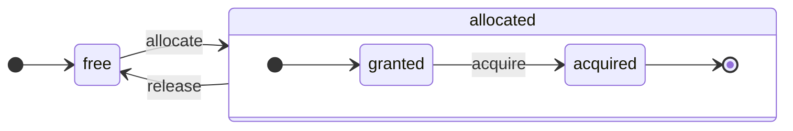

<a id="doc-4871a72cb70872620e906064"></a>

# ClickHouse/ClickHouse / docs/ja/resources/changelogs/oss/2023.mdx

Upstream: https://github.com/ClickHouse/ClickHouse/blob/28dc98b1fc057c08396c95e495b9327754a10b04/docs/ja/resources/changelogs/oss/2023.mdx

Commit: `28dc98b1fc057c08396c95e495b9327754a10b04`

Retrieved: 2026-10-01T15:20:10.316397+00:00

Kind: official-document

Raw SHA256: `20b42d380017f7514b01adedd569ba4c2ea9e981d14d5702445f99fd6386fc2a`

Source text below is untrusted reference content. Acquisition does not verify technical claims.

License status: UPSTREAM_NOTICES_CAPTURED_PER_FILE_REVIEW_REQUIRED. See this repository's captured license files.

---

---
slug: /whats-new/changelog/2023
sidebarTitle: '2023'
title: '2023年の変更履歴'
description: '2023年の変更履歴'
keywords: ['ClickHouse 2023', '2023年 変更履歴', 'リリースノート', 'バージョン履歴', 'パフォーマンス改善']
doc_type: 'changelog'
---

<div id="table-of-contents">
  ### 目次
</div>

**[ClickHouse リリース v23.12、2023-12-28](#2312)**<br />
**[ClickHouse リリース v23.11、2023-12-06](#2311)**<br />
**[ClickHouse リリース v23.10、2023-11-02](#2310)**<br />
**[ClickHouse リリース v23.9、2023-09-28](#239)**<br />
**[ClickHouse リリース v23.8 LTS、2023-08-31](#238)**<br />
**[ClickHouse リリース v23.7、2023-07-27](#237)**<br />
**[ClickHouse リリース v23.6、2023-06-30](#236)**<br />
**[ClickHouse リリース v23.5、2023-06-08](#235)**<br />
**[ClickHouse リリース v23.4、2023-04-26](#234)**<br />
**[ClickHouse リリース v23.3 LTS、2023-03-30](#233)**<br />
**[ClickHouse リリース v23.2、2023-02-23](#232)**<br />
**[ClickHouse リリース v23.1、2023-01-25](#231)**<br />
**[2022年の変更履歴](/ja/resources/changelogs/oss/2022)**<br />

### <a id="2312" /> ClickHouse リリース 23.12 (2023-12-28)  [プレゼンテーション](https://presentations.clickhouse.com/2023-release-23.12/), [ビデオ](https://www.youtube.com/watch?v=7TLuT6gt0PQ)

<Frame>
  <iframe src="https://www.youtube.com/embed/7TLuT6gt0PQ" frameborder="0" allow="accelerometer; autoplay; clipboard-write; encrypted-media; gyroscope; picture-in-picture" allowfullscreen />
</Frame>

<div id="backward-incompatible-change">
  #### 後方互換性を持たない変更
</div>

* 有効期限 (TTL) 式における非決定論的関数のチェックを修正しました。従来は、一部のケースで非決定論的関数を含む有効期限 (TTL) 式を作成でき、その結果、後に未定義の動作を引き起こす可能性がありました。これにより [#37250](https://github.com/ClickHouse/ClickHouse/issues/37250) を修正します。デフォルトでは、テーブルのどのカラムにも依存しない有効期限 (TTL) 式は許可されなくなりました。これは `SET allow_suspicious_ttl_expressions = 1` または `SET compatibility = '23.11'` によって再度許可できます。[#37286](https://github.com/ClickHouse/ClickHouse/issues/37286) をクローズします。[#51858](https://github.com/ClickHouse/ClickHouse/pull/51858) ([Alexey Milovidov](https://github.com/alexey-milovidov))。
* MergeTree setting `clean_deleted_rows` は非推奨となり、現在は何の効果もありません。`OPTIMIZE` の `CLEANUP` キーワードはデフォルトでは許可されません (`allow_experimental_replacing_merge_with_cleanup` setting で再び有効化できます) 。[#58267](https://github.com/ClickHouse/ClickHouse/pull/58267) ([Alexander Tokmakov](https://github.com/tavplubix))。これにより [#57930](https://github.com/ClickHouse/ClickHouse/issues/57930) を修正します。これにより [#54988](https://github.com/ClickHouse/ClickHouse/issues/54988) をクローズします。これにより [#54570](https://github.com/ClickHouse/ClickHouse/issues/54570) をクローズします。これにより [#50346](https://github.com/ClickHouse/ClickHouse/issues/50346) をクローズします。これにより [#47579](https://github.com/ClickHouse/ClickHouse/issues/47579) をクローズします。この機能は適切ではないため、削除する必要があります。他に選択肢がないため、できるだけ早く削除しなければなりません。[#57932](https://github.com/ClickHouse/ClickHouse/pull/57932) ([Alexey Milovidov](https://github.com/alexey-milovidov))。

<div id="new-feature">
  #### 新機能
</div>

* [#33919](https://github.com/ClickHouse/ClickHouse/issues/33919) で要望されていたリフレッシュ可能なマテリアライズドビューを実装しました。[#56946](https://github.com/ClickHouse/ClickHouse/pull/56946) ([Michael Kolupaev](https://github.com/al13n321)、[Michael Guzov](https://github.com/koloshmet)) 。
* `PASTE JOIN` を導入しました。これにより、ユーザーは `ON` 句を使わずに、行番号だけでテーブルを結合できます。例: `SELECT * FROM (SELECT number AS a FROM numbers(2)) AS t1 PASTE JOIN (SELECT number AS a FROM numbers(2) ORDER BY a DESC) AS t2`. [#57995](https://github.com/ClickHouse/ClickHouse/pull/57995) ([Yarik Briukhovetskyi](https://github.com/yariks5s)).
* `ORDER BY` 句で `ALL` を指定できるようになりました。これは、ClickHouse が `SELECT` 句のすべてのカラムを基準にソートすることを意味します。例: `SELECT col1, col2 FROM tab WHERE [...] ORDER BY ALL`. [#57875](https://github.com/ClickHouse/ClickHouse/pull/57875) ([zhongyuankai](https://github.com/zhongyuankai)).
* 新しい mutation コマンド `ALTER TABLE <table> APPLY DELETED MASK` が追加されました。これにより、論理削除で書き込まれたマスクの適用を強制し、削除済みとしてマークされた行をディスクから削除できるようになります。[#57433](https://github.com/ClickHouse/ClickHouse/pull/57433) ([Anton Popov](https://github.com/CurtizJ)).
* ハンドラー `/binary` を使うと、ClickHouse バイナリ内のシンボルを視覚的に確認できるビューアが開きます。[#58211](https://github.com/ClickHouse/ClickHouse/pull/58211) ([Alexey Milovidov](https://github.com/alexey-milovidov)) 。
* Sqids (https://sqids.org/) を生成する新しいSQL関数 `sqid` を追加しました。例: `SELECT sqid(125, 126)`。[#57512](https://github.com/ClickHouse/ClickHouse/pull/57512) ([Robert Schulze](https://github.com/rschu1ze)) 。
* FFT を使用して時系列の周期を検出する新しい関数 `seriesPeriodDetectFFT` を追加しました。[#57574](https://github.com/ClickHouse/ClickHouse/pull/57574) ([Bhavna Jindal](https://github.com/bhavnajindal)) 。
* Keeper がトラフィックを受け付ける準備ができているかどうかを確認するための HTTP endpoint を追加しました。[#55876](https://github.com/ClickHouse/ClickHouse/pull/55876) ([Konstantin Bogdanov](https://github.com/thevar1able)) 。
* スキーマ推論に &#39;ユニオン&#39; モードを追加しました。このモードでは、生成されるテーブルのスキーマはすべてのファイルのスキーマのユニオンになります (つまり、各ファイルごとにスキーマが推論されます) 。スキーマ推論モードは、2 つの設定可能な値 `default` と `union` を持つ設定 `schema_inference_mode` で制御されます。[#55428](https://github.com/ClickHouse/ClickHouse/issues/55428) をクローズしました。[#55892](https://github.com/ClickHouse/ClickHouse/pull/55892) ([Kruglov Pavel](https://github.com/Avogar)).
* CSVフォーマットで文字列から数値を推論できるようにする新しい設定 `input_format_csv_try_infer_numbers_from_strings` を追加しました。[#56455](https://github.com/ClickHouse/ClickHouse/issues/56455) をクローズしました。[#56859](https://github.com/ClickHouse/ClickHouse/pull/56859) ([Kruglov Pavel](https://github.com/Avogar)).
* データベースまたはテーブルの数が設定可能なしきい値を超えた場合、ユーザーに警告を表示します。 [#57375](https://github.com/ClickHouse/ClickHouse/pull/57375) ([凌涛](https://github.com/lingtaolf)).
* `HASHED_ARRAY` (および `COMPLEX_KEY_HASHED_ARRAY`) レイアウトの Dictionary で、`HASHED` と同様に `SHARDS` がサポートされるようになりました。[#57544](https://github.com/ClickHouse/ClickHouse/pull/57544) ([vdimir](https://github.com/vdimir)) 。
* 主キーの合計バイト数およびメモリ内で割り当てられた主キーの合計バイト数に対する非同期メトリクスを追加しました。 [#57551](https://github.com/ClickHouse/ClickHouse/pull/57551) ([Bharat Nallan](https://github.com/bharatnc)).
* `SHA512_256` 関数を追加。[#57645](https://github.com/ClickHouse/ClickHouse/pull/57645) ([Bharat Nallan](https://github.com/bharatnc)).
* `FORMAT_BYTES` を `formatReadableSize` のエイリアスとして追加しました。[#57592](https://github.com/ClickHouse/ClickHouse/pull/57592) ([Bharat Nallan](https://github.com/bharatnc)) 。
* オプションのセッショントークンを`s3`テーブル関数に渡せるようになりました。[#57850](https://github.com/ClickHouse/ClickHouse/pull/57850) ([Shani Elharrar](https://github.com/shanielh)) 。
* 新しい設定 `http_make_head_request` を導入しました。これをオフにすると、URLテーブルエンジンはファイルサイズを判定するための HEAD リクエストを実行しません。これは、非効率な HTTP サーバー、設定が不適切な HTTP サーバー、または HEAD リクエストに対応していない HTTP サーバーをサポートするために必要です。[#54602](https://github.com/ClickHouse/ClickHouse/pull/54602) ([Fionera](https://github.com/fionera)).
* ALIAS カラムを、索引 (プライマリキー以外) の定義内で参照できるようになりました (issue [#55650](https://github.com/ClickHouse/ClickHouse/issues/55650)) 。 例: `CREATE TABLE tab(col UInt32, col_alias ALIAS col + 1, INDEX idx (col_alias) TYPE minmax) ENGINE = MergeTree ORDER BY col;`. [#57546](https://github.com/ClickHouse/ClickHouse/pull/57546) ([Robert Schulze](https://github.com/rschu1ze)).
* S3 ディスクを読み取り専用として指定できる新しい設定 `readonly` が追加されました。これは、基盤となる S3 バケットへのアクセスが読み取り専用の場合でも、`s3_plain` 型のディスク上にテーブルを作成するのに役立ちます。[#57977](https://github.com/ClickHouse/ClickHouse/pull/57977) ([Pengyuan Bian](https://github.com/bianpengyuan)).
* MergeTree テーブルの主キー解析が、仮想カラム `_part_offset` (必要に応じて `_part` も) を含む述語にも適用されるようになりました。この機能は、特殊なセカンダリ索引の一種として利用できます。[#58224](https://github.com/ClickHouse/ClickHouse/pull/58224) ([Amos Bird](https://github.com/amosbird)).

<div id="performance-improvement">
  #### パフォーマンスの改善
</div>

* FINAL 処理中に、MergeTree テーブルから交差しないパーツ範囲を抽出します。これにより、これらの交差しないパーツ範囲に対して追加の FINAL ロジックを適用せずに済みます。同じ主キーを持つ重複値の数が少ない場合、パフォーマンスは FINAL を使わない場合とほぼ同等になります。`do_not_merge_across_partitions_select_final` 設定が有効な場合の MergeTree FINAL の読み取りパフォーマンスを向上しました。[#58120](https://github.com/ClickHouse/ClickHouse/pull/58120) ([Maksim Kita](https://github.com/kitaisreal)).
* S3 ディスク間のコピーで、バッファ経由ではなく S3 のサーバー側コピーを使用するようにしました。これにより、`BACKUP/RESTORE` 操作と `clickhouse-disks copy` コマンドが改善されます。[#56744](https://github.com/ClickHouse/ClickHouse/pull/56744) ([MikhailBurdukov](https://github.com/MikhailBurdukov)) 。
* Hash JOIN は設定 `max_joined_block_size_rows` に従い、`ALL JOIN` で大きなブロックを生成しないようになりました。 [#56996](https://github.com/ClickHouse/ClickHouse/pull/56996) ([vdimir](https://github.com/vdimir)).
* 集約用のメモリをより早い段階で解放するようにしました。これにより、不要な外部集約を回避できる場合があります。[#57691](https://github.com/ClickHouse/ClickHouse/pull/57691) ([Nikolai Kochetov](https://github.com/KochetovNicolai)).
* 文字列のシリアライゼーション性能を改善。 [#57717](https://github.com/ClickHouse/ClickHouse/pull/57717) ([Maksim Kita](https://github.com/kitaisreal)).
* `Merge` エンジンのテーブルで、単純な count 最適化をサポートしました。[#57867](https://github.com/ClickHouse/ClickHouse/pull/57867) ([skyoct](https://github.com/skyoct)).
* 一部のケースで集約を最適化しました。[#57872](https://github.com/ClickHouse/ClickHouse/pull/57872) ([Anton Popov](https://github.com/CurtizJ)) 。
* `hasAny` 関数で、全文検索用の skipping indices を活用できるようになりました。[#57878](https://github.com/ClickHouse/ClickHouse/pull/57878) ([Jpnock](https://github.com/Jpnock)) 。
* 関数 `if(cond, then, else)` (およびその別名 `cond ? then : else`) は、分岐なし評価を行うよう最適化されました。[#57885](https://github.com/ClickHouse/ClickHouse/pull/57885) ([zhanglistar](https://github.com/zhanglistar)) 。
* MergeTree は、パーティションキー式に主キー式のカラムしか含まれていない場合、`do_not_merge_across_partitions_select_final` 設定を自動的に導出します。 [#58218](https://github.com/ClickHouse/ClickHouse/pull/58218) ([Maksim Kita](https://github.com/kitaisreal)).
* ネイティブ型での `MIN` と `MAX` を高速化しました。[#58231](https://github.com/ClickHouse/ClickHouse/pull/58231) ([Raúl Marín](https://github.com/Algunenano)).
* ファイルシステムキャッシュに `SLRU` キャッシュポリシーを実装。[#57076](https://github.com/ClickHouse/ClickHouse/pull/57076) ([Kseniia Sumarokova](https://github.com/kssenii)) 。
* バックグラウンドフェッチにおけるエンドポイントごとの接続数の上限が、`15` から設定 `background_fetches_pool_size` の値に引き上げられました。- MergeTree レベルの設定 `replicated_max_parallel_fetches_for_host` は廃止されました - MergeTree レベルの設定 `replicated_fetches_http_connection_timeout`、`replicated_fetches_http_send_timeout`、`replicated_fetches_http_receive_timeout` はサーバーレベルに移されました。- 設定 `keep_alive_timeout` がサーバーレベル設定の一覧に追加されました。[#57523](https://github.com/ClickHouse/ClickHouse/pull/57523) ([Nikita Mikhaylov](https://github.com/nikitamikhaylov)) 。
* `system.filesystem_cache` へのクエリがメモリを大量消費しないようにしました。[#57687](https://github.com/ClickHouse/ClickHouse/pull/57687) ([Kseniia Sumarokova](https://github.com/kssenii)).
* 文字列のデシリアライゼーションにおけるメモリ使用量を削減。 [#57787](https://github.com/ClickHouse/ClickHouse/pull/57787) ([Maksim Kita](https://github.com/kitaisreal)).
* Enum の値が非常に多い場合に有効な、より効率的なコンストラクタです。 [#57887](https://github.com/ClickHouse/ClickHouse/pull/57887) ([Duc Canh Le](https://github.com/canhld94)) 。
* ファイルシステムキャッシュからの読み取りを改善: 常に `pread` メソッドを使用するようにしました。 [#57970](https://github.com/ClickHouse/ClickHouse/pull/57970) ([Nikita Taranov](https://github.com/nickitat)).
* 論理式オプティマイザでの AND notEquals 連鎖に対する最適化を追加しました。この最適化は、実験的なアナライザが有効な場合にのみ利用できます。 [#58214](https://github.com/ClickHouse/ClickHouse/pull/58214) ([Kevin Mingtarja](https://github.com/kevinmingtarja)).

<div id="improvement">
  #### 改善
</div>

* Keeper でソフトメモリ制限をサポート。メモリ使用量が最大値に近づくと、リクエストを拒否します。 [#57271](https://github.com/ClickHouse/ClickHouse/pull/57271) ([Han Fei](https://github.com/hanfei1991)). [#57699](https://github.com/ClickHouse/ClickHouse/pull/57699) ([Han Fei](https://github.com/hanfei1991)).
* 分散テーブルへの挿入処理で、更新されたクラスター構成が適切に反映されるようになりました。クラスター ノードの一覧が動的に更新されると、分散テーブルの Directory Monitor がその変更を反映します。[#42826](https://github.com/ClickHouse/ClickHouse/pull/42826) ([zhongyuankai](https://github.com/zhongyuankai)).
* マージパラメータに不整合があるレプリケートテーブルは作成できないようにしました。 [#56833](https://github.com/ClickHouse/ClickHouse/pull/56833) ([Duc Canh Le](https://github.com/canhld94)).
* `system.tables` に非圧縮サイズを表示するようにしました。[#56618](https://github.com/ClickHouse/ClickHouse/issues/56618)。[#57186](https://github.com/ClickHouse/ClickHouse/pull/57186) ([Chen Lixiang](https://github.com/chenlx0)) 。
* `Distributed` テーブル向けの設定として、対応するクエリレベルの設定と同様の `skip_unavailable_shards` を追加しました。[#43666](https://github.com/ClickHouse/ClickHouse/issues/43666) をクローズしました。[#57218](https://github.com/ClickHouse/ClickHouse/pull/57218) ([Gagan Goel](https://github.com/tntnatbry)).
* 関数 `substring` (別名: `substr`, `mid`) が `Enum` 型でも使用できるようになりました。以前は、関数の最初の引数には `String` または `FixedString` 型の値を指定する必要がありました。これにより、MySQL インターフェイス経由で Tableau などのサードパーティ製ツールとの互換性が向上します。[#57277](https://github.com/ClickHouse/ClickHouse/pull/57277) ([Serge Klochkov](https://github.com/slvrtrn)) 。
* 関数 `format` が、任意の型の引数をサポートするようになりました (従来は `String` と `FixedString` の引数のみ対応) 。これにより、`SELECT format('The {0} to all questions is {1}', 'answer', 42)` のような式を計算できます。[#57549](https://github.com/ClickHouse/ClickHouse/pull/57549) ([Robert Schulze](https://github.com/rschu1ze)) 。
* `date_trunc` 関数で、第1引数の大文字・小文字を区別せずに指定できるようになりました。`SELECT date_trunc('day', now())` と `SELECT date_trunc('DAY', now())` の両方がサポートされます。[#57624](https://github.com/ClickHouse/ClickHouse/pull/57624) ([Yarik Briukhovetskyi](https://github.com/yariks5s)) 。
* 存在しないテーブルに対するヒントを改善しました。[#57342](https://github.com/ClickHouse/ClickHouse/pull/57342) ([Bharat Nallan](https://github.com/bharatnc)) 。
* クエリ実行時に `max_partition_size_to_drop` および `max_table_size_to_drop` のサーバー設定を上書きできるようになりました。 [#57452](https://github.com/ClickHouse/ClickHouse/pull/57452) ([Jordi Villar](https://github.com/jrdi)) 。
* JSON フォーマットにおける名前のないタプルの推論が若干改善されました。[#57751](https://github.com/ClickHouse/ClickHouse/pull/57751) ([Kruglov Pavel](https://github.com/Avogar)) 。
* Keeper への接続時に `read-only` フラグをサポートするようにしました ([#53749](https://github.com/ClickHouse/ClickHouse/issues/53749) を修正) 。[#57479](https://github.com/ClickHouse/ClickHouse/pull/57479) ([Mikhail Koviazin](https://github.com/mkmkme)).
* &quot;No such file or directory&quot; により、分散送信がスタックする可能性がある問題を修正しました (ディスクから Batch を復旧する際) 。`system.distribution_queue` の `error_count` で発生する可能性がある問題を修正しました (`distributed_directory_monitor_max_sleep_time_ms` &gt; 5min の場合) 。非同期 INSERT の失敗を追跡するための profile event `DistributedAsyncInsertionFailures` を導入しました。[#57480](https://github.com/ClickHouse/ClickHouse/pull/57480) ([Azat Khuzhin](https://github.com/azat)).
* `MaterializedPostgreSQL` で、PostgreSQL の生成カラムとカラムのデフォルト値をサポートしました (Experimental Feature) 。[#40449](https://github.com/ClickHouse/ClickHouse/issues/40449) をクローズしました。[#57568](https://github.com/ClickHouse/ClickHouse/pull/57568) ([Kseniia Sumarokova](https://github.com/kssenii)) 。
* サーバーを再起動することなく、ファイルシステムキャッシュの設定変更の一部を適用できるようになりました。[#57578](https://github.com/ClickHouse/ClickHouse/pull/57578) ([Kseniia Sumarokova](https://github.com/kssenii)).
* 空の配列を含む PostgreSQL テーブルの構造を適切に処理。 [#57618](https://github.com/ClickHouse/ClickHouse/pull/57618) ([Mike Kot](https://github.com/myrrc)).
* 最後のサーバー再起動以降に発生したエラーの総数を、`ClickHouseErrorMetric_ALL` メトリクスとして公開しました。[#57627](https://github.com/ClickHouse/ClickHouse/pull/57627) ([Nikita Mikhaylov](https://github.com/nikitamikhaylov)) 。
* `from_env`/`from_zk` 参照を持つ設定ファイル内のノードと、replace=1 が指定された空でない要素を許可しました。 [#57628](https://github.com/ClickHouse/ClickHouse/pull/57628) ([Azat Khuzhin](https://github.com/azat)).
* ファジング用に多数の不正な JSON を生成できるテーブル関数 `fuzzJSON`。[#57646](https://github.com/ClickHouse/ClickHouse/pull/57646)  ([Julia Kartseva](https://github.com/jkartseva)) 。
* IPv6 から UInt128 への変換とバイナリ演算を許可しました。[#57707](https://github.com/ClickHouse/ClickHouse/pull/57707)  ([Yakov Olkhovskiy](https://github.com/yakov-olkhovskiy)) 。
* `async inserts deduplication cache` の設定を追加し、cache の更新を待機する時間を指定できるようにしました。設定 `async_block_ids_cache_min_update_interval_ms` は非推奨になりました。現在、cache は競合が発生した場合にのみ更新されます。[#57743](https://github.com/ClickHouse/ClickHouse/pull/57743) ([alesapin](https://github.com/alesapin)).
* `sleep()` 関数を `KILL QUERY` でキャンセルできるようになりました。[#57746](https://github.com/ClickHouse/ClickHouse/pull/57746) ([Vitaly Baranov](https://github.com/vitlibar)) 。
* サポートされていないため、実験的な `Replicated` データベースでは、`Replicated` テーブルエンジンに対する `CREATE TABLE ... AS SELECT` クエリを禁止しました。参照: [#35408](https://github.com/ClickHouse/ClickHouse/issues/35408)。[#57796](https://github.com/ClickHouse/ClickHouse/pull/57796) ([Nikolay Degterinsky](https://github.com/evillique)) 。
* 外部データベース向けのクエリ変換を修正・改善し、互換性のあるすべての述語を再帰的に取得できるようにしました。 [#57888](https://github.com/ClickHouse/ClickHouse/pull/57888) ([flynn](https://github.com/ucasfl)).
* ファイルシステムキャッシュのサイズを動的に再読み込みできるようにしました。[#57866](https://github.com/ClickHouse/ClickHouse/issues/57866) をクローズしました。[#57897](https://github.com/ClickHouse/ClickHouse/pull/57897) ([Kseniia Sumarokova](https://github.com/kssenii)) 。
* SIGRTMIN がブロックされているスレッドでも `system.stack_trace` を正しくサポートするようになりました (このようなスレッドは、Apache rdkafka のような品質の低い外部ライブラリに存在することがあります) 。[#57907](https://github.com/ClickHouse/ClickHouse/pull/57907) ([Azat Khuzhin](https://github.com/azat))。また、意味がない場合に `storage_system_stack_trace_pipe_read_timeout_ms` を待たずに済むよう、シグナルがブロックされていない場合にのみスレッドへシグナルを送るようになりました。[#58136](https://github.com/ClickHouse/ClickHouse/pull/58136) ([Azat Khuzhin](https://github.com/azat))。
* クォーラム insert のチェック時に Keeper の障害を許容する。[#57986](https://github.com/ClickHouse/ClickHouse/pull/57986) ([Raúl Marín](https://github.com/Algunenano)) 。
* system.asynchronous&#95;metrics に最大/ピーク RSS (`MemoryResidentMax`) を追加しました。 [#58095](https://github.com/ClickHouse/ClickHouse/pull/58095) ([Azat Khuzhin](https://github.com/azat)).
* このPRにより、デフォルト以外のリージョンであっても、リージョンを明記せずに s3 スタイルのリンク (`https://` および `s3://`) を使用できるようになりました。また、ユーザーが誤ったリージョンを指定した場合は、正しいリージョンを判別します。[#58148](https://github.com/ClickHouse/ClickHouse/pull/58148) ([Yarik Briukhovetskyi](https://github.com/yariks5s)) 。
* `clickhouse-format --obfuscate` は、Settings、MergeTreeSettings、およびタイムゾーンを認識し、それらの名前をそのまま保持するようになりました。 [#58179](https://github.com/ClickHouse/ClickHouse/pull/58179) ([Alexey Milovidov](https://github.com/alexey-milovidov)).
* `ZipArchiveWriter` に明示的な `finalize()` 関数を追加しました。`ZipArchiveWriter` の複雑になりすぎていたコードを簡略化しました。これにより [#58074](https://github.com/ClickHouse/ClickHouse/issues/58074) が修正されました。[#58202](https://github.com/ClickHouse/ClickHouse/pull/58202) ([Vitaly Baranov](https://github.com/vitlibar)).
* 同じパスを持つ cache は、同じ cache オブジェクトを使用するようになりました。この動作は以前から存在していましたが、23.4 で壊れていました。同じパスを持つそのような cache どうしで cache 設定の組み合わせが異なる場合は、許可されていないとして例外がスローされます。[#58264](https://github.com/ClickHouse/ClickHouse/pull/58264) ([Kseniia Sumarokova](https://github.com/kssenii)).
* 並列レプリカ (実験的機能) : わかりやすい設定 [#57542](https://github.com/ClickHouse/ClickHouse/pull/57542) ([Igor Nikonov](https://github.com/devcrafter)).
* 並列レプリカ (実験的機能) : announcement応答処理の改善 [#57749](https://github.com/ClickHouse/ClickHouse/pull/57749) ([Igor Nikonov](https://github.com/devcrafter)).
* 並列レプリカ (実験的機能) : `ParallelReplicasReadingCoordinator` が `min_number_of_marks` をより適切に考慮するようにしました [#57763](https://github.com/ClickHouse/ClickHouse/pull/57763) ([Nikita Taranov](https://github.com/nickitat)).
* 並列レプリカ (実験的機能) : IN (サブクエリ) 使用時に並列レプリカを無効化 [#58133](https://github.com/ClickHouse/ClickHouse/pull/58133) ([Igor Nikonov](https://github.com/devcrafter)).
* 並列レプリカ (実験的機能) : プロファイルイベント &#39;ParallelReplicasUsedCount&#39; を追加 [#58173](https://github.com/ClickHouse/ClickHouse/pull/58173) ([Igor Nikonov](https://github.com/devcrafter)).
* HEAD などの POST 以外のリクエストは、GET と同様に読み取り専用となります。[#58060](https://github.com/ClickHouse/ClickHouse/pull/58060) ([San](https://github.com/santrancisco)).
* `system.part_log` に `bytes_uncompressed` カラムを追加しました [#58167](https://github.com/ClickHouse/ClickHouse/pull/58167) ([Jordi Villar](https://github.com/jrdi)).
* `system.backups` および `system.backup_log` テーブルにbase backup名を追加 [#58178](https://github.com/ClickHouse/ClickHouse/pull/58178) ([Pradeep Chhetri](https://github.com/chhetripradeep)).
* clickhouse-local で、コマンドラインからクエリパラメータを指定できるようにするサポートが追加されました [#58210](https://github.com/ClickHouse/ClickHouse/pull/58210) ([Pradeep Chhetri](https://github.com/chhetripradeep)).

<div id="buildtestingpackaging-improvement">
  #### ビルド/テスト/パッケージングの改善
</div>

* より多くの設定をランダム化しました。 [#39663](https://github.com/ClickHouse/ClickHouse/pull/39663) ([Anton Popov](https://github.com/CurtizJ)).
* CI で無効化された最適化をランダム化しました。 [#57315](https://github.com/ClickHouse/ClickHouse/pull/57315) ([Raúl Marín](https://github.com/Algunenano)).
* macOS で Azure 関連のテーブルエンジン/関数を使用できるようにしました。 [#51866](https://github.com/ClickHouse/ClickHouse/pull/51866) ([Alexey Milovidov](https://github.com/alexey-milovidov)).
* ClickHouse Fast Test で、GLibc ではなく Musl を使用するようになりました。 [#57711](https://github.com/ClickHouse/ClickHouse/pull/57711) ([Alexey Milovidov](https://github.com/alexey-milovidov)). 完全静的な Musl ビルドは CI からダウンロードできます。
* すべてのコミットで ClickBench を実行するようにしました。これにより [#57708](https://github.com/ClickHouse/ClickHouse/issues/57708) はクローズされます。 [#57712](https://github.com/ClickHouse/ClickHouse/pull/57712) ([Alexey Milovidov](https://github.com/alexey-milovidov)).
* 外部ライブラリで使われていた有害な C/POSIX `select` 関数の使用を削除しました。 [#57467](https://github.com/ClickHouse/ClickHouse/pull/57467) ([Igor Nikonov](https://github.com/devcrafter)).
* 利便性向上のため、ClickHouse Cloud でのみ利用可能だった設定も、オープンソース版の ClickHouse ビルドに含まれるようになります。 [#57638](https://github.com/ClickHouse/ClickHouse/pull/57638) ([Nikita Mikhaylov](https://github.com/nikitamikhaylov)).

<div id="bug-fix-user-visible-misbehavior-in-an-official-stable-release">
  #### バグ修正 (正式な安定版リリースにおけるユーザーに影響する不具合)
</div>

* TTL GROUP BY においてソート順が崩れる可能性があった問題を修正しました [#49103](https://github.com/ClickHouse/ClickHouse/pull/49103) ([Nikita Mikhaylov](https://github.com/nikitamikhaylov)).
* 修正: `lttb` の分割バケット戦略で、最初と最後のバケットには1つのポイントだけが含まれるように修正しました [#57003](https://github.com/ClickHouse/ClickHouse/pull/57003) ([FFish](https://github.com/wxybear)).
* エラー発生後の同期時に `Template` フォーマットで発生する可能性があるデッドロックを修正 [#57004](https://github.com/ClickHouse/ClickHouse/pull/57004) ([Kruglov Pavel](https://github.com/Avogar)).
* 多数のエラーをスキップしながらファイルをパースする際に、途中で早期終了してしまう問題を修正しました [#57006](https://github.com/ClickHouse/ClickHouse/pull/57006) ([Kruglov Pavel](https://github.com/Avogar)).
* `dictionary` table function を介した Dictionary の ACL 回避を防止 [#57362](https://github.com/ClickHouse/ClickHouse/pull/57362) ([Salvatore Mesoraca](https://github.com/aiven-sal)).
* Fuzzer が見つけた「non-ready set」エラーの別のケースを修正しました。 [#57423](https://github.com/ClickHouse/ClickHouse/pull/57423) ([Nikolai Kochetov](https://github.com/KochetovNicolai)).
* PostgreSQL の `array_ndims` の使用に関するいくつかの問題を修正しました。 [#57436](https://github.com/ClickHouse/ClickHouse/pull/57436) ([Ryan Jacobs](https://github.com/ryanmjacobs)).
* 書き込みロックのタイムアウト後に発生するRWLockの不整合を修正 [#57454](https://github.com/ClickHouse/ClickHouse/pull/57454) ([Vitaly Baranov](https://github.com/vitlibar)). 書き込みロックのタイムアウト後に発生するRWLockの不整合を修正 (再度)  [#57733](https://github.com/ClickHouse/ClickHouse/pull/57733) ([Vitaly Baranov](https://github.com/vitlibar)).
* 修正: pushing to view chain の構築時に、一時的なカラムを除外しないようにしました [#57461](https://github.com/ClickHouse/ClickHouse/pull/57461) ([Yakov Olkhovskiy](https://github.com/yakov-olkhovskiy)).
* MaterializedPostgreSQL (実験的機能に関する問題) : [#41922](https://github.com/ClickHouse/ClickHouse/issues/41922) を修正し、[#41923](https://github.com/ClickHouse/ClickHouse/issues/41923) のテストを追加 [#57515](https://github.com/ClickHouse/ClickHouse/pull/57515) ([Kseniia Sumarokova](https://github.com/kssenii)) 。
* レプリケートされたアクセスエンティティの管理用GRANT/REVOKEクエリでは、ON CLUSTER句を無視するようにしました。  [#57538](https://github.com/ClickHouse/ClickHouse/pull/57538) ([MikhailBurdukov](https://github.com/MikhailBurdukov)).
* clickhouse-local のクラッシュを修正 [#57553](https://github.com/ClickHouse/ClickHouse/pull/57553) ([Nikolay Degterinsky](https://github.com/evillique)).
* Hash JOIN の不具合を修正しました。 [#57564](https://github.com/ClickHouse/ClickHouse/pull/57564) ([vdimir](https://github.com/vdimir)).
* PostgreSQL ソースで発生する可能性があるエラーを修正 [#57567](https://github.com/ClickHouse/ClickHouse/pull/57567) ([Kseniia Sumarokova](https://github.com/kssenii)).
* ネストされた LowCardinality に対する Hash JOIN の型補正処理を修正しました。[#57614](https://github.com/ClickHouse/ClickHouse/pull/57614) ([vdimir](https://github.com/vdimir)).
* `system.stack_trace` からの並列読み取りを適切に禁止し、ハングを防止しました。[#57641](https://github.com/ClickHouse/ClickHouse/pull/57641) ([Azat Khuzhin](https://github.com/azat)).
* `any(...) RESPECT NULL` を使用したスパースカラムの集約におけるエラーを修正しました [#57710](https://github.com/ClickHouse/ClickHouse/pull/57710) ([Azat Khuzhin](https://github.com/azat)).
* 単項演算子のパース処理を修正 [#57713](https://github.com/ClickHouse/ClickHouse/pull/57713) ([Nikolay Degterinsky](https://github.com/evillique)).
* 実験的なテーブルエンジン `MaterializedPostgreSQL` の依存関係の読み込みに関する不具合を修正しました。[#57754](https://github.com/ClickHouse/ClickHouse/pull/57754) ([Kseniia Sumarokova](https://github.com/kssenii)).
* BACKUP/RESTORE ON CLUSTER における切断されたノードの再試行処理を修正 [#57764](https://github.com/ClickHouse/ClickHouse/pull/57764) ([Vitaly Baranov](https://github.com/vitlibar)).
* 部分的にマテリアライズされたプロジェクションで、外部集約の結果が正しくならない問題を修正 [#57790](https://github.com/ClickHouse/ClickHouse/pull/57790) ([Anton Popov](https://github.com/CurtizJ)).
* `*Map` combinator を使用した集約関数のマージを修正 [#57795](https://github.com/ClickHouse/ClickHouse/pull/57795) ([Anton Popov](https://github.com/CurtizJ)).
* バグがあるため、`system.kafka_consumers` を無効にしました。[#57822](https://github.com/ClickHouse/ClickHouse/pull/57822) ([Azat Khuzhin](https://github.com/azat)) 。
* Merge JOIN における LowCardinality キーのサポートを修正しました。[#57827](https://github.com/ClickHouse/ClickHouse/pull/57827) ([vdimir](https://github.com/vdimir)).
* サンプルブロックに関連する `InterpreterCreateQuery` の不具合を修正。[#57855](https://github.com/ClickHouse/ClickHouse/pull/57855) ([Maksim Kita](https://github.com/kitaisreal)) 。
* PostgreSQL の named collections で `addresses_expr` が無視されていた問題を修正しました。[#57874](https://github.com/ClickHouse/ClickHouse/pull/57874) ([joelynch](https://github.com/joelynch)).
* BLAKE3 (Rust) での不正なメモリアクセスを修正しました [#57876](https://github.com/ClickHouse/ClickHouse/pull/57876)  ([Raúl Marín](https://github.com/Algunenano)) 。その後、[メモリ安全性](https://www.memorysafety.org/)をさらに高めるため、Rust から C++ へ書き直しました。[#57994](https://github.com/ClickHouse/ClickHouse/pull/57994)  ([Raúl Marín](https://github.com/Algunenano)) 。
* `CREATE INDEX` 内の関数名の正規化 [#57906](https://github.com/ClickHouse/ClickHouse/pull/57906) ([Alexander Tokmakov](https://github.com/tavplubix)).
* 最初のリクエストが発生する前に利用できないレプリカの処理を修正 [#57933](https://github.com/ClickHouse/ClickHouse/pull/57933) ([Nikita Taranov](https://github.com/nickitat)).
* リテラルのエイリアスに関する誤分類を修正 [#57988](https://github.com/ClickHouse/ClickHouse/pull/57988) ([Chen768959](https://github.com/Chen768959)).
* Keeper の無効な前処理を修正 [#58069](https://github.com/ClickHouse/ClickHouse/pull/58069) ([Antonio Andelic](https://github.com/antonio2368)).
* `Poco` ライブラリの `UTF32Encoding` に関連する整数オーバーフローを修正 [#58073](https://github.com/ClickHouse/ClickHouse/pull/58073) ([Andrey Fedotov](https://github.com/anfedotoff)).
* 大きな整数値を持つスカラーサブクエリが存在する場合の並列レプリカ (実験的機能) の不具合を修正 [#58118](https://github.com/ClickHouse/ClickHouse/pull/58118) ([Alexey Milovidov](https://github.com/alexey-milovidov)) 。
* 範囲外の `DateTime` に対する `accurateCastOrNull` の問題を修正 [#58139](https://github.com/ClickHouse/ClickHouse/pull/58139) ([Andrey Zvonov](https://github.com/zvonand)).
* wide パーツのサブカラムを MergeTree で読み取る際に発生する可能性のある `PARAMETER_OUT_OF_BOUND` エラーを修正 [#58175](https://github.com/ClickHouse/ClickHouse/pull/58175) ([Kruglov Pavel](https://github.com/Avogar)).
* 膨大な数のサブクエリを含む CREATE VIEW の低速化を修正 [#58220](https://github.com/ClickHouse/ClickHouse/pull/58220) ([Tao Wang](https://github.com/wangtZJU)).
* JSONCompactEachRow の並列パースの問題を修正 [#58181](https://github.com/ClickHouse/ClickHouse/pull/58181) ([Alexey Milovidov](https://github.com/alexey-milovidov)). [#58250](https://github.com/ClickHouse/ClickHouse/pull/58250) ([Kruglov Pavel](https://github.com/Avogar)).

### <a id="2311" /> ClickHouse リリース 23.11 (2023-12-06) 。 [プレゼンテーション](https://presentations.clickhouse.com/2023-release-23.11/), [ビデオ](https://www.youtube.com/watch?v=1HJdjOH4Eis)

<Frame>
  <iframe src="https://www.youtube.com/embed/1HJdjOH4Eis" frameborder="0" allow="accelerometer; autoplay; clipboard-write; encrypted-media; gyroscope; picture-in-picture" allowfullscreen />
</Frame>

<div id="backward-incompatible-change">
  #### 後方互換性を持たない変更
</div>

* デフォルトの ClickHouse サーバー設定ファイルでは、`default` ユーザーに対して `access_management` (SQL クエリによるユーザー操作) および `named_collection_control` (SQL クエリによる named collection の操作) がデフォルトで有効になりました。これにより [#56482](https://github.com/ClickHouse/ClickHouse/issues/56482) はクローズされます。[#56619](https://github.com/ClickHouse/ClickHouse/pull/56619) ([Alexey Milovidov](https://github.com/alexey-milovidov))。
* ウィンドウ関数における `RESPECT NULLS`/`IGNORE NULLS` を複数改善しました。これらを集約関数として使用し、これらの修飾子付き集約関数の state を保存している場合、互換性が失われる可能性があります。[#57189](https://github.com/ClickHouse/ClickHouse/pull/57189) ([Raúl Marín](https://github.com/Algunenano))。
* 最適化 `optimize_move_functions_out_of_any` を削除しました。[#57190](https://github.com/ClickHouse/ClickHouse/pull/57190) ([Raúl Marín](https://github.com/Algunenano))。
* 関数 `parseDateTime` のフォーマッタ `%l`/`%k`/`%c` で、先頭にゼロのない時刻・月も parse できるようになりました。たとえば、`select parseDateTime('2023-11-26 8:14', '%F %k:%i')` が動作するようになりました。従来の 2 桁必須の動作に戻すには、`parsedatetime_parse_without_leading_zeros = 0` を設定してください。関数 `formatDateTime` でも、先頭にゼロのない時刻・月を出力できるようになりました。これは `formatdatetime_format_without_leading_zeros` で制御されますが、既存のユースケースを壊さないよう、デフォルトでは無効です。[#55872](https://github.com/ClickHouse/ClickHouse/pull/55872) ([Azat Khuzhin](https://github.com/azat))。
* 型 `Decimal` の引数では、集約関数 `avgWeighted` を使用できなくなりました。回避策: 引数を `Float64` に変換してください。これにより [#43928](https://github.com/ClickHouse/ClickHouse/issues/43928) はクローズされます。これにより [#31768](https://github.com/ClickHouse/ClickHouse/issues/31768) はクローズされます。これにより [#56435](https://github.com/ClickHouse/ClickHouse/issues/56435) はクローズされます。`Decimal` 引数でこの関数を materialized view または projections 内で使用していた場合は、support@clickhouse.com に連絡してください。集約関数 `sumMap` の error を修正した結果、速度が約 1.5〜2 倍遅くなりました。とはいえ、この関数はどうせ使いものにならないので問題ありません。これにより [#54955](https://github.com/ClickHouse/ClickHouse/issues/54955) はクローズされます。これにより [#53134](https://github.com/ClickHouse/ClickHouse/issues/53134) はクローズされます。これにより [#55148](https://github.com/ClickHouse/ClickHouse/issues/55148) はクローズされます。関数 `groupArraySample` のバグも修正しました。1 つのクエリ内で複数の集約 state が生成される場合、同じ random seed を使っていました。[#56350](https://github.com/ClickHouse/ClickHouse/pull/56350) ([Alexey Milovidov](https://github.com/alexey-milovidov))。

<div id="new-feature">
  #### 新機能
</div>

* データベースとテーブルを非同期でロードするためのサーバー設定 `async_load_databases` を追加しました。これにより、サーバーの起動時間が短縮されます。`Ordinary`、`Atomic`、`Replicated` エンジンのデータベースに適用されます。これらのテーブルはメタデータを非同期にロードします。テーブルへのクエリはロードジョブの優先度を引き上げ、完了まで待機します。イントロスペクション用の新しいテーブル `system.asynchronous_loader` も追加しました。[#49351](https://github.com/ClickHouse/ClickHouse/pull/49351) ([Sergei Trifonov](https://github.com/serxa)).
* システムテーブル `blob_storage_log` を追加しました。これにより、S3 やその他のオブジェクトストレージに書き込まれたすべてのデータを監査できるようになりました。[#52918](https://github.com/ClickHouse/ClickHouse/pull/52918) ([vdimir](https://github.com/vdimir)) 。
* 統計情報を使って、PREWHERE 条件をより適切な順序で並べ替えられるようになりました。 [#53240](https://github.com/ClickHouse/ClickHouse/pull/53240) ([Han Fei](https://github.com/hanfei1991)) 。
* Keeper プロトコルで圧縮がサポートされました。これは、`zookeeper` セクション内で `use_compression` フラグを使用することで、ClickHouse 側で有効にできます。なお、圧縮をサポートしているのは ClickHouse Keeper のみで、Apache ZooKeeper はサポートしていません。[#49507](https://github.com/ClickHouse/ClickHouse/issues/49507) を解決しました。[#54957](https://github.com/ClickHouse/ClickHouse/pull/54957) ([SmitaRKulkarni](https://github.com/SmitaRKulkarni)).
* 機能 `storage_metadata_write_full_object_key` を導入しました。これを `true` に設定すると、メタデータファイルは新しいフォーマットで書き込まれます。このフォーマットでは、ClickHouse はリモートオブジェクトの完全なキーをメタデータファイルに格納するため、柔軟性が高まり、最適化もしやすくなります。[#55566](https://github.com/ClickHouse/ClickHouse/pull/55566) ([Sema Checherinda](https://github.com/CheSema)).
* named collections のフィールドが上書きされないように保護するための新しい設定と構文を追加しました。これは、悪意のあるユーザーによるシークレットへの不正アクセスを防ぐことを目的としています。[#55782](https://github.com/ClickHouse/ClickHouse/pull/55782) ([Salvatore Mesoraca](https://github.com/aiven-sal)).
* すべてのシステムログテーブルに `hostname` カラムを追加しました。システムテーブルをレプリケート、共有、または分散して使用する場合に役立ちます。[#55894](https://github.com/ClickHouse/ClickHouse/pull/55894) ([Bharat Nallan](https://github.com/bharatnc)) 。
* `CHECK ALL TABLES` クエリが追加されました。 [#56022](https://github.com/ClickHouse/ClickHouse/pull/56022) ([vdimir](https://github.com/vdimir)).
* MySQL の `FROM_DAYS` に似た `fromDaysSinceYearZero` 関数を追加しました。たとえば、`SELECT fromDaysSinceYearZero(739136)` は `2023-09-08` を返します。[#56088](https://github.com/ClickHouse/ClickHouse/pull/56088) ([Joanna Hulboj](https://github.com/jh0x)).
* ClickHouse を使わずにバックアップの内容を確認し、そこから情報を抽出できる外部 Python ツールを追加しました。[#56268](https://github.com/ClickHouse/ClickHouse/pull/56268) ([Vitaly Baranov](https://github.com/vitlibar)).
* `preferred_optimize_projection_name` という新しい設定を追加しました。これが空でない文字列に設定されている場合、すべての候補から選択する代わりに、可能であれば指定したプロジェクションが使用されます。[#56309](https://github.com/ClickHouse/ClickHouse/pull/56309) ([Yarik Briukhovetskyi](https://github.com/yariks5s)).
* リーダー役を譲る／辞任するための4文字コマンドを追加しました (https://github.com/ClickHouse/ClickHouse/issues/56352)。 [#56354](https://github.com/ClickHouse/ClickHouse/pull/56354) ([Pradeep Chhetri](https://github.com/chhetripradeep)). [#56620](https://github.com/ClickHouse/ClickHouse/pull/56620) ([Pradeep Chhetri](https://github.com/chhetripradeep)).
* 新しい SQL 関数 `arrayRandomSample(arr, k)` が追加されました。これは、入力配列から k 個の要素をサンプルとして返します。同様の機能は以前からありましたが、`SELECT arrayReduce('groupArraySample(3)', range(10))` のような、あまり扱いやすくない構文でしか実現できませんでした。 [#56416](https://github.com/ClickHouse/ClickHouse/pull/56416) ([Robert Schulze](https://github.com/rschu1ze)).
* `.npy` ファイルで使用する `Float16` 型データのサポートが追加されました。[#56344](https://github.com/ClickHouse/ClickHouse/issues/56344) をクローズしました。[#56424](https://github.com/ClickHouse/ClickHouse/pull/56424) ([Yarik Briukhovetskyi](https://github.com/yariks5s)) 。
* Tableau Online との互換性向上のため、システムビュー `information_schema.statistics` を追加しました。[#56425](https://github.com/ClickHouse/ClickHouse/pull/56425) ([Serge Klochkov](https://github.com/slvrtrn)).
* バイナリの内部情報の確認に役立つ `system.symbols` テーブルを追加しました。 [#56548](https://github.com/ClickHouse/ClickHouse/pull/56548) ([Alexey Milovidov](https://github.com/alexey-milovidov)).
* 設定可能なダッシュボード。グラフ用のクエリが、デフォルトで新しい `system.dashboards` テーブルを使用するクエリによって読み込まれるようになりました。[#56771](https://github.com/ClickHouse/ClickHouse/pull/56771) ([Sergei Trifonov](https://github.com/serxa)) 。
* `fileCluster` テーブル関数を追加しました。共有filesystem (NFS など) を `user_files` directory にマウントしている場合に便利です。[#56868](https://github.com/ClickHouse/ClickHouse/pull/56868) ([Andrey Zvonov](https://github.com/zvonand)) 。
* `s3/file/hdfs/url/azureBlobStorage` エンジンに、ファイルサイズ (バイト単位) を格納する `_size` 仮想カラムを追加しました。[#57126](https://github.com/ClickHouse/ClickHouse/pull/57126) ([Kruglov Pavel](https://github.com/Avogar)) 。
* 前回の再起動以降にサーバーで発生した各エラーコードごとのエラー数を、Prometheus エンドポイントで公開します。 [#57209](https://github.com/ClickHouse/ClickHouse/pull/57209) ([Nikita Mikhaylov](https://github.com/nikitamikhaylov)).
* ClickHouse Keeper は、稼働中のアベイラビリティゾーンを `/keeper/availability-zone` パスに報告します。これは `<availability_zone><value>us-west-1a</value></availability_zone>` で設定できます。 [#56715](https://github.com/ClickHouse/ClickHouse/pull/56715) ([Jianfei Hu](https://github.com/incfly)) 。
* ALTER materialized&#95;view MODIFY QUERY を experimental 扱いではなくし、`allow_experimental_alter_materialized_view_structure` 設定を非推奨化しました。[#15206](https://github.com/ClickHouse/ClickHouse/issues/15206) を修正しました。[#57311](https://github.com/ClickHouse/ClickHouse/pull/57311) ([alesapin](https://github.com/alesapin)) 。
* 設定 `join_algorithm` が指定した順序どおりに適用されるようになりました [#51745](https://github.com/ClickHouse/ClickHouse/pull/51745) ([vdimir](https://github.com/vdimir)).
* Protobuf フォーマットで [well-known Protobuf types](https://protobuf.dev/reference/protobuf/google.protobuf/) をサポートしました。[#56741](https://github.com/ClickHouse/ClickHouse/pull/56741) ([János Benjamin Antal](https://github.com/antaljanosbenjamin)) 。

<div id="performance-improvement">
  #### パフォーマンスの改善
</div>

* S3とのやり取りにおける適応的なタイムアウト。最初の試行は、短い送信・受信タイムアウトで行われます。 [#56314](https://github.com/ClickHouse/ClickHouse/pull/56314) ([Sema Checherinda](https://github.com/CheSema)).
* `max_concurrent_queries` のデフォルト値を 100 から 1000 に引き上げました。これは、接続中のクライアントが非常に多く、それらによるデータの送受信が低速で、server が CPU による制約を受けていない場合や、CPU コア数が 100 を超える場合に適しています。また、同時実行制御をデフォルトで有効にし、クエリ処理スレッドの望ましい総数を CPU コア数の 2 倍に設定しました。これにより、同時実行クエリ数が非常に多いシナリオでパフォーマンスが向上します。[#46927](https://github.com/ClickHouse/ClickHouse/pull/46927) ([Alexey Milovidov](https://github.com/alexey-milovidov)).
* ウィンドウ関数の並列評価をサポートしました。[#34688](https://github.com/ClickHouse/ClickHouse/issues/34688) を修正しました。[#39631](https://github.com/ClickHouse/ClickHouse/pull/39631) ([Dmitry Novik](https://github.com/novikd)) 。
* `Numbers` table engine (`system.numbers` テーブルの) が、テーブルの索引のように条件を解析し、必要なデータの部分集合を生成できるようになりました。[#50909](https://github.com/ClickHouse/ClickHouse/pull/50909) ([JackyWoo](https://github.com/JackyWoo)) 。
* `Merge` テーブルエンジンにおける `IN (...)` 条件でのフィルタリング性能を改善しました。[#54905](https://github.com/ClickHouse/ClickHouse/pull/54905) ([Nikita Taranov](https://github.com/nickitat)) 。
* ファイルシステムキャッシュが満杯で、大量の読み取りが発生する場合の改善。 [#55158](https://github.com/ClickHouse/ClickHouse/pull/55158) ([Kseniia Sumarokova](https://github.com/kssenii)).
* ファイルを余分に読み返すのを避けるため、S3 のチェックサムを無効にできるようにしました (これは設定 `s3_disable_checksum` で制御されます) 。[#55559](https://github.com/ClickHouse/ClickHouse/pull/55559) ([Azat Khuzhin](https://github.com/azat)).
* 現在は、データが page cache にある場合、リモート table からも同期的に読み取るようになりました (ローカル table と同様です) 。こちらの方が高速で、thread pool 内での同期が不要になり、ローカル FS 上での `seek` もためらわずに行えるため、CPU 待機も削減されます。[#55841](https://github.com/ClickHouse/ClickHouse/pull/55841) ([Nikita Taranov](https://github.com/nickitat)) 。
* `map`、`arrayElement` から値を取得する処理を最適化。約 30% の高速化が見込まれます。- 予約メモリを削減 - `resize` の呼び出しを削減 [#55957](https://github.com/ClickHouse/ClickHouse/pull/55957) ([lgbo](https://github.com/lgbo-ustc)).
* AVX-512 を用いた多段階フィルタリングの最適化。ICX デバイス (Intel Xeon Platinum 8380 CPU、80 コア、160 スレッド) 上での OnTime データセットの性能評価では、この変更により、他には影響を与えることなく、クエリ Q2、Q3、Q4、Q5、Q6 の QPS がそれぞれ 7.4%、5.9%、4.7%、3.0%、4.6% 向上する可能性があることが示されています。[#56079](https://github.com/ClickHouse/ClickHouse/pull/56079) ([Zhiguo Zhou](https://github.com/ZhiguoZh)).
* クエリプロファイラ内でビジー状態のスレッド数を制限します。これを超えるスレッドは、プロファイリングをスキップします。 [#56105](https://github.com/ClickHouse/ClickHouse/pull/56105) ([Alexey Milovidov](https://github.com/alexey-milovidov)).
* ウィンドウ関数における仮想関数呼び出しの数を削減しました。[#56120](https://github.com/ClickHouse/ClickHouse/pull/56120) ([Maksim Kita](https://github.com/kitaisreal)) 。
* スキャンを高速化するため、ORCデータフォーマットでTupleフィールドの再帰的なプルーニングを可能にしました。 [#56122](https://github.com/ClickHouse/ClickHouse/pull/56122) ([李扬](https://github.com/taiyang-li)).
* `Npy`データフォーマット向けの単純な count 最適化: 結果がキャッシュされるようになったため、`select count() from 'data.npy'` のようなクエリは大幅に高速化されます。 [#56304](https://github.com/ClickHouse/ClickHouse/pull/56304) ([Yarik Briukhovetskyi](https://github.com/yariks5s)).
* 集約を伴うクエリで多数のストリームを使用する場合、実行計画の構築時に使用されるメモリ量が少なくなります。 [#57074](https://github.com/ClickHouse/ClickHouse/pull/57074) ([Alexey Milovidov](https://github.com/alexey-milovidov)).
* ProcessList へのアクセスを最適化し、多数のユーザーと高いクエリ同時実行数 (&gt;2000 QPS) を伴うユースケースでのクエリ実行パフォーマンスを改善しました。[#57106](https://github.com/ClickHouse/ClickHouse/pull/57106) ([Andrej Hoos](https://github.com/adikus)) 。
* array join の軽微な改善。中間結果の一部を再利用するようにしました。[#57183](https://github.com/ClickHouse/ClickHouse/pull/57183) ([李扬](https://github.com/taiyang-li)).
* スタックアンワインドが遅いことがありましたが、もう違います。 [#57221](https://github.com/ClickHouse/ClickHouse/pull/57221) ([Alexey Milovidov](https://github.com/alexey-milovidov)).
* `max_streams = 1` の場合、外部ストレージからの読み取りにデフォルトの読み取りプールを使用するようになりました。これは、読み取りプリフェッチが有効な場合に効果的です。 [#57334](https://github.com/ClickHouse/ClickHouse/pull/57334) ([Nikita Taranov](https://github.com/nickitat)).
* Keeper の改善: ログの前処理を遅らせることで、起動時のメモリ使用量を削減しました。 [#55660](https://github.com/ClickHouse/ClickHouse/pull/55660) ([Antonio Andelic](https://github.com/antonio2368)).
* `File` および `HDFS` ストレージにおける glob マッチングのパフォーマンスを改善しました。[#56141](https://github.com/ClickHouse/ClickHouse/pull/56141) ([Andrey Zvonov](https://github.com/zvonand)) 。
* 実験的な全文索引のポスティングリストは圧縮されるようになり、サイズが 10～30% 縮小されました。[#56226](https://github.com/ClickHouse/ClickHouse/pull/56226) ([Harry Lee](https://github.com/HarryLeeIBM)).
* backupsで `BackupEntriesCollector` を並列化しました。 [#56312](https://github.com/ClickHouse/ClickHouse/pull/56312) ([Kseniia Sumarokova](https://github.com/kssenii)).

<div id="improvement">
  #### 改善
</div>

* 新しい`MergeTree`設定`add_implicit_sign_column_constraint_for_collapsing_engine`を追加しました (デフォルトでは無効) 。有効にすると、`CollapsingMergeTree`テーブルに暗黙的な CHECK 制約が追加され、`Sign`カラムの値が -1 または 1 のみになるよう制限されます。[#56701](https://github.com/ClickHouse/ClickHouse/issues/56701)。[#56986](https://github.com/ClickHouse/ClickHouse/pull/56986) ([Kevin Mingtarja](https://github.com/kevinmingtarja)) 。
* 再起動なしでストレージ構成に新しいディスクを追加できるようにしました。[#56367](https://github.com/ClickHouse/ClickHouse/pull/56367) ([Duc Canh Le](https://github.com/canhld94)) 。
* 同じALTERクエリ内での索引の作成とマテリアライズをサポートし、同じクエリ内で &quot;modify TTL&quot; と &quot;materialize TTL&quot; もサポートしました。[#55651](https://github.com/ClickHouse/ClickHouse/issues/55651) をクローズしました。[#56331](https://github.com/ClickHouse/ClickHouse/pull/56331) ([flynn](https://github.com/ucasfl)).
* `fuzzJSON` という名前の新しいテーブル関数を追加し、ソースの JSON 文字列にランダムな変化を加えたバージョンを含む行を返すようにしました。[#56490](https://github.com/ClickHouse/ClickHouse/pull/56490) ([Julia Kartseva](https://github.com/jkartseva)) 。
* Engine `Merge` は、基盤となるテーブルの行ポリシーに従ってレコードをフィルタするため、`Merge` テーブルに別途行ポリシーを作成する必要はありません。 [#50209](https://github.com/ClickHouse/ClickHouse/pull/50209) ([Ilya Golshtein](https://github.com/ilejn)).
* 分散クエリの分片での実行時間を制限する設定 `max_execution_time_leaf` と、タイムアウト発生時の動作を制御する `timeout_overflow_mode_leaf` を追加しました。[#51823](https://github.com/ClickHouse/ClickHouse/pull/51823) ([Duc Canh Le](https://github.com/canhld94)) 。
* HTTPプロキシ経由のHTTPSリクエストに対するトンネリングを無効化するClickHouse設定を追加しました。[#55033](https://github.com/ClickHouse/ClickHouse/pull/55033) ([Arthur Passos](https://github.com/arthurpassos)) 。
* 頻繁に小規模な挿入が発生する本番環境での利用により適した値として、`background_fetches_pool_size` を 16、background&#95;schedule&#95;pool&#95;size を 512 に設定しました。[#54327](https://github.com/ClickHouse/ClickHouse/pull/54327) ([Denny Crane](https://github.com/den-crane)) 。
* `csv format` ファイルからデータを読み込む際、行末が `\r` で、その後に `\n` が続かない場合、`Cannot parse CSV format: found \r (CR) not followed by \n (LF). Line must end by \n (LF) or \r\n (CR LF) or \n\r.` という例外が発生していました。ClickHouse では、csv の行末は `\n`、`\r\n`、または `\n\r` である必要があるため、`\r` の後には `\n` が続かなければなりません。しかし、上記のように `\r` が行末に単独で現れる異常な csv 入力データが存在する場合もあります。[#54340](https://github.com/ClickHouse/ClickHouse/pull/54340) ([KevinyhZou](https://github.com/KevinyhZou)).
* 新しいエンコーディングをサポートする release-13.0.0 に Arrow ライブラリを更新。 [#44505](https://github.com/ClickHouse/ClickHouse/issues/44505) をクローズ。 [#54800](https://github.com/ClickHouse/ClickHouse/pull/54800) ([Kruglov Pavel](https://github.com/Avogar)).
* DDLエントリのhostsリストでローカルIPアドレスを探す際に、すべてのネットワークインターフェイスを取得するための高コストなシステムコールを削減し、ON CLUSTERクエリのパフォーマンスを向上させました。[#54909](https://github.com/ClickHouse/ClickHouse/pull/54909) ([Duc Canh Le](https://github.com/canhld94)) 。
* クエリまたはユーザーにスレッドを紐付ける前に確保されたメモリの計上処理を修正しました。[#56089](https://github.com/ClickHouse/ClickHouse/pull/56089) ([Nikita Taranov](https://github.com/nickitat)).
* Apache Arrowフォーマットで `LARGE_LIST` をサポートしました。[#56118](https://github.com/ClickHouse/ClickHouse/pull/56118) ([edef](https://github.com/edef1c)).
* `OPTIMIZE` クエリを使用して `EmbeddedRocksDB` の手動コンパクションを実行できるようにしました。 [#56225](https://github.com/ClickHouse/ClickHouse/pull/56225) ([Azat Khuzhin](https://github.com/azat)).
* `EmbeddedRocksDB` テーブルで BlockBasedTableOptions を指定できるようになりました。[#56264](https://github.com/ClickHouse/ClickHouse/pull/56264) ([Azat Khuzhin](https://github.com/azat)) 。
* `SHOW COLUMNS` は、MySQL protocol 経由で接続された場合に、MySQL 相当のデータ型名を表示するようになりました。以前は、`use_mysql_types_in_show_columns = 1` を設定した場合にのみこの動作になっていました。この設定は引き続き残されていますが、廃止されたものとなりました。[#56277](https://github.com/ClickHouse/ClickHouse/pull/56277) ([Robert Schulze](https://github.com/rschu1ze)).
* サーバーが `TRUNCATE` または `DROP PARTITION` の直後に再起動された場合に、`The local set of parts of table doesn't look like the set of parts in ZooKeeper` エラーが発生することがある問題を修正しました。[#56282](https://github.com/ClickHouse/ClickHouse/pull/56282) ([Alexander Tokmakov](https://github.com/tavplubix)).
* 関数 `formatQuery`/ `formatQuerySingleLine` での非定数クエリ文字列の扱いを修正しました。あわせて、両関数に `OrNull` バリアントを追加し、クエリを解析できない場合は例外をスローする代わりに NULL を返すようにしました。 [#56327](https://github.com/ClickHouse/ClickHouse/pull/56327) ([Robert Schulze](https://github.com/rschu1ze)).
* 内部テーブルが drop された materialized view でも、バックアップを失敗させずに作成できるようにしました。[#56387](https://github.com/ClickHouse/ClickHouse/pull/56387) ([Kseniia Sumarokova](https://github.com/kssenii)).
* `system.replicas` へのクエリでは、特定のカラムを問い合わせると ZooKeeper へのリクエストが発生します。テーブル数が数千にのぼる場合、これらのリクエストが ZooKeeper にかなりの負荷をかける可能性があります。`system.replicas` への同時実行クエリが複数あると、同じリクエストが何度も実行されてしまいます。この変更では、同時実行クエリからのリクエストを「重複排除」します。[#56420](https://github.com/ClickHouse/ClickHouse/pull/56420) ([Alexander Gololobov](https://github.com/davenger)) 。
* 外部データベースのクエリ時にMySQL互換クエリへ変換する処理を修正。 [#56456](https://github.com/ClickHouse/ClickHouse/pull/56456) ([flynn](https://github.com/ucasfl)).
* `KeeperMap` engine を使用するtableのバックアップと復元に対応しました。[#56460](https://github.com/ClickHouse/ClickHouse/pull/56460) ([Antonio Andelic](https://github.com/antonio2368)) 。
* CompleteMultipartUpload に対する 404 レスポンスは再確認が必要です。クライアントでタイムアウトやその他のネットワークエラーが発生しても、サーバー側では操作が完了している可能性があります。次に CompleteMultipartUpload を再試行すると、404 レスポンスを受け取ります。オブジェクトキーが存在する場合、その操作は成功と見なされます。 [#56475](https://github.com/ClickHouse/ClickHouse/pull/56475) ([Sema Checherinda](https://github.com/CheSema)) 。
* HTTP OPTIONS メソッドをデフォルトで有効にしました。これにより、Web ブラウザーから ClickHouse へリクエストしやすくなります。[#56483](https://github.com/ClickHouse/ClickHouse/pull/56483) ([Alexey Milovidov](https://github.com/alexey-milovidov)).
* `dns_max_consecutive_failures` の値は [#46550](https://github.com/ClickHouse/ClickHouse/issues/46550) で誤って変更されていましたが、この変更を元に戻したうえで、より適切な値に調整しました。あわせて、HTTP keep-alive のタイムアウトも、本番環境で妥当な値へ引き上げました。[#56485](https://github.com/ClickHouse/ClickHouse/pull/56485) ([Alexey Milovidov](https://github.com/alexey-milovidov)) 。
* ベースバックアップを必要になるまで読み込まないようにしました。また、バックアップ用のログメッセージとプロファイルイベントもいくつか追加しました。 [#56516](https://github.com/ClickHouse/ClickHouse/pull/56516) ([Vitaly Baranov](https://github.com/vitlibar)).
* 設定 `query_cache_store_results_of_queries_with_nondeterministic_functions` (値は `false` または `true`) は廃止されたものとしてマークされました。これは、設定 `query_cache_nondeterministic_function_handling` に置き換えられました。これは 3 値の enum で、query cache が非決定論的関数を含むクエリをどのように扱うかを制御します。選択肢は、a) 例外をスローする (デフォルトの動作) 、b) 非決定論的クエリの結果を無条件に保存する、または c) 無視する、つまり例外をスローせず、結果もキャッシュしない、の 3 つです。[#56519](https://github.com/ClickHouse/ClickHouse/pull/56519) ([Robert Schulze](https://github.com/rschu1ze)).
* JOIN ON 句での `is null` チェックを含む等価条件の書き換え。実験的な *アナライザのみ*。[#56538](https://github.com/ClickHouse/ClickHouse/pull/56538) ([vdimir](https://github.com/vdimir)).
* 関数`concat`が、任意の型の引数 (従来の String および FixedString 引数のみではなく) をサポートするようになりました。これにより、MySQL の `concat` の実装により近い挙動になります。たとえば、`SELECT concat('ab', 42)` は `ab42` を返すようになりました。[#56540](https://github.com/ClickHouse/ClickHouse/pull/56540) ([Serge Klochkov](https://github.com/slvrtrn)).
* config の &#39;named&#95;collection&#39; セクション、または SQL で作成した named collections から cache 設定を取得できるようにしました。[#56541](https://github.com/ClickHouse/ClickHouse/pull/56541) ([Kseniia Sumarokova](https://github.com/kssenii)).
* PostgreSQL データベースエンジン: PostgreSQL への接続に失敗した場合に、古いテーブルの削除が過度に行われないようにしました。 [#56609](https://github.com/ClickHouse/ClickHouse/pull/56609) ([jsc0218](https://github.com/jsc0218)).
* URL が正しくない場合、PG への接続に時間がかかりすぎ、関連するクエリがそこでハングしてキャンセルされてしまっていました。 [#56648](https://github.com/ClickHouse/ClickHouse/pull/56648) ([jsc0218](https://github.com/jsc0218)).
* Keeper の改善: Keeper ではデフォルトで圧縮ログを無効化。[#56763](https://github.com/ClickHouse/ClickHouse/pull/56763) ([Antonio Andelic](https://github.com/antonio2368)) 。
* 設定項目 `wait_dictionaries_load_at_startup` を追加しました。 [#56782](https://github.com/ClickHouse/ClickHouse/pull/56782) ([Vitaly Baranov](https://github.com/vitlibar)) 。
* 以前の ClickHouse バージョンには、潜在的な脆弱性がありました。ユーザーが接続し、&quot;interserver secret&quot; 方式での認証に失敗した場合、サーバーは接続を直ちに終了せず、代わりにクライアントから送られてくる残りのパケットを受信し続けたうえで無視していました。これらのパケットは無視されるものの、依然としてパースは行われるため、別の既知の脆弱性がある圧縮方式を使用していた場合、認証なしでその脆弱性を悪用できてしまいます。この問題は、https://twitter.com/malacupa により [ClickHouse Bug Bounty Program](https://github.com/ClickHouse/ClickHouse/issues/38986) を通じて報告されました。[#56794](https://github.com/ClickHouse/ClickHouse/pull/56794) ([Alexey Milovidov](https://github.com/alexey-milovidov)).
* パートがリモートのレプリカで完全にコミットされるまで、そのパートの取得は待機します。PreActive 状態のパートは送信しないほうが望ましいです。zero copy の場合、これは必須の制約です。[#56808](https://github.com/ClickHouse/ClickHouse/pull/56808) ([Sema Checherinda](https://github.com/CheSema)).
* 実験的な `MaterializedPostgreSQL` の使用時に発生する可能性がある、PostgreSQL の論理レプリケーションの変換エラーを修正しました。[#53721](https://github.com/ClickHouse/ClickHouse/pull/53721) ([takakawa](https://github.com/takakawa)).
* ユーザーレベル設定 `alter_move_to_space_execute_async` を実装し、`ALTER TABLE ... MOVE PARTITION|PART TO DISK|VOLUME` クエリを非同期で実行できるようにしました。バックグラウンド実行用プールのサイズは `background_move_pool_size` で制御されます。デフォルトでは同期実行です。[#47643](https://github.com/ClickHouse/ClickHouse/issues/47643) を修正しました。[#56809](https://github.com/ClickHouse/ClickHouse/pull/56809) ([alesapin](https://github.com/alesapin))。
* system.tables をスキャンする際に engine でフィルタリングできるようになり、不要な (時間がかかる可能性のある) 接続を回避。 [#56813](https://github.com/ClickHouse/ClickHouse/pull/56813) ([jsc0218](https://github.com/jsc0218)).
* RocksDB ストレージのシステムテーブルに `total_bytes` と `total_rows` を表示するようになりました。[#56816](https://github.com/ClickHouse/ClickHouse/pull/56816) ([Aleksandr Musorin](https://github.com/AVMusorin)).
* TEMPORARY テーブルに対する ALTER で、基本的なコマンドを使用できるようになりました。[#56892](https://github.com/ClickHouse/ClickHouse/pull/56892) ([Sergey](https://github.com/icuken)) 。
* LZ4圧縮。まれに out バッファの容量が不足し、圧縮済みブロックを out のバッファに直接書き込めない場合に備えて、圧縮済みブロックをバッファリングするようにしました。[#56938](https://github.com/ClickHouse/ClickHouse/pull/56938) ([Sema Checherinda](https://github.com/CheSema)).
* キューに入っているジョブ数のメトリクスを追加しました。これは IO thread pool で役立ちます。 [#56958](https://github.com/ClickHouse/ClickHouse/pull/56958) ([Alexey Milovidov](https://github.com/alexey-milovidov)).
* 設定ファイルに PostgreSQL table engine 用の設定を追加しました。あわせて、この設定のチェックを追加し、関連ドキュメントも追記しました。 [#56959](https://github.com/ClickHouse/ClickHouse/pull/56959) ([Peignon Melvyn](https://github.com/melvynator)).
* 関数 `concat` は、たとえば `SELECT concat('abc')` のように、単一の引数でも呼び出せるようになりました。これにより、MySQL の concat 実装との動作の一貫性が向上します。[#57000](https://github.com/ClickHouse/ClickHouse/pull/57000) ([Serge Klochkov](https://github.com/slvrtrn)).
* AWS S3 のドキュメントで定められているとおり、すべての `x-amz-*` ヘッダーに署名します。 [#57001](https://github.com/ClickHouse/ClickHouse/pull/57001) ([Arthur Passos](https://github.com/arthurpassos)).
* 関数 `fromDaysSinceYearZero` (alias: `FROM_DAYS`) は、符号なし整数型および符号付き整数型でも使用できるようになりました (従来は符号なし整数型である必要がありました) 。これにより、Tableau Online などの3rd partyツールとの互換性が向上します。[#57002](https://github.com/ClickHouse/ClickHouse/pull/57002) ([Serge Klochkov](https://github.com/slvrtrn)) 。
* デフォルト設定に `system.s3queue_log` を追加。 [#57036](https://github.com/ClickHouse/ClickHouse/pull/57036) ([Kseniia Sumarokova](https://github.com/kssenii)).
* `wait_dictionaries_load_at_startup` のデフォルト値を true に変更し、この設定は `dictionaries_lazy_load` が false の場合にのみ使用するようにしました。[#57133](https://github.com/ClickHouse/ClickHouse/pull/57133) ([Vitaly Baranov](https://github.com/vitlibar)).
* 作成時に、`dictionaries_lazy_load` が有効でも Dictionary ソースの型をチェックするようにしました。[#57134](https://github.com/ClickHouse/ClickHouse/pull/57134) ([Vitaly Baranov](https://github.com/vitlibar)) 。
* プランレベルの最適化を、個別に有効／無効にできるようになりました。以前は、すべてをまとめて無効にすることしかできませんでした。従来この役割を担っていた設定 (`query_plan_enable_optimizations`) は引き続き残されており、今でもすべての最適化を無効にするために使用できます。[#57152](https://github.com/ClickHouse/ClickHouse/pull/57152) ([Robert Schulze](https://github.com/rschu1ze)).
* サーバーの終了コードは、例外コードに対応します。たとえば、メモリ制限のためにサーバーが起動できない場合は、241 = MEMORY&#95;LIMIT&#95;EXCEEDED で終了します。以前のバージョンでは、例外時の終了コードは常に 70 = Poco::Util::ExitCode::EXIT&#95;SOFTWARE でした。 [#57153](https://github.com/ClickHouse/ClickHouse/pull/57153) ([Alexey Milovidov](https://github.com/alexey-milovidov)).
* `functional` C++ header 由来のスタックフレームは、デマングルおよびシンボル化しないようにしました。 [#57201](https://github.com/ClickHouse/ClickHouse/pull/57201) ([Mike Kot](https://github.com/myrrc)).
* HTTP server の `/dashboard` ページで、複数の線を持つチャートがサポートされるようになりました。[#57236](https://github.com/ClickHouse/ClickHouse/pull/57236) ([Sergei Trifonov](https://github.com/serxa)) 。
* `max_memory_usage_in_client` コマンドラインオプションで、接尾辞 (K、M、G など) 付きの文字列値をサポートするようになりました。[#56879](https://github.com/ClickHouse/ClickHouse/issues/56879) をクローズしました。[#57273](https://github.com/ClickHouse/ClickHouse/pull/57273) ([Yarik Briukhovetskyi](https://github.com/yariks5s)).
* Intel QPL (codec `DEFLATE_QPL` で使用) を v1.2.0 から v1.3.1 に更新しました。あわせて、BOF (Block On Fault) = 0 の場合のバグも修正し、ページフォールト発生時には SW path にフォールバックして処理するように変更しました。[#57291](https://github.com/ClickHouse/ClickHouse/pull/57291) ([jasperzhu](https://github.com/jinjunzh)).
* MergeTree設定の `replicated_deduplication_window` のデフォルト値を 100 から 1k に引き上げました。[#57335](https://github.com/ClickHouse/ClickHouse/pull/57335) ([sichenzhao](https://github.com/sichenzhao)) 。
* `INCONSISTENT_METADATA_FOR_BACKUP` の多用をやめました。可能であれば、停止してバックアップのスキャンを最初からやり直すのではなく、スキャンを継続するようにしました。[#57385](https://github.com/ClickHouse/ClickHouse/pull/57385) ([Vitaly Baranov](https://github.com/vitlibar)) 。

<div id="buildtestingpackaging-improvement">
  #### ビルド/テスト/パッケージングの改善
</div>

* SQLLogic テストを追加しました。[#56078](https://github.com/ClickHouse/ClickHouse/pull/56078) ([Han Fei](https://github.com/hanfei1991)).
* 使い勝手向上のため、`clickhouse-local` と `clickhouse-client` を短縮名 (`ch`, `chl`, `chc`) でも利用できるようにしました。[#56634](https://github.com/ClickHouse/ClickHouse/pull/56634) ([Alexey Milovidov](https://github.com/alexey-milovidov)).
* 外部ライブラリから未使用コードを削除し、ビルドサイズをさらに削減しました。[#56786](https://github.com/ClickHouse/ClickHouse/pull/56786) ([Alexey Milovidov](https://github.com/alexey-milovidov)).
* 大きなトランスレーションユニットが存在しないことを自動的にチェックする仕組みを追加しました。[#56559](https://github.com/ClickHouse/ClickHouse/pull/56559) ([Alexey Milovidov](https://github.com/alexey-milovidov)).
* 単一バイナリ配布物のサイズを削減しました。これにより [#55181](https://github.com/ClickHouse/ClickHouse/issues/55181) はクローズされます。[#56617](https://github.com/ClickHouse/ClickHouse/pull/56617) ([Alexey Milovidov](https://github.com/alexey-milovidov)).
* 各ビルド後のすべてのトランスレーションユニットとバイナリファイルのサイズ情報を、ClickHouse Cloud の CI データベースに送信するようにしました。これにより [#56107](https://github.com/ClickHouse/ClickHouse/issues/56107) はクローズされます。[#56636](https://github.com/ClickHouse/ClickHouse/pull/56636) ([Alexey Milovidov](https://github.com/alexey-milovidov)).
* &quot;Apache Arrow&quot; ライブラリの一部ファイルは、Arrow format のパースのような本質的でない用途にしか使っていないにもかかわらず、ビルド cache に関係なく毎回再ビルドされていました。これを修正しました。[#56657](https://github.com/ClickHouse/ClickHouse/pull/56657) ([Alexey Milovidov](https://github.com/alexey-milovidov)).
* バージョンに関する自動生成ソースファイルに依存するトランスレーションユニットが再コンパイルされるのを防ぐようにしました。[#56660](https://github.com/ClickHouse/ClickHouse/pull/56660) ([Alexey Milovidov](https://github.com/alexey-milovidov)).
* リンカー呼び出しのトレースデータを、ClickHouse Cloud の CI データベースに送信するようにしました。[#56725](https://github.com/ClickHouse/ClickHouse/pull/56725) ([Alexey Milovidov](https://github.com/alexey-milovidov)).
* `clickhouse` バイナリで DWARF 5 のデバッグシンボルを使用するようにしました (以前は DWARF 4) 。[#56770](https://github.com/ClickHouse/ClickHouse/pull/56770) ([Michael Kolupaev](https://github.com/al13n321)).
* 新しいビルドオプション `SANITIZE_COVERAGE` を追加しました。これを有効にすると、カバレッジを追跡するためにコードがインストルメントされます。収集された情報は ClickHouse 内で次の方法で利用できます: (1) 新しい関数 `coverage`。直前のカバレッジリセット以降にコード内で検出された一意のアドレスの Array を返します。(2) 蓄積データをリセットする `SYSTEM RESET COVERAGE` クエリ。これにより、差分コードカバレッジを含め、異なるテストのカバレッジを比較できます。[#20539](https://github.com/ClickHouse/ClickHouse/issues/20539) の続きです。[#56102](https://github.com/ClickHouse/ClickHouse/pull/56102) ([Alexey Milovidov](https://github.com/alexey-milovidov)).
* スタック収集中に、一部のスタックフレームが解決されないことがあります。そのような場合は、生のアドレスが役立つ可能性があります。[#56267](https://github.com/ClickHouse/ClickHouse/pull/56267) ([Alexander Gololobov](https://github.com/davenger)).
* `libssh` を無効にするオプションを追加しました。[#56333](https://github.com/ClickHouse/ClickHouse/pull/56333) ([Alexey Milovidov](https://github.com/alexey-milovidov)).
* CI の S3 テストで temporary&#95;data&#95;in&#95;cache を有効にしました。[#48425](https://github.com/ClickHouse/ClickHouse/pull/48425) ([vdimir](https://github.com/vdimir)).
* CI で `clickhouse-client` の最大メモリ使用量を `1G` に設定しました。[#56873](https://github.com/ClickHouse/ClickHouse/pull/56873) ([Nikita Mikhaylov](https://github.com/nikitamikhaylov)).

<div id="bug-fix-user-visible-misbehavior-in-an-official-stable-release">
  #### バグ修正 (正式な安定版リリースにおけるユーザーに影響する不具合)
</div>

* 実験的なアナライザを修正しました。挿入先テーブルを参照するサブクエリを含む SELECT からの挿入で、挿入ブロックのみが処理されるようにしました。 [#50857](https://github.com/ClickHouse/ClickHouse/pull/50857) ([Yakov Olkhovskiy](https://github.com/yakov-olkhovskiy)).
* `str_to_map` 関数の不具合を修正しました。[#56423](https://github.com/ClickHouse/ClickHouse/pull/56423) ([Arthur Passos](https://github.com/arthurpassos)) 。
* Keeper `reconfig`: リーダー権の譲渡/取得前にタイムアウトを追加 [#53481](https://github.com/ClickHouse/ClickHouse/pull/53481) ([Mike Kot](https://github.com/myrrc)).
* Grace Hash Join と filter pushdown の誤ったヘッダーを修正 [#53922](https://github.com/ClickHouse/ClickHouse/pull/53922) ([vdimir](https://github.com/vdimir)).
* テーブル関数に基づくテーブルの場合に、システムテーブルから選択できるようにしました。 [#55540](https://github.com/ClickHouse/ClickHouse/pull/55540) ([MikhailBurdukov](https://github.com/MikhailBurdukov)).
* RFC: LIMIT BY を使用する Distributed クエリでの「ソースストリームにカラム X が見つからない」を修正 [#55836](https://github.com/ClickHouse/ClickHouse/pull/55836) ([Azat Khuzhin](https://github.com/azat)).
* クライアントをバックグラウンドで実行した際に発生する&#39;Cannot read from file:&#39;を修正 [#55976](https://github.com/ClickHouse/ClickHouse/pull/55976) ([Kruglov Pavel](https://github.com/Avogar)).
* 不正な send&#95;logs&#95;level 設定時に clickhouse-local が終了してしまう問題を修正 [#55994](https://github.com/ClickHouse/ClickHouse/pull/55994) ([Kruglov Pavel](https://github.com/Avogar)).
* パラメーター化ビューにおける explain ast のバグを修正 [#56004](https://github.com/ClickHouse/ClickHouse/pull/56004) ([SmitaRKulkarni](https://github.com/SmitaRKulkarni)).
* 起動時のテーブル読み込み中に発生するクラッシュを修正 [#56232](https://github.com/ClickHouse/ClickHouse/pull/56232) ([Nikolay Degterinsky](https://github.com/evillique)).
* 明示的なクエリを使用する ClickHouse をソースとする辞書を修正 [#56236](https://github.com/ClickHouse/ClickHouse/pull/56236) ([Nikolay Degterinsky](https://github.com/evillique)).
* Keeper のシグナルハンドラーで発生する segfault を修正 [#56266](https://github.com/ClickHouse/ClickHouse/pull/56266) ([Antonio Andelic](https://github.com/antonio2368)).
* view() 関数における UNION のクエリ結果が不完全になる問題を修正しました。 [#56274](https://github.com/ClickHouse/ClickHouse/pull/56274) ([Nikolai Kochetov](https://github.com/KochetovNicolai)).
* &quot;cast(&#39;0&#39; as DateTime64(3))&quot; と &quot;cast(&#39;0&#39; as Nullable(DateTime64(3)))&quot; の不一致を修正 [#56286](https://github.com/ClickHouse/ClickHouse/pull/56286) ([李扬](https://github.com/taiyang-li)).
* メモリ割り当て失敗に関連する、まれに発生するレースコンディションを修正 [#56303](https://github.com/ClickHouse/ClickHouse/pull/56303) ([alesapin](https://github.com/alesapin)).
* `flatten_nested` と `data_type_default_nullable` を用いたバックアップからの復元の不具合を修正 [#56306](https://github.com/ClickHouse/ClickHouse/pull/56306) ([Kseniia Sumarokova](https://github.com/kssenii)).
* 型が Object(JSON) のカラムを追加する際に発生するクラッシュを修正 [#56307](https://github.com/ClickHouse/ClickHouse/pull/56307)  ([Nikita Mikhaylov](https://github.com/nikitamikhaylov)) 。
* filterPushDown のクラッシュを修正 [#56380](https://github.com/ClickHouse/ClickHouse/pull/56380) ([vdimir](https://github.com/vdimir)).
* マテリアライズドビューと削除済みのソーステーブルがある場合のバックアップからの復元を修正 [#56383](https://github.com/ClickHouse/ClickHouse/pull/56383) ([Kseniia Sumarokova](https://github.com/kssenii)).
* Kerberos の初期化時に発生する segfault を修正しました [#56401](https://github.com/ClickHouse/ClickHouse/pull/56401) ([Nikolay Degterinsky](https://github.com/evillique)).
* T64 のバッファオーバーフローを修正 [#56434](https://github.com/ClickHouse/ClickHouse/pull/56434) ([Alexey Milovidov](https://github.com/alexey-milovidov)).
* FINAL における Nullable 主キーの不具合を修正 (2) [#56452](https://github.com/ClickHouse/ClickHouse/pull/56452) ([Amos Bird](https://github.com/amosbird)).
* 初期ノードでデータベース未指定の ON CLUSTER クエリを修正 [#56484](https://github.com/ClickHouse/ClickHouse/pull/56484) ([Nikolay Degterinsky](https://github.com/evillique)).
* 有効期限 (TTL) への依存関係による起動失敗を修正 [#56489](https://github.com/ClickHouse/ClickHouse/pull/56489) ([Nikolay Degterinsky](https://github.com/evillique)).
* ON CLUSTER での ALTER COMMENT クエリを修正 [#56491](https://github.com/ClickHouse/ClickHouse/pull/56491) ([Nikolay Degterinsky](https://github.com/evillique)).
* ALIAS を伴う ALTER COLUMN の修正 [#56493](https://github.com/ClickHouse/ClickHouse/pull/56493) ([Nikolay Degterinsky](https://github.com/evillique)).
* 空のNAMED COLLECTIONを修正 [#56494](https://github.com/ClickHouse/ClickHouse/pull/56494) ([Nikolay Degterinsky](https://github.com/evillique)).
* projection の解析における 2 件の不具合を修正しました。[#56502](https://github.com/ClickHouse/ClickHouse/pull/56502) ([Amos Bird](https://github.com/amosbird)) 。
* query cache における別名の処理を修正 [#56545](https://github.com/ClickHouse/ClickHouse/pull/56545) ([Robert Schulze](https://github.com/rschu1ze)).
* `Nullable(Enum)` から `Nullable(String)` への変換の問題を修正 [#56644](https://github.com/ClickHouse/ClickHouse/pull/56644) ([Nikolay Degterinsky](https://github.com/evillique)).
* Keeper のログ処理の信頼性向上 [#56670](https://github.com/ClickHouse/ClickHouse/pull/56670) ([Antonio Andelic](https://github.com/antonio2368)) 。
* substitution 属性を持つノードの configuration マージを修正 [#56694](https://github.com/ClickHouse/ClickHouse/pull/56694)  ([Konstantin Bogdanov](https://github.com/thevar1able)) 。
* table function input() の重複利用の問題を修正しました。[#56695](https://github.com/ClickHouse/ClickHouse/pull/56695) ([Nikolai Kochetov](https://github.com/KochetovNicolai)) 。
* 修正: RabbitMQ OpenSSL の動的ロードに関する問題 [#56703](https://github.com/ClickHouse/ClickHouse/pull/56703) ([Igor Nikonov](https://github.com/devcrafter)).
* データにゼロが含まれている場合に GCD codec でクラッシュする不具合を修正 [#56704](https://github.com/ClickHouse/ClickHouse/pull/56704) ([Nikita Mikhaylov](https://github.com/nikitamikhaylov)).
* insert into function 実行時に clickhouse-local で発生する &#39;mutex lock failed: Invalid argument&#39; を修正 [#56710](https://github.com/ClickHouse/ClickHouse/pull/56710) ([Kruglov Pavel](https://github.com/Avogar)).
* optimistic path における Date テキストのパースを修正 [#56765](https://github.com/ClickHouse/ClickHouse/pull/56765) ([Kruglov Pavel](https://github.com/Avogar)).
* FPC codec でのクラッシュを修正 [#56795](https://github.com/ClickHouse/ClickHouse/pull/56795) ([Alexey Milovidov](https://github.com/alexey-milovidov)).
* DatabaseReplicated: レプリカの復旧後のDDLクエリのタイムアウトを修正 [#56796](https://github.com/ClickHouse/ClickHouse/pull/56796) ([Alexander Tokmakov](https://github.com/tavplubix)).
* MySQLバイナリプロトコルでNullable カラムが誤って報告される問題を修正 [#56799](https://github.com/ClickHouse/ClickHouse/pull/56799) ([Serge Klochkov](https://github.com/slvrtrn)).
* metastoreテーブルでIcebergメタデータファイルをサポートするようにしました [#56810](https://github.com/ClickHouse/ClickHouse/pull/56810) ([Kruglov Pavel](https://github.com/Avogar)).
* transform に関する TSAN レポートを修正 [#56817](https://github.com/ClickHouse/ClickHouse/pull/56817) ([Raúl Marín](https://github.com/Algunenano)).
* SET クエリと SETTINGS の書式を修正 [#56825](https://github.com/ClickHouse/ClickHouse/pull/56825) ([Nikolay Degterinsky](https://github.com/evillique)).
* joinGet において、table の依存関係が原因で起動に失敗する不具合を修正 [#56828](https://github.com/ClickHouse/ClickHouse/pull/56828) ([Nikolay Degterinsky](https://github.com/evillique)).
* ADD COLUMN 時に既存の Nested カラムがフラット化される問題を修正 [#56830](https://github.com/ClickHouse/ClickHouse/pull/56830) ([Nikolay Degterinsky](https://github.com/evillique)).
* CSVの行末にあるCRを許可するよう修正 [#56901](https://github.com/ClickHouse/ClickHouse/pull/56901) ([KevinyhZou](https://github.com/KevinyhZou)).
* 無効な入力時の `tryBase64Decode` を修正 [#56913](https://github.com/ClickHouse/ClickHouse/pull/56913) ([Robert Schulze](https://github.com/rschu1ze)).
* CapnProto/Protobuf スキーマで深くネストされたカラムが生成される問題を修正 [#56941](https://github.com/ClickHouse/ClickHouse/pull/56941) ([Kruglov Pavel](https://github.com/Avogar)).
* プロジェクションのカラムに対する互換性のないALTERを防止 [#56948](https://github.com/ClickHouse/ClickHouse/pull/56948) ([Amos Bird](https://github.com/amosbird)).
* SQLite ファイルパスの検証を修正 [#56984](https://github.com/ClickHouse/ClickHouse/pull/56984) ([San](https://github.com/santrancisco)).
* S3Queue: メタデータ参照のインクリメント処理を修正 [#56990](https://github.com/ClickHouse/ClickHouse/pull/56990) ([Kseniia Sumarokova](https://github.com/kssenii)).
* S3Queueの軽微な不具合修正 [#56999](https://github.com/ClickHouse/ClickHouse/pull/56999) ([Kseniia Sumarokova](https://github.com/kssenii)).
* DatabaseFileSystem のファイルパスの検証を修正しました [#57029](https://github.com/ClickHouse/ClickHouse/pull/57029) ([San](https://github.com/santrancisco)).
* `ARRAY JOIN` 使用時の `fuzzBits` を修正 [#57033](https://github.com/ClickHouse/ClickHouse/pull/57033) ([Antonio Andelic](https://github.com/antonio2368)).
* joined&#95;subquery&#95;re... を伴う partial merge join における Nullptr の逆参照を修正 [#57048](https://github.com/ClickHouse/ClickHouse/pull/57048) ([vdimir](https://github.com/vdimir)).
* RemoteSource のレースコンディションを修正 [#57052](https://github.com/ClickHouse/ClickHouse/pull/57052) ([Raúl Marín](https://github.com/Algunenano)) 。
* 大きな整数に対する `bitHammingDistance` を実装しました [#57073](https://github.com/ClickHouse/ClickHouse/pull/57073) ([Alexey Milovidov](https://github.com/alexey-milovidov)).
* S3形式のリンクに関するバグ修正 [#57075](https://github.com/ClickHouse/ClickHouse/pull/57075) ([Yarik Briukhovetskyi](https://github.com/yariks5s)).
* 複数の数値パスに関する JSON&#95;QUERY 関数の問題を修正 [#57096](https://github.com/ClickHouse/ClickHouse/pull/57096) ([KevinyhZou](https://github.com/KevinyhZou)).
* Gorilla codecのバッファオーバーフローを修正 [#57107](https://github.com/ClickHouse/ClickHouse/pull/57107) ([Nikolay Degterinsky](https://github.com/evillique)).
* 認証前に例外が発生した場合は、サーバー間の接続を閉じる [#57142](https://github.com/ClickHouse/ClickHouse/pull/57142) ([Antonio Andelic](https://github.com/antonio2368)).
* Nullable MATERIALIZED カラムを含む ALTER UPDATE 後のセグメンテーション違反を修正 [#57147](https://github.com/ClickHouse/ClickHouse/pull/57147) ([Nikolay Degterinsky](https://github.com/evillique)).
* 部分的にマテリアライズされた通常のプロジェクションにおける、誤ったJOINプラン最適化を修正 [#57196](https://github.com/ClickHouse/ClickHouse/pull/57196) ([Amos Bird](https://github.com/amosbird)).
* カラム定義の比較時にコメントを無視する [#57259](https://github.com/ClickHouse/ClickHouse/pull/57259) ([Antonio Andelic](https://github.com/antonio2368)).
* あらゆるケースでの `ReadonlyReplica` メトリクスの不具合を修正 [#57267](https://github.com/ClickHouse/ClickHouse/pull/57267) ([Antonio Andelic](https://github.com/antonio2368)).
* バックグラウンドマージで、cache 内の一時データストレージが正しく使用されるようになりました [#57275](https://github.com/ClickHouse/ClickHouse/pull/57275) ([vdimir](https://github.com/vdimir)).
* Keeper の changelog と snapshots に関する修正 [#57299](https://github.com/ClickHouse/ClickHouse/pull/57299) ([Antonio Andelic](https://github.com/antonio2368)).
* hostname が変更された場合、完了済みの ON CLUSTER タスクを無視する [#57339](https://github.com/ClickHouse/ClickHouse/pull/57339) ([Alexander Tokmakov](https://github.com/tavplubix)).
* MergeTree ミューテーションで、ソースパートの索引粒度を再利用 [#57352](https://github.com/ClickHouse/ClickHouse/pull/57352) ([Maksim Kita](https://github.com/kitaisreal)).
* FS cache: バックグラウンドでのダウンロードに上限を追加 [#57424](https://github.com/ClickHouse/ClickHouse/pull/57424) ([Kseniia Sumarokova](https://github.com/kssenii)).

### <a id="2310" /> ClickHouse リリース 23.10、2023-11-02。 [プレゼンテーション](https://presentations.clickhouse.com/2023-release-23.10/), [ビデオ](https://www.youtube.com/watch?v=PGQS6uPb970)

<Frame>
  <iframe src="https://www.youtube.com/embed/PGQS6uPb970" frameborder="0" allow="accelerometer; autoplay; clipboard-write; encrypted-media; gyroscope; picture-in-picture" allowfullscreen />
</Frame>

<div id="backward-incompatible-change">
  #### 後方互換性を持たない変更
</div>

* 破損したデータパーツを自動的に削除するオプションはなくなりました。これにより [#55174](https://github.com/ClickHouse/ClickHouse/issues/55174) がクローズされます。[#55184](https://github.com/ClickHouse/ClickHouse/pull/55184) ([Alexey Milovidov](https://github.com/alexey-milovidov))。[#55557](https://github.com/ClickHouse/ClickHouse/pull/55557) ([Jihyuk Bok](https://github.com/tomahawk28))。
* 廃止されたインメモリのデータパーツは、write-ahead log から読み取れなくなりました。以前にインメモリパーツを設定していた場合は、アップグレード前に削除する必要があります。[#55186](https://github.com/ClickHouse/ClickHouse/pull/55186) ([Alexey Milovidov](https://github.com/alexey-milovidov))。
* Meilisearch とのインテグレーションを削除しました。理由: 古い 0.18 バージョンでしか互換性がなかったためです。最近の Meilisearch ではプロトコルが変更され、現在は動作しなくなっています。注: これを復活させるためのご協力をいただけると幸いです。[#55189](https://github.com/ClickHouse/ClickHouse/pull/55189) ([Alexey Milovidov](https://github.com/alexey-milovidov))。
* directory monitor という概念を background INSERT に改称しました。`*directory_monitor*` を含むすべての設定名は `distributed_background_insert*` に変更されました。*後方互換性は維持されます* (古い設定は alias として追加されているため) 。[#55978](https://github.com/ClickHouse/ClickHouse/pull/55978) ([Azat Khuzhin](https://github.com/azat))。
* クライアント側で設定された `send_timeout` をサーバー側の `receive_timeout` として解釈したり、その逆を行ったりすることはなくなりました。[#56035](https://github.com/ClickHouse/ClickHouse/pull/56035) ([Azat Khuzhin](https://github.com/azat))。
* 単位の異なる時間インターバルを比較すると、例外をスローするようになりました。これにより [#55942](https://github.com/ClickHouse/ClickHouse/issues/55942) がクローズされます。従来は、単位に関係なく内部の数値だけを比較する挙動に、意図せず依存していた場合があるかもしれません。[#56090](https://github.com/ClickHouse/ClickHouse/pull/56090) ([Alexey Milovidov](https://github.com/alexey-milovidov))。
* 実験的な `S3Queue` table engine を全面的に書き直しました。zookeeper 内で情報を保持する方法を変更し、zookeeper へのリクエスト数を削減しました。また、状態が変わらないことが分かっている場合に zookeeper の状態をキャッシュするようにし、S3 からのポーリング処理を改善して過度に積極的にならないようにしました。さらに、追跡対象ファイルの ttl と max の管理方法を変更し、これをバックグラウンドプロセスにしました。`system.s3queue` および `system.s3queue_log` テーブルを追加しました。[#54998](https://github.com/ClickHouse/ClickHouse/issues/54998) をクローズします。[#54422](https://github.com/ClickHouse/ClickHouse/pull/54422) ([Kseniia Sumarokova](https://github.com/kssenii))。
* HTTP endpoint 上の任意の path は、`/query` endpoint へのリクエストとして解釈されなくなりました。[#55521](https://github.com/ClickHouse/ClickHouse/pull/55521) ([Konstantin Bogdanov](https://github.com/thevar1able))。

<div id="new-feature">
  #### 新機能
</div>

* 同じカーディナリティを持つ複数の配列にラムダ関数を適用し、その結果をアキュムレータに蓄積する関数 `arrayFold(accumulator, x1, ..., xn -> expression, initial, array1, ..., arrayn)` を追加しました。[#49794](https://github.com/ClickHouse/ClickHouse/pull/49794) ([Lirikl](https://github.com/Lirikl)) 。
* `Npy` フォーマットをサポート。`SELECT * FROM file('example_array.npy', Npy)`. [#55982](https://github.com/ClickHouse/ClickHouse/pull/55982) ([Yarik Briukhovetskyi](https://github.com/yariks5s)).
* テーブルのキーに空間充填曲線が含まれている場合、たとえば `ORDER BY mortonEncode(x, y)` では、その引数に対する条件、たとえば `x >= 10 AND x <= 20 AND y >= 20 AND y <= 30` を索引に利用できます。この解析を有効または無効にする設定 `analyze_index_with_space_filling_curves` が追加されました。これにより [#41195](https://github.com/ClickHouse/ClickHouse/issue/41195) がクローズされます。[#4538](https://github.com/ClickHouse/ClickHouse/pull/4538) の継続です。[#6286](https://github.com/ClickHouse/ClickHouse/pull/6286) の継続です。[#28130](https://github.com/ClickHouse/ClickHouse/pull/28130) の継続です。[#41753](https://github.com/ClickHouse/ClickHouse/pull/#41753) の継続です。[#55642](https://github.com/ClickHouse/ClickHouse/pull/55642) ([Alexey Milovidov](https://github.com/alexey-milovidov)) 。
* `force_optimize_projection_name` という新しい設定が追加されました。これはプロジェクション名を引数に取ります。値が空でない文字列に設定されている場合、ClickHouse はこのプロジェクションがそのクエリ内で少なくとも 1 回使用されていることを確認します。[#55331](https://github.com/ClickHouse/ClickHouse/issues/55331) をクローズしました。[#56134](https://github.com/ClickHouse/ClickHouse/pull/56134) ([Yarik Briukhovetskyi](https://github.com/yariks5s)).
* ネイティブプロトコル経由の外部データを使用した非同期挿入をサポートしました。以前は、データがクエリ内にインラインで埋め込まれている場合にのみ機能していました。 [#54730](https://github.com/ClickHouse/ClickHouse/pull/54730) ([Anton Popov](https://github.com/CurtizJ)).
* 可視化向けにデータをダウンサンプリングする [Largest-Triangle-Three-Buckets](https://skemman.is/bitstream/1946/15343/3/SS_MSthesis.pdf) アルゴリズムを使用する集約関数 `lttb` を追加しました。[#53145](https://github.com/ClickHouse/ClickHouse/pull/53145) ([Sinan](https://github.com/sinsinan)) 。
* クエリ `CHECK TABLE` のパフォーマンスと使いやすさが向上しました (進行状況の更新を送信し、キャンセル可能) 。`CHECK TABLE ... PART 'part_name'` による特定の part を対象としたチェックに対応しました。[#53404](https://github.com/ClickHouse/ClickHouse/pull/53404) ([vdimir](https://github.com/vdimir)).
* 関数 `jsonMergePatch` を追加しました。JSON データを文字列として扱う場合、これらの文字列 (JSON オブジェクト) をマージして、単一の JSON オブジェクトを含む 1 つの文字列にまとめることができます。[#54364](https://github.com/ClickHouse/ClickHouse/pull/54364) ([Memo](https://github.com/Joeywzr)).
* Kusto Query Language dialect サポートの第2弾。[Phase 1 implementation ](https://github.com/ClickHouse/ClickHouse/pull/37961)がマージされました。[#42510](https://github.com/ClickHouse/ClickHouse/pull/42510) ([larryluogit](https://github.com/larryluogit)) 。
* 新しい SQL 関数 `arrayRandomSample(arr, k)` が追加されました。これは、入力配列から k 個の要素をサンプルとして返します。同様の機能は以前も利用できましたが、たとえば &quot;SELECT arrayReduce(&#39;groupArraySample(3)&#39;, range(10))&quot; のような、より扱いにくい構文を使う必要がありました。[#54391](https://github.com/ClickHouse/ClickHouse/pull/54391) ([itayisraelov](https://github.com/itayisraelov)).
* 最小値/最大値の値に対してのみ集約できる `-ArgMin`/`-ArgMax` 集約コンビネーターを導入しました。ユースケースの1つは [#54818](https://github.com/ClickHouse/ClickHouse/issues/54818) にあります。このPRでは、コンビネーターも専用のフォルダーに再編成しました。[#54947](https://github.com/ClickHouse/ClickHouse/pull/54947) ([Amos Bird](https://github.com/amosbird)).
* `SYSTEM DROP SCHEMA FORMAT CACHE [FOR Protobuf]` により、Protobufフォーマットのcacheを削除できるようになりました。[#55064](https://github.com/ClickHouse/ClickHouse/pull/55064) ([Aleksandr Musorin](https://github.com/AVMusorin)) 。
* 外部 HTTP Basic 認証を追加しました。[#55199](https://github.com/ClickHouse/ClickHouse/pull/55199) ([Aleksei Filatov](https://github.com/aalexfvk)) 。
* 符号なし整数のバイト列を逆順にする関数 `byteSwap` を追加しました。これは、IPv4 のように内部的には符号なし整数として表現される型の値のバイト順を反転する場合に、特に有用です。[#55211](https://github.com/ClickHouse/ClickHouse/pull/55211) ([Priyansh Agrawal](https://github.com/Priyansh121096)) 。
* SQLクエリ文字列を整形したバージョン (複数行にわたる可能性があります) を返す関数 `formatQuery` を追加しました。あわせて、同様の機能を持ちながら、返される文字列に改行が含まれない関数 `formatQuerySingleLine` も追加しました。[#55239](https://github.com/ClickHouse/ClickHouse/pull/55239) ([Salvatore Mesoraca](https://github.com/aiven-sal)).
* ELF の実行可能ファイル/ライブラリ/オブジェクトファイルからデバッグシンボルを読み込む`DWARF`入力フォーマットを追加しました。 [#55450](https://github.com/ClickHouse/ClickHouse/pull/55450) ([Michael Kolupaev](https://github.com/al13n321)).
* RabbitMQ、NATS、FileLogエンジンで、パースできなかったレコードとエラーを保存できるようになりました。ClickHouse が新しいレコードのパースに失敗した場合に値が設定される仮想カラム `_error` と `_raw_message` (NATS および RabbitMQ 用) 、`_raw_record` (FileLog 用) を追加しました。この動作は、NATS ではストレージ設定 `nats_handle_error_mode`、RabbitMQ では `rabbitmq_handle_error_mode`、FileLog では `handle_error_mode` で制御され、`kafka_handle_error_mode` と同様です。`default` に設定すると、ClickHouse がレコードのパースに失敗した際に例外がスローされ、`stream` に設定すると、エラーと生のレコードが仮想カラムに保存されます。[#36035](https://github.com/ClickHouse/ClickHouse/issues/36035) をクローズしました。[#55477](https://github.com/ClickHouse/ClickHouse/pull/55477) ([Kruglov Pavel](https://github.com/Avogar)).
* Keeper クライアントの改善: 特定のパス配下にあるすべての子ノード数を返す `get_all_children_number command` を追加しました。 [#55485](https://github.com/ClickHouse/ClickHouse/pull/55485) ([guoxiaolong](https://github.com/guoxiaolongzte)).
* Keeper クライアントの改善: `get_direct_children_number` コマンドを追加し、パス配下の直接の子ノード数を返せるようにしました。[#55898](https://github.com/ClickHouse/ClickHouse/pull/55898) ([xuzifu666](https://github.com/xuzifu666)).
* 既存のステートメント `SHOW SETTINGS` をより簡単にした `SHOW SETTING setting_name` ステートメントを追加しました。[#55979](https://github.com/ClickHouse/ClickHouse/pull/55979) ([Maksim Kita](https://github.com/kitaisreal)) 。
* `system.parts_columns` テーブルに `substreams` と `filenames` カラムを追加しました。[#55108](https://github.com/ClickHouse/ClickHouse/pull/55108) ([Anton Popov](https://github.com/CurtizJ)) 。
* `SHOW MERGES` クエリのサポートが追加されました。[#55815](https://github.com/ClickHouse/ClickHouse/pull/55815) ([megao](https://github.com/jetgm)).
* デフォルトで `ORDER BY ()` となる設定 `create_table_empty_primary_key_by_default` を導入しました。 [#55899](https://github.com/ClickHouse/ClickHouse/pull/55899) ([Srikanth Chekuri](https://github.com/srikanthccv)) 。

<div id="performance-improvement">
  #### パフォーマンスの改善
</div>

* ウィンドウ関数の評価後もストリーム数を維持し、ストリームの並列処理を可能にするオプション `query_plan_preserve_num_streams_after_window_functions` を追加しました。[#50771](https://github.com/ClickHouse/ClickHouse/pull/50771) ([frinkr](https://github.com/frinkr)) 。
* データが小さい場合は、より多くのストリームを使えるようにしました。[#53867](https://github.com/ClickHouse/ClickHouse/pull/53867) ([Jiebin Sun](https://github.com/jiebinn)) 。
* シリアライゼーション前に RoaringBitmaps が最適化されるようになりました。 [#55044](https://github.com/ClickHouse/ClickHouse/pull/55044) ([UnamedRus](https://github.com/UnamedRus)) 。
* 転置索引内のポスティングリストは、内部ビットマップに対して可能な限り最小の表現を使用するよう最適化されました。データの反復性によっては、これにより転置索引の使用容量を大幅に削減できる場合があります。 [#55069](https://github.com/ClickHouse/ClickHouse/pull/55069) ([Harry Lee](https://github.com/HarryLeeIBM)).
* Context ロックの競合を解消し、短時間で終了する同時実行クエリが多数ある場合のパフォーマンスが大幅に向上しました。 [#55121](https://github.com/ClickHouse/ClickHouse/pull/55121) ([Maksim Kita](https://github.com/kitaisreal)).
* `std::unordered_map` を `absl::flat_hash_map` に置き換えることで、転置索引の作成パフォーマンスが 30% 向上しました。[#55210](https://github.com/ClickHouse/ClickHouse/pull/55210) ([Harry Lee](https://github.com/HarryLeeIBM)) 。
* ORC のフィルタープッシュダウン (rowgroup レベル) をサポート。 [#55330](https://github.com/ClickHouse/ClickHouse/pull/55330) ([李扬](https://github.com/taiyang-li)).
* 一時ファイルが多数ある場合の外部集約のパフォーマンスを改善しました。 [#55489](https://github.com/ClickHouse/ClickHouse/pull/55489) ([Maksim Kita](https://github.com/kitaisreal)).
* marks の繰り返しの読み込みを避けるため、デフォルトでセカンダリ索引用の marks cache に適切なサイズを設定するようにしました。 [#55654](https://github.com/ClickHouse/ClickHouse/pull/55654) ([Alexey Milovidov](https://github.com/alexey-milovidov)) 。
* スキップ索引の読み取り時に、インデックスグラニュールの不要な再構築を回避するようにしました。これにより、[#55653](https://github.com/ClickHouse/ClickHouse/issues/55653#issuecomment-1763766009) に対処しています。 [#55683](https://github.com/ClickHouse/ClickHouse/pull/55683) ([Amos Bird](https://github.com/amosbird)).
* 実行時に set 内の CAST 関数をキャッシュすることで、set の要素型がカラム型と完全に一致しない場合の関数 `IN` のパフォーマンスを向上させました。[#55712](https://github.com/ClickHouse/ClickHouse/pull/55712) ([Duc Canh Le](https://github.com/canhld94)) 。
* `ColumnVector::insertMany` と `ColumnVector::insertManyFrom` のパフォーマンスが向上しました。 [#55714](https://github.com/ClickHouse/ClickHouse/pull/55714) ([frinkr](https://github.com/frinkr)).
* 次の行のキー位置を予測して比較回数を減らすことで、Map の添字演算を最適化しました。 [#55929](https://github.com/ClickHouse/ClickHouse/pull/55929) ([lgbo](https://github.com/lgbo-ustc)).
* Parquet での struct のフィールドプルーニングをサポートしました (以前のバージョンでは、一部のケースで動作していませんでした) 。 [#56117](https://github.com/ClickHouse/ClickHouse/pull/56117) ([lgbo](https://github.com/lgbo-ustc)).
* 読み取る行数の推定値に基づいて、クエリ実行時に使用する並列レプリカ数を調整できるようにしました。[#51692](https://github.com/ClickHouse/ClickHouse/pull/51692) ([Raúl Marín](https://github.com/Algunenano)) 。
* 多数の一時ファイルが生成される場合の外部集約のメモリ使用量を最適化しました。[#54798](https://github.com/ClickHouse/ClickHouse/pull/54798) ([Nikita Taranov](https://github.com/nickitat)) 。
* `async_socket_for_remote` モード (デフォルト) で実行される分散クエリで、`max_threads` の制限が適用されるようになりました。従来は、一部のクエリが過剰な数のスレッド (最大 `max_distributed_connections`) を作成し、サーバーのパフォーマンス低下を引き起こすことがありました。 [#53504](https://github.com/ClickHouse/ClickHouse/pull/53504) ([filimonov](https://github.com/filimonov)).
* ZooKeeper の分散DDLキューから DDL を実行する際に、スキップ可能なエントリをキャッシュするようにしました。[#54828](https://github.com/ClickHouse/ClickHouse/pull/54828) ([Duc Canh Le](https://github.com/canhld94)) 。
* 実験的な転置索引では、一致件数が多すぎるトークン (つまり、ポスティングリスト内の行IDが多すぎるもの) は保存されません。これにより、容量を節約できるほか、シーケンシャルスキャンのほうが同等以上に高速な場合に、効果の薄い索引ルックアップを避けられます。トークンを保存しない条件を制御していた従来のヒューリスティクス (索引定義に渡される`density`パラメータ) は、ユーザーにとって分かりにくすぎました。そこで、`max_rows_per_postings_list`パラメータ (デフォルト: 64k) に基づく、はるかにシンプルなヒューリスティクスが導入され、ポスティングリスト内で許容される行IDの最大数を直接制御できるようになりました。[#55616](https://github.com/ClickHouse/ClickHouse/pull/55616) ([Harry Lee](https://github.com/HarryLeeIBM)).
* `EmbeddedRocksDB` テーブルへの書き込みパフォーマンスを改善しました。[#55732](https://github.com/ClickHouse/ClickHouse/pull/55732) ([Duc Canh Le](https://github.com/canhld94)) 。
* パーティション内に多数のパーツ (1000 個超) がある場合の ClickHouse の全体的な耐障害性が向上しました。これにより、`TOO_MANY_PARTS` エラーの発生数が減る可能性があります。[#55526](https://github.com/ClickHouse/ClickHouse/pull/55526) ([Nikita Mikhaylov](https://github.com/nikitamikhaylov)).
* 階層辞書の読み込み時のメモリ使用量を低減しました。[#55838](https://github.com/ClickHouse/ClickHouse/pull/55838) ([Nikita Taranov](https://github.com/nickitat)).
* すべてのDictionaryで、`dictionary_use_async_executor` の設定に対応しました。 [#55839](https://github.com/ClickHouse/ClickHouse/pull/55839) ([vdimir](https://github.com/vdimir)) 。
* AggregateFunctionTopKGenericData のデシリアライズ時に、過剰なメモリ使用を防止しました。 [#55947](https://github.com/ClickHouse/ClickHouse/pull/55947) ([Raúl Marín](https://github.com/Algunenano)).
* 多数のウォッチがある Keeper では、`DB::KeeperStorage::getSessionsWithWatchesCount` 内で、AsyncMetrics スレッドがかなりの時間にわたって CPU を 100% 使用することがあります。この修正では、負荷の高い `watches` および `list_watches` の Set を走査しないようにしました。[#56054](https://github.com/ClickHouse/ClickHouse/pull/56054) ([Alexander Gololobov](https://github.com/davenger)).
* ストレージ EmbeddedRocksDB で `count` の概算を使用するための設定 `optimize_trivial_approximate_count_query` を追加しました。StorageJoin で trivial count を有効化しました。[#55806](https://github.com/ClickHouse/ClickHouse/pull/55806) ([Duc Canh Le](https://github.com/canhld94)).

<div id="improvement">
  #### 改善
</div>

* 関数 `toDayOfWeek` (MySQL の alias: `DAYOFWEEK`) 、`toYearWeek` (`YEARWEEK`) 、および `toWeek` (`WEEK`) で `String` 引数がサポートされるようになりました。これにより、MySQL と動作が一致するようになりました。[#55589](https://github.com/ClickHouse/ClickHouse/pull/55589) ([Robert Schulze](https://github.com/rschu1ze)) 。
* `date_time_overflow_behavior` 設定が導入されました。設定可能な値は `ignore`、`throw`、`saturate` で、Date、Date32、DateTime64、Integer、または Float から Date、Date32、DateTime、または DateTime64 に変換する際のオーバーフロー時の動作を制御します。[#55696](https://github.com/ClickHouse/ClickHouse/pull/55696) ([Andrey Zvonov](https://github.com/zvonand)) 。
* `ALTER TABLE ... ACTION PARTITION [ID] {parameter_name:ParameterType}` でクエリパラメータをサポートするようにしました。[#49516](https://github.com/ClickHouse/ClickHouse/issues/49516) をマージし、[#49449](https://github.com/ClickHouse/ClickHouse/issues/49449) をクローズしました。[#55604](https://github.com/ClickHouse/ClickHouse/pull/55604) ([alesapin](https://github.com/alesapin)).
* EXPLAIN で processor ID をより見やすく出力するようにしました。[#48852](https://github.com/ClickHouse/ClickHouse/pull/48852)  ([Vlad Seliverstov](https://github.com/behebot)) 。
* lifetime フィールドを含む direct dictionary を作成しようとすると、作成時に拒否されるようになりました (lifetime は direct dictionary では意味を持たないためです) 。修正: [#27861](https://github.com/ClickHouse/ClickHouse/issues/27861)。[#49043](https://github.com/ClickHouse/ClickHouse/pull/49043) ([Rory Crispin](https://github.com/RoryCrispin)).
* `ALTER TABLE t DROP PARTITION` のようにパーティションを扱うクエリで、パラメータを使用できるようになりました。[#49449](https://github.com/ClickHouse/ClickHouse/issues/49449) をクローズしました。[#49516](https://github.com/ClickHouse/ClickHouse/pull/49516) ([Nikolay Degterinsky](https://github.com/evillique)).
* `system.zookeeper_connection` に新しいカラム `xid` を追加しました。[#50702](https://github.com/ClickHouse/ClickHouse/pull/50702) ([helifu](https://github.com/helifu)).
* 設定の再読み込み後、`system.server_settings` に正しいサーバー設定が表示されるようになりました。[#53774](https://github.com/ClickHouse/ClickHouse/pull/53774) ([helifu](https://github.com/helifu)).
* `-` と同様に、クエリで数学のマイナス記号 `−` もサポートしました。[#54100](https://github.com/ClickHouse/ClickHouse/pull/54100) ([Alexey Milovidov](https://github.com/alexey-milovidov)) 。
* 実験的な`Replicated`データベースエンジンにレプリカグループを追加しました。[#53620](https://github.com/ClickHouse/ClickHouse/issues/53620) をクローズしました。[#54421](https://github.com/ClickHouse/ClickHouse/pull/54421) ([Nikolay Degterinsky](https://github.com/evillique))。
* 再試行可能なS3エラーでは、クエリを完全に失敗させるより再試行するほうがよい。デフォルトの s3&#95;retry&#95;attempts に、より大きな値を設定。 [#54770](https://github.com/ClickHouse/ClickHouse/pull/54770) ([Sema Checherinda](https://github.com/CheSema)).
* ロードバランシングモード `hostname_levenshtein_distance` を追加しました。 [#54826](https://github.com/ClickHouse/ClickHouse/pull/54826) ([JackyWoo](https://github.com/JackyWoo)) 。
* ログ内のシークレットの秘匿を改善しました。[#55089](https://github.com/ClickHouse/ClickHouse/pull/55089) ([Vitaly Baranov](https://github.com/vitlibar)) 。
* 当面、プロジェクション解析はクエリプランに対してのみ実行されます。設定 `query_plan_optimize_projection` は廃止されたものとなりました (かなり前からデフォルトで有効だったためです) 。[#55112](https://github.com/ClickHouse/ClickHouse/pull/55112) ([Nikita Mikhaylov](https://github.com/nikitamikhaylov)) 。
* `untuple` 関数が名前付き要素を持つタプルに対して呼び出され、さらにその関数自体にエイリアスが付いている場合 (例: `select untuple(tuple(1)::Tuple(element_alias Int)) AS untuple_alias`) 、結果のカラム名は `untuple` のエイリアスとタプル要素のエイリアスから生成されるようになりました (この例では &quot;untuple&#95;alias.element&#95;alias&quot;) 。 [#55123](https://github.com/ClickHouse/ClickHouse/pull/55123) ([garcher22](https://github.com/garcher22)).
* 設定 `describe_include_virtual_columns` を追加しました。これにより、テーブルの仮想カラムを `DESCRIBE` クエリの結果に含められるようになりました。設定 `describe_compact_output` も追加しました。これを `true` に設定すると、`DESCRIBE` クエリは追加情報を含まず、カラム名と型のみを返します。[#55129](https://github.com/ClickHouse/ClickHouse/pull/55129) ([Anton Popov](https://github.com/CurtizJ)).
* `optimize_throw_if_noop=1` を指定した `OPTIMIZE` が、実際には原因が異なるパーツに異なるプロジェクションが存在することであるにもかかわらず、`unknown reason` というエラーで失敗することがありました。この動作は修正されました。[#55130](https://github.com/ClickHouse/ClickHouse/pull/55130) ([Nikita Mikhaylov](https://github.com/nikitamikhaylov)).
* 同じ Postgres テーブルを追跡する複数の `MaterializedPostgreSQL` テーブルを持てるようになりました。デフォルトではこの動作は有効になっていません (後方互換性のない変更であるため互換性を考慮) が、設定 `materialized_postgresql_use_unique_replication_consumer_identifier` で有効にできます。[#54918](https://github.com/ClickHouse/ClickHouse/issues/54918) をクローズ。[#55145](https://github.com/ClickHouse/ClickHouse/pull/55145)  ([Kseniia Sumarokova](https://github.com/kssenii)) 。
* 小数部付きの負の `DateTime64` および `DateTime` を短い文字列から解析できるようにしました。[#55146](https://github.com/ClickHouse/ClickHouse/pull/55146) ([Andrey Zvonov](https://github.com/zvonand)) 。
* MySQL との互換性向上のため、1. `information_schema.tables` に新しいフィールド `table_rows` が追加され、2. `information_schema.columns` に新しいフィールド `extra` が追加されました。[#55215](https://github.com/ClickHouse/ClickHouse/pull/55215) ([Robert Schulze](https://github.com/rschu1ze)) 。
* Clickhouse-client は、0 かつ例外がスローされた場合、&quot;0 rows in set&quot; を表示しなくなりました。 [#55240](https://github.com/ClickHouse/ClickHouse/pull/55240) ([Salvatore Mesoraca](https://github.com/aiven-sal)).
* `TABLE` キーワードなしの `RENAME TABLE` 構文 (`RENAME db.t1 to db.t2` など) をサポートしました。[#55373](https://github.com/ClickHouse/ClickHouse/pull/55373) ([凌涛](https://github.com/lingtaolf)).
* `system.clusters` に `internal_replication` を追加。 [#55377](https://github.com/ClickHouse/ClickHouse/pull/55377) ([Konstantin Morozov](https://github.com/k-morozov)).
* リクエストのプロトコルに基づいてリモートプロキシリゾルバを選択するようにし、プロキシ機能のドキュメントを追加して、`DB::ProxyConfiguration::Protocol::ANY` を削除しました。 [#55430](https://github.com/ClickHouse/ClickHouse/pull/55430) ([Arthur Passos](https://github.com/arthurpassos)).
* テーブルのシャットダウン後は、INSERT 時の Keeper 操作を再試行しないようにしました。 [#55519](https://github.com/ClickHouse/ClickHouse/pull/55519) ([Azat Khuzhin](https://github.com/azat)).
* `SHOW COLUMNS` は、設定 `use_mysql_types_in_show_columns` が有効な場合に、型 `FixedString` を `BLOB` として正しく報告するようになりました。さらに、型 `String` と `FixedString` の出力を `TEXT` または `BLOB` に切り替えるための 2 つの新しい設定 `mysql_map_string_to_text_in_show_columns` と `mysql_map_fixed_string_to_text_in_show_columns` が追加されました。[#55617](https://github.com/ClickHouse/ClickHouse/pull/55617) ([Serge Klochkov](https://github.com/slvrtrn)) 。
* ReplicatedMergeTreeテーブルの起動時に、ClickHouse serverは予期しないパーツのセット (ローカルには存在するが、ZooKeeperには存在しない) をチェックします。予期しないパーツはすべてdetachedディレクトリに移動され、その代わりにserverはそれらをカバーする祖先パーツの復元を試みます。現在は、ランダムなカバー済みパーツではなく、最も近い祖先パーツを復元するようになりました。[#55645](https://github.com/ClickHouse/ClickHouse/pull/55645) ([alesapin](https://github.com/alesapin)).
* 高度なダッシュボードで、タッチデバイス上のチャートをドラッグできるようになりました。これにより、[#54206](https://github.com/ClickHouse/ClickHouse/issues/54206) が解決されました。[#55649](https://github.com/ClickHouse/ClickHouse/pull/55649) ([Alexey Milovidov](https://github.com/alexey-milovidov))。
* `http_write_exception_in_output_format` で例外を出力する際、デフォルトのクエリフォーマットが指定されていれば、それを使用するようにしました。[#55739](https://github.com/ClickHouse/ClickHouse/pull/55739) ([Raúl Marín](https://github.com/Algunenano)) 。
* 一般的なMATERIALIZED VIEWの落とし穴に関するメッセージを改善。[#55826](https://github.com/ClickHouse/ClickHouse/pull/55826) ([Raúl Marín](https://github.com/Algunenano)) 。
* 現在のデータベースを削除した場合でも、`clickhouse-local` では引き続き一部のクエリを実行したり、別のデータベースに切り替えたりできます。これにより、`clickhouse-client` と動作が統一されます。これにより [#55834](https://github.com/ClickHouse/ClickHouse/issues/55834) がクローズされます。[#55853](https://github.com/ClickHouse/ClickHouse/pull/55853) ([Alexey Milovidov](https://github.com/alexey-milovidov)).
* 関数 `(add|subtract)(Year|Quarter|Month|Week|Day|Hour|Minute|Second|Millisecond|Microsecond|Nanosecond)` が、文字列で表現された日付引数をサポートするようになりました。たとえば、`SELECT addDays('2023-10-22', 1)` のように指定できます。これにより MySQL との互換性が向上し、Tableau Online で必要とされる機能に対応しています。[#55869](https://github.com/ClickHouse/ClickHouse/pull/55869) ([Robert Schulze](https://github.com/rschu1ze)).
* 設定 `apply_deleted_mask` を無効にすると、論理削除の DELETE クエリによって削除済みとしてマークされた行を読み取れるようになります。これはデバッグに役立ちます。 [#55952](https://github.com/ClickHouse/ClickHouse/pull/55952) ([Alexander Gololobov](https://github.com/davenger)) 。
* Tuple を JSONオブジェクトにシリアライズする際に `null` 値をスキップできるようになり、Spark の `to_json` 関数との互換性を維持できるようになりました。これは gluten にとっても有用です。[#55956](https://github.com/ClickHouse/ClickHouse/pull/55956) ([李扬](https://github.com/taiyang-li)).
* 関数 `(add|sub)Date` が、文字列で表現された日付引数をサポートするようになりました。たとえば `SELECT addDate('2023-10-22 11:12:13', INTERVAL 5 MINUTE)` のように使用できます。文字列で表現された日付引数に対する同様のサポートが、加算および減算の演算子にも追加されました。たとえば `SELECT '2023-10-23' + INTERVAL 1 DAY` のように使用できます。これにより MySQL との互換性が向上し、Tableau Online で必要とされる機能にも対応します。[#55960](https://github.com/ClickHouse/ClickHouse/pull/55960) ([Robert Schulze](https://github.com/rschu1ze)).
* CSVフォーマットで、CR (`\r`) を含む引用符なしの文字列を許可しました。[#39930](https://github.com/ClickHouse/ClickHouse/issues/39930) をクローズしました。[#56046](https://github.com/ClickHouse/ClickHouse/pull/56046) ([Kruglov Pavel](https://github.com/Avogar)).
* 組み込み設定を使用して `clickhouse-keeper` を実行できるようにしました。[#56086](https://github.com/ClickHouse/ClickHouse/pull/56086) ([Maksim Kita](https://github.com/kitaisreal)) 。
* Kafka でのデータフェッチ開始時の問題を回避するため、`queued.min.messages` の設定値の最大値に上限を設けました。[#56121](https://github.com/ClickHouse/ClickHouse/pull/56121) ([Stas Morozov](https://github.com/r3b-fish)).
* SQL関数 `minSampleSizeContinous` の誤字を修正し、`minSampleSizeContinuous` に改名しました。後方互換性のため、古い名前は引き続き使用できます。これにより [#56139](https://github.com/ClickHouse/ClickHouse/issues/56139) をクローズしました。 [#56143](https://github.com/ClickHouse/ClickHouse/pull/56143)  ([Dorota Szeremeta](https://github.com/orotaday)) 。
* サーバーをシャットダウンする前に、ディスク上の破損したパーツのパスを出力するようになりました。この変更以前は、ディスク上のパーツが破損していてサーバーが起動できない場合、どのパーツが壊れているのかを特定することはほぼ不可能でした。この問題は修正されました。 [#56181](https://github.com/ClickHouse/ClickHouse/pull/56181) ([Duc Canh Le](https://github.com/canhld94)).

<div id="buildtestingpackaging-improvement">
  #### ビルド/テスト/パッケージングの改善
</div>

* Docker 内のデータベースがすでに初期化済みであれば、その後の起動時に再度初期化する必要はありません。これにより、データベースを 1000 回試行しても読み込めない場合にコンテナーが無限に再起動する問題を修正できる可能性があります (非常に大規模なデータベースやマルチノード構成で該当) 。 [#50724](https://github.com/ClickHouse/ClickHouse/pull/50724) ([Alexander Nikolaev](https://github.com/AlexNik)).
* サブモジュールを含むソースコード一式を、Darwin 用の特別なビルドタスクでビルドするようになりました。これにより、サブモジュールをチェックアウトせずに ClickHouse をビルドできます。 [#51435](https://github.com/ClickHouse/ClickHouse/pull/51435) ([Ilya Yatsishin](https://github.com/qoega)).
* AVX 命令セットをグローバルに有効にして ClickHouse をビルドすると (これは推奨されません) 、エラーが発生していました。原因は、snappy が `SNAPPY_HAVE_X86_CRC32` を有効にしていないことです。 [#55049](https://github.com/ClickHouse/ClickHouse/pull/55049) ([monchickey](https://github.com/monchickey)).
* `clickhouse-server` パッケージから単体の `clickhouse-keeper` を起動する際の問題を修正しました。 [#55226](https://github.com/ClickHouse/ClickHouse/pull/55226) ([Mikhail f. Shiryaev](https://github.com/Felixoid)).
* テストで使用する RabbitMQ のバージョンを 3.12.6 に更新しました。RabbitMQ テストのログ収集も改善しました。 [#55424](https://github.com/ClickHouse/ClickHouse/pull/55424) ([Ilya Yatsishin](https://github.com/qoega)).
* 機能テストを修正するため、openssl と boringssl のエラーメッセージの差異を修正しました。 [#55975](https://github.com/ClickHouse/ClickHouse/pull/55975) ([MeenaRenganathan22](https://github.com/MeenaRenganathan22)).
* apache datasketches で upstream リポジトリを使用するようにしました。 [#55787](https://github.com/ClickHouse/ClickHouse/pull/55787) ([Nikita Taranov](https://github.com/nickitat)).

<div id="bug-fix-user-visible-misbehavior-in-an-official-stable-release">
  #### バグ修正 (正式な安定版リリースにおけるユーザーに影響する不具合)
</div>

* mutation 時に転置索引ファイルのハードリンク作成をスキップ [#47663](https://github.com/ClickHouse/ClickHouse/pull/47663) ([cangyin](https://github.com/cangyin)).
* `match` 関数 (正規表現) で、オルタネーションを含むパターンを使用した際に誤ったキー条件が生成される不具合を修正しました。#53222 をクローズします。[#54696](https://github.com/ClickHouse/ClickHouse/pull/54696) ([Yakov Olkhovskiy](https://github.com/yakov-olkhovskiy)).
* ARRAY JOIN を伴う read-in-order 最適化における &#39;Cannot find column&#39; を修正 [#51746](https://github.com/ClickHouse/ClickHouse/pull/51746) ([Nikolai Kochetov](https://github.com/KochetovNicolai)).
* クエリで、これまでサポートされていなかった実験的な `Object(Nullable(json))` サブカラムをサポートしました。[#54052](https://github.com/ClickHouse/ClickHouse/pull/54052) ([zps](https://github.com/VanDarkholme7)).
* `accurateCastOrNull` の修正を再適用しました [#54629](https://github.com/ClickHouse/ClickHouse/pull/54629) ([Salvatore Mesoraca](https://github.com/aiven-sal)).
* `AS` なしで作成された分散テーブルのカラムに対する `DEFAULT` の検出を修正 [#55060](https://github.com/ClickHouse/ClickHouse/pull/55060) ([Vitaly Baranov](https://github.com/vitlibar)).
* ShellCommandSource の ctor で例外が発生した場合の適切なクリーンアップ処理 [#55103](https://github.com/ClickHouse/ClickHouse/pull/55103) ([Alexander Gololobov](https://github.com/davenger)).
* LDAPで割り当てられたロールの更新時に発生するデッドロックを修正 [#55119](https://github.com/ClickHouse/ClickHouse/pull/55119) ([Julian Maicher](https://github.com/jmaicher)).
* 内部例外に対するエラー統計の更新を抑止 [#55128](https://github.com/ClickHouse/ClickHouse/pull/55128) ([Robert Schulze](https://github.com/rschu1ze)).
* バックアップにおけるデッドロックを修正 [#55132](https://github.com/ClickHouse/ClickHouse/pull/55132) ([alesapin](https://github.com/alesapin)).
* ストレージ Iceberg ファイルの取得処理を修正 [#55144](https://github.com/ClickHouse/ClickHouse/pull/55144) ([Kseniia Sumarokova](https://github.com/kssenii)) 。
* set 内の余分なカラムに対するパーティションプルーニングの不具合を修正しました。[#55172](https://github.com/ClickHouse/ClickHouse/pull/55172) ([Amos Bird](https://github.com/amosbird)) 。
* テーブルでアダプティブな粒度が有効な場合の `ALTER UPDATE` クエリにおけるスキップ索引の再計算を修正 [#55202](https://github.com/ClickHouse/ClickHouse/pull/55202) ([Duc Canh Le](https://github.com/canhld94)).
* fs cache におけるバックグラウンドダウンロードの不具合を修正 [#55252](https://github.com/ClickHouse/ClickHouse/pull/55252) ([Kseniia Sumarokova](https://github.com/kssenii)).
* バッファのファイナライズが行われない場合に圧縮器で発生する可能性のあるメモリリークを防止しました [#55262](https://github.com/ClickHouse/ClickHouse/pull/55262) ([Azat Khuzhin](https://github.com/azat)).
* スパースカラムでの関数実行を修正 [#55275](https://github.com/ClickHouse/ClickHouse/pull/55275) ([Azat Khuzhin](https://github.com/azat)).
* SummingMergeTree に対する SELECT FINAL での Nested の誤ったマージを修正 [#55276](https://github.com/ClickHouse/ClickHouse/pull/55276) ([Azat Khuzhin](https://github.com/azat)).
* S3上のReplicatedMergeTreeで、ゼロコピーを使わない場合にデタッチされたパーティションをドロップできない不具合を修正 [#55309](https://github.com/ClickHouse/ClickHouse/pull/55309) ([alesapin](https://github.com/alesapin)).
* MergeSortingPartialResultTransform で発生するクラッシュを修正 (`remerge` 後に chunk が 0 個になることが原因)  [#55335](https://github.com/ClickHouse/ClickHouse/pull/55335) ([Azat Khuzhin](https://github.com/azat)).
* 共有例外の送出によって発生する CreatingSetsTransform のデータ競合 (エラー時) を修正 [#55338](https://github.com/ClickHouse/ClickHouse/pull/55338)  ([Azat Khuzhin](https://github.com/azat)) 。
* 問題のある最適化を (ある程度まで) 修正 [#55353](https://github.com/ClickHouse/ClickHouse/pull/55353) ([Alexey Milovidov](https://github.com/alexey-milovidov)).
* StorageHDFS のリークを修正 [#55370](https://github.com/ClickHouse/ClickHouse/pull/55370) ([Azat Khuzhin](https://github.com/azat)).
* CAST演算子でのArrayのパースを修正 [#55417](https://github.com/ClickHouse/ClickHouse/pull/55417) ([Anton Popov](https://github.com/CurtizJ)).
* OR フィルターを含むクエリでの仮想カラムのフィルタリングを修正 [#55418](https://github.com/ClickHouse/ClickHouse/pull/55418) ([Azat Khuzhin](https://github.com/azat)).
* MongoDB との接続に関する問題を修正 [#55419](https://github.com/ClickHouse/ClickHouse/pull/55419) ([Nikolay Degterinsky](https://github.com/evillique)).
* MySQL インターフェイスにおける真偽値の表現を修正 [#55427](https://github.com/ClickHouse/ClickHouse/pull/55427) ([Serge Klochkov](https://github.com/slvrtrn)).
* MySQL テキストプロトコルにおける DateTime のフォーマットと LowCardinality(Nullable(T)) 型の表示を修正 [#55479](https://github.com/ClickHouse/ClickHouse/pull/55479) ([Serge Klochkov](https://github.com/slvrtrn)).
* `use_mysql_types_in_show_columns` が `SHOW COLUMNS` にのみ適用されるようにしました [#55481](https://github.com/ClickHouse/ClickHouse/pull/55481) ([Robert Schulze](https://github.com/rschu1ze)).
* スタックシンボライザーで `DW_FORM_ref_addr` のパースが誤って行われ、場合によってはクラッシュしていた問題を修正しました [#55483](https://github.com/ClickHouse/ClickHouse/pull/55483) ([Michael Kolupaev](https://github.com/al13n321)).
* 例外時には AsyncTaskExecutor の cancelBefore で fiber を破棄する [#55516](https://github.com/ClickHouse/ClickHouse/pull/55516) ([Kruglov Pavel](https://github.com/Avogar)) 。
* カスタムHTTPハンドラーでクエリパラメータが機能しない不具合を修正 [#55521](https://github.com/ClickHouse/ClickHouse/pull/55521) ([Konstantin Bogdanov](https://github.com/thevar1able)).
* Valuesフォーマットで未処理データのチェックを修正 [#55527](https://github.com/ClickHouse/ClickHouse/pull/55527) ([Azat Khuzhin](https://github.com/azat)).
* ODBC が MS SQL Server と連携する際の &#39;Invalid cursor state&#39; を修正 [#55558](https://github.com/ClickHouse/ClickHouse/pull/55558) ([vdimir](https://github.com/vdimir)).
* 最大実行時間と&#39;break&#39;オーバーフローモードの不具合を修正 [#55577](https://github.com/ClickHouse/ClickHouse/pull/55577) ([Alexander Gololobov](https://github.com/davenger)).
* 循環参照する別名がある場合の QueryNormalizer のクラッシュを修正 [#55602](https://github.com/ClickHouse/ClickHouse/pull/55602) ([vdimir](https://github.com/vdimir)).
* 誤った最適化を無効化し、テストを追加 [#55609](https://github.com/ClickHouse/ClickHouse/pull/55609) ([Alexey Milovidov](https://github.com/alexey-milovidov)).
* マージ [#52352](https://github.com/ClickHouse/ClickHouse/issues/52352) [#55621](https://github.com/ClickHouse/ClickHouse/pull/55621) ([Alexey Milovidov](https://github.com/alexey-milovidov)).
* 誤ったDecimalのソートを防ぐためのテストを追加 [#55662](https://github.com/ClickHouse/ClickHouse/pull/55662) ([Amos Bird](https://github.com/amosbird)).
* globs を含まない URL を持つ S3 および Azure の Cluster 関数で、進捗バーを修正 [#55666](https://github.com/ClickHouse/ClickHouse/pull/55666)  ([Kruglov Pavel](https://github.com/Avogar)) 。
* クエリで OR フィルタを使った場合の仮想カラムのフィルタリングを修正 (再提出)  [#55678](https://github.com/ClickHouse/ClickHouse/pull/55678) ([Azat Khuzhin](https://github.com/azat)).
* Icebergストレージの修正および改善 [#55695](https://github.com/ClickHouse/ClickHouse/pull/55695) ([Kruglov Pavel](https://github.com/Avogar)).
* CreatingSetsTransform (v2) のデータ競合を修正 [#55786](https://github.com/ClickHouse/ClickHouse/pull/55786) ([Azat Khuzhin](https://github.com/azat)).
* precise&#95;float&#95;parsing が true の場合、不正な文字列を float としてパースすると例外を発生させる [#55861](https://github.com/ClickHouse/ClickHouse/pull/55861) ([李扬](https://github.com/taiyang-li)).
* CTE に stateful 関数が含まれる場合、predicate pushdown を無効化しました [#55871](https://github.com/ClickHouse/ClickHouse/pull/55871) ([Raúl Marín](https://github.com/Algunenano)).
* クエリから `FORMAT` が削除されてしまう問題があったため、normalize ASTSelectWithUnionQuery を修正しました [#55887](https://github.com/ClickHouse/ClickHouse/pull/55887) ([flynn](https://github.com/ucasfl)).
* Native ORC入力フォーマットで発生する可能性があるセグメンテーションフォルトの修正を試行 [#55891](https://github.com/ClickHouse/ClickHouse/pull/55891) ([Kruglov Pavel](https://github.com/Avogar)).
* スパースなカラムにおけるウィンドウ関数の不具合を修正しました。[#55895](https://github.com/ClickHouse/ClickHouse/pull/55895) ([János Benjamin Antal](https://github.com/antaljanosbenjamin)) 。
* 修正: StorageNull がサブカラムに対応 [#55912](https://github.com/ClickHouse/ClickHouse/pull/55912) ([FFish](https://github.com/wxybear)).
* 再試行可能なエラーを Replicated mutate/merge のエラーログに記録しないようにしました [#55944](https://github.com/ClickHouse/ClickHouse/pull/55944) ([Azat Khuzhin](https://github.com/azat)).
* `SHOW DATABASES LIMIT <N>`の不具合を修正 [#55962](https://github.com/ClickHouse/ClickHouse/pull/55962) ([Raúl Marín](https://github.com/Algunenano)).
* アンダースコアを含むフィールドがある自動生成 Protobuf スキーマを修正 [#55974](https://github.com/ClickHouse/ClickHouse/pull/55974) ([Kruglov Pavel](https://github.com/Avogar)).
* デフォルト以外のスケールでの dateTime64ToSnowflake64() を修正 [#55983](https://github.com/ClickHouse/ClickHouse/pull/55983) ([Robert Schulze](https://github.com/rschu1ze)).
* Arrow の辞書カラムの入出力を修正 [#55989](https://github.com/ClickHouse/ClickHouse/pull/55989) ([Kruglov Pavel](https://github.com/Avogar)).
* AvroConfluentでスキーマレジストリからスキーマを取得する際の不具合を修正 [#55991](https://github.com/ClickHouse/ClickHouse/pull/55991) ([Kruglov Pavel](https://github.com/Avogar)).
* Bufferテーブルでの ALTER と INSERT の同時実行時に発生する &#39;Block structure mismatch&#39; を修正 [#55995](https://github.com/ClickHouse/ClickHouse/pull/55995) ([Michael Kolupaev](https://github.com/al13n321)).
* least&#95;used JBODポリシーにおける空き容量の計算誤りを修正 [#56030](https://github.com/ClickHouse/ClickHouse/pull/56030) ([Azat Khuzhin](https://github.com/azat)).
* テーブル関数内のサブクエリ評価時にscalarが欠落する問題を修正 [#56057](https://github.com/ClickHouse/ClickHouse/pull/56057) ([Amos Bird](https://github.com/amosbird)).
* http&#95;write&#95;exception&#95;in&#95;output&#95;format=1 のときにクエリ結果が誤る問題を修正しました [#56135](https://github.com/ClickHouse/ClickHouse/pull/56135) ([Kruglov Pavel](https://github.com/Avogar)).
* 設定変更時のフォールバック JSON-&gt;JSONEachRow におけるスキーマ cache を修正 [#56172](https://github.com/ClickHouse/ClickHouse/pull/56172) ([Kruglov Pavel](https://github.com/Avogar)) 。
* odbc-bridge にエラーハンドラーを追加 [#56185](https://github.com/ClickHouse/ClickHouse/pull/56185) ([Yakov Olkhovskiy](https://github.com/yakov-olkhovskiy)).

### <a id="239" /> ClickHouse リリース 23.9 (2023-09-28) 。[プレゼンテーション](https://presentations.clickhouse.com/2023-release-23.9/)、[ビデオ](https://www.youtube.com/watch?v=yS8YU-rBpMM)

<Frame>
  <iframe src="https://www.youtube.com/embed/yS8YU-rBpMM" frameborder="0" allow="accelerometer; autoplay; clipboard-write; encrypted-media; gyroscope; picture-in-picture" allowfullscreen />
</Frame>

<div id="backward-incompatible-change">
  #### 後方互換性を持たない変更
</div>

* デフォルトの Prometheus ハンドラーから、`status_info` 設定オプションと dictionaries status を削除しました。[#54090](https://github.com/ClickHouse/ClickHouse/pull/54090) ([Alexey Milovidov](https://github.com/alexey-milovidov)).
* 実験的なパーツのメタデータキャッシュはコードベースから削除されました。[#54215](https://github.com/ClickHouse/ClickHouse/pull/54215) ([Alexey Milovidov](https://github.com/alexey-milovidov)).
* `input_format_json_try_infer_numbers_from_strings` 設定はデフォルトで無効になりました。これにより、JSON フォーマットではデフォルトで文字列から数値を推測しなくなり、サンプルデータに数値のように見える文字列が含まれている場合に起こりうるパースエラーを回避できます。[#55099](https://github.com/ClickHouse/ClickHouse/pull/55099) ([Kruglov Pavel](https://github.com/Avogar)).

<div id="new-feature">
  #### 新機能
</div>

* JSON フォーマットのスキーマ推論を改善: 1) JSON フォーマットの設定 `input_format_json_try_infer_named_tuples_from_objects` により、実験的な JSON type を使わなくても JSON object から named Tuple を推論できるようになりました。従来は、実験的な JSON type を有効にしない場合、JSON object は Strings または Maps としてしか推論できませんでしたが、現在は named Tuple としても推論できます。推論された Tuple type には、スキーマ推論時のデータサンプルで読み取られた object のすべてのキーが含まれます。これは、スパースな object を含まない構造化 JSON データを読み取る場合に役立ちます。この設定はデフォルトで有効です。2) 設定 `input_format_json_read_arrays_as_strings` により、JSON array を String type のカラムにパースできるようになりました。これは、異なる type の値を含む配列を読み取るのに役立ちます。3) 設定 `input_format_json_infer_incomplete_types_as_strings` により、サンプルデータ内で type が不明な JSON のキー (`null`/`[]`/`{}`) に対して String type を使用できるようになりました。これにより、JSON フォーマットでは任意の値を String カラムに読み込めるようになり、不明な type に String type を使用することで、スキーマ推論中に発生するエラー `Cannot determine type for column 'column_name' by first 25000 rows of data, most likely this column contains only Nulls or empty Arrays/Maps` を回避して、データを正常に読み取れるようになります。 [#54427](https://github.com/ClickHouse/ClickHouse/pull/54427) ([Kruglov Pavel](https://github.com/Avogar)).
* リモートディスクの IO スケジューリングのサポートが追加されました。ディスクタイプ `s3`、`s3_plain`、`hdfs`、`azure_blob_storage` のストレージ構成に、リソース名を保持する `read_resource` 要素と `write_resource` 要素を含められるようになりました。これらのリソースのスケジューリングポリシーは、別のサーバー構成セクション `resources` で設定できます。クエリには設定 `workload` でマークを付けることができ、さらにサーバー構成セクション `workload_classifiers` で分類することで、さまざまなリソーススケジューリングの目的を実現できます。詳細は[ドキュメント](/ja/concepts/features/configuration/server-config/workload-scheduling)を参照してください。[#47009](https://github.com/ClickHouse/ClickHouse/pull/47009) ([Sergei Trifonov](https://github.com/serxa))。&quot;bandwidth&#95;limit&quot; IO スケジューリングノードタイプが追加されました。これにより、このノードを通過するトラフィックに対して `max_speed` と `max_burst` の制約を指定できます。[#54618](https://github.com/ClickHouse/ClickHouse/pull/54618) ([Sergei Trifonov](https://github.com/serxa))。
* SSH鍵を使用する新しい認証方式が追加されました。これはネイティブTCPプロトコルでのみ動作します。[#41109](https://github.com/ClickHouse/ClickHouse/pull/41109) ([George Gamezardashvili](https://github.com/InfJoker)) 。
* MergeTree テーブルに新しいカラム `_block_number` を追加しました。[#44532](https://github.com/ClickHouse/ClickHouse/issues/44532)。[#47532](https://github.com/ClickHouse/ClickHouse/pull/47532) ([SmitaRKulkarni](https://github.com/SmitaRKulkarni)) 。
* `DROP TABLE` クエリに `IF EMPTY` 句を追加しました。[#48915](https://github.com/ClickHouse/ClickHouse/pull/48915) ([Pavel Novitskiy](https://github.com/pnovitskiy)) 。
* SQL関数 `toString(datetime, timezone)` と `formatDateTime(datetime, format, timezone)` が、非定数のタイムゾーン引数に対応しました。[#53680](https://github.com/ClickHouse/ClickHouse/pull/53680)  ([Yarik Briukhovetskyi](https://github.com/yariks5s)) 。
* `ALTER TABLE MODIFY COMMENT` のサポートを追加しました。注: かなり前に外部コントリビューターがこれに類似したものを追加していましたが、この機能はまったく動作せず、ユーザーを混乱させるだけでした。これにより [#36377](https://github.com/ClickHouse/ClickHouse/issues/36377) をクローズします。[#51304](https://github.com/ClickHouse/ClickHouse/pull/51304) ([Alexey Milovidov](https://github.com/alexey-milovidov))。注: このコマンドはレプリカ間で伝播しないため、あるテーブルのレプリカごとに異なるコメントを持つ可能性があります。
* 新しいデータ圧縮コーデックとして、`GCD` (別名 &quot;最大公約数&quot;) が追加されました。このコーデックは、すべてのカラム値の GCD を計算し、その後、各値をその GCD で割ります。GCD コーデックはデータ準備コーデック (Delta や DoubleDelta と同様) であり、単独では使用できません。整数、10 進数、日付/時刻型のデータで利用できます。GCD コーデックの有効なユースケースとしては、カラム値が GCD の倍数単位で増減する場合が挙げられます。たとえば 24 - 28 - 16 - 24 - 8 - 24 (GCD = 4 と仮定) のようなケースです。[#53149](https://github.com/ClickHouse/ClickHouse/pull/53149) ([Alexander Nam](https://github.com/seshWCS)).
* 2 つの新しい型エイリアス `DECIMAL(P)` (`DECIMAL(P, 0)` の省略形) と `DECIMAL` (`DECIMAL(10, 0)` の省略形) が追加されました。これにより、ClickHouse の MySQL の SQL 方言との互換性が向上します。[#53328](https://github.com/ClickHouse/ClickHouse/pull/53328) ([Val Doroshchuk](https://github.com/valbok)) 。
* すべての`BACKUP`および`RESTORE`操作を追跡するための新しいシステムログテーブル`backup_log`が追加されました。[#53638](https://github.com/ClickHouse/ClickHouse/pull/53638) ([Victor Krasnov](https://github.com/sirvickr)).
* フォーマット設定 `output_format_markdown_escape_special_characters` (デフォルト: false) が追加されました。この設定は、`Markdown` 出力フォーマットで `!`、`#`、`$` などの特殊文字をエスケープするかどうか (つまり、バックスラッシュを前置するかどうか) を制御します。[#53860](https://github.com/ClickHouse/ClickHouse/pull/53860) ([irenjj](https://github.com/irenjj)) 。
* 関数 `decodeHTMLComponent` を追加。[#54097](https://github.com/ClickHouse/ClickHouse/pull/54097) ([Bharat Nallan](https://github.com/bharatnc)) 。
* `peak_threads_usage` を query&#95;log テーブルに追加しました。[#54335](https://github.com/ClickHouse/ClickHouse/pull/54335) ([Alexey Gerasimchuck](https://github.com/Demilivor)) 。
* clickhouse-client で `SHOW FUNCTIONS` をサポートしました。[#54337](https://github.com/ClickHouse/ClickHouse/pull/54337) ([Julia Kartseva](https://github.com/wat-ze-hex)) 。
* MySQL との互換性のため、`0001-01-01` からの経過日数 (プロレプティック・グレゴリオ暦) を返す、別名 `TO_DAYS` を持つ関数 `toDaysSinceYearZero` が追加されました。[#54479](https://github.com/ClickHouse/ClickHouse/pull/54479) ([Robert Schulze](https://github.com/rschu1ze)) 。関数 `toDaysSinceYearZero` は、`DateTime` 型および `DateTime64` 型の引数をサポートするようになりました。[#54856](https://github.com/ClickHouse/ClickHouse/pull/54856) ([Serge Klochkov](https://github.com/slvrtrn)) 。
* `YYYYMMDDtoDate`、`YYYYMMDDtoDate32`、`YYYYMMDDhhmmssToDateTime`、`YYYYMMDDhhmmssToDateTime64` 関数が追加されました。これらは、整数でエンコードされた日付または日時 (例: 20230911) を、ネイティブの日付または日時に変換します。したがって、既存の関数 `YYYYMMDDToDate`、`YYYYMMDDToDateTime`、`YYYYMMDDhhmmddToDateTime`、`YYYYMMDDhhmmddToDateTime64` とは逆の機能を提供します。[#54509](https://github.com/ClickHouse/ClickHouse/pull/54509) ([Quanfa Fu](https://github.com/dentiscalprum)) ([Robert Schulze](https://github.com/rschu1ze)).
* `byteHammingDistance`、`editDistance` など、複数の文字列の距離関数を追加しました。[#54935](https://github.com/ClickHouse/ClickHouse/pull/54935) ([flynn](https://github.com/ucasfl)) 。
* `VALID UNTIL datetime` 句を使用して、ユーザー認証情報の有効期限日と、必要に応じて時刻も指定できるようになりました。[#51261](https://github.com/ClickHouse/ClickHouse/pull/51261) ([Nikolay Degterinsky](https://github.com/evillique)).
* テーブル関数 `s3`、`gcs`、`oss` で S3 形式の URL を使用できるようになりました。URL は自動的に HTTP URL に変換されます。例: `'s3://clickhouse-public-datasets/hits.csv'` は `'https://clickhouse-public-datasets.s3.amazonaws.com/hits.csv'` に変換されます。[#54931](https://github.com/ClickHouse/ClickHouse/pull/54931) ([Yarik Briukhovetskyi](https://github.com/yariks5s)).
* Tuple/Maps/Arrays のような深くネストした型を見やすい形式で表示するための新しい設定 `print_pretty_type_names` を追加しました。[#55095](https://github.com/ClickHouse/ClickHouse/pull/55095) ([Kruglov Pavel](https://github.com/Avogar)) 。

<div id="performance-improvement-3">
  #### パフォーマンス改善
</div>

* デフォルトでプリフェッチを有効にし、S3 からの読み取りを高速化しました。[#53709](https://github.com/ClickHouse/ClickHouse/pull/53709) ([Alexey Milovidov](https://github.com/alexey-milovidov)) 。
* FINAL を伴うクエリで不要な場合、単独のパーツ内の PK および version カラムを暗黙的に読み込まないようにしました。[#53919](https://github.com/ClickHouse/ClickHouse/pull/53919) ([Duc Canh Le](https://github.com/canhld94)).
* 定数キーによる group by を最適化しました。https://github.com/ClickHouse/ClickHouse/pull/53529 以降、`_file/_path` で group by するクエリも最適化されます。[#53549](https://github.com/ClickHouse/ClickHouse/pull/53549) ([Kruglov Pavel](https://github.com/Avogar)).
* `Decimal` カラムのソート性能を改善。ORDER BY に `Decimal` カラムが含まれる場合の `MergeTree` への挿入性能を改善。データがすでにソート済み、またはほぼソート済みの場合のソート性能を改善。[#35961](https://github.com/ClickHouse/ClickHouse/pull/35961) ([Maksim Kita](https://github.com/kitaisreal)).
* 大規模なクエリ解析におけるパフォーマンスを改善しました。[#51224](https://github.com/ClickHouse/ClickHouse/issues/51224) を修正しました。[#51469](https://github.com/ClickHouse/ClickHouse/pull/51469) ([frinkr](https://github.com/frinkr)).
* GROUP BY を含むサブクエリから選択される場合に、`COUNT(DISTINCT ...)` や各種 `uniq` 系関数を `count` に書き換える最適化。 [#52082](https://github.com/ClickHouse/ClickHouse/pull/52082) [#52645](https://github.com/ClickHouse/ClickHouse/pull/52645) ([JackyWoo](https://github.com/JackyWoo)).
* `mmap/mremap/munmap` の手動呼び出しを削除し、これらの処理をすべて `jemalloc` に委ねるようにしました。これにより、パフォーマンスがわずかに向上します。[#52792](https://github.com/ClickHouse/ClickHouse/pull/52792) ([Nikita Taranov](https://github.com/nickitat)) 。
* NATS 使用時の CPU 消費量の増大を修正しました。 [#54399](https://github.com/ClickHouse/ClickHouse/pull/54399) ([Vasilev Pyotr](https://github.com/vahpetr)).
* `toString` の datetime 引数の実行には別個の処理を使っているため、datetime 以外の引数ではパフォーマンスを少し改善でき、コードの一部もよりすっきりさせられます。[#53680](https://github.com/ClickHouse/ClickHouse/issues/53680) のフォローアップです。[#54443](https://github.com/ClickHouse/ClickHouse/pull/54443) ([Yarik Briukhovetskyi](https://github.com/yariks5s)).
* json 要素を `std::stringstream` にシリアライズする代わりに、この PR ではシリアライズ結果を直接 `ColumnString` に格納するようにしています。[#54613](https://github.com/ClickHouse/ClickHouse/pull/54613) ([lgbo](https://github.com/lgbo-ustc)) 。
* テーブルがビュー経由で参照されている場合でも、MergeTree テーブルから対応する順序でデータを読み取るための ORDER BY 最適化を有効にしました。 [#54628](https://github.com/ClickHouse/ClickHouse/pull/54628) ([Vitaly Baranov](https://github.com/vitlibar)).
* `GeneratorJSONPath` の再利用と複数の共有ポインタの削除により、JSON SQL 関数を改善しました。[#54735](https://github.com/ClickHouse/ClickHouse/pull/54735) ([lgbo](https://github.com/lgbo-ustc)).
* Keeper は、パフォーマンス向上のために flush リクエストをバッチ処理しようとします。[#53049](https://github.com/ClickHouse/ClickHouse/pull/53049) ([Antonio Andelic](https://github.com/antonio2368)) 。
* `clickhouse-client` は、`INFILE 'glob_expression'` 使用時にファイルを並列処理するようになりました。[#54218](https://github.com/ClickHouse/ClickHouse/issues/54218) をクローズしました。[#54533](https://github.com/ClickHouse/ClickHouse/pull/54533) ([Max K.](https://github.com/mkaynov)).
* 主キーカラムの型が `IN` 関数の右辺のカラム型と異なる場合でも、`IN` 関数で主キーを使用できるようにしました。例: `SELECT id FROM test_table WHERE id IN (SELECT '5')`。[#48936](https://github.com/ClickHouse/ClickHouse/issues/48936) をクローズしました。[#54544](https://github.com/ClickHouse/ClickHouse/pull/54544) ([Maksim Kita](https://github.com/kitaisreal)).
* Hash JOIN では、利用可能な最大メモリ量 (`max_bytes_in_join` で設定) の半分を消費する内部バッファを縮小しようとします。[#54584](https://github.com/ClickHouse/ClickHouse/pull/54584) ([vdimir](https://github.com/vdimir)) 。
* OOM の可能性を避けるため、array join で `max_block_size` を考慮するようにしました。[#54290](https://github.com/ClickHouse/ClickHouse/issues/54290) をクローズしました。[#54664](https://github.com/ClickHouse/ClickHouse/pull/54664) ([李扬](https://github.com/taiyang-li)).
* `s3` テーブル関数で HTTP 接続の再利用に対応しました。[#54812](https://github.com/ClickHouse/ClickHouse/pull/54812) ([Michael Kolupaev](https://github.com/al13n321)) 。
* `MergeTreeRangeReader::Stream::ceilRowsToCompleteGranules` の線形探索を二分探索に置き換えました。[#54869](https://github.com/ClickHouse/ClickHouse/pull/54869) ([usurai](https://github.com/usurai)).

<div id="experimental-feature">
  #### 実験的機能
</div>

* `Annoy` 索引の作成を、設定 `max_threads_for_annoy_index_creation` を使用して並列化できるようになりました。 [#54047](https://github.com/ClickHouse/ClickHouse/pull/54047) ([Robert Schulze](https://github.com/rschu1ze)).
* Distributed 上の並列レプリカでは、すべてのレプリカから読み取ることはありません。 [#54199](https://github.com/ClickHouse/ClickHouse/pull/54199) ([Igor Nikonov](https://github.com/devcrafter)).

<div id="improvement">
  #### 改善
</div>

* `MergeTree` データパーツ内のカラムの長いファイル名を、名前のハッシュに置き換えられるようになりました。これにより、一部のケースで `File name too long` エラーを回避できます。[#50612](https://github.com/ClickHouse/ClickHouse/pull/50612) ([Anton Popov](https://github.com/CurtizJ)).
* メタデータの解析に失敗した場合、`JSON`フォーマットのデータを`JSONEachRow`としてパースするようにしました。これにより、実際のフォーマットが `JSONEachRow` であっても、拡張子が `.json` のファイルを読み込めるようになります。[#45740](https://github.com/ClickHouse/ClickHouse/issues/45740) をクローズしました。[#54405](https://github.com/ClickHouse/ClickHouse/pull/54405) ([Kruglov Pavel](https://github.com/Avogar)) 。
* HTTPクエリの実行中に例外が発生した場合、有効なJSON/XMLを出力するようになりました。この動作を有効/無効にする設定 `http_write_exception_in_output_format` を追加しました (デフォルトで有効) 。[#52853](https://github.com/ClickHouse/ClickHouse/pull/52853) ([Kruglov Pavel](https://github.com/Avogar)).
* ビュー `information_schema.tables` に、ディスク上のデータのおおよそのサイズを示す新しいフィールド `data_length` が追加されました。これは、Amazon QuickSight が生成するクエリを実行するために必要です。[#55037](https://github.com/ClickHouse/ClickHouse/pull/55037) ([Robert Schulze](https://github.com/rschu1ze)).
* MySQL インターフェイスに、ごく最小限のプリペアドステートメント実装が追加されました。これは、Tableau Online から MySQL コネクタ経由で ClickHouse に接続できるようにするために必要最低限の実装です。[#54115](https://github.com/ClickHouse/ClickHouse/pull/54115) ([Serge Klochkov](https://github.com/slvrtrn)). ご注意ください。プリペアドステートメントの実装はかなり限定的で、現時点では引数のバインドはサポートしていません。この Tableau Online のユースケースでは不要なためです。今後、Tableau Online を十分にテストした結果、問題が見つかった場合には、必要に応じて追加実装を行う予定です。
* `regexp_tree` 辞書で、大文字・小文字を区別しないマッチングモードと dot-all モードをサポートしました。[#50906](https://github.com/ClickHouse/ClickHouse/pull/50906) ([Johann Gan](https://github.com/johanngan)).
* Keeper の改善: Keeper コマンド `createIfNotExists` を追加しました。[#48855](https://github.com/ClickHouse/ClickHouse/pull/48855) ([Konstantin Bogdanov](https://github.com/thevar1able)) 。
* 整数型の推論精度を向上し、[#51236](https://github.com/ClickHouse/ClickHouse/issues/51236) を修正しました。[#53003](https://github.com/ClickHouse/ClickHouse/pull/53003) ([Chen768959](https://github.com/Chen768959)) 。
* MaterializedMySQL で、文字列リテラル内の文字セット解決が導入されました。 [#53220](https://github.com/ClickHouse/ClickHouse/pull/53220) ([Val Doroshchuk](https://github.com/valbok)).
* ごくまれな状況で発生する、あまり使用されない`EmbeddedRocksDB`テーブルエンジンの微妙な問題を修正しました。`DROP TABLE`の実行後、NFS上で`EmbeddedRocksDB`テーブルエンジンがファイルを正しく閉じられないことがありました。 [#53502](https://github.com/ClickHouse/ClickHouse/pull/53502) ([Mingliang Pan](https://github.com/liangliangpan)).
* `RESTORE TABLE ON CLUSTER` では、各ホスト上に同じ UUID を持つレプリケートテーブルを作成する必要があります。そうしないと、ZooKeeper パス内のマクロ `{uuid}` が RESTORE 後に正しく機能しません。この PR でその対応を実装しました。[#53765](https://github.com/ClickHouse/ClickHouse/pull/53765) ([Vitaly Baranov](https://github.com/vitlibar)).
* 復元設定 `restore_broken_parts_as_detached` を追加しました。これが true の場合、復元中に壊れたパーツがあっても RESTORE プロセスは停止せず、代わりに壊れたパーツはすべてプレフィックス `broken-from-backup` を付けて `detached` フォルダーにコピーされます。false の場合、RESTORE プロセスは最初に見つかった壊れたパーツ (存在する場合) で停止します。デフォルト値は false です。[#53877](https://github.com/ClickHouse/ClickHouse/pull/53877) ([Vitaly Baranov](https://github.com/vitlibar)).
* HTTP headers X-ClickHouse-Progress および X-ClickHouse-Summary に `elapsed_ns` フィールドを追加。 [#54179](https://github.com/ClickHouse/ClickHouse/pull/54179) ([joelynch](https://github.com/joelynch)).
* keeper-client 向けに `reconfig` (https://github.com/ClickHouse/ClickHouse/pull/49450) 、`sync`、および `exists` コマンドを実装。[#54201](https://github.com/ClickHouse/ClickHouse/pull/54201) ([pufit](https://github.com/pufit)) 。
* `clickhouse-local` と `clickhouse-client` で、`--query` パラメータを複数回指定できるようになりました。たとえば、`./clickhouse-client --query "SELECT 1" --query "SELECT 2"` のように指定できます。この構文は、`./clickhouse-client --multiquery "SELECT  1;S ELECT 2"` よりもやや直感的で、スクリプトでも扱いやすく (たとえば `queries.push_back('--query "$q"')`) 、既存のパラメータ `--queries-file` の動作ともより整合しています (たとえば `./clickhouse client --queries-file queries1.sql --queries-file queries2.sql`) 。[#54249](https://github.com/ClickHouse/ClickHouse/pull/54249) ([Robert Schulze](https://github.com/rschu1ze)) 。
* `formatReadableTimeDelta` にサブ秒精度を追加しました。[#54250](https://github.com/ClickHouse/ClickHouse/pull/54250) ([Andrey Zvonov](https://github.com/zvonand)) 。
* デフォルトで `allow_remove_stale_moving_parts` を有効にしました。[#54260](https://github.com/ClickHouse/ClickHouse/pull/54260) ([vdimir](https://github.com/vdimir)) 。
* cache から取得した count の使用を修正し、アーカイブからの読み込み時の進捗バーを改善しました。 [#54271](https://github.com/ClickHouse/ClickHouse/pull/54271) ([Kruglov Pavel](https://github.com/Avogar)).
* SSO を使用した S3 認証情報のサポートを追加しました。SSO で使用するプロファイルを指定するには、`AWS_PROFILE` 環境変数を設定します。[#54347](https://github.com/ClickHouse/ClickHouse/pull/54347) ([Antonio Andelic](https://github.com/antonio2368)) 。
* 入力フォーマットで、ネストされた型 Array/Tuple/Map のデフォルト値として NULL をサポートしました。[#51100](https://github.com/ClickHouse/ClickHouse/issues/51100) をクローズしました。[#54351](https://github.com/ClickHouse/ClickHouse/pull/54351) ([Kruglov Pavel](https://github.com/Avogar)).
* Arrow/Parquetフォーマットで、通常とは異なる一部のchunk構成を読み取れるようにしました。 [#54370](https://github.com/ClickHouse/ClickHouse/pull/54370) ([Arthur Passos](https://github.com/arthurpassos)).
* MySQL との互換性のため、`stddevPop` 関数に `STD` エイリアスを追加しました。[#54274](https://github.com/ClickHouse/ClickHouse/issues/54274) をクローズしました。[#54382](https://github.com/ClickHouse/ClickHouse/pull/54382) ([Nikolay Degterinsky](https://github.com/evillique)) 。
* MySQL との互換性のために `addDate` 関数を追加し、一貫性を保つために `subDate` も追加しました。関連 [#54275](https://github.com/ClickHouse/ClickHouse/issues/54275)。[#54400](https://github.com/ClickHouse/ClickHouse/pull/54400) ([Nikolay Degterinsky](https://github.com/evillique))。
* `modification_time` を `system.detached_parts` に追加。[#54506](https://github.com/ClickHouse/ClickHouse/pull/54506) ([Azat Khuzhin](https://github.com/azat)) 。
* 引数 &quot;max&#95;substring&quot; &gt; 0 を持つ &quot;splitBy*()&quot; 関数が、残りの文字列 (存在する場合) を結果の配列に含めるかどうか (Python/Spark のセマンティクス) を制御する設定 `splitby_max_substrings_includes_remaining_string` を追加しました。デフォルトの動作は変わりません。[#54518](https://github.com/ClickHouse/ClickHouse/pull/54518) ([Robert Schulze](https://github.com/rschu1ze)) 。
* `Int64`/`UInt64` フィールドに対する整数型推論が改善されました。[#53003](https://github.com/ClickHouse/ClickHouse/pull/53003) の続きです。現在は、Array の Array のようなネストされた型や、`map/tuple` のような関数にも対応しています。Issue: [#51236](https://github.com/ClickHouse/ClickHouse/issues/51236)。[#54553](https://github.com/ClickHouse/ClickHouse/pull/54553) ([Kruglov Pavel](https://github.com/Avogar)).
* スカラーに対する乗算、除算、剰余の配列演算を追加しました。どちらの順序でも動作し、たとえば `5 * [5, 5]` と `[5, 5] * 5` の両方が可能です。 [#54608](https://github.com/ClickHouse/ClickHouse/pull/54608) ([Yarik Briukhovetskyi](https://github.com/yariks5s)).
* 安全に削除できるよう、`keeper-client` の `rm` コマンドに任意の `version` 引数を追加しました。[#54708](https://github.com/ClickHouse/ClickHouse/pull/54708) ([János Benjamin Antal](https://github.com/antaljanosbenjamin)).
* systemd によるサーバーの終了を無効化しました (Bufferテーブルの使用時にデータ損失につながる可能性があるため) 。 [#54744](https://github.com/ClickHouse/ClickHouse/pull/54744) ([Azat Khuzhin](https://github.com/azat)).
* システムテーブル `system.functions` に、フィールド `is_deterministic` が追加されました。これは、まったく同じ入力が与えられたときに、関数の結果が2回の呼び出しで同じになるかどうかを示します。 [#54766](https://github.com/ClickHouse/ClickHouse/pull/54766) [#55035](https://github.com/ClickHouse/ClickHouse/pull/55035) ([Robert Schulze](https://github.com/rschu1ze)).
* スキーマ `information_schema` のビューについて、MySQL の対応するビューとの互換性を高めるために修正・拡張を行い、Tableau Online から ClickHouse に接続できるようにしました。具体的には、1. フィールド `information_schema.tables.table_type` の型を Enum8 から String に変更しました。2. ビュー `information_schema.table` にフィールド `table_comment` と `table_collation` を追加しました。3. ビュー `information_schema.key_column_usage` と `referential_constraints`` を追加しました。4. `information&#95;schema&#96; のビュー内で大文字の別名を使っていた箇所を、実際の大文字カラムに置き換えました。[#54773](https://github.com/ClickHouse/ClickHouse/pull/54773) ([Serge Klochkov](https://github.com/slvrtrn)).
* クエリキャッシュは、`now`、`randomString`、`dictGet` などの非決定論的関数を含むクエリの結果をキャッシュしようとすると、エラーを返すようになりました。以前の挙動では結果を黙ってキャッシュしていませんでしたが、これにより混乱や戸惑いを減らせます。[#54801](https://github.com/ClickHouse/ClickHouse/pull/54801) ([Robert Schulze](https://github.com/rschu1ze)) 。
* `file`/`s3`/`url`/... ストレージでの materialized/ephemeral/alias などの特殊カラムを禁止し、ファイルから ephemeral カラムへの insert を修正しました。[#53477](https://github.com/ClickHouse/ClickHouse/issues/53477) をクローズ。[#54803](https://github.com/ClickHouse/ClickHouse/pull/54803) ([Kruglov Pavel](https://github.com/Avogar)) 。
* バックアップ用メタデータの収集を、より柔軟に設定できるようにしました。[#54804](https://github.com/ClickHouse/ClickHouse/pull/54804) ([Vitaly Baranov](https://github.com/vitlibar)) 。
* `clickhouse-local` のログファイル (`--server&#95;logs&#95;file` フラグで有効にした場合) では、`clickhouse-server` と同様に、各行の先頭にタイムスタンプやスレッド ID などが付加されるようになりました。[#54807](https://github.com/ClickHouse/ClickHouse/pull/54807) ([Michael Kolupaev](https://github.com/al13n321)) 。
* `system.merge_tree_settings` テーブルのフィールド `is_obsolete` — 廃止された merge tree 設定では、この値が 1 になりました。これまでは、その設定が廃止されていることは説明文で示されているだけでした。[#54837](https://github.com/ClickHouse/ClickHouse/pull/54837) ([Robert Schulze](https://github.com/rschu1ze)) 。
* intervalリテラルで複数形を使用できるようになりました。`INTERVAL 2 HOURS` は `INTERVAL 2 HOUR` と等価になりました。[#54860](https://github.com/ClickHouse/ClickHouse/pull/54860) ([Jordi Villar](https://github.com/jrdi)).
* `Nullable` PK を持つプロジェクションを常に作成できるようにしました。これにより [#54814](https://github.com/ClickHouse/ClickHouse/issues/54814) を修正しました。[#54895](https://github.com/ClickHouse/ClickHouse/pull/54895) ([Amos Bird](https://github.com/amosbird))。
* 接続リセットによる失敗後に、バックアップのS3操作を再試行するようにしました。 [#54900](https://github.com/ClickHouse/ClickHouse/pull/54900) ([Vitaly Baranov](https://github.com/vitlibar)).
* 設定の最大値が最小値を下回る場合、例外メッセージが正確になるようにしました。 [#54925](https://github.com/ClickHouse/ClickHouse/pull/54925) ([János Benjamin Antal](https://github.com/antaljanosbenjamin)).
* `LIKE`、`match`、およびその他の正規表現マッチング関数で、バイナリマッチングにフォールバックすることにより、非 UTF-8 の部分文字列を含む pattern とのマッチングが可能になりました。例: BOM の検出には `string LIKE '\xFE\xFF%'` を使用できます。これにより [#54486](https://github.com/ClickHouse/ClickHouse/issues/54486) が修正されました。[#54942](https://github.com/ClickHouse/ClickHouse/pull/54942) ([Alexey Milovidov](https://github.com/alexey-milovidov)).
* `ContextLockWaitMicroseconds` プロファイルイベントを追加しました。[#55029](https://github.com/ClickHouse/ClickHouse/pull/55029) ([Maksim Kita](https://github.com/kitaisreal)) 。
* Keeper はログレベルを動的に調整できるようになりました。[#50372](https://github.com/ClickHouse/ClickHouse/pull/50372) ([helifu](https://github.com/helifu)).
* MySQLとの互換性のため、関数 `timestamp` を追加しました。[#54275](https://github.com/ClickHouse/ClickHouse/issues/54275) をクローズしました。[#54639](https://github.com/ClickHouse/ClickHouse/pull/54639) ([Nikolay Degterinsky](https://github.com/evillique))。

<div id="buildtestingpackaging-improvement">
  #### ビルド/テスト/パッケージングの改善
</div>

* ClickHouse の公式ビルドおよび継続的インテグレーションビルドで使用するコンパイラを Clang 16 から 17 に更新しました。 [#53831](https://github.com/ClickHouse/ClickHouse/pull/53831) ([Robert Schulze](https://github.com/rschu1ze)).
* ルックアップ用の tld データ (`tldLookup.generated.cpp`) を再生成しました。 [#54269](https://github.com/ClickHouse/ClickHouse/pull/54269) ([Bharat Nallan](https://github.com/bharatnc)).
* 冗長な `clickhouse-keeper-client` シンボリックリンクを削除しました。 [#54587](https://github.com/ClickHouse/ClickHouse/pull/54587) ([Tomas Barton](https://github.com/deric)).
* bash の解決に `/usr/bin/env` を使うようにし、Nix OS をサポートしました。 [#54603](https://github.com/ClickHouse/ClickHouse/pull/54603) ([Fionera](https://github.com/fionera)).
* CMake に、DWARF コールグラフを使わずに `perf record` を実行するために必要な `PROFILE_CPU` オプションを追加しました。 [#54917](https://github.com/ClickHouse/ClickHouse/pull/54917) ([Maksim Kita](https://github.com/kitaisreal)).
* リンカが LLD でない場合は、致命的エラーで停止するようにしました。 [#55036](https://github.com/ClickHouse/ClickHouse/pull/55036) ([Alexey Milovidov](https://github.com/alexey-milovidov)).
* base64 値の処理 (エンコード/デコード) に使うライブラリを Turbo-Base64 から aklomp-base64 に置き換えました。どちらも x86 と ARM で SIMD により高速化されていますが、その理由は 1. 後者のライセンス (BSD-2) のほうが ClickHouse に適しており、一方で Turbo64 はその間に GPL-3 へ移行したこと、2. GitHub のスター数がより多く、aklomp-base64 のほうが将来性が高いと考えられること、3. aklomp-base64 のほうが API がやや扱いやすいこと (これには主観が入る可能性があります) 、4. aklomp-base64 ではバグ回避のための細工 (スレッドセーフでない初期化など) が不要なこと、です。注意: aklomp-base64 はパディングされていない base64 値を拒否しますが、Turbo-Base64 はベストエフォートでそれらをデコードします。RFC-4648 ではパディングが必須かどうかは明確に定められていませんが、文脈によっては、これは注意すべき動作変更となる可能性があります。 [#54119](https://github.com/ClickHouse/ClickHouse/pull/54119) ([Mikhail Koviazin](https://github.com/mkmkme)).

<div id="bug-fix-user-visible-misbehavior-in-an-official-stable-release-3">
  #### バグ修正 (正式な安定版リリースでユーザーに影響する不具合)
</div>

* zero-copy replication における REPLACE/MOVE PARTITION を修正 (注: 「zero-copy replication」は実験的な機能です)  [#54193](https://github.com/ClickHouse/ClickHouse/pull/54193) ([Alexander Tokmakov](https://github.com/tavplubix)).
* ハードリンクにおけるゼロコピーのロックを修正 (注: &quot;ゼロコピーレプリケーション&quot;は実験的機能です) [#54859](https://github.com/ClickHouse/ClickHouse/pull/54859) ([Alexander Tokmakov](https://github.com/tavplubix)) 。
* zero copy のガベージ問題を修正 (注: &quot;zero-copy レプリケーション&quot; は実験的機能です)  [#54550](https://github.com/ClickHouse/ClickHouse/pull/54550) ([Alexander Tokmakov](https://github.com/tavplubix)).
* HTTP の再試行タイムアウトをミリ秒単位で渡すよう修正しました (以前は誤っていました) 。 [#54438](https://github.com/ClickHouse/ClickHouse/pull/54438) ([Duc Canh Le](https://github.com/canhld94)).
* `CapnProto`/`Protobuf` を使用する OUTFILE で、誤解を招くエラーメッセージを修正 [#52870](https://github.com/ClickHouse/ClickHouse/pull/52870) ([Kruglov Pavel](https://github.com/Avogar)).
* LIMIT 使用時の並列レプリカにおけるサマリー報告を修正 [#53050](https://github.com/ClickHouse/ClickHouse/pull/53050) ([Raúl Marín](https://github.com/Algunenano)).
* S3 との間での BACKUP のスロットリング (native copy が使用されていない場合) や、そのほかいくつかの箇所の問題を修正 [#53336](https://github.com/ClickHouse/ClickHouse/pull/53336) ([Azat Khuzhin](https://github.com/azat)).
* ディレクトリ全体のコピー時の I/O スロットリングを修正 [#53338](https://github.com/ClickHouse/ClickHouse/pull/53338) ([Azat Khuzhin](https://github.com/azat)).
* 修正: prewhere 条件に移動されたアクションでカラムが失われることがある問題を修正 [#53492](https://github.com/ClickHouse/ClickHouse/pull/53492) ([Yakov Olkhovskiy](https://github.com/yakov-olkhovskiy)).
* バイト単位で同一のパーツへの置き換え時に発生する内部エラーを修正しました [#53735](https://github.com/ClickHouse/ClickHouse/pull/53735) ([Pedro Riera](https://github.com/priera)).
* 修正: interpolate 式で使用するカラムを必須にしました [#53754](https://github.com/ClickHouse/ClickHouse/pull/53754) ([Yakov Olkhovskiy](https://github.com/yakov-olkhovskiy)).
* Cluster Discovery の初期化の修正 + config でのフェイルポイント設定 [#54113](https://github.com/ClickHouse/ClickHouse/pull/54113) ([vdimir](https://github.com/vdimir)).
* `accurateCastOrNull` の問題を修正 [#54136](https://github.com/ClickHouse/ClickHouse/pull/54136) ([Salvatore Mesoraca](https://github.com/aiven-sal))。
* FINAL 修飾子使用時の Nullable 主キーを修正 [#54164](https://github.com/ClickHouse/ClickHouse/pull/54164) ([Amos Bird](https://github.com/amosbird)) 。
* 重複データが存在する場合に、レプリケートされたmaterialized viewへの新規データの挿入を妨げていたエラーを修正しました。 [#54184](https://github.com/ClickHouse/ClickHouse/pull/54184) ([Pedro Riera](https://github.com/priera)).
* 修正: bloom filter で `IPv6` をサポート [#54200](https://github.com/ClickHouse/ClickHouse/pull/54200) ([Yakov Olkhovskiy](https://github.com/yakov-olkhovskiy)).
* `IPv4` との型不一致が発生する可能性がある問題を修正 [#54212](https://github.com/ClickHouse/ClickHouse/pull/54212) ([Bharat Nallan](https://github.com/bharatnc)).
* 再作成されたインデックスに対する `system.data_skipping_indices` を修正 [#54225](https://github.com/ClickHouse/ClickHouse/pull/54225) ([Artur Malchanau](https://github.com/Hexta)).
* 複数の join リライター v2 での名前の競合を修正 [#54240](https://github.com/ClickHouse/ClickHouse/pull/54240) ([Tao Wang](https://github.com/wangtZJU)).
* JOIN 実行後に `system.errors` に予期しないエラーが記録される問題を修正 [#54306](https://github.com/ClickHouse/ClickHouse/pull/54306) ([vdimir](https://github.com/vdimir)).
* `isZeroOrNull(NULL)` の不具合を修正 [#54316](https://github.com/ClickHouse/ClickHouse/pull/54316) ([flynn](https://github.com/ucasfl)).
* 修正: `prefer_localhost_replica` = 1 の場合に、Distributed 上の並列レプリカが正しく動作しない問題を修正 [#54334](https://github.com/ClickHouse/ClickHouse/pull/54334) ([Igor Nikonov](https://github.com/devcrafter)).
* vertical merge + replacing merge tree + optimize cleanup における論理エラーを修正 [#54368](https://github.com/ClickHouse/ClickHouse/pull/54368) ([alesapin](https://github.com/alesapin)).
* `s3` table function で発生する可能性がある error `URI contains invalid characters` を修正 [#54373](https://github.com/ClickHouse/ClickHouse/pull/54373) ([Kruglov Pavel](https://github.com/Avogar)).
* `arrayExists` 関数のAST最適化で発生するセグメンテーションフォルトを修正 [#54379](https://github.com/ClickHouse/ClickHouse/pull/54379) ([Nikolay Degterinsky](https://github.com/evillique)).
* `analysisOfVariance` 関数で、加算前にオーバーフローをチェックするように変更 [#54385](https://github.com/ClickHouse/ClickHouse/pull/54385) ([Antonio Andelic](https://github.com/antonio2368)).
* removeSharedRecursive のバグを再現して修正 [#54430](https://github.com/ClickHouse/ClickHouse/pull/54430) ([Sema Checherinda](https://github.com/CheSema)).
* PREWHERE と FINAL における SimpleAggregateFunction で、誤った結果が返る可能性がある問題を修正 [#54436](https://github.com/ClickHouse/ClickHouse/pull/54436) ([Azat Khuzhin](https://github.com/azat)).
* アナライザ無効時の `indexHint` によるパーツのフィルタリングを修正 [#54449](https://github.com/ClickHouse/ClickHouse/pull/54449) ([Azat Khuzhin](https://github.com/azat)).
* normalized state を使用する集約プロジェクションの不具合を修正 [#54480](https://github.com/ClickHouse/ClickHouse/pull/54480) ([Amos Bird](https://github.com/amosbird)).
* `clickhouse-local`: マルチクエリ用パラメータに関する修正 [#54498](https://github.com/ClickHouse/ClickHouse/pull/54498) ([CuiShuoGuo](https://github.com/bakam412)).
* `clickhouse-local` は `--database` コマンドライン引数に対応しました [#54503](https://github.com/ClickHouse/ClickHouse/pull/54503) ([vdimir](https://github.com/vdimir)).
* `input_format_with_names_use_header` が無効な場合に `-WithNames` フォーマットで発生する可能性のあるパースエラーを修正 [#54513](https://github.com/ClickHouse/ClickHouse/pull/54513) ([Kruglov Pavel](https://github.com/Avogar)).
* まれに発生するCHECKSUM&#95;DOESNT&#95;MATCHエラーの問題を修正 [#54549](https://github.com/ClickHouse/ClickHouse/pull/54549) ([alesapin](https://github.com/alesapin)).
* すでにソート済みの結果を UNION ALL した際のソートを修正 [#54564](https://github.com/ClickHouse/ClickHouse/pull/54564) ([Vitaly Baranov](https://github.com/vitlibar)).
* Keeper でのスナップショットのインストールを修正 [#54572](https://github.com/ClickHouse/ClickHouse/pull/54572) ([Antonio Andelic](https://github.com/antonio2368)) 。
* `ColumnUnique` のレースコンディションを修正 [#54575](https://github.com/ClickHouse/ClickHouse/pull/54575) ([Nikita Taranov](https://github.com/nickitat)).
* Annoy/Usearch索引: デフォルト値使用時の構築中に発生するLOGICAL&#95;ERRORを修正 [#54600](https://github.com/ClickHouse/ClickHouse/pull/54600) ([Robert Schulze](https://github.com/rschu1ze)).
* `ColumnDecimal` のシリアライゼーションを修正 [#54601](https://github.com/ClickHouse/ClickHouse/pull/54601) ([Nikita Taranov](https://github.com/nickitat)).
* スペースを含むカラム名に対応する*Cluster関数のスキーマ推論を修正 [#54635](https://github.com/ClickHouse/ClickHouse/pull/54635) ([Kruglov Pavel](https://github.com/Avogar)).
* デフォルト値と明示的な挿入カラムがある場合に、挿入先テーブルの構造を使用するよう修正 [#54655](https://github.com/ClickHouse/ClickHouse/pull/54655) ([Kruglov Pavel](https://github.com/Avogar)).
* 修正: キー条件として、特に選択肢を含む可能性がある正規表現マッチを使用しないようにしました。[#54696](https://github.com/ClickHouse/ClickHouse/pull/54696) ([Yakov Olkhovskiy](https://github.com/yakov-olkhovskiy)).
* vertical merge と cleanup における ReplacingMergeTree の問題を修正 [#54706](https://github.com/ClickHouse/ClickHouse/pull/54706) ([SmitaRKulkarni](https://github.com/SmitaRKulkarni)).
* ORDER BY の後に仮想カラムの値が誤っていた問題を修正しました [#54811](https://github.com/ClickHouse/ClickHouse/pull/54811) ([Michael Kolupaev](https://github.com/al13n321)).
* 非アナライザでの indexHint を使用したパーツのフィルタリングを修正 [#54825](https://github.com/ClickHouse/ClickHouse/pull/54825) [#54449](https://github.com/ClickHouse/ClickHouse/pull/54449) ([Azat Khuzhin](https://github.com/azat)).
* シャットダウン中に発生するKeeperのセグメンテーション違反を修正 [#54841](https://github.com/ClickHouse/ClickHouse/pull/54841) ([Antonio Andelic](https://github.com/antonio2368)).
* MaterializedPostgreSQL における `Invalid number of rows in Chunk` の修正 [#54844](https://github.com/ClickHouse/ClickHouse/pull/54844) ([Kseniia Sumarokova](https://github.com/kssenii)).
* 廃止されたフォーマット設定を別セクションへ移動 [#54855](https://github.com/ClickHouse/ClickHouse/pull/54855) ([Kruglov Pavel](https://github.com/Avogar)).
* パーティションキーが変更された際に `minmax_count_projection` を再構築 [#54943](https://github.com/ClickHouse/ClickHouse/pull/54943) ([Amos Bird](https://github.com/amosbird)).
* `if` 関数における `ColumnVector<Int128>` への不正なキャストを修正 [#55019](https://github.com/ClickHouse/ClickHouse/pull/55019) ([Kruglov Pavel](https://github.com/Avogar)).
* 異なるプロジェクションまたはインデックスを持つテーブルのパーツがアタッチされるのを防止 [#55062](https://github.com/ClickHouse/ClickHouse/pull/55062) ([János Benjamin Antal](https://github.com/antaljanosbenjamin)).
* 空のサブクエリ結果に対して、スカラー結果の map に NULL を格納する [#52240](https://github.com/ClickHouse/ClickHouse/pull/52240) ([vdimir](https://github.com/vdimir)).
* `FINAL` がまれに無効な読み取り範囲を生成する問題を修正 [#54934](https://github.com/ClickHouse/ClickHouse/pull/54934) ([Nikita Taranov](https://github.com/nickitat)).
* 修正: Keeper を使わない insert クォーラムでの再試行 [#55026](https://github.com/ClickHouse/ClickHouse/pull/55026) ([Igor Nikonov](https://github.com/devcrafter)).
* Nullable を使った単純な state を修正 [#55030](https://github.com/ClickHouse/ClickHouse/pull/55030) ([Pedro Riera](https://github.com/priera)).

### <a id="238" /> ClickHouse リリース 23.8 LTS (2023-08-31) 。[プレゼンテーション](https://presentations.clickhouse.com/2023-release-23.8/)、[ビデオ](https://www.youtube.com/watch?v=d1_pyoWcydk)

<Frame>
  <iframe src="https://www.youtube.com/embed/d1_pyoWcydk" frameborder="0" allow="accelerometer; autoplay; clipboard-write; encrypted-media; gyroscope; picture-in-picture" allowfullscreen />
</Frame>

<div id="backward-incompatible-change">
  #### 後方互換性を持たない変更
</div>

* 動的ディスクに名前がある場合、ディスク関数の引数では `disk = disk(name = 'disk_name'`, ...) のように指定する必要があります。以前のバージョンでは `disk = disk_<disk_name>(...)` のように指定できましたが、この形式は現在サポートされていません。[#52820](https://github.com/ClickHouse/ClickHouse/pull/52820) ([Kseniia Sumarokova](https://github.com/kssenii)).
* `clickhouse-benchmark` は、`--concurrency` に 2 以上を指定して実行すると、接続を並列に確立するようになりました。以前は、ヨーロッパから米国に向けて 1000 の同時接続で実行すると実用的ではありませんでした。高遅延の接続に対する QPS の計算も正しくなりました。後方互換性を持たない変更として、`clickhouse-benchmark` の JSON 出力オプションは削除されました。このオプションを使用していた場合は、回避策として `system.query_log` から JSON フォーマットでデータを抽出することもできます。[#53293](https://github.com/ClickHouse/ClickHouse/pull/53293) ([Alexey Milovidov](https://github.com/alexey-milovidov)).
* `event_time_microseconds` カラムがあるため冗長となることから、`system.text_log` から `microseconds` カラムが削除され、`system.metric_log` から `milliseconds` カラムが削除されました。[#53601](https://github.com/ClickHouse/ClickHouse/pull/53601) ([Alexey Milovidov](https://github.com/alexey-milovidov)).
* メタデータキャッシュ機能は非推奨になりました。これは実験的な機能であり、これまで一度も使われていませんでした。また、この機能には危険性があります: [#51182](https://github.com/ClickHouse/ClickHouse/issues/51182)。`system.merge_tree_metadata_cache` システムテーブルは削除されます。メタデータキャッシュはこのバージョンでも引き続き利用できますが、まもなく削除される予定です。これにより [#39197](https://github.com/ClickHouse/ClickHouse/issues/39197) はクローズされます。[#51303](https://github.com/ClickHouse/ClickHouse/pull/51303) ([Alexey Milovidov](https://github.com/alexey-milovidov)).
* TLS 接続での 3DES のサポートを無効化しました。[#52893](https://github.com/ClickHouse/ClickHouse/pull/52893) ([Kenji Noguchi](https://github.com/knoguchi)).

<div id="new-feature">
  #### 新機能
</div>

* zip/7z/tar アーカイブから直接インポート。例: `file('*.zip :: *.csv')`。[#50321](https://github.com/ClickHouse/ClickHouse/pull/50321) ([nikitakeba](https://github.com/nikitakeba)) 。
* `trace_type = 'MemorySample'` 向けに、`system.trace_log` にカラム `ptr` を追加しました。このカラムには割り当て先のアドレスが格納されます。割り当て済みで未解放のメモリを含むフレームグラフを生成できる関数 `flameGraph` を追加しました。[#38391](https://github.com/ClickHouse/ClickHouse/issues/38391) の改良版です。[#45322](https://github.com/ClickHouse/ClickHouse/pull/45322) ([Nikolai Kochetov](https://github.com/KochetovNicolai)).
* テーブル関数 `azureBlobStorageCluster` を追加しました。サポートされる機能は、テーブル関数 `s3Cluster` と非常によく似ています。[#50795](https://github.com/ClickHouse/ClickHouse/pull/50795) ([SmitaRKulkarni](https://github.com/SmitaRKulkarni)).
* issue [#50808](https://github.com/ClickHouse/ClickHouse/issues/50808) で、`cluster`、`clusterAllReplicas`、`remote`、`remoteSecure` をテーブル名なしで使用できるようにしました。[#50848](https://github.com/ClickHouse/ClickHouse/pull/50848) ([Yangkuan Liu](https://github.com/LiuYangkuan)).
* Kafkaコンシューマーを監視するためのシステムテーブル。 [#50999](https://github.com/ClickHouse/ClickHouse/pull/50999) ([Ilya Golshtein](https://github.com/ilejn)).
* 設定 `max_sessions_for_user` を追加しました。[#51724](https://github.com/ClickHouse/ClickHouse/pull/51724) ([Alexey Gerasimchuck](https://github.com/Demilivor)) 。
* Spark の `to_utc_timestamp/from_utc_timestamp` と同様に動作する新しい関数 `toUTCTimestamp/fromUTCTimestamp`。 [#52117](https://github.com/ClickHouse/ClickHouse/pull/52117) ([KevinyhZou](https://github.com/KevinyhZou)).
* ClickHouseのテーブル構造をCapnProto/Protobufフォーマットのスキーマに変換する新しい関数 `structureToCapnProtoSchema`/`structureToProtobufSchema` を追加しました。テーブル構造から自動生成されたスキーマを使用することで、外部のフォーマットスキーマなしでCapnProto/Protobufフォーマットのデータを入出力できるようにしました (設定 `format_capn_proto_use_autogenerated_schema`/`format_protobuf_use_autogenerated_schema` で制御) 。また、設定 `output_format_schema` を使用して、入出力時に自動生成スキーマをエクスポートできるようにしました。[#52278](https://github.com/ClickHouse/ClickHouse/pull/52278) ([Kruglov Pavel](https://github.com/Avogar)).
* `system.query_log` に新しいフィールド `query_cache_usage` が追加され、クエリ cache が使用されたかどうか、およびどのように使用されたかが分かるようになりました。[#52384](https://github.com/ClickHouse/ClickHouse/pull/52384) ([Robert Schulze](https://github.com/rschu1ze)) 。
* 新しい関数 `startsWithUTF8` および `endsWithUTF8` を追加しました。[#52555](https://github.com/ClickHouse/ClickHouse/pull/52555) ([李扬](https://github.com/taiyang-li)) 。
* TSV/CustomSeparated/JSONCompactEachRow で可変数のカラムを許可し、可変数のカラムでもスキーマ推論が動作するようにしました。設定 `input_format_tsv_allow_variable_number_of_columns`、`input_format_custom_allow_variable_number_of_columns`、`input_format_json_compact_allow_variable_number_of_columns` を追加しました。[#52692](https://github.com/ClickHouse/ClickHouse/pull/52692) ([Kruglov Pavel](https://github.com/Avogar)).
* `ReplicatedMergeTree` のテスト用に、`SYSTEM STOP/START PULLING REPLICATION LOG` クエリを追加しました。[#52881](https://github.com/ClickHouse/ClickHouse/pull/52881) ([Alexander Tokmakov](https://github.com/tavplubix)).
* イニシエーター上で、ミューテーション内の定数の非決定論的関数を実行できるようになりました。[#53129](https://github.com/ClickHouse/ClickHouse/pull/53129) ([Anton Popov](https://github.com/CurtizJ)).
* データを一切読み込まず、`system.one` のように型 `UInt8`、値 `0` の `dummy` カラムを含む1行を常に返す input format `One` を追加しました。これは `_file/_path` 仮想カラムと組み合わせることで、file/s3/url/hdfs/etc のテーブル関数において、データを読み込まずにファイルを一覧できます。 [#53209](https://github.com/ClickHouse/ClickHouse/pull/53209) ([Kruglov Pavel](https://github.com/Avogar)).
* `tupleConcat` 関数を追加しました。[#52759](https://github.com/ClickHouse/ClickHouse/issues/52759) をクローズしました。[#53239](https://github.com/ClickHouse/ClickHouse/pull/53239) ([Nikolay Degterinsky](https://github.com/evillique))。
* `TRUNCATE DATABASE` 操作に対応しました。[#53261](https://github.com/ClickHouse/ClickHouse/pull/53261) ([Bharat Nallan](https://github.com/bharatnc)) 。
* 主キーの処理に使用するスレッド数を制限する `max_threads_for_indexes` 設定を追加しました。 [#53313](https://github.com/ClickHouse/ClickHouse/pull/53313) ([jorisgio](https://github.com/jorisgio)).
* SipHash の鍵付き関数を再追加しました。[#53525](https://github.com/ClickHouse/ClickHouse/pull/53525) ([Salvatore Mesoraca](https://github.com/aiven-sal)) 。
* ([#52755](https://github.com/ClickHouse/ClickHouse/issues/52755) , [#52895](https://github.com/ClickHouse/ClickHouse/issues/52895)) `arrayRotateLeft`、`arrayRotateRight`、`arrayShiftLeft`、`arrayShiftRight` 関数が追加されました。 [#53557](https://github.com/ClickHouse/ClickHouse/pull/53557) ([Mikhail Koviazin](https://github.com/mkmkme)).
* `system.clusters` に、cluster のエイリアスとしてカラム `name` を追加しました。[#53605](https://github.com/ClickHouse/ClickHouse/pull/53605) ([irenjj](https://github.com/irenjj)).
* 高度なダッシュボードで一括編集 (保存/読み込み) に対応しました。 [#53608](https://github.com/ClickHouse/ClickHouse/pull/53608) ([Alexey Milovidov](https://github.com/alexey-milovidov)).
* 高度なダッシュボードで、チャートを最大化したり、自由に移動したりできるようになりました。[#53622](https://github.com/ClickHouse/ClickHouse/pull/53622) ([Alexey Milovidov](https://github.com/alexey-milovidov)) 。
* 配列の加算と減算をサポートしました: `[5,2] + [1,7]`。除算と乗算は、要素ごとの乗算と引数のスカラー積が紛らわしいため、実装していません。[#49939](https://github.com/ClickHouse/ClickHouse/issues/49939) をクローズしました。[#52625](https://github.com/ClickHouse/ClickHouse/pull/52625) ([Yarik Briukhovetskyi](https://github.com/yariks5s)).
* 文字列リテラルをテーブル名としてサポートしました。[#52178](https://github.com/ClickHouse/ClickHouse/issues/52178) をクローズしました。[#52635](https://github.com/ClickHouse/ClickHouse/pull/52635) ([hendrik-m](https://github.com/hendrik-m)).

<div id="experimental-feature">
  #### 実験的機能
</div>

* S3 からのストリーミングデータ取り込み向けに、新しいテーブルエンジン `S3Queue` を追加しました。[#37012](https://github.com/ClickHouse/ClickHouse/issues/37012) をクローズします。[#49086](https://github.com/ClickHouse/ClickHouse/pull/49086) ([s-kat](https://github.com/s-kat))。まだ利用できる状態ではありません。使用しないでください。
* 分散テーブル経由でレプリカから並列に読み取れるようにしました。[#49708](https://github.com/ClickHouse/ClickHouse/issues/49708) に関連します。[#53005](https://github.com/ClickHouse/ClickHouse/pull/53005) ([Igor Nikonov](https://github.com/devcrafter))。
* 近似近傍探索の手法として、HNSW の実験的サポートを追加しました。[#53447](https://github.com/ClickHouse/ClickHouse/pull/53447) ([Davit Vardanyan](https://github.com/davvard))。現時点では、実装の開発を継続している方向けです。使用しないでください。

<div id="performance-improvement-3">
  #### パフォーマンス改善
</div>

* Parquet のフィルタープッシュダウン。つまり、Parquet ファイルの読み取り時には、WHERE 条件と各カラムの最小値/最大値に基づいて行グループ (ファイル内の chunk) がスキップされます。特に、ファイルがあるカラムでおおむねソートされている場合、そのカラムの狭い範囲で絞り込むクエリは大幅に高速になります。 [#52951](https://github.com/ClickHouse/ClickHouse/pull/52951) ([Michael Kolupaev](https://github.com/al13n321)).
* Parquet で小さな行グループをまとめてバッチ処理することで、読み取りを最適化しました。[#53069](https://github.com/ClickHouse/ClickHouse/issues/53069) をクローズしました。[#53281](https://github.com/ClickHouse/ClickHouse/pull/53281) ([Kruglov Pavel](https://github.com/Avogar)).
* ほとんどの入力フォーマットで、ファイルに対する count を最適化しました。[#44334](https://github.com/ClickHouse/ClickHouse/issues/44334) をクローズしました。[#53637](https://github.com/ClickHouse/ClickHouse/pull/53637) ([Kruglov Pavel](https://github.com/Avogar)).
* `url`/`file`/`hdfs` テーブル関数で、読み込み前に file/path によるフィルタを使用できるようになりました。 [#53529](https://github.com/ClickHouse/ClickHouse/pull/53529) ([Kruglov Pavel](https://github.com/Avogar)).
* AArch64、PowerPC、SystemZ、RISC-V での JIT コンパイルを有効化。[#38217](https://github.com/ClickHouse/ClickHouse/pull/38217) ([Maksim Kita](https://github.com/kitaisreal)) 。
* 設定 `rewrite_count_distinct_if_with_count_distinct_implementation` を追加し、`countDistinctIf` を `count_distinct_implementation` で書き換えられるようにしました。[#30642](https://github.com/ClickHouse/ClickHouse/issues/30642) をクローズしました。[#46051](https://github.com/ClickHouse/ClickHouse/pull/46051) ([flynn](https://github.com/ucasfl)).
* `uniq` および `uniqExact` 集約関数の集約状態のマージを、マージ前の変換を並列化することで高速化しました。[#50748](https://github.com/ClickHouse/ClickHouse/pull/50748) ([Jiebin Sun](https://github.com/jiebinn)) 。
* 多数の可変長キーを使用する場合のNullable Stringキーの集約処理のパフォーマンスを最適化しました。[#51399](https://github.com/ClickHouse/ClickHouse/pull/51399) ([LiuNeng](https://github.com/liuneng1994)) 。
* preimage を用いた時間フィルタ最適化のパスをアナライザに追加しました。ICX デバイス (Intel Xeon Platinum 8380 CPU、80 コア、160 スレッド) での SSB の性能実験では、Experimental なアナライザを有効にすると、この変更により geomean QPS が 8.5% 向上する可能性があることが示されています。[#52091](https://github.com/ClickHouse/ClickHouse/pull/52091) ([Zhiguo Zhou](https://github.com/ZhiguoZh)).
* `uniqExact` (COUNT DISTINCT) 関数で、すべてのハッシュセットが単一レベルの場合のマージを最適化しました。[#52973](https://github.com/ClickHouse/ClickHouse/pull/52973) ([Jiebin Sun](https://github.com/jiebinn)) 。
* `Join` テーブルエンジン: すべてのカラムを含むハッシュ結合用データ構造を複製しないようにしました。 [#53046](https://github.com/ClickHouse/ClickHouse/pull/53046) ([Duc Canh Le](https://github.com/canhld94)).
* パフォーマンスを向上させるため、&quot;apache arrow&quot; ライブラリを使わずに、ネイティブの `ORC` 入力フォーマットを実装しました。[#53324](https://github.com/ClickHouse/ClickHouse/pull/53324) ([李扬](https://github.com/taiyang-li)).
* ダッシュボードはサーバーにデータを圧縮するよう指示します。これは、低速なインターネット接続で長い時間範囲のデータを扱う場合に有用です。たとえば、86400 点のチャート 1 つは、`br` を使うと非圧縮では 1.5 MB、圧縮後は 60 KB になります。[#53569](https://github.com/ClickHouse/ClickHouse/pull/53569) ([Alexey Milovidov](https://github.com/alexey-milovidov)) 。
* BACKUP と RESTORE でのスレッドプールの活用効率を向上しました。 [#53649](https://github.com/ClickHouse/ClickHouse/pull/53649) ([Nikita Mikhaylov](https://github.com/nikitamikhaylov)).
* 起動時にファイルシステムキャッシュのメタデータを並列に読み込みます。`load_metadata_threads` (デフォルト: 1) cache 設定で構成します。[#52037](https://github.com/ClickHouse/ClickHouse/issues/52037) に関連しています。[#52943](https://github.com/ClickHouse/ClickHouse/pull/52943) ([Kseniia Sumarokova](https://github.com/kssenii)) 。
* `move_primary_key_columns_to_end_of_prewhere` を改善。[#53337](https://github.com/ClickHouse/ClickHouse/pull/53337) ([Han Fei](https://github.com/hanfei1991)) 。
* これにより、ClickHouse Keeper とのやり取りが最適化されます。従来は、呼び出し元が同じ watch コールバックを複数回登録できていました。その場合、各エントリがメモリを消費するうえに、同じコールバックが何度も呼び出されることになり、あまり合理的ではありませんでした。これを避けるには、呼び出し元で同じ watch を重複して追加しないためのロジックを実装する必要がありました。今回の変更により、watch コールバックが shared&#95;ptr 経由で渡された場合は、この deduplication が内部で行われます。 [#53452](https://github.com/ClickHouse/ClickHouse/pull/53452) ([Alexander Gololobov](https://github.com/davenger)).
* file/s3/url/hdfs/azure 関数の count 向けに、ファイル内の行数を cache するようになりました。cache は `use_cache_for_count_from_files` の設定で有効/無効を切り替えられます (デフォルトでは有効) 。https://github.com/ClickHouse/ClickHouse/pull/53637 の続きです。[#53692](https://github.com/ClickHouse/ClickHouse/pull/53692) ([Kruglov Pavel](https://github.com/Avogar)).
* より適切なスレッド管理により、多数のファイルを扱う際の S3 table function の速度が約25%以上向上します。[#53668](https://github.com/ClickHouse/ClickHouse/pull/53668) ([pufit](https://github.com/pufit)) 。

<div id="improvement">
  #### 改善
</div>

* 外部コマンドの stderr にデータがある場合の動作 (none、log、または throw) を制御する `stderr_reaction` 設定を追加しました。これにより、外部コマンドのデバッグがしやすくなります。 [#43210](https://github.com/ClickHouse/ClickHouse/pull/43210) ([Amos Bird](https://github.com/amosbird)).
* `system part_log` と merge テーブルに `partition` カラムを追加しました。[#48990](https://github.com/ClickHouse/ClickHouse/pull/48990) ([Jianfei Hu](https://github.com/incfly)) 。
* (索引) 非圧縮/mark、mmap、クエリ cache のサイズを、実行時に (サーバーを再起動せずに) 動的に設定できるようになりました。 [#51446](https://github.com/ClickHouse/ClickHouse/pull/51446) ([Robert Schulze](https://github.com/rschu1ze)).
* Dictionary を複合キーで作成した場合は、自動的に &quot;complex key&quot; レイアウトのバリアントが選択されます。[#49587](https://github.com/ClickHouse/ClickHouse/pull/49587) ([xiebin](https://github.com/xbthink)).
* 新しい同時実行制御機能をより適切にテストできるよう、設定 `use_concurrency_control` を追加しました。 [#49618](https://github.com/ClickHouse/ClickHouse/pull/49618) ([Alexey Milovidov](https://github.com/alexey-milovidov)).
* データベース名およびテーブル名のスペルミスに対する候補表示を追加しました。[#49801](https://github.com/ClickHouse/ClickHouse/pull/49801) ([Yarik Briukhovetskyi](https://github.com/yariks5s)) 。
* Gluten による HDFS 上の小さなファイルの読み取りでは、Spark で直接クエリする場合と比べて時間がより多くかかることがわかりました。そこで、この点を改善しました。[#50063](https://github.com/ClickHouse/ClickHouse/pull/50063) ([KevinyhZou](https://github.com/KevinyhZou)).
* session の有効期限切れ後に、無意味なエラーログが多すぎたため、好ましくありませんでした。[#50171](https://github.com/ClickHouse/ClickHouse/pull/50171) ([helifu](https://github.com/helifu)).
* 有効期限付きのフォールバック用 ZooKeeper セッションを導入しました。DNS アドレス使用時の system.zookeeper&#95;connection の `index` カラムを修正しました。[#50424](https://github.com/ClickHouse/ClickHouse/pull/50424) ([Anton Kozlov](https://github.com/tonickkozlov)) 。
* max&#95;partitions&#95;per&#95;insert&#95;block に達した際にログを出力できるようにしました。[#50948](https://github.com/ClickHouse/ClickHouse/pull/50948) ([Sean Haynes](https://github.com/seandhaynes)).
* clickhouse-keeper-client に多数のカスタムコマンドを追加しました (主に ClickHouse のデバッグをしやすくするためです) 。[#51117](https://github.com/ClickHouse/ClickHouse/pull/51117) ([pufit](https://github.com/pufit)).
* `azureBlobStorage` テーブル関数における接続文字列のチェックを更新しました。これは、&quot;sas&quot; を含む接続文字列が必ずしも既定のエンドポイントで始まるとは限らないためです。また、Azure のコンテナーを URL に追加した後、接続 URL に &quot;sas&quot; トークンを含めるよう更新しました。[#51141](https://github.com/ClickHouse/ClickHouse/pull/51141) ([SmitaRKulkarni](https://github.com/SmitaRKulkarni)).
* `full_sorting_merge` JOIN アルゴリズムにおける Set のフィルタリングに関する説明を修正しました。[#51329](https://github.com/ClickHouse/ClickHouse/pull/51329) ([Tanay Tummalapalli](https://github.com/ttanay)) 。
* `max_block_size` が非常に大きい場合に発生する `Aggregator` のメモリ消費の問題を修正しました。[#51566](https://github.com/ClickHouse/ClickHouse/pull/51566) ([Nikita Taranov](https://github.com/nickitat)) 。
* `SYSTEM SYNC FILESYSTEM CACHE` コマンドを追加しました。このコマンドは、ファイルシステムキャッシュのインメモリ状態をディスク上の内容と比較し、必要に応じてインメモリ状態を修正します。これは、ディスク上のデータに手動で変更を加える場合にのみ必要ですが、そのような操作は強く非推奨です。[#51622](https://github.com/ClickHouse/ClickHouse/pull/51622) ([Kseniia Sumarokova](https://github.com/kssenii)).
* 既存のS3ストレージ設定のプロキシリゾルバとの後方互換性を維持しつつ、CH向けの汎用的なプロキシリゾルバの作成を試みました。 [#51749](https://github.com/ClickHouse/ClickHouse/pull/51749) ([Arthur Passos](https://github.com/arthurpassos)).
* file/s3/hdfs/url/azureBlobStorage テーブル関数で tuple のサブカラムの読み取りをサポートしました。 [#51806](https://github.com/ClickHouse/ClickHouse/pull/51806) ([Kruglov Pavel](https://github.com/Avogar)).
* 関数 `arrayIntersect` は、最初の引数の順序に対応した値を返すようになりました。[#27622](https://github.com/ClickHouse/ClickHouse/issues/27622) をクローズしました。[#51850](https://github.com/ClickHouse/ClickHouse/pull/51850) ([Yarik Briukhovetskyi](https://github.com/yariks5s)).
* 指定したアクセスストレージ内でアクセスエンティティを作成/削除したり、アクセスエンティティをあるアクセスストレージから別のアクセスストレージへ移動したりできる新しいクエリを追加しました。 [#51912](https://github.com/ClickHouse/ClickHouse/pull/51912) ([pufit](https://github.com/pufit)).
* Replicated データベースエンジンで、`ALTER TABLE FREEZE` クエリがレプリケートされないようにしました。[#52064](https://github.com/ClickHouse/ClickHouse/pull/52064) ([Mike Kot](https://github.com/myrrc)) 。
* 予期しないシャットダウン時にシステムテーブルをフラッシュする機能を追加しました。 [#52174](https://github.com/ClickHouse/ClickHouse/pull/52174) ([Alexey Gerasimchuck](https://github.com/Demilivor)).
* 事前署名付きURLで `s3` テーブル関数が動作しない問題を修正しました。close [#50846](https://github.com/ClickHouse/ClickHouse/issues/50846)。 [#52310](https://github.com/ClickHouse/ClickHouse/pull/52310) ([chen](https://github.com/xiedeyantu)).
* `system.events` および `system.metrics` テーブルに、`event` と `metric` の alias としてカラム `name` を追加しました。[#51257](https://github.com/ClickHouse/ClickHouse/issues/51257) をクローズしました。[#52315](https://github.com/ClickHouse/ClickHouse/pull/52315) ([chen](https://github.com/xiedeyantu))。
* SQL 互換性向上のため、パーサーで構文 `CREATE UNIQUE INDEX` を no-op としてサポートするようになりました。`UNIQUE` 索引はサポートされていません。クエリ内の `UNIQUE` キーワードを無視するには、`create_index_ignore_unique = 1` を設定してください。[#52320](https://github.com/ClickHouse/ClickHouse/pull/52320) ([Ilya Yatsishin](https://github.com/qoega)).
* 一部のKafkaエンジンの設定 (topic、consumer、client&#95;id など) で、定義済みマクロ (`{database}` と `{table}`) をサポートするようになりました。 [#52386](https://github.com/ClickHouse/ClickHouse/pull/52386) ([Yury Bogomolov](https://github.com/ybogo)).
* バックアップ/復元中のファイルシステムキャッシュの更新を無効化。バックアップ/復元中はファイルシステムキャッシュを更新しないようにしました。更新してもメリットがないどころか、かえって処理が遅くなるためです (`BACKUP` コマンドは大量のデータを読み取ることがあり、そのすべてをファイルシステムキャッシュに格納してすぐに追い出しても意味がありません) 。[#52402](https://github.com/ClickHouse/ClickHouse/pull/52402)  ([Vitaly Baranov](https://github.com/vitlibar)) 。
* S3 endpoint の設定により、ルートから利用できるようになり、必要に応じて自動的に &#39;/&#39; が追加されるようになりました。[#47809](https://github.com/ClickHouse/ClickHouse/issues/47809)。[#52600](https://github.com/ClickHouse/ClickHouse/pull/52600) ([xiaolei565](https://github.com/xiaolei565)) 。
* clickhouse-local で位置指定オプションを使用できるようにし、グローバル UDF 設定 (user&#95;scripts&#95;path と user&#95;defined&#95;executable&#95;functions&#95;config) を設定するようにしました。[#52643](https://github.com/ClickHouse/ClickHouse/pull/52643) ([Yakov Olkhovskiy](https://github.com/yakov-olkhovskiy)) 。
* `system.asynchronous_metrics` に、query cache を確認するためのメトリクス &quot;QueryCacheEntries&quot; と &quot;QueryCacheBytes&quot; が追加されました。 [#52650](https://github.com/ClickHouse/ClickHouse/pull/52650) ([Robert Schulze](https://github.com/rschu1ze)).
* S3 へのバックアップで、`BACKUP` ステートメントの `SETTINGS` 句において `s3_storage_class` パラメータを使用できるようになりました。[#52658](https://github.com/ClickHouse/ClickHouse/pull/52658) ([Roman Vasin](https://github.com/rvasin)).
* バックアップのメタデータファイルを解析してバックアップ情報を出力するユーティリティ `print-backup-info.py` を追加しました。 [#52690](https://github.com/ClickHouse/ClickHouse/pull/52690) ([Vitaly Baranov](https://github.com/vitlibar)).
* [#49510](https://github.com/ClickHouse/ClickHouse/issues/49510) をクローズします。現在、database 名と table 名は大文字・小文字を区別しますが、BI ツールは `information_schema` に対して小文字でクエリする場合もあれば、大文字でクエリする場合もあります。そのため、`information_schema.tables` のような小文字の table を含む `information_schema` database と、`INFORMATION_SCHEMA.TABLES` のような大文字の table を含む `INFORMATION_SCHEMA` database があります。しかし、一部のツールは `INFORMATION_SCHEMA.tables` や `information_schema.TABLES` に対してクエリを実行します。提案されている解決策は、小文字と大文字の両方の table を、小文字と大文字の両方の `information_schema` database に複製することです。 [#52695](https://github.com/ClickHouse/ClickHouse/pull/52695) ([Yarik Briukhovetskyi](https://github.com/yariks5s)).
* クエリ`CHECK TABLE`のパフォーマンスと使い勝手が向上しました (進捗更新が送信され、中断も可能です) 。 [#52745](https://github.com/ClickHouse/ClickHouse/pull/52745) ([vdimir](https://github.com/vdimir)).
* タプルの各要素に分配して適用することで、タプルに対する `modulo`、`intDiv`、`intDivOrZero` のサポートを追加しました。 [#52758](https://github.com/ClickHouse/ClickHouse/pull/52758) ([Yakov Olkhovskiy](https://github.com/yakov-olkhovskiy)) 。
* `xml` に続いて、clickhouse-client でデフォルトの `yaml` および `yml` 設定ファイルも検索するようにしました。[#52767](https://github.com/ClickHouse/ClickHouse/pull/52767) ([Alexey Milovidov](https://github.com/alexey-milovidov)) 。
* &#39;clickhouse&#39; をルートとしない設定にマージする際、ルートノード名が異なる設定は例外を出さず、単にスキップされるようになりました。 [#52770](https://github.com/ClickHouse/ClickHouse/pull/52770) ([Yakov Olkhovskiy](https://github.com/yakov-olkhovskiy)).
* これで、サンプリングメモリプロファイラで追跡するアロケーションの最小サイズ (`memory_profiler_sample_min_allocation_size`) と最大サイズ (`memory_profiler_sample_max_allocation_size`) を指定できるようになりました。[#52779](https://github.com/ClickHouse/ClickHouse/pull/52779) ([alesapin](https://github.com/alesapin)) 。
* 浮動小数点のパース方式 (fast/precise) を切り替えるための `precise_float_parsing` 設定を追加しました。[#52791](https://github.com/ClickHouse/ClickHouse/pull/52791) ([Andrey Zvonov](https://github.com/zvonand)) 。
* `clickhouse-keeper` (シンボリックリンク) でも、`clickhouse-keeper` (実行可能) と同じデフォルトパスを使用するようにしました。[#52861](https://github.com/ClickHouse/ClickHouse/pull/52861) ([Vitaly Baranov](https://github.com/vitlibar)) 。
* テーブル関数 `remote` のエラーメッセージを改善しました。[#40220](https://github.com/ClickHouse/ClickHouse/issues/40220) をクローズしました。[#52959](https://github.com/ClickHouse/ClickHouse/pull/52959) ([jiyoungyoooo](https://github.com/jiyoungyoooo)).
* `RESTORE` クエリの `SETTINGS` 句で、カスタムストレージポリシーを指定できるようになりました。 [#52970](https://github.com/ClickHouse/ClickHouse/pull/52970) ([Victor Krasnov](https://github.com/sirvickr)).
* バックアップ操作における S3 リクエストのスロットリング機能を追加しました (`BACKUP` および `RESTORE` コマンドで `s3_max_[get/put]_[rps/burst]` が有効になりました) 。[#52974](https://github.com/ClickHouse/ClickHouse/pull/52974) ([Daniel Pozo Escalona](https://github.com/danipozo)).
* レプリケートされたユーザー定義関数、またはレプリケートストレージを持つアクセス制御エンティティの管理用クエリで、ON CLUSTER句を無視する設定を追加しました。[#52975](https://github.com/ClickHouse/ClickHouse/pull/52975) ([Aleksei Filatov](https://github.com/aalexfvk)) 。
* JOIN ステップの EXPLAIN actions。 [#53006](https://github.com/ClickHouse/ClickHouse/pull/53006) ([Maksim Kita](https://github.com/kitaisreal)).
* 空の needle に対して `hasTokenOrNull` と `hasTokenCaseInsensitiveOrNull` が null を返すように変更しました。 [#53059](https://github.com/ClickHouse/ClickHouse/pull/53059) ([ltrk2](https://github.com/ltrk2)).
* ファイルシステムキャッシュで許可されるパスを制限できるようになりました。主に動的ディスクで有用です。server config で `filesystem_caches_path` が指定されている場合、すべてのファイルシステムキャッシュのパスはこの directory 内に制限されます。たとえば、cache config の `path` が相対パスであれば `filesystem_caches_path` 配下に配置され、cache config の `path` が絶対パスであれば `filesystem_caches_path` 配下に存在する必要があります。config で `filesystem_caches_path` が指定されていない場合、動作は以前のバージョンと同じです。 [#53124](https://github.com/ClickHouse/ClickHouse/pull/53124) ([Kseniia Sumarokova](https://github.com/kssenii)).
* 多数のカスタムコマンドを追加しました (主にClickHouseのデバッグをしやすくするため) 。 [#53127](https://github.com/ClickHouse/ClickHouse/pull/53127) ([pufit](https://github.com/pufit)).
* スキーマ推論時にファイル名の診断情報を追加しました。glob パターンで複数のファイルを処理する際に役立ちます。 [#53135](https://github.com/ClickHouse/ClickHouse/pull/53135) ([Alexey Milovidov](https://github.com/alexey-milovidov)).
* 2 番目の接続でセッションを作成できない場合、クライアントはメイン接続を使用して候補を読み込みます。[#53177](https://github.com/ClickHouse/ClickHouse/pull/53177) ([Alexey Gerasimchuck](https://github.com/Demilivor)) 。
* `SYSTEM STOP/START LISTEN QUERIES [ALL/DEFAULT/CUSTOM]` クエリに EXCEPT句を追加しました。たとえば、`SYSTEM STOP LISTEN QUERIES ALL EXCEPT TCP, HTTP` のように指定できます。[#53280](https://github.com/ClickHouse/ClickHouse/pull/53280) ([Nikolay Degterinsky](https://github.com/evillique)).
* `max_concurrent_queries` のデフォルト値を 100 から 1000 に変更しました。クエリが重くなく、主にネットワーク待ちである場合は、同時実行クエリが多くても問題ありません。注意: 同時実行クエリと QPS を混同しないでください。たとえば、ClickHouse server は、同時実行クエリが 100 未満でも数万 QPS を処理できます。[#53285](https://github.com/ClickHouse/ClickHouse/pull/53285) ([Alexey Milovidov](https://github.com/alexey-milovidov)).
* バックグラウンドで同時実行されるパーティション最適化マージの数を制限。 [#53405](https://github.com/ClickHouse/ClickHouse/pull/53405) ([Duc Canh Le](https://github.com/canhld94)).
* `Replicated` database のレプリケーションまたは復旧時に、`Directory for table data already exists` error を無視できる設定 `allow_moving_table_directory_to_trash` を追加しました。[#53425](https://github.com/ClickHouse/ClickHouse/pull/53425) ([Alexander Tokmakov](https://github.com/tavplubix)) 。
* サーバー設定 `asynchronous_metrics_update_period_s` と `asynchronous_heavy_metrics_update_period_s` が誤って 0 に設定されている場合、アプリケーションを終了するのではなく、適切に失敗するようになりました。[#53428](https://github.com/ClickHouse/ClickHouse/pull/53428) ([Robert Schulze](https://github.com/rschu1ze)) 。
* ClickHouse server は、設定を再読み込みする際に、cgroups 経由で変更されたメモリ制限を反映するようになりました。[#53455](https://github.com/ClickHouse/ClickHouse/pull/53455) ([Robert Schulze](https://github.com/rschu1ze)).
* `DETACH`、`DROP`、またはサーバーのシャットダウン時に、分散テーブルのフラッシュを無効化できるようになりました。[#53501](https://github.com/ClickHouse/ClickHouse/pull/53501) ([Azat Khuzhin](https://github.com/azat)) 。
* `domainRFC` 関数で、角括弧付きの IPv6 がサポートされるようになりました。[#53506](https://github.com/ClickHouse/ClickHouse/pull/53506) ([Chen768959](https://github.com/Chen768959)).
* バックアップで使用されるS3 CopyObjectリクエストのタイムアウトを延長しました。[#53533](https://github.com/ClickHouse/ClickHouse/pull/53533) ([Michael Kolupaev](https://github.com/al13n321)) 。
* サーバー設定 `aggregate_function_group_array_max_element_size` が追加されました。この設定は、シリアライゼーション時に `groupArray` 関数の Array サイズを制限するために使用されます。デフォルト値は `16777215` です。[#53550](https://github.com/ClickHouse/ClickHouse/pull/53550) ([Nikolai Kochetov](https://github.com/KochetovNicolai)).
* MySQL との互換性向上のため、`DATABASE` のエイリアスとして `SCHEMA` が追加されました。[#53587](https://github.com/ClickHouse/ClickHouse/pull/53587) ([Daniël van Eeden](https://github.com/dveeden)) 。
* system database 内のテーブルに関する非同期メトリクスを追加しました。たとえば、`TotalBytesOfMergeTreeTablesSystem` です。これにより [#53603](https://github.com/ClickHouse/ClickHouse/issues/53603) をクローズしました。[#53604](https://github.com/ClickHouse/ClickHouse/pull/53604) ([Alexey Milovidov](https://github.com/alexey-milovidov)).
* Play UI とダッシュボードの SQL エディタでは、Grammarly は使用されなくなります。 [#53614](https://github.com/ClickHouse/ClickHouse/pull/53614) ([Alexey Milovidov](https://github.com/alexey-milovidov)).
* 上級者向けの設定として、(1) [索引] の mark/非圧縮 cache の size&#95;ratio (つまり protected queue の相対的なサイズ) と、(2) 索引 mark cache および索引 非圧縮 cache の cache ポリシーを設定できるようになりました。[#53657](https://github.com/ClickHouse/ClickHouse/pull/53657) ([Robert Schulze](https://github.com/rschu1ze)) 。
* TCPHandler のクエリパケットに対するクライアント情報の検証を追加しました。[#53673](https://github.com/ClickHouse/ClickHouse/pull/53673) ([Alexey Gerasimchuck](https://github.com/Demilivor)) 。
* Microsoft Azure とのやり取り中にネットワークエラーが発生した場合、パーツの読み込みを再試行するようにしました。 [#53750](https://github.com/ClickHouse/ClickHouse/pull/53750) ([SmitaRKulkarni](https://github.com/SmitaRKulkarni)).
* 例外のスタックトレースで、マテリアライズドビューの例外も伝播されるようになりました。[#53766](https://github.com/ClickHouse/ClickHouse/pull/53766) ([Ilya Golshtein](https://github.com/ilejn)).
* hostname または port が指定されていない場合、keeper client は ClickHouse の config.xml 内で接続文字列を探します。[#53769](https://github.com/ClickHouse/ClickHouse/pull/53769) ([pufit](https://github.com/pufit)) 。
* MergeTree テーブルエンジンファミリーで、データパーツロックを保持している時間 (マイクロ秒) を示すプロファイルイベント `PartsLockMicroseconds` を追加しました。[#53797](https://github.com/ClickHouse/ClickHouse/pull/53797) ([alesapin](https://github.com/alesapin)) 。
* Keeper 向けに、RAFT の制限における reconnect limit を設定可能にしました。この設定により、現在の接続が切断された場合に、Keeper が他のノードとの接続をより迅速に再確立できるようになります。[#53817](https://github.com/ClickHouse/ClickHouse/pull/53817) ([Pengyuan Bian](https://github.com/bianpengyuan)) 。
* MySQL との互換性を向上させるため、table 定義内の外部キーを無視するようにし、ユーザーが外部キー部分の SQL を書き換えなくても済むようにしました。参照 [#53380](https://github.com/ClickHouse/ClickHouse/issues/53380)。[#53864](https://github.com/ClickHouse/ClickHouse/pull/53864) ([jsc0218](https://github.com/jsc0218)).

<div id="buildtestingpackaging-improvement">
  #### ビルド/テスト/パッケージングの改善
</div>

* ClickHouseバイナリのシンボルを動的リンカに公開しないようにしました。これで [#43933](https://github.com/ClickHouse/ClickHouse/issues/43933) が解消される可能性があります。[#47475](https://github.com/ClickHouse/ClickHouse/pull/47475) ([Alexey Milovidov](https://github.com/alexey-milovidov))。
* clickhouse-server パッケージに `clickhouse-keeper-client` のシンボリックリンクを追加しました。[#51882](https://github.com/ClickHouse/ClickHouse/pull/51882) ([Mikhail f. Shiryaev](https://github.com/Felixoid)) 。
* SQL 2016 への準拠状況を報告するため、CI に https://github.com/elliotchance/sqltest を追加しました。 [#52293](https://github.com/ClickHouse/ClickHouse/pull/52293) ([Alexey Milovidov](https://github.com/alexey-milovidov)) 。
* PRQLを0.9.3にアップグレードしました。 [#53060](https://github.com/ClickHouse/ClickHouse/pull/53060) ([Maximilian Roos](https://github.com/max-sixty)).
* CIチェックのシステムテーブルがClickHouse Cloudへエクスポートされるようになりました。 [#53086](https://github.com/ClickHouse/ClickHouse/pull/53086) ([Alexey Milovidov](https://github.com/alexey-milovidov)) 。
* コンパイラのプロファイルデータ (`-ftime-trace`) が ClickHouse Cloud にアップロードされるようになりました。[#53100](https://github.com/ClickHouse/ClickHouse/pull/53100) ([Alexey Milovidov](https://github.com/alexey-milovidov)) 。
* Debug ビルドおよび Tidy ビルドを高速化。[#53178](https://github.com/ClickHouse/ClickHouse/pull/53178) ([Alexey Milovidov](https://github.com/alexey-milovidov)) 。
* 大量のごみを取り除いて、ビルドを高速化しました。boost によって、頻繁にインクルードされるヘッダーファイルの 1 つが汚染されていました。[#53180](https://github.com/ClickHouse/ClickHouse/pull/53180) ([Alexey Milovidov](https://github.com/alexey-milovidov)).
* 不要なものをさらに削除しました。[#53182](https://github.com/ClickHouse/ClickHouse/pull/53182) ([Alexey Milovidov](https://github.com/alexey-milovidov)) 。
* 関数 `arrayAUC` では重い C++ テンプレートを使用していましたが、これをやめました。[#53183](https://github.com/ClickHouse/ClickHouse/pull/53183) ([Alexey Milovidov](https://github.com/alexey-milovidov)).
* 一部の翻訳単位は、ccache の有無にかかわらず常に再ビルドされていました。原因が特定され、修正されました。[#53184](https://github.com/ClickHouse/ClickHouse/pull/53184) ([Alexey Milovidov](https://github.com/alexey-milovidov)).
* コンパイラのプロファイルデータ (`-ftime-trace`) が ClickHouse Cloud にアップロードされるようになりました。[#53100](https://github.com/ClickHouse/ClickHouse/issues/53100) に続く2回目の試みです。 [#53213](https://github.com/ClickHouse/ClickHouse/pull/53213) ([Alexey Milovidov](https://github.com/alexey-milovidov)).
* ステートフルテストにおけるCIのログをClickHouse Cloudへエクスポート。 [#53351](https://github.com/ClickHouse/ClickHouse/pull/53351) ([Alexey Milovidov](https://github.com/alexey-milovidov)).
* ストレステスト時にCIのログをエクスポート。 [#53353](https://github.com/ClickHouse/ClickHouse/pull/53353) ([Alexey Milovidov](https://github.com/alexey-milovidov)).
* fuzzer で CI のログをエクスポート。 [#53354](https://github.com/ClickHouse/ClickHouse/pull/53354) ([Alexey Milovidov](https://github.com/alexey-milovidov)).
* `clickhouse start` コマンドで環境パラメーターが保持されるようにしました。[#51962](https://github.com/ClickHouse/ClickHouse/issues/51962) を修正。[#53418](https://github.com/ClickHouse/ClickHouse/pull/53418) ([Mikhail f. Shiryaev](https://github.com/Felixoid)).
* [#53418](https://github.com/ClickHouse/ClickHouse/issues/53418) のフォローアップ。install&#95;check.py に小規模な改善を加え、`init.d start` 時に適切な ENV パラメータがメインプロセスに渡されることを確認するテストを追加しました。[#53457](https://github.com/ClickHouse/ClickHouse/pull/53457) ([Mikhail f. Shiryaev](https://github.com/Felixoid)) 。
* CMake におけるファイル管理を整理し直し、重複が発生する可能性を防ぎました。たとえば、`indexHint.cpp` は `dbms_sources` と `clickhouse_functions_sources` の両方に重複して含まれています。[#53621](https://github.com/ClickHouse/ClickHouse/pull/53621) ([Amos Bird](https://github.com/amosbird)).
* snappy を 1.1.10 に更新。[#53672](https://github.com/ClickHouse/ClickHouse/pull/53672) ([李扬](https://github.com/taiyang-li)).
* 一部の依存関係を整理し、重複をいくつか削除して、cmake ビルドを若干改善しました。各コミットには、変更内容の簡単な説明が含まれています。[#53759](https://github.com/ClickHouse/ClickHouse/pull/53759) ([Amos Bird](https://github.com/amosbird)) 。

<div id="bug-fix-user-visible-misbehavior-in-an-official-stable-release-3">
  #### バグ修正 (正式な安定版リリースでユーザーに影響する不具合)
</div>

* mark が 2 つ以上ある場合、構築時に (実験的な) Annoy 索引をリセットしないようにしました [#51325](https://github.com/ClickHouse/ClickHouse/pull/51325) ([Tian Xinhui](https://github.com/xinhuitian)) 。
* RESTORE時の一時ディレクトリの使用を修正 [#51493](https://github.com/ClickHouse/ClickHouse/pull/51493) ([Azat Khuzhin](https://github.com/azat)).
* Nullable(IPv4) の二項演算の不具合を修正 [#51642](https://github.com/ClickHouse/ClickHouse/pull/51642)  ([Yakov Olkhovskiy](https://github.com/yakov-olkhovskiy)) 。
* Dictionary属性でIPv4およびIPv6のデータ型をサポート [#51756](https://github.com/ClickHouse/ClickHouse/pull/51756)  ([Yakov Olkhovskiy](https://github.com/yakov-olkhovskiy)) 。
* compress marks のチェックサム修正 [#51777](https://github.com/ClickHouse/ClickHouse/pull/51777) ([SmitaRKulkarni](https://github.com/SmitaRKulkarni)).
* CSVのベストエフォートパースで、カンマを誤って日時の一部としてパースしてしまう問題を修正 [#51950](https://github.com/ClickHouse/ClickHouse/pull/51950) ([Kruglov Pavel](https://github.com/Avogar)).
* 実行可能 UDF にパラメータがある場合でも例外をスローしない [#51961](https://github.com/ClickHouse/ClickHouse/pull/51961) ([Nikita Taranov](https://github.com/nickitat)).
* `ALTER DELETE` クエリにおけるスキップ索引とプロジェクションの再計算の不具合を修正 [#52530](https://github.com/ClickHouse/ClickHouse/pull/52530) ([Anton Popov](https://github.com/CurtizJ)).
* MaterializedMySQL: ReadBuffer::read における無限ループを修正 [#52621](https://github.com/ClickHouse/ClickHouse/pull/52621) ([Val Doroshchuk](https://github.com/valbok)).
* 候補の読み込みを`clickhouse` dialectのみに限定 [#52628](https://github.com/ClickHouse/ClickHouse/pull/52628) ([János Benjamin Antal](https://github.com/antaljanosbenjamin)).
* 必要に応じて、ares チャネルの初期化と破棄を行う。[#52634](https://github.com/ClickHouse/ClickHouse/pull/52634) ([Arthur Passos](https://github.com/arthurpassos)) 。
* OR 式を含む仮想カラムのフィルタリングを修正しました [#52653](https://github.com/ClickHouse/ClickHouse/pull/52653) ([Azat Khuzhin](https://github.com/azat)).
* 1 つのスパースカラム引数を持つ関数 `tuple` で発生するクラッシュを修正 [#52659](https://github.com/ClickHouse/ClickHouse/pull/52659) ([Anton Popov](https://github.com/CurtizJ)).
* クラスター上の named collections の不具合を修正 [#52687](https://github.com/ClickHouse/ClickHouse/pull/52687) ([Al Korgun](https://github.com/alkorgun)).
* 多段階 `PREWHERE` の場合に不要なカラムを読み取ってしまう不具合を修正 [#52689](https://github.com/ClickHouse/ClickHouse/pull/52689) ([Anton Popov](https://github.com/CurtizJ)).
* 複数カラムで nulls first を指定した際に発生する予期しないソート結果を修正 [#52761](https://github.com/ClickHouse/ClickHouse/pull/52761) ([copperybean](https://github.com/copperybean)).
* Keeper の再構成でのデータレースを修正 [#52804](https://github.com/ClickHouse/ClickHouse/pull/52804) ([Antonio Andelic](https://github.com/antonio2368)).
* 大きな limit 値を指定した場合のスパースなカラムのソートを修正 [#52827](https://github.com/ClickHouse/ClickHouse/pull/52827) ([Anton Popov](https://github.com/CurtizJ)).
* clickhouse-keeper: poll を使用するサーバー実装を修正。 [#52833](https://github.com/ClickHouse/ClickHouse/pull/52833) ([Andy Fiddaman](https://github.com/citrus-it)).
* 正規表現アナライザで名前付きキャプチャグループを認識できるようにしました [#52840](https://github.com/ClickHouse/ClickHouse/pull/52840) ([Han Fei](https://github.com/hanfei1991)).
* clickhouse-local の `~PushingAsyncPipelineExecutor` で発生する可能性のある assert を修正 [#52862](https://github.com/ClickHouse/ClickHouse/pull/52862) ([Kruglov Pavel](https://github.com/Avogar)).
* 空の `Nested(Array(LowCardinality(...)))` の読み込みを修正 [#52949](https://github.com/ClickHouse/ClickHouse/pull/52949) ([Anton Popov](https://github.com/CurtizJ)).
* session&#95;log の新しいテストを追加し、ログインとログアウトの不整合を修正しました。[#52958](https://github.com/ClickHouse/ClickHouse/pull/52958) ([Alexey Gerasimchuck](https://github.com/Demilivor)).
* show create mysql table でのパスワード漏えいを修正 [#52962](https://github.com/ClickHouse/ClickHouse/pull/52962) ([Duc Canh Le](https://github.com/canhld94)).
* CreateSetAndFilterOnTheFlyStep でスパースなカラムフォーマットをフル形式に変換 [#53000](https://github.com/ClickHouse/ClickHouse/pull/53000) ([vdimir](https://github.com/vdimir)).
* fs cache において、空のキー・プレフィックスディレクトリの削除時にまれに発生する race condition を修正 [#53055](https://github.com/ClickHouse/ClickHouse/pull/53055) ([Kseniia Sumarokova](https://github.com/kssenii)).
* ZstdDeflatingWriteBuffer が出力をときどき切り詰めてしまう問題を修正しました [#53064](https://github.com/ClickHouse/ClickHouse/pull/53064) ([Michael Kolupaev](https://github.com/al13n321)).
* async flush クエリでの part&#95;log の query&#95;id を修正 [#53103](https://github.com/ClickHouse/ClickHouse/pull/53103) ([Raúl Marín](https://github.com/Algunenano)).
* cache で発生する可能性のあるエラー &quot;Read unexpected size&quot; を修正 [#53121](https://github.com/ClickHouse/ClickHouse/pull/53121) ([Kseniia Sumarokova](https://github.com/kssenii)).
* 新しいParquetエンコーダーを無効にしました [#53130](https://github.com/ClickHouse/ClickHouse/pull/53130) ([Alexey Milovidov](https://github.com/alexey-milovidov)).
* 「Not-ready Set」例外を修正 [#53162](https://github.com/ClickHouse/ClickHouse/pull/53162) ([Nikolai Kochetov](https://github.com/KochetovNicolai)).
* PostgreSQLエンジンでの文字のエスケープ処理を修正 [#53250](https://github.com/ClickHouse/ClickHouse/pull/53250) ([Nikolay Degterinsky](https://github.com/evillique)).
* 実験的な session&#95;log テーブル: session&#95;log の新しいテストを追加し、ログインとログアウトの不一致を修正しました。[#53255](https://github.com/ClickHouse/ClickHouse/pull/53255) ([Alexey Gerasimchuck](https://github.com/Demilivor))。ログイン成功時とログアウト時の不一致を修正しました [#53302](https://github.com/ClickHouse/ClickHouse/pull/53302) ([Alexey Gerasimchuck](https://github.com/Demilivor))。
* DateTime へのサブ秒インターバルの加算を修正 [#53309](https://github.com/ClickHouse/ClickHouse/pull/53309) ([Michael Kolupaev](https://github.com/al13n321)).
* 辞書の &quot;Context has expired&quot; エラーを修正 [#53342](https://github.com/ClickHouse/ClickHouse/pull/53342) ([Alexey Milovidov](https://github.com/alexey-milovidov)).
* 誤った通常のプロジェクションのASTフォーマットを修正 [#53347](https://github.com/ClickHouse/ClickHouse/pull/53347) ([Amos Bird](https://github.com/amosbird)).
* Scalar の実行時に、use&#95;structure&#95;from&#95;insertion&#95;table&#95;in&#95;table&#95;functions の使用を禁止 [#53348](https://github.com/ClickHouse/ClickHouse/pull/53348) ([flynn](https://github.com/ucasfl)).
* system.table の SELECT クエリ時に lazy database を読み込む際の不具合を修正 [#53372](https://github.com/ClickHouse/ClickHouse/pull/53372) ([SmitaRKulkarni](https://github.com/SmitaRKulkarni)).
* MaterializedMySQL 向けの system.data&#95;skipping&#95;indices の不具合を修正しました [#53381](https://github.com/ClickHouse/ClickHouse/pull/53381) ([Filipp Ozinov](https://github.com/bakwc)).
* TSVファイル分割エンジンで、単一のキャリッジリターンの処理を修正 [#53407](https://github.com/ClickHouse/ClickHouse/pull/53407) ([Kruglov Pavel](https://github.com/Avogar)).
* `Context has expired` エラーを正しく修正 [#53433](https://github.com/ClickHouse/ClickHouse/pull/53433) ([Michael Kolupaev](https://github.com/al13n321)) 。
* IN の右辺にサブクエリがある場合の `timeout_overflow_mode` を修正 [#53439](https://github.com/ClickHouse/ClickHouse/pull/53439) ([Duc Canh Le](https://github.com/canhld94)).
* [#53152](https://github.com/ClickHouse/ClickHouse/issues/53152) における想定外の挙動を修正しました [#53440](https://github.com/ClickHouse/ClickHouse/pull/53440) ([Zhiguo Zhou](https://github.com/ZhiguoZh)) 。
* path がすべて数値の場合に発生する JSON&#95;QUERY 関数のパースエラーを修正 [#53470](https://github.com/ClickHouse/ClickHouse/pull/53470)  ([KevinyhZou](https://github.com/KevinyhZou)) 。
* parallel FINAL を使用するクエリで、カラムの順序が誤っていた問題を修正しました。[#53489](https://github.com/ClickHouse/ClickHouse/pull/53489) ([Nikolai Kochetov](https://github.com/KochetovNicolai)).
* do&#95;not&#95;merge&#95;across&#95;partitions&#95;select&#95;final を指定した ReplacingMergeTree からの SELECT の不具合を修正しました [#53511](https://github.com/ClickHouse/ClickHouse/pull/53511) ([Vasily Nemkov](https://github.com/Enmk)).
* シャットダウン時に、まず非同期 INSERT キューをフラッシュする [#53547](https://github.com/ClickHouse/ClickHouse/pull/53547) ([joelynch](https://github.com/joelynch)).
* join でのスパースカラムに関するクラッシュを修正 [#53548](https://github.com/ClickHouse/ClickHouse/pull/53548) ([vdimir](https://github.com/vdimir)).
* 引数が不正な関数に対する Set のスキッピング索引で発生する可能性のある UB を修正 [#53559](https://github.com/ClickHouse/ClickHouse/pull/53559) ([Azat Khuzhin](https://github.com/azat)).
* 転置索引で未定義動作 (UB) が発生する可能性がある問題を修正 (実験的機能)  [#53560](https://github.com/ClickHouse/ClickHouse/pull/53560) ([Azat Khuzhin](https://github.com/azat)).
* 修正: interpolate 式が、select 式で同名の alias が付けられたものではなく、ソースカラムを参照してしまう問題を修正しました。 [#53572](https://github.com/ClickHouse/ClickHouse/pull/53572) ([Yakov Olkhovskiy](https://github.com/yakov-olkhovskiy)).
* EXPLAIN PLAN index=1 で除外されたグラニュール数の不具合を修正 [#53616](https://github.com/ClickHouse/ClickHouse/pull/53616) ([wangxiaobo](https://github.com/wzb5212)).
* `DelayedSource` で totals と extremes を正しく処理するよう修正 [#53644](https://github.com/ClickHouse/ClickHouse/pull/53644)  ([Antonio Andelic](https://github.com/antonio2368)) 。
* mutation pipeline 内で prepared set cache がスタックする問題 [#53645](https://github.com/ClickHouse/ClickHouse/pull/53645) ([Nikolai Kochetov](https://github.com/KochetovNicolai)).
* UPDATE および DELETE クエリの条件式で使用される JSON 型サブカラムに関するミューテーションの不具合を修正しました。[#53677](https://github.com/ClickHouse/ClickHouse/pull/53677) ([VanDarkholme7](https://github.com/VanDarkholme7)) 。
* full&#95;sorting&#95;merge join における filter pushdown を修正 [#53699](https://github.com/ClickHouse/ClickHouse/pull/53699) ([vdimir](https://github.com/vdimir)).
* `NULL::LowCardinality(Nullable(...)) NOT IN` のバグ修正を試みた [#53706](https://github.com/ClickHouse/ClickHouse/pull/53706) ([Andrey Zvonov](https://github.com/zvonand)).
* 修正: スパースカラムでのソート済みの distinct [#53711](https://github.com/ClickHouse/ClickHouse/pull/53711) ([Igor Nikonov](https://github.com/devcrafter)) 。
* `transform`: 複数行に対するデフォルトカラムの処理を正しく行う [#53742](https://github.com/ClickHouse/ClickHouse/pull/53742) ([Salvatore Mesoraca](https://github.com/aiven-sal)).
* parseDateTime での fuzzer のクラッシュを修正しました [#53764](https://github.com/ClickHouse/ClickHouse/pull/53764) ([Robert Schulze](https://github.com/rschu1ze)).
* MaterializedPostgreSQL: getCreateTableQueryImpl における未処理例外を修正 [#53832](https://github.com/ClickHouse/ClickHouse/pull/53832) ([Kseniia Sumarokova](https://github.com/kssenii)).
* PostgreSQLエンジンの使用時に発生する可能性があるセグメンテーション違反を修正 [#53847](https://github.com/ClickHouse/ClickHouse/pull/53847) ([Kseniia Sumarokova](https://github.com/kssenii)).
* named&#95;collection&#95;adminエイリアスを修正 [#54066](https://github.com/ClickHouse/ClickHouse/pull/54066) ([Kseniia Sumarokova](https://github.com/kssenii)).

### <a id="237" /> ClickHouse リリース 23.7、2023-07-27。 [プレゼンテーション](https://presentations.clickhouse.com/2023-release-23.7/), [ビデオ](https://www.youtube.com/watch?v=TI1kONfON18)

<Frame>
  <iframe src="https://www.youtube.com/embed/TI1kONfON18" frameborder="0" allow="accelerometer; autoplay; clipboard-write; encrypted-media; gyroscope; picture-in-picture" allowfullscreen />
</Frame>

<div id="backward-incompatible-change">
  #### 後方互換性を持たない変更
</div>

* `NAMED COLLECTION` アクセスタイプ (別名 `USE NAMED COLLECTION`、`NAMED COLLECTION USAGE`) を追加しました。このPRは、このアクセスタイプがデフォルトで無効になっているため、後方互換性がありません (親アクセスタイプである `NAMED COLLECTION ADMIN` もデフォルトで無効なためです) 。提案は [#50277](https://github.com/ClickHouse/ClickHouse/issues/50277) です。付与するには `GRANT NAMED COLLECTION ON collection_name TO user` または `GRANT NAMED COLLECTION ON * TO user` を使用します。これらの grant を付与できるようにするには、config で `named_collection_admin` が必要です (以前は `named_collection_control` という名前だったため、別名として残されています) 。 [#50625](https://github.com/ClickHouse/ClickHouse/pull/50625) ([Kseniia Sumarokova](https://github.com/kssenii)).
* `system.parts` のカラム名 `last_removal_attemp_time` のタイプミスを修正しました。新しい名前は `last_removal_attempt_time` です。 [#52104](https://github.com/ClickHouse/ClickHouse/pull/52104) ([filimonov](https://github.com/filimonov)).
* distributed&#95;ddl&#95;entry&#95;format&#95;version のデフォルトバージョンを 5 に引き上げました (opentelemetry と initial&#95;query&#95;idd のパススルーが有効になります) 。これにより、*downgrade* 後は distributed DDL の既存のエントリを処理できなくなります (ただし通常、そのような未処理のエントリは存在しないはずです) 。 [#52128](https://github.com/ClickHouse/ClickHouse/pull/52128) ([Azat Khuzhin](https://github.com/azat)).
* 通常のメタデータと同様に、projection のメタデータもチェックするようにしました。この変更により、無効な projection を含む table がある場合、server が起動できなくなる可能性があります。たとえば、PK に位置指定のカラムを作成する projection (例: `projection p (select * order by 1, 4)`。これは table の PK では許可されず、insert/merge 中にクラッシュを引き起こす可能性があります) です。更新前にそのような projection を drop してください。[#52353](https://github.com/ClickHouse/ClickHouse/issues/52353) を修正しました。 [#52361](https://github.com/ClickHouse/ClickHouse/pull/52361) ([Nikolai Kochetov](https://github.com/KochetovNicolai)).
* バグのため、experimental feature である `hashid` を削除しました。実装品質には当初から疑問があり、experimental の段階を脱することはありませんでした。これにより [#52406](https://github.com/ClickHouse/ClickHouse/issues/52406) をクローズします。 [#52449](https://github.com/ClickHouse/ClickHouse/pull/52449) ([Alexey Milovidov](https://github.com/alexey-milovidov)).

<div id="new-feature">
  #### 新機能
</div>

* 複数のデータベースを1つに統合する`Overlay`データベースエンジンが追加されました。ファイルシステム内のディレクトリを、フォーマットと構造が自動検出される暗黙的に利用可能なテーブルの集合として表現する`Filesystem`データベースエンジンが追加されました。新しい`S3`データベースエンジンでは、プレフィックスをテーブルの集合として表現することで、S3 storageと読み取り専用でやり取りできるようになりました。新しい`HDFS`データベースエンジンでは、同じ方法でHDFS storageとやり取りできます。[#48821](https://github.com/ClickHouse/ClickHouse/pull/48821) ([alekseygolub](https://github.com/alekseygolub)).
* Keeper で、スナップショットとログの保存に使用する外部ディスクをサポートしました。 [#50098](https://github.com/ClickHouse/ClickHouse/pull/50098) ([Antonio Andelic](https://github.com/antonio2368)).
* 複数ディレクトリ選択用の`{}`グロブのサポートを追加しました。[#50559](https://github.com/ClickHouse/ClickHouse/pull/50559) ([Andrey Zvonov](https://github.com/zvonand)) 。
* Kafka Connector は、URL エンコードされた認証情報を使用した基本認証により、スキーマレジストリから Avro スキーマを取得できるようになりました。 [#49664](https://github.com/ClickHouse/ClickHouse/pull/49664) ([Ilya Golshtein](https://github.com/ilejn)).
* 2つの配列のJaccard類似度を計算する関数 `arrayJaccardIndex` を追加しました。[#50076](https://github.com/ClickHouse/ClickHouse/pull/50076) ([FFFFFFFHHHHHHH](https://github.com/FFFFFFFHHHHHHH)).
* `system.settings` と類似のテーブルに `is_obsolete` カラムを追加しました。[#50819](https://github.com/ClickHouse/ClickHouse/issues/50819) をクローズしました。[#50826](https://github.com/ClickHouse/ClickHouse/pull/50826) ([flynn](https://github.com/ucasfl)).
* 設定ファイル内の暗号化された要素をサポートしました。設定ファイルのリーフ要素で暗号化されたテキストを使用できるようになりました。このテキストは、`<encryption_codecs>` セクションの暗号化コーデックを使って暗号化されます。[#50986](https://github.com/ClickHouse/ClickHouse/pull/50986) ([Roman Vasin](https://github.com/rvasin)) 。
* Grace Hash Joinアルゴリズムが、FULL JOINおよびRIGHT JOINにも対応しました。[#49483](https://github.com/ClickHouse/ClickHouse/issues/49483)。[#51013](https://github.com/ClickHouse/ClickHouse/pull/51013) ([lgbo](https://github.com/lgbo-ustc)) 。
* より適切に終了できるよう、`SYSTEM STOP LISTEN` クエリを追加しました。[#47972](https://github.com/ClickHouse/ClickHouse/issues/47972) をクローズしました。[#51016](https://github.com/ClickHouse/ClickHouse/pull/51016) ([Nikolay Degterinsky](https://github.com/evillique)).
* 「`input_format_csv_allow_variable_number_of_columns`」オプションを追加しました。[#51273](https://github.com/ClickHouse/ClickHouse/pull/51273) ([Dmitry Kardymon](https://github.com/kardymonds)) 。
* また地味な機能ですが、Spark や MySQL と同様の関数 `substring_index` を追加しました。[#51472](https://github.com/ClickHouse/ClickHouse/pull/51472) ([李扬](https://github.com/taiyang-li)).
* jemalloc のビンの統計を表示するシステムテーブル `jemalloc_bins`。例 `SELECT *, size * (nmalloc - ndalloc) AS allocated_bytes FROM system.jemalloc_bins WHERE allocated_bytes > 0 ORDER BY allocated_bytes DESC LIMIT 10`。ぜひお試しください。 [#51674](https://github.com/ClickHouse/ClickHouse/pull/51674) ([Alexander Gololobov](https://github.com/davenger)).
* 各カラムの前に、そのカラムのデフォルト値を使用するかどうかを示すフラグとして追加の1バイトを付加する `RowBinaryWithDefaults` フォーマットを追加しました。[#50854](https://github.com/ClickHouse/ClickHouse/issues/50854) をクローズしました。[#51695](https://github.com/ClickHouse/ClickHouse/pull/51695) ([Kruglov Pavel](https://github.com/Avogar)).
* `default_temporary_table_engine` 設定が追加されました。`default_table_engine` と同様ですが、一時テーブル用です。[#51292](https://github.com/ClickHouse/ClickHouse/issues/51292)。[#51708](https://github.com/ClickHouse/ClickHouse/pull/51708) ([velavokr](https://github.com/velavokr))。
* 各単語の先頭文字を大文字にし、それ以外を小文字に変換する新しい `initcap` / `initcapUTF8` 関数を追加しました。[#51735](https://github.com/ClickHouse/ClickHouse/pull/51735) ([Dmitry Kardymon](https://github.com/kardymonds)) 。
* CREATE TABLE で、カラム定義内の `PRIMARY KEY` 構文がサポートされるようになりました。カラムは、カラム定義の順にプライマリインデックスへ追加されます。[#51881](https://github.com/ClickHouse/ClickHouse/pull/51881) ([Ilya Yatsishin](https://github.com/qoega)) 。
* 設定ファイル (`log` および `errorlog` タグ) またはコマンドライン引数 (`--log-file` および `--errorlog-file`) で、ログファイル名およびエラーログファイル名に日付・時刻のフォーマット指定子を使用できるようになりました。[#51945](https://github.com/ClickHouse/ClickHouse/pull/51945) ([Victor Krasnov](https://github.com/sirvickr)) 。
* HTTPヘッダーにピークメモリ使用量の統計情報を追加しました。[#51946](https://github.com/ClickHouse/ClickHouse/pull/51946) ([Dmitry Kardymon](https://github.com/kardymonds)) 。
* 文字列中の部分列にマッチする新しい `hasSubsequence` 関数 (`CaseInsensitive` および `UTF8` バージョンを含む) を追加しました。[#52050](https://github.com/ClickHouse/ClickHouse/pull/52050) ([Dmitry Kardymon](https://github.com/kardymonds)) 。
* PostgreSQL との互換性のため、`groupArray` のエイリアスとして `array_agg` を追加しました。[#52100](https://github.com/ClickHouse/ClickHouse/issues/52100) をクローズしました。 ### ユーザー向け変更のドキュメントエントリ。 [#52135](https://github.com/ClickHouse/ClickHouse/pull/52135) ([flynn](https://github.com/ucasfl)).
* `any` 集約関数との互換性を保つエイリアスとして `any_value` を追加しました。[#52140](https://github.com/ClickHouse/ClickHouse/issues/52140) をクローズします。[#52147](https://github.com/ClickHouse/ClickHouse/pull/52147) ([flynn](https://github.com/ucasfl)).
* BigQuery との互換性のため、集約関数 `array_concat_agg` を追加しました。これは `groupArrayArray` のエイリアスです。[#52139](https://github.com/ClickHouse/ClickHouse/issues/52139) をクローズしました。[#52149](https://github.com/ClickHouse/ClickHouse/pull/52149) ([flynn](https://github.com/ucasfl)).
* `OCTET_LENGTH` を `length` のエイリアスとして追加しました。[#52153](https://github.com/ClickHouse/ClickHouse/issues/52153) をクローズしました。[#52176](https://github.com/ClickHouse/ClickHouse/pull/52176) ([FFFFFFFHHHHHHH](https://github.com/FFFFFFFHHHHHHH))。
* 複数行文字列から先頭行を抽出する `firstLine` 関数を追加しました。これにより [#51172](https://github.com/ClickHouse/ClickHouse/issues/51172) がクローズされました。[#52209](https://github.com/ClickHouse/ClickHouse/pull/52209) ([Mikhail Koviazin](https://github.com/mkmkme)).
* `Interval` データ型に対して、KQL スタイルのフォーマットを実装しました。これは `Kusto` クエリ言語との互換性のためにのみ必要です。[#45671](https://github.com/ClickHouse/ClickHouse/pull/45671) ([ltrk2](https://github.com/ltrk2)).
* 保留中の非同期挿入をすべて宛先テーブルにフラッシュするクエリ `SYSTEM FLUSH ASYNC INSERT QUEUE` が追加されました。正常終了時に非同期挿入キューをフラッシュするかどうかを決定するサーバー側設定 `async_insert_queue_flush_on_shutdown` (デフォルトは `true`) が追加されました。設定 `async_insert_threads` はサーバー側の設定になりました。[#49160](https://github.com/ClickHouse/ClickHouse/pull/49160) ([Anton Popov](https://github.com/CurtizJ)).
* PostgreSQL との互換性のため、別名 `current_database` と新しい関数 `current_schemas` を追加しました。 [#51076](https://github.com/ClickHouse/ClickHouse/pull/51076) ([Pedro Riera](https://github.com/priera)).
* 関数 `today` のエイリアス (現在は `curdate`/`current_date` 名でも利用可能) と、`now` のエイリアス (`current_timestamp`) を追加しました。[#52106](https://github.com/ClickHouse/ClickHouse/pull/52106) ([Lloyd-Pottiger](https://github.com/Lloyd-Pottiger)) 。
* 非同期 INSERT で `async_deduplication_token` をサポートしました。 [#52136](https://github.com/ClickHouse/ClickHouse/pull/52136) ([Han Fei](https://github.com/hanfei1991)).
* URL engine で URI 内の path のデコード／エンコードを無効にする新しい設定 `disable_url_encoding` を追加しました。[#52337](https://github.com/ClickHouse/ClickHouse/pull/52337) ([Kruglov Pavel](https://github.com/Avogar)) 。

<div id="performance-improvement-3">
  #### パフォーマンス改善
</div>

* デフォルトで、スパース シリアライゼーション フォーマットの自動選択を有効にしました。これにより、パフォーマンスが向上します。このフォーマットはバージョン 22.1 以降でサポートされています。この変更後は、22.1 より前のバージョンにダウングレードできなくなる可能性があります。ダウングレードするには、`ratio_of_defaults_for_sparse_serialization=0.9375` の設定が必要になる場合があります [55153](https://github.com/ClickHouse/ClickHouse/issues/55153)。MergeTree テーブルに `ratio_of_defaults_for_sparse_serialization = 1` を設定することで、スパース シリアライゼーション フォーマットの使用を無効にできます。 [#49631](https://github.com/ClickHouse/ClickHouse/pull/49631) ([Alexey Milovidov](https://github.com/alexey-milovidov)).
* デフォルトで `move_all_conditions_to_prewhere` および `enable_multiple_prewhere_read_steps` の設定を有効にしました。[#46365](https://github.com/ClickHouse/ClickHouse/pull/46365) ([Alexander Gololobov](https://github.com/davenger)) 。
* アロケータの調整により、一部のクエリのパフォーマンスを向上。 [#46416](https://github.com/ClickHouse/ClickHouse/pull/46416) ([Azat Khuzhin](https://github.com/azat)).
* `MergeTreePrefetchedReadPool` で、`MergeTreeReadPool` と同様に固定サイズのタスクを使用するようになりました。また、S3 リクエストには接続プールを使用するようになりました。 [#49732](https://github.com/ClickHouse/ClickHouse/pull/49732) ([Nikita Taranov](https://github.com/nickitat)).
* join の右側へのプッシュダウンをさらに改善しました。[#50532](https://github.com/ClickHouse/ClickHouse/pull/50532) ([Nikita Taranov](https://github.com/nickitat)).
* grace&#95;hash 結合でハッシュテーブルのサイズを事前確保するようにして改善しました (再提出) 。 [#50875](https://github.com/ClickHouse/ClickHouse/pull/50875) ([lgbo](https://github.com/lgbo-ustc)).
* `OpenedFileCache` でのロック待ちは、状況によっては無視できないことがありました。競合を避けるため、これを複数のサブマップ (それぞれが独自のロックを持つ) に分割しました。[#51341](https://github.com/ClickHouse/ClickHouse/pull/51341) ([Nikita Taranov](https://github.com/nickitat)).
* PREWHERE チェーンの末尾に、主キーカラムを含む条件を移動しました。主キーカラムを含む条件は PK の解析で使われる可能性が高く、PREWHERE による絞り込みへの追加的な効果はあまり大きくないためです。 [#51958](https://github.com/ClickHouse/ClickHouse/pull/51958) ([Alexander Gololobov](https://github.com/davenger)).
* SipHash をインライン化することで、String 型の `COUNT(DISTINCT)` を高速化しました。ICX デバイス (Intel Xeon Platinum 8380 CPU、80 コア、160 スレッド) 上での *OnTime* の性能評価では、この変更により、他には影響を与えることなく、クエリ *Q8* の QPS が *11.6%* 向上する可能性があることが示されています。[#52036](https://github.com/ClickHouse/ClickHouse/pull/52036)  ([Zhiguo Zhou](https://github.com/ZhiguoZh)) 。
* `allow_vertical_merges_from_compact_to_wide_parts` がデフォルトで有効になりました。これにより、マージ時のメモリ使用量を削減できます。[#52295](https://github.com/ClickHouse/ClickHouse/pull/52295) ([Alexey Milovidov](https://github.com/alexey-milovidov)).
* 主キーが無効になる誤ったプロジェクション解析を修正しました。この問題は、`query_plan_optimize_primary_key = 1, query_plan_optimize_projection = 1` の場合にのみ発生します。これにより [#48823](https://github.com/ClickHouse/ClickHouse/issues/48823) を修正します。これにより [#51173](https://github.com/ClickHouse/ClickHouse/issues/51173) を修正します。[#52308](https://github.com/ClickHouse/ClickHouse/pull/52308) ([Amos Bird](https://github.com/amosbird)) 。
* `FileCache::loadMetadata` におけるシステムコール数を削減しました。これにより、ファイルシステムキャッシュが設定されている場合のサーバー起動が高速化されます。[#52435](https://github.com/ClickHouse/ClickHouse/pull/52435) ([Raúl Marín](https://github.com/Algunenano)).
* 残りのデータをバックグラウンドでダウンロードすることで、file segment サイズに厳密な下限を設けられるようになりました。file segment の最小サイズ (実際のファイルサイズのほうが大きい場合) は、cache configuration 設定 `boundary_alignment` で設定され、デフォルトは `4Mi` です。バックグラウンド thread 数は、cache configuration 設定 `background_download_threads` で設定され、デフォルトは `2` です。さらに、この PR では `max_file_segment_size` も `8Mi` から `32Mi` に引き上げられました。[#51000](https://github.com/ClickHouse/ClickHouse/pull/51000) ([Kseniia Sumarokova](https://github.com/kssenii)) 。
* S3 のデフォルトのタイムアウトを 30 秒から 3 秒に、その他の HTTP のデフォルトのタイムアウトを 180 秒から 30 秒に短縮しました。[#51171](https://github.com/ClickHouse/ClickHouse/pull/51171) ([Michael Kolupaev](https://github.com/al13n321)) 。
* 新しい設定 `merge_tree_determine_task_size_by_prewhere_columns` が追加されました。`true` に設定すると、読み取りタスクのサイズの決定時には `PREWHERE` セクションのカラムのサイズのみが考慮されます。`false` の場合は、クエリ内のすべてのカラムが考慮されます。[#52606](https://github.com/ClickHouse/ClickHouse/pull/52606) ([Nikita Taranov](https://github.com/nickitat)) 。

<div id="improvement">
  #### 改善
</div>

* 進捗表示をより適切に行うため、s3/file/url/... テーブル関数のプログレスバーで read&#95;bytes/total&#95;bytes&#95;to&#95;read を使用するようにしました。 [#51286](https://github.com/ClickHouse/ClickHouse/pull/51286) ([Kruglov Pavel](https://github.com/Avogar)).
* レプリケート送信のための interserver ハンドラーを閉じる前に、レプリカが待機する時間を指定するテーブル設定 `wait_for_unique_parts_send_before_shutdown_ms` を導入しました。あわせて、テーブルと interserver ハンドラーのシャットダウン順序の不整合も修正しました。これにより、server はまずテーブルをシャットダウンし、その後に interserver ハンドラーをシャットダウンするようになりました。[#51851](https://github.com/ClickHouse/ClickHouse/pull/51851) ([alesapin](https://github.com/alesapin)).
* `OFFSET` なしの SQL 標準 `FETCH` をサポートしました。https://antonz.org/sql-fetch/ を参照してください。[#51293](https://github.com/ClickHouse/ClickHouse/pull/51293) ([Alexey Milovidov](https://github.com/alexey-milovidov)).
* config の新しい `http_forbid_headers` セクションにより、URL/S3 テーブル関数で HTTP ヘッダーをフィルタリングできるようになりました。完全一致と正規表現によるフィルターの両方を利用できます。 [#51038](https://github.com/ClickHouse/ClickHouse/pull/51038) ([Nikolay Degterinsky](https://github.com/evillique)).
* `16 EiB` の空き容量に関するメッセージは意味がないため、logs に表示しないようにしました。これにより [#49320](https://github.com/ClickHouse/ClickHouse/issues/49320) をクローズします。[#49342](https://github.com/ClickHouse/ClickHouse/pull/49342) ([Alexey Milovidov](https://github.com/alexey-milovidov)).
* `sleepEachRow` 関数の制限が適切にチェックされるようにしました。設定 `function_sleep_max_microseconds_per_block` を追加しました。これは汎用クエリファザーに必要です。[#49343](https://github.com/ClickHouse/ClickHouse/pull/49343) ([Alexey Milovidov](https://github.com/alexey-milovidov)) 。
* `geoHash` 関数に関する2つの問題を修正しました。[#50066](https://github.com/ClickHouse/ClickHouse/pull/50066) ([李扬](https://github.com/taiyang-li)) 。
* 非同期 INSERT のフラッシュクエリを `system.query_log` に記録する。[#51160](https://github.com/ClickHouse/ClickHouse/pull/51160) ([Raúl Marín](https://github.com/Algunenano)) 。
* 関数 `date_diff` と `age` が、ミリ秒／マイクロ秒単位をサポートし、マイクロ秒精度で動作するようになりました。[#51291](https://github.com/ClickHouse/ClickHouse/pull/51291) ([Dmitry Kardymon](https://github.com/kardymonds)) 。
* clickhouse-keeper-client でのパスのパースを改善しました。[#51359](https://github.com/ClickHouse/ClickHouse/pull/51359) ([Azat Khuzhin](https://github.com/azat)) 。
* ClickHouse に依存するサードパーティ製品 (Gluten: Spark SQL のパフォーマンスを 2 倍にするプラグイン) に不具合がありました。この修正により、HDFS からの読み取り時にそのサードパーティ製品でヒープオーバーフローが発生するのを回避します。[#51386](https://github.com/ClickHouse/ClickHouse/pull/51386) ([李扬](https://github.com/taiyang-li)).
* S3 のネイティブコピーを無効にできるようにしました (BACKUP/RESTORE 用の設定 `allow_s3_native_copy`、および `s3`/`s3_plain` ディスク用の `s3_allow_native_copy`) 。 [#51448](https://github.com/ClickHouse/ClickHouse/pull/51448) ([Azat Khuzhin](https://github.com/azat)).
* `system.parts` テーブルにカラム `primary_key_size` を追加し、ディスク上の圧縮された主キーのサイズを表示できるようにしました。[#51400](https://github.com/ClickHouse/ClickHouse/issues/51400) をクローズしました。[#51496](https://github.com/ClickHouse/ClickHouse/pull/51496) ([Yarik Briukhovetskyi](https://github.com/yariks5s)).
* procfs がなくても、ホームディレクトリが存在しなくても、glibc の名前解決プラグインがなくても `clickhouse-local` を実行できるようになりました。[#51518](https://github.com/ClickHouse/ClickHouse/pull/51518) ([Alexey Milovidov](https://github.com/alexey-milovidov)) 。
* rename&#95;files&#95;after&#95;processing 設定に、完全なファイル名を表すプレースホルダー `%a` を追加しました。[#51603](https://github.com/ClickHouse/ClickHouse/pull/51603) ([Kruglov Pavel](https://github.com/Avogar)) 。
* `system.parts_columns` に `modification_time` カラムを追加しました。[#51685](https://github.com/ClickHouse/ClickHouse/pull/51685) ([Azat Khuzhin](https://github.com/azat)) 。
* 単一のフィールドのパースに失敗した場合にデフォルト値を挿入できるようにする新しい設定 `input_format_csv_use_default_on_bad_values` を CSVフォーマットに追加しました。[#51716](https://github.com/ClickHouse/ClickHouse/pull/51716) ([KevinyhZou](https://github.com/KevinyhZou)).
* 予期しないクラッシュ後に、クラッシュログをディスクへフラッシュする処理を追加しました。[#51720](https://github.com/ClickHouse/ClickHouse/pull/51720) ([Alexey Gerasimchuck](https://github.com/Demilivor)) 。
* 認証に関係のないエラーが表示されないダッシュボードページの挙動を修正。さらに、&#39;overlapping&#39;チャートの挙動も修正。 [#51744](https://github.com/ClickHouse/ClickHouse/pull/51744) ([Zach Naimon](https://github.com/ArctypeZach)).
* UUID から UInt128 への変換を可能にしました。 [#51765](https://github.com/ClickHouse/ClickHouse/pull/51765) ([Dmitry Kardymon](https://github.com/kardymonds)).
* 関数 `range` が Nullable 型の引数をサポートするようになりました。[#51767](https://github.com/ClickHouse/ClickHouse/pull/51767) ([Dmitry Kardymon](https://github.com/kardymonds)) 。
* `toyear(x) = c` のような条件を、`c1 <= x < c2` に変換します。[#51795](https://github.com/ClickHouse/ClickHouse/pull/51795) ([Han Fei](https://github.com/hanfei1991)) 。
* `SHOW INDEX` ステートメントの MySQL 互換性を改善しました。 [#51796](https://github.com/ClickHouse/ClickHouse/pull/51796) ([Robert Schulze](https://github.com/rschu1ze)).
* `use_structure_from_insertion_table_in_table_functions` が `MATERIALIZED` および `ALIAS` カラムで機能しない問題を修正しました。[#51817](https://github.com/ClickHouse/ClickHouse/issues/51817) をクローズしました。[#51019](https://github.com/ClickHouse/ClickHouse/issues/51019) をクローズしました。[#51825](https://github.com/ClickHouse/ClickHouse/pull/51825) ([flynn](https://github.com/ucasfl)).
* cache Dictionary が、ソースに対して一意のキーのみをリクエストするようになりました。[#51762](https://github.com/ClickHouse/ClickHouse/issues/51762) をクローズしました。[#51853](https://github.com/ClickHouse/ClickHouse/pull/51853) ([Maksim Kita](https://github.com/kitaisreal)) 。
* FORMAT が指定されている場合に、EXPLAIN クエリに設定が適用されないことがあった問題を修正しました。[#51859](https://github.com/ClickHouse/ClickHouse/pull/51859) ([Nikita Taranov](https://github.com/nickitat)) 。
* SELECTクエリとの互換性のため、DESCRIBE TABLEクエリでFORMATの前にSETTINGSを指定できるようにしました。[#51544](https://github.com/ClickHouse/ClickHouse/issues/51544) をクローズしました。[#51899](https://github.com/ClickHouse/ClickHouse/pull/51899) ([Nikolay Degterinsky](https://github.com/evillique)).
* Var-Int でエンコードされた整数 (ネイティブプロトコルなどで使用) は、64 ビットの全範囲を使用できるようになりました。サードパーティ製クライアントは、これに合わせて var-int のコードを更新することを推奨します。[#51905](https://github.com/ClickHouse/ClickHouse/pull/51905) ([Robert Schulze](https://github.com/rschu1ze)).
* 手動で SYSTEM RELOAD CONFIG を実行しなくても、証明書の変更時に更新できるようになりました。 [#52030](https://github.com/ClickHouse/ClickHouse/pull/52030) ([Mike Kot](https://github.com/myrrc)).
* `TYPE` が指定されていない `ADD INDEX` クエリを無視できるようにする `allow_create_index_without_type` 設定が追加されました。標準的な SQL クエリは、テーブルのスキーマを変更せずにそのまま成功します。[#52056](https://github.com/ClickHouse/ClickHouse/pull/52056) ([Ilya Yatsishin](https://github.com/qoega)).
* ログメッセージは、サーバーの起動時点から `system.text_log` に書き込まれます。[#52113](https://github.com/ClickHouse/ClickHouse/pull/52113) ([Dmitry Kardymon](https://github.com/kardymonds)) 。
* HTTP endpoint に複数の IP アドレスがあり、その最初の 1 つに到達できない場合、timeout 例外が発生していました。解決されたすべての endpoints を処理して session を作成するようにしました。 [#52116](https://github.com/ClickHouse/ClickHouse/pull/52116) ([Aleksei Filatov](https://github.com/aalexfvk)).
* Avro入力フォーマットで、単一の型しか含まれない場合でもユニオンがサポートされるようになりました。[#52131](https://github.com/ClickHouse/ClickHouse/issues/52131) をクローズしました。[#52137](https://github.com/ClickHouse/ClickHouse/pull/52137) ([flynn](https://github.com/ucasfl)).
* 暗黙的な projection (現在は `min_max_count` projection のみ) を無効化するための設定 `optimize_use_implicit_projections` を追加しました。[#52152](https://github.com/ClickHouse/ClickHouse/pull/52152) ([Amos Bird](https://github.com/amosbird)) 。
* 関数 `hasToken` を使うと無限ループを引き起こせる可能性がありましたが、この問題は解消されました。これにより [#52156](https://github.com/ClickHouse/ClickHouse/issues/52156) はクローズされます。[#52160](https://github.com/ClickHouse/ClickHouse/pull/52160) ([Alexey Milovidov](https://github.com/alexey-milovidov)).
* ZK の上位ノードを楽観的に作成します。[#52195](https://github.com/ClickHouse/ClickHouse/pull/52195) ([Raúl Marín](https://github.com/Algunenano)) 。
* [#50582](https://github.com/ClickHouse/ClickHouse/issues/50582) を修正しました。一部の順序付き読み取りおよび定数のケースで、`Not found column ... in block` エラーが発生しないようにしました。[#52259](https://github.com/ClickHouse/ClickHouse/pull/52259) ([Chen768959](https://github.com/Chen768959)) 。
* ClickHouse側で、無効なS2 Geoプリミティブをできるだけ早い段階で検出するようにしました。これにより、[#27090](https://github.com/ClickHouse/ClickHouse/issues/27090) を解決しました。 [#52260](https://github.com/ClickHouse/ClickHouse/pull/52260) ([Nikita Mikhaylov](https://github.com/nikitamikhaylov)).
* `query_plan_optimize_projection = 1` のときに欠落していた projection QueryAccessInfo を再追加しました。これにより [#50183](https://github.com/ClickHouse/ClickHouse/issues/50183) が修正されます。これにより [#50093](https://github.com/ClickHouse/ClickHouse/issues/50093) が修正されます。[#52327](https://github.com/ClickHouse/ClickHouse/pull/52327) ([Amos Bird](https://github.com/amosbird)).
* `ZooKeeperRetriesControl` がエラーを再スローする際は、`ZooKeeperRetriesControl` 自体のスタックトレースではなく、元のスタックトレースが表示されるほうが有用です。 [#52347](https://github.com/ClickHouse/ClickHouse/pull/52347) ([Vitaly Baranov](https://github.com/vitlibar)).
* 一部のディスクがサポートしていない場合でも、ゼロコピー レプリケーションのロックを待機する。 [#52376](https://github.com/ClickHouse/ClickHouse/pull/52376) ([Raúl Marín](https://github.com/Algunenano)).
* これで、interserverポートはテーブルのシャットダウン後にのみ閉じられるようになります。 [#52498](https://github.com/ClickHouse/ClickHouse/pull/52498) ([alesapin](https://github.com/alesapin)).

<div id="experimental-feature">
  #### 実験的機能
</div>

* Parquetファイルの書き込みが10倍高速化され、マルチスレッド対応になりました。読み取りとほぼ同等の速度です。[#49367](https://github.com/ClickHouse/ClickHouse/pull/49367) ([Michael Kolupaev](https://github.com/al13n321))。これは設定 `output_format_parquet_use_custom_encoder` で制御されますが、この機能はまだ十分ではないため、デフォルトでは無効です。
* クエリ言語として [PRQL](https://prql-lang.org/) をサポートしました。[#50686](https://github.com/ClickHouse/ClickHouse/pull/50686) ([János Benjamin Antal](https://github.com/antaljanosbenjamin))。
* カスタムディスクにディスク名を指定できるようになりました。従来、カスタムディスクには内部生成されたディスク名が使われていました。今後は `disk = disk_<name>(...)` で指定できます (例: ディスク名は `name` になります) 。[#51552](https://github.com/ClickHouse/ClickHouse/pull/51552) ([Kseniia Sumarokova](https://github.com/kssenii))。この構文はこのリリース中に変更される可能性があります。
* (experimental MaterializedMySQL) `mysqlxx::Pool::Entry` が切断後に使用された場合に発生するクラッシュを修正しました。[#52063](https://github.com/ClickHouse/ClickHouse/pull/52063) ([Val Doroshchuk](https://github.com/valbok))。
* (experimental MaterializedMySQL) MaterializedMySQL で `CREATE TABLE ... AS SELECT` .. をサポートしました。[#52067](https://github.com/ClickHouse/ClickHouse/pull/52067) ([Val Doroshchuk](https://github.com/valbok))。
* (experimental MaterializedMySQL) MaterializedMySQL 向けに、テキスト型を utf8 に自動変換する機能を導入しました。[#52084](https://github.com/ClickHouse/ClickHouse/pull/52084) ([Val Doroshchuk](https://github.com/valbok))。
* (experimental MaterializedMySQL) MaterializedMySQL の DDL で、引用符なしのUTF-8文字列をサポートしました。[#52318](https://github.com/ClickHouse/ClickHouse/pull/52318) ([Val Doroshchuk](https://github.com/valbok))。
* (experimental MaterializedMySQL) MaterializedMySQL で二重引用符付きコメントをサポートしました。[#52355](https://github.com/ClickHouse/ClickHouse/pull/52355) ([Val Doroshchuk](https://github.com/valbok))。
* Intel QPL を v1.1.0 から v1.2.0 にアップグレードし、Intel accel-config を v3.5 から v4.0 にアップグレードしました。また、Device IOTLB miss が IAA アクセラレータの性能に大きな影響を与える問題を修正しました。[#52180](https://github.com/ClickHouse/ClickHouse/pull/52180) ([jasperzhu](https://github.com/jinjunzh))。
* `session_timezone` 設定 (バージョン23.6で新たに追加) は、実験的機能に格下げされました。[#52445](https://github.com/ClickHouse/ClickHouse/pull/52445) ([Alexey Milovidov](https://github.com/alexey-milovidov))。
* ClickHouse Keeper で ZooKeeper の `reconfig` コマンドをサポートし、`keeper_server.enable_reconfiguration` 設定で有効化できる増分再構成に対応しました。サーバーの追加、削除、およびサーバー優先度の変更をサポートします。[#49450](https://github.com/ClickHouse/ClickHouse/pull/49450) ([Mike Kot](https://github.com/myrrc))。この機能は未完成である可能性があります。

<div id="buildtestingpackaging-improvement">
  #### ビルド/テスト/パッケージングの改善
</div>

* Linux RISC-V 64 向けの Experimental な ClickHouse ビルドを CI に追加しました。 [#31398](https://github.com/ClickHouse/ClickHouse/pull/31398) ([Alexey Milovidov](https://github.com/alexey-milovidov)).
* enabled なアナライザでのインテグレーションテストチェックを追加しました。 [#50926](https://github.com/ClickHouse/ClickHouse/pull/50926) [#52210](https://github.com/ClickHouse/ClickHouse/pull/52210) ([Dmitry Novik](https://github.com/novikd)).
* Rust の再現可能なビルドに対応しました。 [#52395](https://github.com/ClickHouse/ClickHouse/pull/52395) ([Azat Khuzhin](https://github.com/azat)).
* Cargo の依存関係を更新しました。 [#51721](https://github.com/ClickHouse/ClickHouse/pull/51721) ([Raúl Marín](https://github.com/Algunenano)).
* 関数 `CHColumnToArrowColumn::fillArrowArrayWithArrayColumnData` が Nullable な Array でも動作するようにしました。これは ClickHouse では不可能ですが、Gluten では必要です。 [#52112](https://github.com/ClickHouse/ClickHouse/pull/52112) ([李扬](https://github.com/taiyang-li)).
* CCTZ ライブラリを master に更新しましたが、ユーザー向けの変更はありません。 [#52124](https://github.com/ClickHouse/ClickHouse/pull/52124) ([Alexey Milovidov](https://github.com/alexey-milovidov)).
* `system.licenses` テーブルに、ハードフォークされたライブラリ Poco が含まれるようになりました。これにより [#52066](https://github.com/ClickHouse/ClickHouse/issues/52066) はクローズされました。 [#52127](https://github.com/ClickHouse/ClickHouse/pull/52127) ([Alexey Milovidov](https://github.com/alexey-milovidov)).
* `Hello, world` ではなく `Hello ,world` のようにコンマの前に空白が入る、不適切な句読点のケースがないことを確認するようにしました。 [#52549](https://github.com/ClickHouse/ClickHouse/pull/52549) ([Alexey Milovidov](https://github.com/alexey-milovidov)).

<div id="bug-fix-user-visible-misbehavior-in-an-official-stable-release-3">
  #### バグ修正 (正式な安定版リリースでユーザーに影響する不具合)
</div>

* MaterializedPostgreSQL の syncTables の不具合を修正 [#49698](https://github.com/ClickHouse/ClickHouse/pull/49698)  ([Kseniia Sumarokova](https://github.com/kssenii)) 。
* optimize&#95;aggregators&#95;of&#95;group&#95;by&#95;keys 使用時のプロジェクションを修正 [#49709](https://github.com/ClickHouse/ClickHouse/pull/49709) ([Amos Bird](https://github.com/amosbird)) 。
* JOIN時の optimize&#95;skip&#95;unused&#95;shards を修正 [#51037](https://github.com/ClickHouse/ClickHouse/pull/51037) ([Azat Khuzhin](https://github.com/azat)).
* 小数部を持つ負の DateTime64 に対する formatDateTime() の不具合を修正しました [#51290](https://github.com/ClickHouse/ClickHouse/pull/51290) ([Dmitry Kardymon](https://github.com/kardymonds)) 。
* 関数 `hasToken*` は完全に不正確でした。[#43358](https://github.com/ClickHouse/ClickHouse/issues/43358) のテストを追加しました [#51378](https://github.com/ClickHouse/ClickHouse/pull/51378) ([Alexey Milovidov](https://github.com/alexey-milovidov)) 。
* 関数をソート前に移動する最適化の不具合を修正しました。[#51481](https://github.com/ClickHouse/ClickHouse/pull/51481) ([Nikolai Kochetov](https://github.com/KochetovNicolai)) 。
* FINAL における Pipe::unitePipes の Block 構造の不整合を修正 [#51492](https://github.com/ClickHouse/ClickHouse/pull/51492) ([Nikita Taranov](https://github.com/nickitat)) 。
* すべての分片で重みがゼロのクラスターで発生する SIGSEGV を修正 (INSERT INTO FUNCTION clusterAllReplicas() の不具合を修正)  [#51545](https://github.com/ClickHouse/ClickHouse/pull/51545) ([Azat Khuzhin](https://github.com/azat)).
* ヘッジドリクエストのタイムアウトを修正 [#51582](https://github.com/ClickHouse/ClickHouse/pull/51582) ([Azat Khuzhin](https://github.com/azat)) 。
* NULL を含む ANTI join における論理エラーを修正 [#51601](https://github.com/ClickHouse/ClickHouse/pull/51601) ([vdimir](https://github.com/vdimir)).
* 「IN」条件のPREWHEREへの移動に関する修正 [#51610](https://github.com/ClickHouse/ClickHouse/pull/51610) ([Alexander Gololobov](https://github.com/davenger)).
* ASOF/ANTI join では PredicateExpressionsOptimizer を適用しない [#51633](https://github.com/ClickHouse/ClickHouse/pull/51633) ([vdimir](https://github.com/vdimir)).
* マージアルゴリズムを使用する ReplicatedMergeTree での重複排除付き非同期 INSERT を修正 [#51676](https://github.com/ClickHouse/ClickHouse/pull/51676) ([Antonio Andelic](https://github.com/antonio2368)).
* `parseSipHashKey` で空のカラムから読み込んでしまう問題を修正 [#51804](https://github.com/ClickHouse/ClickHouse/pull/51804) ([Nikita Taranov](https://github.com/nickitat)).
* 無効な EmbeddedRocksdb テーブルを作成した際に発生するセグメンテーションフォルトを修正 [#51847](https://github.com/ClickHouse/ClickHouse/pull/51847) ([Duc Canh Le](https://github.com/canhld94)).
* MongoDBテーブルへのinsert処理を修正 [#51876](https://github.com/ClickHouse/ClickHouse/pull/51876) ([Nikolay Degterinsky](https://github.com/evillique)).
* DatabaseCatalog のシャットダウン時に発生するデッドロックを修正 [#51908](https://github.com/ClickHouse/ClickHouse/pull/51908) ([Alexander Tokmakov](https://github.com/tavplubix)).
* サブクエリ演算子のエラーを修正 [#51922](https://github.com/ClickHouse/ClickHouse/pull/51922) ([Alexey Milovidov](https://github.com/alexey-milovidov)).
* 複数のIPアドレスを持つホストへの非同期接続を修正 [#51934](https://github.com/ClickHouse/ClickHouse/pull/51934) ([Kruglov Pavel](https://github.com/Avogar)).
* ActionsDAG::merge の後に入力を削除しないようにしました [#51947](https://github.com/ClickHouse/ClickHouse/pull/51947) ([Nikolai Kochetov](https://github.com/KochetovNicolai)).
* `execute` ではなく `RemoveManyObjectStorageOperation::finalize` で refcount をチェックする [#51954](https://github.com/ClickHouse/ClickHouse/pull/51954) ([vdimir](https://github.com/vdimir)).
* パラメトリック UDF を許可しました [#51964](https://github.com/ClickHouse/ClickHouse/pull/51964) ([Alexey Milovidov](https://github.com/alexey-milovidov)) 。
* 2283-12-31 以降の日付に対する toDateTime64() の軽微な修正 [#52130](https://github.com/ClickHouse/ClickHouse/pull/52130) ([Andrey Zvonov](https://github.com/zvonand)).
* WINDOW関数のORDER BY句のタプルを修正 [#52145](https://github.com/ClickHouse/ClickHouse/pull/52145) ([Alexey Milovidov](https://github.com/alexey-milovidov)).
* 集約式に単調関数が含まれる場合に発生する、誤ったプロジェクション解析を修正しました [#52151](https://github.com/ClickHouse/ClickHouse/pull/52151) ([Amos Bird](https://github.com/amosbird)).
* `groupArrayMoving` 関数のエラーを修正しました [#52161](https://github.com/ClickHouse/ClickHouse/pull/52161) ([Alexey Milovidov](https://github.com/alexey-milovidov)).
* range dictionary での direct join を無効化 [#52187](https://github.com/ClickHouse/ClickHouse/pull/52187) ([Duc Canh Le](https://github.com/canhld94)).
* sticky mutations のテストを修正 (およびごくまれに発生するレースコンディションを修正)  [#52197](https://github.com/ClickHouse/ClickHouse/pull/52197) ([alesapin](https://github.com/alesapin)).
* Web disk の競合状態を修正 [#52211](https://github.com/ClickHouse/ClickHouse/pull/52211) ([Kseniia Sumarokova](https://github.com/kssenii)).
* server からの不明なパケット受信時に Connection::setAsyncCallback で発生するデータ競合を修正 [#52219](https://github.com/ClickHouse/ClickHouse/pull/52219) ([Kruglov Pavel](https://github.com/Avogar)).
* 起動時の一時データ削除の不具合を修正し、テストを追加しました [#52275](https://github.com/ClickHouse/ClickHouse/pull/52275) ([vdimir](https://github.com/vdimir)).
* Nullableカラムのカウント時に、minmax&#95;countプロジェクションを使用しない [#52297](https://github.com/ClickHouse/ClickHouse/pull/52297) ([Amos Bird](https://github.com/amosbird)).
* MergeTree/ReplicatedMergeTree では、ログエントリにサーバーのタイムゾーンを使用するように修正 [#52325](https://github.com/ClickHouse/ClickHouse/pull/52325) ([Azat Khuzhin](https://github.com/azat)).
* CTE と複数回利用時のパラメーター化ビューを修正 [#52328](https://github.com/ClickHouse/ClickHouse/pull/52328) ([SmitaRKulkarni](https://github.com/SmitaRKulkarni)).
* 時間インターバル向けの式テンプレートを無効化 [#52335](https://github.com/ClickHouse/ClickHouse/pull/52335)  ([Alexander Tokmakov](https://github.com/tavplubix)) 。
* Keeper の `apply_snapshot` を修正しました [#52358](https://github.com/ClickHouse/ClickHouse/pull/52358) ([Antonio Andelic](https://github.com/antonio2368)).
* build-osx.mdを更新 [#52377](https://github.com/ClickHouse/ClickHouse/pull/52377) ([AlexBykovski](https://github.com/AlexBykovski)).
* needle が空で haystack がカラムの場合に `countSubstrings` がハングする問題を修正 [#52409](https://github.com/ClickHouse/ClickHouse/pull/52409) ([Sergei Trifonov](https://github.com/serxa)).
* mergeテーブルでの通常のプロジェクションを修正 [#52432](https://github.com/ClickHouse/ClickHouse/pull/52432) ([Amos Bird](https://github.com/amosbird)).
* Aggregatorで発生する可能性のある二重解放を修正 [#52439](https://github.com/ClickHouse/ClickHouse/pull/52439) ([Nikita Taranov](https://github.com/nickitat)).
* Buffer engine への挿入の不具合を修正しました [#52440](https://github.com/ClickHouse/ClickHouse/pull/52440) ([Vasily Nemkov](https://github.com/Enmk)).
* AnyHash の実装が仕様に準拠していませんでした。 [#52448](https://github.com/ClickHouse/ClickHouse/pull/52448) ([Alexey Milovidov](https://github.com/alexey-milovidov)).
* OptimizedRegularExpression の再帰深度をチェックするようにしました [#52451](https://github.com/ClickHouse/ClickHouse/pull/52451) ([Alexey Milovidov](https://github.com/alexey-milovidov)).
* DatabaseReplicated::startupTables()/canExecuteReplicatedMetadataAlter() のデータレースを修正 [#52490](https://github.com/ClickHouse/ClickHouse/pull/52490) ([Azat Khuzhin](https://github.com/azat)).
* 関数 `transform` での異常終了を修正 [#52513](https://github.com/ClickHouse/ClickHouse/pull/52513) ([Alexey Milovidov](https://github.com/alexey-milovidov)).
* プロジェクション削除後に発生する論理削除の不具合を修正 [#52517](https://github.com/ClickHouse/ClickHouse/pull/52517) ([Anton Popov](https://github.com/CurtizJ)).
* 発生する可能性があるエラー &quot;接続をドレインできません: 先にキャンセルしてください&quot; を修正 [#52585](https://github.com/ClickHouse/ClickHouse/pull/52585) ([Kruglov Pavel](https://github.com/Avogar)).

### <a id="236" /> ClickHouseリリース 23.6、2023-06-29。[プレゼンテーション](https://presentations.clickhouse.com/2023-release-23.6/)、[ビデオ](https://www.youtube.com/watch?v=cuf_hYn7dqU)

<Frame>
  <iframe src="https://www.youtube.com/embed/cuf_hYn7dqU" frameborder="0" allow="accelerometer; autoplay; clipboard-write; encrypted-media; gyroscope; picture-in-picture" allowfullscreen />
</Frame>

<div id="backward-incompatible-change">
  #### 後方互換性を持たない変更
</div>

* fs cache の機能 `do_not_evict_index_and_mark_files` を削除しました。この機能はむしろ悪影響しかありませんでした。[#51253](https://github.com/ClickHouse/ClickHouse/pull/51253) ([Kseniia Sumarokova](https://github.com/kssenii)).
* 実験的な LIVE VIEW に対する ALTER のサポートを削除しました。[#51287](https://github.com/ClickHouse/ClickHouse/pull/51287) ([Alexey Milovidov](https://github.com/alexey-milovidov)).
* `http_max_field_value_size` と `http_max_field_name_size` のデフォルト値を 128 KiB に引き下げました。[#51163](https://github.com/ClickHouse/ClickHouse/pull/51163) ([Mikhail f. Shiryaev](https://github.com/Felixoid)).
* 利便性向上のため、CPU 関連の CGroups メトリクスは単一のメトリクス `CGroupMaxCPU` に置き換えられました。`Normalized` CPU 使用率メトリクスは、設定されている場合、CPU の総数ではなく CGroups の上限に対して正規化されます。これにより [#50836](https://github.com/ClickHouse/ClickHouse/issues/50836) がクローズされます。[#50835](https://github.com/ClickHouse/ClickHouse/pull/50835) ([Alexey Milovidov](https://github.com/alexey-milovidov)).

<div id="new-feature">
  #### 新機能
</div>

* `transform` 関数および値マッチングを行う `CASE` が、すべてのデータ型をサポートするようになりました。これにより [#29730](https://github.com/ClickHouse/ClickHouse/issues/29730)、[#32387](https://github.com/ClickHouse/ClickHouse/issues/32387)、[#50827](https://github.com/ClickHouse/ClickHouse/issues/50827)、[#31336](https://github.com/ClickHouse/ClickHouse/issues/31336)、[#40493](https://github.com/ClickHouse/ClickHouse/issues/40493) がクローズされます。[#51351](https://github.com/ClickHouse/ClickHouse/pull/51351) ([Alexey Milovidov](https://github.com/alexey-milovidov))。
* オプション `--rename_files_after_processing <pattern>` を追加しました。これにより [#34207](https://github.com/ClickHouse/ClickHouse/issues/34207) がクローズされます。[#49626](https://github.com/ClickHouse/ClickHouse/pull/49626) ([alekseygolub](https://github.com/alekseygolub))。
* `INTO OUTFILE` 句で `TRUNCATE` 修飾子をサポートしました。ファイルが存在する場合は、`INTO OUTFILE` に `APPEND` または `TRUNCATE` を使用することを推奨します。[#50950](https://github.com/ClickHouse/ClickHouse/pull/50950) ([alekar](https://github.com/alekar))。
* テーブルエンジン `Redis` およびテーブル関数 `redis` を追加しました。これにより外部 Redis サーバーをクエリできます。[#50150](https://github.com/ClickHouse/ClickHouse/pull/50150) ([JackyWoo](https://github.com/JackyWoo))。
* 設定 `s3_skip_empty_files`、`hdfs_skip_empty_files`、`engine_file_skip_empty_files`、`engine_url_skip_empty_files` を使用して、file/s3/url/hdfs テーブル関数で空ファイルをスキップできるようになりました。[#50364](https://github.com/ClickHouse/ClickHouse/pull/50364) ([Kruglov Pavel](https://github.com/Avogar))。
* `use_mysql_types_in_show_columns` という新しい設定を追加しました。これは、クライアントが MySQL 互換ポート経由で接続している場合に、`SHOW COLUMNS` SQL ステートメントで MySQL 相当の型を表示するためのものです。[#49577](https://github.com/ClickHouse/ClickHouse/pull/49577) ([Thomas Panetti](https://github.com/tpanetti))。
* Clickhouse-client は、&quot;--host&quot;、&quot;--port&quot;、&quot;--user&quot; などの代わりに接続文字列を使って呼び出せるようになりました。[#50689](https://github.com/ClickHouse/ClickHouse/pull/50689) ([Alexey Gerasimchuck](https://github.com/Demilivor))。
* 設定 `session_timezone` を追加しました。これは、明示的に指定されていない場合に、セッションのデフォルトのタイムゾーンとして使用されます。[#44149](https://github.com/ClickHouse/ClickHouse/pull/44149) ([Andrey Zvonov](https://github.com/zvonand))。
* Codec DEFLATE&#95;QPL は、設定 &quot;allow&#95;experimental&#95;codecs&quot; ではなく、サーバー設定 &quot;enable&#95;deflate&#95;qpl&#95;codec&quot; (デフォルト: false) で制御されるようになりました。これにより DEFLATE&#95;QPL は Experimental ではなくなりました。[#50775](https://github.com/ClickHouse/ClickHouse/pull/50775) ([Robert Schulze](https://github.com/rschu1ze))。

<div id="performance-improvement-3">
  #### パフォーマンス改善
</div>

* `ReplicatedMergeTree` におけるマージ選択およびクリーンアップタスクのスケジューリングを改善しました。マージやクリーンアップの対象がない場合、これらのタスクが過度に頻繁に実行されることはなくなります。設定 `max_merge_selecting_sleep_ms`、`merge_selecting_sleep_slowdown_factor`、`max_cleanup_delay_period`、`cleanup_thread_preferred_points_per_iteration` を追加しました。これにより [#31919](https://github.com/ClickHouse/ClickHouse/issues/31919) はクローズされるはずです。[#50107](https://github.com/ClickHouse/ClickHouse/pull/50107) ([Alexander Tokmakov](https://github.com/tavplubix))。
* クロス結合をまたいだフィルタのプッシュダウンを可能にしました。[#50605](https://github.com/ClickHouse/ClickHouse/pull/50605) ([Han Fei](https://github.com/hanfei1991))。
* グローバルオブジェクトの代わりにスレッドローカルな timer&#95;id を使用することで、クエリプロファイラ有効時のパフォーマンスを改善しました。[#48778](https://github.com/ClickHouse/ClickHouse/pull/48778) ([Jiebin Sun](https://github.com/jiebinn))。
* CapnProto の入出力フォーマットを書き直して、パフォーマンスを改善しました。Map のカラム名と CapnProto のフィールド名を大文字・小文字を区別しない形で扱えるようにし、ネストされた structure フィールドの読み書きを修正しました。[#49752](https://github.com/ClickHouse/ClickHouse/pull/49752) ([Kruglov Pavel](https://github.com/Avogar))。
* 並列スレッドでの Parquet 書き込みパフォーマンスを最適化しました。[#50102](https://github.com/ClickHouse/ClickHouse/pull/50102) ([Hongbin Ma](https://github.com/binmahone))。
* MATERIALIZED VIEW の処理時、および block が 1 つしかないストレージでは `parallelize_output_from_storages` を無効化しました。[#50214](https://github.com/ClickHouse/ClickHouse/pull/50214) ([Azat Khuzhin](https://github.com/azat))。
* PR [#46558](https://github.com/ClickHouse/ClickHouse/pull/46558) をマージしました。block がすでにソート済みの場合、ソート中の block の並べ替えを回避します。[#50697](https://github.com/ClickHouse/ClickHouse/pull/50697) ([Alexey Milovidov](https://github.com/alexey-milovidov), [Maksim Kita](https://github.com/kitaisreal))。
* system.zookeeper テーブルからの読み取りを高速化するため、ZooKeeper への複数の list リクエストを並列に実行するようにしました。[#51042](https://github.com/ClickHouse/ClickHouse/pull/51042) ([Alexander Gololobov](https://github.com/davenger))。
* time zone 用 DateTime ルックアップテーブルの初期化を高速化しました。これはかなり重いため、特に debug build では clickhouse-client の起動時間や接続時間の短縮につながるはずです。[#51347](https://github.com/ClickHouse/ClickHouse/pull/51347) ([Alexander Gololobov](https://github.com/davenger))。
* 同期的な HEAD リクエストが原因となっていたデータレイクの低速化を修正しました。 (多数のファイルがある場合に Iceberg/Delta Lake/Hudi が遅くなる問題に関連します) 。[#50976](https://github.com/ClickHouse/ClickHouse/pull/50976) ([Kseniia Sumarokova](https://github.com/kssenii))。
* 右側の GLOBAL JOIN テーブルからすべてのカラムを読み取らないようにしました。[#50721](https://github.com/ClickHouse/ClickHouse/pull/50721) ([Nikolai Kochetov](https://github.com/KochetovNicolai))。

<div id="experimental-feature">
  #### 実験的機能
</div>

* アナライザで並列レプリカをサポートしました。 [#50441](https://github.com/ClickHouse/ClickHouse/pull/50441) ([Raúl Marín](https://github.com/Algunenano)).
* ゼロコピー レプリケーション環境でレプリカ間の負荷をより均等に分散するため、大規模なマージ／ミューテーションの実行前にランダムなスリープを追加しました。 [#51282](https://github.com/ClickHouse/ClickHouse/pull/51282) ([alesapin](https://github.com/alesapin)).
* `Replicated` データベースの分片が 1 つだけで、基盤となるテーブルが `ReplicatedMergeTree` の場合、`ALTER PARTITION` クエリとミューテーションは `Replicated` データベース経由ではレプリケートしないようにしました。 [#51049](https://github.com/ClickHouse/ClickHouse/pull/51049) ([Alexander Tokmakov](https://github.com/tavplubix)).

<div id="improvement">
  #### 改善
</div>

* &quot;パーツが多すぎる&quot; のしきい値を、現在の運用に即した形に緩和しました。長時間実行される insert クエリでバックプレッシャーを再導入しました。[#50856](https://github.com/ClickHouse/ClickHouse/pull/50856) ([Alexey Milovidov](https://github.com/alexey-milovidov)).
* CIDR ::ffff:0:0/96 (IPv4マップドアドレス) に対して、IPv6 を IPv4 アドレスに CAST できるようにしました。 [#49759](https://github.com/ClickHouse/ClickHouse/pull/49759) ([Yakov Olkhovskiy](https://github.com/yakov-olkhovskiy)).
* MongoDB プロトコルを更新し、MongoDB 5.1 以降をサポートしました。古いプロトコル (&lt;3.6) を使用するバージョンのサポートも維持されています。[#45621](https://github.com/ClickHouse/ClickHouse/issues/45621)、[#49879](https://github.com/ClickHouse/ClickHouse/issues/49879) をクローズしました。[#50061](https://github.com/ClickHouse/ClickHouse/pull/50061) ([Nikolay Degterinsky](https://github.com/evillique)) 。
* スキーマ推論で読み取るバイト数を制限するための設定 `input_format_max_bytes_to_read_for_schema_inference` を追加しました。[#50577](https://github.com/ClickHouse/ClickHouse/issues/50577) をクローズしました。[#50592](https://github.com/ClickHouse/ClickHouse/pull/50592) ([Kruglov Pavel](https://github.com/Avogar)) 。
* スキーマ推論で設定 `input_format_null_as_default` が反映されるようにしました。 [#50602](https://github.com/ClickHouse/ClickHouse/pull/50602) ([Kruglov Pavel](https://github.com/Avogar)) 。
* 設定 `input_format_csv_skip_trailing_empty_lines`、`input_format_tsv_skip_trailing_empty_lines`、`input_format_custom_skip_trailing_empty_lines` により、CSV/TSV/CustomSeparated フォーマットで末尾の空行をスキップできるようになりました (デフォルトでは無効) 。 [#49315](https://github.com/ClickHouse/ClickHouse/issues/49315) をクローズします。 [#50635](https://github.com/ClickHouse/ClickHouse/pull/50635) ([Kruglov Pavel](https://github.com/Avogar)).
* 関数 &quot;toDateOrDefault|OrNull&quot; と &quot;accuateCast[OrDefault|OrNull]&quot; が、数値引数を正しくパースするようになりました。[#50709](https://github.com/ClickHouse/ClickHouse/pull/50709) ([Dmitry Kardymon](https://github.com/kardymonds)) 。
* 空白または `\t` をフィールド区切り文字とする CSV をサポートし、これらの区切り文字は Spark でもサポートされています。 [#50712](https://github.com/ClickHouse/ClickHouse/pull/50712) ([KevinyhZou](https://github.com/KevinyhZou)).
* `number_of_mutations_to_delay` と `number_of_mutations_to_throw` の設定は、現在はデフォルトで有効化されており、値はそれぞれ 500 と 1000 です。[#50726](https://github.com/ClickHouse/ClickHouse/pull/50726) ([Anton Popov](https://github.com/CurtizJ)) 。
* ダッシュボードで欠損値が正しく表示されるよう修正しました。これにより [#50831](https://github.com/ClickHouse/ClickHouse/issues/50831) がクローズされます。[#50832](https://github.com/ClickHouse/ClickHouse/pull/50832) ([Alexey Milovidov](https://github.com/alexey-milovidov))。
* 関数 `parseDateTimeBestEffort*` および `parseDateTime64BestEffort*` で、syslog のタイムスタンプフォーマットによる日付・時刻引数を使用できるようになりました。[#50925](https://github.com/ClickHouse/ClickHouse/pull/50925) ([Victor Krasnov](https://github.com/sirvickr)).
* clickhouse-client のコマンドラインパラメーター &quot;--password&quot; は、今後は 1 回だけ指定できるようになりました。[#50966](https://github.com/ClickHouse/ClickHouse/pull/50966) ([Alexey Gerasimchuck](https://github.com/Demilivor)) 。
* クラスター上でのバックアップ時にパーツの同一性を確認するため、`system.parts` の `hash_of_all_files` を使用します。[#50997](https://github.com/ClickHouse/ClickHouse/pull/50997) ([Vitaly Baranov](https://github.com/vitlibar)) 。
* システムテーブル zookeeper&#95;connection の connected&#95;time は接続が確立された時刻 (標準フォーマット) を示し、確立された接続セッションの継続時間 (秒) を表す session&#95;uptime&#95;elapsed&#95;seconds が追加されました。 [#51026](https://github.com/ClickHouse/ClickHouse/pull/51026) ([郭小龙](https://github.com/guoxiaolongzte)).
* ソースデータのchunkサイズを使用し、各スレッドで合計サイズを段階的にカウントすることで、file/S3/hdfs/urlテーブル関数の進捗バーを改善しました。*Cluster関数の進捗バーも修正しました。これにより [#47250](https://github.com/ClickHouse/ClickHouse/issues/47250) をクローズしました。[#51088](https://github.com/ClickHouse/ClickHouse/pull/51088) ([Kruglov Pavel](https://github.com/Avogar)).
* Progressバーを改善するため、TCPプロトコルのProgressパケットに total&#95;bytes&#95;to&#95;read を追加しました。 [#51158](https://github.com/ClickHouse/ClickHouse/pull/51158) ([Kruglov Pavel](https://github.com/Avogar)).
* ファイルシステムキャッシュ使用時の、ディスク上のデータパーツのチェックを改善しました。[#51164](https://github.com/ClickHouse/ClickHouse/pull/51164) ([Anton Popov](https://github.com/CurtizJ)) 。
* fs cache における current&#95;elements&#95;num が、場合によって正しくならない問題を修正しました。[#51242](https://github.com/ClickHouse/ClickHouse/pull/51242) ([Kseniia Sumarokova](https://github.com/kssenii)) 。

<div id="buildtestingpackaging-improvement">
  #### ビルド/テスト/パッケージングの改善
</div>

* standalone の Keeper バイナリに、keeper-client を組み込みで追加しました。 [#50964](https://github.com/ClickHouse/ClickHouse/pull/50964) ([pufit](https://github.com/pufit)).
* 実際の LZ4 バージョンを使用するようになりました。 [#50621](https://github.com/ClickHouse/ClickHouse/pull/50621) ([Nikita Taranov](https://github.com/nickitat)).
* ClickHouse server が、致命的なエラー発生時に変更された設定の一覧を出力するようになりました。これにより [#51137](https://github.com/ClickHouse/ClickHouse/issues/51137) は修正されました。 [#51138](https://github.com/ClickHouse/ClickHouse/pull/51138) ([Alexey Milovidov](https://github.com/alexey-milovidov)).
* clang-17 で ClickHouse をビルドできるようにしました。 [#51300](https://github.com/ClickHouse/ClickHouse/pull/51300) ([Alexey Milovidov](https://github.com/alexey-milovidov)).
* [SQLancer](https://github.com/sqlancer/sqlancer) によってトリガーされていたバグが修正されたため、SQLancer チェックは安定版と見なされるようになりました。今後、SQLancer チェックの失敗はチェック失敗ステータスとして報告されます。 [#51340](https://github.com/ClickHouse/ClickHouse/pull/51340) ([Ilya Yatsishin](https://github.com/qoega)).
* Dockerfile 内の巨大な `RUN` を、より小さな条件付きブロックに分割しました。必要なツールは同じ `RUN` レイヤー内で必要に応じてインストールし、その後削除します。OS のアップグレードは冒頭で一度だけ行います。署名付きリポジトリの確認には最新の方法を使用します。古い docker バージョンでの問題に対処するため、ベースリポジトリを ubuntu:20.04 にダウングレードしました。golang の脆弱性に対処するため、golang のバージョンもアップグレードしました。 [#51504](https://github.com/ClickHouse/ClickHouse/pull/51504) ([Mikhail f. Shiryaev](https://github.com/Felixoid)).

<div id="bug-fix-user-visible-misbehavior-in-an-official-stable-release-3">
  #### バグ修正 (正式な安定版リリースでユーザーに影響する不具合)
</div>

* 実行可能辞書の読み込みステータスが正しく報告されるようにしました [#48775](https://github.com/ClickHouse/ClickHouse/pull/48775) ([Anton Kozlov](https://github.com/tonickkozlov)).
* スキップインデックスとプロジェクションに対するミューテーションの適切な処理 [#50104](https://github.com/ClickHouse/ClickHouse/pull/50104) ([Amos Bird](https://github.com/amosbird)).
* 移動中のパーツをクリーンアップ [#50489](https://github.com/ClickHouse/ClickHouse/pull/50489) ([vdimir](https://github.com/vdimir)).
* 集約関数での IP 型のハッシュ化に関する後方互換性を修正 [#50551](https://github.com/ClickHouse/ClickHouse/pull/50551) ([Yakov Olkhovskiy](https://github.com/yakov-olkhovskiy)).
* TRUNCATE 後に Log ファミリーのテーブルが誤った行数を返す問題を修正 [#50585](https://github.com/ClickHouse/ClickHouse/pull/50585) ([flynn](https://github.com/ucasfl)).
* `uniqExact` の並列マージ時のバグを修正 [#50590](https://github.com/ClickHouse/ClickHouse/pull/50590) ([Nikita Taranov](https://github.com/nickitat)).
* Grace Hash Joinに関する最近の変更を元に戻しました [#50699](https://github.com/ClickHouse/ClickHouse/pull/50699) ([vdimir](https://github.com/vdimir)) 。
* クエリキャッシュ: `ColumnConst` から `ColumnVector<char8_t>` への不正なキャストを修正する試み [#50704](https://github.com/ClickHouse/ClickHouse/pull/50704) ([Robert Schulze](https://github.com/rschu1ze)).
* 不明な操作を含むログがKeeperに保存されないようにした [#50751](https://github.com/ClickHouse/ClickHouse/pull/50751) ([Antonio Andelic](https://github.com/antonio2368)).
* SummingMergeTree での DateTime64 サポート [#50797](https://github.com/ClickHouse/ClickHouse/pull/50797) ([Jordi Villar](https://github.com/jrdi)) 。
* 非定数タイムゾーン向けの互換性設定を追加しました [#50834](https://github.com/ClickHouse/ClickHouse/pull/50834) ([Robert Schulze](https://github.com/rschu1ze)) 。
* cache エントリ内のLDAPパラメータのハッシュ化を修正 [#50865](https://github.com/ClickHouse/ClickHouse/pull/50865) ([Julian Maicher](https://github.com/jmaicher)).
* 例外を発生させる代わりに、Parquet フォーマットでは String から大きな整数をパースするようフォールバック [#50873](https://github.com/ClickHouse/ClickHouse/pull/50873) ([Kruglov Pavel](https://github.com/Avogar)).
* バックアップ書き込み中にロックファイルを必要以上に頻繁に確認していた問題を修正 [#50889](https://github.com/ClickHouse/ClickHouse/pull/50889) ([Vitaly Baranov](https://github.com/vitlibar)).
* read-in-order が有効な場合、projection を適用しないようにしました。 [#50923](https://github.com/ClickHouse/ClickHouse/pull/50923) ([Nikolai Kochetov](https://github.com/KochetovNicolai)).
* Azure Blob Storage イテレータのレースコンディションを修正 [#50936](https://github.com/ClickHouse/ClickHouse/pull/50936) ([SmitaRKulkarni](https://github.com/SmitaRKulkarni)).
* `CreatingSets` における `sort_description` の誤った伝播を修正 [#50955](https://github.com/ClickHouse/ClickHouse/pull/50955) ([Nikita Taranov](https://github.com/nickitat)).
* Iceberg v2 のオプションのメタデータのパース処理を修正 [#50974](https://github.com/ClickHouse/ClickHouse/pull/50974) ([Kseniia Sumarokova](https://github.com/kssenii)).
* MaterializedMySQL: 空のテーブルオーバーライドでも括弧を保持 [#50977](https://github.com/ClickHouse/ClickHouse/pull/50977) ([Val Doroshchuk](https://github.com/valbok)).
* BackupCoordinationStageSync::setError() で発生するクラッシュを修正 [#51012](https://github.com/ClickHouse/ClickHouse/pull/51012) ([Vitaly Baranov](https://github.com/vitlibar)).
* ColumnLowCardinality 辞書の copy-on-write の微妙な不具合を修正 [#51064](https://github.com/ClickHouse/ClickHouse/pull/51064) ([Michael Kolupaev](https://github.com/al13n321)).
* 安全なIVを生成 [#51086](https://github.com/ClickHouse/ClickHouse/pull/51086)  ([Salvatore Mesoraca](https://github.com/aiven-sal)) 。
* サブクエリを含む SELECT でクエリキャッシュが有効に機能しない問題を修正 [#51132](https://github.com/ClickHouse/ClickHouse/pull/51132) ([Robert Schulze](https://github.com/rschu1ze)).
* 定数との Nullable 比較における Set 索引の不具合を修正しました。[#51205](https://github.com/ClickHouse/ClickHouse/pull/51205) ([Nikolai Kochetov](https://github.com/KochetovNicolai)) 。
* s3 および s3Cluster 関数でのクラッシュを修正しました [#51209](https://github.com/ClickHouse/ClickHouse/pull/51209) ([Nikolay Degterinsky](https://github.com/evillique)).
* compiled expressions によるクラッシュを修正 [#51231](https://github.com/ClickHouse/ClickHouse/pull/51231) ([LiuNeng](https://github.com/liuneng1994)).
* URLの切り替え時にStorageURLで発生するuse-after-freeを修正 [#51260](https://github.com/ClickHouse/ClickHouse/pull/51260) ([Michael Kolupaev](https://github.com/al13n321)).
* パラメーター化ビューのチェックを更新 [#51272](https://github.com/ClickHouse/ClickHouse/pull/51272) ([SmitaRKulkarni](https://github.com/SmitaRKulkarni)).
* バックアップに同じファイルが複数回書き込まれる問題を修正 [#51299](https://github.com/ClickHouse/ClickHouse/pull/51299) ([Vitaly Baranov](https://github.com/vitlibar)).
* ActionsDAG における fuzzer の不具合を修正 [#51301](https://github.com/ClickHouse/ClickHouse/pull/51301) ([Alexey Milovidov](https://github.com/alexey-milovidov)).
* 関数 `transform` から不要なコードを削除 [#51350](https://github.com/ClickHouse/ClickHouse/pull/51350) ([Alexey Milovidov](https://github.com/alexey-milovidov)).

### <a id="235" /> ClickHouseリリース 23.5、2023-06-08。 [プレゼンテーション](https://presentations.clickhouse.com/2023-release-23.5/), [ビデオ](https://www.youtube.com/watch?v=o8Gj1ClU71M)

<Frame>
  <iframe src="https://www.youtube.com/embed/o8Gj1ClU71M" frameborder="0" allow="accelerometer; autoplay; clipboard-write; encrypted-media; gyroscope; picture-in-picture" allowfullscreen />
</Frame>

<div id="upgrade-notes">
  #### アップグレードに関する注意
</div>

* デフォルトでマークと主キーが圧縮されるようになりました。これにより、コールドクエリ時間が大幅に短縮されます。アップグレードに関する注意: 圧縮マークと圧縮主キーのサポートはバージョン 22.9 で追加されました。圧縮マークまたは圧縮主キーを有効にしていた場合、あるいはそれらがデフォルトで有効になっているバージョン 23.5 以降をインストールした場合は、バージョン 22.8 以前へダウングレードできません。また、サーバー設定ファイルの `<merge_tree>` セクションで `compress_marks` および `compress_primary_key` を指定することで、圧縮マークや圧縮主キーを明示的に無効にすることもできます。**アップグレードに関する注意:** 22.9 より前のバージョンからアップグレードする場合は、すべてのレプリカを一度にアップグレードするか、アップグレード前に圧縮を無効にするか、または 23.3 のように圧縮マークはサポートされているもののデフォルトでは有効でない中間バージョンを経由してアップグレードする必要があります。[#42587](https://github.com/ClickHouse/ClickHouse/pull/42587) ([Alexey Milovidov](https://github.com/alexey-milovidov)).
* ローカルオブジェクトストレージが S3 オブジェクトストレージと一貫した動作をするようにし、append の問題を修正し ([#48465](https://github.com/ClickHouse/ClickHouse/issues/48465) をクローズ) 、独立したストレージとして設定できるようにしました。この変更には後方互換性がありません。ローカルオブジェクトストレージ上の cache が以前のバージョンと互換性を持たないためです。[#48791](https://github.com/ClickHouse/ClickHouse/pull/48791) ([Kseniia Sumarokova](https://github.com/kssenii)).
* 実験的機能 &quot;in-memory data parts&quot; は削除されました。データフォーマット自体は引き続きサポートされますが、設定は no-op となり、代わりに compact パーツ または wide パーツ が使用されます。これにより [#45409](https://github.com/ClickHouse/ClickHouse/issues/45409) はクローズされます。[#49429](https://github.com/ClickHouse/ClickHouse/pull/49429) ([Alexey Milovidov](https://github.com/alexey-milovidov)).
* 設定 `parallelize_output_from_storages` および `input_format_parquet_preserve_order` のデフォルト値を変更しました。これにより、ClickHouse はファイル (たとえば CSV や Parquet) から読み込む際に行の順序を並べ替えられるようになり、多くのケースでパフォーマンスが大幅に向上します。順序を保持する従来の動作に戻すには、`parallelize_output_from_storages = 0`, `input_format_parquet_preserve_order = 1` を使用してください。[#49479](https://github.com/ClickHouse/ClickHouse/pull/49479) ([Michael Kolupaev](https://github.com/al13n321)).
* projections を本番利用可能な状態にしました。SELECT クエリで projections を選択するかどうかを制御するため、`optimize_use_projections` 設定を追加しました。設定 `allow_experimental_projection_optimization` は廃止されたもので、何もしません。[#49719](https://github.com/ClickHouse/ClickHouse/pull/49719) ([Alexey Milovidov](https://github.com/alexey-milovidov)).
* `joinGet` を非決定論的 (`dictGet` と同様) として扱うようにしました。これにより、追加設定なしで mutations 内で使用できます。[#49843](https://github.com/ClickHouse/ClickHouse/pull/49843) ([Azat Khuzhin](https://github.com/azat)).
* &quot;`groupArray` returns cannot be nullable&quot; の変更を元に戻しました (`Nullable` 型に対する `groupArray`/`groupArrayLast`/`groupArraySample` で binary 互換性が壊れ、`TOO_LARGE_ARRAY_SIZE` または `CANNOT_READ_ALL_DATA` につながる可能性が高いためです) 。[#49971](https://github.com/ClickHouse/ClickHouse/pull/49971) ([Azat Khuzhin](https://github.com/azat)).
* 設定 `enable_memory_bound_merging_of_aggregation_results` はデフォルトで有効になりました。22.12 より前のバージョンから更新する場合は、更新が完了するまでこのフラグを `false` に設定しておくことを推奨します。[#50319](https://github.com/ClickHouse/ClickHouse/pull/50319) ([Nikita Taranov](https://github.com/nickitat)).

<div id="new-feature">
  #### 新機能
</div>

* ストレージエンジン AzureBlobStorage と azureBlobStorage テーブル関数が追加されました。サポートされる機能は、ストレージ/テーブル関数 S3 と非常によく似ています [#50604] (https://github.com/ClickHouse/ClickHouse/pull/50604) ([alesapin](https://github.com/alesapin)) ([SmitaRKulkarni](https://github.com/SmitaRKulkarni).
* ClickHouse Keeper 用のネイティブ CLI クライアントが追加され、`clickhouse keeper-client` として利用できるようになりました [#47414](https://github.com/ClickHouse/ClickHouse/pull/47414) ([pufit](https://github.com/pufit)).
* `urlCluster` テーブル関数を追加。すべての *Cluster テーブル関数をリファクタリングして、コードの重複を削減。想定されるすべての *Cluster 関数シグネチャと named collections でスキーマ推論が機能するようにしました。[#38499](https://github.com/ClickHouse/ClickHouse/issues/38499) をクローズ。[#45427](https://github.com/ClickHouse/ClickHouse/pull/45427) ([attack204](https://github.com/attack204)), Pavel Kruglov.
* query cache が本番ワークロードで利用できるようになりました。[#47977](https://github.com/ClickHouse/ClickHouse/pull/47977) ([Robert Schulze](https://github.com/rschu1ze))。query cache が、totals および extremes modifier を含むクエリもサポートするようになりました。[#48853](https://github.com/ClickHouse/ClickHouse/pull/48853) ([Robert Schulze](https://github.com/rschu1ze))。後方互換性のため、`allow_experimental_query_cache` 設定は廃止されたものになりました。これは https://github.com/ClickHouse/ClickHouse/pull/47977 で削除されました。[#49934](https://github.com/ClickHouse/ClickHouse/pull/49934) ([Timur Solodovnikov](https://github.com/tsolodov))。
* 地理データ型 (`Point`、`Ring`、`Polygon`、`MultiPolygon`) が本番利用に対応しました。[#50022](https://github.com/ClickHouse/ClickHouse/pull/50022) ([Alexey Milovidov](https://github.com/alexey-milovidov)) 。
* PostgreSQL、MySQL、MeiliSearch、SQLite のテーブルエンジンにスキーマ推論を追加。[#49972](https://github.com/ClickHouse/ClickHouse/issues/49972) を解決。[#50000](https://github.com/ClickHouse/ClickHouse/pull/50000) ([Nikolay Degterinsky](https://github.com/evillique)) 。
* `CREATE USER u IDENTIFIED BY 'p'` のようなクエリで指定するパスワードタイプは、サーバー上の `config.xml` にある設定 `default_password_type` に基づいて自動的に設定されるようになりました。[#42915](https://github.com/ClickHouse/ClickHouse/issues/42915) をクローズしました。[#44674](https://github.com/ClickHouse/ClickHouse/pull/44674) ([Nikolay Degterinsky](https://github.com/evillique)).
* bcrypt パスワード認証タイプを追加。[#34599](https://github.com/ClickHouse/ClickHouse/issues/34599) をクローズ。[#44905](https://github.com/ClickHouse/ClickHouse/pull/44905) ([Nikolay Degterinsky](https://github.com/evillique)).
* 新しいキーワード `INTO OUTFILE 'file.txt' APPEND` を追加しました。[#48880](https://github.com/ClickHouse/ClickHouse/pull/48880) ([alekar](https://github.com/alekar)) 。
* Keeper 接続に関する情報を表示する `system.zookeeper_connection` テーブルを追加しました。[#45245](https://github.com/ClickHouse/ClickHouse/pull/45245) ([mateng915](https://github.com/mateng0915)) 。
* ランダムなテーブル構造を生成する新しい関数 `generateRandomStructure` を追加しました。テーブル関数 `generateRandom` と組み合わせて使用できます。[#47409](https://github.com/ClickHouse/ClickHouse/pull/47409) ([Kruglov Pavel](https://github.com/Avogar)) 。
* `ELSE` ブランチなしで `CASE` を使用できるようにし、より多くの型を扱えるよう `transform` を拡張しました。また、decimal 型が他の数値型と混在した場合に transform() が誤った結果を返していたいくつかの問題も修正しました。[#48300](https://github.com/ClickHouse/ClickHouse/pull/48300) ([Salvatore Mesoraca](https://github.com/aiven-sal)) 。これにより #2655 をクローズします。これにより #9596 をクローズします。これにより #38666 をクローズします。
* S3テーブル向けに[KMSキーを使用したサーバー側暗号化](https://docs.aws.amazon.com/AmazonS3/latest/userguide/UsingKMSEncryption.html)を追加し、S3ディスク向けに`header`設定を追加しました。[#48723](https://github.com/ClickHouse/ClickHouse/issues/48723) をクローズしました。[#48724](https://github.com/ClickHouse/ClickHouse/pull/48724) ([Johann Gan](https://github.com/johanngan)).
* バックグラウンドタスク (マージとミューテーション) 向けに MemoryTracker を追加しました。マージとミューテーションのソフトメモリ制限を表す `merges_mutations_memory_usage_soft_limit` および `merges_mutations_memory_usage_to_ram_ratio` 設定を導入しました。この制限に達すると、ClickHouse は新たなマージまたはミューテーションのタスクをスケジュールしません。あわせて、バックグラウンドタスクの現在のメモリ使用量を確認できるよう、`MergesMutationsMemoryTracking` メトリクスも導入しました。[#46089](https://github.com/ClickHouse/ClickHouse/issues/46089) の再提出です。[#48774](https://github.com/ClickHouse/ClickHouse/issues/48774) をクローズします。[#48787](https://github.com/ClickHouse/ClickHouse/pull/48787) ([Dmitry Novik](https://github.com/novikd)).
* 関数 `dotProduct` が配列で使用できるようになりました。[#49050](https://github.com/ClickHouse/ClickHouse/pull/49050) ([FFFFFFFHHHHHHH](https://github.com/FFFFFFFHHHHHHH)).
* MySQL との互換性向上のため、`SHOW INDEX` ステートメントをサポートしました。[#49158](https://github.com/ClickHouse/ClickHouse/pull/49158) ([Robert Schulze](https://github.com/rschu1ze)) 。
* テーブル関数 `url` に仮想カラム `_file` と `_path` への対応を追加。 - テーブル関数 `url` のエラーメッセージを改善。 - [#49231](https://github.com/ClickHouse/ClickHouse/issues/49231) を解決。 - [#49232](https://github.com/ClickHouse/ClickHouse/issues/49232) を解決。 [#49356](https://github.com/ClickHouse/ClickHouse/pull/49356) ([Ziyi Tan](https://github.com/Ziy1-Tan)).
* users.xml ファイルに `grants` フィールドを追加し、ユーザーに付与する権限を指定できるようにしました。[#49381](https://github.com/ClickHouse/ClickHouse/pull/49381) ([pufit](https://github.com/pufit)).
* Grace Hash Join アルゴリズムを使用した full/right join のサポートを追加しました。 [#49483](https://github.com/ClickHouse/ClickHouse/pull/49483) ([lgbo](https://github.com/lgbo-ustc)).
* `WITH FILL` 修飾子では、ソートプレフィックスごとに補完が行われます。`use_with_fill_by_sorting_prefix` 設定で制御されます (デフォルトで有効) 。[#33203](https://github.com/ClickHouse/ClickHouse/issues/33203)#issuecomment-1418736794 に関連しています。[#49503](https://github.com/ClickHouse/ClickHouse/pull/49503) ([Igor Nikonov](https://github.com/devcrafter)) 。
* clickhouse-client は、&quot;--query&quot; (または &quot;-q&quot;) を指定しない場合でも、&quot;--multiquery&quot; の後にクエリを受け付けるようになりました。例: clickhouse-client --multiquery &quot;select 1; select 2;&quot;. [#49870](https://github.com/ClickHouse/ClickHouse/pull/49870) ([Alexey Gerasimchuk](https://github.com/Demilivor)).
* レプリカから Hello パケットを受信するための個別の `handshake_timeout` を追加しました。[#48854](https://github.com/ClickHouse/ClickHouse/issues/48854) を修正しました。[#49948](https://github.com/ClickHouse/ClickHouse/pull/49948) ([Kruglov Pavel](https://github.com/Avogar)).
* 指定した回数分の空白を繰り返す関数 &quot;space&quot; を追加しました。 [#50103](https://github.com/ClickHouse/ClickHouse/pull/50103) ([Robert Schulze](https://github.com/rschu1ze)) 。
* --input&#95;format&#95;csv&#95;trim&#95;whitespaces オプションが追加されました。[#50215](https://github.com/ClickHouse/ClickHouse/pull/50215) ([Alexey Gerasimchuk](https://github.com/Demilivor)) 。
* regexp tree dictionaries 向けに、`dictGetAll` 関数が複数の一致結果の値を Array として返せるようになりました。[#50254](https://github.com/ClickHouse/ClickHouse/issues/50254) をクローズしました。[#50255](https://github.com/ClickHouse/ClickHouse/pull/50255) ([Johann Gan](https://github.com/johanngan)).
* 日付または`日時`を最も近い土曜日または日曜日に切り上げる`toLastDayOfWeek`関数を追加しました。[#50315](https://github.com/ClickHouse/ClickHouse/pull/50315) ([Victor Krasnov](https://github.com/sirvickr)) 。
* `ignore_data_skipping_indices` を指定してスキップ索引を無視できるようになりました。[#50329](https://github.com/ClickHouse/ClickHouse/pull/50329) ([Boris Kuschel](https://github.com/bkuschel)) 。
* メモリ情報とユーザーレベルの ProfileEvents を表示するための `system.user_processes` テーブルと `SHOW USER PROCESSES` クエリが追加されました。 [#50492](https://github.com/ClickHouse/ClickHouse/pull/50492) ([János Benjamin Antal](https://github.com/antaljanosbenjamin)).
* テーブル、データベース、テーブル関数、Dictionaries のシークレットを表示するためのサーバーおよびフォーマット設定 `display_secrets_in_show_and_select` を追加しました。どのユーザーがシークレットを表示できるかを制御する権限 `displaySecretsInShowAndSelect` を追加しました。[#46528](https://github.com/ClickHouse/ClickHouse/pull/46528) ([Mike Kot](https://github.com/myrrc)).
* データベースに属するすべてのテーブルに対して、ROW POLICYを設定できるようになりました。[#47640](https://github.com/ClickHouse/ClickHouse/pull/47640) ([Ilya Golshtein](https://github.com/ilejn)).

<div id="performance-improvement-3">
  #### パフォーマンス改善
</div>

* デフォルトでマークと主キーを圧縮します。これにより、コールドクエリの実行時間が大幅に短縮されます。アップグレードに関する注意: 圧縮されたマークおよび主キーのサポートはバージョン 22.9 で追加されました。圧縮されたマークまたは主キーを有効にした場合、あるいは圧縮されたマークまたは主キーがデフォルトで有効になっているバージョン 23.5 以降をインストールした場合は、バージョン 22.8 以前にダウングレードできません。サーバー構成ファイルの `<merge_tree>` セクションで `compress_marks` および `compress_primary_key` 設定を指定することで、圧縮されたマークまたは主キーを明示的に無効にすることもできます。[#42587](https://github.com/ClickHouse/ClickHouse/pull/42587) ([Alexey Milovidov](https://github.com/alexey-milovidov)).
* 新しい設定 s3&#95;max&#95;inflight&#95;parts&#95;for&#95;one&#95;file は、1 つのファイルに対するマルチパートアップロードリクエスト内で同時に読み込めるパート数の上限を設定します。 [#49961](https://github.com/ClickHouse/ClickHouse/pull/49961) ([Sema Checherinda](https://github.com/CheSema)).
* 複数のファイルから読み取る際、各ファイルの並列パーススレッド数を削減。 [#42192](https://github.com/ClickHouse/ClickHouse/issues/42192) を解決しました。 [#46661](https://github.com/ClickHouse/ClickHouse/pull/46661) ([SmitaRKulkarni](https://github.com/SmitaRKulkarni)).
* 通常の読み取りより少ないグラニュールしか読まない場合にのみ、集約プロジェクションを使用してください。これは、クエリがテーブルの PK にはヒットしても、プロジェクションにはヒットしない場合に有効です。[#49150](https://github.com/ClickHouse/ClickHouse/issues/49150) を修正しました。[#49417](https://github.com/ClickHouse/ClickHouse/pull/49417) ([Nikolai Kochetov](https://github.com/KochetovNicolai)).
* 何も挿入されない場合、`ANY` ハッシュ結合でブロックを保存しない。[#48633](https://github.com/ClickHouse/ClickHouse/pull/48633) ([vdimir](https://github.com/vdimir)) 。
* JIT コンパイル時の aggregate combinator `-If` の不具合を修正し、aggregate functions で JIT コンパイルを有効にしました。[#48120](https://github.com/ClickHouse/ClickHouse/issues/48120) をクローズしました。[#49083](https://github.com/ClickHouse/ClickHouse/pull/49083) ([Igor Nikonov](https://github.com/devcrafter)) 。
* リモートテーブルからの読み取りでは、task stealing が機能するように、part 全体を読み取るのではなく、より小さなタスクを使用します * task size は、読み取るカラムのサイズによって決まります * S3 からの読み取りでは常に 1mb のバッファを使用します * cache segments の境界は 1mb 単位に揃えられているため、小さなタスクでも十分なサイズを確保できます。これにより断片化の防止にもつながります。 [#49287](https://github.com/ClickHouse/ClickHouse/pull/49287) ([Nikita Taranov](https://github.com/nickitat)).
* 次の設定が導入されました: - バックグラウンド処理で使用するメモリ量を制限する `merge_max_block_size_bytes`。 - 垂直マージを有効にするための追加条件を導入する `vertical_merge_algorithm_min_bytes_to_activate`。 [#49313](https://github.com/ClickHouse/ClickHouse/pull/49313) ([Nikita Mikhaylov](https://github.com/nikitamikhaylov)).
* ローカルfilesystemから読み込む際の読み取りバッファのデフォルトサイズが、やや適切な値に変更されました。あわせて、2つの新しい設定 `max_read_buffer_size_local_fs` と `max_read_buffer_size_remote_fs` が導入されました。[#49321](https://github.com/ClickHouse/ClickHouse/pull/49321) ([Nikita Taranov](https://github.com/nickitat)).
* `SPARSE_HASHED`/`HASHED` 辞書のメモリ使用量と速度を改善 (たとえば、`SPARSE_HASHED` のメモリ消費量は 2.6 分の 1 になり、速度は約 2 倍に向上) 。[#49380](https://github.com/ClickHouse/ClickHouse/pull/49380) ([Azat Khuzhin](https://github.com/azat)).
* 適切な場合は `LowCardinality` を適用して、`system.query_log` および `system.query_thread_log` テーブルを最適化しました。これらのテーブルに対するクエリは、より高速に実行されます。[#49530](https://github.com/ClickHouse/ClickHouse/pull/49530) ([Alexey Milovidov](https://github.com/alexey-milovidov)).
* ローカルの `Parquet` ファイル読み取り時のパフォーマンスが向上 (並列読み取りによる) 。 [#49539](https://github.com/ClickHouse/ClickHouse/pull/49539) ([Michael Kolupaev](https://github.com/al13n321)).
* 特定の条件下で、`RIGHT/FULL JOIN` のパフォーマンスを最大 2 倍改善しました。特に、小さな左テーブルと大きな右テーブルを結合する場合に効果的です。[#49585](https://github.com/ClickHouse/ClickHouse/pull/49585) ([lgbo](https://github.com/lgbo-ustc)).
* Rust で LTO を有効にし、BLAKE3 の性能を 11% 向上させました。[#49600](https://github.com/ClickHouse/ClickHouse/pull/49600) ([Azat Khuzhin](https://github.com/azat)) 。これで C++ と同等の性能になりました。
* `system.opentelemetry_span_log` の構造を最適化しました。適切な箇所では `LowCardinality` を使用しています。このテーブルは全体としてはあまり出来がよいとは言えません (一般的な属性に対しても Map データ型を使っているため) が、多少は改善されています。[#49647](https://github.com/ClickHouse/ClickHouse/pull/49647)  ([Alexey Milovidov](https://github.com/alexey-milovidov)) 。
* `grace_hash` join で hash table のサイズを事前に確保するようにしました。[#49816](https://github.com/ClickHouse/ClickHouse/pull/49816) ([lgbo](https://github.com/lgbo-ustc)).
* `uniqExactIf` state の並列マージ。[#49885](https://github.com/ClickHouse/ClickHouse/issues/49885) をクローズ。[#50285](https://github.com/ClickHouse/ClickHouse/pull/50285) ([flynn](https://github.com/ucasfl)) 。
* Keeper の改善: Keeper に `CheckNotExists` リクエストを追加し、レプリケートテーブルのパフォーマンスを向上させました。[#48897](https://github.com/ClickHouse/ClickHouse/pull/48897) ([Antonio Andelic](https://github.com/antonio2368)) 。
* Keeper のパフォーマンス改善: 処理中に同じリクエストを 2 回シリアライズしないようにしました。大きなリクエストのデシリアライズ結果を cache します。新しい協調設定 `min_request_size_for_cache` で制御されます。[#49004](https://github.com/ClickHouse/ClickHouse/pull/49004) ([Antonio Andelic](https://github.com/antonio2368)).
* マージするパーツを選択する際、多くのパーティションにマージ対象がない場合の ZooKeeper `List` リクエスト数を削減しました。[#49637](https://github.com/ClickHouse/ClickHouse/pull/49637) ([Alexander Tokmakov](https://github.com/tavplubix)) 。
* FS cache のロック処理を再設計しました [#44985](https://github.com/ClickHouse/ClickHouse/pull/44985) ([Kseniia Sumarokova](https://github.com/kssenii)) 。
* 単純なcount最適化が可能な場合は、純粋な並列レプリカを無効化しました。 [#50594](https://github.com/ClickHouse/ClickHouse/pull/50594) ([Raúl Marín](https://github.com/Algunenano)).
* Iceberg のスキーマ推論では、すべてのキーに対して HEAD リクエストを送るのではなく、データの読み取りに使用するキーに対してのみ送るようにしました。[#50203](https://github.com/ClickHouse/ClickHouse/pull/50203) ([Kruglov Pavel](https://github.com/Avogar)) 。
* `enable_memory_bound_merging_of_aggregation_results` 設定はデフォルトで有効です。[#50319](https://github.com/ClickHouse/ClickHouse/pull/50319) ([Nikita Taranov](https://github.com/nickitat)).

<div id="experimental-feature">
  #### 実験的機能
</div>

* `DEFLATE_QPL` codec で必要な最小 SIMD バージョンを SSE 4.2 に引き下げました。[qpl のドキュメント変更](https://github.com/intel/qpl/commit/3f8f5cea27739f5261e8fd577dc233ffe88bf679) - Intel® QPL は、実行時カーネルディスパッチャーと cpuid チェックを利用して、使用可能な最適の実装 (sse/avx2/avx512) を選択します。また、最新の upstream qpl に合わせて、ClickHouse での qpl ビルド用 cmakefile を再構成しました。[#49811](https://github.com/ClickHouse/ClickHouse/pull/49811) ([jasperzhu](https://github.com/jinjunzh)).
* 純粋な並列レプリカで JOIN を実行するための初期サポートを追加しました。[#49544](https://github.com/ClickHouse/ClickHouse/pull/49544) ([Raúl Marín](https://github.com/Algunenano)).
* &quot;ゼロコピー レプリケーション&quot; での `Outdated` パーツ削除の並列性を強化しました。[#49630](https://github.com/ClickHouse/ClickHouse/pull/49630) ([Alexander Tokmakov](https://github.com/tavplubix)).
* 並列レプリカ: 1) 非レプリケートストレージで、設定 `parallel_replicas_for_non_replicated_merge_tree` が無効な状態で並列レプリカを使用した際に発生していたエラー `NOT_FOUND_COLUMN_IN_BLOCK` を修正しました。2) `allow_experimental_parallel_reading_from_replicas` には 0、1、2 の 3 つの設定可能な値があります。0 - 無効、1 - 有効。失敗時は (FINAL または JOIN の場合に) 黙って無効化します。2 - 有効。失敗時は例外をスローします。3) SELECT クエリで FINAL modifier が使用され、並列レプリカが有効な場合、`allow_experimental_parallel_reading_from_replicas` が 1 に設定されていれば ClickHouse はそれらを無効化しようとし、それ以外では例外をスローします。[#50195](https://github.com/ClickHouse/ClickHouse/pull/50195) ([Nikita Mikhaylov](https://github.com/nikitamikhaylov)).
* 並列レプリカが有効な場合、利用できないサーバーは常にスキップされるようになりました (この動作は設定 `skip_unavailable_shards` で制御され、デフォルトで有効であり、無効化のみ可能です) 。これにより [#48565](https://github.com/ClickHouse/ClickHouse/issues/48565) をクローズします。[#50293](https://github.com/ClickHouse/ClickHouse/pull/50293) ([Nikita Mikhaylov](https://github.com/nikitamikhaylov)).

<div id="improvement">
  #### 改善
</div>

* `BACKUP` コマンドは、バックアップの作成時に暗号化ディスク上のデータを復号しません。代わりに、データは暗号化されたままバックアップに保存されます。このようなバックアップは、同じ (または追加された) 暗号化キーのリストを持つ暗号化ディスクにのみ復元できます。[#48896](https://github.com/ClickHouse/ClickHouse/pull/48896) ([Vitaly Baranov](https://github.com/vitlibar)).
* ATTACH PARTITION FROM および REPLACE PARTITION FROM の FROM 句で、一時テーブルを使用できるようになりました。[#49436](https://github.com/ClickHouse/ClickHouse/pull/49436) ([Roman Vasin](https://github.com/rvasin)).
* `MergeTree` テーブル向けに設定 `async_insert` が追加されました。これはクエリレベルの設定 `async_insert` と同じ意味を持ち、特定のテーブルに対して非同期挿入を有効にします。注意: `clickhouse-client` からの挿入クエリには効果がないため、その場合はクエリレベルの設定を使用してください。[#49122](https://github.com/ClickHouse/ClickHouse/pull/49122) ([Anton Popov](https://github.com/CurtizJ)).
* クォータ作成ステートメントのパラメータで、サイズ接尾辞をサポート。[#49087](https://github.com/ClickHouse/ClickHouse/pull/49087) ([Eridanus](https://github.com/Eridanus117)).
* `first_value` と `last_value` が NULL を受け付けるように拡張しました。[#46467](https://github.com/ClickHouse/ClickHouse/pull/46467) ([lgbo](https://github.com/lgbo-ustc)).
* `extractKeyValuePairs` のaliasとして `str_to_map` と `mapFromString` を追加。https://github.com/clickhouse/clickhouse/issues/47185 をクローズ。[#49466](https://github.com/ClickHouse/ClickHouse/pull/49466) ([flynn](https://github.com/ucasfl)) 。
* メモリ使用量と使用可能量に関する非同期メトリクス向けに、CGroup version 2 のサポートを追加しました。これにより [#37983](https://github.com/ClickHouse/ClickHouse/issues/37983) がクローズされます。[#45999](https://github.com/ClickHouse/ClickHouse/pull/45999) ([sichenzhao](https://github.com/sichenzhao)).
* cluster table function は、利用できない分片を常にスキップするようにしました。close [#46314](https://github.com/ClickHouse/ClickHouse/issues/46314). [#46765](https://github.com/ClickHouse/ClickHouse/pull/46765) ([zk&#95;kiger](https://github.com/zk-kiger)).
* CSV file のヘッダーに空のカラムを含めることができるようになりました。[#47496](https://github.com/ClickHouse/ClickHouse/pull/47496) ([你不要过来啊](https://github.com/iiiuwioajdks)).
* Google Cloud Storage 向けの S3 互換テーブル関数 `gcs` を追加しました。`oss` および `cosn` 関数と同様、これは `s3` テーブル関数の単なるエイリアスで、新機能が追加されるわけではありません。[#47815](https://github.com/ClickHouse/ClickHouse/pull/47815) ([Kuba Kaflik](https://github.com/jkaflik)) 。
* S3で厳密なパートサイズを使用する機能を追加しました (CloudFlare R2 S3 Storageとの互換性) 。 [#48492](https://github.com/ClickHouse/ClickHouse/pull/48492) ([Azat Khuzhin](https://github.com/azat)).
* `system.clusters` に、`Replicated` データベースのレプリカ情報を表す新しいカラム `database_shard_name`、`database_replica_name`、`is_active` を追加しました。`SYSTEM DROP DATABASE REPLICA` クエリに、オプションの `FROM SHARD` 句を追加しました。[#48548](https://github.com/ClickHouse/ClickHouse/pull/48548) ([Alexander Tokmakov](https://github.com/tavplubix)) 。
* system.replicas に新しいカラム `zookeeper_name` を追加し、レプリケートテーブルのメタデータがどの (補助) zookeeperクラスターに保存されているかを示すようにしました。[#48549](https://github.com/ClickHouse/ClickHouse/pull/48549) ([cangyin](https://github.com/cangyin)) 。
* `IN` 演算子で `Date` と `Date32` を比較できるようになりました。[#48736](https://github.com/ClickHouse/ClickHouse/issues/48736) をクローズします。[#48806](https://github.com/ClickHouse/ClickHouse/pull/48806) ([flynn](https://github.com/ucasfl)).
* `HDFS` の消去符号化のサポート、著者: @M1eyu2018, @tomscut. [#48833](https://github.com/ClickHouse/ClickHouse/pull/48833) ([M1eyu](https://github.com/M1eyu2018)).
* 補助 ZooKeeper クラスターからの SYSTEM DROP REPLICA を実装。 [#48931](https://github.com/ClickHouse/ClickHouse/issues/48931) に関連する可能性があります。 [#48932](https://github.com/ClickHouse/ClickHouse/pull/48932) ([wangxiaobo](https://github.com/wzb5212)).
* MongoDB に Array データ型を追加しました。[#48598](https://github.com/ClickHouse/ClickHouse/issues/48598) をクローズしました。[#48983](https://github.com/ClickHouse/ClickHouse/pull/48983) ([Nikolay Degterinsky](https://github.com/evillique)).
* テーブルへの `Interval` データ型の保存をサポートしました。 [#49085](https://github.com/ClickHouse/ClickHouse/pull/49085) ([larryluogit](https://github.com/larryluogit)).
* 明示的なウィンドウフレームの定義がなくても `ntile` ウィンドウ関数を使用できるようにしました: `ntile(3) OVER (ORDER BY a)`。[#46763](https://github.com/ClickHouse/ClickHouse/issues/46763) をクローズしました。[#49093](https://github.com/ClickHouse/ClickHouse/pull/49093) ([vdimir](https://github.com/vdimir)).
* テーブルに未完了のミューテーションがすでに多数ある場合に、ミューテーションを作成する`ALTER`クエリ (`ALTER UPDATE`、`ALTER DELETE`、`ALTER MODIFY COLUMN`、...) を遅延させる、または例外をスローするための設定 (`number_of_mutations_to_delay`、`number_of_mutations_to_throw`) が追加されました。[#49117](https://github.com/ClickHouse/ClickHouse/pull/49117) ([Anton Popov](https://github.com/CurtizJ)) 。
* ファイルシステムキャッシュでの `create_directories` による例外を捕捉。 [#49203](https://github.com/ClickHouse/ClickHouse/pull/49203) ([Kseniia Sumarokova](https://github.com/kssenii)).
* 埋め込みの例を `system.functions` の新しいフィールド `example` にコピーし、フィールド `description` を補足します。 [#49222](https://github.com/ClickHouse/ClickHouse/pull/49222) ([Dan Roscigno](https://github.com/DanRoscigno)) 。
* MongoDB Dictionary の接続オプションを有効化しました。例: `xml <source> <mongodb> <host>localhost</host> <port>27017</port> <user></user> <password></password> <db>test</db> <collection>dictionary_source</collection> <options>ssl=true</options> </mongodb> </source>` ### ユーザー向け変更についてのドキュメント項目。 [#49225](https://github.com/ClickHouse/ClickHouse/pull/49225) ([MikhailBurdukov](https://github.com/MikhailBurdukov)).
* `kolmogorovSmirnovTest` の計算メソッド `asymp` の alias として `asymptotic` を追加しました。ドキュメントを改善しました。[#49286](https://github.com/ClickHouse/ClickHouse/pull/49286) ([Nikita Mikhaylov](https://github.com/nikitamikhaylov)).
* 集約関数 groupBitAnd/Or/Xor が、符号付き整数データにも対応しました。これにより、スカラー関数 bitAnd/Or/Xor の挙動と整合するようになりました。 [#49292](https://github.com/ClickHouse/ClickHouse/pull/49292) ([exmy](https://github.com/exmy)).
* 関数ドキュメントを、より細かな粒度のフィールドに分割しました。[#49300](https://github.com/ClickHouse/ClickHouse/pull/49300) ([Robert Schulze](https://github.com/rschu1ze)) 。
* 古くなったデータパーツの読み込みには、サーバー内のすべてのテーブルで共有される複数のスレッドを使用するようになりました。プールおよびそのキューのサイズは、`max_outdated_parts_loading_thread_pool_size` と `outdated_part_loading_thread_pool_queue_size` 設定で制御されます。[#49317](https://github.com/ClickHouse/ClickHouse/pull/49317) ([Nikita Mikhaylov](https://github.com/nikitamikhaylov)).
* ブロック間で辞書が共有される `LowCardinality` カラムについて、処理済みデータサイズを過大に見積もらないようにしました。これにより [#49322](https://github.com/ClickHouse/ClickHouse/issues/49322) を修正しました。関連項目: [#48745](https://github.com/ClickHouse/ClickHouse/issues/48745)。[#49323](https://github.com/ClickHouse/ClickHouse/pull/49323) ([Alexey Milovidov](https://github.com/alexey-milovidov)).
* Parquet writer は、`OUTFILE` 経由で呼び出された際に、適切な行グループサイズを使用するようになりました。 [#49325](https://github.com/ClickHouse/ClickHouse/pull/49325) ([Michael Kolupaev](https://github.com/al13n321)) 。
* エイリアスが引用符で囲まれている場合、`ARRAY` のような制限付きキーワードをエイリアスとして使用できるようにしました。[#49324](https://github.com/ClickHouse/ClickHouse/issues/49324) をクローズ。[#49360](https://github.com/ClickHouse/ClickHouse/pull/49360) ([Nikolay Degterinsky](https://github.com/evillique)).
* データパーツの読み込みジョブと削除ジョブは、テーブルごとのプールではなく、サーバー全体で共有されるプールに移行されました。プールサイズは、トップレベル設定の `max_active_parts_loading_thread_pool_size`、`max_outdated_parts_loading_thread_pool_size`、`max_parts_cleaning_thread_pool_size` によって制御されます。テーブルレベルの設定 `max_part_loading_threads` と `max_part_removal_threads` は廃止されました。 [#49474](https://github.com/ClickHouse/ClickHouse/pull/49474) ([Nikita Mikhaylov](https://github.com/nikitamikhaylov)).
* Play UI の URL で `?password=pass` を使用可能にしました。パスワードはブラウザーの履歴では置き換えられます。[#49505](https://github.com/ClickHouse/ClickHouse/pull/49505) ([Mike Kot](https://github.com/myrrc)).
* リモートfilesystem上のサイズ 0 のオブジェクトを読み取れるようにしました (空のファイルはバックアップされないため、メタデータファイル内のブロブ数が 0 になる場合があるためです) 。[#49480](https://github.com/ClickHouse/ClickHouse/issues/49480) をクローズしました。[#49519](https://github.com/ClickHouse/ClickHouse/pull/49519) ([Kseniia Sumarokova](https://github.com/kssenii)) 。
* `ThreadGroup` がデタッチされた後に、スレッドの MemoryTracker を `total_memory_tracker` に紐付けます。[#49527](https://github.com/ClickHouse/ClickHouse/pull/49527) ([Dmitry Novik](https://github.com/novikd)) 。
* クエリ内で同じクエリパラメータが複数回使用された場合のパラメーター化ビューの不具合を修正しました。 [#49556](https://github.com/ClickHouse/ClickHouse/pull/49556) ([Azat Khuzhin](https://github.com/azat)).
* クエリのコンテキストで、最後に送信された ProfileEvents スナップショット用に割り当てられていたメモリを解放するようにしました。フォローアップ [#47564](https://github.com/ClickHouse/ClickHouse/issues/47564)。 [#49561](https://github.com/ClickHouse/ClickHouse/pull/49561) ([Dmitry Novik](https://github.com/novikd)).
* 関数 &quot;makeDate&quot; で、MySQL互換のオーバーロード (年と年内通算日を引数に取る形式) が利用可能になりました。[#49603](https://github.com/ClickHouse/ClickHouse/pull/49603) ([Robert Schulze](https://github.com/rschu1ze)).
* `RegExpTreeDictionary` で `dictionary` テーブル関数をサポートしました。[#49666](https://github.com/ClickHouse/ClickHouse/pull/49666) ([Han Fei](https://github.com/hanfei1991)) 。
* 重み付きの公平なIOスケジューリングポリシーを追加しました。さらに、サーバーを再起動せずに実行時にIOスケジューリング階層を更新できる動的リソースマネージャーを追加しました。[#49671](https://github.com/ClickHouse/ClickHouse/pull/49671) ([Sergei Trifonov](https://github.com/serxa)).
* GCS への multipart upload の後に compose request を追加しました。これにより、multipart upload でアップロードされたオブジェクトに対して copy operation を利用できるようになります。サイズの異なるパートで作成されたオブジェクトでは compose request が失敗する可能性があるため、`s3_strict_upload_part_size` には適切な値を設定することを推奨します。[#49693](https://github.com/ClickHouse/ClickHouse/pull/49693) ([Antonio Andelic](https://github.com/antonio2368)).
* `extractKeyValuePairs` 関数について、「ベストエフォート」のパースロジックを改善し、`key_value_delimiter` を値の有効な一部として受け入れられるようにしました。これにより分岐も簡素化され、わずかな高速化も期待できます。[#49760](https://github.com/ClickHouse/ClickHouse/pull/49760) ([Arthur Passos](https://github.com/arthurpassos)).
* system.processors&#95;profile&#95;log に `initial_query_id` フィールドを追加しました [#49777](https://github.com/ClickHouse/ClickHouse/pull/49777) ([helifu](https://github.com/helifu)).
* システムログテーブルでカスタムのソートキーを使用できるようになりました。[#49778](https://github.com/ClickHouse/ClickHouse/pull/49778) ([helifu](https://github.com/helifu)).
* `system.query_log` に新しいフィールド `partitions` が追加され、計算にどのパーティションが含まれるかを示すために使用されます。[#49779](https://github.com/ClickHouse/ClickHouse/pull/49779) ([helifu](https://github.com/helifu)).
* `ReplicatedMergeTree` 向けに `enable_the_endpoint_id_with_zookeeper_name_prefix` 設定を追加しました (デフォルトでは無効) 。有効にすると、テーブルのサーバー間通信用エンドポイントに ZooKeeper クラスター名が付加されます。これにより、同じパスを持ちながら補助的な ZooKeeper が異なるレプリケートテーブルがある場合に発生する `Duplicate interserver IO endpoint` エラーを回避できます。[#49780](https://github.com/ClickHouse/ClickHouse/pull/49780)  ([helifu](https://github.com/helifu)) 。
* `clickhouse-local` にクエリパラメータを追加しました。[#46561](https://github.com/ClickHouse/ClickHouse/issues/46561) をクローズしました。[#49785](https://github.com/ClickHouse/ClickHouse/pull/49785) ([Nikolay Degterinsky](https://github.com/evillique))。
* デフォルトで、YAML からの Dictionaries と関数の読み込みを許可しました。以前のバージョンでは、`dictionaries_config` または `user_defined_executable_functions_config` は `*.xml` ファイルを想定していたため、設定ファイルを編集する必要がありました。[#49812](https://github.com/ClickHouse/ClickHouse/pull/49812) ([Alexey Milovidov](https://github.com/alexey-milovidov)) 。
* Kafka table engine でエイリアスカラムが使用可能になりました。[#49824](https://github.com/ClickHouse/ClickHouse/pull/49824) ([Aleksandr Musorin](https://github.com/AVMusorin)) 。
* `extractKeyValuePairs` が生成するペアの最大数を制限する設定を追加しました。これは、メモリの過剰な使用を防ぐための安全策です。[#49836](https://github.com/ClickHouse/ClickHouse/pull/49836) ([Arthur Passos](https://github.com/arthurpassos)).
* `IN` 演算子の引数が単一要素のタプルとなる (まれな) ケースへの対応を追加しました。[#49844](https://github.com/ClickHouse/ClickHouse/pull/49844) ([MikhailBurdukov](https://github.com/MikhailBurdukov)).
* `bitHammingDistance` 関数で `String` および `FixedString` データ型がサポートされました。[#48827](https://github.com/ClickHouse/ClickHouse/issues/48827) をクローズしました。[#49858](https://github.com/ClickHouse/ClickHouse/pull/49858) ([flynn](https://github.com/ucasfl))。
* OS X 上のクライアントで、timeout のリセットに関するエラーを修正しました。[#49863](https://github.com/ClickHouse/ClickHouse/pull/49863) ([alekar](https://github.com/alekar)).
* `bitCount` 関数で、UInt128、Int128、UInt256、Int256 などの大きな整数型がサポートされました。これにより、AI アプリケーション向けに大きなビットマスクに対するハミング距離を計算できるようになります。[#49867](https://github.com/ClickHouse/ClickHouse/pull/49867) ([Alexey Milovidov](https://github.com/alexey-milovidov)) 。
* 暗号化ディスクで、キー ID の代わりにフィンガープリントを使用できるようになりました。これにより、暗号化ディスクの設定が簡単になります。[#49882](https://github.com/ClickHouse/ClickHouse/pull/49882) ([Vitaly Baranov](https://github.com/vitlibar)).
* PostgreSQL に UUID データ型を追加しました。[#49739](https://github.com/ClickHouse/ClickHouse/issues/49739) を修正しました。[#49894](https://github.com/ClickHouse/ClickHouse/pull/49894) ([Nikolay Degterinsky](https://github.com/evillique)) 。
* 関数 `toUnixTimestamp` が、`Date` および `Date32` 型の引数を受け付けるようになりました。[#49989](https://github.com/ClickHouse/ClickHouse/pull/49989) ([Victor Krasnov](https://github.com/sirvickr)).
* Dictionaries のメモリ使用量は server メモリのみに計上する。 [#49995](https://github.com/ClickHouse/ClickHouse/pull/49995) ([Azat Khuzhin](https://github.com/azat)).
* server で、MySQL 互換性のために `SQL_AUTO_IS_NULL` などの `SQL_*` 設定を no-op として扱えるようになりました。これにより [#49927](https://github.com/ClickHouse/ClickHouse/issues/49927) がクローズされます。[#50013](https://github.com/ClickHouse/ClickHouse/pull/50013) ([Alexey Milovidov](https://github.com/alexey-milovidov)).
* ON CLUSTER クエリで initial&#95;query&#95;id が保持されるようになりました。これはイントロスペクションに役立ちます (`distributed_ddl_entry_format_version=5` の場合) 。[#50015](https://github.com/ClickHouse/ClickHouse/pull/50015) ([Azat Khuzhin](https://github.com/azat)).
* 名前が変更された設定でも後方互換性を維持できるよう、別名 (`optimize_use_projections` に対する `allow_experimental_projection_optimization`、`enable_lightweight_delete` に対する `allow_experimental_lightweight_delete`) を使用します。 [#50044](https://github.com/ClickHouse/ClickHouse/pull/50044) ([Azat Khuzhin](https://github.com/azat)).
* Keeper にクラスター ノードを登録するために、設定 my&#95;hostname 経由で FQDN を渡せるようにしました。複数のコンピュートグループをサポートするために、invisible 設定を追加しました。クラスターとしてのコンピュートグループは、他のコンピュートグループからは見えません。 [#50186](https://github.com/ClickHouse/ClickHouse/pull/50186) ([Yangkuan Liu](https://github.com/LiuYangkuan)).
* `LIMIT n` を指定できる場合でも、PostgreSQL がすべてのデータを読み込んでしまう問題を修正しました。[#50187](https://github.com/ClickHouse/ClickHouse/pull/50187) ([Kseniia Sumarokova](https://github.com/kssenii)) 。
* サブクエリを含むクエリ用の新しいプロファイルイベント (`QueriesWithSubqueries`/`SelectQueriesWithSubqueries`/`InsertQueriesWithSubqueries`) を追加しました。[#50204](https://github.com/ClickHouse/ClickHouse/pull/50204) ([Azat Khuzhin](https://github.com/azat)) 。
* users.xmlファイルにrolesフィールドを追加し、設定ファイル経由で権限が付与されたロールを指定できるようにしました。[#50278](https://github.com/ClickHouse/ClickHouse/pull/50278) ([pufit](https://github.com/pufit)).
* AsynchronousMetrics に `CGroupCpuCfsPeriod` と `CGroupCpuCfsQuota` を追加。 - サーバー起動時に cgroup v2 のメモリ制限を考慮。[#50379](https://github.com/ClickHouse/ClickHouse/pull/50379) ([alekar](https://github.com/alekar)).
* SIGINT と同様に動作する SIGQUIT 用のシグナルハンドラーを追加しました。[#50298](https://github.com/ClickHouse/ClickHouse/issues/50298) をクローズしました。[#50435](https://github.com/ClickHouse/ClickHouse/pull/50435) ([Nikolay Degterinsky](https://github.com/evillique)).
* オブジェクトのサイズが大きくて JSON のパースに失敗した場合、デバッグできるように最後の位置を出力するようにしました。 [#50474](https://github.com/ClickHouse/ClickHouse/pull/50474) ([Valentin Alexeev](https://github.com/valentinalexeev)).
* 固定サイズでない Decimal をサポートしました。[#49130](https://github.com/ClickHouse/ClickHouse/issues/49130) をクローズしました。[#50586](https://github.com/ClickHouse/ClickHouse/pull/50586) ([Kruglov Pavel](https://github.com/Avogar)) 。

<div id="buildtestingpackaging-improvement-7">
  #### ビルド／テスト／パッケージングの改善
</div>

* 新しく改良された`keeper-bench`。YAML/XMLファイルですべてをカスタマイズできます: - リクエストジェネレーター - 各種リクエストジェネレーターごとに、固有のフィールドセットを指定できます - `multi`キーの下で同様に定義するだけで、マルチリクエストを生成できます - multi 内の各リクエストまたはサブリクエストには、分布を制御するための`weight`フィールドを定義できます - テスト実行時にセットアップが必要なツリーを定義できます - ホストは、すべてのタイムアウトをカスタマイズ可能な形で定義でき、各ホストについて生成するセッション数も制御できます - `min_value`および`max_value`フィールドで定義された整数は、乱数生成器として扱われます。[#48547](https://github.com/ClickHouse/ClickHouse/pull/48547) ([Antonio Andelic](https://github.com/antonio2368)).
* macos では Io&#95;uring はサポートされていないため、ローカルでテストを実行する際は、断続的な失敗を避けるためにこれを選択しないでください。 [#49250](https://github.com/ClickHouse/ClickHouse/pull/49250) ([Frank Chen](https://github.com/FrankChen021)).
* テスト用の名前付きフォールトインジェクションに対応しました。 [#49361](https://github.com/ClickHouse/ClickHouse/pull/49361) ([Han Fei](https://github.com/hanfei1991)).
* `prctl` (process control) syscall が利用できない AWS Lambda などの OS でも ClickHouse を実行できるようになりました。[#49538](https://github.com/ClickHouse/ClickHouse/pull/49538) ([Alexey Milovidov](https://github.com/alexey-milovidov)) 。
* qpl における contrib/isa-l と isa-l のビルド競合の問題を修正しました [49296](https://github.com/ClickHouse/ClickHouse/issues/49296)。 [#49584](https://github.com/ClickHouse/ClickHouse/pull/49584) ([jasperzhu](https://github.com/jinjunzh)).
* Utilities は、デフォルトではなく、明示的に指定した場合 (&quot;-DENABLE&#95;UTILS=1&quot;) にのみビルドされるようになりました。これにより、一般的な開発ビルドでのリンク時間が短縮されます。[#49620](https://github.com/ClickHouse/ClickHouse/pull/49620) ([Robert Schulze](https://github.com/rschu1ze)).
* 将来誤って削除されるのを防ぐため、idxd-config のビルド記述を別の CMake ファイルに分離した。[#49651](https://github.com/ClickHouse/ClickHouse/pull/49651) ([jasperzhu](https://github.com/jinjunzh)).
* master で有効化されたアナライザを使った CI チェックを追加しました。フォローアップは [#49562](https://github.com/ClickHouse/ClickHouse/issues/49562) を参照してください。[#49668](https://github.com/ClickHouse/ClickHouse/pull/49668) ([Dmitry Novik](https://github.com/novikd))。
* LLVM/clang 16 に移行しました。 [#49678](https://github.com/ClickHouse/ClickHouse/pull/49678)  ([Azat Khuzhin](https://github.com/azat)) 。
* clang-17 で ClickHouse をビルドできるようになりました。 [#49851](https://github.com/ClickHouse/ClickHouse/pull/49851) ([Alexey Milovidov](https://github.com/alexey-milovidov)). [#50410](https://github.com/ClickHouse/ClickHouse/pull/50410) ([Alexey Milovidov](https://github.com/alexey-milovidov)).
* ClickHouse は、ほかの cmake プロジェクトにより組み込みやすくなりました。[#49991](https://github.com/ClickHouse/ClickHouse/pull/49991) ([Amos Bird](https://github.com/amosbird)) 。 (ただし、これは強く非推奨とされています - Alexey Milovidov) 。
* [#47151](https://github.com/ClickHouse/ClickHouse/issues/47151) 後に発生していた QEMU の不自然な追加ログを修正しました。[#50442](https://github.com/ClickHouse/ClickHouse/pull/50442) ([Mikhail f. Shiryaev](https://github.com/Felixoid)) 。
* ClickHouse が Linux RISC-V 6.1.22 で動作するようになりました。これにより [#50456](https://github.com/ClickHouse/ClickHouse/issues/50456) が解決されました。[#50457](https://github.com/ClickHouse/ClickHouse/pull/50457) ([Alexey Milovidov](https://github.com/alexey-milovidov)) 。
* 内部 protobuf を v3.18 に更新 (誤検知だった CVE-2022-1941 に対処) 。[#50400](https://github.com/ClickHouse/ClickHouse/pull/50400) ([Robert Schulze](https://github.com/rschu1ze)) 。
* 内部 libxml2 を v2.10.4 に更新しました (誤報だった CVE-2023-28484 および CVE-2023-29469 に対応) 。[#50402](https://github.com/ClickHouse/ClickHouse/pull/50402) ([Robert Schulze](https://github.com/rschu1ze)) 。
* c-ares を v1.19.1 に更新 (CVE-2023-32067、CVE-2023-31130、CVE-2023-31147 はいずれも誤り) 。[#50403](https://github.com/ClickHouse/ClickHouse/pull/50403) ([Robert Schulze](https://github.com/rschu1ze)) 。
* libgsasl に関する誤った CVE-2022-2469 を修正しました。[#50404](https://github.com/ClickHouse/ClickHouse/pull/50404) ([Robert Schulze](https://github.com/rschu1ze)).

<div id="bug-fix-user-visible-misbehavior-in-an-official-stable-release-3">
  #### バグ修正 (正式な安定版リリースでユーザーに影響する不具合)
</div>

* ActionsDAG: 誤った最適化を修正 [#47584](https://github.com/ClickHouse/ClickHouse/pull/47584) ([Salvatore Mesoraca](https://github.com/aiven-sal)).
* Keeper で同時実行されるスナップショットを正しく処理する [#48466](https://github.com/ClickHouse/ClickHouse/pull/48466) ([Antonio Andelic](https://github.com/antonio2368)) 。
* MergeTreeMarksLoader が保持するのは、DataPartStorage ではなく DataPart です [#48515](https://github.com/ClickHouse/ClickHouse/pull/48515) ([SmitaRKulkarni](https://github.com/SmitaRKulkarni)) 。
* Sequence state の不具合修正 [#48603](https://github.com/ClickHouse/ClickHouse/pull/48603) ([Ilya Golshtein](https://github.com/ilejn)).
* 以前の失敗時における Back/Restore の並行性チェック [#48726](https://github.com/ClickHouse/ClickHouse/pull/48726) ([SmitaRKulkarni](https://github.com/SmitaRKulkarni)).
* 存在しない ZK path を持つテーブルを Attach しても、ReadonlyReplica メトリクスが増加しない問題を修正 [#48954](https://github.com/ClickHouse/ClickHouse/pull/48954) ([wangxiaobo](https://github.com/wzb5212)).
* 一部の箇所で、未捕捉の例外により `terminate called` が発生する可能性がある問題を修正 [#49112](https://github.com/ClickHouse/ClickHouse/pull/49112) ([Kruglov Pavel](https://github.com/Avogar)).
* 複数の StorageJoin を含むクエリで発生する「key not found」エラーを修正 [#49137](https://github.com/ClickHouse/ClickHouse/pull/49137) ([vdimir](https://github.com/vdimir)).
* Nullableな主キーの使用時に誤ったクエリ結果が返される問題を修正 [#49172](https://github.com/ClickHouse/ClickHouse/pull/49172) ([Duc Canh Le](https://github.com/canhld94)).
* ビッグエンディアン環境での reinterpretAs*() を修正 [#49198](https://github.com/ClickHouse/ClickHouse/pull/49198) ([Suzy Wang](https://github.com/SuzyWangIBMer)).
* (実験的な zero-copy レプリケーション) zero-copy パーツのロックをよりアトミックに実行 [#49211](https://github.com/ClickHouse/ClickHouse/pull/49211) ([alesapin](https://github.com/alesapin)).
* Outdated parts の読み込み時の競合状態を修正 [#49223](https://github.com/ClickHouse/ClickHouse/pull/49223) ([Alexander Tokmakov](https://github.com/tavplubix)).
* すべてのキー値がNULLである場合や、グループでロールアップを使用した場合に誤った結果を返す問題を修正 [#49282](https://github.com/ClickHouse/ClickHouse/pull/49282) ([Shuai li](https://github.com/loneylee)).
* 分片を持つ HASHED 辞書の load&#95;factor 計算を修正 [#49319](https://github.com/ClickHouse/ClickHouse/pull/49319) ([Azat Khuzhin](https://github.com/azat)).
* aliasカラムに圧縮 CODEC を設定できないようにしました [#49363](https://github.com/ClickHouse/ClickHouse/pull/49363) ([Timur Solodovnikov](https://github.com/tsolodov)).
* 既存のpartディレクトリの削除時のバグを修正 [#49365](https://github.com/ClickHouse/ClickHouse/pull/49365) ([alesapin](https://github.com/alesapin)).
* HMAC 使用時の GCS の問題を適切に修正 [#49390](https://github.com/ClickHouse/ClickHouse/pull/49390) ([Antonio Andelic](https://github.com/antonio2368)).
* remote() から読み取る際、サブクエリの Set が構築されない場合に発生するファズバグを修正しました [#49425](https://github.com/ClickHouse/ClickHouse/pull/49425) ([Alexander Gololobov](https://github.com/davenger)).
* `shutdown_wait_unfinished_queries` の意味を反転 [#49427](https://github.com/ClickHouse/ClickHouse/pull/49427) ([Konstantin Bogdanov](https://github.com/thevar1able))。
* (Experimental zero-copy レプリケーション) ゼロコピーに関する別のバグを修正 [#49473](https://github.com/ClickHouse/ClickHouse/pull/49473) ([alesapin](https://github.com/alesapin)).
* postgres データベースの設定を修正 [#49481](https://github.com/ClickHouse/ClickHouse/pull/49481) ([Mal Curtis](https://github.com/snikch)).
* `s3Cluster` の引数を適切に処理する [#49490](https://github.com/ClickHouse/ClickHouse/pull/49490) ([Antonio Andelic](https://github.com/antonio2368)).
* TraceCollector のデストラクタのバグを修正しました。 [#49508](https://github.com/ClickHouse/ClickHouse/pull/49508) ([Yakov Olkhovskiy](https://github.com/yakov-olkhovskiy)).
* 短いシークで AsynchronousReadIndirectBufferFromRemoteFS が動作しなくなる不具合を修正 [#49525](https://github.com/ClickHouse/ClickHouse/pull/49525) ([Michael Kolupaev](https://github.com/al13n321)).
* Dictionariesの読み込み順を修正 [#49560](https://github.com/ClickHouse/ClickHouse/pull/49560) ([Alexander Tokmakov](https://github.com/tavplubix)).
* Object(&#39;json&#39;) カラムのデータ型変更を禁止 [#49563](https://github.com/ClickHouse/ClickHouse/pull/49563) ([Nikolay Degterinsky](https://github.com/evillique)).
* ストレステストの修正 (Logical error: Expected 7134 &gt;= 11030)  [#49623](https://github.com/ClickHouse/ClickHouse/pull/49623) ([Kseniia Sumarokova](https://github.com/kssenii)).
* DISTINCT の不具合を修正 [#49628](https://github.com/ClickHouse/ClickHouse/pull/49628) ([Alexey Milovidov](https://github.com/alexey-milovidov)).
* 修正: ソート対象でないカラムにゼロ値がある場合の、順序どおりのDISTINCT [#49636](https://github.com/ClickHouse/ClickHouse/pull/49636) ([Igor Nikonov](https://github.com/devcrafter)).
* fuzzerを用いたUBSanで見つかったbig integersの単発のerrorを修正しました [#49645](https://github.com/ClickHouse/ClickHouse/pull/49645) ([Alexey Milovidov](https://github.com/alexey-milovidov)).
* 再起動後にスパースカラムを読み取れない問題を修正 [#49660](https://github.com/ClickHouse/ClickHouse/pull/49660) ([Anton Popov](https://github.com/CurtizJ)).
* fibers使用時の SpanHolder::finish() 内のアサートを修正 [#49673](https://github.com/ClickHouse/ClickHouse/pull/49673) ([Kruglov Pavel](https://github.com/Avogar)).
* 短絡評価関数およびスパースな引数を持つミューテーションを修正 [#49716](https://github.com/ClickHouse/ClickHouse/pull/49716) ([Anton Popov](https://github.com/CurtizJ)).
* 増分バックアップへの追加ファイルの書き込みを修正 [#49725](https://github.com/ClickHouse/ClickHouse/pull/49725) ([Vitaly Baranov](https://github.com/vitlibar)).
* Object カラムを持つテーブルで、論理削除 mutation の実行中に発生する &quot;There is no physical column &#95;row&#95;exists in table&quot; エラーを修正しました。 [#49737](https://github.com/ClickHouse/ClickHouse/pull/49737) ([Alexander Gololobov](https://github.com/davenger)).
* randomStringUTF8(奇数長) の msan の問題を修正 [#49750](https://github.com/ClickHouse/ClickHouse/pull/49750) ([Robert Schulze](https://github.com/rschu1ze)).
* 集約関数 kolmogorovSmirnovTest の不具合を修正 [#49768](https://github.com/ClickHouse/ClickHouse/pull/49768) ([FFFFFFFHHHHHHH](https://github.com/FFFFFFFHHHHHHH)).
* ネイティブプロトコルにおける設定の別名を修正 [#49776](https://github.com/ClickHouse/ClickHouse/pull/49776) ([Azat Khuzhin](https://github.com/azat)).
* 単一引数のタプル配列に対する `arrayMap` を修正 [#49789](https://github.com/ClickHouse/ClickHouse/pull/49789) ([Anton Popov](https://github.com/CurtizJ)).
* クエリごとの IO/バックアップのスロットリング設定を修正 [#49797](https://github.com/ClickHouse/ClickHouse/pull/49797) ([Azat Khuzhin](https://github.com/azat)).
* profile 定義での NULL 設定を修正 [#49831](https://github.com/ClickHouse/ClickHouse/pull/49831) ([Vitaly Baranov](https://github.com/vitlibar)).
* プロジェクションおよび aggregate&#95;functions&#95;null&#95;for&#95;empty 設定に関するバグ (query&#95;plan&#95;optimize&#95;projection 用) を修正しました [#49873](https://github.com/ClickHouse/ClickHouse/pull/49873) ([Amos Bird](https://github.com/amosbird)).
* 再起動後の Distributed 非同期 INSERT で、保留中のバッチが処理されない問題を修正 [#49884](https://github.com/ClickHouse/ClickHouse/pull/49884) ([Azat Khuzhin](https://github.com/azat)).
* CacheMetadata::doCleanup のアサーションを修正 [#49914](https://github.com/ClickHouse/ClickHouse/pull/49914) ([Kseniia Sumarokova](https://github.com/kssenii)).
* OptimizeRegularExpression の `is_prefix` を修正 [#49919](https://github.com/ClickHouse/ClickHouse/pull/49919) ([Han Fei](https://github.com/hanfei1991)).
* メトリクス `WriteBufferFromS3Bytes`、`WriteBufferFromS3Microseconds`、`WriteBufferFromS3RequestsErrors` の不具合を修正しました [#49930](https://github.com/ClickHouse/ClickHouse/pull/49930) ([Aleksandr Musorin](https://github.com/AVMusorin)).
* protobuf における IPv6 のエンコーディングを修正 [#49933](https://github.com/ClickHouse/ClickHouse/pull/49933) ([Yakov Olkhovskiy](https://github.com/yakov-olkhovskiy)).
* テキストフォーマットでの不正な Nullable のパース時に発生する可能性がある Logical error を修正 [#49960](https://github.com/ClickHouse/ClickHouse/pull/49960) ([Kruglov Pavel](https://github.com/Avogar)).
* より互換性の高いParquetファイルを生成するため、設定 `output_format_parquet_compliant_nested_types` を追加 [#50001](https://github.com/ClickHouse/ClickHouse/pull/50001) ([Michael Kolupaev](https://github.com/al13n321)).
* ストレステスト &quot;Not enough space to add ...&quot; における論理エラーを修正しました [#50021](https://github.com/ClickHouse/ClickHouse/pull/50021) ([Kseniia Sumarokova](https://github.com/kssenii)).
* `ReplicatedMergeTree` の attach スレッドでテーブルを起動する際のデッドロックを回避 [#50026](https://github.com/ClickHouse/ClickHouse/pull/50026) ([Antonio Andelic](https://github.com/antonio2368)).
* fibers 使用時の SpanHolder::finish() におけるアサーションを修正 (再試行 2)  [#50034](https://github.com/ClickHouse/ClickHouse/pull/50034) ([Kruglov Pavel](https://github.com/Avogar)).
* DDL OpenTelemetry コンテキストのシリアライゼーションに、適切なエスケープ処理を追加 [#50045](https://github.com/ClickHouse/ClickHouse/pull/50045) ([Azat Khuzhin](https://github.com/azat)).
* 破損した projection parts の報告処理を修正しました [#50052](https://github.com/ClickHouse/ClickHouse/pull/50052) ([Amos Bird](https://github.com/amosbird)).
* JITコンパイルでの NaN に対する not equals の修正 [#50056](https://github.com/ClickHouse/ClickHouse/pull/50056) ([Maksim Kita](https://github.com/kitaisreal)).
* 引数のない Replicated database でクラッシュする問題を修正 [#50058](https://github.com/ClickHouse/ClickHouse/pull/50058) ([Azat Khuzhin](https://github.com/azat)).
* `multiIf` で、条件が定数かつ引数が Nullable の場合にクラッシュする問題を修正 [#50123](https://github.com/ClickHouse/ClickHouse/pull/50123) ([Anton Popov](https://github.com/CurtizJ)).
* 日付関連キーに対する誤った索引解析を修正 [#50153](https://github.com/ClickHouse/ClickHouse/pull/50153) ([Amos Bird](https://github.com/amosbird)).
* ORDER BY列がない場合、ORDER BYの変更を許可しない [#50154](https://github.com/ClickHouse/ClickHouse/pull/50154) ([Han Fei](https://github.com/hanfei1991)).
* 二項演算子に NULL 定数の引数が含まれる場合に発生していた索引解析の不具合を修正しました [#50177](https://github.com/ClickHouse/ClickHouse/pull/50177) ([Amos Bird](https://github.com/amosbird)).
* clickhouse-client: `--query` と `--queries-file` の同時指定を禁止 [#50210](https://github.com/ClickHouse/ClickHouse/pull/50210) ([Alexey Gerasimchuk](https://github.com/Demilivor)).
* INTO OUTFILE の拡張 (APPEND / AND STDOUT) および WATCH EVENTS における UB を修正 [#50216](https://github.com/ClickHouse/ClickHouse/pull/50216) ([Azat Khuzhin](https://github.com/azat)).
* CustomSeparatedIgnoreSpaces フォーマットで行末のスペースをスキップしてしまう問題を修正 [#50224](https://github.com/ClickHouse/ClickHouse/pull/50224) ([Kruglov Pavel](https://github.com/Avogar)).
* Icebergメタデータのパースを修正 [#50232](https://github.com/ClickHouse/ClickHouse/pull/50232) ([Kseniia Sumarokova](https://github.com/kssenii)).
* WITH句内のネストされた Distributed SELECT を修正 [#50234](https://github.com/ClickHouse/ClickHouse/pull/50234) ([Azat Khuzhin](https://github.com/azat)).
* keyed siphash の msan の問題を修正 [#50245](https://github.com/ClickHouse/ClickHouse/pull/50245) ([Robert Schulze](https://github.com/rschu1ze)).
* 非ブロッキングモード時のPocoソケットの不具合を修正し、実際に非ブロッキングなソケットを使用するようにしました [#50252](https://github.com/ClickHouse/ClickHouse/pull/50252) ([Kruglov Pavel](https://github.com/Avogar)) 。
* バックアップ内のエントリのチェックサム計算を修正 [#50264](https://github.com/ClickHouse/ClickHouse/pull/50264) ([Vitaly Baranov](https://github.com/vitlibar)).
* 比較関数におけるNaNの修正 [#50287](https://github.com/ClickHouse/ClickHouse/pull/50287) ([Maksim Kita](https://github.com/kitaisreal)).
* JIT集約におけるNullableキーの不具合修正 [#50291](https://github.com/ClickHouse/ClickHouse/pull/50291) ([Maksim Kita](https://github.com/kitaisreal)).
* 空のArrowまたはParquet出力の書き込み時にclickhouse-localがクラッシュする問題を修正 [#50328](https://github.com/ClickHouse/ClickHouse/pull/50328) ([Michael Kolupaev](https://github.com/al13n321)).
* Pool::Entry::disconnect() の呼び出し時に発生するクラッシュを修正 [#50334](https://github.com/ClickHouse/ClickHouse/pull/50334) ([Val Doroshchuk](https://github.com/valbok)).
* ディレクトリロックの保持時間を長くすることで、part のフェッチを改善しました [#50339](https://github.com/ClickHouse/ClickHouse/pull/50339) ([SmitaRKulkarni](https://github.com/SmitaRKulkarni)).
* 両方の引数が定数の場合の bitShift* 関数の不具合を修正 [#50343](https://github.com/ClickHouse/ClickHouse/pull/50343) ([Kruglov Pavel](https://github.com/Avogar)).
* リクエストの前処理中に例外が発生した際のKeeperのデッドロックを修正しました。 [#50387](https://github.com/ClickHouse/ClickHouse/pull/50387) ([frinkr](https://github.com/frinkr)).
* const整数値のハッシュ処理を修正 [#50421](https://github.com/ClickHouse/ClickHouse/pull/50421) ([Robert Schulze](https://github.com/rschu1ze)).
* データスキッピングインデックスに対する merge&#95;tree&#95;min&#95;rows&#95;for&#95;seek/merge&#95;tree&#95;min&#95;bytes&#95;for&#95;seek の問題を修正 [#50432](https://github.com/ClickHouse/ClickHouse/pull/50432) ([Azat Khuzhin](https://github.com/azat)).
* 古くなったパーツの読み込みで進行中のタスク数を制限 [#50450](https://github.com/ClickHouse/ClickHouse/pull/50450) ([Nikita Mikhaylov](https://github.com/nikitamikhaylov)).
* Keeperの修正: スナップショットのインストール後に未コミット状態を適用 [#50483](https://github.com/ClickHouse/ClickHouse/pull/50483) ([Antonio Andelic](https://github.com/antonio2368)).
* 定数畳み込みの不具合を修正 [#50536](https://github.com/ClickHouse/ClickHouse/pull/50536) ([Alexey Milovidov](https://github.com/alexey-milovidov)).
* ストレステストにおける論理エラーを修正 (Not enough space to add ...)  [#50583](https://github.com/ClickHouse/ClickHouse/pull/50583) ([Kseniia Sumarokova](https://github.com/kssenii)).
* values table function での Null から LowCardinality(Nullable) への変換に関する不具合を修正 [#50637](https://github.com/ClickHouse/ClickHouse/pull/50637) ([Kruglov Pavel](https://github.com/Avogar)).
* 無効な RegExpTreeDictionary の最適化を取り消した [#50642](https://github.com/ClickHouse/ClickHouse/pull/50642) ([Johann Gan](https://github.com/johanngan)).

### <a id="234" /> ClickHouse リリース 23.4、2023-04-26。 [プレゼンテーション](https://presentations.clickhouse.com/2023-release-23.4/)、[ビデオ](https://www.youtube.com/watch?v=4rrf6bk_mOg)

<Frame>
  <iframe src="https://www.youtube.com/embed/4rrf6bk_mOg" frameborder="0" allow="accelerometer; autoplay; clipboard-write; encrypted-media; gyroscope; picture-in-picture" allowfullscreen />
</Frame>

<div id="backward-incompatible-change">
  #### 後方互換性を持たない変更
</div>

* 関数 formatDateTime() のフォーマッタ &#39;%M&#39; は、分ではなく月名を出力するようになりました。これにより、MySQL と一貫した動作になります。以前の動作は、設定 &quot;formatdatetime&#95;parsedatetime&#95;m&#95;is&#95;month&#95;name = 0&quot; を使用すると復元できます。[#47246](https://github.com/ClickHouse/ClickHouse/pull/47246) ([Robert Schulze](https://github.com/rschu1ze)).
* この変更が意味を持つのは、仮想ファイルシステムキャッシュを使用している場合のみです。仮想ファイルシステムキャッシュの設定で `path` が空ではなく、かつ絶対パスでもない場合は、`<clickhouse server data directory>/caches/<path_from_cache_config>` に配置されます。[#48784](https://github.com/ClickHouse/ClickHouse/pull/48784) ([Kseniia Sumarokova](https://github.com/kssenii)).
* 同一の式を持つプライマリ/セカンダリ索引およびソートキーは、拒否されるようになりました。この動作は、設定 `allow_suspicious_indices` を使用して無効にできます。[#48536](https://github.com/ClickHouse/ClickHouse/pull/48536) ([凌涛](https://github.com/lingtaolf)).

<div id="new-feature">
  #### 新機能
</div>

* Spark の [approx&#95;percentile](https://spark.apache.org/docs/latest/api/sql/index.html#approx_percentile) のような新しい集約関数 `quantileGK`/`quantilesGK` をサポートしました。Greenwald-Khanna アルゴリズムについては、http://infolab.stanford.edu/~datar/courses/cs361a/papers/quantiles.pdf を参照してください。[#46428](https://github.com/ClickHouse/ClickHouse/pull/46428) ([李扬](https://github.com/taiyang-li))。
* `SHOW COLUMNS` ステートメントを追加しました。これは system.columns から抽出した要約情報を表示します。[#48017](https://github.com/ClickHouse/ClickHouse/pull/48017) ([Robert Schulze](https://github.com/rschu1ze)).
* `SYSTEM SYNC REPLICA` クエリに `LIGHTWEIGHT` および `PULL` 修飾子を追加しました。`LIGHTWEIGHT` バージョンでは fetches と drop-ranges のみを待機し、merges と mutations は無視されます。`PULL` バージョンでは ZooKeeper から新しいエントリを取得しますが、それらの完了は待機しません。[#47794](https://github.com/ClickHouse/ClickHouse/issues/47794) を修正しました。[#48085](https://github.com/ClickHouse/ClickHouse/pull/48085) ([Alexander Tokmakov](https://github.com/tavplubix)).
* Kafka DefaultPartitioner との互換性を確保するため、`kafkaMurmurHash` 関数を追加しました。[#47834](https://github.com/ClickHouse/ClickHouse/issues/47834) をクローズしました。[#48185](https://github.com/ClickHouse/ClickHouse/pull/48185) ([Nikolay Degterinsky](https://github.com/evillique)) 。
* `GRANT CURRENT GRANTS` を使用して、現在のユーザーと同じ権限を持つユーザーを簡単に作成できるようになりました。[#48262](https://github.com/ClickHouse/ClickHouse/pull/48262) ([pufit](https://github.com/pufit)) 。
* 統計的な集約関数 `kolmogorovSmirnovTest` を追加しました。[#48228](https://github.com/ClickHouse/ClickHouse/issues/48228) をクローズしました。[#48325](https://github.com/ClickHouse/ClickHouse/pull/48325) ([FFFFFFFHHHHHHH](https://github.com/FFFFFFFHHHHHHH)).
* `system.replicas` テーブルに `lost_part_count` カラムが追加されました。このカラムの値は、対応するテーブルで失われたパーツの総数を示します。この値は ZooKeeper に保存されるため、監視用途では非永続的な `ReplicatedDataLoss` プロファイルイベントの代わりに使用できます。[#48526](https://github.com/ClickHouse/ClickHouse/pull/48526) ([Sergei Trifonov](https://github.com/serxa)).
* 互換性のため、`soundex` 関数を追加しました。[#39880](https://github.com/ClickHouse/ClickHouse/issues/39880) を修正しました。[#48567](https://github.com/ClickHouse/ClickHouse/pull/48567) ([FriendLey](https://github.com/FriendLey))。
* JSONExtract で `Map` 型をサポート。[#48629](https://github.com/ClickHouse/ClickHouse/pull/48629) ([李扬](https://github.com/taiyang-li)).
* 改行区切りで4スペースのインデントを付けた整形JSONを出力する`PrettyJSONEachRow`フォーマットを追加しました。[#48898](https://github.com/ClickHouse/ClickHouse/pull/48898) ([Kruglov Pavel](https://github.com/Avogar)) 。
* Parquetファイルのメタデータを読み取るための `ParquetMetadata` 入力フォーマットを追加しました。[#48911](https://github.com/ClickHouse/ClickHouse/pull/48911) ([Kruglov Pavel](https://github.com/Avogar)) 。
* 文字列からキー・バリュー・ペアを抽出する `extractKeyValuePairs` 関数を追加しました。入力文字列にはノイズが含まれていてもかまいません (つまり、ログファイルなどのように、キー・バリュー・ペア形式として 100% 整形されている必要はありません) 。このアルゴリズムは、関数に渡された引数に一致するキー・バリュー・ペアを探します。現時点で、この関数は次の引数を受け付けます: `data_column` (必須) 、`key_value_pair_delimiter` (デフォルトは `:`) 、`pair_delimiters` (デフォルトは `\space \, \;`) 、`quoting_character` (デフォルトは二重引用符) 。[#43606](https://github.com/ClickHouse/ClickHouse/pull/43606) ([Arthur Passos](https://github.com/arthurpassos)) 。
* replaceOne()、replaceAll()、replaceRegexpOne()、replaceRegexpAll() 関数は、非定数の pattern 引数および replacement 引数でも呼び出せるようになりました。[#46589](https://github.com/ClickHouse/ClickHouse/pull/46589) ([Robert Schulze](https://github.com/rschu1ze)) 。
* `Map` 型のカラムを扱うための関数 `mapConcat`、`mapSort`、`mapExists` を追加しました。[#48071](https://github.com/ClickHouse/ClickHouse/pull/48071) ([Anton Popov](https://github.com/CurtizJ)).

<div id="performance-improvement-3">
  #### パフォーマンス改善
</div>

* `Parquet` フォーマットのファイル読み取りが大幅に高速化されました。IO とデコードが並列化され (`max_threads` 設定で制御) 、必要なデータ範囲のみを読み取るようになりました。[#47964](https://github.com/ClickHouse/ClickHouse/pull/47964) ([Michael Kolupaev](https://github.com/al13n321)).
* `ALTER TABLE t UPDATE col='new value' WHERE id IN (SELECT id FROM huge_table)` のように IN (サブクエリ) を含む mutation を実行する場合、テーブル `t` に複数のパーツがあると、各パーツごとにサブクエリ `SELECT id FROM huge_table` 用の Set がメモリ上に構築されます。パーツ数が多い場合、これにより大量のメモリ (OOM の原因になる可能性があります) と CPU を消費することがありました。この問題への対策として、mutation タスクが現在構築中の Set を保持する短命な cache が導入されました。同じ mutation の別タスクが同時実行される場合、そのタスクは cache 内の Set を参照し、構築完了を待って再利用できます。[#46835](https://github.com/ClickHouse/ClickHouse/pull/46835) ([Alexander Gololobov](https://github.com/davenger)).
* `ALTER TABLE` クエリの適用時は、必要な場合にのみ依存関係をチェックするようになりました。[#48062](https://github.com/ClickHouse/ClickHouse/pull/48062) ([Raúl Marín](https://github.com/Algunenano)).
* 関数 `mapUpdate` を最適化しました。[#48118](https://github.com/ClickHouse/ClickHouse/pull/48118) ([Anton Popov](https://github.com/CurtizJ)).
* ローカルレプリカへの内部クエリが明示的に送信され、そのデータはループバックインターフェイス経由で受信されるようになりました。`prefer_localhost_replica` 設定は並列レプリカでは考慮されません。これはスケジューリングを改善するために必要であり、コードもより明確になります。つまり、イニシエーターは読み取りプロセスの調整と結果のマージのみを担当し、すべての二次クエリがデータを読み取る間、継続的にリクエストへ応答します。注意: ループバックインターフェイスの使用自体はそれほど高性能ではありませんが、これを使わないと一部のレプリカにタスクが回らず飢餓状態となり、結果としてクエリ実行がさらに遅くなり、利用可能なリソースを十分に活用できなくなる可能性があります。コーディネーターの初期化はさらに遅延されるようになりました。すべての受信リクエストには読み取りアルゴリズムに関する情報が含まれており、最初のリクエストを受け取った時点で、その情報を使ってコーディネーターを初期化します。いずれかのレプリカが異なるアルゴリズムで読み取ろうとした場合は例外が throw され、クエリは中止されます。[#48246](https://github.com/ClickHouse/ClickHouse/pull/48246) ([Nikita Mikhaylov](https://github.com/nikitamikhaylov)).
* サブクエリを伴う `IN` clause の右辺の Set がスキップ索引の解析にのみ使われ、かつ設定 (`use_skip_indexes=0`) によってそれらが無効化されている場合は、その Set を構築しないようにしました。以前は、これがクエリ性能に影響する可能性がありました。[#48299](https://github.com/ClickHouse/ClickHouse/pull/48299) ([Anton Popov](https://github.com/CurtizJ)).
* `FROM file(...)` の読み取り直後にクエリ処理が並列化されるようになりました。[#38755](https://github.com/ClickHouse/ClickHouse/issues/38755) に関連します。[#48525](https://github.com/ClickHouse/ClickHouse/pull/48525) ([Igor Nikonov](https://github.com/devcrafter)). また、任意の data source からの読み取り直後にもクエリ処理が並列化されるようになりました。影響を受ける data source は、主に table function `url`、`file` のようなシンプルなものや外部ストレージです。[#48727](https://github.com/ClickHouse/ClickHouse/pull/48727) ([Igor Nikonov](https://github.com/devcrafter)). これは、デフォルトでは有効になっていない `parallelize_output_from_storages` 設定で制御されます。
* ThreadPool の mutex 競合を低減しました (非常に多数の小さな job がある場合に性能向上が見込まれます) 。[#48750](https://github.com/ClickHouse/ClickHouse/pull/48750) ([Sergei Trifonov](https://github.com/serxa)).
* 複数の `ALTER DELETE` mutation におけるメモリ使用量を削減しました。[#48522](https://github.com/ClickHouse/ClickHouse/pull/48522) ([Nikolai Kochetov](https://github.com/KochetovNicolai)).
* `skip_unavailable_shards` 設定が有効な場合の不要な接続試行をなくしました。[#48771](https://github.com/ClickHouse/ClickHouse/pull/48771) ([Azat Khuzhin](https://github.com/azat)).

<div id="experimental-feature">
  #### 実験的機能
</div>

* クエリキャッシュ内のエントリが、max&#95;block&#95;size に合わせてまとめられたうえで圧縮されるようになりました。[#45912](https://github.com/ClickHouse/ClickHouse/pull/45912) ([Robert Schulze](https://github.com/rschu1ze)).
* クエリキャッシュで、ユーザーごとのクォータを定義できるようになりました。[#48284](https://github.com/ClickHouse/ClickHouse/pull/48284) ([Robert Schulze](https://github.com/rschu1ze)).
* 並列レプリカに関するいくつかの修正。[#48433](https://github.com/ClickHouse/ClickHouse/pull/48433) ([Nikita Mikhaylov](https://github.com/nikitamikhaylov)).
* 暗号化ディスク上で zero-copy レプリケーション (実験的機能) を実装しました。[#48741](https://github.com/ClickHouse/ClickHouse/pull/48741) ([Vitaly Baranov](https://github.com/vitlibar)).

<div id="improvement">
  #### 改善
</div>

* `connect_timeout_with_failover_ms` のデフォルト値を 1000 ms に引き上げました (https://github.com/ClickHouse/ClickHouse/pull/47229 で非同期接続が追加されたため) 。[#5188](https://github.com/ClickHouse/ClickHouse/issues/5188) をクローズしました。[#49009](https://github.com/ClickHouse/ClickHouse/pull/49009) ([Kruglov Pavel](https://github.com/Avogar)).
* データレイク関連でいくつかの改善を行いました: - 非パーティションデータでも `Iceberg` が動作するようにしました。 - `Iceberg` フォーマットのバージョン v2 をサポートしました (以前は v1 のみ対応)  - `DeltaLake`/`Hudi` のパーティションデータの読み取りをサポートしました - Delta のチェックポイントファイルを使用することで、`DeltaLake` メタデータの読み取りを高速化しました - `Hudi` の誤った読み取りを修正しました。以前は読み取るデータの選択が誤っていたため、小規模なテーブルしか正しく読み取れませんでした - これらのエンジンが変更されたデータの更新を取り込めるようにしました (以前は state がテーブル作成時に設定されていました)  - spark を使用した `Iceberg`/`DeltaLake`/`Hudi` の適切なテストを追加しました。 [#47307](https://github.com/ClickHouse/ClickHouse/pull/47307) ([Kseniia Sumarokova](https://github.com/kssenii)).
* ソケットへの非同期接続と非同期書き込みを追加しました。分片をまたぐ接続の確立と、クエリ/外部テーブルの送信を非同期化しました。fibers を用いてコードをリファクタリングしました。[#46931](https://github.com/ClickHouse/ClickHouse/issues/46931) をクローズしました。この PR の後、`connect_timeout_with_failover_ms` のデフォルト値を引き上げられるようになります (https://github.com/ClickHouse/ClickHouse/issues/5188)。[#47229](https://github.com/ClickHouse/ClickHouse/pull/47229) ([Kruglov Pavel](https://github.com/Avogar)).
* `zookeeper` の代替として、設定セクション `keeper`/`keeper_server` をサポートしました。[#34766](https://github.com/ClickHouse/ClickHouse/issues/34766)、[#34767](https://github.com/ClickHouse/ClickHouse/issues/34767) をクローズしました。[#35113](https://github.com/ClickHouse/ClickHouse/pull/35113) ([李扬](https://github.com/taiyang-li)) 。
* ClickHouse テーブルをソースとする Dictionary の `named&#95;collections` で、*secure* フラグを設定できるようになりました。[#38450](https://github.com/ClickHouse/ClickHouse/issues/38450) に対応しています。[#46323](https://github.com/ClickHouse/ClickHouse/pull/46323) ([Ilya Golshtein](https://github.com/ilejn)).
* `bitCount` 関数で `FixedString` および `String` データ型がサポートされるようになりました。[#49044](https://github.com/ClickHouse/ClickHouse/pull/49044) ([flynn](https://github.com/ucasfl)) 。
* Backupクエリで[Zoo]Keeperを使用するすべての操作に対して、設定可能な再試行を追加しました。[#47224](https://github.com/ClickHouse/ClickHouse/pull/47224) ([Nikita Mikhaylov](https://github.com/nikitamikhaylov)) 。
* S3 の `use_environment_credentials` をデフォルトで有効にし、認証情報プロバイダーチェーン全体がデフォルトで構築されるようにしました。 [#47397](https://github.com/ClickHouse/ClickHouse/pull/47397) ([Antonio Andelic](https://github.com/antonio2368)).
* 現在、JSON&#95;VALUE 関数は Spark の get&#95;json&#95;object 関数に似ており、&#39;$.key&#39; のようなパスを使って JSON 文字列から値を取得できます。ただし、いくつか違いがあります。- 1. Spark の get&#95;json&#95;object はパスが存在しない場合に null を返しますが、JSON&#95;VALUE は空文字列を返します。- 2. Spark の get&#95;json&#95;object は JSON object/array value などの複合型の値を返しますが、JSON&#95;VALUE は空文字列を返します。[#47494](https://github.com/ClickHouse/ClickHouse/pull/47494) ([KevinyhZou](https://github.com/KevinyhZou)).
* `use_structure_from_insertion_table_in_table_functions` について、table function への insert テーブル構造の伝播がより柔軟になりました。名前のマッピングと仮想カラムの使用に関する不具合を修正しました。&#39;auto&#39; 設定は不要になりました。[#47962](https://github.com/ClickHouse/ClickHouse/pull/47962) ([Yakov Olkhovskiy](https://github.com/yakov-olkhovskiy)).
* クエリが強制終了された場合、または制限を超えた場合は、Keeper への接続の再試行を継続しないようにしました。 [#47985](https://github.com/ClickHouse/ClickHouse/pull/47985) ([Raúl Marín](https://github.com/Algunenano)).
* `BSONEachRow` で `Enum` の入出力をサポートし、すべての map キー型を許可するとともに、出力時の余分な計算を回避しました。[#48122](https://github.com/ClickHouse/ClickHouse/pull/48122) ([Kruglov Pavel](https://github.com/Avogar)) 。
* `ORC`/`Arrow`/`Parquet` フォーマットで対応する ClickHouse 型を拡充しました: Enum(8|16)、(U)Int(128|256)、Decimal256 (ORC のみ) 、Int32 値からの IPv4 の読み取りに対応し (ORC は IPv4 を Int32 として出力するため、従来は読み戻せませんでした) 、`ORC` のバイナリデータから Nullable(IPv6) を読み取る際の不具合を修正しました。[#48126](https://github.com/ClickHouse/ClickHouse/pull/48126) ([Kruglov Pavel](https://github.com/Avogar)) 。
* テーブル `system.storage_policies` に `perform_ttl_move_on_insert` と `load_balancing` のカラムを追加し、`volume_type` カラムの型を `Enum8` に変更しました。 [#48167](https://github.com/ClickHouse/ClickHouse/pull/48167) ([lizhuoyu5](https://github.com/lzydmxy)).
* 一時テーブルやシステムテーブル／データベースを含む、すべてのテーブルとデータベースをバックアップする `BACKUP ALL` コマンドのサポートが追加されました。[#48189](https://github.com/ClickHouse/ClickHouse/pull/48189) ([Vitaly Baranov](https://github.com/vitlibar)) 。
* 関数 mapFromArrays は、入力として `Map` 型をサポートするようになりました。[#48207](https://github.com/ClickHouse/ClickHouse/pull/48207) ([李扬](https://github.com/taiyang-li)).
* 一部の SHOW PROCESSLIST の出力がソートされるようになりました。[#48241](https://github.com/ClickHouse/ClickHouse/pull/48241) ([Robert Schulze](https://github.com/rschu1ze)) 。
* リモート IO/ローカル IO/BACKUP に対するクエリ単位およびサーバー単位のスロットリング (サーバー設定: `max_remote_read_network_bandwidth_for_server`, `max_remote_write_network_bandwidth_for_server`, `max_local_read_bandwidth_for_server`, `max_local_write_bandwidth_for_server`, `max_backup_bandwidth_for_server`、設定: `max_remote_read_network_bandwidth`, `max_remote_write_network_bandwidth`, `max_local_read_bandwidth`, `max_local_write_bandwidth`, `max_backup_bandwidth`) 。 [#48242](https://github.com/ClickHouse/ClickHouse/pull/48242) ([Azat Khuzhin](https://github.com/azat)) 。
* `CapnProto`フォーマットで、Map、(U)Int(128|256)、Decimal(128|256) など、より多くの型をサポート。入出力時の整数変換を許可。 [#48257](https://github.com/ClickHouse/ClickHouse/pull/48257) ([Kruglov Pavel](https://github.com/Avogar)).
* 通常の動作では CURRENT&#95;WRITE&#95;BUFFER&#95;IS&#95;EXHAUSTED を発生させないようにしました。[#48288](https://github.com/ClickHouse/ClickHouse/pull/48288) ([Raúl Marín](https://github.com/Algunenano)) 。
* `KeeperMap` テーブルに対して行われる操作に追加の保証を適用する新しい設定 `keeper_map_strict_mode` を追加しました。[#48293](https://github.com/ClickHouse/ClickHouse/pull/48293) ([Antonio Andelic](https://github.com/antonio2368)) 。
* シンプルなDictionaryの主キーの型がネイティブの符号なし整数型かどうかをチェックするようになりました。互換性のため、設定 `check_dictionary_primary_key ` を追加しました (チェックを無効にするには `check_dictionary_primary_key =false` を設定します) 。 [#48335](https://github.com/ClickHouse/ClickHouse/pull/48335) ([lizhuoyu5](https://github.com/lzydmxy)).
* `KeeperMap` では不要なため、mutation はレプリケートしないようにしました。[#48354](https://github.com/ClickHouse/ClickHouse/pull/48354) ([Antonio Andelic](https://github.com/antonio2368)) 。
* Protobufフォーマットで、無名のTupleをネストされたMessageとして書き込み・読み取りできるようになりました。Tupleの要素とMessageのフィールドは、位置によって対応付けられます。 [#48390](https://github.com/ClickHouse/ClickHouse/pull/48390) ([Kruglov Pavel](https://github.com/Avogar)).
* 新しいプランナーで、`additional_table_filters` および `additional_result_filter` 設定をサポートしました。あわせて、`additional_result_filter` のドキュメント項目も追加しました。[#48405](https://github.com/ClickHouse/ClickHouse/pull/48405) ([Dmitry Novik](https://github.com/novikd)) 。
* `parseDateTime` がフォーマット文字列 &#39;%f&#39; (秒の小数部) に対応しました。[#48420](https://github.com/ClickHouse/ClickHouse/pull/48420) ([Robert Schulze](https://github.com/rschu1ze)) 。
* formatDateTime() のフォーマット文字列 &quot;%f&quot; は、フォーマット対象の値に小数秒が含まれない場合、&quot;000000&quot; を出力するようになりました。以前の動作 (0 を 1 桁だけ出力する動作) は、設定 &quot;formatdatetime&#95;f&#95;prints&#95;single&#95;zero = 1&quot; で復元できます。[#48422](https://github.com/ClickHouse/ClickHouse/pull/48422) ([Robert Schulze](https://github.com/rschu1ze)).
* KeeperMap では DELETE と TRUNCATE をレプリケートしないようにしました。[#48434](https://github.com/ClickHouse/ClickHouse/pull/48434) ([Antonio Andelic](https://github.com/antonio2368)) 。
* generateRandom 関数で、有効な Decimal 型および Bool 型を生成できるようにしました。[#48436](https://github.com/ClickHouse/ClickHouse/pull/48436) ([Kruglov Pavel](https://github.com/Avogar)) 。
* `SELECT a, b, c, FROM table` のように、SELECT クエリの式リストで末尾のカンマを許可しました。[#37802](https://github.com/ClickHouse/ClickHouse/issues/37802) を修正しました。[#48438](https://github.com/ClickHouse/ClickHouse/pull/48438) ([Nikolay Degterinsky](https://github.com/evillique)).
* `--user` および `--password` クライアントパラメータで、`CLICKHOUSE_USER` と `CLICKHOUSE_PASSWORD` 環境変数を上書きできるようにしました。[#38909](https://github.com/ClickHouse/ClickHouse/issues/38909) をクローズしました。[#48440](https://github.com/ClickHouse/ClickHouse/pull/48440) ([Nikolay Degterinsky](https://github.com/evillique)).
* 再試行可能なエラーが発生した場合に、`MergeTree` テーブルのデータパーツの読み込み時に再試行するようにしました。[#48442](https://github.com/ClickHouse/ClickHouse/pull/48442) ([Anton Popov](https://github.com/CurtizJ)) 。
* `arrayMin`、`arrayMax`、`arrayDifference` 関数で `Date`、`Date32`、`DateTime`、`DateTime64` データ型をサポートしました。[#21645](https://github.com/ClickHouse/ClickHouse/issues/21645) をクローズしました。[#48445](https://github.com/ClickHouse/ClickHouse/pull/48445) ([Nikolay Degterinsky](https://github.com/evillique)) 。
* `{server_uuid}` マクロのサポートを追加しました。これは、実行時に新しいレプリカが継続的に追加・削除されるオートスケーリングされたクラスターでレプリカを識別するのに役立ちます。これにより [#48554](https://github.com/ClickHouse/ClickHouse/issues/48554) がクローズされました。[#48563](https://github.com/ClickHouse/ClickHouse/pull/48563) ([Alexey Milovidov](https://github.com/alexey-milovidov))。
* インストールスクリプトは、可能な場合はコピーではなくハードリンクを作成します。 [#48578](https://github.com/ClickHouse/ClickHouse/pull/48578) ([Alexey Milovidov](https://github.com/alexey-milovidov)).
* `SHOW CREATE TABLE` と同じ意味を持つ `SHOW TABLE` 構文をサポートしました。[#48580](https://github.com/ClickHouse/ClickHouse/issues/48580) をクローズ。[#48591](https://github.com/ClickHouse/ClickHouse/pull/48591) ([flynn](https://github.com/ucasfl)).
* HTTP 一時バッファーが、仮想ファイルシステムキャッシュからデータを追い出しながら動作できるようになりました。[#48664](https://github.com/ClickHouse/ClickHouse/pull/48664) ([Vladimir C](https://github.com/vdimir)).
* `CREATE AS SELECT` でスキーマ推論が機能するようになりました。[#47599](https://github.com/ClickHouse/ClickHouse/issues/47599) をクローズしました。[#48679](https://github.com/ClickHouse/ClickHouse/pull/48679) ([flynn](https://github.com/ucasfl)).
* 1つの`MUTATE_PART`エントリあたりのmutationコマンド数を制限できる`ReplicatedMergeTree`用の設定`replicated_max_mutations_in_one_entry`が追加されました (デフォルトは10000) 。 [#48731](https://github.com/ClickHouse/ClickHouse/pull/48731) ([Alexander Tokmakov](https://github.com/tavplubix)).
* AggregateFunction 型では、未使用のアリーナ領域のバイト数を `read_bytes` に含めないようにしました。[#48745](https://github.com/ClickHouse/ClickHouse/pull/48745) ([Raúl Marín](https://github.com/Algunenano)).
* MySQL Dictionary ソース + named collection で未処理だった一部の MySQL 関連設定を修正しました。[#48402](https://github.com/ClickHouse/ClickHouse/issues/48402) をクローズしました。[#48759](https://github.com/ClickHouse/ClickHouse/pull/48759) ([Kseniia Sumarokova](https://github.com/kssenii)).
* ユーザーが `max_single_part_upload_size` を非常に大きな値に設定していると、AWS S3 SDK のバグによりクラッシュが発生することがありました。これにより [#47679](https://github.com/ClickHouse/ClickHouse/issues/47679) を修正しました。[#48816](https://github.com/ClickHouse/ClickHouse/pull/48816) ([Alexey Milovidov](https://github.com/alexey-milovidov))。
* `RabbitMQ` のデータ競合を修正し ([レポート](https://pastila.nl/?004f7100/de1505289ab5bb355e67ebe6c7cc8707)) 、コードをリファクタリングしました。[#48845](https://github.com/ClickHouse/ClickHouse/pull/48845) ([Kseniia Sumarokova](https://github.com/kssenii)) 。
* `system.parts` と `system.part_log` に、`name` と `part_name` という別名を追加しました。[#48718](https://github.com/ClickHouse/ClickHouse/issues/48718) を解決しました。[#48850](https://github.com/ClickHouse/ClickHouse/pull/48850) ([sichenzhao](https://github.com/sichenzhao))。
* 関数 &quot;arrayDifferenceSupport()&quot;、&quot;arrayCumSum()&quot;、および &quot;arrayCumSumNonNegative()&quot; が、ワイド整数型 (U)Int128/256 の入力配列をサポートするようになりました。[#48866](https://github.com/ClickHouse/ClickHouse/pull/48866) ([cluster](https://github.com/infdahai)) 。
* clickhouse-client の複数行の履歴では、余分なパディングが入らなくなりました。これにより、ペーストがより自然になります。[#48870](https://github.com/ClickHouse/ClickHouse/pull/48870) ([Joanna Hulboj](https://github.com/jh0x)).
* ClickHouse が LXC 内で実行され、LXCFS が使用されるまれなケース向けに、わずかな改善を実装しました。LXCFS には問題があり、`/proc` 内のファイルを読み取る際に、&quot;Transport endpoint is not connected&quot; というエラーを返すことがあります。このエラーは ClickHouse のサーバーログに正しく記録されていました。加えて、この問題の回避策としてファイルを再オープンするようにしました。ごく小さな変更です。[#48922](https://github.com/ClickHouse/ClickHouse/pull/48922) ([Real](https://github.com/RunningXie)).
* プリフェッチのメモリ使用量の算定を改善。CI でプリフェッチ設定をランダム化。[#48973](https://github.com/ClickHouse/ClickHouse/pull/48973) ([Kseniia Sumarokova](https://github.com/kssenii)).
* GCS 上でのネイティブコピー操作において、ヘッダーが正しく設定されるようになりました。[#48981](https://github.com/ClickHouse/ClickHouse/pull/48981) ([Antonio Andelic](https://github.com/antonio2368)).
* コマンドラインで設定名を指定する際、アンダースコアの代わりにダッシュを使えるようになりました。たとえば、`--max_threads` ではなく `--max-threads` を指定できます。さらに、`--` の代わりに `—` のような Unicode のダッシュ文字もサポートしました。これは、他社のチームとやり取りする中で、そのチームのマネージャーが MS Word からコードをコピー＆ペーストしてきたような場合に便利です。[#48985](https://github.com/ClickHouse/ClickHouse/pull/48985) ([alekseygolub](https://github.com/alekseygolub)).
* SSLユーザー証明書による認証に失敗した場合、パスワード認証にフォールバックするようにしました。[#48974](https://github.com/ClickHouse/ClickHouse/issues/48974) をクローズしました。[#48989](https://github.com/ClickHouse/ClickHouse/pull/48989) ([Nikolay Degterinsky](https://github.com/evillique)).
* 埋め込みダッシュボードを改善。[#46671](https://github.com/ClickHouse/ClickHouse/issues/46671) をクローズ。[#49036](https://github.com/ClickHouse/ClickHouse/pull/49036) ([Kevin Zhang](https://github.com/Kinzeng))。
* ログメッセージ向けのprofile eventsを追加し、重大度ごとのログメッセージ数を簡単に確認できるようにしました。[#49042](https://github.com/ClickHouse/ClickHouse/pull/49042) ([Alexey Milovidov](https://github.com/alexey-milovidov)).
* 以前のバージョンでは、DOS または macOS Classic の改行が含まれている場合、並列パースの有効・無効によって `LineAsString` フォーマットの動作が一貫しないことがありました。これにより [#49039](https://github.com/ClickHouse/ClickHouse/issues/49039) が解決されます。[#49052](https://github.com/ClickHouse/ClickHouse/pull/49052) ([Alexey Milovidov](https://github.com/alexey-milovidov)) 。
* 未解析のクエリパラメータに関する例外メッセージに、そのパラメータ名も表示されるようになりました。[#48878](https://github.com/ClickHouse/ClickHouse/issues/48878) を再実装。[#48772](https://github.com/ClickHouse/ClickHouse/issues/48772) をクローズ。[#49061](https://github.com/ClickHouse/ClickHouse/pull/49061) ([Alexey Milovidov](https://github.com/alexey-milovidov)).

<div id="buildtestingpackaging-improvement">
  #### ビルド/テスト/パッケージングの改善
</div>

* タイムゾーンを更新。更新されたのは次のとおりです: Africa/Cairo, Africa/Casablanca, Africa/El&#95;Aaiun, America/Bogota, America/Cambridge&#95;Bay, America/Ciudad&#95;Juarez, America/Godthab, America/Inuvik, America/Iqaluit, America/Nuuk, America/Ojinaga, America/Pangnirtung, America/Rankin&#95;Inlet, America/Resolute, America/Whitehorse, America/Yellowknife, Asia/Gaza, Asia/Hebron, Asia/Kuala&#95;Lumpur, Asia/Singapore, Canada/Yukon, Egypt, Europe/Kirov, Europe/Volgograd, Singapore. [#48572](https://github.com/ClickHouse/ClickHouse/pull/48572) ([Alexey Milovidov](https://github.com/alexey-milovidov)).
* ビルドを高速化するため、ヘッダーファイルの依存関係を削減。 [#47984](https://github.com/ClickHouse/ClickHouse/pull/47984) ([Dmitry Novik](https://github.com/novikd)).
* テストでマークとインデックスの圧縮をランダム化。 [#48286](https://github.com/ClickHouse/ClickHouse/pull/48286) ([Alexey Milovidov](https://github.com/alexey-milovidov)).
* 内部 ZSTD を 1.5.4 から 1.5.5 に更新。 [#46797](https://github.com/ClickHouse/ClickHouse/pull/46797) ([Robert Schulze](https://github.com/rschu1ze)).
* テストでcompact パーツからwide パーツへの垂直マージをランダム化。 [#48287](https://github.com/ClickHouse/ClickHouse/pull/48287) ([Raúl Marín](https://github.com/Algunenano)).
* HDFS で CRC32 チェックサムをサポート。パフォーマンスの問題を修正。 [#48614](https://github.com/ClickHouse/ClickHouse/pull/48614) ([Alexey Milovidov](https://github.com/alexey-milovidov)).
* GCC サポートの残存部分を削除。 [#48671](https://github.com/ClickHouse/ClickHouse/pull/48671) ([Robert Schulze](https://github.com/rschu1ze)).
* 新しいアナライザインフラストラクチャを有効にした CI 実行を追加。 [#48719](https://github.com/ClickHouse/ClickHouse/pull/48719) ([Dmitry Novik](https://github.com/novikd)).

<div id="bug-fix-user-visible-misbehavior-in-an-official-stable-release-3">
  #### バグ修正 (正式な安定版リリースでユーザーに影響する不具合)
</div>

* バックグラウンドスレッドからプッシュされる MV 向けに `system.query_views_log` を修正 [#46668](https://github.com/ClickHouse/ClickHouse/pull/46668) ([Azat Khuzhin](https://github.com/azat)).
* `RENAME COLUMN` に関する複数のバグを修正しました [#46946](https://github.com/ClickHouse/ClickHouse/pull/46946) ([alesapin](https://github.com/alesapin)).
* clickhouse-format の軽微なハイライト関連の問題を修正 [#47610](https://github.com/ClickHouse/ClickHouse/pull/47610) ([Natasha Murashkina](https://github.com/murfel)) 。
* サイズが INT&#95;MAX を超えるパートを S3 にアップロードするとクラッシュする原因となっていた LLVM&#39;s libc++ のバグを修正しました [#47693](https://github.com/ClickHouse/ClickHouse/pull/47693) ([Azat Khuzhin](https://github.com/azat)).
* `sparkbar` 関数のオーバーフローを修正しました [#48121](https://github.com/ClickHouse/ClickHouse/pull/48121) ([Vladimir C](https://github.com/vdimir)).
* S3での競合状態を修正 [#48190](https://github.com/ClickHouse/ClickHouse/pull/48190) ([Anton Popov](https://github.com/CurtizJ)).
* 挙動が安定しないため、集約関数のJITを無効化 [#48195](https://github.com/ClickHouse/ClickHouse/pull/48195) ([Alexey Milovidov](https://github.com/alexey-milovidov)).
* ALTER のフォーマットを修正 (軽微)  [#48289](https://github.com/ClickHouse/ClickHouse/pull/48289) ([Natasha Murashkina](https://github.com/murfel)).
* RabbitMQ の CPU 使用率の問題を修正 ([#44404](https://github.com/ClickHouse/ClickHouse/issues/44404) 以降、23.2 で悪化していたもの)  [#48311](https://github.com/ClickHouse/ClickHouse/pull/48311) ([Kseniia Sumarokova](https://github.com/kssenii)).
* Distributed 上の Merge に対する EXPLAIN PIPELINE で発生するクラッシュを修正 [#48320](https://github.com/ClickHouse/ClickHouse/pull/48320) ([Azat Khuzhin](https://github.com/azat)).
* LowCardinality を Arrow の dictionary としてシリアライズする際の不具合を修正しました [#48361](https://github.com/ClickHouse/ClickHouse/pull/48361) ([Kruglov Pavel](https://github.com/Avogar)) 。
* TemporaryFileStream 内の cache file segment 用ダウンローダーをリセット [#48386](https://github.com/ClickHouse/ClickHouse/pull/48386) ([Vladimir C](https://github.com/vdimir)).
* DROP/REPLACE PARTITION の場合に SYSTEM SYNC REPLICA がハングする可能性がある問題を修正 [#48391](https://github.com/ClickHouse/ClickHouse/pull/48391) ([Azat Khuzhin](https://github.com/azat)).
* Dictionary に依存する分散テーブルの読み込み時に発生する起動エラーを修正しました [#48419](https://github.com/ClickHouse/ClickHouse/pull/48419) ([MikhailBurdukov](https://github.com/MikhailBurdukov)).
* システムテーブルの自動リネーム時に依存関係をチェックしないようにしました [#48431](https://github.com/ClickHouse/ClickHouse/pull/48431) ([Raúl Marín](https://github.com/Algunenano)).
* KeeperMap ストレージで影響を受けた行のみを更新 [#48435](https://github.com/ClickHouse/ClickHouse/pull/48435) ([Antonio Andelic](https://github.com/antonio2368)).
* VFS cache で発生する可能性がある segfault を修正 [#48469](https://github.com/ClickHouse/ClickHouse/pull/48469) ([Kseniia Sumarokova](https://github.com/kssenii)).
* 定数文字列が指定されていない場合、`toTimeZone` 関数がエラーを返す [#48471](https://github.com/ClickHouse/ClickHouse/pull/48471) ([Jordi Villar](https://github.com/jrdi)).
* Protobuf の IPv4 に関する論理エラーを修正し、Date32 のサポートを追加 [#48486](https://github.com/ClickHouse/ClickHouse/pull/48486) ([Kruglov Pavel](https://github.com/Avogar)).
* system.settings の &quot;changed&quot; フラグは、複数の値を持つ設定に対して誤って算出されていました [#48516](https://github.com/ClickHouse/ClickHouse/pull/48516) ([MikhailBurdukov](https://github.com/MikhailBurdukov)).
* 圧縮が有効な `Memory` ストレージを修正 [#48517](https://github.com/ClickHouse/ClickHouse/pull/48517) ([Anton Popov](https://github.com/CurtizJ)).
* クライアントの再接続時に bracketed-paste モードの影響でパスワード入力が乱れる問題を修正 [#48528](https://github.com/ClickHouse/ClickHouse/pull/48528) ([Michael Kolupaev](https://github.com/al13n321)).
* IP 型および UUID 型のキーを持つネストされた Map を修正 [#48556](https://github.com/ClickHouse/ClickHouse/pull/48556) ([Yakov Olkhovskiy](https://github.com/yakov-olkhovskiy)).
* ハッシュ化辞書の並列ローダー使用時に発生する未処理の例外を修正 [#48571](https://github.com/ClickHouse/ClickHouse/pull/48571) ([Azat Khuzhin](https://github.com/azat)).
* `groupArray` 集約関数が、Nullable 型で空の結果に対しても正しく動作するようになりました [#48593](https://github.com/ClickHouse/ClickHouse/pull/48593) ([lgbo](https://github.com/lgbo-ustc)).
* ACL で `auth` スキーム付きのノードが作成されないことがある Keeper のバグを修正しました。[#48595](https://github.com/ClickHouse/ClickHouse/pull/48595) ([Aleksei Filatov](https://github.com/aalexfvk)) 。
* UIntでIPv4の比較演算子を許可 [#48611](https://github.com/ClickHouse/ClickHouse/pull/48611) ([Yakov Olkhovskiy](https://github.com/yakov-olkhovskiy)) 。
* cache に起因する可能性があるエラーを修正 [#48636](https://github.com/ClickHouse/ClickHouse/pull/48636) ([Kseniia Sumarokova](https://github.com/kssenii)).
* 空のデータに対する非同期 INSERT で、例外がスローされなくなりました。[#48663](https://github.com/ClickHouse/ClickHouse/pull/48663) ([Anton Popov](https://github.com/CurtizJ)).
* RENAME TABLE が失敗した場合のテーブル依存関係を修正 [#48683](https://github.com/ClickHouse/ClickHouse/pull/48683) ([Azat Khuzhin](https://github.com/azat)).
* 主キーに重複したカラムがある場合 (これはプロジェクションでのみ発生します) 、以前のバージョンではバグ [#48838](https://github.com/ClickHouse/ClickHouse/pull/48838) を引き起こす可能性がありました ([Amos Bird](https://github.com/amosbird)) 。
* send&#95;thread/receive&#95;thread を join する際に ZooKeeper で発生する競合状態を修正 [#48849](https://github.com/ClickHouse/ClickHouse/pull/48849) ([Alexander Gololobov](https://github.com/davenger)).
* ゼロコピー レプリケーションで、無視対象のデタッチされた part を drop しようとした際に発生する予期しない part 名エラーを修正 [#48862](https://github.com/ClickHouse/ClickHouse/pull/48862) ([Michael Lex](https://github.com/mlex)).
* 非 `Date32` カラムに `Date32` の Parquet/Arrow カラムを読み込む際の問題を修正 [#48864](https://github.com/ClickHouse/ClickHouse/pull/48864) ([Kruglov Pavel](https://github.com/Avogar)).
* ROW POLICY が設定され、ドットを含むカラムを持つテーブルから選択する際の `UNKNOWN_IDENTIFIER` エラーを修正 [#48976](https://github.com/ClickHouse/ClickHouse/pull/48976) ([Kruglov Pavel](https://github.com/Avogar)).
* 空の Nullable 文字列による集約の問題を修正 [#48999](https://github.com/ClickHouse/ClickHouse/pull/48999) ([LiuNeng](https://github.com/liuneng1994)).

### <a id="233" /> ClickHouse リリース 23.3 LTS (2023-03-30) 。[プレゼンテーション](https://presentations.clickhouse.com/2023-release-23.3/)、[ビデオ](https://www.youtube.com/watch?v=ISaGUjvBNao)

<Frame>
  <iframe src="https://www.youtube.com/embed/ISaGUjvBNao" frameborder="0" allow="accelerometer; autoplay; clipboard-write; encrypted-media; gyroscope; picture-in-picture" allowfullscreen />
</Frame>

<div id="upgrade-notes-1">
  #### アップグレードに関する注意事項
</div>

* 論理削除は本番環境で利用可能となり、デフォルトで有効になりました。MergeTree テーブルに対する `DELETE` クエリも、デフォルトで利用できます。
* `*domain*RFC` および `netloc` 関数の動作がわずかに変更されました。準拠性を高めるため、URL authority で許可される記号の範囲を緩和しました。[#46841](https://github.com/ClickHouse/ClickHouse/pull/46841) ([Azat Khuzhin](https://github.com/azat)).
* KafkaEngine ベースのテーブルでは、カラムに DEFAULT/EPHEMERAL/ALIAS/MATERIALIZED ステートメントを指定して作成することを禁止しました。[#47138](https://github.com/ClickHouse/ClickHouse/pull/47138) ([Aleksandr Musorin](https://github.com/AVMusorin)).
* 「asynchronous connection drain」機能は削除されました。関連する設定とメトリクスも削除されました。内部機能だったため、その存在を知らなかったユーザーに影響はないはずです。[#47486](https://github.com/ClickHouse/ClickHouse/pull/47486) ([Alexander Tokmakov](https://github.com/tavplubix)).
* `arraySum`/`Min`/`Max`/`Avg`/`Product`、`arrayCumSum`/`CumSumNonNegative`、`arrayDifference`、配列の構築、IN 演算子、クエリパラメータ、`groupArrayMovingSum`、統計関数、`min`/`max`/`any`/`argMin`/`argMax`、PostgreSQL wire protocol、MySQL table engine と関数、`sumMap`、`mapAdd`、`mapSubtract`、`arrayIntersect` で、256 ビット Decimal data type (38 桁超) をサポートしました。`arrayIntersect` では巨大整数のサポートも追加しました。モーメントを含む統計 aggregate functions (`corr` や各種 `TTest` など) は内部表現として `Float64` を使用するようになりました (この変更前は `Decimal128` を使用していましたが、意味がありませんでした) 。また、分散が無限大の場合、これらの関数は `inf` ではなく `nan` を返すことがあります。以前のバージョンでは、一部の関数は `Decimal256` data types で使えたものの `Decimal128` を返していましたが、これを修正しました。これにより [#47569](https://github.com/ClickHouse/ClickHouse/issues/47569) をクローズします。これにより [#44864](https://github.com/ClickHouse/ClickHouse/issues/44864) をクローズします。これにより [#28335](https://github.com/ClickHouse/ClickHouse/issues/28335) をクローズします。[#47594](https://github.com/ClickHouse/ClickHouse/pull/47594) ([Alexey Milovidov](https://github.com/alexey-milovidov)).
* backup&#95;threads/restore&#95;threads を、ユーザー設定ではなくサーバー設定にしました。[#47881](https://github.com/ClickHouse/ClickHouse/pull/47881) ([Azat Khuzhin](https://github.com/azat)).
* 定数および非決定論的なセカンダリ索引を許可しないようにしました [#46839](https://github.com/ClickHouse/ClickHouse/pull/46839) ([Anton Popov](https://github.com/CurtizJ)).

<div id="new-feature">
  #### 新機能
</div>

* 設定 `parallel_replicas_custom_key` と `parallel_replicas_custom_key_filter_type` を使用して、レプリカ間で処理を分割する新しいモードを追加しました。クラスターが複数のレプリカを持つ単一の分片で構成されている場合、最大 `max_parallel_replicas` 個までがランダムに選択され、分片として扱われます。各分片に対しては、対応するフィルターがイニシエーター上でクエリに追加されてから、その分片に送信されます。クラスターが複数の分片で構成されている場合は、`sample_key` と同様に動作しますが、任意のキーを定義できます。[#45108](https://github.com/ClickHouse/ClickHouse/pull/45108) ([Antonio Andelic](https://github.com/antonio2368)).
* キャンセル時に部分結果を表示するオプション: キャンセルされたクエリ (Ctrl-C などによるもの) が部分結果を返せるようにするクエリ設定 `partial_result_on_first_cancel` を追加しました。 [#45689](https://github.com/ClickHouse/ClickHouse/pull/45689) ([Alexey Perevyshin](https://github.com/alexX512)).
* 一時テーブルで任意のテーブルエンジンをサポートするようになりました (Replicated および KeeperMap エンジンを除く) 。[#31497](https://github.com/ClickHouse/ClickHouse/issues/31497) をクローズしました。[#46071](https://github.com/ClickHouse/ClickHouse/pull/46071) ([Roman Vasin](https://github.com/rvasin)) 。
* Keeper の集中ストレージを使用した、ユーザー定義 SQL 関数のレプリケーション対応を追加しました。[#46085](https://github.com/ClickHouse/ClickHouse/pull/46085) ([Aleksei Filatov](https://github.com/aalexfvk)) 。
* サーバー設定を含む `system.server_settings` (`system.settings` と同様) を実装しました。[#46550](https://github.com/ClickHouse/ClickHouse/pull/46550) ([pufit](https://github.com/pufit)).
* `UNDROP TABLE` クエリに対応。[#46811](https://github.com/ClickHouse/ClickHouse/issues/46811) をクローズ。[#47241](https://github.com/ClickHouse/ClickHouse/pull/47241) ([chen](https://github.com/xiedeyantu))。
* named collections に対して個別の grants を許可しました (たとえば、`SHOW/CREATE/ALTER/DROP named collection` のアクセス権を、すべてに一括で付与するのではなく、特定のコレクションにのみ付与できるようになりました) 。[#40894](https://github.com/ClickHouse/ClickHouse/issues/40894) をクローズしました。新しい access type `NAMED_COLLECTION_CONTROL` を追加しました。これは、ユーザー設定に明示的に追加しない限り、デフォルトユーザーには付与されません (`GRANT ALL` を実行するには必要です) 。また、23.2 では完全なアクセス権を持たせるためにデフォルトユーザーへ手動で指定する必要があった `show_named_collections` も、不要になりました。[#46241](https://github.com/ClickHouse/ClickHouse/pull/46241) ([Kseniia Sumarokova](https://github.com/kssenii)).
* ネストされたカスタムディスクをサポートしました。従来、カスタムディスクはフラットなディスク構造のみをサポートしていました。[#47106](https://github.com/ClickHouse/ClickHouse/pull/47106) ([Kseniia Sumarokova](https://github.com/kssenii)).
* 関数 `widthBucket` を導入しました (互換性のため、`WIDTH_BUCKET` エイリアスも追加) 。 [#42974](https://github.com/ClickHouse/ClickHouse/issues/42974)。 [#46790](https://github.com/ClickHouse/ClickHouse/pull/46790) ([avoiderboi](https://github.com/avoiderboi))。
* 指定されたフォーマット文字列に従って、新しい関数 `parseDateTime`/`parseDateTimeInJodaSyntax` を追加しました。`parseDateTime` は MySQL 構文で String を DateTime にパースし、`parseDateTimeInJodaSyntax` は Joda syntax でパースします。[#46815](https://github.com/ClickHouse/ClickHouse/pull/46815) ([李扬](https://github.com/taiyang-li)).
* テーブル関数 `null` のデフォルト構造として `dummy UInt8` を使用します。[#46930](https://github.com/ClickHouse/ClickHouse/issues/46930) をクローズしました。[#47006](https://github.com/ClickHouse/ClickHouse/pull/47006) ([flynn](https://github.com/ucasfl)).
* `parseDateTimeBestEffort` 関数で、`Dec 15, 2021` のようなカンマを含む日付形式がサポートされるようになりました。[#46816](https://github.com/ClickHouse/ClickHouse/issues/46816) をクローズしました。[#47071](https://github.com/ClickHouse/ClickHouse/pull/47071) ([chen](https://github.com/xiedeyantu)).
* HTTPインターフェイスのURLパラメータ `wait_end_of_query` および `buffer_size` に対応する設定 `http_wait_end_of_query` と `http_response_buffer_size` を追加しました。これにより、これらの設定をプロファイルで変更できるようになりました。[#47108](https://github.com/ClickHouse/ClickHouse/pull/47108) ([Vladimir C](https://github.com/vdimir)) 。
* まだ完全に削除されていない、`Atomic` database から削除された table を表示する `system.dropped_tables` table を追加しました。[#47364](https://github.com/ClickHouse/ClickHouse/pull/47364) ([chen](https://github.com/xiedeyantu)).
* MySQL 互換性のため、`positionCaseInsensitive` のエイリアスとして `INSTR` を追加しました。[#47529](https://github.com/ClickHouse/ClickHouse/issues/47529) をクローズ。[#47535](https://github.com/ClickHouse/ClickHouse/pull/47535) ([flynn](https://github.com/ucasfl)) 。
* 数値を固定精度の文字列に変換できる `toDecimalString` 関数を追加しました。[#47838](https://github.com/ClickHouse/ClickHouse/pull/47838) ([Andrey Zvonov](https://github.com/zvonand)).
* マージツリー設定 `max_number_of_mutations_for_replica` を追加しました。これにより、レプリカごとのパートミューテーション数が指定した値に制限されます。ゼロは、レプリカごとのミューテーション数に制限がないことを意味します (実行は引き続き他の設定によって制約される場合があります) 。[#48047](https://github.com/ClickHouse/ClickHouse/pull/48047) ([Vladimir C](https://github.com/vdimir)).
* 配列のペアからMapを作成できる、Map関連の関数 `mapFromArrays` を追加しました。[#31125](https://github.com/ClickHouse/ClickHouse/pull/31125) ([李扬](https://github.com/taiyang-li)).
* Parquet/ORC/Arrow の出力フォーマットで圧縮を制御できるようにし、より多くの圧縮入力フォーマットをサポートしました。これにより [#13541](https://github.com/ClickHouse/ClickHouse/issues/13541) がクローズされます。[#47114](https://github.com/ClickHouse/ClickHouse/pull/47114) ([Kruglov Pavel](https://github.com/Avogar)).
* ネイティブプロトコルに、SSL ユーザー証明書認証を追加しました。[#47077](https://github.com/ClickHouse/ClickHouse/issues/47077) をクローズしました。[#47596](https://github.com/ClickHouse/ClickHouse/pull/47596) ([Nikolay Degterinsky](https://github.com/evillique))。
* `parseDateTime` に *OrNull() および *OrZero() バリアントを追加し、MySQL との互換性のためにエイリアス `str_to_date` を追加しました。[#48000](https://github.com/ClickHouse/ClickHouse/pull/48000) ([Robert Schulze](https://github.com/rschu1ze)) 。
* MySQL との互換性向上のため、演算子 `REGEXP` (演算子 &quot;LIKE&quot;、&quot;IN&quot;、&quot;MOD&quot; などと同様) を追加しました [#47869](https://github.com/ClickHouse/ClickHouse/pull/47869) ([Robert Schulze](https://github.com/rschu1ze)) 。

<div id="performance-improvement-3">
  #### パフォーマンス改善
</div>

* メモリ上のマークが圧縮されるようになり、メモリ使用量が従来の3〜6分の1になりました。[#47290](https://github.com/ClickHouse/ClickHouse/pull/47290) ([Michael Kolupaev](https://github.com/al13n321)) 。
* 以前のバージョンでは、大量のファイルを含むバックアップは信じられないほど低速でした。しかし、それはもう過去の話です。今では信じられないほど高速になりました。[#47251](https://github.com/ClickHouse/ClickHouse/pull/47251) ([Alexey Milovidov](https://github.com/alexey-milovidov))。バックアップの I/O 操作専用のスレッドプールを導入しました。これにより、ほかのプールとは独立してスケーリングでき、パフォーマンスを向上させることができます。[#47174](https://github.com/ClickHouse/ClickHouse/pull/47174) ([Nikita Mikhaylov](https://github.com/nikitamikhaylov))。バックアップ処理の最終段階でメタデータを収集するために、MultiRead リクエストと再試行を使用します。[#47243](https://github.com/ClickHouse/ClickHouse/pull/47243) ([Nikita Mikhaylov](https://github.com/nikitamikhaylov))。バックアップと復元対象データの両方が S3 上にある場合は、今後はサーバー側コピーが使用されます。[#47546](https://github.com/ClickHouse/ClickHouse/pull/47546) ([Vitaly Baranov](https://github.com/vitlibar)).
* `FINAL` を使用するクエリでの過剰な読み込みを修正しました。[#47801](https://github.com/ClickHouse/ClickHouse/pull/47801) ([Nikita Taranov](https://github.com/nickitat)) 。
* `max_final_threads` は、server の起動時にコア数に設定されるようになりました (`max_threads` と同じアルゴリズムを使用) 。これにより、CPU 数の多い server での `final` 実行の並行性が向上します。[#47915](https://github.com/ClickHouse/ClickHouse/pull/47915) ([Nikita Taranov](https://github.com/nickitat)).
* CLICKHOUSE ソースを使用する DIRECT 辞書の読み取りパイプラインを、複数スレッドで実行できるようになりました。有効にするには、`CREATE DICTIONARY` ステートメント内のソースの `SETTINGS` セクションで `dictionary_use_async_executor=1` を設定してください。[#47986](https://github.com/ClickHouse/ClickHouse/pull/47986) ([Vladimir C](https://github.com/vdimir)).
* Nullable キーが 1 つの場合の集約パフォーマンスを最適化しました。[#45772](https://github.com/ClickHouse/ClickHouse/pull/45772) ([LiuNeng](https://github.com/liuneng1994)) 。
* `hasTokenOrNull`、`hasTokenCaseInsensitive`、`hasTokenCaseInsensitiveOrNull` で、小文字の `tokenbf_v1` 索引を利用できるようにしました。[#46252](https://github.com/ClickHouse/ClickHouse/pull/46252) ([ltrk2](https://github.com/ltrk2)).
* SIMD を用いて先頭 2 文字を検索することで、`position` 関数と `LIKE` を最適化しました。[#46289](https://github.com/ClickHouse/ClickHouse/pull/46289) ([Jiebin Sun](https://github.com/jiebinn)) 。
* `system.detached_parts` は非常に大きくなる可能性があるため、それに対するクエリを最適化しました。ブロックサイズの制限を考慮して、複数のソースを追加しました。各ブロックでは、パーツサイズの計算、つまりシステムコールの並列実行に、IOスレッドプールを使用します。[#46624](https://github.com/ClickHouse/ClickHouse/pull/46624) ([Sema Checherinda](https://github.com/CheSema)).
* ReplicatedMergeTree テーブルの `max_replicated_merges_in_queue` のデフォルト値を 16 から 1000 に引き上げました。これにより、ClickHouse Cloud で共有ストレージを使用するクラスターなど、非常に多数のレプリカを持つクラスターで、バックグラウンド merge をより高速に実行できるようになります。 [#47050](https://github.com/ClickHouse/ClickHouse/pull/47050) ([Alexey Milovidov](https://github.com/alexey-milovidov)).
* パーティションの一覧取得に `DISTINCT` ではなく `GROUP BY` を使うよう、`clickhouse-copier` を更新しました。大規模なテーブルでは、これにより SELECT 時間が 500 秒超から 1 秒未満に短縮されました。[#47386](https://github.com/ClickHouse/ClickHouse/pull/47386) ([Clayton McClure](https://github.com/cmcclure-twilio)) 。
* `ASOF JOIN` における性能低下を解消しました。[#47544](https://github.com/ClickHouse/ClickHouse/pull/47544) ([Ongkong](https://github.com/ongkong)) 。
* Keeper でのバッチ処理をさらに強化しました。読み取りリクエストでバッチが分割されないようにし、パフォーマンスを向上させました。 [#47978](https://github.com/ClickHouse/ClickHouse/pull/47978) ([Antonio Andelic](https://github.com/antonio2368)).
* カラムごとに異なるDEFAULT式を持つMergeで、PREWHEREを使用可能にしました。 [#46831](https://github.com/ClickHouse/ClickHouse/pull/46831) ([Azat Khuzhin](https://github.com/azat)).

<div id="experimental-feature">
  #### 実験的機能
</div>

* 並列レプリカ: ローカル レプリカをより有効に活用することで全体的なパフォーマンスを向上させるとともに、デフォルトで非レプリケートの MergeTree から並列レプリカを使って読み取ることを禁止しました。 [#47858](https://github.com/ClickHouse/ClickHouse/pull/47858) ([Nikita Mikhaylov](https://github.com/nikitamikhaylov)).
* 実験的なアナライザが有効な場合、`Join`、`Dictionary`、`EmbeddedRocksDB` テーブルを使う JOIN で、左テーブルへのフィルタのプッシュダウンをサポートしました。 [#47280](https://github.com/ClickHouse/ClickHouse/pull/47280) ([Maksim Kita](https://github.com/kitaisreal)).
* ゼロコピー レプリケーションを使用する ReplicatedMergeTree で、Keeper への負荷が低減されました。 [#47676](https://github.com/ClickHouse/ClickHouse/pull/47676) ([alesapin](https://github.com/alesapin)).
* MaterializedPostgreSQL で materialized view を作成できない不具合を修正しました。 [#40807](https://github.com/ClickHouse/ClickHouse/pull/40807) ([Maksim Buren](https://github.com/maks-buren630501)).

<div id="improvement">
  #### 改善
</div>

* デフォルトで `input_format_json_ignore_unknown_keys_in_named_tuple` を有効にしました。 [#46742](https://github.com/ClickHouse/ClickHouse/pull/46742) ([Kruglov Pavel](https://github.com/Avogar)).
* MATERIALIZED VIEW へのプッシュ時にエラーを無視できるようになりました (新しい設定 `materialized_views_ignore_errors` を追加しました。デフォルトは `false` ですが、ログを `system.*_log` テーブルへフラッシュする場合は、無条件で `true` に設定されます) 。[#46658](https://github.com/ClickHouse/ClickHouse/pull/46658) ([Azat Khuzhin](https://github.com/azat)) 。
* 分散送信のファイルキューをメモリ上で追跡するようにしました。[#45491](https://github.com/ClickHouse/ClickHouse/pull/45491) ([Azat Khuzhin](https://github.com/azat)).
* 現在、HTTPプロトコル経由のすべてのクエリのレスポンスに `X-ClickHouse-Query-Id` および `X-ClickHouse-Timezone` ヘッダーが追加されるようになりました。以前は `SELECT` クエリに対してのみ追加されていました。[#46364](https://github.com/ClickHouse/ClickHouse/pull/46364) ([Anton Popov](https://github.com/CurtizJ)).
* `MongoDB` からのexternal table: host:port の enum を含む URI 経由でのレプリカセットへの接続と、MongoDB辞書における readPreference オプションをサポートしました。URI の例: `mongodb://db0.example.com:27017,db1.example.com:27017,db2.example.com:27017/?replicaSet=myRepl&amp;readPreference=primary`. [#46524](https://github.com/ClickHouse/ClickHouse/pull/46524) ([artem-yadr](https://github.com/artem-yadr)).
* この改善は、ユーザーには見えないはずです。クエリプランに基づいて projection analysis を再実装しました。旧バージョンと新バージョンを切り替えるための設定 `query_plan_optimize_projection=1` を追加しました。[#44963](https://github.com/ClickHouse/ClickHouse/issues/44963) を修正しました。[#46537](https://github.com/ClickHouse/ClickHouse/pull/46537) ([Nikolai Kochetov](https://github.com/KochetovNicolai)) 。
* デフォルトで、出力フォーマットでは v1 ではなく Parquet フォーマット v2 を使用するようになりました。Parquet バージョンを制御する設定 `output_format_parquet_version` を追加しました。設定可能な値は `1.0`、`2.4`、`2.6`、`2.latest` (デフォルト) です。[#46617](https://github.com/ClickHouse/ClickHouse/pull/46617) ([Kruglov Pavel](https://github.com/Avogar)).
* 新しい設定構文を使用して、名前にドット (`.`) を含む Kafka トピックを設定できるようになりました。[#46752](https://github.com/ClickHouse/ClickHouse/pull/46752) ([Robert Schulze](https://github.com/rschu1ze)) 。
* 問題のある繰り返しがないか hyperscan パターンをチェックするヒューリスティクスを修正しました。[#46819](https://github.com/ClickHouse/ClickHouse/pull/46819) ([Robert Schulze](https://github.com/rschu1ze)) 。
* 別のレプリカが同時にブロックを作成した場合、ZK node exists を system.errors に報告しないようにしました。 [#46820](https://github.com/ClickHouse/ClickHouse/pull/46820) ([Raúl Marín](https://github.com/Algunenano)).
* `clickhouse-local` で開けるファイル数の上限を引き上げました。これにより、CPUコア数が非常に多いサーバー上の `web` テーブルからも読み取れるようになります。開いているファイル数が多すぎる場合でも、URLテーブルエンジンからの読み取りを諦めないようにしました。これにより [#46852](https://github.com/ClickHouse/ClickHouse/issues/46852) をクローズします。[#46853](https://github.com/ClickHouse/ClickHouse/pull/46853) ([Alexey Milovidov](https://github.com/alexey-milovidov)).
* 数値をパースできない場合に送出される例外のメッセージが、より読みやすくなりました。[#46917](https://github.com/ClickHouse/ClickHouse/pull/46917) ([Robert Schulze](https://github.com/rschu1ze)) 。
* 各タスクの処理後に `system.backups` を更新するようにし、バックアップの進行状況を追跡できるようにしました。[#46989](https://github.com/ClickHouse/ClickHouse/pull/46989) ([Aleksandr Musorin](https://github.com/AVMusorin)) 。
* Native input format で型変換を許可しました。これを制御する設定 `input_format_native_allow_types_conversion` を追加しました (デフォルトで有効) 。 [#46990](https://github.com/ClickHouse/ClickHouse/pull/46990) ([Kruglov Pavel](https://github.com/Avogar)).
* `range` 関数で IPv4 を使って IP 範囲を生成できるようになりました。[#46995](https://github.com/ClickHouse/ClickHouse/pull/46995) ([Yakov Olkhovskiy](https://github.com/yakov-olkhovskiy)).
* あるボリューム/ディスクから別のボリューム/ディスクにパートを移動できない場合の例外メッセージを改善しました。 [#47032](https://github.com/ClickHouse/ClickHouse/pull/47032) ([alesapin](https://github.com/alesapin)).
* `JSONType` 関数で `Bool` 型をサポートしました。これまでは、bool 値に対して誤って `Null` 型が返されていました。[#47046](https://github.com/ClickHouse/ClickHouse/pull/47046) ([Anton Popov](https://github.com/CurtizJ)) 。
* `_request_body` パラメータを使用して、定義済みの HTTP クエリを設定できるようになりました。[#47086](https://github.com/ClickHouse/ClickHouse/pull/47086) ([Constantine Peresypkin](https://github.com/pkit)) 。
* Enter キーを押すと、組み込み UI の SQL エディタで自動インデントされるようになりました。 [#47113](https://github.com/ClickHouse/ClickHouse/pull/47113) ([Alexey Korepanov](https://github.com/alexkorep)) 。
* &#39;sudo&#39; を使用した自己展開では、展開したファイルの uid と gid を実行中のユーザーに設定しようとします。 [#47116](https://github.com/ClickHouse/ClickHouse/pull/47116) ([Yakov Olkhovskiy](https://github.com/yakov-olkhovskiy)).
* これまで、`repeat` 関数の第2引数は符号なし整数型しか受け付けていなかったため、-1 のような値は指定できませんでした。この挙動は Spark 関数の挙動とは異なっていました。今回の更新で、`repeat` 関数は Spark 関数の挙動に合わせて修正されました。これにより、負の整数を含め、同じ種類の入力を受け付けるようになりました。更新後の実装の正確性を検証するため、広範なテストが実施されました。 [#47134](https://github.com/ClickHouse/ClickHouse/pull/47134) ([KevinyhZou](https://github.com/KevinyhZou))。注: この変更履歴エントリは ChatGPT によって書き直されました。
* stacktraces から `::__1` の部分を削除しました。stacktraces では `std::basic_string<char, ...` を `String` と表示します。[#47171](https://github.com/ClickHouse/ClickHouse/pull/47171) ([Mike Kot](https://github.com/myrrc)).
* リプレイ攻撃を防ぐため、interserver mode を再実装しました (なお、この変更は古いサーバーとの後方互換性があります) 。[#47213](https://github.com/ClickHouse/ClickHouse/pull/47213) ([Azat Khuzhin](https://github.com/azat)) 。
* 正規表現グループの認識を向上させ、regexp&#95;tree Dictionaryを改善しました。 [#47218](https://github.com/ClickHouse/ClickHouse/pull/47218) ([Han Fei](https://github.com/hanfei1991)).
* Keeper の改善: Keeper が使用するリソースを解放するための新しい 4LW `clrs` を追加しました (例: 未使用メモリの解放) 。[#47256](https://github.com/ClickHouse/ClickHouse/pull/47256) ([Antonio Andelic](https://github.com/antonio2368)) 。
* codec `DoubleDelta(bytes_size)`、`Gorilla(bytes_size)`、`FPC(level, float_size)` にオプション引数を追加しました。これにより、`clickhouse-compressor` でカラム型を指定しなくてもこれらの codec を使用できるようになりました。これらの codec 使用時に `clickhouse-compressor` で発生し得る異常終了や算術エラーを修正しました。Fixes: https://github.com/ClickHouse/ClickHouse/discussions/47262. [#47271](https://github.com/ClickHouse/ClickHouse/pull/47271) ([Kruglov Pavel](https://github.com/Avogar)).
* `runningDifference` 関数で `big int` 型をサポートしました。[#47194](https://github.com/ClickHouse/ClickHouse/issues/47194) をクローズしました。[#47322](https://github.com/ClickHouse/ClickHouse/pull/47322) ([Nikolay Degterinsky](https://github.com/evillique)) 。
* 有効期限が設定されている S3 認証情報に、有効期限切れ前の猶予期間を追加し、一部のエッジケースで `ExpiredToken` エラーが発生するのを防ぐようにしました。これは `expiration_window_seconds` 設定で制御でき、デフォルト値は 120 秒です。[#47423](https://github.com/ClickHouse/ClickHouse/pull/47423) ([Antonio Andelic](https://github.com/antonio2368)).
* `Avro` フォーマットで Decimal と Date32 をサポートしました。[#47434](https://github.com/ClickHouse/ClickHouse/pull/47434) ([Kruglov Pavel](https://github.com/Avogar)) 。
* `Ordinary` から `Atomic` への変換が中断されたことを検出した場合、server を起動せず、トラブルシューティング手順を含む、よりわかりやすいエラーメッセージを表示するようにしました。[#47487](https://github.com/ClickHouse/ClickHouse/pull/47487) ([Alexander Tokmakov](https://github.com/tavplubix)).
* 新しいカラム `kind` を `system.opentelemetry_span_log` に追加しました。このカラムには、OpenTelemetry で定義されている [SpanKind](https://opentelemetry.io/docs/reference/specification/trace/api/#spankind) の値が格納されます。[#47499](https://github.com/ClickHouse/ClickHouse/pull/47499) ([Frank Chen](https://github.com/FrankChen021)).
* カラム名にルートのフィールド名だけを指定して、ネストされた配列を `Protobuf` 形式で読み書きできるようになりました。従来は、カラム名にネストされたすべてのフィールド名を含める必要がありました (例: `a.b.c Array(Array(Array(UInt32)))`) 。現在は `a Array(Array(Array(UInt32)))` のように、`a` だけを使用できます。[#47650](https://github.com/ClickHouse/ClickHouse/pull/47650) ([Kruglov Pavel](https://github.com/Avogar)).
* `SYSTEM SYNC REPLICA` にオプションの `STRICT` 修飾子を追加し、レプリケーションキューが空になるまでクエリが待機するようにしました (https://github.com/ClickHouse/ClickHouse/pull/45648 より前の動作と同様です) 。 [#47659](https://github.com/ClickHouse/ClickHouse/pull/47659) ([Alexander Tokmakov](https://github.com/tavplubix)).
* 一部のOpenTelemetry span logsの名称を改善しました。[#47667](https://github.com/ClickHouse/ClickHouse/pull/47667) ([Frank Chen](https://github.com/FrankChen021)) 。
* 長すぎる集約関数コンビネータの連鎖を使用できないようにしました (解析段階でクエリが遅くなる可能性があるためです) 。これにより [#47715](https://github.com/ClickHouse/ClickHouse/issues/47715) をクローズしました。[#47716](https://github.com/ClickHouse/ClickHouse/pull/47716) ([Alexey Milovidov](https://github.com/alexey-milovidov)).
* パラメーター化ビューでサブクエリをサポート; [#46741](https://github.com/ClickHouse/ClickHouse/issues/46741) [#47725](https://github.com/ClickHouse/ClickHouse/pull/47725) を解決 ([SmitaRKulkarni](https://github.com/SmitaRKulkarni)).
* MySQLインテグレーションで発生するメモリリークを修正しました (`connection_auto_close=1` で再現) 。[#47732](https://github.com/ClickHouse/ClickHouse/pull/47732) ([Kseniia Sumarokova](https://github.com/kssenii)) 。
* Decimal パラメータに関連するコードのエラー処理が改善され、よりわかりやすいエラーメッセージが表示されるようになりました。以前は、誤った Decimal パラメータが指定された場合に生成されるエラーメッセージが不明確で、役に立たないことがありました。今回の更新により、出力されるエラーメッセージが修正され、より詳細で有用な情報が提供されるようになったため、Decimal パラメータに関連する問題の特定と修正が容易になりました。 [#47812](https://github.com/ClickHouse/ClickHouse/pull/47812)  ([Yu Feng](https://github.com/Vigor-jpg)) 。注: この変更履歴エントリは ChatGPT によって書き直されています。
* `exact_rows_before_limit` パラメーターは、`rows_before_limit_at_least` が制限に達する前に返された行数を正確に反映するようにするために使用されます。このプルリクエストでは、クエリが複数の分片にまたがる分散処理やソート操作を含む場合に発生していた問題に対処しています。この更新以前は、これらのケースは意図したとおりに動作していませんでした。 [#47874](https://github.com/ClickHouse/ClickHouse/pull/47874) ([Amos Bird](https://github.com/amosbird)).
* ThreadPoolsメトリクスのイントロスペクション。 [#47880](https://github.com/ClickHouse/ClickHouse/pull/47880) ([Azat Khuzhin](https://github.com/azat)).
* `WriteBufferFromS3Microseconds` および `WriteBufferFromS3RequestsErrors` という profile events を追加しました。 [#47885](https://github.com/ClickHouse/ClickHouse/pull/47885) ([Antonio Andelic](https://github.com/antonio2368))。
* ClickHouse の install に `--link` および `--noninteractive` (`-y`) オプションを追加しました。[#47750](https://github.com/ClickHouse/ClickHouse/issues/47750) を修正します。[#47887](https://github.com/ClickHouse/ClickHouse/pull/47887) ([Nikolay Degterinsky](https://github.com/evillique)) 。
* 依存するテーブルを利用できない materialized view へのアタッチ時に発生する `UNKNOWN_TABLE` 例外を修正しました。これは、バックアップから状態を復元しようとする際に役立つ可能性があります。[#47975](https://github.com/ClickHouse/ClickHouse/pull/47975) ([MikhailBurdukov](https://github.com/MikhailBurdukov)).
* (省略可能な) パスが暗号化ディスクの設定に追加されないケースを修正しました。[#47981](https://github.com/ClickHouse/ClickHouse/pull/47981) ([Kseniia Sumarokova](https://github.com/kssenii)) 。
* パラメーター化ビューでのCTEサポートの実装: スカラーサブクエリの評価時にクエリパラメータを使用できるよう更新しました。 [#48065](https://github.com/ClickHouse/ClickHouse/pull/48065) ([SmitaRKulkarni](https://github.com/SmitaRKulkarni)).
* 大きな整数型 `(U)Int128/(U)Int256`、任意のキー型の `Map`、および任意の精度の `DateTime64` (3 と 6 のみではなく) をサポート。 [#48119](https://github.com/ClickHouse/ClickHouse/pull/48119) ([Kruglov Pavel](https://github.com/Avogar)).
* 行入力フォーマットで、不明な enum 値に関連するエラーをスキップできるようにしました。[#48133](https://github.com/ClickHouse/ClickHouse/pull/48133) ([Alexey Milovidov](https://github.com/alexey-milovidov)) 。

<div id="buildtestingpackaging-improvement">
  #### ビルド/テスト/パッケージングの改善
</div>

* ClickHouse が `C++23` でビルドされるようになりました。[#47424](https://github.com/ClickHouse/ClickHouse/pull/47424) ([Robert Schulze](https://github.com/rschu1ze)).
* AST Fuzzer で `EXPLAIN` クエリのファズテストを行うようにしました。[#47803](https://github.com/ClickHouse/ClickHouse/pull/47803) [#47852](https://github.com/ClickHouse/ClickHouse/pull/47852) ([flynn](https://github.com/ucasfl)).
* ストレステストと自動後方互換性チェック (現在は Upgrade check) を分割しました。[#44879](https://github.com/ClickHouse/ClickHouse/pull/44879) ([Kruglov Pavel](https://github.com/Avogar)).
* 誤検知のセキュリティレポートをいくつか抑えるため、Docker 用の Ubuntu イメージを更新しました。[#46784](https://github.com/ClickHouse/ClickHouse/pull/46784) ([Julio Jimenez](https://github.com/juliojimenez)). なお、ClickHouse には依存関係がなく、Docker も必要ありません。
* `"curl | sh"` を使って ClickHouse をダウンロードする際、既存の `clickhouse` ダウンロードを削除できるようにするプロンプトを追加しました。プロンプトは &quot;ClickHouse binary clickhouse already exists. Overwrite? [y/N]&quot; です。[#46859](https://github.com/ClickHouse/ClickHouse/pull/46859) ([Dan Roscigno](https://github.com/DanRoscigno)).
* 古いディストリビューション (例: Amazon Linux 2) や ARM 環境で、glibc 2.28 のシンボルが見つからないためにサーバー起動時に発生していたエラーを修正しました。[#47008](https://github.com/ClickHouse/ClickHouse/pull/47008) ([Robert Schulze](https://github.com/rschu1ze)).
* clang 16 への対応準備を行いました。[#47027](https://github.com/ClickHouse/ClickHouse/pull/47027) ([Amos Bird](https://github.com/amosbird)).
* ARM 上で古い glibc を使っても ClickHouse を実行できることを保証する CI チェックを追加しました。[#47063](https://github.com/ClickHouse/ClickHouse/pull/47063) ([Robert Schulze](https://github.com/rschu1ze)).
* `NDEBUG` マクロの誤用を防ぐためのスタイルチェックを追加しました。[#47699](https://github.com/ClickHouse/ClickHouse/pull/47699) ([Alexey Milovidov](https://github.com/alexey-milovidov)).
* ビルドを少し高速化しました。[#47714](https://github.com/ClickHouse/ClickHouse/pull/47714) ([Alexey Milovidov](https://github.com/alexey-milovidov)).
* `vectorscan` を 5.4.9 に更新しました。[#47955](https://github.com/ClickHouse/ClickHouse/pull/47955) ([Robert Schulze](https://github.com/rschu1ze)).
* Apache Arrow の fatal logging で異常終了しないことを確認するユニットテストを追加しました。これにより [ClickHouse/arrow#16](https://github.com/ClickHouse/arrow/pull/16) の変更もカバーされます。[#47958](https://github.com/ClickHouse/ClickHouse/pull/47958) ([Arthur Passos](https://github.com/arthurpassos)).
* macOS ネイティブのデバッグ用サーバービルドが起動できるよう、機能を復元しました。[#48050](https://github.com/ClickHouse/ClickHouse/pull/48050) ([Robert Schulze](https://github.com/rschu1ze)). 注: この変更が関係するのは開発時のみです。ClickHouse の公式ビルドはクロスコンパイルで作成されるためです。

<div id="bug-fix-user-visible-misbehavior-in-an-official-stable-release-9">
  #### バグ修正 (公式の安定版リリースにおけるユーザー影響のある不具合)
</div>

* フォーマットパーサーがリセットされる問題を修正し、`Kafka` で不正なメッセージを処理するテストを追加 [#45693](https://github.com/ClickHouse/ClickHouse/pull/45693) ([Kruglov Pavel](https://github.com/Avogar)).
* Keeper におけるデータサイズの計算を修正 [#46086](https://github.com/ClickHouse/ClickHouse/pull/46086) ([Antonio Andelic](https://github.com/antonio2368)).
* `ReplicatedMergeTree` テーブルおよび `Atomic` データベースでの `DROP TABLE` クエリの自動再試行に関するバグを修正しました。まれに、DROP の実行中に ZooKeeper のセッションが期限切れになり、同時に ZooKeeper 上で同じパスを持つ新しいレプリケートテーブルが作成されると、`Can't get data for node /zk_path/log_pointer` および `The specified key does not exist` エラーが発生することがありました。[#46384](https://github.com/ClickHouse/ClickHouse/pull/46384) ([Alexander Tokmakov](https://github.com/tavplubix)).
* クエリの正規化中に発生していた誤ったエイリアス再帰を修正し、その影響で一部のクエリが実行できなくなっていた問題を解消しました。 [#46609](https://github.com/ClickHouse/ClickHouse/pull/46609) ([Raúl Marín](https://github.com/Algunenano)).
* バイナリ形式における IPv4/IPv6 のシリアライゼーション/デシリアライゼーションの不具合を修正 [#46616](https://github.com/ClickHouse/ClickHouse/pull/46616) ([Kruglov Pavel](https://github.com/Avogar)) 。
* ActionsDAG: 最適化中に `and` の結果が変わらないようにする [#46653](https://github.com/ClickHouse/ClickHouse/pull/46653) ([Salvatore Mesoraca](https://github.com/aiven-sal)).
* クライアントの切断時におけるクエリのキャンセルを改善 [#46681](https://github.com/ClickHouse/ClickHouse/pull/46681) ([Alexander Tokmakov](https://github.com/tavplubix)).
* 集約最適化における算術演算の問題を修正 [#46705](https://github.com/ClickHouse/ClickHouse/pull/46705) ([Duc Canh Le](https://github.com/canhld94)).
* JSONEachRow のスキーマ推論時に `clickhouse-local` が異常終了する可能性がある不具合を修正 [#46731](https://github.com/ClickHouse/ClickHouse/pull/46731) ([Kruglov Pavel](https://github.com/Avogar)).
* 期限切れのロールを変更する際の不具合を修正しました [#46772](https://github.com/ClickHouse/ClickHouse/pull/46772) ([Vitaly Baranov](https://github.com/vitlibar)).
* 複数のステップにまたがる PREWHERE カラムの累積を修正 [#46785](https://github.com/ClickHouse/ClickHouse/pull/46785) ([Alexander Gololobov](https://github.com/davenger)).
* HTTP read bufferでファイルサイズを取得する際に、初期範囲を使用するようにしました。この変更がないと、一部のリモートファイルを処理できませんでした。 [#46824](https://github.com/ClickHouse/ClickHouse/pull/46824) ([Antonio Andelic](https://github.com/antonio2368)).
* URLテーブルの使用時に表示される誤ったプログレスバーを修正しました [#46830](https://github.com/ClickHouse/ClickHouse/pull/46830) ([Antonio Andelic](https://github.com/antonio2368)) 。
* `maxIntersections` 関数で報告された MSan の問題を修正しました [#46847](https://github.com/ClickHouse/ClickHouse/pull/46847) ([Alexey Milovidov](https://github.com/alexey-milovidov)).
* `Map` データ型の不具合を修正 [#46856](https://github.com/ClickHouse/ClickHouse/pull/46856) ([Alexey Milovidov](https://github.com/alexey-milovidov)).
* LIKE パターンに、引用できない文字が引用符付きで含まれている場合に、一部の LIKE 検索で誤った結果が返される不具合を修正しました [#46875](https://github.com/ClickHouse/ClickHouse/pull/46875) ([Robert Schulze](https://github.com/rschu1ze)).
* 修正 - Filling Transform が空のブロックを処理した際に、WITH FILL で異常終了が発生する問題を修正しました [#46897](https://github.com/ClickHouse/ClickHouse/pull/46897) ([Yakov Olkhovskiy](https://github.com/yakov-olkhovskiy)).
* JSON内の文字列からの日付および整数の推論を修正 [#46972](https://github.com/ClickHouse/ClickHouse/pull/46972) ([Kruglov Pavel](https://github.com/Avogar))。
* fetch時のzero-copyレプリケーションにおけるディスク選択のバグを修正 [#47010](https://github.com/ClickHouse/ClickHouse/pull/47010) ([alesapin](https://github.com/alesapin)).
* systemd サービス定義のタイプミスを修正しました [#47051](https://github.com/ClickHouse/ClickHouse/pull/47051) ([Palash Goel](https://github.com/palash-goel)) 。
* CROSS JOIN と algorithm = auto で発生する NOT&#95;IMPLEMENTED エラーを修正しました [#47068](https://github.com/ClickHouse/ClickHouse/pull/47068) ([Vladimir C](https://github.com/vdimir)).
* &#39;part&#95;type&#39; が &#39;InMemory&#39; モード (Experimental feature) に設定されている場合に、&#39;ReplicatedMergeTree&#39; テーブルで類似した 2 件のデータを insert できない問題を修正しました。 [#47121](https://github.com/ClickHouse/ClickHouse/pull/47121) ([liding1992](https://github.com/liding1992)).
* 外部辞書 / library-bridge: &quot;unknown library method &#39;extDict&#95;libClone&#39;&quot; エラーを修正 [#47136](https://github.com/ClickHouse/ClickHouse/pull/47136) ([alex filatov](https://github.com/phil-88)).
* limit付きのGrace Hash Joinにおけるレースコンディションを修正 [#47153](https://github.com/ClickHouse/ClickHouse/pull/47153) ([Vladimir C](https://github.com/vdimir)).
* 実カラムに対するPREWHEREサポートを修正 [#47154](https://github.com/ClickHouse/ClickHouse/pull/47154) ([Azat Khuzhin](https://github.com/azat)).
* Query Status で発生する可能性があるデッドロックを修正しました [#47161](https://github.com/ClickHouse/ClickHouse/pull/47161) ([Kruglov Pavel](https://github.com/Avogar)) 。
* デッドロックの原因となるため、同じ`Join`テーブルに対する insert select を禁止しました [#47260](https://github.com/ClickHouse/ClickHouse/pull/47260) ([Vladimir C](https://github.com/vdimir)).
* `min_age_to_force_merge_seconds` のマージで、マージ済みパーティションをスキップ [#47303](https://github.com/ClickHouse/ClickHouse/pull/47303) ([Antonio Andelic](https://github.com/antonio2368)).
* find&#95;first&#95;symbols を修正し、find&#95;first&#95;not&#95;symbols が期待どおり動作するようにしました [#47304](https://github.com/ClickHouse/ClickHouse/pull/47304) ([Arthur Passos](https://github.com/arthurpassos)).
* CSV の大きな数値の推論を修正 [#47410](https://github.com/ClickHouse/ClickHouse/pull/47410) ([Kruglov Pavel](https://github.com/Avogar)) 。
* 別名を含む式では、論理式オプティマイザーを無効にしました。 [#47451](https://github.com/ClickHouse/ClickHouse/pull/47451) ([Nikolai Kochetov](https://github.com/KochetovNicolai)).
* `decodeURLComponent` のエラーを修正 [#47457](https://github.com/ClickHouse/ClickHouse/pull/47457) ([Alexey Milovidov](https://github.com/alexey-milovidov)).
* projection 使用時の explain graph を修正 [#47473](https://github.com/ClickHouse/ClickHouse/pull/47473) ([flynn](https://github.com/ucasfl)).
* クエリパラメータの修正 [#47488](https://github.com/ClickHouse/ClickHouse/pull/47488) ([Alexey Milovidov](https://github.com/alexey-milovidov)).
* パラメーター化ビュー: バグ修正。[#47495](https://github.com/ClickHouse/ClickHouse/pull/47495) ([SmitaRKulkarni](https://github.com/SmitaRKulkarni)) 。
* データフォーマット向けファザーと、それに対応する修正。 [#47519](https://github.com/ClickHouse/ClickHouse/pull/47519) ([Alexey Milovidov](https://github.com/alexey-milovidov)).
* `DateTime64` の単調性チェックの問題を修正 [#47526](https://github.com/ClickHouse/ClickHouse/pull/47526) ([Antonio Andelic](https://github.com/antonio2368)).
* Nullable LowCardinality カラムで発生していた&quot;block structure mismatch&quot;を修正しました [#47537](https://github.com/ClickHouse/ClickHouse/pull/47537) ([Nikolai Kochetov](https://github.com/KochetovNicolai)).
* Apache Parquet のバグを適切に修正 [#45878](https://github.com/ClickHouse/ClickHouse/issues/45878) [#47538](https://github.com/ClickHouse/ClickHouse/pull/47538)  ([Kruglov Pavel](https://github.com/Avogar)) 。
* ドキュメントサイズが不正な場合の `BSONEachRow` の並列パースを修正 [#47540](https://github.com/ClickHouse/ClickHouse/pull/47540) ([Kruglov Pavel](https://github.com/Avogar)).
* `SYSTEM FLUSH DISTRIBUTED` 実行時に `system.distribution_queue` 内のエラーを保持するようにした [#47541](https://github.com/ClickHouse/ClickHouse/pull/47541) ([Azat Khuzhin](https://github.com/azat)).
* `BSONEachRow` フォーマットで重複したカラムをチェック [#47609](https://github.com/ClickHouse/ClickHouse/pull/47609) ([Kruglov Pavel](https://github.com/Avogar)).
* move 中の zero copy ロック待ちの問題を修正 [#47631](https://github.com/ClickHouse/ClickHouse/pull/47631) ([alesapin](https://github.com/alesapin)).
* パーティション別の集約の不具合を修正しました [#47634](https://github.com/ClickHouse/ClickHouse/pull/47634) ([Nikita Taranov](https://github.com/nickitat)) 。
* `BSONEachRow` フォーマットで、tuple を array としてシリアライズする際のバグを修正 [#47690](https://github.com/ClickHouse/ClickHouse/pull/47690) ([Kruglov Pavel](https://github.com/Avogar)).
* `polygonsSymDifferenceCartesian` のクラッシュを修正しました [#47702](https://github.com/ClickHouse/ClickHouse/pull/47702) ([pufit](https://github.com/pufit)).
* ストレージ `File` における `zlib` および `gzip` 圧縮ファイルの読み取りを修正 [#47796](https://github.com/ClickHouse/ClickHouse/pull/47796) ([Anton Popov](https://github.com/CurtizJ)).
* PostgreSQL の空クエリ検出を改善 (pgx Golang ドライバー向け)  [#47854](https://github.com/ClickHouse/ClickHouse/pull/47854) ([Azat Khuzhin](https://github.com/azat)) 。
* LowCardinality 型の DateTime の単調性チェックを修正 [#47860](https://github.com/ClickHouse/ClickHouse/pull/47860) ([Antonio Andelic](https://github.com/antonio2368)).
* RESTORE ASYNC では、backup&#95;threads ではなく restore&#95;threads を使用するようにしました [#47861](https://github.com/ClickHouse/ClickHouse/pull/47861) ([Azat Khuzhin](https://github.com/azat)).
* プロジェクションを含む ReplicatedMergeTree での DROP COLUMN の問題を修正 [#47883](https://github.com/ClickHouse/ClickHouse/pull/47883) ([Antonio Andelic](https://github.com/antonio2368)).
* Replicated database の復旧に関する不具合修正 [#47901](https://github.com/ClickHouse/ClickHouse/pull/47901)  ([Alexander Tokmakov](https://github.com/tavplubix)) 。
* HTTP の警告が冗長すぎる問題に対するホットフィックス [#47903](https://github.com/ClickHouse/ClickHouse/pull/47903) ([Alexander Tokmakov](https://github.com/tavplubix)).
* `catboostEvaluate` における &quot;フィールド値が長すぎる&quot; 問題を修正 [#47970](https://github.com/ClickHouse/ClickHouse/pull/47970) ([Robert Schulze](https://github.com/rschu1ze)).
* 修正 [#36971](https://github.com/ClickHouse/ClickHouse/issues/36971): Watchdog: 子プロセスが終了した場合は非ゼロの終了コードで終了する [#47973](https://github.com/ClickHouse/ClickHouse/pull/47973) ([Коренберг Марк](https://github.com/socketpair)).
* &quot;索引ファイル `cidx` が想定外に長すぎる&quot; 問題の修正 [#48010](https://github.com/ClickHouse/ClickHouse/pull/48010) ([SmitaRKulkarni](https://github.com/SmitaRKulkarni)).
* 属性 (replica-identity) を取得する MaterializedPostgreSQL のクエリを修正 [#48015](https://github.com/ClickHouse/ClickHouse/pull/48015) ([Solomatov Sergei](https://github.com/solomatovs)).
* parseDateTime(): UB (符号付き整数オーバーフローによる未定義動作) を修正 [#48019](https://github.com/ClickHouse/ClickHouse/pull/48019) ([Robert Schulze](https://github.com/rschu1ze)).
* Avro 内の Record には一意の名前を使用し、スキーマが再利用されないようにする [#48057](https://github.com/ClickHouse/ClickHouse/pull/48057) ([Kruglov Pavel](https://github.com/Avogar)) 。
* Keeper で TCP/HTTP ソケットのタイムアウトを正しく設定 [#48108](https://github.com/ClickHouse/ClickHouse/pull/48108) ([Antonio Andelic](https://github.com/antonio2368)).
* `Avro` フォーマットで、null ポインタに対するメンバー呼び出しの可能性がある問題を修正 [#48184](https://github.com/ClickHouse/ClickHouse/pull/48184) ([Kruglov Pavel](https://github.com/Avogar)).

### <a id="232" /> ClickHouse リリース 23.2 (2023-02-23) 。[プレゼンテーション](https://presentations.clickhouse.com/2023-release-23.2/)、[ビデオ](https://www.youtube.com/watch?v=2o0vRMMIrkY)

<Frame>
  <iframe src="https://www.youtube.com/embed/2o0vRMMIrkY" frameborder="0" allow="accelerometer; autoplay; clipboard-write; encrypted-media; gyroscope; picture-in-picture" allowfullscreen />
</Frame>

<div id="backward-incompatible-change">
  #### 後方互換性を持たない変更
</div>

* 関数 &quot;toDayOfWeek()&quot; (エイリアス: &quot;DAYOFWEEK&quot;) を、週の開始曜日を月曜日または日曜日のどちらにするか、およびカウントを 0 または 1 のどちらから始めるかを表す mode 引数で拡張しました。他の date time 関数との一貫性を保つため、この mode 引数は time 引数と time zone 引数の間に挿入されました。そのため、これまで使われていた (ただし文書化されていなかった) 2 引数構文 &quot;toDayOfWeek(time, time&#95;zone)&quot; は互換性がなくなります。修正するには、関数を &quot;toDayOfWeek(time, 0, time&#95;zone)&quot; に書き換えてください。[#45233](https://github.com/ClickHouse/ClickHouse/pull/45233) ([Robert Schulze](https://github.com/rschu1ze)).
* setting `max_query_cache_size` の名称を `filesystem_cache_max_download_size` に変更しました。[#45614](https://github.com/ClickHouse/ClickHouse/pull/45614) ([Kseniia Sumarokova](https://github.com/kssenii)).
* `default` user は、access type `SHOW NAMED COLLECTION` に対する permissions をデフォルトでは持たなくなります (たとえば、`default` user は従来のように他の user に ALL を grant できなくなるため、この PR は後方互換性を持ちません) 。[#46010](https://github.com/ClickHouse/ClickHouse/pull/46010) ([Kseniia Sumarokova](https://github.com/kssenii)).
* SETTINGS clause が FORMAT clause より前に指定されている場合、その settings は formatting に対しても適用されます。[#46003](https://github.com/ClickHouse/ClickHouse/pull/46003) ([Azat Khuzhin](https://github.com/azat)).
* setting `materialized_postgresql_allow_automatic_update` のサポートを削除しました (これはデフォルトで無効でした) 。[#46106](https://github.com/ClickHouse/ClickHouse/pull/46106) ([Kseniia Sumarokova](https://github.com/kssenii)).
* 実際のデータセットに近い条件での `countDigits` のパフォーマンスをわずかに改善しました。これにより [#44518](https://github.com/ClickHouse/ClickHouse/issues/44518) はクローズされました。以前のバージョンでは `countDigits(0)` は `0` を返していましたが、現在は `1` を返します。こちらのほうがより正確で、既存のドキュメントにも沿っています。[#46187](https://github.com/ClickHouse/ClickHouse/pull/46187) ([Alexey Milovidov](https://github.com/alexey-milovidov)).
* &quot;Delta&quot; または &quot;DoubleDelta&quot; codec の後に &quot;Gorilla&quot; または &quot;FPC&quot; codec を組み合わせて圧縮する新しいカラムの作成を禁止しました。これは setting &quot;allow&#95;suspicious&#95;codecs = true&quot; を使用することで回避できます。[#45652](https://github.com/ClickHouse/ClickHouse/pull/45652) ([Robert Schulze](https://github.com/rschu1ze)).

<div id="new-feature">
  #### 新機能
</div>

* S3 上の Iceberg テーブルストアにアクセスするための `StorageIceberg` とテーブル関数 `iceberg` を追加しました。[#45384](https://github.com/ClickHouse/ClickHouse/pull/45384) ([flynn](https://github.com/ucasfl)).
* ストレージを `SETTINGS disk = '<disk_name>'` (`storage_policy` の代わり) で設定できるようにし、さらに `SETTINGS disk = disk(type=s3, ...)` による明示的なディスク作成にも対応しました。 [#41976](https://github.com/ClickHouse/ClickHouse/pull/41976) ([Kseniia Sumarokova](https://github.com/kssenii)).
* `system.part_log` で `ProfileEvents` カウンターを利用できるようにしました。[#38614](https://github.com/ClickHouse/ClickHouse/pull/38614) ([Bharat Nallan](https://github.com/bharatnc)) 。
* 既存の`ReplacingMergeTree`エンジンを拡張し、重複する挿入を可能にしました。これにより、1 つの MergeTree エンジンで `ReplacingMergeTree` と `CollapsingMergeTree` の両方の長所を活用できます。削除されたデータはクエリ時には返されませんが、ディスクからも削除されません。 [#41005](https://github.com/ClickHouse/ClickHouse/pull/41005) ([youennL-cs](https://github.com/youennL-cs)).
* `generateULID` 関数を追加。 [#36536](https://github.com/ClickHouse/ClickHouse/issues/36536) を修正。 [#44662](https://github.com/ClickHouse/ClickHouse/pull/44662) ([Nikolay Degterinsky](https://github.com/evillique)).
* 各カラムのペアごとに計算を行う aggregate function `corrMatrix` を追加しました。さらに、aggregate function `covarSamp` と `covarPop` は `corr` に近いため、`covarSampMatrix` と `covarPopMatrix` も併せて追加しました。@alexey-milovidov が [#44587](https://github.com/ClickHouse/ClickHouse/issues/44587) をクローズしました。[#44680](https://github.com/ClickHouse/ClickHouse/pull/44680) ([FFFFFFFHHHHHHH](https://github.com/FFFFFFFHHHHHHH)).
* 配列をランダムにシャッフルする `arrayShuffle` 関数を導入しました。 [#45271](https://github.com/ClickHouse/ClickHouse/pull/45271) ([Joanna Hulboj](https://github.com/jh0x)).
* Arrow の `FIXED_SIZE_BINARY` 型、`Parquet` の `FIXED_LENGTH_BYTE_ARRAY` 型をサポートし、これらを `FixedString` に対応付けました。`FixedString` のデフォルトの出力型を制御する設定 `output_format_parquet_fixed_string_as_fixed_byte_array/output_format_arrow_fixed_string_as_fixed_byte_array` を追加しました。[#45326](https://github.com/ClickHouse/ClickHouse/issues/45326) をクローズしました。[#45340](https://github.com/ClickHouse/ClickHouse/pull/45340) ([Kruglov Pavel](https://github.com/Avogar)).
* system.replication&#95;queue に新しいカラム `last_exception_time` を追加しました。 [#45457](https://github.com/ClickHouse/ClickHouse/pull/45457) ([Frank Chen](https://github.com/FrankChen021)) 。
* SipHash{64,128} でユーザー定義のキー／シードを指定できる 2 つの新しい関数を追加しました。[#45513](https://github.com/ClickHouse/ClickHouse/pull/45513) ([Salvatore Mesoraca](https://github.com/aiven-sal)) 。
* table function `format` で3引数版が使えるようになりました。close [#45808](https://github.com/ClickHouse/ClickHouse/issues/45808)。[#45873](https://github.com/ClickHouse/ClickHouse/pull/45873) ([FFFFFFFHHHHHHH](https://github.com/FFFFFFFHHHHHHH))。
* `JodaTime` フォーマットで &#39;x&#39;、&#39;w&#39;、&#39;S&#39; をサポートしました。詳細は https://joda-time.sourceforge.net/apidocs/org/joda/time/format/DateTimeFormat.html を参照してください。[#46073](https://github.com/ClickHouse/ClickHouse/pull/46073) ([zk&#95;kiger](https://github.com/zk-kiger)).
* ウィンドウ関数 `ntile` をサポートしました。([lgbo](https://github.com/lgbo-ustc)).
* すべてのテーブルに `FINAL` 修飾子を暗黙的に適用する設定 `final` を追加しました。[#40945](https://github.com/ClickHouse/ClickHouse/pull/40945) ([Arthur Passos](https://github.com/arthurpassos)).
* `arrayPartialSort` および `arrayPartialReverseSort` 関数が追加されました。[#46296](https://github.com/ClickHouse/ClickHouse/pull/46296) ([Joanna Hulboj](https://github.com/jh0x)) 。
* 新しい HTTP パラメーター `client_protocol_version` が追加され、Native format を使用する HTTP レスポンスのクライアントプロトコルバージョンを設定できるようになりました。[#40397](https://github.com/ClickHouse/ClickHouse/issues/40397)。[#46360](https://github.com/ClickHouse/ClickHouse/pull/46360) ([Geoff Genz](https://github.com/genzgd)) 。
* 互換性のため、Spark の関数 `REGEXP_EXTRACT` に対応する新しい関数 `regexpExtract` を追加しました。これは既存の関数 `extract` に似ています。[#46469](https://github.com/ClickHouse/ClickHouse/pull/46469) ([李扬](https://github.com/taiyang-li)).
* 最上位のJSON配列の要素数を返す新しい関数 `JSONArrayLength` を追加しました。入力されたJSON文字列が無効な場合、この関数は NULL を返します。 [#46631](https://github.com/ClickHouse/ClickHouse/pull/46631) ([李扬](https://github.com/taiyang-li)).

<div id="performance-improvement-3">
  #### パフォーマンス改善
</div>

* 導入されたこのロジックは、PREWHERE 条件が複数条件の論理積 (cond1 AND cond2 AND ... ) である場合に機能します。同じカラムの読み取りが必要な条件をステップごとにまとめ、各ステップの後で完全な条件の該当部分を評価し、結果の行をフィルタリングできるようにします。これにより、次のステップで読み取る行数を減らせるため、I/O 帯域幅を節約し、コンピュート量も削減できます。現時点では、このロジックはデフォルトで無効です。リグレッションが発生しないことを確認でき次第、今後のいずれかのリリースでデフォルトで有効になる予定のため、テスト用途での使用を強く推奨します。これは 2 つの設定、&quot;enable&#95;multiple&#95;prewhere&#95;read&#95;steps&quot; と &quot;move&#95;all&#95;conditions&#95;to&#95;prewhere&quot; で制御できます。 [#46140](https://github.com/ClickHouse/ClickHouse/pull/46140) ([Alexander Gololobov](https://github.com/davenger)).
* テーブルのパーティションキーと GROUP BY キーに互換性がある場合に、パーティションごとに独立して集約できるようにするオプションが追加されました。この動作は設定 `allow_aggregate_partitions_independently` で制御されます。適用できるケースが限られているため、デフォルトでは無効です (ドキュメントを参照してください) 。 [#45364](https://github.com/ClickHouse/ClickHouse/pull/45364) ([Nikita Taranov](https://github.com/nickitat)).
* Compact形式のパーツで Vertical merge アルゴリズムを使用できるようになりました。これにより、ClickHouse server のバックグラウンド処理に必要なメモリを大幅に削減できます。これは [#46084](https://github.com/ClickHouse/ClickHouse/issues/46084) を解決します。 [#45681](https://github.com/ClickHouse/ClickHouse/pull/45681) [#46282](https://github.com/ClickHouse/ClickHouse/pull/46282) ([Anton Popov](https://github.com/CurtizJ)).
* `Parquet` リーダーでバッチリーダーを使用するようにして最適化しました。 [#45878](https://github.com/ClickHouse/ClickHouse/pull/45878) ([LiuNeng](https://github.com/liuneng1994)).
* 非同期 Linux [io&#95;uring](https://kernel.dk/io_uring.pdf) サブシステムをベースにした新しい `local_filesystem_read_method` メソッド `io_uring` を追加しました。これにより、デフォルトの `pread` メソッドと比べて、ほぼすべてのケースで読み取り性能が向上します。[#38456](https://github.com/ClickHouse/ClickHouse/pull/38456) ([Saulius Valatka](https://github.com/sauliusvl)) 。
* 引数に `if` 式を持つ集約関数は、論理的に等価な場合、書き換えられるようになりました。たとえば、`avg(if(cond, col, null))` は avgIf(cond, col) に書き換えられます。これはパフォーマンス向上に役立ちます。 [#44730](https://github.com/ClickHouse/ClickHouse/pull/44730) ([李扬](https://github.com/taiyang-li)).
* AVX-512 命令により、lower/upper 関数のパフォーマンスが向上しました。 [#37894](https://github.com/ClickHouse/ClickHouse/pull/37894) ([yaqi-zhao](https://github.com/yaqi-zhao)) 。
* &gt;=32 コアのシステムで SMT が無効になっている場合に、ClickHouse がコアの半分しか使用しないという制限を撤廃しました (BIOS で Hyper-Threading を無効にした場合) 。[#44973](https://github.com/ClickHouse/ClickHouse/pull/44973) ([Robert Schulze](https://github.com/rschu1ze)).
* 関数 `multiIf` のパフォーマンスを列指向実行により改善し、2.3倍高速化しました。[#45296](https://github.com/ClickHouse/ClickHouse/pull/45296) ([李扬](https://github.com/taiyang-li)) 。
* needle が空の場合に、`position` 関数の高速パスを追加しました。[#45382](https://github.com/ClickHouse/ClickHouse/pull/45382) ([李扬](https://github.com/taiyang-li)).
* デフォルトで `query_plan_remove_redundant_sorting` 最適化を有効にしました。この最適化は [#45420](https://github.com/ClickHouse/ClickHouse/issues/45420) で実装されました。[#45567](https://github.com/ClickHouse/ClickHouse/pull/45567) ([Igor Nikonov](https://github.com/devcrafter)) 。
* HTTPインターフェイスを使用する大規模クエリのパフォーマンスを向上させるため、HTTP Transfer Encodingのchunkサイズを増やしました。[#45593](https://github.com/ClickHouse/ClickHouse/pull/45593) ([Geoff Genz](https://github.com/genzgd)) 。
* 多数の `Array`/`Map`/`Nested` カラムを持つテーブルを参照する短い `SELECT` クエリのパフォーマンスを改善しました。[#45630](https://github.com/ClickHouse/ClickHouse/pull/45630) ([Anton Popov](https://github.com/CurtizJ)).
* 大きな整数型および小数型のフィルタリング性能を向上。 [#45949](https://github.com/ClickHouse/ClickHouse/pull/45949) ([李扬](https://github.com/taiyang-li)).
* この変更により、ColumnNullable(UInt8) からフィルタを取得する際のオーバーヘッドを効果的に削減し、全体的なクエリ性能を向上できる可能性があります。この変更の影響を評価するため、TPC-H ベンチマークを採用し、カラム型を非 Nullable から Nullable に変更したうえで、各クエリの QPS を性能指標として測定しました。 [#45962](https://github.com/ClickHouse/ClickHouse/pull/45962) ([Zhiguo Zhou](https://github.com/ZhiguoZh)).
* `_part` および `_partition_id` 仮想カラムの型を `LowCardinality(String)` にします。[#45964](https://github.com/ClickHouse/ClickHouse/issues/45964) をクローズ。[#45975](https://github.com/ClickHouse/ClickHouse/pull/45975) ([flynn](https://github.com/ucasfl)).
* `scale` が変わらない場合の Decimal 変換のパフォーマンスを改善しました。[#46095](https://github.com/ClickHouse/ClickHouse/pull/46095) ([Alexey Milovidov](https://github.com/alexey-milovidov)) 。
* データ読み取り時の先読み量を増やせるようにしました。[#46168](https://github.com/ClickHouse/ClickHouse/pull/46168) ([Kseniia Sumarokova](https://github.com/kssenii)).
* `arrayExists(x -> x = 1, arr)` を `has(arr, 1)` に書き換えることで、性能が1.34倍向上しました。[#46188](https://github.com/ClickHouse/ClickHouse/pull/46188) ([李扬](https://github.com/taiyang-li)).
* 非リモートディスク上の垂直マージでメモリ使用量が過大になる問題を修正しました。リモートディスクでは `max_insert_delayed_streams_for_parallel_write` を考慮するようにしました。 [#46275](https://github.com/ClickHouse/ClickHouse/pull/46275) ([Nikolai Kochetov](https://github.com/KochetovNicolai)).
* zstd を v1.5.4 に更新しました。パフォーマンスと圧縮率に若干の改善があります。異なるバージョンの ClickHouse でレプリカを運用している場合、`Data after merge/mutation is not byte-identical to data on another replicas.` という、説明付きの適切なエラーメッセージが表示されることがあります。これらのメッセージは問題ないため、心配する必要はありません。[#46280](https://github.com/ClickHouse/ClickHouse/pull/46280) ([Raúl Marín](https://github.com/Algunenano)) 。
* [#39737](https://github.com/ClickHouse/ClickHouse/issues/39737) によるパフォーマンス低下を修正しました。[#46309](https://github.com/ClickHouse/ClickHouse/pull/46309) ([Alexey Milovidov](https://github.com/alexey-milovidov)) 。
* `replicas_status` ハンドルは、レプリケーションキューが大規模な場合でも高速に応答します。 [#46310](https://github.com/ClickHouse/ClickHouse/pull/46310) ([Alexey Milovidov](https://github.com/alexey-milovidov)).
* 集約関数 `sum`、単項算術関数、比較関数の avx512 サポートを追加しました。[#37870](https://github.com/ClickHouse/ClickHouse/pull/37870) ([zhao zhou](https://github.com/zzachimed)) 。
* 最大限の性能向上を実現するため、marks の分配と読み取り処理全体の協調に関するコードを書き直しました。これにより [#34527](https://github.com/ClickHouse/ClickHouse/issues/34527) がクローズされました。[#43772](https://github.com/ClickHouse/ClickHouse/pull/43772) ([Nikita Mikhaylov](https://github.com/nikitamikhaylov)).
* クエリ (サブクエリ) 内の冗長な DISTINCT 句を削除します。クエリプランに基づいて実装されています。DISTINCT 句について、`optimize_duplicate_order_by_and_distinct` と同様の最適化を行います。`query_plan_remove_redundant_distinct` 設定で有効にできます。[#42648](https://github.com/ClickHouse/ClickHouse/issues/42648) に関連しています。[#44176](https://github.com/ClickHouse/ClickHouse/pull/44176) ([Igor Nikonov](https://github.com/devcrafter))。
* いくつかのクエリの書き換え最適化: `sumIf(123, cond) -> 123 * countIf(1, cond)`, `sum(if(cond, 123, 0)) -> 123 * countIf(cond)`, `sum(if(cond, 0, 123)) -> 123 * countIf(not(cond))` [#44728](https://github.com/ClickHouse/ClickHouse/pull/44728) ([李扬](https://github.com/taiyang-li)).
* メモリ制約下でのマージと、`in order` 集約が上位のクエリプラン上でどのように連携するかを改善しました。従来は、実際には不要な場合でも、一部のケースで AIO に対して明示的なソートにフォールバックしていました。[#45892](https://github.com/ClickHouse/ClickHouse/pull/45892) ([Nikita Taranov](https://github.com/nickitat)) 。
* 同時実行されるマージは、デフォルトでラウンドロビン方式によりスケジュールされ、公平性を保ちつつ飢餓状態を防ぎます。以前は、厳密な優先度スケジューリングを使用していたため、負荷が非常に高い分片では、小さなマージにより大きなマージが実行されないままになる可能性がありました。スケジューリングアルゴリズム (`round_robin` または `shortest_task_first`) を選択するための `background_merges_mutations_scheduling_policy` サーバー設定オプションが追加されました。[#46247](https://github.com/ClickHouse/ClickHouse/pull/46247) ([Sergei Trifonov](https://github.com/serxa)) 。

<div id="improvement">
  #### 改善
</div>

* ZooKeeperセッションが失われた場合に備え、デフォルトでINSERTの再試行を有効にしました。すでに本番環境で使用しています。[#46308](https://github.com/ClickHouse/ClickHouse/pull/46308) ([Alexey Milovidov](https://github.com/alexey-milovidov)).
* 名前付きタプルのJSONオブジェクト内で不明なキーを無視できる機能を追加 (`input_format_json_ignore_unknown_keys_in_named_tuple`)。[#45678](https://github.com/ClickHouse/ClickHouse/pull/45678) ([Azat Khuzhin](https://github.com/azat)) 。
* ソートキー式を `prewhere` に移動することで、`final` を伴うクエリで `where` 句を最適化できるようにしました。 [#38893](https://github.com/ClickHouse/ClickHouse/issues/38893). [#38950](https://github.com/ClickHouse/ClickHouse/pull/38950) ([hexiaoting](https://github.com/hexiaoting)).
* バックアップ向けの新しいメトリクス `num&#95;processed&#95;files` と `processed&#95;files&#95;size` を追加し、実際に処理されたファイル数を把握できるようにしました。 [#42244](https://github.com/ClickHouse/ClickHouse/pull/42244) ([Aleksandr](https://github.com/AVMusorin)).
* サーバー間のDNSエラー発生時の再試行を追加しました。 [#43179](https://github.com/ClickHouse/ClickHouse/pull/43179) ([Anton Kozlov](https://github.com/tonickkozlov)).
* Keeper の改善: 想定外のディスク容量不足の問題を避けるため、ディスク領域を事前確保するようにしました。Keeper の Raft ログファイルの最大サイズを指定する設定 `max_log_file_size` を導入しました。[#44370](https://github.com/ClickHouse/ClickHouse/pull/44370) ([Antonio Andelic](https://github.com/antonio2368)).
* レプリカが読み取り専用の場合の、レプリカ遅延 API ロジックの動作を最適化しました。 [#45148](https://github.com/ClickHouse/ClickHouse/pull/45148) ([mateng915](https://github.com/mateng0915)).
* 空のパスワードでは認証できない場合に、`clickhouse-client` が対話的にパスワードを求めるようにしました。[#46702](https://github.com/ClickHouse/ClickHouse/issues/46702) をクローズしました。[#46730](https://github.com/ClickHouse/ClickHouse/pull/46730) ([Nikolay Degterinsky](https://github.com/evillique)).
* 非Float*型のカラムに対する`Gorilla`圧縮を疑わしいものとしてマークするようにしました。 [#45376](https://github.com/ClickHouse/ClickHouse/pull/45376) ([Robert Schulze](https://github.com/rschu1ze)).
* `postpone_reason` カラムに、マージを実行しているレプリカの名前を表示する。 [#45458](https://github.com/ClickHouse/ClickHouse/pull/45458) ([Frank Chen](https://github.com/FrankChen021)).
* 例外のスタックトレースを part&#95;log に保存。[#45459](https://github.com/ClickHouse/ClickHouse/pull/45459) ([Frank Chen](https://github.com/FrankChen021)) 。
* `regexp_tree` Dictionary が改善され、https://github.com/ua-parser/uap-core と互換性を持つようになりました。[#45631](https://github.com/ClickHouse/ClickHouse/pull/45631) ([Han Fei](https://github.com/hanfei1991)).
* `SYSTEM SYNC REPLICA` の確認処理を更新し、[#45508](https://github.com/ClickHouse/ClickHouse/issues/45508) を解決しました [#45648](https://github.com/ClickHouse/ClickHouse/pull/45648) ([SmitaRKulkarni](https://github.com/SmitaRKulkarni)) 。
* 設定 `replication_alter_partitions_sync` を `alter_sync` に名称変更しました。[#45659](https://github.com/ClickHouse/ClickHouse/pull/45659) ([Antonio Andelic](https://github.com/antonio2368)) 。
* `generateRandom` テーブル関数とエンジンが、`LowCardinality` データ型をサポートするようになりました。これはテストに便利で、たとえば `INSERT INTO table SELECT * FROM generateRandom() LIMIT 1000` のように記述できます。これは [#45590](https://github.com/ClickHouse/ClickHouse/issues/45590) のデバッグに必要です。[#45661](https://github.com/ClickHouse/ClickHouse/pull/45661) ([Alexey Milovidov](https://github.com/alexey-milovidov))。
* 実験的なクエリ結果cacheで、よりモジュール化された設定が可能になりました。[#45679](https://github.com/ClickHouse/ClickHouse/pull/45679) ([Robert Schulze](https://github.com/rschu1ze)) 。
* &quot;query result cache&quot; の名称を &quot;query cache&quot; に変更しました。[#45682](https://github.com/ClickHouse/ClickHouse/pull/45682) ([Robert Schulze](https://github.com/rschu1ze)) 。
* `SYSTEM SYNC FILE CACHE` コマンドを追加しました。これにより、`sync` システムコールが実行されます。[#8921](https://github.com/ClickHouse/ClickHouse/issues/8921)。[#45685](https://github.com/ClickHouse/ClickHouse/pull/45685) ([DR](https://github.com/freedomDR)) 。
* 新しいS3設定 `allow_head_object_request` を追加しました。このPRでは、https://github.com/ClickHouse/ClickHouse/pull/45288 で導入された、`HeadObject` の代わりに `GetObjectAttributes` リクエストを使用する動作をオプション化し、デフォルトでは無効にしました。[#45701](https://github.com/ClickHouse/ClickHouse/pull/45701) ([Vitaly Baranov](https://github.com/vitlibar)).
* 接続名に応じて接続設定を上書きできるようになりました (これにより、接続ごとにパスワードを保存する必要がなくなり、すべてを `~/.clickhouse-client/config.xml` にまとめて記述できるようになりました。さらに、接続ごとに異なる履歴ファイルを使うこともでき、これも便利です) 。 [#45715](https://github.com/ClickHouse/ClickHouse/pull/45715) ([Azat Khuzhin](https://github.com/azat)).
* Arrow format: Duration 型のサポートを追加しました。[#45669](https://github.com/ClickHouse/ClickHouse/issues/45669) をクローズしました。[#45750](https://github.com/ClickHouse/ClickHouse/pull/45750) ([flynn](https://github.com/ucasfl)).
* キャッシュの挙動を調査しやすくするため、Query Cache のロギングを拡張しました。[#45751](https://github.com/ClickHouse/ClickHouse/pull/45751) ([Robert Schulze](https://github.com/rschu1ze)) 。
* クエリキャッシュのサーバーレベルの設定は、実行時に再構成できるようになりました。[#45758](https://github.com/ClickHouse/ClickHouse/pull/45758) ([Robert Schulze](https://github.com/rschu1ze)).
* テーブル関数の引数が名前付きコレクションで指定されている場合、ログ内でパスワードを非表示にするようにしました。[#45774](https://github.com/ClickHouse/ClickHouse/pull/45774) ([Vitaly Baranov](https://github.com/vitlibar)) 。
* 内部S3クライアントを改善し、異なる種類のURLに対するリージョンやリダイレクト先を正しく判別できるようにしました。[#45783](https://github.com/ClickHouse/ClickHouse/pull/45783) ([Antonio Andelic](https://github.com/antonio2368)) 。
* generateRandom で Map、IPv4、IPv6 型をサポートしました。主にテスト用途で役立ちます。[#45785](https://github.com/ClickHouse/ClickHouse/pull/45785) ([Raúl Marín](https://github.com/Algunenano)) 。
* IP型で empty/notEmpty をサポート。 [#45799](https://github.com/ClickHouse/ClickHouse/pull/45799) ([Yakov Olkhovskiy](https://github.com/yakov-olkhovskiy)).
* カラム `num_processed_files` は、`num_files` (BACKUP 用) と `files_read` (RESTORE 用) の 2 つのカラムに分割されました。カラム `processed_files_size` も、`total_size` (BACKUP 用) と `bytes_read` (RESTORE 用) の 2 つのカラムに分割されました。[#45800](https://github.com/ClickHouse/ClickHouse/pull/45800) ([Vitaly Baranov](https://github.com/vitlibar)) 。
* MySQLとの互換性向上のため、`SHOW ENGINES` クエリのサポートを追加しました。[#45859](https://github.com/ClickHouse/ClickHouse/pull/45859) ([Filatenkov Artur](https://github.com/FArthur-cmd)).
* クエリに対する難読化処理を改善しました。[#45867](https://github.com/ClickHouse/ClickHouse/pull/45867) ([Raúl Marín](https://github.com/Algunenano)).
* 境界値 65535 (2149-06-06) における Date への変換動作を改善しました。[#46042](https://github.com/ClickHouse/ClickHouse/pull/46042) [#45914](https://github.com/ClickHouse/ClickHouse/pull/45914) ([Joanna Hulboj](https://github.com/jh0x)) 。
* `DROP TABLE` 時の参照依存関係をチェックする設定 `check_referential_table_dependencies` を追加しました。この PR で [#38326](https://github.com/ClickHouse/ClickHouse/issues/38326) を解決します。[#45936](https://github.com/ClickHouse/ClickHouse/pull/45936) ([Vitaly Baranov](https://github.com/vitlibar)).
* `Null` 引数がある場合に `tupleElement` が `Null` を返すよう修正しました。[#45894](https://github.com/ClickHouse/ClickHouse/issues/45894) をクローズしました。[#45952](https://github.com/ClickHouse/ClickHouse/pull/45952) ([flynn](https://github.com/ucasfl)).
* S3ワイルドカードに一致するファイルが1つもない場合は、エラーをスローする。[#45587](https://github.com/ClickHouse/ClickHouse/issues/45587) をクローズ。[#45957](https://github.com/ClickHouse/ClickHouse/pull/45957) ([chen](https://github.com/xiedeyantu)).
* クラスター状態データを使用して、バックアップ/復元の同時実行を確認できるようにした。 [#45982](https://github.com/ClickHouse/ClickHouse/pull/45982) ([SmitaRKulkarni](https://github.com/SmitaRKulkarni)).
* ClickHouse Client: あいまい検索で&quot;exact&quot;マッチングを使用するようにしました。これにより、大文字と小文字を正しく無視でき、SQLクエリのマッチングにより適したアルゴリズムが使われます。 [#46000](https://github.com/ClickHouse/ClickHouse/pull/46000) ([Azat Khuzhin](https://github.com/azat)).
* 誤った CREATE View 構文 `CREATE View X TO Y AS SELECT` を使用できないようにしました。[#4331](https://github.com/ClickHouse/ClickHouse/issues/4331) をクローズ。[#46043](https://github.com/ClickHouse/ClickHouse/pull/46043) ([flynn](https://github.com/ucasfl)) 。
* Storage `Log` ファミリーで `storage_policy` を設定できるようになりました。[#43421](https://github.com/ClickHouse/ClickHouse/issues/43421) をクローズ。[#46044](https://github.com/ClickHouse/ClickHouse/pull/46044) ([flynn](https://github.com/ucasfl))。
* 結果が空の場合の `JSONColumns` フォーマットを改善しました。[#46024](https://github.com/ClickHouse/ClickHouse/issues/46024) をクローズしました。[#46053](https://github.com/ClickHouse/ClickHouse/pull/46053) ([flynn](https://github.com/ucasfl)).
* SipHash128 のリファレンス実装を追加しました。 [#46065](https://github.com/ClickHouse/ClickHouse/pull/46065) ([Salvatore Mesoraca](https://github.com/aiven-sal)) 。
* mmap を使用して、割り当て時間とバイト数を記録する新しいメトリックを追加しました。[#46068](https://github.com/ClickHouse/ClickHouse/pull/46068) ([李扬](https://github.com/taiyang-li)).
* 現在、`leftPad`、`rightPad`、`leftPadUTF8`、`rightPadUTF8` などの関数では、第2引数 `length` に指定できるのは UInt8|16|32|64|128|256 のみです。これは ClickHouse ユーザーにとって制約が厳しすぎるうえ、`arrayResize` や `substring` などの類似関数とも整合していません。[#46103](https://github.com/ClickHouse/ClickHouse/pull/46103) ([李扬](https://github.com/taiyang-li)).
* 結果の統計量が NaN になる場合の、デバッグビルドにおける `welchTTest` 関数のアサーションを修正しました。ほかの類似関数と動作を統一しました。従来の動作が不便だったため、`studentTTest` の動作を変更し、例外をスローする代わりに NaN を返すようにしました。これにより [#41176](https://github.com/ClickHouse/ClickHouse/issues/41176) をクローズしました。これにより [#42162](https://github.com/ClickHouse/ClickHouse/issues/42162) をクローズしました。[#46141](https://github.com/ClickHouse/ClickHouse/pull/46141) ([Alexey Milovidov](https://github.com/alexey-milovidov)).
* 大きな整数と ORDER BY WITH FILL をより便利に使えるようになりました。ORDER BY で大きな (128 ビットおよび 256 ビット) 整数を扱う場合、WITH FILL の開始点と終了点に通常の整数を使えるようになりました。開始点または終了点が負の値である大きな整数で誤った結果になる不具合を修正しました。これにより [#16733](https://github.com/ClickHouse/ClickHouse/issues/16733) をクローズします。[#46152](https://github.com/ClickHouse/ClickHouse/pull/46152) ([Alexey Milovidov](https://github.com/alexey-milovidov)).
* [issue](https://github.com/ClickHouse/ClickHouse/issues/44336) で、`parts`、`active_parts`、`total_marks` カラムを `system.tables` に追加しました。[#46161](https://github.com/ClickHouse/ClickHouse/pull/46161) ([attack204](https://github.com/attack204)) 。
* 関数 &quot;multi[Fuzzy]Match(Any|AnyIndex|AllIndices&#125;&quot; が、vectorscan での評価に非常に時間がかかる可能性が高い正規表現を受け付けないようになりました。[#46167](https://github.com/ClickHouse/ClickHouse/pull/46167) ([Robert Schulze](https://github.com/rschu1ze)) 。
* `insert_null_as_default` が有効で、カラムにデフォルト値が定義されていない場合は、カラム型のデフォルト値が使用されます。また、この PR では、LowCardinality カラムにおいて null に対してデフォルト値が使用されるよう修正されています。 [#46171](https://github.com/ClickHouse/ClickHouse/pull/46171) ([Kruglov Pavel](https://github.com/Avogar)) 。
* S3 クライアントでは、明示的に定義されたアクセスキーが優先されるようになりました。`use_environment_credentials` が `true` に設定されており、ユーザーがクエリまたは設定でアクセスキーを指定している場合は、環境変数のものではなく、そちらが使用されます。 [#46191](https://github.com/ClickHouse/ClickHouse/pull/46191) ([Antonio Andelic](https://github.com/antonio2368)).
* MySQL の SQL dialect との互換性を高めるため、関数 &quot;formatDateTime()&quot; の alias として &quot;DATE&#95;FORMAT()&quot; を追加し、関数 `formatDateTime` を &quot;a&quot;、&quot;b&quot;、&quot;c&quot;、&quot;h&quot;、&quot;i&quot;、&quot;k&quot;、&quot;l&quot; &quot;r&quot;、&quot;s&quot;、&quot;W&quot; の substitutions で拡張しました。 ### ユーザー向け変更のドキュメントエントリ ユーザーが読める短い説明: `DATE_FORMAT` は `formatDateTime` の alias です。指定した Format string に従って Time をフォーマットします。Format は定数 expression のため、1 つの結果カラムに複数のフォーマットを指定することはできません ([formatDateTime](/ja/reference/functions/regular-functions/date-time-functions#formatDateTime) へのリンクを追加してください) 。 [#46302](https://github.com/ClickHouse/ClickHouse/pull/46302) ([Jake Bamrah](https://github.com/JakeBamrah)).
* 並列レプリカのコールバックタスク (`s3Cluster` および `MergeTree` テーブル向け) に関する `ProfileEvents` と `CurrentMetrics` を追加しました。 [#46313](https://github.com/ClickHouse/ClickHouse/pull/46313) ([Alexey Milovidov](https://github.com/alexey-milovidov)).
* `KeeperMap`ストレージエンジンを使用するテーブルで、`DELETE`および`UPDATE`に対応しました。[#46330](https://github.com/ClickHouse/ClickHouse/pull/46330) ([Antonio Andelic](https://github.com/antonio2368)) 。
* クエリパラメータを使った RENAME クエリの記述を可能にしました。[#45778](https://github.com/ClickHouse/ClickHouse/issues/45778) を修正しました。[#46407](https://github.com/ClickHouse/ClickHouse/pull/46407) ([Nikolay Degterinsky](https://github.com/evillique)).
* REPLACE transformer を使用するパラメータ化された `SELECT` クエリの不具合を修正しました。[#33002](https://github.com/ClickHouse/ClickHouse/issues/33002) を解決します。[#46420](https://github.com/ClickHouse/ClickHouse/pull/46420) ([Nikolay Degterinsky](https://github.com/evillique))。
* 非同期メトリクス &quot;NumberOfDatabases&quot; の計算から、一時テーブル/外部テーブルに使用される内部データベースを除外しました。これにより、システムテーブル &quot;system.databases&quot; と動作の整合性が保たれます。[#46435](https://github.com/ClickHouse/ClickHouse/pull/46435) ([Robert Schulze](https://github.com/rschu1ze)).
* `last_exception_time` カラムが distribution&#95;queue テーブルに追加されました。[#46564](https://github.com/ClickHouse/ClickHouse/pull/46564) ([Aleksandr](https://github.com/AVMusorin)) 。
* パラメーター化ビューで、パラメーターを指定した IN 句をサポート。 [#46583](https://github.com/ClickHouse/ClickHouse/pull/46583) ([SmitaRKulkarni](https://github.com/SmitaRKulkarni)).
* サーバー起動時には named collections を読み込まず、代わりに初回アクセス時に読み込むようにしました。 [#46607](https://github.com/ClickHouse/ClickHouse/pull/46607) ([Kseniia Sumarokova](https://github.com/kssenii)).

<div id="buildtestingpackaging-improvement">
  #### ビルド/テスト/パッケージングの改善
</div>

* LLVM ランタイムで実装された GWP-ASan を導入しました。これにより [#27039](https://github.com/ClickHouse/ClickHouse/issues/27039) をクローズします。 [#45226](https://github.com/ClickHouse/ClickHouse/pull/45226) ([Han Fei](https://github.com/hanfei1991)).
* テストをあえて不安定でフレークしやすくするため、テスト内の MergeTree 設定にランダム化を追加しました。 [#38983](https://github.com/ClickHouse/ClickHouse/pull/38983) ([Anton Popov](https://github.com/CurtizJ)).
* PowerPC で HDFS サポートを有効化し、機能テスト 02113&#95;hdfs&#95;assert.sh、02244&#95;hdfs&#95;cluster.sql、02368&#95;cancel&#95;write&#95;into&#95;hdfs.sh を修正しました。 [#44949](https://github.com/ClickHouse/ClickHouse/pull/44949) ([MeenaRenganathan22](https://github.com/MeenaRenganathan22)).
* clickhouse-keeper 用の systemd.service ファイルを追加しました。 [#44293](https://github.com/ClickHouse/ClickHouse/issues/44293) を修正します。 [#45568](https://github.com/ClickHouse/ClickHouse/pull/45568) ([Mikhail f. Shiryaev](https://github.com/Felixoid)).
* ClickHouse の poco フォークを &quot;contrib/&quot; から &quot;base/poco/&quot; へ移動しました。 [#46075](https://github.com/ClickHouse/ClickHouse/pull/46075) ([Robert Schulze](https://github.com/rschu1ze)).
* 子プロセスを再起動する `clickhouse-watchdog` のオプションを追加しました。これはあまり実用的ではありません。 [#46312](https://github.com/ClickHouse/ClickHouse/pull/46312) ([Alexey Milovidov](https://github.com/alexey-milovidov)).
* 環境変数 `CLICKHOUSE_DOCKER_RESTART_ON_EXIT` が 1 に設定されている場合、Docker コンテナーは `clickhouse-server` を最初のプロセスではなく子プロセスとして実行し、終了時に再起動します。 [#46391](https://github.com/ClickHouse/ClickHouse/pull/46391) ([Alexey Milovidov](https://github.com/alexey-milovidov)).
* systemd の service ファイルを修正しました。 [#46461](https://github.com/ClickHouse/ClickHouse/pull/46461) ([SuperDJY](https://github.com/cmsxbc)).
* ClickHouse のビルドに必要な最小 Clang バージョンを 12 から 15 に引き上げました。 [#46710](https://github.com/ClickHouse/ClickHouse/pull/46710) ([Robert Schulze](https://github.com/rschu1ze)).
* Intel QPL を v0.3.0 から v1.0.0 2 にアップグレードしました。また、libaccel-config をビルドし、QPL ライブラリには動的リンクではなく静的リンクするようにしました。 [#45809](https://github.com/ClickHouse/ClickHouse/pull/45809) ([jasperzhu](https://github.com/jinjunzh)).

<div id="bug-fix-user-visible-misbehavior-in-official-stable-release">
  #### バグ修正 (公式stableリリースにおけるユーザー影響のある不具合)
</div>

* `StorageRabbitMQ` で、`rabbitmq_flush_interval_ms` または `rabbitmq_max_block_size` に基づいて、データが正確にフラッシュされるようにしました。[#42389](https://github.com/ClickHouse/ClickHouse/issues/42389) を修正しました。[#45160](https://github.com/ClickHouse/ClickHouse/issues/45160) を修正しました。[#44404](https://github.com/ClickHouse/ClickHouse/pull/44404) ([Kseniia Sumarokova](https://github.com/kssenii)).
* メモリ使用量を制御できるようにするため、sparkBar関数でのレンダリングにPODArrayを使用するようにしました。[#44467](https://github.com/ClickHouse/ClickHouse/issues/44467) をクローズしました。[#44489](https://github.com/ClickHouse/ClickHouse/pull/44489) ([Duc Canh Le](https://github.com/canhld94)).
* 関数 (quantilesExactExclusive, quantilesExactInclusive) がソートされていない配列要素を返してしまう不具合を修正しました。[#45379](https://github.com/ClickHouse/ClickHouse/pull/45379) ([wujunfu](https://github.com/wujunfu)).
* OpenTelemetry が有効な場合に HTTPHandler で発生する未処理の例外を修正しました。 [#45456](https://github.com/ClickHouse/ClickHouse/pull/45456) ([Frank Chen](https://github.com/FrankChen021)).
* 8桁の数字からDateを推測しないようにしました。誤ったデータが読み取られる可能性があります。 [#45581](https://github.com/ClickHouse/ClickHouse/pull/45581) ([Kruglov Pavel](https://github.com/Avogar)).
* `odbc_bridge_use_connection_pooling` 設定が正しく使用されるようにする修正。 [#45591](https://github.com/ClickHouse/ClickHouse/pull/45591) ([Bharat Nallan](https://github.com/bharatnc)).
* cache 内のコールバックが呼び出されたときには、この cache がすでに破棄されている可能性があります。安全性を確保するため、メンバーは値としてキャプチャします。また、タスクのスケジュールについても、ストレージが破棄される前に無効化されるため安全です。[#45548](https://github.com/ClickHouse/ClickHouse/issues/45548) を修正しました。[#45601](https://github.com/ClickHouse/ClickHouse/pull/45601) ([Han Fei](https://github.com/hanfei1991)).
* codec Delta または DoubleDelta を codec Gorilla と組み合わせた際に発生するデータ破損を修正しました。 [#45615](https://github.com/ClickHouse/ClickHouse/pull/45615) ([Robert Schulze](https://github.com/rschu1ze)).
* 無効な読み取りを回避するため、N-gram bloom filter 索引の使用時に型を正しくチェックするよう修正。 [#45617](https://github.com/ClickHouse/ClickHouse/pull/45617) ([Antonio Andelic](https://github.com/antonio2368)).
* `c-ares` 周りで、いくつかのセグメンテーション違反が報告されていました。これらは以前の私のプルリクエストで混入したものです。Alexander Tokmakov の協力を得て修正しました。[#45629](https://github.com/ClickHouse/ClickHouse/pull/45629) ([Arthur Passos](https://github.com/arthurpassos)) 。
* 重複する主キーに遭遇した際のキーの説明を修正しました。これはプロジェクションで発生することがあります。詳細は [#45590](https://github.com/ClickHouse/ClickHouse/issues/45590) を参照してください。[#45686](https://github.com/ClickHouse/ClickHouse/pull/45686) ([Amos Bird](https://github.com/amosbird)) 。
* バックアップの圧縮方式とレベルを設定。 [#45690](https://github.com/ClickHouse/ClickHouse/issues/45690) を解決。 [#45737](https://github.com/ClickHouse/ClickHouse/pull/45737) ([Pradeep Chhetri](https://github.com/chhetripradeep)).
* `select_query_typed.limitOffset` ではなく、`select_query_typed.limitByOffset` を使用すべきです。 [#45817](https://github.com/ClickHouse/ClickHouse/pull/45817) ([刘陶峰](https://github.com/taofengliu)).
* 実験的なアナライザを使用すると、`SELECT number FROM numbers(100) LIMIT 10 OFFSET 10;` のようなクエリで誤った結果 (このSQLでは結果が空になる) が返されます。これは、プランナによって不要な offset ステップが追加されることが原因です。[#45822](https://github.com/ClickHouse/ClickHouse/pull/45822) ([刘陶峰](https://github.com/taofengliu)).
* 後方互換性 - UInt64 から IPv4 への暗黙の縮小変換を許可 - これは &quot;INSERT ... VALUES ...&quot; 式に必要です。 [#45865](https://github.com/ClickHouse/ClickHouse/pull/45865) ([Yakov Olkhovskiy](https://github.com/yakov-olkhovskiy)).
* 先頭オクテットが欠落した IPv4 混在アドレス (`::.1.2.3` のようなもの) に対する IPv6 パーサーのバグを修正しました。[#45871](https://github.com/ClickHouse/ClickHouse/pull/45871) ([Yakov Olkhovskiy](https://github.com/yakov-olkhovskiy)).
* `system.processes` テーブルと `SHOW PROCESSLIST` クエリに `query_kind` カラムを追加し、重複コードを削除しました。これにより、グローバル設定パラメータ `max_concurrent_select_queries` が `INTERSECT` または `EXCEPT` の連鎖を含むクエリに対して適用されていなかった不具合が修正されました。[#45872](https://github.com/ClickHouse/ClickHouse/pull/45872) ([Alexey Milovidov](https://github.com/alexey-milovidov)).
* 関数 `stochasticLinearRegression` のクラッシュを修正しました。WingFuzz により発見されました。[#45985](https://github.com/ClickHouse/ClickHouse/pull/45985) ([Nikolai Kochetov](https://github.com/KochetovNicolai)).
* スパースカラムが有効なテーブル (設定 `ratio_of_defaults_for_sparse_serialization` で制御) からデータを読み取る、`INTERSECT` および `EXCEPT` 修飾子付きの `SELECT` クエリがクラッシュする問題を修正しました。 [#45987](https://github.com/ClickHouse/ClickHouse/pull/45987) ([Anton Popov](https://github.com/CurtizJ)).
* FINAL 使用時の DESC ソートにおける read in order 最適化を修正し、[#45815](https://github.com/ClickHouse/ClickHouse/issues/45815) をクローズしました。[#46009](https://github.com/ClickHouse/ClickHouse/pull/46009) ([Vladimir C](https://github.com/vdimir)) 。
* compact パーツで、複数階層の存在しないネストされたカラムを読み取る際の問題を修正しました。 [#46045](https://github.com/ClickHouse/ClickHouse/pull/46045) ([Azat Khuzhin](https://github.com/azat)).
* system.processes の elapsed カラムを修正 (10倍のずれ) 。[#46047](https://github.com/ClickHouse/ClickHouse/pull/46047) ([Azat Khuzhin](https://github.com/azat)).
* Replace domain の IP 型 (IPv4、IPv6) をネイティブ型に置き換える変更 https://github.com/ClickHouse/ClickHouse/pull/43221 に対する追加修正。 [#46087](https://github.com/ClickHouse/ClickHouse/pull/46087) ([Yakov Olkhovskiy](https://github.com/yakov-olkhovskiy)).
* パラメータにすでに値が設定されている場合の、設定における環境変数の置換を修正しました。これにより [#46131](https://github.com/ClickHouse/ClickHouse/issues/46131) はクローズされます。これにより [#9547](https://github.com/ClickHouse/ClickHouse/issues/9547) はクローズされます。[#46144](https://github.com/ClickHouse/ClickHouse/pull/46144) ([pufit](https://github.com/pufit))。
* grouping sets での誤った述語プッシュダウンを修正しました。[#45947](https://github.com/ClickHouse/ClickHouse/issues/45947) をクローズしました。[#46151](https://github.com/ClickHouse/ClickHouse/pull/46151) ([flynn](https://github.com/ucasfl)).
* 定数キーを使用した`fulls_sorting_join`で、パイプラインが停止することがある不具合を修正しました。[#46175](https://github.com/ClickHouse/ClickHouse/pull/46175) ([Vladimir C](https://github.com/vdimir)).
* 誤った結果を防ぐため、フォーマット時に tuple 関数をリテラルに書き換えないようにしました。 [#46232](https://github.com/ClickHouse/ClickHouse/pull/46232) ([Salvatore Mesoraca](https://github.com/aiven-sal)) 。
* Arrowフォーマットで LowCardinality(Nullable) を読み取る際に発生する可能性がある範囲外エラーを修正しました。[#46270](https://github.com/ClickHouse/ClickHouse/pull/46270) ([Kruglov Pavel](https://github.com/Avogar)) 。
* 例外 `CANNOT_PARSE_INPUT_ASSERTION_FAILED` によって `SYSTEM UNFREEZE` クエリが失敗する不具合を修正しました。[#46325](https://github.com/ClickHouse/ClickHouse/pull/46325) ([Aleksei Filatov](https://github.com/aalexfvk)).
* HashTable を格納する関数の集約状態のデシリアライズ中に、整数オーバーフローが原因で発生する可能性のあるクラッシュを修正しました。[#46349](https://github.com/ClickHouse/ClickHouse/pull/46349) ([Nikolai Kochetov](https://github.com/KochetovNicolai)).
* `VALUES` フォーマットで送信された無効なデータにより、非同期挿入で発生する可能性のある `LOGICAL_ERROR` を修正しました。 [#46350](https://github.com/ClickHouse/ClickHouse/pull/46350) ([Anton Popov](https://github.com/CurtizJ)).
* `ALTER ... MOVE PART ... TO TABLE` の実行を試みた際に発生していた LOGICAL&#95;ERROR を修正しました。この種のクエリは、実際にはこれまで一度もサポートされていませんでした。[#46359](https://github.com/ClickHouse/ClickHouse/pull/46359) ([Alexander Tokmakov](https://github.com/tavplubix)).
* `parallel_distributed_insert_select` が有効な場合に、並列 distributed insert select で発生していた s3Cluster のスキーマ推論の問題を修正しました。[#46381](https://github.com/ClickHouse/ClickHouse/pull/46381) ([Kruglov Pavel](https://github.com/Avogar)) 。
* `arr1` と `arr2` が同じ `Nested` カラムのフィールドである場合の、`ALTER TABLE ... UPDATE nested.arr1 = nested.arr2 ...` のようなクエリを修正しました。[#46387](https://github.com/ClickHouse/ClickHouse/pull/46387) ([Anton Popov](https://github.com/CurtizJ)).
* スケジューラがタスクをスケジュールできない場合があります。その場合は、MulityPartUpload 全体を中止し、`UploadHelper` はすでにスケジュールされたタスクの完了を待機する必要があります。 [#46451](https://github.com/ClickHouse/ClickHouse/pull/46451) ([Dmitry Novik](https://github.com/novikd)).
* デフォルト型が異なる Merge に対する PREWHERE を修正 (カラムのデフォルト型が異なる場合に発生する一部の `NOT_FOUND_COLUMN_IN_BLOCK` を修正し、テーブル間でカラムの型が同じ場合は `PREWHERE` を許可し、異なる場合にのみ禁止するようにした) 。 [#46454](https://github.com/ClickHouse/ClickHouse/pull/46454) ([Azat Khuzhin](https://github.com/azat)).
* `ORDER BY` で定数値を使用した場合に発生する可能性があったクラッシュを修正しました。[#46466](https://github.com/ClickHouse/ClickHouse/issues/46466) を修正。[#46493](https://github.com/ClickHouse/ClickHouse/pull/46493) ([Nikolai Kochetov](https://github.com/KochetovNicolai))。
* `disk` 設定がクエリレベルで指定され、設定ファイルの merge tree settings セクションで `storage_policy` が指定されている場合でも、例外をスローしないようにしました。`disk` が設定ファイルの設定より優先されます。[#46533](https://github.com/ClickHouse/ClickHouse/pull/46533) ([Kseniia Sumarokova](https://github.com/kssenii)).
* 関数 `arrayMap` における定数 `LowCardinality` 引数の不適切な処理を修正しました。このバグにより、リリース版ではセグメンテーション違反が発生し、デバッグビルドでは論理エラー `Bad cast` が発生する可能性がありました。[#46569](https://github.com/ClickHouse/ClickHouse/pull/46569) ([Alexey Milovidov](https://github.com/alexey-milovidov)).
* [#46557](https://github.com/ClickHouse/ClickHouse/issues/46557)を修正しました。[#46611](https://github.com/ClickHouse/ClickHouse/pull/46611) ([Alexander Gololobov](https://github.com/davenger)).
* server が 1 分 30 秒以内に起動できない場合に clickhouse-server の systemd ユニットが無限に再起動される問題を修正しました (systemd サービスから clickhouse-server を起動する際のタイムアウト処理を無効化) 。[#46613](https://github.com/ClickHouse/ClickHouse/pull/46613) ([Azat Khuzhin](https://github.com/azat)).
* 非同期挿入時に確保されたメモリバッファがグローバルコンテキストで解放されていたため、対応するユーザーおよびクエリの MemoryTracker カウンターが正しく更新されていませんでした。その結果、OOM 例外の誤検知が発生していました。 [#46622](https://github.com/ClickHouse/ClickHouse/pull/46622) ([Dmitry Novik](https://github.com/novikd)).
* 今後の analyze 実行で使用されるため、table&#95;join から on&#95;expression をクリアしないよう更新しました。[#45185](https://github.com/ClickHouse/ClickHouse/issues/45185) を解決します。[#46487](https://github.com/ClickHouse/ClickHouse/pull/46487) ([SmitaRKulkarni](https://github.com/SmitaRKulkarni))。

### <a id="231" /> ClickHouse リリース 23.1、2023-01-26。[プレゼンテーション](https://presentations.clickhouse.com/2023-release-23.1/)、[ビデオ](https://www.youtube.com/watch?v=zYSZXBnTMSE)

<Frame>
  <iframe src="https://www.youtube.com/embed/zYSZXBnTMSE" frameborder="0" allow="accelerometer; autoplay; clipboard-write; encrypted-media; gyroscope; picture-in-picture" allowfullscreen />
</Frame>

<div id="clickhouse-release-231">
  ### ClickHouse リリース 23.1
</div>

<div id="upgrade-notes-1">
  #### アップグレードに関する注意事項
</div>

* `SYSTEM RESTART DISK` クエリは no-op になります。[#44647](https://github.com/ClickHouse/ClickHouse/pull/44647) ([alesapin](https://github.com/alesapin))。
* `HASHED`/`SPARSE_HASHED` 辞書に対する `PREALLOCATE` オプションは no-op になります。[#45388](https://github.com/ClickHouse/ClickHouse/pull/45388) ([Azat Khuzhin](https://github.com/azat))。現在では、目立った利点はありません。
* `Float32` または `Float64` 型以外のカラムで `Gorilla` codec を使用することを禁止します。[#45252](https://github.com/ClickHouse/ClickHouse/pull/45252) ([Robert Schulze](https://github.com/rschu1ze))。これには意味がなく、不整合の原因となっていました。
* 非推奨の構文で作成された `*MergeTree` テーブルでは、並列クォーラム insert が正しく動作しない可能性があります。そのため、そのようなテーブルでは並列クォーラム insert のサポートが完全に無効化されます。これは新しい構文で作成されたテーブルには影響しません。[#45430](https://github.com/ClickHouse/ClickHouse/pull/45430) ([Alexander Tokmakov](https://github.com/tavplubix))。
* AWS S3 内の object のサイズを取得する際に、`HeadObject` リクエストの代わりに `GetObjectAttributes` リクエストを使用します。たとえばこの変更により、AWS SDK の更新後に明示的なリージョンがない endpoint の処理が修正されます。[#45288](https://github.com/ClickHouse/ClickHouse/pull/45288) ([Vitaly Baranov](https://github.com/vitlibar))。AWS S3 と Minio でのテストは行われていますが、各種 S3-compatible サービス (GCS、R2、B2) には微妙な非互換性がある可能性がある点に注意してください。また、この変更により、`GetObjectAttributes` リクエストを許可するように ACL の調整が必要になる場合があります。
* タイムゾーン名にパスを含めることを禁止します。たとえば、`/usr/share/zoneinfo/Asia/Aden` のようなタイムゾーン名は許可されません。`Asia/Aden` のような IANA timezone database 名を使用する必要があります。[#44225](https://github.com/ClickHouse/ClickHouse/pull/44225) ([Kruglov Pavel](https://github.com/Avogar))。
* 等値結合と定数式を組み合わせたクエリ (例: `JOIN ON t1.x = t2.x AND 1 = 1`) は、誤った結果を返すため禁止されます。[#44016](https://github.com/ClickHouse/ClickHouse/pull/44016) ([Vladimir C](https://github.com/vdimir))。

<div id="new-feature">
  #### 新機能
</div>

* 正規表現ツリーをたどってキーを抽出するための Dictionary ソース。ユーザーエージェントのパースに利用できます。 [#40878](https://github.com/ClickHouse/ClickHouse/pull/40878) ([Vage Ogannisian](https://github.com/nooblose)). [#43858](https://github.com/ClickHouse/ClickHouse/pull/43858) ([Han Fei](https://github.com/hanfei1991)).
* パラメータ化ビュー機能が追加され、View テーブルエンジンでクエリパラメータを指定できるようになりました。[#40907](https://github.com/ClickHouse/ClickHouse/issues/40907) を解決しました。[#41687](https://github.com/ClickHouse/ClickHouse/pull/41687) ([SmitaRKulkarni](https://github.com/SmitaRKulkarni)).
* `quantileInterpolatedWeighted`/`quantilesInterpolatedWeighted` 関数を追加。[#38252](https://github.com/ClickHouse/ClickHouse/pull/38252) ([Bharat Nallan](https://github.com/bharatnc)) 。
* Spark の関数 &quot;explode&quot; のように、`Map` 型で Array join をサポート。 [#43239](https://github.com/ClickHouse/ClickHouse/pull/43239) ([李扬](https://github.com/taiyang-li)).
* SQL標準のバイナリ文字列リテラルおよび16進文字列リテラルをサポートしました。[#43785](https://github.com/ClickHouse/ClickHouse/pull/43785) ([Mo Xuan](https://github.com/mo-avatar)) 。
* `DateTime` を Joda-Time スタイルでフォーマットできるようになりました。[Joda-Time のドキュメント](https://joda-time.sourceforge.net/apidocs/org/joda/time/format/DateTimeFormat.html) を参照してください。[#43818](https://github.com/ClickHouse/ClickHouse/pull/43818) ([李扬](https://github.com/taiyang-li)).
* `formatDateTime` に、小数秒用のフォーマッタ (`%f`) を実装しました。[#44060](https://github.com/ClickHouse/ClickHouse/pull/44060) ([ltrk2](https://github.com/ltrk2))。[#44497](https://github.com/ClickHouse/ClickHouse/pull/44497) ([Alexander Gololobov](https://github.com/davenger))。
* 2つの日付、または時刻値を含む日付同士の差を、完全な単位数で計算する `age` 関数を追加しました。[#41115](https://github.com/ClickHouse/ClickHouse/issues/41115) をクローズします。[#44421](https://github.com/ClickHouse/ClickHouse/pull/44421) ([Robert Schulze](https://github.com/rschu1ze)) 。
* 辞書用の`Null`ソースを追加。[#44240](https://github.com/ClickHouse/ClickHouse/issues/44240) を修正。[#44502](https://github.com/ClickHouse/ClickHouse/pull/44502) ([mayamika](https://github.com/mayamika)) 。
* `s3_storage_class` 設定オプションで、S3ストレージのストレージクラスを設定できるようになりました。たとえば `<s3_storage_class>STANDARD/INTELLIGENT_TIERING</s3_storage_class>` のように指定できます。[#44443](https://github.com/ClickHouse/ClickHouse/issues/44443) をクローズしました。[#44707](https://github.com/ClickHouse/ClickHouse/pull/44707) ([chen](https://github.com/xiedeyantu)).
* named tuple のパース時に、JSONオブジェクト内の要素が欠けている場合はデフォルト値を挿入するようにしました。この動作を制御する設定 `input_format_json_defaults_for_missing_elements_in_named_tuple` を追加しました。[#45142](https://github.com/ClickHouse/ClickHouse/issues/45142)#issuecomment-1380153217 をクローズしました。[#45231](https://github.com/ClickHouse/ClickHouse/pull/45231) ([Kruglov Pavel](https://github.com/Avogar)).
* ProfileEvents (`ServerStartupMilliseconds`) にサーバーの起動時間を記録するようになりました。[#43188](https://github.com/ClickHouse/ClickHouse/issues/43188) を解決しました。[#45250](https://github.com/ClickHouse/ClickHouse/pull/45250) ([SmitaRKulkarni](https://github.com/SmitaRKulkarni)) 。
* Kafka/RabbitMQ/NATS のストリーミングエンジンをリファクタリングして改善し、すべてのフォーマットのサポートを追加するとともに、フォーマットまわりも若干リファクタリングしました: - 接尾辞/プレフィックス付きの行ベースのフォーマットでメッセージを生成する際の不具合を修正しました。これにより、各メッセージはすべての区切り文字を含む完全な形でフォーマットされ、入力フォーマットで再度 parse できるようになりました。 - Native、Parquet、ORC などのブロックベースのフォーマットをサポートしました。各 block は個別のメッセージとしてフォーマットされます。1 つのメッセージに含まれる行数は block サイズに依存するため、設定 `max_block_size` で制御できます。 - 新しいエンジン設定 `kafka_max_rows_per_message/rabbitmq_max_rows_per_message/nats_max_rows_per_message` を追加しました。これらは、行ベースのフォーマットで 1 つのメッセージにフォーマットされる行数を制御します。デフォルト値: 1。 - NATS テーブルエンジンでの過剰なメモリ消費を修正しました。 - NATS producer で任意の binary データをサポートしました (以前は末尾に \0 を含む文字列でしか動作しませんでした)  - ドキュメントに不足していた Kafka/RabbitMQ/NATS エンジン設定を追加しました。 - Kafka/RabbitMQ/NATS における producing と consumption をリファクタリングし、WriteBuffers/ReadBuffers のセマンティクスから切り離しました。 - 出力フォーマットをリファクタリングしました: Kafka/RabbitMQ/NATS で各行ごとに使われていた callbacks を削除し (現在はそこで callbacks を使用していません) 、IRowOutputFormat を直接使えるようにし、行末および行間の区切り文字を明確にし、出力フォーマットをリセットして最初から再度フォーマットできるようにしました - formatRow 関数に適切な実装を追加しました (フォーマットのリファクタリング後の追加改善) 。 [#42777](https://github.com/ClickHouse/ClickHouse/pull/42777) ([Kruglov Pavel](https://github.com/Avogar)).
* `CapnProto` フォーマットで、`Nested` テーブルを `Struct` の `List` として読み書きできるようになりました。`Decimal32/64` は `Int32/64` として読み書きされます。[#43319](https://github.com/ClickHouse/ClickHouse/issues/43319) をクローズしました。[#43379](https://github.com/ClickHouse/ClickHouse/pull/43379) ([Kruglov Pavel](https://github.com/Avogar)).
* `system.text_log` に `message_format_string` カラムが追加されました。このカラムには、メッセージのフォーマットに使用されたパターンが格納されます。[#44543](https://github.com/ClickHouse/ClickHouse/pull/44543) ([Alexander Tokmakov](https://github.com/tavplubix)) 。これにより、ClickHouse のログに対してさまざまな分析が可能になります。
* CSV/TSV/CustomSeparated 入力フォーマットで、カラム名 (場合によっては型も含む) を含むヘッダーの自動検出を試みるようにしました。
  この動作を有効にする設定 input&#95;format&#95;tsv/csv/custom&#95;detect&#95;header を追加しました (デフォルトで有効) 。[#44640](https://github.com/ClickHouse/ClickHouse/issues/44640) をクローズ。[#44953](https://github.com/ClickHouse/ClickHouse/pull/44953) ([Kruglov Pavel](https://github.com/Avogar)) 。

<div id="experimental-feature">
  #### 実験的機能
</div>

* 効率的なテキスト検索のための新しいセカンダリ索引型として、実験的な転置索引を追加しました。 [#38667](https://github.com/ClickHouse/ClickHouse/pull/38667) ([larryluogit](https://github.com/larryluogit)).
* 実験的なクエリ結果 cache を追加しました。 [#43797](https://github.com/ClickHouse/ClickHouse/pull/43797) ([Robert Schulze](https://github.com/rschu1ze)).
* IO リクエスト向けに、拡張可能で設定可能なスケジューリングサブシステムを追加しました (まだ IO コード自体には統合されていません) 。 [#41840](https://github.com/ClickHouse/ClickHouse/pull/41840) ([Sergei Trifonov](https://github.com/serxa)). この機能は現時点では何もしません。お楽しみに。
* 停止した `Replicated` データベースのレプリカのメタデータを削除する `SYSTEM DROP DATABASE REPLICA` を追加しました。 [#41794](https://github.com/ClickHouse/ClickHouse/issues/41794) を解決しました。 [#42807](https://github.com/ClickHouse/ClickHouse/pull/42807) ([Alexander Tokmakov](https://github.com/tavplubix)).

<div id="performance-improvement-3">
  #### パフォーマンス改善
</div>

* `MergeTree` テーブルの起動時に、非アクティブなパーツを読み込まないようにしました。[#42181](https://github.com/ClickHouse/ClickHouse/pull/42181) ([Anton Popov](https://github.com/CurtizJ)) 。
* 多数の小さなファイルがある場合の、ストレージ `S3` およびテーブル関数 `s3` からの読み取りレイテンシが改善されました。ストレージ `S3` からの読み取り時に、設定 `remote_filesystem_read_method` と `remote_filesystem_read_prefetch` が有効になりました。[#43726](https://github.com/ClickHouse/ClickHouse/pull/43726) ([Anton Popov](https://github.com/CurtizJ)) 。
* Parquet/ORC ファイル内の構造体フィールドの読み取りを最適化しました。必要なフィールドのみを読み込みます。[#44484](https://github.com/ClickHouse/ClickHouse/pull/44484) ([lgbo](https://github.com/lgbo-ustc)).
* HTTPインターフェイス経由のクエリで、二段階集約アルゴリズムが誤って無効化されていました。これが再度有効化され、大幅な性能向上につながりました。 [#45450](https://github.com/ClickHouse/ClickHouse/pull/45450) ([Nikolai Kochetov](https://github.com/KochetovNicolai)).
* StorageFile に mmap のサポートが追加され、clickhouse-local のパフォーマンス向上が見込まれます。 [#43927](https://github.com/ClickHouse/ClickHouse/pull/43927) ([pufit](https://github.com/pufit)).
* HashedDictionary に分片対応が追加され、並列ロードが可能になりました (分片数にほぼ比例してスケールします) 。 [#40003](https://github.com/ClickHouse/ClickHouse/pull/40003) ([Azat Khuzhin](https://github.com/azat)).
* クエリのパースを高速化。 [#42284](https://github.com/ClickHouse/ClickHouse/pull/42284) ([Raúl Marín](https://github.com/Algunenano)).
* `expr` が `LowCardinality` カラムの場合、OR チェーン `expr = x1 OR ... OR expr = xN` は常に `expr IN (x1, ..., xN)` に置き換えられます。この場合、Setting `optimize_min_equality_disjunction_chain_length` は無視されます。[#42889](https://github.com/ClickHouse/ClickHouse/pull/42889) ([Guo Wangyang](https://github.com/guowangy)).
* ThreadStatus 周辺のコードを最適化して、パフォーマンスをわずかに向上させました。[#43586](https://github.com/ClickHouse/ClickHouse/pull/43586) ([Zhiguo Zhou](https://github.com/ZhiguoZh)) 。
* 自動ベクトル化により、カラム単位の三値論理評価を最適化しました。この[マイクロベンチマーク](https://github.com/ZhiguoZh/ClickHouse/blob/20221123-ternary-logic-opt-example/src/Functions/examples/associative_applier_perf.cpp)の性能テストでは、ICX デバイス (Intel Xeon Platinum 8380 CPU) で最大 **21 倍** の**性能向上**が確認されました。[#43669](https://github.com/ClickHouse/ClickHouse/pull/43669) ([Zhiguo Zhou](https://github.com/ZhiguoZh)) 。
* 可能な場合、`system.tables` テーブルでの読み取りロックの取得を回避しました。[#43840](https://github.com/ClickHouse/ClickHouse/pull/43840) ([Raúl Marín](https://github.com/Algunenano)).
* ThreadPoolを最適化しました。ICXデバイス (Intel Xeon Platinum 8380 CPU、80コア、160スレッド) で実施したSSB (Star Schema Benchmark) の性能評価では、この変更によりThreadPoolImpl::mutexのロック競合を**75%**低減でき、CPU使用率の向上と全体性能の**2.4%**改善に効果があることが示されました。[#44308](https://github.com/ClickHouse/ClickHouse/pull/44308) ([Zhiguo Zhou](https://github.com/ZhiguoZh)) 。
* これにより、hash table サイズの予測のための最適化は、キャッシュされた hash table サイズが十分に大きい場合にのみ適用されるようになりました (閾値は経験的に決定され、ハードコードされています) 。[#44455](https://github.com/ClickHouse/ClickHouse/pull/44455) ([Nikita Taranov](https://github.com/nickitat)) 。
* リモートfilesystemからの非同期読み取りのパフォーマンスがわずかに向上しました。[#44868](https://github.com/ClickHouse/ClickHouse/pull/44868) ([Kseniia Sumarokova](https://github.com/kssenii)) 。
* 以下に対して高速パスを追加: - `col like '%%'`; - `col like '%'`; - `col not like '%'`; - `col not like '%'`; - `match(col, '.*')`. [#45244](https://github.com/ClickHouse/ClickHouse/pull/45244) ([李扬](https://github.com/taiyang-li)).
* フィルタリング (WHERE clause) における通常ケースでの最適化を若干改善しました。[#45289](https://github.com/ClickHouse/ClickHouse/pull/45289) ([Nikita Taranov](https://github.com/nickitat)) 。
* `toUnixTimestamp64*` に単調性の情報を追加し、索引解析においてさらに多くの代数的最適化を可能にしました。 [#44116](https://github.com/ClickHouse/ClickHouse/pull/44116) ([Nikita Taranov](https://github.com/nickitat)).
* クエリ処理用の一時データ (ディスクへのスピル) の設定で、ファイルシステムキャッシュ (キャッシュ用ディスクの領域を使用) と連携できるようになりました [#43972](https://github.com/ClickHouse/ClickHouse/pull/43972) ([Vladimir C](https://github.com/vdimir)). これは主に [ClickHouse Cloud](https://console.clickhouse.cloud/) 向けの改善ですが、扱いを理解していればセルフマネージド構成でも使用できます。
* `system.replicas` テーブルで、レプリカのステータスを並列に取得するようにしました。[#43918](https://github.com/ClickHouse/ClickHouse/issues/43918) をクローズしました。[#43998](https://github.com/ClickHouse/ClickHouse/pull/43998) ([Nikolay Degterinsky](https://github.com/evillique)) 。
* S3 へのバックアップ時のメモリ消費を最適化: S3 へのファイルは今後、`WriteBufferFromS3` を使用せずに直接コピーされるようになりました (`WriteBufferFromS3` は大量のメモリを消費する可能性がありました) 。 [#45188](https://github.com/ClickHouse/ClickHouse/pull/45188) ([Vitaly Baranov](https://github.com/vitlibar)).
* 非同期ブロック ID 用の cache を追加しました。これにより、非同期 INSERT の重複排除を有効にした際の ZooKeeper へのリクエスト数を削減できます。 [#45106](https://github.com/ClickHouse/ClickHouse/pull/45106) ([Han Fei](https://github.com/hanfei1991)).

<div id="improvement">
  #### 改善
</div>

* 引数なしのGenerateRandomで、挿入先テーブルの構造を使用する。 [#45239](https://github.com/ClickHouse/ClickHouse/pull/45239) ([Kruglov Pavel](https://github.com/Avogar)).
* JSON の文字列フィールドに格納された浮動小数点数を、`JSONExtract` 関数内で暗黙的に整数へ変換できるようになりました。例: `JSONExtract('{"a": "1000.111"}', 'a', 'UInt64')` -&gt; `1000`。以前は 0 が返されていました。[#45432](https://github.com/ClickHouse/ClickHouse/pull/45432) ([Anton Popov](https://github.com/CurtizJ)).
* 内部情報をより詳しく確認できるように、テーブル `system.formats` にフィールド `supports_parallel_parsing` と `supports_parallel_formatting` が追加されました。[#45499](https://github.com/ClickHouse/ClickHouse/pull/45499) ([Anton Popov](https://github.com/CurtizJ)).
* CustomSeparated/Template フォーマットでの CSV フィールドの読み込みを改善しました。[#42352](https://github.com/ClickHouse/ClickHouse/issues/42352) をクローズしました。[#39620](https://github.com/ClickHouse/ClickHouse/issues/39620) をクローズしました。[#43332](https://github.com/ClickHouse/ClickHouse/pull/43332) ([Kruglov Pavel](https://github.com/Avogar)).
* クエリの実行時間の測定を統一しました。[#43455](https://github.com/ClickHouse/ClickHouse/pull/43455) ([Raúl Marín](https://github.com/Algunenano)) 。
* SELECTクエリに仮想カラムが含まれる場合に、テーブル関数 `file`/`hdfs`/`s3` で挿入先テーブルの構造を自動的に利用する処理を改善し、`Block structure mismatch` または `number of columns mismatch` エラーが発生する可能性を解消しました。 [#43695](https://github.com/ClickHouse/ClickHouse/pull/43695) ([Kruglov Pavel](https://github.com/Avogar)).
* 関数 `range` で符号付き引数をサポートしました。 [#43333](https://github.com/ClickHouse/ClickHouse/issues/43333) を修正しました。 [#43733](https://github.com/ClickHouse/ClickHouse/pull/43733) ([sanyu](https://github.com/wineternity)).
* 冗長なソートを削除します。たとえば、サブクエリ内の関連する `ORDER BY` 句によるソートです。クエリプランをベースに実装されています。`ORDER BY` 句については `optimize_duplicate_order_by_and_distinct` と同様の最適化を行いますが、より汎用的です。これは、`ORDER BY` 句によって生じるものに限らず、あらゆる冗長なソート処理に適用され、任意の深さのサブクエリにも適用されるためです。[#42648](https://github.com/ClickHouse/ClickHouse/issues/42648) に関連しています。[#43905](https://github.com/ClickHouse/ClickHouse/pull/43905) ([Igor Nikonov](https://github.com/devcrafter)) 。
* BACKUP でファイルの重複排除を無効化できるようになりました (重複排除しないバックアップでは、完全な RESTORE の代わりに ATTACH を使用できます) 。たとえば `BACKUP foo TO S3(...) SETTINGS deduplicate_files=0` (デフォルトは `deduplicate_files=1`) です。[#43947](https://github.com/ClickHouse/ClickHouse/pull/43947) ([Azat Khuzhin](https://github.com/azat)).
* テキストフォーマットのスキーマ推論をリファクタリングして改善しました。結果の型を `Nullable` にするかどうかを制御する新しい設定 `schema_inference_make_columns_nullable` を追加しました (デフォルトで有効) 。 [#44019](https://github.com/ClickHouse/ClickHouse/pull/44019) ([Kruglov Pavel](https://github.com/Avogar)).
* `PROXYv1` プロトコルのサポートが向上しました。[#44135](https://github.com/ClickHouse/ClickHouse/pull/44135) ([Yakov Olkhovskiy](https://github.com/yakov-olkhovskiy)) 。
* `system.parts` テーブルに、クリーンアップスレッドによる最新のパーツチェック情報を追加しました。[#44244](https://github.com/ClickHouse/ClickHouse/pull/44244) ([Dmitry Novik](https://github.com/novikd)) 。
* insert 時の読み取り専用モードでは、テーブル関数を無効化しました。[#44290](https://github.com/ClickHouse/ClickHouse/pull/44290) ([SmitaRKulkarni](https://github.com/SmitaRKulkarni)) 。
* CleanupThread の1回の反復で処理するパーツ数を制限できるようにする設定 `simultaneous_parts_removal_limit` を追加しました。[#44461](https://github.com/ClickHouse/ClickHouse/pull/44461) ([Dmitry Novik](https://github.com/novikd)) 。
* クエリで必要なのが仮想カラムのみの場合は、ReadBufferFromS3 を初期化しないようにしました。これは [#44246](https://github.com/ClickHouse/ClickHouse/issues/44246) の解決に役立つ可能性があります。[#44493](https://github.com/ClickHouse/ClickHouse/pull/44493) ([chen](https://github.com/xiedeyantu)).
* 重複したカラム名に関するヒントが表示されないようにしました。[#44130](https://github.com/ClickHouse/ClickHouse/issues/44130) を解決しました。[#44519](https://github.com/ClickHouse/ClickHouse/pull/44519) ([Joanna Hulboj](https://github.com/jh0x))。
* ディスクのエンドポイントでのマクロ置換を許可しました。[#40951](https://github.com/ClickHouse/ClickHouse/issues/40951) を解決しました。[#44533](https://github.com/ClickHouse/ClickHouse/pull/44533) ([SmitaRKulkarni](https://github.com/SmitaRKulkarni)).
* `input_format_json_read_object_as_string` が有効時のスキーマ推論を改善しました。[#44546](https://github.com/ClickHouse/ClickHouse/pull/44546) ([Kruglov Pavel](https://github.com/Avogar)) 。
* `DatabaseReplicated` で、引数付きの `ReplicatedMergeTree` テーブルの作成を禁止できるユーザーレベル設定 `database_replicated_allow_replicated_engine_arguments` を追加しました。 [#44566](https://github.com/ClickHouse/ClickHouse/pull/44566) ([alesapin](https://github.com/alesapin)).
* ユーザーが誤って `index_granularity` にゼロ (無効な値) を指定するのを防ぐようにしました。これにより [#44536](https://github.com/ClickHouse/ClickHouse/issues/44536) をクローズしました。[#44578](https://github.com/ClickHouse/ClickHouse/pull/44578) ([Alexey Milovidov](https://github.com/alexey-milovidov))。
* config.xml の `kerberos` セクションの `keytab` パラメータで、サービスの keytab ファイルへのパスを設定できるようになりました。[#44594](https://github.com/ClickHouse/ClickHouse/pull/44594) ([Roman Vasin](https://github.com/rvasin)).
* あいまい検索には、すでに記述されているクエリの一部を使用します (Rust で書かれ、ClickHouse に静的リンクされている `skim` ライブラリに渡されます) 。 [#44600](https://github.com/ClickHouse/ClickHouse/pull/44600) ([Azat Khuzhin](https://github.com/azat)).
* JSON Object 型がExperimentalである間も入れ子の JSON オブジェクトを読み取れるよう、`input_format_json_read_objects_as_strings` がデフォルトで有効になりました。[#44657](https://github.com/ClickHouse/ClickHouse/pull/44657) ([Kruglov Pavel](https://github.com/Avogar)) 。
* 非同期 INSERT の重複排除を改善しました。ユーザーが重複する非同期 INSERT を行った場合、Keeper にクエリを送る前にメモリ内で重複排除を行います。[#44682](https://github.com/ClickHouse/ClickHouse/pull/44682) ([Han Fei](https://github.com/hanfei1991)).
* 入出力 `Avro` フォーマットで、bool型がClickHouseのbool型として解析されるようになりました。 [#44684](https://github.com/ClickHouse/ClickHouse/pull/44684) ([Kruglov Pavel](https://github.com/Avogar)) 。
* Arrow/Parquet/ORC での Bool 型をサポートしました。[#43970](https://github.com/ClickHouse/ClickHouse/issues/43970) をクローズしました。[#44698](https://github.com/ClickHouse/ClickHouse/pull/44698) ([Kruglov Pavel](https://github.com/Avogar)).
* UUIDの読み取り時に、引用符の外側まで貪欲にパースしないようにしました。誤ったデータを誤って正常にパースしてしまう可能性があるためです。 [#44686](https://github.com/ClickHouse/ClickHouse/pull/44686) ([Raúl Marín](https://github.com/Algunenano)).
* Int64 がオーバーフローする場合は UInt64 を推論し、スキーマ推論における一部の変換を修正しました。[#44696](https://github.com/ClickHouse/ClickHouse/pull/44696) ([Kruglov Pavel](https://github.com/Avogar)) 。
* 以前は`Replicated`データベース内での依存関係の解決は場当たり的な方法で行われていましたが、現在は明示的なグラフを使って適切に処理されるようになりました。[#44697](https://github.com/ClickHouse/ClickHouse/pull/44697) ([Nikita Mikhaylov](https://github.com/nikitamikhaylov)).
* `output_format_pretty_row_numbers` がブロック間でカウンターを保持しない問題を修正しました。[#44815](https://github.com/ClickHouse/ClickHouse/issues/44815) をクローズしました。[#44832](https://github.com/ClickHouse/ClickHouse/pull/44832) ([flynn](https://github.com/ucasfl)).
* バックグラウンドのクリーンアップ処理と並行してパーツがマージされることに起因するエラーを、`system.errors` に記録しないようにしました。 [#44874](https://github.com/ClickHouse/ClickHouse/pull/44874) ([Raúl Marín](https://github.com/Algunenano)).
* Distributed の非同期 INSERT に関するメトリクスを最適化し、修正しました。[#44922](https://github.com/ClickHouse/ClickHouse/pull/44922) ([Azat Khuzhin](https://github.com/azat)).
* 同時実行のバックアップと復元を禁止する設定が追加され、[#43891](https://github.com/ClickHouse/ClickHouse/issues/43891) が解決されました。実装: * Context で BackupWorker の作成時に読み込まれて設定される、同時実行のバックアップと復元を禁止するサーバーレベルの設定を追加しました。 * 設定はデフォルトで true に設定されています。 * バックアップまたは復元を開始する前に、ほかのバックアップ/復元が実行中かどうかを確認するチェックを追加しました。内部リクエストについては、backup&#95;uuid を使って同一ノードからのものかどうかを確認します。 [#45072](https://github.com/ClickHouse/ClickHouse/pull/45072) ([SmitaRKulkarni](https://github.com/SmitaRKulkarni)).
* システムログ向けに `<storage_policy>` 設定パラメータを追加しました。[#45320](https://github.com/ClickHouse/ClickHouse/pull/45320) ([Stig Bakken](https://github.com/stigsb)).

<div id="buildtestingpackaging-improvement">
  #### ビルド/テスト/パッケージングの改善
</div>

* `clickhouse client`/local history でのあいまい検索のために、`skim` ライブラリ (Rust 製) を静的リンクするようにしました。[#44239](https://github.com/ClickHouse/ClickHouse/pull/44239) ([Azat Khuzhin](https://github.com/azat)).
* Rust を理由に共有リンクのサポートを削除しました。実際には、Rust は削除のきっかけにすぎず、どのみち削除するつもりでした。[#44828](https://github.com/ClickHouse/ClickHouse/pull/44828) ([Alexey Milovidov](https://github.com/alexey-milovidov)).
* パッケージから `adduser` ツールへの依存関係を削除しました。使用していないためです。これにより [#44934](https://github.com/ClickHouse/ClickHouse/issues/44934) を修正しました。[#45011](https://github.com/ClickHouse/ClickHouse/pull/45011) ([Alexey Milovidov](https://github.com/alexey-milovidov)).
* `SQLite` ライブラリを最新版に更新しました。これは SQLite のデータベースおよびテーブルのインテグレーションエンジンで使用されています。あわせて、TSan の誤検知レポートも修正しました。これにより [#45027](https://github.com/ClickHouse/ClickHouse/issues/45027) をクローズしました。[#45031](https://github.com/ClickHouse/ClickHouse/pull/45031) ([Alexey Milovidov](https://github.com/alexey-milovidov)).
* PowerPC における WeakHash の衝突問題に対処するため、CRC-32 を変更しました。[#45144](https://github.com/ClickHouse/ClickHouse/pull/45144) ([MeenaRenganathan22](https://github.com/MeenaRenganathan22)).
* aws-c* のサブモジュールを更新しました。[#43020](https://github.com/ClickHouse/ClickHouse/pull/43020) ([Vitaly Baranov](https://github.com/vitlibar)).
* 成功したバックポート PR と、承認済みかつ成功した PR を自動的にマージするようにしました。[#41110](https://github.com/ClickHouse/ClickHouse/pull/41110) ([Mikhail f. Shiryaev](https://github.com/Felixoid)).
* ClickHouse CI のステータスを確認するための [ウェブサイト](https://aretestsgreenyet.com/) を公開しました。[ソース](https://github.com/ClickHouse/aretestsgreenyet).

<div id="bug-fix">
  #### バグ修正
</div>

* domain IP型 (IPv4、IPv6) を native 型に置き換えました。 [#43221](https://github.com/ClickHouse/ClickHouse/pull/43221) ([Yakov Olkhovskiy](https://github.com/yakov-olkhovskiy)). これにより、コード内で不足していたいくつかの実装が自動的に修正されます。
* バックアップ処理中に mutations が killed された場合の不具合を修正しました。 [#45351](https://github.com/ClickHouse/ClickHouse/pull/45351) ([Vitaly Baranov](https://github.com/vitlibar)).
* `Invalid number of rows in Chunk` の例外メッセージを修正しました。 [#41404](https://github.com/ClickHouse/ClickHouse/issues/41404). [#42126](https://github.com/ClickHouse/ClickHouse/pull/42126) ([Alexander Gololobov](https://github.com/davenger)).
* ソート後に式を実行した際、初期化されていない値が使われる可能性がある問題を修正しました。 Closes [#43386](https://github.com/ClickHouse/ClickHouse/issues/43386) [#43635](https://github.com/ClickHouse/ClickHouse/pull/43635) ([Kruglov Pavel](https://github.com/Avogar)).
* 集約関数コンビネータでの NULL の扱いを改善し、あまり使われない最適化 `optimize_rewrite_sum_if_to_count_if` の使用時に発生しうる segfault/論理エラーを修正しました。 Closes [#43758](https://github.com/ClickHouse/ClickHouse/issues/43758). [#43813](https://github.com/ClickHouse/ClickHouse/pull/43813) ([Kruglov Pavel](https://github.com/Avogar)).
* CREATE USER/ROLE のクエリ設定制約を修正しました。 [#43993](https://github.com/ClickHouse/ClickHouse/pull/43993) ([Nikolay Degterinsky](https://github.com/evillique)).
* テーブルのメタデータ内の `EPHEMERAL` カラムで、パースできないデフォルト値に関するバグを修正しました。 [#44026](https://github.com/ClickHouse/ClickHouse/pull/44026) ([Yakov Olkhovskiy](https://github.com/yakov-olkhovskiy)).
* 互換性設定の不正なバージョンのパースを修正しました。 [#44224](https://github.com/ClickHouse/ClickHouse/pull/44224) ([Kruglov Pavel](https://github.com/Avogar)).
* datetime からの interval の減算動作を加算と揃えました。 [#44241](https://github.com/ClickHouse/ClickHouse/pull/44241) ([ltrk2](https://github.com/ltrk2)).
* view に対する結果の最大サイズ制限を削除しました。 [#44261](https://github.com/ClickHouse/ClickHouse/pull/44261) ([lizhuoyu5](https://github.com/lzydmxy)).
* `do_not_evict_index_and_mrk_files=1` の場合に cache で発生しうる論理エラーを修正しました。 Closes [#42142](https://github.com/ClickHouse/ClickHouse/issues/42142). [#44268](https://github.com/ClickHouse/ClickHouse/pull/44268) ([Kseniia Sumarokova](https://github.com/kssenii)).
* write-through cache において、cache への書き込みが早すぎる段階で中断される可能性がある問題を修正しました (本来は停止すべきでないのに、誤った想定によって Caching が停止することがありました) 。 [#44289](https://github.com/ClickHouse/ClickHouse/pull/44289) ([Kseniia Sumarokova](https://github.com/kssenii)).
* 定数引数を持つ case 関数 `IN` を `LowCardinality` と組み合わせて定数引数として使用した場合に発生しうる crash を修正しました。 Fixes [#44221](https://github.com/ClickHouse/ClickHouse/issues/44221). [#44346](https://github.com/ClickHouse/ClickHouse/pull/44346) ([Nikolai Kochetov](https://github.com/KochetovNicolai)).
* Parametric aggregate functions の複雑な parameter (Array など) のサポートを修正しました。 This closes [#30975](https://github.com/ClickHouse/ClickHouse/issues/30975). この変更以前は、集約関数 `sumMapFiltered` は分散クエリで使用できませんでした。 [#44358](https://github.com/ClickHouse/ClickHouse/pull/44358) ([Alexey Milovidov](https://github.com/alexey-milovidov)).
* BSON スキーマ推論での ObjectId の読み取りを修正しました。 [#44382](https://github.com/ClickHouse/ClickHouse/pull/44382) ([Kruglov Pavel](https://github.com/Avogar)).
* ReplicatedMergeTree で、merge の完了前に一時パーツが早期に削除される原因となる race condition を修正しました。この問題により、`No such file or directory: xxx` のようなエラーが発生する可能性がありました。[#43983](https://github.com/ClickHouse/ClickHouse/issues/43983) を修正しました。[#44383](https://github.com/ClickHouse/ClickHouse/pull/44383) ([alesapin](https://github.com/alesapin)).
* クラスター名が指定されていない場合、一部の無効な `SYSTEM ... ON CLUSTER` クエリが想定外の動作をしていました。これを修正し、無効なクエリは本来どおり `SYNTAX_ERROR` を返すようになりました。[#44264](https://github.com/ClickHouse/ClickHouse/issues/44264) を修正しました。[#44387](https://github.com/ClickHouse/ClickHouse/pull/44387) ([Alexander Tokmakov](https://github.com/tavplubix)).
* ORC format での Map type の読み取りを修正しました。[#44400](https://github.com/ClickHouse/ClickHouse/pull/44400) ([Kruglov Pavel](https://github.com/Avogar)).
* Parquet/ORC フォーマットで、入力データに存在しないカラムの読み取りを修正しました。以前は `INCORRECT_NUMBER_OF_COLUMNS` エラーが発生する可能性がありました。[#44333](https://github.com/ClickHouse/ClickHouse/issues/44333) をクローズしました。[#44405](https://github.com/ClickHouse/ClickHouse/pull/44405) ([Kruglov Pavel](https://github.com/Avogar)).
* 以前は、`bar` 関数が 5/8 バーと 6/8 バーの両方の表示に同じ &#39;▋&#39; (U+258B &quot;Left five eighths block&quot;) 文字を使用していました。この変更では、6/8 バーの表示に &#39;▊&#39; (U+258A &quot;Left three quarters block&quot;) を使用するよう修正しました。[#44410](https://github.com/ClickHouse/ClickHouse/pull/44410) ([Alexander Gololobov](https://github.com/davenger)).
* 設定ファイルで profile settings constraints の後に profile settings を配置すると、制約が有効にならない問題を修正しました。[#44411](https://github.com/ClickHouse/ClickHouse/pull/44411) ([Konstantin Bogdanov](https://github.com/thevar1able)).
* データ付きの `EXPLAIN AST INSERT` クエリの実行時に発生する `SYNTAX_ERROR` を修正しました。[#44207](https://github.com/ClickHouse/ClickHouse/issues/44207) をクローズしました。[#44413](https://github.com/ClickHouse/ClickHouse/pull/44413) ([save-my-heart](https://github.com/save-my-heart)).
* CSV format で、CRLF を含む bool value の読み取りを修正しました。[#44401](https://github.com/ClickHouse/ClickHouse/issues/44401) をクローズしました。[#44442](https://github.com/ClickHouse/ClickHouse/pull/44442) ([Kruglov Pavel](https://github.com/Avogar)).
* LowCardinality Dictionary に対して and/or/if/multiIf を実行しないようにし、結果の型が LowCardinality にならないようにしました。一部のケースで `Illegal column ColumnLowCardinality` エラーが発生する可能性がありました。[#43603](https://github.com/ClickHouse/ClickHouse/issues/43603) を修正しました。[#44469](https://github.com/ClickHouse/ClickHouse/pull/44469) ([Kruglov Pavel](https://github.com/Avogar)).
* `max_streams_for_merge_tree_reading` 設定使用時の mutations を修正しました。[#44472](https://github.com/ClickHouse/ClickHouse/pull/44472) ([Anton Popov](https://github.com/CurtizJ)).
* ASTSelectQuery::formatImpl における GROUPING SETS で発生する可能性のある null pointer dereference を修正しました ([#43049](https://github.com/ClickHouse/ClickHouse/issues/43049))。[#44479](https://github.com/ClickHouse/ClickHouse/pull/44479) ([Robert Schulze](https://github.com/rschu1ze)).
* settings に従って、table function の引数、CAST function の引数、JSONAsObject の schema inference における型を検証するようにしました。[#44501](https://github.com/ClickHouse/ClickHouse/pull/44501) ([Kruglov Pavel](https://github.com/Avogar)).
* LowCardinality と const column での IN function を修正し、[#44503](https://github.com/ClickHouse/ClickHouse/issues/44503) をクローズしました。[#44506](https://github.com/ClickHouse/ClickHouse/pull/44506) ([Duc Canh Le](https://github.com/canhld94)).
* `CREATE TABLE` ステートメント内の `DEFAULT` expression の正規化に関する不具合を修正しました。関数 `in` の第 2 argument (または演算子 `IN` の右側の argument) が、CREATE クエリ実行中にその評価結果に置き換えられてしまうことがありました。[#44496](https://github.com/ClickHouse/ClickHouse/issues/44496) を修正しました。[#44547](https://github.com/ClickHouse/ClickHouse/pull/44547) ([Alexander Tokmakov](https://github.com/tavplubix)).
* WITH ROLLUP、WITH CUBE、および WITH TOTALS がある場合、プロジェクションは動作しません。以前のバージョンでは、プロジェクションの使用をスキップする代わりに、クエリで例外が発生していました。これにより [#44614](https://github.com/ClickHouse/ClickHouse/issues/44614) をクローズします。これにより [#42772](https://github.com/ClickHouse/ClickHouse/issues/42772) をクローズします。[#44615](https://github.com/ClickHouse/ClickHouse/pull/44615) ([Alexey Milovidov](https://github.com/alexey-milovidov)).
* `get all blocks sorted by time` 関数が async blocks を取得していなかったため、async blocks がクリーンアップされていませんでした。[#44651](https://github.com/ClickHouse/ClickHouse/pull/44651) ([Han Fei](https://github.com/hanfei1991)).
* サブクエリ、UNION、および TOTALS を伴う JOIN で発生する `LOGICAL_ERROR` `The top step of the right pipeline should be ExpressionStep` を修正しました。[#43687](https://github.com/ClickHouse/ClickHouse/issues/43687) を修正しました。[#44673](https://github.com/ClickHouse/ClickHouse/pull/44673) ([Nikolai Kochetov](https://github.com/KochetovNicolai)).
* Executable table engine での `std::out_of_range` 例外を回避するようにしました。[#44681](https://github.com/ClickHouse/ClickHouse/pull/44681) ([Kruglov Pavel](https://github.com/Avogar)).
* AST 上の分位点に `optimize_syntax_fuse_functions` を適用しないようにし、[#44712](https://github.com/ClickHouse/ClickHouse/issues/44712) をクローズしました。[#44713](https://github.com/ClickHouse/ClickHouse/pull/44713) ([Vladimir C](https://github.com/vdimir)).
* Merge table と PREWHERE における型の誤りに関する不具合を修正し、[#43324](https://github.com/ClickHouse/ClickHouse/issues/43324) をクローズしました。[#44716](https://github.com/ClickHouse/ClickHouse/pull/44716) ([Vladimir C](https://github.com/vdimir)).
* シャットダウン中 (TraceCollector の破棄中) に起こり得るクラッシュを修正しました。[#44757](https://github.com/ClickHouse/ClickHouse/issues/44757) を修正しました。[#44758](https://github.com/ClickHouse/ClickHouse/pull/44758) ([Nikolai Kochetov](https://github.com/KochetovNicolai)).
* 分散クエリ処理におけるクラッシュの可能性を修正しました。totals または extremes を含むクエリが空の結果を返し、かつ Distributed テーブルとローカルテーブルの型が一致していない場合に、クラッシュが発生する可能性がありました。[#44738](https://github.com/ClickHouse/ClickHouse/issues/44738) を修正しました。[#44760](https://github.com/ClickHouse/ClickHouse/pull/44760) ([Nikolai Kochetov](https://github.com/KochetovNicolai)).
* fetches (`min_compressed_bytes_to_fsync_after_fetch`) および mutations における小さなファイル (ttl.txt、columns.txt)  (`min_rows_to_fsync_after_merge`/`min_compressed_bytes_to_fsync_after_merge`) の fsync を修正しました。[#44781](https://github.com/ClickHouse/ClickHouse/pull/44781) ([Azat Khuzhin](https://github.com/azat)).
* パーツが disks 間で移動されている状況で `system.parts` または `system.parts_columns` テーブルをクエリすると、まれに race condition が発生する可能性がありました。これは [#41145](https://github.com/ClickHouse/ClickHouse/issues/41145) で導入されました。[#44809](https://github.com/ClickHouse/ClickHouse/pull/44809) ([Alexey Milovidov](https://github.com/alexey-milovidov)).
* projection 最適化が有効な場合に発生することがあった `Context has expired` エラーを修正しました。これは、実行時に Context を使用する `dictHas/dictGet` などの特定の関数を含むクエリで再現できます。[#44844](https://github.com/ClickHouse/ClickHouse/issues/44844) を修正。[#44850](https://github.com/ClickHouse/ClickHouse/pull/44850) ([Nikolai Kochetov](https://github.com/KochetovNicolai)).
* remote fs から `LowCardinality` Dictionary を読み込む際に発生することがあった `Cannot read all data` エラーを修正しました。[#44709](https://github.com/ClickHouse/ClickHouse/issues/44709) を修正。[#44875](https://github.com/ClickHouse/ClickHouse/pull/44875) ([Nikolai Kochetov](https://github.com/KochetovNicolai)).
* hardware monitor のセンサーを読み取れない場合、ログに完全な例外メッセージを表示する代わりに無視するようにしました。[#44895](https://github.com/ClickHouse/ClickHouse/pull/44895) ([Raúl Marín](https://github.com/Algunenano)).
* INSERT の遅延時間として計算された値が設定値を超えた場合は、`max_delay_to_insert` の値を使用するようにしました。[#44902](https://github.com/ClickHouse/ClickHouse/issues/44902) に関連。[#44916](https://github.com/ClickHouse/ClickHouse/pull/44916) ([Igor Nikonov](https://github.com/devcrafter)).
* `UNION` を含むクエリで発生する `Different order of columns in UNION subquery` エラーを修正しました。[#44866](https://github.com/ClickHouse/ClickHouse/issues/44866) を修正。[#44920](https://github.com/ClickHouse/ClickHouse/pull/44920) ([Nikolai Kochetov](https://github.com/KochetovNicolai)).
* INSERT の遅延が誤って計算されることがあり、その結果、正しい値ではなく常に `max_delay_to_insert` 設定が遅延値として使われる可能性がありました。単純な式 `max_delay_to_insert * (parts_over_threshold/max_allowed_parts_over_threshold)` を使用するようにし、しきい値を超えたパーツ数に比例して遅延が増加するようになりました。[#44902](https://github.com/ClickHouse/ClickHouse/issues/44902) をクローズ。[#44954](https://github.com/ClickHouse/ClickHouse/pull/44954) ([Igor Nikonov](https://github.com/devcrafter)).
* wide パーツに論理削除マスクがある場合の alter table TTL エラーを修正しました。[#44959](https://github.com/ClickHouse/ClickHouse/pull/44959) ([Mingliang Pan](https://github.com/liangliangpan)).
* Replace domain IP types (IPv4, IPv6) with native の追補修正 [#43221](https://github.com/ClickHouse/ClickHouse/issues/43221)。[#45024](https://github.com/ClickHouse/ClickHouse/pull/45024) ([Yakov Olkhovskiy](https://github.com/yakov-olkhovskiy)).
* Replace domain IP types (IPv4, IPv6) with native https://github.com/ClickHouse/ClickHouse/pull/43221 の追補修正。[#45043](https://github.com/ClickHouse/ClickHouse/pull/45043) ([Yakov Olkhovskiy](https://github.com/yakov-olkhovskiy)).
* パーサーで buffer overflow が発生する可能性がありました。fuzzer によって発見されました。[#45047](https://github.com/ClickHouse/ClickHouse/pull/45047) ([Alexey Milovidov](https://github.com/alexey-milovidov)).
* storage FileLog で発生する可能性がある cannot-read-all-data エラーを修正しました。[#45051](https://github.com/ClickHouse/ClickHouse/issues/45051)、[#38257](https://github.com/ClickHouse/ClickHouse/issues/38257) をクローズ。[#45057](https://github.com/ClickHouse/ClickHouse/pull/45057) ([Kseniia Sumarokova](https://github.com/kssenii)).
* メモリ効率の高い aggregation (設定 `distributed_aggregation_memory_efficient`) は、クエリに grouping sets が含まれる場合は無効になります。[#45058](https://github.com/ClickHouse/ClickHouse/pull/45058) ([Nikita Taranov](https://github.com/nickitat)).
* `update_field` が指定されている場合の更新時に、範囲カラムも主キーの一部として扱うよう `RANGE_HASHED` Dictionary を修正しました。[#44588](https://github.com/ClickHouse/ClickHouse/issues/44588) をクローズします。[#45061](https://github.com/ClickHouse/ClickHouse/pull/45061) ([Maksim Kita](https://github.com/kitaisreal)).
* ネストされた lambda の `LowCardinality` キャプチャ引数で発生する `Cannot capture column` エラーを修正しました。[#45028](https://github.com/ClickHouse/ClickHouse/issues/45028) を修正。[#45065](https://github.com/ClickHouse/ClickHouse/pull/45065) ([Nikolai Kochetov](https://github.com/KochetovNicolai)).
* minmax/count projection 使用時に `additional_table_filters` で誤ったクエリ結果になっていた問題 (追加フィルターが適用されていなかった) を修正しました。[#45133](https://github.com/ClickHouse/ClickHouse/pull/45133) ([Nikolai Kochetov](https://github.com/KochetovNicolai)).
* 負の値を受け入れてしまう `histogram` 関数のバグを修正しました。[#45147](https://github.com/ClickHouse/ClickHouse/pull/45147) ([simpleton](https://github.com/rgzntrade)).
* StoreageJoin におけるカラムの null 許容性の誤りを修正し、[#44940](https://github.com/ClickHouse/ClickHouse/issues/44940) をクローズしました。[#45184](https://github.com/ClickHouse/ClickHouse/pull/45184) ([Vladimir C](https://github.com/vdimir)).
* `background_fetches_pool_size` 設定の再読み込み (実行時の増加) を修正しました。[#45189](https://github.com/ClickHouse/ClickHouse/pull/45189) ([Raúl Marín](https://github.com/Algunenano)).
* 異なる型を生成するサブクエリに対してキーに `IN` を使用する場合、KV エンジン (例: KeeperMap、EmbeddedRocksDB) での `SELECT` クエリを正しく処理するようにしました。[#45215](https://github.com/ClickHouse/ClickHouse/pull/45215) ([Antonio Andelic](https://github.com/antonio2368)).
* 一部のケースで発生していた SEMI JOIN および join&#95;use&#95;nulls に関する論理エラーを修正し、[#45163](https://github.com/ClickHouse/ClickHouse/issues/45163)、[#45209](https://github.com/ClickHouse/ClickHouse/issues/45209) をクローズしました。[#45230](https://github.com/ClickHouse/ClickHouse/pull/45230) ([Vladimir C](https://github.com/vdimir)).
* S3 からの読み取りにおける heap-use-after-free を修正しました。[#45253](https://github.com/ClickHouse/ClickHouse/pull/45253) ([Kruglov Pavel](https://github.com/Avogar)).
* Avro のユニオン型が [&#39;null&#39;, Nested 型] の場合に発生するバグを修正し、[#45275](https://github.com/ClickHouse/ClickHouse/issues/45275) をクローズしました。また、`bytes` 型を `Float` に誤って推論するバグも修正しました。[#45276](https://github.com/ClickHouse/ClickHouse/pull/45276) ([flynn](https://github.com/ucasfl)).
* 明示的な PREWHERE をストレージエンジン `Merge` を使用するテーブルで使えない場合に、適切な例外を送出するようにしました。[#45319](https://github.com/ClickHouse/ClickHouse/pull/45319) ([Antonio Andelic](https://github.com/antonio2368)).
* WSL1 Ubuntu では、/proc/self/maps が 32bit ファイルの inode を返す一方で stat が 64bit inode を返すという不整合により、自己展開型 ClickHouse の解凍に失敗していた問題を修正しました。[#45339](https://github.com/ClickHouse/ClickHouse/pull/45339) ([Yakov Olkhovskiy](https://github.com/yakov-olkhovskiy)).
* 分散テーブルの起動時に発生する競合状態を修正しました (これにより非同期 INSERT のファイルが複数回処理される可能性がありました) 。[#45360](https://github.com/ClickHouse/ClickHouse/pull/45360) ([Azat Khuzhin](https://github.com/azat)).
* `ListObject` リクエストが失敗した場合に、ストレージ `S3` およびテーブル関数 `s3` からの読み取り中に発生し得るクラッシュを修正しました。[#45371](https://github.com/ClickHouse/ClickHouse/pull/45371) ([Anton Popov](https://github.com/CurtizJ)).
* 構造が不正な Dictionary (例: XML config 内の型が不正) がある場合に発生する `SELECT ... FROM system.dictionaries` の Exception を修正しました。 [#45399](https://github.com/ClickHouse/ClickHouse/pull/45399) ([Aleksei Filatov](https://github.com/aalexfvk)).
* `INSERT INTO ... SELECT * FROM s3Cluster` クエリで insertion table の structure が使用される場合の、s3Cluster のスキーマ推論を修正しました。 [#45422](https://github.com/ClickHouse/ClickHouse/pull/45422) ([Kruglov Pavel](https://github.com/Avogar)).
* HTTP 経由の JSON/BSONEachRow パースで、データ内の値ではなく一部のカラムにデフォルト値が使用される可能性があった bug を修正しました。 [#45424](https://github.com/ClickHouse/ClickHouse/pull/45424) ([Kruglov Pavel](https://github.com/Avogar)).
* テキストログソースから IP 型を型付きでパースする際の bug (Code: 632. DB::Exception: Unexpected data ... after parsed IPv6 value ...) を修正しました。 [#45425](https://github.com/ClickHouse/ClickHouse/pull/45425) ([Yakov Olkhovskiy](https://github.com/yakov-olkhovskiy)).
* [#45297](https://github.com/ClickHouse/ClickHouse/issues/45297) をクローズしました。空の正規表現に対する check を追加しました。 [#45428](https://github.com/ClickHouse/ClickHouse/pull/45428) ([Han Fei](https://github.com/hanfei1991)).
* (おそらく分散) クエリがハングする可能性がある問題を修正しました。 [#45448](https://github.com/ClickHouse/ClickHouse/pull/45448) ([Azat Khuzhin](https://github.com/azat)).
* `ThreadPool::schedule` で exception が発生した場合に、`allow_asynchronous_read_from_io_pool_for_merge_tree` が enabled のときに起こりうるデッドロックを修正しました。 [#45481](https://github.com/ClickHouse/ClickHouse/pull/45481) ([Nikolai Kochetov](https://github.com/KochetovNicolai)).
* DETACH 後もテーブルが使用中のままになる可能性がある問題を修正しました。 [#45493](https://github.com/ClickHouse/ClickHouse/pull/45493) ([Azat Khuzhin](https://github.com/azat)).
* クエリがキャンセルされ、実行中に並列パースが使用されていた場合に、まれに abort が発生する問題を修正しました。 [#45498](https://github.com/ClickHouse/ClickHouse/pull/45498) ([Anton Popov](https://github.com/CurtizJ)).
* Distributed table の作成とそのテーブルへの INSERT の競合状態を修正しました (これにより、そのテーブルへの INSERT 中に CANNOT&#95;LINK が発生する可能性がありました) 。 [#45502](https://github.com/ClickHouse/ClickHouse/pull/45502) ([Azat Khuzhin](https://github.com/azat)).
* cache policy getter に適切な default (SLRU) を追加しました。[#45514](https://github.com/ClickHouse/ClickHouse/issues/45514) をクローズしました。 [#45524](https://github.com/ClickHouse/ClickHouse/pull/45524) ([Kseniia Sumarokova](https://github.com/kssenii)).
* mutations での array join を禁止しました。[#42637](https://github.com/ClickHouse/ClickHouse/issues/42637) をクローズしました。 [#44447](https://github.com/ClickHouse/ClickHouse/pull/44447) ([SmitaRKulkarni](https://github.com/SmitaRKulkarni)).
* alias table 名とカラム変換子を伴う修飾付き asterisk に関する問題を修正しました。 [#44736](https://github.com/ClickHouse/ClickHouse/issues/44736) を解決しました。 [#44755](https://github.com/ClickHouse/ClickHouse/pull/44755) ([SmitaRKulkarni](https://github.com/SmitaRKulkarni)).


<a id="doc-c49a6cb922a080a421da1598"></a>

# ClickHouse/ClickHouse / docs/ja/resources/changelogs/oss/2024.mdx

Upstream: https://github.com/ClickHouse/ClickHouse/blob/28dc98b1fc057c08396c95e495b9327754a10b04/docs/ja/resources/changelogs/oss/2024.mdx

Commit: `28dc98b1fc057c08396c95e495b9327754a10b04`

Retrieved: 2026-10-01T15:20:10.316397+00:00

Kind: official-document

Raw SHA256: `9bdc2701b30e1cbca61bf8c5f1f703e5ef6b286b8df4f7103e9fdc882aca0b5c`

Source text below is untrusted reference content. Acquisition does not verify technical claims.

License status: UPSTREAM_NOTICES_CAPTURED_PER_FILE_REVIEW_REQUIRED. See this repository's captured license files.

---

---
slug: /whats-new/changelog/2024
sidebarTitle: '2024'
title: '2024年の変更履歴'
description: '2024年の変更履歴'
keywords: ['ClickHouse 2024', '2024年の変更履歴', 'リリースノート', 'バージョン履歴', '新機能']
doc_type: 'changelog'
---

<div id="table-of-contents">
  ### 目次
</div>

**[ClickHouse リリース v24.12、2024-12-19](/ja/resources/changelogs/oss/2024#a-id2412a-clickhouse-release-2412-2024-12-19)**<br />
**[ClickHouse リリース v24.11、2024-11-26](/ja/resources/changelogs/oss/2024#a-id2411a-clickhouse-release-2411-2024-11-26)**<br />
**[ClickHouse リリース v24.10、2024-10-31](/ja/resources/changelogs/oss/2024#a-id2410a-clickhouse-release-2410-2024-10-31)**<br />
**[ClickHouse リリース v24.9、2024-09-26](/ja/resources/changelogs/oss/2024#a-id249a-clickhouse-release-249-2024-09-26)**<br />
**[ClickHouse リリース v24.8 LTS、2024-08-20](/ja/resources/changelogs/oss/2024#a-id248a-clickhouse-release-248-lts-2024-08-20)**<br />
**[ClickHouse リリース v24.7、2024-07-30](/ja/resources/changelogs/oss/2024#a-id247a-clickhouse-release-247-2024-07-30)**<br />
**[ClickHouse リリース v24.6、2024-07-01](/ja/resources/changelogs/oss/2024#a-id246a-clickhouse-release-246-2024-07-01)**<br />
**[ClickHouse リリース v24.5、2024-05-30](/ja/resources/changelogs/oss/2024#a-id245a-clickhouse-release-245-2024-05-30)**<br />
**[ClickHouse リリース v24.4、2024-04-30](/ja/resources/changelogs/oss/2024#a-id244a-clickhouse-release-244-2024-04-30)**<br />
**[ClickHouse リリース v24.3 LTS、2024-03-26](/ja/resources/changelogs/oss/2024#a-id243a-clickhouse-release-243-lts-2024-03-27)**<br />
**[ClickHouse リリース v24.2、2024-02-29](/ja/resources/changelogs/oss/2024#a-id242a-clickhouse-release-242-2024-02-29)**<br />
**[ClickHouse リリース v24.1、2024-01-30](/ja/resources/changelogs/oss/2024#a-id241a-clickhouse-release-241-2024-01-30)**<br />
**[2023年の変更履歴](/ja/resources/changelogs/oss/2023)**<br />

### <a id="2412" /> ClickHouse リリース 24.12、2024-12-19。 [プレゼンテーション](https://presentations.clickhouse.com/2024-release-24.12/)、[ビデオ](https://www.youtube.com/watch?v=bv-ut-Q6vnc)

<Frame>
  <iframe src="https://www.youtube.com/embed/bv-ut-Q6vnc" frameborder="0" allow="accelerometer; autoplay; clipboard-write; encrypted-media; gyroscope; picture-in-picture" allowfullscreen />
</Frame>

<div id="backward-incompatible-change">
  #### 後方互換性を持たない変更
</div>

* 関数 `greatest` と `least` は、以前は引数のいずれかが NULL の場合に NULL を返していましたが、現在は NULL の入力値を無視するようになりました。たとえば、`SELECT greatest(1, 2, NULL)` は 2 を返すようになっています。これにより PostgreSQL との互換性は確保されますが、一方で NULL を返す MySQL との互換性は失われます。以前の動作を維持するには、設定 `least_greatest_legacy_null_behavior` (デフォルト: `false`) を `true` に設定してください。[#65519](https://github.com/ClickHouse/ClickHouse/pull/65519) [#73344](https://github.com/ClickHouse/ClickHouse/pull/73344) ([kevinyhzou](https://github.com/KevinyhZou)).
* 新しい MongoDB インテグレーションがデフォルトになりました。従来の MongoDB ドライバー (Poco ドライバー ベース) を使用したいユーザーは、サーバー設定 `use_legacy_mongodb_integration` を有効にできます。[#73359](https://github.com/ClickHouse/ClickHouse/pull/73359) ([Kirill Nikiforov](https://github.com/allmazz).

<div id="new-feature">
  #### 新機能
</div>

* `JSON`/`Dynamic`/`Variant` 型を実験的機能からベータへ移行しました。[#72294](https://github.com/ClickHouse/ClickHouse/pull/72294) ([Pavel Kruglov](https://github.com/Avogar)) 。また、この変更を含むすべての修正を 24.11 にバックポートしました。
* [Iceberg data storage](https://iceberg.apache.org/spec/#file-system-operations)フォーマットのスキーマ進化により、ユーザーはテーブルのスキーマを柔軟に変更できるようになります。カラムの順序やカラム名、単純な型拡張も内部的に変更できます。[#69445](https://github.com/ClickHouse/ClickHouse/pull/69445) ([Daniil Ivanik](https://github.com/divanik)).
* Iceberg REST Catalog との統合: Iceberg という新しいデータベースエンジンにより、カタログ全体を ClickHouse に接続できます。[#71542](https://github.com/ClickHouse/ClickHouse/pull/71542) ([Kseniia Sumarokova](https://github.com/kssenii)).
* `MergeTree` テーブルのプライマリインデックス用 cache を追加しました (テーブル設定 `use_primary_key_cache` で有効化できます) 。プライマリインデックスで遅延読み込みと cache が有効な場合、常時メモリに保持するのではなく、必要に応じて cache に読み込まれます (mark cache と同様) 。データパーツの INSERT/マージ/フェッチ時およびテーブルの再起動時に、プライマリインデックスをプリウォームする機能を追加しました (設定 `prewarm_primary_key_cache` で有効化できます) 。これにより、共有ストレージ上の巨大なテーブルでメモリ使用量を抑えられます。この機能は 1000 兆レコードを超えるテーブルでテストしました。 [#72102](https://github.com/ClickHouse/ClickHouse/pull/72102) ([Anton Popov](https://github.com/CurtizJ)). [#72750](https://github.com/ClickHouse/ClickHouse/pull/72750) ([Alexander Gololobov](https://github.com/davenger)).
* 指定したテーブルのすべてのパーツ、またはテーブル未指定の場合はすべてのテーブルのプライマリインデックスを読み込む `SYSTEM LOAD PRIMARY KEY` コマンドを実装しました。これはベンチマークに有用であり、クエリ実行時の余計なレイテンシの抑制にも役立ちます。[#66252](https://github.com/ClickHouse/ClickHouse/pull/66252) [#67733](https://github.com/ClickHouse/ClickHouse/pull/67733) ([ZAWA&#95;ll](https://github.com/Zawa-ll)).
* `MergeTree` テーブルを `ReplicatedMergeTree` として、またはその逆にアタッチできるようにするクエリが追加されました: `ATTACH TABLE ... AS REPLICATED` および `ATTACH TABLE ... AS NOT REPLICATED`。[#65401](https://github.com/ClickHouse/ClickHouse/pull/65401) ([Kirill](https://github.com/kirillgarbar)).
* HTTPレスポンスヘッダーをカスタマイズできる新しい設定 `http_response_headers` が追加されました。たとえば、データベースに保存されている画像をブラウザで表示させるよう指定できます。これにより [#59620](https://github.com/ClickHouse/ClickHouse/issues/59620) がクローズされました。[#72656](https://github.com/ClickHouse/ClickHouse/pull/72656) ([Alexey Milovidov](https://github.com/alexey-milovidov)).
* `DateTime64` を固定の秒精度の `Int64` 値に変換する関数 `toUnixTimestamp64Second` を追加し、日付が Unixエポックより前の場合に負の値を返せるようにしました。[#70597](https://github.com/ClickHouse/ClickHouse/pull/70597) ([zhanglistar](https://github.com/zhanglistar)). [#73146](https://github.com/ClickHouse/ClickHouse/pull/73146) ([Robert Schulze](https://github.com/rschu1ze)).
* ソーステーブルのプロジェクションおよびセカンダリ索引の集合がターゲットテーブルの部分集合である場合に Attach を許可するため、新しい設定 `enforce_index_structure_match_on_partition_manipulation` を追加しました。[#70602](https://github.com/ClickHouse/ClickHouse/issues/70602) をクローズしました。[#70603](https://github.com/ClickHouse/ClickHouse/pull/70603) ([zwy991114](https://github.com/zwy991114)).
* `ALTER USER {ADD|MODIFY|DROP SETTING}`、`ALTER USER {ADD|DROP PROFILE}` の構文を追加しました。ALTER ROLE と ALTER PROFILE についても同様です。これにより、設定一式をすべて置き換えるのではなく、個別に変更できるようになりました。[#72050](https://github.com/ClickHouse/ClickHouse/pull/72050) ([pufit](https://github.com/pufit)).
* Precision-Recall 曲線の AUC (Area Under the Curve) を計算する `arrayPRAUC` 関数を追加しました。[#72073](https://github.com/ClickHouse/ClickHouse/pull/72073) ([Emmanuel](https://github.com/emmanuelsdias)) 。
* 配列型向けに `indexOfAssumeSorted` 関数を追加しました。非減少順にソートされた配列に対する検索を最適化します。この効果が現れるのは、要素数が 100,000 を超える非常に大きな配列です。[#72517](https://github.com/ClickHouse/ClickHouse/pull/72517) ([Eric Kurbanov](https://github.com/erickurbanov)) 。
* 集約関数 `groupConcat` で、オプションの第2引数として区切り文字を指定できるようになりました。 [#72540](https://github.com/ClickHouse/ClickHouse/pull/72540) ([Yarik Briukhovetskyi](https://github.com/yariks5s)) 。
* 関数 `translate` は、`from` 引数に `to` 引数より多くの文字が含まれている場合に、文字を削除できるようになりました。例: `SELECT translate('clickhouse', 'clickhouse', 'CLICK')` は `CLICK` を返すようになりました。 [#71441](https://github.com/ClickHouse/ClickHouse/pull/71441) ([shuai.xu](https://github.com/shuai-xu)).

<div id="experimental-features">
  #### 実験的機能
</div>

* MergeTree のソートキーで降順ソートをサポートする新しい MergeTree 設定 `allow_experimental_reverse_key` を追加しました。これは時系列分析、特に TopN クエリで有用です。使用例: `ENGINE = MergeTree ORDER BY (time DESC, key)` - `time` フィールドを降順にします。[#71095](https://github.com/ClickHouse/ClickHouse/pull/71095) ([Amos Bird](https://github.com/amosbird)).

<div id="performance-improvement">
  #### パフォーマンス向上
</div>

* JOIN の並べ替え。クエリプランで内部 (build) テーブルとして使う JOIN 側を選択できるオプションが追加されました。これは `query_plan_join_swap_table` で制御され、`auto` に設定できます。このモードでは、ClickHouse は行数が最も少ないテーブルを選択しようとします。[#71577](https://github.com/ClickHouse/ClickHouse/pull/71577) ([Vladimir Cherkasov](https://github.com/vdimir)) 。
* `join_algorithm` 設定が `default` に設定されている場合、該当すれば `parallel_hash` アルゴリズムが使用されるようになりました。`parallel_hash` を使用できない場合は、従来の 2 つの代替手段 (`direct` と `hash`) も引き続き検討されます。[#70788](https://github.com/ClickHouse/ClickHouse/pull/70788) ([Nikita Taranov](https://github.com/nickitat)) 。
* `WHERE` および `ON` 式から共通の式を抽出し、JOIN 時に使用されるハッシュテーブルの数を減らすためのオプションを追加しました。これは、`JOIN ON` 条件の異なる OR 部分内の AND に共通部分がある場合に有効です。`optimize_extract_common_expressions = 1` で有効にできます。[#71537](https://github.com/ClickHouse/ClickHouse/pull/71537) ([János Benjamin Antal](https://github.com/antaljanosbenjamin)).
* `SELECT` で、索引付きカラムが `LowCardinality(String)` に CAST される場合でも索引を使用できるようになりました。これは、一部のテーブルでは `String`、別のテーブルでは `LowCardinality(String)` が使われている Merge テーブルに対してクエリを実行する場合に起こりえます。 [#71598](https://github.com/ClickHouse/ClickHouse/pull/71598) ([Yarik Briukhovetskyi](https://github.com/yariks5s)).
* 並列レプリカでローカルプランが有効な場合のクエリ実行では、ワーカー側で索引解析を行いません。コーディネーターは、自身側 (クエリのイニシエーター上) で行った索引解析に基づいて、各ワーカーが読み取る範囲を選択します。これにより、並列レプリカを使用する短いクエリでも、単一ノードのクエリと同程度の低レイテンシーで実行できます。 [#72109](https://github.com/ClickHouse/ClickHouse/pull/72109) ([Igor Nikonov](https://github.com/devcrafter)).
* オブジェクトストレージディスクに対する `clickhouse disks remove --recursive` のメモリ使用量が削減されました。 [#67323](https://github.com/ClickHouse/ClickHouse/pull/67323) ([Kirill](https://github.com/kirillgarbar)).
* [#57631](https://github.com/ClickHouse/ClickHouse/pull/57631) の、compact パーツ内の単一カラムのサブカラム読み取りに関する最適化を復活させました。これは誤って削除されていました。[#72285](https://github.com/ClickHouse/ClickHouse/pull/72285) ([Pavel Kruglov](https://github.com/Avogar)) 。
* コンパレータ内の呼び出しの脱仮想化により、`LowCardinality(String)` カラムのソートを高速化しました。[#72337](https://github.com/ClickHouse/ClickHouse/pull/72337) ([Alexander Gololobov](https://github.com/davenger)) 。
* 一部の単純なデータ型向けに、関数 `argMin`/`argMax` を最適化しました。 [#72350](https://github.com/ClickHouse/ClickHouse/pull/72350) ([alesapin](https://github.com/alesapin)).
* memory tracker で共有ロックを使うようにロック処理を最適化し、CPU 数が非常に多いシステムでのロック競合を減らして性能を向上させました。[#72375](https://github.com/ClickHouse/ClickHouse/pull/72375) ([Jiebin Sun](https://github.com/jiebinn)).
* 新しい設定 `use_async_executor_for_materialized_views` を追加しました。materialized view のクエリ実行を非同期で、場合によってはマルチスレッドで行います。これにより、INSERT 時の view 処理を高速化できる可能性がありますが、メモリ消費量も増えます。[#72497](https://github.com/ClickHouse/ClickHouse/pull/72497) ([alesapin](https://github.com/alesapin)).
* aggregate functions の state のデシリアライゼーション (データ型 `AggregateFunction` および distributed queries におけるもの) の性能が改善されました。フォーマット `RowBinary` のパース性能もわずかに向上しました。[#72818](https://github.com/ClickHouse/ClickHouse/pull/72818)  ([Anton Popov](https://github.com/CurtizJ)) 。
* 並列レプリカによる読み取りで、テーブルのキー順に範囲を分割し、読み取り時のメモリ使用量を削減します。 [#72173](https://github.com/ClickHouse/ClickHouse/pull/72173) ([JIaQi](https://github.com/JiaQiTang98)).
* 挿入バッチ内のパーティションキーが単一の値である場合の MergeTree への挿入を高速化しました。 [#72348](https://github.com/ClickHouse/ClickHouse/pull/72348) ([alesapin](https://github.com/alesapin)).
* バックアップからの復元時に、テーブル作成の並列実行に対応しました。このPR以前は、`RESTORE` コマンドでは常に1つのスレッドでテーブルを作成していたため、多数のテーブルを含むバックアップでは処理が遅くなる可能性がありました。[#72427](https://github.com/ClickHouse/ClickHouse/pull/72427) ([Vitaly Baranov](https://github.com/vitlibar)).
* mark cache が大きい場合、drop に時間がかかって目立つことがあります。この間 Context の mutex を保持すると、他の多くの処理が妨げられ、解放されるまで新しいクライアント connection すら確立できなくなります。しかも、この mutex を保持することは実際には同期のために必要なく、shared ptr を介して cache へのローカル参照を持っていれば十分です。[#72749](https://github.com/ClickHouse/ClickHouse/pull/72749) ([Alexander Gololobov](https://github.com/davenger)).

<div id="improvement">
  #### 改善
</div>

* `allow_experimental_join_condition` 設定を廃止し、非等価条件をデフォルトで許可するようにしました。[#69910](https://github.com/ClickHouse/ClickHouse/pull/69910) ([Vladimir Cherkasov](https://github.com/vdimir)) 。
* サーバー設定 (users.xml) の設定が、クライアント側にも適用されるようになりました。フォーマット設定 (例: `date_time_output_format`) で便利です。[#71178](https://github.com/ClickHouse/ClickHouse/pull/71178) ([Michael Kolupaev](https://github.com/al13n321)) 。
* サーバー/ユーザーのメモリ使用量に基づいて、`GROUP BY`/`ORDER BY` を自動的にディスクベースへ切り替えます。`max_bytes_ratio_before_external_group_by`/`max_bytes_ratio_before_external_sort` クエリ設定で制御されます。[#71406](https://github.com/ClickHouse/ClickHouse/pull/71406) ([Azat Khuzhin](https://github.com/azat)).
* 新しいキャンセルロジックを追加しました。`CancellationChecker` は、開始されたすべてのクエリのタイムアウトを確認し、タイムアウトに達するとクエリを停止します。[#69880](https://github.com/ClickHouse/ClickHouse/pull/69880) ([Yarik Briukhovetskyi](https://github.com/yariks5s)).
* `Object` から `JSON` への ALTER をサポートし、非推奨の Object 型から簡単に移行できるようになりました。[#71784](https://github.com/ClickHouse/ClickHouse/pull/71784) ([Pavel Kruglov](https://github.com/Avogar)) 。
* Enum に存在しない未知の値も Set で許可するようにしました。[#72662](https://github.com/ClickHouse/ClickHouse/issues/72662) を修正しました。[#72686](https://github.com/ClickHouse/ClickHouse/pull/72686) ([zhanglistar](https://github.com/zhanglistar)).
* `Enum` データ型で文字列検索演算子 (例: LIKE) をサポートし、[#72661](https://github.com/ClickHouse/ClickHouse/issues/72661) を実装しました。[#72732](https://github.com/ClickHouse/ClickHouse/pull/72732) ([zhanglistar](https://github.com/zhanglistar)).
* 意味のないALTER USERクエリがいくつか通ってしまっていました。[#71227](https://github.com/ClickHouse/ClickHouse/issues/71227) を修正しました。[#71286](https://github.com/ClickHouse/ClickHouse/pull/71286) ([Arthur Passos](https://github.com/arthurpassos)).
* 分散 `INSERT ... SELECT` のプラン構築時に、`prefer_locahost_replica` が考慮されるようになりました。[#72190](https://github.com/ClickHouse/ClickHouse/pull/72190) ([filimonov](https://github.com/filimonov)).
* Azure は Iceberg の仕様に違反し、Iceberg v1 を誤って Iceberg v2 として扱っていました。この問題は[こちらで説明されています](https://github.com/ClickHouse/ClickHouse/issues/72091)。Azure Iceberg Writer は、仕様に反する Iceberg metadata files (およびマニフェストファイル) を作成します。その結果、v1 の Iceberg フォーマットのメタデータを v2 リーダーで読み込もうとしており (Azure がそのような形式で書き込むため) 、さらに、対応するフィールドがマニフェストファイルに作成されていない場合のエラーも追加しました。[#72277](https://github.com/ClickHouse/ClickHouse/pull/72277) ([Daniil Ivanik](https://github.com/divanik)).
* これにより、クエリ内で `UNION [ALL]` を使用した `CREATE MATERIALIZED VIEW` が可能になりました。動作は `JOIN` を含むマテリアライズドビューの場合と同じで、insert のトリガーとして機能するのは `SELECT` 式内の最初の table のみで、他のすべての table は無視されます。ただし、最初の table への参照が複数ある場合 (たとえば、自身との UNION) 、それらはすべて挿入された block の data として処理されます。 [#72347](https://github.com/ClickHouse/ClickHouse/pull/72347) ([alesapin](https://github.com/alesapin)).
* Dictionary のソースとして ClickHouse を使用する際のソースクエリ検証を追加しました。 [#72548](https://github.com/ClickHouse/ClickHouse/pull/72548) ([Alexey Katsman](https://github.com/alexkats)).
* 設定の再読み込み時に ClickHouse が ZooKeeper の変更を認識できるようにしました。 [#72593](https://github.com/ClickHouse/ClickHouse/pull/72593) ([Azat Khuzhin](https://github.com/azat)).
* キャッシュされたマークのメモリ使用量の見積もり精度を向上し、キャッシュ全体のメモリ使用量を削減しました。[#72630](https://github.com/ClickHouse/ClickHouse/pull/72630) ([Antonio Andelic](https://github.com/antonio2368)) 。
* 新しい`StartupScriptsExecutionState`メトリクスを追加しました。このメトリクスは 3 つの値を取ります: 0 = 起動スクリプトがまだ完了していない、1 = 起動スクリプトが正常に実行された、2 = 起動スクリプトの実行に失敗した。このメトリクスが必要なのは、クラウドで起動スクリプトが正常に実行されているかどうかを把握する必要があるためです。特に、ベース構成のリリース後に重要です。 [#72637](https://github.com/ClickHouse/ClickHouse/pull/72637) ([Miсhael Stetsyuk](https://github.com/mstetsyuk)).
* 新しい `MergeTreeIndexGranularityInternalArraysTotalSize` メトリクスを `system.metrics` に追加しました。このメトリクスは、高い
  影響を受けやすい大規模なデータセットを抱えるインスタンスを特定するために必要です
* レプリケートテーブルの作成時に再試行を追加しました。[#72682](https://github.com/ClickHouse/ClickHouse/pull/72682) ([Vitaly Baranov](https://github.com/vitlibar)) 。
* 非アクティブなパーツの総バイト数をカウントするため、`system.tables` に `total_bytes_with_inactive` を追加しました。[#72690](https://github.com/ClickHouse/ClickHouse/pull/72690) ([Kai Zhu](https://github.com/nauu)) 。
* `system.settings_changes` に MergeTree の設定を追加しました。[#72694](https://github.com/ClickHouse/ClickHouse/pull/72694) ([Raúl Marín](https://github.com/Algunenano)) 。
* `notEmpty` 関数で JSON 型をサポートしました。[#72741](https://github.com/ClickHouse/ClickHouse/pull/72741) ([Pavel Kruglov](https://github.com/Avogar)).
* GCS S3 エラー `AuthenticationRequired` のパースに対応しました。[#72753](https://github.com/ClickHouse/ClickHouse/pull/72753) ([Vitaly Baranov](https://github.com/vitlibar)) 。
* `ifNull` および `coalesce` 関数で `Dynamic` 型をサポートしました。[#72772](https://github.com/ClickHouse/ClickHouse/pull/72772) ([Pavel Kruglov](https://github.com/Avogar)) 。
* 関数 `toFloat64`/`touInt32`/etc. で `Dynamic` のサポートを追加しました。[#72989](https://github.com/ClickHouse/ClickHouse/pull/72989) ([Pavel Kruglov](https://github.com/Avogar)) 。
* S3 リクエスト設定 `http_max_fields`、`http_max_field_name_size`、`http_max_field_value_size` を追加し、バックアップの作成時または復元時に S3 API のレスポンスをパースする際にこれらを使用するようにしました。[#72778](https://github.com/ClickHouse/ClickHouse/pull/72778) ([Vitaly Baranov](https://github.com/vitlibar)).
* このメタデータを使用する最後のテーブルが削除された後にのみ、Storage S3(Azure)Queue の keeper 内のテーブルメタデータを削除するようにしました。[#72810](https://github.com/ClickHouse/ClickHouse/pull/72810) ([Kseniia Sumarokova](https://github.com/kssenii)).
* `JoinBuildTableRowCount`/`JoinProbeTableRowCount/JoinResultRowCount` profile events を追加しました。[#72842](https://github.com/ClickHouse/ClickHouse/pull/72842) ([Vladimir Cherkasov](https://github.com/vdimir)) 。
* MergeTree のソートキーおよびスキップ索引でサブカラムをサポートしました。 [#72644](https://github.com/ClickHouse/ClickHouse/pull/72644) ([Pavel Kruglov](https://github.com/Avogar)).

<div id="bug-fix-user-visible-misbehavior-in-an-official-stable-release">
  #### バグ修正 (公式安定版リリースでユーザーに影響する不具合)
</div>

* MergeTree で発生する可能性がある交差するパーツを修正しました (オブジェクトストレージ上の操作が原因で、パーツをデタッチされたディレクトリに移動する処理が失敗した後に発生する可能性があります) 。[#70476](https://github.com/ClickHouse/ClickHouse/pull/70476) ([Azat Khuzhin](https://github.com/azat)) 。
* テーブル名が長すぎる場合のエラー検出を修正しました。最大長を示す診断メッセージを追加しました。新しい関数 `getMaxTableNameLengthForDatabase` を追加しました。 [#70810](https://github.com/ClickHouse/ClickHouse/pull/70810) ([Yarik Briukhovetskyi](https://github.com/yariks5s)).
* `clickhouse-library-bridge` のクラッシュ後にゾンビプロセスが残ってしまう問題を修正しました (このプログラムは安全でないライブラリを実行するためのものです) 。[#71301](https://github.com/ClickHouse/ClickHouse/pull/71301) ([MikhailBurdukov](https://github.com/MikhailBurdukov)).
* `plain_rewritable` disk でディレクトリの作成に失敗した場合に、トランザクションのロールバック中に NoSuchKey error が発生する問題を修正しました。[#71439](https://github.com/ClickHouse/ClickHouse/pull/71439) ([Julia Kartseva](https://github.com/jkartseva)) 。
* `Pretty` JSON フォーマットでの `Dynamic` 値のシリアライゼーションを修正しました。[#71923](https://github.com/ClickHouse/ClickHouse/pull/71923) ([Pavel Kruglov](https://github.com/Avogar)).
* `File`/`S3`/`URL`/`HDFS`/`Azure` エンジンの CREATEクエリに、推論されたフォーマット名を追加。従来は、サーバーが再起動されるたびにフォーマット名が推論されていたため、指定したデータファイルが削除されていると、サーバーの起動時にエラーが発生していました。[#72108](https://github.com/ClickHouse/ClickHouse/pull/72108) ([Pavel Kruglov](https://github.com/Avogar)).
* 古いアナライザで、JOIN ON 式で UDF を使用した際に発生するバグを修正しました。[#72179](https://github.com/ClickHouse/ClickHouse/pull/72179) ([Raúl Marín](https://github.com/Algunenano)).
* `StorageObjectStorage` の軽微なバグをいくつか修正しました。`use_hive_partitioning` をデフォルトで有効にするようにしました。[#72185](https://github.com/ClickHouse/ClickHouse/pull/72185) ([Yarik Briukhovetskyi](https://github.com/yariks5s)).
* `min_age_to_force_merge_on_partition_only` で、すでに単一のパーツにマージ済みの同じパーティションに対して繰り返しマージを試みて処理が止まり、複数のパーツを持つパーティションがマージされない不具合を修正しました。[#72209](https://github.com/ClickHouse/ClickHouse/pull/72209) ([Christoph Wurm](https://github.com/cwurm)) 。
* スパースなカラムの処理中に、まれに発生していた `SimpleSquashingChunksTransform` のクラッシュを修正しました。[#72226](https://github.com/ClickHouse/ClickHouse/pull/72226) ([Vladimir Cherkasov](https://github.com/vdimir)).
* `GraceHashJoin` におけるデータ競合を修正しました。この問題により、JOIN の出力で一部の行が欠落する可能性がありました。[#72233](https://github.com/ClickHouse/ClickHouse/pull/72233) ([Nikita Taranov](https://github.com/nickitat)) 。
* 実体化された `_block_number` カラムを使用する `ALTER DELETE` クエリを修正しました (設定 `enable_block_number_column` が有効な場合) 。 [#72261](https://github.com/ClickHouse/ClickHouse/pull/72261) ([Anton Popov](https://github.com/CurtizJ)).
* `ColumnDynamic::dumpStructure()` が、たとえば `ConcurrentHashJoin` のコンストラクタ内で同時に呼び出された際に発生するデータ競合を修正しました。[#72278](https://github.com/ClickHouse/ClickHouse/pull/72278) ([Nikita Taranov](https://github.com/nickitat)) 。
* `ORDER BY ... WITH FILL` に重複したカラムがある場合に発生する可能性のある `LOGICAL_ERROR` を修正しました。[#72387](https://github.com/ClickHouse/ClickHouse/pull/72387) ([Vladimir Cherkasov](https://github.com/vdimir)) 。
* `optimize_functions_to_subcolumns` の適用後、複数のケースで発生していた型の不一致を修正しました。[#72394](https://github.com/ClickHouse/ClickHouse/pull/72394) ([Anton Popov](https://github.com/CurtizJ)) 。
* `AWS_CONTAINER_AUTHORIZATION_TOKEN_PATH` の代わりに `AWS_CONTAINER_AUTHORIZATION_TOKEN_FILE` を使用するようにしました。[#71074](https://github.com/ClickHouse/ClickHouse/issues/71074) を修正。[#72397](https://github.com/ClickHouse/ClickHouse/pull/72397) ([Konstantin Bogdanov](https://github.com/thevar1able)).
* `BACKUP DATABASE db EXCEPT TABLES db.table` クエリのパース時に発生していた不具合を修正しました。[#72429](https://github.com/ClickHouse/ClickHouse/pull/72429) ([Konstantin Bogdanov](https://github.com/thevar1able)) 。
* 空の `Variant` を作成できないようにしました。[#72454](https://github.com/ClickHouse/ClickHouse/pull/72454) ([Pavel Kruglov](https://github.com/Avogar)) 。
* `system.merges` における `result_part_path` の不正なフォーマットを修正しました。[#72567](https://github.com/ClickHouse/ClickHouse/pull/72567) ([Konstantin Bogdanov](https://github.com/thevar1able)) 。
* 1 つの要素 (`{file}` など) を含むグロブのパースに関する不具合を修正しました。 [#72572](https://github.com/ClickHouse/ClickHouse/pull/72572) ([Konstantin Bogdanov](https://github.com/thevar1able)).
* `ARRAY JOIN` を含む分散クエリにおいて、フォロワーサーバー向けのクエリ生成を修正しました。[#69276](https://github.com/ClickHouse/ClickHouse/issues/69276) を修正。[#72608](https://github.com/ClickHouse/ClickHouse/pull/72608) ([Dmitry Novik](https://github.com/novikd)).
* DateTime64 IN DateTime64 が何も返さない不具合を修正しました。[#72640](https://github.com/ClickHouse/ClickHouse/pull/72640) ([Yarik Briukhovetskyi](https://github.com/yariks5s)).
* `flatten_nested=0` で作成されたテーブルを含む Replicated データベースに新しいレプリカを追加した際に発生していた、メタデータの不整合を修正しました。[#72685](https://github.com/ClickHouse/ClickHouse/pull/72685) ([Alexander Tokmakov](https://github.com/tavplubix)) 。
* Keeperの内部通信用の高度なSSL設定の不具合を修正しました。[#72730](https://github.com/ClickHouse/ClickHouse/pull/72730) ([Antonio Andelic](https://github.com/antonio2368)) 。
* S3Queue の順不同モードで、`tracked_files_limit` 設定が S3 ファイルの出現頻度より小さい場合に発生する &quot;No such key&quot; エラーを修正しました。 [#72738](https://github.com/ClickHouse/ClickHouse/pull/72738) ([Kseniia Sumarokova](https://github.com/kssenii)).
* ユーザーがローカルに存在しない場合に、RemoteQueryExecutor で発生する例外を修正しました。 [#72759](https://github.com/ClickHouse/ClickHouse/pull/72759) ([Andrey Zvonov](https://github.com/zvonand)).
* マテリアライズされた `_block_number` カラムを伴うミューテーションを修正しました (設定 `enable_block_number_column` が有効な場合) 。 [#72854](https://github.com/ClickHouse/ClickHouse/pull/72854) ([Anton Popov](https://github.com/CurtizJ)).
* バックアップ内に空ファイルがある場合に、通常の書き換え可能なディスクでのバックアップ/復元が正しく動作するよう修正しました。[#72858](https://github.com/ClickHouse/ClickHouse/pull/72858) ([Kseniia Sumarokova](https://github.com/kssenii)).
* DistributedAsyncInsertDirectoryQueue で insert のキャンセルが適切に行われるようにしました。 [#72885](https://github.com/ClickHouse/ClickHouse/pull/72885) ([Antonio Andelic](https://github.com/antonio2368)).
* スパース カラムへの不正なデータのパース時に発生していたクラッシュを修正しました (設定 `enable_parsing_to_custom_serialization` が有効な場合に発生する可能性があります) 。[#72891](https://github.com/ClickHouse/ClickHouse/pull/72891) ([Anton Popov](https://github.com/CurtizJ)).
* バックアップの復元時に発生する可能性があるクラッシュを修正しました。 [#72947](https://github.com/ClickHouse/ClickHouse/pull/72947) ([Kseniia Sumarokova](https://github.com/kssenii)).
* `parallel_hash` JOIN メソッドで、`ON` 句に不等式フィルターを含む複雑な条件があるクエリで発生する可能性があったバグを修正しました。[#72993](https://github.com/ClickHouse/ClickHouse/pull/72993) ([Nikita Taranov](https://github.com/nickitat)) 。
* JSON のパース時にデフォルトのフォーマット設定を使用し、デシリアライズの不具合を防止します。[#73043](https://github.com/ClickHouse/ClickHouse/pull/73043) ([Pavel Kruglov](https://github.com/Avogar)).
* 未対応のストレージでのトランザクションによりクラッシュする問題を修正しました。 [#73045](https://github.com/ClickHouse/ClickHouse/pull/73045) ([Raúl Marín](https://github.com/Algunenano)).
* メモリ追跡が過大に見積もられる可能性がある問題を修正しました (`MemoryTracking` と `MemoryResident` の差が増え続ける場合) 。[#73081](https://github.com/ClickHouse/ClickHouse/pull/73081) ([Azat Khuzhin](https://github.com/azat)).
* Tuple のパース時に、重複した JSON キーをチェックするようになりました。従来は、これによりパース中に論理エラー `Invalid number of rows in Chunk` が発生する可能性がありました。[#73082](https://github.com/ClickHouse/ClickHouse/pull/73082) ([Pavel Kruglov](https://github.com/Avogar)) 。

<div id="buildtestingpackaging-improvement">
  #### ビルド/テスト/パッケージングの改善
</div>

* これまで `/utils` フォルダーに置かれ、ソースコードから手動でコンパイルする必要があった小さなユーティリティは、すべて ClickHouse のメインバンドルに含まれるようになりました。これにより次の issue をクローズしました: [#72404](https://github.com/ClickHouse/ClickHouse/issues/72404)。 [#72426](https://github.com/ClickHouse/ClickHouse/pull/72426) ([Nikita Mikhaylov](https://github.com/nikitamikhaylov)).
* 22.3 で導入された `/etc/systemd/system/clickhouse-server.service` の削除を取りやめました [#39323](https://github.com/ClickHouse/ClickHouse/issues/39323)。 [#72259](https://github.com/ClickHouse/ClickHouse/pull/72259) ([Mikhail f. Shiryaev](https://github.com/Felixoid)).
* メモリ/CPU の制約によるコンパイル失敗を避けるため、大きな翻訳単位を分割しました。 [#72352](https://github.com/ClickHouse/ClickHouse/pull/72352) ([Yakov Olkhovskiy](https://github.com/yakov-olkhovskiy)).
* OSX: ICU サポート付きでビルドするようにし、照合順序、文字セット変換、その他のローカライズ機能を有効にしました。 [#73083](https://github.com/ClickHouse/ClickHouse/pull/73083) ([Raúl Marín](https://github.com/Algunenano)).

### <a id="2411" /> ClickHouse リリース 24.11 (2024-11-26) 。[プレゼンテーション](https://presentations.clickhouse.com/2024-release-24.11/)、[ビデオ](https://www.youtube.com/watch?v=0hpTvtq__4g)

<Frame>
  <iframe src="https://www.youtube.com/embed/0hpTvtq__4g" frameborder="0" allow="accelerometer; autoplay; clipboard-write; encrypted-media; gyroscope; picture-in-picture" allowfullscreen />
</Frame>

<div id="backward-incompatible-change">
  #### 後方互換性を持たない変更
</div>

* システムテーブル `generate_series` と `generateSeries` を削除しました。これらは [#59390](https://github.com/ClickHouse/ClickHouse/issues/59390) で誤って追加されていました。[#71091](https://github.com/ClickHouse/ClickHouse/pull/71091) ([Alexey Milovidov](https://github.com/alexey-milovidov)).
* `StorageExternalDistributed` を削除しました。[#70600](https://github.com/ClickHouse/ClickHouse/issues/70600) をクローズします。[#71176](https://github.com/ClickHouse/ClickHouse/pull/71176) ([flynn](https://github.com/ucasfl)).
* テーブルエンジン Kafka、NATS、RabbitMQ は、`SOURCES` 階層内でそれぞれ独自の grants によって管理されるようになりました。これらのエンジンタイプでテーブルを作成するデフォルト以外のデータベースユーザーには、grants を追加してください。[#71250](https://github.com/ClickHouse/ClickHouse/pull/71250) ([Christoph Wurm](https://github.com/cwurm)).
* 実行前に、mutation クエリ全体 (subqueries を含む) をチェックするようになりました。これにより、無効なクエリを誤って実行して、有効な mutations を妨げる不要な mutations が蓄積するのを防ぎます。[#71300](https://github.com/ClickHouse/ClickHouse/pull/71300) ([Christoph Wurm](https://github.com/cwurm)).
* ファイルシステムキャッシュ設定 `skip_download_if_exceeds_query_cache` の名前を `filesystem_cache_skip_download_if_exceeds_per_query_cache_write_limit` に変更しました。[#71578](https://github.com/ClickHouse/ClickHouse/pull/71578) ([Kseniia Sumarokova](https://github.com/kssenii)).
* `deltaSumTimestamp` における `Enum`、`UInt128`、`UInt256` argument のサポートを削除しました。また、`deltaSumTimestamp` の 2 番目の (&quot;timestamp&quot;) argument について、`Int8`、`UInt8`、`Int16`、`UInt16` のサポートも削除しました。[#71790](https://github.com/ClickHouse/ClickHouse/pull/71790) ([Alexey Milovidov](https://github.com/alexey-milovidov)).
* Dictionary ストレージ、dictionary table function、または dictionary 自体に対する直接の SELECT を使用して dictionary から直接データを取得する場合、dictionary に対する `SELECT` 権限または `dictGet` 権限があれば十分になりました。これは、ACL バイパスを防ぐためのこれまでの取り組み (https://github.com/ClickHouse/ClickHouse/pull/57362 および https://github.com/ClickHouse/ClickHouse/pull/65359) との整合性を保つものです。また、後者の変更を後方互換にするものでもあります。[#72051](https://github.com/ClickHouse/ClickHouse/pull/72051) ([Nikita Mikhaylov](https://github.com/nikitamikhaylov)).

<div id="experimental-features">
  #### 実験的機能
</div>

* `allow_feature_tier` を、すべての Experimental / ベータ機能を無効化するグローバルスイッチとして実装しました。 [#71841](https://github.com/ClickHouse/ClickHouse/pull/71841) [#71145](https://github.com/ClickHouse/ClickHouse/pull/71145) ([Raúl Marín](https://github.com/Algunenano)).
* JSON subcolumn のファイル内で特殊文字がエスケープされていないことにより発生する可能性がある `No such file or directory` エラーを修正しました。 [#71182](https://github.com/ClickHouse/ClickHouse/pull/71182) ([Pavel Kruglov](https://github.com/Avogar)).
* String から JSON への alter をサポートしました。この PR では、JSON 型および Dynamic 型のシリアライゼーションも新しいバージョン V2 に変更されています。旧バージョンの V1 も、設定 `merge_tree_use_v1_object_and_dynamic_serialization` を有効にすることで引き続き使用できます (アップグレード時に問題なくバージョンをロールバックできるようにするため) 。 [#70442](https://github.com/ClickHouse/ClickHouse/pull/70442) ([Pavel Kruglov](https://github.com/Avogar)).
* JSON 文字列とのシリアライゼーション/デシリアライゼーションを通じて、Map/Tuple/Object から新しい JSON へのシンプルな CAST を実装しました。 [#71320](https://github.com/ClickHouse/ClickHouse/pull/71320) ([Pavel Kruglov](https://github.com/Avogar)).
* 予期しない結果を招く可能性があるため、デフォルトでは ORDER BY/GROUP BY/PARTITION BY/PRIMARY KEY で Variant/Dynamic 型を使用できないようにしました。 [#69731](https://github.com/ClickHouse/ClickHouse/pull/69731) ([Pavel Kruglov](https://github.com/Avogar)).
* 混乱を避けるため、min/max 関数で Dynamic/Variant 型を禁止しました。 [#71761](https://github.com/ClickHouse/ClickHouse/pull/71761) ([Pavel Kruglov](https://github.com/Avogar)).

<div id="new-feature">
  #### 新機能
</div>

* ワークロードとリソース管理を記述するための SQL 構文を追加しました。https://clickhouse.com/docs/operations/workload-scheduling。 [#69187](https://github.com/ClickHouse/ClickHouse/pull/69187) ([Sergei Trifonov](https://github.com/serxa)).
* 新しいデータ型 `BFloat16` は、8 ビットの指数部と符号、および 7 ビットの仮数部を持つ 16 ビット浮動小数点数を表します。これにより [#44206](https://github.com/ClickHouse/ClickHouse/issues/44206) と [#49937](https://github.com/ClickHouse/ClickHouse/issues/49937) がクローズされます。 [#64712](https://github.com/ClickHouse/ClickHouse/pull/64712) ([Alexey Milovidov](https://github.com/alexey-milovidov)).
* 現在のユーザー/ロールに特定の権限が付与されているかどうか、および対応するテーブル/カラムがメモリ内に存在するかどうかを確認するための `CHECK GRANT` クエリを追加しました。 [#68885](https://github.com/ClickHouse/ClickHouse/pull/68885) ([Unalian](https://github.com/Unalian)).
* `iceberg[S3;HDFS;Azure]Cluster`、`deltaLakeCluster`、`hudiCluster` の table function を追加しました。 [#72045](https://github.com/ClickHouse/ClickHouse/pull/72045) ([Mikhail Artemenko](https://github.com/Michicosun)).
* http&#95;handlers (`dynamic_query_handler`/`predefined_query_handler` 用) で user/password を設定できるようにしました。 [#70725](https://github.com/ClickHouse/ClickHouse/pull/70725) ([Azat Khuzhin](https://github.com/azat)).
* ORDER BY WITH FILL 演算子で staleness clause をサポートしました。 [#71151](https://github.com/ClickHouse/ClickHouse/pull/71151) ([Mikhail Artemenko](https://github.com/Michicosun)).
* 各 authentication method に個別の有効期限を設定できるようにし、user entity からは削除しました。 [#70090](https://github.com/ClickHouse/ClickHouse/pull/70090) ([Arthur Passos](https://github.com/arthurpassos)).
* 新しい関数 `parseDateTime64`、`parseDateTime64OrNull`、`parseDateTime64OrZero` を追加しました。既存の `parseDateTime` 関数 (およびその派生) と比べて、これらは `DateTime` ではなく `DateTime64` 型の値を返します。 [#71581](https://github.com/ClickHouse/ClickHouse/pull/71581) ([kevinyhzou](https://github.com/KevinyhZou)).

<div id="performance-improvement">
  #### パフォーマンス向上
</div>

* パーツで粒度が一定の場合の、索引粒度の値に対するメモリ使用量を最適化しました。パーツで常に一定の粒度を選択できるようにする機能 (設定 `use_const_adaptive_granularity`) を追加しました。これにより、メモリ使用量を常に最適化しやすくなります。これは、大規模なワークロード (共有ストレージに数兆行ある場合) において、データパーツのメタデータ (索引粒度の値) によるメモリ使用量の増加を抑えるのに役立ちます。[#71786](https://github.com/ClickHouse/ClickHouse/pull/71786) ([Anton Popov](https://github.com/CurtizJ)).
* 並列処理のためにスレッド間へ分配する際、`join_algorithm = 'parallel_hash'` では入力ブロックのカラムをコピーしないようになりました。[#67782](https://github.com/ClickHouse/ClickHouse/pull/67782) ([Nikita Taranov](https://github.com/nickitat)) 。
* 交差のないパーツ向けに`Replacing` mergeアルゴリズムを最適化しました。[#70977](https://github.com/ClickHouse/ClickHouse/pull/70977) ([Anton Popov](https://github.com/CurtizJ)).
* メトリクスおよび system.detached&#95;parts では、readonly および write-once ディスク上のデタッチされたパーツを一覧に表示しないようにしました。 [#71086](https://github.com/ClickHouse/ClickHouse/pull/71086) ([Alexey Milovidov](https://github.com/alexey-milovidov)).
* デフォルトでは、負荷の高い非同期メトリクスは計算しないようにしました。この機能は [#40332](https://github.com/ClickHouse/ClickHouse/issues/40332) で導入されましたが、1 社の顧客のためだけに必要な、負荷の高いバックグラウンドジョブを常時動かすのは望ましくありません。 [#71087](https://github.com/ClickHouse/ClickHouse/pull/71087) ([Alexey Milovidov](https://github.com/alexey-milovidov)).
* `plain_rewritable` ディスク: ディレクトリ一覧の取得時にオブジェクトストレージ API を呼び出さないようにしました。これはコスト効率が悪くなる可能性があるためです。代わりに、ファイル名の一覧をメモリに保持します。トレードオフとして、初期ロード時間が長くなり、ファイル名を保持するためのメモリも必要になります。 [#70823](https://github.com/ClickHouse/ClickHouse/pull/70823) ([Julia Kartseva](https://github.com/jkartseva)).
* クリティカルセクションを短縮することで、`system.query_metric_log` の収集間隔における性能と精度を向上させました。[#71473](https://github.com/ClickHouse/ClickHouse/pull/71473) ([Pablo Marcos](https://github.com/pamarcos)) 。
* 仮想行の生成による read-in-order 最適化。これにより、特に複数のパーツが存在する場合、マージソート時に読み取るデータ量を削減できます。 [#62125](https://github.com/ClickHouse/ClickHouse/pull/62125) ([Shichao Jin](https://github.com/jsc0218)).
* システムデータベースの読み込みが完了していない状態でもサーバーを起動できるようにするサーバー設定 `async_load_system_database` を追加しました。システムテーブルが多い場合に、ClickHouse をより速く起動するのに役立ちます。[#69847](https://github.com/ClickHouse/ClickHouse/pull/69847) ([Sergei Trifonov](https://github.com/serxa)).
* `clickhouse-compressor` に `--threads` パラメータを追加し、データを並列圧縮できるようにしました。[#70860](https://github.com/ClickHouse/ClickHouse/pull/70860) ([Alexey Milovidov](https://github.com/alexey-milovidov)).
* INSERT 時、マージ時、パーツのフェッチ時、およびテーブル起動時に marks を mark cache に読み込めるようにする設定 `prewarm_mark_cache` を追加しました。 [#71053](https://github.com/ClickHouse/ClickHouse/pull/71053) ([Anton Popov](https://github.com/CurtizJ)).
* メモリ内の index&#95;granularity Array を必要なサイズまで縮小し、MergeTree テーブルエンジンファミリーのメモリ使用量を削減しました。 [#71595](https://github.com/ClickHouse/ClickHouse/pull/71595) ([alesapin](https://github.com/alesapin)).
* disk を介さない読み取りでは、ファイルシステムキャッシュ設定 `boundary_alignment` を無効化し、これによりキャッシュ使用時の単独のリモートファイルからの読み取り性能が向上します。 [#71827](https://github.com/ClickHouse/ClickHouse/pull/71827) ([Kseniia Sumarokova](https://github.com/kssenii)).
* `SELECT * FROM table LIMIT ...` のようなクエリでは、使用されないにもかかわらず、これまでは part 索引が読み込まれていました。[#71866](https://github.com/ClickHouse/ClickHouse/pull/71866) ([Alexander Gololobov](https://github.com/davenger)) 。
* `parallel_replicas_local_plan` をデフォルトで有効化。クエリイニシエーター上で完全なローカルプランを構築することで、リソース消費を抑えながら並列レプリカのパフォーマンスが向上し、より多くのクエリ最適化を適用できるようになります。[#70171](https://github.com/ClickHouse/ClickHouse/pull/70171) ([Igor Nikonov](https://github.com/devcrafter)).

<div id="improvement">
  #### 改善
</div>

* `ch queries.sql` のように、ファイルを引数に指定して ClickHouse を使用できるようにしました。[#71589](https://github.com/ClickHouse/ClickHouse/pull/71589) ([Raúl Marín](https://github.com/Algunenano)) 。
* `Vertical`フォーマット (クエリの末尾を `\G` で終えた場合にも有効) で、以下のような Pretty フォーマットの機能が利用できるようになりました。たとえば、- 数値の3桁区切りを強調表示すること。 - 読みやすい数値の補足を表示すること。 [#71630](https://github.com/ClickHouse/ClickHouse/pull/71630) ([Alexey Milovidov](https://github.com/alexey-milovidov)).
* クエリの発行元からクラスター内の他のノードへ、外部ユーザーのロールをプッシュできるようになりました。外部認証機構 (LDAP など) にアクセスできるのが発行元だけの場合に役立ちます。 [#70332](https://github.com/ClickHouse/ClickHouse/pull/70332) ([Andrey Zvonov](https://github.com/zvonand)).
* 集約関数 `any` に、別名 `anyRespectNulls`、`firstValueRespectNulls`、`anyValueRespectNulls` を追加しました。さらに、集約関数 `anyLast` に対して、別名 `anyLastRespectNulls` と `lastValueRespectNulls` も追加しました。これにより、たとえば `anyLast_respect_nullsStateIf` ではなく `SELECT anyLastRespectNullsStateIf` のように、キャメルケースとアンダースコアが混在した構文ではなく、より自然なキャメルケースのみの構文を使用できるようになりました。[#71403](https://github.com/ClickHouse/ClickHouse/pull/71403) ([Peter Nguyen](https://github.com/petern48)).
* `date_time_utc` 設定パラメータが追加され、JSON ログのフォーマットで RFC 3339/ISO8601 形式の UTC 日時をサポートできるようになりました。[#71560](https://github.com/ClickHouse/ClickHouse/pull/71560) ([Ali](https://github.com/xogoodnow)).
* S3 エンドポイントでのユーザー認証向けに、新しいヘッダータイプ (`access_header`) が追加されました。これにより、最も低い優先度のアクセスヘッダーを取得できるようになり、このヘッダーはほかの任意のソース (たとえば、テーブルのスキーマや named collection) からの `access_key_id` によって上書きされます。[#71011](https://github.com/ClickHouse/ClickHouse/pull/71011) ([MikhailBurdukov](https://github.com/MikhailBurdukov)).
* 定数配列と定数のキャプチャ引数を持つ高階関数は、定数を返すようになります。[#58400](https://github.com/ClickHouse/ClickHouse/pull/58400) ([Alexey Milovidov](https://github.com/alexey-milovidov)) 。
* クエリプランのステップ名 (`EXPLAIN PLAN json=1`) とパイプラインのプロセッサ名 (`EXPLAIN PIPELINE compact=0,graph=1`) の末尾に、一意の ID が接尾辞として付与されるようになりました。これにより、プロセッサの Profiler 出力や OpenTelemetry traces を explain の出力と対応付けられます。[#63518](https://github.com/ClickHouse/ClickHouse/pull/63518) ([qhsong](https://github.com/qhsong)) 。
* Azure Blob Storage への書き込み後にオブジェクトが存在するかどうかを確認するオプションが追加されました。この動作は設定 `check_objects_after_upload` で制御されます。 [#64847](https://github.com/ClickHouse/ClickHouse/pull/64847) ([Smita Kulkarni](https://github.com/SmitaRKulkarni)).
* `clickhouse-local` で、デフォルトで `Atomic` database を使用するようにしました。[#50647](https://github.com/ClickHouse/ClickHouse/issues/50647) の項目 1 と 5 に対処しています。[#44817](https://github.com/ClickHouse/ClickHouse/issues/44817) をクローズしました。[#68024](https://github.com/ClickHouse/ClickHouse/pull/68024) ([Alexey Milovidov](https://github.com/alexey-milovidov)).
* クライアントにエラーを通知するため、Exception は HTTPプロトコルを中断します。 [#68800](https://github.com/ClickHouse/ClickHouse/pull/68800) ([Sema Checherinda](https://github.com/CheSema)) 。
* replica&#95;dir を作成し、DDLWorker でレプリカをアクティブとしてマークすることで、distributed DDL queries を実行中のホストが報告されるようになりました。[#69658](https://github.com/ClickHouse/ClickHouse/pull/69658) ([tuanpach](https://github.com/tuanpach)).
* `distributed&#95;ddl&#95;output&#95;mode` が *&#95;only&#95;active に設定されている場合、データベースの ON CLUSTER クエリでは、アクティブなレプリカのみを待機対象とするようになりました。[#69660](https://github.com/ClickHouse/ClickHouse/pull/69660) ([tuanpach](https://github.com/tuanpach)) 。
* `ON CLUSTER` バックアップと復元のエラー処理およびキャンセルを改善: - あるホストでバックアップまたは復元が失敗した場合、他のホストでも自動的にキャンセルされるようになりました - 一部のホストで失敗し、他のホストでは処理が継続されたことに起因する不可解なエラーが発生しないようになりました - あるホストでバックアップまたは復元がキャンセルされた場合、他のホストでも自動的にキャンセルされるようになりました - `test_disallow_concurrency` の問題を修正しました - これにより、同時実行の無効化がより適切に機能するようになりました - バックアップと復元は、ZooKeeper の切断に対する耐性が大幅に向上しました。[#70027](https://github.com/ClickHouse/ClickHouse/pull/70027) ([Vitaly Baranov](https://github.com/vitlibar)).
* S3Queueストレージの一部の設定で、`ALTER TABLE ... MODIFY/RESET SETTING ...` をサポートしました。 [#70811](https://github.com/ClickHouse/ClickHouse/pull/70811) ([Kseniia Sumarokova](https://github.com/kssenii)) 。
* サーバー証明書の再読み込み手順と同様に、クライアント証明書も再読み込みできるようになりました。[#70997](https://github.com/ClickHouse/ClickHouse/pull/70997) ([Roman Antonov](https://github.com/Romeo58rus)) 。
* クライアント履歴のサイズを設定可能にし、デフォルトのサイズを増やしました。[#71014](https://github.com/ClickHouse/ClickHouse/pull/71014) ([Jiří Kozlovský](https://github.com/jirislav)) 。
* Parquet ネイティブリーダーで Boolean 型をサポート。 [#71055](https://github.com/ClickHouse/ClickHouse/pull/71055) ([Arthur Passos](https://github.com/arthurpassos)).
* S3 とのやり取り時に、&quot;Malformed message&quot; など、これまでより多くのエラーで再試行するようになりました。 [#71088](https://github.com/ClickHouse/ClickHouse/pull/71088) ([Alexey Milovidov](https://github.com/alexey-milovidov)).
* S3 に関する一部のメッセージのログレベルを下げました。[#71090](https://github.com/ClickHouse/ClickHouse/pull/71090) ([Alexey Milovidov](https://github.com/alexey-milovidov)).
* スペースを含む HDFS ファイルへの書き込みに対応しました。[#71105](https://github.com/ClickHouse/ClickHouse/pull/71105) ([exmy](https://github.com/exmy)).
* レプリケートテーブル、辞書、ビューの数を制限する設定を追加しました。[#71179](https://github.com/ClickHouse/ClickHouse/pull/71179) ([Kirill](https://github.com/kirillgarbar)) 。
* `AWS_CONTAINER_AUTHORIZATION_TOKEN` の代わりに、利用可能であれば `AWS_CONTAINER_AUTHORIZATION_TOKEN_FILE` を使用します。[#71074](https://github.com/ClickHouse/ClickHouse/issues/71074) を修正します。[#71269](https://github.com/ClickHouse/ClickHouse/pull/71269) ([Konstantin Bogdanov](https://github.com/thevar1able)).
* ReplicatedMergeTree の再起動スレッドから、metadata&#95;version ZooKeeper ノードの作成処理を削除しました。このノードを作成する必要があるのは、ユーザーが 20.4 より前のバージョンから 24.10 より後のバージョンへ一足飛びにアップデートした場合に限られます。ClickHouse は 1 年を超える期間をまたぐアップグレードをサポートしていないため、ノードを作成するのではなく、例外を発生させて段階的にアップデートするようユーザーに促すべきです。[#71385](https://github.com/ClickHouse/ClickHouse/pull/71385) ([Miсhael Stetsyuk](https://github.com/mstetsyuk)).
* 高度なダッシュボードに、ホスト単位のダッシュボード `Overview (host)` と `Cloud overview (host)` を追加しました。 [#71422](https://github.com/ClickHouse/ClickHouse/pull/71422) ([alesapin](https://github.com/alesapin)).
* `clickhouse-local` はデフォルトで暗黙の SELECT を使用するため、電卓のように使えます。暗黙の SELECT モードのシンタックスハイライトを改善しました。[#71620](https://github.com/ClickHouse/ClickHouse/pull/71620) ([Alexey Milovidov](https://github.com/alexey-milovidov)) 。
* コマンドラインアプリケーションで、複数のステートメントでもシンタックスハイライトが有効になりました。 [#71622](https://github.com/ClickHouse/ClickHouse/pull/71622) ([Alexey Milovidov](https://github.com/alexey-milovidov)).
* コマンドラインアプリケーションは、エラー発生時にゼロ以外の終了コードを返すようになりました。以前のバージョンでは、`disks` アプリケーションはエラー時にゼロを返しており、他のアプリケーションもエラー 256 (`PARTITION_ALREADY_EXISTS`) および 512 (`SET_NON_GRANTED_ROLE`) でゼロを返していました。[#71623](https://github.com/ClickHouse/ClickHouse/pull/71623) ([Alexey Milovidov](https://github.com/alexey-milovidov)) 。
* ユーザー/グループが ID で指定されている場合、`clickhouse su` は失敗します。このパッチでは、`UID:GID` 形式も受け付けるよう修正されました。[#71626](https://github.com/ClickHouse/ClickHouse/pull/71626) ([Mikhail f. Shiryaev](https://github.com/Felixoid)).
* 設定 `filesystem_cache_prefer_bigger_buffer_size` により、ファイルシステムキャッシュでのメモリバッファ増加を無効にできるようにしました。[#71640](https://github.com/ClickHouse/ClickHouse/pull/71640) ([Kseniia Sumarokova](https://github.com/kssenii)).
* ファイルシステムキャッシュでのバックグラウンドダウンロードにおける最大ファイルセグメントサイズ用の個別設定 `background_download_max_file_segment_size` を追加しました。[#71648](https://github.com/ClickHouse/ClickHouse/pull/71648) ([Kseniia Sumarokova](https://github.com/kssenii)).
* JSON type のパースをわずかに改善: JSON path の現在の block に複数の型の値が含まれている場合、特別な best-effort 順序で型を試し、最適な型を選択するようにしました。[#71785](https://github.com/ClickHouse/ClickHouse/pull/71785) ([Pavel Kruglov](https://github.com/Avogar)) 。
* これまで、`system.asynchronous_metrics` から読み取る際は、同時実行中の更新が完了するまで待機していました。システムに高い負荷がかかっている場合、これには時間がかかることがあります。この変更により、以前に収集された値をいつでも読み取れるようになりました。[#71798](https://github.com/ClickHouse/ClickHouse/pull/71798) ([Alexander Gololobov](https://github.com/davenger)).
* S3Queue と AzureQueue: `polling_max_timeout_ms` を 10 分、`polling_backoff_ms` を 30 秒に設定。[#71817](https://github.com/ClickHouse/ClickHouse/pull/71817) ([Kseniia Sumarokova](https://github.com/kssenii)) 。
* `history` 期間内に `HostResolver` を 3 回更新します。[#71863](https://github.com/ClickHouse/ClickHouse/pull/71863) ([Sema Checherinda](https://github.com/CheSema)) 。
* 高度なダッシュボードのHTMLページに、`system.dashboards` テーブル内のダッシュボードを選択するためのドロップダウンセレクターを追加しました。[#72081](https://github.com/ClickHouse/ClickHouse/pull/72081) ([Sergei Trifonov](https://github.com/serxa)) 。
* 認可後にデフォルトデータベースが存在するか確認するようにしました。[#71097](https://github.com/ClickHouse/ClickHouse/issues/71097) を修正しました。[#71140](https://github.com/ClickHouse/ClickHouse/pull/71140) ([Konstantin Bogdanov](https://github.com/thevar1able)).

<div id="bug-fix-user-visible-misbehavior-in-an-official-stable-release">
  #### バグ修正 (公式安定版リリースでユーザーに影響する不具合)
</div>

* `ATTACH PART` クエリ中に重複排除されたパーツが、`attaching_` プレフィックス付きのまま残ることはなくなりました。 [#65636](https://github.com/ClickHouse/ClickHouse/pull/65636) ([Kirill](https://github.com/kirillgarbar)).
* `IN` 関数で DateTime64 の精度が失われる問題を修正しました。[#67230](https://github.com/ClickHouse/ClickHouse/pull/67230) ([Yarik Briukhovetskyi](https://github.com/yariks5s)) 。
* `ORDER BY ... WITH FILL` で `IGNORE/RESPECT NULLS` を伴う関数を使用した際に発生する可能性のある論理エラーを修正し、[#57609](https://github.com/ClickHouse/ClickHouse/issues/57609) をクローズしました。[#68234](https://github.com/ClickHouse/ClickHouse/pull/68234) ([Vladimir Cherkasov](https://github.com/vdimir)) 。
* メモリ制限に達した場合に、`Native` フォーマットを使用する非同期挿入でまれに発生していた論理エラーを修正しました。 [#68965](https://github.com/ClickHouse/ClickHouse/pull/68965) ([Anton Popov](https://github.com/CurtizJ)).
* EPHEMERAL カラムの CREATE TABLE における COMMENT を修正しました。 [#70458](https://github.com/ClickHouse/ClickHouse/pull/70458) ([Yakov Olkhovskiy](https://github.com/yakov-olkhovskiy)).
* LowCardinality(Nullable) 使用時の JSONExtract の論理エラーを修正しました。 [#70549](https://github.com/ClickHouse/ClickHouse/pull/70549) ([Pavel Kruglov](https://github.com/Avogar)).
* 同じ zk path を持つ別のレプリカが存在する場合でも、system drop replica zkpath を実行できるようにしました。[#70642](https://github.com/ClickHouse/ClickHouse/pull/70642) ([MikhailBurdukov](https://github.com/MikhailBurdukov)) 。
* AggregateFunctionGroupArraySorted におけるクラッシュとメモリリークを修正しました。[#70820](https://github.com/ClickHouse/ClickHouse/pull/70820) ([Michael Kolupaev](https://github.com/al13n321)) 。
* URL engine で、ユーザー指定の header による Content-Type の上書きを可能にしました。[#70859](https://github.com/ClickHouse/ClickHouse/pull/70859) ([Artem Iurin](https://github.com/ortyomka)) 。
* `StorageS3Queue` のロジックエラー &quot;/processed に永続ノードを作成できません。すでに存在します&quot; を修正しました。[#70984](https://github.com/ClickHouse/ClickHouse/pull/70984) ([Kseniia Sumarokova](https://github.com/kssenii)) 。
* 特定の状況で、名前付きセッションが閉じられず、いつまでも残り続けてしまう問題を修正しました。[#70998](https://github.com/ClickHouse/ClickHouse/pull/70998) ([Márcio Martins](https://github.com/marcio-absmartly)).
* projection の論理削除における rebuild オプションで、&#95;row&#95;exists カラムが考慮されていなかった不具合を修正しました。 [#71089](https://github.com/ClickHouse/ClickHouse/pull/71089) ([Shichao Jin](https://github.com/jsc0218)).
* Oracle Linux UEK 6.10 で実行した際に発生する `AT_* is out of range` 問題を修正しました。 [#71109](https://github.com/ClickHouse/ClickHouse/pull/71109) ([Örjan Fors](https://github.com/op)).
* 予期しないレースコンディションにより system.query&#95;metric&#95;log の値が誤っていた問題を修正しました。[#71124](https://github.com/ClickHouse/ClickHouse/pull/71124) ([Pablo Marcos](https://github.com/pamarcos)).
* quantileExactWeightedInterpolated の集約関数名の不一致を修正しました。この不具合は https://github.com/ClickHouse/ClickHouse/pull/69619 で持ち込まれました。cc @Algunenano. [#71168](https://github.com/ClickHouse/ClickHouse/pull/71168) ([李扬](https://github.com/taiyang-li)).
* Dynamic を使った関数比較で発生する bad&#95;weak&#95;ptr 例外を修正しました。 [#71183](https://github.com/ClickHouse/ClickHouse/pull/71183) ([Pavel Kruglov](https://github.com/Avogar)).
* 読み取る 7z ファイルがローカルマシン上にあることを確認するようにしました。[#71184](https://github.com/ClickHouse/ClickHouse/pull/71184) ([Daniil Ivanik](https://github.com/divanik)).
* HTTP および非同期 INSERT 経由の Native format で、フォーマット設定が無視される不具合を修正しました。 [#71193](https://github.com/ClickHouse/ClickHouse/pull/71193) ([Pavel Kruglov](https://github.com/Avogar)) 。
* `use_query_cache = 1` を設定して実行する SELECT クエリで、system table の名前がリテラルとして含まれていても拒否されなくなりました。たとえば、`SELECT * FROM users WHERE name = 'system.metrics' SETTINGS use_query_cache = true;` が動作するようになりました。[#71254](https://github.com/ClickHouse/ClickHouse/pull/71254) ([Robert Schulze](https://github.com/rschu1ze)).
* enable&#95;filesystem&#95;cache=1 が有効で、ストレージ構成内のディスクにキャッシュ構成がない場合にメモリ使用量が増加するバグを修正しました。[#71261](https://github.com/ClickHouse/ClickHouse/pull/71261) ([Kseniia Sumarokova](https://github.com/kssenii)) 。
* Dynamic カラムから LowCardinality Dictionary をデシリアライズする際に発生する可能性のあるエラー &quot;Cannot read all data&quot; を修正しました。 [#71299](https://github.com/ClickHouse/ClickHouse/pull/71299) ([Pavel Kruglov](https://github.com/Avogar)).
* クライアントでの並列出力フォーマットのクリーンアップが不完全だった問題を修正しました。 [#71304](https://github.com/ClickHouse/ClickHouse/pull/71304) ([Raúl Marín](https://github.com/Algunenano)).
* named collections に、不足していたアンエスケープ処理を追加しました。この修正がないと、clickhouse-server が起動できません。[#71308](https://github.com/ClickHouse/ClickHouse/pull/71308) ([MikhailBurdukov](https://github.com/MikhailBurdukov)).
* ネイティブプロトコル経由で空のブロックを含む非同期 INSERT の問題を修正しました。[#71312](https://github.com/ClickHouse/ClickHouse/pull/71312) ([Anton Popov](https://github.com/CurtizJ)).
* 誤ったワイルドカード権限を付与する際のASTフォーマットの不整合を修正しました [#71309](https://github.com/ClickHouse/ClickHouse/issues/71309)。 [#71332](https://github.com/ClickHouse/ClickHouse/pull/71332) ([pufit](https://github.com/pufit)).
* std::terminate を回避するため、data parts のデストラクタに try/catch を追加。 [#71364](https://github.com/ClickHouse/ClickHouse/pull/71364) ([alesapin](https://github.com/alesapin)).
* JSON 型ヒント内の疑わしい型および実験的な型のチェック。 [#71369](https://github.com/ClickHouse/ClickHouse/pull/71369) ([Pavel Kruglov](https://github.com/Avogar)).
* Linux 以外の OS でも memory worker thread を起動するように修正 ([#71051](https://github.com/ClickHouse/ClickHouse/issues/71051) を修正) 。[#71384](https://github.com/ClickHouse/ClickHouse/pull/71384) ([Alexandre Snarskii](https://github.com/snar)) 。
* Variant カラムにおける「Chunk 内の行数が無効です」エラーを修正しました。[#71388](https://github.com/ClickHouse/ClickHouse/pull/71388) ([Pavel Kruglov](https://github.com/Avogar)).
* 古い PostgreSQL バージョンで発生していた、カラム &quot;attgenerated&quot; が存在しないというエラーを修正しました。 [#60651](https://github.com/ClickHouse/ClickHouse/issues/60651)。 [#71396](https://github.com/ClickHouse/ClickHouse/pull/71396) ([0xMihalich](https://github.com/0xMihalich)).
* サーバーログの過剰な出力を避けるため、認証の失敗は `ERROR` ではなく `DEBUG` レベルで記録されるようになりました。[#71405](https://github.com/ClickHouse/ClickHouse/pull/71405) ([Robert Schulze](https://github.com/rschu1ze)).
* 不正な引数 (例: `NULL`) を渡した際に `mongodb` テーブル関数がクラッシュする問題を修正しました。[#71426](https://github.com/ClickHouse/ClickHouse/pull/71426) ([Vladimir Cherkasov](https://github.com/vdimir)) 。
* optimize&#95;rewrite&#95;array&#95;exists&#95;to&#95;has に起因するクラッシュを修正しました。 [#71432](https://github.com/ClickHouse/ClickHouse/pull/71432) ([Raúl Marín](https://github.com/Algunenano)).
* insert における設定 `max_insert_delayed_streams_for_parallel_write` の使用方法を修正しました。以前は正しく動作しておらず、その結果、複数のパーティションにデータを書き込む insert でメモリ使用量が増大する可能性がありました。[#71474](https://github.com/ClickHouse/ClickHouse/pull/71474) ([Anton Popov](https://github.com/CurtizJ)).
* `WHERE` 条件に `arrayJoin` が見かけ上含まれる場合に発生する可能性があるエラー `Argument for function must be constant` (旧アナライザ) を修正しました。https://github.com/ClickHouse/ClickHouse/pull/65414 後のリグレッションです。[#71476](https://github.com/ClickHouse/ClickHouse/pull/71476) ([Nikolai Kochetov](https://github.com/KochetovNicolai)).
* SortCursor でカラム数が 0 の場合にクラッシュしないよう修正しました (旧アナライザ) 。 [#71494](https://github.com/ClickHouse/ClickHouse/pull/71494) ([Raúl Marín](https://github.com/Algunenano)).
* 未初期化の ORC データが原因で発生していた Date32 の範囲外エラーを修正しました。詳細については、https://github.com/apache/incubator-gluten/issues/7823 を参照してください。 [#71500](https://github.com/ClickHouse/ClickHouse/pull/71500) ([李扬](https://github.com/taiyang-li)).
* Dynamic 型および JSON 型の wide パーツにおけるカラムサイズの算出を修正しました。[#71526](https://github.com/ClickHouse/ClickHouse/pull/71526) ([Pavel Kruglov](https://github.com/Avogar)).
* materialized view 内のクエリで、CTE と組み合わせて IN を使用した場合のアナライザの修正。[#65598](https://github.com/ClickHouse/ClickHouse/issues/65598) をクローズ。[#71538](https://github.com/ClickHouse/ClickHouse/pull/71538) ([Maksim Kita](https://github.com/kitaisreal)).
* 制約内で UDF を使用した際に発生するクラッシュを回避しました。[#71541](https://github.com/ClickHouse/ClickHouse/pull/71541) ([Raúl Marín](https://github.com/Algunenano)) 。
* bitShift関数では、範囲外の場合、エラーをスローする代わりに 0 またはデフォルトの文字を返すようにしました。[#71580](https://github.com/ClickHouse/ClickHouse/pull/71580) ([Pablo Marcos](https://github.com/pamarcos)) 。
* 特定のエンジンで materialized view を使用した際に発生するサーバークラッシュを修正しました。 [#71593](https://github.com/ClickHouse/ClickHouse/pull/71593) ([Pervakov Grigorii](https://github.com/GrigoryPervakov)).
* 定数配列へのエイリアスを含むネストされたデータ構造に対する Array join により、ヌルポインタの逆参照が発生していました。これにより [#71677](https://github.com/ClickHouse/ClickHouse/issues/71677) がクローズされます。[#71678](https://github.com/ClickHouse/ClickHouse/pull/71678) ([Alexey Milovidov](https://github.com/alexey-milovidov)).
* 空のタプルに対してALTERを実行した際に発生するLOGICAL&#95;ERRORを修正しました。これにより [#71647](https://github.com/ClickHouse/ClickHouse/issues/71647) が修正されます。[#71679](https://github.com/ClickHouse/ClickHouse/pull/71679) ([Amos Bird](https://github.com/amosbird)).
* NOT IN 演算子の場合、パーティションカラムに対する述語内の定数セットを変換しないようにしました。[#71695](https://github.com/ClickHouse/ClickHouse/pull/71695) ([Eduard Karacharov](https://github.com/korowa)).
* docker 初期化スクリプトの失敗時ログメッセージを、よりわかりやすくなるよう修正しました。[#71734](https://github.com/ClickHouse/ClickHouse/pull/71734) ([Андрей](https://github.com/andreineustroev)).
* LowCardinality(Nullable) から Dynamic への CAST を修正しました。従来は、`Bad cast from type DB::ColumnVector<int> to DB::ColumnNullable` というエラーが発生する可能性がありました。[#71742](https://github.com/ClickHouse/ClickHouse/pull/71742) ([Pavel Kruglov](https://github.com/Avogar)) 。
* WHERE 条件で DateTime64 型の主キーに対して toDayOfWeek を使用した際に発生する例外を修正しました。[#71849](https://github.com/ClickHouse/ClickHouse/pull/71849) ([Yakov Olkhovskiy](https://github.com/yakov-olkhovskiy)) 。
* スパースカラムへのパース後にデフォルト値が正しく補完されない問題を修正しました。 [#71854](https://github.com/ClickHouse/ClickHouse/pull/71854) ([Anton Popov](https://github.com/CurtizJ)).
* 入力が分散テーブルのALIASである場合に発生するGROUPING関数のエラーを修正し、[#68602](https://github.com/ClickHouse/ClickHouse/issues/68602) をクローズしました。[#71855](https://github.com/ClickHouse/ClickHouse/pull/71855) ([Vladimir Cherkasov](https://github.com/vdimir)).
* `allow_experimental_join_condition` を使用した際に発生する可能性のあるクラッシュを修正し、[#71693](https://github.com/ClickHouse/ClickHouse/issues/71693) をクローズしました。 [#71857](https://github.com/ClickHouse/ClickHouse/pull/71857) ([Vladimir Cherkasov](https://github.com/vdimir)).
* `WITH TIES`句を使用するSELECT文で、十分な行数が返されない可能性があった問題を修正しました。[#71886](https://github.com/ClickHouse/ClickHouse/pull/71886) ([wxybear](https://github.com/wxybear)).
* arrayWithConstant の評価で、カラムが誤って配列サイズ上限を超えたと判定されることで発生していた TOO&#95;LARGE&#95;ARRAY&#95;SIZE 例外を修正しました。 [#71894](https://github.com/ClickHouse/ClickHouse/pull/71894) ([Udi](https://github.com/udiz)).
* `clickhouse-benchmark` は、1秒を超える時間がかかるクエリに対して、誤ったメトリクスを報告していました。[#71898](https://github.com/ClickHouse/ClickHouse/pull/71898) ([Alexey Milovidov](https://github.com/alexey-milovidov)).
* clickhouse-client における進捗インジケーターと進捗テーブルの間のデータ競合を修正しました。この問題は、FROM INFILE の使用時に発生します。INSERT クエリの実行中にキー入力を捕捉し、進捗テーブルの表示を切り替えられるようにしました。 [#71901](https://github.com/ClickHouse/ClickHouse/pull/71901) ([Julia Kartseva](https://github.com/jkartseva)) 。
* クラスターの自動検出に補助 Keeper を使用するようにしました。 [#71911](https://github.com/ClickHouse/ClickHouse/pull/71911) ([Anton Ivashkin](https://github.com/ianton-ru)).
* 24.6 で不具合があった system.s3/azure&#95;queue&#95;log の rows&#95;processed カラムを修正しました。[#69975](https://github.com/ClickHouse/ClickHouse/issues/69975) をクローズしました。[#71946](https://github.com/ClickHouse/ClickHouse/pull/71946) ([Kseniia Sumarokova](https://github.com/kssenii)).
* `s3`/`s3Cluster` 関数が不完全な結果を返したり、例外をスローしたりすることがある問題を修正しました。これは、s3 URI で glob パターン (`pattern/*` など) を使用し、かつキー `pattern/` を持つ空のオブジェクトが存在する場合に発生していました (このようなオブジェクトは S3 Console によって自動的に作成されます) 。また、設定 `s3_skip_empty_files` のデフォルト値も `false` から `true` に変更されました。 [#71947](https://github.com/ClickHouse/ClickHouse/pull/71947) ([Nikita Taranov](https://github.com/nickitat)).
* clickhouse-client の構文ハイライトで発生するクラッシュを修正しました。[#71864](https://github.com/ClickHouse/ClickHouse/issues/71864) をクローズしました。[#71949](https://github.com/ClickHouse/ClickHouse/pull/71949) ([Nikolay Degterinsky](https://github.com/evillique)) 。
* 最初の引数が定数の場合に、`ORDER BY` に二項単調関数を含む `MergeTree` テーブルで発生する `Illegal type` エラーを修正しました。[#71941](https://github.com/ClickHouse/ClickHouse/issues/71941)。[#71966](https://github.com/ClickHouse/ClickHouse/pull/71966) ([Nikolai Kochetov](https://github.com/KochetovNicolai)) 。
* サブクエリ内で使用される EXPLAIN AST では、SELECT クエリのみ許可するようにしました。それ以外の種類のクエリを使うと、論理エラー &#39;Bad cast from type DB::ASTCreateQuery to DB::ASTSelectWithUnionQuery&#39; または `Inconsistent AST formatting` が発生します。[#71982](https://github.com/ClickHouse/ClickHouse/pull/71982) ([Pavel Kruglov](https://github.com/Avogar)).
* `clickhouse-client` でレコードを挿入する際、クライアントはサーバーからカラム定義を読み取ります。しかし、カラム定義を誤った順序で書き出してしまうバグがあり、本来は [statistics, ttl, settings] であるべきでした。 [#71991](https://github.com/ClickHouse/ClickHouse/pull/71991) ([Han Fei](https://github.com/hanfei1991)).
* `format_alter_commands_with_parentheses` が有効な場合の `MOVE PARTITION ... TO TABLE ...` ALTER コマンドのフォーマットを修正しました。[#72080](https://github.com/ClickHouse/ClickHouse/pull/72080) ([János Benjamin Antal](https://github.com/antaljanosbenjamin)).
* 並列レプリカを使用するクエリにおける RIGHT / FULL JOIN を修正しました。これにより、RIGHT JOIN を並列レプリカで実行できるようになりました (右側の table の読み取りは分散されます) 。FULL JOIN はノード間で並列化できないため、ローカルで実行されます。[#71162](https://github.com/ClickHouse/ClickHouse/pull/71162) ([Igor Nikonov](https://github.com/devcrafter)).
* 制限されたシステムコールにより、Dockerコンテナー内の ClickHouse が stderr に &quot;get&#95;mempolicy: Operation not permitted&quot; と出力していた問題を修正しました。 [#70900](https://github.com/ClickHouse/ClickHouse/pull/70900) ([filimonov](https://github.com/filimonov)).
* ZooKeeper 内の metadata&#95;version レコードは、attach スレッドではなく再起動スレッドで修正するようにしました。 [#70297](https://github.com/ClickHouse/ClickHouse/pull/70297) ([Miсhael Stetsyuk](https://github.com/mstetsyuk)).
* これは、サポートされておらず今後完全に削除される予定の&quot;zero-copy&quot;レプリケーションに対する修正です。zero-copy レプリケーションを使用する ReplicatedMergeTree で、そのブロブを使用しているノードがある場合は、ブロブを削除しないようにしました。[#71186](https://github.com/ClickHouse/ClickHouse/pull/71186) ([Antonio Andelic](https://github.com/antonio2368)) 。
* これは、サポートされておらず今後完全に削除される &quot;zero-copy&quot; レプリケーションに対する修正です。Keeper が利用できない場合に起こり得るデータ損失を防ぐため、パートを zero-copy disk に移動する前に zero-copy shared lock を取得するようにしました。[#71845](https://github.com/ClickHouse/ClickHouse/pull/71845) ([Aleksei Filatov](https://github.com/aalexfvk)) 。

### <a id="2410" /> ClickHouse リリース 24.10 (2024-10-31) 。[プレゼンテーション](https://presentations.clickhouse.com/2024-release-24.10/)、[ビデオ](https://www.youtube.com/watch?v=AamIAjURp4U)

<Frame>
  <iframe src="https://www.youtube.com/embed/AamIAjURp4U" frameborder="0" allow="accelerometer; autoplay; clipboard-write; encrypted-media; gyroscope; picture-in-picture" allowfullscreen />
</Frame>

<div id="backward-incompatible-change">
  #### 後方互換性を持たない変更
</div>

* サブクエリが括弧で囲まれている `UNION` を含むクエリ列で、`FORMAT` の前に `SETTINGS` を記述できるようになりました。これにより [#39712](https://github.com/ClickHouse/ClickHouse/issues/39712) が解決されます。また、クエリ内で SETTINGS 句が連続して 2 回指定された場合の動作も変更されました。対応するサブクエリには、最も近い SETTINGS 句が優先して適用されます。以前のバージョンでは、最も外側の SETTINGS 句が内側の SETTINGS 句より優先されることがありました。[#68614](https://github.com/ClickHouse/ClickHouse/pull/68614) ([Alexey Milovidov](https://github.com/alexey-milovidov)).
* `[PRE]WHERE` 句のフィルタ条件は、デフォルトで並べ替え可能になりました。これは `allow_reorder_prewhere_conditions` を `false` に設定することで無効にできます。[#70657](https://github.com/ClickHouse/ClickHouse/pull/70657) ([Nikita Taranov](https://github.com/nickitat)).
* 互換性のないライセンスを持つ `idxd-config` ライブラリを削除しました。これに伴い、実験的な Intel DeflateQPL コーデックも削除されました。[#70987](https://github.com/ClickHouse/ClickHouse/pull/70987) ([Alexey Milovidov](https://github.com/alexey-milovidov)).

<div id="new-feature">
  #### 新機能
</div>

* ワイルドカード付きプレフィックスへのアクセス権を付与できるようになりました。 `GRANT SELECT ON db.table_pefix_* TO user`. [#65311](https://github.com/ClickHouse/ClickHouse/pull/65311) ([pufit](https://github.com/pufit)).
* クエリの実行中にスペースバーを押すと、クライアントに詳細なメトリクスを含むリアルタイムのテーブルが表示されます。これは、clickhouse-client の新しい `--progress-table` オプションでグローバルに有効にできます。`--progress-table` オプションには新しい `--enable-progress-table-toggle` も関連付けられており、Ctrl キー (Space) を押すことで Progress table の表示を切り替えられます。[#63689](https://github.com/ClickHouse/ClickHouse/pull/63689) ([Maria Khristenko](https://github.com/mariaKhr)), [#70423](https://github.com/ClickHouse/ClickHouse/pull/70423) ([Julia Kartseva](https://github.com/jkartseva)).
* オブジェクトストレージのテーブルエンジンおよびデータレイクで、ETag + ファイルパスから生成したハッシュをキャッシュキーとして使用し、読み込んだファイルをキャッシュできるようにしました。[#70135](https://github.com/ClickHouse/ClickHouse/pull/70135) ([Kseniia Sumarokova](https://github.com/kssenii)) 。
* クエリによるテーブル作成をサポート: `CREATE TABLE ... CLONE AS ...`。これにより、元のテーブルのスキーマを複製し、その後すべてのパーティションを新しく作成されたテーブルにアタッチします。この機能は `MergeTree` ファミリーのテーブルでのみサポートされます。[#65015](https://github.com/ClickHouse/ClickHouse/issues/65015) をクローズしました。[#69091](https://github.com/ClickHouse/ClickHouse/pull/69091) ([tuanpach](https://github.com/tuanpach)).
* 個々のクエリについて、`system.events` テーブル内のメモリおよびメトリクスの値の履歴を保持し、定期的にディスクにフラッシュされる新しいシステムテーブル `system.query_metric_log` を追加しました。[#66532](https://github.com/ClickHouse/ClickHouse/pull/66532) ([Pablo Marcos](https://github.com/pamarcos)) 。
* 簡単な SELECT クエリは、暗黙の SELECT を使うことで、`ch "1 + 2"` のような電卓スタイルの式として記述できます。これは新しい設定 `implicit_select` で制御されます。[#68502](https://github.com/ClickHouse/ClickHouse/pull/68502) ([Alexey Milovidov](https://github.com/alexey-milovidov)) 。
* `clickhouse local` の `--copy` モードで、フォーマット変換のショートカットをサポート [#68503](https://github.com/ClickHouse/ClickHouse/issues/68503)。 [#68583](https://github.com/ClickHouse/ClickHouse/pull/68583) ([Denis Hananein](https://github.com/denis-hananein))。
* `/merges` パスで利用できる、マージを可視化するための組み込みHTMLページを追加しました。[#70821](https://github.com/ClickHouse/ClickHouse/pull/70821) ([Alexey Milovidov](https://github.com/alexey-milovidov)).
* `arrayUnion` 関数のサポートが追加されました。[#68989](https://github.com/ClickHouse/ClickHouse/pull/68989) ([Peter Nguyen](https://github.com/petern48)) 。
* パラメータ化されたSQLの別名を使用可能にしました。 [#50665](https://github.com/ClickHouse/ClickHouse/pull/50665) ([Anton Kozlov](https://github.com/tonickkozlov)).
* 新しい集約関数 `quantileExactWeightedInterpolated` が追加されました。これは、quantileExactWeighted に基づく補間版です。すでに `quantileExactInterpolatedWeighted` があるのに、なぜ新しい `quantileExactWeightedInterpolated` が必要なのか疑問に思う人もいるかもしれません。理由は、新しいほうが従来のものより高精度だからです。これは Spark との互換性のためです。[#69619](https://github.com/ClickHouse/ClickHouse/pull/69619) ([李扬](https://github.com/taiyang-li)).
* 新しい関数 `arrayElementOrNull` を追加しました。配列の索引が範囲外の場合、または Map のキーが見つからない場合に `NULL` を返します。[#69646](https://github.com/ClickHouse/ClickHouse/pull/69646) ([李扬](https://github.com/taiyang-li)).
* ユーザーは、`config.xml` ファイル内の新しい `message_regexp` および `message_regexp_negative` フィールドで正規表現を指定し、ログをフィルタリングできるようになりました。開発者にとって最も直感的になるよう、ログは整形済みの非着色テキストに対して適用されます。[#69657](https://github.com/ClickHouse/ClickHouse/pull/69657) ([Peter Nguyen](https://github.com/petern48)).
* 文字列の RIPEMD-160 暗号学的 hash を計算する `RIPEMD160` 関数が追加されました。Example: `SELECT HEX(RIPEMD160('The quick brown fox jumps over the lazy dog'))` は `37F332F68DB77BD9D7EDD4969571AD671CF9DD3B` を返します。[#70087](https://github.com/ClickHouse/ClickHouse/pull/70087) ([Dergousov Maxim](https://github.com/m7kss1)) 。
* `HDFS` 上の `Iceberg` テーブルの読み取りに対応しました。[#70268](https://github.com/ClickHouse/ClickHouse/pull/70268) ([flynn](https://github.com/ucasfl)).
* 従来は `INSERT ... WITH ...` のみをサポートしていましたが、新たに `WITH ... INSERT` 形式の CTE もサポートしました。[#70593](https://github.com/ClickHouse/ClickHouse/pull/70593) ([Shichao Jin](https://github.com/jsc0218)) 。
* MongoDB インテグレーション: MongoDB のすべての型をサポートし、MongoDB 側での WHERE および ORDER BY ステートメントをサポート、MongoDB でサポートされていない式には制限があります。なお、この新しいインテグレーションはデフォルトで無効になっているため、使用するにはサーバー設定で `<use_legacy_mongodb_integration>` を `false` に設定してください。[#63279](https://github.com/ClickHouse/ClickHouse/pull/63279) ([Kirill Nikiforov](https://github.com/allmazz)).
* 現在のプロファイルでカスタム設定が見つからない場合でもデフォルト値を返し、例外の発生を回避する新しい関数 `getSettingOrDefault` が追加されました。[#69917](https://github.com/ClickHouse/ClickHouse/pull/69917) ([Shankar](https://github.com/shiyer7474)).

<div id="experimental-features">
  #### 実験的機能
</div>

* リフレッシュ可能なマテリアライズドビューが本番環境で利用可能になりました。[#70550](https://github.com/ClickHouse/ClickHouse/pull/70550) ([Michael Kolupaev](https://github.com/al13n321))。また、Replicated データベースでもリフレッシュ可能なマテリアライズドビューがサポートされるようになりました。[#60669](https://github.com/ClickHouse/ClickHouse/pull/60669) ([Michael Kolupaev](https://github.com/al13n321))。
* 並列レプリカが experimental からベータに移行しました。あわせて、並列レプリカのアルゴリズムの動作を制御する設定も見直されました。要点を簡単にまとめると、ClickHouse には複数のレプリカを使った並列読み取りのための 4 種類のアルゴリズムがあり、これは設定 `parallel_replicas_mode` に反映されています。デフォルト値は `read_tasks` です。さらに、トグルスイッチ用の設定 `enable_parallel_replicas` も追加されました。[#63151](https://github.com/ClickHouse/ClickHouse/pull/63151) ([Alexey Milovidov](https://github.com/alexey-milovidov)), ([Nikita Mikhaylov](https://github.com/nikitamikhaylov))。
* `Dynamic` 型の内部型に対して関数を実行することで、ほとんどの関数で `Dynamic` 型をサポートするようになりました。[#69691](https://github.com/ClickHouse/ClickHouse/pull/69691) ([Pavel Kruglov](https://github.com/Avogar))。
* 設定 `input_format_binary_read_json_as_string/output_format_binary_write_json_as_string` により、`RowBinary` フォーマットで `JSON` 型をバイナリ文字列として読み書きできるようになりました。[#70288](https://github.com/ClickHouse/ClickHouse/pull/70288) ([Pavel Kruglov](https://github.com/Avogar))。
* `JSON` カラムを Native フォーマットで単一の String カラムとしてシリアライズ/デシリアライズできるようになりました。出力には設定 `output_format_native_write_json_as_string` を使用します。入力では、カラムデータの前にシリアル化バージョン `1` を使用します。[#70312](https://github.com/ClickHouse/ClickHouse/pull/70312) ([Pavel Kruglov](https://github.com/Avogar))。
* MergeTree テーブル向けに、パーツ数の上限に近いパーティションに対してより積極的に動作する、マージセレクタの特別な (実験的な) モードが導入されました。これは MergeTree レベルの設定 `merge_selector_use_blurry_base` で制御されます。[#70645](https://github.com/ClickHouse/ClickHouse/pull/70645) ([Nikita Mikhaylov](https://github.com/nikitamikhaylov))。
* Avro の `Union` と ClickHouse の `Variant` 型の間で、汎用的な ser/de を実装しました。[#69713](https://github.com/ClickHouse/ClickHouse/issues/69713) を解決します。[#69712](https://github.com/ClickHouse/ClickHouse/pull/69712) ([Jiří Kozlovský](https://github.com/jirislav))。

<div id="performance-improvement">
  #### パフォーマンス向上
</div>

* パフォーマンス向上のため、`IDisk`と`IObjectStorage`をリファクタリングしました。`plain`および`plain_rewritable`オブジェクトストレージのテーブルは、より高速に初期化されます。[#68146](https://github.com/ClickHouse/ClickHouse/pull/68146) ([Alexey Milovidov](https://github.com/alexey-milovidov), [Julia Kartseva](https://github.com/jkartseva))。コスト効率が悪化する可能性があるため、plain rewritable disk上でファイルまたはディレクトリの存在を判定する際に、オブジェクトストレージのLIST APIを呼び出さないようにしました。[#70852](https://github.com/ClickHouse/ClickHouse/pull/70852) ([Julia Kartseva](https://github.com/jkartseva))。plain&#95;rewritable diskにおけるオブジェクトストレージのHEAD APIリクエスト数を削減しました。[#70915](https://github.com/ClickHouse/ClickHouse/pull/70915) ([Julia Kartseva](https://github.com/jkartseva))。
* データを直接スパースカラムにパースできるようになりました。[#69828](https://github.com/ClickHouse/ClickHouse/pull/69828) ([Anton Popov](https://github.com/CurtizJ)).
* 欠損値を多く含むフォーマット (例: `JSONEachRow`) のパース性能を改善しました。 [#69875](https://github.com/ClickHouse/ClickHouse/pull/69875) ([Anton Popov](https://github.com/CurtizJ)).
* Parquet の行グループの並列読み取りと、シングルスレッドモードでの行グループのプリフェッチに対応しました。 [#69862](https://github.com/ClickHouse/ClickHouse/pull/69862) ([LiuNeng](https://github.com/liuneng1994)) 。
* `pointInPolygon` に minmax索引のサポートを追加しました。[#62085](https://github.com/ClickHouse/ClickHouse/pull/62085) ([JackyWoo](https://github.com/JackyWoo)) 。
* Parquetファイルの読み込み時にブルームフィルタを使用するようになりました。[#62966](https://github.com/ClickHouse/ClickHouse/pull/62966) ([Arthur Passos](https://github.com/arthurpassos)) 。
* パーツのロックによって INSERT が SELECT に影響するのを避けるため、パーツのリネームをロックフリー化しました (通常の条件で `fsync_part_directory` を使用し、INSERT と SELECT を並列実行した場合、SELECT の QPS は 2 倍に向上し、高負荷時にはさらに大きな効果があります) 。なお、現時点では `ReplicatedMergeTree` のみが対象です。[#64955](https://github.com/ClickHouse/ClickHouse/pull/64955) ([Azat Khuzhin](https://github.com/azat)).
* `materialize ttl` で `ttl_only_drop_parts` が尊重されるようになりました。必要なカラムだけを読み込んで有効期限 (TTL) を再計算し、パーツを空のパーツに置き換えることで削除します。[#65488](https://github.com/ClickHouse/ClickHouse/pull/65488) ([Andrey Zvonov](https://github.com/zvonand)).
* ロック競合を最小限に抑えるため、ThreadPool におけるスレッド作成を最適化しました。高負荷時のジョブスケジューリングやスレッド管理の遅延を回避するため、スレッド作成はクリティカルセクションの外で行われるようになりました。これにより、高い同時実行負荷がかかった状況でも ClickHouse の応答性が大幅に向上します。[#68694](https://github.com/ClickHouse/ClickHouse/pull/68694) ([filimonov](https://github.com/filimonov)).
* `ORC` から `LowCardinality` 文字列カラムを読み込めるようになりました。[#69481](https://github.com/ClickHouse/ClickHouse/pull/69481) ([李扬](https://github.com/taiyang-li)) 。
* `part_log`、`query_views_log`、`filesystem_cache_log` などのシステムログでは、`ProfileEvents` に `LowCardinality` を使用します。[#70152](https://github.com/ClickHouse/ClickHouse/pull/70152) ([Alexey Milovidov](https://github.com/alexey-milovidov)).
* `fromUnixTimestamp`/`toUnixTimestamp` 関数のパフォーマンスを改善。 [#71042](https://github.com/ClickHouse/ClickHouse/pull/71042) ([kevinyhzou](https://github.com/KevinyhZou)).
* blocking I/O から読み取る際に、サーバー全体で page cache からの nonblocking read を無効化しないようにしました。これは、1 つの filesystem (例: tmpfs) が `preadv2` システムコールをサポートしておらず、ほかはサポートしている場合に、パフォーマンスの低下を招いていたためです。[#70299](https://github.com/ClickHouse/ClickHouse/pull/70299) ([Antonio Andelic](https://github.com/antonio2368)) 。
* `ALTER TABLE .. REPLACE PARTITION` は、他のパーティションで発生している mutations/merges を待機しなくなりました。[#59138](https://github.com/ClickHouse/ClickHouse/pull/59138) ([Vasily Nemkov](https://github.com/Enmk)) 。
* Keeper から ACL を同期する際の検証を行わないようにしました。検証は作成時に実施されるためです。影響はそれほど大きくないはずですが、数万、あるいはそれ以上のユーザーが作成されている環境もあり、不要な hash 検証のために、サーバー起動時 (Keeper からすべてを同期する際) の完了まで長時間かかることがあります。 [#70644](https://github.com/ClickHouse/ClickHouse/pull/70644) ([Raúl Marín](https://github.com/Algunenano)).

<div id="improvement">
  #### 改善
</div>

* `CREATE TABLE AS` は、`PRIMARY KEY`、`ORDER BY` などの句 (`MergeTree` テーブル) もコピーするようになりました。 [#69739](https://github.com/ClickHouse/ClickHouse/pull/69739) ([sakulali](https://github.com/sakulali)).
* Keeper で 64 ビット XID をサポートするようになりました。`use_xid_64` 設定値で有効にできます。[#69908](https://github.com/ClickHouse/ClickHouse/pull/69908) ([Antonio Andelic](https://github.com/antonio2368)) 。
* Bool 設定のコマンドライン引数では、引数に値が指定されていない場合は true が設定されます (例: `clickhouse-client --optimize_aggregation_in_order --query "SELECT 1"`) 。[#70459](https://github.com/ClickHouse/ClickHouse/pull/70459) ([davidtsuk](https://github.com/davidtsuk)) 。
* 空き容量がほとんどないディスクへの挿入を防ぐため、ユーザーレベル設定 `min_free_disk_bytes_to_perform_insert` および `min_free_disk_perform_to_throw_insert` が追加されました。[#69755](https://github.com/ClickHouse/ClickHouse/pull/69755) ([Marco Vilas Boas](https://github.com/marco-vb)) 。
* 設定の埋め込みドキュメントは、Web サイト上のドキュメントよりもさらに詳細かつ完全なものになります。これは、Web サイトのドキュメントを常にソースコードから自動生成するようにするための最初の一歩です。これには長期的な意味があります: - すべての設定が確実に含まれる; - デフォルト値が廃止されたままになることがない; - このドキュメントを ClickHouse の各バージョンごとに生成できる; - このドキュメントは、インターネット接続がなくてもサーバー自身で表示できる。Web サイト上のドキュメントをソースコードから生成する。[#70289](https://github.com/ClickHouse/ClickHouse/pull/70289) ([Alexey Milovidov](https://github.com/alexey-milovidov)).
* 関数 `replace` で空の needle を許可し、PostgreSQL と同じ挙動にしました。[#69918](https://github.com/ClickHouse/ClickHouse/pull/69918) ([zhanglistar](https://github.com/zhanglistar)) 。
* 関数 `replaceRegexp*` で空の needle を使用できるようにしました。 [#70053](https://github.com/ClickHouse/ClickHouse/pull/70053) ([zhanglistar](https://github.com/zhanglistar)).
* `data/database_name/` directory 内のテーブル用シンボリックリンクは、デフォルトの disk 上の `store/...` directory ではなく、storage policy に応じてテーブルデータの実際の path を指すように作成されるようになりました。[#61777](https://github.com/ClickHouse/ClickHouse/pull/61777) ([Kirill](https://github.com/kirillgarbar)).
* `JSON` から `Enum` フィールドをパースする際、整数を表す文字列は対応する `Enum` 要素として解釈されます。これにより [#65119](https://github.com/ClickHouse/ClickHouse/issues/65119) が解決されました。[#66801](https://github.com/ClickHouse/ClickHouse/pull/66801) ([scanhex12](https://github.com/scanhex12)).
* 空文字列に対して `LEADING` または `TRAILING` を指定した `TRIM` を no-op として許可しました。[#67792](https://github.com/ClickHouse/ClickHouse/issues/67792) をクローズしました。[#68455](https://github.com/ClickHouse/ClickHouse/pull/68455) ([Peter Nguyen](https://github.com/petern48)).
* `cast(timestamp as String)` の Spark との互換性を改善。 [#69179](https://github.com/ClickHouse/ClickHouse/pull/69179) ([Wenzheng Liu](https://github.com/lwz9103)).
* `enable_analyzer` が `true` に設定されている場合、定数式の計算には常に新しいアナライザを使用します。定数式の計算に `SELECT` クエリを使わずに、`executable` テーブル関数の引数を計算できるようになりました。[#69292](https://github.com/ClickHouse/ClickHouse/pull/69292) ([Dmitry Novik](https://github.com/novikd)).
* 特殊文字を含む識別子を禁止する設定 `enable_secure_identifiers` を追加しました。[#69411](https://github.com/ClickHouse/ClickHouse/pull/69411) ([tuanpach](https://github.com/tuanpach)) 。
* `SHOW CREATE TABLE` クエリ結果での識別子のクォート動作を定義するため、`show_create_query_identifier_quoting_rule` を追加しました。設定可能な値: - `user_display`: 識別子がキーワードである場合。 - `when_necessary`: 識別子が `{"distinct", "all", "table"}` のいずれかであり、かつ曖昧さが生じる可能性がある場合: カラム名、Dictionary の属性名。 - `always`: 識別子を常にクォートします。 [#69448](https://github.com/ClickHouse/ClickHouse/pull/69448) ([tuanpach](https://github.com/tuanpach)).
* アクセスエンティティ間の依存関係の復元を改善 [#69563](https://github.com/ClickHouse/ClickHouse/pull/69563) ([Vitaly Baranov](https://github.com/vitlibar)).
* `clickhouse-client` やその他の CLI アプリケーションを実行した際、server の過負荷によって起動が遅くなっている状態で、`SELECT` のようなクエリを入力し始めると、従来のバージョンでは、`ClickHouse local version 24.10.1.1.` ではなく `SELECTClickHouse local version 24.10.1.1.` のように、あいさつメッセージが表示される前に端末エコーの残りの内容が表示されていました。現在は修正されています。これにより [#31696](https://github.com/ClickHouse/ClickHouse/issues/31696) がクローズされます。 [#69856](https://github.com/ClickHouse/ClickHouse/pull/69856) ([Alexey Milovidov](https://github.com/alexey-milovidov)).
* `system.replicas` テーブルに新しいカラム `readonly_duration` を追加しました。アラートで実際の readonly レプリカと sentinel レプリカを区別できるようにするためです。[#69871](https://github.com/ClickHouse/ClickHouse/pull/69871) ([Miсhael Stetsyuk](https://github.com/mstetsyuk)).
* `join_output_by_rowlist_perkey_rows_threshold` 設定の型を符号なし整数型に変更しました。[#69886](https://github.com/ClickHouse/ClickHouse/pull/69886) ([kevinyhzou](https://github.com/KevinyhZou)).
* OpenTelemetry の span ログにクエリ設定も含まれるよう改善。 [#70011](https://github.com/ClickHouse/ClickHouse/pull/70011) ([sharathks118](https://github.com/sharathks118)).
* ラムダの結果型が想定外の場合に、高階 array functions に関する診断情報を追加しました。 [#70093](https://github.com/ClickHouse/ClickHouse/pull/70093) ([ttanay](https://github.com/ttanay)).
* Keeper の改善: クラスター変更時のロックを削減。[#70275](https://github.com/ClickHouse/ClickHouse/pull/70275) ([Antonio Andelic](https://github.com/antonio2368)) 。
* `SHOW GRANTS` コマンドに `WITH IMPLICIT` および `FINAL` キーワードを追加しました。暗黙的な権限付与に関する軽微なバグを修正しました: [#70094](https://github.com/ClickHouse/ClickHouse/issues/70094)。 [#70293](https://github.com/ClickHouse/ClickHouse/pull/70293) ([pufit](https://github.com/pufit)).
* MergeTree 設定で `compatibility` が考慮されるようになりました。`compatibility` の値はサーバー起動時に `default` プロファイルから取得され、それに応じてデフォルトの MergeTree 設定が変更されます。その後 `compatibility` 設定を変更しても、MergeTree 設定には影響しません。[#70322](https://github.com/ClickHouse/ClickHouse/pull/70322) ([Nikolai Kochetov](https://github.com/KochetovNicolai)) 。
* サーバー間通信中にエラーが発生した際、巨大なHTTPレスポンスボディでログがあふれないようにしました。 [#70487](https://github.com/ClickHouse/ClickHouse/pull/70487) ([Vladimir Cherkasov](https://github.com/vdimir)).
* 一度に移動できるパーツ数の上限を制御する新しい設定 `max_parts_to_move` が追加されました。[#70520](https://github.com/ClickHouse/ClickHouse/pull/70520) ([Vladimir Cherkasov](https://github.com/vdimir)) 。
* 特定のログメッセージの出力頻度を制限しました。[#70601](https://github.com/ClickHouse/ClickHouse/pull/70601) ([Alexey Milovidov](https://github.com/alexey-milovidov)) 。
* `CHECK TABLE` の `PART` 修飾子が、クライアントで誤ってフォーマットされていました。[#70660](https://github.com/ClickHouse/ClickHouse/pull/70660) ([Alexey Milovidov](https://github.com/alexey-milovidov)).
* Parquetネイティブライターで、カラム索引とオフセット索引を書き込めるようになりました。 [#70669](https://github.com/ClickHouse/ClickHouse/pull/70669) ([LiuNeng](https://github.com/liuneng1994)).
* joda syntaxで、マイクロ秒およびタイムゾーンを含む`DateTime64`のパースをサポート (&quot;joda&quot;は日付と時刻で広く使われているJavaライブラリで、&quot;joda syntax&quot;はそのライブラリの書式スタイルです) 。 [#70737](https://github.com/ClickHouse/ClickHouse/pull/70737) ([kevinyhzou](https://github.com/KevinyhZou)).
* [cloud storage](https://docs.aws.amazon.com/AmazonS3/latest/API/API_DeleteObjects.html) がバッチ削除をサポートしているかどうかを判定する方法を変更しました。[#70786](https://github.com/ClickHouse/ClickHouse/pull/70786) ([Vitaly Baranov](https://github.com/vitlibar)) 。
* nativeリーダーでParquet page v2をサポート。 [#70807](https://github.com/ClickHouse/ClickHouse/pull/70807) ([Arthur Passos](https://github.com/arthurpassos)).
* テーブルで `storage_policy` と `disk` の両方が設定されているかどうかを確認するチェック。`disk` 設定を使用している場合に、新しいストレージポリシーが古いストレージポリシーと互換性があるかどうかを確認するチェックを追加しました。[#70839](https://github.com/ClickHouse/ClickHouse/pull/70839) ([Kirill](https://github.com/kirillgarbar)).
* `system.s3_queue_settings` と `system.azure_queue_settings` を追加。 [#70841](https://github.com/ClickHouse/ClickHouse/pull/70841) ([Kseniia Sumarokova](https://github.com/kssenii)).
* 関数 `base58Encode` と `base58Decode` が、`FixedString` 型の引数を受け付けるようになりました。例: `SELECT base58Encode(toFixedString('plaintext', 9));`. [#70846](https://github.com/ClickHouse/ClickHouse/pull/70846) ([Faizan Patel](https://github.com/faizan2786)).
* part log のすべてのエントリタイプに `partition` カラムを追加しました。以前は、一部のエントリでのみ設定されていました。これにより [#70819](https://github.com/ClickHouse/ClickHouse/issues/70819) がクローズされます。[#70848](https://github.com/ClickHouse/ClickHouse/pull/70848) ([Alexey Milovidov](https://github.com/alexey-milovidov)) 。
* マージの分析や可視化に役立つ `MergeStart` および `MutateStart` イベントを `system.part_log` に追加しました。 [#70850](https://github.com/ClickHouse/ClickHouse/pull/70850) ([Alexey Milovidov](https://github.com/alexey-milovidov)).
* マージ元のパーツ数に関するプロファイルイベントを追加しました。これにより、本番環境で MergeTree のファンアウトを監視できるようになりました。 [#70908](https://github.com/ClickHouse/ClickHouse/pull/70908) ([Alexey Milovidov](https://github.com/alexey-milovidov)).
* ファイルシステムキャッシュへのバックグラウンドダウンロードが再度有効になりました。[#70929](https://github.com/ClickHouse/ClickHouse/pull/70929) ([Nikita Taranov](https://github.com/nickitat)) 。
* 専門用途専用の新しい merge selector アルゴリズム `Trivial` を追加しました。これは `Simple` merge selector よりも性能が劣ります。[#70969](https://github.com/ClickHouse/ClickHouse/pull/70969) ([Alexey Milovidov](https://github.com/alexey-milovidov)) 。
* アトミックな `CREATE OR REPLACE VIEW` のサポート。 [#70536](https://github.com/ClickHouse/ClickHouse/pull/70536) ([tuanpach](https://github.com/tuanpach))
* 1 つのイベントが複数の条件に一致する場合でも同じイベントを複数回カウントしないよう、集約関数 `windowFunnel` に `strict_once` モードを追加しました。[#21835](https://github.com/ClickHouse/ClickHouse/issues/21835) をクローズ。[#69738](https://github.com/ClickHouse/ClickHouse/pull/69738) ([Vladimir Cherkasov](https://github.com/vdimir)).

<div id="bug-fix-user-visible-misbehavior-in-an-official-stable-release">
  #### バグ修正 (公式安定版リリースでユーザーに影響する不具合)
</div>

* グローバルな Context オブジェクトに設定の更新を適用しました。これにより、[#62308](https://github.com/ClickHouse/ClickHouse/issues/62308) などの問題が修正されます。 [#62944](https://github.com/ClickHouse/ClickHouse/pull/62944) ([Amos Bird](https://github.com/amosbird)).
* `ReadSettings` でユーザー設定の値が使われず、デフォルト値しか使用されていなかった問題を修正しました。[#65625](https://github.com/ClickHouse/ClickHouse/pull/65625) ([Kseniia Sumarokova](https://github.com/kssenii)) 。
* `sumMapFiltered` で符号付きの引数を使用した際の型不一致の問題を修正しました。[#58408](https://github.com/ClickHouse/ClickHouse/pull/58408) ([Chen768959](https://github.com/Chen768959)).
* オプションのタイムゾーン引数が渡された場合の、toHour のような変換関数の単調性を修正しました。[#60264](https://github.com/ClickHouse/ClickHouse/pull/60264) ([Amos Bird](https://github.com/amosbird)) 。
* `Merge` テーブルに対する supportsPrewhere のチェックを緩和しました。これにより [#61064](https://github.com/ClickHouse/ClickHouse/issues/61064) が修正されます。このチェックは [#60082](https://github.com/ClickHouse/ClickHouse/issues/60082) で不必要に厳格化されていました。[#61091](https://github.com/ClickHouse/ClickHouse/pull/61091) ([Amos Bird](https://github.com/amosbird)) 。
* `concurrent_threads_soft_limit_num` の制限が適切に適用されるよう、`use_concurrency_control` 設定の処理を修正しました。これにより、以前は正しく機能していなかった同時実行制御がデフォルトで有効になります。 [#61473](https://github.com/ClickHouse/ClickHouse/pull/61473) ([Sergei Trifonov](https://github.com/serxa)).
* `IS NULL` チェックが `NOT` などの別の関数の内側にある場合に、誤った結果を招く可能性のあった `JOIN ON` 句の不適切な最適化を修正しました。[#67915](https://github.com/ClickHouse/ClickHouse/issues/67915) をクローズしました。[#68049](https://github.com/ClickHouse/ClickHouse/pull/68049) ([Vladimir Cherkasov](https://github.com/vdimir)).
* テーブルの `CREATE` クエリが無効になるような `ALTER` クエリを防止。 [#68574](https://github.com/ClickHouse/ClickHouse/pull/68574) ([János Benjamin Antal](https://github.com/antaljanosbenjamin)).
* タプルと配列に対する `negate` (`-`) および `NOT` 関数のASTフォーマットの不整合を修正しました。 [#68600](https://github.com/ClickHouse/ClickHouse/pull/68600) ([Vladimir Cherkasov](https://github.com/vdimir)).
* デシリアライズ時に不完全な型が `Dynamic` に挿入されてしまう問題を修正しました。これにより、`Parameter out of bound` エラーが発生する可能性がありました。 [#69291](https://github.com/ClickHouse/ClickHouse/pull/69291) ([Pavel Kruglov](https://github.com/Avogar)).
* 実験的機能であり本番環境では使用すべきではないゼロコピー レプリケーション: ゼロコピーを使用する replicated merge tree で、`restore replica` 後に発生する無限ループを修正しました。 [#69293](https://github.com/CljmnickHouse/ClickHouse/pull/69293) ([MikhailBurdukov](https://github.com/MikhailBurdukov)).
* ストレージ `S3Queue` における `processing_threads_num` のデフォルト値を、CPU のコア数に戻しました。[#69384](https://github.com/ClickHouse/ClickHouse/pull/69384) ([Kseniia Sumarokova](https://github.com/kssenii)).
* ネストされた repeated protobuf をネストされたカラムにデシリアライズ/シリアライズする際に、try/catch フローを通らないようにしました ([#41971](https://github.com/ClickHouse/ClickHouse/issues/41971) を修正) 。[#69556](https://github.com/ClickHouse/ClickHouse/pull/69556) ([Eliot Hautefeuille](https://github.com/hileef)) 。
* PostgreSQLエンジンで、FixedStringカラムへの挿入時にクラッシュしていた問題を修正しました。[#69584](https://github.com/ClickHouse/ClickHouse/pull/69584) ([Pavel Kruglov](https://github.com/Avogar)) 。
* `create view t as (with recursive 42 as ttt select ttt);` の実行時に発生するクラッシュを修正しました。 [#69676](https://github.com/ClickHouse/ClickHouse/pull/69676) ([Han Fei](https://github.com/hanfei1991)).
* 値の型が DateTime64 の場合に `maxMapState` で &#39;Bad get&#39; 例外が発生する不具合を修正しました。[#69787](https://github.com/ClickHouse/ClickHouse/pull/69787) ([Michael Kolupaev](https://github.com/al13n321)) 。
* `useDefaultImplementationForLowCardinalityColumns` が `true` を返すようにオーバーライドし、`LowCardinality` カラムでの `getSubcolumn` を修正しました。[#69831](https://github.com/ClickHouse/ClickHouse/pull/69831) ([Miсhael Stetsyuk](https://github.com/mstetsyuk)) 。
* 分散テーブルのDROPに失敗した場合に、分散送信が恒久的にブロックされる不具合を修正しました。[#69843](https://github.com/ClickHouse/ClickHouse/pull/69843) ([Azat Khuzhin](https://github.com/azat)) 。
* NaN キーを含む WITH FILL 句付きクエリがキャンセルできない問題を修正しました。これにより [#69261](https://github.com/ClickHouse/ClickHouse/issues/69261) をクローズしました。[#69845](https://github.com/ClickHouse/ClickHouse/pull/69845) ([Alexey Milovidov](https://github.com/alexey-milovidov)).
* 古い互換性設定値が使われている場合のアナライザのデフォルトを修正しました。 [#69895](https://github.com/ClickHouse/ClickHouse/pull/69895) ([Raúl Marín](https://github.com/Algunenano)).
* 古いテーブルをDROPする際、CREATE OR REPLACE VIEW で依存関係をチェックしないようにしました。これまでは、再作成されるビューに依存するテーブルがあると、CREATE OR REPLACE クエリが失敗していました。 [#69907](https://github.com/ClickHouse/ClickHouse/pull/69907) ([Pavel Kruglov](https://github.com/Avogar)).
* Decimal 関連の修正。[#69730](https://github.com/ClickHouse/ClickHouse/issues/69730) を修正しました。[#69978](https://github.com/ClickHouse/ClickHouse/pull/69978) ([Arthur Passos](https://github.com/arthurpassos)).
* DEFINER/INVOKER がパラメーター化ビューでも動作するようになりました。[#69984](https://github.com/ClickHouse/ClickHouse/pull/69984) ([pufit](https://github.com/pufit)).
* ビューの definer のパースを修正しました。[#69985](https://github.com/ClickHouse/ClickHouse/pull/69985) ([pufit](https://github.com/pufit)).
* `Date` または `Date32` 引数を持つクエリで、タイムゾーンによって結果が変わってしまう不具合を修正しました。[#70036](https://github.com/ClickHouse/ClickHouse/pull/70036) ([Yarik Briukhovetskyi](https://github.com/yariks5s)) 。
* ネストされたビューと`WHERE`句を含むクエリで発生する`Block structure mismatch`を修正しました。[#66209](https://github.com/ClickHouse/ClickHouse/issues/66209) を修正しました。[#70054](https://github.com/ClickHouse/ClickHouse/pull/70054) ([Nikolai Kochetov](https://github.com/KochetovNicolai)).
* `tuple` 関数の評価時に、異なる名前付きタプル間でカラムが再利用されないようにしました。これにより [#70022](https://github.com/ClickHouse/ClickHouse/issues/70022) を修正しました。[#70103](https://github.com/ClickHouse/ClickHouse/pull/70103) ([Amos Bird](https://github.com/amosbird)).
* 範囲内のリテラルを置換する際、誤って LOGICAL&#95;ERROR が発生する問題を修正しました。 [#70122](https://github.com/ClickHouse/ClickHouse/pull/70122) ([Pablo Marcos](https://github.com/pamarcos)).
* そのようなデータ型を持つテーブルが作成されるのを防ぐため、ALTER TABLE MODIFY COLUMN/QUERY 時に Nullable(Nothing) 型をチェックするようにしました。[#70123](https://github.com/ClickHouse/ClickHouse/pull/70123) ([Pavel Kruglov](https://github.com/Avogar)).
* 不正なクエリ `JOIN ... ON *` に対する適切なエラーメッセージを追加し、[#68650](https://github.com/ClickHouse/ClickHouse/issues/68650) をクローズしました。 [#70124](https://github.com/ClickHouse/ClickHouse/pull/70124) ([Vladimir Cherkasov](https://github.com/vdimir)).
* スキップ索引により誤った結果が返される不具合を修正しました。[#70127](https://github.com/ClickHouse/ClickHouse/pull/70127) ([Raúl Marín](https://github.com/Algunenano)) 。
* 解放済みヒープの使用につながるおそれがあった、ColumnObject/ColumnTuple の decompress メソッドにおけるデータ競合を修正しました。 [#70137](https://github.com/ClickHouse/ClickHouse/pull/70137) ([Pavel Kruglov](https://github.com/Avogar)) 。
* Dynamic 型を使用した ALTER COLUMN で発生する可能性があるハングを修正しました。[#70144](https://github.com/ClickHouse/ClickHouse/pull/70144) ([Pavel Kruglov](https://github.com/Avogar)) 。
* これにより、ClickHouse はより多くのエラーを再試行可能なものとして扱い、そのようなエラーが発生してもデータパーツを破損扱いとしてマークしなくなります。 [#70145](https://github.com/ClickHouse/ClickHouse/pull/70145) ([alesapin](https://github.com/alesapin)).
* JSONサブカラム用の Dynamic type の作成時に、正しい `max_types` パラメーターが使用されるようにした。 [#70147](https://github.com/ClickHouse/ClickHouse/pull/70147) ([Pavel Kruglov](https://github.com/Avogar)).
* bcrypt パスワード認証方式を使用しているユーザーで、`system.query_log` にパスワードが表示されてしまう問題を修正しました。[#70148](https://github.com/ClickHouse/ClickHouse/pull/70148) ([Nikolay Degterinsky](https://github.com/evillique)) 。
* ネイティブインターフェイス (InterfaceNativeSendBytes) のイベントカウンターの不具合を修正しました。[#70153](https://github.com/ClickHouse/ClickHouse/pull/70153) ([Yakov Olkhovskiy](https://github.com/yakov-olkhovskiy)) 。
* JSONカラムに関連する、発生する可能性のあるクラッシュを修正しました。[#70172](https://github.com/ClickHouse/ClickHouse/pull/70172) ([Pavel Kruglov](https://github.com/Avogar)) 。
* arrayMin と arrayMax の複数の問題を修正しました。 [#70207](https://github.com/ClickHouse/ClickHouse/pull/70207) ([Raúl Marín](https://github.com/Algunenano)).
* JSON type パーサーで allow&#95;simdjson 設定が尊重されるようにしました。 [#70218](https://github.com/ClickHouse/ClickHouse/pull/70218) ([Pavel Kruglov](https://github.com/Avogar)).
* 2つのSELECTと`INTERSECT`を使用したmaterialized viewの作成時に発生するヌルポインタ逆参照を修正しました。例: `CREATE MATERIALIZED VIEW v0 AS (SELECT 1) INTERSECT (SELECT 1);`。[#70264](https://github.com/ClickHouse/ClickHouse/pull/70264) ([Konstantin Bogdanov](https://github.com/thevar1able)).
* 起動スクリプトでグローバル設定が変更されないようにしました。以前は、起動スクリプトで設定を変更すると、その変更がグローバルにも適用されていました。[#70310](https://github.com/ClickHouse/ClickHouse/pull/70310) ([Antonio Andelic](https://github.com/antonio2368)).
* `Dynamic` 型で、max&#95;types パラメータを減らした際にサーバーのクラッシュを引き起こす可能性があった `ALTER` の不具合を修正しました。[#70328](https://github.com/ClickHouse/ClickHouse/pull/70328) ([Pavel Kruglov](https://github.com/Avogar)).
* WITH FILL の誤った使用によって発生するクラッシュを修正しました。[#70338](https://github.com/ClickHouse/ClickHouse/pull/70338) ([Raúl Marín](https://github.com/Algunenano)) 。
* `SYSTEM DROP FORMAT SCHEMA CACHE FOR Protobuf` における、use-after-free が発生する可能性がある問題を修正しました。[#70358](https://github.com/ClickHouse/ClickHouse/pull/70358) ([Azat Khuzhin](https://github.com/azat)) 。
* JSON サブオブジェクトのサブカラムを GROUP BY した際に発生するクラッシュを修正しました。 [#70374](https://github.com/ClickHouse/ClickHouse/pull/70374) ([Pavel Kruglov](https://github.com/Avogar)).
* パーツに行がない場合は、垂直マージ向けにパーツをプリフェッチしないようにしました。 [#70452](https://github.com/ClickHouse/ClickHouse/pull/70452) ([Antonio Andelic](https://github.com/antonio2368)).
* ラムダ関数を含むWHERE句で発生するクラッシュを修正しました。 [#70464](https://github.com/ClickHouse/ClickHouse/pull/70464) ([Raúl Marín](https://github.com/Algunenano)).
* データベース `Replicated` を使用し、セカンダリレプリカで table function のソースを利用できない場合に発生していた、`CREATE ... AS table_function(...)` によるテーブル作成の不具合を修正しました。 [#70511](https://github.com/ClickHouse/ClickHouse/pull/70511) ([Kseniia Sumarokova](https://github.com/kssenii)).
* `wait_for_async_insert=1` を指定した非同期 INSERT で、すべての出力を無視するようにしました。[#62644](https://github.com/ClickHouse/ClickHouse/issues/62644) をクローズしました。[#70530](https://github.com/ClickHouse/ClickHouse/pull/70530) ([Konstantin Bogdanov](https://github.com/thevar1able)).
* system.remote&#95;data&#95;paths からシャドウディレクトリを走査する際に、frozen&#95;metadata.txt を無視するよう修正しました。 [#70590](https://github.com/ClickHouse/ClickHouse/pull/70590) ([Aleksei Filatov](https://github.com/aalexfvk)).
* アラインメントがずれたメモリ上でステートフルなウィンドウ関数を作成する際の問題を修正しました。[#70631](https://github.com/ClickHouse/ClickHouse/pull/70631) ([Raúl Marín](https://github.com/Algunenano)) 。
* 空でないデフォルト式を持つ `Array` 型のカラムを追加した後に、`SELECT` クエリやマージでまれに発生していたクラッシュを修正しました。[#70695](https://github.com/ClickHouse/ClickHouse/pull/70695) ([Anton Popov](https://github.com/CurtizJ)).
* table function s3 への insert で、クエリ設定が反映されるようになりました。 [#70696](https://github.com/ClickHouse/ClickHouse/pull/70696) ([Vladimir Cherkasov](https://github.com/vdimir)).
* サポートされていないフィールドのスキップが有効になっている場合に、protobuf スキーマの推論時に無限再帰が発生する問題を修正しました。[#70697](https://github.com/ClickHouse/ClickHouse/pull/70697) ([Raúl Marín](https://github.com/Algunenano)) 。
* デフォルトでは enable&#95;named&#95;columns&#95;in&#95;function&#95;tuple を無効にしました。 [#70833](https://github.com/ClickHouse/ClickHouse/pull/70833) ([Raúl Marín](https://github.com/Algunenano)).
* サーバー上のCPUコア数に基づいて推定された場合に、S3Queue テーブルエンジンの設定 `processing&#95;threads&#95;num` が有効にならない問題を修正しました。[#70837](https://github.com/ClickHouse/ClickHouse/pull/70837) ([Kseniia Sumarokova](https://github.com/kssenii)).
* 集約状態内の named tuple 引数を正規化しました。これにより [#69732](https://github.com/ClickHouse/ClickHouse/issues/69732) が修正されました。 [#70853](https://github.com/ClickHouse/ClickHouse/pull/70853) ([Amos Bird](https://github.com/amosbird)).
* 二段階ハッシュテーブルにおいて、負のゼロが原因で発生していた論理エラーを修正しました。これにより [#70973](https://github.com/ClickHouse/ClickHouse/issues/70973) はクローズされます。[#70979](https://github.com/ClickHouse/ClickHouse/pull/70979) ([Alexey Milovidov](https://github.com/alexey-milovidov)).
* 分散環境および並列レプリカでの `limit by`、`limit with ties` を修正。 [#70880](https://github.com/ClickHouse/ClickHouse/pull/70880) ([Nikita Taranov](https://github.com/nickitat)).

### <a id="249" /> ClickHouse リリース 24.9 (2024-09-26) 。[プレゼンテーション](https://presentations.clickhouse.com/2024-release-24.9/)、[ビデオ](https://www.youtube.com/watch?v=ray6wJGCHbs)

<Frame>
  <iframe src="https://www.youtube.com/embed/ray6wJGCHbs" frameborder="0" allow="accelerometer; autoplay; clipboard-write; encrypted-media; gyroscope; picture-in-picture" allowfullscreen />
</Frame>

<div id="backward-incompatible-change">
  #### 後方互換性を持たない変更
</div>

* `a[b].c` のような式が名前付きTupleでサポートされるようになり、さらに `expr().name` のように任意の式に対する名前付き添字もサポートされるようになりました。これは JSON の処理に便利です。これにより [#54965](https://github.com/ClickHouse/ClickHouse/issues/54965) がクローズされます。以前のバージョンでは、`expr().name` 形式の式は `tupleElement(expr(), name)` として解析され、クエリアナライザは対応するTuple要素ではなく `name` というカラムを探していましたが、新しいバージョンでは `tupleElement(expr(), 'name')` に変更されました。以前のバージョンは多くの場合そもそも動作していませんでしたが、この変更によって非互換性が生じる非常にまれなケースは考えられます。たとえば、Tuple要素名をカラムまたはエイリアスに保存していて、その名前がTuple要素自体の名前と異なっていた場合です: `SELECT 'b' AS a, CAST([tuple(123)] AS 'Array(Tuple(b UInt8))') AS t, t[1].a`。このようなクエリを使っていた可能性はきわめて低いものの、それでもこの変更は後方互換性を損なう可能性があるものとして扱う必要があります。[#68435](https://github.com/ClickHouse/ClickHouse/pull/68435) ([Alexey Milovidov](https://github.com/alexey-milovidov)).
* 設定 `print_pretty_type_names` を有効にすると、`SHOW CREATE TABLE` ステートメント、`formatQuery` 関数、および `clickhouse-client` と `clickhouse-local` の対話型モードで、`Tuple` データ型が Pretty 形式で出力されます。以前のバージョンでは、この設定は `DESCRIBE` クエリと `toTypeName` にのみ適用されていました。これにより [#65753](https://github.com/ClickHouse/ClickHouse/issues/65753) がクローズされます。[#68492](https://github.com/ClickHouse/ClickHouse/pull/68492) ([Alexey Milovidov](https://github.com/alexey-milovidov)).
* `Replicated` database で table を作成する際に UUID を明示的に指定することはできなくなりました。また、Replicated databases 内の *MergeTree table では、Keeper path とレプリカ名を明示的に指定することもできなくなりました。これにより新しい設定 `database_replicated_allow_explicit_uuid` が導入され、`database_replicated_allow_replicated_engine_arguments` の型が Bool から UInt64 に変更されます [#66104](https://github.com/ClickHouse/ClickHouse/pull/66104) ([Alexander Tokmakov](https://github.com/tavplubix)).

<div id="new-feature">
  #### 新機能
</div>

* ユーザーが、1 つだけでなく複数の認証方式を持てるようになりました。認証方式を、最後に追加された方式にリセットできるようになりました。24.8 のインスタンスと 24.9 のインスタンス 1 つをしばらく並行稼働させる場合は、互換性の問題を避けるため、その期間は `max_authentication_methods_per_user` = 1 に設定しておくことをお勧めします。[#65277](https://github.com/ClickHouse/ClickHouse/pull/65277) ([Arthur Passos](https://github.com/arthurpassos)).
* `ATTACH PARTITION ALL FROM` のサポートが追加されました。[#61987](https://github.com/ClickHouse/ClickHouse/pull/61987) ([Kirill Nikiforov](https://github.com/allmazz)) 。
* JSON 入力内の空のフィールドをデフォルト値として扱う `input_format_json_empty_as_default` 設定を追加しました。有効にすると、空のフィールドはデフォルト値として扱われます。[#59339](https://github.com/ClickHouse/ClickHouse/issues/59339) をクローズしました。[#66782](https://github.com/ClickHouse/ClickHouse/pull/66782) ([Alexis Arnaud](https://github.com/a-a-f)) 。
* 文字列の一部を別の文字列に置き換える関数 `overlay` および `overlayUTF8` を追加しました。例: `SELECT overlay('Hello New York', 'Jersey', 11)` は `Hello New Jersey` を返します。[#66933](https://github.com/ClickHouse/ClickHouse/pull/66933) ([李扬](https://github.com/taiyang-li)).
* パーティションを指定した `DELETE FROM [db.]table [ON CLUSTER cluster] [IN PARTITION partition_expr] WHERE expr; ` での論理削除をサポートしました。 [#67805](https://github.com/ClickHouse/ClickHouse/pull/67805) ([sunny](https://github.com/sunny19930321)).
* 異なるドメイン (秒や分など) の `Interval` データ型の値どうしの比較を実装し、現在は最小の共通スーパータイプに変換されるようになりました。[#68057](https://github.com/ClickHouse/ClickHouse/pull/68057) ([Yarik Briukhovetskyi](https://github.com/yariks5s)) 。
* `create_if_not_exists` 設定を追加し、CREATE ステートメントでデフォルトで `IF NOT EXISTS` の動作を行うようにしました。 [#68164](https://github.com/ClickHouse/ClickHouse/pull/68164) ([Peter Nguyen](https://github.com/petern48)).
* Azure およびローカル環境で `Iceberg` テーブルを読み取れるようになりました。[#68210](https://github.com/ClickHouse/ClickHouse/pull/68210) ([Daniil Ivanik](https://github.com/divanik)) 。
* query cache エントリをタグで削除できるようになりました。たとえば、`SELECT 1 SETTINGS use_query_cache = true, query_cache_tag = 'abc'` によって作成された query cache エントリは、`SYSTEM DROP QUERY CACHE TAG 'abc'` で削除できます。[#68477](https://github.com/ClickHouse/ClickHouse/pull/68477) ([Michał Tabaszewski](https://github.com/pinsvin00)).
* named collections 向けの保存時暗号化を追加しました。[#68615](https://github.com/ClickHouse/ClickHouse/pull/68615) ([Pablo Marcos](https://github.com/pamarcos)) 。
* `URL` テーブルエンジンに仮想カラム `_headers` を追加しました。[#65026](https://github.com/ClickHouse/ClickHouse/issues/65026) をクローズしました。[#68867](https://github.com/ClickHouse/ClickHouse/pull/68867) ([flynn](https://github.com/ucasfl)).
* 利用可能なプロジェクションを把握するための `system.projections` テーブルを追加しました。 [#68901](https://github.com/ClickHouse/ClickHouse/pull/68901) ([Jordi Villar](https://github.com/jrdi)) 。
* Spark との互換性のため、新しい関数 `arrayZipUnaligned` を追加しました (Spark では `arrays_zip` という名前です) 。これは元の `arrayZip` をベースに、長さのそろっていない配列も扱えるようにしたものです。[#69030](https://github.com/ClickHouse/ClickHouse/pull/69030) ([李扬](https://github.com/taiyang-li)).
* Keeper client のコマンドラインアプリケーションに、ノードをアトミックにコピー/移動する `cp`/`mv` コマンドを追加しました。[#69034](https://github.com/ClickHouse/ClickHouse/pull/69034) ([Mikhail Artemenko](https://github.com/Michicosun)) 。
* 関数 `arrayAUC` に引数 `scale` (デフォルト: `true`) を追加し、正規化の処理をスキップできるようにしました (issue [#69609](https://github.com/ClickHouse/ClickHouse/issues/69609)) 。 [#69717](https://github.com/ClickHouse/ClickHouse/pull/69717) ([gabrielmcg44](https://github.com/gabrielmcg44)).

<div id="experimental-features">
  #### 実験的機能
</div>

* `input_format_try_infer_variants` 設定を追加しました。これにより、カラム/配列要素に複数の候補となる型がある場合、テキストフォーマットのスキーマ推論時に `Variant` 型を推論できるようになります。 [#63798](https://github.com/ClickHouse/ClickHouse/pull/63798) ([Shaun Struwig](https://github.com/Blargian)).
* JSON column type の内容をより適切に introspection するための aggregate functions `distinctDynamicTypes`/`distinctJSONPaths`/`distinctJSONPathsAndTypes` を追加しました。 [#68463](https://github.com/ClickHouse/ClickHouse/pull/68463) ([Kruglov Pavel](https://github.com/Avogar)).
* consistent hash によって、並列レプリカ間で marks の分配単位を決定する新しいアルゴリズムを追加しました。パフォーマンス向上のため、読み取りパターンごとに選択される marks 数が異なります。 [#68424](https://github.com/ClickHouse/ClickHouse/pull/68424) ([Nikita Taranov](https://github.com/nickitat)).
* これまで、並列レプリカの announcement 処理における part deduplication ロジックの計算量は O(n^2) で、多数の part (またはパーティション) を持つ table では無視できない時間がかかることがありました。この変更により、計算量は O(n*log(n)) になります。 [#69596](https://github.com/ClickHouse/ClickHouse/pull/69596) ([Alexander Gololobov](https://github.com/davenger)).
* リフレッシャブルmaterialized view の改善: テーブル全体を上書きする代わりに既存の table に行を追加する append モード (`... REFRESH EVERY 1 MINUTE APPEND ...`) 、再試行 (デフォルトでは無効で、クエリの `SETTINGS` セクションで設定) 、現在実行中の refresh を待機する `SYSTEM WAIT VIEW <name>` クエリ、その他の修正。 [#58934](https://github.com/ClickHouse/ClickHouse/pull/58934) ([Michael Kolupaev](https://github.com/al13n321)).
* 新しい (実験的な) STATISTICS の type として `min_max` を追加しました。これは、数値カラムに対する範囲 predicate (例: `x < 100`) の推定をサポートします。 [#67013](https://github.com/ClickHouse/ClickHouse/pull/67013) ([JackyWoo](https://github.com/JackyWoo)).
* Variant/Dynamic カラムに対する castOrDefault を改善し、内部の型がまったく変換できない場合でも動作するようにしました。 [#67150](https://github.com/ClickHouse/ClickHouse/pull/67150) ([Kruglov Pavel](https://github.com/Avogar)).
* MaterializedPostgreSQL を通じて、カラムの一部のみをレプリケーションできるようになりました。[#33748](https://github.com/ClickHouse/ClickHouse/issues/33748) をクローズします。 [#69092](https://github.com/ClickHouse/ClickHouse/pull/69092) ([Kruglov Kirill](https://github.com/1on)).

<div id="performance-improvement-3">
  #### パフォーマンス改善
</div>

* Hive パーティション化で、必要なファイルだけを読み込むようにしました。 [#68963](https://github.com/ClickHouse/ClickHouse/pull/68963) ([Yarik Briukhovetskyi](https://github.com/yariks5s)).
* LEFT または INNER ハッシュ結合で、テーブルのキーが密な場合に右テーブルをキー順に並べ替えることで、JOIN 性能を改善しました。 [#60341](https://github.com/ClickHouse/ClickHouse/pull/60341) ([kevinyhzou](https://github.com/KevinyhZou)).
* 行リストを遅延的に追加することで、ALL JOIN の性能を改善しました。 [#63677](https://github.com/ClickHouse/ClickHouse/pull/63677) ([kevinyhzou](https://github.com/KevinyhZou)).
* 再起動を高速化するため、起動処理中にファイルシステムキャッシュのメタデータを非同期に読み込むようにしました (設定 `load_metadata_asynchronously` で制御) 。 [#65736](https://github.com/ClickHouse/ClickHouse/pull/65736) ([Daniel Pozo Escalona](https://github.com/danipozo)).
* 関数 `array` と `map` を最適化し、よくある一部のケースを大幅に高速処理できるようにしました。 [#67707](https://github.com/ClickHouse/ClickHouse/pull/67707) ([李扬](https://github.com/taiyang-li)).
* 特にカラムに NULL が含まれない場合の ORC 文字列読み取りについて、軽微な最適化を行いました。 [#67794](https://github.com/ClickHouse/ClickHouse/pull/67794) ([李扬](https://github.com/taiyang-li)).
* マージ処理の各ステップのスケジューリングに伴うオーバーヘッドを削減し、マージ全体の性能を改善しました。 [#68016](https://github.com/ClickHouse/ClickHouse/pull/68016) ([Anton Popov](https://github.com/CurtizJ)).
* プロファイルが設定されておらず、認証情報も設定されておらず、さらに IMDS が利用できない場合 (たとえば、クラウド外のマシンから公開バケットをクエリする場合) の S3 へのリクエストを高速化しました。これにより [#52771](https://github.com/ClickHouse/ClickHouse/issues/52771) をクローズします。 [#68082](https://github.com/ClickHouse/ClickHouse/pull/68082) ([Alexey Milovidov](https://github.com/alexey-milovidov)).
* `RowInputFormatWithNamesAndTypes` のフォーマットリーダーで仮想呼び出しを排除し、性能を改善しました。 [#68437](https://github.com/ClickHouse/ClickHouse/pull/68437) ([李扬](https://github.com/taiyang-li)).
* CPU 使用率を最大化するため、キーで group by して集約する際に `uniq` aggregate function 向けの並列マージを追加しました。 [#68441](https://github.com/ClickHouse/ClickHouse/pull/68441) ([Jiebin Sun](https://github.com/jiebinn)).
* `ORC` 出力フォーマットの文字列カラムで辞書エンコーディングを有効にできるよう、設定 `output_format_orc_dictionary_key_size_threshold` を追加しました。これにより、出力される `ORC` ファイルのサイズを削減し、読み取り性能を大幅に向上できます。 [#68591](https://github.com/ClickHouse/ClickHouse/pull/68591) ([李扬](https://github.com/taiyang-li)).
* ノードとその配下のサブツリー全体を削除する新しい Keeper リクエスト RemoveRecursive を導入しました。 [#69332](https://github.com/ClickHouse/ClickHouse/pull/69332) ([Mikhail Artemenko](https://github.com/Michicosun)).
* ベクトル類似度索引を持つテーブルへの挿入性能を向上させるため、ベクトル類似度索引へのデータ追加を並列化しました。 [#69493](https://github.com/ClickHouse/ClickHouse/pull/69493) ([flynn](https://github.com/ucasfl)).
* 適応的な書き込みバッファサイズを使用することで、JSON への insert 時のメモリ使用量を削減しました。wide パーツ内で JSON カラムによって作成される多くのファイルはデータ量が少ないため、それらに 1MB のバッファを割り当てるのは非効率です。 [#69272](https://github.com/ClickHouse/ClickHouse/pull/69272) ([Kruglov Pavel](https://github.com/Avogar)).
* クエリがスレッドを過剰に生成しないよう、同時実行 hash join の threadpool でスレッドを返却しないようにしました。 [#69406](https://github.com/ClickHouse/ClickHouse/pull/69406) ([Duc Canh Le](https://github.com/canhld94)).

<div id="improvement">
  #### 改善
</div>

* CREATE TABLE AS で、PRIMARY KEY、ORDER BY、および同様の句もコピーされるようになりました。現時点では、MergeTree family のテーブルエンジンでのみサポートされています。[#69076](https://github.com/ClickHouse/ClickHouse/pull/69076) ([sakulali](https://github.com/sakulali)).
* 小さなエンティティのパースに関連するコードベースの一部を堅牢化しました。次の (軽微な) バグが見つかり、修正されました: - `DeltaLake` テーブルが Bool でパーティション分割されている場合、パーティション値が常に false と解釈されていた; - `ExternalDistributed` テーブルが、指定されたアドレス内の1つの分片しか使用していなかった; `max_threads` 設定などの値が、`auto(N)` ではなく `'auto(N)'` として出力されていた。 [#52503](https://github.com/ClickHouse/ClickHouse/pull/52503) ([Alexey Milovidov](https://github.com/alexey-milovidov)).
* CPU 使用量の算定には、システム全体のメトリクスではなく、cgroup 固有のメトリクスを使用するようにしました。[#62003](https://github.com/ClickHouse/ClickHouse/pull/62003) ([Nikita Taranov](https://github.com/nickitat)) 。
* リモート S3 ディスクの IO スケジューリングは、`bandwidth_limit` によるスロットリングの問題を解消するため、S3 リクエスト全体ではなく HTTP ソケットストリーム単位で行われるようになりました。[#65182](https://github.com/ClickHouse/ClickHouse/pull/65182) ([Sergei Trifonov](https://github.com/serxa)).
* 関数 `upperUTF8` と `lowerUTF8` は、これまでキリル文字しか大文字 / 小文字に変換できませんでした。この制限は解消され、任意の言語の文字を大文字 / 小文字に変換できるようになりました。例: `SELECT upperUTF8('Süden')` は `SÜDEN` を返すようになりました。[#65761](https://github.com/ClickHouse/ClickHouse/pull/65761) ([李扬](https://github.com/taiyang-li)).
* プロジェクションを含むテーブルで論理削除が発生する場合、これまでは、論理削除の実行時に例外を発生させる (デフォルト) か、プロジェクションを削除するかのいずれかを選択できましたが、新たに、論理削除をそのまま実行したうえで後からプロジェクションを再構築するという第3の選択肢が追加されました。[#66169](https://github.com/ClickHouse/ClickHouse/pull/66169) ([jsc0218](https://github.com/jsc0218)).
* 接続に使用する IP ファミリーを制限できるように、2 つのオプション (`dns_allow_resolve_names_to_ipv4` と `dns_allow_resolve_names_to_ipv6`) が追加されました。[#66895](https://github.com/ClickHouse/ClickHouse/pull/66895) ([MikhailBurdukov](https://github.com/MikhailBurdukov)).
* clickhouse-client で Ctrl-Z を無視する設定 (ignore&#95;shell&#95;suspend) を可能にしました。 [#67134](https://github.com/ClickHouse/ClickHouse/pull/67134) ([Azat Khuzhin](https://github.com/azat)).
* JSON出力フォーマットにおけるUTF-8の検証を改善しました。これにより、結果データに特定のバイト列が含まれる場合でも、有効なJSONが生成されます。[#67938](https://github.com/ClickHouse/ClickHouse/pull/67938) ([mwoenker](https://github.com/mwoenker)) 。
* マージとミューテーション向けのプロファイルイベントが追加され、内部状態をより詳しく把握できるようになりました。[#68015](https://github.com/ClickHouse/ClickHouse/pull/68015) ([Anton Popov](https://github.com/CurtizJ)).
* ODBC: サーバー設定から http&#95;max&#95;tries を取得。[#68128](https://github.com/ClickHouse/ClickHouse/pull/68128) ([Rodolphe Dugé de Bernonville](https://github.com/RodolpheDuge)) 。
* X.509 SubjectAltName 拡張機能でのユーザー識別にワイルドカード対応を追加しました。 [#68236](https://github.com/ClickHouse/ClickHouse/pull/68236) ([Marco Vilas Boas](https://github.com/marco-vb)).
* date time のスキーマ推論を改善しました。`DateTime64` は、date time に小数部がある場合にのみ使用され、それ以外では通常の DateTime が使用されるようになりました。Date/DateTime の推論もより厳密になり、特に `date_time_input_format='best_effort'` の場合に、文字列から date time が誤って推論されることがある境界ケースを避けられるようになりました。[#68382](https://github.com/ClickHouse/ClickHouse/pull/68382) ([Kruglov Pavel](https://github.com/Avogar)).
* Dictionaries 内の named collections の古いコードを削除し、DDL で作成した named collections を Dictionaries で使える新しいコードに置き換えました。[#60936](https://github.com/ClickHouse/ClickHouse/issues/60936) および [#36890](https://github.com/ClickHouse/ClickHouse/issues/36890) をクローズしました。[#68412](https://github.com/ClickHouse/ClickHouse/pull/68412) ([Kseniia Sumarokova](https://github.com/kssenii)).
* 外部 HTTP 認証器で、既定で設定されている HTTP/1.0 の代わりに HTTP/1.1 を使用するようにしました。 [#68456](https://github.com/ClickHouse/ClickHouse/pull/68456) ([Aleksei Filatov](https://github.com/aalexfvk)).
* スレッドプールのイントロスペクション向けの新しいメトリクス一式が追加され、スレッドプールのパフォーマンスと挙動をより深く把握できるようになりました。[#68674](https://github.com/ClickHouse/ClickHouse/pull/68674) ([filimonov](https://github.com/filimonov)).
* フォーマット `Values` を使用する非同期 INSERT でクエリパラメータをサポート。 [#68741](https://github.com/ClickHouse/ClickHouse/pull/68741) ([Anton Popov](https://github.com/CurtizJ)).
* `dateTrunc` と `toStartOfInterval` が `Date32` をサポート。 [#68874](https://github.com/ClickHouse/ClickHouse/pull/68874) ([LiuNeng](https://github.com/liuneng1994)).
* `system.processors_profile_log` に `plan_step_name` および `plan_step_description` カラムを追加しました。 [#68954](https://github.com/ClickHouse/ClickHouse/pull/68954) ([Alexander Gololobov](https://github.com/davenger)).
* 組み込み辞書でスペイン語のサポートを追加しました。[#69035](https://github.com/ClickHouse/ClickHouse/pull/69035) ([Vasily Okunev](https://github.com/VOkunev)) 。
* 簡易障害情報メッセージに CPU アーキテクチャを追加しました。 [#69037](https://github.com/ClickHouse/ClickHouse/pull/69037) ([Konstantin Bogdanov](https://github.com/thevar1able)) 。
* 再試行中に新しいKeeper connectionを確立できない場合、クエリはより早く失敗するようになります。 [#69148](https://github.com/ClickHouse/ClickHouse/pull/69148) ([Raúl Marín](https://github.com/Algunenano)).
* Database Factory を更新し、ユーザー定義のデータベースエンジンで引数、設定、テーブルのオーバーライドを指定できるようにしました (StorageFactory と同様) 。 [#69201](https://github.com/ClickHouse/ClickHouse/pull/69201) ([NikBarykin](https://github.com/NikBarykin)).
* すべての external table engine と関数を `Null` エンジンに置き換える復元モード (`restore_replace_external_engines_to_null`、`restore_replace_external_table_functions_to_null` 設定) は、テーブルに SETTINGS があると失敗していました。現在はこの場合、table definition から設定を削除するようになり、そのようなテーブルも復元できるようになりました。[#69253](https://github.com/ClickHouse/ClickHouse/pull/69253) ([Ilya Yatsishin](https://github.com/qoega)) 。
* ClickHouseイメージのエントリポイントで、CLICKHOUSE&#95;PASSWORD が XML 向けに正しくエスケープされるようになりました。[#69301](https://github.com/ClickHouse/ClickHouse/pull/69301) ([aohoyd](https://github.com/aohoyd)).
* `arrayZip`/`arrayZipUnaligned` で空の引数を許可するようにしました。これは、https://github.com/ClickHouse/ClickHouse/pull/65887 の concat と同様です。Gluten CH Backend での Spark 互換性のためです。[#69576](https://github.com/ClickHouse/ClickHouse/pull/69576) ([李扬](https://github.com/taiyang-li)) 。
* Keeper の内部通信で、より高度な SSL オプション (例：パスフレーズ付きの秘密鍵) をサポートしました。 [#69582](https://github.com/ClickHouse/ClickHouse/pull/69582) ([Antonio Andelic](https://github.com/antonio2368)).
* 大きなテーブルでパーツやパーティションが多い場合、索引解析に少なからぬ時間がかかることがあります。この変更により、その段階で負荷の高いクエリを中断できるようになるはずです。[#69606](https://github.com/ClickHouse/ClickHouse/pull/69606) ([Alexander Gololobov](https://github.com/davenger)).
* `gcs` table function での機密情報のマスキング。 [#69611](https://github.com/ClickHouse/ClickHouse/pull/69611) ([Vitaly Baranov](https://github.com/vitlibar)).
* 行数が減るマージに対して projection を再構築します。[#62364](https://github.com/ClickHouse/ClickHouse/pull/62364) ([cangyin](https://github.com/cangyin)).

<div id="bug-fix-user-visible-misbehavior-in-an-official-stable-release">
  #### バグ修正 (公式安定版リリースでユーザーに影響する不具合)
</div>

* pg dbname に &quot;-&quot; が含まれる場合に、実験的かつ未サポートの MaterializedPostgreSQL エンジンでテーブルを Attach する際の不具合を修正しました。 [#62730](https://github.com/ClickHouse/ClickHouse/pull/62730) ([takakawa](https://github.com/takakawa)).
* 実験的で一切サポートされていない MaterializedPostgreSQL エンジンにおいて、adnum の並び順が壊れている場合に生成カラムで発生するエラーを修正しました [#63161](https://github.com/ClickHouse/ClickHouse/issues/63161)。実験的で一切サポートされていない MaterializedPostgreSQL において、テーブルに生成カラムがある場合、デフォルト値として nextval 式を持つ id カラムで発生するエラーを修正しました。[a-z1-9-] 以外の記号を含む publication の削除時に発生するエラーを修正しました。[#67664](https://github.com/ClickHouse/ClickHouse/pull/67664) ([Kruglov Kirill](https://github.com/1on)).
* 左側テーブルの Nullable カラムをサポートするように Storage Join を改善し、[#61247](https://github.com/ClickHouse/ClickHouse/issues/61247) をクローズしました。 [#66926](https://github.com/ClickHouse/ClickHouse/pull/66926) ([vdimir](https://github.com/vdimir)).
* `IN` 演算子に Decimal() への変換が含まれている場合、並列レプリカ (クエリも分散する) でクエリ結果が誤る問題。これは新しいアナライザの導入によって入り込んだバグです。[#67234](https://github.com/ClickHouse/ClickHouse/pull/67234) ([Igor Nikonov](https://github.com/devcrafter)).
* alter modify order by によってメタデータの不整合が生じる問題を修正しました。[#67436](https://github.com/ClickHouse/ClickHouse/pull/67436) ([iceFireser](https://github.com/iceFireser)) 。
* 関数 `fromModifiedJulianDay` の上限値を修正しました。本来は `9999-12-31` であるべきところ、誤って `9999-01-01` に設定されていました。[#67583](https://github.com/ClickHouse/ClickHouse/pull/67583) ([PHO](https://github.com/depressed-pho)).
* `IN` クエリで、索引がタプルの先頭にない場合の不具合を修正しました。[#67626](https://github.com/ClickHouse/ClickHouse/pull/67626) ([Yarik Briukhovetskyi](https://github.com/yariks5s)).
* `RoleCache` の有効期限の処理を修正しました。[#67748](https://github.com/ClickHouse/ClickHouse/pull/67748) ([Vitaly Baranov](https://github.com/vitlibar)) 。
* view への flush の遅延により発生していた、window view における block の欠落を修正しました。[#67983](https://github.com/ClickHouse/ClickHouse/pull/67983) ([Raúl Marín](https://github.com/Algunenano)).
* 誤った日付フォーマットが原因で発生していたMSanの問題を修正しました。 [#68105](https://github.com/ClickHouse/ClickHouse/pull/68105) ([JackyWoo](https://github.com/JackyWoo)).
* ファイル内のデータ型が要求された型と大きく異なる場合に、Parquet のフィルタリングで発生していたクラッシュを修正しました (例: `... FROM file('a.parquet', Parquet, 'x String')` と指定していても、ファイル内では `x Int64` になっている場合) 。この修正がない場合は、回避策として `input_format_parquet_filter_push_down = 0` を使用してください。[#68131](https://github.com/ClickHouse/ClickHouse/pull/68131) ([Michael Kolupaev](https://github.com/al13n321)).
* [#67091](https://github.com/ClickHouse/ClickHouse/issues/67091) で導入された `lag`/`lead` のクラッシュを修正しました。[#68262](https://github.com/ClickHouse/ClickHouse/pull/68262) ([lgbo](https://github.com/lgbo-ustc)).
* クエリがキャンセルされた際のPostgresのクラッシュ問題の修正を試行。 [#68288](https://github.com/ClickHouse/ClickHouse/pull/68288) ([Kseniia Sumarokova](https://github.com/kssenii)).
* https://github.com/ClickHouse/ClickHouse/pull/61984 の後も、`schema_inference_make_columns_nullable=0` を指定していても、Parquet/Arrow フォーマットではカラムが `Nullable` として推論されることがありました。この変更は後方互換性がなく、ユーザーにも挙動の変化として認識されていました。この PR では、`schema_inference_make_columns_nullable=0` が以前どおりに動作するよう修正し (`Nullable` カラムは推論されません) 、あわせてこの設定に新しい値 `auto` を導入しています。これにより、データに nullability の情報がある場合にのみ、カラムが `Nullable` になります。 [#68298](https://github.com/ClickHouse/ClickHouse/pull/68298) ([Kruglov Pavel](https://github.com/Avogar)).
* [#50868](https://github.com/ClickHouse/ClickHouse/issues/50868) を修正しました。分散クエリ内のネストされたサブクエリが返す小さな DateTime64 の定数値が誤って NULL に変換され、エラーや誤ったクエリ結果を招く可能性がありました。[#68323](https://github.com/ClickHouse/ClickHouse/pull/68323) ([Shankar](https://github.com/shiyer7474)).
* クエリ `SYSTEM SYNC REPLICA` で同期レプリカモードが欠落していた問題を修正しました。[#68326](https://github.com/ClickHouse/ClickHouse/pull/68326) ([Duc Canh Le](https://github.com/canhld94)) 。
* キー条件の不具合を修正しました。[#68354](https://github.com/ClickHouse/ClickHouse/pull/68354) ([Han Fei](https://github.com/hanfei1991)) 。
* LDAP の外部ユーザーディレクトリで使用されているロールを削除または名前変更した際に発生するクラッシュを修正しました。[#68355](https://github.com/ClickHouse/ClickHouse/pull/68355) ([Andrey Zvonov](https://github.com/zvonand)) 。
* system.view&#95;refreshes の Progress カラムの値が 1 を超えてしまう問題を修正しました [#68377](https://github.com/ClickHouse/ClickHouse/issues/68377)。 [#68378](https://github.com/ClickHouse/ClickHouse/pull/68378) ([megao](https://github.com/jetgm)).
* 正規表現フラグが正しく処理されるように修正。 [#68389](https://github.com/ClickHouse/ClickHouse/pull/68389) ([Han Fei](https://github.com/hanfei1991)).
* PostgreSQLスタイルのキャスト演算子 (`::`) は、SQLスタイルの16進数リテラルや binary string リテラル (例: `SELECT x'414243'::String`) に対しても正しく動作します。これにより [#68324](https://github.com/ClickHouse/ClickHouse/issues/68324) が修正されました。[#68482](https://github.com/ClickHouse/ClickHouse/pull/68482) ([Alexey Milovidov](https://github.com/alexey-milovidov)) 。
* https://github.com/ClickHouse/ClickHouse/pull/68131 に対する軽微な修正。[#68494](https://github.com/ClickHouse/ClickHouse/pull/68494) ([Chang chen](https://github.com/baibaichen)) 。
* n が整数の場合の SAMPLE n に関する [#68239](https://github.com/ClickHouse/ClickHouse/issues/68239) を修正しました。[#68499](https://github.com/ClickHouse/ClickHouse/pull/68499) ([Denis Hananein](https://github.com/denis-hananein)) 。
* 2つの分布のサイズが等しくない場合に `mann-whitney-utest` で発生するバグを修正しました。[#68556](https://github.com/ClickHouse/ClickHouse/pull/68556) ([Han Fei](https://github.com/hanfei1991)) 。
* 予期しない再起動後、covered-by-broken part の異常な処理により ReplicatedMergeTree のレプリケーションを開始できなくなる問題を修正しました。 [#68584](https://github.com/ClickHouse/ClickHouse/pull/68584) ([baolin](https://github.com/baolinhuang)).
* 関数 `sipHash64Keyed`、`sipHash128Keyed`、または `sipHash128ReferenceKeyed` を空の配列やタプルに適用したときに発生していた `LOGICAL_ERROR` を修正しました。 [#68630](https://github.com/ClickHouse/ClickHouse/pull/68630) ([Robert Schulze](https://github.com/rschu1ze)) 。
* 複数のカラムに索引を付ける際、テキスト索引が誤ったカラムを除外してしまうことがありました。これは、異なるカラム間で row&#95;id がリセットされていなかったためです。再現手順は tests/queries/0&#95;stateless/03228&#95;full&#95;text&#95;with&#95;multi&#95;col.sql にあります。この問題を修正しました。[#68644](https://github.com/ClickHouse/ClickHouse/pull/68644) ([siyuan](https://github.com/linkwk7)).
* Replicated テーブルの作成時に、replica&#95;name 内の無効な文字 &#39;\t&#39; および &#39;\n&#39; によって LogEntry 内の &#39;source replica&#39; が誤ってパースされる問題を修正しました。issue [#68640](https://github.com/ClickHouse/ClickHouse/issues/68640) で言及されています。[#68645](https://github.com/ClickHouse/ClickHouse/pull/68645) ([Zhigao Hong](https://github.com/zghong)).
* 仮想カラム ` _table` と `_database` が分散テーブルで再び利用できるようになりました。これらはバージョン 24.3 までは利用可能でした。[#68672](https://github.com/ClickHouse/ClickHouse/pull/68672) ([Anton Popov](https://github.com/CurtizJ)).
* Variant カラムの並べ替え処理中に発生する可能性がある `Size of permutation (0) is less than required (...)` エラーを修正しました。 [#68681](https://github.com/ClickHouse/ClickHouse/pull/68681) ([Kruglov Pavel](https://github.com/Avogar)).
* 新しいJSONカラムで発生する可能性のあるエラー `DB::Exception: Block structure mismatch in joined block stream: different columns:` を修正しました。[#68686](https://github.com/ClickHouse/ClickHouse/pull/68686) ([Kruglov Pavel](https://github.com/Avogar)).
* 関数 `sipHash(64/128)Keyed` で、Array をキーに持つ Map をハッシュ化する際の、マテリアライズ済み定数キーに関する問題を修正しました。[#68731](https://github.com/ClickHouse/ClickHouse/pull/68731) ([Salvatore Mesoraca](https://github.com/aiven-sal)).
* `ColumnsDescription::toString` が、各カラムを同じ `IAST::FormatState object` を使ってフォーマットするようにしました。これにより、カラムメタデータが一貫した形式でディスクとZooKeeperに書き込まれるようになります。[#68733](https://github.com/ClickHouse/ClickHouse/pull/68733) ([Miсhael Stetsyuk](https://github.com/mstetsyuk)).
* grouping sets における集計データのマージを修正しました。[#68744](https://github.com/ClickHouse/ClickHouse/pull/68744) ([Nikolai Kochetov](https://github.com/KochetovNicolai)).
* replicated merge tree を作成し、カラムを変更した後に modify statistics を実行した際に発生する論理エラーを修正しました。 [#68820](https://github.com/ClickHouse/ClickHouse/pull/68820) ([Han Fei](https://github.com/hanfei1991)).
* アナライザで、サブクエリ由来の動的サブカラムの解決に関する不具合を修正しました。[#68824](https://github.com/ClickHouse/ClickHouse/pull/68824) ([Kruglov Pavel](https://github.com/Avogar)) 。
* Delta Lake における複合型メタデータのパースを修正しました。[#68739](https://github.com/ClickHouse/ClickHouse/issues/68739) をクローズしました。[#68836](https://github.com/ClickHouse/ClickHouse/pull/68836) ([Kseniia Sumarokova](https://github.com/kssenii))。
* 挿入後、テーブルへのフラッシュ前にテーブルのメタデータが (`ALTER ADD/MODIFY COLUMN`クエリによって) 変更された場合に、非同期挿入が正しく動作しない問題を修正しました。[#68837](https://github.com/ClickHouse/ClickHouse/pull/68837) ([Anton Popov](https://github.com/CurtizJ)).
* 配列内に空の tuple を渡した際に予期しない例外が発生する問題を修正しました。これにより [#68618](https://github.com/ClickHouse/ClickHouse/issues/68618) が修正されます。 [#68848](https://github.com/ClickHouse/ClickHouse/pull/68848) ([Amos Bird](https://github.com/amosbird)).
* メタデータのみを扱う mutation コマンドのパースを修正しました。[#68935](https://github.com/ClickHouse/ClickHouse/pull/68935) ([János Benjamin Antal](https://github.com/antaljanosbenjamin)) 。
* anyHeavy の state のマージ時に、誤った結果が生じる可能性がある問題を修正しました。[#68950](https://github.com/ClickHouse/ClickHouse/pull/68950) ([Raúl Marín](https://github.com/Algunenano)) 。
* 設定 `optimize_functions_to_subcolumns` が有効な場合のmaterialized viewへの書き込みの問題を修正しました。[#68951](https://github.com/ClickHouse/ClickHouse/pull/68951) ([Anton Popov](https://github.com/CurtizJ)) 。
* const Dynamic カラムのメソッドではシリアライゼーション cache を使用しないようにしました。これにより、集計中に未初期化の値が使用されたり、レースコンディションが発生したりする可能性がありました。 [#68953](https://github.com/ClickHouse/ClickHouse/pull/68953) ([Kruglov Pavel](https://github.com/Avogar)).
* JSON typeのパース時に、一部のケースでnullをデフォルト値として挿入すべき場合に発生していたパースエラーを修正しました。[#68955](https://github.com/ClickHouse/ClickHouse/pull/68955) ([Kruglov Pavel](https://github.com/Avogar)) 。
* 一部の圧縮レスポンスで `Content-Encoding` が送信されない不具合を修正。 [#64802](https://github.com/ClickHouse/ClickHouse/issues/64802). [#68975](https://github.com/ClickHouse/ClickHouse/pull/68975) ([Konstantin Bogdanov](https://github.com/thevar1able)).
* `path` の連結が誤って行われ、`//` が含まれてしまうケースがありましたが、path の正規化によってこの問題を解決しました。[#69066](https://github.com/ClickHouse/ClickHouse/pull/69066) ([Yarik Briukhovetskyi](https://github.com/yariks5s)) 。
* 空の非同期 INSERT 時に発生する論理エラーを修正しました。[#69080](https://github.com/ClickHouse/ClickHouse/pull/69080) ([Han Fei](https://github.com/hanfei1991)).
* クエリのキャンセル時にclickhouse-clientで発生していた進捗表示のデータ競合を修正しました。[#69081](https://github.com/ClickHouse/ClickHouse/pull/69081) ([Sergei Trifonov](https://github.com/serxa)) 。
* 距離関数にコサイン距離を使用した場合に、ベクトル類似度索引 (現在はExperimental) が利用されない不具合を修正しました。[#69090](https://github.com/ClickHouse/ClickHouse/pull/69090) ([flynn](https://github.com/ucasfl)).
* この変更により、初回作成処理中にサーバー障害が発生した後、Replicated database を再度作成しようとするとエラーになる可能性がある問題が修正されました。 [#69102](https://github.com/ClickHouse/ClickHouse/pull/69102) ([Miсhael Stetsyuk](https://github.com/mstetsyuk)).
* `input_format_csv_try_infer_numbers_from_strings = 1` の場合、文字列から bool 値を読み取ることは許可していないため、CSV では String から Bool 型を推論しないようにしました。 [#69109](https://github.com/ClickHouse/ClickHouse/pull/69109) ([Kruglov Pavel](https://github.com/Avogar)).
* `--multiquery` が有効な場合にクライアント側で発生する explain ast insert クエリのパースエラーを修正しました。 [#69123](https://github.com/ClickHouse/ClickHouse/pull/69123) ([wxybear](https://github.com/wxybear)).
* 並列レプリカを使用するクエリで、サブクエリ内の`UNION`句が正しく処理されず、LOGICAL&#95;ERROR `Duplicate announcement received for replica` が発生していました。[#69146](https://github.com/ClickHouse/ClickHouse/pull/69146) ([Igor Nikonov](https://github.com/devcrafter)).
* s3Cluster における structure 引数の伝播の不具合を修正しました。以前は、s3Cluster でクエリをレプリカに送信する際に、カラムの `DEFAULT` 式が失われることがありました。[#69147](https://github.com/ClickHouse/ClickHouse/pull/69147) ([Kruglov Pavel](https://github.com/Avogar)).
* 式から宛先型への変換時に、Values format のフォーマット設定を尊重する。 [#69149](https://github.com/ClickHouse/ClickHouse/pull/69149) ([Kruglov Pavel](https://github.com/Avogar)).
* `clickhouse-client --queries-file` を readonly ユーザーでも使えるように修正 (従来は `Cannot modify 'log_comment' setting in readonly mode` により失敗していました) 。 [#69175](https://github.com/ClickHouse/ClickHouse/pull/69175) ([Azat Khuzhin](https://github.com/azat)).
* 早期終了したプロセスに `clickhouse-client` の出力をパイプした際に発生するデータ競合を修正しました。[#69186](https://github.com/ClickHouse/ClickHouse/pull/69186) ([vdimir](https://github.com/vdimir)) 。
* JSON/Dynamic型でのFix uniqおよびGROUP BYの誤った結果を修正しました。 [#69203](https://github.com/ClickHouse/ClickHouse/pull/69203) ([Kruglov Pavel](https://github.com/Avogar)).
* 非同期挿入における INFILE のフォーマット検出を修正しました。FORMAT 句でフォーマットが明示的に指定されていない場合は、INFILE ファイルの拡張子から検出できます。[#69237](https://github.com/ClickHouse/ClickHouse/pull/69237) ([Julia Kartseva](https://github.com/jkartseva)).
* [この issue](https://github.com/ClickHouse/ClickHouse/pull/59946#issuecomment-1943653197) 以降、本番環境では、`metadata_version` ノードの値が `0` で、かつ対応するテーブルの `metadata` ノードのバージョンとも一致しないテーブルのレプリカがかなり存在していました。このため、そのようなレプリカでは `alter` クエリが失敗していました。[#69274](https://github.com/ClickHouse/ClickHouse/pull/69274) ([Miсhael Stetsyuk](https://github.com/mstetsyuk)) 。
* Fields に関する問題を回避するため、Dynamic 型を安全でない主キー型としてマーク。 [#69311](https://github.com/ClickHouse/ClickHouse/pull/69311) ([Kruglov Pavel](https://github.com/Avogar)).
* アクセスエンティティの依存関係の復元処理を改善しました。 [#69346](https://github.com/ClickHouse/ClickHouse/pull/69346) ([Vitaly Baranov](https://github.com/vitlibar)).
* 挿入処理用の接続取得時に、すべての接続試行が失敗した場合に発生する未定義動作を修正しました。 [#69390](https://github.com/ClickHouse/ClickHouse/pull/69390) ([Pablo Marcos](https://github.com/pamarcos)).
* [#69135](https://github.com/ClickHouse/ClickHouse/issues/69135) をクローズしました。`cross` join で結合済みデータの再利用を試みることはありますが、現時点の ClickHouse ではその状況は発生しません。そのため、`reuseJoinedData` に `have_compressed` を残しておくほうが適切です。 [#69404](https://github.com/ClickHouse/ClickHouse/pull/69404) ([lgbo](https://github.com/lgbo-ustc)).
* `materialize()` 関数で、パラメータがスパースカラムの場合にフルカラムを返すようにしました。 [#69429](https://github.com/ClickHouse/ClickHouse/pull/69429) ([Alexander Gololobov](https://github.com/davenger)).
* 関数 `sqidDecode` における `LOGICAL_ERROR` を修正しました ([#69450](https://github.com/ClickHouse/ClickHouse/issues/69450)) 。[#69451](https://github.com/ClickHouse/ClickHouse/pull/69451) ([Robert Schulze](https://github.com/rschu1ze)) 。
* 24.6 における s3queue の問題、または Replicated データベースでの CREATEクエリに対する迅速な修正。 [#69454](https://github.com/ClickHouse/ClickHouse/pull/69454) ([Kseniia Sumarokova](https://github.com/kssenii)).
* `INSERT INTO ... SELECT` または `CREATE TABLE AS SELECT` クエリで、まとめる処理によりメモリ消費量が過度に高くなるケースを修正しました。[#69469](https://github.com/ClickHouse/ClickHouse/pull/69469) ([Yarik Briukhovetskyi](https://github.com/yariks5s)) 。
* `SHOW COLUMNS` 文と `SHOW INDEX` 文は、テーブル名にドットが含まれている場合でも、正しく動作するようになりました。[#69514](https://github.com/ClickHouse/ClickHouse/pull/69514) ([Salvatore Mesoraca](https://github.com/aiven-sal)) 。
* overflow mode != &#39;throw&#39; のクエリで query cache を使用することは、現在禁止されています。これにより、切り捨てられた不正確なクエリ結果が query cache に保存されるおそれがある状況を防げます。 (issue [#67476](https://github.com/ClickHouse/ClickHouse/issues/67476)) 。[#69549](https://github.com/ClickHouse/ClickHouse/pull/69549) ([Robert Schulze](https://github.com/rschu1ze)) 。
* `prewhere` への移動時に、条件の元の順序が保持されるようにしました。以前は順序が変わることがあり、順序が重要な場合にクエリが失敗する可能性がありました。[#69560](https://github.com/ClickHouse/ClickHouse/pull/69560) ([Kruglov Pavel](https://github.com/Avogar)).
* ZNOAUTH エラー後の Keeper のマルチリクエスト前処理を修正しました。[#69627](https://github.com/ClickHouse/ClickHouse/pull/69627) ([Antonio Andelic](https://github.com/antonio2368)) 。
* 新しいレプリカの作成時に、DatabaseReplicated で WHERE 句付きの有効期限 (TTL) によって発生する可能性があった METADATA&#95;MISMATCH を修正しました。[#69736](https://github.com/ClickHouse/ClickHouse/pull/69736) ([Nikolay Degterinsky](https://github.com/evillique)) 。
* `StorageS3(Azure)Queue` の設定 `tracked_file_ttl_sec` を修正しました。これまではキー `tracked_file_ttl_sec` で Keeper に書き込んでいましたが、読み込み時には `tracked_files_ttl_sec` として扱っており、これはタイプミスでした。[#69742](https://github.com/ClickHouse/ClickHouse/pull/69742) ([Kseniia Sumarokova](https://github.com/kssenii)).
* gethyperrectangleforrowgroup で tryconvertfieldtotype を使うように修正しました。[#69745](https://github.com/ClickHouse/ClickHouse/pull/69745) ([Miсhael Stetsyuk](https://github.com/mstetsyuk)) 。
* &quot;カラムがなく、かつアダプティブインデックス粒度もない prewhere を修正 (ほぼ何もない状態) &quot;&#39; を元に戻しました。 この差し戻しにより、古い CH リリース (おそらく 2021 年以前) で生成されたデータパーツを読み取る際に、いくつかのエラーが発生する可能性があります。 [#68897](https://github.com/ClickHouse/ClickHouse/pull/68897) ([Alexander Gololobov](https://github.com/davenger)).

### <a id="248" /> ClickHouse リリース 24.8 LTS、2024-08-20。 [プレゼンテーション](https://presentations.clickhouse.com/2024-release-24.8/)、[ビデオ](https://www.youtube.com/watch?v=AeLmp2jc51k)

<Frame>
  <iframe src="https://www.youtube.com/embed/AeLmp2jc51k" frameborder="0" allow="accelerometer; autoplay; clipboard-write; encrypted-media; gyroscope; picture-in-picture" allowfullscreen />
</Frame>

<div id="backward-incompatible-change">
  #### 後方互換性を持たない変更
</div>

* `clickhouse-client` と `clickhouse-local` のデフォルトが、単一クエリモードではなくマルチクエリモードになりました。たとえば、`clickhouse-client -q "SELECT 1; SELECT 2"` がそのまま動作するようになり、以前のように `--multiquery` (または `-n`) を追加する必要はありません。`--multiquery/-n` スイッチは廃止されました。マルチクエリのステートメント内の INSERT クエリは、FORMAT 句に応じて特別に扱われます。FORMAT が `VALUES` (最も一般的なケース) の場合、INSERT ステートメントの終端はクエリ末尾のセミコロン `;` です。それ以外の FORMAT (`CSV` や `JSONEachRow` など) の場合、INSERT ステートメントの終端はクエリ末尾の 2 つの改行 `\n\n` です。[#63898](https://github.com/ClickHouse/ClickHouse/pull/63898) ([FFish](https://github.com/wxybear)).
* 以前のバージョンでは、`LowCardinality` データ型に対して、データ型名の末尾に `WithDictionary` を付ける別構文を使用できました。これは初期段階の実装で、文書化も公開もされていませんでした。現在は非推奨です。この構文を使用していた場合は、テーブルに ALTER を実行し、データ型名を `LowCardinality` に変更する必要があります。[#66842](https://github.com/ClickHouse/ClickHouse/pull/66842) ([Alexey Milovidov](https://github.com/alexey-milovidov)).
* 分散宛先テーブルと組み合わせて使用したストレージ `Buffer` の論理エラーを修正しました。これは後方互換性のない変更です。クエリ内でそのテーブルが複数回使われている場合 (たとえば self-join) 、分散宛先テーブルに対して `Buffer` を使用するクエリが動作しなくなる可能性があります。[#67015](https://github.com/ClickHouse/ClickHouse/pull/67015) ([vdimir](https://github.com/vdimir)).
* 以前のバージョンでは、ゼロに近い負の argument を指定して、ガンマ関数に基づくランダム分布の関数 (Chi-Squared、Student、Fisher など) を呼び出すと、計算に長時間かかるか、無限ループに陥ることがありました。新しいバージョンでは、これらの関数をゼロまたは負の argument で呼び出すと例外が発生します。これにより [#67297](https://github.com/ClickHouse/ClickHouse/issues/67297) を解決します。[#67326](https://github.com/ClickHouse/ClickHouse/pull/67326) ([Alexey Milovidov](https://github.com/alexey-milovidov)).
* システムテーブル `text_log` がデフォルトで enabled になりました。これは以前のバージョンと完全に互換性がありますが、ローカル disk の使用量がわずかに増えたことに気付く場合があります (この システムテーブル が使用する disk 領域はごくわずかです) 。[#67428](https://github.com/ClickHouse/ClickHouse/pull/67428) ([Alexey Milovidov](https://github.com/alexey-milovidov)).
* 以前のバージョンでは、`arrayWithConstant` は非常に大きな Array を生成しようとすると低速になることがありました。新しいバージョンでは、1 つの Array あたり 1 GB に制限されています。これにより [#32754](https://github.com/ClickHouse/ClickHouse/issues/32754) を解決します。[#67741](https://github.com/ClickHouse/ClickHouse/pull/67741) ([Alexey Milovidov](https://github.com/alexey-milovidov)).
* REPLACE modifier のフォーマットを修正しました (括弧の省略を禁止) 。[#67774](https://github.com/ClickHouse/ClickHouse/pull/67774) ([Azat Khuzhin](https://github.com/azat)).
* [#68349](https://github.com/ClickHouse/ClickHouse/issues/68349) にバックポート: `Dynamic` 型を再実装しました。動的データ型の上限に達すると、新しい型は String に CAST されず、データ型をバイナリ encoded したバイナリ形式の特別なデータ構造に格納されるようになりました。これにより、これまでに `Dynamic` カラムに挿入されたどの型でも サブカラム として読み取れるようになりました。[#68132](https://github.com/ClickHouse/ClickHouse/pull/68132) ([Kruglov Pavel](https://github.com/Avogar)).

<div id="new-feature">
  #### 新機能
</div>

* マージ時 (特定のエンジン向け) および `OPTIMIZE DEDUPLICATE` クエリにおけるプロジェクションの扱いを制御するための新しい `MergeTree` 設定 `deduplicate_merge_projection_mode` が追加されました。サポートされるオプションは、`throw` (プロジェクションが *MergeTree engine で完全にサポートされていない場合に例外をスロー) 、`drop` (プロジェクション自体を整合性を保ってマージできない場合、マージ中にプロジェクションを削除) 、`rebuild` (プロジェクションをゼロから再構築。高コストな処理) です。[#66672](https://github.com/ClickHouse/ClickHouse/pull/66672) ([jsc0218](https://github.com/jsc0218)).
* S3テーブルエンジンに `_etag` 仮想カラムを追加しました。[#65312](https://github.com/ClickHouse/ClickHouse/issues/65312) を修正しました。[#65386](https://github.com/ClickHouse/ClickHouse/pull/65386) ([skyoct](https://github.com/skyoct)) 。
* クエリキャッシュに、タグ付け (ネームスペース) の仕組みが追加されました。タグが異なる同じクエリは、クエリキャッシュでは別のものとして扱われます。例: `SELECT 1 SETTINGS use_query_cache = 1, query_cache_tag = 'abc'` と `SELECT 1 SETTINGS use_query_cache = 1, query_cache_tag = 'def'` は、クエリキャッシュ内に異なるエントリを作成するようになりました。[#68235](https://github.com/ClickHouse/ClickHouse/pull/68235) ([sakulali](https://github.com/sakulali)).
* 左右両方のテーブルのカラムを含む不等号条件に対して、より多くの JOIN strictness (`LEFT/RIGHT SEMI/ANTI/ANY JOIN`) をサポートしました。たとえば `t1.y < t2.y` です (設定 `allow_experimental_join_condition` を参照) 。[#64281](https://github.com/ClickHouse/ClickHouse/pull/64281) ([lgbo](https://github.com/lgbo-ustc)).
* `File`、`URL`、`S3`、`AzureBlobStorage`、`HDFS` などの各種エンジンで Hive スタイルのパーティション化を解釈できるようになりました。Hive スタイルのパーティション化では、データをパーティション化されたサブディレクトリに整理するため、大規模なデータセットのクエリや管理を効率化できます。現時点では、適切な名前とデータを持つ仮想カラムが作成されるだけです。後続の PR では、適切なデータフィルタリング (パフォーマンス向上) が導入されます。[#65997](https://github.com/ClickHouse/ClickHouse/pull/65997) ([Yarik Briukhovetskyi](https://github.com/yariks5s)).
* Spark との互換性のために `printf` 関数を追加しました (既存の `format` 関数も利用できます) 。 [#66257](https://github.com/ClickHouse/ClickHouse/pull/66257) ([李扬](https://github.com/taiyang-li)).
* テストに役立つよう、外部エンジンと external table&#95;functions を `Null` エンジンに置き換えるためのオプション `restore_replace_external_engines_to_null` と `restore_replace_external_table_functions_to_null` を追加しました。これは `RESTORE` と明示的なテーブル作成で機能するはずです。[#66536](https://github.com/ClickHouse/ClickHouse/pull/66536) ([Ilya Yatsishin](https://github.com/qoega)).
* 関数 `readWKTLineString` を使用して、`WKT` フォーマットの `MULTILINESTRING` ジオメトリを読み込めるようになりました。[#67647](https://github.com/ClickHouse/ClickHouse/pull/67647) ([Jacob Reckhard](https://github.com/jacobrec)) 。
* 新しいテーブル関数 `fuzzQuery` を追加しました。この関数を使うと、指定したクエリ文字列にランダムな変化を加えられます。例: `SELECT query FROM fuzzQuery('SELECT 1') LIMIT 5;`。[#67655](https://github.com/ClickHouse/ClickHouse/pull/67655) ([pufit](https://github.com/pufit)) 。
* すべてのデタッチされたパーティションを削除するためのクエリ `ALTER TABLE ... DROP DETACHED PARTITION ALL` を追加しました。[#67885](https://github.com/ClickHouse/ClickHouse/pull/67885) ([Duc Canh Le](https://github.com/canhld94)).
* 新しい設定 `rows_before_aggregation` を有効にすると、クエリ応答に `rows_before_aggregation_at_least` 統計が追加されるようになりました。この統計は、集約前に読み取られた行数を表します。分散クエリでは、`limit` を指定せずに `group by` または `max` 集約関数を使用した場合、`rows_before_aggregation_at_least` がクエリの対象となった行数を反映することがあります。 [#66084](https://github.com/ClickHouse/ClickHouse/pull/66084) ([morning-color](https://github.com/morning-color)).
* メモリ使用量を削減するため、`Join` テーブルに対する `OPTIMIZE` クエリをサポートしました。[#67883](https://github.com/ClickHouse/ClickHouse/pull/67883) ([Duc Canh Le](https://github.com/canhld94)) 。
* URL に `&run=1` を追加すると、play でクエリをすぐに実行できるようになりました [#66457](https://github.com/ClickHouse/ClickHouse/pull/66457) ([Aleksandr Musorin](https://github.com/AVMusorin)).

<div id="experimental-features">
  #### 実験的機能
</div>

* 新しい `JSON` データ型を実装。 [#66444](https://github.com/ClickHouse/ClickHouse/pull/66444) ([Kruglov Pavel](https://github.com/Avogar)).
* 新しい `TimeSeries` テーブルエンジンを追加。 [#64183](https://github.com/ClickHouse/ClickHouse/pull/64183) ([Vitaly Baranov](https://github.com/vitlibar)).
* オフセットを Kafka にコミットするのではなく Keeper に保存する、新しい実験的な `Kafka` ストレージエンジンを追加。これにより、キューからの消費に対して、ClickHouse テーブルへのコミットがアトミックになります。 [#57625](https://github.com/ClickHouse/ClickHouse/pull/57625) ([János Benjamin Antal](https://github.com/antaljanosbenjamin)).
* 並列レプリカに対して、適応的な読み取りタスクサイズの計算方式 (適応的とは、読み取るカラムのサイズに依存することを意味します) を使用。 [#60377](https://github.com/ClickHouse/ClickHouse/pull/60377) ([Nikita Taranov](https://github.com/nickitat)).
* `count_min` 統計タイプ (count-min sketch) を追加。これは、`col = 'val'` のような等価条件に対する選択率の推定値を提供します。サポートされているデータ型は、string、date、datetime、および数値型です。 [#65521](https://github.com/ClickHouse/ClickHouse/pull/65521) ([JackyWoo](https://github.com/JackyWoo)).

<div id="performance-improvement-3">
  #### パフォーマンス改善
</div>

* 設定 `optimize_functions_to_subcolumns` はデフォルトで有効になりました。[#68053](https://github.com/ClickHouse/ClickHouse/pull/68053) ([Anton Popov](https://github.com/CurtizJ)).
* `plain_rewritable` disk のディレクトリメタデータを、object storage 内の MergeTree データとは分離して `__meta` layout に保存するようにしました。あわせて、`plain_rewritable` disk をフラットなディレクトリ構造に移行しました。[#65751](https://github.com/ClickHouse/ClickHouse/pull/65751) ([Julia Kartseva](https://github.com/jkartseva)).
* すべての サブカラムs に必要なメモリを事前に確保することで、`String`/`Array`/`Map`/`Variant`/`Dynamic` types に対するカラムをまとめる処理 (INSERT クエリで発生) を改善しました。[#67043](https://github.com/ClickHouse/ClickHouse/pull/67043) ([Kruglov Pavel](https://github.com/Avogar)).
* `SYSTEM FLUSH LOGS` を高速化し、シャットダウン時にログを flush するようにしました。[#67472](https://github.com/ClickHouse/ClickHouse/pull/67472) ([Sema Checherinda](https://github.com/CheSema)).
* merges のスケジューリング処理にかかるオーバーヘッドを削減し、merges 全体のパフォーマンスを改善しました。[#68016](https://github.com/ClickHouse/ClickHouse/pull/68016) ([Anton Popov](https://github.com/CurtizJ)).
* `DROP DATABASE` クエリでの tables の削除を高速化し、`database_catalog_drop_table_concurrency` のデフォルト値を 16 に引き上げました。[#67228](https://github.com/ClickHouse/ClickHouse/pull/67228) ([Nikita Mikhaylov](https://github.com/nikitamikhaylov)).
* ORC 書き込み時に array column に対して過剰な容量を割り当てないようにしました。Array カラムではパフォーマンスが 15% 向上します。[#67879](https://github.com/ClickHouse/ClickHouse/pull/67879) ([李扬](https://github.com/taiyang-li)).
* non-replicated MergeTree の mutations を大幅に高速化しました [#66911](https://github.com/ClickHouse/ClickHouse/pull/66911) [#66909](https://github.com/ClickHouse/ClickHouse/pull/66909) ([Alexey Milovidov](https://github.com/alexey-milovidov)).

<div id="improvement-4">
  #### 改善点
</div>

* 設定 `allow_experimental_analyzer` の名称が `enable_analyzer` に変更されました。古い名称はエイリアスとして維持されています。これは、アナライザがもはやベータではなく、完全に本番利用向けとなったことを意味します。[#66438](https://github.com/ClickHouse/ClickHouse/pull/66438) ([Nikita Mikhaylov](https://github.com/nikitamikhaylov)) 。
* date time のスキーマ推論を改善しました。DateTime64 は日時に小数部が含まれる場合にのみ使用され、それ以外では通常の DateTime が使用されるようになりました。Date/DateTime の推論は、特に `date_time_input_format='best_effort'` の場合に、コーナーケースで文字列から日時が推論されるのを避けるため、より厳密になりました。[#68382](https://github.com/ClickHouse/ClickHouse/pull/68382) ([Kruglov Pavel](https://github.com/Avogar)).
* ClickHouse server が、新しい設定 `max_keep_alive_requests` をサポートするようになりました。server への keep-alive `HTTP` connection では、これは `keep_alive_timeout` と連動して動作します。つまり、アイドルタイムアウトがまだ期限切れでなくても、その connection 経由で処理されたリクエスト数がすでに `max_keep_alive_requests` を超えている場合、その connection は server によって閉じられます。[#61793](https://github.com/ClickHouse/ClickHouse/pull/61793) ([Nikita Taranov](https://github.com/nickitat)).
* 高度なダッシュボードの各種改善。[#67697](https://github.com/ClickHouse/ClickHouse/issues/67697) を修正。[#63407](https://github.com/ClickHouse/ClickHouse/issues/63407) を修正。[#51129](https://github.com/ClickHouse/ClickHouse/issues/51129) を修正。[#61204](https://github.com/ClickHouse/ClickHouse/issues/61204) を修正。[#67701](https://github.com/ClickHouse/ClickHouse/pull/67701) ([Alexey Milovidov](https://github.com/alexey-milovidov)).
* 分散テーブルの作成時には、REMOTE に対する権限は不要で、Distributed engine に対する権限があれば十分です。[#65419](https://github.com/ClickHouse/ClickHouse/pull/65419) ([jsc0218](https://github.com/jsc0218)).
* オーバーライドできるように、DockerイメージではKeeper用のログを明示的に渡さないようにしました。 [#65564](https://github.com/ClickHouse/ClickHouse/pull/65564) ([Azat Khuzhin](https://github.com/azat)).
* `BACKUP` および `RESTORE` クエリ向けに `use_same_password_for_base_backup` 設定が導入され、パスワード保護されたアーカイブに対する差分バックアップの作成と、そこからの復元が可能になりました。[#66214](https://github.com/ClickHouse/ClickHouse/pull/66214) ([Samuele](https://github.com/sguerrini97)).
* `ATTACH` クエリでは `async_load_databases` を無視するようにしました (従来は、テーブルのアタッチが完了する前に `ATTACH` が返る可能性がありました) 。 [#66240](https://github.com/ClickHouse/ClickHouse/pull/66240) ([Azat Khuzhin](https://github.com/azat)).
* リソース不足により拒否された接続に関するログとメトリクスを追加しました。[#66410](https://github.com/ClickHouse/ClickHouse/pull/66410) ([Alexander Tokmakov](https://github.com/tavplubix)) 。
* MongoDB engineで `UUID` 型を適切にサポート。[#66671](https://github.com/ClickHouse/ClickHouse/pull/66671) ([Azat Khuzhin](https://github.com/azat)) 。
* レプリケーションラグと復旧時間のメトリクスを追加。[#66703](https://github.com/ClickHouse/ClickHouse/pull/66703) ([Miсhael Stetsyuk](https://github.com/mstetsyuk)).
* `DiskS3NoSuchKeyErrors` メトリクスを追加。[#66704](https://github.com/ClickHouse/ClickHouse/pull/66704) ([Miсhael Stetsyuk](https://github.com/mstetsyuk)) 。
* `COMMENT` 句が、すべてのテーブルエンジンで機能するようになりました。 [#66832](https://github.com/ClickHouse/ClickHouse/pull/66832) ([Joe Lynch](https://github.com/joelynch))。
* 関数 `mapFromArrays` が第 1 引数として `Map(K, V)` を受け取れるようになりました。たとえば、`SELECT mapFromArrays(map('a', 4, 'b', 4), ['aa', 'bb'])` が動作するようになり、`{('a',4):'aa',('b',4):'bb'}` を返します。また、第 1 引数が Array の場合、実際の配列の値が `NULL` でない限り、型として `Array(Nullable(T))` または `Array(LowCardinality(Nullable(T)))` も指定できるようになりました。[#67103](https://github.com/ClickHouse/ClickHouse/pull/67103) ([李扬](https://github.com/taiyang-li)).
* `clickhouse-local` は `~/.clickhouse-local` から設定を読み込むようになりました。 [#67135](https://github.com/ClickHouse/ClickHouse/pull/67135) ([Azat Khuzhin](https://github.com/azat)).
* 設定 `input_format_orc_read_use_writer_time_zone` を `input_format_orc_reader_timezone` に改名し、ユーザーがリーダーのタイムゾーンを設定できるようにしました。 [#67175](https://github.com/ClickHouse/ClickHouse/pull/67175) ([kevinyhzou](https://github.com/KevinyhZou)).
* `Socket is not connected` エラーについて、接続直後に HTTP 接続がピアによってリセットされた場合のレベルを引き下げ、[#34218](https://github.com/ClickHouse/ClickHouse/issues/34218) をクローズしました。[#67177](https://github.com/ClickHouse/ClickHouse/pull/67177) ([vdimir](https://github.com/vdimir)) 。
* `system.dashboards` のダッシュボードを設定から読み込めるようにしました (設定すると、デフォルトのダッシュボードプリセットを上書きします) 。[#67232](https://github.com/ClickHouse/ClickHouse/pull/67232) ([Azat Khuzhin](https://github.com/azat)) 。
* SQLのwindow functionは、従来はスネークケースが使われています。ClickHouse では `camelCase` を採用しているため、新たに別名 `denseRank()` と `percentRank()` が追加されました。これらの新しい関数は、元の `dense_rank()` および `percent_rank()` 関数とまったく同じように呼び出せます。スネークケースと `camelCase` の両方の構文を引き続き使用できます。さらに、各関数に対する新しいテストも追加されました。これにより [#67042](https://github.com/ClickHouse/ClickHouse/issues/67042) がクローズされました。 [#67334](https://github.com/ClickHouse/ClickHouse/pull/67334) ([Peter Nguyen](https://github.com/petern48)).
* `.xml`、`.yml`、`.yaml` 以外の場合は、設定ファイルのフォーマットを自動検出します。ファイルが &lt; で始まっていれば XML、そうでなければ YAML と判断される可能性があります。これは、パイプ経由で設定ファイルを渡す場合に便利です: `clickhouse-server --config-file <(echo "hello: world")`。[#67391](https://github.com/ClickHouse/ClickHouse/pull/67391) ([sakulali](https://github.com/sakulali)).
* 関数 `formatDateTime` および `formatDateTimeInJodaSyntax` では、`format` パラメーターがオプションとして扱われるようになりました。指定しない場合は、フォーマット文字列 `%Y-%m-%d %H:%i:%s` および `yyyy-MM-dd HH:mm:ss` が使用されます。例: `SELECT parseDateTime('2021-01-04 23:12:34')` は、DateTime 値 `2021-01-04 23:12:34` を返すようになりました (以前は Exception が発生していました) 。[#67399](https://github.com/ClickHouse/ClickHouse/pull/67399) ([Robert Schulze](https://github.com/rschu1ze)).
* KeeperMap で、タイムアウトまたは接続切断によって発生した Keeper リクエストを自動的に再試行するようになりました。[#67448](https://github.com/ClickHouse/ClickHouse/pull/67448) ([Antonio Andelic](https://github.com/antonio2368)) 。
* Aarch64 Linux ビルドに `-no-pie` を追加し、ClickHouse の再起動後でもスタックトレースの適切な内部調査とシンボル化を可能にしました。[#67916](https://github.com/ClickHouse/ClickHouse/pull/67916) ([filimonov](https://github.com/filimonov)).
* マージおよびミューテーションの内部診断を強化するため、profile events を追加しました。 [#68015](https://github.com/ClickHouse/ClickHouse/pull/68015) ([Anton Popov](https://github.com/CurtizJ)).
* 非レプリケートの`MergeTree`に関する不要なログを削除しました。[#68238](https://github.com/ClickHouse/ClickHouse/pull/68238) ([Daniil Ivanik](https://github.com/divanik)).

<div id="buildtestingpackaging-improvement">
  #### ビルド/テスト/パッケージングの改善
</div>

* 結合テストの flaky check で、テスト内の問題をさらに見つけて信頼性を高めるために、各テストケースを複数回実行するようにしました。同一環境で同じテストケースを繰り返し実行するために、`pytest-repeat` ライブラリを使用しています。これをパスするには、各テストケースの最後でテーブルやその他のエンティティをクリーンアップすることが重要です。必要なコンテナーは 1 回しか起動しないため、この繰り返し実行方式は pytest を複数回実行するより大幅に高速です。[#66986](https://github.com/ClickHouse/ClickHouse/pull/66986) ([Ilya Yatsishin](https://github.com/qoega)).
* ClickHouse で CLion を使えるようにしました。以前のバージョンでは、CLion はキー入力のたびに 1 分ほどフリーズしていました。これにより [#66994](https://github.com/ClickHouse/ClickHouse/issues/66994) をクローズします。[#66995](https://github.com/ClickHouse/ClickHouse/pull/66995) ([Alexey Milovidov](https://github.com/alexey-milovidov)).
* getauxval: 新しい Linux カーネルで ASLR エントロピーが高いことにより、sanitizer の再実行時にクラッシュする問題を回避しました。[#67081](https://github.com/ClickHouse/ClickHouse/pull/67081) ([Raúl Marín](https://github.com/Algunenano)).
* クライアントコードの一部を 1 つのファイルに切り出し、デバッグビルドでも可能な限り高いレベルの最適化を適用しました。これにより [#65745](https://github.com/ClickHouse/ClickHouse/issues/65745) をクローズします。[#67215](https://github.com/ClickHouse/ClickHouse/pull/67215) ([Nikita Mikhaylov](https://github.com/nikitamikhaylov)).

<div id="bug-fix">
  #### 不具合修正
</div>

* ExperimentalなVariantデータ型にのみ該当します。Variant + AggregateFunction型でクラッシュする問題を修正しました。[#67122](https://github.com/ClickHouse/ClickHouse/pull/67122) ([Kruglov Pavel](https://github.com/Avogar)) 。
* connection が空の場合に DistributedAsyncInsert がクラッシュする問題を修正しました。 [#67219](https://github.com/ClickHouse/ClickHouse/pull/67219) ([Pablo Marcos](https://github.com/pamarcos)).
* `tuple()` 引数での `uniq` および `uniqTheta ` のクラッシュを修正しました。[#67303](https://github.com/ClickHouse/ClickHouse/issues/67303) をクローズします。[#67306](https://github.com/ClickHouse/ClickHouse/pull/67306) ([flynn](https://github.com/ucasfl)).
* [#66026](https://github.com/ClickHouse/ClickHouse/issues/66026) を修正しました。`ReplaceTableNodeToDummyVisitor` で、未解決のテーブル関数の引数を走査しないようにしました。[#67522](https://github.com/ClickHouse/ClickHouse/pull/67522) ([Dmitry Novik](https://github.com/novikd)).
* `JSONMergePatch` 関数の潜在的なスタックオーバーフローを修正しました。以前の名前が誤っていたため、この関数名を `jsonMergePatch` から `JSONMergePatch` に変更しました。以前の名前も互換性のため引き続き使用できます。関数内のエラー診断も改善しました。これにより [#67304](https://github.com/ClickHouse/ClickHouse/issues/67304) をクローズします。 [#67756](https://github.com/ClickHouse/ClickHouse/pull/67756) ([Alexey Milovidov](https://github.com/alexey-milovidov)).
* 特別に細工されたクエリによってトリガーされ、hopEnd、hopStart、tumbleEnd、tumbleStart を介してサーバーをクラッシュさせる NULL ポインタ逆参照の不具合を修正しました。[#68098](https://github.com/ClickHouse/ClickHouse/pull/68098) ([Salvatore Mesoraca](https://github.com/aiven-sal)).
* 一部のシステムテーブルで、サブクエリによるフィルタリング時に発生する`Not-ready Set`を修正しました。[#66018](https://github.com/ClickHouse/ClickHouse/pull/66018) ([Michael Kolupaev](https://github.com/al13n321)).
* `ALTER ADD COLUMN` クエリ後にサブカラムを読み取れない問題を修正しました。[#66243](https://github.com/ClickHouse/ClickHouse/pull/66243) ([Anton Popov](https://github.com/CurtizJ)) 。
* 外部データベースに送信するクエリ内のブールリテラルを修正 (`PostgreSQL` などのエンジン向け) 。[#66282](https://github.com/ClickHouse/ClickHouse/pull/66282) ([vdimir](https://github.com/vdimir)) 。
* エイリアス付きの JOIN ON 式を含むクエリのフォーマットを修正しました。たとえば、`... JOIN t2 ON (x = y) AS e ORDER BY x` は `... JOIN t2 ON ((x = y) AS e) ORDER BY x` のようにフォーマットされるべきです。[#66312](https://github.com/ClickHouse/ClickHouse/pull/66312) ([vdimir](https://github.com/vdimir)).
* inter-server secret 用の cluster() を修正 (従来どおり初期ユーザーを保持) 。[#66364](https://github.com/ClickHouse/ClickHouse/pull/66364) ([Azat Khuzhin](https://github.com/azat)).
* NULL を含む Array フィールドを Array(Variant) に変換する際に発生する可能性のある実行時エラーを修正しました。[#66727](https://github.com/ClickHouse/ClickHouse/pull/66727) ([Kruglov Pavel](https://github.com/Avogar)).
* Context::getDDLWorker でまれに発生するデッドロックの修正。 [#66843](https://github.com/ClickHouse/ClickHouse/pull/66843) ([Alexander Gololobov](https://github.com/davenger)).
* 不完全な drop の後に KeeperMap テーブルを作成できない問題を修正しました。[#66865](https://github.com/ClickHouse/ClickHouse/pull/66865) ([Antonio Andelic](https://github.com/antonio2368)).
* `s3_plain_rewritable` ディスクへの復元中に、破損した part が原因で発生するエラーを修正しました。[#66881](https://github.com/ClickHouse/ClickHouse/pull/66881) ([Vitaly Baranov](https://github.com/vitlibar)) 。
* まれに、ディスク上に予期しないプロジェクションがあることで、ClickHouse がパーツを破損していると判断することがありました。現在は修正されています。[#66898](https://github.com/ClickHouse/ClickHouse/pull/66898) ([alesapin](https://github.com/alesapin)).
* 論理エラー「Format {} doesn&#39;t support schema inference」を引き起こす可能性があった、スキーマ推論における無効なフォーマット検出の不具合を修正しました。[#66899](https://github.com/ClickHouse/ClickHouse/pull/66899) ([Kruglov Pavel](https://github.com/Avogar)) 。
* 並列レプリカでのクエリのキャンセル時に発生する可能性があるデッドロックを修正。 [#66905](https://github.com/ClickHouse/ClickHouse/pull/66905) ([Nikita Taranov](https://github.com/nickitat)).
* database&#95;replicated&#95;allow&#95;heavy&#95;create が設定されている場合でも、create as select を禁止するようにしました。23.12 では無条件で禁止されていましたが、未リリースの 24.7 ではこの設定により誤って許可されていました。[#66980](https://github.com/ClickHouse/ClickHouse/pull/66980) ([vdimir](https://github.com/vdimir)).
* `numbers` からの読み取り時に、`max_rows_to_read` 制限が設定されていると、誤って例外が発生することがありました。これにより [#66992](https://github.com/ClickHouse/ClickHouse/issues/66992) がクローズされます。[#66996](https://github.com/ClickHouse/ClickHouse/pull/66996) ([Alexey Milovidov](https://github.com/alexey-milovidov)).
* lagInFrame および leadInFrame ウィンドウ関数に適切な型変換を追加し、msan テストを修正しました。 [#67091](https://github.com/ClickHouse/ClickHouse/pull/67091) ([Yakov Olkhovskiy](https://github.com/yakov-olkhovskiy)).
* TRUNCATE DATABASE で、DROP DATABASE クエリであるかのようにレプリケーションが停止されてしまう不具合を修正しました。[#67129](https://github.com/ClickHouse/ClickHouse/pull/67129) ([Alexander Tokmakov](https://github.com/tavplubix)) 。
* `clickhouse-local` では、別個のクライアントコンテキストを使用するようになりました。[#67133](https://github.com/ClickHouse/ClickHouse/pull/67133) ([Vitaly Baranov](https://github.com/vitlibar)) 。
* `Merge` テーブルから、分片が 1 つしかない `Distriburted` テーブル経由で読み込むクエリで発生するエラー `Cannot convert column because it is non constant in source stream but must be constant in result.` を修正しました。 [#67146](https://github.com/ClickHouse/ClickHouse/pull/67146) ([Nikolai Kochetov](https://github.com/KochetovNicolai)).
* 無効化された `enable_order_by_all` および並列レプリカ使用時 (分散クエリを含む) の `ORDER BY all` の動作を修正しました。 [#67153](https://github.com/ClickHouse/ClickHouse/pull/67153) ([Igor Nikonov](https://github.com/devcrafter)).
* スキーマ cache における input&#95;format&#95;max&#95;bytes&#95;to&#95;read&#95;for&#95;schema&#95;inference の不適切な使用を修正しました。 [#67157](https://github.com/ClickHouse/ClickHouse/pull/67157) ([Kruglov Pavel](https://github.com/Avogar)) 。
* 単一の Nullable キーによる group by の実行中に例外が発生した場合の count distinct におけるメモリリークを修正しました。[#67171](https://github.com/ClickHouse/ClickHouse/pull/67171) ([Jet He](https://github.com/compasses)) 。
* 最適化処理において、OUTER JOIN が INNER JOIN に変換されてしまう不具合を修正しました。これにより [#67156](https://github.com/ClickHouse/ClickHouse/issues/67156) をクローズします。これにより [#66447](https://github.com/ClickHouse/ClickHouse/issues/66447) をクローズします。この不具合は https://github.com/ClickHouse/ClickHouse/pull/62907 で導入されました。[#67178](https://github.com/ClickHouse/ClickHouse/pull/67178) ([Maksim Kita](https://github.com/kitaisreal))。
* エラー `Conversion from AggregateFunction(name, Type) to AggregateFunction(name, Nullable(Type)) is not supported` を修正しました。この不具合は、`optimize_rewrite_aggregate_function_with_if` 最適化によって発生していました。[#67112](https://github.com/ClickHouse/ClickHouse/issues/67112) を修正。[#67229](https://github.com/ClickHouse/ClickHouse/pull/67229)  ([Nikolai Kochetov](https://github.com/KochetovNicolai)) 。
* function IN の左辺に空のタプルを使用した場合に、クエリがハングする問題を修正しました。[#67295](https://github.com/ClickHouse/ClickHouse/pull/67295) ([Duc Canh Le](https://github.com/canhld94)).
* 不明なフィールドをスキップする際にスタックオーバーフローを引き起こす、非常に深くネストした JSON データを作成できてしまう状態でした。これにより [#67292](https://github.com/ClickHouse/ClickHouse/issues/67292) はクローズされます。 [#67324](https://github.com/ClickHouse/ClickHouse/pull/67324) ([Alexey Milovidov](https://github.com/alexey-milovidov))。
* 起動時に例外が発生した後、ReplicatedMergeTree テーブルをアタッチできない問題を修正しました。[#67360](https://github.com/ClickHouse/ClickHouse/pull/67360) ([Antonio Andelic](https://github.com/antonio2368)).
* `Aggregator` で thread group から誤ってデタッチしていたことが原因で発生していたセグメンテーションフォルトを修正しました。 [#67385](https://github.com/ClickHouse/ClickHouse/pull/67385) ([Antonio Andelic](https://github.com/antonio2368)).
* PK に非決定論的関数が指定されている場合の別のケースも修正しました。 [#67395](https://github.com/ClickHouse/ClickHouse/pull/67395) ([Nikolai Kochetov](https://github.com/KochetovNicolai)).
* `bloom_filter` 索引で、`(k=2)=(k=2)` や `has([1,2,3], k)` のようなやや特殊な条件を含むクエリが壊れる問題を修正しました。[#67423](https://github.com/ClickHouse/ClickHouse/pull/67423) ([Michael Kolupaev](https://github.com/al13n321)) 。
* アーカイブでない場合に、`::` を含むファイル名/URIを正しく解析する。 [#67433](https://github.com/ClickHouse/ClickHouse/pull/67433) ([Antonio Andelic](https://github.com/antonio2368)).
* WriteBuffer がキャンセルされた場合に、~WriteBufferFromS3 でのタスク待機を修正しました。[#67459](https://github.com/ClickHouse/ClickHouse/pull/67459) ([Kseniia Sumarokova](https://github.com/kssenii)).
* RESTORE中に一時partディレクトリが削除されないよう保護しました。 [#67491](https://github.com/ClickHouse/ClickHouse/pull/67491) ([Vitaly Baranov](https://github.com/vitlibar)) 。
* ネストされた短絡評価関数の実行を修正しました。 [#67520](https://github.com/ClickHouse/ClickHouse/pull/67520) ([Kruglov Pavel](https://github.com/Avogar)) 。
* `Logical error: Expected the argument №N of type T to have X rows, but it has 0` を修正しました。このエラーは、`GROUP BY` に定数式を含むリモートクエリで、新しいアナライザ使用時に発生することがありました。 [#67536](https://github.com/ClickHouse/ClickHouse/pull/67536) ([Nikolai Kochetov](https://github.com/KochetovNicolai)).
* NULL を含むタプルに対する join を修正: 新しいアナライザで、`JOIN ON` 句のタプル内に `NULL` を含む一部のクエリが誤った結果を返していました。 [#67538](https://github.com/ClickHouse/ClickHouse/pull/67538) ([vdimir](https://github.com/vdimir)).
* エビクション不可の cache がいっぱいの場合に、FileCache::freeSpaceRatioKeepingThreadFunc() が不要に再スケジュールされる問題を修正しました。[#67540](https://github.com/ClickHouse/ClickHouse/pull/67540) ([Kseniia Sumarokova](https://github.com/kssenii)).
* HTTPインターフェイス経由でのストリーム系エンジン (Kafka、RabbitMQ、NATS) への挿入処理を修正しました。[#67554](https://github.com/ClickHouse/ClickHouse/pull/67554) ([János Benjamin Antal](https://github.com/antaljanosbenjamin)) 。
* 小さい `DateTime64` 値で誤った結果を返していた関数 `toStartOfWeek` の不具合を修正しました。 [#67558](https://github.com/ClickHouse/ClickHouse/pull/67558) ([Yarik Briukhovetskyi](https://github.com/yariks5s)) 。
* 再帰CTEを使用したビューの作成を修正しました。[#67587](https://github.com/ClickHouse/ClickHouse/pull/67587) ([Yakov Olkhovskiy](https://github.com/yakov-olkhovskiy)) 。
* ファイルシステムキャッシュで `Logical error: 'file_offset_of_buffer_end <= read_until_position'` を修正しました。[#57508](https://github.com/ClickHouse/ClickHouse/issues/57508) をクローズしました。[#67623](https://github.com/ClickHouse/ClickHouse/pull/67623) ([Kseniia Sumarokova](https://github.com/kssenii)).
* [#62282](https://github.com/ClickHouse/ClickHouse/issues/62282) を修正しました。`convertFieldToString()` の呼び出しを削除し、データ型ごとのシリアライゼーションコードを追加しました。パラメーター値が、データ型のインスタンスを返す関数または式である場合、複数のデータ型でパラメーター化ビューの置換が正しく機能していませんでした。[#67654](https://github.com/ClickHouse/ClickHouse/pull/67654) ([Shankar](https://github.com/shiyer7474))。
* `percent_rank` のクラッシュを修正しました。`percent_rank` のデフォルトのフレームタイプを `range unbounded preceding and unbounded following` に変更しました。`IWindowFunction` のデフォルトのウィンドウフレームが考慮されるようになり、SQL でウィンドウフレームが定義されていないウィンドウ関数も、適切に異なる `WindowTransfomer`s に配置できるようになりました。[#67661](https://github.com/ClickHouse/ClickHouse/pull/67661) ([lgbo](https://github.com/lgbo-ustc)) 。
* UNION を含む SQL UDFs の再読み込みを修正しました。これまでは、サーバーを再起動すると UDF が無効になることがありました。[#67665](https://github.com/ClickHouse/ClickHouse/pull/67665) ([Antonio Andelic](https://github.com/antonio2368)).
* 実験的な Variant 型と有効化された設定 `use_variant_as_common_type ` のもとで、`if` 関数で Tuples および Maps を使用した際に発生する可能性がある論理エラー &quot;Unexpected return type from if&quot; を修正しました。 [#67687](https://github.com/ClickHouse/ClickHouse/pull/67687) ([Kruglov Pavel](https://github.com/Avogar)).
* Linuxカーネルのバグにより、クエリが `TimerDescriptor::drain` でハングすることがあります。この修正により [#37686](https://github.com/ClickHouse/ClickHouse/issues/37686) をクローズします。[#67702](https://github.com/ClickHouse/ClickHouse/pull/67702) ([Alexey Milovidov](https://github.com/alexey-milovidov)) 。
* `RESTORE ON CLUSTER` コマンドの補完を修正しました。[#67720](https://github.com/ClickHouse/ClickHouse/pull/67720) ([Vitaly Baranov](https://github.com/vitlibar)) 。
* 読み込み中に CANNOT&#95;SCHEDULE&#95;TASK が発生した場合に Dictionary がハングする問題を修正しました。[#67751](https://github.com/ClickHouse/ClickHouse/pull/67751) ([Azat Khuzhin](https://github.com/azat)) 。
* `c` に bloom filter 索引がある場合でも、`SELECT count() FROM t WHERE cast(c = 1 or c = 9999 AS Bool) SETTINGS use_skip_indexes=1` のようなクエリが正しく動作するようになりました。 [#67781](https://github.com/ClickHouse/ClickHouse/pull/67781) ([jsc0218](https://github.com/jsc0218)) 。
* キーを伴わない集約とフィルタを含む一部のクエリで、集約結果が誤る問題を修正し、[#67419](https://github.com/ClickHouse/ClickHouse/issues/67419) をクローズしました。[#67804](https://github.com/ClickHouse/ClickHouse/pull/67804) ([vdimir](https://github.com/vdimir)).
* ALTER ADD/MODIFY COLUMN において、実験的または問題のあるデータ型を検証。 [#67911](https://github.com/ClickHouse/ClickHouse/pull/67911) ([Kruglov Pavel](https://github.com/Avogar)).
* 分散クエリでの定数畳み込み後に発生するDateTime64のパースを修正し、[#66773](https://github.com/ClickHouse/ClickHouse/issues/66773) をクローズしました。 [#67920](https://github.com/ClickHouse/ClickHouse/pull/67920) ([vdimir](https://github.com/vdimir)).
* 述語に非決定論的関数が含まれる場合に `count()` の結果が誤っていた問題を修正しました。[#67922](https://github.com/ClickHouse/ClickHouse/pull/67922) ([János Benjamin Antal](https://github.com/antaljanosbenjamin)) 。
* 使用可能な CPU 数が制限されるコンテナ化環境において、スレッド数のソフト上限の最大値の計算を修正しました。[#67963](https://github.com/ClickHouse/ClickHouse/pull/67963) ([Robert Schulze](https://github.com/rschu1ze)) 。
* 現在、disk 上に projection が存在せず、`checksums.txt` には存在する場合でも、ClickHouse はその part を破損しているとは見なしません。 [#68003](https://github.com/ClickHouse/ClickHouse/pull/68003) ([alesapin](https://github.com/alesapin)).
* 新しいアナライザを使用するミューテーションで、未変更のパーツがスキップされない問題を修正しました。従来は、アナライザが有効な場合、predicate によればそのパーツがミューテーションの対象でなくても、パーツ内のデータがミューテーションによって書き換えられることがありました。 [#68052](https://github.com/ClickHouse/ClickHouse/pull/68052) ([Anton Popov](https://github.com/CurtizJ)).
* `OFFSET` を使用するサブクエリでのソートを削除する誤った最適化を廃止しました。[#67906](https://github.com/ClickHouse/ClickHouse/issues/67906) を修正しました。[#68099](https://github.com/ClickHouse/ClickHouse/pull/68099) ([Graham Campbell](https://github.com/GrahamCampbell)) 。
* 集約プロジェクション最適化における `Block structure mismatch in AggregatingStep stream: different types` の修正を試みました。[#68107](https://github.com/ClickHouse/ClickHouse/pull/68107) ([Nikolai Kochetov](https://github.com/KochetovNicolai)).
* クエリがキャンセルされたときに発生する Postgres のクラッシュの修正を試みました。 [#68288](https://github.com/ClickHouse/ClickHouse/pull/68288) ([Kseniia Sumarokova](https://github.com/kssenii)).
* クエリ `SYSTEM SYNC REPLICA` で欠けていた同期レプリカモードを修正しました。[#68326](https://github.com/ClickHouse/ClickHouse/pull/68326) ([Duc Canh Le](https://github.com/canhld94)) 。

### <a id="247" /> ClickHouse リリース 24.7、2024-07-30。 [プレゼンテーション](https://presentations.clickhouse.com/2024-release-24.7/), [ビデオ](https://www.youtube.com/watch?v=GerQFdJCk7A)

<Frame>
  <iframe src="https://www.youtube.com/embed/GerQFdJCk7A" frameborder="0" allow="accelerometer; autoplay; clipboard-write; encrypted-media; gyroscope; picture-in-picture" allowfullscreen />
</Frame>

<div id="backward-incompatible-change">
  #### 後方互換性を持たない変更
</div>

* Replicated データベースでは、`CRATE MATERIALIZED VIEW ... ENGINE Replicated*MergeTree POPULATE AS SELECT ...` を禁止しました。[#63963](https://github.com/ClickHouse/ClickHouse/pull/63963) ([vdimir](https://github.com/vdimir)).
* `clickhouse-keeper-client` は、`ls /hello/world` のようなクォートなしの文字列ではなく、`ls '/hello/world'` のように文字列リテラルで指定されたパスのみを受け付けるようになりました。[#65494](https://github.com/ClickHouse/ClickHouse/pull/65494) ([Alexey Milovidov](https://github.com/alexey-milovidov)).
* Metric `KeeperOutstandingRequets` は `KeeperOutstandingRequests` にリネームされました。[#66206](https://github.com/ClickHouse/ClickHouse/pull/66206) ([Robert Schulze](https://github.com/rschu1ze)).
* `system.functions` テーブルから `is_deterministic` フィールドを削除しました。[#66630](https://github.com/ClickHouse/ClickHouse/pull/66630) ([Alexey Milovidov](https://github.com/alexey-milovidov)).
* 関数 `tuple` は、クエリ内で名前付き Tuple を構築しようとするようになりました (`enable_named_columns_in_function_tuple` で制御) 。Tuple から名前を取り出すための関数 `tupleNames` を導入しました。[#54881](https://github.com/ClickHouse/ClickHouse/pull/54881) ([Amos Bird](https://github.com/amosbird)).
* materialized view の重複排除の仕組みを変更しました。たとえば、次のような多くのケースを修正しました。- 宛先テーブル: データが 2 つ以上の block に分割され、それらの block が並列に挿入されると重複と見なされる。- MV の宛先テーブル: 集約の実行により、異なる入力データに対しても MV が同一データを生成することがあり、その結果、同一の block が重複排除される。- MV の宛先テーブル: 異なる MV から来た同一の block が重複排除される。[#61601](https://github.com/ClickHouse/ClickHouse/pull/61601) ([Sema Checherinda](https://github.com/CheSema)).
* 関数 `bitShiftLeft` および `bitShitfRight` は、範囲外の shift 位置に対してエラーを返すようになりました [#65838](https://github.com/ClickHouse/ClickHouse/pull/65838) ([Pablo Marcos](https://github.com/pamarcos)).

<div id="new-feature">
  #### 新機能
</div>

* `full_sorting_join` アルゴリズムで `ASOF JOIN` をサポートしました。 [#55051](https://github.com/ClickHouse/ClickHouse/pull/55051) ([vdimir](https://github.com/vdimir)).
* `clickhouse-client` で JWT 認証をサポートしました (ClickHouse Cloud でのみ利用可能) 。 [#62829](https://github.com/ClickHouse/ClickHouse/pull/62829) ([Konstantin Bogdanov](https://github.com/thevar1able)).
* SQL 関数 `changeYear`、`changeMonth`、`changeDay`、`changeHour`、`changeMinute`、`changeSecond` を追加しました。たとえば、`SELECT changeMonth(toDate('2024-06-14'), 7)` は日付 `2024-07-14` を返します。 [#63186](https://github.com/ClickHouse/ClickHouse/pull/63186) ([cucumber95](https://github.com/cucumber95)).
* 起動時に事前設定されたクエリを実行できる起動スクリプトを導入しました。 [#64889](https://github.com/ClickHouse/ClickHouse/pull/64889) ([pufit](https://github.com/pufit)).
* 自己署名証明書を使用するサーバーへセキュア TCP 経由でクライアントが接続できるようにするため、クライアント設定の `accept_invalid_certificate` をサポートしました。これは、対応する `openSSL` クライアント設定 `verificationMode=none` + `invalidCertificateHandler.name=AcceptCertificateHandler` の簡略指定として使用できます。 [#65238](https://github.com/ClickHouse/ClickHouse/pull/65238) ([peacewalker122](https://github.com/peacewalker122)).
* `system.errors` テーブルの error values の履歴を含み、定期的にディスクにフラッシュされる `system.error_log` を追加しました。 [#65381](https://github.com/ClickHouse/ClickHouse/pull/65381) ([Pablo Marcos](https://github.com/pamarcos)).
* 集約関数 `groupConcat` を追加しました。`arrayStringConcat( groupArray(column), ',')` とほぼ同等です。受け取れるパラメータは 2 つで、文字列の区切り文字と処理対象の要素数です。 [#65451](https://github.com/ClickHouse/ClickHouse/pull/65451) ([Yarik Briukhovetskyi](https://github.com/yariks5s)).
* AzureQueue ストレージを追加しました。 [#65458](https://github.com/ClickHouse/ClickHouse/pull/65458) ([Kseniia Sumarokova](https://github.com/kssenii)).
* Parquet ファイルへのページ索引の書き込みを無効化/有効化する新しい設定を追加しました。 [#65475](https://github.com/ClickHouse/ClickHouse/pull/65475) ([lgbo](https://github.com/lgbo-ustc)).
* コンソールへのログレベルを制御する `logger.console_log_level` サーバー設定を導入しました (有効な場合) 。 [#65559](https://github.com/ClickHouse/ClickHouse/pull/65559) ([Azat Khuzhin](https://github.com/azat)).
* table function `file` で、ディレクトリ path の末尾にワイルドカード `*` を自動的に追加するようにしました。 [#66019](https://github.com/ClickHouse/ClickHouse/pull/66019) ([Zhidong (David) Guo](https://github.com/Gun9niR)).
* 非対話型モードのクライアントに `--memory-usage` オプションを追加しました。 [#66393](https://github.com/ClickHouse/ClickHouse/pull/66393) ([vdimir](https://github.com/vdimir)).
* clickhouse-disks 用の対話型クライアントを作成し、ローカルディレクトリからローカル disk を追加できるようにしました。 [#64446](https://github.com/ClickHouse/ClickHouse/pull/64446) ([Daniil Ivanik](https://github.com/divanik)).
* プロジェクションを持つテーブルで論理削除が行われた場合、例外をスローする (デフォルト) か、プロジェクションを drop するかを選択できるようにしました。 [#65594](https://github.com/ClickHouse/ClickHouse/pull/65594) ([jsc0218](https://github.com/jsc0218)).
* すべてのデタッチされたテーブルの主要情報を含むシステムテーブルを追加しました。 [#65400](https://github.com/ClickHouse/ClickHouse/pull/65400) ([Konstantin Morozov](https://github.com/k-morozov)).

<div id="experimental-features">
  #### 実験的機能
</div>

* `Variant` データ型のバイナリシリアライゼーションを変更し、単一の variant のみ、または NULL 値のみを含むグラニュールで同じ判別子を何度も書き込まないようにする `compact` モードを追加しました。あわせて、デフォルトで有効な MergeTree 設定 `use_compact_variant_discriminators_serialization` を追加しました。なお、Variant 型は依然として実験的機能であるため、シリアライゼーションにおける後方互換性のない変更は許容されます。[#62774](https://github.com/ClickHouse/ClickHouse/pull/62774) ([Kruglov Pavel](https://github.com/Avogar)).
* clickhouse-keeper のディスクベースのバックエンドストレージをサポートしました。[#56626](https://github.com/ClickHouse/ClickHouse/pull/56626) ([Han Fei](https://github.com/hanfei1991)).
* JSONExtract 関数をリファクタリングし、実験的な Dynamic 型を含む、より多くの型をサポートしました。[#66046](https://github.com/ClickHouse/ClickHouse/pull/66046) ([Kruglov Pavel](https://github.com/Avogar)).
* `Variant` および `Dynamic` のサブカラムに対して、null map サブカラムをサポートしました。[#66178](https://github.com/ClickHouse/ClickHouse/pull/66178) ([Kruglov Pavel](https://github.com/Avogar)).
* 変更後の `Memory` テーブルから `Dynamic` サブカラムを読み取る際の不具合を修正しました。従来は、Memory テーブル内の Dynamic 型の `max_types` パラメータを alter で変更すると、その後のサブカラム読み取りで誤った結果が返ることがありました。[#66066](https://github.com/ClickHouse/ClickHouse/pull/66066) ([Kruglov Pavel](https://github.com/Avogar)).
* カスタムキーによる並列レプリカを使用する際の `cluster_for_parallel_replicas` のサポートを追加しました。これにより、MergeTree テーブルでカスタムキーを使った並列レプリカを利用できます。[#65453](https://github.com/ClickHouse/ClickHouse/pull/65453) ([Antonio Andelic](https://github.com/antonio2368)).

<div id="performance-improvement-3">
  #### パフォーマンス改善
</div>

* int から string への変換アルゴリズムを、より高速なものに置き換えました (修正版 amdn/itoa から修正版 jeaiii/itoa へ) 。 [#61661](https://github.com/ClickHouse/ClickHouse/pull/61661) ([Raúl Marín](https://github.com/Algunenano)).
* join (`parallel_hash` アルゴリズム) で作成されるハッシュテーブルのサイズを収集して cache するようになりました。この情報は、後続のクエリ実行時にハッシュテーブルの領域を事前確保し、ハッシュテーブルのリサイズにかかる時間を削減するために使用されます。 [#64553](https://github.com/ClickHouse/ClickHouse/pull/64553) ([Nikita Taranov](https://github.com/nickitat)).
* バッファリングを利用することで、`ORDER BY` 主キーと、高い選択性の条件を含む `WHERE` を持つクエリを最適化しました。これは設定 `read_in_order_use_buffering` (デフォルトで有効) で制御され、クエリのメモリ使用量が増加する可能性があります。 [#64607](https://github.com/ClickHouse/ClickHouse/pull/64607) ([Anton Popov](https://github.com/CurtizJ)).
* `plain_rewritable` メタデータの読み込み性能を改善しました。 [#65634](https://github.com/ClickHouse/ClickHouse/pull/65634) ([Alexey Milovidov](https://github.com/alexey-milovidov)).
* 古いパーツを読み込まないことで、読み取り専用 disk 上でテーブルを Attach する際のリソース使用量を削減しました。 [#65635](https://github.com/ClickHouse/ClickHouse/pull/65635) ([Alexey Milovidov](https://github.com/alexey-milovidov)).
* Set 索引に対する minmax hyperrectangle をサポートしました。 [#65676](https://github.com/ClickHouse/ClickHouse/pull/65676) ([AntiTopQuark](https://github.com/AntiTopQuark)).
* 総メモリ使用量を削減するため、古いパーツのプライマリインデックスをアンロードするようにしました。 [#65852](https://github.com/ClickHouse/ClickHouse/pull/65852) ([Anton Popov](https://github.com/CurtizJ)).
* パターンが自明、つまりメタ文字、パターンクラス、フラグ、グループ化文字などを含まない場合、関数 `replaceRegexpAll` と `replaceRegexpOne` が大幅に高速化されました。 (Taiyang Li に感謝します。)  [#66185](https://github.com/ClickHouse/ClickHouse/pull/66185) ([Robert Schulze](https://github.com/rschu1ze)).
* S3 リクエスト: クエリの再試行時間を短縮し、backups の再試行回数を増やしました。クエリでは 8.5 分・100 回の再試行、バックアップ復元では 1.2 時間・1000 回の再試行となります。 [#65232](https://github.com/ClickHouse/ClickHouse/pull/65232) ([Sema Checherinda](https://github.com/CheSema)).
* クエリプランの LIMIT 最適化をサポートしました。PostgreSQL storage と table function に対する LIMIT pushdown をサポートしました。 [#65454](https://github.com/ClickHouse/ClickHouse/pull/65454) ([Maksim Kita](https://github.com/kitaisreal)).
* ZooKeeper のロードバランシングを改善しました。`fallback_session_lifetime` にかかわらず、最適なノードが利用可能になるまで現在の session は期限切れになりません。AZ 対応のバランシングもサポートしました。 [#65570](https://github.com/ClickHouse/ClickHouse/pull/65570) ([Alexander Tokmakov](https://github.com/tavplubix)).
* DatabaseCatalog で、最大 database&#95;catalog&#95;drop&#95;table&#95;concurrency 個の thread を使用してテーブルをより高速に drop できるようになりました。 [#66065](https://github.com/ClickHouse/ClickHouse/pull/66065) ([Sema Checherinda](https://github.com/CheSema)).

<div id="improvement">
  #### 改善
</div>

* ZooKeeper の負荷分散を改善しました。`fallback_session_lifetime` を設定していても、最適なノードが利用可能になるまで現在のセッションは失効しません。AZ を考慮した負荷分散のサポートも追加しました。[#65570](https://github.com/ClickHouse/ClickHouse/pull/65570) ([Alexander Tokmakov](https://github.com/tavplubix)) 。
* 設定 `optimize_trivial_insert_select` はデフォルトで無効です。ほとんどの場合、これは有効なはずです。ただし、INSERT SELECT の速度低下やメモリ使用量の増加が見られる場合は、これを再度有効にするか、`SET compatibility = '24.6'` を設定してください。[#58970](https://github.com/ClickHouse/ClickHouse/pull/58970) ([Alexey Milovidov](https://github.com/alexey-milovidov)).
* `clickhouse-client` または `clickhouse-local` がクラッシュした際に、スタックトレースと診断情報を出力するようにしました。[#61109](https://github.com/ClickHouse/ClickHouse/pull/61109) ([Alexander Tokmakov](https://github.com/tavplubix)) 。
* 以前は、`SHOW INDEX | INDEXES | INDICES | KEYS` の結果は主キーのカラム名でソートされていました。これは直感的ではなかったため、現在は主キー内での主キーカラムの位置順にソートされます。[#61131](https://github.com/ClickHouse/ClickHouse/pull/61131) ([Robert Schulze](https://github.com/rschu1ze)).
* materialized view における重複排除の動作を変更しました。修正されたケースは多数あり、たとえば次のようなものです。 - 宛先テーブル上: データが 2 個以上の block に分割された場合、それらの block が並列に挿入されると重複と見なされる。 - MV の宛先テーブル上: 同一の block が重複排除される。これは、aggregation の実行によって、異なる入力データに対しても MV が同一の結果データを生成することがよくあるために発生する。 - MV の宛先テーブル上: 異なる MV に由来する同一の block が重複排除される。 [#61601](https://github.com/ClickHouse/ClickHouse/pull/61601) ([Sema Checherinda](https://github.com/CheSema)).
* パーティション化された Delta Lake データの読み取りをサポート。データではなくメタデータを読み取ることで Delta Lake のスキーマを推論します。[#63201](https://github.com/ClickHouse/ClickHouse/pull/63201) ([Kseniia Sumarokova](https://github.com/kssenii)).
* コンポーザブルプロトコルのTLSレイヤーでは、`certificateFile` と `privateKeyFile` の各パラメータのみを受け付けていました。 https://clickhouse.com/docs/operations/settings/composable-protocols. [#63985](https://github.com/ClickHouse/ClickHouse/pull/63985) ([Anton Ivashkin](https://github.com/ianton-ru)).
* WHERE 句の評価に主キーを使用する SELECT クエリの数を示すプロファイルイベント `SelectQueriesWithPrimaryKeyUsage` を追加しました。[#64492](https://github.com/ClickHouse/ClickHouse/pull/64492) ([0x01f](https://github.com/0xfei)).
* `StorageS3Queue` 関連の修正と改善。`s3queue_processing_threads_num` のデフォルト値を、従来の 1 ではなく、サーバー上の物理 CPU コア数に応じて決定するようにしました。`s3queue_loading_retries` のデフォルト値を 10 に設定しました。`system.s3queue` の exception カラムに表示される曖昧な &quot;Uncaught exception&quot; を修正しました。`MEMORY_LIMIT_EXCEEDED` 例外では再試行回数を増やさないようにしました。ファイルが挿入されていないのにコミットされるのを防ぐため、ファイルのコミットを、テーブルへの挿入が完全に完了した後の段階に移しました。コミットと flush のタイミングをより適切に制御できるよう、設定 `s3queue_max_processed_files_before_commit`、`s3queue_max_processed_rows_before_commit`、`s3queue_max_processed_bytes_before_commit`、`s3queue_max_processing_time_sec_before_commit` を追加しました。[#65046](https://github.com/ClickHouse/ClickHouse/pull/65046) ([Kseniia Sumarokova](https://github.com/kssenii)).
* パラメータ化ビュー関数で別名をサポート (新しいアナライザのみ) 。[#65190](https://github.com/ClickHouse/ClickHouse/pull/65190) ([Kseniia Sumarokova](https://github.com/kssenii)).
* azureBlobStorage のログでアカウントキーをマスクするように更新しました。[#65273](https://github.com/ClickHouse/ClickHouse/pull/65273) ([SmitaRKulkarni](https://github.com/SmitaRKulkarni)).
* フィルタ式が `PARTITION BY` 式の一部である場合の `IN` 述語に対するパーティションプルーニング。 [#65335](https://github.com/ClickHouse/ClickHouse/pull/65335) ([Eduard Karacharov](https://github.com/korowa)).
* `arrayMin`/`arrayMax` は、比較可能なすべてのデータ型に適用可能になりました。[#65455](https://github.com/ClickHouse/ClickHouse/pull/65455) ([pn](https://github.com/chloro-pn)).
* cgroups v2 のメモリ使用量の計測を改善し、page cache が占める分を除外するようにしました。[#65470](https://github.com/ClickHouse/ClickHouse/pull/65470) ([Nikita Taranov](https://github.com/nickitat)) 。
* EmbeddedRocksDB テーブルに挿入するために chunk をシリアライズする際、行ごとにフォーマット設定を作成しないようにしました。 [#65474](https://github.com/ClickHouse/ClickHouse/pull/65474) ([Duc Canh Le](https://github.com/canhld94)).
* `clickhouse-local` のプロンプトを `:)` のみにしました。`getFQDNOrHostName()` は macOS では時間がかかりすぎるうえ、そもそも `clickhouse-local` のプロンプトにホスト名は不要です。[#65510](https://github.com/ClickHouse/ClickHouse/pull/65510) ([Konstantin Bogdanov](https://github.com/thevar1able)) 。
* 低スペックの仮想マシンで、per-CPUアリーナに関するjemallocのメッセージを表示しないようにしました。 [#65532](https://github.com/ClickHouse/ClickHouse/pull/65532) ([Alexey Milovidov](https://github.com/alexey-milovidov)).
* デフォルトでファイルシステムキャッシュのバックグラウンドダウンロードを無効にしました。バックグラウンドダウンロードスレッドを使用すると、バッファはクエリコンテキスト内で確保される一方、メモリの解放はクエリコンテキスト外で行われるため、&quot;Memory limit exceeded&quot; が発生する可能性がある問題を修正したら、再度有効に戻します。さらに、バックグラウンドワーカーのダウンロード最大サイズを定義する個別の設定を追加する必要があります (現在は max&#95;file&#95;segment&#95;size で制限されていますが、これは大きすぎる可能性があります) 。 [#65534](https://github.com/ClickHouse/ClickHouse/pull/65534) ([Kseniia Sumarokova](https://github.com/kssenii)).
* 設定に新しいオプション `<config_reload_interval_ms>` を追加し、ClickHouse が設定を再読み込みする頻度を指定できるようにしました。[#65545](https://github.com/ClickHouse/ClickHouse/pull/65545) ([alesapin](https://github.com/alesapin)).
* ClickHouseのデータ型向けのバイナリエンコーディングを実装し、その仕様をドキュメントに追加しました。これをDynamicのバイナリシリアライゼーションで使用し、設定によりRowBinaryWithNamesAndTypesおよびNativeフォーマットでも使用できるようにしました。[#65546](https://github.com/ClickHouse/ClickHouse/pull/65546) ([Kruglov Pavel](https://github.com/Avogar)).
* サーバー設定 `compiled_expression_cache_size` と `compiled_expression_cache_elements_size` が、`system.server_settings` に表示されるようになりました。[#65584](https://github.com/ClickHouse/ClickHouse/pull/65584) ([Robert Schulze](https://github.com/rschu1ze)) 。
* x509 SubjectAltName 拡張機能に基づくユーザー識別をサポートしました。[#65626](https://github.com/ClickHouse/ClickHouse/pull/65626) ([Anton Kozlov](https://github.com/tonickkozlov)) 。
* `clickhouse-local` は、設定ファイルの `max_server_memory_usage` と `max_server_memory_usage_to_ram_ratio` を尊重します。また、`clickhouse-server` と同様に、デフォルトで最大メモリ使用量をシステムメモリの 90% に設定します。[#65697](https://github.com/ClickHouse/ClickHouse/pull/65697) ([Alexey Milovidov](https://github.com/alexey-milovidov)).
* ファイルをClickHouseにバックアップするためのスクリプトを追加しました。[#65699](https://github.com/ClickHouse/ClickHouse/pull/65699) ([Alexey Milovidov](https://github.com/alexey-milovidov)) 。
* クエリのキャンセルに対応した PostgreSQL ソース。 [#65722](https://github.com/ClickHouse/ClickHouse/pull/65722) ([Maksim Kita](https://github.com/kitaisreal)).
* 分散クエリにおいて、`allow_experimental_analyzer` がイニシエーターによって制御されるようにしました。これにより、バージョンが混在するクラスターでの運用時の互換性と正しさが確保されます。[#65777](https://github.com/ClickHouse/ClickHouse/pull/65777) ([Nikita Mikhaylov](https://github.com/nikitamikhaylov)) 。
* Keeper で cgroup の CPU 制限が考慮されるようになりました。 [#65819](https://github.com/ClickHouse/ClickHouse/pull/65819) ([Antonio Andelic](https://github.com/antonio2368)).
* 空の引数でも `concat` 関数を使用できるようになりました `:) select concat();`。 [#65887](https://github.com/ClickHouse/ClickHouse/pull/65887) ([李扬](https://github.com/taiyang-li)).
* `clickhouse-local` で named collections を制御可能にしました。[#65973](https://github.com/ClickHouse/ClickHouse/pull/65973) ([Alexey Milovidov](https://github.com/alexey-milovidov)) 。
* Azure 関連のプロファイルイベントを改善。[#65999](https://github.com/ClickHouse/ClickHouse/pull/65999) ([alesapin](https://github.com/alesapin)) 。
* 書き込み時のタイムゾーンに基づく ORC ファイルの読み取りをサポートしました。[#66025](https://github.com/ClickHouse/ClickHouse/pull/66025) ([kevinyhzou](https://github.com/KevinyhZou)).
* PostgreSQL への接続を制御するための設定を追加しました。設定 `postgresql_connection_attempt_timeout` は、接続 URL の `connect_timeout` パラメーターに渡す値を指定します。設定 `postgresql_connection_pool_retries` は、PostgreSQL エンドポイントへの接続確立を試みる再試行回数を指定します。 [#66232](https://github.com/ClickHouse/ClickHouse/pull/66232) ([Dmitry Novik](https://github.com/novikd)) 。
* `system.processors_profile_log` における `input_wait_elapsed_us`/`elapsed_us` の精度を向上しました。[#66239](https://github.com/ClickHouse/ClickHouse/pull/66239) ([Azat Khuzhin](https://github.com/azat)).
* ファイルシステムキャッシュ向けのProfileEventsを改善しました。[#66249](https://github.com/ClickHouse/ClickHouse/pull/66249) ([zhukai](https://github.com/nauu)).
* レプリケートストレージでの named collection 管理クエリにおいて、`ON CLUSTER` 句を無視するための設定を追加しました。 [#66288](https://github.com/ClickHouse/ClickHouse/pull/66288) ([MikhailBurdukov](https://github.com/MikhailBurdukov)).
* 関数 `generateSnowflakeID` で、大規模なクラスターでの衝突を防ぐため、マシン ID をパラメータとして指定できるようになりました。[#66374](https://github.com/ClickHouse/ClickHouse/pull/66374) ([ZAWA&#95;ll](https://github.com/Zawa-ll)).
* 対話型モードでの `Ctrl+Z` によるサスペンドを無効化しました。これはよくある落とし穴であり、ほとんどのユーザーにとって期待される動作ではありません。端末アプリケーションをバックグラウンドにサスペンドできることを歓迎するようなごく一部の筋金入りのパワーユーザーはいるのかもしれませんが、私はそういう人を知りません。 [#66511](https://github.com/ClickHouse/ClickHouse/pull/66511) ([Alexey Milovidov](https://github.com/alexey-milovidov)).
* Dictionaries で主キーの型を検証するオプションを追加しました。このオプションがない場合、simple layout ではどのカラム型も暗黙的に UInt64 に変換されます。[#66595](https://github.com/ClickHouse/ClickHouse/pull/66595) ([MikhailBurdukov](https://github.com/MikhailBurdukov)).

<div id="bug-fix-user-visible-misbehavior-in-an-official-stable-release">
  #### バグ修正 (公式安定版リリースでユーザーに影響する不具合)
</div>

* CREATE/REPLACE/RENAME/EXCHANGE クエリの循環依存関係をチェックし、循環依存がある場合は例外を送出するようにしました。以前は、このような循環依存関係により、server の起動時にデッドロックが発生する可能性がありました。あわせて、依存関係の作成に関するいくつかの不具合も修正しました。[#65405](https://github.com/ClickHouse/ClickHouse/pull/65405) ([Kruglov Pavel](https://github.com/Avogar)) 。
* 関数呼び出し時に `LowCardinality` カラムのサイズが予期せず変わる問題を修正しました。[#65298](https://github.com/ClickHouse/ClickHouse/pull/65298) ([Raúl Marín](https://github.com/Algunenano)) 。
* maxIntersections で発生するクラッシュを修正しました。[#65689](https://github.com/ClickHouse/ClickHouse/pull/65689) ([Raúl Marín](https://github.com/Algunenano)) 。
* 再起動後にユーザー定義の `VALID UNTIL` 句がリセットされてしまう問題を修正しました。 [#66409](https://github.com/ClickHouse/ClickHouse/pull/66409) ([Nikolay Degterinsky](https://github.com/evillique)) 。
* `SHOW MERGES` の残り時間カラムの不具合を修正しました。[#66735](https://github.com/ClickHouse/ClickHouse/pull/66735) ([Alexey Milovidov](https://github.com/alexey-milovidov)) 。
* clickhouse-client で `Query was cancelled` が 2 回表示される場合がありましたが、この問題は修正されました。[#66005](https://github.com/ClickHouse/ClickHouse/pull/66005) ([Nikita Mikhaylov](https://github.com/nikitamikhaylov)) 。
* `MaterializedMySQL` (サポート対象外の実験的機能) で、MySQLのNULLフィールドをClickHouseのNOT NULLフィールドにマップするTABLE OVERRIDEを使用した際に発生していたクラッシュを修正しました。[#54649](https://github.com/ClickHouse/ClickHouse/pull/54649) ([Filipp Ozinov](https://github.com/bakwc)) 。
* `PREWHERE` 式がどのカラムも読み込まず、かつテーブルにアダプティブインデックス粒度がない場合 (非常に古いテーブル) に発生していた論理エラーを修正しました。 [#59173](https://github.com/ClickHouse/ClickHouse/pull/59173) ([Alexander Gololobov](https://github.com/davenger)).
* クエリのキャンセル時に発生するキャンセルバッファの不具合を修正しました。[#64478](https://github.com/ClickHouse/ClickHouse/pull/64478) ([Sema Checherinda](https://github.com/CheSema)).
* メタデータからパーツのカラムを補完する不具合を修正 (columns.txt が存在しない場合) 。 [#64757](https://github.com/ClickHouse/ClickHouse/pull/64757) ([Azat Khuzhin](https://github.com/azat)).
* `ALTER TABLE ... ON CLUSTER ... MODIFY SQL SECURITY` で発生するクラッシュを修正しました。[#64957](https://github.com/ClickHouse/ClickHouse/pull/64957) ([pufit](https://github.com/pufit)) 。
* AccessControl の破棄時に発生するクラッシュを修正: 明示的なシャットダウンを追加。 [#64993](https://github.com/ClickHouse/ClickHouse/pull/64993) ([Vitaly Baranov](https://github.com/vitlibar)).
* 関数 `uniq*` の引数に含まれる単射関数を再帰的に除去するようにしました。これは以前は正しく動作していましたが、新しいアナライザで機能しなくなっていました。[#65140](https://github.com/ClickHouse/ClickHouse/pull/65140) ([Duc Canh Le](https://github.com/canhld94)).
* CTE を含むクエリで、予期しないプロジェクション名になる問題を修正しました。[#65267](https://github.com/ClickHouse/ClickHouse/pull/65267) ([wudidapaopao](https://github.com/wudidapaopao)) 。
* ダイレクトクエリまたは `Dictionary` table engine 経由で Dictionary にアクセスする場合、`dictGet` 権限が必要になりました。[#65359](https://github.com/ClickHouse/ClickHouse/pull/65359) ([Joe Lynch](https://github.com/joelynch)).
* 増分バックアップにおけるユーザー固有のS3認証を修正。[#65481](https://github.com/ClickHouse/ClickHouse/pull/65481) ([Antonio Andelic](https://github.com/antonio2368)) 。
* `read-in-order` 最適化が有効な場合、`FINAL` を含むクエリでは `non-intersecting-parts` 最適化を無効化しました。これにより、クエリ結果が不正になる可能性がありました。回避策として、この修正がマージされるまで、`do_not_merge_across_partitions_select_final` と `split_parts_ranges_into_intersecting_and_non_intersecting_final` を無効にしてください。[#65505](https://github.com/ClickHouse/ClickHouse/pull/65505) ([Nikolai Kochetov](https://github.com/KochetovNicolai)).
* リストバッチ内のすべてのファイルが除外された場合に、例外 `Index out of bound for blob metadata` が発生する問題を修正しました。[#65523](https://github.com/ClickHouse/ClickHouse/pull/65523) ([Kseniia Sumarokova](https://github.com/kssenii)) 。
* プロジェクションの重複排除マージにおける NOT&#95;FOUND&#95;COLUMN&#95;IN&#95;BLOCK を修正しました。[#65573](https://github.com/ClickHouse/ClickHouse/pull/65573) ([Yakov Olkhovskiy](https://github.com/yakov-olkhovskiy)) 。
* MergeJoin の不具合を修正しました。必要な変換が行われていないにもかかわらず、スパースシリアライゼーション内のカラムが、そのネストされた型のカラムとして扱われる可能性がありました。[#65632](https://github.com/ClickHouse/ClickHouse/pull/65632) ([Nikita Taranov](https://github.com/nickitat)) 。
* 互換性レベル &#39;23.4&#39; が適切に適用されていなかった不具合を修正しました。[#65737](https://github.com/ClickHouse/ClickHouse/pull/65737) ([cw5121](https://github.com/cw5121)).
* Nullable フィールドを含む odbc テーブルを修正しました。 [#65738](https://github.com/ClickHouse/ClickHouse/pull/65738) ([Rodolphe Dugé de Bernonville](https://github.com/RodolpheDuge)) 。
* 致命的なエラー発生時に起こり得た`TCPHandler`のデータ競合を修正しました。[#65744](https://github.com/ClickHouse/ClickHouse/pull/65744) ([Kseniia Sumarokova](https://github.com/kssenii)).
* 関数 `parseDateTime` で `%F` および `%D` プレースホルダー使用時に発生する不正な例外を修正しました。 [#65768](https://github.com/ClickHouse/ClickHouse/pull/65768) ([Antonio Andelic](https://github.com/antonio2368)) 。
* `PostgreSQL` から読み込むクエリでは、ClickHouse クエリが完了した時点で内部の `PostgreSQL` クエリをキャンセルするようにしました。これにより、従来は内部の `PostgreSQL` クエリが終了するまでキャンセルできなかった `ClickHouse` クエリをキャンセルできるようになります。[#65771](https://github.com/ClickHouse/ClickHouse/pull/65771) ([Maksim Kita](https://github.com/kitaisreal)) 。
* 古いアナライザとdictGetOrDefaultを使用した際の短絡評価ロジックのバグを修正しました。 [#65802](https://github.com/ClickHouse/ClickHouse/pull/65802) ([jsc0218](https://github.com/jsc0218)).
* 有効期限 (TTL) を指定した EmbeddedRocksDB への書き込みで SST ファイルが破損する不具合を修正しました。 [#65816](https://github.com/ClickHouse/ClickHouse/pull/65816) ([Duc Canh Le](https://github.com/canhld94)).
* 関数 `bitTest`、`bitTestAll`、`bitTestAny` は、指定したビット位置が範囲外の場合にエラーを返すようになりました [#65818](https://github.com/ClickHouse/ClickHouse/pull/65818) ([Pablo Marcos](https://github.com/pamarcos)).
* 設定 `join_any_take_last_row` は、ハッシュ結合を使用するすべてのクエリでサポートされるようになりました。 [#65820](https://github.com/ClickHouse/ClickHouse/pull/65820) ([vdimir](https://github.com/vdimir)).
* `IS NULL` チェックを含む join 条件の処理を改善し (たとえば `ON (a = b AND (a IS NOT NULL) AND (b IS NOT NULL) ) OR ( (a IS NULL) AND (b IS NULL) )` は `ON a <=> b` に書き換えられます) 、`IS NULL` 以外の条件が含まれる場合に誤った最適化が行われる問題を修正しました。[#65835](https://github.com/ClickHouse/ClickHouse/pull/65835) ([vdimir](https://github.com/vdimir)) 。
* S3Queue で増大するメモリ使用量を修正しました。 [#65839](https://github.com/ClickHouse/ClickHouse/pull/65839) ([Kseniia Sumarokova](https://github.com/kssenii)).
* `arrayAUC` の同順位の処理を sklearn に合わせて修正しました。[#65840](https://github.com/ClickHouse/ClickHouse/pull/65840) ([gabrielmcg44](https://github.com/gabrielmcg44)).
* MySQL serverプロトコルを使用したTLS接続で起こり得る問題を修正しました。 [#65917](https://github.com/ClickHouse/ClickHouse/pull/65917) ([Azat Khuzhin](https://github.com/azat)).
* MySQLクライアントプロトコルのTLS接続で発生する可能性がある問題を修正しました。[#65938](https://github.com/ClickHouse/ClickHouse/pull/65938) ([Azat Khuzhin](https://github.com/azat)) 。
* タイムアウトをゼロに設定した場合の `SSL_ERROR_WANT_READ`/`SSL_ERROR_WANT_WRITE` の処理を修正しました。[#65941](https://github.com/ClickHouse/ClickHouse/pull/65941) ([Azat Khuzhin](https://github.com/azat)) 。
* 結果のスキーマが変わる可能性があるため、不足していた設定 `input_format_csv_skip_first_lines/input_format_tsv_skip_first_lines/input_format_csv_try_infer_numbers_from_strings/input_format_csv_try_infer_strings_from_quoted_tuples` をスキーマ推論cacheに追加しました。これにより、これらの設定が変更された際にスキーマ推論の結果が不正になるのを防ぎます。 [#65980](https://github.com/ClickHouse/ClickHouse/pull/65980) ([Kruglov Pavel](https://github.com/Avogar)).
* S3エンジンおよびS3テーブル関数のカラム &#95;size は、アーカイブ自体ではなく、アーカイブ内のファイルのサイズを表します。[#65993](https://github.com/ClickHouse/ClickHouse/pull/65993) ([Daniil Ivanik](https://github.com/divanik)) 。
* アナライザでの動的サブカラムの解決を修正し、動的サブカラムの読み取り時にカラム全体を読み込まないようにしました。[#66004](https://github.com/ClickHouse/ClickHouse/pull/66004) ([Kruglov Pavel](https://github.com/Avogar)).
* `replace` オーバーライドを伴う `from&#95;env` の設定マージを修正しました。[#66034](https://github.com/ClickHouse/ClickHouse/pull/66034) ([Azat Khuzhin](https://github.com/azat)) 。
* シャットダウン中に `GRPCServer` がハングする可能性がある不具合を修正しました。 [#66061](https://github.com/ClickHouse/ClickHouse/pull/66061) ([Vitaly Baranov](https://github.com/vitlibar)).
* 関数 `has` で、非定数の `LowCardinality` 引数を伴ういくつかのケースを修正しました。[#66088](https://github.com/ClickHouse/ClickHouse/pull/66088) ([Anton Popov](https://github.com/CurtizJ)) 。
* `groupArrayIntersect` の修正。`merge()` 関数での動作に不具合がありました。あわせて、数値データおよび一般データに対する `deserialise()` の動作も修正しました。[#66103](https://github.com/ClickHouse/ClickHouse/pull/66103) ([Yarik Briukhovetskyi](https://github.com/yariks5s)).
* `unbin`/`unhex` の実装におけるバッファオーバーフローのバグを修正しました。[#66106](https://github.com/ClickHouse/ClickHouse/pull/66106) ([Nikita Taranov](https://github.com/nickitat)) 。
* [#64760](https://github.com/ClickHouse/ClickHouse/issues/64760) で導入された `merge-filters` 最適化を無効化しました。この最適化で 2 つのフィルタ式がマージされ、短絡評価が適用されない場合、例外が発生する可能性があります。[#66126](https://github.com/ClickHouse/ClickHouse/pull/66126) ([Nikolai Kochetov](https://github.com/KochetovNicolai)).
* 負の block size でエンコードされた配列を含む Avro ファイルをserverがparseできずに失敗していた問題を修正しました。これは現在、Avro 仕様で許可されています。[#66130](https://github.com/ClickHouse/ClickHouse/pull/66130) ([Serge Klochkov](https://github.com/slvrtrn)).
* ZooKeeper clientのバグを修正しました。ZooKeeperからハードウェアエラーを受信した後、セッションが使用不能な状態のままになってしまうことがありました。たとえば、これはClickHouse Keeperの&quot;ソフトメモリ制限&quot;が原因で発生する可能性があります。 [#66140](https://github.com/ClickHouse/ClickHouse/pull/66140) ([Alexander Tokmakov](https://github.com/tavplubix)).
* SumIfToCountIfVisitor と符号付き整数に関する不具合を修正しました。[#66146](https://github.com/ClickHouse/ClickHouse/pull/66146) ([Raúl Marín](https://github.com/Algunenano)) 。
* 分散クエリの結果でデータが欠落するまれなケースを修正しました。 [#66174](https://github.com/ClickHouse/ClickHouse/pull/66174) ([vdimir](https://github.com/vdimir)).
* StorageDeltaLake におけるメタデータフィールドのパース順を修正。 [#66211](https://github.com/ClickHouse/ClickHouse/pull/66211) ([Kseniia Sumarokova](https://github.com/kssenii)).
* `distributed_ddl_output_mode` の `none_only_active` モードでは `TIMEOUT_EXCEEDED` を送出しないようにしました。[#66218](https://github.com/ClickHouse/ClickHouse/pull/66218) ([Alexander Tokmakov](https://github.com/tavplubix)) 。
* 索引を使用できない場合の `system.numbers_mt` における limit の処理を修正しました。[#66231](https://github.com/ClickHouse/ClickHouse/pull/66231) ([János Benjamin Antal](https://github.com/antaljanosbenjamin)).
* Docker などのコンテナー内でサーバーが動作している場合に、ClickHouse server が cgroups v2 で指定された使用可能な CPU コアの最大数を正しく検出できるよう修正しました。具体的には、コンテナーではプロセスが名前のない空の root cgroup で実行されることがよくあります。この場合、ClickHouse は cgroups v2 で設定された CPU 制限を無視していました。[#66237](https://github.com/ClickHouse/ClickHouse/pull/66237) ([filimonov](https://github.com/filimonov)).
* 制約内で `IN` を含むサブクエリを使用した際に発生する `Not-ready set` エラーを修正しました。[#66261](https://github.com/ClickHouse/ClickHouse/pull/66261) ([Nikolai Kochetov](https://github.com/KochetovNicolai)) 。
* S3 または AzureBlobStorage へのコピー時のエラー報告を修正しました。[#66295](https://github.com/ClickHouse/ClickHouse/pull/66295) ([Vitaly Baranov](https://github.com/vitlibar)).
* watchdog が、リンク解除された (ローテーション済みの) ログファイルのディスクリプタを保持し続けないようにしました。[#66334](https://github.com/ClickHouse/ClickHouse/pull/66334) ([Aleksei Filatov](https://github.com/aalexfvk)) 。
* logicalexpressionoptimizerpass が定数の論理型を失ってしまう不具合を修正しました。[#66344](https://github.com/ClickHouse/ClickHouse/pull/66344) ([pn](https://github.com/chloro-pn)).
* 新しいアナライザで`group_by_use_nulls=true`を使用した際に発生する`Column identifier is already registered`エラーを修正しました。[#66400](https://github.com/ClickHouse/ClickHouse/pull/66400) ([Nikolai Kochetov](https://github.com/KochetovNicolai)).
* 過度に積極的な filter pushdown により、外部 table engine (PostgreSQL など) に対して join と filter を行う queries で誤った結果が返される可能性があった問題を修正しました。今後は、external table との outer join の場合、where 句の conditions は外部 database に送信されません。[#66402](https://github.com/ClickHouse/ClickHouse/pull/66402) ([vdimir](https://github.com/vdimir)).
* cross join で不足していたカラムの実体化を追加しました。[#66413](https://github.com/ClickHouse/ClickHouse/pull/66413) ([lgbo](https://github.com/lgbo-ustc)) 。
* 新しいアナライザが有効な場合に、`GROUP BY` キーに定数式を含むクエリで発生する `Cannot find column` エラーを修正しました。 [#66433](https://github.com/ClickHouse/ClickHouse/pull/66433) ([Nikolai Kochetov](https://github.com/KochetovNicolai)).
* Npyフォーマットからのインポート時に、配列のネストレベルが不正な場合に起こりうる論理エラーを回避し、その他の種類のエラーに関するテストを修正しました。 [#66461](https://github.com/ClickHouse/ClickHouse/pull/66461) ([Yarik Briukhovetskyi](https://github.com/yariks5s)).
* 述語に非決定論的関数が含まれる場合に count() の結果が誤る問題を修正しました。 [#66510](https://github.com/ClickHouse/ClickHouse/pull/66510) ([Duc Canh Le](https://github.com/canhld94)).
* `Allocator::realloc` のメモリ使用量を正しく追跡する。 [#66548](https://github.com/ClickHouse/ClickHouse/pull/66548) ([Antonio Andelic](https://github.com/antonio2368)).
* 空のタプルのハッシュ化時に未初期化メモリを読み取ってしまう問題を修正しました。 [#66562](https://github.com/ClickHouse/ClickHouse/pull/66562) ([Alexey Milovidov](https://github.com/alexey-milovidov)).
* `WINDOW` を含むクエリで誤った結果が返される不具合を修正しました。これは、`PARTITION` カラムでスパースなシリアライゼーションが使用され、ウィンドウ関数が並列実行される場合に発生することがありました。 [#66579](https://github.com/ClickHouse/ClickHouse/pull/66579) ([Nikolai Kochetov](https://github.com/KochetovNicolai)).
* ローカルストレージ内の named collections の削除に関する不具合を修正しました。[#66599](https://github.com/ClickHouse/ClickHouse/pull/66599) ([János Benjamin Antal](https://github.com/antaljanosbenjamin)).
* `ColumnTuple::insertManyFrom` で `column_length` が更新されない問題を修正。 [#66626](https://github.com/ClickHouse/ClickHouse/pull/66626) ([lgbo](https://github.com/lgbo-ustc)).
* 式 `(column IS NULL).` を含むクエリで発生する `Unknown identifier` および `Column is not under aggregate function` エラーを修正しました。このバグは、アナライザを無効化した場合に限り [#65088](https://github.com/ClickHouse/ClickHouse/issues/65088) によって引き起こされていました。[#66654](https://github.com/ClickHouse/ClickHouse/pull/66654) ([Nikolai Kochetov](https://github.com/KochetovNicolai)).
* (新しいアナライザ使用時) スカラーサブクエリを IN の第1引数として使用した際に発生する `Method getResultType is not supported for QUERY query node` エラーを修正しました。[#66655](https://github.com/ClickHouse/ClickHouse/pull/66655) ([Nikolai Kochetov](https://github.com/KochetovNicolai)).
* Variant サブカラムの読み取り時に発生する可能性がある PARAMETER&#95;OUT&#95;OF&#95;BOUND エラーを修正しました。 [#66659](https://github.com/ClickHouse/ClickHouse/pull/66659) ([Kruglov Pavel](https://github.com/Avogar)).
* カラム削除後にマージ処理が停止したままになる、まれなケースを修正しました。[#66707](https://github.com/ClickHouse/ClickHouse/pull/66707) ([Raúl Marín](https://github.com/Algunenano)) 。
* リモートソースから `insert select` する際のアサーション `isUniqTypes` の不具合を修正しました。[#66722](https://github.com/ClickHouse/ClickHouse/pull/66722) ([Sema Checherinda](https://github.com/CheSema)).
* PrometheusRequestHandler のロジックエラーを修正しました。 [#66621](https://github.com/ClickHouse/ClickHouse/pull/66621) ([Vitaly Baranov](https://github.com/vitlibar)).
* `indexHint` 関数に関する、fuzzer で見つかった不具合を修正しました。[#66286](https://github.com/ClickHouse/ClickHouse/pull/66286) ([Anton Popov](https://github.com/CurtizJ)) 。
* &#39;create table b empty as a&#39; の AST のフォーマットを修正しました。[#64951](https://github.com/ClickHouse/ClickHouse/pull/64951) ([Michael Kolupaev](https://github.com/al13n321)) 。

### <a id="246" /> ClickHouse リリース 24.6 (2024-07-01) 。[プレゼンテーション](https://presentations.clickhouse.com/2024-release-24.6/)、[ビデオ](https://www.youtube.com/watch?v=BK-x8lpvOQw)

<Frame>
  <iframe src="https://www.youtube.com/embed/BK-x8lpvOQw" frameborder="0" allow="accelerometer; autoplay; clipboard-write; encrypted-media; gyroscope; picture-in-picture" allowfullscreen />
</Frame>

<div id="backward-incompatible-change">
  #### 後方互換性を持たない変更
</div>

* デフォルトで database と table の非同期ロードが有効になりました。config.xml の `async_load_databases` を参照してください。この変更自体は完全に互換性がありますが、動作の違いが生じる可能性があります。以前のバージョンと同様に `async_load_databases` が false の場合、すべての table がロードされるまで server は接続を受け付けません。新しいバージョンと同様に `async_load_databases` が true の場合、すべての table がロードされる前でも server は接続を受け付けることができます。まだロードされていない table に対してクエリが実行されると、その table の loading が完了するまで待機し、かなり時間がかかることがあります。これは、load balancer 配下の大規模な分散システムの一部として動作している server の挙動に影響する可能性があります。前者では、load balancer は接続拒否を受け取り、すばやく別の server に failover できます。後者では、load balancer はまだ table をロード中の server に接続できてしまい、クエリの latency が高くなります。さらに、待機中のクエリが多数たまると、それらが同時に processing を開始した際に「thundering herd」問題を引き起こす可能性があります。こうした違いが問題になるのは、高負荷の分散 backend に限られます。この問題を避けるには、`async_load_databases` の値を false に設定してください。[#57695](https://github.com/ClickHouse/ClickHouse/pull/57695) ([Alexey Milovidov](https://github.com/alexey-milovidov)).
* `MergeTree` table では、setting `replace_long_file_name_to_hash` がデフォルトで enabled になりました。[#64457](https://github.com/ClickHouse/ClickHouse/pull/64457) ([Anton Popov](https://github.com/CurtizJ)). この setting は完全に互換性があるため、upgrade 時に必要な actions はありません。新しい data フォーマットは 23.9 以降のすべての version でサポートされています。この setting を有効にすると、23.8 以前の version には downgrade できなくなります。
* 一部の無効なクエリは、より早い段階のパース時に失敗するようになります。注: 文字列リテラルなしでインライン KQL 式 (experimental な Kusto 言語) を `kql` table function に渡した場合のサポートを無効にしました。たとえば `kql('garbage | trash')` や `kql($$garbage | trash$$)` ではなく、`kql(garbage | trash)` とした場合です。この機能は意図せず導入されたものであり、本来存在すべきではありません。[#61500](https://github.com/ClickHouse/ClickHouse/pull/61500) ([Alexey Milovidov](https://github.com/alexey-milovidov)).
* storage `S3Queue` の `Ordered` モードにおける並列 processing を見直しました。この PR は、`s3queue_processing_threads_num` または `s3queue_total_shards_num` setting を使用していた場合、Ordered モードでは後方互換性がありません。setting `s3queue_total_shards_num` は削除されました。以前は `s3queue_allow_experimental_sharded_mode` の下でのみ使用可能でしたが、これは現在非推奨です。新しい設定として `s3queue_buckets` が追加されました。[#64349](https://github.com/ClickHouse/ClickHouse/pull/64349) ([Kseniia Sumarokova](https://github.com/kssenii)).
* 新しい関数 `snowflakeIDToDateTime`、`snowflakeIDToDateTime64`、`dateTimeToSnowflakeID`、`dateTime64ToSnowflakeID` が追加されました。既存の関数 `snowflakeToDateTime`、`snowflakeToDateTime64`、`dateTimeToSnowflake`、`dateTime64ToSnowflake` とは異なり、新しい関数は `generateSnowflakeID` と互換性があります。つまり、`generateSnowflakeID` によって生成された snowflake ID を受け取り、`generateSnowflakeID` と同じ型 (すなわち `UInt64`) の snowflake ID を生成します。さらに、新しい関数は `generateSnowflakeID` と同様に、デフォルトで UNIX epoch (つまり 1970-01-01) を使用します。必要に応じて、別の epoch、たとえば Twitter/X の epoch である 2010-11-04 (つまり UNIX epoch から 1288834974657 ミリ秒) を渡すこともできます。古い conversion functions は非推奨となり、移行期間後に削除されます。引き続き使用する場合は、setting `allow_deprecated_snowflake_conversion_functions` を有効にしてください。[#64948](https://github.com/ClickHouse/ClickHouse/pull/64948) ([Robert Schulze](https://github.com/rschu1ze)).

<div id="new-feature">
  #### 新機能
</div>

* ClickHouse Keeper に named collections を保存できるようになりました。[#64574](https://github.com/ClickHouse/ClickHouse/pull/64574) ([Kseniia Sumarokova](https://github.com/kssenii)) 。
* 空のタプルに対応しました。[#55061](https://github.com/ClickHouse/ClickHouse/pull/55061) ([Amos Bird](https://github.com/amosbird)).
* ヒルベルト曲線のエンコード/デコード関数を追加しました。[#60156](https://github.com/ClickHouse/ClickHouse/pull/60156) ([Artem Mustafin](https://github.com/Artemmm91)) 。
* `hilbertEncode` に対する索引解析のサポートを追加しました。 [#64662](https://github.com/ClickHouse/ClickHouse/pull/64662) ([Artem Mustafin](https://github.com/Artemmm91)) 。
* 関数 `readWKTLineString` を使用して、WKT フォーマットの `LINESTRING` ジオメトリを読み取る機能が追加されました。[#62519](https://github.com/ClickHouse/ClickHouse/pull/62519) ([Nikita Mikhaylov](https://github.com/nikitamikhaylov)) 。
* 別のディスク上のパーツをアタッチできるようになりました。 [#63087](https://github.com/ClickHouse/ClickHouse/pull/63087) ([Unalian](https://github.com/Unalian)).
* TwitterスタイルのSnowflake IDを生成する新しいSQL関数 `generateSnowflakeID` を追加しました。[#63577](https://github.com/ClickHouse/ClickHouse/pull/63577) ([Danila Puzov](https://github.com/kazalika)) 。
* マージ、ミューテーション、その他のワークロード間でのリソースの利用と共有を制御するための `merge_workload` および `mutation_workload` 設定を追加しました。[#64061](https://github.com/ClickHouse/ClickHouse/pull/64061) ([Sergei Trifonov](https://github.com/serxa)) 。
* `=` 演算子を使用した `IPv4` 型と `IPv6` 型の比較をサポートしました。[#64292](https://github.com/ClickHouse/ClickHouse/pull/64292) ([Francisco J. Jurado Moreno](https://github.com/Beetelbrox)) 。
* 二項数学関数 (pow、atan2、max2、min2、hypot) が Decimal 型の引数をサポートするようになりました。[#64582](https://github.com/ClickHouse/ClickHouse/pull/64582) ([Mikhail Gorshkov](https://github.com/mgorshkov)) 。
* SQL関数`parseReadableSize` (`OrNull`および`OrZero`のVariantを含む) を追加しました。 [#64742](https://github.com/ClickHouse/ClickHouse/pull/64742) ([Francisco J. Jurado Moreno](https://github.com/Beetelbrox)).
* `CREATE` クエリでデータベースまたはテーブルの数を制限するためのサーバー設定 `max_table_num_to_throw` と `max_database_num_to_throw` を追加しました。[#64781](https://github.com/ClickHouse/ClickHouse/pull/64781) ([Xu Jia](https://github.com/XuJia0210)) 。
* file系ストレージ (s3/file/hdfs/url/azureBlobStorage) に `_time` 仮想カラムを追加しました。[#64947](https://github.com/ClickHouse/ClickHouse/pull/64947) ([Ilya Golshtein](https://github.com/ilejn)) 。
* 新しい関数 `base64URLEncode`、`base64URLDecode`、`tryBase64URLDecode` を追加しました。[#64991](https://github.com/ClickHouse/ClickHouse/pull/64991) ([Mikhail Gorshkov](https://github.com/mgorshkov)) 。
* 2 つの UTF8 文字列間の[編集距離](https://en.wikipedia.org/wiki/Edit_distance)を計算する新しい関数 `editDistanceUTF8` を追加しました。[#65269](https://github.com/ClickHouse/ClickHouse/pull/65269) ([LiuNeng](https://github.com/liuneng1994)) 。
* カスタムHTTPハンドラーでカスタムレスポンスヘッダーをサポートする `http_response_headers` 設定を追加しました。[#63562](https://github.com/ClickHouse/ClickHouse/pull/63562) ([Grigorii](https://github.com/GSokol)) 。
* クエリ結果を無限ループで返せるようにする新しいテーブル関数 `loop` が追加されました。[#63452](https://github.com/ClickHouse/ClickHouse/pull/63452) ([Sariel](https://github.com/sarielwxm))。これはテストに便利です。
* `system.query_log` に、`used_privileges` と `missing_privileges` という 2 つのカラムが追加されました。`used_privileges` にはクエリ実行中に確認された権限が記録され、`missing_privileges` には不足している必要な権限が記録されます。[#64597](https://github.com/ClickHouse/ClickHouse/pull/64597) ([Alexey Katsman](https://github.com/alexkats)).
* 設定 `output_format_pretty_display_footer_column_names` が追加されました。これを有効にすると、長いテーブル (デフォルトでは50行) の末尾にカラム名が表示されます。表示対象となる最小行数のしきい値は `output_format_pretty_display_footer_column_names_min_rows` で制御されます。[#65144](https://github.com/ClickHouse/ClickHouse/pull/65144) ([Shaun Struwig](https://github.com/Blargian)).

<div id="experimental-features">
  #### 実験的機能
</div>

* 「異なる値の個数」型の統計を導入しました。[#59357](https://github.com/ClickHouse/ClickHouse/pull/59357) ([Han Fei](https://github.com/hanfei1991)).
* ReplicatedMergeTree で統計をサポートしました。[#64934](https://github.com/ClickHouse/ClickHouse/pull/64934) ([Han Fei](https://github.com/hanfei1991)).
* `Replicated` データベースに「レプリカグループ」が設定されている場合、すべてのグループのレプリカを含むクラスターを自動的に作成します。[#64312](https://github.com/ClickHouse/ClickHouse/pull/64312) ([Alexander Tokmakov](https://github.com/tavplubix)).
* 動的な分片を使用する並列レプリカで範囲フィルターを使用する際に、クエリの並列化方法を制御するための設定 `parallel_replicas_custom_key_range_lower` と `parallel_replicas_custom_key_range_upper` を追加しました。[#64604](https://github.com/ClickHouse/ClickHouse/pull/64604) ([josh-hildred](https://github.com/josh-hildred)).

<div id="performance-improvement-3">
  #### パフォーマンス改善
</div>

* `PRIMARY KEY` で定められた順序を保ったまま、サイズを最適化するために `insert` 時に行を並べ替えられるようになりました。これは設定 `optimize_row_order` (デフォルトではオフ) で制御されます。[#63578](https://github.com/ClickHouse/ClickHouse/pull/63578) ([Igor Markelov](https://github.com/ElderlyPassionFruit)) 。
* Parquet バイナリを ClickHouse のカラムへ直接読み込めるネイティブな Parquet リーダーを追加しました。これは設定 `input_format_parquet_use_native_reader` で制御されます (デフォルトでは無効) 。[#60361](https://github.com/ClickHouse/ClickHouse/pull/60361) ([ZhiHong Zhang](https://github.com/copperybean)) 。
* クエリのフィルタ条件で MergeTree テーブルの正確な範囲を選択できる場合に、partial trivial count 最適化をサポートしました。 [#60463](https://github.com/ClickHouse/ClickHouse/pull/60463) ([Amos Bird](https://github.com/amosbird)).
* 単一の transform に複数スレッドの chunk を集約することで、マルチスレッド `INSERT` の最大メモリ使用量を削減しました。 [#61047](https://github.com/ClickHouse/ClickHouse/pull/61047) ([Yarik Briukhovetskyi](https://github.com/yariks5s)).
* 追加のバッファの割り当てを避ける固定メモリ割り当てを使用することで、Azureオブジェクトストレージ使用時のメモリ使用量を削減しました。 [#63160](https://github.com/ClickHouse/ClickHouse/pull/63160) ([SmitaRKulkarni](https://github.com/SmitaRKulkarni)).
* `ColumnNullable::size` における仮想関数の呼び出し回数を削減しました。[#60556](https://github.com/ClickHouse/ClickHouse/pull/60556) ([HappenLee](https://github.com/HappenLee)).
* 正規表現の引数が1文字の場合、`splitByRegexp` を高速化しました。 [#62696](https://github.com/ClickHouse/ClickHouse/pull/62696) ([Robert Schulze](https://github.com/rschu1ze)).
* 使用されているキーの最小値と最大値を追跡することで、8ビットおよび16ビットのキーでの集約処理を高速化しました。これにより、検証が必要なセル数を削減できます。[#62746](https://github.com/ClickHouse/ClickHouse/pull/62746) ([Jiebin Sun](https://github.com/jiebinn)).
* 左辺が `LowCardinality` で、右辺が定数の集合である場合の IN 演算子を最適化しました。[#64060](https://github.com/ClickHouse/ClickHouse/pull/64060) ([Zhiguo Zhou](https://github.com/ZhiguoZh)).
* スレッドプールを使用して、`ConcurrentHashJoin` 内のハッシュテーブルを初期化および破棄するようにしました。[#64241](https://github.com/ClickHouse/ClickHouse/pull/64241) ([Nikita Taranov](https://github.com/nickitat)).
* スパースなカラムを持つテーブルでの垂直マージを最適化しました。 [#64311](https://github.com/ClickHouse/ClickHouse/pull/64311) ([Anton Popov](https://github.com/CurtizJ)) 。
* vertical merge中のリモートファイルシステム上のデータのプリフェッチを有効にしました。これにより、データがリモートファイルシステムに保存されているテーブルでのvertical mergeのレイテンシが改善されます。 [#64314](https://github.com/ClickHouse/ClickHouse/pull/64314) ([Anton Popov](https://github.com/CurtizJ)).
* `ColumnSparse::filter` の `isDefault` への冗長な呼び出しを減らし、パフォーマンスを向上。 [#64426](https://github.com/ClickHouse/ClickHouse/pull/64426) ([Jiebin Sun](https://github.com/jiebinn)).
* 複数の非同期 `getChildren` リクエストを実行することで、keeper-client の `find_super_nodes` および `find_big_family` コマンドを高速化しました。[#64628](https://github.com/ClickHouse/ClickHouse/pull/64628) ([Alexander Gololobov](https://github.com/davenger)) 。
* 関数 `least`/`greatest` における Nullable 数値型の引数を改善しました。 [#64668](https://github.com/ClickHouse/ClickHouse/pull/64668) ([KevinyhZou](https://github.com/KevinyhZou)).
* クエリプランにおいて、連続する 2 つのフィルタリングステップを統合できるようにしました。これにより、フィルタ条件を親ステップからプッシュダウンできる場合、filter-push-down 最適化が向上します。 [#64760](https://github.com/ClickHouse/ClickHouse/pull/64760) ([Nikolai Kochetov](https://github.com/KochetovNicolai)).
* vertical final 実装の問題のある最適化を削除し、vertical final アルゴリズムをデフォルトで再び有効にしました。 [#64783](https://github.com/ClickHouse/ClickHouse/pull/64783) ([Duc Canh Le](https://github.com/canhld94)).
* フィルタ式からALIASノードを削除しました。これにより、`PREWHERE` を含むクエリ (新しいアナライザ使用時) のパフォーマンスがわずかに改善されます。 [#64793](https://github.com/ClickHouse/ClickHouse/pull/64793) ([Nikolai Kochetov](https://github.com/KochetovNicolai)).
* OpenSSL のセッションキャッシュを再度有効化。 [#65111](https://github.com/ClickHouse/ClickHouse/pull/65111) ([Robert Schulze](https://github.com/rschu1ze)).
* INSERT 時のスキップ索引および統計情報のマテリアライズを無効にする設定 (`materialize_skip_indexes_on_insert` と `materialize_statistics_on_insert`) が追加されました。[#64391](https://github.com/ClickHouse/ClickHouse/pull/64391) ([Anton Popov](https://github.com/CurtizJ)).
* 割り当てられたメモリサイズを基に行グループのサイズを計算し、シングルスレッドモードでの Parquet writer のピークメモリを削減しました。[#64424](https://github.com/ClickHouse/ClickHouse/pull/64424) ([LiuNeng](https://github.com/liuneng1994)) 。
* スパースカラムのイテレータを改善し、`size` の呼び出し回数を削減しました。[#64497](https://github.com/ClickHouse/ClickHouse/pull/64497) ([Jiebin Sun](https://github.com/jiebinn)) 。
* Azure blob storage へのバックアップでサーバー側コピーを使用するよう、条件を修正しました。[#64518](https://github.com/ClickHouse/ClickHouse/pull/64518) ([SmitaRKulkarni](https://github.com/SmitaRKulkarni)) 。
* 多数のスキップ索引を持つテーブルにおける垂直マージのメモリ使用量を最適化しました。 [#64580](https://github.com/ClickHouse/ClickHouse/pull/64580) ([Anton Popov](https://github.com/CurtizJ)).

<div id="improvement">
  #### 改善
</div>

* システムテーブルに対して実行した`SHOW CREATE TABLE`で、各テーブルに固有の非常に便利なコメントが表示されるようになりました。このコメントには、そのテーブルがなぜ必要なのかが説明されています。[#63788](https://github.com/ClickHouse/ClickHouse/pull/63788) ([Nikita Mikhaylov](https://github.com/nikitamikhaylov)).
* 関数 `round()`, `roundBankers()`, `floor()`, `ceil()`、`trunc()` の第2引数 (scale) に非定数を指定できるようになりました。[#64798](https://github.com/ClickHouse/ClickHouse/pull/64798) ([Mikhail Gorshkov](https://github.com/mgorshkov)) 。
* 新しいdiskを追加した際に、`Distributed`テーブルのstorage policyをホットリロードできるようになりました。[#58285](https://github.com/ClickHouse/ClickHouse/pull/58285) ([Duc Canh Le](https://github.com/canhld94)) 。
* 過負荷状態のサービスでスレッドをスケジュールする際に、MergeTree の索引解析中に起こり得るデッドロックを回避します。 [#59427](https://github.com/ClickHouse/ClickHouse/pull/59427) ([Sean Haynes](https://github.com/seandhaynes)).
* S3 プロキシのサポートとトンネリングにおける、いくつかの細かなコーナーケースの修正。 [#63427](https://github.com/ClickHouse/ClickHouse/pull/63427) ([Arthur Passos](https://github.com/arthurpassos)).
* io&#95;uring の再サブミットの可視性を向上。profile event `IOUringSQEsResubmits` を `IOUringSQEsResubmitsAsync` に改名し、新たに `IOUringSQEsResubmitsSync` を追加しました。[#63699](https://github.com/ClickHouse/ClickHouse/pull/63699) ([Tomer Shafir](https://github.com/tomershafir)).
* メタデータストレージ用ディスクの空き容量を確保するための新しい設定 `metadata_keep_free_space_bytes` が追加されました。[#64128](https://github.com/ClickHouse/ClickHouse/pull/64128) ([MikhailBurdukov](https://github.com/MikhailBurdukov)).
* `plain_rewritable` メタデータストレージが作成・削除したディレクトリ数と、ローカルからリモートへのインメモリマップ内のエントリ数を追跡するメトリクスを追加しました。[#64175](https://github.com/ClickHouse/ClickHouse/pull/64175) ([Julia Kartseva](https://github.com/jkartseva)) 。
* query cache では、同一のクエリでも設定が異なる場合は別のクエリとして扱われるようになりました。これにより、異なる設定 (たとえば `limit` や `additional_table_filters`) がクエリ結果に影響する場合の堅牢性が向上します。[#64205](https://github.com/ClickHouse/ClickHouse/pull/64205) ([Robert Schulze](https://github.com/rschu1ze)).
* オブジェクトストレージで、非標準のエラーコード `QpsLimitExceeded` を再試行可能なエラーとして扱えるようにしました。 [#64225](https://github.com/ClickHouse/ClickHouse/pull/64225) ([Sema Checherinda](https://github.com/CheSema)).
* このテーブルの ZooKeeper パスがすでに存在する場合、MergeTree テーブルをレプリケート構成に変換することを禁止しました。 [#64244](https://github.com/ClickHouse/ClickHouse/pull/64244) ([Kirill](https://github.com/kirillgarbar)).
* 出力ブロックの平均バイト数を制御するための新しい設定 `input_format_parquet_prefer_block_bytes` を追加し、`input_format_parquet_max_block_size` のデフォルト値を 65409 に変更しました。[#64427](https://github.com/ClickHouse/ClickHouse/pull/64427) ([LiuNeng](https://github.com/liuneng1994)) 。
* `no_proxy` 環境変数および ClickHouse のプロキシ設定で指定されたホストに対して、プロキシをバイパスできるようにしました。[#63314](https://github.com/ClickHouse/ClickHouse/pull/63314) ([Arthur Passos](https://github.com/arthurpassos)).
* Keeper を起動する際は、常にグローバルスレッドプールに十分な数のスレッドを確保するようにしました。[#64444](https://github.com/ClickHouse/ClickHouse/pull/64444) ([Duc Canh Le](https://github.com/canhld94)) 。
* ユーザー設定内の設定項目は、オブジェクトストレージ上の `MergeTree` におけるマージおよびミューテーションには影響しません。 [#64456](https://github.com/ClickHouse/ClickHouse/pull/64456) ([alesapin](https://github.com/alesapin)).
* オブジェクトストレージで、非標準のエラーコード `TotalQpsLimitExceeded` を再試行可能なエラーとして扱えるようにしました。[#64520](https://github.com/ClickHouse/ClickHouse/pull/64520) ([Sema Checherinda](https://github.com/CheSema)).
* オープンソース版とClickHouse Cloud版の両方で、高度なダッシュボードを更新し、&#39;ネットワークの同時接続数の最大値&#39;のグラフを追加しました。[#64610](https://github.com/ClickHouse/ClickHouse/pull/64610) ([Thom O&#39;Connor](https://github.com/thomoco)).
* `zeros_mt` と `generateRandom` に関する進捗レポートを改善しました。[#64804](https://github.com/ClickHouse/ClickHouse/pull/64804) ([Raúl Marín](https://github.com/Algunenano)) 。
* サンプリングが現在有効かどうかを示す非同期メトリクス `jemalloc.profile.active` を追加しました。これは prof.active に加わる有効化の仕組みであり、呼び出し元のスレッドがサンプリングを行うには、その両方が有効である必要があります。 [#64842](https://github.com/ClickHouse/ClickHouse/pull/64842) ([Unalian](https://github.com/Unalian)).
* `allow_experimental_join_condition` の重要扱いを解除しました。この指定により、異なるバージョンが混在するクラスターでは、分散クエリが正常に実行されないことがありました。[#65008](https://github.com/ClickHouse/ClickHouse/pull/65008) ([Nikita Mikhaylov](https://github.com/nikitamikhaylov)).
* `DiskGetObjectThrottler*` および `DiskGetObjectThrottler*` というサーバーの非同期メトリクスが追加されました。これらは、ディスク設定 `s3_max_get_rps` と `s3_max_put_rps` で定義された 1 秒あたりのリクエスト数のレート制限と、ディスクでスロットリング制限に達することなく現在送信できるリクエスト数を反映します。これらのメトリクスは、制限が設定されているすべてのディスクごとに定義されます。[#65050](https://github.com/ClickHouse/ClickHouse/pull/65050) ([Sergei Trifonov](https://github.com/serxa)).
* (Keeper などで必要な) `Poco::ThreadPool` 向けのグローバル trace collector を初期化しました。[#65239](https://github.com/ClickHouse/ClickHouse/pull/65239) ([Kseniia Sumarokova](https://github.com/kssenii)).
* `bcrypt_hash` を使用してユーザーを作成する際のバリデーションを追加しました。[#65242](https://github.com/ClickHouse/ClickHouse/pull/65242) ([Raúl Marín](https://github.com/Algunenano)) 。
* `PREWHERE` の実行中および実行後に読み取られた行数に関する profile events を追加しました。[#64198](https://github.com/ClickHouse/ClickHouse/pull/64198) ([Nikita Taranov](https://github.com/nickitat)) 。
* 並列レプリカ使用時に、`EXPLAIN PLAN` でクエリを表示します。 [#64298](https://github.com/ClickHouse/ClickHouse/pull/64298) ([vdimir](https://github.com/vdimir)).
* `allow_deprecated_functions` を `allow_deprecated_error_prone_window_functions` に名称変更しました。[#64358](https://github.com/ClickHouse/ClickHouse/pull/64358) ([Raúl Marín](https://github.com/Algunenano)).
* `file` テーブル関数でも、ファイルディスクリプタに対して `max_read_buffer_size` 設定が尊重されるようになりました。[#64532](https://github.com/ClickHouse/ClickHouse/pull/64532) ([Azat Khuzhin](https://github.com/azat)).
* materialized view であっても、サポートされていないストレージではトランザクションを無効化します。 [#64918](https://github.com/ClickHouse/ClickHouse/pull/64918) ([alesapin](https://github.com/alesapin)).
* 古いアナライザでの `QUALIFY` 句の使用を禁止しました。古いアナライザは `QUALIFY` を無視していたため、ミューテーションで予期しないデータ削除が発生する可能性がありました。[#65356](https://github.com/ClickHouse/ClickHouse/pull/65356) ([Dmitry Novik](https://github.com/novikd)).

<div id="bug-fix-user-visible-misbehavior-in-an-official-stable-release-5">
  #### バグ修正 (公式の安定版リリースでユーザーに影響する不具合)
</div>

* Apache ORC ライブラリのバグを修正しました。書き込み時の ORC 統計情報の計算について、すべてのプラットフォームでの符号なし型と ARM での Int8 に関する問題を修正しました。[#64563](https://github.com/ClickHouse/ClickHouse/pull/64563) ([Michael Kolupaev](https://github.com/al13n321)) 。
* ClickHouse の従来の動作、すなわち CSVフォーマットでの Tuple の解釈方法に戻しました。この変更により、実質的に https://github.com/ClickHouse/ClickHouse/pull/60994 は取り消され、以下のいくつかの設定でのみ利用可能になります: `output_format_csv_serialize_tuple_into_separate_columns`, `input_format_csv_deserialize_separate_columns_into_tuple` および `input_format_csv_try_infer_strings_from_quoted_tuples`。[#65170](https://github.com/ClickHouse/ClickHouse/pull/65170) ([Nikita Mikhaylov](https://github.com/nikitamikhaylov)).
* 特定の状況において、必要なgrantsがないにもかかわらず、ユーザーがdefaultデータベースで権限を昇格できてしまうpermission errorを修正しました。 [#64769](https://github.com/ClickHouse/ClickHouse/pull/64769) ([pufit](https://github.com/pufit)).
* UniqInjectiveFunctionsEliminationPass と uniqCombined に起因するクラッシュを修正しました。[#65188](https://github.com/ClickHouse/ClickHouse/pull/65188) ([Raúl Marín](https://github.com/Algunenano)) 。
* セッションのクローズ時にダイジェストの不一致が発生する ClickHouse Keeper のバグを修正しました。[#65198](https://github.com/ClickHouse/ClickHouse/pull/65198) ([Aleksei Filatov](https://github.com/aalexfvk)) 。
* Distinct combinator で正しいメモリアラインメントを使用するよう修正しました。以前は、この combinator を使用すると、不正なメモリ割り当てが原因でクラッシュする可能性がありました。[#65379](https://github.com/ClickHouse/ClickHouse/pull/65379) ([Antonio Andelic](https://github.com/antonio2368)).
* `DISTINCT` とウィンドウ関数の使用時に発生するクラッシュを修正しました。 [#64767](https://github.com/ClickHouse/ClickHouse/pull/64767) ([Igor Nikonov](https://github.com/devcrafter)).
* IN および indexHint() 使用時に &#39;set&#39; スキップ索引が機能しない問題を修正しました。 [#62083](https://github.com/ClickHouse/ClickHouse/pull/62083) ([Michael Kolupaev](https://github.com/al13n321)).
* パラメーター化ビューの値を割り当てる際に、関数を実行できるようにしました。 [#63502](https://github.com/ClickHouse/ClickHouse/pull/63502) ([SmitaRKulkarni](https://github.com/SmitaRKulkarni)).
* Parquet のメモリ使用量の追跡を修正しました。[#63584](https://github.com/ClickHouse/ClickHouse/pull/63584) ([Michael Kolupaev](https://github.com/al13n321)) 。
* 型 `Tuple(Map(LowCardinality(String), String), ...)` のカラムの読み取りに関する不具合を修正しました。[#63956](https://github.com/ClickHouse/ClickHouse/pull/63956) ([Anton Popov](https://github.com/CurtizJ)).
* 異なる種類 (式と関数) の循環別名で発生する `Cyclic aliases` エラーを修正しました。[#63993](https://github.com/ClickHouse/ClickHouse/pull/63993) ([Nikolai Kochetov](https://github.com/KochetovNicolai)) 。
* この修正により、クエリパイプライン内の各ビューで、正しい DEFINER を持つ適切に再定義されたコンテキストが使用されるようになります。[#64079](https://github.com/ClickHouse/ClickHouse/pull/64079) ([pufit](https://github.com/pufit)).
* アナライザ修正: INTERPOLATE 使用時の &quot;Not found column&quot; エラーを修正しました。 [#64096](https://github.com/ClickHouse/ClickHouse/pull/64096) ([Yakov Olkhovskiy](https://github.com/yakov-olkhovskiy)) 。
* ファイルを含むディスクとは異なる認証情報を持つS3バケットへのバックアップ作成の不具合を修正しました。 [#64153](https://github.com/ClickHouse/ClickHouse/pull/64153) ([Antonio Andelic](https://github.com/antonio2368)).
* クエリキャッシュでは、異なるデータベースに対する同一の 2 つのクエリが、別個のものとして扱われるようになりました。以前の動作では、テーブルの読み取り権限がなくても、それを回避できる可能性がありました。[#64199](https://github.com/ClickHouse/ClickHouse/pull/64199) ([Robert Schulze](https://github.com/rschu1ze)).
* StatusFile の ~WriteBufferFromFileDescriptor で、未捕捉の例外により abort が発生する可能性がある問題を修正しました。[#64206](https://github.com/ClickHouse/ClickHouse/pull/64206) ([Kruglov Pavel](https://github.com/Avogar)).
* `ARRAY JOIN` を使用した分散クエリで発生する `duplicate alias` エラーを修正しました。[#64226](https://github.com/ClickHouse/ClickHouse/pull/64226) ([Nikolai Kochetov](https://github.com/KochetovNicolai)).
* string から integer への accurateCast で発生する予期しない問題を修正しました。 [#64255](https://github.com/ClickHouse/ClickHouse/pull/64255) ([wudidapaopao](https://github.com/wudidapaopao)).
* いずれかの OR グループに相互排他的なアトムが含まれる場合の CNF 簡約の問題を修正しました。 [#64256](https://github.com/ClickHouse/ClickHouse/pull/64256) ([Eduard Karacharov](https://github.com/korowa)).
* Query Tree のサイズ検証の不具合を修正しました。[#64377](https://github.com/ClickHouse/ClickHouse/pull/64377) ([Dmitry Novik](https://github.com/novikd)) 。
* `PREWHERE` を使用した `Buffer` テーブルで発生する `Logical error: Bad cast` を修正しました。[#64388](https://github.com/ClickHouse/ClickHouse/pull/64388) ([Nikolai Kochetov](https://github.com/KochetovNicolai)) 。
* オブジェクトストレージに保存されている `blob_storage_log` で、再帰的なログ記録が発生しないようにしました。 [#64393](https://github.com/ClickHouse/ClickHouse/pull/64393) ([vdimir](https://github.com/vdimir)).
* デフォルト式が定義されたテーブルに対する `CREATE TABLE AS` クエリの問題を修正しました。 [#64455](https://github.com/ClickHouse/ClickHouse/pull/64455) ([Anton Popov](https://github.com/CurtizJ)).
* Nullable なキーを持つテーブルでの ORDER BY ... NULLS FIRST / LAST に対する `optimize_read_in_order` の動作を修正しました。[#64483](https://github.com/ClickHouse/ClickHouse/pull/64483) ([Eduard Karacharov](https://github.com/korowa)) 。
* `GLOBAL IN.`の別名を含むクエリで発生していた`Expression nodes list expected 1 projection names`および`Unknown expression or identifier`エラーを修正しました。[#64517](https://github.com/ClickHouse/ClickHouse/pull/64517) ([Nikolai Kochetov](https://github.com/KochetovNicolai)) 。
* `GROUP BY` キーに定数 CTE を含む分散クエリで発生する `Cannot find column` エラーを修正しました。[#64519](https://github.com/ClickHouse/ClickHouse/pull/64519) ([Nikolai Kochetov](https://github.com/KochetovNicolai)) 。
* まだ復元されていない definer を持つ MV の作成によってバックアップからの復元が妨げられた場合に発生するクラッシュループを修正しました。 [#64595](https://github.com/ClickHouse/ClickHouse/pull/64595) ([pufit](https://github.com/pufit)).
* フォーマッタが生成する文字数が奇数で、末尾の文字が `0` の場合に、関数 `formatDateTimeInJodaSyntax` の出力が正しくなるよう修正しました。たとえば、`SELECT formatDateTimeInJodaSyntax(toDate('2012-05-29'), 'D')` は、これまでの `15` ではなく、正しく `150` を返すようになりました。 [#64614](https://github.com/ClickHouse/ClickHouse/pull/64614) ([LiuNeng](https://github.com/liuneng1994)).
* `-If` combinator がすでに使用されている場合は、集約を書き換えないようにしました。[#64638](https://github.com/ClickHouse/ClickHouse/pull/64638) ([Dmitry Novik](https://github.com/novikd)) 。
* float の型推論を修正しました (バッファサイズが小さい場合、つまり `--max_read_buffer_size 1` のとき) 。[#64641](https://github.com/ClickHouse/ClickHouse/pull/64641) ([Azat Khuzhin](https://github.com/azat)) 。
* 式を含むTTLが正常に動作しなくなる可能性のある不具合を修正しました。 [#64694](https://github.com/ClickHouse/ClickHouse/pull/64694) ([alesapin](https://github.com/alesapin)).
* 常に true となる `WHERE` および `PREWHERE` 式が削除されてしまう問題を修正しました (新しいアナライザ向け) 。[#64695](https://github.com/ClickHouse/ClickHouse/pull/64695) ([Nikolai Kochetov](https://github.com/KochetovNicolai)) 。
* `startsWith`、`endsWith`、`match`、`multiSearchAny` の結果によるフィルタリング時に、トークンベースのテキスト索引 (`ngrambf`、`full_text`) がパートを過剰に除外してしまう問題を修正しました。[#64720](https://github.com/ClickHouse/ClickHouse/pull/64720) ([Eduard Karacharov](https://github.com/korowa)).
* `UTF8::computeWidth` 関数における ANSI CSI エスケープの誤った動作を修正しました。[#64756](https://github.com/ClickHouse/ClickHouse/pull/64756) ([Shaun Struwig](https://github.com/Blargian)) 。
* サブクエリをまたいで `ORDER BY` / `LIMIT BY` が誤って削除される問題を修正しました。[#64766](https://github.com/ClickHouse/ClickHouse/pull/64766) ([Raúl Marín](https://github.com/Algunenano))。
* 混合JOIN条件内のSetに対する、サブクエリを含む不等価JOINを修正 (実験的) 。 [#64775](https://github.com/ClickHouse/ClickHouse/pull/64775) ([lgbo](https://github.com/lgbo-ustc)).
* `plain_rewritable` disk 上のローカル cache におけるクラッシュを修正しました。[#64778](https://github.com/ClickHouse/ClickHouse/pull/64778) ([Julia Kartseva](https://github.com/jkartseva)) 。
* Keeperの修正: `mntr` コマンドで `zk_latest_snapshot_size` の正しい値を返すように修正しました。 [#64784](https://github.com/ClickHouse/ClickHouse/pull/64784) ([Antonio Andelic](https://github.com/antonio2368)).
* `Nested`カラムによる`ARRAY JOIN`を含む分散クエリで、`Cannot find column`エラーが発生する問題を修正しました。[#64755](https://github.com/ClickHouse/ClickHouse/issues/64755)。[#64801](https://github.com/ClickHouse/ClickHouse/pull/64801) ([Nikolai Kochetov](https://github.com/KochetovNicolai))。
* slru cache policyにおけるメモリリークを修正しました。[#64803](https://github.com/ClickHouse/ClickHouse/pull/64803) ([Kseniia Sumarokova](https://github.com/kssenii)) 。
* 複数の種類のクエリで、メモリ使用量の追跡が不正確になる可能性があった問題を修正しました: S3 からデータを読み取るクエリ、HTTPプロトコル経由のクエリ、非同期挿入。 [#64844](https://github.com/ClickHouse/ClickHouse/pull/64844) ([Anton Popov](https://github.com/CurtizJ)).
* materialized view のカラムの型がソーステーブルと異なる場合に、materialized view から `PREWHERE` を使って読み取るクエリで発生する `Block structure mismatch` エラーを修正しました。[#64611](https://github.com/ClickHouse/ClickHouse/issues/64611) を修正。[#64855](https://github.com/ClickHouse/ClickHouse/pull/64855) ([Nikolai Kochetov](https://github.com/KochetovNicolai)) 。
* テーブルで、有効期限 (TTL) にサブクエリを使用し、データベースに Replicated を使用し、並列レプリカとアナライザを有効にしている場合に発生する、まれなクラッシュを修正しました。非常にまれではありますが、サブクエリを含む TTL は使用しないでください。 [#64858](https://github.com/ClickHouse/ClickHouse/pull/64858) ([alesapin](https://github.com/alesapin)).
* 削除対象のバッチが大きい場合に、`blob_storage_log` で `Delete` イベントが重複する問題を修正しました。 [#64924](https://github.com/ClickHouse/ClickHouse/pull/64924) ([vdimir](https://github.com/vdimir)).
* 設定に[Zoo]Keeperからのincludeがある場合、サーバー起動後に発生する可能性があった[Zoo]Keeperの`Session moved to another server`エラーを修正しました。 [#64986](https://github.com/ClickHouse/ClickHouse/pull/64986) ([Alexander Tokmakov](https://github.com/tavplubix)).
* https://github.com/ClickHouse/ClickHouse/pull/54211 で、パラメーター化VIEWに対して動作しなくなっていた `ALTER MODIFY COMMENT` クエリの不具合を修正しました。[#65031](https://github.com/ClickHouse/ClickHouse/pull/65031) ([Nikolay Degterinsky](https://github.com/evillique)) 。
* `cluster_secure_connection` パラメーターが有効な場合の DatabaseReplicated における `host_id` を修正しました。以前は、このパラメーターが有効でも、DatabaseReplicated によって作成されたクラスター内のすべての接続がセキュアになっていませんでした。 [#65054](https://github.com/ClickHouse/ClickHouse/pull/65054) ([Nikolay Degterinsky](https://github.com/evillique)).
* StorageMerge の `PREWHERE` 最適化後に発生していた `Not-ready Set` エラーを修正しました。[#65057](https://github.com/ClickHouse/ClickHouse/pull/65057) ([Nikolai Kochetov](https://github.com/KochetovNicolai)) 。
* File系ストレージで finalize 済みのバッファへ書き込まないように修正しました。[#65063](https://github.com/ClickHouse/ClickHouse/pull/65063) ([Kruglov Pavel](https://github.com/Avogar)).
* 循環する別名がある場合に、クエリ実行時間が無限になる可能性がある問題を修正しました。修正対象: [#64849](https://github.com/ClickHouse/ClickHouse/issues/64849)。[#65081](https://github.com/ClickHouse/ClickHouse/pull/65081) ([Nikolai Kochetov](https://github.com/KochetovNicolai)) 。
* `INTERPOLATE (alias)` を使用するリモートクエリで発生していた `Unknown expression identifier` エラーを修正しました (新しいアナライザ) 。[#64636](https://github.com/ClickHouse/ClickHouse/issues/64636) を修正。[#65090](https://github.com/ClickHouse/ClickHouse/pull/65090) ([Nikolai Kochetov](https://github.com/KochetovNicolai)) 。
* 算術演算を集約の外へ移動する処理の不具合を修正しました。新しいアナライザでは、最適化が一度しか適用されていませんでした。[#65104](https://github.com/ClickHouse/ClickHouse/pull/65104) ([Dmitry Novik](https://github.com/novikd)).
* 新しいアナライザにおける集約関数名の書き換えを修正しました。[#65110](https://github.com/ClickHouse/ClickHouse/pull/65110) ([Dmitry Novik](https://github.com/novikd)) 。
* クライアントソケットからリクエストボディ (の一部) を読み取っている際に受信タイムアウトが発生した場合、200 OK ではなく 5xx を返すようにしました。[#65118](https://github.com/ClickHouse/ClickHouse/pull/65118) ([Julian Maicher](https://github.com/jmaicher)) 。
* ヘッジドリクエストで発生する可能性があるクラッシュを修正しました。 [#65206](https://github.com/ClickHouse/ClickHouse/pull/65206) ([Azat Khuzhin](https://github.com/azat)).
* Hashed および Hashed&#95;Array Dictionary の短絡評価におけるバグを修正しました。このバグにより、未初期化の数値を読み取ってしまい、さまざまなエラーを引き起こす可能性がありました。 [#65256](https://github.com/ClickHouse/ClickHouse/pull/65256) ([jsc0218](https://github.com/jsc0218)).
* この PR により、IN operator の型変換処理中に、constant (IN operator の第 2 パラメータ) の型が常に参照できるようになります。そうでない場合、型情報が失われることで、DateTime から Date への変換のように、一部の変換が失敗する可能性があります。これにより ([#64487](https://github.com/ClickHouse/ClickHouse/issues/64487)) が修正されます。[#65315](https://github.com/ClickHouse/ClickHouse/pull/65315) ([pn](https://github.com/chloro-pn)).

<div id="buildtestingpackaging-improvement">
  #### ビルド/テスト/パッケージングの改善
</div>

* LLVM XRay のサポートを追加。 [#64592](https://github.com/ClickHouse/ClickHouse/pull/64592) [#64837](https://github.com/ClickHouse/ClickHouse/pull/64837) ([Tomer Shafir](https://github.com/tomershafir)).
* s3/hdfs/azure のストレージ実装を、IObjectStorage を扱う単一のクラスに統合。*Cluster、データレイク、Queue ストレージについても同様。 [#59767](https://github.com/ClickHouse/ClickHouse/pull/59767) ([Kseniia Sumarokova](https://github.com/kssenii)).
* MergeTreeData と DataPart への依存を取り除くため、データパートライターをリファクタリング。 [#63620](https://github.com/ClickHouse/ClickHouse/pull/63620) ([Alexander Gololobov](https://github.com/davenger)).
* PartitionPruner と trivial count 最適化を改善するため、`KeyCondition` とキー解析をリファクタリング。これは [#60463](https://github.com/ClickHouse/ClickHouse/issues/60463) から切り離された変更です。 [#61459](https://github.com/ClickHouse/ClickHouse/pull/61459) ([Amos Bird](https://github.com/amosbird)).
* すべての関数が正しいサイズのカラムで呼び出されることを検証するためのアサーションを導入。 [#63723](https://github.com/ClickHouse/ClickHouse/pull/63723) ([Raúl Marín](https://github.com/Algunenano)).
* `rc` init スクリプトを使用して ClickHouse server デーモンを起動する際、`network` service を必須に変更。 [#60650](https://github.com/ClickHouse/ClickHouse/pull/60650) ([Chun-Sheng, Li](https://github.com/peter279k)).
* 一部の低速テストのサイズを削減。 [#64387](https://github.com/ClickHouse/ClickHouse/pull/64387) [#64452](https://github.com/ClickHouse/ClickHouse/pull/64452) ([Raúl Marín](https://github.com/Algunenano)).
* keeper-bench を使用して ZooKeeper のログをリプレイ。 [#62481](https://github.com/ClickHouse/ClickHouse/pull/62481) ([Antonio Andelic](https://github.com/antonio2368)).

### <a id="245" /> ClickHouse リリース 24.5 (2024-05-30) 。[プレゼンテーション](https://presentations.clickhouse.com/2024-release-24.5/), [ビデオ](https://www.youtube.com/watch?v=dURnKjLuZLg)

<Frame>
  <iframe src="https://www.youtube.com/embed/dURnKjLuZLg" frameborder="0" allow="accelerometer; autoplay; clipboard-write; encrypted-media; gyroscope; picture-in-picture" allowfullscreen />
</Frame>

<div id="backward-incompatible-change">
  #### 後方互換性を持たない変更
</div>

* 「inverted indexes」を、より専門的すぎず / よりユーザーフレンドリーな名称である「full-text indexes」に名称変更しました。これに伴い内部のテーブルメタデータも変更されるため、既存の (experimental な) 転置索引を持つテーブルは互換性が失われます。アップグレード前にそのような索引を `drop` し、アップグレード後に再作成してください。[#62884](https://github.com/ClickHouse/ClickHouse/pull/62884) ([Robert Schulze](https://github.com/rschu1ze)).
* 関数 `neighbor`、`runningAccumulate`、`runningDifferenceStartingWithFirstValue`、`runningDifference` の使用は非推奨になりました (エラーを招きやすいためです) 。代わりに適切なウィンドウ関数を使用してください。再度有効にするには、`allow_deprecated_error_prone_window_functions = 1` を設定するか、`compatibility = '24.4'` 以下を設定してください。[#63132](https://github.com/ClickHouse/ClickHouse/pull/63132) ([Nikita Taranov](https://github.com/nickitat)).
* `SHOW TABLES` 権限が付与されていないデータベースやテーブルが多い場合でも、カラム数が多ければ `system.columns` へのクエリはより高速に動作します。以前のバージョンでは、対応するテーブルに `SHOW TABLES` を付与せずに個々のカラムへ `SHOW COLUMNS` を付与すると、`system.columns` テーブルにはそれらのカラムが表示されていましたが、新しいバージョンではそのテーブル全体をスキップするようになります。クエリを遅くしていた trace log messages の「Access granted」と「Access denied」も削除しました。[#63439](https://github.com/ClickHouse/ClickHouse/pull/63439) ([Alexey Milovidov](https://github.com/alexey-milovidov)).

<div id="new-feature">
  #### 新機能
</div>

* 単一のレコードを `application/x-www-form-urlencoded` フォーマットで読み書きするための `Form` フォーマットが追加されました。 [#60199](https://github.com/ClickHouse/ClickHouse/pull/60199) ([Shaun Struwig](https://github.com/Blargian)).
* CROSS JOINで圧縮を行えるようになりました。[#60459](https://github.com/ClickHouse/ClickHouse/pull/60459) ([p1rattttt](https://github.com/p1rattttt)).
* サイズが制限を超えた場合に、`CROSS JOIN` を一時ファイル上で実行できるようになりました。[#63432](https://github.com/ClickHouse/ClickHouse/pull/63432) ([p1rattttt](https://github.com/p1rattttt)) 。
* 左側と右側の両方のtableのカラムを含む不等条件でのjoinをサポートしました。たとえば `t1.y < t2.y` です。有効にするには、`SET allow_experimental_join_condition = 1` を設定します。[#60920](https://github.com/ClickHouse/ClickHouse/pull/60920) ([lgbo](https://github.com/lgbo-ustc)).
* Map型では、キーとして `Float32`、`Float64`、`Array(T)`、`Map(K, V)`、`Tuple(T1, T2, ...)` を使用できるようになりました。[#54537](https://github.com/ClickHouse/ClickHouse/issues/54537) をクローズしました。[#59318](https://github.com/ClickHouse/ClickHouse/pull/59318) ([李扬](https://github.com/taiyang-li))。
* rocksdb 組み込みの memtable に依存する代わりに、SST ファイルを作成して取り込むことで、`EmbeddedRocksDB` に一括読み込みを導入しました。これにより、特に StorageEmbeddedRocksDB テーブルに対する長時間実行される INSERT クエリのインポート速度が向上します。あわせて、`EmbeddedRocksDB` のテーブル設定も導入しました。[#59163](https://github.com/ClickHouse/ClickHouse/pull/59163) [#63324](https://github.com/ClickHouse/ClickHouse/pull/63324) ([Duc Canh Le](https://github.com/canhld94)).
* ユーザーは、設定 `input_format_tsv_crlf_end_of_line` を使用することで、TSVフォーマットで CRLF をパースできるようになりました。[#56257](https://github.com/ClickHouse/ClickHouse/issues/56257) を修正しました。[#59747](https://github.com/ClickHouse/ClickHouse/pull/59747) ([Shaun Struwig](https://github.com/Blargian)) 。
* 省略されたフィールドに NULL 値を強制的に設定する新しい設定 `input_format_force_null_for_omitted_fields`。 [#60887](https://github.com/ClickHouse/ClickHouse/pull/60887) ([Constantine Peresypkin](https://github.com/pkit)).
* これまで、S3ストレージとs3テーブル関数では、tarballs、zip、7z などのアーカイブファイル内のファイルを SELECT できませんでした。現在は、S3 上のアーカイブ内のファイルを順に処理できるようになりました。[#62259](https://github.com/ClickHouse/ClickHouse/pull/62259) ([Daniil Ivanik](https://github.com/divanik)).
* 条件付き関数 `clamp` をサポート。 [#62377](https://github.com/ClickHouse/ClickHouse/pull/62377) ([skyoct](https://github.com/skyoct)).
* `NPy` 出力フォーマットを追加。[#62430](https://github.com/ClickHouse/ClickHouse/pull/62430) ([豪肥肥](https://github.com/HowePa)).
* `Raw` を `TSVRaw` の同義語として使用できるようになりました。[#63394](https://github.com/ClickHouse/ClickHouse/pull/63394) ([Unalian](https://github.com/Unalian)).
* ランダムな要素を含むタイムスタンプベースの UUID、すなわちバージョン 7 UUID を生成する新しい SQL 関数 `generateUUIDv7` が追加されました。あわせて、UUID からバイト列を抽出する新しい関数 `UUIDToNum` と、バージョン 7 UUID からタイムスタンプ部分を抽出する新しい関数 `UUIDv7ToDateTime` も追加されました。[#62852](https://github.com/ClickHouse/ClickHouse/pull/62852)  ([Alexey Petrunyaka](https://github.com/pet74alex)) 。
* Linux および MacOS では、プログラムの stdout が圧縮拡張子付きのファイルにリダイレクトされている場合、圧縮なしではなく対応する圧縮方式を使用するようになりました (`INTO OUTFILE` と同様の動作) 。 [#63662](https://github.com/ClickHouse/ClickHouse/pull/63662) ([v01dXYZ](https://github.com/v01dXYZ)).
* 多数のアタッチ済みテーブルに関する警告を変更し、テーブル、ビュー、ディクショナリを区別できるようにしました。 [#64180](https://github.com/ClickHouse/ClickHouse/pull/64180) ([Francisco J. Jurado Moreno](https://github.com/Beetelbrox)) 。
* ClickHouse server の `azureBlobStorage` 関数で、Azure Workload identity を使用して Azure blob storage に認証するためのサポートを追加しました。config で `use_workload_identity` parameter が設定されている場合、認証には [workload identity](https://github.com/Azure/azure-sdk-for-cpp/tree/main/sdk/identity/azure-identity#authenticate-azure-hosted-applications) が使用されます。[#57881](https://github.com/ClickHouse/ClickHouse/pull/57881) ([Vinay Suryadevara](https://github.com/vinay92-ch)) 。
* `system.parts_columns` テーブルに有効期限 (TTL) 情報を追加しました。[#63200](https://github.com/ClickHouse/ClickHouse/pull/63200) ([litlig](https://github.com/litlig)).

<div id="experimental-features">
  #### 実験的機能
</div>

* あらかじめすべての型を把握していなくても、任意の型の値を格納できる `Dynamic` データ型を実装しました。`Dynamic` 型は設定 `allow_experimental_dynamic_type` で利用できます。参照: [#54864](https://github.com/ClickHouse/ClickHouse/issues/54864). [#63058](https://github.com/ClickHouse/ClickHouse/pull/63058) ([Kruglov Pavel](https://github.com/Avogar)).
* MySQL への接続なしで `MaterializedMySQL` データベースを作成できるようになりました。[#63397](https://github.com/ClickHouse/ClickHouse/pull/63397) ([Kirill](https://github.com/kirillgarbar)).
* `Replicated` データベースのレプリカで、同じエラーにより DDL タスクが連続して `max_retries_before_automatic_recovery` 回 (デフォルトは 100 回) を超えて失敗した場合、そのレプリカを自動的に失われたものとしてマークし、復旧を開始するようにしました。あわせて、エントリ実行の初期段階で例外が発生した際に DDL エントリがスキップされることがあるバグも修正しました。[#63549](https://github.com/ClickHouse/ClickHouse/pull/63549) ([Alexander Tokmakov](https://github.com/tavplubix)).
* `StorageS3Queue` で、失敗したファイルも `s3queue_tracked_file_ttl_sec` および `s3queue_traked_files_limit` の集計対象に含めるようにしました。[#63638](https://github.com/ClickHouse/ClickHouse/pull/63638) ([Kseniia Sumarokova](https://github.com/kssenii)).

<div id="performance-improvement-3">
  #### パフォーマンス改善
</div>

* ファイルシステムキャッシュでの競合を低減 (第 4 弾) 。バックグラウンドで追加のエビクションを行うことで、ファイルシステムキャッシュが上限まで埋まりきらないようにできるようにしました (`keep_free_space_size(elements)_ratio` で制御) 。これにより、クエリの領域予約 (`tryReserve` メソッド) にかかる負荷を軽減できます。また、可能な限りロックフリーで行われるため、たとえば通常のキャッシュ利用を妨げません。[#61250](https://github.com/ClickHouse/ClickHouse/pull/61250) ([Kseniia Sumarokova](https://github.com/kssenii)).
* `INSERT` 時に、新しく作成された projection blocks の merge をスキップするようにしました。[#59405](https://github.com/ClickHouse/ClickHouse/pull/59405) ([Nikita Taranov](https://github.com/nickitat)).
* 入力文字列がすべて ASCII 文字の場合、文字列関数 `...UTF8` を ASCII として処理するようにしました。https://github.com/apache/doris/pull/29799 に着想を得ています。全体として 1.07 倍〜1.62 倍高速化され、場合によっては peak memory usage も減少しています。[#61632](https://github.com/ClickHouse/ClickHouse/pull/61632) ([李扬](https://github.com/taiyang-li)).
* StorageS3 における選択 (`{}`) globs の性能を改善しました。[#62120](https://github.com/ClickHouse/ClickHouse/pull/62120) ([Andrey Zvonov](https://github.com/zvonand)).
* HostResolver では、各 IP アドレスが複数回含まれます。リモートホストが複数の IP を持ち、何らかの理由 (たとえばファイアウォールルール) で一部の IP へのアクセスは許可され、他は拒否されている場合、失敗として記録されるのは拒否された IP の最初のレコードだけで、試行のたびにそれらの IP が再び選ばれて失敗する可能性があります。さらに、この問題を修正しても 120 秒ごとに DNS cache が破棄されるため、それらの IP が再度選ばれる可能性があります。[#62652](https://github.com/ClickHouse/ClickHouse/pull/62652) ([Anton Ivashkin](https://github.com/ianton-ru)).
* `prefer_merge_sort_block_bytes` という新しい configuration を追加し、メモリ使用量を制御するとともに、多数のカラムがある場合の merge 時のソートを 2 倍高速化できるようにしました。[#62904](https://github.com/ClickHouse/ClickHouse/pull/62904) ([LiuNeng](https://github.com/liuneng1994)).
* `clickhouse-local` の起動が速くなります。以前のバージョンでは、誤って一時ディレクトリを削除していませんでしたが、今後は削除されます。これにより [#62941](https://github.com/ClickHouse/ClickHouse/issues/62941) をクローズします。[#63074](https://github.com/ClickHouse/ClickHouse/pull/63074) ([Alexey Milovidov](https://github.com/alexey-milovidov)).
* 新しいアナライザに対するマイクロ最適化。[#63429](https://github.com/ClickHouse/ClickHouse/pull/63429) ([Raúl Marín](https://github.com/Algunenano)).
* `DateTime` と `DateTime64` を比較した場合でも、索引解析が機能するようになりました。これにより [#63441](https://github.com/ClickHouse/ClickHouse/issues/63441) をクローズします。[#63443](https://github.com/ClickHouse/ClickHouse/pull/63443) [#63532](https://github.com/ClickHouse/ClickHouse/pull/63532) ([Alexey Milovidov](https://github.com/alexey-milovidov)).
* 不要データを取り除くことで、型 `set` の索引を少し (約 1.5 倍) 高速化しました。[#64098](https://github.com/ClickHouse/ClickHouse/pull/64098) ([Alexey Milovidov](https://github.com/alexey-milovidov)).
* ファイルシステムキャッシュへの書き込み時のデータコピーをなくしました。[#63401](https://github.com/ClickHouse/ClickHouse/pull/63401) ([Kseniia Sumarokova](https://github.com/kssenii)).
* Azure blob storage を使うバックアップで multicopy を利用するようになりました。[#64116](https://github.com/ClickHouse/ClickHouse/pull/64116) ([alesapin](https://github.com/alesapin)).
* Azure で、異なるコンテナー間でも native copy を使えるようにしました。[#64154](https://github.com/ClickHouse/ClickHouse/pull/64154) ([alesapin](https://github.com/alesapin)).
* ついに Azure で native copy を有効化しました。[#64182](https://github.com/ClickHouse/ClickHouse/pull/64182) ([alesapin](https://github.com/alesapin)).

<div id="improvement">
  #### 改善
</div>

* `clickhouse-local` と、そのショートカットである `clickhouse` および `ch` で、クエリまたはクエリファイルを位置引数として指定できるようになりました。例: `ch "SELECT 1"`、`ch --param_test Hello "SELECT {test:String}"`、`ch query.sql`。これにより [#62361](https://github.com/ClickHouse/ClickHouse/issues/62361) がクローズされました。[#63081](https://github.com/ClickHouse/ClickHouse/pull/63081) ([Alexey Milovidov](https://github.com/alexey-milovidov))。
* ローカルおよび Azure (azure&#95;blob&#95;storage) のオブジェクトストレージで plain&#95;rewritable メタデータを有効にしました。[#63365](https://github.com/ClickHouse/ClickHouse/pull/63365) ([Julia Kartseva](https://github.com/jkartseva)) 。
* 英語式の Unicode 引用符 (例: “Hello”, &#39;world&#39;) をサポートしました。一般的にはやや微妙な機能ですが、Google Docs のようなワードプロセッサでクエリを入力する際には便利です。これにより [#58634](https://github.com/ClickHouse/ClickHouse/issues/58634) をクローズします。[#63381](https://github.com/ClickHouse/ClickHouse/pull/63381) ([Alexey Milovidov](https://github.com/alexey-milovidov)) 。
* INSERT クエリのカラムリストで、末尾のカンマを許可するようになりました。たとえば、`INSERT INTO test (a, b, c, ) VALUES ...`。 [#63803](https://github.com/ClickHouse/ClickHouse/pull/63803) ([Alexey Milovidov](https://github.com/alexey-milovidov)) 。
* `Regexp` フォーマットのエラーメッセージを改善しました。[#63804](https://github.com/ClickHouse/ClickHouse/pull/63804) ([Alexey Milovidov](https://github.com/alexey-milovidov)) 。
* `Values` フォーマットで末尾のカンマを許可しました。たとえば、次のクエリが許可されます: `INSERT INTO test (a, b, c) VALUES (4, 5, 6,);`。[#63810](https://github.com/ClickHouse/ClickHouse/pull/63810) ([Alexey Milovidov](https://github.com/alexey-milovidov)).
* RabbitMQ で破損したメッセージに対して nack を返すようにしました。[#45350](https://github.com/ClickHouse/ClickHouse/issues/45350) をクローズします。[#60312](https://github.com/ClickHouse/ClickHouse/pull/60312) ([Kseniia Sumarokova](https://github.com/kssenii)) 。
* デバッグ情報の解釈中に、非同期のスタックアンワインド (サンプリングクエリプロファイラの使用時など) でクラッシュする問題を修正しました。これにより [#60460](https://github.com/ClickHouse/ClickHouse/issues/60460) をクローズします。[#60468](https://github.com/ClickHouse/ClickHouse/pull/60468)  ([Alexey Milovidov](https://github.com/alexey-milovidov)) 。
* disk と storage のケースに対する、S3 エラー &#39;no key&#39; の個別メッセージ。 [#61108](https://github.com/ClickHouse/ClickHouse/pull/61108) ([Sema Checherinda](https://github.com/CheSema)).
* 進行状況バーが、`system.zeros`、`system.zeros_mt` (`system.numbers` と `system.numbers_mt` ではすでに機能しています) 、および `generateRandom` table function に対する `LIMIT` 付きの単純なクエリでも動作するようになります。さらに、レコード総数が `max_rows_to_read` の上限を超える場合は、より早い段階で例外がスローされます。これにより [#58183](https://github.com/ClickHouse/ClickHouse/issues/58183) が解決されます。[#61823](https://github.com/ClickHouse/ClickHouse/pull/61823) ([Alexey Milovidov](https://github.com/alexey-milovidov)).
* YAML 設定での &quot;Merge Key&quot; のサポート (これは YAML のちょっと変わった機能なので、あまり気にしないでください) 。[#62685](https://github.com/ClickHouse/ClickHouse/pull/62685) ([Azat Khuzhin](https://github.com/azat)).
* Replicatedソースで非決定論的関数を使用した場合のエラーメッセージを改善しました。[#62896](https://github.com/ClickHouse/ClickHouse/pull/62896) ([Grégoire Pineau](https://github.com/lyrixx)) 。
* `remote` からの Distributed over Distributed におけるサーバー間シークレットを修正しました。[#63013](https://github.com/ClickHouse/ClickHouse/pull/63013)  ([Azat Khuzhin](https://github.com/azat)) 。
* YAML ファイルで `include_from` をサポートしました。ただし、`config.d` を使用することをおすすめします。[#63106](https://github.com/ClickHouse/ClickHouse/pull/63106) ([Eduard Karacharov](https://github.com/korowa)).
* skim の候補から選択した後も、端末上の既存のデータを保持するようにしました。[#63261](https://github.com/ClickHouse/ClickHouse/pull/63261) ([FlameFactory](https://github.com/FlameFactory)).
* フィールド幅 (Pretty formats または `visibleWidth` 関数) が、ANSI エスケープシーケンスを正しく無視するようになりました。[#63270](https://github.com/ClickHouse/ClickHouse/pull/63270) ([Shaun Struwig](https://github.com/Blargian)) 。
* 適切な場合は、error code `NUMBER_OF_ARGUMENTS_DOESNT_MATCH` の代わりに、より正確な error code を使用するようにしました。[#63406](https://github.com/ClickHouse/ClickHouse/pull/63406) ([Yohann Jardin](https://github.com/yohannj)) 。
* `clickhouse-client` のコマンドライン補完用クエリで、`os_user` と `client_hostname` が正しく設定されるようになりました。これにより [#63430](https://github.com/ClickHouse/ClickHouse/issues/63430) が解決されます。[#63433](https://github.com/ClickHouse/ClickHouse/pull/63433) ([Alexey Milovidov](https://github.com/alexey-milovidov))。
* `max_block_size` がゼロの場合、自動的にデフォルト値へ補正します。[#63587](https://github.com/ClickHouse/ClickHouse/pull/63587) ([Antonio Andelic](https://github.com/antonio2368)) 。
* バイナリの変更を検出した際に自動で名前を変更しやすくするため、trace&#95;log に build&#95;id ALIAS カラムを追加しました。これは [#52086](https://github.com/ClickHouse/ClickHouse/issues/52086) に対応するためです。[#63656](https://github.com/ClickHouse/ClickHouse/pull/63656) ([Zimu Li](https://github.com/woodlzm)) 。
* オブジェクトストレージディスクでのTRUNCATE操作をサポートしました。[#63693](https://github.com/ClickHouse/ClickHouse/pull/63693) ([MikhailBurdukov](https://github.com/MikhailBurdukov)) 。
* キーワードリストの読み込みはサーバーのリビジョンに依存するようになり、古いバージョンのClickHouse serverでは無効化されます。CC @azat. [#63786](https://github.com/ClickHouse/ClickHouse/pull/63786) ([Nikita Mikhaylov](https://github.com/nikitamikhaylov)).
* ClickHouseのディスクは、実際のメタデータフォーマットのバージョンを取得するために、サーバー設定を読み取る必要があります。 [#63831](https://github.com/ClickHouse/ClickHouse/pull/63831) ([Sema Checherinda](https://github.com/CheSema)).
* stdout が TTY ではない場合、Pretty フォーマットの制限 (`output_format_pretty_max_rows`/`output_format_pretty_max_value_width`) を無効化しました。 [#63942](https://github.com/ClickHouse/ClickHouse/pull/63942) ([Azat Khuzhin](https://github.com/azat)).
* AWS Lambda 内で ClickHouse を使用する場合でも、例外処理が動作するようになりました。著者: [Alexey Coolnev](https://github.com/acoolnev)。[#64014](https://github.com/ClickHouse/ClickHouse/pull/64014) ([Alexey Milovidov](https://github.com/alexey-milovidov)) 。
* HTTP 経由で渡された無効な圧縮データに対して、`CORRUPTED_DATA` ではなく `CANNOT_DECOMPRESS` をスローするようにしました。[#64036](https://github.com/ClickHouse/ClickHouse/pull/64036) ([vdimir](https://github.com/vdimir)).
* Pretty フォーマットで単一の大きな数値を表示する際の工夫が、Nullable と LowCardinality でも機能するようになりました。これにより [#61993](https://github.com/ClickHouse/ClickHouse/issues/61993) がクローズされました。[#64084](https://github.com/ClickHouse/ClickHouse/pull/64084) ([Alexey Milovidov](https://github.com/alexey-milovidov)).
* インデックスを使用したパーツのフィルタリングに関するメトリクス、ログ、スレッド名を追加しました。 [#64130](https://github.com/ClickHouse/ClickHouse/pull/64130) ([Alexey Milovidov](https://github.com/alexey-milovidov)) 。
* `ATTACH` では `allow_suspicious_primary_key` を無視し、`ALTER` で検証するようにしました。[#64202](https://github.com/ClickHouse/ClickHouse/pull/64202) ([Azat Khuzhin](https://github.com/azat)).

<div id="buildtestingpackaging-improvement">
  #### ビルド/テスト/パッケージングの改善
</div>

* ClickHouse は clang-18 でビルドされるようになりました。clang-tidy-18 の新しい check も多数有効になっています。[#60469](https://github.com/ClickHouse/ClickHouse/pull/60469) ([Alexey Milovidov](https://github.com/alexey-milovidov))。
* ClickHouse の新しいプラットフォームとして、loongarch64 の実験的サポートを追加しました。[#63733](https://github.com/ClickHouse/ClickHouse/pull/63733) ([qiangxuhui](https://github.com/qiangxuhui))。
* Dockerfile が、https://github.com/docker-library/official-images/pull/15846 で Docker 公式ライブラリによるレビュー対象となりました。[#63400](https://github.com/ClickHouse/ClickHouse/pull/63400) ([Mikhail f. Shiryaev](https://github.com/Felixoid))。
* 各 translation unit 内のすべてのシンボルに関する情報を、CI の各 build ごとに CI database に収集するようになりました。これにより [#63494](https://github.com/ClickHouse/ClickHouse/issues/63494) はクローズされます。[#63495](https://github.com/ClickHouse/ClickHouse/pull/63495) ([Alexey Milovidov](https://github.com/alexey-milovidov))。
* Apache Datasketches ライブラリを更新しました。これにより [#63858](https://github.com/ClickHouse/ClickHouse/issues/63858) が解決されます。[#63923](https://github.com/ClickHouse/ClickHouse/pull/63923) ([Alexey Milovidov](https://github.com/alexey-milovidov))。
* binary のクロスコンパイル時に、aarch64 Linux 向けの GRPC サポートを有効にしました。[#64072](https://github.com/ClickHouse/ClickHouse/pull/64072) ([alesapin](https://github.com/alesapin))。
* aarch64 で SIGSEGV 発生時の unwind を修正しました (signal 用スタックが小さいことが原因) 。[#64058](https://github.com/ClickHouse/ClickHouse/pull/64058) ([Azat Khuzhin](https://github.com/azat))。

<div id="bug-fix-1">
  #### バグ修正
</div>

* デフォルトで `enable_vertical_final` 設定を無効にしました。この機能にはバグがあるため、使用しないでください: [#64543](https://github.com/ClickHouse/ClickHouse/issues/64543)。 [#64544](https://github.com/ClickHouse/ClickHouse/pull/64544) ([Alexander Tokmakov](https://github.com/tavplubix)).
* 複数の分片を使用する場合のバックアップ作成を修正 [#57684](https://github.com/ClickHouse/ClickHouse/pull/57684) ([Vitaly Baranov](https://github.com/vitlibar)).
* CREATE クエリのカラム一覧から MV の内部テーブルにプロジェクション/索引/主キーが渡されるよう修正 [#59183](https://github.com/ClickHouse/ClickHouse/pull/59183) ([Azat Khuzhin](https://github.com/azat)).
* boundRatio の誤ったマージを修正 [#60532](https://github.com/ClickHouse/ClickHouse/pull/60532) ([Tao Wang](https://github.com/wangtZJU)).
* const の low-cardinality カラムに対して一部の関数を呼び出した際に発生するクラッシュを修正 [#61966](https://github.com/ClickHouse/ClickHouse/pull/61966) ([Michael Kolupaev](https://github.com/al13n321)).
* テーブルで適応的粒度を使用していない場合に、FINAL を使用するクエリが誤った結果を返す不具合を修正 [#62432](https://github.com/ClickHouse/ClickHouse/pull/62432) ([Duc Canh Le](https://github.com/canhld94)).
* メモリコントローラーに対する cgroups v2 サポートの検出を改善 [#62903](https://github.com/ClickHouse/ClickHouse/pull/62903) ([Robert Schulze](https://github.com/rschu1ze)) 。
* クライアントでの外部テーブルの継続利用に関する不具合を修正 [#62964](https://github.com/ClickHouse/ClickHouse/pull/62964) ([Azat Khuzhin](https://github.com/azat)).
* untuple と未解決のラムダに起因するクラッシュを修正 [#63131](https://github.com/ClickHouse/ClickHouse/pull/63131) ([Raúl Marín](https://github.com/Algunenano)).
* server が接続待ち受けを早すぎる段階で開始する問題を修正 [#63181](https://github.com/ClickHouse/ClickHouse/pull/63181) ([alesapin](https://github.com/alesapin)).
* DROP PART コマンド後の再起動時に発生する交差するパーツを修正 [#63202](https://github.com/ClickHouse/ClickHouse/pull/63202) ([Han Fei](https://github.com/hanfei1991)).
* 起動時に SQL security のデフォルト設定を正しく読み込む [#63209](https://github.com/ClickHouse/ClickHouse/pull/63209) ([pufit](https://github.com/pufit)).
* JOIN filter push down における filter join の修正 [#63234](https://github.com/ClickHouse/ClickHouse/pull/63234) ([Maksim Kita](https://github.com/kitaisreal)).
* AzureObjectStorage::listObjects で発生する無限ループを修正 [#63257](https://github.com/ClickHouse/ClickHouse/pull/63257)  ([Julia Kartseva](https://github.com/jkartseva)) 。
* CROSS join で join&#95;algorithm 設定が無視される [#63273](https://github.com/ClickHouse/ClickHouse/pull/63273) ([vdimir](https://github.com/vdimir)).
* WriteBufferToFileSegment と StatusFile の finalize 処理を修正 [#63346](https://github.com/ClickHouse/ClickHouse/pull/63346) ([vdimir](https://github.com/vdimir)).
* まれに発生する、ALTER 後の SELECT クエリでの論理エラーを修正 [#63353](https://github.com/ClickHouse/ClickHouse/pull/63353) ([alesapin](https://github.com/alesapin)).
* `session_timezone` を使用する `X-ClickHouse-Timezone` ヘッダーの不具合を修正 [#63377](https://github.com/ClickHouse/ClickHouse/pull/63377) ([Andrey Zvonov](https://github.com/zvonand)).
* WITH ROLLUP と LowCardinality 型を使用するグループ化で発生するデバッグアサートを修正  [#63398](https://github.com/ClickHouse/ClickHouse/pull/63398) ([Raúl Marín](https://github.com/Algunenano)).
* group&#95;by&#95;use&#95;nulls の軽微な修正 [#63405](https://github.com/ClickHouse/ClickHouse/pull/63405) ([vdimir](https://github.com/vdimir)).
* projection が table メタデータから削除されている一方で、part には projection が残っている場合の backup/restore を修正 [#63426](https://github.com/ClickHouse/ClickHouse/pull/63426) ([Kseniia Sumarokova](https://github.com/kssenii)).
* MySQL Dictionary ソースを修正 [#63481](https://github.com/ClickHouse/ClickHouse/pull/63481) ([vdimir](https://github.com/vdimir)).
* データがない場合の AsyncInsertFlush に QueryFinish を挿入 [#63483](https://github.com/ClickHouse/ClickHouse/pull/63483) ([Raúl Marín](https://github.com/Algunenano)).
* 修正: system.query&#95;log の used&#95;dictionaries が空になる不具合 [#63487](https://github.com/ClickHouse/ClickHouse/pull/63487) ([Eduard Karacharov](https://github.com/korowa)).
* `MergeTreePrefetchedReadPool` の安全性を向上 [#63513](https://github.com/ClickHouse/ClickHouse/pull/63513) ([Antonio Andelic](https://github.com/antonio2368)).
* sentryが有効な状態で終了時に発生するクラッシュを修正 (sentryより先にOpenSSLが破棄されるため)  [#63548](https://github.com/ClickHouse/ClickHouse/pull/63548) ([Azat Khuzhin](https://github.com/azat)).
* Keyed hashing における Array と Map のサポートを修正 [#63628](https://github.com/ClickHouse/ClickHouse/pull/63628) ([Salvatore Mesoraca](https://github.com/aiven-sal)).
* Parquet およびおそらく StorageMerge における filter pushdown を修正 [#63642](https://github.com/ClickHouse/ClickHouse/pull/63642) ([Michael Kolupaev](https://github.com/al13n321)).
* zookeeper の path がすでに存在する場合は、Replicated への変換を防止 [#63670](https://github.com/ClickHouse/ClickHouse/pull/63670) ([Kirill](https://github.com/kirillgarbar)).
* アナライザ: ビューが必要なカラムのみを読み取るようになりました [#63688](https://github.com/ClickHouse/ClickHouse/pull/63688) ([Maksim Kita](https://github.com/kitaisreal)).
* アナライザ: WINDOW の再定義を禁止 [#63694](https://github.com/ClickHouse/ClickHouse/pull/63694) ([Dmitry Novik](https://github.com/novikd)).
* flatten&#95;nested は実験的な Replicated データベースで不具合がありました。 [#63695](https://github.com/ClickHouse/ClickHouse/pull/63695) ([Nikolai Kochetov](https://github.com/KochetovNicolai)).
* 修正 [#63653](https://github.com/ClickHouse/ClickHouse/issues/63653) [#63722](https://github.com/ClickHouse/ClickHouse/pull/63722) ([Nikolai Kochetov](https://github.com/KochetovNicolai)).
* Array(Nothing) から Map(Nothing, Nothing) へのキャストを許可 [#63753](https://github.com/ClickHouse/ClickHouse/pull/63753) ([Nikolai Kochetov](https://github.com/KochetovNicolai)).
* partial&#95;merge joinでの ILLEGAL&#95;COLUMN を修正 [#63755](https://github.com/ClickHouse/ClickHouse/pull/63755) ([vdimir](https://github.com/vdimir)).
* 修正: ウィンドウ関数における不要な distinct を削除 [#63776](https://github.com/ClickHouse/ClickHouse/pull/63776) ([Igor Nikonov](https://github.com/devcrafter)).
* SYSTEM UNLOAD PRIMARY KEY 実行時に発生する可能性のあるクラッシュを修正 [#63778](https://github.com/ClickHouse/ClickHouse/pull/63778) ([Raúl Marín](https://github.com/Algunenano)).
* 重複する循環エイリアスがあるクエリを修正しました。 [#63791](https://github.com/ClickHouse/ClickHouse/pull/63791) ([Nikolai Kochetov](https://github.com/KochetovNicolai)).
* `TokenIterator` を本来あるべき遅延評価に変更 [#63801](https://github.com/ClickHouse/ClickHouse/pull/63801) ([Alexey Milovidov](https://github.com/alexey-milovidov)).
* `endpoint_subpath` の S3 URI 設定を追加 [#63806](https://github.com/ClickHouse/ClickHouse/pull/63806) ([Julia Kartseva](https://github.com/jkartseva)).
* `ParallelReadBuffer` のデッドロックを修正しました [#63814](https://github.com/ClickHouse/ClickHouse/pull/63814) ([Antonio Andelic](https://github.com/antonio2368)) 。
* JOIN filter push down における等価カラムの修正 [#63819](https://github.com/ClickHouse/ClickHouse/pull/63819) ([Maksim Kita](https://github.com/kitaisreal)).
* Lazy データベースで DROP 後、すべてのディスクからデータを削除するようにしました。 [#63848](https://github.com/ClickHouse/ClickHouse/pull/63848) ([MikhailBurdukov](https://github.com/MikhailBurdukov)).
* 並列レプリカおよび新しいアナライザを使用して MV から読み込む際に、誤った結果が返される問題を修正しました [#63861](https://github.com/ClickHouse/ClickHouse/pull/63861) ([Nikita Taranov](https://github.com/nickitat)).
* keeper-client の `find_super_nodes` および `find_big_family` コマンドにおける不具合修正 [#63862](https://github.com/ClickHouse/ClickHouse/pull/63862) ([Alexander Gololobov](https://github.com/davenger)).
* lambda の実行名を更新しました [#63864](https://github.com/ClickHouse/ClickHouse/pull/63864) ([Nikolai Kochetov](https://github.com/KochetovNicolai)).
* CPU/Real profiler が原因の SIGSEGV を修正しました [#63865](https://github.com/ClickHouse/ClickHouse/pull/63865) ([Azat Khuzhin](https://github.com/azat)).
* `EXPLAIN CURRENT TRANSACTION` クエリを修正 [#63926](https://github.com/ClickHouse/ClickHouse/pull/63926) ([Anton Popov](https://github.com/CurtizJ)).
* アナライザを修正: 下までずっと亀が続いている... [#63930](https://github.com/ClickHouse/ClickHouse/pull/63930) ([Yakov Olkhovskiy](https://github.com/yakov-olkhovskiy)).
* `plain_rewritable` ディスクで特定の ALTER TABLE コマンドを許可 [#63933](https://github.com/ClickHouse/ClickHouse/pull/63933) ([Julia Kartseva](https://github.com/jkartseva)).
* 再帰CTEの分散実行に関する修正 [#63939](https://github.com/ClickHouse/ClickHouse/pull/63939) ([Maksim Kita](https://github.com/kitaisreal)) 。
* アナライザ: COLUMNS の解決の不具合を修正 [#63962](https://github.com/ClickHouse/ClickHouse/pull/63962) ([Dmitry Novik](https://github.com/novikd)).
* アナライザでの LIMIT BY および skip&#95;unused&#95;shards [#63983](https://github.com/ClickHouse/ClickHouse/pull/63983) ([Nikolai Kochetov](https://github.com/KochetovNicolai)).
* いくつかの不要なコード (Experimental Kusto) に対する修正 [#63992](https://github.com/ClickHouse/ClickHouse/pull/63992) ([Yong Wang](https://github.com/kashwy)).
* 信頼できないバイナリ入力のデシリアライズをより安全に行う [#64024](https://github.com/ClickHouse/ClickHouse/pull/64024) ([Robert Schulze](https://github.com/rschu1ze)).
* MergeTree family 以外のテーブルに対する分散テーブルで、設定 `final` = 1 のクエリのクエリ分析を修正しました。[#64037](https://github.com/ClickHouse/ClickHouse/pull/64037) ([Nikolai Kochetov](https://github.com/KochetovNicolai)).
* recoverLostReplica に不足していた設定を追加 [#64040](https://github.com/ClickHouse/ClickHouse/pull/64040) ([Raúl Marín](https://github.com/Algunenano)).
* アナライザにおける SQL security のアクセスチェックを修正 [#64079](https://github.com/ClickHouse/ClickHouse/pull/64079) ([pufit](https://github.com/pufit)).
* アナライザを修正: DAG では `interpolate` 式のみを使用するようにしました [#64096](https://github.com/ClickHouse/ClickHouse/pull/64096) ([Yakov Olkhovskiy](https://github.com/yakov-olkhovskiy)).
* Azure backup で、`max_upload_part_size` ではなく 1 MiB (読み取りバッファサイズ) ごとにマルチパートブロックを書き込んでいた問題を修正しました (非ネイティブコピー時)  [#64117](https://github.com/ClickHouse/ClickHouse/pull/64117) ([Kseniia Sumarokova](https://github.com/kssenii)).
* バックアップのコピー中に正しくフォールバックするように修正 [#64153](https://github.com/ClickHouse/ClickHouse/pull/64153) ([Antonio Andelic](https://github.com/antonio2368)).
* materialized view としての CREATE TABLE で発生する LOGICAL&#95;ERROR を防止 [#64174](https://github.com/ClickHouse/ClickHouse/pull/64174) ([Raúl Marín](https://github.com/Algunenano)).
* Query Cache: 異なるデータベースに対する同一のクエリを別個のものとして扱う [#64199](https://github.com/ClickHouse/ClickHouse/pull/64199) ([Robert Schulze](https://github.com/rschu1ze)).
* Keeper で `text_log` を無視するようにしました [#64218](https://github.com/ClickHouse/ClickHouse/pull/64218) ([Antonio Andelic](https://github.com/antonio2368)).
* 修正 ロジックエラー: prewhere を使用した Buffer table での不正な CAST。 [#64388](https://github.com/ClickHouse/ClickHouse/pull/64388) ([Nikolai Kochetov](https://github.com/KochetovNicolai)).

### <a id="244" /> ClickHouseリリース 24.4 (2024-04-30) 。 [プレゼンテーション](https://presentations.clickhouse.com/2024-release-24.4/), [ビデオ](https://www.youtube.com/watch?v=dtUqgcfOGmE)

<Frame>
  <iframe src="https://www.youtube.com/embed/dtUqgcfOGmE" frameborder="0" allow="accelerometer; autoplay; clipboard-write; encrypted-media; gyroscope; picture-in-picture" allowfullscreen />
</Frame>

<div id="upgrade-notes">
  #### アップグレードに関する注意事項
</div>

* `clickhouse-odbc-bridge` と `clickhouse-library-bridge` は、別個のパッケージになりました。これにより [#61677](https://github.com/ClickHouse/ClickHouse/issues/61677) が解決されます。[#62114](https://github.com/ClickHouse/ClickHouse/pull/62114) ([Alexey Milovidov](https://github.com/alexey-milovidov))。
* `max_parallel_replicas` (レプリカからの実験的な並列読み取り用) には、意味がないため `0` を設定できないようにしました。[#60140](https://github.com/ClickHouse/ClickHouse/issues/60140) を解決します。[#61201](https://github.com/ClickHouse/ClickHouse/pull/61201) ([Kruglov Pavel](https://github.com/Avogar))。
* `INSERT WATCH` クエリ (非推奨の `LIVE VIEW` 機能の一部) のサポートを削除しました。[#62382](https://github.com/ClickHouse/ClickHouse/pull/62382) ([Alexey Milovidov](https://github.com/alexey-milovidov))。
* `optimize_monotonous_functions_in_order_by` 設定を削除しました。[#63004](https://github.com/ClickHouse/ClickHouse/pull/63004) ([Raúl Marín](https://github.com/Algunenano))。
* `Replicated` データベースエンジンから Experimental タグを削除しました。現在はベータ段階です。[#62937](https://github.com/ClickHouse/ClickHouse/pull/62937) ([Justin de Guzman](https://github.com/justindeguzman))。

<div id="new-feature">
  #### 新機能
</div>

* 再帰 CTE をサポートしました。[#62074](https://github.com/ClickHouse/ClickHouse/pull/62074) ([Maksim Kita](https://github.com/kitaisreal)).
* `QUALIFY` 句をサポートしました。[#47819](https://github.com/ClickHouse/ClickHouse/issues/47819) をクローズします。[#62619](https://github.com/ClickHouse/ClickHouse/pull/62619) ([Maksim Kita](https://github.com/kitaisreal)).
* テーブルエンジンを権限付与の対象にできるようになりました。既存ユーザーの動作には影響しません。[#60117](https://github.com/ClickHouse/ClickHouse/pull/60117) ([jsc0218](https://github.com/jsc0218)).
* INSERT 操作をサポートし、ローカルに保存されたメタデータを必要としない、書き換え可能な S3 ディスクを追加しました。[#61116](https://github.com/ClickHouse/ClickHouse/pull/61116) ([Julia Kartseva](https://github.com/jkartseva)). 主なユースケースはシステムテーブルです。
* クライアントで入力中のシンタックスハイライトが、構文レベルで動作するようになりました (以前は字句解析レベルで動作していました) 。[#62123](https://github.com/ClickHouse/ClickHouse/pull/62123) ([Alexey Milovidov](https://github.com/alexey-milovidov)).
* `DROP TABLE a, b, c`; のように、複数のテーブルを同時に削除できるようになりました。[#58705](https://github.com/ClickHouse/ClickHouse/pull/58705) ([zhongyuankai](https://github.com/zhongyuankai)).
* `ALTER MODIFY SETTING` による Memory テーブル設定の変更をサポートしました。例: `ALTER TABLE memory MODIFY SETTING min_rows_to_keep = 100, max_rows_to_keep = 1000;`。[#62039](https://github.com/ClickHouse/ClickHouse/pull/62039) ([zhongyuankai](https://github.com/zhongyuankai)).
* HTTP インターフェイスに `role` クエリパラメータを追加しました。これは `SET ROLE x` と同様に動作し、ステートメントの実行前にロールを適用します。これにより、複数のステートメントが許可されておらず、`SET ROLE x` とステートメント自体を同時に送信できないという HTTP インターフェイスの制限を回避できます。この方法では複数のロールを設定することもでき、たとえば `?role=x&role=y` は `SET ROLE x, y` と等価です。[#62669](https://github.com/ClickHouse/ClickHouse/pull/62669) ([Serge Klochkov](https://github.com/slvrtrn)).
* テーブルの主キーが使用するメモリを解放するための `SYSTEM UNLOAD PRIMARY KEY` を追加しました。[#62738](https://github.com/ClickHouse/ClickHouse/pull/62738) ([Pablo Marcos](https://github.com/pamarcos)).
* `system.text_log` に `value1`, `value2`, ..., `value10` カラムを追加しました。これらのカラムには、メッセージの整形に使用された値が格納されます。[#59619](https://github.com/ClickHouse/ClickHouse/pull/59619) ([Alexey Katsman](https://github.com/alexkats)).
* insert 時に割り当てられた block 内での元の行番号を格納する永続仮想カラム `_block_offset` を追加しました。カラム `_block_offset` の永続化は、MergeTree setting `enable_block_offset_column` で有効にできます。また、part の最小 block 番号または mutation バージョンを含む仮想カラム `_part_data_version` も追加しました。永続仮想カラム `_block_number` は、もはや Experimental とは見なされません。[#60676](https://github.com/ClickHouse/ClickHouse/pull/60676) ([Anton Popov](https://github.com/CurtizJ)).
* 設定 `input_format_json_throw_on_bad_escape_sequence` を追加しました。これを無効にすると、JSON入力フォーマットで不正なエスケープシーケンスを保存できます。[#61889](https://github.com/ClickHouse/ClickHouse/pull/61889) ([Kruglov Pavel](https://github.com/Avogar)).

<div id="performance-improvement-3">
  #### パフォーマンス改善
</div>

* 等価な Set を使用した JOIN フィルタのプッシュダウン改善。[#61216](https://github.com/ClickHouse/ClickHouse/pull/61216) ([Maksim Kita](https://github.com/kitaisreal)).
* JOIN 後のフィルタが常にデフォルト値を除外する場合、OUTER JOIN を INNER JOIN に変換する最適化を適用します。この最適化は設定 `query_plan_convert_outer_join_to_inner_join` で制御でき、デフォルトで有効になっています。[#62907](https://github.com/ClickHouse/ClickHouse/pull/62907) ([Maksim Kita](https://github.com/kitaisreal)).
* AWS S3 向けの改善。クライアントはヘッダー &#39;Keep-Alive: timeout=X&#39; をサーバーに送信する必要があります。クライアントがそのヘッダーを含むレスポンスをサーバーから受信した場合は、サーバーから返された値を使用する必要があります。また、接続クローズの競合を避けるため、クライアントでは有効期限が近い接続は使用しないほうが望ましいです。 [#62249](https://github.com/ClickHouse/ClickHouse/pull/62249) ([Sema Checherinda](https://github.com/CheSema)).
* SELECTにおけるmutationsのオーバーヘッドを削減 (v2) 。[#60856](https://github.com/ClickHouse/ClickHouse/pull/60856) ([Azat Khuzhin](https://github.com/azat)) 。
* PODArray で頻繁に呼び出される関数が、強制的にインライン化されるようになりました。[#61144](https://github.com/ClickHouse/ClickHouse/pull/61144) ([李扬](https://github.com/taiyang-li)).
* 必要なカラムをすべて読み取った時点でオブジェクトの残りの処理をスキップすることで、JSON のパースを高速化しました。 [#62210](https://github.com/ClickHouse/ClickHouse/pull/62210) ([lgbo](https://github.com/lgbo-ustc)).
* file/s3/hdfs/url/... テーブル関数における、ファイルからの単純な insert select を改善しました。並列パースで使用するスレッド数を制御するため、個別の max&#95;parsing&#95;threads 設定を追加しました。[#62404](https://github.com/ClickHouse/ClickHouse/pull/62404) ([Kruglov Pavel](https://github.com/Avogar)) 。
* 関数 `to_utc_timestamp` と `from_utc_timestamp` が、約2倍高速になりました。[#62583](https://github.com/ClickHouse/ClickHouse/pull/62583) ([KevinyhZou](https://github.com/KevinyhZou)) 。
* 関数 `parseDateTimeOrNull`、`parseDateTimeOrZero`、`parseDateTimeInJodaSyntaxOrNull`、および `parseDateTimeInJodaSyntaxOrZero` は、入力にparseできない値が大半を占める場合、実行速度が大幅に向上しました (10倍～1000倍) 。[#62634](https://github.com/ClickHouse/ClickHouse/pull/62634) ([LiuNeng](https://github.com/liuneng1994))。
* `system.query_cache` に対する SELECT は、クエリキャッシュに多数のエントリ (たとえば 100,000 件を超える数) が含まれている場合、目に見えて高速になりました。[#62671](https://github.com/ClickHouse/ClickHouse/pull/62671) ([Robert Schulze](https://github.com/rschu1ze)) 。
* ファイルシステムキャッシュでの競合を低減 (その3) : 領域予約の試行時に、ロックを取得せずにファイルシステムからの削除を実行するようにしました。[#61163](https://github.com/ClickHouse/ClickHouse/pull/61163) ([Kseniia Sumarokova](https://github.com/kssenii)).
* ファイルシステムキャッシュの動的なリサイズを高速化しました。 [#61723](https://github.com/ClickHouse/ClickHouse/pull/61723) ([Kseniia Sumarokova](https://github.com/kssenii)).
* `INVALIDATE_QUERY` を使用する Dictionary ソースは、起動時に 2 回読み込まれなくなりました。[#62050](https://github.com/ClickHouse/ClickHouse/pull/62050) ([vdimir](https://github.com/vdimir)).
* 主キーを含むブール式の後に冗長な `= 1` または `= 0` を付けた場合、プライマリインデックスが使用されない問題を修正しました。たとえば、`SELECT * FROM <table> WHERE <primary-key> IN (<value>) = 1` と `SELECT * FROM <table> WHERE <primary-key> NOT IN (<value>) = 0` は、本来プライマリインデックスを使用できるにもかかわらず、どちらもテーブル全体のスキャンを実行していました。 [#62142](https://github.com/ClickHouse/ClickHouse/pull/62142) ([josh-hildred](https://github.com/josh-hildred)).
* `system.remote_data_paths` から、結果全体を1つの大きなchunkに蓄積するのではなく、chunkのストリームを返すようにしました。これにより、メモリ使用量を削減し、途中の進捗を表示し、クエリをキャンセルできるようになります。[#62613](https://github.com/ClickHouse/ClickHouse/pull/62613) ([Alexander Gololobov](https://github.com/davenger)).

<div id="experimental-features">
  #### 実験的機能
</div>

* `azure_allow_parallel_part_upload` 設定で制御される、Azure Blob Storage 向けの並列書き込みバッファをサポートしました。[#62534](https://github.com/ClickHouse/ClickHouse/pull/62534) ([SmitaRKulkarni](https://github.com/SmitaRKulkarni)).
* ユーザー空間 page cache が静的 web ストレージ (`disk(type = web)`) でも利用できるようになりました。有効にするには、クライアント設定 `use_page_cache_for_disks_without_file_cache=1` を使用します。[#61911](https://github.com/ClickHouse/ClickHouse/pull/61911) ([Michael Kolupaev](https://github.com/al13n321)).
* `Variant` 型で、Bool および数値のバリアントを疑わしいものとして扱わないようにしました。[#61999](https://github.com/ClickHouse/ClickHouse/pull/61999) ([Kruglov Pavel](https://github.com/Avogar)).
* パースを用いた String から `Variant` への変換を改善しました。[#62005](https://github.com/ClickHouse/ClickHouse/pull/62005) ([Kruglov Pavel](https://github.com/Avogar)).
* JSONExtract 関数で `Variant` をサポートしました。[#62014](https://github.com/ClickHouse/ClickHouse/pull/62014) ([Kruglov Pavel](https://github.com/Avogar)).
* `Variant` 型を比較可能としてマークし、主キーで使えるようにしました。[#62693](https://github.com/ClickHouse/ClickHouse/pull/62693) ([Kruglov Pavel](https://github.com/Avogar)).

<div id="improvement">
  #### 改善
</div>

* 利便性向上のため、`SELECT * FROM numbers() `は、制限なしで `SELECT * FROM system.numbers` と同様に動作するようになりました。 [#61969](https://github.com/ClickHouse/ClickHouse/pull/61969) ([YenchangChan](https://github.com/YenchangChan)) 。
* Kafka 設定に consumer 用と producer 用の個別のタグを導入しました。これにより、consumer のプロパティが producer インスタンスに指定されている、またはその逆であることを示す librdkafka からの警告 (バグの非常に多い出来の悪い C ライブラリ) を回避できます (例: `Configuration property session.timeout.ms is a consumer property and will be ignored by this producer instance`) 。Closes: [#58983](https://github.com/ClickHouse/ClickHouse/issues/58983)。[#58956](https://github.com/ClickHouse/ClickHouse/pull/58956) ([Aleksandr Musorin](https://github.com/AVMusorin)) 。
* 関数 `date_diff` と `age` は、結果をマイクロ秒精度ではなくナノ秒精度で計算するようになりました。また、`unit` parameter に指定可能な値として `nanosecond` (または `nanoseconds`、`ns`) もサポートされるようになりました。[#61409](https://github.com/ClickHouse/ClickHouse/pull/61409) ([Austin Kothig](https://github.com/kothiga)) 。
* `date_trunc` にナノ秒、マイクロ秒、ミリ秒の単位を追加しました。[#62335](https://github.com/ClickHouse/ClickHouse/pull/62335) ([Misz606](https://github.com/Misz606)) 。
* 証明書の再読み込み時に、証明書チェーンも再読み込みするようにしました。 [#61671](https://github.com/ClickHouse/ClickHouse/pull/61671) ([Pervakov Grigorii](https://github.com/GrigoryPervakov)) 。
* そのレプリカパスにアクティブなレプリカが存在する場合はテーブルをアタッチできないようにし、エラー [#60432](https://github.com/ClickHouse/ClickHouse/issues/60432) の発生防止を図ります。[#61876](https://github.com/ClickHouse/ClickHouse/pull/61876) ([Arthur Passos](https://github.com/arthurpassos)) 。
* `clickhouse-local` で `input` をサポートしました。[#61923](https://github.com/ClickHouse/ClickHouse/pull/61923) ([Azat Khuzhin](https://github.com/azat)) 。
* strictness `ANY` の `Join` テーブルエンジンは、再読み込み後も整合性が保たれるようになりました。同じキーを持つ複数の行が挿入された場合は、最初に挿入された行が優先されます (以前は、テーブルの読み込み時にランダムに選択されていました) 。[#51027](https://github.com/ClickHouse/ClickHouse/issues/51027) をクローズ。[#61972](https://github.com/ClickHouse/ClickHouse/pull/61972) ([vdimir](https://github.com/vdimir)).
* Apache Arrow スキーマから Nullable 型のカラムを自動的に推論するようになりました。[#61984](https://github.com/ClickHouse/ClickHouse/pull/61984) ([Maksim Kita](https://github.com/kitaisreal)) 。
* 集約時に集約状態の並列マージをキャンセルできるようになりました。例: `uniqExact`。 [#61992](https://github.com/ClickHouse/ClickHouse/pull/61992) ([Maksim Kita](https://github.com/kitaisreal)).
* `system.keywords` を使って候補を補完し、内部のすべての箇所でもそれらを使うようにしました。 [#62000](https://github.com/ClickHouse/ClickHouse/pull/62000) ([Nikita Mikhaylov](https://github.com/nikitamikhaylov)).
* `OPTIMIZE FINAL` は `ReplicatedMergeTree` に対して、現在実行中のマージが完了するまで待機し、その後 final マージのスケジュールを再度試みるようになりました。これにより、通常の `MergeTree` の動作により近くなります。[#62067](https://github.com/ClickHouse/ClickHouse/pull/62067) ([Nikita Taranov](https://github.com/nickitat)) 。
* Hive テキストファイルからデータを読み取る際、入力フィールド数の調整に Hive テキストファイルの先頭行が使われますが、先頭行のフィールド数が定義された Hive テーブルと一致しないことがあります。たとえば、Hive テーブルが `test_tbl(a Int32, b Int32, c Int32)` のように 3 つのカラムを持つよう定義されている一方で、テキストファイルの先頭行には 2 つのフィールドしかない場合、入力フィールド数は 2 に調整されます。その結果、次の行に 3 つのフィールドがあっても 3 番目のフィールドは読み取られず、誤ってデフォルト値 0 が設定されてしまいます。 [#62086](https://github.com/ClickHouse/ClickHouse/pull/62086) ([KevinyhZou](https://github.com/KevinyhZou)).
* `CREATE AS` でテーブルのコメントもコピーされるようになりました。[#62117](https://github.com/ClickHouse/ClickHouse/pull/62117) ([Pablo Marcos](https://github.com/pamarcos)) 。
* zookeeper テーブルにクエリ進捗を追加しました。[#62152](https://github.com/ClickHouse/ClickHouse/pull/62152) ([JackyWoo](https://github.com/JackyWoo)) 。
* サーバー全体で trace collector (Real および CPU) を有効化できるようにしました。[#62189](https://github.com/ClickHouse/ClickHouse/pull/62189) ([alesapin](https://github.com/alesapin)) 。
* 設定 `lightweight_deletes_sync` を追加しました (デフォルト値: 2 - すべてのレプリカの完了を同期的に待機) 。設定 `mutations_sync` に似ていますが、影響するのは論理削除の動作のみです。[#62195](https://github.com/ClickHouse/ClickHouse/pull/62195) ([Anton Popov](https://github.com/CurtizJ)).
* カスタム設定の値をパースする際、ブール値と整数を区別するようにしました: `SET custom_a = true; SET custom_b = 1;`. [#62206](https://github.com/ClickHouse/ClickHouse/pull/62206) ([Vitaly Baranov](https://github.com/vitlibar)).
* AWS プライベートリンクのインターフェイスエンドポイント経由での S3 へのアクセスをサポートしました。[#60021](https://github.com/ClickHouse/ClickHouse/issues/60021)、[#31074](https://github.com/ClickHouse/ClickHouse/issues/31074)、および [#53761](https://github.com/ClickHouse/ClickHouse/issues/53761) をクローズしました。[#62208](https://github.com/ClickHouse/ClickHouse/pull/62208) ([Arthur Passos](https://github.com/arthurpassos)).
* clickhouse-client で、UDF 用のディレクトリが存在しない場合に作成しないようにしました。これにより [#59597](https://github.com/ClickHouse/ClickHouse/issues/59597) がクローズされます。[#62366](https://github.com/ClickHouse/ClickHouse/pull/62366) ([Alexey Milovidov](https://github.com/alexey-milovidov)) 。
* クエリキャッシュは、システムテーブル (`system.*`, `information_schema.*`, `INFORMATION_SCHEMA.*`) に対するクエリ結果をキャッシュしなくなりました。[#62376](https://github.com/ClickHouse/ClickHouse/pull/62376) ([Robert Schulze](https://github.com/rschu1ze)) 。
* `MOVE PARTITION TO TABLE` クエリは、パーツ数の上限超過を防ぐため、遅延されることや `TOO_MANY_PARTS` Exception をスローすることがあります。`INSERT` クエリと同じ設定および制限が適用されます (`max_parts_in_total`、`parts_to_delay_insert`、`parts_to_throw_insert`、`inactive_parts_to_throw_insert`、`inactive_parts_to_delay_insert`、`max_avg_part_size_for_too_many_parts`、`min_delay_to_insert_ms`、`max_delay_to_insert` の各設定を参照) 。 [#62420](https://github.com/ClickHouse/ClickHouse/pull/62420) ([Sergei Trifonov](https://github.com/serxa)).
* macOS でのデフォルトのインストールディレクトリを `/usr/bin` から `/usr/local/bin` に変更しました。これは、macOS El Capitan (2015) で導入された Apple の System Integrity Protection によって、`sudo` を使用しても `/usr/bin` に書き込めないためです。 [#62489](https://github.com/ClickHouse/ClickHouse/pull/62489) ([haohang](https://github.com/yokofly)).
* transform が常に最初に一致した値を返すようにしました。[#62518](https://github.com/ClickHouse/ClickHouse/pull/62518) ([Raúl Marín](https://github.com/Algunenano)) 。
* 不足していた `hostname` カラムがシステムテーブル `blob_storage_log` に追加されました。[#62456](https://github.com/ClickHouse/ClickHouse/pull/62456) ([Jayme Bird](https://github.com/jaymebrd)) 。
* 他のシステムテーブルとの整合性を保つため、`system.backup_log` に `event_time` カラムが追加されました。[#62541](https://github.com/ClickHouse/ClickHouse/pull/62541) ([Jayme Bird](https://github.com/jaymebrd)).
* テーブル `system.backup_log` のデフォルトのソートキーが、ほかの `_log` テーブルエンジンと同様に `event_date, event_time` になりました。 [#62667](https://github.com/ClickHouse/ClickHouse/pull/62667) ([Nikita Mikhaylov](https://github.com/nikitamikhaylov)).
* `RESTORE` の実行中に、table の DEFAULT expression が評価されないようにしました。[#62601](https://github.com/ClickHouse/ClickHouse/pull/62601) ([Vitaly Baranov](https://github.com/vitlibar)).
* S3ストレージとバックアップにも、S3 disk と同じデフォルトの keep alive 設定が必要です。[#62648](https://github.com/ClickHouse/ClickHouse/pull/62648) ([Sema Checherinda](https://github.com/CheSema)) 。
* 単一のテーブルに対する複数のコンシューマーからのログメッセージを区別できるよう、ログメッセージに librdkafka&#39;s (悪名高く、バグも多いあの C ライブラリ) のクライアント識別子を追加しました。[#62813](https://github.com/ClickHouse/ClickHouse/pull/62813) ([János Benjamin Antal](https://github.com/antaljanosbenjamin)) 。
* Replicated database の ZooKeeper パスで、特別なマクロ `{uuid}` と `{database}` を使えるようになりました。[#62818](https://github.com/ClickHouse/ClickHouse/pull/62818) ([Vitaly Baranov](https://github.com/vitlibar)) 。
* HTTPリクエストで、異なる認証スキームのクォータキーを使用できるようにしました。 [#62842](https://github.com/ClickHouse/ClickHouse/pull/62842) ([Kseniia Sumarokova](https://github.com/kssenii)).
* `clickhouse client` と `clickhouse local` のコマンドライン引数 `--help` の出力を簡潔化しました。従来の出力は、現在は `--help --verbose` で表示されます。[#62973](https://github.com/ClickHouse/ClickHouse/pull/62973) ([Yarik Briukhovetskyi](https://github.com/yariks5s)).
* MySQL 8.3 で `log_bin_use_v1_row_events` が削除されたため、それに対応するよう実験的な `MaterializedMySQL` エンジンを調整しました [#60479](https://github.com/ClickHouse/ClickHouse/issues/60479)。 [#63101](https://github.com/ClickHouse/ClickHouse/pull/63101) ([Eugene Klimov](https://github.com/Slach))。 著者: Nikolay Yankin。

<div id="buildtestingpackaging-improvement">
  #### ビルド/テスト/パッケージングの改善
</div>

* Rust の依存関係をベンダリングし、Rust コード (ちょっとした機能のために、半分ノリで使っているもの) を、C++ と同様に、無理なくビルドできるようにしました。 [#62297](https://github.com/ClickHouse/ClickHouse/pull/62297) ([Raúl Marín](https://github.com/Algunenano)).
* ClickHouse は現在、BoringSSL ではなく OpenSSL 3.2 を使用しています。[#59870](https://github.com/ClickHouse/ClickHouse/pull/59870) ([Robert Schulze](https://github.com/rschu1ze)) 。OpenSSL は互換性に優れる一方で、全体としてエンジニアリング文化はあまり良くない点に注意してください (たとえば、こちらでパッチを当てる必要があった sanitizer のレポートが複数あることや、生成ファイルを含む複雑なビルドシステムなど) 。
* ストレステストでは 1/2 の確率で DROP クエリを無視し、Memory/JOIN テーブルのアップグレードチェックでは DROP を無視する代わりに TRUNCATE を使用するようにしました。[#61476](https://github.com/ClickHouse/ClickHouse/pull/61476) ([Kruglov Pavel](https://github.com/Avogar)).
* Keeper の Docker イメージから、/etc/clickhouse-keeper および /var/log/clickhouse-keeper のボリュームを削除。[#61683](https://github.com/ClickHouse/ClickHouse/pull/61683) ([Tristan](https://github.com/Tristan971)).
* アナライザがデフォルトで有効になったことで不要となったすべての問題に対するテストを追加。 Closes: [#55794](https://github.com/ClickHouse/ClickHouse/issues/55794) Closes: [#49472](https://github.com/ClickHouse/ClickHouse/issues/49472) Closes: [#44414](https://github.com/ClickHouse/ClickHouse/issues/44414) Closes: [#13843](https://github.com/ClickHouse/ClickHouse/issues/13843) Closes: [#55803](https://github.com/ClickHouse/ClickHouse/issues/55803) Closes: [#48308](https://github.com/ClickHouse/ClickHouse/issues/48308) Closes: [#45535](https://github.com/ClickHouse/ClickHouse/issues/45535) Closes: [#44365](https://github.com/ClickHouse/ClickHouse/issues/44365) Closes: [#44153](https://github.com/ClickHouse/ClickHouse/issues/44153) Closes: [#42399](https://github.com/ClickHouse/ClickHouse/issues/42399) Closes: [#27115](https://github.com/ClickHouse/ClickHouse/issues/27115) Closes: [#23162](https://github.com/ClickHouse/ClickHouse/issues/23162) Closes: [#15395](https://github.com/ClickHouse/ClickHouse/issues/15395) Closes: [#15411](https://github.com/ClickHouse/ClickHouse/issues/15411) Closes: [#14978](https://github.com/ClickHouse/ClickHouse/issues/14978) Closes: [#17319](https://github.com/ClickHouse/ClickHouse/issues/17319) Closes: [#11813](https://github.com/ClickHouse/ClickHouse/issues/11813) Closes: [#13210](https://github.com/ClickHouse/ClickHouse/issues/13210) Closes: [#23053](https://github.com/ClickHouse/ClickHouse/issues/23053) Closes: [#37729](https://github.com/ClickHouse/ClickHouse/issues/37729) Closes: [#32639](https://github.com/ClickHouse/ClickHouse/issues/32639) Closes: [#9954](https://github.com/ClickHouse/ClickHouse/issues/9954) Closes: [#41964](https://github.com/ClickHouse/ClickHouse/issues/41964) Closes: [#54317](https://github.com/ClickHouse/ClickHouse/issues/54317) Closes: [#7520](https://github.com/ClickHouse/ClickHouse/issues/7520) Closes: [#36973](https://github.com/ClickHouse/ClickHouse/issues/36973) Closes: [#40955](https://github.com/ClickHouse/ClickHouse/issues/40955) Closes: [#19687](https://github.com/ClickHouse/ClickHouse/issues/19687) Closes: [#23104](https://github.com/ClickHouse/ClickHouse/issues/23104) Closes: [#21584](https://github.com/ClickHouse/ClickHouse/issues/21584) Closes: [#23344](https://github.com/ClickHouse/ClickHouse/issues/23344) Closes: [#22627](https://github.com/ClickHouse/ClickHouse/issues/22627) Closes: [#10276](https://github.com/ClickHouse/ClickHouse/issues/10276) Closes: [#19687](https://github.com/ClickHouse/ClickHouse/issues/19687) Closes: [#4567](https://github.com/ClickHouse/ClickHouse/issues/4567) Closes: [#17710](https://github.com/ClickHouse/ClickHouse/issues/17710) Closes: [#11068](https://github.com/ClickHouse/ClickHouse/issues/11068) Closes: [#24395](https://github.com/ClickHouse/ClickHouse/issues/24395) Closes: [#23416](https://github.com/ClickHouse/ClickHouse/issues/23416) Closes: [#23162](https://github.com/ClickHouse/ClickHouse/issues/23162) Closes: [#25655](https://github.com/ClickHouse/ClickHouse/issues/25655) Closes: [#11757](https://github.com/ClickHouse/ClickHouse/issues/11757) Closes: [#6571](https://github.com/ClickHouse/ClickHouse/issues/6571) Closes: [#4432](https://github.com/ClickHouse/ClickHouse/issues/4432) Closes: [#8259](https://github.com/ClickHouse/ClickHouse/issues/8259) Closes: [#9233](https://github.com/ClickHouse/ClickHouse/issues/9233) Closes: [#14699](https://github.com/ClickHouse/ClickHouse/issues/14699) Closes: [#27068](https://github.com/ClickHouse/ClickHouse/issues/27068) Closes: [#28687](https://github.com/ClickHouse/ClickHouse/issues/28687) Closes: [#28777](https://github.com/ClickHouse/ClickHouse/issues/28777) Closes: [#29734](https://github.com/ClickHouse/ClickHouse/issues/29734) Closes: [#61238](https://github.com/ClickHouse/ClickHouse/issues/61238) Closes: [#33825](https://github.com/ClickHouse/ClickHouse/issues/33825) Closes: [#35608](https://github.com/ClickHouse/ClickHouse/issues/35608) Closes: [#29838](https://github.com/ClickHouse/ClickHouse/issues/29838) Closes: [#35652](https://github.com/ClickHouse/ClickHouse/issues/35652) Closes: [#36189](https://github.com/ClickHouse/ClickHouse/issues/36189) Closes: [#39634](https://github.com/ClickHouse/ClickHouse/issues/39634) Closes: [#47432](https://github.com/ClickHouse/ClickHouse/issues/47432) Closes: [#54910](https://github.com/ClickHouse/ClickHouse/issues/54910) Closes: [#57321](https://github.com/ClickHouse/ClickHouse/issues/57321) Closes: [#59154](https://github.com/ClickHouse/ClickHouse/issues/59154) Closes: [#61014](https://github.com/ClickHouse/ClickHouse/issues/61014) Closes: [#61950](https://github.com/ClickHouse/ClickHouse/issues/61950) Closes: [#55647](https://github.com/ClickHouse/ClickHouse/issues/55647) Closes: [#61947](https://github.com/ClickHouse/ClickHouse/issues/61947). [#62185](https://github.com/ClickHouse/ClickHouse/pull/62185) ([Nikita Mikhaylov](https://github.com/nikitamikhaylov)).
* アナライザによって不要になった、または修正済みの issue に対応するテストをさらに追加しました。クローズ: [#58985](https://github.com/ClickHouse/ClickHouse/issues/58985) クローズ: [#59549](https://github.com/ClickHouse/ClickHouse/issues/59549) クローズ: [#36963](https://github.com/ClickHouse/ClickHouse/issues/36963) クローズ: [#39453](https://github.com/ClickHouse/ClickHouse/issues/39453) クローズ: [#56521](https://github.com/ClickHouse/ClickHouse/issues/56521) クローズ: [#47552](https://github.com/ClickHouse/ClickHouse/issues/47552) クローズ: [#56503](https://github.com/ClickHouse/ClickHouse/issues/56503) クローズ: [#59101](https://github.com/ClickHouse/ClickHouse/issues/59101) クローズ: [#50271](https://github.com/ClickHouse/ClickHouse/issues/50271) クローズ: [#54954](https://github.com/ClickHouse/ClickHouse/issues/54954) クローズ: [#56466](https://github.com/ClickHouse/ClickHouse/issues/56466) クローズ: [#11000](https://github.com/ClickHouse/ClickHouse/issues/11000) クローズ: [#10894](https://github.com/ClickHouse/ClickHouse/issues/10894) クローズ: https://github.com/ClickHouse/ClickHouse/issues/448 クローズ: [#8030](https://github.com/ClickHouse/ClickHouse/issues/8030) クローズ: [#32139](https://github.com/ClickHouse/ClickHouse/issues/32139) クローズ: [#47288](https://github.com/ClickHouse/ClickHouse/issues/47288) クローズ: [#50705](https://github.com/ClickHouse/ClickHouse/issues/50705) クローズ: [#54511](https://github.com/ClickHouse/ClickHouse/issues/54511) クローズ: [#55466](https://github.com/ClickHouse/ClickHouse/issues/55466) クローズ: [#58500](https://github.com/ClickHouse/ClickHouse/issues/58500) クローズ: [#39923](https://github.com/ClickHouse/ClickHouse/issues/39923) クローズ: [#39855](https://github.com/ClickHouse/ClickHouse/issues/39855) クローズ: [#4596](https://github.com/ClickHouse/ClickHouse/issues/4596) クローズ: [#47422](https://github.com/ClickHouse/ClickHouse/issues/47422) クローズ: [#33000](https://github.com/ClickHouse/ClickHouse/issues/33000) クローズ: [#14739](https://github.com/ClickHouse/ClickHouse/issues/14739) クローズ: [#44039](https://github.com/ClickHouse/ClickHouse/issues/44039) クローズ: [#8547](https://github.com/ClickHouse/ClickHouse/issues/8547) クローズ: [#22923](https://github.com/ClickHouse/ClickHouse/issues/22923) クローズ: [#23865](https://github.com/ClickHouse/ClickHouse/issues/23865) クローズ: [#29748](https://github.com/ClickHouse/ClickHouse/issues/29748) クローズ: [#4222](https://github.com/ClickHouse/ClickHouse/issues/4222)。[#62457](https://github.com/ClickHouse/ClickHouse/pull/62457) ([Nikita Mikhaylov](https://github.com/nikitamikhaylov)).
* OpenSSL が動的リンクされている場合に発生するビルドエラーを修正しました (注: これは通常サポートされておらず、必要になるのは IBM の s390x プラットフォームのみです) 。 [#62888](https://github.com/ClickHouse/ClickHouse/pull/62888) ([Harry Lee](https://github.com/HarryLeeIBM)).

<div id="bug-fix-user-visible-misbehavior-in-an-official-stable-release-6">
  #### バグ修正 (正式な安定版リリースでユーザーに影響する不具合)
</div>

* クォーラム insert トランザクションの取り消し時に発生する論理エラーを修正しました。[#61953](https://github.com/ClickHouse/ClickHouse/pull/61953) ([Han Fei](https://github.com/hanfei1991)) 。
* FILTER句付きでCOUNT(*)を使用した際に発生するパーサーエラーを修正 [#61357](https://github.com/ClickHouse/ClickHouse/pull/61357) ([Duc Canh Le](https://github.com/canhld94)).
* `group_by_use_nulls` + grouping sets + アナライザ + materialize/constant での論理エラーを修正 [#61567](https://github.com/ClickHouse/ClickHouse/pull/61567) ([Kruglov Pavel](https://github.com/Avogar)).
* 移動済みのパーツを削除する前にマージをキャンセル [#61610](https://github.com/ClickHouse/ClickHouse/pull/61610) ([János Benjamin Antal](https://github.com/antaljanosbenjamin)).
* Apache Arrowでのクラッシュを修正 [#61720](https://github.com/ClickHouse/ClickHouse/pull/61720) ([Kruglov Pavel](https://github.com/Avogar)).
* 特定のdiskに対応する正しいpathで `convert_to_replicated` フラグを検索するよう修正しました [#61769](https://github.com/ClickHouse/ClickHouse/pull/61769) ([Kirill](https://github.com/kirillgarbar)).
* distributed&#95;foreground&#95;insert/distributed&#95;background&#95;insert&#95;batch における接続関連のデータレースの可能性を修正 [#61867](https://github.com/ClickHouse/ClickHouse/pull/61867) ([Azat Khuzhin](https://github.com/azat)).
* 行入力フォーマットでスキップできるように、CANNOT&#95;PARSE&#95;ESCAPE&#95;SEQUENCE エラーをパースエラーとして扱う [#61883](https://github.com/ClickHouse/ClickHouse/pull/61883) ([Kruglov Pavel](https://github.com/Avogar)).
* HTTP で http&#95;wait&#95;end&#95;of&#95;query を使用した際に、例外メッセージが出力フォーマットに書き込まれてしまう問題を修正 [#61951](https://github.com/ClickHouse/ClickHouse/pull/61951) ([Kruglov Pavel](https://github.com/Avogar)).
* LowCardinality と JSONExtact 関数の併用に関する適切な修正 [#61957](https://github.com/ClickHouse/ClickHouse/pull/61957) ([Nikita Mikhaylov](https://github.com/nikitamikhaylov)).
* Row Policy に式がない場合、Engine Merge でクラッシュ [#61971](https://github.com/ClickHouse/ClickHouse/pull/61971) ([Ilya Golshtein](https://github.com/ilejn)).
* WriteBufferAzureBlobStorage のデストラクタで発生する未捕捉例外を修正 [#61988](https://github.com/ClickHouse/ClickHouse/pull/61988) ([SmitaRKulkarni](https://github.com/SmitaRKulkarni)).
* カラム定義のない ReplicatedMergeTree の CREATE TABLE を修正 [#62040](https://github.com/ClickHouse/ClickHouse/pull/62040) ([Azat Khuzhin](https://github.com/azat)).
* 複合シャーディングキー向けの optimize&#95;skip&#95;unused&#95;shards&#95;rewrite&#95;in の修正 [#62047](https://github.com/ClickHouse/ClickHouse/pull/62047) ([Azat Khuzhin](https://github.com/azat)).
* ReadWriteBufferFromHTTP がリダイレクト時に正しい host ヘッダーを設定するよう修正 [#62068](https://github.com/ClickHouse/ClickHouse/pull/62068) ([Sema Checherinda](https://github.com/CheSema)).
* external table でデータ型 Bool を解析できない問題を修正 [#62115](https://github.com/ClickHouse/ClickHouse/pull/62115) ([Duc Canh Le](https://github.com/canhld94)).
* アナライザ: クエリパラメータの解決処理を修正 [#62186](https://github.com/ClickHouse/ClickHouse/pull/62186) ([Dmitry Novik](https://github.com/novikd)).
* readonly 時のパーツ復元を修正 [#62207](https://github.com/ClickHouse/ClickHouse/pull/62207) ([Vitaly Baranov](https://github.com/vitlibar)).
* SQL UDF を含む索引定義で発生するクラッシュを修正 [#62225](https://github.com/ClickHouse/ClickHouse/pull/62225) ([vdimir](https://github.com/vdimir)).
* アナライザ使用時に generateRandom の NULL ランダムシードに関する問題を修正しました。[#62248](https://github.com/ClickHouse/ClickHouse/pull/62248) ([Nikolai Kochetov](https://github.com/KochetovNicolai)) 。
* Distinct Transfom内でconstカラムを正しく処理 [#62250](https://github.com/ClickHouse/ClickHouse/pull/62250)  ([Antonio Andelic](https://github.com/antonio2368)) 。
* FINAL 修飾子を含むクエリに対する Parts Splitter の不具合を修正 [#62268](https://github.com/ClickHouse/ClickHouse/pull/62268) ([Nikita Taranov](https://github.com/nickitat)).
* アナライザ: パラメータ化ビューに対する別名の解決を修正 [#62274](https://github.com/ClickHouse/ClickHouse/pull/62274) ([Dmitry Novik](https://github.com/novikd)).
* アナライザ: 親スコープでの名前解決を修正 [#62281](https://github.com/ClickHouse/ClickHouse/pull/62281) ([Dmitry Novik](https://github.com/novikd)).
* Nullable の非ネイティブ数値カラムにおける argMax の不具合を修正 [#62285](https://github.com/ClickHouse/ClickHouse/pull/62285) ([Raúl Marín](https://github.com/Algunenano)).
* Ordinaryデータベースにおけるmaterialized viewのBACKUPおよびRESTOREを修正 [#62295](https://github.com/ClickHouse/ClickHouse/pull/62295) ([Vitaly Baranov](https://github.com/vitlibar)).
* Context 内の scalar のデータ競合を修正 [#62305](https://github.com/ClickHouse/ClickHouse/pull/62305) ([Kruglov Pavel](https://github.com/Avogar)).
* materialized viewの主キーを修正 [#62319](https://github.com/ClickHouse/ClickHouse/pull/62319) ([Murat Khairulin](https://github.com/mxwell)).
* サポートされていないテーブルに対しては、マルチスレッド insert パイプラインを構築しないようにしました [#62333](https://github.com/ClickHouse/ClickHouse/pull/62333) ([vdimir](https://github.com/vdimir)).
* 分散クエリで位置引数を使用する場合のアナライザを修正 [#62362](https://github.com/ClickHouse/ClickHouse/pull/62362) ([flynn](https://github.com/ucasfl)).
* アナライザのMergeエンジンで、additional&#95;table&#95;filters からのフィルタプッシュダウンを修正 [#62398](https://github.com/ClickHouse/ClickHouse/pull/62398) ([Kruglov Pavel](https://github.com/Avogar)).
* アナライザ使用時の GLOBAL IN テーブルクエリを修正しました。[#62409](https://github.com/ClickHouse/ClickHouse/pull/62409) ([Nikolai Kochetov](https://github.com/KochetovNicolai)) 。
* パーティション書き込み時に、s3/hdfs/azure エンジンで truncate&#95;on&#95;insert/create&#95;new&#95;file&#95;on&#95;insert 設定を尊重するように修正 [#62425](https://github.com/ClickHouse/ClickHouse/pull/62425) ([Kruglov Pavel](https://github.com/Avogar)).
* AzureBlobStorage のバックアップの復元パスを修正 [#62447](https://github.com/ClickHouse/ClickHouse/pull/62447) ([SmitaRKulkarni](https://github.com/SmitaRKulkarni)).
* SimpleSquashingChunksTransformの修正 [#62451](https://github.com/ClickHouse/ClickHouse/pull/62451) ([Nikita Taranov](https://github.com/nickitat)).
* ネストされたラムダのキャプチャを修正しました。 [#62462](https://github.com/ClickHouse/ClickHouse/pull/62462) ([Nikolai Kochetov](https://github.com/KochetovNicolai)).
* 再帰型を含む protobuf の読み込み時にクラッシュしないよう修正 [#62506](https://github.com/ClickHouse/ClickHouse/pull/62506) ([Raúl Marín](https://github.com/Algunenano)).
* あるパーティションを同一のパーティションへ移動する際のバグを修正 [#62524](https://github.com/ClickHouse/ClickHouse/pull/62524) ([helifu](https://github.com/helifu)).
* LIMIT 内のスカラーサブクエリの問題を修正 [#62567](https://github.com/ClickHouse/ClickHouse/pull/62567) ([Nikolai Kochetov](https://github.com/KochetovNicolai)).
* 私たち自身も別に気に入っているわけではない、実験的かつサポート対象外の Hive engine のセグメンテーションフォールトを修正しました [#62578](https://github.com/ClickHouse/ClickHouse/pull/62578) ([Nikolay Degterinsky](https://github.com/evillique)).
* groupArraySortedのメモリリークを修正 [#62597](https://github.com/ClickHouse/ClickHouse/pull/62597) ([Antonio Andelic](https://github.com/antonio2368)).
* largestTriangleThreeBuckets におけるクラッシュを修正 [#62646](https://github.com/ClickHouse/ClickHouse/pull/62646) ([Raúl Marín](https://github.com/Algunenano)).
* より大きな解像度での tumble[Start,End] および hop[Start,End] を修正 [#62705](https://github.com/ClickHouse/ClickHouse/pull/62705) ([Jordi Villar](https://github.com/jrdi)).
* argMin/argMax combinator のステートを修正 [#62708](https://github.com/ClickHouse/ClickHouse/pull/62708) ([Raúl Marín](https://github.com/Algunenano)).
* cache ロック競合の最適化により、cache 内の一時データの処理が失敗していた問題を修正 [#62715](https://github.com/ClickHouse/ClickHouse/pull/62715) ([Kseniia Sumarokova](https://github.com/kssenii)).
* 関数 `mergeTreeIndex` のクラッシュを修正しました [#62762](https://github.com/ClickHouse/ClickHouse/pull/62762) ([Anton Popov](https://github.com/CurtizJ)) 。
* 修正: 更新: ネストされたマテリアライズドカラム: サイズチェックの不具合修正 [#62773](https://github.com/ClickHouse/ClickHouse/pull/62773) ([Eliot Hautefeuille](https://github.com/hileef)).
* アナライザを使用したCTEでFINAL修飾子が反映されない問題を修正 [#62811](https://github.com/ClickHouse/ClickHouse/pull/62811)  ([Duc Canh Le](https://github.com/canhld94)) 。
* HTTP インターフェイス使用時の `JSON` フォーマットで、関数 `formatRow` がクラッシュする問題を修正 [#62840](https://github.com/ClickHouse/ClickHouse/pull/62840) ([Anton Popov](https://github.com/CurtizJ)).
* Azure: endpoint オブジェクトから最終的な URL を生成する際の不具合を修正 [#62850](https://github.com/ClickHouse/ClickHouse/pull/62850) ([Daniel Pozo Escalona](https://github.com/danipozo)).
* GCD コーデックを修正 [#62853](https://github.com/ClickHouse/ClickHouse/pull/62853) ([Nikita Taranov](https://github.com/nickitat)).
* hyperrectangle における LowCardinality(Nullable) キーの問題を修正 [#62866](https://github.com/ClickHouse/ClickHouse/pull/62866) ([Amos Bird](https://github.com/amosbird)).
* 入力値がUInt32の範囲を超える場合のJoda構文でのfromUnixtimestampを修正 [#62901](https://github.com/ClickHouse/ClickHouse/pull/62901) ([KevinyhZou](https://github.com/KevinyhZou)).
* sum(nullable) に対する optimize&#95;rewrite&#95;aggregate&#95;function&#95;with&#95;if を無効化 [#62912](https://github.com/ClickHouse/ClickHouse/pull/62912) ([Raúl Marín](https://github.com/Algunenano)).
* ソーステーブルのカラム型が異なる場合のStorageBufferにおけるPREWHEREを修正しました。[#62916](https://github.com/ClickHouse/ClickHouse/pull/62916) ([Nikolai Kochetov](https://github.com/KochetovNicolai)) 。
* cache 内の一時データで、cache キーのディレクトリ作成失敗を誤って処理していた問題を修正 [#62925](https://github.com/ClickHouse/ClickHouse/pull/62925) ([Kseniia Sumarokova](https://github.com/kssenii)).
* gRPC: IPv6接続時のクラッシュを修正 [#62978](https://github.com/ClickHouse/ClickHouse/pull/62978) ([Konstantin Bogdanov](https://github.com/thevar1able)).
* レプリケートされたフェッチ時に発生する可能性がある CHECKSUM&#95;DOESNT&#95;MATCH (およびその他のエラー) を修正 [#62987](https://github.com/ClickHouse/ClickHouse/pull/62987) ([Azat Khuzhin](https://github.com/azat)) 。
* cache 内の一時データの処理中に未捕捉の例外で終了する問題を修正 [#62998](https://github.com/ClickHouse/ClickHouse/pull/62998) ([Kseniia Sumarokova](https://github.com/kssenii)).
* optimize&#95;rewrite&#95;aggregate&#95;function&#95;with&#95;if における暗黙的キャストを修正 [#62999](https://github.com/ClickHouse/ClickHouse/pull/62999) ([Raúl Marín](https://github.com/Algunenano)).
* ~RestorerFromBackup における未処理の例外を修正 [#63040](https://github.com/ClickHouse/ClickHouse/pull/63040) ([Vitaly Baranov](https://github.com/vitlibar)) 。
* 二次クエリでは、GROUP BY キーからサーバー定数を削除しないようにしました。 [#63047](https://github.com/ClickHouse/ClickHouse/pull/63047) ([Nikolai Kochetov](https://github.com/KochetovNicolai)).
* 関数 abs の単調性に関する誤った判定を修正 [#63097](https://github.com/ClickHouse/ClickHouse/pull/63097) ([Duc Canh Le](https://github.com/canhld94)).
* MongoDBエンジンのSSLハンドシェイク用サーバー名を設定 [#63122](https://github.com/ClickHouse/ClickHouse/pull/63122) ([Alexander Gololobov](https://github.com/davenger)).
* MongoDB wire protocol のバージョンチェックで、&quot;config&quot; ではなくユーザー指定の db を使用するようにしました [#63126](https://github.com/ClickHouse/ClickHouse/pull/63126) ([Alexander Gololobov](https://github.com/davenger)).

### <a id="243" /> ClickHouse リリース 24.3 LTS、2024-03-27。 [プレゼンテーション](https://presentations.clickhouse.com/2024-release-24.3/)、[ビデオ](https://www.youtube.com/watch?v=FGhdXXXTuTg)

<Frame>
  <iframe src="https://www.youtube.com/embed/FGhdXXXTuTg" frameborder="0" allow="accelerometer; autoplay; clipboard-write; encrypted-media; gyroscope; picture-in-picture" allowfullscreen />
</Frame>

<div id="upgrade-notes-1">
  #### アップグレード時の注意事項
</div>

* 設定 `allow_experimental_analyzer` はデフォルトで有効になっており、クエリ分析は、互換性と機能の充実度に優れた新しい実装に切り替わります。機能 &quot;analyzer&quot; は experimental ではなくベータと見なされるようになりました。以前の動作に戻すには、`compatibility` を `24.2` に設定するか、`allow_experimental_analyzer` 設定を無効にしてください。[YouTube のビデオ](https://www.youtube.com/watch?v=zhrOYQpgvkk)をご覧ください。
* ClickHouse では、通常は UTF-8 である String データ型に任意のバイナリデータを格納できます。一方、Parquet/ORC/Arrow の String は UTF-8 のみをサポートします。そのため、ClickHouse の String データ型に対して Arrow のどのデータ型を使用するかを、String と Binary から選択できます。これは、設定 `output_format_parquet_string_as_string`、`output_format_orc_string_as_string`、`output_format_arrow_string_as_string` で制御されます。Binary のほうがより正確で互換性も高い一方、多くの場合はデフォルトで String を使うほうがユーザーの期待に合っています。Parquet/ORC/Arrow は、lz4 や zstd を含む多くの圧縮方式をサポートしています。ClickHouse はそれらすべての圧縮方式をサポートしています。一部の性能の低いツールでは高速な `lz4` 圧縮方式がサポートされていないため、デフォルトは `zstd` にしています。これは、設定 `output_format_parquet_compression_method`、`output_format_orc_compression_method`、`output_format_arrow_compression_method` で制御されます。Parquet と ORC ではデフォルトを `zstd` に変更しましたが、Arrow では変更していません (Arrow は低レベル用途が重視されているためです) 。[#61817](https://github.com/ClickHouse/ClickHouse/pull/61817) ([Alexey Milovidov](https://github.com/alexey-milovidov)).
* 新しい ClickHouse バージョンでは、関数 `geoDistance`、`greatCircleDistance`、`greatCircleAngle` は、すべての引数が Float64 の場合、内部計算および戻り値の型に 64 ビット倍精度浮動小数点データ型を使用するようになります。これにより [#58476](https://github.com/ClickHouse/ClickHouse/issues/58476) が修正されます。以前のバージョンでは、これらの関数は常に Float32 を使用していました。`geo_distance_returns_float64_on_float64_arguments` を `false` に設定するか、`compatibility` を `24.2` 以下に設定すると、以前の動作に戻すことができます。[#61848](https://github.com/ClickHouse/ClickHouse/pull/61848) ([Alexey Milovidov](https://github.com/alexey-milovidov)) 。[Geet Patel](https://github.com/geetptl) との共同作業です。
* インメモリのデータパーツは、バージョン 23.5 で非推奨となり、バージョン 23.10 以降はサポートされなくなりました。今回、残っていたコードも削除されました。[#55186](https://github.com/ClickHouse/ClickHouse/issues/55186) および [#45409](https://github.com/ClickHouse/ClickHouse/issues/45409) の続きです。インメモリのデータパーツを使っていた可能性は低いでしょう。これらはバージョン 23.5 より前にのみ利用可能で、さらに MergeTree テーブルで対応する SETTINGS を指定して手動で有効化した場合に限られていたためです。インメモリのデータパーツがあるか確認するには、次のクエリを実行してください: `SELECT part_type, count() FROM system.parts GROUP BY part_type ORDER BY part_type`。インメモリのデータパーツの使用を無効にするには、`ALTER TABLE ... MODIFY SETTING min_bytes_for_compact_part = DEFAULT, min_rows_for_compact_part = DEFAULT` を実行してください。古い ClickHouse リリースからアップグレードする前に、まずインメモリのデータパーツが存在しないことを確認してください。インメモリのデータパーツがある場合は、まずそれらを無効にし、インメモリのデータパーツがなくなるまで待ってからアップグレードを続行してください。[#61127](https://github.com/ClickHouse/ClickHouse/pull/61127) ([Alexey Milovidov](https://github.com/alexey-milovidov)).
* `system.zookeeper` テーブルで、継続時間が実際にはマイクロ秒単位であることを反映し、カラム名を `duration_ms` から `duration_microseconds` に変更しました。[#60774](https://github.com/ClickHouse/ClickHouse/pull/60774) ([Duc Canh Le](https://github.com/canhld94)) 。
* クエリレベルの設定 `async_insert` と `deduplicate_blocks_in_dependent_materialized_views` が同時に有効な場合、受信した INSERT クエリを拒否するようになりました。この挙動は設定 `throw_if_deduplication_in_dependent_materialized_views_enabled_with_async_insert` で制御され、デフォルトで有効です。これは、https://github.com/ClickHouse/ClickHouse/pull/59915 のブロックを解消するために必要だった https://github.com/ClickHouse/ClickHouse/pull/59699 の続きです。[#60888](https://github.com/ClickHouse/ClickHouse/pull/60888) ([Nikita Mikhaylov](https://github.com/nikitamikhaylov)).
* ユーティリティ `clickhouse-copier` は、GitHub 上の別のrepositoryに移動されました: https://github.com/ClickHouse/copier。これはバンドルには含まれなくなりましたが、引き続き個別にダウンロードできます。これにより [#60734](https://github.com/ClickHouse/ClickHouse/issues/60734) をクローズします。これにより [#60540](https://github.com/ClickHouse/ClickHouse/issues/60540) をクローズします。これにより [#60250](https://github.com/ClickHouse/ClickHouse/issues/60250) をクローズします。これにより [#52917](https://github.com/ClickHouse/ClickHouse/issues/52917) をクローズします。これにより [#51140](https://github.com/ClickHouse/ClickHouse/issues/51140) をクローズします。これにより [#47517](https://github.com/ClickHouse/ClickHouse/issues/47517) をクローズします。これにより [#47189](https://github.com/ClickHouse/ClickHouse/issues/47189) をクローズします。これにより [#46598](https://github.com/ClickHouse/ClickHouse/issues/46598) をクローズします。これにより [#40257](https://github.com/ClickHouse/ClickHouse/issues/40257) をクローズします。これにより [#36504](https://github.com/ClickHouse/ClickHouse/issues/36504) をクローズします。これにより [#35485](https://github.com/ClickHouse/ClickHouse/issues/35485) をクローズします。これにより [#33702](https://github.com/ClickHouse/ClickHouse/issues/33702) をクローズします。これにより [#26702](https://github.com/ClickHouse/ClickHouse/issues/26702) をクローズします。
* MySQL との互換性を高めるため、互換エイリアス `locate` はデフォルトで引数 `(needle, haystack[, start_pos])` を受け付けるようになりました。従来の動作 `(haystack, needle[, start_pos])` は、`function_locate_has_mysql_compatible_argument_order = 0` を設定することで復元できます。 [#61092](https://github.com/ClickHouse/ClickHouse/pull/61092) ([Robert Schulze](https://github.com/rschu1ze)).
* デフォルトで、`MergeTree` テーブルの `ORDER BY` での `SimpleAggregateFunction` の使用を禁止しました (`AggregateFunction` と同様に、比較できないため禁止されます。許可するには `allow_suspicious_primary_key` を使用してください) 。[#61399](https://github.com/ClickHouse/ClickHouse/pull/61399) ([Azat Khuzhin](https://github.com/azat)).
* `Ordinary` データベースエンジンは非推奨です。サーバーでこれを使用している場合、clickhouse-client に警告が表示されます。これにより [#52229](https://github.com/ClickHouse/ClickHouse/issues/52229) がクローズされます。[#56942](https://github.com/ClickHouse/ClickHouse/pull/56942) ([shabroo](https://github.com/shabroo)).

<div id="new-feature">
  #### 新機能
</div>

* `zip` に加え、`tar` 形式でのバックアップの読み書きをサポートしました。[#59535](https://github.com/ClickHouse/ClickHouse/pull/59535) ([josh-hildred](https://github.com/josh-hildred)).
* S3 Express bucket のサポートを実装しました。[#59965](https://github.com/ClickHouse/ClickHouse/pull/59965) ([Nikita Taranov](https://github.com/nickitat)).
* 別の disk からパーツを Attach できるようになりました (ハードリンクではなくコピーを使用) 。[#60112](https://github.com/ClickHouse/ClickHouse/pull/60112) ([Unalian](https://github.com/Unalian)).
* サイズ上限付きの `Memory` テーブル。設定 `min_bytes_to_keep, max_bytes_to_keep, min_rows_to_keep` および `max_rows_to_keep` で制御されます。[#60612](https://github.com/ClickHouse/ClickHouse/pull/60612) ([Jake Bamrah](https://github.com/JakeBamrah)).
* 待機中クエリ数と実行中クエリ数の制限を分離しました。`async_load_databases` によって待機しているクエリ数を制限する新しいサーバー設定 `max_waiting_queries` を追加しました。既存の実行中クエリ数の制限では、待機中のクエリはカウントされなくなりました。[#61053](https://github.com/ClickHouse/ClickHouse/pull/61053) ([Sergei Trifonov](https://github.com/serxa)).
* パーサーのすべてのキーワードを含むテーブル `system.keywords` を追加しました。主に、ファジングやシンタックスハイライトの改善のために必要で、使用されます。[#51808](https://github.com/ClickHouse/ClickHouse/pull/51808) ([Nikita Mikhaylov](https://github.com/nikitamikhaylov)).
* `ATTACH PARTITION ALL` のサポートを追加しました。[#61107](https://github.com/ClickHouse/ClickHouse/pull/61107) ([Kirill Nikiforov](https://github.com/allmazz)).
* 新しい関数 `getClientHTTPHeader` を追加しました。これにより [#54665](https://github.com/ClickHouse/ClickHouse/issues/54665) をクローズします。@lingtaolf との共同作業です。[#61820](https://github.com/ClickHouse/ClickHouse/pull/61820) ([Alexey Milovidov](https://github.com/alexey-milovidov)).
* `generate_series` を table function として追加しました (既存の `numbers` 関数に対する PostgreSQL 互換の alias) 。この関数は、自然数の等差数列からなるテーブルを生成します。[#59390](https://github.com/ClickHouse/ClickHouse/pull/59390) ([divanik](https://github.com/divanik)).
* 値の出現回数とその誤差を返す `topK`/`topkWeighed` のサポートモードを追加しました。[#54508](https://github.com/ClickHouse/ClickHouse/pull/54508) ([UnamedRus](https://github.com/UnamedRus)).
* 型 `DateTime` または `DateTime64` の値に対してミリ秒の部分を返す関数 `toMillisecond` を追加しました。[#60281](https://github.com/ClickHouse/ClickHouse/pull/60281) ([Shaun Struwig](https://github.com/Blargian)).
* clickhouse-server の HTTP リダイレクトハンドラーを設定できるようになりました。たとえば、`/` を Play UI にリダイレクトできます。[#60390](https://github.com/ClickHouse/ClickHouse/pull/60390) ([Alexey Milovidov](https://github.com/alexey-milovidov)).

<div id="performance-improvement-9">
  #### パフォーマンスの改善
</div>

* 不要かつコストの高いメモリコピーを省けるよう、関数 `dotProduct` を最適化しました。[#60928](https://github.com/ClickHouse/ClickHouse/pull/60928) ([Robert Schulze](https://github.com/rschu1ze)) 。
* 256ビット整数の出力が30倍高速化されました。[#61100](https://github.com/ClickHouse/ClickHouse/pull/61100) ([Raúl Marín](https://github.com/Algunenano)) 。
* テーブルの主キーにほとんど役に立たないカラムが含まれている場合、それらをメモリに保持しないでください。これは、新しい設定 `primary_key_ratio_of_unique_prefix_values_to_skip_suffix_columns` によって制御され、デフォルト値は `0.9` です。これは次のことを意味します。複合主キーでは、あるカラムの値が全体の少なくとも 0.9 の割合で変化する場合、その後に続くカラムは読み込まれません。[#60255](https://github.com/ClickHouse/ClickHouse/pull/60255) ([Alexey Milovidov](https://github.com/alexey-milovidov)).
* 複数の `Nullable` カラムが関係する場合の、シリアライズされた集約メソッドのパフォーマンスを改善。[#55809](https://github.com/ClickHouse/ClickHouse/pull/55809) ([Amos Bird](https://github.com/amosbird)).
* ALL JOIN のパフォーマンス向上のため、JSON 出力を遅延生成するようにしました。[#58278](https://github.com/ClickHouse/ClickHouse/pull/58278) ([LiuNeng](https://github.com/liuneng1994)) 。
* 外部サービス (AWS S3 など) との HTTP/HTTPS 接続を、あらゆるユースケースで再利用できるようにしました。レスポンスが 3xx または 4xx の場合でも同様です。[#58845](https://github.com/ClickHouse/ClickHouse/pull/58845) ([Sema Checherinda](https://github.com/CheSema)).
* 集約関数 `argMin` / `argMax` / `any` / `anyLast` / `anyHeavy` と、`ORDER BY {u8/u16/u32/u64/i8/i16/u32/i64) LIMIT 1` クエリの改善。[#58640](https://github.com/ClickHouse/ClickHouse/pull/58640) ([Raúl Marín](https://github.com/Algunenano)) 。
* カラムフィルタの軽微な最適化です。場合によっては、ピークメモリを元の44%まで削減できます。[#59698](https://github.com/ClickHouse/ClickHouse/pull/59698) ([李扬](https://github.com/taiyang-li)).
* 結果型の基底型が数値の場合、`multiIf` 関数を列指向で実行します。 [#60384](https://github.com/ClickHouse/ClickHouse/pull/60384) ([李扬](https://github.com/taiyang-li)).
* ミューテックスを (ほぼ2倍) 高速化。 [#60823](https://github.com/ClickHouse/ClickHouse/pull/60823) ([Azat Khuzhin](https://github.com/azat)).
* 分散クエリの終了時に、複数の接続を並列にドレインするようにしました。 [#60845](https://github.com/ClickHouse/ClickHouse/pull/60845) ([lizhuoyu5](https://github.com/lzydmxy)).
* Nullableな数値型またはNullableな文字列型のカラム間のデータ移動を最適化し、一部のマイクロベンチマークを改善しました。 [#60846](https://github.com/ClickHouse/ClickHouse/pull/60846) ([李扬](https://github.com/taiyang-li)).
* ファイルシステムキャッシュを伴う操作では、ロック競合の影響を受けにくくなります。[#61066](https://github.com/ClickHouse/ClickHouse/pull/61066) ([Alexey Milovidov](https://github.com/alexey-milovidov)).
* 誤ったコンパイラ最適化を防ぐことで、array join とその他の JOIN を最適化しました。[#61074](https://github.com/ClickHouse/ClickHouse/issues/61074) をクローズしました。  [#61075](https://github.com/ClickHouse/ClickHouse/pull/61075) ([李扬](https://github.com/taiyang-li)).
* 構文エラーを含むクエリに正規表現付きの `COLUMNS` マッチャーが含まれている場合、その正規表現は一度だけコンパイルされるべきところ、パーサーのバックトラッキング中に毎回コンパイルされていました。これは根本的な誤りでした。コンパイル済みの正規表現は AST に格納されていました。しかし、AST の A は「abstract」を意味しており、重量級のオブジェクトを含むべきではありません。AST の一部はパース中に作成・破棄されることがあり、その際には大量のバックトラッキングも発生します。これによりパース処理が遅くなり、その結果、readonly ユーザーによる DoS が可能になっていました。しかし最大の問題は、これがファザーの進展を妨げていたことです。[#61543](https://github.com/ClickHouse/ClickHouse/pull/61543) ([Alexey Milovidov](https://github.com/alexey-milovidov)).
* 単一の値に対するIN演算子を最適化する新しいアナライザパスを追加しました。[#61564](https://github.com/ClickHouse/ClickHouse/pull/61564) ([LiuNeng](https://github.com/liuneng1994)).
* DNSResolver は、AWS S3 の複数のエンドポイントを均等に利用できるよう、名前解決で得られた IP アドレスのセットをシャッフルします。 [#60965](https://github.com/ClickHouse/ClickHouse/pull/60965) ([Sema Checherinda](https://github.com/CheSema)) 。

<div id="experimental-features">
  #### 実験的機能
</div>

* Azure Blob Storage の並列読み取りをサポートしました。これにより、実験的な Azure オブジェクトストレージのパフォーマンスが向上します。 [#61503](https://github.com/ClickHouse/ClickHouse/pull/61503) ([SmitaRKulkarni](https://github.com/SmitaRKulkarni)).
* S3 と同様に、Azure Blob Storage 向けの非同期 WriteBuffer を追加しました。これにより、実験的な Azure オブジェクトストレージのパフォーマンスが向上します。 [#59929](https://github.com/ClickHouse/ClickHouse/pull/59929) ([SmitaRKulkarni](https://github.com/SmitaRKulkarni)).
* Azure Blob Storage の使用時に、バックアップの I/O にマネージド ID を使用できるようにしました。さらに、存在しないコンテナーを ClickHouse が作成しようとするのを防ぐ設定を追加しました。これにはストレージアカウント レベルの権限が必要です。 [#61785](https://github.com/ClickHouse/ClickHouse/pull/61785) ([Daniel Pozo Escalona](https://github.com/danipozo)).
* `parallel_replicas_allow_in_with_subquery = 1` という設定を追加し、並列レプリカで IN 句内のサブクエリを使用できるようにしました。 [#60950](https://github.com/ClickHouse/ClickHouse/pull/60950) ([Nikolai Kochetov](https://github.com/KochetovNicolai)).
* 「zero-copy」レプリケーションに関する変更: テーブルが削除されたとき、そのテーブルに関連するすべての zero-copy ロックも削除する必要があります。これらのロックを含むディレクトリも削除する必要があります。 [#57575](https://github.com/ClickHouse/ClickHouse/pull/57575) ([Sema Checherinda](https://github.com/CheSema)).

<div id="improvement-4">
  #### 改善点
</div>

* デフォルトのテーブルエンジンとして `MergeTree` を使用。[#60524](https://github.com/ClickHouse/ClickHouse/pull/60524) ([Alexey Milovidov](https://github.com/alexey-milovidov))
* デフォルトで `output_format_pretty_row_numbers` を有効にしました。ユーザビリティが向上します。 [#61791](https://github.com/ClickHouse/ClickHouse/pull/61791) ([Alexey Milovidov](https://github.com/alexey-milovidov)).
* 前のバージョンでは、Pretty フォーマットの一部の数値表示があまり Pretty ではありませんでした。[#61794](https://github.com/ClickHouse/ClickHouse/pull/61794) ([Alexey Milovidov](https://github.com/alexey-milovidov)) 。
* Pretty formatsでは、結果セット内の唯一の値が長い場合、`SHOW CREATE TABLE`クエリの結果のようなケースでも切り詰められなくなりました。[#61795](https://github.com/ClickHouse/ClickHouse/pull/61795) ([Alexey Milovidov](https://github.com/alexey-milovidov)).
* `clickhouse-local` と同様に、`clickhouse-client` は `--format` オプションの別名として `--output-format` オプションも受け付けるようになりました。これにより [#59848](https://github.com/ClickHouse/ClickHouse/issues/59848) が解決されます。[#61797](https://github.com/ClickHouse/ClickHouse/pull/61797) ([Alexey Milovidov](https://github.com/alexey-milovidov)).
* stdout が端末で、出力フォーマットが指定されていない場合、`clickhouse-client` および同様のツールは、対話型モードと同様にデフォルトで `PrettyCompact` を使用します。`clickhouse-client` と `clickhouse-local` では、入力および出力フォーマットのコマンドライン引数が統一的に処理されるようになります。これにより [#61272](https://github.com/ClickHouse/ClickHouse/issues/61272) がクローズされます。[#61800](https://github.com/ClickHouse/ClickHouse/pull/61800) ([Alexey Milovidov](https://github.com/alexey-milovidov)).
* 可読性向上のため、Pretty フォーマットで桁ごとにアンダースコアを付けて表示できるようになりました。これは新しい設定 `output_format_pretty_highlight_digit_groups` で制御されます。[#61802](https://github.com/ClickHouse/ClickHouse/pull/61802) ([Alexey Milovidov](https://github.com/alexey-milovidov)).
* `SYSTEM FLUSH DISTRIBUTED` を通じて、初期の INSERT 設定を上書きできるようにしました。[#61832](https://github.com/ClickHouse/ClickHouse/pull/61832) ([Azat Khuzhin](https://github.com/azat)).
* デフォルトで、プロセッサのプロファイリング (ソート、集約などにかかる時間、入力/出力バイト数) を有効にしました。[#61096](https://github.com/ClickHouse/ClickHouse/pull/61096) ([Azat Khuzhin](https://github.com/azat)) 。
* Filesystemデータベースで、フォーマット拡張子のないファイルをサポート。 [#60795](https://github.com/ClickHouse/ClickHouse/pull/60795) ([Kruglov Pavel](https://github.com/Avogar)).
* すべてのフォーマット名を大文字・小文字を区別せず扱うようにしました。たとえば Tsv、TSV、tsv、さらには rowbinary でも大丈夫です。[#60420](https://github.com/ClickHouse/ClickHouse/pull/60420) ([豪肥肥](https://github.com/HowePa))。引き続き、たとえば `JSON` 😇 のように正しく書いていただけると嬉しいです。`Json` 🤮 ではなく。ただし、どのように綴ってもこちらでは気にしません。
* `distributed_ddl_output_mode` 設定に、`none_only_active` モードが追加されました。[#60340](https://github.com/ClickHouse/ClickHouse/pull/60340) ([Alexander Tokmakov](https://github.com/tavplubix)) 。
* 高度なダッシュボードでは、複数線グラフの配色がやや改善されました。 [#60391](https://github.com/ClickHouse/ClickHouse/pull/60391) ([Alexey Milovidov](https://github.com/alexey-milovidov)).
* 高度なダッシュボードでは、スクロールしてもコントロールが常に表示されたままになりました。これにより、上までスクロールしなくても新しいグラフを追加できます。[#60692](https://github.com/ClickHouse/ClickHouse/pull/60692) ([Alexey Milovidov](https://github.com/alexey-milovidov)).
* materialized view に対して `MODIFY COLUMN` クエリを実行する際は、すべてのカラムが存在することを確認できるよう、内部テーブルの構造を確認してください。[#47427](https://github.com/ClickHouse/ClickHouse/pull/47427) ([sunny](https://github.com/sunny19930321)).
* String型とEnumは、配列、UNION クエリ、条件式などの同じコンテキストで使用できるようになりました。これにより [#60726](https://github.com/ClickHouse/ClickHouse/issues/60726) を解決しました。[#60727](https://github.com/ClickHouse/ClickHouse/pull/60727) ([Alexey Milovidov](https://github.com/alexey-milovidov)) 。
* クエリ処理向けに、外部データの構造で Enum を宣言できるようになりました (これはクエリに指定できる一時テーブルです) 。 [#57857](https://github.com/ClickHouse/ClickHouse/pull/57857) ([Duc Canh Le](https://github.com/canhld94)).
* マージ対象のパーツを選択する際に論理削除された行も考慮するようになり、結果のパーツのディスクサイズをより適切に見積もれるようになりました。 [#58223](https://github.com/ClickHouse/ClickHouse/pull/58223) ([Zhuo Qiu](https://github.com/jewelzqiu)).
* さらに多くのシステムテーブルで、カラムにコメントを追加しました。https://github.com/ClickHouse/ClickHouse/pull/58356 の続きです。[#59016](https://github.com/ClickHouse/ClickHouse/pull/59016) ([Nikita Mikhaylov](https://github.com/nikitamikhaylov)) 。
* これで、`PREWHERE` で仮想カラムを使用できるようになりました。`_part_offset` のような非定数の仮想カラムでは特に有効です。[#59033](https://github.com/ClickHouse/ClickHouse/pull/59033) ([Amos Bird](https://github.com/amosbird)). 仮想カラムの全体的な使い勝手が向上しました。これで、`PREWHERE` で仮想カラムを使用できるようになりました (`_part_offset` のような非定数の仮想カラムでは特に有効です) 。また、`describe_include_virtual_columns` 設定を有効にした `DESCRIBE` クエリでは、カラムのコメントとして仮想カラムの組み込みドキュメントが表示されるようになりました。[#60205](https://github.com/ClickHouse/ClickHouse/pull/60205) ([Anton Popov](https://github.com/CurtizJ)).
* 定数のキーを使用する代わりに、オブジェクトストレージがオブジェクトを削除できるかどうかを判定するためのキーを生成するようになりました。 [#59495](https://github.com/ClickHouse/ClickHouse/pull/59495) ([Sema Checherinda](https://github.com/CheSema)).
* &quot;local&#95;blob&#95;storage&quot; の代わりに、オブジェクトストレージの種別として &quot;local&quot; を指定できるようになりました。[#60165](https://github.com/ClickHouse/ClickHouse/pull/60165) ([Kseniia Sumarokova](https://github.com/kssenii)).
* `DETACH`/サーバー停止時および `SYSTEM FLUSH DISTRIBUTED` で、Distributed engine の保留中の INSERT ブロックを並列に flush するようになりました (並列化が有効なのは、テーブルにマルチディスクポリシーがある場合のみです。現時点では、Distributed engine のすべてがこれに該当します) 。 [#60225](https://github.com/ClickHouse/ClickHouse/pull/60225) ([Azat Khuzhin](https://github.com/azat)).
* マージに対してリードスルー cache を強制する設定を追加しました。[#60308](https://github.com/ClickHouse/ClickHouse/pull/60308) ([Kseniia Sumarokova](https://github.com/kssenii)) 。
* MySQL互換プロトコルの改善です。issue [#57598](https://github.com/ClickHouse/ClickHouse/issues/57598) では、トランザクション処理に関する挙動の違いについて言及されています。トランザクションがアクティブでない状態で COMMIT/ROLLBACK を発行すると、MySQL の挙動とは異なり、エラーとして報告されます。[#60338](https://github.com/ClickHouse/ClickHouse/pull/60338) ([PapaToemmsn](https://github.com/PapaToemmsn)) 。
* 関数 `substring` に、新たな別名 `byteSlice` が追加されました。 [#60494](https://github.com/ClickHouse/ClickHouse/pull/60494) ([Robert Schulze](https://github.com/rschu1ze)) 。
* あいまいさを減らすため、サーバー設定 `dns_cache_max_size` の名称を `dns_cache_max_entries` に変更しました。[#60500](https://github.com/ClickHouse/ClickHouse/pull/60500) ([Kirill Nikiforov](https://github.com/allmazz)) 。
* `SHOW INDEX | INDEXES | INDICES | KEYS` は、主キーのカラム順ではソートされなくなりました (直感的ではなかったためです) 。[#60514](https://github.com/ClickHouse/ClickHouse/pull/60514) ([Robert Schulze](https://github.com/rschu1ze)) 。
* Keeper の改善: データ損失を防ぐため、無効なスナップショットが検出された場合は起動時に中止するようにしました。 [#60537](https://github.com/ClickHouse/ClickHouse/pull/60537) ([Antonio Andelic](https://github.com/antonio2368)) 。
* tzdata を 2024a に更新。[#60768](https://github.com/ClickHouse/ClickHouse/pull/60768) ([Raúl Marín](https://github.com/Algunenano)) 。
* Keeper の改善: Keeper の設定で `leadership_expiry_ms` をサポート。[#60806](https://github.com/ClickHouse/ClickHouse/pull/60806) ([Brokenice0415](https://github.com/Brokenice0415)) 。
* 設定 `input_format_try_infer_exponent_floats` にかかわらず、JSON フォーマットでは常に指数表記の数値を推論するようになりました。JSON オブジェクトから named Tuples を推論する際に、あいまいなパスで例外を発生させる代わりに String 型を使用できるようにする設定 `input_format_json_use_string_type_for_ambiguous_paths_in_named_tuples_inference_from_objects` を追加しました。[#60808](https://github.com/ClickHouse/ClickHouse/pull/60808) ([Kruglov Pavel](https://github.com/Avogar)).
* MySQLで一般的に使われる `START TRANSACTION` 構文のサポートを追加し、https://github.com/ClickHouse/ClickHouse/discussions/60865 を解決しました。[#60886](https://github.com/ClickHouse/ClickHouse/pull/60886) ([Zach Naimon](https://github.com/ArctypeZach)) 。
* full-sorting merge join アルゴリズムで、NULL を最大値/最小値として扱えるようにするフラグを追加しました。これにより、Apache Spark などの他の SQL システムと互換性のある動作が可能になります。 [#60896](https://github.com/ClickHouse/ClickHouse/pull/60896) ([loudongfeng](https://github.com/loudongfeng)).
* `clickhouse-client` と `clickhouse-local` で、ファイル拡張子から出力フォーマットを検出できるようになりました。[#61036](https://github.com/ClickHouse/ClickHouse/pull/61036) ([豪肥肥](https://github.com/HowePa)).
* Linux の CGroups の値が変更された際に、runtime のメモリ制限を更新するようにしました。[#61049](https://github.com/ClickHouse/ClickHouse/pull/61049) ([Han Fei](https://github.com/hanfei1991)) 。
* 誤って見落としていた関数 `toUInt128OrZero` を追加しました (この問題は https://github.com/ClickHouse/ClickHouse/pull/945 に関連しています) 。互換性のための別名 `FROM_UNIXTIME` および `DATE_FORMAT` (これらは ClickHouse ネイティブではなく、MySQL 互換性のためだけに存在します) について、SQL 互換の別名として想定どおり、大文字と小文字を区別しないようにしました。[#61114](https://github.com/ClickHouse/ClickHouse/pull/61114) ([Alexey Milovidov](https://github.com/alexey-milovidov)).
* アクセスチェックが改善され、対象ユーザーがその権限を取り消すための権限付与も持っていない場合には、保有していない権限でも取り消せるようになりました。例: `GRANT SELECT ON *.* TO user1; REVOKE SELECT ON system.* FROM user1;`. [#61115](https://github.com/ClickHouse/ClickHouse/pull/61115) ([pufit](https://github.com/pufit)).
* `Nullable` カラムに対する `has()` 関数の不具合を修正 ([#60214](https://github.com/ClickHouse/ClickHouse/issues/60214) を修正) 。[#61249](https://github.com/ClickHouse/ClickHouse/pull/61249) ([Mikhail Koviazin](https://github.com/mkmkme)) 。
* これにより、サブツリー `<include from_zk="/path" merge="true">` の設定substitutionsで、attribute `merge="true"` を指定できるようになりました。このattributeが指定されている場合、ClickHouse はサブツリーを既存のconfigurationにマージします。指定されていない場合のデフォルトの動作では、新しい内容がconfigurationに追加されます。 [#61299](https://github.com/ClickHouse/ClickHouse/pull/61299) ([alesapin](https://github.com/alesapin)).
* 仮想メモリマッピング向けの非同期メトリクス `VMMaxMapCount` と `VMNumMaps` を追加しました。[#60662](https://github.com/ClickHouse/ClickHouse/issues/60662) をクローズしました。[#61354](https://github.com/ClickHouse/ClickHouse/pull/61354) ([Tuan Pham Anh](https://github.com/tuanpavn)) 。
* 一時データを作成するすべての箇所で、たとえば外部メモリのソートや外部メモリの GROUP BY でも、`temporary_files_codec` 設定が使用されるようになりました。以前は `partial_merge` JOIN アルゴリズムでのみ機能していました。[#61456](https://github.com/ClickHouse/ClickHouse/pull/61456) ([Maksim Kita](https://github.com/kitaisreal)).
* クエリのパースの複雑さを制限できる新しい設定 `max_parser_backtracks` を追加しました。 [#61502](https://github.com/ClickHouse/ClickHouse/pull/61502) ([Alexey Milovidov](https://github.com/alexey-milovidov)).
* ファイルシステムキャッシュの動的なリサイズ時の競合が減少しました。 [#61524](https://github.com/ClickHouse/ClickHouse/pull/61524) ([Kseniia Sumarokova](https://github.com/kssenii)) 。
* StorageS3 キューの分片モードを無効化しました。今後書き直されるためです。[#61537](https://github.com/ClickHouse/ClickHouse/pull/61537) ([Kseniia Sumarokova](https://github.com/kssenii)) 。
* `use_leagcy_max_level` を `use_legacy_max_level` に修正し、誤字を修正しました。[#61545](https://github.com/ClickHouse/ClickHouse/pull/61545) ([William Schoeffel](https://github.com/wiledusc)) 。
* `system.blob_storage_log` 内の重複エントリの一部を削除しました。[#61622](https://github.com/ClickHouse/ClickHouse/pull/61622) ([YenchangChan](https://github.com/YenchangChan)) 。
* MySQL 互換のエイリアスとして `current_user` 関数を追加しました。[#61770](https://github.com/ClickHouse/ClickHouse/pull/61770) ([Yarik Briukhovetskyi](https://github.com/yariks5s)).
* x86-64 / ARM 混在クラスターにおける浮動小数点集約関数の状態の不整合を修正 [#60610](https://github.com/ClickHouse/ClickHouse/pull/60610) ([Harry Lee](https://github.com/HarryLeeIBM)).

<div id="buildtestingpackaging-improvement">
  #### ビルド/テスト/パッケージングの改善
</div>

* リアルタイム クエリプロファイラが AArch64 でも動作するようになりました。以前のバージョンでは、プログラムがシステムコール内で時間を消費しない場合にのみ動作していました。 [#60807](https://github.com/ClickHouse/ClickHouse/pull/60807) ([Alexey Milovidov](https://github.com/alexey-milovidov)).
* ClickHouse のバージョンが Docker ラベルに追加されました。 [#54224](https://github.com/ClickHouse/ClickHouse/issues/54224) をクローズします。 [#60949](https://github.com/ClickHouse/ClickHouse/pull/60949) ([Nikolay Monkov](https://github.com/nikmonkov)).
* `prqlc` を 0.11.3 にアップグレードしました。 [#60616](https://github.com/ClickHouse/ClickHouse/pull/60616) ([Maximilian Roos](https://github.com/max-sixty)).
* `clickhouse-local` に汎用的なクエリテキスト ファザーを追加しました。 [#61508](https://github.com/ClickHouse/ClickHouse/pull/61508) ([Alexey Milovidov](https://github.com/alexey-milovidov)).

<div id="bug-fix-user-visible-misbehavior-in-an-official-stable-release-6">
  #### バグ修正 (正式な安定版リリースでユーザーに影響する不具合)
</div>

* MergeTree の finished&#95;mutations&#95;to&#95;keep=0 を修正 (ドキュメントでは、0 はすべてを保持することを意味するとされているため)  [#60031](https://github.com/ClickHouse/ClickHouse/pull/60031) ([Azat Khuzhin](https://github.com/azat)).
* FINAL の最適化に不具合があり、著者はこれを次のように説明しています: &quot;PartsSplitter invalid ranges for the same part&quot;。 [#60041](https://github.com/ClickHouse/ClickHouse/pull/60041) ([Maksim Kita](https://github.com/kitaisreal)).
* Apache Hive に問題がありました。これは Experimental であり、サポート対象外です。 [#60262](https://github.com/ClickHouse/ClickHouse/pull/60262) ([shanfengp](https://github.com/Aed-p)).
* 実験的な並列レプリカの改善: 並列レプリカに変更があった場合は再解析を強制 [#60362](https://github.com/ClickHouse/ClickHouse/pull/60362) ([Raúl Marín](https://github.com/Algunenano)).
* 新しいdisks設定オプションにおけるplain metadata typeの使用を修正 [#60396](https://github.com/ClickHouse/ClickHouse/pull/60396)  ([Kseniia Sumarokova](https://github.com/kssenii)) 。
* mapContainsKeyLike における論理エラー &#39;型に互換性がないためカラムをキャプチャできません&#39; の修正を試みました [#60451](https://github.com/ClickHouse/ClickHouse/pull/60451) ([Kruglov Pavel](https://github.com/Avogar)).
* CREATE TABLEでのスカラーサブクエリの計算を回避しました。[#60464](https://github.com/ClickHouse/ClickHouse/pull/60464) ([Nikolai Kochetov](https://github.com/KochetovNicolai)) 。
* エラーによって多数の行がスキップされる場合に、並列パースで発生するデッドロックを修正 [#60516](https://github.com/ClickHouse/ClickHouse/pull/60516) ([Kruglov Pavel](https://github.com/Avogar)).
* 実験的な KQL (Kusto) サポートに不具合があり、`max_query_size_for_kql_compound_operator` を修正しました: [#60534](https://github.com/ClickHouse/ClickHouse/pull/60534) ([Yong Wang](https://github.com/kashwy)).
* Keeper の不具合修正: コミットログの待機時にタイムアウトを追加 [#60544](https://github.com/ClickHouse/ClickHouse/pull/60544) ([Antonio Andelic](https://github.com/antonio2368)).
* 日付型には数値のヒントを出力しない [#60577](https://github.com/ClickHouse/ClickHouse/pull/60577) ([Raúl Marín](https://github.com/Algunenano)).
* フィルター内に非決定論的関数がある場合の MergeTree からの読み取りを修正 [#60586](https://github.com/ClickHouse/ClickHouse/pull/60586) ([Kruglov Pavel](https://github.com/Avogar)).
* 互換性設定値の型が不正な場合に発生する論理エラーを修正 [#60596](https://github.com/ClickHouse/ClickHouse/pull/60596) ([Kruglov Pavel](https://github.com/Avogar)).
* fix(prql): 堅牢なパニックハンドラー [#60615](https://github.com/ClickHouse/ClickHouse/pull/60615) ([Maximilian Roos](https://github.com/max-sixty)).
* decimal および date 引数での `intDiv` を修正 [#60672](https://github.com/ClickHouse/ClickHouse/pull/60672) ([Yarik Briukhovetskyi](https://github.com/yariks5s)).
* 修正: alter modify クエリ内で CTE を展開 [#60682](https://github.com/ClickHouse/ClickHouse/pull/60682) ([Yakov Olkhovskiy](https://github.com/yakov-olkhovskiy)).
* Atomic/Ordinary 以外のデータベースエンジン (例: Memory) 向けの system.parts を修正 [#60689](https://github.com/ClickHouse/ClickHouse/pull/60689) ([Azat Khuzhin](https://github.com/azat)).
* パラメーター化ビューでの「Invalid storage definition in metadata file」を修正 [#60708](https://github.com/ClickHouse/ClickHouse/pull/60708) ([Azat Khuzhin](https://github.com/azat)).
* CompressionCodecMultiple のバッファオーバーフローを修正しました [#60731](https://github.com/ClickHouse/ClickHouse/pull/60731) ([Alexey Milovidov](https://github.com/alexey-milovidov)).
* SQL/JSON から不要な部分を削除 [#60738](https://github.com/ClickHouse/ClickHouse/pull/60738) ([Alexey Milovidov](https://github.com/alexey-milovidov)).
* 集約関数 quantileGK の誤ったアサーションを削除 [#60740](https://github.com/ClickHouse/ClickHouse/pull/60740) ([李扬](https://github.com/taiyang-li)).
* streams を 1 に設定し、insert-select + insert&#95;deduplication&#95;token のバグを修正 [#60745](https://github.com/ClickHouse/ClickHouse/pull/60745) ([Jordi Villar](https://github.com/jrdi)).
* 未サポートのマルチパートアップロード操作では、カスタムメタデータヘッダーを設定できないようにしました [#60748](https://github.com/ClickHouse/ClickHouse/pull/60748) ([Francisco J. Jurado Moreno](https://github.com/Beetelbrox)).
* toStartOfIntervalを修正 [#60763](https://github.com/ClickHouse/ClickHouse/pull/60763) ([Andrey Zvonov](https://github.com/zvonand)).
* arrayEnumerateRanked で発生するクラッシュを修正しました [#60764](https://github.com/ClickHouse/ClickHouse/pull/60764) ([Raúl Marín](https://github.com/Algunenano)).
* INSERT SELECT JOIN で input() を使用した際に発生するクラッシュを修正 [#60765](https://github.com/ClickHouse/ClickHouse/pull/60765) ([Kruglov Pavel](https://github.com/Avogar)).
* サブクエリで allow&#95;experimental&#95;analyzer の値が異なる場合にクラッシュする問題を修正 [#60770](https://github.com/ClickHouse/ClickHouse/pull/60770) ([Dmitry Novik](https://github.com/novikd)).
* S3 の読み取り時の再帰処理を削除 [#60849](https://github.com/ClickHouse/ClickHouse/pull/60849) ([Antonio Andelic](https://github.com/antonio2368)).
* HashedDictionaryParallelLoader で、エラー時にハングする可能性がある問題を修正 [#60926](https://github.com/ClickHouse/ClickHouse/pull/60926) ([vdimir](https://github.com/vdimir)).
* Replicated database (実験的機能) での非同期RESTOREを修正 [#60934](https://github.com/ClickHouse/ClickHouse/pull/60934) ([Antonio Andelic](https://github.com/antonio2368)).
* ネイティブプロトコル経由で`Log`テーブルに非同期 INSERTする際のデッドロックを修正 [#61055](https://github.com/ClickHouse/ClickHouse/pull/61055) ([Anton Popov](https://github.com/CurtizJ)).
* RangeHashedDictionary における `dictGetOrDefault` のデフォルト引数の遅延実行の不具合を修正 [#61196](https://github.com/ClickHouse/ClickHouse/pull/61196) ([Kruglov Pavel](https://github.com/Avogar)).
* groupArraySorted に関する複数のバグを修正しました [#61203](https://github.com/ClickHouse/ClickHouse/pull/61203) ([Raúl Marín](https://github.com/Algunenano)).
* スタンドアロンバイナリでの Keeper の再構成を修正 [#61233](https://github.com/ClickHouse/ClickHouse/pull/61233) ([Antonio Andelic](https://github.com/antonio2368)).
* S3 engine における session&#95;token の使用を修正 [#61234](https://github.com/ClickHouse/ClickHouse/pull/61234) ([Kruglov Pavel](https://github.com/Avogar)).
* 集約関数 `uniqExact` が誤った結果を返す可能性がある問題を修正しました [#61257](https://github.com/ClickHouse/ClickHouse/pull/61257) ([Anton Popov](https://github.com/CurtizJ)).
* show database のバグを修正 [#61269](https://github.com/ClickHouse/ClickHouse/pull/61269) ([Raúl Marín](https://github.com/Algunenano)).
* MATERIALIZEDカラムを使用する RabbitMQ ストレージにおける論理エラーを修正 [#61320](https://github.com/ClickHouse/ClickHouse/pull/61320) ([vdimir](https://github.com/vdimir)).
* CREATE OR REPLACE DICTIONARY の不具合を修正 [#61356](https://github.com/ClickHouse/ClickHouse/pull/61356) ([Vitaly Baranov](https://github.com/vitlibar)).
* external ON CLUSTER を使用した ATTACH クエリを修正 [#61365](https://github.com/ClickHouse/ClickHouse/pull/61365) ([Nikolay Degterinsky](https://github.com/evillique)).
* Nullableキー向けの連続キー最適化を修正 [#61393](https://github.com/ClickHouse/ClickHouse/pull/61393) ([Anton Popov](https://github.com/CurtizJ)).
* actions DAG split の不具合を修正 [#61458](https://github.com/ClickHouse/ClickHouse/pull/61458) ([Raúl Marín](https://github.com/Algunenano)).
* 失敗した RESTORE の終了処理を修正 [#61466](https://github.com/ClickHouse/ClickHouse/pull/61466) ([Vitaly Baranov](https://github.com/vitlibar)) 。
* 互換性設定使用時に async&#95;insert&#95;use&#95;adaptive&#95;busy&#95;timeout を正しく無効化 [#61468](https://github.com/ClickHouse/ClickHouse/pull/61468) ([Raúl Marín](https://github.com/Algunenano)) 。
* リストアプールでのキューイングを許可 [#61475](https://github.com/ClickHouse/ClickHouse/pull/61475) ([Nikita Taranov](https://github.com/nickitat)).
* UUID を使用して system.parts を読み込む際の不整合を修正しました。[#61479](https://github.com/ClickHouse/ClickHouse/pull/61479) ([Dan Wu](https://github.com/wudanzy)) 。
* ALTER QUERY MODIFY SQL SECURITY の不具合を修正 [#61480](https://github.com/ClickHouse/ClickHouse/pull/61480) ([pufit](https://github.com/pufit)).
* window view (実験的機能) でのクラッシュを修正 [#61526](https://github.com/ClickHouse/ClickHouse/pull/61526) ([Alexey Milovidov](https://github.com/alexey-milovidov)).
* `repeat` で非ネイティブ整数を使用した場合の不具合を修正 [#61527](https://github.com/ClickHouse/ClickHouse/pull/61527) ([Antonio Andelic](https://github.com/antonio2368)).
* クライアントの`-s`引数の不具合を修正 [#61530](https://github.com/ClickHouse/ClickHouse/pull/61530) ([Mikhail f. Shiryaev](https://github.com/Felixoid)).
* arrayPartialReverseSort のクラッシュを修正しました [#61539](https://github.com/ClickHouse/ClickHouse/pull/61539) ([Raúl Marín](https://github.com/Algunenano)).
* const位置指定での文字列検索を修正 [#61547](https://github.com/ClickHouse/ClickHouse/pull/61547) ([Antonio Andelic](https://github.com/antonio2368)).
* DateTime64 で addDays を使用した際にエラーが発生する問題を修正 [#61561](https://github.com/ClickHouse/ClickHouse/pull/61561) ([Shuai li](https://github.com/loneylee)).
* JSONExtract で LowCardinality の入力型を使用できないようにしました [#61617](https://github.com/ClickHouse/ClickHouse/pull/61617) ([Julia Kartseva](https://github.com/jkartseva)) 。
* 重複排除を有効にした非同期 INSERT の `system.part_log` を修正 [#61620](https://github.com/ClickHouse/ClickHouse/pull/61620) ([Antonio Andelic](https://github.com/antonio2368)).
* system.parts で発生する `Non-ready set` 例外を修正しました。[#61666](https://github.com/ClickHouse/ClickHouse/pull/61666) ([Nikolai Kochetov](https://github.com/KochetovNicolai)) 。
* REPLACE&#95;RANGE における actual&#95;part&#95;name を修正 (`Entry actual part isn't empty yet`) [#61675](https://github.com/ClickHouse/ClickHouse/pull/61675) ([Alexander Tokmakov](https://github.com/tavplubix)).
* 不正な UTF-8 に対する `multiSearchAllPositionsCaseInsensitiveUTF8` の sanitizer レポートの問題を修正 [#61749](https://github.com/ClickHouse/ClickHouse/pull/61749) ([pufit](https://github.com/pufit)).
* Nullable カラムで RANGE フレームがサポートされていなかった問題を修正しました。[#61766](https://github.com/ClickHouse/ClickHouse/pull/61766) ([YuanLiu](https://github.com/ditgittube)).

### <a id="242" /> ClickHouse リリース 24.2 (2024-02-29) 。[プレゼンテーション](https://presentations.clickhouse.com/2024-release-24.2/)、[ビデオ](https://www.youtube.com/watch?v=iN2y-TK8f3A)

<Frame>
  <iframe src="https://www.youtube.com/embed/iN2y-TK8f3A" frameborder="0" allow="accelerometer; autoplay; clipboard-write; encrypted-media; gyroscope; picture-in-picture" allowfullscreen />
</Frame>

<div id="backward-incompatible-change">
  #### 後方互換性を持たない変更
</div>

* 入れ子型に含まれる疑わしい型や実験的な型を検証するようにしました。これまでは、Array/Tuple/Map のような入れ子型内では、そのような型 (JSON を除く) を検証していませんでした。[#59385](https://github.com/ClickHouse/ClickHouse/pull/59385) ([Kruglov Pavel](https://github.com/Avogar)).
* スレッド数とブロックサイズの妥当性チェックを追加しました。[#60138](https://github.com/ClickHouse/ClickHouse/pull/60138) ([Raúl Marín](https://github.com/Algunenano)).
* デフォルトでは、指数表記の浮動小数点数を推論しないようにしました。従来の挙動に戻すための設定 `input_format_try_infer_exponent_floats` も追加しています (デフォルトでは無効) 。[#59476](https://github.com/ClickHouse/ClickHouse/issues/59476) をクローズします。[#59500](https://github.com/ClickHouse/ClickHouse/pull/59500) ([Kruglov Pavel](https://github.com/Avogar)).
* alter 操作を括弧で囲めるようにしました。括弧を出力するかどうかは、`format_alter_operations_with_parentheses` 設定で制御できます。デフォルトでは、整形済みクエリでは括弧が出力されます。これは、一部の場所で整形済みの alter 操作をメタデータ (例: mutations) として保存しているためです。新しい構文により、alter 操作がリストで終わる一部のクエリがより明確になります。たとえば、`ALTER TABLE x MODIFY TTL date GROUP BY a, b, DROP COLUMN c` は古い構文では正しく構文解析できません。新しい構文では、クエリ `ALTER TABLE x (MODIFY TTL date GROUP BY a, b), (DROP COLUMN c)` の意味が明確です。古いバージョンはこの新しい構文を読み取れないため、新旧の ClickHouse バージョンが単一のクラスター内で混在している場合、新しい構文を使用すると問題が発生する可能性があります。[#59532](https://github.com/ClickHouse/ClickHouse/pull/59532) ([János Benjamin Antal](https://github.com/antaljanosbenjamin)).
* materialized view のセキュリティ問題を修正しました。この問題により、必要な grants がなくても、ユーザーがテーブルに insert できていました。この修正では、ユーザーが materialized view だけでなく、すべての基になるテーブルに対しても insert 権限を持っていることを検証します。つまり、以前は動作していた一部のクエリが、現在では `Not enough privileges` で失敗する可能性があります。この問題に対処するため、このリリースではビュー向けの SQL security の新機能を導入しています https://clickhouse.com/docs/sql-reference/statements/create/view#sql&#95;security。[#54901](https://github.com/ClickHouse/ClickHouse/pull/54901) [#60439](https://github.com/ClickHouse/ClickHouse/pull/60439) ([pufit](https://github.com/pufit)).

<div id="new-feature">
  #### 新機能
</div>

* view/materialized view で definer user を指定できる新しい構文が追加されました。これにより、基になるテーブルに対する明示的な権限がなくても、view から select/insert を実行できます。つまり、View が権限を内包する形になります。[#54901](https://github.com/ClickHouse/ClickHouse/pull/54901) [#60439](https://github.com/ClickHouse/ClickHouse/pull/60439) ([pufit](https://github.com/pufit)).
* `file/s3/hdfs/url/azureBlobStorage` エンジンでフォーマットが不明な場合、スキーマ推論時にファイルフォーマットを自動的に検出するようにしました。[#50576](https://github.com/ClickHouse/ClickHouse/issues/50576) をクローズしました。[#59092](https://github.com/ClickHouse/ClickHouse/pull/59092) ([Kruglov Pavel](https://github.com/Avogar)) 。
* 非同期挿入タイムアウトの自動調整機能を実装しました。次の設定が追加されました: async&#95;insert&#95;poll&#95;timeout&#95;ms, async&#95;insert&#95;use&#95;adaptive&#95;busy&#95;timeout, async&#95;insert&#95;busy&#95;timeout&#95;min&#95;ms, async&#95;insert&#95;busy&#95;timeout&#95;max&#95;ms, async&#95;insert&#95;busy&#95;timeout&#95;increase&#95;rate, async&#95;insert&#95;busy&#95;timeout&#95;decrease&#95;rate。[#58486](https://github.com/ClickHouse/ClickHouse/pull/58486) ([Julia Kartseva](https://github.com/jkartseva))。
* 連続ログイン失敗の最大回数に対するクォータを設定できるようになりました。[#54737](https://github.com/ClickHouse/ClickHouse/pull/54737) ([Alexey Gerasimchuck](https://github.com/Demilivor)) 。
* 新しい集約関数 `groupArrayIntersect` を追加しました。関連: [#49862](https://github.com/ClickHouse/ClickHouse/issues/49862)。[#59598](https://github.com/ClickHouse/ClickHouse/pull/59598) ([Yarik Briukhovetskyi](https://github.com/yariks5s)) 。
* `AzureBlobStorage` のバックアップとリストアをサポートしました。[#50747](https://github.com/ClickHouse/ClickHouse/issues/50747) を解決しました。[#56988](https://github.com/ClickHouse/ClickHouse/pull/56988) ([SmitaRKulkarni](https://github.com/SmitaRKulkarni)).
* ユーザーは теперь、`format_template_row` の代替として `format_schema_rows_template` を使い、クエリ内でテンプレート文字列を直接指定できるようになりました。[#31363](https://github.com/ClickHouse/ClickHouse/issues/31363) をクローズしました。[#59088](https://github.com/ClickHouse/ClickHouse/pull/59088) ([Shaun Struwig](https://github.com/Blargian)).
* さまざまな種類の MergeTree テーブルをレプリケーション対応エンジンに自動変換する機能を実装しました。テーブルのデータディレクトリ (`/clickhouse/store/xxx/xxxyyyyy-yyyy-yyyy-yyyy-yyyyyyyyyyyy/`) に空の `convert_to_replicated` ファイルを作成すると、そのテーブルは次回のサーバー起動時に自動的に変換されます。[#57798](https://github.com/ClickHouse/ClickHouse/pull/57798) ([Kirill](https://github.com/kirillgarbar)).
* 空のパーティションに関連するZooKeeperノードを削除するクエリ `ALTER TABLE table FORGET PARTITION partition` を追加しました。[#59507](https://github.com/ClickHouse/ClickHouse/pull/59507) ([Sergei Trifonov](https://github.com/serxa)) 。これはエキスパート向けの機能です。
* NATSテーブルエンジンでJWT認証情報ファイルをサポートしました。 [#59543](https://github.com/ClickHouse/ClickHouse/pull/59543) ([Nickolaj Jepsen](https://github.com/nickolaj-jepsen)).
* DNS の問題のデバッグに役立つ `system.dns_cache` テーブルを追加しました。[#59856](https://github.com/ClickHouse/ClickHouse/pull/59856) ([Kirill Nikiforov](https://github.com/allmazz)) 。
* コーデック `LZ4HC` で、新たにレベル 2 が指定可能になりました。これは従来の最小レベル 3 より高速ですが、その分圧縮率は低くなります。以前のバージョンでは、`LZ4HC(2)` 以下は `LZ4HC(3)` と同じ扱いでした。著者: [Cyan4973](https://github.com/Cyan4973)。[#60090](https://github.com/ClickHouse/ClickHouse/pull/60090) ([Alexey Milovidov](https://github.com/alexey-milovidov)) 。
* DNS の問題のデバッグに役立つ `system.dns_cache` テーブルを実装しました。新しいサーバー設定 dns&#95;cache&#95;max&#95;size を追加しました。[#60257](https://github.com/ClickHouse/ClickHouse/pull/60257) ([Kirill Nikiforov](https://github.com/allmazz)).
* `merge` テーブル関数が単一引数版 `merge(['db_name', ] 'tables_regexp')` に対応しました。[#60372](https://github.com/ClickHouse/ClickHouse/pull/60372) ([豪肥肥](https://github.com/HowePa)).
* 負の位置引数をサポートしました。[#57736](https://github.com/ClickHouse/ClickHouse/issues/57736) をクローズ。[#58292](https://github.com/ClickHouse/ClickHouse/pull/58292) ([flynn](https://github.com/ucasfl)) 。
* config で `user` キーを使用して、特定の S3 設定ごとに許可するユーザーのセットを指定できるようになりました。 [#60144](https://github.com/ClickHouse/ClickHouse/pull/60144) ([Antonio Andelic](https://github.com/antonio2368)).
* テーブル関数 `mergeTreeIndex` が追加されました。これは、`MergeTree` テーブルの索引ファイルおよびマークファイルの内容を表します。内部診断に使用できます。構文: `mergeTreeIndex(database, table, [with_marks = true])`。ここで `database.table` は、`MergeTree` エンジンを持つ既存のテーブルです。[#58140](https://github.com/ClickHouse/ClickHouse/pull/58140) ([Anton Popov](https://github.com/CurtizJ)).

<div id="experimental-features">
  #### 実験的機能
</div>

* Tukey のフェンスアルゴリズムを使用して時系列データの外れ値を検出する関数 `seriesOutliersDetectTukey` を追加しました。[#58632](https://github.com/ClickHouse/ClickHouse/pull/58632) ([Bhavna Jindal](https://github.com/bhavnajindal))。なお、この動作は次のパッチリリースで変更される予定です。
* 各行について Variant 型の型名に対応する Enum を返す関数 `variantType` を追加しました。[#59398](https://github.com/ClickHouse/ClickHouse/pull/59398) ([Kruglov Pavel](https://github.com/Avogar))。
* 並列レプリカで `LEFT JOIN`、`ALL INNER JOIN`、および単純なサブクエリをサポートしました (アナライザ使用時のみ) 。新しい設定 `parallel_replicas_prefer_local_join` では、ローカル `JOIN` 実行 (デフォルト) と `GLOBAL JOIN` のどちらを使用するかを選択できます。すべてのテーブルは `cluster_for_parallel_replicas` のすべてのレプリカ上に存在している必要があります。新しい設定 `min_external_table_block_size_rows` と `min_external_table_block_size_bytes` は、一時テーブル向けに送信される小さな block をまとめるために使用されます (アナライザ使用時のみ) 。[#58916](https://github.com/ClickHouse/ClickHouse/pull/58916) ([Nikolai Kochetov](https://github.com/KochetovNicolai))。
* 新しいレプリカの追加時または復旧時に、`Replicated` database で table を同時に作成できるようにしました。[#59277](https://github.com/ClickHouse/ClickHouse/pull/59277) ([Konstantin Bogdanov](https://github.com/thevar1able))。
* `Variant` 値に対する比較 operator と、`Variant` カラムへの適切な Field の挿入を実装しました。デフォルトでは、類似した Variant 型を含む `Variant` type の作成は許可されません (設定 `allow_suspicious_variant_types` を有効にすると許可されます) 。[#59996](https://github.com/ClickHouse/ClickHouse/issues/59996) をクローズしました。[#59850](https://github.com/ClickHouse/ClickHouse/issues/59850) をクローズしました。[#60198](https://github.com/ClickHouse/ClickHouse/pull/60198) ([Kruglov Pavel](https://github.com/Avogar))。
* CTE を含む並列レプリカの JOIN を無効化しました (アナライザなし) 。[#59239](https://github.com/ClickHouse/ClickHouse/pull/59239) ([Raúl Marín](https://github.com/Algunenano))。

<div id="performance-improvement-9">
  #### パフォーマンスの改善
</div>

* 主キーのメモリ使用量が少なくなります。[#60049](https://github.com/ClickHouse/ClickHouse/pull/60049) ([Alexey Milovidov](https://github.com/alexey-milovidov)) 。
* 主キーやそのほか一部の操作のメモリ使用量を改善しました。[#60050](https://github.com/ClickHouse/ClickHouse/pull/60050) ([Alexey Milovidov](https://github.com/alexey-milovidov)) 。
* テーブルの主キーは、最初にアクセスされたときに遅延的にメモリへ読み込まれます。これは新しい MergeTree 設定 `primary_key_lazy_load` で制御され、デフォルトで有効です。これにはいくつかの利点があります: - 使用されないテーブルでは読み込まれません; - メモリが不足している場合、サーバー起動時ではなく初回使用時に例外が発生します。これにはいくつかの欠点もあります: - 主キー読み込みのレイテンシは、接続を受け付ける前ではなく最初のクエリ時に発生します; 理論上は、これによって thundering herd 問題が生じる可能性があります。これにより [#11188](https://github.com/ClickHouse/ClickHouse/issues/11188) がクローズされます。 [#60093](https://github.com/ClickHouse/ClickHouse/pull/60093) ([Alexey Milovidov](https://github.com/alexey-milovidov)).
* ベクトル検索で使用されるベクトル化距離関数。 [#58866](https://github.com/ClickHouse/ClickHouse/pull/58866) ([Robert Schulze](https://github.com/rschu1ze)).
* ベクトル検索に役立つベクトル化関数 `dotProduct`。[#60202](https://github.com/ClickHouse/ClickHouse/pull/60202) ([Robert Schulze](https://github.com/rschu1ze)) 。
* `dictGetOrDefault` 関数に短絡評価を追加しました。[#52098](https://github.com/ClickHouse/ClickHouse/issues/52098) をクローズしました。[#57767](https://github.com/ClickHouse/ClickHouse/pull/57767) ([jsc0218](https://github.com/jsc0218)) 。
* Keeper の改善: `latest_logs_cache_size_threshold` と `commit_logs_cache_size_threshold` で制御される、一定量のログのみをメモリ内にキャッシュするようにしました。[#59460](https://github.com/ClickHouse/ClickHouse/pull/59460) ([Antonio Andelic](https://github.com/antonio2368)).
* Keeper の改善: データノードのサイズをさらに縮小。[#59592](https://github.com/ClickHouse/ClickHouse/pull/59592) ([Antonio Andelic](https://github.com/antonio2368)) 。
* 結果型が `Float*/Decimal*/*Int*` の場合の `if` 関数での分岐ミスの最適化をさらに進めました。https://github.com/ClickHouse/ClickHouse/pull/57885 の続きです。[#59148](https://github.com/ClickHouse/ClickHouse/pull/59148) ([李扬](https://github.com/taiyang-li)) 。
* 入力型が `Map` の場合の `if` 関数を最適化し、最大で約10倍高速化しました。[#59413](https://github.com/ClickHouse/ClickHouse/pull/59413) ([李扬](https://github.com/taiyang-li)).
* 厳格エイリアシングを実装し、`Int8` 型のパフォーマンスを向上させました (`UInt8` とその他すべての整数型ではすでに実装されています) 。[#59485](https://github.com/ClickHouse/ClickHouse/pull/59485) ([Raúl Marín](https://github.com/Algunenano)) 。
* 分岐ミスを減らすことで、bigint 型および big decimal 型に対する条件付き sum/avg のパフォーマンスを最適化しました。 [#59504](https://github.com/ClickHouse/ClickHouse/pull/59504) ([李扬](https://github.com/taiyang-li)).
* 進行中の mutation がある場合の SELECT のパフォーマンスを改善しました。 [#59531](https://github.com/ClickHouse/ClickHouse/pull/59531) ([Azat Khuzhin](https://github.com/azat)) 。
* AVX2 を使用して関数 `isNotNull` を最適化しました。[#59621](https://github.com/ClickHouse/ClickHouse/pull/59621) ([李扬](https://github.com/taiyang-li)).
* ソート済み、またはほぼソート済みのデータにおける ASOF JOIN のパフォーマンスを改善しました。[#59731](https://github.com/ClickHouse/ClickHouse/pull/59731) ([Maksim Kita](https://github.com/kitaisreal)) 。
* `async_insert_max_data_size` の従来のデフォルト値は 1 MB でしたが、これでは小さすぎることがわかりました。新しい値は 10 MiB になります。[#59536](https://github.com/ClickHouse/ClickHouse/pull/59536) ([Nikita Mikhaylov](https://github.com/nikitamikhaylov)).
* RESTORE コマンドの実行中、バックアップからテーブルのメタデータを読み取る際に複数スレッドを使用するようになりました。[#60040](https://github.com/ClickHouse/ClickHouse/pull/60040) ([Vitaly Baranov](https://github.com/vitlibar)) 。
* 今後、`StorageBuffer` に 2 つ以上の分片 (`num_layers` &gt; 1) がある場合、バックグラウンドでの書き出しは複数のスレッドによってすべての分片に対して同時に実行されます。[#60111](https://github.com/ClickHouse/ClickHouse/pull/60111) ([alesapin](https://github.com/alesapin)).

<div id="improvement">
  #### 改善
</div>

* 出力フォーマットが`Pretty`フォーマットで、ブロックが100万を超える単一の数値で構成されている場合、その読みやすい表記がテーブルの右側に表示されるようになりました。[#60379](https://github.com/ClickHouse/ClickHouse/pull/60379) ([rogeryk](https://github.com/rogeryk)).
* 設定 `split_parts_ranges_into_intersecting_and_non_intersecting_final` と `split_intersecting_parts_ranges_into_layers_final` が追加されました。これらの設定は、`FINAL` を伴うクエリの最適化を無効にするためのもので、デバッグ用途でのみ必要です。[#59705](https://github.com/ClickHouse/ClickHouse/pull/59705) ([Maksim Kita](https://github.com/kitaisreal))。実際にはそれだけでなく、パフォーマンスを犠牲にする代わりに、メモリ使用量を削減することもできます。
* 設定 `extract_kvp_max_pairs_per_row` を `extract_key_value_pairs_max_pairs_per_row` に改名しました。この問題 (設定名に不要な略語が含まれていたこと) は、https://github.com/ClickHouse/ClickHouse/pull/43606 で持ち込まれました。この設定のドキュメントを修正しました。[#59683](https://github.com/ClickHouse/ClickHouse/pull/59683) ([Alexey Milovidov](https://github.com/alexey-milovidov)). [#59960](https://github.com/ClickHouse/ClickHouse/pull/59960) ([jsc0218](https://github.com/jsc0218)).
* `DEFAULT` または `MATERIALIZED` 式を持つカラムに対する `ALTER COLUMN MATERIALIZE` の実行が、セマンティクスにより正確に従うようになりました。[#58023](https://github.com/ClickHouse/ClickHouse/pull/58023) ([Duc Canh Le](https://github.com/canhld94)).
* mutation 中にエラーが発生した場合の指数バックオフ ロジックを有効化しました。これにより、CPU 使用量、メモリ使用量、ログファイルのサイズが削減されます。 [#58036](https://github.com/ClickHouse/ClickHouse/pull/58036) ([MikhailBurdukov](https://github.com/MikhailBurdukov)).
* `InitialQuery` Profile Event をカウントできるよう改善しました。[#58195](https://github.com/ClickHouse/ClickHouse/pull/58195) ([Unalian](https://github.com/Unalian)) 。
* `storage_configuration` で `volume_priority` を指定できるようになりました。[#58533](https://github.com/ClickHouse/ClickHouse/pull/58533) ([Andrey Zvonov](https://github.com/zvonand)).
* `T64` codec が `Date32` 型をサポートするようになりました。 [#58738](https://github.com/ClickHouse/ClickHouse/pull/58738) ([Hongbin Ma](https://github.com/binmahone)).
* 複数の項目を含む型で、末尾のカンマを許可。 [#59119](https://github.com/ClickHouse/ClickHouse/pull/59119) ([Aleksandr Musorin](https://github.com/AVMusorin)).
* Distributed テーブルエンジンの設定を、サーバー構成ファイルで指定できるようになりました (MergeTree の設定と同様) 。たとえば、`<distributed> <flush_on_detach>false</flush_on_detach> </distributed>` のように指定できます。[#59291](https://github.com/ClickHouse/ClickHouse/pull/59291) ([Azat Khuzhin](https://github.com/azat)).
* `system.zookeeper` の読み取り時に、切断や期限切れのセッションが発生した場合は再試行するようにしました。これは、特に障害注入による切断がある環境で `system.zookeeper` テーブルから多数の行を読み取る際に役立ちます。[#59388](https://github.com/ClickHouse/ClickHouse/pull/59388) ([Alexander Gololobov](https://github.com/davenger)) 。
* `input_format_values_interpret_expressions=0` の場合、先頭に 0 が付いた数値は 8 進数として解釈されないようになりました。[#59403](https://github.com/ClickHouse/ClickHouse/pull/59403) ([Joanna Hulboj](https://github.com/jh0x)) 。
* 起動時および設定ファイルが変更されるたびに、ClickHouse は total memory tracker のハードメモリ制限を更新します。これらの制限は、さまざまなサーバー設定と cgroups の制限 (Linux 上) に基づいて計算されます。以前は、`/sys/fs/cgroup/memory.max` (cgroups v2 用) がハードコードされていました。その結果、ネストされたグループ (階層) に対して設定された cgroup v2 のメモリ制限、たとえば `/sys/fs/cgroup/my/nested/group/memory.max` は無視されていました。これは修正されました。v1 のメモリ制限の動作は変更されていません。[#59435](https://github.com/ClickHouse/ClickHouse/pull/59435) ([Robert Schulze](https://github.com/rschu1ze)).
* `INSERT` 時に PK/プロジェクション/セカンダリ索引の計算にかかる時間を把握するため、新しいプロファイルイベントが追加されました。[#59436](https://github.com/ClickHouse/ClickHouse/pull/59436) ([Nikita Taranov](https://github.com/nickitat)) 。
* 作成時に設定 `s3queue_last_processed_path` を使って、Ordered モードの S3Queue の開始位置を指定できるようになりました。 [#59446](https://github.com/ClickHouse/ClickHouse/pull/59446) ([Kseniia Sumarokova](https://github.com/kssenii)).
* システムテーブルのコメントも、`clickhouse-local` の `system.tables` で参照できるようにしました。[#59493](https://github.com/ClickHouse/ClickHouse/pull/59493) ([Nikita Mikhaylov](https://github.com/nikitamikhaylov)) 。
* `system.zookeeper` table: これまでは結果全体をメモリに蓄積し、1つの大きな chunk として返していました。この変更により、`system.zookeeper` から多数の行を読み取る際のメモリ消費を削減できるほか、途中の Progress (これまでに何行読み取られたか) を表示できるようになり、結果セットが大きい場合に connection timeout に達するのを回避できます。[#59545](https://github.com/ClickHouse/ClickHouse/pull/59545) ([Alexander Gololobov](https://github.com/davenger)).
* ダッシュボードで、URL の #hash の圧縮・非圧縮の両方の状態を解釈できるようになりました (後方互換性) 。 [#59124](https://github.com/ClickHouse/ClickHouse/issues/59124) の続きです。 [#59548](https://github.com/ClickHouse/ClickHouse/pull/59548) ([Amos Bird](https://github.com/amosbird)).
* Intel QPL (`DEFLATE_QPL` codec で使用) を v1.3.1 から v1.4.0 に更新しました。あわせて、ポーリングのタイムアウト機構に関するバグも修正しました。一部のケースではタイムアウトが正しく機能しないことが確認されており、タイムアウトが発生すると、IAA と CPU がバッファを同時実行で処理してしまう可能性がありました。現時点では、IAA codec のステータスが `QPL_STS_BEING_PROCESSED` ではないことを確認してから、SW codec にフォールバックするようにしています。 [#59551](https://github.com/ClickHouse/ClickHouse/pull/59551) ([jasperzhu](https://github.com/jinjunzh)).
* ClickHouse Cloud では、サーバーバージョンに関する警告を表示しません。ClickHouse Cloud ではシームレスなアップグレードが自動的に行われるためです。[#59657](https://github.com/ClickHouse/ClickHouse/pull/59657) ([Alexey Milovidov](https://github.com/alexey-milovidov)) 。
* 自己展開後、一時バイナリはコピーされるのではなく移動されるようになりました。 [#59661](https://github.com/ClickHouse/ClickHouse/pull/59661) ([Yakov Olkhovskiy](https://github.com/yakov-olkhovskiy)).
* Apple macOS上でのスタックアンワインディングを修正しました。これにより、[#53653](https://github.com/ClickHouse/ClickHouse/issues/53653) がクローズされます。 [#59690](https://github.com/ClickHouse/ClickHouse/pull/59690) ([Nikita Mikhaylov](https://github.com/nikitamikhaylov)).
* ユーザーが `max_parser_depth` 設定を非常に大きな値に誤設定していた場合でも、パーサーでスタックオーバーフローを検出するようにしました。これにより [#59622](https://github.com/ClickHouse/ClickHouse/issues/59622) がクローズされます。 [#59697](https://github.com/ClickHouse/ClickHouse/pull/59697) ([Alexey Milovidov](https://github.com/alexey-milovidov)). [#60434](https://github.com/ClickHouse/ClickHouse/pull/60434)
* Kafka ストレージにおいて、XML と SQL で作成された名前付きコレクションの動作を統一しました。[#59710](https://github.com/ClickHouse/ClickHouse/pull/59710) ([Pervakov Grigorii](https://github.com/GrigoryPervakov)) 。
* `merge_max_block_size_bytes` が十分に小さく、かつテーブルにサイズの大きい行 (文字列または Tuple) が含まれている場合、background merges が無限ループに陥ることがありました。この挙動は修正されました。https://github.com/ClickHouse/ClickHouse/pull/59340 のフォローアップです。[#59812](https://github.com/ClickHouse/ClickHouse/pull/59812) ([Nikita Mikhaylov](https://github.com/nikitamikhaylov)).
* CREATE TABLE で明示的に指定されている場合は、replica&#95;path で uuid を許可する。 [#59908](https://github.com/ClickHouse/ClickHouse/pull/59908) ([Azat Khuzhin](https://github.com/azat)).
* `system.tables` システムテーブルに、ReplicatedMergeTree テーブルの `metadata_version` カラムを追加しました。[#59942](https://github.com/ClickHouse/ClickHouse/pull/59942) ([Maksim Kita](https://github.com/kitaisreal)).
* Keeperの改善: Prometheus向けに送信するメトリクス/イベントをKeeper関連のもののみにしました。[#59945](https://github.com/ClickHouse/ClickHouse/pull/59945) ([Antonio Andelic](https://github.com/antonio2368)).
* アップグレード後にシステムテーブルの構造が変わっても、ダッシュボードには異なる ClickHouse バージョン間のメトリクスが表示されます。 [#59967](https://github.com/ClickHouse/ClickHouse/pull/59967) ([Alexey Milovidov](https://github.com/alexey-milovidov)).
* ファイルからAZ情報を読み込めるようになりました。 [#59976](https://github.com/ClickHouse/ClickHouse/pull/59976) ([Konstantin Bogdanov](https://github.com/thevar1able)).
* Keeper の改善: Disk 関連の操作が失敗した際の再試行を追加しました。[#59980](https://github.com/ClickHouse/ClickHouse/pull/59980) ([Antonio Andelic](https://github.com/antonio2368)) 。
* 新しい設定項目 `backups.remove_backup_files_after_failure` を追加: `<clickhouse> <backups> <remove_backup_files_after_failure>true</remove_backup_files_after_failure> </backups> </clickhouse>`。[#60002](https://github.com/ClickHouse/ClickHouse/pull/60002) ([Vitaly Baranov](https://github.com/vitlibar)) 。
* GCP が `GATEWAY_TIMEOUT` HTTP エラーコードで `Internal Error` を返した場合に備え、S3 ファイルの GCP フォールバックをバッファコピーに複製するようにしました。[#60164](https://github.com/ClickHouse/ClickHouse/pull/60164) ([Maksim Kita](https://github.com/kitaisreal)).
* `ULIDStringToDateTime` の短絡実行をサポート。 [#60211](https://github.com/ClickHouse/ClickHouse/pull/60211) ([Juan Madurga](https://github.com/jlmadurga)).
* テーブル `system.backups` および `system.backup_log` に `query_id` カラムが追加されました。`error` カラムにエラーのスタックトレースが追加されました。[#60220](https://github.com/ClickHouse/ClickHouse/pull/60220) ([Maksim Kita](https://github.com/kitaisreal)).
* MySQLポート経由の接続では、QuickSightをそのまま利用できるよう、設定 `prefer_column_name_to_alias = 1` が自動的に適用されるようになりました。また、設定 `mysql_map_string_to_text_in_show_columns` と `mysql_map_fixed_string_to_text_in_show_columns` もデフォルトで有効になり、これらも MySQL 接続にのみ影響します。これにより、より多くのBIツールとの互換性が向上します。[#60365](https://github.com/ClickHouse/ClickHouse/pull/60365) ([Robert Schulze](https://github.com/rschu1ze)).
* JavaScript コード内のレースコンディションを修正し、チャートが同じ位置に重なって重複表示される問題を解消しました。[#60392](https://github.com/ClickHouse/ClickHouse/pull/60392) ([Alexey Milovidov](https://github.com/alexey-milovidov)) 。

<div id="buildtestingpackaging-improvement">
  #### ビルド/テスト/パッケージングの改善
</div>

* introspection を用いたカバレッジ収集付きのビルドとテストを追加しました。[#56102](https://github.com/ClickHouse/ClickHouse/issues/56102) の続きです。[#58792](https://github.com/ClickHouse/ClickHouse/pull/58792) ([Alexey Milovidov](https://github.com/alexey-milovidov)).
* CMake のクロスコンパイル用 toolchain 変数が設定されている場合、`corrosion-cmake` の Rust toolchain を更新するようにしました。[#59309](https://github.com/ClickHouse/ClickHouse/pull/59309) ([Aris Tritas](https://github.com/aris-aiven)).
* ASTLiterals にファジングをいくつか追加しました。[#59383](https://github.com/ClickHouse/ClickHouse/pull/59383) ([Raúl Marín](https://github.com/Algunenano)).
* ClickHouse コンテナーの起動時に毎回 initdb スクリプトを実行したい場合は、環境変数 CLICKHOUSE&#95;ALWAYS&#95;RUN&#95;INITDB&#95;SCRIPTS を設定する必要があります。[#59808](https://github.com/ClickHouse/ClickHouse/pull/59808) ([Alexander Nikolaev](https://github.com/AlexNik)).
* 汎用的な ClickHouse コンポーネント (server/client/... など) を無効化する機能を削除しましたが、追加ライブラリが必要な一部のもの (ODBC や Keeper など) は残しました。[#59857](https://github.com/ClickHouse/ClickHouse/pull/59857) ([Azat Khuzhin](https://github.com/azat)).
* Query fuzzer がクエリ内の SETTINGS もファズ対象にするようになりました。[#60087](https://github.com/ClickHouse/ClickHouse/pull/60087) ([Alexey Milovidov](https://github.com/alexey-milovidov)).
* clang-19 (master) で ClickHouse をビルドできるようになりました。[#60448](https://github.com/ClickHouse/ClickHouse/pull/60448) ([Alexey Milovidov](https://github.com/alexey-milovidov)).

<div id="bug-fix-user-visible-misbehavior-in-an-official-stable-release-8">
  #### バグ修正 (正式な安定版でユーザーに影響する不具合)
</div>

* TTL WHERE での &quot;Non-ready set&quot; エラーを修正しました。[#57430](https://github.com/ClickHouse/ClickHouse/pull/57430) ([Nikolai Kochetov](https://github.com/KochetovNicolai)).
* `quantilesGK` 関数のバグを修正 [#58216](https://github.com/ClickHouse/ClickHouse/pull/58216) ([李扬](https://github.com/taiyang-li)).
* Decimal 引数に対する`intDiv`の誤った動作を修正 [#59243](https://github.com/ClickHouse/ClickHouse/pull/59243) ([Yarik Briukhovetskyi](https://github.com/yariks5s)).
* FixedString 入力に対する `translate` の修正 [#59356](https://github.com/ClickHouse/ClickHouse/pull/59356) ([Raúl Marín](https://github.com/Algunenano)) 。
* Keeperのダイジェスト計算を修正 [#59439](https://github.com/ClickHouse/ClickHouse/pull/59439) ([Antonio Andelic](https://github.com/antonio2368)).
* デバッグシンボルを含まないバイナリのスタックトレースを修正 [#59444](https://github.com/ClickHouse/ClickHouse/pull/59444) ([Azat Khuzhin](https://github.com/azat)).
* カラム固有の設定における `ASTAlterCommand::formatImpl` を修正... [#59445](https://github.com/ClickHouse/ClickHouse/pull/59445) ([János Benjamin Antal](https://github.com/antaljanosbenjamin)).
* アナライザでの `SELECT * FROM [...] ORDER BY ALL` を修正 [#59462](https://github.com/ClickHouse/ClickHouse/pull/59462) ([zhongyuankai](https://github.com/zhongyuankai)).
* 分散クエリのキャンセル時に発生する可能性がある未捕捉の例外を修正 [#59487](https://github.com/ClickHouse/ClickHouse/pull/59487) ([Azat Khuzhin](https://github.com/azat)).
* MAX が複合型でも permutation と同じ規則に従うようにしました [#59498](https://github.com/ClickHouse/ClickHouse/pull/59498) ([Raúl Marín](https://github.com/Algunenano)).
* `update_insert_deduplication_token_in_dependent_materialized_views` を渡す際のコーナーケースを修正しました [#59544](https://github.com/ClickHouse/ClickHouse/pull/59544) ([Jordi Villar](https://github.com/jrdi)).
* 空の値に対する arrayElement / map の不正な結果を修正 [#59594](https://github.com/ClickHouse/ClickHouse/pull/59594)  ([Raúl Marín](https://github.com/Algunenano)) 。
* 空のステートをマージする際のtopKのクラッシュを修正 [#59603](https://github.com/ClickHouse/ClickHouse/pull/59603) ([Raúl Marín](https://github.com/Algunenano)).
* シャーディングキーが定数の分散テーブルを修正 [#59606](https://github.com/ClickHouse/ClickHouse/pull/59606) ([Vitaly Baranov](https://github.com/vitlibar)).
* WingFuzz が発見した KQL の問題を修正しました [#59626](https://github.com/ClickHouse/ClickHouse/pull/59626) ([Yong Wang](https://github.com/kashwy)).
* AsynchronousBoundedReadBuffer の &quot;Read beyond last offset&quot; エラーを修正 [#59630](https://github.com/ClickHouse/ClickHouse/pull/59630) ([Vitaly Baranov](https://github.com/vitlibar)).
* RewriteSumFunctionWithSumAndCountVisitor で関数エイリアスを保持 [#59658](https://github.com/ClickHouse/ClickHouse/pull/59658) ([Raúl Marín](https://github.com/Algunenano)).
* 初回以外のクエリでクエリ開始時刻を修正 [#59662](https://github.com/ClickHouse/ClickHouse/pull/59662) ([Raúl Marín](https://github.com/Algunenano)).
* `minmax` スキッピングインデックスの引数の型を検証 [#59733](https://github.com/ClickHouse/ClickHouse/pull/59733) ([Anton Popov](https://github.com/CurtizJ)).
* FixedString 入力での leftPad / rightPad 関数の不具合を修正 [#59739](https://github.com/ClickHouse/ClickHouse/pull/59739) ([Raúl Marín](https://github.com/Algunenano)).
* 関数 `countMatches` の AST fuzzer に関する問題を修正 [#59752](https://github.com/ClickHouse/ClickHouse/pull/59752) ([Robert Schulze](https://github.com/rschu1ze)).
* RabbitMQ: ack も nack もされていないメッセージが発生する問題を修正 [#59775](https://github.com/ClickHouse/ClickHouse/pull/59775) ([Kseniia Sumarokova](https://github.com/kssenii)).
* StorageURL でクエリ実行の一部が単一スレッドで行われてしまう問題を修正 [#59833](https://github.com/ClickHouse/ClickHouse/pull/59833)  ([Michael Kolupaev](https://github.com/al13n321)) 。
* S3Queue: 未初期化の値の問題を修正 [#59897](https://github.com/ClickHouse/ClickHouse/pull/59897) ([Kseniia Sumarokova](https://github.com/kssenii)).
* 括弧で囲まれたパーティション式のパースを修正 [#59901](https://github.com/ClickHouse/ClickHouse/pull/59901) ([János Benjamin Antal](https://github.com/antaljanosbenjamin)).
* HTTP 経由の JSONColumnsWithMetadata フォーマットで発生するクラッシュを修正 [#59925](https://github.com/ClickHouse/ClickHouse/pull/59925) ([Kruglov Pavel](https://github.com/Avogar)).
* アナライザで返り値が異なる場合は、sum を count に書き換えない [#59926](https://github.com/ClickHouse/ClickHouse/pull/59926) ([Azat Khuzhin](https://github.com/azat)).
* UniqExactSet の読み取り時に発生するクラッシュを修正 [#59928](https://github.com/ClickHouse/ClickHouse/pull/59928) ([Maksim Kita](https://github.com/kitaisreal)).
* ReplicatedMergeTree における無効な metadata&#95;version の修正 [#59946](https://github.com/ClickHouse/ClickHouse/pull/59946) ([Maksim Kita](https://github.com/kitaisreal)).
* `StorageDistributed` のデータ競合を修正 [#59987](https://github.com/ClickHouse/ClickHouse/pull/59987) ([Nikita Taranov](https://github.com/nickitat)).
* Docker: オプションが無効時ではなく有効時に init スクリプトを実行する [#59991](https://github.com/ClickHouse/ClickHouse/pull/59991) ([jktng](https://github.com/jktng)).
* `SQLite` への INSERT でシングルクォートを含む場合の問題を修正 (バックスラッシュではなくクォートでシングルクォートをエスケープするように変更)  [#60015](https://github.com/ClickHouse/ClickHouse/pull/60015) ([Azat Khuzhin](https://github.com/azat)).
* `arrayFold` の複数の論理エラーを修正しました [#60022](https://github.com/ClickHouse/ClickHouse/pull/60022) ([Raúl Marín](https://github.com/Algunenano)).
* `optimize&#95;uniq&#95;to&#95;count` でカラムのエイリアスが削除されてしまう問題を修正 [#60026](https://github.com/ClickHouse/ClickHouse/pull/60026) ([Raúl Marín](https://github.com/Algunenano)).
* ドロップ時にS3Queueテーブルで発生する可能性のある例外を修正 [#60036](https://github.com/ClickHouse/ClickHouse/pull/60036) ([Kseniia Sumarokova](https://github.com/kssenii)).
* 単一リテラル使用時の NOT のフォーマットを修正 [#60042](https://github.com/ClickHouse/ClickHouse/pull/60042) ([Raúl Marín](https://github.com/Algunenano)).
* DDLLogEntry で、ハードコードされた 4096 ではなく、コンテキストの max&#95;query&#95;size を使用する [#60083](https://github.com/ClickHouse/ClickHouse/pull/60083) ([Kruglov Pavel](https://github.com/Avogar)).
* `table` という名前のテーブルを含むクエリで、フォーマットの不整合を修正しました。`UNION ALL`、`INTERSECT`、`EXCEPT` を含むクエリで、構造が線形でない場合の誤ったフォーマットを修正しました。これにより #52349 をクローズします。`SYSTEM` クエリの誤ったフォーマットを修正しました。これには、`SYSTEM ... DROP FILESYSTEM CACHE`、`SYSTEM ... REFRESH/START/STOP/CANCEL/TEST VIEW`、`SYSTEM ENABLE/DISABLE FAILPOINT` が含まれます。パラメータ化された DDL クエリのフォーマットを修正しました。`DESCRIBE FILESYSTEM CACHE` クエリのフォーマットを修正しました。`SET param_...` (パラメータを設定するクエリ) の誤ったフォーマットを修正しました。`CREATE INDEX` クエリの誤ったフォーマットを修正しました。`CREATE USER` および類似のクエリで、フォーマットの不整合を修正しました。`CREATE SETTINGS PROFILE` のフォーマットの不整合を修正しました。`ALTER ... MODIFY REFRESH` の誤ったフォーマットを修正しました。frame オフセットが expression である場合の window functions のフォーマットの不整合を修正しました。operator を実装する関数 (`plus` など) の後で `RESPECT NULLS` および `IGNORE NULLS` を使用した場合のフォーマットの不整合を修正しました。`SYSTEM SYNC REPLICA ... LIGHTWEIGHT FROM ...` のひどいフォーマットを修正しました。`GROUP BY GROUPING SETS ... WITH ROLLUP/CUBE/TOTALS` を含む無効なクエリで、フォーマットの不整合を修正しました。`GRANT CURRENT GRANTS` のフォーマットの不整合を修正しました。`CREATE TABLE (... COLLATE)` のフォーマットの不整合を修正しました。さらに、subqueries 内の `EXPLAIN` の誤ったフォーマットも修正しました (#60102) 。ラムダ関数の誤ったフォーマットを修正しました (#60012) 。今後こうしたひどいケースを見逃さないようにするための check を追加しました。[#60095](https://github.com/ClickHouse/ClickHouse/pull/60095) ([Alexey Milovidov](https://github.com/alexey-milovidov))。
* 副問い合わせ内の explain のフォーマットの不一致を修正 [#60102](https://github.com/ClickHouse/ClickHouse/pull/60102) ([Alexey Milovidov](https://github.com/alexey-milovidov)).
* Nullable 使用時に発生する cosineDistance のクラッシュを修正 [#60150](https://github.com/ClickHouse/ClickHouse/pull/60150) ([Raúl Marín](https://github.com/Algunenano)).
* 文字列表現の bool を実際の bool 値にキャストできるようにしました [#60160](https://github.com/ClickHouse/ClickHouse/pull/60160) ([Robert Schulze](https://github.com/rschu1ze)).
* `system.s3queue_log`の不具合を修正 [#60166](https://github.com/ClickHouse/ClickHouse/pull/60166) ([Kseniia Sumarokova](https://github.com/kssenii)).
* Nullable な集約関数名に対する arrayReduce を修正 [#60188](https://github.com/ClickHouse/ClickHouse/pull/60188) ([Raúl Marín](https://github.com/Algunenano)).
* `S3Queue` の機密情報を隠す [#60233](https://github.com/ClickHouse/ClickHouse/pull/60233) ([Kseniia Sumarokova](https://github.com/kssenii)).
* HTTP例外コードを修正しました。[#60252](https://github.com/ClickHouse/ClickHouse/pull/60252) ([Austin Kothig](https://github.com/kothiga)).
* S3Queue: バグを修正 (不安定だった test&#95;storage&#95;s3&#95;queue/test.py::test&#95;shards&#95;distributed も修正)  [#60282](https://github.com/ClickHouse/ClickHouse/pull/60282) ([Kseniia Sumarokova](https://github.com/kssenii)).
* IPv6対応のハッシュ関数で、未初期化値の使用と不正な結果を修正 [#60359](https://github.com/ClickHouse/ClickHouse/pull/60359) ([Kruglov Pavel](https://github.com/Avogar)).
* null 引数での OptimizeDateOrDateTimeConverterWithPreimageVisitor を修正 [#60453](https://github.com/ClickHouse/ClickHouse/pull/60453) ([Raúl Marín](https://github.com/Algunenano)).
* KQL または PRQL dialect のクライアントから送信された分散テーブルクエリがレプリカで実行されなかった軽微な不具合を修正しました。[#59674](https://github.com/ClickHouse/ClickHouse/issues/59674)。[#60470](https://github.com/ClickHouse/ClickHouse/pull/60470) ([Alexey Milovidov](https://github.com/alexey-milovidov))  [#59674](https://github.com/ClickHouse/ClickHouse/pull/59674) ([Austin Kothig](https://github.com/kothiga)) 。

### <a id="241" /> ClickHouse リリース 24.1、2024-01-30。[プレゼンテーション](https://presentations.clickhouse.com/2024-release-24.1/)、[ビデオ](https://www.youtube.com/watch?v=pBF9g0wGAGs)

<Frame>
  <iframe src="https://www.youtube.com/embed/pBF9g0wGAGs" frameborder="0" allow="accelerometer; autoplay; clipboard-write; encrypted-media; gyroscope; picture-in-picture" allowfullscreen />
</Frame>

<div id="backward-incompatible-change">
  #### 後方互換性を持たない変更
</div>

* 設定 `print_pretty_type_names` はデフォルトで有効になりました。従来の動作を維持するには、これを無効にするか、`SET compatibility = '23.12'` を設定してください。[#57726](https://github.com/ClickHouse/ClickHouse/pull/57726) ([Alexey Milovidov](https://github.com/alexey-milovidov)).
* MergeTree setting `clean_deleted_rows` は非推奨で、現在はまったく効果がありません。`OPTIMIZE` に対する `CLEANUP` キーワードは、デフォルトでは許可されなくなりました (`allow_experimental_replacing_merge_with_cleanup` が有効な場合を除く) 。[#58316](https://github.com/ClickHouse/ClickHouse/pull/58316) ([Alexander Tokmakov](https://github.com/tavplubix)).
* 関数 `reverseDNSQuery` は利用できなくなりました。これにより [#58368](https://github.com/ClickHouse/ClickHouse/issues/58368) はクローズされます。[#58369](https://github.com/ClickHouse/ClickHouse/pull/58369) ([Alexey Milovidov](https://github.com/alexey-milovidov)).
* 設定ファイル内のアクセス制御を改善するための各種変更を有効にしました。これらの変更は動作に影響するため、`config.xml` の `access_control_improvements` セクションを確認してください。判断に迷う場合は、設定ファイル内の値を前のバージョンのままにしておいてください。[#58584](https://github.com/ClickHouse/ClickHouse/pull/58584) ([Alexey Milovidov](https://github.com/alexey-milovidov)).
* NaN 値に対する `sumMapFiltered` の動作を改善しました。NaN 値は今後、ランダムではなく末尾に配置され、他のどの値とも異なるものとして扱われます。`-0` も `0` と等しいものとして扱われるようになりました。0 値は破棄されるため、`-0` 値も破棄されます。[#58959](https://github.com/ClickHouse/ClickHouse/pull/58959) ([Raúl Marín](https://github.com/Algunenano)).
* 関数 `visibleWidth` はドキュメントどおりに動作するようになります。以前のバージョンでは、`lengthUTF8` 関数と同様に、文字列のシリアライゼーション後のコードポイントを単純に数えるだけで、幅ゼロ文字、結合文字、全角文字、タブ、削除文字は考慮されていませんでした。今回、それに合わせて動作が変更されました。従来の動作を維持したい場合は、`function_visible_width_behavior` を `0` に設定するか、`compatibility` を `23.12` 以下に設定してください。[#59022](https://github.com/ClickHouse/ClickHouse/pull/59022) ([Alexey Milovidov](https://github.com/alexey-milovidov)).
* `Kusto` dialect は、次の 2 つの不具合が修正されるまで無効化されています: [#59037](https://github.com/ClickHouse/ClickHouse/issues/59037) および [#59036](https://github.com/ClickHouse/ClickHouse/issues/59036)。[#59305](https://github.com/ClickHouse/ClickHouse/pull/59305) ([Alexey Milovidov](https://github.com/alexey-milovidov)). `Kusto` を使用しようとすると、例外が発生します。
* `FINAL` modifier のより効率的な実装では、`max_threads = 1` の場合でも順序が保持される保証はなくなりました。従来の動作に依存していた場合は、`enable_vertical_final` を 0 に設定するか、`compatibility` を `23.12` に設定してください。

<div id="new-feature">
  #### 新機能
</div>

* 他のデータ型のユニオンを表す Variant データ型を実装しました。型 `Variant(T1, T2, ..., TN)` は、この型の各行の値が `T1`、`T2`、...、`TN` のいずれかの型、またはそのどれにも属さない (`NULL` 値) ことを意味します。Variant 型は、設定 `allow_experimental_variant_type` を有効にすると利用できます。Reference: [#54864](https://github.com/ClickHouse/ClickHouse/issues/54864). [#58047](https://github.com/ClickHouse/ClickHouse/pull/58047) ([Kruglov Pavel](https://github.com/Avogar)).
* 一部の設定 (現時点では `min_compress_block_size` と `max_compress_block_size`) は、カラムレベルで指定できるようになりました。この場合、対応するテーブルレベルの設定よりも優先されます。例: `CREATE TABLE tab (col String SETTINGS (min_compress_block_size = 81920, max_compress_block_size = 163840)) ENGINE = MergeTree ORDER BY tuple();`。 [#55201](https://github.com/ClickHouse/ClickHouse/pull/55201) ([Duc Canh Le](https://github.com/canhld94)).
* `quantileDD` 集約関数、および対応する `quantilesDD` と `medianDD` を追加しました。これは DDSketch https://www.vldb.org/pvldb/vol12/p2195-masson.pdf に基づいています。 ### ユーザー向け変更のドキュメント項目。 [#56342](https://github.com/ClickHouse/ClickHouse/pull/56342) ([Srikanth Chekuri](https://github.com/srikanthccv)).
* 任意の種類のオブジェクトストレージを、任意の種類のメタデータ型で設定できるようにしました。 [#58357](https://github.com/ClickHouse/ClickHouse/pull/58357) ([Kseniia Sumarokova](https://github.com/kssenii)).
* 非アクティブなレプリカを待たずに済む `distributed_ddl_output_mode` の `null_status_on_timeout_only_active` および `throw_only_active` モードを追加しました。[#58350](https://github.com/ClickHouse/ClickHouse/pull/58350) ([Alexander Tokmakov](https://github.com/tavplubix)).
* 部分配列を生成する関数 `arrayShingles` を追加しました。たとえば、`arrayShingles([1, 2, 3, 4, 5], 3)` は `[[1,2,3],[2,3,4],[3,4,5]]` を返します。[#58396](https://github.com/ClickHouse/ClickHouse/pull/58396) ([Zheng Miao](https://github.com/zenmiao7)) 。
* IDNA 標準に従って国際化ドメイン名を ASCII 表現に変換するのに役立つ関数 `punycodeEncode`、`punycodeDecode`、`idnaEncode`、`idnaDecode` を追加しました。[#58454](https://github.com/ClickHouse/ClickHouse/pull/58454) ([Robert Schulze](https://github.com/rschu1ze)) 。
* 文字列の類似度関数 `dramerauLevenshteinDistance`、`jaroSimilarity`、`jaroWinklerSimilarity` を追加しました。[#58531](https://github.com/ClickHouse/ClickHouse/pull/58531) ([Robert Schulze](https://github.com/rschu1ze)) 。
* 出力圧縮レベルを変更するための 2 つの設定 `output_format_compression_level` と、出力の圧縮 method が `zstd` の場合に、圧縮ウィンドウサイズを明示的に設定し、zstd 圧縮の長距離モードを有効にするための `output_format_compression_zstd_window_log` が追加されました。これは `INTO OUTFILE` および table function `file`、`url`、`hdfs`、`s3`、`azureBlobStorage` への書き込み時に適用されます。[#58539](https://github.com/ClickHouse/ClickHouse/pull/58539) ([Duc Canh Le](https://github.com/canhld94)).
* 出力先が端末でない場合、Prettyフォーマットで ANSI エスケープシーケンスを自動的に無効化するようになりました。設定 `output_format_pretty_color` に新しい `auto` モードを追加しました。[#58614](https://github.com/ClickHouse/ClickHouse/pull/58614) ([Shaun Struwig](https://github.com/Blargian)).
* [Sqids](https://sqids.org/) をデコードする関数 `sqidDecode` が追加されました。[#58544](https://github.com/ClickHouse/ClickHouse/pull/58544) ([Robert Schulze](https://github.com/rschu1ze)) 。
* JSON入力フォーマットで、Bool値をStringとして読み取れるようになりました。これは、デフォルトで有効な設定 `input_format_json_read_bools_as_strings` によって実現されます。 [#58561](https://github.com/ClickHouse/ClickHouse/pull/58561) ([Kruglov Pavel](https://github.com/Avogar)).
* 時系列を季節性、トレンド、残差に分解する関数 `seriesDecomposeSTL` を追加しました。[#57078](https://github.com/ClickHouse/ClickHouse/pull/57078) ([Bhavna Jindal](https://github.com/bhavnajindal)) 。
* MaterializedMySQL 向け MySQL Binlog Client を導入: 1 つの binlog 接続で複数のデータベースに対応。 [#57323](https://github.com/ClickHouse/ClickHouse/pull/57323) ([Val Doroshchuk](https://github.com/valbok)).
* Intel QuickAssist Technology (QAT) は、ハードウェアアクセラレーションによる圧縮と暗号化を提供します。ClickHouse には、zstd 圧縮で QAT を利用する新しい圧縮コーデック `ZSTD_QAT` が追加されました。このコーデックは、[Intel&#39;s QATlib](https://github.com/intel/qatlib) と [Inte&#39;s QAT ZSTD Plugin](https://github.com/intel/QAT-ZSTD-Plugin) を使用します。現時点でハードウェアアクセラレーションに対応しているのは圧縮のみで、QAT を初期化できない場合はソフトウェアへのフォールバックが行われます。一方、伸長は常にソフトウェアで実行されます。[#57509](https://github.com/ClickHouse/ClickHouse/pull/57509) ([jasperzhu](https://github.com/jinjunzh)).
* S3ディスクのオブジェクトストレージキーを生成する新しい方式を実装しました。これにより、ディスクの設定内の `key_template` オプションを使用して、`re2` 正規表現構文でフォーマットを定義できるようになりました。[#57663](https://github.com/ClickHouse/ClickHouse/pull/57663) ([Sema Checherinda](https://github.com/CheSema)) 。
* テーブル system.dropped&#95;tables&#95;parts には、system.dropped&#95;tables テーブル (DROP 済みだが、まだ削除されていないテーブル) のパーツが含まれています。 [#58038](https://github.com/ClickHouse/ClickHouse/pull/58038) ([Yakov Olkhovskiy](https://github.com/yakov-olkhovskiy)).
* テーブルに紐付けられた materialized view の数を制限するため、`max_materialized_views_size_for_table` 設定を追加しました。 [#58068](https://github.com/ClickHouse/ClickHouse/pull/58068) ([zhongyuankai](https://github.com/zhongyuankai)).
* `clickhouse-format` の改善: `VALUES` を使用した INSERT クエリをサポートし、コメントのサポートを追加 (出力するには `--comments` を使用) 、さらに長いクエリのみを複数行で整形する `--max_line_length` オプションをサポートしました。 [#58246](https://github.com/ClickHouse/ClickHouse/pull/58246) ([vdimir](https://github.com/vdimir)).
* `clickhouse-local` で、`system.parts` を含むすべてのシステムテーブルを Attach できるようになりました。これにより [#58312](https://github.com/ClickHouse/ClickHouse/issues/58312) はクローズされます。[#58359](https://github.com/ClickHouse/ClickHouse/pull/58359) ([Alexey Milovidov](https://github.com/alexey-milovidov)).
* 関数 `transform` で `Enum` データ型がサポートされました。これにより [#58241](https://github.com/ClickHouse/ClickHouse/issues/58241) がクローズされました。[#58360](https://github.com/ClickHouse/ClickHouse/pull/58360) ([Alexey Milovidov](https://github.com/alexey-milovidov)).
* テーブル `system.database_engines` を追加しました。[#58390](https://github.com/ClickHouse/ClickHouse/pull/58390) ([Bharat Nallan](https://github.com/bharatnc)) 。コードベース内でデータベースエンジンを個別に登録できるようにしました。[#58365](https://github.com/ClickHouse/ClickHouse/pull/58365) ([Bharat Nallan](https://github.com/bharatnc)) 。インタープリタを個別に登録できるようにしました。[#58443](https://github.com/ClickHouse/ClickHouse/pull/58443) ([Bharat Nallan](https://github.com/bharatnc)) 。
* `SYSTEM SYNC REPLICA LIGHTWEIGHT` クエリに `FROM <Replicas>` 修飾子を追加しました。`FROM` 修飾子により、指定したソースレプリカに対する fetches と drop-ranges のみを待機対象とし、あわせて zookeeper に存在しないレプリカ、または source&#95;replica が空のレプリカについても待機するようになります。[#58393](https://github.com/ClickHouse/ClickHouse/pull/58393) ([Jayme Bird](https://github.com/jaymebrd)).
* 設定 `update_insert_deduplication_token_in_dependent_materialized_views` が追加されました。この設定により、依存する materialized view への insert 時に、table 識別子を使って挿入の重複排除トークンを更新できるようになります。[#59165](https://github.com/ClickHouse/ClickHouse/issues/59165) をクローズしました。[#59238](https://github.com/ClickHouse/ClickHouse/pull/59238) ([Maksim Kita](https://github.com/kitaisreal)).
* 非同期メトリクスを更新するステートメント `SYSTEM RELOAD ASYNCHRONOUS METRICS` を追加しました。主にテストや開発用途で役立ちます。 [#53710](https://github.com/ClickHouse/ClickHouse/pull/53710) ([Robert Schulze](https://github.com/rschu1ze)).

<div id="performance-improvement-9">
  #### パフォーマンスの改善
</div>

* 並列レプリカ向けの協調処理が、より高い並列性と cache の局所性を実現できるように書き直されました。数百のレプリカで線形なスケーラビリティを示すこともテストで確認されています。さらに、順序どおりの読み取りにも対応しました。 [#57968](https://github.com/ClickHouse/ClickHouse/pull/57968) ([Nikita Taranov](https://github.com/nickitat)).
* HTTP の送信バッファリングを、ClickHouse ネイティブのバッファに置き換えました。インターフェイスごとのバイト数を計測するメトリクスを追加しました。 [#56064](https://github.com/ClickHouse/ClickHouse/pull/56064) ([Yakov Olkhovskiy](https://github.com/yakov-olkhovskiy)).
* `uniqExact` の大きな集約状態は、分散クエリで並列にマージされるようになりました。[#59009](https://github.com/ClickHouse/ClickHouse/pull/59009) ([Nikita Taranov](https://github.com/nickitat)).
* `MergeTree` テーブルの読み取り後のメモリ使用量を削減。[#59290](https://github.com/ClickHouse/ClickHouse/pull/59290) ([Anton Popov](https://github.com/CurtizJ)) 。
* 垂直マージにおけるメモリ使用量を低減。[#59340](https://github.com/ClickHouse/ClickHouse/pull/59340) ([Anton Popov](https://github.com/CurtizJ)).
* より多くのケースで、Keeper の起動時に大量のメモリを消費しないようにしました。 [#58455](https://github.com/ClickHouse/ClickHouse/pull/58455) ([Antonio Andelic](https://github.com/antonio2368)).
* Keeper の改善: 保存済みノードに対する Keeper のメモリ使用量を削減。[#59002](https://github.com/ClickHouse/ClickHouse/pull/59002) ([Antonio Andelic](https://github.com/antonio2368)) 。
* cache により適した final の実装。挙動の変更に関する注意: 以前は、単一ストリームで読み取る `FINAL` 修飾子付きクエリ (例: `max_threads = 1`) では、`ORDER BY` 句を明示的に指定しなくても、ソート済みの出力が生成されていました。これは `enable_vertical_final = true` の場合は、もはや保証されません (これはデフォルトで true です) 。[#54366](https://github.com/ClickHouse/ClickHouse/pull/54366) ([Duc Canh Le](https://github.com/canhld94)).
* たとえば S3 からの読み取りに使われる `ReadBufferFromIStream` で、余分なコピーを回避するようにしました。[#56961](https://github.com/ClickHouse/ClickHouse/pull/56961) ([Nikita Taranov](https://github.com/nickitat)) 。
* 入力が Array(Map)/Array(Array(Num)/Array(Array(String))/Array(BigInt)/Array(Decimal) の場合の array element function を最適化しました。従来の実装では、必要以上に多くの割り当てが発生していました。この最適化により、特に入力型が Array(Map) の場合、最大で約 6 倍の高速化が得られます。 [#56403](https://github.com/ClickHouse/ClickHouse/pull/56403) ([李扬](https://github.com/taiyang-li)).
* compact パーツで1つのカラムから複数のサブカラムを読み取る際に、カラムを一度だけ読み込むようにしました。 [#57631](https://github.com/ClickHouse/ClickHouse/pull/57631) ([Kruglov Pavel](https://github.com/Avogar)).
* `sum(column + constant)` 関数のASTを書き換えるようにしました。これはアナライザの最適化パスとして利用できます [#57853](https://github.com/ClickHouse/ClickHouse/pull/57853) ([Jiebin Sun](https://github.com/jiebinn)).
* 関数 `match` の評価で、skipping indices `ngrambf_v1` および `tokenbf_v1` が利用されるようになりました。[#57882](https://github.com/ClickHouse/ClickHouse/pull/57882) ([凌涛](https://github.com/lingtaolf)) 。
* 関数 `match` の評価で、反転インデックスが使用されるようになりました。[#58284](https://github.com/ClickHouse/ClickHouse/pull/58284) ([凌涛](https://github.com/lingtaolf)).
* MergeTree `FINAL` は、同じ non-L0 パート内の行同士を比較しません。[#58142](https://github.com/ClickHouse/ClickHouse/pull/58142) ([Duc Canh Le](https://github.com/canhld94)) 。
* iota の呼び出しを高速化 (配列を連続した数値で埋める処理の高速化) 。[#58271](https://github.com/ClickHouse/ClickHouse/pull/58271) ([Raúl Marín](https://github.com/Algunenano)) 。
* 数値以外の型での MIN/MAX を高速化。[#58334](https://github.com/ClickHouse/ClickHouse/pull/58334) ([Raúl Marín](https://github.com/Algunenano)) 。
* BMI2/SSE のインストリンシクスを用いて、フィルタの組み合わせ (多段階 PREWHERE など) を最適化しました [#58800](https://github.com/ClickHouse/ClickHouse/pull/58800) ([Zhiguo Zhou](https://github.com/ZhiguoZh)) 。
* `clickhouse-local` で使用するスレッド数を1つ減らしました。[#58968](https://github.com/ClickHouse/ClickHouse/pull/58968) ([Alexey Milovidov](https://github.com/alexey-milovidov)) 。
* `Nullable` 型の場合の `multiIf` 関数のパフォーマンスを改善しました。[#57745](https://github.com/ClickHouse/ClickHouse/pull/57745) ([KevinyhZou](https://github.com/KevinyhZou)) 。
* 未使用の jemalloc ページをパージするための `SYSTEM JEMALLOC PURGE` と、Profiler が有効な場合に jemalloc の profile を制御するための `SYSTEM JEMALLOC [ ENABLE | DISABLE | FLUSH ] PROFILE` を追加しました。さらに、Keeper に jemalloc 関連の 4LW コマンドも追加しました。`jmst` は jemalloc の統計をダンプし、`jmfp`、`jmep`、`jmdp` は、Profiler が有効な場合に jemalloc の profile を制御します。[#58665](https://github.com/ClickHouse/ClickHouse/pull/58665) ([Antonio Andelic](https://github.com/antonio2368)).
* S3 へのバックアップ時のメモリ消費量を削減。 [#58962](https://github.com/ClickHouse/ClickHouse/pull/58962) ([Vitaly Baranov](https://github.com/vitlibar)).

<div id="improvement">
  #### 改善
</div>

* システムテーブルのすべてのカラムにコメント (簡単な説明) を追加しました。これにはいくつか理由があります: - システムテーブルは頻繁に使われますが、特定のカラムの役割や意味を開発者が理解するのが非常に難しいことがあります。 - システムテーブルは頻繁に変更されており (新しいものの追加や既存のものの変更) 、そのドキュメントは常に古くなりがちです。たとえば、[`system.parts`](/ja/reference/system-tables/parts) のドキュメントページを見てください。多くのカラムが抜けています - 将来的には、ClickHouse から直接ドキュメントを生成できるようにしたいと考えています。 [#58356](https://github.com/ClickHouse/ClickHouse/pull/58356) ([Nikita Mikhaylov](https://github.com/nikitamikhaylov)).
* `PASTE JOIN` において、サブクエリに別名を付けていないクエリを許可しました。[#58654](https://github.com/ClickHouse/ClickHouse/pull/58654) ([Yarik Briukhovetskyi](https://github.com/yariks5s)).
* macOS で `MySQL`/`MariaDB` インテグレーションを有効化しました。これにより [#21191](https://github.com/ClickHouse/ClickHouse/issues/21191) がクローズされます。[#46316](https://github.com/ClickHouse/ClickHouse/pull/46316) ([Alexey Milovidov](https://github.com/alexey-milovidov)) ([Robert Schulze](https://github.com/rschu1ze)).
* デフォルトで `max_rows_in_set_to_optimize_join` を無効化しました。 [#56396](https://github.com/ClickHouse/ClickHouse/pull/56396) ([vdimir](https://github.com/vdimir)).
* `ON CLUSTER` DDLクエリおよび Replicated データベースエンジンでホスト名の名前解決を回避できる `<host_name>` 設定パラメータを追加しました。これにより、クラスター定義が変更された場合にキューが詰まる可能性を軽減します。[#57573](https://github.com/ClickHouse/ClickHouse/issues/57573) をクローズしました。[#57603](https://github.com/ClickHouse/ClickHouse/pull/57603) ([Nikolay Degterinsky](https://github.com/evillique)).
* ファイルシステムキャッシュでは `load_metadata_threads` を 16 に増やしました。これにより、サーバーの起動が速くなります。[#57732](https://github.com/ClickHouse/ClickHouse/pull/57732) ([Alexey Milovidov](https://github.com/alexey-milovidov)).
* マージ/ミューテーションのスロットリング機能を追加 (`max_mutations_bandwidth_for_server`/`max_merges_bandwidth_for_server`)。[#57877](https://github.com/ClickHouse/ClickHouse/pull/57877) ([Azat Khuzhin](https://github.com/azat)).
* system table `system.server_settings` にある未文書化の (boolean) カラム `is_hot_reloadable` は、設定可能な値 `No`、`Yes`、`IncreaseOnly`、`DecreaseOnly` を持つ (Enum8) カラム `changeable_without_restart` に置き換えられました。あわせて、このカラムの説明も追加されました。[#58029](https://github.com/ClickHouse/ClickHouse/pull/58029) ([skyoct](https://github.com/skyoct)).
* Cluster discovery でユーザー名とパスワードを設定できるようになり、[#58063](https://github.com/ClickHouse/ClickHouse/issues/58063) をクローズしました。[#58123](https://github.com/ClickHouse/ClickHouse/pull/58123) ([vdimir](https://github.com/vdimir)).
* `ALTER TABLE ... PART` でクエリパラメータをサポートするようになりました。 [#58297](https://github.com/ClickHouse/ClickHouse/pull/58297) ([Azat Khuzhin](https://github.com/azat)).
* Kafkaテーブル用のコンシューマーをオンデマンドで作成するようにしました (ただし、最後に使用されてから一定期間は `kafka_consumers_pool_ttl_ms` に従って保持されます) 。これにより、`system.kafka_consumers` の統計に関する問題 (Kafkaテーブルを誰も読み取っていない場合はコンシュームが行われず、その結果、継続的なメモリリークやテーブルの detach の遅延につながる) が修正されるはずです。また、この PR により、`system.kafka_consumers` の統計が再びデフォルトで有効になります。[#58310](https://github.com/ClickHouse/ClickHouse/pull/58310) ([Azat Khuzhin](https://github.com/azat)).
* `sparkBar` を `sparkbar` のエイリアスとしました。 [#58335](https://github.com/ClickHouse/ClickHouse/pull/58335) ([凌涛](https://github.com/lingtaolf)).
* `GCS` へのアップロード後に `ComposeObject` リクエストを送信しないようにしました。[#58343](https://github.com/ClickHouse/ClickHouse/pull/58343) ([Azat Khuzhin](https://github.com/azat)) 。
* 設定XMLにおいて、名前にドットを含むキーを正しく処理するようにしました。 [#58354](https://github.com/ClickHouse/ClickHouse/pull/58354) ([Azat Khuzhin](https://github.com/azat)).
* 関数 `format` が、定数引数に対して定数を返すようにしました。これにより [#58355](https://github.com/ClickHouse/ClickHouse/issues/58355) をクローズします。[#58358](https://github.com/ClickHouse/ClickHouse/pull/58358) ([Alexey Milovidov](https://github.com/alexey-milovidov)).
* 設定 `max_estimated_execution_time` を追加し、`max_execution_time` と `max_estimated_execution_time` を区別できるようにしました。[#58402](https://github.com/ClickHouse/ClickHouse/pull/58402) ([Zhang Yifan](https://github.com/zhangyifan27)) 。
* 無効なデータベースエンジン名が使用された際に、ヒントを表示するようにしました。[#58444](https://github.com/ClickHouse/ClickHouse/pull/58444) ([Bharat Nallan](https://github.com/bharatnc)).
* Arrow Dictionary 内の索引型をより適切に制御できるよう、設定を追加しました。Arrow の推奨に従い、デフォルトでは索引に符号付き整数型を使用します。[#57401](https://github.com/ClickHouse/ClickHouse/issues/57401) をクローズしました。[#58519](https://github.com/ClickHouse/ClickHouse/pull/58519) ([Kruglov Pavel](https://github.com/Avogar)).
* Docker イメージの実行時に `CLICKHOUSE_PASSWORD_FILE ` 環境変数をサポートする [#58575](https://github.com/ClickHouse/ClickHouse/issues/58575) を実装しました。[#58583](https://github.com/ClickHouse/ClickHouse/pull/58583) ([Eyal Halpern Shalev](https://github.com/Eyal-Shalev)) 。
* データの読み取りに多数のストリームを必要とする一部のクエリを実行すると、以前はエラー `"Paste JOIN requires sorted tables only"` が発生していました。現在は、その場合のストリーム数は 1 に調整されます。[#58608](https://github.com/ClickHouse/ClickHouse/pull/58608) ([Yarik Briukhovetskyi](https://github.com/yariks5s)).
* INVALID&#95;IDENTIFIER エラーのメッセージを改善。[#58703](https://github.com/ClickHouse/ClickHouse/pull/58703) ([Yakov Olkhovskiy](https://github.com/yakov-olkhovskiy)) 。
* normalizeQuery における符号付き数値リテラルの扱いを改善しました。 [#58710](https://github.com/ClickHouse/ClickHouse/pull/58710) ([Salvatore Mesoraca](https://github.com/aiven-sal)).
* MySQL の Point データ型をサポートしました。 [#58721](https://github.com/ClickHouse/ClickHouse/pull/58721) ([Kseniia Sumarokova](https://github.com/kssenii)).
* Float32 カラムと定数文字列を比較する際、文字列を Float64 ではなく Float32 として読み取るようにした。 [#58724](https://github.com/ClickHouse/ClickHouse/pull/58724) ([Raúl Marín](https://github.com/Algunenano)).
* S3との互換性を改善し、ECloud EOSストレージのサポートを追加しました。 [#58786](https://github.com/ClickHouse/ClickHouse/pull/58786) ([xleoken](https://github.com/xleoken)).
* `KILL QUERY` でバックアップ / 復元をキャンセルできるようになりました。この PR により、実行中のバックアップと復元が `system.processes` に表示されるようになりました。また、サーバー構成に新しい設定 `shutdown_wait_backups_and_restores` (default=true) も追加されました。これにより、サーバーのシャットダウン時に、実行中のすべてのバックアップと復元の完了を待つか、それらを単にキャンセルするかを選べるようになりました。[#58804](https://github.com/ClickHouse/ClickHouse/pull/58804) ([Vitaly Baranov](https://github.com/vitlibar)).
* Avro フォーマットで ZSTD コーデックをサポートしました。[#58735](https://github.com/ClickHouse/ClickHouse/issues/58735) をクローズしました。[#58805](https://github.com/ClickHouse/ClickHouse/pull/58805) ([flynn](https://github.com/ucasfl)).
* MySQL インターフェイスで、`net_write_timeout` および `net_read_timeout` 設定がサポートされるようになりました。`net_write_timeout` は ClickHouse ネイティブの `send_timeout` 設定に変換され、同様に `net_read_timeout` は `receive_timeout` に変換されます。MySQL の `sql_select_limit` 設定を、ステートメント全体が大文字の場合にしか設定できなかった問題を修正しました。[#58835](https://github.com/ClickHouse/ClickHouse/pull/58835) ([Serge Klochkov](https://github.com/slvrtrn)).
* Dictionaryとテーブルを同じ名前で作成しようとして競合した場合の例外メッセージを改善。 [#58841](https://github.com/ClickHouse/ClickHouse/pull/58841) ([Yarik Briukhovetskyi](https://github.com/yariks5s)).
* カスタム (SQL から作成された) ディスクについては、サーバー設定で `filesystem_caches_path` (すべてのファイルシステムキャッシュに共通のディレクトリプレフィックス) または `custom_cached_disks_base_directory` (カスタムディスクから作成されたファイルシステムキャッシュのみに共通のディレクトリプレフィックス) のいずれかが指定されていることを確認してください。カスタムディスクでは `custom_cached_disks_base_directory` が `filesystem_caches_path` より優先され、前者がない場合は後者が使用されます。ファイルシステムキャッシュ設定の `path` はそのディレクトリ内になければならず、そうでない場合は例外がスローされ、ディスクは作成されません。これは古いバージョンで作成され、その後サーバーがアップグレードされたディスクには影響しません。この場合、サーバーが正常に起動できるよう、例外はスローされません。`custom_cached_disks_base_directory` は、デフォルトのサーバー設定に `/var/lib/clickhouse/caches/` として追加されました。[#57825](https://github.com/ClickHouse/ClickHouse/issues/57825) をクローズしました。[#58869](https://github.com/ClickHouse/ClickHouse/pull/58869) ([Kseniia Sumarokova](https://github.com/kssenii)) 。
* MySQL インターフェイスで `SHOW WARNINGS`/`SHOW COUNT(*) WARNINGS` クエリとの互換性が追加されましたが、返される結果は常に空の結果セットです。[#58929](https://github.com/ClickHouse/ClickHouse/pull/58929) ([Serge Klochkov](https://github.com/slvrtrn)) 。
* 並列分散 `INSERT SELECT` の実行時に、使用できないレプリカをスキップするようになりました。[#58931](https://github.com/ClickHouse/ClickHouse/pull/58931) ([Alexander Tokmakov](https://github.com/tavplubix)).
* jsonで構造化ログのフォーマットを有効にした際に、単語で表した説明的なログレベルを表示するようにしました。[#58936](https://github.com/ClickHouse/ClickHouse/pull/58936) ([Tim Liou](https://github.com/wheatdog)).
* MySQL インターフェイスで、データ型の別名として Int64 に `SIGNED`、UInt64 に `UNSIGNED` を指定し、`CAST(x AS SIGNED)` および `CAST(x AS UNSIGNED)` ステートメントをサポートするようになりました。これにより、Looker Studio などの BI ツールとの互換性が向上します。 [#58954](https://github.com/ClickHouse/ClickHouse/pull/58954) ([Serge Klochkov](https://github.com/slvrtrn)).
* Dockerコンテナー内で、作業ディレクトリをデータパスに変更しました。 [#58975](https://github.com/ClickHouse/ClickHouse/pull/58975) ([cangyin](https://github.com/cangyin)) 。
* Azure Blob Storage向けの設定 `azure_max_unexpected_write_error_retries` を追加しました。これは、設定ファイルの azure セクションでも設定できます。[#59001](https://github.com/ClickHouse/ClickHouse/pull/59001) ([SmitaRKulkarni](https://github.com/SmitaRKulkarni)).
* 破損したデータレイクテーブルがあってもサーバーを起動できるようにしました。[#58625](https://github.com/ClickHouse/ClickHouse/issues/58625) をクローズしました。[#59080](https://github.com/ClickHouse/ClickHouse/pull/59080) ([Kseniia Sumarokova](https://github.com/kssenii)).
* `Iceberg` テーブルエンジンでスキーマの進化を無視し、テーブル作成時にユーザーが指定したスキーマ、またはテーブル作成時にメタデータから解析された最新のスキーマを使用して、すべてのデータを読み取れるようになりました。これは、デフォルトで無効になっている設定 `iceberg_engine_ignore_schema_evolution` によって制御されます。この設定を有効にすると、スキーマが進化した場合でもすべての data files が同じスキーマで読み取られるため、結果が不正確になる可能性がある点に注意してください。[#59133](https://github.com/ClickHouse/ClickHouse/pull/59133) ([Kruglov Pavel](https://github.com/Avogar)).
* read-only/write-once ストレージでの変更操作 (`INSERT`/`ALTER`/`OPTIMIZE`/...) を、適切な `TABLE_IS_READ_ONLY` エラーで禁止するようにしました (不要な残骸を避けるため) 。`CREATE`/`ATTACH` 時に、write-once disk (`format_version.txt`) に残骸が残らないようにしました。`ReplicatedMergeTree` に対する `DROP` を無視するようにしました (`MergeTree` と同様) 。`s3_plain` の走査処理 (`MetadataStorageFromPlainObjectStorage::iterateDirectory`) を修正しました。read-only は `web` disk、write-once は `s3_plain` である点に注意してください。[#59170](https://github.com/ClickHouse/ClickHouse/pull/59170) ([Azat Khuzhin](https://github.com/azat)).
* 複雑な`ALTER`と`merge`の組み合わせにおいて論理エラーを引き起こす可能性があった、実験的な`_block_number`カラムの不具合を修正しました。[#56202](https://github.com/ClickHouse/ClickHouse/issues/56202) を修正します。[#58601](https://github.com/ClickHouse/ClickHouse/issues/58601) を置き換えます。[#59295](https://github.com/ClickHouse/ClickHouse/pull/59295) ([alesapin](https://github.com/alesapin)).
* JSON 内で返された例外を Play UI が認識できるようになりました。[#52853](https://github.com/ClickHouse/ClickHouse/issues/52853) への対応。[#59303](https://github.com/ClickHouse/ClickHouse/pull/59303) ([Alexey Milovidov](https://github.com/alexey-milovidov)).
* `/binary` HTTPハンドラーでは、クエリ文字列で user、host、および必要に応じて password を指定できるようになりました。[#59311](https://github.com/ClickHouse/ClickHouse/pull/59311) ([Alexey Milovidov](https://github.com/alexey-milovidov)) 。
* 圧縮されたインメモリtableのbackupsをサポートしました。これにより [#57893](https://github.com/ClickHouse/ClickHouse/issues/57893) がクローズされました。[#59315](https://github.com/ClickHouse/ClickHouse/pull/59315) ([Alexey Milovidov](https://github.com/alexey-milovidov)).
* `BACKUP` および `RESTORE` クエリで `FORMAT` 句がサポートされるようになりました。[#59338](https://github.com/ClickHouse/ClickHouse/pull/59338) ([Vitaly Baranov](https://github.com/vitlibar)) 。
* 関数 `concatWithSeparator` は、任意の型の引数をサポートするようになりました (これまでは `String` および `FixedString` 型の引数のみをサポートしていました) 。たとえば、`SELECT concatWithSeparator('.', 'number', 1)` は `number.1` を返すようになりました。[#59341](https://github.com/ClickHouse/ClickHouse/pull/59341) ([Robert Schulze](https://github.com/rschu1ze)).

<div id="buildtestingpackaging-improvement">
  #### ビルド/テスト/パッケージングの改善
</div>

* `clickhouse` 実行ファイルの別名を改善し、`ch`/`clickhouse` が引数に応じて `clickhouse-local` または `clickhouse` を指すようにするとともに、新しい別名向けに bash 補完を追加しました。 [#58344](https://github.com/ClickHouse/ClickHouse/pull/58344) ([Azat Khuzhin](https://github.com/azat)).
* すべての設定変更が設定変更履歴に反映されていることを確認するためのチェックを CI に追加しました。 [#58555](https://github.com/ClickHouse/ClickHouse/pull/58555) ([Kruglov Pavel](https://github.com/Avogar)).
* S3 から直接アタッチしたテーブルをステートフルテストで使用するようにしました。 [#58791](https://github.com/ClickHouse/ClickHouse/pull/58791) ([Alexey Milovidov](https://github.com/alexey-milovidov)).
* `fuzzer.log` の最後の 100k 行だけでなく、ファイル全体をアーカイブとして保存するようにしました。`tail -n 100000` ではテーブル定義を含む行が削除されてしまうことがよくあります。例: [#58821](https://github.com/ClickHouse/ClickHouse/pull/58821) ([Dmitry Novik](https://github.com/novikd)).
* Aarch64 の macOS で Rust を有効にしました (これにより、skim を使ったクライアントでのあいまい検索と PRQL 言語が追加されます。ただし、darwin 上で ClickHouse をホストしている人はあまりいないと思われるため、主な目的はクライアントでのあいまい検索だと言えるでしょう) 。 [#59272](https://github.com/ClickHouse/ClickHouse/pull/59272) ([Azat Khuzhin](https://github.com/azat)).
* x86&#95;64 と ARM が混在するクラスターで発生していた集約処理の問題を修正しました。 [#59132](https://github.com/ClickHouse/ClickHouse/pull/59132) ([Harry Lee](https://github.com/HarryLeeIBM)).

<div id="bug-fix-user-visible-misbehavior-in-an-official-stable-release-6">
  #### バグ修正 (正式な安定版リリースでユーザーに影響する不具合)
</div>

* ネストされた LowCardinality に対する結合キーの変換を追加 [#51550](https://github.com/ClickHouse/ClickHouse/pull/51550) ([vdimir](https://github.com/vdimir)).
* flatten&#95;nested=1 の場合、すべての Array(Tuple) ではなく、本来の Nested 型のみをフラット化 [#56132](https://github.com/ClickHouse/ClickHouse/pull/56132) ([Kruglov Pavel](https://github.com/Avogar)).
* projections と、挿入時の `aggregate_functions_null_for_empty` 設定に関するバグを修正しました。[#56944](https://github.com/ClickHouse/ClickHouse/pull/56944) ([Amos Bird](https://github.com/amosbird)) 。
* 古い profile UUID が原因で発生する可能性のある例外を修正しました [#57263](https://github.com/ClickHouse/ClickHouse/pull/57263) ([Vasily Nemkov](https://github.com/Enmk)).
* StreamingFormatExecutor における読み取りバッファ処理を修正 [#57438](https://github.com/ClickHouse/ClickHouse/pull/57438) ([Kruglov Pavel](https://github.com/Avogar)).
* ビューへのプッシュ時に、ターゲットテーブルが削除された MV は無視する [#57520](https://github.com/ClickHouse/ClickHouse/pull/57520) ([Kruglov Pavel](https://github.com/Avogar)).
* ALTER&#95;METADATA と MERGE&#95;PARTS の間で発生しうる競合状態を解消しました [#57755](https://github.com/ClickHouse/ClickHouse/pull/57755) ([Azat Khuzhin](https://github.com/azat)).
* ROLLUP を伴う GROUP BY における式の順序の不具合を修正 [#57786](https://github.com/ClickHouse/ClickHouse/pull/57786) ([Chen768959](https://github.com/Chen768959)).
* 廃止された &quot;zero-copy&quot; レプリケーション機能に関する修正: 壊れたデタッチされたパーツを持つレプリカを削除したあとにブロブが失われる問題を修正 [#58333](https://github.com/ClickHouse/ClickHouse/pull/58333) ([Alexander Tokmakov](https://github.com/tavplubix)).
* user&#95;files&#95;path でユーザーがシンボリックリンクを使用できるようにしました [#58447](https://github.com/ClickHouse/ClickHouse/pull/58447) ([Duc Canh Le](https://github.com/canhld94)).
* Graphite テーブルに agg 関数がない場合に発生するクラッシュを修正 [#58453](https://github.com/ClickHouse/ClickHouse/pull/58453) ([Duc Canh Le](https://github.com/canhld94)).
* materialized view で複数回読み取れるようにするため、StorageKafka からの読み取りを遅延 [#58477](https://github.com/ClickHouse/ClickHouse/pull/58477) ([János Benjamin Antal](https://github.com/antaljanosbenjamin)).
* 交差するパーツが発生する厄介なケースを修正 [#58482](https://github.com/ClickHouse/ClickHouse/pull/58482) ([Alexander Tokmakov](https://github.com/tavplubix)).
* LIMIT のみのクエリでは MergeTreePrefetchedReadPool を無効化 [#58505](https://github.com/ClickHouse/ClickHouse/pull/58505) ([Maksim Kita](https://github.com/kitaisreal)).
* 復元中に通常のデータベースを有効にする [#58520](https://github.com/ClickHouse/ClickHouse/pull/58520) ([Jihyuk Bok](https://github.com/tomahawk28)).
* Apache Hive における ORC/Parquet/... の読み取り用 threadpool を修正 [#58537](https://github.com/ClickHouse/ClickHouse/pull/58537) ([sunny](https://github.com/sunny19930321)).
* `system.backup_log` の `base_backup_name` カラム内の認証情報を非表示にする [#58550](https://github.com/ClickHouse/ClickHouse/pull/58550) ([Daniel Pozo Escalona](https://github.com/danipozo)).
* ミリ秒・マイクロ秒の値の丸めにおける `toStartOfInterval` [#58557](https://github.com/ClickHouse/ClickHouse/pull/58557) ([Yarik Briukhovetskyi](https://github.com/yariks5s)).
* ConcurrentHashJoin における `max_joined_block_rows` を無効化 [#58595](https://github.com/ClickHouse/ClickHouse/pull/58595) ([vdimir](https://github.com/vdimir)).
* 旧アナライザでのNullableを使ったjoinを修正 [#58596](https://github.com/ClickHouse/ClickHouse/pull/58596) ([vdimir](https://github.com/vdimir)).
* `makeDateTime64`: 非定数の fraction 引数を許可 [#58597](https://github.com/ClickHouse/ClickHouse/pull/58597) ([Robert Schulze](https://github.com/rschu1ze)).
* インラインフレームのシンボル化中に起こりうるNULLポインタ逆参照を修正 [#58607](https://github.com/ClickHouse/ClickHouse/pull/58607) ([Azat Khuzhin](https://github.com/azat)).
* ユーザーの再作成時やロール切り替え時におけるクエリキャッシュエントリの分離を改善 [#58611](https://github.com/ClickHouse/ClickHouse/pull/58611) ([Robert Schulze](https://github.com/rschu1ze)).
* プロジェクション最適化時に壊れていたパーティションキーの解析を修正 [#58638](https://github.com/ClickHouse/ClickHouse/pull/58638) ([Amos Bird](https://github.com/amosbird)).
* クエリキャッシュ: ユーザーごとのクォータを修正 [#58731](https://github.com/ClickHouse/ClickHouse/pull/58731) ([Robert Schulze](https://github.com/rschu1ze)).
* 並列ウィンドウ関数でのストリームのパーティション化を修正 [#58739](https://github.com/ClickHouse/ClickHouse/pull/58739) ([Dmitry Novik](https://github.com/novikd)).
* addBatchLookupTable8 で、例外送出時に destroy が二重に呼び出される不具合を修正 [#58745](https://github.com/ClickHouse/ClickHouse/pull/58745) ([Raúl Marín](https://github.com/Algunenano)).
* シャットダウン中はKeeperでリクエストを処理しないようにする [#58765](https://github.com/ClickHouse/ClickHouse/pull/58765) ([Antonio Andelic](https://github.com/antonio2368)).
* `SlabsPolygonIndex::find` におけるヌルポインタの逆参照を修正 [#58771](https://github.com/ClickHouse/ClickHouse/pull/58771) ([Yarik Briukhovetskyi](https://github.com/yariks5s)).
* LowCardinality(Nullable) カラム向けの JSONExtract 関数を修正 [#58808](https://github.com/ClickHouse/ClickHouse/pull/58808) ([vdimir](https://github.com/vdimir)).
* CREATE と DROP を繰り返して大量のテーブルを作成する際に、メモリ使用量が予期せず増え続ける問題を修正しました。 [#58831](https://github.com/ClickHouse/ClickHouse/pull/58831) ([Maksim Kita](https://github.com/kitaisreal)) 。
* mvでの複数読み取りファイルログストレージ [#58877](https://github.com/ClickHouse/ClickHouse/pull/58877) ([János Benjamin Antal](https://github.com/antaljanosbenjamin)).
* S3 のアクセスキー ID に関する制限。[#58900](https://github.com/ClickHouse/ClickHouse/pull/58900) ([MikhailBurdukov](https://github.com/MikhailBurdukov)) 。
* 候補の読み込み中に `clickhouse-local` で発生する可能性があるクラッシュを修正 [#58907](https://github.com/ClickHouse/ClickHouse/pull/58907) ([Kruglov Pavel](https://github.com/Avogar)).
* `indexHint` 使用時に発生するクラッシュを修正 [#58911](https://github.com/ClickHouse/ClickHouse/pull/58911) ([Dmitry Novik](https://github.com/novikd)).
* サーバーの再起動時に StorageURL がヘッダー情報を保持しない問題を修正 [#58933](https://github.com/ClickHouse/ClickHouse/pull/58933) ([Michael Kolupaev](https://github.com/al13n321)).
* アナライザ: 挿入ブロックでのストレージ置換を修正 [#58958](https://github.com/ClickHouse/ClickHouse/pull/58958) ([Yakov Olkhovskiy](https://github.com/yakov-olkhovskiy)).
* ReadBufferFromZipArchive の seek の不具合を修正 [#58966](https://github.com/ClickHouse/ClickHouse/pull/58966) ([Michael Kolupaev](https://github.com/al13n321)) 。
* 実験的な転置索引の修正 (本番環境では使用しないでください) : 転置索引に対する `DROP INDEX` で、永続ストレージから関連するすべてのファイルが削除されるようになりました [#59040](https://github.com/ClickHouse/ClickHouse/pull/59040) ([mochi](https://github.com/MochiXu)).
* query&#95;factories&#95;info におけるデータ競合を修正 [#59049](https://github.com/ClickHouse/ClickHouse/pull/59049) ([Kseniia Sumarokova](https://github.com/kssenii)).
* &quot;Too many redirects&quot; エラー時の再試行を無効化 [#59099](https://github.com/ClickHouse/ClickHouse/pull/59099) ([skyoct](https://github.com/skyoct)).
* 未起動のデータベースのシャットダウン時に発生するデッドロックを修正 [#59137](https://github.com/ClickHouse/ClickHouse/pull/59137) ([Sergei Trifonov](https://github.com/serxa)).
* 修正: 分散クエリにおける LIMIT BY と LIMIT の不具合 [#59153](https://github.com/ClickHouse/ClickHouse/pull/59153) ([Igor Nikonov](https://github.com/devcrafter)).
* `toString` で Nullable な timezone によって発生するクラッシュを修正 [#59190](https://github.com/ClickHouse/ClickHouse/pull/59190) ([Yarik Briukhovetskyi](https://github.com/yariks5s)).
* 不正なファイルパスに起因するIcebergメタデータの異常終了を修正 [#59275](https://github.com/ClickHouse/ClickHouse/pull/59275) ([Kruglov Pavel](https://github.com/Avogar)).
* Rustターゲットの選択時のアーキテクチャ名を修正 [#59307](https://github.com/ClickHouse/ClickHouse/pull/59307) ([p1rattttt](https://github.com/p1rattttt)).
* `IN` 句内のサブクエリを使って `system.tables` をクエリする際の「not-ready set」に関する論理エラーを修正しました。[#59351](https://github.com/ClickHouse/ClickHouse/pull/59351) ([Nikolai Kochetov](https://github.com/KochetovNicolai)).

<div id="changelog-for-2023">
  ## [2023年の変更履歴](/ja/resources/changelogs/oss/2023)
</div>


<a id="doc-2153b89e4fddf59cfe2dcd47"></a>

# ClickHouse/ClickHouse / docs/ja/resources/changelogs/oss/2025.mdx

Upstream: https://github.com/ClickHouse/ClickHouse/blob/28dc98b1fc057c08396c95e495b9327754a10b04/docs/ja/resources/changelogs/oss/2025.mdx

Commit: `28dc98b1fc057c08396c95e495b9327754a10b04`

Retrieved: 2026-10-01T15:20:10.316397+00:00

Kind: official-document

Raw SHA256: `36b08fdd4423f7acde1b60a38c176a8ad54c56f00fee60b00b6ffa81ff7471e5`

Source text below is untrusted reference content. Acquisition does not verify technical claims.

License status: UPSTREAM_NOTICES_CAPTURED_PER_FILE_REVIEW_REQUIRED. See this repository's captured license files.

---

---
slug: /whats-new/changelog/2025
sidebarTitle: '2025'
title: '2025年変更履歴'
description: '2025年の変更履歴'
keywords: ['ClickHouse 2025', '変更履歴 2025', 'リリースノート', 'バージョン履歴', '新機能']
doc_type: 'changelog'
---

<div id="table-of-contents">
  ### 目次
</div>

**[ClickHouse リリース v25.12, 2025-12-18](#2512)**<br />
**[ClickHouse リリース v25.11, 2025-11-27](#2511)**<br />
**[ClickHouse リリース v25.10, 2025-10-30](#2510)**<br />
**[ClickHouse リリース v25.9, 2025-09-25](#259)**<br />
**[ClickHouse リリース v25.8 LTS, 2025-08-28](#258)**<br />
**[ClickHouse リリース v25.7, 2025-07-24](#257)**<br />
**[ClickHouse リリース v25.6, 2025-06-26](#256)**<br />
**[ClickHouse リリース v25.5, 2025-05-22](#255)**<br />
**[ClickHouse リリース v25.4, 2025-04-22](#254)**<br />
**[ClickHouse リリース v25.3 LTS, 2025-03-20](#253)**<br />
**[ClickHouse リリース v25.2, 2025-02-27](#252)**<br />
**[ClickHouse リリース v25.1, 2025-01-28](#251)**<br />
**[2024年の変更履歴](/ja/resources/changelogs/oss/2024)**<br />
**[2023年の変更履歴](/ja/resources/changelogs/oss/2023)**<br />
**[2022年の変更履歴](/ja/resources/changelogs/oss/2022)**<br />
**[2021年の変更履歴](/ja/resources/changelogs/oss/2021)**<br />
**[2020年の変更履歴](/ja/resources/changelogs/oss/2020)**<br />
**[2019年の変更履歴](/ja/resources/changelogs/oss/2019)**<br />
**[2018年の変更履歴](/ja/resources/changelogs/oss/2018)**<br />
**[2017年の変更履歴](/ja/resources/changelogs/oss/2017)**<br />

<div id="2512">
  ### ClickHouse リリース 25.12、2025-12-18
</div>

<div id="backward-incompatible-change">
  #### 後方互換性を持たない変更
</div>

* ALTER MODIFY COLUMN で Nullable カラムを非 Nullable 型に変換する際、明示的な DEFAULT の指定が必要になりました。従来、このような ALTER は cannot convert null to not null エラーで停止することがありましたが、現在は NULL がそのカラムのデフォルト式に置き換えられます。[#5985](https://github.com/ClickHouse/ClickHouse/issues/5985) を修正しました。[#84770](https://github.com/ClickHouse/ClickHouse/pull/84770) ([Vladimir Cherkasov](https://github.com/vdimir)).
* N-gramトークナイザーは、設定された長さ N 未満の N-gram を返さなくなります。検索トークンが空の場合、テキスト検索では行が返されなくなります。 [#89757](https://github.com/ClickHouse/ClickHouse/pull/89757) ([George Larionov](https://github.com/george-larionov)).
* `String` から `Nullable(String)` へ `ALTER COLUMN` しても、データに対する `mutation` は実行されません。ただし、`uniq` 集約関数ではデータ構造が異なります。nullable なカラムでは、ネストされた uniq アグリゲータを持つ `AggregateFunctionNull` が使用されます。`AggregateFunctionNull` は追加の真偽値フラグをシリアライズするため、統計ファイルとの互換性が失われます。修正として、シリアライゼーション時に nullable カラムかどうかを記録するフラグが追加されました。統計のフォーマットが変更されたため、古いフォーマットの統計が存在するとサーバーで障害が発生する可能性があります。この PR [#90904](https://github.com/ClickHouse/ClickHouse/pull/90904) ではこのクラッシュを修正し、既存の統計がレガシーフォーマットを使用している場合は例外を送出します。例外を回避するには、`ALTER TABLE table MATERIALIZE STATISTICS ALL` を実行して統計を再生成する必要があります。[#90311](https://github.com/ClickHouse/ClickHouse/pull/90311) ([Han Fei](https://github.com/hanfei1991)).
* 設定 `allow_not_comparable_types_in_order_by`/`allow_not_comparable_types_in_comparison_functions` を削除しました。比較不可能な型を ORDER BY や比較関数で許可すると、論理エラーや予期しない結果を招く可能性があります。[#90028](https://github.com/ClickHouse/ClickHouse/issues/90028) を修正しました。[#90527](https://github.com/ClickHouse/ClickHouse/pull/90527) ([Pavel Kruglov](https://github.com/Avogar)).
* 設定 `check_query_single_value_result` のデフォルト値が `true` から `false` に変更されました。これにより、`CHECK TABLE` は集計結果 (1 = 正常、0 = エラー検出) ではなく、各パートの詳細な結果を返すようになります。従来の動作と比べると、こちらのほうがユーザーの意図により沿っていると考えられます。[#91009](https://github.com/ClickHouse/ClickHouse/pull/91009) ([Robert Schulze](https://github.com/rschu1ze)).
* 暗黙的な索引まわりに複数の修正を加えました。表示される、または保存されるスキーマ (Keeper メタデータ) には、`add_minmax_index_for_numeric_columns` や `add_minmax_index_for_string_columns` の設定によって作成されるものなど、暗黙的な索引は含まれません。このため、新しいバージョンで ReplicatedMergeTree テーブルを作成または更新する際に、古い release のレプリカが存在すると、メタデータエラーが発生する可能性があります。そのような場合は、クラスターのアップグレードが完全に完了するまで、古いレプリカに DDL 文を送信してください。 [#91429](https://github.com/ClickHouse/ClickHouse/pull/91429) ([Raúl Marín](https://github.com/Algunenano)).
* `receive_timeout` によってクエリがタイムアウトした場合、clickhouse-client が非ゼロの終了コード (159 - TIMEOUT&#95;EXCEEDED) を返すようになりました。以前は、タイムアウト時でも終了コード 0 (成功) が返されていたため、スクリプトや自動化処理でタイムアウトによる失敗を検出しづらくなっていました。[#91432](https://github.com/ClickHouse/ClickHouse/pull/91432) ([Sav](https://github.com/sberss)).
* これらのテーブルではマージ動作が未定義のため、空の `ORDER BY` キーを持つ特殊な `MergeTree` テーブル (`ReplacingMergeTree`、`CollapsingMergeTree` など) は作成できなくなりました。引き続きそのようなテーブルを作成する必要がある場合は、`allow_suspicious_primary_key` 設定を有効にしてください。 [#91569](https://github.com/ClickHouse/ClickHouse/pull/91569) ([Anton Popov](https://github.com/CurtizJ)).
* 型のサイズとちょうど同じ分だけシフトした場合に、関数 `bitShiftLeft` と `bitShiftRight` が 0 または空の値を返すように修正しました。[#91943](https://github.com/ClickHouse/ClickHouse/pull/91943) ([Pablo Marcos](https://github.com/pamarcos)).
* [#88380](https://github.com/ClickHouse/ClickHouse/pull/88380) の続報です。この PR では、プロジェクションで位置引数が無効化されたことを後方互換性のない変更としています。さらに、プロジェクションに位置引数が含まれている場合でも ClickHouse クラスターを安全にアップグレードできるよう、`enable_positional_arguments_for_projections` 設定が導入されています。 [#92007](https://github.com/ClickHouse/ClickHouse/pull/92007) ([Dmitry Novik](https://github.com/novikd)).
* JSON の高度な共有データをデフォルトで有効にしました。この変更以降、25.8 より前のバージョンへのダウングレードはできなくなります。これらのバージョンでは、JSONカラムを含む新しいデータパーツを読み取れないためです。安全にアップグレードするには、`compatibility` 設定を以前のバージョンに設定するか、MergeTree 設定 `dynamic_serialization_version='v2', object_serialization_version='v2'` を設定することを推奨します。[#92511](https://github.com/ClickHouse/ClickHouse/pull/92511) ([Pavel Kruglov](https://github.com/Avogar)).

<div id="new-feature">
  #### 新機能
</div>

* ユーザーは、従来のファイルを保持または削除するオプションに加えて、処理済みファイルを移動したりタグ付けしたりできるよう、S3/Azure Queueテーブルを設定できるようになりました。[#72944](https://github.com/ClickHouse/ClickHouse/issues/72944) を解決しました。[#86907](https://github.com/ClickHouse/ClickHouse/pull/86907) ([Murat Khairulin](https://github.com/mxwell)) 。
* S3/Azure Queue ストレージに設定 `commit_on_select` を追加 (処理済みデータをコミットする必要があるかどうか、および `after_processing` アクションを適用するかどうかを定義) 。デフォルト値は `false` です。select 時のアタッチ済み mv のチェックを修正しました。[#91450](https://github.com/ClickHouse/ClickHouse/pull/91450) ([Kseniia Sumarokova](https://github.com/kssenii)).
* XRay を使用して実行時にインストルメンテーションを追加し、本番環境での問題のデバッグや決定論的プロファイリングを可能にします。[#74249](https://github.com/ClickHouse/ClickHouse/issues/74249) を解決しました。[#89173](https://github.com/ClickHouse/ClickHouse/pull/89173) ([Pablo Marcos](https://github.com/pamarcos)) 。
* `IN` で、定数ではない第2引数を使用できるようになりました。第2引数として Tuple もサポートされます。[#77906](https://github.com/ClickHouse/ClickHouse/pull/77906) ([Yarik Briukhovetskyi](https://github.com/yariks5s)) 。
* Geometry型の面積と周長を計算する関数。[#89047](https://github.com/ClickHouse/ClickHouse/pull/89047) ([Konstantin Vedernikov](https://github.com/scanhex12)).
* 属性が指定した値に等しい辞書キーを返す `dictGetKeys` 関数を実装しました。クエリ単位の逆ルックアップ cache を使用し、`max_reverse_dictionary_lookup_cache_size_bytes` 設定で調整することで、繰り返し行うルックアップを高速化します。[#89197](https://github.com/ClickHouse/ClickHouse/pull/89197) ([Nihal Z. Miaji](https://github.com/nihalzp)).
* 入力JSONをJSON型の明示的な型付きパスにCASTできない場合に、JSON型への挿入や型変換で例外を発生させないための設定 `type_json_skip_invalid_typed_paths` を追加しました。型付きパスのnull値またはゼロ値にフォールバックします。 [#89886](https://github.com/ClickHouse/ClickHouse/pull/89886) ([Max Justus Spransy](https://github.com/maxjustus)).
* MergeTreeテーブルで`direct` (ネストループ) joinをサポートしました。使用するには、設定でこの値のみを指定します: `join_algorithm = 'direct'`。 [#89920](https://github.com/ClickHouse/ClickHouse/pull/89920) ([Vladimir Cherkasov](https://github.com/vdimir)) 。
* Iceberg に対する `CREATE` 操作での `ORDER BY` と、`INSERT` 時のソートをサポートしました。[#89916](https://github.com/ClickHouse/ClickHouse/issues/89916) を解決します。[#90141](https://github.com/ClickHouse/ClickHouse/pull/90141) ([Konstantin Vedernikov](https://github.com/scanhex12)) 。
* `ALTER TABLE ... ADD PROJECTION` で、新しい `WITH SETTINGS` 句を介して指定できるプロジェクションレベルの設定が導入されました。これらの設定により、プロジェクションごとに特定の MergeTree ストレージパラメーター (例: `index_granularity`、`index_granularity_bytes`) を上書きできるようになります。[#90158](https://github.com/ClickHouse/ClickHouse/pull/90158) ([Amos Bird](https://github.com/amosbird)) 。
* [#73900](https://github.com/ClickHouse/ClickHouse/issues/73900) および [#38775](https://github.com/ClickHouse/ClickHouse/issues/38775) の一環として、`HMAC(algorithm, message, key)` SQL関数を追加しました。[#90837](https://github.com/ClickHouse/ClickHouse/pull/90837) ([Mikhail f. Shiryaev](https://github.com/Felixoid)) 。
* 第1引数が定数Arrayの場合に、`has` 関数で主キーおよびデータスキッピングインデックスを使用できるようにしました。[#90980](https://github.com/ClickHouse/ClickHouse/issues/90980) をクローズしました。[#91023](https://github.com/ClickHouse/ClickHouse/pull/91023) ([Nihal Z. Miaji](https://github.com/nihalzp)).
* 新しい入出力フォーマット `Buffers` を実装しました。このフォーマットは `Native` に似ていますが、`Native` とは異なり、カラム名、カラム型、追加のメタデータは保存しません。[#84017](https://github.com/ClickHouse/ClickHouse/issues/84017) をクローズしました。[#91156](https://github.com/ClickHouse/ClickHouse/pull/91156) ([Nihal Z. Miaji](https://github.com/nihalzp)).
* Cluster table function でファイルを並列に読み込む際のストリーム数を制御する設定 `max_streams_for_files_processing_in_cluster_functions` を追加しました。[#90223](https://github.com/ClickHouse/ClickHouse/issues/90223) をクローズします。[#91323](https://github.com/ClickHouse/ClickHouse/pull/91323) ([Pavel Kruglov](https://github.com/Avogar)).
* 行レベルセキュリティ用のデータマスキング (ClickHouse Cloudでのみ利用可能) 。clickhouse-clientでこれをサポートするため、データマスキングポリシー用のパーサーを追加しました。[#90552](https://github.com/ClickHouse/ClickHouse/pull/90552) ([pufit](https://github.com/pufit)).
* `windowFunnel` 集約関数に `allow_reentry` オプションを追加しました。`strict&#95;order` と併用して有効にすると、順序に違反するイベントがあってもファネル分析を停止せず、それらのイベントを無視します。これにより、再読み込みを含むユーザージャーニー (A-&gt;A-&gt;B) や戻る操作を伴う遷移 (A-&gt;B-&gt;A-&gt;C) でも、コンバージョン率を過少に見積もることなく扱えるようになります。[#86916](https://github.com/ClickHouse/ClickHouse/pull/86916) ([Lee ChaeRok](https://github.com/LeeChaeRok))。
* zookeeper と Keeper の互換性: STATISTICS 付き CREATE。 [#88797](https://github.com/ClickHouse/ClickHouse/pull/88797) ([Konstantin Vedernikov](https://github.com/scanhex12)).
* ClickHouse Keeper で ZooKeeper の永続ウォッチをサポート。第2弾: https://github.com/ClickHouse/ClickHouse/pull/78207. [#88813](https://github.com/ClickHouse/ClickHouse/pull/88813) ([Konstantin Vedernikov](https://github.com/scanhex12)).
* ミューテーション中に索引をどのように扱うかを制御するための MergeTree 設定 `alter_column_secondary_index_mode` を追加しました。設定可能な値: throw、drop、rebuild、compatibility。 [#77797](https://github.com/ClickHouse/ClickHouse/issues/77797) をクローズ。 [#89335](https://github.com/ClickHouse/ClickHouse/pull/89335) ([Raúl Marín](https://github.com/Algunenano))。
* `Time` および `Time64` データ型が本番環境で使用可能になったため、設定 `enable_time_time64_type` はデフォルトで有効化されました。[#89345](https://github.com/ClickHouse/ClickHouse/pull/89345) ([Yarik Briukhovetskyi](https://github.com/yariks5s)).
* `deltaLake` テーブル関数と設定 `delta_lake_snapshot_start_version`、`delta_lake_snapshot_end_version` を使用した Delta Lake の CDF の読み取りをサポートしました。CDF (Change Data Feed。Delta テーブルのバージョン間における行レベルのデータ変更 (insert、update、delete など) を自動的に取得してクエリできる機能) は、DeltaLake では `delta.enableChangeDataFeed` によって有効になります。データとあわせて提供されるカラムは `_change_type`、`_commit_version`、`_commit_timestamp` です。[#90431](https://github.com/ClickHouse/ClickHouse/pull/90431) ([Kseniia Sumarokova](https://github.com/kssenii)).
* タプル要素へのアクセスで負のインデックス (例: `tuple.-1`) をサポートしました。 [#91665](https://github.com/ClickHouse/ClickHouse/pull/91665) ([Amos Bird](https://github.com/amosbird)).

<div id="experimental-feature">
  #### 実験的機能
</div>

* テキスト索引フォーマット v3 を導入し、ベータに昇格しました。
* `automatic_parallel_replicas_mode` 設定で制御される新しいロジックを導入し、並列レプリカを使用してクエリを自動実行できるようにしました。通常の単一ノード実行時には、ClickHouse が後のプランニング段階で考慮される統計情報を収集します。その統計情報から並列レプリカの利用が有効と見込まれる場合、ClickHouse は対象のクエリを並列レプリカで自動的に実行します。現在サポートされているクエリの範囲はまだかなり限定的です。[#87541](https://github.com/ClickHouse/ClickHouse/pull/87541) ([Nikita Taranov](https://github.com/nickitat)).
* `--login` を使用して、Cloud 認証情報で ClickHouse Cloud インスタンスにアクセスできるようにしました。[#89261](https://github.com/ClickHouse/ClickHouse/pull/89261) ([Krishna Mannem](https://github.com/kcmannem)).
* `AggregateFunction` カラムを持つテーブルへの `INSERT` クエリを改善するため、セッションレベル設定 `aggregate_function_input_format` を追加しました。これにより、シリアライズされた状態、生の値、または配列としてデータを挿入できます。[#88088](https://github.com/ClickHouse/ClickHouse/pull/88088) ([Punith Nandyappa Subashchandra](https://github.com/punithns97)).

#### パフォーマンス改善

* スキップ索引と動的しきい値フィルターを使用して `ORDER BY...LIMIT N` クエリを最適化し、処理する行数を大幅に削減しました。 [#89835](https://github.com/ClickHouse/ClickHouse/pull/89835) ([Shankar Iyer](https://github.com/shankar-iyer)).
* ClickHouse は、`AND` と `OR` が混在して結合されたフィルタ条件を含む WHERE 句に対する索引解析で、スキップ索引を使用するようになりました。以前は、スキップ索引を利用するには、WHERE 句がフィルタ条件の連言 (AND) である必要がありました。この機能は、新しい設定 `use_skip_indexes_for_disjunctions` (デフォルト: on) で制御できます。 (issue [#75228](https://github.com/ClickHouse/ClickHouse/issues/75228)) 。[#87781](https://github.com/ClickHouse/ClickHouse/pull/87781) ([Shankar Iyer](https://github.com/shankar-iyer)).
* LEFT/INNER JOIN 演算で、左側のテーブルから順序どおりに読み進めることをサポートし、その順序を後続のステップで利用できるようになりました。設定 `query_plan_read_in_order_through_join` で無効にできます。また、LEFT/INNER JOIN での読み取り最適化において仮想行もサポートしました (設定 `read_in_order_use_virtual_row` を参照) 。[#89815](https://github.com/ClickHouse/ClickHouse/pull/89815) ([Vladimir Cherkasov](https://github.com/vdimir)) 。
* 制限値を引き上げることで、遅延マテリアライズドカラムのパフォーマンスを改善しました。[#90309](https://github.com/ClickHouse/ClickHouse/pull/90309) ([Nikolai Kochetov](https://github.com/KochetovNicolai)) 。
* 大規模な `minmax` 索引 (数百万のグラニュール) が存在する場合、索引解析のレイテンシが低下します。[#90428](https://github.com/ClickHouse/ClickHouse/pull/90428) ([Shankar Iyer](https://github.com/shankar-iyer)).
* INNER JOIN向けに、シンプルな DPsize の JOIN 順序最適化アルゴリズムを実装しました。使用するアルゴリズムとその適用順序は、新しい実験的な設定で制御できます。たとえば、`query_plan_optimize_join_order_algorithm='dpsize,greedy'` は、まず DPsize を試し、フォールバックとして greedy を使用することを意味します。 [#91002](https://github.com/ClickHouse/ClickHouse/pull/91002) ([Alexander Gololobov](https://github.com/davenger)).
* クエリが行数制限に達した時点で即座に失敗するようにしました。[#61872](https://github.com/ClickHouse/ClickHouse/issues/61872) を解決しました。[#62804](https://github.com/ClickHouse/ClickHouse/pull/62804) ([Sean Haynes](https://github.com/seandhaynes)) 。
* [#84477](https://github.com/clickhouse/clickhouse/pull/84477) では、並列分散実行向けの `insert select from s3Cluster(...)` クエリで使用できる SELECT クエリに関する制約が追加されました。この変更により、従来どおり WHERE を使用できます。[#84611](https://github.com/ClickHouse/ClickHouse/pull/84611) ([Igor Nikonov](https://github.com/devcrafter)).
* hash table の反復処理中にキーを prefetch し、cache ミスを最小限に抑えます。 [#84708](https://github.com/ClickHouse/ClickHouse/pull/84708) ([lgbo](https://github.com/lgbo-ustc)).
* points 配列の末尾部分のみをソートし、単調な入力ではソートをスキップすることで、`histogram` 集約関数を最適化し、約10%の高速化を実現しました。 [#85760](https://github.com/ClickHouse/ClickHouse/pull/85760) ([MakarDev](https://github.com/MakarDev)).
* テキスト索引から構築した追加のプレフィルターを活用することで、`like`、`equals`、`has` などの関数を含む述語のフィルタリング性能を向上させました。この最適化は、`query_plan_text_index_add_hint` 設定で有効になります。`Map` データ型のカラムに対するテキスト索引の活用も改善しました。[#88550](https://github.com/ClickHouse/ClickHouse/pull/88550) ([Anton Popov](https://github.com/CurtizJ)).
* 事前計算済みの可能なキー値の集合に対してより高速にルックアップすることで、繰り返し行われる逆方向の Dictionary ルックアップを最適化しました。[#7968](https://github.com/ClickHouse/ClickHouse/issues/7968) をクローズしました。[#88971](https://github.com/ClickHouse/ClickHouse/pull/88971) ([Nihal Z. Miaji](https://github.com/nihalzp)).
* `topK` 集約関数のパフォーマンスと挙動を改善しました。[#90091](https://github.com/ClickHouse/ClickHouse/pull/90091) ([Raúl Marín](https://github.com/Algunenano)).
* `Decimal` の比較演算のパフォーマンスを向上しました。[#28192](https://github.com/ClickHouse/ClickHouse/issues/28192) を修正しました。[#90153](https://github.com/ClickHouse/ClickHouse/pull/90153) ([Konstantin Bogdanov](https://github.com/thevar1able))。
* https://github.com/ClickHouse/ClickHouse/pull/84423 に続き、Apache Paimon 関数でパーティションプルーニングをサポートしました。[#90253](https://github.com/ClickHouse/ClickHouse/pull/90253) ([JIaQi](https://github.com/JiaQiTang98)).
* 動的ディスパッチにより、論理関数で高度なSIMD演算を利用できるようにしました。 [#90432](https://github.com/ClickHouse/ClickHouse/pull/90432) ([Raúl Marín](https://github.com/Algunenano)).
* 結果カラムを不要にゼロ初期化しないようにして、JIT関数の実行性能を改善しました。[#90449](https://github.com/ClickHouse/ClickHouse/pull/90449) ([Raúl Marín](https://github.com/Algunenano)) 。
* 動的ディスパッチにより `T64` の伸張を高速化しました。[#90610](https://github.com/ClickHouse/ClickHouse/pull/90610) ([Raúl Marín](https://github.com/Algunenano)) 。
* MergeTree リーダーにおけるインプレースフィルタリングを最適化。 [#87119](https://github.com/ClickHouse/ClickHouse/issues/87119) を解決しました。 [#90630](https://github.com/ClickHouse/ClickHouse/pull/90630) ([Xiaozhe Yu](https://github.com/wudidapaopao))。
* 選択されたマージ候補の幅を狭めるためのヒューリスティックを追加しました。より小規模なマージを実行すると書き込み増幅は増えますが、その一方で、`TOO_MANY_PARTS` エラーの発生を防ぐのに役立ちます。 [#91163](https://github.com/ClickHouse/ClickHouse/pull/91163) ([Mikhail Artemenko](https://github.com/Michicosun)).
* glob パターンで作成された S3 テーブルに対し、`_path` フィルター値をプッシュダウンすることでクエリ性能を改善し、S3 のリスト取得操作を回避できるようになりました。`s3_path_filter_limit` 設定で制御されます。[#91165](https://github.com/ClickHouse/ClickHouse/pull/91165) ([Eduard Karacharov](https://github.com/korowa)).
* 動的ディスパッチにより、WHERE句内でのカラムから bool への変換を高速化しました。[#91203](https://github.com/ClickHouse/ClickHouse/pull/91203) ([Raúl Marín](https://github.com/Algunenano)) 。
* 動的ディスパッチにより、単一の数値ブロックのソートを高速化しました。 [#91213](https://github.com/ClickHouse/ClickHouse/pull/91213) ([Raúl Marín](https://github.com/Algunenano)) 。
* クエリプラン内の未使用カラムを削除する最適化を追加しました。[#75152](https://github.com/ClickHouse/ClickHouse/issues/75152) を修正しました。[#76487](https://github.com/ClickHouse/ClickHouse/pull/76487) ([János Benjamin Antal](https://github.com/antaljanosbenjamin)).
* `query_plan_optimize_join_order_limit` のデフォルト値が `10` に変更されました。[#89312](https://github.com/ClickHouse/ClickHouse/pull/89312) ([Alexey Milovidov](https://github.com/alexey-milovidov)) 。
* デフォルトで設定 `allow_statistics_optimize` を有効化し、JOIN オプティマイザがカラム STATISTICS を使用するようにしました。[#89332](https://github.com/ClickHouse/ClickHouse/pull/89332) ([Alexey Milovidov](https://github.com/alexey-milovidov)) 。
* `ANTI` JOINでもJOINランタイムフィルタをサポートしました。あわせて、ロック競合を減らすため、ランタイムフィルタの実装もリファクタリングしました。[#89710](https://github.com/ClickHouse/ClickHouse/pull/89710) ([Dmitry Novik](https://github.com/novikd)) 。
* `min_bytes_for_wide_part` と `vertical_merge_algorithm_min_bytes_to_activate` を 128MB に設定することで、`system.metric_log` テーブルのマージ時のメモリ使用量を削減します (デフォルトで有効) 。[#89811](https://github.com/ClickHouse/ClickHouse/pull/89811) ([filimonov](https://github.com/filimonov)).
* PREWHERE で転置索引を使用可能にしました。[#89975](https://github.com/ClickHouse/ClickHouse/issues/89975) を解決しました。[#89977](https://github.com/ClickHouse/ClickHouse/pull/89977) ([Peng Jian](https://github.com/fastio)).
* GCS でのパフォーマンスを向上させるため、GCP OAuth を使用している場合は S3 プロバイダーを追加しないようにしました。 [#91706](https://github.com/ClickHouse/ClickHouse/pull/91706) ([Antonio Andelic](https://github.com/antonio2368)).

#### 改善

* クエリで行ポリシーを `FINAL` の後にのみ適用できるようにする新しい設定 `apply_row_policy_after_final` が追加されました。これにより、行ポリシーを使用する ReplacingMergeTree の動作がより正確になります。[#90986](https://github.com/ClickHouse/ClickHouse/issues/90986) を修正しました。[#91065](https://github.com/ClickHouse/ClickHouse/pull/91065) ([Yarik Briukhovetskyi](https://github.com/yariks5s)).
* `Pretty` フォーマットでは、名前付きタプルが Pretty JSON として表示されるようになりました。これにより、[#65022](https://github.com/ClickHouse/ClickHouse/issues/65022) が解決されました。[#91779](https://github.com/ClickHouse/ClickHouse/pull/91779) ([Mostafa Mohamed Salah](https://github.com/Sasao4o)).
* `system.error_log` テーブルに、`last_error_time`、`last_error_message`、`last_error_query_id`、`last_error_trace` フィールドが追加されました。[#89879](https://github.com/ClickHouse/ClickHouse/pull/89879) ([Narasimha Pakeer](https://github.com/npakeer)) 。
* CLIクライアントでは、`--no-server-client-version-message` または `false` を指定することで、&#39;ClickHouse server version is older than ClickHouse client. It may indicate that the server is out of date and can be upgraded&#39; というメッセージを表示しないようにできるようになりました。[#87784](https://github.com/ClickHouse/ClickHouse/pull/87784) ([Larry Snizek](https://github.com/larry-cdn77)).
* part が重複排除された場合のエラーメッセージを追加しました。 [#80264](https://github.com/ClickHouse/ClickHouse/pull/80264) ([Aleksandr Musorin](https://github.com/AVMusorin)).
* Kafkaテーブルに対する materialized view のターゲットテーブルを表示するため、`system.kafka_consumers` に `dependencies` および `missing_dependencies` カラムを追加しました。`KafkaMVNotReady` カウンターを追加しました。[#85346](https://github.com/ClickHouse/ClickHouse/pull/85346) ([Ilya Golshtein](https://github.com/ilejn)).
* これで、remote およびネイティブプロトコルを使用した挿入でも、テーブルのデフォルト式が正しく機能するようになりました。[#87972](https://github.com/ClickHouse/ClickHouse/issues/87972) をクローズします。[#88540](https://github.com/ClickHouse/ClickHouse/pull/88540) ([Pervakov Grigorii](https://github.com/GrigoryPervakov)).
* `PSI_*_*` の非同期メトリクス収集を無効にできるようになりました。[#88557](https://github.com/ClickHouse/ClickHouse/pull/88557) ([MikhailBurdukov](https://github.com/MikhailBurdukov)).
* `Nullable` 型のカラムに対するスパースシリアライゼーションのサポートが追加されました。これは [#44539](https://github.com/ClickHouse/ClickHouse/issues/44539) の続きです。[#88999](https://github.com/ClickHouse/ClickHouse/pull/88999) ([Amos Bird](https://github.com/amosbird)).
* `plain-rewritable` ディスクには独自の実装とレイアウトがあります。通常の `plain` ディスクをベースにしないようにします。[#89807](https://github.com/ClickHouse/ClickHouse/pull/89807) ([Mikhail Artemenko](https://github.com/Michicosun)).
* HTTP の例外には、終端のゼロ chunk が含まれないようにしました。 [#89998](https://github.com/ClickHouse/ClickHouse/pull/89998) ([Kaviraj Kanagaraj](https://github.com/kavirajk)).
* ハンドシェイク時に Keeper サーバー側のチェックを追加し、`last_zxid_seen（クライアントが提供） > last_processed_zxid` の場合はクライアントを拒否するようにしました。これにより、クライアントが遅延しているレプリカに再接続した際に古いデータを読み取ってしまうことを防ぎます。[#90016](https://github.com/ClickHouse/ClickHouse/pull/90016) ([Miсhael Stetsyuk](https://github.com/mstetsyuk)).
* 新しいデータを待つ間にコンシューマーがスリープする時間を調整できるよう、調整可能な `Kafka` テーブルエンジン設定 `kafka_consumer_reschedule_ms` を追加しました。[#89204](https://github.com/ClickHouse/ClickHouse/issues/89204) を修正しました。[#90112](https://github.com/ClickHouse/ClickHouse/pull/90112) ([Jeremy Aguilon](https://github.com/JerAguilon)) 。
* 診断性を向上させるため、`system.mutations` に新しいカラム `parts_in_progress_names` を追加しました。[#90155](https://github.com/ClickHouse/ClickHouse/pull/90155) ([Shaohua Wang](https://github.com/tiandiwonder)).
* S3 ライブラリが XML レスポンスを解析する際にネットワークエラーが発生した場合、再試行するようにしました。 [#90216](https://github.com/ClickHouse/ClickHouse/pull/90216) ([Sema Checherinda](https://github.com/CheSema)).
* Keeper は個別のサーバープロセスとして実行したいため、また大規模なリージョンで Prometheus に過大な負荷がかからないよう、引き続き Keeper 関連のメトリクスのみを公開すべきです。[#90244](https://github.com/ClickHouse/ClickHouse/pull/90244) ([Miсhael Stetsyuk](https://github.com/mstetsyuk)).
* 従来の `~/.clickhouse-client/` の場所に加え、XDG Base Directory のパス (例: `~/.config/clickhouse/config.xml`) からも ClickHouse Client の設定を読み込めるようにしました。[#89882](https://github.com/ClickHouse/ClickHouse/issues/89882) を解決します。[#90306](https://github.com/ClickHouse/ClickHouse/pull/90306) ([Wujun Jiang](https://github.com/rainac1))。
* Keeper の append リクエストのバッチに対するバイトサイズの上限を追加しました。上限は `keeper_server.coordination_settings.max_requests_append_bytes_size` で制御されます。[#90342](https://github.com/ClickHouse/ClickHouse/pull/90342) ([Antonio Andelic](https://github.com/antonio2368)).
* Iceberg でパーティション数が過大になるのを防ぐ設定を追加しました。[#90365](https://github.com/ClickHouse/ClickHouse/pull/90365) ([Konstantin Vedernikov](https://github.com/scanhex12)) 。
* ガードレールの上限に近づいた際の警告メッセージを更新し、現在値とthrow値を表示するようにしました。 [#90438](https://github.com/ClickHouse/ClickHouse/pull/90438) ([Nikita Fomichev](https://github.com/fm4v)).
* `system.filesystem_cache` テーブルでは、cache の状態全体を含む単一の chunk を作成する代わりに、chunk をストリーミングするようになりました。ファイルシステムキャッシュの状態の読み取りは、cache が大きい場合に時間がかかり、大量のメモリを消費する可能性があるため、大規模なデプロイメントではストリーミングが不可欠です。[#90508](https://github.com/ClickHouse/ClickHouse/pull/90508) ([Kseniia Sumarokova](https://github.com/kssenii)).
* Hive パーティション化における不適切な例外メッセージを修正しました。スペースが 1 つ抜けていました。[#90685](https://github.com/ClickHouse/ClickHouse/pull/90685) ([Alexey Milovidov](https://github.com/alexey-milovidov)).
* ベクトル類似度索引キャッシュ内のエントリは、テーブルのパーツが削除された場合や、新しいパーツに置き換えられた場合に削除されるようになりました。これまでは、これらは cache のエビクション時に遅れて消去されるだけでした。 [#90750](https://github.com/ClickHouse/ClickHouse/pull/90750) ([Shankar Iyer](https://github.com/shankar-iyer)).
* chdig (ClickHouse向けのコマンドライン診断ツール) を [v25.12.1](https://github.com/azat/chdig/releases/tag/v25.12.1) に更新しました。[#91394](https://github.com/ClickHouse/ClickHouse/pull/91394) ([Azat Khuzhin](https://github.com/azat)) 。
* これで、事前署名付きURLがS3で利用できるようになりました。[#65032](https://github.com/ClickHouse/ClickHouse/issues/65032) をクローズ。[#90827](https://github.com/ClickHouse/ClickHouse/pull/90827) ([Yarik Briukhovetskyi](https://github.com/yariks5s)).
* テキスト索引が `ReplacingMergeTree` テーブルでも利用できるようになりました。[#90908](https://github.com/ClickHouse/ClickHouse/pull/90908) ([Elmi Ahmadov](https://github.com/ahmadov)) 。
* 認証前に返されるHTTPエラーレスポンスに ClickHouse server のバージョンが含まれないようにしました。 [#91003](https://github.com/ClickHouse/ClickHouse/pull/91003) ([filimonov](https://github.com/filimonov)).
* HTTPクライアント接続の `hard_limit` に達すると、`HTTP_CONNECTION_LIMIT_REACHED` 例外がスローされるようになりました。ディスクへの接続では、この値は `20000` に設定されています。[#91016](https://github.com/ClickHouse/ClickHouse/pull/91016) ([Sema Checherinda](https://github.com/CheSema)) 。
* バックグラウンドジョブの内部状態の把握を改善するため、`system.background_schedule_pool{,_log}` を導入しました。[#91157](https://github.com/ClickHouse/ClickHouse/pull/91157) ([Azat Khuzhin](https://github.com/azat)).
* Web UI のクエリエディタで、現在選択している行を `Ctrl+/` (Mac では `Cmd+/`) ですばやくコメントアウトしたり、コメントを解除したりできるようになり、テスト中にクエリの一部を一時的に無効化しやすくなりました。[#91160](https://github.com/ClickHouse/ClickHouse/pull/91160) ([Samuel K.](https://github.com/OpenGLShaders)).
* 常時アクセス可能なテーブルの一覧に `system.completions` を追加しました。[#91166](https://github.com/ClickHouse/ClickHouse/pull/91166) ([Yakov Olkhovskiy](https://github.com/yakov-olkhovskiy)).
* `FailedInitialQuery` および `FailedInitialSelectQuery` のプロファイルイベントを追加しました。[#91172](https://github.com/ClickHouse/ClickHouse/pull/91172) ([RinChanNOW](https://github.com/RinChanNOWWW)).
* 多数のサブカラムを持つ JSON カラムでカラムのサンプルを読み取る際、スレッドプールを無条件に使用するのではなく、`merge_tree_use_prefixes_deserialization_thread_pool` 設定を尊重するようにして、起こり得たスレッドプールの枯渇を修正しました。[#91208](https://github.com/ClickHouse/ClickHouse/pull/91208) ([Raufs Dunamalijevs](https://github.com/rienath)).
* `tupleElement` で `JSON` 型をサポート。 [#81630](https://github.com/ClickHouse/ClickHouse/issues/81630) をクローズ。 [#91327](https://github.com/ClickHouse/ClickHouse/pull/91327) ([Pavel Kruglov](https://github.com/Avogar)) 。
* ユーザー空間のページキャッシュが有効な場合に、メモリ制限エラーが誤って発生する問題を修正しました。 [#91361](https://github.com/ClickHouse/ClickHouse/pull/91361) ([Michael Kolupaev](https://github.com/al13n321)).
* N-gramトークナイザーは、ngram&#95;length = 1 でも作成できるようになりました。[#91529](https://github.com/ClickHouse/ClickHouse/pull/91529) ([George Larionov](https://github.com/george-larionov)) 。
* `SELECT` と同様に、`INSERT INTO FUNCTION` でも関数内でストレージ設定をサポートするようになりました。[#89386](https://github.com/ClickHouse/ClickHouse/issues/89386) をクローズしました。[#91707](https://github.com/ClickHouse/ClickHouse/pull/91707) ([Kseniia Sumarokova](https://github.com/kssenii)).
* データレイクに対するTRUNCATEクエリで、何もせず黙って終了するのではなく、&quot;not implemented&quot; をスローするようにしました。[#86604](https://github.com/ClickHouse/ClickHouse/issues/86604) をクローズしました。[#91713](https://github.com/ClickHouse/ClickHouse/pull/91713) ([Kseniia Sumarokova](https://github.com/kssenii)).
* `DB::Exception: apache::thrift::transport::TTransportException: MaxMessageSize reached` の発生を回避するため、Parquet v3 reader の最大メッセージサイズを設定しました。[#91737](https://github.com/ClickHouse/ClickHouse/pull/91737) ([Arthur Passos](https://github.com/arthurpassos)).
* 設定 `insert_select_deduplicate` を追加しました。これにより、INSERT SELECT の際に挿入の重複排除をどのように扱うかが、より明確になります。一般に、このようなクエリでは重複排除はできませんが、テーブルが変更されておらず、結果がソートされていれば、再試行時に重複排除を行うことが可能です。同じソースであることは追跡できませんでしたが、SELECT クエリの結果がソートされているかどうかは確認できます。実際には、これを一般的なケースで確認するのは非常に難しいことがわかりましたが、`ORDER BY ALL` を使う単純なケースであれば容易です。現時点では、ここのロジックは実際には壊れています。重複排除を試みていますが、ほとんどの場合、SELECT が異なるデータを返すため、ブロック間の重複を検出できません。 [#91830](https://github.com/ClickHouse/ClickHouse/pull/91830) ([Sema Checherinda](https://github.com/CheSema)).
* `Array` を `QBit` にキャストする際の暗黙的な型変換が許可されました。これにより、整数配列および浮動小数点配列を、明示的な型キャストなしで `QBit` カラムに直接挿入できるようになりました。[#91846](https://github.com/ClickHouse/ClickHouse/pull/91846) ([Raufs Dunamalijevs](https://github.com/rienath)).
* `CapnProto` メッセージのサイズ上限を追加しました。これは `format_capn_proto_max_message_size` で変更できます。[#91888](https://github.com/ClickHouse/ClickHouse/pull/91888) ([Antonio Andelic](https://github.com/antonio2368)) 。
* クエリのみを追跡するよう、mark cache メトリクスを調整しました ([#83415](https://github.com/ClickHouse/ClickHouse/issues/83415) 以降、`MarkCacheHits`/`MarkCacheMisses` はマージでも更新されるようになっていましたが、この PR でこの挙動を元に戻します) 。[#91910](https://github.com/ClickHouse/ClickHouse/pull/91910) ([Azat Khuzhin](https://github.com/azat)) 。
* ローカル接続で `client_info.interface` が `TCP` に設定されてしまう問題を修正しました。 [#91933](https://github.com/ClickHouse/ClickHouse/pull/91933)  ([Konstantin Bogdanov](https://github.com/thevar1able)) 。
* ACME クライアント設定の `refresh_certificates_task_interval` パラメータで、秒単位の値が必要になりました。[#92211](https://github.com/ClickHouse/ClickHouse/pull/92211) ([Konstantin Bogdanov](https://github.com/thevar1able)).
* `system.*_log` 用のパーツイベントを `system.part_log` に記録。 [#92217](https://github.com/ClickHouse/ClickHouse/pull/92217) ([Azat Khuzhin](https://github.com/azat)).

<div id="bug-fix-user-visible-misbehavior-in-an-official-stable-release">
  #### バグ修正 (公式の安定版リリースでユーザーに影響する不具合)
</div>

* `Time` および `Time64` データ型のスーパータイプに関連する PREWHERE のいくつかのバグを修正しました。[#84544](https://github.com/ClickHouse/ClickHouse/issues/84544) を解消しました。[#84715](https://github.com/ClickHouse/ClickHouse/pull/84715) ([Yarik Briukhovetskyi](https://github.com/yariks5s)) 。
* カスタム設定が反映されるよう、使用前に `DNSResolver` を初期化するようにしました。[#76296](https://github.com/ClickHouse/ClickHouse/issues/76296) を修正しました。[#81302](https://github.com/ClickHouse/ClickHouse/pull/81302) ([Zhigao Hong](https://github.com/zghong))。
* 一部のケースで、名前にドットを含むカラムからサブカラムを読み取れない不具合を修正しました。[#81261](https://github.com/ClickHouse/ClickHouse/issues/81261)、[#82058](https://github.com/ClickHouse/ClickHouse/issues/82058)、[#88169](https://github.com/ClickHouse/ClickHouse/issues/88169) を解決します。[#87205](https://github.com/ClickHouse/ClickHouse/pull/87205) ([Pavel Kruglov](https://github.com/Avogar)) 。
* GenerateRandom エンジンで、リテラルでないパラメータ使用時にクラッシュする問題を修正し、LOGICAL&#95;ERROR ではなく、明確なメッセージ付きで BAD&#95;ARGUMENTS を返すようにしました。 [#88157](https://github.com/ClickHouse/ClickHouse/pull/88157) ([Shafi Ahmed](https://github.com/ita004)).
* `UNION` がある場合に、未使用のプロジェクションカラムが削除される不具合を修正しました。[#88180](https://github.com/ClickHouse/ClickHouse/issues/88180) を修正。 [#88350](https://github.com/ClickHouse/ClickHouse/pull/88350) ([Sema Checherinda](https://github.com/CheSema)).
* 主キーが降順でソートされている場合に、`JOIN` 最適化で分片処理が正しく行われない問題を修正しました。[#88512](https://github.com/ClickHouse/ClickHouse/issues/88512) を解決します。[#88794](https://github.com/ClickHouse/ClickHouse/pull/88794) ([Amos Bird](https://github.com/amosbird)).
* s3queue&#95;keeper&#95;fault&#95;injection&#95;probablility を再度有効にし、問題を修正しました。 [#88800](https://github.com/ClickHouse/ClickHouse/pull/88800) ([Kseniia Sumarokova](https://github.com/kssenii)).
* 有効期限 (TTL) でのカラムの早すぎる削除が原因で発生していた複数の問題を修正しました。[#88002](https://github.com/ClickHouse/ClickHouse/issues/88002) を解決します。[#88860](https://github.com/ClickHouse/ClickHouse/pull/88860) ([Amos Bird](https://github.com/amosbird))。
* temporary&#95;files&#95;buffer&#95;size が 0 に設定されている場合に例外をスローするようにしました。[#88900](https://github.com/ClickHouse/ClickHouse/issues/88900) を修正します。[#88917](https://github.com/ClickHouse/ClickHouse/pull/88917) ([Vladimir Cherkasov](https://github.com/vdimir)).
* 述語に `NULL` 定数が含まれる場合に、`Set` の索引解析中に発生していた `Bad get` エラーを修正しました。[#84856](https://github.com/ClickHouse/ClickHouse/issues/84856) および [#82974](https://github.com/ClickHouse/ClickHouse/issues/82974) に対応しています。[#89429](https://github.com/ClickHouse/ClickHouse/pull/89429) ([Nikolai Kochetov](https://github.com/KochetovNicolai)).
* `Cannot add subcolumn X.Y: column with this name already exists` を修正しました。[#89599](https://github.com/ClickHouse/ClickHouse/issues/89599) を解決しました。[#89602](https://github.com/ClickHouse/ClickHouse/pull/89602) ([Azat Khuzhin](https://github.com/azat)).
* `theilsU` 関数および `contingency` 関数で誤った結果が返される不具合を修正しました。[#89760](https://github.com/ClickHouse/ClickHouse/pull/89760) ([Nihal Z. Miaji](https://github.com/nihalzp)) 。
* Alias の安定性に関する問題を修正: SharedDatabaseCatalog での StrictnessLevel を修正し、参照先がエイリアスでもあることを禁止し、追加のインターフェイス (getSerializationHints、supportsReplication、getStoragePolicy、totalBytesUncompressed、lifetimeRows、lifetimeBytes、storesDataOnDisk、tryLockForShare、lockForShare) を実装しました。[#89106](https://github.com/ClickHouse/ClickHouse/issues/89106) を解決します。[#89812](https://github.com/ClickHouse/ClickHouse/pull/89812) ([Kai Zhu](https://github.com/nauu)).
* `IN` 内で `ARRAY JOIN` を使用するリモートクエリにおいて、`enable_lazy_columns_replication` 設定が有効な場合に発生する可能性のあるクラッシュを修正しました。[#90361](https://github.com/ClickHouse/ClickHouse/issues/90361) を解決します。[#89997](https://github.com/ClickHouse/ClickHouse/pull/89997) ([Pavel Kruglov](https://github.com/Avogar)).
* `analyzer_compatibility_join_using_top_level_identifier` を複数の JOIN で使用した際に発生し得る論理エラーを修正しました。[#90010](https://github.com/ClickHouse/ClickHouse/pull/90010) ([Vladimir Cherkasov](https://github.com/vdimir)) 。
* 一部のケースで、テキストフォーマット内の `Strings` から不正な `DateTime64` 値が推論される不具合を修正しました。[#89368](https://github.com/ClickHouse/ClickHouse/issues/89368) を解決しました。[#90013](https://github.com/ClickHouse/ClickHouse/pull/90013) ([Pavel Kruglov](https://github.com/Avogar)).
* 集約状態やその他の入力元からデータをデシリアライズする際に、サイズをチェックする。 [#90031](https://github.com/ClickHouse/ClickHouse/pull/90031) ([Raúl Marín](https://github.com/Algunenano)).
* コールドボリュームで有効期限 (TTL) による drop merge を有効にするため、ボリュームの特性に応じてパーツ範囲を分割しました。このパッチ以降、max TTL &lt; now のパーツはコールドストレージから削除されます。このアルゴリズムがスケジュールするのは **単一パーツの drop** のみです。[#90059](https://github.com/ClickHouse/ClickHouse/pull/90059) ([Mikhail Artemenko](https://github.com/Michicosun)).
* Kafkaテーブルが設定 `kafka_handle_error_mode = 'dead_letter_queue'` を指定して作成されており、かつテーブル `system.dead_letter_queue` が構成されていない場合、サーバーがクラッシュする可能性がありました。この挙動は修正されました。[#87573](https://github.com/ClickHouse/ClickHouse/issues/87573) を解決します。[#90064](https://github.com/ClickHouse/ClickHouse/pull/90064) ([Nikita Mikhaylov](https://github.com/nikitamikhaylov)) 。
* `ARRAY JOIN` の使用時に、`enable_lazy_columns_replication` 設定が有効になっている場合の insert 中に発生する可能性がある `Column with Array type is not represented by ColumnArray column: Replicated` エラーを修正しました。[#90066](https://github.com/ClickHouse/ClickHouse/pull/90066) ([Pavel Kruglov](https://github.com/Avogar)).
* 破棄順序の誤りにより、サーバーの正常なシャットダウン時にクラッシュする問題を修正しました。[#82420](https://github.com/ClickHouse/ClickHouse/issues/82420) を解決しました。[#90076](https://github.com/ClickHouse/ClickHouse/pull/90076) ([Nikita Mikhaylov](https://github.com/nikitamikhaylov)).
* 大きなstep sizeを使用した際の`numbers`システムテーブルにおける論理エラーと剰余演算のバグを修正。[#83398](https://github.com/ClickHouse/ClickHouse/issues/83398) をクローズ。[#90123](https://github.com/ClickHouse/ClickHouse/pull/90123) ([Nihal Z. Miaji](https://github.com/nihalzp)).
* ネイティブライターを使用したシングルスレッドでの Parquet 書き込み時に、元の順序が保持されない問題を修正しました。https://github.com/ClickHouse/ClickHouse/pull/64424/files を部分的に差し戻すものです。[#90126](https://github.com/ClickHouse/ClickHouse/pull/90126) ([Arthur Passos](https://github.com/arthurpassos)).
* LIMIT/OFFSET 式に定数ノード最適化を適用しないようにしました。[#89607](https://github.com/ClickHouse/ClickHouse/issues/89607) を修正しました。[#90156](https://github.com/ClickHouse/ClickHouse/pull/90156) ([Yakov Olkhovskiy](https://github.com/yakov-olkhovskiy)).
* 25.8 でスムーズなアップグレードを妨げていた hive パーティション化の非互換性を修正しました (アップグレード時のエラー `All hive partitioning columns must be present in the schema` を解消) 。[#90202](https://github.com/ClickHouse/ClickHouse/pull/90202) ([Kseniia Sumarokova](https://github.com/kssenii)) 。
* Glue カタログの使用時に、timestamp カラムを持つ Iceberg テーブルで発生する JSON Exception を修正しました。[#90210](https://github.com/ClickHouse/ClickHouse/issues/90210) を解決しました。[#90209](https://github.com/ClickHouse/ClickHouse/pull/90209) ([Alsu Giliazova](https://github.com/alsugiliazova)).
* part に含まれる行数が index&#95;granularity より少ない場合に発生する、MergeTreeReaderIndex の行数不一致を修正します。[#89691](https://github.com/ClickHouse/ClickHouse/issues/89691) を解決します。[#90254](https://github.com/ClickHouse/ClickHouse/pull/90254) ([Peng Jian](https://github.com/fastio)) 。
* `nan`/`inf` による無限状態が発生する `WITH FILL` クエリを修正。 [#69261](https://github.com/ClickHouse/ClickHouse/issues/69261) を解決。 [#90255](https://github.com/ClickHouse/ClickHouse/pull/90255) ([Konstantin Bogdanov](https://github.com/thevar1able)).
* JOIN ON に残余条件がある場合に `query_plan_use_logical_join_step=0` で発生する &#39;カラムが見つかりません&#39; エラーを修正しました。[#88635](https://github.com/ClickHouse/ClickHouse/issues/88635) を解消します。[#90279](https://github.com/ClickHouse/ClickHouse/pull/90279) ([Vladimir Cherkasov](https://github.com/vdimir)).
* 集計プロジェクション最適化における一部のクエリを修正しました。[#90288](https://github.com/ClickHouse/ClickHouse/pull/90288) ([János Benjamin Antal](https://github.com/antaljanosbenjamin)).
* compact パーツ内の JSON からサブカラムを読み取る際に `CANNOT_READ_ALL_DATA` エラーが発生する可能性のあった不具合を修正しました。[#90264](https://github.com/ClickHouse/ClickHouse/issues/90264) を修正。[#90302](https://github.com/ClickHouse/ClickHouse/pull/90302) ([Pavel Kruglov](https://github.com/Avogar)).
* これにより、Iceberg のマニフェストファイルに sort order が指定されていない場合、またはテーブルの default&#95;sort&#95;order と一致しない場合、ClickHouse は Iceberg に対して read-in-order 最適化を使用しなくなりました。[#89178](https://github.com/ClickHouse/ClickHouse/issues/89178) を修正しました。[#90304](https://github.com/ClickHouse/ClickHouse/pull/90304) ([alesapin](https://github.com/alesapin)).
* Time および Time64 が、DateTime および DateTime64 からの変換時にタイムゾーンを正しく反映するようになりました (DateTime[64] としてユーザーに表示される場合と同じタイムゾーンで時刻が表示される必要があります) 。 [#89896](https://github.com/ClickHouse/ClickHouse/issues/89896) をクローズしました。 [#90310](https://github.com/ClickHouse/ClickHouse/pull/90310) ([Yarik Briukhovetskyi](https://github.com/yariks5s)).
* `SELECT CAST(CAST(now(), 'Time'), 'Time64')` が誤った結果を返していた不具合を修正しました。[#88349](https://github.com/ClickHouse/ClickHouse/issues/88349) をクローズしました。[#90324](https://github.com/ClickHouse/ClickHouse/pull/90324) ([Yarik Briukhovetskyi](https://github.com/yariks5s)).
* randomStringUTF8 における整数オーバーフローで発生するクラッシュを修正しました。[#90326](https://github.com/ClickHouse/ClickHouse/pull/90326) ([Michael Kolupaev](https://github.com/al13n321)) 。
* `multicluster_root_path` を使用するマルチクラスター構成での Cluster Discovery の更新を修正し、ZooKeeper の更新の遅延や更新漏れを防止しました。[#90341](https://github.com/ClickHouse/ClickHouse/pull/90341) ([RinChanNOW](https://github.com/RinChanNOWWW)).
* 存在しない JSON path に対する prewhere で、index&#95;granularity&#95;bytes=0 の場合に発生する可能性がある論理エラーを修正しました。[#86924](https://github.com/ClickHouse/ClickHouse/issues/86924) を解決します。[#90375](https://github.com/ClickHouse/ClickHouse/pull/90375) ([Pavel Kruglov](https://github.com/Avogar)).
* `L2DistanceTransposed` で、精度引数が有効範囲を超えた場合にクラッシュする不具合を修正しました。[#90401](https://github.com/ClickHouse/ClickHouse/issues/90401) をクローズしました。[#90405](https://github.com/ClickHouse/ClickHouse/pull/90405) ([Raufs Dunamalijevs](https://github.com/rienath)).
* `Array(Dynamic)` 引数を持つ `arrayUnion` における潜在的な論理エラーを修正しました。[#90270](https://github.com/ClickHouse/ClickHouse/issues/90270) を解決します。[#90409](https://github.com/ClickHouse/ClickHouse/pull/90409) ([Pavel Kruglov](https://github.com/Avogar)) 。
* 1 回の ALTER で同じ Nested カラムの名前変更と変更を同時に行う際に発生する可能性のある論理エラーを修正しました。[#90406](https://github.com/ClickHouse/ClickHouse/issues/90406) を解決します。[#90412](https://github.com/ClickHouse/ClickHouse/pull/90412) ([Pavel Kruglov](https://github.com/Avogar)).
* HTTPパラメータから JSON/Dynamic/Variant の値をパースする際の不具合を修正。[#88925](https://github.com/ClickHouse/ClickHouse/issues/88925) を解決。[#90430](https://github.com/ClickHouse/ClickHouse/pull/90430) ([Pavel Kruglov](https://github.com/Avogar)).
* Hiveのパーティション化で、静的な`KeyValuePairExtractor`により、ファイルの同時読み取り時にデータ破損やクラッシュを引き起こしていた競合状態を修正しました。 [#90474](https://github.com/ClickHouse/ClickHouse/pull/90474) ([Paresh Joshi](https://github.com/pareshjoshij)).
* 配列の参照ベクトル (デフォルトでは `Array(Float64))`) を、要素型が `Float64` 以外 (`Float32`、`BFloat16`) の `QBit` カラムで使用した際に、`L2DistanceTransposed` の距離計算が誤っていた問題を修正しました。この関数は、参照ベクトルを `QBit` の要素型に合うよう自動的にキャストするようになりました。[#89976](https://github.com/ClickHouse/ClickHouse/issues/89976) を修正します。[#90485](https://github.com/ClickHouse/ClickHouse/pull/90485) ([Raufs Dunamalijevs](https://github.com/rienath)).
* 負の引数を指定した `toDateTimeOrNull` が NULL を返すバグを修正しました。 [#90490](https://github.com/ClickHouse/ClickHouse/pull/90490) ([Yarik Briukhovetskyi](https://github.com/yariks5s)) 。
* `Arrow` フォーマットで `LowCardinality(Bool/Date32)` を出力する際に発生する可能性がある論理エラーを修正しました。[#83883](https://github.com/ClickHouse/ClickHouse/issues/83883) を解決します。[#90505](https://github.com/ClickHouse/ClickHouse/pull/90505) ([Pavel Kruglov](https://github.com/Avogar)).
* 一部の無効な入力に対して IPv4 パース関数 (例: `IPv4StringToNumOrDefault`) が不正な値を返していた問題を修正しました。[#90544](https://github.com/ClickHouse/ClickHouse/issues/90544) を解決します。[#87583](https://github.com/ClickHouse/ClickHouse/issues/87583) を解決します。[#90545](https://github.com/ClickHouse/ClickHouse/pull/90545) ([Michael Kolupaev](https://github.com/al13n321)).
* ローカルホストのチェック中にアドレス解決に失敗した場合に `markReplicasActive` を再試行するようにしました: DDLTask で self host check 中に例外が発生した場合は、警告ログを出力します。DDLWorker::markReplicasActive では、ローカルホストが見つからず、かつクラスターに host ID が存在する場合、再試行のために例外をスローします。[#90556](https://github.com/ClickHouse/ClickHouse/pull/90556) ([Tuan Pham Anh](https://github.com/tuanpach)).
* `equals` 関数でまれに発生するケースが原因の論理エラーを修正しました。[#88142](https://github.com/ClickHouse/ClickHouse/issues/88142) をクローズします。[#90557](https://github.com/ClickHouse/ClickHouse/pull/90557) ([Nihal Z. Miaji](https://github.com/nihalzp)).
* `test_ssh/test.py::test_paramiko_password` で発生する thread sanitizer のクラッシュを修正する見込みです。[#90612](https://github.com/ClickHouse/ClickHouse/pull/90612) ([Govind R Nair](https://github.com/Revertionist)) 。
* const の非文字列カラムを使用した際に `concatWithSeparator` 関数で発生する論理エラーを修正しました。[#90596](https://github.com/ClickHouse/ClickHouse/issues/90596) をクローズしました。[#90655](https://github.com/ClickHouse/ClickHouse/pull/90655) ([Nihal Z. Miaji](https://github.com/nihalzp)).
* `INTO OUTFILE` のフォーマットの不具合を修正しました。[#90207](https://github.com/ClickHouse/ClickHouse/issues/90207)。[#90656](https://github.com/ClickHouse/ClickHouse/pull/90656) ([Azat Khuzhin](https://github.com/azat)).
* サブクエリを含む mutation を `allow_statistics_optimize=1` で実行した際に起こり得るクラッシュを修正しました。[#90626](https://github.com/ClickHouse/ClickHouse/issues/90626) を解決します。[#90664](https://github.com/ClickHouse/ClickHouse/pull/90664) ([Azat Khuzhin](https://github.com/azat)).
* `LIMIT BY` で `GROUP BY` に含まれないカラムを使用した場合に、`GROUP BY` と併用される `LIMIT BY` のアナライザによる検証を修正し、`NOT_FOUND_COLUMN_IN_BLOCK` ではなく正しい `NOT_AN_AGGREGATE` エラーが生成されるようにしました。[#89713](https://github.com/ClickHouse/ClickHouse/issues/89713) をクローズしました。[#90665](https://github.com/ClickHouse/ClickHouse/pull/90665) ([xiaohuanlin](https://github.com/xiaohuanlin)).
* パーティションキーで `LowCardinality` カラムを使用した際の型変換エラーを修正しました。[#89412](https://github.com/ClickHouse/ClickHouse/issues/89412) をクローズしました。[#90666](https://github.com/ClickHouse/ClickHouse/pull/90666) ([xiaohuanlin](https://github.com/xiaohuanlin)).
* 非決定論的関数 (例: `shardNum()`) の定数畳み込みで生成された定数を含むフィルタ条件を持つクエリで、query condition cache が誤って使用される可能性がある問題を修正しました。 [#90692](https://github.com/ClickHouse/ClickHouse/pull/90692) ([Eduard Karacharov](https://github.com/korowa)).
* JOIN ON 句で EXISTS 関数を含むクエリに対するセグメンテーションフォルトを修正しました。これにより、クエリは `INVALID_JOIN_ON_EXPRESSION` エラーを返すだけになりました。[#90698](https://github.com/ClickHouse/ClickHouse/issues/90698) をクローズしました。[#90719](https://github.com/ClickHouse/ClickHouse/pull/90719) ([Vladimir Cherkasov](https://github.com/vdimir)).
* テーブルを一切含まないデフォルトデータベースを使用する際に AccessRightsElement で発生していた Logical error: &#39;Inconsistent AST formatting&#39; を修正しました。[#90742](https://github.com/ClickHouse/ClickHouse/pull/90742) ([Pablo Marcos](https://github.com/pamarcos)).
* ターゲットホストに `localhost` を指定して `remote` table function を使用した場合の、`ALTER UPDATE` queries のアクセス検証を修正しました。[#90761](https://github.com/ClickHouse/ClickHouse/pull/90761) ([pufit](https://github.com/pufit)).
* named collections の非表示シークレットが `display_secrets_in_show_and_select` および `format_display_secrets_in_show_and_select` に依存するよう修正しました。[#90765](https://github.com/ClickHouse/ClickHouse/pull/90765) ([Pablo Marcos](https://github.com/pamarcos)) 。
* `enable_shared_storage_snapshot_in_query` を無効化しました (メモリリークの原因となるため) 。 [#90770](https://github.com/ClickHouse/ClickHouse/pull/90770) ([Azat Khuzhin](https://github.com/azat)).
* 並列レプリカが有効な場合に、分散テーブルを使用するRIGHT JOINで重複データが発生する問題を修正しました。[#90806](https://github.com/ClickHouse/ClickHouse/pull/90806) ([zoomxi](https://github.com/zoomxi)).
* 論理エラーや予期しない結果を引き起こす可能性がある、JSON 内の共有データと動的パスの不整合な状態を修正しました。[#90816](https://github.com/ClickHouse/ClickHouse/pull/90816) ([Pavel Kruglov](https://github.com/Avogar)) 。
* SharedCatalog (クラウド専用機能) で、CSE 内の `dictGet()` と Dictionary 名を含む `ALTER MODIFY QUERY` の不具合を修正しました。 [#90860](https://github.com/ClickHouse/ClickHouse/pull/90860) ([Azat Khuzhin](https://github.com/azat)).
* String 集計状態のインメモリ シリアライゼーションの互換性の問題を修正しました。シリアライゼーションが異なると、異なるバージョンのインスタンスで集計クエリを実行した際に、結果が重複する可能性がありました。新しいシリアライゼーションは `serialize_string_in_memory_with_zero_byte` で有効にできます。[#90880](https://github.com/ClickHouse/ClickHouse/pull/90880) ([Antonio Andelic](https://github.com/antonio2368)).
* 頻繁なINSERT時におけるBufferのバックグラウンドフラッシュを修正。 [#90892](https://github.com/ClickHouse/ClickHouse/pull/90892) ([Azat Khuzhin](https://github.com/azat)).
* system.licenses に contrib/ の親フォルダーが表示されないようにしました。 [#90901](https://github.com/ClickHouse/ClickHouse/pull/90901) ([Raúl Marín](https://github.com/Algunenano)).
* JSON/Dynamic/Variant カラムの読み取り時における高いメモリ使用量を修正しました。 [#90907](https://github.com/ClickHouse/ClickHouse/pull/90907) ([Pavel Kruglov](https://github.com/Avogar)).
* base58Decode関数のバッファ割り当てを修正しました。[#90909](https://github.com/ClickHouse/ClickHouse/pull/90909) ([Antonio Andelic](https://github.com/antonio2368)) 。
* `finish=true` フラグ付きの応答を送信した後に、レプリカから別の読み取りリクエストを受信した際に起こりうる論理エラーを修正しました。これは `MergeTreeReadPoolParallelReplicas` 内の論理的な競合状態が原因で発生する可能性がありましたが、実際に起こる可能性は非常に低いものでした。 [#90921](https://github.com/ClickHouse/ClickHouse/pull/90921) ([Nikita Taranov](https://github.com/nickitat)).
* 部分的な権限取り消しに対するワイルドカード権限のチェックを修正しました。テストも追加しました。[#90922](https://github.com/ClickHouse/ClickHouse/pull/90922) ([pufit](https://github.com/pufit)).
* `Nested` `LowCardinality` カラムでの `SummingMergeTree` の集計を修正しました。[#90927](https://github.com/ClickHouse/ClickHouse/pull/90927) ([Ivan Babrou](https://github.com/bobrik)).
* ワイルドカード権限の取り消し時におけるグローバル権限の処理を修正 `CREATE USER` などのグローバルレベルの権限が、ワイルドカード権限を取り消す際に誤って一部取り消されてしまう問題を修正しました。 [#90928](https://github.com/ClickHouse/ClickHouse/pull/90928) ([pufit](https://github.com/pufit)).
* Azure でのブロブ一覧取得時に発生する可能性のある無限ループを修正しました。 [#90947](https://github.com/ClickHouse/ClickHouse/pull/90947) ([Julia Kartseva](https://github.com/jkartseva)).
* 過剰な Buffer のフラッシュを修正 (CPU を浪費し、大量のログを出力する問題) 。[#91000](https://github.com/ClickHouse/ClickHouse/pull/91000) ([Azat Khuzhin](https://github.com/azat)) 。
* ... adaptive&#95;write&#95;buffer&#95;initial&#95;size が 0 に設定されないようにしました。 [#91001](https://github.com/ClickHouse/ClickHouse/pull/91001) ([Pedro Ferreira](https://github.com/PedroTadim)).
* `write_marks_for_substreams_in_compact_parts` が無効な compact パーツでサブオブジェクトを読み取る際、パスが shared data と動的パスの両方に存在する可能性がある場合に発生する JSON のバグを修正しました。[#91014](https://github.com/ClickHouse/ClickHouse/pull/91014) ([Pavel Kruglov](https://github.com/Avogar)).
* 引数なしで dictGet を使用した CTE で発生する std::out&#95;of&#95;range を修正しました。[#91027](https://github.com/ClickHouse/ClickHouse/issues/91027) をクローズしました。[#91022](https://github.com/ClickHouse/ClickHouse/pull/91022) ([Pavel Kruglov](https://github.com/Avogar)) 。
* ミューテーションにおいて、マテリアライズドカラムから動的サブカラムを読み取る際の不具合を修正しました。[#90653](https://github.com/ClickHouse/ClickHouse/issues/90653) をクローズします。[#91040](https://github.com/ClickHouse/ClickHouse/pull/91040) ([Pavel Kruglov](https://github.com/Avogar)) 。
* 空の配列と`isNull`関数を使用した場合に`arrayFilter`関数が正しく動作しない問題を修正しました。[#73849](https://github.com/ClickHouse/ClickHouse/issues/73849) をクローズしました。[#91105](https://github.com/ClickHouse/ClickHouse/pull/91105) ([Nihal Z. Miaji](https://github.com/nihalzp)).
* テーブルのいずれかのカラムが空のTupleカラムである場合に`ARRAY JOIN`で発生する論理エラーを修正しました。[#90801](https://github.com/ClickHouse/ClickHouse/issues/90801) をクローズします。[#91123](https://github.com/ClickHouse/ClickHouse/pull/91123) ([Nihal Z. Miaji](https://github.com/nihalzp)).
* 古いパーツにおいて、alter add column で追加されたカラムの遅延マテリアライゼーションを修正しました。 [#91142](https://github.com/ClickHouse/ClickHouse/pull/91142) ([Pavel Kruglov](https://github.com/Avogar)).
* Summing/Aggregating/Coalescing MergeTree における JSON カラムのマージを修正しました。以前は、データパーツへの書き込み時に想定外の動的パスが生じる可能性がありました。[#91151](https://github.com/ClickHouse/ClickHouse/pull/91151) ([Pavel Kruglov](https://github.com/Avogar)) 。
* セグメンテーションフォルトの原因となる可能性があった、compact パーツへの書き込み時の動的構造の不整合を修正しました。[#91152](https://github.com/ClickHouse/ClickHouse/pull/91152) ([Pavel Kruglov](https://github.com/Avogar)) 。
* 科学表記におけるサブノーマル浮動小数点値のパースを修正しました。[#78903](https://github.com/ClickHouse/ClickHouse/issues/78903) をクローズします。[#91162](https://github.com/ClickHouse/ClickHouse/pull/91162) ([Nihal Z. Miaji](https://github.com/nihalzp)).
* 暗黙的なスキーマを持つソースを含むサブクエリからの INSERT SELECT で、誤ったスキーマ推論が行われる問題を修正しました。 [#91204](https://github.com/ClickHouse/ClickHouse/pull/91204) ([Pervakov Grigorii](https://github.com/GrigoryPervakov)).
* https://github.com/clickhouse/clickhouse/issues/91206 を修正しました。統計情報付きのテーブルを作成してデータを書き込み、その後統計情報を 1 つ削除すると、再度読み込んだ際にクラッシュしていました。これは、シリアライズ時とデシリアライズ時で統計情報の型が同じであると仮定していたためです。この修正では、現在のメタデータにシリアライズ済みの統計情報が含まれているかどうかを確認し、含まれていない場合はモックの統計情報を作成して、それを読み飛ばすためだけにデシリアライズします。 [#91227](https://github.com/ClickHouse/ClickHouse/pull/91227) ([Han Fei](https://github.com/hanfei1991)).
* JSON/Dynamic と LowCardinality の Tuple を含む CoalescingMergeTree カラムへの挿入の不具合を修正しました。[#91215](https://github.com/ClickHouse/ClickHouse/issues/91215) をクローズします。 [#91270](https://github.com/ClickHouse/ClickHouse/pull/91270) ([Pavel Kruglov](https://github.com/Avogar)).
* SYSTEM DROP FILESYSTEM CACHE ON CLUSTER の不具合を修正しました。[#91304](https://github.com/ClickHouse/ClickHouse/pull/91304) ([Anton Ivashkin](https://github.com/ianton-ru)) 。
* 論理エラー &quot;Bad cast from type DB::ColumnSparse to DB::ColumnNullable&quot; が発生する可能性がある問題を修正しました。[#91284](https://github.com/ClickHouse/ClickHouse/issues/91284) をクローズしました。[#91309](https://github.com/ClickHouse/ClickHouse/pull/91309) ([Pavel Kruglov](https://github.com/Avogar)) 。
* 悪意を持って細工されたバイトストリームがネストされた QBit 型としてデシリアライズされた際に発生するクラッシュを修正しました。これは本来起こりえないはずですが、悪用されるとサーバーをクラッシュさせる可能性がありました。 [#91313](https://github.com/ClickHouse/ClickHouse/pull/91313) ([Raufs Dunamalijevs](https://github.com/rienath)).
* Replicated database で、引数が空の Alias table を修正しました。 [#91378](https://github.com/ClickHouse/ClickHouse/issues/91378) を解決しました。 [#91382](https://github.com/ClickHouse/ClickHouse/pull/91382) ([Kai Zhu](https://github.com/nauu)).
* 現在、この設定は false になっているため、非同期 INSERT キューがリモートサーバーにフラッシュされる際、ユーザーに対する設定が True の場合でも、INSERT は常に同期的に行われます。 [#91386](https://github.com/ClickHouse/ClickHouse/pull/91386) ([Mikhail f. Shiryaev](https://github.com/Felixoid)).
* マージアルゴリズムのヘッダーからスパースカラムを削除。[#91377](https://github.com/ClickHouse/ClickHouse/issues/91377) を修正。[#91396](https://github.com/ClickHouse/ClickHouse/pull/91396) ([Pavel Kruglov](https://github.com/Avogar)) 。
* 25.8 における hive パーティション化の不具合を修正しました。この不具合により、例外 `A hive partitioned file can't contain only partition columns` が誤って送出される可能性がありました。[#91403](https://github.com/ClickHouse/ClickHouse/pull/91403) ([Kseniia Sumarokova](https://github.com/kssenii)).
* 辞書型が Hierarchy をサポートしているにもかかわらず、`HIERARCHICAL` なカラムが存在しない場合に、`NULL` が原因で `dictGetDescendants` がクラッシュする不具合を修正しました。[#92026](https://github.com/ClickHouse/ClickHouse/issues/92026) をクローズ。[#92121](https://github.com/ClickHouse/ClickHouse/issues/92121) をクローズ。[#91420](https://github.com/ClickHouse/ClickHouse/pull/91420) ([Nihal Z. Miaji](https://github.com/nihalzp)).
* ラムダおよび非定数のタプル引数を使用した際に、`IN` 関数がクラッシュする不具合を修正しました。[#91379](https://github.com/ClickHouse/ClickHouse/issues/91379) をクローズしました。[#91446](https://github.com/ClickHouse/ClickHouse/pull/91446) ([Nihal Z. Miaji](https://github.com/nihalzp)).
* MaterializedView から、未対応のストレージへの insert によってトリガーされる並列書き込みの問題を修正しました。[#91449](https://github.com/ClickHouse/ClickHouse/pull/91449) ([Pervakov Grigorii](https://github.com/GrigoryPervakov)) 。
* Ytsaurus XML 辞書で NULL 値を処理するようにしました。 [#91465](https://github.com/ClickHouse/ClickHouse/pull/91465) ([MikhailBurdukov](https://github.com/MikhailBurdukov)).
* `SET param_q=[1,2,3,4]; SELECT {q:QBit(Float32,4)}` のようなクエリパラメータで `QBit` 型がエラーになる問題を修正しました。[#91488](https://github.com/ClickHouse/ClickHouse/pull/91488) ([Raufs Dunamalijevs](https://github.com/rienath)) 。
* 定数式で `untuple` を使用した際に発生する LOGICAL&#95;ERROR を修正しました。[#91507](https://github.com/ClickHouse/ClickHouse/pull/91507) ([Pervakov Grigorii](https://github.com/GrigoryPervakov)).
* `librdkafka` における発生する可能性のあるデータレースを修正。 [#91521](https://github.com/ClickHouse/ClickHouse/pull/91521) ([János Benjamin Antal](https://github.com/antaljanosbenjamin)).
* `remote` 関数で、アスタリスク引数が原因で発生していた論理エラーを修正しました。[#90568](https://github.com/ClickHouse/ClickHouse/issues/90568) をクローズしました。[#91524](https://github.com/ClickHouse/ClickHouse/pull/91524) ([Nihal Z. Miaji](https://github.com/nihalzp)).
* ORCフォーマットでDateおよびDateTime64型を読み込む際に発生するオーバーフローを修正しました。[#70976](https://github.com/ClickHouse/ClickHouse/issues/70976) をクローズしました。[#91572](https://github.com/ClickHouse/ClickHouse/pull/91572) ([Yarik Briukhovetskyi](https://github.com/yariks5s)).
* Object Storageテーブルエンジンに対するALTERを禁止しました。たとえば、Object Storageエンジンはプロジェクションをサポートしていないため、ALTER ADD PROJECTION によってサーバーを再起動できなくなる可能性がありました。 [#91573](https://github.com/ClickHouse/ClickHouse/pull/91573) ([Nikolay Degterinsky](https://github.com/evillique)).
* 非定数の参照ベクトル (たとえば、テーブルから取得したもの) を使用した際に [`L2DistanceTransposed`](/ja/reference/functions/regular-functions/distance-functions#L2DistanceTransposed) が誤った結果を返す問題を修正しました。[#91517](https://github.com/ClickHouse/ClickHouse/issues/91517)。[#91593](https://github.com/ClickHouse/ClickHouse/pull/91593) ([Raufs Dunamalijevs](https://github.com/rienath)) 。
* ディスパッチ段階で、FALSE 条件の JOIN が `LOGICAL_ERROR` を返してしまうバグを修正しました。[#91173](https://github.com/ClickHouse/ClickHouse/issues/91173) をクローズしました。[#91598](https://github.com/ClickHouse/ClickHouse/pull/91598) ([Yarik Briukhovetskyi](https://github.com/yariks5s)).
* 「additional filter」を伴う join におけるメモリ使用量の増加を修正し、[#91011](https://github.com/ClickHouse/ClickHouse/issues/91011) をクローズしました。[#91664](https://github.com/ClickHouse/ClickHouse/pull/91664) ([Vladimir Cherkasov](https://github.com/vdimir)).
* ビュー使用時かつ並列レプリカが有効な場合のJOINクエリを修正しました。[#91813](https://github.com/ClickHouse/ClickHouse/pull/91813) ([Igor Nikonov](https://github.com/devcrafter)) 。
* Delta Lake 設定 `delta_lake_snapshot_version` を修正しました。これは、以前に snapshot version を使用していた場合、table engine (table function ではない) で値 -1 (無効) を指定すると、誤った結果を返す可能性があった問題です。[#87676](https://github.com/ClickHouse/ClickHouse/issues/87676) をクローズしました。[#91818](https://github.com/ClickHouse/ClickHouse/pull/91818) ([Kseniia Sumarokova](https://github.com/kssenii)) 。
* RecursiveCTEChunkGenerator の LOGICAL&#95;ERROR を修正。[#91827](https://github.com/ClickHouse/ClickHouse/pull/91827) ([Pablo Marcos](https://github.com/pamarcos)) 。
* FINAL および PREWHERE を使用するクエリで発生するブロック構造の不一致を修正しました。 [#91847](https://github.com/ClickHouse/ClickHouse/pull/91847) ([Antonio Andelic](https://github.com/antonio2368)).
* `join_use_nulls`、複数の join と cross join に関する論理エラーを修正しました。[#91853](https://github.com/ClickHouse/ClickHouse/pull/91853) ([Vladimir Cherkasov](https://github.com/vdimir)).
* https://github.com/ClickHouse/ClickHouse/pull/90816 で修正されたバグにより発生し得た、共有データ内に重複した path や動的 path が含まれる JSON を修復するメカニズムを追加しました。[#91886](https://github.com/ClickHouse/ClickHouse/pull/91886) ([Pavel Kruglov](https://github.com/Avogar)) 。
* ORC リーダーが、DICTIONARY&#95;V2 でエンコードされ、NULL 値しか含まない文字列カラムを読み込む際のバグを修正しました。[#91889](https://github.com/ClickHouse/ClickHouse/pull/91889) ([Peng Jian](https://github.com/fastio)) 。
* 読み取り時に破損したパーツやクラッシュを引き起こす可能性があった、Tuple カラム内のスパースなサブストリームと Nullable なサブストリーム間のシリアライゼーションの不整合を修正しました。これは https://github.com/ClickHouse/ClickHouse/pull/91851 への対応です。@Algunenano private repo の stress test がこれで修正されるか、確認をお願いできますか？ @CurtizJ こちらもご確認いただけると助かります。ありがとうございます。 [#91932](https://github.com/ClickHouse/ClickHouse/pull/91932) ([Amos Bird](https://github.com/amosbird)).
* 通常の書き換え可能ディスクでバックアップを作成する際に `Directory '{}' does not exist (LOGICAL_ERROR)` が発生する問題を修正しました。[#91935](https://github.com/ClickHouse/ClickHouse/pull/91935) ([Julia Kartseva](https://github.com/jkartseva)) 。
* named collections を使用して MongoDB に接続する際に発生するクラッシュを防止しました。[#91959](https://github.com/ClickHouse/ClickHouse/pull/91959) ([Antonio Andelic](https://github.com/antonio2368)).
* 一部の`ALTER`クエリの実行後にcompact パーツで発生することがあった&quot;TOO&#95;MANY&#95;MARKS&quot;エラーを修正。 [#91980](https://github.com/ClickHouse/ClickHouse/pull/91980) ([alesapin](https://github.com/alesapin)).
* https://github.com/clickhouse/clickhouse/issues/87417 をクローズしました。v1 フォーマットの書き込みスキーマに誤りがあり、必須項目である &quot;added&#95;snapshot&#95;id&quot; の型は &quot;null, long&quot; ではなく &quot;long&quot; であるべきでした。これは Spark などの他システムとの互換性がないため不具合となっていました。これらのマニフェストファイルを混在させると、この不具合が発生します。[#92078](https://github.com/ClickHouse/ClickHouse/pull/92078) ([Han Fei](https://github.com/hanfei1991)).
* 以前のバージョンでスタイルが誤っていた `readWKT` と `readWKB` の名前を修正しました。 [#92094](https://github.com/ClickHouse/ClickHouse/pull/92094) ([Alexey Milovidov](https://github.com/alexey-milovidov)).
* `midpoint` 関数の多数の論理エラー、オーバーフロー、機能上の不具合を修正しました。[#91816](https://github.com/ClickHouse/ClickHouse/issues/91816) をクローズしました。[#92102](https://github.com/ClickHouse/ClickHouse/pull/92102) ([Nihal Z. Miaji](https://github.com/nihalzp)).
* スパースエンコーディングで特定のサブカラム (例: 文字列サイズ) を読み取る際に生じる可能性があった誤った結果を修正しました。[#92156](https://github.com/ClickHouse/ClickHouse/pull/92156) ([Pavel Kruglov](https://github.com/Avogar)) 。
* エラー `No macro 'replica' in config` によって `system.view_refreshes` が失敗する不具合を修正しました。 [#92203](https://github.com/ClickHouse/ClickHouse/pull/92203) ([Michael Kolupaev](https://github.com/al13n321)).
* フォーマット内の UDF の置換を修正しました。 [#92210](https://github.com/ClickHouse/ClickHouse/pull/92210) ([Raúl Marín](https://github.com/Algunenano)) 。
* `ddlworker::markreplicasactive` で、アクティブなホストが見つからず、かつ `remote_servers` に host&#95;ids がある場合、例外を送出する代わりに警告ログを出力するようにしました。 [#92223](https://github.com/ClickHouse/ClickHouse/pull/92223) ([Tuan Pham Anh](https://github.com/tuanpach)).
* `IN`、`NOT IN` 演算子を括弧で囲むようにしました。[#85075](https://github.com/ClickHouse/ClickHouse/issues/85075) を修正しました。[#92225](https://github.com/ClickHouse/ClickHouse/pull/92225) ([Mikhail f. Shiryaev](https://github.com/Felixoid)).
* KeeperMap テーブルおよび Memory テーブルのバックアップに関する不具合を修正しました。これら 2 つのエンジンのいずれかを使用するテーブルで、`max_compress_block_size` が `0` に設定されている場合、バックアップの作成時にクラッシュが発生する可能性がありました。[#92237](https://github.com/ClickHouse/ClickHouse/pull/92237) ([Antonio Andelic](https://github.com/antonio2368)).
* LogエンジンでStringデータと`.size`サブカラムの両方を読み取る際に発生するクラッシュを修正しました。これにより、[#89909](https://github.com/ClickHouse/ClickHouse/issues/89909) を修正します。これには、[#92290](https://github.com/ClickHouse/ClickHouse/issues/92290) の一部のコミットも含まれています。[#92341](https://github.com/ClickHouse/ClickHouse/pull/92341) ([Amos Bird](https://github.com/amosbird)) 。
* `caseWithExpression` 関数の引数で `Nothing` 型を使用したことにより発生していた論理エラーを修正しました。[#85354](https://github.com/ClickHouse/ClickHouse/issues/85354) をクローズしました。[#92351](https://github.com/ClickHouse/ClickHouse/pull/92351) ([Nihal Z. Miaji](https://github.com/nihalzp)).
* MEMORY&#95;LIMIT&#95;EXCEEDED の後に集約関数で起こり得るクラッシュを修正しました。 [#92390](https://github.com/ClickHouse/ClickHouse/pull/92390) ([Azat Khuzhin](https://github.com/azat)).

<div id="buildtestingpackaging-improvement">
  #### ビルド/テスト/パッケージングの改善
</div>

* CI で `clang-21` を使用するようにしました。 [#87074](https://github.com/ClickHouse/ClickHouse/pull/87074) ([Konstantin Bogdanov](https://github.com/thevar1able)).
* クロスコンパイル時に cmake からダウンロードしないようにしました。 [#90506](https://github.com/ClickHouse/ClickHouse/pull/90506) ([Raúl Marín](https://github.com/Algunenano)).

<div id="2511">
  ### ClickHouse リリース 25.11 (2025-11-27)
</div>

<div id="backward-incompatible-change">
  #### 後方互換性を持たない変更
</div>

* 非推奨の `Object` 型を削除しました。[#85718](https://github.com/ClickHouse/ClickHouse/pull/85718) ([Pavel Kruglov](https://github.com/Avogar))。
* 廃止された `LIVE VIEW` 機能を削除しました。`LIVE VIEW` を使用している場合、新バージョンへのアップグレードはできません。[#88706](https://github.com/ClickHouse/ClickHouse/pull/88706) ([Alexey Milovidov](https://github.com/alexey-milovidov))。
* 以前のバージョンでは、`Geometry` 型は `String` の alias でしたが、現在は完全な機能を備えた型になっています。[#83344](https://github.com/ClickHouse/ClickHouse/pull/83344) ([scanhex12](https://github.com/scanhex12))。
* MergeTree テーブルの wide パーツで、`Variant` 型の subcolumn 用に作成されるファイル名をエスケープするようにしました。この変更により、Variant/Dynamic/JSON data types を持つ古いテーブルとの互換性は失われます。これにより、Variant 内で特殊記号を含む型 (たとえば `\` を含む特定の timezone を持つ DateTime など) を保存できるようになります。エスケープは、MergeTree setting `escape_variant_subcolumn_filenames` を変更することで無効化できます (互換性を維持するには、アップグレード前に MergeTree の設定でこの setting を無効にするか、`compatibility` setting を以前のバージョンに設定してください) 。[#69590](https://github.com/ClickHouse/ClickHouse/issues/69590) を解決しました。[#87300](https://github.com/ClickHouse/ClickHouse/pull/87300) ([Pavel Kruglov](https://github.com/Avogar))。
* `String` data type で `with_size_stream` シリアライゼーションフォーマットをデフォルトで有効にしました。この変更自体には後方互換性がありますが、新しいシリアライゼーションフォーマットは 25.10 以降でしかサポートされないため、25.10 より前のバージョンにはダウングレードできません。25.9 以前へダウングレードできる状態を維持したい場合は、server configuration の `merge_tree` セクションで `serialization_info_version` を `basic`、`string_serialization_version` を `single_stream` に設定してください。[#89329](https://github.com/ClickHouse/ClickHouse/pull/89329) ([Alexey Milovidov](https://github.com/alexey-milovidov))。
* クライアントが例外をより確実に parse できるよう、HTTP results response に対する例外のタグ付けをサポートしました。[#75175](https://github.com/ClickHouse/ClickHouse/issues/75175) を解決しました。setting `http_write_exception_in_output_format` は、フォーマット間の一貫性を保つため、デフォルトで無効になっています。[#88818](https://github.com/ClickHouse/ClickHouse/pull/88818) ([Kaviraj Kanagaraj](https://github.com/kavirajk))。既存の動作を壊すものではない想定ですが (最悪でも例外メッセージに奇妙な文字列が追加される程度です) 、注意喚起のため、changelog のカテゴリとして &quot;Backward Incompatible Change&quot; を使うのは依然として妥当です (例外メッセージをどのような雑なスクリプトが parse しているかわからないためです) 。
* shared object storage path 上に複数の `plain-rewritable` ディスクを作成することを禁止しました。異なる metadata storage transaction が衝突した際に、未定義の動作を引き起こす可能性があるためです。[#89038](https://github.com/ClickHouse/ClickHouse/pull/89038) ([Mikhail Artemenko](https://github.com/Michicosun))。
* Kafka storage の SASL setting の優先順位を修正しました。CREATE TABLE queries で指定したテーブルレベルの SASL setting が、configuration files 内の consumer/producer 固有の setting を正しく上書きするようになりました。[#89401](https://github.com/ClickHouse/ClickHouse/pull/89401) ([János Benjamin Antal](https://github.com/antaljanosbenjamin))。
* Parquet の timezone なし timestamps (isAdjustedToUTC=false) は、DateTime64(...) ではなく DateTime64(..., &#39;UTC&#39;) として読み込まれるようになりました。これは、そのような UTC timestamp を文字列に変換した際に、正しいローカル時刻の表現が得られるため、従来よりも誤りが少ないためです。従来の動作に戻したい場合は、`input_format_parquet_local_time_as_utc = 0` を使用してください。[#87469](https://github.com/ClickHouse/ClickHouse/issues/87469) を解決しました。[#87872](https://github.com/ClickHouse/ClickHouse/pull/87872) ([Michael Kolupaev](https://github.com/al13n321))。
* `T64` codec に小さな改善を加えました。圧縮要素サイズに整合しない data types は受け付けなくなり、これによって発生していたバグを防止します。[#89282](https://github.com/ClickHouse/ClickHouse/issues/89282) を解決しました。[#89432](https://github.com/ClickHouse/ClickHouse/pull/89432) ([yanglongwei](https://github.com/ylw510))。

<div id="new-feature">
  #### 新機能
</div>

* `Geometry` 型を導入しました。この型で `WKB` および `WKT` フォーマットの読み取りをサポートしました。以前のバージョンでは、`Geometry` 型は `String` のエイリアスでしたが、現在は完全な機能を持つ型になっています。[#83344](https://github.com/ClickHouse/ClickHouse/pull/83344) ([scanhex12](https://github.com/scanhex12)).
* ユーザーの権限借用をサポートする新しいSQLステートメント `EXECUTE AS` を追加しました。[#39048](https://github.com/ClickHouse/ClickHouse/issues/39048) を解決します。[#70775](https://github.com/ClickHouse/ClickHouse/pull/70775) ([Shankar](https://github.com/shiyer7474)).
* Naive Bayes と N-gram を用いてテキストを分類する `naiveBayesClassifier` 関数を追加。 [#88677](https://github.com/ClickHouse/ClickHouse/pull/88677) ([Nihal Z. Miaji](https://github.com/nihalzp)).
* テーブルの一部を選択できるよう、`LIMIT` と `OFFSET` で小数値をサポートしました。[#81892](https://github.com/ClickHouse/ClickHouse/issues/81892) をクローズしました。[#88755](https://github.com/ClickHouse/ClickHouse/pull/88755) ([Ahmed Gouda](https://github.com/0xgouda)).
* Microsoft OneLake カタログ向け ClickHouse サブシステム。 [#89366](https://github.com/ClickHouse/ClickHouse/pull/89366) ([scanhex12](https://github.com/scanhex12)).
* 配列内の必要な数の次元をアンラップし、Tuple カラム内のポインタを入れ替える `flipCoordinates` 関数を追加しました。[#79469](https://github.com/ClickHouse/ClickHouse/issues/79469) を修正しました。[#79634](https://github.com/ClickHouse/ClickHouse/pull/79634) ([Sachin Kumar Singh](https://github.com/sachinkumarsingh092)).
* Unicode 文字とそのプロパティの一覧を含む `system.unicode` テーブルを追加しました。[#80055](https://github.com/ClickHouse/ClickHouse/issues/80055) をクローズしました。[#80857](https://github.com/ClickHouse/ClickHouse/pull/80857) ([wxybear](https://github.com/wxybear))。
* データ型で指定されたパラメータにかかわらず、マージ後の wide パーツ内の動的サブカラム数を制限できるようにするため、新しい MergeTree 設定 `merge_max_dynamic_subcolumns_in_wide_part` を追加しました。[#87646](https://github.com/ClickHouse/ClickHouse/pull/87646) ([Pavel Kruglov](https://github.com/Avogar)) 。
* `cume_dist` ウィンドウ関数のサポートを追加しました。[#86920](https://github.com/ClickHouse/ClickHouse/issues/86920) を修正しました。[#88102](https://github.com/ClickHouse/ClickHouse/pull/88102) ([Manuel](https://github.com/raimannma)).
* テキスト索引の構築時に、新しい引数 `preprocessor` を追加できるようになりました。この引数は、各ドキュメントをトークン化する前に変換する任意の式です。 [#88272](https://github.com/ClickHouse/ClickHouse/pull/88272) ([Jimmy Aguilar Mena](https://github.com/Ergus)).
* `X-ClickHouse-Progress` と `X-ClickHouse-Summary` に `memory_usage` フィールドを追加しました。これにより、クライアント側でクエリのメモリ使用量をリアルタイムで収集できるようになりました。 [#88393](https://github.com/ClickHouse/ClickHouse/pull/88393) ([Christoph Wurm](https://github.com/cwurm)).
* `INTO OUTFILE` 向けに、親ディレクトリを自動作成する設定 `into_outfile_create_parent_directories` を追加しました。これにより、出力先のパスが存在しない場合のエラーを防止できます。クエリ結果を入れ子になったディレクトリに書き込むワークフローが簡素化されます。[#88610](https://github.com/ClickHouse/ClickHouse/issues/88610) を解決します。[#88795](https://github.com/ClickHouse/ClickHouse/pull/88795) ([Saksham](https://github.com/Saksham10-11)).
* 一時テーブルで `CREATE OR REPLACE` 構文をサポート。[#35888](https://github.com/ClickHouse/ClickHouse/issues/35888) をクローズ。[#89450](https://github.com/ClickHouse/ClickHouse/pull/89450) ([Aleksandr Musorin](https://github.com/AVMusorin)).
* 配列 `arr` から `elem` に等しいすべての要素を削除する `arrayRemove` をサポートしました。これは Postgres との互換性のためにのみ必要なもので、ClickHouse にはすでに、はるかに強力な `arrayFilter` 関数があります。[#52099](https://github.com/ClickHouse/ClickHouse/issues/52099) を解決しました。[#89585](https://github.com/ClickHouse/ClickHouse/pull/89585) ([tiwarysaurav](https://github.com/tiwarysaurav)).
* 平均を計算する `midpoint` スカラー関数を導入しました。[#89029](https://github.com/ClickHouse/ClickHouse/issues/89029) を解決しました。[#89679](https://github.com/ClickHouse/ClickHouse/pull/89679) ([simonmichal](https://github.com/simonmichal)).
* Web UI にダウンロードボタンが追加されました。UI に一部しか表示されていない場合でも、結果全体をダウンロードできます。[#89768](https://github.com/ClickHouse/ClickHouse/pull/89768) ([Alexey Milovidov](https://github.com/alexey-milovidov)) 。
* コマンド形式のディスクリプタを必要とする Dremio やその他の Arrow Flight サーバーをサポートするために、`arrow_flight_request_descriptor_type` 設定を追加しました。[#89523](https://github.com/ClickHouse/ClickHouse/issues/89523) を実装しています。[#89826](https://github.com/ClickHouse/ClickHouse/pull/89826) ([Shreyas Ganesh](https://github.com/shreyasganesh0)).
* 対応する極値とその引数を返す新しい集約関数 `argAndMin` および `argAndMax`。以前のバージョンでも、引数にタプルを使用することで同様のことが可能でした。[#89884](https://github.com/ClickHouse/ClickHouse/pull/89884) ([AbdAlRahman Gad](https://github.com/AbdAlRahmanGad)).
* Parquet チェックサムの書き込みと検証に関する設定。 [#79012](https://github.com/ClickHouse/ClickHouse/pull/79012) ([Michael Kolupaev](https://github.com/al13n321)).
* メッセージのペイロードをパースする前にエンベロープのヘッダーバイト (例: AWS Glue Schema Registry の 19 バイトのプレフィックス) をスキップするための `kafka_schema_registry_skip_bytes` 設定が、Kafka テーブルエンジンに追加されました。これにより、メタデータヘッダーを付加するスキーマレジストリから、ClickHouse がメッセージを取り込めるようになります。[#89621](https://github.com/ClickHouse/ClickHouse/pull/89621) ([Taras Polishchuk](https://github.com/wake-up-neo)).
* ジオメトリを H3 の六角形で埋めることができる `h3PolygonToCells` 関数を追加しました。[#33991](https://github.com/ClickHouse/ClickHouse/issues/33991) を解決します。[#66262](https://github.com/ClickHouse/ClickHouse/pull/66262) ([Zacharias Knudsen](https://github.com/zachasme)) 。
* S3 内のブロブに関連付けられたすべてのタグを含む新しい仮想カラム `_tags` (`Map(String, String)`) を追加しました (注: ブロブにタグがまったくない場合、追加のリクエストは発生しません) 。[#72945](https://github.com/ClickHouse/ClickHouse/issues/72945) を解決します。[#77773](https://github.com/ClickHouse/ClickHouse/pull/77773) ([Zicong Qu](https://github.com/zicongleoqu)).

<div id="experimental-feature">
  #### 実験的機能
</div>

* Let&#39;s Encrypt などの ACME プロバイダーからの TLS 証明書取得 ([RFC 8555](https://datatracker.ietf.org/doc/html/rfc8555)) をサポートしました。これにより、分散クラスターで TLS を自動構成できます。[#66315](https://github.com/ClickHouse/ClickHouse/pull/66315) ([Konstantin Bogdanov](https://github.com/thevar1able))。
* Prometheus HTTP Query API の一部をサポートしました。これを有効にするには、設定ファイルの `<prometheus>` セクションに、type `query_api` のルールを追加してください。サポートされるハンドラーは `/api/v1/query_range` と `/api/v1/query` です。[#86132](https://github.com/ClickHouse/ClickHouse/pull/86132) ([Nikita Mikhaylov](https://github.com/nikitamikhaylov))。
* 全文検索は、これまでの experimental 段階からベータになりました。[#88928](https://github.com/ClickHouse/ClickHouse/pull/88928) ([Robert Schulze](https://github.com/rschu1ze))。
* `Alias` は experimental 扱いになり、`allow_experimental_alias_table_engine = 1` で有効化できます。[#89712](https://github.com/ClickHouse/ClickHouse/pull/89712) ([Kai Zhu](https://github.com/nauu))。

#### パフォーマンス改善

* Parquet リーダー v3 はデフォルトで有効です。 [#88827](https://github.com/ClickHouse/ClickHouse/pull/88827) ([Michael Kolupaev](https://github.com/al13n321)) 。
* 分散実行: タスクをファイル単位ではなく、行グループ ID 単位で分割するように改善しました。 [#87508](https://github.com/ClickHouse/ClickHouse/pull/87508) ([scanhex12](https://github.com/scanhex12)).
* `RIGHT` および `FULL` JOIN で ConcurrentHashJoin を使用するようになり、これらの JOIN はより高い並列度で実行されるようになりました。これにより、RIGHT JOIN と FULL JOIN のさまざまなケースで最大 2 倍の性能向上が見込めます。[#78027](https://github.com/ClickHouse/ClickHouse/issues/78027) を解決しました。[#78462](https://github.com/ClickHouse/ClickHouse/pull/78462) ([Yarik Briukhovetskyi](https://github.com/yariks5s)) 。
* クエリ内の定数式における大きな値の最適化。[#72880](https://github.com/ClickHouse/ClickHouse/issues/72880) をクローズ。[#81104](https://github.com/ClickHouse/ClickHouse/pull/81104) ([Yakov Olkhovskiy](https://github.com/yakov-olkhovskiy)) 。
* 10K超のパーツを持つテーブルで、パーティションプルーニングが大きく効く`SELECT`クエリが最大8倍高速化。[#85535](https://github.com/ClickHouse/ClickHouse/pull/85535) ([James Morrison](https://github.com/jawm)).
* クエリで固定ハッシュマップを集約状態に使用する場合 (小さな整数で `group by` する場合) 、ClickHouse はクエリの高速化のため、集約状態を並列にマージするようになりました。[#87366](https://github.com/ClickHouse/ClickHouse/pull/87366) ([Jianfei Hu](https://github.com/incfly)).
* `_part_offset` を `SELECT` で使用し、かつ ORDER BY が異なるプロジェクションを、セカンダリ索引として利用できるようになりました。有効にすると、一部のクエリ述語を使って projection part からデータを読み取り、PREWHERE ステージで行を効率的に絞り込むためのビットマップを生成できます。これは、[#80343](https://github.com/ClickHouse/ClickHouse/issues/80343) に続く、プロジェクション索引実装の3つ目のステップです。[#81021](https://github.com/ClickHouse/ClickHouse/pull/81021) ([Amos Bird](https://github.com/amosbird)).
* 一部のまれな Aarch64 システムや、その他のアーキテクチャ／カーネルの組み合わせで発生する可能性がある VDSO の問題を修正しました。 [#86096](https://github.com/ClickHouse/ClickHouse/pull/86096) ([Tomas Hulata](https://github.com/tombokombo)).
* コードを簡素化し、[選択アルゴリズム](https://clickhouse.com/blog/lz4-compression-in-clickhouse#how-to-choose-the-best-algorithm)を調整することで、LZ4 の解凍速度を向上させました。[#88360](https://github.com/ClickHouse/ClickHouse/pull/88360) ([Raúl Marín](https://github.com/Algunenano)) 。
* S3 は内部的にキー名のプレフィックスに基づいてオブジェクトをパーティション分割し、パーティションごとの高いリクエストレートに自動的に対応します。この変更では、2 つの新しい BACKUP 設定、data&#95;file&#95;name&#95;generator と data&#95;file&#95;name&#95;prefix&#95;length が導入されます。data&#95;file&#95;name&#95;generator=checksum の場合、バックアップのデータファイル名には内容のハッシュ値が使用されます。例: checksum = `abcd1234ef567890abcd1234ef567890`、`data_file_name_prefix_length = 3` の場合、生成されるパスは `abc/d1234ef567890abcd1234ef567890` になります。このキー分散により、S3パーティション間の負荷分散が向上し、スロットリングのリスクが低減されます。[#88418](https://github.com/ClickHouse/ClickHouse/pull/88418) ([Julia Kartseva](https://github.com/jkartseva)).
* Dictionaryブロックをキャッシュし、トークンのルックアップに二分探索ではなくハッシュテーブルを使用することで、テキスト索引のパフォーマンスを向上させました。 [#88786](https://github.com/ClickHouse/ClickHouse/pull/88786) ([Elmi Ahmadov](https://github.com/ahmadov)).
* クエリで `optimize_read_in_order` と `query_plan_optimize_lazy_materialization` を同時に活用できるようになりました。[#88767](https://github.com/ClickHouse/ClickHouse/issues/88767) を修正しました。[#88866](https://github.com/ClickHouse/ClickHouse/pull/88866) ([Manuel](https://github.com/raimannma)).
* `DISTINCT` を含むクエリでは集約プロジェクションを使用します。[#86925](https://github.com/ClickHouse/ClickHouse/issues/86925) をクローズ。[#88894](https://github.com/ClickHouse/ClickHouse/pull/88894) ([Nihal Z. Miaji](https://github.com/nihalzp)) 。
* 連続実行時のパフォーマンス向上のため、posting lists をキャッシュするようにしました。 [#88912](https://github.com/ClickHouse/ClickHouse/pull/88912) ([Elmi Ahmadov](https://github.com/ahmadov)).
* 入力のソート順がLIMIT BYキーと一致する場合に、ストリーミングのLIMIT BY変換を実行するようにしました。[#88969](https://github.com/ClickHouse/ClickHouse/pull/88969) ([Eduard Karacharov](https://github.com/korowa)) 。
* 一部のケースで、`ANY LEFT JOIN` または `ANY RIGHT JOIN` を `ALL INNER JOIN` に書き換えられるようになりました。[#89403](https://github.com/ClickHouse/ClickHouse/pull/89403) ([Dmitry Novik](https://github.com/novikd)).
* ログのオーバーヘッドを削減: エントリごとのアトミック操作を減らしました。[#89651](https://github.com/ClickHouse/ClickHouse/pull/89651) ([Sergei Trifonov](https://github.com/serxa)).
* 複数の JOIN を含むクエリでランタイムフィルタが有効な場合に、複数のランタイムフィルタが追加されると、新たに追加されたフィルタステップの pushdown を他のものより優先して実行するようにしました。 [#89725](https://github.com/ClickHouse/ClickHouse/pull/89725) ([Alexander Gololobov](https://github.com/davenger)).
* ハッシュテーブルのマージ処理のオーバーヘッドを削減し、一部の `uniqExact` 操作をわずかに高速化しました。[#89727](https://github.com/ClickHouse/ClickHouse/pull/89727) ([Raúl Marín](https://github.com/Algunenano)) 。
* 遅延マテリアライゼーションの対象行数の上限を10から100に引き上げました。 [#89772](https://github.com/ClickHouse/ClickHouse/pull/89772) ([Alexey Milovidov](https://github.com/alexey-milovidov)).
* 設定 `allow_special_serialization_kinds_in_output_formats` がデフォルトで有効になりました。これにより、一部の行ベースの出力フォーマットで Sparse/Replicated カラムを出力する際のメモリ使用量が削減され、クエリ速度が向上します。[#89402](https://github.com/ClickHouse/ClickHouse/pull/89402) ([Pavel Kruglov](https://github.com/Avogar)).
* `ALTER TABLE ... FREEZE` クエリの並列実行に対応しました。[#71743](https://github.com/ClickHouse/ClickHouse/pull/71743) ([Kirill](https://github.com/kirillgarbar)) 。
* bcrypt認証用のcacheを追加しました。[#87115](https://github.com/ClickHouse/ClickHouse/pull/87115) ([Nikolay Degterinsky](https://github.com/evillique)).
* `FINAL`クエリで使用されるスキップ索引が主キーの一部であるカラム上にある場合、他のパーツとの主キーの積集合を確認する追加の手順は不要となるため、今後は実行されません。[#85897](https://github.com/ClickHouse/ClickHouse/issues/85897) を解決しました。[#88368](https://github.com/ClickHouse/ClickHouse/pull/88368) ([Shankar Iyer](https://github.com/shankar-iyer)) 。
* 最適化 `enable_lazy_columns_replication` がデフォルトで有効になり、JOINでのメモリ使用量を削減できるようになりました。 [#89316](https://github.com/ClickHouse/ClickHouse/pull/89316) ([Alexey Milovidov](https://github.com/alexey-milovidov)).
* パーツに対する`ColumnsDescription`のテーブル単位のキャッシュを導入し、テーブルに多数のパーツとカラムがある場合のメモリ使用量を削減しました。 [#89352](https://github.com/ClickHouse/ClickHouse/pull/89352) ([Azat Khuzhin](https://github.com/azat)).
* I/O を削減し、クエリ性能を向上させるために、テキスト索引のデシリアライズ済みヘッダー用の cache が導入されました。cache は、次の新しいサーバー設定で構成できます。- `text_index_header_cache_policy` - `text_index_header_cache_size` - `text_index_header_cache_max_entries` - `text_index_header_cache_size_ratio`. [#89513](https://github.com/ClickHouse/ClickHouse/pull/89513) ([Elmi Ahmadov](https://github.com/ahmadov)).

#### 改善

* `use_variant_as_common_type` が設定されている場合、必要に応じて UNION が `Variant` を用いて型を統一するようになりました。[#82772](https://github.com/ClickHouse/ClickHouse/issues/82772) を修正しました。[#83246](https://github.com/ClickHouse/ClickHouse/pull/83246) ([Mithun p](https://github.com/mithunputhusseri)).
* SQL で定義されたロールを、`users.xml` で定義されたユーザーにも付与できるようになりました。 [#88139](https://github.com/ClickHouse/ClickHouse/pull/88139) ([c-end](https://github.com/c-end)).
* 内部クエリ (辞書やリフレッシュ可能なマテリアライズドビューなどによって内部的に実行されるクエリ) をログに記録し、`system.query_log` に新しい `is_internal` カラムを追加しました。[#83277](https://github.com/ClickHouse/ClickHouse/pull/83277) ([Miсhael Stetsyuk](https://github.com/mstetsyuk)) 。
* `IS NOT DISTINCT FROM` (`<=>`) 演算子を強化しました。逆となる `IS DISTINCT FROM` への対応と、型が異なる互換性のある数値オペランド (例: `Nullable(UInt32)` と `Nullable(Int64)`) のサポートを追加しました。[#86763](https://github.com/ClickHouse/ClickHouse/issues/86763) を解決します。[#87581](https://github.com/ClickHouse/ClickHouse/pull/87581) ([yanglongwei](https://github.com/ylw510)).
* 対話型モードの`clickhouse-client`と`clickhouse-local`では、コマンドライン上でカーソル位置にある現在の識別子と同名の識別子がハイライト表示されるようになりました。 [#89689](https://github.com/ClickHouse/ClickHouse/pull/89689) ([Alexey Milovidov](https://github.com/alexey-milovidov)).
* 出力フォーマット関連の設定は、クエリキャッシュに影響しなくなりました。また、クエリキャッシュは `http_response_headers` 設定も無視するようになりました。これにより、Web UI でキャッシュから結果をダウンロードするといった機能を実装できるようになります。[#89756](https://github.com/ClickHouse/ClickHouse/pull/89756) ([Alexey Milovidov](https://github.com/alexey-milovidov)).
* クエリ結果キャッシュが使用されると、HTTPインターフェイスは `Age` および `Expires` ヘッダーを返します。`Age` ヘッダーの有無によって、その結果がキャッシュから返されたものかどうかがわかり、`Expires` も最初の書き込み時に設定されます。新しい profile events `QueryCacheAgeSeconds`、`QueryCacheReadRows`、`QueryCacheReadBytes`、`QueryCacheWrittenRows`、`QueryCacheWrittenBytes` が導入されました。[#89759](https://github.com/ClickHouse/ClickHouse/pull/89759) ([Alexey Milovidov](https://github.com/alexey-milovidov)) 。
* `disable_insertion_and_mutation` が有効な場合 (ClickHouse Cloud では読み取り専用のウェアハウスを意味します) でも、リモートテーブルおよびデータレイクのテーブルへの挿入を許可。 [#88549](https://github.com/ClickHouse/ClickHouse/pull/88549) ([Alexander Tokmakov](https://github.com/tavplubix)).
* `SYSTEM DROP TEXT INDEX CACHES` クエリを追加しました。[#90287](https://github.com/ClickHouse/ClickHouse/pull/90287) ([Anton Popov](https://github.com/CurtizJ)) 。
* 一貫性保証を向上させるため、`enable_shared_storage_snapshot_in_query` をデフォルトで有効化しました。デメリットはないはずです。[#82634](https://github.com/ClickHouse/ClickHouse/pull/82634) ([Alexey Milovidov](https://github.com/alexey-milovidov)).
* profile events が使用されない場合にクライアントがネットワークトラフィックを削減できるようにする `send_profile_events` 設定を追加しました。[#89588](https://github.com/ClickHouse/ClickHouse/pull/89588) ([Kaviraj Kanagaraj](https://github.com/kavirajk)).
* クエリごとに、近傍セグメントのバックグラウンドダウンロードを無効にできるようにしました。[#89524](https://github.com/ClickHouse/ClickHouse/issues/89524) を修正しました。[#89668](https://github.com/ClickHouse/ClickHouse/pull/89668) ([tanner-bruce](https://github.com/tanner-bruce)).
* レプリケートされた MergeTree テーブルでディスクが故障している場合でも、`FETCH PARTITION` を許可するようにしました。 [#58663](https://github.com/ClickHouse/ClickHouse/pull/58663) ([Duc Canh Le](https://github.com/canhld94)).
* MySQLデータベースエンジンで MySQL テーブルのスキーマ取得時に発生する未捕捉の例外を修正しました。[#69358](https://github.com/ClickHouse/ClickHouse/pull/69358) ([Duc Canh Le](https://github.com/canhld94)).
* すべての DDL `ON CLUSTER` クエリは、アクセス権限をより適切に検証できるよう、元のクエリのユーザーコンテキストで実行されるようになりました。[#71334](https://github.com/ClickHouse/ClickHouse/pull/71334) ([pufit](https://github.com/pufit)).
* 論理型 `UUID` を持つ `FixedString(16)` として表現される `Parquet` の `UUID` のサポートが追加されました。[#74484](https://github.com/ClickHouse/ClickHouse/pull/74484) ([alekseev-maksim](https://github.com/alekseev-maksim)).
* server以外のバイナリでは、デフォルトでThreadFuzzerを無効にしました。[#89115](https://github.com/ClickHouse/ClickHouse/pull/89115) ([Raúl Marín](https://github.com/Algunenano)) 。
* 実体化を遅らせることで、相関サブクエリの入力サブプランからもクエリプランの最適化が見えるようにしました。[#79890](https://github.com/ClickHouse/ClickHouse/issues/79890) の一部です。 [#85455](https://github.com/ClickHouse/ClickHouse/pull/85455) ([Dmitry Novik](https://github.com/novikd)).
* `SELECT` を含む `CREATE OR REPLACE TABLE` クエリについて、clickhouse-client で進行状況バー、ログ、パフォーマンス統計を確認できるようになりました。これにより、`SELECT` の処理にかなり時間がかかる場合でも、このクエリでタイムアウトが発生しなくなりました。[#38416](https://github.com/ClickHouse/ClickHouse/issues/38416) を修正しました。[#87247](https://github.com/ClickHouse/ClickHouse/pull/87247) ([Diskein](https://github.com/Diskein)).
* ハッシュ関数で `JSON` 型と `Dynamic` 型をサポート。[#87734](https://github.com/ClickHouse/ClickHouse/issues/87734) を修正。[#87791](https://github.com/ClickHouse/ClickHouse/pull/87791) ([Pavel Kruglov](https://github.com/Avogar)).
* ArrowFlightサーバーの未実装部分を実装しました。[#88013](https://github.com/ClickHouse/ClickHouse/pull/88013) ([Vitaly Baranov](https://github.com/vitlibar)) 。
* サーバーとKeeperに複数のヒストグラムメトリクスを追加し、Keeper リクエスト実行ステージの所要時間をインストルメントします。サーバーには次のメトリクスが追加されます: `keeper_client_queue_duration_milliseconds`、`keeper_client_send_duration_milliseconds`、`keeper_client_roundtrip_duration_milliseconds`。Keeper には次のメトリクスが追加されます: `keeper_server_preprocess_request_duration_milliseconds`、`keeper_server_process_request_duration_milliseconds`、`keeper_server_queue_duration_milliseconds`、`keeper_server_send_duration_milliseconds`。[#88158](https://github.com/ClickHouse/ClickHouse/pull/88158) ([Miсhael Stetsyuk](https://github.com/mstetsyuk)).
* `EXPLAIN` クエリに、各ステップへ入力ヘッダーを追加する `input_headers` オプションを追加しました。[#88311](https://github.com/ClickHouse/ClickHouse/pull/88311) ([János Benjamin Antal](https://github.com/antaljanosbenjamin)).
* スロットラーによって遅延された S3 および AzureBlobStorage へのリクエスト数をカウントする profile events を追加しました。ディスク関連と非ディスク関連の ThrottlerCount profile events 間の不整合を修正しました。これにより、AzureBlobStorage の HTTP DELETE リクエストはスロットルされなくなりました。 [#88535](https://github.com/ClickHouse/ClickHouse/pull/88535) ([Sergei Trifonov](https://github.com/serxa)).
* テーブルレベルの統計情報を cache するため、2 つの設定を追加しました。MergeTree 設定 `refresh_statistics_interval` は統計情報 cache の更新間隔を表し、0 の場合は cache は作成されません。セッション設定 `use_statistics_cache` は、クエリでテーブルレベルの統計情報を使用するかどうかを表します。より精度の高い統計情報が必要な場合もあるため、これを無視できるようにしています。[#88670](https://github.com/ClickHouse/ClickHouse/pull/88670) ([Han Fei](https://github.com/hanfei1991)).
* `Array` と `Map` のバイナリデシリアライゼーションで、サイズ制限の検証時に `max_binary_string_size` ではなく `max_binary_array_size` 設定を使用するよう修正しました。これにより、`RowBinary` フォーマットの読み込み時に適切な制限が適用されます。[#88744](https://github.com/ClickHouse/ClickHouse/pull/88744) ([Raufs Dunamalijevs](https://github.com/rienath)) 。
* `LockGuardWithStopWatch` クラスを導入し、マージを実行する background pool で使用するようにしました。mutex が 1 秒間保持された場合、またはいずれかの thread が 1 秒以内にそれを取得できずにいる場合は、警告メッセージが出力されます。`MergeTreeBackground` executor でロックを長時間保持しすぎないよう、`MergeMutateSelectedEntry` のデストラクタから重い処理を `finalize` method に移しました。[#88898](https://github.com/ClickHouse/ClickHouse/pull/88898) ([Nikita Mikhaylov](https://github.com/nikitamikhaylov)).
* エンドポイントでリージョンが指定されていない場合でも、S3 で opt-in AWS リージョンを自動的に自動選択して使用できるようにしました。参考: [opt-in AWS regions](https://docs.aws.amazon.com/global-infrastructure/latest/regions/aws-regions.html)。[#88930](https://github.com/ClickHouse/ClickHouse/pull/88930) ([Andrey Zvonov](https://github.com/zvonand)).
* ページャーの実行中でも、Ctrl-C を押すと clickhouse-client でクエリをキャンセルできるようになりました。[#80778](https://github.com/ClickHouse/ClickHouse/issues/80778) を解消しました。[#88935](https://github.com/ClickHouse/ClickHouse/pull/88935) ([Grigorii](https://github.com/GSokol)).
* Web UI では、値が負の場合でもテーブル内にバーが表示されます。これにより、負の側と正の側でバーの色が異なる両側棒グラフを表示できます。 [#89016](https://github.com/ClickHouse/ClickHouse/pull/89016) ([Alexey Milovidov](https://github.com/alexey-milovidov)).
* Keeper に保存される `SharedMergeTree` のメタデータ量を削減するため、`shared_merge_tree_create_per_replica_metadata_nodes` を無効化しました。[#89036](https://github.com/ClickHouse/ClickHouse/pull/89036) ([Alexander Tokmakov](https://github.com/tavplubix)) 。
* `S3Queue` が `disable_insertion_and_mutation` サーバー設定に従うようになりました。[#89048](https://github.com/ClickHouse/ClickHouse/pull/89048) ([Raúl Marín](https://github.com/Algunenano)) 。
* 25.6 では、S3 の再パーティション化が発生し、S3 が 10 分を超えて SlowDown エラーを返す場合でもバックアップが確実に成功するよう、`s3_retry_attempts` のデフォルト値を 500 に設定しました。[#89051](https://github.com/ClickHouse/ClickHouse/pull/89051) ([Nikita Mikhaylov](https://github.com/nikitamikhaylov)).
* `kafka_compression_codec` および `kafka_compression_level` の設定を使用して、両方の Kafka エンジンで Kafka プロデューサーに使用する圧縮を指定できるようになりました。[#89073](https://github.com/ClickHouse/ClickHouse/pull/89073) ([János Benjamin Antal](https://github.com/antaljanosbenjamin)).
* `system.columns` に新しいカラム `statistics` を追加し、このテーブルに対して作成された統計の種類を示すようにしました。統計の種類が自動的に作成された場合は、接尾辞に (auto) と表示されます。 [#89086](https://github.com/ClickHouse/ClickHouse/pull/89086) ([Han Fei](https://github.com/hanfei1991)).
* クラスター名ではなく汎用展開が `*Cluster` テーブル関数に渡された場合のエラーメッセージを改善しました。[#89093](https://github.com/ClickHouse/ClickHouse/pull/89093) ([Konstantin Bogdanov](https://github.com/thevar1able)).
* YTsaurus: replicated&#95;table をデータソースとして使用可能にしました。 [#89107](https://github.com/ClickHouse/ClickHouse/pull/89107) ([MikhailBurdukov](https://github.com/MikhailBurdukov)).
* 先頭が空白文字のクエリは、CLI の履歴に保存されなくなりました。[#89116](https://github.com/ClickHouse/ClickHouse/pull/89116) ([Konstantin Bogdanov](https://github.com/thevar1able)).
* `hasAnyTokens` または `hasAllTokens` 関数の入力として `String` の `Array` をサポート。 [#89124](https://github.com/ClickHouse/ClickHouse/pull/89124) ([Elmi Ahmadov](https://github.com/ahmadov)).
* plain-rewritable ディスクがメタデータをメモリ上に保持する方法を変更し、ディレクトリのネストなどに関連する多数のバグを解消しました。 [#89125](https://github.com/ClickHouse/ClickHouse/pull/89125) ([Mikhail Artemenko](https://github.com/Michicosun)).
* Iceberg テーブルへのクエリ時に、IN 式内のサブクエリがパーティションプルーニング解析の前に正しく事前計算されるようになりました。 [#89177](https://github.com/ClickHouse/ClickHouse/pull/89177) ([Daniil Ivanik](https://github.com/divanik)).
* `create_table_empty_primary_key_by_default` をデフォルトで有効化しました。これにより、使い勝手が向上します。[#89333](https://github.com/ClickHouse/ClickHouse/pull/89333) ([Alexey Milovidov](https://github.com/alexey-milovidov)).
* `SHOW CREATE DATABASE` で無効なクエリが生成される場合や、`system.databases` から `engine_full` をクエリする場合に発生する、`Backup` データベースエンジンの不具合を修正しました。[#89477](https://github.com/ClickHouse/ClickHouse/issues/89477) をクローズします。[#89341](https://github.com/ClickHouse/ClickHouse/pull/89341) ([Alexey Milovidov](https://github.com/alexey-milovidov)).
* 以前のバージョンでは、CREATE TABLEクエリでテーブルエンジンを指定しないと、設定 `create_table_empty_primary_key_by_default` は効果がありませんでした。[#89342](https://github.com/ClickHouse/ClickHouse/pull/89342) ([Alexey Milovidov](https://github.com/alexey-milovidov)) 。
* `chdig` を v25.11.1 に更新。ログ機能の大幅な改善をはじめ、そのほかにもさまざまな機能強化が含まれています ([25.11 のリリースノート](https://github.com/azat/chdig/releases/tag/v25.11.1)) 。[#89957](https://github.com/ClickHouse/ClickHouse/pull/89957) ([Azat Khuzhin](https://github.com/azat)) 。 ([25.10 のリリースノート](https://github.com/azat/chdig/releases/tag/v25.10.1)) 。[#89452](https://github.com/ClickHouse/ClickHouse/pull/89452) ([Azat Khuzhin](https://github.com/azat)) 。
* Web UI のクエリ用テキストエリアのリサイズハンドルを全幅にし、少し使いやすくしました。また、ブラウザネイティブのリサイズハンドルは iPad の Safari では利用できませんでしたが、この変更により、少なくともテキストエリアの下端をドラッグしてサイズ変更できるようになりました。 [#89457](https://github.com/ClickHouse/ClickHouse/pull/89457) ([Alexey Milovidov](https://github.com/alexey-milovidov)).
* ハッシュ結合の結果生成におけるメモリ追跡を改善しました。従来は、結合結果の生成中に発生する一時的な割り当てが適切に追跡されていなかったため、メモリ制限を超過する可能性がありました。 [#89560](https://github.com/ClickHouse/ClickHouse/pull/89560) ([Azat Khuzhin](https://github.com/azat)).
* 非同期サーバーログ: フラッシュをより早く行うようにし、デフォルトのキューサイズを拡大。[#89597](https://github.com/ClickHouse/ClickHouse/pull/89597) ([Raúl Marín](https://github.com/Algunenano)) 。
* `system.asynchronous_metrics` 内の誤った `FilesystemCacheBytes` (およびその他の値) を修正。ファイルシステムキャッシュに対する `SYSTEM` クエリは 1 回だけ実行されるように変更。`system.filesystem_caches` で同じパスを指す cache 用のアトミックなビューを追加。[#89640](https://github.com/ClickHouse/ClickHouse/pull/89640) ([Azat Khuzhin](https://github.com/azat)).
* `system.view_refreshes` 内の一部のカラムの説明をより明確にしました。[#89701](https://github.com/ClickHouse/ClickHouse/pull/89701) ([Tuan Pham Anh](https://github.com/tuanpach)).
* STS endpoint とやり取りする際の S3 認証情報をキャッシュし、異なる関数呼び出しで再利用できるようにしました。キャッシュする認証情報の数は `s3_credentials_provider_max_cache_size` で制御できます。 [#89734](https://github.com/ClickHouse/ClickHouse/pull/89734) ([Antonio Andelic](https://github.com/antonio2368)).
* 配下に複数の式ステップがある場合のランタイムフィルタのプッシュダウンを修正しました。 [#89741](https://github.com/ClickHouse/ClickHouse/pull/89741) ([Alexander Gololobov](https://github.com/davenger)).
* システムメモリが5GB未満の場合、デフォルトで実行可能ファイルに mlock をかけないようにしました。 [#89751](https://github.com/ClickHouse/ClickHouse/pull/89751) ([Alexey Milovidov](https://github.com/alexey-milovidov)).
* Web UI の型ヒントがテーブルヘッダーにはみ出さなくなりました。あわせてツールチップの表示も修正し、テーブルヘッダーの背後に表示されなくなりました。[#89753](https://github.com/ClickHouse/ClickHouse/pull/89753) ([Alexey Milovidov](https://github.com/alexey-milovidov)).
* Web UIでテーブルのプロパティを表示します。行数またはバイト数をクリックすると、`system.tables` のクエリが表示されます。テーブルエンジンをクリックすると、`SHOW TABLES` が表示されます。[#89771](https://github.com/ClickHouse/ClickHouse/pull/89771) ([Alexey Milovidov](https://github.com/alexey-milovidov)).
* 追記書き込みに対応していないディスクを持つテーブルで、`non_replicated_deduplication_window` をサポートしました。[#87281](https://github.com/ClickHouse/ClickHouse/issues/87281) を修正します。[#89796](https://github.com/ClickHouse/ClickHouse/pull/89796) ([Tuan Pham Anh](https://github.com/tuanpach))。
* `SYSTEM FLUSH ASYNC INSERT QUEUE` コマンドで、フラッシュするテーブルの一覧を指定できるようになりました。[#89915](https://github.com/ClickHouse/ClickHouse/pull/89915) ([Sema Checherinda](https://github.com/CheSema)) 。
* 重複排除ブロックのIDを`system.part_log`に保存するようにしました。[#89928](https://github.com/ClickHouse/ClickHouse/pull/89928) ([Sema Checherinda](https://github.com/CheSema)).
* より適切であるため、ファイルシステムキャッシュ設定 `keep_free_space_remove_batch` のデフォルト値を 10 から 100 に変更しました。 [#90030](https://github.com/ClickHouse/ClickHouse/pull/90030) ([Kseniia Sumarokova](https://github.com/kssenii)).
* TTL DROP マージタイプを導入し、この種のマージの後は次回の delete TTL マージのスケジュールを更新しないようにしました。[#90077](https://github.com/ClickHouse/ClickHouse/pull/90077) ([Mikhail Artemenko](https://github.com/Michicosun)) 。
* S3Queue のクリーンアップ時に、RemoveRecursive Keeper リクエストのノード上限を引き下げました。[#90201](https://github.com/ClickHouse/ClickHouse/pull/90201) ([Antonio Andelic](https://github.com/antonio2368)) 。
* ログが空の場合でも、`SYSTEM FLUSH LOGS` クエリがテーブルの作成を待つようにしました。[#89408](https://github.com/ClickHouse/ClickHouse/pull/89408) ([János Benjamin Antal](https://github.com/antaljanosbenjamin)).
* 複数のリモート分片が分散マージ集約に関与している場合、または `IN` 句のサブクエリがある場合に、`rows_before_limit_at_least` が不正になる問題を修正しました。これにより [#63280](https://github.com/ClickHouse/ClickHouse/issues/63280) が修正されます。[#63511](https://github.com/ClickHouse/ClickHouse/pull/63511) ([Amos Bird](https://github.com/amosbird)).
* `INSERT INTO ... SELECT` クエリの後に `0 rows in set` が表示されてしまう問題を修正しました。[#47800](https://github.com/ClickHouse/ClickHouse/issues/47800) をクローズしました。[#79462](https://github.com/ClickHouse/ClickHouse/pull/79462) ([Engel Danila](https://github.com/aaaengel))。

<div id="bug-fix-user-visible-misbehavior-in-an-official-stable-release">
  #### バグ修正 (公式の安定版リリースでユーザーに影響する不具合)
</div>

* 定数引数および短絡評価に関する`multiIf`の問題を修正しました。[#72714](https://github.com/ClickHouse/ClickHouse/issues/72714) をクローズしました。[#84546](https://github.com/ClickHouse/ClickHouse/pull/84546) ([Yakov Olkhovskiy](https://github.com/yakov-olkhovskiy)) 。
* サブクエリを含む制約があるテーブルから選択する際の論理エラーを修正しました。[#84190](https://github.com/ClickHouse/ClickHouse/issues/84190) を解決しました。[#85575](https://github.com/ClickHouse/ClickHouse/pull/85575) ([Pervakov Grigorii](https://github.com/GrigoryPervakov)) 。
* 疑問符を含む URI を使用する特殊なクエリで発生する不具合を修正しました。[#85663](https://github.com/ClickHouse/ClickHouse/pull/85663) ([Yarik Briukhovetskyi](https://github.com/yariks5s)) 。
* `EXPLAIN indexes = 1` の出力で、一部のカラムが欠落することがある問題を修正しました。[#86696](https://github.com/ClickHouse/ClickHouse/issues/86696) を解消しました。[#87083](https://github.com/ClickHouse/ClickHouse/pull/87083) ([Michael Kolupaev](https://github.com/al13n321)) 。
* 並列レプリカ使用時に「Cannot add subcolumn with parallel replicas」エラーが発生する可能性がある問題を修正しました。[#84888](https://github.com/ClickHouse/ClickHouse/issues/84888) をクローズしました。[#87514](https://github.com/ClickHouse/ClickHouse/pull/87514) ([Pavel Kruglov](https://github.com/Avogar)).
* Parquet writer で、`created_by` 文字列を `ClickHouse v25.9.1.1-testing` ではなく、たとえば `ClickHouse version 25.10.1 (build 5b1dfb14925db8901a4e9202cd5d63c11ecfbb9f)` のような正しい形式で出力するようにしました。古い parquet-mr によって書き込まれた不正なファイルに対する Parquet リーダーの互換性も修正しました。[#87735](https://github.com/ClickHouse/ClickHouse/pull/87735) ([Michael Kolupaev](https://github.com/al13n321)).
* `cramersV`、`cramersVBiasCorrected`、`theilsU`、`contingency` で誤った結果の原因となっていた phi-squared の計算を修正しました。[#87831](https://github.com/ClickHouse/ClickHouse/pull/87831) ([Nihal Z. Miaji](https://github.com/nihalzp)).
* JSON 内で Float と Bool が混在する Array の読み取りを修正しました。以前は、このようなデータを insert すると例外が発生していました。[#88008](https://github.com/ClickHouse/ClickHouse/pull/88008) ([Pavel Kruglov](https://github.com/Avogar)).
* TCPHandler の QueryState に shared&#95;ptr を使用し、setProgressCallback、setFileProgressCallback、setBlockMarshallingCallback で状態が無効になっているかどうかを検出できるようにしました。[#88201](https://github.com/ClickHouse/ClickHouse/pull/88201) ([Tuan Pham Anh](https://github.com/tuanpach)) 。
* query&#95;plan&#95;optimize&#95;join&#95;order&#95;limit &gt; 1 の場合に cross join の並べ替え時に発生する論理エラーを修正し、[#89409](https://github.com/ClickHouse/ClickHouse/issues/89409) をクローズしました。[#88286](https://github.com/ClickHouse/ClickHouse/pull/88286) ([Vladimir Cherkasov](https://github.com/vdimir)).
* [#88426](https://github.com/ClickHouse/ClickHouse/issues/88426) を修正しました。1. Alias での明示的なカラム定義を禁止し、カラムはターゲットテーブルから自動的に読み込まれるようにしました。これにより、Alias が常にターゲットテーブルのスキーマと一致することが保証されます。2. IStorage からさらに多くのメソッドをプロキシするようにしました。[#88552](https://github.com/ClickHouse/ClickHouse/pull/88552) ([Kai Zhu](https://github.com/nauu)) 。
* 復旧後、Replicated database のレプリカで、`Failed to marked query-0004647339 as finished (finished=No node, synced=No node)` のようなメッセージを出力し続けたまま長時間停止してしまうことがありましたが、修正されました。[#88671](https://github.com/ClickHouse/ClickHouse/pull/88671) ([Alexander Tokmakov](https://github.com/tavplubix)).
* 新しいアナライザでサブクエリを使用した場合に発生する可能性のある &quot;Context has expired&quot; を修正しました。 [#88694](https://github.com/ClickHouse/ClickHouse/pull/88694) ([Azat Khuzhin](https://github.com/azat)).
* input&#95;format&#95;parquet&#95;local&#95;file&#95;min&#95;bytes&#95;for&#95;seek が 0 に設定されている場合に発生していた Parquet リーダーのセグメンテーションフォルトを修正しました。[#78456](https://github.com/ClickHouse/ClickHouse/issues/78456) を修正します。[#88784](https://github.com/ClickHouse/ClickHouse/pull/88784) ([Animesh](https://github.com/anibilthare)).
* PK が逆順の場合に `min(PK)`/`max(PK)` の結果が誤っていた問題を修正しました。[#83619](https://github.com/ClickHouse/ClickHouse/issues/83619) を修正します。[#88796](https://github.com/ClickHouse/ClickHouse/pull/88796) ([Amos Bird](https://github.com/amosbird)).
* 内部テーブルの DROP 時に、設定 max&#95;table&#95;size&#95;to&#95;drop および max&#95;partition&#95;size&#95;to&#95;drop によるサイズ制限が正しく伝播されるよう修正しました。[#88812](https://github.com/ClickHouse/ClickHouse/pull/88812) ([Nikolay Degterinsky](https://github.com/evillique)) 。
* 単一の引数で呼び出された場合にも、`top_k` が threshold パラメータを考慮するよう修正しました。[#88757](https://github.com/ClickHouse/ClickHouse/issues/88757) をクローズします。[#88867](https://github.com/ClickHouse/ClickHouse/pull/88867) ([Manuel](https://github.com/raimannma)).
* SSL 接続を必要とする ArrowFlight エンドポイントソース (AWS ALB の背後にあるものなど) で、特定のデータセットを正しくリクエストできるようになりました。[#88868](https://github.com/ClickHouse/ClickHouse/pull/88868) ([alex-shchetkov](https://github.com/alex-shchetkov)).
* (ALTER で追加された) マテリアライズされていない Nested(Tuple(...)) の処理を修正しました。[#83133](https://github.com/ClickHouse/ClickHouse/issues/83133) を修正。[#88879](https://github.com/ClickHouse/ClickHouse/pull/88879) ([Azat Khuzhin](https://github.com/azat)).
* 関数 `reverseUTF8` のバグを修正しました。以前のバージョンでは、長さ 4 の UTF-8 コードポイントのバイト列を誤って逆順にしていました。これにより [#88913](https://github.com/ClickHouse/ClickHouse/issues/88913) を解決しました。[#88914](https://github.com/ClickHouse/ClickHouse/pull/88914) ([Alexey Milovidov](https://github.com/alexey-milovidov)).
* icebergS3Clusterプロトコルを修正しました。icebergクラスター関数で、スキーマ進化、位置削除、および等価削除をサポートするようになりました。[#88287](https://github.com/ClickHouse/ClickHouse/issues/88287) を解消します。 [#88919](https://github.com/ClickHouse/ClickHouse/pull/88919) ([Yang Jiang](https://github.com/Ted-Jiang)).
* 分散テーブルに対する並列レプリカを使用するクエリでは、parallel&#95;replicas&#95;support&#95;projection を無効にしました。[#88899](https://github.com/ClickHouse/ClickHouse/issues/88899) を修正しました。[#88922](https://github.com/ClickHouse/ClickHouse/pull/88922) ([zoomxi](https://github.com/zoomxi)).
* 内部CASTでコンテキストが伝播されるようにしました。CAST設定が伝播されていなかった複数の問題を修正しました。[#88873](https://github.com/ClickHouse/ClickHouse/issues/88873) をクローズしました。[#78025](https://github.com/ClickHouse/ClickHouse/issues/78025) をクローズしました。[#88929](https://github.com/ClickHouse/ClickHouse/pull/88929) ([Manuel](https://github.com/raimannma)).
* file() 関数で globs からファイルのフォーマットを取得する処理を修正しました。[#88920](https://github.com/ClickHouse/ClickHouse/issues/88920) を解決します。[#88947](https://github.com/ClickHouse/ClickHouse/pull/88947) ([Vitaly Baranov](https://github.com/vitlibar)).
* SQL SECURITY DEFINER でビューを作成する際、`SET DEFINER <current_user>:definer` へのアクセス権をチェックしないようにしました。[#88968](https://github.com/ClickHouse/ClickHouse/pull/88968) ([pufit](https://github.com/pufit)).
* `p` が `Nullable` の場合に、部分的な `QBit` 読み取りの最適化によって戻り値の型から `Nullable` が誤って取り除かれていた `L2DistanceTransposed(vec1, vec2, p)` の `LOGICAL_ERROR` を修正しました。[#88974](https://github.com/ClickHouse/ClickHouse/pull/88974) ([Raufs Dunamalijevs](https://github.com/rienath)) 。
* 不明なカタログ型で発生するクラッシュを修正しました。[#88819](https://github.com/ClickHouse/ClickHouse/issues/88819) を解決します。[#88987](https://github.com/ClickHouse/ClickHouse/pull/88987) ([scanhex12](https://github.com/scanhex12))。
* これで [#88081](https://github.com/ClickHouse/ClickHouse/issues/88081) はクローズされます。[#88988](https://github.com/ClickHouse/ClickHouse/pull/88988) ([scanhex12](https://github.com/scanhex12)) 。
* スキッピングインデックスの解析におけるパフォーマンス低下を修正しました。 [#89004](https://github.com/ClickHouse/ClickHouse/pull/89004) ([Anton Popov](https://github.com/CurtizJ)).
* 存在しないロールが割り当てられたユーザーが clusterAllReplicas を実行しようとした際に発生する ACCESS&#95;ENTITY&#95;NOT&#95;FOUND エラーを修正しました。[#87670](https://github.com/ClickHouse/ClickHouse/issues/87670) を解決します。[#89068](https://github.com/ClickHouse/ClickHouse/pull/89068) ([pufit](https://github.com/pufit)).
* CHECK 制約によるスパースカラムの処理を修正しました。[#88637](https://github.com/ClickHouse/ClickHouse/issues/88637) をクローズしました。[#89076](https://github.com/ClickHouse/ClickHouse/pull/89076) ([Eduard Karacharov](https://github.com/korowa)).
* MergeTreeReaderTextIndex で仮想カラムを補完する際、行数が誤っていたために LOGICAL&#95;ERROR でクラッシュしていた問題を修正しました。 [#89095](https://github.com/ClickHouse/ClickHouse/pull/89095) ([Peng Jian](https://github.com/fastio)).
* マージ準備中に例外が発生した場合の、有効期限 (TTL) マージのカウンターリークを防止しました。[#89019](https://github.com/ClickHouse/ClickHouse/issues/89019) を修正しました。[#89127](https://github.com/ClickHouse/ClickHouse/pull/89127) ([save-my-heart](https://github.com/save-my-heart)).
* base32/base58 のエンコードおよびデコード処理に必要なバッファサイズの計算を修正。 [#89133](https://github.com/ClickHouse/ClickHouse/pull/89133) ([Antonio Andelic](https://github.com/antonio2368)).
* シャットダウンとバックグラウンドINSERTの競合により、Distributed で発生するuse-after-freeを修正しました。[#88640](https://github.com/ClickHouse/ClickHouse/issues/88640) を解決します。[#89136](https://github.com/ClickHouse/ClickHouse/pull/89136) ([Azat Khuzhin](https://github.com/azat)) 。
* Parquet のパース中に、可変な例外によって発生する可能性のあるデータ競合を回避します。[#88385](https://github.com/ClickHouse/ClickHouse/issues/88385) を修正。[#89174](https://github.com/ClickHouse/ClickHouse/pull/89174) ([Azat Khuzhin](https://github.com/azat)) 。
* リフレッシャブルmaterialized view: リフレッシュ中にソーステーブルが完全に削除された場合に、まれにサーバーがクラッシュする問題を修正しました。 [#89203](https://github.com/ClickHouse/ClickHouse/pull/89203) ([Michael Kolupaev](https://github.com/al13n321)).
* HTTPインターフェイスで圧縮ストリームの途中でエラーを返す際に、バッファをフラッシュするようにしました。[#89256](https://github.com/ClickHouse/ClickHouse/pull/89256) ([Alexander Tokmakov](https://github.com/tavplubix)).
* クエリマスキングルールが DDL ステートメントに誤って適用されるのを防止しました。[#89272](https://github.com/ClickHouse/ClickHouse/pull/89272) ([MikhailBurdukov](https://github.com/MikhailBurdukov)).
* MergeTreeReaderTextIndex で仮想カラムを補完する際に行数が誤っていた問題を修正し、LOGICAL&#95;ERROR によるクラッシュを解消しました。[#89095](https://github.com/ClickHouse/ClickHouse/issues/89095) を再オープンします。[#89303](https://github.com/ClickHouse/ClickHouse/pull/89303) ([Jimmy Aguilar Mena](https://github.com/Ergus)).
* Statistics countmin が LowCardinality(Nullable(String)) の estimate データ型をサポートしていないことで発生していた LOGICAL&#95;ERROR を修正しました。 [#89343](https://github.com/ClickHouse/ClickHouse/pull/89343) ([Han Fei](https://github.com/hanfei1991)).
* 主キーのカラム型が IN 関数の右辺のカラム型と異なる場合、IN 関数でクラッシュや未定義の動作が発生する可能性があります。例: SELECT string&#95;column, int&#95;column FROM test&#95;table WHERE (string&#95;column, int&#95;column) IN (SELECT &#39;5&#39;, &#39;not a number&#39;)。多数の行が選択され、その中に互換性のない型を含む行がある場合に発生します。[#89367](https://github.com/ClickHouse/ClickHouse/pull/89367) ([Ilya Golshtein](https://github.com/ilejn)).
* `countIf(*)` の引数が切り詰められてしまう問題を修正しました。[#89372](https://github.com/ClickHouse/ClickHouse/issues/89372) をクローズ。[#89373](https://github.com/ClickHouse/ClickHouse/pull/89373) ([Manuel](https://github.com/raimannma)) 。
* mutation の統計情報で非圧縮チェックサムが失われないようにしました。[#89381](https://github.com/ClickHouse/ClickHouse/pull/89381) ([Azat Khuzhin](https://github.com/azat)) 。
* partial QBit 読み取りの最適化において、`p` が `LowCardinality(Nullable(T))` の場合に戻り値の型から Nullable が誤って削除されていたために発生していた `L2DistanceTransposed(vec1, vec2, p)` の LOGICAL&#95;ERROR を修正しました。[#88362](https://github.com/ClickHouse/ClickHouse/issues/88362) を解決します。[#89397](https://github.com/ClickHouse/ClickHouse/pull/89397) ([Raufs Dunamalijevs](https://github.com/rienath)).
* 古いバージョンの ClickHouse で書き込まれた、tuple 自体のスパース シリアライゼーションが不正なテーブルを読み込む際の問題を修正しました。 [#89405](https://github.com/ClickHouse/ClickHouse/pull/89405) ([Azat Khuzhin](https://github.com/azat)).
* `deduplicate_merge_projection_mode='ignore'` の使用時に、空でないプロジェクションを持つ、有効期限 (TTL) によって空になったパーツの不正なマージ処理を修正しました。これにより、[#89430](https://github.com/ClickHouse/ClickHouse/issues/89430) を解決しました。[#89458](https://github.com/ClickHouse/ClickHouse/pull/89458) ([Amos Bird](https://github.com/amosbird)) 。
* 重複したカラムがある場合の full&#95;sorting&#95;merge join における論理エラーを修正しました。[#86957](https://github.com/ClickHouse/ClickHouse/issues/86957) を修正します。[#89495](https://github.com/ClickHouse/ClickHouse/pull/89495) ([Vladimir Cherkasov](https://github.com/vdimir)).
* ローテーション中に changelog の名前変更が適切に行われなかった場合に、Keeper の起動時に changelog を正しく読み取れるよう修正しました。 [#89496](https://github.com/ClickHouse/ClickHouse/pull/89496) ([Antonio Andelic](https://github.com/antonio2368)).
* OR 条件と右側テーブルの一意なキーを使用した際に発生する不正な JOIN 結果を修正しました。[#89391](https://github.com/ClickHouse/ClickHouse/issues/89391) を解決します。[#89512](https://github.com/ClickHouse/ClickHouse/pull/89512) ([Vladimir Cherkasov](https://github.com/vdimir)) 。
* アナライザおよび PK IN (サブクエリ) (v2) における &quot;Context has expired&quot; の発生可能性を修正しました。[#89433](https://github.com/ClickHouse/ClickHouse/issues/89433) を修正。[#89527](https://github.com/ClickHouse/ClickHouse/pull/89527) ([Azat Khuzhin](https://github.com/azat)).
* 大文字で設定されたカラム名を持つテーブルに対する MaterializedPostgreSQL のレプリケーションを修正しました。[#72363](https://github.com/ClickHouse/ClickHouse/issues/72363) を解決しました。[#89530](https://github.com/ClickHouse/ClickHouse/pull/89530) ([Danylo Osipchuk](https://github.com/Lenivaya)) 。
* aggregate function の state に `LowCardinality(String)` カラムのシリアライズされた値が含まれている場合に発生するクラッシュを修正しました。[#89550](https://github.com/ClickHouse/ClickHouse/pull/89550) ([Pavel Kruglov](https://github.com/Avogar)).
* `enable_lazy_columns_replication` 設定が有効な場合に、JOIN の右側で `ARRAY JOIN` を使用するとクラッシュする問題を修正しました。 [#89551](https://github.com/ClickHouse/ClickHouse/pull/89551) ([Pavel Kruglov](https://github.com/Avogar)).
* query&#95;plan&#95;convert&#95;join&#95;to&#95;in に関する論理エラーを修正しました。[#89066](https://github.com/ClickHouse/ClickHouse/issues/89066) を解消します。[#89554](https://github.com/ClickHouse/ClickHouse/pull/89554) ([Vladimir Cherkasov](https://github.com/vdimir)).
* 変換できない型不一致のカラムと定数を含む条件を推定しようとした際に、statistics estimator で発生していた例外を修正しました。 [#89596](https://github.com/ClickHouse/ClickHouse/pull/89596) ([Han Fei](https://github.com/hanfei1991)).
* サポートされている JOIN アルゴリズム、つまりハッシュ結合に対してのみランタイムフィルタを追加しました。フィルタを構築できるのは、JOIN アルゴリズムが最初に右側を完全に読み取り、その後に左側を読み取る場合に限られますが、たとえば FullSortingMergeJoin は両側を同時に読み取ります。[#89220](https://github.com/ClickHouse/ClickHouse/issues/89220) を修正しました。[#89652](https://github.com/ClickHouse/ClickHouse/pull/89652) ([Alexander Gololobov](https://github.com/davenger)).
* `sparseGrams` トークナイザー使用時の `hasAnyTokens`、`hasAllTokens`、`tokens` 関数の同時実行に関する不具合を修正しました。[#89605](https://github.com/ClickHouse/ClickHouse/issues/89605) を解決します。[#89665](https://github.com/ClickHouse/ClickHouse/pull/89665) ([Elmi Ahmadov](https://github.com/ahmadov)).
* 一部のケースで発生していた join ランタイムフィルタに関する論理エラーやクラッシュを修正。 [#89062](https://github.com/ClickHouse/ClickHouse/issues/89062) を修正しました。 [#89666](https://github.com/ClickHouse/ClickHouse/pull/89666) ([Alexander Gololobov](https://github.com/davenger)).
* `enable_lazy_columns_replication` を有効にしている場合に、Map カラムで ARRAY JOIN を実行すると発生する可能性がある論理エラーを修正しました。[#89705](https://github.com/ClickHouse/ClickHouse/issues/89705) をクローズしました。[#89717](https://github.com/ClickHouse/ClickHouse/pull/89717) ([Pavel Kruglov](https://github.com/Avogar)).
* キャンセル中のリモートクエリで、切断後にリモートサーバーから読み込もうとしてクラッシュする問題を回避します。[#89468](https://github.com/ClickHouse/ClickHouse/issues/89468) を解決します。[#89740](https://github.com/ClickHouse/ClickHouse/pull/89740) ([Azat Khuzhin](https://github.com/azat)).
* projection 索引の読み取りパスにおける競合状態を修正しました。[#89497](https://github.com/ClickHouse/ClickHouse/issues/89497) を解消しました。[#89762](https://github.com/ClickHouse/ClickHouse/pull/89762) ([Peng Jian](https://github.com/fastio)).
* projection 索引の読み取り時に race condition を引き起こす可能性があったバグを修正しました。[#89497](https://github.com/ClickHouse/ClickHouse/issues/89497) を解決しました。 [#89775](https://github.com/ClickHouse/ClickHouse/pull/89775) ([Amos Bird](https://github.com/amosbird)).
* パーティションのないテーブルにおける Paimon テーブル関数の処理を修正しました。[#89690](https://github.com/ClickHouse/ClickHouse/issues/89690) を解決します。[#89793](https://github.com/ClickHouse/ClickHouse/pull/89793) ([JIaQi](https://github.com/JiaQiTang98)).
* 高度な JSON shared data シリアライゼーションで、パスおよびそのサブカラムの読み取り中に起こり得るロジックエラーを修正しました。[#89805](https://github.com/ClickHouse/ClickHouse/issues/89805) をクローズしました。[#89819](https://github.com/ClickHouse/ClickHouse/pull/89819) ([Pavel Kruglov](https://github.com/Avogar)) 。
* データ型のバイナリデシリアライゼーションで発生し得るスタックオーバーフローを修正しました。[#88710](https://github.com/ClickHouse/ClickHouse/issues/88710) をクローズしました。[#89822](https://github.com/ClickHouse/ClickHouse/pull/89822) ([Pavel Kruglov](https://github.com/Avogar)).
* `IN` 関数内で空のタプルを使用した場合の論理エラーを修正しました。[#88343](https://github.com/ClickHouse/ClickHouse/issues/88343) をクローズしました。[#89850](https://github.com/ClickHouse/ClickHouse/pull/89850) ([Nihal Z. Miaji](https://github.com/nihalzp)) 。
* 互換性確保のため、古いアナライザでは `optimize_injective_functions_in_group_by` の設定にかかわらず、`GROUP BY` から単射関数を削除するようにしました。[#89854](https://github.com/ClickHouse/ClickHouse/issues/89854) を修正しました。[#89870](https://github.com/ClickHouse/ClickHouse/pull/89870) ([Raufs Dunamalijevs](https://github.com/rienath)) 。
* たとえばメモリ制限によってマージが中断された場合、merge mutate background executor はロックを取得せずにマージタスクに対して `cancel` を呼び出しますが、この場合、部分的に作成された結果 part は削除されません (まだ完了しておらず、この段階では可視でもないためです) 。その後、マージタスクは破棄され、それに伴って結果 part の破棄がトリガーされます。これによりディスク transaction がロールバックされ、データは S3 から削除されます。最後に、このガベージクリーンアップは merge mutate background executor のロック下で実行されました。[#89875](https://github.com/ClickHouse/ClickHouse/pull/89875) ([Mikhail Artemenko](https://github.com/Michicosun)).
* `reverse` および `CAST` 関数内の空のタプルに関する論理エラーを修正しました。[#89137](https://github.com/ClickHouse/ClickHouse/issues/89137) をクローズしました。[#89908](https://github.com/ClickHouse/ClickHouse/pull/89908) ([Nihal Z. Miaji](https://github.com/nihalzp)) 。
* ClickHouse では、`SHOW DATABASES` クエリの結果にデフォルトでデータレイクカタログのデータベースが表示されるようになりました。[#89914](https://github.com/ClickHouse/ClickHouse/pull/89914) ([alesapin](https://github.com/alesapin)).
* バックアップで GCS の native copy を使用する際の不具合を修正しました。クライアントのクローン処理が誤っていたため、GCS の native copy は常に失敗し、代わりに効率の低い、データを手動で読み書きする方式が使われていました。[#89923](https://github.com/ClickHouse/ClickHouse/pull/89923) ([Antonio Andelic](https://github.com/antonio2368)) 。
* base32Encode のバッファサイズの計算を修正しました。サイズが 5 未満の文字列カラムに対して base32Encode を実行すると、クラッシュする可能性がありました。[#89911](https://github.com/ClickHouse/ClickHouse/issues/89911) を修正しました。[#89929](https://github.com/ClickHouse/ClickHouse/pull/89929) ([Antonio Andelic](https://github.com/antonio2368)).
* `SHOW COLUMNS` および `SHOW FUNCTIONS` クエリでのエスケープ処理の誤りを修正しました。 [#89942](https://github.com/ClickHouse/ClickHouse/pull/89942) ([alesapin](https://github.com/alesapin)).
* ユーザー名に &#39;@&#39; 文字が含まれる場合の MongoDB engine における URL 検証を修正しました。以前は、不適切なエンコードにより、&#39;@&#39; を含むユーザー名でエラーが発生していました。[#89970](https://github.com/ClickHouse/ClickHouse/pull/89970) ([Kai Zhu](https://github.com/nauu)).
* [#90592](https://github.com/ClickHouse/ClickHouse/issues/90592) にバックポート: `IN` 内に `ARRAY JOIN` を含むリモートクエリで、`enable_lazy_columns_replication` 設定が有効な場合に発生する可能性があるクラッシュを修正しました。[#90361](https://github.com/ClickHouse/ClickHouse/issues/90361) を解決しました。[#89997](https://github.com/ClickHouse/ClickHouse/pull/89997) ([Pavel Kruglov](https://github.com/Avogar)) 。
* [#90448](https://github.com/ClickHouse/ClickHouse/issues/90448) にバックポート: 一部のケースで、テキストフォーマット内の String から不正な DateTime64 値が推論される問題を修正。[#89368](https://github.com/ClickHouse/ClickHouse/issues/89368) を解決。[#90013](https://github.com/ClickHouse/ClickHouse/pull/90013) ([Pavel Kruglov](https://github.com/Avogar)) 。
* `BSONEachRow` と `MsgPack` において、空の Tuple カラムが原因で発生する論理エラーを修正しました。[#89814](https://github.com/ClickHouse/ClickHouse/issues/89814) をクローズしました。[#71536](https://github.com/ClickHouse/ClickHouse/issues/71536) をクローズしました。[#90018](https://github.com/ClickHouse/ClickHouse/pull/90018) ([Nihal Z. Miaji](https://github.com/nihalzp)).
* [#90457](https://github.com/ClickHouse/ClickHouse/issues/90457) でバックポート: 集約状態やその他のソースからデータをデシリアライズする際に、サイズチェックを行うようにしました。[#90031](https://github.com/ClickHouse/ClickHouse/pull/90031) ([Raúl Marín](https://github.com/Algunenano)).
* 重複したカラムを含むJOINで発生する可能性のある&#39;Invalid number of rows in Chunk&#39;エラーを修正しました。[#89411](https://github.com/ClickHouse/ClickHouse/issues/89411) を解決します。[#90053](https://github.com/ClickHouse/ClickHouse/pull/90053) ([Vladimir Cherkasov](https://github.com/vdimir)) 。
* [#90588](https://github.com/ClickHouse/ClickHouse/issues/90588) にバックポート: `ARRAY JOIN` の使用時に、`enable_lazy_columns_replication` 設定が有効になっている状態で挿入を行うと、`Column with Array type is not represented by ColumnArray column: Replicated` エラーが発生する可能性がある問題を修正しました。 [#90066](https://github.com/ClickHouse/ClickHouse/pull/90066) ([Pavel Kruglov](https://github.com/Avogar)).
* user&#95;files でドットで始まるファイルを許可しました。[#89662](https://github.com/ClickHouse/ClickHouse/issues/89662) をクローズ。[#90079](https://github.com/ClickHouse/ClickHouse/pull/90079) ([Raúl Marín](https://github.com/Algunenano)).
* [#90647](https://github.com/ClickHouse/ClickHouse/issues/90647) にバックポート: `numbers` システムテーブルで step が大きい場合に発生する論理エラーと剰余演算のバグを修正。[#83398](https://github.com/ClickHouse/ClickHouse/issues/83398) をクローズ。[#90123](https://github.com/ClickHouse/ClickHouse/pull/90123) ([Nihal Z. Miaji](https://github.com/nihalzp)).
* Dictionary の引数パース時の整数オーバーフローを修正。 [#78506](https://github.com/ClickHouse/ClickHouse/issues/78506) をクローズ。 [#90171](https://github.com/ClickHouse/ClickHouse/pull/90171) ([Raúl Marín](https://github.com/Algunenano)).
* [#90468](https://github.com/ClickHouse/ClickHouse/issues/90468) にバックポート: 25.8 へのスムーズなアップグレードを妨げていた Hive パーティション化との非互換性を修正しました (アップグレード中に `All hive partitioning columns must be present in the schema` エラーが発生する問題を修正) 。[#90202](https://github.com/ClickHouse/ClickHouse/pull/90202) ([Kseniia Sumarokova](https://github.com/kssenii)).
* 有効化された query condition cache を使用する `SELECT` クエリで、論理更新後に誤った結果が返される可能性があった問題を修正しました。[#90176](https://github.com/ClickHouse/ClickHouse/issues/90176) を修正しました。[#90054](https://github.com/ClickHouse/ClickHouse/issues/90054) を修正しました。[#90204](https://github.com/ClickHouse/ClickHouse/pull/90204) ([Anton Popov](https://github.com/CurtizJ)).
* 不正な分片ディレクトリ名のパース時に発生するStorageDistributedのクラッシュを修正しました。 [#90243](https://github.com/ClickHouse/ClickHouse/pull/90243) ([Aleksandr Musorin](https://github.com/AVMusorin)).
* `LogicalExpressionOptimizerPass` で、文字列から整数またはブール値への暗黙的な変換を処理するようになりました。[#89803](https://github.com/ClickHouse/ClickHouse/issues/89803) を修正しました。[#90245](https://github.com/ClickHouse/ClickHouse/pull/90245) ([Elmi Ahmadov](https://github.com/ahmadov)).
* テーブル定義内の特定のスキップ索引で誤ったフォーマットになっていた問題を修正し、`METADATA_MISMATCH` の発生および Replicated Database での新しいレプリカ作成失敗を解消しました。 [#90251](https://github.com/ClickHouse/ClickHouse/pull/90251) ([Nikolay Degterinsky](https://github.com/evillique)).
* [#90381](https://github.com/ClickHouse/ClickHouse/issues/90381) にバックポート: MergeTreeReaderIndex で、part の行数が index&#95;granularity より少ない場合に発生する行数の不一致を修正しました。[#89691](https://github.com/ClickHouse/ClickHouse/issues/89691) を解決しました。[#90254](https://github.com/ClickHouse/ClickHouse/pull/90254) ([Peng Jian](https://github.com/fastio)).
* [#90608](https://github.com/ClickHouse/ClickHouse/issues/90608) でバックポート: compact パーツ内の JSON からサブカラムを読み取る際に `CANNOT_READ_ALL_DATA` エラーが発生する可能性のある不具合を修正しました。[#90264](https://github.com/ClickHouse/ClickHouse/issues/90264) を修正しました。[#90302](https://github.com/ClickHouse/ClickHouse/pull/90302) ([Pavel Kruglov](https://github.com/Avogar)).
* `trim`、`ltrim`、`rtrim` 関数が 2 引数で動作しない問題を修正しました。[#90170](https://github.com/ClickHouse/ClickHouse/issues/90170) をクローズしました。[#90305](https://github.com/ClickHouse/ClickHouse/pull/90305) ([Nihal Z. Miaji](https://github.com/nihalzp)) 。
* [#90625](https://github.com/ClickHouse/ClickHouse/issues/90625) でバックポート: 存在しない JSON パスに対する prewhere で、index&#95;granularity&#95;bytes=0 の場合に発生する可能性がある論理エラーを修正。[#86924](https://github.com/ClickHouse/ClickHouse/issues/86924) を解決。[#90375](https://github.com/ClickHouse/ClickHouse/pull/90375) ([Pavel Kruglov](https://github.com/Avogar)).
* [#90484](https://github.com/ClickHouse/ClickHouse/issues/90484) でバックポート: 精度引数が有効範囲を超えたときにクラッシュしていた `L2DistanceTransposed` のバグを修正しました。[#90401](https://github.com/ClickHouse/ClickHouse/issues/90401) をクローズしました。[#90405](https://github.com/ClickHouse/ClickHouse/pull/90405) ([Raufs Dunamalijevs](https://github.com/rienath)) 。
* [#90577](https://github.com/ClickHouse/ClickHouse/issues/90577) にバックポート: 配列の参照ベクトル (デフォルトでは `Array(Float64))`) を、要素型が `Float64` ではない (`Float32`、`BFloat16`) `QBit` カラムとともに使用した場合、`L2DistanceTransposed` で距離計算が誤っていた問題を修正しました。この関数は現在、参照ベクトルを `QBit` の要素型に一致するよう自動的に CAST します。[#89976](https://github.com/ClickHouse/ClickHouse/issues/89976) を修正します。[#90485](https://github.com/ClickHouse/ClickHouse/pull/90485) ([Raufs Dunamalijevs](https://github.com/rienath)).
* [#90601](https://github.com/ClickHouse/ClickHouse/issues/90601) でバックポート: `equals` 関数のまれなケースで発生する論理エラーを修正。[#88142](https://github.com/ClickHouse/ClickHouse/issues/88142) をクローズ。[#90557](https://github.com/ClickHouse/ClickHouse/pull/90557) ([Nihal Z. Miaji](https://github.com/nihalzp)).
* `Tuple` 型での `CoalescingMergeTree` を修正しました。[#88828](https://github.com/ClickHouse/ClickHouse/pull/88828) ([scanhex12](https://github.com/scanhex12)) 。

<div id="buildtestingpackaging-improvement">
  #### ビルド/テスト/パッケージングの改善
</div>

* initdb SQL スクリプトを使用し、TCP ポートを上書きした Docker 上で ClickHouse を実行した際に発生する Connection refused エラーを修正しました。 [#88042](https://github.com/ClickHouse/ClickHouse/pull/88042) ([Grigorii](https://github.com/GSokol)).
* ClickHouse の新しいプラットフォームとして、e2k の実験的サポートを追加しました。 [#90159](https://github.com/ClickHouse/ClickHouse/pull/90159) ([Ramil Sattarov](https://github.com/r-a-sattarov)).
* CMake から `FindPackage` の残存する使用箇所を削除しました。ビルドがシステムパッケージに依存しないようにしました。 [#89380](https://github.com/ClickHouse/ClickHouse/pull/89380) ([Alexey Milovidov](https://github.com/alexey-milovidov)).
* CMake の設定時に、ビルドでコンパイラ cache (例: `protoc`) を使用するようにしました。 [#89613](https://github.com/ClickHouse/ClickHouse/pull/89613) ([Konstantin Bogdanov](https://github.com/thevar1able)).
* FreeBSD 13.4 の sysroot を使用するようにしました。 [#89617](https://github.com/ClickHouse/ClickHouse/pull/89617) ([Konstantin Bogdanov](https://github.com/thevar1able)).

<div id="2510">
  ### ClickHouse リリース 25.10 (2025-10-31)
</div>

<div id="backward-incompatible-change">
  #### 後方互換性を持たない変更
</div>

* デフォルトの `schema_inference_make_columns_nullable` 設定を変更し、すべてを Nullable にするのではなく、Parquet/ORC/Arrow のメタデータに含まれるカラムの `Nullable` 情報を考慮するようにしました。テキストフォーマットについては変更ありません。 [#71499](https://github.com/ClickHouse/ClickHouse/pull/71499) ([Michael Kolupaev](https://github.com/al13n321)).
* query result cache は `log_comment` 設定を無視するようになったため、クエリの `log_comment` だけを変更しても cache ミスは発生しなくなります。ユーザーが `log_comment` を変えることで意図的に cache を分けていた可能性はわずかにあります。この変更によりその挙動が変わるため、後方互換性はありません。この用途には `query_cache_tag` 設定を使用してください。 [#79878](https://github.com/ClickHouse/ClickHouse/pull/79878) ([filimonov](https://github.com/filimonov)).
* 以前のバージョンでは、演算子の実装関数と同名の table function を含むクエリで、フォーマットに一貫性がありませんでした。[#81601](https://github.com/ClickHouse/ClickHouse/issues/81601) をクローズしました。[#81977](https://github.com/ClickHouse/ClickHouse/issues/81977) をクローズしました。[#82834](https://github.com/ClickHouse/ClickHouse/issues/82834) をクローズしました。[#82835](https://github.com/ClickHouse/ClickHouse/issues/82835) をクローズしました。EXPLAIN SYNTAX クエリでは、演算子が常にフォーマットされるわけではなくなりました。この新しい挙動は、構文を説明するという目的をより適切に反映しています。`clickhouse-format`、`formatQuery`、および同様のツールは、クエリ内で関数形式で記述されている場合、関数を演算子としてフォーマットしません。[#82825](https://github.com/ClickHouse/ClickHouse/pull/82825) ([Alexey Milovidov](https://github.com/alexey-milovidov)) 。
* `JOIN` キーでの `Dynamic` 型の使用を禁止しました。`Dynamic` 型の値を `Dynamic` 以外の型と比較すると、予期しない結果になる可能性があるためです。`Dynamic` カラムは必要な型にキャストすることを推奨します。[#86358](https://github.com/ClickHouse/ClickHouse/pull/86358) ([Pavel Kruglov](https://github.com/Avogar)).
* `storage_metadata_write_full_object_key` サーバーオプションはデフォルトで有効になっており、現在は無効化できません。これは後方互換性のある変更です。注意喚起としてお知らせします。この変更の前方互換性があるのは 25.x リリースのみです。つまり、新しいリリースをロールバックする必要がある場合、ダウングレードできるのは 25.x 系リリースに限られます。[#87335](https://github.com/ClickHouse/ClickHouse/pull/87335) ([Sema Checherinda](https://github.com/CheSema)) 。
* 挿入レートが低い場合に ZooKeeper 上に保存される znode を減らすため、`replicated_deduplication_window_seconds` を 1 週間から 1 時間に短縮しました。[#87414](https://github.com/ClickHouse/ClickHouse/pull/87414) ([Sema Checherinda](https://github.com/CheSema)).
* 設定 `query_plan_use_new_logical_join_step` を `query_plan_use_logical_join_step` に名称変更。 [#87679](https://github.com/ClickHouse/ClickHouse/pull/87679) ([Vladimir Cherkasov](https://github.com/vdimir)).
* 新しい構文により、テキスト索引のトークナイザーパラメータをより柔軟に表現できるようになりました。[#87997](https://github.com/ClickHouse/ClickHouse/pull/87997) ([Elmi Ahmadov](https://github.com/ahmadov)) 。
* 既存の関数 `hasToken` との一貫性を高めるため、関数 `searchAny` と `searchAll` を `hasAnyTokens` および `hasAllTokens` に改名しました。[#88109](https://github.com/ClickHouse/ClickHouse/pull/88109) ([Robert Schulze](https://github.com/rschu1ze)).
* ファイルシステムキャッシュから `cache_hits_threshold` を削除しました。この機能は、SLRU キャッシュポリシーが導入される前に外部コントリビューターによって追加されたものですが、現在は SLRU キャッシュポリシーがあるため、両方をサポートする意味はありません。 [#88344](https://github.com/ClickHouse/ClickHouse/pull/88344) ([Kseniia Sumarokova](https://github.com/kssenii)).
* `min_free_disk_ratio_to_perform_insert` と `min_free_disk_bytes_to_perform_insert` の設定の動作に、わずかな変更が 2 点あります: - insert を拒否すべきかどうかの判定には、available bytes ではなく unreserved bytes を使用します。background merges と mutations のための予約領域が設定されたしきい値に比べて小さい場合、これはおそらくそれほど重要ではありませんが、そのほうがより適切と思われます。 - これらの設定はシステムテーブルには適用しません。その理由は、`query_log` のようなテーブルは引き続き更新されるようにしたいためです。これはデバッグに大いに役立ちます。システムテーブルに書き込まれるデータは通常、実データに比べて小さいため、妥当な `min_free_disk_ratio_to_perform_insert` しきい値であれば、より長く継続できるはずです。 [#88468](https://github.com/ClickHouse/ClickHouse/pull/88468) ([c-end](https://github.com/c-end)).
* Keeper の内部レプリケーションで非同期モードを有効化しました。Keeper は従来と同じ動作を維持しつつ、パフォーマンスが向上する可能性があります。23.9 より前のバージョンから更新する場合は、まず 23.9+ に更新してから 25.10+ に更新する必要があります。更新前に `keeper_server.coordination_settings.async_replication` を 0 に設定し、更新完了後に有効にすることもできます。[#88515](https://github.com/ClickHouse/ClickHouse/pull/88515) ([Antonio Andelic](https://github.com/antonio2368)) 。

<div id="new-feature">
  #### 新機能
</div>

* 負の `LIMIT` および負の `OFFSET` をサポートしました。[#28913](https://github.com/ClickHouse/ClickHouse/issues/28913) をクローズします。[#88411](https://github.com/ClickHouse/ClickHouse/pull/88411) ([Nihal Z. Miaji](https://github.com/nihalzp)) 。
* `Alias` エンジンは、別のテーブルへのプロキシを作成します。すべての読み取りおよび書き込み操作はターゲットテーブルに転送され、エイリアス自体はデータを保存せず、ターゲットテーブルへの参照のみを保持します。[#87965](https://github.com/ClickHouse/ClickHouse/pull/87965) ([Kai Zhu](https://github.com/nauu)).
* 演算子 `IS NOT DISTINCT FROM` (`<=>`) を完全にサポート。 [#88155](https://github.com/ClickHouse/ClickHouse/pull/88155) ([simonmichal](https://github.com/simonmichal)).
* `MergeTree` テーブル内のすべての適切なカラムについて、統計情報を自動的に作成できるようになりました。作成する統計情報の種類をカンマ区切りで指定するテーブルレベルの設定 `auto_statistics_types` が追加されました (例: `auto_statistics_types = 'minmax, uniq, countmin'`) 。[#87241](https://github.com/ClickHouse/ClickHouse/pull/87241) ([Anton Popov](https://github.com/CurtizJ)).
* テキスト向けの新しいブルームフィルタ索引 `sparse_gram`。[#79985](https://github.com/ClickHouse/ClickHouse/pull/79985) ([scanhex12](https://github.com/scanhex12)) 。
* 基数間で数値を変換する新しい`conv`関数を追加しました。現在、`2-36`進数に対応しています。[#83058](https://github.com/ClickHouse/ClickHouse/pull/83058) ([hp](https://github.com/hp77-creator)).
* `LIMIT BY ALL` 構文のサポートが追加されました。`GROUP BY ALL` および `ORDER BY ALL` と同様に、`LIMIT BY ALL` は SELECT 句内のすべての非集計式を自動的に展開し、LIMIT BY のキーとして使用します。たとえば、`SELECT id, name, count(*) FROM table GROUP BY id LIMIT 1 BY ALL` は `SELECT id, name, count(*) FROM table GROUP BY id LIMIT 1 BY id, name` と同等です。この機能により、選択したすべての非集計カラムを LIMIT BY の対象にしたい場合に、それらを明示的に列挙せずにクエリを簡潔に記述できます。[#59152](https://github.com/ClickHouse/ClickHouse/issues/59152) をクローズします。[#84079](https://github.com/ClickHouse/ClickHouse/pull/84079) ([Surya Kant Ranjan](https://github.com/iit2009046)).
* ClickHouseからApache Paimonに対してクエリを実行するためのサポートを追加しました。このインテグレーションにより、ClickHouseユーザーはPaimonのデータレイクストレージ内のデータを直接扱えるようになります。[#84423](https://github.com/ClickHouse/ClickHouse/pull/84423) ([JIaQi](https://github.com/JiaQiTang98)).
* `studentTTestOneSample` 集約関数が追加されました。[#85436](https://github.com/ClickHouse/ClickHouse/pull/85436) ([Dylan](https://github.com/DylanBlakemore)) 。
* 集約関数 `quantilePrometheusHistogram` は、ヒストグラムバケットの上限値と累積値を引数として受け取り、quantile の位置を含むバケットの上限と下限の間で線形補間を行います。クラシックヒストグラムに対する PromQL の `histogram_quantile` 関数と同様に動作します。[#86294](https://github.com/ClickHouse/ClickHouse/pull/86294) ([Stephen Chi](https://github.com/stephchi0)).
* Delta Lake のメタデータファイル向けの新しいシステムテーブル。[#87263](https://github.com/ClickHouse/ClickHouse/pull/87263) ([scanhex12](https://github.com/scanhex12)) 。
* `ALTER TABLE REWRITE PARTS` を追加しました。これは、すべての新しい設定を使ってテーブルのパーツを最初から再書き込みします (`use_const_adaptive_granularity` などの一部の設定は、新しいパーツに対してのみ適用されるためです) 。 [#87774](https://github.com/ClickHouse/ClickHouse/pull/87774) ([Azat Khuzhin](https://github.com/azat)).
* ZooKeeper との切断および再接続を強制する `SYSTEM RECONNECT ZOOKEEPER` コマンドを追加しました (https://github.com/ClickHouse/ClickHouse/issues/87317) 。[#87318](https://github.com/ClickHouse/ClickHouse/pull/87318) ([Pradeep Chhetri](https://github.com/chhetripradeep)) 。
* 設定 `max_named_collection_num_to_warn` および `max_named_collection_num_to_throw` により、名前付きコレクションの数を制限できるようになりました。新しいメトリクス `NamedCollection` とエラー `TOO_MANY_NAMED_COLLECTIONS` を追加しました。[#87343](https://github.com/ClickHouse/ClickHouse/pull/87343) ([Pablo Marcos](https://github.com/pamarcos)) 。
* `startsWith` 関数と `endsWith` 関数に、大文字・小文字を区別しない最適化版の `startsWithCaseInsensitive`、`endsWithCaseInsensitive`、`startsWithCaseInsensitiveUTF8`、および `endsWithCaseInsensitiveUTF8` を追加しました。[#87374](https://github.com/ClickHouse/ClickHouse/pull/87374) ([Guang Zhao](https://github.com/zheguang)) 。
* サーバー設定の &quot;resources&#95;and&#95;workloads&quot; セクションを使用して、SQL で `WORKLOAD` と `RESOURCE` を定義できるようになりました。 [#87430](https://github.com/ClickHouse/ClickHouse/pull/87430) ([Sergei Trifonov](https://github.com/serxa)).
* wide パーツとして作成されるパーツの最小レベルを指定できる、新しいテーブル設定 `min_level_for_wide_part` を追加しました。[#88179](https://github.com/ClickHouse/ClickHouse/pull/88179) ([Christoph Wurm](https://github.com/cwurm)).
* Keeper client に、`cp`-`cpr` および `mv`-`mvr` コマンドの再帰対応バリアントを追加しました。 [#88570](https://github.com/ClickHouse/ClickHouse/pull/88570) ([Mikhail Artemenko](https://github.com/Michicosun)).
* INSERT 時のマテリアライズ対象から除外するスキップ索引のリストを指定するセッション設定 (`exclude_materialize_skip_indexes_on_insert`) を追加しました。マージ中のマテリアライズ対象から除外するスキップ索引のリストを指定する MergeTree テーブル設定 (`exclude_materialize_skip_indexes_on_merge`) を追加しました。[#87252](https://github.com/ClickHouse/ClickHouse/pull/87252) ([George Larionov](https://github.com/george-larionov)) 。

<div id="experimental-feature">
  #### 実験的機能
</div>

* ビットスライス形式でベクトルを格納する `QBit` データ型と、パラメータによって精度と速度のトレードオフを制御できる近似ベクトル検索を可能にする `L2DistanceTransposed` 関数を実装しました。 [#87922](https://github.com/ClickHouse/ClickHouse/pull/87922) ([Raufs Dunamalijevs](https://github.com/rienath)).
* 関数 `searchAll` と `searchAny` は、テキストカラム以外のカラムに対しても動作するようになりました。この場合は、デフォルトのトークナイザーを使用します。 [#87722](https://github.com/ClickHouse/ClickHouse/pull/87722) ([Jimmy Aguilar Mena](https://github.com/Ergus)).

#### パフォーマンス改善

* JOIN および ARRAY JOIN で、遅延カラムレプリケーションを実装しました。一部の出力フォーマットでは、Sparse や Replicated などの特殊なカラム表現をフルカラムに変換しないようにしました。これにより、メモリ内での不要なデータコピーを回避できます。[#88752](https://github.com/ClickHouse/ClickHouse/pull/88752) ([Pavel Kruglov](https://github.com/Avogar)).
* 圧縮を改善し、サブカラムへの効率的なアクセスを可能にするため、MergeTreeテーブルのトップレベルのStringカラムに対して、オプションの`.size`サブカラムのシリアライゼーションを追加しました。さらに、シリアル化バージョンを制御するための新しいMergeTree settingsと、空文字列に対する式の最適化を導入しました。[#82850](https://github.com/ClickHouse/ClickHouse/pull/82850) ([Amos Bird](https://github.com/amosbird)).
* Iceberg での read in order をサポート。 [#88454](https://github.com/ClickHouse/ClickHouse/pull/88454) ([scanhex12](https://github.com/scanhex12)).
* 実行時に右側の部分木から bloom filter を構築し、そのフィルタを左側の部分木のスキャンに渡すことで、一部の JOIN クエリを高速化します。これは、`SELECT avg(o_totalprice) FROM orders, customer, nation WHERE c_custkey = o_custkey AND c_nationkey=n_nationkey AND n_name = 'FRANCE'` のようなクエリで効果があります。[#84772](https://github.com/ClickHouse/ClickHouse/pull/84772) ([Alexander Gololobov](https://github.com/davenger)).
* Query Condition Cache (QCC) と索引解析の処理順序および連携を見直すことで、クエリ性能を向上させました。QCC によるフィルタリングが主キーおよびスキップ索引の解析より前に適用されるようになり、不要な索引計算を削減します。索引解析は複数の範囲フィルターをサポートするよう拡張され、そのフィルタリング結果は QCC に再び保存されるようになりました。これにより、索引解析が実行時間の大半を占めるクエリ、特にスキップ索引 (たとえばベクター索引や転置索引) に依存するクエリが大幅に高速化されます。 [#82380](https://github.com/ClickHouse/ClickHouse/pull/82380) ([Amos Bird](https://github.com/amosbird)).
* 小規模なクエリを高速化するための、さまざまなマイクロ最適化。[#83096](https://github.com/ClickHouse/ClickHouse/pull/83096) ([Raúl Marín](https://github.com/Algunenano)).
* ネイティブプロトコルで logs と profile events を圧縮しました。100 個を超えるレプリカを持つクラスターでは、非圧縮の profile events が 1..10 MB/秒に達し、低速なインターネット接続では進捗バーの動作が重くなります。これにより [#82533](https://github.com/ClickHouse/ClickHouse/issues/82533) を解決します。[#83586](https://github.com/ClickHouse/ClickHouse/pull/83586) ([Alexey Milovidov](https://github.com/alexey-milovidov)).
* [StringZilla](https://github.com/ashvardanian/StringZilla) ライブラリを使用し、利用可能な場合は SIMD CPU 命令を活用することで、大文字と小文字を区別する文字列検索 (フィルタリングなどの操作。例: `WHERE URL LIKE '%google%'`) のパフォーマンスを改善しました。[#84161](https://github.com/ClickHouse/ClickHouse/pull/84161) ([Raúl Marín](https://github.com/Algunenano)).
* 型 `SimpleAggregateFunction(anyLast)` のカラムを含むテーブルに対して、FINAL を付けて aggregating merge tree テーブルから select する際のメモリ割り当てとメモリコピーを削減しました。 [#84428](https://github.com/ClickHouse/ClickHouse/pull/84428)  ([Duc Canh Le](https://github.com/canhld94)) 。
* OR 条件の JOIN 述語のプッシュダウンに関するロジックを追加しました。例: TPC-H Q7 で、2 つの table `n1` と `n2` に対する条件 `(n1.n_name = 'FRANCE' AND n2.n_name = 'GERMANY') OR (n1.n_name = 'GERMANY' AND n2.n_name = 'FRANCE')` について、各 table に対して個別の部分 filter を抽出します。`n1` には `n1.n_name = 'FRANCE' OR n1.n_name = 'GERMANY'`、`n2` には `n2.n_name = 'GERMANY' OR n2.n_name = 'FRANCE'` を抽出します。[#84735](https://github.com/ClickHouse/ClickHouse/pull/84735) ([Yarik Briukhovetskyi](https://github.com/yariks5s)).
* 新しいデフォルト設定 `optimize_rewrite_like_perfect_affix` により、プレフィックスまたは接尾辞を使った `LIKE` のパフォーマンスが向上しました。[#85920](https://github.com/ClickHouse/ClickHouse/pull/85920) ([Guang Zhao](https://github.com/zheguang)).
* 複数の文字列/数値カラムでグループ化する際に、シリアライズされたキーが大きいことによって発生していたパフォーマンス低下を修正しました。これは [#83884](https://github.com/ClickHouse/ClickHouse/pull/83884) のフォローアップです。[#85924](https://github.com/ClickHouse/ClickHouse/pull/85924) ([李扬](https://github.com/taiyang-li)).
* `joined_block_split_single_row` 設定を新たに追加し、キーごとの一致数が多いハッシュ結合でのメモリ使用量を削減できるようになりました。これにより、左側のテーブルの1行に対する一致結果についても、その途中でハッシュ結合の結果をチャンクに分割できるようになり、特に左側のテーブルの1行が右側のテーブルの数千〜数百万行に一致する場合に有効です。従来は、すべての一致結果を一度にメモリ上に実体化する必要がありました。これによりピークメモリ使用量は減少しますが、CPU使用率が増加する可能性があります。[#87913](https://github.com/ClickHouse/ClickHouse/pull/87913) ([Vladimir Cherkasov](https://github.com/vdimir)).
* SharedMutex の改善 (多数の同時実行クエリにおけるパフォーマンスを向上) 。 [#87491](https://github.com/ClickHouse/ClickHouse/pull/87491) ([Raúl Marín](https://github.com/Algunenano)).
* 主に低頻度のトークンを含むドキュメントにおけるテキスト索引の構築性能を改善しました。 [#87546](https://github.com/ClickHouse/ClickHouse/pull/87546) ([Anton Popov](https://github.com/CurtizJ)).
* Field デストラクタの一般的な処理を高速化 (多数の小規模クエリでのパフォーマンスを改善) 。 [#87631](https://github.com/ClickHouse/ClickHouse/pull/87631) ([Raúl Marín](https://github.com/Algunenano)).
* JOIN の最適化時に実行時のハッシュテーブル統計の再計算をスキップするようにし、JOIN を含むすべてのクエリのパフォーマンスを向上させました。あわせて、新しいプロファイルイベント `JoinOptimizeMicroseconds` と `QueryPlanOptimizeMicroseconds` を追加しました。[#87683](https://github.com/ClickHouse/ClickHouse/pull/87683) ([Vladimir Cherkasov](https://github.com/vdimir)) 。
* cache への marks の保存を有効化し、MergeTreeLazy リーダーでの直接 I/O を回避します。これにより、ORDER BY と小さな LIMIT を伴うクエリのパフォーマンスが向上します。 [#87989](https://github.com/ClickHouse/ClickHouse/pull/87989) ([Nikita Taranov](https://github.com/nickitat)).
* `is_deleted` カラムを持つ `ReplacingMergeTree` テーブルに対する `FINAL` 句付きの SELECT クエリは、既存の 2 つの最適化による並列化の改善により、実行速度が向上しました。1. `part` が 1 つしかないテーブルのパーティションに対する `do_not_merge_across_partitions_select_final` 最適化。2. テーブル内のその他の選択範囲を `intersecting / non-intersecting` に分割し、FINAL merging transform を通す必要があるのは交差する範囲のみです。[#88090](https://github.com/ClickHouse/ClickHouse/pull/88090) ([Shankar Iyer](https://github.com/shankar-iyer)).
* フェイルポイントを使用しない場合の影響 (デバッグが有効でないときのデフォルトのコードパス) を軽減しました。[#88196](https://github.com/ClickHouse/ClickHouse/pull/88196) ([Raúl Marín](https://github.com/Algunenano)).
* `uuid` でフィルタする際の `system.tables` のフルスキャンを回避 (ログまたは ZooKeeper の path から UUID しかわからない場合に有用) 。[#88379](https://github.com/ClickHouse/ClickHouse/pull/88379) ([Azat Khuzhin](https://github.com/azat)).
* 関数 `tokens`、`hasAllTokens`、`hasAnyTokens` のパフォーマンスが向上しました。[#88416](https://github.com/ClickHouse/ClickHouse/pull/88416) ([Anton Popov](https://github.com/CurtizJ)).
* 一部のケースでのJOINパフォーマンスをわずかに改善するため、`AddedColumns::appendFromBlock` をインライン化しました。[#88455](https://github.com/ClickHouse/ClickHouse/pull/88455) ([Nikita Taranov](https://github.com/nickitat)).
* 複数の system table クエリを発行する代わりに `system.completions` を使用することで、クライアントの自動補完がより高速かつ一貫したものになりました。[#84694](https://github.com/ClickHouse/ClickHouse/pull/84694) ([|2ustam](https://github.com/RuS2m)).
* 辞書圧縮を制御するための新しいテキスト索引パラメータ `dictionary_block_frontcoding_compression` を追加しました。デフォルトで有効になっており、`front-coding` 圧縮を使用します。[#87175](https://github.com/ClickHouse/ClickHouse/pull/87175) ([Elmi Ahmadov](https://github.com/ahmadov)) 。
* 設定 `min_insert_block_size_rows_for_materialized_views` および `min_insert_block_size_bytes_for_materialized_views` に応じて、materialized view への insert 前にすべてのスレッドのデータをまとめるようになりました。以前は、`parallel_view_processing` が有効な場合、特定の materialized view に insert する各スレッドが個別にデータをまとめていたため、生成されるパーツ数が増える可能性がありました。 [#87280](https://github.com/ClickHouse/ClickHouse/pull/87280) ([Antonio Andelic](https://github.com/antonio2368)).
* 一時ファイル書き込み用バッファのサイズを制御する設定 `temporary_files_buffer_size` を追加。* `LowCardinality` カラムに対する `scatter` 操作 (たとえば Grace Hash Join で使用) のメモリ使用量を最適化。[#88237](https://github.com/ClickHouse/ClickHouse/pull/88237) ([Vladimir Cherkasov](https://github.com/vdimir)).
* 並列レプリカ使用時のテキスト索引からの直接読み取りをサポートしました。オブジェクトストレージ上のテキスト索引の読み取り性能を向上させました。[#88262](https://github.com/ClickHouse/ClickHouse/pull/88262) ([Anton Popov](https://github.com/CurtizJ)).
* データレイクのカタログ内のテーブルを使用するクエリでは、分散処理に並列レプリカを使用するようになりました。 [#88273](https://github.com/ClickHouse/ClickHouse/pull/88273) ([scanhex12](https://github.com/scanhex12)).
* &quot;to&#95;remove&#95;small&#95;parts&#95;at&#95;right&quot; という background merges アルゴリズムの調整用内部ヒューリスティックが、マージ範囲スコアの計算前に実行されるようになりました。これまでは、merge selector は wide マージを選択した後、その接尾辞で絞り込んでいました。修正: [#85374](https://github.com/ClickHouse/ClickHouse/issues/85374)。[#88736](https://github.com/ClickHouse/ClickHouse/pull/88736) ([Mikhail Artemenko](https://github.com/Michicosun))。

#### 改善

* これにより、関数 `generateSerialID` は、series 名を指定する非定数引数をサポートするようになりました。[#83750](https://github.com/ClickHouse/ClickHouse/issues/83750) をクローズしました。[#88270](https://github.com/ClickHouse/ClickHouse/pull/88270) ([Alexey Milovidov](https://github.com/alexey-milovidov))。
* 新しい連番系列に対して任意の開始値を指定できるよう、`generateSerialID` 関数に省略可能な `start_value` パラメータを追加しました。[#88085](https://github.com/ClickHouse/ClickHouse/pull/88085) ([Manuel](https://github.com/raimannma)).
* `clickhouse-format` に `--semicolons_inline` オプションを追加し、クエリ整形時にセミコロンが新しい行ではなく末尾の行に配置されるようにしました。[#88018](https://github.com/ClickHouse/ClickHouse/pull/88018) ([Jan Rada](https://github.com/ZelvaMan)) 。
* Keeper で設定が上書きされた場合でも、サーバーレベルのスロットリングを設定できるようにしました。[#73964](https://github.com/ClickHouse/ClickHouse/issues/73964) を修正しました。[#74066](https://github.com/ClickHouse/ClickHouse/pull/74066) ([JIaQi](https://github.com/JiaQiTang98)).
* `mannWhitneyUTest` は、両方の標本が同じ値しか含まない場合でも、例外を送出しなくなりました。現在は SciPy と整合した有効な結果を返します。これにより次の問題が解決されます: [#79814](https://github.com/ClickHouse/ClickHouse/issues/79814)。 [#80009](https://github.com/ClickHouse/ClickHouse/pull/80009) ([DeanNeaht](https://github.com/DeanNeaht)).
* Rewrite disk のオブジェクトストレージトランザクションでは、メタデータトランザクションがコミットされると、以前のリモートブロブが削除されるようになりました。 [#81787](https://github.com/ClickHouse/ClickHouse/pull/81787) ([Sema Checherinda](https://github.com/CheSema)) 。
* 最適化の前後で結果型の `LowCardinality` が異なる場合に、冗長な等価式に対する最適化パスの不具合を修正しました。[#82651](https://github.com/ClickHouse/ClickHouse/pull/82651) ([Yakov Olkhovskiy](https://github.com/yakov-olkhovskiy)) 。
* HTTP クライアントが `Expect: 100-continue` に加えてヘッダー `X-ClickHouse-100-Continue: defer` を設定すると、ClickHouse はクォータ検証が通過するまでクライアントに `100 Continue` レスポンスを返さないため、どうせ破棄されるリクエストボディの送信によるネットワーク帯域の無駄を防げます。これは、クエリを URL のクエリ文字列で送り、データをリクエストボディで送る INSERT クエリに該当します。ボディ全体を送らずにリクエストを中断すると、HTTP/1.1 では connection を再利用できなくなりますが、新しい connection を開くことで増える latency は、大量のデータを伴う INSERT 全体の所要時間に比べれば、通常は無視できる程度です。[#84304](https://github.com/ClickHouse/ClickHouse/pull/84304) ([c-end](https://github.com/c-end)).
* S3 ストレージを使用する DATABASE ENGINE = Backup で、ログ内の S3 認証情報をマスクする。 [#85336](https://github.com/ClickHouse/ClickHouse/pull/85336) ([Kenny Sun](https://github.com/hwabis)).
* 実体化を遅らせることで、クエリプランの最適化が相関サブクエリの入力サブプランにも見えるようにしました。 [#79890](https://github.com/ClickHouse/ClickHouse/issues/79890) の一部です。 [#85455](https://github.com/ClickHouse/ClickHouse/pull/85455) ([Dmitry Novik](https://github.com/novikd)).
* SYSTEM DROP DATABASE REPLICA の変更: - データベースを指定して削除する場合、またはレプリカ全体を削除する場合: そのデータベース内の各テーブルのレプリカも削除される - &#39;WITH TABLES&#39; が指定されている場合、各ストレージのレプリカを削除する - それ以外の場合、ロジックは変更されず、データベース上のレプリカのみを削除する - Keeper パスを指定してデータベースのレプリカを削除する場合: - &#39;WITH TABLES&#39; が指定されている場合: - データベースを Atomic として復元する - Keeper 内のステートメントから RMT テーブルを復元する - データベースを削除する (復元されたテーブルも削除される)  - それ以外の場合、指定された Keeper パス上のレプリカのみを削除する。 [#85637](https://github.com/ClickHouse/ClickHouse/pull/85637) ([Tuan Pham Anh](https://github.com/tuanpach)).
* `materialize` 関数を含む TTL のフォーマットの不整合を修正しました。[#82828](https://github.com/ClickHouse/ClickHouse/issues/82828) をクローズしました。[#85749](https://github.com/ClickHouse/ClickHouse/pull/85749) ([Alexey Milovidov](https://github.com/alexey-milovidov)) 。
* Icebergテーブルの状態は、ストレージオブジェクトに保存されなくなりました。これにより、ClickHouse の Iceberg がクエリの同時実行に対応できるようになるはずです。 [#86062](https://github.com/ClickHouse/ClickHouse/pull/86062) ([Daniil Ivanik](https://github.com/divanik)).
* S3Queue の ordered モードでの bucket lock を、`use_persistent_processing_nodes = 1` の場合の `processing` ノードと同様に永続化します。テストに Keeper のフォールトインジェクションを追加しました。[#86628](https://github.com/ClickHouse/ClickHouse/pull/86628) ([Kseniia Sumarokova](https://github.com/kssenii)).
* ユーザーがフォーマット名をタイプミスした際に、ヒントが表示されるようにしました。Closes [#86761](https://github.com/ClickHouse/ClickHouse/issues/86761)。[#87092](https://github.com/ClickHouse/ClickHouse/pull/87092) ([flynn](https://github.com/ucasfl)) 。
* プロジェクションがない場合、リモートレプリカでは索引解析がスキップされるようになりました。[#87096](https://github.com/ClickHouse/ClickHouse/pull/87096) ([zoomxi](https://github.com/zoomxi)).
* ytsaurusテーブルでUTF-8エンコーディングを無効にできるようにしました。 [#87150](https://github.com/ClickHouse/ClickHouse/pull/87150) ([MikhailBurdukov](https://github.com/MikhailBurdukov)).
* デフォルトでは `s3_slow_all_threads_after_retryable_error` を無効にしました。[#87198](https://github.com/ClickHouse/ClickHouse/pull/87198) ([Nikita Mikhaylov](https://github.com/nikitamikhaylov)) 。
* テーブル関数 `arrowflight` を `arrowFlight` に改名しました。[#87249](https://github.com/ClickHouse/ClickHouse/pull/87249) ([Vitaly Baranov](https://github.com/vitlibar)) 。
* `clickhouse-benchmark` が、CLI フラグで `_` の代わりに `-` を使用する形式も受け付けるよう更新されました。[#87251](https://github.com/ClickHouse/ClickHouse/pull/87251) ([Ahmed Gouda](https://github.com/0xgouda)).
* シグナル処理時の `system.crash_log` へのフラッシュを同期化。 [#87253](https://github.com/ClickHouse/ClickHouse/pull/87253) ([Miсhael Stetsyuk](https://github.com/mstetsyuk)).
* `ORDER BY` 句を持たないトップレベルの `SELECT` クエリに `ORDER BY rand()` を追加する設定 `inject_random_order_for_select_without_order_by` が追加されました。[#87261](https://github.com/ClickHouse/ClickHouse/pull/87261) ([Rui Zhang](https://github.com/zhangruiddn)).
* `joinGet` のエラーメッセージを改善し、`join_keys` の数が `right_table_keys` の数と異なることを正しく示すようにしました。[#87279](https://github.com/ClickHouse/ClickHouse/pull/87279) ([Isak Ellmer](https://github.com/spinojara)).
* 書き込みtx中に任意のKeeperノードのstatをチェックできるようにしました。これにより、ABA問題の検出に役立ちます。[#87282](https://github.com/ClickHouse/ClickHouse/pull/87282) ([Mikhail Artemenko](https://github.com/Michicosun)) 。
* 負荷の大きい ytsaurus リクエストを heavy プロキシにリダイレクト。 [#87342](https://github.com/ClickHouse/ClickHouse/pull/87342) ([MikhailBurdukov](https://github.com/MikhailBurdukov)).
* ディスクトランザクションのメタデータにおいて、unlink/rename/removeRecursive/removeDirectory などの操作のロールバックとハードリンク数を、想定されるあらゆるワークロードで正しく処理できるよう修正し、さらに他のメタストアでも再利用できるよう、インターフェイスをより汎用的に簡素化しました。 [#87358](https://github.com/ClickHouse/ClickHouse/pull/87358) ([Mikhail Artemenko](https://github.com/Michicosun)).
* Keeper で `TCP_NODELAY` を無効にできる `keeper_server.tcp_nodelay` 設定パラメータを追加しました。[#87363](https://github.com/ClickHouse/ClickHouse/pull/87363) (Copilot)。
* `clickhouse-benchmarks` で `--connection` をサポートしました。これは `clickhouse-client` でサポートされているものと同じで、コマンドライン引数でユーザー名やパスワードを明示的に指定しなくて済むよう、クライアントの `config.xml`/`config.yaml` の `connections_credentials` パスに事前定義した connection を指定できます。`clickhouse-benchmark` で `--accept-invalid-certificate` もサポートしました。[#87370](https://github.com/ClickHouse/ClickHouse/pull/87370) ([Azat Khuzhin](https://github.com/azat)).
* これにより、`max_insert_threads` の設定がIcebergテーブルでも有効になります。[#87407](https://github.com/ClickHouse/ClickHouse/pull/87407) ([alesapin](https://github.com/alesapin)) 。
* `PrometheusMetricsWriter` にヒストグラムと次元メトリクスを追加しました。これにより、`PrometheusRequestHandler` ハンドラーは必要なメトリクスをすべて備え、クラウド環境で信頼性が高くオーバーヘッドの低いメトリクス収集に使用できるようになります。[#87521](https://github.com/ClickHouse/ClickHouse/pull/87521) ([Miсhael Stetsyuk](https://github.com/mstetsyuk)).
* 関数 `hasToken` は、空のトークンに対しては一致件数 0 を返すようになりました (従来は例外がスローされていました) 。 [#87564](https://github.com/ClickHouse/ClickHouse/pull/87564) ([Jimmy Aguilar Mena](https://github.com/Ergus)).
* `Array` および `Map` (`mapKeys` と `mapValues`) の値でテキスト索引をサポートしました。サポートされる関数は `mapContainsKey` と `has` です。[#87602](https://github.com/ClickHouse/ClickHouse/pull/87602) ([Elmi Ahmadov](https://github.com/ahmadov)) 。
* 期限切れとなったグローバル ZooKeeper セッション数を示す新しい `ZooKeeperSessionExpired` メトリックを追加しました。[#87613](https://github.com/ClickHouse/ClickHouse/pull/87613) ([Miсhael Stetsyuk](https://github.com/mstetsyuk)).
* バックアップ保存先へのサーバー側 (native) コピーには、バックアップ専用の設定 (たとえば backup&#95;slow&#95;all&#95;threads&#95;after&#95;retryable&#95;s3&#95;error) を備えた S3 ストレージクライアントを使用するようにしました。s3&#95;slow&#95;all&#95;threads&#95;after&#95;retryable&#95;error は廃止しました。 [#87660](https://github.com/ClickHouse/ClickHouse/pull/87660) ([Julia Kartseva](https://github.com/jkartseva)).
* Experimental な `make_distributed_plan` を使用したクエリプランのシリアライゼーション時に、設定 `max_joined_block_size_rows` および `max_joined_block_size_bytes` が正しく処理されない問題を修正しました。[#87675](https://github.com/ClickHouse/ClickHouse/pull/87675) ([Vladimir Cherkasov](https://github.com/vdimir)).
* 設定 `enable_http_compression` がデフォルトになりました。これは、クライアントが HTTP 圧縮を受け入れる場合、サーバーがそれを使用することを意味します。ただし、この変更にはいくつかの欠点があります。クライアントは `bzip2` のような負荷の高い圧縮方式を要求できてしまい、これは現実的ではなく、サーバーのリソース消費を増加させます (ただし、これが目に見えるのは大きな結果セットが転送される場合に限られます) 。クライアントは `gzip` を要求することもできます。これはそれほど悪くはありませんが、`zstd` と比べると最適ではありません。[#71591](https://github.com/ClickHouse/ClickHouse/issues/71591) をクローズしました。[#87703](https://github.com/ClickHouse/ClickHouse/pull/87703) ([Alexey Milovidov](https://github.com/alexey-milovidov)).
* `system.server_settings` に、ClickHouse が接続可能な [Zoo]Keeper ホストの一覧を示す新しいエントリ `keeper_hosts` が追加されました。[#87718](https://github.com/ClickHouse/ClickHouse/pull/87718) ([Nikita Mikhaylov](https://github.com/nikitamikhaylov)) 。
* 過去の調査をしやすくするため、システムダッシュボードに `from` と `to` の値を追加しました。 [#87823](https://github.com/ClickHouse/ClickHouse/pull/87823) ([Mikhail f. Shiryaev](https://github.com/Felixoid)).
* Iceberg の SELECT におけるパフォーマンス追跡向けの情報を追加しました。[#87903](https://github.com/ClickHouse/ClickHouse/pull/87903) ([Daniil Ivanik](https://github.com/divanik)) 。
* ファイルシステムキャッシュの改善: キャッシュ内の領域を同時に予約する複数のスレッド間で、キャッシュ優先度イテレーターを再利用するようにしました。 [#87914](https://github.com/ClickHouse/ClickHouse/pull/87914) ([Kseniia Sumarokova](https://github.com/kssenii)).
* `Keeper` のリクエストサイズを制限できるようにしました (`max_request_size` 設定。`ZooKeeper` の `jute.maxbuffer` と同じで、後方互換性のためデフォルトでは OFF ですが、今後のリリースで有効になる予定です) 。[#87952](https://github.com/ClickHouse/ClickHouse/pull/87952) ([Azat Khuzhin](https://github.com/azat)) 。
* デフォルトでは、`clickhouse-benchmark` のエラーメッセージにスタックトレースが含まれないようにしました。 [#87954](https://github.com/ClickHouse/ClickHouse/pull/87954) ([Ahmed Gouda](https://github.com/0xgouda)).
* marks が cache にある場合は、thread pool を使った非同期の marks loading (`load_marks_asynchronously=1`) の使用は避けてください (pool に負荷がかかっている可能性があり、marks がすでに cache に入っていてもクエリに余計なペナルティが発生するためです) 。[#87967](https://github.com/ClickHouse/ClickHouse/pull/87967) ([Azat Khuzhin](https://github.com/azat)) 。
* Ytsaurus: 一部のカラムのみを指定してテーブル／テーブル関数／辞書を作成できるようになりました。 [#87982](https://github.com/ClickHouse/ClickHouse/pull/87982) ([MikhailBurdukov](https://github.com/MikhailBurdukov)).
* 今後は、`system.zookeeper_connection_log` がデフォルトで有効になり、Keeper セッションに関する情報の取得に使用できます。[#88011](https://github.com/ClickHouse/ClickHouse/pull/88011) ([János Benjamin Antal](https://github.com/antaljanosbenjamin)) 。
* 重複する外部テーブルが渡された場合の TCP と HTTP の動作を統一しました。HTTP では一時テーブルを複数回渡すことができます。[#88032](https://github.com/ClickHouse/ClickHouse/pull/88032) ([Sema Checherinda](https://github.com/CheSema)).
* Arrow/ORC/Parquet の読み取り用カスタム MemoryPools を削除しました。現在はすべての割り当てを一律に追跡しているため、[#84082](https://github.com/ClickHouse/ClickHouse/pull/84082) 以降、このコンポーネントは不要と思われます。 [#88035](https://github.com/ClickHouse/ClickHouse/pull/88035) ([Nikita Mikhaylov](https://github.com/nikitamikhaylov)).
* 引数を指定せずに `Replicated` データベースを作成できるようになりました。[#88044](https://github.com/ClickHouse/ClickHouse/pull/88044) ([Pervakov Grigorii](https://github.com/GrigoryPervakov)) 。
* `clickhouse-keeper-client`: `clickhouse-keeper` の TLS ポートへの接続をサポートし、フラグ名は `clickhouse-client` と同じままにしました。[#88065](https://github.com/ClickHouse/ClickHouse/pull/88065) ([Pradeep Chhetri](https://github.com/chhetripradeep)).
* メモリ制限の超過によりバックグラウンドマージが拒否された回数を追跡するための、新しいプロファイルイベントが追加されました。[#88084](https://github.com/ClickHouse/ClickHouse/pull/88084) ([Grant Holly](https://github.com/grantholly-clickhouse)) 。
* CREATE/ALTER TABLE におけるカラムのデフォルト式の検証で、アナライザを有効化しました。[#88087](https://github.com/ClickHouse/ClickHouse/pull/88087) ([Max Justus Spransy](https://github.com/maxjustus)) 。
* 内部クエリプランニングの改善: `CROSS JOIN` に `JoinStepLogical` を使用。 [#88151](https://github.com/ClickHouse/ClickHouse/pull/88151) ([Vladimir Cherkasov](https://github.com/vdimir)).
* `hasAnyTokens` (`hasAnyToken`) および `hasAllTokens` (`hasAllToken`) 関数のエイリアスを追加しました。[#88162](https://github.com/ClickHouse/ClickHouse/pull/88162) ([George Larionov](https://github.com/george-larionov)) 。
* グローバルサンプリングプロファイラ (つまり、クエリに関連しないサーバースレッドも含む) をデフォルトで有効にし、CPU時間と実時間の両方について10秒ごとに、すべてのスレッドのスタックトレースを収集するようにしました。 [#88209](https://github.com/ClickHouse/ClickHouse/pull/88209) ([Alexander Tokmakov](https://github.com/tavplubix)).
* Azure SDK を更新し、コピーおよびコンテナー作成機能で発生していた &#39;Content-Length&#39; の修正を取り込みました。[#88278](https://github.com/ClickHouse/ClickHouse/pull/88278) ([Smita Kulkarni](https://github.com/SmitaRKulkarni)) 。
* MySQL との互換性のため、関数 `lag` を大文字・小文字を区別しないようにしました。[#88322](https://github.com/ClickHouse/ClickHouse/pull/88322) ([Lonny Kapelushnik](https://github.com/lonnylot)).
* `clickhouse-local` を `clickhouse-server` ディレクトリから起動できるようになりました。以前のバージョンでは、エラー `Cannot parse UUID: .` が発生していました。これにより、サーバーを起動しなくても clickhouse-local を起動してサーバーのデータベースを操作できます。[#88383](https://github.com/ClickHouse/ClickHouse/pull/88383) ([Alexey Milovidov](https://github.com/alexey-milovidov)).
* 設定 `keeper_server.coordination_settings.check_node_acl_on_remove` を追加しました。有効にすると、ノードを削除するたびに、そのノード自体と親ノードの両方の ACL が検証されます。無効な場合は、親ノードの ACL のみが検証されます。 [#88513](https://github.com/ClickHouse/ClickHouse/pull/88513) ([Antonio Andelic](https://github.com/antonio2368)).
* `JSON` カラムは、`Vertical` フォーマット使用時に見やすく整形して表示されるようになりました。[#81794](https://github.com/ClickHouse/ClickHouse/issues/81794) を修正。[#88524](https://github.com/ClickHouse/ClickHouse/pull/88524) ([Frank Rosner](https://github.com/FRosner)).
* `clickhouse-client` のファイル (例: クエリ履歴) は、ホームディレクトリ直下ではなく、[XDG Base Directories](https://specifications.freedesktop.org/basedir-spec/latest/index.html) 仕様で定義された場所に保存されるようになりました。`~/.clickhouse-client-history` は、すでに存在する場合は引き続き使用されます。[#88538](https://github.com/ClickHouse/ClickHouse/pull/88538) ([Konstantin Bogdanov](https://github.com/thevar1able)).
* `GLOBAL IN` によるメモリリークを修正しました (https://github.com/ClickHouse/ClickHouse/issues/88615)。[#88617](https://github.com/ClickHouse/ClickHouse/pull/88617) ([pranavmehta94](https://github.com/pranavmehta94))。
* hasAny/hasAllTokens に、文字列入力を受け付けるオーバーロードを追加しました。[#88679](https://github.com/ClickHouse/ClickHouse/pull/88679) ([George Larionov](https://github.com/george-larionov)) 。
* `clickhouse-keeper` の postinstall スクリプトに、システム起動時に自動起動するよう有効化する手順を追加しました。[#88746](https://github.com/ClickHouse/ClickHouse/pull/88746) ([YenchangChan](https://github.com/YenchangChan)).
* Web UI での認証情報の確認は、キー入力のたびではなく、貼り付け時にのみ行うようにしました。これにより、LDAP サーバーの設定ミスによる問題を回避できます。これで [#85777](https://github.com/ClickHouse/ClickHouse/issues/85777) をクローズします。[#88769](https://github.com/ClickHouse/ClickHouse/pull/88769) ([Alexey Milovidov](https://github.com/alexey-milovidov)).
* 制約違反時の例外メッセージの長さを制限しました。以前のバージョンでは、非常に長い文字列が挿入されると、非常に長い例外メッセージが生成され、それがクエリ&#95;ログに書き込まれることがありました。[#87032](https://github.com/ClickHouse/ClickHouse/issues/87032) をクローズしました。[#88801](https://github.com/ClickHouse/ClickHouse/pull/88801) ([Alexey Milovidov](https://github.com/alexey-milovidov)) 。
* テーブル作成時に ArrowFlight サーバーからデータセットの構造を取得する際の不具合を修正しました。 [#87542](https://github.com/ClickHouse/ClickHouse/pull/87542) ([Vitaly Baranov](https://github.com/vitlibar)).

<div id="bug-fix-user-visible-misbehavior-in-an-official-stable-release">
  #### バグ修正 (公式の安定版リリースでユーザーに影響する不具合)
</div>

* クライアントプロトコルエラーの原因となっていたGeoParquetの問題を修正しました。[#84020](https://github.com/ClickHouse/ClickHouse/pull/84020) ([Michael Kolupaev](https://github.com/al13n321)) 。
* イニシエーターノード上のサブクエリで、`shardNum()` のようなホスト依存関数の解決に関する不具合を修正しました。[#84409](https://github.com/ClickHouse/ClickHouse/pull/84409) ([Eduard Karacharov](https://github.com/korowa)).
* `parseDateTime64BestEffort`、`change{Year,Month,Day}`、`makeDateTime64` などの各種 date time 関連関数において、小数秒を含む epoch 以前の日付の処理が誤っていた問題を修正しました。これまでは、小数秒部分を秒に加算すべきところ、誤って秒から減算していました。たとえば `parseDateTime64BestEffort('1969-01-01 00:00:00.468')` は、本来 `1969-01-01 00:00:00.468` を返すべきところ、`1968-12-31 23:59:59.532` を返していました。[#85396](https://github.com/ClickHouse/ClickHouse/pull/85396) ([xiaohuanlin](https://github.com/xiaohuanlin)).
* 同じALTERステートメント内でカラムの状態が変化した際に、ALTER COLUMN IF EXISTSコマンドが失敗する問題を修正しました。DROP COLUMN IF EXISTS、MODIFY COLUMN IF EXISTS、COMMENT COLUMN IF EXISTS、RENAME COLUMN IF EXISTS などのコマンドで、同じステートメント内の前のコマンドによってカラムが削除された場合も、適切に処理されるようになりました。[#86046](https://github.com/ClickHouse/ClickHouse/pull/86046) ([xiaohuanlin](https://github.com/xiaohuanlin)).
* サポート範囲外の日付に対する Date/DateTime/DateTime64 の推論の不具合を修正しました。[#86184](https://github.com/ClickHouse/ClickHouse/pull/86184) ([Pavel Kruglov](https://github.com/Avogar)) 。
* `AggregateFunction(quantileDD)` カラムに対してユーザーが送信した一部の有効なデータにより、マージが無限再帰に陥ってクラッシュする問題を修正しました。[#86560](https://github.com/ClickHouse/ClickHouse/pull/86560) ([Raphaël Thériault](https://github.com/raphael-theriault-swi)) 。
* `cluster` table function で作成されたテーブルで、JSON/Dynamic 型をサポートしました。[#86821](https://github.com/ClickHouse/ClickHouse/pull/86821) ([Pavel Kruglov](https://github.com/Avogar)) 。
* クエリ内で、CTE で計算された関数の結果が非決定論的になる問題を修正しました。[#86967](https://github.com/ClickHouse/ClickHouse/pull/86967) ([Yakov Olkhovskiy](https://github.com/yakov-olkhovskiy)) 。
* 主キーカラムに対して pointInPolygon を使用した EXPLAIN で発生する LOGICAL&#95;ERROR を修正しました。[#86971](https://github.com/ClickHouse/ClickHouse/pull/86971) ([Michael Kolupaev](https://github.com/al13n321)) 。
* 名前にパーセントエンコードされたシーケンスを含むデータレイクテーブルの問題を修正しました。[#86626](https://github.com/ClickHouse/ClickHouse/issues/86626) をクローズします。[#87020](https://github.com/ClickHouse/ClickHouse/pull/87020) ([Anton Ivashkin](https://github.com/ianton-ru)).
* `optimize_functions_to_subcolumns` を使用した `OUTER JOIN` における `Nullable` カラムでの `IS NULL` の不正な挙動を修正し、[#78625](https://github.com/ClickHouse/ClickHouse/issues/78625) をクローズしました。[#87058](https://github.com/ClickHouse/ClickHouse/pull/87058) ([Vladimir Cherkasov](https://github.com/vdimir)).
* `max_temporary_data_on_disk_size` の制限追跡において、一時データの解放の計上が誤っていた問題を修正しました。close [#87118](https://github.com/ClickHouse/ClickHouse/issues/87118)。[#87140](https://github.com/ClickHouse/ClickHouse/pull/87140) ([JIaQi](https://github.com/JiaQiTang98)).
* 関数 `checkHeaders` は、指定されたヘッダーを正しく検証し、禁止されたヘッダーを拒否するようになりました。元の著者: Michael Anastasakis (@michael-anastasakis)。[#87172](https://github.com/ClickHouse/ClickHouse/pull/87172) ([Raúl Marín](https://github.com/Algunenano)).
* すべての数値型で、`toDate` と `toDate32` の動作を同一にしました。int16 からのキャスト時における Date32 のアンダーフローチェックを修正しました。[#87176](https://github.com/ClickHouse/ClickHouse/pull/87176) ([Pervakov Grigorii](https://github.com/GrigoryPervakov)).
* 複数の JOIN を含むクエリ、特に LEFT/INNER JOIN の後に RIGHT JOIN が続く場合の並列レプリカにおける論理エラーを修正しました。[#87178](https://github.com/ClickHouse/ClickHouse/pull/87178) ([Igor Nikonov](https://github.com/devcrafter)) 。
* スキーマ推論 cache で、設定 `input_format_try_infer_variants` が尊重されるようにしました。[#87180](https://github.com/ClickHouse/ClickHouse/pull/87180) ([Pavel Kruglov](https://github.com/Avogar)) 。
* pathStartsWith がプレフィックス配下のパスにのみマッチするようにしました。 [#87181](https://github.com/ClickHouse/ClickHouse/pull/87181) ([Raúl Marín](https://github.com/Algunenano)).
* `_row_number` 仮想カラムおよび Iceberg の position delete における論理エラーを修正しました。[#87220](https://github.com/ClickHouse/ClickHouse/pull/87220) ([Michael Kolupaev](https://github.com/al13n321)) 。
* const と non-const のブロックが混在している場合に `JOIN` で発生する &quot;Too large size passed to allocator&quot; `LOGICAL_ERROR` を修正しました。[#87231](https://github.com/ClickHouse/ClickHouse/pull/87231) ([Azat Khuzhin](https://github.com/azat)).
* 別の `MergeTree` テーブルを読み取るサブクエリを含む論理更新の不具合を修正しました。[#87285](https://github.com/ClickHouse/ClickHouse/pull/87285) ([Anton Popov](https://github.com/CurtizJ)).
* row policy がある場合に動作していなかった move-to-prewhere 最適化を修正しました。[#85118](https://github.com/ClickHouse/ClickHouse/issues/85118) の続きです。[#69777](https://github.com/ClickHouse/ClickHouse/issues/69777) をクローズしました。[#83748](https://github.com/ClickHouse/ClickHouse/issues/83748) をクローズしました。[#87303](https://github.com/ClickHouse/ClickHouse/pull/87303) ([Nikolai Kochetov](https://github.com/KochetovNicolai))。
* データパーツに存在しないデフォルト式を持つカラムに対するパッチの適用を修正しました。[#87347](https://github.com/ClickHouse/ClickHouse/pull/87347) ([Anton Popov](https://github.com/CurtizJ)).
* MergeTree テーブルで重複するパーティションフィールド名を使用した際に発生していたセグメンテーションフォルトを修正しました。 [#87365](https://github.com/ClickHouse/ClickHouse/pull/87365) ([xiaohuanlin](https://github.com/xiaohuanlin)).
* EmbeddedRocksDB のアップグレードに関する不具合を修正しました。[#87392](https://github.com/ClickHouse/ClickHouse/pull/87392) ([Raúl Marín](https://github.com/Algunenano)).
* オブジェクトストレージ上のテキスト索引から直接読み取る処理を修正しました。[#87399](https://github.com/ClickHouse/ClickHouse/pull/87399) ([Anton Popov](https://github.com/CurtizJ)) 。
* 存在しないエンジンに対する権限が作成されないようにしました。[#87419](https://github.com/ClickHouse/ClickHouse/pull/87419) ([Jitendra](https://github.com/jitendra1411)) 。
* `s3_plain_rewritable` では `not found` エラーのみを無視するようにしました (それ以外を無視すると、さまざまな問題を引き起こす可能性があるためです) 。[#87426](https://github.com/ClickHouse/ClickHouse/pull/87426) ([Azat Khuzhin](https://github.com/azat)).
* YTSaurus ソースおよび *range&#95;hashed レイアウトを使用する Dictionaries を修正しました。[#87490](https://github.com/ClickHouse/ClickHouse/pull/87490) ([MikhailBurdukov](https://github.com/MikhailBurdukov)).
* 空のタプルのArrayを作成する際の不具合を修正しました。[#87520](https://github.com/ClickHouse/ClickHouse/pull/87520) ([Pavel Kruglov](https://github.com/Avogar)) 。
* 一時テーブルの作成時に、不正なカラムを検出するようにしました。[#87524](https://github.com/ClickHouse/ClickHouse/pull/87524) ([Pavel Kruglov](https://github.com/Avogar)).
* hive のパーティションカラムをフォーマットヘッダーに含めないようにしました。[#87515](https://github.com/ClickHouse/ClickHouse/issues/87515) を修正しました。[#87528](https://github.com/ClickHouse/ClickHouse/pull/87528) ([Arthur Passos](https://github.com/arthurpassos)).
* テキストフォーマット使用時に、Delta Lakeでフォーマットからの読み取り準備に関する不具合を修正しました。 [#87529](https://github.com/ClickHouse/ClickHouse/pull/87529) ([Pavel Kruglov](https://github.com/Avogar)).
* Buffer テーブルに対する select および insert のアクセス権限の検証を修正しました。 [#87545](https://github.com/ClickHouse/ClickHouse/pull/87545) ([pufit](https://github.com/pufit)).
* S3テーブルでのデータスキッピングインデックスの作成を禁止しました。[#87554](https://github.com/ClickHouse/ClickHouse/pull/87554) ([Bharat Nallan](https://github.com/bharatnc)) 。
* async logging における追跡対象メモリのリーク (10時間で約100GiBもの大きなずれが生じる可能性があります) と、text&#95;log (ほぼ同程度のずれが生じる可能性があります) を防止しました。[#87584](https://github.com/ClickHouse/ClickHouse/pull/87584) ([Azat Khuzhin](https://github.com/azat)) 。
* View または Materialized View の SELECT 設定でグローバルなサーバー設定が上書きされる可能性がある不具合を修正しました。この問題は、当該ビューが非同期に削除され、バックグラウンドクリーンアップが完了する前にサーバーが再起動された場合に発生する可能性がありました。[#87603](https://github.com/ClickHouse/ClickHouse/pull/87603) ([Alexander Tokmakov](https://github.com/tavplubix)) 。
* メモリ過負荷警告の計算時に、 (可能であれば) ユーザー空間の page cache のバイト数を除外するようにしました。 [#87610](https://github.com/ClickHouse/ClickHouse/pull/87610) ([Bharat Nallan](https://github.com/bharatnc)).
* CSVのデシリアライゼーション時に型の順序が不正だと `LOGICAL_ERROR` が発生していた不具合を修正しました。[#87622](https://github.com/ClickHouse/ClickHouse/pull/87622) ([Yarik Briukhovetskyi](https://github.com/yariks5s)) 。
* 実行可能辞書における `command_read_timeout` の誤った処理を修正しました。 [#87627](https://github.com/ClickHouse/ClickHouse/pull/87627) ([Azat Khuzhin](https://github.com/azat)).
* 置換後のカラムに対してフィルタを適用した際に、新しいアナライザで `WHERE` 句における不正な `SELECT * REPLACE` の挙動を修正しました。 [#87630](https://github.com/ClickHouse/ClickHouse/pull/87630) ([xiaohuanlin](https://github.com/xiaohuanlin)).
* `Distributed` 上で `Merge` を使用する際の二段階集約の不具合を修正しました。[#87687](https://github.com/ClickHouse/ClickHouse/pull/87687) ([c-end](https://github.com/c-end)).
* 右側の行リストが使われない場合に、HashJoin アルゴリズムで出力ブロックが生成される不具合を修正しました。[#87401](https://github.com/ClickHouse/ClickHouse/issues/87401) を修正しています。[#87699](https://github.com/ClickHouse/ClickHouse/pull/87699) ([Dmitry Novik](https://github.com/novikd)) 。
* 索引解析の適用後に読み取るデータが存在しない場合、並列レプリカの読み取りモードが誤って選択されることがありました。[#87653](https://github.com/ClickHouse/ClickHouse/issues/87653) をクローズしました。[#87700](https://github.com/ClickHouse/ClickHouse/pull/87700) ([zoomxi](https://github.com/zoomxi)).
* Glue での `timestamp` / `timestamptz` カラムの処理を修正しました。[#87733](https://github.com/ClickHouse/ClickHouse/pull/87733) ([Andrey Zvonov](https://github.com/zvonand)) 。
* この変更により [#86587](https://github.com/ClickHouse/ClickHouse/issues/86587) がクローズされます。[#87761](https://github.com/ClickHouse/ClickHouse/pull/87761) ([scanhex12](https://github.com/scanhex12)) 。
* PostgreSQLインターフェイスでのブール値の書き込みに関する不具合を修正しました。[#87762](https://github.com/ClickHouse/ClickHouse/pull/87762) ([Artem Yurov](https://github.com/ArtemYurov)) 。
* CTE を含む INSERT SELECT クエリで発生する unknown table エラーを修正しました。[#85368](https://github.com/ClickHouse/ClickHouse/issues/85368)。[#87789](https://github.com/ClickHouse/ClickHouse/pull/87789) ([Guang Zhao](https://github.com/zheguang)) 。
* Nullable の内側に配置できない Variant から NULL の map サブカラムを読み取れない不具合を修正しました。[#87798](https://github.com/ClickHouse/ClickHouse/pull/87798) ([Pavel Kruglov](https://github.com/Avogar)) 。
* セカンダリノードで、クラスター上のデータベースを完全に削除できなかった場合のエラー処理を修正しました。[#87802](https://github.com/ClickHouse/ClickHouse/pull/87802) ([Tuan Pham Anh](https://github.com/tuanpach)) 。
* 複数のスキップインデックスの不具合を修正しました。[#87817](https://github.com/ClickHouse/ClickHouse/pull/87817) ([Raúl Marín](https://github.com/Algunenano)).
* AzureBlobStorage で、まずネイティブコピーを試し、&#39;Unauthroized&#39; エラーが発生した場合は読み取りと書き込みにフォールバックするように更新しました (AzureBlobStorage では、コピー元と宛先のストレージ アカウントが異なる場合、&#39;Unauthorized&#39; エラーが発生します) 。また、設定でエンドポイントが定義されている場合に &quot;use&#95;native&#95;copy&quot; が適用されるよう修正しました。[#87826](https://github.com/ClickHouse/ClickHouse/pull/87826) ([Smita Kulkarni](https://github.com/SmitaRKulkarni)).
* ArrowStream ファイルに重複した辞書が含まれていると、ClickHouse がクラッシュします。[#87863](https://github.com/ClickHouse/ClickHouse/pull/87863) ([Ilya Golshtein](https://github.com/ilejn)).
* approx&#95;top&#95;k および finalizeAggregation 使用時の致命的な問題を修正しました。 [#87892](https://github.com/ClickHouse/ClickHouse/pull/87892) ([Jitendra](https://github.com/jitendra1411)).
* 最後のブロックが空の場合に、projections を伴うマージを修正しました。[#87928](https://github.com/ClickHouse/ClickHouse/pull/87928) ([Raúl Marín](https://github.com/Algunenano)).
* 引数の型が GROUP BY で許可されていない場合でも、GROUP BY から単射関数を削除しないようにしました。[#87958](https://github.com/ClickHouse/ClickHouse/pull/87958) ([Pavel Kruglov](https://github.com/Avogar)) 。
* クエリで `session_timezone` 設定を使用した場合に、datetime ベースのキーに対する granule/パーティションの除外が誤って行われる問題を修正しました。[#87987](https://github.com/ClickHouse/ClickHouse/pull/87987) ([Eduard Karacharov](https://github.com/korowa)).
* PostgreSQLインターフェイスで、クエリ実行後に影響を受けた行数が返されるようになりました。[#87990](https://github.com/ClickHouse/ClickHouse/pull/87990) ([Artem Yurov](https://github.com/ArtemYurov)).
* PASTE JOIN での filter pushdown の使用を制限しました。誤った結果を招く可能性があるためです。[#88078](https://github.com/ClickHouse/ClickHouse/pull/88078) ([Yarik Briukhovetskyi](https://github.com/yariks5s)).
* https://github.com/ClickHouse/ClickHouse/pull/84503 で導入された grants チェックについて、評価前に URI の正規化を適用するようにしました。[#88089](https://github.com/ClickHouse/ClickHouse/pull/88089) ([pufit](https://github.com/pufit)) 。
* 新しいアナライザで、`ARRAY JOIN COLUMNS()` に一致するカラムが1つもない場合に発生する論理エラーを修正しました。 [#88091](https://github.com/ClickHouse/ClickHouse/pull/88091) ([xiaohuanlin](https://github.com/xiaohuanlin)).
* 「ClickHouse のメモリ使用量が高い」警告を修正 (ページキャッシュを除外) 。[#88092](https://github.com/ClickHouse/ClickHouse/pull/88092) ([Azat Khuzhin](https://github.com/azat)).
* `TTL` が設定された `MergeTree` テーブルで発生する可能性のあるデータ破損を修正しました。[#88095](https://github.com/ClickHouse/ClickHouse/pull/88095) ([Anton Popov](https://github.com/CurtizJ)).
* 外部データベース (`PostgreSQL`/`SQLite`/...) がアタッチされている状態で、無効なテーブルを含む `system.tables` の読み取り時に未捕捉の例外が発生する可能性がある問題を修正しました。[#88105](https://github.com/ClickHouse/ClickHouse/pull/88105) ([Azat Khuzhin](https://github.com/azat)) 。
* 空のタプルを引数にして呼び出した際に、`mortonEncode` および `hilbertEncode` 関数がクラッシュする問題を修正しました。 [#88110](https://github.com/ClickHouse/ClickHouse/pull/88110) ([xiaohuanlin](https://github.com/xiaohuanlin)).
* これにより、クラスター内に非アクティブなレプリカがある場合でも、`ON CLUSTER` クエリの実行時間が短くなります。[#88153](https://github.com/ClickHouse/ClickHouse/pull/88153) ([alesapin](https://github.com/alesapin)).
* DDL worker がレプリカセットから古いホストをクリーンアップするようになりました。これにより、ZooKeeper に保存されるメタデータ量が削減されます。[#88154](https://github.com/ClickHouse/ClickHouse/pull/88154) ([alesapin](https://github.com/alesapin)).
* cgroups なしでも ClickHouse を実行できるように修正 (誤って、非同期メトリクスに cgroups が必要になっていました) 。 [#88164](https://github.com/ClickHouse/ClickHouse/pull/88164) ([Azat Khuzhin](https://github.com/azat)).
* エラー発生時に、ディレクトリ移動操作を正しくロールバックするようにしました。実行中に変更された `prefix.path` オブジェクトは、ルートのものだけでなく、すべて書き戻す必要があります。[#88198](https://github.com/ClickHouse/ClickHouse/pull/88198) ([Mikhail Artemenko](https://github.com/Michicosun)).
* `ColumnLowCardinality` における `is_shared` フラグの伝搬を修正しました。`ReverseIndex` ですでにハッシュ値が事前計算されてキャッシュされた後、そのカラムに新しい値が挿入されると、GROUP BY の結果が誤る可能性がありました。[#88213](https://github.com/ClickHouse/ClickHouse/pull/88213) ([Nikita Taranov](https://github.com/nickitat)).
* ワークロード設定 `max_cpu_share` の不具合を修正しました。これにより、ワークロード設定 `max_cpus` が設定されていなくても使用できるようになりました。[#88217](https://github.com/ClickHouse/ClickHouse/pull/88217) ([Neerav](https://github.com/neeravsalaria)).
* サブクエリを含む非常に重いミューテーションが prepare 段階でハングすることがある不具合を修正しました。これにより、`SYSTEM STOP MERGES` を使ってこれらのミューテーションを停止できるようになりました。[#88241](https://github.com/ClickHouse/ClickHouse/pull/88241) ([alesapin](https://github.com/alesapin)).
* これで、相関サブクエリがオブジェクトストレージでも動作するようになりました。[#88290](https://github.com/ClickHouse/ClickHouse/pull/88290) ([alesapin](https://github.com/alesapin)).
* `system.projections` と `system.data_skipping_indices` へのアクセス時に DataLake データベースを初期化しようとしないようにしました。[#88330](https://github.com/ClickHouse/ClickHouse/pull/88330) ([Azat Khuzhin](https://github.com/azat)).
* 今後、データレイクのカタログは、`show_data_lake_catalogs_in_system_tables` が明示的に有効化されている場合にのみ、system introspection テーブルに表示されます。 [#88341](https://github.com/ClickHouse/ClickHouse/pull/88341) ([alesapin](https://github.com/alesapin)).
* DatabaseReplicated が `interserver_http_host` 設定に従うよう修正しました。[#88378](https://github.com/ClickHouse/ClickHouse/pull/88378) ([xiaohuanlin](https://github.com/xiaohuanlin)) 。
* プロジェクションの定義時には、この内部的なクエリ段階では位置引数に意味がないため、位置引数が明示的に無効化されるようになりました。これにより [#48604](https://github.com/ClickHouse/ClickHouse/issues/48604) が修正されます。[#88380](https://github.com/ClickHouse/ClickHouse/pull/88380) ([Amos Bird](https://github.com/amosbird)).
* `countMatches` 関数の二次計算量の問題を修正しました。[#88400](https://github.com/ClickHouse/ClickHouse/issues/88400) をクローズします。[#88401](https://github.com/ClickHouse/ClickHouse/pull/88401) ([Alexey Milovidov](https://github.com/alexey-milovidov)).
* KeeperMap テーブルの `ALTER COLUMN ... COMMENT` コマンドがレプリケートされるようにし、Replicated database のメタデータにコミットされ、すべてのレプリカに反映されるようにしました。[#88077](https://github.com/ClickHouse/ClickHouse/issues/88077) をクローズ。 [#88408](https://github.com/ClickHouse/ClickHouse/pull/88408) ([Eduard Karacharov](https://github.com/korowa)).
* Database Replicated における Materialized Views の誤った循環依存関係を修正し、新しいレプリカをデータベースに追加できない問題を解消しました。 [#88423](https://github.com/ClickHouse/ClickHouse/pull/88423) ([Nikolay Degterinsky](https://github.com/evillique)).
* `group_by_overflow_mode` が `any` に設定されている場合のスパース カラムの集計処理を修正しました。[#88440](https://github.com/ClickHouse/ClickHouse/pull/88440) ([Eduard Karacharov](https://github.com/korowa)) 。
* `query_plan_use_logical_join_step=0` で複数の FULL JOIN USING 句を使用した際に発生する &quot;column not found&quot; エラーを修正しました。[#88103](https://github.com/ClickHouse/ClickHouse/issues/88103) をクローズしました。[#88473](https://github.com/ClickHouse/ClickHouse/pull/88473) ([Vladimir Cherkasov](https://github.com/vdimir)).
* ノード数が 10 を超える大規模なクラスターでは、復元がエラー `[941] 67c45db4-4df4-4879-87c5-25b8d1e0d414 <Trace>: RestoreCoordinationOnCluster The version of node /clickhouse/backups/restore-7c551a77-bd76-404c-bad0-3213618ac58e/stage/num_hosts changed (attempt #9), will try again` で失敗する可能性が高くなります。`num_hosts` ノードは、多数のホストから同時に上書きされます。この修正により、試行回数を制御する設定を動的にできるようになりました。[#87721](https://github.com/ClickHouse/ClickHouse/issues/87721) をクローズしました。[#88484](https://github.com/ClickHouse/ClickHouse/pull/88484) ([Mikhail f. Shiryaev](https://github.com/Felixoid)).
* このPRは、23.8およびそれ以前との互換性を確保するためだけのものです。この互換性の問題は、次のPRで持ち込まれました: https://github.com/ClickHouse/ClickHouse/pull/54240 このSQLは`enable_analyzer=0`だと失敗します (23.8以前では問題ありません) 。[#88491](https://github.com/ClickHouse/ClickHouse/pull/88491) ([JIaQi](https://github.com/JiaQiTang98)).
* 大きな値を DateTime に変換する際、`accurateCast` のエラーメッセージで発生する UBSAN の整数オーバーフローを修正しました。 [#88520](https://github.com/ClickHouse/ClickHouse/pull/88520) ([xiaohuanlin](https://github.com/xiaohuanlin)).
* Tuple型に対する coalescing merge tree の不具合を修正しました。これにより [#88469](https://github.com/ClickHouse/ClickHouse/issues/88469) を解決しました。[#88526](https://github.com/ClickHouse/ClickHouse/pull/88526) ([scanhex12](https://github.com/scanhex12)).
* `iceberg_format_version=1` での削除を禁止しました。これにより [#88444](https://github.com/ClickHouse/ClickHouse/issues/88444) をクローズしました。[#88532](https://github.com/ClickHouse/ClickHouse/pull/88532) ([scanhex12](https://github.com/scanhex12)).
* このパッチにより、`plain-rewritable`ディスクで、任意の深さのフォルダーに対する移動操作の不具合が修正されました。[#88586](https://github.com/ClickHouse/ClickHouse/pull/88586) ([Mikhail Artemenko](https://github.com/Michicosun)).
* *cluster関数でのSQL SECURITY DEFINERを修正しました。 [#88588](https://github.com/ClickHouse/ClickHouse/pull/88588) ([Julian Maicher](https://github.com/jmaicher)).
* 基盤となる const PREWHERE カラムに対するミューテーションが同時に実行された場合に発生し得るクラッシュを修正しました。[#88605](https://github.com/ClickHouse/ClickHouse/pull/88605) ([Azat Khuzhin](https://github.com/azat)) 。
* テキスト索引からの読み取りを修正し、クエリ条件 cache を有効にしました (設定 `use_skip_indexes_on_data_read` と `use_query_condition_cache` が有効な場合) 。[#88660](https://github.com/ClickHouse/ClickHouse/pull/88660)  ([Anton Popov](https://github.com/CurtizJ)) 。
* `Poco::Net::HTTPChunkedStreamBuf::readFromDevice` からスローされる `Poco::TimeoutException` 例外により、SIGABRT でクラッシュする問題を修正しました。[#88668](https://github.com/ClickHouse/ClickHouse/pull/88668) ([Miсhael Stetsyuk](https://github.com/mstetsyuk)) 。
* [#88910](https://github.com/ClickHouse/ClickHouse/issues/88910) にバックポート: 復旧後、Replicated database のレプリカが `Failed to marked query-0004647339 as finished (finished=No node, synced=No node)` のようなメッセージを出力したまま長時間スタックすることがありましたが、これを修正しました。 [#88671](https://github.com/ClickHouse/ClickHouse/pull/88671) ([Alexander Tokmakov](https://github.com/tavplubix)).
* 設定の再読み込み後に ClickHouse が初めて接続した際、`system.zookeeper_connection_log` への追記が行われない問題を修正しました。[#88728](https://github.com/ClickHouse/ClickHouse/pull/88728) ([Antonio Andelic](https://github.com/antonio2368)) 。
* `date_time_overflow_behavior = 'saturate'` を指定して DateTime64 を Date に変換する際、タイムゾーンを扱っている場合に、範囲外の値で誤った結果になることがあった不具合を修正しました。 [#88737](https://github.com/ClickHouse/ClickHouse/pull/88737) ([Manuel](https://github.com/raimannma)).
* cache が有効な S3 テーブルエンジンで発生する&quot;ゼロバイトエラー&quot;を修正するための N 回目の試み。 [#88740](https://github.com/ClickHouse/ClickHouse/pull/88740) ([Kseniia Sumarokova](https://github.com/kssenii)).
* `loop` table function に対する SELECT 時のアクセス検証を修正しました。[#88802](https://github.com/ClickHouse/ClickHouse/pull/88802) ([pufit](https://github.com/pufit)).
* 非同期ログの失敗時に例外を捕捉し、プログラムの異常終了を防ぐようにしました。[#88814](https://github.com/ClickHouse/ClickHouse/pull/88814) ([Raúl Marín](https://github.com/Algunenano)) 。
* [#89060](https://github.com/ClickHouse/ClickHouse/issues/89060) にバックポート: `top_k` が単一引数で呼び出された際に threshold パラメータを正しく考慮するよう修正しました。[#88757](https://github.com/ClickHouse/ClickHouse/issues/88757) をクローズ。[#88867](https://github.com/ClickHouse/ClickHouse/pull/88867) ([Manuel](https://github.com/raimannma)).
* [#88944](https://github.com/ClickHouse/ClickHouse/issues/88944) にバックポート: 関数 `reverseUTF8` のバグを修正しました。以前のバージョンでは、長さ 4 の UTF-8 コードポイントのバイトを誤って逆順にしていました。これにより [#88913](https://github.com/ClickHouse/ClickHouse/issues/88913) はクローズされます。[#88914](https://github.com/ClickHouse/ClickHouse/pull/88914) ([Alexey Milovidov](https://github.com/alexey-milovidov)).
* [#88980](https://github.com/ClickHouse/ClickHouse/issues/88980) にバックポート: SQL SECURITY DEFINER を指定したビューの作成時に、`SET DEFINER <current_user>:definer` へのアクセス権をチェックしないようにしました。[#88968](https://github.com/ClickHouse/ClickHouse/pull/88968) ([pufit](https://github.com/pufit)).
* [#89058](https://github.com/ClickHouse/ClickHouse/issues/89058) にバックポート: `p` が `Nullable` の場合、部分的な `QBit` 読み取りの最適化により戻り値の型から `Nullable` が誤って取り除かれていた `L2DistanceTransposed(vec1, vec2, p)` の `LOGICAL_ERROR` を修正しました。[#88974](https://github.com/ClickHouse/ClickHouse/pull/88974) ([Raufs Dunamalijevs](https://github.com/rienath)).
* [#89167](https://github.com/ClickHouse/ClickHouse/issues/89167) でバックポート: 不明なカタログ型で発生するクラッシュを修正。[#88819](https://github.com/ClickHouse/ClickHouse/issues/88819) を解決。[#88987](https://github.com/ClickHouse/ClickHouse/pull/88987) ([scanhex12](https://github.com/scanhex12)).
* [#89028](https://github.com/ClickHouse/ClickHouse/issues/89028) にバックポート: スキップ索引の解析時のパフォーマンス低下を修正しました。 [#89004](https://github.com/ClickHouse/ClickHouse/pull/89004) ([Anton Popov](https://github.com/CurtizJ)).

<div id="buildtestingpackaging-improvement">
  #### ビルド/テスト/パッケージングの改善
</div>

* `postgres` ライブラリのバージョン 18.0 を使用するようにしました。 [#87647](https://github.com/ClickHouse/ClickHouse/pull/87647) ([Konstantin Bogdanov](https://github.com/thevar1able)).
* FreeBSD で ICU を有効化しました。 [#87891](https://github.com/ClickHouse/ClickHouse/pull/87891) ([Raúl Marín](https://github.com/Algunenano)).
* SSE 4 ではなく SSE 4.2 への動的ディスパッチを使用する場合は、SSE 4.2 を使うようにしました。 [#88029](https://github.com/ClickHouse/ClickHouse/pull/88029) ([Raúl Marín](https://github.com/Algunenano)).
* `Speculative Store Bypass Safe` が利用できない場合でも、`NO_ARMV81_OR_HIGHER` フラグを必須にしないようにしました。 [#88051](https://github.com/ClickHouse/ClickHouse/pull/88051) ([Konstantin Bogdanov](https://github.com/thevar1able)).
* ClickHouse を `ENABLE_LIBFIU=OFF` でビルドした場合、failpoint 関連の関数は no-op となり、パフォーマンスに影響しなくなりました。その場合、`SYSTEM ENABLE/DISABLE FAILPOINT` queries は `SUPPORT_IS_DISABLED` エラーを返します。 [#88184](https://github.com/ClickHouse/ClickHouse/pull/88184) ([c-end](https://github.com/c-end)).

<div id="259">
  ### ClickHouse リリース 25.9 (2025-09-25)
</div>

<div id="backward-incompatible-change">
  #### 後方互換性を持たない変更
</div>

* IPv4/IPv6 に対する無意味な二項演算を無効化しました。IPv4/IPv6 と非整数型との加算 / 減算はできなくなりました。以前は浮動小数点型との演算は許可されており、他の一部の型 (DateTime など) では論理エラーが発生していました。[#86336](https://github.com/ClickHouse/ClickHouse/pull/86336) ([Raúl Marín](https://github.com/Algunenano)).
* 設定 `allow_dynamic_metadata_for_data_lakes` は非推奨になりました。今後はすべての Iceberg table が、各クエリの実行前にストレージから最新のテーブルスキーマを取得するようになります。[#86366](https://github.com/ClickHouse/ClickHouse/pull/86366) ([Daniil Ivanik](https://github.com/divanik)).
* `OUTER JOIN ... USING` 句での coalesced column の解決方法を、より一貫したものに変更しました。従来は、OUTER JOIN で USING カラムと修飾付きカラム (`a, t1.a, t2.a`) の両方を選択すると、USING カラムが誤って `t1.a` に解決され、左側に一致する行がない右テーブル由来の行で 0/NULL が表示されていました。現在は、USING 句の識別子は常に coalesced column に解決され、修飾付き識別子は、クエリ内に他の識別子が存在するかどうかにかかわらず、非 coalesced のカラムに解決されます。例: &#96;&#96;&#96;sql SELECT a, t1.a, t2.a FROM (SELECT 1 as a WHERE 0) t1 FULL JOIN (SELECT 2 as a) t2 USING (a) -- 変更前: a=0, t1.a=0, t2.a=2 (誤り - &#39;a&#39; は t1.a に解決される)  -- 変更後: a=2, t1.a=0, t2.a=2 (正しい - &#39;a&#39; は coalesced される) 。 [#80848](https://github.com/ClickHouse/ClickHouse/pull/80848) ([Vladimir Cherkasov](https://github.com/vdimir)).
* replicated deduplication window を 10000 まで拡大しました。これは完全に互換性のある変更ですが、テーブル数が非常に多い環境では、この変更によってリソース消費が大きくなるケースも考えられます。[#86820](https://github.com/ClickHouse/ClickHouse/pull/86820) ([Sema Checherinda](https://github.com/CheSema)).

<div id="new-feature">
  #### 新機能
</div>

* これで、NATSエンジンに `nats_stream` と `nats_consumer` の新しい設定を指定することで、NATS JetStream を使ってメッセージを消費できるようになりました。[#84799](https://github.com/ClickHouse/ClickHouse/pull/84799) ([Dmitry Novikov](https://github.com/dmitry-sles-novikov)) 。
* `arrowFlight` テーブル関数で、認証およびSSLに対応しました。[#87120](https://github.com/ClickHouse/ClickHouse/pull/87120) ([Vitaly Baranov](https://github.com/vitlibar)) 。
* `S3` table engine と `s3` table function に `storage_class_name` という新しいパラメーターを追加し、AWS がサポートするインテリジェントティアリングを指定できるようになりました。キー・バリュー形式と位置指定の (非推奨) 形式の両方をサポートします。 [#87122](https://github.com/ClickHouse/ClickHouse/pull/87122) ([alesapin](https://github.com/alesapin)).
* Iceberg テーブルエンジンで `ALTER UPDATE` をサポート。 [#86059](https://github.com/ClickHouse/ClickHouse/pull/86059) ([scanhex12](https://github.com/scanhex12)).
* SELECTステートメント時にIcebergのメタデータファイルを取得するためのシステムテーブル `iceberg_metadata_log` を追加しました。[#86152](https://github.com/ClickHouse/ClickHouse/pull/86152) ([scanhex12](https://github.com/scanhex12)).
* `Iceberg` および `DeltaLake` テーブルで、ストレージレベル設定 `disk` によるカスタムディスク構成がサポートされるようになりました。[#86778](https://github.com/ClickHouse/ClickHouse/pull/86778) ([scanhex12](https://github.com/scanhex12)) 。
* データレイクディスクで Azure をサポート。[#87173](https://github.com/ClickHouse/ClickHouse/pull/87173) ([scanhex12](https://github.com/scanhex12)).
* Azure blob storage 上の `Unity` カタログのサポートを追加。[#80013](https://github.com/ClickHouse/ClickHouse/pull/80013) ([Smita Kulkarni](https://github.com/SmitaRKulkarni)).
* `Iceberg` への書き込みで、`ORC` や `Avro` など、より多くのフォーマットをサポートしました。これにより [#86179](https://github.com/ClickHouse/ClickHouse/issues/86179) はクローズされます。[#87277](https://github.com/ClickHouse/ClickHouse/pull/87277) ([scanhex12](https://github.com/scanhex12)).
* データベースのレプリカに関する情報を提供する新しいシステムテーブル `database_replicas` を追加しました。[#83408](https://github.com/ClickHouse/ClickHouse/pull/83408) ([Konstantin Morozov](https://github.com/k-morozov)) 。
* 一方の配列を集合として他方の配列から差し引く関数 `arrayExcept` を追加しました。[#82368](https://github.com/ClickHouse/ClickHouse/pull/82368) ([Joanna Hulboj](https://github.com/jh0x)) 。
* 新しい`system.aggregated_zookeeper_log`テーブルが追加されました。このテーブルには、セッション ID、親パス、操作種別ごとに集計された ZooKeeper 操作の統計情報 (例: 操作数、平均レイテンシ、エラー) が含まれ、定期的にディスクへフラッシュされます。[#85102](https://github.com/ClickHouse/ClickHouse/pull/85102) [#87208](https://github.com/ClickHouse/ClickHouse/pull/87208) ([Miсhael Stetsyuk](https://github.com/mstetsyuk)).
* 新しい関数 `isValidASCII` を追加しました。入力文字列または FixedString に ASCII バイト (0x00–0x7F) のみが含まれている場合は 1、それ以外の場合は 0 を返します。[#85377](https://github.com/ClickHouse/ClickHouse/issues/85377) をクローズしました。... [#85786](https://github.com/ClickHouse/ClickHouse/pull/85786) ([rajat mohan](https://github.com/rajatmohan22))。
* 真偽値の設定は、引数なしでも指定できます。たとえば `SET use_query_cache;` は true に設定するのと同じです。[#85800](https://github.com/ClickHouse/ClickHouse/pull/85800) ([thraeka](https://github.com/thraeka)).
* 新しい設定オプション: `logger.startupLevel` と `logger.shutdownLevel` により、それぞれ ClickHouse の起動時および停止時のログレベルを上書きできるようになりました。[#85967](https://github.com/ClickHouse/ClickHouse/pull/85967) ([Lennard Eijsackers](https://github.com/Blokje5)).
* 集約関数 `timeSeriesChangesToGrid` および `timeSeriesResetsToGrid`。`timeSeriesRateToGrid` と同様に動作し、開始 timestamp、終了 timestamp、step、look back window の parameter に加え、timestamps と値の 2 つの argument を受け取りますが、必要なサンプル数は 2 ではなく、各 window につき少なくとも 1 つです。PromQL の `changes`/`resets` を計算し、parameter で定義された time grid の各 timestamp について、指定された window 内でサンプル値が変化または減少した回数を数えます。戻り値の型は `Array(Nullable(Float64))` です。[#86010](https://github.com/ClickHouse/ClickHouse/pull/86010) ([Stephen Chi](https://github.com/stephchi0)).
* ユーザーが一時テーブルと同様の構文で一時ビューを作成できるようになりました (`CREATE TEMPORARY VIEW`) 。[#86432](https://github.com/ClickHouse/ClickHouse/pull/86432) ([Aly Kafoury](https://github.com/AlyHKafoury)).
* CPU 使用率とメモリ使用量に関する警告を `system.warnings` テーブルに追加しました。[#86838](https://github.com/ClickHouse/ClickHouse/pull/86838) ([Bharat Nallan](https://github.com/bharatnc)) 。
* `Protobuf` 入力で `oneof` インジケーターをサポートしました。`oneof` の一部が存在することを示すために、特別なカラムを使用できます。メッセージに [oneof](https://protobuf.dev/programming-guides/proto3/#oneof) が含まれ、`input_format_protobuf_oneof_presence` が設定されている場合、ClickHouse は `oneof` のどのフィールドが見つかったかを示すカラムを補完します。[#82885](https://github.com/ClickHouse/ClickHouse/pull/82885) ([Ilya Golshtein](https://github.com/ilejn)) 。
* jemalloc の内部ツールに基づく割り当てプロファイリングを改善しました。グローバルな jemalloc Profiler は、設定 `jemalloc_enable_global_profiler` で有効にできるようになりました。サンプリングされたグローバルな割り当てと解放は、設定 `jemalloc_collect_global_profile_samples_in_trace_log` を有効にすることで、`JemallocSample` タイプとして `system.trace_log` に保存できます。Jemalloc profiling は、設定 `jemalloc_enable_profiler` を使ってクエリごとに個別に有効化できるようになりました。`system.trace_log` へのサンプルの保存は、設定 `jemalloc_collect_profile_samples_in_trace_log` によりクエリごとに制御できます。jemalloc を新しいバージョンに更新しました。[#85438](https://github.com/ClickHouse/ClickHouse/pull/85438) ([Antonio Andelic](https://github.com/antonio2368)).
* Icebergテーブルのドロップ時にファイルを削除する新しい設定。これにより [#86211](https://github.com/ClickHouse/ClickHouse/issues/86211) がクローズされます。[#86501](https://github.com/ClickHouse/ClickHouse/pull/86501) ([scanhex12](https://github.com/scanhex12)).

<div id="experimental-feature">
  #### 実験的機能
</div>

* RAM に収まらないデータセットでもスケールするよう、転置テキスト索引がゼロから再設計されました。[#86485](https://github.com/ClickHouse/ClickHouse/pull/86485) ([Anton Popov](https://github.com/CurtizJ)).
* Join 順序の並べ替えで統計情報を利用するようになりました。この機能は、`allow_statistics_optimize = 1` と `query_plan_optimize_join_order_limit = 10` を設定すると有効にできます。[#86822](https://github.com/ClickHouse/ClickHouse/pull/86822) ([Han Fei](https://github.com/hanfei1991)).
* `alter table ... materialize statistics all` をサポートし、テーブルのすべての統計情報を実体化できるようになりました。[#87197](https://github.com/ClickHouse/ClickHouse/pull/87197) ([Han Fei](https://github.com/hanfei1991)).

#### パフォーマンス改善

* 読み取り時にスキップ索引を使用してデータパーツを絞り込み、不要な索引の読み取りを減らせるようになりました。新しい設定 `use_skip_indexes_on_data_read` で制御されます (デフォルトでは無効) 。これにより [#75774](https://github.com/ClickHouse/ClickHouse/issues/75774) に対処します。これには、[#81021](https://github.com/ClickHouse/ClickHouse/issues/81021) と共通する基盤整備も一部含まれています。[#81526](https://github.com/ClickHouse/ClickHouse/pull/81526) ([Amos Bird](https://github.com/amosbird)).
* パフォーマンス向上のために JOIN を自動的に並べ替える JOIN 順序最適化を追加しました (`query_plan_optimize_join_order_limit` 設定で制御) 。なお、現時点でこの JOIN 順序最適化の統計情報サポートは限定的で、主にストレージエンジンからの行数推定に依存しています。より高度な統計情報の収集とカーディナリティ推定は、今後のリリースで追加される予定です。**アップグレード後に JOIN クエリで問題が発生した場合**は、`SET query_plan_use_new_logical_join_step = 0` を設定してこの新しい実装を一時的に無効化し、調査のために問題を報告してください。**USING 句からの識別子解決に関する注意**: `OUTER JOIN ... USING` 句における coalesced column の解決方法を、より一貫した動作になるよう変更しました。以前は、OUTER JOIN で USING カラムと修飾付きカラム (`a, t1.a, t2.a`) の両方を選択すると、USING カラムが誤って `t1.a` に解決され、左側に一致する行がない右テーブルの行では 0/NULL が表示されていました。現在は、USING 句の識別子は常に coalesced column に解決され、修飾付き識別子は、クエリ内に他の識別子が含まれているかどうかにかかわらず、非 coalesced カラムに解決されます。例: &#96;&#96;&#96;sql SELECT a, t1.a, t2.a FROM (SELECT 1 as a WHERE 0) t1 FULL JOIN (SELECT 2 as a) t2 USING (a) -- 変更前: a=0, t1.a=0, t2.a=2 (誤り - &#39;a&#39; は t1.a に解決されていた)  -- 変更後: a=2, t1.a=0, t2.a=2 (正しい - &#39;a&#39; は coalesced される) 。 [#80848](https://github.com/ClickHouse/ClickHouse/pull/80848) ([Vladimir Cherkasov](https://github.com/vdimir)).
* データレイク向けの分散型 `INSERT SELECT`。 [#86783](https://github.com/ClickHouse/ClickHouse/pull/86783) ([scanhex12](https://github.com/scanhex12)).
* `func(primary_column) = 'xx'` や `column in (xxx)` のような条件向けの PREWHERE 最適化を改善しました。[#85529](https://github.com/ClickHouse/ClickHouse/pull/85529) ([李扬](https://github.com/taiyang-li)).
* JOIN の書き換えを実装しました。1. 一致した行または不一致の行に対してフィルタ条件が常に false になる場合、`LEFT ANY JOIN` および `RIGHT ANY JOIN` を `SEMI`/`ANTI` JOIN に変換します。この最適化は、新しい設定 `query_plan_convert_any_join_to_semi_or_anti_join` で制御されます。2. 片側の不一致の行に対してフィルタ条件が常に false になる場合、`FULL ALL JOIN` を `LEFT ALL JOIN` または `RIGHT ALL JOIN` に変換します。 [#86028](https://github.com/ClickHouse/ClickHouse/pull/86028) ([Dmitry Novik](https://github.com/novikd)).
* 論理削除の実行後におけるvertical mergeのパフォーマンスを改善しました。 [#86169](https://github.com/ClickHouse/ClickHouse/pull/86169) ([Anton Popov](https://github.com/CurtizJ)).
* `LEFT/RIGHT` join で一致しない行が多い場合の `HashJoin` のパフォーマンスがわずかに向上しました。[#86312](https://github.com/ClickHouse/ClickHouse/pull/86312) ([Nikita Taranov](https://github.com/nickitat)).
* Radix sort: コンパイラがSIMDを活用し、より効果的にプリフェッチを行えるように改善しました。動的ディスパッチにより、Intel CPUでのみソフトウェアプリフェッチを使用します。https://github.com/ClickHouse/ClickHouse/pull/77029 における @taiyang-li の作業を引き継ぐものです。[#86378](https://github.com/ClickHouse/ClickHouse/pull/86378) ([Raúl Marín](https://github.com/Algunenano)).
* テーブルのパーツ数が多い場合の短時間クエリのパフォーマンスを向上しました (`deque` ではなく `devector` を使用して `MarkRanges` を最適化) 。[#86933](https://github.com/ClickHouse/ClickHouse/pull/86933) ([Azat Khuzhin](https://github.com/azat)) 。
* join モードでパッチパートを適用する際のパフォーマンスを改善しました。[#87094](https://github.com/ClickHouse/ClickHouse/pull/87094) ([Anton Popov](https://github.com/CurtizJ)).
* 設定 `query_condition_cache_selectivity_threshold` (デフォルト値: 1.0) が追加され、選択性の低い述語のスキャン結果はクエリ条件キャッシュへの挿入対象から除外されるようになりました。これにより、キャッシュヒット率は低下するものの、クエリ条件キャッシュのメモリ消費量を削減できます。[#86076](https://github.com/ClickHouse/ClickHouse/pull/86076) ([zhongyuankai](https://github.com/zhongyuankai)).
* Iceberg への書き込み時のメモリ使用量を削減。 [#86544](https://github.com/ClickHouse/ClickHouse/pull/86544) ([scanhex12](https://github.com/scanhex12)).

#### 改善

* Iceberg で、1 回の挿入で複数のデータファイルに書き込めるようになりました。上限を制御するための新しい設定 `iceberg_insert_max_rows_in_data_file` と `iceberg_insert_max_bytes_in_data_file` が追加されました。[#86275](https://github.com/ClickHouse/ClickHouse/pull/86275) ([scanhex12](https://github.com/scanhex12)).
* Delta Lake で挿入されるデータファイルに、行数/バイト数の上限を追加しました。`delta_lake_insert_max_rows_in_data_file` および `delta_lake_insert_max_bytes_in_data_file` settings で制御されます。[#86357](https://github.com/ClickHouse/ClickHouse/pull/86357) ([Kseniia Sumarokova](https://github.com/kssenii)).
* Iceberg への書き込みで、パーティションに対応する型を拡充しました。これにより、[#86206](https://github.com/ClickHouse/ClickHouse/issues/86206) を解決しました。[#86298](https://github.com/ClickHouse/ClickHouse/pull/86298) ([scanhex12](https://github.com/scanhex12)).
* S3 の再試行戦略を設定可能にし、設定用の XML ファイルを変更した際に S3 ディスクの設定をホットリロードできるようにしました。[#82642](https://github.com/ClickHouse/ClickHouse/pull/82642) ([RinChanNOW](https://github.com/RinChanNOWWW)).
* S3(Azure)Queue テーブルエンジンを改善し、重複が発生する可能性なく、zookeeper 接続が失われても動作を継続できるようにしました。これには、S3Queue 設定 `use_persistent_processing_nodes` を有効にする必要があります (`ALTER TABLE MODIFY SETTING` で変更可能) 。 [#85995](https://github.com/ClickHouse/ClickHouse/pull/85995) ([Kseniia Sumarokova](https://github.com/kssenii)).
* materialized view の作成時に、`TO` の後でクエリパラメータを使用できます。たとえば、`CREATE MATERIALIZED VIEW mv TO {to_table:Identifier} AS SELECT * FROM src_table` のように記述できます。[#84899](https://github.com/ClickHouse/ClickHouse/pull/84899) ([Diskein](https://github.com/Diskein)).
* `Kafka2` テーブルエンジンに誤った設定が指定された際のユーザーへの案内を、より明確化。 [#83701](https://github.com/ClickHouse/ClickHouse/pull/83701) ([János Benjamin Antal](https://github.com/antaljanosbenjamin)).
* `Time` 型では、タイムゾーンを指定できなくなりました (意味がなかったためです) 。 [#84689](https://github.com/ClickHouse/ClickHouse/pull/84689) ([Yarik Briukhovetskyi](https://github.com/yariks5s)).
* `best_effort` モードでの Time/Time64 のパースに関するロジックを簡素化し、いくつかのバグも回避しました。[#84730](https://github.com/ClickHouse/ClickHouse/pull/84730) ([Yarik Briukhovetskyi](https://github.com/yariks5s)).
* `deltaLakeAzureCluster` 関数 (クラスター モード用の `deltaLakeAzure` に類似) と、`deltaLakeS3Cluster` 関数 (`deltaLakeCluster` のエイリアス) を追加しました。[#85358](https://github.com/ClickHouse/ClickHouse/issues/85358) を解決しました。[#85547](https://github.com/ClickHouse/ClickHouse/pull/85547) ([Smita Kulkarni](https://github.com/SmitaRKulkarni)) 。
* バックアップと同様に、通常のコピー操作にも `azure_max_single_part_copy_size` 設定を適用しました。 [#85767](https://github.com/ClickHouse/ClickHouse/pull/85767) ([Ilya Golshtein](https://github.com/ilejn)).
* S3 Object Storage で、再試行可能なエラー発生時に S3 クライアントスレッドを減速させます。これに伴い、従来の設定 `backup_slow_all_threads_after_retryable_s3_error` の適用範囲が S3 ディスクにも拡張され、より汎用的な `s3_slow_all_threads_after_retryable_error` に名称変更されました。[#85918](https://github.com/ClickHouse/ClickHouse/pull/85918) ([Julia Kartseva](https://github.com/jkartseva)).
* allow&#95;experimental&#95;variant/dynamic/json および enable&#95;variant/dynamic/json の設定を廃止されたものとしてマークしました。現在は、これら 3 つの型がすべて無条件で有効になっています。[#85934](https://github.com/ClickHouse/ClickHouse/pull/85934) ([Pavel Kruglov](https://github.com/Avogar)) 。
* `http_handlers` で、完全なURL文字列 (スキーマと host:port を含む) によるフィルタリング (`full_url` ディレクティブ) をサポートしました。[#86155](https://github.com/ClickHouse/ClickHouse/pull/86155) ([Azat Khuzhin](https://github.com/azat)) 。
* 新しい設定 `allow_experimental_delta_lake_writes` を追加。[#86180](https://github.com/ClickHouse/ClickHouse/pull/86180) ([Kseniia Sumarokova](https://github.com/kssenii)) 。
* init.d スクリプトでの systemd 検出を修正 (「Install packages」チェックの不具合を修正) 。[#86187](https://github.com/ClickHouse/ClickHouse/pull/86187) ([Azat Khuzhin](https://github.com/azat)) 。
* 新しいディメンション付きメトリック `startup_scripts_failure_reason` を追加しました。このメトリックは、起動スクリプトの失敗につながるさまざまな種類のエラーを区別するために必要です。特に、アラートのために、一時的なエラー (例: `MEMORY_LIMIT_EXCEEDED` や `KEEPER_EXCEPTION`) と一時的でないエラーを区別できるようにする必要があります。[#86202](https://github.com/ClickHouse/ClickHouse/pull/86202) ([Miсhael Stetsyuk](https://github.com/mstetsyuk)).
* Icebergテーブルのパーティションで `identity` 関数を省略できるようにしました。[#86314](https://github.com/ClickHouse/ClickHouse/pull/86314) ([scanhex12](https://github.com/scanhex12)) 。
* 特定のチャネルでのみ JSON ログを有効にできるようになりました。これには、`logger.formatting.channel` を `syslog`/`console`/`errorlog`/`log` のいずれかに設定します。 [#86331](https://github.com/ClickHouse/ClickHouse/pull/86331) ([Azat Khuzhin](https://github.com/azat)).
* `WHERE` でネイティブな数値を使用できるようになりました。これらはすでに論理関数の引数として使用可能です。これにより、filter-push-down および move-to-prewhere の最適化が簡素化されます。[#86390](https://github.com/ClickHouse/ClickHouse/pull/86390) ([Nikolai Kochetov](https://github.com/KochetovNicolai)).
* 破損したメタデータを含むカタログに対して `SYSTEM DROP REPLICA` を実行した際に発生するエラーを修正しました。 [#86391](https://github.com/ClickHouse/ClickHouse/pull/86391) ([Nikita Mikhaylov](https://github.com/nikitamikhaylov)).
* Azure ではアクセスのプロビジョニングにかなり時間がかかる場合があるため、ディスクアクセスチェック (`skip_access_check = 0`) の再試行回数を増やしました。[#86419](https://github.com/ClickHouse/ClickHouse/pull/86419) ([Alexander Tokmakov](https://github.com/tavplubix)) 。
* `timeSeries*()` 関数の staleness ウィンドウを左開右閉にしました。[#86588](https://github.com/ClickHouse/ClickHouse/pull/86588) ([Vitaly Baranov](https://github.com/vitlibar)) 。
* `FailedInternal*Query` profile events を追加しました。[#86627](https://github.com/ClickHouse/ClickHouse/pull/86627) ([Shane Andrade](https://github.com/mauidude)) 。
* 設定ファイル経由で追加された、名前にドットを含むユーザーの処理を修正。[#86633](https://github.com/ClickHouse/ClickHouse/pull/86633) ([Mikhail Koviazin](https://github.com/mkmkme)).
* クエリのメモリ使用量を表す非同期メトリクス (`QueriesMemoryUsage` と `QueriesPeakMemoryUsage`) を追加しました。[#86669](https://github.com/ClickHouse/ClickHouse/pull/86669) ([Azat Khuzhin](https://github.com/azat)) 。
* `clickhouse-benchmark --precise` フラグを使用すると、QPS やその他の一定間隔ごとのメトリクスを、より正確にレポートできます。これは、クエリの実行時間がレポート間隔 `--delay D` と同程度の場合でも、一貫した QPS を得るのに役立ちます。[#86684](https://github.com/ClickHouse/ClickHouse/pull/86684) ([Sergei Trifonov](https://github.com/serxa)).
* Linuxスレッドのnice値を設定可能にし、一部のスレッド (merge/mutate、クエリ、materialized view、ZooKeeperクライアント) に対して、より高いまたは低い優先度を割り当てられるようにしました。[#86703](https://github.com/ClickHouse/ClickHouse/pull/86703) ([Miсhael Stetsyuk](https://github.com/mstetsyuk)) 。
* 元の例外が失われた結果、multipart upload中にレースコンディションによって発生する、誤解を招く“specified upload does not exist”エラーを修正しました。[#86725](https://github.com/ClickHouse/ClickHouse/pull/86725) ([Julia Kartseva](https://github.com/jkartseva)).
* `EXPLAIN` クエリにおけるクエリプランの説明を制限しました。`EXPLAIN` 以外のクエリについては、説明を生成しません。設定 `query_plan_max_step_description_length` を追加しました。[#86741](https://github.com/ClickHouse/ClickHouse/pull/86741) ([Nikolai Kochetov](https://github.com/KochetovNicolai)) 。
* 保留中シグナル数を調整できるようにし、`CANNOT&#95;CREATE&#95;TIMER` の回避を試みられるようにしました (クエリプロファイラ向け、`query_profiler_real_time_period_ns`/`query_profiler_cpu_time_period_ns`) 。また、イントロスペクション用に `/proc/self/status` から `SigQ` も収集するようにしました (`ProcessSignalQueueSize` が `ProcessSignalQueueLimit` に近い場合、`CANNOT_CREATE_TIMER` エラーが発生する可能性が高くなります) 。[#86760](https://github.com/ClickHouse/ClickHouse/pull/86760) ([Azat Khuzhin](https://github.com/azat)).
* Keeper における `RemoveRecursive` リクエストのパフォーマンスを改善しました。[#86789](https://github.com/ClickHouse/ClickHouse/pull/86789) ([Antonio Andelic](https://github.com/antonio2368)) 。
* JSON type の出力時に、`PrettyJSONEachRow` の余分な空白を削除。[#86819](https://github.com/ClickHouse/ClickHouse/pull/86819) ([Pavel Kruglov](https://github.com/Avogar)).
* プレーンな書き換え可能ディスクでディレクトリが削除された際、`prefix.path` のブロブサイズも書き込まれるようになりました。 [#86908](https://github.com/ClickHouse/ClickHouse/pull/86908) ([alesapin](https://github.com/alesapin)).
* ClickHouse Cloudを含むリモートのClickHouseインスタンスに対するパフォーマンステストをサポートしました。使用例: `tests/performance/scripts/perf.py tests/performance/math.xml --runs 10 --user <username> --password <password> --host <hostname> --port <port> --secure`。 [#86995](https://github.com/ClickHouse/ClickHouse/pull/86995) ([Raufs Dunamalijevs](https://github.com/rienath)).
* 大量 (&gt;16MiB) のメモリを割り当てることが知られている一部の箇所 (ソート、非同期 INSERT、file log) で、メモリ制限が適用されるようにしました。 [#87035](https://github.com/ClickHouse/ClickHouse/pull/87035) ([Azat Khuzhin](https://github.com/azat)).
* `network_compression_method` の設定がサポート対象の汎用コーデックでない場合、例外をスローするようにしました。 [#87097](https://github.com/ClickHouse/ClickHouse/pull/87097) ([Robert Schulze](https://github.com/rschu1ze)).
* システムテーブル `system.query_cache` は、以前は共有エントリ、または同じユーザーとロールに属する非共有エントリのみを返していましたが、現在は*すべて*のクエリ結果 cache エントリを返すようになりました。これは、非共有エントリは*クエリ結果*を明らかにしない想定であり、`system.query_cache` が返すのは*クエリ文字列*であるため、問題ありません。これにより、このシステムテーブルの挙動は `system.query_log` により近いものになりました。[#87104](https://github.com/ClickHouse/ClickHouse/pull/87104) ([Robert Schulze](https://github.com/rschu1ze)).
* `parseDateTime` 関数で短絡評価を有効にしました。[#87184](https://github.com/ClickHouse/ClickHouse/pull/87184) ([Pavel Kruglov](https://github.com/Avogar)).
* `system.parts_columns` に新しい `statistics` カラムを追加しました。[#87259](https://github.com/ClickHouse/ClickHouse/pull/87259) ([Han Fei](https://github.com/hanfei1991)) 。

<div id="bug-fix-user-visible-misbehavior-in-an-official-stable-release">
  #### バグ修正 (公式の安定版リリースでユーザーに影響する不具合)
</div>

* Replicated データベースおよび内部的にレプリケーションされるテーブルでは、alter クエリの結果の検証はイニシエーター ノードでのみ行われます。これにより、すでにコミット済みの alter クエリが他のノードで止まってしまう状況が解消されます。[#83849](https://github.com/ClickHouse/ClickHouse/pull/83849) ([János Benjamin Antal](https://github.com/antaljanosbenjamin)).
* `BackgroundSchedulePool` 内で各タイプのタスク数を制限します。すべてのスロットが1つのタイプのタスクで占有され、ほかのタスクが実行待ちのままになる状況を防ぎます。また、タスク同士が互いの完了待ちになることで発生するデッドロックも防止します。これは `background_schedule_pool_max_parallel_tasks_per_type_ratio` サーバー設定で制御されます。[#84008](https://github.com/ClickHouse/ClickHouse/pull/84008) ([Alexander Tokmakov](https://github.com/tavplubix)).
* データベースのレプリカ復旧時に、テーブルを正しくシャットダウンするよう修正しました。不適切なシャットダウンにより、データベースのレプリカ復旧中に一部のテーブルエンジンで LOGICAL&#95;ERROR が発生していました。 [#84744](https://github.com/ClickHouse/ClickHouse/pull/84744) ([Antonio Andelic](https://github.com/antonio2368)).
* データベース名のタイポ修正ヒント生成時に、アクセス権を確認するようにしました。 [#85371](https://github.com/ClickHouse/ClickHouse/pull/85371) ([Dmitry Novik](https://github.com/novikd)).
* 1. hiveカラムでLowCardinalityを使用 2. 仮想カラムの前にhiveカラムを補完 (https://github.com/ClickHouse/ClickHouse/pull/81040 に必要)  3. hiveでフォーマットが空の場合に発生するLOGICAL&#95;ERROR [#85528](https://github.com/ClickHouse/ClickHouse/issues/85528) 4. hiveのパーティションカラムのみが存在する場合のチェックを修正 5. すべてのhiveカラムがスキーマで指定されていることを検証 6. hiveにおけるparallel&#95;replicas&#95;clusterの部分的な修正 7. hive utilsのextractkeyValuePairsで順序付きコンテナーを使用 (https://github.com/ClickHouse/ClickHouse/pull/81040 に必要) 。 [#85538](https://github.com/ClickHouse/ClickHouse/pull/85538) ([Arthur Passos](https://github.com/arthurpassos)).
* 配列マッピングの使用時に、`IN` 関数の最初の引数が不必要に最適化されてエラーが発生することがある問題を防止しました。[#85546](https://github.com/ClickHouse/ClickHouse/pull/85546) ([Yakov Olkhovskiy](https://github.com/yakov-olkhovskiy)).
* Iceberg のソース ID と Parquet 名の対応付けは、Parquet ファイルの書き込み時にスキーマに合わせて調整されていませんでした。この PR では、現在のスキーマではなく、各 Iceberg データファイルに対応するスキーマを処理するようにしました。[#85829](https://github.com/ClickHouse/ClickHouse/pull/85829) ([Daniil Ivanik](https://github.com/divanik)).
* ファイルを開く処理とは別にファイルサイズを読み取るよう修正しました。これは、`5.10` リリースより前の Linux カーネルに存在したバグへの対応として導入された https://github.com/ClickHouse/ClickHouse/pull/33372 に関連しています。[#85837](https://github.com/ClickHouse/ClickHouse/pull/85837) ([Konstantin Bogdanov](https://github.com/thevar1able))。
* カーネルレベルで IPv6 が無効化されているシステム (例: `ipv6.disable=1` を指定した RHEL) でも、ClickHouse Keeper が起動に失敗しなくなりました。最初の IPv6 リスナーの起動に失敗した場合は、IPv4 リスナーへのフォールバックを試みるようになりました。[#85901](https://github.com/ClickHouse/ClickHouse/pull/85901) ([jskong1124](https://github.com/jskong1124)).
* このPRは [#77990](https://github.com/ClickHouse/ClickHouse/issues/77990) を解決します。globalJoin における並列レプリカ向けの TableFunctionRemote のサポートを追加しました。[#85929](https://github.com/ClickHouse/ClickHouse/pull/85929) ([zoomxi](https://github.com/zoomxi)).
* orcschemareader::initializeifneeded() のヌルポインタを修正しました。この PR は次の Issue に対応しています: [#85292](https://github.com/ClickHouse/ClickHouse/issues/85292) ### ユーザー向け変更のドキュメントエントリ。 [#85951](https://github.com/ClickHouse/ClickHouse/pull/85951) ([yanglongwei](https://github.com/ylw510)).
* 外側のクエリのカラムを使用する場合に限り、FROM句で相関サブクエリを許可するチェックを追加しました。[#85469](https://github.com/ClickHouse/ClickHouse/issues/85469) を修正しました。[#85402](https://github.com/ClickHouse/ClickHouse/issues/85402) を修正しました。[#85966](https://github.com/ClickHouse/ClickHouse/pull/85966) ([Dmitry Novik](https://github.com/novikd)).
* 他のカラムのマテリアライズド式で使われているサブカラムを持つカラムに対する alter update を修正しました。以前は、式内にサブカラムを含むマテリアライズドカラムが適切に更新されていませんでした。[#85985](https://github.com/ClickHouse/ClickHouse/pull/85985) ([Pavel Kruglov](https://github.com/Avogar)) 。
* サブカラムが PK またはパーティション式で使用されているカラムの変更を禁止。[#86005](https://github.com/ClickHouse/ClickHouse/pull/86005) ([Pavel Kruglov](https://github.com/Avogar)).
* storage Delta Lakeにおいて、デフォルト以外のカラムマッピングモード使用時のサブカラムの読み取りを修正しました。[#86064](https://github.com/ClickHouse/ClickHouse/pull/86064) ([Kseniia Sumarokova](https://github.com/kssenii)).
* JSON 内で Enum ヒントを持つ path で誤ったデフォルト値が使用される問題を修正しました。[#86065](https://github.com/ClickHouse/ClickHouse/pull/86065) ([Pavel Kruglov](https://github.com/Avogar)) 。
* 入力のサニタイズを伴う DataLake hive カタログ URL のパースを修正。[#86018](https://github.com/ClickHouse/ClickHouse/issues/86018) をクローズ。[#86092](https://github.com/ClickHouse/ClickHouse/pull/86092) ([rajat mohan](https://github.com/rajatmohan22)) 。
* ファイルシステムキャッシュの動的リサイズ時に発生する論理エラーを修正。[#86122](https://github.com/ClickHouse/ClickHouse/issues/86122) をクローズ。https://github.com/ClickHouse/clickhouse-core-incidents/issues/473 をクローズ。[#86130](https://github.com/ClickHouse/ClickHouse/pull/86130) ([Kseniia Sumarokova](https://github.com/kssenii)).
* DatabaseReplicatedSettings の `logs_to_keep` には `NonZeroUInt64` を使用するようにしました。[#86142](https://github.com/ClickHouse/ClickHouse/pull/86142) ([Tuan Pham Anh](https://github.com/tuanpach)) 。
* テーブル (例: `ReplacingMergeTree`) が設定 `index_granularity_bytes = 0` で作成されている場合、スキップ索引付きの `FINAL` クエリで例外が発生していました。この例外は現在修正されています。 [#86147](https://github.com/ClickHouse/ClickHouse/pull/86147) ([Shankar Iyer](https://github.com/shankar-iyer)).
* UB を解消し、Iceberg のパーティション式のパースに関する問題を修正しました。[#86166](https://github.com/ClickHouse/ClickHouse/pull/86166) ([Daniil Ivanik](https://github.com/divanik)) 。
* 1 つの INSERT 内に const ブロックと non-const ブロックが混在する場合のクラッシュを修正しました。 [#86230](https://github.com/ClickHouse/ClickHouse/pull/86230) ([Azat Khuzhin](https://github.com/azat)).
* SQL からディスクを作成する際、デフォルトで `/etc/metrika.xml` からの include を処理するようになりました。[#86232](https://github.com/ClickHouse/ClickHouse/pull/86232) ([alekar](https://github.com/alekar)).
* String から JSON への accurateCastOrNull/accurateCastOrDefault の変換を修正しました。[#86240](https://github.com/ClickHouse/ClickHouse/pull/86240) ([Pavel Kruglov](https://github.com/Avogar)) 。
* Icebergエンジンで、&#39;/&#39; を含まないディレクトリをサポート。 [#86249](https://github.com/ClickHouse/ClickHouse/pull/86249) ([scanhex12](https://github.com/scanhex12)).
* replaceRegexで、FixedString の検索対象文字列と空の検索文字列を指定した場合に発生するクラッシュを修正しました。[#86270](https://github.com/ClickHouse/ClickHouse/pull/86270) ([Raúl Marín](https://github.com/Algunenano)) 。
* ALTER UPDATE Nullable(JSON) の実行中に発生するクラッシュを修正しました。[#86281](https://github.com/ClickHouse/ClickHouse/pull/86281) ([Pavel Kruglov](https://github.com/Avogar)) 。
* system.tables に不足していた definer カラムを追加しました。 [#86295](https://github.com/ClickHouse/ClickHouse/pull/86295) ([Raúl Marín](https://github.com/Algunenano)).
* LowCardinality(Nullable(T)) から Dynamic への CAST を修正しました。[#86365](https://github.com/ClickHouse/ClickHouse/pull/86365) ([Pavel Kruglov](https://github.com/Avogar)) 。
* Delta Lake への書き込み中に発生する論理エラーを修正しました。[#86175](https://github.com/ClickHouse/ClickHouse/issues/86175) をクローズします。[#86367](https://github.com/ClickHouse/ClickHouse/pull/86367) ([Kseniia Sumarokova](https://github.com/kssenii)).
* plain&#95;rewritable ディスクで Azure blob storage 内の空のブロブを読み取る際に発生する `416 The range specified is invalid for the current size of the resource. The range specified is invalid for the current size of the resource` エラーを修正しました。[#86400](https://github.com/ClickHouse/ClickHouse/pull/86400) ([Julia Kartseva](https://github.com/jkartseva)) 。
* Nullable(JSON) の GROUP BY を修正しました。[#86410](https://github.com/ClickHouse/ClickHouse/pull/86410) ([Pavel Kruglov](https://github.com/Avogar)).
* Materialized Views の不具合を修正しました: 同じ名前で作成し、削除した後に再度作成した MV が動作しないことがありました。 [#86413](https://github.com/ClickHouse/ClickHouse/pull/86413) ([Alexander Tokmakov](https://github.com/tavplubix)).
* すべてのレプリカが利用不可の場合、*cluster関数からの読み取りは失敗するようにしました。 [#86414](https://github.com/ClickHouse/ClickHouse/pull/86414) ([Julian Maicher](https://github.com/jmaicher)).
* `Buffer` テーブルによる `MergesMutationsMemoryTracking` のメモリリークを修正し、`Kafka` (など) からのストリーミング時の `query_views_log` も修正しました。 [#86422](https://github.com/ClickHouse/ClickHouse/pull/86422) ([Azat Khuzhin](https://github.com/azat)).
* alias ストレージの参照テーブルを削除した後、SHOW TABLES が正しく動作しない問題を修正しました。[#86433](https://github.com/ClickHouse/ClickHouse/pull/86433) ([RinChanNOW](https://github.com/RinChanNOWWW)).
* `send&#95;chunk&#95;header` が有効で、HTTP protocol 経由で UDF を呼び出した際に chunk ヘッダーが欠落する問題を修正しました。[#86469](https://github.com/ClickHouse/ClickHouse/pull/86469) ([Vladimir Cherkasov](https://github.com/vdimir)) 。
* jemallocプロファイルのフラッシュが有効化されている場合に発生し得るデッドロックを修正しました。 [#86473](https://github.com/ClickHouse/ClickHouse/pull/86473) ([Azat Khuzhin](https://github.com/azat)).
* Delta Lakeテーブルエンジンでサブカラムを読み取れない問題を修正しました。[#86204](https://github.com/ClickHouse/ClickHouse/issues/86204) をクローズしました。[#86477](https://github.com/ClickHouse/ClickHouse/pull/86477) ([Kseniia Sumarokova](https://github.com/kssenii)).
* DDLタスクの処理時に、衝突を回避できるようループバックホストIDを適切に扱うようにしました。 [#86479](https://github.com/ClickHouse/ClickHouse/pull/86479) ([Tuan Pham Anh](https://github.com/tuanpach)).
* numeric/decimal カラムを含む Postgres データベースエンジンのテーブルでの detach/attach を修正しました。[#86480](https://github.com/ClickHouse/ClickHouse/pull/86480) ([Julian Maicher](https://github.com/jmaicher)).
* getSubcolumnType における未初期化メモリの使用を修正しました。 [#86498](https://github.com/ClickHouse/ClickHouse/pull/86498) ([Raúl Marín](https://github.com/Algunenano)).
* 関数 `searchAny` と `searchAll` は、空の検索文字列を指定して呼び出した場合、`true` (つまり &quot;すべてに一致する&quot;) を返すようになりました。以前は `false` を返していました。 (issue [#86300](https://github.com/ClickHouse/ClickHouse/issues/86300)) 。[#86500](https://github.com/ClickHouse/ClickHouse/pull/86500) ([Elmi Ahmadov](https://github.com/ahmadov)) 。
* 先頭のバケットに値がない場合の関数 `timeSeriesResampleToGridWithStaleness()` の不具合を修正しました。 [#86507](https://github.com/ClickHouse/ClickHouse/pull/86507) ([Vitaly Baranov](https://github.com/vitlibar)).
* `merge_tree_min_read_task_size` が 0 に設定されている場合に発生するクラッシュを修正しました。[#86527](https://github.com/ClickHouse/ClickHouse/pull/86527) ([yanglongwei](https://github.com/ylw510)) 。
* 読み取り時に、各データファイルのフォーマットを Iceberg のメタデータから取得するようになりました (以前はテーブル引数から取得していました) 。 [#86529](https://github.com/ClickHouse/ClickHouse/pull/86529) ([Daniil Ivanik](https://github.com/divanik)).
* シャットダウン時のログのフラッシュ処理中に発生する例外を無視し、シャットダウンをより安全にしました (SIGSEGV を回避するため) 。[#86546](https://github.com/ClickHouse/ClickHouse/pull/86546) ([Azat Khuzhin](https://github.com/azat)).
* サイズがゼロの part ファイルに対するクエリで Backup DB engine が例外を発生させる問題を修正しました。[#86563](https://github.com/ClickHouse/ClickHouse/pull/86563) ([Max Justus Spransy](https://github.com/maxjustus)) 。
* send&#95;chunk&#95;header が有効な場合に、HTTP プロトコル経由で UDF を呼び出すと欠落していた chunk ヘッダーを修正しました。[#86606](https://github.com/ClickHouse/ClickHouse/pull/86606) ([Vladimir Cherkasov](https://github.com/vdimir)) 。
* Keeper セッションの期限切れが原因で発生していた、S3Queue の論理エラー &quot;Expected current processor {} to be equal to {}&quot; を修正しました。 [#86615](https://github.com/ClickHouse/ClickHouse/pull/86615) ([Kseniia Sumarokova](https://github.com/kssenii)).
* insert と pruning における Nullability の不具合を修正。これで [#86407](https://github.com/ClickHouse/ClickHouse/issues/86407) をクローズします。 [#86630](https://github.com/ClickHouse/ClickHouse/pull/86630) ([scanhex12](https://github.com/scanhex12)).
* Iceberg のメタデータキャッシュが無効になっている場合は、ファイルシステムキャッシュを無効にしないでください。[#86635](https://github.com/ClickHouse/ClickHouse/pull/86635) ([Daniil Ivanik](https://github.com/divanik)) 。
* Parquet リーダー v3 の &#39;Deadlock in Parquet::ReadManager (single-threaded)&#39; エラーを修正しました。 [#86644](https://github.com/ClickHouse/ClickHouse/pull/86644) ([Michael Kolupaev](https://github.com/al13n321)).
* ArrowFlight の `listen_host` における IPv6 サポートを修正しました。[#86664](https://github.com/ClickHouse/ClickHouse/pull/86664) ([Vitaly Baranov](https://github.com/vitlibar)) 。
* `ArrowFlight` ハンドラーのシャットダウン処理を修正しました。この PR では [#86596](https://github.com/ClickHouse/ClickHouse/issues/86596) を修正しています。[#86665](https://github.com/ClickHouse/ClickHouse/pull/86665) ([Vitaly Baranov](https://github.com/vitlibar)).
* `describe_compact_output=1` 使用時の分散クエリを修正しました。[#86676](https://github.com/ClickHouse/ClickHouse/pull/86676) ([Azat Khuzhin](https://github.com/azat)) 。
* ウィンドウ定義のパースとクエリパラメータの適用を修正しました。 [#86720](https://github.com/ClickHouse/ClickHouse/pull/86720) ([Azat Khuzhin](https://github.com/azat)).
* `PARTITION BY` を使用してテーブルを作成する際、パーティションワイルドカードを指定していなくても、25.8 より前のバージョンでは動作していたケースで発生していた例外 `Partition strategy wildcard can not be used without a '_partition_id' wildcard.` を修正しました。https://github.com/ClickHouse/clickhouse-private/issues/37567 をクローズします。[#86748](https://github.com/ClickHouse/ClickHouse/pull/86748) ([Kseniia Sumarokova](https://github.com/kssenii)).
* 並列クエリが単一のロックを取得しようとした場合に発生する LogicalError を修正しました。 [#86751](https://github.com/ClickHouse/ClickHouse/pull/86751) ([Pervakov Grigorii](https://github.com/GrigoryPervakov)).
* RowBinary入力フォーマットでJSON共有データにNULLを書き込む際の不具合を修正し、ColumnObjectに追加のバリデーションをいくつか加えました。 [#86812](https://github.com/ClickHouse/ClickHouse/pull/86812) ([Pavel Kruglov](https://github.com/Avogar)).
* limit指定時の空のTupleの順列に関する問題を修正しました。[#86828](https://github.com/ClickHouse/ClickHouse/pull/86828) ([Pavel Kruglov](https://github.com/Avogar)).
* 永続処理ノードに対して個別の Keeper ノードを使用しないようにしました。https://github.com/ClickHouse/ClickHouse/pull/85995 の修正です。[#86406](https://github.com/ClickHouse/ClickHouse/issues/86406) をクローズしました。[#86841](https://github.com/ClickHouse/ClickHouse/pull/86841) ([Kseniia Sumarokova](https://github.com/kssenii)).
* Replicated Database で新しいレプリカを作成できなくなる TimeSeries エンジンのテーブルの不具合を修正しました。[#86845](https://github.com/ClickHouse/ClickHouse/pull/86845) ([Nikolay Degterinsky](https://github.com/evillique)) 。
* 特定のKeeperノードが欠けているタスクがある場合に `system.distributed_ddl_queue` へのクエリで発生する問題を修正しました。[#86848](https://github.com/ClickHouse/ClickHouse/pull/86848) ([Antonio Andelic](https://github.com/antonio2368)).
* 展開後のブロック末尾でのシークを修正しました。[#86906](https://github.com/ClickHouse/ClickHouse/pull/86906) ([Pavel Kruglov](https://github.com/Avogar)) 。
* Iceberg Iterator の非同期実行中に発生する例外を処理するようにしました。 [#86932](https://github.com/ClickHouse/ClickHouse/pull/86932) ([Daniil Ivanik](https://github.com/divanik)).
* 大きな前処理済みXML設定の保存に関する不具合を修正しました。[#86934](https://github.com/ClickHouse/ClickHouse/pull/86934) ([c-end](https://github.com/c-end)).
* system.iceberg&#95;metadata&#95;log テーブルの date フィールドに正しく値が設定されるよう修正しました。[#86961](https://github.com/ClickHouse/ClickHouse/pull/86961) ([Daniil Ivanik](https://github.com/divanik)) 。
* `WHERE` を使用した有効期限 (TTL) の無限再計算を修正しました。[#86965](https://github.com/ClickHouse/ClickHouse/pull/86965) ([Anton Popov](https://github.com/CurtizJ)).
* `ROLLUP` および `CUBE` 修飾子使用時に、`uniqExact` 関数で誤った結果が返される可能性があった問題を修正しました。[#87014](https://github.com/ClickHouse/ClickHouse/pull/87014) ([Nikita Taranov](https://github.com/nickitat)).
* `parallel_replicas_for_cluster_functions` 設定が 1 に設定されている場合に、`url()` テーブル関数でテーブルのスキーマを解決する際に発生していた不具合を修正しました。[#87029](https://github.com/ClickHouse/ClickHouse/pull/87029) ([Konstantin Bogdanov](https://github.com/thevar1able)) 。
* PREWHERE の出力を複数のステップに分割した後、正しく CAST されるように修正しました。[#87040](https://github.com/ClickHouse/ClickHouse/pull/87040) ([Antonio Andelic](https://github.com/antonio2368)).
* `ON CLUSTER` 句を使用した論理更新の不具合を修正しました。 [#87043](https://github.com/ClickHouse/ClickHouse/pull/87043) ([Anton Popov](https://github.com/CurtizJ)).
* 一部の集約関数の状態とString引数との互換性を修正しました。[#87049](https://github.com/ClickHouse/ClickHouse/pull/87049) ([Pavel Kruglov](https://github.com/Avogar)) 。
* OpenAI のモデル名が正しく渡されていなかった問題を修正しました。 [#87100](https://github.com/ClickHouse/ClickHouse/pull/87100) ([Kaushik Iska](https://github.com/iskakaushik)).
* EmbeddedRocksDB: パスは user&#95;files 配下である必要があります。 [#87109](https://github.com/ClickHouse/ClickHouse/pull/87109) ([Raúl Marín](https://github.com/Algunenano)).
* 25.1 より前に作成された KeeperMap テーブルについて、DROP クエリ後も ZooKeeper にデータが残る問題を修正しました。[#87112](https://github.com/ClickHouse/ClickHouse/pull/87112) ([Nikolay Degterinsky](https://github.com/evillique)) 。
* Parquet 読み込み時の Map および Array のフィールド ID の読み取りを修正しました。 [#87136](https://github.com/ClickHouse/ClickHouse/pull/87136) ([scanhex12](https://github.com/scanhex12)).
* 遅延マテリアライゼーションで、array sizes サブカラムを持つ Array の読み取りの問題を修正しました。[#87139](https://github.com/ClickHouse/ClickHouse/pull/87139) ([Pavel Kruglov](https://github.com/Avogar)) 。
* Dynamic 型の引数を持つCASE関数を修正しました。[#87177](https://github.com/ClickHouse/ClickHouse/pull/87177) ([Pavel Kruglov](https://github.com/Avogar)) 。
* CSVで空文字列から空のArrayを読み込む際の不具合を修正しました。 [#87182](https://github.com/ClickHouse/ClickHouse/pull/87182) ([Pavel Kruglov](https://github.com/Avogar)).
* 非相関 `EXISTS` で誤った結果が返される可能性がある問題を修正しました。この問題は、https://github.com/ClickHouse/ClickHouse/pull/85481 で導入された `execute_exists_as_scalar_subquery=1` によって発生しており、`25.8` に影響します。[#86415](https://github.com/ClickHouse/ClickHouse/issues/86415) を修正しました。 [#87207](https://github.com/ClickHouse/ClickHouse/pull/87207) ([Nikolai Kochetov](https://github.com/KochetovNicolai))。
* iceberg&#95;metadata&#95;log が設定されていない状態でユーザーがデバッグ用の Iceberg メタデータ情報を取得しようとした場合に、エラーをスローするようにしました。nullptr へのアクセスを修正しました。 [#87250](https://github.com/ClickHouse/ClickHouse/pull/87250) ([Daniil Ivanik](https://github.com/divanik)).

<div id="buildtestingpackaging-improvement">
  #### ビルド/テスト/パッケージングの改善
</div>

* abseil-cpp 20250814.0 との互換性の問題を修正しました。https://github.com/abseil/abseil-cpp/issues/1923。 [#85970](https://github.com/ClickHouse/ClickHouse/pull/85970) ([Yuriy Chernyshov](https://github.com/georgthegreat)).
* スタンドアロンの WASM レキサーのビルドをフラグで制御するようにしました。 [#86505](https://github.com/ClickHouse/ClickHouse/pull/86505) ([Konstantin Bogdanov](https://github.com/thevar1able)).
* `vmull_p64` 命令をサポートしていない古い ARM CPU での crc32c のビルドを修正しました。 [#86521](https://github.com/ClickHouse/ClickHouse/pull/86521) ([Pablo Marcos](https://github.com/pamarcos)).
* `openldap` 2.6.10 を使用するようにしました。 [#86623](https://github.com/ClickHouse/ClickHouse/pull/86623) ([Konstantin Bogdanov](https://github.com/thevar1able)).
* darwin で `memalign` をインターセプトしないようにしました。 [#86769](https://github.com/ClickHouse/ClickHouse/pull/86769) ([Konstantin Bogdanov](https://github.com/thevar1able)).
* `krb5` 1.22.1-final を使用するようにしました。 [#86836](https://github.com/ClickHouse/ClickHouse/pull/86836) ([Konstantin Bogdanov](https://github.com/thevar1able)).
* `list-licenses.sh` で Rust crate 名のアンパック処理を修正しました。 [#87305](https://github.com/ClickHouse/ClickHouse/pull/87305) ([Konstantin Bogdanov](https://github.com/thevar1able)).

<div id="258">
  ### ClickHouse リリース 25.8 LTS、2025-08-28
</div>

<div id="backward-incompatible-change">
  #### 後方互換性を持たない変更
</div>

* JSON 内で異なる型の値を含む配列について、名前なしの `Tuple` ではなく `Array(Dynamic)` を推論するようになりました。以前の動作を使うには、設定 `input_format_json_infer_array_of_dynamic_from_array_of_different_types` を無効にしてください。[#80859](https://github.com/ClickHouse/ClickHouse/pull/80859) ([Pavel Kruglov](https://github.com/Avogar)).
* 一貫性と簡潔さのため、S3 のレイテンシメトリクスをヒストグラムに移行しました。[#82305](https://github.com/ClickHouse/ClickHouse/pull/82305) ([Miсhael Stetsyuk](https://github.com/mstetsyuk)).
* ドットを含む識別子が複合識別子としてパースされるのを防ぐため、デフォルト式ではそのような識別子をバッククォートで囲むことが必須になりました。[#83162](https://github.com/ClickHouse/ClickHouse/pull/83162) ([Pervakov Grigorii](https://github.com/GrigoryPervakov)).
* 遅延マテリアライゼーションは、アナライザ (デフォルト設定) 有効時にのみ有効になりました。これは、アナライザなしの状態を保守対象から外すためです。私たちの経験では、アナライザなしにはいくつか問題があります (たとえば、条件で `indexHint()` を使用する場合) 。[#83791](https://github.com/ClickHouse/ClickHouse/pull/83791) ([Igor Nikonov](https://github.com/devcrafter)).
* デフォルトで、`Enum` 型の値を Parquet 出力フォーマットでは `ENUM` 論理型付きの `BYTE_ARRAY` として書き込むようになりました。[#84169](https://github.com/ClickHouse/ClickHouse/pull/84169) ([Pavel Kruglov](https://github.com/Avogar)).
* MergeTree 設定 `write_marks_for_substreams_in_compact_parts` をデフォルトで有効にしました。これにより、新しく作成された Compact パーツから subcolumns を読み取る際の性能が大幅に向上します。バージョン 25.5 未満のサーバーでは、新しい Compact パーツを読み取れません。[#84171](https://github.com/ClickHouse/ClickHouse/pull/84171) ([Pavel Kruglov](https://github.com/Avogar)).
* これまで `concurrent_threads_scheduler` のデフォルト値は `round_robin` でしたが、多数のシングルスレッドクエリ (例: INSERT) が存在する場合に公平でないことが判明しました。この変更により、より安全な代替である `fair_round_robin` スケジューラがデフォルトになります。[#84747](https://github.com/ClickHouse/ClickHouse/pull/84747) ([Sergei Trifonov](https://github.com/serxa)).
* ClickHouse は PostgreSQL スタイルの heredoc 構文 `$tag$ string contents... $tag$` (dollar-quoted string literal とも呼ばれます) をサポートしています。以前のバージョンではタグに対する制限が緩く、句読点や空白を含む任意の文字を使うことができました。これにより、ドル記号で始まる識別子との間でパース上の曖昧さが生じます。一方、PostgreSQL ではタグに単語文字しか使えません。この問題を解決するため、heredoc タグに使える文字を単語文字のみに制限しました。[#84731](https://github.com/ClickHouse/ClickHouse/issues/84731) をクローズしました。[#84846](https://github.com/ClickHouse/ClickHouse/pull/84846) ([Alexey Milovidov](https://github.com/alexey-milovidov)).
* 関数 `azureBlobStorage`、`deltaLakeAzure`、`icebergAzure` は、`AZURE` 権限を正しく検証するよう更新されました。すべてのクラスター版関数 (`-Cluster` 関数) は、対応する非クラスター版関数に対して権限を検証するようになりました。さらに、`icebergLocal` と `deltaLakeLocal` 関数では `FILE` 権限チェックも強制されるようになりました。[#84938](https://github.com/ClickHouse/ClickHouse/pull/84938) ([Nikita Mikhaylov](https://github.com/nikitamikhaylov)).
* `allow_dynamic_metadata_for_data_lakes` 設定 (テーブルエンジンレベルの設定) をデフォルトで有効にしました。[#85044](https://github.com/ClickHouse/ClickHouse/pull/85044) ([Daniil Ivanik](https://github.com/divanik)).
* JSON フォーマットで 64 ビット整数をクォートする動作をデフォルトで無効にしました。[#74079](https://github.com/ClickHouse/ClickHouse/pull/74079) ([Pavel Kruglov](https://github.com/Avogar))

<div id="new-feature">
  #### 新機能
</div>

* PromQL dialect の基本的なサポートが追加されました。これを使用するには、clickhouse-client で `dialect='promql'` を設定し、`promql_table_name='X'` 設定で TimeSeries テーブルを指定したうえで、`rate(ClickHouseProfileEvents_ReadCompressedBytes[1m])[5m:1m]` のようなクエリを実行します。さらに、PromQL クエリを SQL でラップすることもできます: `SELECT * FROM prometheusQuery('up', ...);`。現時点でサポートされているのは `rate`、`delta`、`increase` 関数のみです。単項/二項演算子はサポートされていません。HTTP API はありません。[#75036](https://github.com/ClickHouse/ClickHouse/pull/75036) ([Vitaly Baranov](https://github.com/vitlibar)).
* AI による SQL 生成では、利用可能な場合は環境変数 `ANTHROPIC_API_KEY` と `OPENAI_API_KEY` から自動的に判別できるようになりました。これにより、この機能をゼロコンフィグで利用できるようになります。 [#83787](https://github.com/ClickHouse/ClickHouse/pull/83787) ([Kaushik Iska](https://github.com/iskakaushik)).
* [ArrowFlight RPC](https://arrow.apache.org/docs/format/Flight.html)プロトコルのサポートを追加しました。追加内容: - 新しいテーブル関数 `arrowflight`。 [#74184](https://github.com/ClickHouse/ClickHouse/pull/74184) ([zakr600](https://github.com/zakr600)).
* これにより、すべてのテーブルで仮想カラム `_table` がサポートされるようになりました (`Merge` エンジンのテーブルに限りません) 。これは特に `UNION ALL` を含むクエリで役立ちます。[#63665](https://github.com/ClickHouse/ClickHouse/pull/63665) ([Xiaozhe Yu](https://github.com/wudidapaopao)).
* 外部集約や外部ソートで、任意のストレージポリシー (S3 などのオブジェクトストレージを含む) を使用できるようにしました。[#84734](https://github.com/ClickHouse/ClickHouse/pull/84734) ([Azat Khuzhin](https://github.com/azat)) 。
* 明示的に指定したIAMロールを使用するAWS S3認証を実装しました。GCS向けのOAuthを実装しました。これらの機能は最近までClickHouse Cloudでのみ利用可能でしたが、今回オープンソース化されました。オブジェクトストレージ向け接続パラメーターのシリアライゼーションなど、一部のインターフェイスを統一しました。 [#84011](https://github.com/ClickHouse/ClickHouse/pull/84011) ([Alexey Milovidov](https://github.com/alexey-milovidov)).
* Iceberg TableEngine での position delete をサポートしました。[#83094](https://github.com/ClickHouse/ClickHouse/pull/83094) ([Daniil Ivanik](https://github.com/divanik)) 。
* Iceberg Equality Deletesに対応。[#85843](https://github.com/ClickHouse/ClickHouse/pull/85843) ([Han Fei](https://github.com/hanfei1991)) 。
* CREATE に対応した Iceberg への書き込み。[#83927](https://github.com/ClickHouse/ClickHouse/issues/83927) をクローズ。[#83983](https://github.com/ClickHouse/ClickHouse/pull/83983) ([Konstantin Vedernikov](https://github.com/scanhex12)).
* 書き込み向けの Glue カタログ。 [#84136](https://github.com/ClickHouse/ClickHouse/pull/84136) ([Konstantin Vedernikov](https://github.com/scanhex12)).
* 書き込み向けの Iceberg REST カタログ。 [#84684](https://github.com/ClickHouse/ClickHouse/pull/84684) ([Konstantin Vedernikov](https://github.com/scanhex12)).
* Iceberg のすべての position delete files を data files にマージします。これにより、Iceberg ストレージ内の Parquet ファイルの数とサイズを削減できます。構文: `OPTIMIZE TABLE table_name`。 [#85250](https://github.com/ClickHouse/ClickHouse/pull/85250) ([Konstantin Vedernikov](https://github.com/scanhex12)).
* Iceberg で `drop table` をサポート (REST/Glue カタログからの削除 + テーブルに関するメタデータの削除) 。[#85395](https://github.com/ClickHouse/ClickHouse/pull/85395) ([Konstantin Vedernikov](https://github.com/scanhex12)).
* merge-on-read フォーマットの Iceberg で ALTER DELETE mutations をサポート。 [#85549](https://github.com/ClickHouse/ClickHouse/pull/85549) ([Konstantin Vedernikov](https://github.com/scanhex12)).
* Delta Lake への書き込みをサポートしました。[#79603](https://github.com/ClickHouse/ClickHouse/issues/79603) をクローズしました。[#85564](https://github.com/ClickHouse/ClickHouse/pull/85564) ([Kseniia Sumarokova](https://github.com/kssenii)).
* テーブルエンジン `DeltaLake` で特定のスナップショットバージョンを読み取れるよう、設定 `delta_lake_snapshot_version` を追加しました。 [#85295](https://github.com/ClickHouse/ClickHouse/pull/85295) ([Kseniia Sumarokova](https://github.com/kssenii)).
* min-maxプルーニング向けに、メタデータ (マニフェストエントリ) へ、より多くの Iceberg 統計情報 (カラムサイズ、下限値、上限値) を書き込むようにしました。 [#85746](https://github.com/ClickHouse/ClickHouse/pull/85746) ([Konstantin Vedernikov](https://github.com/scanhex12)).
* Iceberg において、シンプルな型のカラムの追加/削除/変更をサポートしました。 [#85769](https://github.com/ClickHouse/ClickHouse/pull/85769) ([Konstantin Vedernikov](https://github.com/scanhex12)) 。
* Iceberg: version-hintファイルの書き込みに対応しました。これにより [#85097](https://github.com/ClickHouse/ClickHouse/issues/85097) がクローズされます。[#85130](https://github.com/ClickHouse/ClickHouse/pull/85130) ([Konstantin Vedernikov](https://github.com/scanhex12)).
* 一時ユーザーによって作成されたビューは、実ユーザーのコピーを保持するようになり、一時ユーザーが削除されても無効化されなくなりました。[#84763](https://github.com/ClickHouse/ClickHouse/pull/84763) ([pufit](https://github.com/pufit)).
* ベクトル類似度索引で、バイナリ量子化がサポートされるようになりました。バイナリ量子化により、メモリ消費量が大幅に削減され、 (距離計算が高速になることで) ベクトル索引の構築も高速化されます。また、既存の設定 `vector_search_postfilter_multiplier `は廃止され、より汎用的な設定である `vector_search_index_fetch_multiplier` に置き換えられました。[#85024](https://github.com/ClickHouse/ClickHouse/pull/85024) ([Shankar Iyer](https://github.com/shankar-iyer)).
* `s3` または `s3Cluster` のテーブルエンジン/関数で、キー/値形式の引数を使用できるようになりました。たとえば、`s3('url', CSV, structure = 'a Int32', compression_method = 'gzip')` のように指定できます。[#85134](https://github.com/ClickHouse/ClickHouse/pull/85134) ([Kseniia Sumarokova](https://github.com/kssenii)).
* Kafka のようなエンジンからの、処理エラーとなった受信メッセージを保持するための新しいシステムテーブル (「dead letter queue」) 。 [#68873](https://github.com/ClickHouse/ClickHouse/pull/68873) ([Ilya Golshtein](https://github.com/ilejn)).
* ReplicatedMergeTree の既存の復元機能と同様に、Replicated データベース向けの新しい SYSTEM RESTORE DATABASE REPLICA。[#73100](https://github.com/ClickHouse/ClickHouse/pull/73100) ([Konstantin Morozov](https://github.com/k-morozov)) 。
* PostgreSQL プロトコルで `COPY` コマンドがサポートされるようになりました。[#74344](https://github.com/ClickHouse/ClickHouse/pull/74344) ([Konstantin Vedernikov](https://github.com/scanhex12)) 。
* mysqlプロトコル向けのC#クライアントをサポートしました。これにより [#83992](https://github.com/ClickHouse/ClickHouse/issues/83992) が解決されます。[#84397](https://github.com/ClickHouse/ClickHouse/pull/84397) ([Konstantin Vedernikov](https://github.com/scanhex12)) 。
* Hiveパーティション形式の読み書きのサポートを追加しました。[#76802](https://github.com/ClickHouse/ClickHouse/pull/76802) ([Arthur Passos](https://github.com/arthurpassos)) 。
* ZooKeeper 接続に関する履歴情報を保存する `zookeeper_connection_log` システムテーブルを追加しました。[#79494](https://github.com/ClickHouse/ClickHouse/pull/79494) ([János Benjamin Antal](https://github.com/antaljanosbenjamin)) 。
* サーバー設定 `cpu_slot_preemption` により、ワークロードの CPU プリエンプティブスケジューリングが有効になり、ワークロード間で CPU 時間が max-min 公平性に基づいて割り当てられるようになります。CPU スロットリング向けの新しいワークロード設定 `max_cpus`、`max_cpu_share`、`max_burst_cpu_seconds` も追加されました。詳細: https://clickhouse.com/docs/operations/workload-scheduling#cpu&#95;scheduling. [#80879](https://github.com/ClickHouse/ClickHouse/pull/80879) ([Sergei Trifonov](https://github.com/serxa)).
* 設定したクエリ数または時間のしきい値を超えたら、TCP 接続を切断します。これにより、ロードバランサー配下のクラスター ノード間で接続をより均等に分散できます。[#68000](https://github.com/ClickHouse/ClickHouse/issues/68000) を解決します。[#81472](https://github.com/ClickHouse/ClickHouse/pull/81472) ([Kenny Sun](https://github.com/hwabis)).
* 並列レプリカで、クエリでプロジェクションを利用できるようになりました。[#82659](https://github.com/ClickHouse/ClickHouse/issues/82659)。[#82807](https://github.com/ClickHouse/ClickHouse/pull/82807) ([zoomxi](https://github.com/zoomxi)) 。
* DESCRIBE (SELECT ...) に加え、DESCRIBE SELECT もサポートしました。[#82947](https://github.com/ClickHouse/ClickHouse/pull/82947) ([Yarik Briukhovetskyi](https://github.com/yariks5s)) 。
* mysql&#95;port および postgresql&#95;port でセキュアな接続を強制。 [#82962](https://github.com/ClickHouse/ClickHouse/pull/82962) ([tiandiwonder](https://github.com/tiandiwonder)).
* `JSONExtractCaseInsensitive` (および `JSONExtract` のその他のバリアント) を使用して、JSON キーを大文字と小文字を区別せずにルックアップできるようになりました。[#83770](https://github.com/ClickHouse/ClickHouse/pull/83770) ([Alistair Evans](https://github.com/alistairjevans)) 。
* `system.completions` テーブルを導入。[#81889](https://github.com/ClickHouse/ClickHouse/issues/81889) をクローズ。[#83833](https://github.com/ClickHouse/ClickHouse/pull/83833) ([|2ustam](https://github.com/RuS2m)).
* 新しい関数 `nowInBlock64` が追加されました。使用例: `SELECT nowInBlock64(6)` は `2025-07-29 17:09:37.775725` を返します。[#84178](https://github.com/ClickHouse/ClickHouse/pull/84178) ([Halersson Paris](https://github.com/halersson)) 。
* client&#95;id と tenant&#95;id による認証に対応するため、AzureBlobStorage に extra&#95;credentials を追加しました。[#84235](https://github.com/ClickHouse/ClickHouse/pull/84235) ([Pablo Marcos](https://github.com/pamarcos)) 。
* DateTime値を UUIDv7 に変換する関数 `dateTimeToUUIDv7` を追加しました。使用例: `SELECT dateTimeToUUIDv7(toDateTime('2025-08-15 18:57:56'))` は `0198af18-8320-7a7d-abd3-358db23b9d5c` を返します。[#84319](https://github.com/ClickHouse/ClickHouse/pull/84319) ([samradovich](https://github.com/samradovich)) 。
* 指定された開始タイムスタンプ、終了タイムスタンプ、および step で定義された時間グリッドにデータを再サンプリングするための集約関数 `timeSeriesDerivToGrid` と `timeSeriesPredictLinearToGrid` を追加しました。それぞれ、PromQL ライクな `deriv` と `predict_linear` を計算します。 [#84328](https://github.com/ClickHouse/ClickHouse/pull/84328) ([Stephen Chi](https://github.com/stephchi0)).
* 2 つの新しい TimeSeries 関数を追加: - `timeSeriesRange(start_timestamp, end_timestamp, step)`, - `timeSeriesFromGrid(start_timestamp, end_timestamp, step, values)`,. [#85435](https://github.com/ClickHouse/ClickHouse/pull/85435) ([Vitaly Baranov](https://github.com/vitlibar)).
* 新構文 `GRANT READ ON S3('s3://foo/.*') TO user` が追加されました。[#84503](https://github.com/ClickHouse/ClickHouse/pull/84503) ([pufit](https://github.com/pufit)).
* 新しい出力フォーマットとして `Hash` が追加されました。これは、結果内のすべてのカラムと行に対して単一のハッシュ値を計算します。これは、たとえばデータ転送がボトルネックとなるユースケースで、結果の&quot;フィンガープリント&quot;を計算する際に役立ちます。例: `SELECT arrayJoin(['abc', 'def']), 42 FORMAT Hash` は `e5f9e676db098fdb9530d2059d8c23ef` を返します。[#84607](https://github.com/ClickHouse/ClickHouse/pull/84607) ([Robert Schulze](https://github.com/rschu1ze)).
* Keeper の Multi クエリで任意のウォッチを設定できるようにしました。[#84964](https://github.com/ClickHouse/ClickHouse/pull/84964) ([Mikhail Artemenko](https://github.com/Michicosun)) 。
* `clickhouse-benchmark` ツールに `--max-concurrency` オプションを追加し、並列クエリ数を段階的に増やしていくモードを有効にしました。 [#85623](https://github.com/ClickHouse/ClickHouse/pull/85623) ([Sergei Trifonov](https://github.com/serxa)).
* 部分集計メトリクスをサポート。 [#85328](https://github.com/ClickHouse/ClickHouse/pull/85328) ([Mikhail Artemenko](https://github.com/Michicosun)).

<div id="experimental-feature">
  #### 実験的機能
</div>

* 相関サブクエリのサポートがデフォルトで有効になり、実験段階ではなくなりました。 [#85107](https://github.com/ClickHouse/ClickHouse/pull/85107) ([Dmitry Novik](https://github.com/novikd)).
* Unity、Glue、Rest、Hive Metastore のデータレイクカタログが、実験段階からベータに昇格しました。 [#85848](https://github.com/ClickHouse/ClickHouse/pull/85848) ([Melvyn Peignon](https://github.com/melvynator)).
* 論理更新と削除が、実験段階からベータに昇格しました。
* ベクトル類似度索引を用いた近似ベクトル検索が GA になりました。 [#85888](https://github.com/ClickHouse/ClickHouse/pull/85888) ([Robert Schulze](https://github.com/rschu1ze)).
* Ytsaurus テーブルエンジンとテーブル関数。 [#77606](https://github.com/ClickHouse/ClickHouse/pull/77606) ([MikhailBurdukov](https://github.com/MikhailBurdukov)).
* 以前は、テキスト索引データは複数のセグメント (各セグメントのデフォルトサイズは 256 MiB) に分割されていました。これによりテキスト索引の構築時のメモリ消費を抑えられる可能性がある一方で、ディスク使用量が増え、クエリ応答時間も長くなるおそれがありました。 [#84590](https://github.com/ClickHouse/ClickHouse/pull/84590) ([Elmi Ahmadov](https://github.com/ahmadov)).

#### パフォーマンス改善

* 新しいParquet リーダー実装。通常はより高速で、ページレベルのフィルタ pushdown とPREWHEREをサポートします。現在は実験的です。有効にするには、`input_format_parquet_use_native_reader_v3` 設定を使用します。[#82789](https://github.com/ClickHouse/ClickHouse/pull/82789) ([Michael Kolupaev](https://github.com/al13n321)).
* Azure Blob Storage 向けに、Azure ライブラリの公式 HTTP トランスポートを独自の HTTP クライアント実装に置き換えました。このクライアント向けに、S3 の設定に対応する複数の設定を導入しました。Azure と S3 の両方に対して、短めの接続タイムアウトも導入しました。Azure のプロファイルイベントとメトリクスの introspection も改善しました。新しいクライアントはデフォルトで有効になっており、Azure Blob Storage 上のコールドクエリのレイテンシを大幅に改善します。古い `Curl` クライアントは、`azure_sdk_use_native_client=false` を設定することで再度使用できます。[#83294](https://github.com/ClickHouse/ClickHouse/pull/83294) ([alesapin](https://github.com/alesapin))。以前の Azure クライアントの公式実装は、5 秒から数分に及ぶ深刻なレイテンシスパイクが発生していたため、本番環境には不向きでした。私たちはこの問題の多い実装を廃止できたことを非常に誇りに思っています。
* ファイルサイズの小さい順に索引を処理します。最終的な索引の並び順では、minmax 索引とベクトル索引が (それぞれ単純さと選択性の高さから) 優先され、その後に小さい索引が続きます。minmax/ベクトル索引の中でも、より小さい索引が優先されます。[#84094](https://github.com/ClickHouse/ClickHouse/pull/84094) ([Maruth Goyal](https://github.com/maruthgoyal)).
* MergeTree setting `write_marks_for_substreams_in_compact_parts` がデフォルトで有効になりました。これにより、新たに作成された Compact パーツからサブカラムを読み取る際のパフォーマンスが大幅に向上します。バージョン 25.5 未満のサーバーでは、新しい Compact パーツを読み取れません。 [#84171](https://github.com/ClickHouse/ClickHouse/pull/84171) ([Pavel Kruglov](https://github.com/Avogar)).
* `azureBlobStorage` テーブルエンジン: 可能な場合は、スロットリングを避けるため、マネージド ID の認証トークンを cache して再利用します。 [#79860](https://github.com/ClickHouse/ClickHouse/pull/79860) ([Nick Blakely](https://github.com/niblak)).
* 右側が結合キーカラムによって一意に定まる場合 (すべての行で結合キーの値が一意である場合) 、`ALL` `LEFT/INNER` JOIN は自動的に `RightAny` に変換されます。[#84010](https://github.com/ClickHouse/ClickHouse/pull/84010) ([Nikita Taranov](https://github.com/nickitat)) 。
* `max_joined_block_size_rows` に加えて `max_joined_block_size_bytes` を追加し、サイズの大きいカラムを含む JOIN のメモリ使用量を制限できるようにしました。[#83869](https://github.com/ClickHouse/ClickHouse/pull/83869) ([Nikolai Kochetov](https://github.com/KochetovNicolai)) 。
* 新しいロジック (設定 `enable_producing_buckets_out_of_order_in_aggregation` で制御され、デフォルトで有効) が追加され、メモリ効率の高い aggregation 中に一部のバケットを順不同で送信できるようになりました。一部の aggregation バケットのマージに他よりも大幅に時間がかかる場合でも、その間にイニシエーターがより大きい bucket id を持つバケットをマージできるため、パフォーマンスが向上します。欠点として、メモリ使用量が増える可能性があります (ただし大きな増加にはならないはずです) 。[#80179](https://github.com/ClickHouse/ClickHouse/pull/80179) ([Nikita Taranov](https://github.com/nickitat)) 。
* `optimize_rewrite_regexp_functions` 設定 (デフォルトで有効) を導入しました。これにより、特定の正規表現パターンが検出された場合、一部の `replaceRegexpAll`、`replaceRegexpOne`、`extract` の呼び出しを、オプティマイザがよりシンプルで効率的な形式に書き換えられるようになります。 (issue [#81981](https://github.com/ClickHouse/ClickHouse/issues/81981)) 。[#81992](https://github.com/ClickHouse/ClickHouse/pull/81992) ([Amos Bird](https://github.com/amosbird)).
* `max_joined_block_rows` の処理をハッシュJOINのメインループ外に移動しました。ALL JOIN のパフォーマンスがわずかに向上しました。[#83216](https://github.com/ClickHouse/ClickHouse/pull/83216) ([Nikolai Kochetov](https://github.com/KochetovNicolai)).
* 粒度が高い min-max 索引を先に処理する。[#75381](https://github.com/ClickHouse/ClickHouse/issues/75381) をクローズ。[#83798](https://github.com/ClickHouse/ClickHouse/pull/83798) ([Maruth Goyal](https://github.com/maruthgoyal)).
* `DISTINCT` を含むウィンドウ集約が線形時間で実行されるようにし、`sumDistinct` の不具合を修正しました。[#79792](https://github.com/ClickHouse/ClickHouse/issues/79792) をクローズ。[#52253](https://github.com/ClickHouse/ClickHouse/issues/52253) をクローズ。[#79859](https://github.com/ClickHouse/ClickHouse/pull/79859) ([Nihal Z. Miaji](https://github.com/nihalzp)).
* ベクトル類似度索引を使用するベクトル検索クエリは、ストレージ読み取りとCPU使用量の削減により、より低レイテンシで完了します。[#83803](https://github.com/ClickHouse/ClickHouse/pull/83803) ([Shankar Iyer](https://github.com/shankar-iyer)) 。
* 並列レプリカ間でのワークロード分散におけるcacheの局所性を向上させるためのランデブーハッシュ。 [#82511](https://github.com/ClickHouse/ClickHouse/pull/82511) ([Anton Ivashkin](https://github.com/ianton-ru)).
* Ifコンビネーター向けに addManyDefaults を実装し、Ifコンビネーター付きの集約関数が高速化されました。 [#83870](https://github.com/ClickHouse/ClickHouse/pull/83870) ([Raúl Marín](https://github.com/Algunenano)).
* 複数の文字列/数値カラムで group by する場合、シリアライズされたキーを列指向で計算するようにしました。 [#83884](https://github.com/ClickHouse/ClickHouse/pull/83884) ([李扬](https://github.com/taiyang-li)).
* 索引解析の結果、並列レプリカの読み取りで範囲が空になった場合に発生していたフルスキャンを排除しました。[#84971](https://github.com/ClickHouse/ClickHouse/pull/84971) ([Eduard Karacharov](https://github.com/korowa)).
* `-falign-functions=64` を試し、パフォーマンステストの安定性向上を図ります。 [#83920](https://github.com/ClickHouse/ClickHouse/pull/83920) ([Azat Khuzhin](https://github.com/azat)).
* ブルームフィルタ索引が、`column` が `Array` 型ではない場合の `has([c1, c2, ...], column)` のような条件でも使われるようになりました。これにより、このようなクエリの性能が向上し、`IN` 演算子と同等の効率で実行できるようになります。 [#83945](https://github.com/ClickHouse/ClickHouse/pull/83945) ([Doron David](https://github.com/dorki)).
* CompressedReadBufferBase::readCompressedData における不要な memcpy 呼び出しを削減。[#83986](https://github.com/ClickHouse/ClickHouse/pull/83986) ([Raúl Marín](https://github.com/Algunenano)).
* 一時データを削除することで `largestTriangleThreeBuckets` を最適化しました。 [#84479](https://github.com/ClickHouse/ClickHouse/pull/84479) ([Alexey Milovidov](https://github.com/alexey-milovidov)).
* コードを簡素化し、文字列のデシリアライゼーションを最適化しました。[#38564](https://github.com/ClickHouse/ClickHouse/issues/38564) をクローズしました。[#84561](https://github.com/ClickHouse/ClickHouse/pull/84561) ([Alexey Milovidov](https://github.com/alexey-milovidov)).
* 並列レプリカにおける最小タスクサイズの計算を修正しました。[#84752](https://github.com/ClickHouse/ClickHouse/pull/84752) ([Nikita Taranov](https://github.com/nickitat)).
* `Join` モードでパッチパートを適用する際のパフォーマンスを改善しました。[#85040](https://github.com/ClickHouse/ClickHouse/pull/85040) ([Anton Popov](https://github.com/CurtizJ)).
* ゼロバイトを削除しました。[#85062](https://github.com/ClickHouse/ClickHouse/issues/85062) を修正しました。あわせて、いくつかの軽微なバグも修正しました。関数 `structureToProtobufSchema` と `structureToCapnProtoSchema` は、ゼロ終端バイトを正しく付加せず、代わりに改行を使用していました。その結果、出力から改行が欠落し、ゼロバイトに依存する他の関数 (`logTrace`、`demangle`、`extractURLParameter`、`toStringCutToZero`、`encrypt`/`decrypt` など) の使用時にバッファオーバーフローを引き起こす可能性がありました。`regexp_tree` Dictionary レイアウトは、ゼロバイトを含む文字列の処理に対応していませんでした。`Values` フォーマット、または各行の末尾に改行がないその他のフォーマットで呼び出した `formatRowNoNewline` 関数は、誤って出力の最後の文字を切り落としていました。関数 `stem` には例外安全性に関する不具合があり、ごくまれな状況でメモリリークを引き起こす可能性がありました。`initcap` 関数は `FixedString` 引数に対して正しく動作していませんでした。前の block 内の直前の文字列が単語文字で終わっている場合、文字列先頭で単語の開始を認識できませんでした。Apache `ORC` フォーマットのセキュリティ脆弱性を修正しました。これにより、未初期化メモリが露出する可能性がありました。関数 `replaceRegexpAll` と、それに対応するエイリアス `REGEXP_REPLACE` の動作を変更しました。これにより、直前のマッチで文字列全体が処理されていた場合でも、`^a*|a*$` や `^|.*` のように文字列末尾で空マッチできるようになりました。これは JavaScript、Perl、Python、PHP、Ruby のセマンティクスに一致しますが、PostgreSQL のセマンティクスとは異なります。多くの関数の実装を簡素化し、最適化しました。いくつかの関数のドキュメントに誤りがあり、現在は修正されています。`byteSize` の `String` カラムおよび `String` カラムで構成される複合型に対する出力が変更されている点に注意してください (空文字列あたり 9 バイトから 8 バイトへ) 。これは正常な変更です。[#85063](https://github.com/ClickHouse/ClickHouse/pull/85063) ([Alexey Milovidov](https://github.com/alexey-milovidov)).
* 1行だけを返すために定数をマテリアライズする場合の処理を最適化しました。[#85071](https://github.com/ClickHouse/ClickHouse/pull/85071) ([Alexey Milovidov](https://github.com/alexey-milovidov)) 。
* delta-kernel-rs バックエンドによる並列ファイル処理を改善しました。[#85642](https://github.com/ClickHouse/ClickHouse/pull/85642) ([Azat Khuzhin](https://github.com/azat)) 。
* 新しい設定 `enable&#95;add&#95;distinct&#95;to&#95;in&#95;subqueries` が導入されました。有効にすると、ClickHouse は分散クエリの IN 句内のサブクエリに DISTINCT を自動的に追加します。これにより、分片間で転送される一時テーブルのサイズを大幅に削減でき、ネットワーク効率の向上が見込めます。注意: これはトレードオフです。ネットワーク転送量は減る一方で、各ノードで追加のマージ (重複排除) 処理が必要になります。ネットワーク転送がボトルネックで、マージのコストを許容できる場合にこの設定を有効にしてください。[#81908](https://github.com/ClickHouse/ClickHouse/pull/81908) ([fhw12345](https://github.com/fhw12345)).
* 実行可能なユーザー定義関数におけるクエリのメモリ追跡のオーバーヘッドを削減。 [#83929](https://github.com/ClickHouse/ClickHouse/pull/83929) ([Eduard Karacharov](https://github.com/korowa)).
* ストレージ `DeltaLake` で、内部 `delta-kernel-rs` によるフィルタリング (統計情報とパーティションプルーニング) を実装しました。 [#84006](https://github.com/ClickHouse/ClickHouse/pull/84006) ([Kseniia Sumarokova](https://github.com/kssenii)).
* オンザフライまたはパッチパートによって更新されるカラムに依存するスキッピング索引を、より細かい粒度で無効化するようにしました。これにより、スキッピング索引が使用されなくなるのは、オンザフライミューテーションまたはパッチパートの影響を受けたパーツに限られます。従来は、これらの索引はすべてのパーツで無効化されていました。 [#84241](https://github.com/ClickHouse/ClickHouse/pull/84241) ([Anton Popov](https://github.com/CurtizJ)).
* 暗号化された名前付きコレクション用の encrypted&#95;buffer に必要な最小限のメモリを割り当てる。 [#84432](https://github.com/ClickHouse/ClickHouse/pull/84432) ([Pablo Marcos](https://github.com/pamarcos)).
* 第 1 引数が定数配列 (set) 、第 2 引数が索引対象のカラム (subset) である場合に、bloom filter 索引 (regular、ngram、token) を利用できるようサポートを改善し、クエリをより効率的に実行できるようになりました。[#84700](https://github.com/ClickHouse/ClickHouse/pull/84700) ([Doron David](https://github.com/dorki)).
* Keeper におけるストレージロックの競合を低減しました。 [#84732](https://github.com/ClickHouse/ClickHouse/pull/84732) ([Antonio Andelic](https://github.com/antonio2368)).
* `WHERE` で未対応だった `read_in_order_use_virtual_row` のサポートを追加しました。これにより、フィルタが `PREWHERE` に完全にはプッシュダウンされていないクエリで、追加のパーツの読み取りをスキップできるようになります。[#84835](https://github.com/ClickHouse/ClickHouse/pull/84835) ([Nikolai Kochetov](https://github.com/KochetovNicolai)).
* Iceberg table のオブジェクトを非同期で反復処理できるようになり、各データファイルのオブジェクトを明示的に保存する必要がなくなりました。 [#85369](https://github.com/ClickHouse/ClickHouse/pull/85369) ([Daniil Ivanik](https://github.com/divanik)).
* 非相関の `EXISTS` をスカラーサブクエリとして実行します。これにより、スカラーサブクエリのキャッシュを利用できるようになり、結果の定数畳み込みも可能になるため、索引に有用です。互換性のため、新しい設定 `execute_exists_as_scalar_subquery=1` が追加されました。 [#85481](https://github.com/ClickHouse/ClickHouse/pull/85481) ([Nikolai Kochetov](https://github.com/KochetovNicolai)).

#### 改善

* DatabaseReplicatedSettings のデフォルト値を定義する `database_replicated` 設定が追加されました。Replicated DB の CREATE クエリにこの設定がない場合は、この設定の値が使用されます。[#85127](https://github.com/ClickHouse/ClickHouse/pull/85127) ([Tuan Pham Anh](https://github.com/tuanpach)) 。
* web UI (play) で、テーブルのカラムをリサイズ可能にしました。[#84012](https://github.com/ClickHouse/ClickHouse/pull/84012) ([Doron David](https://github.com/dorki)) 。
* `iceberg_metadata_compression_method` 設定によって、圧縮された `.metadata.json` ファイルをサポートするようになりました。ClickHouse のすべての圧縮方式に対応しています。これにより [#84895](https://github.com/ClickHouse/ClickHouse/issues/84895) がクローズされました。[#85196](https://github.com/ClickHouse/ClickHouse/pull/85196) ([Konstantin Vedernikov](https://github.com/scanhex12)).
* `EXPLAIN indexes = 1` の出力に、読み取る範囲の数を表示する。[#79938](https://github.com/ClickHouse/ClickHouse/pull/79938) ([Christoph Wurm](https://github.com/cwurm)) 。
* ORCの圧縮ブロックサイズを設定するためのオプションを導入し、SparkやHiveとの整合性を保つため、デフォルト値を64KBから256KBに変更しました。 [#80602](https://github.com/ClickHouse/ClickHouse/pull/80602) ([李扬](https://github.com/taiyang-li)).
* パーツに格納されているすべてのサブストリームを追跡するため、Wide パーツに `columns_substreams.txt` ファイルを追加しました。これにより、JSON 型および Dynamic 型の動的ストリームを追跡できるようになり、動的ストリームの一覧を取得するためにこれらのカラムのサンプルを読み取る必要がなくなります (たとえば、カラムサイズの計算時) 。また、すべての動的ストリームが `system.parts_columns` に反映されるようになりました。[#81091](https://github.com/ClickHouse/ClickHouse/pull/81091) ([Pavel Kruglov](https://github.com/Avogar)).
* clickhouse format に CLI フラグ --show&#95;secrets を追加し、デフォルトで機密データが非表示になるようにしました。[#81524](https://github.com/ClickHouse/ClickHouse/pull/81524) ([Nikolai Ryzhov](https://github.com/Dolaxom)) 。
* `max_remote_read_network_bandwidth_for_server` と `max_remote_write_network_bandwidth_for_server` によるスロットリングに関する問題を回避するため、S3 の読み取りおよび書き込みリクエストに対するレート制限は、S3 リクエスト全体ではなく HTTP ソケットレベルで適用されるようになりました。 [#81837](https://github.com/ClickHouse/ClickHouse/pull/81837) ([Sergei Trifonov](https://github.com/serxa)).
* 異なるウィンドウで、同じカラムに対して異なる照合順序を混在して使用できるようになりました (ウィンドウ関数) 。[#82877](https://github.com/ClickHouse/ClickHouse/pull/82877) ([Yakov Olkhovskiy](https://github.com/yakov-olkhovskiy)).
* merge selector をシミュレート、可視化、比較するためのツールを追加しました。 [#71496](https://github.com/ClickHouse/ClickHouse/pull/71496) ([Sergei Trifonov](https://github.com/serxa)).
* `address_expression` 引数でクラスターが指定されている場合に、`remote*` テーブル関数が並列レプリカに対応するようになりました。あわせて、[#73295](https://github.com/ClickHouse/ClickHouse/issues/73295) も修正しました。[#82904](https://github.com/ClickHouse/ClickHouse/pull/82904) ([Igor Nikonov](https://github.com/devcrafter)).
* バックアップファイル書き込み時のすべてのログメッセージをTRACEに設定。 [#82907](https://github.com/ClickHouse/ClickHouse/pull/82907) ([Hans Krutzer](https://github.com/hkrutzer)).
* 特殊な名前を持つユーザー定義関数やコーデックは、SQLフォーマッタによって一貫性のない形式でフォーマットされることがあります。これで [#83092](https://github.com/ClickHouse/ClickHouse/issues/83092) がクローズされます。[#83644](https://github.com/ClickHouse/ClickHouse/pull/83644) ([Alexey Milovidov](https://github.com/alexey-milovidov)).
* JSON型内で Time 型と Time64 型を使用できるようになりました。[#83784](https://github.com/ClickHouse/ClickHouse/pull/83784) ([Yarik Briukhovetskyi](https://github.com/yariks5s)) 。
* 並列レプリカを使用する JOIN で、JOIN の論理ステップが使われるようになりました。並列レプリカを使用する JOIN クエリで問題が発生した場合は、`SET query_plan_use_new_logical_join_step=0` を試し、Issue を報告してください。[#83801](https://github.com/ClickHouse/ClickHouse/pull/83801) ([Vladimir Cherkasov](https://github.com/vdimir)) 。
* cluster&#95;function&#95;process&#95;archive&#95;on&#95;multiple&#95;nodes の互換性の問題を修正しました。[#83968](https://github.com/ClickHouse/ClickHouse/pull/83968) ([Kseniia Sumarokova](https://github.com/kssenii)) 。
* `S3Queue` テーブルレベルで mv の insert 設定を変更できるようになりました。新たに `S3Queue` レベルの設定 `min_insert_block_size_rows_for_materialized_views` と `min_insert_block_size_bytes_for_materialized_views` を追加しました。デフォルトではプロファイルレベルの設定が使用され、`S3Queue` レベルの設定がそれらを上書きします。[#83971](https://github.com/ClickHouse/ClickHouse/pull/83971) ([Kseniia Sumarokova](https://github.com/kssenii)).
* ミューテーションで影響を受ける行数 (たとえば、`ALTER UPDATE` または `ALTER DELETE` クエリで条件を満たすすべての行の総数) を示す profile event `MutationAffectedRowsUpperBound` を追加しました。 [#83978](https://github.com/ClickHouse/ClickHouse/pull/83978) ([Anton Popov](https://github.com/CurtizJ)).
* cgroup の情報 (該当する場合、つまり `memory_worker_use_cgroup` が有効で、かつ cgroups が利用可能な場合) を使って、memory tracker を補正するようにしました (`memory_worker_correct_memory_tracker`) 。[#83981](https://github.com/ClickHouse/ClickHouse/pull/83981) ([Azat Khuzhin](https://github.com/azat)) 。
* MongoDB: 文字列から数値型への暗黙的なパース。以前は、ClickHouseテーブルの数値カラムに対してMongoDBソースから文字列値を受け取ると、例外がスローされていました。現在は、エンジンが文字列から数値を自動的にパースするようになりました。[#81167](https://github.com/ClickHouse/ClickHouse/issues/81167) をクローズしました。[#84069](https://github.com/ClickHouse/ClickHouse/pull/84069) ([Kirill Nikiforov](https://github.com/allmazz)).
* `Nullable` 数値の `Pretty` フォーマットで桁区切りを強調表示。 [#84070](https://github.com/ClickHouse/ClickHouse/pull/84070) ([Alexey Milovidov](https://github.com/alexey-milovidov)).
* ダッシュボード: 上部では、ツールチップがコンテナからはみ出さないようになりました。[#84072](https://github.com/ClickHouse/ClickHouse/pull/84072) ([Alexey Milovidov](https://github.com/alexey-milovidov)).
* ダッシュボード上のドットの見た目が少し良くなりました。[#84074](https://github.com/ClickHouse/ClickHouse/pull/84074) ([Alexey Milovidov](https://github.com/alexey-milovidov)) 。
* ダッシュボードのファビコンが少し良くなりました。[#84076](https://github.com/ClickHouse/ClickHouse/pull/84076) ([Alexey Milovidov](https://github.com/alexey-milovidov)) 。
* Web UI: ブラウザーがパスワードを保存できるようにし、URL の値も記憶するようにしました。[#84087](https://github.com/ClickHouse/ClickHouse/pull/84087) ([Alexey Milovidov](https://github.com/alexey-milovidov)).
* `apply_to_children` 設定を使用して、特定の Keeper ノードに追加の ACL を適用できるようになりました。 [#84137](https://github.com/ClickHouse/ClickHouse/pull/84137) ([Antonio Andelic](https://github.com/antonio2368)).
* MergeTree における &quot;compact&quot; Variant 判別子のシリアライゼーションの使用を修正しました。従来は、使用可能な場合でも一部のケースで使われていませんでした。[#84141](https://github.com/ClickHouse/ClickHouse/pull/84141) ([Pavel Kruglov](https://github.com/Avogar)) 。
* レプリケートデータベースの設定にサーバー設定 `logs_to_keep` が追加され、Replicatedデータベースの既定の `logs_to_keep` パラメータを変更できるようになりました。値を小さくすると ZNode の数を減らせます (特にデータベースが多い場合) 。一方、値を大きくすると、欠落していたレプリカがより長い期間が経過した後でも追いつけるようになります。[#84183](https://github.com/ClickHouse/ClickHouse/pull/84183)  ([Alexey Khatskevich](https://github.com/Khatskevich)) 。
* JSON型のパース時に JSON キー内のドットをエスケープするための設定 `json_type_escape_dots_in_keys` を追加しました。この設定はデフォルトで無効です。[#84207](https://github.com/ClickHouse/ClickHouse/pull/84207) ([Pavel Kruglov](https://github.com/Avogar)) 。
* 閉じられた接続からの読み取りを防ぐため、EOF を確認する前に接続がキャンセルされているかどうかを確認するようにしました。[#83893](https://github.com/ClickHouse/ClickHouse/issues/83893) を修正しました。[#84227](https://github.com/ClickHouse/ClickHouse/pull/84227) ([Raufs Dunamalijevs](https://github.com/rienath)).
* Web UI におけるテキスト選択時の色味をわずかに改善しました。違いがはっきり分かるのは、ダークモードでテーブルセルを選択した場合に限られます。以前のバージョンでは、テキストと選択範囲の背景とのコントラストが十分ではありませんでした。[#84258](https://github.com/ClickHouse/ClickHouse/pull/84258) ([Alexey Milovidov](https://github.com/alexey-milovidov)).
* 内部チェックを簡素化し、クライアント接続に関するサーバーのシャットダウン処理を改善しました。 [#84312](https://github.com/ClickHouse/ClickHouse/pull/84312) ([Raufs Dunamalijevs](https://github.com/rienath)).
* デバッグ時には、式ビジターのログは test ログレベルでも冗長になりすぎることがあるため、これらのログを無効にするための設定 `delta_lake_enable_expression_visitor_logging` が追加されました。[#84315](https://github.com/ClickHouse/ClickHouse/pull/84315) ([Kseniia Sumarokova](https://github.com/kssenii)) 。
* Cgroup レベルとシステム全体のメトリクスが、今後はまとめて報告されるようになりました。Cgroup レベルのメトリクス名は `CGroup<Metric>`、OS レベルのメトリクス (procfs から収集) の名前は `OS<Metric>` です。[#84317](https://github.com/ClickHouse/ClickHouse/pull/84317) ([Nikita Taranov](https://github.com/nickitat)).
* Web UI のチャートが少し改善されました。ほんのわずかですが、以前より良くなっています。[#84326](https://github.com/ClickHouse/ClickHouse/pull/84326) ([Alexey Milovidov](https://github.com/alexey-milovidov)) 。
* Replicated database の設定 `max_retries_before_automatic_recovery` のデフォルトを 10 に変更し、場合によってはより速く復旧できるようにしました。[#84369](https://github.com/ClickHouse/ClickHouse/pull/84369) ([Alexander Tokmakov](https://github.com/tavplubix)) 。
* クエリパラメータを使用した CREATE USER のフォーマットを修正 (すなわち、`CREATE USER {username:Identifier} IDENTIFIED WITH no_password`) 。[#84376](https://github.com/ClickHouse/ClickHouse/pull/84376) ([Azat Khuzhin](https://github.com/azat)) 。
* バックアップおよびリストア操作時に使用される S3 の再試行バックオフ戦略を設定するため、`backup_restore_s3_retry_initial_backoff_ms`、`backup_restore_s3_retry_max_backoff_ms`、`backup_restore_s3_retry_jitter_factor` を導入しました。[#84421](https://github.com/ClickHouse/ClickHouse/pull/84421) ([Julia Kartseva](https://github.com/jkartseva))。
* S3Queue の ordered モードを修正: shutdown が呼び出された場合に、より早く終了するようにしました。[#84463](https://github.com/ClickHouse/ClickHouse/pull/84463) ([Kseniia Sumarokova](https://github.com/kssenii)).
* pyiceberg から読み取れる Iceberg への書き込みをサポートしました。 [#84466](https://github.com/ClickHouse/ClickHouse/pull/84466) ([Konstantin Vedernikov](https://github.com/scanhex12)).
* KeyValueストレージの主キー (例: EmbeddedRocksDB、KeeperMap) に対して `IN` / `GLOBAL IN` フィルターをプッシュダウンする際、Set の値の型変換を許可しました。[#84515](https://github.com/ClickHouse/ClickHouse/pull/84515) ([Eduard Karacharov](https://github.com/korowa)) 。
* chdig を [25.7.1](https://github.com/azat/chdig/releases/tag/v25.7.1) に更新しました。[#84521](https://github.com/ClickHouse/ClickHouse/pull/84521) ([Azat Khuzhin](https://github.com/azat)) 。
* UDF の実行中に発生した低レベルのエラーは、以前は異なるエラーコードが返される可能性がありましたが、現在は `UDF_EXECUTION_FAILED` エラーコードで失敗するようになりました。[#84547](https://github.com/ClickHouse/ClickHouse/pull/84547) ([Xu Jia](https://github.com/XuJia0210)).
* KeeperClient に `get_acl` コマンドを追加。[#84641](https://github.com/ClickHouse/ClickHouse/pull/84641) ([Antonio Andelic](https://github.com/antonio2368)).
* データレイクのテーブルエンジンでスナップショットバージョンをサポートしました。[#84659](https://github.com/ClickHouse/ClickHouse/pull/84659) ([Pete Hampton](https://github.com/pjhampton)) 。
* キューの種類 (つまり、そのキューの用途) とキュー ID (つまり、そのキューの現在のインスタンスに対してランダムに生成される ID) でラベル付けされた、`ConcurrentBoundedQueue` のサイズを表すメトリクスを追加しました。[#84675](https://github.com/ClickHouse/ClickHouse/pull/84675) ([Miсhael Stetsyuk](https://github.com/mstetsyuk)) 。
* `system.columns` テーブルで、既存の `name` カラムのエイリアスとして `column` が利用できるようになりました。[#84695](https://github.com/ClickHouse/ClickHouse/pull/84695) ([Yunchi Pang](https://github.com/yunchipang)) 。
* パーツの検索対象範囲を、ローカルメタデータを持つディスクなどに限定するための新しい MergeTree 設定 `search_orphaned_parts_drives`。 [#84710](https://github.com/ClickHouse/ClickHouse/pull/84710) ([Ilya Golshtein](https://github.com/ilejn)).
* 受信したリクエストのログ出力を切り替えるための 4LW `lgrq` を Keeper に追加しました。[#84719](https://github.com/ClickHouse/ClickHouse/pull/84719) ([Antonio Andelic](https://github.com/antonio2368)) 。
* external auth の forward&#95;headers の照合を、大文字・小文字を区別せず行うようにしました。 [#84737](https://github.com/ClickHouse/ClickHouse/pull/84737) ([ingodwerust](https://github.com/ingodwerust)).
* The `encrypt_decrypt` ツールが、暗号化された ZooKeeper 接続をサポートするようになりました。[#84764](https://github.com/ClickHouse/ClickHouse/pull/84764) ([Roman Vasin](https://github.com/rvasin)).
* `system.errors` にフォーマット文字列用のカラムを追加しました。このカラムは、アラートルールで同じエラータイプごとにグループ化するために必要です。[#84776](https://github.com/ClickHouse/ClickHouse/pull/84776) ([Miсhael Stetsyuk](https://github.com/mstetsyuk)).
* `clickhouse-format` が、`--hilite` の alias として `--highlight` を受け付けるように更新されました。 - `clickhouse-client` が、`--highlight` の alias として `--hilite` を受け付けるように更新されました。 - `clickhouse-format` のドキュメントが、この変更を反映するように更新されました。 [#84806](https://github.com/ClickHouse/ClickHouse/pull/84806) ([Rishabh Bhardwaj](https://github.com/rishabh1815769)).
* 複合型でフィールド ID による Iceberg の読み取りを修正。 [#84821](https://github.com/ClickHouse/ClickHouse/pull/84821) ([Konstantin Vedernikov](https://github.com/scanhex12)).
* `SlowDown` のようなエラーによって発生する再試行の集中時に S3 への負荷を軽減するため、新しい `backup_slow_all_threads_after_retryable_s3_error` 設定を導入しました。これは、再試行可能なエラーが 1 つでも確認されると、すべての thread を減速させるものです。 [#84854](https://github.com/ClickHouse/ClickHouse/pull/84854) ([Julia Kartseva](https://github.com/jkartseva)).
* Replicated DB では、非 append 型の RMV DDL に対する古い一時テーブルの作成・リネームをスキップします。[#84858](https://github.com/ClickHouse/ClickHouse/pull/84858) ([Tuan Pham Anh](https://github.com/tuanpach)).
* `keeper_server.coordination_settings.latest_logs_cache_entry_count_threshold` と `keeper_server.coordination_settings.commit_logs_cache_entry_count_threshold` を使用して、エントリ数に基づいて Keeper のログエントリ cache サイズを制限できるようにしました。[#84877](https://github.com/ClickHouse/ClickHouse/pull/84877) ([Antonio Andelic](https://github.com/antonio2368)).
* 未対応のアーキテクチャでも `simdjson` を使えるようにしました (以前は `CANNOT_ALLOCATE_MEMORY` エラーの原因になっていました) 。[#84966](https://github.com/ClickHouse/ClickHouse/pull/84966) ([Azat Khuzhin](https://github.com/azat)) 。
* 非同期ログ: 制限を調整できるようにし、イントロスペクションを追加。 [#85105](https://github.com/ClickHouse/ClickHouse/pull/85105) ([Raúl Marín](https://github.com/Algunenano)).
* 削除対象のすべてのオブジェクトを集約し、object storage に対する削除操作を 1 回で実行するようにしました。[#85316](https://github.com/ClickHouse/ClickHouse/pull/85316) ([Mikhail Artemenko](https://github.com/Michicosun)) 。
* Icebergの現在のpositional delete fileの実装では、すべてのデータをRAMに保持します。positional delete fileは大きくなることが多いため、これはかなり高コストになりがちです。私の実装では、Parquetのdelete fileの最後のrow-groupだけをRAMに保持するため、大幅に低コストです。 [#85329](https://github.com/ClickHouse/ClickHouse/pull/85329) ([Konstantin Vedernikov](https://github.com/scanhex12)).
* chdig: 画面上に表示が残る問題を修正し、エディタでクエリを編集した後にクラッシュする不具合を修正し、`path` 内で `editor` を検索するようにし、[25.8.1](https://github.com/azat/chdig/releases/tag/v25.8.1) に更新しました。[#85341](https://github.com/ClickHouse/ClickHouse/pull/85341) ([Azat Khuzhin](https://github.com/azat)) 。
* azure 設定に不足していた `partition_columns_in_data_file` を追加しました。 [#85373](https://github.com/ClickHouse/ClickHouse/pull/85373) ([Arthur Passos](https://github.com/arthurpassos)).
* 関数 `timeSeries*ToGrid` で step に 0 を指定できるようにしました。これは [#75036](https://github.com/ClickHouse/ClickHouse/pull/75036) の一部です。[#85390](https://github.com/ClickHouse/ClickHouse/pull/85390) ([Vitaly Baranov](https://github.com/vitlibar)) 。
* system.tables にデータレイクのテーブルを追加するかどうかを制御する show&#95;data&#95;lake&#95;catalogs&#95;in&#95;system&#95;tables フラグを追加しました。[#85384](https://github.com/ClickHouse/ClickHouse/issues/85384) を修正します。[#85411](https://github.com/ClickHouse/ClickHouse/pull/85411) ([Smita Kulkarni](https://github.com/SmitaRKulkarni)) 。
* `remote_fs_zero_copy_zookeeper_path` におけるマクロ展開のサポートが追加されました。[#85437](https://github.com/ClickHouse/ClickHouse/pull/85437) ([Mikhail Koviazin](https://github.com/mkmkme)).
* clickhouse-client の AI の見た目が少し良くなります。 [#85447](https://github.com/ClickHouse/ClickHouse/pull/85447) ([Alexey Milovidov](https://github.com/alexey-milovidov)).
* 古いデプロイメントでは、trace&#95;log.symbolize がデフォルトで有効になります。[#85456](https://github.com/ClickHouse/ClickHouse/pull/85456) ([Azat Khuzhin](https://github.com/azat)).
* 複合識別子で対応できるケースが増えました。特に、`ARRAY JOIN` と旧アナライザとの互換性が向上しています。従来の動作を維持するための新しい設定 `analyzer_compatibility_allow_compound_identifiers_in_unflatten_nested` が導入されました。[#85492](https://github.com/ClickHouse/ClickHouse/pull/85492) ([Nikolai Kochetov](https://github.com/KochetovNicolai)).
* system.columns のテーブルカラムサイズの取得時に、UNKNOWN&#95;DATABASE を無視するようにしました。 [#85632](https://github.com/ClickHouse/ClickHouse/pull/85632) ([Azat Khuzhin](https://github.com/azat)).
* パッチパート内の非圧縮バイト総量に対する上限 (テーブル設定 `max_uncompressed_bytes_in_patches`) を追加しました。これにより、論理更新後のSELECTクエリで大幅な速度低下が発生するのを防ぎ、論理更新が不適切に使われる可能性も抑制します。[#85641](https://github.com/ClickHouse/ClickHouse/pull/85641) ([Anton Popov](https://github.com/CurtizJ)) 。
* `GRANT READ/WRITE` のソース種別と、`GRANT TABLE ENGINE` のテーブルエンジンを判別できるよう、`system.grants` に `parameter` カラムを追加しました。[#85643](https://github.com/ClickHouse/ClickHouse/pull/85643) ([MikhailBurdukov](https://github.com/MikhailBurdukov)).
* パラメータ付きのカラム (たとえば Decimal(8)) の後にある末尾のカンマについて、CREATE DICTIONARY クエリのカラム定義でのパースを修正しました。[#85586](https://github.com/ClickHouse/ClickHouse/issues/85586) をクローズします。[#85653](https://github.com/ClickHouse/ClickHouse/pull/85653) ([Nikolay Degterinsky](https://github.com/evillique)) 。
* 関数`nested`が内部配列をサポートするようになりました。[#85719](https://github.com/ClickHouse/ClickHouse/pull/85719) ([Nikolai Kochetov](https://github.com/KochetovNicolai)) 。
* 外部ライブラリによるすべての割り当てが、ClickHouseのメモリトラッカーから見えるようになり、適切に計上されるようになりました。これにより、特定のクエリで報告されるメモリ使用量が&quot;増加&quot;したり、`MEMORY_LIMIT_EXCEEDED` による失敗が発生したりする可能性があります。 [#84082](https://github.com/ClickHouse/ClickHouse/pull/84082) ([Nikita Mikhaylov](https://github.com/nikitamikhaylov)).

<div id="bug-fix-user-visible-misbehavior-in-an-official-stable-release">
  #### バグ修正 (公式の安定版リリースでユーザーに影響する不具合)
</div>

* この PR では、REST カタログ経由で Iceberg テーブルにクエリを実行した際のメタデータ解決の不具合を修正しました。 ... [#80562](https://github.com/ClickHouse/ClickHouse/pull/80562) ([Saurabh Kumar Ojha](https://github.com/saurabhojha)).
* DDLWorker と DatabaseReplicatedDDLWorker の markReplicasActive を修正しました。[#81395](https://github.com/ClickHouse/ClickHouse/pull/81395) ([Tuan Pham Anh](https://github.com/tuanpach)) 。
* パース失敗時に Dynamic カラムのロールバックが正しく行われない問題を修正。 [#82169](https://github.com/ClickHouse/ClickHouse/pull/82169) ([Pavel Kruglov](https://github.com/Avogar)).
* 関数 `trim` をすべて定数の入力で呼び出した場合、出力文字列も定数になるようになりました。 (バグ [#78796](https://github.com/ClickHouse/ClickHouse/issues/78796)) 。[#82900](https://github.com/ClickHouse/ClickHouse/pull/82900) ([Robert Schulze](https://github.com/rschu1ze)) 。
* `optimize_syntax_fuse_functions` が有効な場合に、重複するサブクエリで発生する論理エラーを修正し、[#75511](https://github.com/ClickHouse/ClickHouse/issues/75511) をクローズしました。[#83300](https://github.com/ClickHouse/ClickHouse/pull/83300) ([Vladimir Cherkasov](https://github.com/vdimir)) 。
* クエリ条件 cache (設定 `use_query_condition_cache`) が有効な状態で `WHERE ... IN (<subquery>)` 句を含むクエリが誤った結果を返す問題を修正しました。[#83445](https://github.com/ClickHouse/ClickHouse/pull/83445) ([LB7666](https://github.com/acking-you)).
* これまで、`gcs` 関数の使用に権限は必要ありませんでした。今後は、使用時に `GRANT READ ON S3` 権限があるかどうかを確認するようになります。[#70567](https://github.com/ClickHouse/ClickHouse/issues/70567) を修正しました。[#83503](https://github.com/ClickHouse/ClickHouse/pull/83503) ([pufit](https://github.com/pufit)).
* s3Cluster() から replicated MergeTree への INSERT SELECT で、利用できないノードをスキップするようにしました。 [#83676](https://github.com/ClickHouse/ClickHouse/pull/83676) ([Igor Nikonov](https://github.com/devcrafter)).
* `plain_rewritable`/`plain` メタデータ型で append を伴う書き込み (実験的なトランザクションで使用される MergeTree) を修正しました。従来はこれらが単に無視されていました。 [#83695](https://github.com/ClickHouse/ClickHouse/pull/83695) ([Tuan Pham Anh](https://github.com/tuanpach)).
* Avro スキーマレジストリの認証情報がユーザーやログに表示されないよう、マスクしました。 [#83713](https://github.com/ClickHouse/ClickHouse/pull/83713) ([János Benjamin Antal](https://github.com/antaljanosbenjamin)).
* `add_minmax_index_for_numeric_columns=1` または `add_minmax_index_for_string_columns=1` を指定して MergeTree テーブルを作成した場合、その後の ALTER 操作で索引がマテリアライズされ、新しいレプリカ上で Replicated データベースが正しく初期化されなくなる問題を修正しました。[#83751](https://github.com/ClickHouse/ClickHouse/pull/83751) ([Nikolay Degterinsky](https://github.com/evillique)).
* Decimal型で誤った統計情報 (min/max) を出力していたParquetライターを修正しました。 [#83754](https://github.com/ClickHouse/ClickHouse/pull/83754) ([Michael Kolupaev](https://github.com/al13n321)).
* `LowCardinality(Float32|Float64|BFloat16)` 型における NaN 値のソート順の不具合を修正しました。[#83786](https://github.com/ClickHouse/ClickHouse/pull/83786) ([Pervakov Grigorii](https://github.com/GrigoryPervakov)).
* バックアップから復元する際、定義者ユーザー自体がバックアップされていない場合があり、その結果、バックアップ全体が無効になってしまう可能性があります。これに対処するため、復元時のターゲットテーブル作成に対する権限チェックは後回しにし、実行時にのみ確認するようにしました。 [#83818](https://github.com/ClickHouse/ClickHouse/pull/83818) ([pufit](https://github.com/pufit)).
* 不正な INSERT の後に接続が切断状態のまま残り、クライアントがクラッシュする問題を修正しました。[#83842](https://github.com/ClickHouse/ClickHouse/pull/83842) ([Azat Khuzhin](https://github.com/azat)).
* アナライザが有効な場合、`remote` テーブル関数の `view(...)` 引数で任意のテーブルを参照できるようにしました。[#78717](https://github.com/ClickHouse/ClickHouse/issues/78717) を修正しました。[#79377](https://github.com/ClickHouse/ClickHouse/issues/79377) を修正しました。[#83844](https://github.com/ClickHouse/ClickHouse/pull/83844) ([Dmitry Novik](https://github.com/novikd)).
* jsoneachrowwithprogress における Onprogress の呼び出しが、終了処理と同期されるようになりました。[#83879](https://github.com/ClickHouse/ClickHouse/pull/83879) ([Sema Checherinda](https://github.com/CheSema)).
* これで [#81303](https://github.com/ClickHouse/ClickHouse/issues/81303) がクローズされます。[#83892](https://github.com/ClickHouse/ClickHouse/pull/83892) ([Konstantin Vedernikov](https://github.com/scanhex12)) 。
* const 引数と non-const 引数が混在する場合の `colorSRGBToOKLCH`/`colorOKLCHToSRGB` の問題を修正。[#83906](https://github.com/ClickHouse/ClickHouse/pull/83906) ([Azat Khuzhin](https://github.com/azat)) 。
* RowBinary フォーマットで、NULL 値を含む JSON パスの書き込みを修正しました。[#83923](https://github.com/ClickHouse/ClickHouse/pull/83923) ([Pavel Kruglov](https://github.com/Avogar)) 。
* Date から DateTime64 へのキャスト時に、2106-02-07 を超える値で発生していたオーバーフローを修正しました。[#83982](https://github.com/ClickHouse/ClickHouse/pull/83982) ([Yarik Briukhovetskyi](https://github.com/yariks5s)) 。
* 常に `filesystem_prefetches_limit` を適用する (`MergeTreePrefetchedReadPool` からだけでなく) 。 [#83999](https://github.com/ClickHouse/ClickHouse/pull/83999) ([Azat Khuzhin](https://github.com/azat)).
* `MATERIALIZE COLUMN` クエリによって `checksums.txt` に想定外のファイルが生成され、最終的にデタッチされたデータパーツが発生することがある、まれな不具合を修正しました。 [#84007](https://github.com/ClickHouse/ClickHouse/pull/84007) ([alesapin](https://github.com/alesapin)).
* 一方のカラムが `LowCardinality` で、もう一方が定数である場合に、不等式条件で JOIN を実行すると発生する論理エラー `Expected single dictionary argument for function` を修正しました。[#81779](https://github.com/ClickHouse/ClickHouse/issues/81779)。[#84019](https://github.com/ClickHouse/ClickHouse/pull/84019) ([Alexey Milovidov](https://github.com/alexey-milovidov)).
* 構文ハイライトを有効にした対話型モードで `clickhouse client` を使用した際にクラッシュする問題を修正しました。[#84025](https://github.com/ClickHouse/ClickHouse/pull/84025) ([Bharat Nallan](https://github.com/bharatnc)).
* 再帰CTEと組み合わせて query condition cache を使用した際に、誤った結果が返される問題を修正しました (issue [#81506](https://github.com/ClickHouse/ClickHouse/issues/81506)) 。[#84026](https://github.com/ClickHouse/ClickHouse/pull/84026) ([zhongyuankai](https://github.com/zhongyuankai)) 。
* 定期的なパーツのリフレッシュで例外を適切に処理する。 [#84083](https://github.com/ClickHouse/ClickHouse/pull/84083) ([Azat Khuzhin](https://github.com/azat)).
* 等価比較のオペランドの型が異なる場合、または定数を参照している場合に、フィルタが JOIN 条件にマージされる問題を修正しました。[#83432](https://github.com/ClickHouse/ClickHouse/issues/83432)。[#84145](https://github.com/ClickHouse/ClickHouse/pull/84145) ([Dmitry Novik](https://github.com/novikd)) 。
* テーブルに projection があり、`lightweight_mutation_projection_mode = 'rebuild'` が設定されている状態で、ユーザーがテーブル内のいずれかのブロック内の全行を削除する lightweight delete を実行すると、まれに ClickHouse がクラッシュする問題を修正しました。 [#84158](https://github.com/ClickHouse/ClickHouse/pull/84158) ([alesapin](https://github.com/alesapin)).
* バックグラウンドで動作するキャンセルチェック用スレッドが原因のデッドロックを修正しました。[#84203](https://github.com/ClickHouse/ClickHouse/pull/84203) ([Antonio Andelic](https://github.com/antonio2368)).
* 無効な`WINDOW`定義の解析で発生する無限再帰を修正しました。[#83131](https://github.com/ClickHouse/ClickHouse/issues/83131) を修正します。[#84242](https://github.com/ClickHouse/ClickHouse/pull/84242) ([Dmitry Novik](https://github.com/novikd)) 。
* Bech32 のエンコードおよびデコードが誤って行われる不具合を修正しました。この不具合は、テストに使用していたアルゴリズムのオンライン実装にも同じ問題があったため、当初は見つかりませんでした。[#84257](https://github.com/ClickHouse/ClickHouse/pull/84257) ([George Larionov](https://github.com/george-larionov)).
* `array()` 関数で空のタプルが誤って構築される問題を修正しました。これにより [#84202](https://github.com/ClickHouse/ClickHouse/issues/84202) を修正しました。 [#84297](https://github.com/ClickHouse/ClickHouse/pull/84297) ([Amos Bird](https://github.com/amosbird)).
* 並列レプリカを使用し、複数の INNER JOIN の後に RIGHT JOIN が続くクエリで発生する `LOGICAL_ERROR` を修正しました。そのようなクエリでは並列レプリカを使用しないでください。[#84299](https://github.com/ClickHouse/ClickHouse/pull/84299) ([Vladimir Cherkasov](https://github.com/vdimir)).
* 以前は、`set`索引でグラニュールがフィルターを通過するかどうかを判定する際、`Nullable` カラムが考慮されていませんでした (issue [#75485](https://github.com/ClickHouse/ClickHouse/issues/75485)) 。[#84305](https://github.com/ClickHouse/ClickHouse/pull/84305) ([Elmi Ahmadov](https://github.com/ahmadov)) 。
* ClickHouse が、テーブルタイプが小文字で指定された Glue カタログからテーブルを読み取れるようになりました。 [#84316](https://github.com/ClickHouse/ClickHouse/pull/84316) ([alesapin](https://github.com/alesapin)).
* JOIN またはサブクエリがある場合、テーブル関数を対応するクラスター版に置き換えないようにしました。 [#84335](https://github.com/ClickHouse/ClickHouse/pull/84335) ([Konstantin Bogdanov](https://github.com/thevar1able)).
* `IAccessStorage` における logger の使用を修正。[#84365](https://github.com/ClickHouse/ClickHouse/pull/84365) ([Konstantin Bogdanov](https://github.com/thevar1able)) 。
* テーブルのすべてのカラムを更新する論理更新に関するロジックエラーを修正しました。 [#84380](https://github.com/ClickHouse/ClickHouse/pull/84380) ([Anton Popov](https://github.com/CurtizJ)).
* Codec `DoubleDelta` は、数値型のカラムにのみ適用できるようになりました。特に、`FixedString` カラムは `DoubleDelta` で圧縮できなくなりました。 ([#80220](https://github.com/ClickHouse/ClickHouse/issues/80220) を修正) 。[#84383](https://github.com/ClickHouse/ClickHouse/pull/84383) ([Jimmy Aguilar Mena](https://github.com/Ergus)).
* `MinMax` 索引の評価時に、`nan` 値との比較で正しい範囲が使用されていませんでした。[#84386](https://github.com/ClickHouse/ClickHouse/pull/84386) ([Elmi Ahmadov](https://github.com/ahmadov)).
* 遅延マテリアライゼーション時の Variant カラムの読み取りを修正しました。[#84400](https://github.com/ClickHouse/ClickHouse/pull/84400) ([Pavel Kruglov](https://github.com/Avogar)) 。
* `zoutofmemory` をハードウェアエラー扱いにしました。そうしないと論理エラーがスローされます。https://github.com/clickhouse/clickhouse-core-incidents/issues/877 を参照してください。[#84420](https://github.com/ClickHouse/ClickHouse/pull/84420) ([Han Fei](https://github.com/hanfei1991)).
* `no_password` で作成されたユーザーが、server setting `allow_no_password` が 0 に変更された後にログインを試みると、server がクラッシュする問題を修正しました。[#84426](https://github.com/ClickHouse/ClickHouse/pull/84426) ([Shankar Iyer](https://github.com/shankar-iyer)).
* Keeper の変更ログへの順不同の書き込みを修正しました。以前は、変更ログへの書き込みが進行中の状態になり得ましたが、ロールバックによって宛先ファイルが同時に変更される可能性がありました。これにより、ログの不整合やデータ損失が発生するおそれがありました。[#84434](https://github.com/ClickHouse/ClickHouse/pull/84434) ([Antonio Andelic](https://github.com/antonio2368)).
* これで、テーブルからすべての有効期限 (TTL) が削除されると、MergeTree は有効期限 (TTL) に関連する処理を一切行わなくなります。 [#84441](https://github.com/ClickHouse/ClickHouse/pull/84441) ([alesapin](https://github.com/alesapin)).
* LIMIT を伴う並列分散 INSERT SELECT が許可されていましたが、これは正しい動作ではなく、ターゲットテーブルでデータの重複を引き起こしていました。[#84477](https://github.com/ClickHouse/ClickHouse/pull/84477) ([Igor Nikonov](https://github.com/devcrafter)) 。
* データレイクで、仮想カラムによるファイルプルーニングを修正しました。 [#84520](https://github.com/ClickHouse/ClickHouse/pull/84520) ([Kseniia Sumarokova](https://github.com/kssenii)).
* rocksdb ストレージを使用する Keeper のメモリリークを修正しました (イテレーターが破棄されていませんでした) 。[#84523](https://github.com/ClickHouse/ClickHouse/pull/84523) ([Azat Khuzhin](https://github.com/azat)).
* ALTER MODIFY ORDER BY で、ソートキー内の有効期限 (TTL) カラムが検証されていなかった問題を修正しました。これにより、ALTER 操作中に ORDER BY 句で有効期限 (TTL) カラムを使用した場合は正しく拒否されるようになり、テーブル破損の可能性を防ぎます。 [#84536](https://github.com/ClickHouse/ClickHouse/pull/84536) ([xiaohuanlin](https://github.com/xiaohuanlin)).
* 互換性のため、`allow_experimental_delta_kernel_rs` を 25.5 より前と同じ `false` に変更しました。[#84587](https://github.com/ClickHouse/ClickHouse/pull/84587) ([Kseniia Sumarokova](https://github.com/kssenii)) 。
* マニフェストファイルからスキーマを取得するのをやめ、代わりに各スナップショットごとに関連するスキーマを個別に保存するようにしました。各データファイルに対応するスナップショットから、そのデータファイルに適用されるスキーマを推定します。以前の動作は、ステータスが existing のマニフェストファイルのエントリに関する Iceberg の仕様に違反していました。[#84588](https://github.com/ClickHouse/ClickHouse/pull/84588) ([Daniil Ivanik](https://github.com/divanik)) 。
* Keeper の設定 `rotate_log_storage_interval = 0` により ClickHouse がクラッシュする問題を修正しました。 (issue [#83975](https://github.com/ClickHouse/ClickHouse/issues/83975)) 。[#84637](https://github.com/ClickHouse/ClickHouse/pull/84637) ([George Larionov](https://github.com/george-larionov)) 。
* S3Queue の論理エラー &quot;Table is already registered&quot; を修正しました。[#84433](https://github.com/ClickHouse/ClickHouse/issues/84433) をクローズします。https://github.com/ClickHouse/ClickHouse/pull/83530 以降、この不具合が発生していました。[#84677](https://github.com/ClickHouse/ClickHouse/pull/84677) ([Kseniia Sumarokova](https://github.com/kssenii)).
* RefreshTask で &#39;view&#39; から zookeeper を取得する際に、&#39;mutex&#39; をロックする。 [#84699](https://github.com/ClickHouse/ClickHouse/pull/84699) ([Tuan Pham Anh](https://github.com/tuanpach)).
* lazy カラムを外部ソートと併用した際に発生する`CORRUPTED_DATA`エラーを修正しました。[#84738](https://github.com/ClickHouse/ClickHouse/pull/84738) ([János Benjamin Antal](https://github.com/antaljanosbenjamin)).
* ストレージ `DeltaLake` の delta-kernel におけるカラムプルーニングを修正しました。[#84543](https://github.com/ClickHouse/ClickHouse/issues/84543) をクローズしました。[#84745](https://github.com/ClickHouse/ClickHouse/pull/84745) ([Kseniia Sumarokova](https://github.com/kssenii)).
* storage Delta Lake の delta-kernel で認証情報を更新。[#84751](https://github.com/ClickHouse/ClickHouse/pull/84751) ([Kseniia Sumarokova](https://github.com/kssenii)).
* 接続の問題発生後に、不要な内部バックアップが開始されてしまう不具合を修正しました。[#84755](https://github.com/ClickHouse/ClickHouse/pull/84755) ([Vitaly Baranov](https://github.com/vitlibar)).
* 遅延のあるリモートソースにクエリした際に、vector out of bounds が発生する可能性がある問題を修正しました。[#84820](https://github.com/ClickHouse/ClickHouse/pull/84820) ([George Larionov](https://github.com/george-larionov)).
* `ngram` および `no_op` トークナイザーで、空の入力トークンが原因で (実験段階の) テキスト索引がクラッシュすることはなくなりました。[#84849](https://github.com/ClickHouse/ClickHouse/pull/84849) ([Robert Schulze](https://github.com/rschu1ze)) 。
* `ReplacingMergeTree` および `CollapsingMergeTree` エンジンのテーブルに対する論理更新の不具合を修正しました。[#84851](https://github.com/ClickHouse/ClickHouse/pull/84851) ([Anton Popov](https://github.com/CurtizJ)).
* object queue engineを使用するテーブルで、すべての設定がテーブルメタデータに正しく保存されるよう修正しました。[#84860](https://github.com/ClickHouse/ClickHouse/pull/84860) ([Antonio Andelic](https://github.com/antonio2368)) 。
* Keeper が返すウォッチ総数を修正しました。[#84890](https://github.com/ClickHouse/ClickHouse/pull/84890) ([Antonio Andelic](https://github.com/antonio2368)).
* 25.7 未満のバージョンのサーバー上で作成された `ReplicatedMergeTree` エンジンのテーブルにおける論理更新の不具合を修正しました。[#84933](https://github.com/ClickHouse/ClickHouse/pull/84933) ([Anton Popov](https://github.com/CurtizJ)).
* `ALTER TABLE ... REPLACE PARTITION` クエリの実行後、非レプリケートの `MergeTree` エンジンのテーブルで発生していた論理更新の不具合を修正しました。[#84941](https://github.com/ClickHouse/ClickHouse/pull/84941) ([Anton Popov](https://github.com/CurtizJ)).
* ブール値リテラルのカラム名生成を修正し、&quot;1&quot;/&quot;0&quot; ではなく &quot;true&quot;/&quot;false&quot; を使用するようにしました。これにより、クエリ内でブール値リテラルと整数リテラルの間で発生するカラム名の競合を防ぎます。 [#84945](https://github.com/ClickHouse/ClickHouse/pull/84945) ([xiaohuanlin](https://github.com/xiaohuanlin)).
* バックグラウンドのスケジュールプールおよび executor によって生じるメモリ追跡のずれを修正しました。[#84946](https://github.com/ClickHouse/ClickHouse/pull/84946) ([Azat Khuzhin](https://github.com/azat)).
* Merge テーブルエンジンで、ソート結果が不正確になる可能性がある問題を修正しました。 [#85025](https://github.com/ClickHouse/ClickHouse/pull/85025) ([Xiaozhe Yu](https://github.com/wudidapaopao)).
* DiskEncryptedで不足していた API を実装しました。[#85028](https://github.com/ClickHouse/ClickHouse/pull/85028) ([Azat Khuzhin](https://github.com/azat)) 。
* クラッシュを回避するため、分散コンテキストで相関サブクエリが使用されている場合のチェックを追加しました。[#82205](https://github.com/ClickHouse/ClickHouse/issues/82205) を修正しました。[#85030](https://github.com/ClickHouse/ClickHouse/pull/85030) ([Dmitry Novik](https://github.com/novikd)).
* Iceberg は、SELECT クエリ間で関連するスナップショットバージョンをキャッシュしないようになり、常にスナップショットを正しく解決するようになりました。以前の Iceberg スナップショットのキャッシュの試みは、タイムトラベルを伴う Iceberg テーブルの利用時に問題を引き起こしていました。[#85038](https://github.com/ClickHouse/ClickHouse/pull/85038) ([Daniil Ivanik](https://github.com/divanik)) 。
* `AzureIteratorAsync` における二重解放の不具合を修正しました。[#85064](https://github.com/ClickHouse/ClickHouse/pull/85064) ([Nikita Taranov](https://github.com/nickitat)) 。
* JWT を使って識別されるユーザーの作成を試みた際のエラーメッセージを改善しました。[#85072](https://github.com/ClickHouse/ClickHouse/pull/85072) ([Konstantin Bogdanov](https://github.com/thevar1able)).
* `ReplicatedMergeTree` におけるパッチパートのクリーンアップ処理を修正しました。従来は、パッチパートを実体化するマージ済みまたはミューテーション適用済みのパーツが別のレプリカからダウンロードされるまで、論理更新の結果が一時的にそのレプリカに反映されないことがありました。[#85121](https://github.com/ClickHouse/ClickHouse/pull/85121) ([Anton Popov](https://github.com/CurtizJ)).
* 型が異なる場合の mv での illegal&#95;type&#95;of&#95;argument を修正。[#85135](https://github.com/ClickHouse/ClickHouse/pull/85135) ([Sema Checherinda](https://github.com/CheSema)).
* delta-kernel 実装で発生するセグメンテーションフォルトを修正しました。[#85160](https://github.com/ClickHouse/ClickHouse/pull/85160) ([Kseniia Sumarokova](https://github.com/kssenii)) 。
* メタデータファイルの移動に時間がかかる場合に、Replicatedデータベースを復旧できない問題を修正しました。[#85177](https://github.com/ClickHouse/ClickHouse/pull/85177) ([Tuan Pham Anh](https://github.com/tuanpach)) 。
* `additional_table_filters expression` 設定内の `IN (subquery)` における `Not-ready Set` の問題を修正しました。[#85210](https://github.com/ClickHouse/ClickHouse/pull/85210) ([Nikolai Kochetov](https://github.com/KochetovNicolai)) 。
* SYSTEM DROP REPLICAクエリ中の不要な`getStatus()`呼び出しを削除しました。これにより、バックグラウンドでテーブルが削除された際に`Shutdown for storage is called`例外が発生するケースを修正しました。[#85220](https://github.com/ClickHouse/ClickHouse/pull/85220) ([Nikolay Degterinsky](https://github.com/evillique)).
* `DeltaLake` engine の delta-kernel 実装における競合状態を修正しました。[#85221](https://github.com/ClickHouse/ClickHouse/pull/85221) ([Kseniia Sumarokova](https://github.com/kssenii)) 。
* `DeltaLake` engine で delta-kernel を無効にした際に、パーティション化されたデータを読み取れない問題を修正しました。この不具合は 25.7 で発生していました (https://github.com/ClickHouse/ClickHouse/pull/81136)。[#85223](https://github.com/ClickHouse/ClickHouse/pull/85223) ([Kseniia Sumarokova](https://github.com/kssenii)).
* CREATE OR REPLACE および RENAME クエリで不足していたテーブル名の長さチェックを追加しました。[#85326](https://github.com/ClickHouse/ClickHouse/pull/85326) ([Michael Kolupaev](https://github.com/al13n321)) 。
* DEFINER が削除されている場合に、Replicated データベースの新しいレプリカで RMV を作成できない問題を修正しました。 [#85327](https://github.com/ClickHouse/ClickHouse/pull/85327) ([Nikolay Degterinsky](https://github.com/evillique)).
* 複雑な型のIcebergへの書き込みを修正しました。[#85330](https://github.com/ClickHouse/ClickHouse/pull/85330) ([Konstantin Vedernikov](https://github.com/scanhex12)) 。
* 複合型への下限値および上限値の書き込みはサポートされていません。 [#85332](https://github.com/ClickHouse/ClickHouse/pull/85332) ([Konstantin Vedernikov](https://github.com/scanhex12)).
* Distributedテーブルまたはremoteテーブル関数を介してオブジェクトストレージ関数から読み取る際に発生する論理エラーを修正しました。Fixes: [#84658](https://github.com/ClickHouse/ClickHouse/issues/84658), Fixes [#85173](https://github.com/ClickHouse/ClickHouse/issues/85173), Fixes [#52022](https://github.com/ClickHouse/ClickHouse/issues/52022)。[#85359](https://github.com/ClickHouse/ClickHouse/pull/85359) ([alesapin](https://github.com/alesapin)).
* 破損したプロジェクションを含むパーツのバックアップを修正しました。 [#85362](https://github.com/ClickHouse/ClickHouse/pull/85362) ([Antonio Andelic](https://github.com/antonio2368)).
* 安定化されるまでは、projection で `_part_offset` カラムを使用することを禁止しました。[#85372](https://github.com/ClickHouse/ClickHouse/pull/85372) ([Sema Checherinda](https://github.com/CheSema)) 。
* JSON に対する ALTER UPDATE 実行中に発生するクラッシュとデータ破損を修正しました。[#85383](https://github.com/ClickHouse/ClickHouse/pull/85383) ([Pavel Kruglov](https://github.com/Avogar)) 。
* reading reverse in order 最適化を使用する並列レプリカのクエリで、誤った結果が返される可能性があります。[#85406](https://github.com/ClickHouse/ClickHouse/pull/85406) ([Igor Nikonov](https://github.com/devcrafter)) 。
* String のデシリアライゼーション中に MEMORY&#95;LIMIT&#95;EXCEEDED が発生した場合に起こり得る UB (クラッシュ) を修正しました。[#85440](https://github.com/ClickHouse/ClickHouse/pull/85440) ([Azat Khuzhin](https://github.com/azat)) 。
* 不正確だったメトリクス KafkaAssignedPartitions と KafkaConsumersWithAssignment を修正しました。 [#85494](https://github.com/ClickHouse/ClickHouse/pull/85494) ([Ilya Golshtein](https://github.com/ilejn)).
* PREWHERE (明示的または自動) が使用されている場合に、processed bytes 統計値が過小評価される問題を修正しました。[#85495](https://github.com/ClickHouse/ClickHouse/pull/85495) ([Michael Kolupaev](https://github.com/al13n321)) 。
* S3 リクエストレートの低下に関する早期 return 条件を修正: 再試行可能なエラーによってすべてのスレッドが一時停止した場合に低下動作を有効にする条件を、s3&#95;slow&#95;all&#95;threads&#95;after&#95;network&#95;error と backup&#95;slow&#95;all&#95;threads&#95;after&#95;retryable&#95;s3&#95;error の両方ではなく、いずれか一方が true であることを要求するよう変更しました。[#85505](https://github.com/ClickHouse/ClickHouse/pull/85505) ([Julia Kartseva](https://github.com/jkartseva)).
* この PR では、REST カタログ経由で Iceberg テーブルにクエリを実行する際のメタデータ解決の問題を修正しました。 ... [#85531](https://github.com/ClickHouse/ClickHouse/pull/85531) ([Saurabh Kumar Ojha](https://github.com/saurabhojha)).
* 設定 `log_comment` または `insert_deduplication_token` を変更する非同期挿入で、まれに発生していたクラッシュを修正しました。[#85540](https://github.com/ClickHouse/ClickHouse/pull/85540) ([Anton Popov](https://github.com/CurtizJ)) 。
* HTTP で multipart/form-data を使用した際、date&#95;time&#95;input&#95;format などのパラメータが無視されていました。[#85570](https://github.com/ClickHouse/ClickHouse/pull/85570) ([Sema Checherinda](https://github.com/CheSema)) 。
* icebergS3Cluster および icebergAzureCluster テーブル関数でのシークレットのマスキングを修正しました。[#85658](https://github.com/ClickHouse/ClickHouse/pull/85658) ([MikhailBurdukov](https://github.com/MikhailBurdukov)) 。
* JSON の数値を Decimal 型に変換する際に `JSONExtract` で発生していた精度低下を修正しました。これにより、JSON の数値は正確な 10 進表現を保持し、浮動小数点の丸め誤差を回避できるようになりました。 [#85665](https://github.com/ClickHouse/ClickHouse/pull/85665) ([ssive7b](https://github.com/ssive7b)).
* `DROP COLUMN` の後、同じ `ALTER` ステートメント内で `COMMENT COLUMN IF EXISTS` を使用した際に発生していた `LOGICAL_ERROR` を修正しました。同じステートメント内ですでにカラムが削除されている場合、`IF EXISTS` 句はコメント操作を正しくスキップするようになりました。[#85688](https://github.com/ClickHouse/ClickHouse/pull/85688) ([xiaohuanlin](https://github.com/xiaohuanlin)).
* Delta Lake の cache から count を読み取る処理を修正しました。 [#85704](https://github.com/ClickHouse/ClickHouse/pull/85704) ([Kseniia Sumarokova](https://github.com/kssenii)).
* 大きな文字列に対して coalescing merge tree で発生するセグメンテーションフォルトを修正しました。これにより [#84582](https://github.com/ClickHouse/ClickHouse/issues/84582) をクローズします。[#85709](https://github.com/ClickHouse/ClickHouse/pull/85709) ([Konstantin Vedernikov](https://github.com/scanhex12)) 。
* Icebergへの書き込み時にメタデータのタイムスタンプを更新。 [#85711](https://github.com/ClickHouse/ClickHouse/pull/85711) ([Konstantin Vedernikov](https://github.com/scanhex12)).
* `distributed_depth` を *クラスター関数* の指標として使うのは誤りであり、データの重複につながる可能性があります。代わりに `client_info.collaborate_with_initiator` を使用してください。 [#85734](https://github.com/ClickHouse/ClickHouse/pull/85734) ([Konstantin Bogdanov](https://github.com/thevar1able)).
* Spark は position delete files を読み込めません。 [#85762](https://github.com/ClickHouse/ClickHouse/pull/85762) ([Konstantin Vedernikov](https://github.com/scanhex12)).
* send&#95;logs&#95;source&#95;regexp を修正 ([#85105](https://github.com/ClickHouse/ClickHouse/issues/85105) での非同期ロギングへのリファクタリング後) 。[#85797](https://github.com/ClickHouse/ClickHouse/pull/85797) ([Azat Khuzhin](https://github.com/azat)) 。
* MEMORY&#95;LIMIT&#95;EXCEEDED エラー時に、update&#95;field を使用する辞書で起こり得る不整合を修正しました。[#85807](https://github.com/ClickHouse/ClickHouse/pull/85807) ([Azat Khuzhin](https://github.com/azat)) 。
* `Distributed` 宛先テーブルを使用する並列分散 `INSERT SELECT` で、`WITH` ステートメントのグローバル定数がサポートされました。従来は、クエリで `Unknown expression identifier` エラーが発生することがありました。[#85811](https://github.com/ClickHouse/ClickHouse/pull/85811) ([Nikolai Kochetov](https://github.com/KochetovNicolai)).
* `deltaLakeAzure`、`deltaLakeCluster`、`icebergS3Cluster`、`icebergAzureCluster` の認証情報をマスク。 [#85889](https://github.com/ClickHouse/ClickHouse/pull/85889) ([Julian Maicher](https://github.com/jmaicher)).
* `DatabaseReplicated` で `CREATE ... AS (SELECT * FROM s3Cluster(...))` を試みた際に発生する論理エラーを修正しました。[#85904](https://github.com/ClickHouse/ClickHouse/pull/85904) ([Konstantin Bogdanov](https://github.com/thevar1able)).
* 非標準ポートにアクセスする際に、`url()` テーブル関数が送信する HTTP リクエストの Host ヘッダーへポート番号が正しく含まれるよう修正しました。これにより、開発環境でよく使われる、カスタムポートで動作する MinIO などの S3互換サービスで署名付き URL を使用した際に発生していた認証エラーが解消されます。 ([#85898](https://github.com/ClickHouse/ClickHouse/issues/85898) を修正) 。[#85921](https://github.com/ClickHouse/ClickHouse/pull/85921) ([Tom Quist](https://github.com/tomquist)).
* これにより、Unity Catalog は、non-delta テーブルについては、不正なデータ型を含むスキーマを無視するようになりました。 [#85699](https://github.com/ClickHouse/ClickHouse/issues/85699) を修正しました。[#85950](https://github.com/ClickHouse/ClickHouse/pull/85950) ([alesapin](https://github.com/alesapin)) 。
* Iceberg のフィールドの NULL 許容性を修正しました。[#85977](https://github.com/ClickHouse/ClickHouse/pull/85977) ([Konstantin Vedernikov](https://github.com/scanhex12)) 。
* `Replicated` データベースのリカバリにおける不具合を修正しました。テーブル名に `%` 記号が含まれている場合、リカバリ中に別の名前でテーブルが再作成される可能性がありました。[#85987](https://github.com/ClickHouse/ClickHouse/pull/85987) ([Alexander Tokmakov](https://github.com/tavplubix)).
* 空の`Memory`テーブルの復元時に、`BACKUP_ENTRY_NOT_FOUND`エラーによりバックアップの復元が失敗する不具合を修正しました。 [#86012](https://github.com/ClickHouse/ClickHouse/pull/86012) ([Julia Kartseva](https://github.com/jkartseva)).
* 分散テーブルの ALTER 時に `sharding&#95;key` のチェックを追加しました。これまでは、誤った ALTER によってテーブル定義が壊れ、サーバーの再起動にも支障が生じていました。[#86015](https://github.com/ClickHouse/ClickHouse/pull/86015) ([Nikolay Degterinsky](https://github.com/evillique)).
* 空の Iceberg の削除ファイルを作成しないようにしました。 [#86061](https://github.com/ClickHouse/ClickHouse/pull/86061) ([Konstantin Vedernikov](https://github.com/scanhex12)).
* 大きな設定値が原因で S3Queue テーブルとレプリカの再起動に問題が生じる不具合を修正しました。[#86074](https://github.com/ClickHouse/ClickHouse/pull/86074) ([Nikolay Degterinsky](https://github.com/evillique)) 。

<div id="buildtestingpackaging-improvement">
  #### ビルド/テスト/パッケージングの改善
</div>

* デフォルトで、S3 を使用するテストには暗号化ディスクを使うようにしました。 [#59898](https://github.com/ClickHouse/ClickHouse/pull/59898) ([Nikita Mikhaylov](https://github.com/nikitamikhaylov)).
* ストリップされていないデバッグシンボルを取得するため、インテグレーションテストで `clickhouse` バイナリを使うようにしました。 [#83779](https://github.com/ClickHouse/ClickHouse/pull/83779) ([Mikhail f. Shiryaev](https://github.com/Felixoid)).
* 内部 libxml2 を 2.14.4 から 2.14.5 に更新しました。 [#84230](https://github.com/ClickHouse/ClickHouse/pull/84230) ([Robert Schulze](https://github.com/rschu1ze)).
* 内部 curl を 8.14.0 から 8.15.0 に更新しました。 [#84231](https://github.com/ClickHouse/ClickHouse/pull/84231) ([Robert Schulze](https://github.com/rschu1ze)).
* CI で cache に使用するメモリを削減し、エビクションのテストも強化しました。 [#84676](https://github.com/ClickHouse/ClickHouse/pull/84676) ([alesapin](https://github.com/alesapin)).

<div id="257">
  ### ClickHouse リリース 25.7 (2025-07-24)
</div>

<div id="backward-incompatible-change">
  #### 後方互換性を持たない変更
</div>

* `extractKeyValuePairs` 関数の変更: 新しい引数 `unexpected_quoting_character_strategy` が導入され、引用符で囲まれていないキーまたは値の読み取り中に `quoting_character` が予期せず現れた場合の動作を制御できるようになりました。指定できる値は `invalid`、`accept`、`promote` のいずれかです。`invalid` はキーを破棄してキー待機状態に戻ります。`accept` はそれをキーの一部として扱います。`promote` は直前の文字を破棄し、引用符付きキーとしてパースを開始します。さらに、引用符付きの値をパースした後は、ペアの区切り文字が見つかった場合にのみ次のキーをパースします。 [#80657](https://github.com/ClickHouse/ClickHouse/pull/80657) ([Arthur Passos](https://github.com/arthurpassos)).
* `countMatches` 関数でゼロバイト一致をサポートしました。従来の動作を維持したいユーザーは、設定 `count_matches_stop_at_empty_match` を有効にできます。 [#81676](https://github.com/ClickHouse/ClickHouse/pull/81676) ([Elmi Ahmadov](https://github.com/ahmadov)).
* BACKUP の生成時に、専用のサーバー設定 (`max_backup_bandwidth_for_server`、`max_mutations_bandwidth_for_server`、`max_merges_bandwidth_for_server`) に加え、ローカル (`max_local_read_bandwidth_for_server` と `max_local_write_bandwidth_for_server`) およびリモート (`max_remote_read_network_bandwidth_for_server` と `max_remote_write_network_bandwidth_for_server`) 向けのサーバー全体のスロットラーを使用するようになりました。 [#81753](https://github.com/ClickHouse/ClickHouse/pull/81753) ([Sergei Trifonov](https://github.com/serxa)).
* INSERT 可能なカラムを持たないテーブルの作成を禁止しました。 [#81835](https://github.com/ClickHouse/ClickHouse/pull/81835) ([Pervakov Grigorii](https://github.com/GrigoryPervakov)).
* クラスター関数を、アーカイブ内のファイル単位で並列化しました。以前のバージョンでは、アーカイブ全体 (zip、tar、7z など) が作業単位でした。新しい設定 `cluster_function_process_archive_on_multiple_nodes` が追加され、デフォルト値は `true` です。`true` に設定すると、クラスター関数でのアーカイブ処理性能が向上します。互換性を保つため、また以前のバージョンでアーカイブを使うクラスター関数を使用している場合に 25.7+ へのアップグレード中のエラーを避けるため、`false` に設定する必要があります。 [#82355](https://github.com/ClickHouse/ClickHouse/pull/82355) ([Kseniia Sumarokova](https://github.com/kssenii)).
* `SYSTEM RESTART REPLICAS` クエリにより、そのデータベースへのアクセス権がない場合でも Lazy データベース内のテーブルが起動され、しかもそれらのテーブルが同時実行で削除されている最中にも発生していました。注意: 現在の `SYSTEM RESTART REPLICAS` は、`SHOW TABLES` 権限のあるデータベース内のレプリカのみを再起動します。これは自然な挙動です。 [#83321](https://github.com/ClickHouse/ClickHouse/pull/83321) ([Alexey Milovidov](https://github.com/alexey-milovidov)).

<div id="new-feature">
  #### 新機能
</div>

* `MergeTree`ファミリーのテーブルで論理更新がサポートされました。論理更新は、新しい構文 `UPDATE <table> SET col1 = val1, col2 = val2, ... WHERE <condition>` で使用できます。論理更新を利用した論理削除の実装も追加されました。この機能は、`lightweight_delete_mode = 'lightweight_update'` を設定すると有効になります。[#82004](https://github.com/ClickHouse/ClickHouse/pull/82004) ([Anton Popov](https://github.com/CurtizJ)).
* Iceberg のスキーマ進化で複雑な型をサポート。 [#73714](https://github.com/ClickHouse/ClickHouse/pull/73714) ([Konstantin Vedernikov](https://github.com/scanhex12)).
* Iceberg テーブルへの INSERT に対応しました。[#82692](https://github.com/ClickHouse/ClickHouse/pull/82692) ([Konstantin Vedernikov](https://github.com/scanhex12)) 。
* フィールド ID によって Iceberg のデータファイルを読み取れるようになりました。これにより、Iceberg との互換性が向上します。基盤となる Parquet ファイル内では別の名前にマッピングされていても、メタデータ内ではフィールド名を変更できます。これにより、[#83065](https://github.com/ClickHouse/ClickHouse/issues/83065) がクローズされます。 [#83653](https://github.com/ClickHouse/ClickHouse/pull/83653) ([Konstantin Vedernikov](https://github.com/scanhex12)).
* 現在、ClickHouse は Iceberg の圧縮 `metadata.json` ファイルをサポートするようになりました。[#70874](https://github.com/ClickHouse/ClickHouse/issues/70874) を修正しました。[#81451](https://github.com/ClickHouse/ClickHouse/pull/81451) ([alesapin](https://github.com/alesapin))。
* Glue カタログで `TimestampTZ` をサポートしました。これにより [#81654](https://github.com/ClickHouse/ClickHouse/issues/81654) がクローズされます。[#83132](https://github.com/ClickHouse/ClickHouse/pull/83132) ([Konstantin Vedernikov](https://github.com/scanhex12)).
* ClickHouse client に AI による SQL 生成機能を追加しました。クエリの先頭に `??` を付けることで、自然言語の説明から SQL クエリを生成できるようになりました。OpenAI と Anthropic のプロバイダーに対応し、スキーマも自動で検出します。[#83314](https://github.com/ClickHouse/ClickHouse/pull/83314) ([Kaushik Iska](https://github.com/iskakaushik)).
* Geo 型を WKB フォーマットで書き出す関数を追加しました。[#82935](https://github.com/ClickHouse/ClickHouse/pull/82935) ([Konstantin Vedernikov](https://github.com/scanhex12)) 。
* ソース向けに 2 つの新しいアクセス種別 `READ` と `WRITE` が導入され、ソースに関連する従来のアクセス種別はすべて非推奨になりました。以前は `GRANT S3 ON *.* TO user` でしたが、現在は `GRANT READ, WRITE ON S3 TO user` となります。これにより、たとえば `GRANT READ ON * TO user`、`GRANT WRITE ON S3 TO user` のように、ソースに対する `READ` 権限と `WRITE` 権限を分けて付与することもできます。この機能は設定 `access_control_improvements.enable_read_write_grants` で制御されており、デフォルトでは無効です。[#73659](https://github.com/ClickHouse/ClickHouse/pull/73659) ([pufit](https://github.com/pufit)).
* NumericIndexedVector: ビットスライス化された Roaring-bitmap 圧縮を基盤とする新しいベクターデータ構造で、構築、分析、要素ごとの算術演算のための 20 を超える関数を備えています。ストレージ使用量を削減し、スパースなデータに対する JOIN、フィルター、集計を高速化できます。 [#70582](https://github.com/ClickHouse/ClickHouse/issues/70582) と、VLDB 2024 の T. Xiong と Y. Wang による [“Large-Scale Metric Computation in Online Controlled Experiment Platform” paper](https://arxiv.org/abs/2405.08411) の内容を実装したものです。[#74193](https://github.com/ClickHouse/ClickHouse/pull/74193) ([FriendLey](https://github.com/FriendLey)).
* ワークロード設定 `max_waiting_queries` がサポートされるようになりました。これを使用すると、クエリキューのサイズを制限できます。制限に達すると、それ以降のすべてのクエリは `SERVER_OVERLOADED` エラーで終了します。 [#81250](https://github.com/ClickHouse/ClickHouse/pull/81250) ([Oleg Doronin](https://github.com/dorooleg)).
* 金融関数を追加：`financialInternalRateOfReturnExtended` (`XIRR`)、`financialInternalRateOfReturn` (`IRR`)、`financialNetPresentValueExtended` (`XNPV`)、`financialNetPresentValue` (`NPV`)。[#81599](https://github.com/ClickHouse/ClickHouse/pull/81599) ([Joanna Hulboj](https://github.com/jh0x)) 。
* 2 つの Polygon が交差しているかどうかを確認するため、地理空間関数 `polygonsIntersectCartesian` および `polygonsIntersectSpherical` を追加しました。 [#81882](https://github.com/ClickHouse/ClickHouse/pull/81882) ([Paul Lamb](https://github.com/plamb)).
* MergeTree ファミリーのテーブルで、仮想カラム `_part_granule_offset` をサポートしました。このカラムは、各行が属する granule/mark の、そのデータパート内における 0 始まりの索引を示します。これにより [#79572](https://github.com/ClickHouse/ClickHouse/issues/79572) に対応します。 [#82341](https://github.com/ClickHouse/ClickHouse/pull/82341) ([Amos Bird](https://github.com/amosbird)). [#82341](https://github.com/ClickHouse/ClickHouse/pull/82341) ([Amos Bird](https://github.com/amosbird))
* sRGB 色空間と OkLCH 色空間の間で色を変換する SQL 関数 `colorSRGBToOkLCH` と `colorOkLCHToSRGB` が追加されました。[#83679](https://github.com/ClickHouse/ClickHouse/pull/83679) ([Fgrtue](https://github.com/Fgrtue))。
* ユーザー名に対して、`CREATE USER` クエリでパラメータを使用できるようになりました。 [#81387](https://github.com/ClickHouse/ClickHouse/pull/81387) ([Diskein](https://github.com/Diskein)).
* `system.formats` テーブルに、HTTP の Content-Type やスキーマ推論の機能など、フォーマットに関する拡張情報が含まれるようになりました。 [#81505](https://github.com/ClickHouse/ClickHouse/pull/81505) ([Alexey Milovidov](https://github.com/alexey-milovidov)).

<div id="experimental-feature">
  #### 実験的機能
</div>

* テキスト索引の検索に使える汎用関数 `searchAny` と `searchAll` を追加しました。[#80641](https://github.com/ClickHouse/ClickHouse/pull/80641) ([Elmi Ahmadov](https://github.com/ahmadov)).
* テキスト索引で、新しい `split` トークナイザーがサポートされるようになりました。[#81752](https://github.com/ClickHouse/ClickHouse/pull/81752) ([Elmi Ahmadov](https://github.com/ahmadov)).
* `text` 索引のデフォルトの索引粒度を 64 に変更しました。これにより、内部ベンチマークにおける平均的なテストクエリの想定性能が向上します。[#82162](https://github.com/ClickHouse/ClickHouse/pull/82162) ([Jimmy Aguilar Mena](https://github.com/Ergus)).
* 256 ビットのビットマップは state の出力 label を順序付きで保持しますが、遷移先の state は hash table に現れる順序でディスクに保存されます。その結果、ディスクから読み込む際に label が誤った次の state を指してしまうことがありました。[#82783](https://github.com/ClickHouse/ClickHouse/pull/82783) ([Elmi Ahmadov](https://github.com/ahmadov)).
* テキスト索引内の FST ツリーのブロブで zstd 圧縮を有効にしました。[#83093](https://github.com/ClickHouse/ClickHouse/pull/83093) ([Elmi Ahmadov](https://github.com/ahmadov)).
* ベクトル類似度索引をベータに昇格しました。ベクトル類似度索引を使用するには有効化が必要なエイリアス設定 `enable_vector_similarity_index` を導入しました。[#83459](https://github.com/ClickHouse/ClickHouse/pull/83459) ([Robert Schulze](https://github.com/rschu1ze)).
* 実験的なゼロコピー レプリケーションに関連する、実験的な `send_metadata` ロジックを削除しました。これは一度も使われておらず、このコードをサポートしている人もいませんでした。関連するテストも存在しなかったため、かなり以前から壊れていた可能性が高いです。[#82508](https://github.com/ClickHouse/ClickHouse/pull/82508) ([alesapin](https://github.com/alesapin)).
* `StorageKafka2` を `system.kafka_consumers` に統合しました。[#82652](https://github.com/ClickHouse/ClickHouse/pull/82652) ([János Benjamin Antal](https://github.com/antaljanosbenjamin)).
* たとえば `(a < 1 and a > 0) or b = 3` のような複雑な CNF/DNF を、統計情報を用いて推定できるようにしました。[#82663](https://github.com/ClickHouse/ClickHouse/pull/82663) ([Han Fei](https://github.com/hanfei1991)).

#### パフォーマンス改善

* 非同期ログを導入しました。ログを低速なデバイスに出力する場合でも、クエリが遅延しなくなりました。[#82516](https://github.com/ClickHouse/ClickHouse/pull/82516) ([Raúl Marín](https://github.com/Algunenano))。キューに保持できるエントリ数の上限を設定しました。[#83214](https://github.com/ClickHouse/ClickHouse/pull/83214) ([Raúl Marín](https://github.com/Algunenano))。
* 並列 distributed INSERT SELECT は、各分片で INSERT SELECT を個別に実行するモードでデフォルトで有効になりました。`parallel_distributed_insert_select` 設定を参照してください。[#83040](https://github.com/ClickHouse/ClickHouse/pull/83040) ([Igor Nikonov](https://github.com/devcrafter)).
* 集計クエリに、not-`Nullable`なカラムに対する単一の`count()`関数しか含まれていない場合、ハッシュテーブルのプロービング中に集計ロジックは完全にインライン化されます。これにより、集計状態の確保や維持が不要になり、メモリ使用量とCPUオーバーヘッドを大幅に削減できます。これは [#81982](https://github.com/ClickHouse/ClickHouse/issues/81982) に部分的に対応するものです。[#82104](https://github.com/ClickHouse/ClickHouse/pull/82104) ([Amos Bird](https://github.com/amosbird)).
* `HashJoin` の性能が最適化され、キー `カラム` が 1 つだけの一般的なケースでは、hash maps に対する追加ループが削除されました。さらに、`null_map` と `join_mask` についても、常に `true`/`false` となる場合はチェックが省略されるようになりました。[#82308](https://github.com/ClickHouse/ClickHouse/pull/82308) ([Nikita Taranov](https://github.com/nickitat)) 。
* `-If` combinator の軽微な最適化。 [#78454](https://github.com/ClickHouse/ClickHouse/pull/78454) ([李扬](https://github.com/taiyang-li)).
* ベクトル類似度索引を使用するベクトル検索クエリは、ストレージからの読み取り量とCPU使用率の削減により、より低レイテンシで完了するようになりました。[#79103](https://github.com/ClickHouse/ClickHouse/pull/79103) ([Shankar Iyer](https://github.com/shankar-iyer)).
* `filterPartsByQueryConditionCache` で `merge_tree_min_{rows,bytes}_for_seek` を反映し、索引でフィルタリングする他のメソッドと動作を揃えました。[#80312](https://github.com/ClickHouse/ClickHouse/pull/80312) ([李扬](https://github.com/taiyang-li)).
* `TOTALS` ステップ以降のパイプラインをマルチスレッド化しました。 [#80331](https://github.com/ClickHouse/ClickHouse/pull/80331) ([UnamedRus](https://github.com/UnamedRus)).
* `Redis` および `KeeperMap` ストレージでのキーによるフィルタを修正しました。[#81833](https://github.com/ClickHouse/ClickHouse/pull/81833) ([Pervakov Grigorii](https://github.com/GrigoryPervakov)).
* JOIN の入力ブロックおよび出力ブロックの最小ブロックサイズ (行数) を制御する新しい設定 `min_joined_block_size_rows` (`min_joined_block_size_bytes` に対応し、デフォルトは 65409) を追加しました (JOIN アルゴリズムが対応している場合) 。小さなブロックはまとめられます。[#81886](https://github.com/ClickHouse/ClickHouse/pull/81886) ([Nikita Taranov](https://github.com/nickitat)).
* `ATTACH PARTITION` を実行しても、すべてのキャッシュがクリアされることはなくなりました。[#82377](https://github.com/ClickHouse/ClickHouse/pull/82377) ([Alexey Milovidov](https://github.com/alexey-milovidov)) 。
* 等価クラスを使って冗長なJOIN演算を削除し、相関サブクエリ用に生成されるプランを最適化しました。すべての相関カラムに等価な式がある場合、`query_plan_correlated_subqueries_use_substitution` 設定が有効であれば、`CROSS JOIN` は生成されません。[#82435](https://github.com/ClickHouse/ClickHouse/pull/82435) ([Dmitry Novik](https://github.com/novikd)).
* 相関サブクエリが関数 `EXISTS` の引数として現れる場合、必要なカラムのみを読み取るようにしました。[#82443](https://github.com/ClickHouse/ClickHouse/pull/82443) ([Dmitry Novik](https://github.com/novikd)).
* クエリ分析時におけるクエリツリーの比較を若干高速化しました。[#82617](https://github.com/ClickHouse/ClickHouse/pull/82617) ([Nikolai Kochetov](https://github.com/KochetovNicolai)).
* フォルスシェアリングを低減するため、ProfileEvents のカウンターにアラインメントを追加しました。[#82697](https://github.com/ClickHouse/ClickHouse/pull/82697) ([Jiebin Sun](https://github.com/jiebinn)) 。
* [#82308](https://github.com/ClickHouse/ClickHouse/issues/82308) の `null_map` と `JoinMask` に対する最適化が、複数の選言条件を含む JOIN のケースにも適用されました。さらに、`KnownRowsHolder` データ構造も最適化されました。[#83041](https://github.com/ClickHouse/ClickHouse/pull/83041) ([Nikita Taranov](https://github.com/nickitat)).
* join フラグには、フラグアクセスのたびにハッシュを計算しなくて済むよう、単純な `std::vector<std::atomic_bool>` を使用します。 [#83043](https://github.com/ClickHouse/ClickHouse/pull/83043) ([Nikita Taranov](https://github.com/nickitat)).
* `HashJoin` が `lazy` 出力モードを使用する場合、結果カラムのメモリをあらかじめ確保しないようにしました。特に一致数が少ない場合、事前確保は非効率です。さらに、結合処理の完了後には一致数を正確に把握できるため、より適切にメモリを事前確保できます。[#83304](https://github.com/ClickHouse/ClickHouse/pull/83304) ([Nikita Taranov](https://github.com/nickitat)).
* パイプライン構築時に、ポートヘッダーでのメモリコピーを最小限に抑えました。元の[PR](https://github.com/ClickHouse/ClickHouse/pull/70105)は[heymind](https://github.com/heymind)によるものです。[#83381](https://github.com/ClickHouse/ClickHouse/pull/83381) ([Raúl Marín](https://github.com/Algunenano)) 。
* RocksDBストレージ使用時のClickHouse Keeperの起動を改善しました。[#83390](https://github.com/ClickHouse/ClickHouse/pull/83390) ([Antonio Andelic](https://github.com/antonio2368)) 。
* 高い同時実行負荷時のロック競合を減らすため、ストレージのスナップショットデータの作成中はロックを保持しないようにしました。[#83510](https://github.com/ClickHouse/ClickHouse/pull/83510) ([Duc Canh Le](https://github.com/canhld94)).
* パースエラーが発生しない場合にシリアライザーを再利用することで、`ProtobufSingle` 入力フォーマットのパフォーマンスを向上させました。 [#83613](https://github.com/ClickHouse/ClickHouse/pull/83613) ([Eduard Karacharov](https://github.com/korowa)).
* 短いクエリの高速化につながる、パイプライン構築の性能を改善しました。 [#83631](https://github.com/ClickHouse/ClickHouse/pull/83631) ([Raúl Marín](https://github.com/Algunenano)).
* 短時間で終わるクエリを高速化する `MergeTreeReadersChain::getSampleBlock` を最適化しました。 [#83875](https://github.com/ClickHouse/ClickHouse/pull/83875) ([Raúl Marín](https://github.com/Algunenano)).
* 非同期リクエストにより、データカタログでのテーブル一覧取得を高速化しました。[#81084](https://github.com/ClickHouse/ClickHouse/pull/81084) ([alesapin](https://github.com/alesapin)).
* `s3_slow_all_threads_after_network_error` 設定が有効な場合、S3 の再試行メカニズムにジッターを導入しました。[#81849](https://github.com/ClickHouse/ClickHouse/pull/81849) ([zoomxi](https://github.com/zoomxi)).

#### 改善

* 可読性を向上させるため、括弧を複数の色で色分けしました。[#82538](https://github.com/ClickHouse/ClickHouse/pull/82538) ([Konstantin Bogdanov](https://github.com/thevar1able)).
* 入力中の LIKE/REGEXP パターン内のメタ文字を強調表示するようになりました。これはすでに `clickhouse-format` と `clickhouse-client` のエコーでは利用できましたが、今回、コマンドプロンプトでも利用できるようになりました。 [#82871](https://github.com/ClickHouse/ClickHouse/pull/82871) ([Alexey Milovidov](https://github.com/alexey-milovidov)).
* `clickhouse-format` とクライアントのエコー表示でのハイライトは、コマンドラインプロンプトでのハイライトと同様に動作するようになります。[#82874](https://github.com/ClickHouse/ClickHouse/pull/82874) ([Alexey Milovidov](https://github.com/alexey-milovidov)).
* `plain_rewritable` ディスクを、データベースメタデータ用のディスクとして使用できるようになりました。データベースディスクとしてサポートするため、`plain_rewritable` に `moveFile` および `replaceFile` メソッドを実装しました。[#79424](https://github.com/ClickHouse/ClickHouse/pull/79424) ([Tuan Pham Anh](https://github.com/tuanpach)).
* `PostgreSQL`、`MySQL`、`DataLake` データベースのバックアップが可能になりました。このようなデータベースをバックアップしても、保存されるのは定義のみで、内部のデータは保存されません。 [#79982](https://github.com/ClickHouse/ClickHouse/pull/79982) ([Nikolay Degterinsky](https://github.com/evillique)).
* 設定 `allow_experimental_join_condition` は、現在は常に許可されるため、廃止されたものとしてマークされました。[#80566](https://github.com/ClickHouse/ClickHouse/pull/80566) ([Vladimir Cherkasov](https://github.com/vdimir)).
* ClickHouse の非同期メトリクスに pressure メトリクスを追加。 [#80779](https://github.com/ClickHouse/ClickHouse/pull/80779) ([Xander Garbett](https://github.com/Garbett1)).
* mark cache からのエビクションを追跡するためのメトリクス `MarkCacheEvictedBytes`、`MarkCacheEvictedMarks`、`MarkCacheEvictedFiles` を追加しました。 (issue [#60989](https://github.com/ClickHouse/ClickHouse/issues/60989)) 。[#80799](https://github.com/ClickHouse/ClickHouse/pull/80799) ([Shivji Kumar Jha](https://github.com/shiv4289)) 。
* [spec](https://github.com/apache/parquet-format/blob/master/LogicalTypes.md#enum) の規定どおり、Parquet の enum をバイト配列として書き込めるようになりました。[#81090](https://github.com/ClickHouse/ClickHouse/pull/81090) ([Arthur Passos](https://github.com/arthurpassos)).
* `DeltaLake` テーブルエンジンの改善: delta-kernel-rs には `ExpressionVisitor` API があり、この PR で実装され、パーティションカラム式の変換に適用されています (これにより、以前はコード内で使っていた delta-kernel-rs の古い非推奨の方式が置き換えられます) 。今後、この `ExpressionVisitor` によって、統計情報ベースのプルーニングや、Delta Lake 固有のいくつかの機能も実装できるようになります。さらに、この変更には `DeltaLakeCluster` テーブルエンジンでパーティションプルーニングをサポートする目的もあります (パース済みの式の結果である ActionsDAG はシリアライズされ、データ path とともにイニシエーターから送信されます。これは、プルーニングに必要なこの種の情報が、データ files の一覧に含まれるメタ情報としてしか得られず、その一覧取得はイニシエーターでしか行われない一方で、実際には各読み取り server 上のデータに適用する必要があるためです) 。 [#81136](https://github.com/ClickHouse/ClickHouse/pull/81136) ([Kseniia Sumarokova](https://github.com/kssenii)).
* named tuple の supertype を導出する際、要素名を保持する。 [#81345](https://github.com/ClickHouse/ClickHouse/pull/81345) ([lgbo](https://github.com/lgbo-ustc)).
* StorageKafka2 で以前にコミットされたオフセットに依存しないよう、消費済みメッセージを手動でカウントするようにしました。[#81662](https://github.com/ClickHouse/ClickHouse/pull/81662) ([János Benjamin Antal](https://github.com/antaljanosbenjamin)) 。
* `clickhouse-keeper-utils` が追加されました。これは、ClickHouse Keeper のデータを管理・分析するための新しいコマンドラインツールです。このツールは、スナップショットや changelog からの状態のダンプ、changelog ファイルの分析、特定のログ範囲の抽出をサポートします。[#81677](https://github.com/ClickHouse/ClickHouse/pull/81677) ([Antonio Andelic](https://github.com/antonio2368)).
* 合計およびユーザーごとのネットワークスロットラーは一切リセットされないため、`max_network_bandwidth_for_all_users` と `max_network_bandwidth_for_all_users` の制限を超えることはありません。 [#81729](https://github.com/ClickHouse/ClickHouse/pull/81729) ([Sergei Trifonov](https://github.com/serxa)).
* geoparquets を出力フォーマットとして書き出せるようになりました。 [#81784](https://github.com/ClickHouse/ClickHouse/pull/81784) ([Konstantin Vedernikov](https://github.com/scanhex12)).
* 未完了のデータミューテーションの対象になっているカラムの名前を変更する場合、`RENAME COLUMN` ALTER mutation を開始できないようにしました。 [#81823](https://github.com/ClickHouse/ClickHouse/pull/81823) ([Mikhail Artemenko](https://github.com/Michicosun)).
* Connection ヘッダーは、接続を維持すべきかどうかが判明した時点で、ヘッダーの末尾に送信されるようになりました。 [#81951](https://github.com/ClickHouse/ClickHouse/pull/81951) ([Sema Checherinda](https://github.com/CheSema)).
* listen&#95;backlog (デフォルトは4096) に基づき、TCPサーバーのキュー (デフォルトは64) を調整。 [#82045](https://github.com/ClickHouse/ClickHouse/pull/82045) ([Azat Khuzhin](https://github.com/azat)).
* サーバーを再起動せずに、`max_local_read_bandwidth_for_server` と `max_local_write_bandwidth_for_server` を動的に再読み込みできるようにしました。 [#82083](https://github.com/ClickHouse/ClickHouse/pull/82083) ([Kai Zhu](https://github.com/nauu)).
* `TRUNCATE TABLE system.warnings` を使用して、`system.warnings` テーブル内のすべての警告をクリアできるようにしました。[#82087](https://github.com/ClickHouse/ClickHouse/pull/82087) ([Vladimir Cherkasov](https://github.com/vdimir)) 。
* データレイクのクラスター関数におけるパーティションプルーニングを修正しました。[#82131](https://github.com/ClickHouse/ClickHouse/pull/82131) ([Kseniia Sumarokova](https://github.com/kssenii)) 。
* DeltaLakeCluster テーブル関数で、パーティション分割されたデータの読み取りを修正しました。この PR ではクラスター関数プロトコルのバージョンを引き上げ、イニシエーターからレプリカへ追加情報を送信できるようにしました。この追加情報には delta-kernel の変換式が含まれており、パーティションカラムの解析 (将来的には生成カラムなどの処理にも対応予定) に必要です。[#82132](https://github.com/ClickHouse/ClickHouse/pull/82132) ([Kseniia Sumarokova](https://github.com/kssenii)).
* 関数 `reinterpret` は、`T` が固定長データ型である `Array(T)` への変換をサポートするようになりました (issue [#82621](https://github.com/ClickHouse/ClickHouse/issues/82621)) 。[#83399](https://github.com/ClickHouse/ClickHouse/pull/83399) ([Shankar Iyer](https://github.com/shankar-iyer)) 。
* データベース Datalake が、よりわかりやすい例外を送出するようになりました。[#81211](https://github.com/ClickHouse/ClickHouse/issues/81211) を修正しました。[#82304](https://github.com/ClickHouse/ClickHouse/pull/82304) ([alesapin](https://github.com/alesapin))。
* `HashJoin::needUsedFlagsForPerRightTableRow` が false を返すようにして、CROSS JOIN を改善しました。[#82379](https://github.com/ClickHouse/ClickHouse/pull/82379) ([lgbo](https://github.com/lgbo-ustc)).
* MapカラムをTupleのArrayとして書き込み・読み取りできるようにしました。 [#82408](https://github.com/ClickHouse/ClickHouse/pull/82408) ([MikhailBurdukov](https://github.com/MikhailBurdukov)).
* [Rust](https://clickhouse.com/blog/rust) のクレートのライセンスを `system.licenses` に表示します。[#82440](https://github.com/ClickHouse/ClickHouse/pull/82440) ([Raúl Marín](https://github.com/Algunenano)) 。
* `{uuid}` のようなマクロが、S3Queue テーブルエンジンの `keeper_path` 設定で使用できるようになりました。[#82463](https://github.com/ClickHouse/ClickHouse/pull/82463) ([Nikolay Degterinsky](https://github.com/evillique)) 。
* Keeper の改善: バックグラウンドスレッドで、ディスク間で変更ログファイルを移動できるようになりました。以前は、変更ログを別のディスクに移動すると、移動が完了するまで Keeper 全体がブロックされていました。そのため、移動に時間がかかる場合 (たとえば S3 ディスクへの移動) 、パフォーマンスが低下していました。 [#82485](https://github.com/ClickHouse/ClickHouse/pull/82485) ([Antonio Andelic](https://github.com/antonio2368)).
* Keeper の改善: 新しい設定 `keeper_server.cleanup_old_and_ignore_new_acl` を追加しました。この設定を有効にすると、すべてのノードの ACL がクリアされ、新しいリクエストに対する ACL は無視されます。ノードから ACL を完全に削除することが目的である場合は、新しいスナップショットが作成されるまで、この設定を有効のままにしておくことが重要です。[#82496](https://github.com/ClickHouse/ClickHouse/pull/82496) ([Antonio Andelic](https://github.com/antonio2368)).
* S3Queue table engine を使用するテーブルでストリーミングを無効にする新しいサーバー設定 `s3queue_disable_streaming` が追加されました。この設定は、サーバーを再起動せずに変更できます。[#82515](https://github.com/ClickHouse/ClickHouse/pull/82515) ([Kseniia Sumarokova](https://github.com/kssenii)) 。
* ファイルシステムキャッシュの動的リサイズ機能をリファクタリング。内部状態の確認用ログを追加。 [#82556](https://github.com/ClickHouse/ClickHouse/pull/82556) ([Kseniia Sumarokova](https://github.com/kssenii)).
* 設定ファイルなしの`clickhouse-server`でも、デフォルト設定と同様に PostgreSQL のポート 9005 を待ち受けるようになりました。[#82633](https://github.com/ClickHouse/ClickHouse/pull/82633) ([Alexey Milovidov](https://github.com/alexey-milovidov)).
* `ReplicatedMergeTree::executeMetadataAlter` では StorageID を取得し、DDLGuard を取らないまま `IDatabase::alterTable` を呼び出そうとします。この間に、対象のテーブルが別のテーブルと入れ替えられてしまう可能性があり、その場合は定義の取得時に誤ったものを取得してしまいます。これを防ぐため、`IDatabase::alterTable` を呼び出そうとする際に、UUID が一致していることを確認する個別のチェックを追加しました。[#82666](https://github.com/ClickHouse/ClickHouse/pull/82666) ([Nikolay Degterinsky](https://github.com/evillique)).
* 読み取り専用のリモートディスクを使用するdatabaseをアタッチする際、table UUID を DatabaseCatalog に手動で追加します。[#82670](https://github.com/ClickHouse/ClickHouse/pull/82670) ([Tuan Pham Anh](https://github.com/tuanpach)).
* ユーザーが `NumericIndexedVector` で `nan` と `inf` を使用できないようにしました。[#82239](https://github.com/ClickHouse/ClickHouse/issues/82239) を修正し、それに加えて若干の改善も行いました。[#82681](https://github.com/ClickHouse/ClickHouse/pull/82681) ([Raufs Dunamalijevs](https://github.com/rienath)).
* `X-ClickHouse-Progress` および `X-ClickHouse-Summary` のヘッダー形式で、0 の値を省略しないようにしました。[#82727](https://github.com/ClickHouse/ClickHouse/pull/82727) ([Nikita Mikhaylov](https://github.com/nikitamikhaylov)) 。
* Keeperの改善: world:anyone ACL で特定の権限をサポート。[#82755](https://github.com/ClickHouse/ClickHouse/pull/82755) ([Antonio Andelic](https://github.com/antonio2368)) 。
* SummingMergeTree で合計対象として明示的に指定されたカラムに対する `RENAME COLUMN` または `DROP COLUMN` を禁止しました。[#81836](https://github.com/ClickHouse/ClickHouse/issues/81836) をクローズします。[#82821](https://github.com/ClickHouse/ClickHouse/pull/82821) ([Alexey Milovidov](https://github.com/alexey-milovidov)).
* `Decimal` から `Float32` への変換精度を改善しました。`Decimal` から `BFloat16` への変換を実装しました。[#82660](https://github.com/ClickHouse/ClickHouse/issues/82660) をクローズしました。[#82823](https://github.com/ClickHouse/ClickHouse/pull/82823) ([Alexey Milovidov](https://github.com/alexey-milovidov)).
* Web UI のスクロールバーの見た目が少し改善されます。 [#82869](https://github.com/ClickHouse/ClickHouse/pull/82869) ([Alexey Milovidov](https://github.com/alexey-milovidov)).
* `clickhouse-server`は、組み込みの設定によりHTTP OPTIONSレスポンスを返すことで、Web UIを利用できるようになりました。[#82870](https://github.com/ClickHouse/ClickHouse/pull/82870) ([Alexey Milovidov](https://github.com/alexey-milovidov)) 。
* 設定で、path に対する追加の Keeper ACL を指定できるようになりました。特定の path に追加の ACL を設定したい場合は、設定内の `zookeeper.path_acls` で定義します。 [#82898](https://github.com/ClickHouse/ClickHouse/pull/82898) ([Antonio Andelic](https://github.com/antonio2368)) 。
* 今後、mutation スナップショットは可視パーツのスナップショットから構築されるようになります。また、スナップショットで使用される mutation カウンターは、含まれる mutations に基づいて再計算されます。[#82945](https://github.com/ClickHouse/ClickHouse/pull/82945) ([Mikhail Artemenko](https://github.com/Michicosun)).
* Keeper がソフトメモリ制限のために書き込みを拒否した場合に、ProfileEvent を追加しました。[#82963](https://github.com/ClickHouse/ClickHouse/pull/82963) ([Xander Garbett](https://github.com/Garbett1)) 。
* `system.s3queue_log` にカラム `commit_time`、`commit_id` を追加しました。[#83016](https://github.com/ClickHouse/ClickHouse/pull/83016) ([Kseniia Sumarokova](https://github.com/kssenii)) 。
* 場合によっては、メトリクスに複数の次元が必要になることがあります。たとえば、単一のカウンターにするのではなく、失敗したマージやミューテーションをエラーコードごとに数えたい場合です。これを実現する `system.dimensional_metrics` が導入され、最初の次元付きメトリクスである `failed_merges` が追加されました。[#83030](https://github.com/ClickHouse/ClickHouse/pull/83030) ([Miсhael Stetsyuk](https://github.com/mstetsyuk)).
* clickhouse client で、不明な設定に関する警告を集約し、要約として記録するようにしました。[#83042](https://github.com/ClickHouse/ClickHouse/pull/83042) ([Bharat Nallan](https://github.com/bharatnc)).
* clickhouse client は、接続エラー発生時にローカルポートも表示するようになりました。[#83050](https://github.com/ClickHouse/ClickHouse/pull/83050) ([Jianfei Hu](https://github.com/incfly)) 。
* `AsynchronousMetrics` のエラー処理が若干改善されました。`/sys/block` ディレクトリが存在していてもアクセスできない場合、サーバーはブロックデバイスを監視せずに起動します。[#79229](https://github.com/ClickHouse/ClickHouse/issues/79229) をクローズしました。[#83115](https://github.com/ClickHouse/ClickHouse/pull/83115) ([Alexey Milovidov](https://github.com/alexey-milovidov)) 。
* SystemLogs を通常のテーブルの後にシャットダウンするようにしました (従来は通常のテーブルの前でしたが、システムテーブルの前になりました) 。[#83134](https://github.com/ClickHouse/ClickHouse/pull/83134) ([Kseniia Sumarokova](https://github.com/kssenii)).
* `S3Queue` のシャットダウン処理のログを追加しました。[#83163](https://github.com/ClickHouse/ClickHouse/pull/83163) ([Kseniia Sumarokova](https://github.com/kssenii)).
* `Time` と `Time64` を `MM:SS`、`M:SS`、`SS`、または `S` 形式でパースできるようになりました。[#83299](https://github.com/ClickHouse/ClickHouse/pull/83299) ([Yarik Briukhovetskyi](https://github.com/yariks5s)) 。
* `distributed_ddl_output_mode='*_only_active'` の場合、レプリケーションラグが `max_replication_lag_to_enqueue` を超えている新規または復旧済みのレプリカは待機しないようにしました。これにより、初期化または復旧の完了後に新しいレプリカがアクティブになっても、初期化中に大量のレプリケーションログが蓄積されていたために `DDL task is not finished on some hosts` が発生するのを避けやすくなります。あわせて、レプリケーションログが `max_replication_lag_to_enqueue` 未満になるまで待機する `SYSTEM SYNC DATABASE REPLICA STRICT` クエリも実装しました。[#83302](https://github.com/ClickHouse/ClickHouse/pull/83302) ([Alexander Tokmakov](https://github.com/tavplubix)).
* 例外メッセージに expression actions の長すぎる説明を出力しないようにしました。[#83164](https://github.com/ClickHouse/ClickHouse/issues/83164) をクローズ。[#83350](https://github.com/ClickHouse/ClickHouse/pull/83350) ([Alexey Milovidov](https://github.com/alexey-milovidov)).
* part のプレフィックスと接尾辞をパースできるようにし、非定数カラムのカバレッジもチェックするようにしました。 [#83377](https://github.com/ClickHouse/ClickHouse/pull/83377) ([Mikhail Artemenko](https://github.com/Michicosun)).
* named collections 使用時の ODBC および JDBC のパラメータ名を統一しました。[#83410](https://github.com/ClickHouse/ClickHouse/pull/83410) ([Andrey Zvonov](https://github.com/zvonand)) 。
* ストレージのシャットダウン中に、`getStatus` は `ErrorCodes::ABORTED` 例外をスローします。以前は、これによって `SELECT` クエリが失敗していました。現在は `ErrorCodes::ABORTED` 例外をキャッチし、代わりに意図的に無視するようになりました。[#83435](https://github.com/ClickHouse/ClickHouse/pull/83435) ([Miсhael Stetsyuk](https://github.com/mstetsyuk)).
* `MergeParts` エントリ向けに、part&#95;log の profile events へプロセスリソースメトリクス (`UserTimeMicroseconds`、`SystemTimeMicroseconds`、`RealTimeMicroseconds` など) を追加しました。 [#83460](https://github.com/ClickHouse/ClickHouse/pull/83460) ([Vladimir Cherkasov](https://github.com/vdimir)).
* 新しい種類のリクエストを有効にする `create_if_not_exists`、`check_not_exists`、`remove_recursive` のフィーチャーフラグを、Keeper でデフォルトで有効にしました。 [#83488](https://github.com/ClickHouse/ClickHouse/pull/83488) ([Antonio Andelic](https://github.com/antonio2368)).
* サーバーのシャットダウン時には、テーブルをシャットダウンする前に S3(Azure/etc)Queue のストリーミングを停止するようにしました。 [#83530](https://github.com/ClickHouse/ClickHouse/pull/83530) ([Kseniia Sumarokova](https://github.com/kssenii)).
* `JSON` 入力フォーマットで `Date`/`Date32` を整数として扱えるようにしました。 [#83597](https://github.com/ClickHouse/ClickHouse/pull/83597) ([MikhailBurdukov](https://github.com/MikhailBurdukov)).
* 読み込み時およびプロジェクション追加時の特定の状況における例外メッセージを、より読みやすくしました。 [#83728](https://github.com/ClickHouse/ClickHouse/pull/83728) ([Robert Schulze](https://github.com/rschu1ze)).
* `clickhouse-server` バイナリのチェックサム整合性チェックをスキップする設定オプションを導入しました。[#83637](https://github.com/ClickHouse/ClickHouse/issues/83637) を解決します。[#83749](https://github.com/ClickHouse/ClickHouse/pull/83749) ([Rafael Roquetto](https://github.com/rafaelroquetto)) 。

<div id="bug-fix-user-visible-misbehavior-in-an-official-stable-release">
  #### バグ修正 (公式の安定版リリースでユーザーに影響する不具合)
</div>

* `clickhouse-benchmark` の `--reconnect` オプションで誤って設定されていたデフォルト値を修正しました。この値は [#79465](https://github.com/ClickHouse/ClickHouse/issues/79465) で誤って変更されていました。[#82677](https://github.com/ClickHouse/ClickHouse/pull/82677) ([Alexey Milovidov](https://github.com/alexey-milovidov)).
* `CREATE DICTIONARY` のフォーマットの不整合を修正しました。[#82105](https://github.com/ClickHouse/ClickHouse/issues/82105) をクローズしました。[#82829](https://github.com/ClickHouse/ClickHouse/pull/82829) ([Alexey Milovidov](https://github.com/alexey-milovidov)) 。
* `materialize` 関数を含む場合の有効期限 (TTL) のフォーマットの不整合を修正しました。[#82828](https://github.com/ClickHouse/ClickHouse/issues/82828) をクローズしました。[#82831](https://github.com/ClickHouse/ClickHouse/pull/82831) ([Alexey Milovidov](https://github.com/alexey-milovidov)).
* INTO OUTFILE などの出力オプションを含むサブクエリ内で、EXPLAIN AST のフォーマットに不整合が生じる問題を修正しました。[#82826](https://github.com/ClickHouse/ClickHouse/issues/82826) をクローズしました。[#82840](https://github.com/ClickHouse/ClickHouse/pull/82840) ([Alexey Milovidov](https://github.com/alexey-milovidov)).
* 別名が許可されていないコンテキストにおいて、別名付きの括弧式のフォーマットの不整合を修正しました。[#82836](https://github.com/ClickHouse/ClickHouse/issues/82836) をクローズしました。[#82837](https://github.com/ClickHouse/ClickHouse/issues/82837) をクローズしました。[#82867](https://github.com/ClickHouse/ClickHouse/pull/82867) ([Alexey Milovidov](https://github.com/alexey-milovidov)).
* 集約関数の状態に IPv4 を掛ける際、適切なエラーコードを使用するようにしました。[#82817](https://github.com/ClickHouse/ClickHouse/issues/82817) をクローズしました。[#82818](https://github.com/ClickHouse/ClickHouse/pull/82818) ([Alexey Milovidov](https://github.com/alexey-milovidov)).
* ファイルシステムキャッシュの論理エラー「0 バイトなのに範囲が終了していない」を修正。 [#81868](https://github.com/ClickHouse/ClickHouse/pull/81868) ([Kseniia Sumarokova](https://github.com/kssenii)).
* `minmax_count_projection` など、その min-max 索引に依存するアルゴリズムの正しさを確保するため、TTL によって行が減少した際に min-max 索引を再計算するようにしました。これにより [#77091](https://github.com/ClickHouse/ClickHouse/issues/77091) を解決しました。[#77166](https://github.com/ClickHouse/ClickHouse/pull/77166) ([Amos Bird](https://github.com/amosbird)).
* `ORDER BY ... LIMIT BY ... LIMIT N` を組み合わせたクエリで、ORDER BY が PartialSorting として実行される場合、カウンター `rows_before_limit_at_least` は、ソート処理で消費された行数ではなく、LIMIT 句で消費された行数を反映するようになりました。 [#78999](https://github.com/ClickHouse/ClickHouse/pull/78999) ([Eduard Karacharov](https://github.com/korowa)).
* 選択肢を含み、かつ最初の選択肢がリテラルではない正規表現を使った token/ngram 索引のフィルタリングで、グラニュールを過剰にスキップしてしまう問題を修正しました。[#79373](https://github.com/ClickHouse/ClickHouse/pull/79373) ([Eduard Karacharov](https://github.com/korowa)).
* `<=>` 演算子および Join ストレージに関する論理エラーを修正し、クエリが正しいエラーコードを返すようになりました。[#80165](https://github.com/ClickHouse/ClickHouse/pull/80165) ([Vladimir Cherkasov](https://github.com/vdimir)).
* `remote` 関数ファミリーと組み合わせて使用した際に `loop` 関数で発生するクラッシュを修正しました。`loop(remote(...))` で LIMIT 句が正しく適用されるようにしました。[#80299](https://github.com/ClickHouse/ClickHouse/pull/80299) ([Julia Kartseva](https://github.com/jkartseva)).
* Unix epoch (1970-01-01) 以前の日付および最大日時 (2106-02-07 06:28:15) 以降の日付を処理する際に、`to_utc_timestamp` および `from_utc_timestamp` 関数が誤動作する問題を修正しました。これらの関数は、値をそれぞれ epoch の開始時刻と最大日時に正しくクランプするようになりました。 [#80498](https://github.com/ClickHouse/ClickHouse/pull/80498) ([Surya Kant Ranjan](https://github.com/iit2009046)).
* 並列レプリカで実行される一部のクエリでは、順序付き読み取りの最適化をイニシエーターでは適用できても、リモートノードでは適用できない場合がありました。その結果、並列レプリカコーディネーター (イニシエーター上) とリモートノードで異なる読み取りモードが使われることになり、論理エラーを引き起こしていました。 [#80652](https://github.com/ClickHouse/ClickHouse/pull/80652) ([Igor Nikonov](https://github.com/devcrafter)).
* カラムの型がNullableに変更された場合に、プロジェクションのマテリアライズ中に発生していた論理エラーを修正しました。 [#80741](https://github.com/ClickHouse/ClickHouse/pull/80741) ([Pavel Kruglov](https://github.com/Avogar)).
* TTL 更新時に、TTL GROUP BY における誤った TTL の再計算を修正しました。[#81222](https://github.com/ClickHouse/ClickHouse/pull/81222) ([Evgeniy Ulasik](https://github.com/H0uston)).
* Parquet bloom filter が、`WHERE function(key) IN (...)` のような条件を `WHERE key IN (...)` であるかのように誤って適用してしまう不具合を修正しました。[#81255](https://github.com/ClickHouse/ClickHouse/pull/81255) ([Michael Kolupaev](https://github.com/al13n321)) 。
* マージ中に例外が発生した際に `Aggregator` がクラッシュする可能性がある問題を修正しました。[#81450](https://github.com/ClickHouse/ClickHouse/pull/81450) ([Nikita Taranov](https://github.com/nickitat)) 。
* 必要に応じてデータベース名とテーブル名にバッククォートを付けるよう、`InterpreterInsertQuery::extendQueryLogElemImpl` を修正しました (たとえば、名前に `-` のような特殊文字が含まれる場合) 。 [#81528](https://github.com/ClickHouse/ClickHouse/pull/81528) ([Ilia Shvyrialkin](https://github.com/Harzu)).
* 左側の引数が NULL で、サブクエリの結果が非 Nullable の場合に、`transform_null_in=1` での `IN` の実行を修正しました。[#81584](https://github.com/ClickHouse/ClickHouse/pull/81584) ([Pavel Kruglov](https://github.com/Avogar)) 。
* 既存のテーブルを読み取る際、default/materialize 式の実行時には実験的な型や疑わしい型を検証しないようにしました。 [#81618](https://github.com/ClickHouse/ClickHouse/pull/81618) ([Pavel Kruglov](https://github.com/Avogar)).
* 有効期限 (TTL) 式でdictを使用した際に、マージ中に &quot;Context has expired&quot; が発生する問題を修正しました。 [#81690](https://github.com/ClickHouse/ClickHouse/pull/81690) ([Azat Khuzhin](https://github.com/azat)).
* CAST 関数の単調性に関する問題を修正しました。[#81722](https://github.com/ClickHouse/ClickHouse/pull/81722) ([zoomxi](https://github.com/zoomxi)) 。
* スカラー相関サブクエリの処理中に必要なカラムが読み込まれない問題を修正しました。修正内容は [#81716](https://github.com/ClickHouse/ClickHouse/issues/81716) を参照してください。[#81805](https://github.com/ClickHouse/ClickHouse/pull/81805) ([Dmitry Novik](https://github.com/novikd)).
* 以前のバージョンでは、`/js` へのリクエストに対してサーバーが過剰な内容を返していました。これにより [#61890](https://github.com/ClickHouse/ClickHouse/issues/61890) は修正されます。[#81895](https://github.com/ClickHouse/ClickHouse/pull/81895) ([Alexey Milovidov](https://github.com/alexey-milovidov)) 。
* これまで、`MongoDB` テーブルエンジンの定義では、`host:port` 引数にパス部分を含めることができましたが、その部分は暗黙的に無視されていました。mongodb インテグレーションは、そのようなテーブルの読み込みを拒否します。この修正により、`MongoDB` engine の引数が 5 つある場合は、そのようなテーブルの読み込みを許可し、引数で指定されたデータベース名を使用して *パス部分を無視する* ようになりました。*注:* この修正は、新しく作成されたテーブルや `mongo` table function を使用するクエリには適用されず、Dictionary ソースおよび named collections にも適用されません。 [#81942](https://github.com/ClickHouse/ClickHouse/pull/81942) ([Vladimir Cherkasov](https://github.com/vdimir)).
* マージ中に例外が発生した際、`Aggregator`で発生する可能性があったクラッシュを修正しました。[#82022](https://github.com/ClickHouse/ClickHouse/pull/82022) ([Nikita Taranov](https://github.com/nickitat)).
* クエリで定数のエイリアスカラムのみが使用されている場合のフィルター解析を修正しました。[#79448](https://github.com/ClickHouse/ClickHouse/issues/79448)。[#82037](https://github.com/ClickHouse/ClickHouse/pull/82037) ([Dmitry Novik](https://github.com/novikd)).
* TTL の GROUP BY と SET の両方で同じカラムを使用した場合に発生する LOGICAL&#95;ERROR と、その後のクラッシュを修正しました。 [#82054](https://github.com/ClickHouse/ClickHouse/pull/82054) ([Pablo Marcos](https://github.com/pamarcos)).
* シークレットのマスキング時における S3 テーブル関数の引数検証を修正し、`LOGICAL_ERROR` が発生する可能性を防止しました。[#80620](https://github.com/ClickHouse/ClickHouse/issues/80620) をクローズしました。[#82056](https://github.com/ClickHouse/ClickHouse/pull/82056) ([Vladimir Cherkasov](https://github.com/vdimir)).
* Icebergのデータ競合を修正しました。[#82088](https://github.com/ClickHouse/ClickHouse/pull/82088) ([Azat Khuzhin](https://github.com/azat)) 。
* `DatabaseReplicated::getClusterImpl` を修正しました。`hosts` の最初の要素 (または複数の要素) の `id` が `DROPPED_MARK` で、同じ分片に属する他の要素が存在しない場合、`shards` の最初の要素が空のベクターとなり、`std::out_of_range` が発生します。[#82093](https://github.com/ClickHouse/ClickHouse/pull/82093) ([Miсhael Stetsyuk](https://github.com/mstetsyuk)).
* arraySimilarity におけるコピー＆ペーストのミスを修正し、UInt32 および Int32 の重みを使用できないようにしました。テストとドキュメントを更新しました。[#82103](https://github.com/ClickHouse/ClickHouse/pull/82103) ([Mikhail f. Shiryaev](https://github.com/Felixoid)).
* `WHERE` 条件で `arrayJoin` と `IndexSet` を使用するクエリで発生する `Not found column` エラーを修正しました。[#82113](https://github.com/ClickHouse/ClickHouse/pull/82113) ([Nikolai Kochetov](https://github.com/KochetovNicolai)).
* Glue カタログ インテグレーションのバグを修正しました。これにより、ClickHouse は、一部のサブカラムが decimal を含むネストされたデータ型を持つテーブル (例: `map<string, decimal(9, 2)>`) を読み取れるようになりました。[#81301](https://github.com/ClickHouse/ClickHouse/issues/81301)。[#82114](https://github.com/ClickHouse/ClickHouse/pull/82114) ([alesapin](https://github.com/alesapin)).
* https://github.com/ClickHouse/ClickHouse/pull/79051 で 25.5 に導入された SummingMergeTree のパフォーマンス低下を修正しました。[#82130](https://github.com/ClickHouse/ClickHouse/pull/82130) ([Pavel Kruglov](https://github.com/Avogar)) 。
* URI 経由で設定を渡した場合は、最後の値が採用されます。[#82137](https://github.com/ClickHouse/ClickHouse/pull/82137) ([Sema Checherinda](https://github.com/CheSema)).
* Iceberg での &quot;Context has expired&quot; を修正しました。 [#82146](https://github.com/ClickHouse/ClickHouse/pull/82146) ([Azat Khuzhin](https://github.com/azat)).
* サーバーがメモリ逼迫状態にある場合に、リモートクエリで発生する可能性があるデッドロックを修正しました。 [#82160](https://github.com/ClickHouse/ClickHouse/pull/82160) ([Kirill](https://github.com/kirillgarbar)).
* 大きな数値に適用した際に発生していた、`numericIndexedVectorPointwiseAdd`、`numericIndexedVectorPointwiseSubtract`、`numericIndexedVectorPointwiseMultiply`、`numericIndexedVectorPointwiseDivide` 関数でのオーバーフローを修正しました。[#82165](https://github.com/ClickHouse/ClickHouse/pull/82165) ([Raufs Dunamalijevs](https://github.com/rienath)).
* テーブル依存関係のバグを修正し、materialized view が INSERT クエリを取りこぼす問題を解消しました。[#82222](https://github.com/ClickHouse/ClickHouse/pull/82222) ([Nikolay Degterinsky](https://github.com/evillique)) 。
* 候補表示スレッドとメインのクライアントスレッドの間で発生する可能性のあるデータ競合を修正しました。[#82233](https://github.com/ClickHouse/ClickHouse/pull/82233) ([Azat Khuzhin](https://github.com/azat)) 。
* これで、スキーマ進化後でも ClickHouse が Glue カタログから Iceberg テーブルを読み取れるようになりました。[#81272](https://github.com/ClickHouse/ClickHouse/issues/81272) を修正しました。[#82301](https://github.com/ClickHouse/ClickHouse/pull/82301) ([alesapin](https://github.com/alesapin)) 。
* 非同期メトリクス設定 `asynchronous_metrics_update_period_s` および `asynchronous_heavy_metrics_update_period_s` の検証処理を修正しました。[#82310](https://github.com/ClickHouse/ClickHouse/pull/82310) ([Bharat Nallan](https://github.com/bharatnc)) 。
* 複数の JOIN を含むクエリでマッチャーを解決する際の論理エラーを修正し、[#81969](https://github.com/ClickHouse/ClickHouse/issues/81969) をクローズしました。[#82421](https://github.com/ClickHouse/ClickHouse/pull/82421) ([Vladimir Cherkasov](https://github.com/vdimir)).
* 再読み込みできるよう、AWS ECSトークンに有効期限を追加しました。[#82422](https://github.com/ClickHouse/ClickHouse/pull/82422) ([Konstantin Bogdanov](https://github.com/thevar1able)) 。
* `CASE` 関数での `NULL` 引数に関するバグを修正しました。[#82436](https://github.com/ClickHouse/ClickHouse/pull/82436) ([Yarik Briukhovetskyi](https://github.com/yariks5s)) 。
* クライアントの data-race を修正し (グローバルコンテキストを使わないように変更) 、`session_timezone` のオーバーライドも修正しました (従来は、たとえば `session_timezone` が `users.xml` やクライアントオプションで空でない値に設定され、クエリコンテキストでは空に設定されている場合、誤って `users.xml` の値が使われていました。現在は、クエリコンテキストが常にグローバルコンテキストより優先されます) 。 [#82444](https://github.com/ClickHouse/ClickHouse/pull/82444) ([Azat Khuzhin](https://github.com/azat)).
* external tableエンジンで、cached buffer の境界アラインメントを無効にする修正を行いました。この問題は https://github.com/ClickHouse/ClickHouse/pull/81868 で発生していました。[#82493](https://github.com/ClickHouse/ClickHouse/pull/82493) ([Kseniia Sumarokova](https://github.com/kssenii)) 。
* 型変換したキーでキー・バリュー・ストレージをJOINした際に発生するクラッシュを修正しました。[#82497](https://github.com/ClickHouse/ClickHouse/pull/82497) ([Pervakov Grigorii](https://github.com/GrigoryPervakov)).
* logs/query&#95;log で named collection の値が表示されないように修正しました。[#82405](https://github.com/ClickHouse/ClickHouse/issues/82405) をクローズしました。[#82510](https://github.com/ClickHouse/ClickHouse/pull/82510) ([Kseniia Sumarokova](https://github.com/kssenii)).
* user&#95;id が空になることがあるため、セッション終了時のログ出力中に発生する可能性があるクラッシュを修正しました。[#82513](https://github.com/ClickHouse/ClickHouse/pull/82513) ([Bharat Nallan](https://github.com/bharatnc)) 。
* Time のパース時に msan の問題が発生することがあるケースを修正しました。これにより、次の問題が修正されます: [#82477](https://github.com/ClickHouse/ClickHouse/issues/82477). [#82514](https://github.com/ClickHouse/ClickHouse/pull/82514) ([Yarik Briukhovetskyi](https://github.com/yariks5s)).
* サーバー処理が停止してしまうのを防ぐため、`threadpool_writer_pool_size` を 0 に設定できないようにしました。[#82532](https://github.com/ClickHouse/ClickHouse/pull/82532) ([Bharat Nallan](https://github.com/bharatnc)) 。
* 相関カラムの行ポリシー式の解析中に発生する `LOGICAL_ERROR` を修正しました。[#82618](https://github.com/ClickHouse/ClickHouse/pull/82618) ([Dmitry Novik](https://github.com/novikd)).
* `enable_shared_storage_snapshot_in_query = 1` のとき、`mergeTreeProjection` テーブル関数で親メタデータが誤って使用される問題を修正しました。これは [#82634](https://github.com/ClickHouse/ClickHouse/issues/82634) に対応するものです。[#82638](https://github.com/ClickHouse/ClickHouse/pull/82638) ([Amos Bird](https://github.com/amosbird))。
* 関数 `trim{Left,Right,Both}` が、型 &quot;FixedString(N)&quot; の入力文字列をサポートするようになりました。たとえば、`SELECT trimBoth(toFixedString('abc', 3), 'ac')` が使えるようになりました。[#82691](https://github.com/ClickHouse/ClickHouse/pull/82691) ([Robert Schulze](https://github.com/rschu1ze)) 。
* AzureBlobStorage では、ネイティブコピー時に認証方式を比較する際、例外が発生した場合は read and copy (つまり非ネイティブコピー) にフォールバックするようコードを更新しました。 [#82693](https://github.com/ClickHouse/ClickHouse/pull/82693) ([Smita Kulkarni](https://github.com/SmitaRKulkarni)).
* 空の要素がある場合の `groupArraySample`/`groupArrayLast` のデシリアライゼーションを修正しました (入力が空だと、デシリアライゼーション時にバイナリの一部を読み飛ばしてしまうことがあり、その結果、データ読み取り時の破損や、TCP プロトコルでの UNKNOWN&#95;PACKET&#95;FROM&#95;SERVER につながる可能性がありました) 。これは数値型および日時型には影響しません。 [#82763](https://github.com/ClickHouse/ClickHouse/pull/82763) ([Pedro Ferreira](https://github.com/PedroTadim)).
* 空の `Memory` テーブルのバックアップを修正し、`BACKUP_ENTRY_NOT_FOUND` エラーによってバックアップの復元が失敗する問題を解消しました。[#82791](https://github.com/ClickHouse/ClickHouse/pull/82791) ([Julia Kartseva](https://github.com/jkartseva)).
* union/intersect/except&#95;default&#95;mode の書き換えにおける例外安全性の問題を修正しました。[#82664](https://github.com/ClickHouse/ClickHouse/issues/82664) をクローズしました。[#82820](https://github.com/ClickHouse/ClickHouse/pull/82820) ([Alexey Milovidov](https://github.com/alexey-milovidov)).
* 非同期テーブルの読み込みジョブ数を追跡するようにしました。実行中のジョブがある場合、`TransactionLog::removeOldEntries` で `tail_ptr` を更新しないようにしました。[#82824](https://github.com/ClickHouse/ClickHouse/pull/82824) ([Tuan Pham Anh](https://github.com/tuanpach)).
* Iceberg のデータレースを修正しました。[#82841](https://github.com/ClickHouse/ClickHouse/pull/82841) ([Azat Khuzhin](https://github.com/azat)) 。
* `use_skip_indexes_if_final_exact_mode` 最適化設定 (25.6で導入) では、`MergeTree` エンジンの設定やデータ分布によって、適切な候補範囲を選択できない場合がありました。この問題は現在解消されています。[#82879](https://github.com/ClickHouse/ClickHouse/pull/82879) ([Shankar Iyer](https://github.com/shankar-iyer)) 。
* SCRAM&#95;SHA256&#95;PASSWORD 型で AST からパースする際に、認証データのソルトを設定するようにしました。[#82888](https://github.com/ClickHouse/ClickHouse/pull/82888) ([Tuan Pham Anh](https://github.com/tuanpach)).
* キャッシュしない Database 実装を使用している場合、対応するテーブルのメタデータはカラムの返却後に削除され、参照は無効化されます。 [#82939](https://github.com/ClickHouse/ClickHouse/pull/82939) ([buyval01](https://github.com/buyval01)).
* ストレージ `Merge` のテーブルを含む `JOIN` 式を持つクエリに対するフィルター変更の不具合を修正しました。[#82092](https://github.com/ClickHouse/ClickHouse/issues/82092) を修正。[#82950](https://github.com/ClickHouse/ClickHouse/pull/82950) ([Dmitry Novik](https://github.com/novikd)) 。
* QueryMetricLog における LOGICAL&#95;ERROR「Mutex cannot be NULL」を修正。 [#82979](https://github.com/ClickHouse/ClickHouse/pull/82979) ([Pablo Marcos](https://github.com/pamarcos)).
* 関数 `formatDateTime` で、フォーマッタ `%f` を可変長フォーマッタ (例: `%M`) と組み合わせて使用した際に出力が誤る問題を修正しました。[#83020](https://github.com/ClickHouse/ClickHouse/pull/83020) ([Robert Schulze](https://github.com/rschu1ze)) 。
* 有効なアナライザで、セカンダリクエリが常にVIEWからすべてのカラムを読み取ってしまうことによる性能低下を修正しました。修正対象: [#81718](https://github.com/ClickHouse/ClickHouse/issues/81718)。 [#83036](https://github.com/ClickHouse/ClickHouse/pull/83036) ([Dmitry Novik](https://github.com/novikd)).
* 読み取り専用ディスク上でバックアップを復元する際に表示される、誤解を招くエラーメッセージを修正しました。[#83051](https://github.com/ClickHouse/ClickHouse/pull/83051) ([Julia Kartseva](https://github.com/jkartseva)) 。
* 依存関係のない create table では、循環依存のチェックを行わないようにしました。これにより、https://github.com/ClickHouse/ClickHouse/pull/65405 で導入された、数千のテーブルを作成するユースケースで発生していたパフォーマンス低下を解消します。[#83077](https://github.com/ClickHouse/ClickHouse/pull/83077) ([Pavel Kruglov](https://github.com/Avogar)).
* 負の Time 値をテーブルに暗黙的に読み込む際の問題を修正し、ドキュメントのわかりにくい記述も改善しました。 [#83091](https://github.com/ClickHouse/ClickHouse/pull/83091) ([Yarik Briukhovetskyi](https://github.com/yariks5s)).
* `lowCardinalityKeys` 関数で、共有辞書の無関係な部分を参照しないようにしました。[#83118](https://github.com/ClickHouse/ClickHouse/pull/83118) ([Alexey Milovidov](https://github.com/alexey-milovidov)).
* Materialized Views でのサブカラムの使用に関するリグレッションを修正しました。これにより、次の問題が修正されます: [#82784](https://github.com/ClickHouse/ClickHouse/issues/82784). [#83221](https://github.com/ClickHouse/ClickHouse/pull/83221) ([Nikita Mikhaylov](https://github.com/nikitamikhaylov)).
* 不正なINSERT後にconnectionが切断状態のまま残り、clientがクラッシュする問題を修正しました。 [#83253](https://github.com/ClickHouse/ClickHouse/pull/83253) ([Azat Khuzhin](https://github.com/azat)).
* 空のカラムを含むブロックのサイズを計算する際に発生するクラッシュを修正しました。[#83271](https://github.com/ClickHouse/ClickHouse/pull/83271) ([Raúl Marín](https://github.com/Algunenano)) 。
* UNION 内の Variant 型で発生する可能性があるクラッシュを修正しました。[#83295](https://github.com/ClickHouse/ClickHouse/pull/83295) ([Pavel Kruglov](https://github.com/Avogar)).
* 未対応の SYSTEM クエリに対して clickhouse-local で発生する LOGICAL&#95;ERROR を修正しました。[#83333](https://github.com/ClickHouse/ClickHouse/pull/83333) ([Surya Kant Ranjan](https://github.com/iit2009046)) 。
* S3 クライアントの `no_sign_request` を修正しました。これにより、S3 リクエストに明示的に署名しないようにできます。また、endpoint ベースの設定を使って、特定の endpoint に対して定義することもできます。[#83379](https://github.com/ClickHouse/ClickHouse/pull/83379) ([Antonio Andelic](https://github.com/antonio2368)).
* CPU スケジューリングを有効にした状態で高負荷時に実行した際、設定 &#39;max&#95;threads=1&#39; のクエリで発生する可能性があるクラッシュを修正しました。[#83387](https://github.com/ClickHouse/ClickHouse/pull/83387) ([Fan Ziqi](https://github.com/f2quantum)) 。
* CTE 定義が同名の別のテーブル式を参照している場合に発生する `TOO_DEEP_SUBQUERIES` 例外を修正しました。[#83413](https://github.com/ClickHouse/ClickHouse/pull/83413) ([Dmitry Novik](https://github.com/novikd)).
* `REVOKE S3 ON system.*` を実行した際に、`*.*` に対する S3 権限まで取り消されてしまう誤った動作を修正しました。これにより [#83417](https://github.com/ClickHouse/ClickHouse/issues/83417) が修正されます。[#83420](https://github.com/ClickHouse/ClickHouse/pull/83420) ([pufit](https://github.com/pufit)).
* クエリ間で async&#95;read&#95;counters が共有されないようにしました。 [#83423](https://github.com/ClickHouse/ClickHouse/pull/83423) ([Azat Khuzhin](https://github.com/azat)).
* サブクエリにFINALが含まれる場合、並列レプリカを無効化します。[#83455](https://github.com/ClickHouse/ClickHouse/pull/83455) ([zoomxi](https://github.com/zoomxi)).
* 設定項目 `role_cache_expiration_time_seconds` における軽微な整数オーバーフローを修正しました (issue [#83374](https://github.com/ClickHouse/ClickHouse/issues/83374)) 。 [#83461](https://github.com/ClickHouse/ClickHouse/pull/83461) ([wushap](https://github.com/wushap)).
* https://github.com/ClickHouse/ClickHouse/pull/79963 で混入したバグを修正しました。definer を持つ MV への insert 時の権限チェックでは、definer の権限を使用するようにしました。これにより [#79951](https://github.com/ClickHouse/ClickHouse/issues/79951) を修正しました。[#83502](https://github.com/ClickHouse/ClickHouse/pull/83502) ([pufit](https://github.com/pufit)).
* Iceberg の配列要素および Iceberg の map の値 (それらにネストされたすべてのサブフィールドを含む) について、境界値ベースのファイルプルーニングを無効にしました。 [#83520](https://github.com/ClickHouse/ClickHouse/pull/83520) ([Daniil Ivanik](https://github.com/divanik)).
* 一時データストレージとして使用する際に発生する可能性がある、file cache の未初期化エラーを修正しました。 [#83539](https://github.com/ClickHouse/ClickHouse/pull/83539) ([Bharat Nallan](https://github.com/bharatnc)).
* Keeperの修正: セッション終了時にエフェメラルノードが削除される際、watch の総数が正しく更新されるようにしました。[#83583](https://github.com/ClickHouse/ClickHouse/pull/83583) ([Antonio Andelic](https://github.com/antonio2368)).
* max&#95;untracked&#95;memory 周辺の誤ったメモリ処理を修正しました。 [#83607](https://github.com/ClickHouse/ClickHouse/pull/83607) ([Azat Khuzhin](https://github.com/azat)).
* UNION ALL を伴う INSERT SELECT では、まれなケースでヌルポインタの逆参照が発生する可能性がありました。これにより [#83618](https://github.com/ClickHouse/ClickHouse/issues/83618) が解消されます。[#83643](https://github.com/ClickHouse/ClickHouse/pull/83643) ([Alexey Milovidov](https://github.com/alexey-milovidov)) 。
* 論理エラーを引き起こす可能性があるため、max&#95;insert&#95;block&#95;size に 0 を指定できないようにしました。 [#83688](https://github.com/ClickHouse/ClickHouse/pull/83688) ([Bharat Nallan](https://github.com/bharatnc)).
* block&#95;size&#95;bytes=0 のときに estimateCompressionRatio() で無限ループになる問題を修正しました。[#83704](https://github.com/ClickHouse/ClickHouse/pull/83704) ([Azat Khuzhin](https://github.com/azat)) 。
* `IndexUncompressedCacheBytes`/`IndexUncompressedCacheCells`/`IndexMarkCacheBytes`/`IndexMarkCacheFiles` メトリクスを修正しました (以前は `Cache` プレフィックスのないメトリクスに含まれていました) 。 [#83730](https://github.com/ClickHouse/ClickHouse/pull/83730) ([Azat Khuzhin](https://github.com/azat)).
* `BackgroundSchedulePool` のシャットダウン処理中に、 (タスクからスレッドを join することによる) 異常終了や、 (単体テストでの) ハングが発生する可能性を修正。 [#83769](https://github.com/ClickHouse/ClickHouse/pull/83769) ([Azat Khuzhin](https://github.com/azat)).
* 名前が衝突する場合に、新しいアナライザがWITH句で外側のエイリアスを参照できるようにする後方互換性設定を導入しました。[#82700](https://github.com/ClickHouse/ClickHouse/issues/82700) を修正しました。[#83797](https://github.com/ClickHouse/ClickHouse/pull/83797) ([Dmitry Novik](https://github.com/novikd)).
* ライブラリブリッジのクリーンアップ時に再帰的なコンテキストロックが発生し、シャットダウン時にデッドロックする問題を修正しました。 [#83824](https://github.com/ClickHouse/ClickHouse/pull/83824) ([Azat Khuzhin](https://github.com/azat)) 。

<div id="buildtestingpackaging-improvement">
  #### ビルド/テスト/パッケージングの改善
</div>

* ClickHouse lexer 向けの最小構成の C ライブラリ (10 KB) をビルドするようにしました。これは [#80977](https://github.com/ClickHouse/ClickHouse/issues/80977) に必要です。[#81347](https://github.com/ClickHouse/ClickHouse/pull/81347) ([Alexey Milovidov](https://github.com/alexey-milovidov))。standalone lexer のテストを追加し、テストタグ `fasttest-only` も追加しました。[#82472](https://github.com/ClickHouse/ClickHouse/pull/82472) ([Yakov Olkhovskiy](https://github.com/yakov-olkhovskiy))。
* Nix サブモジュール入力に対するチェックを追加しました。[#81691](https://github.com/ClickHouse/ClickHouse/pull/81691) ([Konstantin Bogdanov](https://github.com/thevar1able))。
* localhost で結合テストを実行しようとした際に発生しうる問題をいくつか修正しました。[#82135](https://github.com/ClickHouse/ClickHouse/pull/82135) ([Oleg Doronin](https://github.com/dorooleg))。
* Mac と FreeBSD で SymbolIndex をコンパイルするようにしました。 (ただし、動作するのは ELF システムである Linux と FreeBSD のみです) 。[#82347](https://github.com/ClickHouse/ClickHouse/pull/82347) ([Alexey Milovidov](https://github.com/alexey-milovidov))。
* Azure SDK を v1.15.0 に更新しました。[#82747](https://github.com/ClickHouse/ClickHouse/pull/82747) ([Smita Kulkarni](https://github.com/SmitaRKulkarni))。
* google-cloud-cpp の storage モジュールをビルドシステムに追加しました。[#82881](https://github.com/ClickHouse/ClickHouse/pull/82881) ([Pablo Marcos](https://github.com/pamarcos))。
* Docker Official Library の要件に合わせて、clickhouse-server 向けの `Dockerfile.ubuntu` を変更しました。[#83039](https://github.com/ClickHouse/ClickHouse/pull/83039) ([Mikhail f. Shiryaev](https://github.com/Felixoid))。
* `curl clickhouse.com` への builds のアップロードを修正するための [#83158](https://github.com/ClickHouse/ClickHouse/issues/83158) のフォローアップです。[#83463](https://github.com/ClickHouse/ClickHouse/pull/83463) ([Mikhail f. Shiryaev](https://github.com/Felixoid))。
* `clickhouse/clickhouse-server` および公式 `clickhouse` イメージに `busybox` binary とインストールツールを追加しました。[#83735](https://github.com/ClickHouse/ClickHouse/pull/83735) ([Mikhail f. Shiryaev](https://github.com/Felixoid))。
* ClickHouse server のホストを指定するための `CLICKHOUSE_HOST` 環境変数のサポートを追加し、既存の `CLICKHOUSE_USER` および `CLICKHOUSE_PASSWORD` 環境変数に合わせました。これにより、クライアントや設定ファイルを直接変更しなくても、より簡単に設定できるようになりました。[#83659](https://github.com/ClickHouse/ClickHouse/pull/83659) ([Doron David](https://github.com/dorki))。

<div id="256">
  ### ClickHouse リリース 25.6 (2025-06-26)
</div>

<div id="backward-incompatible-change">
  #### 後方互換性を持たない変更
</div>

* これまで、関数 `countMatches` は、パターンが空一致を許容する場合でも、最初の空一致でカウントを停止していました。この問題に対処するため、`countMatches` は空一致が発生した際に 1 文字進めて処理を継続するようになりました。従来の動作を維持したいユーザーは、設定 `count_matches_stop_at_empty_match` を有効にできます。 [#81676](https://github.com/ClickHouse/ClickHouse/pull/81676) ([Elmi Ahmadov](https://github.com/ahmadov)).
* 軽微: `backup_threads` および `restore_threads` サーバー設定が 0 にならないよう強制します。 [#80224](https://github.com/ClickHouse/ClickHouse/pull/80224) ([Raúl Marín](https://github.com/Algunenano)).
* 軽微: `String` に対する `bitNot` を修正し、内部メモリ表現でゼロ終端文字列を返すようにしました。ユーザーに見える動作への影響はないはずですが、著者がこの変更を明示しておきたいとのことです。 [#80791](https://github.com/ClickHouse/ClickHouse/pull/80791) ([Azat Khuzhin](https://github.com/azat)).

<div id="new-feature">
  #### 新機能
</div>

* 新しいデータ型 `Time` ([H]HH:MM:SS) と `Time64` ([H]HH:MM:SS[.fractional]) 、ならびに基本的なキャスト関数と他のデータ型を扱うための関数を追加しました。既存の関数 `toTime` との互換性を保つための設定も追加されています。設定 `use_legacy_to_time` は、当面は従来の動作を維持するよう設定されています。[#81217](https://github.com/ClickHouse/ClickHouse/pull/81217) ([Yarik Briukhovetskyi](https://github.com/yariks5s))。また、Time/Time64 間の比較もサポートしました。[#80327](https://github.com/ClickHouse/ClickHouse/pull/80327) ([Yarik Briukhovetskyi](https://github.com/yariks5s))。
* 新しいCLIツール [`chdig`](https://github.com/azat/chdig/) - ClickHouse向けのTUIインターフェイス (top風) が、ClickHouseの一部として追加されました。[#79666](https://github.com/ClickHouse/ClickHouse/pull/79666) ([Azat Khuzhin](https://github.com/azat)).
* テーブルメタデータファイルの保存先ディスクを指定する `disk` 設定が、`Atomic` および `Ordinary` データベースエンジンでサポートされました。[#80546](https://github.com/ClickHouse/ClickHouse/pull/80546) ([Tuan Pham Anh](https://github.com/tuanpach))。これにより、外部ソースからデータベースをアタッチできるようになりました。
* 新しいタイプの MergeTree である `CoalescingMergeTree` - このエンジンは、バックグラウンドマージ時に NULL ではない最初の値を採用します。これにより [#78869](https://github.com/ClickHouse/ClickHouse/issues/78869) がクローズされました。[#79344](https://github.com/ClickHouse/ClickHouse/pull/79344) ([scanhex12](https://github.com/scanhex12)).
* WKB を読み取る関数のサポートを追加しました (&quot;Well-Known Binary&quot; は、GIS アプリケーションで使われる各種ジオメトリ型のバイナリエンコーディング用フォーマットです) 。[#43941](https://github.com/ClickHouse/ClickHouse/issues/43941) を参照してください。[#80139](https://github.com/ClickHouse/ClickHouse/pull/80139) ([scanhex12](https://github.com/scanhex12)) 。
* ワークロード向けのクエリスロットスケジューリングを追加しました。詳細は[ワークロードスケジューリング](/ja/concepts/features/configuration/server-config/workload-scheduling#query_scheduling)を参照してください。[#78415](https://github.com/ClickHouse/ClickHouse/pull/78415) ([Sergei Trifonov](https://github.com/serxa)).
* 時系列データの処理時に一部のユースケースを高速化する`timeSeries*`ヘルパー関数: - 指定した開始タイムスタンプ、終了タイムスタンプ、stepを持つ時間グリッドにデータをリサンプリングする - PromQLライクな`delta`、`rate`、`idelta`、`irate`を計算する。[#80590](https://github.com/ClickHouse/ClickHouse/pull/80590) ([Alexander Gololobov](https://github.com/davenger)) 。
* `mapContainsValuesLike`/`mapContainsValues`/`mapExtractValuesLike` 関数を追加し、map の値に対するフィルタリングと、bloom filter ベースの索引でのこれらのサポートを追加しました。 [#78171](https://github.com/ClickHouse/ClickHouse/pull/78171) ([UnamedRus](https://github.com/UnamedRus)).
* 設定の制約で、禁止する値の集合を指定できるようになりました。[#78499](https://github.com/ClickHouse/ClickHouse/pull/78499) ([Bharat Nallan](https://github.com/bharatnc)) 。
* 単一のクエリ内のすべてのサブクエリで同じストレージスナップショットを共有できるようにする設定 `enable_shared_storage_snapshot_in_query` が追加されました。これにより、1 つのクエリ内で同じテーブルが複数回参照される場合でも、常に同じスナップショットに対して一貫した読み取りが保証されます。 [#79471](https://github.com/ClickHouse/ClickHouse/pull/79471) ([Amos Bird](https://github.com/amosbird)).
* `JSON` カラムの `Parquet` への書き込みと、`Parquet` からの `JSON` カラムの直接読み取りをサポートしました。[#79649](https://github.com/ClickHouse/ClickHouse/pull/79649) ([Nihal Z. Miaji](https://github.com/nihalzp)).
* `pointInPolygon` に `MultiPolygon` 対応を追加しました。[#79773](https://github.com/ClickHouse/ClickHouse/pull/79773) ([Nihal Z. Miaji](https://github.com/nihalzp)) 。
* ローカルファイルシステムにマウントされたDeltaテーブルを`deltaLakeLocal`テーブル関数経由でクエリできるようになりました。[#79781](https://github.com/ClickHouse/ClickHouse/pull/79781) ([roykim98](https://github.com/roykim98)).
* 新しい設定 `cast_string_to_date_time_mode` を追加し、String からキャストする際の DateTime のパースモードを選択できるようになりました。 [#80210](https://github.com/ClickHouse/ClickHouse/pull/80210) ([Pavel Kruglov](https://github.com/Avogar)). たとえば、best effort モードに設定できます。
* Bitcoin の Bech アルゴリズムを扱うための `bech32Encode` および `bech32Decode` 関数が追加されました (issue [#40381](https://github.com/ClickHouse/ClickHouse/issues/40381)) 。 [#80239](https://github.com/ClickHouse/ClickHouse/pull/80239) ([George Larionov](https://github.com/glarik)).
* MergeTreeパーツ名を解析するためのSQL関数を追加しました。[#80573](https://github.com/ClickHouse/ClickHouse/pull/80573) ([Mikhail Artemenko](https://github.com/Michicosun)) 。
* 新しい仮想カラム `_disk_name` の導入により、クエリ対象として選択されたパーツを、配置先のディスクに基づいてフィルタリングできるようになりました。 [#80650](https://github.com/ClickHouse/ClickHouse/pull/80650) ([tanner-bruce](https://github.com/tanner-bruce)).
* 埋め込み Web ツールの一覧を表示するランディングページを追加しました。ブラウザ系のユーザーエージェントからアクセスされた場合に開きます。[#81129](https://github.com/ClickHouse/ClickHouse/pull/81129) ([Alexey Milovidov](https://github.com/alexey-milovidov)) 。
* 関数 `arrayFirst`、`arrayFirstIndex`、`arrayLast`、`arrayLastIndex` は、フィルタ式が返す NULL 値を除外します。以前のバージョンでは、Nullable のフィルタ結果はサポートされていませんでした。[#81113](https://github.com/ClickHouse/ClickHouse/issues/81113) を修正しました。[#81197](https://github.com/ClickHouse/ClickHouse/pull/81197) ([Lennard Eijsackers](https://github.com/Blokje5)) 。
* `USE name` の代わりに `USE DATABASE name` を書けるようになりました。[#81307](https://github.com/ClickHouse/ClickHouse/pull/81307) ([Yarik Briukhovetskyi](https://github.com/yariks5s)) 。
* 利用可能なコーデックを確認できる新しいシステムテーブル `system.codecs` を追加しました。 (issue [#81525](https://github.com/ClickHouse/ClickHouse/issues/81525)) 。[#81600](https://github.com/ClickHouse/ClickHouse/pull/81600) ([Jimmy Aguilar Mena](https://github.com/Ergus)) 。
* ウィンドウ関数 `lag` および `lead` をサポートしました。[#9887](https://github.com/ClickHouse/ClickHouse/issues/9887) をクローズしました。[#82108](https://github.com/ClickHouse/ClickHouse/pull/82108) ([Dmitry Novik](https://github.com/novikd)).
* 関数 `tokens` が、新しい `split` トークナイザーに対応しました。これは logs に適しています。[#80195](https://github.com/ClickHouse/ClickHouse/pull/80195) ([Robert Schulze](https://github.com/rschu1ze)).
* `clickhouse-local` に `--database` 引数のサポートを追加しました。以前に作成したデータベースに切り替えられるようになりました。これにより [#44115](https://github.com/ClickHouse/ClickHouse/issues/44115) がクローズされます。[#81465](https://github.com/ClickHouse/ClickHouse/pull/81465) ([Alexey Milovidov](https://github.com/alexey-milovidov)).

<div id="experimental-feature">
  #### 実験的機能
</div>

* ClickHouse Keeper を使用して、`Kafka2` 向けに Kafka のリバランスのようなロジックを実装しました。各レプリカでは、永続ロックと一時ロックという 2 種類のパーティションロックをサポートしています。レプリカは可能な限り長く永続ロックを保持しようとします。任意の時点で、レプリカ上の永続ロック数は `all_topic_partitions / active_replicas_count` (ここで `all_topic_partitions` はすべてのパーティション数、`active_replicas_count` はアクティブなレプリカ数) を超えず、これを超える場合は一部のパーティションを解放します。一部のパーティションは、レプリカによって一時的に保持されます。レプリカ上の一時ロックの最大数は、ほかのレプリカにもいくつかのパーティションを永続ロックとして取得する機会を与えるため、動的に変化します。一時ロックを更新する際、レプリカはいったんそれらをすべて解放し、再び別のものを取得しようとします。 [#78726](https://github.com/ClickHouse/ClickHouse/pull/78726) ([Daria Fomina](https://github.com/sinfillo)).
* 実験的なテキスト索引の改善として、明示的なパラメーターをキー・バリューのペアで指定できるようになりました。現在サポートされているパラメーターは、必須の `tokenizer` と、任意の `max_rows_per_postings_list` および `ngram_size` の 2 つです。 [#80262](https://github.com/ClickHouse/ClickHouse/pull/80262) ([Elmi Ahmadov](https://github.com/ahmadov)).
* 以前は、ディスク上の (`.gin_sid`) ファイルを読み書きして segment id をその場で更新していたため、`packed` ストレージはフルテキスト索引ではサポートされていませんでした。`packed` ストレージでは未コミットのファイルから値を読み取ることがサポートされておらず、これが問題の原因になっていました。現在はこの問題は解消されています。 [#80852](https://github.com/ClickHouse/ClickHouse/pull/80852) ([Elmi Ahmadov](https://github.com/ahmadov)).
* `gin` 型の実験的な索引 (PostgreSQL ハッカーの内輪ネタに由来する名前で、私は好きではありませんが) は、`text` に名称変更されました。既存の `gin` 型の索引は引き続き読み込み可能ですが、検索で使用しようとすると例外をスローし、代わりに `text` 索引を使うよう案内されます。 [#80855](https://github.com/ClickHouse/ClickHouse/pull/80855) ([Robert Schulze](https://github.com/rschu1ze)).

<div id="performance-improvement">
  #### パフォーマンスの改善
</div>

* 複数の projection によるフィルタリングのサポートを有効にし、パートレベルのフィルタリングで複数の projection を使用できるようにしました。これにより [#55525](https://github.com/ClickHouse/ClickHouse/issues/55525) に対応しています。これは [#78429](https://github.com/ClickHouse/ClickHouse/issues/78429) に続く、projection 索引を実装するための第2段階です。[#80343](https://github.com/ClickHouse/ClickHouse/pull/80343)  ([Amos Bird](https://github.com/amosbird)) 。
* デフォルトで、ファイルシステムキャッシュに `SLRU` キャッシュポリシーを適用しました。 [#75072](https://github.com/ClickHouse/ClickHouse/pull/75072) ([Kseniia Sumarokova](https://github.com/kssenii)).
* query pipeline の Resize ステップでの競合を解消しました。[#77562](https://github.com/ClickHouse/ClickHouse/pull/77562) ([Zhiguo Zhou](https://github.com/ZhiguoZh)) 。
* ブロックの圧縮・展開およびシリアライゼーション・デシリアライゼーションを、ネットワーク接続に関連付けられた単一のスレッドではなく、パイプラインスレッドにオフロードするオプションが導入されました。これは設定 `enable_parallel_blocks_marshalling` で制御されます。これにより、イニシエーターとリモートノード間で大量のデータを転送する分散クエリが高速化されるはずです。[#78694](https://github.com/ClickHouse/ClickHouse/pull/78694) ([Nikita Taranov](https://github.com/nickitat)).
* すべてのブルームフィルタ型でパフォーマンスが向上しました。[OpenHouse カンファレンスのビデオ](https://www.youtube.com/watch?v=yIVz0NKwQvA\&pp=ygUQb3BlbmhvdXNlIG9wZW5haQ%3D%3D) [#79800](https://github.com/ClickHouse/ClickHouse/pull/79800) ([Delyan Kratunov](https://github.com/dkratunov)).
* 一方のセットが空の場合に、`UniqExactSet::merge` に高速パスを追加しました。また、LHS のセットが 2 レベルで RHS が 1 レベルの場合、RHS を 2 レベルに変換しないようになりました。[#79971](https://github.com/ClickHouse/ClickHouse/pull/79971) ([Nikita Taranov](https://github.com/nickitat)).
* 二段階ハッシュテーブルの使用時に、メモリ再利用効率を向上させ、ページフォールトを削減しました。これにより、GROUP BY の高速化が期待されます。[#80245](https://github.com/ClickHouse/ClickHouse/pull/80245) ([Jiebin Sun](https://github.com/jiebinn)).
* query condition cacheにおける不要な更新を回避し、ロック競合を軽減しました。 [#80247](https://github.com/ClickHouse/ClickHouse/pull/80247) ([Jiebin Sun](https://github.com/jiebinn)).
* `concatenateBlocks` の軽微な最適化。並列ハッシュ結合にも有効である可能性があります。[#80328](https://github.com/ClickHouse/ClickHouse/pull/80328) ([李扬](https://github.com/taiyang-li)).
* 主キーの範囲からmark範囲を選択する際、主キーが関数でラップされている場合は二分探索を使用できません。このPRではこの制限が改善され、主キーが常に単調な関数チェーンでラップされている場合や、RPNに常に真となる要素が含まれている場合でも、二分探索を適用できるようになりました。[#45536](https://github.com/ClickHouse/ClickHouse/issues/45536) をクローズします。[#80597](https://github.com/ClickHouse/ClickHouse/pull/80597) ([zoomxi](https://github.com/zoomxi)).
* `Kafka` エンジンのシャットダウン速度を改善しました (複数の `Kafka` テーブルがある場合に発生していた余分な 3 秒の遅延を解消) 。[#80796](https://github.com/ClickHouse/ClickHouse/pull/80796) ([Azat Khuzhin](https://github.com/azat)) 。
* 非同期 INSERT: メモリ使用量を削減し、INSERTクエリのパフォーマンスを向上。[#80972](https://github.com/ClickHouse/ClickHouse/pull/80972) ([Raúl Marín](https://github.com/Algunenano)).
* ログテーブルが無効な場合は、プロセッサのプロファイリングを行わないようにしました。 [#81256](https://github.com/ClickHouse/ClickHouse/pull/81256) ([Raúl Marín](https://github.com/Algunenano))。これにより、非常に短いクエリが高速化されます。
* ソースが要求された内容と完全に一致する場合、`toFixedString` を高速化しました。[#81257](https://github.com/ClickHouse/ClickHouse/pull/81257) ([Raúl Marín](https://github.com/Algunenano)) 。
* ユーザーに制限が設定されていない場合、クォータ値を処理しないようにしました。[#81549](https://github.com/ClickHouse/ClickHouse/pull/81549) ([Raúl Marín](https://github.com/Algunenano))。これにより、ごく短いクエリが高速化されます。
* メモリ追跡におけるパフォーマンス低下を修正しました。[#81694](https://github.com/ClickHouse/ClickHouse/pull/81694) ([Michael Kolupaev](https://github.com/al13n321))。
* 分散クエリにおける分片キー最適化を改善しました。[#78452](https://github.com/ClickHouse/ClickHouse/pull/78452) ([fhw12345](https://github.com/fhw12345)).
* 並列レプリカ: すべての読み取りタスクが他のレプリカに割り当て済みの場合、使われていない低速なレプリカを待たないようにしました。 [#80199](https://github.com/ClickHouse/ClickHouse/pull/80199) ([Igor Nikonov](https://github.com/devcrafter)).
* 並列レプリカでは、専用の接続タイムアウトが使用されます。`parallel_replicas_connect_timeout_ms` 設定を参照してください。以前は、`connect_timeout_with_failover_ms`/`connect_timeout_with_failover_secure_ms` 設定が並列レプリカクエリの接続タイムアウト値として使われていました (デフォルトは 1 秒) 。[#80421](https://github.com/ClickHouse/ClickHouse/pull/80421) ([Igor Nikonov](https://github.com/devcrafter)).
* ジャーナル付きのfilesystemでは、`mkdir` はディスクに永続化されるfilesystemのジャーナルに書き込まれます。ディスクが低速な場合、これに時間がかかることがあります。これを reserve lock のスコープ外へ移動します。[#81371](https://github.com/ClickHouse/ClickHouse/pull/81371) ([Kseniia Sumarokova](https://github.com/kssenii)).
* 最初の読み取りクエリが実行されるまで、Iceberg のマニフェストファイルの読み込みを遅らせます。[#81619](https://github.com/ClickHouse/ClickHouse/pull/81619) ([Daniil Ivanik](https://github.com/divanik)) 。
* 該当する場合、`GLOBAL [NOT] IN` 述語を `PREWHERE` 句に移動できるようにしました。[#79996](https://github.com/ClickHouse/ClickHouse/pull/79996) ([Eduard Karacharov](https://github.com/korowa)) 。

#### 改善

* `EXPLAIN SYNTAX` は新しいアナライザを使用するようになりました。これにより、クエリツリーから構築された AST が返されます。クエリツリーを AST に変換する前に実行されるパス数を制御するためのオプション `query_tree_passes` が追加されました。[#74536](https://github.com/ClickHouse/ClickHouse/pull/74536) ([Vladimir Cherkasov](https://github.com/vdimir)).
* Dynamic と JSON 向けに、Native format でのフラット化シリアライゼーションを実装しました。これにより、Dynamic の shared variant や JSON の shared data といった特別な構造を使わずに、Dynamic および JSON データをシリアライズ／デシリアライズできるようになります。このシリアライゼーションは、`output_format_native_use_flattened_dynamic_and_json_serialization` を設定することで有効にできます。これにより、異なる言語で実装されたクライアントでも、TCPプロトコルで Dynamic と JSON をより簡単にサポートできるようになります。[#80499](https://github.com/ClickHouse/ClickHouse/pull/80499) ([Pavel Kruglov](https://github.com/Avogar)).
* `AuthenticationRequired` エラー発生後に `S3` の認証情報を更新。 [#77353](https://github.com/ClickHouse/ClickHouse/pull/77353) ([Vitaly Baranov](https://github.com/vitlibar)).
* Dictionary のメトリクスが `system.asynchronous_metrics` に追加されました - `DictionaryMaxUpdateDelay` - Dictionary 更新の最大遅延 (秒単位) 。 - `DictionaryTotalFailedUpdates` - すべての Dictionary において、最後に正常にロードされて以降に発生したエラー数。 [#78175](https://github.com/ClickHouse/ClickHouse/pull/78175) ([Vlad](https://github.com/codeworse)).
* 壊れたテーブルを保存するために作成された可能性があるデータベースに関する警告を追加しました。 [#78841](https://github.com/ClickHouse/ClickHouse/pull/78841) ([János Benjamin Antal](https://github.com/antaljanosbenjamin)).
* `S3Queue`、`AzureQueue` エンジンに `_time` 仮想カラムを追加。[#78926](https://github.com/ClickHouse/ClickHouse/pull/78926) ([Anton Ivashkin](https://github.com/ianton-ru)) 。
* CPU高負荷時の接続切断を制御する設定がホットリロード可能になりました。[#79052](https://github.com/ClickHouse/ClickHouse/pull/79052) ([Alexey Katsman](https://github.com/alexkats)) 。
* Azure blob storage のプレーンディスクについて、`system.tables` で報告されるデータパスにコンテナーのプレフィックスを追加し、S3 および GCP と一貫した形で表示されるようにしました。[#79241](https://github.com/ClickHouse/ClickHouse/pull/79241) ([Julia Kartseva](https://github.com/jkartseva)) 。
* clickhouse-client と local で、`param_<name>` (アンダースコア) に加え、`param-<name>` (ダッシュ) もクエリパラメータとして受け付けられるようになりました。これにより [#63093](https://github.com/ClickHouse/ClickHouse/issues/63093) が解決されました。[#79429](https://github.com/ClickHouse/ClickHouse/pull/79429) ([Engel Danila](https://github.com/aaaengel)).
* チェックサムを有効にしてローカルからリモート S3 にデータをコピーする際の、帯域幅削減に関する詳細な警告メッセージ。 [#79464](https://github.com/ClickHouse/ClickHouse/pull/79464) ([VicoWu](https://github.com/VicoWu)).
* 以前は、`input_format_parquet_max_block_size = 0` (無効な値) の場合、ClickHouse がハングしていました。現在はこの挙動は修正されています。これにより [#79394](https://github.com/ClickHouse/ClickHouse/issues/79394) がクローズされます。[#79601](https://github.com/ClickHouse/ClickHouse/pull/79601) ([abashkeev](https://github.com/abashkeev)) 。
* `startup_scripts` に `throw_on_error` 設定を追加しました。`throw_on_error` が true の場合、すべてのクエリが正常に完了しない限り、サーバーは起動しません。デフォルトでは `throw_on_error` は false で、従来どおりの動作になります。[#79732](https://github.com/ClickHouse/ClickHouse/pull/79732) ([Aleksandr Musorin](https://github.com/AVMusorin)) 。
* 任意の種類の `http_handlers` で `http_response_headers` を追加できるようにしました。[#79975](https://github.com/ClickHouse/ClickHouse/pull/79975) ([Andrey Zvonov](https://github.com/zvonand)) 。
* 関数 `reverse` が `Tuple` 型をサポートするようになりました。[#80053](https://github.com/ClickHouse/ClickHouse/issues/80053) をクローズ。[#80083](https://github.com/ClickHouse/ClickHouse/pull/80083) ([flynn](https://github.com/ucasfl)).
* [#75817](https://github.com/ClickHouse/ClickHouse/issues/75817) を解決: `system.zookeeper` テーブルから `auxiliary_zookeepers` のデータを取得できるようにしました。[#80146](https://github.com/ClickHouse/ClickHouse/pull/80146) ([Nikolay Govorov](https://github.com/mrdimidium)) 。
* サーバーの TCP ソケットに関する非同期メトリクスを追加しました。これにより、オブザーバビリティが向上します。[#80187](https://github.com/ClickHouse/ClickHouse/issues/80187) をクローズしました。[#80188](https://github.com/ClickHouse/ClickHouse/pull/80188) ([Alexey Milovidov](https://github.com/alexey-milovidov)) 。
* `SimpleAggregateFunction` で `anyLast_respect_nulls` と `any_respect_nulls` をサポートしました。[#80219](https://github.com/ClickHouse/ClickHouse/pull/80219) ([Diskein](https://github.com/Diskein)).
* Replicated データベースに対する不要な `adjustCreateQueryForBackup` の呼び出しを削除しました。 [#80282](https://github.com/ClickHouse/ClickHouse/pull/80282) ([Vitaly Baranov](https://github.com/vitlibar)) 。
* `clickhouse-local` で、`--` の後に続く追加オプション (例: `-- --config.value='abc'`) を、等号を付けずに指定できるようにしました。[#80292](https://github.com/ClickHouse/ClickHouse/issues/80292) をクローズしました。[#80293](https://github.com/ClickHouse/ClickHouse/pull/80293) ([Alexey Milovidov](https://github.com/alexey-milovidov)) 。
* `SHOW ... LIKE` クエリでメタ文字を強調表示するようになりました。これにより [#80275](https://github.com/ClickHouse/ClickHouse/issues/80275) がクローズされます。[#80297](https://github.com/ClickHouse/ClickHouse/pull/80297) ([Alexey Milovidov](https://github.com/alexey-milovidov)).
* `clickhouse-local` で SQL UDF を永続化。以前に作成した関数が起動時に読み込まれるようになりました。これで [#80085](https://github.com/ClickHouse/ClickHouse/issues/80085) が解決されます。[#80300](https://github.com/ClickHouse/ClickHouse/pull/80300) ([Alexey Milovidov](https://github.com/alexey-milovidov)).
* EXPLAINプランにおける予備的なDISTINCTステップの説明を修正。 [#80330](https://github.com/ClickHouse/ClickHouse/pull/80330) ([UnamedRus](https://github.com/UnamedRus)).
* ODBC/JDBCでnamed collectionsを使用できるようになりました。[#80334](https://github.com/ClickHouse/ClickHouse/pull/80334) ([Andrey Zvonov](https://github.com/zvonand)).
* readonly ディスクと破損ディスクの数に関するメトリクス。DiskLocalCheckThread の開始時に、インジケーターがログに記録されます。[#80391](https://github.com/ClickHouse/ClickHouse/pull/80391) ([VicoWu](https://github.com/VicoWu)).
* projections を使用する `s3_plain_rewritable` ストレージのサポートを実装しました。以前のバージョンでは、projections を参照する S3 内のメタデータオブジェクトは、移動しても更新されませんでした。[#70258](https://github.com/ClickHouse/ClickHouse/issues/70258) をクローズしました。[#80393](https://github.com/ClickHouse/ClickHouse/pull/80393) ([Sav](https://github.com/sberss))。
* `SYSTEM UNFREEZE` コマンドは、readonly ディスクおよび write-once ディスク上のパーツを探そうとしなくなりました。これにより [#80430](https://github.com/ClickHouse/ClickHouse/issues/80430) がクローズされます。[#80432](https://github.com/ClickHouse/ClickHouse/pull/80432) ([Alexey Milovidov](https://github.com/alexey-milovidov)) 。
* マージ済みパーツに関するメッセージのログレベルを引き下げました。[#80476](https://github.com/ClickHouse/ClickHouse/pull/80476) ([Hans Krutzer](https://github.com/hkrutzer)) 。
* Icebergテーブルにおけるパーティションプルーニングのデフォルト動作を変更しました。[#80583](https://github.com/ClickHouse/ClickHouse/pull/80583) ([Melvyn Peignon](https://github.com/melvynator)) 。
* 索引検索アルゴリズムのオブザーバビリティのために、新しい ProfileEvents `IndexBinarySearchAlgorithm` と `IndexGenericExclusionSearchAlgorithm` を 2 つ追加しました。 [#80679](https://github.com/ClickHouse/ClickHouse/pull/80679) ([Pablo Marcos](https://github.com/pamarcos)).
* 古いカーネルで `MADV_POPULATE_WRITE` がサポートされていない場合でも、ログに出力しないようにしました (不要なログで埋まるのを防ぐため) 。 [#80704](https://github.com/ClickHouse/ClickHouse/pull/80704) ([Robert Schulze](https://github.com/rschu1ze)).
* `TTL` 式で `Date32` と `DateTime64` をサポートするようになりました。[#80710](https://github.com/ClickHouse/ClickHouse/pull/80710) ([Andrey Zvonov](https://github.com/zvonand)) 。
* `max_merge_delayed_streams_for_parallel_write` の互換性値を調整しました。[#80760](https://github.com/ClickHouse/ClickHouse/pull/80760) ([Azat Khuzhin](https://github.com/azat)) 。
* クラッシュを修正しました。デストラクタ内で一時ファイルの削除を試みた際に例外が発生すると (これらのファイルは、一時データをディスクに書き出すために使用されます) 、プログラムが終了する可能性があります。 [#80776](https://github.com/ClickHouse/ClickHouse/pull/80776) ([Alexey Milovidov](https://github.com/alexey-milovidov)).
* `SYSTEM SYNC REPLICA` に `IF EXISTS` 修飾子を追加。[#80810](https://github.com/ClickHouse/ClickHouse/pull/80810) ([Raúl Marín](https://github.com/Algunenano)) 。
* &quot;Having zero bytes, but read range is not finished...&quot; に関する例外メッセージを詳細化し、`system.filesystem_cache` に finished&#95;download&#95;time カラムを追加しました。[#80849](https://github.com/ClickHouse/ClickHouse/pull/80849) ([Kseniia Sumarokova](https://github.com/kssenii)) 。
* `EXPLAIN` を indexes = 1 とともに使用した場合、出力に検索アルゴリズムのセクションが追加されるようになりました。そこには「binary search」または「汎用排除検索」のいずれかが表示されます。[#80881](https://github.com/ClickHouse/ClickHouse/pull/80881) ([Pablo Marcos](https://github.com/pamarcos)).
* 2024年初頭、新しいアナライザがデフォルトで有効になっていなかったため、MySQLハンドラーでは `prefer_column_name_to_alias` が true にハードコードされていました。現在は、このハードコードを解除できるようになりました。[#80916](https://github.com/ClickHouse/ClickHouse/pull/80916) ([Yarik Briukhovetskyi](https://github.com/yariks5s)).
* `system.iceberg_history` に、Glue や Iceberg REST などのカタログデータベースの履歴が表示されるようになりました。また、一貫性を保つため、`system.iceberg_history` の `table_name` および `database_name` カラムは、それぞれ `table` と `database` に改名されました。[#80975](https://github.com/ClickHouse/ClickHouse/pull/80975) ([alesapin](https://github.com/alesapin)).
* `merge` テーブル関数で読み取り専用モードを利用できるようになり、使用時に `CREATE TEMPORARY TABLE` 権限が不要になりました。[#80981](https://github.com/ClickHouse/ClickHouse/pull/80981) ([Miсhael Stetsyuk](https://github.com/mstetsyuk)).
* インメモリ cache の内部情報の可視性を向上しました (不完全な `system.asynchronouse_metrics` ではなく、`system.metrics` で cache に関する情報を公開) 。インメモリ cache のサイズ (バイト単位) を `dashboard.html` に追加しました。`VectorSimilarityIndexCacheSize`/`IcebergMetadataFilesCacheSize` は `VectorSimilarityIndexCacheBytes`/`IcebergMetadataFilesCacheBytes` に名称変更されました。[#81023](https://github.com/ClickHouse/ClickHouse/pull/81023) ([Azat Khuzhin](https://github.com/azat)).
* `system.rocksdb` の読み取り時に、`RocksDB` テーブルを格納できないエンジンのデータベースは無視するようにしました。[#81083](https://github.com/ClickHouse/ClickHouse/pull/81083) ([Pervakov Grigorii](https://github.com/GrigoryPervakov)) 。
* `clickhouse-local` の設定ファイルで `filesystem_caches` と `named_collections` が使用可能になりました。[#81105](https://github.com/ClickHouse/ClickHouse/pull/81105) ([Alexey Milovidov](https://github.com/alexey-milovidov)) 。
* `INSERT` クエリでの `PARTITION BY` のハイライトを修正しました。以前のバージョンでは、`PARTITION BY` はキーワードとしてハイライトされていませんでした。[#81106](https://github.com/ClickHouse/ClickHouse/pull/81106) ([Alexey Milovidov](https://github.com/alexey-milovidov)).
* Web UI に関する 2 つの小さな改善: - `CREATE`、`INSERT` などの出力を伴わないクエリを正しく処理するようになりました (少し前までは、これらのクエリを実行するとスピナーが無限に回り続けていました) 。 - テーブルをダブルクリックしたときに、先頭へスクロールするようになりました。[#81131](https://github.com/ClickHouse/ClickHouse/pull/81131) ([Alexey Milovidov](https://github.com/alexey-milovidov)).
* `MemoryResidentWithoutPageCache` メトリックは、ユーザー空間のページキャッシュを除いたサーバープロセスの物理メモリ使用量を、バイト単位で示します。これにより、ユーザー空間のページキャッシュが利用されている場合でも、実際のメモリ使用量をより正確に把握できます。ユーザー空間のページキャッシュが無効な場合、この値は `MemoryResident` と等しくなります。 [#81233](https://github.com/ClickHouse/ClickHouse/pull/81233) ([Jayme Bird](https://github.com/jaymebrd)).
* client、local server、Keeperクライアント、disks app で手動でログに記録された例外を記録済みとしてマークし、重複してログに記録されないようにしました。[#81271](https://github.com/ClickHouse/ClickHouse/pull/81271) ([Miсhael Stetsyuk](https://github.com/mstetsyuk)) 。
* `use_skip_indexes_if_final` および `use_skip_indexes_if_final_exact_mode` のデフォルト値が `True` になりました。今後は、`FINAL` 句を含むクエリでスキップ索引 (該当する場合) が使用され、グラニュールの絞り込みに加えて、一致する主キー範囲に対応する追加のグラニュールも読み込まれます。従来どおりの近似的で不正確な結果を必要とする場合は、十分に評価したうえで `use_skip_indexes_if_final_exact_mode` を FALSE に設定できます。 [#81331](https://github.com/ClickHouse/ClickHouse/pull/81331) ([Shankar Iyer](https://github.com/shankar-iyer)).
* web UI で複数のクエリがある場合は、カーソル位置のクエリが実行されます。[#80977](https://github.com/ClickHouse/ClickHouse/issues/80977) の続きです。[#81354](https://github.com/ClickHouse/ClickHouse/pull/81354) ([Alexey Milovidov](https://github.com/alexey-milovidov)).
* このPRでは、変換関数の単調性チェックにおける`is_strict`の実装に関する問題を修正しています。現在、`toFloat64(UInt32)`や`toDate(UInt8)`などの一部の変換関数で、本来はtrueを返すべき`is_strict`が誤ってfalseになっています。[#81359](https://github.com/ClickHouse/ClickHouse/pull/81359) ([zoomxi](https://github.com/zoomxi)).
* `KeyCondition` が連続した範囲に一致するかどうかを確認する際、キーが非厳密な関数チェーンでラップされている場合、`Constraint::POINT` を `Constraint::RANGE` に変換する必要が生じることがあります。たとえば、`toDate(event_time) = '2025-06-03'` は `event_time` に対して [&#39;2025-06-03 00:00:00&#39;, &#39;2025-06-04 00:00:00&#39;) の範囲を意味します。この PR では、この挙動を修正しました。[#81400](https://github.com/ClickHouse/ClickHouse/pull/81400) ([zoomxi](https://github.com/zoomxi)).
* `clickhouse`/`ch` の別名は、`--host` または `--port` が指定されている場合、`clickhouse-local` ではなく `clickhouse-client` を起動するようになりました。[#79422](https://github.com/ClickHouse/ClickHouse/issues/79422) の続きです。[#65252](https://github.com/ClickHouse/ClickHouse/issues/65252) をクローズします。[#81509](https://github.com/ClickHouse/ClickHouse/pull/81509) ([Alexey Milovidov](https://github.com/alexey-milovidov)).
* Keeper の応答時間の分布データが得られたため、メトリクス用のヒストグラムバケットを調整できるようになりました。[#81516](https://github.com/ClickHouse/ClickHouse/pull/81516) ([Miсhael Stetsyuk](https://github.com/mstetsyuk)).
* プロファイルイベント `PageCacheReadBytes` を追加。 [#81742](https://github.com/ClickHouse/ClickHouse/pull/81742) ([Kseniia Sumarokova](https://github.com/kssenii)).
* ファイルシステムキャッシュの論理エラー &quot;Having zero bytes but range is not finished&quot; を修正しました。 [#81868](https://github.com/ClickHouse/ClickHouse/pull/81868) ([Kseniia Sumarokova](https://github.com/kssenii)).

#### バグ修正 (正式な安定版リリースでユーザーに影響する不具合)

* SELECT EXCEPT クエリにおけるパラメーター化ビューを修正。 [#49447](https://github.com/ClickHouse/ClickHouse/issues/49447) をクローズ。 [#57380](https://github.com/ClickHouse/ClickHouse/pull/57380) ([Nikolay Degterinsky](https://github.com/evillique)).
* アナライザ: join におけるカラム型昇格後のカラムの射影名を修正しました。[#63345](https://github.com/ClickHouse/ClickHouse/issues/63345) をクローズしました。[#63519](https://github.com/ClickHouse/ClickHouse/pull/63519) ([Dmitry Novik](https://github.com/novikd)) 。
* analyzer&#95;compatibility&#95;join&#95;using&#95;top&#95;level&#95;identifier が有効な場合に、カラム名の競合時に発生していた論理エラーを修正しました。[#75676](https://github.com/ClickHouse/ClickHouse/pull/75676) ([Vladimir Cherkasov](https://github.com/vdimir)) 。
* `allow_push_predicate_ast_for_distributed_subqueries` が有効な場合の、プッシュダウンされた述語における CTE の扱いを修正しました。[#75647](https://github.com/ClickHouse/ClickHouse/issues/75647) を修正しました。[#79672](https://github.com/ClickHouse/ClickHouse/issues/79672) を修正しました。[#77316](https://github.com/ClickHouse/ClickHouse/pull/77316) ([Dmitry Novik](https://github.com/novikd))。
* SYSTEM SYNC REPLICA LIGHTWEIGHT &#39;foo&#39; で、指定したレプリカが存在しない場合でも成功と報告されてしまう問題を修正しました。このコマンドは現在、同期を試行する前に、レプリカが Keeper に存在することを適切に確認するようになっています。 [#78405](https://github.com/ClickHouse/ClickHouse/pull/78405) ([Jayme Bird](https://github.com/jaymebrd)).
* `currentDatabase` 関数が `ON CLUSTER` クエリの `CONSTRAINT` セクションで使われた場合に、非常に限定的な状況で発生していたクラッシュを修正しました。[#78100](https://github.com/ClickHouse/ClickHouse/issues/78100) をクローズします。[#79070](https://github.com/ClickHouse/ClickHouse/pull/79070) ([pufit](https://github.com/pufit))。
* サーバー間クエリにおける外部ロールの受け渡しを修正しました。 [#79099](https://github.com/ClickHouse/ClickHouse/pull/79099) ([Andrey Zvonov](https://github.com/zvonand)).
* SingleValueDataGeneric で、Field の代わりに IColumn を使用するようにしました。これにより、`Dynamic/Variant/JSON` 型での `argMax` など一部の集約関数における誤った戻り値が修正されます。[#79166](https://github.com/ClickHouse/ClickHouse/pull/79166) ([Pavel Kruglov](https://github.com/Avogar)).
* Azure blob storage 向けの use&#95;native&#95;copy および allow&#95;azure&#95;native&#95;copy 設定の適用を修正し、資格情報が一致する場合にのみネイティブコピーを使用するように更新しました。これにより [#78964](https://github.com/ClickHouse/ClickHouse/issues/78964) を解決しました。[#79561](https://github.com/ClickHouse/ClickHouse/pull/79561) ([Smita Kulkarni](https://github.com/SmitaRKulkarni)) 。
* このカラムが相関付けられているかどうかを確認する際に発生していた、カラムの由来元のスコープが不明な場合の論理エラーを修正しました。[#78183](https://github.com/ClickHouse/ClickHouse/issues/78183) を修正。[#79451](https://github.com/ClickHouse/ClickHouse/issues/79451) を修正。[#79727](https://github.com/ClickHouse/ClickHouse/pull/79727) ([Dmitry Novik](https://github.com/novikd)).
* ColumnConst とアナライザを使用したグルーピングセットで、誤った結果を返す問題を修正しました。[#79743](https://github.com/ClickHouse/ClickHouse/pull/79743) ([Andrey Zvonov](https://github.com/zvonand)) 。
* ローカルレプリカが古くなっている場合に分散テーブルを読み取ると、ローカル分片の結果が重複する問題を修正しました。[#79761](https://github.com/ClickHouse/ClickHouse/pull/79761) ([Eduard Karacharov](https://github.com/korowa)).
* 負の符号ビットを持つ NaN のソート順を修正しました。[#79847](https://github.com/ClickHouse/ClickHouse/pull/79847) ([Pervakov Grigorii](https://github.com/GrigoryPervakov)) 。
* 現在、GROUP BY ALL では GROUPING の部分が考慮されなくなりました。 [#79915](https://github.com/ClickHouse/ClickHouse/pull/79915) ([Yarik Briukhovetskyi](https://github.com/yariks5s)).
* 容量に達していない場合でも過大な誤差値が発生していた、`TopK` / `TopKWeighted` 関数の状態マージの不具合を修正しました。[#79939](https://github.com/ClickHouse/ClickHouse/pull/79939) ([Joel Höner](https://github.com/athre0z)) 。
* `azure_blob_storage` オブジェクトストレージで `readonly` 設定を尊重するようにした。 [#79954](https://github.com/ClickHouse/ClickHouse/pull/79954) ([Julia Kartseva](https://github.com/jkartseva)).
* バックスラッシュでエスケープされた文字を含む `match(column, '^…')` を使用した際に、誤ったクエリ結果が返されたり、メモリ不足によるクラッシュが発生したりする問題を修正しました。 [#79969](https://github.com/ClickHouse/ClickHouse/pull/79969) ([filimonov](https://github.com/filimonov)).
* データレイクでの Hive パーティション化を無効化。https://github.com/issues/assigned?issue=ClickHouse%7CClickHouse%7C79937 に部分的に対処します。[#80005](https://github.com/ClickHouse/ClickHouse/pull/80005) ([Daniil Ivanik](https://github.com/divanik)).
* ラムダ式を含むスキップ索引が適用されない問題を修正しました。索引定義内の高レベル関数がクエリ内のものと完全に一致する場合の問題を修正しました。[#80025](https://github.com/ClickHouse/ClickHouse/pull/80025) ([Nikolai Kochetov](https://github.com/KochetovNicolai)) 。
* レプリケーションログから ATTACH&#95;PART コマンドを実行するレプリカで、part の attach 時のメタデータバージョンを修正しました。 [#80038](https://github.com/ClickHouse/ClickHouse/pull/80038) ([Aleksei Filatov](https://github.com/aalexfvk)).
* 実行可能なユーザー定義関数 (eUDF) の名前は、他の関数とは異なり、`system.query_log` テーブルの `used_functions` カラムには追加されません。このPRでは、リクエストで eUDF が使用された場合に、eUDF 名も追加されるようになりました。[#80073](https://github.com/ClickHouse/ClickHouse/pull/80073) ([Kyamran](https://github.com/nibblerenush)).
* LowCardinality(FixedString) を使用する Arrow フォーマットの論理エラーを修正しました。 [#80156](https://github.com/ClickHouse/ClickHouse/pull/80156) ([Pavel Kruglov](https://github.com/Avogar)).
* Mergeエンジンでのサブカラム読み取りを修正しました。[#80158](https://github.com/ClickHouse/ClickHouse/pull/80158) ([Pavel Kruglov](https://github.com/Avogar)) 。
* `KeyCondition` における数値型同士の比較に関するバグを修正しました。[#80207](https://github.com/ClickHouse/ClickHouse/pull/80207) ([Yarik Briukhovetskyi](https://github.com/yariks5s)) 。
* プロジェクションがあるテーブルで遅延マテリアライゼーションが適用された際に発生する AMBIGUOUS&#95;COLUMN&#95;NAME を修正しました。 [#80251](https://github.com/ClickHouse/ClickHouse/pull/80251) ([Igor Nikonov](https://github.com/devcrafter)).
* 暗黙的なプロジェクションの使用時に、`LIKE &#39;ab&#95;c%&#39;` のような文字列プレフィックスフィルターに対する count の最適化が誤っていた問題を修正しました。これにより [#80250](https://github.com/ClickHouse/ClickHouse/issues/80250) を修正します。[#80261](https://github.com/ClickHouse/ClickHouse/pull/80261) ([Amos Bird](https://github.com/amosbird)).
* MongoDB ドキュメント内で、ネストされた数値フィールドが文字列として不適切にシリアライゼーションされる問題を修正しました。MongoDB ドキュメントの最大深度の制限を削除しました。 [#80289](https://github.com/ClickHouse/ClickHouse/pull/80289) ([Kirill Nikiforov](https://github.com/allmazz)).
* Replicated database における RMT のメタデータチェックをより緩和しました。[#80296](https://github.com/ClickHouse/ClickHouse/issues/80296) を修正。[#80298](https://github.com/ClickHouse/ClickHouse/pull/80298) ([Nikolay Degterinsky](https://github.com/evillique)) 。
* PostgreSQLストレージにおけるDateTimeおよびDateTime64のテキスト表現を修正しました。 [#80301](https://github.com/ClickHouse/ClickHouse/pull/80301) ([Yakov Olkhovskiy](https://github.com/yakov-olkhovskiy)).
* `StripeLog` テーブルで、タイムゾーン付きの `DateTime` を使用できるようにしました。これにより [#44120](https://github.com/ClickHouse/ClickHouse/issues/44120) が解決されます。[#80304](https://github.com/ClickHouse/ClickHouse/pull/80304) ([Alexey Milovidov](https://github.com/alexey-milovidov)).
* クエリプランのステップで行数が変わる場合、非決定論的関数を含む述語に対する filter-push-down を無効にしました。[#40273](https://github.com/ClickHouse/ClickHouse/issues/40273) を修正しました。[#80329](https://github.com/ClickHouse/ClickHouse/pull/80329) ([Nikolai Kochetov](https://github.com/KochetovNicolai)) 。
* サブカラムを含むプロジェクションで発生する可能性がある論理エラーやクラッシュを修正しました。 [#80333](https://github.com/ClickHouse/ClickHouse/pull/80333) ([Pavel Kruglov](https://github.com/Avogar)).
* `ON` 式が単純な等価条件ではない場合に、論理 `JOIN` sep のフィルタープッシュダウン最適化によって発生する `NOT_FOUND_COLUMN_IN_BLOCK` エラーを修正しました。[#79647](https://github.com/ClickHouse/ClickHouse/issues/79647) を修正。[#77848](https://github.com/ClickHouse/ClickHouse/issues/77848) を修正。[#80360](https://github.com/ClickHouse/ClickHouse/pull/80360) ([Nikolai Kochetov](https://github.com/KochetovNicolai))。
* パーティション化されたテーブルで、逆順に並んだキーを読み取る際に誤った結果が返される問題を修正しました。これは [#79987](https://github.com/ClickHouse/ClickHouse/issues/79987) の修正です。[#80448](https://github.com/ClickHouse/ClickHouse/pull/80448) ([Amos Bird](https://github.com/amosbird)).
* Nullableキーを持ち、optimize&#95;read&#95;in&#95;order が有効なテーブルでソートが誤って行われる問題を修正しました。 [#80515](https://github.com/ClickHouse/ClickHouse/pull/80515) ([Pervakov Grigorii](https://github.com/GrigoryPervakov)).
* ビューが SYSTEM STOP REPLICATED VIEW で一時停止されていた場合に、リフレッシャブルmaterialized view の DROP がハングする問題を修正しました。[#80543](https://github.com/ClickHouse/ClickHouse/pull/80543) ([Michael Kolupaev](https://github.com/al13n321)).
* 定数タプルを含む分散クエリで &#39;Cannot find column&#39; エラーが発生する問題を修正しました。[#80596](https://github.com/ClickHouse/ClickHouse/pull/80596) ([Yakov Olkhovskiy](https://github.com/yakov-olkhovskiy)).
* `join_use_nulls` 使用時の分散テーブルにおける `shardNum` 関数を修正。 [#80612](https://github.com/ClickHouse/ClickHouse/pull/80612) ([János Benjamin Antal](https://github.com/antaljanosbenjamin)).
* Merge engine で、一部のテーブルにのみ存在するカラムの読み取り時に誤った結果が返される問題を修正しました。[#80643](https://github.com/ClickHouse/ClickHouse/pull/80643) ([Pavel Kruglov](https://github.com/Avogar)).
* replxx のハングにより発生する可能性がある SSH プロトコルの不具合を修正しました。 [#80688](https://github.com/ClickHouse/ClickHouse/pull/80688) ([Azat Khuzhin](https://github.com/azat)).
* iceberg&#95;history テーブルのタイムスタンプが正しくなりました。 [#80711](https://github.com/ClickHouse/ClickHouse/pull/80711) ([Melvyn Peignon](https://github.com/melvynator)).
* Dictionary の登録に失敗した場合にクラッシュする可能性がある問題を修正しました (`CREATE DICTIONARY` が `CANNOT_SCHEDULE_TASK` で失敗すると、Dictionary のレジストリにダングリングポインタが残り、後にクラッシュにつながる可能性がありました) 。[#80714](https://github.com/ClickHouse/ClickHouse/pull/80714) ([Azat Khuzhin](https://github.com/azat)).
* オブジェクトストレージのテーブル関数において、要素が1つだけの enum グロブの処理を修正しました。[#80716](https://github.com/ClickHouse/ClickHouse/pull/80716) ([Konstantin Bogdanov](https://github.com/thevar1able)) 。
* 論理エラーの原因となっていた、Tuple(Dynamic) と String を用いた比較関数の誤った結果型を修正しました。 [#80728](https://github.com/ClickHouse/ClickHouse/pull/80728) ([Pavel Kruglov](https://github.com/Avogar)).
* Unity Catalog 向けに、未対応だったデータ型 `timestamp_ntz` のサポートを追加しました。[#79535](https://github.com/ClickHouse/ClickHouse/issues/79535)、[#79875](https://github.com/ClickHouse/ClickHouse/issues/79875) を修正しました。[#80740](https://github.com/ClickHouse/ClickHouse/pull/80740) ([alesapin](https://github.com/alesapin)) 。
* `IN cte` を使用する分散クエリで発生する `THERE_IS_NO_COLUMN` エラーを修正しました。[#75032](https://github.com/ClickHouse/ClickHouse/issues/75032)。[#80757](https://github.com/ClickHouse/ClickHouse/pull/80757) ([Nikolai Kochetov](https://github.com/KochetovNicolai)) 。
* 外部 ORDER BY においてファイル数が過剰になる問題 (メモリ使用量の増加につながる) を修正しました。[#80777](https://github.com/ClickHouse/ClickHouse/pull/80777) ([Azat Khuzhin](https://github.com/azat)).
* このPRにより [#80742](https://github.com/ClickHouse/ClickHouse/issues/80742) がクローズされる可能性があります。[#80783](https://github.com/ClickHouse/ClickHouse/pull/80783) ([zoomxi](https://github.com/zoomxi)).
* get&#95;member&#95;id() が NULL から std::string を生成していたために Kafka で発生していたクラッシュを修正しました (この問題は、おそらく broker への connection に失敗した場合にのみ発生していました) 。 [#80793](https://github.com/ClickHouse/ClickHouse/pull/80793) ([Azat Khuzhin](https://github.com/azat)).
* Kafka engine のシャットダウン前に、コンシューマーの終了を適切に待機するようにしました (シャットダウン後もコンシューマーがアクティブなままだと、さまざまなデバッグ用アサーションがトリガーされる可能性があるほか、テーブルが DROP/デタッチされた後でもバックグラウンドでブローカーからデータを読み取ってしまう場合があります) 。[#80795](https://github.com/ClickHouse/ClickHouse/pull/80795) ([Azat Khuzhin](https://github.com/azat)) 。
* `predicate-push-down` 最適化が原因で発生する `NOT_FOUND_COLUMN_IN_BLOCK` を修正しました。これは [#80443](https://github.com/ClickHouse/ClickHouse/issues/80443) の修正です。[#80834](https://github.com/ClickHouse/ClickHouse/pull/80834) ([Nikolai Kochetov](https://github.com/KochetovNicolai)) 。
* USING を伴う JOIN のテーブル関数で、アスタリスク (*) マッチャーの解決時に発生する論理エラーを修正しました。[#80894](https://github.com/ClickHouse/ClickHouse/pull/80894) ([Vladimir Cherkasov](https://github.com/vdimir)).
* Iceberg metadata files cacheのメモリ計上を修正しました。[#80904](https://github.com/ClickHouse/ClickHouse/pull/80904) ([Azat Khuzhin](https://github.com/azat)) 。
* Nullable のパーティションキーにおける誤ったパーティション化を修正しました。[#80913](https://github.com/ClickHouse/ClickHouse/pull/80913) ([Pervakov Grigorii](https://github.com/GrigoryPervakov)) 。
* ソーステーブルがイニシエータ上に存在しない場合に、プッシュダウンされた述語 (`allow_push_predicate_ast_for_distributed_subqueries=1`) を伴う分散クエリで `Table does not exist` エラーが発生する問題を修正しました。[#77281](https://github.com/ClickHouse/ClickHouse/issues/77281)。[#80915](https://github.com/ClickHouse/ClickHouse/pull/80915) ([Nikolai Kochetov](https://github.com/KochetovNicolai)).
* 名前付きウィンドウを使用したネスト関数での論理エラーを修正しました。[#80926](https://github.com/ClickHouse/ClickHouse/pull/80926) ([Pervakov Grigorii](https://github.com/GrigoryPervakov)) 。
* Nullable および浮動小数点カラムの extremes の不具合を修正しました。[#80970](https://github.com/ClickHouse/ClickHouse/pull/80970) ([Pervakov Grigorii](https://github.com/GrigoryPervakov)) 。
* system.tables へのクエリ実行中に発生する可能性があるクラッシュを修正しました (メモリ逼迫時に起きるケースと考えられます) 。 [#80976](https://github.com/ClickHouse/ClickHouse/pull/80976) ([Azat Khuzhin](https://github.com/azat)).
* ファイル拡張子から圧縮方式が推測されるファイルで、truncate を伴う atomic rename の問題を修正しました。[#80979](https://github.com/ClickHouse/ClickHouse/pull/80979) ([Pablo Marcos](https://github.com/pamarcos)) 。
* ErrorCodes::getNameを修正しました。 [#81032](https://github.com/ClickHouse/ClickHouse/pull/81032) ([RinChanNOW](https://github.com/RinChanNOWWW)).
* すべてのテーブルに対する権限がなくても、ユーザーが Unity Catalog 内のテーブルを一覧表示できるように不具合を修正しました。これにより、すべてのテーブルが正しく表示されるようになり、アクセスが制限されたテーブルを読み取ろうとすると例外が発生します。[#81044](https://github.com/ClickHouse/ClickHouse/pull/81044) ([alesapin](https://github.com/alesapin)).
* これにより、ClickHouse は `SHOW TABLES` クエリで、データレイクのカタログから返されるエラーや想定外の応答を無視するようになりました。[#79725](https://github.com/ClickHouse/ClickHouse/issues/79725) を修正しました。[#81046](https://github.com/ClickHouse/ClickHouse/pull/81046) ([alesapin](https://github.com/alesapin)).
* JSONExtract および JSON type のパースで、整数から DateTime64 をパースする処理を修正しました。[#81050](https://github.com/ClickHouse/ClickHouse/pull/81050) ([Pavel Kruglov](https://github.com/Avogar)).
* スキーマ推論 cache に date&#95;time&#95;input&#95;format 設定を反映しました。[#81052](https://github.com/ClickHouse/ClickHouse/pull/81052) ([Pavel Kruglov](https://github.com/Avogar)).
* テーブルがクエリ開始後、カラムが送信される前にDROPされた場合に、INSERTでクラッシュする問題を修正しました。 [#81053](https://github.com/ClickHouse/ClickHouse/pull/81053) ([Azat Khuzhin](https://github.com/azat)).
* quantileDeterministic における未初期化値の使用不具合を修正しました。 [#81062](https://github.com/ClickHouse/ClickHouse/pull/81062) ([Azat Khuzhin](https://github.com/azat)).
* metadatastoragefromdisk のディスクトランザクションにおけるハードリンク数の管理を修正。テストを追加。[#81066](https://github.com/ClickHouse/ClickHouse/pull/81066) ([Sema Checherinda](https://github.com/CheSema)).
* 他の関数とは異なり、User Defined Functions (UDF) の名前は `system.query_log` テーブルには追加されません。このPRでは、リクエストでUDFが使用された場合、そのUDF名を2つのカラム `used_executable_user_defined_functions` または `used_sql_user_defined_functions` のいずれかに追加するようにしました。[#81101](https://github.com/ClickHouse/ClickHouse/pull/81101) ([Kyamran](https://github.com/nibblerenush)).
* HTTP プロトコル経由の INSERT において、テキストフォーマット (`JSON`、`Values` など) を使用し、`Enum` フィールドを省略した場合に発生していた `Too large size ... passed to allocator` エラーやクラッシュの可能性を修正しました。 [#81145](https://github.com/ClickHouse/ClickHouse/pull/81145) ([Anton Popov](https://github.com/CurtizJ)).
* non-MT MV にプッシュされた INSERT ブロック内のスパースカラムで発生する LOGICAL&#95;ERROR を修正しました。[#81161](https://github.com/ClickHouse/ClickHouse/pull/81161) ([Azat Khuzhin](https://github.com/azat)) 。
* `distributed_product_mode_local=local` でクロスレプリケーションを使用した際に発生する `Unknown table expression identifier` を修正しました。[#81162](https://github.com/ClickHouse/ClickHouse/pull/81162) ([Nikolai Kochetov](https://github.com/KochetovNicolai)).
* フィルタ適用後のParquetファイルの行数が誤ってキャッシュされる不具合を修正しました。 [#81184](https://github.com/ClickHouse/ClickHouse/pull/81184) ([Michael Kolupaev](https://github.com/al13n321)).
* 相対 cache path を使用した場合の fs cache の max&#95;size&#95;to&#95;total&#95;space 設定を修正しました。[#81237](https://github.com/ClickHouse/ClickHouse/pull/81237) ([Kseniia Sumarokova](https://github.com/kssenii)) 。
* Parquet フォーマットで const の tuple または map を出力する際に、clickhouse-local がクラッシュしていた問題を修正しました。[#81249](https://github.com/ClickHouse/ClickHouse/pull/81249) ([Michael Kolupaev](https://github.com/al13n321)) 。
* ネットワーク経由で受信した配列のオフセットを検証。 [#81269](https://github.com/ClickHouse/ClickHouse/pull/81269) ([Azat Khuzhin](https://github.com/azat)).
* 空のテーブルを結合し、ウィンドウ関数を使用するクエリにおける一部の境界ケースを修正しました。このバグにより並列ストリーム数が異常に増加し、OOM が発生していました。[#81299](https://github.com/ClickHouse/ClickHouse/pull/81299) ([Alexander Gololobov](https://github.com/davenger)).
* データレイクのクラスター関数 (`deltaLakeCluster`、`icebergCluster` など) に関する修正: (1) 古いアナライザで `Cluster` 関数を使用した際に、`DataLakeConfiguration` で発生する可能性のあるセグメンテーションフォールトを修正。(2) 重複していたデータレイクメタデータの更新 (余分なオブジェクトストレージリクエスト) を削除。(3) フォーマットが明示的に指定されていない場合の、オブジェクトストレージに対する不要なリスト取得を修正 (これは非クラスターのデータレイクエンジンではすでに行われていました) 。 [#81300](https://github.com/ClickHouse/ClickHouse/pull/81300) ([Kseniia Sumarokova](https://github.com/kssenii)).
* force&#95;restore&#95;data フラグにより、失われた keeper メタデータを復旧できるようにしました。[#81324](https://github.com/ClickHouse/ClickHouse/pull/81324) ([Raúl Marín](https://github.com/Algunenano)) 。
* delta-kernel のリージョンエラーを修正しました。[#79914](https://github.com/ClickHouse/ClickHouse/issues/79914) を修正。[#81353](https://github.com/ClickHouse/ClickHouse/pull/81353) ([Kseniia Sumarokova](https://github.com/kssenii)).
* divideOrNull の誤った JIT を無効化しました。 [#81370](https://github.com/ClickHouse/ClickHouse/pull/81370) ([Raúl Marín](https://github.com/Algunenano)).
* MergeTree テーブルでパーティションカラム名が長い場合に発生する insert エラーを修正しました。 [#81390](https://github.com/ClickHouse/ClickHouse/pull/81390) ([hy123q](https://github.com/haoyangqian)).
* [#81957](https://github.com/ClickHouse/ClickHouse/issues/81957) でバックポート済み: `merge` 中に例外が発生した場合に `Aggregator` でクラッシュする可能性がある問題を修正しました。[#81450](https://github.com/ClickHouse/ClickHouse/pull/81450) ([Nikita Taranov](https://github.com/nickitat)) 。
* 複数のマニフェストファイルの内容をメモリに保持しないようにしました。[#81470](https://github.com/ClickHouse/ClickHouse/pull/81470) ([Daniil Ivanik](https://github.com/divanik)) 。
* バックグラウンドプール (`background_.*pool_size`) のシャットダウン時に発生する可能性のあるクラッシュを修正しました。[#81473](https://github.com/ClickHouse/ClickHouse/pull/81473) ([Azat Khuzhin](https://github.com/azat)).
* `URL`エンジンのテーブルへの書き込み時に発生していた、`Npy`フォーマットでの範囲外読み取りを修正しました。これにより [#81356](https://github.com/ClickHouse/ClickHouse/issues/81356) をクローズします。[#81502](https://github.com/ClickHouse/ClickHouse/pull/81502) ([Alexey Milovidov](https://github.com/alexey-milovidov)).
* Web UI に `NaN%` が表示されることがあります (JavaScript ではよくある問題です) 。[#81507](https://github.com/ClickHouse/ClickHouse/pull/81507) ([Alexey Milovidov](https://github.com/alexey-milovidov)) 。
* `database_replicated_enforce_synchronous_settings=1` での `DatabaseReplicated` の問題を修正しました。[#81564](https://github.com/ClickHouse/ClickHouse/pull/81564) ([Azat Khuzhin](https://github.com/azat)) 。
* LowCardinality(Nullable(...)) 型のソート順序を修正しました。[#81583](https://github.com/ClickHouse/ClickHouse/pull/81583) ([Pervakov Grigorii](https://github.com/GrigoryPervakov)) 。
* リクエストがソケットから最後まで読み取られていない場合、サーバーがHTTP接続を維持しないようにしました。 [#81595](https://github.com/ClickHouse/ClickHouse/pull/81595) ([Sema Checherinda](https://github.com/CheSema)).
* スカラーの相関サブクエリが、射影式の結果を Nullable として返すようにしました。相関サブクエリが空の結果セットを返す場合の問題を修正しました。 [#81632](https://github.com/ClickHouse/ClickHouse/pull/81632) ([Dmitry Novik](https://github.com/novikd)).
* `ReplicatedMergeTree` への `ATTACH` 中に表示される `Unexpected relative path for a deduplicated part` を修正しました。[#81647](https://github.com/ClickHouse/ClickHouse/pull/81647) ([Azat Khuzhin](https://github.com/azat)).
* クエリ設定 `use_iceberg_partition_pruning` は、Iceberg ストレージではクエリコンテキストではなくグローバルコンテキストを使用しているため、有効になりません。ただし、デフォルト値が true のため、重大な問題ではありません。この PR で修正できます。[#81673](https://github.com/ClickHouse/ClickHouse/pull/81673) ([Han Fei](https://github.com/hanfei1991)).
* [#82128](https://github.com/ClickHouse/ClickHouse/issues/82128) にバックポート: TTL 式で dict を使用した際、マージ中に &quot;Context has expired&quot; が発生する問題を修正しました。[#81690](https://github.com/ClickHouse/ClickHouse/pull/81690) ([Azat Khuzhin](https://github.com/azat)).
* MergeTree 設定 `merge_max_block_size` が 0 でないことを確認するための検証を追加しました。[#81693](https://github.com/ClickHouse/ClickHouse/pull/81693) ([Bharat Nallan](https://github.com/bharatnc)).
* `DROP VIEW ` クエリがハングする `clickhouse-local` の問題を修正しました。 [#81705](https://github.com/ClickHouse/ClickHouse/pull/81705) ([Bharat Nallan](https://github.com/bharatnc)).
* StorageRedis join が一部のケースで正しく動作しない問題を修正しました。[#81736](https://github.com/ClickHouse/ClickHouse/pull/81736) ([Pervakov Grigorii](https://github.com/GrigoryPervakov)) 。
* 空の `USING ()` を使用し、旧アナライザが有効な場合に `ConcurrentHashJoin` がクラッシュする問題を修正。[#81754](https://github.com/ClickHouse/ClickHouse/pull/81754) ([Nikita Taranov](https://github.com/nickitat)).
* Keeperの修正: ログ内に無効なエントリがある場合、新しいログのコミットをブロックするようにしました。以前は、リーダーが一部のログを誤って適用しても、フォロワーがダイジェストの不一致を検出して中止する一方で、新しいログのコミットは継続されていました。 [#81780](https://github.com/ClickHouse/ClickHouse/pull/81780) ([Antonio Andelic](https://github.com/antonio2368)).
* スカラー相関サブクエリの処理中に必要なカラムが読み込まれない問題を修正しました。[#81716](https://github.com/ClickHouse/ClickHouse/issues/81716) を修正。[#81805](https://github.com/ClickHouse/ClickHouse/pull/81805) ([Dmitry Novik](https://github.com/novikd)) 。
* コード内に紛れ込んでいた Kusto を除去しました。これにより [#81643](https://github.com/ClickHouse/ClickHouse/issues/81643) をクローズします。[#81885](https://github.com/ClickHouse/ClickHouse/pull/81885) ([Alexey Milovidov](https://github.com/alexey-milovidov)) 。
* 以前のバージョンでは、`/js` へのリクエストに対してサーバーが過剰なコンテンツを返していました。これにより、[#61890](https://github.com/ClickHouse/ClickHouse/issues/61890) が修正されました。[#81895](https://github.com/ClickHouse/ClickHouse/pull/81895) ([Alexey Milovidov](https://github.com/alexey-milovidov))。
* これまで、`MongoDB` table engine の定義では、`host:port` argument に path 部分を含めることができましたが、それは暗黙的に無視されていました。mongodb インテグレーションは、そのようなテーブルの読み込みを拒否します。この修正により、`MongoDB` engine に 5 つの argument がある場合は、argument で指定された database 名を使用し、*そのようなテーブルの読み込みを許可して path 部分を無視する*ようになりました。*注:* この修正は、新規に作成されたテーブルや `mongo` table function を使用する queries、ならびに Dictionary ソースおよび named collections には適用されません。[#81942](https://github.com/ClickHouse/ClickHouse/pull/81942) ([Vladimir Cherkasov](https://github.com/vdimir)).
* マージ処理中に例外が発生した場合に、`Aggregator` がクラッシュする可能性がある問題を修正しました。 [#82022](https://github.com/ClickHouse/ClickHouse/pull/82022) ([Nikita Taranov](https://github.com/nickitat)).
* `arraySimilarity` におけるコピー＆ペースト由来の不具合を修正し、`UInt32` および `Int32` の重みの使用を許可しないようにしました。テストとドキュメントも更新しました。[#82103](https://github.com/ClickHouse/ClickHouse/pull/82103) ([Mikhail f. Shiryaev](https://github.com/Felixoid)).
* サジェスト用スレッドとメインクライアントスレッドの間で発生する可能性があるデータレースを修正しました。[#82233](https://github.com/ClickHouse/ClickHouse/pull/82233) ([Azat Khuzhin](https://github.com/azat)) 。

#### ビルド／テスト／パッケージングの改善

* `postgres` 16.9 を使用。 [#81437](https://github.com/ClickHouse/ClickHouse/pull/81437) ([Konstantin Bogdanov](https://github.com/thevar1able)).
* `openssl` 3.2.4 を使用。[#81438](https://github.com/ClickHouse/ClickHouse/pull/81438) ([Konstantin Bogdanov](https://github.com/thevar1able)) 。
* `abseil-cpp` 2025-01-27 を使用しました。 [#81440](https://github.com/ClickHouse/ClickHouse/pull/81440) ([Konstantin Bogdanov](https://github.com/thevar1able)).
* `mongo-c-driver` 1.30.4 を使用するようになりました。[#81449](https://github.com/ClickHouse/ClickHouse/pull/81449) ([Konstantin Bogdanov](https://github.com/thevar1able)) 。
* `krb5` 1.21.3-final を使用します。 [#81453](https://github.com/ClickHouse/ClickHouse/pull/81453) ([Konstantin Bogdanov](https://github.com/thevar1able)).
* `orc` 2.1.2を使用。 [#81455](https://github.com/ClickHouse/ClickHouse/pull/81455) ([Konstantin Bogdanov](https://github.com/thevar1able)).
* `grpc` 1.73.0を使用。[#81629](https://github.com/ClickHouse/ClickHouse/pull/81629) ([Konstantin Bogdanov](https://github.com/thevar1able)) 。
* `delta-kernel-rs` v0.12.1 を使用するようにしました。 [#81707](https://github.com/ClickHouse/ClickHouse/pull/81707) ([Konstantin Bogdanov](https://github.com/thevar1able)).
* `c-ares` を `v1.34.5` に更新。[#81159](https://github.com/ClickHouse/ClickHouse/pull/81159) ([Konstantin Bogdanov](https://github.com/thevar1able)) 。
* CVE-2025-5025 および CVE-2025-4947 への対応として、`curl` を 8.14 にアップグレード。[#81171](https://github.com/ClickHouse/ClickHouse/pull/81171) ([larryluogit](https://github.com/larryluogit)) 。
* `libarchive` を 3.7.9 にアップグレードし、以下の問題に対処しました: CVE-2024-20696 CVE-2025-25724 CVE-2024-48958 CVE-2024-57970 CVE-2025-1632 CVE-2024-48957 CVE-2024-48615。 [#81174](https://github.com/ClickHouse/ClickHouse/pull/81174) ([larryluogit](https://github.com/larryluogit)).
* `libxml2` を 2.14.3 にアップグレードしました。[#81187](https://github.com/ClickHouse/ClickHouse/pull/81187) ([larryluogit](https://github.com/larryluogit)) 。
* vendor 化された Rust ソースを `CARGO_HOME` にコピーしないようにしました。[#79560](https://github.com/ClickHouse/ClickHouse/pull/79560) ([Konstantin Bogdanov](https://github.com/thevar1able)) 。
* Sentryライブラリへの依存を解消し、独自のエンドポイントに置き換えました。 [#80236](https://github.com/ClickHouse/ClickHouse/pull/80236) ([Alexey Milovidov](https://github.com/alexey-milovidov)).
* Dependabotのアラートに対処するため、CIイメージのPython依存関係を更新しました。[#80658](https://github.com/ClickHouse/ClickHouse/pull/80658) ([Raúl Marín](https://github.com/Algunenano)) 。
* 起動時にKeeperからレプリケートされたDDLの停止フラグの読み取りを再試行するようにし、Keeperで障害注入が有効な場合でもテストの堅牢性を高めました。 [#80964](https://github.com/ClickHouse/ClickHouse/pull/80964) ([Alexander Gololobov](https://github.com/davenger)).
* Ubuntu アーカイブの URL に https を使用します。[#81016](https://github.com/ClickHouse/ClickHouse/pull/81016) ([Raúl Marín](https://github.com/Algunenano)) 。
* テストイメージのPython依存関係を更新しました。 [#81042](https://github.com/ClickHouse/ClickHouse/pull/81042) ([dependabot[bot]](https://github.com/apps/dependabot)) 。
* `flake.nix`をNixビルド向けに導入。[#81463](https://github.com/ClickHouse/ClickHouse/pull/81463) ([Konstantin Bogdanov](https://github.com/thevar1able)).
* ビルド時にネットワークアクセスが必要になる `delta-kernel-rs` の問題を修正しました。[#80609](https://github.com/ClickHouse/ClickHouse/issues/80609) をクローズ。[#81602](https://github.com/ClickHouse/ClickHouse/pull/81602) ([Konstantin Bogdanov](https://github.com/thevar1able)) 。記事 [A Year of Rust in ClickHouse](https://clickhouse.com/blog/rust) もご覧ください。

<div id="255">
  ### ClickHouse リリース 25.5 (2025-05-22)
</div>

<div id="backward-incompatible-change">
  #### 後方互換性を持たない変更
</div>

* 関数 `geoToH3` は、入力を (lat, lon, res) の順序で受け取るようになりました (これは他の幾何関数で一般的な順序です) 。従来の結果の順序 (lon, lat, res) を維持したい場合は、setting `geotoh3_argument_order = 'lon_lat'` を設定できます。[#78852](https://github.com/ClickHouse/ClickHouse/pull/78852) ([Pratima Patel](https://github.com/pratimapatel2008)).
* ファイルシステムキャッシュの動的リサイズを許可するファイルシステムキャッシュ設定 `allow_dynamic_cache_resize` を追加しました。デフォルト値は `false` です。理由: 一部の環境 (ClickHouse Cloud) では、すべてのスケーリングイベントがプロセスの再起動を通じて発生するため、動作をより厳密に制御し、安全対策とするためにも、この機能を明示的に無効化できるようにする必要があるためです。この PR は後方互換性を持たない変更としてマークされています。これは、以前のバージョンでは動的な cache リサイズが特別な setting なしでデフォルトで有効だったためです。[#79148](https://github.com/ClickHouse/ClickHouse/pull/79148) ([Kseniia Sumarokova](https://github.com/kssenii)).
* レガシーな索引型 `annoy` および `usearch` のサポートを削除しました。どちらも長い間スタブのままで、つまり、これらのレガシー索引を使用しようとしても、いずれにせよ常にエラーが返されていました。`annoy` および `usearch` の索引がまだ存在する場合は、削除してください。[#79802](https://github.com/ClickHouse/ClickHouse/pull/79802) ([Robert Schulze](https://github.com/rschu1ze)).
* `format_alter_commands_with_parentheses` サーバー設定を削除しました。この setting は 24.2 で導入され、デフォルトでは無効でした。25.2 ではデフォルトで有効になりました。新しいフォーマットをサポートしていない LTS バージョンは存在しないため、この setting は削除できます。[#79970](https://github.com/ClickHouse/ClickHouse/pull/79970) ([János Benjamin Antal](https://github.com/antaljanosbenjamin)).
* `DeltaLake` ストレージの `delta-kernel-rs` 実装をデフォルトで有効にしました。[#79541](https://github.com/ClickHouse/ClickHouse/pull/79541) ([Kseniia Sumarokova](https://github.com/kssenii)).
* `URL` からの読み取りで複数のリダイレクトが発生する場合、setting `enable_url_encoding` は chain 内のすべてのリダイレクトに対して正しく適用されるようになりました。[#79563](https://github.com/ClickHouse/ClickHouse/pull/79563) ([Shankar Iyer](https://github.com/shankar-iyer)). また、setting `enble_url_encoding` のデフォルト値は `false` になりました。[#80088](https://github.com/ClickHouse/ClickHouse/pull/80088) ([Shankar Iyer](https://github.com/shankar-iyer)).

<div id="new-feature">
  #### 新機能
</div>

* WHERE 句でスカラー相関サブクエリをサポートしました。[#6697](https://github.com/ClickHouse/ClickHouse/issues/6697) を解決します。[#79600](https://github.com/ClickHouse/ClickHouse/pull/79600) ([Dmitry Novik](https://github.com/novikd))。単純なケースでは、射影リスト内の相関サブクエリもサポートしました。[#79925](https://github.com/ClickHouse/ClickHouse/pull/79925) ([Dmitry Novik](https://github.com/novikd))。[#76078](https://github.com/ClickHouse/ClickHouse/pull/76078) ([Dmitry Novik](https://github.com/novikd))。これにより、TPC-H テストスイートを 100% カバーするようになりました。
* ベクトル類似度索引を使用したベクトル検索が、これまでのExperimentalからベータになりました。 [#80164](https://github.com/ClickHouse/ClickHouse/pull/80164) ([Robert Schulze](https://github.com/rschu1ze)).
* `Parquet` フォーマットでGeo型をサポートしました。これで [#75317](https://github.com/ClickHouse/ClickHouse/issues/75317) をクローズしました。[#79777](https://github.com/ClickHouse/ClickHouse/pull/79777) ([scanhex12](https://github.com/scanhex12)).
* 「スパースN-gram」を計算する新しい関数 `sparseGrams`、`sparseGramsHashes`、`sparseGramsHashesUTF8`、`sparseGramsUTF8` が追加されました。これは、索引作成や検索向けに部分文字列を抽出する堅牢なアルゴリズムです。[#79517](https://github.com/ClickHouse/ClickHouse/pull/79517) ([scanhex12](https://github.com/scanhex12)).
* `clickhouse-local` (およびその短縮エイリアスである `ch`) は、処理する入力データがある場合に、暗黙的に `FROM table` を使用するようになりました。これにより [#65023](https://github.com/ClickHouse/ClickHouse/issues/65023) が解決されます。また、`--input-format` が指定されておらず、通常のファイルを処理する場合は、clickhouse-local でフォーマット推論も有効になりました。[#79085](https://github.com/ClickHouse/ClickHouse/pull/79085) ([Alexey Milovidov](https://github.com/alexey-milovidov)).
* ランダムまたは暗号化されている可能性のあるデータを検索するための `stringBytesUniq` 関数と `stringBytesEntropy` 関数を追加しました。[#79350](https://github.com/ClickHouse/ClickHouse/pull/79350) ([Sachin Kumar Singh](https://github.com/sachinkumarsingh092)).
* base32 のエンコードおよびデコードを行う関数を追加しました。[#79809](https://github.com/ClickHouse/ClickHouse/pull/79809) ([Joanna Hulboj](https://github.com/jh0x)).
* `getServerSetting` および `getMergeTreeSetting` 関数を追加。#78318 をクローズ。[#78439](https://github.com/ClickHouse/ClickHouse/pull/78439) ([NamNguyenHoai](https://github.com/NamHoaiNguyen))。
* `version-hint.text` ファイルを利用するための新しい `iceberg_enable_version_hint` 設定を追加しました。 [#78594](https://github.com/ClickHouse/ClickHouse/pull/78594) ([Arnaud Briche](https://github.com/arnaudbriche)).
* データベース内の特定のテーブルを、`LIKE` キーワードで絞り込んでTRUNCATEできるようになりました。[#78597](https://github.com/ClickHouse/ClickHouse/pull/78597) ([Yarik Briukhovetskyi](https://github.com/yariks5s)) 。
* `MergeTree`ファミリーのテーブルで、仮想カラム `_part_starting_offset` をサポートしました。このカラムは、現在のパーツリストに基づいてクエリ時に計算される、それ以前のすべてのパーツの累積行数を表します。累積値はクエリ実行全体を通して保持され、パーツ剪枝後も引き続き有効です。この動作をサポートするため、関連する内部ロジックもリファクタリングされました。[#79417](https://github.com/ClickHouse/ClickHouse/pull/79417) ([Amos Bird](https://github.com/amosbird)).
* 右引数がゼロのときに NULL を返す関数 `divideOrNull`,`moduloOrNull`, `intDivOrNull`,`positiveModuloOrNull` を追加しました。[#78276](https://github.com/ClickHouse/ClickHouse/pull/78276) ([kevinyhzou](https://github.com/KevinyhZou)).
* ClickHouse のベクトル検索で pre-filtering と post-filtering の両方がサポートされ、よりきめ細かく制御するための関連設定も追加されました。 (issue [#78161](https://github.com/ClickHouse/ClickHouse/issues/78161)) 。[#79854](https://github.com/ClickHouse/ClickHouse/pull/79854) ([Shankar Iyer](https://github.com/shankar-iyer)) 。
* [`icebergHash`](https://iceberg.apache.org/spec/#appendix-b-32-bit-hash-requirements) および [`icebergBucket`](https://iceberg.apache.org/spec/#bucket-transform-details) 関数を追加しました。[`bucket transfom`](https://iceberg.apache.org/spec/#partitioning) でパーティション化された `Iceberg` テーブルにおけるデータファイルのプルーニングをサポートしました。[#79262](https://github.com/ClickHouse/ClickHouse/pull/79262) ([Daniil Ivanik](https://github.com/divanik)).

<div id="experimental-feature">
  #### 実験的機能
</div>

* 新しい `Time`/`Time64` データ型: `Time` (HHH:MM:SS) と `Time64` (HHH:MM:SS.`<fractional>`) に加え、基本的な CAST 関数や、他のデータ型と連携するための関数が追加されました。また、CAST 関数で `toTime` 関数が必要になったため、既存の関数名 `toTime` は `toTimeWithFixedDate` に変更されました。[#75735](https://github.com/ClickHouse/ClickHouse/pull/75735) ([Yarik Briukhovetskyi](https://github.com/yariks5s)).
  72459).
* Iceberg データレイク向けの Hive metastore カタログ。[#77677](https://github.com/ClickHouse/ClickHouse/pull/77677) ([scanhex12](https://github.com/scanhex12)).
* `full_text` 型の索引は `gin` に名称変更されました。これは、PostgreSQL やその他のデータベースでより一般的な用語に合わせたものです。既存の `full_text` 型の索引も引き続き読み込めますが、検索で使用しようとすると例外を送出し (代わりに `gin` 索引を使うよう案内されます) 。[#79024](https://github.com/ClickHouse/ClickHouse/pull/79024) ([Robert Schulze](https://github.com/rschu1ze)).

<div id="performance-improvement">
  #### パフォーマンスの改善
</div>

* 個々のサブカラムを読み取れるよう、各サブストリームのマークを保存するように compact パーツのフォーマットを変更しました。従来の Compact フォーマットも引き続き読み取りには対応しており、MergeTree setting `write_marks_for_substreams_in_compact_parts` を使用すれば書き込みにも有効化できます。これは compact パーツの保存形式を変更するため、より安全にアップグレードできるようデフォルトでは無効になっています。今後のいずれかの release では、デフォルトで有効になる予定です。[#77940](https://github.com/ClickHouse/ClickHouse/pull/77940) ([Pavel Kruglov](https://github.com/Avogar)).
* サブカラムを含む条件を PREWHERE に移動できるようにしました。[#79489](https://github.com/ClickHouse/ClickHouse/pull/79489) ([Pavel Kruglov](https://github.com/Avogar)).
* 複数のグラニュールに対して式を一度に評価することで、セカンダリ索引を高速化しました。[#64109](https://github.com/ClickHouse/ClickHouse/pull/64109) ([Alexey Milovidov](https://github.com/alexey-milovidov)) 。
* デフォルトで `compile_expressions` (通常の式の断片向けのJITコンパイラ) を有効にしました。これにより、[#51264](https://github.com/ClickHouse/ClickHouse/issues/51264)、[#56386](https://github.com/ClickHouse/ClickHouse/issues/56386)、および [#66486](https://github.com/ClickHouse/ClickHouse/issues/66486) が解決されます。[#79907](https://github.com/ClickHouse/ClickHouse/pull/79907) ([Alexey Milovidov](https://github.com/alexey-milovidov)) 。
* 新しい設定 `use_skip_indexes_in_final_exact_mode` が導入されました。`ReplacingMergeTree` テーブルに対するクエリに FINAL 句がある場合、スキップ索引に基づいてテーブルの範囲だけを読み取ると、誤った結果になる可能性があります。この設定を有効にすると、スキップ索引が返す主キー範囲と重なる新しいパーツもスキャンすることで、正しい結果を返せます。0 で無効、1 で有効です。[#78350](https://github.com/ClickHouse/ClickHouse/pull/78350) ([Shankar Iyer](https://github.com/shankar-iyer)).
* オブジェクトストレージのクラスターテーブル関数 (例: `s3Cluster`) では、cache の局所性を向上させるため、読み取り時のファイルがコンシステントハッシュに基づいてレプリカに割り当てられるようになりました。[#77326](https://github.com/ClickHouse/ClickHouse/pull/77326) ([Andrej Hoos](https://github.com/adikus)) 。
* `S3Queue`/`AzureQueue` で `INSERT` データを並列化できるようになり、パフォーマンスが向上しました (`parallel_inserts=true` queue setting で有効化できます) 。従来の S3Queue/AzureQueue では、パイプラインの前半部分 (ダウンロード、パース) のみ並列実行可能で、`INSERT` は単一スレッドでした。しかも、`INSERT` はほぼ常にボトルネックになります。これにより、`processing_threads_num` に対してほぼ線形にスケールするようになりました。[#77671](https://github.com/ClickHouse/ClickHouse/pull/77671) ([Azat Khuzhin](https://github.com/azat)). S3Queue/AzureQueue における max&#95;processed&#95;files&#95;before&#95;commit の公平性も向上しました。[#79363](https://github.com/ClickHouse/ClickHouse/pull/79363) ([Azat Khuzhin](https://github.com/azat)).
* 右側テーブルのサイズがこのしきい値を下回る場合に `hash` アルゴリズムへフォールバックするしきい値 (設定 `parallel_hash_join_threshold` で制御) を導入しました。[#76185](https://github.com/ClickHouse/ClickHouse/pull/76185) ([Nikita Taranov](https://github.com/nickitat)).
* 並列レプリカが有効な読み取りでは、タスクサイズの決定にレプリカ数を使用するようになりました。これにより、読み取るデータ量がそれほど多くない場合でも、レプリカ間でより適切に作業を分散できます。 [#78695](https://github.com/ClickHouse/ClickHouse/pull/78695) ([Nikita Taranov](https://github.com/nickitat)).
* 分散集約の最終段階で、`uniqExact` の状態を並列にマージできるようにしました。[#78703](https://github.com/ClickHouse/ClickHouse/pull/78703) ([Nikita Taranov](https://github.com/nickitat)) 。
* キー付き集約における `uniqExact` 状態の並列マージで発生する可能性がある性能低下を修正しました。[#78724](https://github.com/ClickHouse/ClickHouse/pull/78724) ([Nikita Taranov](https://github.com/nickitat)) 。
* Azure Storage への List Blobs API の呼び出し回数を削減。[#78860](https://github.com/ClickHouse/ClickHouse/pull/78860) ([Julia Kartseva](https://github.com/jkartseva)) 。
* 並列レプリカを使用した分散 INSERT SELECT のパフォーマンスを改善。 [#79441](https://github.com/ClickHouse/ClickHouse/pull/79441) ([Azat Khuzhin](https://github.com/azat)).
* `LogSeriesLimiter` がインスタンス生成のたびにクリーンアップを実行しないようにして、高並行時のロック競合やパフォーマンス低下を防止しました。[#79864](https://github.com/ClickHouse/ClickHouse/pull/79864) ([filimonov](https://github.com/filimonov)).
* trivial count 最適化により、クエリを高速化しました。[#79945](https://github.com/ClickHouse/ClickHouse/pull/79945) ([Raúl Marín](https://github.com/Algunenano)) 。
* `Decimal` を使用する一部の演算のインライン化が改善されました。[#79999](https://github.com/ClickHouse/ClickHouse/pull/79999) ([Konstantin Bogdanov](https://github.com/thevar1able)) 。
* `input_format_parquet_bloom_filter_push_down` のデフォルト値を true にしました。あわせて、設定変更履歴の誤りも修正しました。[#80058](https://github.com/ClickHouse/ClickHouse/pull/80058) ([Alexey Milovidov](https://github.com/alexey-milovidov)).
* すべての行を削除する必要があるパーツに対する `ALTER ... DELETE` ミューテーションを最適化しました。これにより、このような場合はミューテーションを実行せず、元のパーツの代わりに空のパーツが作成されるようになりました。 [#79307](https://github.com/ClickHouse/ClickHouse/pull/79307) ([Anton Popov](https://github.com/CurtizJ)).
* 可能な場合、compact パーツへの挿入時に block の余分なコピーを回避。[#79536](https://github.com/ClickHouse/ClickHouse/pull/79536) ([Pavel Kruglov](https://github.com/Avogar)) 。
* 入力フォーマットで作成されるブロックのサイズをバイト単位で制限する設定 `input_format_max_block_size_bytes` を追加しました。これにより、行に大きな値が含まれる場合でも、データのインポート時にメモリ使用量が過大になるのを防ぐのに役立ちます。[#79495](https://github.com/ClickHouse/ClickHouse/pull/79495) ([Pavel Kruglov](https://github.com/Avogar)).
* スレッドおよび async&#95;socket&#95;for&#95;remote/use&#95;hedge&#95;requests のガードページを削除しました。`FiberStack` の割り当て方式を `mmap` から `aligned_alloc` に変更しました。VMAs が分割され、高負荷時に vm.max&#95;map&#95;count の上限に達する可能性があるためです。[#79147](https://github.com/ClickHouse/ClickHouse/pull/79147) ([Sema Checherinda](https://github.com/CheSema)).
* 並列レプリカでの遅延マテリアライゼーション。 [#79401](https://github.com/ClickHouse/ClickHouse/pull/79401) ([Igor Nikonov](https://github.com/devcrafter)).

<div id="improvement">
  #### 改善点
</div>

* 論理削除をオンザフライで適用できる機能が追加されました (設定 `lightweight_deletes_sync = 0`、`apply_mutations_on_fly = 1`) 。[#79281](https://github.com/ClickHouse/ClickHouse/pull/79281) ([Anton Popov](https://github.com/CurtizJ)) 。
* Pretty フォーマットのデータがターミナルに表示されていて、後続の block のカラム幅が同じ場合は、カーソルを上に移動して前の block に貼り合わせることで、前の block から続けて表示できます。これにより [#79333](https://github.com/ClickHouse/ClickHouse/issues/79333) が修正されます。この機能は新しい設定 `output_format_pretty_glue_chunks` で制御されます。[#79339](https://github.com/ClickHouse/ClickHouse/pull/79339) ([Alexey Milovidov](https://github.com/alexey-milovidov)).
* `isIPAddressInRange` 関数が、`String`、`IPv4`、`IPv6`、`Nullable(String)`、`Nullable(IPv4)`、および `Nullable(IPv6)` の各データ型に対応するよう拡張されました。[#78364](https://github.com/ClickHouse/ClickHouse/pull/78364) ([YjyJeff](https://github.com/YjyJeff))。
* `PostgreSQL` engine の接続プーラー設定を動的に変更できるようにしました。[#78414](https://github.com/ClickHouse/ClickHouse/pull/78414) ([Samay Sharma](https://github.com/samay-sharma)) 。
* 通常のプロジェクションで `_part_offset` を指定できるようになりました。これは、プロジェクション索引を構築するための最初の一歩です。[#58224](https://github.com/ClickHouse/ClickHouse/issues/58224) と併用でき、#63207 の改善にも役立つ可能性があります。[#78429](https://github.com/ClickHouse/ClickHouse/pull/78429) ([Amos Bird](https://github.com/amosbird)).
* `system.named_collections` に新しいカラム (`create_query` と `source`) を追加しました。[#78179](https://github.com/ClickHouse/ClickHouse/issues/78179) を解決します。[#78582](https://github.com/ClickHouse/ClickHouse/pull/78582) ([MikhailBurdukov](https://github.com/MikhailBurdukov)) 。
* システムテーブル `system.query_condition_cache` に、新しいフィールド `condition` を追加しました。これは、query condition cache でキーとして使用されるハッシュの元となる平文の条件を格納します。[#78671](https://github.com/ClickHouse/ClickHouse/pull/78671) ([Robert Schulze](https://github.com/rschu1ze)).
* ベクトル類似度索引を `BFloat16` カラム上にも作成できるようになりました。[#78850](https://github.com/ClickHouse/ClickHouse/pull/78850) ([Robert Schulze](https://github.com/rschu1ze)).
* 小数部を含む Unix タイムスタンプを、best effort の `DateTime64` パースでサポートしました。[#78908](https://github.com/ClickHouse/ClickHouse/pull/78908) ([Pavel Kruglov](https://github.com/Avogar)) 。
* storage `DeltaLake` の delta-kernel 実装において、カラムマッピングモードを修正し、スキーマ進化のテストを追加しました。[#78921](https://github.com/ClickHouse/ClickHouse/pull/78921) ([Kseniia Sumarokova](https://github.com/kssenii)).
* 値の変換を改善し、`Values`フォーマットでの`Variant`カラムへの挿入を改善しました。[#78923](https://github.com/ClickHouse/ClickHouse/pull/78923) ([Pavel Kruglov](https://github.com/Avogar)) 。
* `tokens` 関数が拡張され、新たに &quot;トークナイザー&quot; 引数に加えて、トークナイザー固有の追加引数も受け付けるようになりました。[#79001](https://github.com/ClickHouse/ClickHouse/pull/79001) ([Elmi Ahmadov](https://github.com/ahmadov)) 。
* `SHOW CLUSTER` ステートメントの引数内で、マクロ (存在する場合) が展開されるようになりました。[#79006](https://github.com/ClickHouse/ClickHouse/pull/79006) ([arf42](https://github.com/arf42)).
* ハッシュ関数で、配列、タプル、マップ内の`NULL`がサポートされるようになりました。 (issue [#48365](https://github.com/ClickHouse/ClickHouse/issues/48365) および [#48623](https://github.com/ClickHouse/ClickHouse/issues/48623)) 。[#79008](https://github.com/ClickHouse/ClickHouse/pull/79008) ([Michael Kolupaev](https://github.com/al13n321)) 。
* cctz を 2025a に更新しました。 [#79043](https://github.com/ClickHouse/ClickHouse/pull/79043) ([Raúl Marín](https://github.com/Algunenano)).
* UDFs のデフォルトの stderr 処理を &quot;log&#95;last&quot; に変更しました。これにより使い勝手が向上します。 [#79066](https://github.com/ClickHouse/ClickHouse/pull/79066) ([Alexey Milovidov](https://github.com/alexey-milovidov)).
* Web UIでタブを元に戻せるようにしました。これで [#71284](https://github.com/ClickHouse/ClickHouse/issues/71284) をクローズします。[#79084](https://github.com/ClickHouse/ClickHouse/pull/79084) ([Alexey Milovidov](https://github.com/alexey-milovidov)).
* `recoverLostReplica` 実行時に、https://github.com/ClickHouse/ClickHouse/pull/78637 と同様に設定を削除しました。[#79113](https://github.com/ClickHouse/ClickHouse/pull/79113) ([Nikita Mikhaylov](https://github.com/nikitamikhaylov)).
* Parquet 索引のプルーニングを分析するため、プロファイルイベント `ParquetReadRowGroups` と `ParquetPrunedRowGroups` を追加しました。[#79180](https://github.com/ClickHouse/ClickHouse/pull/79180) ([flynn](https://github.com/ucasfl)).
* クラスター内のデータベースに対する`ALTER`をサポートしました。[#79242](https://github.com/ClickHouse/ClickHouse/pull/79242) ([Tuan Pham Anh](https://github.com/tuanpach)).
* QueryMetricLog の統計情報収集で取りこぼした実行回を明示的にスキップするようにしました。そうしないと、ログが現在時刻に追いつくまでに長時間かかります。[#79257](https://github.com/ClickHouse/ClickHouse/pull/79257) ([Mikhail Artemenko](https://github.com/Michicosun)).
* `Arrow` ベースのフォーマット読み取りに関する小規模な最適化。 [#79308](https://github.com/ClickHouse/ClickHouse/pull/79308) ([Bharat Nallan](https://github.com/bharatnc)).
* 設定 `allow_archive_path_syntax` は、誤って実験的としてマークされていました。実験的な設定がデフォルトで有効にならないようにするためのテストを追加しました。[#79320](https://github.com/ClickHouse/ClickHouse/pull/79320) ([Alexey Milovidov](https://github.com/alexey-milovidov)).
* ページキャッシュの設定をクエリ単位で調整できるようにしました。これにより、より迅速に検証できるほか、高スループットかつ低レイテンシのクエリ向けに細かくチューニングできるようになります。 [#79337](https://github.com/ClickHouse/ClickHouse/pull/79337) ([Alexey Milovidov](https://github.com/alexey-milovidov)).
* 64ビットハッシュの大半のように見える数値については、Prettyフォーマットで数値のヒントを表示しないようにしました。これにより [#79334](https://github.com/ClickHouse/ClickHouse/issues/79334) をクローズします。 [#79338](https://github.com/ClickHouse/ClickHouse/pull/79338) ([Alexey Milovidov](https://github.com/alexey-milovidov)).
* 高度なダッシュボードのグラフの色は、対応するクエリのハッシュに基づいて決まるようになります。これにより、ダッシュボードをスクロールしながらでも、グラフを見分けて見つけやすくなります。[#79341](https://github.com/ClickHouse/ClickHouse/pull/79341) ([Alexey Milovidov](https://github.com/alexey-milovidov)).
* 非同期メトリクス `FilesystemCacheCapacity` を追加しました。これは `cache` 仮想ファイルシステムの総容量を表します。インフラストラクチャ全体の監視に役立ちます。[#79348](https://github.com/ClickHouse/ClickHouse/pull/79348) ([Alexey Milovidov](https://github.com/alexey-milovidov)).
* system.parts へのアクセスを最適化 (要求があった場合にのみカラム/索引のサイズを読み取る) 。[#79352](https://github.com/ClickHouse/ClickHouse/pull/79352) ([Azat Khuzhin](https://github.com/azat)) 。
* クエリ `'SHOW CLUSTER <name>'` について、すべてのフィールドではなく、関連するフィールドのみを計算するようにしました。[#79368](https://github.com/ClickHouse/ClickHouse/pull/79368) ([Tuan Pham Anh](https://github.com/tuanpach)) 。
* `DatabaseCatalog` のストレージ設定を指定できるようになりました。[#79407](https://github.com/ClickHouse/ClickHouse/pull/79407) ([Kseniia Sumarokova](https://github.com/kssenii)) 。
* `DeltaLake` でローカルストレージをサポート。[#79416](https://github.com/ClickHouse/ClickHouse/pull/79416) ([Kseniia Sumarokova](https://github.com/kssenii)).
* delta-kernel-rs を有効にするためのクエリレベル設定 `allow_experimental_delta_kernel_rs` を追加しました。 [#79418](https://github.com/ClickHouse/ClickHouse/pull/79418) ([Kseniia Sumarokova](https://github.com/kssenii)) 。
* Azure/S3ブロブストレージからブロブを列挙する際に発生する可能性のある無限ループを修正しました。[#79425](https://github.com/ClickHouse/ClickHouse/pull/79425) ([Alexander Gololobov](https://github.com/davenger)).
* ファイルシステムキャッシュに設定 `max_size_ratio_to_total_space` を追加しました。 [#79460](https://github.com/ClickHouse/ClickHouse/pull/79460) ([Kseniia Sumarokova](https://github.com/kssenii)).
* `clickhouse-benchmark` で、`reconnect` オプションを再設定し、再接続時の値として 0、1、または N を受け取れるようにしました。[#79465](https://github.com/ClickHouse/ClickHouse/pull/79465) ([Sachin Kumar Singh](https://github.com/sachinkumarsingh092)).
* 異なる `plain_rewritable` ディスク上にあるテーブルに対する `ALTER TABLE ... MOVE|REPLACE PARTITION` を許可しました。 [#79566](https://github.com/ClickHouse/ClickHouse/pull/79566) ([Julia Kartseva](https://github.com/jkartseva)).
* 参照ベクトルの型が `Array(BFloat16)` の場合でも、ベクトル類似度索引が使われるようになりました。[#79745](https://github.com/ClickHouse/ClickHouse/pull/79745) ([Shankar Iyer](https://github.com/shankar-iyer)).
* system.error&#95;logテーブルにlast&#95;error&#95;message、last&#95;error&#95;trace、およびquery&#95;idを追加。関連チケット [#75816](https://github.com/ClickHouse/ClickHouse/issues/75816)。[#79836](https://github.com/ClickHouse/ClickHouse/pull/79836) ([Andrei Tinikov](https://github.com/Dolso)) 。
* デフォルトでクラッシュレポートを送信するようにしました。これはサーバーの設定ファイルで無効にできます。 [#79838](https://github.com/ClickHouse/ClickHouse/pull/79838) ([Alexey Milovidov](https://github.com/alexey-milovidov)).
* システムテーブル `system.functions` に、各関数が最初に導入された ClickHouse のバージョンが表示されるようになりました。[#79839](https://github.com/ClickHouse/ClickHouse/pull/79839) ([Robert Schulze](https://github.com/rschu1ze)) 。
* `access_control_improvements.enable_user_name_access_type` 設定が追加されました。この設定により、https://github.com/ClickHouse/ClickHouse/pull/72246 で導入された、ユーザー/ロールに対するきめ細かな権限付与を有効または無効にできます。25.1 より前のレプリカを含むクラスターがある場合は、この設定をオフにすることを検討してください。[#79842](https://github.com/ClickHouse/ClickHouse/pull/79842) ([pufit](https://github.com/pufit)).
* `ASTSelectWithUnionQuery::clone()` メソッドが適切に実装され、`is_normalized` フィールドも考慮されるようになりました。これにより、[#77569](https://github.com/ClickHouse/ClickHouse/issues/77569) の解決に役立つ可能性があります。[#79909](https://github.com/ClickHouse/ClickHouse/pull/79909) ([Nikita Mikhaylov](https://github.com/nikitamikhaylov)).
* `EXCEPT` 演算子を含む一部のクエリで、フォーマットが一貫しない問題を修正しました。`EXCEPT` 演算子の左辺が `*` で終わる場合、フォーマット後のクエリでは括弧が失われ、その結果 `EXCEPT` 修飾子付きの `*` として解析されます。これらのクエリは fuzzer によって見つかったもので、実際に遭遇する可能性は低いと考えられます。これにより [#79950](https://github.com/ClickHouse/ClickHouse/issues/79950) をクローズします。[#79952](https://github.com/ClickHouse/ClickHouse/pull/79952) ([Alexey Milovidov](https://github.com/alexey-milovidov)).
* バリアントのデシリアライズ順序のキャッシュを使用して、`JSON` 型のパースをわずかに改善しました。 [#79984](https://github.com/ClickHouse/ClickHouse/pull/79984) ([Pavel Kruglov](https://github.com/Avogar)).
* 設定項目 `s3_slow_all_threads_after_network_error` を追加しました。[#80035](https://github.com/ClickHouse/ClickHouse/pull/80035) ([Vitaly Baranov](https://github.com/vitlibar)) 。
* マージ対象として選択されたパーツに関するログレベルが誤っていました (Information) 。[#80061](https://github.com/ClickHouse/ClickHouse/issues/80061) をクローズします。[#80062](https://github.com/ClickHouse/ClickHouse/pull/80062) ([Alexey Milovidov](https://github.com/alexey-milovidov)).
* trace-visualizer: ツールチップとステータスメッセージで runtime/share を表示するようにしました。[#79040](https://github.com/ClickHouse/ClickHouse/pull/79040) ([Sergei Trifonov](https://github.com/serxa)) 。
* trace-visualizer: ClickHouseサーバーからデータを読み込む。 [#79042](https://github.com/ClickHouse/ClickHouse/pull/79042) ([Sergei Trifonov](https://github.com/serxa)).
* 失敗したマージに関するメトリクスを追加しました。 [#79228](https://github.com/ClickHouse/ClickHouse/pull/79228) ([Miсhael Stetsyuk](https://github.com/mstetsyuk)).
* `clickhouse-benchmark` は、指定した最大反復回数に基づく割合を表示するようになりました。[#79346](https://github.com/ClickHouse/ClickHouse/pull/79346) ([Alexey Milovidov](https://github.com/alexey-milovidov)).
* system.parts テーブル用のビジュアライザーを追加しました。[#79437](https://github.com/ClickHouse/ClickHouse/pull/79437) ([Sergei Trifonov](https://github.com/serxa)) 。
* クエリレイテンシの分析ツールを追加しました。 [#79978](https://github.com/ClickHouse/ClickHouse/pull/79978) ([Sergei Trifonov](https://github.com/serxa)) 。

#### バグ修正 (正式な安定版リリースでユーザーに影響する不具合)

* パート内に存在しないカラムの名前変更に関する問題を修正しました。 [#76346](https://github.com/ClickHouse/ClickHouse/pull/76346) ([Anton Popov](https://github.com/CurtizJ)).
* materialized view は、それにストリーミングする Kafka テーブルより後に起動してしまうなど、起動が遅すぎることがあります。[#72123](https://github.com/ClickHouse/ClickHouse/pull/72123) ([Ilya Golshtein](https://github.com/ilejn)) 。
* アナライザ有効時の `VIEW` 作成における `SELECT` クエリの書き換えを修正しました。[#75956](https://github.com/ClickHouse/ClickHouse/issues/75956) をクローズしました。[#76356](https://github.com/ClickHouse/ClickHouse/pull/76356) ([Dmitry Novik](https://github.com/novikd)).
* サーバー側から (`apply_settings_from_server` 経由で) `async_insert` を適用する際の不具合を修正しました (以前はクライアントで `Unknown packet 11 from server` エラーが発生していました) 。 [#77578](https://github.com/ClickHouse/ClickHouse/pull/77578) ([Azat Khuzhin](https://github.com/azat)).
* 新たに追加されたレプリカで Replicated database のリフレッシャブルmaterialized view が動作しない不具合を修正しました。[#77774](https://github.com/ClickHouse/ClickHouse/pull/77774) ([Michael Kolupaev](https://github.com/al13n321)).
* リフレッシャブルmaterialized viewによってバックアップが壊れる問題を修正しました。[#77893](https://github.com/ClickHouse/ClickHouse/pull/77893) ([Michael Kolupaev](https://github.com/al13n321)) 。
* `transform` における古い firing に関する論理エラーを修正しました。[#78247](https://github.com/ClickHouse/ClickHouse/pull/78247) ([Yarik Briukhovetskyi](https://github.com/yariks5s)) 。
* アナライザでセカンダリ索引が適用されないことがあったいくつかのケースを修正しました。[#65607](https://github.com/ClickHouse/ClickHouse/issues/65607)、[#69373](https://github.com/ClickHouse/ClickHouse/issues/69373) を修正。[#78485](https://github.com/ClickHouse/ClickHouse/pull/78485) ([Nikolai Kochetov](https://github.com/KochetovNicolai)).
* 圧縮有効時の HTTP プロトコルにおけるプロファイルイベント (`NetworkSendElapsedMicroseconds`/`NetworkSendBytes`) のダンプを修正しました (誤差はバッファサイズ、通常は約 1MiB を超えないはずです) 。[#78516](https://github.com/ClickHouse/ClickHouse/pull/78516) ([Azat Khuzhin](https://github.com/azat)) 。
* JOIN ... USING に ALIAS カラムが含まれるとアナライザが LOGICAL&#95;ERROR を生成していた問題を修正し、適切なエラーを生成するようにしました。 [#78618](https://github.com/ClickHouse/ClickHouse/pull/78618) ([Yakov Olkhovskiy](https://github.com/yakov-olkhovskiy)).
* アナライザを修正: SELECT に位置引数が含まれている場合に CREATE VIEW ... ON CLUSTER が失敗する問題を修正しました。[#78663](https://github.com/ClickHouse/ClickHouse/pull/78663) ([Yakov Olkhovskiy](https://github.com/yakov-olkhovskiy)).
* `SELECT` にスカラーサブクエリがある場合に、スキーマ推論を使用する table function への `INSERT SELECT` で発生する `Block structure mismatch` エラーを修正しました。[#78677](https://github.com/ClickHouse/ClickHouse/pull/78677) ([Pervakov Grigorii](https://github.com/GrigoryPervakov)) 。
* アナライザを修正: 分散テーブルに対する SELECT クエリで prefer&#95;global&#95;in&#95;and&#95;join=1 の場合、`in` 関数が `globalIn` に置き換えられるようにしました。 [#78749](https://github.com/ClickHouse/ClickHouse/pull/78749) ([Yakov Olkhovskiy](https://github.com/yakov-olkhovskiy)).
* `MongoDB` engine または `mongodb` table function を使用するテーブルを読み取る数種類の `SELECT` クエリを修正しました。これには、`WHERE` 句での定数値の暗黙的な変換を伴うクエリ (例: `WHERE datetime = '2025-03-10 00:00:00'`) や、`LIMIT` と `GROUP BY` を含むクエリが含まれます。従来は、これらのクエリが誤った結果を返すことがありました。[#78777](https://github.com/ClickHouse/ClickHouse/pull/78777) ([Anton Popov](https://github.com/CurtizJ)).
* 異なるJSON型間の変換を修正しました。現在は、String への変換と String からの変換を経由する単純なキャストで行われます。効率はやや落ちますが、100% 正確です。[#78807](https://github.com/ClickHouse/ClickHouse/pull/78807) ([Pavel Kruglov](https://github.com/Avogar)) 。
* Dynamic型からIntervalへの変換時に発生する論理エラーを修正しました。[#78813](https://github.com/ClickHouse/ClickHouse/pull/78813) ([Pavel Kruglov](https://github.com/Avogar)) 。
* JSONのパースエラー時にカラムのロールバックが正しく行われるよう修正しました。 [#78836](https://github.com/ClickHouse/ClickHouse/pull/78836) ([Pavel Kruglov](https://github.com/Avogar)).
* 定数のエイリアスカラムを使用して join する際の&#39;bad cast&#39;エラーを修正しました。[#78848](https://github.com/ClickHouse/ClickHouse/pull/78848) ([Vladimir Cherkasov](https://github.com/vdimir)).
* view とターゲットテーブルで型が異なるカラムに対する materialized view での prewhere を許可しないようにしました。[#78889](https://github.com/ClickHouse/ClickHouse/pull/78889) ([Pavel Kruglov](https://github.com/Avogar)).
* 不正なバイナリデータの Variant カラムのパース中に発生する論理エラーを修正しました。 [#78982](https://github.com/ClickHouse/ClickHouse/pull/78982) ([Pavel Kruglov](https://github.com/Avogar)).
* Parquet のバッチサイズが 0 に設定されている場合に例外をスローするようにしました。以前は、output&#95;format&#95;parquet&#95;batch&#95;size = 0 のとき ClickHouse がハングしていましたが、この動作は修正されました。[#78991](https://github.com/ClickHouse/ClickHouse/pull/78991) ([daryawessely](https://github.com/daryawessely)).
* compact パーツにおける basic フォーマットでの Variant の判別子のデシリアライゼーションを修正しました。この問題は https://github.com/ClickHouse/ClickHouse/pull/55518 で導入されました。[#79000](https://github.com/ClickHouse/ClickHouse/pull/79000) ([Pavel Kruglov](https://github.com/Avogar)) 。
* `complex_key_ssd_cache` 型の Dictionaries では、`block_size` および `write_buffer_size` parameter に 0 または負の値を指定できなくなりました (issue [#78314](https://github.com/ClickHouse/ClickHouse/issues/78314)) 。 [#79028](https://github.com/ClickHouse/ClickHouse/pull/79028) ([Elmi Ahmadov](https://github.com/ahmadov)).
* SummingMergeTree では、非集計カラムに Field を使用しないでください。SummingMergeTree で使用される Dynamic/Variant 型で、予期しないエラーが発生するおそれがあります。[#79051](https://github.com/ClickHouse/ClickHouse/pull/79051) ([Pavel Kruglov](https://github.com/Avogar)).
* アナライザで、Distributed の宛先テーブルを持ち、ヘッダーが異なる materialized view からの読み取りを修正しました。 [#79059](https://github.com/ClickHouse/ClickHouse/pull/79059) ([Pavel Kruglov](https://github.com/Avogar)).
* `arrayUnion()` が、バッチ insert が行われたテーブルで余分な (誤った) 値を返していた不具合を修正しました。[#75057](https://github.com/ClickHouse/ClickHouse/issues/75057) を修正。[#79079](https://github.com/ClickHouse/ClickHouse/pull/79079) ([Peter Nguyen](https://github.com/petern48)) 。
* `OpenSSLInitializer` のセグメンテーション違反を修正しました。[#79092](https://github.com/ClickHouse/ClickHouse/issues/79092) をクローズします。[#79097](https://github.com/ClickHouse/ClickHouse/pull/79097) ([Konstantin Bogdanov](https://github.com/thevar1able)).
* S3 ListObject で常にプレフィックスを設定するようにしました。 [#79114](https://github.com/ClickHouse/ClickHouse/pull/79114) ([Azat Khuzhin](https://github.com/azat)).
* バッチ挿入が行われたテーブルで、arrayUnion() が余分な (誤った) 値を返す不具合を修正しました。[#79157](https://github.com/ClickHouse/ClickHouse/issues/79157)。[#79158](https://github.com/ClickHouse/ClickHouse/pull/79158) ([Peter Nguyen](https://github.com/petern48)) 。
* フィルタプッシュダウン後の論理エラーを修正しました。[#79164](https://github.com/ClickHouse/ClickHouse/pull/79164) ([Pervakov Grigorii](https://github.com/GrigoryPervakov)) 。
* HTTP ベースのエンドポイントで delta-kernel 実装を使用する際の Delta Lake table engine を修正し、NOSIGN も修正しました。[#78124](https://github.com/ClickHouse/ClickHouse/issues/78124) をクローズしました。[#79203](https://github.com/ClickHouse/ClickHouse/pull/79203) ([Kseniia Sumarokova](https://github.com/kssenii)) 。
* Keeper の修正: 失敗した multi リクエストでウォッチがトリガーされないように修正しました。[#79247](https://github.com/ClickHouse/ClickHouse/pull/79247) ([Antonio Andelic](https://github.com/antonio2368)) 。
* `IN` での Dynamic 型および JSON 型の使用を禁止しました。現在の `IN` の実装では、誤った結果を返す可能性があります。これらの型を `IN` で適切にサポートするのは複雑であり、今後対応される可能性があります。[#79282](https://github.com/ClickHouse/ClickHouse/pull/79282) ([Pavel Kruglov](https://github.com/Avogar)).
* JSON typeのパース時に重複パスをチェックする処理を修正しました。 [#79317](https://github.com/ClickHouse/ClickHouse/pull/79317) ([Pavel Kruglov](https://github.com/Avogar)).
* SecureStreamSocket 接続の問題を修正しました。 [#79383](https://github.com/ClickHouse/ClickHouse/pull/79383) ([Konstantin Bogdanov](https://github.com/thevar1able)).
* データを含む plain&#95;rewritable ディスクの読み込みの不具合を修正しました。[#79439](https://github.com/ClickHouse/ClickHouse/pull/79439) ([Julia Kartseva](https://github.com/jkartseva)) 。
* MergeTree の Wide パーツにおける動的なサブカラム検出時のクラッシュを修正しました。 [#79466](https://github.com/ClickHouse/ClickHouse/pull/79466) ([Pavel Kruglov](https://github.com/Avogar)).
* テーブル名の長さの検証は、初回の CREATE クエリに対してのみ行います。後方互換性の問題を避けるため、2回目以降の CREATE では検証しません。 [#79488](https://github.com/ClickHouse/ClickHouse/pull/79488) ([Miсhael Stetsyuk](https://github.com/mstetsyuk)).
* スパースカラムを持つテーブルで発生するいくつかのケースにおいて、`Block structure mismatch` エラーを修正しました。[#79491](https://github.com/ClickHouse/ClickHouse/pull/79491) ([Anton Popov](https://github.com/CurtizJ)) 。
* 「Logical Error: Can&#39;t set alias of * of Asterisk on alias」が発生する 2 件のケースを修正しました。[#79505](https://github.com/ClickHouse/ClickHouse/pull/79505) ([Raúl Marín](https://github.com/Algunenano)).
* Atomicデータベースの名前変更時に、誤ったパスが使用される問題を修正しました。[#79569](https://github.com/ClickHouse/ClickHouse/pull/79569) ([Tuan Pham Anh](https://github.com/tuanpach)) 。
* 他のカラムと組み合わせた JSON カラムでの ORDER BY を修正しました。[#79591](https://github.com/ClickHouse/ClickHouse/pull/79591) ([Pavel Kruglov](https://github.com/Avogar)) 。
* リモートからの読み取り時に、`use_hedged_requests` と `allow_experimental_parallel_reading_from_replicas` の両方が無効になっている場合に結果が重複する不具合を修正しました。[#79599](https://github.com/ClickHouse/ClickHouse/pull/79599) ([Eduard Karacharov](https://github.com/korowa)) 。
* Unity Catalog の使用時に delta-kernel 実装で発生するクラッシュを修正しました。[#79677](https://github.com/ClickHouse/ClickHouse/pull/79677) ([Kseniia Sumarokova](https://github.com/kssenii)).
* 自動検出クラスターのマクロを正しく解決するようにしました。 [#79696](https://github.com/ClickHouse/ClickHouse/pull/79696) ([Anton Ivashkin](https://github.com/ianton-ru)).
* page&#95;cache&#95;limits の設定不備に適切に対処するようにしました。 [#79805](https://github.com/ClickHouse/ClickHouse/pull/79805) ([Bharat Nallan](https://github.com/bharatnc)).
* 可変長のフォーマッタ (たとえば `%W`、つまり曜日を表す `Monday` `Tuesday` など) の後に複合フォーマッタ (複数の部分を一度に出力するフォーマッタ。たとえば `%D`、つまり米国式の日付 `05/04/25`) が続く場合に、SQL関数 `formatDateTime` の結果が正しくなるよう修正しました。[#79835](https://github.com/ClickHouse/ClickHouse/pull/79835) ([Robert Schulze](https://github.com/rschu1ze)).
* IcebergS3 は count の最適化をサポートしていますが、IcebergS3Cluster はサポートしていません。そのため、クラスター モードで返される count() の結果は、レプリカ数の倍数になることがあります。[#79844](https://github.com/ClickHouse/ClickHouse/pull/79844) ([wxybear](https://github.com/wxybear)).
* プロジェクションに至るまでクエリ実行でどのカラムも使用されない場合に、遅延マテリアライゼーションで発生する AMBIGUOUS&#95;COLUMN&#95;NAME エラーを修正しました。例: SELECT * FROM t ORDER BY rand() LIMIT 5. [#79926](https://github.com/ClickHouse/ClickHouse/pull/79926) ([Igor Nikonov](https://github.com/devcrafter)).
* クエリ `CREATE DATABASE datalake ENGINE = DataLakeCatalog(\'http://catalog:8181\', \'admin\', \'password\')` のパスワードを非表示にしました。[#79941](https://github.com/ClickHouse/ClickHouse/pull/79941) ([Han Fei](https://github.com/hanfei1991)) 。
* JOIN USING でエイリアスを指定できるようにしました。カラム名が変更されている場合 (たとえば ARRAY JOIN による場合) は、このエイリアスを指定してください。[#73707](https://github.com/ClickHouse/ClickHouse/issues/73707) を修正しました。[#79942](https://github.com/ClickHouse/ClickHouse/pull/79942) ([Nikolai Kochetov](https://github.com/KochetovNicolai)).
* UNION を含む materialized view が、新しいレプリカでも正しく動作するようになりました。[#80037](https://github.com/ClickHouse/ClickHouse/pull/80037) ([Samay Sharma](https://github.com/samay-sharma)) 。
* SQL 関数 `parseDateTime` のフォーマット指定子 `%e` が、従来は空白埋め (例: ` 3`) が必要だった 1 桁の日 (例: `3`) も認識するようになりました。これにより、動作が MySQL と互換になります。従来の動作を維持するには、setting `parsedatetime_e_requires_space_padding = 1` を設定してください。 (issue [#78243](https://github.com/ClickHouse/ClickHouse/issues/78243)) 。[#80057](https://github.com/ClickHouse/ClickHouse/pull/80057) ([Robert Schulze](https://github.com/rschu1ze)).
* ClickHouse のログに出力される警告 `Cannot find 'kernel' in '[...]/memory.stat'` を修正しました (issue [#77410](https://github.com/ClickHouse/ClickHouse/issues/77410)) 。[#80129](https://github.com/ClickHouse/ClickHouse/pull/80129) ([Robert Schulze](https://github.com/rschu1ze)) 。
* スタックオーバーフローによるクラッシュを防ぐため、FunctionComparison でスタックサイズをチェックするようにしました。 [#78208](https://github.com/ClickHouse/ClickHouse/pull/78208) ([Julia Kartseva](https://github.com/jkartseva)).
* `system.workloads` から SELECT を実行中に発生するレースコンディションを修正しました。[#78743](https://github.com/ClickHouse/ClickHouse/pull/78743) ([Sergei Trifonov](https://github.com/serxa)).
* 修正: 分散クエリでの遅延マテリアライゼーション。[#78815](https://github.com/ClickHouse/ClickHouse/pull/78815) ([Igor Nikonov](https://github.com/devcrafter)) 。
* `Array(Bool)` から `Array(FixedString)` への変換の不具合を修正しました。[#78863](https://github.com/ClickHouse/ClickHouse/pull/78863) ([Nikita Taranov](https://github.com/nickitat)) 。
* Parquet のバージョン選択をより分かりやすくした。 [#78818](https://github.com/ClickHouse/ClickHouse/pull/78818) ([Michael Kolupaev](https://github.com/al13n321)).
* `ReservoirSampler` の自身とのマージを修正しました。[#79031](https://github.com/ClickHouse/ClickHouse/pull/79031) ([Nikita Taranov](https://github.com/nickitat)).
* クライアントコンテキスト内での挿入先テーブルの保持を修正。 [#79046](https://github.com/ClickHouse/ClickHouse/pull/79046) ([Pervakov Grigorii](https://github.com/GrigoryPervakov)).
* `AggregatingSortedAlgorithm` と `SummingSortedAlgorithm` のデータメンバーの破棄順序を修正しました。[#79056](https://github.com/ClickHouse/ClickHouse/pull/79056) ([Nikita Taranov](https://github.com/nickitat)) 。
* `enable_user_name_access_type` は `DEFINER` のアクセス種別に影響を与えてはなりません。[#80026](https://github.com/ClickHouse/ClickHouse/pull/80026) ([pufit](https://github.com/pufit)).
* system データベースのメタデータが Keeper に置かれている場合、system データベースへのクエリがハングすることがあります。 [#79304](https://github.com/ClickHouse/ClickHouse/pull/79304) ([Mikhail Artemenko](https://github.com/Michicosun)).

<div id="buildtestingpackaging-improvement">
  #### ビルド/テスト/パッケージングの改善
</div>

* 常に再ビルドするのではなく、ビルド済みの `chcache` バイナリを再利用できるようにしました。 [#78851](https://github.com/ClickHouse/ClickHouse/pull/78851) ([János Benjamin Antal](https://github.com/antaljanosbenjamin)).
* NATS の一時停止の待機処理を追加しました。 [#78987](https://github.com/ClickHouse/ClickHouse/pull/78987) ([Dmitry Novikov](https://github.com/dmitry-sles-novikov)).
* ARM ビルドが amd64compat として誤って公開される問題を修正しました。 [#79122](https://github.com/ClickHouse/ClickHouse/pull/79122) ([Alexander Gololobov](https://github.com/davenger)).
* OpenSSL で事前生成済みのアセンブリを使用するようにしました。 [#79386](https://github.com/ClickHouse/ClickHouse/pull/79386) ([Konstantin Bogdanov](https://github.com/thevar1able)).
* `clang20` でビルドできるようにするための修正を行いました。 [#79588](https://github.com/ClickHouse/ClickHouse/pull/79588) ([Konstantin Bogdanov](https://github.com/thevar1able)).
* `chcache`: Rust のキャッシュ対応。 [#78691](https://github.com/ClickHouse/ClickHouse/pull/78691) ([Konstantin Bogdanov](https://github.com/thevar1able)).
* `zstd` のアセンブリファイルにアンワインド情報を追加しました。 [#79288](https://github.com/ClickHouse/ClickHouse/pull/79288) ([Michael Kolupaev](https://github.com/al13n321)).

<div id="254">
  ### ClickHouseリリース 25.4 (2025-04-22)
</div>

<div id="backward-incompatible-change">
  #### 後方互換性を持たない変更
</div>

* `allow_materialized_view_with_bad_select` が `false` の場合、materialized view 内のすべてのカラムがターゲットテーブルと一致しているかを確認するようにしました。[#74481](https://github.com/ClickHouse/ClickHouse/pull/74481) ([Christoph Wurm](https://github.com/cwurm)).
* `dateTrunc` を負の Date/DateTime 引数とともに使用した場合の不具合を修正しました。[#77622](https://github.com/ClickHouse/ClickHouse/pull/77622) ([Yarik Briukhovetskyi](https://github.com/yariks5s)).
* 旧式の `MongoDB` インテグレーションを削除しました。サーバー設定 `use_legacy_mongodb_integration` は廃止され、現在は何も行いません。[#77895](https://github.com/ClickHouse/ClickHouse/pull/77895) ([Robert Schulze](https://github.com/rschu1ze)).
* `SummingMergeTree` の検証を強化し、パーティションキーまたはソートキーに使用されるカラムは集約対象から除外するようにしました。[#78022](https://github.com/ClickHouse/ClickHouse/pull/78022) ([Pervakov Grigorii](https://github.com/GrigoryPervakov)).

<div id="new-feature">
  #### 新機能
</div>

* ワークロード向けの CPU slot スケジューリングを追加しました。詳細は[ドキュメント](/ja/concepts/features/configuration/server-config/workload-scheduling#cpu_scheduling)を参照してください。[#77595](https://github.com/ClickHouse/ClickHouse/pull/77595) ([Sergei Trifonov](https://github.com/serxa))。
* `clickhouse-local` は、`--path` コマンドライン引数を指定すると、再起動後もデータベースを保持するようになりました。これにより [#50647](https://github.com/ClickHouse/ClickHouse/issues/50647) と [#49947](https://github.com/ClickHouse/ClickHouse/issues/49947) が解決されます。[#71722](https://github.com/ClickHouse/ClickHouse/pull/71722) ([Alexey Milovidov](https://github.com/alexey-milovidov))。
* サーバーが過負荷のときはクエリを拒否します。判定は、待機時間 (`OSCPUWaitMicroseconds`) と使用時間 (`OSCPUVirtualTimeMicroseconds`) の比率に基づいて行われます。この比率が `min_os_cpu_wait_time_ratio_to_throw` と `max_os_cpu_wait_time_ratio_to_throw` の間にある場合、クエリは一定の確率で破棄されます (これらはクエリレベルの設定です) 。 [#63206](https://github.com/ClickHouse/ClickHouse/pull/63206) ([Alexey Katsman](https://github.com/alexkats)).
* `Iceberg` のタイムトラベル: 特定のタイムスタンプ時点の `Iceberg` テーブルをクエリできる設定を追加しました。[#71072](https://github.com/ClickHouse/ClickHouse/pull/71072) ([Brett Hoerner](https://github.com/bretthoerner))。[#77439](https://github.com/ClickHouse/ClickHouse/pull/77439) ([Daniil Ivanik](https://github.com/divanik))。
* クエリを高速化するためにマニフェストファイル／リストと `metadata.json` を保存する、`Iceberg` メタデータ向けのインメモリ cache。 [#77156](https://github.com/ClickHouse/ClickHouse/pull/77156) ([Han Fei](https://github.com/hanfei1991)).
* Azure Blob Storage向けの`DeltaLake`テーブルエンジンのサポートを追加。 [#68043](https://github.com/ClickHouse/ClickHouse/issues/68043)を修正。 [#74541](https://github.com/ClickHouse/ClickHouse/pull/74541) ([Smita Kulkarni](https://github.com/SmitaRKulkarni)).
* 逆シリアル化済みのベクトル類似度索引用インメモリcacheを追加しました。これにより、繰り返し実行される近似最近傍 (ANN) 検索クエリが高速化されるはずです。新しいcacheのサイズは、サーバー設定 `vector_similarity_index_cache_size` および `vector_similarity_index_cache_max_entries` で制御されます。この機能は、以前のリリースのスキッピング索引cache機能に代わるものです。[#77905](https://github.com/ClickHouse/ClickHouse/pull/77905) ([Shankar Iyer](https://github.com/shankar-iyer)) 。
* Delta Lakeでパーティションプルーニングをサポートしました。 [#78486](https://github.com/ClickHouse/ClickHouse/pull/78486) ([Kseniia Sumarokova](https://github.com/kssenii)) 。
* 読み取り専用の`MergeTree`テーブルでのバックグラウンドリフレッシュをサポートしました。これにより、無制限の分散リーダーから更新可能なテーブルをクエリできるようになります (ClickHouseネイティブのデータレイク) 。[#76467](https://github.com/ClickHouse/ClickHouse/pull/76467) ([Alexey Milovidov](https://github.com/alexey-milovidov)).
* データベースのメタデータファイルの保存先として、カスタムディスクを使用できるようになりました。現在は、サーバー全体のレベルでのみ設定可能です。[#77365](https://github.com/ClickHouse/ClickHouse/pull/77365) ([Tuan Pham Anh](https://github.com/tuanpach)).
* plain&#95;rewritable ディスクに対する ALTER TABLE ... ATTACH|DETACH|MOVE|REPLACE PARTITION をサポートしました。[#77406](https://github.com/ClickHouse/ClickHouse/pull/77406) ([Julia Kartseva](https://github.com/jkartseva)) 。
* `Kafka` テーブルエンジンに、`SASL` 設定と認証情報用のテーブル設定を追加しました。これにより、設定ファイルや named collections を使わずに、Kafka および Kafka 互換システム向けの SASL ベース認証を CREATE TABLE 文で直接設定できるようになりました。[#78810](https://github.com/ClickHouse/ClickHouse/pull/78810) ([Christoph Wurm](https://github.com/cwurm)).
* MergeTree テーブルで `default_compression_codec` を設定できるようになりました。指定されたカラムに対して CREATE クエリで明示的に定義されていない場合、この設定が使用されます。これにより [#42005](https://github.com/ClickHouse/ClickHouse/issues/42005) がクローズされます。[#66394](https://github.com/ClickHouse/ClickHouse/pull/66394) ([gvoelfin](https://github.com/gvoelfin)).
* ClickHouse が分散接続に特定のネットワークを使用できるよう、クラスター設定に `bind_host` 設定を追加しました。[#74741](https://github.com/ClickHouse/ClickHouse/pull/74741)  ([Todd Yocum](https://github.com/toddyocum)) 。
* `system.tables` に新しいカラム `parametrized_view_parameters` が追加されました。https://github.com/clickhouse/clickhouse/issues/66756 をクローズします。[#75112](https://github.com/ClickHouse/ClickHouse/pull/75112) ([NamNguyenHoai](https://github.com/NamHoaiNguyen)).
* データベースコメントを変更できるようになりました。Closes [#73351](https://github.com/ClickHouse/ClickHouse/issues/73351) ### ユーザー向け変更のドキュメント項目。[#75622](https://github.com/ClickHouse/ClickHouse/pull/75622) ([NamNguyenHoai](https://github.com/NamHoaiNguyen)).
* PostgreSQL互換プロトコルで`SCRAM-SHA-256`認証に対応しました。[#76839](https://github.com/ClickHouse/ClickHouse/pull/76839) ([scanhex12](https://github.com/scanhex12)) 。
* 関数 `arrayLevenshteinDistance`、`arrayLevenshteinDistanceWeighted`、および `arraySimilarity` が追加されました。 [#77187](https://github.com/ClickHouse/ClickHouse/pull/77187) ([Mikhail f. Shiryaev](https://github.com/Felixoid)) 。
* 設定 `parallel_distributed_insert_select` は、`ReplicatedMergeTree` への `INSERT SELECT` にも適用されるようになりました (以前は Distribued テーブルが必要でした) 。[#78041](https://github.com/ClickHouse/ClickHouse/pull/78041) ([Igor Nikonov](https://github.com/devcrafter)) 。
* `toInterval` 関数を導入しました。この関数は 2 つの引数 (value と unit) を受け取り、値を特定の `Interval` 型に変換します。[#78723](https://github.com/ClickHouse/ClickHouse/pull/78723) ([Andrew Davis](https://github.com/pulpdrew)).
* Iceberg テーブル関数およびエンジンで、ルートの `metadata.json` ファイルを解決するための便利な方法をいくつか追加しました。[#78455](https://github.com/ClickHouse/ClickHouse/issues/78455) をクローズ。[#78475](https://github.com/ClickHouse/ClickHouse/pull/78475) ([Daniil Ivanik](https://github.com/divanik)) 。
* ClickHouse の SSH プロトコルで、パスワードベースの認証をサポート。 [#78586](https://github.com/ClickHouse/ClickHouse/pull/78586) ([Nikita Mikhaylov](https://github.com/nikitamikhaylov)).

<div id="experimental-feature">
  #### 実験的機能
</div>

* `WHERE` 句の `EXISTS` 式の引数として、相関サブクエリをサポートしました。[#72459](https://github.com/ClickHouse/ClickHouse/issues/72459) をクローズしました。[#76078](https://github.com/ClickHouse/ClickHouse/pull/76078) ([Dmitry Novik](https://github.com/novikd))。
* ASCII 版および UTF8 版の関数 `sparseGrams` と `sparseGramsHashes` を追加しました。著者: [scanhex12](https://github.com/scanhex12)。[#78176](https://github.com/ClickHouse/ClickHouse/pull/78176) ([Pervakov Grigorii](https://github.com/GrigoryPervakov))。使用しないでください。実装は今後のバージョンで変更される予定です。

<div id="performance-improvement">
  #### パフォーマンスの改善
</div>

* ORDER BY と LIMIT の適用後にデータを読み込む遅延カラムにより、パフォーマンスを最適化しました。 [#55518](https://github.com/ClickHouse/ClickHouse/pull/55518) ([Xiaozhe Yu](https://github.com/wudidapaopao)).
* query condition cache がデフォルトで有効になりました。[#79080](https://github.com/ClickHouse/ClickHouse/pull/79080) ([Alexey Milovidov](https://github.com/alexey-milovidov)) 。
* `col->insertFrom()` の呼び出しをデバーチャライズすることで、JOIN 結果の構築を高速化しました。[#77350](https://github.com/ClickHouse/ClickHouse/pull/77350) ([Alexander Gololobov](https://github.com/davenger)) 。
* 可能な場合、filter クエリプランのステップにある等価条件を JOIN 条件にマージし、それらをハッシュテーブルのキーとして使用できるようにしました。 [#78877](https://github.com/ClickHouse/ClickHouse/pull/78877) ([Dmitry Novik](https://github.com/novikd)).
* 両方のパーツで JOIN キーが PK のプレフィックスである場合、JOIN に動的分片化を使用するようにしました。この最適化は `query_plan_join_shard_by_pk_ranges` 設定で有効にできます (デフォルトでは無効) 。[#74733](https://github.com/ClickHouse/ClickHouse/pull/74733) ([Nikolai Kochetov](https://github.com/KochetovNicolai)) 。
* カラムの下限値および上限値に基づく`Iceberg`データのプルーニングに対応しました。[#77638](https://github.com/ClickHouse/ClickHouse/issues/77638) を修正しました。[#78242](https://github.com/ClickHouse/ClickHouse/pull/78242) ([alesapin](https://github.com/alesapin))。
* `Iceberg` 向けに単純な件数カウント最適化を実装しました。これにより、フィルタのない `count()` クエリはより高速になります。[#77639](https://github.com/ClickHouse/ClickHouse/issues/77639) をクローズしました。[#78090](https://github.com/ClickHouse/ClickHouse/pull/78090) ([alesapin](https://github.com/alesapin)).
* `max_merge_delayed_streams_for_parallel_write` を使用して、マージ時に並列で flush できるカラム数を設定できるようになりました (これにより、S3 への垂直マージにおけるメモリ使用量が約 25 分の 1 に削減される見込みです) 。 [#77922](https://github.com/ClickHouse/ClickHouse/pull/77922) ([Azat Khuzhin](https://github.com/azat)).
* cache がマージなどで受動的に使われる場合は、`filesystem_cache_prefer_bigger_buffer_size` を無効にします。これにより、マージ時のメモリ消費量を削減できます。 [#77898](https://github.com/ClickHouse/ClickHouse/pull/77898) ([Kseniia Sumarokova](https://github.com/kssenii)).
* 今後は、並列レプリカが有効な読み取りにおいて、タスクサイズの決定にレプリカ数を使用します。これにより、読み取るデータ量がそれほど多くない場合でも、レプリカ間での作業分散がより適切になります。 [#78695](https://github.com/ClickHouse/ClickHouse/pull/78695) ([Nikita Taranov](https://github.com/nickitat)).
* `ORC` フォーマットで非同期 I/O のプリフェッチをサポートし、リモート I/O のレイテンシを隠蔽して全体的なパフォーマンスを向上させます。[#70534](https://github.com/ClickHouse/ClickHouse/pull/70534) ([李扬](https://github.com/taiyang-li)).
* パフォーマンス向上のため、非同期挿入で使用されるメモリを事前に割り当てるようにしました。[#74945](https://github.com/ClickHouse/ClickHouse/pull/74945) ([Ilya Golshtein](https://github.com/ilejn)).
* `multiRead` を利用できる箇所では単発の `get` リクエストを使わないようにし、レプリカ数の増加に伴って Keeper に大きな負荷がかかる可能性があった状況で、Keeper へのリクエスト数を削減しました。[#56862](https://github.com/ClickHouse/ClickHouse/pull/56862) ([Nikolay Degterinsky](https://github.com/evillique)) 。
* Nullable 型の引数に対して関数を実行する際の軽微な最適化。[#76489](https://github.com/ClickHouse/ClickHouse/pull/76489) ([李扬](https://github.com/taiyang-li)) 。
* `arraySort` を最適化。[#76850](https://github.com/ClickHouse/ClickHouse/pull/76850) ([李扬](https://github.com/taiyang-li)) 。
* 同じ part の marks をマージして query condition cache に一括で書き込み、ロックの使用を減らします。 [#77377](https://github.com/ClickHouse/ClickHouse/pull/77377) ([zhongyuankai](https://github.com/zhongyuankai)).
* 1 つのブラケット展開を含むクエリ向けに、`s3Cluster` のパフォーマンスを最適化しました。[#77686](https://github.com/ClickHouse/ClickHouse/pull/77686) ([Tomáš Hromada](https://github.com/gyfis)) 。
* 単一の Nullable または LowCardinality カラムに対する ORDER BY を最適化しました。[#77789](https://github.com/ClickHouse/ClickHouse/pull/77789) ([李扬](https://github.com/taiyang-li)).
* `Native`フォーマットのメモリ使用量を最適化しました。[#78442](https://github.com/ClickHouse/ClickHouse/pull/78442) ([Azat Khuzhin](https://github.com/azat)) 。
* 軽微な最適化: 型キャストが必要な場合、`count(if(...))` を `countIf` に書き換えないようにしました。[#78564](https://github.com/ClickHouse/ClickHouse/issues/78564) をクローズ。[#78565](https://github.com/ClickHouse/ClickHouse/pull/78565) ([李扬](https://github.com/taiyang-li)).
* `hasAll` 関数で、`tokenbf_v1`、`ngrambf_v1` の全文検索スキッピングインデックスを活用できるようになりました。[#77662](https://github.com/ClickHouse/ClickHouse/pull/77662) ([UnamedRus](https://github.com/UnamedRus)) 。
* ベクトル類似度索引で、メインメモリが最大2倍まで過剰に割り当てられる可能性がありました。この修正ではメモリ割り当て戦略を見直し、メモリ消費量を削減するとともに、ベクトル類似度索引キャッシュの有効性を高めています。 (issue [#78056](https://github.com/ClickHouse/ClickHouse/issues/78056)) 。[#78394](https://github.com/ClickHouse/ClickHouse/pull/78394) ([Shankar Iyer](https://github.com/shankar-iyer)) 。
* スキーマタイプを指定する `system.metric_log` テーブル向けの設定 `schema_type` を導入しました。使用可能なスキーマは 3 種類あります。`wide` -- 現行のスキーマで、各メトリクス/イベントを個別のカラムに格納します (個別カラムの読み取りに最も効果的です) 。`transposed` -- `system.asynchronous_metric_log` と同様に、メトリクス/イベントを行として格納します。そして最も注目すべき `transposed_with_wide_view` -- `transposed` スキーマで基になるテーブルを作成しつつ、クエリを基になるテーブルに変換する `wide` スキーマのビューも導入します。`transposed_with_wide_view` では、ビューでサブ秒精度はサポートされず、`event_time_microseconds` は後方互換性のための単なる alias です。[#78412](https://github.com/ClickHouse/ClickHouse/pull/78412) ([alesapin](https://github.com/alesapin)).

#### 改善

* `Distributed` クエリ向けのクエリプランをシリアライズします。新しい設定 `serialize_query_plan` が追加されました。有効にすると、`Distributed` テーブルからのクエリでは、リモートでのクエリ実行にシリアライズされたクエリプランが使用されます。これに伴い、TCP プロトコルに新しいパケット型が導入されます。このパケットの処理を許可するには、サーバー設定に `<process_query_plan_packet>true</process_query_plan_packet>` を追加する必要があります。[#69652](https://github.com/ClickHouse/ClickHouse/pull/69652) ([Nikolai Kochetov](https://github.com/KochetovNicolai)).
* ビューから`JSON`型およびサブカラムを読み取れるようになりました。[#76903](https://github.com/ClickHouse/ClickHouse/pull/76903) ([Pavel Kruglov](https://github.com/Avogar)).
* ALTER DATABASE ... ON CLUSTER に対応しました。[#79242](https://github.com/ClickHouse/ClickHouse/pull/79242) ([Tuan Pham Anh](https://github.com/tuanpach)) 。
* リフレッシャブルmaterialized view のリフレッシュ処理が `system.query_log` に記録されるようになりました。[#71333](https://github.com/ClickHouse/ClickHouse/pull/71333) ([Michael Kolupaev](https://github.com/al13n321)) 。
* ユーザー定義関数 (UDFs) は、設定内の新しい設定により、決定論的としてマークできるようになりました。また、クエリ cache は、クエリ内で呼び出される UDFs が決定論的かどうかを確認するようになりました。決定論的な場合は、クエリ結果がキャッシュされます。 (Issue [#59988](https://github.com/ClickHouse/ClickHouse/issues/59988)) 。[#77769](https://github.com/ClickHouse/ClickHouse/pull/77769) ([Jimmy Aguilar Mena](https://github.com/Ergus)) 。
* あらゆる種類のレプリケーションタスクに対してバックオフロジックを有効化しました。これにより、CPU 使用率、メモリ使用量、ログファイルのサイズを削減できます。`max_postpone_time_for_failed_replicated_fetches_ms`、`max_postpone_time_for_failed_replicated_merges_ms`、`max_postpone_time_for_failed_replicated_tasks_ms` という新しい設定を追加しました。これらは `max_postpone_time_for_failed_mutations_ms` と同様です。[#74576](https://github.com/ClickHouse/ClickHouse/pull/74576) ([MikhailBurdukov](https://github.com/MikhailBurdukov)).
* `system.errors` に `query_id` を追加しました。[#75815](https://github.com/ClickHouse/ClickHouse/issues/75815) をクローズしました。[#76581](https://github.com/ClickHouse/ClickHouse/pull/76581) ([Vladimir Baikov](https://github.com/bkvvldmr)).
* `UInt128` を `IPv6` に変換するサポートを追加しました。これにより、`IPv6` に対する `bitAnd` 演算や算術演算が可能になり、その結果を `IPv6` に再変換できるようになります。[#76752](https://github.com/ClickHouse/ClickHouse/issues/76752) をクローズしました。これにより、`IPv6` に対する `bitAnd` 演算の結果も `IPv6` に再変換できるようになりました。関連項目: [#57707](https://github.com/ClickHouse/ClickHouse/pull/57707)。[#76928](https://github.com/ClickHouse/ClickHouse/pull/76928) ([Muzammil Abdul Rehman](https://github.com/muzammilar)).
* デフォルトでは、`Variant` 型内のテキストフォーマットでは特殊な `Bool` 値はパースされません。設定 `allow_special_bool_values_inside_variant` で有効にできます。[#76974](https://github.com/ClickHouse/ClickHouse/pull/76974) ([Pavel Kruglov](https://github.com/Avogar)).
* セッションレベルおよびサーバーレベルで、低い`priority`のクエリに対するタスクごとの待機時間を設定できるようにしました。[#77013](https://github.com/ClickHouse/ClickHouse/pull/77013) ([VicoWu](https://github.com/VicoWu)) 。
* JSON データ型の値どうしを比較できるようにしました。これにより、JSON オブジェクトを Map と同様に比較できるようになりました。[#77397](https://github.com/ClickHouse/ClickHouse/pull/77397) ([Pavel Kruglov](https://github.com/Avogar)) 。
* `system.kafka_consumers` の権限サポートを改善。内部 `librdkafka` エラーを転送 (ちなみにこのライブラリはかなりひどい) 。[#77700](https://github.com/ClickHouse/ClickHouse/pull/77700) ([Ilya Golshtein](https://github.com/ilejn)).
* Bufferテーブルエンジンの設定に対するバリデーションを追加しました。[#77840](https://github.com/ClickHouse/ClickHouse/pull/77840) ([Pervakov Grigorii](https://github.com/GrigoryPervakov)) 。
* `HDFS` で pread を有効化または無効化するための設定 `enable_hdfs_pread` を追加しました。 [#77885](https://github.com/ClickHouse/ClickHouse/pull/77885) ([kevinyhzou](https://github.com/KevinyhZou)).
* `multi` 読み取りおよび書き込みリクエストの件数に関する profile events を追加しました。[#77888](https://github.com/ClickHouse/ClickHouse/pull/77888) ([JackyWoo](https://github.com/JackyWoo)) 。
* `disable_insertion_and_mutation` が有効な場合でも、一時テーブルの作成と insert を許可するようにしました。[#77901](https://github.com/ClickHouse/ClickHouse/pull/77901) ([Xu Jia](https://github.com/XuJia0210)).
* `max_insert_delayed_streams_for_parallel_write` の値を 100 に引き下げました。[#77919](https://github.com/ClickHouse/ClickHouse/pull/77919) ([Azat Khuzhin](https://github.com/azat)) 。
* `yyy` のような Joda syntax での年のパースを修正しました (ちなみに、これは Java の世界のものです) 。 [#77973](https://github.com/ClickHouse/ClickHouse/pull/77973) ([李扬](https://github.com/taiyang-li)).
* `MergeTree` テーブルのパーツのアタッチは、ブロック順に実行されるようになりました。これは、`ReplacingMergeTree` などの特殊なマージアルゴリズムにとって重要です。これにより [#71009](https://github.com/ClickHouse/ClickHouse/issues/71009) が解決されました。[#77976](https://github.com/ClickHouse/ClickHouse/pull/77976) ([Alexey Milovidov](https://github.com/alexey-milovidov)).
* クエリマスキングルールで、マッチした場合に `LOGICAL_ERROR` を発生させられるようになりました。これにより、あらかじめ定義されたパスワードがログ内のどこかに漏洩していないか確認できるようになります。[#78094](https://github.com/ClickHouse/ClickHouse/pull/78094) ([Nikita Mikhaylov](https://github.com/nikitamikhaylov)).
* MySQL との互換性向上のため、`information_schema.tables` にカラム `index_length_column` を追加しました。 [#78119](https://github.com/ClickHouse/ClickHouse/pull/78119) ([Paweł Zakrzewski](https://github.com/KrzaQ)) 。
* 2つの新しいメトリクス `TotalMergeFailures` と `NonAbortedMergeFailures` を導入しました。これらのメトリクスは、短期間に多数のマージが失敗するケースを検出するために必要です。 [#78150](https://github.com/ClickHouse/ClickHouse/pull/78150) ([Miсhael Stetsyuk](https://github.com/mstetsyuk)).
* パススタイルでキーが指定されていない場合に、S3 URL が誤ってパースされる問題を修正しました。 [#78185](https://github.com/ClickHouse/ClickHouse/pull/78185) ([Arthur Passos](https://github.com/arthurpassos)).
* `BlockActiveTime`、`BlockDiscardTime`、`BlockWriteTime`、`BlockQueueTime`、`BlockReadTime` の非同期メトリクスで誤った値が報告される問題を修正しました (変更前は、1 秒が誤って 0.001 と報告されていました) 。[#78211](https://github.com/ClickHouse/ClickHouse/pull/78211) ([filimonov](https://github.com/filimonov)).
* StorageS3(Azure)Queue の materialized view への push 中に発生したエラーに対して、`loading_retries` の制限が適用されるようになりました。これまでは、このようなエラーは無制限に再試行されていました。[#78313](https://github.com/ClickHouse/ClickHouse/pull/78313) ([Kseniia Sumarokova](https://github.com/kssenii)).
* Delta Lake の `delta-kernel-rs` 実装で、パフォーマンスとプログレスバーを修正しました。[#78368](https://github.com/ClickHouse/ClickHouse/pull/78368) ([Kseniia Sumarokova](https://github.com/kssenii)) 。
* ランタイムディスクでの `include`、`from_env`、`from_zk` をサポート。 [#78177](https://github.com/ClickHouse/ClickHouse/issues/78177) をクローズ。 [#78470](https://github.com/ClickHouse/ClickHouse/pull/78470) ([Kseniia Sumarokova](https://github.com/kssenii)).
* 長時間実行される mutation に対する動的な警告を `system.warnings` テーブルに追加しました。[#78658](https://github.com/ClickHouse/ClickHouse/pull/78658) ([Bharat Nallan](https://github.com/bharatnc)).
* システムテーブル `system.query_condition_cache` にフィールド `condition` を追加しました。ここには、query condition cache でキーとして使用されるハッシュの元となる平文の条件が格納されます。 [#78671](https://github.com/ClickHouse/ClickHouse/pull/78671) ([Robert Schulze](https://github.com/rschu1ze)) 。
* Hive パーティション化で空の値を許可。[#78816](https://github.com/ClickHouse/ClickHouse/pull/78816) ([Arthur Passos](https://github.com/arthurpassos)).
* `BFloat16` に対する `IN` 句の型変換を修正しました (つまり、`SELECT toBFloat16(1) IN [1, 2, 3];` は `1` を返すようになりました) 。[#78754](https://github.com/ClickHouse/ClickHouse/issues/78754) をクローズしました。[#78839](https://github.com/ClickHouse/ClickHouse/pull/78839) ([Raufs Dunamalijevs](https://github.com/rienath)) 。
* `disk = ...` が設定されている場合、他のディスク上の `MergeTree` のパーツはチェックしないようにしました。[#78855](https://github.com/ClickHouse/ClickHouse/pull/78855) ([Azat Khuzhin](https://github.com/azat)).
* `system.query_log` の `used_data_type_families` に含まれるデータ型が、正規名で記録されるようになりました。[#78972](https://github.com/ClickHouse/ClickHouse/pull/78972) ([Kseniia Sumarokova](https://github.com/kssenii)).
* `recoverLostReplica` 中の設定のクリーンアップを、[#78637](https://github.com/ClickHouse/ClickHouse/pull/78637) と同様に行うようにしました。[#79113](https://github.com/ClickHouse/ClickHouse/pull/79113) ([Nikita Mikhaylov](https://github.com/nikitamikhaylov)).
* INFILE のスキーマ推論で挿入カラムを使用するようになりました。 [#78490](https://github.com/ClickHouse/ClickHouse/pull/78490) ([Pervakov Grigorii](https://github.com/GrigoryPervakov)).

#### バグ修正 (正式な安定版リリースでユーザーに影響する不具合)

* 集計プロジェクションで `count(Nullable)` を使用した場合に発生する、誤ったプロジェクション解析を修正しました。これにより [#74495](https://github.com/ClickHouse/ClickHouse/issues/74495) を修正しています。あわせて、この PR では、プロジェクションが使われる理由、または使われない理由を明確にするため、プロジェクション解析まわりのログもいくつか追加しています。[#74498](https://github.com/ClickHouse/ClickHouse/pull/74498)  ([Amos Bird](https://github.com/amosbird)) 。
* `DETACH PART` 実行中に発生する `Part <...> does not contain in snapshot of previous virtual parts. (PART_IS_TEMPORARILY_LOCKED)` を修正しました。 [#76039](https://github.com/ClickHouse/ClickHouse/pull/76039) ([Aleksei Filatov](https://github.com/aalexfvk)).
* アナライザにおいて、リテラルを含む式を使用したスキップ索引が動作しない問題を修正し、索引の解析中に自明な CAST を削除しました。[#77229](https://github.com/ClickHouse/ClickHouse/pull/77229) ([Pavel Kruglov](https://github.com/Avogar)).
* `close_session` クエリパラメータが効かず、その結果、名前付きセッションが `session_timeout` 経過後にしか閉じられない不具合を修正しました。 [#77336](https://github.com/ClickHouse/ClickHouse/pull/77336) ([Alexey Katsman](https://github.com/alexkats)).
* アタッチされたmaterialized viewがない場合に、NATSサーバーからメッセージを受信できない問題を修正しました。[#77392](https://github.com/ClickHouse/ClickHouse/pull/77392) ([Dmitry Novikov](https://github.com/dmitry-sles-novikov)) 。
* 空の `FileLog` を `merge` テーブル関数経由で読み取る際の論理エラーを修正し、[#75575](https://github.com/ClickHouse/ClickHouse/issues/75575) をクローズしました。[#77441](https://github.com/ClickHouse/ClickHouse/pull/77441) ([Vladimir Cherkasov](https://github.com/vdimir)).
* shared variant 由来の `Dynamic` シリアライゼーションで、デフォルトのフォーマット設定を使用する。 [#77572](https://github.com/ClickHouse/ClickHouse/pull/77572) ([Pavel Kruglov](https://github.com/Avogar)).
* ローカルディスク上にテーブルのデータパスが存在するかどうかを確認する処理を修正しました。 [#77608](https://github.com/ClickHouse/ClickHouse/pull/77608) ([Tuan Pham Anh](https://github.com/tuanpach)).
* 一部の型で、定数値をリモートに送信する際の不具合を修正しました。 [#77634](https://github.com/ClickHouse/ClickHouse/pull/77634) ([Pavel Kruglov](https://github.com/Avogar)).
* S3/AzureQueue において、期限切れの Context が原因で発生するクラッシュを修正しました。[#77720](https://github.com/ClickHouse/ClickHouse/pull/77720) ([Kseniia Sumarokova](https://github.com/kssenii)).
* RabbitMQ、Nats、Redis、AzureQueue テーブルエンジンで認証情報が非表示になるようにしました。[#77755](https://github.com/ClickHouse/ClickHouse/pull/77755) ([Kseniia Sumarokova](https://github.com/kssenii)) 。
* `argMin`/`argMax` における `NaN` の比較の未定義動作を修正しました。[#77756](https://github.com/ClickHouse/ClickHouse/pull/77756) ([Raúl Marín](https://github.com/Algunenano)) 。
* 書き込むブロックが生成されない場合でも、マージやミューテーションがキャンセルされていないか定期的に確認するようにしました。[#77766](https://github.com/ClickHouse/ClickHouse/pull/77766) ([János Benjamin Antal](https://github.com/antaljanosbenjamin)) 。
* 新たに追加されたレプリカで Replicated database のリフレッシャブルmaterialized view が動作しない不具合を修正しました。 [#77774](https://github.com/ClickHouse/ClickHouse/pull/77774) ([Michael Kolupaev](https://github.com/al13n321)).
* `NOT_FOUND_COLUMN_IN_BLOCK` エラー発生時に起こり得るクラッシュを修正しました。[#77854](https://github.com/ClickHouse/ClickHouse/pull/77854) ([Vladimir Cherkasov](https://github.com/vdimir)) 。
* データ補完中に S3/AzureQueue で発生するクラッシュを修正しました。 [#77878](https://github.com/ClickHouse/ClickHouse/pull/77878) ([Bharat Nallan](https://github.com/bharatnc)).
* SSHサーバーでの履歴のあいまい検索を無効化しました (`skim`ライブラリが必要なため) 。 [#78002](https://github.com/ClickHouse/ClickHouse/pull/78002) ([Azat Khuzhin](https://github.com/azat)).
* 索引のないカラムに対するベクトル検索クエリが、テーブル内の別のベクトルカラムにベクトル類似度索引が定義されている場合に誤った結果を返していた不具合を修正しました。 (Issue [#77978](https://github.com/ClickHouse/ClickHouse/issues/77978)) 。[#78069](https://github.com/ClickHouse/ClickHouse/pull/78069) ([Shankar Iyer](https://github.com/shankar-iyer)) 。
* &quot;要求された出力フォーマット {} はバイナリです... それでも出力しますか？ [y/N]&quot; というプロンプトの軽微な不具合を修正しました。 [#78095](https://github.com/ClickHouse/ClickHouse/pull/78095) ([Azat Khuzhin](https://github.com/azat)).
* `toStartOfInterval` で origin 引数が 0 の場合に発生するバグを修正しました。 [#78096](https://github.com/ClickHouse/ClickHouse/pull/78096) ([Yarik Briukhovetskyi](https://github.com/yariks5s)).
* HTTPインターフェイスで、空の`session_id`クエリパラメータを指定できないようにしました。[#78098](https://github.com/ClickHouse/ClickHouse/pull/78098) ([Alexey Katsman](https://github.com/alexkats)) 。
* `ALTER` クエリの直後に `RENAME` クエリを実行した場合に発生し得た、`Replicated` データベースでのメタデータの上書きを修正しました。[#78107](https://github.com/ClickHouse/ClickHouse/pull/78107) ([Nikolay Degterinsky](https://github.com/evillique)).
* `NATS` エンジンのクラッシュを修正しました。[#78108](https://github.com/ClickHouse/ClickHouse/pull/78108) ([Dmitry Novikov](https://github.com/dmitry-sles-novikov)) 。
* SSH 用の組み込みクライアントで history&#95;file を作成しようとしないようにしました (以前のバージョンでは、作成は必ず失敗していましたが、作成自体は試みられていました) 。[#78112](https://github.com/ClickHouse/ClickHouse/pull/78112) ([Azat Khuzhin](https://github.com/azat)).
* `RENAME DATABASE` または `DROP TABLE` クエリの実行後に `system.detached_tables` に誤った情報が表示される問題を修正しました。[#78126](https://github.com/ClickHouse/ClickHouse/pull/78126) ([Nikolay Degterinsky](https://github.com/evillique)) 。
* [#77274](https://github.com/ClickHouse/ClickHouse/pull/77274) 後に発生していた `Replicated` database でのテーブル数過多チェックを修正しました。あわせて、`ReplicatedMergeTree` または `KeeperMap` の場合に Keeper に未計上のノードが作成されるのを防ぐため、ストレージ作成前にチェックを実行するようにしました。[#78127](https://github.com/ClickHouse/ClickHouse/pull/78127) ([Nikolay Degterinsky](https://github.com/evillique)).
* 同時実行時の `S3Queue` メタデータ初期化に起因して発生する可能性があるクラッシュを修正しました。 [#78131](https://github.com/ClickHouse/ClickHouse/pull/78131) ([Azat Khuzhin](https://github.com/azat)).
* `groupArray*` 関数は、`max_size` 引数に `Int` 型の `0` 値が指定された場合、実行を試みるのではなく、`UInt` の場合と同様に `BAD_ARGUMENTS` エラーを返すようになりました。[#78140](https://github.com/ClickHouse/ClickHouse/pull/78140) ([Eduard Karacharov](https://github.com/korowa)).
* ローカルテーブルがデタッチされる前に削除されていた場合でも、失われたレプリカの復旧時にクラッシュしないようにしました。 [#78173](https://github.com/ClickHouse/ClickHouse/pull/78173) ([Raúl Marín](https://github.com/Algunenano)).
* `system.s3_queue_settings` の &quot;alterable&quot; カラムが常に `false` を返す問題を修正しました。[#78187](https://github.com/ClickHouse/ClickHouse/pull/78187) ([Kseniia Sumarokova](https://github.com/kssenii)) 。
* Azure のアクセス署名がユーザーやログに表示されないようにマスクしました。[#78189](https://github.com/ClickHouse/ClickHouse/pull/78189) ([Kseniia Sumarokova](https://github.com/kssenii)).
* wide パーツ内で、プレフィックス付きサブストリームのプリフェッチを修正しました。 [#78205](https://github.com/ClickHouse/ClickHouse/pull/78205) ([Pavel Kruglov](https://github.com/Avogar)).
* キー配列が`LowCardinality(Nullable)`型の場合に発生していた`mapFromArrays`のクラッシュや誤った結果を修正しました。 [#78240](https://github.com/ClickHouse/ClickHouse/pull/78240) ([Eduard Karacharov](https://github.com/korowa)) 。
* delta-kernel-rs の認証オプションを修正しました。 [#78255](https://github.com/ClickHouse/ClickHouse/pull/78255) ([Kseniia Sumarokova](https://github.com/kssenii)) 。
* レプリカの `disable_insertion_and_mutation` が true の場合、リフレッシュ可能なマテリアライズドビューのタスクをスケジュールしないようにしました。タスクは挿入処理を伴うため、`disable_insertion_and_mutation` が true の場合は失敗します。[#78277](https://github.com/ClickHouse/ClickHouse/pull/78277) ([Xu Jia](https://github.com/XuJia0210)).
* `Merge` エンジンの基になるテーブルへのアクセスを確認する。[#78339](https://github.com/ClickHouse/ClickHouse/pull/78339) ([Pervakov Grigorii](https://github.com/GrigoryPervakov)) 。
* `Distributed` テーブルをクエリする際、`FINAL` 修飾子が無視されることがあります。[#78428](https://github.com/ClickHouse/ClickHouse/pull/78428) ([Yakov Olkhovskiy](https://github.com/yakov-olkhovskiy)).
* `bitmapMin` は、bitmap が空の場合は uint32&#95;max を返し (入力型がより大きい場合は uint64&#95;max) 、空の roaring&#95;bitmap の最小値の挙動と一致します。[#78444](https://github.com/ClickHouse/ClickHouse/pull/78444) ([wxybear](https://github.com/wxybear)) 。
* `distributed_aggregation_memory_efficient` が有効な場合、FROM の読み取り直後におけるクエリ処理の並列化を無効にしました。これは論理エラーを引き起こす可能性がありました。[#76934](https://github.com/ClickHouse/ClickHouse/issues/76934) をクローズします。[#78500](https://github.com/ClickHouse/ClickHouse/pull/78500) ([flynn](https://github.com/ucasfl)) 。
* `max_streams_to_max_threads_ratio` 設定の適用後に計画ストリーム数が 0 になる場合でも、読み取り用に少なくとも 1 つのストリームが設定されるようにしました。[#78505](https://github.com/ClickHouse/ClickHouse/pull/78505) ([Eduard Karacharov](https://github.com/korowa)).
* ストレージ `S3Queue` で、論理エラー &quot;Cannot unregister: table uuid is not registered&quot; を修正しました。[#78285](https://github.com/ClickHouse/ClickHouse/issues/78285) をクローズします。[#78541](https://github.com/ClickHouse/ClickHouse/pull/78541) ([Kseniia Sumarokova](https://github.com/kssenii)).
* ClickHouse は、cgroups v1 と v2 の両方が有効になっているシステムで、自身の cgroup v2 を特定できるようになりました。[#78566](https://github.com/ClickHouse/ClickHouse/pull/78566) ([Grigory Korolev](https://github.com/gkorolev)).
* `-Cluster` テーブル関数は、テーブルレベルの設定を指定すると正常に動作しませんでした。[#78587](https://github.com/ClickHouse/ClickHouse/pull/78587) ([Daniil Ivanik](https://github.com/divanik)).
* INSERT 時に ReplicatedMergeTree がトランザクションをサポートしていない場合のチェックを改善しました。[#78633](https://github.com/ClickHouse/ClickHouse/pull/78633) ([Azat Khuzhin](https://github.com/azat)) 。
* Attach時にクエリ設定をクリーンアップ。 [#78637](https://github.com/ClickHouse/ClickHouse/pull/78637) ([Raúl Marín](https://github.com/Algunenano)).
* `iceberg_metadata_file_path` に無効なパスが指定されていた場合に発生するクラッシュを修正しました。[#78688](https://github.com/ClickHouse/ClickHouse/pull/78688) ([alesapin](https://github.com/alesapin)).
* `DeltaLake` テーブルエンジンの delta-kernel-s 実装において、読み取りスキーマがテーブルスキーマと異なり、かつパーティションカラムが存在する場合に、&quot;カラムが見つかりません&quot; エラーが発生する不具合を修正しました。[#78690](https://github.com/ClickHouse/ClickHouse/pull/78690) ([Kseniia Sumarokova](https://github.com/kssenii)).
* 名前付きセッションのクローズが予定された後 (ただしtimeoutの期限切れ前) に、同じ名前の新しい名前付きセッションを作成すると、最初のセッションのクローズ予定時刻にその新しいセッションまでクローズされてしまう問題を修正しました。[#78698](https://github.com/ClickHouse/ClickHouse/pull/78698) ([Alexey Katsman](https://github.com/alexkats)) 。
* `MongoDB` engine または `mongodb` table function を持つテーブルから読み取る、いくつかの種類の `SELECT` クエリを修正しました。対象は、`WHERE` clause での定数値の暗黙的な変換を含むクエリ (例: `WHERE datetime = '2025-03-10 00:00:00'`) や、`LIMIT` と `GROUP BY` を含むクエリです。従来は、これらで誤った結果が返される可能性がありました。[#78777](https://github.com/ClickHouse/ClickHouse/pull/78777) ([Anton Popov](https://github.com/CurtizJ)).
* `CHECK TABLE` 実行中でもテーブルのシャットダウンを妨げないようにしました。[#78782](https://github.com/ClickHouse/ClickHouse/pull/78782) ([Raúl Marín](https://github.com/Algunenano)).
* Keeper の修正: すべてのケースで ephemeral のカウントを修正しました。 [#78799](https://github.com/ClickHouse/ClickHouse/pull/78799) ([Antonio Andelic](https://github.com/antonio2368)).
* `view` 以外のテーブル関数を使用した際に `StorageDistributed` で発生する不適切なキャストを修正しました。[#78464](https://github.com/ClickHouse/ClickHouse/issues/78464) をクローズしました。[#78828](https://github.com/ClickHouse/ClickHouse/pull/78828) ([Konstantin Bogdanov](https://github.com/thevar1able)).
* `tupleElement(*, 1)` のフォーマットの一貫性を修正しました。[#78639](https://github.com/ClickHouse/ClickHouse/issues/78639) をクローズしました。[#78832](https://github.com/ClickHouse/ClickHouse/pull/78832) ([Konstantin Bogdanov](https://github.com/thevar1able)) 。
* `ssd_cache` 型の Dictionaries で、`block_size` および `write_buffer_size` パラメータに 0 または負の値を指定すると、受け付けられなくなりました (issue [#78314](https://github.com/ClickHouse/ClickHouse/issues/78314)) 。[#78854](https://github.com/ClickHouse/ClickHouse/pull/78854) ([Elmi Ahmadov](https://github.com/ahmadov)) 。
* 異常終了後に ALTER を実行した際、リフレッシャブルmaterialized view がクラッシュする不具合を修正しました。 [#78858](https://github.com/ClickHouse/ClickHouse/pull/78858) ([Azat Khuzhin](https://github.com/azat)).
* `CSV` フォーマットでの不正な `DateTime` 値のパースを修正しました。[#78919](https://github.com/ClickHouse/ClickHouse/pull/78919) ([Pavel Kruglov](https://github.com/Avogar)).
* Keeper修正: 失敗したmultiリクエストでウォッチがトリガーされる問題を修正。[#79247](https://github.com/ClickHouse/ClickHouse/pull/79247) ([Antonio Andelic](https://github.com/antonio2368)) 。
* min-max 値が明示的に指定されているにもかかわらず `NULL` である場合に、Iceberg テーブルの読み取りが失敗する不具合を修正しました。Go の Iceberg ライブラリがこのようなひどいファイルを生成することが確認されました。[#78740](https://github.com/ClickHouse/ClickHouse/issues/78740) をクローズしました。[#78764](https://github.com/ClickHouse/ClickHouse/pull/78764) ([flynn](https://github.com/ucasfl)).

<div id="buildtestingpackaging-improvement">
  #### ビルド/テスト/パッケージングの改善
</div>

* Rust の CPU ターゲット機能を反映し、すべてのクレートで LTO を有効にしました。 [#78590](https://github.com/ClickHouse/ClickHouse/pull/78590) ([Raúl Marín](https://github.com/Algunenano)).

<div id="253">
  ### ClickHouse リリース 25.3 LTS、2025-03-20
</div>

<div id="backward-incompatible-change">
  #### 後方互換性を持たない変更
</div>

* ReplicatedデータベースのTRUNCATEを禁止しました。[#76651](https://github.com/ClickHouse/ClickHouse/pull/76651) ([Bharat Nallan](https://github.com/bharatnc)) 。
* スキッピング索引のcacheは元に戻されました。[#77447](https://github.com/ClickHouse/ClickHouse/pull/77447) ([Nikita Mikhaylov](https://github.com/nikitamikhaylov)) 。

<div id="new-feature">
  #### 新機能
</div>

* `JSON` データ型は本番環境で利用可能になりました。https://jsonbench.com/ を参照してください。`Dynamic` および `Variant` データ型は本番環境で利用可能になりました。[#77785](https://github.com/ClickHouse/ClickHouse/pull/77785) ([Alexey Milovidov](https://github.com/alexey-milovidov)).
* clickhouse-serverにSSHプロトコルを導入しました。これにより、任意のSSHクライアントを使用してClickHouseに接続できるようになりました。これにより、[#74340](https://github.com/ClickHouse/ClickHouse/issues/74340) がクローズされます。[#74989](https://github.com/ClickHouse/ClickHouse/pull/74989) ([George Gamezardashvili](https://github.com/Infjoker)) 。
* 並列レプリカが有効な場合、テーブル関数を対応する -Cluster 版に置き換えるようにしました。[#65024](https://github.com/ClickHouse/ClickHouse/issues/65024) を修正しました。[#70659](https://github.com/ClickHouse/ClickHouse/pull/70659) ([Konstantin Bogdanov](https://github.com/thevar1able)).
* OS のページキャッシュに依存せず、プロセス内メモリにデータをキャッシュできる Userspace Page Cache の新しい実装が追加されました。これは、ローカルのファイルシステムキャッシュによる裏付けのないリモート仮想ファイルシステムにデータが保存されている場合に有用です。[#70509](https://github.com/ClickHouse/ClickHouse/pull/70509) ([Michael Kolupaev](https://github.com/al13n321)).
* 同時実行中のクエリ間で CPU slots の配分を制御する `concurrent_threads_scheduler` server setting を追加しました。`round_robin` (従来の動作) または `fair_round_robin` に設定でき、INSERT と SELECT の間で CPU slots が不公平に配分される問題に対処します。[#75949](https://github.com/ClickHouse/ClickHouse/pull/75949) ([Sergei Trifonov](https://github.com/serxa)) 。
* `estimateCompressionRatio` 集約関数が追加されました。[#70801](https://github.com/ClickHouse/ClickHouse/issues/70801)。[#76661](https://github.com/ClickHouse/ClickHouse/pull/76661) ([Tariq Almawash](https://github.com/talmawash)) 。
* 関数 `arraySymmetricDifference` を追加しました。これは、複数の配列引数のうち、すべての引数に共通しては現れない要素をすべて返します。例: `SELECT arraySymmetricDifference([1, 2], [2, 3])` は `[1, 3]` を返します。(issue [#61673](https://github.com/ClickHouse/ClickHouse/issues/61673)). [#76231](https://github.com/ClickHouse/ClickHouse/pull/76231) ([Filipp Abapolov](https://github.com/pheepa)).
* ストレージ/テーブル関数設定 `iceberg_metadata_file_path ` で、Iceberg が読み取るメタデータファイルを明示的に指定できるようになりました。[#47412](https://github.com/ClickHouse/ClickHouse/issues/47412) を修正しました。[#77318](https://github.com/ClickHouse/ClickHouse/pull/77318) ([alesapin](https://github.com/alesapin)).
* ブロックチェーン実装、特にEVMベースのシステムで一般的に使用される`keccak256`ハッシュ関数を追加しました。 [#76669](https://github.com/ClickHouse/ClickHouse/pull/76669) ([Arnaud Briche](https://github.com/arnaudbriche)).
* 3つの新しい関数を追加しました。仕様 (https://iceberg.apache.org/spec/#truncate-transform-details) に準拠した `icebergTruncate`、`toYearNumSinceEpoch`、`toMonthNumSinceEpoch` です。`Iceberg` engine のパーティションプルーニングで `truncate` transform をサポートしました。[#77403](https://github.com/ClickHouse/ClickHouse/pull/77403) ([alesapin](https://github.com/alesapin)).
* `LowCardinality(Decimal)` データ型のサポート [#72256](https://github.com/ClickHouse/ClickHouse/issues/72256)。 [#72833](https://github.com/ClickHouse/ClickHouse/pull/72833) ([zhanglistar](https://github.com/zhanglistar))。
* `FilterTransformPassedRows` と `FilterTransformPassedBytes` のプロファイルイベントでは、クエリ実行中にフィルタリングされた行数とバイト数が表示されます。[#76662](https://github.com/ClickHouse/ClickHouse/pull/76662) ([Onkar Deshpande](https://github.com/onkar)) 。
* ヒストグラムメトリクス型をサポートしました。インターフェイスは Prometheus クライアントに非常に近く、値に対応するバケット内のカウンターを増やすには、`observe(value)` を呼び出すだけです。ヒストグラムメトリクスは `system.histogram_metrics` で公開されます。[#75736](https://github.com/ClickHouse/ClickHouse/pull/75736) ([Miсhael Stetsyuk](https://github.com/mstetsyuk)).
* 明示的な値による分岐を行う非定数 CASE をサポート。 [#77399](https://github.com/ClickHouse/ClickHouse/pull/77399) ([Yarik Briukhovetskyi](https://github.com/yariks5s)).

<div id="experimental-feature">
  #### 実験的機能
</div>

* AWS S3 およびローカルファイルシステム上の Delta Lake テーブルで [Unity Catalog](https://www.databricks.com/product/unity-catalog) をサポートしました。 [#76988](https://github.com/ClickHouse/ClickHouse/pull/76988) ([alesapin](https://github.com/alesapin)).
* Iceberg テーブル向けに、AWS Glue サービスカタログとの実験的なインテグレーションを導入しました。 [#77257](https://github.com/ClickHouse/ClickHouse/pull/77257) ([alesapin](https://github.com/alesapin)).
* 動的なクラスター自動検出のサポートを追加しました。これにより、既存の *node* 自動検出機能が拡張されます。ClickHouse は、`<multicluster_root_path>` を使用して共通の ZooKeeper パス配下に新しい *クラスター* を自動的に検出し、登録できるようになりました。 [#76001](https://github.com/ClickHouse/ClickHouse/pull/76001) ([Anton Ivashkin](https://github.com/ianton-ru)).
* 新しい設定 `enable_replacing_merge_with_cleanup_for_min_age_to_force_merge` により、設定可能なタイムアウト経過後にパーティション全体の自動クリーンアップマージを実行できるようになりました。 [#76440](https://github.com/ClickHouse/ClickHouse/pull/76440) ([Christoph Wurm](https://github.com/cwurm)).

#### パフォーマンス改善

* 繰り返し使われる条件を利用してクエリ性能を向上させるため、query condition cache を実装しました。条件を満たさないデータ範囲をメモリ上の一時的な索引として記憶し、後続のクエリでこの索引を利用します。Close [#67768](https://github.com/ClickHouse/ClickHouse/issues/67768) [#69236](https://github.com/ClickHouse/ClickHouse/pull/69236) ([zhongyuankai](https://github.com/zhongyuankai)).
* パーツ削除時に cache からデータを積極的に退避するようにしました。データ量が少ない場合に、cache が最大サイズまで肥大化しないようにします。 [#76641](https://github.com/ClickHouse/ClickHouse/pull/76641) ([Alexey Milovidov](https://github.com/alexey-milovidov)).
* 算術計算で Int256 と UInt256 を clang 組み込みの i256 に置き換え、性能を向上させました [#70502](https://github.com/ClickHouse/ClickHouse/issues/70502)。 [#73658](https://github.com/ClickHouse/ClickHouse/pull/73658) ([李扬](https://github.com/taiyang-li)).
* 一部のケース (例: 空の array column) では、データパーツに空のファイルが含まれることがあります。テーブルがメタデータストレージとオブジェクトストレージを分離したディスク上にある場合、そのようなファイルについては ObjectStorage に空のブロブを書き込まず、メタデータだけを保存できるようになりました。 [#75860](https://github.com/ClickHouse/ClickHouse/pull/75860) ([Alexander Gololobov](https://github.com/davenger)).
* Decimal32/Decimal64/DateTime64 の min/max 性能を改善しました。 [#76570](https://github.com/ClickHouse/ClickHouse/pull/76570) ([李扬](https://github.com/taiyang-li)).
* クエリコンパイル (設定 `compile_expressions`) でマシンタイプを考慮するようになりました。これにより、この種のクエリが大幅に高速化されます。 [#76753](https://github.com/ClickHouse/ClickHouse/pull/76753) ([ZhangLiStar](https://github.com/zhanglistar)).
* `arraySort` を最適化しました。 [#76850](https://github.com/ClickHouse/ClickHouse/pull/76850) ([李扬](https://github.com/taiyang-li)).
* マージなど、cache が受動的に使用される場合は `filesystem_cache_prefer_bigger_buffer_size` を無効にしました。 [#77898](https://github.com/ClickHouse/ClickHouse/pull/77898) ([Kseniia Sumarokova](https://github.com/kssenii)).
* コードの一部で `preserve_most` 属性を適用し、コード生成をわずかに改善しました。 [#67778](https://github.com/ClickHouse/ClickHouse/pull/67778) ([Nikita Taranov](https://github.com/nickitat)).
* ClickHouse servers のシャットダウンを高速化しました (2.5 秒の遅延を解消) 。 [#76550](https://github.com/ClickHouse/ClickHouse/pull/76550) ([Azat Khuzhin](https://github.com/azat)).
* ReadBufferFromS3 とその他のリモート読み取りバッファで過剰なメモリ割り当てを回避し、メモリ消費を半減しました。 [#76692](https://github.com/ClickHouse/ClickHouse/pull/76692) ([Sema Checherinda](https://github.com/CheSema)).
* zstd を 1.5.5 から 1.5.7 に更新し、これにより一部の[性能改善](https://github.com/facebook/zstd/releases/tag/v1.5.7)が期待できます。 [#77137](https://github.com/ClickHouse/ClickHouse/pull/77137) ([Pradeep Chhetri](https://github.com/chhetripradeep)).
* wide パーツ内の JSON column の prefetch 時の memory usage を削減しました。これは、ClickHouse Cloud のように ClickHouse を共有ストレージ上で利用している場合に関連します。 [#77640](https://github.com/ClickHouse/ClickHouse/pull/77640) ([Pavel Kruglov](https://github.com/Avogar)).

#### 改善

* `TRUNCATE` を `INTO OUTFILE` とともに使用する際の rename のアトミックな実行をサポートしました。[#70323](https://github.com/ClickHouse/ClickHouse/issues/70323) を解決します。[#77181](https://github.com/ClickHouse/ClickHouse/pull/77181) ([Onkar Deshpande](https://github.com/onkar)).
* 設定値として浮動小数点数に `NaN` や `inf` を使うことはできなくなりました。もっとも、もともと意味のある使い方ではありませんでしたが。 [#77546](https://github.com/ClickHouse/ClickHouse/pull/77546) ([Yarik Briukhovetskyi](https://github.com/yariks5s)).
* `compatibility` 設定にかかわらず、アナライザが無効な場合、デフォルトで並列レプリカを無効にします。`parallel_replicas_only_with_analyzer` を明示的に `false` に設定すれば、この動作は引き続き変更できます。[#77115](https://github.com/ClickHouse/ClickHouse/pull/77115) ([Igor Nikonov](https://github.com/devcrafter)).
* クライアントリクエストのヘッダーから外部 HTTP 認証器に転送するヘッダーのリストを定義できるようになりました。[#77054](https://github.com/ClickHouse/ClickHouse/pull/77054) ([inv2004](https://github.com/inv2004)) 。
* タプルカラム内のフィールドに対して、カラム名の大文字・小文字を区別しない照合を尊重するようにしました。https://github.com/apache/incubator-gluten/issues/8324 をクローズしました。[#73780](https://github.com/ClickHouse/ClickHouse/pull/73780) ([李扬](https://github.com/taiyang-li)).
* codec Gorilla のパラメータは、今後は常に `.sql` ファイル内のテーブルメタデータに保存されます。これにより、[#70072](https://github.com/ClickHouse/ClickHouse/issues/70072) を解決します。[#74814](https://github.com/ClickHouse/ClickHouse/pull/74814) ([Nikita Mikhaylov](https://github.com/nikitamikhaylov)) 。
* 一部のデータレイク向けのパース機能を強化しました (Sequence ID のパース: マニフェストファイル内のシーケンス識別子をパースする機能を追加。Avro メタデータのパース: 将来の機能拡張を容易に行えるよう、Avro メタデータパーサーを再設計) 。[#75010](https://github.com/ClickHouse/ClickHouse/pull/75010) ([Daniil Ivanik](https://github.com/divanik)) 。
* `system.opentelemetry_span_log` のデフォルトの ORDER BY から、trace&#95;id を削除しました。[#75907](https://github.com/ClickHouse/ClickHouse/pull/75907) ([Azat Khuzhin](https://github.com/azat)).
* 暗号化 (属性 `encrypted_by`) は、任意の設定ファイル (config.xml、users.xml、入れ子の設定ファイル) に適用できるようになりました。以前は、最上位の config.xml ファイルでしか機能しませんでした。[#75911](https://github.com/ClickHouse/ClickHouse/pull/75911) ([Mikhail Gorshkov](https://github.com/mgorshkov)) 。
* `system.warnings` テーブルを改善し、追加・更新・削除が可能な動的な警告メッセージをいくつか導入しました。[#76029](https://github.com/ClickHouse/ClickHouse/pull/76029) ([Bharat Nallan](https://github.com/bharatnc)).
* この PR により、順序上すべての `DROP` 操作を先に記述する必要があるため、クエリ `ALTER USER user1 ADD PROFILES a, DROP ALL PROFILES` は実行できなくなります。[#76242](https://github.com/ClickHouse/ClickHouse/pull/76242) ([pufit](https://github.com/pufit)).
* SYNC REPLICA の各種改善 (エラーメッセージの改善、テストの強化、サニティチェックの追加) 。 [#76307](https://github.com/ClickHouse/ClickHouse/pull/76307) ([Azat Khuzhin](https://github.com/azat)).
* バックアップ中に S3 へのマルチパートコピーが Access Denied で失敗した場合、適切なフォールバックを使用するようにしました。認証情報が異なるバケット間でバックアップを実行すると、マルチパートコピーで Access Denied エラーが発生することがあります。[#76515](https://github.com/ClickHouse/ClickHouse/pull/76515) ([Antonio Andelic](https://github.com/antonio2368)).
* librdkafka (ひどい代物) をバージョン 2.8.0 (相変わらずひどいまま) にアップグレードし、Kafka テーブルのシャットダウンシーケンスを改善しました。これにより、テーブル削除時およびサーバー再起動時の遅延が軽減されます。`engine=Kafka` は、テーブル削除時にコンシューマグループを明示的に離脱しなくなりました。代わりに、コンシューマは非アクティブ状態が `session_timeout_ms` (デフォルト: 45 秒) 続いた後に自動的に削除されるまで、グループに残ります。[#76621](https://github.com/ClickHouse/ClickHouse/pull/76621) ([filimonov](https://github.com/filimonov)).
* S3 リクエスト設定の検証処理を修正しました。[#76658](https://github.com/ClickHouse/ClickHouse/pull/76658) ([Vitaly Baranov](https://github.com/vitlibar)).
* `server_settings` や `settings` のようなシステムテーブルには、便利な `default` 値カラムがあります。これを `merge_tree_settings` と `replicated_merge_tree_settings` にも追加しました。[#76942](https://github.com/ClickHouse/ClickHouse/pull/76942) ([Diego Nieto](https://github.com/lesandie)).
* `CurrentMetrics::QueryPreempted` と同様のロジックを持つ `ProfileEvents::QueryPreempted` を追加しました。[#77015](https://github.com/ClickHouse/ClickHouse/pull/77015) ([VicoWu](https://github.com/VicoWu)).
* これまで、Replicated データベースでは、クエリで指定された認証情報がログに出力される可能性がありました。この問題は修正されました。これにより次がクローズされます: [#77123](https://github.com/ClickHouse/ClickHouse/issues/77123)。 [#77133](https://github.com/ClickHouse/ClickHouse/pull/77133) ([Nikita Mikhaylov](https://github.com/nikitamikhaylov)).
* `plain_rewritable disk` での ALTER TABLE DROP PARTITION を許可しました。[#77138](https://github.com/ClickHouse/ClickHouse/pull/77138) ([Julia Kartseva](https://github.com/jkartseva)) 。
* バックアップ/復元設定 `allow_s3_native_copy` で、次の 3 つの値がサポートされるようになりました: - `False` - s3 native copy は使用されません; - `True`  (従来のデフォルト) - ClickHouse はまず s3 native copy を試行し、失敗した場合は読み取り+書き込み方式にフォールバックします; - `'auto'`  (新しいデフォルト) - ClickHouse はまずソースと宛先の認証情報を比較します。同じ場合、ClickHouse は s3 native copy を試行し、その後、必要に応じて読み取り+書き込み方式にフォールバックすることがあります。異なる場合、ClickHouse は直接読み取り+書き込み方式を使用します。[#77401](https://github.com/ClickHouse/ClickHouse/pull/77401) ([Vitaly Baranov](https://github.com/vitlibar)).
* Delta Lake テーブルエンジンの Delta Kernel で、AWS のセッショントークンおよび環境認証情報の利用をサポートしました。 [#77661](https://github.com/ClickHouse/ClickHouse/pull/77661) ([Kseniia Sumarokova](https://github.com/kssenii)).

<div id="bug-fix-user-visible-misbehavior-in-an-official-stable-release">
  #### バグ修正 (公式の安定版リリースでユーザーに影響する不具合)
</div>

* 非同期 distributed INSERT で、保留中のバッチの処理中に (たとえば `No such file or directory` などが原因で) 処理が止まってしまう不具合を修正。[#72939](https://github.com/ClickHouse/ClickHouse/pull/72939) ([Azat Khuzhin](https://github.com/azat)).
* 暗黙的な Date から DateTime への変換に飽和動作を適用することで、索引解析時の日時変換を改善しました。これにより、DateTime の範囲制限に起因する索引解析の不正確さの可能性を解消します。これにより [#73307](https://github.com/ClickHouse/ClickHouse/issues/73307) を修正しました。さらに、デフォルト値である `date_time_overflow_behavior = 'ignore'` の場合の明示的な `toDateTime` 変換も修正しました。[#73326](https://github.com/ClickHouse/ClickHouse/pull/73326) ([Amos Bird](https://github.com/amosbird)).
* UUID とテーブル名の競合に起因するさまざまなバグを修正しました (たとえば、`RENAME` と `RESTART REPLICA` の競合が解消されます。`RENAME` と `SYSTEM RESTART REPLICA` が同時実行された場合、誤ったレプリカを再起動してしまったり、いずれかのテーブルが `Table X is being restarted` 状態のままになったりする可能性がありました) 。[#76308](https://github.com/ClickHouse/ClickHouse/pull/76308) ([Azat Khuzhin](https://github.com/azat)).
* 非同期 INSERT を有効にし、`insert into ... from file ...` でブロックサイズが不均一な場合に発生していたデータ損失を修正しました。最初のブロックサイズが async&#95;max&#95;size より小さく、2 番目のブロックが async&#95;max&#95;size より大きい場合、2 番目のブロックは挿入されませんでした。これらのデータは `squashing` に残ったままになっていました。[#76343](https://github.com/ClickHouse/ClickHouse/pull/76343) ([Han Fei](https://github.com/hanfei1991)).
* `system.data_skipping_indices` のフィールド &#39;marks&#39; を &#39;marks&#95;bytes&#39; にリネームしました。[#76374](https://github.com/ClickHouse/ClickHouse/pull/76374) ([Robert Schulze](https://github.com/rschu1ze)).
* エビクション中の予期しないエラーに対する、動的なファイルシステムキャッシュのリサイズ処理を修正しました。[#76466](https://github.com/ClickHouse/ClickHouse/pull/76466) ([Kseniia Sumarokova](https://github.com/kssenii)).
* 並列ハッシュにおける`used_flag`の初期化を修正しました。この問題により、server がクラッシュする可能性がありました。[#76580](https://github.com/ClickHouse/ClickHouse/pull/76580) ([Nikita Taranov](https://github.com/nickitat)).
* プロジェクション内で `defaultProfiles` 関数を呼び出した際に発生する論理エラーを修正しました。[#76627](https://github.com/ClickHouse/ClickHouse/pull/76627) ([pufit](https://github.com/pufit)).
* Web UI でブラウザに対話式のベーシック認証を要求しないようにしました。[#76319](https://github.com/ClickHouse/ClickHouse/issues/76319) をクローズしました。[#76637](https://github.com/ClickHouse/ClickHouse/pull/76637) ([Alexey Milovidov](https://github.com/alexey-milovidov)).
* 分散テーブルからブール値リテラルを選択する際に発生する THERE&#95;IS&#95;NO&#95;COLUMN 例外を修正しました。[#76656](https://github.com/ClickHouse/ClickHouse/pull/76656) ([Yakov Olkhovskiy](https://github.com/yakov-olkhovskiy)) 。
* テーブルディレクトリ内のサブパスの選択方法が、より適切なものになりました。[#76681](https://github.com/ClickHouse/ClickHouse/pull/76681) ([Daniil Ivanik](https://github.com/divanik)) 。
* PK にサブカラムがあるテーブルを変更した後に発生するエラー `Not found column in block` を修正しました。https://github.com/ClickHouse/ClickHouse/pull/72644 の適用後は、https://github.com/ClickHouse/ClickHouse/pull/74403 も必要です。[#76686](https://github.com/ClickHouse/ClickHouse/pull/76686) ([Nikolai Kochetov](https://github.com/KochetovNicolai)).
* NULL のショートサーキットのパフォーマンステストを追加し、不具合を修正しました。 [#76708](https://github.com/ClickHouse/ClickHouse/pull/76708) ([李扬](https://github.com/taiyang-li)).
* 最終処理の前に、出力書き込みバッファをフラッシュするようにしました。一部の出力フォーマット (例: `JSONEachRowWithProgressRowOutputFormat`) の最終処理時に発生していた `LOGICAL_ERROR` を修正しました。[#76726](https://github.com/ClickHouse/ClickHouse/pull/76726) ([Antonio Andelic](https://github.com/antonio2368)).
* MongoDB のバイナリ UUID のサポートを追加しました ([#74452](https://github.com/ClickHouse/ClickHouse/issues/74452))  - table function の使用時に、MongoDB に対する WHERE プッシュダウンを修正しました ([#72210](https://github.com/ClickHouse/ClickHouse/issues/72210))  - MongoDB のバイナリ UUID を ClickHouse の UUID にのみ parse できるように、MongoDB - ClickHouse 間の型マッピングを変更しました。これにより、今後の曖昧さや予期しない挙動を回避できます。 - 後方互換性を維持したまま、OID マッピングを修正しました。[#76762](https://github.com/ClickHouse/ClickHouse/pull/76762) ([Kirill Nikiforov](https://github.com/allmazz)) 。
* JSONサブカラムのプレフィックスを並列デシリアライズする際の例外処理を修正しました。[#76809](https://github.com/ClickHouse/ClickHouse/pull/76809) ([Pavel Kruglov](https://github.com/Avogar)) 。
* 負の整数に対する `lgamma` 関数の挙動を修正しました。[#76840](https://github.com/ClickHouse/ClickHouse/pull/76840) ([Ilya Kataev](https://github.com/IlyaKataev)) 。
* 明示的に定義された主キーに対する逆方向のキー解析を修正しました。[#76654](https://github.com/ClickHouse/ClickHouse/issues/76654) と同様です。[#76846](https://github.com/ClickHouse/ClickHouse/pull/76846) ([Amos Bird](https://github.com/amosbird)) 。
* JSON フォーマットにおける Bool 値の整形表示を修正しました。[#76905](https://github.com/ClickHouse/ClickHouse/pull/76905) ([Pavel Kruglov](https://github.com/Avogar)) 。
* エラー発生時の非同期 INSERT で、不適切な JSON カラムのロールバックにより発生する可能性があるクラッシュを修正しました。[#76908](https://github.com/ClickHouse/ClickHouse/pull/76908) ([Pavel Kruglov](https://github.com/Avogar)) 。
* 以前は、`multiIf` がプランニング時と本実行時で異なる型のカラムを返す場合がありました。その結果、C++ の観点では未定義動作となるコードが生成されることがありました。[#76914](https://github.com/ClickHouse/ClickHouse/pull/76914) ([Nikita Taranov](https://github.com/nickitat)).
* MergeTree における定数 Nullable キーのシリアライゼーションの不具合を修正しました。これにより [#76939](https://github.com/ClickHouse/ClickHouse/issues/76939) が修正されます。[#76985](https://github.com/ClickHouse/ClickHouse/pull/76985) ([Amos Bird](https://github.com/amosbird)).
* `BFloat16` 値のソートを修正しました。これにより [#75487](https://github.com/ClickHouse/ClickHouse/issues/75487) がクローズされます。これにより [#75669](https://github.com/ClickHouse/ClickHouse/issues/75669) がクローズされます。[#77000](https://github.com/ClickHouse/ClickHouse/pull/77000) ([Alexey Milovidov](https://github.com/alexey-milovidov)) 。
* 一時的なサブカラムを part の整合性チェックでスキップするチェックを追加し、Variant サブカラムを含む JSON の不具合を修正しました。 [#72187](https://github.com/ClickHouse/ClickHouse/issues/72187). [#77034](https://github.com/ClickHouse/ClickHouse/pull/77034) ([Smita Kulkarni](https://github.com/SmitaRKulkarni)).
* 型の不一致時に、Values format でのテンプレートのパース中に発生するクラッシュを修正しました。[#77071](https://github.com/ClickHouse/ClickHouse/pull/77071) ([Pavel Kruglov](https://github.com/Avogar)) 。
* 主キーに subcolumn を含む EmbeddedRocksDB テーブルは作成できないようにしました。以前はそのようなテーブルを作成できていましたが、SELECT クエリが失敗していました。 [#77074](https://github.com/ClickHouse/ClickHouse/pull/77074) ([Pavel Kruglov](https://github.com/Avogar)).
* リテラルの型が考慮されないため、述語をリモート側にプッシュダウンすると分散クエリで不正な比較が行われる問題を修正しました。[#77093](https://github.com/ClickHouse/ClickHouse/pull/77093) ([Duc Canh Le](https://github.com/canhld94)).
* 例外発生時にKafkaテーブルの作成中に発生するクラッシュを修正しました。[#77121](https://github.com/ClickHouse/ClickHouse/pull/77121) ([Pavel Kruglov](https://github.com/Avogar)).
* Kafka および RabbitMQ エンジンで JSON とサブカラムをサポート。 [#77122](https://github.com/ClickHouse/ClickHouse/pull/77122) ([Pavel Kruglov](https://github.com/Avogar)).
* MacOSでの例外のスタックアンワインドを修正しました。 [#77126](https://github.com/ClickHouse/ClickHouse/pull/77126) ([Eduard Karacharov](https://github.com/korowa)).
* getSubcolumn 関数で &#39;null&#39; サブカラムを読み取る際の不具合を修正しました。 [#77163](https://github.com/ClickHouse/ClickHouse/pull/77163) ([Pavel Kruglov](https://github.com/Avogar)) 。
* Array および未サポートの関数に関する bloom filter 索引の問題を修正しました。 [#77271](https://github.com/ClickHouse/ClickHouse/pull/77271) ([Pavel Kruglov](https://github.com/Avogar)).
* テーブル数に関する制限の確認は、初回のCREATEクエリ時にのみ行うようにしました。 [#77274](https://github.com/ClickHouse/ClickHouse/pull/77274) ([Nikolay Degterinsky](https://github.com/evillique)).
* バグではありません: `SELECT toBFloat16(-0.0) == toBFloat16(0.0)` は、以前の `false` ではなく、正しく `true` を返すようになりました。これにより、この挙動は `Float32` および `Float64` と整合するようになります。[#77290](https://github.com/ClickHouse/ClickHouse/pull/77290) ([Shankar Iyer](https://github.com/shankar-iyer)).
* 未初期化の key&#95;index 変数を誤って参照する可能性がある問題を修正しました。これにより、デバッグビルドではクラッシュにつながる場合があります (この未初期化参照は、後続のコードでエラーが発生する可能性が高いため、リリースビルドでは問題になりません) 。 ### ユーザー向け変更のドキュメントエントリ。 [#77305](https://github.com/ClickHouse/ClickHouse/pull/77305) ([wxybear](https://github.com/wxybear)).
* Bool 値を持つパーティションの名前を修正しました。https://github.com/ClickHouse/ClickHouse/pull/74533 で不具合が入っていました。[#77319](https://github.com/ClickHouse/ClickHouse/pull/77319) ([Pavel Kruglov](https://github.com/Avogar)).
* Nullable 要素を含む Tuple と String の比較を修正しました。たとえば、変更前は Tuple `(1, null)` と String `'(1,null)'` を比較するとエラーが発生していました。別の例として、`a` が Nullable カラムである Tuple `(1, a)` と String `'(1, 2)'` の比較でも同様の問題がありました。この変更で、これらの問題に対処しています。 [#77323](https://github.com/ClickHouse/ClickHouse/pull/77323) ([Alexey Katsman](https://github.com/alexkats)).
* ObjectStorageQueueSource で発生するクラッシュを修正しました。これは https://github.com/ClickHouse/ClickHouse/pull/76358 で導入されたものです。[#77325](https://github.com/ClickHouse/ClickHouse/pull/77325) ([Pavel Kruglov](https://github.com/Avogar)).
* `input` 使用時の `async_insert` の問題を修正しました。[#77340](https://github.com/ClickHouse/ClickHouse/pull/77340) ([Azat Khuzhin](https://github.com/azat)) 。
* 修正: ソート対象のカラムが planer によって削除されると、`WITH FILL` が NOT&#95;FOUND&#95;COLUMN&#95;IN&#95;BLOCK で失敗することがあります。これと同様に、INTERPOLATE 式に対して計算される DAG の不整合に起因する問題もありました。 [#77343](https://github.com/ClickHouse/ClickHouse/pull/77343) ([Yakov Olkhovskiy](https://github.com/yakov-olkhovskiy)).
* 無効なASTノードにエイリアスを設定する際の複数のLOGICAL&#95;ERRORを修正しました。[#77445](https://github.com/ClickHouse/ClickHouse/pull/77445) ([Raúl Marín](https://github.com/Algunenano)) 。
* ファイルシステムキャッシュの実装で、ファイルセグメントの書き込み中に発生するエラー処理を修正しました。 [#77471](https://github.com/ClickHouse/ClickHouse/pull/77471) ([Kseniia Sumarokova](https://github.com/kssenii)).
* DatabaseIceberg が、カタログから提供される正しいメタデータファイルを使用するよう修正しました。[#75187](https://github.com/ClickHouse/ClickHouse/issues/75187) をクローズしました。[#77486](https://github.com/ClickHouse/ClickHouse/pull/77486) ([Kseniia Sumarokova](https://github.com/kssenii)).
* クエリキャッシュは、UDFs を非決定論的とみなすようになりました。これに伴い、UDFs を含むクエリの結果はキャッシュされなくなりました。以前は、結果が誤ってキャッシュされる非決定論的な UDFs をユーザーが定義できていました (issue [#77553](https://github.com/ClickHouse/ClickHouse/issues/77553)) 。[#77633](https://github.com/ClickHouse/ClickHouse/pull/77633) ([Jimmy Aguilar Mena](https://github.com/Ergus)) 。
* 設定 `enable_filesystem_cache_log` が有効な場合にしか system.filesystem&#95;cache&#95;log が動作しない問題を修正しました。[#77650](https://github.com/ClickHouse/ClickHouse/pull/77650) ([Kseniia Sumarokova](https://github.com/kssenii)).
* プロジェクション内で `defaultRoles` 関数を呼び出した際の論理エラーを修正しました。[#76627](https://github.com/ClickHouse/ClickHouse/issues/76627) のフォローアップです。[#77667](https://github.com/ClickHouse/ClickHouse/pull/77667) ([pufit](https://github.com/pufit))。
* 関数 `arrayResize` の第2引数に `Nullable` 型を指定することは、現在では許可されていません。以前は、第2引数に `Nullable` を指定すると、エラーが発生したり誤った結果になったりする可能性がありました。 (issue [#48398](https://github.com/ClickHouse/ClickHouse/issues/48398)) 。[#77724](https://github.com/ClickHouse/ClickHouse/pull/77724) ([Manish Gill](https://github.com/mgill25)) 。
* 処理で書き込むブロックが生成されない場合でも、マージおよびミューテーションがキャンセルされたかどうかを定期的に確認するようにしました。 [#77766](https://github.com/ClickHouse/ClickHouse/pull/77766) ([János Benjamin Antal](https://github.com/antaljanosbenjamin)).

<div id="buildtestingpackaging-improvement">
  #### ビルド/テスト/パッケージングの改善
</div>

* `clickhouse-odbc-bridge` と `clickhouse-library-bridge` は、別リポジトリ https://github.com/ClickHouse/odbc-bridge/ に移動しました。 [#76225](https://github.com/ClickHouse/ClickHouse/pull/76225) ([Alexey Milovidov](https://github.com/alexey-milovidov)).
* Rust のクロスコンパイルを修正し、Rust を完全に無効にできるようにしました。 [#76921](https://github.com/ClickHouse/ClickHouse/pull/76921) ([Raúl Marín](https://github.com/Algunenano)).

<div id="252">
  ### ClickHouse リリース 25.2 (2025-02-27)
</div>

<div id="backward-incompatible-change">
  #### 後方互換性を持たない変更
</div>

* `async_load_databases` をデフォルトで完全に有効化しました (`config.xml` を更新しないインストールも含みます) 。 [#74772](https://github.com/ClickHouse/ClickHouse/pull/74772) ([Azat Khuzhin](https://github.com/azat)).
* `JSONCompactEachRowWithProgress` および `JSONCompactStringsEachRowWithProgress` フォーマットを追加しました。[#69989](https://github.com/ClickHouse/ClickHouse/issues/69989) の続きです。`JSONCompactWithNames` と `JSONCompactWithNamesAndTypes` は、`totals` を出力しなくなりました。これは実装上の誤りだったようです。 [#75037](https://github.com/ClickHouse/ClickHouse/pull/75037) ([Alexey Milovidov](https://github.com/alexey-milovidov)).
* ALTER コマンドの一覧の曖昧さをなくすため、`format_alter_operations_with_parentheses` のデフォルトを true に変更しました (https://github.com/ClickHouse/ClickHouse/pull/59532 を参照) 。これにより、24.3 より前のクラスターとのレプリケーションは互換性がなくなります。古いリリースを使用しているクラスターをアップグレードする場合は、サーバー設定でこの設定をオフにするか、先に 24.3 へアップグレードしてください。 [#75302](https://github.com/ClickHouse/ClickHouse/pull/75302) ([Raúl Marín](https://github.com/Algunenano)).
* 正規表現を使ったログメッセージのフィルタリング機能を削除しました。この実装ではデータ競合が発生するため、削除が必要でした。 [#75577](https://github.com/ClickHouse/ClickHouse/pull/75577) ([János Benjamin Antal](https://github.com/antaljanosbenjamin)).
* 設定 `min_chunk_bytes_for_parallel_parsing` には、今後 0 を指定できなくなりました。これにより [#71110](https://github.com/ClickHouse/ClickHouse/issues/71110) が修正されます。 [#75239](https://github.com/ClickHouse/ClickHouse/pull/75239) ([Nikita Mikhaylov](https://github.com/nikitamikhaylov)).
* cache 設定内の設定値を検証するようにしました。以前は存在しない設定値は無視されていましたが、今後はエラーになるため、削除する必要があります。 [#75452](https://github.com/ClickHouse/ClickHouse/pull/75452) ([Kseniia Sumarokova](https://github.com/kssenii)).

<div id="new-feature">
  #### 新機能
</div>

* 型 `Nullable(JSON)` をサポートしました。[#73556](https://github.com/ClickHouse/ClickHouse/pull/73556) ([Pavel Kruglov](https://github.com/Avogar))。
* DEFAULT 式および MATERIALIZED 式でサブカラムをサポートしました。[#74403](https://github.com/ClickHouse/ClickHouse/pull/74403) ([Pavel Kruglov](https://github.com/Avogar))。
* `output_format_parquet_write_bloom_filter` 設定を使用した Parquet ブルームフィルタの書き込みをサポートしました (デフォルトで有効) 。[#71681](https://github.com/ClickHouse/ClickHouse/pull/71681) ([Michael Kolupaev](https://github.com/al13n321))。
* Web UI でインタラクティブなデータベースナビゲーションが利用できるようになりました。[#75777](https://github.com/ClickHouse/ClickHouse/pull/75777) ([Alexey Milovidov](https://github.com/alexey-milovidov))。
* ストレージポリシーで、読み取り専用ディスクと読み書き可能ディスクを組み合わせられるようにしました (複数ボリュームまたは複数ディスクとして) 。これにより、ボリューム全体からデータを読み取れる一方で、insert は書き込み可能なディスクを優先します (つまり、Copy-on-Write ストレージポリシーです) 。[#75862](https://github.com/ClickHouse/ClickHouse/pull/75862) ([Azat Khuzhin](https://github.com/azat))。
* バックアップからテーブルやデータベースを即座に ATTACH できる新しいデータベースエンジン `DatabaseBackup,` を追加しました。[#75725](https://github.com/ClickHouse/ClickHouse/pull/75725) ([Maksim Kita](https://github.com/kitaisreal))。
* Postgres wire protocol でプリペアドステートメントをサポートしました。[#75035](https://github.com/ClickHouse/ClickHouse/pull/75035) ([scanhex12](https://github.com/scanhex12))。
* データベースレイヤーなしでテーブルを ATTACH できるようにしました。これは、Web、S3、および同様の外部仮想ファイルシステム上にある MergeTree テーブルで役立ちます。[#75788](https://github.com/ClickHouse/ClickHouse/pull/75788) ([Azat Khuzhin](https://github.com/azat))。
* 2 つの文字列の一部を比較する新しい文字列比較関数 `compareSubstrings` を追加しました。例: `SELECT compareSubstrings('Saxony', 'Anglo-Saxon', 0, 6, 5) AS result` は、「文字列 &#39;Saxon&#39; と &#39;Anglo-Saxon&#39; の 6 バイトを、1 つ目の文字列ではオフセット 0、2 つ目の文字列ではオフセット 5 から始めて、辞書順に比較する」ことを意味します。[#74070](https://github.com/ClickHouse/ClickHouse/pull/74070) ([lgbo](https://github.com/lgbo-ustc))。
* 新しい関数 `initialQueryStartTime` を追加しました。これは現在のクエリの開始時刻を返します。この値は、分散クエリ中のすべての分片で共通です。[#75087](https://github.com/ClickHouse/ClickHouse/pull/75087) ([Roman Lomonosov](https://github.com/lomik))。
* MySQL 向けに、名前付きコレクションを使用した SSL 認証のサポートを追加しました。[#59111](https://github.com/ClickHouse/ClickHouse/issues/59111) をクローズします。[#59452](https://github.com/ClickHouse/ClickHouse/pull/59452) ([Nikolay Degterinsky](https://github.com/evillique))。

<div id="experimental-feature">
  #### 実験的機能
</div>

* 同一クエリ内の複数の Grace JOIN が合計のメモリ使用量を監視し、`MEMORY_LIMIT_EXCEEDED` を防ぐために、必要に応じて外部ストレージへのスピルを適応的にトリガーできるようにする新しい設定 `enable_adaptive_memory_spill_scheduler` を追加しました。 [#72728](https://github.com/ClickHouse/ClickHouse/pull/72728) ([lgbo](https://github.com/lgbo-ustc)).
* 新しい実験的な `Kafka` テーブルエンジンが、Keeper のフィーチャーフラグを完全に尊重するようになりました。 [#76004](https://github.com/ClickHouse/ClickHouse/pull/76004) ([János Benjamin Antal](https://github.com/antaljanosbenjamin)).
* ライセンス上の問題により v24.10 で削除されていた (Intel) QPL コーデックを復元しました。 [#76021](https://github.com/ClickHouse/ClickHouse/pull/76021) ([Konstantin Bogdanov](https://github.com/thevar1able)).
* HDFS とのインテグレーションで、`dfs.client.use.datanode.hostname` 設定オプションをサポートするようになりました。 [#74635](https://github.com/ClickHouse/ClickHouse/pull/74635) ([Mikhail Tiukavkin](https://github.com/freshertm)).

#### パフォーマンス改善

* S3 上の wide パーツにおける JSON カラム全体の読み取り性能を改善しました。これは、サブカラムのプレフィックスのデシリアライゼーションに対する prefetch、デシリアライズ済みプレフィックスの cache、サブカラムのプレフィックスの並列デシリアライゼーションを追加することで実現されています。これにより、`SELECT data FROM table` のようなクエリでは S3 からの JSON カラムの読み取りが 4 倍、`SELECT data FROM table LIMIT 10` のようなクエリでは約 10 倍高速化されます。 [#74827](https://github.com/ClickHouse/ClickHouse/pull/74827) ([Pavel Kruglov](https://github.com/Avogar)).
* `max_rows_in_join = max_bytes_in_join = 0` の場合に発生していた `parallel_hash` の不要な競合を修正しました。 [#75155](https://github.com/ClickHouse/ClickHouse/pull/75155) ([Nikita Taranov](https://github.com/nickitat)).
* オプティマイザによって join の左右が入れ替えられた場合に発生する `ConcurrentHashJoin` の二重事前割り当てを修正しました。 [#75149](https://github.com/ClickHouse/ClickHouse/pull/75149) ([Nikita Taranov](https://github.com/nickitat)).
* 一部の join シナリオをわずかに改善しました。出力行数を事前に計算し、その分のメモリを予約します。 [#75376](https://github.com/ClickHouse/ClickHouse/pull/75376) ([Alexander Gololobov](https://github.com/davenger)).
* `WHERE a < b AND b < c AND c < 5` のようなクエリでは、フィルタリング性能を高めるために新しい比較条件 (`a < 5 AND b < 5`) を推論できるようになりました。 [#73164](https://github.com/ClickHouse/ClickHouse/pull/73164) ([Shichao Jin](https://github.com/jsc0218)).
* Keeper の改善: パフォーマンス向上のため、インメモリストレージへのコミット時のダイジェスト計算を無効化しました。これは `keeper_server.digest_enabled_on_commit` 設定で有効にできます。ダイジェストは、リクエストの前処理時には引き続き計算されます。 [#75490](https://github.com/ClickHouse/ClickHouse/pull/75490) ([Antonio Andelic](https://github.com/antonio2368)).
* 可能な場合は、JOIN ON からフィルタ式を push down するようにしました。 [#75536](https://github.com/ClickHouse/ClickHouse/pull/75536) ([Vladimir Cherkasov](https://github.com/vdimir)).
* MergeTree でカラムと索引のサイズを遅延計算するようにしました。 [#75938](https://github.com/ClickHouse/ClickHouse/pull/75938) ([Pavel Kruglov](https://github.com/Avogar)).
* `MATERIALIZE TTL` で `ttl_only_drop_parts` を再び尊重するようにしました。TTL の再計算に必要なカラムだけを読み取り、パーツを空のものに置き換えることで削除します。 [#72751](https://github.com/ClickHouse/ClickHouse/pull/72751) ([Andrey Zvonov](https://github.com/zvonand)).
* plain&#95;rewritable metadata ファイルの書き込みバッファサイズを削減しました。 [#75758](https://github.com/ClickHouse/ClickHouse/pull/75758) ([Julia Kartseva](https://github.com/jkartseva)).
* 一部のウィンドウ関数のメモリ使用量を削減しました。 [#65647](https://github.com/ClickHouse/ClickHouse/pull/65647) ([lgbo](https://github.com/lgbo-ustc)).
* Parquet のブルームフィルタと min/max 索引をまとめて評価するようにしました。これは、data = [1, 2, 4, 5] のときに `x = 3 or x > 5` を正しくサポートするために必要です。 [#71383](https://github.com/ClickHouse/ClickHouse/pull/71383) ([Arthur Passos](https://github.com/arthurpassos)).
* `Executable` storage に渡されるクエリは、単一スレッド実行に限定されなくなりました。 [#70084](https://github.com/ClickHouse/ClickHouse/pull/70084) ([yawnt](https://github.com/yawnt)).
* ALTER TABLE FETCH PARTITION でパーツを並列に fetch するようにしました (スレッドプールサイズは `max_fetch_partition_thread_pool_size` で制御されます) 。 [#74978](https://github.com/ClickHouse/ClickHouse/pull/74978) ([Azat Khuzhin](https://github.com/azat)).
* `indexHint` 関数を含む述語を `PREWHERE` に移動できるようにしました。 [#74987](https://github.com/ClickHouse/ClickHouse/pull/74987) ([Anton Popov](https://github.com/CurtizJ)).

#### 改善

* `LowCardinality` カラムのメモリ使用量の計算を修正しました。[#74688](https://github.com/ClickHouse/ClickHouse/pull/74688) ([Nikita Taranov](https://github.com/nickitat)).
* `processors_profile_log` テーブルでは、デフォルトで 30 日間の有効期限 (TTL) が設定されるようになりました。[#66139](https://github.com/ClickHouse/ClickHouse/pull/66139) ([Ilya Yatsishin](https://github.com/qoega)).
* クラスター設定で分片に名前を付けられるようになりました。[#72276](https://github.com/ClickHouse/ClickHouse/pull/72276) ([MikhailBurdukov](https://github.com/MikhailBurdukov)).
* Prometheus の remote write 応答の成功ステータスを 200/OK から 204/NoContent に変更しました。 [#74170](https://github.com/ClickHouse/ClickHouse/pull/74170)  ([Michael Dempsey](https://github.com/bluestealth)) 。
* serverを再起動せずに、`max_remote_read_network_bandwidth_for_serve` と `max_remote_write_network_bandwidth_for_server` を動的に再読み込みできるようにしました。[#74206](https://github.com/ClickHouse/ClickHouse/pull/74206) ([Kai Zhu](https://github.com/nauu)) 。
* バックアップ作成時に、ブロブパスを使用してチェックサムを計算できるようにしました。[#74729](https://github.com/ClickHouse/ClickHouse/pull/74729) ([Vitaly Baranov](https://github.com/vitlibar)).
* `system.query_cache` にクエリ ID のカラムを追加しました ([#68205](https://github.com/ClickHouse/ClickHouse/issues/68205) をクローズ) 。[#74982](https://github.com/ClickHouse/ClickHouse/pull/74982) ([NamHoaiNguyen](https://github.com/NamHoaiNguyen)) 。
* `ALTER TABLE ... FREEZE ...` クエリを、`KILL QUERY` またはタイムアウト (`max_execution_time`) によって自動的にキャンセルできるようになりました。[#75016](https://github.com/ClickHouse/ClickHouse/pull/75016) ([Kirill](https://github.com/kirillgarbar)).
* `groupUniqArrayArrayMap` を `SimpleAggregateFunction` としてサポートしました。[#75034](https://github.com/ClickHouse/ClickHouse/pull/75034) ([Miel Donkers](https://github.com/mdonkers)).
* データベースエンジン `Iceberg` で、カタログの認証情報設定を非表示にしました。[#74559](https://github.com/ClickHouse/ClickHouse/issues/74559) をクローズしました。[#75080](https://github.com/ClickHouse/ClickHouse/pull/75080) ([Kseniia Sumarokova](https://github.com/kssenii)).
* `intExp2` / `intExp10`: 未定義だった動作を定義しました。引数が小さすぎる場合は 0 を返し、大きすぎる場合は `18446744073709551615` を返し、`nan` の場合は例外をスローします。[#75312](https://github.com/ClickHouse/ClickHouse/pull/75312) ([Vitaly Baranov](https://github.com/vitlibar)).
* `DatabaseIceberg` で、カタログ設定の `s3.endpoint` をネイティブにサポートしました。[#74558](https://github.com/ClickHouse/ClickHouse/issues/74558) をクローズ。[#75375](https://github.com/ClickHouse/ClickHouse/pull/75375) ([Kseniia Sumarokova](https://github.com/kssenii)).
* `SYSTEM DROP REPLICA` を実行するユーザーの権限が不足している場合に、サイレントに失敗しないようにしました。[#75377](https://github.com/ClickHouse/ClickHouse/pull/75377) ([Bharat Nallan](https://github.com/bharatnc)).
* いずれかのシステムログでフラッシュに失敗した回数を示すProfileEventを追加しました。 [#75466](https://github.com/ClickHouse/ClickHouse/pull/75466) ([Alexey Milovidov](https://github.com/alexey-milovidov)).
* 復号化および解凍時のチェックと追加のログを追加しました。 [#75471](https://github.com/ClickHouse/ClickHouse/pull/75471) ([Vitaly Baranov](https://github.com/vitlibar)).
* `parseTimeDelta` 関数で、マイクロ記号 (U+00B5) がサポートされました。これにより、マイクロ秒の有効な表記として、マイクロ記号 (U+00B5) とギリシャ文字のミュー (U+03BC) の両方が認識されるようになり、ClickHouse の動作が Go の実装に揃いました ([time.go を参照](https://github.com/golang/go/blob/ad7b46ee4ac1cee5095d64b01e8cf7fcda8bee5e/src/time/time.go#L983C19-L983C20) および [time/format.go](https://github.com/golang/go/blob/ad7b46ee4ac1cee5095d64b01e8cf7fcda8bee5e/src/time/format.go#L1608-L1609)) 。[#75472](https://github.com/ClickHouse/ClickHouse/pull/75472) ([Vitaly Orlov](https://github.com/orloffv)) 。
* サーバー設定 (`send_settings_to_client`) は、クライアント側のコード (たとえば、INSERT データのパースやクエリ出力のフォーマット) でサーバーの`users.xml`およびユーザープロファイルの設定を使用するかどうかを制御するクライアント設定 (`apply_settings_from_server`) に置き換えられました。それ以外の場合は、クライアントのコマンドライン、セッション、およびクエリの設定のみが使用されます。これは native client (HTTP などは対象外) にのみ適用され、クエリ処理の大部分 (サーバー側で行われる処理) には適用されない点に注意してください。 [#75478](https://github.com/ClickHouse/ClickHouse/pull/75478) ([Michael Kolupaev](https://github.com/al13n321)).
* 構文エラー時のエラーメッセージを改善しました。従来は、クエリが大きすぎ、長さの上限を超えた token が非常に長い文字列リテラルだった場合、原因を説明するメッセージが、その非常に長い token の2つの例の間に埋もれてしまっていました。UTF-8 を含むクエリがエラーメッセージ内で不適切に切り詰められる問題を修正しました。クエリ断片に引用符が過剰に付与される問題を修正しました。これにより [#75473](https://github.com/ClickHouse/ClickHouse/issues/75473) をクローズしました。[#75561](https://github.com/ClickHouse/ClickHouse/pull/75561) ([Alexey Milovidov](https://github.com/alexey-milovidov)).
* `S3(Azure)Queue` ストレージにプロファイルイベントを追加しました。 [#75618](https://github.com/ClickHouse/ClickHouse/pull/75618) ([Kseniia Sumarokova](https://github.com/kssenii)).
* 互換性のため、サーバーからクライアントへの設定送信 (`send_settings_to_client=false`) を無効にしました (この機能は使い勝手向上のため、今後クライアント設定として再実装される予定です) 。[#75648](https://github.com/ClickHouse/ClickHouse/pull/75648) ([Michael Kolupaev](https://github.com/al13n321)).
* バックグラウンドスレッドで定期的に読み取る各種ソースの情報を用いて内部メモリトラッカーを補正する設定 `memory_worker_correct_memory_tracker` を追加しました。[#75714](https://github.com/ClickHouse/ClickHouse/pull/75714) ([Antonio Andelic](https://github.com/antonio2368)) 。
* `system.processes` に `normalized_query_hash` カラムを追加しました。注: これは `normalizedQueryHash` 関数を使ってその場で簡単に計算できますが、今後の変更に備えるために必要です。 [#75756](https://github.com/ClickHouse/ClickHouse/pull/75756) ([Alexey Milovidov](https://github.com/alexey-milovidov)).
* `system.tables` へのクエリは、すでに存在しないデータベース上に `Merge` テーブルが作成されている場合でも、例外をスローしなくなりました。`Hive` テーブルでは複雑な処理を許可していないため、`getTotalRows` メソッドを削除しました。[#75772](https://github.com/ClickHouse/ClickHouse/pull/75772) ([Alexey Milovidov](https://github.com/alexey-milovidov)).
* バックアップの start&#95;time/end&#95;time をマイクロ秒単位で保存。[#75929](https://github.com/ClickHouse/ClickHouse/pull/75929) ([Aleksandr Musorin](https://github.com/AVMusorin))。
* RSS による補正が行われない、内部グローバルなメモリトラッカーの値を示す `MemoryTrackingUncorrected` メトリクスを追加しました。 [#75935](https://github.com/ClickHouse/ClickHouse/pull/75935) ([Antonio Andelic](https://github.com/antonio2368)).
* `PostgreSQL` または `MySQL` のテーブル関数で、`localhost:1234/handle` のようなエンドポイントをパースできるようにしました。これにより、https://github.com/ClickHouse/ClickHouse/pull/52503 で入り込んだリグレッションを修正しています。[#75944](https://github.com/ClickHouse/ClickHouse/pull/75944) ([Nikita Mikhaylov](https://github.com/nikitamikhaylov)) 。
* 未知の値に設定された `workload` 設定を持つクエリに対して、無制限のアクセスを許可する (デフォルト) か、`RESOURCE_ACCESS_DENIED` エラーを返すかの動作を選べるサーバー設定 `throw_on_unknown_workload` が追加されました。これは、すべてのクエリで workload スケジューリングの使用を強制するのに役立ちます。 [#75999](https://github.com/ClickHouse/ClickHouse/pull/75999) ([Sergei Trifonov](https://github.com/serxa)).
* 不要な場合、`ARRAY JOIN` でサブカラムを `getSubcolumn` に書き換えないようにしました。[#76018](https://github.com/ClickHouse/ClickHouse/pull/76018) ([Pavel Kruglov](https://github.com/Avogar)) 。
* テーブルの読み込み時に協調エラーが発生した場合、再試行するようにしました。 [#76020](https://github.com/ClickHouse/ClickHouse/pull/76020) ([Alexander Tokmakov](https://github.com/tavplubix)).
* `SYSTEM FLUSH LOGS` で個別のログをフラッシュできるようになりました。[#76132](https://github.com/ClickHouse/ClickHouse/pull/76132) ([Raúl Marín](https://github.com/Algunenano)) 。
* `/binary` サーバーのページを改善しました。Morton curve の代わりに Hilbert curve を使用するようにしました。正方形内に 512 MB 分のアドレスを表示し、より隙間なく埋まるようにしました (以前のバージョンでは、アドレスは正方形の半分しか埋まりませんでした) 。関数名ではなく、ライブラリ名に近いアドレスに色を付けるようにしました。領域の外側にも、もう少しスクロールできるようにしました。[#76192](https://github.com/ClickHouse/ClickHouse/pull/76192) ([Alexey Milovidov](https://github.com/alexey-milovidov)).
* TOO&#95;MANY&#95;SIMULTANEOUS&#95;QUERIES 発生時に ON CLUSTER クエリを再試行するようにしました。 [#76352](https://github.com/ClickHouse/ClickHouse/pull/76352) ([Patrick Galbraith](https://github.com/CaptTofu)).
* サーバーの CPU の相対的な不足量を計算する非同期メトリクス `CPUOverload` を追加しました。[#76404](https://github.com/ClickHouse/ClickHouse/pull/76404) ([Alexey Milovidov](https://github.com/alexey-milovidov)).
* `output_format_pretty_max_rows` のデフォルト値が 10000 から 1000 に変更されました。使い勝手の面で、このほうが良いと考えています。[#76407](https://github.com/ClickHouse/ClickHouse/pull/76407) ([Alexey Milovidov](https://github.com/alexey-milovidov)).

<div id="bug-fix-user-visible-misbehavior-in-an-official-stable-release">
  #### バグ修正 (公式の安定版リリースでユーザーに影響する不具合)
</div>

* クエリの解釈中に例外が発生した場合に、カスタムフォーマットを使って例外を正しくフォーマットするよう修正しました。以前のバージョンでは、例外はクエリで指定されたフォーマットではなく、デフォルトのフォーマットで出力されていました。これにより [#55422](https://github.com/ClickHouse/ClickHouse/issues/55422) を修正しました。[#74994](https://github.com/ClickHouse/ClickHouse/pull/74994) ([Alexey Milovidov](https://github.com/alexey-milovidov)).
* SQLite の型マッピングを修正 (整数型を `int64` に、浮動小数点数型を `float64` に) 。 [#73853](https://github.com/ClickHouse/ClickHouse/pull/73853) ([Joanna Hulboj](https://github.com/jh0x)).
* 親スコープからの識別子解決を修正しました。WITH句で式に別名を付けて使用できるようにしました。[#58994](https://github.com/ClickHouse/ClickHouse/issues/58994) を修正しました。[#62946](https://github.com/ClickHouse/ClickHouse/issues/62946) を修正しました。[#63239](https://github.com/ClickHouse/ClickHouse/issues/63239) を修正しました。[#65233](https://github.com/ClickHouse/ClickHouse/issues/65233) を修正しました。[#71659](https://github.com/ClickHouse/ClickHouse/issues/71659) を修正しました。[#71828](https://github.com/ClickHouse/ClickHouse/issues/71828) を修正しました。[#68749](https://github.com/ClickHouse/ClickHouse/issues/68749) を修正しました。[#66143](https://github.com/ClickHouse/ClickHouse/pull/66143) ([Dmitry Novik](https://github.com/novikd)).
* negate 関数の単調性を修正しました。以前のバージョンでは、`x` が主キーの場合、クエリ `select * from a where -x = -42;` が誤った結果を返すことがありました。[#71440](https://github.com/ClickHouse/ClickHouse/pull/71440) ([Michael Kolupaev](https://github.com/al13n321)).
* arrayIntersect における空のタプルの処理を修正しました。これにより [#72578](https://github.com/ClickHouse/ClickHouse/issues/72578) を修正します。[#72581](https://github.com/ClickHouse/ClickHouse/pull/72581) ([Amos Bird](https://github.com/amosbird)).
* 誤ったプレフィックスで JSON の sub-object subcolumns を読み取っていた問題を修正しました。 [#73182](https://github.com/ClickHouse/ClickHouse/pull/73182) ([Pavel Kruglov](https://github.com/Avogar)).
* クライアント・サーバー間通信で、Native formatの設定が適切に引き継がれるようにしました。[#73924](https://github.com/ClickHouse/ClickHouse/pull/73924) ([Pavel Kruglov](https://github.com/Avogar)) 。
* 一部のストレージでサポートされていない型をチェックするよう改善しました。[#74218](https://github.com/ClickHouse/ClickHouse/pull/74218) ([Pavel Kruglov](https://github.com/Avogar)) 。
* macOS 上の PostgreSQL インターフェイスで `INSERT INTO SELECT` クエリを実行するとクラッシュする問題を修正しました (issue [#72938](https://github.com/ClickHouse/ClickHouse/issues/72938)) 。 [#74231](https://github.com/ClickHouse/ClickHouse/pull/74231) ([Artem Yurov](https://github.com/ArtemYurov)).
* Replicatedデータベースの未初期化の max&#95;log&#95;ptr を修正しました。[#74336](https://github.com/ClickHouse/ClickHouse/pull/74336) ([Konstantin Morozov](https://github.com/k-morozov)) 。
* interval 挿入時のクラッシュを修正 (issue [#74299](https://github.com/ClickHouse/ClickHouse/issues/74299)) 。[#74478](https://github.com/ClickHouse/ClickHouse/pull/74478) ([NamHoaiNguyen](https://github.com/NamHoaiNguyen)) 。
* 定数 JSON リテラルのフォーマットを修正しました。これまでは、クエリを別のサーバーに送信する際に構文エラーが発生することがありました。 [#74533](https://github.com/ClickHouse/ClickHouse/pull/74533) ([Pavel Kruglov](https://github.com/Avogar)).
* 暗黙的なプロジェクションが有効な状態で定数のパーティション式を使用した際に、CREATEクエリが壊れる問題を修正しました。これにより [#74596](https://github.com/ClickHouse/ClickHouse/issues/74596) を修正しました。 [#74634](https://github.com/ClickHouse/ClickHouse/pull/74634) ([Amos Bird](https://github.com/amosbird)).
* INSERT が例外で終了した後に、接続が壊れた状態のまま残らないようにしました。[#74740](https://github.com/ClickHouse/ClickHouse/pull/74740) ([Azat Khuzhin](https://github.com/azat)).
* 中間状態のまま残っていた接続を再利用しないようにしました。[#74749](https://github.com/ClickHouse/ClickHouse/pull/74749) ([Azat Khuzhin](https://github.com/azat)) 。
* 型名が大文字でない場合に、JSON型の宣言のパース中にクラッシュする問題を修正しました。[#74784](https://github.com/ClickHouse/ClickHouse/pull/74784) ([Pavel Kruglov](https://github.com/Avogar)) 。
* Keeper: 接続が確立される前に切断されていた場合に `logical_error` が発生する不具合を修正しました。 [#74844](https://github.com/ClickHouse/ClickHouse/pull/74844) ([Michael Kolupaev](https://github.com/al13n321)).
* `AzureBlobStorage` を使用するテーブルがある場合に、サーバーが起動できなかった不具合を修正しました。Azure へのリクエストを行わずにテーブルが読み込まれるようになりました。[#74880](https://github.com/ClickHouse/ClickHouse/pull/74880) ([Alexey Katsman](https://github.com/alexkats)).
* BACKUP および RESTORE 操作で `query_log` の `used_privileges` フィールドと `missing_privileges` フィールドが記録されない問題を修正しました。[#74887](https://github.com/ClickHouse/ClickHouse/pull/74887) ([Alexey Katsman](https://github.com/alexkats)).
* HDFS SELECT リクエスト中に SASL エラーが発生した場合、HDFS の krb チケットを更新。 [#74930](https://github.com/ClickHouse/ClickHouse/pull/74930) ([inv2004](https://github.com/inv2004)).
* startup&#95;scripts 内の Replicated database 向けのクエリを修正しました。 [#74942](https://github.com/ClickHouse/ClickHouse/pull/74942) ([Azat Khuzhin](https://github.com/azat)).
* NULL安全な比較を使用した際に、JOIN ON句でエイリアス化された式の型に関する問題を修正しました。[#74970](https://github.com/ClickHouse/ClickHouse/pull/74970) ([Vladimir Cherkasov](https://github.com/vdimir)) 。
* remove 操作に失敗した場合、part の状態を deleting から outdated に戻す。 [#74985](https://github.com/ClickHouse/ClickHouse/pull/74985) ([Sema Checherinda](https://github.com/CheSema)).
* 以前のバージョンでは、スカラーなサブクエリがある場合、HTTPヘッダーが書き込まれる前、つまりデータフォーマットの初期化中に、進捗 (サブクエリの処理で蓄積されたもの) の書き込みを開始していました。その結果、X-ClickHouse-QueryId や X-ClickHouse-Format、Content-Type などのHTTPヘッダーが失われていました。 [#74991](https://github.com/ClickHouse/ClickHouse/pull/74991) ([Alexey Milovidov](https://github.com/alexey-milovidov)).
* `database_replicated_allow_replicated_engine_arguments=0` の場合の `CREATE TABLE AS...` クエリを修正しました。[#75000](https://github.com/ClickHouse/ClickHouse/pull/75000) ([Bharat Nallan](https://github.com/bharatnc)).
* INSERT の例外発生後、クライアント側で接続が不正な状態のまま残ってしまう問題を修正しました。 [#75030](https://github.com/ClickHouse/ClickHouse/pull/75030) ([Azat Khuzhin](https://github.com/azat)).
* PSQL レプリケーションで未処理の例外によりクラッシュする問題を修正しました。 [#75062](https://github.com/ClickHouse/ClickHouse/pull/75062) ([Azat Khuzhin](https://github.com/azat)).
* Sasl によって任意の RPC 呼び出しが失敗する可能性がありますが、この修正により、krb5 ticker の期限切れ時に呼び出しを再試行できるようになります。 [#75063](https://github.com/ClickHouse/ClickHouse/pull/75063) ([inv2004](https://github.com/inv2004)).
* `optimize_function_to_subcolumns` 設定が有効な場合の、`Array`、`Map`、`Nullable(..)` カラムに対する索引 (プライマリおよびセカンダリ) の利用に関する不具合を修正しました。従来は、これらのカラムの索引が無視されることがありました。[#75081](https://github.com/ClickHouse/ClickHouse/pull/75081) ([Anton Popov](https://github.com/CurtizJ)).
* 内部テーブルを持つ materialized view の作成時には、そのようなフラット化されたカラムを使用できないため、`flatten_nested` を無効化しました。 [#75085](https://github.com/ClickHouse/ClickHouse/pull/75085) ([Christoph Wurm](https://github.com/cwurm)).
* forwarded&#95;for フィールド内の一部の IPv6 アドレス (::ffff:1.1.1.1 など) が誤って解釈され、例外が発生してクライアントが切断される問題を修正しました。[#75133](https://github.com/ClickHouse/ClickHouse/pull/75133) ([Yakov Olkhovskiy](https://github.com/yakov-olkhovskiy)).
* LowCardinality の Nullable データ型に対する null-safe JOIN の処理を修正しました。これまでは、`IS NOT DISTINCT FROM`、`<=>`、`a IS NULL AND b IS NULL OR a == b` などの null-safe 比較を使用した JOIN ON 句が、LowCardinality カラムに対して正しく動作していませんでした。[#75143](https://github.com/ClickHouse/ClickHouse/pull/75143) ([Vladimir Cherkasov](https://github.com/vdimir)).
* NumRowsCache の total&#95;number&#95;of&#95;rows をカウントする際に、key&#95;condition を指定しないことを確認するチェックを追加しました。[#75164](https://github.com/ClickHouse/ClickHouse/pull/75164) ([Daniil Ivanik](https://github.com/divanik)) 。
* 新しいアナライザで、未使用の補間を含むクエリを修正しました。 [#75173](https://github.com/ClickHouse/ClickHouse/pull/75173) ([János Benjamin Antal](https://github.com/antaljanosbenjamin)).
* Insert を伴う CTE でクラッシュする不具合を修正しました。[#75188](https://github.com/ClickHouse/ClickHouse/pull/75188) ([Shichao Jin](https://github.com/jsc0218)) 。
* Keeperの修正: ログのロールバック時に、破損した変更ログへの書き込みを避けるようにしました。[#75197](https://github.com/ClickHouse/ClickHouse/pull/75197) ([Antonio Andelic](https://github.com/antonio2368)).
* 適切な場合は、`BFloat16` をスーパータイプとして使用します。これにより [#74404](https://github.com/ClickHouse/ClickHouse/issues/74404) が修正されました。 [#75236](https://github.com/ClickHouse/ClickHouse/pull/75236) ([Nikita Mikhaylov](https://github.com/nikitamikhaylov)).
* any&#95;join&#95;distinct&#95;right&#95;table&#95;keys および JOIN ON 句で OR を使用した場合に、JOIN の結果で予期しないデフォルト値が入る問題を修正しました。[#75262](https://github.com/ClickHouse/ClickHouse/pull/75262) ([Vladimir Cherkasov](https://github.com/vdimir)) 。
* azureblobstorage テーブルエンジンの認証情報をマスク。 [#75319](https://github.com/ClickHouse/ClickHouse/pull/75319) ([Garrett Thomas](https://github.com/garrettthomaskth)).
* ClickHouse が PostgreSQL、MySQL、SQLite などの外部データベースに対して、誤ってフィルタのプッシュダウンを行うことがある問題を修正しました。これにより、[#71423](https://github.com/ClickHouse/ClickHouse/issues/71423) がクローズされます。 [#75320](https://github.com/ClickHouse/ClickHouse/pull/75320) ([Nikita Mikhaylov](https://github.com/nikitamikhaylov)).
* Protobufフォーマットでの出力中、および並列クエリ `SYSTEM DROP FORMAT SCHEMA CACHE` の実行中に発生する可能性がある、Protobufスキーマcacheのクラッシュを修正しました。 [#75357](https://github.com/ClickHouse/ClickHouse/pull/75357) ([Pavel Kruglov](https://github.com/Avogar)).
* 並列レプリカ使用時に、`HAVING` のフィルタがプッシュダウンされると発生する可能性がある論理エラー、または未初期化メモリに関する問題を修正しました。[#75363](https://github.com/ClickHouse/ClickHouse/pull/75363) ([Vladimir Cherkasov](https://github.com/vdimir)) 。
* `icebergS3`、`icebergAzure` のテーブル関数およびテーブルエンジンで、機密情報が非表示になるようにしました。[#75378](https://github.com/ClickHouse/ClickHouse/pull/75378) ([Kseniia Sumarokova](https://github.com/kssenii)).
* 算出結果が空文字列になるトリム文字を指定した場合でも、関数 `TRIM` が正しく処理されるようになりました。例: `SELECT TRIM(LEADING concat('') FROM 'foo')` (Issue [#69922](https://github.com/ClickHouse/ClickHouse/issues/69922)) 。[#75399](https://github.com/ClickHouse/ClickHouse/pull/75399) ([Manish Gill](https://github.com/mgill25)) 。
* IOutputFormat におけるデータ競合を修正しました。[#75448](https://github.com/ClickHouse/ClickHouse/pull/75448) ([Pavel Kruglov](https://github.com/Avogar)) 。
* 分散テーブルに対する JOIN で Array 型の JSON サブカラムを使用した際に発生する可能性があるエラー `Elements ... and ... of Nested data structure ... (Array columns) have different array sizes` を修正しました。[#75512](https://github.com/ClickHouse/ClickHouse/pull/75512) ([Pavel Kruglov](https://github.com/Avogar)).
* `CODEC(ZSTD, DoubleDelta)` によるデータ破損を修正。 [#70031](https://github.com/ClickHouse/ClickHouse/issues/70031) をクローズ。 [#75548](https://github.com/ClickHouse/ClickHouse/pull/75548) ([Konstantin Bogdanov](https://github.com/thevar1able)).
* allow&#95;feature&#95;tier と compatibility MergeTree 設定の間の相互作用を修正しました。 [#75635](https://github.com/ClickHouse/ClickHouse/pull/75635) ([Raúl Marín](https://github.com/Algunenano)).
* ファイルが再試行された場合に、system.s3queue&#95;log の processed&#95;rows の値が不正になる問題を修正しました。[#75666](https://github.com/ClickHouse/ClickHouse/pull/75666) ([Kseniia Sumarokova](https://github.com/kssenii)).
* materialized viewがURL engineに書き込む際、接続に問題がある場合は `materialized_views_ignore_errors` が尊重されるようになりました。[#75679](https://github.com/ClickHouse/ClickHouse/pull/75679) ([Christoph Wurm](https://github.com/cwurm)).
* 異なる型のカラム間で複数の非同期 `RENAME` クエリ (`alter_sync = 0`) を実行した後、`MergeTree` テーブルの読み取り時にまれに発生していたクラッシュを修正しました。[#75693](https://github.com/ClickHouse/ClickHouse/pull/75693) ([Anton Popov](https://github.com/CurtizJ)).
* `UNION ALL`を含む一部のクエリで発生する`Block structure mismatch in QueryPipeline stream`エラーを修正しました。 [#75715](https://github.com/ClickHouse/ClickHouse/pull/75715) ([Nikolai Kochetov](https://github.com/KochetovNicolai)).
* projection の PK カラムに対して alter modify を行った際に、projection を再構築するようにしました。以前は、projection の PK に使用されているカラムに alter modify を行うと、その後の select 時に `CANNOT_READ_ALL_DATA` エラーが発生する可能性がありました。[#75720](https://github.com/ClickHouse/ClickHouse/pull/75720) ([Pavel Kruglov](https://github.com/Avogar)).
* アナライザ有効時のスカラーサブクエリにおける`ARRAY JOIN`の誤った結果を修正しました。 [#75732](https://github.com/ClickHouse/ClickHouse/pull/75732) ([Nikolai Kochetov](https://github.com/KochetovNicolai)).
* `DistinctSortedStreamTransform` における null ポインタの逆参照を修正しました。[#75734](https://github.com/ClickHouse/ClickHouse/pull/75734) ([Nikita Taranov](https://github.com/nickitat)).
* `allow_suspicious_ttl_expressions` の挙動を修正しました。[#75771](https://github.com/ClickHouse/ClickHouse/pull/75771) ([Aleksei Filatov](https://github.com/aalexfvk)) 。
* 関数 `translate` における未初期化メモリの読み取りを修正しました。これにより [#75592](https://github.com/ClickHouse/ClickHouse/issues/75592) がクローズされます。[#75794](https://github.com/ClickHouse/ClickHouse/pull/75794) ([Alexey Milovidov](https://github.com/alexey-milovidov)).
* Native format での文字列としての JSON フォーマットにも、フォーマット設定が反映されるようになりました。[#75832](https://github.com/ClickHouse/ClickHouse/pull/75832) ([Pavel Kruglov](https://github.com/Avogar)) 。
* 設定変更履歴に、v24.12 で JOINアルゴリズムとして parallel hash がデフォルトで有効になったことを記録しました。これは、v24.12 より前の互換性レベルが設定されている場合、ClickHouse は引き続き非並列の hash を使用して JOIN を実行することを意味します。 [#75870](https://github.com/ClickHouse/ClickHouse/pull/75870) ([Robert Schulze](https://github.com/rschu1ze)).
* 暗黙的に追加された min-max インデックスを持つテーブルを新しいテーブルにコピーできない不具合を修正しました (issue [#75677](https://github.com/ClickHouse/ClickHouse/issues/75677)) 。 [#75877](https://github.com/ClickHouse/ClickHouse/pull/75877) ([Smita Kulkarni](https://github.com/SmitaRKulkarni)).
* `clickhouse-library-bridge` はファイルシステム上の任意のライブラリを開くことができるため、安全に実行するには隔離された環境内に限定する必要があります。clickhouse-serverの近くで実行された際の脆弱性を防ぐため、ライブラリのパスを設定で指定された場所に制限します。この脆弱性は、**Arseniy Dugin** によって [ClickHouse Bug Bounty Program](https://github.com/ClickHouse/ClickHouse/issues/38986) を通じて発見されました。[#75954](https://github.com/ClickHouse/ClickHouse/pull/75954) ([Alexey Milovidov](https://github.com/alexey-milovidov)).
* 一部のメタデータでJSONシリアライゼーションを使っていましたが、これは誤りでした。というのも、JSONは文字列リテラル内のバイナリデータ (ゼロバイトを含む) をサポートしていないためです。SQLクエリにはバイナリデータや無効なUTF-8が含まれる可能性があるため、メタデータファイルでもこれを扱える必要があります。一方で、ClickHouseの`JSONEachRow`などのフォーマットは、バイナリデータを完全にラウンドトリップできるよう、JSON標準からあえて逸脱することでこの問題に対処しています。背景についてはこちらを参照してください: https://github.com/ClickHouse/ClickHouse/pull/73668#issuecomment-2560501790。解決策は、`Poco::JSON`ライブラリをClickHouseのJSONフォーマットのシリアライゼーションと整合させることです。これにより[#73668](https://github.com/ClickHouse/ClickHouse/issues/73668)をクローズします。[#75963](https://github.com/ClickHouse/ClickHouse/pull/75963) ([Alexey Milovidov](https://github.com/alexey-milovidov))。
* ストレージ `S3Queue` のコミット制限を確認するチェックを修正しました。[#76104](https://github.com/ClickHouse/ClickHouse/pull/76104) ([Kseniia Sumarokova](https://github.com/kssenii)).
* 自動索引 (`add_minmax_index_for_numeric_columns`/`add_minmax_index_for_string_columns`) を持つMergeTreeテーブルのアタッチ時の問題を修正。 [#76139](https://github.com/ClickHouse/ClickHouse/pull/76139) ([Azat Khuzhin](https://github.com/azat)).
* ジョブの親スレッドのスタックトレース (`enable_job_stack_trace` 設定) が出力されない問題を修正しました。`enable_job_stack_trace` 設定がスレッドへ正しく伝播されず、その結果、スタックトレースの内容がこの設定に必ずしも従わない問題を修正しました。[#76191](https://github.com/ClickHouse/ClickHouse/pull/76191) ([Yakov Olkhovskiy](https://github.com/yakov-olkhovskiy)) 。
* `ALTER RENAME` の実行に `CREATE USER` 権限が必要とされていた誤った権限チェックを修正しました。[#74372](https://github.com/ClickHouse/ClickHouse/issues/74372) をクローズしました。[#76241](https://github.com/ClickHouse/ClickHouse/pull/76241) ([pufit](https://github.com/pufit)).
* ビッグエンディアンアーキテクチャ環境での `FixedString` に対する reinterpretAs の不具合を修正しました。 [#76253](https://github.com/ClickHouse/ClickHouse/pull/76253) ([Azat Khuzhin](https://github.com/azat)).
* S3Queue の論理エラー &quot;bucket {} について、現在の processor {} は {} と等しいはずです&quot; を修正しました。[#76358](https://github.com/ClickHouse/ClickHouse/pull/76358) ([Kseniia Sumarokova](https://github.com/kssenii)).
* Memoryデータベースに対するALTERで発生していたデッドロックを修正しました。[#76359](https://github.com/ClickHouse/ClickHouse/pull/76359) ([Azat Khuzhin](https://github.com/azat)).
* `WHERE` に `pointInPolygon` 関数を含む条件がある場合の索引解析における論理エラーを修正しました。 [#76360](https://github.com/ClickHouse/ClickHouse/pull/76360) ([Anton Popov](https://github.com/CurtizJ)).
* シグナルハンドラー内の安全でない可能性がある呼び出しを修正しました。 [#76549](https://github.com/ClickHouse/ClickHouse/pull/76549) ([Yakov Olkhovskiy](https://github.com/yakov-olkhovskiy)).
* PartsSplitter で逆順キーをサポートするよう修正しました。これにより [#73400](https://github.com/ClickHouse/ClickHouse/issues/73400) が修正されます。[#73418](https://github.com/ClickHouse/ClickHouse/pull/73418) ([Amos Bird](https://github.com/amosbird))。

<div id="buildtestingpackaging-improvement">
  #### ビルド/テスト/パッケージングの改善
</div>

* ARM Mac と Intel Mac の両方で HDFS をビルドできるようにしました。 [#74244](https://github.com/ClickHouse/ClickHouse/pull/74244) ([Yan Xin](https://github.com/yxheartipp)).
* Darwin 向けのクロスコンパイル時に ICU と GRPC を有効にしました。 [#75922](https://github.com/ClickHouse/ClickHouse/pull/75922) ([Raúl Marín](https://github.com/Algunenano)).
* 同梱の LLVM を 19 に更新しました。 [#75148](https://github.com/ClickHouse/ClickHouse/pull/75148) ([Konstantin Bogdanov](https://github.com/thevar1able)).
* Dockerイメージで default ユーザーのネットワークアクセスを無効にしました。 [#75259](https://github.com/ClickHouse/ClickHouse/pull/75259) ([Mikhail f. Shiryaev](https://github.com/Felixoid)). clickhouse-server 関連のすべてのアクションを関数化し、`entrypoint.sh` でデフォルトのバイナリを起動する場合にのみ実行するようにしました。この長らく先送りされていた改善は [#50724](https://github.com/ClickHouse/ClickHouse/issues/50724) で提案されていました。`users.xml` から値を取得するための `--users` スイッチを `clickhouse-extract-from-config` に追加しました。 [#75643](https://github.com/ClickHouse/ClickHouse/pull/75643) ([Mikhail f. Shiryaev](https://github.com/Felixoid)).
* バイナリから約 20 MB のデッドコードを削除しました。 [#76226](https://github.com/ClickHouse/ClickHouse/pull/76226) ([Alexey Milovidov](https://github.com/alexey-milovidov)).

<div id="251">
  ### ClickHouse リリース 25.1、2025-01-28
</div>

<div id="backward-incompatible-change">
  #### 後方互換性を持たない変更
</div>

* `JSONEachRowWithProgress` は、進捗が発生するたびに進捗情報を書き込むようになりました。以前のバージョンでは、進捗は結果の各 block の後でしか表示されず、実質的に役に立ちませんでした。進捗の表示方法も変更され、ゼロ値は表示されなくなります。これにより [#70800](https://github.com/ClickHouse/ClickHouse/issues/70800) がクローズされます。 [#73834](https://github.com/ClickHouse/ClickHouse/pull/73834) ([Alexey Milovidov](https://github.com/alexey-milovidov))。
* `Merge` テーブルは、カラムのユニオンを取り、共通の型を導出することで、基になるテーブルの構造を統一するようになりました。これにより [#64864](https://github.com/ClickHouse/ClickHouse/issues/64864) がクローズされます。特定のケースでは、この変更は後方互換性を持たない可能性があります。たとえば、テーブル間に共通の型はないものの、UInt64 と Int64、あるいは任意の数値型と String のように、最初のテーブルの型への変換自体は可能な場合です。以前の動作に戻したい場合は、`merge_table_max_tables_to_look_for_schema_inference` を `1` に設定するか、`compatibility` を `24.12` 以前に設定してください。 [#73956](https://github.com/ClickHouse/ClickHouse/pull/73956) ([Alexey Milovidov](https://github.com/alexey-milovidov))。
* Parquet 出力フォーマットでは、Date および DateTime カラムは生の数値として書き込まれるのではなく、Parquet がサポートする日付/時刻型に変換されるようになりました。`DateTime` は `DateTime64(3)` になります (従来は `UInt32`) 。`output_format_parquet_datetime_as_uint32` を設定すると以前の動作に戻せます。`Date` は `Date32` になります (従来は `UInt16`) 。 [#70950](https://github.com/ClickHouse/ClickHouse/pull/70950) ([Michael Kolupaev](https://github.com/al13n321))。
* デフォルトでは、`ORDER BY` および比較関数 `less/greater/equal/etc` で、比較できない型 (`JSON`/`Object`/`AggregateFunction` など) は許可されなくなりました。 [#73276](https://github.com/ClickHouse/ClickHouse/pull/73276) ([Pavel Kruglov](https://github.com/Avogar))。
* 廃止された `MaterializedMySQL` データベースエンジンは削除され、利用できなくなりました。 [#73879](https://github.com/ClickHouse/ClickHouse/pull/73879) ([Alexey Milovidov](https://github.com/alexey-milovidov))。
* `mysql` Dictionary ソースでは、`SHOW TABLE STATUS` クエリを実行しなくなりました。最近の MySQL バージョンの InnoDB テーブルでは、このクエリから有用な値が得られないためです。これにより [#72636](https://github.com/ClickHouse/ClickHouse/issues/72636) がクローズされます。この変更自体は後方互換性がありますが、気づいてもらえるようこのカテゴリに含めています。 [#73914](https://github.com/ClickHouse/ClickHouse/pull/73914) ([Alexey Milovidov](https://github.com/alexey-milovidov))。
* `CHECK TABLE` クエリでは、独立した `CHECK` grant が必要になりました。以前のバージョンでは、これらのクエリを実行するには `SHOW TABLES` grant があれば十分でした。しかし、`CHECK TABLE` クエリは高負荷になる可能性があり、`SELECT` クエリに対する通常のクエリ複雑度制限も適用されません。そのため、DoS の可能性がありました。 [#74471](https://github.com/ClickHouse/ClickHouse/pull/74471) ([Alexey Milovidov](https://github.com/alexey-milovidov))。
* 関数 `h3ToGeo()` は、結果を `(lat, lon)` の順序で返すようになりました (これは幾何関数の標準的な順序です) 。従来の結果順 `(lon, lat)` を維持したいユーザーは、設定 `h3togeo_lon_lat_result_order = true` を使用できます。 [#74719](https://github.com/ClickHouse/ClickHouse/pull/74719) ([Manish Gill](https://github.com/mgill25))。
* 新しい MongoDB ドライバーがデフォルトになりました。従来のドライバーを引き続き使用したいユーザーは、サーバー設定 `use_legacy_mongodb_integration` を true に設定できます。 [#73359](https://github.com/ClickHouse/ClickHouse/pull/73359) ([Robert Schulze](https://github.com/rschu1ze))。

<div id="new-feature">
  #### 新機能
</div>

* 未完了の (バックグラウンドプロセスによってまだマテリアライズされていない) ミューテーションを、送信直後の `SELECT` クエリの実行中に即座に適用できるようになりました。これは `apply_mutations_on_fly` を設定することで有効にできます。[#74877](https://github.com/ClickHouse/ClickHouse/pull/74877) ([Anton Popov](https://github.com/CurtizJ)).
* Iceberg の時間関連の transform パーティション操作に対する `Iceberg` テーブルのパーティションプルーニングを実装しました。[#72044](https://github.com/ClickHouse/ClickHouse/pull/72044) ([Daniil Ivanik](https://github.com/divanik)) 。
* MergeTree のソートキーおよびスキップ索引でサブカラムをサポートしました。[#72644](https://github.com/ClickHouse/ClickHouse/pull/72644) ([Pavel Kruglov](https://github.com/Avogar)) 。
* `Apache Arrow`/`Parquet`/`ORC` から `HALF_FLOAT` 値を読み取れるようになりました (`Float32` として読み込まれます) 。これにより [#72960](https://github.com/ClickHouse/ClickHouse/issues/72960) がクローズされます。IEEE-754 の half float は `BFloat16` とは異なる点に注意してください。[#73835](https://github.com/ClickHouse/ClickHouse/issues/73835) をクローズします。[#73836](https://github.com/ClickHouse/ClickHouse/pull/73836) ([Alexey Milovidov](https://github.com/alexey-milovidov)).
* `system.trace_log` テーブルには、シンボル化されたスタックトレースを格納する `symbols` と `lines` という 2 つの新しいカラムが追加されます。これにより、プロファイル情報を簡単に収集してエクスポートできるようになります。これは `trace_log` 内のサーバー設定値 `symbolize` によって制御され、デフォルトで有効です。[#73896](https://github.com/ClickHouse/ClickHouse/pull/73896) ([Alexey Milovidov](https://github.com/alexey-milovidov)).
* テーブル内で自動増分番号を生成するために使用できる新しい関数 `generateSerialID` を追加しました。[kazalika](https://github.com/kazalika) による [#64310](https://github.com/ClickHouse/ClickHouse/issues/64310) の継続です。これにより [#62485](https://github.com/ClickHouse/ClickHouse/issues/62485) はクローズされます。[#73950](https://github.com/ClickHouse/ClickHouse/pull/73950) ([Alexey Milovidov](https://github.com/alexey-milovidov))。
* DDLクエリ向けに、構文 `query1 PARALLEL WITH query2 PARALLEL WITH query3 ... PARALLEL WITH queryN` を追加しました。これは、サブクエリ `{query1, query2, ... queryN}` を互いに並列実行できること (そして、そのほうが望ましいこと) を意味します。[#73983](https://github.com/ClickHouse/ClickHouse/pull/73983) ([Vitaly Baranov](https://github.com/vitlibar)).
* 逆シリアル化されたスキッピング索引のインデックスグラニュール向けに、インメモリ cache が追加されました。これにより、スキッピング索引を使用する繰り返しクエリが高速化されるはずです。新しい cache のサイズは、サーバー設定 `skipping_index_cache_size` と `skipping_index_cache_max_entries` で制御されます。この cache はもともとベクトル類似度索引を想定して導入されたもので、これによりそれらも大幅に高速化されました。[#70102](https://github.com/ClickHouse/ClickHouse/pull/70102) ([Robert Schulze](https://github.com/rschu1ze)).
* 現在、組み込みの Web UI には、クエリ実行中の進捗バーが表示されるようになりました。これにより、クエリをキャンセルできます。レコード総数と速度に関する詳細情報が表示されます。テーブルは、データが到着し次第、段階的にレンダリングできます。HTTP 圧縮を有効にしました。テーブルのレンダリングも高速になりました。テーブルヘッダーは固定表示になりました。セルを選択し、矢印キーで移動できます。選択したセルのアウトラインによってセルが小さくなる問題を修正しました。セルはマウスホバーでは拡大せず、選択時のみ拡大するようになりました。受信中のデータのレンダリングをいつ停止するかは、サーバー側ではなくクライアント側で決定されます。数値の桁区切りを強調表示するようにしました。全体的なデザインを刷新し、より力強いものにしました。サーバーに接続可能かどうか、および認証情報が正しいかを確認し、サーバーのバージョンと稼働時間を表示します。Cloud アイコンは、Safari でもすべてのフォントで輪郭付きで表示されます。ネストされたデータ型内の大きな整数も、より適切にレンダリングされるようになりました。inf/nan を正しく表示します。マウスをカラムヘッダーに重ねるとデータ型が表示されます。[#74204](https://github.com/ClickHouse/ClickHouse/pull/74204) ([Alexey Milovidov](https://github.com/alexey-milovidov)).
* 設定 `add_minmax_index_for_numeric_columns` (数値カラム向け) および `add_minmax_index_for_string_columns` (文字列カラム向け) により、MergeTree が管理するカラムに対して min-max (スキッピング) 索引をデフォルトで作成できるようになりました。現時点では、どちらの設定も無効のため、動作に変更はありません。 [#74266](https://github.com/ClickHouse/ClickHouse/pull/74266) ([Smita Kulkarni](https://github.com/SmitaRKulkarni)).
* `script_query_number` フィールドと `script_line_number` フィールドを、`system.query_log`、ネイティブプロトコルの ClientInfo、およびサーバーログに追加しました。これにより [#67542](https://github.com/ClickHouse/ClickHouse/issues/67542) はクローズされます。以前 [#68133](https://github.com/ClickHouse/ClickHouse/issues/68133) でこの機能のきっかけを作ってくれた [pinsvin00](https://github.com/pinsvin00) に感謝します。[#74477](https://github.com/ClickHouse/ClickHouse/pull/74477) ([Alexey Milovidov](https://github.com/alexey-milovidov)).
* パターンにおける最長のイベントチェーンで一致したイベントのタイムスタンプを返す集約関数 `sequenceMatchEvents` を追加しました。 [#72349](https://github.com/ClickHouse/ClickHouse/pull/72349) ([UnamedRus](https://github.com/UnamedRus)).
* 関数 `arrayNormalizedGini` が追加されました。[#72823](https://github.com/ClickHouse/ClickHouse/pull/72823) ([flynn](https://github.com/ucasfl)) 。
* `DateTime64` の減算演算子をサポートし、`DateTime64` 値同士および `DateTime` との減算を可能にしました。[#74482](https://github.com/ClickHouse/ClickHouse/pull/74482) ([Li Yin](https://github.com/liyinsg)).

<div id="experimental-feature">
  #### 実験的機能
</div>

* `BFloat16` データ型は本番環境で利用可能になりました。[#73840](https://github.com/ClickHouse/ClickHouse/pull/73840) ([Alexey Milovidov](https://github.com/alexey-milovidov)).

#### パフォーマンス改善

* 関数 `indexHint` を最適化しました。これにより、関数 `indexHint` の引数としてのみ使用されるカラムは、テーブルから読み取られなくなりました。[#74314](https://github.com/ClickHouse/ClickHouse/pull/74314) ([Anton Popov](https://github.com/CurtizJ)) 。`indexHint` 関数が企業のデータ基盤における中核的な要素である場合、この最適化はまさに救世主となるでしょう。
* `parallel_hash` JOIN アルゴリズムにおける `max_joined_block_size_rows` 設定の計算精度が向上しました。これにより、`hash` アルゴリズムと比べてメモリ使用量が増加するのを抑えやすくなります。[#74630](https://github.com/ClickHouse/ClickHouse/pull/74630) ([Nikita Taranov](https://github.com/nickitat)).
* `MergingAggregated` ステップに対し、クエリプランレベルでの predicate pushdown 最適化をサポートしました。これにより、アナライザを使用する一部のクエリのパフォーマンスが向上します。[#74073](https://github.com/ClickHouse/ClickHouse/pull/74073) ([Nikolai Kochetov](https://github.com/KochetovNicolai)).
* `parallel_hash` JOINアルゴリズムのプローブフェーズにおける、ハッシュによる左テーブルのブロック分割が削除されました。[#73089](https://github.com/ClickHouse/ClickHouse/pull/73089) ([Nikita Taranov](https://github.com/nickitat)) 。
* RowBinary入力フォーマットを最適化しました。[#63805](https://github.com/ClickHouse/ClickHouse/issues/63805) をクローズ。[#65059](https://github.com/ClickHouse/ClickHouse/pull/65059) ([Pavel Kruglov](https://github.com/Avogar)) 。
* `optimize_on_insert` が有効な場合、レベル 1 のパーツを書き込むようになりました。これにより、新しく書き込まれたパーツに対する `FINAL` を使ったクエリで、いくつかの最適化を利用できます。 [#73132](https://github.com/ClickHouse/ClickHouse/pull/73132) ([Anton Popov](https://github.com/CurtizJ)).
* 低レベルの最適化をいくつか行い、文字列のデシリアライゼーションを高速化しました。 [#65948](https://github.com/ClickHouse/ClickHouse/pull/65948) ([Nikita Taranov](https://github.com/nickitat)).
* マージ時などにレコード間で等価比較を行う際、等しくない可能性が最も高いカラムから先に行同士の比較を開始するようにしました。 [#63780](https://github.com/ClickHouse/ClickHouse/pull/63780) ([UnamedRus](https://github.com/UnamedRus)).
* 右側の結合テーブルをキーで並べ替え直すことで、Grace Hash Join のパフォーマンスを向上させました。 [#72237](https://github.com/ClickHouse/ClickHouse/pull/72237) ([kevinyhzou](https://github.com/KevinyhZou)).
* `arrayROCAUC` と `arrayAUCPR` で、曲線全体に対する部分的な面積を計算できるようになり、巨大なデータセットでの計算を並列化できるようになりました。[#72904](https://github.com/ClickHouse/ClickHouse/pull/72904) ([Emmanuel](https://github.com/emmanuelsdias)).
* アイドル状態のスレッドが増えすぎないようにしました。 [#72920](https://github.com/ClickHouse/ClickHouse/pull/72920) ([Guo Wangyang](https://github.com/guowangy)).
* テーブル関数で波かっこ展開のみを使用している場合は、ブロブストレージのキーを一覧表示しないようにしました。[#73333](https://github.com/ClickHouse/ClickHouse/issues/73333)。[#73518](https://github.com/ClickHouse/ClickHouse/pull/73518) ([Konstantin Bogdanov](https://github.com/thevar1able)).
* Nullable 引数に対して実行される関数向けのショートサーキット最適化。[#73820](https://github.com/ClickHouse/ClickHouse/pull/73820) ([李扬](https://github.com/taiyang-li)) 。
* 関数ではないカラムには `maskedExecute` を適用しないようにし、短絡実行のパフォーマンスを改善しました。 [#73965](https://github.com/ClickHouse/ClickHouse/pull/73965) ([lgbo](https://github.com/lgbo-ustc)).
* パフォーマンス向上のため、`Kafka`/`NATS`/`RabbitMQ`/`FileLog` の入力フォーマットでのヘッダー自動検出を無効化しました。[#74006](https://github.com/ClickHouse/ClickHouse/pull/74006) ([Azat Khuzhin](https://github.com/azat)) 。
* grouping sets を伴う集約の後に、より高い並列度でパイプラインを実行するようにしました。[#74082](https://github.com/ClickHouse/ClickHouse/pull/74082) ([Nikita Taranov](https://github.com/nickitat)) 。
* `MergeTreeReadPool` のクリティカルセクションを縮小。[#74202](https://github.com/ClickHouse/ClickHouse/pull/74202) ([Guo Wangyang](https://github.com/guowangy)) 。
* 並列レプリカのパフォーマンスを改善。並列レプリカのプロトコルに関係しないパケットの、クエリのイニシエーターでのデシリアライズは、常にパイプラインスレッドで行われるようになりました。従来はパイプラインのスケジューリングを担当するスレッドで行われることもあり、その結果、イニシエーターの応答性が低下し、パイプラインの実行が遅れる可能性がありました。[#74398](https://github.com/ClickHouse/ClickHouse/pull/74398) ([Igor Nikonov](https://github.com/devcrafter)).
* Keeper における大きなマルチリクエストのパフォーマンスを改善しました。 [#74849](https://github.com/ClickHouse/ClickHouse/pull/74849) ([Antonio Andelic](https://github.com/antonio2368)).
* ログラッパーを値型で使用し、ヒープに割り当てないようにしました。[#74034](https://github.com/ClickHouse/ClickHouse/pull/74034) ([Mikhail Artemenko](https://github.com/Michicosun)).
* MySQL および Postgres の Dictionary レプリカへの接続をバックグラウンドで再確立するようにし、対応する Dictionary へのリクエストが遅延しないようにしました。 [#71101](https://github.com/ClickHouse/ClickHouse/pull/71101) ([Yakov Olkhovskiy](https://github.com/yakov-olkhovskiy)).
* 並列レプリカでは、レプリカ選択の改善のためにレプリカの可用性に関する過去の情報を利用していましたが、connection が利用できない場合でもレプリカの error 件数は更新されていませんでした。この PR では、利用不可時にもレプリカの error 件数が更新されるようになりました。[#72666](https://github.com/ClickHouse/ClickHouse/pull/72666) ([zoomxi](https://github.com/zoomxi)).
* マージ中のスキップ索引の作成を抑制する MergeTree 設定 `materialize_skip_indexes_on_merge` が追加されました。これにより、スキップ索引をいつ作成するかを (`ALTER TABLE [..] MATERIALIZE INDEX [...]` を使用して) 明示的に制御できます。これは、スキップ索引の構築コストが高い場合 (たとえばベクトル類似度索引) に有用です。[#74401](https://github.com/ClickHouse/ClickHouse/pull/74401) ([Robert Schulze](https://github.com/rschu1ze))。
* Storage(S3/Azure)Queue における Keeper へのリクエストを最適化しました。 [#74410](https://github.com/ClickHouse/ClickHouse/pull/74410) ([Kseniia Sumarokova](https://github.com/kssenii)). [#74538](https://github.com/ClickHouse/ClickHouse/pull/74538) ([Kseniia Sumarokova](https://github.com/kssenii)).
* デフォルトで、最大 `1000` 個の並列レプリカを使用するようになりました。 [#74504](https://github.com/ClickHouse/ClickHouse/pull/74504) ([Konstantin Bogdanov](https://github.com/thevar1able)).
* S3ディスクから読み取る際のHTTPセッション再利用を改善しました ([#72401](https://github.com/ClickHouse/ClickHouse/issues/72401)) 。 [#74548](https://github.com/ClickHouse/ClickHouse/pull/74548)  ([Julian Maicher](https://github.com/jmaicher)) 。

#### 改善

* 暗黙的なENGINEを持つCREATE TABLEクエリでSETTINGSをサポートし、エンジン設定とクエリ設定を混在して指定できるようにしました。 [#73120](https://github.com/ClickHouse/ClickHouse/pull/73120) ([Raúl Marín](https://github.com/Algunenano)).
* デフォルトで `use_hive_partitioning` を有効化。 [#71636](https://github.com/ClickHouse/ClickHouse/pull/71636) ([Yarik Briukhovetskyi](https://github.com/yariks5s)).
* 異なるパラメータを持つ JSON 型間での CAST および ALTER をサポートしました。 [#72303](https://github.com/ClickHouse/ClickHouse/pull/72303) ([Pavel Kruglov](https://github.com/Avogar)) 。
* JSONカラムの値の等価比較をサポートしました。[#72991](https://github.com/ClickHouse/ClickHouse/pull/72991) ([Pavel Kruglov](https://github.com/Avogar)) 。
* JSONサブカラムを含む識別子のフォーマットを改善し、不要なバッククォートを付けないようにしました。 [#73085](https://github.com/ClickHouse/ClickHouse/pull/73085) ([Pavel Kruglov](https://github.com/Avogar)).
* インタラクティブなメトリクスを改善。並列レプリカのメトリクスが完全に表示されない問題を修正。メトリクスは最新の更新順に表示し、その後、名前の辞書順に表示。古くなったメトリクスは表示しない。[#71631](https://github.com/ClickHouse/ClickHouse/pull/71631)  ([Julia Kartseva](https://github.com/jkartseva)) 。
* デフォルトで JSON 出力フォーマットを見やすく整形表示するようにしました。これを制御するための新しい設定 `output_format_json_pretty_print` を追加し、デフォルトで有効にしました。[#72148](https://github.com/ClickHouse/ClickHouse/pull/72148) ([Pavel Kruglov](https://github.com/Avogar)) 。
* デフォルトで `LowCardinality(UUID)` を許可するようにしました。これは ClickHouse Cloud の顧客環境で実用的であることが確認されています。[#73826](https://github.com/ClickHouse/ClickHouse/pull/73826) ([Alexey Milovidov](https://github.com/alexey-milovidov)) 。
* インストール時のメッセージを改善しました。 [#73827](https://github.com/ClickHouse/ClickHouse/pull/73827) ([Alexey Milovidov](https://github.com/alexey-milovidov)).
* ClickHouse Cloud のパスワードリセットに関するメッセージを改善しました。[#73831](https://github.com/ClickHouse/ClickHouse/pull/73831) ([Alexey Milovidov](https://github.com/alexey-milovidov)) 。
* ファイルへの追記に対応していない File テーブルのエラーメッセージを改善しました。 [#73832](https://github.com/ClickHouse/ClickHouse/pull/73832) ([Alexey Milovidov](https://github.com/alexey-milovidov)).
* ユーザーが誤って端末でバイナリフォーマット (Native、Parquet、Avro など) を出力しようとした場合に、確認を求めるようにしました。これにより [#59524](https://github.com/ClickHouse/ClickHouse/issues/59524) が解決されます。 [#73833](https://github.com/ClickHouse/ClickHouse/pull/73833) ([Alexey Milovidov](https://github.com/alexey-milovidov)).
* 端末上の Pretty および Vertical フォーマットで、可読性向上のため末尾のスペースを強調表示するようにしました。これは `output_format_pretty_highlight_trailing_spaces` 設定で制御できます。初期実装は [Braden Burns](https://github.com/bradenburns) によるもので、 [#72996](https://github.com/ClickHouse/ClickHouse/issues/72996) に基づきます。[#71590](https://github.com/ClickHouse/ClickHouse/issues/71590) をクローズしました。[#73847](https://github.com/ClickHouse/ClickHouse/pull/73847) ([Alexey Milovidov](https://github.com/alexey-milovidov))。
* `clickhouse-client` と `clickhouse-local` は、stdin がファイルからリダイレクトされている場合、その圧縮形式を自動検出するようになりました。これにより [#70865](https://github.com/ClickHouse/ClickHouse/issues/70865) がクローズされます。 [#73848](https://github.com/ClickHouse/ClickHouse/pull/73848) ([Alexey Milovidov](https://github.com/alexey-milovidov)).
* Prettyフォーマットでは、長すぎるカラム名がデフォルトで切り詰められるようになりました。これは、`output_format_pretty_max_column_name_width_cut_to` および `output_format_pretty_max_column_name_width_min_chars_to_cut` 設定で制御されます。これは、[#66502](https://github.com/ClickHouse/ClickHouse/issues/66502) における [tanmaydatta](https://github.com/tanmaydatta) の作業の続きです。これにより [#65968](https://github.com/ClickHouse/ClickHouse/issues/65968) はクローズされます。[#73851](https://github.com/ClickHouse/ClickHouse/pull/73851) ([Alexey Milovidov](https://github.com/alexey-milovidov)).
* `Pretty` フォーマットをさらに見やすくしました。前のブロックの出力からあまり時間が経過していない場合は、ブロックをまとめます。これは、新しい設定 `output_format_pretty_squash_consecutive_ms` (デフォルトは 50 ms) および `output_format_pretty_squash_max_wait_ms` (デフォルトは 1000 ms) で制御されます。[#49537](https://github.com/ClickHouse/ClickHouse/issues/49537) の続きです。これにより [#49153](https://github.com/ClickHouse/ClickHouse/issues/49153) はクローズされます。[#73852](https://github.com/ClickHouse/ClickHouse/pull/73852) ([Alexey Milovidov](https://github.com/alexey-milovidov)) 。
* 現在マージ中の元となるパーツ数のメトリクスを追加しました。これにより [#70809](https://github.com/ClickHouse/ClickHouse/issues/70809) をクローズしました。[#73868](https://github.com/ClickHouse/ClickHouse/pull/73868) ([Alexey Milovidov](https://github.com/alexey-milovidov)) 。
* 出力先が端末の場合、`Vertical` フォーマットではカラムが強調表示されます。これは `output_format_pretty_color` 設定で無効にできます。[#73898](https://github.com/ClickHouse/ClickHouse/pull/73898) ([Alexey Milovidov](https://github.com/alexey-milovidov)) 。
* MySQL 互換性がさらに強化され、`mysqlsh` (Oracle 製の高機能な MySQL CLI) から ClickHouse に接続できるようになりました。これはテストを容易にするためです。[#73912](https://github.com/ClickHouse/ClickHouse/pull/73912) ([Alexey Milovidov](https://github.com/alexey-milovidov)) 。
* Pretty フォーマットでは、テーブルセル内の複数行フィールドを表示できるため、可読性が向上します。これはデフォルトで有効になっており、設定 `output_format_pretty_multiline_fields` で制御できます。[#64094](https://github.com/ClickHouse/ClickHouse/issues/64094) における [Volodyachan](https://github.com/Volodyachan) の作業を引き継いだものです。これにより [#56912](https://github.com/ClickHouse/ClickHouse/issues/56912) はクローズされます。[#74032](https://github.com/ClickHouse/ClickHouse/pull/74032) ([Alexey Milovidov](https://github.com/alexey-milovidov))。
* ブラウザ内の JavaScript で X-ClickHouse HTTP ヘッダーを参照できるようにしました。これにより、アプリケーションの開発がより容易になります。 [#74180](https://github.com/ClickHouse/ClickHouse/pull/74180) ([Alexey Milovidov](https://github.com/alexey-milovidov)).
* `JSONEachRowWithProgress` フォーマットには、メタデータを含むイベントに加え、totals と extremes も含まれるようになりました。また、`rows_before_limit_at_least` と `rows_before_aggregation` も含まれます。このフォーマットでは、部分的な結果の後に例外が到着した場合でも、その例外を適切に出力します。Progress に経過ナノ秒が含まれるようになりました。最後に、progress イベントが 1 つ追加で出力されます。クエリ実行中の progress は、`interactive_delay` 設定の値より短い間隔では出力されません。 [#74181](https://github.com/ClickHouse/ClickHouse/pull/74181) ([Alexey Milovidov](https://github.com/alexey-milovidov)).
* Play UIで砂時計が滑らかに回転するようになりました。 [#74182](https://github.com/ClickHouse/ClickHouse/pull/74182) ([Alexey Milovidov](https://github.com/alexey-milovidov)).
* HTTPレスポンスが圧縮されている場合でも、到着したパケットをすぐに送信するようにしました。これにより、ブラウザは進捗パケットと圧縮データを受信できます。 [#74201](https://github.com/ClickHouse/ClickHouse/pull/74201) ([Alexey Milovidov](https://github.com/alexey-milovidov)).
* 出力レコード数が N = `output_format_pretty_max_rows` を超える場合、最初の N 行だけを表示する代わりに、出力テーブルの途中を省略し、先頭の N/2 行と末尾の N/2 行を表示するようになりました。[#64200](https://github.com/ClickHouse/ClickHouse/issues/64200) の継続です。これにより [#59502](https://github.com/ClickHouse/ClickHouse/issues/59502) をクローズします。[#73929](https://github.com/ClickHouse/ClickHouse/pull/73929) ([Alexey Milovidov](https://github.com/alexey-milovidov)).
* ハッシュ結合アルゴリズムが有効な場合に、より汎用的な結合計画アルゴリズムを使用できるようにしました。 [#71926](https://github.com/ClickHouse/ClickHouse/pull/71926) ([János Benjamin Antal](https://github.com/antaljanosbenjamin)).
* データ型 `DateTime64` のカラムで bloom&#95;filter 索引を作成できるようになりました。[#66416](https://github.com/ClickHouse/ClickHouse/pull/66416) ([Yutong Xiao](https://github.com/YutSean)) 。
* `min_age_to_force_merge_seconds` と `min_age_to_force_merge_on_partition_only` の両方が有効な場合、パーツマージは最大バイト数の制限を無視します。 [#73656](https://github.com/ClickHouse/ClickHouse/pull/73656) ([Kai Zhu](https://github.com/nauu)).
* トレーサビリティを向上させるため、OpenTelemetry の span logs テーブルに HTTP ヘッダーを追加しました。[#70516](https://github.com/ClickHouse/ClickHouse/pull/70516) ([jonymohajanGmail](https://github.com/jonymohajanGmail)) 。
* 常に `GMT` タイムゾーンではなく、カスタムのタイムゾーンで `orc` ファイルを書き込めるようになりました。 [#70615](https://github.com/ClickHouse/ClickHouse/pull/70615) ([kevinyhzou](https://github.com/KevinyhZou)).
* クラウド間でバックアップを書き込む際に、IOスケジューリング設定が尊重されるようにした。 [#71093](https://github.com/ClickHouse/ClickHouse/pull/71093) ([János Benjamin Antal](https://github.com/antaljanosbenjamin)).
* `system.asynchronous_metrics` に、`metric` カラムのエイリアス `name` を追加しました。[#71164](https://github.com/ClickHouse/ClickHouse/pull/71164) ([megao](https://github.com/jetgm)) 。
* これまで、なぜかクエリ `ALTER TABLE MOVE PARTITION TO TABLE` では、専用の `ALTER_MOVE_PARTITION` ではなく、`SELECT` と `ALTER DELETE` の権限がチェックされていました。この PR で、このアクセス種別が使われるようになりました。互換性のため、`SELECT` と `ALTER DELETE` が付与されている場合はこの権限も暗黙的に付与されますが、この動作は今後のリリースで廃止される予定です。[#16403](https://github.com/ClickHouse/ClickHouse/issues/16403) をクローズしました。[#71632](https://github.com/ClickHouse/ClickHouse/pull/71632) ([pufit](https://github.com/pufit)).
* ソート順が壊れるのを許容する代わりに、ソートキー内のカラムをマテリアライズしようとした場合は例外を発生させるようにしました。[#71891](https://github.com/ClickHouse/ClickHouse/pull/71891) ([Peter Nguyen](https://github.com/petern48)) 。
* `EXPLAIN QUERY TREE` で機密情報を非表示にする。[#72025](https://github.com/ClickHouse/ClickHouse/pull/72025) ([Yakov Olkhovskiy](https://github.com/yakov-olkhovskiy)).
* &quot;native&quot; リーダーで Parquet の整数論理型をサポートしました。 [#72105](https://github.com/ClickHouse/ClickHouse/pull/72105) ([Arthur Passos](https://github.com/arthurpassos)).
* デフォルトユーザーでパスワードが必要な場合、ブラウザー上で対話的に認証情報の入力を求めるようになりました。以前のバージョンではサーバーは HTTP 403 を返していましたが、現在は HTTP 401 を返します。[#72198](https://github.com/ClickHouse/ClickHouse/pull/72198) ([Alexey Milovidov](https://github.com/alexey-milovidov)).
* アクセス種別 `CREATE_USER`、`ALTER_USER`、`DROP_USER`、`CREATE_ROLE`、`ALTER_ROLE`、`DROP_ROLE` をグローバルからパラメータ化されたものに変更しました。これにより、アクセス管理権限をより細かく付与できるようになりました。 [#72246](https://github.com/ClickHouse/ClickHouse/pull/72246) ([pufit](https://github.com/pufit)).
* `system.mutations` に `latest_fail_error_code_name` カラムを追加しました。このカラムは、スタックした mutation に関する新しいメトリクスを導入し、Cloud で発生したエラーのグラフを作成するため、さらに必要に応じて、ノイズの少ない新しいアラートを追加するために必要です。 [#72398](https://github.com/ClickHouse/ClickHouse/pull/72398) ([Miсhael Stetsyuk](https://github.com/mstetsyuk)).
* `ATTACH PARTITION` クエリにおけるメモリ割り当て量を削減しました。[#72583](https://github.com/ClickHouse/ClickHouse/pull/72583) ([Konstantin Morozov](https://github.com/k-morozov)) 。
* `max_bytes_before_external_sort` の制限が、クエリ全体のメモリ消費量に基づくようになりました (従来は 1 つのソートスレッドにおけるソートブロックのバイト数を指していましたが、現在は `max_bytes_before_external_group_by` と同じ意味になり、すべてのスレッドを含むクエリ全体のメモリに対する総制限を表します) 。また、ディスク上のブロックサイズを制御するための設定 `min_external_sort_block_bytes` も追加されました。[#72598](https://github.com/ClickHouse/ClickHouse/pull/72598) ([Azat Khuzhin](https://github.com/azat)).
* trace collector によるメモリ制限を無視するようにしました。 [#72606](https://github.com/ClickHouse/ClickHouse/pull/72606) ([Azat Khuzhin](https://github.com/azat)).
* サーバー設定 `dictionaries_lazy_load` と `wait_dictionaries_load_at_startup` を `system.server_settings` に追加しました。 [#72664](https://github.com/ClickHouse/ClickHouse/pull/72664) ([Christoph Wurm](https://github.com/cwurm)) 。
* `BACKUP`/`RESTORE` クエリの一部として指定できる設定の一覧に、`max_backup_bandwidth` 設定を追加しました。[#72665](https://github.com/ClickHouse/ClickHouse/pull/72665) ([Christoph Wurm](https://github.com/cwurm)) 。
* ReplicatedMergeTree engine で出現するレプリケート済みパーツのログレベルを引き下げ、レプリケーションされたクラスターで生成されるログ量を最小限に抑えられるようにしました。 [#72876](https://github.com/ClickHouse/ClickHouse/pull/72876) ([mor-akamai](https://github.com/morkalfon)).
* 選言内の共通式の抽出を改善しました。すべての選言項に共通部分式がない場合でも、結果のフィルタ式を簡略化できるようにしました。[#71537](https://github.com/ClickHouse/ClickHouse/issues/71537) の続きです。[#73271](https://github.com/ClickHouse/ClickHouse/pull/73271) ([Dmitry Novik](https://github.com/novikd)).
* Storage `S3Queue`/`AzureQueue` では、設定なしで作成されたテーブルにも設定を追加できるようになりました。[#73283](https://github.com/ClickHouse/ClickHouse/pull/73283) ([Kseniia Sumarokova](https://github.com/kssenii)) 。
* `least_greatest_legacy_null_behavior` 設定 (デフォルト: `false`) を導入しました。これは、関数 `least` と `greatest` が `NULL` 引数を処理する際に、常に `NULL` を返す (`true` の場合) か、`NULL` を無視する (`false` の場合) かを制御します。 [#73344](https://github.com/ClickHouse/ClickHouse/pull/73344) ([Robert Schulze](https://github.com/rschu1ze)).
* ObjectStorageQueueMetadata のクリーンアップスレッドで、Keeper のマルチリクエストを使用するようにしました。[#73357](https://github.com/ClickHouse/ClickHouse/pull/73357) ([Antonio Andelic](https://github.com/antonio2368)).
* ClickHouse が cgroup 配下で実行されている場合でも、システム負荷、プロセススケジューリング、メモリなどに関するシステム全体の非同期メトリクスは引き続き収集されます。ClickHouse がホスト上で唯一のプロセスであり、かつリソース消費が大きい場合には、これらが有用なシグナルとなる可能性があります。 [#73369](https://github.com/ClickHouse/ClickHouse/pull/73369) ([Nikita Taranov](https://github.com/nickitat)).
* ストレージ `S3Queue` で、24.6 より前に作成された古い順序付きテーブルを、バケット付きの新しい構造へ移行できるようになりました。 [#73467](https://github.com/ClickHouse/ClickHouse/pull/73467) ([Kseniia Sumarokova](https://github.com/kssenii)).
* 既存の `system.s3queue` と同様に `system.azure_queue` を追加しました。 [#73477](https://github.com/ClickHouse/ClickHouse/pull/73477) ([Kseniia Sumarokova](https://github.com/kssenii)).
* 関数 `parseDateTime64` (およびその派生版) は、1970年以前 / 2106年以後の入力日付に対しても、正しい結果を返すようになりました。例: `SELECT parseDateTime64InJodaSyntax('2200-01-01 00:00:00.000', 'yyyy-MM-dd HH:mm:ss.SSS')`。[#73594](https://github.com/ClickHouse/ClickHouse/pull/73594) ([zhanglistar](https://github.com/zhanglistar)) 。
* ユーザーから指摘された `clickhouse-disks` の使い勝手に関するいくつかの問題を改善しました。[#67136](https://github.com/ClickHouse/ClickHouse/issues/67136) をクローズします。[#73616](https://github.com/ClickHouse/ClickHouse/pull/73616) ([Daniil Ivanik](https://github.com/divanik)).
* S3(Azure)Queue ストレージでコミット設定を変更できるようになりました。 (コミット設定: `max_processed_files_before_commit`、`max_processed_rows_before_commit`、`max_processed_bytes_before_commit`、`max_processing_time_sec_before_commit`) 。[#73635](https://github.com/ClickHouse/ClickHouse/pull/73635) ([Kseniia Sumarokova](https://github.com/kssenii)).
* storage S3(Azure)Queue で、コミット制限設定と比較できるように、ソース間の進捗を集計します。 [#73641](https://github.com/ClickHouse/ClickHouse/pull/73641) ([Kseniia Sumarokova](https://github.com/kssenii)).
* `BACKUP`/`RESTORE` クエリで主要な設定をサポートしました。[#73650](https://github.com/ClickHouse/ClickHouse/pull/73650) ([Vitaly Baranov](https://github.com/vitlibar)).
* Parquet 出力で `output_format_compression_level` が考慮されるようになりました。[#73651](https://github.com/ClickHouse/ClickHouse/pull/73651) ([Arthur Passos](https://github.com/arthurpassos)) 。
* Apache Arrow の `fixed_size_list` を、サポートされていない型として扱うのではなく、`Array` として読み取れるようにしました。[#73654](https://github.com/ClickHouse/ClickHouse/pull/73654) ([Julian Meyers](https://github.com/J-Meyers)).
* 2 つのバックアップエンジンを追加: `Memory` (バックアップを現在のユーザーセッション内に保持) と `Null` (バックアップをどこにも保持しない。テスト用) 。[#73690](https://github.com/ClickHouse/ClickHouse/pull/73690) ([Vitaly Baranov](https://github.com/vitlibar)).
* `concurrent_threads_soft_limit_num` と `concurrent_threads_soft_limit_num_ratio_to_cores` は、サーバーを再起動せずに変更できるようになりました。 [#73713](https://github.com/ClickHouse/ClickHouse/pull/73713) ([Sergei Trifonov](https://github.com/serxa)).
* `formatReadable` 関数で拡張数値型 (`Decimal`、大きな整数) がサポートされました。[#73765](https://github.com/ClickHouse/ClickHouse/pull/73765) ([Raúl Marín](https://github.com/Algunenano)).
* Postgres wire protocolとの互換性のためにTLSをサポートしました。[#73812](https://github.com/ClickHouse/ClickHouse/pull/73812) ([scanhex12](https://github.com/scanhex12)).
* 関数 `isIPv4String` は、正しい IPv4 アドレスの末尾にゼロバイトが続く場合に true を返していましたが、この場合は false を返すべきでした。[#65387](https://github.com/ClickHouse/ClickHouse/issues/65387) の続きです。[#73946](https://github.com/ClickHouse/ClickHouse/pull/73946) ([Alexey Milovidov](https://github.com/alexey-milovidov)).
* MySQL wire protocol のエラーコードを MySQL 互換にしました。[#56831](https://github.com/ClickHouse/ClickHouse/issues/56831) の続きです。[#50957](https://github.com/ClickHouse/ClickHouse/issues/50957) をクローズします。[#73948](https://github.com/ClickHouse/ClickHouse/pull/73948) ([Alexey Milovidov](https://github.com/alexey-milovidov)).
* `IN`、`NOT IN` などの演算子内の enum リテラルを enum 型に対して検証し、リテラルが有効な enum 値でない場合は例外を発生させる設定 `validate_enum_literals_in_opearators` を追加しました。[#73985](https://github.com/ClickHouse/ClickHouse/pull/73985) ([Vladimir Cherkasov](https://github.com/vdimir)).
* Storage `S3(Azure)Queue` で、すべてのファイルを (コミット設定で定義された単一バッチ内で) 1回のKeeperトランザクションでコミットするようにしました。[#73991](https://github.com/ClickHouse/ClickHouse/pull/73991) ([Kseniia Sumarokova](https://github.com/kssenii)).
* 実行可能 UDF と Dictionaries のヘッダー検出を無効化 (これにより Function &#39;X&#39;: wrong result, expected Y row(s), actual Y-1 が発生する可能性がありました) 。[#73992](https://github.com/ClickHouse/ClickHouse/pull/73992) ([Azat Khuzhin](https://github.com/azat)).
* `EXPLAIN PLAN.` に `distributed` オプションを追加しました。これにより、`EXPLAIN distributed=1 ... ` を指定すると、リモートプランが `ReadFromParallelRemote*` ステップに追加されるようになりました。[#73994](https://github.com/ClickHouse/ClickHouse/pull/73994) ([Nikolai Kochetov](https://github.com/KochetovNicolai)).
* Dynamic 引数を使用する not/xor で、正しい戻り値の型を使うようにしました。 [#74013](https://github.com/ClickHouse/ClickHouse/pull/74013) ([Pavel Kruglov](https://github.com/Avogar)).
* テーブル作成後でも `add_implicit_sign_column_constraint_for_collapsing_engine` を変更できるようになりました。 [#74014](https://github.com/ClickHouse/ClickHouse/pull/74014) ([Christoph Wurm](https://github.com/cwurm)).
* materialized view の SELECT クエリで subcolumns をサポートしました。[#74030](https://github.com/ClickHouse/ClickHouse/pull/74030) ([Pavel Kruglov](https://github.com/Avogar)) 。
* `clickhouse-client` でカスタムのプロンプトを設定する簡単な方法が、現在は 3 つあります。1. コマンドラインパラメーター `--prompt` で設定する方法、2. 設定ファイルで設定 `<prompt>[...]</prompt>` を使って設定する方法、3. 同じく設定ファイルで、接続ごとの設定 `<connections_credentials><prompt>[...]</prompt></connection_credentials>` を使って設定する方法です。[#74168](https://github.com/ClickHouse/ClickHouse/pull/74168) ([Christoph Wurm](https://github.com/cwurm)).
* ClickHouse Clientでポート9440に接続した場合に、安全な接続を自動検出するようにしました。 [#74212](https://github.com/ClickHouse/ClickHouse/pull/74212) ([Christoph Wurm](https://github.com/cwurm)).
* http&#95;handlers で、ユーザー名のみで認証できるようになりました (以前はパスワードの入力も必要でした) 。 [#74221](https://github.com/ClickHouse/ClickHouse/pull/74221) ([Azat Khuzhin](https://github.com/azat)).
* 代替クエリ言語である PRQL と KQL のサポートは Experimental として扱われるようになりました。これらを使用するには、設定 `allow_experimental_prql_dialect = 1` および `allow_experimental_kusto_dialect = 1` を指定します。[#74224](https://github.com/ClickHouse/ClickHouse/pull/74224) ([Robert Schulze](https://github.com/rschu1ze)).
* より多くの集約関数でデフォルトのEnum型を返せるようになりました。[#74272](https://github.com/ClickHouse/ClickHouse/pull/74272) ([Raúl Marín](https://github.com/Algunenano)) 。
* `OPTIMIZE TABLE` で、既存のキーワード `FINAL` に代わるものとして、キーワード `FORCE` を指定できるようになりました。[#74342](https://github.com/ClickHouse/ClickHouse/pull/74342) ([Robert Schulze](https://github.com/rschu1ze)) 。
* `IsServerShuttingDown`メトリックを追加しました。これは、サーバーのシャットダウンに時間がかかりすぎた際にアラートを発報するために必要です。[#74429](https://github.com/ClickHouse/ClickHouse/pull/74429) ([Miсhael Stetsyuk](https://github.com/mstetsyuk)) 。
* EXPLAIN に Iceberg テーブルの名前を追加しました。[#74485](https://github.com/ClickHouse/ClickHouse/pull/74485) ([alekseev-maksim](https://github.com/alekseev-maksim)) 。
* 旧アナライザで RECURSIVE CTE を使用する際のエラーメッセージを改善しました。 [#74523](https://github.com/ClickHouse/ClickHouse/pull/74523) ([Raúl Marín](https://github.com/Algunenano)).
* `system.errors` に詳細なエラーメッセージを表示します。[#74574](https://github.com/ClickHouse/ClickHouse/pull/74574) ([Vitaly Baranov](https://github.com/vitlibar)) 。
* ClickHouse Keeper とのクライアント通信でパスワードを使用できるようになりました。サーバーとクライアントに適切な SSL 設定を行っている場合、この機能の有用性はあまり高くありませんが、状況によっては役立つことがあります。パスワードは 16 文字を超えることはできません。これは Keeper Auth モデルとは無関係です。 [#74673](https://github.com/ClickHouse/ClickHouse/pull/74673) ([alesapin](https://github.com/alesapin)).
* 設定リローダー用のエラーコードを追加しました。[#74746](https://github.com/ClickHouse/ClickHouse/pull/74746) ([Garrett Thomas](https://github.com/garrettthomaskth)) 。
* MySQL および PostgreSQL のテーブル関数とエンジンで、IPv6 アドレスをサポートするようになりました。[#74796](https://github.com/ClickHouse/ClickHouse/pull/74796) ([Mikhail Koviazin](https://github.com/mkmkme)) 。
* `divideDecimal` に短絡最適化を実装しました。[#74280](https://github.com/ClickHouse/ClickHouse/issues/74280) を修正しました。[#74843](https://github.com/ClickHouse/ClickHouse/pull/74843) ([Kevin Mingtarja](https://github.com/kevinmingtarja)) 。
* これにより、起動スクリプト内でユーザーを指定できるようになりました。[#74894](https://github.com/ClickHouse/ClickHouse/pull/74894) ([pufit](https://github.com/pufit)) 。
* Azure SAS Tokens のサポートが追加されました。[#72959](https://github.com/ClickHouse/ClickHouse/pull/72959) ([Azat Khuzhin](https://github.com/azat)) 。

<div id="bug-fix-user-visible-misbehavior-in-an-official-stable-release">
  #### バグ修正 (公式の安定版リリースでユーザーに影響する不具合)
</div>

* 圧縮コーデックが対応している場合にのみ、Parquet の圧縮レベルを設定するようにしました。 [#74659](https://github.com/ClickHouse/ClickHouse/pull/74659) ([Arthur Passos](https://github.com/arthurpassos)).
* 修飾子と組み合わせて照合ロケールを使用するとエラーが発生するリグレッションを修正しました。例として、`SELECT arrayJoin(['kk 50', 'KK 01', ' KK 2', ' KK 3', 'kk 1', 'x9y99', 'x9y100']) item ORDER BY item ASC COLLATE 'tr-u-kn-true-ka-shifted` が動作するようになりました。 [#73544](https://github.com/ClickHouse/ClickHouse/pull/73544) ([Robert Schulze](https://github.com/rschu1ze)).
* keeper-client で SEQUENTIAL ノードを作成できない不具合を修正しました。 [#64177](https://github.com/ClickHouse/ClickHouse/pull/64177) ([Duc Canh Le](https://github.com/canhld94)) 。
* position 関数における文字数カウントの誤りを修正しました。[#71003](https://github.com/ClickHouse/ClickHouse/pull/71003) ([思维](https://github.com/heymind)).
* アクセスエンティティに対する`RESTORE`操作では、部分的な権限の取り消しが適切に処理されていなかったため、必要以上の権限が必要になっていました。このPRでこの問題を修正しました。[#71853](https://github.com/ClickHouse/ClickHouse/issues/71853) をクローズします。[#71958](https://github.com/ClickHouse/ClickHouse/pull/71958) ([pufit](https://github.com/pufit)).
* `ALTER TABLE REPLACE/MOVE PARTITION FROM/TO TABLE` の後に一時停止が発生しないようにしました。バックグラウンドタスクのスケジューリング用の正しい設定を取得するようにしました。[#72024](https://github.com/ClickHouse/ClickHouse/pull/72024) ([Aleksei Filatov](https://github.com/aalexfvk)).
* 一部の入出力フォーマット (Parquet や Arrow など) での空のタプルの処理を修正しました。[#72616](https://github.com/ClickHouse/ClickHouse/pull/72616) ([Michael Kolupaev](https://github.com/al13n321)) 。
* ワイルドカード指定のデータベース/テーブルに対するカラムレベルのGRANT SELECT/INSERTステートメントは、現在はエラーになるようになりました。[#72646](https://github.com/ClickHouse/ClickHouse/pull/72646) ([Johann Gan](https://github.com/johanngan)).
* 対象のアクセスエンティティに対する暗黙的な権限付与が原因で、ユーザーが `REVOKE ALL ON *.*` を実行できない問題を修正しました。 [#72872](https://github.com/ClickHouse/ClickHouse/pull/72872) ([pufit](https://github.com/pufit)).
* formatDateTimeスカラー関数における、正のタイムゾーンのフォーマットの不具合を修正しました。 [#73091](https://github.com/ClickHouse/ClickHouse/pull/73091) ([ollidraese](https://github.com/ollidraese)).
* PROXYv1 経由で接続し、`auth_use_forwarded_address` が設定されている場合に、送信元ポートが正しく反映されるよう修正しました。これまでは誤ってプロキシのポートが使われていました。`currentQueryID()` 関数を追加しました。[#73095](https://github.com/ClickHouse/ClickHouse/pull/73095) ([Yakov Olkhovskiy](https://github.com/yakov-olkhovskiy)).
* TCPHandler の NativeWriter にフォーマット設定が引き継がれるようにし、`output_format_native_write_json_as_string` のような設定が正しく適用されるようにしました。 [#73179](https://github.com/ClickHouse/ClickHouse/pull/73179) ([Pavel Kruglov](https://github.com/Avogar)).
* StorageObjectStorageQueue で発生していたクラッシュを修正しました。 [#73274](https://github.com/ClickHouse/ClickHouse/pull/73274) ([Kseniia Sumarokova](https://github.com/kssenii)).
* サーバーのシャットダウン時に、リフレッシャブルmaterialized viewでまれに発生していたクラッシュを修正しました。 [#73323](https://github.com/ClickHouse/ClickHouse/pull/73323) ([Michael Kolupaev](https://github.com/al13n321)).
* 関数 `formatDateTime` の `%f` プレースホルダーは、現在は常に 6 桁の (秒未満の) 数字を生成するようになりました。これにより、挙動が MySQL の `DATE_FORMAT` 関数と互換になります。以前の挙動は、setting `formatdatetime_f_prints_scale_number_of_digits = 1` を使用することで復元できます。 [#73324](https://github.com/ClickHouse/ClickHouse/pull/73324) ([ollidraese](https://github.com/ollidraese)).
* `s3` ストレージおよびテーブル関数からの読み取り時の、`_etag` カラムによるフィルタリングを修正しました。[#73353](https://github.com/ClickHouse/ClickHouse/pull/73353) ([Anton Popov](https://github.com/CurtizJ)) 。
* 古いアナライザ使用時に、`JOIN ON` 式で `IN (subquery)` を使用すると発生する `Not-ready Set is passed as the second argument for function 'in'` エラーを修正しました。[#73382](https://github.com/ClickHouse/ClickHouse/pull/73382) ([Nikolai Kochetov](https://github.com/KochetovNicolai)).
* Dynamic および JSON カラムの squashin の準備処理を修正しました。以前は、一部のケースで、型/パス数の上限に達していなくても、新しい型が shared variant/shared data に挿入されることがありました。[#73388](https://github.com/ClickHouse/ClickHouse/pull/73388) ([Pavel Kruglov](https://github.com/Avogar)) 。
* 過大な割り当てを防ぐため、types のバイナリデコード中に破損したサイズをチェックするようにしました。 [#73390](https://github.com/ClickHouse/ClickHouse/pull/73390) ([Pavel Kruglov](https://github.com/Avogar)) 。
* 並列レプリカを有効にした単一レプリカのクラスターからの読み取り時に発生する論理エラーを修正しました。[#73403](https://github.com/ClickHouse/ClickHouse/pull/73403) ([Michael Kolupaev](https://github.com/al13n321)).
* ZooKeeper および旧バージョンの Keeper での ObjectStorageQueue の問題を修正しました。 [#73420](https://github.com/ClickHouse/ClickHouse/pull/73420) ([Antonio Andelic](https://github.com/antonio2368)).
* Hive パーティション化をデフォルトで有効にするために必要な修正を実装しました。 [#73479](https://github.com/ClickHouse/ClickHouse/pull/73479) ([Yarik Briukhovetskyi](https://github.com/yariks5s)).
* ベクトル類似度索引の作成時に発生するデータ競合を修正。 [#73517](https://github.com/ClickHouse/ClickHouse/pull/73517) ([Antonio Andelic](https://github.com/antonio2368)).
* Dictionary のソースに不正なデータを含む関数がある場合に発生する segfault を修正しました。 [#73535](https://github.com/ClickHouse/ClickHouse/pull/73535) ([Yarik Briukhovetskyi](https://github.com/yariks5s)).
* storage S3(Azure)Queue で失敗した insert の再試行を修正しました。[#70951](https://github.com/ClickHouse/ClickHouse/issues/70951) をクローズします。[#73546](https://github.com/ClickHouse/ClickHouse/pull/73546) ([Kseniia Sumarokova](https://github.com/kssenii)).
* `tupleElement` 関数のエラーを修正しました。このエラーは、`LowCardinality` 要素を含むタプルで、設定 `optimize_functions_to_subcolumns` が有効になっている場合に、一部のケースで発生する可能性がありました。[#73548](https://github.com/ClickHouse/ClickHouse/pull/73548) ([Anton Popov](https://github.com/CurtizJ)).
* enum glob の後に続く range one のパースを修正しました。 [#73473](https://github.com/ClickHouse/ClickHouse/issues/73473) を修正しました。 [#73569](https://github.com/ClickHouse/ClickHouse/pull/73569) ([Konstantin Bogdanov](https://github.com/thevar1able)).
* 非レプリケートテーブルにおけるサブクエリで `parallel&#95;replicas&#95;for&#95;non&#95;replicated&#95;merge&#95;tree` が無視されていた問題を修正しました。[#73584](https://github.com/ClickHouse/ClickHouse/pull/73584) ([Igor Nikonov](https://github.com/devcrafter)) 。
* タスクをスケジュールできない場合に `std::logical&#95;error` がスローされる不具合を修正しました。ストレステストで発見されました。 [#73629](https://github.com/ClickHouse/ClickHouse/pull/73629) ([Alexander Gololobov](https://github.com/davenger)).
* 分散クエリで処理段階が誤って論理エラーが発生するのを避けるため、`EXPLAIN SYNTAX` ではクエリを解釈しないようにしました。[#65205](https://github.com/ClickHouse/ClickHouse/issues/65205) を修正しました。[#73634](https://github.com/ClickHouse/ClickHouse/pull/73634) ([Dmitry Novik](https://github.com/novikd)) 。
* Dynamic カラムで発生する可能性があるデータの不整合を修正しました。`Nested columns sizes are inconsistent with local_discriminators column size` という論理エラーが発生する可能性がある問題も修正しました。 [#73644](https://github.com/ClickHouse/ClickHouse/pull/73644) ([Pavel Kruglov](https://github.com/Avogar)).
* `FINAL` および `SAMPLE` を含むクエリで発生していた `NOT_FOUND_COLUMN_IN_BLOCK` を修正しました。`CollapsingMergeTree` に対する `FINAL` 付きの SELECT で不正な結果が返される問題を修正し、`FINAL` の最適化を有効にしました。 [#73682](https://github.com/ClickHouse/ClickHouse/pull/73682) ([Anton Popov](https://github.com/CurtizJ)).
* LIMIT BY COLUMNS で発生するクラッシュを修正しました。 [#73686](https://github.com/ClickHouse/ClickHouse/pull/73686) ([Raúl Marín](https://github.com/Algunenano)).
* 通常のプロジェクションの使用を強制したときに、クエリが定義済みのプロジェクションと完全に同一であるにもかかわらず、そのプロジェクションが選択されず、エラーになる不具合を修正しました。 [#73700](https://github.com/ClickHouse/ClickHouse/pull/73700) ([Shichao Jin](https://github.com/jsc0218)).
* Dynamic/Object 構造のデシリアライゼーションの不具合を修正しました。これにより、CANNOT&#95;READ&#95;ALL&#95;DATA 例外が発生する可能性がありました。 [#73767](https://github.com/ClickHouse/ClickHouse/pull/73767) ([Pavel Kruglov](https://github.com/Avogar)) 。
* バックアップからパーツを復元する際、`metadata_version.txt` をスキップするようにしました。[#73768](https://github.com/ClickHouse/ClickHouse/pull/73768) ([Vitaly Baranov](https://github.com/vitlibar)) 。
* LIKE で Enum にキャストした際のセグメンテーションフォルトを修正しました。[#73775](https://github.com/ClickHouse/ClickHouse/pull/73775) ([zhanglistar](https://github.com/zhanglistar)) 。
* ディスクとして使用できないS3 Expressバケットの修正。 [#73777](https://github.com/ClickHouse/ClickHouse/pull/73777) ([Sameer Tamsekar](https://github.com/stamsekar)).
* CollapsingMergeTree テーブルで、sign カラムの値が無効な行もマージできるようにしました。[#73864](https://github.com/ClickHouse/ClickHouse/pull/73864) ([Christoph Wurm](https://github.com/cwurm)).
* オフラインのレプリカがある状態で DDL をクエリした際にエラーが発生する問題を修正しました。 [#73876](https://github.com/ClickHouse/ClickHouse/pull/73876) ([Tuan Pham Anh](https://github.com/tuanpach)).
* ネストされたタプルに明示的な名前 (&#39;keys&#39;、&#39;values&#39;) を持たない `Map` を作成できてしまうことにより、`map()` 型の比較がまれに失敗する問題を修正しました。[#73878](https://github.com/ClickHouse/ClickHouse/pull/73878) ([Yakov Olkhovskiy](https://github.com/yakov-olkhovskiy)) 。
* GROUP BY ALL 句の解決時にウィンドウ関数を無視するようにしました。[#73501](https://github.com/ClickHouse/ClickHouse/issues/73501) を修正しました。[#73916](https://github.com/ClickHouse/ClickHouse/pull/73916) ([Dmitry Novik](https://github.com/novikd)).
* 暗黙的な権限を修正しました (以前はワイルドカードのように機能していました) 。[#73932](https://github.com/ClickHouse/ClickHouse/pull/73932) ([Azat Khuzhin](https://github.com/azat)).
* ネストした Maps の作成時に発生する高いメモリ使用量を修正しました。[#73982](https://github.com/ClickHouse/ClickHouse/pull/73982) ([Pavel Kruglov](https://github.com/Avogar)) 。
* 空のキーを含むネストされた JSON のパースを修正しました。[#73993](https://github.com/ClickHouse/ClickHouse/pull/73993) ([Pavel Kruglov](https://github.com/Avogar)) 。
* 修正: あるエイリアスが別のエイリアスから参照され、逆順で選択されている場合に、プロジェクションに追加されないことがある問題を修正しました。 [#74033](https://github.com/ClickHouse/ClickHouse/pull/74033) ([Yakov Olkhovskiy](https://github.com/yakov-olkhovskiy)).
* plain&#95;rewritable ディスクの初期化時に、Azure での「オブジェクトが見つからない」エラーを無視するようにしました。 [#74059](https://github.com/ClickHouse/ClickHouse/pull/74059) ([Julia Kartseva](https://github.com/jkartseva)).
* enum 型および空テーブルでの `any` と `anyLast` の動作を修正しました。[#74061](https://github.com/ClickHouse/ClickHouse/pull/74061) ([Joanna Hulboj](https://github.com/jh0x)) 。
* ユーザーが Kafka table engine でキーワード引数を指定した場合に発生する問題を修正しました。[#74064](https://github.com/ClickHouse/ClickHouse/pull/74064) ([Yarik Briukhovetskyi](https://github.com/yariks5s)) 。
* Storage `S3Queue` の設定を &quot;s3queue&#95;&quot; プレフィックス付きからプレフィックスなしへ、またはその逆に変更する際の不具合を修正。 [#74075](https://github.com/ClickHouse/ClickHouse/pull/74075) ([Kseniia Sumarokova](https://github.com/kssenii)).
* 設定 `allow_push_predicate_ast_for_distributed_subqueries` を追加しました。これにより、アナライザを使用する分散クエリで、AST ベースの述語プッシュダウンが利用可能になります。これは、クエリプランのシリアライゼーションを伴う分散クエリがサポートされるまでの暫定的な対応です。[#66878](https://github.com/ClickHouse/ClickHouse/issues/66878) [#69472](https://github.com/ClickHouse/ClickHouse/issues/69472) [#65638](https://github.com/ClickHouse/ClickHouse/issues/65638) [#68030](https://github.com/ClickHouse/ClickHouse/issues/68030) [#73718](https://github.com/ClickHouse/ClickHouse/issues/73718) を修正します。[#74085](https://github.com/ClickHouse/ClickHouse/pull/74085) ([Nikolai Kochetov](https://github.com/KochetovNicolai)).
* [#73095](https://github.com/ClickHouse/ClickHouse/issues/73095) 以降、forwarded&#95;for フィールドにポートが含まれる場合があり、その結果、ポート付きのホスト名を解決できなくなる問題を修正しました。 [#74116](https://github.com/ClickHouse/ClickHouse/pull/74116) ([Yakov Olkhovskiy](https://github.com/yakov-olkhovskiy)).
* `ALTER TABLE (DROP STATISTICS ...) (DROP STATISTICS ...)` のフォーマットの不具合を修正しました。[#74126](https://github.com/ClickHouse/ClickHouse/pull/74126) ([Han Fei](https://github.com/hanfei1991)) 。
* issue [#66112](https://github.com/ClickHouse/ClickHouse/issues/66112) を修正。 [#74128](https://github.com/ClickHouse/ClickHouse/pull/74128) ([Anton Ivashkin](https://github.com/ianton-ru)).
* `CREATE TABLE` で `Loop` をテーブルエンジンとして使用することはできなくなりました。この組み合わせは、以前 segfault を引き起こしていました。 [#74137](https://github.com/ClickHouse/ClickHouse/pull/74137) ([Yarik Briukhovetskyi](https://github.com/yariks5s)).
* postgresql および sqlite のテーブル関数で SQL インジェクションを防止するため、セキュリティ上の問題を修正しました。[#74144](https://github.com/ClickHouse/ClickHouse/pull/74144) ([Pablo Marcos](https://github.com/pamarcos)) 。
* 圧縮されたMemoryエンジンのテーブルからサブカラムを読み取る際に発生するクラッシュを修正しました。 [#74009](https://github.com/ClickHouse/ClickHouse/issues/74009) を修正します。 [#74161](https://github.com/ClickHouse/ClickHouse/pull/74161) ([Nikita Taranov](https://github.com/nickitat)) 。
* system.detached&#95;tables に対するクエリで発生していた無限ループを修正しました。 [#74190](https://github.com/ClickHouse/ClickHouse/pull/74190) ([Konstantin Morozov](https://github.com/k-morozov)).
* ファイルを失敗扱いに設定する際のs3queueの論理エラーを修正しました。[#74216](https://github.com/ClickHouse/ClickHouse/pull/74216) ([Kseniia Sumarokova](https://github.com/kssenii)) 。
* ベースバックアップからの `RESTORE` のネイティブコピー設定 (`allow_s3_native_copy`/`allow_azure_native_copy`) を修正しました。[#74286](https://github.com/ClickHouse/ClickHouse/pull/74286) ([Azat Khuzhin](https://github.com/azat)) 。
* データベース内のデタッチされたテーブル数がmax&#95;block&#95;sizeの倍数である場合に発生する問題を修正しました。 [#74289](https://github.com/ClickHouse/ClickHouse/pull/74289) ([Konstantin Morozov](https://github.com/k-morozov)).
* ソースと宛先の認証情報が異なる場合の、ObjectStorage (つまり S3) 経由のコピーを修正しました。[#74331](https://github.com/ClickHouse/ClickHouse/pull/74331) ([Azat Khuzhin](https://github.com/azat)) 。
* GCS でのネイティブコピーにおいて、&quot;JSON API で Rewrite メソッドを使用する&quot;ことの検出を修正しました。[#74338](https://github.com/ClickHouse/ClickHouse/pull/74338) ([Azat Khuzhin](https://github.com/azat)) 。
* `BackgroundMergesAndMutationsPoolSize` の計算が誤っていた問題を修正しました (実際の値の2倍になっていました) 。[#74509](https://github.com/ClickHouse/ClickHouse/pull/74509) ([alesapin](https://github.com/alesapin)) 。
* Cluster Discovery を有効化した際に Keeper のウォッチがリークするバグを修正しました。 [#74521](https://github.com/ClickHouse/ClickHouse/pull/74521) ([RinChanNOW](https://github.com/RinChanNOWWW)).
* UBSan によって報告されたメモリ配置の問題を修正しました。[#74512](https://github.com/ClickHouse/ClickHouse/issues/74512)。 [#74534](https://github.com/ClickHouse/ClickHouse/pull/74534) ([Arthur Passos](https://github.com/arthurpassos)).
* テーブル作成中に発生する KeeperMap の同時実行クリーンアップの問題を修正。 [#74568](https://github.com/ClickHouse/ClickHouse/pull/74568) ([Antonio Andelic](https://github.com/antonio2368)).
* 正しいクエリ結果を保つため、`EXCEPT` または `INTERSECT` がある場合、サブクエリ内の未使用のプロジェクションカラムを削除しないようにしました。[#73930](https://github.com/ClickHouse/ClickHouse/issues/73930) を修正しました。[#66465](https://github.com/ClickHouse/ClickHouse/issues/66465) を修正しました。[#74577](https://github.com/ClickHouse/ClickHouse/pull/74577) ([Dmitry Novik](https://github.com/novikd)) 。
* スパースシリアライゼーションが有効な場合に、`Tuple` カラムを持つテーブル間の `INSERT SELECT` クエリを修正しました。[#74698](https://github.com/ClickHouse/ClickHouse/pull/74698) ([Anton Popov](https://github.com/CurtizJ)) 。
* 関数 `right` は、定数の負のオフセットを指定した場合に正しく動作しません。 [#74701](https://github.com/ClickHouse/ClickHouse/pull/74701) ([Daniil Ivanik](https://github.com/divanik)).
* クライアント側の不適切な解凍処理が原因で、gzip圧縮されたデータの挿入に失敗することがある問題を修正しました。[#74707](https://github.com/ClickHouse/ClickHouse/pull/74707) ([siyuan](https://github.com/linkwk7)).
* ワイルドカード付きの権限付与に対する部分的な取り消しにより、想定以上の権限が削除される可能性がありました。[#74263](https://github.com/ClickHouse/ClickHouse/issues/74263) をクローズしました。[#74751](https://github.com/ClickHouse/ClickHouse/pull/74751) ([pufit](https://github.com/pufit)).
* Keeperの修正: ディスクからログエントリを読み取る際の不具合を修正しました。[#74785](https://github.com/ClickHouse/ClickHouse/pull/74785) ([Antonio Andelic](https://github.com/antonio2368)).
* SYSTEM REFRESH/START/STOP VIEW の権限チェックを修正し、特定のビューに対するクエリの実行時に `*.*` へのこの権限は不要になりました。必要なのは、そのビューに対する権限のみです。[#74789](https://github.com/ClickHouse/ClickHouse/pull/74789) ([Alexander Tokmakov](https://github.com/tavplubix)).
* `hasColumnInTable` 関数でエイリアスカラムが考慮されていませんでした。エイリアスカラムでも動作するよう修正しました。[#74841](https://github.com/ClickHouse/ClickHouse/pull/74841) ([Bharat Nallan](https://github.com/bharatnc)) 。
* Azure Blob Storage 内で、空のカラムを含むテーブルのデータパーツのマージ中に発生する FILE&#95;DOESNT&#95;EXIST エラーを修正しました。 [#74892](https://github.com/ClickHouse/ClickHouse/pull/74892) ([Julia Kartseva](https://github.com/jkartseva)).
* 一時テーブルを結合する際のプロジェクションのカラム名を修正し、[#68872](https://github.com/ClickHouse/ClickHouse/issues/68872) をクローズしました。[#74897](https://github.com/ClickHouse/ClickHouse/pull/74897) ([Vladimir Cherkasov](https://github.com/vdimir)).

<div id="buildtestingpackaging-improvement">
  #### ビルド/テスト/パッケージングの改善
</div>

* 汎用インストールスクリプトが、macOS 上でもインストールを案内するようになりました。[#74339](https://github.com/ClickHouse/ClickHouse/pull/74339) ([Alexey Milovidov](https://github.com/alexey-milovidov)).

<a id="doc-05f3943d5b7d59e4939d51cc"></a>

# ClickHouse/ClickHouse / docs/ja/resources/changelogs/oss/2026.mdx

Upstream: https://github.com/ClickHouse/ClickHouse/blob/28dc98b1fc057c08396c95e495b9327754a10b04/docs/ja/resources/changelogs/oss/2026.mdx

Commit: `28dc98b1fc057c08396c95e495b9327754a10b04`

Retrieved: 2026-10-01T15:20:10.316397+00:00

Kind: official-document

Raw SHA256: `6915f428ca38c20836fa4084b2a018dc21ee35c36473ea030d6961a07ec693e9`

Source text below is untrusted reference content. Acquisition does not verify technical claims.

License status: UPSTREAM_NOTICES_CAPTURED_PER_FILE_REVIEW_REQUIRED. See this repository's captured license files.

---

---
description: '2026年の変更履歴'
note: 'このファイルは python3 _site/scripts/update_changelogs.py で生成されます'
slug: /whats-new/changelog/
sidebarTitle: '2026'
title: '2026年の変更履歴'
doc_type: 'changelog'
---

{/* リポジトリレベルの CHANGELOG.md をもとに
    _site/scripts/update_changelogs.py によって生成。 */}

{/* AUTOGENERATED_START */}

### ClickHouse リリース 26.8 LTS、2026-08-27、FIXME (作業中)

#### 後方互換性を持たない変更

* `X-ClickHouse-Format` HTTP リクエストヘッダーで、応答のフォーマットを明示的に選択できるようになりました。これは `output_format` 設定のエイリアスであるため、クエリの `FORMAT` 句およびパス拡張子より優先されます。以前のバージョンでは、`default_format` パラメータと同様に、出力フォーマットが未指定の場合にのみデフォルトを設定していました。これにより、任意のフォーマットでデータをリクエストするための &quot;帯域外&quot; オプションが提供されます。`INSERT` のリクエスト本文のパース方法は変更されません。その場合は `input_format` または `format` を使用してください。 [#105249](https://github.com/ClickHouse/ClickHouse/pull/105249) ([Alexey Milovidov](https://github.com/alexey-milovidov)).
* `JSONEachRow` および類似のフォーマットで、`DateTime` および `DateTime64` カラムの引用符なし JSON 数値は、`Values`、`CAST`、`toDateTime64` と同様に、オプションのサブ秒精度を持つ Unix タイムスタンプとして解釈されるようになりました。以前は、`1703363853.035` のような小数は拒否され、`1703363853` のような引用符なし整数は `DateTime64` のスケーリング済み生値として読み取られ、`1970-...` のタイムスタンプが生成されていました。引用符付き文字列および ClickHouse&#39;s 独自の JSON 出力には影響ありません。 [#108091](https://github.com/ClickHouse/ClickHouse/pull/108091) ([Alexey Milovidov](https://github.com/alexey-milovidov)).
* `max_insert_threads` のデフォルト値が `1` から `auto` に変更されました。`auto` はサーバーで使用可能な CPU コア数に設定されます。これにより、デフォルトで `INSERT SELECT` が並列化され、宛先への書き込みパスを安全に分岐できる場合は、`max_insert_threads` によって通常の `INSERT` の書き込み側も並列化できるようになりました。この変更により、このようなクエリで作成されるパーツ数や挿入行の順序が変わる可能性があります。以前の動作に戻すには、`max_insert_threads` を `1` に設定するか、`compatibility` を `26.8` 未満のバージョンに設定してください。 [#109000](https://github.com/ClickHouse/ClickHouse/pull/109000) ([Alexey Milovidov](https://github.com/alexey-milovidov)). [#109006](https://github.com/ClickHouse/ClickHouse/pull/109006) ([Alexey Milovidov](https://github.com/alexey-milovidov)).
* `PostgreSQL` および `MaterializedPostgreSQL` データベースエンジンは、`PostgreSQL` テーブルエンジン、`postgresql` テーブル関数、および DDL で作成された Dictionary と同様に、`remote_url_allow_hosts` を適用するようになりました。`remote_url_allow_hosts` が設定されている場合、`CREATE DATABASE` およびユーザーが実行する `ATTACH DATABASE` は、許可されていないホストを指す `PostgreSQL` および `MaterializedPostgreSQL` データベースを `UNACCEPTABLE_URL` で拒否するようになりました。既存のデータベースは引き続きサーバー起動時に読み込まれます。 [#111135](https://github.com/ClickHouse/ClickHouse/pull/111135) ([Alexey Milovidov](https://github.com/alexey-milovidov)).
* 実験的な `ALP(STD)` コーデックは、`Float32` のスケーリング演算を `Float64` で行うようになりました。これにより圧縮率が向上し、小数データの圧縮時に例外が多発する問題が解消されますが、以前のバージョンで書き込まれた `Float32` 値は、1 ULP 異なる値としてデコードされる可能性があります。 [#111627](https://github.com/ClickHouse/ClickHouse/pull/111627) ([Raufs Dunamalijevs](https://github.com/rienath)).
* `library` Dictionary ソースを削除しました。`SOURCE(LIBRARY(...))` は `UNKNOWN_ELEMENT_IN_CONFIG` で失敗するようになり、`dictionaries_lib_path` サーバー設定は廃止され、効果がありません。 [#111980](https://github.com/ClickHouse/ClickHouse/pull/111980) ([Alexey Milovidov](https://github.com/alexey-milovidov)).
* `Arrow` および `ArrowStream` フォーマット向けの Apache Arrow ライブラリベースの reader と writer を削除しました。26.7 以降デフォルトとなっていたネイティブ ClickHouse 実装が、唯一の実装となりました。設定 `input_format_arrow_use_native_reader` および `output_format_arrow_use_native_writer` は廃止されました。これらは引き続き受け付けられますが効果はないため、Apache Arrow 実装を強制するために `0` を設定していたクエリも、現在はネイティブ実装を使用します。 [#111996](https://github.com/ClickHouse/ClickHouse/pull/111996) ([Alexey Milovidov](https://github.com/alexey-milovidov)).
* Int64 のマイクロ秒値でオーバーフローする timespan 設定 (ミリ秒/秒) の値を拒否します。これは、オーバーフローするほど極端に大きな値を使用していた場合にのみ、互換性の問題となる可能性があります。 [#112757](https://github.com/ClickHouse/ClickHouse/pull/112757) ([Azat Khuzhin](https://github.com/azat)).
* `MySQL` ソースの TLS 認証情報 (`ssl_ca`、`ssl_cert`、`ssl_key`) は、サーバーが自身の権限でこれらのファイルを開くため、`CREATE NAMED COLLECTION`、クエリ引数、`CREATE DICTIONARY` などの SQL からファイルパスとして指定できなくなりました。パスは引き続きサーバー設定ファイルでサポートされます。それ以外では、新しい `ssl_ca_pem`、`ssl_cert_pem`、`ssl_key_pem` パラメータで証明書または秘密鍵の内容を指定してください。これらはパスワードと同様に、ログおよび `SHOW` クエリではマスクされます。[#112070](https://github.com/ClickHouse/ClickHouse/pull/112070) ([Alexey Milovidov](https://github.com/alexey-milovidov)).
* `SYSTEM ... CACHE ON CLUSTER` コマンドの権限チェックでは、`SYSTEM DROP CACHE` 権限グループではなく、各コマンド固有の権限を使用するようになりました。これにより、個別の cache 権限を持つユーザーは対応するコマンドを実行できるようになり、権限グループを持つユーザーが `SYSTEM SYNC FILESYSTEM CACHE` 権限なしで `SYSTEM SYNC FILESYSTEM CACHE ON CLUSTER` を実行することも防止されます。[#114042](https://github.com/ClickHouse/ClickHouse/pull/114042) ([Groene AI](https://github.com/groeneai)).
* 本体が単一の `Distributed` テーブルに対する単純な `SELECT` であるビューでは、外側のクエリ全体が分片にプッシュダウンされるようになりました (新しい設定 `optimize_trivial_view_pushdown_to_distributed`、デフォルトで有効) 。これにより、このようなビューで観測可能な動作が変わります。ビュー参照に指定した `FINAL` と `SAMPLE` は、無視されるのではなく分片ローカルのテーブルに伝播されるようになり、単一分片のクラスターでは `extremes` が報告されなくなります。以前の動作に戻すには、`optimize_trivial_view_pushdown_to_distributed = 0` を設定してください。[#101791](https://github.com/ClickHouse/ClickHouse/pull/101791) ([simonmichal](https://github.com/simonmichal)).
* 軽量 `UPDATE` のパッチパートでは、(`sorting_key..., _block_number, _block_offset`) でソートされた新しい v2 オンディスクフォーマットが使用され、新しいマージアルゴリズムで適用されるようになりました。ピークメモリはパッチ全体ではなく、同一ソートキーを持つ最大の連続範囲に制限され、マージ境界をまたぐ更新もインメモリ Join 適用にフォールバックしなくなりました。旧フォーマットのパッチパートは引き続き読み取り可能です。26.8 より前のバージョンからローリングアップグレードする場合は、すべてのレプリカがアップグレードされるまで `patch_parts_version = 'v1'` を維持するか、`compatibility` 設定を使用してください。[#103182](https://github.com/ClickHouse/ClickHouse/pull/103182) ([Anton Popov](https://github.com/CurtizJ)).
* `CREATE USER` および `ALTER USER` に、`VALID UNTIL` の短縮形として `VALID FOR <interval>` 句を追加しました。有効期限のデッドラインは、クエリ実行時に現在時刻に指定された interval を加算して算出され、`VALID UNTIL` 形式で保存されます。`system.users` テーブルの `valid_until` カラムは、2106 年以降のデッドラインを正確に表現できるよう、`Array(DateTime)` ではなく `Array(DateTime64(0))` 型になりました。このカラムを読み取るツールでは、新しい型を処理する必要があります。[#110171](https://github.com/ClickHouse/ClickHouse/pull/110171) ([Alexey Milovidov](https://github.com/alexey-milovidov)).
* `EXPLAIN SYNTAX` は、行ごとに 1 レコードではなく、再フォーマットされたクエリを埋め込み改行を含む単一の `String` レコードとして返すようになりました。そのため、出力は復元可能な単一行となり、そのまま直接使用できます (たとえば、`SELECT count() FROM (EXPLAIN SYNTAX ...)` は `1` を返します) 。これは、デフォルトで `1` に設定される新しい `single_record` オプションで制御されます。従来の行ごとに 1 レコードの出力に戻すには、`single_record = 0` を設定してください。その他の `EXPLAIN` 種類 (`PLAN`/`PIPELINE`/`AST`) は、引き続き行ごとのツリー出力を維持します。[#110479](https://github.com/ClickHouse/ClickHouse/pull/110479) ([Alexey Milovidov](https://github.com/alexey-milovidov)).
* `Date32` のサポート範囲を `[1900-01-01, 2299-12-31]` から、`DateTime64` と同じ `[0000-01-01, 9999-12-31]` へ拡張しました。パースおよび変換では、以前の境界に暗黙的にクランプするのではなく、拡張後の範囲を受け入れるようになりました。後方互換性に関する注意: 数値変換 `toDate32(N)` では、`[120530, 2932896]` の値が、1970 年初頭の Unix タイムスタンプではなく日数 (`2300-01-01` から `9999-12-31` までの日付) として解釈されるようになりました。これは、日数の範囲に収まる数値は日数として扱うルールに従うものです。`0000-01-01` の日数より小さい数値と、`9999-12-31` より後のタイムスタンプは、新しい境界値に飽和します。[#111534](https://github.com/ClickHouse/ClickHouse/pull/111534) ([Alexey Milovidov](https://github.com/alexey-milovidov)).
* `arrayIntersect` と `arraySymmetricDifference` は、単一の引数内で繰り返される値を、複数の引数に出現したかのように扱わなくなりました。以前の動作に依存するクエリでは、異なる結果が返される場合があります。`arrayIntersect([1], [2], [1, 1])` は `[1]` ではなく `[]` を返し、`arrayIntersect([1, 2], [2], [1, 1, 2])` は `[1, 2]` ではなく `[2]` を返し、`arraySymmetricDifference([1], [2], [1, 1])` は `[2]` ではなく `[2, 1]` を返します。`arraySymmetricDifference` では 2 つの引数で十分です。`arraySymmetricDifference([1], [2, 2])` は `[1]` ではなく `[2, 1]` を返します。値は、それ以前のすべての引数に存在していた場合にのみその引数についてカウントされるため、結果にはすべての引数に存在する値のみが含まれます。同じ変更の一環として、`arrayIntersect` はすべての引数ではなく最小の引数からハッシュテーブルを構築するようになり、引数間でサイズに大きな差がある場合は最大 1.85 倍高速化され、メモリ使用量も 3 分の 1 削減されます。`arrayUnion` は影響を受けません。[#113021](https://github.com/ClickHouse/ClickHouse/pull/113021) ([Alexey Milovidov](https://github.com/alexey-milovidov)).
* `disable_insertion_and_mutation` は、外部ストレージへの直接書き込みを引き続き許可しながら、`Kafka`、`RabbitMQ`、`NATS` テーブルからのバックグラウンド消費を停止するようになりました。無効化された `Kafka2`、`NATS`、`RabbitMQ` テーブルでは、直接の `SELECT` に対してコンシューマーを初期化しません。最近導入された `message_queue_disable_insertion` 設定は、サーバーの再起動が必要になりました。[#113660](https://github.com/ClickHouse/ClickHouse/pull/113660) ([Christoph Wurm](https://github.com/cwurm)).
* `AggregateFunction` カラムに対するウィンドウ `PARTITION BY` または `ORDER BY` は、このようなカラムに対する最上位の `ORDER BY` と同様に、`ILLEGAL_COLUMN` で拒否されるようになりました。以前は、このようなクエリが少なくとも 1 つのアナライザで受け入れられ、ウィンドウ `PARTITION BY` によるパーティション分割は `max_threads` に応じて異なっていました。この拒否は、`Array`、`Tuple`、`Map`、`Variant`、または `SimpleAggregateFunction` にネストされた state にも適用されます。通常の型に対する `SimpleAggregateFunction`、`QBit`、および state に対する `GROUP BY` と `DISTINCT` は影響を受けません。[#113878](https://github.com/ClickHouse/ClickHouse/pull/113878) ([Groene AI](https://github.com/groeneai)).
* `include_from` 設定は、デフォルトで `/etc/metrika.xml` を使用しなくなりました。以前は、ClickHouse 構成でこのファイルを参照していなくても、ファイルが存在すれば構成の置換に使用されていました。この暗黙的な置換ファイルに依存していた場合は、影響を受ける各設定ファイルに `<include_from>/etc/metrika.xml</include_from>` を明示的に追加してください。個別に読み込まれる `users.xml` および XML Dictionary の構成には、それぞれ独自の `include_from` 要素が必要です。[#114161](https://github.com/ClickHouse/ClickHouse/pull/114161) ([Alexey Milovidov](https://github.com/alexey-milovidov)).
* `NATS` テーブルエンジンでは、新しい `nats_credentials` 設定で認証情報をインライン指定できるようになりました (`.creds` ファイルと同じペイロード) 。一方、SQL での `nats_credential_file` の指定は受け付けなくなりました。このパスは、サーバー自身の権限で開かれるサーバーファイルシステム上のファイルを参照するため、サーバー設定ファイルで定義された名前付きコレクション内、またはサーバー設定自体の `nats.credential_file` としてのみ指定できます。オペレーターが `<nats_credential_file overridable="false">` で固定していない限り、クエリでこの設定済みパスをインラインの `nats_credentials` に置き換えることができます。この制限導入前に作成されたテーブルは、アップグレード後も引き続き動作します。[#114644](https://github.com/ClickHouse/ClickHouse/pull/114644) ([Alexey Milovidov](https://github.com/alexey-milovidov))。
* 非同期メトリクスで `Map` データ型を使用できるようになり、CPU コア単位およびデバイス単位のメトリクスは単一のキー・バリューのメトリクスに統合されました。`OSUserTimeCPU0`、`OSUserTimeCPU1`、... は、CPU コア番号をキー、値を値とするマップを持つ単一の `OSUserTimeCPU` メトリクスになりました (他の `OS*TimeCPU*` メトリクス、`CPUFrequencyMHz_*`、`Temperature*`、`EDAC*`、`Block*_*`、`Network(Receive|Send)*_*`、`Disk*_*`、`*BlobsQueueEstimate`、`AsyncLogging*QueueSize` についても同様です) 。`system.asynchronous_metrics` には、新たに `key_values Map(LowCardinality(String), Float64)` カラムが追加されました (この種のメトリクスでは `value` カラムは `NaN` です) 。`system.asynchronous_metric_log` では、新しい `key` カラムを使用して、これらのメトリクスをキーごとに 1 行として記録します。Prometheus エンドポイントではラベル付きでエクスポートされ (例: `ClickHouseAsyncMetrics_BlockReadBytes{device="sda"}`) 、Graphite の `MetricsTransmitter` では `<prefix>.<Metric>.<key>` として送信されます。監視で旧メトリクス名を読み取っている場合は、新しい `asynchronous_metrics_key_values_mode` サーバー設定を `legacy_names` に設定すると、各キーが以前の名前で個別のスカラーメトリクスとして再びパブリッシュされます。あるいは、監視の移行中に両方の形式を同時にパブリッシュするには `both` に設定してください。この設定は再起動なしで `SYSTEM RELOAD CONFIG` により適用されます。[#115333](https://github.com/ClickHouse/ClickHouse/pull/115333) ([Alexey Milovidov](https://github.com/alexey-milovidov)). [#116791](https://github.com/ClickHouse/ClickHouse/pull/116791) ([Alexey Milovidov](https://github.com/alexey-milovidov)).

#### 新機能

* SQL でカスタム HTTP ハンドラーを定義し、ローカルまたは Keeper ストレージに永続化するための `CREATE HANDLER`、`ALTER HANDLER`、`DROP HANDLER` 文を追加しました。`currentHandler` 関数と `currentRequestURL` 関数、`system.handlers` テーブル、および `system.query_log` の `http_handler_name` / `http_request_url` 列も追加しました。[#106231](https://github.com/ClickHouse/ClickHouse/pull/106231) ([Alexey Milovidov](https://github.com/alexey-milovidov)).
* HTTP インターフェースで、URL パスを介してテーブルおよびデータベースにアクセスする方法を追加しました (例: &#96;/database/table.format.gz?filter=a&gt;0&#96;) 。さらに、相互に、また既存の &#96;query&#96; URL パラメータとも組み合わせ可能な新しい設定 (&#96;http&#95;allow&#95;database&#95;as&#95;path&#96;、&#96;http&#95;allow&#95;table&#95;as&#95;file&#96;、&#96;http&#95;allow&#95;filters&#95;as&#95;path&#96;、&#96;http&#95;allow&#95;filters&#95;as&#95;unrecognized&#95;url&#95;parameters&#96;、&#96;select&#96;、&#96;order&#96;、&#96;sort&#96;、&#96;filter&#96;、&#96;page&#96;、&#96;compression&#96;、&#96;format&#96;、&#96;input&#95;format&#96;、&#96;output&#95;format&#96;、&#96;default&#95;format&#96;、&#96;database&#96;) を追加しました。[#105249](https://github.com/ClickHouse/ClickHouse/pull/105249) ([Alexey Milovidov](https://github.com/alexey-milovidov)).
* 新しい設定 `framing_output_format` で選択できるフレーミングフォーマットを追加しました。これにより、データチャンク、totals と extremes、進捗パケット、プロファイルイベント、サーバーログ、例外といったクエリレスポンスの各部分を、単一の HTTP レスポンスストリームで多重化できます。実装されたフレーミングフォーマットは、`None` (デフォルト。従来どおり動作) 、`EventStream` (HTTP サーバー送信イベント) 、`JSONEachPacketBase64`、`JSONEachPacketString` (パケットごとに、Base64 エンコードされたデータまたは文字列データを含む JSON オブジェクト) です。[#110127](https://github.com/ClickHouse/ClickHouse/pull/110127) ([Alexey Milovidov](https://github.com/alexey-milovidov)).
* `default_session_user` サーバー設定を追加しました。これは、クライアントがユーザー名を指定せずに接続した場合に認証に使用するユーザーです (従来は `default` にハードコードされていました。ネイティブ、MySQL、PostgreSQL プロトコルでは、空のユーザー名を拒否せず受け入れるようになり、Arrow Flight では独自にハードコードされた `default` ではなくこの設定が使用されます) 。`protocols` セクションの合成可能なプロトコルエンドポイントでは、エンドポイントごとに `default_session_user` キーを指定してこれを上書きできるため、異なる待ち受けポートで異なる匿名ユーザーを使用できます。空文字列に設定すると、ユーザー名を指定しない接続は禁止されます。サーバー間接続でデフォルトセッションユーザーが使用されることはありません。[#110179](https://github.com/ClickHouse/ClickHouse/pull/110179) ([Alexey Milovidov](https://github.com/alexey-milovidov)).
* SQL クエリでパイプ演算子をサポートしました: `FROM t |> WHERE x > 1 |> AGGREGATE count() AS c GROUP BY y |> ORDER BY c DESC |> LIMIT 10`。GoogleSQL のパイプ構文に似ています。任意の `SELECT` クエリの後に `|>` 演算子を連鎖させることができ、各演算子はその前のクエリをサブクエリでラップするため、生成される AST はネストしたサブクエリを使用する同等のクエリと同じになります。`FROM` 句で始まるクエリでは、`SELECT` 句はオプションとなり、デフォルトは `SELECT *` です。[#111151](https://github.com/ClickHouse/ClickHouse/pull/111151) ([Alexey Milovidov](https://github.com/alexey-milovidov)).
* AST を JSON としてシリアル化およびデシリアル化する `parseQueryToJSON` 関数と `formatQueryFromJSON` 関数、および `enable_json_ast_dialect` で有効化される実験的な `clickhouse_json` 方言を追加しました。[#100412](https://github.com/ClickHouse/ClickHouse/pull/100412) ([Alexey Milovidov](https://github.com/alexey-milovidov)). [#113480](https://github.com/ClickHouse/ClickHouse/pull/113480) ([Nikita Fomichev](https://github.com/fm4v)).
* 新しい設定 `run_query_in_background`。サーバーはクエリを受け付けると直ちに空の結果を返し、接続の状態にかかわらず完了まで実行を続けます。結果は破棄されます。`system.processes` および `system.query_log` で `query_id` によりクエリを追跡できます。接続が切断されても中断してはならない `INSERT ... SELECT`、`CREATE TABLE … AS SELECT`、`CREATE MATERIALIZED VIEW … POPULATE` などの長時間実行クエリを想定しています。[#112816](https://github.com/ClickHouse/ClickHouse/pull/112816) ([Miсhael Stetsyuk](https://github.com/mstetsyuk)).
* 新しいシステムテーブル `system.user_query_log` を追加しました。クエリログテーブルへのアクセス権がなくても、各ユーザーは自身のクエリログレコードを確認できます。元の実装とアイデアは Yue Ni (@niyue) によるものです。[#104462](https://github.com/ClickHouse/ClickHouse/issues/104462)。[#110156](https://github.com/ClickHouse/ClickHouse/pull/110156) ([Alexey Milovidov](https://github.com/alexey-milovidov)).
* URL 統合の残りの項目を実装しました (issue [#59617](https://github.com/ClickHouse/ClickHouse/issues/59617)) 。新しい `s3_base` 設定は、`url_base` と同様に、`s3` テーブル関数および `S3` テーブルエンジン (およびその設定を共有する `s3Cluster`、`gcs`、`oss` 関数) の相対 URL を解決します。新しい `URL` データベースエンジンはテーブル名を URL として扱い、オプションのベース URL を基準に解決して URL スキームに応じたバックエンドへ振り分けるため、ファイル、Web、オブジェクトストレージを統一的に処理できます。これにより、`clickhouse-local` のデフォルト (`Overlay`) データベースでは、`Filesystem` が `file://` ベース URL を持つ `URL` に置き換えられます。そのため、通常のファイル名は引き続き使用でき、`SELECT * FROM 'https://example.com/data.csv'` と記述することもできます。[#111512](https://github.com/ClickHouse/ClickHouse/pull/111512) ([Alexey Milovidov](https://github.com/alexey-milovidov)).
* パブリックデータセットを含む Google BigQuery テーブルの読み取りと書き込みに対応する `bigquery` テーブル関数および `BigQuery` テーブルエンジンを追加しました。テーブル構造は BigQuery のテーブルスキーマから推論されます。認証では、OAuth アクセストークン、`JSON` 形式のサービスアカウントキー、リフレッシュトークンを使用する OAuth クライアントをサポートします。[#110166](https://github.com/ClickHouse/ClickHouse/pull/110166) ([Alexey Milovidov](https://github.com/alexey-milovidov)).
* 通常の `CREATE MATERIALIZED VIEW ... POPULATE` がローカルでアトミックになりました。ビューはソーステーブルへの新規 insert を購読し、既存データはソースに対する短時間の排他的ロック下でまとめてスナップショットされるため、population と同時に同じサーバー経由で insert された行が欠落または重複しなくなります (新しい設定 `materialized_views_populate_atomically`、デフォルトで有効) 。この保証はローカルの insert パスのみに適用されます。別のレプリカに到着する insert や分散書き込みパス経由の insert は対象外であり、固定されたスナップショットを提供できるソース (`MergeTree` family および `Memory`) が必要です。その他のソース、ならびに `CREATE OR REPLACE` / `REPLACE`、`Replicated` データベースで作成されたビューでは、従来の非アトミックな population が維持されます。`POPULATE` は、ターゲットテーブルをバックフィルするために `TO` と組み合わせて使用することも可能になりました。[#108715](https://github.com/ClickHouse/ClickHouse/pull/108715) ([Alexey Milovidov](https://github.com/alexey-milovidov)).
* Keeper は、カスタム LSM ツリーを使用してデータをディスクに保存できるようになりました。パフォーマンスは従来のストレージと同程度です。有効にするには coordination 設定 `use_lsmt_storage = true` を使用します。ファイルをディスクに保存するには `storage_memory_only = false` を設定し、保存先を指定するには config に `data_storage_path` または `data_storage_disk` を追加します。S3 に書き込むには、`data_storage_disk` で `s3_plain` タイプのディスクを指定します。[#113903](https://github.com/ClickHouse/ClickHouse/pull/113903) ([Michael Kolupaev](https://github.com/al13n321)).
* データレイク向けの &quot;S3 tables&quot; エンジンカタログです。[#103220](https://github.com/ClickHouse/ClickHouse/pull/103220) と同じものですが、`INSERT` が動作します。[#113505](https://github.com/ClickHouse/ClickHouse/pull/113505) ([Konstantin Vedernikov](https://github.com/scanhex12)).
* Snowflake Horizonのサポートを追加しました。Horizonカタログの背後にあるIceberg内のIcebergテーブルをクエリできるようになりました。カタログを介してIcebergテーブルに書き込むこともできます。 [#114547](https://github.com/ClickHouse/ClickHouse/pull/114547) ([Melvyn Peignon](https://github.com/melvynator)).
* `Puffin`ファイルフォーマットのサポートを追加しました。`file`、`url`、`s3`などのテーブル関数で使用できます。 [#103936](https://github.com/ClickHouse/ClickHouse/pull/103936) ([Konstantin Vedernikov](https://github.com/scanhex12)).
* ウィンドウ関数の`GROUPS`フレームモード (SQL:2011) をサポートしました。例: `any(price) OVER (PARTITION BY symbol ORDER BY ts GROUPS BETWEEN CURRENT ROW AND 1 FOLLOWING)`。`GROUPS`フレームでは、境界は完全なピアグループ (`ORDER BY`キーの値が等しい行の集合) 単位で数えられます。そのため、`N PRECEDING`/`N FOLLOWING`は、物理行 (`ROWS`) や`ORDER BY`値の距離 (`RANGE`) ではなく、現在の行のピアグループの前後にある`N`個のピアグループを意味します。 [#108653](https://github.com/ClickHouse/ClickHouse/pull/108653) ([Nihal Z. Miaji](https://github.com/nihalzp)).
* `mergeTreeCodecBlockCounts`テーブル関数を追加しました。この関数は、`MergeTree`テーブルの各パート、カラム、サブストリームについて、各codecを使用している圧縮ブロック数を報告します。 [#109623](https://github.com/ClickHouse/ClickHouse/pull/109623) ([Raufs Dunamalijevs](https://github.com/rienath)).
* `Array(Point)`として格納され、`Geometry`型にも含まれる`MultiPoint` Geoデータ型を追加しました。 [#109951](https://github.com/ClickHouse/ClickHouse/pull/109951) ([David Meng](https://github.com/davidmenggx)).
* `HDFS`ストレージ用の`_etag`仮想カラムを追加しました。 [#108255](https://github.com/ClickHouse/ClickHouse/pull/108255) ([Zhang Yifan](https://github.com/zhangyifan27)).
* ネイティブの`ORC`リーダーと出力フォーマットで`uniontype`をサポートし、ClickHouseの`Variant`型にマッピングするようになりました。以前は、このようなカラムの読み取りは`Unsupported ORC type`で失敗し、書き込みは`ILLEGAL_COLUMN`で失敗していました。 [#110078](https://github.com/ClickHouse/ClickHouse/pull/110078) ([Alexey Milovidov](https://github.com/alexey-milovidov)). [#110085](https://github.com/ClickHouse/ClickHouse/pull/110085) ([Alexey Milovidov](https://github.com/alexey-milovidov)).
* MeCab形態素アナライザを使用する、テキスト索引および`tokens`、`hasAnyTokens`、`hasAllTokens`関数向けの`japanese`トークナイザーを追加しました。Dictionaryはサーバー設定で指定された場所からランタイム時に読み込まれ、使用前にSHA-256チェックサムで検証されます。 [#111420](https://github.com/ClickHouse/ClickHouse/pull/111420) ([Jimmy Aguilar Mena](https://github.com/Ergus)).
* `tokens`関数および`MergeTree`テキスト索引用の`chinese`トークナイザーを追加しました。Dictionaryと隠れマルコフモデルを使用して中国語テキストを単語に分割します (アルゴリズムは[jieba](https://github.com/fxsjy/jieba)に準拠) 。`coarse_grained` (デフォルト) と`fine_grained`の粒度を提供します。[#80174](https://github.com/ClickHouse/ClickHouse/issues/80174)の継続です。 [#89945](https://github.com/ClickHouse/ClickHouse/pull/89945) ([Amos Bird](https://github.com/amosbird)).
* テキスト索引および`tokens`、`hasAnyTokens`、`hasAllTokens`関数向けに、新しい`icu`トークナイザーを追加しました。ロケールに対応したUnicodeの単語分割を提供します。中国語、日本語、タイ語などの言語向けのDictionaryベースの分割も含まれます。 [#109940](https://github.com/ClickHouse/ClickHouse/pull/109940) ([Jimmy Aguilar Mena](https://github.com/Ergus)).
* テキスト索引および `tokens` 関数用の `splitByRegexp` トークナイザーを追加しました。正規表現を区切り文字として入力をトークンに分割します。たとえば、`tokenizer = splitByRegexp('[^\p{L}\p{N}#+]+')` を使用すると、他のトークナイザーでは分割される `C++` や `C#` のような特殊文字を含むトークンを保持できます。[#110002](https://github.com/ClickHouse/ClickHouse/pull/110002) ([Jimmy Aguilar Mena](https://github.com/Ergus)).
* Keeper HTTP ダッシュボードに、Raft メンバーシップをヘルス状態の色、lag、優先度とともにトポロジーグラフで表示する Cluster タブを追加しました。これにより、正常なノード、遅延しているノード、到達不能なノードを確認し、リーダーのダッシュボードを直接開けます。[#111655](https://github.com/ClickHouse/ClickHouse/pull/111655) ([yanglongwei](https://github.com/ylw510)).
* 新しいサーバー構成セクション `create_union_system_log_tables` では、システムログテーブル、そのローテーション済みバージョン、またはクラスター内のすべてのレプリカにある同じテーブルのユニオンをクエリする `all_...` テーブル (例: `system.all_query_log`) の作成と自動保守を要求できます。`remote`、`remoteSecure`、`cluster`、`clusterAllReplicas` テーブル関数は、作成する `Distributed` ストレージの設定を指定する末尾の `SETTINGS` 句を受け付けるようになりました。例: `clusterAllReplicas('default', system.query_log, SETTINGS skip_unavailable_shards = 1)`。[#112670](https://github.com/ClickHouse/ClickHouse/pull/112670) ([Alexey Milovidov](https://github.com/alexey-milovidov)).
* NATS テーブルエンジンに `nats_credentials` 設定を追加し、NATS の認証情報を文字列としてインライン指定できるようにしました (`.creds` ファイルのペイロードに対応) 。[#110733](https://github.com/ClickHouse/ClickHouse/pull/110733) ([addshore](https://github.com/addshore)).
* 結合対象テーブル間の 2 つの不等比較 (`<`、`<=`、`>`、`>=`) を含む `ON` 句の join 向けに、ソートベースの `IEJoin` アルゴリズムを追加しました。`join_algorithm` 設定に `ie_join` を追加することで有効になります。対応する種類は `ALL INNER/LEFT/RIGHT/FULL JOIN` および `SEMI`/`ANTI LEFT/RIGHT JOIN` です。以前は、このようなクエリはフィルター付きの `CROSS JOIN` (`INNER` のみ) として実行され、大きなテーブルでは大幅に低速でした。[#109920](https://github.com/ClickHouse/ClickHouse/pull/109920) ([Vladimir Cherkasov](https://github.com/vdimir)).
* 有限の非負数値の Gini coefficient を計算する集計関数 `gini` を追加しました。グループ化集計および分散集計にも対応しています。[#112280](https://github.com/ClickHouse/ClickHouse/pull/112280) ([Amirreza Akhondi](https://github.com/amirreza1307)). [#114643](https://github.com/ClickHouse/ClickHouse/pull/114643) ([Groene AI](https://github.com/groeneai)).
* Apache Hive の `LazySimpleSerDe` テキストを書き込む `HiveText` 出力フォーマットを追加しました。フィールドは `\x01`、行は `format_hive_text_rows_delimiter` 設定 (デフォルトは `\n`) で区切られ、ネストされた `Array`、`Map`、`Tuple` の値には Hive の区切り文字リストが使用されます。出力は Hive のデフォルト `LazySimpleSerDe` を対象としており、ネストされた値やカスタム行区切り文字については ClickHouse の `HiveText` 入力と対称ではありません。[#107582](https://github.com/ClickHouse/ClickHouse/pull/107582) ([Alexey Milovidov](https://github.com/alexey-milovidov)).
* Prometheus metrics endpoint の定数 labels をサポートしました。`<prometheus>` 内の新しい `<labels>` セクションにより、構成した labels が公開されるすべての metric に追加され、同じ Prometheus によってスクレイピングされる複数のクラスターを区別しやすくなります。label の値では、`from_env` などの標準的な config substitutions を使用できます。[#85969](https://github.com/ClickHouse/ClickHouse/issues/85969) をクローズします。[#111672](https://github.com/ClickHouse/ClickHouse/pull/111672) ([Valery Petrov](https://github.com/valerypetrov)).
* `always_fetch_mutated_part` 設定を追加しました。有効にすると、レプリカはローカルでミューテーションを実行する代わりに、別のレプリカからミューテーション済みのパートをダウンロードできます。[#113020](https://github.com/ClickHouse/ClickHouse/pull/113020) ([Rory Shanks](https://github.com/rorylshanks)).
* `JSON` 値に対する RFC 7396 スタイルのマージパッチ集約用の集約関数 `mergedJSONPatch` を追加しました。状態のマージをサポートし、`AggregatingMergeTree` でも使用できます。タイムスタンプまたは別の順序付けカラムをソートキーとして `JSON` カラムを集約することで、最新の状態を算出できます。[#108349](https://github.com/ClickHouse/ClickHouse/pull/108349) ([larryluogit](https://github.com/larryluogit)).
* 埋め込みモデルを使用して2つのテキスト間の意味的類似度を計算する `aiSimilarity` 関数を追加しました。`[-1, 1]` の `Nullable(Float32)` を返します。`1` はテキストが同一であることを示し、いずれかのオペランドが `NULL` または空である場合、あるいはその埋め込みの生成に失敗した場合は `NULL` を返します。[#110777](https://github.com/ClickHouse/ClickHouse/pull/110777) ([David Meng](https://github.com/davidmenggx)).
* 復元対象をきめ細かく制御するための `restore_table_data`、`restore_access_entities`、`restore_functions` 復元設定を追加しました。これらは、個々のカテゴリについて `structure_only` を上書きできます。たとえば、`structure_only=true, restore_access_entities=true` では、テーブルデータを復元せずにテーブル定義とアクセスエンティティを復元します。[#102402](https://github.com/ClickHouse/ClickHouse/pull/102402) ([Nikita Fomichev](https://github.com/fm4v)).
* 配列の添字演算子で、整数配列を索引としてサポートします。`arr[indexes]` は、`arrayMap(i -> arr[i], indexes)` と同様に、指定されたすべての位置の要素を返します。[#108371](https://github.com/ClickHouse/ClickHouse/pull/108371) ([folly](https://github.com/ucasfl)).
* 配列、マップ、JSON に対する `has` の否定である関数 `notHas` を追加しました。検索対象が定数配列の場合、`notHas(constant_array, x)` は `optimize_rewrite_has_to_in` (デフォルトで有効) によって `x NOT IN constant_array` に書き換えられます。そのため、Set のルックアップを介して実行され、`NOT IN` と同様に主キー索引による枝刈りが可能です。[#109926](https://github.com/ClickHouse/ClickHouse/pull/109926) ([Nihal Z. Miaji](https://github.com/nihalzp)).
* 関数 `arrayElement` (`vec[n]` 演算子) および `arraySlice` が `QBit` データ型で動作するようになりました。`qbit[n]` は n 番目のベクトル要素を元の精度で返し、`arraySlice(qbit, offset, length)` は次元のサブセットへの射影を返します。どちらも必要な stride group の bit plane のみを読み取り、stride group の境界に整列したスライスはコピーせずに保存済みストリームを再利用します。これにより [#109942](https://github.com/ClickHouse/ClickHouse/issues/109942) が解決されます。[#109953](https://github.com/ClickHouse/ClickHouse/pull/109953) ([Utkal Singh](https://github.com/Utkal059)).
* `PNG` 出力フォーマットでアニメーション PNG をサポートします。`t` カラムによりクエリ結果がアニメーションとなり、`t` の時間スケールは `output_format_image_time_multiplier_seconds` および `output_format_image_time_divisor_seconds` で設定します。さらに、`output_format_image_streaming_animation` を使用すると、フレームをメモリにバッファリングする代わりに、クエリによる生成に合わせて書き出せます。[#112846](https://github.com/ClickHouse/ClickHouse/pull/112846) ([Alexey Milovidov](https://github.com/alexey-milovidov)).
* LLM provider を使用してテキスト内の個人を特定できる情報 (PII) を検出・マスキングする新しい関数 `aiRedact` を追加しました。マスキングするカテゴリ (例: `['email', 'name']`) を指定するか、空の配列を渡してデフォルトの PII カテゴリセットを使用します。一致した値はトークン (デフォルトでは `[REDACTED]`) に置き換えられます。[#110464](https://github.com/ClickHouse/ClickHouse/pull/110464) ([David Meng](https://github.com/davidmenggx)).
* LLM を使用してテキストに対する自然言語条件を評価し、`WHERE`、`PREWHERE`、`JOIN ... ON` で使用できる `UInt8` を返す `aiFilter` 関数を追加しました。[#110594](https://github.com/ClickHouse/ClickHouse/pull/110594) ([yanglongwei](https://github.com/ylw510)).
* `PostgreSQL` テーブルエンジン、`postgresql` テーブル関数、`PostgreSQL` および `MaterializedPostgreSQL` データベースエンジン、ならびに `PostgreSQL` 辞書における PostgreSQL への TLS/SSL 接続をサポートしました。`sslmode` に加え、証明書と秘密鍵をリテラルの内容 (`sslrootcert_pem`、`sslcert_pem`、`sslkey_pem`。パスワードと同様にマスクされます) またはパス (`sslrootcert`、`sslcert`、`sslkey`。サーバー設定ファイルで定義された名前付きコレクションからのみ指定可能) として指定できます。[#110615](https://github.com/ClickHouse/ClickHouse/pull/110615) ([Alexey Milovidov](https://github.com/alexey-milovidov)).
* ClickHouse server にイントロスペクションポートが追加されました。これはネイティブプロトコルの TCP リスナーで、server がテーブルのアタッチを開始する前に起動し、テーブルのデタッチが完了した後にのみ停止します。この期間中、operator は `clickhouse client` で接続し、`SHOW PROCESSLIST`、`SELECT * FROM system.stack_trace`、`SYSTEM INSTRUMENT ADD 'QueryMetricLog::startQuery' SLEEP ENTRY 0.5` などのクエリを実行できます。さらに、`shutdown_wait_unfinished` server setting のデフォルト値を 5 秒から 120 秒に引き上げました。以前のデフォルト値は接続のポーリング間隔より短かったため、server は未完了の接続の終了を待たずに、シャットダウンの途中で強制終了する可能性がありました。[#110838](https://github.com/ClickHouse/ClickHouse/pull/110838) ([Miсhael Stetsyuk](https://github.com/mstetsyuk)).
* Keeper の `mntr` コマンドに、エミュレートされた ZooKeeper メトリクス `zk_leader_uptime`、`zk_sum_election_time`、`zk_cnt_election_time`、`zk_sum_leader_unavailable_time`、`zk_cnt_leader_unavailable_time` を追加しました。また、Keeper 専用の関連するリーダー指向メトリクス `KeeperLastLeaderElectionTime`、`KeeperLastLeaderUnavailableTime` も追加しました。[#113334](https://github.com/ClickHouse/ClickHouse/pull/113334) ([Maxim Orlovsky](https://github.com/UberDever)).
* ALTER TABLE ... MODIFY PROJECTION をサポートし、既存の projection を再構築することなく、projection レベルの設定 (例: index&#95;granularity) を変更できるようにしました。新しい設定はマージ時に遅延適用されます。[#113343](https://github.com/ClickHouse/ClickHouse/pull/113343) ([Diego Gomes Tomé](https://github.com/diegomestre2)).
* mutation の完了時刻を記録する `finish_time` 列を `system.mutations` に追加しました。未完了の mutation と完了時刻が不明な mutation では、ゼロが返されます。[#113474](https://github.com/ClickHouse/ClickHouse/pull/113474) ([Nikita Mikhaylov](https://github.com/nikitamikhaylov)).
* `experimental` と `beta` の間に新しい `private preview` 機能 tier を追加しました。これにより、機能 tier の順序は `experimental < private preview < beta < production` になります。server setting `allow_feature_tier` に新たなレベルが追加され、`0` はすべての tier を許可、`1` は experimental を除外、`2` はさらに private preview を除外、`3` は production 設定のみを許可します。これまで production 設定のみを許可するために `allow_feature_tier = 2` を固定していた configuration では、`3` を使用する必要があります。[#113481](https://github.com/ClickHouse/ClickHouse/issues/113481) をクローズします。[#113581](https://github.com/ClickHouse/ClickHouse/pull/113581) ([Groene AI](https://github.com/groeneai)).
* 組み込みの Web SQL UI (`/play`) で、クエリを編集せずに、結果をカラムでソートしたり、値でフィルタリングしたり、ページ送りしたりできるようになりました。各カラムヘッダーにはソート矢印とフィルター入力欄が表示され、選択したセルではその値に応じた比較を指定できます。また、1画面に収まらない結果の下には、ページサイズを調整できるページャーが表示されます。これらはすべて `order`、`filter`、`limit`、`page` のクエリ構築設定を使用してサーバー側で実行されるため、たまたま表示されている行だけでなく、結果全体に適用されます。選択したソート、フィルター、ページはページ URL に含まれるため、共有リンクから同じ結果を再現できます。 [#115540](https://github.com/ClickHouse/ClickHouse/pull/115540) ([Alexey Milovidov](https://github.com/alexey-milovidov)) 。
* `chdig` [v26.8.1](https://github.com/azat/chdig/releases/tag/v26.8.1): ratatui、tmux ペイン、tmuxinator セッション、色付きログの共有、[機能ツアー](https://github.com/azat/chdig/blob/v26.8.1/Documentation/Features.md)。 [#115216](https://github.com/ClickHouse/ClickHouse/pull/115216) ([Azat Khuzhin](https://github.com/azat)) 。

#### 実験的機能

* `enable_cascades_optimizer = 1` と `make_distributed_plan = 1` をともに指定して有効になる、分散クエリプラン向けの実験的な Cascades コストベースオプティマイザを追加しました。推定コストに基づいて、シャッフル、ブロードキャスト、レプリケート、ローカルの JOIN 戦略、2 フェーズ、シャッフル、ローカルの集約、2 段階の分散 top-N、並列読み取りとレプリケート読み取りを選択し、必要に応じて exchange 演算子を挿入します。 [#86353](https://github.com/ClickHouse/ClickHouse/pull/86353) ([Alexander Gololobov](https://github.com/davenger))。
* 実験的な `MergeTree` 設定 `enable_adaptive_codec_selection` を追加しました。有効にすると、デフォルトの codec を使用するカラムについて、マージとミューテーションで block ごとに出力サイズが最小となる codec が選択されます。 [#111834](https://github.com/ClickHouse/ClickHouse/pull/111834) ([Raufs Dunamalijevs](https://github.com/rienath))。* アダプティブ codec 選択では、すべての候補を測定してから選択した codec で再圧縮するのではなく、各候補 codec による各 block の圧縮を最大 1 回にしました。 [#113511](https://github.com/ClickHouse/ClickHouse/pull/113511) ([Raufs Dunamalijevs](https://github.com/rienath))。
* `clickhouse` バイナリが WebAssembly (Emscripten 経由の `wasm64`) 向けにビルドされ、`clickhouse local` が Node.js ≥ 24 およびブラウザ上で、`MergeTree` テーブルを含むクエリを実行できるようになりました。新しい `Build (wasm64)` CI ジョブは、ビルドと Node.js の実行パスを固定し (ブラウザの実行パスはまだ CI の対象外です) 、WebAssembly モジュールを artifact として提供します。 [#113404](https://github.com/ClickHouse/ClickHouse/pull/113404) ([Alexey Milovidov](https://github.com/alexey-milovidov))。
* `parallel_replicas_plan_based` は、クエリプランを最適化してローカル/リモート境界を選択するようになり、`parallel_replicas_allow_view_over_mergetree` を指定しなくても `UNION` を含む view 上のクエリを並列化できるようになりました。また、`IN (subquery)` クエリでは失敗する代わりにローカルプランへフォールバックし、適格な `JOIN` (`INNER`、`LEFT`、`RIGHT`、`SEMI`/`ANTI` を含む) も分散するようになりました。 [#111063](https://github.com/ClickHouse/ClickHouse/pull/111063) ([Igor Nikonov](https://github.com/devcrafter))。 [#112268](https://github.com/ClickHouse/ClickHouse/pull/112268) ([Igor Nikonov](https://github.com/devcrafter))。 [#112443](https://github.com/ClickHouse/ClickHouse/pull/112443) ([Igor Nikonov](https://github.com/devcrafter))。
* 分散クエリプラン (`make_distributed_plan`) が、空の `MergeTree` テーブルからの読み取りなど、計画時にソースが行を生成しないと判明しているクエリもサポートするようになりました。 [#111941](https://github.com/ClickHouse/ClickHouse/pull/111941) ([Groene AI](https://github.com/groeneai))。
* デフォルトで無効の `use_projection_index_in_read_pools` 設定を追加しました。有効にすると、projection またはスキップ索引によって完全にフィルタリングされる範囲は、読み取り中に granule ごとにスキップされるのではなく、`MergeTree` 読み取り pool 内で読み取り task が作成される前に除外されます。これにより、読み取られないデータに対する読み取り task の作成や reader のセットアップを回避できます。 [#110291](https://github.com/ClickHouse/ClickHouse/pull/110291) ([Nikolai Kochetov](https://github.com/KochetovNicolai))。 [#112296](https://github.com/ClickHouse/ClickHouse/pull/112296) ([Anton Popov](https://github.com/CurtizJ))。
* PromQL: tag のないインスタントベクトルに対する操作 (例: `vector(1) + vector(2)`、`topk(1, vector(1))`、`label_replace(vector(1), ...)`、および `on()` を伴う二項演算子) が型エラーで失敗していた問題を修正しました。 [#111872](https://github.com/ClickHouse/ClickHouse/pull/111872) ([Valery Petrov](https://github.com/valerypetrov))。
* PromQL: `changes` および `resets` 関数を実装しました。 [#112352](https://github.com/ClickHouse/ClickHouse/pull/112352) ([Valery Petrov](https://github.com/valerypetrov))。
* 単なる `QUERY_WAS_CANCELLED` ではなく、分散クエリ (`make_distributed_plan = 1`) をキャンセルしたエラーを報告するようになりました。以前は、失敗したワーカータスクの実際のエラーはサーバーログでしか確認できませんでした。[#112590](https://github.com/ClickHouse/ClickHouse/pull/112590) ([Alexander Gololobov](https://github.com/davenger)).
* `make_distributed_plan = 1` の場合、ClickHouse は後で失敗させるのではなく、分散クエリプランでまだサポートされていない機能を無効にするようになりました。[#109476](https://github.com/ClickHouse/ClickHouse/issues/109476) をクローズします。[#112463](https://github.com/ClickHouse/ClickHouse/pull/112463) ([alesapin](https://github.com/alesapin)).
* 分散クエリプラン (`make_distributed_plan`) で、`ORDER BY ... LIMIT k` クエリに遅延マテリアライゼーションを使用するようになりました。[#113111](https://github.com/ClickHouse/ClickHouse/pull/113111) ([Shankar Iyer](https://github.com/shankar-iyer)).
* 分散クエリプラン (`make_distributed_plan`) で、パーティション化されていないウィンドウ関数 (`OVER (ORDER BY ...)`) をサポートするようになりました。以前は、`WindowStep` をリモート実行用にシリアライズできなかったため、ウィンドウ関数を含むすべてのクエリが失敗していました。`PARTITION BY` を使用するウィンドウは、現時点では引き続き拒否されます。[#109802](https://github.com/ClickHouse/ClickHouse/pull/109802) ([Vighnesh Pathrikar](https://github.com/VighneshPath)).
* `ORDER BY ... LIMIT n` (TopK) クエリに対するクエリ条件キャッシュを制御する設定 `use_query_condition_cache_for_top_k` を追加しました。[#111492](https://github.com/ClickHouse/ClickHouse/pull/111492) ([Alexey Milovidov](https://github.com/alexey-milovidov))。[クエリ条件キャッシュ](/ja/operations/query-condition-cache)は、`ORDER BY <column> LIMIT n` (TopK) 最適化を使用するクエリでデフォルトで有効になりました。設定 `use_query_condition_cache_for_top_k` で再度無効にできます。[#114539](https://github.com/ClickHouse/ClickHouse/pull/114539) ([Alexey Milovidov](https://github.com/alexey-milovidov)).
* `kafka_partition_shard_num` および `kafka_shard_count` 設定を通じて、`StorageKafka2` に静的なパーティションと分片の対応付けを追加しました。これにより、複数の ClickHouse 分片が Kafka パーティションの重複しないサブセットを決定論的に消費できます。[#108886](https://github.com/ClickHouse/ClickHouse/pull/108886) ([johnjing](https://github.com/JingYanchao)).
* Experimental の AI 関数を強化しました。デフォルトでリモートホストへの安全でない (`http`) エンドポイントを拒否し (新しい設定 `ai_function_allow_insecure_endpoint`) 、クエリあたりのアウトバウンド API 呼び出し数をデフォルトで制限し (`ai_function_max_api_calls_per_query` のデフォルトは `1000`) 、ログに記録されるプロバイダーのエラー応答をサニタイズします。[#111286](https://github.com/ClickHouse/ClickHouse/pull/111286) ([George Larionov](https://github.com/george-larionov)).
* PromQL: 分位点レベルが [0, 1] の範囲外である `quantile` は、エラーを返す代わりに Prometheus と同様に -Inf/+Inf/NaN を返すようになりました。また、`histogram_quantile` は Prometheus と同様に、`le` ラベルが欠落しているか解析できない入力系列を無視するようになりました。[#111871](https://github.com/ClickHouse/ClickHouse/pull/111871) ([Valery Petrov](https://github.com/valerypetrov)).
* TimeSeries テーブルで複数要素からなる識別子を使用できるようになりました。[#112799](https://github.com/ClickHouse/ClickHouse/pull/112799) ([Vitaly Baranov](https://github.com/vitlibar)).
* 内部テーブルの索引粒度を制御する `TimeSeries` 設定 `samples_index_granularity` および `tags_inner_granularity` を追加しました。[#113075](https://github.com/ClickHouse/ClickHouse/pull/113075) ([Vitaly Baranov](https://github.com/vitlibar)).
* PromQL: `deriv` 関数を追加し、ミリ秒精度のタイムスタンプで基盤となる集約関数が本来の 1000 分の 1 の値を返すバグを修正しました。[#112360](https://github.com/ClickHouse/ClickHouse/pull/112360) ([Valery Petrov](https://github.com/valerypetrov)).
* PromQL: 文字列内の無効な異なる区切り文字のエスケープ、および無効な Unicode サロゲートコードポイントを拒否します。 [#113587](https://github.com/ClickHouse/ClickHouse/pull/113587) ([Minh Vu](https://github.com/fallintoplace)). [#113203](https://github.com/ClickHouse/ClickHouse/pull/113203) ([Minh Vu](https://github.com/fallintoplace)).
* PromQL: 無限の除数に対して剰余演算を使用する場合でも、有限値を保持します。 [#113746](https://github.com/ClickHouse/ClickHouse/pull/113746) ([Minh Vu](https://github.com/fallintoplace)).
* PromQL: 日時関数 `hour`、`minute`、`month`、`year`、`day_of_week`、`day_of_month`、`day_of_year`、および `days_in_month` を引数なしで呼び出せるようになりました。Prometheus と同様に、デフォルトでは `vector(time())` が使用されます。 [#111869](https://github.com/ClickHouse/ClickHouse/pull/111869) ([Valery Petrov](https://github.com/valerypetrov)).
* PromQL が、インスタントクエリおよび範囲クエリ向けの Prometheus HTTP API `lookback_delta` パラメータをサポートするようになりました。 [#113971](https://github.com/ClickHouse/ClickHouse/pull/113971) ([Minh Vu](https://github.com/fallintoplace)).
* 分散クエリプラン (`make_distributed_plan`) が、`IN (subquery)` を `JOIN` に書き換えずにサポートするようになりました。Set はイニシエーターで一度だけ構築され、その値はワーカータスクとともに送信されます。強制的な `rewrite_in_to_join` オーバーライドは削除されましたが、書き換えは明示的な設定として引き続き利用できます。 [#113826](https://github.com/ClickHouse/ClickHouse/pull/113826) ([Alexander Gololobov](https://github.com/davenger)).
* ストリーミングクエリがウォーターマークをサポートします。 [#106169](https://github.com/ClickHouse/ClickHouse/pull/106169) ([Mikhail Artemenko](https://github.com/Michicosun)).
* 実験的な `ReaderExecutor` の読み取りパスに、読み取りスルー型ファイルシステムキャッシュを追加しました (`use_reader_executor`、デフォルトでは無効) 。 [#110029](https://github.com/ClickHouse/ClickHouse/pull/110029) ([Sema Checherinda](https://github.com/CheSema)).
* PromQL: 関数 `clamp`、`clamp_min`、`clamp_max`、および `round` を実装しました。 [#111870](https://github.com/ClickHouse/ClickHouse/pull/111870) ([Valery Petrov](https://github.com/valerypetrov)).
* Prometheus remote-write エンドポイント経由で、挿入統計とクエリを正しく収集します。 [#112825](https://github.com/ClickHouse/ClickHouse/pull/112825) ([James Cunningham](https://github.com/JTCunning)).
* PromQL の集計演算子が、Prometheus と同様に大文字小文字を混在させた表記を受け入れるようになりました。 [#114076](https://github.com/ClickHouse/ClickHouse/pull/114076) ([Minh Vu](https://github.com/fallintoplace)).
* TimeSeries: すべてのタグを `tags` カラムに格納します。 [#114300](https://github.com/ClickHouse/ClickHouse/pull/114300) ([Vitaly Baranov](https://github.com/vitlibar)).
* `parallel_replicas_plan_based` が有効な場合、`ORDER BY` クエリに順序どおりに読み取る最適化を適用します。ソートはレプリカに送られ、イニシエーターでマージされるため、各レプリカはソートキー順に読み取ります。また、この設定が有効な状態でプライマリキー以外のカラムに対して `ORDER BY` を使用した場合に発生する `Unknown function __topKFilter` も修正します。 [#114315](https://github.com/ClickHouse/ClickHouse/pull/114315) ([Igor Nikonov](https://github.com/devcrafter)).
* 通常の引用符付き PromQL 文字列内のリテラルな改行を拒否します。 [#114381](https://github.com/ClickHouse/ClickHouse/pull/114381) ([Minh Vu](https://github.com/fallintoplace)).
* `make_distributed_plan` の部分集計戦略における重複した `GROUP BY` キーを修正し、分散読み取りに対する集計でもこの戦略を使用できるようにしました。 [#114523](https://github.com/ClickHouse/ClickHouse/pull/114523) ([Alexander Gololobov](https://github.com/davenger)).
* WHATIF において、仮想索引タイプの許可リストに違反した場合に例外をスローします。 [#114646](https://github.com/ClickHouse/ClickHouse/pull/114646) ([Yarik Briukhovetskyi](https://github.com/yariks5s)).
* vector search 用の量子化されたサブカラム読み取りを復元しました (導入バージョン: 26.7) 。[#114763](https://github.com/ClickHouse/ClickHouse/pull/114763) ([Shankar Iyer](https://github.com/shankar-iyer)).
* 実験的な `TimeSeries` テーブルエンジンでは、samples 内部テーブルで自動作成される `value` カラムに `Gorilla` codec を適用しなくなりました。これらのカラムのデフォルトは `CODEC(ZSTD(1))` になりました。明示的に宣言されたカラムでは、ユーザーが指定した codec がそのまま維持されます。`timestamp` カラムのデフォルトは変更されていません (`CODEC(DoubleDelta, ZSTD(1))`) 。[#114790](https://github.com/ClickHouse/ClickHouse/pull/114790) ([Nikita Mikhaylov](https://github.com/nikitamikhaylov)).
* 分散プランクエリ (`make_distributed_plan`) は、結果全体を計算して破棄するのではなく、`LIMIT` を満たした時点で上流ステージを停止するようになりました。 [#114806](https://github.com/ClickHouse/ClickHouse/pull/114806) ([Alexander Gololobov](https://github.com/davenger)).
* 実験的な `ReaderExecutor` の読み取りパス (デフォルトでオフの `use_reader_executor`) に、ユーザー空間ページキャッシュ層を追加しました。キャッシュミス時には executor がユーザー空間ページキャッシュを設定し、以降の読み取りはゼロコピーでそこから提供されます。 [#114890](https://github.com/ClickHouse/ClickHouse/pull/114890) ([Sema Checherinda](https://github.com/CheSema)).
* `make_distributed_plan = 1` で実行されるクエリで、`ROLLUP`、`CUBE`、`GROUPING SETS`、および `grouping` 関数をサポートしました。 [#114950](https://github.com/ClickHouse/ClickHouse/pull/114950) ([Alexander Gololobov](https://github.com/davenger)).
* PromQL クエリで範囲セレクター内に `offset` を使用した場合に発生するエラー `Illegal type Decimal(18, 0) of argument of function toIntervalNanosecond` を修正しました。例: `rate(m[2m] offset 5m)`。 [#114997](https://github.com/ClickHouse/ClickHouse/pull/114997) ([Nikita Mikhaylov](https://github.com/nikitamikhaylov)).
* 非常に大きな `distributed_plan_workers_num` が指定されても、実験的な `make_distributed_plan` と `enable_cascades_optimizer` が有効な場合に、サーバーが `std::length_error` で異常終了しなくなりました。このようなノード数は `INVALID_SETTING_VALUE` で拒否されるようになりました。 [#115398](https://github.com/ClickHouse/ClickHouse/pull/115398) ([Groene AI](https://github.com/groeneai)).
* Cascades optimizer によって構築された分散プランでの `GROUPING SETS` 集約をサポートしました (`make_distributed_plan = 1, enable_cascades_optimizer = 1`) 。 [#115426](https://github.com/ClickHouse/ClickHouse/pull/115426) ([Alexander Gololobov](https://github.com/davenger)).
* `TimeSeries` テーブルで &quot;最近のサンプル&quot; テーブルを保持できるようになりました。新しいエンジン設定 `recent_samples_ttl_seconds` がゼロ以外の場合、エンジンは samples テーブルの有効期限 (TTL) 付きコピーを作成します (`recent_samples_partition_by` でパーティション化され、デフォルトは日単位) 。このコピーにはすべての挿入時に書き込まれ、time range が TTL ウィンドウ内に収まる PromQL クエリは自動的にそこから読み取ります。これにより、大規模テーブルでの alert/recording rules と短期間のダッシュボードが数倍高速になります。この優先設定は、新しいクエリレベル設定 `time_series_prefer_recent_samples_table` で無効にできます。 [#115441](https://github.com/ClickHouse/ClickHouse/pull/115441) ([Nikita Mikhaylov](https://github.com/nikitamikhaylov)).
* `TimeSeries` からの SELECT クエリを実装しました。 [#115622](https://github.com/ClickHouse/ClickHouse/pull/115622) ([Vitaly Baranov](https://github.com/vitlibar)).
* `TimeSeries` テーブル向けに Prometheus HTTP API の `/api/v1/series` エンドポイントを実装しました。`match[]` シリーズセレクター (繰り返し指定された値は和集合) 、任意の `start`/`end` time range、および任意の `limit` パラメーターをサポートします。 [#115676](https://github.com/ClickHouse/ClickHouse/pull/115676) ([Nikita Mikhaylov](https://github.com/nikitamikhaylov)).
* 分散クエリプラン (`make_distributed_plan`) では、`LIMIT` が満たされた後、アイドル状態のアップストリームステージを速やかに停止するようになりました。アイドル状態の exchange sink は `NoMoreDataNeeded` の到着を即座に読み取り、アイドル状態の exchange source は出力が閉じたことを検知して停止をアップストリームに伝播します。以前は、このようなステージは消費されないデータの読み取りと計算を続けていました。[#115690](https://github.com/ClickHouse/ClickHouse/pull/115690) ([Alexander Gololobov](https://github.com/davenger)) 。
* `parallel_replicas_plan_based` が有効な場合、自動並列レプリカでランタイム統計を収集し、サポート対象のクエリで並列レプリカを有効にできるようになりました。[#115788](https://github.com/ClickHouse/ClickHouse/pull/115788) ([Igor Nikonov](https://github.com/devcrafter)) 。
* TimeSeries テーブルの外部の最新サンプルテーブルを、参照整合性上の依存関係として登録します。[#115944](https://github.com/ClickHouse/ClickHouse/pull/115944) ([Groene AI](https://github.com/groeneai)) 。

#### パフォーマンス改善

* 並列 `GROUP BY` 向けの新しいアダプティブアルゴリズム (設定 `enable_adaptive_aggregator` で制御、デフォルトで有効) ：各スレッドは `adaptive_aggregator_freeze_threshold` 個のキーに達するまで専用のハッシュテーブルで集計し、その後そのテーブルを固定します。これにより、頻出キーは協調なしでキャッシュ常駐の小さなテーブルを更新し続け、まれなキーはハッシュに基づいてバケットごとのバックログに振り分けられ、バケット並列マージ内で正確に1回集計されます。 [#111459](https://github.com/ClickHouse/ClickHouse/pull/111459) ([Nihal Z. Miaji](https://github.com/nihalzp)).
* スキーマから導出されるパーツ単位のメタデータ (カラムリスト、カラム定義、シリアライゼーション、カラムのサブストリーム) を各パーツにコピーするのではなく、テーブル内のパーツ間で共有することで、多数のデータパーツを持つ `MergeTree` テーブルのメモリ使用量を削減しました。この効果は、多数の小さなパーツを持つ列数の多いテーブルで特に大きくなります。 [#109816](https://github.com/ClickHouse/ClickHouse/pull/109816) ([Raúl Marín](https://github.com/Algunenano)).
* 集計中にサイズが制限されたヒープを維持し、結果に含まれないグループを枝刈りすることで、`GROUP BY ... ORDER BY ... LIMIT` および `GROUP BY ... LIMIT` クエリを最適化します。これにより、高カーディナリティのグループ化におけるメモリ使用量と実行時間を大幅に削減します。設定 `enable_group_by_top_k_optimization` で制御されます。[Dmitriy Terenichev](https://github.com/Dmitry909) による初期実装 ([#78553](https://github.com/ClickHouse/ClickHouse/pull/78553)) に基づいています。 [#96630](https://github.com/ClickHouse/ClickHouse/pull/96630) ([Konstantin Bogdanov](https://github.com/thevar1able)).
* 単一の `String` 集計キーに対するハッシュテーブルのセルサイズを削減し、文字列を多用する `GROUP BY` ワークロードの性能を向上しました。新しい設定 `enable_packed_string_keys_in_aggregation` はデフォルトで有効です。これを無効にするか、`compatibility` を `26.8` 未満に設定すると、従来の `StringHashTable` 方式に戻ります。この方式は、11バイトを超えるキーを使用した非常に低カーディナリティの集計では、依然としてより高速な場合があります。 [#110573](https://github.com/ClickHouse/ClickHouse/pull/110573) ([Harikrishnan Prabakaran](https://github.com/harikrishnan94)). [#112089](https://github.com/ClickHouse/ClickHouse/pull/112089) ([Harikrishnan Prabakaran](https://github.com/harikrishnan94)).
* デフォルトで有効な新しい設定 `enable_parallel_single_level_merge` により、単一レベルの集計ハッシュテーブルの最終マージを並列化します。これにより、スレッドごとのハッシュテーブルは2レベルのしきい値未満にとどまる一方で、そのマージが実行時間の大半を占める `GROUP BY` クエリを高速化します。 [#110395](https://github.com/ClickHouse/ClickHouse/pull/110395) ([Nihal Z. Miaji](https://github.com/nihalzp)).
* 入力ストリームが重複除去対象のカラムの接頭辞でソートされている場合、`DISTINCT` のパフォーマンスを向上しました。たとえば、`SELECT DISTINCT a, b FROM table ORDER BY a` のようなクエリです。このようなクエリは最大2.4倍高速に実行されます。 [#110170](https://github.com/ClickHouse/ClickHouse/pull/110170) ([Nihal Z. Miaji](https://github.com/nihalzp)).
* パーティション化された `MergeTree` テーブル上の `DISTINCT` クエリでは、各パーティションの行を単一ストリーム内に保持することで、高速化とメモリ使用量の削減を実現します。これにより、同じキーセットが複数の事前 `DISTINCT` に現れるのではなく、各ストリームの事前 `DISTINCT` が互いに重複しないキーセットを処理します。これは、パーティション式が `DISTINCT` カラムの決定論的関数である場合に適用され、パーティション数と偏りに基づくコストヒューリスティックで制御されます (デフォルトで無効の設定 `force_distinct_partitions_independently` で切り替え可能) 。同じパーティション単位の非重複性は、`Expression`、`Filter`、`ARRAY JOIN` の各ステップを通じて最終的な `DISTINCT`、`LIMIT BY`、`GROUP BY` コンシューマーにも伝播されるため、これらもマージをスキップできます。新しい設定 `allow_distinct_partitions_independently` (デフォルトで有効) と、ヒューリスティックを調整するための `max_number_of_partitions_for_independent_distinct` で制御されます。 [#108326](https://github.com/ClickHouse/ClickHouse/pull/108326) ([Nihal Z. Miaji](https://github.com/nihalzp)).
* キーなし集約における関数 `uniq`、`uniqExact`、`uniqHLL12` を最適化しました。[#110150](https://github.com/ClickHouse/ClickHouse/pull/110150) ([Anton Popov](https://github.com/CurtizJ)).
* `Parquet` V3 リーダーで、カラムチャンクが完全に辞書エンコードされている場合、等価条件および `IN` 条件に対し、最小値/最大値統計やブルームフィルタに加えて辞書ページを使用し、行グループ全体をスキップできるようになりました。新しい `input_format_parquet_dictionary_filter_push_down` 設定で制御されます。[#106952](https://github.com/ClickHouse/ClickHouse/pull/106952) ([Alexey Milovidov](https://github.com/alexey-milovidov)). [#110567](https://github.com/ClickHouse/ClickHouse/pull/110567) ([Alexey Milovidov](https://github.com/alexey-milovidov)).
* `Iceberg` テーブルを含むオブジェクトストレージ上の `Parquet` ファイルの読み取りに、遅延マテリアライゼーションを導入しました。`ORDER BY ... LIMIT n` クエリでは、ソートとフィルタリングに不要なカラムは、`LIMIT` 通過後の `n` 行についてのみ読み取られます。`S3` 上の 200 MB の `Parquet` ファイルでは、`SELECT k, s ... ORDER BY k DESC LIMIT 10` は 171 MB ではなく 3.3 MB を読み取ります (I/O が 51 分の 1、8 倍高速) 。新しい設定 `query_plan_optimize_lazy_materialization_for_object_storage` で制御されます (デフォルトで有効。`query_plan_optimize_lazy_materialization` も必要です) 。[#110970](https://github.com/ClickHouse/ClickHouse/pull/110970) ([Alexey Milovidov](https://github.com/alexey-milovidov)). * `ORDER BY ... LIMIT n` クエリ向けの遅延マテリアライゼーション ([#110970](https://github.com/ClickHouse/ClickHouse/issues/110970)) が、`file` テーブル関数および `File` テーブルエンジンで読み取るローカル Parquet ファイルにも適用されるようになりました。ソートとフィルタリングに不要なカラムは、`LIMIT` 通過後の `n` 行についてのみ読み取られます。残ったファイルの 2 回目の読み取りでは、2 回の読み取りの間にファイルが変更されていると、新しい `FILE_CHANGED_DURING_READ` エラーによりクローズに失敗します。新しい設定 `query_plan_optimize_lazy_materialization_for_file` で制御されます (デフォルトで有効) 。また、要求されたサブカラム (例: `JSON` カラムのサブカラム) が遅延されると、オブジェクトストレージでの遅延マテリアライゼーションが `Not found column or subcolumn ... in block` で失敗する問題も修正しました。[#114262](https://github.com/ClickHouse/ClickHouse/pull/114262) ([Alexey Milovidov](https://github.com/alexey-milovidov)).
* テーブルの現在のアクティブサイズと書き込み対象ブロックのサイズの合計が、新しい `materialize_statistics_on_insert_max_table_size` 設定 (デフォルトは 25 GiB) 以下の場合、カラム統計がデフォルトで `INSERT` 時にマテリアライズされるようになりました。このチェックは書き込み対象ブロックごとに行われるため、空のテーブルへの最初の一括ロードでは、書き込まれる各ブロックで統計がマテリアライズされる場合があります。これにより、コストベースの join オプティマイザは新たにロードされたディメンションテーブルに対して正確な推定値を取得でき、非効率な join 順序を回避できます (たとえば、TPC-H Q5 と Q8 はスケール係数 40 でもタイムアウトしなくなります) 。一方、大規模な既存のファクトテーブルでは、マージ中に統計のマテリアライズが継続されます。[#109454](https://github.com/ClickHouse/ClickHouse/pull/109454) ([Alexey Milovidov](https://github.com/alexey-milovidov)).
* パーティション化された `MergeTree` テーブルで window functions を高速化しました。各パーティションを専用ストリームで読み取り、パーティションごとにウィンドウを評価することで、通常はウィンドウソート前にすべての行をスレッド間で再分散するハッシュスキャッターを省略します。これは、テーブルのパーティション式が window `PARTITION BY` カラムの決定論的関数であり、パーティションごとの `GROUP BY` / `DISTINCT` と同じコストヒューリスティック (`max_threads` に対して十分な数のパーティションがあり、支配的なパーティションがない) を満たす場合に適用されます。新しい設定 `allow_window_partitions_independently` (デフォルトで有効) 、`force_window_partitions_independently`、`max_number_of_partitions_for_independent_window` で制御されます。[#114783](https://github.com/ClickHouse/ClickHouse/pull/114783) ([Nihal Z. Miaji](https://github.com/nihalzp)).
* パックされたパートの書き込み時に、パートのコミット中に完全なコピーをもう 1 つメモリに保持する代わりに、最終アーカイブを宛先ファイルへ直接ストリーミングすることで、メモリ使用量を削減しました。[#111995](https://github.com/ClickHouse/ClickHouse/pull/111995) ([Alexey Milovidov](https://github.com/alexey-milovidov)).
* 新しい `join_algorithm` 値 `parallel_full_sorting_merge` を追加しました。ハッシュ互換の等価結合では、結合キーのハッシュに基づいてフルソートマージ結合を独立した分片ごとのマージ結合に分割し、すべてのスレッドで実行します。マージ結合の低いストリーミングメモリ使用量を維持したまま並列化できます (ベンチマークでは `parallel_hash` より約2.4倍高速で、メモリ使用量は約3.3分の1) 。`ASOF` 結合は単一の `full_sorting_merge` にフォールバックします。ハッシュ非互換のキー型 (浮動小数点、`JSON`、`Object`、`Dynamic`) ではハッシュ分散の書き換えのみをスキップし、`query_plan_join_shard_by_pk_ranges` が有効な場合は、主キー範囲に基づいてソース側で分片化できます。結果は順序付けされません。[#109005](https://github.com/ClickHouse/ClickHouse/pull/109005) ([Alexey Milovidov](https://github.com/alexey-milovidov)).
* `Parquet` リーダーに、行グループおよびページレベルでの GeoParquet 空間プルーニングを追加しました。行グループのプルーニングでは、バウンディングボックスがクエリジオメトリと重複しない行グループ全体をスキップします。ページレベルのプルーニングでは、`covering.bbox` カラム索引を使用して行グループ内の不要なページをスキップします。また、空間述語のプッシュダウンが `Parquet` の行読み取り時にも適用されるようになりました。[#104435](https://github.com/ClickHouse/ClickHouse/pull/104435) ([Vasily Chekalkin](https://github.com/bacek)).
* Parquet フィルタープッシュダウン (行グループのプルーニングおよびカラム索引) が、より多くの型変換をサポートするようになりました。`DateTime64(x) <-> DateTime64(y)`、`Decimal(x) <-> Decimal(y)`、`Float32 <-> Float64`。[#110457](https://github.com/ClickHouse/ClickHouse/pull/110457) ([Michael Kolupaev](https://github.com/al13n321)).
* たとえば主キーやスキップ索引によってマーク範囲が断片化されている場合に、リモートディスクに対する重複した読み取りリクエストを削減しました。[#113584](https://github.com/ClickHouse/ClickHouse/pull/113584) ([Anton Popov](https://github.com/CurtizJ)).
* クラスタリングされた (例: 主キーでソートされた) カラムに対する `IN` の実行を高速化しました。連続する等しい行では前の行&#39;の結果を再利用します。[#114853](https://github.com/ClickHouse/ClickHouse/pull/114853) ([Nikita Mikhaylov](https://github.com/nikitamikhaylov)).
* `GROUP BY` キーを持たない集約では、単一行の出力を `max_threads` ストリームに展開しなくなりました。これにより、このような集約の後に処理が続くクエリでは、並列度を損なうことなくパイプラインが大幅に小さくなります (作成、スケジュール、プロファイルが必要なプロセッサが減少) 。[#115170](https://github.com/ClickHouse/ClickHouse/pull/115170) ([Nikita Mikhaylov](https://github.com/nikitamikhaylov)).
* Keeper は、ロック競合を抑えて changelog エントリを読み取るようになりました。catch-up 読み取りは共有ロック下で計画され、ディスク I/O はロックなしで実行されます。また、フォロワーの catch-up とコミットパスの両方で、バックグラウンドスレッドプールによりエントリを事前デコードできるため、リーダーでの冗長なディスク読み取りと CPU デコードを削減します。[#108473](https://github.com/ClickHouse/ClickHouse/pull/108473) ([Antonio Andelic](https://github.com/antonio2368)).
* Keeper の起動を高速化しました。changelog ファイルを直列ではなく並行して読み取ります。これは新しい設定 `log_startup_read_max_streams` および `log_startup_read_buffer_size` で制御されます。[#109881](https://github.com/ClickHouse/ClickHouse/pull/109881) ([Antonio Andelic](https://github.com/antonio2368)).
* `system.metric_log` に新しい `bucketed` スキーマ型を追加しました。128 バケットのバケット化 `Map` シリアライゼーションを使用して、すべてのメトリクスを単一の `Map(Enum16(...), Int64)` カラムに格納し、互換性のためにメトリクスごとの `ALIAS` カラムを追加します。テーブルは数千ではなく少数のカラムで構成され、ゼロ値は格納されず、単一のメトリクスを読み取る際は 128 バケットのうち1つだけを読み取ります。さらに、`Enum` キーを持つ `Map` は、`map['name']` のように列挙値の文字列名でインデックス参照できるようになりました。[#115380](https://github.com/ClickHouse/ClickHouse/pull/115380) ([Alexey Milovidov](https://github.com/alexey-milovidov)).
* ボリュームを削減する関数 (`length`、`lengthUTF8`、`empty`、`notEmpty`) を`Sorting`および`Filter`ステップより下にプッシュダウンし、幅の広い`String` / `FixedString`引数を固定サイズの結果に置き換えるクエリプラン最適化を追加しました。これにより、ソート時にバッファリングされず、フィルターによるコピーも不要になります。新しい設定`query_plan_push_down_volume_reducing_functions`で制御され、デフォルトで有効です。[#106199](https://github.com/ClickHouse/ClickHouse/pull/106199) ([Peng](https://github.com/fastio)).
* `read_in_order_use_virtual_row`をデフォルトで有効にしました。多数のパーツを持つテーブルを主キー順 (例: `ORDER BY primary_key LIMIT n`) に読み取る場合、実際に結果に寄与するパーツのみが読み取られます (並列読み取りを維持するため、最大`max_threads`個のパーツを先読みするウィンドウを除く) 。これにより、ピークメモリ使用量が大幅に削減されます。[#106215](https://github.com/ClickHouse/ClickHouse/pull/106215) ([Alexey Milovidov](https://github.com/alexey-milovidov)).
* 集計関数を使用しない集計クエリでは、対応するキー型について`HashMap`ではなく`HashSet`ベースの手法を使用するようになりました。最大1.8倍の高速化が確認されています。[#108862](https://github.com/ClickHouse/ClickHouse/pull/108862) ([Nikita Taranov](https://github.com/nickitat)).
* プローブ側が小さいと推定される場合、`JOIN`ランタイムフィルターのオーバーヘッドを回避します。しきい値は新しい`join_runtime_filter_min_probe_rows`設定 (デフォルト`1000`) で制御されます。[#104860](https://github.com/ClickHouse/ClickHouse/pull/104860) ([Vladimir Cherkasov](https://github.com/vdimir)).
* `nullIf(key, sentinel) = const`のような述語を含むクエリで、主キー、パーティション、およびスキップ索引によるプルーニングを使用できるようになりました。[#107308](https://github.com/ClickHouse/ClickHouse/pull/107308) ([Aditya Kumar](https://github.com/adityaksolves)).
* `MergeTree`パーツおよびテーブルメタデータ用の専用jemallocアリーナを制御する`jemalloc_merge_tree_arenas`サーバー設定を追加しました。多数コアのサーバーでは、CPUごとのプールにより同時実行マージ間のアロケータロック競合を軽減でき、専用アリーナには長期間存続するメタデータのみが保持されるようになりました。[#109490](https://github.com/ClickHouse/ClickHouse/pull/109490) ([Raúl Marín](https://github.com/Algunenano)).
* 固定幅整数カラムなど、マッチオフセットが小さいカラムに対する`x86_64`でのZSTD解凍を、SSSE3 `pshufb`によって短いオフセットの重複コピーをベクトル化することで高速化しました。たとえば、`UInt64`カラムの解凍はAMD Zen 5で最大約1.2倍高速になります。[#110909](https://github.com/ClickHouse/ClickHouse/pull/110909) ([Konstantin Bogdanov](https://github.com/thevar1able)).
* `uniqExact`と同様にCRC32ハッシュを使用し、行ごとの挿入をインライン化することで、数値型の`groupUniqArray`を最大3倍高速化しました。[#110917](https://github.com/ClickHouse/ClickHouse/pull/110917) ([Manuel](https://github.com/raimannma)).
* `NONE`コーデック使用時の`estimateCompressionRatio`を高速化しました。[#111107](https://github.com/ClickHouse/ClickHouse/pull/111107) ([Raufs Dunamalijevs](https://github.com/rienath)).
* 多数のパーツを持つテーブルのスナップショットをコミットする際のCFSスロットリングを軽減するため、デフォルトの`max_snapshot_commit_thread_pool_size`を`backup_threads`に合わせて`16`へ引き下げました。[#111417](https://github.com/ClickHouse/ClickHouse/pull/111417) ([Han Fei](https://github.com/hanfei1991)).
* 非常に多数のファイルを持つテーブルのスナップショットをコミットする際のCPU使用量を削減しました。[#112297](https://github.com/ClickHouse/ClickHouse/pull/112297) ([Han Fei](https://github.com/hanfei1991)).
* 重複排除が無効な場合、async-insertの重複排除ハッシュの事前ウォームアップをスキップします。[#111549](https://github.com/ClickHouse/ClickHouse/pull/111549) ([Sema Checherinda](https://github.com/CheSema)).
* `ON` 条件が常に false となる `JOIN` (例: `ON 1 = 2`、`ON NULL`、`a.t = 'A' AND a.t = 'B'`) で、結果に寄与しない側を読み取らなくなりました。`query_plan_short_circuit_constant_false_join` 設定で制御され、デフォルトで有効です。[#110234](https://github.com/ClickHouse/ClickHouse/pull/110234) ([Groene AI](https://github.com/groeneai)).
* 現在のマニフェストの解析中に次のマニフェストファイルをプリフェッチし、I/O と CPU 処理を並列化することで、`Iceberg` テーブルの読み取りを高速化しました。[#108543](https://github.com/ClickHouse/ClickHouse/pull/108543) ([Asya Shneerson](https://github.com/asya-ch)).
* 小さい `LIMIT` を指定して主キー順に読み取る `FINAL` を含むクエリで、`split_intersecting_parts_ranges_into_layers_final` を使用しなくなりました。[#110431](https://github.com/ClickHouse/ClickHouse/pull/110431) ([Nikolai Kochetov](https://github.com/KochetovNicolai)).
* 右側に `NULL` の結合キーまたは `ON` 式でフィルタリングされる行が含まれる場合に、null マップの再構築を回避することで、`parallel_hash` アルゴリズムを使用する `RIGHT` および `FULL JOIN` のパフォーマンスを改善しました。[#111258](https://github.com/ClickHouse/ClickHouse/pull/111258) ([Hechem Selmi](https://github.com/m-selmi)).
* 多数の一致を含む数 MB の検索対象文字列で関数の実行に数分かかる可能性があった二次計算量の問題を修正し、`countSubstringsCaseInsensitiveUTF8` を高速化しました。[#112003](https://github.com/ClickHouse/ClickHouse/pull/112003) ([Groene AI](https://github.com/groeneai)).
* 実験的な `TimeSeries` エンジンの Prometheus Query API (`/api/v1/query`、`/api/v1/query_range`) が、単一スレッドではなくクエリを並列に実行するようになりました。[#112108](https://github.com/ClickHouse/ClickHouse/pull/112108) ([Nikita Mikhaylov](https://github.com/nikitamikhaylov)).
* `TimeSeries` サンプル内部テーブルで自動作成される `timestamp` および `value` カラムのデフォルトが、それぞれ `CODEC(DoubleDelta, ZSTD(1))` および `CODEC(Gorilla, ZSTD(1))` になりました。[#112110](https://github.com/ClickHouse/ClickHouse/pull/112110) ([Nikita Mikhaylov](https://github.com/nikitamikhaylov)).
* `system.query_log` のインジェストにおけるパフォーマンスリグレッションを修正しました。`Settings` および `asynchronous_read_counters` のマップカラムの構築が以前より約 6 倍遅くなっており、多数の設定が変更されたクエリを多く記録するサーバーでは、`SYSTEM FLUSH LOGS query_log` が 180 秒のタイムアウトを超過する可能性がありました。[#112191](https://github.com/ClickHouse/ClickHouse/issues/112191) をクローズします。[#112210](https://github.com/ClickHouse/ClickHouse/pull/112210) ([Groene AI](https://github.com/groeneai)).
* `ON` セクションに複数の `OR` 選言肢がある `RIGHT` および `FULL` ハッシュ `JOIN` と、残余 (不等式) 条件を持つ `RIGHT`/`FULL JOIN` のパフォーマンスを改善しました。[#111590](https://github.com/ClickHouse/ClickHouse/pull/111590) ([Hechem Selmi](https://github.com/m-selmi)).
* ロック解除処理で使用しないデータパーツごとのメタデータを読み込まないことで `UNLOCK SNAPSHOT` のメモリ使用量を削減し、非常に多数のパーツを含むスナップショットでのメモリ不足を回避しました。[#111849](https://github.com/ClickHouse/ClickHouse/pull/111849) ([Julia Kartseva](https://github.com/jkartseva)).
* 非同期 `INSERT` のフラッシュ中に `JSON` カラムの動的パスに対するメモリ事前割り当てを復元し、バッチ行の追加時に繰り返し再割り当てが発生することを回避しました。[#112222](https://github.com/ClickHouse/ClickHouse/pull/112222) ([Groene AI](https://github.com/groeneai)).
* マージ中の `TTL ... GROUP BY` 集約に対する連続キー最適化を再有効化しました。この処理経路では誤って無効化されていたため、結果は正しかったものの、マージで必要以上の処理が行われていました。[#112314](https://github.com/ClickHouse/ClickHouse/pull/112314) ([Groene AI](https://github.com/groeneai)).
* `input_format_binary_decode_types_in_binary_format` が有効な場合に、`Native` や `RowBinary` などのバイナリエンコード形式から `Nested` カラムを読み取る処理を高速化し、不正なネストされた `Tuple` 型名を、解析に指数関数的な時間を費やす代わりに構文エラーとして報告するようにしました。 [#112560](https://github.com/ClickHouse/ClickHouse/pull/112560) ([Alexey Milovidov](https://github.com/alexey-milovidov)).
* 動的バリアントや JSON パスが多い `Dynamic` および `Object` カラムのまとめる処理とマージ処理のパフォーマンスを改善しました。 [#110583](https://github.com/ClickHouse/ClickHouse/pull/110583) ([Christoph Viebig](https://github.com/cv4g)).
* 128 ビットおよび 256 ビット型 (`Int128`、`UInt128`、`Int256`、`UInt256`、`Decimal128`、`Decimal256`) での `min` と `max` を高速化しました。幅の広い整数では最大 1.8 倍、幅の広い小数では最大 3.4 倍高速です。 [#111965](https://github.com/ClickHouse/ClickHouse/pull/111965) ([Manuel](https://github.com/raimannma)).
* ディスク上の 2 つの機能をデフォルトで有効化し、ベータに昇格させました。1) `packed_skip_index_max_bytes = '1M'`: 最大 1 MiB のスキップ索引サブストリームを、パーツごとに単一の `skp_idx.packed` アーカイブへ書き込むようになり、オブジェクトストレージ上のオブジェクト数と書き込みリクエストを削減します。互換性: 影響を受けるのは新たに書き込まれるパーツのみで、古いバージョンでも完全に読み取り可能です。26.6 より前のバージョンでは、プルーニングに packed 索引を使用しないだけです (マテリアライズされていないものとして扱われます) 。スタンドアロンのファイルごとのレイアウトを維持するには、`packed_skip_index_max_bytes = 0` を設定します。2) `compute_exact_num_defaults_for_sparse_columns` と `optimize_trivial_count_with_sparsity_filter`: カラムごとの正確な `num_defaults` カウンターを永続化し、述語によって行がデフォルト値と非デフォルト値に分かれる場合に、データスキャンなしで `SELECT count() FROM t WHERE <pred>` に応答するために使用します。互換性: `serialization.json` の `exact_num_defaults` フラグは古いバージョンでは無視されるため、ダウングレード後もパーツは完全に読み取り可能です。count の書き換えは正確なカウンターを持つパーツにのみ適用されるため、パーツが混在するテーブルでも結果の正確性は維持されます。 [#111816](https://github.com/ClickHouse/ClickHouse/pull/111816) ([Raúl Marín](https://github.com/Algunenano)).
* テキスト索引に存在しないトークンに対するオプションのキャッシュ機能を追加しました。 [#112742](https://github.com/ClickHouse/ClickHouse/pull/112742) ([Rory Shanks](https://github.com/rorylshanks)).
* 共有データとして `JSON` 値を保持する `Array` の複製時に、再割り当てが二次的に発生する問題を修正しました。たとえば、集計関数に渡される定数の `Array(JSON)` が該当します。このようなクエリでは、行数に対して二次的に増加するバイト数がコピーされていました。 [#112897](https://github.com/ClickHouse/ClickHouse/pull/112897) ([Groene AI](https://github.com/groeneai)).
* 点を表す引数が `Point` 型 (または 2 つの数値要素を持つ別の `Tuple`) のキーカラム全体である場合、`pointInPolygon` で主キー索引を使用するようにしました。たとえば、`coord` で順序付けられたテーブルでは `pointInPolygon(coord, [...])` のように指定します。以前は、2 つのスカラーキーカラムを使用する `pointInPolygon((x, y), [...])` 形式のみが解析されていました。[#54805](https://github.com/ClickHouse/ClickHouse/issues/54805) を解決します。 [#112956](https://github.com/ClickHouse/ClickHouse/pull/112956) ([Alexey Milovidov](https://github.com/alexey-milovidov)).
* `TTLDrop` マージではデータ読み取りステップを完全に省略し、特に読み取りバッファーと先読みバッファーのメモリ使用量を削減します。[#105639](https://github.com/ClickHouse/ClickHouse/issues/105639) を解決します。 [#105859](https://github.com/ClickHouse/ClickHouse/pull/105859) ([Pavel Kruglov](https://github.com/Avogar)).
* ファイルエントリをコピーする代わりにインメモリマップへ移動することで、バックアップメタデータの読み取り時のメモリ割り当てを削減しました。 [#111718](https://github.com/ClickHouse/ClickHouse/pull/111718) ([Julia Kartseva](https://github.com/jkartseva)).
* `arrayFilter(s -> s != '', ...)` のような空文字列との比較を式に含む場合、`optimize_empty_string_comparisons = 1` によって `notEmpty` に書き換えられてもテキスト索引を使用します。[#111788](https://github.com/ClickHouse/ClickHouse/issues/111788) をクローズしました。[#112115](https://github.com/ClickHouse/ClickHouse/pull/112115) ([Jimmy Aguilar Mena](https://github.com/Ergus)) 。
* `lightweight DELETE` 後のクエリ条件キャッシュによる枝刈りを復元しました。これまでに `lightweight DELETE` が実行されたテーブルに対する選択性の高い繰り返しクエリで、すべてのマークの読み取りにフォールバックしなくなりました。[#112947](https://github.com/ClickHouse/ClickHouse/pull/112947) ([Nikita Fomichev](https://github.com/fm4v)) 。
* `enable_lazy_columns_replication` が有効な場合、高階関数は配列要素ごとにキャプチャしたカラムを物理的にコピーしなくなり、大きなカラムをキャプチャするラムダのメモリ使用量とコピー時間を削減します。[#111581](https://github.com/ClickHouse/ClickHouse/pull/111581) ([Diego Gomes Tomé](https://github.com/diegomestre2)) 。
* `Dynamic` キーおよび `JSON` パスのサブカラムに対する `GROUP BY` において、26.5 で導入された約1.5倍のパフォーマンスリグレッションを修正しました。[#112316](https://github.com/ClickHouse/ClickHouse/pull/112316) ([Utkal Singh](https://github.com/Utkal059)) 。
* `text_index_posting_list_apply_mode` のデフォルトが `lazy` になりました。これにより、`posting_list_codec` が設定されたテキスト索引では、テキスト索引クエリがポスティングリストをビットマップに即座にマテリアライズするのではなく、カーソルを使用してパックドブロック粒度でオンデマンドにデコードします。[#113521](https://github.com/ClickHouse/ClickHouse/pull/113521) ([Anton Popov](https://github.com/CurtizJ)) 。
* `TimeSeries` テーブルに対する PromQL クエリを高速化しました。連続する行が同じ series ID を持つ場合、`timeSeriesIdToGroup` は前の行のグループを再利用するようになり、行ごとの ID シリアライゼーションとハッシュ検索をスキップします。[#113580](https://github.com/ClickHouse/ClickHouse/pull/113580) ([Nikita Mikhaylov](https://github.com/nikitamikhaylov)) 。
* PromQL 集約演算子 `topk`、`bottomk`、`limitk` は、すべての series を単一の行に収集するのではなく、メモリ使用量が上限付きのストリーミング並列実行計画を使用するようになりました。以前は `MEMORY_LIMIT_EXCEEDED` で失敗していた高カーディナリティのメトリクスに対するクエリも、メモリ使用量を上限内に抑えて実行されるようになりました。[#113656](https://github.com/ClickHouse/ClickHouse/pull/113656) ([Nikita Mikhaylov](https://github.com/nikitamikhaylov)) 。[#114409](https://github.com/ClickHouse/ClickHouse/pull/114409) ([Alexey Milovidov](https://github.com/alexey-milovidov)) 。
* 256ビット整数 (`Int256`、`UInt256`、`Decimal256`) の除算を高速化しました。`intDiv`、`modulo`、`Decimal256` の演算、およびこれらの型からテキストへの変換に影響します。[#112477](https://github.com/ClickHouse/ClickHouse/pull/112477) ([Konstantin Bogdanov](https://github.com/thevar1able)) 。
* 必要な変換時に解決済みのサブカラムメタデータを再利用することで、`JSON` サブカラムに対する `MergeTree` の読み取りパフォーマンスを改善しました。[#113008](https://github.com/ClickHouse/ClickHouse/pull/113008) ([Rory Shanks](https://github.com/rorylshanks)) 。
* `sparseGrams` トークナイザーを使用したテキスト索引およびブルームフィルターベースのスキップ索引の構築を高速化しました。[#110541](https://github.com/ClickHouse/ClickHouse/pull/110541) ([UnamedRus](https://github.com/UnamedRus)) 。
* スナップショットの作成で専用のスレッドプールを使用するようになったため、負荷の高い同時 `BACKUP` によってリソースが枯渇することがなくなりました。[#113509](https://github.com/ClickHouse/ClickHouse/pull/113509) ([Han Fei](https://github.com/hanfei1991)) 。
* 複数のプランステップで共有される PromQL サブ式 (`topk`/`bottomk`/`limitk` のオペランド、`or` の左辺) を、2 回ではなく 1 回だけ評価するようにしました。PromQL から生成される SQL で共有サブクエリがマテリアライズされるようになりました。これにより Samples テーブルの重複スキャンがなくなり、`rate` に対する `topk` はコールド時で約 2 倍高速化され、kubernetes-mixin のルールクエリは 10～29% 改善されます。 [#113772](https://github.com/ClickHouse/ClickHouse/pull/113772) ([Nikita Mikhaylov](https://github.com/nikitamikhaylov)).
* `enable_function_early_short_circuit` 設定により、解析時に組み込みの `and` と `or` に対する早期短絡畳み込みを有効にできるようになりました。通常の型推論と意味論的検証を維持しながら、到達不能な単一行の `count()` スカラーサブクエリの実行をスキップできます。[#83017](https://github.com/ClickHouse/ClickHouse/issues/83017) を解決します。 [#83505](https://github.com/ClickHouse/ClickHouse/pull/83505) ([fhw12345](https://github.com/fhw12345)).
* `PREWHERE` 条件の順序付けで I/O コストと選択性を組み合わせるようにしました。これにより、[#101275](https://github.com/ClickHouse/ClickHouse/pull/101275) 以降に導入された、一部のケースにおける `PREWHERE` 実行のパフォーマンスリグレッションを修正します。[#110462](https://github.com/ClickHouse/ClickHouse/issues/110462) の一部です。 [#110695](https://github.com/ClickHouse/ClickHouse/pull/110695) ([Pavel Kruglov](https://github.com/Avogar)).
* ブロック化された Myers コードパスで行ごとのヒープ割り当てを回避することで、ARM 上の中程度の長さの文字列に対する `levenshteinDistance` (および `editDistance`) のパフォーマンスを改善しました。 [#108185](https://github.com/ClickHouse/ClickHouse/pull/108185) ([Groene AI](https://github.com/groeneai)).
* 通常の `MergeTree` マージでバッチソートキューを任意に使用できる `merge_use_batch_sorting_queue` `MergeTree` 設定を追加しました。ソートマージのコストが大きいマージワークロードにおいて、CPU 使用量と実時間を削減します。 [#108468](https://github.com/ClickHouse/ClickHouse/pull/108468) ([Rory Shanks](https://github.com/rorylshanks)).
* コア数の多いサーバーで実行される通常のローカル非順序・少数カラムの `MergeTree` スキャンにおいて、過剰な読み取りストリームとパイプラインのオーバーヘッドを削減する `merge_tree_min_bytes_per_read_stream` 設定を追加しました。 [#109035](https://github.com/ClickHouse/ClickHouse/pull/109035) ([Jiebin Sun](https://github.com/jiebinn)).
* `SECOND`、`MINUTE`、`HOUR` の間隔における関数 `toStartOfInterval` (エイリアス: `time_bucket`、`date_bin`) を最大 5 倍高速化しました。 [#109729](https://github.com/ClickHouse/ClickHouse/pull/109729) ([Manuel](https://github.com/raimannma)).
* ネイティブプロトコルでは、両方のピアのプロトコルリビジョンが 54489 以降の場合、`String` カラムを値ごとの varint 長プレフィックスではなく、累積バイトオフセットの個別ストリーム (`Array` のオフセットと同じレイアウト) の後に連結データを続ける形式で送信するようになりました。これにより、クライアントは正確にバッファを事前割り当てし、単一の一括コピーで `String` カラムを読み取ることができ、値ごとのレイアウトより約 4 倍高速です。古いクライアントとサーバーには影響しません。レイアウトはプロトコルリビジョンを通じてネゴシエートされます。同じレイアウトは、新しい設定 `output_format_native_write_string_with_size_stream` / `input_format_native_read_string_with_size_stream` を通じて `Native` および `Buffers` フォーマットでも利用できます (デフォルトではオフのため、フォーマットの可搬性は維持されます) 。 [#110320](https://github.com/ClickHouse/ClickHouse/pull/110320) ([vahid-sohrabloo](https://github.com/vahid-sohrabloo)).
* iceberg&#95;metadata&#95;log&#95;level が呼び出し元のしきい値を下回る場合、Iceberg マニフェストエントリの不要な JSON シリアライゼーションを回避します。 [#110437](https://github.com/ClickHouse/ClickHouse/pull/110437) ([Andy Bradshaw](https://github.com/andybradshaw)).
* 疎なシナリオにおける full sorting merge join のパフォーマンスを最大 1.5～3 倍改善しました。 [#111200](https://github.com/ClickHouse/ClickHouse/pull/111200) ([Vladimir Cherkasov](https://github.com/vdimir)).
* 浮動小数点カラムに対する minmax および基本的なカラム統計を効率化しました。 [#111221](https://github.com/ClickHouse/ClickHouse/pull/111221) ([Christoph Viebig](https://github.com/cv4g)).
* プローブ側とビルド側の結合キーの型が異なる場合 (例: Nullable のプローブキーと非 Nullable のビルドキー) に、`join_runtime_filter_from_fixed_hash_table` を有効化しました。 [#111244](https://github.com/ClickHouse/ClickHouse/pull/111244) ([Hechem Selmi](https://github.com/m-selmi)).
* `COUNT()` クエリの結果をテキスト索引のカーディナリティメタデータから直接返すようにしました。 [#111494](https://github.com/ClickHouse/ClickHouse/pull/111494) ([Elmi Ahmadov](https://github.com/ahmadov)).
* 共有データに格納された JSON/`Object` カラム値の行単位のハッシュ化を高速化しました。これは、JSON カラムに対する `uniq`/`uniqExact` や、ハッシュ化された `GROUP BY`/`DISTINCT` キーなどで使用されます。値ごとの `ColumnDynamic` の再構築を回避しています。ハッシュ値は変更されません。 [#111501](https://github.com/ClickHouse/ClickHouse/pull/111501) ([Valery Petrov](https://github.com/valerypetrov)).
* 非定数パターンを使用する関数 `mapContainsKeyLike`、`mapContainsValueLike`、`mapExtractKeyLike`、`mapExtractValueLike` は、enable&#95;lazy&#95;columns&#95;replication が有効な場合、メモリ使用量と実行時間を削減します。パターンはキャプチャ時にマップエントリごとに即座にコピーされなくなり、内部ラムダの実行時までコピーが遅延され、より早く解放されます。そのため、ピーク時のパターンの展開済みコピーが 1 つ減ります。 [#111749](https://github.com/ClickHouse/ClickHouse/pull/111749) ([Diego Gomes Tomé](https://github.com/diegomestre2)).
* パスが共有データに格納されている `JSON` カラムに対するソートおよびその他の比較ベースの操作を高速化しました。以前は、値を比較するたびに一時的な `Dynamic` カラムをマテリアライズし、両側で完全なバイナリデシリアライゼーションを実行していたため、このようなカラムに対する `ORDER BY` は極端に低速でした。 [#111894](https://github.com/ClickHouse/ClickHouse/pull/111894) ([Groene AI](https://github.com/groeneai)).
* `clickhouse-client` は各クエリの前にサーバーへ ping を送信しなくなり、クエリごとのネットワーク往復が不要になりました。また、サーバーの ping 応答が遅いという理由だけで接続を再確立しなくなりました。これにより、新しいセッションが暗黙的に開始され、一時テーブル、現在のデータベース、セッション設定が失われることもなくなります。 [#111990](https://github.com/ClickHouse/ClickHouse/pull/111990) ([Alexey Milovidov](https://github.com/alexey-milovidov)).
* 推移的条件の最適化をより適切に使用するようにしました。推移性によって作成される追加フィルターは、フィルター全体を適用できない場合の索引解析にのみ使用されるようになりました。`optimize_and_compare_chain` 設定を参照してください。 [#112076](https://github.com/ClickHouse/ClickHouse/pull/112076) ([Yarik Briukhovetskyi](https://github.com/yariks5s)).
* `shrink_over_allocated_columns_min_waste_ratio` と `shrink_over_allocated_columns_min_waste_bytes` の 2 つの設定を追加しました。これらにより、INSERT 時に、可変長カラムの 2 の累乗による拡張のため予約メモリが使用メモリを上回っている過剰割り当てカラムを、マテリアライゼーションおよびパートへの書き込みの前に適切なサイズへ縮小し、ピークメモリ使用量を削減します。デフォルトでは無効です。 [#112161](https://github.com/ClickHouse/ClickHouse/pull/112161) ([Pavel Kruglov](https://github.com/Avogar)).
* `ARRAY JOIN` の遅延カラムレプリケーションが、クエリプランのシリアル化時に失われなくなりました。`serialize_query_plan = 1` の場合、リモートプランフラグメントを実行するノードは、設定がデフォルトで有効であるにもかかわらず、以前は `enable_lazy_columns_replication` を無視し、レプリケートされたすべてのコピーを常に実体化していました。[#112330](https://github.com/ClickHouse/ClickHouse/pull/112330) ([Groene AI](https://github.com/groeneai)).
* `Decimal` 値をテキストにフォーマットする処理が大幅に高速化されました。スケールが大きい `Decimal256` では最大190倍、`Decimal64` では約1.6倍高速です。AVX-512 IFMA を搭載したプロセッサでは、64ビット整数からテキストへの変換が約1.4倍高速になります。また、小数部からの桁上がりが失われていた `toDecimalString` の丸めも修正されました。`toDecimalString(toDecimal64('9.995', 3), 2)` は以前 `9.00` を返していましたが、現在は `10.00` を返します。[#112457](https://github.com/ClickHouse/ClickHouse/pull/112457) ([Konstantin Bogdanov](https://github.com/thevar1able)).
* `WHERE` の等価条件で、オペランドの型が異なっていても `Int32` と `Nullable(Int32)` のように共通スーパータイプを持つ場合、その条件が `JOIN` 条件にマージされるようになりました。これにより、CROSS JOIN を INNER JOIN に変換できます。[#112630](https://github.com/ClickHouse/ClickHouse/pull/112630) ([Hechem Selmi](https://github.com/m-selmi)).
* 多数の削除ファイルを持つ Iceberg テーブルに対するクエリの開始が高速化されました。ClickHouse は削除マニフェストファイルを1つずつではなく同時に読み取り・デコードするため、ストレージからの読み取りが並行して行われます。新しい設定 `iceberg_delete_manifest_decode_concurrency` (デフォルトは `4`) で、同時にデコードする数を制御します。[#112679](https://github.com/ClickHouse/ClickHouse/pull/112679) ([Asya Shneerson](https://github.com/asya-ch)).
* 非同期ロギングで、有界ロックフリーキューを使用するようになりました。ログメッセージを書き込むスレッドが、ミューテックスでブロックされたりロギングスレッドを起床させたりすることはありません。[#112803](https://github.com/ClickHouse/ClickHouse/pull/112803) ([Alexey Milovidov](https://github.com/alexey-milovidov)).
* 定数ベクトルに対する `randomHadamardTransform` が、行ごとではなく1回だけ評価されるようになりました。これにより、`QBit` カラムとの比較前に `randomHadamardTransform` でクエリベクトルを回転させるベクトル検索クエリが高速化されます。[#112921](https://github.com/ClickHouse/ClickHouse/pull/112921) ([Alexey Milovidov](https://github.com/alexey-milovidov)).
* 主キーカラムに対する `IN (subquery)` でフィルタリングする1つの mutation の part タスク間での Set 共有を復元しました。`enable_sharing_sets_for_mutations` はデフォルトでオンですが、主キー分析用に構築された Set が共有 cache に含まれなくなっていたため、N 個の part を持つテーブルでは同じ Set が N 回実体化されていました。[#112941](https://github.com/ClickHouse/ClickHouse/pull/112941) ([Groene AI](https://github.com/groeneai)).
* 異なる構造を持つ多数のテーブルにまたがる `Merge` テーブルとの JOIN で、クエリプランニングの計算量が3次になる問題を修正しました。このようなクエリでは、以前は `max_execution_time` や `KILL QUERY` に応答せず、クエリプランニングに数分かかることがありました。[#113140](https://github.com/ClickHouse/ClickHouse/pull/113140) ([Alexey Milovidov](https://github.com/alexey-milovidov)).
* `S3` クライアントのバケットリージョン cache がデータレイクカタログでも機能するようになりました。以前は、データレイクカタログへのリクエストごとにリージョンが再度解決されていました。[#113330](https://github.com/ClickHouse/ClickHouse/pull/113330) ([Konstantin Vedernikov](https://github.com/scanhex12)).
* `GROUP BY` キーを持たない aggregation が、使用されることのないハッシュテーブルサイズの cache キーを計算するために、定数畳み込みされたリテラルの内容全体を含む入力プランサブツリー全体を実行ごとにシリアル化していたパフォーマンス低下を修正しました。`SELECT quantileMerge(arrayJoin(arrayMap(x -> state, range(5000000))))` のようなクエリでは、以前は実行ごとにクエリプラン最適化に約63 msを費やしていましたが、現在は0.15 msです。[#113333](https://github.com/ClickHouse/ClickHouse/pull/113333) ([Groene AI](https://github.com/groeneai)).
* UInt128/UInt256/Int128/Int256 を DECIMAL としてオプトインで Parquet シリアライゼーションできるようにし、行グループおよびページのプルーニングを可能にしました。 [#113347](https://github.com/ClickHouse/ClickHouse/pull/113347) ([Ivan Babrou](https://github.com/bobrik)).
* `uniq_v2` カラム STATISTICS 使用時のクエリプランニングを高速化しました。推定される一意の値の数を、クエリプランニングでクエリごとに何度も発生するリクエストのたびに再計算するのではなく、キャッシュするようにしました。(issue [#113038](https://github.com/ClickHouse/ClickHouse/issues/113038)). [#113357](https://github.com/ClickHouse/ClickHouse/pull/113357) ([Groene AI](https://github.com/groeneai)).
* 高度な共有データから JSON パス全体を読み取る際、不要なサブストリームをプリフェッチしないようにしました。 [#113380](https://github.com/ClickHouse/ClickHouse/pull/113380) ([Pavel Kruglov](https://github.com/Avogar)).
* Parquet および ORC ファイルの `Tuple` サブカラムでフィルタープッシュダウンが機能するようになりました。`file`、`s3`、または `url` に対する `WHERE tup.1 = 555555` のような述語では、ファイル全体を読み取る代わりに、タプル要素自体の統計を使用して行グループと行インデックスストライドをプルーニングするようになりました。 [#113383](https://github.com/ClickHouse/ClickHouse/pull/113383) ([Groene AI](https://github.com/groeneai)).
* `timeSeries*ToGrid` 集約関数内のバケットごとのハッシュマップを、フラットなソート済みサンプル配列に置き換えました。これにより、順序どおりの入力 (圧倒的に多いケース) ではサンプルのインジェストが O(1) の追加処理となり、最終処理時のバケットごとのコピーとソートが不要になります。 [#113681](https://github.com/ClickHouse/ClickHouse/pull/113681) ([Nikita Mikhaylov](https://github.com/nikitamikhaylov)).
* TimeSeries エンジンにおける PromQL クエリパフォーマンスを改善しました。内部セレクター SQL がサンプルテーブルのプライマリキーカラムを直接読み取り (何もしないキャストを行わず) 、series-id セットより先にタイムスタンプ範囲を確認するようになったため、コールド状態でセレクターを多用するクエリが 30～44% 高速化されます。 [#113768](https://github.com/ClickHouse/ClickHouse/pull/113768) ([Nikita Mikhaylov](https://github.com/nikitamikhaylov)).
* 時系列タグ collector で型付き ID マップを使用するようにしました。 [#113839](https://github.com/ClickHouse/ClickHouse/pull/113839) ([Vitaly Baranov](https://github.com/vitlibar)).
* ソートキーがすべて定数である MergeTree パーツの書き込み時に、冗長なソート済み状態のスキャンをスキップするようにしました。 [#113899](https://github.com/ClickHouse/ClickHouse/pull/113899) ([Perfloop Agent](https://github.com/perfloop-agent)).
* 正規の ID ジェネレーターを使用する ID レイアウトが 2 要素タプルである場合、単一メトリクスのすべての series に一致する PromQL セレクターは、巨大な `id IN <set>` 条件ではなく、索引解析時に `id` の連続したプライマリキー範囲を使用して `TimeSeries` テーブルの Samples テーブルをフィルタリングするようになりました。セレクターを多用する PromQL クエリにおける支配的なシングルスレッドの索引解析コストを削減します。620 億サンプルのテーブルで、ダッシュボードおよびルールクエリのパターンではコールドレイテンシが最大 45% 短縮され、フルスイート全体のコールド時の幾何平均は 11% 改善されます。 [#114131](https://github.com/ClickHouse/ClickHouse/pull/114131) ([Nikita Mikhaylov](https://github.com/nikitamikhaylov)).
* タググループ ID がコンパクトな範囲に収まる場合、ハッシュベースの再マッピングを直接インデックス化に置き換えることで、ベクトル化された TimeSeries タグ変換を高速化しました。 [#114244](https://github.com/ClickHouse/ClickHouse/pull/114244) ([Minh Vu](https://github.com/fallintoplace)).
* Prometheus HTTP API エンドポイント `/api/v1/query` および `/api/v1/query_range` では、複数のプランステップで共有される PromQL サブクエリを、`prometheusQuery` および `prometheusQueryRange` テーブル関数と同様に一度だけ評価するようになりました。以前は、`enable_analyzer = 0` を指定したリクエスト、またはこれを設定するプロファイルを持つユーザーによるリクエストでは、参照するステップごとに共有サブクエリを再スキャンしていました。 [#114261](https://github.com/ClickHouse/ClickHouse/pull/114261) ([Groene AI](https://github.com/groeneai)).
* カラム STATISTICS から `col IN (...)` の選択性を推定するコストを抑制しました。これまで単一クエリのプランニングに数百ミリ秒かかることがありました。推定器は、選択性の値を 1 つ得るだけのために `col IN (subquery)` 内のサブクエリを実行してセットを構築することはなくなり、未構築のセットはスキップされます。新しい `statistics_max_set_size_for_exact_selectivity_estimation` 設定 (デフォルト: 10000) を超えるセットでは、セットのサイズと値域から選択性を導出します。[#114389](https://github.com/ClickHouse/ClickHouse/pull/114389) ([Nikita Taranov](https://github.com/nickitat)).
* 同名のクエリパラメータやヘッダーを多数含む HTTP リクエスト (たとえば `role=` パラメータが数千回繰り返される場合) の解析が、二次時間を要しなくなりました。[#114410](https://github.com/ClickHouse/ClickHouse/pull/114410) ([James](https://github.com/sanjams2)).
* 26.7 のリグレッションを修正しました。`DateTime64` カラムの `toUnixTimestamp` (または他の整数変換) で順序付けた `MergeTree` テーブルで、そのカラムに対する単純な範囲フィルターが主キーを使用せず、一致するパートのすべてのグラニュールを読み取っていた問題を修正しました。さらに、生の `DateTime64` カラムで順序付けたテーブルでは、`toInt64(ts) >= c` のようなフィルターでも主キーを使用するようになりました。[#114413](https://github.com/ClickHouse/ClickHouse/pull/114413) ([Alexey Milovidov](https://github.com/alexey-milovidov)).
* `ColumnArray` の負荷の高い整合性チェックは、デバッグビルドでのみ実行するようになりました。[#114469](https://github.com/ClickHouse/ClickHouse/pull/114469) ([Anton Popov](https://github.com/CurtizJ)).
* ソート記述がすべて定数の分散 gather では、マージソートを実行しないようにしました。[#114626](https://github.com/ClickHouse/ClickHouse/pull/114626) ([Groene AI](https://github.com/groeneai)).
* パーティション化された `MergeTree` テーブルでの `IN (subquery)` のセット構築を高速化しました。各パーティション&#39;の行を単一ストリームに保持し、各ストリームで個別に重複を排除することで、従来はすべての行を直列にハッシュしていた単一のセット充填変換が、一意の行だけを処理するようにしました。これは、パーティション式がサブクエリ&#39;の出力カラムの決定論的関数である場合に適用されます。最大パーティションの行数が平均パーティションの 2 倍を超える場合、この最適化は適用されません。新しい設定 `force_creating_set_partitions_independently` (デフォルトでは無効) を使用すると、このチェックを回避できます。新しい設定 `allow_creating_set_partitions_independently` (デフォルトでは有効) で制御されます。[#114645](https://github.com/ClickHouse/ClickHouse/pull/114645) ([Nihal Z. Miaji](https://github.com/nihalzp)).
* マージ前に、スレッドごとの集約状態を単一レベルから二レベルへ変換する処理を並列化しました。これにより、集約メモリの計上を正確化した 26.7 開発ビルドで導入された、多数のコアを持つマシンでの重い集約状態 (例: `COUNT(DISTINCT ...)`、ClickBench Q10/Q11) を伴う短い `GROUP BY` クエリの 2～3 倍のリグレッションを修正しました。[#114691](https://github.com/ClickHouse/ClickHouse/pull/114691) ([Alexey Milovidov](https://github.com/alexey-milovidov)).
* `timeSeries*ToGrid` 集約関数を高速化しました。サンプルごとのバケット計算で Int128 除算を回避し、同じバケットに含まれる連続サンプルではハッシュマップの検索をスキップするようになりました。[#114889](https://github.com/ClickHouse/ClickHouse/pull/114889) ([Nikita Mikhaylov](https://github.com/nikitamikhaylov)).
* システムログキューへの追加時、キューの拡張に伴ってキュー全体をディープコピーしなくなりました。[#115030](https://github.com/ClickHouse/ClickHouse/pull/115030) ([Groene AI](https://github.com/groeneai)).
* `timeSeries*ToGrid` 集約関数のサンプルを、同一のグリッドバケットに含まれる連続サンプルのまとまりとして処理するようにしました。これにより、ソート済み時系列データにおける `timeSeriesRateToGrid` および関連関数のサンプル取り込み段階を 1.2～2 倍高速化します。[#115041](https://github.com/ClickHouse/ClickHouse/pull/115041) ([Nikita Mikhaylov](https://github.com/nikitamikhaylov)).
* PromQL の集合演算子で compact な存在マスクを使用するようにしました。[#115224](https://github.com/ClickHouse/ClickHouse/pull/115224) ([Minh Vu](https://github.com/fallintoplace)).
* PromQL インスタントクエリの評価を高速化しました。`timeSeries*ToGrid` 集計関数は、単一点グリッドでベクトル化されたサンプル分類パスを使用し、`timeSeriesIdToGroup` は結果カラムを直接埋めるようになりました。[#115267](https://github.com/ClickHouse/ClickHouse/pull/115267) ([Nikita Mikhaylov](https://github.com/nikitamikhaylov)).
* `ON` 句に `OR` で結合された複数の等価条件を持つ `JOIN` で、クエリが選択しない右側のキーカラムをマテリアライズしなくなりました。[#115465](https://github.com/ClickHouse/ClickHouse/pull/115465) ([Nikita Taranov](https://github.com/nickitat)).
* `DateTime` または `DateTime64` 型の指定時に、参照されない UTC タイムゾーンのルックアップテーブルを構築しなくなりました。これにより、これらの型の構築、および `clickhouse local` と `clickhouse client` の起動が高速化されます。[#115488](https://github.com/ClickHouse/ClickHouse/pull/115488) ([Konstantin Bogdanov](https://github.com/thevar1able)).
* システムテーブルのアタッチ時に、テーブルコメントを設定するだけのために、完全なカラム定義を含む各テーブルのメタデータを 2 回コピーしなくなりました。[#115490](https://github.com/ClickHouse/ClickHouse/pull/115490) ([Konstantin Bogdanov](https://github.com/thevar1able)).
* クライアントのホスト名は、`clickhouse client` と `clickhouse local` の呼び出しごとではなく、初回の報告時に解決されるようになりました。[#115491](https://github.com/ClickHouse/ClickHouse/pull/115491) ([Konstantin Bogdanov](https://github.com/thevar1able)).
* 関数 `h3kRing`、`h3ToChildren`、`h3PolygonToCells`、`h3PolygonToCellsWithContainment` が多数の行に対して結果を構築する際の二次時間を修正しました。196,000 行に対するクエリでは、CI ストレステストでメモリコピーに 838 秒を要していましたが、現在は約 5 秒です。[#115773](https://github.com/ClickHouse/ClickHouse/pull/115773) ([Groene AI](https://github.com/groeneai)).
* すべてゼロの PromQL 条件ベクトルに対する重複 series チェックを高速化しました。[#115822](https://github.com/ClickHouse/ClickHouse/pull/115822) ([Minh Vu](https://github.com/fallintoplace)).
* `String`、`FixedString`、`LowCardinality` キーに対する集計関数なしの `GROUP BY` を高速化しました。クエリは、未使用のプレースホルダーをすべての行でハッシュテーブルに書き込むのではなく、新しいキーを追加する行でのみ書き込むようになりました。[#115834](https://github.com/ClickHouse/ClickHouse/pull/115834) ([Nikita Taranov](https://github.com/nickitat)).
* `DateTime64` 引数に対する `toUTCTimestamp`/`to_utc_timestamp` および `fromUTCTimestamp`/`from_utc_timestamp` を高速化し、[#109738](https://github.com/ClickHouse/ClickHouse/issues/109738) のオーバーフロー修正前のスループットを復元しました。結果に変更はありません。[#115802](https://github.com/ClickHouse/ClickHouse/issues/115802) をクローズします。[#115838](https://github.com/ClickHouse/ClickHouse/pull/115838) ([Groene AI](https://github.com/groeneai)).
* 大きな定数畳み込み済みリテラルに対するキー付き集計でのメモリ使用量とクエリプラン最適化時間を削減しました。集計ハッシュテーブル統計キャッシュキーは、まずメモリに蓄積するのではなく、シリアル化と同時にハッシュ化されるため、大きなリテラルを含むプランは最適化中にそのコピーを保持しなくなります。80 MB のリテラルでは、ピークメモリが約 250 MB、最適化時間が約 2.5 倍削減されます。計算されるキーに変更はありません。[#115847](https://github.com/ClickHouse/ClickHouse/pull/115847) ([Groene AI](https://github.com/groeneai)).

#### 改善

* 送信される OpenAI 形式の HTTP リクエストに、アップストリームエンドポイントの識別に使用する、呼び出し元 AI 関数の SQL 名がタグ付けされるようになりました。 [#110449](https://github.com/ClickHouse/ClickHouse/pull/110449) ([George Larionov](https://github.com/george-larionov)).
* 正形式の `LIMIT BY` におけるキャンセル遅延を短縮しました。`KILL QUERY` と Ctrl+C は、ステップ全体の完了を待たずに、単一のチャンク内で中断するようになりました。 [#106070](https://github.com/ClickHouse/ClickHouse/pull/106070) ([Roman Vasin](https://github.com/rvasin)).
* 挿入パイプラインの構築中に materialized view の `TO` ターゲットテーブルが書き込みを拒否して `INSERT` が失敗した場合、エラーメッセージには単なるストレージエラーではなく、その materialized view とターゲットテーブルの名前が表示されるようになりました。 [#107234](https://github.com/ClickHouse/ClickHouse/pull/107234) ([Groene AI](https://github.com/groeneai)).
* `input_format_protobuf_oneof_presence` 使用時、ClickHouse は `oneof` の存在を示す列挙型に Protobuf スキーマで宣言されたタグを厳密に列挙することを要求しなくなりました。ターゲットテーブル内に対応するカラムがない追加のタグも許可されるようになり、スキーマ変更が容易になります。 [#109174](https://github.com/ClickHouse/ClickHouse/pull/109174) ([Ilya Golshtein](https://github.com/ilejn)).
* `QBit` 向けの転置距離関数 (`L2DistanceTransposed`、`cosineDistanceTransposed`、`dotProductTransposed` およびその量子化バリアント) が、検索対象の次元数より長い参照ベクトルを受け入れ、末尾の余分な要素を無視するようになりました。これにより、縮小次元の Matryoshka 検索で、フルサイズのクエリベクトルをあらかじめスライスせずに再利用できます。 [#109388](https://github.com/ClickHouse/ClickHouse/pull/109388) ([Alexey Milovidov](https://github.com/alexey-milovidov)).
* `basic` 統計の `NullCount` サブ統計は `DefaultCount` に改名され、`Nullable` カラムの `NULL` 行だけでなく、カラム型のデフォルト値に等しい行をカウントするようになりました。 [#109977](https://github.com/ClickHouse/ClickHouse/pull/109977) ([Han Fei](https://github.com/hanfei1991)).
* ローカルディスク上の `Iceberg` テーブルへの同時書き込みをサポートしました。`LocalObjectStorage` が条件付き書き込みを実装したことで、`version-hint.text` を通じて新しいスナップショットを公開する compare-and-swap が利用可能になり、同時に書き込むライター同士で更新が失われることはありません。 [#112556](https://github.com/ClickHouse/ClickHouse/pull/112556) ([Alexey Milovidov](https://github.com/alexey-milovidov)).
* 粒度に互換性のない 2 つの `MergeTree` テーブル間での `ALTER TABLE ... MOVE/REPLACE PARTITION` は、`LOGICAL_ERROR` ではなく `BAD_ARGUMENTS` をスローするようになりました。 [#110535](https://github.com/ClickHouse/ClickHouse/pull/110535) ([Groene AI](https://github.com/groeneai)).
* ストリーミングパースから SQL 式のパースへのフォールバックが成功した場合、`Values` フォーマットは `system.errors` および `system.error_log` に誤ったパースエラーを記録しなくなりました。 [#111141](https://github.com/ClickHouse/ClickHouse/pull/111141) ([Pablo Marcos](https://github.com/pamarcos)).
* `*MergeTree` テーブルへの `INSERT` ブロックの重複排除中に実行される、カラム単位のデータハッシュ計算をカウントする `DuplicationDataHashComputations` `ProfileEvent` を追加しました。 [#111173](https://github.com/ClickHouse/ClickHouse/pull/111173) ([Valery Petrov](https://github.com/valerypetrov)).
* universal インストールスクリプトの出力で、`./clickhouse` および `sudo ./clickhouse install` コマンドを強調表示するようになりました。 [#111514](https://github.com/ClickHouse/ClickHouse/pull/111514) ([Alexey Milovidov](https://github.com/alexey-milovidov)).
* アナライザ使用時、Cartesian join およびアナライザがプランニングした定数述語 join は、互換性のない `join_algorithm` 設定が原因で失敗しなくなりました。 [#108289](https://github.com/ClickHouse/ClickHouse/pull/108289) ([János Benjamin Antal](https://github.com/antaljanosbenjamin)).
* `bitmaskToArray` と `bitmaskToList` が `Int128`、`UInt128`、`Int256`、`UInt256` の引数をサポートするようになりました。`bitPositionsToArray` も、最上位のセットビット位置ではなくセットビット数に応じてスケールするようになったため、大整数の引数に対して高速化されました。 [#110743](https://github.com/ClickHouse/ClickHouse/pull/110743) ([Manuel](https://github.com/raimannma)).
* ホスト OS に適した LLVM ホストトリプルを使用することで、ネイティブのソースからビルドした macOS/aarch64 環境における JIT コンパイル済み式のクラッシュを修正しました。 [#111591](https://github.com/ClickHouse/ClickHouse/pull/111591) ([Raúl Marín](https://github.com/Algunenano)).
* タプルパス引数に `LowCardinality` 要素が含まれる `Dynamic` 入力に対する `JSON_EXISTS`、`JSON_VALUE`、`JSON_QUERY` を修正し、`LOGICAL_ERROR` 例外を回避しました。[#110345](https://github.com/ClickHouse/ClickHouse/issues/110345) をクローズします。 [#109944](https://github.com/ClickHouse/ClickHouse/pull/109944) ([Groene AI](https://github.com/groeneai)).
* 型ツリーでストライプフッターより多くのカラムが宣言されている破損した `ORC` ファイルでは、デバッグ/サニタイザービルドで中断する代わりに、スキーマ推論が `CANNOT_EXTRACT_TABLE_STRUCTURE` で失敗するようになりました。 [#110967](https://github.com/ClickHouse/ClickHouse/pull/110967) ([Groene AI](https://github.com/groeneai)).
* `system.metric_log` などのローテーションされたシステムログテーブルは、メタデータが `max_query_size` を超える場合でも `table_readonly` としてマークできるようになりました。これにより、ローテーション時に `QUERY_IS_TOO_LARGE` がログに記録されなくなり、正常に続行されます。 [#111703](https://github.com/ClickHouse/ClickHouse/pull/111703) ([Alexey Milovidov](https://github.com/alexey-milovidov)).
* Play に、現在のタブ以外のすべてのタブを閉じるボタンを追加しました。 [#111835](https://github.com/ClickHouse/ClickHouse/pull/111835) ([Mikhail Artemenko](https://github.com/Michicosun)). このボタンが自身を非表示にする場合、Enter または Space で有効化した後のキーボードフォーカスを修正しました。 [#111899](https://github.com/ClickHouse/ClickHouse/pull/111899) ([Alexey Milovidov](https://github.com/alexey-milovidov)).
* Play では、値がイメージ URL のテーブルセルにマウスオーバーした状態で `Ctrl` (Mac では `Cmd`) を押すと、イメージプレビューが表示されるようになりました。 [#109347](https://github.com/ClickHouse/ClickHouse/pull/109347) ([Alexey Milovidov](https://github.com/alexey-milovidov)).
* Linux では、`rseq` が使用できない場合、CPU ごとのプロファイルカウンターが低速な `sched_getcpu` パスにフォールバックするため、ClickHouse は起動時に `system.warnings` エントリを追加するようになりました。 [#109283](https://github.com/ClickHouse/ClickHouse/pull/109283) ([Azat Khuzhin](https://github.com/azat)).
* スキーマ推論によってカラムが `Nullable` でラップされる場合でも、`file` テーブル関数に対する `COUNT(*)` が例外をスローしなくなりました。[#102044](https://github.com/ClickHouse/ClickHouse/issues/102044) をクローズします。 [#102509](https://github.com/ClickHouse/ClickHouse/pull/102509) ([Rory Shanks](https://github.com/rorylshanks)).
* 関数 `L1Normalize`、`L2Normalize`、`LinfNormalize`、`LpNormalize` (およびそれらの別名) が、`L2Norm` および距離関数と同様に、`Tuple` 引数だけでなく `Array` 引数でも動作するようになりました。 [#110052](https://github.com/ClickHouse/ClickHouse/pull/110052) ([Alexey Milovidov](https://github.com/alexey-milovidov)).
* 従来の Apache Arrow ベースの `ORC` リーダーを削除しました。`ORC` 入力フォーマットでは、すでにデフォルトだったネイティブ ClickHouse デコーダが常に使用されるようになりました。`input_format_orc_use_fast_decoder` 設定は廃止され、効果はありません。 [#110074](https://github.com/ClickHouse/ClickHouse/pull/110074) ([Alexey Milovidov](https://github.com/alexey-milovidov)).
* よく使用される `clickhouse-client` の引数を XML (`<hints/>`、`<highlight/>`、`<echo/>`、`<echo_query_id/>`、`<echo_formatted/>`、`<print-profile-events/>`) で設定可能にしました。また、`history_max_entries`、`suggestion_limit`、`progress`、`progress-table`、`enable_progress_table_toggle`、`print-memory-to-stderr`、`chime-threshold-seconds`、`profile-events-delay-ms` などの設定では、対応するデフォルト値付き CLI フラグを省略した場合にクライアント設定の値が保持されるようにしました。 [#110607](https://github.com/ClickHouse/ClickHouse/pull/110607) ([Larry Snizek](https://github.com/larry-cdn77)).
* `JOIN` の最も左側のテーブルに指定した `FINAL` が、結合される他のテーブルにも適用される従来の動作を復元するため、`analyzer_compatibility_apply_final_to_all_joined_tables` 設定を追加しました。この設定は設定変更履歴に登録されているため、26.6 より前のバージョンとの `compatibility` では従来のセマンティクスが自動的に復元されます。 [#111589](https://github.com/ClickHouse/ClickHouse/pull/111589) ([Nikita Fomichev](https://github.com/fm4v)).
* Play で、`+` (新しいタブ) ボタンが Firefox で正しい高さに表示されるようになりました。 [#109524](https://github.com/ClickHouse/ClickHouse/pull/109524) ([Alexey Milovidov](https://github.com/alexey-milovidov)).
* 直接の外側のクエリよりさらに外側のスコープにあるカラムを参照するネストされた相関 `EXISTS` サブクエリで、内部の `NOT_FOUND_COLUMN_IN_BLOCK` 例外ではなく `NOT_IMPLEMENTED` が返されるようになりました。 [#110310](https://github.com/ClickHouse/ClickHouse/pull/110310) ([Groene AI](https://github.com/groeneai)).
* AST の書き換え後に `EXECUTE AS` クエリをフォーマットしても、たとえば AST fuzzer においてクライアント側の例外がスローされなくなりました。 [#111725](https://github.com/ClickHouse/ClickHouse/pull/111725) ([Groene AI](https://github.com/groeneai)).
* パラメーター化ビューに対する `DESCRIBE` クエリのサポートを改善し、新しいアナライザでスカラー式内のパラメーター化ビューをサポートしました。[#66307](https://github.com/ClickHouse/ClickHouse/issues/66307) をクローズします。[#69598](https://github.com/ClickHouse/ClickHouse/issues/69598) をクローズします。 [#68978](https://github.com/ClickHouse/ClickHouse/pull/68978) ([Dmitry Novik](https://github.com/novikd)).
* format-parse-format の往復処理を通過できない不正な `CREATE INDEX` および `CREATE HYPOTHETICAL INDEX` 式で、デバッグおよび sanitizer ビルドにおいて `Inconsistent AST formatting` 論理エラーに至る代わりに例外が報告されるようになりました。 [#109175](https://github.com/ClickHouse/ClickHouse/pull/109175) ([Groene AI](https://github.com/groeneai)).
* Web UI: 認証情報が正しく、サーバーに到達可能な場合でもユーザー名/パスワードフィールドが赤いままになる問題を修正しました。また、接続の編集後に認証情報を再確認し、正しい値が緑色で表示されるようにしました。 [#109414](https://github.com/ClickHouse/ClickHouse/pull/109414) ([Alexey Milovidov](https://github.com/alexey-milovidov)).
* テキスト索引ビルダーが一時セグメントをフラッシュするタイミングを制御するため、`text_index_max_processed_tokens_before_flush` および `text_index_max_memory_usage_before_flush` 設定を追加しました。 [#111573](https://github.com/ClickHouse/ClickHouse/pull/111573) ([Rory Shanks](https://github.com/rorylshanks)).
* `use_split_cache` が有効な場合にシステム cache に格納するファイル拡張子を制御する `system_cache_extensions` 設定を追加しました。 [#111575](https://github.com/ClickHouse/ClickHouse/pull/111575) ([Kirill](https://github.com/kirillgarbar)).
* musl ベースのビルドでは、エラーメッセージに `strerror: 0` のような空または数値の値ではなく、人が読める `strerror` テキストが表示されるようになりました。 [#111620](https://github.com/ClickHouse/ClickHouse/pull/111620) ([Konstantin Bogdanov](https://github.com/thevar1able)).
* 実際に使用される名前付きコレクションのストレージタイプが、`system.server_settings` の `named_collections_storage.type` および `getServerSetting('named_collections_storage_type')` から取得できるようになりました。 [#111806](https://github.com/ClickHouse/ClickHouse/pull/111806) ([Pablo Marcos](https://github.com/pamarcos)).
* `ColumnReplicated::permute` の過度に厳格な置換サイズチェックを緩和し、制限が設定されている場合にカラムより短い置換を許可する、一般的な `IColumn::permute` の契約に従うようにしました。 [#109897](https://github.com/ClickHouse/ClickHouse/pull/109897) ([Groene AI](https://github.com/groeneai)).
* 内部のストリーミング読み取りプランを統一することで、ストリーミングクエリのプランニングを改善しました。これにより、直接テキスト索引読み取りの二重最適化を回避します。 [#111821](https://github.com/ClickHouse/ClickHouse/pull/111821) ([Mikhail Artemenko](https://github.com/Michicosun)).
* Web UI: `Run one` ボタンと `Run all` ボタンの間隔が、最初のボタンの左余白と同じになりました。 [#111988](https://github.com/ClickHouse/ClickHouse/pull/111988) ([Alexey Milovidov](https://github.com/alexey-milovidov)).
* メモリ予約スケジューリング (実験的) では、保留中のメモリ解放によって上限超過の予約増加に必要な領域を確保できる場合、割り当てをエビクションしなくなりました。エビクションの判断は転送中の減少が適用されるまで待機するため、メモリ逼迫時に不要なクエリ停止を回避できます。 [#112299](https://github.com/ClickHouse/ClickHouse/pull/112299) ([Sergei Trifonov](https://github.com/serxa)).
* Iceberg v2 ではマニフェストファイルに `sequence_number` が必要ですが、BigQuery などの他のエンジンではこれなしでマニフェストファイルを書き込むことがあります。ClickHouse でこのようなテーブルを読み取れるようになりました。 [#112431](https://github.com/ClickHouse/ClickHouse/pull/112431) ([Konstantin Vedernikov](https://github.com/scanhex12)).
* join reordering 用の統計情報がない場合に警告を表示するようにしました。 [#107666](https://github.com/ClickHouse/ClickHouse/pull/107666) ([Vladimir Cherkasov](https://github.com/vdimir)).
* `INFORMATION_SCHEMA` ビューに MySQL 互換のカラムを追加しました: `SCHEMATA.DEFAULT_COLLATION_NAME` と `DEFAULT_ENCRYPTION`、`TABLES.ENGINE` および関連する MySQL カラム、さらに `COLUMNS.COLUMN_KEY`、`PRIVILEGES`、`GENERATION_EXPRESSION`、`SRS_ID`。これにより、MySQL 対応クライアントは `UNKNOWN_IDENTIFIER` を発生させずにカタログイントロスペクションクエリを実行できます。 [#109351](https://github.com/ClickHouse/ClickHouse/pull/109351) ([Alexey Milovidov](https://github.com/alexey-milovidov)).
* `ON` 条件で等しいとされる `INNER JOIN` キーへの無修飾の参照 (例: `SELECT id FROM a INNER JOIN b ON a.id = b.id`) は、両側が同じ値を持つことが保証されるため、曖昧な識別子として報告されなくなりました。 [#109366](https://github.com/ClickHouse/ClickHouse/pull/109366) ([Alexey Milovidov](https://github.com/alexey-milovidov)).
* HTTP インターフェイス経由の `ACCESS_DENIED` 例外に対し、HTTP コード `500 Internal Server Error` ではなく `403 Forbidden` を返すようにしました。 [#111043](https://github.com/ClickHouse/ClickHouse/pull/111043) ([Schum](https://github.com/Schum-io)).
* UNIQUE KEY 索引 SST をローカル一時ファイルにステージングせず、直接パートストレージに書き込むようにしました。これにより、ローカル一時ボリュームへの依存と余分なコピーをなくします。 [#111189](https://github.com/ClickHouse/ClickHouse/pull/111189) ([johnjing](https://github.com/JingYanchao)).
* `UTMToGeo` は、整数の半球フラグに加え、第 4 引数として `geoToUTM` が返す MGRS 緯度帯文字を受け入れるようになりました。これにより、`geoToUTM` の結果を直接 `UTMToGeo` で往復変換できます。 [#111521](https://github.com/ClickHouse/ClickHouse/pull/111521) ([Alexey Milovidov](https://github.com/alexey-milovidov)).
* `part_minmax_index_columns` を下げた後 (たとえば `with_block_number_offset` から `partition_key_only` に戻した場合) に、デバッグ/サニタイザービルドでバックグラウンドマージが中断される可能性のあった `LOGICAL_ERROR` (&quot;Part level Min-Max index was constructed from unexpected columns set&quot;) を修正しました。 [#111511](https://github.com/ClickHouse/ClickHouse/pull/111511) ([Groene AI](https://github.com/groeneai)).
* ディスクにスピルする `JOIN` で、`ProfileEvents['JoinResultRowCount']` が結果サイズを過少報告する問題を修正しました。遅延バケットから出力された行は `JoinDelayedJoinedTransformRowCount` にのみ計上され、合計には含まれていませんでした。クエリ結果は常に正しく、誤っていたのはプロファイルイベントのみでした。[#112673](https://github.com/ClickHouse/ClickHouse/pull/112673) ([Groene AI](https://github.com/groeneai)).
* `SYSTEM DISABLE FAILPOINT` は、`SYSTEM ENABLE FAILPOINT` と同様に、存在しないフェイルポイント名を拒否し、`BAD_ARGUMENTS` を発生させるようになりました。以前は名前を誤入力しても成功と報告され、意図したフェイルポイントは有効なままでしたが、何も無効化されなかったことは示されませんでした。[#112680](https://github.com/ClickHouse/ClickHouse/pull/112680) ([Groene AI](https://github.com/groeneai)).
* `system.tables` テーブルに新しい列 `skipping_indices_types` を追加しました。この列には、各テーブルに定義されたデータスキップインデックスの型が重複なく格納されます。[#106388](https://github.com/ClickHouse/ClickHouse/pull/106388) ([Anton Popov](https://github.com/CurtizJ)).
* 分散クエリに常に既知のクライアントバージョンが含まれていることを検証する健全性チェックを追加しました。これにより、バージョン 0 をリモート分片へ黙って転送するのではなく、論理エラーを発生させます。サーバー起点のクエリ (バックグラウンドフラッシュ、ストリーミングコンシューマー、Dictionary の再読み込み、非同期挿入のフラッシュ) は、イニシエーターバージョンとしてサーバー自身のバージョンを報告するようになりました。[#109408](https://github.com/ClickHouse/ClickHouse/pull/109408) ([Alexey Milovidov](https://github.com/alexey-milovidov)).
* `MergeTree` におけるパートごとの主キー二分探索診断について、トレースログからテストログに変更し、詳細度を下げました。[#110324](https://github.com/ClickHouse/ClickHouse/pull/110324) ([Alexey Milovidov](https://github.com/alexey-milovidov)).
* オブジェクトストレージテーブル (例: `S3`) の Hive パーティション化サンプルパスは、`CREATE`/`ATTACH` 時ではなく、テーブルの初回使用時に解決されるようになりました。これにより、到達不能なエンドポイントによってテーブルの作成やサーバーの起動が妨げられなくなります。[#111842](https://github.com/ClickHouse/ClickHouse/pull/111842) ([Nikolay Degterinsky](https://github.com/evillique)).
* `ReadBufferFromPocoSocketBase::setReceiveTimeout` が引数をマイクロ秒ではなく秒として適用していた問題と、`-DENABLE_LIBFIU=OFF` を設定したビルドがコンパイルできなかった問題を修正しました。libfiu を含まないビルドでは、`SYSTEM ENABLE FAILPOINT` および関連コマンドは何もせずに終了するのではなく、例外をスローするようになりました。[#112767](https://github.com/ClickHouse/ClickHouse/pull/112767) ([Alexey Milovidov](https://github.com/alexey-milovidov)).
* `clickhouse-local` が `JSON`/`XML` 出力の `statistics` および進行状況バーで `rows_read` やその他の進行状況カウンターを過少報告する問題を修正しました。進行状況パケットの組み立て中に到着した進行状況の増分が破棄されていました。[#112958](https://github.com/ClickHouse/ClickHouse/pull/112958) ([Alexey Milovidov](https://github.com/alexey-milovidov)).
* `Distributed` テーブルへの非同期 `INSERT` で、名前がファイルシステムの 255 バイト制限を超えるキューディレクトリが必要となる場合 (`use_compact_format_in_distributed_parts_names = 0` で発生可能) に報告されるエラーを修正しました。以前は、`internal_replication` を持つ分片では `LOGICAL_ERROR`、それ以外では発生元情報のない `Code: 1001. std::exception` が報告されていましたが、現在はいずれもテーブル、クラスター、制限を示す `ARGUMENT_OUT_OF_BOUND` を報告します。[#113083](https://github.com/ClickHouse/ClickHouse/pull/113083) ([Groene AI](https://github.com/groeneai)).
* `execution_time` のクォータ制限が範囲外の場合、内部ナノ秒にスケーリングする際に未定義の動作に依存するのではなく、`BAD_ARGUMENTS` で拒否するようにしました。[#113178](https://github.com/ClickHouse/ClickHouse/pull/113178) ([Alexey Milovidov](https://github.com/alexey-milovidov)).
* 自動並列レプリカが `JOIN` クエリをサポートするようになりました。[#106073](https://github.com/ClickHouse/ClickHouse/pull/106073) ([Nikita Taranov](https://github.com/nickitat)).
* `OneLake` カタログでリフレッシュトークン認証をサポートしました。[#110413](https://github.com/ClickHouse/ClickHouse/pull/110413) ([alesapin](https://github.com/alesapin)).
* `write_snapshot_version` `Keeper` 設定がホットリロード可能になりました。[#112150](https://github.com/ClickHouse/ClickHouse/pull/112150) ([alesapin](https://github.com/alesapin)).
* `SYSTEM DROP FILESYSTEM CACHE` を並列化しました。[#112532](https://github.com/ClickHouse/ClickHouse/pull/112532) ([Kseniia Sumarokova](https://github.com/kssenii)).
* `s3Cluster`、`urlCluster`、または `fileCluster` を対象とする `SQL SECURITY DEFINER` または `SQL SECURITY NONE` ビューの非対応のネストは、デバッグビルドおよび sanitizer ビルドで `LOGICAL_ERROR` になる代わりに、通常のクエリエラーとして拒否されるようになりました。[#113371](https://github.com/ClickHouse/ClickHouse/pull/113371) ([Groene AI](https://github.com/groeneai)).
* 設定 `analyzer_compatibility_multiple_joins_qualify_column_names` (デフォルトは `false`) を追加しました。有効にすると、クエリの `FROM` 句に 2 つ以上の `JOIN` が含まれる場合、アナライザが生成する結果カラム名は、古いアナライザによる複数 JOIN の書き換えを模倣します。`*` から展開されたカラムには `<alias-or-table>.<column>` という名前が付けられ、`SELECT` リスト内のエイリアスなしカラム参照は記述どおりの名前を維持します。これにより、`SELECT ll.Date FROM (SELECT * FROM t AS ll JOIN t1 ON ... JOIN t2 ON ...)` のように修飾名を参照する外側のクエリが、古いアナライザと同様に動作します。また、`group_by_use_nulls` を `ROLLUP`、`CUBE`、または `GROUPING SETS` と組み合わせた際に、アナライザが `*` から展開されたカラムの修飾済み結果カラム名を失う問題も修正しました。この問題は、結果カラム名の重複を引き起こし、それらのカラムへの外側からの参照を失敗させていました。[#110746](https://github.com/ClickHouse/ClickHouse/pull/110746) ([Dmitry Novik](https://github.com/novikd)).
* `allow_experimental_delta_kernel_rs` を `allow_delta_kernel_rs` に改名しました。古い名前はエイリアスとして維持されます。[#113476](https://github.com/ClickHouse/ClickHouse/pull/113476) ([Kseniia Sumarokova](https://github.com/kssenii)).
* `remote`/`remoteSecure` テーブル関数または `Remote`/`RemoteSecure` テーブルエンジンに、存在しない名前付きコレクションと `key = value` によるオーバーライドを同時に指定した場合、ClickHouse は呼び出しを位置指定形式で再解析して無関係なエラーを報告する代わりに、存在しない名前付きコレクションを報告するようになりました。[#113510](https://github.com/ClickHouse/ClickHouse/pull/113510) ([Groene AI](https://github.com/groeneai)).
* ユーザー補完フックから補完が読み込まれた場合、`clickhouse-bootstrap` の補完機能を使用したシェル起動時に環境変数が出力されなくなりました。[#113694](https://github.com/ClickHouse/ClickHouse/pull/113694) ([Azat Khuzhin](https://github.com/azat)).
* `shared_merge_tree_merge_coordinator_distribution_algorithm` に `sainte_lague` 値を追加し、`water_filling` に代わるデフォルト値にしました。[#113442](https://github.com/ClickHouse/ClickHouse/pull/113442) ([Mikhail Artemenko](https://github.com/Michicosun)).
* 別のクエリが単一チャンク (約 1 MiB、ファイルセグメント全体ではない) をファイルシステムキャッシュにダウンロードしている間、読み取りが待機する時間を制限する設定 `filesystem_cache_wait_for_concurrent_download_timeout_milliseconds` を追加しました。[#113322](https://github.com/ClickHouse/ClickHouse/pull/113322) ([Kseniia Sumarokova](https://github.com/kssenii)).
* Keeper 設定 `min_time_between_fsyncs_ms` (デフォルトは `5` ms) を追加しました。これにより、前回のフラッシュ直後に到着した changelog への追記は、すぐに別のフラッシュを開始するのではなくバッチ処理されます。[#113749](https://github.com/ClickHouse/ClickHouse/pull/113749) ([Michael Kolupaev](https://github.com/al13n321)).
* Keeper にオフセットを保存する Kafka テーブル (`kafka_keeper_path`) は、たとえば直接読み取りやマテリアライズドビューのストリーミング中に、Keeper セッションの喪失後にテーブルが非アクティブになった場合、`LOGICAL_ERROR` ではなく `ABORTED` をスローするようになりました。[#113913](https://github.com/ClickHouse/ClickHouse/pull/113913) ([Alexey Milovidov](https://github.com/alexey-milovidov)).
* `viewIfPermitted` の AST フォーマットの不整合を修正しました。テーブル関数形式では、`ELSE` 分岐内の `not` などの演算子が誤ってフォーマットされなくなり、式形式の `viewIfPermitted(...)` に不要な `ELSE` が追加されなくなりました。[#113652](https://github.com/ClickHouse/ClickHouse/pull/113652) ([Alexey Milovidov](https://github.com/alexey-milovidov)).
* `database_atomic_wait_for_drop_and_detach_synchronously` が有効な状態で、リフレッシャブルmaterialized view のリフレッシュが (たとえばサーバーのシャットダウンにより) キャンセルされた際に記録される、不要な `Failed to drop temporary table after refresh. Table ... is left behind and requires manual cleanup.` エラーを修正しました。一時テーブルは実際には削除されていたため、手動でのクリーンアップは不要でした。[#113957](https://github.com/ClickHouse/ClickHouse/pull/113957) ([Groene AI](https://github.com/groeneai)).
* サーバー設定内の未知の設定オプションに対して、サーバーが `UNKNOWN_ELEMENT_IN_CONFIG` をスローするようになりました。これにより、タイプミスや誤った設定を早期に検出できます。このチェックは `<skip_check_for_incorrect_settings>` で無効にできます。[#100332](https://github.com/ClickHouse/ClickHouse/pull/100332) ([Alexey Milovidov](https://github.com/alexey-milovidov)).
* Web UI では、キーを押すたびにブラウザー履歴と URL が更新されなくなりました。クエリが正常に実行されたとき、またはタブを切り替えたときに記録されます。[#113596](https://github.com/ClickHouse/ClickHouse/pull/113596) ([Alexey Milovidov](https://github.com/alexey-milovidov)).
* ClickHouse は、何も出力せずに終了するのではなく、スタックオーバーフローを報告するようになりました。致命的なシグナルハンドラーは代替シグナルスタック上で実行されるため、障害が発生したスレッドのスタックが枯渇している場合でも、`SIGSEGV`、`SIGABRT`、`SIGILL`、`SIGBUS`、`SIGSYS`、`SIGFPE`、`SIGTRAP` によってスタックトレースが生成されます。[#113927](https://github.com/ClickHouse/ClickHouse/pull/113927) ([Groene AI](https://github.com/groeneai)).
* 名前付き `Tuple` に対する `ALTER TABLE ... MODIFY COLUMN <col> Tuple(...)` は、サブフィールドの追加のみの場合、メタデータのみの操作となり、トップレベルの `ADD COLUMN` と同等の速度になりました。`SET `allow&#95;metadata&#95;only&#95;named&#95;tuple&#95;alter` = 1` により有効化されます。[#107305](https://github.com/ClickHouse/ClickHouse/pull/107305) ([Amos Bird](https://github.com/amosbird)).
* パース時の JSON object サイズを制限する `input_format_json_max_object_size` 設定を追加しました。[#106704](https://github.com/ClickHouse/ClickHouse/issues/106704) を解決します。[#107669](https://github.com/ClickHouse/ClickHouse/pull/107669) ([Pavel Kruglov](https://github.com/Avogar)).
* Kerberos keytab 認証を使用しない `Kafka` エンジンの設定に対して、`sasl.kerberos.kinit.cmd configuration parameter is ignored.` をログに記録しないようにしました。[#108235](https://github.com/ClickHouse/ClickHouse/pull/108235) ([Ivan Shelestov](https://github.com/Shelestov7)).
* system.s3(azure)&#95;queue&#95;metadata を追加しました。[#108522](https://github.com/ClickHouse/ClickHouse/pull/108522) ([Kseniia Sumarokova](https://github.com/kssenii)).
* リモート MySQL/PostgreSQL データベースへの許容可能な接続失敗を、エラーではなく警告としてログに記録するようにしました。[#109472](https://github.com/ClickHouse/ClickHouse/pull/109472) ([Shaohua Wang](https://github.com/tiandiwonder)).
* `port` も `secure` も指定されていない場合、`clickhouse-client` はデフォルトポート 9000 とセキュアポート 9440 の両方を同時に試行し、先に応答した方を使用します。そのため、`clickhouse-client --host play.clickhouse.com --user play` は、`--secure` を指定しなくても TLS 経由で接続します。このサーバーの通常ポートは接続を拒否するのではなく、応答なしで切断されます。応答したポートが使用不能であることが判明した場合 (たとえば、信頼されていない証明書を持つセキュアポートの場合) 、プロトコルが明示的に指定されていないため、クライアントはもう一方のポートにフォールバックします。[#110130](https://github.com/ClickHouse/ClickHouse/pull/110130) ([Alexey Milovidov](https://github.com/alexey-milovidov)).
* Playground のクラウドロゴをクリックすると、新しいタブで ClickHouse のウェブサイトが開くようになり、クエリの実行中に進行状況が失われることがなくなりました。 [#110422](https://github.com/ClickHouse/ClickHouse/pull/110422) ([William Hatcher](https://github.com/williamhatcher)).
* STREAM BOUNDED 修飾子を追加しました。ストリーミングクエリでは最初のスナップショットのみを読み取り、更新をサブスクライブせずに終了します。 [#110653](https://github.com/ClickHouse/ClickHouse/pull/110653) ([Smita Kulkarni](https://github.com/SmitaRKulkarni)).
* `EXPLAIN ANALYZE` に JOIN の内部状態に関する情報を追加しました。 [#110892](https://github.com/ClickHouse/ClickHouse/pull/110892) ([Kirill Kopnev](https://github.com/Fgrtue)).
* `RWLockImpl::getLock()` の再入アサーションが発生した場合 (`RWLock is already locked in exclusive mode` / `Cannot acquire exclusive lock while RWLock is already locked`) 、エラーメッセージに、現在ロックを所有している他の `query_id` と、要求元の `query_id` がすでに保持しているロック数が表示されるようになりました。これにより、このようなロック順序エラーを診断できます。 [#110971](https://github.com/ClickHouse/ClickHouse/pull/110971) ([Groene AI](https://github.com/groeneai)).
* ClickHouse Keeper は、&quot;Client has not sent any data&quot; イベントを `Warning` ではなく `Information` レベルでログに記録するようになりました。これはサーバーの TCP handler と整合しています。これにより、Keeper クライアントポートへの接続を開いてすぐに閉じる TCP ヘルスチェック probe (たとえば Kubernetes の `tcpSocket` liveness probe) による不要な警告を回避します。 [#111217](https://github.com/ClickHouse/ClickHouse/pull/111217) ([Zeynel](https://github.com/ZeynelKoca)).
* `MaterializedPostgreSQL` は、更新時に変更されていない PostgreSQL の `TOAST` 値をデフォルト値で置き換えるのではなく、保持するようになりました。 [#111552](https://github.com/ClickHouse/ClickHouse/pull/111552) ([OrpheusAgent](https://github.com/OrpheusAgent)).
* keeper: デフォルトの `write_snapshot_version` を 8 に引き上げ、ホットリロード可能にしました。 [#111715](https://github.com/ClickHouse/ClickHouse/pull/111715) ([Michael Kolupaev](https://github.com/al13n321)).
* STREAM UNORDERED 修飾子を追加しました。スナップショットごとのコミット順ソートをスキップします。 [#111794](https://github.com/ClickHouse/ClickHouse/pull/111794) ([Smita Kulkarni](https://github.com/SmitaRKulkarni)).
* テキスト索引のオンディスクフォーマットバージョン (`v0_initial`、`v1_with_codec`、`v2_with_positions`) を制御する、新しい MergeTree setting `text_index_version` を追加しました。ローリングアップグレード中またはダウングレード前に古いバージョンに設定すると、新しいサーバーでも古いサーバーが読み取れるフォーマットでテキスト索引 part を書き込み続けます。互換性設定により自動的に調整されます。 [#111803](https://github.com/ClickHouse/ClickHouse/pull/111803) ([Anton Popov](https://github.com/CurtizJ)).
* AI テキスト関数 (`aiGenerate`、`aiClassify`、`aiExtract`、`aiTranslate`) は、部分的な出力を黙って返すのではなく、切り詰められた、またはその他の不完全なプロバイダーレスポンス (例: モデルが `max_tokens` 制限に達した場合) を拒否するようになりました。動作は `ai_function_throw_on_error` 設定に従います。 [#111830](https://github.com/ClickHouse/ClickHouse/pull/111830) ([George Larionov](https://github.com/george-larionov)).
* `p < 8` の `QBit(Int8)` コードをガウス条件付き平均プレフィックス重心で再構築することで、低精度の `L2DistanceTransposedQuantized`、`cosineDistanceTransposedQuantized`、`dotProductTransposedQuantized` を改善しました。元の精度 (`p = 8`) ではビット単位の正確性が維持されます。低精度の近似距離は変化する可能性があり、再現率とレイテンシの向上はワークロードに依存します。 [#111867](https://github.com/ClickHouse/ClickHouse/pull/111867) ([Sergey Kuznetsov](https://github.com/skuznetsov)).
* 複数の `AND` 条件を持つ `WHERE` clause で、最後以外の連言条件によって除外された granule に対して *query condition cache* が格納されなかった問題を修正しました。 [#112083](https://github.com/ClickHouse/ClickHouse/pull/112083) ([Shankar Iyer](https://github.com/shankar-iyer)).
* JSON カラムの構築時に内部 String バッファーが2のべき乗で増加する際の増加量を制限し、大規模な JSON ドキュメントの挿入時のピークメモリを削減する新しい設定 `input_format_json_max_string_column_growth_step` を追加しました。デフォルトでは無効です。 [#112159](https://github.com/ClickHouse/ClickHouse/pull/112159) ([Pavel Kruglov](https://github.com/Avogar)).
* バケット化された共有データのシリアライゼーション (`map_with_buckets` および advanced) で JSON カラムを書き込む際、すべてのバケットを同時にマテリアライズするのではなく、書き込み時に共有データを1バケットずつ分割することで、ピークメモリを削減しました。これは主に Array(JSON) カラムで効果があります。スカラー JSON では、共有データは粒度ごとに分割され (index&#95;granularity&#95;bytes による上限あり) 、削減効果は小さい一方、単一の Array(JSON) 粒度には多数のネストされた行、ひいては大量の共有データを含められるため、1バケットずつ分割することでピークメモリを大幅に削減できます。 [#112172](https://github.com/ClickHouse/ClickHouse/pull/112172) ([Pavel Kruglov](https://github.com/Avogar)).
* 組み込みの `/docs` ページおよび `help` コマンドで表示される `system.documentation` の設定ドキュメントに、デフォルト値の変更履歴が含まれるようになりました。設定が導入されたバージョン、それ以降のデフォルト値のすべての変更、変更前後の値、および変更理由が表示されます。 [#112177](https://github.com/ClickHouse/ClickHouse/pull/112177) ([Alexey Milovidov](https://github.com/alexey-milovidov)).
* `EXPLAIN ANALYZE` がストリーミングクエリで動作するようになりました。 [#112445](https://github.com/ClickHouse/ClickHouse/pull/112445) ([Kirill Kopnev](https://github.com/Fgrtue)).
* カラム宣言の修飾子である `COMMENT`、`CODEC`、`STATISTICS`、`TTL`、`COLLATE`、`PRIMARY KEY`、およびカラムごとの `SETTINGS` を、`CREATE TABLE` で任意の順序で、それぞれ1回まで記述できるようになりました。以前は固定された1つの順序のみが受け入れられ、たとえば `x UInt64 CODEC(ZSTD) COMMENT 'text'` は構文エラーでした。`ALTER TABLE ... ADD COLUMN` / `MODIFY COLUMN` では、サポートされる修飾子である `COMMENT`、`CODEC`、`STATISTICS`、`TTL`、およびカラムごとの `SETTINGS` も任意の順序で記述できます。`ADD COLUMN` のカラムごとの `SETTINGS` と、`ADD COLUMN` / `MODIFY COLUMN` で宣言された `STATISTICS` は、暗黙的に破棄されるのではなく適用されるようになりました。また、これらの `ALTER` コマンドの `COLLATE` と `PRIMARY KEY` は、暗黙的に無視されるのではなく例外をスローするようになりました。 [#112788](https://github.com/ClickHouse/ClickHouse/pull/112788) ([Alexey Milovidov](https://github.com/alexey-milovidov)).
* `pread_threadpool` 読み取り方式では、読み取りをスレッドプールに渡さずにページキャッシュ内にすでにあるデータを読み取るため、`RWF_NOWAIT` フラグを指定した `preadv2` システムコールが必要です。起動時にこのシステムコールを使用できるか確認するようになり、使用できない場合 (Linux カーネルが 5.11 より古い、またはコンテナーランタイムの `seccomp` プロファイルがシステムコールを拒否する場合) は、`local_filesystem_read_method` のデフォルト値が `pread` に切り替えられ、その理由がサーバーログに記録されます。以前は、このようなシステムではすべての読み取りでスレッドプールへの受け渡しコストが発生し、`EPERM` を返す `seccomp` プロファイルではクエリが `CANNOT_READ_FROM_FILE_DESCRIPTOR` で失敗していました。 [#112945](https://github.com/ClickHouse/ClickHouse/pull/112945) ([Alexey Milovidov](https://github.com/alexey-milovidov)).
* 形式が不正な Parquet thrift メタデータを INCORRECT&#95;DATA として報告するようになりました。 [#113311](https://github.com/ClickHouse/ClickHouse/pull/113311) ([Groene AI](https://github.com/groeneai)).
* 負の数を含む符号付き固定幅値に対する GCD codec の処理を修正しました。以前は符号付き値から直接除数を計算していたため、公約数を見逃し、符号付き整数および小数カラムの圧縮効率が大幅に低下する可能性がありました。現在は、符号なし型および圧縮解除の既存の動作を維持しつつ、符号付き型では絶対値から除数を計算します。 [#113798](https://github.com/ClickHouse/ClickHouse/pull/113798) ([Kirill Shcherbatov](https://github.com/kshcherbatov)).
* 各実験的圧縮コーデックを個別に有効化するための設定 `enable_alp_codec`、`enable_sz3_codec`、`enable_zxc_codec`、`enable_quantized_codec` を追加しました。[#113824](https://github.com/ClickHouse/ClickHouse/pull/113824) ([Raufs Dunamalijevs](https://github.com/rienath)) 。
* キーで使用されるサブカラムがオンディスク互換の型を維持する限り、主キーまたはパーティションキーでサブカラムが使用されているカラムに対する `ALTER TABLE ... MODIFY COLUMN` を許可するようになりました。以前は、このような ALTER はすべて禁止されていました。[#113862](https://github.com/ClickHouse/ClickHouse/pull/113862) ([Pavel Kruglov](https://github.com/Avogar)) 。
* `system.dashboards` に `Filesystem cache` ダッシュボードを追加しました。[#113884](https://github.com/ClickHouse/ClickHouse/pull/113884) ([Kseniia Sumarokova](https://github.com/kssenii)) 。
* バッファの再充填ごとのキャッシュログは、`filesystem_cache_verbose_logging` が有効な場合にのみ出力されるようになりました。[#113885](https://github.com/ClickHouse/ClickHouse/pull/113885) ([Groene AI](https://github.com/groeneai)) 。
* `MergeTree` の読み取り中にカラムの宣言型とデータの型が不一致となった場合 (型の由来が混在している場合。たとえば、mutation が完了していない `ALTER TABLE ... MODIFY COLUMN` の後など) 、サーバーは未チェックのキャストを行う代わりに、カラム名と両方の構造を示す明確な例外を報告するようになりました。以前は、debug および sanitizer build ではカラム名を示さない単なる `Bad cast from type A to B` で中断し、release build では不整合なメモリを黙って走査していました。[#114087](https://github.com/ClickHouse/ClickHouse/pull/114087) ([Alexey Milovidov](https://github.com/alexey-milovidov)) 。
* `PARTITION BY` を含む window function が `make_distributed_plan` で動作するようになりました。plan の構造が許す場合、完全なパーティションをそれぞれ受け取るバケット間で window が並列に実行されます。[#114111](https://github.com/ClickHouse/ClickHouse/pull/114111) ([Vighnesh Pathrikar](https://github.com/VighneshPath)) 。
* Web UI: データベースパネルの砂時計型読み込みインジケーターが再びアニメーション表示されるようになりました。[#114187](https://github.com/ClickHouse/ClickHouse/pull/114187) ([Alexey Milovidov](https://github.com/alexey-milovidov)) 。
* 外部 Nullable 固定幅集約メソッドで 64 ビットハッシュ関数が使用されるようになりました (非常に高いカーディナリティの集約で発生するハッシュ衝突の問題を回避します) 。[#114210](https://github.com/ClickHouse/ClickHouse/pull/114210) ([Nikita Taranov](https://github.com/nickitat)) 。
* カラムリストを省略した `Distributed` および `Buffer` テーブルでは、作成ユーザーのアクセス権に基づいて常に構造を推論するようになりました。[#114211](https://github.com/ClickHouse/ClickHouse/pull/114211) ([Pedro Ferreira](https://github.com/PedroTadim)) 。
* `LowCardinality` カラムに対する `x IN (subquery)` が `LowCardinality(UInt8)` を返すようになりました。これは `x IN (literal list)` と同じ型です。以前は、この2つの形式は異なる型を返しており、このような `IN` を含む distributed plan では plan の型チェックで特別なケースが必要でした。[#114229](https://github.com/ClickHouse/ClickHouse/pull/114229) ([Alexander Gololobov](https://github.com/davenger)) 。
* `ie_join` をデフォルトで有効化しました。`join_algorithm` のデフォルト値は `direct,parallel_hash,hash,ie_join` になりました。`ON` セクションに不等価条件 (結合対象テーブルの式どうしを比較する `<`、`<=`、`>`、`>=` の比較が2つ) のみを含む `JOIN` は、フィルター付きの `CROSS JOIN` ではなく、ソートベースの IEJoin アルゴリズムで実行されるようになりました。また、このような条件を含む `LEFT`/`RIGHT`/`FULL`/`SEMI`/`ANTI` join がサポートされます。`ie_join` はリストの最後にあるため、他のアルゴリズムが適用されない場合にのみ使用されます。[#114327](https://github.com/ClickHouse/ClickHouse/pull/114327) ([Vladimir Cherkasov](https://github.com/vdimir)) 。
* Web UI のチャートで、`x` の降順で並べた結果に対し、ホバーバルーンに対称点のデータが表示される問題を修正しました。`Date`、`Date32`、`DateTime`、`DateTime64` 列をプロットできるようになりました。以前は整数の Unix タイムスタンプしか使用できませんでした。軸上とバルーン内の日付は ISO 8601 形式で表示され、数量には高度なダッシュボードと同様に `K`/`M`/`G`/... の接尾辞が付きます。[#114349](https://github.com/ClickHouse/ClickHouse/pull/114349) ([Alexey Milovidov](https://github.com/alexey-milovidov)).
* `JSON` データ型、`JSONExtract`、および `isValidJSON` で、64 ビットの範囲を超える整数の解析をサポートしました。このような値はドキュメント全体を拒否するのではなく、`Int128`/`UInt256` などのより広い整数型として読み取られます。[#114379](https://github.com/ClickHouse/ClickHouse/pull/114379) ([Pavel Kruglov](https://github.com/Avogar)).
* QueryRunner テーブルは、テーブルのライフタイム全体にわたってスレッドを占有するのではなく、必要に応じてワーカースレッドを起動し、アイドル状態になると解放するようになりました。[#114522](https://github.com/ClickHouse/ClickHouse/pull/114522) ([Miсhael Stetsyuk](https://github.com/mstetsyuk)).
* リモートレプリカとの非同期通信に使用されるファイバーのスタックに関するオブザーバビリティを追加しました。プロファイルイベントは `FiberStackAllocs`、`FiberStackAllocBytes`、`FiberStackAllocNanoseconds`、`FiberStackFreeNanoseconds`、メトリクスは `FiberStacks`、`FiberStackBytes` です。[#114541](https://github.com/ClickHouse/ClickHouse/pull/114541) ([Alexey Milovidov](https://github.com/alexey-milovidov)).
* PromQL: `@ start()` および `@ end()` のタイムスタンプ修飾子をサポートしました。[#114558](https://github.com/ClickHouse/ClickHouse/pull/114558) ([Minh Vu](https://github.com/fallintoplace)).
* 非同期接続の確立およびリモートクエリ実行 (ヘッジリクエスト、`async_socket_for_remote`、`async_query_sending_for_remote`) に使用されるファイバーに OpenTelemetry trace context を伝播します。分散クエリ内のリモートクエリのスパンは、クライアント指定の trace context に直接アタッチされるのではなく、イニシエーターの `Connection::sendQuery` スパンの子として正しく設定されるようになりました。また、非同期タスクの実行ごとに独自のスパンが生成されます。[#114813](https://github.com/ClickHouse/ClickHouse/pull/114813) ([Diego Gomes Tomé](https://github.com/diegomestre2)).
* この変更により、WHATIF インデックスの使用時、projection によって提供されるベースラインはステートメントを失敗させる代わりに、候補ごとに `not_applicable` を報告します。[#114846](https://github.com/ClickHouse/ClickHouse/pull/114846) ([Yarik Briukhovetskyi](https://github.com/yariks5s)).
* `DROP DATABASE` は、ロード依存関係と参照依存関係の両方に基づく逆トポロジカル順序でテーブルを削除するようになりました (以前はロード依存関係のみ) 。これにより、`DROP DATABASE` の途中でクラッシュしても、依存先がすでに削除されたテーブルが残ることはありません。[#114952](https://github.com/ClickHouse/ClickHouse/pull/114952) ([Alexey Milovidov](https://github.com/alexey-milovidov)).
* Web UI のダッシュボードでは、グローバルエラー画面をダッシュボード上部の注記に置き換え、失敗したチャートによってページ全体が非表示にならないようにしました。[#115019](https://github.com/ClickHouse/ClickHouse/pull/115019) ([Mikhail Artemenko](https://github.com/Michicosun)).
* メモリ逼迫時に、アダプティブアグリゲータの学習フェーズのテーブルをスピルします。[#115038](https://github.com/ClickHouse/ClickHouse/pull/115038) ([Groene AI](https://github.com/groeneai)).
* `clickhouse-local` は、`clickhouse-server` と同じ許容的なヘッダーを付けて CORS プリフライトリクエストに応答するようになりました。これにより、`SYSTEM START LISTEN HTTP` で開かれた HTTP インターフェイスは、`file://` URL から開いた Web UI を含め、追加設定なしでブラウザから使用できます。[#115045](https://github.com/ClickHouse/ClickHouse/pull/115045) ([Alexey Milovidov](https://github.com/alexey-milovidov)).
* PostgreSQL 形式の正規表現一致演算子をサポートしました。`~` (`match` 関数のエイリアス) 、`~*` (大文字・小文字を区別しない一致) 、`!~` および `!~*` (否定) に対応しています。PostgreSQL 互換プロトコル経由で ClickHouse に接続した場合、`psql` の `\d`、`\dt`、`\dv` コマンドが使用可能になり、クエリが失敗しても接続が切断されなくなりました。 [#115066](https://github.com/ClickHouse/ClickHouse/pull/115066) ([Alexey Milovidov](https://github.com/alexey-milovidov)).
* `clickhouse-client` が対話形式でパスワードを要求する際、`Connecting to ...` メッセージを二重に出力しなくなりました。 [#115081](https://github.com/ClickHouse/ClickHouse/pull/115081) ([Alexey Milovidov](https://github.com/alexey-milovidov)).
* `EXPLAIN WHATIF` で、`empirical_status` が `unsupported` の場合に表示される新しい `empirical_reason` 行に、経験的推定がスキップされた理由が示されるようになりました。 [#115140](https://github.com/ClickHouse/ClickHouse/pull/115140) ([Yarik Briukhovetskyi](https://github.com/yariks5s)).
* `join_algorithm` 設定で有効化された結合アルゴリズムのいずれも `JOIN` を実行できない場合、エラーメッセージに、単にいずれも機能しなかったと表示するのではなく、試行したアルゴリズムと失敗した JOIN の厳密性および種類が表示されるようになりました。 [#115226](https://github.com/ClickHouse/ClickHouse/pull/115226) ([Alexey Elkin](https://github.com/elkinal)).
* 参照ベクトルが整数配列リテラルの場合、ベクトル検索クエリでベクトル類似度索引を使用できるようになりました。例: `ORDER BY L2Distance(vec, [1, 2])`。以前は、このようなクエリは暗黙的に総当たりスキャンにフォールバックしていました。 [#115255](https://github.com/ClickHouse/ClickHouse/pull/115255) ([Robert Schulze](https://github.com/rschu1ze)).
* Azure のクライアント側ネットワーク障害 (接続リセット・拒否、DNS エラー、TLS エラー) は、合成された `500` として返されるのではなく、S3 クライアントと同様にトランスポートエラーとして再試行されるようになりました。 [#115269](https://github.com/ClickHouse/ClickHouse/pull/115269) ([Arsen Muk](https://github.com/arsenmuk)).
* すべての SQL ステートメントのドキュメント (名前、構文、説明、例など) を、システムテーブル `system.statements` から取得できるようになりました。 [#115341](https://github.com/ClickHouse/ClickHouse/pull/115341) ([Robert Schulze](https://github.com/rschu1ze)).
* `BACKUP` は、ロックファイルを作成した試行が何も書き込む前に失敗した場合、宛先にロックファイルを残さなくなりました。これは、宛先の確保中またはアーカイブを開く際に失敗した場合に適用されます。このようなロックに後続のバックアップが対応することはできないため、同じ宛先への再試行は、ファイルを手動で削除するまで常に失敗していました。`S3` および `Azure` 宛先へのバックアップでもロックが排他的に作成され、別のバックアップに属するロックは、ストレージから返されたエラーではなく、同時実行中のバックアップとして報告されます。 [#115387](https://github.com/ClickHouse/ClickHouse/pull/115387) ([Julia Kartseva](https://github.com/jkartseva)).
* BuilderRWBufferFromHTTP でベアラートークン認証をサポートしました (第 2 試行) 。 [#115400](https://github.com/ClickHouse/ClickHouse/pull/115400) ([Sergei Trifonov](https://github.com/serxa)).
* S3Queue に次元メトリクスを追加しました。 [#115422](https://github.com/ClickHouse/ClickHouse/pull/115422) ([Bharat Nallan](https://github.com/bharatnc)).
* OpenSearch、Elasticsearch、SolR、Lucene との互換性を向上させるため、テキスト索引トークナイザー `array` のエイリアスとして `keyword` を追加しました。 [#115507](https://github.com/ClickHouse/ClickHouse/pull/115507) ([Robert Schulze](https://github.com/rschu1ze)).
* 独自の S3 テーブルを作成できるようにしました。 [#115652](https://github.com/ClickHouse/ClickHouse/pull/115652) ([Konstantin Vedernikov](https://github.com/scanhex12)).
* サーバー全体に影響しない MEMORY&#95;LIMIT&#95;EXCEEDED エラーでは、スレッドごとの未追跡メモリをログに記録しないようにしました。 [#115658](https://github.com/ClickHouse/ClickHouse/pull/115658) ([Azat Khuzhin](https://github.com/azat)).
* Prometheus remote-write プロトコルが非同期挿入をサポートするようになりました。複数の同時実行 remote-write リクエストからのデータは、パーツの作成前に `async_insert` 設定に従ってバッチ処理されます (デフォルトで有効。同期動作を維持するには、ハンドラー URL に `async_insert=0` を追加してください) 。リクエストは、データが対象の `TimeSeries` テーブルのすべての内部テーブルにフラッシュされた後にのみ確認応答されます。[#115688](https://github.com/ClickHouse/ClickHouse/pull/115688) ([Nikita Mikhaylov](https://github.com/nikitamikhaylov)).
* すべての `timeSeries*` 集約関数で、重複するタイムスタンプを単一のルール (最大値が優先され、NaN は他のすべての値より劣先される) に従って処理するようになりました。これにより、同一タイムスタンプの一部の値が NaN の場合に `timeSeriesInstantRateToGrid`、`timeSeriesInstantDeltaToGrid`、`timeSeriesLastTwoSamples`、`timeSeriesResampleToGridWithStaleness` で発生していた順序依存の結果が修正されます。このルールは文書化され、テストされています。[#115920](https://github.com/ClickHouse/ClickHouse/pull/115920) ([Vitaly Baranov](https://github.com/vitlibar)).

#### バグ修正 (正式な安定版リリースにおけるユーザーに影響する不具合)

* `inject_random_order_for_select_without_order_by` 使用時に発生するカラム名の破損と `BAD_ARGUMENTS` 例外を修正しました。複数カラムを含む `SELECT` クエリが失敗しなくなり、`CREATE TABLE AS SELECT`、`CREATE VIEW AS SELECT`、および `JSONEachRow` などの名前付きフォーマットの出力カラム名が、内部的な `__subquery_column_<UUID>` エイリアスに置き換えられることなく保持されるようになりました。[#102812](https://github.com/ClickHouse/ClickHouse/issues/102812) をクローズします。[#101107](https://github.com/ClickHouse/ClickHouse/issues/101107) をクローズします。 [#105896](https://github.com/ClickHouse/ClickHouse/pull/105896) ([Groene AI](https://github.com/groeneai)).
* 共通の中間式を共有する連言条件を含む `PREWHERE` を使用した場合に、ネイティブ `Parquet` V3 リーダーで発生する `NOT_FOUND_COLUMN_IN_BLOCK` を修正しました。 [#107059](https://github.com/ClickHouse/ClickHouse/pull/107059) ([Groene AI](https://github.com/groeneai)).
* 遅延マテリアライゼーションと併用して `WHERE` で `_part_starting_offset` または `_part_offset` 仮想カラムを使用するクエリで発生する `NOT_FOUND_COLUMN_IN_BLOCK` を修正しました。 [#108287](https://github.com/ClickHouse/ClickHouse/pull/108287) ([Vladimir Cherkasov](https://github.com/vdimir)).
* 古いデータファイルの書き込み後に追加されたスキーマ進化済みの `Iceberg` カラムに対し、`optimize_functions_to_subcolumns = 1` (デフォルト) で `WHERE col IS NULL` または `IS NOT NULL` を実行した際に発生する `Not found column or subcolumn c.null in block` を修正しました。 [#109515](https://github.com/ClickHouse/ClickHouse/pull/109515) ([Groene AI](https://github.com/groeneai)).
* テーブルメタデータでは `decimal(20,0)`、マニフェストでは `decimal(20, 0)` のように、decimal 型などのパラメーター化された Primitive 型がメタデータファイル間で異なる空白を含む形でシリアル化されている `Iceberg` テーブルの読み取り時に発生する、誤った `ICEBERG_SPECIFICATION_VIOLATION` エラーを修正しました。 [#109676](https://github.com/ClickHouse/ClickHouse/pull/109676) ([Groene AI](https://github.com/groeneai)).
* `PREWHERE` が `FINAL` の後に適用される場合の、`optimize_move_to_prewhere = 1` による遅延 `PREWHERE` を修正しました。`WHERE` 条件が遅延された ROW POLICY より前へ移動しなくなったため、クエリ結果が変わる可能性がなくなりました。 [#109703](https://github.com/ClickHouse/ClickHouse/pull/109703) ([Yarik Briukhovetskyi](https://github.com/yariks5s)).
* `Array(String)` カラムを `arr = ['x']` のような配列リテラルと比較し、そのカラムに `text`、`tokenbf_v1`、または `ngrambf_v1` スキップ索引がある場合に発生する `BAD_GET` を修正しました。このような比較では、クエリを失敗させる代わりにフルスキャンにフォールバックするようになりました。 [#110057](https://github.com/ClickHouse/ClickHouse/pull/110057) ([Groene AI](https://github.com/groeneai)).
* テキスト索引が存在する場合に、空の検索対象で `has`、`mapContainsKey`、および `mapContainsValue` が誤った結果を返す問題を修正しました。 [#110246](https://github.com/ClickHouse/ClickHouse/pull/110246) ([Robert Schulze](https://github.com/rschu1ze)).
* `CREATE TABLE ... AS SELECT` クエリで、スカラーサブクエリを `s3` テーブル関数の URL 引数、または他のテーブル関数の引数として使用した場合に発生する `Host is empty in S3 URI` を修正しました。 [#110254](https://github.com/ClickHouse/ClickHouse/pull/110254) ([Sema Checherinda](https://github.com/CheSema)).
* `SYSTEM STOP/START CLEANUP` および `SYSTEM STOP/START VIRTUAL PARTS UPDATE` の `ON CLUSTER` 権限チェックを修正しました。これらで `SYSTEM PULLING REPLICATION LOG` は不要となり、代わりに `SYSTEM CLEANUP` または `SYSTEM VIRTUAL PARTS UPDATE` が使用されるようになりました。 [#110289](https://github.com/ClickHouse/ClickHouse/pull/110289) ([Groene AI](https://github.com/groeneai)).
* `read_only = true` の読み取り専用オブジェクトストレージレプリカが `refresh_parts_interval` により新しいパーツを検出しない問題、およびこのようなディスクで `table_disk = true` が `table_disk is not supported for non-ObjectStorage disks` というエラーで失敗する問題を修正しました。 [#110460](https://github.com/ClickHouse/ClickHouse/pull/110460) ([Julia Kartseva](https://github.com/jkartseva)).
* `INSERT INTO FUNCTION icebergS3(...)` などのデータレイクテーブル関数を介した書き込みで、String 型のカラムから `String` 型の注釈が失われた `Parquet` ファイルが生成され、書き込まれたデータを Spark などの外部リーダーで読み取れなくなる問題を修正しました。 [#110465](https://github.com/ClickHouse/ClickHouse/pull/110465) ([Shaohua Wang](https://github.com/tiandiwonder)).
* Spark によって書き込まれたファイルや、`output_format_orc_dictionary_key_size_threshold` を有効にして ClickHouse 自身が書き込んだファイルを含む、マップキーが辞書エンコードされた `ORC` ファイルの読み取り時に、`Map cannot have a key of type LowCardinality(Nullable(String))` によりスキーマ推論が失敗する問題を修正しました。 [#110492](https://github.com/ClickHouse/ClickHouse/pull/110492) ([Shaohua Wang](https://github.com/tiandiwonder)).
* メタデータのみの `ALTER MODIFY COLUMN T` によって `Nullable(T)` に変更された `Nullable` カラムで、`optimize_functions_to_subcolumns` 使用時に `IS NULL` / `IS NOT NULL` / `count()` の結果が誤る問題を修正しました。変換前に書き込まれたパーツでは、`.null` サブカラムはストレージ型のデフォルト値ではなく、物理的に存在する親カラムから導出されるようになりました。 [#110584](https://github.com/ClickHouse/ClickHouse/pull/110584) ([Groene AI](https://github.com/groeneai)).
* `Enum` と `String`、`Decimal` と `Float64`、幅の異なる `FixedString` 値など、推移的な条件に比較セマンティクスが異なる型が混在する場合、`optimize_and_compare_chain` 最適化によってクエリ結果が誤る問題を修正しました。 [#110621](https://github.com/ClickHouse/ClickHouse/pull/110621) ([Yarik Briukhovetskyi](https://github.com/yariks5s)).
* オプティマイザがソートキーのプレフィックスを拡張した場合に、一部の順序読み取りクエリで誤った結果が返される問題を修正しました。 [#110725](https://github.com/ClickHouse/ClickHouse/pull/110725) ([Groene AI](https://github.com/groeneai)).
* `COMMENT` 句を含む `CREATE` ステートメントでコメント文字列リテラルが欠落している場合に、誤ってパースされたクエリを黙って受け入れるのではなく、構文エラーを発生させるよう修正しました。たとえば、`CREATE VIEW v COMMENT AS SELECT 1` はコメントなしのビューを作成しなくなりました。 [#111159](https://github.com/ClickHouse/ClickHouse/pull/111159) ([Shaohua Wang](https://github.com/tiandiwonder)).
* `optimize_move_to_prewhere_if_final = 1` が設定され、`WHERE` 句が `WHERE k` のようにソートキーカラムに対する暗黙的な真偽値条件である場合に、`FINAL` を使用した `SummingMergeTree` および `CoalescingMergeTree` で誤った結果が返される問題を修正しました。 [#111342](https://github.com/ClickHouse/ClickHouse/pull/111342) ([Groene AI](https://github.com/groeneai)).
* `DROP DATABASE` など、オブジェクトストレージをバックエンドとするデータベースおよびテーブルに対するメタデータのみの操作で、`Directory '...' was created concurrently with remote path '...'` という不要な例外が発生する問題を修正しました。 [#111353](https://github.com/ClickHouse/ClickHouse/pull/111353) ([Mikhail Artemenko](https://github.com/Michicosun)).
* データレイク REST カタログで、期限切れの認証情報をテーブルが存在しないものとして黙って扱ったり、`UNKNOWN_TABLE` を返したりするのではなく、適切な例外を報告するようになりました。 [#111379](https://github.com/ClickHouse/ClickHouse/pull/111379) ([alesapin](https://github.com/alesapin)).
* アナライザが無効 (`enable_analyzer = 0`) の場合に、パラメーター化ビューで `SQL SECURITY DEFINER` および `SQL SECURITY NONE` が適用されない問題を修正しました。以前は、基になるテーブルに対する権限がないユーザーがこのようなビューを選択すると、アナライザを有効にした場合は同じビューが動作するにもかかわらず、`ACCESS_DENIED` で失敗していました。 [#111458](https://github.com/ClickHouse/ClickHouse/pull/111458) ([Groene AI](https://github.com/groeneai)).
* ストレージからスキーマを推論する場合、`SELECT NULL` を実行するビューに対するカラムなしの `remote`、`Remote`、`Distributed` テーブルなどで、`Nullable(Nothing)` カラムやテーブルで許可されていないその他の型を `CREATE TABLE` 時に拒否するようにしました。これにより、次回のサーバー再起動時に読み込みに失敗し、無関係なテーブルの読み込みも妨げるメタデータが永続化されることを防ぎます。 [#111487](https://github.com/ClickHouse/ClickHouse/pull/111487) ([Groene AI](https://github.com/groeneai)).
* 内部の `Struct` が変更されたネストした `Array(Map(...))` カラムで発生する `std::bad_variant_access` と、誤った `Iceberg` スキーマ進化を修正しました。 [#111489](https://github.com/ClickHouse/ClickHouse/pull/111489) ([Konstantin Vedernikov](https://github.com/scanhex12)).
* `Nullable(UInt8)` から `String`、`LowCardinality(String)`、または `Array(UInt8)` への変換など、`DEFAULT` を持つ `Nullable` カラムを別の型に変換する際に `ALTER MODIFY COLUMN` が失敗する問題を修正しました。 [#102156](https://github.com/ClickHouse/ClickHouse/pull/102156) ([DQ](https://github.com/il9ue)).
* `DETACH DICTIONARY ... PERMANENTLY` が `HAVE_DEPENDENT_OBJECTS` により拒否された後に `dictGet` で発生する `BAD_ARGUMENTS` (`Dictionary not found`) を修正しました。detach が拒否された場合でも、Dictionary は引き続き使用できます。 [#105259](https://github.com/ClickHouse/ClickHouse/pull/105259) ([Groene AI](https://github.com/groeneai)).
* ClickHouse が `Iceberg` テーブル用に書き込むデータファイルに、`Avro` および `ORC` の `Iceberg` フィールド ID が埋め込まれるようになりました。また、`ORC` の `String` カラムはバイナリではなく `string` として書き込まれ、任意の複合 `ORC` フィールド (`Array`、`Map`、`Tuple`) では正しい `iceberg.required` メタデータが維持されるようになりました。これにより、カラム名変更後に `NULL` が暗黙的に返される問題が修正され、Spark や `iceberg-java` など、仕様に準拠したリーダーとの互換性が回復します。 [#109994](https://github.com/ClickHouse/ClickHouse/pull/109994) ([Groene AI](https://github.com/groeneai)). [#111775](https://github.com/ClickHouse/ClickHouse/pull/111775) ([Groene AI](https://github.com/groeneai)).
* 既存のパスが異なるサイズのコンテンツで書き換えられた後に、`plain_rewritable` ディスク上のファイルを読み取る際の問題を修正しました。古いインメモリメタデータにより、`UNEXPECTED_END_OF_FILE` が発生する可能性がありました。 [#110304](https://github.com/ClickHouse/ClickHouse/pull/110304) ([Konstantin Bogdanov](https://github.com/thevar1able)).
* `query_log` や `query_views_log` などのシステムログレコードによって生じるユーザー単位のメモリトラッカーのずれを修正しました。このずれにより、継続的なワークロードを持つユーザーに対して `max_memory_usage_for_user` 制限が誤ってトリガーされる可能性がありました。 [#110708](https://github.com/ClickHouse/ClickHouse/pull/110708) ([Raúl Marín](https://github.com/Algunenano)).
* `ReplicatedMergeTree` テーブルに対するコメントのみ、または設定のみの `ALTER` によって、同時実行された `ALTER ... ADD COLUMN` が追加したカラムが暗黙的に削除され、レプリカのテーブルメタデータが古くなる可能性がある、まれな競合状態を修正しました。 [#111029](https://github.com/ClickHouse/ClickHouse/pull/111029) ([Shaohua Wang](https://github.com/tiandiwonder)).
* `ORDER BY (g, r DESC)` など、ソートキーの末尾が降順となるテーブルで、不正な主キーの枝刈りにより一致する行が除外される可能性がある問題を修正しました。 [#111059](https://github.com/ClickHouse/ClickHouse/pull/111059) ([Nihal Z. Miaji](https://github.com/nihalzp)).
* 証明書検証が有効な場合に、TLS ハンドシェイクごとに発生するピア証明書のメモリリークを修正しました。 [#111425](https://github.com/ClickHouse/ClickHouse/pull/111425) ([Konstantin Bogdanov](https://github.com/thevar1able)).
* `ALTER TABLE ... UPDATE/DELETE ... IN PARTITION {param:Type}` でパーティションにクエリパラメータを使用する mutation を修正しました。シリアル化されたパーティション値を正しく再解析できるようになったため、テーブルの読み込みを妨げる mutation エントリが `ALTER` によって書き込まれなくなりました。 [#111518](https://github.com/ClickHouse/ClickHouse/pull/111518) ([Michael Kolupaev](https://github.com/al13n321)).
* メモリプロファイラなどがコルーチンまたはファイバーのスタック上でスタックトレースを取得した際に発生する macOS/aarch64 のクラッシュを修正しました。 [#111656](https://github.com/ClickHouse/ClickHouse/pull/111656) ([Raúl Marín](https://github.com/Algunenano)).
* `input_format_allow_errors_num > 0` を指定して `Protobuf` データを読み取る際、同じブロック内で有効なメッセージの後に不正だがスキップ可能なメッセージが続く場合にサーバーがクラッシュする問題を修正しました。 [#107739](https://github.com/ClickHouse/ClickHouse/pull/107739) ([Andrey Tsarevskiy | Андрей Царевский ](https://github.com/atsarevskiy)).
* `Distributed` テーブルに対するクエリで、`FULL JOIN` と `join_use_nulls = 1` を併用する場合などに `Nullable` となる `_shard_num` または `shardNum` を、`ORDER BY` およびアナライザとともに使用した際の `NOT_FOUND_COLUMN_IN_BLOCK` を修正しました。 [#109798](https://github.com/ClickHouse/ClickHouse/pull/109798) ([Groene AI](https://github.com/groeneai)).
* `join_algorithm = 'full_sorting_merge'` を使用する `LEFT`/`RIGHT`/`FULL`/`ASOF JOIN` で、結合されなかった行がカラム型のデフォルト値ではなく `0` で埋められることがあったことによる誤った結果および `UNKNOWN_ELEMENT_OF_ENUM` 例外を修正しました。 [#111197](https://github.com/ClickHouse/ClickHouse/pull/111197) ([Groene AI](https://github.com/groeneai)).
* 高階関数のラムダ本体が、たとえば `arrayFilter(p -> multiIf(false, true, p = 'ALL'), ['ALL'])` のように、`Bool` リテラルの分岐と `UInt8` 比較の分岐を混在させる定数条件の `if` または `multiIf` である場合に発生する `LOGICAL_ERROR` 例外を修正しました。 [#111245](https://github.com/ClickHouse/ClickHouse/pull/111245) ([Groene AI](https://github.com/groeneai)).
* 明示的な `partition_strategy` を指定していない `S3`、`AzureBlobStorage`、`URL` などのファイル系エンジンのパス内にある `{_partition_id}` プレースホルダーは、再び `wildcard` 戦略を暗黙的に指定するようになりました。これにより、`BAD_ARGUMENTS` で失敗するようになっていた 26.6 より前の DDL との互換性が復元されます。 [#111279](https://github.com/ClickHouse/ClickHouse/pull/111279) ([Nikita Fomichev](https://github.com/fm4v)).
* グループ化キーがカラムの関数であり、集約で同じカラムを読み取る場合に、`Distributed` テーブルをラップする `Merge` テーブルに対する `GROUP BY` クエリで発生する `NUMBER_OF_COLUMNS_DOESNT_MATCH` を修正しました。 [#111334](https://github.com/ClickHouse/ClickHouse/pull/111334) ([Groene AI](https://github.com/groeneai)).
* 同じロールに対する `GRANT role TO role` は、`system.role_grants` に自己参照エントリを暗黙的に作成するのではなく、`BAD_ARGUMENTS` で拒否されるようになりました。 [#103315](https://github.com/ClickHouse/ClickHouse/pull/103315) ([zxuhan7](https://github.com/zxuhan)).
* メタデータファイルに `refs` セクションがない場合の `Iceberg` テーブルへの書き込みを修正しました。 [#106896](https://github.com/ClickHouse/ClickHouse/pull/106896) ([Aleksandr Musorin](https://github.com/AVMusorin)).
* Arrow Flight でのログイン後に `system.session_log` が読み取れなくなる問題を修正しました。`interface` カラムは `Enum8` ですが、列挙に `ArrowFlight` 値が含まれていなかったため、Arrow Flight プロトコル経由のログインで生の値 `10` が書き込まれ、そのような行を読み取る `SELECT` はすべて `Unexpected value 10 in enum` 例外を送出していました。 [#110758](https://github.com/ClickHouse/ClickHouse/pull/110758) ([Alexey Milovidov](https://github.com/alexey-milovidov)).
* サブ秒インターバルを使用する `toStartOfInterval` における符号付き整数オーバーフローを修正しました。`Int64` の下限から 1 インターバル以内の `DateTime64` 値では、丸め結果が正の無意味な値に暗黙的にラップしていましたが、現在は関数が `DECIMAL_OVERFLOW` 例外を送出します。 [#111370](https://github.com/ClickHouse/ClickHouse/pull/111370) ([Alexey Milovidov](https://github.com/alexey-milovidov)).
* `POINT M EMPTY` のような次元タグ付きの空ポイントに対し、`readWKTPoint` および `readWKT` が未初期化の座標 (スカラー) または前行の座標 (ベクトル化) を返す問題を修正しました。このような入力は、`POINT EMPTY` と同様に `CANNOT_PARSE_TEXT` で拒否されるようになりました。[#111517](https://github.com/ClickHouse/ClickHouse/pull/111517) ([Groene AI](https://github.com/groeneai)).
* 左側に `1 AS b, 1 AS b` のような同名の重複カラムがあり、それが `UNION ALL` を通過する場合に、`RIGHT` および `FULL JOIN` で発生する `Unexpected number of columns in result sample block` 例外を修正しました。[#111554](https://github.com/ClickHouse/ClickHouse/pull/111554) ([Groene AI](https://github.com/groeneai)).
* ネストした集約関数コンビネータ内で `RESPECT NULLS` または `IGNORE NULLS` 修飾子とともに `-Tuple` コンビネータを使用する分散クエリ (例: `anyRespectNullsStateTuple(...) IGNORE NULLS`) で発生する `CANNOT_CONVERT_TYPE` および `LOGICAL_ERROR` 例外を修正しました。[#111570](https://github.com/ClickHouse/ClickHouse/pull/111570) ([Alexey Milovidov](https://github.com/alexey-milovidov)).
* iPhone の Play における SQL 構文ハイライトを修正しました。iOS Safari の自動テキスト拡大により、ハイライトのオーバーレイがずれることがありました。[#111683](https://github.com/ClickHouse/ClickHouse/pull/111683) ([Alexey Milovidov](https://github.com/alexey-milovidov)).
* 型が `Array`、`Tuple`、または `LowCardinality` のサブクエリを値とする引数を指定してパラメーター化ビューを呼び出した際に発生する `UNKNOWN_QUERY_PARAMETER` を修正しました。例: `SELECT * FROM v(param = (SELECT groupArray(x) FROM t))`。[#111790](https://github.com/ClickHouse/ClickHouse/pull/111790) ([Groene AI](https://github.com/groeneai)).
* Dictionary キーがラップされていない場合に、Dictionary に対する `JOIN` で `Nullable`、`LowCardinality`、または `LowCardinality(Nullable)` の結合キーを使用すると発生する `TYPE_MISMATCH` (`Key type for complex key ... does not match`) を修正しました。直接結合の Dictionary ルックアップでは、`dictGet` および `dictHas` と同様にキーを Dictionary で宣言されたキー型に正規化するようになり、`NULL` キーは一致しなくなりました。[#111857](https://github.com/ClickHouse/ClickHouse/pull/111857) ([Groene AI](https://github.com/groeneai)).
* `fsync_part_directory = 1` の場合、パートディレクトリを一時名から最終名へ変更する操作自体も、親ディレクトリ (親をまたぐ移動では移動元の親ディレクトリも) を fsync することで永続化されるようになりました。以前は移動先のディレクトリのみが fsync されていたため、パートのコミット直後に電源障害が発生すると、設定が有効であってもパートがディスク上から失われ、行が失われる可能性がありました。[#111861](https://github.com/ClickHouse/ClickHouse/pull/111861) ([Groene AI](https://github.com/groeneai)).
* 極端なパラメーターを指定した `randChiSquared`、`randStudentT`、`randFisherF`、および `randBinomial` で発生するハングを修正しました。このようなクエリは `max_execution_time` や `KILL QUERY` で中断できませんでした。`max_rand_distribution_parameter` または `max_rand_distribution_trials` が `0` に設定されている場合でも、これらのパラメーターは拒否されるようになりました。また、`randBinomial` では `max_rand_distribution_trials` をデフォルト値の `10^9` より大きく設定できなくなりました。[#111909](https://github.com/ClickHouse/ClickHouse/pull/111909) ([Alexey Milovidov](https://github.com/alexey-milovidov)).
* アナライザが `x = c1 OR x = c2 OR ...`、`x != c1 AND x != c2 AND ...`、または `has(const_array, x)` のような比較チェーンを `IN` および `NOT IN` に書き換えた際に誤った結果を返す問題を修正しました。また、`Dynamic`、`Array(Dynamic)`、または `JSON` 構造を含む式で発生する `Illegal type ... of argument of function in` 例外も修正しました。[#111924](https://github.com/ClickHouse/ClickHouse/pull/111924) ([Groene AI](https://github.com/groeneai)).
* `MergeTree` テーブルから `Nullable(Tuple(...))` カラムと、null を保持するその要素サブカラム (`Variant`、`Dynamic`、または `LowCardinality`) のいずれかを同時に選択した際に、誤った結果が返され `LOGICAL_ERROR` が発生する問題を修正しました。 [#111949](https://github.com/ClickHouse/ClickHouse/pull/111949) ([Groene AI](https://github.com/groeneai)).
* 不明なクラスターに対する、または `<secret>` 要素なしで構成されたクラスターに対する `USER_INTERSERVER_MARKER` を使用したネイティブプロトコルのハンドシェイクを拒否するようにしました。以前は、このようなハンドシェイクが認証前に interserver モードに入り、ローカルテーブルに関する情報を読み取る可能性がありました。 [#99675](https://github.com/ClickHouse/ClickHouse/pull/99675) ([Dan Anderson](https://github.com/MillaFleurs)).
* `String` または `Nullable(String)` キーで `DirectKeyValueJoin` を使用した場合に、`EmbeddedRocksDB`、`Redis`、および `KeeperMap` テーブルに対する `JOIN` が警告なしに 0 行を返す問題を修正しました。 [#105253](https://github.com/ClickHouse/ClickHouse/pull/105253) ([Vladimir Cherkasov](https://github.com/vdimir)).
* `MULTI_READ` 機能フラグのない Keeper で再アタッチした後、`Replicated` データベース内の協調型リフレッシュ可能なマテリアライズドビューが停止したままになる問題を修正しました。ビューは `Unexpected exception in refresh scheduling` を無期限にログ出力する代わりに、ステータス `Disabled` で正常に停止するようになりました。 [#108890](https://github.com/ClickHouse/ClickHouse/pull/108890) ([Groene AI](https://github.com/groeneai)).
* ZooKeeper クライアントが、`INT32_MAX` バイトを超えるリクエストに対してオーバーフローした `int32` 長さプレフィックスを送信する問題を修正しました。サイズ超過のリクエストはクライアント側で拒否されるようになりました。この上限は `<zookeeper>` 配下の `max_request_size` で設定でき、設定しない場合は Keeper から取得されます。[#109165](https://github.com/ClickHouse/ClickHouse/issues/109165) をクローズします。 [#109190](https://github.com/ClickHouse/ClickHouse/pull/109190) ([Arsen Muk](https://github.com/arsenmuk)).
* 永続的な処理ノードを使用する `S3Queue`/`AzureQueue` の順序付きモードを修正しました。ストリーミング中にバケットロックが更新されるため、`persistent_processing_node_ttl_seconds` によって制御される TTL クリーンアップで稼働中のプロセッサのロックが削除されなくなりました。それでもロック所有権が失われた場合は検出・報告され、ストリーミングは新しいファイルイテレータで復旧します。 [#110292](https://github.com/ClickHouse/ClickHouse/pull/110292) ([Kseniia Sumarokova](https://github.com/kssenii)).
* 先頭の行をスキップした後に `string_serialization_version = 'with_size_stream'` を使用して `String` カラムを読み取る場合、および `object_shared_data_serialization_version = 'map'` で保存された `JSON` カラムのサブオブジェクトを読み取る場合に、誤ったデータが返される、または範囲外読み取りが発生する可能性がある問題を修正しました。 [#110471](https://github.com/ClickHouse/ClickHouse/pull/110471) ([Alexey Milovidov](https://github.com/alexey-milovidov)).
* analyzer を使用した `CREATE TABLE` および `ALTER TABLE` で、`_table` や `_database` などの仮想カラムを参照する `DEFAULT` または `MATERIALIZED` 式が受け入れられる問題を修正しました。これらの式は、後で挿入時に `NOT_FOUND_COLUMN_IN_BLOCK` で失敗するのではなく、定義時に拒否されるようになりました。 [#111776](https://github.com/ClickHouse/ClickHouse/pull/111776) ([Groene AI](https://github.com/groeneai)).
* 実行可能 UDF、`executable` table engine、および実行可能辞書において、すでに閉じられたファイルディスクリプタに対する `fcntl` が、並行クエリの無関係なディスクリプタを破損してクエリを無期限に停止させる可能性がある競合状態を修正しました。 [#111779](https://github.com/ClickHouse/ClickHouse/pull/111779) ([Raúl Marín](https://github.com/Algunenano)).
* 非推奨の `minmax` 統計の作成時に、例外をスローする代わりに警告を出力するようになりました。 [#111785](https://github.com/ClickHouse/ClickHouse/pull/111785) ([Han Fei](https://github.com/hanfei1991)).
* ClickHouse によって書き込まれた `Iceberg` テーブルを PyIceberg や Spark などの外部リーダーで読み取れない問題を修正しました。マニフェストリストとマニフェストの `Avro` スキーマに、必要な `Iceberg` の `field-id` プロパティが含まれるようになりました。 [#111786](https://github.com/ClickHouse/ClickHouse/pull/111786) ([Groene AI](https://github.com/groeneai)).
* パートの attach/detach/move/clone 操作時に、パートにマテリアライズされる `block_number` および `block_offset` カラムを再生成し、パート操作後に古い状態のままにならないようにしました。 [#111801](https://github.com/ClickHouse/ClickHouse/pull/111801) ([Mikhail Artemenko](https://github.com/Michicosun)).
* `query_plan_split_filter` 最適化で、`INTERSECT` または `UNION` の一方のブランチに内部 `__split_filter` カラムが残り、`Block structure mismatch in IntersectOrExceptStep stream: different number of columns` 例外が発生する可能性があった問題を修正しました。 [#111930](https://github.com/ClickHouse/ClickHouse/pull/111930) ([Groene AI](https://github.com/groeneai)).
* `join_use_nulls = 1` で `JOIN ON` 条件を `WHERE` 句内で繰り返すクエリで発生する `AMBIGUOUS_COLUMN_NAME` を修正しました。このようなクエリは失敗せずに結果を返すようになりました。 [#112007](https://github.com/ClickHouse/ClickHouse/pull/112007) ([Groene AI](https://github.com/groeneai)).
* `Paimon` REST カタログの DLF 認証を修正しました。最初のリクエスト以降のリクエストが HTTP 401 で失敗しなくなり、テーブルの存在確認で HTTP 404 を正しく検出するようになりました。 [#112015](https://github.com/ClickHouse/ClickHouse/pull/112015) ([JIaQi Tang](https://github.com/JiaQiTang98)).
* Keeper で `Kafka` テーブルを同時にクリーンアップする際に発生する `LOGICAL_ERROR` を修正しました。セッションの期限切れ後にテーブルの Keeper パスが消失しても、作成や削除が失敗しなくなりました。 [#112078](https://github.com/ClickHouse/ClickHouse/pull/112078) ([Groene AI](https://github.com/groeneai)).
* `_block_number` および `_block_offset` カラムに対してパートレベルの min-max 索引が有効な場合のマージとミューテーションを修正しました。 [#109281](https://github.com/ClickHouse/ClickHouse/pull/109281) ([Mikhail Artemenko](https://github.com/Michicosun)).
* `DeltaLakeLocal` または `deltaLake` テーブルへの `INSERT` が失敗した際に、書き込み開始後の未完了データファイルが残る問題を修正しました。 [#109328](https://github.com/ClickHouse/ClickHouse/pull/109328) ([Groene AI](https://github.com/groeneai)).
* `s3`/`s3Cluster`、`S3` バックエンドのエンジン、`BACKUP ... TO S3`、および式または SQL UDF で構築された `encrypt`、`decrypt`、HMAC 関数のシークレット引数について、`SHOW CREATE`、`system.query_log`、サーバーログ、`EXPLAIN` 出力で認証情報が漏洩する問題を修正しました。 [#109768](https://github.com/ClickHouse/ClickHouse/pull/109768) ([Raúl Marín](https://github.com/Algunenano)).
* `s3` および `file` 経由で、非圧縮の `STORED` zip エントリから大容量の `Parquet` ファイルを読み取る際の問題を修正しました。 [#110495](https://github.com/ClickHouse/ClickHouse/pull/110495) ([Eva Wuuu](https://github.com/Gudauu)).
* サブクエリ、CTE、またはビュー内に隠れたストリーミング `FROM ... STREAM` 読み取りを含むクエリで `EXPLAIN ANALYZE` がハングする問題を修正しました。このようなクエリは、最上位レベルのストリーミング読み取りと同様に、`NOT_IMPLEMENTED` で拒否されるようになりました。 [#110935](https://github.com/ClickHouse/ClickHouse/pull/110935) ([Groene AI](https://github.com/groeneai)).
* `i8` 量子化を使用する `vector_similarity` 索引で、二乗ノルムがオーバーフローして無限大になるベクトルを拒否するようにしました。以前は、このようなベクトルにより警告なく不正なデータが生成されていました。 [#111085](https://github.com/ClickHouse/ClickHouse/pull/111085) ([Groene AI](https://github.com/groeneai)).
* `min_rows_to_fsync_after_merge`、`min_compressed_bytes_to_fsync_after_merge`、または `fsync_part_directory` が設定されている場合、マージまたはマテリアライズされたパートのテキスト索引ファイルを fsync するようにしました。以前は、これらのファイルだけがパート内で同期されずに残っていたため、マージ直後に電源が失われると、コミット済みだが破損したパートが残り、データ損失を引き起こす可能性がありました。 [#111335](https://github.com/ClickHouse/ClickHouse/pull/111335) ([Groene AI](https://github.com/groeneai)).
* `user_files` に対するパス検証を修正しました。 [#111442](https://github.com/ClickHouse/ClickHouse/pull/111442) ([Alexander Tokmakov](https://github.com/tavplubix)).
* 停止中の `RabbitMQ` テーブルに対する `SYSTEM REFRESH` で、キューに蓄積されたバックログの消費に失敗することがある問題を修正しました。更新操作は、1 回限りの順序外ストリーミングサイクルを消費する前に、AMQP 配信ループが開始されるまで待機するようになりました。[#111480](https://github.com/ClickHouse/ClickHouse/pull/111480) ([Groene AI](https://github.com/groeneai)).
* ローカルオブジェクトへのアクセスを `user_files` パスに制限しました。[#111483](https://github.com/ClickHouse/ClickHouse/pull/111483) ([Konstantin Vedernikov](https://github.com/scanhex12)).
* `String` 値を含む不正な集約関数の状態をデシリアライズする際に、範囲外メモリアクセスによって発生するセグメンテーション違反を修正しました。このような状態は検証のうえ拒否されるようになりました。[#111606](https://github.com/ClickHouse/ClickHouse/pull/111606) ([Miсhael Stetsyuk](https://github.com/mstetsyuk)).
* `system.zookeeper_info` の解析中に発生する整数オーバーフローを修正しました。[#111629](https://github.com/ClickHouse/ClickHouse/pull/111629) ([Kseniia Sumarokova](https://github.com/kssenii)).
* `FINAL` クエリで `SELECT` リストに含まれないソートキーのカラムをフィルタリングし、そのフィルタが `PREWHERE` に移動された場合に発生する `NOT_FOUND_COLUMN_IN_BLOCK` を修正しました。たとえば、`optimize_move_to_prewhere_if_final = 1` を指定した `SELECT s FROM t FINAL WHERE k GROUP BY s` が該当します。[#111721](https://github.com/ClickHouse/ClickHouse/pull/111721) ([Groene AI](https://github.com/groeneai)).
* `allow_experimental_delta_lake_writes = 1` を指定した `DeltaLake` へのパーティション化された `INSERT` で、パス文字を含むパーティション値が破損し、`NULL` のパーティション値が拒否される問題を修正しました。パーティション値は単一のパスセグメントにパーセントエンコードされ、`NULL` または空文字列の値は null の `partitionValues` エントリとともに `__HIVE_DEFAULT_PARTITION__` として書き込まれるようになりました。[#111793](https://github.com/ClickHouse/ClickHouse/pull/111793) ([Groene AI](https://github.com/groeneai)).
* `Buffer` テーブル経由で動的サブカラムを読み取る際に発生する例外と、データが暗黙的にスキップされる問題を修正しました。[#111948](https://github.com/ClickHouse/ClickHouse/pull/111948) ([Alexey Milovidov](https://github.com/alexey-milovidov)).
* `USE {db:Identifier}` の後に `clickhouse-client` が現在のデータベースを失う問題を修正しました。後で再接続が必要になった場合、クライアントはセッションを暗黙的に `default` データベースへ切り替えていました。[#111982](https://github.com/ClickHouse/ClickHouse/pull/111982) ([Alexey Milovidov](https://github.com/alexey-milovidov)).
* 統計情報を持つカラムの型をメタデータのみの `ALTER MODIFY COLUMN` で変更した後、`MergeTree` ミューテーション中に発生する `LOGICAL_ERROR` 例外 (`Type mismatch when building statistics for column`) を修正しました。ミューテーションによって実際に再書き込みされるカラムでは統計情報が再計算され、変更されないカラムでは既存の統計情報が保持されるようになりました。[#112009](https://github.com/ClickHouse/ClickHouse/pull/112009) ([Groene AI](https://github.com/groeneai)).
* 可変の `snapshot/LATEST` ヒントが同時に置き換えられている際に失敗する可能性があった `Paimon` テーブルの読み取りを修正しました。無効または古いヒントは無視され、代わりにカタログからスナップショットが読み込まれるようになりました。[#112010](https://github.com/ClickHouse/ClickHouse/pull/112010) ([JIaQi Tang](https://github.com/JiaQiTang98)).
* WKT エンコードされたジオメトリカラムで、`point(1 2)` のように型キーワードが大文字でない場合や、`LINESTRING EMPTY`、`POLYGON()` のように空のコンテナーを使用する場合の `GeoParquet`、`Arrow`、および `ArrowStream` ファイルの読み取りを修正しました。これにより、空のジオメトリに対する `wkt` の出力を格納したファイルを再度読み取る際の問題も修正されます。[#112020](https://github.com/ClickHouse/ClickHouse/pull/112020) ([Groene AI](https://github.com/groeneai)).
* クエリレベルの設定オーバーライドが Azure ネイティブコピーに適用されない問題を修正しました。[#112037](https://github.com/ClickHouse/ClickHouse/pull/112037) ([Smita Kulkarni](https://github.com/SmitaRKulkarni)).
* `query_masking_rules` によって `EPHEMERAL` 列の型が書き換えられ、`CREATE TABLE` が誤った型を保存したり失敗したりする問題を修正しました。[#112048](https://github.com/ClickHouse/ClickHouse/pull/112048) ([Alexey Milovidov](https://github.com/alexey-milovidov)) 。
* テーブル関数のパラメーターで aggregate state を受け付けないようにしました。これまでは、このようなパラメーターはサポートされていないにもかかわらず論理エラーが発生していました。[#112085](https://github.com/ClickHouse/ClickHouse/issues/112085) をクローズします。[#112087](https://github.com/ClickHouse/ClickHouse/pull/112087) ([Pedro Ferreira](https://github.com/PedroTadim)) 。
* `ON` 式に定数の連言条件 (例: `ON l.id = r.id AND CAST(NULL AS Nullable(UInt8))`) を含む `JOIN` で誤った結果が返る問題を修正しました。[#112155](https://github.com/ClickHouse/ClickHouse/pull/112155) ([Vladimir Cherkasov](https://github.com/vdimir)) 。
* `text_index_posting_list_apply_mode = 'lazy'` の場合に、`aarch64` など `simdcomp` を使用しないビルドで `hasAllTokens` やその他の複数トークンによるテキスト索引検索が誤った結果を返す問題を修正しました。[#112178](https://github.com/ClickHouse/ClickHouse/pull/112178) ([Groene AI](https://github.com/groeneai)) 。
* パラメーター化ビューを `parameter = value` 形式の代入ではない引数で呼び出した場合に、誤った結果が返る問題を修正しました。このような呼び出しは、両方の実行パスで `UNKNOWN_QUERY_PARAMETER` として拒否されるようになりました。[#112194](https://github.com/ClickHouse/ClickHouse/pull/112194) ([Groene AI](https://github.com/groeneai)) 。
* `SELECT` 本体で `INTERSECT`、`EXCEPT`、または `UNION DISTINCT` と `UNION ALL` が混在する `UNION` 連鎖を使用するパラメーター化ビューが通常のビューとして誤分類され、メタデータを読み込めなくなる問題を修正しました。[#112211](https://github.com/ClickHouse/ClickHouse/pull/112211) ([Groene AI](https://github.com/groeneai)) 。
* `TSV` ファミリーのスキーマ推論で、`0.0` や `0.5` のように先頭がゼロの小数値に対して `String` が推論され、そのような先頭行がヘッダーとして消費される問題を修正しました。また、`TSKV` で `x=1\x2E5` のようなエスケープエンコードされた値に対して数値型が推論される問題も修正しました。[#112105](https://github.com/ClickHouse/ClickHouse/issues/112105) をクローズします。[#112226](https://github.com/ClickHouse/ClickHouse/pull/112226) ([Groene AI](https://github.com/groeneai)) 。
* `system.s3_queue_settings` が `bucketing_mode`、`partitioning_mode`、`partition_regex`、および `partition_component` について誤った値を報告する問題を修正しました。[#112300](https://github.com/ClickHouse/ClickHouse/pull/112300) ([Bharat Nallan](https://github.com/bharatnc)) 。
* 主キーが `Array` または `Tuple` であり、クエリでそれに `plus`、`minus`、`multiply`、`divide`、または `intDiv` を適用した場合に、誤った結果、誤った順序の `ORDER BY` 出力、および `BAD_TYPE_OF_FIELD` 例外が発生する問題を修正しました。[#112339](https://github.com/ClickHouse/ClickHouse/pull/112339) ([Groene AI](https://github.com/groeneai)) 。
* `Distributed` テーブルや `*Cluster` テーブル関数などを介して実行する、`PASTE JOIN` を含むクエリのリモート実行を修正しました。ClickHouse はクエリを無効な構文 `ALL PASTE JOIN` としてフォーマットしなくなりました。[#112404](https://github.com/ClickHouse/ClickHouse/pull/112404) ([Groene AI](https://github.com/groeneai)) 。
* 一意の右側キー、混在した `ON` 条件、および小さい `max_joined_block_size_rows` を持つ `LEFT JOIN` で、`JoiningTransform` において発生する `LOGICAL_ERROR` (`Invalid number of rows in Chunk`) を修正しました。[#106928](https://github.com/ClickHouse/ClickHouse/pull/106928) ([Groene AI](https://github.com/groeneai)) 。
* `S3Queue` テーブルエンジンの `_tags` 仮想カラムを修正しました。宣言はされていたものの値が設定されていなかったため、`SELECT _tags` は常に空のマップを返していました。現在は、`S3` エンジンおよび `s3` テーブル関数と同様に、オブジェクトタグを返します。[#108676](https://github.com/ClickHouse/ClickHouse/pull/108676) ([Groene AI](https://github.com/groeneai)).
* マージが `ALTER TABLE... RENAME COLUMN` と同時に実行される場合、またはカラムの値が論理更新 `UPDATE` のみに由来する場合に、デフォルト式のないカラムのデータが失われる問題を修正しました。カラムがマージ済みパートから削除され、読み戻した値がすべて NULL になる可能性がありました。[#109356](https://github.com/ClickHouse/ClickHouse/pull/109356) ([Groene AI](https://github.com/groeneai)).
* `Wide` パートで、`MATERIALIZED` カラムに対する `ALTER TABLE... DROP COLUMN` など、パート全体を書き換える mutation の後に、スキップインデックスがデータパートから削除される (または `CHECK TABLE` が `UNEXPECTED_FILE_IN_DATA_PART` で失敗する) 問題を修正しました。[#109616](https://github.com/ClickHouse/ClickHouse/pull/109616) ([Groene AI](https://github.com/groeneai)).
* `toUTCTimestamp`/`fromUTCTimestamp` (およびその `to_utc_timestamp`/`from_utc_timestamp` 別名) と `toTime64` の `DateTime64` 処理における2つのバグを修正しました。1つ目は、`Int64` 境界付近での符号付き整数オーバーフローです (現在は `Int128` で計算し、表現可能な範囲にクランプします) 。2つ目は、タイムゾーンオフセットの境界付近にある負の小数値で誤った結果が返される問題です。秒への分割がゼロ方向に切り捨てられていたため、`timezoneOffset()` が次の秒を調べ、DST/オフセット変更の誤った側を選択する可能性がありました。[#109738](https://github.com/ClickHouse/ClickHouse/pull/109738) ([Groene AI](https://github.com/groeneai)).
* 子テーブルに、フィルターが既存のカラムのみからなる行ポリシー (例: `CREATE ROW POLICY... USING flag`) がある `Merge` テーブルから読み取る際に発生する論理エラー (&quot;Cannot determine row level filter; 0 columns deleted, 0 columns added&quot;) を修正しました。[#109843](https://github.com/ClickHouse/ClickHouse/pull/109843) ([Groene AI](https://github.com/groeneai)).
* `GROUP BY GROUPING SETS` を含むクエリ (またはそれを含むスカラーサブクエリや mutation サブクエリ) を `force_aggregation_in_order = 1` で実行した際に発生する2つのエラーを修正しました。旧アナライザ (`enable_analyzer = 0`) での `Trying to get name of not a column: ExpressionList` と、アナライザ使用時に `enable_memory_bound_merging_of_aggregation_results = 1` を設定した分散クエリでの `Memory bound merging of aggregated results is not supported for grouping sets.` です。[#109862](https://github.com/ClickHouse/ClickHouse/pull/109862) ([Groene AI](https://github.com/groeneai)).
* コンテナー型 (例: `Array(Bool)`、`Tuple(Bool,...)`) 内で数値の `1`/`0` を `Bool` 値として解析できるように修正しました。以前は `[true,false]` は動作しましたが、`[1,0]` は `CANNOT_READ_ARRAY_FROM_TEXT` で失敗していました。[#109976](https://github.com/ClickHouse/ClickHouse/pull/109976) ([Groene AI](https://github.com/groeneai)).
* 適用時にカラムがすでに存在する場合、`ALTER TABLE... ADD COLUMN IF NOT EXISTS` で誤って `ILLEGAL_COLUMN` エラーが発生する問題を修正しました。これは、1つのステートメント内で同じカラムを `IF NOT EXISTS` 付きで2回追加した場合や、準備フェーズと適用フェーズの間に同時実行中の `ALTER` がカラムを追加した場合に発生していました。[#110080](https://github.com/ClickHouse/ClickHouse/pull/110080) ([Groene AI](https://github.com/groeneai)).
* 選択性の高いフィルターを含むクエリを並列レプリカで実行した場合に、`FixedString` カラムの `length` (および QBit の次元) が固定サイズ `N` ではなく `0` を返す問題を修正しました。[#110427](https://github.com/ClickHouse/ClickHouse/pull/110427) ([Groene AI](https://github.com/groeneai)).
* `flipCoordinates` で `Geometry` 型が失われる問題を修正しました。`Geometry` 引数の場合、結果は基底の `Variant(...)` ではなく再び `Geometry` 型となるため、`areaCartesian` などの関数に直接渡せます。 [#110694](https://github.com/ClickHouse/ClickHouse/pull/110694) ([Groene AI](https://github.com/groeneai)).
* `optimize_injective_functions_in_group_by` によって `GROUP BY GROUPING SETS` および `GROUP BY... WITH TOTALS` のクエリ結果が変わる問題を修正しました。この設定は結果を保持するものとして文書化されていますが、グループ化キーの単射関数を除去すると、そのキーが集計セットに含まれない行 (`GROUPING SETS` の非メンバーセット) や `WITH TOTALS` 行で、誤った値が生成されたり行が削除されたりしていました。誤った値が実際のキー値と一致する可能性があり、スーパー集計行を同じ結果セット内の実際のグループと区別できなくなる場合がありました。 [#110721](https://github.com/ClickHouse/ClickHouse/pull/110721) ([Groene AI](https://github.com/groeneai)).
* JSON の `Bool` 解析における数値の `1`/`0` が、`allow_special_bool_values` 設定に従うようになりました。以前は、JSON の `Bool` パーサーがこの設定を無視し、`Bool` の `Variant` デシリアライズ優先度が整数型より高いため、`allow_special_bool_values_inside_variant = 0` であっても、`Variant(Bool, UInt32)` に対する `{"v":1}` のような JSON 入力が `Bool` として読み取られていました。 [#110835](https://github.com/ClickHouse/ClickHouse/pull/110835) ([Groene AI](https://github.com/groeneai)).
* ターゲットが `Alias` であり、内部クエリによって行数が変化する依存 materialized view を `INSERT` が経由し、そのエイリアスの先に重複排除を行うテーブルがある場合に発生する論理エラー `block.rows() == getRows()` を修正しました。この問題により、リリースビルドでは範囲外読み取りと挿入の重複排除の破損が発生していました。 [#111103](https://github.com/ClickHouse/ClickHouse/pull/111103) ([Alexey Milovidov](https://github.com/alexey-milovidov)).
* `Tuple`、`Array`、`Map`、`Nullable`、`Variant` などのコンテナカラム内にネストされた、互換性のある集計状態カラム (例: `quantileState` および `quantilesState(0.9)`) に対する集合演算で発生する論理エラー `Block structure mismatch` (デバッグおよび sanitizer ビルド) と、`Illegal types of arguments` エラーを修正しました。 [#111191](https://github.com/ClickHouse/ClickHouse/pull/111191) ([Alexey Milovidov](https://github.com/alexey-milovidov)).
* DISTINCT の早期停止制限ヒントで結果の先頭を制限できない場合に、順序付き `LIMIT`/`OFFSET` を伴う `DISTINCT` が誤った行を返す問題を修正しました。対象は、負の `LIMIT` (末尾ではなく先頭を返していた) 、小数の `LIMIT`/`OFFSET` (小数部分は全件読み取り後にのみ解決される) 、および `LIMIT` のない単独の `OFFSET` (オフセット以降の末尾が削除されていた) です。たとえば、複数パートのテーブルに対する `SELECT DISTINCT intDiv(x, 100) FROM t ORDER BY intDiv(x, 100) LIMIT -1` は、最大の重複しない値ではなく最小の値を返していました。 [#111326](https://github.com/ClickHouse/ClickHouse/pull/111326) ([Groene AI](https://github.com/groeneai)).
* クエリに `set` スキップ索引があり、述語が `(x AND <null-value>) OR y` の形式で、NULL が関数 (例: `toInt64OrNull('x')`、`nullIf(1, 1)`、`CAST(NULL AS Nullable(Int64))`) によって生成される場合に、誤った結果が返される問題を修正しました。このような値は `__bitWrapperFunc` でラップされ、&quot;unknown&quot; マスクではなく `NULL` を伝播していたため、set 索引によって実際には一致するグラニュールが除外され、クエリが本来より少ない行を返す可能性がありました。 [#111604](https://github.com/ClickHouse/ClickHouse/pull/111604) ([Groene AI](https://github.com/groeneai)).
* Iceberg テーブルに `ALTER TABLE... ADD COLUMN` の前後に書き込まれた data files が含まれ、かつ `optimize_move_to_prewhere` が有効な場合に、`DELETE`/`UPDATE` が誤った行を暗黙的に削除する (または `NOT_FOUND_COLUMN_IN_BLOCK` をスローする) 問題を修正しました。 [#111693](https://github.com/ClickHouse/ClickHouse/pull/111693) ([Groene AI](https://github.com/groeneai)).
* 2 つ以上の分片を持つ `Distributed` テーブル、`clusterAllReplicas`、またはカスタムキーの並列レプリカに対する `ORDER BY ... WITH FILL ... INTERPOLATE` で発生する `LOGICAL_ERROR` (&quot;Invalid number of rows in Chunk&quot;) と、強化ビルドで発生する関連した範囲外アクセスによる中断を修正しました。空の結果の場合も対象です。`WITH FILL` は最終結果を生成するノードでのみ適用されるようになり、分片やレプリカ間で生成される補完行の重複も修正されました。[#111919](https://github.com/ClickHouse/ClickHouse/pull/111919) ([Yakov Olkhovskiy](https://github.com/yakov-olkhovskiy)).
* 任意の試行回数で、退化した確率 `0` および `1` の場合でも `randBinomial` を使用できるようにしました。[#112021](https://github.com/ClickHouse/ClickHouse/pull/112021) ([Alexey Milovidov](https://github.com/alexey-milovidov)).
* ベクトル検索クエリがクエリ条件キャッシュを汚染して誤った結果を返す問題を修正しました。`vector_similarity` 索引を持つテーブルに対する `SELECT... WHERE <condition> ORDER BY <distance function> LIMIT n` クエリで、粒度が `<condition>` に一致しないものとして記録される可能性があり、その結果、同じテーブルに対する後続の通常の `SELECT... WHERE <condition>` が行数を少なく返すことがありました。ベクトル検索の読み取りでは、クエリ条件キャッシュに書き込まれなくなりました。[#112086](https://github.com/ClickHouse/ClickHouse/pull/112086) ([Groene AI](https://github.com/groeneai)).
* 定義内で `substring` の文法では再解析できない形式の `substr`、`mid`、または `byteSlice` を呼び出す `CREATE VIEW` または `CREATE FUNCTION` が受け入れられる一方、ClickHouse が書き込むメタデータが有効な SQL ではなくなる問題を修正しました。その後にこの定義を読み込むと `SYNTAX_ERROR` で失敗し、サーバー起動時にはメタデータの読み込みが中断されるため、サーバーがまったく起動できなくなります。このような定義はラウンドトリップ可能になり、`substring(x, a, b, c)` 形式の既存のメタデータファイルも再び読み取り可能になったため、影響を受けたサーバーも手動操作なしで起動できるようになりました。[#112195](https://github.com/ClickHouse/ClickHouse/pull/112195) ([Groene AI](https://github.com/groeneai)).
* ローカルメタデータが Keeper と乖離した `TimeSeries` テーブルにより、`Replicated` データベースでのレプリカ復旧が永久にハングし、レプリカが再びデータベースを提供できず、再起動後も壊れたままになる問題を修正しました。このようなテーブルの内部テーブルは、`DROP` を実行できないバックグラウンドタスクに延期するのではなく、復旧メタデータトランザクションがまだ利用可能な間に削除されるようになりました。[#112218](https://github.com/ClickHouse/ClickHouse/pull/112218) ([Groene AI](https://github.com/groeneai)).
* 同じクエリで親サブカラムも読み取る場合に、要素が null 非許容の `LowCardinality(T)` である `Nullable(Tuple(...))` カラムのサブカラムを読み取る処理を修正しました。Compact パーツでは、親サブカラムが誤った値を返す、クエリが `Unexpected return type from assumeNotNull` で失敗する、または抽出されたサブカラムが `LowCardinality(Nullable(T))` バッファにデシリアライズされ、そのサブストリームが親サブカラムの読み取りと共有されることで、サーバーが `string_view` 強化アサーションにより停止することがありました。[#112232](https://github.com/ClickHouse/ClickHouse/pull/112232) ([Groene AI](https://github.com/groeneai)).
* サンプリングクエリプロファイラが有効な場合に `pthread_rwlock` がウェイクアップを失うことで macOS 上で発生する恒久的なサーバーハング (Apple バグ FB24027930) を修正しました。Darwin では、`pthread_rwlock` をシグナルに対して堅牢な実装に置き換えました。[#112267](https://github.com/ClickHouse/ClickHouse/pull/112267) ([Raúl Marín](https://github.com/Algunenano)).
* クエリが `geohashesInBox`、`arrayFold`、`sleep`、`base58Decode`、`h3PolygonToCells`、または `h3PolygonToCellsWithContainment` を評価している間に `max_execution_time` および `KILL QUERY` が無視される問題を修正しました。このようなクエリは、キャンセル後も数分間実行され続ける可能性がありました。これには、ソートキー、スキップ索引、`PARTITION BY` キーなど、テーブルメタデータに保存された式内の評価も含まれます。[#112273](https://github.com/ClickHouse/ClickHouse/pull/112273) ([Groene AI](https://github.com/groeneai)). [#113456](https://github.com/ClickHouse/ClickHouse/pull/113456) ([Groene AI](https://github.com/groeneai)).
* `FINAL`、`PREWHERE`フィルター、小さい`LIMIT`、`make_distributed_plan = 1`を使用するクエリで、選択するカラムがテーブルのカラム順とは異なる順序で列挙されている場合に発生する論理エラー`Cannot add step Expression to QueryPlan because it has incompatible header with root step JoinLazyColumnsStep`を修正しました。遅延マテリアライゼーションが出力ヘッダーを保持せずにクエリプランのノードを置き換えていたため、クエリプランに不整合が生じていました。 [#112303](https://github.com/ClickHouse/ClickHouse/pull/112303) ([Groene AI](https://github.com/groeneai)).
* スキーマにタプル内にネストされたタプルを含むIcebergテーブルへの書き込みを修正しました。公開されたテーブルメタデータで内部タプルのフィールド名が位置名`1`、`2`、...に置き換えられていたため、デフォルトの`Parquet`形式では`INSERT`が`INCORRECT_DATA`で失敗し、`Avro`ではカラムを読み戻せませんでした。 [#112480](https://github.com/ClickHouse/ClickHouse/pull/112480) ([Groene AI](https://github.com/groeneai)).
* マージするパーツのいずれかが空の場合 (たとえば、そのパーツのすべての行を削除するmutationの後) に、テキスト索引を持つパーツのマージ時に発生する`ATTEMPT_TO_READ_AFTER_EOF`エラーを修正しました。 [#112490](https://github.com/ClickHouse/ClickHouse/pull/112490) ([Anton Popov](https://github.com/CurtizJ)).
* `toDecimal32`のscaleや`toDateTime`のtimezoneなど、定数でなければならないargumentがスカラーサブクエリから取得され、旧analyzerが使用されている場合に発生する誤った結果および論理エラーを修正しました。このようなargumentは値がゼロまたは空であるかのように解析されていたため、宣言された結果型と計算された値が一致せず、`CREATE VIEW`および`CREATE MATERIALIZED VIEW`によって誤ったカラム型が永続化されていました。 [#112492](https://github.com/ClickHouse/ClickHouse/pull/112492) ([Groene AI](https://github.com/groeneai)).
* `ReplicatedMergeTree`レプリカが、自身の保留中の`ALTER... ADD COLUMN`を適用する前に別のレプリカから取得したパーツにmutationを実行する際に発生する`LOGICAL_ERROR` (&quot;Part... contains column... that is absent in table...&quot;) を修正しました。このようなmutationは、メタデータ変更が適用されるまで延期されるようになりました。 [#112510](https://github.com/ClickHouse/ClickHouse/pull/112510) ([Groene AI](https://github.com/groeneai)).
* projection内でGROUP BY、ORDER BY、`arrayJoin`を使用した場合に誤ったクエリ結果が返される問題を修正しました。 [#101775](https://github.com/ClickHouse/ClickHouse/pull/101775) ([Yash ](https://github.com/Onyx2406)).
* `enable_hash_ring_filtering = 1`を指定した`S3Queue`/`AzureQueue`で、Batchに処理不能なファイルが含まれ、同時にBatchをprocessingに設定するKeeper requestが失敗した場合に発生するサーバークラッシュ (範囲外アクセス) を修正しました。 [#108977](https://github.com/ClickHouse/ClickHouse/pull/108977) ([Groene AI](https://github.com/groeneai)).
* Wideパーツを持つテーブルで、`ALTER TABLE... MODIFY COLUMN`によりカラムを動的subcolumnsを持つ型 (例: `Variant`から`Dynamic`) に変更した後、そのパーツを読み取るかマージする際に発生する論理エラー`Stream <col>.variant_discr... is not found` (debugおよびsanitizerビルドではサーバー中断) を修正しました。 [#110204](https://github.com/ClickHouse/ClickHouse/pull/110204) ([Groene AI](https://github.com/groeneai)).
* 負のoffsetを持つtimezoneで、極端な`DateTime64`値 (例: `INT64_MIN`) を`Time`/`Time64`へ変換する際に発生する符号付き整数オーバーフロー (UBSan) を修正しました。 [#110451](https://github.com/ClickHouse/ClickHouse/pull/110451) ([Groene AI](https://github.com/groeneai)).
* `_part_offset`またはcommit-order projectionを持つMergeTreeテーブルで、`allow_part_offset_column_in_projections`または`allow_commit_order_projection`を無効にした後にテーブルをdetachするかサーバーを再起動すると、以後ATTACHできなくなる問題を修正しました。これら2つの設定はCREATE時のゲートであるため、ATTACH時には再チェックされなくなりました。 [#110570](https://github.com/ClickHouse/ClickHouse/pull/110570) ([Groene AI](https://github.com/groeneai)).
* `analyzer_compatibility_join_using_top_level_identifier = 1` を使用すると、`JOIN... USING` 内の識別子を、SELECT リスト内の部分式で定義されたエイリアスから解決できるようになりました (例: `SELECT uniqExact(lower(x) AS id) FROM t1 JOIN t2 USING (id)`) 。これは旧アナライザの動作と一致します。以前は最上位のプロジェクションエイリアスのみが考慮されており、このようなクエリは設定を有効にしていても `UNKNOWN_IDENTIFIER` 例外で失敗していました。一致するエイリアスがネストされている場合にも、この設定を提案するエラーヒントが表示されるようになりました。[#110739](https://github.com/ClickHouse/ClickHouse/pull/110739) ([Dmitry Novik](https://github.com/novikd)).
* 未認証のリクエストによって、転送されたクライアントアドレスヘッダーで指定されたホスト名を ClickHouse が解決できる問題を修正しました。ClickHouse はこれらのヘッダーから数値形式の IP アドレスのみを受け入れるようになりました。無効な値は、DNS 解決を行わずに転送元アドレスのクォータ割り当てでは無視されます。`auth_use_forwarded_address` が有効な場合、無効な転送元アドレスは認証時に拒否されます。拒否は debug レベルでログに記録されます。[#111060](https://github.com/ClickHouse/ClickHouse/pull/111060) ([Dmitriy Borisenko](https://github.com/otselnik)).
* 行ポリシーと `additional_table_filters` が、クエリで他に選択されていない同じカラムを参照する場合の `NOT_FOUND_COLUMN_IN_BLOCK` を修正しました。[#111099](https://github.com/ClickHouse/ClickHouse/pull/111099) ([Groene AI](https://github.com/groeneai)).
* アナライザが有効な場合に、ビューに保存されたクエリ内で CTE 名により修飾されたカラム (`cte_name.column`) に対して発生する `UNKNOWN_IDENTIFIER` エラーを修正しました。[#111386](https://github.com/ClickHouse/ClickHouse/pull/111386) ([Dmitry Novik](https://github.com/novikd)).
* 並列レプリカでの読み取り時、クエリがイニシエーター上のプロジェクション最適化 (exact-count、minmax-count、または範囲を選択しない保存済みの集約/通常プロジェクション) によって完全に処理される場合に、サーバーを停止させる可能性がある `LOGICAL_ERROR` (`Got read request from replica N for unknown stream...`) を修正しました。[#111689](https://github.com/ClickHouse/ClickHouse/pull/111689) ([Groene AI](https://github.com/groeneai)).
* `toStartOfInterval` の3引数オーバーロードにおける符号付き整数オーバーフローを修正しました。`Int64` の下限付近の `origin` 引数に対し、この関数はエラーを報告する代わりにラップアラウンドした値を返していました。[#112045](https://github.com/ClickHouse/ClickHouse/pull/112045) ([Alexey Milovidov](https://github.com/alexey-milovidov)).
* 2つのサブ結合がどちらも出力カラムを生成しない複数テーブル結合で発生する `LOGICAL_ERROR` 例外 (`Block structure mismatch in joined block stream`) を修正しました。たとえば、`query_plan_optimize_join_order_limit` が `0` または `1` に設定されている場合の `SELECT count() FROM t1, t2, t3, t4 WHERE (t1.b = t2.b) AND (t3.a = t4.a)` です。[#112205](https://github.com/ClickHouse/ClickHouse/pull/112205) ([Groene AI](https://github.com/groeneai)).
* `values` テーブル関数で、`String`/テキストカラムに挿入された非リテラルの `Bool` 定数 (例: `CAST(true, 'Nullable(Bool)')`) が、`true`/`false` ではなく `1`/`0` としてレンダリングされる問題を修正しました。[#112308](https://github.com/ClickHouse/ClickHouse/pull/112308) ([Yakov Olkhovskiy](https://github.com/yakov-olkhovskiy)).
* 位置削除によって空になった `Iceberg` データチャンクをパーティション化する際に発生する `LOGICAL_ERROR` (`partitions_count > 0`) を修正しました。たとえば、データファイルが完全に削除されたパーティション化済み `Iceberg` テーブルのコンパクション中に発生します。[#112432](https://github.com/ClickHouse/ClickHouse/pull/112432) ([Pedro Ferreira](https://github.com/PedroTadim)).
* 値パーサーで読み戻せないテキスト値に対して、スキーマ推論が数値型を提案する問題を修正しました。推論では、不完全な指数部 (`1e+`) 、仮数部のない値 (`.`) 、繰り返された符号 (`++inf`) を受け入れていましたが、推論されたスキーマの読み取り時に `readFloatTextPrecise` がこれらを `CANNOT_PARSE_NUMBER` として拒否していました。`Dynamic` 列では、これは INSERT 時のエラーとなっていました。現在は、リーダーが実際に使用するパーサーで数値を検証します。これにより、推論される型が `max_read_buffer_size` に依存するケースも解消され、`0e5` のような有効な先頭ゼロ付き指数形式を、CSV と同様に TSV でも `Float64` と推論できるようになります。[#112226](https://github.com/ClickHouse/ClickHouse/issues/112226) に追従し、[#112105](https://github.com/ClickHouse/ClickHouse/issues/112105) の指数部に関する問題を解決します。[#112453](https://github.com/ClickHouse/ClickHouse/pull/112453) ([Groene AI](https://github.com/groeneai))。
* PromQL クエリのエラー位置を正しく報告するようにしました。[#112494](https://github.com/ClickHouse/ClickHouse/pull/112494) ([Minh Vu](https://github.com/fallintoplace))。
* クラスター全体で集計するクエリを `serialize_query_plan = 1` およびプランベースの並列レプリカで実行した際に発生する `LOGICAL_ERROR` (`Cannot add transform Resize to Pipes because it has no outputs`) を修正しました。これは、マージステップでパイプラインがストリーム数ゼロにリサイズされることが原因でした。[#112506](https://github.com/ClickHouse/ClickHouse/pull/112506) ([Groene AI](https://github.com/groeneai))。
* 削除できないテーブルを作成できてしまう、テーブル名の長さチェックにおける符号なしアンダーフローを修正しました。エスケープ後のデータベース名が 214 バイトに達すると、`metadata_dropped` ファイル名に対して計算される上限値がラップアラウンドし、`CREATE TABLE` は受け入れられる一方、後続の `DROP TABLE` または `DROP DATABASE` は `File name too long` で失敗していました。このような名前は、その境界の直下ですでに返されているものと同じエラーである `ARGUMENT_OUT_OF_BOUND` で拒否されるようになりました。[#112527](https://github.com/ClickHouse/ClickHouse/pull/112527) ([Groene AI](https://github.com/groeneai))。
* `getClientHTTPHeader` をサブクエリ内で使用した際の `Context has expired` 例外を修正しました。[#112533](https://github.com/ClickHouse/ClickHouse/pull/112533) ([Alexey Milovidov](https://github.com/alexey-milovidov))。
* `s3_allow_server_credentials_in_user_queries` がクエリで指定された `extra_credentials(role_arn = '...')` を誤って拒否する問題を修正しました。明示的なロールを指定する STS assume-role は常に許可されるようになりました。これはサーバー自身の認証情報をクエリに公開せず、プライベート S3 bucket へのアクセスを許可するための文書化された方法です。[#112603](https://github.com/ClickHouse/ClickHouse/pull/112603) ([Raúl Marín](https://github.com/Algunenano))。
* `ORDER BY` がディスクにスピルするクエリで、読み取りカウンター (`read_rows`、`read_bytes`、`ProfileEvents['SelectedRows']`、`ProfileEvents['SelectedBytes']`) と `READ_ROWS` および `READ_BYTES` の QUOTA が過剰に計上される問題を修正しました。外部ソートの一時ファイルから再読み取りされた行がソース読み取りとして再度カウントされていたため、スピルするクエリでは読み取り量が過大に報告され、QUOTA 内に収まっているにもかかわらず `QUOTA_EXCEEDED` で拒否される可能性がありました。[#112645](https://github.com/ClickHouse/ClickHouse/pull/112645) ([Groene AI](https://github.com/groeneai))。
* 書き込み形式が `Avro` の Iceberg table で、型が `list`、`map`、または `struct` の `"required": false` と宣言されたフィールドが、`["null", T]` ユニオンなしで必須としてシリアル化される問題を修正しました。この結果、データファイル自体のスキーマがテーブルメタデータと一致せず、他の Iceberg リーダーからは必須フィールドとして認識されていました。このようなフィールドは、オプションフィールドに対して Iceberg 仕様で使用される `["null", T]` ユニオンとして書き込まれるようになりました。[#112648](https://github.com/ClickHouse/ClickHouse/pull/112648) ([Groene AI](https://github.com/groeneai))。
* `WHERE` 述語に delta-kernel の述語変換器で処理できないサブ式が `NOT` 配下にある場合、`DeltaLake` テーブルが返す行数が少なすぎる問題を修正しました。このようなサブ式は、以前のように子イテレータの終端としてではなく、明示的な未知の述語として delta-kernel に報告されるようになりました。これにより、外側の連言が暗黙的に切り詰められることがなくなります。[#112652](https://github.com/ClickHouse/ClickHouse/pull/112652) ([Groene AI](https://github.com/groeneai)).
* 同時実行中のクエリで共有されるアクセス権ツリーを `const` メソッド `AccessRights::getFilters` が変更することにより発生し、シャットダウン時にサーバーがクラッシュする可能性があったヒープ破損を修正しました。[#112692](https://github.com/ClickHouse/ClickHouse/pull/112692) ([Groene AI](https://github.com/groeneai)).
* `ARRAY JOIN` 句に式がない場合にクエリのフォーマットで発生する論理エラーを修正しました。このような句は、空の `USING` と同様に、受け入れて再解析できないテキストにフォーマットするのではなく、解析時に `SYNTAX_ERROR` として拒否されるようになりました。[#112699](https://github.com/ClickHouse/ClickHouse/pull/112699) ([Groene AI](https://github.com/groeneai)).
* 分散クエリプランのローカル実行 (`distributed_plan_execute_locally = 1`) でクエリがハングする問題を修正しました。データを生成するソースが開始される前に、インメモリ交換リーダーが唯一のパイプラインスレッドをブロックする可能性がありました。[#111762](https://github.com/ClickHouse/ClickHouse/pull/111762) ([Alexander Gololobov](https://github.com/davenger)).
* `"required": false` と宣言され、型が `list`、`map`、または `struct` である `Iceberg` フィールドが、`Parquet` フッターに `REQUIRED` として書き込まれる問題を修正しました。このようなフィールドは、公開された `Iceberg` スキーマおよび他のリーダーと整合する `OPTIONAL` として書き込まれるようになりました。[#112669](https://github.com/ClickHouse/ClickHouse/pull/112669) ([Groene AI](https://github.com/groeneai)).
* クエリが実行時にプロセッサを削除する場合 (たとえば、遅延読み取りまたは外部ソートを伴う `FINAL`) にサーバーをクラッシュさせる可能性があった、パイプラインエグゼキュータのヒープ使用後解放を修正しました。この問題は AST fuzzer により検出されました。[#111017](https://github.com/ClickHouse/ClickHouse/pull/111017) ([Groene AI](https://github.com/groeneai)).
* 共有ストレージスナップショット (設定 `enable_shared_storage_snapshot_in_query`) を使用するクエリがスナップショットからデータパーツを除去する際に発生する使用後解放 (セグメンテーション違反) を修正しました。たとえば、クエリの別の部分が同時に読み取る同じ `MergeTree` テーブルを、ストリーミングサブクエリが読み取る場合です。[#111192](https://github.com/ClickHouse/ClickHouse/pull/111192) ([Alexey Milovidov](https://github.com/alexey-milovidov)).
* `AggregateFunction` 列を TTL 式でサポートされない方法で使用する場合 (例: `TTL toDateTime(state)`) 、後で TTL 実行中に `ILLEGAL_TYPE_OF_ARGUMENT` で失敗するのではなく、`CREATE TABLE` 時に拒否するようにしました。これは `Variant` の代替値および `Dynamic` 値内に含まれる状態も対象とします。`finalizeAggregation` のような有効な状態対応コンシューマーは引き続き受け入れられます。[#107366](https://github.com/ClickHouse/ClickHouse/pull/107366) ([Ria Khatoniar](https://github.com/Ria-K912)).
* `Distributed` テーブルに対するクエリで、`MATERIALIZED` CTE が結合ツリー内の複数の位置 (たとえば、結合された 2 つのサブクエリ、または結合されたサブクエリと `WHERE` 内のスカラーサブクエリ) から参照される場合に発生する `LOGICAL_ERROR` (`CTE '...' does not have query tree, but was not planned yet`) を修正しました。例外を発生させる代わりにクエリが実行されるようになりました (デバッグ/サニタイザービルドではサーバーが中断していました) 。[#108924](https://github.com/ClickHouse/ClickHouse/pull/108924) ([Groene AI](https://github.com/groeneai)).
* バケット化された Map シリアライゼーションで元のキー順序を保持するようにし、その順序に依存する比較操作を修正しました。[#109178](https://github.com/ClickHouse/ClickHouse/pull/109178) ([Pavel Kruglov](https://github.com/Avogar)).
* Icebergテーブルで`ALTER TABLE... EXECUTE expire_snapshots`を実行した後、保持されているスナップショットの`system.iceberg_history`における`made_current_at`が`1970-01-01`になる問題を修正しました。また、メタデータに`snapshot-log`がないテーブルで`system.iceberg_history`が行を返さない問題も修正しました。[#111781](https://github.com/ClickHouse/ClickHouse/pull/111781) ([Groene AI](https://github.com/groeneai)).
* `FixedString`テキストの試行パースで、パースに失敗した際に部分的に追加されたバイトがカラムに残る問題を修正しました。これにより、`Variant`/`Array`/`Nullable`カラムのシリアライゼーション中に`Sizes of nested column and null map of Nullable column are not equal`という論理エラーが発生したり、結果のバイトがずれたりする可能性がありました。[#111908](https://github.com/ClickHouse/ClickHouse/pull/111908) ([Groene AI](https://github.com/groeneai)).
* `replaceOne`、`replaceAll`、`replaceRegexpOne`、`replaceRegexpAll`が`max_execution_time`および`KILL QUERY`を無視する問題を修正しました。1回の呼び出しでも処理中にキャンセルを確認するようになったため、大きな値や多数の行に対する長時間実行の置換処理は、完了までサーバースレッドを占有するのではなく停止します。このような呼び出しでは部分結果を返せないため、`timeout_overflow_mode = 'break'`では期限超過がエラーとして発生します。定数畳み込み時は常に、パイプラインではエグゼキュータのブロック間チェックより前にこのチェックポイントに到達した場合に発生します。後者では引き続きクエリはエラーを出さずに停止します。[#112483](https://github.com/ClickHouse/ClickHouse/pull/112483) ([Groene AI](https://github.com/groeneai)).
* 通常の`VIEW`の本体が`CREATE VIEW v AS SELECT x FROM {db:Identifier}.t`のようにクエリパラメータを介してテーブルまたはDictionaryを参照する際に発生する論理エラーおよび誤った依存関係レコードを修正しました。このようなビューは、現在のデータベース内の同名テーブルへの参照依存関係を記録しなくなったため、無関係なテーブルを再びdropできるようになりました。[#112704](https://github.com/ClickHouse/ClickHouse/pull/112704) ([Groene AI](https://github.com/groeneai)).
* カラムがdropされた後に再追加された`Nested`要素サブカラムを誤った型で読み取る問題を修正しました。このようなサブカラムを親カラムとともにselectすると、ブロックは要素型を宣言したままであるにもかかわらず、サブカラムの位置に要素全体が返されていました。これにより、リリースビルドでは不定の値が生成され、デバッグおよびsanitizerビルドでは論理エラーが発生していました。[#112769](https://github.com/ClickHouse/ClickHouse/pull/112769) ([Groene AI](https://github.com/groeneai)).
* `Quantized('product',...)`コーデックを持つカラムの`product_quantization_codebook`サブカラムを読み取る際の`Cannot read all data of type FixedString`を修正しました。パートごとのコードブックはすべてのgranulesのデータの後に書き込まれるため、マークで区切られておらず、マーク範囲がパートの最終マークより前で終了する読み取りでは短く読み取られる可能性がありました。[#112818](https://github.com/ClickHouse/ClickHouse/pull/112818) ([Alexey Milovidov](https://github.com/alexey-milovidov)).
* `File`エンジンまたは`file`テーブル関数への`INSERT`で、`Avro`など追記をサポートしないフォーマットの空でないファイルに追記する際に発生するセグメンテーション違反およびサイレントなデータ破損を修正しました。ファイルディスクリプタまたはパーティション化されたパスを介した書き込みでは既存のチェックが回避されるため、フォーマットのプレフィックスが抑制され、既存のバイト列の後に2つ目のヘッダーが書き込まれてファイルが読み取り不能になっていました。このような`INSERT`は、通常のパスの場合と同様に、現在は`CANNOT_APPEND_TO_FILE`で拒否されます。[#112839](https://github.com/ClickHouse/ClickHouse/pull/112839) ([Groene AI](https://github.com/groeneai)).
* 関数の構築時にクライアントの接続IDをキャプチャすることで、サブクエリ内で使用した`connectionId`が`Context has expired`を発生させる問題を修正しました。[#112533](https://github.com/ClickHouse/ClickHouse/issues/112533)をクローズします。[#112870](https://github.com/ClickHouse/ClickHouse/pull/112870) ([ClickGap AI Bot](https://github.com/clickgapai)).
* JSON 数値の読み取りに使用される `Poco::NumberParser` で、対象の型に収まらない整数のパースを修正しました。このような数値は拒否されるべきところ、誤った値として暗黙的にパースされていました (たとえば `18446744073709551617` は `1` になっていました) 。また、`Int64` の最大値を超える `UInt64` 数値は、AST JSON のラウンドトリップで保持されませんでした。[#112904](https://github.com/ClickHouse/ClickHouse/pull/112904) ([Alexey Milovidov](https://github.com/alexey-milovidov)).
* `NULL` と比較する `Array` および `Map` 値に対する `IS DISTINCT FROM` を修正しました。[#103042](https://github.com/ClickHouse/ClickHouse/issues/103042) をクローズします。[#103162](https://github.com/ClickHouse/ClickHouse/pull/103162) ([yanglongwei](https://github.com/ylw510)).
* リーダーで実行される複製対応の分散 DDL で再試行回数を使い果たした場合に、後続の `ON CLUSTER` DDL クエリが恒久的にブロックされることを防止しました。[#108505](https://github.com/ClickHouse/ClickHouse/pull/108505) ([Ahaan Limaye](https://github.com/ahaanlimaye)).
* 相関サブクエリと `correlated_subqueries_default_join_kind = 'left'` を使用する分岐を集合演算 (`INTERSECT` / `UNION ALL` / `EXCEPT`) で結合した際に発生する `LOGICAL_ERROR` (&quot;すべての入力が完了する前に ChunkBuffer から chunk を抽出しようとしています&quot;) を修正しました。[#108554](https://github.com/ClickHouse/ClickHouse/pull/108554) ([Groene AI](https://github.com/groeneai)).
* 範囲外の浮動小数点値 (`BFloat16`、`Float32`、`Float64`) および `Int64::max()` を超える `UInt64` 値から `DateTime` および `Time` への変換が、すべてのアーキテクチャで確実に範囲境界へ飽和するようになりました (以前は範囲外変換の結果がアーキテクチャに依存し、x86-64 ではラップアラウンドする可能性がありました) 。また、非有限値 (`NaN`、`inf`) は任意の結果を生成する代わりに例外をスローするようになりました。同じ修正を、`toDate` における浮動小数点数から `Date` への変換パス、および `UInt64` と wide 整数 (`(U)Int128`、`(U)Int256`) から `Date` および `Date32` への変換にも適用しました。これらは飽和する代わりにエポック以前の日付を返す可能性がありました。数値から `Time` への変換は、すべての数値ソース型で型の範囲に飽和するようになりました (以前は、narrow unsigned または wide integer ソースの値がクランプされずに格納され、出力時にのみクランプされていました) 。また、`Time` への正確なキャストでは、`Time` がサポートする負の値が拒否されず、収まらない値が暗黙的に飽和されることもなくなりました。数値から `Date32` への正確なキャスト (`accurateCast`、`accurateCastOrNull`) は、範囲外または非有限値を暗黙的に飽和させず、`Date` および `DateTime` と同様に例外をスローするか `NULL` を返すようになりました。また、`OrDefault` 系はそのような入力に対して `Date32` のデフォルト値を返します。非整数の浮動小数点数から `Date`、`Date32`、`DateTime`、または `Time` への正確なキャストは、暗黙的に切り捨てられる代わりに拒否されるようになりました。また、誤って `toDateTime64` の例を示し、`DateTime64` の値の範囲を説明していた `toDateTime32` 関数のドキュメントを修正しました。[#110459](https://github.com/ClickHouse/ClickHouse/pull/110459) ([Alexey Milovidov](https://github.com/alexey-milovidov)).
* テーブルの `fsync_part_directory` 設定が有効な場合、`ALTER TABLE... DETACH PARTITION/PART` は、`detached/` 配下に作成するクローン (パーツのサブツリーとディスクルートまでのディレクトリチェーン) を、Full (ディレクトリ) および Packed パーツストレージの両方で fsync するようになりました。以前は、アクティブセットから行を削除する空のカバリングパーツは fsync される一方で、クローンは一度も fsync されなかったため、確認応答の直後に電源が失われると、btrfs 上のデタッチされたデータが破壊される可能性がありました (同期されていないクローンのディレクトリエントリがロールバックされ、`detached/` が空になり、`ATTACH` する対象がなくなります) 。既存の `fsync_part_directory` 設定によって制御され、デフォルトの動作は変更されません。[#111426](https://github.com/ClickHouse/ClickHouse/pull/111426) ([Groene AI](https://github.com/groeneai)).
* 呼び出し元に置換対象オブジェクトに対する drop 権限がない場合に、`CREATE OR REPLACE` が置換前のオブジェクトを内部名で残してしまう問題を修正しました。[#111466](https://github.com/ClickHouse/ClickHouse/pull/111466) ([Nikolay Degterinsky](https://github.com/evillique)).
* 複数のパーティションを持ち、行ポリシーが定義されたテーブルに対して `STREAM` 読み取り (`enable_streaming_queries = 1`) を実行するとクラッシュする問題を修正しました。デバッグおよび sanitizer ビルドでは `Filter column... not found in DAG outputs` 論理エラーで失敗し、リリースビルドではセグメンテーション違反が発生する可能性がありました。[#111572](https://github.com/ClickHouse/ClickHouse/pull/111572) ([Groene AI](https://github.com/groeneai)).
* スナップショットサマリーが不正確または破損している Iceberg テーブルでの `count()` を修正しました。単純な count 最適化では、マニフェストファイルから正確な行数を取得し、行レベルの削除によってメタデータ上の件数が不正確になる場合は実際のスキャンにフォールバックするようになりました。また、Iceberg の `OPTIMIZE TABLE` が不正なマニフェストリストの件数および系統情報を書き込む問題を修正し、破損したサマリーに対する `totalBytes` メタデータの堅牢性を向上させました。[#111617](https://github.com/ClickHouse/ClickHouse/pull/111617) ([Melvyn Peignon](https://github.com/melvynator)).
* PREWHERE 条件が複数の読み取りステップに分割された場合に、パートに存在しない DEFAULT カラムが DEFAULT 式ではなく型のデフォルト値で埋められる問題を修正しました。[#111757](https://github.com/ClickHouse/ClickHouse/issues/111757) をクローズします。[#111795](https://github.com/ClickHouse/ClickHouse/pull/111795) ([Yarik Briukhovetskyi](https://github.com/yariks5s)).
* `enable_parallel_blocks_marshalling` (デフォルトで有効) が設定されたシャードで実行される分散クエリで発生する、`Expected UInt64 column for __grouping_set, got BLOB` および `ColumnBLOB should be converted to a regular column before usage` 論理エラーを修正しました。たとえば、ローカルレプリカを持つクラスターでの `GROUP BY GROUPING SETS`、またはローカルテーブルと分散テーブルにまたがる `Merge` テーブルの読み取りで発生していました。同じプロセス内で消費されるブロックを含むプランには、`BlocksMarshallingStep` が追加されなくなりました。[#111997](https://github.com/ClickHouse/ClickHouse/pull/111997) ([Groene AI](https://github.com/groeneai)).
* 破損した MergeTree 統計情報が読み込まれた場合、エラーを無視するのではなく操作が失敗するようになりました。[#112201](https://github.com/ClickHouse/ClickHouse/pull/112201) ([Sergey Kuznetsov](https://github.com/skuznetsov-clickhouse)).
* 別の Merge テーブルまたはカラム型が異なる materialized view 上の Merge テーブルで PREWHERE を使用した際に発生する論理エラーを修正しました。また、リモートサーバーから読み取るテーブル (Distributed テーブル、またはそれをラップするテーブル) で行ポリシーが暗黙的に無視され、本来ポリシーで非表示にすべき行が公開される可能性があった問題も修正しました。このようなクエリは ILLEGAL&#95;PREWHERE エラーで拒否されるようになりました。代わりに、各リモートサーバー上の基盤となるローカルテーブルにこれらのポリシーを定義してください。なお、`serialize_query_plan = 1` を使用して送信される読み取りには、このポリシーは引き続き適用されません。これは別の既存のバグです。[#112326](https://github.com/ClickHouse/ClickHouse/pull/112326) ([Pedro Ferreira](https://github.com/PedroTadim)).
* `connection_pool_max_wait_ms` を修正し、ドキュメント上およびデフォルト値である `0` が無限タイムアウトを意味するようにしました。接続プールが満杯だったクエリは、以前はタイトなループで再試行され、CPU を消費するとともに、反復ごとに `No free connections in pool. Waiting 0 ms.` をログ出力していました。現在は、接続がプールに返却されるまで待機します。[#112053](https://github.com/ClickHouse/ClickHouse/issues/112053) をクローズします。[#112380](https://github.com/ClickHouse/ClickHouse/pull/112380) ([Groene AI](https://github.com/groeneai)).
* HDFS 上で確認応答済みの Iceberg 書き込みが暗黙的に失われる問題を修正しました。Iceberg コミットでは、条件付き書き込みを使用して新しい各メタデータファイルを公開しますが、`HDFSObjectStorage` は条件を破棄して通常の上書きを実行していたため、同時書き込みを行うすべてのライターに確認応答が返される一方で、1 つのライターのスナップショットが到達不能になっていました。HDFS は条件付き書き込みを拒否するようになったため、HDFS 上のストレージ管理 Iceberg 書き込み、および明示的なカラムリストを含む `CREATE TABLE... ENGINE = IcebergHDFS(...)` は失敗するようになりました。読み取りへの影響はありません。[#112437](https://github.com/ClickHouse/ClickHouse/pull/112437) ([Groene AI](https://github.com/groeneai)).
* 行数を変更する内部クエリを持つmaterialized viewを介して`INSERT`が実行され、重複排除対象のターゲットテーブルがパーティション化されている場合に、挿入の重複排除で発生する範囲外読み取り (リリースビルドではクラッシュ) を修正しました。`DeduplicationInfo::filterToPartition`は、 (より小さい) view出力ブロックのサイズに合わせたパーティションセレクタ上でトークンのソース行範囲を走査し、各重複排除トークンをパーティションに割り当てていたため、範囲外を読み取っていました。行数変更後はソース行からパーティションへのマッピングが存在しなくなるため、materialized viewのターゲットではすべてのパーティションにすべてのトークンを保持するようになりました。これにより、範囲外の走査、および同じ挿入に対して後続のガードが発生させていた`NOT_IMPLEMENTED`を回避します。[#112649](https://github.com/ClickHouse/ClickHouse/pull/112649) ([Sema Checherinda](https://github.com/CheSema)).
* `finalizeAggregation`を、状態表現は共有するものの異なる型にファイナライズされる別々の関数のaggregate stateを持つカラムに適用した場合に発生する論理エラー (デバッグビルドおよびsanitizerビルドでは中断) を修正しました。たとえば、`UNION`で結合された、または`arrayReduce`によって生成された`quantileState`と`quantilesState(0.9)`が該当します。このようなクエリでは、クラッシュする代わりに通常のエラーが発生するようになりました。[#112662](https://github.com/ClickHouse/ClickHouse/pull/112662) ([Zain Ul Abidin](https://github.com/zainulabidin302)).
* `KeeperMap`テーブルに対する`DELETE`が、一致した行のうち最初の`max_block_size`行しか削除しないにもかかわらず、mutationが正常に完了したと報告する問題を修正しました。また、`keeper_map_strict_mode = 1`を指定した`DELETE`がアトミックでない問題も修正しました。バージョンなしの削除にフォールバックして同時更新された行を削除する可能性があり、一致した行をブロックごとに適用していたため、競合により削除が部分的に適用されたままになる可能性がありました。[#112777](https://github.com/ClickHouse/ClickHouse/pull/112777) ([Alexey Milovidov](https://github.com/alexey-milovidov)).
* 未完了の`RENAME COLUMN` alter-mutationがまだ進行中である間に、`MergeTree`テーブルに対する`ALTER`が適用される問題を修正しました。これにより、ストレージメタデータが互換性のない形で更新され、後続のmutationが完全に停止する可能性がありました。[#112783](https://github.com/ClickHouse/ClickHouse/pull/112783) ([Mikhail Artemenko](https://github.com/Michicosun)).
* `enable_analyzer = 0`がserverのデフォルトである場合に、再帰CTEを含むviewでserverの起動および`ATTACH`が`WITH RECURSIVE is not supported with the old analyzer`により失敗する問題を修正しました。[#112784](https://github.com/ClickHouse/ClickHouse/pull/112784) ([Nikolay Degterinsky](https://github.com/evillique)).
* 両テーブルのカラムを参照する条件を含む`ON`句を持つJOINの右側で`Join` table engineを使用した場合に発生する論理エラーを修正しました。たとえば、`ON (t.key = j.key) AND (t.a < j.a)`が該当します。このようなクエリは、`required columns:... but not found any in left table`または`std::bad_variant_access`を発生させる代わりに、明確な例外で拒否されるようになりました。[#112815](https://github.com/ClickHouse/ClickHouse/pull/112815) ([Groene AI](https://github.com/groeneai)).
* `ON`句に混合条件、すなわち`ON (t1.key = t2.key) AND (t1.a * 10 < t2.a)`のようなテーブル間の非等値残余条件を含む`JOIN`で誤った結果が返される問題を修正しました。このような条件を評価するのはhashファミリーのみですが、`full_sorting_merge`、`partial_merge`、およびdirectキー・バリューjoinはこれらのjoinを実行できるとして残余条件を黙って無視し、余分な行を返していました。これらは現在実行を拒否するため、代わりにhashアルゴリズムが使用されます。[#112831](https://github.com/ClickHouse/ClickHouse/pull/112831) ([Groene AI](https://github.com/groeneai)).
* direct I/Oを使用する`encrypted`ディスクから`Compact`パートを読み取る際に発生する`ReadBufferFromEncryptedFile: Wrong file position`論理エラーを修正しました。この問題により、mergeが`system.replication_queue`で停止していました。[#112943](https://github.com/ClickHouse/ClickHouse/pull/112943) ([Alexey Milovidov](https://github.com/alexey-milovidov)).
* 未認識の文字列が長く続く PromQL クエリ (例: NUL バイトで埋められた `FixedString` 値) のパース時に発生する二次的な速度低下を修正しました。以前は、メガバイト規模の無効な入力をパースするとスレッドが数十分間占有され、クエリ分析中に発生するためキャンセルできませんでした。パーサーは最初のエラーで停止するようになりました。[#112944](https://github.com/ClickHouse/ClickHouse/pull/112944) ([Alexey Milovidov](https://github.com/alexey-milovidov)).
* 単位が重複している、または長い単位から短い単位の順に並んでいない PromQL 期間を拒否するようにしました。[#112954](https://github.com/ClickHouse/ClickHouse/pull/112954) ([Minh Vu](https://github.com/fallintoplace)).
* `output_format_parquet_parallel_encoding` が有効 (デフォルト) で、`max_threads` が 1 より大きい場合に `Parquet` へ書き込む際にハングする問題を修正しました。エンコーダーが追加スレッドのスケジューリングに失敗した場合、実行中スレッド数のカウンターがアンダーフローし、書き込みが完了もエラー報告もせず、永続的に進まなくなる可能性がありました。[#112959](https://github.com/ClickHouse/ClickHouse/pull/112959) ([Groene AI](https://github.com/groeneai)). [#113170](https://github.com/ClickHouse/ClickHouse/pull/113170) ([Alexey Milovidov](https://github.com/alexey-milovidov)).
* `geohashesInBox(0., 0., 180., 0., 12)` のような面積がゼロのボックスに対して、`geohashesInBox` が際限なく時間を消費する問題を修正しました。このようなクエリは正しい単一の geohash を返していましたが、行ごとに約 5e8 回の空のループ反復を実行し、`max_execution_time` と `KILL QUERY` の両方を無視していました。[#112976](https://github.com/ClickHouse/ClickHouse/pull/112976) ([Groene AI](https://github.com/groeneai)).
* 置換文字列がマッチに参加しなかったキャプチャグループを参照する場合 (例: `replaceRegexpAll('abc', '(a)|(b)', '\\2')`) の `replaceRegexpOne`/`replaceRegexpAll` における未定義動作 (`memcpy` に null ポインターを渡す問題) を修正しました。[#113012](https://github.com/ClickHouse/ClickHouse/pull/113012) ([Alexey Milovidov](https://github.com/alexey-milovidov)).
* 値なしで書き込み済みとマークされた `SETTINGS` 変更について、`true` 以外の値を伴う場合は拒否し、クエリのフォーマット時にその値を省略しないようにしました。以前は、細工された AST JSON ペイロードにより、`system.query_log` および `formatQueryFromJSON` では値なしの形式が表示される一方で、`false` を指定した `Bool` 設定を実行できました。[#113025](https://github.com/ClickHouse/ClickHouse/pull/113025) ([Alexey Milovidov](https://github.com/alexey-milovidov)).
* 非常に大きな遅延でバックグラウンドタスクをスケジュールした場合の未定義動作と、サイレントなスケジューリングエラーを修正しました。たとえば、非常に大きな `REFRESH AFTER` 期間を持つリフレッシャブルmaterialized view で発生します。遅延はオーバーフローするのではなく、表現可能な最大値に制限されるようになりました。[#113041](https://github.com/ClickHouse/ClickHouse/pull/113041) ([Groene AI](https://github.com/groeneai)).
* 物理型が宣言された精度に対応する型よりも広い `Parquet` の `DECIMAL` カラム (例: 物理 `INT64` として格納された `DECIMAL(9, 2)`) を読み取る際の範囲外書き込みを修正しました。このようなファイルは有効な `Parquet` であり、他のライターも生成しますが、リーダーは宣言された精度に基づいて宛先カラムのサイズを決定する一方、デコーダは物理幅で書き込んでいたため、メモリーが破損していました。このようなファイルを読み取る際、値が宣言された精度に収まらない場合は、破損したデータを返す代わりに `DECIMAL_OVERFLOW` が発生するようになりました。また、物理型と同等以上の幅を持つ型ヒントを指定すれば、損失なく読み取れます。[#113046](https://github.com/ClickHouse/ClickHouse/pull/113046) ([Groene AI](https://github.com/groeneai)).
* 定数の除数 -1 を指定した非定数カラムに対する `intDiv` で、他の実行パスのように `ILLEGAL_DIVISION` 例外をスローせず、最小の符号付き数の除算 (例: `intDiv(-9223372036854775808, -1)`) が黙ってラップアラウンドする問題を修正しました。このラップアラウンドにより、誤った `ORDER BY`/`DISTINCT` 結果が生成される可能性もありました。read-in-order 最適化では、負の定数による `intDiv` を正しく単調とみなしますが、ラップアラウンドした値がそのソート順序に違反していたためです。 [#113048](https://github.com/ClickHouse/ClickHouse/pull/113048) ([Alexey Milovidov](https://github.com/alexey-milovidov)).
* ClickHouse 26.3 で `unicode_word` トークナイザーを使用して作成したテキスト索引を、以降のバージョンで読み込めない互換性の問題を修正しました。 [#113061](https://github.com/ClickHouse/ClickHouse/pull/113061) ([Robert Schulze](https://github.com/rschu1ze)).
* `PARTITION BY` を含むウィンドウ関数や `join_algorithm = 'parallel_full_sorting_merge'` を使用する結合など、パーティション単位でデータを分散するクエリで、ブロックの分散が完了していない段階で一方のシャードの下流処理が完了した場合に発生する `Pipeline stuck` 論理エラーを修正しました。 [#113190](https://github.com/ClickHouse/ClickHouse/pull/113190) ([Groene AI](https://github.com/groeneai)).
* 8 バイトを超える型 (`UInt128`、`Int128`、`UInt256`、`Int256` およびそれらの `Nullable` バリアント) の単一の `LowCardinality` キーを持つハッシュ結合で、誤った結果が返される問題を修正しました。このような結合では、キー値が等しくない行が黙って返されていました。 [#113230](https://github.com/ClickHouse/ClickHouse/pull/113230) ([Groene AI](https://github.com/groeneai)).
* セッションで `optimize_respect_aliases = 0` が設定されている場合に、テーブルレベルの `ALIAS` カラムに対する `ALTER TABLE ... ADD PROJECTION` によってテーブルが使用不能となり、後続の `INSERT` が `UNKNOWN_IDENTIFIER` (`Missing columns`) で失敗する問題を修正しました。 [#109091](https://github.com/ClickHouse/ClickHouse/pull/109091) ([Groene AI](https://github.com/groeneai)).
* `MergeTree` の右テーブルに対する `direct` `JOIN` で発生する `NOT_FOUND_COLUMN_IN_BLOCK` および `LOGICAL_ERROR` 例外と、関連するデバッグビルドおよび sanitizer ビルドでの異常終了を修正しました。 [#109932](https://github.com/ClickHouse/ClickHouse/pull/109932) ([Groene AI](https://github.com/groeneai)).
* オペランドに最小共通スーパータイプがない場合に、以前は `ILLEGAL_TYPE_OF_ARGUMENT` をスローしていた比較を修正しました。`Array(Int64)` と `Array(UInt64)`、および `Array(Int256)` と `Array(UInt256)` などの Array を、`=`、`!=`、`<`、`<=`、`>`、`>=`、`IS DISTINCT FROM`、`IS NOT DISTINCT FROM` で辞書式順序に比較できるようになりました。`isDistinctFrom` と `isNotDistinctFrom` では、サポート対象の非 Array の数値型および Decimal 型の組み合わせについても、例外をスローせず値で比較するようになりました。また、`Tuple(Nullable(...))` 内にネストされた Array の等価比較も修正しました。[#33897](https://github.com/ClickHouse/ClickHouse/issues/33897) を修正しました。 [#110245](https://github.com/ClickHouse/ClickHouse/pull/110245) ([Diego Gomes Tomé](https://github.com/diegomestre2)).
* `LowCardinality` キーカラムが、`LowCardinality` を再導入するネストした `CAST` チェーンでラップされている場合に、主キー索引解析中に発生する `LOGICAL_ERROR` (`Bad cast from ColumnString to ColumnLowCardinality`) を修正しました。例: `WHERE CAST(CAST(s, 'LowCardinality(String)'), 'String') < '5'`。デバッグビルドおよび sanitizer ビルドではサーバーが異常終了し、リリースビルドではクエリが失敗していました。 [#111050](https://github.com/ClickHouse/ClickHouse/pull/111050) ([Groene AI](https://github.com/groeneai)).
* 左キーが `Nullable` でストレージキーがそうでない場合に、`USING` を使用した `Join` エンジンテーブルに対する `FULL JOIN` で誤った結果が返される問題を修正しました。`NULL` キーを持つ一致しない左行で、`NULL` ではなく `0` が返されていました。 [#111371](https://github.com/ClickHouse/ClickHouse/pull/111371) ([Groene AI](https://github.com/groeneai)).
* `MaterializedPostgreSQL` データベースを `Merge` テーブル経由で読み取った際に、古い行バージョンや削除済みの行バージョンが表示される問題を修正しました。このような読み取りは、直接読み取りと同様に `FINAL` および `_sign = 1` のフィルタリングを適用して、`MaterializedPostgreSQL` ラッパー経由で行われるようになりました。[#112382](https://github.com/ClickHouse/ClickHouse/pull/112382) ([Alexey Milovidov](https://github.com/alexey-milovidov)).
* たとえば `ALTER TABLE ... MODIFY COLUMN` の後に `ALTER TABLE ... MATERIALIZE PROJECTION` を実行した場合など、テーブルメタデータのカラム型より古いカラム型を持つパートに対してパート全体を書き換える mutation を実行した際に発生する `Bad cast from ColumnNullable to ColumnString` を修正しました。[#112501](https://github.com/ClickHouse/ClickHouse/pull/112501) ([Alexey Milovidov](https://github.com/alexey-milovidov)).
* 行ベースの入力形式で、ブロックの解析中に数分間 `KILL QUERY` と `max_execution_time` が無視される問題を修正しました。現在は 8192 行ごとにキャンセルを確認するため、停止された `INSERT` (バックグラウンドの async-insert フラッシュを含む) はブロックの末尾まで実行されず、速やかに停止します。[#112646](https://github.com/ClickHouse/ClickHouse/pull/112646) ([Groene AI](https://github.com/groeneai)).
* `RENAME TABLE` が最大テーブル名長を宛先データベースではなくソースデータベースに対して確認する問題を修正しました。名前の長いデータベースにテーブルをリネームすると、`DROP TABLE` で削除できないテーブルが作成される可能性があり、そのようなデータベースからテーブルをリネームする操作も誤って拒否されていました。[#113019](https://github.com/ClickHouse/ClickHouse/pull/113019) ([Groene AI](https://github.com/groeneai)).
* 宣言されたカラム型と内部クエリが生成する型が異なる `VIEW` から選択する際に発生する `UNKNOWN_IDENTIFIER` を修正しました。たとえば、`String` カラムに対して `v` が `arr Array(UInt8)` を宣言している場合の `SELECT sum(length(arr)) FROM v` です。デフォルトの `optimize_functions_to_subcolumns = 1` では、オプティマイザが `length(arr)` を `arr.size0` サブカラムの読み取りに書き換え、その名前を当該サブカラムを持たない内部クエリに渡していました。[#113057](https://github.com/ClickHouse/ClickHouse/pull/113057) ([Groene AI](https://github.com/groeneai)).
* mutation の predicate で明示的なデータベース名なしに `merge` テーブル関数を使用した場合に発生する例外 (リリースビルドではサーバーの起動を妨げるエラー) を修正しました。テーブル名の場合と同様に、現在は mutation 対象テーブルのデータベースが使用されます。[#113185](https://github.com/ClickHouse/ClickHouse/pull/113185) ([Alexey Milovidov](https://github.com/alexey-milovidov)).
* `share_nested_offsets = 1` を使用する `MergeTree` テーブルで、削除後に再追加された `Nested` メンバーのサブカラムと、同じグループ内に存在するメンバーを同時に読み取った際の不正な結果および `LOGICAL_ERROR` を修正しました。読み取りが複数のブロックにまたがる場合、存在するメンバーは後続のブロックの値を返していました。[#113225](https://github.com/ClickHouse/ClickHouse/pull/113225) ([Groene AI](https://github.com/groeneai)).
* 別のレプリカを待機している間にテーブルのシャットダウンが開始された場合 (たとえば、同時実行中の `DROP DATABASE ... SYNC` が原因の場合) に、`ReplicatedMergeTree` で `alter_sync = 2` を指定した `ALTER`、`OPTIMIZE`、`TRUNCATE`、およびパーティション操作ステートメントがハングする問題を修正しました。このようなステートメントは現在 `UNFINISHED` で失敗し、`max_execution_time` と `KILL QUERY` も考慮されます。[#113228](https://github.com/ClickHouse/ClickHouse/pull/113228) ([Groene AI](https://github.com/groeneai)).
* `stdout` が TTY の場合に、ANSI エスケープシーケンスを `INTO OUTFILE` に書き込まないようにしました。[#113252](https://github.com/ClickHouse/ClickHouse/pull/113252) ([Azat Khuzhin](https://github.com/azat)).
* 異なるエントリの期限が同一の場合に async insert キューでまれに発生する use-after-free を修正しました。[#113363](https://github.com/ClickHouse/ClickHouse/pull/113363) ([Miсhael Stetsyuk](https://github.com/mstetsyuk)).
* 同じバックアップから複数の `ENGINE = Backup` データベースを作成した場合や、このようなデータベースを別名で再作成した場合に、テーブルが何のエラーもなく空になる問題を修正しました。`Backup` データベースを支えるストレージポリシーは、ローカルデータベース名を含む名前で識別されるようになったため、各データベースには自身のデータパス用のディスクが割り当てられます。[#113378](https://github.com/ClickHouse/ClickHouse/pull/113378) ([Groene AI](https://github.com/groeneai)).
* `MergeTree` テーブルに、時刻式が同一で `WHERE` 条件だけが異なる `TTL ... DELETE WHERE` ルールが2つ以上ある場合、行が削除されない問題を修正しました。TTL 削除マージ後にパートの `rows_where_ttl_info` がゼロにリセットされるため、このパートに対する TTL マージは以降スケジュールされず、期限切れの行がエラーやログメッセージなしに無期限に保持されていました。[#113116](https://github.com/ClickHouse/ClickHouse/issues/113116) をクローズします。[#113384](https://github.com/ClickHouse/ClickHouse/pull/113384) ([Groene AI](https://github.com/groeneai)).
* 多数のテーブルに一致する `Merge` テーブル (または `merge` テーブル関数) に対するクエリが、すべての子テーブルのプランニング完了後だけでなく、テーブルごとのクエリプラン構築中にも `KILL QUERY` と `max_execution_time` に応答するようになりました。`timeout_overflow_mode = 'break'` では、ドキュメントどおり、残りの一致テーブルのクエリプラン構築も停止し、エラーを返さずに部分結果を返すようになりました。[#113415](https://github.com/ClickHouse/ClickHouse/pull/113415) ([Alexey Milovidov](https://github.com/alexey-milovidov)). [#113642](https://github.com/ClickHouse/ClickHouse/pull/113642) ([Groene AI](https://github.com/groeneai)).
* Ctrl+C でクエリをキャンセルした後、または stdin からデータを読み取る `INSERT` の後に、`clickhouse-client` が `0` ではなく終了コード `139` で終了する問題を修正しました。[#113431](https://github.com/ClickHouse/ClickHouse/pull/113431) ([Groene AI](https://github.com/groeneai)).
* テキスト索引の `preprocessor` および `postprocessor` 式から `ALIAS` カラムを参照できるようにしました。[#110014](https://github.com/ClickHouse/ClickHouse/pull/110014) ([Jimmy Aguilar Mena](https://github.com/Ergus)).
* 並列レプリカが重複した行を返す複数のケースを修正しました。プランベースの並列レプリカでは `distributed_aggregation_memory_efficient` が無視されていたため、メモリ効率的なマージのバケットが順不同で到着し、二重にマージされていました。また、クエリに並列レプリカを適用できない場合、または `parallel_replicas_custom_key` なしで `parallel_replicas_mode` がカスタムキーによるフィルタリングを要求した場合には、データがレプリカ間で分割されていないにもかかわらず、シャードがすべてのレプリカから読み取られていました。[#112942](https://github.com/ClickHouse/ClickHouse/pull/112942) ([Nikita Taranov](https://github.com/nickitat)).
* データ投入用の `SELECT` が失敗し、`database_atomic_wait_for_drop_and_detach_synchronously` が有効な場合に、`CREATE TABLE ... AS SELECT` を停止できなくなる問題を修正しました。一時テーブルをクリーンアップする内部 `DROP` がバックグラウンド削除キューを待機し、`KILL QUERY` と `max_execution_time` の両方を無視していました。[#113504](https://github.com/ClickHouse/ClickHouse/pull/113504) ([Groene AI](https://github.com/groeneai)).
* `ALTER TABLE ... EXECUTE remove_orphan_files` が、`Iceberg` テーブルで使用中の `metadata/version-hint.text` ファイルを削除する問題を修正しました。到達可能セットのエントリは、末尾スラッシュが存在しない値に末尾スラッシュがあると仮定して文字列連結により構築されていたため、実際のヒントファイルが到達可能と認識されず、`older_than` の閾値を超えると削除されていました。`iceberg_use_version_hint = 1` の場合、その後テーブルをまったく読み取れなくなっていました。[#113548](https://github.com/ClickHouse/ClickHouse/pull/113548) ([Groene AI](https://github.com/groeneai)).
* パラメーター化ビューを修飾なしで参照するクエリが分片に送信された場合に、そのビューのデータベース情報が失われ、分片自身のデフォルトデータベースを基準に名前解決される問題を修正しました。そのデータベースの内容によっては、クエリが `UNKNOWN_FUNCTION` で失敗するか、別のビューの行を何も通知せずに返していました。`Distributed` テーブル経由の `IN`、`JOIN`、`remote` に影響します。 [#113550](https://github.com/ClickHouse/ClickHouse/pull/113550) ([Groene AI](https://github.com/groeneai)).
* クエリが `indexHint` 内のサブクエリで `system.databases` の `name` カラムをフィルタリングする際に発生する `LOGICAL_ERROR` を修正しました。例: `SELECT count() FROM system.databases WHERE indexHint(name IN (SELECT 'foo'))`。 [#113556](https://github.com/ClickHouse/ClickHouse/pull/113556) ([Groene AI](https://github.com/groeneai)).
* `merge_max_block_size_bytes` が空のカラムの `byteSize()` より小さく設定されている場合に、バックグラウンドマージおよび `OPTIMIZE` で発生する無限ループを修正しました。空の `LowCardinality` カラムも Dictionary を保持しているため、1 行もマージされる前にバイト制限に達する可能性がありました。その結果、マージが空のブロックを無限に生成し、CPU コアを 100% 消費したままバックグラウンドプールのスロットを解放しない状態になっていました。 [#113585](https://github.com/ClickHouse/ClickHouse/pull/113585) ([Groene AI](https://github.com/groeneai)).
* `Variant` カラムに対するクエリが `max_execution_time` および `KILL QUERY` を無視する問題を修正しました。複数の `Variant` 引数を持つ関数呼び出しでは、各引数のすべての代替型ごとに関数を解決していましたが、この処理を行う 2 つのループのどちらもキャンセルを確認していなかったため、このようなクエリは完了するまで停止できませんでした。 [#113612](https://github.com/ClickHouse/ClickHouse/pull/113612) ([Groene AI](https://github.com/groeneai)).
* `auto` および `none` の圧縮ヒントをすべて小文字以外の大文字・小文字で記述した場合に発生する `Unknown compression method` を修正しました。例: `file('data.csv.gz', 'CSV', 'x String', 'AUTO')`。`GZIP` などのコーデック名はすでに大文字・小文字を区別せずに受け付けられていましたが、これら 2 つの特殊ヒントも同様に扱われるようになりました。 [#113631](https://github.com/ClickHouse/ClickHouse/pull/113631) ([Groene AI](https://github.com/groeneai)).
* 新しいアナライザでの定数畳み込みによって定数 `Geometry` 値の型が変わる問題を修正しました。`Geometry` は名前付きの `Variant` であり、代替型間で同じストレージレイアウトを共有できるため (`LineString`/`Ring`、`MultiLineString`/`Polygon`、および空の値) 、代替型だけが異なる 2 つの畳み込み済み定数が 1 つに統合される可能性がありました。たとえば、`MULTIPOLYGON EMPTY` が `LINESTRING()` になっていました。 [#110709](https://github.com/ClickHouse/ClickHouse/pull/110709) ([Groene AI](https://github.com/groeneai)).
* 唯一のカラムに完全に期限切れとなるカラム `TTL` が設定され、`min_bytes_for_wide_part = 1` が指定された単一カラムの `MergeTree` テーブルのマージ時に発生する例外 (`Cannot calculate columns sizes when columns or checksums are not initialized`) を修正しました。 [#111169](https://github.com/ClickHouse/ClickHouse/pull/111169) ([Groene AI](https://github.com/groeneai)).
* バックグラウンドスケジュールプールの起動に失敗しても (たとえば、グローバルスレッドプールの枯渇時に `iceberg` プールを起動できない場合) 、サーバーが停止しなくなりました。エラーは回復可能な例外として処理されます。`system.background_schedule_pool` を読み取っても、副作用としてこれらのプールが作成されなくなりました。 [#111209](https://github.com/ClickHouse/ClickHouse/pull/111209) ([Groene AI](https://github.com/groeneai)).
* 破損した索引データに対するネイティブプロトコルでの範囲外読み取りを修正しました。 [#112331](https://github.com/ClickHouse/ClickHouse/pull/112331) ([Pavel Kruglov](https://github.com/Avogar)).
* 2 つのクエリが同時に同じテーブル名を解決した場合に、`Filesystem` または `HDFS` データベースが永続的にハングするデッドロックを修正しました。そのデータベースに対する以降のすべてのクエリが無期限にブロックされ、中断もできないため、復旧にはサーバーの再起動が必要でした。 [#112495](https://github.com/ClickHouse/ClickHouse/pull/112495) ([Groene AI](https://github.com/groeneai)).
* レプリカへの接続を確立中の分散クエリで、`max_execution_time` と `KILL QUERY` が通知なく効かなくなる問題を修正しました。このようなクエリは、残りのすべてのレプリカへの接続と再試行を続けるのではなく、次回の接続試行時に停止するようになりました。 [#112689](https://github.com/ClickHouse/ClickHouse/pull/112689) ([Groene AI](https://github.com/groeneai)).
* リフレッシャブルmaterialized view がリフレッシュクエリのプランニング中にブロックされた場合に、`DROP TABLE` と `SYSTEM STOP VIEW` がハングする問題を修正しました。 [#113188](https://github.com/ClickHouse/ClickHouse/pull/113188) ([Nikolay Degterinsky](https://github.com/evillique)).
* `ENGINE = Distributed(...)` または `ENGINE = Buffer(...)` を使用し、カラムリストを指定しない `CREATE TABLE` によって、作成ユーザーに閲覧権限のない参照先テーブルの構造が公開される問題を修正しました。ローカルの `CREATE` では、構造がユーザー自身のコンテキストで推論されるようになったため、参照先テーブルに対する `SHOW COLUMNS` 権限が必要です。DDL キューから再実行される `CREATE` (`ON CLUSTER`、または `Replicated` データベース内) は対象外です。 [#113220](https://github.com/ClickHouse/ClickHouse/pull/113220) ([Groene AI](https://github.com/groeneai)). [#113372](https://github.com/ClickHouse/ClickHouse/pull/113372) ([Groene AI](https://github.com/groeneai)).
* `merge` テーブル関数および `Merge` テーブルエンジンを介して内部 `_temporary_and_external_tables` データベースを読み取れる問題を修正しました。この問題により、あるセッションが他のセッションや他のユーザーの一時テーブルを読み取ることが可能でした。データベース正規表現でこのデータベースをスキップするようになり、直接アクセスの場合と同様に、明示的に指定することも拒否されます。 [#113224](https://github.com/ClickHouse/ClickHouse/pull/113224) ([Alexey Milovidov](https://github.com/alexey-milovidov)).
* `countSubstrings`、`countSubstringsCaseInsensitive`、`countSubstringsCaseInsensitiveUTF8`、`countMatches`、および `countMatchesCaseInsensitive` が `KILL QUERY` と `max_execution_time` を無視する問題を修正しました。多数の行、多数の一致、または1つの大きな値に対する呼び出しでは、クエリがキャンセルされた後も数分間実行され続ける可能性がありました。 [#113369](https://github.com/ClickHouse/ClickHouse/pull/113369) ([Groene AI](https://github.com/groeneai)). [#113886](https://github.com/ClickHouse/ClickHouse/pull/113886) ([Groene AI](https://github.com/groeneai)).
* テーブルで `serialization_info_version = 'basic'` を使用している場合、compact パーツの mutation で、そのパーツのシリアライゼーション情報がメモリ内に残っているか、`serialization.json` から再読み込みされたかによって結果が異なる問題を修正しました。`ReplicatedMergeTree` では、これによりバイト単位で同一のソースパーツを保持する2つのレプリカが異なる mutation 後のパーツを書き込み、mutation が `CHECKSUM_DOESNT_MATCH` で失敗していました。 [#113500](https://github.com/ClickHouse/ClickHouse/issues/113500) をクローズします。 [#113588](https://github.com/ClickHouse/ClickHouse/pull/113588) ([Groene AI](https://github.com/groeneai)).
* 同じ `snapshot-id` が `Iceberg` の `snapshot-log` に複数回出現する場合 (ロールバック後に残る場合など) 、`system.iceberg_history` の `made_current_at` が、スナップショットが最新の状態になった時刻ではなく最初にその状態になった時刻を報告する問題を修正しました。 [#113598](https://github.com/ClickHouse/ClickHouse/pull/113598) ([Groene AI](https://github.com/groeneai)).
* `EmbeddedRocksDB`、`KeeperMap`、`Redis`、または Dictionary などのキー・バリュー ソースに対する `JOIN` の右側から選択した `_table` や `_database` などの仮想カラムで、誤った値が返される問題を修正しました。データカラムの値が返される場合や、`LOGICAL_ERROR` 例外で失敗する場合がありました。 [#113698](https://github.com/ClickHouse/ClickHouse/pull/113698) ([Groene AI](https://github.com/groeneai)).
* 複数の子を持つ `Merge` テーブル、カラムのみを指定した `PREWHERE`、および別個の `WHERE` に対する `EXPLAIN ANALYZE` が、`Required output position N is out of range for pass-through inputs` で失敗する問題を修正しました。 [#113621](https://github.com/ClickHouse/ClickHouse/issues/113621) をクローズします。 [#113725](https://github.com/ClickHouse/ClickHouse/pull/113725) ([Groene AI](https://github.com/groeneai)).
* `metadata_type = plain_rewritable` (例: `s3_plain_rewritable`) のディスクで、ディレクトリに対する `clickhouse-disks move` が `DIRECTORY_ALREADY_EXISTS` で失敗し、空の宛先ディレクトリが残る問題を修正しました。 [#113727](https://github.com/ClickHouse/ClickHouse/pull/113727) ([Groene AI](https://github.com/groeneai)).
* 子テーブルが `IN` を含む `ALIAS` カラムを宣言し、そのカラムのデフォルト値が子テーブル間で異なる場合に、`Merge` テーブルの読み取りが `No set is registered for key ...` で失敗する問題を修正しました。 [#113757](https://github.com/ClickHouse/ClickHouse/pull/113757) ([Groene AI](https://github.com/groeneai)).
* サブクエリ内の `untuple` によって生成されたカラムを `WHERE` が参照する場合 (例: `SELECT t.keys FROM (SELECT untuple(arrayJoin(m)) AS t FROM ...) WHERE t.values > 0`) に、`enable_analyzer = 0` で `UNKNOWN_IDENTIFIER` となる問題を修正しました。`enable_optimize_predicate_expression` の書き換えにより、このような述語が、名前がまだ存在しない `HAVING` としてサブクエリにプッシュダウンされていました。 [#113760](https://github.com/ClickHouse/ClickHouse/pull/113760) ([Groene AI](https://github.com/groeneai)).
* 1 つのステートメントで `ALIAS` カラムを物理カラム (`DEFAULT` または `MATERIALIZED`) に変更し、かつ `CODEC` を指定する場合に、`ALTER TABLE ... MODIFY COLUMN` が `Cannot specify codec for column type ALIAS` で失敗する問題を修正しました。[#113693](https://github.com/ClickHouse/ClickHouse/issues/113693) をクローズします。 [#113853](https://github.com/ClickHouse/ClickHouse/pull/113853) ([Groene AI](https://github.com/groeneai)).
* 旧アナライザ (`allow_experimental_analyzer = 0`) で結合された `Merge` テーブルに対する `ORDER BY ALL` および `GROUP BY ALL` の問題を修正しました。クエリは内部例外で失敗しなくなり、デバッグビルドおよび sanitizer ビルドも中断しなくなりました。 [#109139](https://github.com/ClickHouse/ClickHouse/pull/109139) ([Groene AI](https://github.com/groeneai)).
* `initializeAggregation('sumState', 0::UInt64)` のように、式に数値キャストを含む値を挿入する際に発生する可能性があった、断続的な `Cannot parse string ... as UInt64 ... While executing ValuesBlockInputFormat` 例外を修正しました。 [#110637](https://github.com/ClickHouse/ClickHouse/pull/110637) ([Groene AI](https://github.com/groeneai)).
* 正常なローカルディスクが定期的なローカルディスクチェックで障害として報告される問題を修正しました。サーバーが `local` ディスクとともに埋め込み Keeper を実行している場合、2 つのチェック用スレッドが同じファイルを検査し、一時的に `FILE_DOESNT_EXIST`、`CANNOT_READ_ALL_DATA`、または `CANNOT_UNLINK` をログに記録して、`BrokenDisks` メトリクスでディスクを一時的にカウントすることがありました。 [#110773](https://github.com/ClickHouse/ClickHouse/pull/110773) ([Groene AI](https://github.com/groeneai)).
* プランベースの並列レプリカが有効な場合に、`Merge` テーブルおよび `merge` テーブル関数に対するクエリで誤った結果と、論理エラー `Cannot serialize FutureSetFromSubquery with no query plan` が発生する問題を修正しました。 [#112849](https://github.com/ClickHouse/ClickHouse/pull/112849) ([Alexey Milovidov](https://github.com/alexey-milovidov)).
* `URL` データベースエンジンのテーブルが、読み取り元に対する grant を持たないユーザーにローカルファイルの存在有無を開示しなくなりました。`SHOW TABLES` 権限のみを必要とする `EXISTS TABLE` とテーブル名の解決は、ファイルシステムを検査する前に grant チェックを行うようになりました。 [#113029](https://github.com/ClickHouse/ClickHouse/pull/113029) ([Alexey Milovidov](https://github.com/alexey-milovidov)).
* 定数畳み込みにより参照先のカラムが除外されたときに TTL 式が使用不能になる問題を修正しました。たとえば、非 `Nullable` の `x` に対する `TTL d + INTERVAL 1 DAY DELETE WHERE isNull(x)` では、テーブルへのすべての `INSERT` が `Missing columns` で失敗していました。また、`variant_throw_on_type_mismatch = 0` で作成された `Variant` カラムに対する TTL 式を持つテーブルがある場合に、サーバーが起動に失敗する問題も修正しました。 [#113042](https://github.com/ClickHouse/ClickHouse/pull/113042) ([Alexey Milovidov](https://github.com/alexey-milovidov)).
* `postgresql` テーブル関数および `PostgreSQL` テーブルエンジンによる読み取りのキャンセルを修正しました。読み取りの開始中にキャンセルするとトランザクションポインターを巡る競合によりキャンセルが失われ、PostgreSQL がクエリを完了するまでクエリが実行され続ける可能性がありました。 [#113150](https://github.com/ClickHouse/ClickHouse/pull/113150) ([Groene AI](https://github.com/groeneai)).
* `UNDROP TABLE` が、実行中のクエリによって削除済みテーブルが解放されるのを待機している間に、`KILL QUERY` で中断できるようになりました。 [#113263](https://github.com/ClickHouse/ClickHouse/pull/113263) ([Alexey Milovidov](https://github.com/alexey-milovidov)).
* `Poco` XML ハンドラーがパース途中で例外をスローした場合に発生する、XML パーサー全体のメモリリークを修正しました。たとえば、多数の一意な要素名を含むドキュメントのパース中に `Poco::XML::NamePool` がオーバーフローした場合などです。 [#113348](https://github.com/ClickHouse/ClickHouse/pull/113348) ([Alexey Milovidov](https://github.com/alexey-milovidov)).
* `HDFS` ディスクへの書き込みを修正しました。生成されたオブジェクトキーにネストしたディレクトリプレフィックスが含まれる場合でも、不足している親ディレクトリが作成されるようになったため、`Parent directory doesn't exist` エラーで失敗しなくなりました。 [#113396](https://github.com/ClickHouse/ClickHouse/pull/113396) ([Alexey Milovidov](https://github.com/alexey-milovidov)).
* `join_use_nulls` が有効な場合に、`ON` 句に `ON (t.key = d.key) AND (t.a * 10 < d.a)` のような両テーブルにまたがる非等価条件を含む Dictionary への `JOIN` で、誤った結果が返される問題、およびアサーションを有効にしたビルドでアサーション失敗により中止される問題を修正しました。 [#113534](https://github.com/ClickHouse/ClickHouse/pull/113534) ([Alexey Milovidov](https://github.com/alexey-milovidov)).
* イニシエーターで非常に短時間に完了するクエリが、最大 `receive_timeout` 秒間ハングする問題を修正しました。 [#113551](https://github.com/ClickHouse/ClickHouse/pull/113551) ([Nikita Taranov](https://github.com/nickitat)).
* 更新対象テーブルのデータベースがセッションのデータベースと異なる場合に、`UPDATE` および論理削除 `DELETE` が誤ったテーブルを読み取る問題を修正しました。修飾されていないテーブル名および `merge` テーブル関数は更新対象テーブルのデータベースを基準に解決されるようになり、このステートメントが別のテーブルから選択した行を暗黙的に更新または削除しなくなりました。 [#113748](https://github.com/ClickHouse/ClickHouse/pull/113748) ([Groene AI](https://github.com/groeneai)).
* 並列 `INSERT` が誤って `TOO_MANY_PARTS` で拒否される問題を修正しました。`max_insert_threads` が通常の `INSERT` を並列化する場合、クエリは自身の兄弟シンクによってコミットされたパーツをカウントしなくなりました。[#114015](https://github.com/ClickHouse/ClickHouse/issues/114015) をクローズします。 [#114016](https://github.com/ClickHouse/ClickHouse/pull/114016) ([Alexey Milovidov](https://github.com/alexey-milovidov)).
* 並列レプリカを使用するクエリが `GLOBAL JOIN` 一時テーブルとして転送されたテーブルの `ALIAS` カラムを選択する際の `NO_SUCH_COLUMN_IN_TABLE`、分散 `JOIN` の両側で同名の `ALIAS` カラムを宣言する際の `MULTIPLE_EXPRESSIONS_FOR_ALIAS`、および `Distributed` テーブルが別の `ALIAS` カラムに基づく `ALIAS` カラムを宣言する際 (`JOIN USING` キーとして使用する場合を含む) の `UNKNOWN_IDENTIFIER` を修正しました。 [#107700](https://github.com/ClickHouse/ClickHouse/pull/107700) ([Yakov Olkhovskiy](https://github.com/yakov-olkhovskiy)).
* 先頭要素が `NULL` の CSV `Tuple` の読み取りを修正しました。`input_format_csv_deserialize_separate_columns_into_tuple` と `input_format_null_as_default` が有効な場合、`\N,1` のような行の先頭の `\N` がカラム全体の `NULL` として扱われ、行がデフォルト値に置き換えられ、残りの要素セルで解析エラーが発生していました。現在は先頭の `NULL` が最初の要素の値として扱われ、`input_format_null_as_default` はその要素に適用されます。単体の `Tuple` 全体に対して単一の `\N` フィールドを指定する行は、残りの要素が不足しているため拒否されるようになりました。そのようなフィールドを再びカラム全体として読み取るには、`input_format_csv_deserialize_separate_columns_into_tuple = 0` を設定してください。 [#109744](https://github.com/ClickHouse/ClickHouse/pull/109744) ([Groene AI](https://github.com/groeneai)).
* `LIMIT` を含む有効な分散クエリでまれに発生する `Logical error: 'No more packets are available.'` を修正しました。デバッグビルドおよび sanitizer ビルドでは、サーバーも異常終了していました。 [#110334](https://github.com/ClickHouse/ClickHouse/pull/110334) ([Groene AI](https://github.com/groeneai)).
* リモートデータベース名を空にして定義した `Distributed` テーブルを、`distributed_product_mode = 'local'` で `JOIN` に使用した際に発生する論理エラー (`!part.empty()`) を修正しました。 [#110677](https://github.com/ClickHouse/ClickHouse/pull/110677) ([Groene AI](https://github.com/groeneai)).
* データベースと同じ名前を持つテーブルについて、アナライザーで `db.table.column` のような完全修飾カラム名を解決できない問題を修正しました。[#82084](https://github.com/ClickHouse/ClickHouse/issues/82084) をクローズします。 [#110976](https://github.com/ClickHouse/ClickHouse/pull/110976) ([Alexey Milovidov](https://github.com/alexey-milovidov)).
* 26.5 以降デフォルトとなっている自動ディスクスピルのしきい値が設定されている場合に、ハッシュ結合でビルド後の最適化 (固定ハッシュテーブルへの変換、共有ランタイムフィルタ、右テーブルの再範囲設定) が失われる問題を修正しました。 [#111972](https://github.com/ClickHouse/ClickHouse/pull/111972) ([Alexey Milovidov](https://github.com/alexey-milovidov)).
* サブカラムがプライマリキー/ソートキー、パーティションキー、または明示的なスキップ索引で使用されているカラムに対し、`JSON` 型ヒントを変更する `ALTER TABLE ... MODIFY COLUMN` (`allow_experimental_json_lazy_type_hints` 有効時) によって、オンディスクのキーまたは索引が破損する可能性があるバグを修正しました。通常の読み取りではキャッシュされた構造により問題が隠蔽されていましたが、構造の再読み込み後 (たとえばサーバー再起動時) には、クエリが `CANNOT_READ_ALL_DATA` で失敗するか、誤った結果を返していました。参照されている `JSON` サブカラムのオンディスク型を変更するこのような `ALTER` は、現在は拒否されます。これらの構造外にあるカラムの型ヒント変更、または参照されるサブカラムのオンディスク型を変更しない変更 (たとえば無関係な型付きパスの追加) は、引き続きメタデータのみの操作です。 [#112302](https://github.com/ClickHouse/ClickHouse/pull/112302) ([Pavel Kruglov](https://github.com/Avogar)).
* `join_any_take_last_row = 1` の場合に `query_plan_join_swap_table` が `ANY JOIN` を入れ替えると誤った結果を返す問題を修正しました。ClickHouse は元の結合側の順序を維持するようになり、`ANY JOIN` は引き続き最後に一致した行を返します。[#111645](https://github.com/ClickHouse/ClickHouse/issues/111645) をクローズします。 [#112458](https://github.com/ClickHouse/ClickHouse/pull/112458) ([Vladimir Cherkasov](https://github.com/vdimir)).
* プレフィックス付きエンドポイントの `AzureBlobStorage` ディスクで、ページネーションがエンドポイントプレフィックスを削除するクライアントラッパーをバイパスしていたため、`listObjects` が最初のページ以降の各ページで誤ったブロブ名を返す問題を修正しました。ページネーションは継続トークンを介して再びラッパーを通るようになり、すべてのページで正しいブロブ名が返されます。 [#112872](https://github.com/ClickHouse/ClickHouse/pull/112872) ([Arsen Muk](https://github.com/arsenmuk)).
* Thrift メタデータで、メタデータ自体より大きいコンテナまたは文字列の長さが宣言されている `Parquet` ファイルの読み取り時に、メモリが無制限に割り当てられる問題を修正しました。このような長さは割り当てずに拒否されるようになりました。 [#113212](https://github.com/ClickHouse/ClickHouse/pull/113212) ([Groene AI](https://github.com/groeneai)).
* `read_in_order_use_virtual_row` が有効な場合に、`MergeTree` の順序読み取りクエリで `WITH FILL ... INTERPOLATE` と `IN` または `has` フィルターを組み合わせると発生する `Cannot insert element into Set` (`NOT_IMPLEMENTED`) を修正しました。 [#113264](https://github.com/ClickHouse/ClickHouse/pull/113264) ([Groene AI](https://github.com/groeneai)).
* 仮想行を使用するクエリや、`String` ソートキーに対して `toString`/`CAST(..., 'Nullable(String)')` を使用するクエリなど、一部の `ORDER BY` クエリで `optimize_read_in_order` が暗黙的にスキップされる問題を修正しました。また、夏時間があるタイムゾーンで、`Time`、`Time64`、または `DateTime` 値の `toString` に対するフィルターや `ORDER BY` により誤った結果が返される問題も修正しました。 [#113291](https://github.com/ClickHouse/ClickHouse/pull/113291) ([Vladimir Cherkasov](https://github.com/vdimir)).
* カスタムキー型リストの末尾を超えて読み取るのではなく、`tuple()` や `(x, y)` などの無効な `parallel_replicas_custom_key` 式を `ILLEGAL_TYPE_OF_COLUMN_FOR_FILTER` で拒否するようにしました。 [#113359](https://github.com/ClickHouse/ClickHouse/pull/113359) ([Nikita Taranov](https://github.com/nickitat)).
* 名前付きコレクションを使用するテーブルの `DROP TABLE` 中にサーバーが停止された場合、再起動に失敗する問題を修正しました。その後の `DROP NAMED COLLECTION` が成功すると、存在しない名前付きコレクションを参照するテーブルメタデータが残り、次回の起動が `NAMED_COLLECTION_DOESNT_EXIST` で失敗する可能性がありました。 [#113524](https://github.com/ClickHouse/ClickHouse/pull/113524) ([Alexey Milovidov](https://github.com/alexey-milovidov)).
* AWS Glue `DataLakeCatalog` データベースが、エラーを報告すべき場合にテーブルが存在しないと報告する2つのケースを修正しました。たとえば、同じ AWS アカウント内の無関係なデータベースが同時に削除されたことにより、テーブルの一覧取得中に Glue データベースが存在しなくなった場合、`SHOW TABLES` および `system.tables` は `DATALAKE_DATABASE_ERROR` (&quot;Exception calling GetTables ... not found&quot;) で失敗しなくなりました。このようなデータベースは一覧表示を中断せず、テーブルを持たないものとして扱われます。また、基盤となる `GetTable` 呼び出しが認証、DNS、5xx エラーなど、テーブルが存在しないこと以外の理由で失敗した場合、存在するテーブルに対して `EXISTS TABLE` が `0` を返さなくなりました。その他の Glue エラーは、どちらの経路でも引き続き伝播されます。 [#113591](https://github.com/ClickHouse/ClickHouse/pull/113591) ([Groene AI](https://github.com/groeneai)).
* Raft 状態ファイル (`term` と `voted_for` を格納) の永続化中にクラッシュすると、ノードに有効な状態もバックアップも残らない可能性があった Keeper の耐久性に関するバグを修正しました。再起動時にノードが `term = 0` にリセットされ、その term ですでに付与した投票を再度付与することで、2つのリーダーが発生し、コミット済みデータが失われる可能性がありました。新しい状態ファイルが完全に書き込まれ、同期されるまで、以前の状態が保持されるようになりました。 [#113654](https://github.com/ClickHouse/ClickHouse/pull/113654) ([Alexey Bakharew](https://github.com/alexbakharew)).
* `MergeTree` テーブルのバックグラウンドでの統計情報更新、パーツ更新、または古いパーツや予期しないパーツの読み込みタスクがまだ実行中にテーブルが削除された場合に発生するデータ競合を修正しました。 [#113722](https://github.com/ClickHouse/ClickHouse/pull/113722) ([Alexey Milovidov](https://github.com/alexey-milovidov)).
* 旧アナライザで発生していた、`WINDOW VIEW` の `ORDER BY ALL` の問題と、結合を含む `Merge` または `Distributed` テーブルに対するクエリでの `INTERPOLATE`、`WINDOW`、`LIMIT BY` に関する `UNKNOWN_IDENTIFIER` エラーを修正しました。 [#113759](https://github.com/ClickHouse/ClickHouse/pull/113759) ([Alexey Milovidov](https://github.com/alexey-milovidov)).
* 実験的な `SZ3` 圧縮コーデックのメモリリークを修正しました。圧縮しにくいデータまたは破損したデータの圧縮が例外で失敗した際、一時スクラッチバッファーが割り当てられたままになっていました。 [#113916](https://github.com/ClickHouse/ClickHouse/pull/113916) ([Alexey Milovidov](https://github.com/alexey-milovidov)).
* `remote`、`mysql` などのテーブル関数のアドレス引数解析における二次計算量の問題を修正しました。非常に長いアドレス (たとえば、ゼロ埋めされたメガバイト規模の `FixedString`) により、解析中にクエリがハングし、キャンセルできなくなる問題がありました。[#113918](https://github.com/ClickHouse/ClickHouse/pull/113918) ([Alexey Milovidov](https://github.com/alexey-milovidov)) 。
* `Iceberg` テーブルで `OPTIMIZE TABLE` を実行した際、テーブル&#39;s履歴に位置削除ファイルあたり複数の行を削除する行削除が含まれていると、`Unsupported snapshot's operation type OVERWRITE` エラーで失敗する問題を修正しました。[#113745](https://github.com/ClickHouse/ClickHouse/issues/113745) をクローズします。[#113964](https://github.com/ClickHouse/ClickHouse/pull/113964) ([Groene AI](https://github.com/groeneai)) 。
* レプリケーション対応データベースでは `ALTER TABLE ATTACH PARTITION FROM` をレプリケートしないようにしました。[#94835](https://github.com/ClickHouse/ClickHouse/pull/94835) ([MikhailBurdukov](https://github.com/MikhailBurdukov)) 。
* 無効な Azure アップロードサイズ設定 (たとえば `azure_min_upload_part_size = 0` や `azure_max_blocks_in_multipart_upload = 0`) は、書き込みパスの奥深くで内部例外 (`second_size > 0`) を発生させるのではなく、明確なエラーとともに早期に拒否されるようになりました。これはクエリ設定と Azure ディスク設定の両方に適用されます。[#103394](https://github.com/ClickHouse/ClickHouse/pull/103394) ([Statxc](https://github.com/statxc)) 。
* `WHERE` 述語を SQLite にプッシュダウンする際の、`StorageSQLite` および `sqlite()` テーブル関数における不正な SQL リテラルのエスケープを修正しました。シングルクォートと制御文字 (`\n`、`\r`、`\t`、`\`) が SQLite で解釈されないバックスラッシュでエスケープされていたため、構文エラーや誤ったクエリ結果が発生していました。また、PostgreSQL にプッシュダウンされる文字列リテラルのエスケープも修正しました。`IN` リスト内にネストされた文字列には ClickHouse のエスケープが残り、制御文字は PostgreSQL で異なるバイトとして解釈されるバックスラッシュシーケンスとして送信されていました。[#104217](https://github.com/ClickHouse/ClickHouse/pull/104217) ([Shaohua Wang](https://github.com/tiandiwonder)) 。
* `query_plan_convert_join_to_in` が有効で、SELECT がソース配列カラムを参照する場合の `INNER JOIN ... ON arrayJoin(...) = ...` クエリにおける `NOT_FOUND_COLUMN_IN_BLOCK` 例外を修正しました。[#104809](https://github.com/ClickHouse/ClickHouse/pull/104809) ([Shaohua Wang](https://github.com/tiandiwonder)) 。
* 現在の行のカラムを参照する非定数の右辺オペランドを持つ IN および NOT IN 式を修正し、新しいアナライザでのタプル右辺の処理を既存の ClickHouse IN セマンティクスに合わせました。古いアナライザでは、右辺が単独のソースカラムである場合 (`x IN (arr)`) でもテーブル名として解決され、スコープ外のままでした。[#104993](https://github.com/ClickHouse/ClickHouse/pull/104993) ([Yue Ni](https://github.com/niyue)) 。
* 同じソースカラムを複数回選択した場合に、`file`、`s3`、`input` などのテーブル関数からの `INSERT SELECT` で `Cannot add column ...: column with this name already exists` エラーが発生する問題を修正しました。[#105982](https://github.com/ClickHouse/ClickHouse/pull/105982) ([etienne](https://github.com/crakjie)) 。
* `Replicated` データベースで `max_replication_lag_to_enqueue = 0` を拒否するようにしました。この値により、リカバリ後の未同期チェックが自明に真となり、デバッグおよび sanitizer ビルドでは `LOGICAL_ERROR` によりサーバーが停止していました。現在は、すべての設定元 (`CREATE DATABASE ... SETTINGS`、`<database_replicated>` サーバー設定ブロック、`ATTACH` のリプレイ、既存メタデータのアップグレード時リプレイ) で、解析時に `BAD_ARGUMENTS` として `0` が拒否されます。有効な最小値は `1` です。[#98823](https://github.com/ClickHouse/ClickHouse/issues/98823) をクローズします。[#106006](https://github.com/ClickHouse/ClickHouse/pull/106006) ([Groene AI](https://github.com/groeneai)) 。
* `enable_sharding_aggregator = 1` を `UNION ALL` とパイプライン幅より小さい `max_streams_for_union_step` とともに使用するクエリで発生する `Logical error: 'Pipeline stuck'` を修正しました。`BufferedShardByHashTransform` は、入力をすべて消費すると空キューの出力ポートを直ちに終了するようになりました。また、兄弟キューがバックプレッシャーの上限に達している場合でも、要求された空のポートに排出可能なデータがないときは入力の取得を継続します。[#106251](https://github.com/ClickHouse/ClickHouse/pull/106251) ([Groene AI](https://github.com/groeneai)).
* `interactive_delay` などの待機タイムアウト設定に非常に大きな値を設定した際に発生する符号付き整数オーバーフローを修正しました。この問題により、待機せずに即座にタイムアウトすることがあり、Undefined Behavior Sanitizer 下ではサーバーが中断する可能性がありました。[#106961](https://github.com/ClickHouse/ClickHouse/pull/106961) ([Groene AI](https://github.com/groeneai)).
* 有効な時刻範囲外 (負の値または `>= 24h`) の `Time`/`Time64` 値を `Arrow` フォーマットにエクスポートする際、無効な Arrow `time32`/`time64` データを書き込む代わりに、明確なエラーで拒否するようになりました。[#107179](https://github.com/ClickHouse/ClickHouse/pull/107179) ([Shaohua Wang](https://github.com/tiandiwonder)).
* 二段階 / メモリ効率のよい分散集約で、同じ式に展開される重複した `ALIAS` カラム (例: 両方のカラムが `toString(x)` として定義されている) を持つ `Distributed` テーブルに対する `GROUP BY` の誤った結果を修正しました。重複キーは分片では1つにまとめられる一方、イニシエーターでは完全なキーセットでマージされていたため、二段階集約では異なる分片の同一グループが別々のバケットに配置されてマージされず、分割された `count()` とともに分片ごとに1回グループが返されていました。[#108855](https://github.com/ClickHouse/ClickHouse/pull/108855) ([Groene AI](https://github.com/groeneai)).
* `ALTER TABLE ... MOVE PART ... TO SHARD '<path>'` で誤って発生する `Inconsistent AST formatting` エラーを修正しました。クエリフォーマッタが `SHARD` キーワードを削除していたため、フォーマット済みクエリを再解析できず、`LOGICAL_ERROR` が発生していました (リリースビルドでは処理される例外、デバッグおよび sanitizer ビルドでは中断) 。[#109060](https://github.com/ClickHouse/ClickHouse/pull/109060) ([Groene AI](https://github.com/groeneai)).
* 絶対値としてデコードするすべての読み取りパスで、`Native` フォーマットだけでなく、非単調な `Array` オフセットも拒否するようになりました。破損した `set` スキップ索引グラニュールは以前は検証されずに通過し、その後範囲外読み取りが発生していました。[#109212](https://github.com/ClickHouse/ClickHouse/pull/109212) ([Groene AI](https://github.com/groeneai)).
* `JSONExtract` は、文字列の JSON 値を `DateTime`/`DateTime64` に変換する際、`CAST` と一貫して `cast_string_to_date_time_mode` を考慮するようになりました。[#109126](https://github.com/ClickHouse/ClickHouse/issues/109126) をクローズします。[#109252](https://github.com/ClickHouse/ClickHouse/pull/109252) ([Utkal Singh](https://github.com/Utkal059)).
* 互換性設定の更新中に発生する可能性がある論理エラー &quot;Unexpected substream ... for column ...&quot; を修正しました。[#109496](https://github.com/ClickHouse/ClickHouse/pull/109496) ([Pavel Kruglov](https://github.com/Avogar)).
* system.detached&#95;parts のサイズ計算で不足していた協調コンポーネントを設定しました。[#109553](https://github.com/ClickHouse/ClickHouse/pull/109553) ([Den Kalantaevskii](https://github.com/Diskein)).
* クエリプロファイラが有効な間、ストリーミング挿入のブロック待機タイムアウト (`input_format_max_block_wait_ms`) が失効しない可能性がある問題を修正しました。ファイルディスクリプタのポーリングがプロファイラシグナルのたびに完全なタイムアウトで再開していたため、入力元が停止すると、待機上限に達した時点でフラッシュされるべき部分ブロックのフラッシュが無期限に遅延する可能性がありました。[#109602](https://github.com/ClickHouse/ClickHouse/pull/109602) ([Shaohua Wang](https://github.com/tiandiwonder)).
* クエリプランニング中の定数畳み込みで、分析時に解決された関数の型と異なる型の引数を持つ関数が実行されなくなりました。このような型の不一致は以前、出力ヘッダーの計算中に `LOGICAL_ERROR` を発生させ、デバッグおよび sanitizer ビルドではアサーション失敗となっていました。現在は畳み込みをスキップし、実際に無効なクエリについては通常の実行パスから回復可能な `ILLEGAL_TYPE_OF_ARGUMENT` エラーが引き続き報告されます。 [#109747](https://github.com/ClickHouse/ClickHouse/pull/109747) ([Groene AI](https://github.com/groeneai)).
* `_sample_factor` 仮想カラムを参照する mutation が実行途中で `Unexpected const virtual column: _sample_factor` により失敗し、停止状態のままになる問題を修正しました。mutation は、`SAMPLE` を指定しないクエリと同じく、この値を `1` として読み取るようになりました。 [#109813](https://github.com/ClickHouse/ClickHouse/pull/109813) ([Groene AI](https://github.com/groeneai)).
* `use_constant_folding_in_index_analysis` に関する 3 つの問題を修正しました。テーブルで `part_minmax_index_columns = '`with&#95;block&#95;number&#95;offset`'` を設定している場合に通常の projection を使用する `SELECT` を中断する可能性がある論理エラー `Invalid partition key size`、`PARTITION BY id % 200` のような剰余パーティションキーに対するフィルターで誤った結果となる問題 (行が通知なく除外される) 、および `sparseGrams` トークナイザーを持つ `text` 索引に対し、多数のパーティションにまたがる `LIKE` 述語で `max_threads > 1` を指定してクエリした場合のクラッシュ (データ競合) です。 [#109896](https://github.com/ClickHouse/ClickHouse/pull/109896) ([Groene AI](https://github.com/groeneai)).
* ファイル/オブジェクトストレージテーブルの読み取り中に解析/分析エラーが報告された際に発生するデータ競合 (およびまれなクラッシュ) を修正しました。遅延 `KeyCondition` 初期化中に発生した解析エラーは、reader thread 間で単一の例外オブジェクトとして共有されており、2 つの thread がそのメッセージに `(in file/uri ...)` を同時に追加することで、例外メッセージ文字列で競合する可能性がありました。 [#109911](https://github.com/ClickHouse/ClickHouse/pull/109911) ([Groene AI](https://github.com/groeneai)).
* `accurateCastOrDefault` におけるクエリ設定の伝播を修正し、`Dynamic` および `Variant` でエンコードされたソース `NULL` を保持します。[#109943](https://github.com/ClickHouse/ClickHouse/issues/109943) をクローズします。 [#109946](https://github.com/ClickHouse/ClickHouse/pull/109946) ([Pavel Kruglov](https://github.com/Avogar)). [#114912](https://github.com/ClickHouse/ClickHouse/pull/114912) ([Alexey Milovidov](https://github.com/alexey-milovidov)).
* `UInt64` および `Int64` の要素値が `2^32` を超える場合を含め、小さい表現のまま保持されているビットマップに対する `subBitmap`、`bitmapSubsetInRange`、`bitmapSubsetLimit` の誤った結果を修正しました。これらの値は 32 ビットに切り詰められていました。符号付き要素型のビットマップ関数における比較では、要素型の符号なし値を一貫して使用するようになりました。そのため、`Int8` ビットマップでは要素 `-1` は符号拡張された `4294967295` ではなく `255` として比較されます。これにより、小さい表現を超えて拡張されたビットマップにおける `bitmapMin`、`bitmapMax`、`bitmapContains`、`bitmapTransform` も修正されます。符号拡張されたしきい値を渡していたクエリは調整が必要です。`Int8` ビットマップでは、`bitmapSubsetInRange(bm, 4294967168, 4294967296)` は `bitmapSubsetInRange(bm, 128, 256)` になります。また、`groupNumericIndexedVector` がより幅の広い索引タイプとは異なる結果を `Int8` および `Int16` 索引カラムで返す問題と、`numericIndexedVectorGetValue` が負の索引に対して `0` を返す問題も修正しました。1 始まりのインデックス付けを使用すると記載されていた subset function や、符号付き `bitmapBuild` / `bitmapToArray` のサポートを含むビットマップ関数のドキュメントを修正しました。 [#110072](https://github.com/ClickHouse/ClickHouse/pull/110072) ([Rami Darwiche](https://github.com/RamiDarwiche)).
* クエリのキャンセルを無視する `optimize_aggregation_in_order` を修正しました。`AggregatingInOrderTransform` は chunk の集約中にもキャンセルを確認するようになったため、`KILL QUERY` または `max_execution_time` (デフォルトの `timeout_overflow_mode = 'throw'`) によって停止されたクエリは、chunk 全体の処理完了を待たずに速やかに停止します。[#110104](https://github.com/ClickHouse/ClickHouse/pull/110104) ([Groene AI](https://github.com/groeneai)) 。
* トランザクション内で実行される `KILL TRANSACTION` と `ALTER TABLE ... UPDATE/DELETE` 間の競合状態を修正しました。mutation のトランザクションへの登録後、テーブルへの登録前にロールバックが発生すると、孤立した mutation エントリが残り、バックグラウンドジョブで論理エラー (`Cannot find transaction ... that has started mutation ...`) が発生し、サーバーを再起動するまで影響を受けたパーツに対する後続のすべての mutation がブロックされていました。[#110226](https://github.com/ClickHouse/ClickHouse/pull/110226) ([Shaohua Wang](https://github.com/tiandiwonder)) 。
* `query_plan_merge_expression_into_join` が有効な場合に、複数テーブルのビューに対するカンマ JOIN によってトリガーされる可能性があった、JOIN 順序オプティマイザの `LOGICAL_ERROR` (`Left and right columns have same names`) を修正しました。[#110227](https://github.com/ClickHouse/ClickHouse/pull/110227) ([Groene AI](https://github.com/groeneai)) 。
* JOIN 順序のカーディナリティ推定で、すべてのアクティブなパーツではなく、パーティション/PK プルーニング後に残ったパーツのカラム統計を組み合わせるようになりました。以前は、小さなパーティションにプルーニングされたクエリでもテーブル全体の統計に基づいてプランニングされており (行数を 2500 倍過大評価して hash JOIN のビルド側が逆転する事例が確認されました) 、逆説的に統計を無効化したほうがより良いプランになっていました。また、JOIN 配下の MergeTree リレーションで lazy FINAL が暗黙的に無効化される問題も修正しました。これは、JOIN 順序オプティマイザがメモ化したインデックス分析結果を適用済みの projection と誤認していたためです。[#110283](https://github.com/ClickHouse/ClickHouse/pull/110283) ([Sergey Kuznetsov](https://github.com/skuznetsov-clickhouse)) 。
* 外側のクエリに相関カラムの重複値があり、サブクエリが CROSS JOIN パスを介して非相関化される場合に、相関スカラーサブクエリが誤った結果を返す問題を修正しました。以前は、`count()` や `sum()` などの集計値が重複数分だけ乗算されていました。これは実験的な `allow_experimental_correlated_subqueries` 機能に影響します。[#110311](https://github.com/ClickHouse/ClickHouse/pull/110311) ([Groene AI](https://github.com/groeneai)) 。
* `optimize_or_like_chain` が有効な場合に、`OR` チェーン内の `LIKE`/`ILIKE`/`match` の左辺に集約関数またはウィンドウ関数があると発生する可能性があった論理エラー (`Function node with name '...' is not resolved as ordinary function`) を修正しました。[#110641](https://github.com/ClickHouse/ClickHouse/pull/110641) ([Groene AI](https://github.com/groeneai)) 。
* `WHERE` で参照されるカラムに対する `ALTER TABLE ... UPDATE` により、`<cond>` に一致し始めた行が `TTL ... DELETE WHERE <cond>` で削除されない問題を修正しました。mutation が行の TTL を再計算するようになったため、新たに条件に一致した期限切れの行は暗黙的に保持されず、削除されます。[#110648](https://github.com/ClickHouse/ClickHouse/pull/110648) ([Groene AI](https://github.com/groeneai)) 。
* メモリトラッキングの計上漏れを修正しました。親メモリトラッカー (たとえばサーバー全体のメモリ制限) によって割り当てが拒否された場合、スレッド、クエリ、ユーザーレベルのトラッカーには拒否された量が残っていました。この誤差は時間とともに蓄積し、`MemoryTracking` とクエリごと/ユーザーごとのメモリ使用量を増加させ、誤った `MEMORY_LIMIT_EXCEEDED` エラーにつながる可能性がありました。[#110784](https://github.com/ClickHouse/ClickHouse/pull/110784) ([Seva Potapov](https://github.com/seva-potapov)) 。
* 空のポリゴンに対する非正規な WKB シリアライゼーションを修正しました。`wkb(POLYGON EMPTY)` は、不要な単一のゼロポイント ring ではなく `numRings = 0` を出力するようになったため、標準的な空のポリゴンの WKB 往復変換でも同一性が保持されます。[#110796](https://github.com/ClickHouse/ClickHouse/pull/110796) ([Groene AI](https://github.com/groeneai)) 。
* `INTERSECT` または `EXCEPT` クエリで CTE のカラム別名を使用した場合、たとえば `WITH t (a, b) AS (SELECT 1, 2 INTERSECT SELECT 1, 2) SELECT a, b FROM t` でクエリが UNKNOWN&#95;IDENTIFIER エラーで失敗していた問題を修正しました。[#104770](https://github.com/ClickHouse/ClickHouse/issues/104770) をクローズします。[#110885](https://github.com/ClickHouse/ClickHouse/pull/110885) ([Yarik Briukhovetskyi](https://github.com/yariks5s)).
* `UInt64` の最大値に近い異常な `max_streams_for_merge_tree_reading` 値と `allow_asynchronous_read_from_io_pool_for_merge_tree = 1` を併用して MergeTree テーブルを読み取る際に発生する `std::length_error` (`LOGICAL_ERROR`) を修正しました。この設定は現在、`max_threads` と同じ上限値に制限されます。[#110936](https://github.com/ClickHouse/ClickHouse/pull/110936) ([Groene AI](https://github.com/groeneai)).
* 内部型ヒントのサブカラム名、つまりバッククォート型マーカーで始まる名前を持つ `JSON` 引数に対して `getSubcolumn` が呼び出された際に発生するクラッシュ (クエリ分析中の null ポインタ逆参照) を修正しました。[#110940](https://github.com/ClickHouse/ClickHouse/pull/110940) ([Groene AI](https://github.com/groeneai)).
* `mysql` テーブル関数または `MySQL` テーブル/データベースエンジンを介して nullable な MySQL 空間カラム (`LINESTRING`、`POLYGON`、`MULTILINESTRING`、`MULTIPOLYGON`、`MULTIPOINT`、または汎用の `GEOMETRY`) を読み取る際の `Nested type LineString cannot be inside Nullable type (ILLEGAL_TYPE_OF_ARGUMENT)` を修正しました。このようなカラムは、MySQL が返す値 (4 バイトの SRID プレフィックスとそれに続く WKB ペイロード) を保持する `Nullable(String)` にフォールバックするようになりました。`POINT` は引き続き `Nullable(Point)` にマッピングされます。[#110943](https://github.com/ClickHouse/ClickHouse/pull/110943) ([Groene AI](https://github.com/groeneai)).
* 古いピア向けに、バージョン付き集約状態を含む `SimpleAggregateFunction` ラッパーの `Native` シリアライゼーションを修正しました。[#110997](https://github.com/ClickHouse/ClickHouse/pull/110997) ([Groene AI](https://github.com/groeneai)).
* 複数のスレッドがリーダーを共有している際に、スピルされたブロックの読み取りが途中で失敗した場合、`grace_hash` 結合で発生する可能性があった `LOGICAL_ERROR: ReadBuffer is canceled. Can't read from it.` を修正しました。[#111056](https://github.com/ClickHouse/ClickHouse/pull/111056) ([Groene AI](https://github.com/groeneai)).
* SSH 秘密鍵ごとに `max_authentication_methods_per_user` の上限へ個別にカウントされるようになり、構文にかかわらず一貫して上限が適用されます。以前は、単一の `ssh_key` メソッド内の複数の秘密鍵は 1 つとしてカウントされていました。[#111181](https://github.com/ClickHouse/ClickHouse/pull/111181) ([Yecine Megdiche](https://github.com/TheMC47)).
* 再利用されるマテリアライズド CTE (`enable_materialized_cte`) を、`WITH TOTALS` または `extremes` の出力が破棄される分岐で読み取った場合に発生する `LOGICAL_ERROR` (`Reading from materialized CTE '...' before its materialization completed - DelayedPortsProcessor gate is missing in the query plan`) を修正しました。これには外側の集約、`INSERT ... SELECT`、集合演算、`EXPLAIN ANALYZE` が含まれます。[#111194](https://github.com/ClickHouse/ClickHouse/pull/111194) ([Groene AI](https://github.com/groeneai)).
* `map[key]` が最初の重複キーではなく、後続する重複キーの値を返していた問題を修正しました。`Map` カラムに重複キーが含まれている場合、`map[key]` の結果は同じブロック内の先行する行や `optimize_functions_to_subcolumns` 設定に依存する可能性があったため、同じ行に対する `SELECT` と `WHERE` で結果が異なることがありました。[#111246](https://github.com/ClickHouse/ClickHouse/pull/111246) ([Groene AI](https://github.com/groeneai)).
* `use_variant_default_implementation_for_comparisons = 0` のとき、`AND` 連鎖でカラムと非 `Nullable` 型の NULL 値を持つ定数 (たとえば NULL 値の `Variant`) を比較すると発生する、論理式オプティマイザの論理エラー `!rhs_literal->getValue().isNull()` を修正しました。[#111292](https://github.com/ClickHouse/ClickHouse/pull/111292) ([Groene AI](https://github.com/groeneai)).
* `parallel_replicas_min_number_of_rows_per_replica` が設定され、左側テーブルのカラムが射影される `RIGHT JOIN` で発生する `NOT_FOUND_COLUMN_IN_BLOCK` / `THERE_IS_NO_COLUMN` エラー、および一部のリリースで暗黙的に誤った結果が返される問題を修正しました。[#111332](https://github.com/ClickHouse/ClickHouse/pull/111332) ([Groene AI](https://github.com/groeneai)).
* 宛先テーブルで `fsync_after_insert` が有効な場合、`RESTORE` は復元したパーツファイルに fsync を実行するようになりました。これにより、復元したパーツは挿入されたパーツと同等に電源喪失に対して耐久性を持つようになります。以前は、復元ファイルは書き込みとクローズのみが行われ、fsync は実行されていなかったため、`RESTORE` が `RESTORED` を返した直後に電源が失われると、パーツが不完全な状態となりテーブルが空になる可能性がありました。[#111378](https://github.com/ClickHouse/ClickHouse/pull/111378) ([Groene AI](https://github.com/groeneai)).
* ローカルスナップショットディスクにおける、まれな Keeper のデータ損失の可能性を修正しました。スナップショットの書き込みパスで `tmp_` マーカーを削除した後にスナップショットディレクトリを fsync するため、電源喪失時にスナップショット内容を保持したままマーカーの unlink だけが失われることはなくなりました。以前はこのようなクラッシュにより、Keeper が正常で完全に同期済みのスナップショットを未完了と見なして再起動時に削除し、`force_sync=true` であっても確認済みの書き込みが失われていました。オブジェクトストレージをバックエンドとするスナップショットディスクは対象外です。[#111397](https://github.com/ClickHouse/ClickHouse/pull/111397) ([Groene AI](https://github.com/groeneai)).
* 複数の `text` 索引を持つ `MergeTree` テーブルで、text 索引からの直接読み取りの最適化によって未使用の索引仮想カラムが読み取りヘッダーに残された場合に発生する、遅延マテリアライゼーションの最適化における範囲外読み取り (リリースビルド) /論理エラー (デバッグビルド) 、および `Merge` テーブルにおける `Pipe::unitePipes` の論理エラーを修正しました。[#111467](https://github.com/ClickHouse/ClickHouse/pull/111467) ([Groene AI](https://github.com/groeneai)).
* HTTP `Last-Modified` ヘッダーの移植性のない解析により、musl ベースのビルドで常に `NULL` となっていた `url`/`urlCluster` テーブル関数の `_time` 仮想カラムを修正しました。[#111619](https://github.com/ClickHouse/ClickHouse/pull/111619) ([Konstantin Bogdanov](https://github.com/thevar1able)).
* `MergeTree` テーブルが、現在の設定でポリモーフィックパーツ (非適応的粒度) が無効になっている状態で既存の `Compact` パーツを読み込む際に発生する `LOGICAL_ERROR` (`Cannot create part with type Compact and storage type Full because table does not support polymorphic parts`) を修正しました。これは、たとえば読み取り専用テーブルが別のテーブルとディスク上のパスを共有し、`SYSTEM RESTART DISK` 実行時またはサーバー起動時にパーツを再読み込みする場合に発生する可能性がありました。デバッグおよび sanitizer ビルドでは、この例外によってサーバーが中断されます。[#111626](https://github.com/ClickHouse/ClickHouse/pull/111626) ([Groene AI](https://github.com/groeneai)).
* 同じ Keeper パス上の別のテーブルが同時に削除された場合に、`CREATE TABLE ... ENGINE = KeeperMap` が `Coordination error: No node, path .../metadata/drop_lock_version` で失敗する問題を修正しました。作成処理では、消失したメタデータサブツリーを完了済みのクリーンアップとして扱い、同じ状況で一つ後のステートメントですでに行っているのと同様に再試行するようになりました。[#111966](https://github.com/ClickHouse/ClickHouse/pull/111966) ([Groene AI](https://github.com/groeneai)).
* `ReplicatedMergeTree` の mutation と古い一時ディレクトリの削除との競合状態を修正しました。この競合により、一部のファイルが欠落した mutation 済みパーツが公開され、そのパーツの読み取りと後続するすべての mutation が失敗する可能性がありました。[#111992](https://github.com/ClickHouse/ClickHouse/pull/111992) ([Alexey Milovidov](https://github.com/alexey-milovidov)).
* クエリで並列レプリカ、分散テーブル、外部集約を使用する場合、または状態がテーブル内 (`Dynamic` 値内を含む) に保存されている場合に、`quantileDeterministic`、`quantilesDeterministic`、`medianDeterministic` が同じデータに対して実行ごとに異なる結果を返す問題を修正しました。バージョンなしの型表記でこのバージョンより前に書き込まれた状態は、レイアウトを変更できないため、従来の動作を維持します。 [#112052](https://github.com/ClickHouse/ClickHouse/pull/112052) ([Alexey Milovidov](https://github.com/alexey-milovidov)).
* シリアル化されたクエリプランから `serialize_string_in_memory_with_zero_byte` が欠落する問題を修正しました。`serialize_query_plan = 1` の場合、この設定を無効にして実行しているクラスターでは、設定はデシリアライゼーション時に読み取られる一方、シリアライゼーション時には書き込まれないため、実行ノードでは常にデフォルト値になります。その結果、イニシエーターとデシリアライズされたプランを実行するノードの間で、インメモリ文字列表現が異なる可能性がありました。 [#112131](https://github.com/ClickHouse/ClickHouse/pull/112131) ([Groene AI](https://github.com/groeneai)).
* 致命的なログメッセージおよび `system.crash_log` の `trace_full` カラムで、スタックフレームが関数名ではなく `?` と表示される問題を修正しました。これは、libc++ の `__functional` ヘッダーにコードが帰属する通常の関数のフレームに影響し、リリースビルドでよく発生していました。 [#112152](https://github.com/ClickHouse/ClickHouse/pull/112152) ([Alexey Milovidov](https://github.com/alexey-milovidov)).
* クエリが `intDiv(constant, key)` または `divide(constant, key)` でフィルタリングする際に、行がエラーなく欠落する問題を修正しました。主キーおよびパーティション分析が、キーカラムで定数を除算する場合の単調性の方向を誤って判定していたため、一致するグラニュールが除外され、クエリはエラーなしで少ない行数を返していました。また、上位ビットがセットされた符号なし定数を被除数とする `intDiv`、`Decimal` オペランドによって除算が Decimal のネイティブ幅で計算される場合に単調性があると判定する問題、および `IPv4`/`IPv6` 定数をキーカラムで除算する有効なクエリに対してキー分析が `Cannot compare DB::IPv4 with long` を発生させる問題も修正しました。 [#112156](https://github.com/ClickHouse/ClickHouse/pull/112156) ([Groene AI](https://github.com/groeneai)).
* `system.replicas` に対するクエリがステータスリクエストの処理前に停止された場合に、`DROP TABLE ... SYNC` が永久にハングする問題を修正しました。 [#112164](https://github.com/ClickHouse/ClickHouse/pull/112164) ([Nikolay Degterinsky](https://github.com/evillique)).
* `BUFFERED_V1` WebAssembly UDF が空の結果バッファを返した場合にサーバーが異常終了 (`SIGABRT`) する問題を修正しました。クエリは捕捉可能な `WASM_ERROR` で失敗するようになり、サーバーは稼働を継続します。 [#112182](https://github.com/ClickHouse/ClickHouse/pull/112182) ([Nikolai Ovchinnikov](https://github.com/kolsha)).
* Dictionary に対する `join_algorithm = 'direct'` の `JOIN` で、疎なシリアライゼーションで保存された結合キーを使用した場合に発生する解放後使用を修正しました。`getColumnVectorData` が一時カラムへの参照を返していたため、Dictionary のルックアップで解放済みメモリを読み取っていました。リリースビルドでは誤った結果を返す可能性があり、デバッグまたは sanitizer ビルドでは異常終了していました。 [#112327](https://github.com/ClickHouse/ClickHouse/pull/112327) ([Groene AI](https://github.com/groeneai)).
* クエリ実行時に MergeTree Projections で ROW POLICY が使用されない場合がある問題を修正しました。 [#112329](https://github.com/ClickHouse/ClickHouse/pull/112329) ([Yarik Briukhovetskyi](https://github.com/yariks5s)).
* `MATERIALIZED VIEW` 経由で到達する Iceberg table への insert 時に発生するデータ破損を修正しました。データファイルが、現在の Iceberg スキーマではなく、対象の `CREATE` 時点のカラム型に基づいて書き込まれていたため、`DateTime` 値が単なる Avro `int` として保存され、読み戻す際にマイクロ秒として解釈されていました。また、`DateTime64(0)` または `DateTime64(9)` の場合、ファイルをまったく読み戻せませんでした。そのため、Iceberg スキーマが view で宣言されたカラムより広い対象に対する `INSERT INTO <materialized view>` では、破損した行を書き込む代わりに `TYPE_MISMATCH` が発生するようになりました。[#112359](https://github.com/ClickHouse/ClickHouse/pull/112359) ([Groene AI](https://github.com/groeneai)).
* Keeper は、`max_memory_usage_soft_limit` を超過している場合でも、データが空の `Set` リクエストを拒否しなくなりました。このようなリクエストで保存データ量が増えることはなく、拒否するとクライアントが session を再確立できず、Keeper のメモリイベント中、table が read-only のままになる可能性がありました。[#112386](https://github.com/ClickHouse/ClickHouse/pull/112386) ([Shaohua Wang](https://github.com/tiandiwonder)).
* 大きな snapshot のインストールに成功した後、Keeper follower が長時間 quorum から脱落し、大量の `Session expired` エラーを引き起こす問題を修正しました。snapshot の適用に snapshot-install timeout より長い時間がかかると、leader は follower の acknowledgement を破棄し、その follower の Log index をラウンドトリップごとに 1 エントリずつ巻き戻していました。また、この timeout を制御する Keeper setting `nuraft_snapshot_sync_ctx_timeout_ms` を追加しました。以前は `raft_limits_response_limit` を通じてしか変更できず、dead-peer 検出を遅くせずに変更することはできませんでした。[#112405](https://github.com/ClickHouse/ClickHouse/pull/112405) ([Shaohua Wang](https://github.com/tiandiwonder)).
* profile events および memory tracker の data race を修正しました。[#112466](https://github.com/ClickHouse/ClickHouse/pull/112466) ([Miсhael Stetsyuk](https://github.com/mstetsyuk)).
* セキュリティ関連のバグを修正しました。[#112479](https://github.com/ClickHouse/ClickHouse/pull/112479) ([Kseniia Sumarokova](https://github.com/kssenii)).
* mutation が実行されなかった `ALTER TABLE ... MODIFY COLUMN` による型変更後に、古い secondary (スキップ) 索引を読み取る問題を修正しました。たとえば、`KILL MUTATION` により mutation が削除された場合です。ディスク上の granule は古い型で書き込まれているにもかかわらず新しい型でデコードされていたため、`LOGICAL_ERROR` の発生、数エクサバイト規模の割り当て要求、または誤った結果のサイレントな返却につながっていました。また、保存されているすべてのバイトが同一のまま expression の意味だけが変わり、mutation がまったく作成されない索引で誤った結果が返される問題も修正しました。たとえば、`DateTime` の timezone のみを変更する `MODIFY COLUMN` や、`UInt8` から `Bool` のようにカスタム型名のみを変更する場合です。このような索引は、影響を受ける part ではスキップされるようになりました。[#112213](https://github.com/ClickHouse/ClickHouse/issues/112213) をクローズします。[#112484](https://github.com/ClickHouse/ClickHouse/pull/112484) ([Groene AI](https://github.com/groeneai)).
* 一貫性のない bloom filter メタデータを含む Parquet file の読み取り時にクラッシュする問題を修正しました。このような file では、本来より少ない行がサイレントに返される可能性もありました。[#112498](https://github.com/ClickHouse/ClickHouse/pull/112498) ([Shaohua Wang](https://github.com/tiandiwonder)).
* AsynchronousBoundedReadBuffer の readBigAt における data race を修正しました。[#109678](https://github.com/ClickHouse/ClickHouse/issues/109678) をクローズします。[#112573](https://github.com/ClickHouse/ClickHouse/pull/112573) ([Kseniia Sumarokova](https://github.com/kssenii)).
* `(SELECT 1) AS t(x)` や `WITH t(x) AS (SELECT 1)` のようなカラムエイリアスリストが `view` table function 内で参照できず、同じ構文が `view` の外部では機能するにもかかわらず、`t.x` への参照が `UNKNOWN_IDENTIFIER` で失敗する問題を修正しました。[#112690](https://github.com/ClickHouse/ClickHouse/pull/112690) ([Groene AI](https://github.com/groeneai)).
* 二段階集約を使用する多層分散 `GROUP BY` クエリで発生する可能性があった論理エラー `SortingAggregatedTransform already got bucket with number N` を修正しました。[#112794](https://github.com/ClickHouse/ClickHouse/pull/112794) ([Nikita Taranov](https://github.com/nickitat)).
* `nats_stream` が設定された `NATS` テーブルで、NATS サーバーの再起動後にメッセージを消費しなくなる問題を修正しました。`JetStream` サブスクリプションは、`DETACH TABLE` と `ATTACH TABLE` を実行しなくても自動的に再確立されるようになりました。[#112828](https://github.com/ClickHouse/ClickHouse/pull/112828) ([Groene AI](https://github.com/groeneai)).
* 読み取りまたはマージのパスで発生する一時的な Azure Blob Storage エラー (RBAC 権限の伝播による `403 Forbidden`、認証情報による認証の失敗、または `408` として報告される接続タイムアウト) が再試行不可と誤分類され、正常なデータ part に対する誤った重大アラートを発生させる `POTENTIALLY_BROKEN_DATA_PART` (コード 740) として報告される問題を修正しました。これらの一時的な障害は再試行可能として扱われるようになり、実際に永続する障害は、実在しない破損データ part ではなく通常の Azure エラーとして報告されます。[#112871](https://github.com/ClickHouse/ClickHouse/pull/112871) ([Arsen Muk](https://github.com/arsenmuk)).
* バッチリクエスト自体が失敗した場合に、Azure のバッチオブジェクト削除で `system.blob_storage_log` の Delete イベントが記録されず、バッチ全体がログに残らない問題を修正しました。バッチレベルで失敗した場合も、各オブジェクトについて Delete イベントが記録されるようになりました。[#112873](https://github.com/ClickHouse/ClickHouse/pull/112873) ([Arsen Muk](https://github.com/arsenmuk)).
* パート全体を書き換えない mutation によって part が生成された場合に、テーブルの再読み込み後、`_block_number` および `_block_offset` に対する part ごとの MinMax 索引が失われる問題を修正しました。[#112878](https://github.com/ClickHouse/ClickHouse/pull/112878) ([Alexey Milovidov](https://github.com/alexey-milovidov)).
* join 中に評価される非等価 `JOIN ON` 条件に `arrayJoin` が含まれる場合に、論理エラーや誤った結果が発生する問題を修正しました。`hash`、`parallel_hash`、または `grace_hash` join は、このような条件を `INVALID_JOIN_ON_EXPRESSION` で拒否するようになりました。展開が片側のみに依存する場合は、join の前にサブクエリ内の `ARRAY JOIN` に移動してください。`arrayJoin` の引数が両側のカラムを参照する条件は、再構成する必要があります。[#112889](https://github.com/ClickHouse/ClickHouse/pull/112889) ([Groene AI](https://github.com/groeneai)).
* `Distributed` テーブル上の `Merge` テーブルから読み取る際、`ORDER BY` の結果が誤る問題を修正しました。行が順不同で返される場合があり、`LIMIT` 使用時には結果に含まれるべき行が欠落する場合がありました。[#112931](https://github.com/ClickHouse/ClickHouse/pull/112931) ([Alexey Milovidov](https://github.com/alexey-milovidov)).
* `IN` の右辺にある `Bool` 定数が、`String` 型の左辺に対して標準形の `'true'`/`'false'` ではなく `'1'`/`'0'` に変換される問題を修正しました (現在は `CAST` および `values` table function と一貫しています) 。[#113051](https://github.com/ClickHouse/ClickHouse/pull/113051) ([Yakov Olkhovskiy](https://github.com/yakov-olkhovskiy)).
* ターゲットが materialized view をトリガーする `Alias` テーブルへの挿入時に、常に空だった `query_log` の `views` カラムを修正しました。[#113076](https://github.com/ClickHouse/ClickHouse/pull/113076) ([Enric Calabuig](https://github.com/eclbg)).
* 式に `set` スキップ索引が定義されたテーブルを読み取る際、クエリ内でその式を `Nullable` オペランド付きで繰り返すと発生する `LOGICAL_ERROR` を修正しました。たとえば、`INDEX b_set intDiv(id, 1000) TYPE set(100)` に対する `WHERE intDiv(id, (SELECT 1000)) = 3` が該当します。スカラーサブクエリは `Nullable` 型であるため、これだけでトリガーされます。[#113244](https://github.com/ClickHouse/ClickHouse/pull/113244) ([George Larionov](https://github.com/george-larionov)).
* 設定 `inject_random_order_for_select_without_order_by` が有効で、集計クエリが `Distributed` の子を含む `Merge` テーブルを読み取る際に発生する論理エラー (例外) `Chunk info was not set for chunk in MergingAggregatedTransform` を修正しました。中間ステージまでしかプランニングされないクエリには、ランダムな `ORDER BY rand()` ラッパーが注入されなくなりました。[#113266](https://github.com/ClickHouse/ClickHouse/pull/113266) ([Alexey Milovidov](https://github.com/alexey-milovidov)).
* `WHERE` 句に多数のドットを含む大きな文字列定数があり、テーブルに `bloom_filter`、`tokenbf_v1`、`ngrambf_v1`、または `text` スキップ索引がある場合に発生するクエリプラン最適化の停滞を修正しました。フィルターカラム名と `JSONAllPaths(...)` 索引カラムを照合する際、名前をドットで分割したすべての候補が列挙されていたため、スキップ索引条件の構築が定数長に対して二次時間となっていました。[#113003](https://github.com/ClickHouse/ClickHouse/issues/113003) をクローズします。[#113289](https://github.com/ClickHouse/ClickHouse/pull/113289) ([Groene AI](https://github.com/groeneai)).
* `kafka_num_consumers` が CPU コア数から算出される上限を超える場合の `Kafka` テーブルの `ATTACH` を修正しました。[#113390](https://github.com/ClickHouse/ClickHouse/pull/113390) ([Nikolay Degterinsky](https://github.com/evillique)).
* マテリアライズド CTE を使用するクエリが失敗した後に発生する、永続的な `DROP TABLE` のハングとメモリリークを修正しました。サーバーを再起動するまで、テーブルはドロップキューに残り続けていました。[#113397](https://github.com/ClickHouse/ClickHouse/pull/113397) ([Shaohua Wang](https://github.com/tiandiwonder)).
* `analyzer_compatibility_join_using_top_level_identifier = 1` の場合に、`view(...)` 引数を持つ remote ファミリーのテーブル関数を、キーが `SELECT` リストのエイリアスである `JOIN ... USING` の左側で使用すると発生する論理エラー `IDENTIFIER is not a table expression` を修正しました。[#113400](https://github.com/ClickHouse/ClickHouse/pull/113400) ([Groene AI](https://github.com/groeneai)).
* ミリ秒を超える精度の `TIMESTAMP` カラムでパーティション化された `Paimon` テーブルの読み取りを修正しました。これまでは `scale 6 is not supported, only support scale <= 3` で失敗していました。[#112768](https://github.com/ClickHouse/ClickHouse/issues/112768) をクローズします。[#113401](https://github.com/ClickHouse/ClickHouse/pull/113401) ([JIaQi Tang](https://github.com/JiaQiTang98)).
* `make_distributed_plan` でサブクエリが独自の `SETTINGS` 句に `distributed_plan_execute_locally` を設定した場合に発生するセグメンテーションフォールトと `LOGICAL_ERROR` (`No host found for exchange stream final_result__0_0`) を修正しました。分散プランとそれを実行するコードが異なるコンテキストから設定を読み取るため不一致が生じ、イニシエーターが自己矛盾したパイプラインを構築する可能性がありました。[#113422](https://github.com/ClickHouse/ClickHouse/pull/113422) ([Groene AI](https://github.com/groeneai)).
* nullable の `ARRAY` または `MAP` カラムを含む Paimon テーブルの読み取りを修正しました。このようなテーブルは、スキーママッパーが複合型を `Nullable` でラップしており、ClickHouse ではこれが禁止されているため、まったく読み取れず、`DESC` と `SELECT` の両方が `Nested type Array(Nullable(Int32)) cannot be inside Nullable type` で失敗していました。nullable の複合カラムは非 `Nullable` の複合型にマッピングされ、`NULL` 値は空の値として読み取られるようになりました。[#113337](https://github.com/ClickHouse/ClickHouse/issues/113337) をクローズします。[#113450](https://github.com/ClickHouse/ClickHouse/pull/113450) ([Groene AI](https://github.com/groeneai)).
* もう一方の側の定数カラムを含む `JOIN ON` 条件に対するパートおよびグラニュールプルーニングを修正しました。[#113484](https://github.com/ClickHouse/ClickHouse/pull/113484) ([Vladimir Cherkasov](https://github.com/vdimir)).
* `Dynamic` カラム内の `Map` 値について、自身のメタデータと矛盾する `Map` レイアウトを持つパートが書き込まれないようにしました。`map_serialization_version` だけが異なるテーブル間でキャッシュされた同一のシリアライゼーションオブジェクトが共有されていたため、メタデータでは `with_buckets` が宣言されているにもかかわらず、パートに `basic` Map レイアウトが設定され、後で読み取る際に `LOGICAL_ERROR: Stream ...buckets_info ... is not found` で失敗する可能性がありました。以前のバージョンでこの方法によりすでに書き込まれたパートは引き続き読み取れないため、削除する必要があります。[#113514](https://github.com/ClickHouse/ClickHouse/pull/113514) ([Groene AI](https://github.com/groeneai)).
* スキーマがキャッシュされているソースで、推論されるカラム型が以前のクエリの順序に依存する問題を修正しました。推論型を変更する設定がスキーマ推論キャッシュキーに含まれていなかったため、最初のクエリの設定値によって、以降のすべてのクエリで使用される型が決まっていました: `input_format_try_infer_exponent_floats`、`max_parser_depth`、`input_format_json_infer_array_of_dynamic_from_array_of_different_types`、および `Parquet` の場合は `input_format_parquet_local_time_as_utc`、`input_format_parquet_allow_geoparquet_parser`、`input_format_parquet_skip_columns_with_unsupported_types_in_schema_inference`、`schema_inference_make_json_columns_nullable`。また、`Form` に不足していたキャッシュキーゲッターを登録し、`Template` のゲッターが独自の行フォーマットのエスケープ規則を使用するようにしました。[#113533](https://github.com/ClickHouse/ClickHouse/pull/113533) ([Groene AI](https://github.com/groeneai)).
* `trace_profile_events_list` 設定を使用して特定のプロファイルイベントのスタックトレースを `system.trace_log` に書き込む際に発生し得る理論上のデータ競合を修正しました。[#113553](https://github.com/ClickHouse/ClickHouse/pull/113553) ([Miсhael Stetsyuk](https://github.com/mstetsyuk)).
* テーブルを削除できなくなるほど長い対象名を `RENAME DATABASE` が受け入れる問題を修正しました。テーブル名の長さチェックは、`check_table_dependencies` にかかわらず実行されるようになりました。また、これまでチェックされておらず、デフォルト設定でも影響を受けていたデタッチされたテーブルも対象となります。[#101747](https://github.com/ClickHouse/ClickHouse/issues/101747) をクローズします。[#113557](https://github.com/ClickHouse/ClickHouse/pull/113557) ([Groene AI](https://github.com/groeneai)).
* 複数の子を持つ `Merge` テーブルが、外側のクエリから参照されるマテリアライズド CTE を読み取る際に発生する `LOGICAL_ERROR` `Reading from materialized CTE '...' before its materialization completed - DelayedPortsProcessor gate is missing in the query plan` を修正しました。[#113558](https://github.com/ClickHouse/ClickHouse/pull/113558) ([Alexey Milovidov](https://github.com/alexey-milovidov)).
* スカラーサブクエリを含む行ポリシーが、テーブルを `Merge` テーブル経由で読み取った後、一度だけ評価され、その結果が以降ずっと再利用される問題を修正しました。解析済みのポリシー条件はキャッシュされ、すべてのクエリで共有されますが、`Merge` 経由で読み取るとキャッシュされた式がその場で書き換えられ、同じポリシーを使用する並行クエリ間でデータ競合も発生していました。[#113563](https://github.com/ClickHouse/ClickHouse/pull/113563) ([Alexey Milovidov](https://github.com/alexey-milovidov)).
* キーが複合キー (複数のカラム) または `UUID`、`Int256`、`FixedString(4)` などの単一の 16/32 バイト値である `Join` エンジンテーブルを読み取る際に発生する `Unsupported JOIN keys of type keys256 in StorageJoin` を修正しました。このようなテーブルは作成、書き込み、JOIN の対象として使用できましたが、`SELECT` で読み戻すことはできませんでした。[#74362](https://github.com/ClickHouse/ClickHouse/issues/74362) および [#77394](https://github.com/ClickHouse/ClickHouse/issues/77394) をクローズします。[#113578](https://github.com/ClickHouse/ClickHouse/pull/113578) ([Groene AI](https://github.com/groeneai)).
* Web UI で `run=1` を含むリンクを開いても、次回のページ再読み込み時に他のタブの URL に含まれるクエリが自動実行されなくなりました。[#113595](https://github.com/ClickHouse/ClickHouse/pull/113595) ([Alexey Milovidov](https://github.com/alexey-milovidov)).
* 要素型が Nothing の配列を比較する際の論理エラーを修正しました。[#113609](https://github.com/ClickHouse/ClickHouse/pull/113609) ([Groene AI](https://github.com/groeneai)).
* 宛先ストレージが .lock ファイルを読み取れない場合、バックアップが同時実行中のバックアップであると誤って報告するのではなく、ロックファイルへのアクセス時に発生したエラーを報告するようになりました。[#113637](https://github.com/ClickHouse/ClickHouse/pull/113637) ([Kirill Shokhin](https://github.com/kirillshokhin)).
* リモート分片上の構造を持たない `Distributed` テーブルを、古いサーバーバージョンで書き込まれたメタデータからアタッチまたはロードした際に発生する論理エラー `Sending a distributed query with unknown (zero) client version` を修正しました。[#113675](https://github.com/ClickHouse/ClickHouse/pull/113675) ([Alexey Milovidov](https://github.com/alexey-milovidov)).
* match() パターン内の NUL バイトを通常のリテラルとして扱うようにしました。[#113690](https://github.com/ClickHouse/ClickHouse/pull/113690) ([Vitaly Baranov](https://github.com/vitlibar)).
* ウィンドウフレーム内で第1引数が定数の場合に、`theilsU` が 0 ではなく任意の値を返す問題を修正しました。[#113691](https://github.com/ClickHouse/ClickHouse/pull/113691) ([Alexey Milovidov](https://github.com/alexey-milovidov)).
* 自動並列レプリカ (`automatic_parallel_replicas_mode`) が、単一ノード版が `query_plan_join_shard_by_pk_ranges` によって分片化されたプランを採用する際に発生する `Logical error: Duplicate announcement received for replica number N` を修正しました。[#113730](https://github.com/ClickHouse/ClickHouse/pull/113730) ([Alexey Milovidov](https://github.com/alexey-milovidov)).
* カスタムキー並列レプリカ (`parallel_replicas_mode = '`custom&#95;key&#95;sampling`'` または `'custom_key_range'`) で、子テーブルの1つが `Distributed` テーブルである `Merge` テーブルを読み取る際に発生する `CANNOT_CONVERT_TYPE` および `GroupingAggregatedTransform` の例外を修正しました。[#113741](https://github.com/ClickHouse/ClickHouse/issues/113741) を解決します。[#113742](https://github.com/ClickHouse/ClickHouse/pull/113742) ([Alexey Milovidov](https://github.com/alexey-milovidov)).
* 名前付きテーブルに対する `SELECT` で `STREAM` 修飾子を使用し、読み取りタスクモードの並列レプリカと併用した場合に発生する `LOGICAL_ERROR` を修正しました。マテリアライズド CTE を `PREWHERE` の `IN` セットとして使用すると、サーバーは `Reading from materialized CTE ... DelayedPortsProcessor gate is missing in the query plan` を発生させていました (デバッグおよび sanitizer ビルドではサーバーが中断します) 。並列レプリカが要求された場合、`STREAM` を含むテーブルは拒否されるようになりました。`enable_parallel_replicas = 2` ではクエリは `SUPPORT_IS_DISABLED` で失敗し、`1` では並列レプリカを使用せずに実行されます。これは `FINAL` の場合と同じ動作です。[#113754](https://github.com/ClickHouse/ClickHouse/pull/113754) ([Groene AI](https://github.com/groeneai)).
* `ARRAY JOIN` を含む右側に対して定数の `ON` 式で JOIN した際に発生するサーバークラッシュを修正しました。遅延レプリケーションされた右側カラムの読み取り時に、解放済みの `ColumnReplicated` を使用していました。[#113859](https://github.com/ClickHouse/ClickHouse/issues/113859) を解決します。[#113901](https://github.com/ClickHouse/ClickHouse/pull/113901) ([Groene AI](https://github.com/groeneai)).
* `Date`/`DateTime`/`DateTime64`/`Time`/`Time64` に対する `avg` の未定義動作と誤った結果を修正しました。平均は整数演算で正確に計算されるようになり、`Int64` の境界でのオーバーフロー (未定義動作および x86 での誤った結果) と、2^53 を超える場合の `Float64` の精度損失 (ナノ秒スケールで顕在化) の両方を修正しました。[#113912](https://github.com/ClickHouse/ClickHouse/pull/113912) ([Alexey Milovidov](https://github.com/alexey-milovidov)).
* 右側に totals がある場合の `join_algorithm = 'partial_merge'` を使用した `JOIN` で、誤った結果が返される問題を修正しました。右側がマージされないままになることがあり、その結果、`LEFT` JOIN では実際に一致する行にデフォルト値が代入され、`INNER`/`RIGHT` JOIN では行がまったく返されませんでした。`RIGHT`/`FULL` の非結合パスでは、同じ状態で null ポインターが逆参照され、サーバーがクラッシュしていました。[#113936](https://github.com/ClickHouse/ClickHouse/pull/113936) ([Groene AI](https://github.com/groeneai)).
* `MySQL` インテグレーションの不具合を修正しました。名前付きコレクションに認証情報が contents 形式で保存されている場合、空の `ssl_ca_pem`/`ssl_cert_pem`/`ssl_key_pem` 値で TLS 認証情報の上書きが受け入れられ、上書きを拒否せずに設定済みの CA またはクライアント証明書が暗黙的に削除されていました。 [#113947](https://github.com/ClickHouse/ClickHouse/pull/113947) ([Alexey Milovidov](https://github.com/alexey-milovidov)).
* Parquet v3 リーダーで、フィルター評価にのみ必要なカラムが出力スロットの破棄後にデコードされるようスケジュールされた場合に発生する `std::out_of_range` 例外を修正しました (`Logical error: 'std::exception. Code: 1001, type: std::out_of_range'`。デバッグビルドおよび sanitizer ビルドではサーバーも停止します) 。 [#113956](https://github.com/ClickHouse/ClickHouse/pull/113956) ([Groene AI](https://github.com/groeneai)).
* カラム型が基盤となるストレージと異なるビュー (例: `engine` が `Nullable(String)` の `information_schema.tables` を、`engine` が `String` の `system.tables` 上に定義した場合) に対するフィルターがストレージにプッシュダウンされた際に発生する論理エラー (`Unexpected return type`) を修正しました。 [#113984](https://github.com/ClickHouse/ClickHouse/pull/113984) ([Alexey Milovidov](https://github.com/alexey-milovidov)).
* セグメントをまたぐ Raft ログの切り詰め (`writeAt`) 中にクラッシュした後、ClickHouse Keeper が `CORRUPTED_DATA` により起動を拒否する問題を修正しました。この問題により、承認済みのログエントリが古い changelog セグメントの後方に取り残される可能性がありました。 [#114003](https://github.com/ClickHouse/ClickHouse/pull/114003) ([Nishant Agarwal](https://github.com/nishant-uxs)).
* `{database}` または `{table}` マクロを通じて `ReplicatedMergeTree` ZooKeeper パスに名前が展開されるテーブルまたはデータベースでは、その名前が単一の安全なパス部分にならない場合に拒否されるようになりました。以前は、`/` を含む名前がエスケープされずに挿入されていたため、テーブルの znode が別のテーブルの Keeper サブツリー内に登録され、そこでの `ALTER` と `OPTIMIZE` が恒久的に壊れていました。`.` または `..` の部分、制御文字、マクロ構文も拒否されます。既存のテーブルは引き続きロードおよびアタッチできます。 [#114006](https://github.com/ClickHouse/ClickHouse/pull/114006) ([Groene AI](https://github.com/groeneai)).
* テーブルのソートキーが `GROUP BY` キーの厳密なプレフィックスであり、`quantileDD` など状態がヒープメモリを保持する集約関数を使用する場合に、`optimize_aggregation_in_order = 1` で発生するメモリリークを修正しました。このようなクエリを実行するたびにサーバーメモリが増加し、再起動まで増え続けていました。 [#114010](https://github.com/ClickHouse/ClickHouse/pull/114010) ([Groene AI](https://github.com/groeneai)).
* 分散クエリプランに集約関数の状態を生成する window function が含まれる場合、たとえば `make_distributed_plan = 1` を指定した `theilsUState(a, b) OVER (ORDER BY a)` で発生する論理エラーを修正しました。`cramersV`、`cramersVBiasCorrected`、`theilsU`、`contingency` ファミリーに影響します。 [#114020](https://github.com/ClickHouse/ClickHouse/pull/114020) ([Groene AI](https://github.com/groeneai)).
* 入力全体を読み取る必要がある `LIMIT` を伴う `SELECT DISTINCT` で誤った結果が返される問題を修正しました。`LIMIT n WITH TIES` では同順位の行が除外され、`exact_rows_before_limit = 1` では切り詰められた `rows_before_limit_at_least` が報告され、`GROUP BY ... WITH TOTALS` ではストリームのプレフィックスから totals 行が計算されていました。 [#114025](https://github.com/ClickHouse/ClickHouse/pull/114025) ([Groene AI](https://github.com/groeneai)).
* `UInt128`/`UInt256` において `max_execution_time` および `KILL QUERY` を無視する `isProbablePrime` を修正しました。幅の広い値のブロックは、キャンセルポイントなしに単一の関数呼び出し内で完了まで実行されるため、クエリが期限を過ぎて数分間実行される可能性がありました。 [#114032](https://github.com/ClickHouse/ClickHouse/pull/114032) ([Groene AI](https://github.com/groeneai)).
* `materialized_views_ignore_errors` を有効にして依存関係を収集している際に失敗した materialized view について、`system.query_views_log` の行が欠落する問題を修正しました。デバッグビルドおよび sanitizer ビルドで、view をログに記録せずに `std::out_of_range` によりサーバーが中断される問題も修正しました。[#114064](https://github.com/ClickHouse/ClickHouse/pull/114064) ([Groene AI](https://github.com/groeneai)).
* `PREWHERE` 句に `IN (subquery)` 述語が含まれ、`rewrite_in_to_join = 1` (またはこれを強制的に有効化する `make_distributed_plan = 1`) が設定されている場合に発生する `Code: 46. DB::Exception: Unknown function exists. (UNKNOWN_FUNCTION)` を修正しました。同じクエリを `WHERE` 句で記述した場合は正しく動作していました。[#114067](https://github.com/ClickHouse/ClickHouse/pull/114067) ([RohithPariki](https://github.com/RohithPariki)).
* 行ポリシーがクエリの唯一のフィルターであり、ソートカラムに `minmax` スキップ索引がある場合に、`ORDER BY ... LIMIT` が要求より少ない行数、場合によっては1行も返さない問題を修正しました。トップ K 最適化により、行ポリシーの適用前に読み取り範囲が絞り込まれていました。[#114073](https://github.com/ClickHouse/ClickHouse/pull/114073) ([Alexey Milovidov](https://github.com/alexey-milovidov)).
* `bloom_filter` 索引を `FixedString` 定数でクエリした際に、`hasAny`、`hasAll`、`has`、`indexOf`、`mapContainsKey`、`mapContainsValue`、`mapContains` が返す行数が少なすぎる、または `TOO_LARGE_STRING_SIZE` で失敗する問題を修正しました。索引では定数のパディング済みの形式をハッシュする一方、関数ではパディングなしの形式を比較していたため、一致するグラニュールがスキップされていました。[#114089](https://github.com/ClickHouse/ClickHouse/pull/114089) ([Alexey Milovidov](https://github.com/alexey-milovidov)).
* 統計パーツ剪枝が索引解析中に `IN`/`GLOBAL IN` サブクエリを投機的に実行し、そのサブクエリが失敗した場合に発生する可能性があった `LOGICAL_ERROR` &quot;Not-ready Set is passed as the second argument for function `globalNullIn`&quot; と、クエリ本来のエラーメッセージが失われる問題を修正しました。[#114121](https://github.com/ClickHouse/ClickHouse/pull/114121) ([Groene AI](https://github.com/groeneai)).
* PREWHERE 最適化で `allow_calculating_subcolumns_sizes_for_merge_tree_reading` 設定を尊重するようにしました。[#114146](https://github.com/ClickHouse/ClickHouse/pull/114146) ([Pavel Kruglov](https://github.com/Avogar)).
* バッファーへの書き込み前に、`lcp` が前のトークンを超える、または `lcp + data_size` がオーバーフローする、破損または悪意のある Dictionary を拒否するようにしました。[#114155](https://github.com/ClickHouse/ClickHouse/pull/114155) ([Elmi Ahmadov](https://github.com/ahmadov)).
* 集約関数が JIT コンパイルされ、データに1970年以前のタイムスタンプが含まれる場合に、`DateTime64` カラムに対する `min` および `max` が誤った結果を返す問題を修正しました。`Decimal64` から派生する `DateTime64` および `Time64` 用に `is_signed` が特殊化されていなかったため、生成されたコードは tick 数を符号なし整数として比較し、1970年以前のタイムスタンプが `max` では選ばれ、`min` では選ばれませんでした。[#114168](https://github.com/ClickHouse/ClickHouse/pull/114168) ([Groene AI](https://github.com/groeneai)).
* レイヤーが空のパイプを生成した場合に、主キー範囲レイヤーを使用して `MergeTree` テーブルを読み取る際に発生する例外を修正しました。[#114177](https://github.com/ClickHouse/ClickHouse/pull/114177) ([Alexey Milovidov](https://github.com/alexey-milovidov)).
* ネイティブプロトコル経由で受信した一部の不正な形式の `Replicated` シリアライズ済みカラムで報告されるエラーコードを修正しました。これらは現在、`LOGICAL_ERROR` ではなく `INCORRECT_DATA` で拒否されます (`LOGICAL_ERROR` はデバッグビルドおよび sanitizer ビルドでサーバーを中断していました) 。[#114186](https://github.com/ClickHouse/ClickHouse/pull/114186) ([Pavel Kruglov](https://github.com/Avogar)).
* `ATTACH PARTITION FROM`、`REPLACE PARTITION`、`MOVE PARTITION TO TABLE`、および `ReplicatedMergeTree` レプリカの追加において、`PARTITION BY (a)`、`ORDER BY (b)`、`INDEX ix (b * c) TYPE minmax`、`PROJECTION p (SELECT (b) ...)`、`CONSTRAINT c CHECK (a > 0)`、`TTL (d + INTERVAL 10 YEAR)`、`DEFAULT (a + 1)` のように冗長な括弧を含む定義で記述されたテーブルに対し、`Tables have different ...`、`METADATA_MISMATCH`、または `INCOMPATIBLE_COLUMNS` が発生して失敗する問題を修正しました。 [#114188](https://github.com/ClickHouse/ClickHouse/pull/114188) ([Alexey Milovidov](https://github.com/alexey-milovidov)).
* `ALP`、`FPC`、および `GCD` が型から導出されるパラメータを codec ハッシュに含めていなかった問題を修正しました。compact パーツでは、ライターは codec ハッシュごとに 1 つの圧縮ストリームを共有するため、同じ codec を使用する値幅の異なる 2 つのカラムが競合し、誤った幅を持つ codec オブジェクトを共有していました。その結果、幅が異なる場合は有効な insert が `CANNOT_COMPRESS` で拒否され、それ以外の場合は一方のカラムの圧縮率が本来より低下していました。 [#114189](https://github.com/ClickHouse/ClickHouse/pull/114189) ([Groene AI](https://github.com/groeneai)).
* `MergeTree` のキー式に、キーカラム自体ではない `mortonEncode` または `hilbertEncode` の呼び出しが含まれる場合 (例: `ORDER BY mortonEncode(hilbertEncode(x, y), x, y)`、`PARTITION BY mortonEncode(x, y) % 4`) に発生する `std::out_of_range: map::at: key not found` を修正しました。 [#114233](https://github.com/ClickHouse/ClickHouse/pull/114233) ([Groene AI](https://github.com/groeneai)).
* window view の backfill 元クエリから、通常の LIMIT/OFFSET を削除します。 [#114247](https://github.com/ClickHouse/ClickHouse/pull/114247) ([Alexey Milovidov](https://github.com/alexey-milovidov)).
* 引数が要素型 `Nothing` の空でない配列である場合 (例: `SELECT arrayAutocorrelation([arrayMax([])])）に `arrayAutocorrelation`で発生する`LOGICAL&#95;ERROR`を修正しました。このような引数は`ILLEGAL&#95;COLUMN`で拒否されるようになりました。空配列リテラル`[]`は引き続き`[]&#96; を返します。 [#114249](https://github.com/ClickHouse/ClickHouse/pull/114249) ([Groene AI](https://github.com/groeneai)).
* `nuraft_use_bg_thread_for_snapshot_io` が有効な場合に Keeper サーバーがクラスターに参加できない問題を修正しました。参加中のサーバーに送信されたログバッチが暗黙的に破棄され、メンバーシップの変更が完了しませんでした。 [#114275](https://github.com/ClickHouse/ClickHouse/pull/114275) ([Shaohua Wang](https://github.com/tiandiwonder)).
* `XDG_CACHE_HOME` が `XDG_STATE_HOME` から読み取られていた問題を修正しました。 [#114278](https://github.com/ClickHouse/ClickHouse/pull/114278) ([Alexey Milovidov](https://github.com/alexey-milovidov)).
* テーブルファイルを書き込む前に Iceberg ネームスペースをカタログに登録するようにしました (SeaweedFS で必要) 。 [#114285](https://github.com/ClickHouse/ClickHouse/pull/114285) ([Azat Khuzhin](https://github.com/azat)).
* 右テーブルの非キーカラムに対する filter が ANY INNER JOIN の下にプッシュダウンされた場合に、結果が不整合となる問題を修正しました。 [#114313](https://github.com/ClickHouse/ClickHouse/pull/114313) ([Kirill Shokhin](https://github.com/kirillshokhin)).
* bash-completion 2.12+ での bash 補完を修正しました (&#95;comp&#95;get&#95;words) 。 [#114339](https://github.com/ClickHouse/ClickHouse/pull/114339) ([Azat Khuzhin](https://github.com/azat)).
* スキーマで名前が空のカラムを宣言したデータレイクテーブルの読み取り時にクラッシュする問題を修正しました。不正な Iceberg メタデータは `ICEBERG_SPECIFICATION_VIOLATION` で拒否され、カタログ、Delta Lake、または Paimon から提供されたスキーマは `AMBIGUOUS_COLUMN_NAME` で拒否されます。このチェックは無条件で実施されるため、空のフィールド名を持つ未使用の履歴スキーマを保持しているだけの Iceberg テーブルも、そのスキーマの読み取り時に中断するのではなく読み取れなくなります。[#114394](https://github.com/ClickHouse/ClickHouse/pull/114394) ([Groene AI](https://github.com/groeneai)).
* Raft リーダーの変更中に ClickHouse Keeper へ接続するクライアントが、転送中のリクエストが破棄された時点で接続を拒否されるのではなく、接続が拒否されるまで `session_timeout_ms` (デフォルトでは 30 秒) の間待機させられる可能性があった問題を修正しました。接続中のクライアントは、より早く別のレプリカに再接続できるようになりました。[#114401](https://github.com/ClickHouse/ClickHouse/pull/114401) ([Groene AI](https://github.com/groeneai)).
* `BACKUP`、`RESTORE`、および `ENGINE = Backup` では、`s3()`、`file()`、`azureBlobStorage()` と同様に、ユーザーの `SOURCES` 権限に基づいてバックアップの保存先を認可するようになりました。以前は、`BACKUP` は保持していても `SOURCES` を持たないユーザーが、サーバーから到達可能な任意の場所にバックアップを書き込み、そこから読み取ることができました。バックアップの書き込みには宛先のログソースに対する `WRITE` 権限 (`WRITE ON S3`、`WRITE ON AZURE`、`WRITE ON FILE`) が必要で、読み取りには `READ` が必要です。`Disk(...)` の宛先は引き続き `backups.allowed_disk` のみによって制限されます。[#114405](https://github.com/ClickHouse/ClickHouse/pull/114405) ([Groene AI](https://github.com/groeneai)).
* `ignore_drop_queries_probability` が設定されている場合に、`CREATE OR REPLACE` が内部の `_tmp_replace_*` テーブルを残してしまう問題と、`CREATE OR REPLACE VIEW` が `NOT_IMPLEMENTED` で失敗する問題を修正しました。内部的に発行される DROP は単一のユーザーステートメントの処理の一部であるため、DROP の障害挿入はそれらに適用されなくなりました。[#114420](https://github.com/ClickHouse/ClickHouse/pull/114420) ([Groene AI](https://github.com/groeneai)).
* JSON AST (`dialect = clickhouse_json`) からデシリアライズされた `ALTER TABLE ... MOVE` コマンドで、`PART` 形式と `TO TABLE`、または `PARTITION` 形式と `TO SHARD` が組み合わされた場合に発生する `LOGICAL_ERROR` (`Bad cast from type DB::ASTLiteral to DB::ASTPartition`) および解析不能な整形済み SQL を修正しました。このようなペイロードは `BAD_ARGUMENTS` で拒否されるようになりました。[#114429](https://github.com/ClickHouse/ClickHouse/pull/114429) ([Groene AI](https://github.com/groeneai)).
* テキスト索引の仮想カラムに書き換えられた場合でも、`PREWHERE` と `WHERE` の両方のフィルタ条件で参照されているカラムを削除しないようにしました。[#114460](https://github.com/ClickHouse/ClickHouse/pull/114460) ([Elmi Ahmadov](https://github.com/ahmadov)).
* `IN (subquery)` を含む述語を持つ mutation が、サブクエリの Set がまだ構築中である間に `KILL MUTATION` や `DETACH DATABASE` などによってキャンセルされた場合に発生する `Not-ready Set is passed as the second argument for function 'in'` エラーを修正しました。関連: [#107619](https://github.com/ClickHouse/ClickHouse/issues/107619)。[#114463](https://github.com/ClickHouse/ClickHouse/pull/114463) ([Groene AI](https://github.com/groeneai)).
* ソートキー、主キー、またはパーティションキーで使用されているカラムに対する `ALTER TABLE ... DROP COLUMN` は、`ALTER TABLE ... CLEAR COLUMN` と同様に、説明を添えて `ALTER_OF_COLUMN_IS_FORBIDDEN` で失敗するようになりました。以前は、キー式の再計算に起因する分かりにくい `UNKNOWN_IDENTIFIER: Missing columns` エラーで失敗していました。グループ内のカラムがキーで使用されている場合、共通プレフィックスを指定した `Nested` グループ全体の削除またはクリアにも同じことが適用されます。以前は、これによりグループのデータが暗黙的に破壊されたり、完了しない mutation が残ったりする可能性がありました。`TTL` 式でのみ使用されているカラムを削除する場合も、どの TTL 式が壊れるかを報告するようになりました。[#114468](https://github.com/ClickHouse/ClickHouse/pull/114468) ([Maksim Dergousov](https://github.com/m7kss1)).
* `CSV` エスケープ規則を使用する `CustomSeparated`、`Regexp`、`Template` フォーマットで、先頭要素が `NULL` の `Tuple` カラムを読み取る際の問題を修正しました。単体の `Tuple` では各要素が1つのフィールドを占めるため、先頭の `\N` フィールドはカラム全体ではなくその要素を表します。以前はこれがカラム全体として処理され、残りの要素フィールドが後続のカラムにずれていたため、`CustomSeparated` は自身の出力を読み戻せませんでした。[#114402](https://github.com/ClickHouse/ClickHouse/issues/114402) をクローズします。[#114471](https://github.com/ClickHouse/ClickHouse/pull/114471) ([Groene AI](https://github.com/groeneai)).
* 配列要素と needle の文字列型が異なる場合 (たとえば、`Array(FixedString(N))` の要素に対する `String` needle) に、`arrayExists(x -> x = needle, arr)` が誤った結果を返したり、`TOO_LARGE_STRING_SIZE` で失敗したりする問題を修正しました。デフォルトで有効な `optimize_rewrite_array_exists_to_has` 最適化により、このような呼び出しは `has` に書き換えられていましたが、`has` は `=` のようにゼロ埋めを比較しません。[#114496](https://github.com/ClickHouse/ClickHouse/pull/114496) ([Groene AI](https://github.com/groeneai)).
* メタデータに Iceberg 仕様で禁止されているスキーマ進化が記述された Iceberg table を読み取っても、サーバーが停止しなくなりました。`IcebergSchemaProcessor` における4件の仕様違反は、失敗したアサーションとして扱われる `LOGICAL_ERROR` として報告されるか、未チェックのまま致命的なアサーションに到達していましたが、現在は `ICEBERG_SPECIFICATION_VIOLATION` を送出します。[#114518](https://github.com/ClickHouse/ClickHouse/pull/114518) ([Groene AI](https://github.com/groeneai)).
* `Regexp` 入力フォーマットが一致したフィールドの未解析部分を黙って破棄し、エラーを報告せずに切り詰められた値や不正な値を格納する問題を修正しました。たとえば、`UInt64` への `v=-1` は `0` として読み取られ、`JSON` 規則では `Date` への `v=2020-01-01junk` は `1975-07-14` として読み取られていました。不正なフィールドは現在、これらの規則が同様に動作すると文書化されているフォーマットに合わせ、`Escaped`、`CSV`、`JSON` 規則で拒否されます。`Raw` では、タブを含む一致フィールドはタブ位置で切り詰められず、全体として読み取られるようになりました。[#114520](https://github.com/ClickHouse/ClickHouse/pull/114520) ([Groene AI](https://github.com/groeneai)).
* `ALTER TABLE ... MODIFY COLUMN` により `Nullable` にされた Iceberg カラムをフィルタリングした際の `LOGICAL_ERROR` を修正しました。[#85029](https://github.com/ClickHouse/ClickHouse/issues/85029) をクローズします。[#114521](https://github.com/ClickHouse/ClickHouse/pull/114521) ([Groene AI](https://github.com/groeneai)).
* `CREATE TABLE` と `ALTER TABLE` は、ソートキーで使用されるカラムに対する `SZ3` などの非可逆コーデックを拒否するようになりました。[#114531](https://github.com/ClickHouse/ClickHouse/pull/114531) ([Groene AI](https://github.com/groeneai)).
* `metaData.partitionColumns` が `metaData.schemaString` で宣言されていないカラムを指定する Delta Lake table を読み取る際の `LOGICAL_ERROR` を修正しました。このようなメタデータは、クエリに predicate が含まれる場合だけでなく、テーブルまたはそのスキーマを snapshot から読み取る際には常に、delta-kernel リーダーでは `BAD_ARGUMENTS`、レガシーリーダーでは `INCORRECT_DATA` として拒否されるようになりました。[#114538](https://github.com/ClickHouse/ClickHouse/pull/114538) ([Groene AI](https://github.com/groeneai)).
* ORC の分岐が1つの型として読み戻される Variant を拒否します。[#114540](https://github.com/ClickHouse/ClickHouse/pull/114540) ([Groene AI](https://github.com/groeneai)).
* Map または JSON コンテナーに基づく `LIKE/ILIKE` 演算子のテキスト索引評価を修正しました。[#114544](https://github.com/ClickHouse/ClickHouse/pull/114544) ([Elmi Ahmadov](https://github.com/ahmadov)).
* **PromQL のグループ化修飾子で、引用符付きラベル名をサポートします。** [#114545](https://github.com/ClickHouse/ClickHouse/pull/114545) ([Minh Vu](https://github.com/fallintoplace)).
* 低スケールの `Decimal64` を再スケーリングする際に `Int64` がオーバーフローした場合に生成される、不正でしばしば符号が反転した `Time64` リテラルおよび `IN` リスト定数を修正しました。このような変換では、`DateTime64` の分岐および明示的な `CAST` と同様に、`DECIMAL_OVERFLOW` が報告されるようになりました。[#114546](https://github.com/ClickHouse/ClickHouse/pull/114546) ([Groene AI](https://github.com/groeneai)).
* **PromQL のグループ化ラベルリストで末尾のカンマを許可します。**. [#114548](https://github.com/ClickHouse/ClickHouse/pull/114548) ([Minh Vu](https://github.com/fallintoplace)).
* PromQL セレクターで、引用符で囲まれたメトリクス名およびラベル名をサポートしました。[#114551](https://github.com/ClickHouse/ClickHouse/pull/114551) ([Minh Vu](https://github.com/fallintoplace)).
* `max_execution_time` が経過する最大 1 ms 前にクエリがキャンセルされ、自己矛盾した `Timeout exceeded: elapsed 999.672 ms, maximum: 1000 ms` エラーで失敗する可能性がありました。[#114559](https://github.com/ClickHouse/ClickHouse/pull/114559) ([Alexey Milovidov](https://github.com/alexey-milovidov)).
* mutation の実行中にテーブルを読み取る際の問題を修正しました。`MATERIALIZED` カラムが古い値を返す可能性があり、更新されたカラムと同時に選択するとエラーになる可能性がありました。[#114561](https://github.com/ClickHouse/ClickHouse/pull/114561) ([Shaohua Wang](https://github.com/tiandiwonder)).
* `clickhouse-local` が、設定された `--default_database` では名前が長すぎる `CREATE TABLE` を受け入れ、削除できないテーブルを作成してしまう問題を修正しました。`DatabaseOverlay` は、書き込み先のディスク上のデータベースと同様にテーブル名の長さを確認するようになりました。[#114567](https://github.com/ClickHouse/ClickHouse/pull/114567) ([Groene AI](https://github.com/groeneai)).
* `Alias` テーブルエンジンにおいて、ターゲットテーブルに対する権限を持たないユーザーが、そのスキーマ、行数、サイズ、および存在を確認できる RBAC バイパスを修正しました。[#114596](https://github.com/ClickHouse/ClickHouse/pull/114596) ([Kai Zhu](https://github.com/nauu)).
* 遅延実行 `FINAL` 最適化 (`query_plan_optimize_lazy_final`) を使用するクエリがサーバー起動後に最初に実行された集約クエリであった場合、ハッシュテーブル統計と、それに伴う集約ハッシュテーブルの事前割り当てが、サーバー全体で暗黙的かつ永続的に無効化される問題を修正しました。[#114597](https://github.com/ClickHouse/ClickHouse/pull/114597) ([Alexey Milovidov](https://github.com/alexey-milovidov)).
* 1 つの `ALTER` 内で名前変更、削除、再追加されたカラムが、mutation の保留中に自身のデフォルト値ではなく削除されたカラムの値を返す問題を修正しました。[#114601](https://github.com/ClickHouse/ClickHouse/pull/114601) ([Shaohua Wang](https://github.com/tiandiwonder)).
* 秒単位の interval 引数の範囲が 2^32 の倍数である場合 (例: `toIntervalDay(2147483648)`) に、関数 `hop` および `windowID` で発生する無限かつキャンセル不能なループを修正しました。ラップアラウンドした減算によって時刻オーバーフローのチェックが回避され、定数引数の場合にはクエリを停止することすらできない解析時にループが実行されていました。同じ interval により、`WINDOW VIEW` のバックグラウンドスレッドも永久にループする可能性がありました。このような window view は作成時に拒否されるようになりました。[#114607](https://github.com/ClickHouse/ClickHouse/pull/114607) ([Alexey Milovidov](https://github.com/alexey-milovidov)).
* `http_response_headers` または `additional_table_filters` を含む設定プロファイルなど、`Map` 値の設定を持つ access entity が ClickHouse で読み戻せない形式で保存され、再起動後にその entity を永続的に読み込めなくなるバグを修正しました。[#114620](https://github.com/ClickHouse/ClickHouse/pull/114620) ([Groene AI](https://github.com/groeneai)).
* `ignore_drop_queries_probability` が有効な場合に、リフレッシャブルmaterialized view がローテーションで不要になったターゲットテーブルを残してしまう問題を修正しました。以前のターゲットをクリーンアップするために refresh が発行する `DROP` は refresh の処理の一部であり、ユーザーが要求した `DROP` ではないため、フォールトインジェクションは適用されなくなりました。[#114622](https://github.com/ClickHouse/ClickHouse/pull/114622) ([Groene AI](https://github.com/groeneai)).
* 空の `String` や数値のゼロなど、要素型のデフォルト値に等しい定数 `LowCardinality` の検索値に対して、`has`、`indexOf`、`countEqual`、`mapContainsKey`、`mapContainsValue`、および `Map` の添字演算子が &quot;not found&quot; を返す問題を修正しました。 [#114624](https://github.com/ClickHouse/ClickHouse/pull/114624) ([Groene AI](https://github.com/groeneai)).
* 遅延ポスティングリスト適用モードでテキスト索引を持つテーブルに対するクエリで、読み取り中にクエリがキャンセルされた際に発生する論理エラー `Multi-block postings must be compressed` を修正しました。 [#114636](https://github.com/ClickHouse/ClickHouse/pull/114636) ([Anton Popov](https://github.com/CurtizJ)).
* 外側のクエリに末尾の `SETTINGS` 句がある場合の、`view` および `viewIfPermitted` テーブル関数のサブクエリ引数のフォーマットを修正しました。このようなクエリは `view((SELECT ...))` としてフォーマットされ、再パースできないため、内部のフォーマット・パース・フォーマットチェックに失敗し、`Inconsistent AST formatting` が発生していました。 [#114658](https://github.com/ClickHouse/ClickHouse/pull/114658) ([Groene AI](https://github.com/groeneai)).
* 読み取りバッファを所有する入力フォーマット経由で Parquet を読み取る際に発生するヒープメモリ破損を修正しました。たとえば、`SOURCE(FILE(... format 'Parquet'))` を使用する Dictionary が該当します。バックグラウンドの先読みおよびデコードタスクが、パイプラインでバッファが解放された後もそのバッファを介して読み書きでき、サーバーが異常終了する可能性がありました。 [#114668](https://github.com/ClickHouse/ClickHouse/pull/114668) ([Groene AI](https://github.com/groeneai)).
* 基になるテーブルで親カラムが `ALIAS` として宣言されている場合に、`Merge` テーブル経由でサブカラム (`.size0`、`.null`、タプル要素、`String.size`) を読み取る問題を修正しました。このような読み取りでは型のデフォルト値が返され、同じクエリで親カラムも選択されている場合は、無関係なカラムの値が返されることがありました。 [#114673](https://github.com/ClickHouse/ClickHouse/pull/114673) ([Groene AI](https://github.com/groeneai)).
* `ON` 句に `OR` で結合された複数の条件を持つ `ANY RIGHT JOIN` および `SEMI RIGHT JOIN` で、右テーブルの一部の行が重複して返され、他の行の一致が失われる問題を修正しました。プランナーがテーブルを入れ替えて `ANY RIGHT JOIN` として実行する場合があるため、記述された `ANY LEFT JOIN` も影響を受けていました。 [#114676](https://github.com/ClickHouse/ClickHouse/pull/114676) ([Vladimir Cherkasov](https://github.com/vdimir)).
* `DISTINCT`、`QUALIFY`、ウィンドウ関数、または射影内の `arrayJoin` を含むクエリにおける、単純な `GROUP BY ... LIMIT` 最適化 (設定 `optimize_trivial_group_by_limit_query`) で誤った結果が返される問題を修正しました。これらは集約後にグループを消費またはフィルタリングするため、集約を `LIMIT + OFFSET` 個のキーに制限すると、返される行が少なすぎたり、値が誤ったりする可能性がありました。この最適化は、このようなクエリには適用されなくなりました。 [#114695](https://github.com/ClickHouse/ClickHouse/pull/114695) ([Alexey Milovidov](https://github.com/alexey-milovidov)).
* ポリゴン引数が無効な定数リテラルであり、`validate_polygons = 0` の場合に、MergeTree 主キーに対する `pointInPolygon` でフィルタリングされた `SELECT` の結果から行が欠落する問題を修正しました。主キー解析が検証していないポリゴンに基づいてグラニュールプルーニングを行い、一致する行を含むグラニュールを除外していました。 [#114710](https://github.com/ClickHouse/ClickHouse/pull/114710) ([Groene AI](https://github.com/groeneai)).
* `group_by_overflow_mode = 'any'` およびゼロ以外の `max_rows_to_group_by` で `-OrNull` または `-OrDefault` 集約関数コンビネータの集約状態をマージする際に発生するサーバークラッシュを修正しました。たとえば、クエリが集約射影経由で読み取る場合に発生します。 [#114740](https://github.com/ClickHouse/ClickHouse/pull/114740) ([Groene AI](https://github.com/groeneai)).
* `PREWHERE` が `FINAL` によるマージに必要なカラム (`ver`、`is_deleted`、`sign`) を使用しているにもかかわらず、そのカラムを選択していない `SELECT ... FINAL` で発生する `LOGICAL_ERROR` (&quot;Unexpected number of kept output positions after removing unused columns from `ReadFromMergeTree`&quot;) を修正しました。 [#114746](https://github.com/ClickHouse/ClickHouse/pull/114746) ([Groene AI](https://github.com/groeneai)).
* 内部集合演算を含む子テーブルに対して `make_distributed_plan` を有効にした `Merge` テーブルの読み取り時に発生する論理エラー (`Block structure mismatch`) を修正しました。 [#114753](https://github.com/ClickHouse/ClickHouse/pull/114753) ([Alexey Milovidov](https://github.com/alexey-milovidov)).
* `Kafka` テーブルエンジン内での割り当て失敗ではなく、異常に大きい `kafka_num_consumers` を明確なエラーで拒否するようにしました。以前は、`kafka_disable_num_consumers_limit` が有効な場合、このような値によって `std::length_error` 例外が発生していました。 [#114764](https://github.com/ClickHouse/ClickHouse/pull/114764) ([Alexey Milovidov](https://github.com/alexey-milovidov)).
* `accurateCastOrDefault` または `to<Type>OrDefault` 関数を含む保存済み式が、その式を作成したクエリの完了後に評価された場合 (たとえば、`INSERT` 時の `MATERIALIZED` カラムのデフォルト値や mutation 式) に発生する `LOGICAL_ERROR: Context has expired` 例外を修正しました。 [#114769](https://github.com/ClickHouse/ClickHouse/pull/114769) ([Groene AI](https://github.com/groeneai)).
* クエリに `JOIN` があり、その配下のテーブルのテキストインデックス付きカラムが `PREWHERE` と `WHERE` の両方のテキスト検索述語で使用される場合に発生する `LOGICAL_ERROR` (`Cannot find input column ... on its position in inputs of expression actions DAG`) を修正しました。 [#114771](https://github.com/ClickHouse/ClickHouse/pull/114771) ([Groene AI](https://github.com/groeneai)).
* attach スレッドからの起動時に再起動スレッドのウェイクアップが失われる問題を修正しました。 [#114802](https://github.com/ClickHouse/ClickHouse/pull/114802) ([Azat Khuzhin](https://github.com/azat)).
* コンパクションを実装していないエンジンを使用するオブジェクトストレージテーブルに対する `OPTIMIZE TABLE` が、何もせずに成功を報告していました。現在は、このステートメントをサポートしない他のすべてのエンジンと同様にエラーを発生させます。これは `DeltaLake`、`Paimon`、`Hudi`、および通常のオブジェクトストレージエンジン (`S3`、`GCS`、`COSN`、`OSS`、`AzureBlobStorage`、`HDFS`、およびオブジェクトストレージをバックエンドとする `URL`) に影響します。コンパクションを実装している `Iceberg` は変更ありません。[#114765](https://github.com/ClickHouse/ClickHouse/issues/114765) をクローズします。 [#114805](https://github.com/ClickHouse/ClickHouse/pull/114805) ([Groene AI](https://github.com/groeneai)).
* 開始/終了タイムスタンプが符号なし値として読み取られていたため、`timeSeriesRange` と `timeSeriesFromGrid` は 1970 年以前のタイムスタンプに対して誤った `DECIMAL_OVERFLOW` をスローしていました。また、`DateTime`/`UInt32` タイムスタンプでは、ステップが下位 32 ビットに暗黙的に切り詰められていました。現在、すべての計算は `Int64` で行われます。 [#114815](https://github.com/ClickHouse/ClickHouse/pull/114815) ([Vitaly Baranov](https://github.com/vitlibar)).
* `ReplicatedMergeTree` テーブルに対する論理更新 `UPDATE` と同時に `DROP TABLE` が実行された際に発生するサーバーの異常終了 (`Logical error: Part patch-... doesn't exist`) を修正しました。更新はパッチパートがコミットされるまでテーブルの共有ロックを保持するようになったため、`DROP` はパッチパートを削除せず待機します。 [#114826](https://github.com/ClickHouse/ClickHouse/pull/114826) ([Groene AI](https://github.com/groeneai)).
* 非同期 INSERT のいくつかのバグを修正しました (`MEMORY_LIMIT_EXCEEDED` により一部のクエリが失敗した場合にクラッシュする可能性、および動作していなかった `async_insert_queue_flush_on_shutdown`) 。 [#114839](https://github.com/ClickHouse/ClickHouse/pull/114839) ([Azat Khuzhin](https://github.com/azat)).
* `LowCardinality` カラムを `IN (subquery)` と比較し、サブクエリ境界をまたいで `tuple(...)` 経由で読み取る場合に、`enable_analyzer = 0` で発生していた `LOGICAL_ERROR: Unexpected return type from tuple. Expected Tuple(..., UInt8). Got Tuple(..., LowCardinality(UInt8))` を修正しました。旧アナライザでは、`LowCardinality` カラムに対する `x IN (subquery)` が、`x IN (literal list)` および `enable_analyzer = 1` の場合と同じ `LowCardinality(UInt8)` 型を返すようになりました。 [#114856](https://github.com/ClickHouse/ClickHouse/pull/114856) ([Nikita Fomichev](https://github.com/fm4v)).
* AI 関数のクォータ設定 (`ai_function_max_api_calls_per_query`、`ai_function_max_input_tokens_per_query`、`ai_function_max_output_tokens_per_query`) は、クエリ単位ではなくブロック単位で適用されていたため、処理するブロック数とスレッド数に比例して設定済みの上限を超過する可能性がありました。現在は、サーバーごとにクエリ全体に対して上限が適用されます。API 呼び出し上限は厳密な上限 (アトミックな予約) であり、トークン上限はベストエフォートです。分散クエリでは、参加する各サーバー／フラグメントで上限が個別に適用されます。 [#114885](https://github.com/ClickHouse/ClickHouse/pull/114885) ([George Larionov](https://github.com/george-larionov)).
* テーブルのロード中にグローバルスレッドプールが一時的に飽和した場合に発生するサーバーの異常終了を修正しました。`AsyncLoader` は、追加のローダーワーカーを起動できなくても、いずれかのワーカーがキュー内のジョブを処理する場合は、`std::terminate` を呼び出さずに動作を継続します。 [#114897](https://github.com/ClickHouse/ClickHouse/pull/114897) ([Groene AI](https://github.com/groeneai)).
* `DateTime64` および高精度の `Decimal` 値における `quantile` と `quantiles` の未定義動作および誤った境界値を修正しました。 [#114919](https://github.com/ClickHouse/ClickHouse/pull/114919) ([Alexey Milovidov](https://github.com/alexey-milovidov)).
* 破損した ORC ストライプフッターが原因でサーバーが異常終了する問題を修正しました。 [#114924](https://github.com/ClickHouse/ClickHouse/pull/114924) ([Groene AI](https://github.com/groeneai)).
* ThreadGroup の解放後使用が原因で発生する可能性があるクラッシュを修正しました (非同期 INSERT/MV/EXPLAIN ANALYZE) 。 [#114940](https://github.com/ClickHouse/ClickHouse/pull/114940) ([Azat Khuzhin](https://github.com/azat)).
* 内部テーブル名より辞書式順序で前に来る名前の `TimeSeries` テーブル (例: `` DROP TABLE `-ts` ``) 、または `ENGINE = TimeSeries` で宣言された materialized view を削除する際にハングする問題を修正しました。削除処理が DDL ガードで自己デッドロックし、`KILL QUERY` でキャンセルできない場合がありました。 [#114953](https://github.com/ClickHouse/ClickHouse/pull/114953) ([Groene AI](https://github.com/groeneai)).
* `allow_deprecated_syntax_for_merge_tree` で非推奨の位置依存構文を使用して作成された `ReplicatedMergeTree` で発生する `BAD_DATA_PART_NAME` (&quot;Trying to get part name in new format for old format version&quot;) を修正しました。mutation を適用していないレプリカで完了と報告される可能性があり、再起動後もテーブルが readonly のままになる可能性がありました。 [#114980](https://github.com/ClickHouse/ClickHouse/pull/114980) ([Groene AI](https://github.com/groeneai)).
* リモートクラスターから読み取る `IN` サブクエリを含むクエリで発生する論理エラー `Not-ready Set is passed as the second argument for function 'in'` を修正しました。現在は、接続失敗などサブクエリで発生した実際のエラーによりクエリが失敗します。 [#114983](https://github.com/ClickHouse/ClickHouse/pull/114983) ([Alexey Milovidov](https://github.com/alexey-milovidov)).
* 旧アナライザで、両辺に同一の非定数タプルを使用した IN の論理エラーを修正しました。 [#114988](https://github.com/ClickHouse/ClickHouse/pull/114988) ([Groene AI](https://github.com/groeneai)).
* 位置依存の Tuple 構造ヒントを使用したタプル要素の読み取りを修正しました。 [#115000](https://github.com/ClickHouse/ClickHouse/pull/115000) ([Groene AI](https://github.com/groeneai)).
* arrayReduceInRanges でサイズ 0 の集約の事前集約状態にエイリアスを付けないようにしました。 [#115008](https://github.com/ClickHouse/ClickHouse/pull/115008) ([Groene AI](https://github.com/groeneai)).
* 記録されたファイルサイズのコミット時に失敗する `Log`、`TinyLog`、または `StripeLog` テーブルへの `INSERT` を修正しました。このような insert では、エラーが報告されたにもかかわらず行がテーブルに残ったり、配列カラムのデータファイル間で不整合が生じたりする可能性がありました。要素を保持していないにもかかわらず offsets が要素ありと示す配列カラムを持つ `Log` または `TinyLog` テーブルの読み取り時には、要素の末尾を越えて読み取るのではなく、カラム名を含むエラーが発生するようになりました。部分的に書き込まれた elements カラムは、以前から拒否されていました。 [#115027](https://github.com/ClickHouse/ClickHouse/pull/115027) ([Groene AI](https://github.com/groeneai)).
* 遅延レプリケーションされるカラムでアダプティブアグリゲータが異常終了する問題を修正しました。 [#115034](https://github.com/ClickHouse/ClickHouse/pull/115034) ([Groene AI](https://github.com/groeneai)).
* 座標が `+-DBL_MAX` に達する場合など、バウンディングボックスが無制限の定数 Polygon を使用した `pointInPolygon` での範囲外読み取りを修正しました。このような Polygon は `BAD_ARGUMENTS` で拒否されるようになり、空のリングを持つ Polygon は内部を持たないものとして扱われます。以前は、クエリが誤った結果を返したり、ハードニングまたはサニタイザを有効にしたビルドでサーバーが異常終了したりする可能性がありました。 [#115035](https://github.com/ClickHouse/ClickHouse/pull/115035) ([Groene AI](https://github.com/groeneai)).
* `sequenceMatch`、`sequenceCount`、または `sequenceMatchEvents` のパターンにイベント番号 `0` が含まれる場合 (例: `sequenceMatch('(?0)')`) に、内部エラー `Code: 1001` として発生する `out_of_range` 例外を修正しました。このようなパターンは `BAD_ARGUMENTS` で拒否されるようになりました。`sequenceMatch('(?1)(?t>+)(?2)')` のように単独の符号を含む時間条件は、これまで暗黙的に `(?t>0)` として扱われていましたが、現在は `SYNTAX_ERROR` で拒否されます。 [#115056](https://github.com/ClickHouse/ClickHouse/pull/115056) ([Groene AI](https://github.com/groeneai)).
* 論理更新を使用するテーブルで発生する `Found patch part ... that intersects mutation with version ...` (`LOGICAL_ERROR`) を修正しました。パッチパートのマージにより、既存パートのデータバージョンをまたぐデータバージョン範囲を持つパッチが生成される可能性がありました。このパッチは適用もスキップもできず、その後のパーティションに対するすべての操作が失敗し、レプリケーションキューが停止していました。このようなマージは割り当てられなくなりました。 [#115064](https://github.com/ClickHouse/ClickHouse/pull/115064) ([Alexey Milovidov](https://github.com/alexey-milovidov)).
* experimental の `use_reader_executor` 設定でファイルシステムキャッシュ経由で読み取る際に発生する `LOGICAL_ERROR` (`Cache file segment is in detached state`) を修正しました。このリグレッションは [#110029](https://github.com/ClickHouse/ClickHouse/issues/110029) で導入されたもので、どのリリースにも含まれていないため、バックポートは不要です。 [#115070](https://github.com/ClickHouse/ClickHouse/pull/115070) ([Groene AI](https://github.com/groeneai)).
* Arrow Flight サーバー: ADBC Flight SQL ドライバーなどの Go ベースの Flight クライアントから送信される、パディングなしで Base64 エンコードされた `Basic` 認証情報を受け入れ、`authorization` ヘッダーの形式が不正な場合は、一般的な `Unexpected error in RPC handling` ではなく適切な認証エラーを返すようにしました。 [#115085](https://github.com/ClickHouse/ClickHouse/pull/115085) ([Alexey Milovidov](https://github.com/alexey-milovidov)).
* SSH インターフェースおよびウェブターミナルで使用される組み込み client の autocompletion (`system.completions` によるヒントおよび TAB 補完) を修正しました。候補は、空の password を持つ `default` ユーザーとして認証する別の connection 経由で読み込まれていたため、`default` に password が設定されているサーバーでは失敗し、それ以外の場合はログイン中のユーザーにアクセス権のないエンティティ名が漏洩していました。候補はセッション自身の connection 経由で読み込まれるようになりました。 [#115086](https://github.com/ClickHouse/ClickHouse/pull/115086) ([Alexey Milovidov](https://github.com/alexey-milovidov)).
* `allow_experimental_url_wildcard_from_index_pages` が有効な状態で `CREATE TABLE ... AS url('http://host/**/', ...)` によりテーブルを作成した後、サーバーが起動しなくなる問題を修正しました。このようなテーブルのメタデータを読み込む際に Experimental チェックが再評価され、`SUPPORT_IS_DISABLED` で失敗して起動が中止されていました。[#115095](https://github.com/ClickHouse/ClickHouse/pull/115095) ([Groene AI](https://github.com/groeneai)).
* bucketIndexForTimestamp を 64 ビット演算を使用するよう書き換えました。[#115097](https://github.com/ClickHouse/ClickHouse/pull/115097) ([Vitaly Baranov](https://github.com/vitlibar)).
* `ALTER TABLE ... MATERIALIZE INDEX`、`MATERIALIZE STATISTICS`、`MATERIALIZE PROJECTION` のフォーマット時に `IF EXISTS` 句が削除され、整形後のクエリがパースされたクエリと一致しない問題を修正しました。また、SQL parser では生成できず、別のコマンドとしてフォーマットされる 4 種類の `ALTER ... STATISTICS` AST JSON ペイロードを拒否するようにしました。[#115099](https://github.com/ClickHouse/ClickHouse/pull/115099) ([Groene AI](https://github.com/groeneai)).
* ソートキーが式であるテーブルに対する `PREWHERE` を含む一部の `SELECT ... FINAL` クエリで発生する例外 (`Block structure mismatch in Expression for FilterSortedStreamByRange`) を修正しました。[#115113](https://github.com/ClickHouse/ClickHouse/pull/115113) ([Shaohua Wang](https://github.com/tiandiwonder)).
* clickhouse-local の CORS CLI オーバーライドを修正しました。[#115129](https://github.com/ClickHouse/ClickHouse/pull/115129) ([Alexey Milovidov](https://github.com/alexey-milovidov)).
* projections での分散索引解析を無効化しました (誤った結果を返すため) 。[#115132](https://github.com/ClickHouse/ClickHouse/pull/115132) ([Azat Khuzhin](https://github.com/azat)).
* `Time` 分岐が `Time64`、`DateTime`、または `DateTime64` と組み合わされ、式が JIT コンパイルされる場合に、`if` と `multiIf` が負の値ではなく大きな正の値を返す問題を修正しました。[#115146](https://github.com/ClickHouse/ClickHouse/pull/115146) ([Groene AI](https://github.com/groeneai)).
* SQL Console や `play.html` など別のページに埋め込まれたウェブターミナルは、そのページから認証情報を受け取り、認証情報が届く前に独自に接続を開かなくなりました。以前は、空のパスワードで一度、実際の認証情報でもう一度接続し、`Connecting...` を 2 回表示していました。[#115148](https://github.com/ClickHouse/ClickHouse/pull/115148) ([Alexey Milovidov](https://github.com/alexey-milovidov)).
* `WHERE` 句に `NOT` 配下の `NULL` 式が含まれる場合 (例: `SELECT count() FROM t WHERE NOT (id >= 20 AND NULL)`) に、誤った結果になる問題を修正しました。索引解析がこのような条件を範囲全体で確実に true として扱い、filter をスキップしていました。その結果、`count()` はクエリが除外すべき行を返し、この条件を使用した `ALTER TABLE ... DELETE` は保持すべき行を削除していました。[#115152](https://github.com/ClickHouse/ClickHouse/pull/115152) ([Groene AI](https://github.com/groeneai)).
* 本文に JOIN を含む `SQL SECURITY DEFINER` または `SQL SECURITY NONE` として宣言された view の join statistics が、`EXPLAIN ANALYZE` で失われる問題を修正しました。debug および sanitizer ビルドでは、クエリが論理エラー `JoinStep analyzed without the analyze mode` で中止していました。[#115156](https://github.com/ClickHouse/ClickHouse/pull/115156) ([Groene AI](https://github.com/groeneai)).
* テキスト索引の破損した posting lists をデシリアライズする際の範囲外読み取りを修正しました。[#115222](https://github.com/ClickHouse/ClickHouse/pull/115222) ([Anton Popov](https://github.com/CurtizJ)).
* デフォルトの `optimize_trivial_count_query = 1` を使用する `SELECT count(arrayJoin(arr))` で誤った結果になる問題を修正しました。配列要素数ではなく保存済みの行数が返され、`file()` および `url()` ではクエリが `0` を返していました。[#115123](https://github.com/ClickHouse/ClickHouse/issues/115123) をクローズします。[#115227](https://github.com/ClickHouse/ClickHouse/pull/115227) ([Groene AI](https://github.com/groeneai)).
* `ALIAS` または `EPHEMERAL` カラムに `STATISTICS(...)` を宣言したテーブルに対するすべての `INSERT` で `NOT_FOUND_COLUMN_IN_BLOCK` が発生し、テーブルが読み取り専用になる問題を修正しました。[#115231](https://github.com/ClickHouse/ClickHouse/pull/115231) ([Groene AI](https://github.com/groeneai)).
* 完了したクエリの最終統計情報 (`N rows in result`、`Read ... rows`) が Web UI で見えない色で表示される問題を修正しました。[#115245](https://github.com/ClickHouse/ClickHouse/pull/115245) ([Alexey Milovidov](https://github.com/alexey-milovidov)).
* 不正な形式の `AggregateFunction(uniq, ...)` 状態の読み取り時に、エラーにならず誤った結果が返される、または未定義の動作が発生する問題を修正しました。シリアル化された状態の `skip_degree` フィールドが検証なしにシフト指数として使用されていたため、範囲外の値ではエラーではなく任意のカーディナリティが生成されていました。このような状態は現在 `INCORRECT_DATA` として拒否されます。[#115276](https://github.com/ClickHouse/ClickHouse/pull/115276) ([Groene AI](https://github.com/groeneai)).
* source table の SELECT ROW POLICY によって非表示となる行の主キーおよび MinMax index の値を mergeTreeIndex table function から取得できてしまう ROW POLICY のバイパスを修正しました。ROW POLICY を持つテーブルに対する mergeTreeIndex の読み取りは現在拒否されます。[#115304](https://github.com/ClickHouse/ClickHouse/pull/115304) ([Yarik Briukhovetskyi](https://github.com/yariks5s)).
* インターバル間の区切りカンマを省略した場合に、`CREATE QUOTA` および `ALTER QUOTA` が最後の `FOR INTERVAL` ブロック以外を暗黙的に破棄する問題を修正しました。このようなステートメントは成功する一方で、それ以前の制限はいずれも設定されませんでした。インターバルは 2020 年以前と同様に再び累積されるようになりました。[#115282](https://github.com/ClickHouse/ClickHouse/issues/115282) をクローズします。[#115320](https://github.com/ClickHouse/ClickHouse/pull/115320) ([Groene AI](https://github.com/groeneai)).
* ある分岐が `Date` または `Date32` で、結果型が `DateTime` または `DateTime64` の場合に、`if`、`multiIf`、`CASE` が誤った結果を返す問題を修正しました。`compile_expressions = 1` (デフォルト) では、コンパイル済みの式が日数を秒に変換せずに日付の日数カウントを timestamp カラムにコピーしていたため、`if(cond, toDate32('1900-01-01'), toDateTime64('1970-01-01', 3))` は `1969-12-31 23:59:34.433` を返していました。[#115272](https://github.com/ClickHouse/ClickHouse/issues/115272) をクローズします。[#115325](https://github.com/ClickHouse/ClickHouse/pull/115325) ([Groene AI](https://github.com/groeneai)).
* 削除された named collection を参照するメタデータが残らないようにしました。[#115326](https://github.com/ClickHouse/ClickHouse/pull/115326) ([Groene AI](https://github.com/groeneai)).
* `timezoneOffset` (alias `timeZoneOffset`) が、`Pacific/Kiritimati` や国際日付変更線を越えた後の `Pacific/Apia` など、UTC offset が 1970-01-01 時点の offset と丸 1 日異なる time zone、および 1970 年以前のほとんどの zone において、ちょうど 1 日ずれた offset を返す問題を修正しました。これにより、その offset を使用する `parseDateTime`、`parseDateTimeOrNull`、`parseDateTime64`、`parseDateTimeInJodaSyntax`、`EXTRACT(TIMEZONE_HOUR / TIMEZONE_MINUTE ...)`、`formatDateTime` の `%z`、`toUTCTimestamp`、`fromUTCTimestamp` も修正されます。[#115281](https://github.com/ClickHouse/ClickHouse/issues/115281) をクローズします。[#115332](https://github.com/ClickHouse/ClickHouse/pull/115332) ([Groene AI](https://github.com/groeneai)).
* 設定の制約をバイパスできる問題を修正しました。`SET <name> = DEFAULT` はユーザーの profile にある制約を確認せずに設定をリセットしていたため、設定値を代入する代わりにリセットすることで `MIN`/`MAX`/`CONST` 制約を回避でき、`SET readonly = DEFAULT` によって session が readonly モードを解除できていました。[#115334](https://github.com/ClickHouse/ClickHouse/pull/115334) ([Alexey Milovidov](https://github.com/alexey-milovidov)).
* Arrow Flight サーバー: ユーザー名とパスワードの区切り文字を欠く不正な Basic 認証の認証情報を拒否するようにしました。 [#115347](https://github.com/ClickHouse/ClickHouse/pull/115347) ([Alexey Milovidov](https://github.com/alexey-milovidov)).
* 2 つの側のいずれかが主キー、カラム STATISTICS、またはテーブルが空であることによりパーツがまったくない状態まで枝刈りされた場合に、`query_plan_join_shard_by_pk_ranges` を有効にした `full_sorting_merge` JOIN で発生する `LOGICAL_ERROR` (`Join is supported only for pipelines with one output port`) を修正しました。 [#115352](https://github.com/ClickHouse/ClickHouse/pull/115352) ([Alexey Milovidov](https://github.com/alexey-milovidov)).
* &#95;part&#95;starting&#95;offset に対するフィルターでは、クエリ条件キャッシュを無効にしました。 [#115358](https://github.com/ClickHouse/ClickHouse/pull/115358) ([Azat Khuzhin](https://github.com/azat)).
* 呼び出しに異なる別名が付いている場合に、`randConstant` が 1 つのクエリ内で 2 つの異なる値を返す問題を修正しました。`randConstant` はクエリ全体で単一の値を保持するものとして文書化されており、`SELECT randConstant() = randConstant()` はすでに `1` を返していましたが、`SELECT randConstant() AS a, randConstant() AS b` のように別名を追加すると、関連のない 2 つの値が生成されていました。 [#115384](https://github.com/ClickHouse/ClickHouse/pull/115384) ([Alexey Milovidov](https://github.com/alexey-milovidov)).
* `Nullable` カラムに対する `uniqExact(tuple(x))` のように、NULL 可能性を隠す単射関数でラップされた引数に対して、`uniq`、`uniqExact`、`uniqHLL12`、`uniqTheta` が誤った結果を返す問題を修正しました。`optimize_injective_functions_inside_uniq` 最適化によってラップ関数が削除された結果、NULL 行がカウントされずにスキップされていました。 [#115466](https://github.com/ClickHouse/ClickHouse/pull/115466) ([Vladimir Cherkasov](https://github.com/vdimir)).
* `GroupingAggregatedTransform` が同じバケットに対して重複したチャンクを生成する問題を修正しました。 [#115487](https://github.com/ClickHouse/ClickHouse/pull/115487) ([Nikita Taranov](https://github.com/nickitat)).
* 座標が `Float64` でない場合に、`geoToH3` のエラーメッセージが誤った引数位置と型を示す問題を修正しました。デフォルトの `geotoh3_argument_order = 'lat_lon'` では、メッセージがもう一方の引数を指し、その引数の型を表示していました。[#101813](https://github.com/ClickHouse/ClickHouse/issues/101813) をクローズします。 [#115503](https://github.com/ClickHouse/ClickHouse/pull/115503) ([Groene AI](https://github.com/groeneai)).
* HTTP ヘッダーフィルターを通過する HTTP ヘッダー名および値で、ラインフィード (`\n`) に加えて単独の復帰 (`\r`) も拒否するようにしました。これにより、`url` テーブル関数およびエンジン、HTTP Dictionaries、データレイクカタログなど、ユーザー指定のヘッダーを渡す機能における HTTP ヘッダー挿入 (リクエスト/レスポンス分割) の欠陥を修正します。 [#115510](https://github.com/ClickHouse/ClickHouse/pull/115510) ([Sergei Trifonov](https://github.com/serxa)).
* 最大エントリ数 (`SLRU` ポリシー) で設定されたキャッシュが、その数のエントリに少なくとも 2 回アクセスされると、新しいエントリの受け入れを通知なく停止する問題を修正しました。影響を受けるキャッシュには、Iceberg および Paimon のメタデータファイルキャッシュ、Parquet メタデータキャッシュ、テキスト索引キャッシュ、ベクトル類似度索引キャッシュ、コンパイル済み式キャッシュ、ObjectStorageQueue ファイルステータスキャッシュが含まれます。 [#115517](https://github.com/ClickHouse/ClickHouse/pull/115517) ([Groene AI](https://github.com/groeneai)).
* 名前付きコレクションで `http_client = 'gcp_oauth'` を設定しており、Google OAuth2 トークンエンドポイントが接続を受け入れるものの応答しない場合に、`BACKUP`/`RESTORE ... TO S3`、GCS ディスク、`s3` テーブル関数で最大 1 時間ハングする問題を修正しました。Bearer token リクエストは呼び出し元のデータ転送リクエストタイムアウトを継承しなくなり、応答待機時間は STS `AssumeRole` リクエストの上限と同じ 10 秒に制限されます。 [#115531](https://github.com/ClickHouse/ClickHouse/pull/115531) ([Groene AI](https://github.com/groeneai)).
* 分散クエリにおける `dictGet` およびその派生関数を修正しました。修飾されていない Dictionary 名は、各シャードの現在のデータベースに対して解決されるのではなく、イニシエーターの現在のデータベースに紐付けられるようになりました。従来は、Dictionary が見つからないか、同名の別の Dictionary に解決されていました。 [#115541](https://github.com/ClickHouse/ClickHouse/pull/115541) ([Alexey Milovidov](https://github.com/alexey-milovidov)).
* `STREAM BOUNDED` クエリが、開始前にコミットされた行数より少ない行を返す可能性があった競合状態を修正しました。通常は 0 行が返されていました。 [#115543](https://github.com/ClickHouse/ClickHouse/pull/115543) ([Alexey Milovidov](https://github.com/alexey-milovidov)).
* `compress_snapshots_with_zstd_format` が無効な場合に、Keeper スナップショットが空のファイルとして書き込まれる問題を修正しました。サーバーは `Created persistent snapshot` をログに記録していましたが、スナップショットファイルは 0 バイトであり、ノードはその後 `CORRUPTED_DATA` で起動を拒否していました。[#115388](https://github.com/ClickHouse/ClickHouse/issues/115388) をクローズします。 [#115553](https://github.com/ClickHouse/ClickHouse/pull/115553) ([Groene AI](https://github.com/groeneai)).
* `system.query_thread_log` の `read_rows`、`read_bytes`、`written_rows`、`written_bytes` が、ログに記録されたクエリの値ではなく、スレッドの存続期間全体の累計を報告する問題を修正しました。長期間存続するプール済みスレッド、特にクエリを開始する `HTTPHandler` スレッドの行数が影響を受けていました。 [#115596](https://github.com/ClickHouse/ClickHouse/pull/115596) ([Groene AI](https://github.com/groeneai)).
* 集計中に Dictionary が拡張される `LowCardinality(String)` キーに対して集計または結合を行う際、キャッシュされた Dictionary ハッシュで範囲外読み取りが発生する問題を修正しました。この問題は `TTL ... GROUP BY` から発生する可能性がありました。誤ったハッシュ値や、sanitizer ビルドでの heap-buffer-overflow を引き起こす可能性がありました。 [#115604](https://github.com/ClickHouse/ClickHouse/pull/115604) ([Groene AI](https://github.com/groeneai)).
* `CREATE TABLE` および `ALTER TABLE` で、パーティションキーに使用されるカラムへ `SZ3` などの不可逆コーデックを指定した場合に拒否するようになりました。 [#115626](https://github.com/ClickHouse/ClickHouse/pull/115626) ([Groene AI](https://github.com/groeneai)).
* text、tokenbf&#95;v1、ngrambf&#95;v1 インデックスにおける無効なバックスラッシュエスケープ文字を修正しました。 [#115634](https://github.com/ClickHouse/ClickHouse/pull/115634) ([Elmi Ahmadov](https://github.com/ahmadov)).
* アクティブなデータパートセットに存在するパートに対して呼び出された場合の `removePartAndCoveredParts` を修正しました。 [#115640](https://github.com/ClickHouse/ClickHouse/pull/115640) ([Mikhail Artemenko](https://github.com/Michicosun)).
* 同等の主キーが冗長な外側の括弧だけ異なる場合に、KeeperMap リーダーが共有メタデータを受け入れられるようにしました。 [#115642](https://github.com/ClickHouse/ClickHouse/pull/115642) ([Sergey Kuznetsov](https://github.com/skuznetsov-clickhouse)).
* 新しい名前でデータベースまたはテーブルを復元すると、保存済み VIEW の定義からテーブルエイリアスが削除され、復元した VIEW の読み取りが `UNKNOWN_IDENTIFIER` で失敗するバグを修正しました。[#115479](https://github.com/ClickHouse/ClickHouse/issues/115479) をクローズします。 [#115645](https://github.com/ClickHouse/ClickHouse/pull/115645) ([Groene AI](https://github.com/groeneai)).
* `has` または `notHas` 述語に NULL の Array 要素が含まれ、主キーが `String`、`Array(String)`、または `Map(String, String)` である場合に発生する `Code: 349. Cannot convert NULL value to non-Nullable type` を修正しました。また、その要素が NULL を保持する `Dynamic` または `Variant` である場合に誤った結果が返される問題も修正しました。他のキー型と同様に、キー分析中に NULL はセットから除外されるようになりました。 [#115647](https://github.com/ClickHouse/ClickHouse/pull/115647) ([Groene AI](https://github.com/groeneai)).
* 関数 `formatRowNoNewline` で、行を空の結果にフォーマットした際に不正な結果または論理エラーが発生する可能性があったバグを修正しました。 [#115669](https://github.com/ClickHouse/ClickHouse/pull/115669) ([Alexey Milovidov](https://github.com/alexey-milovidov)).
* 単一点の Prometheus range クエリで、ゼロまたは負の `step` 値を拒否するようにしました。 [#115679](https://github.com/ClickHouse/ClickHouse/pull/115679) ([Minh Vu](https://github.com/fallintoplace)).
* Int64 の範囲を超える PromQL のタイムスタンプおよび期間を拒否するようにしました。 [#115682](https://github.com/ClickHouse/ClickHouse/pull/115682) ([Minh Vu](https://github.com/fallintoplace)).
* `readWKB`、`JSONMergePatch`、`url`/`remote`/`cluster`/`mysql`/`postgresql` テーブル関数のアドレスパーサー、`CURSOR` 句パーサー、CapnProto スキーマパーサーにおいて、深くネストされた入力によってサーバーがクラッシュする問題を修正しました。引数がリテラルでない場合に `EXECUTE` ステートメントのパーサーがクラッシュする問題も修正しました。 [#115700](https://github.com/ClickHouse/ClickHouse/pull/115700) ([Alexey Milovidov](https://github.com/alexey-milovidov)).
* 長さが 8 の倍数でないバイナリ文字列リテラルの結果や、圧縮ブロックに本体がない場合の LZ4 圧縮解除器から、未初期化メモリを返さないようにしました。 [#115704](https://github.com/ClickHouse/ClickHouse/pull/115704) ([Alexey Milovidov](https://github.com/alexey-milovidov)).
* 認証前に読み取られる PostgreSQL ワイヤプロトコルの起動メッセージのサイズに上限を設けました。 [#115708](https://github.com/ClickHouse/ClickHouse/pull/115708) ([Alexey Milovidov](https://github.com/alexey-milovidov)).
* カラムエイリアスが `FROM` 句内のテーブル式のエイリアスと一致するクエリで発生する `MULTIPLE_EXPRESSIONS_FOR_ALIAS` エラーを修正しました (バージョン 25.2 のアナライザのリグレッション) 。 [#115714](https://github.com/ClickHouse/ClickHouse/pull/115714) ([Alexey Milovidov](https://github.com/alexey-milovidov)).
* `SYSTEM START LISTEN` で開始したリスナーの接続ハンドラーが、たとえばクライアントが不正なパケットを送信したり keep-alive ソケットをリセットしたりしたことで例外をスローした場合に、`clickhouse-local` がプロセス全体を終了していた問題を修正しました。このような場合、`clickhouse-server` と同様にエラーをログに記録し、サービス提供を継続するようになりました。 [#115715](https://github.com/ClickHouse/ClickHouse/pull/115715) ([Groene AI](https://github.com/groeneai)).
* カラムを一切持たないテーブル式からクエリがカラムを読み取らない場合に発生する `LOGICAL_ERROR: No available columns` を修正しました。たとえば、ターゲットが削除された `Alias` テーブルまたはパラメーター化ビューである `tbl` に対する `SELECT count() FROM loop(db, tbl)` です。このようなクエリは、デバッグおよび sanitizer ビルドでサーバーを異常終了させる代わりに、`UNSUPPORTED_METHOD` で失敗するようになりました。 [#115716](https://github.com/ClickHouse/ClickHouse/pull/115716) ([Groene AI](https://github.com/groeneai)).
* `Distributed` テーブルに対する `IN` サブクエリ内で `MATERIALIZED` CTE を読み取る際に発生する `LOGICAL_ERROR` &quot;マテリアライズド CTE &#39;X&#39; のマテリアライズ完了前に読み取りました - クエリプランに DelayedPortsProcessor ゲートがありません&quot; を修正しました。[#113184](https://github.com/ClickHouse/ClickHouse/issues/113184) をクローズします。 [#115740](https://github.com/ClickHouse/ClickHouse/pull/115740) ([Groene AI](https://github.com/groeneai)).
* 無効な projection 名およびインデックス名を拒否するようにしました。 [#115824](https://github.com/ClickHouse/ClickHouse/pull/115824) ([Alexander Tokmakov](https://github.com/tavplubix)).
* 一方のオペランドがスカラーの場合、PromQL のベクトルマッチング修飾子を拒否するようにしました。 [#115828](https://github.com/ClickHouse/ClickHouse/pull/115828) ([Minh Vu](https://github.com/fallintoplace)).
* ターゲット型が `LowCardinality` の場合に `cast_keep_nullable` が NULL 許容性を維持しない問題を修正しました。NULL を許容する値を `LowCardinality(T)` にキャストすると、`LowCardinality(Nullable(T))` を生成する代わりに `CANNOT_INSERT_NULL_IN_ORDINARY_COLUMN` がスローされていました。[#103485](https://github.com/ClickHouse/ClickHouse/issues/103485) をクローズします。 [#115851](https://github.com/ClickHouse/ClickHouse/pull/115851) ([Groene AI](https://github.com/groeneai)).
* Objects のパスを重複排除ハッシュに追加し、誤った重複排除を防止しました。[#115866](https://github.com/ClickHouse/ClickHouse/pull/115866) ([Mikhail f. Shiryaev](https://github.com/Felixoid)).
* `Distributed` テーブル上または並列レプリカで実行される、`has([map('k', 'v')], m)` のような `Array(Map(...))` 型の定数を含むクエリで発生する `TYPE_MISMATCH` (&quot;CAST AS Array can only be performed between same-dimensional array types&quot;) を修正しました。[#115883](https://github.com/ClickHouse/ClickHouse/pull/115883) ([Alexey Milovidov](https://github.com/alexey-milovidov)).
* ウィンドウクエリのソートカラムが、そのカラムを参照しない `Expression` ステップを通過する場合に、`make_distributed_plan = 1` でのクエリプラン最適化中に発生する `Unknown identifier` を修正しました。[#115737](https://github.com/ClickHouse/ClickHouse/issues/115737) を解決します。[#115890](https://github.com/ClickHouse/ClickHouse/pull/115890) ([Groene AI](https://github.com/groeneai)).
* 行ブロックの展開中に `h3kRing`、`h3HexRing`、`h3Line`、`h3ToChildren` が `max_execution_time` および `KILL QUERY` を無視する問題を修正しました。[#115893](https://github.com/ClickHouse/ClickHouse/pull/115893) ([Alexey Milovidov](https://github.com/alexey-milovidov)).
* ターゲットがパラメーター化ビューである `Alias` テーブルに一致する `Merge` テーブルを介した読み取りで、`LOGICAL_ERROR: Table has no columns.` が発生しなくなりました (このエラーはデバッグおよび sanitizer ビルドではサーバーを異常終了させます) 。このようなテーブルでは、パラメーター化ビュー自体と同じ `STORAGE_REQUIRES_PARAMETER` エラーが返されるようになりました。カラムを提供できないその他の一致テーブルでは、内部エラーではなく `UNSUPPORTED_METHOD` が返されるようになりました。[#115896](https://github.com/ClickHouse/ClickHouse/pull/115896) ([Groene AI](https://github.com/groeneai)).
* 式が `_sample_factor` を参照する保留中のミューテーションのオンザフライプレビューを修正しました。`apply_mutations_on_fly = 1` と `SAMPLE` 句を使用する場合、式はバックグラウンドでの materialization により永続化される値ではなく、読み取りクエリのサンプル係数で評価されていたため、プレビューされた行が最終的な materialized の結果と一致せず、保留中の `ALTER TABLE t DELETE WHERE _sample_factor > 1` により `SAMPLE` 読み取りで行がまったく返されなくなる可能性がありました。クエリ自体の `_sample_factor` カラムは変更されません。[#115906](https://github.com/ClickHouse/ClickHouse/pull/115906) ([Groene AI](https://github.com/groeneai)).
* `ENGINE = URL(...)` 定義を含む `ATTACH TABLE` が、URL スキームによってディスパッチされるエンジンの `TABLE ENGINE` 権限を確認しない問題を修正しました。`TABLE ENGINE ON URL` のみを持つユーザーが、`CREATE TABLE` では正しく拒否される `File`、`S3`、`AzureBlobStorage`、または `HDFS` をバックエンドとするテーブルをアタッチして読み取ることができました。[#115914](https://github.com/ClickHouse/ClickHouse/pull/115914) ([Groene AI](https://github.com/groeneai)).
* 解析できない KeeperMap メタデータノードによってサーバーの起動が妨げられないようにしました。[#115941](https://github.com/ClickHouse/ClickHouse/pull/115941) ([Groene AI](https://github.com/groeneai)).
* ACME (Let&#39;s Encrypt) で TLS 証明書を取得するサーバー上での `showCertificate` 関数のクラッシュを修正しました。この関数は、証明書の再読み込み後も、実際に提供されている証明書を報告するようになりました。[#115976](https://github.com/ClickHouse/ClickHouse/pull/115976) ([Alexey Milovidov](https://github.com/alexey-milovidov)).
* `TO` ターゲットが別の materialized view である materialized view への insert 時に、デバッグおよび sanitizer ビルドでサーバーが異常終了する問題を修正しました。このような insert はリリース済みバージョンでもすでに失敗しており、情報量の少ない `Code: 1001 STD_EXCEPTION` が返されていましたが、現在は問題のビュー名を含む `NOT_IMPLEMENTED` が返されます。[#115985](https://github.com/ClickHouse/ClickHouse/pull/115985) ([Groene AI](https://github.com/groeneai)).
* フォーマットバージョン `V3` の統計ファイルを、`ILLEGAL_STATISTICS` で拒否せず読み取れるようにしました。このようなファイルはごく限られた期間の `master` ビルドでのみ生成されていましたが、これらを含むパーツはまったく読み取れず、readonly ディスクでは `ALTER TABLE ... MATERIALIZE STATISTICS` による再生成もできませんでした。 [#116030](https://github.com/ClickHouse/ClickHouse/pull/116030) ([Alexey Milovidov](https://github.com/alexey-milovidov)).
* 暗黙的な minmax 索引 (`add_minmax_index_for_numeric_columns` など) を持つテーブルで、単一の `ALTER TABLE` ステートメント内で `RENAME COLUMN` と `MODIFY SETTING` などの別のコマンドを組み合わせた場合に発生する `LOGICAL_ERROR: Index with name auto_minmax_index_<column> already exists` を修正しました。また、通常のカラムをリネームした場合も、後続の `DROP COLUMN` が `UNKNOWN_IDENTIFIER` で失敗したり、後続の `ADD COLUMN` で暗黙的な索引が作成されなかったりすることがなくなりました。 [#116063](https://github.com/ClickHouse/ClickHouse/pull/116063) ([Groene AI](https://github.com/groeneai)).
* オブジェクトストレージ使用時に stateless workers がクラッシュする問題を修正しました。 [#116067](https://github.com/ClickHouse/ClickHouse/pull/116067) ([Konstantin Vedernikov](https://github.com/scanhex12)).

#### ビルド/テスト/パッケージングの改善

* macOS 向けの署名済みアーティファクトを提供。 [#115169](https://github.com/ClickHouse/ClickHouse/pull/115169) ([Konstantin Bogdanov](https://github.com/thevar1able)).
* clang 23 でのソースからのビルドを修正。 [#112288](https://github.com/ClickHouse/ClickHouse/pull/112288) ([Azat Khuzhin](https://github.com/azat)).
* SQL パーサーの依存関係とコードサイズを削減し、単独でビルドできるようにしました。スタンドアロンの WebAssembly ビルドについては、`utils/wasm-parser` を参照してください。SQL キーワードとアクセス種別のテーブルは、サーバーの起動ごとではなくコンパイル時に生成されるようになりました。 [#112067](https://github.com/ClickHouse/ClickHouse/pull/112067) ([Alexey Milovidov](https://github.com/alexey-milovidov)).
* ライセンス生成に失敗した場合、`StorageSystemLicenses.generated.cpp` が破損する代わりに、CMake の生成中にソースからのビルドが失敗するようになりました。 [#111222](https://github.com/ClickHouse/ClickHouse/pull/111222) ([Mikhail Artemenko](https://github.com/Michicosun)).
* バンドルされている Apache Thrift ライブラリをバージョン 0.24.0 に更新。 [#111278](https://github.com/ClickHouse/ClickHouse/pull/111278) ([Groene AI](https://github.com/groeneai)).
* musl ビルド向けに `libucontext` を追加し、sanitizer ビルドで使用される `boost::context` の `ucontext` バックエンドを有効化。 [#111437](https://github.com/ClickHouse/ClickHouse/pull/111437) ([Konstantin Bogdanov](https://github.com/thevar1able)).
* musl でビルドする際のソースレベルでの移植性の問題を修正。 [#111631](https://github.com/ClickHouse/ClickHouse/pull/111631) ([Konstantin Bogdanov](https://github.com/thevar1able)).
* ソースからビルドする際、`Core/ProtocolDefines.h` を編集しても、ほぼ完全な再ビルドがトリガーされなくなりました。`BlockInfo.h` から include を削除し、その定数を使用するファイルにのみ追加しました。 [#111650](https://github.com/ClickHouse/ClickHouse/pull/111650) ([Alexander Gololobov](https://github.com/davenger)).
* システムライブラリによる割り当てに対するメモリトラッカーの debug チェックを無効化し、macOS の debug ビルドで起動時に異常終了する問題を修正。 [#112080](https://github.com/ClickHouse/ClickHouse/pull/112080) ([Arsen Muk](https://github.com/arsenmuk)).
* バンドルされている `libarchive` をバージョン 3.8.9 に更新。 [#112434](https://github.com/ClickHouse/ClickHouse/pull/112434) ([Konstantin Bogdanov](https://github.com/thevar1able)).
* `StringZilla` をバージョン 5.0.5 に更新。 [#112319](https://github.com/ClickHouse/ClickHouse/pull/112319) ([Konstantin Bogdanov](https://github.com/thevar1able)).
* `jwt-cpp` を v0.7.2 に更新。 [#112595](https://github.com/ClickHouse/ClickHouse/pull/112595) ([Konstantin Bogdanov](https://github.com/thevar1able)).
* バンドルされている SQLite amalgamation を 3.41.2 から 3.53.4 に更新。 [#112599](https://github.com/ClickHouse/ClickHouse/pull/112599) ([Konstantin Bogdanov](https://github.com/thevar1able)).
* `aws-c-http` をバージョン 0.11.0 に更新。 [#112413](https://github.com/ClickHouse/ClickHouse/pull/112413) ([Govind R Nair](https://github.com/Revertionist)).
* `libcotp` を v4.2.1 に更新。 [#112596](https://github.com/ClickHouse/ClickHouse/pull/112596) ([Konstantin Bogdanov](https://github.com/thevar1able)).
* OpenSSL は、ビルド記述に手書きのアセンブリがないアーキテクチャで、最終リンク時に未定義シンボルにより失敗する代わりに、移植可能な C ソースからビルドできるようになりました。新しい `OPENSSL_NO_ASM` CMake オプションを使用すると、同じビルド方式を明示的に選択できます。 [#112863](https://github.com/ClickHouse/ClickHouse/pull/112863) ([Alexey Milovidov](https://github.com/alexey-milovidov)).
* `ENABLE_ORC` CMake オプション (デフォルトで有効) を追加しました。これにより、ORC および ORC に付随する protobuf と `protoc` を含めずに、Parquet を使用するビルドが可能になります。 [#112864](https://github.com/ClickHouse/ClickHouse/pull/112864) ([Alexey Milovidov](https://github.com/alexey-milovidov)).
* `Common/Exception.cpp` のコンパイルに、ClickHouse のパッチ適用済み libc++ が不要になりました。これにより、別の C++ 標準ライブラリにリンクするビルドでは、コンパイルに失敗するのではなく、throw-site のスタックトレースなしで例外を取得できるようになります。 [#112865](https://github.com/ClickHouse/ClickHouse/pull/112865) ([Alexey Milovidov](https://github.com/alexey-milovidov)).
* aarch64 musl ビルドでのスタックアンワインドが、libc フレームで停止せず、シグナルフレームおよびブロック中の syscall を越えて継続するようになりました。これにより、致命的エラーハンドラーおよびサンプリングクエリプロファイラのスタックトレースが改善されます。 [#112592](https://github.com/ClickHouse/ClickHouse/pull/112592) ([Konstantin Bogdanov](https://github.com/thevar1able)).
* ベンダー提供の `libexpat` を 2.8.2 に更新しました。 [#112593](https://github.com/ClickHouse/ClickHouse/pull/112593) ([Konstantin Bogdanov](https://github.com/thevar1able)).
* `simdjson` を v4.6.5 に更新しました。 [#112594](https://github.com/ClickHouse/ClickHouse/pull/112594) ([Konstantin Bogdanov](https://github.com/thevar1able)).
* Apache Arrow を 25.0.0 に、Apache ORC を 2.3.1 に更新しました。 [#112604](https://github.com/ClickHouse/ClickHouse/pull/112604) ([Konstantin Bogdanov](https://github.com/thevar1able)).
* カバレッジビルド (`WITH_COVERAGE`) では、ホストの clang ツールチェーンにバンドルされたアーカイブではなく、ベンダー提供の LLVM ソースからツリー内でビルドしたプロファイルランタイムにリンクするようになりました。 [#112607](https://github.com/ClickHouse/ClickHouse/pull/112607) ([Konstantin Bogdanov](https://github.com/thevar1able)).
* Protocol Buffers を v35.1 に、gRPC を v1.83.0 に更新しました。 [#112614](https://github.com/ClickHouse/ClickHouse/pull/112614) ([Konstantin Bogdanov](https://github.com/thevar1able)).
* 実験的な WebAssembly ターゲット (Emscripten 経由の `wasm64`) を追加しました。`emcmake cmake` でソースツリーを構成できるようになり、下位レイヤーもビルドされます。また、どのプラットフォームでもビルドできなかった `-DENABLE_LIBFIU=OFF` を修正しました。 [#112911](https://github.com/ClickHouse/ClickHouse/pull/112911) ([Alexey Milovidov](https://github.com/alexey-milovidov)).
* すべての `-Wunique-object-duplication` の発生箇所を修正しました。対象は、プロセスごとに 1 つではなく共有オブジェクトごとに 1 つのコピーが作成される、ヘッダーで定義された可変シングルトンです。主に定義を `.cpp` に移動して修正しました。 [#112995](https://github.com/ClickHouse/ClickHouse/pull/112995) ([Alexey Milovidov](https://github.com/alexey-milovidov)).
* 壊れたシンボリックリンク上に `tgz` パッケージをインストールする際、シンボリックリンクチェーンを保持し、`umask` に基づくモードではなく、パッケージ内のターゲットのモードと所有権を適用するようになりました。 [#112766](https://github.com/ClickHouse/ClickHouse/pull/112766) ([Alexey Milovidov](https://github.com/alexey-milovidov)).
* `aarch64` musl ビルドでは、`memmove` が汎用 C の word-at-a-time ループではなく、ARM optimized-routines のアセンブリ実装 (`memcpy` と共有) を使用するようになりました。 [#113502](https://github.com/ClickHouse/ClickHouse/pull/113502) ([Konstantin Bogdanov](https://github.com/thevar1able)).
* musl ビルドでは、`AI_ADDRCONFIG` を使用する `getaddrinfo` が glibc のセマンティクスに従うようになりました。これにより、IPv4 専用環境で `localhost` が使用不能な `::1` に先に解決されなくなり、`sysconf` は -1 ではなく `getpwuid_r`/`getgrgid_r` 用の glibc のバッファーサイズヒントを返すため、libhdfs3 が再び使用可能になります。 [#113485](https://github.com/ClickHouse/ClickHouse/pull/113485) ([Konstantin Bogdanov](https://github.com/thevar1able)).
* musl ビルドでは、`sched_getcpu` が syscall ではなく rseq の読み取り (約1ns) となり、glibc と同等になりました。これにより、割り当て負荷の高いワークロードにおける jemalloc&#39;s `percpu_arena` のシステム時間オーバーヘッドが解消されます。musl は rseq を即時に登録し、glibc の `__rseq_*` ABI もエクスポートします。[#113501](https://github.com/ClickHouse/ClickHouse/pull/113501) ([Konstantin Bogdanov](https://github.com/thevar1able)).
* ベンダー提供のすべての Rust コード (`PCO` codec、`delta-kernel-rs` による Delta Lake の読み取り、`prqlc`、`chdig`、`wasmtime`、`skim` によるクライアントのあいまい履歴検索) を `opt-level = 0` でコンパイルしていたローカル (非 CI) ビルドを修正しました。`SANITIZE` CMake 変数は `option` で宣言されていたため、デフォルト値が BOOL の `OFF` となっていました。このため、`STREQUAL ""` による「sanitizer なし」のチェックに失敗し、明示的な `-DSANITIZE=...` を指定せずに構成されたすべてのビルドで、Rust の最適化を無効化する sanitizer 回避パスが選択されていました。[#114083](https://github.com/ClickHouse/ClickHouse/pull/114083) ([Alexey Milovidov](https://github.com/alexey-milovidov)).
* Docker イメージのレイヤーを zstd 圧縮して Push します。[#114342](https://github.com/ClickHouse/ClickHouse/pull/114342) ([Alexey Milovidov](https://github.com/alexey-milovidov)).
* Debian パッケージはリリースビルドに対してのみビルドします。[#114739](https://github.com/ClickHouse/ClickHouse/pull/114739) ([Alexey Milovidov](https://github.com/alexey-milovidov)).
* 完全なライブラリセットがない構成 (`ENABLE_LIBRARIES=0` または `ENABLE_ROCKSDB=0`) での `unit_tests_dbms` のビルドを修正しました。[#115655](https://github.com/ClickHouse/ClickHouse/pull/115655) ([Alexey Milovidov](https://github.com/alexey-milovidov)).

### ClickHouse リリース 26.7、2026-07-22。 [プレゼンテーション](https://presentations.clickhouse.com/2026-release-26.7/)、[ビデオ](https://www.youtube.com/watch?v=mKBNLaFOVDA)

#### 後方互換性を持たない変更

* ユーザー SQL に起因する S3 アクセスでは、デフォルトでサーバー自身のクラウド認証情報 (environment、IMDS/IRSA、instance profile、AWS config files、`role_arn` ベースの STS、GCP OAuth metadata) は解決されなくなりました。このようなリクエストでは、明示的な認証情報または `NOSIGN` を使用する必要があります。named collections では、`use_environment_credentials` のデフォルトが `0` になりました。以前の動作に戻すには、新しい設定 `s3_allow_server_credentials_in_user_queries` (デフォルトでは無効) とあわせて、リクエストごとに `use_environment_credentials = 1` を指定するか、または `<s3>` config でグローバルに設定します。明示的に指定した認証情報と、オペレーターによってプロビジョニングされた config 認証情報は影響を受けません。サーバー起動時または `RESTORE` 時には、その定義でこの種の認証情報を解決する永続的な `S3`/`S3Queue` テーブル、動的 S3 ディスク、または `DataLakeCatalog` は、起動を中止する代わりに匿名で読み込まれます (認証情報を再設定するまでアクセス不可) 。この動作は、新しいサーバー設定 `s3_load_table_anonymously_if_credentials_restricted` (デフォルトで有効) で制御されます。 [#106855](https://github.com/ClickHouse/ClickHouse/pull/106855) ([Raúl Marín](https://github.com/Algunenano)).
* `**/` glob は、同じディレクトリ (任意の数のディレクトリ) にも一致するようになりました。以前は、glob パターン内の `**/` は特別扱いされていなかったため、`data/**/file.txt` は `data/file.txt` (ディレクトリ階層 0) に一致しませんでした。 [#97676](https://github.com/ClickHouse/ClickHouse/pull/97676) ([Alexey Milovidov](https://github.com/alexey-milovidov)).
* オブジェクトストレージに保存されるバックアップでは、`BACKUP` と `RESTORE` の両方について `zip`/`zipx` バックアップアーカイブフォーマットを拒否するようになりました。対象は、直接の `S3(...)`/`AzureBlobStorage(...)` 宛先と、S3 または Azure をバックエンドとする `Disk(...)` 宛先です。Zip は中央ディレクトリの読み取りにシークを必要としますが、オブジェクトストレージ越しでは非常に低速です。代わりに `tar.gz` などの tar ベースのフォーマットを使用してください。 [#101770](https://github.com/ClickHouse/ClickHouse/pull/101770) ([Yash ](https://github.com/Onyx2406)).
* `DateTime64` のサポート範囲を `[1900-01-01, 2299-12-31]` から `[0000-01-01, 9999-12-31]` に拡張しました。従来の範囲外の値も、境界値にクランプされるのではなく、正しく計算されるようになりました (cctz 経由) 。精度 8 または 9 では、tick が `Int64` として保存されるため、範囲は引き続き狭いままです (ナノ秒精度での最大値は引き続き `2262-04-11` です) 。後方互換性については、以前に範囲外の date-time を使用していて、旧範囲内での非常に特殊な飽和ルールに依存していた場合、結果がより正確なものに変わる点に注意してください。 [#107907](https://github.com/ClickHouse/ClickHouse/pull/107907) ([Alexey Milovidov](https://github.com/alexey-milovidov)).
* `AggregatingMergeTree` は、カラムが sorting key の一部でも aggregate-state measure (`AggregateFunction`/`SimpleAggregateFunction`) でもないスキーマを、テーブル作成時に拒否するようになりました。このようなカラムは background merges の際に暗黙的に任意の値へまとめられるため、それらに対して `GROUP BY` やフィルタを行うクエリで誤った結果を招きます。以前の動作に戻すには、`allow_dimensions_outside_sorting_key = 1` を設定してください。 Closes [#751](https://github.com/ClickHouse/ClickHouse/issues/751). [#108087](https://github.com/ClickHouse/ClickHouse/pull/108087) ([Alexey Milovidov](https://github.com/alexey-milovidov)).
* config ベースの Workload scheduling 設定 (server config の `resources` および `workload_classifiers` セクション) を削除しました。代わりに `CREATE RESOURCE` および `CREATE WORKLOAD` クエリを使用してください。廃止された config セクションは、警告を出したうえで無視されます。 [#108286](https://github.com/ClickHouse/ClickHouse/pull/108286) ([Sergei Trifonov](https://github.com/serxa)).
* ClickHouse は、同期挿入と非同期挿入の両方で、今後は常に統一された挿入の重複排除ハッシュを使用します。挿入ごとの従来の重複排除動作は削除されました。サーバー設定 `insert_deduplication_version` は移行ガードとして残されています。この設定が従来の値 (`old_separate_hashes` または `compatible_double_hashes`) になっている場合、サーバーは起動を拒否します。従来の値を使っていたバージョンからアップグレードする場合は、まず `compatible_double_hashes` をサポートするリリースを実行してください (このリリースでは従来のハッシュと統一ハッシュの両方が書き込まれます) 。レプリケートテーブルでは、少なくとも `replicated_deduplication_window_seconds` の間実行してください (デフォルトでは 1 時間です。デフォルトのウィンドウでは、その期間内のすべての挿入について統一ハッシュが保持されるため、挿入の再試行ループには十分とみなされます) 。`non_replicated_deduplication_window` &gt; 0 の非レプリケートテーブルでは、このウィンドウは時間ベースではなく件数ベースなので、少なくともその件数分の挿入について `compatible_double_hashes` を実行してください。その後、このバージョンへアップグレードする前に、この設定を削除するか、`new_unified_hash` に設定してください。[#108361](https://github.com/ClickHouse/ClickHouse/pull/108361) ([Sema Checherinda](https://github.com/CheSema))。`insert_deduplication_version` を一度も設定したことがない場合は、この項目は無視してかまいません。
* 長らく非推奨だった関数 `snowflakeToDateTime`、`snowflakeToDateTime64`、`dateTimeToSnowflake`、`dateTime64ToSnowflake` を削除しました。これらは v24.6 の時点で非推奨となっており、代わりに `snowflakeIDToDateTime`、`snowflakeIDToDateTime64`、`dateTimeToSnowflakeID`、`dateTime64ToSnowflakeID` を使用する必要があります。設定 `allow_deprecated_snowflake_conversion_functions` (以前はこれらの関数を再度有効にしていました) は、現在では廃止されており、効果はありません。[#108711](https://github.com/ClickHouse/ClickHouse/pull/108711) ([Alexey Milovidov](https://github.com/alexey-milovidov))。
* 設定 `use_legacy_to_time` のデフォルト値は `0` になりました。そのため、`toTime` は日時を固定日付に変換するのではなく、値を `Time` データ型に変換します。従来の動作は、`toTimeWithFixedDate` 関数を使うか、`use_legacy_to_time = 1` を設定することで引き続き利用できます。[#108729](https://github.com/ClickHouse/ClickHouse/pull/108729) ([Alexey Milovidov](https://github.com/alexey-milovidov))。
* Naive Bayes モデル (`naiveBayesClassifier` で使用) は、従来のサーバー側設定 (シリアライズ済み `.bin` モデルファイルを参照する XML 設定ファイル) ではなく、クラスごとに事前集計された n-gram 出現回数のテーブルから読み込み時に構築される `NAIVE_BAYES` レイアウトの Dictionary として設定する方式になりました。従来方式はサポートされなくなったため、既存のモデルは Dictionary として作り直す必要があります。`naiveBayesClassifier` とあわせて 3 つの新しい関数も追加されました。`naiveBayesClassifierWithProb` は予測クラスとその確率を返し、`naiveBayesClassifierWithAllProbs` はすべてのクラスとそれぞれの確率を返します。`naiveBayesNgrams` は Dictionary と同じ方法でテキストを n-gram にトークン化し、生のラベル付きテキストから学習データを構築できるようにします。さらに、いくつかの性能最適化も適用されています。9.7 MiB のコードポイント三連字言語モデルでは、使用メモリ量は約 49 分の 1 になり (1.84 GiB から 38 MiB) 、読み込みは約 11 倍高速化し、分類も約 11 倍高速化しています。[#108773](https://github.com/ClickHouse/ClickHouse/pull/108773) ([Nihal Z. Miaji](https://github.com/nihalzp))。
* `hasColumnInTable` 関数は、任意のリモートサーバー上のカラムを確認するためのオプション引数 `hostname`、`username`、`password` を受け付けなくなりました。現在は `hasColumnInTable(database, table, column)` 形式だけが残っています。削除されたリモートモードにはセキュリティ上の懸念がありました。任意のユーザーが任意のホストへの外向き接続を発生させることができ、認証情報がクエリログに漏えいするうえ、これを制限する privilege もありませんでした。[#110881](https://github.com/ClickHouse/ClickHouse/pull/110881) ([Alexey Milovidov](https://github.com/alexey-milovidov))。

#### 新機能

* クエリパフォーマンスを調査するための `EXPLAIN ANALYZE` を追加しました。クエリを実行し、実際の実行メトリクスを使い慣れたクエリプラン形式で表示します。[#106586](https://github.com/ClickHouse/ClickHouse/pull/106586) ([Kirill Kopnev](https://github.com/Fgrtue)). [#110668](https://github.com/ClickHouse/ClickHouse/pull/110668) ([Kirill Kopnev](https://github.com/Fgrtue)).
* projection 定義での `WHERE` 句のサポートを追加しました。`WHERE` を持つ projection は、predicate に一致する行だけをマテリアライズします。また、クエリの `WHERE` が projection の `WHERE` を含意する場合、オプティマイザはそれらを (コストベースで) 利用できます。[#102347](https://github.com/ClickHouse/ClickHouse/pull/102347) ([S Bala Vignesh](https://github.com/SBALAVIGNESH123)).
* `skip_unavailable_shards` が有効な場合に、リモート分片からのどの例外を黙って無視するかを制御する `skip_unavailable_shards_mode` 設定 (`Distributed` エンジン設定としても利用可能) を追加しました。[#79091](https://github.com/ClickHouse/ClickHouse/pull/79091) ([cjw](https://github.com/byte-sourcerer)).
* 指定した出力フォーマットを使って各グループ内の行を整形し、その結果を文字列として返す集約関数 `groupFormat` を追加しました。[#93201](https://github.com/ClickHouse/ClickHouse/pull/93201) ([Yang Hu](https://github.com/wandersofb)).
* `kafka_sasl_mechanism` のサポート対象の値として `AWS_MSK_IAM` を追加し、ClickHouse が SASL/SCRAM 認証情報を管理することなく、IAM ロールを使用して Amazon MSK に認証できるようになりました。[#96100](https://github.com/ClickHouse/ClickHouse/pull/96100) ([kalavt](https://github.com/kalavt)).
* aggregate function combinator `-Tuple` を追加しました。これは基になる集約関数を `Tuple` カラムの各要素に独立して適用し、要素名を保持したまま結果の `Tuple` を返します。`t = (a, b)` に対する `sumTuple(t)` は `(sum(a), sum(b))` を返します。複数の引数を取る集約関数では、引数ごとに 1 つの tuple を受け取り、位置ごとに対応付けます。`corrTuple((a1, a2), (b1, b2))` は `(corr(a1, b1), corr(a2, b2))` を返します。配列に対する `-ForEach` とは異なり、要素ごとに異なる型を持つことができ、各要素の結果の型と名前も保持されます。[#98190](https://github.com/ClickHouse/ClickHouse/pull/98190) ([RinChanNOW](https://github.com/RinChanNOWWW)).
* テキスト索引が `postprocessor` 引数をサポートするようになりました。これは、トークン化後に各トークンを変換する任意の式です (たとえば `lower`) 。[#98939](https://github.com/ClickHouse/ClickHouse/pull/98939) ([Jimmy Aguilar Mena](https://github.com/Ergus)). [#108606](https://github.com/ClickHouse/ClickHouse/pull/108606) ([Jimmy Aguilar Mena](https://github.com/Ergus)).
* `stem` 関数に指定できるすべての言語を一覧表示する `system.stemmers` システムテーブルを追加しました。[#100611](https://github.com/ClickHouse/ClickHouse/pull/100611) ([Jimmy Aguilar Mena](https://github.com/Ergus)).
* 負の `LIMIT` に対する `WITH TIES` のサポートを追加しました。[#100930](https://github.com/ClickHouse/ClickHouse/pull/100930) ([Nihal Z. Miaji](https://github.com/nihalzp)).
* `toTimeZone` の糖衣構文として、Standard SQL の後置演算子 `AT TIME ZONE` および `AT LOCAL` のサポートを追加しました。式 `expr AT TIME ZONE zone` は `toTimeZone(expr, zone)` と等価になり、`expr AT LOCAL` は `toTimeZone(expr, timeZone())` と等価です。[#106092](https://github.com/ClickHouse/ClickHouse/pull/106092) ([lizepeng](https://github.com/lvzhipin03)).
* `URL` テーブルエンジンと `url` テーブル関数は、URL スキームに応じて適切なバックエンドへ振り分けられるようになりました。`file://` は `File` エンジン、`s3://`/`gs://`/`gcs://`/`oss://` は `S3`、`az://`/`azure://`/`abfss://`/`abfs://` は `AzureBlobStorage`、`hdfs://` は `HDFS`、`http(s)://` は従来どおり `URL` エンジンが処理します。`url_base` 設定は、スキームの振り分け前に適用されます。振り分け対象となるのは、デフォルトの `url_scheme_mappers` で解決される S3 スキームのみです。その他の S3-compatible ベンダースキーム (`cos`、`obs`、...) は対象外のため、`s3` エンジン/関数を直接使用する必要があります。[#106093](https://github.com/ClickHouse/ClickHouse/pull/106093) ([Alexey Milovidov](https://github.com/alexey-milovidov)).
* `Remote` および `RemoteSecure` テーブルエンジンを追加しました。これらは `remote` および `remoteSecure` テーブル関数の永続的な対応物です。`CREATE TABLE ... ENGINE = Remote('addresses', db, table, ...)` が、`CREATE TABLE ... AS remote(...)` に加えて使えるようになりました。[#106189](https://github.com/ClickHouse/ClickHouse/pull/106189) ([Alexey Milovidov](https://github.com/alexey-milovidov)).
* `Kafka`、`RabbitMQ`、`NATS`、`S3Queue`/`AzureQueue` テーブル、およびリフレッシュ可能なマテリアライズドビューのバックグラウンド処理を、単一の統一インターフェイスで制御するため、エンジン非依存の `SYSTEM STOP`、`SYSTEM START`、`SYSTEM PAUSE`、`SYSTEM CANCEL`、`SYSTEM REFRESH` コマンドと、そのサーバー全体版である `... ALL BACKGROUND` 形式を追加しました。リフレッシュ可能なマテリアライズドビューでは、これらは既存の `SYSTEM ... VIEW` コマンドのエイリアスになります。NATS でこれらの制御をサポートする一環として、JetStream テーブルは insert の成功後にのみメッセージを確認応答するようになりました (at-least-once。従来は配信時に自動で確認応答されていたため、insert が失敗するとメッセージが失われる可能性がありました) 。新しい `nats_wait_for_flush_interval` 設定 (デフォルトは `false` で、従来の低レイテンシ動作を維持) では、キューが空になり次第すぐに flush するのではなく、消費サイクルを flush interval 全体にわたって開いたままにできます。新しい `nats_commit_on_select` 設定により、JetStream テーブルに対する直接の `SELECT` で、読み取ったメッセージを消費 (確認応答) するようになります。[#107476](https://github.com/ClickHouse/ClickHouse/pull/107476) ([Samuel Krempaský](https://github.com/NIKTONIKTO717)).
* `mysql`、`postgresql`、`sqlite` のテーブル関数およびテーブルエンジンが、テーブル名の代わりにユーザーのクエリを受け取り、それを external database にそのまま渡せるようになりました。クエリは、サブクエリ `(SELECT ...)` または `query('SELECT ...')` として記述できます。生成されるテーブルの構造は query result から推論され、このようなテーブルは read-only です。[#46758](https://github.com/ClickHouse/ClickHouse/issues/46758) をクローズしました。初期実装は [Denis Vidiaev](https://github.com/the-devid) に基づいています ([#79652](https://github.com/ClickHouse/ClickHouse/pull/79652)) 。[#107740](https://github.com/ClickHouse/ClickHouse/pull/107740) ([Alexey Milovidov](https://github.com/alexey-milovidov)).
* ClickHouse Web UI (Play) に、複数のクエリを同時に扱うためのタブを追加しました。タブ、そのタイトル、パラメータ、アクティブ状態、小さな結果スナップショットはリロード後も保持されます (大きな結果や画像の結果は復元されません) 。また、ブラウザ履歴や `URL` と連携し、マウスホイールで切り替えられます。[#107826](https://github.com/ClickHouse/ClickHouse/pull/107826) ([Alexey Milovidov](https://github.com/alexey-milovidov)).
* `QueryRunner` テーブルエンジンを導入しました。`QueryRunner` テーブルに挿入されたレコードは、そのエンジンが実行するクエリを表します。このエンジンは、非同期クエリ実行、生成されたクエリのバッチ実行、リモートクラスターへのクエリの振り分け、ベンチマーク、ファジング、シャドウトラフィックを使ったテストに利用できます。[#107888](https://github.com/ClickHouse/ClickHouse/pull/107888) ([Miсhael Stetsyuk](https://github.com/mstetsyuk)).
* [GeoJSON](https://geojson.org/) の `FeatureCollection` ドキュメントを書き込むための `GeoJSON` 出力フォーマットを追加し、1行につき1つの feature を生成できるようにしました。単一の Geo 型カラム (`Point`、`LineString`、`MultiLineString`、`Polygon`、`MultiPolygon`、`Ring`、または `Geometry`) は各 feature の `geometry` になり、`id` という名前のカラムは feature の `id` になり、残りのカラムは feature の `properties` になります。このとき、`properties` という名前の単一の object 型カラム (`JSON`、`Map`、または名前付き `Tuple`) がある場合は、そのまま `properties` object として書き込まれます。`Ring` は単一リングの `Polygon` として書き込まれます。新しい `format_geojson_validate_geometry` setting (デフォルトで有効) は、4点未満の `Polygon` や閉じていない `Polygon` ring など、有効な GeoJSON shape ではない geometry を読み書き時に拒否するかどうかを制御します。さらに、`GeoJSON` input format は `id` カラムを `String` ではなく `Nullable(String)` として推論するようになったため、`"id": null` メンバーが存在しない feature や明示的に指定された feature は `NULL` として読み取られ、空文字列 `""` と区別して保持されます。初期実装は [Mark Needham](https://github.com/mneedham) によるものです ([#98124](https://github.com/ClickHouse/ClickHouse/pull/98124)) 。[#108065](https://github.com/ClickHouse/ClickHouse/pull/108065) ([Nihal Z. Miaji](https://github.com/nihalzp)).
* `QBit` カラムと参照ベクトルの近似内積を計算する `dotProductTransposed` 関数 (別名 `scalarProductTransposed`) を追加しました。これは既存の `L2DistanceTransposed` および `cosineDistanceTransposed` 関数を補完するものです。[#108100](https://github.com/ClickHouse/ClickHouse/pull/108100) ([Alexey Milovidov](https://github.com/alexey-milovidov)). また、`quantizeBFloat16ToInt8` の Lloyd-Max codes からなる `QBit(Int8)`` に対して動作し、格納された codes を on the fly で逆量子化する量子化転置距離関数 `cosineDistanceTransposedQuantized`、`L2DistanceTransposedQuantized`、`dotProductTransposedQuantized` も追加しました。floating-point の参照ベクトルはフル精度のクエリとして扱われ、`Float32` 精度で比較されます（`Float64`クエリは`Float32` に縮小されます）。`Array(Int8)&#96; の参照はそれ自体が逆量子化され、対称的な quantized-vs-quantized distance になります。[#109405](https://github.com/ClickHouse/ClickHouse/pull/109405) ([Alexey Milovidov](https://github.com/alexey-milovidov)).
* `QBit` データ型 (`QBit(T, dimension, stride)`) にオプションの stride parameter を追加しました。これにより、次元のグループを別々の stream に格納できるため、vector search で先頭の次元だけを効率的に読み取れます (たとえば Matryoshka embeddings) 。転置距離関数は、使用する次元数を減らして読み取るためのオプションの第4 `used_dims` argument を受け付けます。[#108103](https://github.com/ClickHouse/ClickHouse/pull/108103) ([Alexey Milovidov](https://github.com/alexey-milovidov)).
* `QBit` データ型で `Int8` element type をサポートし、量子化された 8-bit integer vector に対する保存と転置距離 vector search (`L2DistanceTransposed`、`cosineDistanceTransposed`) を可能にしました。[#108105](https://github.com/ClickHouse/ClickHouse/pull/108105) ([Alexey Milovidov](https://github.com/alexey-milovidov)).
* 新関数 `randomHadamardTransform(vector[, seed[, output_dims]])`：float vector に対する決定論的なランダム化 Hadamard transform。これは、量子化前の埋め込みの preprocessing に有用な、ノルムを保持する直交回転であり、 (truncated の場合は) Johnson–Lindenstrauss / subsampled-randomized-Hadamard ランダム射影としても利用できます。[#108227](https://github.com/ClickHouse/ClickHouse/pull/108227) ([Alexey Milovidov](https://github.com/alexey-milovidov)).
* dictionary 定義内の `dictionary_lazy_load` setting により、dictionary ごとに遅延読み込みを設定できるようにしました。これにより、グローバルな `dictionaries_lazy_load` server setting を上書きし、一部の dictionary は遅延読み込みにし、他の dictionary は即時読み込みにできます。[#108314](https://github.com/ClickHouse/ClickHouse/pull/108314) ([Miсhael Stetsyuk](https://github.com/mstetsyuk)).
* 組み込みのドキュメント検索ページを追加しました。HTTP interface の `/docs` パスで利用でき、`system.documentation` テーブルに対するインスタント検索を提供し、リファレンスドキュメントをレンダリングします (syntax highlighting、数式、相互リンクに対応) 。 [#108345](https://github.com/ClickHouse/ClickHouse/pull/108345) ([Alexey Milovidov](https://github.com/alexey-milovidov)).
* 関数 `xxHash64Spark` を追加しました。これは seed `42` を使用して `String` および `NULL` 入力に対する Spark 互換の `xxHash64` 値を計算し、`Int64` を返します。 [#108436](https://github.com/ClickHouse/ClickHouse/pull/108436) ([Lalit Yadav](https://github.com/lalitium)).
* `ALTER USER`、`ALTER ROLE`、`ALTER SETTINGS PROFILE` で、`MODIFY SETTING name = value` の別名として `SET name = value` を受け付けるようになりました。これにより、設定リスト全体を置き換える bare `SETTINGS` clause とは異なり、他の設定を保持したまま個々の設定をその場で変更できます。これによって、ユーザーの他の設定を誤って消してしまう可能性が低くなります。 [#108722](https://github.com/ClickHouse/ClickHouse/pull/108722) ([Groene AI](https://github.com/groeneai)).
* 既存の制約の expression をその場で変更する `ALTER TABLE ... MODIFY CONSTRAINT [IF EXISTS] name CHECK expr` をサポートしました。 [#108768](https://github.com/ClickHouse/ClickHouse/pull/108768) ([Alexey Milovidov](https://github.com/alexey-milovidov)).
* Web UI: カラムごとの color coding 切り替え (カラムヘッダー内の 🌈 アイコン) を追加し、bar、heatmap、categorical、なしを切り替えられるようにしました。選択した mode は URL とブラウザ履歴に保存されます。 [#108873](https://github.com/ClickHouse/ClickHouse/pull/108873) ([Alexey Milovidov](https://github.com/alexey-milovidov)).
* `Keeper` が `ZooKeeper` の `CreateContainer` opcode (19) を正しく処理するようになりました。これは新しいオプトインの `create_container` feature flag で制御されます (既定では `create_ttl` と同様に無効) 。ensemble 全体の upgrade 後にこれを有効化すると、外部の `ZooKeeper` clients (例: Java `ZooKeeper` 3.9+) は `ConnectionLoss` を受け取る代わりに `Keeper` に対してコンテナー node を作成できるようになります。コンテナー node は期待どおりの `ephemeralOwner` センチネル値を返し、leader 上の background GC thread が子を持たないコンテナーを自動削除します。opcode 19 を伴わずに `CONTAINER` create-mode flag を持つ通常の `Create` request は、引き続き拒否されます (`ZBADARGUMENTS`) 。既知の `ZooKeeper` client でその組み合わせを送出するものはありません。これはサーバー側のプロトコル互換性のみです。ClickHouse 独自の `ZooKeeper` client (`zkutil`) には変更はなく、自身でコンテナー node を作成する API もありません。 [#108908](https://github.com/ClickHouse/ClickHouse/pull/108908) ([unintended](https://github.com/unintended)).
* WGS84 地理座標と UTM および MGRS 座標系の間で変換する関数 `geoToUTM`、`UTMToGeo`、`geoToMGRS`、`MGRSToGeo` を追加しました。 [#108939](https://github.com/ClickHouse/ClickHouse/pull/108939) ([Alexey Milovidov](https://github.com/alexey-milovidov)).
* `digits(n, offset[, length])` 関数を追加しました。これは、1始まりの `offset` から始まる `n` の各桁を `length` 桁分返し、`length` を省略した場合は数値の末尾まで返します。 [#109012](https://github.com/ClickHouse/ClickHouse/pull/109012) ([Umang Agrawal](https://github.com/1000ms)).
* 数値の二乗を計算する算術関数 `sqr` を追加しました。 [#109061](https://github.com/ClickHouse/ClickHouse/pull/109061) ([Lalit Yadav](https://github.com/lalitium)).
* hierarchical dictionary 内のキーの最上位の祖先 (root) を返す新しい関数 `dictGetRoot` を追加しました。これは `dictGetHierarchy(dict_name, key)[-1]` と等価な便利な関数です。 [#109459](https://github.com/ClickHouse/ClickHouse/pull/109459) ([Alexey Milovidov](https://github.com/alexey-milovidov)).
* Dictionary の定義を削除せずに Dictionary が使用しているメモリを解放するための `SYSTEM UNLOAD DICTIONARY` および `SYSTEM UNLOAD DICTIONARIES` コマンドを追加しました。Dictionary は次回アクセス時に遅延読み込みされます。[#109639](https://github.com/ClickHouse/ClickHouse/pull/109639) ([Matheus Nerone](https://github.com/Manerone)).
* 2 つのジオメトリが交差しているかどうかを返す関数 `geometryIntersectCartesian` と `geometryIntersectSpherical` を追加しました。`polygonsIntersectCartesian`/`polygonsIntersectSpherical` とは異なり、これらは共通の `Geometry` 型を含む任意の geometry data type (`Point`、`LineString`、`MultiLineString`、`Ring`、`Polygon`、`MultiPolygon`) を受け付け、2 つの引数は異なる型でもかまいません。[#110062](https://github.com/ClickHouse/ClickHouse/pull/110062) ([Alexey Milovidov](https://github.com/alexey-milovidov)).
* クエリパラメータ (`{name:Type}` による substitution) を設定値として使用できるようになりました。これは、クエリの `SETTINGS` clause (`SELECT` や `INSERT` など) 内と、standalone の `SET` クエリの両方で利用できます。たとえば、`SELECT ... SETTINGS max_threads = {threads:UInt64}` や `SET max_threads = {threads:UInt64}` のように指定できます。[#108760](https://github.com/ClickHouse/ClickHouse/pull/108760) ([Alexey Milovidov](https://github.com/alexey-milovidov)).

#### 実験的機能

* `url` table function と `URL` table engine のワイルドカード展開: URL パス内のワイルドカードを、HTTP の索引ページ (HTML または平文のディレクトリ一覧) を列挙して一致する URL を抽出することで展開できるようになりました。索引ページのサイズと読み取るディレクトリ数には制限があります。`allow_experimental_url_wildcard_from_index_pages` 設定で有効になります。[#95181](https://github.com/ClickHouse/ClickHouse/pull/95181) ([Yue Ni](https://github.com/niyue)).
* テキスト索引でトークン位置 (`support_phrase_search` 索引引数) を保存できるようになり、`hasPhrase` function に対して direct read による完全なフレーズ一致が可能になりました。これを使用するには、`MergeTree` 設定 `allow_experimental_text_index_phrase_search` を有効にする必要があります。[#103172](https://github.com/ClickHouse/ClickHouse/pull/103172) ([Elmi Ahmadov](https://github.com/ahmadov)). この引数は当初、`positions` という名前で導入されました。[#109900](https://github.com/ClickHouse/ClickHouse/pull/109900) ([Elmi Ahmadov](https://github.com/ahmadov)).
* `OPTIMIZE TABLE ... MANIFEST` により `Iceberg` table のマニフェストファイル compaction をサポートしました (`allow_experimental_iceberg_compaction` 設定でガードされています) 。[#95174](https://github.com/ClickHouse/ClickHouse/issues/95174) をクローズしました。[#98178](https://github.com/ClickHouse/ClickHouse/pull/98178) ([Smita Kulkarni](https://github.com/SmitaRKulkarni)). また、マニフェストのパーティションタプルが partition spec と一致しない場合の `Iceberg` table 向け `OPTIMIZE TABLE ... MANIFEST` を修正しました。[#111368](https://github.com/ClickHouse/ClickHouse/pull/111368) ([Smita Kulkarni](https://github.com/SmitaRKulkarni)).
* 実験的な `ALP` codec に Real Doubles (RD) バリアントと、オプションの `ALP(AUTO|STD|RD)` 引数を追加しました。単独の `ALP` は、常に `STD` を使うのではなく、既存の `STD` 方式と `RD` の間で自動選択するようになりました。[#99654](https://github.com/ClickHouse/ClickHouse/pull/99654) ([Nazarii Piontko](https://github.com/nazarii-piontko)).
* deserialized された `Paimon` metadata files (manifest lists と manifests) 向けのインメモリー SLRU cache を追加しました。`use_paimon_metadata_files_cache` 設定で有効にすると、同じ `Paimon` table に対する繰り返しクエリで、object storage からの metadata の再ダウンロードと再解析をスキップします。[#104657](https://github.com/ClickHouse/ClickHouse/pull/104657) ([XiaoBinMu](https://github.com/Binnn-MX)).
* 実行可能な user-defined functions 向けの &quot;drivers&quot; を追加しました。`<user_defined_executable_function_drivers_config>` で宣言した driver は、`CREATE FUNCTION name ARGUMENTS (...) RETURNS T ENGINE = DriverName(...) AS '...code...'` で使用でき、function 作成時にユーザー code スニペットを compile するなどして処理し、実行可能 UDF を生成できます。生成された configuration は `<dynamic_user_defined_executable_functions_path>` に保存され、元の query は `ATTACH FUNCTION` として永続化されるため、server の再起動後も function は保持されます。概念実証版の `c_function_body` driver は、`executable_pool` mode でサンドボックス化された Docker コンテナー内で C function body を compile して実行します。初期実装は [Daniil Timižev](https://github.com/dahbka-lis) に基づいています ([#77128](https://github.com/ClickHouse/ClickHouse/pull/77128)) 。[#105131](https://github.com/ClickHouse/ClickHouse/pull/105131) ([Alexey Milovidov](https://github.com/alexey-milovidov)).
* predicate がカラムを default 値と非 default 値に正確に分割する場合、`SELECT count(*) FROM t WHERE col <op> default(col)` を、データを一切スキャンせずに `serialization.json` 内のカラムごとの疎性統計から処理できるようになりました (新しい experimental setting `optimize_trivial_count_with_sparsity_filter` で有効化でき、既定では無効です) 。[#105890](https://github.com/ClickHouse/ClickHouse/pull/105890) ([Raúl Marín](https://github.com/Algunenano)).
* `/api/v1/query` および `/api/v1/query_range` への Prometheus Query API request が、`read_rows` と `read_bytes` metrics とともに `system.query_log` に記録されるようになりました。[#106611](https://github.com/ClickHouse/ClickHouse/pull/106611) ([James Cunningham](https://github.com/JTCunning)).
* 実験的な `ReaderExecutor` の読み取りパス (`use_reader_executor`、既定ではオフ) で、リモートのソース接続を開いたまま維持し、連続する読み取りで再利用できるようになりました。これにより、スキャン時のオブジェクトストレージへのリクエスト数を削減できます。[#107735](https://github.com/ClickHouse/ClickHouse/pull/107735) ([Sema Checherinda](https://github.com/CheSema)). また、暗号化ファイルの読み取りにも対応しました。グローバルな encryption header cache は `encryption_header_cache_size` server setting で設定し、`SYSTEM DROP ENCRYPTION HEADERS CACHE` でクリアできます。[#109702](https://github.com/ClickHouse/ClickHouse/pull/109702) ([Sema Checherinda](https://github.com/CheSema)).
* `make_distributed_plan` が有効な場合、`MergeTree` family のテーブルに対する `SELECT ... FINAL` で、分散クエリプランによる読み取りをサポートしました。[#108148](https://github.com/ClickHouse/ClickHouse/pull/108148) ([Alexander Gololobov](https://github.com/davenger)).
* `MergeTree` クエリ向けに、実験的なプランベースの並列レプリカ実行を追加しました。[#108504](https://github.com/ClickHouse/ClickHouse/pull/108504) ([Igor Nikonov](https://github.com/devcrafter)).
* 実験的な `Quantize` ベクトル codec ファミリーと、量子化された companion streams に対するオプトイン方式の 2 段階近似ベクトル検索 rewrite を追加しました。[#108565](https://github.com/ClickHouse/ClickHouse/pull/108565) ([Shankar Iyer](https://github.com/shankar-iyer)).
* `Float32`/`Float64` (およびそれらの配列) カラム向けの、誤差境界付きの非可逆圧縮 codec である実験的な `SZ3` を復活させました。これはもともと [Konstantin Vedernikov](https://github.com/scanhex12) が実装したものです ([#83088](https://github.com/ClickHouse/ClickHouse/pull/83088)) 。これを使用するには `allow_experimental_codecs` が必要です。[#108788](https://github.com/ClickHouse/ClickHouse/pull/108788) ([Alexey Milovidov](https://github.com/alexey-milovidov)). また、以前は `CORRUPTED_DATA` で失敗していた `SZ3('ALGO_LORENZO_REG', ...)` で圧縮されたデータの読み取りを修正し、有限でない浮動小数点値 (`NaN` および無限大) を圧縮する際の未定義動作も回避しました。[#110762](https://github.com/ClickHouse/ClickHouse/pull/110762) ([Alexey Milovidov](https://github.com/alexey-milovidov)).
* 実験的な `ZXC` codec を追加しました。これは圧縮は低速ですが、展開は非常に高速な非対称 LZ codec で、圧縮率は `LZ4` と `ZSTD` の中間です。これを使用するには `allow_experimental_codecs = 1` が必要で、`system.compression_codecs` では experimental として表示されます。[#110620](https://github.com/ClickHouse/ClickHouse/pull/110620) ([Alexey Milovidov](https://github.com/alexey-milovidov)). [#111007](https://github.com/ClickHouse/ClickHouse/pull/111007) ([Alexey Milovidov](https://github.com/alexey-milovidov)).
* `onelake_client_id` と `onelake_client_secret` の代わりに、`onelake_bearer_token` setting を通じて事前に取得した Bearer token を使用して OneLake に認証できるようになりました。これにより、長期間有効な client secret を共有せずに済みます。token は更新されないため、有効期限が切れたら database を再作成する必要があります。[#109104](https://github.com/ClickHouse/ClickHouse/pull/109104) ([Asya Shneerson](https://github.com/asya-ch)).
* AI functions は、named collection を最初の位置引数として受け取らなくなりました。credentials は `ai_function_text_default_credentials` / `ai_function_embedding_default_credentials` settings、または省略可能な末尾の `Map(String, String)` 引数内の `credentials` キーから取得されます。この引数には、チューニング用パラメータ (`model`, `max_tokens`, `temperature`, `system_prompt`, `instructions`, `dimensions`) も含められます。[#109232](https://github.com/ClickHouse/ClickHouse/pull/109232) ([George Larionov](https://github.com/george-larionov)). また、`aiEmbed` 関数は named collection から `model` を読み取るのではなく、必須の位置引数として `model` を受け取るようになりました (`aiEmbed(text, model[, params])`) 。これにより、埋め込みの再現性が確保されます。[#110619](https://github.com/ClickHouse/ClickHouse/pull/110619) ([George Larionov](https://github.com/george-larionov)).
* `skp_idx.packed` に格納されたスキップ索引の `data_uncompressed_bytes` を修正しました (`packed_skip_index_max_bytes` 経由) 。報告される非圧縮サイズが実際には圧縮サイズになっており、その結果 `distributed_index_analysis` が有効化されないことがありました。[#109272](https://github.com/ClickHouse/ClickHouse/pull/109272) ([Raúl Marín](https://github.com/Algunenano)).
* `MergeTree` テーブル向けに、実験的な packed data part ストレージを追加しました。これにより、part を構成するファイルの大半が、ストリームごとに個別のファイルとして保存される代わりに、単一の `data.packed` アーカイブに格納されます (projections および `txn_version.txt` などの一部の service file は引き続き別途書き込まれます) 。これは `min_bytes_for_full_part_storage`、`min_rows_for_full_part_storage`、`min_level_for_full_part_storage` の各設定で制御され、既定では無効です。テーブルが packed part の書き込みを開始すると、古いサーバーバージョンではそれを読み取れなくなるため、このフォーマットを有効にするとサーバーをダウングレードできなくなります。[#108118](https://github.com/ClickHouse/ClickHouse/pull/108118) ([Raúl Marín](https://github.com/Algunenano)).
* 実験的な table function `eval` を追加しました。これは定数 expression をクエリ文字列として評価し、結果として得られた単一の `SELECT` クエリを実行します。この機能は既定で無効になっており、`allow_experimental_eval_table_function` 設定で有効にできます。作成者: [Yue Ni](https://github.com/niyue)。[#110132](https://github.com/ClickHouse/ClickHouse/pull/110132) ([Alexey Milovidov](https://github.com/alexey-milovidov)).
* 実験的な Prometheus remote-write v1 HTTP ハンドラーに `zstd` 圧縮のサポートを追加しました。[#110907](https://github.com/ClickHouse/ClickHouse/pull/110907) ([James Cunningham](https://github.com/JTCunning)).
* `Delta Lake` テーブルへの書き込み (`allow_experimental_delta_lake_writes` 設定) が Beta に昇格しました。[#107034](https://github.com/ClickHouse/ClickHouse/pull/107034) ([Kseniia Sumarokova](https://github.com/kssenii)).
* 実験的な distributed query plan (`make_distributed_plan`) の実行状況を観測するため、`ProfileEvents` `DistributedPlanRemoteTasks`、`DistributedPlanLocalExecution`、`DistributedPlanHostsUsed` を追加しました。[#107985](https://github.com/ClickHouse/ClickHouse/pull/107985) ([Shankar Iyer](https://github.com/shankar-iyer)).
* Keeper の実験的な RocksDB ベースのストレージ (`experimental_use_rocksdb`) を削除しました。より優れた新しいオンディスクストレージをまもなく導入予定です。[#108000](https://github.com/ClickHouse/ClickHouse/pull/108000) ([Michael Kolupaev](https://github.com/al13n321)).
* 分散索引解析 (`distributed_index_analysis` 設定で制御される実験的機能) では、大量の data part 名リストをクエリテキストに埋め込むのではなく、スカラーとしてリモートサーバーに送信するようになりました。これにより、`max_ast_elements` / `max_query_size` 制限による障害の可能性を回避し、AST のパースに伴うオーバーヘッドを削減します。[#110419](https://github.com/ClickHouse/ClickHouse/pull/110419) ([Azat Khuzhin](https://github.com/azat)).
* 実験的な `timeSeries*ToGrid` aggregation 関数を最適化しました。buckets は step と window の両方に揃えられるようになり、window が step より大幅に大きい場合の最終 aggregation が大幅に高速化されました。aggregation state のシリアライゼーションフォーマットは、互換性のない形で変更されています (これらの関数は実験的です) 。[#106724](https://github.com/ClickHouse/ClickHouse/pull/106724) ([Vitaly Baranov](https://github.com/vitlibar)).
* `TimeSeries` テーブルの external target table は、参照依存関係として登録されるようになりました。materialized view と同様に、これにより、それを参照する `TimeSeries` テーブルを削除する前に external target table を削除できなくなります (`check_referential_table_dependencies` が有効な場合) 。[#108388](https://github.com/ClickHouse/ClickHouse/pull/108388) ([Vitaly Baranov](https://github.com/vitlibar)).
* PromQL 関数 `increase` を追加しました。[#111023](https://github.com/ClickHouse/ClickHouse/pull/111023) ([Vitaly Baranov](https://github.com/vitlibar)).

#### パフォーマンス改善

* `JOIN` で、左側テーブルの主キー索引またはスキップ索引を使ってグラニュールをプルーニングできるようになりました。設定 `enable_join_runtime_filters_index_analysis` で制御します。[#109085](https://github.com/ClickHouse/ClickHouse/pull/109085) ([Shankar Iyer](https://github.com/shankar-iyer)).
* 自明にシリアライズ可能な型のベクターのシリアライゼーションおよびデシリアライゼーションでは、個々の要素を処理する代わりに、単一のバッファ I/O 呼び出しを使用するようになりました。[#89842](https://github.com/ClickHouse/ClickHouse/pull/89842) ([Jimmy Aguilar Mena](https://github.com/Ergus)).
* 逆引き Dictionary ルックアップを最適化しました。`WHERE dictGet(dict, attr, key_expr) = value` のような定数等価述語は、`IN (SELECT ... FROM dictionary(...))` サブクエリに書き換えられる代わりに、キーのフィルター (`key_expr = const`、`key_expr IN [...]`、または `WHERE 0`) へ直接定数畳み込みされるようになり、`dictGetKeys` の定数パスも並列に実行されるようになりました。[#91164](https://github.com/ClickHouse/ClickHouse/pull/91164) ([Nihal Z. Miaji](https://github.com/nihalzp)).
* 新しい設定 `merge_tree_generic_exclusion_search_max_steps` を追加しました。これにより、汎用排除検索アルゴリズムが各データ part の主キー索引の解析に費やす step 数を制限できます。この予算は、残っている中で最も大きいキー範囲から優先的に消費されるため、小さな予算でもデータの大部分をプルーニングできます。完全に解析されなかった範囲は丸ごと読み込まれるため、クエリ結果の正確性は保たれますが、より多くのグラニュールが読み込まれる可能性があります。この制限は厳密には適用されず、最大で `merge_tree_coarse_index_granularity` step に加え、その part がすでに分割されている各範囲につき 1 step (たとえば query condition cache によるもの) だけ超過する場合があります。デフォルト値 0 は step 数が無制限であることを意味します。[#92779](https://github.com/ClickHouse/ClickHouse/pull/92779) ([Michael Jarrett](https://github.com/EmeraldShift)).
* `Distributed` テーブル上の view に対する `ORDER BY` と `LIMIT` を含むクエリで、merge-sorted-streams 最適化を使うようになりました。外側の `ORDER BY`/`LIMIT` が単純な view の内側のクエリにプッシュダウンされるため、各 shard がローカルでデータをソートし、マージコーディネーターは完全なソートを行う代わりに、事前にソート済みの stream をマージします。[#94102](https://github.com/ClickHouse/ClickHouse/pull/94102) ([matanper](https://github.com/matanper)).
* `optimize_or_like_chain` がデフォルトで有効になりました。[#87779](https://github.com/ClickHouse/ClickHouse/issues/87779) をクローズしました。[#94517](https://github.com/ClickHouse/ClickHouse/pull/94517) ([Alexey Milovidov](https://github.com/alexey-milovidov)).
* TTL のないローテーション済みの非 replicated `MergeTree` システムログテーブルを `table_readonly` としてマークし、不要なバックグラウンド処理を回避するようにしました。`table_readonly` `MergeTree` 設定は、通常の `MergeTree` テーブルに対するすべてのバックグラウンド処理、すなわち通常の merge、TTL (`DELETE`/`MOVE`/再圧縮) および再圧縮 merge、バックグラウンド mutation、バックグラウンド part 移動も抑止し、さらに、これまで拒否していた insert、mutation、`OPTIMIZE` に加えて、変更系のパーティションコマンド (`ATTACH`/`MOVE`/`DROP`/`DROP DETACHED`/`FETCH`/`REPLACE PARTITION` およびテーブルへの `MOVE PARTITION ... TO TABLE`) も拒否するようになりました。その結果、TTL を持つ `table_readonly` テーブルは、この設定が有効な間、有効期限切れデータを回収しなくなります。[#95079](https://github.com/ClickHouse/ClickHouse/pull/95079) ([Mathuranath Metivier](https://github.com/matt-metivier)).
* サーバーに多数のユーザーが存在する場合の、`system.users` から単一のユーザーレコードを取得する処理の性能を改善しました。[#96699](https://github.com/ClickHouse/ClickHouse/pull/96699) ([Alistair Evans](https://github.com/alistairjevans)).
* 並列レプリカによる順序付き読み取りでは、ローカル読み取りと同様にテーブルを `max_threads` 個の部分に分割するロジックを使うようになり、並列度が向上しました。[#101434](https://github.com/ClickHouse/ClickHouse/pull/101434) ([Nikita Taranov](https://github.com/nickitat)).
* `MergeTree` テーブルで、主キーカラムがパーティションキーの入力カラムでもある場合、主キー索引解析時にパーティションの minmax 索引境界を使って、より多くの granule を刈り込めるようになりました。たとえば、`ORDER BY (id, event_time)` および `PARTITION BY toYYYYMM(event_time)` を持つ `MergeTree` テーブルでは、ClickHouse は主キー索引解析時に `event_time` のパーティション minmax 索引を使用し、より適切な granule 刈り込み判断を行います。これは新しい設定 `use_partition_minmax_for_primary_key_pruning` で制御されます (デフォルトで有効) 。 [#103480](https://github.com/ClickHouse/ClickHouse/pull/103480) ([UnamedRus](https://github.com/UnamedRus)).
* Top-K dynamic filtering (`ORDER BY ... LIMIT n`) を使用するクエリで、query condition cache を有効化しました。cache エントリは Top-K のプランパラメータごとに分割されるため、同じクエリではキャッシュ済みの `WHERE` フィルター結果が再利用され、`LIMIT`、ソート対象カラム、またはソート方向が異なる場合は新しいエントリが作成されます。 [#104478](https://github.com/ClickHouse/ClickHouse/pull/104478) ([Alexey Milovidov](https://github.com/alexey-milovidov)).
* `use_constant_folding_in_index_analysis` 設定を追加しました (デフォルトでは無効) 。有効にすると、`MergeTree` の主キー、`MinMax`、およびスキップ索引の解析で、パーティションレベルの定数を part ごとに個別にフィルター predicate に畳み込み、パーティション値に依存する分岐を含むフィルターの刈り込みを改善します。たとえば、`PARTITION BY a` で `(a = 1 AND b >= 1) OR (a = 2 AND b > 10)` のようなケースです。 [#104582](https://github.com/ClickHouse/ClickHouse/pull/104582) ([Mikhail Artemenko](https://github.com/Michicosun)).
* `GROUP BY` キーが `ORDER BY` キーおよびテーブルの sorting key と一致する場合に早期終了できるよう、aggregation-in-order に `LIMIT` をプッシュダウンしました。これにより、読み取る行数を大幅に削減できます。 [#104859](https://github.com/ClickHouse/ClickHouse/pull/104859) ([Konstantin Bogdanov](https://github.com/thevar1able)).
* サーバー全体およびユーザーごとのカウンターに per-CPU atomics を使用することで、profile events の更新が最大 30 倍高速になりました。これは `user_profile_events_per_cpu` server setting で制御されます (64 コア環境ではユーザーあたり約 640 KiB を使用するため、ユーザー数が非常に多い場合は無効のままにしておくのが妥当なことがあります) 。 [#105056](https://github.com/ClickHouse/ClickHouse/pull/105056) ([Azat Khuzhin](https://github.com/azat)).
* `allow_aggregate_partitions_independently` をデフォルトで有効にしました。`GROUP BY` キーがパーティションキーに適している場合、ClickHouse は各パーティションを独立して集約し、グローバルなマージ処理を省略できます。実行時の heuristic により、パーティション構成が不利な場合 (パーティション数が少なすぎる、多すぎる、またはパーティションサイズの偏りが大きい) は、この optimization を自動的にスキップします。 [#105128](https://github.com/ClickHouse/ClickHouse/pull/105128) ([Alexey Milovidov](https://github.com/alexey-milovidov)).
* rescoring を伴うベクトル検索クエリ (`vector_search_with_rescoring = 1`) では、ベクトル索引が返した行に対してのみ正確な距離を計算するようになりました。同じ `MergeTree` granule 内の近傍行を brute-force で rescoring するのではなく、正確な行位置フィルターを適用します。 [#105591](https://github.com/ClickHouse/ClickHouse/pull/105591) ([Sergey Kuznetsov](https://github.com/skuznetsov)). [#108846](https://github.com/ClickHouse/ClickHouse/pull/108846) ([Sergey Kuznetsov](https://github.com/skuznetsov)).
* `FixedString` キーに対する `partial_merge` join algorithm の性能を改善しました。値ごとに 1 回ずつ比較を呼び出す代わりに、連続する値をまとめて比較します。 [#105737](https://github.com/ClickHouse/ClickHouse/pull/105737) ([Artem Zuikov](https://github.com/4ertus2)).
* データレイクのカタログ (Iceberg REST、Glue、Unity、Hive、Paimon) に対する `SHOW TABLES` と `system.tables` で、ネームスペースに関連する predicates をカタログにプッシュダウンするようになり、カタログ全体のスキャンを回避します。 [#105022](https://github.com/ClickHouse/ClickHouse/issues/105022) をクローズしました。 [#106029](https://github.com/ClickHouse/ClickHouse/pull/106029) ([Smita Kulkarni](https://github.com/SmitaRKulkarni)).
* overcommit やメモリ不足エラーを防ぐため、CPU ごとの未追跡メモリ量に上限を設けました (上限は server settings の `max_per_cpu_untracked_memory` と `per_cpu_untracked_memory_thread_buffer` で設定します) 。[#106055](https://github.com/ClickHouse/ClickHouse/pull/106055) ([Azat Khuzhin](https://github.com/azat)).
* ソート済みの stream を走査して同じ key 値の連続区間を検出する演算子を高速化しました。対象は、順序付き `DISTINCT`、順序付き `LIMIT BY`、順序付きの負の `LIMIT BY`、`full_sorting_merge` および `partial_merge` joins です。[#106502](https://github.com/ClickHouse/ClickHouse/pull/106502) ([Nihal Z. Miaji](https://github.com/nihalzp)).
* Apache Arrow ライブラリを使わない、`Arrow` および `ArrowStream` フォーマット用の native reader / writer を実装し、余分なデータコピーや変換を回避しました。これは現在デフォルトになっており (settings `input_format_arrow_use_native_reader` および `output_format_arrow_use_native_writer`) 、読み取り・書き込みの両方で高速です。[#106522](https://github.com/ClickHouse/ClickHouse/pull/106522) ([Alexey Milovidov](https://github.com/alexey-milovidov)).
* LTO で発生していた thread-cache の破損を修正したうえで、jemalloc の LTO を再び有効にし、性能を向上させました。[#106898](https://github.com/ClickHouse/ClickHouse/pull/106898) ([Azat Khuzhin](https://github.com/azat)).
* `JOIN` の memory usage を削減し、性能を向上させました。ハッシュ結合の右辺では、すべての key 型で `ALL` joins のハッシュテーブルエントリが `ANY` joins と同じサイズになるよう、compact な 8 バイトのインデックスベースの行参照を使うようになりました。大規模な `parallel_hash` join クエリで benchmark を実施したところ、`UInt64` および `String` の結合キーを持つ 1 億～3 億行テーブルに対する `INNER` および `ANY` joins で、キーが一意の場合と重複する場合の両方において、クエリの中央値は約 12% 高速化し、Peak memory は約 15% 減少し、遅くなったクエリはありませんでした。特に `UInt64` 結合キーの `INNER` joins で改善が大きく、中央値で約 21% 高速化し、memory は 38% 削減されました。[#107189](https://github.com/ClickHouse/ClickHouse/pull/107189) ([Harikrishnan Prabakaran](https://github.com/harikrishnan94)).
* 単一カラムの非 Nullable `LowCardinality(String)` 結合キーが、ハッシュ結合でネイティブにサポートされるようになりました。[#107264](https://github.com/ClickHouse/ClickHouse/pull/107264) ([Nikita Taranov](https://github.com/nickitat)).
* `dpsub` join-order 列挙アルゴリズム (部分集合に対する動的計画法) を追加しました。これにより、`dpsize` より低い optimization overhead で最適な join plan を提供でき、非 inner joins もサポートします。[#107351](https://github.com/ClickHouse/ClickHouse/pull/107351) ([Fisnik Kastrati](https://github.com/fkastrati)).
* 各 cache ファイルのサイズをファイル名 (`<offset>_<size>`) にエンコードすることで、起動時の filesystem cache loading を高速化し、ファイルごとの `stat` を不要にしました。古いバージョンで書き込まれた cache ファイルの loading も引き続きサポートされます。[#107415](https://github.com/ClickHouse/ClickHouse/pull/107415) ([Alexey Milovidov](https://github.com/alexey-milovidov)).
* 不要な文字列 materialization を回避することで、`Array(LowCardinality(String))` に対する `arrayElement` と、key または values に `LowCardinality(String)` を持つ `Map` に対する map `LIKE` 関数の性能を向上させました。[#107450](https://github.com/ClickHouse/ClickHouse/pull/107450) ([Michael Jarrett](https://github.com/EmeraldShift)).
* クエリ全体ではなく aggregation state 自体のメモリを追跡することで、memory usage が小さい場合に single-level aggregation を二段階集約へ変換しないようにしました。[#107490](https://github.com/ClickHouse/ClickHouse/pull/107490) ([Hechem Selmi](https://github.com/m-selmi)).
* aggregating queries の解析を高速化しました。aggregation ハッシュテーブルサイズ統計の cache key は、完全な query AST を構築する代わりに、クエリプランから計算されるようになりました。[#107643](https://github.com/ClickHouse/ClickHouse/pull/107643) ([Dmitry Novik](https://github.com/novikd)).
* 各行を SipHash でハッシュ化する代わりに、行の値をキーとして多重集合を扱うことで、`INTERSECT ALL` と `EXCEPT ALL` (`INTERSECT` と `EXCEPT` のデフォルトモード) の性能を数倍向上しました。 [#107649](https://github.com/ClickHouse/ClickHouse/pull/107649) ([Raúl Marín](https://github.com/Algunenano)).
* cache ロックを保持せずに行ポリシーフィルタを再構築することで、`CREATE ROW POLICY` と `DROP ROW POLICY` の同時実行時におけるクエリのスケーラビリティを向上しました。 [#107917](https://github.com/ClickHouse/ClickHouse/pull/107917) ([Azat Khuzhin](https://github.com/azat)).
* 単純な正規表現に対する `match`、`extract`、`extractAll`、`replaceRegexpOne`、`replaceRegexpAll` 関数を、LLVM によって native code にコンパイルすることで高速化しました。これは新しい設定 `compile_regular_expressions` (デフォルトで有効) で制御され、サポート対象外の subset の pattern は透過的に RE2 engine にフォールバックします。 [#108004](https://github.com/ClickHouse/ClickHouse/pull/108004) ([Alexey Milovidov](https://github.com/alexey-milovidov)).
* 固定幅整数カラムのように match offsets が小さいカラムに対して、短い offset のオーバーラップコピーを NEON でベクトル化することで、AArch64 (ARM) での ZSTD 展開を高速化しました。たとえば、`UInt64` カラムの展開は AWS Graviton 4 で最大約 2.3 倍高速になります。 [#108049](https://github.com/ClickHouse/ClickHouse/pull/108049) ([Alexey Milovidov](https://github.com/alexey-milovidov)).
* gzip/zlib/deflate の圧縮および展開に `libdeflate` ライブラリを使用することで、`.gz`/HTTP/`url`/`s3` データおよび Parquet GZIP codec を高速化しました (圧縮は比率も改善しつつ約 1.15 倍、展開は約 1.4～1.5 倍) 。 [#108074](https://github.com/ClickHouse/ClickHouse/pull/108074) ([Alexey Milovidov](https://github.com/alexey-milovidov)).
* 主キー filter と組み合わせたテキスト検索クエリの性能を向上しました。 [#108114](https://github.com/ClickHouse/ClickHouse/pull/108114) ([Anton Popov](https://github.com/CurtizJ)).
* クエリの初回実行時に収集した runtime statistics を使って後続の実行を最適化できるようになりました。`hash` join algorithm は、収集した統計に基づいて自動的に `parallel_hash` に切り替わる場合があります。 [#108125](https://github.com/ClickHouse/ClickHouse/pull/108125) ([Hechem Selmi](https://github.com/m-selmi)). JOINランタイムフィルタのサイズは、runtime join statistics の hash table サイズを使って最適化されます。これは新しい設定 `join_runtime_filter_size_from_hash_table_stats` で制御されます。 [#108313](https://github.com/ClickHouse/ClickHouse/pull/108313) ([Hechem Selmi](https://github.com/m-selmi)).
* 固定サイズで低カーディナリティなカラムに対する LZ4 展開速度を改善しました。 [#108175](https://github.com/ClickHouse/ClickHouse/pull/108175) ([Nikita Taranov](https://github.com/nickitat)).
* デフォルトの空白文字を対象とする `trimLeft`/`trimRight`/`trimBoth` 関数 (およびその別名 `ltrim`/`rtrim`/`trim`) を高速化しました。トリミングが不要な連続する行は 1 つの batch としてまとめてコピーされ、行ごとの空白走査は実際に先頭または末尾に空白がある行に対してのみ実行されます。 [#108177](https://github.com/ClickHouse/ClickHouse/pull/108177) ([Groene AI](https://github.com/groeneai)).
* pattern が単一文字で、replacement も単一文字の場合の `replaceAll` と `replaceRegexpAll` の性能を向上しました (たとえば `replaceRegexpAll(s, ' ', '_')`) 。この種の置換では文字列の layout が変わらないため、カラムは 1 回だけコピーされ、一致したバイトは一致ごとに検索ループを回す代わりにその場で書き換えられます。 [#108178](https://github.com/ClickHouse/ClickHouse/pull/108178) ([Groene AI](https://github.com/groeneai)).
* 定数の `Polygon` に対する `pointInPolygon` 関数の性能を改善しました。前処理済み `Polygon` の cache は生の定数 argument をキーにするようになり、定数 `Polygon` は入力ブロックごとに毎回再パースされるのではなく、1 度だけ (キャッシュミス時に) パースされるようになりました。[#108184](https://github.com/ClickHouse/ClickHouse/pull/108184) ([Groene AI](https://github.com/groeneai)).
* デフォルトである best-effort モード (`date_time_input_format = 'best_effort'`, `cast_string_to_date_time_mode = 'best_effort'`) で、標準的な `YYYY-MM-DD hh:mm:ss` 形式の日時表現のパースを高速化しました。これにより、これらのデフォルト値を `basic` から `best_effort` に切り替えた際に生じたパース性能の低下を解消します。[#108187](https://github.com/ClickHouse/ClickHouse/pull/108187) ([Groene AI](https://github.com/groeneai)).
* 機能が無効な場合 (`predicate_statistics_sample_rate = 0`、デフォルト) 、`MergeTree` の読み取りパスで `system.predicate_statistics_log` の selectivity counters を維持しないようにしました。これにより、すべての読み取りで granule ごとの atomic update と `O(rows)` の filter popcount が不要になり、特に AArch64 で顕著だった性能低下を解消します。[#108190](https://github.com/ClickHouse/ClickHouse/pull/108190) ([Groene AI](https://github.com/groeneai)).
* `precise_float_parsing = 1` でのテキストからの floating-point numbers のパースを高速化し、ほぼすべての入力でデフォルトパーサーと同等以上の速度を実現しました。あわせて、同梱の `fast_float` ライブラリを v8.2.10 に更新しました。[#108205](https://github.com/ClickHouse/ClickHouse/pull/108205) ([Raúl Marín](https://github.com/Algunenano)).
* base64 の encoding / decoding 関数で `simdutf` ライブラリを使用するようにし、性能を向上させました。[#108333](https://github.com/ClickHouse/ClickHouse/pull/108333) ([Konstantin Bogdanov](https://github.com/thevar1able)).
* 高コストな high-cardinality の key に対する `DISTINCT` を最適化しました。[#108366](https://github.com/ClickHouse/ClickHouse/pull/108366) ([Nihal Z. Miaji](https://github.com/nihalzp)).
* Linux 以外の build (macOS および FreeBSD) では、jemalloc が dirty pages を積極的にパージしなくなりました (`free` ごとに `madvise` syscall を実行しません) 。代わりに、Linux と同様に、有限の `dirty_decay_ms` を持つバックグラウンドのパージスレッドを使用するようになりました。これにより、recursive CTE のように割り当てが頻繁に発生する workload が大幅に高速化されます (macOS の recursive CTE benchmark で約 2 倍) 。一方、RSS への影響はごくわずかです。[#108430](https://github.com/ClickHouse/ClickHouse/pull/108430) ([Alexey Milovidov](https://github.com/alexey-milovidov)).
* 同じ `WITH` エイリアスを参照する expression や、同じ subexpression を何度も繰り返す expression (たとえば深くネストした `if`/`multiIf` の連鎖) について、actions DAG の構築時に共有 subexpression を再構築しないようにすることで、アナライザによるクエリプランニングを高速化しました。[#108523](https://github.com/ClickHouse/ClickHouse/pull/108523) ([Dmitry Novik](https://github.com/novikd)).
* `ON` clause に非等価 predicate が含まれている場合でも、Runtime Filters が等価 key に対して構築されるようになりました。これにより、等価条件と非等価条件が混在する join で、ハッシュ結合 に入る行数を減らせます。`LEFT ANTI JOIN` には影響ありません。[#108579](https://github.com/ClickHouse/ClickHouse/pull/108579) ([Antonio Álvarez Caballero](https://github.com/29antonioac)).
* codebase 全体で `-fno-math-errno` を有効化し、compiler が数学関数をより適切に最適化できるようにしました。[#108628](https://github.com/ClickHouse/ClickHouse/pull/108628) ([Nikita Taranov](https://github.com/nickitat)).
* aggregation および join hash tables に対する software-prefetch の threshold を `4 * L2 cache size` から `L2 cache size` に引き下げ、hash table が L2 に収まらなくなった時点で prefetch が有効になるようにしました。これにより、報告される L2 が大きいプラットフォーム (例: 2 MiB の L2 を持つ AArch64) で、中規模の hash tables (約 1～8 MiB) に対する `GROUP BY` および `JOIN` で発生していた性能低下を解消します。[#108655](https://github.com/ClickHouse/ClickHouse/pull/108655) ([Groene AI](https://github.com/groeneai)).
* window function のパフォーマンスを向上しました。`SELECT *` を含む列数の多いテーブルに対するウィンドウクエリでは、メモリ使用量が大幅に減り、実行速度も向上しました。`quantile*`、`uniq*`、`groupArray` を含むウィンドウ aggregate は、`OVER ()` および `OVER (ORDER BY ... RANGE ...)` で高速化されています。`cume_dist` 関数も高速化され、`PARTITION BY` または `ORDER BY` を使用するウィンドウは、同じ値が多く含まれるカラムでもパフォーマンスが向上しました。[#108688](https://github.com/ClickHouse/ClickHouse/pull/108688) ([Nihal Z. Miaji](https://github.com/nihalzp)).
* 比較の `AND`-chain が多数あるクエリや、非常に大きな `AND`-chain を含むクエリの query analysis を高速化しました。`optimize_and_compare_chain` optimization は、クエリ tree の大部分を hash 化する代わりに、作業予算 (新しい設定 `optimize_and_compare_chain_max_hash_work`) によって制限されるようになりました。また、lambda の解決では、再帰ガードのために lambda 本体の hash を再計算しなくなりました。[#108757](https://github.com/ClickHouse/ClickHouse/pull/108757) ([Alexey Milovidov](https://github.com/alexey-milovidov)).
* 複数スレッドで `JSON`/`Dynamic` カラムを読み取る際のパフォーマンス低下を修正しました。`input_format_binary_max_type_complexity` 設定を値ごとに参照していたため、共有クエリコンテキストで参照カウントの contention が発生し、並列読み取りが直列化されていました。現在は設定値がスレッドごとに cache されます。[#108797](https://github.com/ClickHouse/ClickHouse/pull/108797) ([Seva Potapov](https://github.com/seva-potapov)).
* `s3` などの table function を介して object storage から多数の小さなファイルを読み取る際のパフォーマンス低下 ([#71781](https://github.com/ClickHouse/ClickHouse/issues/71781) で導入) を修正しました。プリフェッチが停止して同期読み取りにフォールバックしていたため、大量の極小ファイルを単一スレッドまたは低い Concurrency で読み取る場合に大幅な速度低下が発生していました。[#108872](https://github.com/ClickHouse/ClickHouse/pull/108872) ([Nikita Fomichev](https://github.com/fm4v)). さらに、object storage の読み取りがファイルシステムキャッシュ (`filesystem_cache_name`) を経由する場合でも、最初の小さな object に対するプリフェッチが行われるようになりました。これにより、cache を有効にした状態で多数の小さなファイル (例: `S3Queue` インジェスト) を読み取る処理は、同期的なレイテンシ律速ではなくなりました。[#109478](https://github.com/ClickHouse/ClickHouse/pull/109478) ([Nikita Fomichev](https://github.com/fm4v)).
* 深くネストした配列や tuple リテラルを、二次時間ではなく線形時間で parse するようにしました。[#108892](https://github.com/ClickHouse/ClickHouse/pull/108892) ([Alexey Milovidov](https://github.com/alexey-milovidov)).
* `parallel_hash` join algorithm におけるロック contention に起因するオーバーヘッドを削減しました。[#108938](https://github.com/ClickHouse/ClickHouse/pull/108938) ([Hechem Selmi](https://github.com/m-selmi)).
* 圧縮する代わりに圧縮サイズを解析的に計算することで、`T64` エンコードされたカラムに対する `estimateCompressionRatio` を高速化しました。[#109054](https://github.com/ClickHouse/ClickHouse/pull/109054) ([Raufs Dunamalijevs](https://github.com/rienath)).
* distributed query plan のシャッフル段階にあった single-threaded の bottleneck を解消しました。各上流 stream が、データ stream 全体を単一の transform に集約するのではなく、それぞれ独立して行を宛先 bucket に振り分けるようになりました。[#109206](https://github.com/ClickHouse/ClickHouse/pull/109206) ([Alexander Gololobov](https://github.com/davenger)).
* Keeper サーバー のアイドル時の CPU usage を削減しました。[#109255](https://github.com/ClickHouse/ClickHouse/pull/109255) ([Michael Kolupaev](https://github.com/al13n321)).
* shared data に多数の疎な path を含む `JSON` カラムのシリアライゼーションとマージを高速化しました。shared data を path ごとのカラムに flattening する際、蓄積されたすべての path カラムを各行ごとに走査する処理を除去し、欠損部分はセル単位でデフォルト値を挿入するのではなく、一括で backfilled するようになりました。[#109341](https://github.com/ClickHouse/ClickHouse/pull/109341) ([Groene AI](https://github.com/groeneai)).
* 多数のカラムを含むクエリでの expression 評価に伴う CPU overhead を削減しました (例: stride が小さい `QBit` カラムに対する vector search では、各ベクトルが数百個の bit-plane sub-columns に展開され、それらすべてが単一の `*DistanceTransposed` 呼び出しに渡される場合) 。 [#109380](https://github.com/ClickHouse/ClickHouse/pull/109380) ([Alexey Milovidov](https://github.com/alexey-milovidov)).
* H3 Geo 関数 (`h3ToGeoBoundary`、`h3ToGeo`、`h3CellAreaM2`/`h3CellAreaRads2`、`geoToH3`) の性能を改善しました。正弦と余弦の組をまとめて計算し、座標変換での冗長な三角関数呼び出しを排除しています。結果は変わりません (bit-for-bit で同一です) 。 [#109399](https://github.com/ClickHouse/ClickHouse/pull/109399) ([Alexey Milovidov](https://github.com/alexey-milovidov)).
* 比較処理と符号拡張コードを分岐なしにすることで、広い整数型 (`Int128`、`UInt128`、`Int256`、`UInt256` および `Decimal128` などの派生型) の比較 (`<`、`>`、`<=`、`>=`) を最大 7 倍高速化し、符号付き整数から `Int256` への変換も改善しました (符号が混在するデータで最大 7 倍) 。 [#109474](https://github.com/ClickHouse/ClickHouse/pull/109474) ([Manuel](https://github.com/raimannma)).
* `uniqCombined` (キーなし aggregation の場合を含む) および `uniqHLL12` を最適化しました。 [#109794](https://github.com/ClickHouse/ClickHouse/pull/109794) ([Anton Popov](https://github.com/CurtizJ)). [#109831](https://github.com/ClickHouse/ClickHouse/pull/109831) ([Anton Popov](https://github.com/CurtizJ)).
* `arraySort` と `arrayReverseSort` は、lambda なしで呼び出した場合、数値 Array (`Decimal` および `DateTime64` を含む) に対して数倍高速になりました。 [#109832](https://github.com/ClickHouse/ClickHouse/pull/109832) ([Manuel](https://github.com/raimannma)).
* 算術演算の高速パスを使うことで、固定オフセットの time zone (UTC など) における `DateTime` および `DateTime64` 値に対する `addDays`、`addWeeks`、`subtractDays`、`subtractWeeks` を高速化しました。 [#109836](https://github.com/ClickHouse/ClickHouse/pull/109836) ([Manuel](https://github.com/raimannma)).
* テキスト索引の解析を最適化しました。 [#109886](https://github.com/ClickHouse/ClickHouse/pull/109886) ([Anton Popov](https://github.com/CurtizJ)).
* `parallel_hash` join algorithm における非結合行の processing を、さらに 2 つのケースで並列化しました。残余 filter がある場合と、小さい 結合キー (単一レベルの hash map) の場合です。 [#110008](https://github.com/ClickHouse/ClickHouse/pull/110008) ([Hechem Selmi](https://github.com/m-selmi)).
* 組み込み web UI のレスポンス (Play UI、dashboards、静的ファイルハンドラー) は、client の `Accept-Encoding` header に応じて、zstd、gzip、deflate、brotli、lz4、xz、snappy、または bzip2 で圧縮されるようになりました。たとえば `/play` ページは、非圧縮時の約 350 KB から、zstd では 120 KB 未満にまで縮小され、低速な connections での load time を短縮します。すでに圧縮済みのレスポンスはそのまま維持され、CDN と cache の適切な パーティション化 のために `Vary: Accept-Encoding` が出力されます。 [#110108](https://github.com/ClickHouse/ClickHouse/pull/110108) ([Sayantanu Dey](https://github.com/sayantanu-dey)).
* 安全な場合には、フィルタをウィンドウ関数または `LIMIT BY` の下まで押し下げられるようになりました。これにより、それらの外側に書かれた述語条件 (サブクエリを囲む外側の `WHERE`、または `QUALIFY` 内の AND 条件) のうち、ウィンドウの `PARTITION BY` カラムのみ、または `LIMIT BY` のキーカラムのみを参照するもの (`n >= 1` かつ `OFFSET` なしの `LIMIT n BY` の場合) がストレージ層まで到達し、主キーやパーティションの pruning、スキップ索引、プロジェクションを利用できるようになります。たとえば、`SELECT ... row_number() OVER (PARTITION BY key ORDER BY ts) AS rn ... QUALIFY rn = 1 AND key = 'x'` は、テーブル全体を読み込んでウィンドウ処理する必要がなくなりました。[#110114](https://github.com/ClickHouse/ClickHouse/pull/110114) ([Groene AI](https://github.com/groeneai)). [#110116](https://github.com/ClickHouse/ClickHouse/pull/110116) ([Groene AI](https://github.com/groeneai)).
* `join_use_nulls = 1` の場合、外部 join の両側のカラムを参照する null-rejecting な `WHERE` (例: `WHERE l.k = 42 AND r.k = 42`) は、`join_use_nulls = 0` の場合と同様に、join を `INNER` (または `LEFT`/`RIGHT`) に変換し、主キーの pruning も行うようになりました。従来はこのケースでは変換がスキップされ、両方のテーブルが全件読み込まれていました。[#110121](https://github.com/ClickHouse/ClickHouse/pull/110121) ([Groene AI](https://github.com/groeneai)).
* 非 const の `Nullable` 引数を 1 つだけ持つ関数は、新しい null map を割り当ててマージする代わりに、その引数の null map を結果と共有するようになりました。[#110151](https://github.com/ClickHouse/ClickHouse/pull/110151) ([Manuel](https://github.com/raimannma)).
* 主キー索引解析で、hyperrectangle のチェックごとに発生していたヒープ割り当てを回避し、クエリの形状に応じて mark filtering を 5～26% 高速化しました。[#110153](https://github.com/ClickHouse/ClickHouse/pull/110153) ([Manuel](https://github.com/raimannma)).
* 要素ごとの比較ループの代わりにベクトル化された reduction を使うことで、数値配列に対する関数 `arrayMin` と `arrayMax` の性能を約 1.3～1.5 倍向上させました。[#110163](https://github.com/ClickHouse/ClickHouse/pull/110163) ([Manuel](https://github.com/raimannma)).
* `Delta` codec の展開をベクトル化しました。8/16/32-bit の data types ではデコードが 1.5～5 倍高速化され、`Delta` 圧縮されたカラムのスキャンも最大 20% 高速になりました。[#110189](https://github.com/ClickHouse/ClickHouse/pull/110189) ([Manuel](https://github.com/raimannma)).
* 定数 needle を使う `Enum` カラム上の文字列検索関数 (`like`、`position`、`match`、`countSubstrings`、`hasToken` など) を高速化しました。各行を検索する代わりに、重複しない enum 名だけを検索し、その結果を各行に対応付けます。[#110325](https://github.com/ClickHouse/ClickHouse/pull/110325) ([Alexey Milovidov](https://github.com/alexey-milovidov)).
* ベクトル化されたバッチ処理により、aggregate functions `groupBitOr`/`groupBitAnd`/`groupBitXor` と variance family (`varPop`, `varSamp`, `stddevPop`, `stddevSamp`, `skewPop`, `skewSamp`, `kurtPop`, `kurtSamp`, `covarPop`, `covarSamp`, `corr`) を高速化しました。予測しにくい条件で `-If` combinator を使う場合は最大 4 倍、これを使わない variance family でも最大 3 倍高速です。[#110461](https://github.com/ClickHouse/ClickHouse/pull/110461) ([Manuel](https://github.com/raimannma)).
* テキスト索引の解析 (どのグラニュールを読むかを選ぶ段階) を高速化しました。すべてのグラニュールを順に調べる代わりに exclusion search を使用し、各 range check ごとの一時 bitmap 作成も回避します。[#110530](https://github.com/ClickHouse/ClickHouse/pull/110530) ([Anton Popov](https://github.com/CurtizJ)).
* 自動 `PREWHERE` 最適化で `Map` サブカラムのオンディスクサイズも考慮するようにしました。これにより、[#99200](https://github.com/ClickHouse/ClickHouse/pull/99200) で導入された `PREWHERE` の性能回帰を修正しました。[#110462](https://github.com/ClickHouse/ClickHouse/issues/110462) の一部です。[#110623](https://github.com/ClickHouse/ClickHouse/pull/110623) ([Pavel Kruglov](https://github.com/Avogar)).
* テキストからの `UUID` 値のパースを高速化しました (例: `JSONExtract` から `LowCardinality(UUID)`、`toUUID`、`CAST AS UUID`) 。16 進数の検証と変換を 2 回ではなく 1 回の走査で行うようにしました。[#110625](https://github.com/ClickHouse/ClickHouse/pull/110625) ([Groene AI](https://github.com/groeneai)).
* より高速なソートおよびハッシュテーブル実装を使用することで、`timeSeries*ToGrid` 集約関数の性能を大幅に向上させました。[#110875](https://github.com/ClickHouse/ClickHouse/pull/110875) ([Nikita Mikhaylov](https://github.com/nikitamikhaylov)).
* `SELECT * FROM t WHERE id` のようなクエリで、`id` カラムに対する索引スキップが使われるようになりました。[#89222](https://github.com/ClickHouse/ClickHouse/issues/89222) をクローズします。[#89603](https://github.com/ClickHouse/ClickHouse/pull/89603) ([Aditya Chopra](https://github.com/adityachopra29)).
* JOIN 並べ替え最適化の際に、式ステップを `JOIN` ステップにマージできるようにする `query_plan_merge_expression_into_join` 設定 (既定で有効) を追加しました。これにより、JOIN をラップするサブクエリ (たとえば、計算済みカラムを持つサブクエリ内に `JOIN` がある場合) をまたいだ JOIN 並べ替えが可能になり、複雑な JOIN ツリーをより適切に最適化できます。[#98533](https://github.com/ClickHouse/ClickHouse/pull/98533) ([Vladimir Cherkasov](https://github.com/vdimir)).
* 同じ式に対する複数の比較条件を含む `AND` チェーンを最適化しました。矛盾を検出し (例: `a < 3 AND a > 5` → `false`) 、冗長な条件を削除します (例: `a = 3 AND a < 5` → `a = 3`) 。[#99736](https://github.com/ClickHouse/ClickHouse/pull/99736) ([Xiaozhe Yu](https://github.com/wudidapaopao)).
* `UNION` クエリの複数の分岐から参照されるマテリアライズド CTE は、1 回だけマテリアライズされ、すべての分岐で共有されるようになりました。従来は各分岐ごとに CTE のコピーが作成され、それぞれがインライン展開されて個別に評価されていました。[#102107](https://github.com/ClickHouse/ClickHouse/pull/102107) ([Dmitry Novik](https://github.com/novikd)).
* `BackgroundSchedulePool` のスレッドは、サーバー起動時にまとめて作成されるのではなく、必要に応じて遅延作成されるようになりました。新しいサーバー設定 `background_schedule_pool_initial_size` (既定値 `16`) で事前生成するワーカー数を制御し、必要に応じてプールは `background_schedule_pool_size` まで拡張されます。これにより、低負荷のサーバーでアイドルスレッド数を削減できます。[#85265](https://github.com/ClickHouse/ClickHouse/issues/85265) をクローズします。[#105066](https://github.com/ClickHouse/ClickHouse/pull/105066) ([Alexey Milovidov](https://github.com/alexey-milovidov)).
* `JSON` 型の高度な共有データシリアライゼーションにおいて、不要なマークファイルの読み込みをスキップするようにしました。[#107051](https://github.com/ClickHouse/ClickHouse/pull/107051) ([Pavel Kruglov](https://github.com/Avogar)).
* 関数 `pointInPolygon` 用に前処理された定数 Polygon の cache は、クエリ間およびスレッド間で共有されるようになり、新しいサーバー設定 `point_in_polygon_cache_size` (デフォルト 256 MiB、`0` で cache を無効化、実行時に変更可能) によって上限が設定されました。以前は、この cache は前処理済みの各 Polygon について最大 `max_threads` 個のコピーを保持し、異なる Polygon が増えるにつれて際限なく肥大化し、サーバーを再起動するまで解放されませんでした。この cache は `SYSTEM DROP POINT IN POLYGON CACHE` でクリアでき、現在の使用量は `system.metrics` に `PointInPolygonCacheBytes`、`PointInPolygonCacheCells`、`PointInPolygonCacheSizeLimit` として報告されます。[#106393](https://github.com/ClickHouse/ClickHouse/issues/106393) をクローズしました。[#107247](https://github.com/ClickHouse/ClickHouse/pull/107247) ([Nihal Z. Miaji](https://github.com/nihalzp)).
* Keeper は、スナップショットをディスクにシリアライズして書き込む間や、スナップショットをディスク間で移動する間、内部の snapshots lock を保持しなくなりました。これにより、他ノードへのスナップショット転送や Raft 処理が、ローカルでのスナップショット作成によって停止しなくなります。[#107595](https://github.com/ClickHouse/ClickHouse/pull/107595) ([Antonio Andelic](https://github.com/antonio2368)).
* ファイルシステムキャッシュの background eviction (`keep_free_space_ratio` 設定で制御) を並列化しました。並列度を制御するための新しい設定 `keep_free_space_eviction_threads` を追加し、`keep_free_space_remove_batch` のデフォルト値を `100` から `250` に引き上げました。[#108147](https://github.com/ClickHouse/ClickHouse/pull/108147) ([Kseniia Sumarokova](https://github.com/kssenii)).
* Azure Blob Storage の read-then-write copy (ネイティブ copy が利用できない場合にバックアップで使用) において、同時にステージングされるパーツ数を `max_inflight_parts_for_one_file` に制限し、多数の大きなファイルを並列にコピーする際の過剰なメモリ使用量を防止します。[#108232](https://github.com/ClickHouse/ClickHouse/pull/108232) ([Smita Kulkarni](https://github.com/SmitaRKulkarni)).
* 3 種類すべてのテキスト索引 cache をグローバルに有効化しました。以前はクエリ内でのみ有効でした。また、posting lists cache size は現在ゼロになっており、実質的に再び無効化されています。これは、posting lists はサイズが大きく、cache するコストが高すぎるためです。[#108274](https://github.com/ClickHouse/ClickHouse/pull/108274) ([Robert Schulze](https://github.com/rschu1ze)).
* marks の loading 中に、ストリーミング方式の in-memory marks 圧縮を追加し、Peak memory usage を削減します。[#108285](https://github.com/ClickHouse/ClickHouse/issues/108285) をクローズしました。[#108325](https://github.com/ClickHouse/ClickHouse/pull/108325) ([Pavel Kruglov](https://github.com/Avogar)).
* 新しいファイルシステムキャッシュ設定 `reserve_granularity` (デフォルト 4 MiB) は、より粗い granule 単位であらかじめ領域を予約することで、ファイルシステムキャッシュの領域予約ホットパスにおける lock contention を軽減します。[#108369](https://github.com/ClickHouse/ClickHouse/pull/108369) ([Kseniia Sumarokova](https://github.com/kssenii)).
* ファイルシステムキャッシュのメタデータ (file segment ごとおよび key ごと) で使用するメモリ量を削減しました。[#108477](https://github.com/ClickHouse/ClickHouse/pull/108477) ([Kseniia Sumarokova](https://github.com/kssenii)).
* `database` および `table` カラムに対する `WHERE` filters を含む `system.iceberg_history` へのクエリは、一致する database のみを参照するようになりました。これにより、サーバー上に無関係なリモート database が多数ある場合に時間を節約できます。[#108492](https://github.com/ClickHouse/ClickHouse/pull/108492) ([Den Kalantaevskii](https://github.com/Diskein)).
* ファイルシステムキャッシュ内の不要な locking を削除し、lock contention を軽減しました。[#108932](https://github.com/ClickHouse/ClickHouse/pull/108932) ([Kseniia Sumarokova](https://github.com/kssenii)).
* `BACKUP` および `RESTORE` のメタデータ処理におけるメモリ使用量を削減しました。バックアップを開く際 (`RESTORE` 用、またはインクリメンタル `BACKUP` のベースとして) 、`.backup` メタデータをメモリ上の XML ドキュメントツリー全体に読み込むのではなく、ストリームとして解析するようになりました。これにより、大規模なバックアップ (特にインクリメンタルバックアップ) で、複数 GB に及ぶ DOM ツリーの割り当てを回避できます。[#109107](https://github.com/ClickHouse/ClickHouse/pull/109107) ([Julia Kartseva](https://github.com/jkartseva))。また、`BACKUP` の完了処理では、すべてのファイルのファイル情報を一時ベクターにコピーしなくなったため、数百万ファイル規模のバックアップで一時的に数 GB を消費することがなくなりました。[#109861](https://github.com/ClickHouse/ClickHouse/pull/109861) ([Julia Kartseva](https://github.com/jkartseva))。さらに、バックアップエントリの書き込み時にも、現在のホストのファイル情報リストをコピーしなくなりました。[#111162](https://github.com/ClickHouse/ClickHouse/pull/111162) ([Julia Kartseva](https://github.com/jkartseva)).
* アグリゲーターのメモリ消費を削減しました。[#109224](https://github.com/ClickHouse/ClickHouse/pull/109224) ([Konstantin Vedernikov](https://github.com/scanhex12)).
* `File` テーブルエンジン経由で読み取るローカル `Parquet` ファイルで、クエリ条件キャッシュをサポートしました (従来は object storage とデータレイクのみ対応) 。[#109247](https://github.com/ClickHouse/ClickHouse/pull/109247) ([Alexey Milovidov](https://github.com/alexey-milovidov)).
* テキスト索引ヘッダーキャッシュのメモリ使用量を 2～2.5 倍削減しました。より多くのデータパーツのヘッダーが cache (設定 `text_index_header_cache_size`) に収まるようになり、テキスト検索クエリでのディスク読み取りが減少します。[#109332](https://github.com/ClickHouse/ClickHouse/pull/109332) ([Anton Popov](https://github.com/CurtizJ)).
* 転置ベクトル距離関数 `L2DistanceTransposed`、`cosineDistanceTransposed`、`dotProductTransposed` が、`Nullable(QBit)` カラムに対して部分的な bit plane 読み取り optimization を適用するようになり、カラム全体ではなく、必要な bit planes のみを読み取るようになりました。[#109358](https://github.com/ClickHouse/ClickHouse/pull/109358) ([Alexey Milovidov](https://github.com/alexey-milovidov)).
* `IS NOT DISTINCT FROM` および `IS TRUE` が、`=` と同様に primary-key と MinMax索引を使ってグラニュールを絞り込めるようになりました。従来は `k IS NOT DISTINCT FROM 42` と `(k = 42) IS TRUE` はすべてのグラニュールを scan していました。[#110006](https://github.com/ClickHouse/ClickHouse/pull/110006) ([Groene AI](https://github.com/groeneai)).
* プールされた接続は、使用前に毎回 ping されなくなりました。これにより、再利用される接続ごとに追加されていた `Ping`-`Pong` のラウンドトリップがなくなり、分散クエリおよび `clickhouse-benchmark` のレイテンシーが低減します。古くなったプールされた接続は、タイムアウト 0 の poll (ラウンドトリップを追加しない non-blocking チェック) で検出し、再接続によって復旧します。[#110068](https://github.com/ClickHouse/ClickHouse/pull/110068) ([Alexey Milovidov](https://github.com/alexey-milovidov)).
* TLS 上のプールされた HTTP keep-alive 接続 (HTTPS、S3) で発生していた不要な再接続を修正しました。古い接続のチェックではソケットに対して `poll` を使用していましたが、未読の TLS post-handshake レコード (session ticket または `KeyUpdate`) を保持している有効な TLS 接続を、誤って closed と判定していました。現在は、通常のソケットでは non-blocking の `MSG_PEEK`、TLS ソケットでは `SSL_peek`/`SSL_has_pending` を使用するようになり、正常な TLS shutdown と、一部しか到着していない TLS レコードも正しく検出できます。[#110402](https://github.com/ClickHouse/ClickHouse/pull/110402) ([Alexey Milovidov](https://github.com/alexey-milovidov)).
* TopK dynamic filtering (`ORDER BY ... LIMIT k`) で高速化されるクエリが、クエリ条件キャッシュをより有効に活用するようになりました。クエリに 遅延マテリアライゼーション が適用される場合でも cache が populate されるようになり、同じ `WHERE` predicate を持つ通常のクエリが以前に書き込んだ エントリ を再利用できるようになりました。[#110507](https://github.com/ClickHouse/ClickHouse/pull/110507) ([Shankar Iyer](https://github.com/shankar-iyer)).
* ワイルドカード (`%`, `_`) を含まない `LIKE`/`NOT LIKE` パターンでは、より広い接頭辞範囲ではなく、正確な主キー範囲を使うようになりました。これにより、同等の `=`/`!=` 述語と同じ数のグラニュールを読み取ります。 [#107077](https://github.com/ClickHouse/ClickHouse/pull/107077) ([Groene AI](https://github.com/groeneai)).
* ファイルシステムキャッシュ経由でデータを読み取る際の、不要なファイルセグメントのロック競合 (26.1 で導入された性能低下) を修正しました。 [#109577](https://github.com/ClickHouse/ClickHouse/pull/109577) ([Kseniia Sumarokova](https://github.com/kssenii)).
* `Tuple` サブカラムに定義されたスキップ索引が、`tupleElement(t, 'name')`、`tupleElement(t, N)`、または `t.N` でフィールドにアクセスし、同じクエリ内で完全な tuple も読み取る場合 (例: `SELECT *`) に使われない問題を修正しました。これらすべての形式で、名前付きサブカラムアクセス `t.name` と同様にグラニュールを絞り込めるようになりました。 [#110056](https://github.com/ClickHouse/ClickHouse/pull/110056) ([Groene AI](https://github.com/groeneai)).
* `prefer_localhost_replica` がローカルレプリカを選択した場合に、`Distributed` tables に対する `ORDER BY ... LIMIT` クエリが遅くなる問題を修正しました。ローカルシャードの実行プランから preliminary limit が削除され、これにより遅延マテリアライゼーションと動的 top-K フィルタリングが妨げられなくなりました。 [#110136](https://github.com/ClickHouse/ClickHouse/pull/110136) ([Michael Jarrett](https://github.com/EmeraldShift)).
* テキスト索引が、単なるカラムではなく式に対して定義されている場合に、`ILIKE` 演算子で使われない問題を修正しました (たとえば `lower(...)` プリプロセッサを伴う `assumeNotNull(col)`) 。このようなクエリは、索引を使わずにすべてのグラニュールを読み取っていました。これにより [#110350](https://github.com/ClickHouse/ClickHouse/issues/110350) をクローズします。 [#110595](https://github.com/ClickHouse/ClickHouse/pull/110595) ([Elmi Ahmadov](https://github.com/ahmadov)).
* ファイルシステムキャッシュでのロック競合を低減しました。cache から読み取るクエリは、エントリの LRU priority を更新する際に、優先度キューのロックでブロックされなくなりました。 [#109065](https://github.com/ClickHouse/ClickHouse/pull/109065) ([Antonio Andelic](https://github.com/antonio2368)).
* フィルタ専用の `postprocessor` 式 (たとえば `if(..., '', token)`) を使うテキスト索引クエリでは、空の token を行ごとにマテリアライズするのではなく、先に破棄するようになり、性能が向上しました。 [#109049](https://github.com/ClickHouse/ClickHouse/pull/109049) ([Elmi Ahmadov](https://github.com/ahmadov)).
* system log queue でのロック競合を低減し、高負荷なクラスターでのクエリの tail latency を改善しました。 [#110539](https://github.com/ClickHouse/ClickHouse/pull/110539) ([Sean Haynes](https://github.com/seandhaynes)).
* 非定数の needle を持つ substring search functions (`position`, `countSubstrings`, `multiSearch*`, `replaceAll`, `replaceOne`、およびそれらの大文字小文字を区別しない版と UTF-8 版) について、単純な実装の代わりに行ごとのパスで SIMD 対応の string searcher を使うことで、最大 1.5 倍の性能向上を実現しました。 [#110580](https://github.com/ClickHouse/ClickHouse/pull/110580) ([Raúl Marín](https://github.com/Algunenano)).
* 遅延マテリアライゼーションが、`ORDER BY` がなくても、`FINAL`、フィルタ、小さな `LIMIT` を伴う `ReplacingMergeTree` クエリに適用されるようになりました。フィルタと `FINAL` merge に不要なカラムは、limit 適用後に残った行に対してのみ取得されるため、選択性の高いフィルタで wide カラムを選択するこの種のクエリが大幅に高速化されます。これは `query_plan_optimize_lazy_materialization` と `query_plan_max_limit_for_lazy_materialization` で制御されます。 [#110722](https://github.com/ClickHouse/ClickHouse/pull/110722) ([Nikolai Kochetov](https://github.com/KochetovNicolai)).
* deduplication が有効で、1 回の flush が複数のパーティションに分割される場合の非同期 INSERT の性能を改善しました。ClickHouse は、各パーティションごとに deduplication hash を再計算するのではなく、一度計算したものをパーティション間で再利用するようになりました。 [#111150](https://github.com/ClickHouse/ClickHouse/pull/111150) ([Valery Petrov](https://github.com/valerypetrov)).

#### 改善

* 設定 `input_format_csv_missing_nullable_as_empty_string` を追加しました (デフォルトでは無効) 。有効にすると、CSV 入力の `Nullable(String)` カラムで欠損値があった場合、`input_format_csv_empty_as_default` の設定にかかわらず、`NULL` ではなく空の `String` として読み込まれます。[#58225](https://github.com/ClickHouse/ClickHouse/pull/58225) ([kevinyhzou](https://github.com/KevinyhZou)). [#107577](https://github.com/ClickHouse/ClickHouse/pull/107577) ([Alexey Milovidov](https://github.com/alexey-milovidov)).
* 関数 `toDateOrNull`、`toDateTimeOrNull`、`toDateTime64OrNull` が、すべてのネイティブ整数型の整数引数を受け付けるようになりました (`toDate`、`toDateTime`、`toDateTime64` と同様に解釈され、必要に応じてタイムゾーン引数も指定できます) 。結果型の範囲外の値に対しては `NULL` を返します。たとえば、`toDateTimeOrNull(1583851242, 'Asia/Shanghai')` は `2020-03-10 22:40:42` を返し、`toDateTimeOrNull(4294967296)` は `NULL` を返します。[#79791](https://github.com/ClickHouse/ClickHouse/pull/79791) ([Jitendra](https://github.com/jitendra1411)).
* `system.grants` テーブルに `is_wildcard` カラムを追加しました。このカラムは、権限付与でワイルドカードのプレフィックス一致を使用しているかどうか (例: `GRANT SELECT ON db*.*`) を示します。これまでは、同じ名前に対するワイルドカード指定の権限付与と完全一致の権限付与を `system.grants` 上で区別できませんでした。[#92835](https://github.com/ClickHouse/ClickHouse/issues/92835) をクローズします。[#98577](https://github.com/ClickHouse/ClickHouse/pull/98577) ([DQ](https://github.com/il9ue)).
* HTTP インターフェイスで Snappy 圧縮 (`Accept-Encoding: snappy`) を利用できるようにし、汎用 `file`/`url` の snappy I/O で Hadoop Snappy ブロックフォーマットと Snappy framing フォーマットを選択するための `snappy_mode` 設定を追加しました。[#100752](https://github.com/ClickHouse/ClickHouse/pull/100752) ([Alexey Milovidov](https://github.com/alexey-milovidov)).
* `analyzer_compatibility_allow_non_aggregate_in_having` 設定のもとで、旧アナライザとの互換性をサポートしました。有効にすると、非集約の連言条件が `HAVING` から `WHERE` に移されます。[#104232](https://github.com/ClickHouse/ClickHouse/pull/104232) ([Dmitry Novik](https://github.com/novikd)).
* 新しいサーバー設定 `memory_worker_rss_speculative_reserve_ratio` (デフォルト値は `1.0`) を追加しました。これにより、サンプル間で RSS の増加がトラッカーの記録を上回った場合、グローバル memory tracker は観測された RSS に加えて推測的にメモリを予約します。これにより、割り当てはより早い段階で `MEMORY_LIMIT_EXCEEDED` となり、kernel OOM-killer が先に発動する可能性を低くできます。推測を無効にするには、ratio を `0` に設定してください。[#104976](https://github.com/ClickHouse/ClickHouse/pull/104976) ([Alexey Milovidov](https://github.com/alexey-milovidov)).
* ファイルシステムキャッシュのエビクション状況に関するオプトインの Prometheus メトリクス (`filesystem_cache_evictions_total`、`filesystem_cache_evicted_bytes_total`、`filesystem_cache_evicted_segment_hits`、`filesystem_cache_evicted_segment_size_bytes`、および `user_id` ラベル付きのユーザー単位バリアント) を追加しました。これらは `system.dimensional_metrics`、`system.histogram_metrics`、および Prometheus エンドポイントを通じて、各キャッシュごとに公開されます。制御にはキャッシュディスク設定 `expose_prometheus_eviction_metrics` と `expose_prometheus_eviction_metrics_per_user` (どちらもデフォルトではオフ) を使用し、`SYSTEM RELOAD CONFIG` によって実行時に切り替えられます。[#105020](https://github.com/ClickHouse/ClickHouse/pull/105020) ([Sacheendra Talluri](https://github.com/sacheendra)).
* `EXPLAIN [PLAN] actions=1, compact=1, pretty=1` をデフォルトにしました。[#105036](https://github.com/ClickHouse/ClickHouse/pull/105036) ([Kirill Kopnev](https://github.com/Fgrtue)).
* `delta-kernel-rs` (`DeltaLake` インテグレーションを支えるライブラリ) を v0.23.0 に更新しました。[#105861](https://github.com/ClickHouse/ClickHouse/pull/105861) ([Smita Kulkarni](https://github.com/SmitaRKulkarni)).
* `clickhouse-disks` に `du` および `wc` コマンドを追加しました。これらはそれぞれ、指定したファイルまたはディレクトリの合計サイズをバイト単位で表示し、ファイル内のバイト数、行数、単語数を表示します。[#106268](https://github.com/ClickHouse/ClickHouse/pull/106268) ([Asya Shneerson](https://github.com/asya-ch)).
* 新しい非同期メトリクス `UntrackedMemory` (`system.asynchronous_metrics` で確認可能) を追加しました。これは、スレッドによってすでに割り当てられているものの、グローバルなメモリ追跡カウンターにはまだ計上されていないメモリ量を報告します。各スレッドは小さな割り当てをローカルに蓄積し、まとめて報告します。これにより、`MemoryTracking` とプロセスの実際のメモリ使用量との食い違いを説明しやすくなります。`MEMORY_LIMIT_EXCEEDED` エラーメッセージにも未追跡メモリ量が含まれるようになり、クエリまたはサーバーがメモリ制限に達した理由を把握しやすくなりました。[#106386](https://github.com/ClickHouse/ClickHouse/pull/106386) ([Miсhael Stetsyuk](https://github.com/mstetsyuk)).
* ClickStack (オブザーバビリティ UI) をバージョン 2.28.0 にアップグレードしました。[#106406](https://github.com/ClickHouse/ClickHouse/pull/106406) ([Aaron Knudtson](https://github.com/knudtty)).
* `dotProduct` で `BFloat16` をサポートし、SIMD パスをバッチ処理化することでパフォーマンスも改善しました。[#106569](https://github.com/ClickHouse/ClickHouse/pull/106569) ([Nikita Taranov](https://github.com/nickitat)).
* `max_named_collection_num_to_throw`、`max_table_num_to_throw`、`max_replicated_table_num_to_throw`、`max_view_num_to_throw`、`max_dictionary_num_to_throw`、`max_database_num_to_throw` の各設定を、サーバーの再起動なしで変更できるようにしました。[#106821](https://github.com/ClickHouse/ClickHouse/pull/106821) ([Maxim Orlovsky](https://github.com/UberDever)).
* `s3_storage_class_name` 設定で、`STANDARD` および `INTELLIGENT_TIERING` に加えて、`REDUCED_REDUNDANCY`、`STANDARD_IA`、`ONEZONE_IA`、`GLACIER_IR`、`EXPRESS_ONEZONE` もサポートしました。[#107251](https://github.com/ClickHouse/ClickHouse/pull/107251) ([Aditya Kumar](https://github.com/adityaksolves)).
* `MaterializedPostgreSQL` データベースエンジンに、作成時設定 `materialized_postgresql_use_extended_date_and_time_types` を追加しました。デフォルトでは (有効時) 、PostgreSQL の `date`/`timestamp` カラムは `Date32`/`DateTime64` として推論されます。`CREATE DATABASE` 時にこれを `0` に設定すると、より狭い `Date`/`DateTime` 型として推論されます。この設定は `MaterializedPostgreSQL` テーブルエンジンには適用されません。[#107428](https://github.com/ClickHouse/ClickHouse/pull/107428) ([Alexey Milovidov](https://github.com/alexey-milovidov)).
* `SOME` / `ALL` 配列数量子 (`expr OP SOME(array)` / `expr OP ALL(array)`) で、キーワード比較述語 `IS DISTINCT FROM` および `IS NOT DISTINCT FROM`、さらに文字列検索述語 `LIKE`、`ILIKE`、`NOT LIKE`、`NOT ILIKE`、`REGEXP` もサポートするようになりました。これらは `arrayExists` / `arrayAll` に書き換えられます。[#107454](https://github.com/ClickHouse/ClickHouse/pull/107454) ([Alexey Milovidov](https://github.com/alexey-milovidov)).
* SQLite データベースを開くのに失敗した場合 (たとえば、`sqlite` テーブル関数または `SQLite` データベースエンジンに、開けないパスが指定された場合) に発生していたメモリリークを修正しました。[#107807](https://github.com/ClickHouse/ClickHouse/pull/107807) ([Alexey Milovidov](https://github.com/alexey-milovidov)).
* Web UI (`play.html`) で、実行ショートカットのヒントは常に `Ctrl/Cmd+Enter` を表示するのではなく、Mac では `Cmd+Enter`、その他のプラットフォームでは `Ctrl+Enter` を表示するようになりました。また、ヒント内の `, +Shift to run all` は、複数のクエリがある場合にのみ表示されます。[#107817](https://github.com/ClickHouse/ClickHouse/pull/107817) ([Alexey Milovidov](https://github.com/alexey-milovidov)). [#108957](https://github.com/ClickHouse/ClickHouse/pull/108957) ([Alexey Milovidov](https://github.com/alexey-milovidov)).
* `Alias` table engine で、ターゲットテーブルが `MergeTree` ファミリーの場合、並列レプリカでの読み取りがサポートされるようになりました。[#107830](https://github.com/ClickHouse/ClickHouse/pull/107830) ([Kai Zhu](https://github.com/nauu)).
* `uniqCombined64` スケッチに基づく、`uniq` 統計の軽量な代替である `uniq_v2` カラム STATISTICS タイプを追加しました。[#107863](https://github.com/ClickHouse/ClickHouse/pull/107863) ([Han Fei](https://github.com/hanfei1991)). また、`minmax` カラム STATISTICS タイプは非推奨となり、`auto_statistics_types` のデフォルト値は `basic, uniq_v2` に変更されました。[#108680](https://github.com/ClickHouse/ClickHouse/pull/108680) ([Han Fei](https://github.com/hanfei1991)).
* AI 関数 (`aiGenerate`, `aiEmbed`, `aiClassify`, `aiExtract`, `aiTranslate`) は、`ai_function_max_retries` が設定されている場合、一時的なネットワーク障害 (接続リセット、TLS 接続失敗、タイムアウト、到達不能なアドレス) で再試行するようになり、`url` table function の再試行動作と一致するようになりました。以前は、provider 側の HTTP エラーレスポンスのみが再試行対象でした。[#107927](https://github.com/ClickHouse/ClickHouse/pull/107927) ([Alexey Milovidov](https://github.com/alexey-milovidov)).
* `MergeTree` table への `INSERT` は、多数の part を書き込んでいる間も、強制終了後に長時間動作し続ける可能性があるのではなく、クエリのキャンセルと `max_execution_time` を反映するようになりました。[#107929](https://github.com/ClickHouse/ClickHouse/pull/107929) ([Michael Kolupaev](https://github.com/al13n321)).
* Web UI (`play.html`) で、ウェブターミナルのアイコンを中ボタンクリックまたは Ctrl/Cmd/Shift+クリックで新しいブラウザータブに開けるようになりました。[#108006](https://github.com/ClickHouse/ClickHouse/pull/108006) ([Alexey Milovidov](https://github.com/alexey-milovidov)).
* クライアントの AI SQL generation では、configuration で `ai.temperature` によって明示的に設定されていない限り、`temperature` parameter を送信しなくなりました。これにより、`temperature` parameter を受け付けないモデルでも AI SQL generation が正しく動作するようになります。[#108014](https://github.com/ClickHouse/ClickHouse/pull/108014) ([Alexey Milovidov](https://github.com/alexey-milovidov)).
* オープンソースビルドに `system.masking_policies` table と `SHOW MASKING POLICIES` による introspection を追加しました。マスキングポリシー自体は引き続き ClickHouse Cloud の機能であるため、オープンソースビルドでは table は空のままですが、introspection クエリが error で失敗することはなくなりました。[#108030](https://github.com/ClickHouse/ClickHouse/pull/108030) ([Alexey Milovidov](https://github.com/alexey-milovidov)).
* Keeper ベースの Kafka consumer は、replicas 間で一時的なパーティション lock を取得する順序をランダム化するようになり、パーティション分散の公平性が向上し、lock contention が軽減されます。以前は、意図したシャッフルが効果を発揮していませんでした。[#108033](https://github.com/ClickHouse/ClickHouse/pull/108033) ([Alexey Milovidov](https://github.com/alexey-milovidov)).
* `system.completions` と WASM ベースの SQL lexer に基づくオートコンプリートを Web UI (`play.html`) に追加しました。[#108059](https://github.com/ClickHouse/ClickHouse/pull/108059) ([Alexey Milovidov](https://github.com/alexey-milovidov)).
* `clickhouse-client` と `clickhouse-local` で、カーソルが入力末尾にあるときに、最もよく一致する候補の入力中オートコンプリートヒント (インラインの &quot;ghost&quot; テキスト) が表示されるようになりました。関連性の高い候補 (最近使用したものや、クエリ内にすでに含まれている識別子) が優先的に上位表示されます。Up/Down (または Ctrl-Up/Ctrl-Down) で移動し、単一のヒントまたは選択中のヒントを Tab または Right で確定できます。選択中のヒントは Enter でも確定できます。Tab では従来の補完リストも開きます。新しい `--hints` オプションで制御されます (デフォルトで有効、`--highlight` が必要です) 。[#108070](https://github.com/ClickHouse/ClickHouse/pull/108070) ([Alexey Milovidov](https://github.com/alexey-milovidov)).
* `QBit` データ型で `length` 関数をサポートしました。ベクトルの次元を定数として返します。[#108071](https://github.com/ClickHouse/ClickHouse/pull/108071) ([Alexey Milovidov](https://github.com/alexey-milovidov)). また、`QBit` から `Array` への `CAST` もサポートし、元のベクトルを復元できるようになりました。これは既存の `Array` から `QBit` への変換の逆です。[#108072](https://github.com/ClickHouse/ClickHouse/pull/108072) ([Alexey Milovidov](https://github.com/alexey-milovidov)).
* REST データレイクカタログ (OneLake など) へのリクエストに、ClickHouse の `User-Agent` ヘッダーが含まれるようになりました。[#108117](https://github.com/ClickHouse/ClickHouse/pull/108117) ([Konstantin Vedernikov](https://github.com/scanhex12)).
* `arrayFold` がクエリのキャンセルと `max_execution_time` を考慮するようになりました。従来は、非常に長い配列に対する fold は 1 回の関数呼び出し内で最後まで実行され、中断できなかったため、`KILL QUERY` や時間制限は fold の完了まで無視されていました。[#108192](https://github.com/ClickHouse/ClickHouse/pull/108192) ([Groene AI](https://github.com/groeneai)).
* `MVTEncodeGeom` は、clip の前に geometry を整数ピクセルグリッドにスナップし、`wagyu` ライブラリで polygons を clip するようになりました。これにより、clip 後の出力は有効になり (自己交差する ring は修復されます) 、境界に揃えられ、PostGIS `ST_AsMVTGeom` と一致します。[#108248](https://github.com/ClickHouse/ClickHouse/pull/108248) ([Saarthak Gupta](https://github.com/saarthak2002)).
* フェーズごとのクエリ実行前 `ProfileEvents` として、`QueryParseMicroseconds`、`QueryAnalysisMicroseconds`、`QueryPlanBuildMicroseconds`、`QueryPipelineBuildMicroseconds` を追加しました。これにより、クエリ実行前のどこで時間が使われているか (パース、解析、クエリプランの構築、パイプラインの構築) が分かるようになり、`system.query_log` と `system.events` で利用できます。[#108282](https://github.com/ClickHouse/ClickHouse/pull/108282) ([Jordi Villar](https://github.com/jrdi)).
* `ALTER TABLE` により `max_query_size` を超えるテーブルメタデータが生成される場合、その操作は事前に拒否されるようになりました。これにより、DDL distribution やレプリカ復旧などのコンポーネントによってテーブルが読み込めなくなる事態を防げます。[#108283](https://github.com/ClickHouse/ClickHouse/pull/108283) ([Andrew Kravchuk](https://github.com/lockie)).
* `system.backups` と `system.backup_log` に `settings` および `engine_settings` カラムを追加しました。`settings` には、その操作で要求されたバックアップ/restore 固有の設定 (例: `allow_s3_native_copy`、`deduplicate_files`、`structure_only`) が格納されます。`engine_settings` には、バックアップ engine の reader と writer が実際に使用した設定 (例: エンドポイント設定のマージ後に要求内容と異なる可能性がある `allow_native_copy` などの S3 リクエスト設定) が格納されます。これにより、`BACKUP`/`RESTORE` 操作が実際にどの設定で実行されたかを確認できます。[#108334](https://github.com/ClickHouse/ClickHouse/pull/108334) ([Julia Kartseva](https://github.com/jkartseva)).
* `system.documentation` に `source` カラムを追加し、各エンティティのドキュメントが定義されているソースファイルのパスを格納できるようになりました。このテーブルでは、圧縮 codec、profile events、current メトリクス、asynchronous メトリクス、さらにシステムテーブル自体 (そのカラムを含む) もドキュメント化されるようになり、settings のドキュメントには type とデフォルト値も含まれるようになりました。[#108346](https://github.com/ClickHouse/ClickHouse/pull/108346) ([Alexey Milovidov](https://github.com/alexey-milovidov))。また、setting のデフォルト値が空の場合は、空のバッククォートではなく *empty string* として表示されるようになりました。[#108708](https://github.com/ClickHouse/ClickHouse/pull/108708) ([Alexey Milovidov](https://github.com/alexey-milovidov))。
* `kqueue` 上に epoll ベースの polling primitives を実装することで、macOS でリモートレプリカからの asynchronous な reads (`async_socket_for_remote`) をサポートしました。これにより macOS では、distributed queries が shard を直列ではなく並列に読み取れるようになります。[#108403](https://github.com/ClickHouse/ClickHouse/pull/108403) ([Raúl Marín](https://github.com/Algunenano))。
* バイナリ math functions で `BFloat16` をサポートしました。[#108442](https://github.com/ClickHouse/ClickHouse/pull/108442) ([Zhang Yifan](https://github.com/zhangyifan27))。
* `MergeTree` が、ブロックごとに異なる codec を使う compressed stream を読み取れるようになりました。これは adaptive codec selection のための read 側の prerequisite です ([#105404](https://github.com/ClickHouse/ClickHouse/issues/105404)) 。[#108592](https://github.com/ClickHouse/ClickHouse/pull/108592) ([Raufs Dunamalijevs](https://github.com/rienath))。
* `max_threads` などの settings の自動値は、`system.settings` で `'auto(8)'` ではなく `auto(8)` と表示されるようになりました。これまで値を囲んでいたシングルクォートは、長年値の一部として組み込まれていた artifact でした。バージョン間の互換性は維持されており、古いサーバーから受信した settings の解析時には、従来のクォート付き形式も引き続き受け付けます。[#108657](https://github.com/ClickHouse/ClickHouse/pull/108657) ([Alexey Milovidov](https://github.com/alexey-milovidov))。
* `/schema` Web UI の使い勝手を複数改善しました。Enter でのスキーマ読み込み、テーマ対応スクロールバー、読みやすい table 名、独立した table の database ごとの一貫したグループ化、ドラッグ中のテキスト選択の無効化、さらに `play` スタイルの authentication form (Credential Management API、URL で渡された credentials からのパスワード除去、認証情報のライブ検証) を追加しています。[#108724](https://github.com/ClickHouse/ClickHouse/pull/108724) ([Alexey Milovidov](https://github.com/alexey-milovidov))。
* テキスト索引の lazy posting-list apply mode は experimental ではなくなり、`allow_experimental_text_index_lazy_apply` なしで `text_index_posting_list_apply_mode = 'lazy'` を指定して選択できるようになりました。また、density-threshold setting は `text_index_density_threshold` から `text_index_lazy_intersection_density_threshold` に名前変更されました。[#108814](https://github.com/ClickHouse/ClickHouse/pull/108814) ([Anton Popov](https://github.com/CurtizJ))。
* Databricks Delta Sharing の Iceberg REST endpoint 向けに、`DataLakeCatalog` に新しい `delta_sharing` カタログ type を追加しました。この endpoint ではネームスペースがフラットで、`parent` listing filter は無視されます。そのような endpoints では `catalog_type = 'rest'` の代わりにこれを使用してください。そうしないと `SHOW TABLES` がハングする可能性があります。[#108865](https://github.com/ClickHouse/ClickHouse/pull/108865) ([Seva Potapov](https://github.com/seva-potapov))。
* `clickhouse-client`/`clickhouse-local` に新しいオプション `--echo-query-separator` を追加しました。これにより、整形して echo されたクエリの前にカスタム区切り文字を表示できるようになり、入力したクエリと再整形後の echo を見分けやすくなります。デフォルトでは無効です。[#108888](https://github.com/ClickHouse/ClickHouse/pull/108888) ([David Meng](https://github.com/davidmenggx))。
* Web UI のデータベースパネルを改善しました。データベース名を展開すると、その横にテーブル数が括弧付きで表示されます。[#108891](https://github.com/ClickHouse/ClickHouse/pull/108891) ([Alexey Milovidov](https://github.com/alexey-milovidov))。展開したデータベースの横にある更新ボタンで、テーブル一覧を再読み込みできます。[#108958](https://github.com/ClickHouse/ClickHouse/pull/108958) ([Alexey Milovidov](https://github.com/alexey-milovidov))。パネルを再度開くと、前回展開していたデータベースが復元されます。[#108964](https://github.com/ClickHouse/ClickHouse/pull/108964) ([Alexey Milovidov](https://github.com/alexey-milovidov))。
* `EXPLAIN WHATIF` で skip-index の複合的な効果を計算できるようにしました。既存の適切な仮想インデックスすべての積集合に対するデータ比率を表示します。[#108934](https://github.com/ClickHouse/ClickHouse/pull/108934) ([Yarik Briukhovetskyi](https://github.com/yariks5s))。
* Web UI でセル内のリンクをクリックしてページに戻ると、結果テーブルの横スクロール位置がリセットされる問題を修正しました。[#108941](https://github.com/ClickHouse/ClickHouse/pull/108941) ([Alexey Milovidov](https://github.com/alexey-milovidov))。
* `MySQL` のデータベースエンジン、テーブルエンジン、テーブル関数で、MySQL の空間カラム型 (`LINESTRING`、`POLYGON`、`MULTILINESTRING`、`MULTIPOLYGON`、および汎用の `GEOMETRY`) を、`String` ではなく対応する ClickHouse の幾何型にマッピングするようになりました。これは `mysql_datatypes_support_level` 設定の新しい `geometry` フラグで制御され、デフォルトで有効です。`POINT` は引き続き常に `Point` に変換されます。汎用の `GEOMETRY` カラムは包括的な `Geometry` 型にマッピングされます。ClickHouse に対応する型がないサブタイプ (`MULTIPOINT`、`GEOMETRYCOLLECTION`) の値を読み取ると、読み取り時に例外が発生します。[#108944](https://github.com/ClickHouse/ClickHouse/pull/108944) ([Alexey Milovidov](https://github.com/alexey-milovidov))。
* Web UI (`play.html`): キーボード操作に完全対応しました。データベースパネルと結果テーブルでの矢印キーによる移動、ツールバーボタン、テーマ切り替え、ダウンロードメニューへのキーボードアクセス、および視認可能なフォーカス枠線に対応しています。[#108972](https://github.com/ClickHouse/ClickHouse/pull/108972) ([Alexey Milovidov](https://github.com/alexey-milovidov))。
* HTTP インターフェイス: URL パラメータ (`user`/`password`) と `Authorization` ヘッダーの両方で認証情報が指定された場合、リクエストを拒否するのではなく、URL パラメータが優先されるようになりました。これにより、ブラウザーが Basic 認証情報を記憶している場合に Web UI (`play.html`) から結果をダウンロードすると `AUTHENTICATION_FAILED` (エラー 516) で失敗する問題を修正しました。[#108980](https://github.com/ClickHouse/ClickHouse/pull/108980) ([Alexey Milovidov](https://github.com/alexey-milovidov))。
* `show_data_lake_catalogs_in_system_tables` を、`system.tables`、`system.columns`、`system.completions` における `DataLakeCatalog` の表示のみを制御する設定として復元しました。さらに、デフォルトで有効な `show_remote_databases_in_system_tables` を追加し、これらのシステムテーブルで `MySQL` および `PostgreSQL` データベースを個別に非表示にできるようにしました。[#109082](https://github.com/ClickHouse/ClickHouse/pull/109082) ([Pablo Marcos](https://github.com/pamarcos))。
* 正確な (表現可能な値のうち最も近い) 浮動小数点パースアルゴリズムをデフォルトで使用し、`precise_float_parsing` 設定を `toFloat*`/`CAST` だけでなく、入力フォーマット (`CSV`、`TSV`、`JSON`、`VALUES`、...) と数値リテラルにも適用するようにしました。以前の、場合によってはより高速だが精度の低い動作に戻すには、`precise_float_parsing = 0` を設定してください。Closes [#60146](https://github.com/ClickHouse/ClickHouse/issues/60146)。Closes [#74647](https://github.com/ClickHouse/ClickHouse/issues/74647)。Closes [#68914](https://github.com/ClickHouse/ClickHouse/issues/68914)。[#109086](https://github.com/ClickHouse/ClickHouse/pull/109086) ([Raúl Marín](https://github.com/Algunenano))。
* 単一の CTE を含むクエリも、複数の CTE を含むクエリと同じ改行・インデントで整形されるようになりました。従来は `WITH a AS (...)` では CTE が `WITH` と同じ行に配置されていましたが、CTE が 2 つ以上ある場合は `WITH` が単独の行になり、各 CTE がインデントされていました。 [#109092](https://github.com/ClickHouse/ClickHouse/pull/109092) ([Groene AI](https://github.com/groeneai)).
* Web UI: ハイライトされている補完候補が、すでに入力済みの単語と同じ場合、または大文字・小文字だけが異なる同じ単語である場合 (たとえば、入力済みの `hash` に対して `HASH` が提示される場合) 、Right/Tab/Enter を押しても単語が書き換えられたり、自動補完に吸収されたりしなくなりました。キーは期待どおり、キャレットの移動または改行の挿入を行います。 [#109106](https://github.com/ClickHouse/ClickHouse/pull/109106) ([Alexey Milovidov](https://github.com/alexey-milovidov)). [#109384](https://github.com/ClickHouse/ClickHouse/pull/109384) ([Alexey Milovidov](https://github.com/alexey-milovidov)).
* Web UI (`play.html`) に、`clickhouse-client` と同様のレインボー括弧、対応括弧、対応する Identifier、桁区切りのハイライトを追加しました。 [#109108](https://github.com/ClickHouse/ClickHouse/pull/109108) ([Alexey Milovidov](https://github.com/alexey-milovidov)).
* Web UI で、`Tab` と `Shift+Tab` により、選択した行を 4 文字分インデント/逆インデントできるようになりました。 [#109110](https://github.com/ClickHouse/ClickHouse/pull/109110) ([Alexey Milovidov](https://github.com/alexey-milovidov)).
* Web UI: クエリエディタで構文エラーの位置を赤い背景でハイライトするようにしました。ユーザーがエディタに再びフォーカスを戻すと、このハイライトはすぐにクリアされます。 [#109112](https://github.com/ClickHouse/ClickHouse/pull/109112) ([Alexey Milovidov](https://github.com/alexey-milovidov)).
* `clickhouse-compressor --stat` と古いパーツのデフォルト codec 検出で、破損した block ヘッダーが、誤解を招く EOF エラーではなく、破損として報告されるようになりました。 [#109157](https://github.com/ClickHouse/ClickHouse/pull/109157) ([Raufs Dunamalijevs](https://github.com/rienath)).
* ClickHouse Keeper が `os_collect_psi_metrics` 設定を尊重し、無効時には PSI メトリクスの収集をスキップするようになりました。 [#109179](https://github.com/ClickHouse/ClickHouse/pull/109179) ([Maxim Orlovsky](https://github.com/UberDever)).
* Web UI でクエリ tabs が表示されている場合、接続 parameter (host、user、password) は右上の鍵ボタンの下に隠され、必要に応じてドロップダウンで表示されるようになりました。 [#109243](https://github.com/ClickHouse/ClickHouse/pull/109243) ([Alexey Milovidov](https://github.com/alexey-milovidov)).
* Web UI: 単一値の結果 (1 行 1 カラム。たとえば `SHOW CREATE TABLE`) が 3 行に制限されず、全高で表示されるようになりました。 [#109245](https://github.com/ClickHouse/ClickHouse/pull/109245) ([Alexey Milovidov](https://github.com/alexey-milovidov)).
* Web UI で、databases パネル内の table を中クリックする、Shift を押しながらクリックする、またはプラットフォームの新規 tab 修飾キー (macOS では Cmd、それ以外では Ctrl) を使ってクリックすると、そのクエリが新しい Web UI tab で開くようになりました。 [#109246](https://github.com/ClickHouse/ClickHouse/pull/109246) ([Alexey Milovidov](https://github.com/alexey-milovidov)).
* リモート (object storage) の `Parquet` ファイルに対する query condition cache のキーとして、path に加えて ETag も使うようにしました。これにより、その場でオブジェクトを上書きした場合でも、古い cache 済み結果が返されなくなります。 [#109310](https://github.com/ClickHouse/ClickHouse/pull/109310) ([Alexey Milovidov](https://github.com/alexey-milovidov)).
* Web UI で、空文字列と NULL は categorical 色分けモードでは色付けされなくなりました。 [#109342](https://github.com/ClickHouse/ClickHouse/pull/109342) ([Alexey Milovidov](https://github.com/alexey-milovidov)).
* Web UI: データベースパネルでテーブルのアイコンをクリックすると、そのテーブルのカラム一覧が表示されるようになりました。型アイコン、圧縮サイズに比例したサイズバー、さらに圧縮サイズ/非圧縮サイズと圧縮率を表示するツールチップが含まれます。[#109346](https://github.com/ClickHouse/ClickHouse/pull/109346) ([Alexey Milovidov](https://github.com/alexey-milovidov)).
* Web UI: タブのタイトルが切り詰められている場合、ホバー時に完全なタイトルをツールチップで表示するようになりました。[#109354](https://github.com/ClickHouse/ClickHouse/pull/109354) ([Alexey Milovidov](https://github.com/alexey-milovidov)).
* Web UI で、タブのタイトルを中クリックするか (または Ctrl/Shift/Cmd+クリックするか) すると、そのタブを複製できるようになりました。[#109357](https://github.com/ClickHouse/ClickHouse/pull/109357) ([Alexey Milovidov](https://github.com/alexey-milovidov)).
* Web UI: ブラウザウィンドウが狭いときに不自然に折り返されないよう、最終的な Progress とクエリ統計の領域を均等にリサイズするようにしました。[#109363](https://github.com/ClickHouse/ClickHouse/pull/109363) ([Alexey Milovidov](https://github.com/alexey-milovidov)).
* Web UI: データベースパネルでデータベースを選択すると、エディタから実行するクエリのデフォルトデータベースとして使用されるようになりました。[#109372](https://github.com/ClickHouse/ClickHouse/pull/109372) ([Alexey Milovidov](https://github.com/alexey-milovidov)).
* 固定サイズ要素の `Array` を `String` として `reinterpret` できるようになりました。これは既存の、`String`/`FixedString` を `Array` として `reinterpret` する機能の逆方向です。[#109383](https://github.com/ClickHouse/ClickHouse/pull/109383) ([Alexey Milovidov](https://github.com/alexey-milovidov)).
* Web UI で、結果が 1 行以下の場合は、カラムごとの色分けトグルを表示しないようにしました。[#109385](https://github.com/ClickHouse/ClickHouse/pull/109385) ([Alexey Milovidov](https://github.com/alexey-milovidov)).
* 次元が同じである限り、要素型および/または stride が異なる `QBit` 型の間で `CAST` を許可しました (たとえば `QBit(Float32, N)` から `CAST(x AS QBit(Float64, N))`) 。stride のみの変更は損失がなく、要素型の変更は対応する `Array` の変換セマンティクスに従います (たとえば `Float32` から `BFloat16` では精度が失われる可能性があり、`accurateCast` / `accurateCastOrNull` は正確に表現できない行を拒否します) 。[#109387](https://github.com/ClickHouse/ClickHouse/pull/109387) ([Alexey Milovidov](https://github.com/alexey-milovidov)).
* 関数 `quantizeBFloat16ToInt8` と `dequantizeInt8ToBFloat16` が、既存の scalar オーバーロードに加えて、`Array` および `QBit` の argument も受け付けるようになりました。Lloyd-Max codec をベクトル全体に適用し、対応する要素型の `Array`/`QBit` を返します。[#109398](https://github.com/ClickHouse/ClickHouse/pull/109398) ([Alexey Milovidov](https://github.com/alexey-milovidov)).
* Web UI: Documentation リンクの URL に current user 名を含めるようになりました。[#109419](https://github.com/ClickHouse/ClickHouse/pull/109419) ([Alexey Milovidov](https://github.com/alexey-milovidov)).
* `BFloat16` の配列に対して `arraySum`、`arrayAvg`、`arrayProduct` をサポートしました。[#109420](https://github.com/ClickHouse/ClickHouse/pull/109420) ([Alexey Milovidov](https://github.com/alexey-milovidov)).
* `parseDateTime` / `parseDateTime64` (およびそれらの `OrZero` / `OrNull` バリアント) における MySQL 形式のフォーマット指定子 `%f` が、これまでのように厳密に 6 桁を要求するのではなく、MySQL の `STR_TO_DATE` と同様に左寄せのマイクロ秒として解釈される 1〜6 桁の小数点以下の桁数を受け付けるようになりました。あわせて、組み込み関数ドキュメントの例における `PrettyCompact` テーブルの位置ずれも修正しました。[#109421](https://github.com/ClickHouse/ClickHouse/pull/109421) ([Alexey Milovidov](https://github.com/alexey-milovidov)).
* Web UI: クエリタブが永続化されるようになりました — タブを切り替えて戻ってきても、各タブはレンダリング済みの結果 (画像やチャートを含む) と実行中のクエリを保持し、長時間かかるクエリもバックグラウンドで実行され続けます。タブタイトルには、そのクエリのスピナー、プログレスバー、完了チェックマークが表示されます。 [#109425](https://github.com/ClickHouse/ClickHouse/pull/109425) ([Alexey Milovidov](https://github.com/alexey-milovidov)).
* Web UI: クエリ結果の一部がすでにストリーミングされたあとでクエリが失敗した場合、クライアント側の `SyntaxError: Unexpected end of JSON input` を表示したり (または `http_write_exception_in_output_format` により失敗したクエリを成功扱いしたり) するのではなく、正しくエラーを表示するようになりました。 [#109430](https://github.com/ClickHouse/ClickHouse/pull/109430) ([Alexey Milovidov](https://github.com/alexey-milovidov)).
* Web UI にピン留めされたカラムを追加しました: カラムはヘッダーからピン留めでき、結果テーブルを横方向にスクロールしている間も表示されたまま (端に固定された状態) になります。 [#109439](https://github.com/ClickHouse/ClickHouse/pull/109439) ([Alexey Milovidov](https://github.com/alexey-milovidov)).
* 高度なダッシュボード (`/dashboard`) では、特定のメトリクスのチャートを、ソースコードやドキュメントに記載されているメトリクス名を使って直接追加できるようになり、デバッグセッション中に複数のメトリクスを追加しやすくなりました。 [#109449](https://github.com/ClickHouse/ClickHouse/pull/109449) ([Mikhail Artemenko](https://github.com/Michicosun)).
* Web UI: 接続設定のドロップダウンで、マウスでテキストを選択して境界の外までドラッグすると閉じてしまう問題を修正しました。 [#109451](https://github.com/ClickHouse/ClickHouse/pull/109451) ([Alexey Milovidov](https://github.com/alexey-milovidov)).
* Web UI: 結果テーブルのカラムヘッダーにマウスオーバーすると、完全なカラム名と型がツールチップに表示されるようになり、省略されたヘッダーも全文を確認できるようになりました。 [#109463](https://github.com/ClickHouse/ClickHouse/pull/109463) ([Alexey Milovidov](https://github.com/alexey-milovidov)). また、カラムが完全なタイトルを表示するのに十分な幅がある場合でも、カラムヘッダーのタイトルが省略記号で切り詰められてしまう問題を修正しました。 [#110397](https://github.com/ClickHouse/ClickHouse/pull/110397) ([Alexey Milovidov](https://github.com/alexey-milovidov)).
* macOS ビルドで SSD cache 辞書 (`SSD_CACHE` レイアウト) と `FileLog` テーブルエンジンをサポートしました。 [#109493](https://github.com/ClickHouse/ClickHouse/pull/109493) ([Raúl Marín](https://github.com/Algunenano)).
* Web UI: ページを開いたときに、空のクエリを含むタブを復元しないようにしました。 [#109529](https://github.com/ClickHouse/ClickHouse/pull/109529) ([Alexey Milovidov](https://github.com/alexey-milovidov)).
* `TERM` に `256` が含まれていない端末 (例: Ghostty、kitty、Alacritty、foot) で、対話型クライアントの入力中オートコンプリートヒントが読みにくくなり、明るい色も見づらくなる問題を修正しました: 明るい色は、bold + 暗い色にフォールバックするのではなく、常に aixterm の明るい色コードとして出力されるようになりました。これは、モダンな端末では dark background 上で暗く読みにくい色としてレンダリングされるためです。 [#109622](https://github.com/ClickHouse/ClickHouse/pull/109622) ([Alasdair Brown](https://github.com/sdairs)).
* macOS ビルドで jemalloc の per-CPU arenas と割り当てプロファイリングを有効にしました。 [#109684](https://github.com/ClickHouse/ClickHouse/pull/109684) ([Raúl Marín](https://github.com/Algunenano)).
* `OneLake` データレイクカタログデータベースの一部の認証設定を、`ALTER DATABASE ... MODIFY SETTING` で変更できるようにしました。 [#110019](https://github.com/ClickHouse/ClickHouse/pull/110019) ([alesapin](https://github.com/alesapin)).
* `Hive` engine は、Apache Arrow `ORC` アダプターの代わりに、ClickHouse ネイティブの `ORC` リーダーで `ORC` ファイルのメタデータ (min/max 索引、行数) を読み取るようになりました。 [#110086](https://github.com/ClickHouse/ClickHouse/pull/110086) ([Alexey Milovidov](https://github.com/alexey-milovidov)).
* 比較演算および算術演算において、あまり使われない混在型の組み合わせ (`Decimal` とビット幅の異なる整数の組み合わせ、および `Int128`/`UInt128`/`Int256`/`UInt256` を含む組み合わせ) について、型の組み合わせごとに専用のコンパイル済みカーネルを用意する代わりに、共通型に変換して処理するようにし、バイナリサイズを約 10.5 MB 削減しました。同一型の組み合わせ、よく使われる組み合わせ、およびメモリ帯域律速の `plus`/`minus`/`multiply` は、引き続き専用カーネルを使用します。結果、結果型、例外ケースに変更はありません。[#110131](https://github.com/ClickHouse/ClickHouse/pull/110131) ([Alexey Milovidov](https://github.com/alexey-milovidov)).
* `IN` の右辺にあるサブクエリで、その単一カラムが左側の引数より 1 次元深い配列である場合、分かりにくい型不一致エラーで失敗するのではなく、その配列の要素の集合 (配列リテラルや配列を返す関数と同様) として解釈されるようになりました。たとえば、`x IN (SELECT groupArray(x) FROM ...)` が動作するようになりました。[#110169](https://github.com/ClickHouse/ClickHouse/pull/110169) ([Alexey Milovidov](https://github.com/alexey-milovidov)).
* `SQLite` テーブルエンジンまたは `sqlite` テーブル関数からの読み取りで、別の接続によって SQLite データベースがロックされている場合に、CPU core を 1 つフルに消費してビジースピンすることがなくなりました。読み取りはロック待ちの間はアイドル状態となり、引き続きキャンセル可能です。[#110248](https://github.com/ClickHouse/ClickHouse/pull/110248) ([Groene AI](https://github.com/groeneai)).
* ログおよび例外メッセージ内の経過時間、レート、比率の値を 3 桁に丸めるようにし、`1.345844286 sec.` のような数値が完全な精度で出力されなくなりました。[#110277](https://github.com/ClickHouse/ClickHouse/pull/110277) ([Alexey Milovidov](https://github.com/alexey-milovidov)).
* Web UI (Play) で、`BFloat16` が浮動小数点数として認識されるようになり、そのカラムはそれに応じて右揃えで表示され、色分けされます。[#110433](https://github.com/ClickHouse/ClickHouse/pull/110433) ([Alexey Milovidov](https://github.com/alexey-milovidov)).
* `PostgreSQL` テーブルエンジンおよび `postgresql` テーブル関数で `SETTINGS` clause (たとえば `SETTINGS postgresql_connection_pool_size = 50`) をサポートし、`MySQL` engine と同等の機能を提供するようになりました。[#110614](https://github.com/ClickHouse/ClickHouse/pull/110614) ([Alexey Milovidov](https://github.com/alexey-milovidov)).
* `SHOW CREATE TABLE` (および `SHOW CREATE VIEW` / `SHOW CREATE DICTIONARY`) で、要求されたテーブルが存在しない場合に、`SELECT` クエリと同様に、エラーメッセージ内で名前の似たテーブルを提案するようになりました。[#110633](https://github.com/ClickHouse/ClickHouse/pull/110633) ([Alexey Milovidov](https://github.com/alexey-milovidov)).
* `merge_selector_enable_heuristic_to_lower_max_parts_to_merge_at_once` 設定をデフォルトで有効化しました。マージセレクタは、パーティションがどの程度埋まっているかに基づいて、一度にマージするパーツの最大数を自動的に引き下げるようになりました。[#91163](https://github.com/ClickHouse/ClickHouse/pull/91163) を参照してください。[#110726](https://github.com/ClickHouse/ClickHouse/pull/110726) ([Mikhail Artemenko](https://github.com/Michicosun)).
* PostgreSQL ワイヤプロトコルで、PostgreSQL のクリーンアップコマンド `RESET`、`UNLISTEN`、`DISCARD` を、構文エラーにする代わりに no-op として受け付けるようになりました。これにより、接続のセットアップおよびクリーンアップ時に `RESET ALL` や `UNLISTEN *` を送信する Skunk のようなドライバーとの互換性が向上します。[#110780](https://github.com/ClickHouse/ClickHouse/pull/110780) ([Alexey Milovidov](https://github.com/alexey-milovidov)).
* `auto_statistics_types` 設定のデフォルト値を `basic, uniq` から `basic, uniq_v2` に変更しました。[#110878](https://github.com/ClickHouse/ClickHouse/pull/110878) ([Han Fei](https://github.com/hanfei1991)).
* `randomHadamardTransform` は、最大の奇数因子が 64 以下である任意のベクトル長に対して、長さを保った厳密な transform を計算できるようになりました (例: `3584 = 512 * 7`。埋め込みモデルで一般的です) 。これにより、従来の `2^N`、`2^k * {12, 20}`、`2^k * 9` の各ファミリーが拡張されます。厳密に表現できない長さに対する完全な transform は、より長いベクトルに暗黙的にゼロ埋めされるのではなく、例外を送出するようになりました。任意の長さの truncated projection を計算するには、`output_dims` を指定してください。[#111006](https://github.com/ClickHouse/ClickHouse/pull/111006) ([Alexey Milovidov](https://github.com/alexey-milovidov)).
* 同時に dropping と再作成が行われている `Replicated` database の backup 中に発生していた `LOGICAL_ERROR` 例外を修正しました。こうした backups は、今後は `CANNOT_GET_REPLICATED_DATABASE_SNAPSHOT` を返して適切に失敗するようになります。[#100651](https://github.com/ClickHouse/ClickHouse/pull/100651) ([Alexey Milovidov](https://github.com/alexey-milovidov)).
* zip アーカイブを展開できない場合に、実際の根本原因となる error が表示されるようになりました (たとえば、アーカイブを S3 から読み込んでいて、読み取りバッファが seek を拒否した場合) 。従来は、実際の error は汎用的な `Couldn't unpack zip archive: Code = -100` / `Couldn't open zip archive` というメッセージの背後に隠れていました。[#105103](https://github.com/ClickHouse/ClickHouse/pull/105103) ([Groene AI](https://github.com/groeneai)).
* server の再起動後 (または `DETACH DATABASE`/`ATTACH DATABASE` の後) に表示される紛らわしい &quot;Maybe you meant X?&quot; ヒントを修正しました。すでに drop 済みの table を dropping すると、代替候補として直前に drop された名前が提案されることがありました。[#106238](https://github.com/ClickHouse/ClickHouse/pull/106238) ([Groene AI](https://github.com/groeneai)).
* バックグラウンドの table-drop queue で発生していた論理エラー (`Logical error: 'removed'`。debug builds では server が abort していました) を修正しました。この問題は、同じ明示的な UUID を複数の `CREATE OR REPLACE TABLE` クエリで再利用し、その UUID を共有する drop 済み table が複数 queue に入れられたときに triggered されていました。[#107031](https://github.com/ClickHouse/ClickHouse/pull/107031) ([Groene AI](https://github.com/groeneai)).
* エイリアス付きラムダがアクセス演算子 (タプル要素 `.N` または配列要素 `[]`) のオペランドとして式リストの先頭以外の位置で使われた場合に、debug builds および sanitizer builds で server を abort させることがあった `Inconsistent AST formatting` 論理エラーを修正しました。例: `SELECT 1, ((p0, p1) -> p0 AS a7).4[3] FROM t`。[#107092](https://github.com/ClickHouse/ClickHouse/pull/107092) ([Groene AI](https://github.com/groeneai)).
* 別の distributed query の内側にネストされた cluster table function (`urlCluster`、`fileCluster`、`s3Cluster` など)  (例: `clusterAllReplicas(..., urlCluster(...))`) は、論理エラー (`Distributed task iterator is not initialized`) で失敗するのではなく、`BAD_ARGUMENTS` error として拒否されるようになりました。[#107107](https://github.com/ClickHouse/ClickHouse/pull/107107) ([Groene AI](https://github.com/groeneai)).
* クエリ timeout (`timeout_overflow_mode = 'break'` を伴う `max_execution_time`) によって中断された `OPTIMIZE ... DRY RUN` は、`rows_sources` に関する論理エラーではなく、`TIMEOUT_EXCEEDED` を返すようになりました (従来は debug/sanitizer builds で server が abort していました) 。[#107114](https://github.com/ClickHouse/ClickHouse/pull/107114) ([Groene AI](https://github.com/groeneai)).
* macOS で `ZooKeeper` セッションの終了処理中に、無害な `Net Exception: Socket is not connected` error をロギングしないようにしました。`clickhouse keeper-client` も、終了時にこの不要な error を stderr に出力しなくなりました。[#107438](https://github.com/ClickHouse/ClickHouse/pull/107438) ([Groene AI](https://github.com/groeneai)).
* リフレッシャブルmaterialized view が、`refresh_retries` に非常に大きな値 (`Int64` の最大値近く) が設定されている状態で失敗した refresh を再試行した際に発生していた、符号付き整数 overflow を修正しました。この overflow は、undefined behavior sanitizer を有効にした builds で server を abort させる可能性がありました。[#108005](https://github.com/ClickHouse/ClickHouse/pull/108005) ([Groene AI](https://github.com/groeneai)).
* `JOIN` で null-safe 比較演算子 (`<=>` / `IS NOT DISTINCT FROM`) を使用し、キーの 1 つが scalar subquery (例: `... JOIN t2 ON (SELECT x FROM t1) <=> t2.k`) である場合に、古いアナライザ (`enable_analyzer = 0`) で発生していた `LOGICAL_ERROR` (debug/sanitizer build での server abort) を修正しました。このようなクエリは、論理エラーではなく通常の `NOT_FOUND_COLUMN_IN_BLOCK` エラーを返すようになりました。[#108123](https://github.com/ClickHouse/ClickHouse/pull/108123) ([Groene AI](https://github.com/groeneai)).
* `_distance` カラムを選択する vector search クエリで、論理エラーで失敗するのではなく、適切なエラーが返されるようになりました。[#108423](https://github.com/ClickHouse/ClickHouse/pull/108423) ([Robert Schulze](https://github.com/rschu1ze)).
* 最終的な非同期 S3/Azure マルチパートアップロード完了タスクのスケジューリングが失敗したとき (たとえばスレッドプール枯渇時) に発生し、debug および sanitizer build で server を abort させる可能性があった `std::future_error` (`The associated promise has been destructed prior to the associated state becoming ready`) を修正しました。代わりに、実際の scheduling エラーが報告されるようになりました。[#108730](https://github.com/ClickHouse/ClickHouse/pull/108730) ([Groene AI](https://github.com/groeneai)).
* 非常に大きな regular expression (たとえば数十万個の wildcards を含む `LIKE` や `match` の pattern) を compile した際に、server log の出力やエラーメッセージが過大になる問題を回避するようにしました。このような pattern は、明確な `CANNOT_COMPILE_REGEXP` エラーで失敗するようになりました。[#108821](https://github.com/ClickHouse/ClickHouse/pull/108821) ([Raúl Marín](https://github.com/Algunenano)).
* 範囲外のプロトコル パケットタイプ を文字列化する際の未定義動作を修正しました (たとえば、desync または fuzz 済み connection での `Unexpected packet from server` / `Received ... packet` エラーメッセージ内) 。[#108885](https://github.com/ClickHouse/ClickHouse/pull/108885) ([Groene AI](https://github.com/groeneai)).
* table expression が `IN` operator の左側の argument として使用されたときに発生していた、わかりにくい内部エラー (`Method getResultType is not supported for TABLE query tree node`) を修正しました。このようなクエリでは、明確なエラーメッセージが表示されるようになりました。[#109412](https://github.com/ClickHouse/ClickHouse/pull/109412) ([Alexey Milovidov](https://github.com/alexey-milovidov)).
* version 番号が数字だけで構成されているものの、32-bit 整数の範囲を超える metadata file (たとえば `v99999999999999999999.metadata.json`) を持つ Iceberg table の読み取りを修正しました。以前は、このような名前に対して、明確な `BAD_ARGUMENTS` エラーではなく、不明瞭な `std::out_of_range` (`STD_EXCEPTION`) が発生していました。[#109619](https://github.com/ClickHouse/ClickHouse/pull/109619) ([Groene AI](https://github.com/groeneai)).
* 行ベースの input format (たとえば `TSV`/`CSV`) で入力の parse に失敗し、かつ基盤となる読み取りがすでにキャンセルされていた場合 (たとえば不正な HTTP chunk や切り詰められた body) に、`Logical error: 'ReadBuffer is canceled. Can't read from it.'` が発生する可能性があった問題を修正しました。verbose な parse 診断の構築時に、キャンセル済みの buffer から読み取らないようになりました。[#109708](https://github.com/ClickHouse/ClickHouse/pull/109708) ([Groene AI](https://github.com/groeneai)).
* `arrayJoin` (またはその `unnest` alias) を使う ROW POLICY フィルタ式 は、明確なエラーで拒否されるようになりました。以前は、このような policies により query time に `column->size() == num_rows` の論理エラーが発生していました。[#109753](https://github.com/ClickHouse/ClickHouse/pull/109753) ([Raúl Marín](https://github.com/Algunenano)). [#109973](https://github.com/ClickHouse/ClickHouse/pull/109973) ([Raúl Marín](https://github.com/Algunenano)).
* schema に unsupported な Nested 型 (たとえば `ROW` field) を含む Paimon table の読み取りで、メッセージなし・エラーコード 0 の素の `DB::Exception. (OK)` ではなく、unsupported な型名を示す明確な `BAD_ARGUMENTS` エラーが報告されるようになりました。[#109762](https://github.com/ClickHouse/ClickHouse/pull/109762) ([Groene AI](https://github.com/groeneai)).
* 実験的設定 `make_distributed_plan = 1` を使用するクエリで、`distributed_plan_default_reader_bucket_count` または `distributed_plan_default_shuffle_join_bucket_count` に非常に大きな値を指定した場合に発生していた `LOGICAL_ERROR` (`std::length_error`) を修正しました。現在、このような値は `INVALID_SETTING_VALUE` で拒否されます。[#109770](https://github.com/ClickHouse/ClickHouse/pull/109770) ([Groene AI](https://github.com/groeneai)).
* 再帰 CTE が外側のスコープの識別子を相関カラムとして解決した場合 (`allow_experimental_correlated_subqueries = 1`) に発生していた `LOGICAL_ERROR` (`query tree node does not have valid source node`) を修正しました。現在、このようなクエリは明確な `UNSUPPORTED_METHOD` エラーを返します。[#109863](https://github.com/ClickHouse/ClickHouse/pull/109863) ([Groene AI](https://github.com/groeneai)).
* `ORDER BY ... WITH FILL` が `Int64`/`UInt64` カラムで非常に大きなギャップを飛ばす場合 (たとえば 2^63 近傍のギャップをステップ 2 でまたぐ場合) に発生していた符号付き整数オーバーフローを修正しました。このオーバーフローはサニタイザ環境では未定義動作となり、リリースビルドでは暗黙にラップアラウンドしていました。[#109937](https://github.com/ClickHouse/ClickHouse/pull/109937) ([Groene AI](https://github.com/groeneai)).
* `Distributed` テーブルに対して、低い `optimize_const_name_size` で `SELECT ... ORDER BY ... WITH FILL` を実行した際に発生していた `Bad cast from type DB::FunctionNode to DB::ConstantNode` 論理エラー (debug/sanitizer ビルドでサーバーが異常終了) を修正しました。[#109938](https://github.com/ClickHouse/ClickHouse/pull/109938) ([Groene AI](https://github.com/groeneai)).
* 古いアナライザ (`enable_analyzer = 0`) で、`INTERPOLATE` の対象が `WITH FILL` カラムのエイリアスである場合に発生していた `Invalid number of rows in Chunk` 論理エラーを修正しました。現在、このようなクエリは明確な `INVALID_WITH_FILL_EXPRESSION` エラーで拒否されます。[#110103](https://github.com/ClickHouse/ClickHouse/pull/110103) ([Groene AI](https://github.com/groeneai)).
* `indexHint`/`ignore`/`isZeroOrNull` 関数に、型が `Nothing` に解決される引数を渡した場合 (たとえば `indexHint(assumeNotNull(materialize(NULL)))` のような式内) に発生していた論理エラー (debug/sanitizer ビルドでサーバーが異常終了) を修正しました。[#110192](https://github.com/ClickHouse/ClickHouse/pull/110192) ([Groene AI](https://github.com/groeneai)).
* `max_read_buffer_size` や `max_read_buffer_size_local_fs` などの読み取りバッファサイズ設定に範囲外の値を設定した際に発生しうる `Too large size (...) passed to allocator` 論理エラーを修正しました。現在、このような値は設定の妥当性チェックによって 256 MiB に制限されます。さらに、妥当性チェックが適用されない `clickhouse-client` 内でファイルを読む `INSERT ... FROM INFILE` については、その使用箇所でも追加で制限されます。[#110207](https://github.com/ClickHouse/ClickHouse/pull/110207) ([Alexey Milovidov](https://github.com/alexey-milovidov)).
* `CHECK TABLE` は、メタデータの読み込みに失敗したプロジェクションパートに対して、誤解を招く `Columns doesn't match ... Expected: 0 columns` エラーではなく、実際の破損内容を報告するようになりました。[#110262](https://github.com/ClickHouse/ClickHouse/pull/110262) ([Raúl Marín](https://github.com/Algunenano)).
* PostgreSQL ソース (たとえば `postgresql` テーブル関数や `PostgreSQL` テーブルエンジン) から読み取った値を宣言されたカラム型にパースできない場合の型不一致 (たとえば `text` カラムを `Int32` として宣言した場合) が、現在は適切なクエリエラーとして報告されるようになりました。以前は debug ビルドおよび sanitizer ビルドでサーバーが異常終了していました。[#110264](https://github.com/ClickHouse/ClickHouse/pull/110264) ([Groene AI](https://github.com/groeneai)).
* macOS でクエリプロファイラ、メモリプロファイラ、トレースプロファイラ、および `system.trace_log` のシンボル化をサポートしました。[#109825](https://github.com/ClickHouse/ClickHouse/pull/109825) ([Raúl Marín](https://github.com/Algunenano)).
* `chdig` を [v26.7.1](https://github.com/azat/chdig/releases/tag/v26.7.1) に更新: 共有向けの圧縮スタックトレース、クエリパターン、個別アリーナメモリのサポート、Perfetto の改善、互換性修正。 [#110938](https://github.com/ClickHouse/ClickHouse/pull/110938) ([Azat Khuzhin](https://github.com/azat)).
* 符号なしキーを符号付き定数で除算する場合の `intDiv` における単調性の推論誤りを修正しました。この不具合により、結果型の符号境界をまたぐ `IN`/`NOT IN` 述語で、プライマリキー索引のプルーニングが無効になる可能性がありました。また、デバッグビルドでは `LOGICAL_ERROR` `Invalid binary search result in MergeTreeSetIndex` も発生していました。 [#107586](https://github.com/ClickHouse/ClickHouse/pull/107586) ([Groene AI](https://github.com/groeneai)).
* `allow_lossy_numeric_supertype` 設定を追加しました (デフォルトでは無効) 。有効にすると、損失なく共有できる共通型を持たない数値 argument (たとえば `Decimal` と `Float64`、または `Int64` と `Float64`) に対する `if`、`multiIf`、`coalesce`、`ifNull`、`array`、`map` は、`Variant` ではなく `Float64` に解決されるようになります。これにより、その結果を `sum`、`avg`、`min`、`max` などの aggregate functions で使用できます。関連する aggregate-function の error メッセージには、この設定名が表示されるようになりました。 [#106707](https://github.com/ClickHouse/ClickHouse/issues/106707) をクローズ。 [#107236](https://github.com/ClickHouse/ClickHouse/pull/107236) ([Groene AI](https://github.com/groeneai)).
* Prometheus エンドポイント (メトリクス専用構成向け) と非同期メトリクス収集を、テーブルのロード前に開始するようにしました。これにより、長時間かかる可能性のあるメタデータのロード中でもメトリクスを確認できます。 [#108402](https://github.com/ClickHouse/ClickHouse/pull/108402) ([Christoph Wurm](https://github.com/cwurm)).

#### バグ修正 (正式な安定版リリースでユーザーに影響する不具合)

* 多数の deduplication ブロックを持つテーブルで `TRUNCATE TABLE` と `DROP PARTITION` が失敗する問題を修正しました。これらを 1 回の ZooKeeper リクエストで削除すると、デフォルトの 1 MB の `jute.maxbuffer` 制限を超える可能性がありました。[#105991](https://github.com/ClickHouse/ClickHouse/pull/105991) ([Clayton McClure](https://github.com/cmcclure-twilio))。この問題の影響を受けるのは、ClickHouse Keeper ではなく Apache ZooKeeper (非推奨) を使用している場合のみです。
* `MergeTree` ファミリーのテーブルに対する mutation の `WHERE` 句で、`DELETE FROM` や `ALTER TABLE ... UPDATE/DELETE` などにおいて修飾付きカラム名 (`database.table.column`) を使用した場合の問題を修正しました。従来は、このようなクエリは missing-columns エラーで失敗していました。[#71760](https://github.com/ClickHouse/ClickHouse/issues/71760) を修正。[#109491](https://github.com/ClickHouse/ClickHouse/pull/109491) ([Mikhail Artemenko](https://github.com/Michicosun))。
* PromQL クエリの query result cache を修正しました。`promql` dialect は non-deterministic-function チェックをバイパスしており、`now()` を基準にした古い結果を返す可能性がありました。また、Prometheus HTTP API (`/api/v1/query`, `/api/v1/query_range`) では cache entries がまったく保存されていませんでした。[#110887](https://github.com/ClickHouse/ClickHouse/pull/110887) ([Nikita Mikhaylov](https://github.com/nikitamikhaylov))。
* `TZ` 環境変数が空の場合に server の起動に失敗する問題を修正しました。[#68920](https://github.com/ClickHouse/ClickHouse/issues/68920) を修正。[#68921](https://github.com/ClickHouse/ClickHouse/pull/68921) ([Ardenwick](https://github.com/ardenwick))。
* `Backup` データベースエンジンが使用不可になったバックアップ (たとえばファイルが削除された場合や、underlying storage にアクセスできない場合) を参照しているときに、server の起動に失敗する問題を修正しました。これにより、server 全体の起動を妨げるのではなく、database はテーブルなしで読み込まれるようになりました。[#83188](https://github.com/ClickHouse/ClickHouse/pull/83188) ([Vitaly Orlov](https://github.com/orloffv))。
* `Distributed` engine のテーブルへのバックグラウンド inserts 使用時に、リモート shard へのデータ送信で繰り返し error が発生していた場合、その error の解消後は遅延が減少するようになりました。従来は、遅延は増える一方でリセットされませんでした。[#87378](https://github.com/ClickHouse/ClickHouse/pull/87378) ([Andrei Kochemirovskii](https://github.com/Blackmorse))。
* 起動時に `Distributed` async-insert queue をスキャンして見つかった破損ファイルについて、`system.distribution_queue` の `broken_data_files` と `BrokenDistributedFilesToInsert` metric が常に `0` を報告していた問題を修正しました。[#92124](https://github.com/ClickHouse/ClickHouse/pull/92124) ([KG.Xu](https://github.com/squalfof))。
* ディスクフル error 後のログ復旧を修正しました。従来は、log 用ディスクがいっぱいになると ClickHouse は failed 状態に入り、syslog に error メッセージを大量に出し続け (1 時間あたり 100 GB 超を書き込む可能性がありました) 、disk space が解放された後も復旧せず、server の再起動が必要でした。現在は、disk space が利用可能になると、server を再起動しなくても logging system が自動的に復旧します。[#93127](https://github.com/ClickHouse/ClickHouse/pull/93127) ([jaehanbyun](https://github.com/jaehanbyun))。
* `vended_credentials` が無効な場合、静的な S3 credentials を Unity `DataLakeCatalog` table の読み取りに転送するようにし、匿名でのオブジェクトストレージアクセス失敗を防ぐようにしました。[#96910](https://github.com/ClickHouse/ClickHouse/pull/96910) ([kgeg401](https://github.com/kgeg401))。
* `DeltaLake` table engine のスキーマ パース コードで発生するクラッシュを修正しました。[#97112](https://github.com/ClickHouse/ClickHouse/pull/97112) ([Kseniia Sumarokova](https://github.com/kssenii))。
* 認証されていない TCP client が interserver port 経由で table の存在やレプリケーション状態を調べられてしまう security issue を修正しました。[#99854](https://github.com/ClickHouse/ClickHouse/pull/99854) ([Shaohua Wang](https://github.com/tiandiwonder))。
* `DESCRIBE TABLE` で、サブクエリの後にエイリアスが続く場合に発生する構文エラーを修正しました。[#100031](https://github.com/ClickHouse/ClickHouse/issues/100031) を修正。[#100205](https://github.com/ClickHouse/ClickHouse/pull/100205) ([Yarik Briukhovetskyi](https://github.com/yariks5s)).
* `ROLLUP`/`CUBE` とともに `group_by_use_nulls` を使用した際に、外部カラムが `Nullable` になる場合の相関サブクエリで発生する例外を修正しました。[#100365](https://github.com/ClickHouse/ClickHouse/pull/100365) ([Alexey Milovidov](https://github.com/alexey-milovidov)).
* ロールバックされたトランザクションの `MergeTree` パートがコミット済みのパートと交差した場合に、テーブル起動中に発生していたサーバーの異常終了 (sanitizer ビルド) およびサイレントなデータ消失を修正しました。[#100992](https://github.com/ClickHouse/ClickHouse/pull/100992) ([Tuan Pham Anh](https://github.com/tuanpach)).
* `MergeTree` テーブルの `Array(LowCardinality(String))` カラムに対して `indexOfAssumeSorted` が誤った結果を返す問題を修正しました。[#101771](https://github.com/ClickHouse/ClickHouse/pull/101771) ([Yash ](https://github.com/Onyx2406)).
* テーブルのソートキーが `Date` カラムを `toDateTime` でラップしている場合 (例: `ORDER BY toDateTime(date_column)`) に、クエリが `WHERE date_column >= '...'` のように元のカラムを比較でフィルタすると、主キーによる pruning が誤って行われる問題を修正しました。`toDateTime(Date)` は `DateTime` の範囲を超える `Date` 値 (`2106-02-07` より後) で overflow するため、保存されるキーは単調ではありません。そのため ClickHouse は、このキーと述語の組み合わせに対して主キーによる pruning を行わないようになりました。これを行うと、一致する行を含む granules を落としてしまう可能性があるためです。[#101744](https://github.com/ClickHouse/ClickHouse/issues/101744) をクローズ。[#101814](https://github.com/ClickHouse/ClickHouse/pull/101814) ([Nihal Z. Miaji](https://github.com/nihalzp)).
* 除算によって floating-point exception (ゼロ除算または `INT_MIN / -1`) が発生した場合に、符号付き/符号なしの混在引数を含め、`intDivOrNull`、`moduloOrNull`、`positiveModuloOrNull` が `NULL` ではなく `0` を返していた問題と、`intDivOrNull` および `intDivOrZero` が `NULL` / `0` を返す代わりに例外を送出していた問題を修正しました。[#101976](https://github.com/ClickHouse/ClickHouse/pull/101976) ([Yarik Briukhovetskyi](https://github.com/yariks5s)).
* `Iceberg` のメタデータ更新の同時実行時や、`DeltaLake` テーブルに対する `merge` table function 経由の読み取りなどのコーナーケースで、`Iceberg` または `DeltaLake` テーブルの読み取り時に `LOGICAL_ERROR` 例外が発生する問題を修正しました。[#102033](https://github.com/ClickHouse/ClickHouse/pull/102033) ([Groene AI](https://github.com/groeneai)).
* 外向き HTTP リクエスト (例: `aiGenerate` function、`url` table function、S3) で、IPv4 と IPv6 address の両方を通知する host に対し、片方のアドレスファミリしか到達可能でない場合に `No route to host` で失敗する問題を修正しました。HTTP connection pool は、最初のアドレスがネットワークエラーで失敗した場合、最初のリクエストの時点でそのエラーをそのまま返すのではなく、次に名前解決されたアドレスへフォールバックするようになりました。[#103786](https://github.com/ClickHouse/ClickHouse/pull/103786) ([Alexey Milovidov](https://github.com/alexey-milovidov)).
* 循環 dependencies を持つテーブルを含むバックアップの `RESTORE` 中に、サーバーが異常終了する問題を修正しました。[#103824](https://github.com/ClickHouse/ClickHouse/pull/103824) ([Konstantin Bogdanov](https://github.com/thevar1able)).
* Arrow の `time32`/`time64` カラムに対する schema inference (例: `SELECT * FROM file(..., 'Arrow')`) で、`DateTime64` ではなく `Time64` を推論するようになりました。これまで推論されていた型に依存している下流処理では、アップグレード後に新しい型が使われるようになります。あわせて、`Time`/`Time64` の値を Arrow に export する際、精度に応じて適切な Apache Arrow の time 型が選択されるようになりました。[#104038](https://github.com/ClickHouse/ClickHouse/issues/104038) を修正。[#104316](https://github.com/ClickHouse/ClickHouse/pull/104316) ([/bin/cat](https://github.com/Maoyao233)).
* `MergeTree` で、`ALTER TABLE ... RENAME COLUMN` と同時実行される `OPTIMIZE TABLE ... FINAL` (または任意のバックグラウンド merge) の競合を修正しました。この不具合により、リネーム後のカラムのデータが気付かないうちにデフォルト値へ置き換えられることがありました。 [#104822](https://github.com/ClickHouse/ClickHouse/pull/104822) ([Groene AI](https://github.com/groeneai)).
* `DETACH DATABASE`/`ATTACH DATABASE` の後、`lazy_load_tables = 1` の `Atomic` database で、`ALTER TABLE ... RENAME COLUMN` の実行中に同時実行された `INSERT` によって発生する `Block structure mismatch` 論理エラーを修正しました。 [#104852](https://github.com/ClickHouse/ClickHouse/pull/104852) ([Groene AI](https://github.com/groeneai)).
* パラメトリック形式と 2 引数形式を混在させた場合の `groupConcat` を修正しました。たとえば `groupConcat(',', 2)(x, '/')` では、行数制限パラメータが気付かないうちに無視され、指定した件数ではなくすべての行が返されていました。現在は、2 番目の引数の区切り文字が正しくパラメータを上書きします。 [#104882](https://github.com/ClickHouse/ClickHouse/pull/104882) ([Yarik Briukhovetskyi](https://github.com/yariks5s)).
* `KILL QUERY`/`KILL MUTATION`/`KILL PART_MOVE_TO_SHARD`/`KILL TRANSACTION` の `WHERE` clause に行ごとのサブクエリが含まれている場合、または対象の `system.*` table に対する内部 `SELECT` が複数の block を出力するほど `max_block_size` が小さい場合に発生する `LOGICAL_ERROR` (`Expected one block from input stream`) を修正しました。 [#104927](https://github.com/ClickHouse/ClickHouse/pull/104927) ([Groene AI](https://github.com/groeneai)).
* より小さい interval 単位からより大きい interval 単位への `CAST` が誤った結果を返す不具合を修正しました (たとえば、`CAST(toIntervalSecond(60) AS IntervalMinute)` は `1` ではなく `0` を返していました) 。 Closes [#104986](https://github.com/ClickHouse/ClickHouse/issues/104986). [#105058](https://github.com/ClickHouse/ClickHouse/pull/105058) ([Yarik Briukhovetskyi](https://github.com/yariks5s)).
* read-in-order pipeline (`optimize_read_in_order = 1` および `read_in_order_use_virtual_row_per_block = 1`) で実行される `LIMIT ... WITH TIES` クエリで発生する論理エラー (`Assertion 'row < chunk.getNumRows()' failed`) を修正しました。 [#105102](https://github.com/ClickHouse/ClickHouse/pull/105102) ([Groene AI](https://github.com/groeneai)).
* リフレッシャブルmaterialized view (`MATERIALIZED VIEW ... REFRESH ...`) におけるリークを修正しました。refresh で `EXCHANGE TABLES` によって入れ替え対象から外される一時的な内部 table は、`max_table_size_to_drop` を超えていると drop できなかったため、その後の refresh のたびに新たな一時内部 table が作成され、最終的にはディスクを使い切るまで view の data directory が増え続けていました。現在は、refresh タスクの内部 drop では `max_table_size_to_drop` と `max_partition_size_to_drop` をバイパスします。これらの安全機構は、view 自体に対してユーザーが発行する `DROP TABLE` には引き続き適用されます。 Closes [#104900](https://github.com/ClickHouse/ClickHouse/issues/104900). [#105106](https://github.com/ClickHouse/ClickHouse/pull/105106) ([Groene AI](https://github.com/groeneai)).
* sorting key を変更しない `ALTER` クエリ (settings、comments、codecs の変更、key ではないカラムの追加など) で、sorting key に `SimpleAggregateFunction` (または `allow_suspicious_primary_key = 1` の場合にのみ許可される別の型) を含む `MergeTree` table に対して、予期しない `DATA_TYPE_CANNOT_BE_USED_IN_KEY` error が発生する不具合を修正しました。 [#105111](https://github.com/ClickHouse/ClickHouse/pull/105111) ([Groene AI](https://github.com/groeneai)).
* `Replicated` database の drop または detach 中に `system.clusters` のレプリカ状態カラム (`is_active`、`unsynced_after_recovery`、`recovery_time` など) をクエリすると発生していた use-after-free を修正しました。また、このコードパスで握りつぶされていた無害な Keeper 例外 (影響を受ける database は一時的に使用不可として扱われ、スキップされます) は、`Error` ではなく `Information` レベルでログに記録されるようになったため、デフォルトの `send_logs_level = 'warning'` ではクライアントに届かなくなりました。[#105149](https://github.com/ClickHouse/ClickHouse/pull/105149) ([Groene AI](https://github.com/groeneai)).
* `clickhouse-local --ignore-error` で複数のステートメントを実行した際、字句エラーや括弧の不一致エラーが発生するたびに、それ以降の各ステートメントがエラーメッセージ内にそのまま出力されてしまう問題を修正しました。[#105480](https://github.com/ClickHouse/ClickHouse/pull/105480) ([Groene AI](https://github.com/groeneai)).
* リフレッシャブルmaterialized view が、リフレッシュのスケジューリングと同時に drop または replace されたときに発生する、まれな server crash を修正しました。[#105588](https://github.com/ClickHouse/ClickHouse/pull/105588) ([Groene AI](https://github.com/groeneai)).
* データファイルのフォーマットが `Parquet` ではない `Iceberg` table に対する `ALTER TABLE ... DELETE` および `ALTER TABLE ... UPDATE` について、server が crash したり table が黙って破損したりする代わりに、明確な `NOT_IMPLEMENTED` エラーで拒否するようにしました。[#105893](https://github.com/ClickHouse/ClickHouse/pull/105893) ([Groene AI](https://github.com/groeneai)).
* `EXCEPT` または `INTERSECT` で定義され、そのオペランドが `UNION` チェーンである view で、`DETACH`/`ATTACH` 後または server 再起動後に誤った結果が返される問題を修正しました。フォーマッタが `INTERSECT`/`EXCEPT` の `UNION` 子要素を括弧で囲んでいなかったため、保存された SQL が逆の優先順位で再解析されていました。[#105935](https://github.com/ClickHouse/ClickHouse/pull/105935) ([Groene AI](https://github.com/groeneai)).
* フォーマット自動検出時に `JSON` data が `TSKV` と誤判定される問題を修正しました。[#100797](https://github.com/ClickHouse/ClickHouse/issues/100797) をクローズします。[#106009](https://github.com/ClickHouse/ClickHouse/pull/106009) ([Pavel Kruglov](https://github.com/Avogar)).
* `JSON` カラムに `minmax` スキップ索引を直接作成することを禁止しました。混在型の配列が insert された場合、後で `NO_COMMON_TYPE` 例外により insert が失敗することがあったためです。代わりに、型付き subcolumns に索引を作成してください (例: `INDEX idx json.field TYPE minmax`) 。[#106094](https://github.com/ClickHouse/ClickHouse/pull/106094) ([linhaojie](https://github.com/linhaojie)).
* `Time` 型の partition key を持つ table で、`OPTIMIZE TABLE ... PARTITION ...` やパーティション値を解決するその他のクエリで発生していた論理エラー (`Parsed partition value ... doesn't match partition value for an existing part with the same partition ID`) を修正しました。[#106202](https://github.com/ClickHouse/ClickHouse/pull/106202) ([Groene AI](https://github.com/groeneai)).
* 論理削除によって projection part が残らなかった場合に、data part が壊れた projection を持つものとして誤ってマークされる問題を修正しました。これは、projection が出力 0 行で再構築された場合、または drop された場合 (`lightweight_mutation_projection_mode = 'rebuild'`/`'drop'`) に発生していました。従来は、この broken 状態によって、その part に対するクエリで projection optimization が無効化されていました。[#106273](https://github.com/ClickHouse/ClickHouse/pull/106273) ([Shaohua Wang](https://github.com/tiandiwonder)).
* `plain` object storage disk (`s3_plain` など) 上の `removeDirectory` が、空でない directory の削除を再帰削除であるかのように扱い、その中のすべての files を削除してしまう問題を修正しました。空でない directory の削除は `CANNOT_RMDIR` で失敗するようになり、再帰削除では内容を明示的に処理するようになりました。[#106281](https://github.com/ClickHouse/ClickHouse/pull/106281) ([RinChanNOW](https://github.com/RinChanNOWWW)).
* クォーラムが同時に失敗としてマークされた場合に、Keeper のハードウェアエラーからのクォーラム `INSERT` の復旧中に server を異常終了させる可能性があった論理エラー (`Part ... doesn't exist`) を修正しました。[#106424](https://github.com/ClickHouse/ClickHouse/pull/106424) ([Alexey Milovidov](https://github.com/alexey-milovidov)).
* row policies の適用時に、重複したカラム名に関する `LOGICAL_ERROR` 例外が発生する問題を修正しました。[#106438](https://github.com/ClickHouse/ClickHouse/pull/106438) ([János Benjamin Antal](https://github.com/antaljanosbenjamin)).
* `CREATE OR REPLACE TABLE` および `REPLACE TABLE` で、既存の対象が `max_table_size_to_drop` を超えている場合に、ディスク上に `_tmp_replace_*` テーブルが取り残され、元のテーブルが空のテーブルに置き換えられてしまう問題を修正しました。サイズチェックはスワップ前に実行されるようになったため、制限に違反した場合は、ユーザーに表示されるテーブル名を含むエラーを出して安全に中止されます。[#106782](https://github.com/ClickHouse/ClickHouse/pull/106782) ([Groene AI](https://github.com/groeneai)).
* `Dynamic` 引数に対して `JSON_QUERY`/`JSON_VALUE`/`JSON_EXISTS` が `String`/`UInt8` ではなく `Dynamic` を返していた問題を修正しました。[#106461](https://github.com/ClickHouse/ClickHouse/issues/106461) をクローズしました。[#106877](https://github.com/ClickHouse/ClickHouse/pull/106877) ([Pavel Kruglov](https://github.com/Avogar)).
* `query_plan_optimize_lazy_final` が有効な状態で、テキスト索引に対する filter を伴う `FINAL` 付きの `ReplacingMergeTree` table へのクエリで、誤った結果が返る問題を修正しました。遅延 `FINAL` optimization が、テキスト索引からの direct read を再現しない読み取りステップを構築していたため、filter によって一致するすべての行が除外されていました。[#106894](https://github.com/ClickHouse/ClickHouse/pull/106894) ([Jimmy Aguilar Mena](https://github.com/Ergus)).
* 例外に追記されるメッセージにも `query_masking_rules` を適用するようにし、masking rules が設定されている場合に、`jdbc`/`odbc` table functions からのエラーの `(in file/uri ...)` 接尾辞に含まれる URL-encoded credentials が漏洩しないようにしました。[#106916](https://github.com/ClickHouse/ClickHouse/pull/106916) ([Gaurav Dubey](https://github.com/gaurav0107)).
* partition key に `LowCardinality(Nullable(...))` カラムを含むテーブルで、part の再読み込み時 (server の再起動、`DETACH`/`ATTACH`) に毎回パーツが壊れているものとしてマークされ、detach される問題を修正しました。26.5 以降、このようなカラムの最小値と最大値が `NULL` の場合、part ごとの minmax 索引 file は書き込まれていませんでしたが、part の整合性 check では引き続きその file が必須とされていました。影響を受けるバージョンで書き込まれたパーツには minmax 索引 file がないため、引き続き手動で再 attach する必要があります。[#106837](https://github.com/ClickHouse/ClickHouse/issues/106837) をクローズしました。[#106945](https://github.com/ClickHouse/ClickHouse/pull/106945) ([Pedro Ferreira](https://github.com/PedroTadim)).
* `Nothing` 型のカラム (たとえば `ARRAY JOIN []` が生成するもの) を非等価 `JOIN ... ON` predicate が参照した際に、`LOGICAL_ERROR` (`Unexpected expression in JOIN ON section. Expected boolean (UInt8), got 'Nothing'`) が発生する問題を修正しました。[#106981](https://github.com/ClickHouse/ClickHouse/pull/106981) ([Groene AI](https://github.com/groeneai)).
* `enable_filesystem_query_cache_limit = 1` で作成された filesystem cache disk 経由で `MergeTree` tables を読み取る際に、まれに `LOGICAL_ERROR` (`Attempt to release query context that does not exist`) と、それに伴う server crash が発生する問題を修正しました。[#107028](https://github.com/ClickHouse/ClickHouse/pull/107028) ([Groene AI](https://github.com/groeneai)).
* 空の part を `plain_rewritable` disk に移動した際に server crash が発生する問題を修正しました (たとえば、`remove_empty_parts = 0` によって保持されている空の part に対して `ALTER TABLE ... MOVE PARTITION ... TO DISK` を実行した場合) 。[#107040](https://github.com/ClickHouse/ClickHouse/pull/107040) ([Groene AI](https://github.com/groeneai)).
* `optimize_read_in_order` と `read_in_order_use_virtual_row` が有効な場合に、`UNION ALL` に対する `ORDER BY` クエリで行順序が不正になる問題を修正しました。[#106879](https://github.com/ClickHouse/ClickHouse/issues/106879) をクローズしました。[#107053](https://github.com/ClickHouse/ClickHouse/pull/107053) ([Vladimir Cherkasov](https://github.com/vdimir)).
* `geohashesInBox` 関数で、座標の引数に定数値と非定数値が混在している場合、または座標が `BFloat16` の場合に発生していた `LOGICAL_ERROR` (`Unsupported argument types`) を修正しました。定数/非定数が混在する `Float32` 引数は動作するようになり、`BFloat16` 引数は明確なエラーとともに拒否されます。[#107063](https://github.com/ClickHouse/ClickHouse/pull/107063) ([Groene AI](https://github.com/groeneai)).
* 同じキーに対して `WITH CUBE`、`WITH ROLLUP`、または `GROUPING SETS` を伴う `GROUP BY` 上の `SELECT DISTINCT` で、誤った結果 (重複行) が返る問題を修正しました。これらのケースでは、グループ化修飾子がキーカラムをデフォルト値にした追加の行を出力し、それが実際のグループ値と衝突する可能性があるため、`query_plan_remove_redundant_distinct` 最適化は `DISTINCT` を削除しなくなりました。[#107072](https://github.com/ClickHouse/ClickHouse/pull/107072) ([Groene AI](https://github.com/groeneai)).
* `WHERE` フィルターが定数項を含む論理積である場合の `OUTER JOIN` における誤った結果を修正しました (たとえば `p AND 1`、または `QUALIFY NULL` が `WHERE` にマージされる `WHERE p QUALIFY NULL`) 。この定数項が JOIN の非保持側に押し込まれ、JOIN 後のフィルターから削除されることがあり、その結果、JOIN が片側のカラムをデフォルト値にした非一致行を生成し、それらの行が誤ってフィルターを通過していました。[#107084](https://github.com/ClickHouse/ClickHouse/pull/107084) ([Groene AI](https://github.com/groeneai)).
* `<lifetime>` を設定した `executable_pool` ユーザー定義関数が、基盤となるスクリプトの変更を反映しない問題を修正しました。以前は、編集後のスクリプトを再読み込みするのは `SYSTEM RELOAD FUNCTIONS` のみで、定期的な `<lifetime>` による再読み込みでは古いバージョンが実行され続けていました。[#107087](https://github.com/ClickHouse/ClickHouse/pull/107087) ([Groene AI](https://github.com/groeneai)).
* `correlated_subqueries_default_join_kind = 'left'` のとき、同じカラム識別子を 2 回投影するソース (例: `SELECT number, *`) に対する相関スカラーサブクエリで発生する `LOGICAL_ERROR` 例外 (`Cannot find input column ... on its position in inputs of expression actions DAG`) を修正しました。[#107112](https://github.com/ClickHouse/ClickHouse/pull/107112) ([Groene AI](https://github.com/groeneai)).
* ワーカースレッドがプロファイラーを開始する処理とサーバーのシャットダウンとの間で、サーバーグローバルなトレースコレクターに発生していたデータ競合を修正しました。[#107307](https://github.com/ClickHouse/ClickHouse/pull/107307) ([Groene AI](https://github.com/groeneai)).
* インクリメンタルバックアップは、`.backup` メタデータファイルの `<base_backup>` ロケーターに `S3` 資格情報を保存しなくなりました。`use_same_s3_credentials_for_base_backup = 1` を指定して作成したバックアップ、またはこのバックアップロケーターと一致する明示的なベースバックアップ資格情報を使用して作成したバックアップでは、秘密情報を含まないマーカーが保存され、復元時に追加設定なしで復元できます。異なる明示的なベースバックアップ資格情報、または追加のベース認証引数を使って作成したバックアップについては、それらを `base_backup` 設定とともに `RESTORE` に渡してください。古いバージョンで埋め込み資格情報を使って作成されたバックアップも引き続き復元可能です。[#107357](https://github.com/ClickHouse/ClickHouse/pull/107357) ([Pablo Marcos](https://github.com/pamarcos)).
* `output_format_csv_serialize_tuple_into_separate_columns` が有効な場合 (デフォルト) 、`CSVWithNames` および `CSVWithNamesAndTypes` のヘッダーのカラム数がデータより少なくなる問題を修正しました。ヘッダー (および型の行) は、現在 `Tuple` カラムをドット区切りの名前 (例: `t.a`, `t.b`) を持つ末端フィールドへフラット化するため、ヘッダーのカラム数がデータと一致します。これを制御する新しい設定 `output_format_csv_header_serialize_tuple_into_separate_columns` (デフォルト `1`) が追加され、`0` に設定すると以前の単一名ヘッダーに戻せます。[#107371](https://github.com/ClickHouse/ClickHouse/pull/107371) ([Groene AI](https://github.com/groeneai)).
* `Parquet` の data files に予約済みの row-lineage カラム (`_row_id` など) が含まれている `Iceberg` v3 テーブルの読み取りを修正しました。ネイティブの `Parquet` リーダーは、テーブルスキーマに含まれない予約済みフィールド ID に対して `ICEBERG_SPECIFICATION_VIOLATION` を発生させなくなりました。[#107377](https://github.com/ClickHouse/ClickHouse/pull/107377) ([Greg Maher](https://github.com/gregakinman)).
* スレッドプールのキューから、スケジュール済みタスクが実行前に取り除かれることで発生していた、シャットダウン中のまれな server の異常終了 (`std::future_error`: `The associated promise has been destructed prior to the associated state becoming ready`) を修正しました。 [#107383](https://github.com/ClickHouse/ClickHouse/pull/107383) ([Groene AI](https://github.com/groeneai)).
* `MaterializedPostgreSQL` のテーブルエンジンおよびデータベースエンジンを修正し、デフォルト以外の PostgreSQL スキーマ (`materialized_postgresql_schema`) から単一のテーブルまたはデータベースをレプリケートできるようにしました。これには、同じデータベース内の複数のスキーマに同名のテーブルが存在する場合も含まれます (従来は publication と replication slot を共有し、相互に干渉していました) 。 [#107425](https://github.com/ClickHouse/ClickHouse/pull/107425) ([Alexey Milovidov](https://github.com/alexey-milovidov)).
* server の停止中に 1 つのレプリケートテーブルの structure が変更されると、`MaterializedPostgreSQL` がデータベース全体のレプリケーションを停止してしまう問題 (`LOGICAL_ERROR: Columns number mismatch`) を修正しました。現在は影響を受けたテーブルだけがスキップされ、`DETACH`/`ATTACH` で復旧できます。 [#107427](https://github.com/ClickHouse/ClickHouse/pull/107427) ([Alexey Milovidov](https://github.com/alexey-milovidov)).
* `MaterializedPostgreSQL` データベースの `BACKUP` が `Table ... were created or changed its definition during scanning` により無期限にハングすることがなくなり、テーブルデータも実際にバックアップされるようになりました (基盤となる `ReplacingMergeTree` に委譲されます) 。これにより、独立した `ReplacingMergeTree` として復元できます。 [#107433](https://github.com/ClickHouse/ClickHouse/pull/107433) ([Alexey Milovidov](https://github.com/alexey-milovidov)).
* `compatibility = '26.6'` を設定した場合 (暗黙的に `hive` パーティション方式が有効になります) に、S3/object storage テーブルパス内の `{_partition_id}` を `BAD_ARGUMENTS` を返さずに黙って受け入れてしまうリグレッションを修正しました。 [#107437](https://github.com/ClickHouse/ClickHouse/pull/107437) ([Lefteris](https://github.com/LefterisXefteris)).
* 同梱の `mongo-c-driver` におけるメモリリークを修正しました。この問題は、MongoDB からの読み取り時 (たとえば MongoDB Dictionary や `mongodb` table function 経由) に、再試行可能な読み取り error の後、再試行時の server 選択に失敗した場合に発生する可能性がありました。 [#107448](https://github.com/ClickHouse/ClickHouse/pull/107448) ([Groene AI](https://github.com/groeneai)).
* 外部 engine によって作成され、任意の `snapshots`、`metadata-log`、`snapshot-log` 配列が省略されている `Iceberg` テーブルへの insert 時に発生する例外を修正しました。これにより、そのような insert も失敗せず成功するようになりました。 [#107473](https://github.com/ClickHouse/ClickHouse/pull/107473) ([Shaohua Wang](https://github.com/tiandiwonder)).
* `DELETE FROM` (論理削除) で、`ALTER DELETE` に加えて `ALTER UPDATE` privilege も必要になっていた問題を修正しました。これにより、ドキュメントどおり `ALTER DELETE` のみを付与されたユーザーでも `DELETE FROM` を実行できます。 [#107491](https://github.com/ClickHouse/ClickHouse/pull/107491) ([Shaohua Wang](https://github.com/tiandiwonder)).
* `use_hive_partitioning = 1` を指定し、実カラム (仮想カラムではないカラム) を絞り込む `WHERE`/`PREWHERE` 句と Hive パーティションカラムの選択を同時に行った場合に、Hive パーティション化されたファイルの読み取りで発生していた `NOT_FOUND_COLUMN_IN_BLOCK` を修正しました。 [#107505](https://github.com/ClickHouse/ClickHouse/pull/107505) ([Groene AI](https://github.com/groeneai)).
* 旧アナライザ (`enable_analyzer = 0`) が、`UNION` の子が `INTERSECT`/`EXCEPT` 集合演算であるサブクエリから一部のカラムを読み取る際に発生する `LOGICAL_ERROR` (`Different order of columns in UNION subquery`) を修正しました。 [#107511](https://github.com/ClickHouse/ClickHouse/pull/107511) ([Groene AI](https://github.com/groeneai)).
* `Arrow`/`ORC` データを `LowCardinality(Nullable(...))` カラムに insert する際、`NULL` 値が黙って空文字列に変換されていた問題を修正しました。これは 26.5 で導入されたリグレッションでした。 [#107532](https://github.com/ClickHouse/ClickHouse/pull/107532) ([Jimmy Aguilar Mena](https://github.com/Ergus)).
* `Dynamic` カラムを持つテーブルに対する mutation で生成された `MergeTree` part のマージまたは読み取り時に発生する可能性があった論理エラー (`Stream ... variant_discr ... is not found`) を修正しました。[#107562](https://github.com/ClickHouse/ClickHouse/pull/107562) ([Alexey Milovidov](https://github.com/alexey-milovidov)).
* `pointInPolygon` が `Variant` や `Dynamic` などのラッパー型の定数 Polygon 引数で呼び出された場合 (たとえば `pointInPolygon((x, y), if(c, [(0, 0), ...], NULL))`) に、主キー解析中に発生していた論理エラー (`WhichDataType(const_type).isArray()`) を修正しました。[#107589](https://github.com/ClickHouse/ClickHouse/pull/107589) ([Groene AI](https://github.com/groeneai)).
* 監視対象のファイルが削除された後、同じ inode を再利用して再作成された際に `FileLog` engine で発生する可能性があった論理エラー (`Last stored last_written_position in meta file ... is bigger than current last_written_pos`) を修正しました。[#107617](https://github.com/ClickHouse/ClickHouse/pull/107617) ([Groene AI](https://github.com/groeneai)).
* 非同期の Keeper リクエストが送信中に破棄された場合 (たとえばメモリ逼迫時) に、ZooKeeper クライアントのリクエスト処理中にまれに発生していた server abort (`std::future_error`: `The associated promise has been destructed prior to the associated state becoming ready`) を修正しました。[#107647](https://github.com/ClickHouse/ClickHouse/pull/107647) ([Groene AI](https://github.com/groeneai)).
* `ReplicatedMergeTree` テーブルの `RESTORE` を修正し、バックアップ内の重複コンテンツを持つ part が暗黙に重複排除されるのではなく、保持されるようにしました。[#107652](https://github.com/ClickHouse/ClickHouse/pull/107652) ([Pablo Marcos](https://github.com/pamarcos)).
* `JSON` カラムに対する runtime join filter が誤った結果を返す問題を修正しました。[#107646](https://github.com/ClickHouse/ClickHouse/issues/107646) をクローズしました。[#107663](https://github.com/ClickHouse/ClickHouse/pull/107663) ([Pavel Kruglov](https://github.com/Avogar)).
* 共通の部分式を共有する `ALIAS` カラムを選択する distributed queries で、誤った結果が返る問題を修正しました。カラムの対応関係がずれて、別のカラムの値として返されることがありました。[#107675](https://github.com/ClickHouse/ClickHouse/pull/107675) ([Vladimir Cherkasov](https://github.com/vdimir)).
* `normalized_query_hash` をキーとする quota で、クエリ数の counters と同様に、単一のユーザー共有 bucket に計上するのではなく、各 query pattern ごとにすべての resource (`read_rows`, `read_bytes`, `result_rows`, `result_bytes`, `execution_time`, `written_bytes`, `errors`) を計上するようになりました。[#107681](https://github.com/ClickHouse/ClickHouse/pull/107681) ([Alexey Milovidov](https://github.com/alexey-milovidov)).
* `UNION`/`INTERSECT`/`EXCEPT` の sibling branches が `WHERE` predicate だけ異なり、一方の branch の predicate が `Const` カラムへ定数畳み込みされた場合に発生していた `Block structure mismatch in UnionStep stream` 論理エラー (debug/sanitizer builds では server abort、release builds では `Code: 49`) を修正しました。[#107719](https://github.com/ClickHouse/ClickHouse/pull/107719) ([Groene AI](https://github.com/groeneai)).
* `Variant` および `Dynamic` カラム内にネストされた `LowCardinality` の除去処理の不整合によって発生していた論理エラー (`Bad cast`) を修正しました。たとえば `concat`、`format`、主キー解析で発生していました。[#107598](https://github.com/ClickHouse/ClickHouse/issues/107598) をクローズしました。[#107773](https://github.com/ClickHouse/ClickHouse/pull/107773) ([Pavel Kruglov](https://github.com/Avogar)).
* クラスターに非アクティブなレプリカ (たとえばオートスケーリング後に残った古いエントリ) が含まれる場合に、並列レプリカでワークロード分散が大きく偏る深刻な問題を修正しました。こうしたレプリカは読み取りコーディネーターによってカウントされなくなり、1 つのレプリカに作業が集中するのではなく、オンラインのレプリカ間で均等に分散されるようになりました。[#107805](https://github.com/ClickHouse/ClickHouse/pull/107805) ([Alexey Milovidov](https://github.com/alexey-milovidov)).
* プライマリキー解析中に `IN` サブクエリの Set を構築する際、処理が暗黙のうちに失敗した場合 (たとえば `overflow_mode = 'break'` を伴うサブクエリのタイムアウト) に `Not-ready Set is passed as the second argument` 例外が発生し得る問題を修正しました。この問題では、クエリパイプラインで使われる Set がそのクエリ中で恒久的に未構築のままになっていました。 [#107924](https://github.com/ClickHouse/ClickHouse/pull/107924) ([Alexey Milovidov](https://github.com/alexey-milovidov)).
* 述語 pushdown (`enable_optimize_predicate_expression`、レガシーアナライザ) において、`JOIN ... ON` 条件内に `UNION` サブクエリがある場合に発生していたサーバークラッシュを修正しました。 [#107930](https://github.com/ClickHouse/ClickHouse/pull/107930) ([Groene AI](https://github.com/groeneai)).
* S3 または S3-compatible (たとえば GCS) の object を読み取り中にその場で上書きした場合に、誤って `CHECKSUM_DOESNT_MATCH` や `Parquet` の読み取りエラーが発生したり (さらに一部のフォーマットでは気付かれないまま誤った結果を返したり) する問題を修正しました。こうした読み取りは、2 つの object バージョンをつぎはぎしたデータを返す代わりに、明確で retryable な error で失敗するようになりました。これは新しい設定 `s3_validate_etag_on_read` (デフォルトで有効) で制御されます。 [#107934](https://github.com/ClickHouse/ClickHouse/pull/107934) ([Shaohua Wang](https://github.com/tiandiwonder)).
* `set` のデータスキッピング索引を持つ table に対して、row policy が常に真となる条件と非索引カラムのチェックを組み合わせてフィルタする場合に、`SELECT` が `NOT_FOUND_COLUMN_IN_BLOCK` で失敗する問題を修正しました。 [#107971](https://github.com/ClickHouse/ClickHouse/pull/107971) ([Shaohua Wang](https://github.com/tiandiwonder)).
* 実行可能 user-defined function のコマンド parameter のパースを修正し、名前が空または無効なプレースホルダーを parameter として受け付けないようにしました。 [#107983](https://github.com/ClickHouse/ClickHouse/pull/107983) ([Goutam Adwant](https://github.com/goutamadwant)).
* `PREWHERE` 使用時の `Map` subcolumn におけるパフォーマンス低下を修正しました。[#107912](https://github.com/ClickHouse/ClickHouse/issues/107912) をクローズします。原因は [#99200](https://github.com/ClickHouse/ClickHouse/pull/99200) でした。 [#107988](https://github.com/ClickHouse/ClickHouse/pull/107988) ([Pavel Kruglov](https://github.com/Avogar)).
* 存在しない variant 索引を判別子が参照している不正な `Native` block から `Variant` カラムを読み取る際に発生する、範囲外書き込みを修正しました。 [#107991](https://github.com/ClickHouse/ClickHouse/pull/107991) ([uwezkhan](https://github.com/uwezkhan)).
* `Date32` キーカラムに対して `toStartOfDay`、`toStartOfISOYear`、`toDaysSinceYearZero`、`toRelativeSecondNum`、`toRelativeMinuteNum`、`toRelativeHourNum`、`toRelativeWeekNum`、`toRelativeDayNum`、`toMonthNumSinceEpoch`、または `toYearNumSinceEpoch` を適用した際に、関数で表現可能な範囲外の日付 (特に `1970-01-01` より前の日付) を含む場合、誤ったプライマリキーおよびパーティション pruning によりクエリ結果が誤る問題を修正しました。これらの関数はプライマリインデックスに対して自身を単調であると報告しますが、以前はそのような argument に対して値が折り返していたため、実際には一致する行を含む granule を索引が刈り込んでしまう可能性がありました。現在は結果型の bounds で飽和するようになり、`Date32` の全範囲で単調性を保ちます。 [#108018](https://github.com/ClickHouse/ClickHouse/pull/108018) ([Nihal Z. Miaji](https://github.com/nihalzp)).
* 要素が `Dynamic`/`Variant` の `Tuple` に対する `accurateCastOrNull` を修正しました。実際のソース `NULL` が変換失敗として扱われていました。対象要素が `Nullable` の場合、ソース `NULL` は要素 `NULL` のままになります (通常の `Tuple(Nullable(...))` ソースと同じ挙動) 。対象要素が非 `Nullable` の場合、ソース `NULL` は要素のデフォルト値を生成するのではなく、タプル全体を `NULL` にします。なお、parse/overflow の失敗時は引き続きタプル全体が `NULL` になります。 [#108023](https://github.com/ClickHouse/ClickHouse/pull/108023) ([Groene AI](https://github.com/groeneai)). また、`Tuple` 内にネストされた `Dynamic` または `Variant` カラムを、`accurateCastOrNull` または `accurateCastOrDefault` で非 `Nullable` の要素型に CAST する際の論理エラーも修正しました。 [#108061](https://github.com/ClickHouse/ClickHouse/pull/108061) ([Alexey Milovidov](https://github.com/alexey-milovidov)).
* `numericIndexedVectorPointwiseMultiply` が、BSI (bit-sliced index) 構成の異なる全要素 1 のベクトルとの乗算時に空の結果を返していた問題を修正しました。 [#108027](https://github.com/ClickHouse/ClickHouse/pull/108027) ([Alexey Milovidov](https://github.com/alexey-milovidov)).
* `toTime64` および `CAST(... AS Time64)` が、`saturate` および `ignore` overflow モードで範囲外の値を `Time64` の範囲内に丸めていなかった問題を修正しました。この問題により、表示上は同一でも比較結果が異なる値が生成されることがありました。 [#108028](https://github.com/ClickHouse/ClickHouse/pull/108028) ([Alexey Milovidov](https://github.com/alexey-milovidov)).
* `getClientHTTPHeader` が非決定論的として正しく扱われるようになり、その結果がクエリ結果 cache に誤って再利用されなくなりました。 [#108029](https://github.com/ClickHouse/ClickHouse/pull/108029) ([Alexey Milovidov](https://github.com/alexey-milovidov)).
* `clickhouse-client --port 9440` で、安全な (TLS) 接続が再び自動的に有効になるようになりました。これは、リファクタリングによって secure connection のチェックに port が渡されなくなっていたために壊れていました。 [#108032](https://github.com/ClickHouse/ClickHouse/pull/108032) ([Alexey Milovidov](https://github.com/alexey-milovidov)).
* 読み取り専用 table の data part の refresh 中に一時的な error が発生しても、バックグラウンド refresh タスクが恒久的に停止しないようになりました。 [#108034](https://github.com/ClickHouse/ClickHouse/pull/108034) ([Alexey Milovidov](https://github.com/alexey-milovidov)).
* `system.warnings` における memory/CPU/mutation 過負荷の warning が、非同期メトリクス cycle より 1 cycle 遅れていた (さらに最初の cycle では存在しなかった) 問題を修正しました。 [#108035](https://github.com/ClickHouse/ClickHouse/pull/108035) ([Alexey Milovidov](https://github.com/alexey-milovidov)).
* `mongodb` table function が、`oid_columns` を名前付き argument (例: `oid_columns='_id'`) として受け付けるようになり、`BAD_ARGUMENTS` で拒否しなくなりました。 [#108039](https://github.com/ClickHouse/ClickHouse/pull/108039) ([Alexey Milovidov](https://github.com/alexey-milovidov)).
* 修飾付き asterisk (`t.*`) で `JOIN USING` キーを select し、その join が `PASTE`/`CROSS`/カンマ join または外側の `ON` join の下にネストされていて、`join_use_nulls = 0` の場合に発生していた `Bad cast from type DB::ColumnNullable to DB::ColumnVector<...>` 例外 (論理エラー) を修正しました。 [#108043](https://github.com/ClickHouse/ClickHouse/pull/108043) ([Groene AI](https://github.com/groeneai)).
* 正規表現の「すべて一致」関数 `extractAll`, `extractAllGroupsVertical`, `extractAllGroupsHorizontal`, `countMatches`, `splitByRegexp` における、幅ゼロアサーション (`\b`, `^`, `$`) の不正な処理を修正しました。たとえば、`extractAll('new york is the greatest', '\b(\w)')` は、すべての文字ではなく、各単語の先頭文字を正しく返すようになりました。 [#108047](https://github.com/ClickHouse/ClickHouse/pull/108047) ([Alexey Milovidov](https://github.com/alexey-milovidov)).
* `Atomic` データベースで、クエリが失敗した際に `CREATE TABLE ... AS SELECT` が空のテーブルを残してしまう不具合を修正しました。たとえば、ユーザーにサブクエリから参照されるテーブルへのアクセス権がない場合です。従来は再試行すると、本来のエラーではなく、テーブルがすでに存在するというメッセージが返されていました。現在は一時テーブル経由でテーブルが作成され、完全にデータが投入されるまで可視状態になりません。[#108048](https://github.com/ClickHouse/ClickHouse/pull/108048) ([Alexey Milovidov](https://github.com/alexey-milovidov)).
* `DateTime64`、`Decimal`、または浮動小数点の range を使用する `range_hashed` または `complex_key_range_hashed` Dictionary について、`dictGet`/`dictHas` に対応する引数を指定してクエリできるようにしました。従来、このようなクエリは `must be convertible to Int64` で失敗し、`Decimal`/`DateTime64` range の終端未指定インターバルでは誤ってデフォルト値が返されていました。[#108052](https://github.com/ClickHouse/ClickHouse/pull/108052) ([Alexey Milovidov](https://github.com/alexey-milovidov)).
* 明示的なクエリを使用するローカル `ClickHouse` ログソースで、キーカラムが Dictionary 定義の先頭カラムではない複合キーを持つ Dictionary を読み込む際に発生していた例外 (`CANNOT_PARSE_TEXT`) を修正しました。ログソースのカラムは、位置ではなく名前で Dictionary の構造に対応付けられるようになりました。[#108053](https://github.com/ClickHouse/ClickHouse/pull/108053) ([Alexey Milovidov](https://github.com/alexey-milovidov)).
* 狭い浮動小数点カラムで正確に表現できない decimal リテラル (たとえば `Float32` カラムに対する `0.1`) を使用した場合に、`values` table function が `ARGUMENT_OUT_OF_BOUND` で失敗する不具合を修正しました。例: `SELECT * FROM values('x Float32', 0.1)`。このような値は現在受け入れられ、`CAST` および `INSERT ... VALUES` と一貫して、表現可能な最も近い値に変換されます。[#108055](https://github.com/ClickHouse/ClickHouse/pull/108055) ([Alexey Milovidov](https://github.com/alexey-milovidov)).
* ユーザーが `ALIAS` カラムに対してのみ `SELECT` アクセス権を付与されているテーブルで `SELECT count()` (またはその他の自明なクエリ) を実行した際に発生していた `LOGICAL_ERROR` (`No available columns`) を修正しました。[#108056](https://github.com/ClickHouse/ClickHouse/pull/108056) ([Alexey Milovidov](https://github.com/alexey-milovidov)).
* `mapFilter`、`mapSort` (およびその派生版) 、`mapConcat` が `Map` のキーおよび値の型から `LowCardinality` を落としてしまう不具合を修正しました。従来、`Map(LowCardinality(String), String)` カラムに対する `mapFilter` は `Map(String, String)` を返しており、これにより `CREATE TABLE ... AS SELECT` で作成されたテーブルのメタデータが破損し、`CHECK TABLE` が失敗する可能性がありました。[#108057](https://github.com/ClickHouse/ClickHouse/pull/108057) ([Alexey Milovidov](https://github.com/alexey-milovidov)).
* `splitByNonAlpha` 以外のトークナイザーを使うテキスト索引で `hasToken` を使用した際に、不正な結果になる不具合を修正しました。[#108066](https://github.com/ClickHouse/ClickHouse/pull/108066) ([Robert Schulze](https://github.com/rschu1ze)).
* XML で定義された多数の MySQL Dictionary が `share_connection` を介して単一の接続プールを共有している場合に、`SYSTEM RELOAD DICTIONARIES` (および `RELOAD DICTIONARY`) が停止する不具合を修正しました。これらのプールは現在、設定の `connection_pool_size` と `connection_wait_timeout` (デフォルトは 5 seconds) を反映し、named collections を通じて定義された Dictionary と同じ動作になります。[#108083](https://github.com/ClickHouse/ClickHouse/pull/108083) ([Alexey Milovidov](https://github.com/alexey-milovidov)).
* Dictionary に対して `SHOW DICTIONARIES` 権限だけを持つユーザーでも `EXISTS <dictionary>` を実行できるようにしました (従来は `SHOW TABLES` が必要でした) 。[#108084](https://github.com/ClickHouse/ClickHouse/pull/108084) ([Alexey Milovidov](https://github.com/alexey-milovidov)).
* `CREATE TABLE dst AS src SETTINGS ...` (および、明示的な `ENGINE` を指定せずに `ORDER BY`/`PARTITION BY` を伴う類似の構文) で、ソース table の engine、ストレージ clause (table `TTL` やキーなど) 、および settings が暗黙に破棄される問題を修正しました。現在は、engine と上書きされていないストレージ clause はソース table から継承され、指定した settings はソース table の settings に上書きマージされます。[#108085](https://github.com/ClickHouse/ClickHouse/pull/108085) ([Alexey Milovidov](https://github.com/alexey-milovidov))。
* `MergeTree` table への `INSERT` が、Windows ベースの filesystem (WSL、CIFS/SMB、Docker Desktop の bind mount) で `filesystem error: in rename: Permission denied` により失敗する問題を修正しました。原因は、part writer が part directory の rename をまたいでファイルディスクリプタを開いたままにしていたことでした。[#108089](https://github.com/ClickHouse/ClickHouse/pull/108089) ([Alexey Milovidov](https://github.com/alexey-milovidov))。
* `WHERE` clause なしで `Hive` table (例: `SELECT * FROM hive_table`) をクエリした際にクラッシュ (null pointer の逆参照) が発生する問題を修正しました。[#108094](https://github.com/ClickHouse/ClickHouse/pull/108094) ([Alexey Milovidov](https://github.com/alexey-milovidov))。
* 非定数または false の条件を伴う `ALTER UPDATE col = ... WHERE <cond>` の後に `ALTER MODIFY COLUMN col <new type>` を実行した場合、`apply_mutations_on_fly = 1` でカラムを読み取ると `LOGICAL_ERROR` (&quot;Unexpected return type from if&quot;) が発生する問題を修正しました。[#108128](https://github.com/ClickHouse/ClickHouse/pull/108128) ([Groene AI](https://github.com/groeneai))。
* 入力の精度が interval の単位より細かい場合に、`toStartOfInterval` と `dateTrunc` が、その interval に含まれる開始時刻ではなく丸められた値を返す問題を修正しました。たとえば、`toStartOfInterval(toDateTime64('2023-10-09 10:11:12.000999', 6), INTERVAL 1 millisecond)` は `10:11:12.000` ではなく `10:11:12.001` を返していました。明示的な origin を指定する overload も影響を受けていました。[#103535](https://github.com/ClickHouse/ClickHouse/issues/103535) をクローズします。[#108186](https://github.com/ClickHouse/ClickHouse/pull/108186) ([Yarik Briukhovetskyi](https://github.com/yariks5s))。
* `system.query_views_log` の `view_query` カラムに含まれる機密情報を隠すようにしました。[#108214](https://github.com/ClickHouse/ClickHouse/pull/108214) ([Valerii Mordovskii](https://github.com/Fidelaggio))。
* 旧式の `hypothesis` スキップ索引 (削除済みの索引タイプで、`ATTACH` 互換性のためだけに残されているもの) を使ってアタッチされた `MergeTree` table で、処理が停止する問題を修正しました。従来は、そのような table に対する論理削除、`OPTIMIZE`、通常の `INSERT`、またはフィルタ付き `SELECT` が `ILLEGAL_INDEX` (&quot;Index of type &#39;hypothesis&#39; is no longer supported&quot;) で失敗し、`DELETE` mutation は無限に再試行されていました。現在はこの無効な索引は不活性として扱われます。つまり、merge/mutation 中は変更せずに引き継がれ、INSERT 時およびクエリプラン作成時にはスキップされ、さらに `ALTER TABLE ... DROP INDEX` で引き続き削除できます。[#108217](https://github.com/ClickHouse/ClickHouse/pull/108217) ([Groene AI](https://github.com/groeneai))。
* setting `type_json_allow_duplicated_key_with_literal_and_nested_object` が、`JSON` の型付き path で機能しない問題を修正しました。[#108218](https://github.com/ClickHouse/ClickHouse/pull/108218) ([Pavel Kruglov](https://github.com/Avogar))。
* 通常 projection / aggregate projection を持つ `MergeTree` table に対して `make_distributed_plan = 1` でクエリを実行した際に、`LOGICAL_ERROR` (`Different list of shards in child plans`) が発生する問題を修正しました。[#108256](https://github.com/ClickHouse/ClickHouse/pull/108256) ([Groene AI](https://github.com/groeneai))。
* `replaceRegexpOne` と `replaceRegexpAll` を修正し、`.` がデフォルトで改行文字にも一致するようにしました。これにより、他の regular expression 関数との一貫性が保たれます。[#108265](https://github.com/ClickHouse/ClickHouse/pull/108265) ([linjiayu1025-collab](https://github.com/linjiayu1025-collab))。
* `Array(Dynamic)` または `Array(Variant)` を `accurateCastOrNull` で `QBit` にキャストする際に発生する論理エラーを修正しました。例: `accurateCastOrNull(CAST(range(114), 'Array(Dynamic)'), 'QBit(Float32, 114)')`。 [#108288](https://github.com/ClickHouse/ClickHouse/pull/108288) ([Groene AI](https://github.com/groeneai)).
* `index_granularity_bytes` が `AggregateFunction` の state カラムにも適用されるようになりました。以前は、この種のカラムでは granule のバイト上限が無視されていました (たとえば `AggregatingMergeTree` テーブルの `uniqExact` state や aggregating projections) 。その結果、設定した上限を大幅に超える granule が生成され、読み取り増幅やクエリ実行時のメモリ使用量が増えていました。 [#108297](https://github.com/ClickHouse/ClickHouse/pull/108297) ([Groene AI](https://github.com/groeneai)).
* 論理更新 `UPDATE`/`DELETE` の condition が 2 回評価される問題を修正しました。これにより、非決定論的な condition では誤動作が発生し、決定論的な condition でも余分な処理が行われる可能性がありました。 [#86032](https://github.com/ClickHouse/ClickHouse/issues/86032) をクローズします。 [#108323](https://github.com/ClickHouse/ClickHouse/pull/108323) ([ofeliacode](https://github.com/ofeliacode)).
* `headers_regexp` regular expression が空文字列を許容する header がリクエストに存在しない場合に、定義済みの HTTP handler で発生する exception を修正しました。 [#108324](https://github.com/ClickHouse/ClickHouse/pull/108324) ([Vitaly Baranov](https://github.com/vitlibar)).
* 非定数の limit argument を指定した `arrayPartialSort` の問題を修正しました。 [#108327](https://github.com/ClickHouse/ClickHouse/pull/108327) ([Vitaly Baranov](https://github.com/vitlibar)).
* キャンセル済みまたは `KILL` された `INSERT` が、スキップ索引 の build 中に長時間実行され続ける問題を修正しました (たとえば、高カーディナリティなカラムに対する無制限の `set(0)` 索引) 。クエリがキャンセルされると、索引の build も速やかに停止するようになりました。 [#108351](https://github.com/ClickHouse/ClickHouse/pull/108351) ([Shaohua Wang](https://github.com/tiandiwonder)).
* `primes` table function からの `SELECT` がキャンセルに応答しない問題を修正しました。`step` (または `limit`) が大きい場合、`KILL QUERY` やタイムアウトの後でもクエリが長時間実行され続けることがありましたが、これで速やかに停止するようになりました。 [#108353](https://github.com/ClickHouse/ClickHouse/pull/108353) ([Shaohua Wang](https://github.com/tiandiwonder)).
* 名前に `INT` という substring を含むデータ型名の解析を修正しました (たとえば、データ型の位置で使われる `quantileInterpolatedWeighted` のような関数風の名前) 。このような名前は MySQL の整数型と誤認され、最初の `(...)` argument グループが表示幅修飾子として暗黙に消費されていたため、クエリのフォーマットの往復変換が壊れる可能性がありました。 [#108354](https://github.com/ClickHouse/ClickHouse/pull/108354) ([Groene AI](https://github.com/groeneai)).
* 不正な `ARRAY JOIN` の後にカンマと括弧付きの table リストが続く場合、本来は拒否されるべきところを cross join として誤って解析していた不整合を修正しました。 [#108365](https://github.com/ClickHouse/ClickHouse/pull/108365) ([Raúl Marín](https://github.com/Algunenano)).
* `format_display_secrets_in_show_and_select` が無効 (デフォルト) の場合、`EXPLAIN actions`、`EXPLAIN header`、`EXPLAIN PIPELINE` の出力で、`encrypt`、`decrypt`、`HMAC` などの関数の secret argument を表示しないようにしました。 [#108386](https://github.com/ClickHouse/ClickHouse/pull/108386) ([Raúl Marín](https://github.com/Algunenano)).
* `TO` ターゲットを持つリフレッシャブルmaterialized view の `CREATE OR REPLACE` を修正しました。置き換え対象の view がすでにターゲットテーブルを所有しているため、誤って拒否されていました。 [#108392](https://github.com/ClickHouse/ClickHouse/pull/108392) ([Nikolay Degterinsky](https://github.com/evillique)).
* 不正な形式または同期がずれた native TCP protocol ストリームによって発生し得たサーバークラッシュ (`Received signal 4`, illegal instruction) を修正しました。クライアントが指定する初期アドレスは、解析前に数値の `host:port` 形式であることを検証するようになり、数値でないポートがトラップされた `getservbyname` libc 関数に渡されないようになりました。 [#108410](https://github.com/ClickHouse/ClickHouse/pull/108410) ([Groene AI](https://github.com/groeneai)).
* シャットダウン中に、database の停止処理で例外がスローされた場合に発生していたサーバークラッシュを修正しました (たとえば、table の flush が ZooKeeper のタイムアウトに達した場合) 。シャットダウンシーケンスの残りがスキップされなくなり、サーバー終了前に system logs が flush され、それらのスレッドも join されるようになりました。 [#108417](https://github.com/ClickHouse/ClickHouse/pull/108417) ([Groene AI](https://github.com/groeneai)).
* パターンに NUL (`\0`) バイトが含まれているときに、正規表現関数 (`match`、`extract`、`extractAll`、`replaceRegexpOne`、`replaceRegexpAll` など) が誤った結果を黙って返していた問題を修正しました。NUL は RE2 と同様、通常のリテラルバイトとして扱われるようになりました。 [#108427](https://github.com/ClickHouse/ClickHouse/pull/108427) ([Alexey Milovidov](https://github.com/alexey-milovidov)).
* `http_options_response` が設定されていない場合に、`clickhouse-local` が HTTP `OPTIONS` リクエストに対して空の応答を返していた問題を修正しました。これにより、クエリは動作しているにもかかわらず、Web UI (`/play`) では接続が壊れているように表示されていました。 [#108428](https://github.com/ClickHouse/ClickHouse/pull/108428) ([Alexey Milovidov](https://github.com/alexey-milovidov)).
* distributed query で、構造的に同一の重複 `ALIAS` カラムを deduplicate しつつ、`key = value` 形式の named-collection 引数を持つ table function (たとえば `oss(s3_conn, filename = '...')`) を参照している場合に発生する `LOGICAL_ERROR` (`Invalid action query tree node ...`) 例外を修正しました。 [#108435](https://github.com/ClickHouse/ClickHouse/pull/108435) ([Groene AI](https://github.com/groeneai)).
* `Replicated` database 内の協調型リフレッシャブルmaterialized view が、`MULTI_READ` 機能フラグをサポートしない Keeper 上で attach されていた場合に、起動時に発生し得たサーバークラッシュ (`LOGICAL_ERROR: 'Unexpected exception in refresh scheduling'`) を修正しました (たとえば Keeper のダウングレード後) 。今後はサーバーを異常終了させる代わりに、その view を正常に停止します。 [#108441](https://github.com/ClickHouse/ClickHouse/pull/108441) ([Groene AI](https://github.com/groeneai)).
* 並列レプリカ環境で `MergeTree` table から仮想カラムを選択する際に発生する `NOT_FOUND_COLUMN_IN_BLOCK` error (例: `Column _part not found`) を修正しました。これには、`asterisk_include_virtual_columns = 1` を指定した `SELECT *` 経由の場合も含まれます。 [#108451](https://github.com/ClickHouse/ClickHouse/pull/108451) ([Groene AI](https://github.com/groeneai)).
* `SYSTEM RESET DDL WORKER` の実行に、新しい `SYSTEM RESET DDL WORKER` privilege が必要になりました。以前は、認証済みの任意のユーザー (`readonly` を含む) がこれを実行でき、DDL worker の状態を繰り返しリセットして `ON CLUSTER` DDL を妨害できていました。 [#108460](https://github.com/ClickHouse/ClickHouse/pull/108460) ([Groene AI](https://github.com/groeneai)).
* `catboostEvaluate` の model path を、`file` table function や dictionary sources と同様に `user_files` ディレクトリ内に制限しました。以前は、この関数は任意の filesystem path を包含チェックなしで受け入れていたため、`user_files` 外のファイルの存在確認や read のトリガーが可能でした。今後、model は `user_files` 内に配置する必要があります。 [#108463](https://github.com/ClickHouse/ClickHouse/pull/108463) ([Groene AI](https://github.com/groeneai)).
* `hasColumnInTable` 関数に、ターゲットテーブルに対する `SHOW COLUMNS` privilege が必要になりました。これは `DESCRIBE` および `SHOW CREATE TABLE` に必要な grant と同じです。以前は、どのユーザーでも `hasColumnInTable` を呼び出してカラム名を調べたり、アクセスチェックなしで table や database の存在を確認したりできました。 [#108464](https://github.com/ClickHouse/ClickHouse/pull/108464) ([Groene AI](https://github.com/groeneai)).
* `mannWhitneyUTest`、`rankCorr`、`largestTriangleThreeBuckets`、`quantileGK`、`sequenceMatch`/`sequenceCount`、`groupArrayIntersect` の細工された aggregate function states のデシリアライズ時に、過剰なメモリ割り当てが発生する問題を修正しました。不正な state が巨大な要素数を宣言すると、数バイトの入力しかないのに server が数十 GB のメモリを割り当てようとする可能性がありましたが、そのような state は現在 `TOO_LARGE_ARRAY_SIZE` で拒否されます。[#108465](https://github.com/ClickHouse/ClickHouse/pull/108465) ([Groene AI](https://github.com/groeneai)).
* S3 の `301 Moved Permanently` response のリダイレクト先を `remote_url_allow_hosts` (`RemoteHostFilter`) に照らして検証するようにしました。これまでは AWS SDK の 301 処理で、response (`Location` header または `<Endpoint>` 要素) 内の攻撃者指定の endpoint が host チェックなしで追跡されていたため、悪意のある、または compromised された S3-compatible server が ClickHouse を任意の host にリダイレクトさせることができました (SSRF) 。307 のリダイレクト経路ではすでにこのチェックが行われており、現在は両方の経路で動作が統一されています。[#108466](https://github.com/ClickHouse/ClickHouse/pull/108466) ([Groene AI](https://github.com/groeneai)).
* `DataLakeCatalog` データベースエンジンの従来の `storage_aws_access_key_id`、`storage_aws_secret_access_key`、`storage_catalog_credential`、`storage_auth_header` 設定が、`system.databases.engine_full` と `SHOW CREATE DATABASE` に平文で表示される credential 漏えいを修正しました。これらは現在 `[HIDDEN]` としてマスクされます。[#108470](https://github.com/ClickHouse/ClickHouse/pull/108470) ([Groene AI](https://github.com/groeneai)).
* `ssl_certificate` のユーザー識別において、単一の `*` ワイルドカードが名前の 1 つの部分にのみ正確に一致するよう修正しました (RFC 6125 6.4.3) 。これまでは `CN` または `DNS:` SAN subject 内のワイルドカード (たとえば `*.corp.example.com`) が、`evil.deep.corp.example.com` のような複数ラベルの name にも一致していたため、より深い subdomain 用 certificate の所有者がワイルドカード user として認証できてしまっていました。`URI:` SAN のマッチングは変更ありません。[#108472](https://github.com/ClickHouse/ClickHouse/pull/108472) ([Groene AI](https://github.com/groeneai)).
* MySQL wire protocol における SQL 挿入を修正しました。`SHOW TABLE STATUS LIKE` の argument と、MySQL インターフェイス (port 9004) 経由で送信される `SET <mysql_setting>` の値は、書き換え後のクエリにそのまま連結されるのではなく、parse したうえで再度クォートされるようになりました。また、MySQL インターフェイス経由の `KILL QUERY <id>` が複数桁の connection id を黙って無視していた問題も修正しました。[#108474](https://github.com/ClickHouse/ClickHouse/pull/108474) ([Groene AI](https://github.com/groeneai)).
* HTTP の query-string parameter として渡される機密性の高い値 (たとえば `param_secret_key`/`param_aws_secret_access_key` のような `param_*` query-parameter バインディング、`password` parameter、または S3 形式の `signature` parameter) が、`system.text_log` や OpenTelemetry spans にそのまま書き込まれないようになりました。`Request URI` のログ行では、名前から機密性が高いと判断される parameter の値は `[HIDDEN]` に置き換えられます。[#108475](https://github.com/ClickHouse/ClickHouse/pull/108475) ([Groene AI](https://github.com/groeneai)).
* `url` table function および `URL` storage engine の schema inference 中に `http_forbid_headers` configuration を適用するようにしました。これまでは schema inference 中 (たとえば `Regexp` format や `DESCRIBE`) でも禁止された header がネットワーク越しに送信され、その response body が parse エラーに含まれることで secret が漏えいする可能性がありました。現在は inference 経路でネットワークアクセスを行う前に header filter がチェックされ、既存の `urlCluster` の動作と一致します。[#108476](https://github.com/ClickHouse/ClickHouse/pull/108476) ([Groene AI](https://github.com/groeneai)).
* `SELECT ... SAMPLE ...` を query condition cache (設定 `use_query_condition_cache`、デフォルトで有効) と併用した際に誤った結果になる問題を修正しました。[#108488](https://github.com/ClickHouse/ClickHouse/pull/108488) ([Groene AI](https://github.com/groeneai)).
* `max_parser_depth` が大きな値に設定されている場合に、`[[[ ... ]]]` や `array(array( ... ))` のような深くネストした式が原因で発生していたサーバークラッシュ (stack overflow) を修正しました。 [#108493](https://github.com/ClickHouse/ClickHouse/pull/108493) ([Raúl Marín](https://github.com/Algunenano)).
* `RabbitMQ` table engine で、ハートビートの欠落によりブローカーが TCP RST を送信せずに AMQP connection を閉じた際、`DROP TABLE` またはサーバー停止時に無期限にハングする問題を修正しました。すべてのブロッキング event loop 呼び出しに 30 秒のタイムアウトを設定し、停止処理が必ず完了するようにしました。 [#108497](https://github.com/ClickHouse/ClickHouse/pull/108497) ([Aly Ayman](https://github.com/alyelmorsy-dataengineer)).
* internal query の一部として実行される secondary query は、今後 internal query として記録されます。 [#108506](https://github.com/ClickHouse/ClickHouse/pull/108506) ([Miсhael Stetsyuk](https://github.com/mstetsyuk)).
* `ArrowFlight` table engine と `arrowFlight` table function が、`<remote_url_allow_hosts>` の許可リストに従うようになりました。従来は connection の host と port が検証されていなかったため、クエリが許可リストにない host に到達できていました。 [#108507](https://github.com/ClickHouse/ClickHouse/pull/108507) ([Groene AI](https://github.com/groeneai)).
* MySQL wire protocol コマンド `COM_FIELD_LIST` (`mysql_list_fields`) と `COM_INIT_DB` (`USE database`) に、それぞれの SQL 相当機能 (`SHOW COLUMNS`/`DESCRIBE` および `USE`) と同じアクセス制御が適用されるようになりました。従来は、ユーザーが一部のカラムにしか権限を持たない table のカラム名を開示できてしまい、さらに `SHOW DATABASES` privilege がなくても current database を切り替えられていました。 [#108508](https://github.com/ClickHouse/ClickHouse/pull/108508) ([Groene AI](https://github.com/groeneai)).
* `http_forbid_headers` が大文字・小文字を区別せずに照合されるようになりました。HTTP header 名は大文字・小文字を区別しないため、`Authorization` を禁止すると、`authorization`、`AUTHORIZATION`、その他の表記違いもブロックされるようになりました。設定された `header_regexp` パターンも、明示的に `(?i)` フラグを付けなくても大文字・小文字を区別せずに照合されるようになりました。 [#108509](https://github.com/ClickHouse/ClickHouse/pull/108509) ([Groene AI](https://github.com/groeneai)).
* distributed query が、まだ materialize されていない `MATERIALIZED` CTE を external table として参照し、かつ remote source が遅延生成される場合に発生しうるサーバークラッシュ (segmentation fault) を修正しました。 [#108547](https://github.com/ClickHouse/ClickHouse/pull/108547) ([Groene AI](https://github.com/groeneai)).
* query condition cache (`use_query_condition_cache = 1`) が、別のスキップ索引の組み合わせで実行されたクエリに対してスキップ索引由来の mark 除外を再利用してしまい、誤った結果を返す問題を修正しました。たとえば、`use_skip_indexes = 0`、`ignore_data_skipping_indices`、または `use_skip_indexes_for_disjunctions` のモードが異なる場合です。スキップ索引由来の cache entries は、実際に実行された有効なスキップ索引の組み合わせをキーにするようになりました。 [#108548](https://github.com/ClickHouse/ClickHouse/pull/108548) ([Groene AI](https://github.com/groeneai)).
* `DateTime64` argument を取る `changeYear`, `changeMonth`, `changeDay`, `changeHour`, `changeMinute`, `changeSecond` に関する複数の不具合を修正しました。結果カラムが argument の scale ではなく、ハードコードされたデフォルト scale 3 で作成されていたため、結果を `arrayPushBack`/`arrayPushFront`/`arrayConcat` に渡すと `LOGICAL_ERROR` (`writeSlice expects same column types`) が発生していました。また、ナノ秒精度 (scale 9) の入力では `DECIMAL_OVERFLOW` が発生し、epoch 以前の sub-second 入力では誤った calendar second が返されていました。あわせて、`DateTime64` に対する `timeSlots` で、宣言された return type においてオプションの `Size` argument の scale が無視され、`Size` の最大 scale で誤った timestamp が返される問題も修正しました。 [#108551](https://github.com/ClickHouse/ClickHouse/pull/108551) ([Groene AI](https://github.com/groeneai)). [#108681](https://github.com/ClickHouse/ClickHouse/pull/108681) ([Takumi Hara](https://github.com/takumihara)). [#108994](https://github.com/ClickHouse/ClickHouse/pull/108994) ([Groene AI](https://github.com/groeneai)).
* `enable_identifier_resolve_cache` が有効 (既定) な場合に、褃合predicateに `GROUP BY` 内でエイリアスを付けて再度参照すると発生する `NOT_FOUND_COLUMN_IN_BLOCK` エラーを修正しました。[#108553](https://github.com/ClickHouse/ClickHouse/pull/108553) ([Groene AI](https://github.com/groeneai)).
* `STREAM` 読み取り (`SELECT DISTINCT ... FROM table STREAM`) に対して `DISTINCT` を実行した際に発生する論理エラー (`Equal values are not contiguous within the range assumed to be sorted`) を修正しました。`STREAM` 読み取りではソートキー順ではなくコミット順で行が生成されるため、read-in-order の最適化は `STREAM` 読み取りには適用されなくなりました。[#108568](https://github.com/ClickHouse/ClickHouse/pull/108568) ([Groene AI](https://github.com/groeneai)).
* 2 つのケースで、projections がカラムの宣言された `DEFAULT` 値 (例: `-1`) ではなく、型の既定値 (例: `0`) を返していた問題を修正しました。1 つ目は、projection 作成後に `ALTER TABLE ... ADD COLUMN ... DEFAULT` で追加されたカラムを読み取る場合です (基となるテーブルからの読み取りはすでに正しく動作していました) 。2 つ目は、wide part 上でそのカラムの `TTL` が期限切れになった後です。[#108569](https://github.com/ClickHouse/ClickHouse/pull/108569) ([Shaohua Wang](https://github.com/tiandiwonder)). [#109013](https://github.com/ClickHouse/ClickHouse/pull/109013) ([Shaohua Wang](https://github.com/tiandiwonder)).
* S3 へのアップロード (たとえばバックアップ) で、一時的な読み取りエラーの後に再試行した際に発生しうる `ReadBuffer is canceled. Can't read from it.` エラーを修正しました。[#108573](https://github.com/ClickHouse/ClickHouse/pull/108573) ([Groene AI](https://github.com/groeneai)).
* `ATTACH PARTITION ... FROM` が、主キーは等価でも宣言方法が異なるテーブル (一方は明示的な `PRIMARY KEY`、もう一方は `ORDER BY` から暗黙的に導出) を拒否していた問題を修正しました。[#108590](https://github.com/ClickHouse/ClickHouse/pull/108590) ([Jordi Orihuela](https://github.com/jordiori)).
* 複数のテキスト索引が部分的に materialized されている場合に、テキスト索引からの direct read が失敗する問題を修正しました。[#108530](https://github.com/ClickHouse/ClickHouse/issues/108530) を修正します。[#108607](https://github.com/ClickHouse/ClickHouse/pull/108607) ([Anton Popov](https://github.com/CurtizJ)).
* `DESCRIBE loop('db', 'table')` および `DESCRIBE loop(<inner table function>)` が `SHOW COLUMNS` / ソースアクセスチェックを回避し、権限のないユーザーでもテーブルのカラムスキーマを読み取れてしまうメタデータ漏えいを修正しました。[#108624](https://github.com/ClickHouse/ClickHouse/pull/108624) ([Groene AI](https://github.com/groeneai)).
* `S3Queue` および `AzureQueue` テーブルエンジンの `_etag` 仮想カラムを修正しました。宣言されているにもかかわらず一度も populate されていなかったため、`SELECT _etag` は常に空文字列を返していました。これで `S3` エンジンや `s3` table function と同様に、オブジェクトの ETag を返すようになりました。[#108625](https://github.com/ClickHouse/ClickHouse/pull/108625) ([Groene AI](https://github.com/groeneai)).
* timestamp カラムが固定の数値 UTC オフセット (例: `+05:30`, `-08:00`, `00:00`) または非 IANA マーカー `fixed` を timezone として持つ `Arrow`、`ArrowStream`、および Arrow ベースの `ORC` ファイルを読み取れない問題を修正しました。従来は `Cannot load time zone ...` (`BAD_ARGUMENTS`) で失敗していました。[#108633](https://github.com/ClickHouse/ClickHouse/pull/108633) ([Groene AI](https://github.com/groeneai)).
* `SEMI`/`ANTI` join に `join_algorithm = 'full_sorting_merge'` を使用した場合に発生する例外 (`LOGICAL_ERROR: Join is supported only for pipelines with one output port` または `NOT_IMPLEMENTED: MergeJoinAlgorithm is not implemented for strictness Semi`) を修正しました。これには、相関のある `EXISTS` サブクエリのデコリレーションによって生成される join も含まれます。`full_sorting_merge` は、実行できない strictness / kind の組み合わせを受け付けないようになったため、プランナーは別の有効な algorithm にフォールバックするか、その join を実行できないことを報告します。[#108658](https://github.com/ClickHouse/ClickHouse/pull/108658) ([Groene AI](https://github.com/groeneai)).
* 多数の異なる短いトークンに対して `positions = 1` でテキスト索引を構築する際に発生していた heap buffer overflow を修正しました。[#108659](https://github.com/ClickHouse/ClickHouse/pull/108659) ([Groene AI](https://github.com/groeneai)).
* S3 から読み取る、または S3 に書き込むクエリが、S3 リクエストの実行中に (たとえば `KILL QUERY` により) キャンセルされた場合、紛らわしいネットワーク/S3 エラーではなく、キャンセルとして報告されるようになりました。特に、S3 へのバックアップまたは S3 からの復元がキャンセルされた場合、`system.backups` で `BACKUP_CANCELLED`/`RESTORE_CANCELLED` が報告されるようになりました。[#108673](https://github.com/ClickHouse/ClickHouse/pull/108673) ([Julia Kartseva](https://github.com/jkartseva)).
* 古いバージョン (25.12 以前) で不正な `auth_header` を指定して作成された `DataLakeCatalog` データベースが、26.2 以降へのアップグレード後にアタッチできず、その結果サーバーが起動できなくなる問題を修正しました。`auth_header` は `CREATE` 時にのみ検証されるようになり、`ATTACH` 時には起動中ではなく初回使用時に遅延してカタログが構築されるため、設定ミスのある、または到達不能な単一のカタログデータベースがサーバー起動を妨げることはなくなりました。[#108674](https://github.com/ClickHouse/ClickHouse/pull/108674) ([Groene AI](https://github.com/groeneai)).
* `Nullable(Tuple(...))` カラムの非 Nullable な `LowCardinality` 要素がサブカラムとして使用された場合 (たとえばソートキーとして) に、マージ中に発生していた論理エラー (`Sort order of blocks violated`) と不正な読み取りを修正しました。[#108679](https://github.com/ClickHouse/ClickHouse/pull/108679) ([Groene AI](https://github.com/groeneai)).
* 同じ `Distributed` テーブルに対する `DROP TABLE` と `SYSTEM FLUSH DISTRIBUTED` が同時実行された際に起こりうるクラッシュ (use-after-free) を修正しました。[#108684](https://github.com/ClickHouse/ClickHouse/pull/108684) ([Groene AI](https://github.com/groeneai)).
* Azure アカウントの秘密鍵の Base64 デコード時に発生するクラッシュを修正しました。この問題は、秘密鍵が有効な Base64 でない場合に `azureBlobStorage` (および関連する Azure の table function やストレージ) 経由で発生する可能性がありました。`>= 0x80` のバイトがあると範囲外読み取りが発生し、さらに任意の不正なバイトで未定義動作が発生していました。現在は不正な秘密鍵は適切に拒否されます。[#108716](https://github.com/ClickHouse/ClickHouse/pull/108716) ([Groene AI](https://github.com/groeneai)).
* `Distributed` テーブル上のサブクエリが、同じ式に展開される 2 つ以上の `ALIAS` カラム (たとえば `a1 String ALIAS toString(x), a2 String ALIAS toString(x)`) を読み取り、そのサブクエリが外側のクエリに渡される場合 (例: `SELECT count() FROM (SELECT a1, a2 FROM dist GROUP BY a1, a2)`) に発生していた `NUMBER_OF_COLUMNS_DOESNT_MATCH` エラーを修正しました。[#108725](https://github.com/ClickHouse/ClickHouse/pull/108725) ([Groene AI](https://github.com/groeneai)).
* `CREATE OR REPLACE MATERIALIZED VIEW ... POPULATE` により、新しい materialized view がソーステーブルをサブスクライブしないままになり、replace 後に挿入されたすべての行が静かに失われていた問題を修正しました。[#108728](https://github.com/ClickHouse/ClickHouse/pull/108728) ([Alexey Milovidov](https://github.com/alexey-milovidov)).
* `Distributed` テーブルのシャーディングキーが、たとえば `if(1, toInt32(id), toInt32(id) + 1)` のようにアナライザによって定数畳み込みされる式であり、`optimize_skip_unused_shards = 1` のときに発生していた例外 (`Cannot find sharding key column`、および debug / sanitizer build ではサーバー abort) を修正しました。[#108737](https://github.com/ClickHouse/ClickHouse/pull/108737) ([Groene AI](https://github.com/groeneai)).
* `GROUPING SETS`/`ROLLUP`/`CUBE` で `LowCardinality` の定数グループ化キーと `group_by_use_nulls` を使用した際に発生していた論理エラー (`Bad cast from type DB::ColumnNullable to DB::ColumnString`) と、誤った結果が返る可能性を修正しました。[#108771](https://github.com/ClickHouse/ClickHouse/pull/108771) ([Alexey Milovidov](https://github.com/alexey-milovidov)).
* `LowCardinality(FixedString)` (または `LowCardinality(Nullable(FixedString))`) のキー カラムがキー内で関数でラップされている場合、たとえば `PARTITION BY sipHash64(k) % N` と `WHERE k = 'literal'` のようなケースで、パーティションおよび主キーの pruning が暗黙的に無効化されていた問題を修正しました。このようなクエリでは pruning が行われず、すべてのパーティションがスキャンされていました。 [#108777](https://github.com/ClickHouse/ClickHouse/pull/108777) ([Groene AI](https://github.com/groeneai)).
* `Alias` table 経由、または `TimeSeries` table への `INSERT ... SELECT` が、たとえば `timeout_overflow_mode = 'break'` のように例外を伴わずにキャンセルされた際、論理エラー (debug および sanitizer builds での server abort) が発生する問題を修正しました。 [#108783](https://github.com/ClickHouse/ClickHouse/pull/108783) ([Groene AI](https://github.com/groeneai)). [#108796](https://github.com/ClickHouse/ClickHouse/pull/108796) ([Shaohua Wang](https://github.com/tiandiwonder)).
* `groupConcat` を、`String` 要素がスパースに格納された `Tuple` に適用したときに発生する `Bad cast from type DB::ColumnSparse to DB::ColumnString` 論理エラー (debug および sanitizer builds での server abort) を修正しました。 [#108790](https://github.com/ClickHouse/ClickHouse/pull/108790) ([Groene AI](https://github.com/groeneai)).
* `Map` の値に `LowCardinality` を含むネストされた `Map` がある場合に、`mapFilter`、`mapSort`、`mapReverseSort`、`mapPartialSort`、`mapConcat` で `TYPE_MISMATCH` が発生する問題を修正しました。例: `mapFilter((k, v) -> 1, map('a'::LowCardinality(String), map('x'::LowCardinality(String), 'y')))`. [#108798](https://github.com/ClickHouse/ClickHouse/pull/108798) ([Groene AI](https://github.com/groeneai)).
* `insert_quorum = 'auto'` で、生存中のレプリカが過半数未満の場合に inserts が事前に拒否されなかった問題を修正しました。このような inserts は、ローカル part を書き込んだ後に `UNKNOWN_STATUS_OF_INSERT` で timeout するのではなく、今後は `TOO_FEW_LIVE_REPLICAS` により即座に失敗します。 [#108800](https://github.com/ClickHouse/ClickHouse/pull/108800) ([Gagan Dhakrey](https://github.com/gagandhakrey)).
* `JOIN` の `WITH TOTALS` 行に、join の片側にある定数サブクエリ由来の定数値ではなく、デフォルト値 (たとえば `0`) が含まれることがある bug を修正しました。この誤った結果が現れるのは、一部の JOIN 順序、または `query_plan_join_swap_table` setting を使用した場合のみでした。 [#108807](https://github.com/ClickHouse/ClickHouse/pull/108807) ([Vladimir Cherkasov](https://github.com/vdimir)).
* server の shutdown と `S3Queue`/`AzureQueue` table の shutdown が同時実行された際に発生し得た segmentation fault (null-pointer dereference) を修正しました。 [#108810](https://github.com/ClickHouse/ClickHouse/pull/108810) ([Miсhael Stetsyuk](https://github.com/mstetsyuk)).
* シグナルスタックサイズが大きい CPU (たとえば AMX 対応カーネル上の Intel Sapphire Rapids / Granite Rapids) で動作する glibc builds において、signal alt-stack size がページサイズの倍数に切り上げられていなかったために発生していた、起動時 abort (`Cannot allocate ThreadStack`、`EINVAL`) を修正しました。 [#108813](https://github.com/ClickHouse/ClickHouse/pull/108813) ([Groene AI](https://github.com/groeneai)).
* 以前にキャンセルされたクエリによって同期が崩れたままの connection がプールから再利用された際に、distributed queries が `UNEXPECTED_PACKET_FROM_SERVER` (`expected TablesStatusResponse, got ProfileInfo`) で断続的に失敗する問題を修正しました。 [#108854](https://github.com/ClickHouse/ClickHouse/pull/108854) ([Alexey Milovidov](https://github.com/alexey-milovidov)).
* 分散テーブルに対して複数の `LowCardinality` 引数を持つ関数呼び出しで発生し得た論理エラー (リリースビルドでは例外、debug および sanitizer ビルドでは server の異常終了) を修正しました。たとえば、`remote` table function で `GROUP BY` キーとして使用される `concatAssumeInjective((SELECT toLowCardinality('p')), s)` です。表示されていたメッセージは、`Default functions implementation for LowCardinality is supported only with a single LowCardinality argument` または `Expected the argument ... to have N rows, but it has M` でした。[#108871](https://github.com/ClickHouse/ClickHouse/pull/108871) ([Groene AI](https://github.com/groeneai)).
* `reinterpret(x, 'Decimal128(scale)')` (および `Decimal32`/`Decimal64`/`Decimal256`/`DateTime64` の変換先) で、変換元と変換先の物理型が同じ場合に、要求された変換先の scale ではなく変換元の scale を内部 scale とする結果カラムが生成される問題を修正しました。値自体は正しかったものの、カラムオブジェクトの構造が宣言された型と一致していませんでした。[#108878](https://github.com/ClickHouse/ClickHouse/pull/108878) ([Groene AI](https://github.com/groeneai)).
* `MergeTree` テーブルに対する `DROP`/`DETACH`/`MOVE`/`REPLACE PARTITION` が、以前の同種の操作が中断され (たとえばロールバックされた transaction やクラッシュ) 、古い `tmp_empty_<part>` directory が残っている状態で実行された場合に、debug および sanitizer ビルドで server を異常終了させる可能性があった `LOGICAL_ERROR` (`New empty part is about to materialize but the directory already exist`) を修正しました。今後は失敗する代わりに、この古い directory が回収されます。[#108879](https://github.com/ClickHouse/ClickHouse/pull/108879) ([Groene AI](https://github.com/groeneai)).
* ClickHouse Keeper が `Create2` レスポンスの `Stat` で誤って `dataLength = 0` を返していた問題と、ClickHouse ZooKeeper client が `Create2` レスポンスの `Stat` をデシリアライズしていなかった問題を修正しました。[#108909](https://github.com/ClickHouse/ClickHouse/pull/108909) ([unintended](https://github.com/unintended)).
* `clickhouse-local` が `=` の直後に記述された空のオプション値 (たとえば `--format_csv_null_representation=''`) を拒否していた問題を修正しました。現在は `--format_csv_null_representation ""` および `SET format_csv_null_representation = ''` と同様に動作します。[#108910](https://github.com/ClickHouse/ClickHouse/pull/108910) ([Vismay](https://github.com/vismaytiwari)).
* 名前付き要素と名前なし要素が混在する `Tuple` データ型 (たとえば `Tuple(a UInt8, UInt16)`) をフォーマットする際に、debug および sanitizer ビルドで server を異常終了させていた `LOGICAL_ERROR` (`Inconsistent AST formatting`) を修正しました。[#108915](https://github.com/ClickHouse/ClickHouse/pull/108915) ([Groene AI](https://github.com/groeneai)).
* `GROUPING SETS`、`ROLLUP`、または `CUBE` と `max_threads > 1` を併用して `uniqExact` aggregate states をマージする際に発生していた segmentation fault を修正しました。[#108928](https://github.com/ClickHouse/ClickHouse/pull/108928) ([Raúl Marín](https://github.com/Algunenano)).
* lazy なカラムレプリケーション (`enable_lazy_columns_replication`) が有効な場合に、バッチ途中のエラー後に `INSERT` がロールバックされると (たとえば `Buffer` テーブル、非同期挿入、または `Kafka`/`RabbitMQ`/`FileLog` engine で) 、誤った結果や範囲外読み取りが発生する可能性があった問題を修正しました。[#108935](https://github.com/ClickHouse/ClickHouse/pull/108935) ([Groene AI](https://github.com/groeneai)).
* `join_any_take_last_row` が、自動的な spilling to disk を使用する join を含む、サポート対象のすべてのハッシュベース join パスで反映されるようになりました。[#108936](https://github.com/ClickHouse/ClickHouse/pull/108936) ([János Benjamin Antal](https://github.com/antaljanosbenjamin)).
* アナライザのバグを修正しました。`JOIN` の片方のテーブルに対する `FINAL` (例: `FROM t1 FINAL JOIN t2`) が、誤って結合先の他のテーブルにも適用されており、その結果、この種のクエリが遅くなる可能性がありました。[#108979](https://github.com/ClickHouse/ClickHouse/pull/108979) ([Vladimir Cherkasov](https://github.com/vdimir)).
* アナライザーを無効にした状態で、一方のブランチが並列レプリカ付きの `GROUP BY GROUPING SETS` を使用し、もう一方のブランチが `FINAL` を使用する `UNION ALL`/`INTERSECT`/`EXCEPT` において発生しうる `LOGICAL_ERROR` (&quot;Cannot find `__grouping_set` column in header of MergingAggregatedTransform with grouping sets&quot;、または &quot;Chunk info was not set for chunk in MergingAggregatedTransform&quot;) を修正しました。[#109003](https://github.com/ClickHouse/ClickHouse/pull/109003) ([Groene AI](https://github.com/groeneai)).
* `automatic_parallel_replicas_mode` を有効にし、かつ `parallel_replicas_min_number_of_rows_per_replica` が 0 より大きい場合に、自動並列レプリカプランナーで発生しうる `LOGICAL_ERROR` を修正しました。[#109011](https://github.com/ClickHouse/ClickHouse/pull/109011) ([Groene AI](https://github.com/groeneai)).
* `MsgPack` フォーマットの schema inference 中に発生していた過剰なメモリ割り当てを修正しました。配列／map／string／binary のヘッダーで巨大な要素数が宣言された破損入力によって、単一の数 GB 規模の割り当てが発生することはなくなり、不正な入力として拒否されます。これにより、リリース build でのメモリ不足状態 (および sanitizer 下での `allocation-size-too-big` abort) も修正されます。[#109019](https://github.com/ClickHouse/ClickHouse/pull/109019) ([Groene AI](https://github.com/groeneai)).
* サーバー上で解釈される `DateTime`/`DateTime64` 文字列リテラル (非同期 `INSERT`、`SELECT` リテラル) で `use_client_time_zone` が無視される問題を修正しました。`use_client_time_zone` が有効な場合、クライアントは自身のローカルタイムゾーンを `session_timezone` として伝播するようになり、サーバー側での解析が同期 `INSERT` の経路と一致するようになりました。[#109051](https://github.com/ClickHouse/ClickHouse/pull/109051) ([Groene AI](https://github.com/groeneai)).
* `query_plan_optimize_lazy_final` が有効で、かつ `WHERE` フィルターが部分的に `PREWHERE` にプッシュダウンされる (`optimize_move_to_prewhere_if_final` 経由) 場合に発生する `NOT_FOUND_COLUMN_IN_BLOCK` エラーを修正しました。[#109073](https://github.com/ClickHouse/ClickHouse/pull/109073) ([Groene AI](https://github.com/groeneai)).
* クエリ内で `b.*` のような修飾付きアスタリスクを使用し、その `b` が別のテーブルの非複合カラムと同名のテーブル (またはサブクエリ/CTE) エイリアスである場合に発生するエラーを修正しました。このようなクエリは失敗しなくなり、`b` のすべてのカラムを正しく選択できるようになりました。[#109078](https://github.com/ClickHouse/ClickHouse/pull/109078) ([Vladimir Cherkasov](https://github.com/vdimir)).
* 相関サブクエリが join にデコリレートされ、かつソース relation が同じ column name を複数回持つ場合に発生する `Block structure mismatch in JoinStep` 論理エラー (debug および sanitizer builds ではサーバー abort) を修正しました。例: `WITH t AS (SELECT number, * FROM numbers(3)) SELECT *, (SELECT t.number WHERE t.number >= 0) FROM t` (`correlated_subqueries_default_join_kind = 'right'` の場合) 。[#109114](https://github.com/ClickHouse/ClickHouse/pull/109114) ([Groene AI](https://github.com/groeneai)).
* ファイルシステムキャッシュ経由で読み取るクエリが、`KILL QUERY` でキャンセルされた後も進行中のダウンロードを待ち続けてハングすることがある問題と、そのような待機によってリフレッシュが停止したリフレッシャブルmaterialized view を drop または `SYSTEM STOP VIEW` した際に処理がブロックされる問題を修正しました。[#109116](https://github.com/ClickHouse/ClickHouse/pull/109116) ([Murphy](https://github.com/murphy-4o)).
* materialized view を持つテーブルへの insert 時に `parallel_view_processing` 設定が無視される問題を修正しました。25.10 以降、この設定に関係なく view は常に並列に実行されていました。[#109170](https://github.com/ClickHouse/ClickHouse/pull/109170) ([Antonio Andelic](https://github.com/antonio2368)).
* `INSERT` のカラムリストで、`t.* LIKE '<pattern>'` / `t.* ILIKE '<pattern>'` と書かれた修飾付きカラムマッチャーは受け付ける一方、その正規形である `t.COLUMNS('<regexp>')` は拒否するというパーサーの不整合を修正しました。これにより、クエリフォーマットの往復変換が壊れる問題 (および debug / sanitizer builds でサーバーが abort する問題) も解消されます。[#109176](https://github.com/ClickHouse/ClickHouse/pull/109176) ([Groene AI](https://github.com/groeneai)).
* `ProfileEvents` の増分が単調増加しない問題を修正しました。`NetworkReceiveBytes` と `AIOWriteBytes` のカウンターは、ソケットタイムアウトや AIO の失敗時に負の値だけ増加してしまい (巨大な値にラップアラウンドする) 、`MemoryOvercommitWaitTimeMicroseconds` は非単調クロックで計測されていました。 [#109180](https://github.com/ClickHouse/ClickHouse/pull/109180) ([Azat Khuzhin](https://github.com/azat)).
* `Arrow`、`ArrowStream`、`Avro` 形式、および従来の `ORC` と `Parquet` リーダーでのスキーマ推論を修正しました。nullable な struct カラムに対して、`Nullable(Tuple)` 型が許可されていないにもかかわらず `Nullable(Tuple)` を返していた問題を解消しています (`allow_experimental_nullable_tuple_type` は無効) 。`DESCRIBE` は `CREATE TABLE` で拒否される型を返していたため、推定したスキーマを使ったテーブル作成やデータ挿入は `Nullable Tuple type is not allowed` エラーで失敗していました。 [#109185](https://github.com/ClickHouse/ClickHouse/pull/109185) ([Nihal Z. Miaji](https://github.com/nihalzp)).
* 相関付き `EXISTS` およびスカラーサブクエリで、相関がサブクエリのプロジェクションにのみ現れ、かつ非相関の `WHERE` 句と組み合わさる場合に誤った結果になる問題を修正しました (サブクエリがすべての行に対して false / `NULL` と評価される可能性がありました) 。 [#105760](https://github.com/ClickHouse/ClickHouse/issues/105760) を修正しました。 [#109186](https://github.com/ClickHouse/ClickHouse/pull/109186) ([Dmitry Novik](https://github.com/novikd)).
* `CREATE USER ... HOST LIKE 'a', 'b'` (および同等の `ALTER USER`) で、最初の pattern だけが暗黙的に保持されていた問題を修正しました。指定したすべての `HOST LIKE` patterns が、ユーザーの host allow-list に保存されるようになりました。 [#109187](https://github.com/ClickHouse/ClickHouse/pull/109187) ([Groene AI](https://github.com/groeneai)).
* アナライザ使用時に、`Distributed` engine テーブル経由でテーブルをクエリすると、`mapValues(map)` または `mapKeys(map)` に定義されたテキスト索引が暗黙的に使われない問題を修正しました。この索引はローカルテーブルおよび `cluster`/`remote` table functions 経由では使われていましたが、`Distributed` engine テーブル経由のクエリではスキップされていました (`force_data_skipping_indices` 有効時は `INDEX_NOT_USED` で失敗していました) 。 [#109188](https://github.com/ClickHouse/ClickHouse/pull/109188) ([Groene AI](https://github.com/groeneai)).
* `Replicated` database に対して DDL query を実行する際、Keeper 内のホストごとの `finished` status ノードがすでにクリーンアップされていると、debug ビルドおよび sanitizer ビルドでサーバーが異常終了する可能性のあった誤った `LOGICAL_ERROR` (`There was an error on <host>: Cannot obtain error message (probably it's a bug)`) を修正しました。 [#109192](https://github.com/ClickHouse/ClickHouse/pull/109192) ([Groene AI](https://github.com/groeneai)).
* 絶対値が `Int32` をオーバーフローする指数を持つ `SAMPLE` 比率 (例: `SAMPLE 1e-3000000000`) が、暗黙的に `SAMPLE 1` として扱われる問題を修正しました。 [#109197](https://github.com/ClickHouse/ClickHouse/pull/109197) ([Raúl Marín](https://github.com/Algunenano)).
* `SYSTEM PREWARM PRIMARY INDEX CACHE ... ON CLUSTER` のアクセスチェックを修正しました。誤って `SYSTEM PREWARM PRIMARY INDEX CACHE` ではなく `SYSTEM PREWARM MARK CACHE` privilege を要求していました。 [#109198](https://github.com/ClickHouse/ClickHouse/pull/109198) ([Raúl Marín](https://github.com/Algunenano)).
* カスタム `disk` setting (`SETTINGS disk = disk(...)`) を使って作成された `MergeTree` テーブルで、`ALTER` queries が失敗する問題を修正しました。 [#63019](https://github.com/ClickHouse/ClickHouse/issues/63019) を修正しました。 [#109199](https://github.com/ClickHouse/ClickHouse/pull/109199) ([Mikhail Artemenko](https://github.com/Michicosun)).
* ウィンドウコンテキスト (`OVER ()`) の aggregate functions `cramersV`、`cramersVBiasCorrected`、`contingency`、`theilsU` の state と、通常の aggregation の state を、連鎖した集合演算 (`EXCEPT`, `INTERSECT`) やネストした `UNION ALL` で組み合わせた後、たとえば `-Merge` combinator 経由で読み取ると server が crash する問題を修正しました。 [#109200](https://github.com/ClickHouse/ClickHouse/pull/109200) ([Groene AI](https://github.com/groeneai)).
* 定数の `ON` 条件を持つ `ANY JOIN` (例: `t1 ANY INNER JOIN t2 ON 1`) で誤った結果が返される問題を修正しました。この query は `ANY` join result ではなく、完全なデカルト積を返していました。 [#109207](https://github.com/ClickHouse/ClickHouse/pull/109207) ([Vladimir Cherkasov](https://github.com/vdimir)).
* deduplication を伴う非同期挿入で、`optimize_on_insert` によって inserted block が空になる場合 (たとえば `SummingMergeTree` で行の合計が 0 になる場合) に server が crash する問題を修正しました。 [#109229](https://github.com/ClickHouse/ClickHouse/pull/109229) ([Den Kalantaevskii](https://github.com/Diskein)).
* `SYSTEM DROP REPLICA` および `SYSTEM DROP DATABASE REPLICA ... FROM ZKPATH` について、空またはルートのみの ZooKeeper パス を parse 時に `BAD_ARGUMENTS` で拒否し、補助 Keeper パス を名前付き Keeper に振り分け、さらに Keeper パス を正規化することで、ローカルの自己保護チェックが意図した レプリカ を誤って対象にしたり、保護を回避されたりしないよう修正しました。 [#109230](https://github.com/ClickHouse/ClickHouse/pull/109230) ([Groene AI](https://github.com/groeneai)).
* URL スコープの `<s3>` endpoint block が、トップレベルの `<s3>` デフォルトより優先されるよう、S3 settings の優先順位を修正しました。 [#109251](https://github.com/ClickHouse/ClickHouse/pull/109251) ([Bharat Nallan](https://github.com/bharatnc)).
* `INSERT INTO TABLE FUNCTION` (たとえば `remote` や `file`) でインラインの `VALUES` data を使い、server 自身がそのインライン data を parse する場合 (`send_table_structure_on_insert_with_inline_data = 0`) に、カラム `DEFAULT` 値が適用されない bug を修正しました。`DEFAULT` を持つ非 `Nullable` カラムに明示的に `NULL` を insert すると、宣言された default ではなく `0` になっていました。現在は通常の table `INSERT` および HTTP protocol と同じ動作になります。 [#109258](https://github.com/ClickHouse/ClickHouse/pull/109258) ([Groene AI](https://github.com/groeneai)).
* `Replicated` database 内で、`s3Cluster` (および `fileCluster`/`urlCluster` などの他の cluster table functions) からの `CREATE TABLE ... AS SELECT` が、`NOT_FOUND_COLUMN_IN_BLOCK` により失敗する問題を修正しました。 [#109266](https://github.com/ClickHouse/ClickHouse/pull/109266) ([Groene AI](https://github.com/groeneai)).
* data lake catalog database に対して `SHOW TABLES` と `SELECT ... FROM system.tables` が異なる結果を返していた問題を修正しました。ClickHouse が読み取れない tables は、今後は両方で一貫して非表示になります。 [#109273](https://github.com/ClickHouse/ClickHouse/pull/109273) ([Smita Kulkarni](https://github.com/SmitaRKulkarni)).
* projections を持つ `MergeTree` table を、`enable_block_number_column` または `enable_block_offset_column` setting が有効な状態で merge すると、不要な `_block_number`/`_block_offset` カラムを含む projection parts が生成される bug を修正しました。その結果、merge 後の projection part は projection 定義や insert で生成された projection parts と一致しなくなり、`CHECK TABLE` と `OPTIMIZE ... DRY RUN` で corrupted (`CORRUPTED_DATA`) と報告されていました。 [#109284](https://github.com/ClickHouse/ClickHouse/pull/109284) ([Groene AI](https://github.com/groeneai)).
* 2 フィールドの `{key, value}` records からなる Avro `array` を ClickHouse の `Map` カラムとして読み取れるようにしました。これは、非 string の key を持つ `MAP<K, V>` に対して Iceberg と Spark が生成する encoding です (Avro ネイティブの maps は string key のみをサポートします)。以前はそのような file は `Array(Tuple(key, value))` としては読み取れましたが、`Map(K, V)` としては読み取れず、`Type Map(...) is not compatible with Avro array` で失敗していました。 [#109289](https://github.com/ClickHouse/ClickHouse/pull/109289) ([Groene AI](https://github.com/groeneai)).
* 必須の索引引数が省略された場合に `CREATE HYPOTHETICAL INDEX ... TYPE set` (および `ngrambf_v1`/`tokenbf_v1`) で発生していたサーバークラッシュを修正しました。こうしたステートメントは、今後は明確なエラーを返して拒否されます。[#109294](https://github.com/ClickHouse/ClickHouse/pull/109294) ([Groene AI](https://github.com/groeneai)).
* `enforce_keeper_component_tracking` サーバー設定が有効な場合に、メタデータを Keeper に格納する `MergeTree` テーブルで、`KILL MUTATION` などの mutation 操作によって発生しうる `LOGICAL_ERROR` (`Current component is empty`) を修正しました。[#109297](https://github.com/ClickHouse/ClickHouse/pull/109297) ([Groene AI](https://github.com/groeneai)).
* scale が 9 より粗い `DateTime64` カラムに、約 2262 年以降の `ORC` timestamp を読み込む際の問題を修正しました。ネイティブの `ORC` リーダーは、これまで全ての timestamp を固定の `DateTime64(9)` 中間形式を経由して変換していましたが、これはナノ秒 scale では `Int64` の overflow を引き起こすため、要求された `DateTime64` の scale (たとえば Iceberg が生成する `DateTime64(6)`) であれば値を表現できる場合でも、`VALUE_IS_OUT_OF_RANGE_OF_DATA_TYPE` として拒否していました。現在は timestamp を要求された scale で直接読み込むようになり、対象の scale でも値を保持できない場合は `date_time_overflow_behavior` が適用されます。[#109302](https://github.com/ClickHouse/ClickHouse/pull/109302) ([Groene AI](https://github.com/groeneai)).
* サーバーとして動作する `clickhouse-local` は、`SYSTEM START LISTEN HTTP` の後、対話用の `PrettyCompact` 既定値ではなく、`clickhouse-server` と同じ `TabSeparated` 既定の出力フォーマットで HTTP connection を処理するようになりました。これにより、`clickhouse-connect` などのドライバーから HTTP 経由で `clickhouse-local` に接続する際の問題が修正されます。対話型の端末セッションでは、引き続き結果は `PrettyCompact` で表示されます。[#109362](https://github.com/ClickHouse/ClickHouse/pull/109362) ([Alexey Milovidov](https://github.com/alexey-milovidov)).
* S3 multipart upload で一時的に発生する `Code: 499 ... InvalidPart` (`S3_ERROR`) エラーを修正しました。MinIO では `CompleteMultipartUpload` 実行時に、アップロード直後の part が一時的に存在しないように報告されることがありますが、このエラーは、すでに処理対象となっている `NoSuchKey` と同様に、`s3_max_unexpected_write_error_retries` の範囲内で再試行されるようになりました。[#109364](https://github.com/ClickHouse/ClickHouse/pull/109364) ([Groene AI](https://github.com/groeneai)).
* 別のカラムに、インライン alias を定義して参照する `DEFAULT` または `MATERIALIZED` expression がある場合、`ALTER TABLE ... DROP COLUMN` で発生する `UNKNOWN_IDENTIFIER` エラーを修正しました。[#109374](https://github.com/ClickHouse/ClickHouse/pull/109374) ([Alexey Milovidov](https://github.com/alexey-milovidov)).
* `GROUPING SETS`、`ROLLUP`、`CUBE` で発生しうる、二段階 sets を使った `uniqExact` aggregate states の並列 merge における data race (およびその結果としてまれに発生するクラッシュ) を修正しました。[#109389](https://github.com/ClickHouse/ClickHouse/pull/109389) ([Groene AI](https://github.com/groeneai)).
* 2 つ以上の shard を持つクラスターで `Distributed` テーブルを読み取る `CREATE TABLE ... ON CLUSTER ... AS SELECT` の実行時に発生するエラー (`NOT_FOUND_COLUMN_IN_BLOCK`、または古いバージョンでは `std::bad_function_call`) を修正しました。[#109407](https://github.com/ClickHouse/ClickHouse/pull/109407) ([Alexey Milovidov](https://github.com/alexey-milovidov)).
* `TTL ... GROUP BY` (ロールアップ) を持つテーブルの merge を修正しました。すでに完全に集計済みのパーツが merge のために何度も無限に再スケジュールされることがあり、さらに `MATERIALIZED` カラムや有効な永続仮想カラムを持つテーブルが正しく処理されていませんでした。これらのカラムは現在 `any` で集計されます。[#105647](https://github.com/ClickHouse/ClickHouse/issues/105647) をクローズします。[#109410](https://github.com/ClickHouse/ClickHouse/pull/109410) ([Mikhail Artemenko](https://github.com/Michicosun)). [#109532](https://github.com/ClickHouse/ClickHouse/pull/109532) ([Mikhail Artemenko](https://github.com/Michicosun)).
* 右辺の引数に素の配列カラムを指定した `IN` が、誤った結果 (常に false) を黙って返したり、例外を投げたりしていた問題を修正し、`x IN arr` が `has(arr, x)` と同様に動作するようにしました。[#109416](https://github.com/ClickHouse/ClickHouse/pull/109416) ([Alexey Milovidov](https://github.com/alexey-milovidov)).
* 永続仮想カラム `_block_number`/`_block_offset` に対する暗黙的な min-max 索引を持つ `MergeTree` テーブルで、`ALTER TABLE` 操作 (`RENAME`/`ADD`/`MODIFY COLUMN`、および新たに挿入された part を持つテーブルでの `MATERIALIZE INDEX`) 時に `UNKNOWN_IDENTIFIER` エラーが発生する問題を修正しました (`add_minmax_index_for_block_number_column`/`add_minmax_index_for_block_offset_column` で有効化) 。[#109428](https://github.com/ClickHouse/ClickHouse/pull/109428) ([Groene AI](https://github.com/groeneai)). [#110236](https://github.com/ClickHouse/ClickHouse/pull/110236) ([Groene AI](https://github.com/groeneai)).
* 非 const の `Array(LowCardinality(T))` 引数に対する `arrayFold` で発生する `LOGICAL_ERROR` を修正しました (例: `arrayFold((acc, x) -> acc + x, materialize([1, 2, 3]::Array(LowCardinality(Int64))), toInt64(0))`) 。この問題により、`Arguments of 'plus' have incorrect data types` で失敗していました (debug および sanitizer ビルドでは server abort) 。[#109462](https://github.com/ClickHouse/ClickHouse/pull/109462) ([Groene AI](https://github.com/groeneai)).
* `ReplicatedMergeTree` テーブルに対する `CHECK TABLE` で、チェック中に一時的かつ再試行可能な ZooKeeper エラー (例: connection loss) が発生すると、正常な part が壊れていると報告される問題を修正しました。今後、このようなエラーは再試行可能なクエリエラーとして返されます。[#109465](https://github.com/ClickHouse/ClickHouse/pull/109465) ([Alexey Milovidov](https://github.com/alexey-milovidov)).
* `groupArrayLastMerge` および `largestTriangleThreeBuckets` aggregate function における segfault を修正しました。aggregate function states の deserialization を検証するようにしたことで、壊れた state がメモリ範囲外アクセスを引き起こさないようになりました。[#109485](https://github.com/ClickHouse/ClickHouse/pull/109485) ([Miсhael Stetsyuk](https://github.com/mstetsyuk)). [#109492](https://github.com/ClickHouse/ClickHouse/pull/109492) ([Miсhael Stetsyuk](https://github.com/mstetsyuk)).
* `parallel_hash` join algorithm に対してグローバルな `max_rows_in_join` / `max_bytes_in_join` 制限が適用されていなかった問題を修正しました。この問題により、`join_overflow_mode = 'throw'` を指定したクエリが `SET_SIZE_LIMIT_EXCEEDED` を発生させる代わりに、黙って成功することがありました。[#109488](https://github.com/ClickHouse/ClickHouse/pull/109488) ([Hechem Selmi](https://github.com/m-selmi)).
* 値が `Int32` に収まらない `BIGINT` カラムでパーティション分割された Paimon table の読み取りを修正しました。こうしたパーティション値は切り詰められており (たとえば `9223372036854775807` が `-1` になる) 、誤ったパーティションパスが生成され、filesystem error で失敗していました。[#109510](https://github.com/ClickHouse/ClickHouse/pull/109510) ([Groene AI](https://github.com/groeneai)).
* equality delete file を持つ Iceberg tables の読み取り時に発生する crash を修正しました。equality delete file では nullable でも table schema では non-nullable のカラム (またはその逆) がある場合、delete file から読み取った値が未検証の cast によって異なる型のカラムに挿入されていました (column type confusion) 。その結果、カラムが破損し、server が crash していました。[#109551](https://github.com/ClickHouse/ClickHouse/pull/109551) ([Miсhael Stetsyuk](https://github.com/mstetsyuk)).
* MySQL の `connect_timeout`、read timeout、write timeout が有効にならない問題を修正しました。応答しない MySQL server への接続試行では、`connect_timeout = 1` を指定していても 2 分以上ハングすることがありました。これは、sampling query profiler の定期シグナルが MySQL client の内部 poll deadline を繰り返しリセットしていたためです。[#109592](https://github.com/ClickHouse/ClickHouse/pull/109592) ([Shaohua Wang](https://github.com/tiandiwonder)).
* 非 transactional な `TRUNCATE` が、同じテーブルに `insert` を行った未コミットの transaction と同時実行された際に発生しうる `LOGICAL_ERROR` (`creation_csn is not set while removal_csn is set to 1`) を修正しました。このような `TRUNCATE` で、まだコミットされていない transaction によって作成された part が削除されることはなくなりました。[#109598](https://github.com/ClickHouse/ClickHouse/pull/109598) ([Tuan Pham Anh](https://github.com/tuanpach)).
* 物理的な null 許容性が要求された ClickHouse 型と異なる `Parquet` の struct カラムを読み取る際に発生する `TYPE_MISMATCH` エラーを修正しました。これにより、non-nullable な `Parquet` group を `Nullable(Tuple(...))` として読み取れるようになり、ネイティブの `Parquet` リーダーでも、物理的に nullable な struct (`Parquet` の `OPTIONAL` group) を `Nullable(Tuple(...))` として読み取れるようになりました。[#109615](https://github.com/ClickHouse/ClickHouse/pull/109615) ([Groene AI](https://github.com/groeneai)). [#109898](https://github.com/ClickHouse/ClickHouse/pull/109898) ([Groene AI](https://github.com/groeneai)).
* マルチクエリストリーム内の `INSERT ... VALUES` の後ろに SQL comment (たとえば `VALUES (1) -- comment`) が続く場合に、server-side の inline insert parsing パス (`send_table_structure_on_insert_with_inline_data = 0`) で発生していたサイレントなデータ損失を修正しました。末尾の comment が終端の `;` を越えて行データとして走査され、その結果、ストリーム内の後続クエリが黙ってスキップされていました。[#109643](https://github.com/ClickHouse/ClickHouse/pull/109643) ([Groene AI](https://github.com/groeneai)).
* 起動時エラーの発生後、server のシャットダウン中というごく短いタイミングでクエリが到着した場合に発生する segfault を修正しました。[#109675](https://github.com/ClickHouse/ClickHouse/pull/109675) ([Miсhael Stetsyuk](https://github.com/mstetsyuk)).
* `ALTER TABLE ... APPLY PATCHES` で論理更新をマテリアライズした後に、古い skip index (`text`、`bloom_filter` など) や projection が残る問題を修正しました。従来は、patch によって更新されたカラムに依存する index および projection ファイルが更新されないままだったため、それらを使用するクエリが誤った結果を返す可能性がありました (たとえば `hasToken` が更新済みの行を見落としたり、使い終わったパッチパートが削除された後に projection が古い集計結果を返したりすることがありました) 。[#109709](https://github.com/ClickHouse/ClickHouse/pull/109709) ([Groene AI](https://github.com/groeneai)).
* クエリが `name`/`database` カラムだけを読み取る場合に、database ごとの grant を持つユーザーについて `system.tables` が黙って database をスキップしてしまう問題を修正しました。導入バージョン 26.2。[#109723](https://github.com/ClickHouse/ClickHouse/pull/109723) ([Samay Sharma](https://github.com/samay-sharma)).
* `output_format_arrow_low_cardinality_as_dictionary = 1` のときに、`LowCardinality(Time)` カラムを `Arrow` フォーマットに書き込む際に発生する `LOGICAL_ERROR` を修正しました。[#109730](https://github.com/ClickHouse/ClickHouse/pull/109730) ([Groene AI](https://github.com/groeneai)).
* オブジェクトストレージが continuation token とともに空の listing page を返した場合に、`ObjectStorageQueue`/`AzureQueue` (および `azureBlobStorage` table function) が object を黙ってスキップしてしまう問題を修正しました。Azure Blob Storage ではこの挙動が発生することがあり (たとえば listing が内部パーティション境界をまたぐ場合) 、async list iterator は空ページを listing の終端と見なして token を破棄していました。現在は continuation token を追跡するようになりました。[#109761](https://github.com/ClickHouse/ClickHouse/pull/109761) ([Gal Ben Moshe](https://github.com/GalBenMoshe)).
* timestamp (`DateTime64`) カラムでパーティション分割された Iceberg tables で、partition pruning によって行が返されなくなる問題を修正しました。[#109764](https://github.com/ClickHouse/ClickHouse/pull/109764) ([Den Kalantaevskii](https://github.com/Diskein)).
* `conv` function で `FixedString` 引数に対して発生する `ILLEGAL_COLUMN` 例外を修正しました。これらは正しく `String` に cast されるようになりました。[#109670](https://github.com/ClickHouse/ClickHouse/issues/109670) をクローズしました。[#109771](https://github.com/ClickHouse/ClickHouse/pull/109771) ([hp](https://github.com/hp77-creator)).
* `getClientHTTPHeader` 関数は、[RFC 9110](https://www.rfc-editor.org/info/rfc9110/#section-5.1) に従って、ヘッダー名を大文字小文字を区別せず扱うようになりました。特に、`authorization` ヘッダーは大文字小文字に関係なくフィルタリングされるようになりました。[#103957](https://github.com/ClickHouse/ClickHouse/issues/103957) をクローズします。[#109791](https://github.com/ClickHouse/ClickHouse/pull/109791) ([Mikhail f. Shiryaev](https://github.com/Felixoid)).
* `max_execution_time` (`timeout_overflow_mode = 'throw'` の場合) で、クエリがときどきまったくキャンセルされない問題を修正しました。内部のタイムアウト監視が、より遅いデッドラインを持つクエリをすでに待機していると、その後に登録されたより早いデッドラインのクエリが完全に見落とされ、制限時間を大幅に超えて実行され続けることがありました。[#109792](https://github.com/ClickHouse/ClickHouse/pull/109792) ([Shaohua Wang](https://github.com/tiandiwonder)).
* gzip 圧縮された Iceberg メタデータファイルのファイル名を修正しました。ClickHouse はこれまで `v{N}.gzip.metadata.json` (HTTP の `Content-Encoding` トークン) として書き込んでいましたが、Iceberg の仕様では `gz` 拡張子の `v{N}.gz.metadata.json` が想定されています。その結果、Spark やその他の Hadoop カタログリーダーは ClickHouse が書き込んだメタデータを見つけられませんでした。ClickHouse は現在 `v{N}.gz.metadata.json` を書き込み、後方互換性のため従来の `gzip` 名も引き続き読み取ります。[#109812](https://github.com/ClickHouse/ClickHouse/pull/109812) ([Groene AI](https://github.com/groeneai)).
* `enable_join_runtime_filters = 1` (26.2 以降デフォルトで有効) での join において、build 側の join key が `NULL` 値を含む `LowCardinality(Nullable(...))` で、ランタイムフィルタが bloom filter にフォールバックした際に、`NOT_IMPLEMENTED` エラー (&quot;Method getDataAt is not supported for Nullable(String)&quot;) が発生することがあった問題を修正しました。[#109824](https://github.com/ClickHouse/ClickHouse/pull/109824) ([Groene AI](https://github.com/groeneai)).
* external database engine (例: `PostgreSQL`) は、`UUID` カラムに対する範囲比較 (`>=`、`>`、`<=`、`<`) をプッシュダウンしなくなりました。ClickHouse と外部データベースでは UUID の並び順が異なるため、これをプッシュダウンすると結果から行が暗黙のうちに欠落していました。現在は、このような predicates は ClickHouse 側で評価されます。[#109833](https://github.com/ClickHouse/ClickHouse/pull/109833) ([Vismay](https://github.com/vismaytiwari)).
* higher-order function が具体的な値を期待する箇所に lambda expression が渡された場合に発生するサーバークラッシュを修正しました (例: `arrayFold(lambda, arr, another_lambda)` における `arrayFold` の accumulator) 。このようなクエリは、`enable_analyzer = 0` の場合、クラッシュする代わりに `ILLEGAL_TYPE_OF_ARGUMENT` で拒否されるようになりました。[#109840](https://github.com/ClickHouse/ClickHouse/pull/109840) ([Groene AI](https://github.com/groeneai)).
* `icebergLocal` table function および `IcebergLocal` engine が、object storage の種別として `local` ではなく `azure` を宣言していた問題を修正しました。これにより、`SETTINGS disk = '...'` でローカルディスクを指定して使用した際、ディスク種別チェック (`Disk type doesn't match`) に失敗していました。[#109872](https://github.com/ClickHouse/ClickHouse/pull/109872) ([Pedro Ferreira](https://github.com/PedroTadim)).
* 同じ source column で複数回パーティション化された Iceberg tables (例: `PARTITIONED BY (hours(ts), ts)`) の読み取りを修正しました。従来、このような table は `Cannot add column ...: column with this name already exists (ILLEGAL_COLUMN)` で失敗していました。[#109895](https://github.com/ClickHouse/ClickHouse/pull/109895) ([Groene AI](https://github.com/groeneai)).
* 反転した (`DESC`) key column を持つ table で、part に final mark がない場合 (非 adaptive granularity、`index_granularity_bytes = 0`) に、primary key index が granule を誤って刈り込み、誤った query results になる問題を修正しました。[#109901](https://github.com/ClickHouse/ClickHouse/pull/109901) ([Nihal Z. Miaji](https://github.com/nihalzp)).
* 型のネストが内部の深さ制限を超えた際に、`generateRandomStructure` が無効な構造文字列を生成し、2 つのデータ型が連結されることがあった不具合 (例: `Decimal32(7)IPv4`) を修正しました。これにより結果をパースできなくなっていました。 [#109928](https://github.com/ClickHouse/ClickHouse/pull/109928) ([Groene AI](https://github.com/groeneai)).
* `Array(LowCardinality(Nullable(String)))` (その形式で保存された `Nested` フィールドを含む) 上に `text` 索引を構築し、索引対象の配列に `NULL` 要素が含まれている場合に発生していた `NOT_IMPLEMENTED` error (`Method getDataAt is not supported for Nullable(String) in case if value is NULL`) を修正しました。索引構築時には `NULL` の配列要素が `Array(Nullable(String))` と同様にスキップされるようになりました。 [#110055](https://github.com/ClickHouse/ClickHouse/pull/110055) ([Groene AI](https://github.com/groeneai)).
* `LowCardinality(Nullable(...))` カラム上に `minmax` スキップ索引を構築した場合に誤った結果になる不具合を修正しました。以前は、ストレージにプッシュダウンされた `WHERE`/`PREWHERE`/`HAVING ... IS NULL` 条件により、カラムに `NULL` 値が含まれていてもすべての granule が刈り込まれ、0 行が返されていました。 [#110061](https://github.com/ClickHouse/ClickHouse/pull/110061) ([Groene AI](https://github.com/groeneai)).
* `distinct_overflow_mode = 'break'` を修正しました。`DISTINCT` はドキュメントどおり、制限に達するまでに蓄積された部分結果を返して、ソースの読み取りを停止するようになりました。以前は、`max_rows_in_distinct` / `max_bytes_in_distinct` を超えた chunk が破棄され (結果が切り詰められるか空になっていた) 、その後もクエリは入力の末尾まで読み取りとハッシュセットへの挿入を続けていたため、`MEMORY_LIMIT_EXCEEDED` に至ることがありました。 [#110075](https://github.com/ClickHouse/ClickHouse/pull/110075) ([Sergey Kuznetsov](https://github.com/skuznetsov-clickhouse)).
* すべての position delete files より新しい非 Parquet 形式 (例: `ORC`) の data file を含む Iceberg table に対する `OPTIMIZE TABLE` で発生していた論理エラー `ChunkInfoRowNumbers does not exist` を修正しました。 [#110107](https://github.com/ClickHouse/ClickHouse/pull/110107) ([Alexey Milovidov](https://github.com/alexey-milovidov)).
* `max_bytes_in_distinct` と `max_bytes_in_set` を修正しました。文字列の keys は、制限チェックでカウントされていなかったアリーナに保存されていたため、文字列 keys に対する `DISTINCT` / `IN` では、キー payload 全体の分だけバイト制限を超えるメモリを保持できていました (キー長に対して実質的に無制限) 。これらの制限は、ドキュメントどおりアリーナも考慮するようになりました。そのため、バイト制限に近い文字列 keys を持つクエリは、以前より早く正しく制限に達する場合があります。 [#110120](https://github.com/ClickHouse/ClickHouse/pull/110120) ([Sergey Kuznetsov](https://github.com/skuznetsov-clickhouse)).
* `identity` (または scalar subquery の結果) が、ネストした `LowCardinality` を含む値をラップしており、クエリで `WITH TOTALS`/`WITH ROLLUP` を使用した場合に発生していた `LOGICAL_ERROR` (`Bad cast from type ColumnLowCardinality to ColumnString`) を修正しました。 [#110138](https://github.com/ClickHouse/ClickHouse/pull/110138) ([Groene AI](https://github.com/groeneai)).
* 内側の次元サイズが 0 の `Npy` ファイルの読み取りを修正しました。materialized された行数と、最適化された `count` および最適化されていない `count` の結果が一致するようになりました。 [#110146](https://github.com/ClickHouse/ClickHouse/pull/110146) ([Yanjun Qiu](https://github.com/qiuyanjun888)).
* 複数の keys でグループ化し、その sort order が grouping key の接頭辞にすぎない場合に、順序付き集約で二次時間的な増大 (および `max_execution_time` への非応答) が発生していた不具合を修正しました。 [#110159](https://github.com/ClickHouse/ClickHouse/pull/110159) ([Alexey Milovidov](https://github.com/alexey-milovidov)).
* 相関のあるサブクエリ (例: `exists((SELECT ...))`) を含むフィルターが `convert_query_to_cnf` または `optimize_and_compare_chain` で最適化された際に発生していた論理エラー (`Unexpected number of columns in result sample block`) を修正しました。 [#110187](https://github.com/ClickHouse/ClickHouse/pull/110187) ([Alexey Milovidov](https://github.com/alexey-milovidov)).
* `DELETE` または `ALTER UPDATE` の mutation で、その `WHERE` 条件または `UPDATE` の代入内のサブクエリに set operation (`UNION`/`UNION ALL`/`UNION DISTINCT`/`EXCEPT`/`INTERSECT`) を使用した際に発生していた例外 (`UNION mode UNION_DEFAULT must be normalized`) を修正しました。[#110196](https://github.com/ClickHouse/ClickHouse/pull/110196) ([Alexey Milovidov](https://github.com/alexey-milovidov)).
* zip アーカイブの読み取り中 (たとえば zip バックアップからの `RESTORE` 時) に、同じアーカイブから先行して行われた読み取りがストリームの途中で失敗したあとに発生し得た `ReadBuffer is canceled. Can't read from it.` 論理エラー (debug/sanitizer build での server 異常終了) を修正しました。[#110197](https://github.com/ClickHouse/ClickHouse/pull/110197) ([Groene AI](https://github.com/groeneai)).
* `x IN (subquery)` を含む mutation がプライマリキー解析中にサブクエリの set を構築している際、server のシャットダウンが遅くなり、`KILL MUTATION` が応答しなくなる問題を修正しました。set の構築は即座にキャンセルされるようになりました。[#110198](https://github.com/ClickHouse/ClickHouse/pull/110198) ([Alexey Milovidov](https://github.com/alexey-milovidov)).
* 複数ノード構成で無限 append-entries ループに陥る代わりに、Keeper は協調 settings `max_requests_batch_size` と `max_requests_append_size` が `0` に設定されている場合、それを拒否するようになりました。[#110200](https://github.com/ClickHouse/ClickHouse/pull/110200) ([Alexey Milovidov](https://github.com/alexey-milovidov)).
* タプル式に対して `ORDER BY` とともに `GROUP BY ALL` を使用した際に発生していた `NOT_FOUND_COLUMN_IN_BLOCK` エラーを修正しました。[#110206](https://github.com/ClickHouse/ClickHouse/pull/110206) ([Alexey Milovidov](https://github.com/alexey-milovidov)).
* サブカラム (`Nullable` カラムの `x.null` や `Array` の `arr.size0` など) を参照する `CHECK` 制約を持つ table への `INSERT` で発生していた `NOT_FOUND_COLUMN_IN_BLOCK` エラーを修正しました。[#110208](https://github.com/ClickHouse/ClickHouse/pull/110208) ([Alexey Milovidov](https://github.com/alexey-milovidov)).
* クォートが必要なカラム (例: `@timestamp`) をデフォルトの sort order が参照している Iceberg tables の読み取りを修正しました。このような table は、生成された storage の `ORDER BY` が生の column name から構築されていたため、`SYNTAX_ERROR` でパースに失敗し、読み取れなくなっていました。[#110233](https://github.com/ClickHouse/ClickHouse/pull/110233) ([Groene AI](https://github.com/groeneai)).
* `DataLakeCatalog` (Iceberg/Glue) database の `system.tables` で、単一の table のメタデータを解決できない場合にクエリ全体が中断したり、その table が黙って欠落したりする問題を修正しました。このような table は、opened storage object を必要とするカラム (`engine`、`total_rows` など) にはデフォルト値または NULL 値を設定したうえで、`database_datalake_require_metadata_access` に関係なく、name 付きで一覧に残るようになりました。壊れた table への直接アクセスでは、引き続きエラーが報告されます。[#110242](https://github.com/ClickHouse/ClickHouse/pull/110242) ([Groene AI](https://github.com/groeneai)).
* `quantileTDigest` ファミリーの aggregate-function state カラムが `GROUP BY` キーとして使用され、複数の threads によって同時に serialize された場合に発生し得たクラッシュ (heap-buffer-overflow) を修正しました。[#110263](https://github.com/ClickHouse/ClickHouse/pull/110263) ([Groene AI](https://github.com/groeneai)).
* Microsoft Fabric / OneLake の `DataLakeCatalog` table への `INSERT` が `IncorrectEndpointError` (HTTP 400) で失敗する問題を修正しました。ADLS Gen2 (DFS) への書き込みを `.blob` host ではなく `.dfs` endpoint host にルーティングするようにしたためです。注: `remote_url_allow_hosts` を使用する場合、`INSERT` のために `.blob` (読み取り) と `.dfs` (書き込み) の両方の Fabric host を許可リストに含める必要があります。[#110290](https://github.com/ClickHouse/ClickHouse/pull/110290) ([Mohammad Lareb Zafar](https://github.com/zlareb1)).
* 特定の PRQL クエリ (`SET dialect = 'prql'`) の解析時に server が abort する問題を修正しました。`prqlc` compiler 内の panic により、本来はクエリエラーとして報告されるべきところ、process が abort していました。[#110316](https://github.com/ClickHouse/ClickHouse/pull/110316) ([Groene AI](https://github.com/groeneai)).
* projection のカラム集合が変更される前に書き込まれた projection part (たとえば、`ALIAS` カラムの参照元を materialize する方法が異なるバージョンをまたいでアップグレードした後や、projection で使われる `ALIAS` カラムの参照先を `ALTER TABLE ... MODIFY COLUMN` で変更した後) が、projection 経由で読み取られたり merge されたりした際に、誤ったクエリ結果が静かに返される問題を修正しました。欠落していたカラムは実データではなくデフォルト値で埋められていました。今後、このような part は基となるテーブルから読み取られ、merge 時には基となるデータから projection が再構築されます。[#110328](https://github.com/ClickHouse/ClickHouse/pull/110328) ([Shaohua Wang](https://github.com/tiandiwonder)).
* `ORDER BY ... WITH FILL` が `max_execution_time` を尊重せず、大きな補完範囲を生成する際にキャンセルに時間がかかる問題 (特に `INTERPOLATE` 使用時) を修正しました。[#110332](https://github.com/ClickHouse/ClickHouse/pull/110332) ([Alexey Milovidov](https://github.com/alexey-milovidov)).
* `UPDATE ..., DELETE ...` のような複数コマンドの `ALTER` を Iceberg table に対して実行した際に発生する論理エラー (debug/sanitizer build での server abort) を修正しました。こうした mutations は今後、明確な `NOT_IMPLEMENTED` エラーで拒否されます。[#110347](https://github.com/ClickHouse/ClickHouse/pull/110347) ([Groene AI](https://github.com/groeneai)).
* `SELECT` クエリが単独の table Identifier の直後で終わる場合 (例: `... FROM t COMMENT 'x'`) に、`COMMENT` が暗黙的 alias として誤って解釈され、その結果、comment が view/table に適用される代わりに誤解を招く構文エラーが発生するパーサーの bug を修正しました。[#110372](https://github.com/ClickHouse/ClickHouse/pull/110372) ([Aditya Kumar](https://github.com/adityaksolves)).
* 深くネストした `Array`/`Tuple`/`Map`/`Object` literal をコピーまたは破棄した際に発生する server crash (ネイティブの stack overflow) を修正しました。たとえば、`max_parser_depth` を引き上げた状態で、非常に深くネストした literal を含むクエリです。[#110393](https://github.com/ClickHouse/ClickHouse/pull/110393) ([Raúl Marín](https://github.com/Algunenano)).
* vector search が期待より少ない行を返す可能性があった 2 つのケースを修正しました。`vector_search_index_fetch_multiplier` の値が 1.0 未満だと、計算された fetch 数が 0 に切り捨てられて空の結果になる可能性がありました (このような値は今後拒否されます) 。また、vector search optimization は `LIMIT ... WITH TIES` クエリではスキップされるようになりました。これは、この optimization が探索対象をちょうど N 個の候補に制限し、N 番目の行と同順位の行を落としていたためです。[#110452](https://github.com/ClickHouse/ClickHouse/pull/110452) ([Tamish Mhatre](https://github.com/tamish560)). [#110453](https://github.com/ClickHouse/ClickHouse/pull/110453) ([Tamish Mhatre](https://github.com/tamish560)).
* `IN (subquery)` において、subquery に相関したサブクエリが含まれ、かつ Set が索引解析中に構築される場合に発生する、論理エラー `Expected CommonSubplanReferenceStep to reference CommonSubplanStep`、エラー `Subplan cannot be used to build pipeline`、および論理エラー `Trying to extract chunk from ChunkBuffer before all inputs are finished` を修正しました。[#110491](https://github.com/ClickHouse/ClickHouse/pull/110491) ([Alexey Milovidov](https://github.com/alexey-milovidov)).
* 名前付き `WINDOW` 句の定義内でクエリパラメータの置換が行われない問題を修正しました。以前は、そこにある parameter は黙って未置換のまま保持され、未設定の `Identifier` parameter によって `EXPLAIN SYNTAX` 実行中に例外 `Logical error: '!part.empty()'` が発生する可能性がありました。[#110506](https://github.com/ClickHouse/ClickHouse/pull/110506) ([Alexey Milovidov](https://github.com/alexey-milovidov)).
* 残存した `txn_version.txt.tmp` ファイルによってディスクレベルのメタデータが破損している場合に、object storage disk 上の `MergeTree` table で server の起動に失敗する問題を修正しました。[#110519](https://github.com/ClickHouse/ClickHouse/pull/110519) ([Alexey Milovidov](https://github.com/alexey-milovidov)).
* バックグラウンドでの cache ダウンロードがファイルシステム以外のエラーで失敗した際 (たとえば Iceberg table で `OPTIMIZE` を実行中など) に、空の孤立した cache ファイルが残り、ファイルシステムキャッシュで論理エラー (`Expected file ... not to exist`) が発生することがあった問題を修正しました。[#110549](https://github.com/ClickHouse/ClickHouse/pull/110549) ([Groene AI](https://github.com/groeneai)).
* `Dynamic` type のカウント、または `JSON`/`Object` パスのカウントが `SIZE_MAX` に近い破損した `Native` 形式の stream の読み取りを修正しました。このような不正な入力は、今後は未捕捉の `std::length_error` ではなく、明確な `INCORRECT_DATA` エラーで拒否されます。[#110590](https://github.com/ClickHouse/ClickHouse/pull/110590) ([Alexey Milovidov](https://github.com/alexey-milovidov)).
* `MaterializedPostgreSQL` データベースエンジンで、table がまだ同期キューに残っている間にデタッチされた (または structure が変更された) 場合に発生し得たサーバークラッシュを修正しました。[#110596](https://github.com/ClickHouse/ClickHouse/pull/110596) ([Alexey Milovidov](https://github.com/alexey-milovidov)).
* クライアントの `SET param_<name>` (および `--param_<name>` フラグ) で、parameter 名が `limit`、`offset`、`max_threads`、`log_comment` などの組み込み設定名と一致した場合に誤動作する問題を修正しました。競合した設定によっては、クエリが `CANNOT_PARSE_QUOTED_STRING` で失敗したり、値が暗黙に正規化されたり (例: `max_threads=0` が `auto(N)` になる) 、設定エイリアス名が失われたりしていました。また、そのような parameter があると、同じセッション内の以降のすべての `SET param_*` も壊れていました。[#110597](https://github.com/ClickHouse/ClickHouse/pull/110597) ([Raúl Marín](https://github.com/Algunenano)).
* `DEFAULT` expression を持ち、part 内で materialized されていないカラムの subcolumn 読み取りを修正しました (例: `ALTER TABLE ADD COLUMN` の後や `ALTER TABLE MATERIALIZE COLUMN` の実行中) 。これまでは、subcolumn が評価された `DEFAULT` expression ではなく型のデフォルト値で埋められており、そのような `QBit` カラムに対する転置ベクトル距離関数 (`cosineDistanceTransposed` など) が `SIZES_OF_ARRAYS_DONT_MATCH` エラーで失敗していました。これにより [#110634](https://github.com/ClickHouse/ClickHouse/issues/110634) をクローズします。[#110636](https://github.com/ClickHouse/ClickHouse/pull/110636) ([Alexey Milovidov](https://github.com/alexey-milovidov)).
* `non_replicated_deduplication_window` を有効にしたパーティション化 `MergeTree` table への `INSERT` で、`LOGICAL_ERROR` `Invalid partition key size: 0` により失敗することがあった問題を修正しました。これは、async insert バッチが部分的にしか deduplicate されなかった場合 (`insert_deduplication_token` の一部が重複で、一部が新規だった場合) に発生していました。[#110651](https://github.com/ClickHouse/ClickHouse/pull/110651) ([Groene AI](https://github.com/groeneai)).
* バックグラウンドの非同期挿入 flush は、`KILL QUERY` で kill されると速やかに停止するようになりました。従来は、大きなバッファ済みペイロードの flush が最後まで解析を続け、キャンセルを無視していました。[#110652](https://github.com/ClickHouse/ClickHouse/pull/110652) ([Shaohua Wang](https://github.com/tiandiwonder)).
* `partial_merge` JOIN 上に置かれた `optimize_aggregation_in_order` を伴う `GROUP BY` と、`optimize_distinct_in_order` を伴う `DISTINCT` が誤った結果を返す問題を修正しました。read-in-order optimization が partial-merge join を通じて伝播していましたが、この join は左入力を join key で再ソートするため、左 stream 本来の順序を保持しません。その結果、行が誤ってグループ化されていました。[#110671](https://github.com/ClickHouse/ClickHouse/pull/110671) ([Groene AI](https://github.com/groeneai)).
* `Date`/`Date32`/`DateTime64` 値に対し、極端な `MONTH`、`WEEK`、または `DAY` interval count を指定した `toStartOfInterval` で発生していた符号付き整数 overflow を修正しました。[#110688](https://github.com/ClickHouse/ClickHouse/pull/110688) ([Groene AI](https://github.com/groeneai)).
* 並列レプリカが `custom_key_sampling` / `custom_key_range` モードで動作している際に、`FROM` にサブクエリを含むクエリで発生する `NOT_FOUND_COLUMN_IN_BLOCK` エラーを修正しました。こうしたクエリ (例: `SELECT * FROM (SELECT id, k, v FROM t WHERE id < 20) ORDER BY k`) は、以前は `Not found column __table2.id in block ...` で失敗していました。[#110690](https://github.com/ClickHouse/ClickHouse/pull/110690) ([Groene AI](https://github.com/groeneai)).
* 先頭に空白を含む WKT 文字列 (例: `readWKT(' POINT(1 2)')`) を `readWKT` が拒否していた問題を修正しました。これらの文字列は、型付きの `readWKTPoint`/`readWKTPolygon`/... リーダーおよび WKT の文法では受け入れられます。[#110706](https://github.com/ClickHouse/ClickHouse/pull/110706) ([Groene AI](https://github.com/groeneai)).
* `Distributed` table の上に構築された `Merge` table に対するクエリで、同じテキストインデックス predicate が `PREWHERE` と `WHERE` の両方で使われた場合に発生する論理エラー (`Column ... already added for reading`、debug/sanitizer builds では server abort) を修正しました。[#110710](https://github.com/ClickHouse/ClickHouse/pull/110710) ([Groene AI](https://github.com/groeneai)).
* 並列レプリカが有効な場合に、スカラーサブクエリまたは定数の参照ベクトルを指定して呼び出した `QBit` カラム向けの転置距離関数 (`cosineDistanceTransposed` など) で発生する `NOT_FOUND_COLUMN_IN_BLOCK` エラーを修正しました。これにより [#110719](https://github.com/ClickHouse/ClickHouse/issues/110719) はクローズされます。[#110729](https://github.com/ClickHouse/ClickHouse/pull/110729) ([Alexey Milovidov](https://github.com/alexey-milovidov)).
* `ReplicatedMergeTree` で、2 つのパーティション操作 (たとえば 2 つの `MOVE PARTITION`/`REPLACE PARTITION` クエリ、またはバックグラウンドの `DROP_RANGE` と競合する 1 つのクエリ) が、重複する範囲に対するバックグラウンドのパーツチェックを同時にキャンセルしたときに発生する、まれな `LOGICAL_ERROR` (`Unexpected number of parts to remove from parts_queue`、debug/sanitizer builds では server abort) を修正しました。[#110738](https://github.com/ClickHouse/ClickHouse/pull/110738) ([Groene AI](https://github.com/groeneai)).
* `Quantized(...)` codec を持つカラムが別のシリアライゼーションの内側にラップされている場合に発生し得た `Hash is not set for serialization` 論理エラーを修正しました。たとえば、同名カラムの型が異なる SOURCES 上の `Merge` table (`Variant` にマージされる) で発生していました。[#110776](https://github.com/ClickHouse/ClickHouse/pull/110776) ([Groene AI](https://github.com/groeneai)).
* `median`/`quantile` aggregate function の state に非常に大きな整数定数を乗算したとき (例: `medianState(x) * 18446744073709551615`) に server がハングする問題を修正しました。このクエリはキャンセルに応答しなくなり、無期限に実行される可能性がありました。[#110779](https://github.com/ClickHouse/ClickHouse/pull/110779) ([Groene AI](https://github.com/groeneai)).
* 長さ 0 の interval を持つ quota (例: `CREATE QUOTA q FOR INTERVAL 0 SECOND MAX queries = 1000`) が消費された際に発生する server crash (整数のゼロ除算) を修正しました。現在は、0 以下の quota interval duration は quota 作成時に拒否されます。[#110846](https://github.com/ClickHouse/ClickHouse/pull/110846) ([Pedro Ferreira](https://github.com/PedroTadim)).
* `col` が `LowCardinality` のときに、`throwIf(notLike(col, pattern))` (および関数に対する他の `throwIf`) が無条件に throw していた問題を修正しました。デフォルトの `LowCardinality` 実装では Dictionary 全体に対して `throwIf` を実行していましたが、Dictionary はどの行からも参照されていなくても予約済みのデフォルト値を常に保持しているため、その未使用スロットに 0 以外の値があると、条件を満たさないデータに対しても `throwIf` が throw していました。[#110864](https://github.com/ClickHouse/ClickHouse/pull/110864) ([Groene AI](https://github.com/groeneai)).
* 並列レプリカおよび interserver secret で保護されたクラスター上での `Distributed` 読み取りで、クエリの有効なロール (`SET ROLE` または `role` パラメータ) をリモートノードに伝播するようにしました。従来はリモートノードがユーザーのデフォルトロールにフォールバックしていたため、行ポリシーの評価結果がイニシエーターと一致していませんでした。[#110867](https://github.com/ClickHouse/ClickHouse/pull/110867) ([Nikolay Degterinsky](https://github.com/evillique)).
* 初期スキーマにネストしたフィールド (`Tuple`/`Array`/`Map`) が含まれている場合に、`ALTER TABLE ... ADD COLUMN` の後で Icebergテーブルが重複したフィールドIDを生成してしまう不具合を修正しました。`last-column-id` は、ネストした子要素を含む割り当て済みフィールドIDの最大値を記録するようになったため、その後に追加したカラムがネストしたフィールドIDを再利用することはなくなり、`ICEBERG_SPECIFICATION_VIOLATION` (`Duplicate field id`) で読み取りが失敗することもなくなりました。[#110884](https://github.com/ClickHouse/ClickHouse/pull/110884) ([Groene AI](https://github.com/groeneai)).
* Ed25519 SSH 秘密鍵 (`CREATE USER ... IDENTIFIED WITH ssh_key ... TYPE 'ssh-ed25519'`、または `users.xml` 内の同種の秘密鍵) を使用した際に、FIPSビルドで発生していたクラッシュを修正しました。Ed25519 は FIPS で承認されていないため、このような秘密鍵は今後、明確な `LIBSSH_ERROR` エラーで拒否されます。[#110891](https://github.com/ClickHouse/ClickHouse/pull/110891) ([Konstantin Bogdanov](https://github.com/thevar1able)).
* `QBit` カラムに対する転置距離関数 (`cosineDistanceTransposed`、`L2DistanceTransposed`、`dotProductTransposed`) の低精度時の結果を修正しました。`precision` bit planes に切り詰められた値は、削除された bit を 0 で埋めて再構成されていたため、再構成後の値がすべて 0 に偏り、低精度では退化していました。`QBit(BFloat16)` で precision 1 の場合は符号 bit だけが残るため、すべての値が `±0.0` に再構成され、距離はすべての行で同じ定数となって順位付け情報を失っていました。切り詰められた値は今後、残りの精度 cell の有界な中点に再構成されます (生の `Int8` コードはその cell の中心に変換され、正確な 0 と無限大は保持されます) 。これにより、小さい `precision` では精度と速度をトレードオフしつつも、極端に偏った結果にはなりません。フル精度の結果は変わりません。これにより [#110898](https://github.com/ClickHouse/ClickHouse/issues/110898) を修正します。[#110911](https://github.com/ClickHouse/ClickHouse/pull/110911) ([Alexey Milovidov](https://github.com/alexey-milovidov)).
* 一時テーブルも使用していたセッションから Icebergテーブルをクエリした後、graceful shutdown 中にサーバーがクラッシュする (use-after-free) 不具合を修正しました。[#110914](https://github.com/ClickHouse/ClickHouse/pull/110914) ([Miсhael Stetsyuk](https://github.com/mstetsyuk)).
* 旧式の (バージョン 0) state フォーマットでシリアライズされた `Bool` 値を持つ `sumMap`/`sumMapWithOverflow`/`sumMapFiltered` aggregate states のマージ時に発生していた `LOGICAL_ERROR: Cannot sum Bools` (debug/sanitizer builds でのサーバー abort) を修正しました。この修正により、バージョン 0 の `Bool` state に関する 2 つのサイレントな誤結果も是正されます。型が `Bool` の map keys は states 間で deduplicate されておらず、さらに 0 値 compaction で誤ったエントリが削除されていました。[#110922](https://github.com/ClickHouse/ClickHouse/pull/110922) ([Groene AI](https://github.com/groeneai)).
* `-Tuple` combinator を持つ aggregate function が `RESPECT NULLS` とともに使用され、中間 state (`-State`、distributed aggregation、`WITH ROLLUP`/`WITH CUBE`) を生成した際に発生していたクラッシュを修正しました。結合後の function に誤った state variant の名前が付けられていたため、シリアライズされた `AggregateFunction` type が往復変換時に互換性のないインメモリレイアウトへ再解決されていました。[#110930](https://github.com/ClickHouse/ClickHouse/pull/110930) ([Groene AI](https://github.com/groeneai)).
* schema evolution によって名前変更された Iceberg のカラムに対する `PREWHERE` (および行レベルポリシー) が、古い data files では暗黙に `0` 行を返してしまう不具合を修正しました。このようなクエリは今後、`WHERE` と同じ正しい行を返します。[#110941](https://github.com/ClickHouse/ClickHouse/pull/110941) ([Groene AI](https://github.com/groeneai)).
* 複数の距離が同点になった場合に、`vector_search_with_rescoring = 1` を指定したベクトル検索クエリで遅延マテリアライゼーションと組み合わせると発生する可能性があった `LOGICAL_ERROR` (`LazyMaterializingTransform: Number of rows in lazy chunk N does not match number of offsets M`) を修正しました。[#111003](https://github.com/ClickHouse/ClickHouse/pull/111003) ([Groene AI](https://github.com/groeneai)).
* Apache Arrow Java &lt; 19.0.0 (Apache Spark に同梱) で生成された、空のネストされた `Array`/`Map` 列を含む `Arrow`/`ArrowStream` データの読み取りを修正しました。これらのデータは以前、offsets バッファが小さすぎるという `INCORRECT_DATA` エラーで拒否されていました。[#111101](https://github.com/ClickHouse/ClickHouse/pull/111101) ([Raúl Marín](https://github.com/Algunenano)).
* ページキャッシュ有効時に `plain_rewritable` ディスクで stale read が発生する問題を修正しました。[#111105](https://github.com/ClickHouse/ClickHouse/pull/111105) ([Mikhail Artemenko](https://github.com/Michicosun)).
* `Variant` 型 (`Geometry` を含む) の定数で、distributed queries および並列レプリカを使用するクエリで発生する `CANNOT_CONVERT_TYPE` エラーを修正しました。[#111136](https://github.com/ClickHouse/ClickHouse/pull/111136) ([Nikita Fomichev](https://github.com/fm4v)).
* HDFS から大きなファイルを読み取る際、単一の read request が `hdfsPread` の 32 ビットサイズ上限 (`INT_MAX`) を超えると、読み取りが失敗したり不正な内容を読み込んだりする可能性がある不具合を修正しました。[#98470](https://github.com/ClickHouse/ClickHouse/pull/98470) ([Arup Chauhan](https://github.com/arup-chauhan)).
* 空の needle に対する等値比較でテキスト索引が誤って使用される問題を修正しました。[#108340](https://github.com/ClickHouse/ClickHouse/pull/108340) ([Robert Schulze](https://github.com/rschu1ze)).
* スケジュールされた merge を空きのない background pool に投入できない場合に、`Manual` merge selector で `SYSTEM SYNC MERGES` がハングする問題を修正しました。[#108770](https://github.com/ClickHouse/ClickHouse/pull/108770) ([Alexey Milovidov](https://github.com/alexey-milovidov)).
* stale な `txn_version.txt.tmp` ファイルが data part に残っていると、`ATTACH TABLE ... AS REPLICATED` によってコミット済みデータが破棄され、mutation 前の行が復活してしまう問題を修正しました。[#108772](https://github.com/ClickHouse/ClickHouse/pull/108772) ([Alexey Milovidov](https://github.com/alexey-milovidov)).
* non-replicated な `MergeTree` テーブルでの `ALTER TABLE ... MOVE PARTITION TO TABLE` における race condition の可能性を修正しました。この問題は、移動したパーツの commit とブロック番号の割り当てが同じ lock の下で行われていなかったため、交差する data parts が生成される可能性があるものでした。[#108922](https://github.com/ClickHouse/ClickHouse/pull/108922) ([Mikhail Artemenko](https://github.com/Michicosun)).
* Databricks UniForm によって書き込まれた `Iceberg` テーブルの読み取りを修正しました。Databricks UniForm は、退化したプレースホルダー schema (フィールドリストが空) をマニフェストファイルに書き込みます。[#108945](https://github.com/ClickHouse/ClickHouse/pull/108945) ([Konstantin Vedernikov](https://github.com/scanhex12)).
* パーティション化されていない `Hive` テーブルを複数スレッドで読み取る際に発生する use-after-free を修正しました。[#109164](https://github.com/ClickHouse/ClickHouse/pull/109164) ([Alexey Milovidov](https://github.com/alexey-milovidov)).
* `logger.startup_console_log_level` が設定されている場合に、server の起動後もコンソールの log level が元に戻らない問題を修正しました。誤った configuration key から level を取得していたため、コンソールは server の lifetime を通じて引き上げられた startup level のままになっていました。[#103472](https://github.com/ClickHouse/ClickHouse/issues/103472) をクローズします。[#109858](https://github.com/ClickHouse/ClickHouse/pull/109858) ([Garrett Thomas](https://github.com/garrettthomaskth)).
* `plain_rewritable` ディスクの metadata transaction における snapshot isolation の異常を修正しました。[#92055](https://github.com/ClickHouse/ClickHouse/issues/92055) を修正します。[#110948](https://github.com/ClickHouse/ClickHouse/pull/110948) ([Mikhail Artemenko](https://github.com/Michicosun)).
* ホストが明示的に `--host` 引数で渡されていない場合に `clickhouse-client --login` で発生する abort (`front() called on an empty vector`) を修正しました。たとえば、ホストが `--connection`、設定ファイル、または `CLICKHOUSE_HOST` 環境変数から指定されている場合に発生していました。[#103603](https://github.com/ClickHouse/ClickHouse/issues/103603) をクローズしました。[#110279](https://github.com/ClickHouse/ClickHouse/pull/110279) ([Christoph Wurm](https://github.com/cwurm))。
* ラムダ引数がバッククォートで囲まれた Identifier で、その名前にドットが含まれる場合 (たとえば `__table1.`) に発生する論理エラー (`!part.empty()`) を修正しました。以前はこのようなクエリで、release build では処理済みの例外が発生し、エラーメッセージのフォーマット中に debug build および sanitizer build ではサーバーが abort していました。[#108735](https://github.com/ClickHouse/ClickHouse/pull/108735) ([Groene AI](https://github.com/groeneai))。
* 式で `IN` operator を使う `ALIAS` カラム (別の `ALIAS` カラム経由の場合を含む) を持つ table に対する `ALTER TABLE ... DROP COLUMN`、`ALTER TABLE ... DELETE`/`UPDATE` mutations、および lightweight `DELETE FROM` で発生する `LOGICAL_ERROR` (`No set is registered for key`) を修正しました。[#111039](https://github.com/ClickHouse/ClickHouse/pull/111039) ([Pedro Ferreira](https://github.com/PedroTadim))。
* 非同期 INSERT と deduplication (`async_insert=1`, `async_insert_deduplicate=1`) で発生していた、気づかれにくいデータ消失を修正しました。異なる `insert_deduplication_token` 値を持つ複数の async-insert エントリが、別々のパーティションに書き込まれる 1 回の flush にまとめられた際、各 token は自身の行が実際に書き込まれたパーティションだけでなく、その flush が触れたすべてのパーティションの deduplication log に登録されていました。そのため、これらの token のいずれかを再利用する後続の insert が、それまで一度も書き込んでいないパーティションに対して行われると、静かに deduplicate されて失われていました。現在は、token は自身の行が実際に書き込まれたパーティションに対してのみ登録されます。[#111031](https://github.com/ClickHouse/ClickHouse/issues/111031) をクローズしました。[#111049](https://github.com/ClickHouse/ClickHouse/pull/111049) ([Groene AI](https://github.com/groeneai))。
* 実験的 setting `make_distributed_plan = 1` のもとで、`Distributed` tables または views 上の `Merge` table をクエリした際に発生する `LOGICAL_ERROR` 例外 (`ScatterExchangeStep should have one source shard, got 8`) と、行の重複を修正しました。[#107946](https://github.com/ClickHouse/ClickHouse/issues/107946) をクローズしました。[#108401](https://github.com/ClickHouse/ClickHouse/pull/108401) ([Groene AI](https://github.com/groeneai))。
* `Nullable(Tuple(...))` カラムを、複数のカラムに flattening するのではなく、単一の `CSV` フィールドとして serialize するようにしました。以前は、非 `NULL` 値は複数の `CSV` フィールドとして書き込まれる一方、`NULL` は単一の `\N` として書き込まれていたため、行ごとにカラム数が変わり、`CSVWithNames`/`CSVWithNamesAndTypes` ヘッダーや往復変換が壊れていました。[#108959](https://github.com/ClickHouse/ClickHouse/pull/108959) ([Groene AI](https://github.com/groeneai))。
* `Parquet` v3 reader で、フォーマットレベルの key condition が `Parquet` file から読み込まれないカラムを参照している場合に発生する論理エラー (`KeyCondition uses PREWHERE output`) を修正しました。[#109267](https://github.com/ClickHouse/ClickHouse/pull/109267) ([Groene AI](https://github.com/groeneai))。
* `serialize_query_plan = 1` のもとで、`FINAL` または `SAMPLE` を伴う table function の読み取り結果が誤っていた問題を修正しました。あわせて、table functions 用の aggregation hash-table statistics cache key も修正し、異なる table functions が同じ preallocation エントリを共有しないようにしました。[#109847](https://github.com/ClickHouse/ClickHouse/pull/109847) ([Azat Khuzhin](https://github.com/azat))。
* 完了前に失敗した `BACKUP ... TO Memory(...)` の cleanup を修正しました。失敗した backup が登録されたまま残るため、その名前を再利用できませんでした。[#109947](https://github.com/ClickHouse/ClickHouse/pull/109947) ([Julia Kartseva](https://github.com/jkartseva))。
* `WITH FILL STEP` と `add*` / `subtract*` の日付・時刻 interval 関数における極端な interval 演算を修正しました。範囲外の差分が符号付き overflow に依存しなくなり、`WITH FILL` で非常に大きな `YEAR` step を指定した場合も、カレンダーを逆方向にたどって停止してしまうことがなくなりました。[#110158](https://github.com/ClickHouse/ClickHouse/pull/110158) ([Groene AI](https://github.com/groeneai)).
* Azure services からの `411 Length Required` エラーを修正しました。Poco ベースの Azure HTTP transport が、Azure Key Vault など、自身では `Content-Length` を設定しない SDK clients 向けに、request body から `Content-Length` を設定するようになりました。[#110299](https://github.com/ClickHouse/ClickHouse/pull/110299) ([Konstantin Bogdanov](https://github.com/thevar1able)).
* lazy `FINAL` optimization (`query_plan_optimize_lazy_final`、既定では無効) は、クエリが sorting-key 順に読み込まれる場合には適用されなくなりました。置き換え後の plan ではその順序が維持されず、結果が誤った順序で返る可能性があるためです。また、読み取る行数より小さい `LIMIT` が読み取り step に直接適用される場合にも適用されなくなりました。この場合、必須の set 構築パスによって早期終了の効果が失われるためです。[#110576](https://github.com/ClickHouse/ClickHouse/pull/110576) ([Nikolai Kochetov](https://github.com/KochetovNicolai)).
* `readWKT` と `readWKTPoint` が `POINT EMPTY` に対して、未初期化の座標 (scalar) や前の行の古い座標 (vectorized) を返していた問題を修正しました。ClickHouse `Point` は空の表現を持たない固定の `Tuple(Float64, Float64)` であるため、`POINT EMPTY` は今後 `CANNOT_PARSE_TEXT` として拒否されます。[#110692](https://github.com/ClickHouse/ClickHouse/pull/110692) ([Groene AI](https://github.com/groeneai)).
* ハッシュ結合で右側カラムをマテリアライズする際の timezone 処理の誤りを修正しました。[#111033](https://github.com/ClickHouse/ClickHouse/issues/111033) をクローズします。[#111074](https://github.com/ClickHouse/ClickHouse/pull/111074) ([Yarik Briukhovetskyi](https://github.com/yariks5s)).
* `String` (またはそれより短い `FixedString`) のキーや minmax スキップ索引 が、より長い `FixedString` 定数との比較で filter された場合に、`count()` の結果が誤りになり、行が欠落する問題を修正しました。例: `toFixedString('abc', 257) = string_col`。プライマリキー と minmax pruning が NUL 埋めされた定数から range を構築してしまい、一致する granules を誤ってスキップしていました。[#111106](https://github.com/ClickHouse/ClickHouse/pull/111106) ([Groene AI](https://github.com/groeneai)).
* Asynchronous な `Native` フォーマット inserts を修正し、`ALTER ... MODIFY COLUMN` の後で互換性がなくなった 1 つのバッファ済みエントリが原因で、バッチ全体が失敗することがないようにしました。[#111064](https://github.com/ClickHouse/ClickHouse/issues/111064) をクローズします。[#111108](https://github.com/ClickHouse/ClickHouse/pull/111108) ([Mikhail f. Shiryaev](https://github.com/Felixoid)).
* 別種のオブジェクトに対する dictionary の `CREATE OR REPLACE` を修正しました。replace がすでに committed された後に `CANNOT_DETACH_DICTIONARY_AS_TABLE` で失敗し、孤立した `_tmp_replace_*` table が残る問題がありました。[#111142](https://github.com/ClickHouse/ClickHouse/pull/111142) ([Nikolay Degterinsky](https://github.com/evillique)).
* `Join` engine table に対する `ANY` join で、右側カラムへの `WHERE` filter によりクエリ planner がその join を `SEMI` または `ANTI` に Rewrite できる場合に、`INCOMPATIBLE_TYPE_OF_JOIN` が発生する問題を修正しました。`Join` engine table では宣言された strictness が固定で変更できないため、そのような table に対してはこの変換を行わないようになりました。[#111362](https://github.com/ClickHouse/ClickHouse/pull/111362) ([Groene AI](https://github.com/groeneai)).
* 入力データの parse 結果が 0 行になったとき (たとえば空の JSON document や feature を持たない GeoJSON `FeatureCollection` など) に、`format` table function がカラムを返さない問題を修正しました。`NOT_FOUND_COLUMN_IN_BLOCK` を投げる代わりに、正しいカラムを持つ空の結果を返すようになりました。[#111390](https://github.com/ClickHouse/ClickHouse/issues/111390) をクローズします。[#111428](https://github.com/ClickHouse/ClickHouse/pull/111428) ([Groene AI](https://github.com/groeneai)).

#### ビルド/テスト/パッケージングの改善

* Sanitizer buildで、サニタイザレポートがグローバルバッファ `sanitizer_report` に取り込まれるようになり、コアダンプアナライザがそれをコアダンプから読み取れるようになりました。[#109333](https://github.com/ClickHouse/ClickHouse/pull/109333) ([Miсhael Stetsyuk](https://github.com/mstetsyuk)).
* vendored binariesを使う代わりに、`musl` をソースからbuildするようになりました。[#97452](https://github.com/ClickHouse/ClickHouse/pull/97452) ([Konstantin Bogdanov](https://github.com/thevar1able)).
* LLVM-libc の SIMD `memcmp`/`memcpy`/`memmove`/`memset`/`bcmp`/`memmem` 実装を使用するようになりました。[#107566](https://github.com/ClickHouse/ClickHouse/pull/107566) ([Konstantin Bogdanov](https://github.com/thevar1able)). あわせて、AVX-512 搭載マシンで `-O0` Debug build (`-DDEBUG_O_LEVEL=0`) 時に発生する `memmove` のサイレント破損を修正しました。[#110904](https://github.com/ClickHouse/ClickHouse/pull/110904) ([Konstantin Bogdanov](https://github.com/thevar1able)).
* コードベースおよび同梱のサードパーティライブラリ全体から、`curl` ライブラリの使用を削除しました。[#108296](https://github.com/ClickHouse/ClickHouse/pull/108296) ([Konstantin Bogdanov](https://github.com/thevar1able)).
* `mariadb-connector-c` を 3.4.9 に更新しました。[#108328](https://github.com/ClickHouse/ClickHouse/pull/108328) ([Konstantin Bogdanov](https://github.com/thevar1able)).
* `libssh` を 0.12.0 に更新しました。[#108329](https://github.com/ClickHouse/ClickHouse/pull/108329) ([Konstantin Bogdanov](https://github.com/thevar1able)).
* macOS で transaction `COMMIT` 時にハングする問題を修正しました。[#108375](https://github.com/ClickHouse/ClickHouse/pull/108375) ([Raúl Marín](https://github.com/Algunenano)).
* object file 内の DWARF デバッグセクションを圧縮する (`-gz`) `COMPRESS_DEBUG_SECTIONS` CMake オプションを追加しました。これは compiler が対応している環境では自動的に有効になり、Debug build のディレクトリサイズを縮小します。最終的な binaries は非圧縮のままなので、runtime のスタックトレースのシンボル化には影響しません。[#109306](https://github.com/ClickHouse/ClickHouse/pull/109306) ([Murphy](https://github.com/murphy-4o)). また、同梱の LLVM toolchain は zlib 付きで build されるようになり、その clang が `-gz=zlib` をサポートするようになりました。さらに、不足していた `clang++-21` の symlink も追加されました。[#109596](https://github.com/ClickHouse/ClickHouse/pull/109596) ([Murphy](https://github.com/murphy-4o)).
* Debug build では、vendored Rust crates を、削減したデバッグ情報 (`debug = 1`、cargo の `limited` レベル) かつインクリメンタル cache なし (`REDUCE_RUST_DEBUG_INFO`、デフォルトで有効) で compile するようになりました。これにより、Rust build artifact が縮小され (クリーンbuildで約 12 → 約 7 GB) 、再build時に cargo cache が無制限に増大するのを防ぎます。完全な DWARF とインクリメンタル compile を復元するには、`-DREDUCE_RUST_DEBUG_INFO=OFF` を設定してください。[#109471](https://github.com/ClickHouse/ClickHouse/pull/109471) ([Murphy](https://github.com/murphy-4o)).
* macOS で streaming distributed query exchange と `STREAM` reads をサポートしました。[#109769](https://github.com/ClickHouse/ClickHouse/pull/109769) ([Raúl Marín](https://github.com/Algunenano)).
* `libarchive` を 3.8.7 から 3.8.8 に更新しました。[#109874](https://github.com/ClickHouse/ClickHouse/pull/109874) ([Robert Schulze](https://github.com/rschu1ze)).
* `c-ares` を 1.34.6 から 1.34.8 に更新しました。[#109905](https://github.com/ClickHouse/ClickHouse/pull/109905) ([Robert Schulze](https://github.com/rschu1ze)).
* CVE-2026-40355 および CVE-2026-40356 に対応するため、`krb5` を更新しました。[#109910](https://github.com/ClickHouse/ClickHouse/pull/109910) ([Robert Schulze](https://github.com/rschu1ze)).
* `libpng` のサードパーティ依存関係を削除しました。`FORMAT PNG` は今後、代わりに小型の組み込み PNG エンコーダ (同梱の zlib を利用) を使用します。[#110051](https://github.com/ClickHouse/ClickHouse/pull/110051) ([Alexey Milovidov](https://github.com/alexey-milovidov)).
* jemalloc の malloc zone をラップすることで、macOS 上では `operator new` を経由しない生の C の割り当てもメモリトラッカーで追跡し、これらにもメモリ制限が適用されるようにしました。[#110370](https://github.com/ClickHouse/ClickHouse/pull/110370) ([Raúl Marín](https://github.com/Algunenano)).
* `clickhouse-server` および `clickhouse-keeper` の `-distroless` Docker イメージは、現在はシェルを含まない本番用ステージからビルドされます。以前はデバッグステージからビルドされ、`/busybox/sh` が含まれていました。[#105677](https://github.com/ClickHouse/ClickHouse/issues/105677) をクローズ。[#105678](https://github.com/ClickHouse/ClickHouse/pull/105678) ([ashishch432](https://github.com/ashishch432)).
* `abseil-cpp` を LTS `20260526.0` に更新しました。[#108991](https://github.com/ClickHouse/ClickHouse/pull/108991) ([Konstantin Bogdanov](https://github.com/thevar1able)).

### ClickHouseリリース 26.6、2026-06-25。 [プレゼンテーション](https://presentations.clickhouse.com/2026-release-26.6/), [ビデオ](https://www.youtube.com/watch?v=-NmqMH9y4EY)

#### 後方互換性を持たない変更

* この変更により、`allow_experimental_query_deduplication` 機能が削除されました。この機能は長期間 experimental のままで、テストもなく、今後サポートされる予定もありません (初期テストは不安定だったため、[#49579](https://github.com/ClickHouse/ClickHouse/pull/49579) で削除されました) 。 [#99398](https://github.com/ClickHouse/ClickHouse/pull/99398) ([Igor Nikonov](https://github.com/devcrafter)).
* XRay ベースの `SYSTEM INSTRUMENT` 機能では、`parameters` ではなく `arguments` を使うようになりました。具体的には、`system.instrumentation.parameters` カラムは `arguments` にリネームされ、`SYSTEM INSTRUMENT ADD ... HANDLER PARAMETERS ...` 構文は `SYSTEM INSTRUMENT ADD ... HANDLER ARGUMENTS ...` に変更されました。古いカラム名や構文を使っているクエリまたは自動化は、新しい名前を使うよう更新する必要があります。古い名前は、もうサポートされません。 [#103854](https://github.com/ClickHouse/ClickHouse/pull/103854) ([Pablo Marcos](https://github.com/pamarcos)).
* 設定 `show_data_lake_catalogs_in_system_tables` は `show_remote_databases_in_system_tables` にリネームされ、対象範囲も拡大されました。値が 0 (デフォルト) の場合、データレイクのカタログに加えて、`MySQL` および `PostgreSQL` のデータベースも `system.tables`、`system.columns`、`system.completions` から非表示になります。古い設定名はエイリアスとして維持されます。 [#104416](https://github.com/ClickHouse/ClickHouse/pull/104416) ([Pablo Marcos](https://github.com/pamarcos)).
* デフォルトの x86 build は、x86-64-v2 (SSE4.2) ではなく x86-64-v3 (AVX2) を対象とするようになりました。これには AVX2 をサポートする CPU (Intel Haswell 以降、AMD Excavator 以降) が必要です。お使いの CPU が AVX2 をサポートしていない場合は、通常の x86-64 を対象とする `amd64compat` build を使用してください。 [#105019](https://github.com/ClickHouse/ClickHouse/pull/105019) ([Raúl Marín](https://github.com/Algunenano)).
* `min`/`max` aggregate および `minmax` 索引で、ネストされた `Dynamic`/`Variant` を拒否するようになりました。以前は最上位レベルの `Dynamic`/`Variant` しかチェックしていませんでした。 [#104747](https://github.com/ClickHouse/ClickHouse/issues/104747) をクローズします。 [#105468](https://github.com/ClickHouse/ClickHouse/pull/105468) ([Pavel Kruglov](https://github.com/Avogar)).
* `icebergHash` と `icebergBucket` は、`Int128`、`UInt128`、`Int256`、`UInt256`、`Decimal256` の argument を明示的なエラーで拒否するようになりました。以前は、より広い値を暗黙的に切り捨て、衝突する hash を生成していました。Iceberg spec では、32/64-bit 整数と、精度 38 までの decimal に対する hash しか定義されていません。収まる値について従来の挙動を維持したい場合は、`Int64` または `Decimal128` に cast してください。 [#105866](https://github.com/ClickHouse/ClickHouse/pull/105866) ([Raúl Marín](https://github.com/Algunenano)).
* CLI でのクエリ echo をきめ細かく制御できるようになりました。`--echo` オプションは省略可能なブール値を受け取るようになり、対話モードと batch mode の両方で動作します。新しいオプション `--echo-formatted` と `--echo-query-id` は、それぞれ echo されたクエリを整形するかどうか、および `query_id` を表示するかどうかを制御します。`--hilite`/`--highlight` オプションは、echo されたクエリのハイライトも制御するようになりました。その副作用として、`--echo` はブール値オプションになったため、値を伴わない `--echo` の直後に置かれた位置引数のクエリはその値として扱われます。代わりに `--echo --query "..."` または `--echo=false` を使用してください。 [#106191](https://github.com/ClickHouse/ClickHouse/pull/106191) ([Alexey Milovidov](https://github.com/alexey-milovidov)).
* experimental な KQL (Kusto) 関数 `array_sort_asc` と `array_sort_desc`、およびそれらの SQL backend である `kql_array_sort_asc` と `kql_array_sort_desc` を削除しました。これらの関数は experimental で、実装品質が低く、正確性やパーサーに関する不具合の原因にもなっていました。これらの名前を使うクエリは、今後 `UNKNOWN_FUNCTION` を返します。 [#108101](https://github.com/ClickHouse/ClickHouse/pull/108101) ([Groene AI](https://github.com/groeneai)).
* `ALTER TABLE ... REPLACE PARTITION ... FROM ...` は、ソーステーブルの要求されたパーティションにパーツが存在しない場合でも、宛先パーティションのデータを黙って削除しないようになりました。以前は、このようなリクエストを行うと宛先パーティションが削除され、その代わりに何も書き込まれないため、データ損失を招きやすい危険な挙動でした。現在はデフォルトで `BAD_ARGUMENTS` により拒否されます。従来の黙ってクリアする挙動に戻すには、新しい設定 `allow_replace_partition_from_empty_source = 1` を設定するか、`compatibility` を `26.5` 以下に設定してください。宛先データを明示的に削除するには、`ALTER TABLE ... DROP PARTITION` を使用してください。[#104939](https://github.com/ClickHouse/ClickHouse/pull/104939) ([Groene AI](https://github.com/groeneai)).
* サーバー設定 `insert_deduplication_version` のデフォルトが `compatible_double_hashes` から `new_unified_hash` に変更されます。挿入の重複排除は、パーツ/パーティション単位ではなく、挿入ブロック全体 (insert ごと) に対して機能するようになりました。つまり、同じ insert の再試行は引き続き重複排除されますが、同一のパーツを生成する 2 つの異なる insert は相互に重複排除されなくなり、同じ行を並べ替えて insert した場合も重複排除されなくなります。従来の挙動に戻すには、`insert_deduplication_version = compatible_double_hashes` を設定してください。`old_separate_hashes` がデフォルトだったリリースから直接アップグレードするインスタンスでは、`new_unified_hash` を使用する前に、関連する最長の重複排除ウィンドウが経過するまで、まず `compatible_double_hashes` で実行する必要があります。[#107886](https://github.com/ClickHouse/ClickHouse/pull/107886) ([Sema Checherinda](https://github.com/CheSema)).

#### 新機能

* 一連のスナップショットリードで実装された、`MergeTree` テーブルに対する継続的クエリのサポートを追加しました。これは、汎用的なストリーミングクエリのサポートに向けた最初の一歩です。[#105114](https://github.com/ClickHouse/ClickHouse/pull/105114) ([Mikhail Artemenko](https://github.com/Michicosun)).
* 仮想 (what-if) スキップ索引を追加しました。`CREATE HYPOTHETICAL INDEX ... ON t (expr) TYPE ...` を使用してセッションスコープの仮想スキップ索引を定義し、続いて `EXPLAIN WHATIF SELECT ...` を使用すると、マテリアライズすることなく、そのスキップ率とコストを見積もれます。定義した索引は、新しい `system.hypothetical_indexes` テーブルに表示されます。[#104608](https://github.com/ClickHouse/ClickHouse/pull/104608) ([Yarik Briukhovetskyi](https://github.com/yariks5s)).
* `clickhouse-server` に、テーブル、materialized view、リフレッシュ可能なマテリアライズドビュー、辞書、分散テーブル、ビューの間の依存関係グラフを可視化する埋め込み `/schema` Web UI を追加しました。[#105276](https://github.com/ClickHouse/ClickHouse/pull/105276) ([Nikita Mikhaylov](https://github.com/nikitamikhaylov)).
* `PNG` 出力フォーマットのサポートを追加し、クエリ結果を PNG 画像として直接レンダリングできるようにしました。[#74691](https://github.com/ClickHouse/ClickHouse/pull/74691) ([Maksim Dergousov](https://github.com/m7kss1)).
* 環境変数に基づいて、`clickhouse-client` または `clickhouse-local` を呼び出した AI コーディングエージェント (Claude Code、Cursor、Codex、Gemini CLI、Goose など) を検出する機能を追加しました。検出されたエージェントは、`system.query_log`、`system.query_thread_log`、`system.processes` の新しい `client_agent` カラムに記録されます。[#106619](https://github.com/ClickHouse/ClickHouse/pull/106619) ([Alexey Milovidov](https://github.com/alexey-milovidov)).
* 関数、テーブルエンジン、データ型、設定、フォーマットなど、システムの共通コンポーネントに埋め込まれたリファレンスドキュメントを Markdown としてレンダリングし、1 つのテーブルに集約する新しい system table `system.documentation` を追加しました。[#107463](https://github.com/ClickHouse/ClickHouse/pull/107463) ([Alexey Milovidov](https://github.com/alexey-milovidov)).
* [GeoJSON](https://geojson.org/) の `FeatureCollection` ドキュメントを読み込むための `GeoJSON` 入力フォーマットを追加しました。各 feature ごとに 1 行を生成し、`id` (`String`) 、`geometry` (`Geometry`) 、`properties` (`Nullable(JSON)`) の各カラムを持ちます。`Point`、`LineString`、`MultiLineString`、`Polygon`、`MultiPolygon` の geometry は、ClickHouse ネイティブの `Geometry` 型に読み込まれます。`Geometry` 型で表現できない `GeometryCollection` と `MultiPoint` は、デフォルトでは例外を発生させますが、`input_format_geojson_unsupported_geometry_handling` 設定を使えば `NULL` として格納することもできます。[#91533](https://github.com/ClickHouse/ClickHouse/issues/91533) への寄与です。[#98124](https://github.com/ClickHouse/ClickHouse/pull/98124) ([Mark Needham](https://github.com/mneedham)).
* SQL から直接 Mapbox Vector Tiles を提供するための関数を追加しました。`MVTEncodeGeom` は geometry を slippy-map タイルのピクセル空間に投影してクリップし、`MVTEncode` はグループ内の投影済み geometry を単一レイヤーのタイルのバイナリバイト列に集約し、`MVTBoundingBox` / `MVTBoundingBoxMercator` は行をその範囲に制限するためのタイルのバウンディングボックスを返します。Point、line、polygon の geometry をサポートします。PostGIS のエイリアス `ST_AsMVTGeom` および `ST_AsMVT` でも利用できます。[#106107](https://github.com/ClickHouse/ClickHouse/pull/106107) ([Saarthak Gupta](https://github.com/saarthak2002)).
* `clickhouse-local` が `SYSTEM START LISTEN` および `SYSTEM STOP LISTEN` クエリをサポートするようになり、TCP 接続と HTTP 接続を受け付けるサーバーとして動作できるようになりました。[#101143](https://github.com/ClickHouse/ClickHouse/pull/101143) ([Alexey Milovidov](https://github.com/alexey-milovidov)).
* `clickhouse-client` と `clickhouse-local` に、対話型の `help` コマンドを追加しました。`help <name>` (`/help`、`man`、`/man` も可) と入力すると、関数、table engine、Data type、フォーマット、setting、そのほかのコンポーネントのドキュメントが表示され、Markdown から SQL のシンタックスハイライト付きでターミナル内にレンダリングされます。語が曖昧な場合は一致する候補をすべて表示し、見つからない場合は類似する名前を提案します。[#108042](https://github.com/ClickHouse/ClickHouse/pull/108042) ([Alexey Milovidov](https://github.com/alexey-milovidov)).
* Azure Data Lake Storage Gen2 への書き込みをサポートしました。[#105406](https://github.com/ClickHouse/ClickHouse/pull/105406) ([Konstantin Vedernikov](https://github.com/scanhex12)).
* `RowBinaryWithNamesAndTypesAndDefaults` フォーマットを追加し、schema evolution への対応を強化しました。[#105736](https://github.com/ClickHouse/ClickHouse/pull/105736) ([Mark Zitnik](https://github.com/mzitnik)).
* 既存の `Enum` 型に新しい値を追加する際、現在の `Enum` 値をすべて再指定しなくても済むように、`ALTER TABLE` クエリで `ADD ENUM VALUES` を実装しました。[#93830](https://github.com/ClickHouse/ClickHouse/pull/93830) ([Ilya Golshtein](https://github.com/ilejn)).
* リフレッシャブルmaterialized view が `REFRESH DEPENDS ON` をサポートするようになり、時間ベースのスケジュールではなく、別の RMV のリフレッシュを契機にリフレッシュできるようになりました。 (`REFRESH EVERY ... DEPENDS ON` はすでに存在していましたが、この用途では信頼性に欠けていました。) `CREATE MATERIALIZED VIEW` のドキュメントを参照してください。[#104440](https://github.com/ClickHouse/ClickHouse/pull/104440) ([Michael Kolupaev](https://github.com/al13n321)).
* `* LIKE '<pattern>'` および `* ILIKE '<pattern>'` を使った、名前パターンによるカラム選択をサポートしました。これには `table.* LIKE '<pattern>'` や `table.* ILIKE '<pattern>'` のような修飾形式も含まれます。`LIKE` はカラム名を case-sensitive に、`ILIKE` は case-insensitively に一致させます。[#104569](https://github.com/ClickHouse/ClickHouse/pull/104569) ([Yue Ni](https://github.com/niyue)).
* `LIKE` pattern 内でカスタムのエスケープ文字を定義できる `ESCAPE` 構文を追加しました。これにより、`%` と `_` を wildcards ではなくリテラル文字として扱えます。[#99774](https://github.com/ClickHouse/ClickHouse/pull/99774) ([Ilya Yatsishin](https://github.com/qoega)).
* `materialize_projections_on_insert` および `materialize_projections_on_merge` `MergeTree` テーブル設定を追加しました。`materialize_projections_on_insert = 0` の場合、`INSERT` では projection parts の構築をスキップするため、多数の projections を持つテーブルで insert throughput が向上します。`materialize_projections_on_merge = 1` の場合、merge は元のすべてのパーツに存在しない projection を再構築するため、projections を INSERT 時ではなく merges 中に構築できます。なお、merges は引き続き、同じ projections の組み合わせを共有するパーツだけを結合します。[#100993](https://github.com/ClickHouse/ClickHouse/pull/100993) ([Christoph Wurm](https://github.com/cwurm)).
* 新しい immutable な `MergeTree` setting `allow_tuple_element_aggregation` を追加しました。デフォルトでは無効です。有効にすると、`SummingMergeTree`、`AggregatingMergeTree`、`CoalescingMergeTree` は `Tuple` カラムを再帰的に平坦化し、merges 中に各 leaf 要素を独立して aggregation します。これは、その要素がトップレベルのカラムである場合とまったく同じで、`SummingMergeTree` はその値を合計し、`AggregatingMergeTree` はその aggregate-function state を merge し、`CoalescingMergeTree` は最後の非 NULL 値を保持します。この setting はテーブル作成時に指定する必要があり、対応していない engine では暗黙的に無視されます。[#98039](https://github.com/ClickHouse/ClickHouse/pull/98039) ([johnjing](https://github.com/JingYanchao)).
* 新しい関数 `quantizeBFloat16ToInt8` と `dequantizeInt8ToBFloat16`：256 レベルの Gaussian Lloyd-Max 量子化器を使って embedding の部分を 8 ビットに圧縮する scalar codec で、そこから bit-truncation によって Int4/Int2/binary codes を抽出できます。[#108102](https://github.com/ClickHouse/ClickHouse/pull/108102) ([Alexey Milovidov](https://github.com/alexey-milovidov)).
* 関数 `arrayTopK` と `arrayBottomK` を追加: - `arrayTopK(k, array)` は大きい順に K 個の要素を返します - `arrayBottomK(k, array)` は小さい順に K 個の要素を返します。 [#104563](https://github.com/ClickHouse/ClickHouse/pull/104563) ([Vitaly Baranov](https://github.com/vitlibar)).
* `Iceberg` テーブル向けに、各テーブルの current snapshot 内の各データファイルまたは削除ファイルごとに 1 行ずつ、ファイルごとのメタデータを公開する新しい system table `system.iceberg_files` を追加しました。これにより [#98777](https://github.com/ClickHouse/ClickHouse/issues/98777) をクローズします。 [#104415](https://github.com/ClickHouse/ClickHouse/pull/104415) ([Asya Shneerson](https://github.com/asya-ch)).
* すべてのテーブルにある `CHECK` および `ASSUME` 制約について、制約名、種別、式を含む情報を提供する `system.constraints` テーブルを追加しました。 [#105337](https://github.com/ClickHouse/ClickHouse/pull/105337) ([Pedro Ferreira](https://github.com/PedroTadim)).
* 利用可能な dictionary layouts を、埋め込みドキュメント (`description`, `syntax`, `examples`, `introduced_in`, `related`) とともに一覧表示する新しい `system.dictionary_layouts` テーブルを追加しました。 [#106182](https://github.com/ClickHouse/ClickHouse/pull/106182) ([Alexey Milovidov](https://github.com/alexey-milovidov)).
* 利用可能な dictionary sources を、埋め込みドキュメント (`description`, `syntax`, `examples`, `introduced_in`, `related`) とともに一覧表示する新しい `system.dictionary_sources` テーブルを追加しました。 [#106184](https://github.com/ClickHouse/ClickHouse/pull/106184) ([Alexey Milovidov](https://github.com/alexey-milovidov)).
* 利用可能な data skipping index types を、埋め込みドキュメント (`description`, `syntax`, `examples`, `introduced_in`, `related`) とともに一覧表示する新しい `system.data_skipping_index_types` テーブルを追加しました。 [#106186](https://github.com/ClickHouse/ClickHouse/pull/106186) ([Alexey Milovidov](https://github.com/alexey-milovidov)).
* 利用可能なディスクタイプを、埋め込みドキュメント (`description`, `syntax`, `examples`, `introduced_in`, `related`) とともに一覧表示する新しい `system.disk_types` テーブルを追加しました。 [#106187](https://github.com/ClickHouse/ClickHouse/pull/106187) ([Alexey Milovidov](https://github.com/alexey-milovidov)).
* `SYSTEM RESTART DISK <name>` を実装しました。これにより、ディスクの in-memory メタデータを再読み込みし、その上にある読み取り専用レプリカテーブルのデータパーツを再スキャンするようになりました。これにより、共有 `plain_rewritable` ストレージ上のテーブルの読み取り専用レプリカは、`refresh_parts_interval` を待ったりサーバーを再起動したりすることなく、別のサーバーによって書き込まれたデータを必要に応じて認識できます。 [#106645](https://github.com/ClickHouse/ClickHouse/pull/106645) ([Jordi Villar](https://github.com/jrdi)).
* PostgreSQL 形式の `expr OP SOME(array)` / `expr OP ALL(array)`  (右辺がサブクエリではない形式) がサポートされ、`=`/`<>` については `has` / `NOT has` に、それ以外の比較演算子については `arrayExists` / `arrayAll` のラムダに書き換えられるようになりました。`ANY` は array form では受け付けられません。これは `any` も集約関数であるためです。代わりに `SOME` を使用してください。`ANY`/`SOME`/`ALL` の subquery form は引き続き `IN` / `NOT IN` に変換されます。 [#105129](https://github.com/ClickHouse/ClickHouse/pull/105129) ([Alexey Milovidov](https://github.com/alexey-milovidov)).
* 新たに 2 つの `load_balancing` 戦略 `hostname_longest_common_prefix` と `hostname_longest_common_suffix` を追加しました。これらは、イニシエーターのホスト名と最長の共通プレフィックス (または接尾辞) を持つレプリカを優先します。これらは、ホスト名のプレフィックスまたは接尾辞にデータセンターが埋め込まれており、数値セグメントの長さが可変な場合に有用です。このような場合、既存の `nearest_hostname` および `hostname_levenshtein_distance` 戦略では誤ったレプリカが選ばれることがあります。 [#107360](https://github.com/ClickHouse/ClickHouse/pull/107360) ([Denny [DBA at Innervate]](https://github.com/den-crane)).
* 証明書ベース認証のオブザーバビリティを向上させるため、TLS クライアント証明書の情報 (subjects、serial number、issuer、validity period) を `system.session_log` テーブルに追加しました。[#107679](https://github.com/ClickHouse/ClickHouse/pull/107679) ([Alexey Milovidov](https://github.com/alexey-milovidov)).
* `S3` のロールベースアクセス向けに、オプションの `external_id` 認証情報を追加しました。[#106941](https://github.com/ClickHouse/ClickHouse/pull/106941) ([Elian Gidoni](https://github.com/eliangidoni)).
* 新しい `S3Queue` 設定 `after_processing_move_preserve_path` を追加しました。`after_processing='move'` および `after_processing_move_prefix` と併せて有効にすると、処理済みオブジェクトはファイル名だけにフラット化されるのではなく、宛先プレフィックス配下で完全なソースパスを保持したまま移動されます。[#105354](https://github.com/ClickHouse/ClickHouse/pull/105354) ([Asya Shneerson](https://github.com/asya-ch)).
* message queue エンジン (`Kafka`、`RabbitMQ`、`NATS`) からアタッチされた materialized view への挿入を無効にする `message_queue_disable_insertion` サーバー設定を追加しました。read-only レプリカのシナリオで有用です。[#104911](https://github.com/ClickHouse/ClickHouse/pull/104911) ([JIaQi Tang](https://github.com/JiaQiTang98)).
* `LOCALTIME` と `LOCALTIMESTAMP` (SQL 標準 / PostgreSQL 構文) を追加しました。`LOCALTIMESTAMP` は `now()` の別名です (`DateTime` を返します) 。`LOCALTIME` は現在の時刻を `Time` 値として返します。[#106139](https://github.com/ClickHouse/ClickHouse/pull/106139) ([Thomas Cabral](https://github.com/thomas-cabral)).
* `EXTRACT(unit FROM expr)` の糖衣構文として `date_part('unit', expr)` を追加しました。標準の interval kind と PostgreSQL 独自拡張 (`epoch`、`dow`、`doy`、`isodow`、`isoyear`、`century`、`decade`、`millennium`) をすべてサポートします。[#105127](https://github.com/ClickHouse/ClickHouse/pull/105127) ([Alexey Milovidov](https://github.com/alexey-milovidov)).
* timezone offset の時部分と分部分を取得する PostgreSQL 互換の `EXTRACT(TIMEZONE_HOUR FROM dt)` および `EXTRACT(TIMEZONE_MINUTE FROM dt)`、さらに interval から値を抽出するための `EXTRACT(<unit> FROM INTERVAL n <unit>)` / `date_part('<unit>', INTERVAL n <unit>)` を追加しました。[#106227](https://github.com/ClickHouse/ClickHouse/pull/106227) ([Vinayak Joshi](https://github.com/vinayakj592)).
* `argMin` と `argMax` の aggregate 別名として `min_by` と `max_by` を追加しました。[#105712](https://github.com/ClickHouse/ClickHouse/pull/105712) ([Joey Yu](https://github.com/itsjoeoui)). これらの別名はばかげています。本物のエンジニアは元の ClickHouse 名を使います。
* Oracle/MySQL/Snowflake 互換のため、`regexpExtract` の大文字小文字を区別しない別名として `REGEXP_SUBSTR` を追加しました。[#105122](https://github.com/ClickHouse/ClickHouse/pull/105122) ([Alexey Milovidov](https://github.com/alexey-milovidov)).
* PostgreSQL / SQL 標準互換のため、`currentUser()` の大文字小文字を区別しない別名として `SESSION_USER` を追加しました。[#106081](https://github.com/ClickHouse/ClickHouse/pull/106081) ([Takumi Hara](https://github.com/takumihara)).
* `CREATE TABLE` と同様に、`ALTER TABLE ... ADD/MODIFY COLUMN` で末尾の `NULL` / `NOT NULL` modifier をサポートしました。[#106150](https://github.com/ClickHouse/ClickHouse/pull/106150) ([Takumi Hara](https://github.com/takumihara)).
* h3 の `h3PolygonToCellsWithContainment` 関数を使って、center-based、fully-contained、overlapping の containment mode をサポートする新しい algorithm を利用できるようになりました。[#104455](https://github.com/ClickHouse/ClickHouse/pull/104455) ([Youssef Kadry](https://github.com/yousefQadry)).
* `IP_ADDRESS` または `FORWARDED_IP_ADDRESS` でキー化を行う際に、`IPV4_PREFIX_BITS and IPV6_PREFIX_BITS` フラグを追加しました。[#89270](https://github.com/ClickHouse/ClickHouse/pull/89270) ([Aditya Chopra](https://github.com/adityachopra29)).
* `formatReadableTimeDelta` が、`Month` および `Year` 以外の型の `INTERVAL` 式も入力として受け付けるようになりました。[#64315](https://github.com/ClickHouse/ClickHouse/pull/64315) ([Francisco J. Jurado Moreno](https://github.com/Beetelbrox)).
* `formatReadableSize`、`formatReadableDecimalSize`、`formatReadableQuantity` 関数で、オプションの精度引数を指定して小数点以下の桁数を制御できるようになりました。デフォルトは 2 で、従来の動作を維持します。[#104648](https://github.com/ClickHouse/ClickHouse/pull/104648) ([Antonio Filipovic](https://github.com/antoniofilipovic)).
* 浮動小数点数のテキスト出力における小数桁数を制御する `output_format_float_precision` 設定を追加しました。[#99721](https://github.com/ClickHouse/ClickHouse/pull/99721) ([phulv94](https://github.com/phulv94)).
* 値が整数であっても、浮動小数点数および `Decimal` 数値のテキストフォーマット出力で常に小数点を表示する設定 `output_format_always_write_decimal_point_in_float_and_decimal` を追加しました。たとえば `1` ではなく `1.` を出力します。デフォルトでは無効です。[#62614](https://github.com/ClickHouse/ClickHouse/pull/62614) ([Ilya Yatsishin](https://github.com/qoega)).
* 新しい HTTP ハンドラーの設定要素 `<url_prefix>` と `<full_url_prefix>` (ベースパス配下のすべてのパスに一致し、たとえば Prometheus ハンドラーで有用) に加え、`<url_regexp>`、`<full_url_regexp>`、`<headers_regexp>` をサポートしました。従来の `<url>regex:...</url>` 形式は現在廃止されています。[#107492](https://github.com/ClickHouse/ClickHouse/pull/107492) ([Vitaly Baranov](https://github.com/vitlibar)).
* `basic` STATISTICS をサポートしました。これはカラムごとの compact な統計で、該当する場合に数値の最小値/最大値、文字列の平均長、NULL の件数を格納します。[#106048](https://github.com/ClickHouse/ClickHouse/pull/106048) ([Han Fei](https://github.com/hanfei1991)).
* ClickHouse Keeper で TTL ノードをサポートしました。`create_ttl` feature フラグで有効化できます。[#100397](https://github.com/ClickHouse/ClickHouse/pull/100397) ([Konstantin Vedernikov](https://github.com/scanhex12)).
* workloads 向けに memory reservation 機能を導入しました。[workload scheduling](https://clickhouse.com/docs/operations/workload-scheduling) のドキュメントを参照してください。[#82414](https://github.com/ClickHouse/ClickHouse/pull/82414) ([Sergei Trifonov](https://github.com/serxa)).

#### 実験的機能

* マルチステージの分散クエリ実行: プランナーがクエリプランを scatter / broadcast / gather / shuffle exchange で接続されたステージに分割し、そのプラン断片を worker ノードに振り分けます。ステージ間のデータは TCP 経由でストリーミングされるか、共有オブジェクトストレージ上の一時ファイルを介して受け渡されます。この仕組みにより、分散 shuffle および broadcast hash join、shuffle 集約、分散ソートがサポートされます。この機能は Experimental で、デフォルトでは無効です。[#106020](https://github.com/ClickHouse/ClickHouse/pull/106020) ([Alexander Gololobov](https://github.com/davenger))。Experimental な distributed query plan engine (`make_distributed_plan`) では、worker ごとに異なるタスクディスパッチポートおよび streaming-exchange ポートを使用できるようになりました。これらは `<remote_servers>` 内で、レプリカごとに `stateless_worker_port` と `streaming_exchange_port` を使って設定します。未設定の場合は、従来の server レベルのポート (`stateless_worker_client.port` と `distributed_query.streaming_exchange_port`) が使用されます。これにより、1 台のホスト上で複数の worker を実行できるようになります。[#107885](https://github.com/ClickHouse/ClickHouse/pull/107885) ([Alexander Gololobov](https://github.com/davenger)).
* inner joins 向けの Experimental な `dphyp` join 並べ替えアルゴリズムが、`query_plan_optimize_join_order_algorithm` 設定のオプションとして追加されました。あわせて、join 順序探索に上限を設け、その上限を超えた場合はチェーン内の次のアルゴリズムにフォールバックする `query_plan_optimize_join_order_max_searched_plans` 設定も追加されました。従来の上限なし探索の動作を維持するには、これを `0` に設定してください。[#98798](https://github.com/ClickHouse/ClickHouse/pull/98798) ([Alexander Gololobov](https://github.com/davenger)).
* ClickHouse 内から LLM API を使って埋め込みを生成する `aiEmbed` 関数を追加しました。[#102922](https://github.com/ClickHouse/ClickHouse/pull/102922) ([George Larionov](https://github.com/george-larionov)).
* Experimental な Linux OOM canary を追加しました。これは、メインの server プロセスより先に Linux OOM killer の対象となる sacrificial child process です。`oom_canary_enable` で有効にすると、アロケータキャッシュの削除、クエリのキャンセル、マージのキャンセル、および `system.crash_log` へのイベント記録によってメモリ逼迫を軽減します。OOM への応答には、cgroup v2 の `memory.events` に OOM-kill の記録があることが必要です。[#101942](https://github.com/ClickHouse/ClickHouse/pull/101942) ([Peng](https://github.com/fastio)).
* `/webterminal` の Web 端末インターフェースが正式機能となり、デフォルトで有効になりました。これは新しい `enable_webterminal` server 設定で制御されます。従来の `allow_experimental_webterminal` 設定は非推奨になりましたが、後方互換性のため引き続き有効です。エンドポイントを無効にするには、`enable_webterminal` を `false` に設定してください。[#106255](https://github.com/ClickHouse/ClickHouse/pull/106255) ([Alexey Milovidov](https://github.com/alexey-milovidov)).
* PromQL HTTP エンドポイントで、URL クエリパラメータ (`database=`, `table=`, または `table=db.table`) による database と table の指定がサポートされるようになりました。従来の暗黙的な `default.prometheus` table へのフォールバックは廃止されました。handler config にも URL にも table が指定されていない場合、ハンドラーは `The time series table name is not set` を返すようになりました。従来の動作を維持するには、`<table>default.prometheus</table>` を設定するか、URL で `table=...` を渡してください。[#107553](https://github.com/ClickHouse/ClickHouse/pull/107553) ([Vitaly Baranov](https://github.com/vitlibar)).
* `prometheusQuery` および `prometheusQueryRange` Table functions で、PromQL の `histogram_quantile` 関数がサポートされました。これにより、`le` ラベルで識別される従来の Prometheus histogram バケットに対する quantile の計算が可能になります。[#103477](https://github.com/ClickHouse/ClickHouse/pull/103477) ([Joe Smith](https://github.com/Yasumoto)).
* テキスト索引に遅延ポスティングリスト適用モードを追加しました。`SET allow_experimental_text_index_lazy_apply = 1` および `SET text_index_posting_list_apply_mode = 'lazy'` で有効にすると、ポスティングリストは Roaring Bitmaps として完全に実体化されるのではなく、packed-block 粒度で必要に応じてカーソルベース方式でデコードされるため、選択的なテキスト索引クエリでのメモリ使用量と CPU 時間を削減できます。[#100035](https://github.com/ClickHouse/ClickHouse/pull/100035) ([Peng](https://github.com/fastio)).
* WebAssembly UDF 向けの [AssemblyScript](https://www.assemblyscript.org) ABI のサポートを追加しました。AssemblyScript のコードをコンパイルし、生成された WebAssembly モジュールをローカルの ClickHouse に読み込むブラウザベースの [プレイグラウンド](https://pastila.nl/?0009878e/b9768c4e2144d0c2f3dd512e7a1aaf69.html) を使えば、ローカルにツールチェーンをインストールしなくても AssemblyScript ABI を試せます。[#104606](https://github.com/ClickHouse/ClickHouse/pull/104606) ([Vladimir Cherkasov](https://github.com/vdimir)).
* オプションのプレフィックスを付けた Prometheus ハンドラーをメインの HTTP ポートにアタッチできるようにしました。[#104975](https://github.com/ClickHouse/ClickHouse/pull/104975) ([James Cunningham](https://github.com/JTCunning)).
* 実験的な `MergeTree` 設定 `packed_skip_index_max_bytes` を追加しました。これにより、小さなスキップ索引の substream を、part ごとに単一の `skp_idx.packed` アーカイブへまとめられるようになり、table に多数のスキップ索引が定義されている場合の inode 負荷を軽減できます。判定は書き込み時に substream 単位で行われ、シリアライズ後のサイズがしきい値未満の substream はアーカイブに格納され、それより大きいものは従来どおり独立した `skp_idx_<name>.idx2` / `.mrk2` layout のままになります。1 つの part 内で layout を混在させることもできます。全文索引はサポートされておらず、常にファイルごとに保持されます。デフォルトは 0 (パック無効) です。[#105321](https://github.com/ClickHouse/ClickHouse/pull/105321) ([Raúl Marín](https://github.com/Algunenano)).
* `ABI BUFFERED_V1` を使用する WebAssembly UDF 向けに `Buffers` シリアライゼーションをサポートし、永続化される WASM UDF 関数設定として `webassembly_udf_enable_fuel` を追加しました。[#105574](https://github.com/ClickHouse/ClickHouse/pull/105574) ([Antonio Andelic](https://github.com/antonio2368)).
* 実験的な `use_reader_executor` 設定 (デフォルトではオフ) を追加しました。これにより、読み取りは従来の読み取りバッファの legacy chain ではなく、新しい pipeline ベースの `ReaderExecutor` を経由するようになります。[#106570](https://github.com/ClickHouse/ClickHouse/pull/106570) ([Sema Checherinda](https://github.com/CheSema)). 実験的な `use_reader_executor` の読み取りパス向けに、モデル化された読み取りコスト KPI (`ReaderExecutorModeledCostMsPerRequestedMiB`) を含むオブザーバビリティ メトリクスを追加しました。[#106968](https://github.com/ClickHouse/ClickHouse/pull/106968) ([Sema Checherinda](https://github.com/CheSema)). 実験的な `use_reader_executor` 読み取りパスの内部で `ChainedBuffers` バッファを導入し、`ReaderExecutorChainedBufferBytes` メトリクスを追加しました。[#107210](https://github.com/ClickHouse/ClickHouse/pull/107210) ([Sema Checherinda](https://github.com/CheSema)).
* `MergeTree` sorting key における降順の sort order (例: `ORDER BY (time DESC, key)`) が常にサポートされるようになり、実験的設定 `allow_experimental_reverse_key` は不要になりました。この設定は廃止されました。[#106440](https://github.com/ClickHouse/ClickHouse/pull/106440) ([Nikita Mikhaylov](https://github.com/nikitamikhaylov)).
* `Nullable(Tuple(...))` はベータになりました。デフォルトでは無効で、使用するには `enable_nullable_tuple_type = 1` を設定してください。[#107754](https://github.com/ClickHouse/ClickHouse/pull/107754) ([Nihal Z. Miaji](https://github.com/nihalzp)).

#### パフォーマンス改善

* Keeper にさまざまな変更を加え、全体として約 2 倍高速化しました (バッチ処理の改善、リーダーへのメッセージのパイプライン化、ログ追記のパイプライン化) 。 [#101757](https://github.com/ClickHouse/ClickHouse/pull/101757) ([Michael Kolupaev](https://github.com/al13n321)).
* 単純な `SELECT` クエリにおけるクエリごとのオーバーヘッド (パース、解析、プランニング) を削減しました。たとえば、単一接続での `SELECT count() FROM hits` はおおよそ 50% 高速になりました。 [#104513](https://github.com/ClickHouse/ClickHouse/pull/104513) ([Raúl Marín](https://github.com/Algunenano)).
* 長い主キーおよび高カーディナリティな主キーに対する主キー索引解析を最適化しました。長い主キーでは、索引解析の実行時間は主キーの長さではなく、主にクエリのフィルタの複雑さ (実際に使用するキーカラム) に依存するようになりました。そのため、ソートキーを拡張しても、そのうち少数のカラムだけでフィルタするクエリに対する索引解析の追加オーバーヘッドはほぼ無視できます。高カーディナリティな主キーでは、ClickHouse はキーカラムのうち選択性の高いプレフィックスのみをメモリ内に保持し、後続のカラムは読み込まないため、索引解析は主キー全体ではなく、そのインメモリのプレフィックスだけを対象に動作するようになりました。この最適化はデフォルトで有効で、新しい設定 `use_lightweight_primary_key_index_analysis` で無効化できます。 [#65103](https://github.com/ClickHouse/ClickHouse/issues/65103) をクローズします。 [#91836](https://github.com/ClickHouse/ClickHouse/pull/91836) ([Nihal Z. Miaji](https://github.com/nihalzp)).
* デフォルトの x86 ビルドは、x86-64-v2 (SSE4.2) ではなく x86-64-v3 (AVX2) を対象とするようになりました。これには AVX2 をサポートする CPU (Intel Haswell 以降、AMD Excavator 以降) が必要です。CPU が AVX2 をサポートしていない場合は、プレーンな x86-64 を対象とする `amd64compat` ビルドを使用してください。 [#105019](https://github.com/ClickHouse/ClickHouse/pull/105019) ([Raúl Marín](https://github.com/Algunenano)).
* 汎用の比較ソートに `ipnsort` と `driftsort` (安定ソート) を使用するようになりました。これらは Rust 標準ライブラリのソート実装を C++ に移植したものです。これにより、数値以外のカラムに対する `ORDER BY` や安定ソートが高速化され、逆順にソート済みの入力での最悪ケースも解消されます。 [#106650](https://github.com/ClickHouse/ClickHouse/pull/106650) ([Alexey Milovidov](https://github.com/alexey-milovidov)).
* 高カーディナリティで均等に分散したキー向けに、新しい `GROUP BY` 最適化を追加しました。grouping key をハッシュ化して行をスレッド間に分散し、各スレッドが互いに重ならないキー集合を merge フェーズなしで集約します。有効にするには `enable_sharding_aggregator = 1` を設定してください。 [#104233](https://github.com/ClickHouse/ClickHouse/pull/104233) ([Nihal Z. Miaji](https://github.com/nihalzp)).
* 文字列キーの `GROUP BY` クエリでハッシュテーブルのプリフェッチを有効にし、高カーディナリティな文字列集約の性能を約 8% 改善しました。 [#101007](https://github.com/ClickHouse/ClickHouse/pull/101007) ([Le Zhang](https://github.com/damahua)).
* 大きな aggregate state (たとえば `groupArray`) を持つ部分的な二段階集約結果を merge する際の Peak memory usage を削減しました。merge が完了するまで各 bucket の元の state をすべて保持し続けるのではなく、merge 中に bucket ごとに段階的に解放するようにしました。 [#102330](https://github.com/ClickHouse/ClickHouse/pull/102330) ([Yuri Fedoseev](https://github.com/yurifedoseev)).
* `Enum` `DataType` のメモリ表現を最適化しました。`Enum` 型を含むテーブルでは、`Enum` 部分のメモリ使用量が最大 10 倍改善される場合があります。値 (数値) から name を取得する処理時間は同等か、それ以上に高速です。name による検索はやや低速ですが、この方向のアクセスはあまり一般的ではありません。 [#95668](https://github.com/ClickHouse/ClickHouse/pull/95668) ([Ilya Yatsishin](https://github.com/qoega)).
* クエリ解析中に同じ識別子の解決が重複して行われるのを防ぐため、識別子解決のキャッシュを追加しました。 [#88043](https://github.com/ClickHouse/ClickHouse/pull/88043) ([Max Justus Spransy](https://github.com/maxjustus)).
* 多数のカラムを持つテーブルに対するクエリのクエリ解析性能を改善しました。不要な場合は、カラムノードのハッシュ (ソーステーブル式全体を含む) の計算を回避します。約1200カラムのテーブルに対する、ネストした `SELECT *` サブクエリの解析が、現在は約50倍高速になりました。[#106957](https://github.com/ClickHouse/ClickHouse/pull/106957) ([Dmitry Novik](https://github.com/novikd)).
* 多数または深くネストした関数呼び出しを含むクエリについて、関数解決 cache から冗長なクエリツリーのハッシュを削除し、クエリ解析を高速化しました。[#107516](https://github.com/ClickHouse/ClickHouse/pull/107516) ([Dmitry Novik](https://github.com/novikd)).
* 多数のアクセスエンティティ (行ポリシー、ロール、クォータ、設定プロファイル) が同時に変更された際に、レプリケートされたアクセスストレージでログインやクエリ開始が長時間停止する問題を修正しました。エンティティごとの cache は、変更された各エンティティごとではなく通知バッチごとに1回だけ再計算されるようになり、アクセスロックを数分間保持し得た二乗オーダーの処理を解消しました。[#107672](https://github.com/ClickHouse/ClickHouse/pull/107672) ([Azat Khuzhin](https://github.com/azat)).
* probe 側の JOIN ランタイムフィルタとして、ハッシュ結合の `FixedHashMap` を共有するようになりました。build 側の hash table が `FixedHashMap` である場合 (または `FixedHashMap` に変換可能な場合) 、それがランタイムフィルタとして使われ、通常 `BuildRuntimeFilterStep` が設定する `Set`/`BloomFilter` を置き換えます。これは新しい設定 `join_runtime_filter_from_fixed_hash_table` (デフォルトは `true`) で制御されます。[#105640](https://github.com/ClickHouse/ClickHouse/pull/105640) ([Xiaozhe Yu](https://github.com/wudidapaopao)).
* `JOIN` の後に選択性の高い `LIMIT`、`TopN`、または別の `JOIN` が続く場合に、selector 索引とレプリケーション索引を遅延適用するようになりました。遅延 selector 索引を有効にするためのペイロードカラム数は、設定 `query_plan_min_columns_for_join_lazy_indexing` で制御できます (0 はこの最適化が無効であることを意味します) 。この最適化を適用する `LIMIT` は、設定 `query_plan_max_limit_for_join_lazy_indexing` で制御できます。[#106566](https://github.com/ClickHouse/ClickHouse/pull/106566) ([Hechem Selmi](https://github.com/m-selmi)).
* DP (動的計画法) による JOIN の並べ替えが、並列レプリカでも使用可能になりました。[#105889](https://github.com/ClickHouse/ClickHouse/pull/105889) ([Nikita Taranov](https://github.com/nickitat)).
* JOIN がランタイムフィルタ (デフォルトで有効な `enable_join_runtime_filters`) を使用する場合のクエリプランを改善しました。JOIN 並べ替えのコストモデルが、右側の部分木にある `WindowTransform` (およびその他の行保持型プランステップ) を透過して見られるようになり、統計なしにフォールバックする代わりに、基になる行数とカラムごとの NDV を使用します。[#107229](https://github.com/ClickHouse/ClickHouse/pull/107229) ([UnamedRus](https://github.com/UnamedRus)).
* RIGHT および FULL JOIN における未結合行の出力で、バッチ化により仮想関数呼び出しを排除しました。[#105679](https://github.com/ClickHouse/ClickHouse/pull/105679) ([Hechem Selmi](https://github.com/m-selmi)).
* `HashJoin` で packed `keys32` および `keys64` メソッドをサポートしました。[#107202](https://github.com/ClickHouse/ClickHouse/pull/107202) ([Nikita Taranov](https://github.com/nickitat)).
* `Set` で packed `keys32` および `keys64` メソッドをサポートしました。[#107564](https://github.com/ClickHouse/ClickHouse/pull/107564) ([Nikita Taranov](https://github.com/nickitat)).
* 集約における Nullable カラムの処理をさらに最適化しました。[#106015](https://github.com/ClickHouse/ClickHouse/pull/106015) ([Nikita Taranov](https://github.com/nickitat)).
* `LIMIT BY` クエリの性能を改善しました。[#103349](https://github.com/ClickHouse/ClickHouse/pull/103349) ([Nihal Z. Miaji](https://github.com/nihalzp)).
* `LIMIT BY` のカラムが `ORDER BY` のプレフィックスである場合、`Sort` 中に各並列ソート済みストリーム内で `LIMIT BY` を実行することで、`ORDER BY ... LIMIT BY` クエリを高速化しました。これにより、最終的なソートマージや後続のパイプライン処理を流れる行数を削減できます。この最適化は、新しい設定 `query_plan_push_limit_by_into_sort` (デフォルトで有効) で制御されます。[#104000](https://github.com/ClickHouse/ClickHouse/pull/104000) ([Nihal Z. Miaji](https://github.com/nihalzp)).
* `<cols>` がテーブルのソートキーのプレフィックスである場合、または `WHERE col = const` によって先頭カラムが固定されて結果的にそうなる場合に、`SELECT ... LIMIT N BY <cols>` クエリを高速化しました。これを有効にすると、`MergeTree` はプライマリキー順にデータを読み取り、まずストリーミングモードで `LIMIT BY` を適用して、ソート済みストリームごとに O(1) のメモリで大部分のデータを除外します。その後、絞り込まれたデータに対して通常の `LIMIT BY` を実行し、最終結果を取得します。新しい設定 `optimize_limit_by_in_order` (デフォルトで有効) で制御されます。[#105135](https://github.com/ClickHouse/ClickHouse/pull/105135) ([Nihal Z. Miaji](https://github.com/nihalzp)).
* パーティション化された `MergeTree` テーブル上の `LIMIT BY` クエリを高速化しました。すべてのストリームを 1 つにマージしてから制限を適用する代わりに、各パーティションのストリーム内で `LIMIT BY` を並列に実行します。これは、パーティション式が `LIMIT BY` のカラムの決定論的関数であり、どの `LIMIT BY` グループも 2 つのパーティションにまたがらない場合に適用されます。新しい設定 `allow_limit_by_partitions_independently` (デフォルトで有効) で制御されます。[#105126](https://github.com/ClickHouse/ClickHouse/pull/105126) ([Nihal Z. Miaji](https://github.com/nihalzp)).
* 冗長なキー式を削除することで `LIMIT BY` クエリを高速化しました。他のキーの決定論的関数であるキーは削除され (例: `LIMIT 5 BY x, f(x)` は `LIMIT 5 BY x` になる) 、キーの単射関数はその引数に置き換えられます (例: `LIMIT 5 BY toString(x)` は `LIMIT 5 BY x` になる) 。これにより、各行で評価する式の数が減り、評価コストも下がります。新しい設定 `optimize_limit_by_function_keys` および `optimize_injective_functions_in_limit_by` (いずれもデフォルトで有効) で制御されます。[#106818](https://github.com/ClickHouse/ClickHouse/pull/106818) ([Nihal Z. Miaji](https://github.com/nihalzp)).
* 分片化された aggregation、`grace_hash` join の bucket 化、および並列 window パーティション化を高速化しました。chunk ごとのカラム hash を、ハードウェア CRC32C を使用するカーネルに置き換えています。[#106538](https://github.com/ClickHouse/ClickHouse/pull/106538) ([Harikrishnan Prabakaran](https://github.com/harikrishnan94)).
* x86-64-v4/v3 において、マルチターゲット自動 vectorization により、配列引数に対する `L1Distance`、`L2Distance`、`L2SquaredDistance`、`LinfDistance`、`cosineDistance` を最適化しました。非 const の配列引数については、実行時の指数を使って `std::pow` を使用する `LpDistance` を除き、これらすべてで compiler によって vectorized されたカーネルを利用できるようになりました。既存の AVX-512 および Sapphire Rapids の `BFloat16` 定数引数高速パスは、`L2Distance` と `cosineDistance` について維持されています。[#101310](https://github.com/ClickHouse/ClickHouse/pull/101310) ([Peng](https://github.com/fastio)).
* `{Norm}Distance` および `dotProduct` 関数のパフォーマンスを改善しました。[#106007](https://github.com/ClickHouse/ClickHouse/pull/106007) ([Nikita Taranov](https://github.com/nickitat)).
* `arrayNorm` 関数のパフォーマンスを改善しました。[#106211](https://github.com/ClickHouse/ClickHouse/pull/106211) ([Nikita Taranov](https://github.com/nickitat)).
* 一部のケースで `dotProduct` のパフォーマンスが向上しました。[#106210](https://github.com/ClickHouse/ClickHouse/pull/106210) ([Nikita Taranov](https://github.com/nickitat)).
* 配列長がベクトル化処理幅でちょうど割り切れる場合の、`Array(Float32)`、`Array(Float64)`、`Array(BFloat16)` に対する `L2Distance` および `cosineDistance` の AVX-512 const-left パスの性能を改善しました。[#104625](https://github.com/ClickHouse/ClickHouse/pull/104625) ([Sergey Kuznetsov](https://github.com/skuznetsov)).
* amd 向けの AVX-512 codegen を有効にし、`arrayDistance` の codegen も改善しました。[#106505](https://github.com/ClickHouse/ClickHouse/pull/106505) ([Nikita Taranov](https://github.com/nickitat)).
* `QBit` データ型に対する `L2DistanceTransposed` および `cosineDistanceTransposed` 関数の性能を改善しました。[#106701](https://github.com/ClickHouse/ClickHouse/pull/106701) ([Raufs Dunamalijevs](https://github.com/rienath)).
* `encrypt`、`decrypt`、`tryDecrypt`、`aes_encrypt_mysql`、`aes_decrypt_mysql` 関数の性能を最大で 1 桁向上させ、BoringSSL から OpenSSL 3.x への移行 (24.4) で失われた性能を回復しました。[#107339](https://github.com/ClickHouse/ClickHouse/pull/107339) ([Konstantin Bogdanov](https://github.com/thevar1able)).
* OpenSSL 3.x で暗黙的に行ごとに行われていた OpenSSL provider のルックアップを回避することで、`encrypt`、`decrypt`、`halfMD5` 関数の性能を改善しました。[#99105](https://github.com/ClickHouse/ClickHouse/pull/99105) ([Konstantin Bogdanov](https://github.com/thevar1able)).
* AVX-512 を使用して複数の入力を並列にハッシュ化する `SHA1` の SIMD 実装を追加し、スループットを向上させました。[#105459](https://github.com/ClickHouse/ClickHouse/pull/105459) ([Joanna Hulboj](https://github.com/jh0x)).
* マルチバッファ `MD5` 実装向けに AArch64 ASIMD/NEON バックエンドを追加しました。[#105563](https://github.com/ClickHouse/ClickHouse/pull/105563) ([Venkata  Vineel ](https://github.com/vyalamar)).
* `MATERIALIZE PROJECTION` 実行時に projection の計算前にソース block をまとめることで、一時的な projection パーツの数と merge のオーバーヘッドを削減しました。5000 万行の table で約 3.4 倍高速化します。[#100047](https://github.com/ClickHouse/ClickHouse/pull/100047) ([Amos Bird](https://github.com/amosbird)).
* `ORDER BY` カラムに skip 索引がある `MergeTree` table で、part 書き込み時の不要なカラム並べ替えを回避することで `INSERT` レイテンシを削減しました (traces 系ワークロードで約 17%) 。[#101101](https://github.com/ClickHouse/ClickHouse/pull/101101) ([Amos Bird](https://github.com/amosbird)).
* Arrow の SIMD code path (ARM の NEON、x86 の SSE4.2/AVX2/AVX512) を有効にし、それらを使用して `BYTE_STREAM_SPLIT` でエンコードされた Parquet の `FLOAT`/`DOUBLE` カラムのデコードを高速化しました。[#106376](https://github.com/ClickHouse/ClickHouse/pull/106376) ([Raúl Marín](https://github.com/Algunenano)).
* `bloom_filter` 索引を持つ `LowCardinality` カラムの挿入性能を改善しました。[#106410](https://github.com/ClickHouse/ClickHouse/pull/106410) ([Michael Jarrett](https://github.com/EmeraldShift)).
* ディスクごとの thread pool を使用して、`DiskObjectStorageTransaction::copyFile` で blob コピーを並列化しました。[#105089](https://github.com/ClickHouse/ClickHouse/pull/105089) ([Asya Shneerson](https://github.com/asya-ch)).
* `file` や `s3` などの file 系 table function で `One` input format を使用する際に、ファイルの内容を読み込まないようにしました。[#105157](https://github.com/ClickHouse/ClickHouse/pull/105157) ([Yue Ni](https://github.com/niyue)).
* 動的シンボルを export しないようにすることで、macOS における `clickhouse` の起動を約 3 倍高速化しました。これにより、動的リンカーが起動のたびにそれらを処理する必要がなくなります。[#107768](https://github.com/ClickHouse/ClickHouse/pull/107768) ([Raúl Marín](https://github.com/Algunenano)).
* 起動時のファイルシステムキャッシュのloadingを、cache keyごとの冗長なディレクトリopenを避けることで高速化しました。[#107414](https://github.com/ClickHouse/ClickHouse/pull/107414) ([Alexey Milovidov](https://github.com/alexey-milovidov)).
* 起動時のファイルシステムキャッシュのloadingを、ディレクトリ一覧取得の完了後に一覧取得用スレッドでもcacheメタデータを読み込めるようにし、スレッドの半分がidleのままにならないようにすることで高速化しました。[#107416](https://github.com/ClickHouse/ClickHouse/pull/107416) ([Alexey Milovidov](https://github.com/alexey-milovidov)).
* 同梱のWasmEdgeライブラリを更新し、起動のたびにグローバル初期化子でランダムなhashシークレットを生成しなくなったことで、`clickhouse`プロセスの起動overheadを削減しました。[#107869](https://github.com/ClickHouse/ClickHouse/pull/107869) ([Raúl Marín](https://github.com/Algunenano)).
* `MergeTree`の主キーとスキップ索引で、`ifNull`や`coalesce`が条件を包んでいるfilter、たとえば`ifNull(key = 0, 0)`や`coalesce(key = 0, 0)`でもgranuleを刈り込めるようになりました。こうしたpredicateは、`NULL`になり得る比較を確定的なブール値に変換するためにクエリジェネレータが出力することが多いものの、従来は索引解析から見て不透明だったため、granuleをスキップできませんでした。これは既存の`allow_key_condition_coalesce_rewrite`設定 (デフォルトで有効) を拡張するものです。[#106264](https://github.com/ClickHouse/ClickHouse/issues/106264)をクローズします。[#106272](https://github.com/ClickHouse/ClickHouse/pull/106272) ([Andy Zhao](https://github.com/andyzzhao)).
* `DateTime64`型に対するスキップ索引の評価で、26.6ではCPU使用量が低減されるはずです。[#107707](https://github.com/ClickHouse/ClickHouse/pull/107707) ([Shankar Iyer](https://github.com/shankar-iyer)).
* まれなtokenの処理を最適化し、複数token検索におけるテキスト索引解析の性能を向上しました。[#98226](https://github.com/ClickHouse/ClickHouse/pull/98226) ([Anton Popov](https://github.com/CurtizJ)).
* テキスト索引のposting list圧縮segmentにcacheを使用するようにしました。[#106299](https://github.com/ClickHouse/ClickHouse/pull/106299) ([Anton Popov](https://github.com/CurtizJ)).
* テーブルの大きな連続範囲を選択するクエリに対する汎用排除検索の性能を向上しました。[#93813](https://github.com/ClickHouse/ClickHouse/pull/93813) ([Michael Jarrett](https://github.com/EmeraldShift)).
* 同じendpointとbucketを持つ`S3` clientsでcacheを共有し、重複したリージョンdiscoveryを回避するようにしました。[#92482](https://github.com/ClickHouse/ClickHouse/issues/92482)をクローズします。[#96802](https://github.com/ClickHouse/ClickHouse/pull/96802) ([Andrey Zvonov](https://github.com/zvonand)).
* クエリに`has(<constant array>, <expr>)`が含まれている場合、可能であればアナライザはそのノードを、より高速な`in`実装を使う形にtransformします。[#97341](https://github.com/ClickHouse/ClickHouse/pull/97341) ([Shankar Iyer](https://github.com/shankar-iyer)).
* `ThreadPool`で新しいjobがscheduleされたとき、任意のワーカースレッドではなく、直近でidleになったワーカースレッド (LIFO) を起こすようにしました。これにより、スレッドごとのアロケータcacheに起因するメモリ断片化を低減します。jobの処理順序は変わりません。[#100177](https://github.com/ClickHouse/ClickHouse/pull/100177) ([Alexey Milovidov](https://github.com/alexey-milovidov)).
* 近似ランタイムフィルタとbloom filter indexesの性能を向上しました。[#100201](https://github.com/ClickHouse/ClickHouse/pull/100201) ([Christoph Viebig](https://github.com/cv4g)).
* `ASOF JOIN`で`parallel_hash` join algorithmを使えるようにし、異なる等価キー値ごとにbuildを並列化できるようにしました。従来、`ASOF`は無条件で`parallel_hash`の対象外でした。[#105375](https://github.com/ClickHouse/ClickHouse/pull/105375) ([Greg Maher](https://github.com/gregakinman)).
* 結果が空になることが分かっている空の入力がある場合、`INTERSECT`および`EXCEPT`クエリで無制限の入力を読み込まないようにしました。[#105393](https://github.com/ClickHouse/ClickHouse/pull/105393) ([Yue Ni](https://github.com/niyue)).
* 各種 `MemoryTracker` ブロッカーに `constinit` を追加しました。[#105490](https://github.com/ClickHouse/ClickHouse/pull/105490) ([Azat Khuzhin](https://github.com/azat)).
* 範囲チェック時の `rb_max` の繰り返し呼び出しを回避することで、`UInt64` 以外の `groupBitmap` 状態に対する `bitmapContains` の性能を改善しました。[#105960](https://github.com/ClickHouse/ClickHouse/pull/105960) ([Yue Ni](https://github.com/niyue)).
* 単一の Dictionary を参照する `LowCardinality` カラムで、不連続なクエリを高速化しました。[#103662](https://github.com/ClickHouse/ClickHouse/pull/103662) ([Ivan Babrou](https://github.com/bobrik)).
* ブロックが 1 行 בלבדの場合の `HashJoin` の probe に高速パスを追加しました。[#106008](https://github.com/ClickHouse/ClickHouse/pull/106008) ([Nikita Taranov](https://github.com/nickitat)).
* `SELECT ... FROM view(SELECT ... FROM remote(...)) WHERE ... ` のようなクエリの predicates が、リモートシャードに送信されるクエリに pushdown されるようになりました。最適化 `allow_push_predicate_ast_for_distributed_subqueries` では、table function のケースが考慮されていませんでした。[#105986](https://github.com/ClickHouse/ClickHouse/pull/105986) ([Nikolai Kochetov](https://github.com/KochetovNicolai)).
* `enable_join_transitive_predicates` をデフォルトで有効化しました。[#103724](https://github.com/ClickHouse/ClickHouse/pull/103724) ([Alexander Gololobov](https://github.com/davenger)).
* テキスト索引で関数 `multiSearchAny`、`multiSearchAnyUTF8`、`multiMatchAny` をサポートしました。あわせて、関数 `match` のテキスト索引解析も改善し、選択肢グループを含むパターンでより多くの granule をスキップできるようになりました。[#106279](https://github.com/ClickHouse/ClickHouse/pull/106279) ([Anton Popov](https://github.com/CurtizJ)).
* 初回の PREWHERE 選択後に導入された filter (predicate pushdown、ランタイムフィルタ、または明示的な PREWHERE とプランナーが設定した WHERE) を、`MergeTree` 読み取りの上に отдель отдельの Filter ステップとして残すのではなく、2 回目のオプティマイザーパスで既存の PREWHERE にマージできるようにしました。[#105445](https://github.com/ClickHouse/ClickHouse/pull/105445) ([Yarik Briukhovetskyi](https://github.com/yariks5s)).
* `QueryConditionCache` が、PREWHERE を部分的に通過する読み取りバッチ内であっても、個別に filter で除外された granule を記録するようになりました。これにより、同じ condition を持つ後続クエリで再読み取りされる mark 数を削減できます。[#105335](https://github.com/ClickHouse/ClickHouse/pull/105335) ([Han Fei](https://github.com/hanfei1991)).
* Keeper 設定 `nuraft_use_bg_thread_for_snapshot_io` を追加し、デフォルトで有効にしました。これにより、`NuRaft` は snapshot オブジェクトを Raft のワーカースレッドではなくバックグラウンドスレッドで読み込むようになります。[#106285](https://github.com/ClickHouse/ClickHouse/pull/106285) ([Antonio Andelic](https://github.com/antonio2368)).
* `KeeperMemoryStorage` を使用する ClickHouse Keeper で、受信した snapshot の適用時におけるピークメモリ使用量を削減しました。[#105851](https://github.com/ClickHouse/ClickHouse/pull/105851) ([Antonio Andelic](https://github.com/antonio2368)).
* LLVM/JIT の割り当てを専用の jemalloc アリーナに振り分けるようにしました。これにより、長寿命の JIT 管理用データと短命なクエリ割り当てが混在することで発生する RSS の断片化を軽減します。オブザーバビリティ向けに、新しい非同期メトリクス `jemalloc.jit_arena.active_bytes`、`jemalloc.jit_arena.dirty_bytes`、`CompiledExpressionCacheBytesMax`、`CompiledExpressionCacheCountMax` も追加しました。`SYSTEM DROP COMPILED EXPRESSION CACHE` は、基盤となる CHJIT インスタンスも破棄し、JIT アリーナをパージするようになりました。[#104113](https://github.com/ClickHouse/ClickHouse/pull/104113) ([Raúl Marín](https://github.com/Algunenano)).
* ネイティブ V3 リーダーで `Parquet` から疎な辞書エンコード済み `Nullable(String)` カラムを読み取る際に発生していた、過剰な memory reservation を修正しました。[#102805](https://github.com/ClickHouse/ClickHouse/pull/102805) ([Francisco](https://github.com/Milias)).
* 暗号化ディスク上で `CREATE TABLE ... CLONE AS (and REPLACE / ATTACH PARTITION ... FROM)` が、データをハードリンクせずコピーしてしまう問題を修正しました。 [#106731](https://github.com/ClickHouse/ClickHouse/pull/106731) ([Nikita Mikhaylov](https://github.com/nikitamikhaylov)).
* クエリプランオプティマイザにおけるカーディナリティ推定を改善しました。決定論的な単一引数関数 (例: `toYear(date)`) によって生成されるカラムは、統計情報がないまま扱われるのではなく、引数の異なる値の数を上限として引き継ぐようになり、join の並べ替え精度が向上しました。 [#107757](https://github.com/ClickHouse/ClickHouse/pull/107757) ([Alexander Gololobov](https://github.com/davenger)).
* 高ログレート時の非同期ログの CPU オーバーヘッドを削減しました。各メッセージごとではなく、キューが空から非空に遷移したときにのみログ consumer に通知するようにしました。 [#107352](https://github.com/ClickHouse/ClickHouse/pull/107352) ([Nikita Mikhaylov](https://github.com/nikitamikhaylov)).
* より多くの場面で、クエリ実行中の重複計算を削減しました。 [#106113](https://github.com/ClickHouse/ClickHouse/pull/106113) ([Yarik Briukhovetskyi](https://github.com/yariks5s)).
* recursive CTE の結果処理を並列化しました。大規模な `WITH RECURSIVE` の結果に対する `GROUP BY` などの操作が、単一スレッドに制限されなくなりました。 [#107694](https://github.com/ClickHouse/ClickHouse/pull/107694) ([Alexey Milovidov](https://github.com/alexey-milovidov)).
* ARM では NEON SIMD パス、x86 ではより広い AVX2 kernel を追加し、大文字小文字を区別しない substring 検索 (`positionCaseInsensitiveUTF8`, `ILIKE`, `multiSearchAnyCaseInsensitiveUTF8` などの関連関数) の性能を改善しました。 [#107882](https://github.com/ClickHouse/ClickHouse/pull/107882) ([Raúl Marín](https://github.com/Algunenano)).
* `FPC` 浮動小数点 codec で、ARM において約 16% 発生していたスループット低下を修正しました。この問題は、predictor table が `VectorWithMemoryTracking` を使用するようになった際に発生したものです。 [#108182](https://github.com/ClickHouse/ClickHouse/pull/108182) ([Groene AI](https://github.com/groeneai)).

#### 改善

* バックグラウンドの `MemoryWorker` が、現在のメモリ使用量とカーネルが利用可能として報告するメモリ量に基づき、サーバーの hard memory limit を定期的に更新するようになりました。これにより、ClickHouse は同じホスト上で動作するほかのプロセスのための余裕を確保できます。計算式は `(resident memory + system MemAvailable) * max_server_memory_usage_to_ram_ratio` です。同じ server setting `max_server_memory_usage_to_ram_ratio` で、起動時の上限と動的調整の両方を制御します。両方を無効にするには `0` に設定してください。静的な起動時／再読み込み時の上限のみ (以前のバージョンの動作) を維持するには、新しい server setting `memory_worker_dynamic_hard_limit` を `0` に設定してください。[#104964](https://github.com/ClickHouse/ClickHouse/pull/104964) ([Alexey Milovidov](https://github.com/alexey-milovidov)).
* `PostgreSQL` プロトコルで C# PostgreSQL client をサポートしました。これにより [#18611](https://github.com/ClickHouse/ClickHouse/issues/18611) が解決されます。[#80785](https://github.com/ClickHouse/ClickHouse/pull/80785) ([Konstantin Vedernikov](https://github.com/scanhex12)).
* mutations でアナライザを使用するようになりました。[#98884](https://github.com/ClickHouse/ClickHouse/pull/98884) ([Nikolai Kochetov](https://github.com/KochetovNicolai)).
* CLI でのクエリのエコー出力をきめ細かく制御できるようになりました。`--echo` オプションはオプションのブール値を受け取るようになり、対話モードと batch mode の両方で動作します。新しいオプション `--echo-formatted` と `--echo-query-id` は、それぞれエコーされたクエリを整形するかどうか、および `query_id` を表示するかどうかを制御します。`--hilite`/`--highlight` オプションは、エコーされたクエリのハイライトも制御するようになりました。その副作用として、`--echo` はブール値オプションになったため、値を指定しない `--echo` の直後に位置引数のクエリを置くと、その値として扱われます。代わりに `--echo --query "..."` または `--echo=false` を使用してください。[#106191](https://github.com/ClickHouse/ClickHouse/pull/106191) ([Alexey Milovidov](https://github.com/alexey-milovidov)).
* データレイクのカタログで、schema evolution と同時実行の整合性チェックを併用できるようになりました。[#106102](https://github.com/ClickHouse/ClickHouse/pull/106102) ([Konstantin Vedernikov](https://github.com/scanhex12)).
* datalake table engines でキャッシュディスクを利用できるようになりました。[#102017](https://github.com/ClickHouse/ClickHouse/pull/102017) ([RinChanNOW](https://github.com/RinChanNOWWW)).
* `catalog_type = 'onelake'` を使用する `DataLakeCatalog` database での table データ読み取りを修正し、デフォルトで OneLake Blob endpoint (`.blob.fabric.microsoft.com`) を使用するようにしました。以前の DFS endpoint (`.dfs.fabric.microsoft.com`) の動作を維持するには、`onelake_use_blob_endpoint = false` を設定してください。[#106843](https://github.com/ClickHouse/ClickHouse/pull/106843) ([Konstantin Vedernikov](https://github.com/scanhex12)).
* `S3(Azure)Queue` setting `persistent_processing_node_ttl_seconds` のデフォルト値を `1 hour` から `6 hours` に変更しました (service の異常再起動などに伴うクリーンアップ時間を表します) 。以前のデフォルトは処理ノードの ttl としては問題ありませんでしたが、bucket lock の ttl にも使われており、こちらはより長時間保持される場合があるため、1 時間では不十分でした。[#106838](https://github.com/ClickHouse/ClickHouse/pull/106838) ([Kseniia Sumarokova](https://github.com/kssenii)).
* `Iceberg` メタデータキャッシュのデフォルトサイズを 1 GB から 128 MB に縮小しました。[#106492](https://github.com/ClickHouse/ClickHouse/pull/106492) ([Konstantin Vedernikov](https://github.com/scanhex12)).
* `S3Queue` streaming task の `query_id` を、依存先の table insert に伝播するようにしました。[#106494](https://github.com/ClickHouse/ClickHouse/pull/106494) ([Christoph Wurm](https://github.com/cwurm)).
* `DataLakeCatalog` 経由で table をクエリする際に、`system.query_log` の `used_storages` に storage engine 名を設定するようになりました。[#100706](https://github.com/ClickHouse/ClickHouse/pull/100706) ([Melvyn Peignon](https://github.com/melvynator)).
* Iceberg の snapshots がどの `'operation'` とどの `'summary'` を持つかを確認できるようになりました。テストやデバッグに役立ちます。[#106246](https://github.com/ClickHouse/ClickHouse/pull/106246) ([Den Kalantaevskii](https://github.com/Diskein)).
* 最終的な `S3` の multipart upload リクエストを task tracker 経由で非同期に完了するようにし、finalize で直列に実行する代わりに、最後の part の upload と並行して処理できるようにしました。[#105487](https://github.com/ClickHouse/ClickHouse/pull/105487) ([Asya Shneerson](https://github.com/asya-ch)).
* テキスト索引のデフォルトパラメータを制御するための 4 つの新しい `MergeTree` テーブル設定 `text_index_dictionary_block_size`、`text_index_dictionary_block_frontcoding_compression`、`text_index_posting_list_block_size`、`text_index_posting_list_codec` を追加しました。これらの設定により、各索引定義で毎回パラメータを指定しなくても、テーブルレベルでテキスト索引の動作を調整できます。明示的に指定した索引ごとの argument は引き続き優先されます。[#100626](https://github.com/ClickHouse/ClickHouse/pull/100626) ([Anton Popov](https://github.com/CurtizJ)).
* projections が、`index_granularity` だけでなく、追加の `MergeTree` 設定 (圧縮、part フォーマット、シリアライゼーション) も上書きできるようにしました。これには、許可された設定の allow-list と検証が含まれます。[#101170](https://github.com/ClickHouse/ClickHouse/pull/101170) ([Amos Bird](https://github.com/amosbird)).
* projection の merge の進捗を公開するため、`system.merges` に `current_projection`、`current_projection_progress`、`projections_completed`、`projections_remaining` カラムを追加しました。[#102611](https://github.com/ClickHouse/ClickHouse/pull/102611) ([Amos Bird](https://github.com/amosbird)).
* 主キーカラムに対する `IN` サブクエリ付きの `PREWHERE` で、granule pruning に主キー索引が使われず、関連する granule だけでなく full table scan が発生していた問題を修正しました。[#102570](https://github.com/ClickHouse/ClickHouse/pull/102570) ([Nikita Mikhaylov](https://github.com/nikitamikhaylov)).
* 関数 `h3PolygonToCells` が、`MultiPolygon` のすべての Polygon に対して最大配列サイズを適用し、基盤となる H3 ライブラリの戻りコードを検証し、空の結果を黙って返す代わりに `MultiLineString` argument を拒否するようになりました。[#106399](https://github.com/ClickHouse/ClickHouse/pull/106399) ([Raúl Marín](https://github.com/Algunenano)).
* ローカルの ClickHouse Keeper snapshots に関する情報を持つ、keeper 専用の新しい `system.keeper_snapshots` テーブルを追加しました。[#105571](https://github.com/ClickHouse/ClickHouse/pull/105571) ([Miсhael Stetsyuk](https://github.com/mstetsyuk)).
* ローカルの ClickHouse Keeper changelog (Raft log) ファイルに関する情報を持つ、keeper 専用の新しい `system.keeper_changelogs` テーブルを追加しました。[#105617](https://github.com/ClickHouse/ClickHouse/pull/105617) ([Miсhael Stetsyuk](https://github.com/mstetsyuk)).
* keeper 専用の `system.keeper_cluster` テーブルを追加しました。現在の Keeper から見た各 Raft クラスター member につき 1 行を持ちます。[#105646](https://github.com/ClickHouse/ClickHouse/pull/105646) ([Miсhael Stetsyuk](https://github.com/mstetsyuk)).
* watches 向けに、Keeper の profile event (server-side + client-side) をさらに追加しました。[#97703](https://github.com/ClickHouse/ClickHouse/issues/97703) をクローズします。[#105336](https://github.com/ClickHouse/ClickHouse/pull/105336) ([Konstantin Vedernikov](https://github.com/scanhex12)).
* `NuRaft` の未コミット log entry の受け入れ制限と append-entries の backward-probe throttling 向けの Keeper `coordination_settings` を追加しました。[#106108](https://github.com/ClickHouse/ClickHouse/pull/106108) ([Antonio Andelic](https://github.com/antonio2368)).
* `mysql` table function、`MySQL` table engine、`MySQL` データベースエンジン、dictionary `SOURCE(MYSQL)`、および named collections に `enable_compression` 設定を追加しました。有効にすると、ClickHouse は connection 上で転送されるすべてのデータに対して MySQL プロトコルレベルの圧縮をネゴシエートします。[#103229](https://github.com/ClickHouse/ClickHouse/pull/103229) ([Bernard Lim](https://github.com/bernardlim)).
* PostgreSQL ワイヤプロトコル経由で実行されるクエリのキャンセル遅延を短縮しました。`KILL QUERY` は、chunk 全体がクライアントに送信されるのを待たず、単一の chunk 内で出力のシリアライゼーションを中断できるようになりました。[#106535](https://github.com/ClickHouse/ClickHouse/pull/106535) ([Roman Vasin](https://github.com/rvasin)).
* MySQL ワイヤプロトコル経由で実行されるクエリのキャンセル遅延を短縮しました。`KILL QUERY` は、chunk 全体がクライアントに送信されるのを待たず、単一の chunk 内で出力のシリアライゼーションを中断できるようになりました。[#107228](https://github.com/ClickHouse/ClickHouse/pull/107228) ([Roman Vasin](https://github.com/rvasin)).
* MySQL ハンドシェイクにおける `auth_response` の長さの読み取りを修正しました。長さバイト `>= 128` が signed `char` として読み取られていたため、複数 GB の値として解釈されていました。[#107384](https://github.com/ClickHouse/ClickHouse/pull/107384) ([uwezkhan](https://github.com/uwezkhan)).
* `MaterializedPostgreSQL` で、精度が 76 を超える PostgreSQL の `numeric(p, 0)` 列 (たとえば 256 ビット整数に使われる `numeric(78, 0)`) を、&quot;Precision too big&quot; で失敗させる代わりに、ClickHouse の `Int256` にマッピングするようになりました。`Int256` に収まらない値は、明確なエラーで拒否されます。[#107431](https://github.com/ClickHouse/ClickHouse/pull/107431) ([Alexey Milovidov](https://github.com/alexey-milovidov)).
* TCP connection の確立に失敗した場合、クライアントに例外を送信するようにしました。[#107317](https://github.com/ClickHouse/ClickHouse/pull/107317) ([Nikolai Kochetov](https://github.com/KochetovNicolai)).
* `Avro` の `Fixed` フィールドを、8 ビット / 16 ビット / 32 ビット / 64 ビット整数バリアントに挿入できるようになりました。[#98139](https://github.com/ClickHouse/ClickHouse/pull/98139) ([Patrick Pichler](https://github.com/patrickpichler)).
* `AvroConfluent` フォーマットで、一時的な障害 (転送タイムアウト、接続拒否、DNS エラー、HTTP `5xx`/`408`/`429`) が発生した場合、最初のネットワーク障害で INSERT を中止するのではなく、Confluent スキーマレジストリ HTTP クライアントを指数バックオフ付きで再試行するようになりました。新しい設定 `format_avro_schema_registry_max_retries` (デフォルト `5`) および `format_avro_schema_registry_retry_initial_backoff_ms` (デフォルト `100`) でこのポリシーを制御します。スキーマ検証エラー (HTTP `409`、不正な Avro JSON) は引き続き致命的です。[#106661](https://github.com/ClickHouse/ClickHouse/pull/106661) ([Groene AI](https://github.com/groeneai)).
* `system.query_log.used_privileges` に、例外を送出しない `isGranted` 経路 (`checkAccessWithFilter`) を含む、付与済みのすべてのアクセスチェックの privileges を記録するようになりました。従来は、例外を送出するエントリポイント (`checkAccess` / `checkGrantOption`) 経由でチェックされた privileges のみが記録されていたため、`file` / `s3` / `azure` / `url` table functions を使う `DESCRIBE`、`CREATE TABLE AS`、および同様のクエリでは、`READ ON FILE` / `READ ON S3` / `READ ON AZURE` / `READ ON URL` が監査ログに記録されませんでした。アクセス制御の適用自体に変更はありません。[#104693](https://github.com/ClickHouse/ClickHouse/pull/104693) ([Alexey Bakharew](https://github.com/alexbakharew)).
* MergeTree ファミリーのテーブルに格納されたデータの総非圧縮サイズを報告する非同期メトリクス `TotalUncompressedBytesOfMergeTreeTables` と `TotalUncompressedBytesOfMergeTreeTablesSystem` を追加しました。[#106364](https://github.com/ClickHouse/ClickHouse/pull/106364) ([Alexey Milovidov](https://github.com/alexey-milovidov)).
* サーバー全体のメモリ制限に達したタイミングを運用担当者が監視できるよう、プロファイルイベント `GlobalMemoryLimitExceeded` を追加しました。[#106466](https://github.com/ClickHouse/ClickHouse/pull/106466) ([Sacheendra Talluri](https://github.com/sacheendra)).
* `executable_pool` UDF 向けに `ExecutableUserDefinedFunction*` `ProfileEvents` カウンターを追加しました。呼び出しごとの実行回数、実時間とプール待機時間、子プロセスの CPU 使用量とピークメモリ、stdin/stdout のバイト数が `system.query_log.ProfileEvents` で確認できるようになりました。[#105010](https://github.com/ClickHouse/ClickHouse/pull/105010) ([Xu Jia](https://github.com/XuJia0210)) [#105618](https://github.com/ClickHouse/ClickHouse/pull/105618) ([Ilya Andreev](https://github.com/andreev-io)).
* 非同期メトリクス `ExecutableUserDefinedFunctionMemoryResidentBytes` および `ExecutableUserDefinedFunctionProcesses` を追加しました。これらは、`executable` および `executable_pool` user-defined function について、子孫プロセスや待機中のプールワーカーを含む常駐メモリ (`VmRSS`) と稼働中プロセス数を報告します。[#107300](https://github.com/ClickHouse/ClickHouse/pull/107300) ([Hanzi Jiang](https://github.com/HanziJiang)).
* Linux 専用の 3 つの async メトリクス `MemoryThreadStacksCount`、`MemoryThreadStacksVirtual`、`MemoryThreadStacksResident` を追加しました。これらは pthread スタックメモリを、その他の匿名メモリとは分けて報告します。`asynchronous_metrics_enable_heavy_metrics` で有効になります。Linux 5.17+ (`prctl(PR_SET_VMA_ANON_NAME)`) と、読み取り可能な `/proc/self/smaps` が必要です。これらの条件を満たさない場合、メトリクスは出力されず、その制限は `system.warnings` に記録されます。[#106230](https://github.com/ClickHouse/ClickHouse/pull/106230) ([Raúl Marín](https://github.com/Algunenano)).
* macOS で `MemoryThreadStacks*` 非同期メトリクス (スレッドスタックの resident/virtual サイズと本数) を利用できるようにしました。[#107752](https://github.com/ClickHouse/ClickHouse/pull/107752) ([Raúl Marín](https://github.com/Algunenano)).
* テーブルエンジンに埋め込みドキュメントが追加され、新しい `system.table_engines` テーブルの `description`、`syntax`、`examples`、`introduced_in`、`related` カラムを通じて内部情報を確認できるようになりました。[#106177](https://github.com/ClickHouse/ClickHouse/pull/106177) ([Alexey Milovidov](https://github.com/alexey-milovidov)).
* データベースエンジンに埋め込みドキュメントが追加され、新しい `system.database_engines` テーブルの `description`、`syntax`、`examples`、`introduced_in`、`related` カラムを通じて内部情報を確認できるようになりました。[#106178](https://github.com/ClickHouse/ClickHouse/pull/106178) ([Alexey Milovidov](https://github.com/alexey-milovidov)).
* データ型に埋め込みドキュメントが追加され、新しい `system.data_type_families` テーブルの `description`、`syntax`、`examples`、`introduced_in`、`related` カラムを通じて内部情報を確認できるようになりました。[#106180](https://github.com/ClickHouse/ClickHouse/pull/106180) ([Alexey Milovidov](https://github.com/alexey-milovidov)).
* 入力/出力フォーマットに埋め込みドキュメントが追加され、新しい `system.formats` テーブルの `description`、`examples`、`introduced_in`、`related` カラムを通じて内部情報を確認できるようになりました。[#106181](https://github.com/ClickHouse/ClickHouse/pull/106181) ([Alexey Milovidov](https://github.com/alexey-milovidov)).
* 集約関数コンビネータに埋め込みドキュメントが追加され、新しい `system.aggregate_function_combinators` テーブルの `description`、`syntax`、`examples`、`introduced_in`、`related` カラムを通じて内部情報を確認できるようになりました。[#106185](https://github.com/ClickHouse/ClickHouse/pull/106185) ([Alexey Milovidov](https://github.com/alexey-milovidov)).
* `clickhouse-client`、`clickhouse-local`、および埋め込み client に `--chime` コマンドラインオプションを追加しました。クエリの実行時間が少なくとも N 秒に達したあとで終了すると (成功時・エラー時を問いません) 、client は ASCII の `BEL` 制御文字 (`\x07`) を stderr に書き込みます。音を鳴らすか画面を点滅させるかは、ユーザー設定に応じて端末が判断します。既定では 5 秒のしきい値で有効です。任意のしきい値を設定するには `--chime N` を、無効にするには `--chime 0` を指定します。[#92718](https://github.com/ClickHouse/ClickHouse/issues/92718) をクローズしました。[#104545](https://github.com/ClickHouse/ClickHouse/pull/104545) ([Groene AI](https://github.com/groeneai)).
* `clickhouse-client` では、端末が bracketed paste をサポートしていない場合でも、貼り付けた複数行クエリ内の改行が、行ごとに継続プロンプトへ切り替わるのではなく、同じ編集バッファにまとめられるようになりました。貼り付けたクエリは 1 つのプロンプト配下に保持され、矢印キーで行をまたいで移動できます。これは一般的な TTY のバッファ付き貼り付け動作に依存する、ベストエフォートの改善です。[#104299](https://github.com/ClickHouse/ClickHouse/pull/104299) ([Alexey Milovidov](https://github.com/alexey-milovidov)). また、構文ハイライトが無効 (`--highlight 0`) な場合でも動作するようになりました。[#106665](https://github.com/ClickHouse/ClickHouse/pull/106665) ([Alexey Milovidov](https://github.com/alexey-milovidov)).
* `clickhouse-client`/`clickhouse-local` に、MySQL 形式の runtime pager 制御を追加しました。[#105706](https://github.com/ClickHouse/ClickHouse/pull/105706) ([Azat Khuzhin](https://github.com/azat)).
* `clickhouse-client` が UTF-8 以外の端末にも対応するようになりました。端末の文字エンコーディングが UTF-8 でない場合 (たとえば `LANG=C` のとき) 、`Pretty` フォーマットは、端末表示を乱すおそれのある Unicode の罫線文字を出力する代わりに、ASCII のグリッド罫線にフォールバックします。[#106213](https://github.com/ClickHouse/ClickHouse/pull/106213) ([Alexey Milovidov](https://github.com/alexey-milovidov)).
* `clickhouse-client` の `Hello` パケット処理で、server から渡される表示用文字列 (server 名、time zone、表示名、password ルールの pattern とメッセージ) をサニタイズし、悪意のある server が client にそのまま表示されるバイト列を注入できないようにしました。あわせて、無制限な割り当てを防ぐため、これらのサイズにも上限を設けました。[#105243](https://github.com/ClickHouse/ClickHouse/pull/105243) ([Raúl Marín](https://github.com/Algunenano)).
* Web UI では、クエリが `FORMAT PNG` のような image 出力フォーマットを使用している場合、生データ bytes を table として表示する代わりに、結果を image として表示するようになりました。[#107638](https://github.com/ClickHouse/ClickHouse/pull/107638) ([Alexey Milovidov](https://github.com/alexey-milovidov)).
* `output_format_pretty_use_nbsp_for_padding` setting を追加しました。`output_format_pretty_grid_charset` が `UTF-8` の場合、table スタイルの `Pretty` フォーマットで table レイアウトの padding を `U+00A0` NO-BREAK SPACE として描画します。これにより、通常のスペースを詰めてしまうツールでも、コピーした `Pretty` 出力で table の位置合わせを維持しやすくなります。この setting はデフォルトで無効で、`ASCII` charset の出力では通常のスペースを使用します。[#103559](https://github.com/ClickHouse/ClickHouse/pull/103559) ([Ashrith Bandla](https://github.com/ashrithb)).
* universal install script が、Linux と macOS で `clickhousectl` を `~/.local/bin` に `chctl` の symlink とともにインストールするようになりました。スキップするには `CLICKHOUSE_ONLY=1` を設定してください。[#105399](https://github.com/ClickHouse/ClickHouse/pull/105399) ([Alasdair Brown](https://github.com/sdairs)).
* `curl https://clickhouse.com/ | sh` で ClickHouse をインストールする際、現在のディレクトリにすでに `clickhouse` binary が存在すると断続的に発生していた、誤検知の `Syntax error: Unterminated quoted string` を修正しました。[#106417](https://github.com/ClickHouse/ClickHouse/pull/106417) ([Alexey Milovidov](https://github.com/alexey-milovidov)).
* ウェブターミナルが開いているときに `play.html` ページの左パネルの高さを修正し、下部の端末トグルボタンが見えたままになるようにしました。[#105087](https://github.com/ClickHouse/ClickHouse/pull/105087) ([Alexey Milovidov](https://github.com/alexey-milovidov)).
* Web UI で、実行後に唯一のクエリが選択されないようにしました。[#105711](https://github.com/ClickHouse/ClickHouse/pull/105711) ([Joey Yu](https://github.com/itsjoeoui)).
* Web SQL UI で、クエリの高さが現在の editor の高さを最大 30% 上回る場合に、クエリエディタを展開するようになりました。[#105713](https://github.com/ClickHouse/ClickHouse/pull/105713) ([Joey Yu](https://github.com/itsjoeoui)).
* Web UI では、左パネルを展開した際に下部メニューのアイコン (ウェブターミナルと GitHub) を横並びにし、データベースとテーブルの一覧により多くの縦方向のスペースを確保するようにしました。 [#106427](https://github.com/ClickHouse/ClickHouse/pull/106427) ([Alexey Milovidov](https://github.com/alexey-milovidov)).
* Web UI (`play.html`) で、`Escape` キーを押すと現在選択中の結果テーブルのセルが非アクティブになるようになりました。 [#107777](https://github.com/ClickHouse/ClickHouse/pull/107777) ([Alexey Milovidov](https://github.com/alexey-milovidov)).
* Web SQL UI (Play) のデータベースパネルを改善しました。データベースアイコンのツールチップ、パネルを非表示にするボタン、データベース名/テーブル名全体をクリック可能にする変更、およびスクロールバー表示時にパネル幅がずれる問題の修正が含まれます。 [#108013](https://github.com/ClickHouse/ClickHouse/pull/108013) ([Alexey Milovidov](https://github.com/alexey-milovidov)).
* 任意の割り当てで `MEMORY_LIMIT_EXCEEDED` を送出できるようにするサーバー設定 (`min_allocation_size_to_throw_on_memory_limit`) を追加しました。これにより OOM の防止に役立つはずです。 [#105265](https://github.com/ClickHouse/ClickHouse/pull/105265) ([Azat Khuzhin](https://github.com/azat)).
* SSH で `NONE` 認証を許可しました (`no_password` ユーザーにパスワードを求めないようにします) 。 [#105476](https://github.com/ClickHouse/ClickHouse/pull/105476) ([Azat Khuzhin](https://github.com/azat)).
* `clickhouse su` で、権限を落とす前に補助グループの一覧をリセットするようにし、`/bin/su` および `sudo` の動作に合わせました。これまでは、権限を落としたプロセスが呼び出し元の補助グループを継承していました。 [#105247](https://github.com/ClickHouse/ClickHouse/pull/105247) ([Raúl Marín](https://github.com/Algunenano)).
* 数値判定関数 (`isFinite`, `isNaN`) に `BFloat16` のサポートを追加しました。 [#105391](https://github.com/ClickHouse/ClickHouse/pull/105391) ([Mohamed Hussain S](https://github.com/mohhddhassan)).
* polygon dictionaries (`polygon_index_cell`, `polygon_index_each`) のメモリ使用量を削減し、`system.dictionaries.bytes_allocated` がそれらの構築するルックアップ索引を正しく反映するようにしました。 [#105431](https://github.com/ClickHouse/ClickHouse/pull/105431) ([Raúl Marín](https://github.com/Algunenano)).
* パーティション割り当て後も短いポーリング間隔を使い続けていた Kafka table engine のコンシューマーを修正し、設定された `kafka_poll_timeout_ms` に戻るようにしました。これにより、過剰な空ポーリング、より小さい挿入パート、rebalance 後の余分な merge オーバーヘッドを回避します。 [#100431](https://github.com/ClickHouse/ClickHouse/pull/100431) ([sugaf1204](https://github.com/sugaf1204)).
* クエリプランで未使用カラムを削除する際、カラムを名前ではなく位置で識別するようにしました。これにより、重複したカラム名が存在する場合でも未使用カラムの削除が可能になります。 [#100586](https://github.com/ClickHouse/ClickHouse/pull/100586) ([János Benjamin Antal](https://github.com/antaljanosbenjamin)).
* レプリケーション対応エンジンに対して `table_readonly` を使おうとした場合に、ClickHouse が適切な例外を送出するようになりました。また、この設定に関連する DDLクエリ (および `DatabaseReplicated`) の例外処理も改善されています。 [#100950](https://github.com/ClickHouse/ClickHouse/pull/100950) ([alesapin](https://github.com/alesapin)). `OPTIMIZE TABLE ... ON CLUSTER` やその他の DDL は、ターゲットテーブルに `table_readonly = 1` が設定されていても、もうハングしません。この設定は新しい専用のエラーコード `TABLE_IS_PERMANENTLY_READ_ONLY` を送出するようになり、`DDLWorker` はこれを再試行不可として扱います (`ReplicatedMergeTree` の一時的な ZooKeeper 切断時に発生する一過性の `TABLE_IS_READ_ONLY` とは区別されます) 。また、`table_readonly` 設定は `ReplicatedMergeTree` に対して、作成時にも `ALTER MODIFY SETTING` 経由でも、明示的に拒否されるようになりました。 [#97652](https://github.com/ClickHouse/ClickHouse/issues/97652) の後続対応です。 [#105109](https://github.com/ClickHouse/ClickHouse/pull/105109) ([Alexey Milovidov](https://github.com/alexey-milovidov)).
* ターゲットテーブルの置き換え後 (たとえば `EXCHANGE TABLES` や削除して再作成した場合) に `UNKNOWN_TABLE` で失敗することがあったリフレッシャブルmaterialized view の refresh を修正しました。refresh は古い UUID に依存せず、名前でターゲットテーブルを解決するようになりました。[#102724](https://github.com/ClickHouse/ClickHouse/pull/102724) ([Seva Potapov](https://github.com/seva-potapov)).
* 設定 `wait_for_part_commit_in_dependent_materialized_views` (デフォルトは `false`) を追加しました。materialized view の `SELECT` が自身のソーステーブルを再度読み込む場合 (たとえばソースに対する `INNER JOIN` を介する場合) 、依存 view の実行時点では挿入中の part がまだ commit されていないため、カスケード処理でその時点の行を取りこぼすことがありました。この設定を有効にすると、依存 view が実行される前に part を commit するため、処理中の行も参照できるようになりますが、その代償として挿入の並列度は低下します。[#105943](https://github.com/ClickHouse/ClickHouse/pull/105943) ([Elmi Ahmadov](https://github.com/ahmadov)).
* `tryDeserialize` で致命的なエラー (たとえば `MEMORY_LIMIT_EXCEEDED`) を握りつぶさないようにしました。[#106808](https://github.com/ClickHouse/ClickHouse/pull/106808) ([Azat Khuzhin](https://github.com/azat)).
* `InverseDictionaryLookupPass` で、`CREATE TEMPORARY TABLE` の権限を遅延チェックするようにしました。[#107098](https://github.com/ClickHouse/ClickHouse/pull/107098) ([Azat Khuzhin](https://github.com/azat)).
* `serialize_query_plan = 1` が設定され、定数 argument を持つラムダ (たとえば `arrayMap(t -> t.2, ...)`) を含む distributed queries で発生していた `ILLEGAL_TYPE_OF_ARGUMENT` エラーを修正しました。`ActionsDAG` の `INPUT` ノードにある定数カラムが、クエリプランのシリアライゼーション時にも保持されるようになりました。[#107124](https://github.com/ClickHouse/ClickHouse/pull/107124) ([Alexey Milovidov](https://github.com/alexey-milovidov)).
* `contingency`、`cramersV`、`cramersVBiasCorrected`、`theilsU` の aggregate functions の状態のデシリアライゼーションで、保存されたカウントが整合性のある contingency table を構成していることを検証するようになり、そうでない場合は `CORRUPTED_DATA` 例外を送出します。[#106899](https://github.com/ClickHouse/ClickHouse/issues/106899) をクローズしました。[#107185](https://github.com/ClickHouse/ClickHouse/pull/107185) ([Nihal Z. Miaji](https://github.com/nihalzp)).
* `arrow::Status` でラップされた例外について、元の error codes を保持するようにしました。[#107267](https://github.com/ClickHouse/ClickHouse/pull/107267) ([Azat Khuzhin](https://github.com/azat)).
* 静的な server configuration (`users.xml`) で定義された quota で `keyed_by_normalized_query_hash` をサポートし、既存の `CREATE QUOTA ... KEYED BY normalized_query_hash` DDL syntax と整合するようにしました。[#107654](https://github.com/ClickHouse/ClickHouse/pull/107654) ([Alexey Milovidov](https://github.com/alexey-milovidov)).
* 互換性設定は廃止された設定を適用しなくなったため、それらを変更済みとしてマークしたり、廃止された設定に関する警告を出したりしなくなりました。[#107737](https://github.com/ClickHouse/ClickHouse/pull/107737) ([Maxim Orlovsky](https://github.com/UberDever)).
* 非同期 INSERT では、`trace`/`debug` レベルで `query_id` の完全な一覧をログ出力しなくなりました。これは 26.2 以降、非同期 INSERT トラフィックの多い services で `text_log` を肥大化させる可能性があったためです。詳細な行は現在 `test` レベルで出力されます。[#107852](https://github.com/ClickHouse/ClickHouse/pull/107852) ([Sema Checherinda](https://github.com/CheSema)).
* ファイルシステムキャッシュの改善: 無効化された priority エントリが `KeyMetadata` を pin しないようにしました。[#106387](https://github.com/ClickHouse/ClickHouse/pull/106387) のフォローアップです。[#107903](https://github.com/ClickHouse/ClickHouse/pull/107903) ([Kseniia Sumarokova](https://github.com/kssenii)).
* `FileCache` のメトリクスを改善しました。[#106116](https://github.com/ClickHouse/ClickHouse/pull/106116) ([Kseniia Sumarokova](https://github.com/kssenii)).
* スタックトレースが実際には空の場合、例外メッセージで &quot;Stack trace (when copying this message, always include the lines below):&quot; という前置きを表示しないようにしました。 [#106524](https://github.com/ClickHouse/ClickHouse/pull/106524) ([Alexey Milovidov](https://github.com/alexey-milovidov)).
* 非常に大きなオフセットに対するファイルシステムキャッシュの境界アラインメント計算時に、`roundUpToMultiple` で発生しうる overflow を修正しました。 [#92579](https://github.com/ClickHouse/ClickHouse/pull/92579) ([Bharat Nallan](https://github.com/bharatnc)).
* `EXPLAIN SYNTAX` が、explain 出力内で演算子を一貫して関数呼び出しとして整形するようになりました (たとえば `1 + 2` ではなく `plus(1, 2)`) 。 [#94681](https://github.com/ClickHouse/ClickHouse/pull/94681) ([Mohamed Abdelhalim ](https://github.com/1abdelhalim)).
* error メッセージ内の table 名候補を改善しました。同じ名前そのものは候補に出さなくなり、候補に database 名も含めるようになりました (例: &quot;Maybe you meant `other_db.my_table`?&quot;) 。 [#95116](https://github.com/ClickHouse/ClickHouse/pull/95116) ([Mathuranath Metivier](https://github.com/matt-metivier)).
* `FROM` clause のないクエリで未解決の Identifier がある場合の error メッセージを改善し、`FROM` clause を追加するよう案内するようにしました。 [#101769](https://github.com/ClickHouse/ClickHouse/pull/101769) ([Yash ](https://github.com/Onyx2406)).
* 繰り返される processor chain を compact に表示する `EXPLAIN PIPELINE` オプションを追加しました。 [#104662](https://github.com/ClickHouse/ClickHouse/pull/104662) ([Yue Ni](https://github.com/niyue)).
* 構文 error メッセージの構築時に発生していた heap-buffer-overflow の読み取り (`parseQuery.cpp` 経由の `UTF8::computeWidthImpl`) を修正しました。これは、パーサーが最初のセミコロンまたはストリーム終端トークンより前までバックトラックした際に発生していました。release builds では近傍の heap メモリのバイト列が表示される error に混入し、ASan builds では異常終了していました。 [#105086](https://github.com/ClickHouse/ClickHouse/pull/105086) ([Groene AI](https://github.com/groeneai)).
* 互換性設定 `file_like_engine_default_partition_strategy` で、hive パーティション方式をデフォルトにしました。 [#86746](https://github.com/ClickHouse/ClickHouse/pull/86746) ([Kseniia Sumarokova](https://github.com/kssenii)).
* macOS で thread stack をより大きい 8 MiB にして Linux のデフォルトに合わせ、JIT コンパイル中の stack overflow によるまれな server クラッシュを修正しました。 [#107033](https://github.com/ClickHouse/ClickHouse/pull/107033) ([Raúl Marín](https://github.com/Algunenano)).
* `clickhouse-local` の一時ストレージサイズ上限は、1 GiB にハードコードされなくなりました。デフォルトは 1 TiB に引き上げられ、`max_temporary_data_on_disk_size` サーバー設定で構成できます。 [#106689](https://github.com/ClickHouse/ClickHouse/pull/106689) ([Alexey Milovidov](https://github.com/alexey-milovidov)).
* `clickhouse-disks` に `read-checksums` コマンドを追加しました。`MergeTreeDataPart` の `checksums.txt` ファイルを読み取り、人間が読みやすいタブ区切りの table として出力します。 [#106901](https://github.com/ClickHouse/ClickHouse/pull/106901) ([Asya Shneerson](https://github.com/asya-ch)).
* `clickhouse-disks` に `read-bitmap` コマンドを追加しました。 [#107834](https://github.com/ClickHouse/ClickHouse/pull/107834) ([murphy-4o](https://github.com/murphy-4o)).
* Chdig: セキュアな接続のために TLS を有効化しました (従来は &quot;unknown setting `skip_verify`&quot; または &quot;connection reset by peer&quot; のいずれかが発生していました) 。 [#105864](https://github.com/ClickHouse/ClickHouse/pull/105864) ([Azat Khuzhin](https://github.com/azat)).
* [`chdig` v26.5.1](https://github.com/azat/chdig/releases/tag/v26.5.1)。 [#105918](https://github.com/ClickHouse/ClickHouse/pull/105918) ([Azat Khuzhin](https://github.com/azat)).
* [`chdig` v26.6.1](https://github.com/azat/chdig/releases/v26.6.1) - `{asynchronous_,}metric_log`、クエリパターン、ヒートマップ、ディスクに保存された logs/traces に対応しました (以前は1時間分の traces で &gt;40GiB を使用することがありました) 。[#107678](https://github.com/ClickHouse/ClickHouse/pull/107678) ([Azat Khuzhin](https://github.com/azat)).
* サーバー設定 (`programs/server/config.xml`) で `keep_alive_timeout` が 30 に設定されるようになりました (従来は 10) 。これにより、ドキュメントおよび実装上の実際のデフォルト値と整合します。[#107779](https://github.com/ClickHouse/ClickHouse/pull/107779) ([Dan Checkoway](https://github.com/dcheckoway)).
* サーバー設定 `disk_connections_rcvbuf` のデフォルト値が `0` (kernel TCP autotuning) から `204800` (200 KB) に変更され、オブジェクトストレージ (`S3`/`Azure`/`GCS`) のディスクへの接続におけるソケットごとの TCP 受信バッファの上限が設定されました。[#107859](https://github.com/ClickHouse/ClickHouse/pull/107859) ([Sema Checherinda](https://github.com/CheSema)).
* `PREWHERE` オプティマイザは、選択性を見積もる前に同じカラム集合を参照する conjuncts をグループ化するようになりました。これにより、`a > 2500 AND a < 2502` のような条件は、2つの独立した predicates ではなく、1つの結合された range としてまとめて評価され、より正確に選択性を推定できます。[#106337](https://github.com/ClickHouse/ClickHouse/pull/106337) ([Han Fei](https://github.com/hanfei1991)).
* silk fiber 対応の secure/plain socket 実装を追加しました。[#107680](https://github.com/ClickHouse/ClickHouse/pull/107680) ([Miсhael Stetsyuk](https://github.com/mstetsyuk)).
* `nested` 関数で、文字化けしたエラーメッセージ (引数の順序が入れ替わっていた) とタイプミスを修正しました。[#108031](https://github.com/ClickHouse/ClickHouse/pull/108031) ([Alexey Milovidov](https://github.com/alexey-milovidov)).
* `clickhouse-disks` に、指定した path に sed 式をインプレースで適用する `sed` コマンドを追加しました。[#107131](https://github.com/ClickHouse/ClickHouse/pull/107131) ([Asya Shneerson](https://github.com/asya-ch)).
* `MaterializedPostgreSQL` データベースエンジンに、作成時設定 `materialized_postgresql_use_extended_date_and_time_types` を追加しました。デフォルトでは (有効時) 、PostgreSQL の `date`/`timestamp` カラムは `Date32`/`DateTime64` として推論されます。`CREATE DATABASE` 時にこれを `0` に設定すると、より狭い `Date`/`DateTime` 型として推論されます。[#107428](https://github.com/ClickHouse/ClickHouse/pull/107428) ([Alexey Milovidov](https://github.com/alexey-milovidov)).

#### バグ修正 (正式な安定版リリースでユーザーに影響する不具合)

* `tryN` サフィックスが付いたデタッチされたパーツを削除できるようにしました。[#58957](https://github.com/ClickHouse/ClickHouse/pull/58957) ([János Benjamin Antal](https://github.com/antaljanosbenjamin)).
* 並列レプリカ実行時に、ネストされたサブクエリ内で重複する projection alias (たとえば `SELECT *, day + 365 AS day`) を含むクエリで発生していた `MULTIPLE_EXPRESSIONS_FOR_ALIAS` 例外を修正しました。[#80310](https://github.com/ClickHouse/ClickHouse/pull/80310) ([Alexey Milovidov](https://github.com/alexey-milovidov)).
* セミコロンの後に comment がある形で終わるクエリに対して、`splitMultipartQuery` が &quot;Empty query&quot; エラーを返す不具合を修正しました。[#85491](https://github.com/ClickHouse/ClickHouse/pull/85491) ([Yarik Briukhovetskyi](https://github.com/yariks5s)).
* `ARRAY JOIN` に関する不具合を修正しました。`LowCardinality` の Numeric types を使用している場合に、`Function writeSlice expects same column types for GenericArraySlice and GenericArraySink` 例外が発生していました (issue [#57243](https://github.com/ClickHouse/ClickHouse/issues/57243)) 。[#91784](https://github.com/ClickHouse/ClickHouse/pull/91784) ([Jimmy Aguilar Mena](https://github.com/Ergus)).
* 新しいアナライザで、定数カラムを `DISTINCT` および `ORDER BY` と併用した `LIMIT BY` 使用時に発生する `NOT_FOUND_COLUMN_IN_BLOCK` 例外を修正しました。[#93195](https://github.com/ClickHouse/ClickHouse/pull/93195) ([Ashrith Bandla](https://github.com/ashrithb)).
* `data_type_default_nullable = 1` で、かつテーブルを `Replicated` database 内または `ON CLUSTER` 経由で作成した場合に、`NOT NULL` カラムが暗黙的に `Nullable` として作成されてしまう問題を修正しました。[#97572](https://github.com/ClickHouse/ClickHouse/pull/97572) ([xiaohuanlin](https://github.com/xiaohuanlin)).
* Hive Metastore との通信時に発生する TTransportException エラーに対処するため、自動リトライ機構と再接続ロジックを追加し、HiveCatalog connection の安定性を改善しました。[#98471](https://github.com/ClickHouse/ClickHouse/pull/98471) ([Dmitriy Borisenko](https://github.com/otselnik)).
* `nested` 関数 (`ARRAY JOIN` の内部で使用) がカラム型から `LowCardinality` を取り除いてしまい、出力で `Array(LowCardinality(String))` が `Array(String)` になってしまう問題を修正しました。[#95582](https://github.com/ClickHouse/ClickHouse/issues/95582) をクローズします。[#98974](https://github.com/ClickHouse/ClickHouse/pull/98974) ([Yash ](https://github.com/Onyx2406)).
* 並列レプリカを有効にしたクエリで `url`、`s3`、または同様の table function を使用した際に発生する &quot;Distributed task iterator is not initialized&quot; 例外を修正しました。[#100146](https://github.com/ClickHouse/ClickHouse/pull/100146) ([Alexey Milovidov](https://github.com/alexey-milovidov)).
* external ツール (例: Spark) によって format version が更新された Iceberg tables の読み取り時に発生する論理エラー例外を修正しました。[#100407](https://github.com/ClickHouse/ClickHouse/pull/100407) ([Alexey Milovidov](https://github.com/alexey-milovidov)).
* `like`、`ilike`、`notLike`、`notILike`、`match` 関数が、定数でない needle を伴う定数 haystack (例: `'foo' LIKE pattern_column`) をサポートするようになりました。これまでは `ILLEGAL_COLUMN` が発生していました。[#100479](https://github.com/ClickHouse/ClickHouse/pull/100479) ([Yash ](https://github.com/Onyx2406)).
* view が整数カラムを `Bool` カラムにマッピングしている場合に、`query_plan_enable_optimizations = 0` を指定した `MaterializedView` クエリで返される行数が誤っていた問題を修正しました。[#100692](https://github.com/ClickHouse/ClickHouse/pull/100692) ([Maksim Moisiuk](https://github.com/Maximus5)).
* PREWHERE optimization が有効な状態で、ORC data files を含む Iceberg tables を読み取る際に発生する例外 (`LOGICAL_ERROR: 'PREWHERE passed to format that doesn't support it'`) を修正しました。[#101206](https://github.com/ClickHouse/ClickHouse/pull/101206) ([Groene AI](https://github.com/groeneai)).
* RestCatalog の競合状態を修正しました。[#101216](https://github.com/ClickHouse/ClickHouse/pull/101216) ([Smita Kulkarni](https://github.com/SmitaRKulkarni)).
* 通常の projection を持つ table 上の VIEW から select する際に発生する `NOT_FOUND_COLUMN_IN_BLOCK` エラーを修正しました。[#101218](https://github.com/ClickHouse/ClickHouse/pull/101218) ([Amos Bird](https://github.com/amosbird)).
* file が削除されて再作成されたときに、FileLog で古いメタデータが残る問題を修正しました。[#101408](https://github.com/ClickHouse/ClickHouse/pull/101408) ([Azat Khuzhin](https://github.com/azat)).
* `RIGHT`/`LEFT JOIN` が別の table とカンマ結合 (cross) されている場合 (例: `t1 RIGHT JOIN t2 ON t1.c = t2.c, t3`) に、join の並べ替えによって不一致の行が欠落してしまう問題を修正しました。以前は、クエリは outer join の結果ではなく inner join の結果を返していました。[#101684](https://github.com/ClickHouse/ClickHouse/pull/101684) ([Groene AI](https://github.com/groeneai)).
* `EXPLAIN INSERT INTO ... SELECT ... FORMAT ...` において、`FORMAT` clause が `EXPLAIN` の出力に適用されず、`INSERT` によって消費されてしまう問題を修正しました。[#101772](https://github.com/ClickHouse/ClickHouse/pull/101772) ([Yash ](https://github.com/Onyx2406)).
* table レベルの `default_compression_codec` setting が明示的に設定されている場合に、`MergeTree` パーツで誤った圧縮 codec が選択される問題を修正しました。INSERT 時、merge 中、および projection 用に書き込まれるパーツで、table レベルの setting ではなく server 全体の default codec が使われていました (完全削除 mutation によって生成される空の part も今回の修正対象に含まれます) 。[#101784](https://github.com/ClickHouse/ClickHouse/pull/101784) ([Yash ](https://github.com/Onyx2406)).
* `max_bytes_per_second`、`max_cpus` などのワークロード設定で、負の `Float64` 値 (例: `-100.5`) を拒否するようにしました。以前は負の整数しか検証されておらず、その結果、負の浮動小数点数によって壊れた scheduler node が気付かれないまま作成される可能性がありました。[#101825](https://github.com/ClickHouse/ClickHouse/issues/101825) をクローズします。[#101842](https://github.com/ClickHouse/ClickHouse/pull/101842) ([Groene AI](https://github.com/groeneai)).
* JOIN 内で aggregation を含む VIEW が関与するクエリの実行時に発生することがあった `LOGICAL_ERROR` (&quot;Port is not connected&quot;, code 49) を修正しました。[#102574](https://github.com/ClickHouse/ClickHouse/pull/102574) ([Jimmy Aguilar Mena](https://github.com/Ergus)).
* default 以外のシリアライゼーションを持つカラムに対する mutation 後に、part のメタデータが不整合になる問題を修正しました。[#102817](https://github.com/ClickHouse/ClickHouse/pull/102817) ([Eduard Karacharov](https://github.com/korowa)).
* mutation の実行前にメタデータを更新するよう修正し、[#96806](https://github.com/ClickHouse/ClickHouse/issues/96806) を解消しました。[#102882](https://github.com/ClickHouse/ClickHouse/pull/102882) ([Smita Kulkarni](https://github.com/SmitaRKulkarni)).
* 同時実行中の INSERT があると SELECT クエリが大幅に遅くなる問題を修正しました。以前は INSERT pipeline が、実際にはほとんどの slots を使わない場合でも、クエリ開始時に `max_threads` まで CPU slots を予約していたため、同時実行中の SELECT が飢餓状態になっていました。CPU slot の割り当ては需要駆動型になり、pipeline は実際に並列化可能な作業を push するときにのみ slots をリクエストします。これは同時実行制御と、ワークロード向けのプリエンプティブ CPU scheduler の両方に適用されます。新しい server setting `concurrent_threads_lazy_allocation` (default は `true`) は rollback の手段として機能します。[#102928](https://github.com/ClickHouse/ClickHouse/pull/102928) ([Seva Potapov](https://github.com/seva-potapov)).
* `Nullable(Tuple(...))` カラムから抽出した subcolumns の読み取り時における `NULL` の伝播を修正しました。たとえば `tup Nullable(Tuple(s Nullable(String)))` では、`SELECT tup.s` が、外側の tuple が `NULL` の行で garbage values ではなく正しく `NULL` を返すようになりました。これは `NULL` を表現できるすべての要素型、すなわち `Nullable`、`Dynamic`、`Variant`、`LowCardinality(Nullable(...))` を対象としています。[#105356](https://github.com/ClickHouse/ClickHouse/issues/105356) をクローズしました。[#102942](https://github.com/ClickHouse/ClickHouse/pull/102942) ([Nihal Z. Miaji](https://github.com/nihalzp)).
* Native format でクライアントから渡されたデータが truncated している、または不正な形式である場合に、`LOGICAL_ERROR` ではなく `INCORRECT_DATA` を送出するようにしました。[#102975](https://github.com/ClickHouse/ClickHouse/pull/102975) ([János Benjamin Antal](https://github.com/antaljanosbenjamin)).
* ObjectStorage の読み取り処理にキャンセルチェックを追加しました。[#98165](https://github.com/ClickHouse/ClickHouse/issues/98165) をクローズしました。[#103016](https://github.com/ClickHouse/ClickHouse/pull/103016) ([Smita Kulkarni](https://github.com/SmitaRKulkarni)).
* aggregate function のパラメーターのデコード時に `input_format_binary_max_type_complexity` を考慮するようにしました。[#102903](https://github.com/ClickHouse/ClickHouse/issues/102903) をクローズしました。[#103026](https://github.com/ClickHouse/ClickHouse/pull/103026) ([Pavel Kruglov](https://github.com/Avogar)).
* Arrow ベースの Parquet リーダーで Geo カラムの Nullable 推論を修正しました。[#101845](https://github.com/ClickHouse/ClickHouse/issues/101845) をクローズしました。[#103032](https://github.com/ClickHouse/ClickHouse/pull/103032) ([Pavel Kruglov](https://github.com/Avogar)).
* `recursiveRemoveLowCardinality` がカスタムのジオメトリ型名 (例: `LineString` と `Ring`、`MultiLineString` と `Polygon`) を消してしまい、ジオメトリ型の誤解釈を引き起こしていた問題を修正しました。[#103207](https://github.com/ClickHouse/ClickHouse/issues/103207) をクローズしました。[#103041](https://github.com/ClickHouse/ClickHouse/pull/103041) ([Joanna Hulboj](https://github.com/jh0x)).
* `max_insert_block_size_bytes` が `0` (デフォルト) の場合に、`INSERT` のパース中に `input_format_max_block_size_bytes` が黙って無視されていた問題を修正しました。これにより、この設定は行 input formats によって生成される blocks のサイズを正しく制限するようになりました。[#103068](https://github.com/ClickHouse/ClickHouse/pull/103068) ([Kirill Kopnev](https://github.com/Fgrtue)).
* ClickHouse が、末尾の null byte を不適切に削除していたために無効な GSSAPI tokens を断続的に生成していた問題を修正しました。[#103114](https://github.com/ClickHouse/ClickHouse/pull/103114) ([Michael Jarrett](https://github.com/EmeraldShift)).
* short-circuit functions (`if`、`multiIf`、`and`、`or` など) に対するアナライザ時の定数畳み込みを修正し、静的に到達不能な分岐で解析時に例外が発生しないようにしました。たとえば `WITH 0 AS n SELECT multiIf(n = 0, 0, intDiv(100, n))` は、ゼロ除算エラーで失敗するのではなく、正しく `0` を返すようになりました。[#103157](https://github.com/ClickHouse/ClickHouse/pull/103157) ([Peng](https://github.com/fastio)).
* `EXPLAIN SYNTAX` がパラメーター化ビューを展開するようになりました。[#103263](https://github.com/ClickHouse/ClickHouse/pull/103263) ([Jordi Villar](https://github.com/jrdi)).
* `INSERT INTO FUNCTION hdfs(...)` 経由で HDFS に Parquet (および ORC や Arrow などの trailer を持つ他のフォーマット) を書き込む際に発生していたデータ破損を修正しました。26.1 以降、`WriteBufferFromHDFS` は `finalize()` 時に作業バッファを flush していなかったため、各ファイルの末尾最大 `DBMS_DEFAULT_BUFFER_SIZE` バイトが黙って失われ、Parquet の `PAR1` footer もその対象になっていました。このようなファイルを読み込むと、`Not a Parquet file (wrong magic bytes at the end of file)` が返されていました。[#103268](https://github.com/ClickHouse/ClickHouse/pull/103268) ([Groene AI](https://github.com/groeneai)).
* 相関サブクエリで、join サイズ制限 (`max_rows_in_join` / `max_bytes_in_join`) を `join_overflow_mode = 'break'` と併用した場合に発生していた、誤った結果および論理エラーの可能性を修正しました。相関サブクエリを評価するために内部的に作成される join は、これらのユーザー制限を無視するようになったため、途中で早期停止して行を落とすことがなくなりました。[#103322](https://github.com/ClickHouse/ClickHouse/pull/103322) ([Groene AI](https://github.com/groeneai)).
* `EmbeddedRocksDB` テーブルに対する `ALTER TABLE ... MODIFY SETTING` で、server がクエリを拒否した場合でも、無効な設定値がテーブルのメタデータファイルに永続化されることがある bug を修正しました。次回の server 再起動時には、テーブルの attach が `CANNOT_PARSE_BOOL` (または同様のパース error) で失敗し、ロード失敗が致命的となる database では server の起動自体が拒否されていました。現在は、無効な設定値はメタデータが書き込まれる前に拒否されます。[#103417](https://github.com/ClickHouse/ClickHouse/pull/103417) ([Groene AI](https://github.com/groeneai)).
* サポートされていない数の argument を指定して object storage engine (`AzureBlobStorage`, `DeltaLakeAzure`, `S3`, `HDFS`) でテーブルを作成した際に、server が異常終了する問題を修正しました。debug/sanitizer ビルドでは異常終了する代わりに、`NUMBER_OF_ARGUMENTS_DOESNT_MATCH` error を適切に返すようになりました。[#103544](https://github.com/ClickHouse/ClickHouse/pull/103544) ([Groene AI](https://github.com/groeneai)).
* 抽象構文木 (AST) が構造的に不正な場合 (たとえば AST fuzzer によって生成された場合) の、`JSON` および `Dynamic` data type の parameter パースにおける server crash を修正しました。`equals(name, value)` parameter expression の children が 2 つ未満のままになることがあり、その結果 `DataTypeObject` と `DataTypeDynamic` が境界チェックなしでそれを参照していました。[#103545](https://github.com/ClickHouse/ClickHouse/pull/103545) ([Groene AI](https://github.com/groeneai)).
* PREWHERE で使われる lambda 内のカラム名の衝突により、アナライザで発生していた論理エラーを修正しました。Closes [#103584](https://github.com/ClickHouse/ClickHouse/issues/103584). [#103627](https://github.com/ClickHouse/ClickHouse/pull/103627) ([Pavel Kruglov](https://github.com/Avogar)).
* 非同期メタデータ読み込み中に通常の database 内で `Iceberg` engine テーブルがロードされた際、`DataLakeConfiguration::getCatalog` から断続的に返されていた `Logical error: 'Database <name> not found'` を修正しました。[#103775](https://github.com/ClickHouse/ClickHouse/pull/103775) ([Groene AI](https://github.com/groeneai)).
* `PREWHERE` / `WHERE` / `HAVING` / `QUALIFY` 内で projection aliases を参照するクエリ (例: `SELECT x AS a, y AS b, (a AND b) AS c FROM t PREWHERE c`) や、カラム名が重複する self-join に対する `SELECT *` を、並列レプリカかつ `parallel_replicas_local_plan = 0` で実行した際に remote replicas が投げていた `MULTIPLE_EXPRESSIONS_FOR_ALIAS` error を修正しました。Closes [#74324](https://github.com/ClickHouse/ClickHouse/issues/74324). [#103806](https://github.com/ClickHouse/ClickHouse/pull/103806) ([Groene AI](https://github.com/groeneai)).
* 複数の `minmax` スキップ索引を持つ `MergeTree` テーブルで、クエリがネストした `coalesce`/`ifNull` 比較 (例: `WHERE coalesce(a, b, coalesce(c, d), e) = const`) を使用し、`use_skip_indexes_for_disjunctions = 1` が設定されている場合に server が異常終了する問題を修正しました。`<op>(coalesce(...), const)` のスキップ索引の書き換えは、内側の coalesce argument に対しても再帰的に適用されるようになり、各索引の `KeyCondition` RPN が template の RPN と一致するようになりました。これは、選言追跡コードがすでに前提としている動作です。[#103929](https://github.com/ClickHouse/ClickHouse/pull/103929) ([Groene AI](https://github.com/groeneai)).
* 新しいアナライザで `GLOBAL IN` および `GLOBAL JOIN` クエリに対して `max_rows_to_transfer` と `max_bytes_to_transfer` が黙って無視される問題を修正しました。これらの設定は、マテリアライズされた external table が設定上限を超えた場合、従来のアナライザの挙動と同様に `SET_SIZE_LIMIT_EXCEEDED` を発生させるか (`transfer_overflow_mode` に応じて) 処理を中断するようになりました。[#103333](https://github.com/ClickHouse/ClickHouse/issues/103333) をクローズしました。[#104119](https://github.com/ClickHouse/ClickHouse/pull/104119) ([Groene AI](https://github.com/groeneai)).
* `show_data_lake_catalogs_in_system_tables` が有効な DataLake カタログ database で、`INSERT` または DDL ステートメントが存在しない table を参照した際に、catalog/S3 メタデータの読み取りが過剰に発生する問題を修正しました。タイプミス候補の提示処理でカタログ全体の table ごとの完全な Iceberg メタデータを読み込んでいたため、大規模なカタログではメモリを使い果たすおそれがありました。[#104124](https://github.com/ClickHouse/ClickHouse/pull/104124) ([DQ](https://github.com/il9ue)).
* 最適化中に lookup plan がカラムを並べ替えた場合に、右側の `MergeTree` table に対して `direct` `join_algorithm` を使用するクエリで発生し得たクラッシュ (デバッグビルドでは `LOGICAL_ERROR` &quot;Columns are assumed to be of identical types, but they are different in Nullable&quot;、リリースビルドでは `ColumnString::compareAt` の null ポインタによる SIGSEGV) および誤った結果を修正しました。右側のカラムが誤った名前のスロットに入ることで、join key に対する filter や比較が誤った型のカラムを参照してしまう可能性がありました。この問題は AST fuzzer により STID 2139-5111 として検出され、[#107272](https://github.com/ClickHouse/ClickHouse/issues/107272) で報告されました。[#104174](https://github.com/ClickHouse/ClickHouse/pull/104174) ([Groene AI](https://github.com/groeneai)).
* `Date` に対して、範囲外の整数パーティション ID を、`ALTER` 時に黙ってオーバーフローさせたり `LOGICAL_ERROR` にしたりするのではなく、拒否するようにしました。[#104250](https://github.com/ClickHouse/ClickHouse/pull/104250) ([Azat Khuzhin](https://github.com/azat)).
* 並列レプリカ使用時かつ、クエリプランのシリアライゼーションなしでアナライザを使う場合は `additional_table_filters` を無効化しました。従来は、これにより不正な結果が返される可能性がありました。[#104296](https://github.com/ClickHouse/ClickHouse/pull/104296) ([Azat Khuzhin](https://github.com/azat)).
* dictionary に値が存在しない `Nullable` な Key column を指定して `dictGetOrNull` を呼び出した際、`SELECT` projection 内の他のカラムが黙って `NULL` で上書きされる問題を修正しました。この関数は入力にエイリアスされた null map をその場で変更していましたが、現在は変更前に結果カラムをディープコピーするようになりました。[#73633](https://github.com/ClickHouse/ClickHouse/issues/73633) をクローズしました。[#104327](https://github.com/ClickHouse/ClickHouse/pull/104327) ([Groene AI](https://github.com/groeneai)).
* `ALTER TABLE ... DROP PARTITION ID 'patch-...'` の後に `DETACH`/`ATTACH TABLE` を実行した際、パッチパートが破損する問題を修正しました。以前は空の covering part が `partition.dat` と `source_parts.dat` なしで書き込まれていたため、次回の attach またはサーバー再起動後に `system.detached_parts` に `broken-on-start_patch-...` エントリが現れていました。[#93132](https://github.com/ClickHouse/ClickHouse/issues/93132) をクローズしました。[#102103](https://github.com/ClickHouse/ClickHouse/issues/102103) をクローズしました。[#104353](https://github.com/ClickHouse/ClickHouse/pull/104353) ([Groene AI](https://github.com/groeneai)).
* `HTTP` インターフェイスおよび `INSERT SELECT FROM input` で、`input_format_max_block_wait_ms` を使用した streaming `INSERT` を修正し、リクエスト完了前に部分的な入力ブロックが flush されるようにしました。[#104534](https://github.com/ClickHouse/ClickHouse/pull/104534) ([Alexey Milovidov](https://github.com/alexey-milovidov)).
* `JOIN` の後に `ORDER BY ... LIMIT` と `arrayJoin` を組み合わせたクエリが、気づかれないまま 0 行を返してしまうことがある不具合を修正しました。関数評価を `SortingStep` の上に持ち上げるクエリプラン最適化は、持ち上げ対象の式に `arrayJoin` が含まれる場合には適用されなくなりました。`arrayJoin` は行数を変化させる可能性があるためです。[#82279](https://github.com/ClickHouse/ClickHouse/issues/82279) をクローズしました。[#104558](https://github.com/ClickHouse/ClickHouse/pull/104558) ([Groene AI](https://github.com/groeneai))。
* `MergeTree` ファミリーのテーブル破棄中にまれに発生するサーバーの異常終了を修正しました。この異常終了は、バックグラウンドジョブスケジューラが完全に停止する前に `shutdown` が例外を送出した場合に発生することがありました。そのごく短い間にバックグラウンドタスクが実行されると、部分的に破棄されたストレージオブジェクト経由で仮想呼び出しがディスパッチされ、`__cxa_pure_virtual` に到達していました。[#104561](https://github.com/ClickHouse/ClickHouse/pull/104561) ([Groene AI](https://github.com/groeneai))。
* NULL 値を含む type hint と組み合わせた `JSON` の複合サブカラムで、不整合な結果が返る問題を修正しました。[#104584](https://github.com/ClickHouse/ClickHouse/pull/104584) ([Pavel Kruglov](https://github.com/Avogar))。
* 集約プロジェクションに異なる `IN (...)` 条件を持つ複数の `sumIf` 集約が含まれている場合に、誤った結果が返ったり、projection が使われなかったりする問題を修正しました。[#104765](https://github.com/ClickHouse/ClickHouse/pull/104765) ([Jimmy Aguilar Mena](https://github.com/Ergus))。
* `JOIN ON` 内で使用された `arrayJoin()` により誤った行数が返る問題を修正しました。結果が配列長の分だけ余計に乗算されていました。[#104785](https://github.com/ClickHouse/ClickHouse/pull/104785) ([Shaohua Wang](https://github.com/tiandiwonder))。
* ゼロをまたぐ符号付き整数型に対して `deltaSumTimestamp` が誤った結果を返す問題を修正しました。[#104750](https://github.com/ClickHouse/ClickHouse/issues/104750) を解決しました。[#104830](https://github.com/ClickHouse/ClickHouse/pull/104830) ([Konstantin Bogdanov](https://github.com/thevar1able))。
* NULL 定数を使った filter push-down 後の UnionStep におけるブロック構造の不一致を修正しました。[#104821](https://github.com/ClickHouse/ClickHouse/issues/104821) をクローズしました。[#104853](https://github.com/ClickHouse/ClickHouse/pull/104853) ([Pavel Kruglov](https://github.com/Avogar))。
* アタッチ直後の `Iceberg`、`DeltaLake`、または `Hudi` テーブルで、メタデータファイルが破損しているか読み込めない場合に `DELETE FROM` が `Logical error: 'Metadata is not initialized'` を発生させる問題を修正しました。代わりに通常のユーザー向け例外が返され、サーバーは動作を継続します。[#104891](https://github.com/ClickHouse/ClickHouse/issues/104891) をクローズしました。[#104917](https://github.com/ClickHouse/ClickHouse/pull/104917) ([Groene AI](https://github.com/groeneai))。
* 設定変更時に `max_memory_usage_soft_limit` が on-the-fly で更新されない問題を修正しました。ソフトメモリ制限は起動時に一度だけ計算されてキャッシュされていたため、その後の設定再読み込みは反映されていませんでした。この修正後は、設定を再読み込みするたびに制限が再計算され、即座に適用されます。Keeper の再起動は不要です。[#104940](https://github.com/ClickHouse/ClickHouse/pull/104940) ([Kai Zhu](https://github.com/nauu))。
* macOS での JIT シンボル解決を修正し、ソート、式、集約の JIT コンパイルが `CANNOT_COMPILE_CODE: Could not find symbol _<name>` で失敗しないようにしました。[#104946](https://github.com/ClickHouse/ClickHouse/pull/104946) ([Alexei Fedotov](https://github.com/leshikus))。
* 新しいアナライザで `optimize_skip_unused_shards_rewrite_in` が有効な場合に、`SELECT ... FROM <分散テーブル> WHERE/HAVING/GROUP BY ... (sharding_key_column IN tuple())` 形式のクエリを実行すると発生する例外 (vector hardening における `Received signal 6 (abort)`。空のベクタに対する `Tuple::back()` として観測されます) を修正しました。[#104966](https://github.com/ClickHouse/ClickHouse/pull/104966) ([Alexey Milovidov](https://github.com/alexey-milovidov))。
* デバッグ / サニタイザビルドで、`CREATE TABLE t (c0 Int CODEC(not((not(materialize(1), materialize(2)))), ZSTD)) ENGINE = Memory` のようなクエリにより発生していた `Logical error: 'Inconsistent AST formatting'` によるサーバー中断 (STID 1941-1bfa) を修正しました。フォーマッタは、`CODEC` / `STATISTICS` / `BACKUP_NAME` の引数リスト内に現れる、複数引数の `tuple(...)` 関数呼び出し (演算子形式 `(a, b)` が無効な箇所) に対して、不要な外側の括弧を出力しなくなり、format-parse-format の往復変換の安定性が保たれるようになりました。[#104991](https://github.com/ClickHouse/ClickHouse/pull/104991) ([Groene AI](https://github.com/groeneai)).
* 25.8 で作成され、別個の `ALTER TABLE ... ADD COLUMN` で追加されたカラム上のスキップ索引を含む part に対して `ALTER TABLE ... MATERIALIZE INDEX` を実行した際に発生していた `NOT_FOUND_COLUMN_IN_BLOCK` を修正しました。mutation は、強制再計算時に、その part 上の既存のすべてのスキップ索引と projection に必要なすべてのカラムを正しく読み取るようになりました。[#104872](https://github.com/ClickHouse/ClickHouse/issues/104872) をクローズしました。[#105039](https://github.com/ClickHouse/ClickHouse/pull/105039) ([Groene AI](https://github.com/groeneai)).
* `enable_materialized_cte` を指定したクエリで発生していた、2 種類の `LOGICAL_ERROR: Reading from materialized CTE 'X' before it has been materialized` を修正しました: (1) 別の マテリアライズド CTE に対する `IN (subquery)` でフィルタされた、再利用される マテリアライズド CTE、(2) 直接参照されると同時に、ネストした IN-サブクエリ を介して MergeTree の主キーに到達する `WHERE ... IN (...)` フィルタ内でも参照される マテリアライズド CTE。これらのバグはプラン最適化中に発生していたため、同じクエリに対する `EXPLAIN` も影響を受けていました。[#101940](https://github.com/ClickHouse/ClickHouse/issues/101940)、[#102320](https://github.com/ClickHouse/ClickHouse/issues/102320) をクローズしました。[#105041](https://github.com/ClickHouse/ClickHouse/pull/105041) ([Dmitry Novik](https://github.com/novikd)).
* `Float32` カラムに対する `countmin` statistics の `PREWHERE` 選択性推定を修正しました。2 つのバグにより、`countmin` statistics は `Float32` カラムに対して誤った推定値を黙って生成していました。`ConditionSelectivityEstimator` は、カラム型 (`Float32`) がリテラル型 (`Float64`) より狭い場合に statistics を完全にスキップし、デフォルトの選択性にフォールバックして sketch を無視していました。また、`StatisticsCountMinSketch::estimateEqual` は `Field` オブジェクトの先頭 N バイトをハッシュしていましたが、`Field` は `Float32` を `Float64` として保存するため (`NearestFieldType<Float32>` = `Float64`) 、クエリ時に使用されるバイトパターンが、build 時に保存された実際の `Float32` のバイト列と異なっていました。[#105047](https://github.com/ClickHouse/ClickHouse/pull/105047) ([Han Fei](https://github.com/hanfei1991)).
* `ENGINE` なしでストレージ clauses (`ORDER BY`、`PARTITION BY`、`PRIMARY KEY`、`SAMPLE BY`、`TTL`、`UNIQUE KEY`、または engine `SETTINGS`) を指定した `ATTACH TABLE name <clauses>;` クエリは、保存済みの定義でテーブルを黙って再アタッチしてユーザー指定の clauses を破棄するのではなく、`BAD_ARGUMENTS` を返すようになりました。クエリレベルのセッション `SETTINGS` (`log_comment` など) は引き続き適用されます。保存されたメタデータで再アタッチするには `ATTACH TABLE t;` を使用し、設定を変更するには `ATTACH` の後に `ALTER TABLE t MODIFY SETTING ...` を使用してください。[#105068](https://github.com/ClickHouse/ClickHouse/pull/105068) ([Groene AI](https://github.com/groeneai)).
* 集約関数が自身の state を返すカラム (例: `uniqStateOrDefaultState`、`sumStateOrDefaultState`、`uniqStateForEachState`) に対して `runningAccumulate` を呼び出した際の use-after-free を修正しました。[#105085](https://github.com/ClickHouse/ClickHouse/pull/105085) ([János Benjamin Antal](https://github.com/antaljanosbenjamin)).
* Web UI (`play.html`) のバグを修正しました。末尾に 1 つだけある `;` のさらに後ろにカーソルがある状態でクエリを実行すると、クエリが実行されず、代わりに &quot;empty query&quot; と表示されていました。[#105107](https://github.com/ClickHouse/ClickHouse/pull/105107) ([Alexey Milovidov](https://github.com/alexey-milovidov)).
* `Replicated` データベース内で `CREATE TABLE ... AS SELECT` が `system.current_roles` または `system.enabled_roles` を参照した際に、この内部 DDL worker コンテキストで発生していた `LOGICAL_ERROR: 'No user in current context, it's a bug'` を修正しました。これにより、クエリは正常に実行され、空の result set を返すようになりました。[#105150](https://github.com/ClickHouse/ClickHouse/pull/105150) ([Groene AI](https://github.com/groeneai)).
* `quantileExactWeightedInterpolated`、`quantileDD`、`quantilePrometheusHistogram` の aggregate state を、それぞれ対応する複数形の `quantilesXxxMerge` とマージする際 (およびその逆) に発生していた `ILLEGAL_TYPE_OF_ARGUMENT` を修正しました。これら 3 つの quantile ファミリーでは、単数形と複数形の variants が同じ内部 aggregate state を共有していますが、内部の名前マッピングテーブルに登録されていなかったため、関数をまたぐ state の merge と、これらのファミリーに対する function-fusion optimization が拒否されていました。[#105189](https://github.com/ClickHouse/ClickHouse/pull/105189) ([Groene AI](https://github.com/groeneai)).
* `Date32` および `DateTime64` の argument に対して、結果が `Date` の range 外になる場合の `toStartOfWeek`、`toLastDayOfWeek`、`toMonday`、`toStartOfMonth`、`toLastDayOfMonth`、`toStartOfQuarter`、`toStartOfYear` の誤った結果を修正しました。従来は任意の日付に overflow していましたが、`1970-01-01` より前の結果は `1970-01-01` に clamped され、`2149-06-06` より後の結果は `2149-06-06` に clamped されるようになりました。これにより、このような関数を range 外の値を含む `Date32` または `DateTime64` の key に対する `WHERE` 句で使用した際に発生していた、誤った query result (パーツおよび granules の誤った pruning) も修正されます。[#105244](https://github.com/ClickHouse/ClickHouse/pull/105244) ([Yarik Briukhovetskyi](https://github.com/yariks5s)).
* 第 1 引数が `Variant` の配列で、そのすべての代替型が第 2 引数の型と互換性がなく、かつ `variant_throw_on_type_mismatch` が無効な場合に `arrayRemove` で発生していた論理エラーを修正しました。関数はこの比較を「決して等しくない」として扱い、server-side の `assertTypeEquality` failure を起こす代わりに、配列を変更せずそのまま返すようになりました。[#105248](https://github.com/ClickHouse/ClickHouse/pull/105248) ([Groene AI](https://github.com/groeneai)).
* `FileCache` が Caching のためにディスク上の一部の directory を作成できなかった場合でも、クエリを正常に実行できるようになりました。[#105250](https://github.com/ClickHouse/ClickHouse/pull/105250) ([Den Kalantaevskii](https://github.com/Diskein)).
* `extremes = 1` を指定したクエリが、`ExtremesTransform` で最初の chunk から extremes のカラムを構築中に例外 (たとえば `MEMORY_LIMIT_EXCEEDED`) に遭遇した際、`Assertion 'px != 0' failed` により server が異常終了していた問題を修正しました。これにより、server がクラッシュする代わりに、クライアントは元の例外を受け取れるようになりました。[#105264](https://github.com/ClickHouse/ClickHouse/pull/105264) ([Groene AI](https://github.com/groeneai)).
* `LEFT ANTI JOIN` で、一致しない行に対して左側の join key の値を複製するのではなく、右側の join key カラムにデフォルト値を正しく返すようになりました。以前は、`SELECT a.x AS l, b.x AS r FROM a LEFT ANTI JOIN b ON a.x = b.x` において、一致しない行に対し、本来はデフォルト値 (`Int32` なら `0`、`String` なら `''`、`Nullable` なら `NULL`) を返すべきところ、`r = a.x` が返ることがありました。影響を受けていたのは join key カラムのみで、key ではない右側カラムは従来から正しくデフォルト値が設定されていました。同じ bug は、optimizer が左右を入れ替えた場合の `RIGHT ANTI JOIN` でも発生していました。[#99959](https://github.com/ClickHouse/ClickHouse/issues/99959) をクローズしました。[#105278](https://github.com/ClickHouse/ClickHouse/pull/105278) ([Groene AI](https://github.com/groeneai)).
* 非デフォルトの `--default_database` を指定して `clickhouse-local` を繰り返し起動した際に発生していたデータ消失を修正しました (例: `clickhouse-local --path X -- --default_database=mydb`) 。永続化されたデータベース UUID の参照先が `metadata/default` にハードコードされていたため、再起動のたびに新しい UUID が発行され、前回実行時のテーブルが見えなくなっていました。[#101831](https://github.com/ClickHouse/ClickHouse/issues/101831) をクローズしました。[#105284](https://github.com/ClickHouse/ClickHouse/pull/105284) ([Groene AI](https://github.com/groeneai)).
* `ALTER TABLE <memory_table> APPLY PATCHES` または `ALTER TABLE <memory_table> APPLY DELETED MASK` の実行時に発生していた論理エラー `Mutation of `Memory` table produced incomplete output` を修正しました。`Memory` テーブルはパッチパートや削除マスクを保持しないため、現在は両方のコマンドが正しく no-op として扱われます。[#105286](https://github.com/ClickHouse/ClickHouse/pull/105286) ([Groene AI](https://github.com/groeneai)).
* クエリリクエストに `table_id` パラメーターを渡すようにし、Unity Catalog で長時間実行されるクエリの問題を修正しました。[#105303](https://github.com/ClickHouse/ClickHouse/pull/105303) ([Konstantin Vedernikov](https://github.com/scanhex12)).
* `distributed_group_by_no_merge=1` の場合に、`Distributed` 上の `Merge` 上の `Merge` で発生する `CANNOT_CONVERT_TYPE` を修正しました。[#105330](https://github.com/ClickHouse/ClickHouse/pull/105330) ([Azat Khuzhin](https://github.com/azat)).
* 位置指定のファイル引数も与えられているときに、`clickhouse local` と `clickhouse client` が `--query`/`-q` を黙って無視していた問題を修正しました。現在はどちらの場合も一貫して `BAD_ARGUMENTS` が返されます。[#105334](https://github.com/ClickHouse/ClickHouse/pull/105334) ([Raúl Marín](https://github.com/Algunenano)).
* `REPLACE TEMPORARY TABLE` が対象テーブル不存在時に黙って新しいテーブルを作成していた問題を修正しました。現在は `REPLACE TABLE` の動作に合わせて `UNKNOWN_TABLE` を返します。create-or-replace の動作を維持したい場合は `CREATE OR REPLACE TEMPORARY TABLE` を使用してください。[#105373](https://github.com/ClickHouse/ClickHouse/pull/105373) ([Groene AI](https://github.com/groeneai)).
* `catalog_type = 'glue'` を持つ `DataLakeCatalog` database からの長時間の reads (例: `INSERT ... SELECT`) が、table-metadata load time に取得した STS session credentials の有効期限が切れると `ExpiredToken` エラーで失敗していた問題を修正しました。現在は AWS STS credentials がクエリ実行中に更新されるため、そのような reads も token の有効期限をまたいで継続されます。[#105381](https://github.com/ClickHouse/ClickHouse/pull/105381) ([Pratima Patel](https://github.com/pratimapatel2008)).
* `ARRAY JOIN` とともに使用した一部のケースで、負の `LIMIT BY` に論理エラーが発生していた問題を修正しました。[#105403](https://github.com/ClickHouse/ClickHouse/pull/105403) ([Nihal Z. Miaji](https://github.com/nihalzp)).
* Parquet files の読み取り時に `read_bytes` (および `system.query_log`、progress bar などに表示される派生 bytes/s) が過大計上される問題を修正しました。従来の実装では、chunk ごとに行グループ全体の圧縮サイズを報告していたため、N 個のカラムのうち K 個を読むと `N / K` 倍に過大計上されていました。現在は、選択されたカラムについてのみ合計されます。あわせて Iceberg tables のファイル単位の進捗追跡も修正しており、従来はデータファイルサイズがまったく報告されていませんでした。[#105413](https://github.com/ClickHouse/ClickHouse/pull/105413) ([Groene AI](https://github.com/groeneai)).
* planner が `recursive_with` フラグ付きで `WITH` expression のない `SELECT` を生成した場合に、cluster table functions (`s3Cluster`, `urlCluster`, `fileCluster`, ...) で発生しうるサーバー segfault を修正しました。[#105370](https://github.com/ClickHouse/ClickHouse/issues/105370) をクローズしました。[#105433](https://github.com/ClickHouse/ClickHouse/pull/105433) ([Groene AI](https://github.com/groeneai)).
* `count_distinct_optimization = 1` のとき、`Nullable` カラムに対する `countDistinct` / `uniqExact` の結果が誤っていた問題を修正しました (NULL グループが誤ってカウントされていました) 。[#105439](https://github.com/ClickHouse/ClickHouse/pull/105439) ([Raúl Marín](https://github.com/Algunenano)).
* バイナリまたは文字列のカラムで、中間 `offsets` が破損した Arrow または ArrowStream ファイルの読み取り時に発生する heap-buffer-overflow と、geo タグ付き Arrow カラムの読み取り時に発生する null ポインタ逆参照を修正しました。[#105449](https://github.com/ClickHouse/ClickHouse/pull/105449) ([Raúl Marín](https://github.com/Algunenano)).
* window `PARTITION BY` における `Dynamic`/`Variant` 型の検証漏れを修正しました。これまでは `allow_suspicious_types_in_group_by` が無効な場合、この検証が行われていませんでした。[#105028](https://github.com/ClickHouse/ClickHouse/issues/105028) をクローズします。[#105450](https://github.com/ClickHouse/ClickHouse/pull/105450) ([Pavel Kruglov](https://github.com/Avogar)).
* JSONStrings* フォーマットで `input_format_json_empty_as_default` が機能しない問題を修正しました。[#104913](https://github.com/ClickHouse/ClickHouse/issues/104913) をクローズします。[#105453](https://github.com/ClickHouse/ClickHouse/pull/105453) ([Pavel Kruglov](https://github.com/Avogar)).
* 式のパース中に `VALUES` フォーマット経由で `Variant` カラムに `NULL` を insert できない問題を修正しました。[#104909](https://github.com/ClickHouse/ClickHouse/issues/104909) をクローズします。[#105455](https://github.com/ClickHouse/ClickHouse/pull/105455) ([Pavel Kruglov](https://github.com/Avogar)).
* デフォルト引数が `Nullable` 式で、見つかる辞書キーと見つからない辞書キーが混在しており、かつ `short_circuit_function_evaluation` が有効な場合に、`dictGetOrDefault` が `CANNOT_INSERT_NULL_IN_ORDINARY_COLUMN` を投げる問題を修正しました。[#105461](https://github.com/ClickHouse/ClickHouse/pull/105461) ([Raúl Marín](https://github.com/Algunenano)).
* `Quoted` (Values) テキスト reader が `Map(Array(Nothing), ...)` のような不完全に推論された型に対して `String` に fallback した際、`Dynamic` カラムで値が黙って切り詰められる問題を修正しました。従来の fallback では、生のフィールドを単純に `'...'` で連結して囲んでいたため、内側のシングルクォート (この種の fallback では常に含まれる) がクォート文字列を途中で終端し、残りの値が失われていました。[#105463](https://github.com/ClickHouse/ClickHouse/pull/105463) ([Groene AI](https://github.com/groeneai)).
* `ALTER` 後、圧縮された `Memory` table から `Dynamic` subcolumns を読み取る際に発生する SIGSEGV を修正しました。[#104901](https://github.com/ClickHouse/ClickHouse/issues/104901) をクローズします。[#105464](https://github.com/ClickHouse/ClickHouse/pull/105464) ([Pavel Kruglov](https://github.com/Avogar)).
* `Dynamic` に対する `toFloat64`/`toUInt32`/`toString` などで `cast_keep_nullable` が無視される問題を修正しました。[#104789](https://github.com/ClickHouse/ClickHouse/issues/104789) をクローズします。[#105467](https://github.com/ClickHouse/ClickHouse/pull/105467) ([Pavel Kruglov](https://github.com/Avogar)).
* `WithNames` フォーマット用のスキーマ cache キーに `skip_first_lines` を含めるようにしました。[#104527](https://github.com/ClickHouse/ClickHouse/issues/104527) をクローズします。[#105469](https://github.com/ClickHouse/ClickHouse/pull/105469) ([Pavel Kruglov](https://github.com/Avogar)).
* `GROUP BY ... WITH ROLLUP`、`WITH CUBE`、または `WITH TOTALS` と Nullable 引数を組み合わせて使用した際に、`uniqStateOrNull` / `uniqStateOrDefault` / `uniqOrNullState` (および `uniq` に対する類似の combinator chain) で発生する server segfault を修正しました。[#105470](https://github.com/ClickHouse/ClickHouse/pull/105470) ([Groene AI](https://github.com/groeneai)).
* アナライザ有効時に `ORDER BY ... WITH FILL INTERPOLATE` と `LIMIT N BY` を組み合わせると `NOT_FOUND_COLUMN_IN_BLOCK` Exception が発生する問題を修正しました。[#103474](https://github.com/ClickHouse/ClickHouse/issues/103474) をクローズします。[#105481](https://github.com/ClickHouse/ClickHouse/pull/105481) ([Yakov Olkhovskiy](https://github.com/yakov-olkhovskiy)).
* 負の (エポック以前の) `DateTime64` 値に対して `toStartOfMillisecond` と `toStartOfMicrosecond` がほぼ 1 秒ずれた結果を返していた問題を修正し、`INT64_MIN` 近傍の `DateTime64` 入力に対する `toStartOfSecond`、`toStartOfMillisecond`、`toStartOfMicrosecond` における `UndefinedBehaviorSanitizer` の signed-integer-overflow も修正しました。 [#105482](https://github.com/ClickHouse/ClickHouse/pull/105482) ([Groene AI](https://github.com/groeneai)).
* 新しい互換性設定 `analyzer_compatibility_prefer_alias_over_subcolumn` を追加しました (デフォルトでは無効) 。有効にすると、新しいアナライザは複数要素の識別子に対して、`Tuple`-subcolumn / dotted-column の一致よりも alias-prefix としての解釈を優先し、以前の interpreter の動作を復元します。これにより、クエリが、join に対する `SELECT *` を使う CTE/サブクエリ内の内部テーブル名と同名の table を join した場合に、asterisk によって名前変更されたカラム (例: `b.id`) が内部テーブルの識別子を外側のスコープに漏らしてしまうことで発生する `AMBIGUOUS_IDENTIFIER` (および関連する) エラーを回避できます。 [#105491](https://github.com/ClickHouse/ClickHouse/pull/105491) ([Vladimir Cherkasov](https://github.com/vdimir)).
* *index only* optimization を用いて実行されたベクトル検索クエリで、`SELECT` リストに `L2Distance()` が含まれている場合に正しい値を返すようになりました。これまでは、この関数が誤って *L2-squared* 距離の値を返していました。ベクトル検索クエリ自体は正しく順位付けされた結果を返しており、二乗された値の影響を受けたのは、`L2Distance()` の値を**明示的に取得して解釈していた**アプリケーションのみである点に注意してください。 [#105495](https://github.com/ClickHouse/ClickHouse/pull/105495) ([Shankar Iyer](https://github.com/shankar-iyer)).
* 新しい Kafka table engine で、トピックのパーティション再割り当て中にメッセージが誤って処理され、offset rollback 後にメッセージが欠落する可能性があるまれな問題を修正しました。 [#105500](https://github.com/ClickHouse/ClickHouse/pull/105500) ([János Benjamin Antal](https://github.com/antaljanosbenjamin)).
* 本体が相関したサブクエリである `MATERIALIZED` CTE を `IN` の右辺として使用したときに発生する例外 (`Trying to execute PLACEHOLDER action` 論理エラー) を修正しました。このような CTE は、同じパターンが CTE を `FROM` で直接参照した場合にすでに拒否されているのと同様に、分析時点で拒否されるようになりました。 [#105518](https://github.com/ClickHouse/ClickHouse/pull/105518) ([Groene AI](https://github.com/groeneai)).
* フォーマットが明示的に指定されている場合に、stdout/stdin の圧縮が適用されない問題を修正しました。 [#104441](https://github.com/ClickHouse/ClickHouse/issues/104441) をクローズします。 [#105528](https://github.com/ClickHouse/ClickHouse/pull/105528) ([Pavel Kruglov](https://github.com/Avogar)).
* `JSON` 型の `singleValueOrNull` のデシリアライゼーションにおける SEGFAULT を修正しました。 [#103630](https://github.com/ClickHouse/ClickHouse/issues/103630) をクローズします。 [#105535](https://github.com/ClickHouse/ClickHouse/pull/105535) ([Pavel Kruglov](https://github.com/Avogar)).
* `clickhouse-format --backslash` が `INSERT` `VALUES` データを黙って削除してしまう問題を修正しました。 [#103533](https://github.com/ClickHouse/ClickHouse/issues/103533) をクローズします。 [#105536](https://github.com/ClickHouse/ClickHouse/pull/105536) ([Pavel Kruglov](https://github.com/Avogar)).
* `variant_throw_on_type_mismatch/dynamic_throw_on_type_mismatch=false` で、関数実行中の例外が捕捉されない問題を修正しました。 [#103484](https://github.com/ClickHouse/ClickHouse/issues/103484) をクローズします。 [#105543](https://github.com/ClickHouse/ClickHouse/pull/105543) ([Pavel Kruglov](https://github.com/Avogar)).
* `JSON` の共有データへの insertion 時に `input_format_try_infer_datetimes` が無視される問題を修正しました。 [#103221](https://github.com/ClickHouse/ClickHouse/issues/103221) をクローズします。 [#105544](https://github.com/ClickHouse/ClickHouse/pull/105544) ([Pavel Kruglov](https://github.com/Avogar)).
* 小さく未ソートな入力に対して `histogram` が誤った結果を返す問題を修正しました。[#103109](https://github.com/ClickHouse/ClickHouse/issues/103109) をクローズします。[#105548](https://github.com/ClickHouse/ClickHouse/pull/105548) ([Pavel Kruglov](https://github.com/Avogar)).
* `JSONExtract` およびテキストのデシリアライゼーションにおいて、範囲外の値で `DateTime` が折り返してしまう問題を修正しました。[#103094](https://github.com/ClickHouse/ClickHouse/issues/103094) をクローズします。[#105551](https://github.com/ClickHouse/ClickHouse/pull/105551) ([Pavel Kruglov](https://github.com/Avogar)).
* `optimize_trivial_insert_select` が有効な場合に、テーブル関数で insertion table の使用に問題があった不具合を修正しました。[#103083](https://github.com/ClickHouse/ClickHouse/issues/103083) をクローズします。[#105555](https://github.com/ClickHouse/ClickHouse/pull/105555) ([Pavel Kruglov](https://github.com/Avogar)).
* 式と `WHEN` の値の両方が `NULL` の場合に、`CASE` 式が一致した `THEN` ではなく `ELSE` 分岐を返していた問題を修正しました。[#105556](https://github.com/ClickHouse/ClickHouse/pull/105556) ([Raúl Marín](https://github.com/Algunenano)).
* `select` の `FD_SETSIZE` 制限に達したことで発生していた `replxx` のクラッシュを修正しました (現在は `poll` に置き換えられています) 。以前は、SSH またはウェブターミナルが有効な場合、この問題によりサーバーがクラッシュすることがありました。[#105559](https://github.com/ClickHouse/ClickHouse/pull/105559) ([Azat Khuzhin](https://github.com/azat)).
* `executePartitionByExpression` で式を実行する前に、サブカラムをマテリアライズするようにしました。[#103057](https://github.com/ClickHouse/ClickHouse/issues/103057) をクローズします。[#105573](https://github.com/ClickHouse/ClickHouse/pull/105573) ([Pavel Kruglov](https://github.com/Avogar)).
* `TTL` 式がサブカラムを参照したときに発生する `NOT_FOUND_COLUMN_IN_BLOCK` 例外を修正しました。[#105578](https://github.com/ClickHouse/ClickHouse/pull/105578) ([Pavel Kruglov](https://github.com/Avogar)).
* HTTP またはネイティブプロトコル経由で、`ENGINE` 句のない `CREATE TABLE ... TO INNER UUID '...'` を送信した場合に、`CREATE TABLE` 権限を持つ任意のユーザーが引き起こせたサーバークラッシュ (SIGSEGV) を修正しました。同じバグによりクライアントもクラッシュしていました。現在は、null ポインタを逆参照する代わりに、パーサーが適切な `BAD_ARGUMENTS` エラーを報告します。[#105579](https://github.com/ClickHouse/ClickHouse/pull/105579) ([Groene AI](https://github.com/groeneai)).
* `estimateCompressionRatio` window function で、行をまたいで保持されるべき累積データが失われる問題を修正しました。[#101738](https://github.com/ClickHouse/ClickHouse/issues/101738) をクローズします。[#105581](https://github.com/ClickHouse/ClickHouse/pull/105581) ([Pavel Kruglov](https://github.com/Avogar)).
* 同じ VALUES 句内でサイズの異なる tuple を `String` カラムに挿入したときに発生するクラッシュを修正しました。[#101727](https://github.com/ClickHouse/ClickHouse/issues/101727) をクローズします。[#105582](https://github.com/ClickHouse/ClickHouse/pull/105582) ([Pavel Kruglov](https://github.com/Avogar)).
* Hive のパーティション値抽出で `cast_string_to_date_time_mode` 設定が反映されるようになり、デフォルトでパーティションキー内のタイムゾーン接尾辞付き ISO 8601 タイムスタンプ (例: `+0000`, `+00:00`, `Z`) を受け付けるようになりました。[#105584](https://github.com/ClickHouse/ClickHouse/pull/105584) ([Alexey Milovidov](https://github.com/alexey-milovidov)).
* `NULL` 値を含む Timezone を持つ `DateTime` に対する `toString` で発生していた `NOT_IMPLEMENTED` エラーを修正しました。[#103712](https://github.com/ClickHouse/ClickHouse/issues/103712) をクローズします。[#105587](https://github.com/ClickHouse/ClickHouse/pull/105587) ([Yarik Briukhovetskyi](https://github.com/yariks5s)).
* flattened された `Dynamic` カラムの `Native` デシリアライゼーションにおける OOB 読み取りを修正しました。[#105666](https://github.com/ClickHouse/ClickHouse/pull/105666) ([Pavel Kruglov](https://github.com/Avogar)).
* 結果型が `Variant` で、第 2 または第 3 分岐が、`Int64` に収まる `UInt64` リテラルに対する定数条件の `if` になっている `if` 式について、クエリプランニング中に発生していた `LOGICAL_ERROR` (`Unexpected return type from if`) を修正しました。[#105649](https://github.com/ClickHouse/ClickHouse/issues/105649) をクローズします。[#105680](https://github.com/ClickHouse/ClickHouse/pull/105680) ([Groene AI](https://github.com/groeneai)).
* 別の writer (設定なしの `icebergLocal`/`icebergS3` table function など) がテーブルを先に進めたあと、`iceberg_use_version_hint = 1` を指定して Iceberg table を読み取ると誤った結果になる問題を修正しました。`version-hint.text` は、ファイルが存在する場合、以後はすべての writer によって同期された状態に保たれるようになったため、hint を使う後続の reader でも最新の snapshot を参照できます。[#105682](https://github.com/ClickHouse/ClickHouse/pull/105682) ([Groene AI](https://github.com/groeneai)).
* `use_query_condition_cache = 1` (既定値) のときに、`SELECT` クエリで件数が実際より少なく数えられてしまう不具合を修正しました。bloom-filter スキップ索引を持つカラムに対する `PREWHERE pk_prefix = X WHERE non_pk IN (...)` という形のクエリによって、`pk_prefix = X` predicate 用の `QueryConditionCache` が汚染され、その結果、後続の通常の `SELECT count() ... WHERE pk_prefix = X` が誤って少ない件数を返していました。26.x のすべての releases が影響を受けます。[#104781](https://github.com/ClickHouse/ClickHouse/issues/104781). [#105686](https://github.com/ClickHouse/ClickHouse/pull/105686) ([Groene AI](https://github.com/groeneai)).
* すでに複数の異なる値を観測していた state を merge した際に、`singleValueOrNullMerge` が `NULL` ではなく具体的な値を返してしまう問題を修正しました。[#105734](https://github.com/ClickHouse/ClickHouse/pull/105734) ([Minh Vu](https://github.com/fallintoplace)).
* 不正な行のあとにおける `Template` input format の error 復旧を修正しました。[#105735](https://github.com/ClickHouse/ClickHouse/pull/105735) ([Yue Ni](https://github.com/niyue)).
* コレクション名が空、または NUL バイトを含む場合に、`mongodb` table function、MongoDB storage、MongoDB Dictionary ソースでクラッシュする問題を修正しました。[#105776](https://github.com/ClickHouse/ClickHouse/pull/105776) ([Raúl Marín](https://github.com/Algunenano)).
* 失敗した writes 後の `Keeper` snapshots のクリーンアップを修正し、部分的な snapshots を安全にクリーンアップできるようにするとともに、失敗した writes を `latest_snapshot_meta` を進めることなく再試行できるようにしました。[#105779](https://github.com/ClickHouse/ClickHouse/pull/105779) ([Antonio Andelic](https://github.com/antonio2368)).
* 明示的な `SummingMergeTree` および `CoalescingMergeTree` の `columns_to_sum` カラムに対して、`ALTER TABLE ... CLEAR COLUMN` が拒否される問題を修正しました。[#105785](https://github.com/ClickHouse/ClickHouse/pull/105785) ([Antonio Andelic](https://github.com/antonio2368)).
* データベース名をクエリパラメータ経由で与えるパラメーター化ビューを作成する際、たとえば `CREATE VIEW {db:Identifier}.v AS SELECT {p:UInt64}` のような場合に、`DatabaseCatalog::tryGetDatabase` で assertion が発生し (release ビルドでは `UNKNOWN_DATABASE` error の原因にもなる) ていた問題を修正しました。`CREATE` ステートメントの DDL 部分にある Parameters は作成時に置換されるようになり、一方で SELECT 本文中の Parameters は引き続きビュー呼び出し時に置換できます。[#105799](https://github.com/ClickHouse/ClickHouse/pull/105799) ([Groene AI](https://github.com/groeneai)).
* aggregate state がシリアライズされる場合 (例: 並列レプリカ、バイナリ state フォーマッタ経由の `sumMapState`、external aggregation) に、`Nested(... Nullable(Decimal(P, S)))` カラムに対する `sumMap` および `sumMapWithOverflow` で `Bad get: has Decimal32, requested Decimal128` が発生する問題を修正しました。[#105816](https://github.com/ClickHouse/ClickHouse/pull/105816) ([Groene AI](https://github.com/groeneai)).
* `ALTER MODIFY COLUMN ... LowCardinality(...)` ミューテーションより前に、保留中のオンザフライ `UPDATE`/`DELETE` ミューテーションがキューに入っているテーブルで `apply_mutations_on_fly = 1` を使用した際に発生する `Expected ColumnLowCardinality, got String` / `Bad cast from type DB::ColumnString to DB::ColumnLowCardinality` エラーを修正しました。[#105847](https://github.com/ClickHouse/ClickHouse/pull/105847) ([Raúl Marín](https://github.com/Algunenano)).
* Iceberg への書き込みで、`Nullable(T)` パーティションカラム内の NULL 値が保持されるようになりました。以前は、ClickHouse が書き込んだ NULL は、Spark や他の Iceberg reader で読み戻すと内部型のデフォルト値 (`int` の場合は `0`) として扱われていました。[#105852](https://github.com/ClickHouse/ClickHouse/issues/105852) をクローズしました。[#105862](https://github.com/ClickHouse/ClickHouse/pull/105862) ([Groene AI](https://github.com/groeneai)).
* `IN (subquery)` predicates に対する `Parquet` および `ORC` の pushdown を修正し、`file`、`url`、`s3`、およびオブジェクトストレージの読み取りで row-group/page/bloom-filter pruning が機能するようにしました。[#105863](https://github.com/ClickHouse/ClickHouse/pull/105863) ([Arsen Muk](https://github.com/arsenmuk)).
* `Merge` テーブルの read-in-order を修正しました (新しいアナライザ使用時) 。[#105867](https://github.com/ClickHouse/ClickHouse/pull/105867) ([Nikolai Kochetov](https://github.com/KochetovNicolai)).
* 単一の delete file が複数の data file を参照し、さらにそのような delete file が同じ data file に複数適用される場合に、Iceberg v2 merge-on-read position deletes が誤った行を返す問題を修正しました。streaming reader (`use_roaring_bitmap_iceberg_positional_deletes = 0`) は、Parquet の row-group pruning に依存するのではなく、C++ で `file_path` によって delete-file の行をフィルタするようになり、昇順 positions の invariant が復元されました。[#105888](https://github.com/ClickHouse/ClickHouse/pull/105888) ([Groene AI](https://github.com/groeneai)).
* 新しいアナライザで、`IN Array(...)` filter を含む distributed queries における `Cannot find column` エラーを修正しました。[#105894](https://github.com/ClickHouse/ClickHouse/pull/105894) ([Nikolai Kochetov](https://github.com/KochetovNicolai)).
* 別の `ALTER` によって `STATISTICS` を持つカラムが同時に削除された際に、`MergeTree` テーブルで `ALTER TABLE ... MODIFY COLUMN ... Nullable(...)` 実行時に発生する SIGSEGV を修正しました。[#105912](https://github.com/ClickHouse/ClickHouse/issues/105912) をクローズしました。[#105917](https://github.com/ClickHouse/ClickHouse/pull/105917) ([Groene AI](https://github.com/groeneai)).
* PostgreSQL から読み取るクエリ (postgresql table function、PostgreSQL table engine、または PostgreSQL ソースを持つ Dictionary 経由) がキャンセルされ (たとえば KILL QUERY) 、そのリモート PostgreSQL クエリのキャンセルに失敗した場合に発生しうるサーバークラッシュを修正しました。[#105949](https://github.com/ClickHouse/ClickHouse/pull/105949) ([Rory Shanks](https://github.com/rorylshanks)).
* `SYSTEM INSTRUMENT ADD` のフォーマットを修正し、handler arguments が単一のスペースで区切られるようにしました。また、値が 3 つ以上ある無効な `SLEEP` インストルメンテーション引数リストや、最小値が最大値を上回る範囲を拒否するようにしました。[#105984](https://github.com/ClickHouse/ClickHouse/pull/105984) ([Pablo Marcos](https://github.com/pamarcos)).
* outer join と、その outer join の NULL を補う側を参照する後続の inner join を組み合わせたクエリで、誤った結果になる可能性がある問題を修正しました。join の並べ替えによって、inner join 条件が outer join の ON 句に引き込まれるプランが選ばれることがありました。[#105992](https://github.com/ClickHouse/ClickHouse/pull/105992) ([Vladimir Cherkasov](https://github.com/vdimir)).
* クエリ内で送信された大きすぎる文字列リテラルによりクラッシュする可能性がある問題を修正しました。[#105996](https://github.com/ClickHouse/ClickHouse/pull/105996) ([Nikita Taranov](https://github.com/nickitat)).
* `ORDER BY` でソートプレフィックスを使用し、`use_with_fill_by_sorting_prefix` が有効な場合に、空の `INTERPOLATE ()` を使うと `INVALID_WITH_FILL_EXPRESSION` 例外が発生する問題を修正しました。これにより、ソートプレフィックスのカラムは暗黙的な補完対象から正しく除外され、明示的にカラム名を指定した `INTERPOLATE (col)` と同じ動作になります。 [#106001](https://github.com/ClickHouse/ClickHouse/pull/106001) ([Yakov Olkhovskiy](https://github.com/yakov-olkhovskiy)).
* `Bool` パーティションキーに対する `ALTER TABLE` のパーティション操作が、エラーを出さずに失敗する問題を修正しました。[#101722](https://github.com/ClickHouse/ClickHouse/issues/101722) をクローズします。 [#106004](https://github.com/ClickHouse/ClickHouse/pull/106004) ([Pavel Kruglov](https://github.com/Avogar)).
* デフォルト値を持つ型付き `JSON` パスに対する `JSONExtractRaw` と `JSONHas` の問題を修正しました。[#101721](https://github.com/ClickHouse/ClickHouse/issues/101721) をクローズします。 [#106005](https://github.com/ClickHouse/ClickHouse/pull/106005) ([Pavel Kruglov](https://github.com/Avogar)).
* データレイク設定で、空の basepath に誤って &#39;/&#39; プレフィックスが付与される問題を修正しました。[#105989](https://github.com/ClickHouse/ClickHouse/issues/105989) をクローズします。 [#106013](https://github.com/ClickHouse/ClickHouse/pull/106013) ([thewisenerd](https://github.com/thewisenerd)).
* `IcebergLocal` table engine が `DETACH` + `ATTACH` のサイクルや server の再起動後に read-only になり、その後のすべての `INSERT` が `Local object storage Local is readonly. (READONLY)` で失敗する問題を修正しました。 [#106016](https://github.com/ClickHouse/ClickHouse/pull/106016) ([Groene AI](https://github.com/groeneai)).
* 新しい request dispatcher の response queue が response thread の開始前に埋まる可能性があり、その結果、follower の catch-up 中に `Keeper` が失敗する問題を修正しました。 [#106049](https://github.com/ClickHouse/ClickHouse/pull/106049) ([Antonio Andelic](https://github.com/antonio2368)).
* 旧アナライザとの互換性を改善しました。テーブルに `x.a Array, x.b Array, x String` のようなカラムがある場合、`ARRAY JOIN x` では Array を優先するようになりました。 [#106069](https://github.com/ClickHouse/ClickHouse/pull/106069) ([Nikolai Kochetov](https://github.com/KochetovNicolai)).
* オブジェクトのメタデータにブロブ ETag が含まれていなかったため、Azure Blob Storage (たとえば Azure 上の Delta Lake テーブル) でファイルシステムキャッシュが気付かれないまま無効化されていた問題を修正しました。 [#106091](https://github.com/ClickHouse/ClickHouse/pull/106091) ([thewisenerd](https://github.com/thewisenerd)).
* `SHOW DICTIONARIES` の部分的な revoke がある場合に、`system.dictionaries` が 0 行を返す問題を修正しました。 [#106105](https://github.com/ClickHouse/ClickHouse/pull/106105) ([Pavel Kruglov](https://github.com/Avogar)).
* `allow_experimental_delta_kernel_rs` が有効な状態で Delta Lake テーブルをクエリし、無効なバイトを含む credential または option を使用した場合に、server がクラッシュする問題を修正しました (Rust FFI が `extern "C"` 境界をまたいで panic していました) 。 [#106109](https://github.com/ClickHouse/ClickHouse/pull/106109) ([Raúl Marín](https://github.com/Algunenano)).
* `ORDER BY` に `(c0 / -42)` や `intDiv(c0, -42)` のような単調減少関数を含むテーブルに対するクエリで、結果が誤る問題を修正しました。基になるカラムに対する predicates (たとえば `c0 < 0`) により、一致する行を含む granules が誤って刈り込まれ、結果が欠落することがありました。[#106084](https://github.com/ClickHouse/ClickHouse/issues/106084) をクローズします。[#106124](https://github.com/ClickHouse/ClickHouse/issues/106124) をクローズします。[#106080](https://github.com/ClickHouse/ClickHouse/issues/106080) をクローズします。 [#106136](https://github.com/ClickHouse/ClickHouse/pull/106136) ([Nihal Z. Miaji](https://github.com/nihalzp)).
* `MATERIALIZED VIEW` 定義で `WASM` SQL UDF を使用できない問題を修正しました。 [#106161](https://github.com/ClickHouse/ClickHouse/pull/106161) ([Yue Ni](https://github.com/niyue)).
* Iceberg partition pruning で、アナライザが scalar subquery の結果を、ソース型と target 型が一致する内部的な `_CAST(Const, 'TargetType')` でラップする場合でも、`WHERE partition_col = (SELECT ... FROM ...)` フィルターを正しく処理するようになりました。従来は、このようなフィルターではパーティションプルーニングが無効になり、full table scan がトリガーされていました。[#106204](https://github.com/ClickHouse/ClickHouse/pull/106204) ([Groene AI](https://github.com/groeneai)).
* clickhouse local の `--query_id` パラメータを修正し、カスタム query id を指定できるようにしました。[#106205](https://github.com/ClickHouse/ClickHouse/pull/106205) ([Yue Ni](https://github.com/niyue)).
* `S3` ディスクおよび object storage で multipart upload によって書き込まれた object に対し、S3 storage class (`s3_storage_class` / `s3_storage_class_name`) が無視される問題を修正しました。この問題により、大きな object がデフォルトの `STANDARD` class で作成されていました。現在は、このオプション名をディスク、object storage、backups に対して `s3_storage_class` と `s3_storage_class_name` の両方で受け付けます。[#106214](https://github.com/ClickHouse/ClickHouse/pull/106214) ([Alexey Milovidov](https://github.com/alexey-milovidov)).
* `nuraft_max_log_gap_in_stream` setting が非 default 値に設定されている場合 (default は 0、つまり `append_entries` requests のパイプライン化を無効化) 、起動時に Keeper が停止することがあった問題を修正しました。[#106220](https://github.com/ClickHouse/ClickHouse/pull/106220) ([Michael Kolupaev](https://github.com/al13n321)).
* 不正なデータを受け入れる代わりに、corrupted `DDSketch` aggregate-function state (bin keys) を INSERT 時に検証するようにしました。[#106236](https://github.com/ClickHouse/ClickHouse/pull/106236) ([Yarik Briukhovetskyi](https://github.com/yariks5s)).
* サブクエリが in-order settings を override した際に発生する、マージコーディネーターの mode 不一致を修正しました。[#106243](https://github.com/ClickHouse/ClickHouse/pull/106243) ([Nikita Taranov](https://github.com/nickitat)).
* predicate が上位で適用されている場合に、`Distributed` table が `Merge` table または `merge` table function 経由でクエリされると、`optimize_skip_unused_shards` が適用されず (さらに `force_optimize_skip_unused_shards` が誤って失敗する) 問題を修正しました。[#106250](https://github.com/ClickHouse/ClickHouse/pull/106250) ([Nikolai Kochetov](https://github.com/KochetovNicolai)).
* 旧アナライザで、`SELECT` list 内の `ORDER BY` カラムに alias が付けられている場合に、`INTERPOLATE ()` が `INVALID_WITH_FILL_EXPRESSION` をスローする問題を修正しました。[#106248](https://github.com/ClickHouse/ClickHouse/issues/106248) をクローズします。[#106252](https://github.com/ClickHouse/ClickHouse/pull/106252) ([Yakov Olkhovskiy](https://github.com/yakov-olkhovskiy)).
* `RowBinary` input またはクエリパラメータから不正な `AggregateFunction(uniqTheta, ...)` state を deserialising した際に abort する問題を修正しました。現在は、不正な input は `std::exception` として escaping して `abortOnFailedAssertion` 経由でプロセスを abort するのではなく、`CORRUPTED_DATA` として reject されます。[#106260](https://github.com/ClickHouse/ClickHouse/pull/106260) ([Groene AI](https://github.com/groeneai)).
* `RowBinaryWithNamesAndTypes` の type decoding (`input_format_binary_decode_types_in_binary_format = 1`) 中に、範囲外の `IntervalKind` bytes を、後続で hash paths における undefined behavior を引き起こし得る無効な kind を持つ `DataTypeInterval` を構築するのではなく、明確な `INCORRECT_DATA` error で reject するようにしました。[#106261](https://github.com/ClickHouse/ClickHouse/pull/106261) ([Groene AI](https://github.com/groeneai)).
* `26.1+` における `SLRU` downgrade failure rollback 問題を修正しました。また、`keep_free_space_ratio` feature における `System`/`Data` cache split priority を修正しました。[#106286](https://github.com/ClickHouse/ClickHouse/pull/106286) ([Kseniia Sumarokova](https://github.com/kssenii)).
* `Nullable(JSON)` で、null マップではなく `null` サブカラムを `JSON` パスとして読み取るようにしました。 [#106085](https://github.com/ClickHouse/ClickHouse/issues/106085) をクローズしました。[#106295](https://github.com/ClickHouse/ClickHouse/pull/106295) ([Pavel Kruglov](https://github.com/Avogar)).
* Iceberg REST カタログにテーブルが含まれている場合に、`RestCatalog::empty` が誤った結果を返す問題を修正しました。[#106301](https://github.com/ClickHouse/ClickHouse/pull/106301) ([Lefteris](https://github.com/LefterisXefteris)).
* `enable_parallel_replicas`、`query_plan_use_new_logical_join_step`、および `query_plan_optimize_join_order_algorithm = 'greedy'` が有効なときに、左側の `MergeTree` テーブルが空の `INNER JOIN` クエリで発生していた例外を修正しました。[#106338](https://github.com/ClickHouse/ClickHouse/pull/106338) ([Nikolai Kochetov](https://github.com/KochetovNicolai)).
* 仮数部のシフトが 1 ビットずれていたことが原因で発生していた、非正規化 `Float16` 値から `Float32` への誤変換 (たとえば Numpy の `.npy` ファイルから読み込む場合) を修正しました。[#106343](https://github.com/ClickHouse/ClickHouse/pull/106343) ([Joanna Hulboj](https://github.com/jh0x)).
* 制約ベースの最適化 (`optimize_using_constraints`) を相関サブクエリと組み合わせて使用した際に発生するクラッシュと、発生する可能性のある `NOT_FOUND_COLUMN_IN_BLOCK` エラーを修正しました。[#106349](https://github.com/ClickHouse/ClickHouse/pull/106349) ([Raúl Marín](https://github.com/Algunenano)).
* 配列がすべて空で、かつキーが定数でないカラムをハッシュ化する際に、`sipHash64Keyed`、`sipHash128Keyed`、`sipHash128ReferenceKeyed` で発生していた範囲外読み取りを修正しました。[#106355](https://github.com/ClickHouse/ClickHouse/pull/106355) ([Raúl Marín](https://github.com/Algunenano)).
* `SYSTEM RELOAD CONFIG` がエンドポイントごとの Azure Blob Storage 設定 (`use_native_copy` など) を破棄してしまい、その結果、サーバーを再起動するまで `BACKUP`/`RESTORE` でディスクに設定された内容が無視される問題を修正しました。[#106357](https://github.com/ClickHouse/ClickHouse/pull/106357) ([Julia Kartseva](https://github.com/jkartseva)).
* `regexpExtract(haystack, pattern)` を修正し、キャプチャグループを含まないパターンでは `INDEX_OF_POSITIONAL_ARGUMENT_IS_OUT_OF_RANGE` を投げるのではなく、マッチ全体を返すようにしました。[#106374](https://github.com/ClickHouse/ClickHouse/pull/106374) ([Groene AI](https://github.com/groeneai)).
* リモート S3 オブジェクトが一覧取得から読み取りまでの間に、より短い内容で上書きされた場合に、cache の事前ダウンロード中に `LOGICAL_ERROR` 例外が発生する問題を修正しました。[#106375](https://github.com/ClickHouse/ClickHouse/pull/106375) ([Nikita Fomichev](https://github.com/fm4v)).
* ファイルシステムキャッシュでメモリ使用量が増加する問題を修正しました。[#106387](https://github.com/ClickHouse/ClickHouse/pull/106387) ([Kseniia Sumarokova](https://github.com/kssenii)).
* Arrow IPC フォーマットリーダー (`ArrowColumnToCHColumn`) における複数のヒープ境界外読み取りを修正しました。不正な Arrow ファイルでは、バッファに含まれる数より多い行数を宣言したり、list/struct/map の child の長さを親と不整合な状態で宣言したり、単調増加でない list offsets を指定したり、child の validity bitmap を途中で切り詰めたりできるため、ヒープ割り当て領域の末尾を越えて読み取る可能性がありました。これは `SELECT` 権限を持つ任意のユーザーが `file()`、`format()`、テーブル関数、または ArrowFlight 入力を通じて到達可能です。現在は、生ポインタにアクセスする前にすべての data、offsets、view-struct、validity-bitmap バッファを検証し、list/struct/map の形状と offsets の整合性も確認するようになりました。[#106395](https://github.com/ClickHouse/ClickHouse/pull/106395) ([Raúl Marín](https://github.com/Algunenano)).
* リフレッシャブルmaterialized view の REPLACE ターゲットが、バックアップを開始したレプリカ上でその materialized view がまだ実体化されていない Replicated または Shared データベースで収集される場合に、バックアップが `FILE_DOESNT_EXIST` で失敗する問題を修正しました。[#106411](https://github.com/ClickHouse/ClickHouse/pull/106411) ([Julia Kartseva](https://github.com/jkartseva)).
* mutation (`DELETE`/`UPDATE`) の predicate に、別のサブクエリ内にネストされたデフォルトの table expression を参照する `IN`/`EXISTS` サブクエリが含まれている場合に発生する論理エラー `Column identifier ... is already registered` を修正しました。[#106414](https://github.com/ClickHouse/ClickHouse/pull/106414) ([Alexey Milovidov](https://github.com/alexey-milovidov)).
* JOIN グラフ内の 2 つの relation が同じカラム名を持つ場合に、並列レプリカで実行される join で発生しうる join order optimizer の論理エラー (`Left and right columns have same names`) を修正しました。[#106418](https://github.com/ClickHouse/ClickHouse/pull/106418) ([Alexey Milovidov](https://github.com/alexey-milovidov)).
* `NaN` または infinite な点座標を含むソースデータから Polygon 辞書を構築する際の論理エラーを修正しました。こうした座標は現在、明確なエラーを出して拒否されます。[#106423](https://github.com/ClickHouse/ClickHouse/pull/106423) ([Alexey Milovidov](https://github.com/alexey-milovidov)).
* `system.query_log` の `used_privileges` および `missing_privileges` カラムに、別の user、database、または session の無関係な過去のクエリから漏れた privilege 文字列が含まれる可能性があったバグを修正しました。[#106425](https://github.com/ClickHouse/ClickHouse/pull/106425) ([Alexey Milovidov](https://github.com/alexey-milovidov)).
* 関数 `base58Encode`、`base58Decode`、`tryBase58Decode` が、大きな入力に対して `max_execution_time` とクエリのキャンセルを尊重するようになり、非常に長時間実行される代わりに 10 KB を超える入力を拒否するようになりました。この制限は新しい設定 `function_base58_max_input_size` で設定できます (`0` で無効化) 。[#106428](https://github.com/ClickHouse/ClickHouse/pull/106428) ([Alexey Milovidov](https://github.com/alexey-milovidov)).
* `read_in_order_use_virtual_row_per_block = 1` かつ `max_block_size` が小さい状態で wide parts を逆順に読み取る際、`ORDER BY ... DESC` クエリで散発的に誤った結果が返る問題を修正しました。[#106429](https://github.com/ClickHouse/ClickHouse/pull/106429) ([Vladimir Cherkasov](https://github.com/vdimir)).
* Parquet V3 native reader を使用し、`SELECT` リストに含まれないカラムに対する `IS NOT NULL` を含む複合 `WHERE` で Iceberg または S3 table をクエリした際に発生する `NOT_FOUND_COLUMN_IN_BLOCK` exception を修正しました。[#106443](https://github.com/ClickHouse/ClickHouse/pull/106443) ([Shaohua Wang](https://github.com/tiandiwonder)).
* named collections を使用して `HTTPDictionary` のヘッダーを指定できるようになりました。[#106459](https://github.com/ClickHouse/ClickHouse/pull/106459) ([Jan Rada](https://github.com/ZelvaMan)).
* `CurrentThread::attachToGroup` が途中で失敗したあと、ワーカースレッドが古い thread group に attached のまま残り、その結果、同じ thread 上の後続タスクが `Thread is already attached to a group` で失敗するケースを修正しました。[#106462](https://github.com/ClickHouse/ClickHouse/pull/106462) ([Mikhail f. Shiryaev](https://github.com/Felixoid)).
* ベクトル検索クエリがベクトル索引を使用し、さらに `minmax` などの別のスキップ索引と `use_skip_indexes_on_data_read = 1` を使用している場合に発生する exception を修正しました。[#106473](https://github.com/ClickHouse/ClickHouse/pull/106473) ([Shankar Iyer](https://github.com/shankar-iyer)).
* 不正な形式の `Avro` enum 値が検証されるようになり、破損した `Avro` データのデシリアライズ時に範囲外読み取りや abort を引き起こす代わりに、エラーとして拒否されるようになりました。[#106476](https://github.com/ClickHouse/ClickHouse/pull/106476) ([Miсhael Stetsyuk](https://github.com/mstetsyuk)).
* `_file` または `_path` filter を使って Iceberg tables から読み取る際に、進捗報告が過大になる問題を修正しました。従来は、`total_bytes_to_read` の Progress に、filter に関係なく manifest 内のすべてのファイルが含まれていました。[#106491](https://github.com/ClickHouse/ClickHouse/pull/106491) ([Pedro Ferreira](https://github.com/PedroTadim)).
* `STORAGE_TYPE 'simple'` を `cache`/`direct` レイアウトと単一の文字列から成る複合キーで使用する Redisディクショナリで発生していた `Bad cast exception` を修正しました。これにより、このようなディクショナリは正しく動作するようになり、`simple` ストレージ上の複合キーについては明確なエラーが報告されるようになりました。[#106501](https://github.com/ClickHouse/ClickHouse/pull/106501) ([Vladimir Cherkasov](https://github.com/vdimir)).
* `f(const)` の評価結果が NaN になる場合、たとえば負の定数に対する `ORDER BY sqrt(c0)` のようなケースで、`ORDER BY f(c0)` を持つテーブルに対する `WHERE c0 = const` が行を返さなくなる不具合を修正しました。プライマリキー解析がすべてのグラニュールを誤って刈り込み、後続のクエリに対するクエリ条件キャッシュも汚染していました。[#106507](https://github.com/ClickHouse/ClickHouse/pull/106507) ([Groene AI](https://github.com/groeneai)).
* 同順位の判定時に `ORDER BY ... COLLATE` の照合順序を考慮しない `LIMIT WITH TIES` および小数の `LIMIT WITH TIES` を修正しました。照合順序上で等しいと見なされる行 (たとえば numeric collation における `'1'` と `'01'`) がバイト単位で比較されていたため、一部の同順位の行が結果から誤って除外されていました。[#106539](https://github.com/ClickHouse/ClickHouse/pull/106539) ([Nihal Z. Miaji](https://github.com/nihalzp)).
* 入力が照合順序付き (`ORDER BY ... COLLATE`) でソートされている場合に誤った結果を返していた、順序ベースの `DISTINCT` 最適化および順序ベースの `LIMIT BY` 最適化 (負の `LIMIT BY` を含む) を修正しました。照合順序上で等しいと見なされる行 (たとえば case-insensitive な collation における `'a'` と `'A'`) は collation key に従って並べられるため、値としては隣接しません。そのため、collator が使用されている場合はこの in order optimization をスキップするようになりました。[#106564](https://github.com/ClickHouse/ClickHouse/pull/106564) ([Nihal Z. Miaji](https://github.com/nihalzp)).
* 暗黙の `_minmax_count_projection`、明示的な aggregate projection、または通常の projection を持つテーブルに対する `SELECT c, count() FROM t WHERE c GROUP BY c` の誤った結果を修正しました。以前は、すべてのグループが定数キーと総行数を持つ 1 行に潰れていました。[#106590](https://github.com/ClickHouse/ClickHouse/pull/106590) ([Groene AI](https://github.com/groeneai)).
* 第 2 引数が非定数タプルである `IN` で、第 1 引数に scalar subqueries を使用できなかった不具合を修正しました。[#106610](https://github.com/ClickHouse/ClickHouse/pull/106610) ([Yarik Briukhovetskyi](https://github.com/yariks5s)).
* `Memory` engine に対して、行ごとのデータには影響しない `ALTER TABLE <memory_table>` コマンド、すなわち `APPLY PATCHES`、`APPLY DELETED MASK`、`MATERIALIZE STATISTICS`、`MATERIALIZE INDEX`、`MATERIALIZE PROJECTION`、`REWRITE PARTS` を実行した際に発生していた例外 `Mutation of `Memory` table produced incomplete output` を修正しました。`Memory` テーブルはこれらの構造を持たないため、このようなコマンドは no-op として扱われるようになりました。[#106621](https://github.com/ClickHouse/ClickHouse/pull/106621) ([Groene AI](https://github.com/groeneai)).
* テキストフォーマット (CSV、TSV、JSONEachRow など) に `LowCardinality(DateTime)` カラムをシリアライズする際、`session_timezone` が無視される問題を修正しました。以前は、server 上で `LowCardinality(DateTime)` カラムが一度書き込まれると、その後そのようなカラムを書き出すすべてのクエリで、`session_timezone` に関係なく、最初に使われた timezone の時刻文字列が出力されていました。[#106634](https://github.com/ClickHouse/ClickHouse/pull/106634) ([Groene AI](https://github.com/groeneai)).
* `multiIf` の中でアスタリスクを table function argument に渡すクエリ、たとえば `numbers(multiIf(*, ...), 2)` で発生していた `LOGICAL_ERROR` &quot;Trying to get name of not a column: `ExpressionList`&quot; を修正しました。現在は、このクエリは解決不能な matcher として `UNSUPPORTED_METHOD` を返して拒否されます。[#106647](https://github.com/ClickHouse/ClickHouse/pull/106647) ([Groene AI](https://github.com/groeneai)).
* `MergeTree` テーブルに、granule が 0 のスキップインデックス part と、ディスク上に空でない marks ファイルがある場合、`Too many marks in file ...skp_idx_idx.cmrk4, marks expected 0 (bytes size 0)` によってサーバーの起動に失敗する問題を修正しました。 [#106675](https://github.com/ClickHouse/ClickHouse/pull/106675) ([Groene AI](https://github.com/groeneai)).
* ディレクトリ一覧取得で無制限の再帰を引き起こすような病的な `file` glob パターンを拒否するようにしました。再帰の最大深さは 1000 に制限され、これを超えるクエリは、サーバーがスタックオーバーフローでクラッシュする代わりに `TOO_DEEP_RECURSION` エラーになります。 [#106676](https://github.com/ClickHouse/ClickHouse/pull/106676) ([Groene AI](https://github.com/groeneai)).
* `if`/`multiIf` 条件が定数畳み込みにより `Const(Nullable(Nothing))` になる場合 (たとえば、`arraySort(x -> x, [])[toNullable(1)]` のように空配列に対して範囲外の添字を指定した場合) に、`FunctionIf::executeForConstAndNullableCondition` で `Bad cast from type DB::ColumnNothing to DB::ColumnVector<char8_t>` が発生してサーバーが異常終了する問題を修正しました。 [#106678](https://github.com/ClickHouse/ClickHouse/pull/106678) ([Groene AI](https://github.com/groeneai)).
* table function `input` が、クエリ内の複数箇所から参照される非 MATERIALIZED CTE でラップされているときに発生する例外 `'Trying to read from input() twice.'` を修正しました。現在は、クエリプランニング時に明確な `INVALID_USAGE_OF_INPUT` エラーでクエリが拒否されます。`input` は一度限りの client ストリームであり、クエリプラン内の単一のログソースからしか消費できません。 [#106682](https://github.com/ClickHouse/ClickHouse/pull/106682) ([Groene AI](https://github.com/groeneai)).
* `EXPLAIN ... INSERT ... SELECT ... FORMAT ...` の `EXPLAIN` 出力にも `FORMAT` が適用されるようにしました。`SETTINGS` が `FORMAT` より前にある場合や、出力フォーマットが `Values` の場合でも適用されます。 [#101772](https://github.com/ClickHouse/ClickHouse/issues/101772) のフォローアップです。 [#106686](https://github.com/ClickHouse/ClickHouse/pull/106686) ([Alexey Milovidov](https://github.com/alexey-milovidov)).
* 実際には workload resource へのアクセスが許可されていたクエリに対して、まれに誤って `RESOURCE_ACCESS_DENIED` エラー (&quot;Scheduler queue with resource request is about to be destructed&quot;) が発生する問題を修正しました。原因は、再利用されたスレッドローカルの request object に前回のリクエスト失敗時の状態が残っていたことでした。 [#106690](https://github.com/ClickHouse/ClickHouse/pull/106690) ([Alexey Milovidov](https://github.com/alexey-milovidov)).
* NATS ライブラリ内の callbacks 経由で `INATSConsumer::onMsg` が呼び出される処理と、`INATSConsumer` object の破棄との競合を修正しました。 [#106692](https://github.com/ClickHouse/ClickHouse/pull/106692) ([Miсhael Stetsyuk](https://github.com/mstetsyuk)).
* 16 進または 8 進エスケープを含む正規表現に対して、`match`、`extract`、`extractAll`、`countMatches` が誤った結果を返す問題を修正しました。 [#106709](https://github.com/ClickHouse/ClickHouse/pull/106709) ([ofeliacode](https://github.com/ofeliacode)).
* Keeper の内部 Raft TLS が `openSSL.client.verificationMode` 設定を反映するようになりました。以前は、この設定に関係なく Keeper 間の Raft 通信で常に peer certificate verification が有効だったため、`none` は暗黙的に無視されていました。現在は、`none` を指定すると Raft の peer-certificate verification が明示的に無効になり、設定が存在しない場合は従来どおりデフォルトで安全な動作が維持されます。`none` を明示的に設定している構成では、upgrade 後は設定どおり Raft peer certificates の検証が行われなくなります。 [#106726](https://github.com/ClickHouse/ClickHouse/pull/106726) ([Antonio Andelic](https://github.com/antonio2368)).
* `SYSTEM RELOAD CONFIG` における startup scripts の論理エラーを修正しました。さらに、`SYSTEM RELOAD CONFIG` で startup scripts を読み込むようにしました (現時点では private-only の機能です) 。 [#106727](https://github.com/ClickHouse/ClickHouse/pull/106727) ([Miсhael Stetsyuk](https://github.com/mstetsyuk)).
* `sumMap` / `-Map` combinator が、カスタム名の数値型 (`SimpleAggregateFunction(sum, T)` や `Bool` など) を `ILLEGAL_TYPE_OF_ARGUMENT: Values for -Map cannot be summed` として拒否し、それまで動作していた集計を壊していた変更を元に戻しました。 [#106729](https://github.com/ClickHouse/ClickHouse/pull/106729) ([Nikita Fomichev](https://github.com/fm4v)).
* 信頼できない入力から到達可能なフォーマットリーダーにおける、複数のメモリ安全性およびリソース枯渇の問題を修正しました。具体的には、ネイティブの Parquet リーダー の `DataPageV2` の definition/repetition level-length 処理におけるヒープ境界外読み取り、深くネストしたスキーマを持つ Parquet ファイルでのスタックオーバーフロー、ならびに GeoParquet の WKB/WKT geometry と Avro の strings/bytes のパース時に `max_memory_usage` を無視していた割り当てです。 [#106739](https://github.com/ClickHouse/ClickHouse/pull/106739) ([Raúl Marín](https://github.com/Algunenano)).
* `decodeHTMLComponent` で、展開される HTML entity `&nGt;` または `&nLt;` を含む文字列をデコードする際の heap buffer overflow (server crash) を修正しました。この問題は、任意のユーザーが 1 回の `SELECT` で到達可能でした。 [#106741](https://github.com/ClickHouse/ClickHouse/pull/106741) ([Raúl Marín](https://github.com/Algunenano)).
* skipping indexes に対して `GRANULARITY 0` を指定した `CREATE TABLE`、`ALTER TABLE ADD INDEX`、`CREATE INDEX` を、明確な `BAD_ARGUMENTS` error で拒否するようにしました。以前は、これによりデバッグビルドで `Inconsistent AST formatting` exception が発生していました。 [#106783](https://github.com/ClickHouse/ClickHouse/pull/106783) ([Groene AI](https://github.com/groeneai)).
* 旧形式の `azure_blob_storage` disk で、Azure BACKUP/RESTORE が endpoint 設定を無視していた問題を修正しました。 [#106784](https://github.com/ClickHouse/ClickHouse/pull/106784) ([Julia Kartseva](https://github.com/jkartseva)).
* キーカラムが `LowCardinality` で、predicate 定数が `LowCardinality(Nullable(...))` の場合に、`MinMax` statistics による part の刈り込み中に発生していた `Bad cast` exception を修正しました。 [#106793](https://github.com/ClickHouse/ClickHouse/pull/106793) ([Groene AI](https://github.com/groeneai)).
* パース中に exception (たとえば `MEMORY_LIMIT_EXCEEDED`) が発生した際、カラムの不整合 (後で `LOGICAL_ERROR` につながる) が起きる問題を修正しました。 [#106802](https://github.com/ClickHouse/ClickHouse/pull/106802) ([Azat Khuzhin](https://github.com/azat)).
* `keeper_server.http_control.secure_port` を設定した後、HTTPS client からのリクエストに対して server が HTTP response を返していた問題を修正しました。 [#106822](https://github.com/ClickHouse/ClickHouse/pull/106822) ([linjiayu1025-collab](https://github.com/linjiayu1025-collab)).
* 非 ASCII の入力 byte を含む `parseDateTime` の論理エラーを修正しました。 [#106856](https://github.com/ClickHouse/ClickHouse/pull/106856) ([Pavel Kruglov](https://github.com/Avogar)).
* `SHOW CREATE ROW POLICY` が、他の keyword と一貫せず `restrictive`/`permissive` を大文字ではなく小文字で出力していた問題を修正しました。 [#106865](https://github.com/ClickHouse/ClickHouse/pull/106865) ([Valery Petrov](https://github.com/valerypetrov)).
* `UNION` 内の空 table が原因で、`UNION` を含む view に並列レプリカが適用されていなかったケースを修正しました。 [#106900](https://github.com/ClickHouse/ClickHouse/pull/106900) ([Igor Nikonov](https://github.com/devcrafter)).
* `input_format_allow_errors_num > 0` のときに、切り詰められた `Protobuf` data を読み込むと server crash (SIGSEGV) する問題を修正しました。 [#106905](https://github.com/ClickHouse/ClickHouse/pull/106905) ([Andrey Tsarevskiy | Андрей Царевский ](https://github.com/atsarevskiy)).
* 集計 function argument に `Nullable` 型への cast が必要な場合、`optimize_rewrite_aggregate_function_with_if` optimization を伴う distributed queries で発生していた `THERE_IS_NO_COLUMN` exception を修正しました。 [#106908](https://github.com/ClickHouse/ClickHouse/pull/106908) ([Yakov Olkhovskiy](https://github.com/yakov-olkhovskiy)).
* join キーに `Tuple`、`Array`、または `Map` 内にネストされた `Variant` または `Dynamic` 型が含まれ、join の右辺に異なる値が 1 つしかない場合に、join ランタイムフィルタで発生する例外 (`LOGICAL_ERROR`) を修正しました。[#106931](https://github.com/ClickHouse/ClickHouse/pull/106931) ([Groene AI](https://github.com/groeneai)).
* 重み配列に大きな整数値が含まれる場合に、`arrayLevenshteinDistanceWeighted` および `arraySimilarity` で発生していた符号付き整数オーバーフロー (未定義動作) を修正しました。重み付き距離は、整数の重みに対してはより広い整数型で累積されるようになったため、大きな整数の重みでもオーバーフローせず、正確に保持されます。[#106934](https://github.com/ClickHouse/ClickHouse/pull/106934) ([Groene AI](https://github.com/groeneai)).
* RocksDB ハンドルが解放された `EmbeddedRocksDB` テーブルに対して `TRUNCATE` または `DROP` を実行した際に発生するサーバークラッシュ (null ポインタ参照) を修正しました。たとえば、以前の `TRUNCATE` によってデータディレクトリが空になった `read_only` テーブルで発生していました。[#106940](https://github.com/ClickHouse/ClickHouse/pull/106940) ([Groene AI](https://github.com/groeneai)).
* `urlCluster` などの `*Cluster` テーブル関数から読み取る際、`max_streams_for_files_processing_in_cluster_functions` 設定が非常に大きいと発生する例外 (`LOGICAL_ERROR` として報告される `std::length_error`) を修正しました。ストリーム数は妥当な値に制限されるようになりました。[#106946](https://github.com/ClickHouse/ClickHouse/pull/106946) ([Groene AI](https://github.com/groeneai)).
* 分散クエリがシャードに送信される直前にキャンセルされた場合に、`RemoteQueryExecutor` で発生するサーバークラッシュ (`DB::IConnections` の null ポインタ参照) を修正しました。[#106950](https://github.com/ClickHouse/ClickHouse/pull/106950) ([Groene AI](https://github.com/groeneai)).
* 非同期挿入のフラッシュ (`AsyncInsertFlush`) クエリについて、`system.processors_profile_log` および `system.query_log` で `elapsed_us` が常にゼロになり、`read_rows`/`read_bytes` が過少計上されていた問題を修正しました。[#106982](https://github.com/ClickHouse/ClickHouse/pull/106982) ([Christoph Wurm](https://github.com/cwurm)).
* `Map` バリアントを持つ `Variant` カラムを含むソート済みブロックのマージ時に、そのローカルな格納順序がグローバル順序と異なる場合に発生するクラッシュ (`Source column is not Map` / `SIGSEGV`) を修正しました。[#107011](https://github.com/ClickHouse/ClickHouse/pull/107011) ([Groene AI](https://github.com/groeneai)).
* `ReplicatedMergeTree` テーブルへの同期 insert 中に、挿入ブロックが完全に重複排除され、競合する part の重複排除ノードがすでに削除されていた場合 (たとえば同時実行の `DROP PARTITION` による場合) に発生する論理エラー `conflicted_part_name.has_value()` を修正しました。[#107026](https://github.com/ClickHouse/ClickHouse/pull/107026) ([Groene AI](https://github.com/groeneai)).
* 同じソーステーブル上の 2 つの materialized view が同じターゲットテーブルに書き込み、依存 view がそのターゲットテーブルを読み取る場合に、`materialized_views_squash_parallel_inserts` を有効にしていると `INSERT` で発生していた例外 (論理エラー `this->visited_views == right->visited_views`) を修正しました。[#107027](https://github.com/ClickHouse/ClickHouse/pull/107027) ([Groene AI](https://github.com/groeneai)).
* `UNION`/`INTERSECT`/`EXCEPT` の一方のブランチが `Sparse` シリアライズされたカラムを読み取り、もう一方のブランチが同じカラムをフル形式として読み取った場合 (たとえば materialized view へのプッシュ時) に発生していた `Block structure mismatch in UnionStep stream` 論理エラー (debug/sanitizer ビルドではサーバー abort、リリースビルドでは `Code: 49`) を修正しました。[#107041](https://github.com/ClickHouse/ClickHouse/pull/107041) ([Groene AI](https://github.com/groeneai)).
* 書き込みスキーマと一致しないカラムを持つ Delta Lake テーブルへの insert 時に `LOGICAL_ERROR` 例外が発生していた問題を修正しました (たとえば、subcolumns にフラット化される `Nested` カラムや、明示的にカラムの一部だけを指定した table function の場合) 。このような insert は、今後は代わりにユーザー向けの `INCOMPATIBLE_COLUMNS` エラーで失敗します。[#87402](https://github.com/ClickHouse/ClickHouse/issues/87402) をクローズしました。[#107058](https://github.com/ClickHouse/ClickHouse/pull/107058) ([Groene AI](https://github.com/groeneai)).
* 遅延マテリアライゼーションによってソート対象のカラムより前に別のカラムが配置された場合に、`ORDER BY <numeric column> ... LIMIT n` クエリで発生していた `TYPE_MISMATCH` エラー (&quot;Cannot convert string ... to type ...&quot;) を修正しました。top-K のしきい値は、今後は正しいソートカラムから読み取られます。[#107060](https://github.com/ClickHouse/ClickHouse/pull/107060) ([Groene AI](https://github.com/groeneai)).
* `SHOW ROW POLICIES` または `SHOW MASKING POLICIES` の後に `FORMAT`、`SETTINGS`、または `INTO OUTFILE` 句が続く場合に発生していた構文エラーを修正しました (例: `SHOW ROW POLICIES FORMAT TabSeparated`) 。[#107061](https://github.com/ClickHouse/ClickHouse/pull/107061) ([Groene AI](https://github.com/groeneai)).
* 異なる型のカラム間で、解放済みのカラム名 (いわゆる「入れ替え」) を再利用する複合 `ALTER TABLE ... RENAME COLUMN a TO b, RENAME COLUMN c TO a` の問題を修正しました。materialized part に誤った column type が記録されていたため、後続の `SELECT` が `Conversion between numeric types and IPv6 is not supported` で失敗していました (または debug builds では part の読み込み時に中断していました) 。[#107064](https://github.com/ClickHouse/ClickHouse/pull/107064) ([Groene AI](https://github.com/groeneai)).
* 境界配列に `NaN` が含まれている場合の `roundDown` 関数の非決定論的な結果を修正しました。同じ入力値でも、バッチ内の周囲の行に応じて有限の境界または `NaN` が返ることがありました。今後は `NaN` の境界は無視されるため、結果は有限の境界だけに依存します。[#107065](https://github.com/ClickHouse/ClickHouse/pull/107065) ([Groene AI](https://github.com/groeneai)).
* 補間された分位点が小数を含むものの範囲内である場合に、`Date` および `DateTime` 引数に対して `quantileTDigest` と `quantileTDigestWeighted` が `DECIMAL_OVERFLOW` を投げていた問題を修正しました (たとえば、すべての値がその型に収まる場合の `quantileTDigestWeighted(date, weight)`) 。小数を含む結果は、今後は `quantilesTDigestWeighted` と同様に結果型に切り捨てられます。実際に範囲外の値については、引き続きエラーが発生します。[#106722](https://github.com/ClickHouse/ClickHouse/issues/106722) をクローズしました。[#107066](https://github.com/ClickHouse/ClickHouse/pull/107066) ([Groene AI](https://github.com/groeneai)).
* カスタムのトリム用文字セットが 16 文字を超える場合に、`trimLeft`、`trimRight`、`trimBoth` (および別名の `ltrim`、`rtrim`、`trim`) が `TOO_LARGE_STRING_SIZE` を投げていた問題を修正しました。今後は長さに関係なくトリムセットが再びサポートされます。[#107071](https://github.com/ClickHouse/ClickHouse/pull/107071) ([Nikita Fomichev](https://github.com/fm4v)).
* `Enum8`/`Enum16` 型定義において、範囲外の整数値が黙って切り詰められていた問題を修正しました。`Enum8('a' = 200)` は、黙って `Enum8('a' = -56)` を作成する代わりに、今後は `ARGUMENT_OUT_OF_BOUND` を投げます。[#107081](https://github.com/ClickHouse/ClickHouse/pull/107081) ([Groene AI](https://github.com/groeneai)).
* 複数の行が先頭のカラムで同値になった場合に、`Nullable` カラムでソートする複数カラムの `ORDER BY ... LIMIT` クエリで誤った行順序になっていた問題 (および debug builds での `LOGICAL_ERROR` &quot;Rows are not sorted with permutation&quot;) を修正しました。[#107094](https://github.com/ClickHouse/ClickHouse/pull/107094) ([Groene AI](https://github.com/groeneai)).
* `Dynamic` 上の JOIN によって構築された `Dynamic` カラムに対して関数を実行した際に発生する `LOGICAL_ERROR` (`Expected the argument N to have X rows, but it has Y`) を修正しました (たとえば、`RIGHT`/`FULL JOIN` の非結合行や、JOIN にデコリレートされた相関 `EXISTS` サブクエリの場合) 。 [#107095](https://github.com/ClickHouse/ClickHouse/pull/107095) ([Groene AI](https://github.com/groeneai)).
* 設定の再読み込み時に ZooKeeper セッションが不必要に再作成される問題を修正しました。 [#107096](https://github.com/ClickHouse/ClickHouse/pull/107096) ([Azat Khuzhin](https://github.com/azat)).
* アクセス エンティティ の更新時に、ZooKeeper の読み取り中に mutex を保持し続けないようにしました。 [#107097](https://github.com/ClickHouse/ClickHouse/pull/107097) ([Azat Khuzhin](https://github.com/azat)).
* `adaptive_write_buffer_initial_size` が極端に大きい値に設定されている場合に、`MergeTree` テーブルへの `INSERT` で発生する `Logical error: Too large size passed to allocator` 例外を修正しました。adaptive write buffer の初期サイズは、現在では buffer の最大値に制限されます。 [#107104](https://github.com/ClickHouse/ClickHouse/pull/107104) ([Groene AI](https://github.com/groeneai)).
* `LowCardinality` メンバーを含む `Variant` 定数を、非単調な決定論的関数である key expression を持つ key column と比較した際に発生する `LOGICAL ERROR` (`Bad cast from type DB::ColumnString to DB::ColumnLowCardinality`) を修正しました (たとえば、`sipHash64(col)` に対する `minmax` スキップ索引) 。 [#107111](https://github.com/ClickHouse/ClickHouse/pull/107111) ([Groene AI](https://github.com/groeneai)).
* `JOIN ... USING` の key に対する修飾付き asterisk (`t.*`) が aggregate function に渡され、outer JOIN の反対側が `Nullable` key を持つ場合 (`join_use_nulls = 0`) に発生する、`Bad cast from type DB::IColumn const* to DB::ColumnNullable const*` という論理エラーを修正しました。 [#107129](https://github.com/ClickHouse/ClickHouse/pull/107129) ([Groene AI](https://github.com/groeneai)).
* コメント変更を `MODIFY SETTING`/`RESET SETTING` と混在させた `ALTER TABLE ... ON CLUSTER` バッチ (たとえば `MODIFY COMMENT 'x', MODIFY SETTING old_parts_lifetime = 123`) が leader レプリカ にのみ適用され、他の レプリカ との不整合が生じる問題を修正しました。あわせて、位置指定またはカラムごとの `SETTINGS` を伴う `MODIFY COLUMN ... COMMENT` が、ローカルのコメントのみの メタデータ 変更として誤分類される問題も修正しました。これにより、カラムの並べ替えが replicated metadata に反映されず、レプリカ の再起動時に `INCOMPATIBLE_COLUMNS` を引き起こす可能性がありました。 [#107142](https://github.com/ClickHouse/ClickHouse/pull/107142) ([Groene AI](https://github.com/groeneai)).
* 再帰項の内部で修飾付き asterisk matcher (たとえば `x.*`) が名前で recursive CTE を参照した場合に発生する `LOGICAL_ERROR` (&quot;Table expression ... data must be initialized&quot;) を修正しました。こうした matcher は、その位置で修飾付きカラム (`x.a`) や無修飾 matcher (`*`) と同様に、再帰 table のカラムへ展開されるようになりました。 [#107144](https://github.com/ClickHouse/ClickHouse/pull/107144) ([Groene AI](https://github.com/groeneai)).
* `PREWHERE` より前に on-fly mutations (`apply_mutations_on_fly`) または patch parts が行を filter した場合に、query condition cache によって誤った query results が返される問題を修正しました。`apply_mutations_on_fly = 1` で読み取るクエリが cache を汚染し、その結果、後続の `apply_mutations_on_fly = 0` かつ同じ predicate を使うクエリが、本来読み取るべき mark をスキップして、返される行数が少なすぎることがありました。同じ修正は、`PREWHERE` の前に filter として追加される row-level security policies にも適用されます。制限の厳しい row policy の下で実行されたクエリが、その policy なしで同じ predicate を使用する後続クエリ向けの cache を汚染する可能性がありました。 [#107145](https://github.com/ClickHouse/ClickHouse/pull/107145) ([Groene AI](https://github.com/groeneai)).
* `BACKUP` から `AzureBlobStorage` への修正: バックアップ内でデータファイルをコピーすると、宛先オブジェクトがバックアップディレクトリの外に書き込まれていました。`S3` 宛先での Backup オブジェクトの存在確認は、プレフィックス一覧ではなく正確な `HeadObject` リクエストを使うようになり、類似したプレフィックスを持つキーの誤一致を防ぐようになりました。[#107153](https://github.com/ClickHouse/ClickHouse/pull/107153) ([Pablo Marcos](https://github.com/pamarcos)).
* `quantileExactExclusive`、`quantilesExactExclusive`、`quantileExactInclusive`、`quantilesExactInclusive` における符号付き整数オーバーフローを修正しました。これにより、広い値域にまたがる `Int64` 入力で誤った結果が返される可能性がありました。[#107154](https://github.com/ClickHouse/ClickHouse/pull/107154) ([Groene AI](https://github.com/groeneai)).
* リフレッシャブルmaterialized view に、修飾なしの名前が一時テーブルまたは CTE 名と一致する `REFRESH ... DEPENDS ON <name>` 依存関係がある場合、再起動時に server がクラッシュループに陥る可能性があった `LOGICAL_ERROR` (&quot;Unexpected exception in refresh scheduling&quot;) を修正しました。[#107156](https://github.com/ClickHouse/ClickHouse/pull/107156) ([Groene AI](https://github.com/groeneai)).
* config の再読み込み時に起動スクリプトが実行されないようにしました。これは意味的に誤っており、ユーザーの想定にも反するうえ、エラーを起こしやすいことが分かっていたためです。[#107187](https://github.com/ClickHouse/ClickHouse/pull/107187) ([Miсhael Stetsyuk](https://github.com/mstetsyuk)).
* 事前予約における `queue_size` の最大値に上限を設定しました。[#107205](https://github.com/ClickHouse/ClickHouse/pull/107205) ([Elian Gidoni](https://github.com/eliangidoni)).
* `group_by_use_nulls` 設定を有効にした状態で `grouping` 関数を使用するクエリで発生していた `Argument ... of GROUPING function is not a part of GROUP BY clause` エラーを修正しました。[#107206](https://github.com/ClickHouse/ClickHouse/pull/107206) ([Nikolai Kochetov](https://github.com/KochetovNicolai)).
* `max_streams_for_union_step` 設定によってユニオンパイプラインが縮小された場合に、`optimize_read_in_order` を有効にした `UNION ALL` に対する `ORDER BY` で結果順序が不正になる問題を修正しました。プランがソート済みの UNION 出力ストリームに依存している場合は、この縮小をスキップするようになりました。[#106880](https://github.com/ClickHouse/ClickHouse/issues/106880) をクローズしました。[#107208](https://github.com/ClickHouse/ClickHouse/pull/107208) ([Vladimir Cherkasov](https://github.com/vdimir)).
* server の終了処理の後半でプロキシ設定を解決する際に、null ポインタ参照が発生する可能性があった問題を修正しました。[#107231](https://github.com/ClickHouse/ClickHouse/pull/107231) ([Pedro Ferreira](https://github.com/PedroTadim)).
* non-replicated `MergeTree` テーブルで、従来の並列レプリカを有効にした lightweight `UPDATE` クエリの問題を修正しました。[#107246](https://github.com/ClickHouse/ClickHouse/pull/107246) ([Groene AI](https://github.com/groeneai)).
* `Iceberg` テーブルへの insert 時に、書き込み block のカラム名が最新スキーマのフィールド ID と一致しない場合に発生していた server の異常終了 (`std::out_of_range` 論理エラー) を修正しました (たとえば、`iceberg_metadata_staleness_ms` のウィンドウ内で同時実行のライターがカラム名を変更した後など) 。これにより、insert は server をクラッシュさせる代わりに、通常のクエリエラーで失敗するようになりました。[#107279](https://github.com/ClickHouse/ClickHouse/pull/107279) ([Groene AI](https://github.com/groeneai)).
* `max_*_thread_pool_free_size > 0` の場合に、静的 thread pools が idle threads を無期限に保持し続けることで、server および local のシャットダウンが停止する不具合を修正しました。[#107291](https://github.com/ClickHouse/ClickHouse/pull/107291) ([Miсhael Stetsyuk](https://github.com/mstetsyuk)).
* `s3` table function が、小文字の位置指定 `partition_strategy` (例: `hive`) を暗黙に無視していた問題を修正しました。[#107297](https://github.com/ClickHouse/ClickHouse/pull/107297) ([Julia Kartseva](https://github.com/jkartseva)).
* 並列 block マーシャリングにおける `low_cardinality_allow_in_native_format=0` の処理を修正しました。[#107319](https://github.com/ClickHouse/ClickHouse/pull/107319) ([Azat Khuzhin](https://github.com/azat)).
* `use_skip_indexes_for_top_k` 最適化が有効で、ソートカラムに `minmax` スキップ索引を持つパーツから論理削除 `DELETE` によって行が削除されている場合に、`ORDER BY <col> LIMIT n` が誤った結果 (しばしば空) を返す問題を修正しました。これにより、論理削除されたパーツの古い `minmax` が、実際の上位行を保持しているパーツより優先して評価されることはなくなりました。[#107320](https://github.com/ClickHouse/ClickHouse/pull/107320) ([Groene AI](https://github.com/groeneai)).
* ClickHouse Keeper で、`last_snapshot` (および `mntr` の `zk_latest_snapshot_size`) で報告されるスナップショットのメタデータが、古いスナップショットや重複したスナップショットをインストールした後に巻き戻ることがある不具合を修正しました。これにより、同じ index を持つローカルのスナップショットが、ピアにストリーミング中または S3 にアップロード中の登録済みスナップショットファイルをその場で上書きしてしまう可能性もありました。[#107321](https://github.com/ClickHouse/ClickHouse/pull/107321) ([Antonio Andelic](https://github.com/antonio2368)).
* `MsgPack`、`BSON`、`ORC`、`Parquet`、`JSON`、`DeltaLake`、`Iceberg`、`Paimon` フォーマットで、深くネストしたスキーマまたは値を読み取る際に発生しうるサーバーのスタック overflow (crash) を修正しました。このような深くネストした入力は、現在では例外として拒否されます。[#107341](https://github.com/ClickHouse/ClickHouse/pull/107341) ([Raúl Marín](https://github.com/Algunenano)).
* `SYSTEM SYNC DATABASE REPLICA ... STRICT` における発生しうる論理エラーを修正し、データベースレプリカに対して `STRICT` modifier が実際に有効になるようにしました。[#107344](https://github.com/ClickHouse/ClickHouse/pull/107344) ([Pedro Ferreira](https://github.com/PedroTadim)).
* `DeltaLake` table の読み取り時に、ClickHouse のスキーマで指定されたカラムが Delta の column mapping に存在しない場合 (たとえば Delta log でカラム名が変更または削除された後) に、debug/sanitizer builds でサーバーが abort する問題を修正しました。代わりに、query は捕捉可能な `INCORRECT_DATA` error で失敗するようになりました。[#107347](https://github.com/ClickHouse/ClickHouse/pull/107347) ([Groene AI](https://github.com/groeneai)).
* 補完対象カラムより前の `ORDER BY` カラムで `COLLATE` 照合順序が使われている場合に、`ORDER BY ... WITH FILL` が余分な行を生成する問題を修正しました。現在は、その照合順序を用いたソートプレフィックスで行がグループ化され、sort order と一致するようになりました。[#107365](https://github.com/ClickHouse/ClickHouse/pull/107365) ([Groene AI](https://github.com/groeneai)).
* metadata versions をまたいで既存の `schema-id` が別のスキーマに再割り当てされている Iceberg table を読み取る際に発生する crash (debug builds では `LOGICAL_ERROR`) と、誤った結果を黙って返す不具合 (release builds) を修正しました。このような metadata は現在 `ICEBERG_SPECIFICATION_VIOLATION` で拒否されます。[#107370](https://github.com/ClickHouse/ClickHouse/pull/107370) ([Groene AI](https://github.com/groeneai)).
* `Variant` または `Dynamic` カラムに、空でない単一の variant と NULL が格納されており、かつ関数が入力カラムをそのまま返す場合に、`toString` や `concat` などの関数を適用すると発生する `LOGICAL_ERROR` (`Variant N (T) has size X, but expected Y`) を修正しました。[#107374](https://github.com/ClickHouse/ClickHouse/pull/107374) ([Groene AI](https://github.com/groeneai)).
* scalar subquery に同じ table を読み取るネストした subqueries が含まれている場合に、並列レプリカで発生しうる `Logical error: 'Duplicate announcement received for replica number N'` を修正しました。[#107381](https://github.com/ClickHouse/ClickHouse/pull/107381) ([Groene AI](https://github.com/groeneai)).
* 実行時に変更可能な server settings (`max_server_memory_usage`、`mark_cache_size`、`max_concurrent_queries`、thread pool sizes など) について、`getServerSetting` が `system.server_settings` の報告内容と一致する、現在有効な実際の値を返すように修正しました。[#107388](https://github.com/ClickHouse/ClickHouse/pull/107388) ([Alexey Milovidov](https://github.com/alexey-milovidov)).
* `Decimal` のサイズ引数を持つ `arrayResize` を修正しました。サイズは、生の未スケーリング表現ではなく実際の値として解釈されるようになりました (例: `arrayResize([1, 2, 3], 1.5::Decimal(2, 1))` は 1 要素を返します) 。 [#107389](https://github.com/ClickHouse/ClickHouse/pull/107389) ([Alexey Milovidov](https://github.com/alexey-milovidov)).
* `use_strict_insert_block_limits` が有効な場合に、`Alias` テーブルへの非同期 `INSERT` で発生していた `LOGICAL_ERROR` (`block.rows() == getRows()`) を修正しました。 [#107400](https://github.com/ClickHouse/ClickHouse/pull/107400) ([Groene AI](https://github.com/groeneai)).
* 論理エラー (`Unexpected return type from equals. Expected Nullable(UInt8). Got UInt8`) を修正しました。これは、論理和 (部分述語) のプッシュダウン最適化で、JOIN によって型が拡張された `USING` キーに条件がプッシュダウンされた場合に発生していました。あわせて、未知の識別子を参照する定数畳み込み可能な `if`/`multiIf` 分岐を含む `JOIN ... USING` クエリで識別子を解決する際に、analyzer で発生していたサーバークラッシュ (segmentation fault) も修正しました。 [#107407](https://github.com/ClickHouse/ClickHouse/pull/107407) ([Groene AI](https://github.com/groeneai)).
* 範囲外のイベント型を持つ細工された集約関数の状態を finalize する際に `windowFunnel` で発生していた heap buffer overflow (サーバークラッシュ) を修正しました。この問題は、任意のユーザーが単一の `SELECT` で到達可能でした。 [#107412](https://github.com/ClickHouse/ClickHouse/pull/107412) ([uwezkhan](https://github.com/uwezkhan)).
* 非有限の浮動小数点値 (`nan` や `inf` など) が `prometheusQuery` / `prometheusQueryRange` テーブル関数の timestamp/duration 引数として渡された場合の未定義動作を修正しました。このような引数は、無効な timestamp を生成する代わりに `BAD_ARGUMENTS` を返すようになりました。 [#107417](https://github.com/ClickHouse/ClickHouse/pull/107417) ([Groene AI](https://github.com/groeneai)).
* PostgreSQL のデータベース名またはテーブル名に大文字が含まれている場合に、`MaterializedPostgreSQL` が変更のレプリケーションを黙って停止してしまう問題を修正しました (`pgoutput` コンシューマーが、大小文字を保持する publication と一致しない、引用符なしの小文字の publication 名を要求していました) 。 [#107423](https://github.com/ClickHouse/ClickHouse/pull/107423) ([Alexey Milovidov](https://github.com/alexey-milovidov)).
* キー式 (`ORDER BY`、`PRIMARY KEY`、`PARTITION BY`、またはスキップ `INDEX`) に、右辺がテーブルの `IN` 演算子が含まれている場合 (例: `ORDER BY (x IN some_table)`) に発生していた例外 (`Logical error: Not-ready Set is passed as the second argument for function 'in'`) を修正しました。このようなキー式は、今後はテーブル作成時に拒否されます。 [#107424](https://github.com/ClickHouse/ClickHouse/pull/107424) ([Groene AI](https://github.com/groeneai)).
* `NULL` ペイロード値を保持する集約関数 (`*_respect_nulls` ファミリー: `anyRespectNulls`, `first_value_respect_nulls`, `anyLast_respect_nulls`, `last_value_respect_nulls`) に対する `optimize_rewrite_aggregate_function_with_if` 最適化で誤った結果になる問題を修正しました。この最適化では、そのような関数に対して `f(if(cond, x, NULL))` を `-If` 形式に rewrite しないようになりました。 [#107430](https://github.com/ClickHouse/ClickHouse/pull/107430) ([Groene AI](https://github.com/groeneai)).
* ローカルディスク上のオブジェクトストレージのディレクトリ (例: `local` ディスク上の Iceberg table) を一覧表示している間にファイルが同時に置き換えられると、誤って `filesystem error: in last_write_time: No such file or directory` 例外が発生する問題を修正しました。同時に削除されたエントリは、一覧表示を中断する代わりに省略されるようになりました。 [#107432](https://github.com/ClickHouse/ClickHouse/pull/107432) ([Groene AI](https://github.com/groeneai)).
* `optimize_if_transform_strings_to_enum = 1` のとき、最適化された文字列リテラル上の `if`/`transform` 式が、分散テーブルまたは並列レプリカ上の `GROUP BY` または `ORDER BY` キーである場合に発生していた `THERE_IS_NO_COLUMN` エラーを修正しました。 [#107455](https://github.com/ClickHouse/ClickHouse/pull/107455) ([Groene AI](https://github.com/groeneai)).
* distinct キーの集合を初期化している最中に割り当てが失敗した場合 (たとえばメモリ制限に達した場合) に発生し得た、`DISTINCT` 処理中のまれなサーバークラッシュを修正しました。[#107467](https://github.com/ClickHouse/ClickHouse/pull/107467) ([Groene AI](https://github.com/groeneai)).
* 保留中の on-fly `UPDATE` があるテーブルで `apply_mutations_on_fly = 1` を使用し、その対象カラムが、`ALTER MODIFY COLUMN ... LowCardinality(...)` mutation より前の on-fly `UPDATE` で関数入力としても参照されている場合に発生していた `LOGICAL_ERROR: Unexpected return type from materialize` (および同様の型不一致エラー) を修正しました。[#107475](https://github.com/ClickHouse/ClickHouse/pull/107475) ([Groene AI](https://github.com/groeneai)).
* `S3` 経由で `DeltaLake` テーブルを読み取る際に、AWS STS credentials が古いままになる問題を修正しました。エンジンはスナップショットの refresh 時に、更新済み credentials を持つ `S3` クライアントを保持するようになり、長時間実行される読み取りが STS トークンの TTL 失効後に失敗しなくなりました。また、STS assume-role credentials provider は、STS を使用するあらゆる `S3` アクセスでの credential refresh にも対応するようになりました。[#107480](https://github.com/ClickHouse/ClickHouse/pull/107480) ([Elmi Ahmadov](https://github.com/ahmadov)).
* `CREATE TABLE ... CLONE AS`、`ATTACH PARTITION ... FROM`、または `MOVE PARTITION ... TO TABLE` によって通常の `MergeTree` から `ReplacingMergeTree`、`SummingMergeTree`、`AggregatingMergeTree` に part を取り込んだあと、`SELECT ... FINAL` および `OPTIMIZE TABLE ... FINAL` が重複行を返していた問題を修正しました。ソースと宛先の engine が異なる場合、取り込まれた part の merge level は 0 にリセットされるようになり、宛先側で次回の merge 時に重複排除されます。[#107481](https://github.com/ClickHouse/ClickHouse/pull/107481) ([Groene AI](https://github.com/groeneai)).
* PostgreSQL ワイヤプロトコルのパーサーにおける整数 underflow を修正しました。長さフィールドが 4 未満のメッセージにより `size - 4` のラップアラウンドが発生し、過大な `resize`/`ignore` につながっていました。[#107485](https://github.com/ClickHouse/ClickHouse/pull/107485) ([uwezkhan](https://github.com/uwezkhan)).
* ReplicatedMergeTree で quorum を待機している間のクエリキャンセルが、より適切に追跡されるようになりました。[#107513](https://github.com/ClickHouse/ClickHouse/pull/107513) ([Nikita Taranov](https://github.com/nickitat)).
* `PARTITION BY` キーを持つテーブルに対して、より大きな expression 内に含まれた `IN`/`NOT IN` サブクエリ (たとえば `WHERE (c0 IN (SELECT ...)) != 0`) を含むクエリを実行した際に発生していた `Not-ready Set is passed as the second argument for function 'in'` (`LOGICAL_ERROR`) を修正しました。[#107515](https://github.com/ClickHouse/ClickHouse/pull/107515) ([Groene AI](https://github.com/groeneai)).
* 非同期挿入の flush 経路 (`async_insert = 1` の場合) で、`currentUser()`, `user()`, `SESSION_USER`, `authenticatedUser()` が空文字列に評価されていた問題を修正しました。これにより、これらの関数を参照する `DEFAULT`/`MATERIALIZED` カラム expression や materialized view で、挿入ユーザーではなく空文字列が警告なしに保存されていました。[#107541](https://github.com/ClickHouse/ClickHouse/pull/107541) ([Groene AI](https://github.com/groeneai)).
* `enable_analyzer = 1` (デフォルト) では、別のデータベースにしか存在しないテーブルを修飾なしの名前でクエリした場合に、右テーブルが提案されるようになりました。たとえば `SELECT * FROM functions` は `Maybe you meant system.functions?` と表示します。以前は新しいアナライザはヒントのない `Unknown table expression identifier` エラーを返していましたが、古いアナライザはすでにこの有用な提案を出していました。[#107550](https://github.com/ClickHouse/ClickHouse/pull/107550) ([Groene AI](https://github.com/groeneai)).
* rapidjson ライブラリ (`prettyPrintJSON`、`JSONMergePatch`、および rapidjson JSON パーサー) が使用するメモリを memory tracker に計上するようにし、病的な入力が無制限に割り当てを行う代わりに `MEMORY_LIMIT_EXCEEDED` で拒否されるようにしました。[#107555](https://github.com/ClickHouse/ClickHouse/pull/107555) ([Raúl Marín](https://github.com/Algunenano)).
* `optimize_prewhere_after_pushdown` が有効な状態で、明示的な `PREWHERE` と `WHERE` の両方を指定して `file()`、`url()`、またはオブジェクトストレージソースをクエリした際に発生していた `LOGICAL_ERROR` (`updateFormatPrewhereInfo called more than once`) を修正しました。[#107568](https://github.com/ClickHouse/ClickHouse/pull/107568) ([Groene AI](https://github.com/groeneai)).
* 分散クエリプランをローカルで実行した場合 (`make_distributed_plan` + `distributed_plan_execute_locally`) に、`log_formatted_queries = 1` で発生し得たクラッシュ (null pointer dereference) を修正しました。[#107570](https://github.com/ClickHouse/ClickHouse/pull/107570) ([Groene AI](https://github.com/groeneai)).
* 分散プランクエリ (`make_distributed_plan = 1`) の終了処理中に、ワーカーのステータスチェックが次回のチェックを再スケジュールできなかった場合 (たとえば、シャットダウン時の `CANNOT_SCHEDULE_TASK` や `MEMORY_LIMIT_EXCEEDED`) に発生していたサーバー異常終了 (`std::terminate`, signal 6) を修正しました。これにより、クエリは正常に失敗し、サーバーはそのまま稼働し続けます。[#107575](https://github.com/ClickHouse/ClickHouse/pull/107575) ([Groene AI](https://github.com/groeneai)).
* Elf および DWARF のパースに、不足していた bounds チェックを追加しました。[#107579](https://github.com/ClickHouse/ClickHouse/pull/107579) ([Michael Kolupaev](https://github.com/al13n321)).
* ORC リーダーに不足していた bounds チェックを追加しました。[#107580](https://github.com/ClickHouse/ClickHouse/pull/107580) ([Michael Kolupaev](https://github.com/al13n321)).
* `Replicated` database 内の `TimeSeries` table を含む `RENAME TABLE`、`RENAME DATABASE`、または `CREATE OR REPLACE TABLE` で発生し得た例外 (`Digest does not match` 論理エラー) を修正しました。`TimeSeries` table のリネームがサポートされるようになりました。[#107583](https://github.com/ClickHouse/ClickHouse/pull/107583) ([Groene AI](https://github.com/groeneai)).
* MySQL プロトコルのポートにおける、未認証でメモリ枯渇を引き起こせるサービス拒否攻撃を修正しました。[#107599](https://github.com/ClickHouse/ClickHouse/pull/107599) ([Shaohua Wang](https://github.com/tiandiwonder)).
* `Replicated` database 内の `TimeSeries` table に対する `DROP TABLE` を修正しました。従来は内部 table が残存し、バックグラウンドの drop task が無期限に再試行され続けていました (`DROP TABLE ... SYNC` はハングしていました) 。[#107604](https://github.com/ClickHouse/ClickHouse/pull/107604) ([Groene AI](https://github.com/groeneai)).
* replicated part fetch プロトコルにおける 2 件のパストラバーサル問題を修正しました。これにより、悪意のあるレプリカが part directory の外にファイルを書き込める可能性がありました。[#107606](https://github.com/ClickHouse/ClickHouse/pull/107606) ([Antonio Andelic](https://github.com/antonio2368)).
* Azure 経由で Delta Lake table を読み取る際の &#39;Account must be specified error&#39; を修正しました。[#107620](https://github.com/ClickHouse/ClickHouse/pull/107620) ([Smita Kulkarni](https://github.com/SmitaRKulkarni)).
* プレーンな `MergeTree` table に対する `ALTER TABLE ... REPLACE PARTITION` で、サーバー再起動後に置き換え済みの part が復活し、table が置換後の行と古い置換済みの行の両方を返してしまっていた問題を修正しました。[#107623](https://github.com/ClickHouse/ClickHouse/pull/107623) ([Groene AI](https://github.com/groeneai)).
* クエリを `enable_analyzer = 0` で実行している際に、ターゲットが `Distributed` table の materialized view を読み取るとサーバーがクラッシュする問題を修正しました。[#107653](https://github.com/ClickHouse/ClickHouse/pull/107653) ([Groene AI](https://github.com/groeneai)).
* 複数の quotas が同じ user または role に割り当てられている場合、これまでは 1 つの quota のみが適用され、しかも非決定論的に選ばれていましたが、今後はそれらすべてが同時に適用されます (いずれか 1 つでも超過するとクエリは拒否されます) 。`SHOW QUOTA` と `system.quota_usage` には、current user に対して適用されているすべての quotas が表示されるようになりました。[#107664](https://github.com/ClickHouse/ClickHouse/pull/107664) ([Alexey Milovidov](https://github.com/alexey-milovidov)).
* `s3` およびその他のオブジェクトストレージのテーブル関数で、キー・バリュー引数が重複した場合に `BAD_ARGUMENTS` ではなく `LOGICAL_ERROR` が送出される問題を修正しました。例: `s3('http://...', format = 'CSV', format = 'TSV')`。 [#107670](https://github.com/ClickHouse/ClickHouse/pull/107670) ([Groene AI](https://github.com/groeneai)).
* `MySQL Connector/J` 8.2.0 以降 (9.x を含む) で MySQL インターフェイスを使用できなかった問題を修正しました。`OK` パケットの `info` フィールドは、MySQL server と同様に長さエンコードされるようになり、JDBC driver が接続できるようになりました。 [#107693](https://github.com/ClickHouse/ClickHouse/pull/107693) ([Alexey Milovidov](https://github.com/alexey-milovidov)).
* `make_distributed_plan = 1` を指定したクエリで、関数でラップしたキー同士を結合する際、両辺に共通の型がない場合 (たとえば右側のキーが `UInt64` の `ON intDiv(-1, t1.key) = t2.key`) に `LOGICAL_ERROR` (&quot;Input nodes size mismatch in dag&quot;) が発生する問題を修正しました。 [#107701](https://github.com/ClickHouse/ClickHouse/pull/107701) ([Groene AI](https://github.com/groeneai)).
* Apache Arrow Java &lt; 19.0.0 (Apache Spark を含む) が生成した、空の `String`/`Binary` カラムを含む Arrow/ArrowStream データの読み取り時に、`INCORRECT_DATA` が送出される問題を修正しました。 [#107764](https://github.com/ClickHouse/ClickHouse/pull/107764) ([Raúl Marín](https://github.com/Algunenano)).
* クエリが、事前に型変換されていない別型のリテラルとカラムを比較した場合 (例: `numeric_col IN (SELECT '5')` または `string_col IN (SELECT 5)`) に、`countmin` カラム STATISTICS の推定で `BAD_GET` 例外 (&quot;Bad get: has String, requested UInt64&quot;) が発生する問題を修正しました。 [#107793](https://github.com/ClickHouse/ClickHouse/pull/107793) ([Groene AI](https://github.com/groeneai)).
* リモートのテーブル構造を推定している間にブリッジが応答しなくなると、`odbc` および `jdbc` テーブル関数が数分間ハングし、クエリのキャンセル (`KILL QUERY`, `max_execution_time`) を無視する問題を修正しました。 [#107809](https://github.com/ClickHouse/ClickHouse/pull/107809) ([Alexey Milovidov](https://github.com/alexey-milovidov)).
* `s3`/`gcs` テーブル関数の secret 引数で、位置指定形式と名前付き形式を混在させた不正なクエリ (例: `s3('url', 'a', 'b', secret_access_key = 'c')`) をフォーマットする際に、例外 (`Logical error: 'index >= result.start'`) が発生する問題を修正しました。 [#107818](https://github.com/ClickHouse/ClickHouse/pull/107818) ([Groene AI](https://github.com/groeneai)).
* `LowCardinality` カラムに対して set スキップ索引 が granule をプルーニングしない問題を修正しました。 [#107868](https://github.com/ClickHouse/ClickHouse/pull/107868) ([Konstantin Bogdanov](https://github.com/thevar1able)).
* サーバー設定 `insert_deduplication_version = new_unified_hash` 使用時に、挿入の重複排除が `String` および `Array` カラムに対して誤ったハッシュを計算する問題を修正しました。重複排除ハッシュが挿入された block 内での行の位置に依存していたため、同一の insert でも重複排除に失敗することがありました。 [#107915](https://github.com/ClickHouse/ClickHouse/pull/107915) ([Sema Checherinda](https://github.com/CheSema)).
* JIT-compiled なソートコンパレータで符号拡張が欠けていたことにより、macOS (Apple Silicon) で複数のソートキーを持つ `Nullable` カラムに対する `ORDER BY` の結果が不正になる問題を修正しました。 [#107973](https://github.com/ClickHouse/ClickHouse/pull/107973) ([Raúl Marín](https://github.com/Algunenano)).
* 複数スレッドで `Dynamic` カラムを読み取る際の性能低下を修正しました。原因は [#100730](https://github.com/ClickHouse/ClickHouse/pull/100730) です。[#107942](https://github.com/ClickHouse/ClickHouse/issues/107942) をクローズします。 [#107997](https://github.com/ClickHouse/ClickHouse/pull/107997) ([Pavel Kruglov](https://github.com/Avogar)).
* 非推奨のデータレイク設定 `storage_catalog_url` が、catalog guard によって正しく拒否されるようになりました (従来は `storage_catalog_type` と `storage_aws_access_key_id` のみがチェック対象でした) 。また、エラーメッセージにすべての非推奨設定が表示されるようになりました。[#108040](https://github.com/ClickHouse/ClickHouse/pull/108040) ([Alexey Milovidov](https://github.com/alexey-milovidov)).
* `LIKE` クエリが、スパースに格納されたカラムに対して direct-read fallback path 経由で `text` 索引を読み取る際に発生していた `Bad cast from type DB::ColumnSparse to DB::ColumnVector<char8_t>` 論理エラーを修正しました。[#108068](https://github.com/ClickHouse/ClickHouse/pull/108068) ([Groene AI](https://github.com/groeneai)).
* 空の batch であっても、アクセスキャッシュの batch-finished handlers が常に実行されるようにしました。[#108124](https://github.com/ClickHouse/ClickHouse/pull/108124) ([Azat Khuzhin](https://github.com/azat)).
* `UNION ALL` を含む一部のクエリで発生していた `LOGICAL_ERROR` (`Column identifier is already registered`) を修正しました。[#100770](https://github.com/ClickHouse/ClickHouse/pull/100770) ([Shaohua Wang](https://github.com/tiandiwonder)).
* server のシャットダウン中に workload storage mutex で発生していた use-after-free を修正しました。[#101447](https://github.com/ClickHouse/ClickHouse/pull/101447) ([Tuan Pham Anh](https://github.com/tuanpach)).
* `Shared` カタログでの `ALTER DATABASE MODIFY COMMENT` におけるデッドロックを修正しました。[#103683](https://github.com/ClickHouse/ClickHouse/pull/103683) ([Nikolay Degterinsky](https://github.com/evillique)).
* 空の Unicode 引用識別子では、`CANNOT_PARSE_QUOTED_STRING` ではなく `SYNTAX_ERROR` が発生するようになりました。[#104173](https://github.com/ClickHouse/ClickHouse/pull/104173) ([leonard9893](https://github.com/leonard9893)).
* `timeSeries*` aggregate functions の元の parameter 型を保持することで、`AggregateFunction` type がテーブルの再 Attach や 並列レプリカをまたいでも正しく往復変換されるようにしました。[#104812](https://github.com/ClickHouse/ClickHouse/pull/104812) ([Vitaly Baranov](https://github.com/vitlibar)).
* 並列レプリカ使用時に `serialize_query_plan` 下のマテリアライズド CTE で発生していた `LOGICAL_ERROR` を修正しました。[#104896](https://github.com/ClickHouse/ClickHouse/pull/104896) ([Igor Nikonov](https://github.com/devcrafter)).
* staleness (window) parameter が `INT64_MAX` に近い場合に `timeSeries*ToGrid` functions で発生していた、符号付き整数の overflow を修正しました。[#105319](https://github.com/ClickHouse/ClickHouse/pull/105319) ([Groene AI](https://github.com/groeneai)).
* `compatibility` setting の値によって `apply_row_policy_after_final` が `false` に戻されることがなくなり、row policies が `FINAL` とともに常に正しく適用されるようになりました。[#105637](https://github.com/ClickHouse/ClickHouse/pull/105637) ([Yarik Briukhovetskyi](https://github.com/yariks5s)).
* `posix_spawn` stub で `SETPGROUP`/`RESETIDS`/`SETSIGDEF` を尊重するようにし、`clickhouse chdig client` を修正しました。[#105858](https://github.com/ClickHouse/ClickHouse/pull/105858) ([Azat Khuzhin](https://github.com/azat)).
* merge/mutate executor が初期化されていない場合に、projections に対する merge-tree の整合性チェック中に発生していた例外を修正しました。[#105919](https://github.com/ClickHouse/ClickHouse/pull/105919) ([Mikhail Artemenko](https://github.com/Michicosun)).
* projections に対する索引解析中、`minmax` 索引が親 part ではなく projection 自体から読み込まれるようになり、正しい結果が得られるようになりました。[#105940](https://github.com/ClickHouse/ClickHouse/pull/105940) ([Mikhail Artemenko](https://github.com/Michicosun)).
* `materialize(monotonic_chain(...))` に対する `addMonotonicChain` で発生していた例外を修正しました。[#106050](https://github.com/ClickHouse/ClickHouse/pull/106050) ([Nikolai Kochetov](https://github.com/KochetovNicolai)).
* `MASKING POLICY` の依存オブジェクトを含むバックアップで `RESTORE` が失敗する問題を修正しました。[#106086](https://github.com/ClickHouse/ClickHouse/pull/106086) ([Julia Kartseva](https://github.com/jkartseva)).
* `prefer_column_name_to_alias` が有効な場合に、SQL user-defined functions の展開中に発生する可能性があるメモリ破損を修正しました。[#106121](https://github.com/ClickHouse/ClickHouse/pull/106121) ([Nikolai Kochetov](https://github.com/KochetovNicolai)).
* bridge connection を使用する Dictionary は、server の再起動後に接続を再確立して再ロードされるようになりました。[#106151](https://github.com/ClickHouse/ClickHouse/issues/106151) をクローズしました。[#106152](https://github.com/ClickHouse/ClickHouse/pull/106152) ([Pedro Ferreira](https://github.com/PedroTadim)).
* `LocalObjectStorage` のファイルシステムキャッシュを修正しました。[#106239](https://github.com/ClickHouse/ClickHouse/pull/106239) ([Kseniia Sumarokova](https://github.com/kssenii)).
* `use_delayed_remote_source` を使用する table function の遅延リモートログソースを修正しました。[#106470](https://github.com/ClickHouse/ClickHouse/pull/106470) ([Nikolay Degterinsky](https://github.com/evillique)).
* グリッド開始前の timestamp および window 外の timestamp に対する `timeSeriesLastToGrid` を修正しました。[#106504](https://github.com/ClickHouse/ClickHouse/pull/106504) ([Vitaly Baranov](https://github.com/vitlibar)). [#106577](https://github.com/ClickHouse/ClickHouse/pull/106577) ([Vitaly Baranov](https://github.com/vitlibar)).
* クエリパラメータを含む関数名で発生する `LOGICAL_ERROR` (`Inconsistent AST formatting`) を修正しました。[#106635](https://github.com/ClickHouse/ClickHouse/pull/106635) ([Vitaly Baranov](https://github.com/vitlibar)).
* distributed plan task の deserialization 前に table が削除された場合に発生する論理エラーを修正しました。[#106944](https://github.com/ClickHouse/ClickHouse/pull/106944) ([Alexander Gololobov](https://github.com/davenger)).
* `Nullable` の `GROUP BY` キーで厳密比較を使用するようにしました。[#107050](https://github.com/ClickHouse/ClickHouse/pull/107050) ([Nikolai Kochetov](https://github.com/KochetovNicolai)).
* table function の argument がカラム expression ではない場合 (たとえば `multiIf`/`CASE` の未解決の `*` matcher) に発生する `LOGICAL_ERROR` (`Trying to get name of not a column`) を修正しました。[#107411](https://github.com/ClickHouse/ClickHouse/pull/107411) ([Alexey Milovidov](https://github.com/alexey-milovidov)).
* 多数の異なる無効な time-zone 名が処理された際に、time-zone cache (`DateLUT`) が無制限に増大する問題を修正しました。[#107464](https://github.com/ClickHouse/ClickHouse/pull/107464) ([Alexey Milovidov](https://github.com/alexey-milovidov)).
* 通常の `MergeTree` mutation を完了として報告する前に、`part_log` エントリを書き込むようにしました。[#107741](https://github.com/ClickHouse/ClickHouse/pull/107741) ([Azat Khuzhin](https://github.com/azat)).
* `arrayFold` が、不正な入力に対して array argument の妥当性をチェックするようになりました。[#107932](https://github.com/ClickHouse/ClickHouse/pull/107932) ([Michael Kolupaev](https://github.com/al13n321)).
* `MergeTree` part の cached skip-index archive reader における、まれに発生する data race と use-after-free の可能性を修正しました。これは、part の移動またはリネーム中にクエリが skip indices を読み取った場合に発生することがありました。[#107995](https://github.com/ClickHouse/ClickHouse/pull/107995) ([Raúl Marín](https://github.com/Algunenano)).
* `PREWHERE` 使用時の `Map` subcolumns のパフォーマンス低下を修正しました。[#107988](https://github.com/ClickHouse/ClickHouse/pull/107988) ([Pavel Kruglov](https://github.com/Avogar)).
* タイムゾーン付きの `parseDateTimeBestEffort` が、`toString(Nullable(DateTime64))` の NULL 行で `CANNOT_PARSE_DATETIME` を投げる問題を修正しました。[#108310](https://github.com/ClickHouse/ClickHouse/pull/108310) ([Yarik Briukhovetskyi](https://github.com/yariks5s)).
* `ArrowFlight` の table function と engine で、オプションの `dataset` キーを省略した named collection が `No such key 'dataset'` エラーで拒否される問題を修正しました。[#108041](https://github.com/ClickHouse/ClickHouse/pull/108041) ([Alexey Milovidov](https://github.com/alexey-milovidov)).
* `CODEC` または engine 宣言内で、引数を取らない window function に対して発生する `Inconsistent AST formatting` 論理エラー (例: `CODEC(cume_dist() OVER (...))`) を修正しました。これにより、この種の関数は括弧を保持するようになり、クエリがフォーマット/parse の往復変換を通過できるようになりました。[#107806](https://github.com/ClickHouse/ClickHouse/pull/107806) ([Alexey Milovidov](https://github.com/alexey-milovidov)).
* 区切り文字を含む needle を指定した `hasToken` が、`BAD_ARGUMENTS` を返さずにテキスト索引経由で結果を黙って返してしまう問題を修正しました。[#108189](https://github.com/ClickHouse/ClickHouse/pull/108189) ([Jimmy Aguilar Mena](https://github.com/Ergus)).
* 設定 `use_skip_indexes_on_data_read` は、`compatibility` 設定を通じて 26.1 より前の既定値 (`false`) に戻せるようになりました。これにより、on-data-read パスによって `minmax`/`set`/`bloom_filter` のスキップ索引における mark-range pruning が機能しなくなる性能劣化への回避策が提供されます。[#108330](https://github.com/ClickHouse/ClickHouse/pull/108330) ([egor romanov](https://github.com/egor-click)).
* `remote`/`remoteSecure` に渡した named collection の `database`/`db` 上書きが定数の database 名でない場合 (例: `remote(nc, database = (SELECT 1))`) に発生しうるクラッシュ (null pointer dereference) を修正しました。これにより、クエリはクラッシュするのではなく、明確なエラーで失敗するようになりました。[#108271](https://github.com/ClickHouse/ClickHouse/pull/108271) ([Groene AI](https://github.com/groeneai)).
* ZooKeeper connection が不適切なタイミングで失われた場合に、リフレッシャブルmaterialized view が停止したままになる問題を修正しました。[#108234](https://github.com/ClickHouse/ClickHouse/pull/108234) ([Michael Kolupaev](https://github.com/al13n321)).
* 既定値で埋められた `Array(Tuple(...))` カラムの読み取り時に発生する `Bad cast from type DB::ColumnVector<...> to DB::ColumnTuple` を修正しました。これは、たとえば `ALTER TABLE ... ADD COLUMN` の後や、その場で適用された未完了の `ALTER TABLE ... CLEAR COLUMN` mutation の後に起こることがありました。[#107232](https://github.com/ClickHouse/ClickHouse/pull/107232) ([Groene AI](https://github.com/groeneai)).
* 共通スーパータイプが `Dynamic` の `JOIN ... USING` キーへの明示的な参照を aggregate function に渡したときに発生する `Bad cast from type DB::ColumnDynamic to DB::ColumnNullable` 論理エラーを修正しました。たとえば `count(t.key) IGNORE NULLS` のようなケースです。[#107289](https://github.com/ClickHouse/ClickHouse/pull/107289) ([Groene AI](https://github.com/groeneai)).
* 未適用の論理更新 `UPDATE` パッチが残っているパーティションに対して `REPLACE PARTITION`、`MOVE PARTITION`、`DETACH PARTITION`、または `DETACH PART` を実行した際、通常の (non-replicated) `MergeTree` でデータが黙って失われる問題を修正しました。これらの操作は、`ReplicatedMergeTree` と同様にコマンドを拒否するようになりました。[#107386](https://github.com/ClickHouse/ClickHouse/pull/107386) ([Groene AI](https://github.com/groeneai)).
* `Dynamic` な key を持つ `Map` に対する `has` で、lookup 引数が `LowCardinality` の場合に発生するクラッシュ (リリース build では SIGSEGV、デバッグ build では型不一致 assertion) を修正しました。例: `has(map('a'::Dynamic, ...), toLowCardinality('b'))`。[#107956](https://github.com/ClickHouse/ClickHouse/pull/107956) ([Groene AI](https://github.com/groeneai)).
* `TO` ターゲットテーブルで、ビューの `SELECT` が生成するものよりも広い `Enum` を持つカラムが宣言されている materialized view への insert 時に発生していた `LOGICAL_ERROR` (&quot;Block structure mismatch ... between `ConvertingTransform` and `RemovingReplicatedColumnsTransform`&quot;) を修正しました。これにより、有効な `Enum` の拡張が正しく適用されるようになりました。[#107648](https://github.com/ClickHouse/ClickHouse/pull/107648) ([Groene AI](https://github.com/groeneai)).
* 同じ式に展開される複数の `ALIAS` カラムを持つ `Distributed` テーブルにクエリする場合 (または並列レプリカを使用する場合) に、それらを `ORDER BY`/`GROUP BY`/`HAVING` とあわせて参照すると発生していた `NUMBER_OF_COLUMNS_DOESNT_MATCH` エラーを修正しました。[#107913](https://github.com/ClickHouse/ClickHouse/pull/107913) ([Yakov Olkhovskiy](https://github.com/yakov-olkhovskiy)).
* 入力文字列が 32768 バイトを超え、文字セットを検出できない場合に、`detectCharset` および `detectLanguageUnknown` 関数で発生していた未定義動作 (null ポインタが `memcpy` に渡される) を修正しました。[#108250](https://github.com/ClickHouse/ClickHouse/pull/108250) ([Groene AI](https://github.com/groeneai)).
* `Int64` の範囲限界に近い極端な `DateTime64` 値に対して、`hour` および `minute` 単位で `dateDiff` を使用した際に発生していた `signed integer overflow` (未定義動作) を修正しました。[#108229](https://github.com/ClickHouse/ClickHouse/pull/108229) ([Groene AI](https://github.com/groeneai)).
* 空のマージ済みパーツに対するテキスト索引で発生していた `Too many marks` を修正しました。[#106867](https://github.com/ClickHouse/ClickHouse/pull/106867) ([Azat Khuzhin](https://github.com/azat)).
* `ALTER UPDATE col = ... WHERE <cond>` で条件が非定数または false で、その後に `ALTER MODIFY COLUMN col <new type>` を実行した場合に、`apply_mutations_on_fly = 1` のもとでカラムを読み取る際に発生していた `LOGICAL_ERROR` (&quot;Unexpected return type from if&quot;) を修正しました。[#108128](https://github.com/ClickHouse/ClickHouse/pull/108128) ([Groene AI](https://github.com/groeneai)).
* `Array(Dynamic)` または `Array(Variant)` を `accurateCastOrNull` で `QBit` に CAST した際に発生していたサーバー abort (`IColumn::insertFrom` における `Logical error`) を修正しました。例: `accurateCastOrNull(CAST(range(114), 'Array(Dynamic)'), 'QBit(Float32, 114)')`。[#108288](https://github.com/ClickHouse/ClickHouse/pull/108288) ([Groene AI](https://github.com/groeneai)).
* `DESCRIBE TABLE (...) AS ...` でサブクエリの後にエイリアスが続く場合に発生していた構文エラーを修正しました。[#100205](https://github.com/ClickHouse/ClickHouse/pull/100205) ([Yarik Briukhovetskyi](https://github.com/yariks5s)).
* `getClientHTTPHeader` は非決定論的として正しく扱われるようになり、その結果がクエリ結果キャッシュで誤って再利用されなくなりました。[#108029](https://github.com/ClickHouse/ClickHouse/pull/108029) ([Alexey Milovidov](https://github.com/alexey-milovidov)).

#### ビルド/テスト/パッケージングの改善

* `delta-kernel-rs` を `default-engine-native-tls` feature 付きでビルドし、その HTTP client (`reqwest`) が ClickHouse にすでにリンクされている OpenSSL を再利用できるようにしました。これは `native-tls` の有効化としては一部にとどまります。`object_store` は引き続き `reqwest/rustls-tls-native-roots` を強制するため、`reqwest` は結果として `native-tls` と `rustls` の両方の backend を持つことになります。さらに、`ring` は依然として `object_store` 経由でコンパイルされるため (`rustls` 経由の推移的依存関係と、AWS リクエストの HMAC 署名向けの直接利用の両方) 、`delta-kernel-rs` は現時点では MSan では無効のままです。また、`ring` の手書きアセンブリは MSan が必要とするシンボルを生成しません ([arrow-rs-object-store#585](https://github.com/apache/arrow-rs-object-store/pull/585) でアップストリーム追跡中) 。 [#96856](https://github.com/ClickHouse/ClickHouse/pull/96856) ([Austin Bonander](https://github.com/abonander)).
* `clickhouse` binary に対し、PGO (Profile-Guided Optimization) と BOLT (Binary Optimization and Layout Tool) によるリンク後最適化を追加しました。profiles は CI workloads から収集され、release ビルド時にベストエフォートで適用されます。どちらの stage でも、profile が stale であるか互換性がない場合は、非最適化の出力に fall back します。現時点では、PGO による効果は確認されていません。 [#100938](https://github.com/ClickHouse/ClickHouse/pull/100938) ([Alexey Milovidov](https://github.com/alexey-milovidov)).
* `clickhouse keeper-bench` に `--storage` mode を追加し、`KeeperStorage` を in-process (network、raft、ステートマシンなし) で benchmark できるようにしました。設定には、network mode と同じ `setup`/`generator` config セクションを使用します。 [#103081](https://github.com/ClickHouse/ClickHouse/pull/103081) ([Michael Kolupaev](https://github.com/al13n321)).
* `ENABLE_AWS_S3=OFF` でのビルドを修正しました。 [#105390](https://github.com/ClickHouse/ClickHouse/pull/105390) ([Yue Ni](https://github.com/niyue)).
* `mongo-cxx-driver` を r4.3.0 に更新しました。 [#105522](https://github.com/ClickHouse/ClickHouse/pull/105522) ([Konstantin Bogdanov](https://github.com/thevar1able)).
* RapidJSON に対するビルドを修正しました。 [#105674](https://github.com/ClickHouse/ClickHouse/pull/105674) ([Ilya Golshtein](https://github.com/ilejn)).
* 広く使われている base/ ヘッダーから推移的 include を削除し、vendor 提供の `Poco/Logger.h` から未使用コードを除去することで、ビルドを高速化しました。 [#105702](https://github.com/ClickHouse/ClickHouse/pull/105702) ([Raúl Marín](https://github.com/Algunenano)).
* `libxml2` を 2.15.1 から 2.15.3 に更新しました。 [#105985](https://github.com/ClickHouse/ClickHouse/pull/105985) ([Konstantin Bogdanov](https://github.com/thevar1able)).
* Poco 内で `expat` 2.8.1 を使用するようにしました。 [#105988](https://github.com/ClickHouse/ClickHouse/pull/105988) ([Konstantin Bogdanov](https://github.com/thevar1able)).
* `thrift` を `v0.23.0` に更新しました。 [#105993](https://github.com/ClickHouse/ClickHouse/pull/105993) ([Konstantin Bogdanov](https://github.com/thevar1able)).
* `postgres` tag `REL_18_4` を使用するようにしました。 [#105994](https://github.com/ClickHouse/ClickHouse/pull/105994) ([Konstantin Bogdanov](https://github.com/thevar1able)).
* `krb5` を 1.22.2 にアップグレードしました。 [#106076](https://github.com/ClickHouse/ClickHouse/pull/106076) ([Konstantin Bogdanov](https://github.com/thevar1able)).
* 同梱の `curl` を 8.20.0 に更新しました。 [#106077](https://github.com/ClickHouse/ClickHouse/pull/106077) ([Konstantin Bogdanov](https://github.com/thevar1able)).
* `mariadb-connector-c` を 3.1.29 に更新しました。ClickHouse 関連のすべてのパッチは維持されています。[#106287](https://github.com/ClickHouse/ClickHouse/pull/106287) ([Nikita Mikhaylov](https://github.com/nikitamikhaylov)).
* libssl3t64 の CVE 修正のため、distroless ベースイメージのダイジェストを更新しました。[#106360](https://github.com/ClickHouse/ClickHouse/pull/106360) ([Rahul Nair](https://github.com/motsc)).
* `wasmtime` v45.0.1 を使用するようにしました。[#106836](https://github.com/ClickHouse/ClickHouse/pull/106836) ([Konstantin Bogdanov](https://github.com/thevar1able)).
* `openssl` を 3.5.7 に更新しました。[#106844](https://github.com/ClickHouse/ClickHouse/pull/106844) ([Konstantin Bogdanov](https://github.com/thevar1able)).
* Distroless Docker build で、完全なバージョンタグだけでなく、`:X.Y-distroless` および `:X.Y.Z-distroless` のフローティングタグも更新されるようになりました。[#106932](https://github.com/ClickHouse/ClickHouse/pull/106932) ([Rahul Nair](https://github.com/motsc)).
* NTLM 認証、cookies、alt-svc、HSTS、DNS-over-HTTPS、netrc、MIME、AWS SigV4 など、未使用の `curl` 機能を無効化しました。[#107226](https://github.com/ClickHouse/ClickHouse/pull/107226) ([Konstantin Bogdanov](https://github.com/thevar1able)).
* snapshot の I/O がバックグラウンドスレッド上で実行された際に発生していた snapshot-install の livelock を修正した `NuRaft` を反映しました。`nuraft_use_bg_thread_for_snapshot_io` Keeper 設定は引き続きデフォルトで無効です。CI では現在、両方のモードをカバーするため、この設定をランダム化しています。[#107338](https://github.com/ClickHouse/ClickHouse/pull/107338) ([Antonio Andelic](https://github.com/antonio2368)).
* ClickHouse の checkout path にヘッダ拡張子に一致する substring が含まれている場合に、`abseil` を build できない問題を修正しました。[#107349](https://github.com/ClickHouse/ClickHouse/pull/107349) ([zhiqiang](https://github.com/zhiqiang-hhhh)).
* x86&#95;64 では、musl libc で利用できない glibc 固有の `sysconf(_SC_LEVEL2_CACHE_SIZE)` ではなく、`CPUID` から L2 キャッシュサイズを判定するようにしました。[#107469](https://github.com/ClickHouse/ClickHouse/pull/107469) ([Konstantin Bogdanov](https://github.com/thevar1able)).
* 深くネストしたクエリをサポートするため、musl build の stack サイズを 8 MiB に増やしました。[#107470](https://github.com/ClickHouse/ClickHouse/pull/107470) ([Konstantin Bogdanov](https://github.com/thevar1able)).
* Rust の静的ライブラリ内でローカライズされる C ライブラリシンボルの集合を、手動管理の allowlist ではなく実際の reference libraries から導出するようにし、これによりすべての compiler-rt builtins とプラットフォームの libm 関数をカバーできるようにしました。[#107571](https://github.com/ClickHouse/ClickHouse/pull/107571) ([Raúl Marín](https://github.com/Algunenano)).
* distroless の server および Keeper イメージを `gcr.io/distroless/base-nossl-debian13` に切り替え、ClickHouse が実際にリンクしているライブラリだけを含め、自前で静的リンクしているライブラリを取り込まないようにしました。[#107837](https://github.com/ClickHouse/ClickHouse/pull/107837) ([Rahul Nair](https://github.com/motsc)).
* stale-skipped されていた macOS (`arm_darwin`) 上の stateless tests 50 件を再び有効化し、macOS での directory 同期には `F_FULLFSYNC` ではなく `fsync` を使うようにしました。[#107887](https://github.com/ClickHouse/ClickHouse/pull/107887) ([Raúl Marín](https://github.com/Algunenano)).

### ClickHouseリリース 26.5、2026-05-21。[プレゼンテーション](https://presentations.clickhouse.com/2026-release-26.5/)、[ビデオ](https://www.youtube.com/watch?v=P1IDAvsi7p8)

#### 後方互換性を持たない変更

* `date_time_input_format` と `cast_string_to_date_time_mode` のデフォルトを `basic` から `best_effort` に変更しました。これまで basic 以外の datetime 文字列 (例: `2024 April 4`, `Apr 15, 2020 10:30:00`) をパースできず失敗していたクエリも、今後はデフォルトで成功する可能性があります。従来の厳格なパース動作を維持するには、これらの設定を `basic` に設定してください (または `compatibility` を使用してください) 。 [#89334](https://github.com/ClickHouse/ClickHouse/pull/89334) ([Alexey Milovidov](https://github.com/alexey-milovidov)).
* Nullable の null map で使われるサブカラム名と競合し、サブカラムの解決が曖昧になるため、Tuple 要素名 `null` は使用禁止になりました。 [#98377](https://github.com/ClickHouse/ClickHouse/pull/98377) ([Alexey Milovidov](https://github.com/alexey-milovidov)).
* 動的ディスクで `from_env`、`from_zk`、`include` を使用できないようにするため、設定 `dynamic_disk_allow_from_env`、`dynamic_disk_allow_from_zk`、`dynamic_disk_allow_include` を追加しました。以前はデフォルトで許可されていた動作が、今後はデフォルトで禁止されるため、後方互換性を持たない変更です。 [#99138](https://github.com/ClickHouse/ClickHouse/pull/99138) ([Kseniia Sumarokova](https://github.com/kssenii)).
* 廃止された Arrow ベースの Parquet リーダーおよびライターは、今後使用できなくなりました。代わりにネイティブ実装が使用されます。 [#100949](https://github.com/ClickHouse/ClickHouse/pull/100949) ([Alexey Milovidov](https://github.com/alexey-milovidov)).
* `SHOW CREATE TABLE t` は、永続 table と一時テーブルの両方に `t` という名前が存在し、database が指定されていない場合、`DESCRIBE TABLE` の既存の動作に合わせて一時テーブルを優先するようになりました。さらに、`DESCRIBE TEMPORARY TABLE` 構文もサポートされました。 [#100966](https://github.com/ClickHouse/ClickHouse/pull/100966) ([Alexey Milovidov](https://github.com/alexey-milovidov)).
* HTTP connections による認証前の memory usage を制限するため、デフォルトの `http_max_fields` を 1,000,000 から 1,000 に、`http_max_field_name_size` を 128 KB から 4 KB に引き下げました。また、`http_max_request_header_size` と `http_headers_read_timeout` 設定を追加しました。以前のより高い上限に依存している Users は、設定でそれらを復元できます。 [#103285](https://github.com/ClickHouse/ClickHouse/pull/103285) ([Sema Checherinda](https://github.com/CheSema)).
* `system.metric_log` に、登録されているすべての histogram metric を行ごとにスナップショットする `histograms` nested カラムを追加しました。あわせて、ゼロ値を出力するかどうかを制御する新しい設定 `system_metric_log_show_zero_values_in_histograms` も追加しました。これにより `system.histogram_metric_log` table は非推奨になります。 [#103770](https://github.com/ClickHouse/ClickHouse/pull/103770) ([Miсhael Stetsyuk](https://github.com/mstetsyuk)).
* 明示的な time zone を指定しない `DateTime` または `DateTime64` への `CAST` は、ソース argument の time zone (ソースが明示的な time zone を持つ `DateTime`/`DateTime64` の場合) を保持するようになり、`toDateTime`/`toDateTime64` 関数の動作と一致するようになりました。[#55072](https://github.com/ClickHouse/ClickHouse/issues/55072) をクローズします。 [#104433](https://github.com/ClickHouse/ClickHouse/pull/104433) ([Alexey Milovidov](https://github.com/alexey-milovidov)).
* `kql` table function を削除しました。KQL ダイアレクトで queries を実行するには、`SET dialect = 'kusto'` を使用してください。 [#105101](https://github.com/ClickHouse/ClickHouse/pull/105101) ([Alexey Milovidov](https://github.com/alexey-milovidov)).
* window functions の `RANK` と `DENSE_RANK` は、SQL 標準に従い、arguments を受け付けず、指定すると `NUMBER_OF_ARGUMENTS_DOESNT_MATCH` を throw するようになりました。以前は、`RANK(x) OVER (ORDER BY id)` のようなクエリも、argument を無視したまま暗黙に受け入れられていました。以前の緩やかな動作に戻すには、`allow_rank_dense_rank_arguments = 1` を設定してください。 [#49526](https://github.com/ClickHouse/ClickHouse/issues/49526) をクローズします。 [#104324](https://github.com/ClickHouse/ClickHouse/pull/104324) ([Groene AI](https://github.com/groeneai)).

#### 新機能

* `max_bytes_ratio_before_external_group_by` および `max_bytes_ratio_before_external_sort` に対応する新しい設定 `max_bytes_ratio_before_external_join` を追加しました。これは、ハッシュ結合におけるディスクへの spill のしきい値を、利用可能なメモリに対する比率で表すものです。絶対値の `max_bytes_before_external_join` と組み合わせた場合は、より小さい方のしきい値が適用されます。[#103862](https://github.com/ClickHouse/ClickHouse/pull/103862) ([Alexey Milovidov](https://github.com/alexey-milovidov)). 新しい `max_bytes_ratio_before_external_join` 設定は、`max_bytes_ratio_before_external_group_by` および `max_bytes_ratio_before_external_sort` と同様に、デフォルトで 0.5 に設定され有効になります。右側のデータが利用可能なシステムメモリの半分を超えると (メモリ制限が設定されている場合) 、ハッシュ結合は自動的に Grace Hash Join に spill します。[#104285](https://github.com/ClickHouse/ClickHouse/pull/104285) ([Alexey Milovidov](https://github.com/alexey-milovidov)).
* table function `filesystem` を追加しました。これにより、ディレクトリ構造をテーブルとして表現し、ファイルのメタデータや内容を SQL でクエリできるようになります。元の実装は [#42039](https://github.com/ClickHouse/ClickHouse/pull/42039) の @perst20 によるものです。[#42039](https://github.com/ClickHouse/ClickHouse/issues/42039) を参照してください。[#50208](https://github.com/ClickHouse/ClickHouse/issues/50208) を参照してください。[#53610](https://github.com/ClickHouse/ClickHouse/pull/53610) ([Alexey Milovidov](https://github.com/alexey-milovidov)).
* `arrayMap`、`arrayFilter` などの高階関数に、関数名だけをそのまま渡せるようにしました。たとえば、`arrayMap(negate, [1, 2, 3])` は `arrayMap(x -> negate(x), [1, 2, 3])` と等価になりました。[#101033](https://github.com/ClickHouse/ClickHouse/pull/101033) ([Alexey Milovidov](https://github.com/alexey-milovidov)).
* 設定 `send_table_structure_on_insert_with_inline_data` と client オプション `--inline-insert-data` を追加し、ネイティブプロトコル経由で server 自身がインライン INSERT データをパースできるようにしました。これにより、テーブル構造を受け取るためのラウンドトリップを回避し、多数の小さな insert のパフォーマンスを向上させます。[#101034](https://github.com/ClickHouse/ClickHouse/pull/101034) ([Alexey Milovidov](https://github.com/alexey-milovidov)).
* SQL クエリのトークン化と構文ハイライトのための関数 `tokenizeQuery` と `highlightQuery` を追加しました。`tokenizeQuery` は、lexer の token をバイト offset および token type とともに返します。`highlightQuery` は、ハイライトカテゴリ (keyword、identifier、function、number、string など) 付きの、パーサーに基づく構文ハイライト範囲を返します。[#101054](https://github.com/ClickHouse/ClickHouse/pull/101054) ([Alexey Milovidov](https://github.com/alexey-milovidov)).
* RFC 3986 のセマンティクスに従って、`url` table function および `URL` table engine で relative URL を解決するための設定 `url_base` を追加しました。[#101113](https://github.com/ClickHouse/ClickHouse/pull/101113) ([Alexey Milovidov](https://github.com/alexey-milovidov)).
* `LIMIT BY` clause で負の値をサポートし、各グループの先頭ではなく *末尾* から行を選択できるようにしました。たとえば、`LIMIT -2 BY id` は `id` ごとの最後の 2 行を返します。負の OFFSET (`LIMIT -1 OFFSET -1 BY id`) および符号が混在する指定 (`LIMIT -2 OFFSET 1 BY id`) もサポートされます。[#103222](https://github.com/ClickHouse/ClickHouse/pull/103222) ([Nihal Z. Miaji](https://github.com/nihalzp)).
* 複数の json クエリのパフォーマンス向上のため、`json_value` 関数で `tuple` および `array` への出力をサポートしました。[#78362](https://github.com/ClickHouse/ClickHouse/pull/78362) ([kevinyhzou](https://github.com/KevinyhZou)). @KevinyhZou により、`JSON_VALUE`、`JSON_EXISTS`、`JSON_QUERY` で複数パスの `Tuple`/`Array` JSONPath argument をサポートしました。[#101102](https://github.com/ClickHouse/ClickHouse/pull/101102) ([Alexey Milovidov](https://github.com/alexey-milovidov)).
* 新しい `kafka_autodetect_client_rack` パラメータが導入されました。設定すると、クラウド環境の機能を利用して Availability Zone を検出し、それを `librdkafka` の `client.rack` パラメータとして伝播することで、ゾーン間通信を回避します。[#81323](https://github.com/ClickHouse/ClickHouse/pull/81323) ([Ilya Golshtein](https://github.com/ilejn)).
* オブジェクトストレージの読み取り操作を追跡するため、`system.blob_storage_log` に `Read` イベントタイプを追加しました。これは新しい設定 `enable_blob_storage_log_for_read_operations` で制御されます。[#96867](https://github.com/ClickHouse/ClickHouse/pull/96867) ([Alexey Milovidov](https://github.com/alexey-milovidov)).
* ユーザーは、新しい `system.zookeeper_watches` テーブルを使用して、`clickhouse-server` が発行した ZooKeeper のウォッチを確認できるようになりました。[#99277](https://github.com/ClickHouse/ClickHouse/pull/99277) ([Den Kalantaevskii](https://github.com/Diskein)).
* すべてのテーブルをまたいで合算した、分散クエリに関与する分片数をカウントする `Shards` プロファイルイベントを追加しました。[#99470](https://github.com/ClickHouse/ClickHouse/pull/99470) ([Alexey Milovidov](https://github.com/alexey-milovidov)).
* `WASM` UDF を `DETERMINISTIC` として宣言できるようになり、定数畳み込みの対象になります。[#100005](https://github.com/ClickHouse/ClickHouse/pull/100005) ([Vasily Chekalkin](https://github.com/bacek)).
* `parallel_replicas_prefer_local_replica` 設定を追加しました。無効にすると、並列レプリカはロードバランシングアルゴリズムのみに基づいて選択されるため、`max_parallel_replicas = 1` のクエリであっても別のホストに送られる可能性があります。[#100139](https://github.com/ClickHouse/ClickHouse/pull/100139) ([Alexey Milovidov](https://github.com/alexey-milovidov)).
* 送信 HTTP 接続の TCP ソケットバッファサイズを制御するための `{disk,storage,http}_connections_rcvbuf` および `{disk,storage,http}_connections_sndbuf` サーバー設定を追加しました。これにより、運用者はカーネルの自動調整を上書きし、接続ごとのメモリ使用量に上限を設定できます。[#100478](https://github.com/ClickHouse/ClickHouse/pull/100478) ([Sema Checherinda](https://github.com/CheSema)).
* `CREATE OR REPLACE TABLE` と同じアトミックスワップのセマンティクスで `CREATE OR REPLACE MATERIALIZED VIEW` をサポートしました。内部テーブル、`TO` テーブル、`POPULATE`、`REFRESH`、`ON CLUSTER` で動作します。[#100539](https://github.com/ClickHouse/ClickHouse/pull/100539) ([DQ](https://github.com/il9ue)).
* S3 GET リクエストの接続ライフタイムと消費バイト数を観測するため、`s3_read_request_duration_microseconds` および `s3_read_request_bytes` ヒストグラムメトリクスを追加しました。これらは `system.histogram_metrics` と Prometheus エンドポイントで確認できます。[#102058](https://github.com/ClickHouse/ClickHouse/pull/102058) ([Sema Checherinda](https://github.com/CheSema)).
* Keeper の snapshot 進捗追跡を基盤として、インクリメンタル読み取りをサポートする `Paimon`、`PaimonS3`、`PaimonAzure`、`PaimonHDFS`、`PaimonLocal` の table engine を追加しました。インクリメンタルモードでは、最後に commit 済みの snapshot 以降の新しい行のみを返します。特定 snapshot の delta 読み取りは `paimon_target_snapshot_id` で利用でき、クエリごとの snapshot 上限は `max_consume_snapshots` で設定できます。バックグラウンドのメタデータのリフレッシュは `paimon_metadata_refresh_interval_sec` で構成可能です。`allow_experimental_paimon_storage_engine` で制御されます。[#102343](https://github.com/ClickHouse/ClickHouse/pull/102343) ([XiaoBinMu](https://github.com/Binnn-MX)).
* 新しい Kafka table 設定 `kafka_map_virtual_columns_on_write` を追加しました。有効にすると、Kafka table スキーマ内の `_key`、`_timestamp`、`_headers.name`、`_headers.value` という名前のカラムは、`INSERT` 時に対応する Kafka メッセージの key、timestamp、headers として生成され、メッセージペイロードからは除外されます。[#103243](https://github.com/ClickHouse/ClickHouse/pull/103243) ([Alexey Milovidov](https://github.com/alexey-milovidov)).
* リフレッシュ可能なマテリアライズドビュー向けに、`SYSTEM PAUSE VIEW [db.]name` および `SYSTEM PAUSE VIEWS` クエリを追加しました。`SYSTEM STOP VIEW` とは異なり、`SYSTEM PAUSE VIEW` は現在実行中のリフレッシュを中断しません。進行中のリフレッシュは完了まで継続され、以降のリフレッシュのみが抑止されます。解除には `SYSTEM START VIEW` または `SYSTEM START VIEWS` を使用し、これらは停止状態と一時停止状態の両方を一律にクリアするようになりました。[#103252](https://github.com/ClickHouse/ClickHouse/pull/103252) ([Nikita Mikhaylov](https://github.com/nikitamikhaylov)).
* 文字列内で N 番目に一致した正規表現のバイト位置を返す関数 `regexpPosition` (PostgreSQL 互換の別名 `regexpInstr` および `regexp_instr` を含む) を追加しました。開始オフセット、一致後の位置を返すモード、正規表現フラグ、キャプチャグループの選択をサポートします。[#104172](https://github.com/ClickHouse/ClickHouse/pull/104172) ([Abhinav Agarwal](https://github.com/aagarwal-gtr)).
* 素数判定のための新しい関数 `isPrime` と `isProbablePrime` を追加しました。`isPrime` は `UInt64` までの符号なし整数に対して正確な結果を返します。`isProbablePrime` は `UInt128` と `UInt256` にも対応しており、これらのより広い型では、`0` は確実に合成数、`1` はおそらく素数であることを意味します。`isProbablePrime` の省略可能な第 2 引数 `rounds` は信頼度を制御し (上限は `256`) 、デフォルトの `25` ラウンドでは、ランダムな合成数に対する偽陽性率は `10^-15` 未満に抑えられます。また、`isProbablePrime` はキャンセル可能です。[#104234](https://github.com/ClickHouse/ClickHouse/pull/104234) ([Nihal Z. Miaji](https://github.com/nihalzp)). [#104639](https://github.com/ClickHouse/ClickHouse/pull/104639) ([Alexey Milovidov](https://github.com/alexey-milovidov)). [#104806](https://github.com/ClickHouse/ClickHouse/pull/104806) ([Nihal Z. Miaji](https://github.com/nihalzp)).
* `clear` と `/clear` は、誤ってクエリとして実行されるのではなく、clickhouse のコマンドラインツールでターミナルをクリアするようになりました。[#104318](https://github.com/ClickHouse/ClickHouse/pull/104318) ([Tyler Hannan](https://github.com/tylerhannan)).
* `SELECT` クエリで、`file` テーブル関数が `Array(String)` のパスを受け取れるようになりました。[#104442](https://github.com/ClickHouse/ClickHouse/pull/104442) ([Yue](https://github.com/niyue)).
* `system.functions` テーブルに `deterministic` および `higher_order` カラムを追加しました。[#104479](https://github.com/ClickHouse/ClickHouse/pull/104479) ([Pedro Ferreira](https://github.com/PedroTadim)).
* 非 SegWit アドレスのエンコード (例: Cosmos SDK、Injective、Osmosis) 向けに、`bech32Encode` に省略可能なエンコーディングのバリアントパラメーター (`bech32` / `bech32m`) を、`bech32Decode` に生デコードモードを追加しました。[#98986](https://github.com/ClickHouse/ClickHouse/pull/98986) ([Yash ](https://github.com/Onyx2406)).
* これまで入力専用だった `AvroConfluent` フォーマットで、データを書き込めるようになりました。これにより、たとえば Kafka への書き込み時に、Confluent スキーマレジストリ形式の Avro メッセージを ClickHouse から直接生成できます。スキーマは自動的にスキーマレジストリへ登録されます。subject 名を指定するには、新しい `output_format_avro_confluent_subject` 設定を使用してください。[#101935](https://github.com/ClickHouse/ClickHouse/pull/101935) ([János Benjamin Antal](https://github.com/antaljanosbenjamin)).
* JSON 文字列を人が読みやすい形式に整形する `prettyPrintJSON` 関数を追加しました。これまで整形にクライアント側で追加の手順が必要だったダッシュボードやレポートで便利です。[#62523](https://github.com/ClickHouse/ClickHouse/issues/62523) をクローズします。[#102594](https://github.com/ClickHouse/ClickHouse/pull/102594) ([Dmitry Prokofyev](https://github.com/prokofyevDmitry)).
* PostgreSQL / SQL 標準との互換性のため、`groupConcat` の大文字と小文字を区別しないエイリアスとして `STRING_AGG` を追加しました。[#105125](https://github.com/ClickHouse/ClickHouse/pull/105125) ([Alexey Milovidov](https://github.com/alexey-milovidov)).
* 特定のサブクエリに `SETTINGS use_query_cache = true` を指定することで、外側のクエリ全体をキャッシュせずに、各サブクエリの結果を個別にキャッシュできるようになりました。新しい設定 `query_cache_for_subqueries = true` を使用すると、`use_query_cache` をすべてのサブクエリに一括で伝播できます。注: 外側のクエリに指定した `use_query_cache` は、サブクエリに自動伝播されなくなりました。[#99804](https://github.com/ClickHouse/ClickHouse/pull/99804) ([Vincent Voyer](https://github.com/vvo)).
* Web UI (`play.html`) のクエリエディタに、`clickhouse-client` の配色を参考にしたレキサーベースのシンタックスハイライトを追加しました。[#105105](https://github.com/ClickHouse/ClickHouse/pull/105105) ([Alexey Milovidov](https://github.com/alexey-milovidov)).

#### 実験的機能

* WebSocket 経由でブラウザ内に対話型の `clickhouse-client` セッションを提供する、実験的なウェブターミナル インターフェイスを `/webterminal` に追加しました。デフォルトでは無効で、`allow_experimental_webterminal` サーバー設定で有効にできます。 [こちら](https://play.clickhouse.com/webterminal?user=play) で確認できます。 [#100277](https://github.com/ClickHouse/ClickHouse/pull/100277) ([Alexey Milovidov](https://github.com/alexey-milovidov)). [#105191](https://github.com/ClickHouse/ClickHouse/pull/105191) ([Alexey Milovidov](https://github.com/alexey-milovidov)). [#105059](https://github.com/ClickHouse/ClickHouse/pull/105059) ([Alexey Milovidov](https://github.com/alexey-milovidov)).
* `Kafka2` エンジン (実験的機能で、Keeper ベースのオフセット保存を使用) が、直接 `SELECT` クエリと `kafka_commit_on_select` 設定をサポートするようになりました。 [#100276](https://github.com/ClickHouse/ClickHouse/pull/100276) ([Alexey Milovidov](https://github.com/alexey-milovidov)).
* `WASM` UDFs は、より多くの数値型の型強制に対応しました。たとえば、より小さい整数型からより広い整数型へ (`Int8` から `UInt64` など) 、および任意の整数型から浮動小数点型へ (`Int32` から `Float32` など) 変換できます。 [#100435](https://github.com/ClickHouse/ClickHouse/pull/100435) ([Vasily Chekalkin](https://github.com/bacek)).
* `DELETE FROM system.webassembly_modules` クエリで `LIKE` 関数をサポートしました。 [#104397](https://github.com/ClickHouse/ClickHouse/pull/104397) ([Vladimir Cherkasov](https://github.com/vdimir)).
* `Iceberg` で Geo 型をサポートしました。 [#103113](https://github.com/ClickHouse/ClickHouse/pull/103113) ([Konstantin Vedernikov](https://github.com/scanhex12)).
* ArrowFlight SQL server にプリペアドステートメント機能を追加しました。 [#103047](https://github.com/ClickHouse/ClickHouse/pull/103047) ([Yakov Olkhovskiy](https://github.com/yakov-olkhovskiy)).
* KQL パーサー (Kusto 言語サポート用) の堅牢性を改善しました。KQL パーサーの各段階でパーサーの深さとバックトラックのカウンターを維持することで、複雑な KQL クエリでもパーサーの制限を一貫して追跡できるようになりました。 [#103528](https://github.com/ClickHouse/ClickHouse/pull/103528) ([Yakov Olkhovskiy](https://github.com/yakov-olkhovskiy)).

#### パフォーマンス改善

* `file` table function または `File` table engine 経由でローカルの Parquet files を読み込む際に、Parquet フッターのメタデータキャッシュを再利用するようにしました。従来は、このメタデータキャッシュは object storage の backend でしか参照されていませんでした。[#104260](https://github.com/ClickHouse/ClickHouse/pull/104260) ([Alexey Milovidov](https://github.com/alexey-milovidov)).
* ソートキーが join によって保持される側のカラムのみを参照している場合、`LEFT`/`RIGHT` joins に対して `ORDER BY ... LIMIT n` を push down し、join 前に保持側の入力が生成する必要のある行数を制限します。これは新しい設定 `query_plan_top_k_through_join` (デフォルトで有効) で制御されます。[#104268](https://github.com/ClickHouse/ClickHouse/pull/104268) ([Alexey Milovidov](https://github.com/alexey-milovidov)).
* `ORDER BY ... LIMIT N` クエリのパフォーマンスを向上させるため、`use_top_k_dynamic_filtering` および `use_skip_indexes_for_top_k` 設定をデフォルトで有効にしました。[#99537](https://github.com/ClickHouse/ClickHouse/pull/99537) ([Alexey Milovidov](https://github.com/alexey-milovidov)). また、`use_top_k_dynamic_filtering` はデフォルトで固定長のソートカラムに限定されるようになり、行ごとのしきい値比較コストが I/O 削減の効果を上回る `ORDER BY <var-length-column> LIMIT N` クエリでの性能低下を回避します。従来の動作は、新しい `use_top_k_dynamic_filtering_for_variable_length_types` 設定で利用できます。[#104216](https://github.com/ClickHouse/ClickHouse/pull/104216) ([Alexey Milovidov](https://github.com/alexey-milovidov)).
* `jemalloc` の oversize-arena 機能を使用してページフォールトを削減します。[#103958](https://github.com/ClickHouse/ClickHouse/pull/103958) ([Nikita Taranov](https://github.com/nickitat)).
* Peak memory usage を抑えるため、`UNION ALL` で同時にアクティブになる streams を制限します。[#100176](https://github.com/ClickHouse/ClickHouse/pull/100176) ([Alexey Milovidov](https://github.com/alexey-milovidov)).
* ユーザー空間 page cache をわずかに最適化しました。[#100300](https://github.com/ClickHouse/ClickHouse/pull/100300) ([Alexey Milovidov](https://github.com/alexey-milovidov)). これにより、ユーザー空間 page cache は常に OS page cache より優れたものになりました。
* ユーザー空間 page cache (`use_page_cache_for_object_storage = 1`) 経由で object storage をコールド read する場合の速度が大幅に向上しました。これは、連続する cache miss が `page_cache_block_size` block ごとに 1 件の HTTP request になるのではなく、1 件の HTTP request にまとめられるようになったためです。[#104230](https://github.com/ClickHouse/ClickHouse/pull/104230) ([Alexey Milovidov](https://github.com/alexey-milovidov)).
* 型変換や function の適用を伴う索引解析を高速化しました。[#55653](https://github.com/ClickHouse/ClickHouse/issues/55653) をクローズします。[#100366](https://github.com/ClickHouse/ClickHouse/pull/100366) ([Alexey Milovidov](https://github.com/alexey-milovidov)).
* 非常に多くの基になるテーブルを持つ `Merge` tables に対する大規模クエリを高速化しました。[#32465](https://github.com/ClickHouse/ClickHouse/issues/32465) をクローズします。[#100369](https://github.com/ClickHouse/ClickHouse/pull/100369) ([Alexey Milovidov](https://github.com/alexey-milovidov)).
* 設定のフィールド型から vtable を削除し、`Settings` のコピーサイズを約 28 分の 1 に削減するとともに、すべての設定型で typed-array layout による cache locality の改善を実現しました。[#102269](https://github.com/ClickHouse/ClickHouse/pull/102269) ([Raúl Marín](https://github.com/Algunenano)).
* サーバーの空きメモリが少ない場合にクエリの並列度を自動的に下げるため、`max_threads_min_free_memory_per_thread` および `max_insert_threads_min_free_memory_per_thread` 設定を追加しました。[#100383](https://github.com/ClickHouse/ClickHouse/pull/100383) ([Alexey Milovidov](https://github.com/alexey-milovidov)).
* 低メモリシステム (&lt; 4 GiB) での memory usage を削減しました。[#100389](https://github.com/ClickHouse/ClickHouse/pull/100389) ([Alexey Milovidov](https://github.com/alexey-milovidov)).
* `OptimizeTrivialGroupByLimitPass` を追加しました。単純な `SELECT ... FROM t GROUP BY k LIMIT n` クエリ (`HAVING`、`ORDER BY`、window functions なし) では、アナライザが `max_rows_to_group_by = n + offset` と `group_by_overflow_mode = 'any'` を設定するようになり、入力全体をグループ化する代わりに、`n` 個の異なるキーが生成された時点で aggregation を停止します。これは新しい設定 `optimize_trivial_group_by_limit_query` で制御されます (デフォルトで有効) 。[#104473](https://github.com/ClickHouse/ClickHouse/pull/104473) ([Amos Bird](https://github.com/amosbird)) ([Alexey Milovidov](https://github.com/alexey-milovidov)).
* `_part_offset` および `_block_number` の仮想カラムに対して、granule レベルの暗黙的な min-max 索引を追加しました。projections にも対応しています。これにより、仮想カラムの predicates に基づく granules の高速な pruning が可能になります。[#103952](https://github.com/ClickHouse/ClickHouse/pull/103952) ([Mikhail Artemenko](https://github.com/Michicosun)). [#104746](https://github.com/ClickHouse/ClickHouse/pull/104746) ([Mikhail Artemenko](https://github.com/Michicosun)). [#105137](https://github.com/ClickHouse/ClickHouse/pull/105137) ([Mikhail Artemenko](https://github.com/Michicosun)).
* aggregation methods の `prealloc_serialized` ファミリーについて、batch-serialization パス中に各行の hash を事前計算し、それを使って (a) `emplaceKey`/`findKey` での再ハッシュを省き、(b) 次の行の bucket を software-prefetch するようにしました。これにより、ハッシュテーブルの cache-miss latency を隠蔽し、複数キーの string/serialized aggregation を高速化します。[#104475](https://github.com/ClickHouse/ClickHouse/pull/104475) ([Amos Bird](https://github.com/amosbird)) ([Alexey Milovidov](https://github.com/alexey-milovidov)).
* `Iceberg` table 向けの query condition cache。[#102115](https://github.com/ClickHouse/ClickHouse/pull/102115) ([Konstantin Vedernikov](https://github.com/scanhex12)).
* `cramersV`、`cramersVBiasCorrected`、`theilsU`、`contingency` を window functions とともに使用する場合を最適化しました。[#83521](https://github.com/ClickHouse/ClickHouse/issues/83521) をクローズします。[#93384](https://github.com/ClickHouse/ClickHouse/pull/93384) ([Nihal Z. Miaji](https://github.com/nihalzp)).
* `tupleElement(dictGet('dict', ('a', 'b', 'c'), key), N)` を `dictGet('dict', 'a', key)` に書き換えるクエリ最適化を追加し、不要な Dictionary 属性の fetch を回避します。これは `optimize_dictget_tuple_element` 設定で制御されます (デフォルトで有効) 。[#100186](https://github.com/ClickHouse/ClickHouse/pull/100186) ([Alexey Milovidov](https://github.com/alexey-milovidov)).
* ソートを伴う distributed queries について、イニシエーター上のソート処理で buffering を有効にしました。[#100661](https://github.com/ClickHouse/ClickHouse/pull/100661) ([Nikita Taranov](https://github.com/nickitat)).
* `partial_merge` JOIN のパフォーマンス改善。[#100945](https://github.com/ClickHouse/ClickHouse/pull/100945) ([Artem Zuikov](https://github.com/4ertus2)).
* `partial_merge` JOIN における memory の過剰割り当てをわずかに削減しました。[#100963](https://github.com/ClickHouse/ClickHouse/pull/100963) ([Artem Zuikov](https://github.com/4ertus2)).
* memory-tracker 階層全体を走査する代わりに sampling 設定を cache することで、割り当て/deallocations を最適化しました。[#101267](https://github.com/ClickHouse/ClickHouse/pull/101267) ([Azat Khuzhin](https://github.com/azat)).
* 内部追跡用コンテナーを事前割り当てすることで、S3 multipart upload 時のメモリ割り当て overhead を削減しました。[#101799](https://github.com/ClickHouse/ClickHouse/pull/101799) ([Gagan Dhakrey](https://github.com/gagandhakrey)).
* 大規模な hash table に対するメモリアクセス latency を低減するため、hash join の probe phase に software prefetch を追加しました。設定 `enable_software_prefetch_in_join` で制御されます。[#102444](https://github.com/ClickHouse/ClickHouse/pull/102444) ([Xiaozhe Yu](https://github.com/wudidapaopao)).
* `MemoryTracker` のレイアウトを最適化し、パフォーマンスを約 25% 向上させました。[#103464](https://github.com/ClickHouse/ClickHouse/pull/103464) ([Azat Khuzhin](https://github.com/azat)).
* `coalesce(a, b, ...) <op> const` および `ifNull(a, b) <op> const` の predicate を索引解析の前に Rewrite し、各 argument に対するカラムごとの主キーおよびスキップ索引で granule を刈り込めるようにしました。これは新しい設定 `allow_key_condition_coalesce_rewrite` で制御されます (既定で有効) 。[#103468](https://github.com/ClickHouse/ClickHouse/pull/103468) ([Manuel](https://github.com/raimannma)).
* エスケープされたスラッシュの処理を最適化することで、大きな JSON メタデータファイルを持つ Iceberg カタログの読み取り時のクエリパフォーマンスを大幅に改善しました。[#103998](https://github.com/ClickHouse/ClickHouse/pull/103998) ([Mohaidoss](https://github.com/mohaidoss)).
* cache が無効な場合の非圧縮キャッシュのオーバーヘッドを回避するようにしました (server setting `index_uncompressed_cache_size = 0`。これは既定値です) 。[#104063](https://github.com/ClickHouse/ClickHouse/pull/104063) ([Michael Kolupaev](https://github.com/al13n321)).
* 非選択的な `WHERE` filter と組み合わせたときに、小さな limit を持つ `ORDER BY ... LIMIT` クエリで過剰な granule を読み込んでしまう問題を修正しました。従来は、順序付き読み取りの上に filter があると、マーク範囲ごとのタスク分割が無効になり、その結果 pipeline が granule 間でキャンセルできず、各 stream ごとに part 全体を読み込んでいました。[#104112](https://github.com/ClickHouse/ClickHouse/pull/104112) ([Vladimir Cherkasov](https://github.com/vdimir)).
* JOIN の左右を並べ替えた後に、hash table サイズの cache 再利用が行われていなかった問題を修正しました。[#104131](https://github.com/ClickHouse/ClickHouse/pull/104131) ([Nikita Taranov](https://github.com/nickitat)).
* `fsync_after_insert` が有効な場合、part file の fsync が I/O スレッドプールを使って並列に実行されるようになり、列数の多いテーブルでの insert 完了処理が高速化されました。ClickBench の `hits` のフルロードは約 22% 高速化されています。[#104137](https://github.com/ClickHouse/ClickHouse/pull/104137) ([Alexey Milovidov](https://github.com/alexey-milovidov)).
* AArch64 で NEON を使って `find_first_symbols`、`find_first_not_symbols`、`find_last_symbols_or_null`、`find_last_not_symbols_or_null`、`splitInto` をベクトル化しました。従来、これらの helpers は x86 (SSE2 / SSE4.2) でのみ SIMD パスを持ち、ARM では scalar ループにフォールバックしていました。これにより、ClickBench の `hits` dataset では TSV のパースが約 2 倍、URL 関数と `splitByChar` が約 1.3 倍高速化されます。一方、非常に高密度な JSON のパース (16 バイト未満間隔の field cadence) は、既存の SSE2 のトレードオフと同様にわずかに低下します。[#104228](https://github.com/ClickHouse/ClickHouse/pull/104228) ([Alexey Milovidov](https://github.com/alexey-milovidov)).
* 単純な `ALIAS` カラム (例: `some_alias ALIAS m` の `some_alias['key']`) を介したデータ読み取りが、基になるカラムを直接参照する場合と同じ subcolumn ごとの読み取りパスを通るようになり、`Map`、`Array`、`Tuple`、`Nullable` のエイリアス化されたカラムで大きな I/O 削減効果が復元されました。[#104245](https://github.com/ClickHouse/ClickHouse/pull/104245) ([Raúl Marín](https://github.com/Algunenano)).
* クエリごとの `AsyncReadCounters` を lockless にすることで、非同期 remote-FS 読み取りパスでのロック競合を軽減しました。[#104374](https://github.com/ClickHouse/ClickHouse/pull/104374) ([Nikita Mikhaylov](https://github.com/nikitamikhaylov)).
* projections の順序付きスキャンに対するクエリプランをわずかに改善しました。[#103723](https://github.com/ClickHouse/ClickHouse/pull/103723) ([Mikhail Artemenko](https://github.com/Michicosun)).
* `optimizeUseNormalProjections` を拡張し、何も filter されていない場合でも、projection の sorting key によってクエリプランからソート処理を除去できる特定のケースに対応しました。[#104680](https://github.com/ClickHouse/ClickHouse/pull/104680) ([Mikhail Artemenko](https://github.com/Michicosun)).
* 型付き `JSON` パスで、`json.path[]` のシンタックスシュガーと明示的な型ヒントが正しく機能するようにしました。[#99179](https://github.com/ClickHouse/ClickHouse/pull/99179) ([Pavel Kruglov](https://github.com/Avogar)).
* `json.path[N].nested.path` (`tupleElement(tupleElement(json.path[N], 'nested'), 'path')` に展開される) を `json.path[].nested.path[N]` に最適化し、読み取るデータ量を大幅に削減しました。[#99802](https://github.com/ClickHouse/ClickHouse/pull/99802) ([Pavel Kruglov](https://github.com/Avogar)).
* `system.parts` における `SHOW TABLES` のアクセスチェックを最適化し、データベースレベルの grant チェックをテーブルごとのループの外に移しました。[#100860](https://github.com/ClickHouse/ClickHouse/pull/100860) ([Shaohua Wang](https://github.com/tiandiwonder)).
* `system.tables` の `SELECT name` / `SELECT database, name` 高速パスにある、テーブルごとの冗長な `SHOW TABLES` アクセスチェックを削除しました。[#100881](https://github.com/ClickHouse/ClickHouse/pull/100881) ([Shaohua Wang](https://github.com/tiandiwonder)).
* macOS で JIT コンパイルを有効にしました。[#100947](https://github.com/ClickHouse/ClickHouse/pull/100947) ([Alexey Milovidov](https://github.com/alexey-milovidov)).
* 行ポリシーがソートキーのキーカラムのみに依存し、かつ決定論的である場合は、`FINAL` 後に行ポリシーを遅延させないようにしました。また、その場合に行ポリシーによって強制されていた対応する `PREWHERE` の遅延も省略するようにしました。[#102884](https://github.com/ClickHouse/ClickHouse/pull/102884) ([Yarik Briukhovetskyi](https://github.com/yariks5s)).
* テキスト索引のフィルタ述語として `hasAny` と `hasAll` のサポートを追加しました。[#103266](https://github.com/ClickHouse/ClickHouse/pull/103266) ([Anton Popov](https://github.com/CurtizJ)).
* 長寿命の MergeTree ヒープ状態 (パーツごとおよびテーブルごとのメタデータ) を専用の jemalloc アリーナに割り当て、`jemalloc.mergetree_arena.*` 非同期メトリクスとして公開するようにしました。これにより、定常状態でのデフォルトアリーナの断片化を減らし、パーツ単位で残存するオブジェクトが本来減衰可能なページを保持し続けるのを防ぎます。[#104136](https://github.com/ClickHouse/ClickHouse/pull/104136) ([Raúl Marín](https://github.com/Algunenano)).
* 多数のリクエストを単一セッションでパイプライン化した高負荷時に、ZooKeeper クライアントのタイムアウト処理を改善しました。ZooKeeper クライアントは進捗ベースのタイムアウトを使用するようになり、`session_timeout_ms` 以内にサーバーから何らかのデータを受信している限り、待機時間が延長されます。各リクエストには引き続き `3 * session_timeout_ms` の上限が適用され、呼び出し側のレイテンシを抑えます。[#100466](https://github.com/ClickHouse/ClickHouse/issues/100466) をクローズしました。[#104351](https://github.com/ClickHouse/ClickHouse/pull/104351) ([Antonio Andelic](https://github.com/antonio2368)).
* イベントごとのトレースフラグを別配列に移し、必要になるまで割り当てないようにすることで、`ProfileEvents` トレーシングのオーバーヘッドを削減しました。[#105030](https://github.com/ClickHouse/ClickHouse/pull/105030) ([Azat Khuzhin](https://github.com/azat)).
* `ColumnDecimal` に `compareTrackAt` を追加し、`Decimal` カラムの比較性能を改善しました。[#105110](https://github.com/ClickHouse/ClickHouse/pull/105110) ([Artem Zuikov](https://github.com/4ertus2)).
* 複数の入力を並列にハッシュ化する `MD5` (`AVX2` / `AVX512`) の SIMD 実装を追加し、スループットを改善しました。[#105161](https://github.com/ClickHouse/ClickHouse/pull/105161) ([Joanna Hulboj](https://github.com/jh0x)).

#### 改善

* すべての ClickHouse アプリケーションでヘルプ出力を改善しました。`--help` は常に終了コード `0` を返し、`stdout` に出力されるようになり、最上位の `clickhouse --help` ではすべてのサブコマンドが一覧表示されます。さらに、`clickhouse start` / `restart` に `--no-sudo` オプション (Docker で便利) を追加し、`clickhouse help` サブコマンドも追加しました。@qoega による [#58244](https://github.com/ClickHouse/ClickHouse/issues/58244) の続きです。[#98148](https://github.com/ClickHouse/ClickHouse/pull/98148) ([Alexey Milovidov](https://github.com/alexey-milovidov))。
* `input_format_column_name_matching_mode` の既定値が `match_case` から `auto` に変更されました。入力カラム名をテーブルのスキーマと照合する入力フォーマット (`JSONEachRow`, `CSVWithNames`, `JSONColumns`, `BSONEachRow`, `RowBinaryWithNames` など) は、まず大文字小文字を区別して照合し、一致しない場合は大文字小文字を区別しない照合にフォールバックするようになりました。従来の厳密な動作は `compatibility` で維持されます。[#104320](https://github.com/ClickHouse/ClickHouse/pull/104320) ([Alexey Milovidov](https://github.com/alexey-milovidov))。
* PostgreSQL/SQL 標準との互換性のため、`STDDEV` を `stddevSamp` の大文字小文字を区別しない別名として追加しました。[#105120](https://github.com/ClickHouse/ClickHouse/pull/105120) ([Alexey Milovidov](https://github.com/alexey-milovidov))。
* PostgreSQL 互換性のため、`array_to_string` を `arrayStringConcat` の大文字小文字を区別しない別名として追加しました。[#105121](https://github.com/ClickHouse/ClickHouse/pull/105121) ([Alexey Milovidov](https://github.com/alexey-milovidov))。
* PostgreSQL 互換性のため、`unnest` を `arrayJoin` の大文字小文字を区別しない別名として追加しました (関数呼び出し形式) 。[#105124](https://github.com/ClickHouse/ClickHouse/pull/105124) ([Alexey Milovidov](https://github.com/alexey-milovidov))。
* `clickhouse-client` のプログレスバーに、RAM の横へ一時データのディスク使用量 (たとえば外部ソート、aggregation、または JOIN 用) が表示されるようになり、distributed queries ではホストごとの内訳も確認できるようになりました。[#105190](https://github.com/ClickHouse/ClickHouse/pull/105190) ([Alexey Milovidov](https://github.com/alexey-milovidov))。
* `system.predicate_statistics_log` を追加しました。これは、predicate filter の selectivity と、クエリごとの MergeTree の index-granule pruning を記録する新しいサンプリングログです。既定では無効で、`predicate_statistics_sample_rate` server setting で有効化できます。自動的な索引および projection の推奨に必要です。[#98727](https://github.com/ClickHouse/ClickHouse/pull/98727) ([Yarik Briukhovetskyi](https://github.com/yariks5s))。
* `skip_unavailable_shards` が有効な場合、テーブルが存在しないローカル分片をスキップできるようにしました。[#100141](https://github.com/ClickHouse/ClickHouse/pull/100141) ([Alexey Milovidov](https://github.com/alexey-milovidov))。
* Linux の mdraid アレイが再同期中、または劣化状態にある場合に、起動時警告 (`system.warnings` に表示) を出すようにしました。いずれもディスク I/O 性能に影響する可能性があり、ディスク障害の兆候でもあるためです。[#100941](https://github.com/ClickHouse/ClickHouse/pull/100941) ([Alexey Milovidov](https://github.com/alexey-milovidov))。
* WASM UDFs が `system.functions` に正しい `origin` (`WasmUserDefined`) で表示され、`syntax`、`arguments`、`returned_value` カラムに ClickHouse の型メタデータから値が設定されるようになりました。従来は表示されないか、誤った origin の重複項目として表示されていました。[#101053](https://github.com/ClickHouse/ClickHouse/pull/101053) ([Vasily Chekalkin](https://github.com/bacek))。
* `generate_series` table function が負の step 値をサポートし、降順の数列を生成できるようになりました。たとえば `SELECT * FROM generate_series(99, 0, -1)` です。[#101056](https://github.com/ClickHouse/ClickHouse/pull/101056) ([Alexey Milovidov](https://github.com/alexey-milovidov))。
* 必要に応じてこれらの関数が強い Context を保持するようにし、`DEFAULT`/`MATERIALIZED` 式や table engine の設定などの遅延実行パスで使用した際に、一部の関数 (`dotProduct`、`formatRow`、`structureToCapnProtoSchema`/`structureToProtobufSchema`、user-defined functions) で発生していた `Context has expired` 例外を修正しました。[#101109](https://github.com/ClickHouse/ClickHouse/pull/101109) ([Alexey Milovidov](https://github.com/alexey-milovidov)).
* ゼロ制限で作成された優先度において、誤って `Cache limits violated` 論理エラーが発生する問題を修正しました (たとえば、`enable_filesystem_query_cache_limit` が有効な場合に使用されるクエリ単位のファイルシステムキャッシュ優先度) 。[#101428](https://github.com/ClickHouse/ClickHouse/pull/101428) ([Alexey Milovidov](https://github.com/alexey-milovidov)).
* `s3express` endpoints の Region を自動検出するようにしました。[#101520](https://github.com/ClickHouse/ClickHouse/pull/101520) ([Pradeep Chhetri](https://github.com/chhetripradeep)).
* `Iceberg` への書き込みで、data files のフィールド ID をサポートしました。[#102322](https://github.com/ClickHouse/ClickHouse/issues/102322) をクローズしました。[#102362](https://github.com/ClickHouse/ClickHouse/pull/102362) ([Konstantin Vedernikov](https://github.com/scanhex12)).
* web UI (`play.html`) の左パネルが独立してスクロールするようになり、ページをスクロールしても表示されたままになり、table をクリックするとクエリ領域までスクロールするようになりました。[#102498](https://github.com/ClickHouse/ClickHouse/pull/102498) ([Alexey Milovidov](https://github.com/alexey-milovidov)).
* 左パネルの ClickHouse ロゴを Ctrl/Cmd/Shift+クリックまたは中クリックすると、Play UI を新しい tab で開けるようにしました。[#102501](https://github.com/ClickHouse/ClickHouse/pull/102501) ([Alexey Milovidov](https://github.com/alexey-milovidov)).
* すべての table を対象に、projection 主キーおよび projection index granularity が使用するメモリを追跡するための新しいメトリクスを追加しました。[#102587](https://github.com/ClickHouse/ClickHouse/pull/102587) ([Narasimha Pakeer](https://github.com/npakeer)).
* `max_network_bandwidth_for_user` と `max_network_bandwidth_for_all_users` を、リモートファイルシステムの reads/writes にも適用するようにしました。[#103080](https://github.com/ClickHouse/ClickHouse/pull/103080) ([Azat Khuzhin](https://github.com/azat)).
* グローバルな状態ではなく、スナップショットされた table の状態に基づいて判断するようにすることで、リフレッシュ可能なマテリアライズドビュー が継続的に refresh される場合の backups の耐障害性を向上させました。[#103384](https://github.com/ClickHouse/ClickHouse/pull/103384) ([Nikita Mikhaylov](https://github.com/nikitamikhaylov)).
* `SELECT * FROM system.databases` は、`show_data_lake_catalogs_in_system_tables` setting にかかわらず、data lake catalog database を常に一覧表示するようになりました。以前はデフォルトで非表示でしたが、常に表示していた `SHOW DATABASES` と整合していませんでした。[#103444](https://github.com/ClickHouse/ClickHouse/pull/103444) ([Alsu Giliazova](https://github.com/alsugiliazova)).
* code 内の server setting `concurrent_threads_soft_limit_ratio_to_cores` のデフォルト値を、同梱の `config.xml` の値 (`2`) に合わせました。これにより、同梱の `config.xml` を使用しない場合でも、デフォルトの `max_min_fair` concurrent threads scheduler は、初期状態で query processing threads をコア数の 2 倍までに制限します。[#103446](https://github.com/ClickHouse/ClickHouse/pull/103446) ([Alexey Milovidov](https://github.com/alexey-milovidov)).
* `getURLScheme` で空入力を処理し、`Lexer::nextToken` の `max_query_size` チェックで null ポインタ演算を回避し、空の haystack に対する UTF-8 subsequence evaluation をデコード前に短絡評価することで、パーサーおよび文字列関数のエッジケースにおける sanitizer の堅牢性を向上させました。[#103489](https://github.com/ClickHouse/ClickHouse/pull/103489) ([Yakov Olkhovskiy](https://github.com/yakov-olkhovskiy)).
* `divide(0, x)` と `intDiv(0, x)` の単調性推論の正確性を改善しました。従来、これらの関数は無条件に単調と判定されていましたが、`0 / x` は 0 を含む任意の範囲では非単調です。これは `0 / 0` が未定義であるためです (`divide` では `NaN`/`Inf`、`intDiv` ではゼロ除算例外) 。この誤判定により、`KeyCondition::applyMonotonicFunctionsChainToRange` が `left > right` となる範囲を生成し、主キーに対する `IN` / `NOT IN` 式でキーが `divide(0, key)` または `intDiv(0, key)` で包まれている場合、デバッグビルドで `LOGICAL_ERROR` `Invalid binary search result in MergeTreeSetIndex` が発生していました。リリースビルドには影響ありません。これは、このアサーションが `#ifndef NDEBUG` によって有効化されるためです。[#103621](https://github.com/ClickHouse/ClickHouse/pull/103621) ([Groene AI](https://github.com/groeneai)).
* `HTTPConnectionPool*TCP{Rcv,Snd}BufBytes_{p50,p75,p90,p95}` 非同期メトリクスを、`system.histogram_metrics` 内のバケットベースのヒストグラム `http_pool_tcp_buf_bytes` (ラベルは `group`、`direction`) に置き換えました。グループごとの合計非同期メトリクスは引き続き維持されます。[#103704](https://github.com/ClickHouse/ClickHouse/pull/103704) ([Sema Checherinda](https://github.com/CheSema)).
* サーバー設定 `{disk,storage,http}_connections_{rcvbuf,sndbuf}` が、`system.server_settings` で再起動なしで変更可能として表示されるようになりました。これらの値は `SYSTEM RELOAD CONFIG` で更新できます。実行時に適用する仕組み自体は、すでに [#100478](https://github.com/ClickHouse/ClickHouse/issues/100478) の時点で実装されていました。[#103772](https://github.com/ClickHouse/ClickHouse/pull/103772) ([Sema Checherinda](https://github.com/CheSema)).
* `flameGraph` で解決済みシンボル (`Array(String)`) をサポートしました。[#103816](https://github.com/ClickHouse/ClickHouse/pull/103816) ([Azat Khuzhin](https://github.com/azat)).
* CLI クライアントで、端末の色表示が括弧と干渉する環境向けに、設定で `<rainbow_parentheses>false</rainbow_parentheses>` を指定できるようになりました (同様に、`clickhouse format` でも `--no_rainbow_parentheses` が使えるようになりました) 。[#103851](https://github.com/ClickHouse/ClickHouse/pull/103851) ([Larry Snizek](https://github.com/larry-cdn77)).
* 失敗時に部分的な `putNGram` の挿入をロールバックし、失敗した検索パターンをフォールバック検索に切り替えることで、不整合な状態を回避し、`MultiVolnitsky` の UTF-8 大文字小文字を区別しない検索を修正しました。[#103864](https://github.com/ClickHouse/ClickHouse/pull/103864) ([Yakov Olkhovskiy](https://github.com/yakov-olkhovskiy)).
* glibc 互換 musl で、`rseq` TLS を介した `sched_getcpu` を実装しました。[#104016](https://github.com/ClickHouse/ClickHouse/pull/104016) ([Azat Khuzhin](https://github.com/azat)).
* APPEND モードの Replicated なリフレッシャブルmaterialized view は、refresh 中に ZooKeeper への接続が一時的に失われても、2 回 refresh されなくなりました。[#104051](https://github.com/ClickHouse/ClickHouse/pull/104051) ([Michael Kolupaev](https://github.com/al13n321)).
* 明示的なカラム一覧のない分散テーブルで、推論されたリモートテーブル構造に対して sharding key を検証できるようにしました。[#104111](https://github.com/ClickHouse/ClickHouse/pull/104111) ([Yue](https://github.com/niyue)).
* `Azure` の `abfss` path での REST カタログの不具合を修正しました。[#104120](https://github.com/ClickHouse/ClickHouse/pull/104120) ([Konstantin Vedernikov](https://github.com/scanhex12)).
* Keeper S3 snapshot client で `role_arn` および `role_session_name` の認証設定が尊重されるようになり、snapshot のアップロードで STS `AssumeRole` ベースの認証を使用できるようになりました。[#104140](https://github.com/ClickHouse/ClickHouse/pull/104140) ([Alexey Milovidov](https://github.com/alexey-milovidov)).
* `MATERIALIZED` CTE を使用するクエリ実行時に発生するメモリリークを修正しました。[#104153](https://github.com/ClickHouse/ClickHouse/pull/104153) ([Alexey Milovidov](https://github.com/alexey-milovidov)).
* 大規模な非 ASCII データセットの処理時 (たとえばテキスト索引のビルド中) に、累積した出力バッファが 2 GiB を超える場合に発生していた `lowerUTF8` / `upperUTF8` の例外を修正しました。また、過度に長い単一の行は、明確なエラーを返して拒否するようにしました。[#104229](https://github.com/ClickHouse/ClickHouse/pull/104229) ([Shaohua Wang](https://github.com/tiandiwonder)).
* 一時的な I/O 障害が発生しても MergeTree のカラム統計情報の読み込みが堅牢に動作するようにし、影響を受けたパーツで統計ベースの最適化が恒久的に無効化されるのを防ぐようにしました。[#104372](https://github.com/ClickHouse/ClickHouse/pull/104372) ([zoomxi](https://github.com/zoomxi)).
* `INSERT INTO ... SELECT FROM input(...)` で、`CREATE TEMPORARY TABLE` の grant が不要になりました。[#104470](https://github.com/ClickHouse/ClickHouse/pull/104470) ([Alexey Milovidov](https://github.com/alexey-milovidov)).
* 新しい MergeTree setting `concurrent_part_removal_threshold_for_remote_disk` (デフォルト `16`) を追加しました。削除対象のパーツのうち少なくとも 1 つがリモートディスク上に保存されている場合は、`concurrent_part_removal_threshold` の代わりにこの設定が使用されます。従来のしきい値 `100` では、各削除が個別のネットワーク往復を伴うにもかかわらず逐次実行されていたため、object storage バックエンド上の `DROP TABLE` やその他のパーツ削除操作が数十秒にわたって停止することがありました。この新しい設定により、リモートストレージでは並列削除パスにより早く入るようになり、ローカルディスクでの動作は変わりません。[#104676](https://github.com/ClickHouse/ClickHouse/pull/104676) ([Groene AI](https://github.com/groeneai)).
* 新しい設定 `defer_partition_pruning_after_final` (デフォルト `1`) により、26.3 で導入された、`FINAL` の下ではパーティション pruning をスキップする動作をオプトアウトできるようになりました。これを `0` に設定すると、26.3 より前のパーティション pruning が復元されます。これは、同一 PK の行がパーティションをまたがない event-log workload で大幅な高速化につながります。`compatibility = '26.2'` を指定すると、自動的に `0` になります。[#104705](https://github.com/ClickHouse/ClickHouse/pull/104705) ([Nikita Fomichev](https://github.com/fm4v)).
* 範囲外の入力に対して `intExp2` が誤った結果を返す問題を修正しました (JIT では shifts `>= 64`、両方のコードパスでは絶対値が `INT_MAX` を超える整数) 。[#105054](https://github.com/ClickHouse/ClickHouse/pull/105054) ([Raúl Marín](https://github.com/Algunenano)).
* `clickhouse install` および `clickhouse git-import` で、CLI オプションとパース済みの入力から構築されるシェル引数をクォートするようにし、空白やシェルのメタ文字を含む path、user/group 名、commit hash も正しく扱えるようにしました。[#105232](https://github.com/ClickHouse/ClickHouse/pull/105232) ([Raúl Marín](https://github.com/Algunenano)).
* `Alias` table engine は Experimental ではなくなり、`allow_experimental_alias_table_engine` 設定なしで利用できるようになりました。[#103488](https://github.com/ClickHouse/ClickHouse/pull/103488) ([Alexey Milovidov](https://github.com/alexey-milovidov)).
* `clickhouse-benchmark` に `--queries-format` オプションを追加し、デフォルトのタブエスケープ済み・1 行 1 クエリ形式の入力 (`tsv`) と、`;` で区切られた複数クエリのスクリプトとして標準入力をパースする形式 (`script`) を選べるようにしました。[#99972](https://github.com/ClickHouse/ClickHouse/pull/99972) ([Aleksandr Musorin](https://github.com/AVMusorin)).
* 要素ごとの tuple 演算子 `tuplePlus`、`tupleMinus`、`tupleMultiply`、`tupleDivide`、`tupleModulo`、`tupleIntDiv`、`tupleIntDivOrZero` が可変長引数に対応し、同じサイズの 2 つ以上の tuple を受け取れるようになりました。要素ごとに左畳み込みとして適用されます。以前は引数をちょうど 2 つしか受け付けませんでした。[#104659](https://github.com/ClickHouse/ClickHouse/pull/104659) ([Aruj Bansal](https://github.com/arujbansal)).
* `/processors-profile` に、`system.query_log` と `system.processors_profile_log` をもとに、過去の任意の `SELECT` クエリのパイプラインをヒートマップとして可視化する新しい組み込み web UI を追加しました。各プロセッサは `elapsed_us` に応じて色分けされ、ホバーするとプロセッサごとの統計情報 (行数、バイト数、待機時間) が表示されます。[#104614](https://github.com/ClickHouse/ClickHouse/pull/104614) ([Nikita Mikhaylov](https://github.com/nikitamikhaylov)).
* Setting `query_plan_use_logical_join_step` (およびそのエイリアス `query_plan_use_new_logical_join_step`) は廃止され、現在は効果がありません。logical join step は常に使用されます。[#104017](https://github.com/ClickHouse/ClickHouse/pull/104017) ([Vladimir Cherkasov](https://github.com/vdimir)).
* `play.html` と他の組み込み web ページ (`dashboard.html`, `jemalloc.html`, `merges.html`, `binary.html`, `webterminal.html`) の `user` 入力欄は、文字列 `default` が事前入力されなくなりました。代わりに `user` のプレースホルダーが表示され、デフォルトで空になります。空のままにすると、ページは `user=` URL パラメータを送信せず (WebTerminal の認証 JSON でも `user` フィールドは省略されます) 、server は通常どおり `default` ユーザーへのフォールバックを適用します。これにより、他の経路 (`X-ClickHouse-User`、HTTP Basic、ハンドラー単位の `<handler><user>` 設定) で指定された HTTP 認証情報が上書きされることもなくなりました。[#105254](https://github.com/ClickHouse/ClickHouse/pull/105254) ([Alexey Milovidov](https://github.com/alexey-milovidov)).
* `ORC` reader: オフセットベースの読み取り (`readBigAt`) を `use_prefetch` から切り離し、`HDFS` 上の EC エンコードされたデータを `use_prefetch = false` の場合でも (たとえば Gluten によって) 正しく読み取れるようにしました。[#103348](https://github.com/ClickHouse/ClickHouse/pull/103348) ([zhanglistar](https://github.com/zhanglistar)).
* `play.html` から `CSVWithNames` フォーマットでダウンロードしたファイルで、`.csv` ファイル拡張子が使われるようになりました。[#103737](https://github.com/ClickHouse/ClickHouse/pull/103737) ([JackFielding](https://github.com/JackFielding)).
* BigLake カタログの入力検証を強化しました。[#105117](https://github.com/ClickHouse/ClickHouse/pull/105117) ([Konstantin Vedernikov](https://github.com/scanhex12)).

#### バグ修正 (正式な安定版リリースでユーザーに影響する不具合)

* 式が括弧で囲まれていたかどうかを保持することで、フォーマットの不整合を修正しました。[#92340](https://github.com/ClickHouse/ClickHouse/pull/92340) ([Alexey Milovidov](https://github.com/alexey-milovidov)).
* Decimal 型と Float 型の比較が正しく行われない問題を修正しました。[#94293](https://github.com/ClickHouse/ClickHouse/pull/94293) ([zoomxi](https://github.com/zoomxi)).
* 分散クエリで位置引数を使用できるようにしました。[#94359](https://github.com/ClickHouse/ClickHouse/pull/94359) ([simonmichal](https://github.com/simonmichal)).
* 同名の materialized view を削除して再作成した際に `DatabaseCatalog::updateDependencies` で発生していたアサーション失敗を修正しました。また、参照依存関係が空の場合に `RENAME TABLE` または `EXCHANGE TABLES` の実行中に view の依存関係が黙って失われる問題も修正しました。[#98779](https://github.com/ClickHouse/ClickHouse/pull/98779) ([Alexey Milovidov](https://github.com/alexey-milovidov)).
* 既存の database と同じ UUID を使って `ON CLUSTER` 経由で table を作成した際に発生していた server の abort (`DatabaseCatalog::getTableImpl` でのアサーション失敗) を修正しました。[#98861](https://github.com/ClickHouse/ClickHouse/pull/98861) ([xiaohuanlin](https://github.com/xiaohuanlin)).
* データ読み取り時 (setting `use_skip_indexes_on_data_read` が有効な場合) のスキップ索引の使用と、論理更新で作成された既存の patch parts の扱いを修正しました。[#99543](https://github.com/ClickHouse/ClickHouse/pull/99543) ([Alexey Milovidov](https://github.com/alexey-milovidov)).
* クエリオプティマイザーによって `IN (subquery)` を含む filter が PREWHERE に移動されたときに発生する &quot;Not-ready Set&quot; 例外を修正しました。[#100375](https://github.com/ClickHouse/ClickHouse/pull/100375) ([Alexey Milovidov](https://github.com/alexey-milovidov)).
* 1 つの `ALTER TABLE` ステートメント内で `ADD COLUMN` と `RENAME COLUMN` を組み合わせた際に発生する &quot;Cannot find column&quot; エラーを修正しました。[#100387](https://github.com/ClickHouse/ClickHouse/pull/100387) ([Alexey Milovidov](https://github.com/alexey-milovidov)).
* `DETACH`/`ATTACH` または server の再起動後に、`UNION` と `INTERSECT`/`EXCEPT` 演算子が混在する view が誤った結果を返す問題を修正しました。[#100390](https://github.com/ClickHouse/ClickHouse/pull/100390) ([Alexey Milovidov](https://github.com/alexey-milovidov)).
* IN clause に correlated subquery が現れた場合に、AST fuzzer によるストレステスト中に発生しうる &quot;Trying to execute PLACEHOLDER action&quot; 例外を修正しました。[#100398](https://github.com/ClickHouse/ClickHouse/pull/100398) ([Alexey Milovidov](https://github.com/alexey-milovidov)).
* `year`、`month`、`day` 変換でパーティション分割された `Date` カラムを持つ Iceberg table への insert 時に発生する論理エラー例外を修正しました。[#100404](https://github.com/ClickHouse/ClickHouse/pull/100404) ([Alexey Milovidov](https://github.com/alexey-milovidov)).
* `ALTER TABLE MODIFY COLUMN` でカラム型が変更された後に、互換性のないデータに対してスキップ索引が使用される問題を修正しました。この問題により、sanitizer builds での server クラッシュや誤ったクエリ結果が発生する可能性がありました。[#100526](https://github.com/ClickHouse/ClickHouse/pull/100526) ([Alexey Milovidov](https://github.com/alexey-milovidov)).
* `paimonCluster`、`paimonS3Cluster`、`paimonAzureCluster`、および `deltaLakeS3` table functions で、`query_log` に認証情報が漏えいする問題を修正しました。[#100529](https://github.com/ClickHouse/ClickHouse/pull/100529) ([JIaQi Tang](https://github.com/JiaQiTang98)).
* Kafka エンジン table に対する `DROP TABLE` が、`rd_kafka_consumer_close` でのデッドロックにより無期限にハングする可能性がある問題を修正しました。[#100604](https://github.com/ClickHouse/ClickHouse/pull/100604) ([Alexey Milovidov](https://github.com/alexey-milovidov)).
* ハードコードされていた `source_table_engines` リストを、`StorageFactory` と `DatabaseFactory` を使った runtime ルックアップに置き換えました。あわせて、ソースエンジン (PostgreSQL、MySQL、S3 など) を使用する `CREATE DATABASE` で、`CREATE TABLE` と同じ source grants が必要になるよう、`source_access_type` を `DatabaseFactory::EngineFeatures` に追加しました。これにより、`table_engines_require_grant=false` のときに `GRANT TABLE ENGINE ON *` が失敗する問題を修正しました。[#71544](https://github.com/ClickHouse/ClickHouse/issues/71544) をクローズしました。[#100746](https://github.com/ClickHouse/ClickHouse/pull/100746) ([pufit](https://github.com/pufit)).
* `ALIAS` カラムに、関数呼び出し内にネストされた相関サブクエリ (例: `ALIAS toString(intDivOrZero(x, (SELECT ...)))`) を含むテーブルの読み取り時に発生する server crash を修正しました。`CREATE TABLE` と `ALTER TABLE` は現在、`DEFAULT` / `ALIAS` / `MATERIALIZED` カラム式内の任意の深さにあるサブクエリを、`THERE_IS_NO_DEFAULT_VALUE` で拒否します。以前は浅い検証のためネストされたサブクエリが通ってしまい、相関ありのケースでは読み取り時に crash が発生し、相関なしのネストされたケースでは一見動作しているように見えても、予期しない挙動につながる可能性がありました。現在はどちらも DDL 時に拒否されます。[#100753](https://github.com/ClickHouse/ClickHouse/pull/100753) ([Groene AI](https://github.com/groeneai)).
* `optimize_substitute_columns` と `convert_query_to_cnf` settings が有効な場合に、`CONSTRAINT ... ASSUME` 定義を持つテーブルに対して相関サブクエリを含むクエリを使用すると発生し得た server crash (`Logical error: Bad cast from type DB::FunctionNode to DB::ColumnNode`) を修正しました。[#100756](https://github.com/ClickHouse/ClickHouse/pull/100756) ([Groene AI](https://github.com/groeneai)).
* JSON column に行を insert した際、その行によって互換性のない値を持つ型付きフィールドと並んで新しい動的フィールドが導入され、その後そのカラムが `GROUP BY` キーとして使用されると発生し得た例外を修正しました。[#100758](https://github.com/ClickHouse/ClickHouse/pull/100758) ([Jimmy Aguilar Mena](https://github.com/Ergus)).
* `DiskObjectStorageTransaction` パス (`s3_with_keeper` disks で使われ、`use_fake_transaction=false` の場合には明示的にも使用) を経由する S3 / object storage への書き込みで、workload I/O scheduling が暗黙のうちにバイパスされていた問題を修正しました。以前は、そのようなディスク上の MergeTree テーブルへの INSERT 書き込みで、トランザクション書き込みパスの `WriteSettings` に resource link が注入されていなかったため、`CREATE RESOURCE` / `CREATE WORKLOAD` による throttling が無視されていました。[#100777](https://github.com/ClickHouse/ClickHouse/pull/100777) ([JIaQi Tang](https://github.com/JiaQiTang98)).
* `Protobuf` と `ProtobufList` の間で共有される schema-cache の競合を修正しました。最初に `FORMAT Protobuf` としてメッセージを読み取り、その後 `FORMAT ProtobufList` として読み取ると、`ProtobufList` が cache 済みスキーマを envelope 形式に強制していたため、失敗することがありました。現在は、envelope スキーマが利用できない場合、`ProtobufList` は cache 済みのメッセージ型にフォールバックします。[#100849](https://github.com/ClickHouse/ClickHouse/pull/100849) ([Callum Cooper](https://github.com/callumc34)).
* `std::exception` ABI の不一致による Rust CXX bridge の heap-buffer-overflow を修正しました。[#100931](https://github.com/ClickHouse/ClickHouse/pull/100931) ([Azat Khuzhin](https://github.com/azat)).
* `FunctionVariantAdaptor` は、すべての `Variant` の代替型が関数と非互換な場合、黙って `Nullable(Nothing)` を返すのではなく、`ILLEGAL_TYPE_OF_ARGUMENT` を throw するようになりました。以前は、どの代替型も互換性がない `WHERE function(variant_col)` predicate は、エラーなしで 0 行を返していましたが、同等の `SELECT` コンテキストではすでに正しく throw されていました。[#100939](https://github.com/ClickHouse/ClickHouse/pull/100939) ([Vasily Chekalkin](https://github.com/bacek)).
* データベースにビューが含まれていても、`TRUNCATE ALL TABLES` は失敗しなくなりました。[#100943](https://github.com/ClickHouse/ClickHouse/pull/100943) ([Alexey Milovidov](https://github.com/alexey-milovidov)).
* `optimize_rewrite_array_exists_to_has` の最適化を修正し、型互換性のないケース (例: Date と String) を正しく処理できるようにしたうえで、デフォルトで再有効化しました。 [#100944](https://github.com/ClickHouse/ClickHouse/pull/100944) ([Alexey Milovidov](https://github.com/alexey-milovidov)).
* S3 設定の優先順位を修正し、`storage_configuration` のディスク設定がグローバルな `<s3>` セクションより優先され、さらにユーザー/プロファイル/クエリレベルの設定がその両方より優先されるようにしました。 [#100975](https://github.com/ClickHouse/ClickHouse/pull/100975) ([Alexey Milovidov](https://github.com/alexey-milovidov)).
* BFloat16、Float32、Float64 のカラムで、スパースなシリアライゼーションにより負のゼロ (-0.0) の符号が失われる問題を修正しました。 [#100983](https://github.com/ClickHouse/ClickHouse/pull/100983) ([Takumi Hara](https://github.com/takumihara)).
* WKT エンコードされた GeoParquet および Arrow ファイルの読み取り時に使用される WKT ジオメトリパーサーの 2 つのバグを修正しました。`MULTILINESTRING` ジオメトリが誤って `Polygon` として解析されていた問題 (型付きカラムでは例外を引き起こし、混在した `Geometry` カラムではデータ破損が黙って発生していました) と、型キーワードのない不正な WKT 文字列が、明確なエラーではなく未定義動作をトリガーしていた問題です。 [#100997](https://github.com/ClickHouse/ClickHouse/pull/100997) ([Vasily Chekalkin](https://github.com/bacek)).
* 単一の分片を持つ分散テーブル上の `grouping`/`GROUPING SETS` クエリで、&quot;Method executeImpl is not supported for &#39;grouping&#39; function&quot; というエラーにより失敗していた問題を修正しました。 [#101030](https://github.com/ClickHouse/ClickHouse/pull/101030) ([Alexey Milovidov](https://github.com/alexey-milovidov)).
* 同じテーブル式が複数回処理された際に planner で発生することがあった `LOGICAL_ERROR` &quot;Column identifier is already registered&quot; を修正しました。 [#101048](https://github.com/ClickHouse/ClickHouse/pull/101048) ([Alexey Milovidov](https://github.com/alexey-milovidov)).
* `additional_result_filter` 設定を UNION または EXCEPT クエリと併用した際に発生していた、LOGICAL&#95;ERROR 例外 &quot;Column identifier is already registered&quot; を修正しました。 [#101051](https://github.com/ClickHouse/ClickHouse/pull/101051) ([Alexey Milovidov](https://github.com/alexey-milovidov)).
* GROUPING SETS、ROLLUP、または CUBE とともに `group_by_use_nulls=1` を使用し、さらに集約関数と `* APPLY` を併用した際に発生していたサーバークラッシュ (Logical error: Bad cast from ColumnVector to ColumnNullable) を修正しました。 [#101062](https://github.com/ClickHouse/ClickHouse/pull/101062) ([Groene AI](https://github.com/groeneai)).
* `input_format_csv_skip_first_lines` または `input_format_tsv_skip_first_lines` がファイル内の行数を超えた場合に発生する無限ループを修正しました。 [#101111](https://github.com/ClickHouse/ClickHouse/pull/101111) ([Alexey Milovidov](https://github.com/alexey-milovidov)).
* 遅延マテリアライゼーションの最適化における範囲外アクセスを修正しました。これにより、デバッグビルドで例外が発生する可能性がありました。 [#101144](https://github.com/ClickHouse/ClickHouse/pull/101144) ([Alexey Milovidov](https://github.com/alexey-milovidov)).
* 再帰 CTE における型推論を修正しました。非再帰側と再帰側の `UNION ALL` 全体で、カラム型は収束するまで `getLeastSupertype` によって反復的に拡張されるようになり、`x + 1` のような式で整数オーバーフローが発生するのを防ぎます。 [#101155](https://github.com/ClickHouse/ClickHouse/pull/101155) ([Alexey Milovidov](https://github.com/alexey-milovidov)).
* MergeTree の圧縮ブロックサイズ設定 (max&#95;compress&#95;block&#95;size、min&#95;compress&#95;block&#95;size、marks&#95;compress&#95;block&#95;size、primary&#95;key&#95;compress&#95;block&#95;size) の上限を 256 MiB に制限し、極端な値が CREATE TABLE SETTINGS で設定された際のサーバークラッシュを防ぐようにしました。 [#101159](https://github.com/ClickHouse/ClickHouse/pull/101159) ([Groene AI](https://github.com/groeneai)).
* ROW POLICY が `USING` 句でスカラサブクエリ (例: `USING (SELECT 1)`) を使用している場合に、`QueryAnalyzer::resolve()` で発生する LOGICAL&#95;ERROR によるクラッシュを修正しました。[#100695](https://github.com/ClickHouse/ClickHouse/issues/100695) をクローズしました。[#101263](https://github.com/ClickHouse/ClickHouse/pull/101263) ([Groene AI](https://github.com/groeneai)).
* ストリームの割り当てに失敗した際に `MergeTreeDataPartWriterCompact::cancel` で発生する未定義動作を修正しました。[#101292](https://github.com/ClickHouse/ClickHouse/pull/101292) ([Alexey Milovidov](https://github.com/alexey-milovidov)).
* ALTER ステートメントでの代入時にタイムゾーンが含まれないことがある問題を修正しました。[#101328](https://github.com/ClickHouse/ClickHouse/issues/101328) をクローズしました。関連: https://github.com/ClickHouse/ClickHouse/pull/100647. [#101403](https://github.com/ClickHouse/ClickHouse/pull/101403) ([Yarik Briukhovetskyi](https://github.com/yariks5s)).
* SELECT パイプラインが複数のストリームを生成する場合に、ORDER BY ALL を含む INSERT SELECT クエリで発生するサーバークラッシュ (LOGICAL&#95;ERROR) を修正しました。[#101443](https://github.com/ClickHouse/ClickHouse/pull/101443) ([Groene AI](https://github.com/groeneai)).
* join の並べ替えによって、INNER JOIN フィルター (outer join の保持側のみを参照するもの) が outer join の ON 句に押し込まれ、誤ったクエリ結果になる問題を修正しました。[#101504](https://github.com/ClickHouse/ClickHouse/pull/101504) ([Vladimir Cherkasov](https://github.com/vdimir)).
* arrayJoin を含む実行プランでは遅延マテリアライゼーションを適用しないようにし、limit が守られなくなる可能性がある問題を修正しました。[#101608](https://github.com/ClickHouse/ClickHouse/issues/101608) をクローズしました。[#101644](https://github.com/ClickHouse/ClickHouse/pull/101644) ([Vladimir Cherkasov](https://github.com/vdimir)).
* `mergeFilterIntoJoinCondition` 最適化によって、型が一致しない WHERE の等価条件が暗黙に破棄され、不正な JOIN クエリ結果になる問題を修正しました。[#101652](https://github.com/ClickHouse/ClickHouse/pull/101652) ([Xiaozhe Yu](https://github.com/wudidapaopao)).
* 構文エラー／パースエラーに対して `error` テストヒントが機能しない問題を修正しました。従来は、不正なクエリに対する `-- { error SYNTAX_ERROR }` がクライアント側のパースエラーに一致せず、&quot;Expected server error&quot; で失敗していました。[#101675](https://github.com/ClickHouse/ClickHouse/pull/101675) ([Groene AI](https://github.com/groeneai)).
* `INTO OUTFILE ... TRUNCATE` が実際には atomic なリネームを使用していなかった問題を修正しました。書き込みは一時ファイルではなく元のファイルに直接行われていたため、クエリ失敗時に元の内容が失われていました。現在は一時ファイルにデータを書き込み、成功時にのみリネームするようになりました。[#101884](https://github.com/ClickHouse/ClickHouse/pull/101884) ([Pablo Marcos](https://github.com/pamarcos)).
* スキーマに varchar(n) または char(n) のカラム型が含まれる Delta Lake テーブルの読み取り時に発生していた例外 `Unsupported DeltaLake type: varchar(n)` を修正しました。これらの型は、Delta Lake プロトコルが Parquet では単なるバイト配列として保存する仕様に合わせて、String にマッピングされるようになりました。[#101973](https://github.com/ClickHouse/ClickHouse/pull/101973) ([Flavio Malavazi](https://github.com/flaviomalavazi)).
* `schema_inference_mode=union` と異種の Parquet スキーマを使用して S3 から tar アーカイブを読み取る際に、データが静かに失われる問題を修正しました。Parquet メタデータキャッシュが、アーカイブ内の後続ファイルすべてに対して最初のファイルのメタデータを誤って再利用していました。[#101990](https://github.com/ClickHouse/ClickHouse/pull/101990) ([Ahaan Limaye](https://github.com/ahaanlimaye)).
* 同じサーバー lifetime 内でそのテーブルに対する SELECT または INSERT がそれまで一度も実行されていない場合に、Iceberg テーブルで ALTER TABLE UPDATE/DELETE を実行すると発生するサーバークラッシュ (LOGICAL&#95;ERROR) を修正しました。[#102113](https://github.com/ClickHouse/ClickHouse/pull/102113) ([Alexey Milovidov](https://github.com/alexey-milovidov)).
* インメモリデータベース上のテーブル (例: 一時テーブル) に対して `ALTER` クエリを実行した際に発生する可能性があるクラッシュを修正しました。 [#102360](https://github.com/ClickHouse/ClickHouse/pull/102360) ([Den Kalantaevskii](https://github.com/Diskein)).
* 同じログソースに対する後方互換の READ/WRITE grants をフォーマットする際に、`formatQuery` が `GRANT FILE ON *.*, FILE ON *.* TO x` のような重複した grants を生成し、本来の `GRANT FILE ON *.* TO x` にならない問題を修正しました。 [#102411](https://github.com/ClickHouse/ClickHouse/pull/102411) ([Groene AI](https://github.com/groeneai)).
* `max_streams_to_max_threads_ratio` が 1 より大きい場合に、read-in-order クエリ後の aggregation で並列度が失われる問題を修正しました。 [#102467](https://github.com/ClickHouse/ClickHouse/pull/102467) ([Alexey Milovidov](https://github.com/alexey-milovidov)).
* Buffer テーブルエンジンからサブカラム (Nullable の `.null`、Array の `.size0`、Tuple の要素、map の keys/values など) を選択した際に発生するクラッシュ (`LOGICAL_ERROR: Unknown virtual column`) を修正しました。 [#102470](https://github.com/ClickHouse/ClickHouse/pull/102470) ([Groene AI](https://github.com/groeneai)).
* `join_use_nulls` を伴う LEFT/RIGHT JOIN が、3 テーブル以上を含む他の joins と組み合わされた場合に、join reorder optimization で発生する &quot;Cannot fold actions for projection&quot; 例外を修正しました。 [#102516](https://github.com/ClickHouse/ClickHouse/pull/102516) ([Alexey Milovidov](https://github.com/alexey-milovidov)).
* スカラーが範囲外の場合に、numericIndexedVector 上の要素ごとのスカラー演算 (例: `numericIndexedVectorPointwiseAdd`) で発生していた検出されない overflow を修正しました。今後は、このような入力に対して破損した値を返す代わりに `INCORRECT_DATA` を返します。 [#102546](https://github.com/ClickHouse/ClickHouse/pull/102546) ([FriendLey](https://github.com/FriendLey)).
* SAMPLE とクエリレベルの OFFSET を伴う INSERT で、AST のフォーマットが一貫しない問題を修正しました。 Closes [#102523](https://github.com/ClickHouse/ClickHouse/issues/102523). [#102547](https://github.com/ClickHouse/ClickHouse/pull/102547) ([zoomxi](https://github.com/zoomxi)).
* 不正な aggregate function state のデシリアライズ時に `groupConcat` で発生する `LOGICAL_ERROR` 例外を修正しました。 [#102558](https://github.com/ClickHouse/ClickHouse/pull/102558) ([Christoph Wurm](https://github.com/cwurm)).
* `input_format_csv_use_default_on_bad_values=0` の場合、Time64 の CSV 値の末尾にある不正な文字列を受け付けないようにしました。 Closes [#102490](https://github.com/ClickHouse/ClickHouse/issues/102490). [#102596](https://github.com/ClickHouse/ClickHouse/pull/102596) ([Yarik Briukhovetskyi](https://github.com/yariks5s)).
* Enum 型のパスを持つ JSON column にデフォルト値を insert する際に発生する UNKNOWN&#95;ELEMENT&#95;OF&#95;ENUM 例外を修正しました。 Closes [#102359](https://github.com/ClickHouse/ClickHouse/issues/102359). [#102687](https://github.com/ClickHouse/ClickHouse/pull/102687) ([Pavel Kruglov](https://github.com/Avogar)).
* 一部のケースで、カラムのリネーム時に `columns&#95;substreams.txt` が破損する問題を修正しました。 Closes [#102259](https://github.com/ClickHouse/ClickHouse/issues/102259). [#102689](https://github.com/ClickHouse/ClickHouse/pull/102689) ([Pavel Kruglov](https://github.com/Avogar)).
* JSON のパース中に Time data type への insert に失敗する問題を修正しました。 Closes [#102016](https://github.com/ClickHouse/ClickHouse/issues/102016). [#102690](https://github.com/ClickHouse/ClickHouse/pull/102690) ([Pavel Kruglov](https://github.com/Avogar)).
* キャッシュされたスキーマのファイル名に含まれる content サンプルの 16 進エンコードを修正しました。 Closes [#101904](https://github.com/ClickHouse/ClickHouse/issues/101904). [#102703](https://github.com/ClickHouse/ClickHouse/pull/102703) ([Pavel Kruglov](https://github.com/Avogar)).
* `Float32` カラムに signaling NaN 値が含まれている場合に、`ORDER BY` キーがハッシュ式になっている `SummingMergeTree` のマージ中に発生するソート順序違反 (debug ではクラッシュ、release ではサイレントなデータ破損) を修正しました。 [#102791](https://github.com/ClickHouse/ClickHouse/pull/102791) ([Groene AI](https://github.com/groeneai)).
* `waitDetachedTableNotInUse` を呼び出す `DETACH DATABASE ... SYNC` などの操作を、`KILL QUERY` でキャンセルできるようにし、サーバーのシャットダウンにも応答するようにしました。これにより、同時実行中のクエリがテーブル参照を保持している場合に無期限にハングするのを防ぎます。 [#102804](https://github.com/ClickHouse/ClickHouse/pull/102804) ([Antonio Andelic](https://github.com/antonio2368)).
* `ANY RIGHT JOIN` が誤った結果を返す可能性がある不具合を修正しました。 [#102893](https://github.com/ClickHouse/ClickHouse/pull/102893) ([Nikita Taranov](https://github.com/nickitat)).
* socket 層からの short write を Poco の `BufferedStreamBuf::flushBuffer` が処理できないことが原因で、S3 リクエストがリトライされず、`ios_base::clear: unspecified iostream_category error` で失敗する不具合を修正しました。 [#102894](https://github.com/ClickHouse/ClickHouse/pull/102894) ([Sema Checherinda](https://github.com/CheSema)).
* INSERT SELECT クエリで、`input('auto')` テーブル関数が HTTP interface 経由で失敗する不具合を修正しました。 [#102902](https://github.com/ClickHouse/ClickHouse/pull/102902) ([Miсhael Stetsyuk](https://github.com/mstetsyuk)).
* row policies/additional&#95;table&#95;filters 使用時の trivial LIMIT 最適化を無効化しました (並列な索引解析を可能にするため) 。 [#102921](https://github.com/ClickHouse/ClickHouse/pull/102921) ([Azat Khuzhin](https://github.com/azat)).
* `HMAC` SQL function でシークレットキーを隠すようにしました。[#102927](https://github.com/ClickHouse/ClickHouse/issues/102927) を修正しました。 [#102997](https://github.com/ClickHouse/ClickHouse/pull/102997) ([Mikhail f. Shiryaev](https://github.com/Felixoid)).
* `optimize_syntax_fuse_functions` が有効な場合に、同じ `quantile` 呼び出しを複数回参照する分散クエリ (たとえば `SELECT`、`HAVING`、`ORDER BY` 内) で発生する `MULTIPLE_EXPRESSIONS_FOR_ALIAS` 例外を修正しました。 [#103014](https://github.com/ClickHouse/ClickHouse/pull/103014) ([tanner-bruce](https://github.com/tanner-bruce)).
* フィルターが左側のカラムに依存しているときに、未準備の set が渡されるケースを CI で発見し、これを修正しました。[#102966](https://github.com/ClickHouse/ClickHouse/issues/102966) をクローズしました。 [#103029](https://github.com/ClickHouse/ClickHouse/pull/103029) ([Yarik Briukhovetskyi](https://github.com/yariks5s)).
* 一部のケースで JSON への castOrNull を修正しました。[#101818](https://github.com/ClickHouse/ClickHouse/issues/101818) をクローズしました。 [#103036](https://github.com/ClickHouse/ClickHouse/pull/103036) ([Pavel Kruglov](https://github.com/Avogar)).
* aggregate projection がクエリに一致し、かつテーブルの一部のパーツに projection データが存在しない場合 (たとえば、すでにデータが入っているテーブルに projection を追加し、`MATERIALIZE PROJECTION` を実行していない場合) に、`SELECT DISTINCT` が不完全な結果をサイレントに返す不具合を修正しました。[#102951](https://github.com/ClickHouse/ClickHouse/issues/102951) をクローズしました。 [#103052](https://github.com/ClickHouse/ClickHouse/pull/103052) ([Nihal Z. Miaji](https://github.com/nihalzp)).
* アナライザでの共通式抽出中に、`AND(OR(A, A), A)` のような `WHERE` 条件式が単一の最上位引数に畳み込まれた際に発生する `TOO_FEW_ARGUMENTS_FOR_FUNCTION` 例外を修正しました。 [#103072](https://github.com/ClickHouse/ClickHouse/pull/103072) ([Peng](https://github.com/fastio)).
* タプル、マップ、または `QBit` 要素を含む配列に対して `if`/`ifNull` を評価する際に発生していた論理エラー `Function writeSlice expects same column types for GenericArraySlice and GenericArraySink` を修正しました。`ColumnQBit::structureEquals` が、一方の `QBit` カラムの内部タプルを他方の外側ラッパーと誤って比較していたため、構造的に同一の `QBit` カラムが異なるものとして扱われていました。[#103084](https://github.com/ClickHouse/ClickHouse/pull/103084) ([Groene AI](https://github.com/groeneai)).
* テーブル参照が保持されている場合に無期限にハングするのではなく、`database_atomic_wait_for_drop_and_detach_synchronously` を指定した `DETACH DATABASE` が `KILL QUERY` に従うよう修正しました。[#103095](https://github.com/ClickHouse/ClickHouse/pull/103095) ([Alexey Milovidov](https://github.com/alexey-milovidov)).
* 非識別子の predicate (例: `WHERE 1=1`) を使って WASM モジュールを削除した際に発生する segfault を修正しました。[#103101](https://github.com/ClickHouse/ClickHouse/pull/103101) ([Joe Redfern](https://github.com/JosephRedfern)).
* `processInsertQuery` の末尾で `sendProgress` を無条件に呼び出していたことが原因で、古いクライアントが `remote()` または分散テーブル経由で新しいサーバーに insert した際に `UNEXPECTED_PACKET_FROM_SERVER` で失敗していた後方互換性の問題を修正しました。[#103148](https://github.com/ClickHouse/ClickHouse/pull/103148) ([Sema Checherinda](https://github.com/CheSema)).
* 定数でないタプルを第 2 引数に取る IN では、タプル要素を左辺の型に CAST で縮小してはなりません。これはオーバーフローを引き起こす可能性があります。[#103055](https://github.com/ClickHouse/ClickHouse/issues/103055) をクローズしました。[#103169](https://github.com/ClickHouse/ClickHouse/pull/103169) ([Yarik Briukhovetskyi](https://github.com/yariks5s)).
* プロトコル関数での未初期化値の使用を修正しました。[#103187](https://github.com/ClickHouse/ClickHouse/pull/103187) ([Pavel Kruglov](https://github.com/Avogar)).
* `WHERE` clause が `LowCardinality` のキー column を、ネストされた `LowCardinality` を含む型 (たとえば `Variant(LowCardinality(Date), String)`) にキャストした定数と比較する場合に、MergeTree の索引解析中に発生する `LOGICAL_ERROR` (`Bad cast … to ColumnLowCardinality`) を修正しました。[#103211](https://github.com/ClickHouse/ClickHouse/pull/103211) ([Groene AI](https://github.com/groeneai)).
* `timeSeries*ToGrid` aggregate function ファミリー (例: `timeSeriesResampleToGridWithStaleness`、`timeSeriesChangesToGrid`、`timeSeriesResetsToGrid`、`timeSeriesRateToGrid`) を、bucket 数の計算で符号付き 64 ビット整数演算がオーバーフローするような極端な timestamp パラメータで呼び出した際に発生する `Logical error: 'index < bucket_count'` を修正しました。あわせて、悪意ある入力による意図しない大規模メモリ割り当てを防ぐため、グリッド bucket の総数を 1,600 万に制限しました。[#103223](https://github.com/ClickHouse/ClickHouse/pull/103223) ([Groene AI](https://github.com/groeneai)).
* `ReplacingMergeTree` の遅延 `FINAL` パスでのパイプライン展開中に発生する `Logical error: 'Port is already connected'` 例外を修正しました。この不具合は、`ReadFromMergeTree::initializePipeline` が内部変換 (例: `Resize`) を挿入してサブパイプラインのプロセッサ同士を接続した結果、`LazyUnorderedReadFromMergeTreeSource::expandPipeline` がすでに接続済みの出力ポートを再接続しようとしていたため、`query_plan_optimize_lazy_final = 1` のクエリに影響していました。[#103230](https://github.com/ClickHouse/ClickHouse/pull/103230) ([Groene AI](https://github.com/groeneai)).
* 入力がソート済みの subqueries からなる `UNION ALL` の場合に、`LIMIT BY` と `DISTINCT` が誤った結果を返す問題を修正しました。クエリプラン オプティマイザーがそのようなユニオン全体をグローバルにソート済みと誤って扱い、余分な行を返していました。[#103231](https://github.com/ClickHouse/ClickHouse/pull/103231) ([Nihal Z. Miaji](https://github.com/nihalzp)).
* 遅延レプリケーションを伴う Map type での統計計算中に発生しうるクラッシュを修正しました。[#102390](https://github.com/ClickHouse/ClickHouse/issues/102390) をクローズしました。[#103273](https://github.com/ClickHouse/ClickHouse/pull/103273) ([Pavel Kruglov](https://github.com/Avogar)).
* `clone() const` が `invalidate_query_response` 文字列を読み取り、`isModified() const` が同じ文字列に書き込むことで発生していた、ClickHouse、MySQL、PostgreSQL、XDBC の Dictionary ソースにおける data race を修正しました。[#103277](https://github.com/ClickHouse/ClickHouse/pull/103277) ([Miсhael Stetsyuk](https://github.com/mstetsyuk)).
* `Date32` の単調性検出の誤りを修正しました。[#101265](https://github.com/ClickHouse/ClickHouse/issues/101265) をクローズします。[#103283](https://github.com/ClickHouse/ClickHouse/pull/103283) ([Yarik Briukhovetskyi](https://github.com/yariks5s)).
* 認証前の TCP Hello パケット内の文字列を 64 KB に制限し、ハンドシェイク全体の時間を制限する `handshake_timeout_milliseconds` server setting を追加しました。これにより、未認証の client が過剰なメモリを消費したり、threads を無期限に占有したりすることを防ぎます。[#103284](https://github.com/ClickHouse/ClickHouse/pull/103284) ([Sema Checherinda](https://github.com/CheSema)).
* String カラムにおける Parquet ColumnIndex stats の `min_value > max_value` を修正しました。[#103334](https://github.com/ClickHouse/ClickHouse/pull/103334) ([Saurabh Kumar Ojha](https://github.com/saurabhojha)).
* `flattenTuple` および `tupleToNameValuePairs` において、`Nullable(Tuple(...))` 入力の NULL 行が誤って処理される問題を修正しました。`flattenTuple` は外側の null map を保持するようになり、NULL 行が NULL のまま維持されます。`tupleToNameValuePairs` は、入力が `Nullable(Tuple(...))` の場合、可能であれば結果の値の型を `Nullable(T)` に変更するようになり、NULL 行は `[('a', 0), ('b', 0)]` ではなく `[('a', NULL), ('b', NULL)]` を生成します。要素型を `Nullable` でラップできない場合 (例: `Array`) は、NULL の代わりにデフォルト値が使用されます。[#103312](https://github.com/ClickHouse/ClickHouse/issues/103312) をクローズします。[#103383](https://github.com/ClickHouse/ClickHouse/pull/103383) ([Nihal Z. Miaji](https://github.com/nihalzp)).
* Native format 内の不正な flattened Dynamic data を検出するようにしました。[#103392](https://github.com/ClickHouse/ClickHouse/pull/103392) ([Pavel Kruglov](https://github.com/Avogar)).
* snapshot 同期後に stale RPC が原因でレプリケーションが停止する問題を修正しました。[#103406](https://github.com/ClickHouse/ClickHouse/pull/103406) ([Seva Potapov](https://github.com/seva-potapov)).
* BSON 型が `Nullable(T)` または `Array(Nullable(T))` カラム内の対象カラム型と互換性のない値を含む不正な BSON document を読み取る際に、`LOGICAL_ERROR` &quot;Cannot pop N rows from X&quot; によって server が異常終了していた問題 (debug / sanitizer builds で発生) を修正しました。今後は、不正な行に対して意図どおり `ILLEGAL_COLUMN` exception が正常に生成されます。[#103418](https://github.com/ClickHouse/ClickHouse/pull/103418) ([Groene AI](https://github.com/groeneai)).
* 先頭の行が空で、かつ常に false を返すラムダとともに適用された `Array(String)` カラムに対する `arrayFill` および `arrayReverseFill` での server 異常終了を修正しました。aggregate / sub-array ループで `size_t` 索引 が underflow して `SIZE_MAX` となり、その結果 `ColumnString::doInsertManyFrom` 内で範囲外読み取りが発生していました。同じ bug family の事例として [#12263](https://github.com/ClickHouse/ClickHouse/issues/12263) があります。[#103424](https://github.com/ClickHouse/ClickHouse/pull/103424) ([Groene AI](https://github.com/groeneai)).
* 上流の REPLACE RMV の EXCHANGE によって解決途中で対象ストレージの identity が切り替わる際、SQL SECURITY DEFINER を使用する下流の APPEND RMV で発生していた ACCESS&#95;DENIED / UNKNOWN&#95;TABLE を修正しました。[#103427](https://github.com/ClickHouse/ClickHouse/pull/103427) ([Alexander Gololobov](https://github.com/davenger)).
* `url` table function から `_time` カラムを設定するようにしました。[#103437](https://github.com/ClickHouse/ClickHouse/pull/103437) ([Nikita Taranov](https://github.com/nickitat)).
* 無効なビット幅を持つ不正な入力の処理時に、`ALP` コーデックの伸長処理経路で発生しうる範囲外読み取りを修正しました。[#103457](https://github.com/ClickHouse/ClickHouse/pull/103457) ([Raufs Dunamalijevs](https://github.com/rienath)).
* `SYSTEM SYNC FILESYSTEM CACHE '<name>' ON CLUSTER ...` で、クエリのフォーマット時に cache 名が失われ、指定した cache のみではなくリモートノード上のすべてのファイルシステムキャッシュが同期されてしまう不具合を修正しました。[#103469](https://github.com/ClickHouse/ClickHouse/pull/103469) ([Asish Kumar](https://github.com/officialasishkumar)).
* `deltaLakeAzure` における URL エンコードされたパスの処理を修正しました。[#103509](https://github.com/ClickHouse/ClickHouse/issues/103509) をクローズしました。[#103525](https://github.com/ClickHouse/ClickHouse/pull/103525) ([Smita Kulkarni](https://github.com/SmitaRKulkarni)).
* `AggregateFunction` の state に整数を掛ける処理 (例: `quantilesExactState(...) * N`) で発生する heap-use-after-free を修正しました。二乗法によるべき乗ループで state を自身と merge しており、集約関数の `merge` が内部ストレージを再割り当てする場合、これは未定義動作になります。STID 0988-40af をクローズしました。[#103536](https://github.com/ClickHouse/ClickHouse/pull/103536) ([Groene AI](https://github.com/groeneai)).
* ディスク上にある 2 つの空の unexpected パーツのブロック範囲が重複しているものの、一方が他方を包含していない場合に、`ReplicatedMergeTree` テーブルの起動時にまれに発生していた `LOGICAL_ERROR` &quot;Part X intersects previous part Y&quot; を修正しました。この例外により table-attach スレッドが中断され、テーブルを起動できなくなっていました。[#103537](https://github.com/ClickHouse/ClickHouse/pull/103537) ([Groene AI](https://github.com/groeneai)).
* 非アダプティブインデックス粒度 (`index_granularity_bytes = 0`) を使用する `MergeTree` テーブルで、最後の data mark が不完全な場合に mutation によって引き起こされていた `Logical error: Incorrect mark rows for part ...` (デバッグ時のみのアサーション) を修正しました (`DETACH`/`ATTACH` の後に論理削除を行うと最も確実に再現できます) 。[#103538](https://github.com/ClickHouse/ClickHouse/pull/103538) ([Groene AI](https://github.com/groeneai)).
* `file()` テーブル関数経由で `/proc` および `/sys` の疑似ファイルを読み取る際に、`clickhouse-local` が 0 行を何も警告せず返してしまう不具合を修正しました (例: `SELECT * FROM file('/proc/cpuinfo', 'RawBLOB')`) 。[#103548](https://github.com/ClickHouse/ClickHouse/pull/103548) ([Ashrith Bandla](https://github.com/ashrithb)).
* `GenerateRandom` table engine における `max_string_length` 引数の処理を修正しました。[#103550](https://github.com/ClickHouse/ClickHouse/pull/103550) ([Alex Kuleshov](https://github.com/0xAX)).
* ログ内でネストされた認証情報のマスキングを修正しました。[#103552](https://github.com/ClickHouse/ClickHouse/pull/103552) ([Vitaly Baranov](https://github.com/vitlibar)).
* 利用できない場合でも SVE 命令を使用してしまう SVE 検出を修正しました。[#103568](https://github.com/ClickHouse/ClickHouse/pull/103568) ([Raúl Marín](https://github.com/Algunenano)).
* `GenerateRandom` のストレージ引数のパースを修正しました。[#103574](https://github.com/ClickHouse/ClickHouse/pull/103574) ([Konstantin Bogdanov](https://github.com/thevar1able)).
* ±inf で始まるデータに対して `WITH FILL` で無限ループが発生する問題を修正しました。[#103580](https://github.com/ClickHouse/ClickHouse/pull/103580) ([Konstantin Bogdanov](https://github.com/thevar1able)).
* `Variant` 型への `JSONExtract` で JSON の小数が暗黙に切り捨てられていた問題を修正しました。以前は、`JSONExtract('{"x": 3.14}', 'x', 'Variant(Int64, Float64)')` は `Int64=3` を返し、`JSONExtract('{"x": 3.14}', 'x', 'Variant(String, Int64)')` は `Int64=3` を返して、小数部分が失われていました。現在は小数値が損失なく保持されます。`Float64`/`Decimal` のメンバーが存在する場合はそれが値を保持し、存在しない場合は `String` のメンバーが元の JSON をそのまま取り込みます。整数メンバーのみを含む `Variant` 型 (例: `Variant(Int64, Int32)`) および整数への直接抽出 (`JSONExtract(json, 'Int64')`、`JSONExtractInt` など) の挙動は変わりません。 [#103620](https://github.com/ClickHouse/ClickHouse/pull/103620) ([Groene AI](https://github.com/groeneai)).
* 引数なしの `SYSTEM INSTRUMENT REMOVE` が、`SYNTAX_ERROR` (エラーコード 62) ではなく `std::bad_optional_access` (エラーコード 1001) を発生させる問題を修正しました。 [#103622](https://github.com/ClickHouse/ClickHouse/pull/103622) ([Pablo Marcos](https://github.com/pamarcos)).
* 3 番目の argument に timezone 文字列を指定して呼び出した際の、`windowID` および `tumble` window view における論理エラー / 未定義動作を修正しました。 [#103641](https://github.com/ClickHouse/ClickHouse/pull/103641) ([Alexey Milovidov](https://github.com/alexey-milovidov)).
* S3 client のログで、空でない x-amz-bucket-region header を含む HTTP 400 レスポンス (SigV4 の署名 Region が誤っている場合) を、汎用的なエラー扱いではなく、より明確なログ行を伴う wrong-region の情報メッセージとして扱うようになりました。また、STS web identity credentials provider は、web identity が設定されている場合にのみ S3 credentials chain に追加されるようになり、これを使わないデプロイメントで不要な警告が減ります。 [#99140](https://github.com/ClickHouse/ClickHouse/issues/99140) をクローズします。 [#103673](https://github.com/ClickHouse/ClickHouse/pull/103673) ([MeltonSmith](https://github.com/MeltonSmith)).
* `SYSTEM SYNC REPLICA <db>.<tbl> IF EXISTS` を、database が存在しない場合でも黙って成功するよう修正しました。これにより、存在しない table に対する既存の挙動と `DROP TABLE IF EXISTS` の先例に一致します。以前は、`IF EXISTS` があるにもかかわらず、このクエリは `UNKNOWN_DATABASE` を返していました。 [#103629](https://github.com/ClickHouse/ClickHouse/issues/103629) をクローズします。 [#103689](https://github.com/ClickHouse/ClickHouse/pull/103689) ([Groene AI](https://github.com/groeneai)).
* `MergeTree` table のソートキーに `Array(LowCardinality(...))` があり、`WHERE` clause でそのカラムと element type が異なる `Array` 定数との間で `plus` / `minus` を使用した場合に、`FunctionBinaryArithmetic::executeImpl2` が論理エラー `Arguments of 'plus' have incorrect data types` を投げる問題を修正しました。`KeyCondition::getMonotonicityForRange` は、内部の数値ディスパッチを呼び出す前に `LowCardinality` を再帰的に取り除くようになりました。 [#103701](https://github.com/ClickHouse/ClickHouse/pull/103701) ([Groene AI](https://github.com/groeneai)).
* 26.1+ における動的な cache リサイズ競合を修正しました。 [#103702](https://github.com/ClickHouse/ClickHouse/pull/103702) ([Kseniia Sumarokova](https://github.com/kssenii)).
* 式にキャプチャされた定数を持つラムダ (例: `arrayMap((k, v) -> concat(k, '=', v), mapKeys(m), mapValues(m)))`) が含まれる `ALIAS` カラムで、text および bloom&#95;filter のスキップインデックスが暗黙に無視されていた問題を修正しました。 [#103708](https://github.com/ClickHouse/ClickHouse/pull/103708) ([Anton Popov](https://github.com/CurtizJ)).
* `start_pos` が `UINT64_MAX` に近い場合の `position` および `positionCaseInsensitive` で、ポインタ演算のオーバーフローにより処理が停止したり segmentation fault を引き起こしたりする問題を修正しました。 [#103766](https://github.com/ClickHouse/ClickHouse/pull/103766) ([Raúl Marín](https://github.com/Algunenano)).
* 小数部が二重になった dateTime のパース中に発生する未定義動作を修正しました。 [#103773](https://github.com/ClickHouse/ClickHouse/pull/103773) ([Yarik Briukhovetskyi](https://github.com/yariks5s)).
* 26.x で、JIT コンパイルされた `if` および `multiIf` において、結果型が `Decimal` で、いずれかの分岐に非 `Decimal` (整数または浮動小数点) のリテラルがある場合、実際より `10^scale` 倍小さい値がそのまま返されるデータ正確性のリグレッションを修正しました。低速な (非 JIT の) 経路は影響を受けていませんでした。影響を受けるバージョンでの回避策: `SET compile_expressions = 0`。[#103809](https://github.com/ClickHouse/ClickHouse/pull/103809) ([Groene AI](https://github.com/groeneai)).
* テキスト索引から対応する関数へトークナイザーが正しく受け渡されない問題を修正しました。[#103826](https://github.com/ClickHouse/ClickHouse/pull/103826) ([Elmi Ahmadov](https://github.com/ahmadov)).
* `WHERE` 句で、要素が単一のキーカラムに重複排除されるタプルに対して `IN` または `NOT IN` を使用したとき、`numbers`、`generate_series`、および同様の範囲対応ソースが誤った結果を返す問題を修正しました (例: `WHERE tuple(number, number) NOT IN (tuple(1, 2))`) 。[#103660](https://github.com/ClickHouse/ClickHouse/issues/103660) をクローズします。[#103835](https://github.com/ClickHouse/ClickHouse/pull/103835) ([Groene AI](https://github.com/groeneai)).
* 自動スピリングを行うハッシュ結合の実際のメモリ使用量ピークが `max_bytes_before_external_join` を超えないようにしました。従来は、統計に基づく事前割り当て、インプレースでのハッシュテーブルの倍増、制限のない `GraceHashJoin` のインメモリバケットのいずれでも、クエリが設定された上限を超えて `MEMORY_LIMIT_EXCEEDED` が発生する可能性がありました。[#103838](https://github.com/ClickHouse/ClickHouse/pull/103838) ([Alexey Milovidov](https://github.com/alexey-milovidov)).
* `clickhouse-local` の終了時に、system logs (`text_log` や `filesystem_cache_log` など) が設定されているとハングする問題を修正しました。`SystemLogs::flushImpl` が `BaseDaemon::instance().flushTextLogs()` を呼び出していましたが、これは `clickhouse-server` の外では `std::bad_cast` を送出するため、保存スレッドが動作し続け、最終的に `pthread_cond_destroy` が system log queue の破棄をブロックしていました。[#103874](https://github.com/ClickHouse/ClickHouse/pull/103874) ([Alexey Milovidov](https://github.com/alexey-milovidov)).
* `MATERIALIZED` CTE クエリで、ボディが参照ごとに異なる推論カラム型に解決される場合、サーバーを `Bad cast` `LOGICAL_ERROR` でクラッシュさせるのではなく、明確な `TYPE_MISMATCH` error を返して拒否するようにしました。これは以前、CTE のボディが外側のスコープの識別子 (たとえば呼び出し元のサブクエリの projection 内の alias) を参照し、それらが参照ごとに異なる定数としてインライン展開される場合に発生していました。[#103879](https://github.com/ClickHouse/ClickHouse/pull/103879) ([Groene AI](https://github.com/groeneai)).
* `ANY` `OUTER` `JOIN` の上にある filter に `rand`、`now`、`rowNumberInAllBlocks` などの非決定論的関数が含まれる場合、JOIN 変換クエリプラン optimizer (`tryConvertAnyOuterJoinToInnerJoin`, `tryConvertAnyJoinToSemiOrAntiJoin`) で未初期化値が使用される問題を修正しました。optimizer はこのような filter を定数畳み込みしなくなり、JOIN を変更しないままにします。これにより、行が気付かないうちに欠落するおそれのある `INNER`/`SEMI`/`ANTI JOIN` への誤変換も防止されます。[#103880](https://github.com/ClickHouse/ClickHouse/pull/103880) ([Groene AI](https://github.com/groeneai)).
* consumer が一時的な topic-partition lock を保持している間に Keeper session が置き換えられた場合、サーバーがクラッシュする可能性のあった `StorageKafka2` の use-after-free を修正しました。[#103890](https://github.com/ClickHouse/ClickHouse/pull/103890) ([Groene AI](https://github.com/groeneai)).
* `EmbeddedRocksDB` テーブルを `JOIN ... USING (key)` で、キーカラムの型がストレージの主キーと異なるサブクエリ (例: `Nullable(UInt64)`、`Int64`、`Decimal`) と JOIN した際に、`LOGICAL_ERROR` &quot;Primary key type mismatch&quot; が送出される問題を修正しました。planner は型不一致時に `DirectKeyValueJoin` を選択せず、型変換を処理できる `HashJoin` にフォールバックするようになりました。[#103928](https://github.com/ClickHouse/ClickHouse/pull/103928) ([Groene AI](https://github.com/groeneai)).
* `SET max_threads = DEFAULT` (`max_final_threads` と `max_parsing_threads` も同様) を実行しても、auto 状態が失われなくなりました。以前は、これらの設定のいずれかをリセットすると、`system.settings` には `'auto(32)'` ではなく解決後のコア数 (例: `32`) が表示され、サーバーもその値が明示的に固定されたかのように動作していました。[#103991](https://github.com/ClickHouse/ClickHouse/pull/103991) ([Groene AI](https://github.com/groeneai)).
* 永続化された `alpha_size` が 25.12 より前の deserialize+serialize サイクルで拡張されていた `AggregateFunction(topK(N), String)` カラムの読み取り時に発生する `SIZES_OF_ARRAYS_DONT_MATCH` を修正しました。[#104002](https://github.com/ClickHouse/ClickHouse/pull/104002) ([Raúl Marín](https://github.com/Algunenano)).
* PostgreSQL、Cassandra、XDBC の Dictionary ソースにおける SQL インジェクション脆弱性を修正しました。単一引用符を含む文字列キーが `\'` (バックスラッシュ) でエスケープされていましたが、これらのバックエンドではこれがエスケープシーケンスではなくリテラルのバックスラッシュとして扱われるため、Dictionary ルックアップクエリに任意の SQL を注入できていました。`ExternalQueryBuilder` は、これらのバックエンド向けに SQL 標準の `''` エスケープを出力するようになりました。ClickHouse と MySQL の Dictionary ソースは、引き続きバックスラッシュエスケープを使用します。[#104009](https://github.com/ClickHouse/ClickHouse/pull/104009) ([Shaohua Wang](https://github.com/tiandiwonder)).
* カラム型を LowCardinality に変更、または LowCardinality から変更した際に、min-max projection が再構築されていなかった場合に発生しうる集約時の型不一致を修正しました。[#104013](https://github.com/ClickHouse/ClickHouse/pull/104013) ([Nikita Taranov](https://github.com/nickitat)).
* 式のマージ時に未使用カラム削除の抑止が伝播されないことで発生していた、クエリ最適化の無限ループを修正しました。[#104083](https://github.com/ClickHouse/ClickHouse/pull/104083) ([János Benjamin Antal](https://github.com/antaljanosbenjamin)).
* 名前ベースではなく UUID ベースの追跡を使用することで、ストリーミングテーブル (S3Queue、Kafka、RabbitMQ) の一括リネーム時に `StreamingStorageRegistry::renameTable` で発生する `LOGICAL_ERROR` を修正しました。[#104101](https://github.com/ClickHouse/ClickHouse/pull/104101) ([Nikita Taranov](https://github.com/nickitat)).
* `UNION ALL` で構築された CTE に `SELECT DISTINCT` の分岐が含まれ、外側のクエリが CTE のカラムの一部だけを射影している場合に、誤った結果が返る問題を修正しました。新しいアナライザの `RemoveUnusedProjectionColumnsPass` が、内側の `DISTINCT` 射影から未参照カラムを誤って削除していたため、本来は DISTINCT のままであるべき行 (射影されたカラムの値は同じでも、削除されたカラムの値が異なる行) が 1 行に潰れていました。[#104114](https://github.com/ClickHouse/ClickHouse/pull/104114) ([Groene AI](https://github.com/groeneai)).
* 設定 `optimize_inverse_dictionary_lookup` における複数のエッジケースでの正しさの問題を修正しました。この最適化により、行が気付かないうちに欠落したり、例外が抑制されたりする可能性がありました。Closes [#103270](https://github.com/ClickHouse/ClickHouse/issues/103270). Close [#103085](https://github.com/ClickHouse/ClickHouse/issues/103085). [#104133](https://github.com/ClickHouse/ClickHouse/pull/104133) ([Nihal Z. Miaji](https://github.com/nihalzp)).
* `quantileTiming` state のデシリアライズ中に境界外書き込みが発生する問題を修正しました。[#104141](https://github.com/ClickHouse/ClickHouse/pull/104141) ([Alexey Milovidov](https://github.com/alexey-milovidov)).
* 範囲外の `Float64` 値を広い整数型 (`UInt64`、`Int64`、`Int128`、`UInt128`、`Int256`、`UInt256`) に変換した際の未定義動作を修正しました。以前は、`Float64(numeric_limits<T>::max())` と等しい値 (実際の最大値を上回る値に丸められる) が境界チェックをすり抜け、その後の cast で UB を引き起こしていました。これは、集約関数パラメータのパース (`topK`、`histogram`、`uniqUpTo`、`groupArrayInsertAt` など) や、`SET <setting> = <Float64>` による整数型設定に影響していました。Closes [#103817](https://github.com/ClickHouse/ClickHouse/issues/103817). [#104154](https://github.com/ClickHouse/ClickHouse/pull/104154) ([Groene AI](https://github.com/groeneai)).
* ネストした `Tuple(Tuple(Nullable(...)))` (またはそれ以上に深くネストしたもの) を `String` リテラルと比較した際に発生していた `LOGICAL_ERROR` 例外 &quot;Unexpected return type from comparison. Expected `UInt8`. Got `Const(Nullable(UInt8))`&quot; を修正しました。比較の戻り値型は、実行時の挙動に一致する `Nullable(UInt8)` として正しく推論されるようになりました。[#104171](https://github.com/ClickHouse/ClickHouse/pull/104171) ([Groene AI](https://github.com/groeneai)).
* `query_plan_optimize_lazy_final = 1` のとき、`SELECT ... FROM <ReplacingMergeTree(version, is_deleted)> FINAL PREWHERE is_deleted = <expr> AND <other column expr>` で発生していた server abort (`UndefinedBehaviorSanitizer: reference binding to null pointer`、release build での segfault) を修正しました。lazy-FINAL の非交差読み取り step では、prewhere が `is_deleted` カラムを入力として消費したにもかかわらず、それを出力として再公開していなかったため、出力 header から `is_deleted` カラムが失われていました。その結果、下流の `addIsDeletedFilter` step で null の `ActionsDAG::Node` pointer が逆参照されていました。[#104177](https://github.com/ClickHouse/ClickHouse/pull/104177) ([Groene AI](https://github.com/groeneai)).
* system.failpoints table の呼び出し時に failpoint が使われ、その結果無効化される可能性があった問題を修正しました。[#104237](https://github.com/ClickHouse/ClickHouse/pull/104237) ([Pedro Ferreira](https://github.com/PedroTadim)).
* 入力に UTF-8 文字がちょうど buffer 境界で終わる場合に、`detectLanguage*` 関数で発生していた `MemorySanitizer: use-of-uninitialized-value` を修正しました。[#104257](https://github.com/ClickHouse/ClickHouse/pull/104257) ([Raúl Marín](https://github.com/Algunenano)).
* 基盤の object storage がファイルシステムキャッシュのような decorator でラップされたディスクに対して `SETTINGS disk = '...'` を指定して呼び出した際に、data-lake の table function やエンジン (`icebergS3`、`deltaLakeS3` など) で argument のパースが中断されていた論理エラー (`Bad cast from type DB::CachedObjectStorage to DB::S3ObjectStorage`) を修正しました。[#89300](https://github.com/ClickHouse/ClickHouse/issues/89300) をクローズします。[#104258](https://github.com/ClickHouse/ClickHouse/pull/104258) ([Groene AI](https://github.com/groeneai)).
* `values` という名前のカラムに対する括弧付き添字式 (例: `(values['a'])`) のパースを修正し、SQL 標準の `VALUES` table 式として解釈されないようにしました。[#104312](https://github.com/ClickHouse/ClickHouse/pull/104312) ([Desel72](https://github.com/Desel72)).
* ファイルシステムキャッシュの background エビクション thread (`SLRUFileCachePriority::collectEvictionInfo`) で発生しうる server abort/`LOGICAL_ERROR` を修正しました。これは、`keep_free_space_size_ratio` または `keep_free_space_elements_ratio` が、すべての cache entries がすでに SLRU protected queue に昇格済み (probationary は空) である状況でもエビクションがトリガーされるほど高い場合に発生する可能性がありました。[#104313](https://github.com/ClickHouse/ClickHouse/pull/104313) ([Groene AI](https://github.com/groeneai)).
* UNION ALL views、window functions、または alias-column 名の衝突と組み合わせて projections を使用した際に発生する例外 (`NOT_FOUND_COLUMN_IN_BLOCK`、`LOGICAL_ERROR`、`AMBIGUOUS_COLUMN_NAME`) を修正しました。[#88798](https://github.com/ClickHouse/ClickHouse/issues/88798) からのリグレッションです。[#104317](https://github.com/ClickHouse/ClickHouse/pull/104317) ([Amos Bird](https://github.com/amosbird)).
* postgres arrays のパースにおける underflow の可能性を修正しました。[#104322](https://github.com/ClickHouse/ClickHouse/pull/104322) ([Grant Holly](https://github.com/grantholly-clickhouse)).
* 非`Nullable`型 (`Array`、`Tuple`、`Map` など) を返す関数で、`Nullable`な引数を受け付けるようになりました。対象の関数は `extractAll`、`extractAllGroups`、`extractAllGroupsHorizontal`、`extractAllGroupsVertical`、`extractGroups`、`splitByChar`、`splitByString`、`splitByRegexp`、`splitByWhitespace`、`splitByNonAlpha`、`alphaTokens` です。`NULL` 入力行では、&quot;Nested type is not allowed inside Nullable type&quot; を発生させる代わりに、結果型のデフォルト値 (たとえば空の配列) を返すようになりました。[#104326](https://github.com/ClickHouse/ClickHouse/pull/104326) ([Alexey Milovidov](https://github.com/alexey-milovidov)).
* パーティション化されたテーブルにおける Iceberg の統計情報の不具合を修正しました。これにより [#104321](https://github.com/ClickHouse/ClickHouse/issues/104321) はクローズされます。[#104329](https://github.com/ClickHouse/ClickHouse/pull/104329) ([Konstantin Vedernikov](https://github.com/scanhex12)).
* macOS (および同様の jemalloc ビルド) で、オプションの `background_thread` / `max_background_threads` mallctl が存在しないにもかかわらず、`Jemalloc::verifySetup` が `jemalloc_enable_background_threads` の不一致を誤って報告していたことにより、server 起動時に発生していた致命的な論理エラーを修正しました。これらの mallctl が利用できない場合は検証をスキップし、`getValue` も失敗時に出力を未初期化のまま残さなくなりました。[#102183](https://github.com/ClickHouse/ClickHouse/issues/102183) をクローズします。[#104330](https://github.com/ClickHouse/ClickHouse/pull/104330) ([SAYON DEEP](https://github.com/sayondeep)).
* `max_rows_to_read_leaf` と `read_overflow_mode_leaf = 'throw'` を指定した `SELECT` クエリで、スキップ索引によって読み取り行数が leaf 上限未満まで減る場合でも、誤って `TOO_MANY_ROWS` をthrowしてしまうことがあった不具合を修正しました。対になる非 leaf 側の設定 (`max_rows_to_read` / `read_overflow_mode`) については、すでに処理済みでした。[#104331](https://github.com/ClickHouse/ClickHouse/pull/104331) ([Groene AI](https://github.com/groeneai)).
* `toUUID`、`toUUIDOrNull`、`toUUIDOrZero`、`toUUIDOrDefault`、`UUID` および `Nullable(UUID)` への `CAST`、`UUID` への `accurateCastOrNull`、さらにテキストから UUID を解析する入力フォーマット (`Avro`、`MsgPack`、`JSONExtract`、...) で、長さは正しくても 16 進数以外の文字を含む文字列を拒否するようになりました。従来はこのような入力は、16 進数字のルックアップテーブルの末尾を越えて参照することで、黙って捏造された UUID に変換されていました。現在は `toUUID` は `CANNOT_PARSE_UUID` をthrowし、`Or*` 系のバリアントは `NULL` / ゼロ UUID / 指定されたデフォルト値を返します。[#104370](https://github.com/ClickHouse/ClickHouse/pull/104370) ([Groene AI](https://github.com/groeneai)).
* THEN のみの supertype と、(THEN 群 + ELSE) の supertype が異なる `ColumnDecimal` ストレージに配置される場合に、`caseWithExpression` (および SQL の `CASE expr WHEN ... THEN ... ELSE ...`) で発生する `Bad cast` `LOGICAL_ERROR` を修正しました。たとえば、THEN の値が `(UInt16, Int8)` で、ELSE が `Decimal(9, 2)` の場合です。[#104335](https://github.com/ClickHouse/ClickHouse/issues/104335) をクローズします。[#104378](https://github.com/ClickHouse/ClickHouse/pull/104378) ([Groene AI](https://github.com/groeneai)).
* `logExceptionBeforeStart` (非同期挿入の flushes、マテリアライズドビューの refreshes、内部クエリ中に発生した parse エラー) 経由で報告される内部障害で、ユーザー可視の `FailedQuery`、`FailedSelectQuery`、`FailedInsertQuery` の counters に加えて、`FailedInternalQuery`、`FailedInternalSelectQuery`、`FailedInternalInsertQuery` の ProfileEvents も正しく増加するようになりました。従来は、クエリ実行開始前に発生した障害ではこれらの内部カウンターが 0 のままで、主要な種類の内部障害が過少計上されていました。[#104399](https://github.com/ClickHouse/ClickHouse/pull/104399) ([Groene AI](https://github.com/groeneai)).
* `BACKUP` または `RESTORE` ステートメントの `base_backup` 設定内でクエリパラメータを使用した際に発生する `Code: 36. BAD_ARGUMENTS Expected literal, got {name:Type}` を修正しました (例: `BACKUP ... SETTINGS base_backup = S3({backup_name:String}, ...)`) 。このリグレッションは PR [#99205](https://github.com/ClickHouse/ClickHouse/issues/99205) により `26.1.5` で導入されたものです。[#103324](https://github.com/ClickHouse/ClickHouse/issues/103324) をクローズしました。[#104413](https://github.com/ClickHouse/ClickHouse/pull/104413) ([Groene AI](https://github.com/groeneai)).
* `ALTER TABLE ... DROP COLUMN` の後、`iceberg_metadata_staleness_ms` が 0 より大きい状態で `INSERT` を実行すると発生していた、`IcebergLocal`/`IcebergS3` への書き込み時の server abort を修正しました。`ALTER` 実行時にローカルの Iceberg metadata files cache が無効化されるようになり、以後の読み取りと書き込みで新しいスキーマが参照されます。[#104419](https://github.com/ClickHouse/ClickHouse/pull/104419) ([Groene AI](https://github.com/groeneai)).
* `DROP ROLE`、`DROP USER`、`DROP SETTINGS PROFILE`、`DROP ROW POLICY`、`DROP QUOTA`、`DROP MASKING POLICY` について、削除された entity を参照していた他の access entity からその参照 (例: ユーザーの `DEFAULT ROLE` リスト、settings profile の `TO` リスト、row policy の grantee) を削除し、そのクリーンアップ結果をディスクに永続化するよう修正しました。従来は、`SHOW CREATE` が不明な UUID を filter するため in-memory state は正しく見えていましたが、ディスク上の `.sql` ファイルには不正な `ID('<dropped-uuid>')` エントリが残っており、次回 server を再起動すると参照が復活し、distributed query execution 中に `ACCESS_ENTITY_NOT_FOUND` error として表面化していました。[#104427](https://github.com/ClickHouse/ClickHouse/pull/104427) ([Groene AI](https://github.com/groeneai)).
* `BlobEndpoint` URL に空、非数値、または範囲外のポートを含む接続文字列 (例: `BlobEndpoint=http://host:abc/`) を使った `azureBlobStorage`、`AzureBlobStorage`-engine、および Azure 上の Delta Lake で発生する server abort を修正しました。debug/sanitizer builds でも server が abort する代わりに、適切な `BAD_ARGUMENTS` error を返すようになりました。[#104460](https://github.com/ClickHouse/ClickHouse/pull/104460) ([Groene AI](https://github.com/groeneai)).
* `remote` および `remoteSecure` table functions で、ユーザー名としてクォートなしの識別子を使えるようにしました。これは database 引数や table 引数がクォートなし識別子を受け付ける動作に合わせたものです。従来、このようなクエリは `default` ユーザーを参照する誤解を招く authentication error で失敗していました。[#104465](https://github.com/ClickHouse/ClickHouse/pull/104465) ([Alexey Milovidov](https://github.com/alexey-milovidov)).
* SQL user-defined function の本体に、括弧で囲まれた内側の `UNION ALL` が含まれている場合に発生する `Logical error: Incorrect ASTSelectWithUnionQuery (modes: M, selects: N)` を修正しました (例: `CREATE FUNCTION f AS x -> (SELECT 1 UNION ALL (SELECT 1 UNION ALL SELECT 1))`) 。[#104477](https://github.com/ClickHouse/ClickHouse/pull/104477) ([Groene AI](https://github.com/groeneai)).
* 第 2 引数が空の `uniqTheta` state である場合に、`uniqThetaIntersect` が `0` ではなく第 1 引数のカーディナリティを返していた不具合を修正しました。たとえば、predicate によってすべての行が除外された場合の `uniqThetaMergeStateIf(s, predicate)` の結果で発生していました。[#104529](https://github.com/ClickHouse/ClickHouse/pull/104529) ([Groene AI](https://github.com/groeneai)).
* Iceberg REST カタログ (`iceberg-rest`、`onelake`、`biglake`) をバックエンドとする `DataLakeCatalog` database で、`SHOW TABLES` と `system.tables` の一覧が途中で黙って切り捨てられる問題を修正しました。カタログ server が list-tables または list-namespaces のレスポンスをページ分割している場合 (たとえば Microsoft Fabric / OneLake で 1 ネームスペースあたり約 50 テーブルを超える場合) 、後続ページの table は直接 `SELECT` ではクエリできるにもかかわらず、`SHOW TABLES` と `system.tables` では表示されなくなっていました。`RestCatalog` は現在、Iceberg REST OpenAPI spec で定義された継続トークン `next-page-token` をたどるようになり、既存の `PaimonRestCatalog` および `UnityCatalog` の動作と一致します。[#104531](https://github.com/ClickHouse/ClickHouse/pull/104531) ([Groene AI](https://github.com/groeneai)).
* `input` table function は、固定スキーマを持つフォーマット (`LineAsString`、`RawBLOB`、`JSONAsString` など) の場合、周囲の `INSERT` クエリの `FORMAT` clause から structure を推論するようになりました。これにより、これらのフォーマットで `input('line String')` のように structure を繰り返し指定する必要がなくなります。[#104532](https://github.com/ClickHouse/ClickHouse/issues/104532). [#104533](https://github.com/ClickHouse/ClickHouse/pull/104533) ([Groene AI](https://github.com/groeneai)).
* Iceberg history 内のフィールドの datatype を `Int32` から `Int64` に更新しました。[#94176](https://github.com/ClickHouse/ClickHouse/issues/94176) をクローズします。[#104579](https://github.com/ClickHouse/ClickHouse/pull/104579) ([Smita Kulkarni](https://github.com/SmitaRKulkarni)).
* カンマの後に lambda が続く関数呼び出しをパースする際に発生していた `Inconsistent AST formatting` `LOGICAL_ERROR` を修正しました。例: ``SELECT substring(x, `x` -> `x`)``。従来、パーサーは直前の argument を lambda の左辺に黙ってマージしてしまい、その結果、同じ AST に再パースできない単一 argument の呼び出しを生成していました。現在は関数本来の arity を保持します。[#104626](https://github.com/ClickHouse/ClickHouse/pull/104626) ([Groene AI](https://github.com/groeneai)).
* `CHECK TABLE t` は、database 修飾子が指定されていない場合、同名の永続 table よりも `TEMPORARY` table を優先するようになりました。これは `SHOW CREATE TABLE`、`DESCRIBE TABLE`、`OPTIMIZE TABLE`、`ALTER TABLE` ですでに使われている優先順位と一致します。従来の `CHECK TABLE t` は一時 table を完全に無視していたため、これらのエンジンが `CHECK` をサポートしているにもかかわらず、一時 `Log` または `File` table に対して `UNKNOWN_TABLE` で失敗していました。[#100966](https://github.com/ClickHouse/ClickHouse/pull/100966) のフォローアップです。[#104637](https://github.com/ClickHouse/ClickHouse/pull/104637) ([Groene AI](https://github.com/groeneai)).
* `<placement>` が設定されていない Keeper に対して `quorum_reads=true` を付けて `get /keeper/availability_zone` を送信したときに、Keeper の終了と再起動のループが発生する問題を修正しました。[#104663](https://github.com/ClickHouse/ClickHouse/pull/104663) ([myeongjun](https://github.com/myeongjjun)).
* 論理エラーを引き起こす `FutureSetFromTuple::buildOrderedSetInplace` の TOCTOU data race を修正しました。[#104673](https://github.com/ClickHouse/ClickHouse/pull/104673) ([Miсhael Stetsyuk](https://github.com/mstetsyuk)).
* arguments がカラムとして渡されたか定数として渡されたかによって、同じ入力でも異なる結果を返していた複数の関数を修正しました: `bitRotateLeft` / `bitRotateRight` (境界 shift カウント) 、`length(FixedString)` / `concatWithSeparator` における `LowCardinality(Nullable)` 入力、NaN に対する `roundDown`、および不正な UTF-8 に対する `rightUTF8`。[#104710](https://github.com/ClickHouse/ClickHouse/pull/104710) ([Raúl Marín](https://github.com/Algunenano)).
* 最頻値がカラムのデフォルト値で、かつ data が複数の `MergeTree` パーツにまたがって存在する場合 (スパースカラム読み取りパス) に、`anyHeavy` が heavy ではない値を返していた問題を修正しました。[#104712](https://github.com/ClickHouse/ClickHouse/pull/104712) ([Raúl Marín](https://github.com/Algunenano)).
* 設定制約の処理に関する複数の不具合を修正しました。設定の正規名に対して宣言された `MergeTreeSettings` の制約が、その設定の alias への書き込みによって回避できてしまう問題と、`disallowed_values` 制約のチェックが clamp パス (secondary queries、`ON CLUSTER` workers、`SQL SECURITY DEFINER` views) で変更を黙って破棄すべきところで例外を投げていた問題を修正しました。 [#104737](https://github.com/ClickHouse/ClickHouse/pull/104737) ([Raúl Marín](https://github.com/Algunenano)).
* まだメタデータが読み込まれていない遅延 attached 状態の `Iceberg` / `IcebergLocal` / `Delta Lake` / `Hudi` テーブルに対して、`OPTIMIZE TABLE`、`ALTER TABLE ... DELETE`、`ALTER TABLE ... ADD COLUMN`、およびその他の ALTER バリアントで発生していた `LOGICAL_ERROR` 例外 (`Metadata is not initialized`) を修正しました (典型的には、server の再起動後や、以前のメタデータ書き込み失敗によってディスク上に corrupted なメタデータファイルが残った後に発生します) 。これにより、メタデータの読み込みに成功した場合は操作が通常どおり続行され、失敗した場合でも debug / sanitizer builds で server を abort する代わりに、根本原因である読み込み失敗が通常のユーザー向け例外として表示されるようになりました。 [#104738](https://github.com/ClickHouse/ClickHouse/pull/104738) ([Groene AI](https://github.com/groeneai)).
* `AvroConfluentRowInputFormat` の use-after-free バグによる segfault を修正しました。 [#104751](https://github.com/ClickHouse/ClickHouse/pull/104751) ([Miсhael Stetsyuk](https://github.com/mstetsyuk)).
* `numericIndexedVectorPointwiseMultiply`、`numericIndexedVectorPointwiseDivide`、`numericIndexedVectorPointwiseEqual`、`numericIndexedVectorPointwiseNotEqual` の scalar バリアントは、`Int64::max` を超える `UInt64` scalar を指定して呼び出された場合に `INCORRECT_DATA` を返すようになりました。 [#104784](https://github.com/ClickHouse/ClickHouse/pull/104784) ([FriendLey](https://github.com/FriendLey)).
* `compatibility` 設定の適用後に、その alias 名で設定を手動で上書きした場合 (例: `SET allow_experimental_analyzer = 1` ではなく `SET enable_analyzer = 1`) 、その後の `compatibility` 設定の変更によってその上書きが取り消されてしまうことがある不具合を修正しました。 [#104829](https://github.com/ClickHouse/ClickHouse/pull/104829) ([Raúl Marín](https://github.com/Algunenano)).
* https://github.com/ClickHouse/ClickHouse/commit/0e8ad4355c9d 以降、AWS ロガーが無効になっていた問題を修正しました。 [#104837](https://github.com/ClickHouse/ClickHouse/pull/104837) ([Konstantin Bogdanov](https://github.com/thevar1able)).
* 引数がカラムとして渡されたか定数として渡されたかによって、同じ入力でも異なる結果を返していたさらに 3 つの関数を修正しました。対象は、定数 `Date`/`Date32`/`Enum`/`FixedString` のデフォルト値を持つ `transform` (およびそれを介した `caseWithExpression`) 、`String` と定数 `FixedString` の比較演算子、そして定数条件下で `FixedString` 分岐を持つ `if`/`ifNull`/`nullIf` です。 [#104858](https://github.com/ClickHouse/ClickHouse/pull/104858) ([Raúl Marín](https://github.com/Algunenano)).
* パーティション式に、単一の定数値へ畳み込まれる関数 chain (`floor(NULL, toRelativeYearNum(...))` など) が含まれている場合に、`MergeTree` テーブルの partition pruning 中に発生していた `Bad cast from type DB::ColumnConst to DB::ColumnNullable` による server abort を修正しました。 [#104861](https://github.com/ClickHouse/ClickHouse/pull/104861) ([Groene AI](https://github.com/groeneai)).
* `ContextData` の copy constructor における `ThreadSanitizer` data race を修正しました。`table_function_results` が `table_function_results_mutex` を取得せずにコピー元オブジェクトから複製されていたため、同時実行中の `Context::executeTableFunction` writer と、copy constructor 内の非同期化 read が競合する可能性がありました。 [#104879](https://github.com/ClickHouse/ClickHouse/pull/104879) ([Groene AI](https://github.com/groeneai)).
* 動的 structure を持つ型に対する data part の整合性チェックを修正し、corrupted な columns&#95;substreams.txt を検出できるようにしました。追加の変更を含む https://github.com/ClickHouse/ClickHouse/pull/103858 の再提出です。 [#104888](https://github.com/ClickHouse/ClickHouse/pull/104888) ([Pavel Kruglov](https://github.com/Avogar)).
* DatabaseCatalog における DROP と UNDROP の競合を修正しました。[#104915](https://github.com/ClickHouse/ClickHouse/pull/104915) ([Azat Khuzhin](https://github.com/azat)).
* 部分的にダウンロードされた segments を含む場合のファイルシステムキャッシュの動的リサイズを修正し、Failed なエビクション後の restore accounting も修正しました。[#104921](https://github.com/ClickHouse/ClickHouse/pull/104921) ([Antonio Andelic](https://github.com/antonio2368)).
* 一時テーブルに対する `DETACH TABLE` (`TEMPORARY` keyword なし) で、`DETACH TEMPORARY TABLE` と同様に `SYNTAX_ERROR` が正しく発生するようになりました。これまでは内部の `is_detached` フラグを暗黙に設定し、エラーなしで終了していました。一時テーブルを削除するには、`DROP TEMPORARY TABLE` または `DROP TABLE` を使用してください (後者は `Context::ResolveExternal` を介して一時テーブルを解決します) 。[#103475](https://github.com/ClickHouse/ClickHouse/issues/103475) をクローズしました。[#104943](https://github.com/ClickHouse/ClickHouse/pull/104943) ([Groene AI](https://github.com/groeneai)).
* `filesystem` table function が、ファイル内容の loading 時に `max_memory_usage` / `max_server_memory_usage` を尊重するよう修正しました。これまでは、大きなファイル内容や多数の並列読み取りにより、`MEMORY_LIMIT_EXCEEDED` を発生させないまま制限を超過し、最終的に OOM によって強制終了されることがありました。[#104956](https://github.com/ClickHouse/ClickHouse/pull/104956) ([Alexey Milovidov](https://github.com/alexey-milovidov)).
* `uuid` で `system.detached_tables` を filter した際に発生していた `LOGICAL_ERROR` を修正しました (例: `SELECT count() FROM system.detached_tables WHERE uuid = '...'`) 。これにより、クエリは server を異常終了させることなく、期待どおりの結果を返すようになりました。[#104979](https://github.com/ClickHouse/ClickHouse/pull/104979) ([Groene AI](https://github.com/groeneai)).
* ネストされた structure に空の `Tuple()` リーフしか含まれない tuple (例: `Tuple(c0 Array(Tuple()))` または `Tuple(c0 Tuple())`) に対して `flattenTuple` を呼び出した場合でも、`LOGICAL_ERROR` は発生しなくなりました。こうした入力では、flatten の結果が空の tuple になることを説明する、ユーザー向けの `ILLEGAL_TYPE_OF_ARGUMENT` 例外が返されるようになりました。[#104989](https://github.com/ClickHouse/ClickHouse/pull/104989) ([Groene AI](https://github.com/groeneai)).
* `GROUP BY` を伴う `loop(remote(...))` (または aggregation を遅延できるストレージを `loop()` でラップしたもの) へのクエリで発生していた、server の異常終了と誤った結果を黙って返す不具合を修正しました。これまでは、外側の planner が内側のストレージから報告された processing stage に基づいて `MergingAggregatedStep` を追加していましたが、`LoopSource` は常に内側の select を `QueryProcessingStage::Complete` で materialize し、通常の column chunks を出力するため、`enable_parallel_replicas = 1` の場合に `MergingAggregatedTransform` が `LOGICAL_ERROR` (`Chunk info was not set for chunk in MergingAggregatedTransform`) を引き起こし、それ以外では外側の aggregation を黙って欠落させていました。[#105001](https://github.com/ClickHouse/ClickHouse/pull/105001) ([Groene AI](https://github.com/groeneai)).
* `clickhouse-benchmark --reconnect` (値なしの単独指定) は、`--reconnect` を値必須の整数オプションに変更した影響で、25.4 で意図せず壊れていました。値なしの形式が再び使えるようになり、`--reconnect=1` (すべてのクエリで再接続) と同等になりました。[#105006](https://github.com/ClickHouse/ClickHouse/pull/105006) ([Groene AI](https://github.com/groeneai)).
* 不完全な UTF-8 シーケンスで終わるカラム名に対して、不正な JSON が出力される問題を修正しました。[#105012](https://github.com/ClickHouse/ClickHouse/pull/105012) ([Pablo Marcos](https://github.com/pamarcos)).
* materialized view の source table に対する `EXCHANGE TABLES` または `CREATE OR REPLACE TABLE` の後に、データが黙って失われる問題を修正しました。`MV` の source-view dependency edge は元の名前に保持されるようになり、INSERT 時にも引き続き動作します。[#98779](https://github.com/ClickHouse/ClickHouse/issues/98779) で導入されたリグレッションで、今回の修正によりリグレッション前の動作が復元されます。[#105029](https://github.com/ClickHouse/ClickHouse/pull/105029) ([Sema Checherinda](https://github.com/CheSema)).
* `toUInt128(<Float64 expression>)` のように `Float` を `UInt128` に変換する式を JIT コンパイルする際に発生していた `CANNOT_COMPILE_CODE Could not find symbol __fixunsdfti` を修正しました。符号なし 128 ビットの float-to-int compiler-rt 組み込み関数が JIT シンボルリゾルバに不足していました。[#105031](https://github.com/ClickHouse/ClickHouse/issues/105031) をクローズしました。[#105048](https://github.com/ClickHouse/ClickHouse/pull/105048) ([Raúl Marín](https://github.com/Algunenano))。
* `send_logs_level` が設定されているときに、失敗したクエリのログメッセージを `clickhouse-local` が出力しない問題を修正しました。[#105067](https://github.com/ClickHouse/ClickHouse/pull/105067) ([Alexey Milovidov](https://github.com/alexey-milovidov))。
* 同じクエリ内で、同じパラメーター化ビューを異なる引数値で複数回参照した場合に、結果が不正になる問題を修正しました。以前は、アナライザがそれらの呼び出しを 1 つにまとめ、最初の filter 以外をすべて暗黙に破棄していました。[#105170](https://github.com/ClickHouse/ClickHouse/pull/105170) ([Alexey Milovidov](https://github.com/alexey-milovidov))。
* `play.html` の web UI で、`TOTALS` 行が結果テーブルの下部に 2 回表示される問題を修正しました。[#103803](https://github.com/ClickHouse/ClickHouse/pull/103803) ([Alexey Milovidov](https://github.com/alexey-milovidov))。
* vector search 中に有限でないベクトル (`NaN`、`±Inf`) を拒否するようにしました (検索対象ベクトルと参照ベクトルの両方) 。これらは以前、`usearch` で未定義動作を引き起こしていました。[#104079](https://github.com/ClickHouse/ClickHouse/pull/104079) ([Groene AI](https://github.com/groeneai))。
* PromQL: 空のベクトルに対する aggregation operator を修正しました。[#104425](https://github.com/ClickHouse/ClickHouse/pull/104425) ([Vitaly Baranov](https://github.com/vitlibar))。
* PromQL: Prometheus query API のエラー処理を修正しました。[#104741](https://github.com/ClickHouse/ClickHouse/pull/104741) ([Vitaly Baranov](https://github.com/vitlibar))。
* `MergeTreeTransaction::afterCommit` における競合状態を修正しました。これは、commit `CSN` を ZooKeeper に書き込んだ後、トランザクションを完了する前に connection が失われると、`system.parts` で新しい `creation_csn` / `removal_csn` が見えるようになる前に、`COMMIT` の応答が client に届く可能性があるという問題でした。[#104708](https://github.com/ClickHouse/ClickHouse/pull/104708) ([Tuan Pham Anh](https://github.com/tuanpach))。
* ネストした配列の索引付け (`arr[arr[arr[...]]]`) を変換する際に、KQL パーサーでメモリ使用量が指数的に増加する問題を修正しました。[#105142](https://github.com/ClickHouse/ClickHouse/pull/105142) ([Alexey Milovidov](https://github.com/alexey-milovidov))。
* 右側の table で 1 つの key に対して複数の行があり、サイズ制限によって出力 block が分割される場合に、`RIGHT ANY JOIN` の結果が不正になる問題を修正しました。[#99431](https://github.com/ClickHouse/ClickHouse/issues/99431) をクローズしました。[#102064](https://github.com/ClickHouse/ClickHouse/pull/102064) ([Vladimir Cherkasov](https://github.com/vdimir))。
* ネスト型のデシリアライゼーション中に、`Avro` リーダーでスタックオーバーフローをチェックするようにしました。[#102417](https://github.com/ClickHouse/ClickHouse/pull/102417) ([Pavel Kruglov](https://github.com/Avogar))。
* `MergeTree` settings に対する `system.completions` 内の重複行を修正しました。各設定名が 2 回ずつ表示されていたのは、設定名が同一であるにもかかわらず、`getMergeTreeSettings` と `getReplicatedMergeTreeSettings` の両方が dump されていたためです。[#102013](https://github.com/ClickHouse/ClickHouse/issues/102013) をクローズしました。[#102015](https://github.com/ClickHouse/ClickHouse/pull/102015) ([Groene AI](https://github.com/groeneai))。
* `StorageObjectStorageQueue` (`S3Queue`、`AzureQueue`) で、部分的に処理されたファイルを object storage から最後まで読み切るまでシャットダウンがブロックされる問題を修正しました。これにより、シャットダウン時にはソースが読み取りを即座に中断するようになりました。deduplication により、シャットダウン前に宛先テーブルへすでにストリーミングされた行は、次回起動時にファイルが再試行されても重複しません。[#103126](https://github.com/ClickHouse/ClickHouse/pull/103126) ([Tuan Pham Anh](https://github.com/tuanpach)).
* `insert_deduplication_token` を指定した `Alias` table engine への複数 block の insert で、すべての block が保持されるよう修正しました。[#103246](https://github.com/ClickHouse/ClickHouse/pull/103246) ([Enric Calabuig](https://github.com/eclbg)).
* native `JSON` カラムに対する `JSONHas` および `JSONExtractBool` が、`0`/`1` ではなく抽出された値 (`UInt8` に cast されたもの) を返してしまう問題を修正しました。[#103313](https://github.com/ClickHouse/ClickHouse/pull/103313) ([zxuhan7](https://github.com/zxuhan)).
* `format_custom_row_after_delimiter` を省略した不正または悪意あるデータに対して、`CustomSeparated` input format を保護するようにしました。header 検出、schema inference、可変カラムの行では、以前はフィールドが際限なく蓄積され、失敗するまでに数 GB のメモリが確保される可能性がありました。現在は、1 つの行に 1,000,000 個を超えるフィールドが含まれていると、読み取りは `INCORRECT_DATA` で失敗します。[#103404](https://github.com/ClickHouse/ClickHouse/pull/103404) ([Groene AI](https://github.com/groeneai)).
* replicated `MergeTree` table の `RESTORE` を修正し、復元した part の Attach に通常の insert 用 Keeper 再試行回数ではなく `backup_restore_keeper_max_retries` が使われるようにしました。[#104610](https://github.com/ClickHouse/ClickHouse/pull/104610) ([Pablo Marcos](https://github.com/pamarcos)).
* `MergeTree` table における `WHERE p AND <LowCardinality(Nullable(int)) constant>` の誤った結果を修正しました。以前は、この種のクエリは 0 行を返していました。これは、パーツ剪枝が `LowCardinality(Nullable(...))` 型からデフォルトの `NULL` を導出し、`notEquals(x, NULL)` ガードを生成して、すべての part を剪枝していたためです。[#104767](https://github.com/ClickHouse/ClickHouse/pull/104767) ([Groene AI](https://github.com/groeneai)).
* カラムの非単射関数で group 化し、そのカラムが同時に partition key でもある場合の誤った aggregation 結果を修正しました (例: `PARTITION BY a` と `GROUP BY intDiv(a, 2)` または `a % 2`) 。以前は、異なるパーティションにあっても同じグループに対応する値が merge されず、`allow_aggregate_partitions_independently = 1` の場合に重複したグループ行が生成されていました。[#104869](https://github.com/ClickHouse/ClickHouse/pull/104869) ([Nihal Z. Miaji](https://github.com/nihalzp)).
* 復旧中の follower へ送信中の snapshot が削除または移動される可能性があった `Keeper` の snapshot 転送における race を修正しました。[#104941](https://github.com/ClickHouse/ClickHouse/pull/104941) ([Antonio Andelic](https://github.com/antonio2368)).
* `hilbertEncode` と `mortonEncode` において、非定数の `Tuple` の第 1 引数 (range mask) が、すべての行の bit shift に行 0 の値を使っていたため、誤った結果を静かに返していたバグを修正しました。これらの関数は現在、行ごとの mask 値を計算するため、結果が入力の定数性や block サイズに依存しなくなりました。[#104992](https://github.com/ClickHouse/ClickHouse/pull/104992) ([Groene AI](https://github.com/groeneai)).
* `clickhouse-local` が `./clickhouse-local.xml`、`~/.clickhouse-local/config.xml`、または `/etc/clickhouse-local/config.xml` から configuration file を自動検出した際に、ユーザーレベルの設定 (`profiles`、`users`、`quotas`、access-control settings) を黙って無視していた問題を修正しました。以前は、これらの設定は `--config-file` が指定された場合、または現在のディレクトリに `./config.xml` が存在する場合にのみ適用されていましたが、現在はすべての discovery path で一貫した動作になります。[#105008](https://github.com/ClickHouse/ClickHouse/pull/105008) ([Groene AI](https://github.com/groeneai)).
* 文字列リテラルと比較した際に `BFloat16` カラムが一致件数 0 を何もエラーを出さずに返していた問題を修正しました (例: `WHERE bf16_col = '49.9'`) 。 [#105042](https://github.com/ClickHouse/ClickHouse/pull/105042) ([Raúl Marín](https://github.com/Algunenano)).
* `SummingMergeTree`、`AggregatingMergeTree`、`CoalescingMergeTree` で、マージ時に必要なカラムが存在しない、または期限切れの場合の `CLEAR COLUMN` および TTL 処理を修正しました。 [#101953](https://github.com/ClickHouse/ClickHouse/issues/101953) をクローズします。 [#105203](https://github.com/ClickHouse/ClickHouse/pull/105203) ([Antonio Andelic](https://github.com/antonio2368)).
* `shared->clusters_config` を参照外しする前に明示的な null ガードを追加し、`DNSCacheUpdater::run` と `Context::reloadClusterConfig` の競合状態を修正しました。 [#105220](https://github.com/ClickHouse/ClickHouse/pull/105220) ([Mikhail f. Shiryaev](https://github.com/Felixoid)).
* `ms` および `ns` の精度を使用する `toDateTime64` に対する `best_effort` の日付時刻パースを修正しました。 [#105233](https://github.com/ClickHouse/ClickHouse/pull/105233) ([Kaviraj Kanagaraj](https://github.com/kavirajk)).
* `OSIOWaitMicroseconds` がクエリ単位の I/O 待機時間ではなく、スレッドの生存期間全体にわたる I/O 待機時間を報告していた問題を修正しました。 [#105246](https://github.com/ClickHouse/ClickHouse/pull/105246) ([Mikhail f. Shiryaev](https://github.com/Felixoid)).
* `Hudi` table engine で、table directory 内の Parquet file が Hudi の `[FileId]_[FileWriteToken]_[Timestamp].[extension]` 命名規則に一致しない場合、`LOGICAL_ERROR` ではなく `INCORRECT_DATA` (通常のクエリレベルの例外) を発生させるようになりました。従来は、このようなファイル名が debug builds で例外の原因になっていました。 [#105266](https://github.com/ClickHouse/ClickHouse/pull/105266) ([Groene AI](https://github.com/groeneai)).
* `ParallelFormattingOutputFormat` で、スケジュール失敗時に発生するデッドロックを修正しました。`scheduleFormatterThreadForUnitWithNumber` が例外をスローすると (例: `CANNOT_SCHEDULE_TASK`) 、そのユニットが `READY_TO_FORMAT` のまま残り、処理する formatter thread も存在しないため、ハングしていました。現在はスケジュール呼び出しを `try`/`catch` でラップし、失敗時は `onBackgroundException` 経由で処理されるため、collector は正常に終了します。 [#105275](https://github.com/ClickHouse/ClickHouse/pull/105275) ([Azat Khuzhin](https://github.com/azat)).
* 異常終了からの復旧時に `Distributed` 非同期 INSERT でデータが気付かれないまま失われる問題を修正しました。保存された Batch 内で最後の `.bin` ファイルが正常でも途中のファイルが破損していた場合、`DistributedAsyncInsertBatch::recoverBatch` は最後のファイルのヘッダーしか検証せず、その後 `sendBatch` が正常なファイルも含めて Batch 全体を破損扱いにしていたため、そこに含まれる行が失われていました。現在は各ファイルのヘッダーを個別に検証するため、実際に破損したファイルだけが `broken/` に移動され、残った行はリモート分片に届きます。 [#105281](https://github.com/ClickHouse/ClickHouse/pull/105281) ([Groene AI](https://github.com/groeneai)).
* `clickhouse extract-from-config --try` のリグレッションを修正しました。config で `from_env` 属性を使用し、`include_from` 要素が存在しない場合 (または存在していても見つからないファイルを指している場合) 、すべての `from_env` substitution が何もエラーを出さずに無視され、空文字列が返されていました。これにより 26.2.5 では Docker entrypoint のポート discovery が壊れていました。 [#101704](https://github.com/ClickHouse/ClickHouse/issues/101704) をクローズします。 [#105283](https://github.com/ClickHouse/ClickHouse/pull/105283) ([Groene AI](https://github.com/groeneai)).
* 挿入する値が `Enum`、`JSON`、`AggregateFunction` のいずれかで、そのテキスト表現にシングルクォートが含まれている場合に、`SQLite` table への `INSERT INTO` が SQLite の構文エラーで失敗する問題を修正しました。対応するシリアライゼーションでも `output_format_values_escape_quote_with_quote` 設定が反映されるようになりました (従来これが反映されていたのは `String` と `FixedString` のみでした) 。 [#105285](https://github.com/ClickHouse/ClickHouse/pull/105285) ([Groene AI](https://github.com/groeneai)).
* `allow_push_predicate_ast_for_distributed_subqueries = 1` (デフォルト) を指定した分散クエリで、`GLOBAL IN` のタプルが、射影に重複したカラム名を含むサブクエリと照合される際に発生していた `Code: 44. ILLEGAL_COLUMN: Cannot add column ...: column with this name already exists` を修正しました。例: `(x, y) GLOBAL IN (SELECT number, number FROM numbers(5))`。 [#105290](https://github.com/ClickHouse/ClickHouse/pull/105290) ([Groene AI](https://github.com/groeneai)).
* `Array(LowCardinality(...))` への `reinterpret` が、実行時にわかりにくい `NOT_IMPLEMENTED` エラーを返していた問題を修正しました。現在は型チェック時に `ILLEGAL_TYPE_OF_ARGUMENT` を返します。 [#105301](https://github.com/ClickHouse/ClickHouse/pull/105301) ([Raúl Marín](https://github.com/Algunenano)).
* `minMap`/`maxMap` (配列形式) および `minMappedArrays`/`maxMappedArrays` が、`NaN` を `ORDER BY` と一貫した形で扱うようになりました。`NaN` は末尾として扱われ (すべての値が `NaN` の場合にのみ返されます) 、従来は IEEE 754 の順序なし比較の意味論により、結果がデータ中の `NaN` の位置に依存していました。また、[#100448](https://github.com/ClickHouse/ClickHouse/pull/100448) で修正された `minMap`/`maxMap` の `Map` 引数形式とも一致していませんでした。 [#105331](https://github.com/ClickHouse/ClickHouse/pull/105331) ([Raúl Marín](https://github.com/Algunenano)).
* `Nested` カラムを持つ `MergeTree` 系テーブル向けの、テーブル単位の `ColumnsDescription` cache におけるメモリリークを修正しました。`share_nested_offsets = 1` (デフォルト) の場合、`ALTER ADD COLUMN`/`DROP COLUMN` のサイクルをまたいでもエントリが追い出されることはありませんでした。 [#105376](https://github.com/ClickHouse/ClickHouse/pull/105376) ([Groene AI](https://github.com/groeneai)).
* `TYPE set(N)` スキップ索引を持つ `SELECT` で、`WHERE` 句のアトムの結果型が `Float`、`BFloat16`、またはその他の非整数型 (たとえば `WHERE c0 + 0.1` や `WHERE log(c0)`) である場合に発生していた `BAD_ARGUMENTS` 例外 &quot;It&#39;s a bug! Only integer types are supported by `__bitWrapperFunc`&quot; を修正しました。この場合、スキップ索引は通常のフィルターパスにフォールバックするようになりました。 [#105384](https://github.com/ClickHouse/ClickHouse/pull/105384) ([Groene AI](https://github.com/groeneai)).

#### ビルド/テスト/パッケージングの改善

* システムの `compiler-rt` ライブラリおよびヘッダーの使用を停止しました。[#91475](https://github.com/ClickHouse/ClickHouse/issues/91475) をクローズします。[#102857](https://github.com/ClickHouse/ClickHouse/pull/102857) ([Konstantin Bogdanov](https://github.com/thevar1able)).
* `libssl3t64` の OpenSSL CVE を修正するため、distroless Docker ベースイメージを更新しました。[#103583](https://github.com/ClickHouse/ClickHouse/pull/103583) ([Rahul Nair](https://github.com/motsc)).
* `keyserver.ubuntu.com` でタイムアウトする代わりに複数の Ubuntu keyserver を連鎖的に利用することで、リリース時に GPG 鍵を確実に取得できるようにしました。[#103834](https://github.com/ClickHouse/ClickHouse/pull/103834) ([Mikhail f. Shiryaev](https://github.com/Felixoid)).
* ビルド時の `CMake` チェック (`check_*`, `try_compile`, `try_run`) を削除し、使用を禁止しました。コンパイラとツールチェーンは固定されているため、設定時の feature 検出は不要であり、現在はプロジェクト全体で無効化されています。バージョン固有の動作は、明示的に `CMAKE_CXX_COMPILER_VERSION` に基づいて切り替える必要があります。[#103980](https://github.com/ClickHouse/ClickHouse/pull/103980) ([Alexey Milovidov](https://github.com/alexey-milovidov)).
* `libarchive` を 3.8.6 から 3.8.7 に更新しました。[#104047](https://github.com/ClickHouse/ClickHouse/pull/104047) ([Robert Schulze](https://github.com/rschu1ze)).
* `mongo-c-driver` を 2.3.0 に更新しました。[#104300](https://github.com/ClickHouse/ClickHouse/pull/104300) ([Raúl Marín](https://github.com/Algunenano)).
* 22.x 向けに LLVM の dependencies を更新しました。[#104381](https://github.com/ClickHouse/ClickHouse/pull/104381) ([Joshua Carp](https://github.com/jmcarp)).
* Linux 専用の `#if` ガードを削除し、移植性のある POSIX の `posix_openpt` / `grantpt` / `unlockpt` を使用することで、埋め込み client と PTY ディスクリプタ class が macOS および FreeBSD でもビルドできるようにしました。[#104436](https://github.com/ClickHouse/ClickHouse/pull/104436) ([Alexey Milovidov](https://github.com/alexey-milovidov)).
* `librdkafka` をバージョン 2.14.1 にアップグレードしました。[#105222](https://github.com/ClickHouse/ClickHouse/pull/105222) ([János Benjamin Antal](https://github.com/antaljanosbenjamin)).

### ClickHouse リリース 26.4、2026-04-30。[プレゼンテーション](https://presentations.clickhouse.com/2026-release-26.4/)、[ビデオ](https://www.youtube.com/watch?v=9lSVy7k2EoI)

#### 後方互換性を持たない変更

* `IN` 演算子は、`Bool` 型に対して厳密な値セマンティクスを使用するようになりました。セット内の `0` と `1` の値のみが `Bool` 値に一致します。以前は、`IN` セット内の `255` を超える数値が `Bool` との比較時に誤って true に丸め込まれていたため、`SELECT CAST(1, 'Bool') IN (256)` は 1 を返していました。現在は正しく `0` を返します。[#92980](https://github.com/ClickHouse/ClickHouse/issues/92980) をクローズしました。[#93115](https://github.com/ClickHouse/ClickHouse/pull/93115) ([Ashrith Bandla](https://github.com/ashrithb)).
* H3 ライブラリが v4 に更新され、長さ、面積、その他の計算の精度が向上しました。新しい結果は以前の結果と異なるため、この変更には後方互換性がありません。[#100348](https://github.com/ClickHouse/ClickHouse/pull/100348) ([Alexey Milovidov](https://github.com/alexey-milovidov)).
* `WITH` 式リストの要素で、`SELECT` をクォートなしの識別子として使用することを禁止しました。[#101059](https://github.com/ClickHouse/ClickHouse/pull/101059) ([Aruj Bansal](https://github.com/arujbansal)).
* このパッチでは、merge テーブルの仮想カラムの扱いが変更されます。基になるテーブルに `_table` または `_database` が含まれている場合、これらのカラムはストレージから読み取られます。含まれていない場合は、読み取りステップの後に expression ステップを使って補完されます。[#101742](https://github.com/ClickHouse/ClickHouse/pull/101742) ([Mikhail Artemenko](https://github.com/Michicosun)).
* `IN` 演算子は、複合型 (`Tuple`、`Array`、`Map`) 内での情報損失を伴う `Decimal` 変換も拒否するようになり、トップレベルの scalar 比較と一貫した動作になりました。以前は、精度チェックはトップレベルの scalar 値に対してのみ適用されていました。たとえば、`CAST('33.3', 'Decimal64(1)') IN (33.33)` は正しく `0` を返していましたが、`CAST(['33.3'], 'Array(Decimal64(1))') IN ([33.33])` は、情報損失を伴う変換が `Array` 内で発生していたため、誤って `1` を返していました。現在はどちらの場合も正しく `0` を返します。[#101812](https://github.com/ClickHouse/ClickHouse/pull/101812) ([Nihal Z. Miaji](https://github.com/nihalzp)).
* HTTP 接続による認証前のメモリ使用量を制限するため、デフォルトの `http_max_fields` を 1,000,000 から 1,000 に、`http_max_field_name_size` を 128 KB から 4 KB に引き下げました。`http_max_request_header_size` および `http_headers_read_timeout` 設定を追加しました。以前のより高い上限を利用しているユーザーは、設定で元に戻すことができます。[#103285](https://github.com/ClickHouse/ClickHouse/pull/103285) ([Sema Checherinda](https://github.com/CheSema)).

#### 新機能

* メモリ制限に達した際、ハッシュ結合および並列ハッシュ結合を Grace Hash Join に変換することで、自動的にディスクへ書き出すようにしました。この動作は `max_bytes_before_external_join` で制御されます。 [#97813](https://github.com/ClickHouse/ClickHouse/pull/97813) ([János Benjamin Antal](https://github.com/antaljanosbenjamin)).
* Arrow Flight SQLのサポートを追加しました。 [#91170](https://github.com/ClickHouse/ClickHouse/pull/91170) ([Yakov Olkhovskiy](https://github.com/yakov-olkhovskiy)).
* Keeper を利用したスナップショット進捗の追跡機能を備えた `Paimon` テーブルエンジンの増分読み取りサポートを追加し、`paimon_target_snapshot_id` による特定スナップショットの差分読み取りに対応するとともに、型マッピング、パーティションプルーニング、増分読み取りシナリオのテストカバレッジを拡充しました。 [#93655](https://github.com/ClickHouse/ClickHouse/pull/93655) ([XiaoBinMu](https://github.com/Binnn-MX)).
* `stem` 関数は実験的機能ではなくなりました (以前は、設定 `allow_experimental_nlp_functions` を有効にする必要がありました) 。 [#102399](https://github.com/ClickHouse/ClickHouse/pull/102399)  ([Jimmy Aguilar Mena](https://github.com/Ergus)) 。`stem` 関数を使うと、`String`、`FixedString`、`Array([Fixed]String)`、`Nullable`、`LowCardinality`、`Const` 型のカラム内にあるすべての単語／トークンを簡単に語幹化できるようになりました。 [#99137](https://github.com/ClickHouse/ClickHouse/pull/99137)  ([Jimmy Aguilar Mena](https://github.com/Ergus)) 。
* 互換性設定 `use_strict_insert_block_limits` において、まとめる処理での `max_insert_block_size_rows`、`max_insert_block_size_bytes`、`min_insert_block_size_rows`、`min_insert_block_size_bytes` の新しい動作を実装しました。[#94207](https://github.com/ClickHouse/ClickHouse/pull/94207) ([Kirill Kopnev](https://github.com/Fgrtue)) 。
* 各ラグに対する数値 Array の正規化自己相関を計算する関数 `arrayAutocorrelation(arr [, max_lag])` を追加しました。整数、浮動小数点数、Decimal の Array 型をサポートします。 [#94776](https://github.com/ClickHouse/ClickHouse/pull/94776) ([Wenyu Chen](https://github.com/wenyuchen96)) 。
* SQL関数 `obfuscateQuery` を追加しました。[#98010](https://github.com/ClickHouse/ClickHouse/issues/98010) をクローズしました。[#98305](https://github.com/ClickHouse/ClickHouse/pull/98305) ([Xuewei Wang](https://github.com/Sallery-X))。
* Dictionary の属性として、Map および JSON/Object 型をサポートしました。これにより、FLAT レイアウトと HASHED レイアウトの両方で、Dictionary に Map(String, String)、Map(String, Array(String))、JSON、Nullable(JSON) などの複雑な型を保存し、取得できるようになりました。[#98627](https://github.com/ClickHouse/ClickHouse/pull/98627) ([yanglongwei](https://github.com/ylw510)).
* 新たに2つのMergeTree設定 — `replicated_fetches_min_part_level` と `replicated_fetches_min_part_level_timeout_seconds` — が追加され、レプリカは新規に挿入されたばかりの (未マージの) パーツをピアから取得せずに済むようになり、大量インジェスト時のレプリケーション負荷を軽減できます。 [#98625](https://github.com/ClickHouse/ClickHouse/pull/98625) ([tanner-bruce](https://github.com/tanner-bruce)).
* JSONAllPaths と bloom&#95;filter、tokenbf&#95;v1、ngrambf&#95;v1、および text (転置) 索引タイプを使用した、JSON カラム向けの MergeTree スキップ索引のサポートを追加しました。これにより、各グラニュールに含まれる JSON パスの集合に基づいてグラニュールをスキップできるようになりました。[#98886](https://github.com/ClickHouse/ClickHouse/pull/98886) ([Pavel Kruglov](https://github.com/Avogar)) 。
* `printf` 関数が非定数のフォーマット文字列をサポートするようになり、カラムの値に基づいて、行ごとに異なるフォーマットパターンを使用できるようになりました。[#98991](https://github.com/ClickHouse/ClickHouse/pull/98991) ([Yash ](https://github.com/Onyx2406)).
* データを挿入順に再編成する新しいプロジェクション索引 `commit_order` が追加されました。[#99004](https://github.com/ClickHouse/ClickHouse/pull/99004) ([Mikhail Artemenko](https://github.com/Michicosun)) 。
* 検索語がテキスト文字列内に出現した箇所を HTML タグ (デフォルトは `<em>`/`</em>`) で囲む `highlight` 関数を追加しました。ASCII の大文字・小文字を区別しない照合、重複する一致箇所の自動マージ、開始タグ/終了タグのカスタマイズに対応しています。[#99131](https://github.com/ClickHouse/ClickHouse/pull/99131) ([Peng](https://github.com/fastio)).
* 正規化クエリハッシュ単位のクォータを実装し、公開 ClickHouse サービスを濫用から保護します。1. クォータキーの型として `NORMALIZED_QUERY_HASH` をサポート - 一意の正規化済みクエリごとに個別のクォータバケットを設けることで、`CREATE QUOTA q KEYED BY normalized_query_hash` はそれぞれの異なるクエリを独立して追跡します。2. クォータリソース型として `QUERIES_PER_NORMALIZED_HASH` をサポート -- これにより、一定期間内における単一の正規化済みクエリの最大実行回数を制限できるため、`MAX queries_per_normalized_hash = 100` によって、どのクエリパターンも 100 回を超えて実行できなくなります。 [#99586](https://github.com/ClickHouse/ClickHouse/pull/99586) ([Alexey Milovidov](https://github.com/alexey-milovidov)).
* ユーザーは `NATURAL JOIN` 構文を使って JOIN クエリを記述できるようになりました。これにより、同じ名前のカラム同士が自動的に対応付けられ、結果ではそれらのカラムの重複が排除されます。[#99840](https://github.com/ClickHouse/ClickHouse/pull/99840) ([Peter Nguyen](https://github.com/petern48)).
* `SET TIME ZONE 'tz'` を `SET session_timezone` の別名としてサポートしました。[#99883](https://github.com/ClickHouse/ClickHouse/pull/99883) ([phulv94](https://github.com/phulv94)).
* Web UI (`play.html`) でパラメータ化クエリがサポートされるようになりました。`{name:Type}` のようなクエリパラメータが検出されると、その値を入力するための入力フィールドが表示されます。[#100041](https://github.com/ClickHouse/ClickHouse/pull/100041) ([Alexey Milovidov](https://github.com/alexey-milovidov)).
* `FROM` 内のテーブル式として、SQL 標準の `VALUES` 句をサポートしました。たとえば、`SELECT * FROM (VALUES (1, 'a'), (2, 'b')) AS t(id, val)` のように使用できます。[#100143](https://github.com/ClickHouse/ClickHouse/pull/100143) ([Desel72](https://github.com/Desel72)).
* `EXTRACT` 演算子に、PostgreSQL 互換の単位 `EPOCH`、`DOW`、`DOY`、`ISODOW`、`ISOYEAR`、`WEEK`、`CENTURY`、`DECADE`、`MILLENNIUM` を追加しました。あわせて、従来はエラーになっていた `EXTRACT(WEEK FROM date)` も修正しました。[#100274](https://github.com/ClickHouse/ClickHouse/pull/100274) ([Alexey Milovidov](https://github.com/alexey-milovidov)) 。
* `TO` 範囲修飾子付きの SQL 標準複合インターバルリテラル (例: `INTERVAL '1:30' HOUR TO MINUTE`) のサポートが追加されました。内部的には、インターバルの和に分解されます。[#100453](https://github.com/ClickHouse/ClickHouse/pull/100453) ([Desel72](https://github.com/Desel72)).
* HTTP 接続プールソケットのカーネル TCP の受信・送信バッファメモリ (`sk_rmem_alloc`, `sk_wmem_alloc`) について、接続グループごとの p50/p75/p90/p95 パーセンタイルおよび totals として報告される非同期メトリクスを追加しました。[#100575](https://github.com/ClickHouse/ClickHouse/pull/100575) ([Sema Checherinda](https://github.com/CheSema)) 。
* ClickHouse Keeper 向けの jemalloc profiling Web UI を追加しました。HTTP 制御ポートの `/jemalloc` で利用できます。[#100606](https://github.com/ClickHouse/ClickHouse/pull/100606) ([murphy-4o](https://github.com/murphy-4o)) 。
* 順序付きモードおよび順不同モード向けのコマンド `SYSTEM FLUSH OBJECT STORAGE QUEUE db.table PATH 'x'` を実装しました。[#100709](https://github.com/ClickHouse/ClickHouse/pull/100709) ([Bharat Nallan](https://github.com/bharatnc)) 。
* `JSON` カラム内のすべての値を `Array(String)` として返す関数 `JSONAllValues` を追加しました。値はテキスト表現にシリアライズされ、パス名順に並べられます。`JSON` カラム上の `JSONAllValues` 式に対するテキスト索引のサポートも追加しました。`JSONAllValues(json_column)` にテキスト索引を作成すると、`JSON` サブカラムに対するクエリのフィルタ条件 (例: `json_column.key1 = 'value'`) に自動的に使用されます。[#100730](https://github.com/ClickHouse/ClickHouse/pull/100730) ([Anton Popov](https://github.com/CurtizJ)).
* 入力フォーマットで大文字・小文字の区別を異なる方式で扱えるようにする新しい設定 `input_format_column_name_matching_mode` を追加しました。[#99346](https://github.com/ClickHouse/ClickHouse/pull/99346) ([manerone](https://github.com/Manerone)) 。
* `clickhouse-keeper-client` に `watch` コマンドを追加し、`get`、`exists`、`ls` コマンドでの watch をサポートしました。[#100834](https://github.com/ClickHouse/ClickHouse/pull/100834) ([Den Kalantaevskii](https://github.com/Diskein)) 。
* ClickHouse Keeper に `getChildrenRecursive` (ListRecursive) リクエストを、`clickhouse-keeper-client` に `lsr` コマンドを追加しました。これにより [#99916](https://github.com/ClickHouse/ClickHouse/issues/99916) が解決されます。[#100998](https://github.com/ClickHouse/ClickHouse/pull/100998) ([Konstantin Vedernikov](https://github.com/scanhex12)) 。
* 二次元配列 (行列) を受け取り、転置を行う新しい関数 `arrayTranspose` を追加しました: `SELECT arrayTranspose([[1, 2, 3], [4, 5, 6]])`. [#101214](https://github.com/ClickHouse/ClickHouse/pull/101214) ([Vitaly Baranov](https://github.com/vitlibar)).
* `auto_statistics_types mergetree` 設定のデフォルト値は `'minmax, uniq'` です — 新しいテーブルでは、適切なすべてのカラムに対して minmax および uniq の統計情報が自動的に作成されます - `materialize_statistics_on_insert` のデフォルトは false です — 統計情報は insert 時ではなくマージ時に構築されるようになり、insert のオーバーヘッドが削減されます。以前の動作に戻すには、`SET materialize_statistics_on_insert = 1` を使用してください。 [#101275](https://github.com/ClickHouse/ClickHouse/pull/101275) ([Han Fei](https://github.com/hanfei1991)).
* レプリカ間のレプリケーションラグによるデータ欠落を減らすため、materialized view の依存チェーン向けに `prefer_dependency_replica` refresh 設定を追加しました。[#101591](https://github.com/ClickHouse/ClickHouse/pull/101591) ([Seva Potapov](https://github.com/seva-potapov)).
* フレーズ検索 (連続したトークン列) 向けの `hasPhrase` (別名 `matchPhrase`) 関数を追加しました。検索は総当たりで行われるため、現時点ではテキスト索引にはまだ対応していません。[#101997](https://github.com/ClickHouse/ClickHouse/pull/101997) ([Elmi Ahmadov](https://github.com/ahmadov)) 。
* S3 GET リクエスト接続の存続時間と消費バイト数を観測するための `s3_read_request_duration_microseconds` および `s3_read_request_bytes` ヒストグラムメトリクスを追加しました。これらは `system.histogram_metrics` と Prometheus エンドポイントで確認できます。[#102058](https://github.com/ClickHouse/ClickHouse/pull/102058) ([Sema Checherinda](https://github.com/CheSema)).
* `Date` および `Date32` の値に `Time` と `Time64` の値を `+` 演算子で加算し、`DateTime` または `DateTime64` の結果を得られるようになりました。たとえば、`SELECT toDate('2024-01-15') + toTime('14:30:25')` は `2024-01-15 14:30:25` を返します。結果はセッションのタイムゾーンで計算され、範囲外の結果は `date_time_overflow_behavior` 設定に従って処理されます。[#95914](https://github.com/ClickHouse/ClickHouse/issues/95914) をクローズしました。[#102421](https://github.com/ClickHouse/ClickHouse/pull/102421) ([Nihal Z. Miaji](https://github.com/nihalzp)).
* テキスト索引は GA となり、`compatibility` 設定にかかわらず常に有効のままとなったため、バックアップの復元時や互換性モードでの実行時に予期せず無効化されるのを防ぎます。[#101518](https://github.com/ClickHouse/ClickHouse/pull/101518) ([Nikita Fomichev](https://github.com/fm4v)).

#### 実験的機能

* Icebergテーブル向けに `ALTER TABLE ... EXECUTE remove_orphan_files` を追加し、オブジェクトストレージ内の未参照ファイルを特定して削除できるようにしました。[#99127](https://github.com/ClickHouse/ClickHouse/pull/99127) ([murphy-4o](https://github.com/murphy-4o)).
* join の並べ替えに使用される統計情報をランダム化する `query_plan_optimize_join_order_randomize` 設定を追加しました。テスト用途に有用です。[#100643](https://github.com/ClickHouse/ClickHouse/pull/100643) ([Vladimir Cherkasov](https://github.com/vdimir)).
* ClickHouse に AI 関数のサポートを追加し、ユーザーが SQL を使って OpenAI および Anthropic のエンドポイントを呼び出せるようにしました。`aiGenerate` はその最初の関数です。[#100831](https://github.com/ClickHouse/ClickHouse/pull/100831) ([George Larionov](https://github.com/george-larionov)).
* ClickHouse で LLM API を利用するための AI 関数 `aiClassify`、`aiExtract`、`aiTranslate` を追加しました。[#100832](https://github.com/ClickHouse/ClickHouse/pull/100832) ([George Larionov](https://github.com/george-larionov)).
* 新しいシステムテーブル `system.histogram_metric_log` を追加しました。これはすべてのヒストグラムメトリクス (例: S3/Azure のレイテンシー、Keeper リクエスト処理段階の所要時間) のスナップショットを定期的に取得します。あわせて、`system.histogram_metrics` の `value` カラムは、より柔軟で Prometheus のデータモデルとの互換性が高いため、`Float64` に変更されます。[#103046](https://github.com/ClickHouse/ClickHouse/pull/103046) ([Miсhael Stetsyuk](https://github.com/mstetsyuk)). このテーブルの構造は、今後のリリースで変更される可能性があります。

#### パフォーマンス改善

* ClickHouse は、min/max 統計に基づいて、SELECT クエリでデータパーツ全体をスキップできるようになりました。[#94140](https://github.com/ClickHouse/ClickHouse/pull/94140) ([zoomxi](https://github.com/zoomxi)) 。
* 完了済みの mutation がある ReplicatedMergeTree テーブルに対する readonly 操作時のロック競合を軽減しました。[#95771](https://github.com/ClickHouse/ClickHouse/pull/95771) ([Eduard Karacharov](https://github.com/korowa)) 。
* プロジェクションの読み取り時に `optimize_read_in_order` を考慮するようにしました。[#89453](https://github.com/ClickHouse/ClickHouse/issues/89453) をクローズしました。[#95885](https://github.com/ClickHouse/ClickHouse/pull/95885) ([Andrey Zvonov](https://github.com/zvonand)) 。
* ハッシュ結合および同時実行ハッシュ結合にいくつかの改善を加えました。 [#96663](https://github.com/ClickHouse/ClickHouse/pull/96663) ([Yarik Briukhovetskyi](https://github.com/yariks5s)).
* 入力データの重複がほとんどない場合は、`LowCardinality` カラムの最適化を無効にすることで、`DISTINCT` 変換を最適化しました。 [#97113](https://github.com/ClickHouse/ClickHouse/pull/97113) ([Nihal Z. Miaji](https://github.com/nihalzp)) 。
* [#97723](https://github.com/ClickHouse/ClickHouse/issues/97723) による `LIKE` クエリのパフォーマンス最適化。これらのクエリでテキストインデックスを使用できるようになりました。[#98149](https://github.com/ClickHouse/ClickHouse/pull/98149) ([Elmi Ahmadov](https://github.com/ahmadov)) 。
* ベクトル化された数学関数 (`exp`、`log`、`sigmoid`、`tanh`) が、AArch64 (NEON/SVE を使用) および FreeBSD/Darwin で高速化されました。これらの環境では、以前は低速な scalar のフォールバック実装が使用されていました。[#98230](https://github.com/ClickHouse/ClickHouse/pull/98230) ([Raúl Marín](https://github.com/Algunenano)) 。
* `MergeTree` の主キーカラムを対象に、`^(abc-1|abc-2)` のようなリテラル文字列の正規表現オルタネーションでフィルタするクエリでは、選択肢が共通のプレフィックスを持つ場合に、主キーのプルーニングを利用できるようになりました。[#98988](https://github.com/ClickHouse/ClickHouse/pull/98988) ([Yash ](https://github.com/Onyx2406)).
* `ORDER BY ... LIMIT` の top-k 動的フィルタリングを、`Nullable`、`String`、`COLLATE` 型にも対応できるよう一般化しました。[#99033](https://github.com/ClickHouse/ClickHouse/pull/99033) ([murphy-4o](https://github.com/murphy-4o)).
* 値の範囲が小さい`Int32`および`Int64`キーでのハッシュ結合を、直接索引型ハッシュテーブルを使用することで高速化しました。[#99275](https://github.com/ClickHouse/ClickHouse/pull/99275) ([Hechem Selmi](https://github.com/m-selmi)).
* 単一の辞書を使用する `LowCardinality` カラムに対する非連続クエリを高速化しました。 [#99285](https://github.com/ClickHouse/ClickHouse/pull/99285) ([Ivan Babrou](https://github.com/bobrik)).
* 内部ループをデバーチャライズすることで、`Float64` カラムに対する `var*Stable` および `stddev*Stable` 関数を高速化しました。注: これにより、浮動小数点演算の結果が ULP レベルで変化するコンパイラ最適化 (FMA/レジスタ) が有効になります。[#99460](https://github.com/ClickHouse/ClickHouse/pull/99460) ([Riyane El Qoqui](https://github.com/riyaneel)).
* 32/64 バイトの入力に対して、最適化された Firedancer の base58 エンコードを使用するようになりました (`base58Encode` では自動) 。デコード結果が 32/64 バイトの場合は、最適化された base58 デコードも使用できるようになりました (`base58Decode('...', 32)` などで明示的に指定) 。[#99461](https://github.com/ClickHouse/ClickHouse/pull/99461) ([Joanna Hulboj](https://github.com/jh0x)).
* リンカーのセクション単位の最適化 (`-ffunction-sections`, `-fdata-sections`, `--icf=all`) を有効にし、バイナリサイズを削減するとともに、命令キャッシュの利用効率を向上させます。[#99474](https://github.com/ClickHouse/ClickHouse/pull/99474) ([Alexey Milovidov](https://github.com/alexey-milovidov)) 。
* 多数のコアを搭載したマシンで、集約を伴う短時間のクエリにおける負のスケーリングを修正しました。クエリが少数のマークしか読み取らない場合、集約後にパイプラインが `max_threads` まで拡張されなくなり、ほぼ空のストリームが大量に生じることによるオーバーヘッドを回避します。 [#99493](https://github.com/ClickHouse/ClickHouse/pull/99493) ([Alexey Milovidov](https://github.com/alexey-milovidov)).
* 読み取りタスクサイズを適切に選択することで、並列レプリカ使用時のクエリのパフォーマンスを改善しました。 [#99801](https://github.com/ClickHouse/ClickHouse/pull/99801) ([Nikita Taranov](https://github.com/nickitat)).
* ユーザー空間ページキャッシュ経由でリモートファイルを読み込む際に、先読みを有効にしました。 [#99919](https://github.com/ClickHouse/ClickHouse/pull/99919) ([Alexey Milovidov](https://github.com/alexey-milovidov)).
* サブカラムの列挙時に、String `.size` サブカラムの不要な計算を回避。[#99941](https://github.com/ClickHouse/ClickHouse/pull/99941) ([Pavel Kruglov](https://github.com/Avogar)) 。
* ホテルから、非常に多数のレプリカを持つクラスターに接続して作業する際でも、clickhouse-client のプログレスバーが過度に揺れないようにしました。[#100145](https://github.com/ClickHouse/ClickHouse/pull/100145) ([Alexey Milovidov](https://github.com/alexey-milovidov)).
* ページキャッシュが有効な場合に `clickhouse-local` で `MemoryWorker` を起動し、ユーザー空間のページキャッシュを実際に利用できるようにしました。 [#100306](https://github.com/ClickHouse/ClickHouse/pull/100306) ([Alexey Milovidov](https://github.com/alexey-milovidov)).
* `LIMIT`句を`UNION ALL`にプッシュダウンすることで、クエリを最適化します。[#100364](https://github.com/ClickHouse/ClickHouse/pull/100364) ([Alexey Milovidov](https://github.com/alexey-milovidov)) 。
* `ORDER BY` における `String` および `FixedString` カラム比較の JIT コンパイル対応を追加し、文字列を多く含むソートキーでのマージフェーズのソート性能を 6〜17% 向上させました。@lgbo-ustc との共著です。[#100577](https://github.com/ClickHouse/ClickHouse/pull/100577) ([Raúl Marín](https://github.com/Algunenano)) 。
* 新しい `read_in_order_use_virtual_row_per_block` 設定とあわせて `read_in_order_use_virtual_row` を有効にすると、`MergeTree` から読み取った各 block の後に仮想行の境界情報が出力されるようになり、`WHERE`/`PREWHERE`/`JOIN` によってデータが完全に除外されるパーツについて、マージ処理がストリームの途中でソースの優先順位を付け替えられるようになりました。[#99945](https://github.com/ClickHouse/ClickHouse/issues/99945) をクローズしました。[#100603](https://github.com/ClickHouse/ClickHouse/pull/100603) ([Vladimir Cherkasov](https://github.com/vdimir)).
* `itoa` の高速パスを dragonbox 互換の丸め処理で拡張し、大きな整数値の Float-to-String 変換を高速化しました。[#100649](https://github.com/ClickHouse/ClickHouse/pull/100649) ([Raúl Marín](https://github.com/Algunenano)) 。
* `dragonbox` を `zmij` に置き換え、Float-to-String 変換を 1.5～3 倍高速化。[#100650](https://github.com/ClickHouse/ClickHouse/pull/100650) ([Raúl Marín](https://github.com/Algunenano)) 。
* ソフトウェア除算をBarrett還元に置き換え、変換ループをアンロールすることで、`Int128`/`UInt128` から文字列への変換を高速化しました。[#100671](https://github.com/ClickHouse/ClickHouse/pull/100671) ([Raúl Marín](https://github.com/Algunenano)) 。
* `uniqExact` の並列マージで余分なスレッドが生成されるのを防ぎました。[#100686](https://github.com/ClickHouse/ClickHouse/pull/100686) ([Jiebin Sun](https://github.com/jiebinn)) 。
* `uniqExact` のバッチ並列マージに対応しました。[#100687](https://github.com/ClickHouse/ClickHouse/pull/100687) ([Jiebin Sun](https://github.com/jiebinn)).
* 基になる `MergeTree` テーブルを持つシンプルなビューに対するクエリで、並列レプリカ実行時の並列化が向上しました。 [#100815](https://github.com/ClickHouse/ClickHouse/pull/100815) ([Igor Nikonov](https://github.com/devcrafter)).
* `parallel_replicas_allow_view_over_mergetree=1` の場合、単純なビュー (`MergeTree` テーブル上の対象となる `UNION ALL` ビューを含む) に対する並列レプリカのサポートを追加しました。これにより、ビューの内側のクエリではなく外側のクエリを並列化できるようになり、ノード間でのクエリの並列実行が向上します。[#100958](https://github.com/ClickHouse/ClickHouse/pull/100958) ([Igor Nikonov](https://github.com/devcrafter))。
* `IN` を含むフィルターがクエリプランに存在する場合の、`full_sorting_merge` における主キー順での読み取りを最適化。 [#101261](https://github.com/ClickHouse/ClickHouse/pull/101261) ([Nikita Taranov](https://github.com/nickitat)).
* サンプリング設定をキャッシュし、メモリトラッカー階層全体をたどらないようにすることで、割り当て/解放を最適化しました。 [#101267](https://github.com/ClickHouse/ClickHouse/pull/101267) ([Azat Khuzhin](https://github.com/azat)).
* `deduplicate_insert = 'enable'` (26.2以降のデフォルト設定) で発生していた `INSERT` の重大な性能低下を修正しました。データハッシュの計算をまとめる処理から sink へ遅らせ、`updateHashWithValueRange` を使ったバッチ単位のカラムハッシュ計算を行うことで、22カラム・500万行におけるオーバーヘッドを約2.5秒から約0.5秒に削減しています。[#101494](https://github.com/ClickHouse/ClickHouse/pull/101494) ([Sema Checherinda](https://github.com/CheSema)) 。
* `try_lock` を使用して競合のないロック取得の計測を回避し、保持時間の計測を削除することで、プロファイル対象ロックのオーバーヘッドを削減しました。[#101502](https://github.com/ClickHouse/ClickHouse/pull/101502) ([Antonio Andelic](https://github.com/antonio2368)) 。
* `arrayDotProduct` の手書きの AVX-512 intrinsic を、プラットフォーム非依存で自動ベクトル化可能なループに置き換え、AVX2 と ARM NEON のサポートを追加しました。[#101571](https://github.com/ClickHouse/ClickHouse/pull/101571) ([Peng](https://github.com/fastio)) 。
* エスケープされた文字列 (例: `'{\'key\':1}'`) として値が渡された場合の`Map`、`Array`、`Tuple`カラムに対する`INSERT VALUES`のパフォーマンスを改善し、SQL式パーサーへの不要なフォールバックを回避しました。[#102119](https://github.com/ClickHouse/ClickHouse/pull/102119) ([Joanna Hulboj](https://github.com/jh0x)).
* `RabbitMQ` テーブルエンジンで CPU 使用率が過剰になる問題を修正しました。[#102711](https://github.com/ClickHouse/ClickHouse/pull/102711) ([Jaap Elst](https://github.com/jaapieaapie1)) 。
* JOIN 順序オプティマイザは、既存の JOIN 条件から推移的な等値 JOIN 述語を推論できるようになりました。たとえば、`A.x = B.x AND B.x = C.x` が与えられた場合、`A.x = C.x` という等価関係も認識されるため、オプティマイザは推移的に接続されたテーブル間の直接 JOIN も検討できます。これにより、ディメンションテーブルが共通のファクトテーブルを介して接続されるスター型およびスノーフレーク型のスキーマでは、実行計画の品質が向上する可能性があります。この機能は、新しい `enable_join_transitive_predicates` 設定で制御されます (デフォルトではオフ) 。 [#98479](https://github.com/ClickHouse/ClickHouse/pull/98479) ([Alexander Gololobov](https://github.com/davenger)).
* マージを並列に事前キャンセルすることで、`TRUNCATE DATABASE TABLES LIKE` を最適化しました。[#98597](https://github.com/ClickHouse/ClickHouse/pull/98597) ([Shaohua Wang](https://github.com/tiandiwonder)) 。
* multiply が単調性に対応し、`key * constant` 式で主キーの絞り込みが可能になりました。[#98983](https://github.com/ClickHouse/ClickHouse/pull/98983) ([Amos Bird](https://github.com/amosbird)) 。
* cacheディクショナリでは、`hasKeys` で排他ロックを取得しなくなりました。cache の読み取りに共有ロックを使用することで、ロック競合が軽減されます。 [#100796](https://github.com/ClickHouse/ClickHouse/pull/100796) ([liuguangliang](https://github.com/sourcelliu)).
* VIEW により多くの最適化を適用できるようにするため、クエリツリー内で VIEW サブクエリをインライン化。 [#100830](https://github.com/ClickHouse/ClickHouse/pull/100830) ([Dmitry Novik](https://github.com/novikd)).
* サーバー起動時のcacheの読み込みを最適化しました。 [#101500](https://github.com/ClickHouse/ClickHouse/pull/101500) ([Kseniia Sumarokova](https://github.com/kssenii)).
* 述語の選択性が十分に高い場合に、FINAL を伴う ReplacingMergeTree で遅延カラム実体化を実装しました。[#101647](https://github.com/ClickHouse/ClickHouse/pull/101647) ([Nikolai Kochetov](https://github.com/KochetovNicolai)).
* `optimize_rewrite_array_exists_to_has` 最適化を再度有効化しました (23.10 以降、デフォルトでは無効) 。これにより、`arrayExists(x -> x = elem, arr)` は大幅に高速な `has(arr, elem)` に書き換えられます。また、配列の要素型と `elem` が `has` に対して互換性がない場合 (例: `Date` と `String`) は、この書き換えを正しくスキップするようになったため、以前は失敗していたクエリも引き続き動作します。[#71431](https://github.com/ClickHouse/ClickHouse/issues/71431) をクローズしました。[#100944](https://github.com/ClickHouse/ClickHouse/pull/100944) ([Alexey Milovidov](https://github.com/alexey-milovidov)) 。

#### 改善

* EXPLAIN PLAN pretty=1 の出力を改善: 最上位クエリの出力カラムを表示し、推定結果行数とローカリティ付きで JOIN の関係を表すラベル/シンボルを表示するほか、JOIN/ソースの各ステップについてステップごとの出力カラムも含めるようになりました。この変更は [#98117](https://github.com/ClickHouse/ClickHouse/issues/98117) の Information Deficit の部分に対応しています。[#99462](https://github.com/ClickHouse/ClickHouse/pull/99462) ([Kirill Kopnev](https://github.com/Fgrtue)).
* MergeTree テーブル設定 `share_nested_offsets` (デフォルトは `true`) を追加しました。`false` に設定すると、ドット付きの名前 (例: `n.a`、`n.b`) を持つ Array カラムは、従来の `Nested` セマンティクスの一部としてオフセットファイルを共有し、配列サイズが同一であることを検証するのではなく、独立したカラムとして扱われます。[#98416](https://github.com/ClickHouse/ClickHouse/pull/98416) ([Amos Bird](https://github.com/amosbird)).
* users.xml/yaml の設定で複数の認証方法を指定できるようになりました (SQL では以前から可能でした) 。[#91998](https://github.com/ClickHouse/ClickHouse/pull/91998) ([Flip-Liquid](https://github.com/Flip-Liquid)).
* TLS を使用している Raft のノード間接続を自動的に再読み込みするようにしました。 [#93455](https://github.com/ClickHouse/ClickHouse/pull/93455) ([Evgeny](https://github.com/evkuzin)).
* `cast_keep_nullable` を拡張し、Dynamic/JSON 型でも動作するようにしました。これを設定すると、Nullable にできる型から NULL をキャストした場合は NULL が返され、それ以外では NULL に対して `CANNOT_INSERT_NULL_IN_ORDINARY_COLUMN` エラーが発生します。[#96504](https://github.com/ClickHouse/ClickHouse/pull/96504) ([Seva Potapov](https://github.com/seva-potapov)) 。
* オブジェクトプールの導入により、内部データ構造 (`ISerialization` オブジェクト) のメモリ使用量を削減しました。[#96563](https://github.com/ClickHouse/ClickHouse/pull/96563) ([Nikita Mikhaylov](https://github.com/nikitamikhaylov)) 。
* keeper-client の XML 設定で `password` および `identity` フィールドがサポートされました。[#96800](https://github.com/ClickHouse/ClickHouse/pull/96800) ([Grigorii Sokolik](https://github.com/GSokol)).
* Unity Catalog 向けの `Iceberg` への書き込みを改善しました。[#98162](https://github.com/ClickHouse/ClickHouse/pull/98162) ([Konstantin Vedernikov](https://github.com/scanhex12)) 。
* INSERT 時にプロジェクションパーツを同期的にファイナライズできるようにする設定 `finalize_projection_parts_synchronously` を追加しました。これにより、デフォルトでは既存の非同期動作を維持したまま、多数のプロジェクションを持つテーブルでピークメモリ使用量を削減できます。 [#98228](https://github.com/ClickHouse/ClickHouse/pull/98228) ([Amos Bird](https://github.com/amosbird)).
* 各プロジェクションのマージ/再構築にかかった時間をミリ秒単位で記録する `projections_duration_ms` カラムを `system.part_log` に追加しました。[#98292](https://github.com/ClickHouse/ClickHouse/pull/98292) ([Amos Bird](https://github.com/amosbird)) 。
* KILL QUERY および clickhouse-client でのクエリキャンセル (Ctrl+C) によって、ExpressionTransform と NumbersRangedSource を使用するクエリのキャンセルを改善しました。[#98908](https://github.com/ClickHouse/ClickHouse/pull/98908) ([Roman Vasin](https://github.com/rvasin)) 。
* ハードコードされた `source_table_engines` のリストを、`StorageFactory::getAllStorages()` による実行時ルックアップに置き換えました。これにより、これまで漏れていた一部のテーブルエンジンに対するアクセスチェックが追加され、[#71544](https://github.com/ClickHouse/ClickHouse/issues/71544) を解消しました。[#98984](https://github.com/ClickHouse/ClickHouse/pull/98984) ([pufit](https://github.com/pufit)).
* Variant と Dynamic で型不一致が発生した際の動作 (throw または NULL を返す) を制御する設定を追加しました。 [#99085](https://github.com/ClickHouse/ClickHouse/pull/99085) ([Bharat Nallan](https://github.com/bharatnc)).
* `Iceberg` と Spark の互換性を改善しました。ストレージパスとメタデータパスの混在使用によって生じていた一貫性のないパス処理を修正し、`Iceberg` テーブルが記録するテーブルロケーションは URL または絶対パスのいずれかでなければならないようにしました。また、一部の ClickHouse リーダーが走査後のバイト数カウントをサポートしていないため、`Azure` でファイルサイズをカウントするためのフォールバックを追加し、Spark と互換性のある形で `version-hint.txt` を処理するようにしました。さらに、今後パスの型を取り違えにくくする型レベルの抽象化を導入し、中間的なアップロード／ダウンロードなしでエンジン間の相互運用性を検証する `Azure` および `Local` 向けのテストを追加しました。加えて、position deletes の扱いを修正しました。これは以前、不適切な場面でパス推論ヒューリスティクスに依存していました。 [#99163](https://github.com/ClickHouse/ClickHouse/pull/99163) ([Daniil Ivanik](https://github.com/divanik)). [#100420](https://github.com/ClickHouse/ClickHouse/pull/100420) ([Daniil Ivanik](https://github.com/divanik)).
* https://github.com/ClickHouse/ClickHouse/pull/92844 で導入された `IPartitionStrategy::cached_result` におけるレースコンディションの可能性を修正しました。[#99400](https://github.com/ClickHouse/ClickHouse/pull/99400) ([Arthur Passos](https://github.com/arthurpassos)).
* ユーザーは、ArrowフォーマットでClickHouseのIntervalデータ型を書き出せるようになりました。[#99519](https://github.com/ClickHouse/ClickHouse/pull/99519) ([Peter Nguyen](https://github.com/petern48)).
* `Arrow` および `Parquet` フォーマットでの `UUID` データ型のインポートとエクスポートがネイティブにサポートされました。これにより、ユーザーは手動で文字列に変換したり回避策を講じたりすることなく、ClickHouse と他のデータツールの間で UUID データを直接クエリおよび転送できるようになりました。トップレベルの UUID に対する自動的な論理推論と、ネストされた UUID に対する明示的なスキーマヒントもサポートされています。 [#99521](https://github.com/ClickHouse/ClickHouse/pull/99521) ([Ivan](https://github.com/ivanmantova)).
* オブジェクトストレージ上の`7z`アーカイブをサポート。[#70968](https://github.com/ClickHouse/ClickHouse/issues/70968) をクローズ。[#99600](https://github.com/ClickHouse/ClickHouse/pull/99600) ([Alexey Milovidov](https://github.com/alexey-milovidov)) 。
* オブジェクトストレージ (`S3`、`Azure` など) のファイル一覧取得・読み取りパイプラインを内部的に把握できるよう、`ObjectStorageListedObjects`、`ObjectStorageGlobFilteredObjects`、`ObjectStoragePredicateFilteredObjects`、`ObjectStorageReadObjects` の ProfileEvents を追加しました。[#99778](https://github.com/ClickHouse/ClickHouse/pull/99778) ([Sema Checherinda](https://github.com/CheSema)) 。
* 基になるすべての distributed/remote テーブルに存在しないカラムをクエリした際に、`merge` テーブル関数が `UNKNOWN_IDENTIFIER` エラーで失敗する問題を修正しました。[#99833](https://github.com/ClickHouse/ClickHouse/pull/99833) ([Alexey Milovidov](https://github.com/alexey-milovidov)).
* ReplicatedMergeTree のミューテーションの総実行時間メトリックに、commit time が再び含まれるようになりました。[#96376](https://github.com/ClickHouse/ClickHouse/issues/96376) 以降は除外されていました。[#99936](https://github.com/ClickHouse/ClickHouse/pull/99936) ([alesapin](https://github.com/alesapin)).
* `MetadataStorageFromDisk` に、削除待ちのブロブオブジェクト向けの先行書き込みログを追加し、オブジェクト削除時のメタデータとリモートオブジェクトストレージの間の耐久性と整合性を向上させました。[#100019](https://github.com/ClickHouse/ClickHouse/pull/100019) ([Maksim Kita](https://github.com/kitaisreal)).
* サーバーの環境変数にアクセスできないようにするため、組み込みクライアント (SSH および WebSocket プロトコル) で AI SQL 生成 (`??` コマンド) を無効化しました。[#100290](https://github.com/ClickHouse/ClickHouse/pull/100290) ([Alexey Milovidov](https://github.com/alexey-milovidov)) 。
* カタログを使った Iceberg への insert のインターフェイスを変更しました。設定 `storage_catalog_type`、`storage_aws_access_key_id` などは非推奨になりました。[#100334](https://github.com/ClickHouse/ClickHouse/pull/100334) ([Konstantin Vedernikov](https://github.com/scanhex12)).
* `clickhouse-client` に貼り付ける際、タブを 4 つのスペースとして扱うようにしました。[#100405](https://github.com/ClickHouse/ClickHouse/issues/100405) をクローズしました。[#100416](https://github.com/ClickHouse/ClickHouse/pull/100416) ([Raúl Marín](https://github.com/Algunenano)).
* `show_data_lake_catalogs_in_system_tables` が無効な場合、「もしかして …」というテーブル候補のヒントを表示するために、リモートのデータレイク カタログ全体をスキャンしないようにしました。[#100452](https://github.com/ClickHouse/ClickHouse/pull/100452) ([Alsu Giliazova](https://github.com/alsugiliazova)) 。
* パーティションプルーニング後に `distributed_index_analysis_min_indexes_bytes_to_activate` を適用します。[#100477](https://github.com/ClickHouse/ClickHouse/pull/100477) ([Azat Khuzhin](https://github.com/azat)) 。
* 空の IN/NOT IN 句の使用時に、Parquet の bloom filter プッシュダウンで発生するアサーション失敗を修正しました。[#100543](https://github.com/ClickHouse/ClickHouse/pull/100543) ([zoomxi](https://github.com/zoomxi)) 。
* MinMaxカラム STATISTICS は、最小値と最大値を Float64 ではなく Field (型付き) として格納するようになりました。シリアライズされたフォーマットには、値に加えてカラムの型名も含まれます。STATISTICS ファイルのバージョンは V2 に更新され、以前のバージョンで書き込まれたファイルは再マテリアライズ (ALTER TABLE … MATERIALIZE STATISTICS ALL) が必要です。修正 [#53140](https://github.com/ClickHouse/clickhouse-private/issues/53140)。[#100605](https://github.com/ClickHouse/ClickHouse/pull/100605) ([Han Fei](https://github.com/hanfei1991)).
* Consumer のクローズ時に発生するデッドロックの修正を含むよう、`cppkafka` を更新しました。[#100612](https://github.com/ClickHouse/ClickHouse/pull/100612) ([Azat Khuzhin](https://github.com/azat)) 。
* Iceberg でデータファイルをパースする際に使用されるオブジェクト情報に、マニフェストファイルからパースしたファイルの行数とバイト単位のファイルサイズが含まれるようになりました。 [#100645](https://github.com/ClickHouse/ClickHouse/pull/100645) ([Daniil Ivanik](https://github.com/divanik)).
* cache メモリアリーナの分離を制御できるようにするため、`use_separate_cache_arena` 設定パラメータが追加されました。[#100664](https://github.com/ClickHouse/ClickHouse/pull/100664) ([Seva Potapov](https://github.com/seva-potapov)) 。
* Apache Arrow の `StringView` および `BinaryView` データ型を ClickHouse の `String` カラムにインポートするネイティブサポートが追加され、Arrow ベースのインジェストとの互換性が向上しました。[#100762](https://github.com/ClickHouse/ClickHouse/pull/100762) ([Ivan](https://github.com/ivanmantova)).
* いくつかの Keeper サーバー設定が、実行時に設定ファイルが変更された場合にホットリロードされるようになりました: max&#95;requests&#95;batch&#95;size, max&#95;requests&#95;batch&#95;bytes&#95;size, max&#95;request&#95;size, quorum&#95;reads。 [#100773](https://github.com/ClickHouse/ClickHouse/pull/100773) ([Michael Kolupaev](https://github.com/al13n321)).
* リリースビルドで、プロファイルイベント `MemoryAllocatedWithoutCheck/MemoryAllocatedWithoutCheckBytes` を増加させました。 [#100899](https://github.com/ClickHouse/ClickHouse/pull/100899) ([Pavel Kruglov](https://github.com/Avogar)).
* Cgroupv2 のメモリ追跡で、カーネルメモリから `slab_reclaimable` が除外されるようになり、回収不能なメモリ使用量をより正確に把握できるようになりました。[#100901](https://github.com/ClickHouse/ClickHouse/pull/100901) ([Antonio Andelic](https://github.com/antonio2368)) 。
* `use_partition_pruning = 0` は、パーティションキーに基づくプルーニングの無効化に加え、`MinMax` 索引のプルーニングとパーティションキーのカラムに対する count 最適化も無効にするようになりました。[#100904](https://github.com/ClickHouse/ClickHouse/pull/100904) ([Nihal Z. Miaji](https://github.com/nihalzp)).
* `EXPLAIN [PLAN]` の `pretty=1` で、式が人間にとって読みやすい形式で表示されるようになりました。 [#100927](https://github.com/ClickHouse/ClickHouse/pull/100927) ([Kirill Kopnev](https://github.com/Fgrtue)).
* `accurateCastOrNull` と `accurateCastOrDefault` が、`Nullable` 要素を含むネストした `Tuples` を含め、変換先の `Tuple` 型をサポートするようになりました。これまでは `Tuple` を `Nullable` の内部に置けなかったため、これらの関数では変換先に `Tuple` を指定できませんでした。[#100820](https://github.com/ClickHouse/ClickHouse/issues/100820) をクローズしました。[#100942](https://github.com/ClickHouse/ClickHouse/pull/100942) ([Nihal Z. Miaji](https://github.com/nihalzp)).
* ライトテーマとダークテーマを切り替えた際に、Play UIでチャートが重複表示される問題を修正しました。 [#101058](https://github.com/ClickHouse/ClickHouse/pull/101058) ([Alexey Milovidov](https://github.com/alexey-milovidov)).
* chdig を [v26.3.1](https://github.com/azat/chdig/releases/tag/v26.3.1) に更新 (perfetto UI、CPU/メモリ/マージ処理/クエリのサマリーへのスパークライン追加、system.warnings、ログ内の正規表現検索) 。[#101092](https://github.com/ClickHouse/ClickHouse/pull/101092) ([Azat Khuzhin](https://github.com/azat)) 。chdig を [v26.4.3](https://github.com/azat/chdig/releases/tag/v26.4.3) に更新 (perfetto の改善、pastila.nl 経由の共有に関する修正、フレームグラフの差分、リアルタイムでの設定変更) 。[#103145](https://github.com/ClickHouse/ClickHouse/pull/103145) ([Azat Khuzhin](https://github.com/azat)) 。
* これで、`SELECT` クエリの前にある `WITH` 句で末尾カンマを使えるようになりました。[#101093](https://github.com/ClickHouse/ClickHouse/pull/101093) ([Aruj Bansal](https://github.com/arujbansal)) 。
* compact パーツ内で圧縮ブロックをどのように編成するかを制御する `compress_per_column_in_compact_parts` MergeTree setting を追加しました。`true` の場合 (デフォルトで、現在の動作を維持) 、各カラムが新しい圧縮ブロックの先頭となるため、必要なものだけを選択的に展開できます。`false` の場合は、granule 内のすべてのカラムが同じ圧縮ブロックにまとめられるため、常にすべてのカラムを読み取るワークロードでは圧縮率と読み取り性能が向上します。[#101114](https://github.com/ClickHouse/ClickHouse/pull/101114) ([Amos Bird](https://github.com/amosbird)).
* Play UIで、テーブル情報のバルーンを行全体ではなく、テーブル名にホバーしたときのみ表示するようにしました。[#101118](https://github.com/ClickHouse/ClickHouse/pull/101118) ([Alexey Milovidov](https://github.com/alexey-milovidov)).
* Play UI のサイドバーに engine ごとのアイコンを追加し、table 一覧の UX を改善しました。[#101134](https://github.com/ClickHouse/ClickHouse/pull/101134) ([Alexey Milovidov](https://github.com/alexey-milovidov)) 。
* `Arrow`、`ArrowStream`、`ORC`、および従来の`Parquet`フォーマットで`Nullable(Tuple)`をサポート。[#101272](https://github.com/ClickHouse/ClickHouse/pull/101272) ([Nihal Z. Miaji](https://github.com/nihalzp)).
* web UI (play.html) で、TOTALS 行をテーブルのフッターに表示。[#101286](https://github.com/ClickHouse/ClickHouse/pull/101286) ([Alexey Milovidov](https://github.com/alexey-milovidov)).
* Web UI (`play.html`) でマルチクエリモードに対応：複数のクエリを一度に実行でき、`SELECT`系クエリは並列で実行され、各クエリの結果が個別に表示されます。[#101290](https://github.com/ClickHouse/ClickHouse/pull/101290) ([Alexey Milovidov](https://github.com/alexey-milovidov)).
* 結果テーブルの Web Component 化に伴って発生していた、play.html の Web UI におけるカラムのリサイズ不具合を修正しました。[#101295](https://github.com/ClickHouse/ClickHouse/pull/101295) ([Alexey Milovidov](https://github.com/alexey-milovidov)) 。
* 一定の時間間隔ごとに、MEMORY&#95;LIMIT&#95;EXCEEDED 発生時の jemalloc プロファイルの flush 回数を制限できるようになりました。[#101396](https://github.com/ClickHouse/ClickHouse/pull/101396) ([Azat Khuzhin](https://github.com/azat)).
* Keeper 設定 `nuraft_streaming_mode` (デフォルトは `false`) 、`nuraft_max_log_gap_in_stream`、`nuraft_max_bytes_in_flight_in_stream` を追加しました。[#90743](https://github.com/ClickHouse/ClickHouse/issues/90743) をクローズしました。[#101427](https://github.com/ClickHouse/ClickHouse/pull/101427) ([Kseniia Sumarokova](https://github.com/kssenii)) 。
* カーネル OS のページキャッシュと ClickHouse のユーザー空間ページキャッシュの両方を除いた cgroup のメモリ使用量を報告する非同期メトリクス `CGroupMemoryUsedWithoutPageCache` を追加し、`MemoryResidentWithoutPageCache` と同様の扱いにしました。あわせて、`CGroupMemoryUsed` メトリクスの説明も明確にしました。[#101513](https://github.com/ClickHouse/ClickHouse/pull/101513) ([Francesco Ciocchetti](https://github.com/primeroz)).
* SQL 標準の `OVERLAY` 関数構文向けに、パーサーレベルのシンタックスシュガーを追加しました。`overlay` 関数自体はすでに存在しており、今回の変更で `PLACING`、`FROM`、`FOR` を区切りとして使うキーワードベースの形式もサポートされます。[#101681](https://github.com/ClickHouse/ClickHouse/pull/101681) ([Desel72](https://github.com/Desel72)).
* `information_schema.tables` システムテーブルに、このテーブルの既存の大文字の別名と同様のカラム別名 `INDEX_LENGTH` を追加しました。[#101705](https://github.com/ClickHouse/ClickHouse/pull/101705) ([Robert Schulze](https://github.com/rschu1ze)).
* システムテーブル `information_schema.tables` が、非アクティブなテーブルパーツを無視するようになりました。これにより、表示されるテーブルサイズの値がより実態に即したものになります。[#101706](https://github.com/ClickHouse/ClickHouse/pull/101706) ([Robert Schulze](https://github.com/rschu1ze)) 。
* `ngrams` 関数は、無効な N-gram 長を受け付けなくなりました。例: `SELECT ngrams('abc', 0)` はエラーを返すようになりました。 [#101922](https://github.com/ClickHouse/ClickHouse/pull/101922) ([Robert Schulze](https://github.com/rschu1ze)).
* [#91820](https://github.com/ClickHouse/ClickHouse/issues/91820) および [#90837](https://github.com/ClickHouse/ClickHouse/issues/90837) のフォローアップ: エラーメッセージから未対応のアルゴリズムを除外し、FIPS builds で FIPS 固有のテストを実行するようにしました。[#102067](https://github.com/ClickHouse/ClickHouse/pull/102067) ([Mikhail f. Shiryaev](https://github.com/Felixoid)).
* Web UI (`play.html`) でセルの高さを3行までに制限し、クリックで展開できるようにしました。 [#102154](https://github.com/ClickHouse/ClickHouse/pull/102154) ([Alexey Milovidov](https://github.com/alexey-milovidov)).
* S3 エンドポイントで (virtual/path) スタイルを強制できる新しいオプションを追加しました。[#82019](https://github.com/ClickHouse/ClickHouse/issues/82019)、[#76007](https://github.com/ClickHouse/ClickHouse/issues/76007) を解決します。https://github.com/ClickHouse/ClickHouse/pull/83168 の続きです。[#102378](https://github.com/ClickHouse/ClickHouse/pull/102378) ([Konstantin Vedernikov](https://github.com/scanhex12)).
* `restore_replace_external_engines_to_null` 設定により、失敗したり外部接続を開始したりする代わりに、外部エンジン (例: `DataLakeCatalog`、`MySQL`、`PostgreSQL`、`S3`) を使用するデータベースの復元もスキップするようになりました。[#102400](https://github.com/ClickHouse/ClickHouse/pull/102400) ([Nikita Fomichev](https://github.com/fm4v)) 。
* `hasPhrase` 関数で、`HINT` モードによるテキスト索引解析をサポートしました。[#102438](https://github.com/ClickHouse/ClickHouse/pull/102438) ([Elmi Ahmadov](https://github.com/ahmadov)) 。
* MATERIALIZE STATISTICS ALL 実行時の LOGICAL&#95;ERROR を修正するため、ColumnDependency で STATISTICS を読み取り専用として扱うようにした。 [#102627](https://github.com/ClickHouse/ClickHouse/pull/102627) ([Konstantin Bogdanov](https://github.com/thevar1able)).
* keeper-as-serverモードで `system.asynchronous_metric_log` を作成し、データを格納します。 [#102664](https://github.com/ClickHouse/ClickHouse/pull/102664) ([Miсhael Stetsyuk](https://github.com/mstetsyuk)).
* `default_system_log_flush_policy.skip_alias_columns` 設定オプションを追加し、システムログテーブルで ALIAS カラムを省略できるようにしました。これにより、ALIAS カラムを受け付けない S3 バックエンドのシステムログの問題を修正しました。[#102669](https://github.com/ClickHouse/ClickHouse/pull/102669) ([Miсhael Stetsyuk](https://github.com/mstetsyuk)).
* システムテーブルでは自動統計を有効にしないでください。利用されることはほとんどありません。 [#102862](https://github.com/ClickHouse/ClickHouse/pull/102862) ([Han Fei](https://github.com/hanfei1991)).
* LIKE 最適化で `array` トークナイザーをサポート。[#102880](https://github.com/ClickHouse/ClickHouse/pull/102880) ([Elmi Ahmadov](https://github.com/ahmadov)) 。
* リリースビルドでも MemoryAllocatedWithoutCheck を送信するようにしました。 [#103064](https://github.com/ClickHouse/ClickHouse/pull/103064) ([Azat Khuzhin](https://github.com/azat)).
* system.stack&#95;trace でスレッドごとの untracked&#95;memory を表示。 [#103065](https://github.com/ClickHouse/ClickHouse/pull/103065) ([Azat Khuzhin](https://github.com/azat)).

#### バグ修正 (正式な安定版リリースでユーザーに影響する不具合)

* 遅延マテリアライゼーションで返される不要なカラムが原因で発生する `Block structure mismatch in stream` エラーを修正しました。[#95191](https://github.com/ClickHouse/ClickHouse/issues/95191) を修正。[#96682](https://github.com/ClickHouse/ClickHouse/pull/96682) ([Nikolai Kochetov](https://github.com/KochetovNicolai))。
* データマスキングポリシーに対する `ON CLUSTER` クエリの論理エラーを修正しました。[#97594](https://github.com/ClickHouse/ClickHouse/pull/97594) ([Bharat Nallan](https://github.com/bharatnc)).
* GCS上で Unity Catalog を使用する際のバグを修正しました。[#98456](https://github.com/ClickHouse/ClickHouse/pull/98456) ([Melvyn Peignon](https://github.com/melvynator)) 。
* `DataLakeCatalog` は、`auth_header` 設定を検証する際に、サーバーの `http_forbid_headers` 設定を考慮するようになりました。[#98827](https://github.com/ClickHouse/ClickHouse/pull/98827) ([Michael Anastasakis](https://github.com/michael-anastasakis)).
* S3 のブレース展開グロブにおける N+1 件の `HeadObject` 呼び出しを修正しました。[#99219](https://github.com/ClickHouse/ClickHouse/pull/99219) ([Konstantin Bogdanov](https://github.com/thevar1able)) 。
* エンジン自体も設定をサポートしている場合、CREATEクエリ内の設定変更を検証する。 [#99279](https://github.com/ClickHouse/ClickHouse/pull/99279) ([János Benjamin Antal](https://github.com/antaljanosbenjamin)).
* `ALTER TABLE UPDATE/DELETE` が、式が EPHEMERAL カラムに依存する MATERIALIZED カラムを持つテーブルで `Missing columns` エラーにより失敗する問題を修正しました。[#99281](https://github.com/ClickHouse/ClickHouse/pull/99281) ([Yash ](https://github.com/Onyx2406)).
* JDBC、ODBC、NATS の接続文字列に含まれる認証情報は、クエリログと `SHOW CREATE` の出力でマスクされるようになり、機密情報の意図しない露出を防げるようになりました。URI 形式の接続文字列 (例: `{scheme}://{user}:{password}@{host}`) では、パスワード部分のみがマスクされ、それ以外はデバッグしやすいよう引き続き表示されます。`nats_token` 設定もマスクされるようになりました。[#99344](https://github.com/ClickHouse/ClickHouse/pull/99344) ([János Benjamin Antal](https://github.com/antaljanosbenjamin)) 。
* DD-month-YYYY フォーマットで、月名のプレフィックスで始まる単語を `parseDateTimeBestEffort` が誤ってパースしてしまう問題を修正しました。[#99345](https://github.com/ClickHouse/ClickHouse/issues/99345#event-23517658314) をクローズしました。[#99350](https://github.com/ClickHouse/ClickHouse/pull/99350) ([Pavel Kruglov](https://github.com/Avogar)).
* アナライザ非使用時に TABLE&#95;UUID&#95;MISMATCH が無視されていた問題を修正しました。[#99380](https://github.com/ClickHouse/ClickHouse/pull/99380) ([Azat Khuzhin](https://github.com/azat)) 。
* 同じリクエスト内で `compatibility` と一緒に送信された明示的な設定が、その値がサーバーのデフォルト値と一致している場合に、気付かれないまま無視されることがある不具合を修正しました。[#99402](https://github.com/ClickHouse/ClickHouse/pull/99402) ([Raufs Dunamalijevs](https://github.com/rienath)).
* Hive パーティションパス内で先頭にゼロが付いた数値が原因でエラーが発生していたケースを修正しました。 [#98801](https://github.com/ClickHouse/ClickHouse/issues/98801)。 [#99458](https://github.com/ClickHouse/ClickHouse/pull/99458) ([Yarik Briukhovetskyi](https://github.com/yariks5s)).
* 実行中の読み取りクエリと同時にテーブルが削除された際に発生する heap-use-after-free を修正 (過去90日間のCIで19件発生) 。 [#99483](https://github.com/ClickHouse/ClickHouse/pull/99483) ([Alexey Milovidov](https://github.com/alexey-milovidov)).
* Keeper で、同じサーバー上の別の無関係なセッションがちょうど悪いタイミングで閉じられると、read request がハングし (その結果セッションがタイムアウトする) 得る不具合を修正しました。 [#99484](https://github.com/ClickHouse/ClickHouse/pull/99484) ([Michael Kolupaev](https://github.com/al13n321)).
* パッチを適用する前に、カラム構造を検証するようにしました。 [#99531](https://github.com/ClickHouse/ClickHouse/pull/99531) ([Seva Potapov](https://github.com/seva-potapov)).
* `Dynamic` カラムを持つテーブルのマージ中に、`SYSTEM STOP/START MERGES` を短時間で繰り返し切り替えた際に発生する、vertical merge の `rows_sources` アサーション失敗を修正しました。[#99532](https://github.com/ClickHouse/ClickHouse/pull/99532) ([Alexey Milovidov](https://github.com/alexey-milovidov)).
* `toWeek()` における誤ったパーティションプルーニングを修正し、`toYYYYMM(date)` でパーティション化されたテーブルで `WHERE toWeek(date, mode) = N` を含むクエリが第49〜52週で空の結果を返していた問題を解消しました。[#99542](https://github.com/ClickHouse/ClickHouse/pull/99542) ([Takumi Hara](https://github.com/takumihara)).
* JOIN によって生成された未参照の行がある ColumnReplicated を扱う関数で発生する例外を修正しました。[#99564](https://github.com/ClickHouse/ClickHouse/pull/99564) ([Hechem Selmi](https://github.com/m-selmi)).
* `CLEAR COLUMN` 実行時にプロジェクションが再構築されず、またクリアしたカラムに依存するマテリアライズドカラムが再評価されない問題を修正しました。この問題により、その後のマージで例外やデータ破損が発生する可能性がありました。 [#99565](https://github.com/ClickHouse/ClickHouse/pull/99565) ([Desel72](https://github.com/Desel72)).
* `ConditionSelectivityEstimator` において、クエリが単一のスカラー クエリパラメータを指定した IN を使用し (例: `WHERE col IN ({p:String})`) 、対象のテーブルにカラム STATISTICS があり、`use_statistics` が有効になっている場合に発生していた例外 (`Bad get: has Tuple, actual type String`) を修正しました。[#99614](https://github.com/ClickHouse/ClickHouse/pull/99614) ([Ilya Yatsishin](https://github.com/qoega)) 。
* 不明なプロジェクションを含むパートは、永久に失われたものとしてマークすべきではありません。 [#99623](https://github.com/ClickHouse/ClickHouse/pull/99623) ([Sema Checherinda](https://github.com/CheSema)).
* `SYSTEM STOP MERGES` と `SYSTEM START MERGES` が同時実行された際に、vertical merge 中にまれに発生していた論理エラー例外を修正しました。 [#99628](https://github.com/ClickHouse/ClickHouse/pull/99628) ([Desel72](https://github.com/Desel72)).
* マージ時にクラッシュを引き起こしていた injectRequiredColumns のダングリング参照を修正しました。 [#99679](https://github.com/ClickHouse/ClickHouse/pull/99679) ([Tuan Pham Anh](https://github.com/tuanpach)).
* 対象カラム型の範囲を超える数値を読み取る際に発生していた、Avro フォーマットリーダーの未定義動作を修正しました。これにより、オーバーフロー時には誤った値を黙って生成するのではなく、クエリが失敗するようになりました。[#99697](https://github.com/ClickHouse/ClickHouse/pull/99697) ([asyablue22](https://github.com/asyablue22)).
* `executable` テーブル関数の引数内にあるシェル形式のクォートのパースを修正しました。[#99794](https://github.com/ClickHouse/ClickHouse/pull/99794) ([Nikita Semenov](https://github.com/leftmain)) 。
* `NativeReader` で、行数が一致しない Native format ストリームをデシリアライズする際に、abort が誤って発生する問題を修正しました。`LOGICAL_ERROR` を `INCORRECT_DATA` に変更し、sanitizer/debug builds で `abort()` がトリガーされるのではなく、エラーがデータエラーとして処理されるようにしました。[#99822](https://github.com/ClickHouse/ClickHouse/pull/99822) ([Rahul Nair](https://github.com/motsc)).
* `Tuple` カラムのデシリアライゼーション中に、バイナリストリーム内のシリアライゼーション種別が `DETACHED` の場合に発生するプロセスの異常終了を修正しました。[#99823](https://github.com/ClickHouse/ClickHouse/pull/99823) ([Rahul Nair](https://github.com/motsc)).
* SLRU sub-queue promotion における競合状態が原因で、ファイルシステムキャッシュの動的リサイズ中に `LOGICAL_ERROR` 例外が誤って発生する問題を修正しました。 [#99850](https://github.com/ClickHouse/ClickHouse/pull/99850) ([Alexey Milovidov](https://github.com/alexey-milovidov)).
* `query_log` とクライアント出力で、非同期 INSERT クエリの `written_rows`、`read_rows`、`result_rows` が 0 と表示される問題を修正しました。[#99879](https://github.com/ClickHouse/ClickHouse/pull/99879) ([Sema Checherinda](https://github.com/CheSema)).
* システムテーブルに対する内部クエリが `ColumnConst` でラップされたカラムを返す場合に、`KILL QUERY` で発生する例外 &quot;Bad cast from type X to Y&quot; を修正しました。[#99881](https://github.com/ClickHouse/ClickHouse/pull/99881) ([Alexey Milovidov](https://github.com/alexey-milovidov)) 。
* untuple 引数内の相関サブクエリにおける論理エラーを修正しました。[#99917](https://github.com/ClickHouse/ClickHouse/pull/99917) ([Vladimir Cherkasov](https://github.com/vdimir)) 。
* `right`、`rightUTF8`、またはその他の substring 関数を長さ INT64&#95;MIN (-9223372036854775808) で呼び出した際に発生していた例外を修正しました。従来は整数オーバーフローにより未定義の動作を引き起こしていましたが、現在はこれらの関数が ARGUMENT&#95;OUT&#95;OF&#95;BOUND error を正しく返すようになりました。[#99934](https://github.com/ClickHouse/ClickHouse/pull/99934) ([Jimmy Aguilar Mena](https://github.com/Ergus)).
* これで ClickHouse は、Spark スタイルのテーブル (各ファイルが完全な絶対パスを持つ、または共通のテーブルパスからの相対パスを持つ場合) を適切に処理できるようになりました。 [#92348](https://github.com/ClickHouse/ClickHouse/issues/92348) を修正しました。 [#99935](https://github.com/ClickHouse/ClickHouse/pull/99935) ([alesapin](https://github.com/alesapin)).
* `ALTER TABLE ... MODIFY QUERY` で、ネストされたサブクエリに `SETTINGS` が含まれ、かつ `ALTER` 自体にも `SETTINGS` がある場合に発生する &quot;Inconsistent AST formatting&quot; 例外を修正しました。[#99938](https://github.com/ClickHouse/ClickHouse/pull/99938) ([Nikita Mikhaylov](https://github.com/nikitamikhaylov)) 。
* パフォーマンス退行が疑われるため、[#97114](https://github.com/ClickHouse/ClickHouse/issues/97114) &quot;子が 1 つの場合のチェックより前に join step の行数推定を移動&quot; を元に戻しました。[#99957](https://github.com/ClickHouse/ClickHouse/pull/99957) ([Alexander Gololobov](https://github.com/davenger)).
* HEAD リクエストのレスポンスに `Content-Length` ヘッダーがない場合 (たとえば、GCS の展開的トランスコーディングが原因の場合) に、ClickHouse がファイルをスキップしてしまうことがある不具合を修正しました。[#99971](https://github.com/ClickHouse/ClickHouse/pull/99971) ([Yarik Briukhovetskyi](https://github.com/yariks5s)).
* `NumericIndexedVector` の aggregate states に偶数の整数定数を掛けた際に発生していたアサーション失敗 (デバッグビルドでは例外、リリースビルドでは誤った結果) を修正しました。原因は、`pointwiseAddInplace` 内でエイリアスされた Roaring bitmap に対して自己 XOR が行われていたことです。[#99976](https://github.com/ClickHouse/ClickHouse/pull/99976) ([Desel72](https://github.com/Desel72)).
* join 変換後にキーの型が変わる場合でも、連鎖した `JOIN USING` を介する従来の filter pushdown で `Unexpected return type` 例外が発生しないようにしました。[#99999](https://github.com/ClickHouse/ClickHouse/pull/99999) ([Alexey Milovidov](https://github.com/alexey-milovidov)).
* スカラー サブクエリが未解決のテーブル関数引数内で使用された際に発生する `LOGICAL_ERROR` 例外 &quot;Unexpected node type for table expression ... Actual IDENTIFIER&quot; を修正しました。例: `SELECT * FROM remote('localhost', view(SELECT 2 AS x), concat(x, (SELECT 1)))`。[#100014](https://github.com/ClickHouse/ClickHouse/pull/100014) ([Alexey Milovidov](https://github.com/alexey-milovidov)).
* `VALUES` を伴う `INSERT` で、データの次の行に末尾SQLコメント (`--` または `/* */`) があると失敗する問題を修正しました。コメントは別の行として解析されず、スキップされるようになりました。[#100016](https://github.com/ClickHouse/ClickHouse/pull/100016) ([Pratima Patel](https://github.com/pratimapatel2008)).
* NULL の部分を含むタプルの比較時に `arrayRemove` で発生する例外を修正しました。[#100017](https://github.com/ClickHouse/ClickHouse/pull/100017) ([Alexey Milovidov](https://github.com/alexey-milovidov)) 。
* `system.asynchronous_inserts` におけるユーザー間のデータ漏えいを修正しました。これまでは、テーブルに対する `SELECT` 権限を持つユーザーであれば、他のユーザーに属する保留中の非同期 INSERT エントリも閲覧できていました。現在は、`SHOW_USERS` 権限を持つユーザーを除き、エントリは現在のユーザーに基づいて絞り込まれます。[#100024](https://github.com/ClickHouse/ClickHouse/pull/100024) ([Shaohua Wang](https://github.com/tiandiwonder)).
* Time64 から UInt64 への CAST で、値が 24 時間に丸め込まれてしまうことがある問題を修正しました。[#100025](https://github.com/ClickHouse/ClickHouse/pull/100025) ([Yarik Briukhovetskyi](https://github.com/yariks5s)) 。
* CREATE DICTIONARY の定義に、存在しない関数を含むリスト値がある場合にローカルサーバーがクラッシュする問題を修正しました。[#100036](https://github.com/ClickHouse/ClickHouse/pull/100036) ([Yakov Olkhovskiy](https://github.com/yakov-olkhovskiy)) 。
* `CSV`、`MsgPack` フォーマットで `Nullable(Tuple)` を正しく解析できない問題を修正しました。[#99753](https://github.com/ClickHouse/ClickHouse/issues/99753) をクローズ。[#100038](https://github.com/ClickHouse/ClickHouse/pull/100038) ([Nihal Z. Miaji](https://github.com/nihalzp)).
* `IN` の右辺に WITH の関数式エイリアス (例: `tuple(...)`) を使用した際に、`UNKNOWN_IDENTIFIER` により `CREATE VIEW` が失敗する不具合を修正しました。[#100042](https://github.com/ClickHouse/ClickHouse/pull/100042) ([Peng](https://github.com/fastio)).
* 並列レプリカ使用時に、`initializeAggregation` または `AggregatingMergeTree` と併用すると時系列集約関数 (例: `timeSeriesResampleToGridWithStaleness`) が `ILLEGAL_TYPE_OF_ARGUMENT` で失敗する問題を修正しました。[#100053](https://github.com/ClickHouse/ClickHouse/pull/100053) ([Alexey Milovidov](https://github.com/alexey-milovidov)) 。
* NumericIndexedVectorDataBSI 内部での負の値の処理を正しく行うようにしました。 [#100086](https://github.com/ClickHouse/ClickHouse/pull/100086) ([Daniil Ivanik](https://github.com/divanik)).
* `accurateCastOrDefault` および `to*OrDefault` 関数で、定数入力時に Const カラム型が保持されない問題を修正しました。[#100132](https://github.com/ClickHouse/ClickHouse/pull/100132) ([Alexey Milovidov](https://github.com/alexey-milovidov)) 。
* 省略された`LowCardinality(Nullable(T))`型のクエリパラメータは、`Nullable(T)`と同様に、正しくNULLがデフォルト値として扱われるようになりました。[#100144](https://github.com/ClickHouse/ClickHouse/pull/100144) ([Denys Melnyk](https://github.com/germiBest)).
* StringSearcher.h での未初期化値の使用を修正しました。[#100225](https://github.com/ClickHouse/ClickHouse/pull/100225) ([Konstantin Bogdanov](https://github.com/thevar1able)) 。
* Ctrl+C で、スカラー サブクエリやその他の解析時パイプラインをキャンセルできるようにしました。以前は、長時間実行されるスカラー サブクエリの実行中に Ctrl+C を押しても、サブクエリが完了するまで中断できませんでした。また、`clickhouse-client` と `clickhouse-local` の両方で、スカラー サブクエリの実行中に読み取られた行数が、進行状況バーと JSON 統計に正しく表示されるよう修正しました。@YjyJeff との共同作業です。[#100230](https://github.com/ClickHouse/ClickHouse/pull/100230) ([Raúl Marín](https://github.com/Algunenano)) 。
* クロス結合およびランタイムフィルタを含む `Dynamic` カラム関連のクエリで発生していた `LOGICAL_ERROR` 例外を修正しました。原因は、`hasOnlyNulls` 最適化パスで `ColumnVariant::filter` が Variant カラムのポインタをクローンせずに共有していたことにありました。Closes https://github.com/ClickHouse/ClickHouse/pull/100147. [#100234](https://github.com/ClickHouse/ClickHouse/pull/100234) ([Pavel Kruglov](https://github.com/Avogar)).
* `arrayFirst`/`arrayLast` 関数の呼び出し時にデータ型が誤って再解釈されることがある、Variant を含む Array の不具合を修正しました。たとえば以前は、実際の Variant 型が `Date` である場合でも、`Array(Variant(Date, Bool))` が `Bool` に変換されていました。[#100255](https://github.com/ClickHouse/ClickHouse/pull/100255) ([timothygk](https://github.com/timothygk)).
* 関数に関する軽微な変更がいくつかあります。h3 関数は境界の検証がより適切になりました。readWKB はサイズ制限 (新しい設定 `max_wkb_geometry_elements`) を確認します。乱数生成関数では、計算時の最大反復回数が制限されます。[#93543](https://github.com/ClickHouse/ClickHouse/issues/93543) のフォローアップです。[#100270](https://github.com/ClickHouse/ClickHouse/pull/100270) ([Alexey Milovidov](https://github.com/alexey-milovidov)).
* cutURLParameter が、他のパラメータ名の部分文字列として含まれているパラメータを誤ってスキップしてしまうことがある問題を修正しました。 [#100280](https://github.com/ClickHouse/ClickHouse/pull/100280) ([Nikita Semenov](https://github.com/leftmain)).
* Iceberg のメタデータファイルパス設定に null byte が含まれている場合に発生する例外を修正しました。 [#100283](https://github.com/ClickHouse/ClickHouse/pull/100283) ([Alexey Milovidov](https://github.com/alexey-milovidov)).
* `distributed_index_analysis` を `IN` サブクエリを含む条件とともに使用した際に、実行されるクエリ数が二乗オーダーで増えてしまう問題を修正しました。[#100287](https://github.com/ClickHouse/ClickHouse/pull/100287) ([Anton Popov](https://github.com/CurtizJ)).
* `GROUP BY ... WITH TOTALS HAVING` と `UNION DISTINCT` を Nullable式と組み合わせて使用した際に発生する &quot;Block structure mismatch&quot; 例外を修正しました。 [#100293](https://github.com/ClickHouse/ClickHouse/pull/100293) ([Alexey Milovidov](https://github.com/alexey-milovidov)).
* `block_size_bytes` パラメータが極端に大きい場合に `estimateCompressionRatio` で発生する LOGICAL&#95;ERROR 例外を修正。 [#100298](https://github.com/ClickHouse/ClickHouse/pull/100298) ([Alexey Milovidov](https://github.com/alexey-milovidov)).
* `GROUP BY CUBE(...) WITH ROLLUP` や同様の組み合わせを使用した場合に、デバッグビルドで発生する &quot;Inconsistent AST formatting&quot; 例外を修正しました。[#100376](https://github.com/ClickHouse/ClickHouse/pull/100376) ([Alexey Milovidov](https://github.com/alexey-milovidov)) 。
* カラムの別名を使用した、`SELECT *` または `EXCEPT`/`INTERSECT` クエリを含むビューの作成時に発生していた例外を修正しました。[#100386](https://github.com/ClickHouse/ClickHouse/pull/100386) ([Alexey Milovidov](https://github.com/alexey-milovidov)) 。
* ハートビートエラー後のリバランスでコンシューマーがスタックした際、Kafkaエンジンのテーブルで `DROP TABLE` がいつまでも完了しない問題を修正しました。[#100388](https://github.com/ClickHouse/ClickHouse/pull/100388) ([Alexey Milovidov](https://github.com/alexey-milovidov)) 。
* zipアーカイブを使ったバックアップ/リストア操作で発生していた `ReadBuffer is canceled. Can't read from it.` 例外を修正しました。[#100400](https://github.com/ClickHouse/ClickHouse/pull/100400) ([Alexey Milovidov](https://github.com/alexey-milovidov)).
* granule 境界が揃っていない複数のパーツにデータが分割されている場合に、`max_rows_to_read` / `force_primary_key` 使用時の `SELECT count()` クエリで発生する `TOO_MANY_ROWS` 例外を修正しました。[#100408](https://github.com/ClickHouse/ClickHouse/pull/100408) ([Alexey Milovidov](https://github.com/alexey-milovidov)).
* `system.completions` が、テーブル単位、DB単位、およびカラム単位の権限取り消しを含む、あらゆる権限付与の組み合わせで、データベース、テーブル、カラムをアクセス権に応じて正しくフィルタリングするよう修正しました。 [#100432](https://github.com/ClickHouse/ClickHouse/pull/100432) ([Shaohua Wang](https://github.com/tiandiwonder)).
* race condition に起因する NuRaft の SEGFAULT を修正しました。[#100444](https://github.com/ClickHouse/ClickHouse/pull/100444) ([Pablo Marcos](https://github.com/pamarcos)) 。
* `min`/`max`/`argMin`/`argMax` での NaN の扱いが `ORDER BY` と一貫するようになりました。NaN は常にスキップされ、返されるのはすべての値が NaN の場合のみです。従来は、IEEE 754 の順序なし比較セマンティクスにより、結果がデータ内の NaN の位置に依存していました。[#100448](https://github.com/ClickHouse/ClickHouse/pull/100448) ([Raúl Marín](https://github.com/Algunenano)).
* `delta_lake_snapshot_start_version` を設定せずに `delta_lake_snapshot_end_version` を設定した場合、本来は `BAD_ARGUMENTS` error が発生すべきところ、黙って無視されていたコピーペースト由来のバグを修正しました。[#100454](https://github.com/ClickHouse/ClickHouse/pull/100454) ([Mohammad Lareb Zafar](https://github.com/zlareb1)).
* `StorageRabbitMQ::shutdown` は冪等ではありませんでした (weak pointer に無条件にアクセスしたうえで、対応する shared pointer を破棄していました) が、現在は `StreamingStorageRegistry` で1回、その後 `DatabaseCatalog` でさらに1回、計2回呼び出されるようになっています。この修正により、このメソッドは冪等になり、予防的な null チェックも追加されました。[#100455](https://github.com/ClickHouse/ClickHouse/pull/100455) ([Miсhael Stetsyuk](https://github.com/mstetsyuk)) 。
* `QBit` をターゲット型として `accurateCastOrNull` を使用した際に発生する `LOGICAL_ERROR` 例外を修正しました。[#100470](https://github.com/ClickHouse/ClickHouse/pull/100470) ([Raufs Dunamalijevs](https://github.com/rienath)).
* `optimize_on_insert=0` の wide パーツで、ネストされた `Array(JSON)` カラムを持つテーブルへの insert 時に発生する LOGICAL&#95;ERROR 例外 &quot;Stream ... not found&quot; を修正しました。[#100475](https://github.com/ClickHouse/ClickHouse/pull/100475) ([Pavel Kruglov](https://github.com/Avogar)) 。
* バックアップメタデータ内のファイルエントリのパスを検証し、`RESTORE` 時にパストラバーサル、絶対パス、および空の名前を拒否するようにしました。[#100483](https://github.com/ClickHouse/ClickHouse/pull/100483) ([Pablo Marcos](https://github.com/pamarcos)) 。
* 動作しなかった `LIMIT m OFFSET n WITH TIES` 構文を修正しました。この構文は、すでに動作していた `LIMIT n, m WITH TIES` と等価です。[#100491](https://github.com/ClickHouse/ClickHouse/pull/100491) ([Nihal Z. Miaji](https://github.com/nihalzp)).
* 名前付きフィールドと`LowCardinality`要素を持つ`Nullable(Tuple)`カラムで`IN`を使用した際に発生する例外 &quot;No set is registered for key&quot; を修正しました。 [#100523](https://github.com/ClickHouse/ClickHouse/pull/100523) ([Alexey Milovidov](https://github.com/alexey-milovidov)).
* ベクトル類似度検索時にクラッシュや検知されないメモリ破損を引き起こすおそれがあった、usearch の `sorted_buffer_gt::insert()` における heap-buffer-overflow を修正しました。[#100537](https://github.com/ClickHouse/ClickHouse/pull/100537) ([Dustin Healy](https://github.com/dustinhealy)) 。
* クエリで指定した `FORMAT` 句および `INTO OUTFILE` 句が `EXECUTE AS` で無視される問題を修正しました。[#100538](https://github.com/ClickHouse/ClickHouse/pull/100538) ([pufit](https://github.com/pufit)).
* クエリレベルの OFFSET を伴う SAMPLE で発生していた AST のフォーマットの不整合を修正しました。[#100576](https://github.com/ClickHouse/ClickHouse/issues/100576) をクローズしました。[#100579](https://github.com/ClickHouse/ClickHouse/pull/100579) ([Pavel Kruglov](https://github.com/Avogar)) 。
* Azure の polaris カタログを修正しました。25.12 以降、このカタログでは Azure 使用時に path の先頭へ bucket が追加されるようになっていました。たとえば、`abfss://polaris-polaris@<some_url>.windows.net/<other-path>` ではなく、`abfss://polaris-polaris@<some_url>.windows.net/polaris-polaris/<other-path>` となっていました。この PR では、path から bucket を取り除きます。[#100583](https://github.com/ClickHouse/ClickHouse/pull/100583) ([Konstantin Vedernikov](https://github.com/scanhex12)) 。
* 一部のブロックでデフォルトカラムが const の場合に、transform で発生していた型不一致の例外を修正しました。[#100574](https://github.com/ClickHouse/ClickHouse/issues/100574) をクローズします。[#100616](https://github.com/ClickHouse/ClickHouse/pull/100616) ([Pavel Kruglov](https://github.com/Avogar)).
* クエリの元の SELECT 部分に存在しないカラムが projection の SELECT 部分に含まれている場合に発生する NOT&#95;FOUND&#95;COLUMN&#95;IN&#95;BLOCK を修正しました。[#100194](https://github.com/ClickHouse/ClickHouse/issues/100194) をクローズしました。[#100623](https://github.com/ClickHouse/ClickHouse/pull/100623) ([Yarik Briukhovetskyi](https://github.com/yariks5s)).
* 過大な次元を持つように細工された `.npy` ファイルによるサービス拒否攻撃を防ぐため、Npy フォーマットの shape をファイルサイズとオーバーフロー制限に照らして検証します。また、空の shape を拒否し、1行あたりのメモリ使用量を 2 GiB に制限します。[#100625](https://github.com/ClickHouse/ClickHouse/pull/100625) ([Raúl Marín](https://github.com/Algunenano)).
* 非同期 INSERT (TCP) 時および HTTP 経由のすべての INSERT で `DateTime` 値をパースする際に、`session_timezone` が無視される問題を修正しました。 [#100647](https://github.com/ClickHouse/ClickHouse/pull/100647) ([Sema Checherinda](https://github.com/CheSema)).
* ソースとしてテーブル関数を使用する場合に、`cluster()` および `clusterAllReplicas()` テーブル関数へ分片キーを渡せるようになりました (例: `cluster('name', view(...), sharding_key)`) 。[#100665](https://github.com/ClickHouse/ClickHouse/pull/100665) ([Sergey Veletskiy](https://github.com/velom)) 。
* `quantileIfArrayArray(0.5)([[NULL]], [[1]])` のように、Array コンビネータと NULL 引数を伴うパラメトリック集計関数の使用時に発生していたサーバークラッシュ (アサーション失敗) を修正しました。[#100679](https://github.com/ClickHouse/ClickHouse/pull/100679) ([nerve-bot](https://github.com/nerve-bot)) 。
* `use_variant_as_common_type` が有効な場合に、空のタプルと空でないタプルの共通スーパータイプの計算中に発生していた例外を修正しました。[#100699](https://github.com/ClickHouse/ClickHouse/pull/100699) ([Antonio Andelic](https://github.com/antonio2368)) 。
* Azure blob storage ディスクが設定されている場合でも、エンドポイントに一時的に到達できないとき (例: DNS 障害) にサーバーの起動が失敗しなくなりました。[#100701](https://github.com/ClickHouse/ClickHouse/pull/100701) ([Raúl Marín](https://github.com/Algunenano)) 。
* 符号なしの除数が符号付きの結果型に収まらない場合に発生する、`positiveModulo` の未定義動作を修正しました。[#100705](https://github.com/ClickHouse/ClickHouse/pull/100705) ([Raúl Marín](https://github.com/Algunenano)) 。
* `use_top_k_dynamic_filtering` が有効で、`ORDER BY` カラムの型が `Dynamic` または `Variant` の場合に発生していた、サーバーのクラッシュ (論理エラー &quot;Unexpected return type from &#95;&#95;topKFilter&quot;) を修正しました。 [#100742](https://github.com/ClickHouse/ClickHouse/pull/100742) ([Groene AI](https://github.com/groeneai)) 。
* LowCardinality 要素を含む Tuple キーに対して PREWHERE/WHERE で `has()` 関数を使用した際に、server がクラッシュする問題を修正しました。[#100760](https://github.com/ClickHouse/ClickHouse/pull/100760) ([Groene AI](https://github.com/groeneai)).
* S3オブジェクトストレージ上の `Log` または `StripeLog` テーブルで、同時書き込み中に読み取る際に発生していた `file_offset_of_buffer_end <= getFileSize()` アサーション失敗 (デバッグビルドでは例外) を修正しました。 [#100763](https://github.com/ClickHouse/ClickHouse/pull/100763) ([Alexey Milovidov](https://github.com/alexey-milovidov)).
* 統計が有効なテーブルで、WHERE句に関数式 (例: `toDecimal64(col, 3)`) が含まれている場合に、統計の選択率推定器で発生していた例外を修正しました。これにより、推定器は無効な型変換を試みる代わりに、そのような述語をスキップするようになりました。[#100764](https://github.com/ClickHouse/ClickHouse/pull/100764) ([Han Fei](https://github.com/hanfei1991)) 。
* 並べ替えを伴う join が誤った結果になることがあるまれなケースを修正しました。[#100790](https://github.com/ClickHouse/ClickHouse/pull/100790) ([Yarik Briukhovetskyi](https://github.com/yariks5s)) 。
* 最適化された単純な count で `AggregateFunction` の引数型が誤っていた問題を修正しました。この問題により、分散テーブルで `count(v0 + v1)` のような式をクエリすると、`NUMBER_OF_ARGUMENTS_DOESNT_MATCH` 例外が発生していました。 [#100794](https://github.com/ClickHouse/ClickHouse/pull/100794) ([YjyJeff](https://github.com/YjyJeff)).
* 一部のカタログでは、`select * from system.databases` クエリの結果の `SETTINGS` セクションに、一部のシークレットが表示されることがあります。このPRでは、そのような挙動を防止します。[#100800](https://github.com/ClickHouse/ClickHouse/pull/100800) ([Konstantin Vedernikov](https://github.com/scanhex12)).
* `toStartOfInterval` で、origin 引数を指定し、かつ Week、Quarter、または Year のインターバルに極端な値を使用した場合に発生する未定義動作 (符号付き整数オーバーフロー) を修正しました。[#100817](https://github.com/ClickHouse/ClickHouse/pull/100817) ([Raúl Marín](https://github.com/Algunenano)) 。
* `Tuple` 戻り値型と、1 つ以上の `Nullable` な引数を持つ `If`、`Distinct`、`DistinctIf`、`IfState ` 集約関数コンビネータで、`Nullable(Tuple)` の導入後に古いシリアライズ済み状態を読み取れなくなっていた問題を修正しました。[#98917](https://github.com/ClickHouse/ClickHouse/issues/98917) をクローズします。[#100826](https://github.com/ClickHouse/ClickHouse/pull/100826) ([Nihal Z. Miaji](https://github.com/nihalzp)).
* s3Cluster と分散クエリにおいて、接続プールの use-after-free が原因で発生していたセグメンテーションフォールトを修正しました。 [#100837](https://github.com/ClickHouse/ClickHouse/pull/100837) ([Konstantin Bogdanov](https://github.com/thevar1able)) 。
* サーバーのシャットダウン中に Dictionary を読み込む際、null ポインタのデリファレンスによるセグメンテーション違反が発生する不具合を修正しました。`Context::getUserDefinedSQLObjectsStorage` (`user_defined_sql_objects_storage` をデリファレンスする) は、メインスレッドが `Context::shutdown` (`user_defined_sql_objects_storage` を null に設定する) を呼び出すのと同時に、Dictionary のスレッドからも呼び出されます。`Context::shutdown` を実行する前に、Dictionary ローダーで今後の更新を無効にし、現在実行中の Dictionary クエリを停止し、Dictionary の読み込みスレッドを join しておく必要があります。これは通常のクエリに対して行っている処理と同様です。[#100839](https://github.com/ClickHouse/ClickHouse/pull/100839) ([Miсhael Stetsyuk](https://github.com/mstetsyuk)).
* 入力に非ASCIIバイトが含まれている場合に`ULIDStringToDateTime`で発生するバッファオーバーフローを修正しました。[#100843](https://github.com/ClickHouse/ClickHouse/pull/100843) ([Konstantin Bogdanov](https://github.com/thevar1able)) 。
* 複数のテーブル (`Distributed` テーブルを含む) を束ねる `Merge` テーブル (または `merge()` テーブル関数) に対して、`distributed_group_by_no_merge=1` が有効な状態でクエリを実行すると発生していたクラッシュ (`LOGICAL_ERROR`) を修正しました。[#100859](https://github.com/ClickHouse/ClickHouse/pull/100859) ([Groene AI](https://github.com/groeneai)).
* Cast&#95;keep&#95;nullable が有効な場合、dynamic null を Variant にキャストしても例外が発生しなくなりました。 [#100864](https://github.com/ClickHouse/ClickHouse/pull/100864) ([Seva Potapov](https://github.com/seva-potapov)).
* `clickhouse-keeper-client` の `get`、`exists`、`ls` コマンドで、重複した `watch_id` エラーメッセージが stderr ではなく stdout に出力される問題を修正しました。[#100893](https://github.com/ClickHouse/ClickHouse/pull/100893) ([Mohammad Lareb Zafar](https://github.com/zlareb1)).
* `intDiv`/`intDivOrZero` で、Nullable なタプルの配列に対して発生していた例外を修正しました。例: `SELECT intDiv([divide((1, 2), ... AND NULL)], 2)`. [#100895](https://github.com/ClickHouse/ClickHouse/pull/100895) ([Raúl Marín](https://github.com/Algunenano)).
* 定義を保存する前に `StorageAlias` のエンジン引数を評価し、`currentDatabase()` のような式がデータベースに保存される前にリテラル値に解決されるようにしました。[#100902](https://github.com/ClickHouse/ClickHouse/pull/100902) ([Nikolay Degterinsky](https://github.com/evillique)) 。
* `query_plan_merge_expressions = 0` のときに、`ExpressionStep` が `ReadFromMergeTree` の直上にある場合の `processAndOptimizeTextIndexFunctions` を修正しました。[#100879](https://github.com/ClickHouse/ClickHouse/issues/100879) の修正です。[#100909](https://github.com/ClickHouse/ClickHouse/pull/100909) ([Jimmy Aguilar Mena](https://github.com/Ergus)).
* do&#95;complete&#95;line の範囲外アクセスを修正した replxx に更新しました。 [#100925](https://github.com/ClickHouse/ClickHouse/pull/100925) ([Azat Khuzhin](https://github.com/azat)).
* shard-by-PK 最適化を使用する JOIN でクエリ条件キャッシュが使われ、一部のパーツがキャッシュされた条件によって除外される場合に、誤った結果が返される問題を修正しました。 [#100926](https://github.com/ClickHouse/ClickHouse/pull/100926) ([Groene AI](https://github.com/groeneai)).
* 一部のケースで、索引解析中にフィルタ式で `divide` と `intDiv` を使用すると `ILLEGAL_DIVISION` が返されていた問題を修正しました。[#100928](https://github.com/ClickHouse/ClickHouse/pull/100928) ([Nihal Z. Miaji](https://github.com/nihalzp)) 。
* 非同期起動時に、起動時の依存関係の順序が誤っていたため、内部テーブルを持つmaterialized viewで発生していた&quot;ターゲットテーブルが存在しない&quot;エラーを修正しました。 [#100946](https://github.com/ClickHouse/ClickHouse/pull/100946) ([Nikolay Degterinsky](https://github.com/evillique)).
* parseDateTimeBestEffortで、小数点以下が19桁以上ある日時文字列をパースする際に発生する未定義動作 (符号付き整数オーバーフロー) を修正しました。 [#100948](https://github.com/ClickHouse/ClickHouse/pull/100948) ([Vasily Chekalkin](https://github.com/bacek)).
* `IN` 句にタプルのサブクエリを含む場合 (例: `WHERE (id, str) IN (SELECT (id, str) FROM ...)`) にテキスト検索索引を使用すると発生していたクラッシュ、またはサブクエリ内のカラム数が `IN` の左辺のタプルと一致しない場合に発生していたクラッシュを修正しました。[#100959](https://github.com/ClickHouse/ClickHouse/pull/100959) ([Anton Popov](https://github.com/CurtizJ)).
* スパースカラムのシリアライゼーションを使用する`MergeTree`テーブルからポリゴン Dictionary を構築する際に発生していたクラッシュを修正しました。[#100964](https://github.com/ClickHouse/ClickHouse/pull/100964) ([Anton Popov](https://github.com/CurtizJ)) 。
* 定数畳み込みされた式に対して `INTERSECT ALL` / `UNION ALL` を使用した際に発生する論理エラー &quot;Invalid action query tree node&quot; を修正しました。[#100977](https://github.com/ClickHouse/ClickHouse/pull/100977) ([Alexey Milovidov](https://github.com/alexey-milovidov)).
* `Nullable(Tuple)` の導入後、1 つ以上の `Nullable` 引数を持つ `sumCountOrDefault` aggregate function が、古いシリアライズ済みの状態を読み取れなくなっていた問題を修正しました。[#100882](https://github.com/ClickHouse/ClickHouse/issues/100882) をクローズしました。[#101021](https://github.com/ClickHouse/ClickHouse/pull/101021) ([Nihal Z. Miaji](https://github.com/nihalzp)) 。
* 遅延カラムレプリケーション (`enable_lazy_columns_replication`) によって生成された `ColumnReplicated` カラムが、入力の到着が遅れるマージソートパイプラインに流れ込む場合に、マージアルゴリズムで発生するクラッシュ (`Logical error: isConst/isSparse/isReplicated assertTypeEquality`) を修正しました。[#101036](https://github.com/ClickHouse/ClickHouse/pull/101036) ([Groene AI](https://github.com/groeneai)).
* `SELECT` で同じエイリアスが複数の式に使われている場合に、誤った `UNKNOWN_IDENTIFIER` エラーではなく、正しい `MULTIPLE_EXPRESSIONS_FOR_ALIAS` エラーが報告されるよう修正しました。[#101040](https://github.com/ClickHouse/ClickHouse/pull/101040) ([Alexey Milovidov](https://github.com/alexey-milovidov)) 。
* 宣言されたタイムゾーンが式のタイムゾーンと異なる場合に、`DateTime`/`DateTime64` 型の ALIAS カラムでタイムゾーン変換が適用されない不具合を修正しました。 [#101043](https://github.com/ClickHouse/ClickHouse/pull/101043) ([Alexey Milovidov](https://github.com/alexey-milovidov)).
* ビュー、サブクエリ、および `INSERT ... SELECT` で、`query_log` に行ポリシーが記録されない問題を修正しました。クエリプランニング中には行ポリシーが適用されていたものの、ログ記録のためにサブプランナーから親プランナーへ引き継がれていませんでした。行ポリシー (ログ記録専用) は、プランナーとサブプランナーの双方が設定できるよう、`QueryAccessInfo` に保持されるようになりました。[#101044](https://github.com/ClickHouse/ClickHouse/pull/101044) ([Narasimha Pakeer](https://github.com/npakeer)).
* パイプラインブロックに通常のカラムとマージされる `ColumnConst` カラムが含まれている場合に `DirectJoinMergeTreeEntity` で発生する例外を修正しました。 [#101046](https://github.com/ClickHouse/ClickHouse/pull/101046) ([Alexey Milovidov](https://github.com/alexey-milovidov)).
* CTE のカラム別名のフォーマットにおける不要なスペースを修正しました (`WITH t (a, b)` → `WITH t(a, b)`) 。[#101049](https://github.com/ClickHouse/ClickHouse/pull/101049) ([Alexey Milovidov](https://github.com/alexey-milovidov)).
* アナライザが有効な場合に、`merge` のようなネストされたテーブル関数を使用すると `remote`/`cluster` テーブル関数が失敗する問題を修正しました。[#101055](https://github.com/ClickHouse/ClickHouse/pull/101055) ([Alexey Milovidov](https://github.com/alexey-milovidov)).
* `prefer_localhost_replica=1` の場合に分散クエリで `OFFSET` が二重に適用され、想定より少ない行が返される不具合を修正しました。[#101071](https://github.com/ClickHouse/ClickHouse/pull/101071)  ([Nihal Z. Miaji](https://github.com/nihalzp)) 。
* `format_regexp` 設定に無効な正規表現を指定して `Regexp` フォーマットを使用した際に発生するクラッシュを修正。 [#101074](https://github.com/ClickHouse/ClickHouse/pull/101074) ([Nihal Z. Miaji](https://github.com/nihalzp)).
* 並列レプリカで `serialize_query_plan=1` を使用した際に、時系列集約関数で発生していた &quot;Illegal type Decimal64 of start parameter&quot; エラーを修正しました。[#101083](https://github.com/ClickHouse/ClickHouse/pull/101083) ([Groene AI](https://github.com/groeneai)).
* PREWHERE を含むプロジェクションを `ORDER BY ... LIMIT` と併用した際に `optimizeLazyMaterialization` で発生する例外を修正しました。 [#101115](https://github.com/ClickHouse/ClickHouse/pull/101115) ([Anton Popov](https://github.com/CurtizJ)).
* 内部専用の `Null` combinator (例: `sumNull`, `avgNull`) を使用する aggregate functions で、`aggregate_functions_null_for_empty = 1` 設定が有効な場合に発生していた server のクラッシュ (SIGABRT) を修正しました。[#101147](https://github.com/ClickHouse/ClickHouse/pull/101147) ([Groene AI](https://github.com/groeneai)) 。
* 完了したファイルセグメントのログ記録時に解放済みメモリを読み取ってしまう可能性があった、ファイルシステムキャッシュの書き込みパスでの use-after-free を修正しました (BuzzHouse の MemorySanitizer により検出) 。[#101161](https://github.com/ClickHouse/ClickHouse/pull/101161) ([Groene AI](https://github.com/groeneai)).
* 分散索引解析で、明示的な要素なしに構築された set を持つ `GLOBAL IN` 述語に遭遇した際、&quot;明示的な要素なしで外部テーブルを準備済みの set にアタッチしようとしています&quot; というエラーでサーバーがクラッシュする不具合を修正しました。[#101178](https://github.com/ClickHouse/ClickHouse/pull/101178) ([Groene AI](https://github.com/groeneai)).
* JIT コンパイルが有効な場合 (コンパイル閾値に達した後) 、`Decimal` カラムに対する `MAX`/`MIN` 集約関数が誤った結果を返す不具合を修正しました。 [#101203](https://github.com/ClickHouse/ClickHouse/pull/101203) ([Raúl Marín](https://github.com/Algunenano)).
* 論理削除後、論理削除のマスクが付いたすべてのパーツがマージで解消された後も、`minmax_count_projection` と単純な `COUNT(*)` の最適化が恒久的に無効のままになる問題を修正しました。[#101212](https://github.com/ClickHouse/ClickHouse/pull/101212) ([Anton Popov](https://github.com/CurtizJ)).
* `list` と `read` の間にリモート object が上書きされると、以前は stale な object メタデータが生成され、その結果 cache から `Having zero bytes, ...` という論理 error が発生し得たケースを修正しました。[#101219](https://github.com/ClickHouse/ClickHouse/pull/101219) ([Kseniia Sumarokova](https://github.com/kssenii)).
* LowCardinality 型の `lc_column` を持つ MergeTree テーブルに対して `ORDER BY CAST(lc_column, 'Type')` でクエリを実行した際に発生していたサーバークラッシュ (LOGICAL&#95;ERROR: Bad cast from ColumnVector to ColumnLowCardinality) を修正しました。 [#101220](https://github.com/ClickHouse/ClickHouse/pull/101220) ([Groene AI](https://github.com/groeneai)).
* `S3Queue` における期限切れの処理中ノードのクリーンアップを修正しました。[#101230](https://github.com/ClickHouse/ClickHouse/pull/101230) ([Kseniia Sumarokova](https://github.com/kssenii)) 。
* 無効な `optimizations` 引数が指定された場合の mergeTreeAnalyzeIndexes() における UB を修正しました。[#101253](https://github.com/ClickHouse/ClickHouse/pull/101253) ([Azat Khuzhin](https://github.com/azat)).
* パーティション化された Iceberg テーブルで `ALTER TABLE UPDATE` を連続実行した際に発生する `Logical error: 'partitions_count > 0'` 例外を修正しました。[#101278](https://github.com/ClickHouse/ClickHouse/pull/101278) ([Desel72](https://github.com/Desel72)).
* 大きな整数定数 (例: 256、2147483648) を、MergeTreeテーブルに対する AND を含む WHERE 句でブール述語として使用した場合に、クエリ結果が誤っていた問題を修正しました。たとえば、`SELECT count() FROM t WHERE (2147483648 > b) AND 2147483648` は、本来はすべての行に一致するべきところ、誤って 0 を返していました。[#101287](https://github.com/ClickHouse/ClickHouse/pull/101287) ([Groene AI](https://github.com/groeneai)).
* Replicated MergeTree を使用する Delta Lake クラスターからの insert-select を修正しました。 [#101299](https://github.com/ClickHouse/ClickHouse/pull/101299) ([Konstantin Vedernikov](https://github.com/scanhex12)).
* スカラー サブクエリが、依存関係にあるマテリアライズド CTE の連鎖を参照したときに、&quot;Logical error: Reading from materialized CTE before materialization&quot; でクラッシュする問題を修正しました。 [#101305](https://github.com/ClickHouse/ClickHouse/pull/101305) ([Groene AI](https://github.com/groeneai)).
* `IStorage::getDependentViewsByColumn` における `storage_id` のデータ競合を修正しました。[#101385](https://github.com/ClickHouse/ClickHouse/pull/101385) ([Nikolay Degterinsky](https://github.com/evillique)) 。
* BACKUP FROM SNAPSHOT AST のフォーマット処理とクローン作成を修正しました。[#101405](https://github.com/ClickHouse/ClickHouse/pull/101405) ([Pablo Marcos](https://github.com/pamarcos)) 。
* `enforce_keeper_component_tracking` 有効時に `system.part_moves_between_shards` をクエリすると発生していた、LOGICAL&#95;ERROR クラッシュ &quot;Current component is empty&quot; を修正しました。[#101462](https://github.com/ClickHouse/ClickHouse/pull/101462) ([Groene AI](https://github.com/groeneai)).
* fuzzer が不正な Dynamic 型の AST を生成した際に発生する DataTypeDynamic::create() のセグメンテーションフォールトを修正しました。 [#101464](https://github.com/ClickHouse/ClickHouse/pull/101464) ([Groene AI](https://github.com/groeneai)) 。
* DeltaKernel が有効でない状態で `delta_lake_snapshot_version` または CDF version の設定を使用した場合、誤ったデータを黙って返すのではなく、エラーを返すようにしました。[#101489](https://github.com/ClickHouse/ClickHouse/pull/101489) ([Desel72](https://github.com/Desel72)).
* ARRAY JOIN を JOIN USING とともに使用し、`analyzer_compatibility_join_using_top_level_identifier` 設定が有効な場合に発生していた `NOT_FOUND_COLUMN_IN_BLOCK` 例外を修正しました。[#101240](https://github.com/ClickHouse/ClickHouse/issues/101240) をクローズしました。[#101507](https://github.com/ClickHouse/ClickHouse/pull/101507) ([Vladimir Cherkasov](https://github.com/vdimir)).
* テーブルが `iceberg_metadata_file_path` を使用して作成され、対象のメタデータバージョンがすでに存在する場合に、Iceberg INSERT の再試行ループが失敗する問題を修正しました。[#101548](https://github.com/ClickHouse/ClickHouse/pull/101548) ([Groene AI](https://github.com/groeneai)).
* シリアライゼーション/デシリアライゼーションの不整合を避けるため、arrayIntersect および関連関数の結果カラムから Nullable を削除しました。 [#101569](https://github.com/ClickHouse/ClickHouse/pull/101569) ([George Larionov](https://github.com/george-larionov)).
* IcebergLocal table engine を使用する materialized view に対して SELECT を実行した際に発生するサーバークラッシュ (LOGICAL&#95;ERROR) を修正しました。 [#101577](https://github.com/ClickHouse/ClickHouse/pull/101577) ([Groene AI](https://github.com/groeneai)).
* NaN 引数で `intExp10` を呼び出した際の誤ったエラーメッセージを修正しました。`intExp10` ではなく `intExp2` と表示されていました。[#101582](https://github.com/ClickHouse/ClickHouse/pull/101582) ([Krishna Chaitanya](https://github.com/Krishnachaitanyakc)).
* [#100288](https://github.com/ClickHouse/ClickHouse/issues/100288) のリファクタリング後、`allow_statistics=0` で `ALTER TABLE ADD STATISTICS` および `ALTER TABLE DROP STATISTICS` がブロックされなくなっていた問題を修正しました。[#101585](https://github.com/ClickHouse/ClickHouse/pull/101585) ([Krishna Chaitanya](https://github.com/Krishnachaitanyakc)) 。
* 25.1 より前の不完全な drop によって残った ZooKeeper ノードに `drop_lock_version` ノードがない場合に、`KeeperMap` の `CREATE TABLE` が &quot;Cannot create metadata for table&quot; で失敗する問題を修正しました。[#101623](https://github.com/ClickHouse/ClickHouse/pull/101623) ([Antonio Andelic](https://github.com/antonio2368)).
* Map のサブカラム読み取り時に発生する可能性がある論理エラーを修正しました。[#100769](https://github.com/ClickHouse/ClickHouse/issues/100769) をクローズ。[#101336](https://github.com/ClickHouse/ClickHouse/issues/101336) をクローズ。[#101641](https://github.com/ClickHouse/ClickHouse/pull/101641) ([Pavel Kruglov](https://github.com/Avogar)).
* `getSubcolumnData` で、プレフィックス一致よりもサブカラムの完全一致を優先するよう修正し、クラッシュの可能性を防止しました。[#101271](https://github.com/ClickHouse/ClickHouse/issues/101271) をクローズしました。[#101645](https://github.com/ClickHouse/ClickHouse/pull/101645) ([Pavel Kruglov](https://github.com/Avogar)).
* `use_variant_default_implementation_for_comparisons` が無効な場合に、`LowCardinality` カラムを `Variant` の NULL 定数と比較するとクラッシュする問題 (LOGICAL&#95;ERROR: &quot;ColumnUnique can&#39;t contain null values&quot;) を修正しました。[#101690](https://github.com/ClickHouse/ClickHouse/pull/101690) ([Groene AI](https://github.com/groeneai)).
* 内容: Bzip2ReadBuffer に空ストリーム用のガードを追加し、内部ストリームが空の場合に UNEXPECTED&#95;END&#95;OF&#95;FILE を送出する代わりに EOF を返すようにしました。[#101691](https://github.com/ClickHouse/ClickHouse/pull/101691) ([ClickGap AI Bot](https://github.com/clickgapai)) 。
* 内容: `system.s3_queue_settings` および `system.azure_queue_settings` の `alterable` カラムで、説明文の内容が逆になっていた問題を修正しました。実際のコードの動作に合わせて、`0` と `1` の意味を入れ替えました。 [#101703](https://github.com/ClickHouse/ClickHouse/pull/101703) ([ClickGap AI Bot](https://github.com/clickgapai)).
* positiveModulo(tuple, number) が、剰余ではなく誤って除算にディスパッチされていた問題を修正しました。[#101709](https://github.com/ClickHouse/ClickHouse/pull/101709) ([ClickGap AI Bot](https://github.com/clickgapai)) 。
* cache でラップされたディスクで `thread_pool_size` が設定されている場合に発生していたクラッシュを修正しました。従来は、`FileCacheSettings::loadFromConfig()` が `thread_pool_size` を不明な設定として拒否していたため、server が起動できませんでした。この設定は有効な `IDisk` パラメータであり、バックグラウンドのパート移動中に行われるディスク間コピー処理で使用するスレッド数を制御します。[#101712](https://github.com/ClickHouse/ClickHouse/pull/101712) ([Francisco](https://github.com/Milias)).
* `RANGE_HASHED` Dictionary の作成時に、存在しない `MAX` 範囲属性を警告なしで受け入れてしまい、最小範囲属性と最大範囲属性の型が異なる場合に誤った型設定を使用していた不具合を修正しました。このバグは `buildRangeConfiguration` 内のコピー＆ペーストミスが原因で、最大属性に対して `max_attr_name` ではなく `min_attr_name` を参照していたことによるものです。[#101732](https://github.com/ClickHouse/ClickHouse/pull/101732) ([Yakov Olkhovskiy](https://github.com/yakov-olkhovskiy)).
* 待機タイマーが、参照先の `ProfileEvents::Counters` を持つワーカースレッドより長く生存する場合に CPU lease scheduler で発生する use-after-free クラッシュを修正しました。 [#101761](https://github.com/ClickHouse/ClickHouse/pull/101761) ([Antonio Andelic](https://github.com/antonio2368)) 。
* arrayLevenshteinDistanceWeighted 関数および arraySimilarity 関数の不具合を修正しました。[#101725](https://github.com/ClickHouse/ClickHouse/issues/101725) をクローズしました。[#101767](https://github.com/ClickHouse/ClickHouse/pull/101767) ([Mikhail f. Shiryaev](https://github.com/Felixoid)).
* POSTフォームボディを無視していた Prometheus Query API の問題を修正しました。 [#101794](https://github.com/ClickHouse/ClickHouse/pull/101794) ([James Cunningham](https://github.com/JTCunning)).
* S3 `Client::~Client` デストラクタから例外が伝播し、server が終了してしまう問題を修正しました。[#101798](https://github.com/ClickHouse/ClickHouse/pull/101798) ([Gagan Dhakrey](https://github.com/gagandhakrey)).
* `Object` 型の動的パスの並列デシリアライゼーションにおける use-after-scope の問題を修正しました。これは、動的パスが多数あるテーブルの読み取り時にクラッシュを引き起こす可能性がありました。[#101823](https://github.com/ClickHouse/ClickHouse/pull/101823) ([Antonio Andelic](https://github.com/antonio2368)).
* 特定の (デフォルト以外の) フォーマット設定で、関数 `formatDateTime` のフォーマッタ`%W` が誤った出力を返す問題を修正しました。 [#101847](https://github.com/ClickHouse/ClickHouse/pull/101847) ([Robert Schulze](https://github.com/rschu1ze)).
* デマングルされたシンボル名のテンプレート引数内に検索文字列が最初に現れる場合に、`SYSTEM INSTRUMENT ADD` で `shouldPatchFunction` の偽陰性が発生する問題を修正しました。[#101885](https://github.com/ClickHouse/ClickHouse/pull/101885) ([Pablo Marcos](https://github.com/pamarcos)).
* 定期的なリフレッシュ中に ZooKeeper のセッションが期限切れになると UDF レジストリが失われる不具合を修正しました。この不具合により、完全なリフレッシュが成功するまで、すべてのユーザー定義関数が利用できなくなる可能性がありました。 [#101891](https://github.com/ClickHouse/ClickHouse/pull/101891) ([Nikita Fomichev](https://github.com/fm4v)).
* `AES_256_GCM_SIV` の `system.codecs` の説明を修正し、`AES-128` ではなく `AES-256` と表示されるようにしました。[#101917](https://github.com/ClickHouse/ClickHouse/pull/101917) ([Jimmy Aguilar Mena](https://github.com/Ergus)) 。
* JSON column 上に作成された min-max 索引で誤った極値が使われ、誤ったクエリ結果を引き起こす問題を修正しました。[#101700](https://github.com/ClickHouse/ClickHouse/issues/101700) をクローズします。[#101918](https://github.com/ClickHouse/ClickHouse/pull/101918) ([Pavel Kruglov](https://github.com/Avogar)) 。
* `splitByString` トークナイザーは、空の区切り文字列を受け入れなくなりました。[#101928](https://github.com/ClickHouse/ClickHouse/pull/101928) ([Robert Schulze](https://github.com/rschu1ze)).
* `materialize_skip_indexes_on_merge=false` で、マージ時にテキスト (全文) 索引が抑止されない不具合を修正しました。これまでは、テキスト以外のスキップ索引 (minmax、set、bloom&#95;filter) のみが抑止され、テキスト索引は引き続き構築されていたため、CPU と I/O を無駄に消費していました。[#101932](https://github.com/ClickHouse/ClickHouse/pull/101932) ([Groene AI](https://github.com/groeneai)) 。
* `sparseGrams` トークナイザーが、指定された最大長を超えるトークンを生成していました (これは実装内で `+2` がハードコードされていたためです) 。 [#101934](https://github.com/ClickHouse/ClickHouse/pull/101934) ([Elmi Ahmadov](https://github.com/ahmadov)).
* `addStreams` 中にストリームのコンストラクタが例外をスローし、`column_streams` に null エントリが残ることで発生する `MergeTreeDataPartWriterWide::cancel` の SIGSEGV を修正しました。 [#101936](https://github.com/ClickHouse/ClickHouse/pull/101936) ([Antonio Andelic](https://github.com/antonio2368)).
* `query_plan_direct_read_from_text_index` が有効な場合に、フルテキスト索引を持つ Merge または分散テーブルに対し、`has*Tokens` と LIKE が混在するフィルタ条件を含むクエリを実行すると例外が発生する問題を修正しました。 [#101939](https://github.com/ClickHouse/ClickHouse/pull/101939) ([Jimmy Aguilar Mena](https://github.com/Ergus)).
* 無効な `QueryProcessingStage` 値を含むネイティブプロトコルのクエリパケットのパース時に発生する未定義動作を修正しました。 [#101972](https://github.com/ClickHouse/ClickHouse/pull/101972) ([Raúl Marín](https://github.com/Algunenano)).
* 初期クエリのパース中に例外が発生した場合、同期ずれしたストリームから不正なデータを読み取るのを防ぐため、TCP接続を閉じるようにしました。[#101989](https://github.com/ClickHouse/ClickHouse/pull/101989) ([Raúl Marín](https://github.com/Algunenano)).
* 26.1+ のファイルシステムキャッシュにおける SLRU の競合バグを修正しました。この不具合により、領域予約に関する論理エラーが発生する可能性があります。デバッグビルドでは、アサーション失敗 `'Previous state is Evicting, but expected state to be Active while setting Evicting flag for 2c1e3484ecdc6b78a8978fa5b17c5097:0:339 (state: Evicting)'.` が発生することもあります。[#101991](https://github.com/ClickHouse/ClickHouse/pull/101991) ([Kseniia Sumarokova](https://github.com/kssenii)).
* 末尾に余分なデータが付いた文字列を空の `Tuple()` 型にキャストする際に発生する例外を修正しました。[#102011](https://github.com/ClickHouse/ClickHouse/pull/102011) ([Alexey Milovidov](https://github.com/alexey-milovidov)).
* ORDER BY と grace&#95;hash join アルゴリズムを使用するクエリで、行の並び順が誤る問題を修正しました。影響を受けるクエリでは、結果が誤った順序で返されることで、気付かないうちに不正確な出力が生成される可能性がありました。 [#102036](https://github.com/ClickHouse/ClickHouse/pull/102036) ([János Benjamin Antal](https://github.com/antaljanosbenjamin)).
* `max_bytes_in_join` 設定が構成されている場合に、RIGHT JOIN および FULL JOIN クエリで発生する可能性があった LOGICAL ERROR (Unexpected size of index type) を修正しました。[#102042](https://github.com/ClickHouse/ClickHouse/pull/102042) ([Jimmy Aguilar Mena](https://github.com/Ergus)) 。
* 負の値を持つ Time を DateTime と比較した際に、誤った結果が返されるケースを修正しました。[#101670](https://github.com/ClickHouse/ClickHouse/issues/101670) をクローズしました。[#102056](https://github.com/ClickHouse/ClickHouse/pull/102056) ([Yarik Briukhovetskyi](https://github.com/yariks5s))。
* `ZooKeeperRetriesControl` が古い (期限切れの) ZooKeeperセッションを更新せずに再試行していたことが原因で発生していた、UDF refresh のクラッシュを修正しました。 [#102059](https://github.com/ClickHouse/ClickHouse/pull/102059) ([Nikita Fomichev](https://github.com/fm4v)).
* unlock snapshot のフォーマット時に欠けていたスペースを修正。https://github.com/clickhouse/clickhouse/issues/101723 をクローズ。[#102063](https://github.com/ClickHouse/ClickHouse/pull/102063) ([Han Fei](https://github.com/hanfei1991)).
* WHERE 句を含むビューに対するクエリで、内部クエリがビューのメタデータと異なる型のカラム (たとえば、`join_use_nulls` を指定した LEFT JOIN による Nullable) を生成した場合にクラッシュ (SIGSEGV) する問題を修正しました。[#102085](https://github.com/ClickHouse/ClickHouse/pull/102085) ([Miсhael Stetsyuk](https://github.com/mstetsyuk)).
* cache キーの不一致により、パート削除後も `VectorSimilarityIndexCache` のエントリが追い出されない不具合を修正しました。[#102152](https://github.com/ClickHouse/ClickHouse/pull/102152) ([Seva Potapov](https://github.com/seva-potapov)).
* rabbitmq ストレージの使用時に、破損したメッセージを NACK するようにしました。 [#102157](https://github.com/ClickHouse/ClickHouse/pull/102157) ([Seva Potapov](https://github.com/seva-potapov)).
* 不正な空のタプル文字列のパース時に発生する論理エラーを修正しました。[#102289](https://github.com/ClickHouse/ClickHouse/pull/102289) ([Nihal Z. Miaji](https://github.com/nihalzp)) 。
* GROUP BY のカラムの順序がテーブルのソートキーと異なる場合に `optimize_aggregation_in_order=1` を使用すると、誤った集計結果 (行の重複) が生じる問題を修正しました。 [#102299](https://github.com/ClickHouse/ClickHouse/pull/102299) ([Groene AI](https://github.com/groeneai)).
* Avro フォーマットの使用時に `IcebergLocal` の `ALTER TABLE ... UPDATE` で発生していたクラッシュを修正しました。原因は、`LowCardinality`/`Nullable` のラッパー型がシリアライゼーション前にアンラップされていなかったことです。 [#102337](https://github.com/ClickHouse/ClickHouse/pull/102337) ([Desel72](https://github.com/Desel72)).
* 式が定義されていないマテリアライズドカラムに対するミューテーションで発生していたセグメンテーションフォルトを修正しました。[#102185](https://github.com/ClickHouse/ClickHouse/issues/102185) をクローズします。[#102342](https://github.com/ClickHouse/ClickHouse/pull/102342) ([zoomxi](https://github.com/zoomxi)).
* Array型における Coalescing merge tree の修正です。これにより [#89509](https://github.com/ClickHouse/ClickHouse/issues/89509) をクローズします。[#102384](https://github.com/ClickHouse/ClickHouse/pull/102384) ([Konstantin Vedernikov](https://github.com/scanhex12)).
* ブルームフィルタのプッシュダウンが有効で、WHERE句に等値／不等値条件がある Parquet ファイルの読み取り時に発生する segfault (またはデバッグビルドでの LOGICAL&#95;ERROR) を修正しました。このクラッシュは、Parquet の prefetcher におけるブルームフィルタデータ取得処理で範囲外のメモリアクセスが発生することが原因で、非決定論的に誤ったクエリ結果を引き起こす可能性もありました。[#102385](https://github.com/ClickHouse/ClickHouse/pull/102385) ([Groene AI](https://github.com/groeneai)).
* サブキュー間でエビクション統計が共有されていたことと、失敗した候補に対するリカバリパスが誤っていたことが原因で、SLRU ファイルシステムキャッシュの動的リサイズ中に `LOGICAL_ERROR` で中断する問題を修正しました。[#102396](https://github.com/ClickHouse/ClickHouse/pull/102396) ([Antonio Andelic](https://github.com/antonio2368)).
* Database Replicated の新しいレプリカ上で、ターゲットテーブルのない Alias tables の初期化に失敗する問題を修正しました。[#101320](https://github.com/ClickHouse/ClickHouse/issues/101320) をクローズしました。[#102397](https://github.com/ClickHouse/ClickHouse/pull/102397) ([Nikolay Degterinsky](https://github.com/evillique)).
* ヌルバイトのみで構成された needle を検索する際に、文字列検索関数 (`countSubstrings`、`position` など) で範囲外読み取りが発生する問題を修正しました。[#102401](https://github.com/ClickHouse/ClickHouse/pull/102401) ([Raúl Marín](https://github.com/Algunenano)) 。
* 全文テキスト索引の設定 (`enable_full_text_index`、`allow_experimental_full_text_index`、`use_skip_indexes_on_data_read`) は、`compatibility` 設定が 26.1 より前のバージョンを指している場合でも、無効化されなくなりました。以前は、そのため `SharedDatabaseCatalog` がテキスト索引付きのテーブルを作成できないことがありました。[#102422](https://github.com/ClickHouse/ClickHouse/pull/102422) ([Nikita Fomichev](https://github.com/fm4v)) 。
* 末尾が `%` の `printf` における境界外読み取りを修正しました。[#102472](https://github.com/ClickHouse/ClickHouse/pull/102472) ([Raúl Marín](https://github.com/Algunenano)) 。
* AsynchronousMetrics において、rewind でバッファのキャンセルフラグがリセットされないことが原因で、debug builds で発生していた `ReadBuffer is canceled` という chassert 例外を修正しました。 [#102524](https://github.com/ClickHouse/ClickHouse/pull/102524) ([Yuri Fedoseev](https://github.com/yurifedoseev)) 。
* 区切り文字だけからなる needle (例: `'()'`、`'!!!'`) を指定した `hasToken` / `hasTokenOrNull` について、テキスト索引を持つカラムでの動作を修正しました。従来は、`BAD_ARGUMENTS` をスローすべき場合 (`hasToken`) や `NULL` を返すべき場合 (`hasTokenOrNull`) に、索引がすべてのグラニュールを黙ってスキップしていました。[#102544](https://github.com/ClickHouse/ClickHouse/pull/102544) ([Jimmy Aguilar Mena](https://github.com/Ergus)).
* Keeper における巨大な multi リクエストでの OOM を修正しました。OpenTelemetry のトレーシングでは、`ZooKeeperRequest` オブジェクト内の OpenTelemetry spans 用に無条件で &gt;1 KiB を割り当てていたため、非常に巨大な multi リクエストでは追加で &gt;10 GiB のメモリを確保しようとしていました。これを修正するため、共有データを静的メモリに保持するようにし、`ZooKeeperOpentelemetrySpans` では `std::optional` ではなく `std::unique_ptr` を使うようにしました。 [#102586](https://github.com/ClickHouse/ClickHouse/pull/102586) ([Miсhael Stetsyuk](https://github.com/mstetsyuk)) 。
* 既存のコレクションに対して `CREATE NAMED COLLECTION IF NOT EXISTS` を実行すると `NamedCollection` の CurrentMetric が過大に計上される問題と、起動時に config または SQL ストレージから読み込まれたコレクションでこれが初期化されない問題を修正しました。[#102507](https://github.com/ClickHouse/ClickHouse/issues/102507) をクローズします。[#102598](https://github.com/ClickHouse/ClickHouse/pull/102598) ([Pablo Marcos](https://github.com/pamarcos)).
* 同時実行DDLによりローカル分片が空のカラムを返す場合に、`getStructureOfRemoteTable` で発生する例外を修正しました。 [#102604](https://github.com/ClickHouse/ClickHouse/pull/102604) ([Alexey Milovidov](https://github.com/alexey-milovidov)).
* 複数の同時実行 `CREATE TABLE IF NOT EXISTS` クエリが Shared データベース上の同じ `S3Queue` テーブルを対象とした際に発生する `LOGICAL_ERROR` 例外を修正しました。 [#102610](https://github.com/ClickHouse/ClickHouse/pull/102610) ([Nikita Taranov](https://github.com/nickitat)).
* WHERE フィルタ使用時に Nullable カラムを読み込む際、ネイティブ Parquet V3 リーダーで発生する LOGICAL&#95;ERROR クラッシュ &quot;Unexpected number of rows in column subchunk&quot; を修正しました。 [#102628](https://github.com/ClickHouse/ClickHouse/pull/102628) ([Groene AI](https://github.com/groeneai)).
* `AzureWriteMicroseconds` profile event の説明が、&quot;write&quot; ではなく &quot;read&quot; になっていた問題を修正しました。[#102639](https://github.com/ClickHouse/ClickHouse/pull/102639) ([Miсhael Stetsyuk](https://github.com/mstetsyuk)) 。
* 一部の特殊なケースで、行ポリシーによって &#39;Not found column in block&#39; 例外が発生する不具合。[#102648](https://github.com/ClickHouse/ClickHouse/pull/102648) ([Yarik Briukhovetskyi](https://github.com/yariks5s)).
* 設定で定義された静的クラスターで、一時的に稼働中のノードが1つもない場合に ClusterDiscovery で発生していたサーバー例外を修正しました。 [#102661](https://github.com/ClickHouse/ClickHouse/pull/102661) ([Kseniia Sumarokova](https://github.com/kssenii)).
* タイムゾーン調整後にオーバーフローが発生した場合、誤った日付データ型が推論される問題を修正しました。[#102601](https://github.com/ClickHouse/ClickHouse/issues/102601) をクローズしました。[#102674](https://github.com/ClickHouse/ClickHouse/pull/102674) ([Pavel Kruglov](https://github.com/Avogar)).
* リフレッシャブルmaterialized view が待機中に削除された場合に、`SYSTEM WAIT VIEW` がいつまでもハングしたままになる問題を修正しました。[#102681](https://github.com/ClickHouse/ClickHouse/pull/102681) ([Nikolay Degterinsky](https://github.com/evillique)) 。
* すべての行で ELSE が返されてしまう Dynamic expression を含む CASE を修正。[#102511](https://github.com/ClickHouse/ClickHouse/issues/102511) をクローズ。[#102684](https://github.com/ClickHouse/ClickHouse/pull/102684) ([Pavel Kruglov](https://github.com/Avogar)).
* バイナリエンコードされたデータ型で発生していた、フラット化されたDynamic型のシリアライゼーションの不具合を修正しました。[#101911](https://github.com/ClickHouse/ClickHouse/issues/101911) をクローズします。[#102692](https://github.com/ClickHouse/ClickHouse/pull/102692) ([Pavel Kruglov](https://github.com/Avogar)) 。
* format&#95;schema&#95;source=&#39;query&#39; が複数行の結果を暗黙に無視してしまう問題を修正しました。[#101905](https://github.com/ClickHouse/ClickHouse/issues/101905) をクローズしました。[#102698](https://github.com/ClickHouse/ClickHouse/pull/102698) ([Pavel Kruglov](https://github.com/Avogar)).
* すべてのエラーを `1` にマッピングするのではなく、SSHクライアント経由で実際の終了コードを報告するようにしました。[#101741](https://github.com/ClickHouse/ClickHouse/issues/101741) を修正しました。[#102700](https://github.com/ClickHouse/ClickHouse/pull/102700) ([Konstantin Bogdanov](https://github.com/thevar1able)) 。
* 動的/定義済みクエリハンドラーで HTTP ヘッダーが失われる問題を修正しました。[#101846](https://github.com/ClickHouse/ClickHouse/issues/101846) をクローズします。[#102706](https://github.com/ClickHouse/ClickHouse/pull/102706) ([Konstantin Bogdanov](https://github.com/thevar1able)) 。
* 折りたたまれた jemalloc ヒーププロファイルにポアソン・サンプリング補正を適用し、jeprof の出力と一致するようにしました。以前は、collapsed フォーマットでサンプリング確率が考慮されていなかったため、実際の割り当てサイズが過小評価されていました。[#102759](https://github.com/ClickHouse/ClickHouse/pull/102759) ([Antonio Andelic](https://github.com/antonio2368)).
* 関数 `hasPhrase` に `NULL` 引数を渡した場合のクラッシュを修正しました。[#102802](https://github.com/ClickHouse/ClickHouse/pull/102802) ([Nikita Taranov](https://github.com/nickitat)) 。
* 循環するシンボリック型参照を含む再帰的なスキーマを持つ Avro ファイルの読み取り時に発生していたサーバーのクラッシュ (SIGSEGV) を修正しました。今後は、このようなスキーマはクラッシュを引き起こす代わりに検出され、明確なエラーメッセージとともに拒否されます。[#102853](https://github.com/ClickHouse/ClickHouse/pull/102853) ([Groene AI](https://github.com/groeneai)).
* `FunctionVariantAdaptor` で結果をキャストする際、`Variant` カラムに対する関数がメモリ制限に達するか、型変換以外の例外が発生した場合に起きていたサーバークラッシュ (`LOGICAL&#95;ERROR` アサーション) を修正しました。この例外は、内部エラーとして誤分類されるのではなく、正しく伝播されるようになりました。[#102855](https://github.com/ClickHouse/ClickHouse/pull/102855) ([Groene AI](https://github.com/groeneai)).
* スキーマ推論中に `std::length_error` がスローされた場合 (たとえば、`input_format_msgpack_number_of_columns` に極端な値が設定されている場合や、入力データが不正な場合) に、debug/sanitizer ビルドでサーバーがクラッシュする問題を修正しました。[#102859](https://github.com/ClickHouse/ClickHouse/pull/102859) ([Groene AI](https://github.com/groeneai)).
* レプリケートされたカラムおよびスパースなカラムのシリアライゼーションにおける NULL 表現が、設定 (例: `format&#95;tsv&#95;null&#95;representation`) に従うようにしました。 [#102888](https://github.com/ClickHouse/ClickHouse/pull/102888) ([Hechem Selmi](https://github.com/m-selmi)).
* [#103499](https://github.com/ClickHouse/ClickHouse/issues/103499) にバックポート: Poco の `BufferedStreamBuf::flushBuffer` がソケット層からの短い書き込みを適切に処理していなかったため、`ios_base::clear: unspecified iostream_category error` が発生した S3 リクエストが再試行されずに失敗していた問題を修正しました。[#102894](https://github.com/ClickHouse/ClickHouse/pull/102894) ([Sema Checherinda](https://github.com/CheSema)).
* 論理削除の後、論理削除マスク付きのパーツがすべてマージされて消えた後も、`minmax_count_projection` と単純な `COUNT(*)` の最適化が恒久的に無効のままになる不具合を修正しました。[#102900](https://github.com/ClickHouse/ClickHouse/pull/102900) ([Anton Popov](https://github.com/CurtizJ)).
* LTO に起因する jemalloc の散発的なクラッシュを修正しました。[#102913](https://github.com/ClickHouse/ClickHouse/pull/102913) ([Azat Khuzhin](https://github.com/azat)) 。
* 新しいアナライザで、行ポリシーの OR チェーンを IN に最適化しました。[#102915](https://github.com/ClickHouse/ClickHouse/pull/102915) ([Azat Khuzhin](https://github.com/azat)) 。
* 誤ったアラインメントで page cache を解放することで発生し、クラッシュにつながる可能性がある jemalloc のメタデータ破損を修正しました。 [#102918](https://github.com/ClickHouse/ClickHouse/pull/102918) ([Azat Khuzhin](https://github.com/azat)).
* materialized view を伴わない通常の INSERT では、過剰な ConcurrencyControl のスロットやスレッド (`max_insert_threads` ではなく `max_threads`) を要求しなくなり、INSERT スループットが高いクラスターでの CC スロットの枯渇やスレッド数の急増を防げるようになりました。 [#102961](https://github.com/ClickHouse/ClickHouse/pull/102961) ([Sema Checherinda](https://github.com/CheSema)).
* カーネル OOM を回避するため、MEMORY&#95;LIMIT&#95;EXCEEDED を発生させられるように ArrowMemoryPool を再導入しました。[#102999](https://github.com/ClickHouse/ClickHouse/pull/102999) ([Azat Khuzhin](https://github.com/azat)) 。
* `cast_string_to_date_time_mode` が `Nullable(DateTime)` への `CAST` で無視されていた問題を修正しました。[#101840](https://github.com/ClickHouse/ClickHouse/issues/101840) をクローズしました。[#103035](https://github.com/ClickHouse/ClickHouse/pull/103035) ([Pavel Kruglov](https://github.com/Avogar)).
* テキスト索引の direct read 最適化で、`ALIAS` カラムがサポートされるようになりました。[#103037](https://github.com/ClickHouse/ClickHouse/pull/103037) ([Anton Popov](https://github.com/CurtizJ)).
* [#103454](https://github.com/ClickHouse/ClickHouse/issues/103454) にバックポート: 集約プロジェクションがクエリに一致し、かつテーブルの一部のパーツにプロジェクションデータが存在しない場合 (たとえば、すでにデータが入っているテーブルにプロジェクションを追加したものの、`MATERIALIZE PROJECTION` を実行していない場合) に、`SELECT DISTINCT` が不完全な結果を何も通知せず返してしまう問題を修正しました。[#102951](https://github.com/ClickHouse/ClickHouse/issues/102951) をクローズしました。[#103052](https://github.com/ClickHouse/ClickHouse/pull/103052) ([Nihal Z. Miaji](https://github.com/nihalzp)).
* `MergeTree` テーブルで、`N` が `UInt8` より大きい整数型 (例: `256`、`65535`、`2147483648`、または任意の負の整数) の場合に、`WHERE x AND toNullable(N)` が誤った結果を返す問題を修正しました。これは、`splitFilterNodeForAllowedInputs` が、簡約された `AND` の `Nullable` な残り部分を boolean に変換する際に `NULL` のゼロ値を使っていたため、三値論理のもとで比較結果が `NULL` となり、filter がすべての行を誤って除外していたためです。[#103077](https://github.com/ClickHouse/ClickHouse/pull/103077) ([Groene AI](https://github.com/groeneai)).
* 文字列検索関数 (`locate`、`position` など) で、引数を逆順 (`function_locate_has_mysql_compatible_argument_order = 1` の場合の `locate(needle, haystack)`) で渡した際に、エラーメッセージで誤った引数型が表示される不具合を修正しました。[#103102](https://github.com/ClickHouse/ClickHouse/pull/103102) ([Alex Kuleshov](https://github.com/0xAX)) 。
* `disableFailPoint` が、フェイルポイントで一時停止しているスレッドがない状態で呼び出された際に、`waitForPause` が無限にハングし続ける問題を修正しました。[#103119](https://github.com/ClickHouse/ClickHouse/pull/103119) ([Shaohua Wang](https://github.com/tiandiwonder)) 。
* 事前認証時の TCP Hello パケット内の文字列長を 64 KB に制限し、ハンドシェイク全体の時間を制限する `handshake_timeout_milliseconds` サーバー設定を追加しました。これにより、未認証のクライアントが過剰なメモリを消費したり、スレッドを無期限に占有したりすることを防ぎます。 [#103284](https://github.com/ClickHouse/ClickHouse/pull/103284) ([Sema Checherinda](https://github.com/CheSema)).
* Parquet ColumnIndex の統計情報で、String カラムにおいて min&#95;value &gt; max&#95;value となる問題を修正しました。 [#103334](https://github.com/ClickHouse/ClickHouse/pull/103334) ([Saurabh Kumar Ojha](https://github.com/saurabhojha)).
* Native format のフラット化された Dynamic データの不正な形式をチェックするようにしました。 [#103392](https://github.com/ClickHouse/ClickHouse/pull/103392) ([Pavel Kruglov](https://github.com/Avogar)).
* `url` テーブル関数から `_time` カラムを設定するようにしました。[#103437](https://github.com/ClickHouse/ClickHouse/pull/103437) ([Nikita Taranov](https://github.com/nickitat)) 。
* SVE 命令が利用できない環境でも SVE 命令を使ってしまっていた SVE 検出を修正しました。[#103568](https://github.com/ClickHouse/ClickHouse/pull/103568) ([Raúl Marín](https://github.com/Algunenano)) 。

#### ビルド/テスト/パッケージングの改善

* Libstemmer (Snowball) の依存関係で、より新しい v3.0.1 を使用するようになりました。[#99256](https://github.com/ClickHouse/ClickHouse/pull/99256) ([Jimmy Aguilar Mena](https://github.com/Ergus)) 。
* clickhouse-test で `use_skip_indexes_for_top_k`、`use_top_k_dynamic_filtering`、`query_plan_max_limit_for_top_k_optimization` の設定をランダム化。 [#91782](https://github.com/ClickHouse/ClickHouse/pull/91782) ([Nikita Fomichev](https://github.com/fm4v)).
* 関数向けのストレステストを実装し、そのさまざまな特性の妥当性を検証するようにしました。 [#93543](https://github.com/ClickHouse/ClickHouse/pull/93543) ([Michael Kolupaev](https://github.com/al13n321)).
* `llvm-project` について、upstream の設定を取り込む代わりに、独自の CMake 構成を提供。 [#97453](https://github.com/ClickHouse/ClickHouse/pull/97453) ([Konstantin Bogdanov](https://github.com/thevar1able)).
* クエリ最適化パスのカバレッジを高めるため、テストインフラストラクチャ内で `optimize_*` 設定のランダム化対象を増やしました。[#97547](https://github.com/ClickHouse/ClickHouse/pull/97547) ([Alexey Milovidov](https://github.com/alexey-milovidov)) 。
* Rust ツールチェーン nightly-2026-03-22 を使用。[#98602](https://github.com/ClickHouse/ClickHouse/pull/98602) ([Konstantin Bogdanov](https://github.com/thevar1able)).
* `wasmtime` v42.0.1 を使用しました。 [#98603](https://github.com/ClickHouse/ClickHouse/pull/98603) ([Konstantin Bogdanov](https://github.com/thevar1able)).
* `llvm-project` 22.1.1 を使用。 [#98882](https://github.com/ClickHouse/ClickHouse/pull/98882) ([Konstantin Bogdanov](https://github.com/thevar1able)).
* nightly のテスト単位カバレッジパイプラインで、`SANITIZE_COVERAGE` (カスタムサニタイザーコールバック、シンボル単位の粒度) を LLVM のソースベースカバレッジ (`WITH_COVERAGE`, `-fprofile-instr-generate -fcoverage-mapping`) に置き換えました。サーバーは起動時に ELF セクションから自身のカバレッジマッピングを読み込み、新しい `SYSTEM SET COVERAGE TEST 'name'` コマンドを通じて、テストごとに `(file, line_start, line_end)` タプルを収集するようになりました。対象を絞った CIチェックでのテスト選定では、新しい CIDB テーブル `checks_coverage_lines` に対する行範囲クエリを使用し、変更された差分行のうちどれだけをカバーしているかに基づいて候補テストをランク付けします。[#99513](https://github.com/ClickHouse/ClickHouse/pull/99513) ([Nikita Fomichev](https://github.com/fm4v)).
* -O0 ビルドで発生する llvm-libc のリンクエラーを修正。 [#100023](https://github.com/ClickHouse/ClickHouse/pull/100023) ([Zheguang Zhao](https://github.com/zheguang)).
* 設定に `logger.log` と `logger.errorlog` の設定が含まれていない場合 (たとえば、すべてのログメッセージを STDOUT/STDERR に出力する想定のとき) に、コンテナ起動時に発生していた 2 件のエラーメッセージを修正しました。 [#100239](https://github.com/ClickHouse/ClickHouse/pull/100239) ([Simon](https://github.com/simonhammes)).
* macOS ビルドでは、Apple の `ld` (cctools-port ld64) より `ld64.lld` を優先するようにしました。これにより、Darwin でのリンク時間が大幅に短縮されるはずです。cctools-port の ld64 は、`-ffunction-sections` と `-dead_strip` を使用すると非常に遅いためです。`ld64.lld` が利用できない場合は、`ld` にフォールバックします。 [#100275](https://github.com/ClickHouse/ClickHouse/pull/100275) ([Alexey Milovidov](https://github.com/alexey-milovidov)).
* ディレクトリに機密情報が一切登録されないことを確認するテスト (REST + Glue) 。[#100307](https://github.com/ClickHouse/ClickHouse/pull/100307) ([Konstantin Vedernikov](https://github.com/scanhex12)) 。
* 最近変更されたテストを、異なるランダム化設定で繰り返し実行するようにしました。[#100385](https://github.com/ClickHouse/ClickHouse/pull/100385) ([Alexey Milovidov](https://github.com/alexey-milovidov)).
* CMake で `#embed` ファイルの依存関係を追跡し、正しく再ビルドできるように ccache の depend mode を有効にしました。[#100411](https://github.com/ClickHouse/ClickHouse/pull/100411) ([Alexey Milovidov](https://github.com/alexey-milovidov)) 。
* TPC-Hクエリの正しさを検証するテストを追加しました。[#100580](https://github.com/ClickHouse/ClickHouse/pull/100580) ([Raufs Dunamalijevs](https://github.com/rienath)) 。
* `aws-sdk-cpp` 1.11.771 を使用するようになりました。 [#100582](https://github.com/ClickHouse/ClickHouse/pull/100582) ([Konstantin Bogdanov](https://github.com/thevar1able)).
* 性能テスト用XMLから、`file` 属性を使って外部のSQLクエリファイルや設定を参照できるようになりました。[#100747](https://github.com/ClickHouse/ClickHouse/pull/100747) ([Raufs Dunamalijevs](https://github.com/rienath)).
* `LowerUpperImpl.h` に不足していた `TargetSpecific.h` の include を追加し、`-march=x86-64-v4` でのコンパイルが通るようにしました。[#100932](https://github.com/ClickHouse/ClickHouse/pull/100932) ([Alexey Milovidov](https://github.com/alexey-milovidov)).
* cxxflags に --no-default-config を追加し、Gentoo でのビルドを修正しました。[#100973](https://github.com/ClickHouse/ClickHouse/pull/100973) ([Isak Ellmer](https://github.com/spinojara)).
* `utils/auto-bisect/` を追加しました。これはシェルベースの二分探索フレームワークで、ローカルでビルドしなくても、事前ビルド済みの CI バイナリをダウンロードし、ユーザー指定のテストスクリプトを実行して、リグレッションを引き起こした最初のコミットを特定できます。[#100989](https://github.com/ClickHouse/ClickHouse/pull/100989) ([Nikita Fomichev](https://github.com/fm4v)) 。
* CMake では ThinLTO をデフォルトで無効化し、ローカルの開発者向けビルドで暗黙的に有効にならないようにしました。CI のリリースビルドは `-DENABLE_THINLTO=1` を明示的に指定しているため、影響を受けません。[#101041](https://github.com/ClickHouse/ClickHouse/pull/101041) ([Alexey Milovidov](https://github.com/alexey-milovidov)).
* 性能テストにTPC-DS SF1ベンチマークを追加。[#101209](https://github.com/ClickHouse/ClickHouse/pull/101209) ([Raufs Dunamalijevs](https://github.com/rienath)) 。
* 以下を対象とする、MergeTree の論理削除向けステートレステストが追加されました: `has_lightweight_delete` フラグのライフサイクル、`optimize_trivial_count_query` における `COUNT(*)` の正確性、`MATERIALIZED`/`DEFAULT` カラムの整合性、`ReplicatedMergeTree` フラグの復元、削除済みの行に対する `read_in_order`、複数回の delete/merge サイクル、`_row_exists` カラムの隠蔽、さまざまな predicate、`ALTER DELETE` に対する RBAC の適用。[#101792](https://github.com/ClickHouse/ClickHouse/pull/101792) ([Nikita Fomichev](https://github.com/fm4v)).
* タグ付きリリース向けに、ubuntu および alpine バリアントの Distroless Dockerイメージが公開されるようになりました。[#101941](https://github.com/ClickHouse/ClickHouse/pull/101941) ([Rahul Nair](https://github.com/motsc)).
* スタックトレースには、ビルドディレクトリを含む煩雑なパス (例: `./ci/tmp/fast_build/./src/Common/Exception.cpp`) ではなく、クリーンな相対パス (例: `src/Common/Exception.cpp`) が表示されるようになりました。 [#102000](https://github.com/ClickHouse/ClickHouse/pull/102000) ([Raúl Marín](https://github.com/Algunenano)).
* リポジトリにコミットされた 5 MB 超のファイルを拒否する CI の Style check を追加し、既存の正規のテストデータについてはホワイトリストで許可するようにしました。未使用の 14 MB の `zookeeper_log.parquet` を削除しました。 [#102080](https://github.com/ClickHouse/ClickHouse/pull/102080) ([Raúl Marín](https://github.com/Algunenano)) 。
* コンパイル時間を短縮するため、ヘッダファイルから未使用の `#include` ディレクティブを約400件削除しました。[#102585](https://github.com/ClickHouse/ClickHouse/pull/102585) ([Raúl Marín](https://github.com/Algunenano)) 。
* `wasmtime` v43.0.1 を使用するようにしました。 [#102603](https://github.com/ClickHouse/ClickHouse/pull/102603) ([Konstantin Bogdanov](https://github.com/thevar1able)).
* `openssl` 3.5.6 を使用するようにしました。 [#102606](https://github.com/ClickHouse/ClickHouse/pull/102606) ([Konstantin Bogdanov](https://github.com/thevar1able)).
* `xz` 5.8.3 を使用。 [#102607](https://github.com/ClickHouse/ClickHouse/pull/102607) ([Konstantin Bogdanov](https://github.com/thevar1able)).
* distroless Docker image のベースを Debian 12 (glibc 2.36、OpenSSL 3.0) から Debian 13 (glibc 2.41、OpenSSL 3.5) へアップグレードし、CVE の影響範囲を縮小して、到達可能な脆弱性をゼロにしました。[#101678](https://github.com/ClickHouse/ClickHouse/pull/101678) ([Rahul Nair](https://github.com/motsc)) 。

### ClickHouse 26.3 LTS リリース、2026-03-26。 [プレゼンテーション](https://presentations.clickhouse.com/), [ビデオ](https://www.youtube.com/watch?v=_bY0ucNB1lQ)

#### 後方互換性を持たない変更

* アップグレード後にダウングレードすると、データが失われる可能性があります。データ型のシリアル化バージョンが、ネストされたデータ型にも伝播されるようになりました。たとえば、これまで String のシリアル化バージョン `with_size_stream` は、最上位レベルの String カラムと Tuple の要素にのみ適用されていました。現在は、`Array`/`Map`/`Variant`/`JSON`/etc. など、任意のネストされた型の中にあるあらゆる String 型に適用されます。この動作は、現在デフォルトで有効になっている MergeTree setting `propagate_types_serialization_versions_to_nested_types` によって制御されます。この変更により、新しく作成されたデータパーツは古いバージョンでは読み取れなくなりますが、古いパーツは新しいバージョンでも問題なく読み取れます。**アップグレードは安全ですが、ダウングレードは安全ではありません。26.3 へのアップグレード後にロールバックが必要になった場合、ネストされた型を持つカラムに 26.3 が書き込んだデータは読み取れなくなります！** 詳細については [#101429](https://github.com/ClickHouse/ClickHouse/issues/101429) を参照してください。[#94859](https://github.com/ClickHouse/ClickHouse/pull/94859) ([Pavel Kruglov](https://github.com/Avogar)).
* `hypothesis` スキップ索引タイプを削除しました。これは実用性が低く、実験的でわかりにくい機能でした。`INDEX ... TYPE hypothesis` を指定してテーブルを作成すると、今後はエラーになります。[#96874](https://github.com/ClickHouse/ClickHouse/pull/96874) ([Alexey Milovidov](https://github.com/alexey-milovidov)).
* 実験的な`detectProgrammingLanguage`関数を削除。[#99567](https://github.com/ClickHouse/ClickHouse/pull/99567) ([Alexey Milovidov](https://github.com/alexey-milovidov)) 。
* SQL 標準に合わせて `NOT` 演算子の優先順位を修正しました。これにより、`NOT` は `IS NULL`、`BETWEEN`、`LIKE`、および算術演算子よりも低い優先順位で結合されるようになりました。たとえば、`NOT (x) IS NULL` は、従来の `(NOT x) IS NULL` ではなく、`NOT (x IS NULL)` として解析されるようになりました。これにより、従来の (標準に準拠していない) 動作に依存していたクエリの結果が変わる可能性があります。[#97680](https://github.com/ClickHouse/ClickHouse/pull/97680) ([Alexey Milovidov](https://github.com/alexey-milovidov)).
* 通常のプロジェクションのメタデータを修正し、複数カラムのソートキーを持つプロジェクションが正しく認識されるようにしました。[#90429](https://github.com/ClickHouse/ClickHouse/issues/90429) を踏まえた修正です。[#91352](https://github.com/ClickHouse/ClickHouse/pull/91352) ([Amos Bird](https://github.com/amosbird)).
* replace&#95;long&#95;file&#95;name&#95;to&#95;hash 設定がスキップ索引ファイルで考慮されておらず、&quot;File name too long&quot; エラーが発生したり、長い名前の索引で索引の読み取りができなくなったりする問題を修正しました。スキップ索引のファイル名は、カラムファイルと同様に、max&#95;file&#95;name&#95;length を超える場合にハッシュ化されるようになりました。この変更には後方互換性があります (新しいサーバーは古いパーツを読み取れます) が、ダウングレード時 (またはローリングアップグレード中の古いサーバー) には、長い名前の索引が無視される可能性があります。[#97128](https://github.com/ClickHouse/ClickHouse/pull/97128) ([Raúl Marín](https://github.com/Algunenano)).
* デフォルトで非同期 INSERT が有効になりました。ClickHouse では今後、すべての小さな insert がデフォルトでバッチ処理されます。この設定は compatibility で指定します。`compatibility=<version less than 26.2>` を設定した場合、デフォルト値は以前と同じ `false` になります。非同期 INSERT は、users profiles の設定、session、query、または MergeTree table について、複数のレベルでオン/オフを切り替えられます。 [#97590](https://github.com/ClickHouse/ClickHouse/pull/97590) ([Sema Checherinda](https://github.com/CheSema)).
* `mysql_datatypes_support_level` のデフォルト値が空から `decimal,datetime64,date2Date32` に変更され、MySQL の `DATE` は `Date32`、`DECIMAL`/`NUMERIC` は `Decimal`、精度付きの `DATETIME`/`TIMESTAMP` は `DateTime64` に、デフォルトで適切にマッピングされるようになりました。従来、MySQL の `DATE` カラムは `Date` にマッピングされていましたが、`Date` は 1970-01-01 より前の日付を表現できないため、データ破損を引き起こしていました。[#97716](https://github.com/ClickHouse/ClickHouse/pull/97716) ([Alexey Milovidov](https://github.com/alexey-milovidov)).
* `mergeTreeAnalyzeIndexes{,UUID}` では、低速な `regexp` の代わりに、part 名の配列を受け付けるようになりました (*実験的機能*) 。[#98474](https://github.com/ClickHouse/ClickHouse/pull/98474) ([Azat Khuzhin](https://github.com/azat)) 。
* 実行可能 UDF のデフォルトの `stderr_reaction` を `throw` から `log_last` に変更しました。stderr に警告を出力する UDF は、終了コードが 0 の場合は失敗しなくなりました。終了コードに関する例外には、stderr の内容が含まれるようになりました。[#99232](https://github.com/ClickHouse/ClickHouse/pull/99232) ([Xu Jia](https://github.com/XuJia0210)) 。

#### 新機能

* MergeTree の Map カラム向けに、バケット化シリアライゼーションが追加されました (`map_serialization_version = 'with_buckets'`) 。キーはハッシュベースのバケットに分割されるため、単一のキー (`m['key']`) を読み取る際には、カラム全体ではなく 1 つのバケットだけを読めばよくなり、Map のサイズに応じて単一キーのルックアップが 2〜49 倍高速化されます。バケット数とバケット化の戦略は、新しい MergeTree 設定 `map_serialization_version`、`max_buckets_in_map`、`map_buckets_strategy`、`map_buckets_coefficient`、`map_buckets_min_avg_size` で制御できます。[#99200](https://github.com/ClickHouse/ClickHouse/pull/99200) ([Pavel Kruglov](https://github.com/Avogar)) 。
* マテリアライズド CTE をサポートしました。クエリ実行中に CTE を一度だけ評価し、その結果を一時テーブルに格納できるようになりました。[#53449](https://github.com/ClickHouse/ClickHouse/issues/53449) をクローズしました。 [#94849](https://github.com/ClickHouse/ClickHouse/pull/94849) ([Dmitry Novik](https://github.com/novikd)).
* 互換性のため、`NOW` などの一部の SQL 標準関数を括弧なしで使えるようにしました。[#52102](https://github.com/ClickHouse/ClickHouse/issues/52102) をクローズしました。[#95949](https://github.com/ClickHouse/ClickHouse/pull/95949) ([Aly Kafoury](https://github.com/AlyHKafoury)).
* 自然順ソートキー関数は `naturalSortKey(s)` として使えるようになりました。[#90322](https://github.com/ClickHouse/ClickHouse/pull/90322) ([Nazarii Piontko](https://github.com/nazarii-piontko)) 。
* JSONExtract関数で、ネイティブのJSON/Object入力を使用できるようになりました。[#88370](https://github.com/ClickHouse/ClickHouse/issues/88370) をクローズ。[#96711](https://github.com/ClickHouse/ClickHouse/pull/96711) ([Fisnik Kastrati](https://github.com/fkastrati)) 。
* クエリパラメータの型が `Nullable` で、かつ指定されていない場合は、その値を `NULL` とみなします。 [#93869](https://github.com/ClickHouse/ClickHouse/pull/93869) ([Vikash Kumar](https://github.com/vikashkumar2020)).
* `Replicated` database で補助的な ZooKeeper をサポート。 [#95590](https://github.com/ClickHouse/ClickHouse/pull/95590) ([RinChanNOW](https://github.com/RinChanNOWWW)).
* Map と同様に、JSON type でパスの存在を確認する `has` 関数をサポートしました。[#96927](https://github.com/ClickHouse/ClickHouse/pull/96927) ([DQ](https://github.com/il9ue)).
* `mergeTreeTextIndex(database, table, index)` テーブル関数が追加され、テキスト索引からデータを直接読み取れるようになりました。この関数は、内部情報の確認や、テキスト索引データに対する集計の実行に使用できます。[#97003](https://github.com/ClickHouse/ClickHouse/pull/97003) ([Anton Popov](https://github.com/CurtizJ)).
* `table_readonly` MergeTree setting を追加し、テーブルを読み取り専用としてマークすることで、insert や変更を防止できるようにしました。[#97652](https://github.com/ClickHouse/ClickHouse/pull/97652) ([Alexey Milovidov](https://github.com/alexey-milovidov)) 。
* 新しい設定 `use_partition_pruning` と、そのエイリアスである `use_partition_key` を追加しました。これを `false` に設定すると、パーティションキーに基づくパーティションプルーニングが無効になります。 [#97888](https://github.com/ClickHouse/ClickHouse/pull/97888) ([Nihal Z. Miaji](https://github.com/nihalzp)).
* Icebergテーブルで`ALTER TABLE ... EXECUTE expire_snapshots('<timestamp>')`を実装しました。[#97904](https://github.com/ClickHouse/ClickHouse/pull/97904) ([murphy-4o](https://github.com/murphy-4o)) 。[#99130](https://github.com/ClickHouse/ClickHouse/pull/99130)
* `<protocols>` 内の各 `type=http` エントリで、別個の `<http_handlers_*>` 設定セクションを参照するカスタム `<handlers>` キーを指定できるようになり、ポートごとに異なる HTTP ルーティングルールを設定できるようになりました。[#98414](https://github.com/ClickHouse/ClickHouse/pull/98414) ([Amos Bird](https://github.com/amosbird)) 。
* `EXPLAIN` に `pretty=1` オプションを追加し、ツリー形式のインデント付き出力を可能にするとともに、`compact=1` で `Expression` ステップを折りたたんで、クエリプランをより読みやすくしました。[#98500](https://github.com/ClickHouse/ClickHouse/pull/98500) ([Kirill Kopnev](https://github.com/Fgrtue)) 。
* `restore_access_entities_with_current_grants` サーバー設定を追加しました。有効にすると、バックアップから復元されたユーザー/ロールの権限は、復元を実行するユーザーが付与できる範囲に制限されるため、`ACCESS_DENIED` で失敗せずに済みます (`GRANT CURRENT GRANTS` と同じセマンティクス) 。[#98795](https://github.com/ClickHouse/ClickHouse/pull/98795) ([pufit](https://github.com/pufit)).
* Unicodeのケースフォールディングおよび発音区別符号の削除のための`caseFoldUTF8`関数と`removeDiacriticsUTF8`関数を追加しました。[#98973](https://github.com/ClickHouse/ClickHouse/pull/98973) ([George Larionov](https://github.com/george-larionov)) 。
* NFKC 正規化とケースフォールディングを組み合わせた NFKC&#95;Casefold Unicode 正規化用の文字列関数 `normalizeUTF8NFKCCasefold` を追加しました。[#99276](https://github.com/ClickHouse/ClickHouse/pull/99276) ([George Larionov](https://github.com/george-larionov)) 。
* 全文検索用索引および `tokens` 関数向けに、`unicode_word` トークナイザーを追加しました。これは Unicode の単語境界規則に基づいてテキストを分割します。ASCII の単語は接続文字 (アンダースコア、コロン、ドット、シングルクォート) を含めて構成され、非 ASCII の Unicode 文字はそれぞれ 1 文字のトークンになります。注: 26.3 ではこのトークナイザーは `unicode_word` という名前でのみ受け付けられます。26.4 では `asciiCJK` にリネームされました。[#99357](https://github.com/ClickHouse/ClickHouse/pull/99357)  ([Amos Bird](https://github.com/amosbird)) 。
* `skip_unavailable_shards` が有効な場合に、通知なしでスキップできる利用不能な分片の数を制限するため、`max_skip_unavailable_shards_num` および `max_skip_unavailable_shards_ratio` 設定が追加されました。利用不能な分片の数または比率が設定したしきい値を超えた場合、不完全な結果をそのまま返す代わりに例外が発生します。[#99369](https://github.com/ClickHouse/ClickHouse/pull/99369) ([Alexey Milovidov](https://github.com/alexey-milovidov)).
* ユーザーはサブクエリ式で `SOME` キーワードを使えるようになりました。動作は `ANY` と同一です。[#99842](https://github.com/ClickHouse/ClickHouse/pull/99842) ([Artem Kytkin](https://github.com/Vinceent)).
* テキスト出力フォーマットで `FixedString` 値の末尾にあるヌルバイトを取り除くための `output_format_trim_fixed_string` 設定を追加しました。[#97558](https://github.com/ClickHouse/ClickHouse/pull/97558) ([NeedmeFordev](https://github.com/spider-yamet)).
* FROM句で、括弧で囲まれたテーブルJOIN式 (例: `SELECT * FROM (t1 CROSS JOIN t2)`) をサポートしました。[#97650](https://github.com/ClickHouse/ClickHouse/pull/97650) ([Alexey Milovidov](https://github.com/alexey-milovidov)) 。
* 関数 `toDaysInMonth` を実装しました。指定した日付が属する月の日数を返します。[#99227](https://github.com/ClickHouse/ClickHouse/pull/99227) ([Vitaly Baranov](https://github.com/vitlibar)) 。

#### 実験的機能

* WebAssembly ベースのユーザー定義関数 (UDFs) の実験的サポートを追加し、カスタム関数ロジックを WebAssembly で実装して ClickHouse 内で実行できるようになりました。Wasmtime バックエンドサポートへの貢献に対し、[Alexey Smirnov](https://github.com/lioshik) に特別な謝意を表します。[#88747](https://github.com/ClickHouse/ClickHouse/pull/88747) ([Vladimir Cherkasov](https://github.com/vdimir))。あわせて、WASM UDF サポートも段階的に改善されました。[#99373](https://github.com/ClickHouse/ClickHouse/pull/99373) ([Vasily Chekalkin](https://github.com/bacek))。
* `polyglot` ライブラリを使用した外部 SQL ダイアレクト のサポートを追加しました。[#99496](https://github.com/ClickHouse/ClickHouse/pull/99496) ([Alexey Milovidov](https://github.com/alexey-milovidov))。
* `ALP` 浮動小数点圧縮コーデックを追加しました (圧縮できない double に対する ALP&#95;rd fallback はありません) 。[#91362](https://github.com/ClickHouse/ClickHouse/pull/91362) ([Nazarii Piontko](https://github.com/nazarii-piontko))。
* `JSON` カラム向けの実験的な lazy 型ヒントを追加しました。`allow_experimental_json_lazy_type_hints` で有効にすると、型ヒントの追加または変更のみを行う `ALTER TABLE ... MODIFY COLUMN json JSON(path TypeName)` は、過去のデータを書き換えることなく、メタデータのみの操作として即座に完了します。型ヒントは古いパーツにはクエリ時に適用され、INSERT 時およびバックグラウンドマージ中に実体化されます。[#97412](https://github.com/ClickHouse/ClickHouse/pull/97412) ([tanner-bruce](https://github.com/tanner-bruce))。
* YTsaurus テーブルエンジンからの並列読み取りを有効化しました。[#97343](https://github.com/ClickHouse/ClickHouse/pull/97343) ([MikhailBurdukov](https://github.com/MikhailBurdukov))。

#### パフォーマンス改善

* データレイクのパフォーマンスを改善しました。以前のバージョンでは、オブジェクトストレージからの読み取り時に、処理スレッド数に応じてパイプラインのサイズが調整されていませんでした。これにより、マルチコアマシンで大幅な性能向上 (約40倍) が得られます。[#99548](https://github.com/ClickHouse/ClickHouse/pull/99548) ([Alexey Milovidov](https://github.com/alexey-milovidov)).
* 現在、`enable_parallel_replicas` と `automatic_parallel_replicas_mode` の関係は次のとおりです。クエリで並列レプリカを使用できるのは、`enable_parallel_replicas > 0` の場合に限られます。さらに、`automatic_parallel_replicas_mode=1` の場合、並列レプリカを使用するかどうかは、あらかじめ収集された統計情報に基づいてプランニング時に決定されます。`automatic_parallel_replicas_mode=0` の場合は、統計情報に関係なく、サポートされているすべてのクエリで並列レプリカが使用されます。特筆すべき例外として、並列レプリカを使う分散 insert-select があります。この場合、クエリは常に `automatic_parallel_replicas_mode=0` であるかのように実行されます。[#97517](https://github.com/ClickHouse/ClickHouse/pull/97517) ([Nikita Taranov](https://github.com/nickitat)).
* 述語に任意の比較演算子 (`=`, `<`, `>`, `!=`) が含まれ、かつパーティションキーが決定論的な関数チェーンで包まれている場合に、パーティションプルーニングを行えるようにしました (たとえば、`PARTITION BY x` で `cityHash64(x) % 5 > 2`、`toYYYYMM(x) < 2026`、`toYYYYMM(x) = 2026`、`toYYYYMM(x) != 2026` のような述語はいずれも、プルーニングにパーティションキーを使用します) 。[#28800](https://github.com/ClickHouse/ClickHouse/issues/28800) をクローズしました。[#98432](https://github.com/ClickHouse/ClickHouse/pull/98432) ([Nihal Z. Miaji](https://github.com/nihalzp)) 。
* `CAST` の変換先の型が `Nullable` で、かつ変換が単調である場合に、read-in-order 最適化と主キーのプルーニングを利用できるようになりました。たとえば、`PRIMARY KEY x` の場合、ClickHouse は `ORDER BY x::Nullable(UInt64)` に対して read-in-order 最適化を使用でき、`WHERE x::Nullable(UInt64) > 500000` のような条件に対して主キーのプルーニングを適用できます。[#98482](https://github.com/ClickHouse/ClickHouse/pull/98482) ([Nihal Z. Miaji](https://github.com/nihalzp)).
* 整数型カラムが浮動小数点リテラルと比較される場合に、索引のプルーニングとフィルタのプッシュダウンが可能になりました。たとえば、`WHERE x < 10.5` のような条件では主キーを使ったプルーニングが可能になり、`prime < 1e9` や `number < 1e5` のようなフィルタも、無制限に実行される代わりに、`primes()` および `numbers()` テーブル関数にプッシュダウンされるようになりました。[#85167](https://github.com/ClickHouse/ClickHouse/issues/85167) をクローズしました。 [#98516](https://github.com/ClickHouse/ClickHouse/pull/98516) ([Nihal Z. Miaji](https://github.com/nihalzp)).
* メタデータの読み取りだけのためにファイルを再ダウンロードする必要をなくし、読み取り性能を向上させるため、Parquet メタデータ用の新しい SLRU cache が追加されました。[#98140](https://github.com/ClickHouse/ClickHouse/pull/98140) ([Grant Holly](https://github.com/grantholly-clickhouse)).
* オプティマイザの統計情報に基づき、ANTI、SEMI、FULL JOIN の左右を入れ替えられるようになりました。[#97498](https://github.com/ClickHouse/ClickHouse/pull/97498) ([Hechem Selmi](https://github.com/m-selmi)) 。
* 大きな Polygon に対する `pointInPolygon` の granule スキップを最適化し、主キーのプルーニング中に `pointInPolygon` の索引解析で例外が発生する問題を修正しました。[#91633](https://github.com/ClickHouse/ClickHouse/pull/91633) ([Nihal Z. Miaji](https://github.com/nihalzp)) 。
* `levenshteinDistance` 関数の性能を改善。 [#94543](https://github.com/ClickHouse/ClickHouse/pull/94543) ([Joanna Hulboj](https://github.com/jh0x)).
* 要素ごとの関数呼び出しを避けることで、バッチの Decimal 型変換を最適化しました。 [#95923](https://github.com/ClickHouse/ClickHouse/pull/95923) ([Konstantin Bogdanov](https://github.com/thevar1able)).
* Icebergテーブルで、`iceberg_metadata_async_prefetch_period_ms` テーブル設定による非同期のメタデータプリフェッチがサポートされ、メタデータキャッシュを定期的に事前拡充できるようになりました。さらに、`iceberg_metadata_staleness_ms` クエリ設定により、指定した古さのしきい値より新しい場合は、SELECTクエリでキャッシュ済みのメタデータを使用できるため、リクエスト処理中に Iceberg カタログを呼び出す必要がなくなります。[#96191](https://github.com/ClickHouse/ClickHouse/pull/96191) ([Arsen Muk](https://github.com/arsenmuk)).
* `S3Queue` の ordered mode では、プレフィックス全体の履歴を再度一覧取得するのを避けるために S3 ListObjectsV2 StartAfter を使用し、ListObjects の呼び出し回数を削減します。 [#96370](https://github.com/ClickHouse/ClickHouse/pull/96370) ([Venkata  Vineel ](https://github.com/vyalamar)).
* insert の deduplication におけるメモリ使用量を削減。通常、deduplication には元の block が必要ですが、同期 insert ではこれを省略できるため、メモリを大幅に節約できます。 [#96661](https://github.com/ClickHouse/ClickHouse/pull/96661) ([Sema Checherinda](https://github.com/CheSema)).
* ハードコードされた 64 ではなく、cache line size にはアーキテクチャ固有の値を使用するようにしました。[#97357](https://github.com/ClickHouse/ClickHouse/pull/97357) ([Nikita Taranov](https://github.com/nickitat)).
* テキスト索引のDictionaryからの読み取りをわずかに最適化し、テキスト索引解析全体のパフォーマンスを改善しました。 [#97519](https://github.com/ClickHouse/ClickHouse/pull/97519) ([Anton Popov](https://github.com/CurtizJ)).
* ARM での 16 バイトブロックの `LZ4` 解凍を高速化しました。[#97774](https://github.com/ClickHouse/ClickHouse/pull/97774) ([Raúl Marín](https://github.com/Algunenano)) 。
* SIMD と状態保持型トークナイザーをサポートするため、従来のイテレータースタイルの API を新しい高性能なインターフェイスに置き換え、トークン化処理をリファクタリングしました。[#90268](https://github.com/ClickHouse/ClickHouse/issues/90268) の一部です。[#97871](https://github.com/ClickHouse/ClickHouse/pull/97871) ([Amos Bird](https://github.com/amosbird))。
* 索引付きカラムと非索引カラムの両方を含む複合条件を持つクエリにおける、テキスト索引の索引解析のパフォーマンスを改善しました。従来、このようなケースでは、索引解析中の早期終了最適化が誤って無効になっていました。[#98096](https://github.com/ClickHouse/ClickHouse/pull/98096) ([Anton Popov](https://github.com/CurtizJ)).
* 非常に長い Array や map を生成する定数式を含むクエリのパフォーマンスを改善しました。 [#98287](https://github.com/ClickHouse/ClickHouse/pull/98287) ([Alexey Milovidov](https://github.com/alexey-milovidov)).
* 整数定数との比較時における `DateTime64` 主キーのキー条件解析を修正し、これまでグラニュールのプルーニングが行われなかった問題を解消しました。[#98410](https://github.com/ClickHouse/ClickHouse/pull/98410) ([Amos Bird](https://github.com/amosbird)).
* 設定 `optimize_syntax_fuse_functions` はデフォルトで有効になっています。[#98424](https://github.com/ClickHouse/ClickHouse/pull/98424) ([Alexey Milovidov](https://github.com/alexey-milovidov)) 。
* 集約状態を介した行ごとのストアフォワーディングではなくローカルアキュムレータを使用するように `avgWeighted` aggregate function を最適化し、Nullable 入力で最大 27% の性能向上を実現しました。 [#98793](https://github.com/ClickHouse/ClickHouse/pull/98793) ([Antonio Andelic](https://github.com/antonio2368)) 。
* 特定の状況における並列ウィンドウ関数や、大きな配列を扱う`arrayFold`ワークロードで、性能を向上させ、メモリ使用量を削減します。これにより、影響を受けるクエリにおけるページフォールトの負荷が軽減され、厳しいメモリ制限下での安定性も向上する場合があります。[#98892](https://github.com/ClickHouse/ClickHouse/pull/98892) ([filimonov](https://github.com/filimonov)) 。
* ソート済みのマージ処理のパフォーマンスを改善しました。[#99013](https://github.com/ClickHouse/ClickHouse/pull/99013) ([Artem Zuikov](https://github.com/4ertus2)) 。
* `INTERSECT ALL` と `EXCEPT ALL` を最適化。[#99097](https://github.com/ClickHouse/ClickHouse/pull/99097) ([Raufs Dunamalijevs](https://github.com/rienath)) 。
* 逆順読み取りでの `read_in_order_use_virtual_row` 最適化をサポートしました。[#99198](https://github.com/ClickHouse/ClickHouse/pull/99198) ([Vladimir Cherkasov](https://github.com/vdimir)) 。
* 書き込み前に JoinUsedFlags が設定されているかどうかを確認することで、`RIGHT` および `FULL` JOIN における cache の競合を低減しました。 [#99274](https://github.com/ClickHouse/ClickHouse/pull/99274) ([Hechem Selmi](https://github.com/m-selmi)).
* 浮動小数点演算を純粋な整数演算に置き換えることで `PrefetchingHelper::calcPrefetchLookAhead` を最適化し、命令 cache のレイアウトを改善するとともに、集計ループ中のサイクルオーバーヘッドを削減しました。[#99327](https://github.com/ClickHouse/ClickHouse/pull/99327) ([Riyane El Qoqui](https://github.com/riyaneel)).
* ノードの子の保存に使用する `absl::flat_hash_set` を `CompactChildrenSet` に置き換えることで、Keeper のメモリ消費量を削減しました。新しいコンテナーは、ヒープ割り当てなしで 0～1 個の子をインラインに格納でき、Keeper ノードの大半をこれでカバーできます。これにより、`KeeperMemNode` のサイズは 144 バイトから 128 バイトに削減されます。 [#99860](https://github.com/ClickHouse/ClickHouse/pull/99860) ([Antonio Andelic](https://github.com/antonio2368)).
* 集約プロジェクションがビューでも正しくサポートされるようになりました。[#32753](https://github.com/ClickHouse/ClickHouse/issues/32753) を修正しました。[#88798](https://github.com/ClickHouse/ClickHouse/pull/88798) ([Amos Bird](https://github.com/amosbird)) 。
* `join_use_nulls` による OUTER から INNER への join 変換の最適化をサポートしました。[#90978](https://github.com/ClickHouse/ClickHouse/issues/90978) をクローズしました。[#95968](https://github.com/ClickHouse/ClickHouse/pull/95968) ([Vladimir Cherkasov](https://github.com/vdimir)) 。
* 読み取り前にサイズを正しく計算することで、サブカラムの読み取りを改善しました。これにより、メモリ使用量が削減され、サブカラムの読み取りが高速化されます。[#96251](https://github.com/ClickHouse/ClickHouse/pull/96251) ([Pavel Kruglov](https://github.com/Avogar)).
* 短命な割り当て、つまりクエリやリクエスト向けの割り当てと、cache 向けのより長寿命な割り当てが混在した際のメモリ断片化を防ぐため、mark cache、非圧縮 cache、ページキャッシュがそれぞれ別個の jemalloc アリーナを使用するようにしました。[#96812](https://github.com/ClickHouse/ClickHouse/pull/96812) ([Seva Potapov](https://github.com/seva-potapov)). [#98812](https://github.com/ClickHouse/ClickHouse/pull/98812). [#99021](https://github.com/ClickHouse/ClickHouse/pull/99021)
* `DELETE TTL` ルールが設定されたテーブルで、Vertical merge アルゴリズムを使用できるようになりました。[#97332](https://github.com/ClickHouse/ClickHouse/pull/97332) ([murphy-4o](https://github.com/murphy-4o)) 。
* 分散索引解析時にデータスキッピングインデックスを適用します。 [#97767](https://github.com/ClickHouse/ClickHouse/pull/97767) ([Azat Khuzhin](https://github.com/azat)).
* セカンダリ索引のマークは、`prewarm_mark_cache` 設定が有効な場合にプリウォームされるようになりました (data part のフェッチ時およびテーブル起動時に、index mark cache に読み込まれます) 。[#97772](https://github.com/ClickHouse/ClickHouse/pull/97772) ([Anton Popov](https://github.com/CurtizJ)).
* アクセス制御におけるロックを削減しました。 [#97894](https://github.com/ClickHouse/ClickHouse/pull/97894) ([Nikita Taranov](https://github.com/nickitat)).
* apply&#95;row&#95;policy&#95;after&#95;final または apply&#95;prewhere&#95;after&#95;final が有効な場合、行ポリシーおよび PREWHERE の複合 AND 条件が分解され、主キーの索引解析のためにソートキーの各要素を抽出できるようになりました。以前は、遅延されたフィルタにソートキーに関する条件とソートキーに関係しない条件が混在している場合 (たとえば x &gt; 1 AND y != &#39;foo&#39;) 、式全体が索引解析の対象外となっていました。現在は、ネストした AND 式であっても、ソートキーの条件 (x &gt; 1 など) を抽出して Granule pruning に利用できるようになりました。[#98513](https://github.com/ClickHouse/ClickHouse/pull/98513) ([Yarik Briukhovetskyi](https://github.com/yariks5s)).
* ロックを取得せずにタスクのリソースを解放できるようにし、MergeTreeBackgroundExecutor におけるロック競合を軽減しました。[#93620](https://github.com/ClickHouse/ClickHouse/issues/93620) をクローズ。[#98604](https://github.com/ClickHouse/ClickHouse/pull/98604) ([Dmitry Novik](https://github.com/novikd)).
* ArrowStream リーダーが先頭のバイト列を非常に大きなメタデータ長と誤認していたことにより、Arrow 以外のデータ (例: フォーマットを明示せずに `url` または `file` から読み込む JSON) の読み込み時に、フォーマット自動検出で過剰なメモリ (約 514 MiB) を消費していた問題を修正しました。[#98893](https://github.com/ClickHouse/ClickHouse/pull/98893) ([Konstantin Bogdanov](https://github.com/thevar1able)) 。

#### 改善

* 同じカラム内に異なるGeo型が含まれているGeoParquetファイルを解析できるようになりました。 [#97851](https://github.com/ClickHouse/ClickHouse/pull/97851) ([Mark Needham](https://github.com/mneedham)).
* ワイルドカードの意味を考慮しつつ LIKE パターンをトークン化する `tokensForLikePattern` SQL 関数を導入しました。`%` と `_` はワイルドカードとして扱い、エスケープされたワイルドカード (`\%`、`\_`) はリテラルとして扱い、エスケープされていないワイルドカードに隣接する token は破棄します。[#97872](https://github.com/ClickHouse/ClickHouse/pull/97872) ([Amos Bird](https://github.com/amosbird)).
* S3 テーブルエンジンに `{_schema_hash}` プレースホルダーを追加し、table のカラム定義のハッシュを S3 の path に挿入できるようにしました。 [#98265](https://github.com/ClickHouse/ClickHouse/pull/98265) ([Miсhael Stetsyuk](https://github.com/mstetsyuk)).
* `SymbolIndex`、`addressToSymbol`、`system.symbols`、および `buildId` は、Mach-O のシンボルテーブルをパースすることで、macOS でも利用できるようになりました。[#99014](https://github.com/ClickHouse/ClickHouse/pull/99014) ([Alexey Milovidov](https://github.com/alexey-milovidov)) 。
* `system.stack_trace` テーブルが macOS でも利用可能になり、サーバーのすべてのスレッドのスタックトレースを調査できるようになりました。[#98982](https://github.com/ClickHouse/ClickHouse/pull/98982) ([Alexey Milovidov](https://github.com/alexey-milovidov)).
* LDAP クライアントがリファラルをたどるかどうかを制御する、サーバーごとの LDAP 設定オプション `<follow_referrals>` (デフォルトは `false`) を追加しました。リファラル追跡を無効にすると、Active Directory のドメインルートのベース DN から検索する際に発生するタイムアウトやハングを回避できます。リファラル関連のログメッセージは `warn` から `trace` に変更されました。[#96765](https://github.com/ClickHouse/ClickHouse/pull/96765) ([paf91](https://github.com/paf91)).
* クエリ実行時に使用されたデータスキッピングインデックスを、query&#95;log テーブルの `skip_indices` という新しいカラムで追跡するようになりました。[#78676](https://github.com/ClickHouse/ClickHouse/issues/78676) を修正しました。元の著者は @pheepa です。[#87862](https://github.com/ClickHouse/ClickHouse/pull/87862) ([Grant Holly](https://github.com/grantholly-clickhouse)).
* ACCESS&#95;DENIED のヒントでは、ユーザーに必要なすべてのカラムを表示する権限がある場合を除き、カラム名は表示されなくなりました。データベース名とテーブル名は引き続きヒントに表示されます。 [#91067](https://github.com/ClickHouse/ClickHouse/pull/91067) ([filimonov](https://github.com/filimonov)).
* マージ負荷が高い場合のクリーンアップ遅延を防ぐため、MergeTree に専用のクリーンアップスレッドを追加しました。これにより [#86181](https://github.com/ClickHouse/ClickHouse/issues/86181) が解決されます。[#91574](https://github.com/ClickHouse/ClickHouse/pull/91574) ([Amos Bird](https://github.com/amosbird)) 。
* いずれかのホストのIPではなく、ローカルサーバーのホスト名に対応するIPが変更された場合にクラスター設定を再読み込みするようにしました。これにより、[#81215](https://github.com/ClickHouse/ClickHouse/issues/81215)、[#70156](https://github.com/ClickHouse/ClickHouse/issues/70156)、および[#65268](https://github.com/ClickHouse/ClickHouse/issues/65268)を修正します。[#93726](https://github.com/ClickHouse/ClickHouse/pull/93726) ([Zhigao Hong](https://github.com/zghong)) 。
* optimize&#95;aggregators&#95;of&#95;group&#95;by&#95;keys により、GROUPING SETS クエリ内の集約関数を正しく最適化できるようになりました。[#93935](https://github.com/ClickHouse/ClickHouse/pull/93935) ([Xiaozhe Yu](https://github.com/wudidapaopao)) 。
* Keeper-bench: メトリクスでエラーを報告し、--input-request-log モード用の JSON メトリクスファイルを生成します。[#95748](https://github.com/ClickHouse/ClickHouse/pull/95748) ([Mohammad Lareb Zafar](https://github.com/zlareb1)).
* CREATE USER に新しい ROLE 句を追加しました。[#97074](https://github.com/ClickHouse/ClickHouse/pull/97074) ([Vitaly Baranov](https://github.com/vitlibar)) 。
* Replicated database で作成されたクラスターに対して、internal&#95;replication 設定を行えるようになりました。[#97228](https://github.com/ClickHouse/ClickHouse/pull/97228) ([Pervakov Grigorii](https://github.com/GrigoryPervakov)) 。
* 新しい設定 `allow_nullable_tuple_in_extracted_subcolumns` は、`Tuple`、`Variant`、`Dynamic`、`JSON` から抽出された `Tuple(...)` サブカラムを `Nullable(Tuple(...))` (欠落した行では `NULL`) として返すか、`Tuple(...)` (欠落した行ではデフォルトのタプル値) として返すかを制御します。デフォルトでは無効で、この設定を変更するにはサーバーの再起動が必要です。 [#97299](https://github.com/ClickHouse/ClickHouse/pull/97299) ([Nihal Z. Miaji](https://github.com/nihalzp)).
* 遅延フィルターに関する情報を、EXPLAINクエリの出力に別項目として追加 (Row Policies/PREWHERE とともに FINAL を使用する場合) 。関連: [#91065](https://github.com/ClickHouse/ClickHouse/pull/91065)。[#97374](https://github.com/ClickHouse/ClickHouse/pull/97374) ([Yarik Briukhovetskyi](https://github.com/yariks5s)) 。
* `type_json_allow_duplicated_key_with_literal_and_nested_object` をデフォルトで有効にしました。これにより、元の JSON データ `{"a" : 42, "a.b" : 42}` を ClickHouse が `{"a" : 42, "a" : {"b" : 42}}` のような JSON に整形する場合でも、その JSON のパース時に重複キーに関するエラーを回避できます。[#97423](https://github.com/ClickHouse/ClickHouse/pull/97423) ([Pavel Kruglov](https://github.com/Avogar)).
* Keeper の改善: `find_super_nodes` は、Keeper でノード数が想定外に増加した際のデバッグに非常に役立つコマンドです。残念ながら、スーパーノードが複数ある場合、最初に見つかったスーパーノードの子ノードをたどるところでコマンドが無限に停止してしまうため、2 つ目以降を見つけるのはほぼ不可能でした。この PR では、スーパーノードの子ノードをたどれないようにしました。[#97819](https://github.com/ClickHouse/ClickHouse/pull/97819) ([pufit](https://github.com/pufit)).
* `clickhouse-keeper-client` の補完機能のサポートを開始。 [#97828](https://github.com/ClickHouse/ClickHouse/pull/97828) ([Konstantin Bogdanov](https://github.com/thevar1able)).
* クラッシュ時に、非同期ログバッファをフラッシュするようにしました。 [#97836](https://github.com/ClickHouse/ClickHouse/pull/97836) ([Azat Khuzhin](https://github.com/azat)).
* `impersonate` 機能がデフォルトで有効になりました ([EXECUTE AS target&#95;user](https://clickhouse.com/docs/sql-reference/statements/execute_as)を参照) 。[#97870](https://github.com/ClickHouse/ClickHouse/pull/97870) ([Vitaly Baranov](https://github.com/vitlibar)) 。
* SQLite table engine におけるクエリのキャンセルについて、KILL QUERY および clickhouse-client でのクエリキャンセル (Ctrl+C) を改善しました。[#97944](https://github.com/ClickHouse/ClickHouse/pull/97944) ([Roman Vasin](https://github.com/rvasin)).
* サーバー設定 `jemalloc_profiler_sampling_rate` を追加し、jemalloc の `lg_prof_sample` を制御できるようにするとともに、非同期メトリクス `jemalloc.prof.lg_sample` として公開しました。[#97945](https://github.com/ClickHouse/ClickHouse/pull/97945) ([Antonio Andelic](https://github.com/antonio2368)).
* 同時実行の有界キュー実装で、重みのサポートを追加しました。[#97962](https://github.com/ClickHouse/ClickHouse/pull/97962) ([Daniil Ivanik](https://github.com/divanik)).
* PostgreSQL の Dictionary ソースで、許可されるキーに `sslmode` を追加しました。これまで `sslmode` は PostgreSQLDictionarySource.cpp の `dictionary&#95;allowed&#95;keys` 許可リストに含まれていなかったため、PostgreSQL の Dictionary 接続で SSL モードを設定できませんでした。その結果、SSL を必須とする PostgreSQL サーバー (たとえば、デフォルトで SSL を強制する AWS RDS) に Dictionary から接続できず、接続時の TLS ネゴシエーションが失敗し、サーバーは暗号化されていないフォールバック接続を拒否していました。[#98014](https://github.com/ClickHouse/ClickHouse/pull/98014) ([mcalfin](https://github.com/mcalfin)).
* 紛らわしい一般的なメッセージではなく、存在しないファイルパスを `clickhouse` または `clickhouse-local` に渡したときに、明確な「そのようなファイルはありません」エラーを表示するようにしました。[#98048](https://github.com/ClickHouse/ClickHouse/pull/98048) ([Raúl Marín](https://github.com/Algunenano)).
* テキスト索引を `Nullable([Fixed]String)` および `Array(Nullable([Fixed]String))` カラムに対して構築できるようになりました。[#98118](https://github.com/ClickHouse/ClickHouse/pull/98118) ([Jimmy Aguilar Mena](https://github.com/Ergus)).
* Dictionary ソースの依存先である named collections が削除されないようにしました。[#98127](https://github.com/ClickHouse/ClickHouse/pull/98127) ([Pablo Marcos](https://github.com/pamarcos)) 。
* totals を伴うクエリで `grace_hash` join アルゴリズムを有効にしました。[#98144](https://github.com/ClickHouse/ClickHouse/pull/98144) ([János Benjamin Antal](https://github.com/antaljanosbenjamin)) 。
* 通常の shared merge tree における DROP DATABASE で、バックグラウンドマージを早い段階でキャンセルするようにしました。 [#98161](https://github.com/ClickHouse/ClickHouse/pull/98161) ([Shaohua Wang](https://github.com/tiandiwonder)).
* MongoDB と MySQL のクエリのキャンセルが、clickhouse-client での KILL QUERY とクエリのキャンセル (Ctrl+C) によって改善されました。[#98187](https://github.com/ClickHouse/ClickHouse/pull/98187) ([Roman Vasin](https://github.com/rvasin)) 。
* NetlinkMetricsProvider を削除し、スレッドごとの taskstats メトリクス収集には procfs のみを使用するようにしました。Netlink ベースの収集はコンテナー化環境では問題があり、競合時のテールレイテンシも悪化します。[#98229](https://github.com/ClickHouse/ClickHouse/pull/98229) ([Amos Bird](https://github.com/amosbird)).
* マニフェストファイルのキャッシュに関する問題を修正するため、Iceberg マニフェストファイルの処理をリファクタリングしました。 [#98231](https://github.com/ClickHouse/ClickHouse/pull/98231) ([Daniil Ivanik](https://github.com/divanik)) 。
* これにより、テーブルのソートキーが `toDate(time)` のような式である場合も考慮されるようになり、そのような式がフィルタの一部であれば、評価を遅延させないように判断できるようになりました。 [#98237](https://github.com/ClickHouse/ClickHouse/pull/98237) ([Yarik Briukhovetskyi](https://github.com/yariks5s)).
* ZooKeeper の ephemeral lock znode に割り当てられた sequential 番号の最大値を示す、新しい `MaxAllocatedEphemeralLockSequentialNumber` メトリクスを追加しました。[#98243](https://github.com/ClickHouse/ClickHouse/pull/98243) ([Miсhael Stetsyuk](https://github.com/mstetsyuk)).
* ClickStackをバージョン 2.20.0 に更新。 [#98252](https://github.com/ClickHouse/ClickHouse/pull/98252) ([Aaron Knudtson](https://github.com/knudtty)).
* マルチリクエスト内の各サブリクエストを個別にカウントする新しいプロファイルイベント `KeeperRequestTotalWithSubrequests` が追加され、実際の Keeper ワークロードの可視性が向上しました。既存の `KeeperRequestTotal` イベントは、引き続き各マルチリクエストを1件のリクエストとしてカウントします。[#98348](https://github.com/ClickHouse/ClickHouse/pull/98348) ([Antonio Andelic](https://github.com/antonio2368)) 。
* `SYSTEM RELOAD DICTIONARIES` は、ほかのディクショナリをソースとするディクショナリが、再読み込み後に最新のデータを参照できるよう、ディクショナリをトポロジカル順序で再読み込みするようになりました。 [#98356](https://github.com/ClickHouse/ClickHouse/pull/98356) ([Alexey Milovidov](https://github.com/alexey-milovidov)) 。
* MergeTree setting の変更後に、統計 cache を再起動するようにしました。[#98520](https://github.com/ClickHouse/ClickHouse/pull/98520) ([Han Fei](https://github.com/hanfei1991)) 。
* 接続可能な&quot;alive&quot;レプリカのみが分散索引解析に参加します。 [#98521](https://github.com/ClickHouse/ClickHouse/pull/98521) ([Azat Khuzhin](https://github.com/azat)) 。
* SQL で定義されたユーザーに対して、config で定義された設定プロファイル (`default` プロファイルを除く) の使用を禁止する設定 `access_control_improvements.disallow_config_defined_profiles_for_sql_defined_users` を追加しました (デフォルトでは無効) 。 [#98662](https://github.com/ClickHouse/ClickHouse/pull/98662) ([Alexander Tokmakov](https://github.com/tavplubix)).
* 自動並列レプリカのヒューリスティックで使用するノード数の上限を、`max_parallel_replicas` 設定だけでなく、クラスター内の実際のノード数にも合わせるようにしました。 [#98668](https://github.com/ClickHouse/ClickHouse/pull/98668) ([Nikita Taranov](https://github.com/nickitat)).
* 分散索引解析向けに、ヘッジリクエストと非同期読み取りを実装。 [#98724](https://github.com/ClickHouse/ClickHouse/pull/98724) ([Azat Khuzhin](https://github.com/azat)).
* バイナリの`AggregateFunction`状態のデシリアライゼーションでは、入力全体を最後まで消費することが必要になりました。余分な不要バイトが末尾に存在する場合、ClickHouse は不正な状態データを受け入れるのではなく、例外をスローするようになりました。[#98786](https://github.com/ClickHouse/ClickHouse/pull/98786) ([Nihal Z. Miaji](https://github.com/nihalzp)).
* TRUNCATE DATABASE がクエリのキャンセルに対応するようになりました。[#98828](https://github.com/ClickHouse/ClickHouse/pull/98828) ([Shaohua Wang](https://github.com/tiandiwonder)) 。
* `keeper-bench` に、リクエストのパイプライン化、ウォームアップ期間、操作ごとの統計、再現性のあるシード、より適切なエラー処理を追加して改善しました。[#98906](https://github.com/ClickHouse/ClickHouse/pull/98906) ([Antonio Andelic](https://github.com/antonio2368)).
* 分散索引解析でのSAMPLE句をサポート。 [#98931](https://github.com/ClickHouse/ClickHouse/pull/98931) ([Azat Khuzhin](https://github.com/azat)).
* クエリが空の結果を返した場合やエラーが発生した場合でも、ダッシュボードにチャートのタイトルを表示するようにしました。 [#98975](https://github.com/ClickHouse/ClickHouse/pull/98975) ([Yash ](https://github.com/Onyx2406)).
* アナライザのエラーメッセージで、テーブルのすべてのカラムを出力しないようになりました (これにより 150KB 超の例外が発生する可能性がありました) 。カラム一覧は現在 10 エントリまでに制限されています。[#99002](https://github.com/ClickHouse/ClickHouse/pull/99002) ([Yash ](https://github.com/Onyx2406)).
* JOIN を含むサブクエリからカラム統計を適切に返すようにし、親クエリがそれを JOIN の並べ替えに利用できるようにしました。 [#99096](https://github.com/ClickHouse/ClickHouse/pull/99096) ([Alexander Gololobov](https://github.com/davenger)).
* 終了処理の開始時に、送信スレッドの終了を待たず、ZooKeeper セッションを即座に期限切れとしてマークするようにしました。これにより、ほかのスレッドは遅滞なく新しいセッションを確立できます。 [#99102](https://github.com/ClickHouse/ClickHouse/pull/99102) ([Raúl Marín](https://github.com/Algunenano)).
* LLVM-libc の数学関数の利用範囲を拡大しました: `exp`, `exp2`, `expm1`, `fabs`, `fabsl`, `floor`, `fmodl`, `log`, `log2`, `logf`, `pow`, `scalbn`, `scalbnl`, `copysignl`, `nan`, `nanf`, `nanl`、および `explogxf` の共有定数。 [#99118](https://github.com/ClickHouse/ClickHouse/pull/99118) ([Konstantin Bogdanov](https://github.com/thevar1able)).
* `system.jemalloc_profile_text` の collapsed フォーマットにおけるメモリ使用量を削減し、出力が重複する可能性がある問題を修正しました。 [#99121](https://github.com/ClickHouse/ClickHouse/pull/99121) ([Antonio Andelic](https://github.com/antonio2368)).
* `system.aggregated_zookeeper_log` に `is_subrequest` カラムを追加し、スタンドアロンのリクエストと Multi/MultiRead リクエスト内のサブリクエストを区別できるようにしました。これまでは、サブリクエストはスタンドアロンのリクエストと同じバケットに集計されており、各サブ操作が multi-request 全体の所要時間で記録されていたため、平均レイテンシが実態を反映しないものになっていました。現在、サブリクエストのレイテンシは 0 になります。[#99169](https://github.com/ClickHouse/ClickHouse/pull/99169) ([Miсhael Stetsyuk](https://github.com/mstetsyuk)).
* カラムの型を指定しなくても `ALTER TABLE MODIFY COLUMN x TTL ...` コマンドを実行できるようになりました。[#99208](https://github.com/ClickHouse/ClickHouse/pull/99208) ([Nikolay Degterinsky](https://github.com/evillique)).
* すでに切断されたセッションに対する古い Keeper リクエストをスキップし、不要な Raft のラウンドトリップを回避します。追跡する完了済みセッション数の上限は、協調設定 `max_finished_sessions_cache_size` で定められます。[#99246](https://github.com/ClickHouse/ClickHouse/pull/99246) ([Antonio Andelic](https://github.com/antonio2368)) 。
* `IN` 演算子で、`mapValues(map)` に基づくテキスト索引をサポート。 [#99286](https://github.com/ClickHouse/ClickHouse/pull/99286) ([Anton Popov](https://github.com/CurtizJ)).
* clickhouse keeper-client でシェル風補完をサポート (引用符付き引数、つまり `'foo ba'` の補完や、エスケープされた引数、つまり `foo\ ba` の処理に対応し、空白を含むノードは `ls` で引用符付きで出力するようにしました) 。 [#99312](https://github.com/ClickHouse/ClickHouse/pull/99312) ([Azat Khuzhin](https://github.com/azat)).
* ロック競合により Keeper の `mntr` コマンドがハングするのを防ぐようにしました。[#99472](https://github.com/ClickHouse/ClickHouse/pull/99472) ([Antonio Andelic](https://github.com/antonio2368)) 。
* mutex のスコープ外でコールバックの呼び出しと読み取りリクエストのディスパッチを行うことで、Keeper ディスパッチャのロック競合を低減し、オブザーバビリティ向けにプロファイル対応のロックガードを追加しました。[#99751](https://github.com/ClickHouse/ClickHouse/pull/99751) ([Antonio Andelic](https://github.com/antonio2368)).
* Parquetファイルの最後のblockの末尾でパディングが欠けていても許容する。 [#99857](https://github.com/ClickHouse/ClickHouse/pull/99857) ([Seva Potapov](https://github.com/seva-potapov)).

#### バグ修正 (正式な安定版リリースでユーザーに影響する不具合)

* 完全修飾されていない場合に、Alias table のターゲットが DDL 依存関係として保存される際の扱いを修正しました。これにより、session database ではなく Alias table の database に保存されるようになりました。 [#95175](https://github.com/ClickHouse/ClickHouse/pull/95175) ([Enric Calabuig](https://github.com/eclbg)).
* ALIASカラムのサブカラムの読み取り時に発生する誤った結果や例外を修正しました。[#95408](https://github.com/ClickHouse/ClickHouse/pull/95408) ([Pavel Kruglov](https://github.com/Avogar)) 。
* 旧アナライザで、JOIN に非標準の識別子エイリアスを使用した場合にカラムが見つからない問題を修正。 [#25594](https://github.com/ClickHouse/ClickHouse/issues/25594)、[#47288](https://github.com/ClickHouse/ClickHouse/issues/47288)、および [#53263](https://github.com/ClickHouse/ClickHouse/issues/53263) を修正。 [#95679](https://github.com/ClickHouse/ClickHouse/pull/95679) ([Zhigao Hong](https://github.com/zghong)).
* 空の引数が渡された際に、Kusto dialect の関数 `bin()`, `bin_at()`, `extract()`, `indexof()` で発生するクラッシュを修正しました。[#95736](https://github.com/ClickHouse/ClickHouse/pull/95736) ([NeedmeFordev](https://github.com/spider-yamet)) 。
* clickhouse-client で、local filesystem 上のデータレイクや LocalDisk で使用される可能性がある local&#95;object&#95;storage を、user&#95;files&#95;path 以外の場所にマウントすることを禁止しました。 [#96201](https://github.com/ClickHouse/ClickHouse/pull/96201) ([Daniil Ivanik](https://github.com/divanik)).
* `DeltaLake` テーブルエンジンで、snapshot version の変更時に発生する論理的なレースコンディションを修正し、冗長で負荷の高い snapshot の再読み込みを削除しました。[#96226](https://github.com/ClickHouse/ClickHouse/pull/96226) ([Kseniia Sumarokova](https://github.com/kssenii)) 。
* Detach と Attach の間に複数回のリネームが連鎖的に行われた場合に、MergeTree でパートを Attach する際に発生する論理エラーを修正しました。 [#96351](https://github.com/ClickHouse/ClickHouse/pull/96351) ([Alexey Milovidov](https://github.com/alexey-milovidov)).
* 同一のリクエストで `compatibility` とともに送信された明示的な設定が、その値が server のデフォルト値と一致している場合に、黙って無視されることがあった不具合を修正しました。[#97078](https://github.com/ClickHouse/ClickHouse/pull/97078) ([Raufs Dunamalijevs](https://github.com/rienath)).
* 並列パースを伴う `INSERT` で無効なデータに遭遇した際、実際のパースエラー (正しい行番号付き) ではなく `NETWORK_ERROR` を報告してしまうクライアントの問題を修正しました。 [#97339](https://github.com/ClickHouse/ClickHouse/pull/97339) ([Alexey Milovidov](https://github.com/alexey-milovidov)).
* `Nullable(Tuple)` の導入後、`sumCount` 集約関数が古いシリアライズ済み状態を読み取れなくなっていた問題を修正しました。[#97370](https://github.com/ClickHouse/ClickHouse/issues/97370) をクローズします。[#97502](https://github.com/ClickHouse/ClickHouse/pull/97502) ([Nihal Z. Miaji](https://github.com/nihalzp)).
* `Nothing` 型の要素 (例: `NULL` のタプル要素との比較) を含むタプル比較を `GROUPING SETS` および `ORDER BY` と併用した際に発生する例外を修正しました。 [#97509](https://github.com/ClickHouse/ClickHouse/pull/97509) ([Alexey Milovidov](https://github.com/alexey-milovidov)).
* 複数の圧縮コーデック使用時に Compact MergeTree パーツで `uncompressed_hash` が非決定論的に計算される問題を修正しました。これにより、重複排除が誤動作する可能性がありました。 [#97522](https://github.com/ClickHouse/ClickHouse/pull/97522) ([Alexey Milovidov](https://github.com/alexey-milovidov)).
* shared data 内で JSON と buckets を使用した INSERT SELECT の際に stream が欠落する論理エラーを修正しました。[#97331](https://github.com/ClickHouse/ClickHouse/issues/97331) をクローズしました。 [#97523](https://github.com/ClickHouse/ClickHouse/pull/97523) ([Pavel Kruglov](https://github.com/Avogar)).
* SummingMergeTree および CoalescingMergeTree のマージ時に、`MEMORY_LIMIT_EXCEEDED` 例外が誤って `CORRUPTED_DATA` として報告される不具合を修正しました。[#97537](https://github.com/ClickHouse/ClickHouse/pull/97537) ([János Benjamin Antal](https://github.com/antaljanosbenjamin)) 。
* `url()` のようなテーブル関数を含む相関サブクエリで発生する &quot;Context has expired&quot; 例外を修正しました。[#97544](https://github.com/ClickHouse/ClickHouse/pull/97544) ([Alexey Milovidov](https://github.com/alexey-milovidov)).
* 集約プロジェクション、Date型、およびカラム名の保持に関する `optimize_syntax_fuse_functions` の例外と誤動作を修正しました。[#97545](https://github.com/ClickHouse/ClickHouse/pull/97545) ([Alexey Milovidov](https://github.com/alexey-milovidov)).
* regexp が一致しない場合に誤った結果を返していた、`replaceRegexpOne` から `extract` への誤ったクエリの書き換えを削除しました。あわせて、`replaceRegexpOne` を `GROUP BY ... WITH CUBE` および `group_by_use_nulls=1` と併用した場合に発生する例外も修正しました。[#97546](https://github.com/ClickHouse/ClickHouse/pull/97546) ([Alexey Milovidov](https://github.com/alexey-milovidov)).
* クエリが強制終了された際に、`database_atomic_wait_for_drop_and_detach_synchronously` を指定した `DROP DATABASE` が無期限にハングする問題を修正しました。[#97586](https://github.com/ClickHouse/ClickHouse/pull/97586) ([Alexey Milovidov](https://github.com/alexey-milovidov)).
* `KILL QUERY` で、`WITH FILL` の生成処理、`dictGet` による Dictionary の読み込み、または `ReplicatedMergeTree` で `mutations_sync=1` を指定した `ALTER DELETE` で処理が止まったクエリを終了できない問題を修正しました。[#97589](https://github.com/ClickHouse/ClickHouse/pull/97589) ([Alexey Milovidov](https://github.com/alexey-milovidov)).
* `loop` テーブル関数は `inner_storage->read()` を直接呼び出していたため、行ポリシー、カラムレベルの権限、その他のセキュリティチェックが適用されるインタープリタ層をバイパスしていました。その結果、行ポリシーで制限されているユーザーでも、直接 SELECT を実行すると 0 行しか返らない場合であっても、`loop(table)` 経由ですべての行を読み取ることができていました。[#97682](https://github.com/ClickHouse/ClickHouse/pull/97682) ([pufit](https://github.com/pufit)).
* `toDate()` 関数の使用時に、epoch以前の DateTime64 に対するパーティションプルーニングが正しく行われない問題を修正しました。[#97746](https://github.com/ClickHouse/ClickHouse/pull/97746) ([Yarik Briukhovetskyi](https://github.com/yariks5s)) 。
* このパッチ適用後は、data part set 内により大きいパーティション ID を持つ別のパーティションが存在する場合、`hasPartitionId` は false を返すようになります。[#97748](https://github.com/ClickHouse/ClickHouse/pull/97748) ([Mikhail Artemenko](https://github.com/Michicosun)).
* JSON の高度な共有データにおいて、空のグラニュールの読み取り時に発生し得るクラッシュを修正しました。[#97563](https://github.com/ClickHouse/ClickHouse/issues/97563) をクローズします。[#97778](https://github.com/ClickHouse/ClickHouse/pull/97778) ([Pavel Kruglov](https://github.com/Avogar)).
* `DROP` と `INSERT` の競合によって、`Distributed` への `INSERT` 時に発生する `Cannot schedule a file` `LOGICAL_ERROR` を修正しました。[#97822](https://github.com/ClickHouse/ClickHouse/pull/97822) ([Azat Khuzhin](https://github.com/azat)).
* `tokenbf_v1` スキップ索引を使用した `mapContainsKey/mapContainsKeyLike` の呼び出し時に発生する ClickHouse server のクラッシュやアサートを修正しました。[#97826](https://github.com/ClickHouse/ClickHouse/pull/97826) ([Shankar Iyer](https://github.com/shankar-iyer)) 。
* `concatWithSeparator`、`format`、`IN` サブクエリ、`GLOBAL IN`、およびランタイムフィルタを使用する JOIN において、複合型 (`Variant`、`Dynamic`、`Tuple`) 内の `LowCardinality` が原因で発生する `LOGICAL_ERROR` 例外を修正。 [#97831](https://github.com/ClickHouse/ClickHouse/pull/97831) ([Raúl Marín](https://github.com/Algunenano)).
* `GROUP BY` と組み合わせて、複数の分散テーブルに対する `merge()` テーブル関数で `ARRAY JOIN` を使用した際に発生する `LOGICAL_ERROR` 例外 `Chunk info was not set for chunk in MergingAggregatedTransform` を修正しました。[#97838](https://github.com/ClickHouse/ClickHouse/pull/97838) ([Raúl Marín](https://github.com/Algunenano)).
* 高い並行性で接続グループのハード上限に達した際に、HTTP 接続プールのデストラクタ内で未捕捉例外が発生し、サーバーがクラッシュ (`std::terminate`) する問題を修正しました。接続を接続プールに戻す際に、例外 `HTTP_CONNECTION_LIMIT_REACHED` が `~PooledConnection` から外に漏れ、`SIGABRT` を引き起こす可能性がありました。 [#97850](https://github.com/ClickHouse/ClickHouse/pull/97850) ([Antonio Andelic](https://github.com/antonio2368)).
* `grace_hash` アルゴリズムを非等値 JOIN で使用し、JOIN 結果のサイズ制約により左側の block を最後まで処理できない場合に、誤った結果が返される不具合を修正しました。 [#97866](https://github.com/ClickHouse/ClickHouse/pull/97866) ([János Benjamin Antal](https://github.com/antaljanosbenjamin)).
* [#96686](https://github.com/ClickHouse/ClickHouse/pull/96686) で導入された Delta Lake メタデータのスキャンにおけるパフォーマンス上の非効率を修正しました。[#97880](https://github.com/ClickHouse/ClickHouse/pull/97880) ([Kseniia Sumarokova](https://github.com/kssenii)).
* ZooKeeperクライアントの sendThread と receiveThread 間のデータ競合を修正しました。[#97887](https://github.com/ClickHouse/ClickHouse/pull/97887) ([Pablo Marcos](https://github.com/pamarcos)) 。
* distributed insert select で CTE を使用できない不具合を修正しました。https://github.com/ClickHouse/ClickHouse/pull/87789 の続きです。[#95837](https://github.com/ClickHouse/ClickHouse/issues/95837) をクローズしました。[#97889](https://github.com/ClickHouse/ClickHouse/pull/97889) ([Yarik Briukhovetskyi](https://github.com/yariks5s)).
* `CachedOnDiskReadBufferFromFile::readBigAt` で発生する例外を修正しました。[#97325](https://github.com/ClickHouse/ClickHouse/issues/97325) をクローズしました。[#97890](https://github.com/ClickHouse/ClickHouse/pull/97890) ([Kseniia Sumarokova](https://github.com/kssenii)).
* カラムの不一致により、`Alias` エンジンでマテリアライズドカラムを使用した際に発生する `LOGICAL_ERROR` 例外を修正しました。[#97907](https://github.com/ClickHouse/ClickHouse/issues/97907) をクローズしました。[#97921](https://github.com/ClickHouse/ClickHouse/pull/97921) ([Kai Zhu](https://github.com/nauu)).
* ログストレージに `s3_plain` メタデータを使用して Azure Blob Storage を利用する際、再起動後に Keeper のデータが失われる問題を修正しました。[#97987](https://github.com/ClickHouse/ClickHouse/pull/97987) ([Antonio Andelic](https://github.com/antonio2368)).
* `sign` 関数で、`Int8` よりビット幅の大きい整数型に対する JIT の誤コンパイルを修正しました。これにより、-128..127 の範囲外の値で誤った符号を返す可能性がありました。[#98012](https://github.com/ClickHouse/ClickHouse/pull/98012) ([Alexey Milovidov](https://github.com/alexey-milovidov)).
* 列名にドットを含む struct フィールド (例: ``STRUCT<`a.foo`: STRING, `b.foo`: STRING>``) を持つ Delta Lake テーブルを、カラムマッピング &quot;name&quot; モードで読み取る際に発生していた `DUPLICATE_COLUMN` 例外と、NULL が黙って返される問題を修正しました。 [#98013](https://github.com/ClickHouse/ClickHouse/pull/98013) ([Caio Ishizaka Costa](https://github.com/ch-caioishizaka)).
* 論理更新およびセカンダリ索引の後に実行される mutation の不具合を修正しました。 [#98044](https://github.com/ClickHouse/ClickHouse/pull/98044) ([Raúl Marín](https://github.com/Algunenano)).
* 主キーと非主キーのスキップ索引を混在させた場合に、FINALクエリで誤った結果が返される問題を修正しました。 [#98097](https://github.com/ClickHouse/ClickHouse/pull/98097) ([Raúl Marín](https://github.com/Algunenano)).
* scalar file() および DESCRIBE TABLE file() に対して、READ ON FILE チェックを適用。 [#98115](https://github.com/ClickHouse/ClickHouse/pull/98115) ([Nikolay Degterinsky](https://github.com/evillique)).
* glob パターンを使ってファイルをクエリした際 (例: `file('dir/**', 'LineAsString')`) 、ディレクトリにダングリングシンボリックリンクが含まれていると、未処理のファイルシステム例外 (`STD_EXCEPTION`) が発生してクラッシュしていた問題を修正しました。現在はダングリングシンボリックリンクを黙ってスキップし、有効なすべてのファイルから結果を返すようになりました。[#98143](https://github.com/ClickHouse/ClickHouse/pull/98143) ([Mark Andreev](https://github.com/mrk-andreev)).
* フィルタ式で `arrayJoin` を使用して outer join を inner join に変換する際に、クエリプランの最適化で発生するセグメンテーションフォルトを修正しました。[#98147](https://github.com/ClickHouse/ClickHouse/pull/98147) ([Alexey Milovidov](https://github.com/alexey-milovidov)) 。
* メッセージ間で読み取り状態がリセットされないことにより、`ProtobufList` フォーマットが Kafka エンジンで動作しない問題を修正しました。 [#98151](https://github.com/ClickHouse/ClickHouse/pull/98151) ([Alexey Milovidov](https://github.com/alexey-milovidov)).
* analyzer&#95;compatibility&#95;join&#95;using&#95;top&#95;level&#95;identifier および ARRAY JOIN に関する論理エラーを修正し、[#98164](https://github.com/ClickHouse/ClickHouse/issues/98164) をクローズしました。[#98179](https://github.com/ClickHouse/ClickHouse/pull/98179) ([Vladimir Cherkasov](https://github.com/vdimir)) 。
* `aggregated_zookeeper_log` で、空のままになっていた watch レスポンス用の `Watch` 部分を設定しました。[#98202](https://github.com/ClickHouse/ClickHouse/pull/98202) ([Antonio Andelic](https://github.com/antonio2368)).
* パーティションキーのキーカラムがソートキーに含まれていない場合、パーティションプルーニングによって、FINAL での重複排除時に本来&quot;勝つ&quot;べき行を含むパーティションが誤ってスキップされる可能性がありました。 [#98242](https://github.com/ClickHouse/ClickHouse/pull/98242) ([Yarik Briukhovetskyi](https://github.com/yariks5s)).
* 定数 Array 引数を指定して `kql_array_sort_asc`/`kql_array_sort_desc` を呼び出した際に発生していた論理エラー &quot;Bad cast from type DB::ColumnConst to DB::ColumnArray&quot; を修正しました。[#98251](https://github.com/ClickHouse/ClickHouse/pull/98251) ([Alexey Milovidov](https://github.com/alexey-milovidov)).
* `extremes = 1` が有効な場合にクラッシュを引き起こす可能性があった `ColumnConst::getExtremes` の範囲外アクセスを修正しました。 [#98263](https://github.com/ClickHouse/ClickHouse/pull/98263) ([Alexey Milovidov](https://github.com/alexey-milovidov)).
* 同じ一対のテーブル間で逆方向に実行される 2 つの同時実行 `MOVE PARTITION` 操作で発生する可能性があるデッドロックを修正しました。 [#98264](https://github.com/ClickHouse/ClickHouse/pull/98264) ([Alexey Milovidov](https://github.com/alexey-milovidov)).
* HTTPサーバーは、不正なヘッダーが原因で発生する 400 Bad Request レスポンスに対して、空のボディではなくレスポンスボディにエラーメッセージを返すようになりました。[#98268](https://github.com/ClickHouse/ClickHouse/pull/98268) ([Alexey Milovidov](https://github.com/alexey-milovidov)).
* 分散索引解析 (実験的機能) およびクエリ条件キャッシュで誤った結果が返される問題を修正しました。[#98269](https://github.com/ClickHouse/ClickHouse/pull/98269) ([Azat Khuzhin](https://github.com/azat)).
* 65535 の境界をまたぐデータを含むキーカラムに対する `toDate` 変換で発生していた LOGICAL&#95;ERROR 例外 &quot;Invalid binary search result in `MergeTreeSetIndex`&quot; を修正しました。[#98276](https://github.com/ClickHouse/ClickHouse/pull/98276) ([Alexey Milovidov](https://github.com/alexey-milovidov)) 。
* `query_plan_join_swap_table` 最適化により、CROSS JOIN で囲まれた RIGHT JOIN がレガシー join step のコードパスで入れ替えられた際に発生する `LOGICAL_ERROR` 例外を修正しました。[#98279](https://github.com/ClickHouse/ClickHouse/pull/98279) ([Alexey Milovidov](https://github.com/alexey-milovidov))。
* 破損した`quantilesDD`集約関数の状態の読み取り時に、セグメンテーション違反、例外、無限ループ、OOMを防ぐため、`DDSketch`のデシリアライズ時に破損データを検証するようにしました。 [#98284](https://github.com/ClickHouse/ClickHouse/pull/98284) ([Alexey Milovidov](https://github.com/alexey-milovidov)).
* 外側のクエリの相関カラムが `arrayMap` などのラムダ関数内で参照された際に発生する LOGICAL&#95;ERROR &quot;Trying to execute PLACEHOLDER action&quot; を修正しました。 [#98285](https://github.com/ClickHouse/ClickHouse/pull/98285) ([Alexey Milovidov](https://github.com/alexey-milovidov)).
* `CASE` 式に `materialize(NULL)` またはその他の `Nullable(Nothing)` 型の引数が含まれる場合に、`caseWithExpression` で発生していた論理エラー例外を修正しました。[#98290](https://github.com/ClickHouse/ClickHouse/pull/98290) ([Alexey Milovidov](https://github.com/alexey-milovidov)) 。
* `merge` テーブル関数で `_table` 仮想カラムをフィルタリングする際に発生する bad cast 例外を修正しました。[#98291](https://github.com/ClickHouse/ClickHouse/pull/98291) ([Alexey Milovidov](https://github.com/alexey-milovidov)) 。
* `blocks/` と `deduplication_hashes/` の ZooKeeper ディレクトリ間でクリーンアップ順序に不整合があったため、再挿入が誤って重複排除されてしまう散発的な重複排除の不具合を修正しました。 [#98293](https://github.com/ClickHouse/ClickHouse/pull/98293) ([Alexey Milovidov](https://github.com/alexey-milovidov)).
* `ORDER BY ... WITH FILL` を `LIMIT BY` と併用した場合に発生する例外を修正しました。[#98361](https://github.com/ClickHouse/ClickHouse/pull/98361) ([Alexey Milovidov](https://github.com/alexey-milovidov)) 。
* Parquet/Arrow の `Date` カラムを `Enum` カラムに挿入した際に発生していた、検知しにくいデータ破損を修正しました。これにより、不正な enum 値を保存する代わりに、互換性のない型変換を適切に拒否するようになりました。[#98364](https://github.com/ClickHouse/ClickHouse/pull/98364) ([Alexey Milovidov](https://github.com/alexey-milovidov)).
* `Array` カラムを含む Arrow ファイルを、`Nested` カラムを持つテーブルに読み込む際に発生する例外を修正しました。[#98365](https://github.com/ClickHouse/ClickHouse/pull/98365) ([Alexey Milovidov](https://github.com/alexey-milovidov)).
* 索引またはプロジェクションがミューテーションの完了前に削除された場合に、`MATERIALIZE INDEX` および `MATERIALIZE PROJECTION` のミューテーションが停止したままになる問題を修正しました。[#98369](https://github.com/ClickHouse/ClickHouse/pull/98369) ([Alexey Milovidov](https://github.com/alexey-milovidov)).
* Tuple 要素名が Nullable の `null` サブカラムと衝突する場合に、`Nullable(Tuple(...))` の読み取り時に発生する例外を修正しました。[#98372](https://github.com/ClickHouse/ClickHouse/pull/98372) ([Alexey Milovidov](https://github.com/alexey-milovidov)).
* `Merge` テーブル (`Distributed` テーブルをラップしたもの) を別のテーブルと結合する際に発生する例外 &quot;Column ... query tree node does not have valid source node&quot; を修正しました。[#98376](https://github.com/ClickHouse/ClickHouse/pull/98376) ([Alexey Milovidov](https://github.com/alexey-milovidov)) 。
* 文字列表現ではなく生のバイト列を生成していた、native V3 リーダーでの Parquet `Bool` から `FixedString` への誤った変換を修正しました。[#98378](https://github.com/ClickHouse/ClickHouse/pull/98378) ([Alexey Milovidov](https://github.com/alexey-milovidov)) 。
* `tryGetColumnDescription` を修正し、他のカラムのルックアップメソッドとの整合性が取れるよう、親カラムの種類に基づいてサブカラムを絞り込むようにしました。[#98391](https://github.com/ClickHouse/ClickHouse/pull/98391) ([Alexey Milovidov](https://github.com/alexey-milovidov)).
* HTTP Basic認証で、パディングなしのBase64認証情報を受け入れるようにしました。一部のHTTPクライアントは `Authorization: Basic` ヘッダーの末尾の `=` パディングを省略するため、これまでは認証に失敗していました。[#98392](https://github.com/ClickHouse/ClickHouse/pull/98392) ([Amos Bird](https://github.com/amosbird)).
* 誤った min-max 索引の境界値が原因で、`Nullable` なパーティションキーカラムを含むパーツのマージ後にパーティションプルーニング結果が誤る問題を修正しました。[#98405](https://github.com/ClickHouse/ClickHouse/pull/98405) ([Amos Bird](https://github.com/amosbird)).
* パイプラインエグゼキュータでまれに発生する例外を修正しました。この例外は、パイプラインの拡張とクエリのキャンセルが競合した際に、`Received signal 6` として現れることがありました (デバッグビルド時のみ) 。[#98428](https://github.com/ClickHouse/ClickHouse/pull/98428) ([Alexey Milovidov](https://github.com/alexey-milovidov)) 。
* `count_distinct_optimization` を `QUALIFY` 句とともに使用した際に発生する例外 &quot;Column identifier is already registered&quot; を修正しました。 [#98433](https://github.com/ClickHouse/ClickHouse/pull/98433) ([Alexey Milovidov](https://github.com/alexey-milovidov)).
* `IN`/`NOT IN` で `LowCardinality` カラム引数を使用した際に発生する例外 &quot;cannot be inside Nullable type&quot; を修正しました (例: `a` が `LowCardinality(String)` の場合の `a NOT IN (b)`) 。[#98443](https://github.com/ClickHouse/ClickHouse/pull/98443) ([Alexey Milovidov](https://github.com/alexey-milovidov)).
* `FilterBySetOnTheFly` 最適化によって `MergeJoinTransform` との循環依存が生じた際、`PingPongProcessor` でデッドロックが発生し、`full_sorting_merge` JOIN で &quot;Pipeline stuck&quot; 例外が発生する不具合を修正しました。 [#98454](https://github.com/ClickHouse/ClickHouse/pull/98454) ([Alexey Milovidov](https://github.com/alexey-milovidov)).
* 有効期限 (TTL) によってすべての行が削除されるパーツのマージ時に、定数の `GROUP BY` キーを持つ集計プロジェクションで発生する `LOGICAL_ERROR` 例外 &quot;Projection cannot increase the number of rows in a block&quot; を修正しました。[#98458](https://github.com/ClickHouse/ClickHouse/pull/98458) ([Alexey Milovidov](https://github.com/alexey-milovidov)).
* `CROSS JOIN` を `INNER JOIN USING` と併用した際に発生する logical error 例外を修正しました。[#98459](https://github.com/ClickHouse/ClickHouse/pull/98459) ([Alexey Milovidov](https://github.com/alexey-milovidov)).
* キー引数が `Nullable` の場合に `dictGetOrDefault` で発生するヌルポインタ逆参照を修正しました。 [#98460](https://github.com/ClickHouse/ClickHouse/pull/98460) ([Alexey Milovidov](https://github.com/alexey-milovidov)).
* 集約プロジェクション使用時に、`materialize` によりクエリとプロジェクションで `LowCardinality` 型の違いが生じる場合に発生していた `DISTINCT` クエリの例外を修正しました。[#98462](https://github.com/ClickHouse/ClickHouse/pull/98462) ([Alexey Milovidov](https://github.com/alexey-milovidov)) 。
* OUTER JOIN と `join_use_nulls` が有効な場合に、`arrayJoin` をフィルタ式内で使用すると発生する LOGICAL&#95;ERROR 例外を修正しました。[#98464](https://github.com/ClickHouse/ClickHouse/pull/98464) ([Alexey Milovidov](https://github.com/alexey-milovidov)) 。
* `optimize_aggregation_in_order` と並列レプリカを併用した際に発生する論理エラー例外 &quot;Replica decided to read in WithOrder mode, not in ReverseOrder&quot; を修正しました。[#98467](https://github.com/ClickHouse/ClickHouse/pull/98467) ([Alexey Milovidov](https://github.com/alexey-milovidov)) 。
* `addWatch` リクエスト後に ClickHouse Keeper が Java ZooKeeper クライアントを切断してしまう問題を修正しました。Java クライアントは `addWatch` レスポンスに 4 バイトの `ErrorResponse` ボディが含まれることを想定していますが、Keeper は空のボディを返していたため、`EOFException` とセッション切断が発生していました。これにより、Apache Curator の `CuratorCache` や永続ウォッチを使用するあらゆる Java アプリケーションが正常に動作しなくなっていました。[#98079](https://github.com/ClickHouse/ClickHouse/issues/98079) を修正しました。 [#98499](https://github.com/ClickHouse/ClickHouse/pull/98499) ([Antonio Andelic](https://github.com/antonio2368)).
* フォロワーがダウンした際に、`zk_followers` および `zk_synced_followers` の Keeper メトリクスが減少しない問題を修正しました。`mntr` four-letter-word コマンドに、新たに `zk_learners` および `zk_synced_non_voting_followers` メトリクスを追加しました。[#54173](https://github.com/ClickHouse/ClickHouse/issues/54173) を修正。[#98504](https://github.com/ClickHouse/ClickHouse/pull/98504) ([Antonio Andelic](https://github.com/antonio2368)) 。
* MergeTreeトランザクション利用時に、`TRUNCATE TABLE` と `OPTIMIZE TABLE` が同時実行された際に発生する可能性があった `renameAndCommitEmptyParts` の LOGICAL&#95;ERROR 例外を修正しました。 [#98508](https://github.com/ClickHouse/ClickHouse/pull/98508) ([Alexey Milovidov](https://github.com/alexey-milovidov)).
* Keeper のセキュアな raft ポートが `openSSL` 設定の `cipherList` と `dhParamsFile` を無視し、ユーザー指定の値ではなく常にデフォルト値を使用していた問題を修正しました。[#51188](https://github.com/ClickHouse/ClickHouse/issues/51188) をクローズしました。[#98509](https://github.com/ClickHouse/ClickHouse/pull/98509) ([Antonio Andelic](https://github.com/antonio2368)).
* 「Receiving request for session X took 9963 ms」のような誤解を招く Keeper のログメッセージを修正しました。ここで報告されていた時間は、実際に処理にかかった時間ではなく、ハートビートの合間に `poll()` 内で idle のまま待機していた時間でした。[#79026](https://github.com/ClickHouse/ClickHouse/issues/79026) を修正しました。[#98510](https://github.com/ClickHouse/ClickHouse/pull/98510) ([Antonio Andelic](https://github.com/antonio2368)).
* read&#95;in&#95;order&#95;use&#95;virtual&#95;row と単調関数で予期しない結果を返す問題を修正し、[#97837](https://github.com/ClickHouse/ClickHouse/issues/97837) をクローズしました。[#98514](https://github.com/ClickHouse/ClickHouse/pull/98514) ([Vladimir Cherkasov](https://github.com/vdimir)).
* MergeTree テーブルで `IN` サブクエリとともに `PREWHERE` を使用した際に発生していた `LOGICAL_ERROR: Not-ready Set is passed as the second argument for function 'in'` を修正しました。[#98522](https://github.com/ClickHouse/ClickHouse/pull/98522) ([Alexey Milovidov](https://github.com/alexey-milovidov)).
* シャットダウンシグナルに応答せず、サーバーの正常なシャットダウンを妨げていた Keeper の TCP 接続を修正しました。 [#98525](https://github.com/ClickHouse/ClickHouse/pull/98525) ([Alexey Milovidov](https://github.com/alexey-milovidov)).
* `query_plan_merge_expressions = 0` で `query_plan_convert_join_to_in` が有効な場合に発生する例外 &quot;Sorting column wasn&#39;t found in the ActionsDAG&#39;s outputs&quot; を修正しました。[#98526](https://github.com/ClickHouse/ClickHouse/pull/98526) ([Alexey Milovidov](https://github.com/alexey-milovidov)) 。
* named collections 使用時に失敗する MongoDB Dictionary ソースを修正しました。[#97840](https://github.com/ClickHouse/ClickHouse/issues/97840) をクローズしました。[#98528](https://github.com/ClickHouse/ClickHouse/pull/98528) ([Pablo Marcos](https://github.com/pamarcos)) 。
* パラメータ置換後に Identifier が空になった場合に発生していた LOGICAL&#95;ERROR を修正しました。[#98530](https://github.com/ClickHouse/ClickHouse/pull/98530) ([Pervakov Grigorii](https://github.com/GrigoryPervakov)).
* ウィンドウ関数と組み合わせて `sort_overflow_mode = 'break'` を使用した際に発生するパイプラインのデッドロックを修正しました。[#98543](https://github.com/ClickHouse/ClickHouse/pull/98543) ([Alexey Milovidov](https://github.com/alexey-milovidov)) 。
* 新しいブロックの追加中に例外が発生した際の、Bufferエンジンにおけるカラムのロールバック処理を修正しました。従来のロジックでは、カラムのインメモリ状態が破損するおそれがありました。[#98551](https://github.com/ClickHouse/ClickHouse/pull/98551) ([Pavel Kruglov](https://github.com/Avogar)).
* const の `Dynamic` または `Variant` カラムと `NULL` を用いた null-safe 比較 (`<=>` / `IS NOT DISTINCT FROM`) で発生していた例外 `Bad cast from type ColumnConst to ColumnDynamic` を修正しました。あわせて、`Dynamic`/`Variant` と `NULL` の比較で `IS DISTINCT FROM` が常に誤って 0 を返していた問題も修正しました。[#98553](https://github.com/ClickHouse/ClickHouse/pull/98553) ([Alexey Milovidov](https://github.com/alexey-milovidov)).
* テキスト索引を他のスキップ索引と併用した場合の不具合を修正しました。以前は、クエリのフィルターでテキスト索引と通常のスキップ索引を同時に使用すると、&quot;Trying to get non-existing mark&quot; のような論理エラーが発生することがありました。[#98555](https://github.com/ClickHouse/ClickHouse/pull/98555) ([Anton Popov](https://github.com/CurtizJ)).
* 同じクエリスコープ内でエイリアス付きの table function が複数回出現する場合 (たとえば `PREWHERE` 句と `QUALIFY` 句の両方) に発生する論理エラー &quot;TABLE&#95;FUNCTION is not allowed in expression context&quot; を修正しました。 [#98557](https://github.com/ClickHouse/ClickHouse/pull/98557) ([Alexey Milovidov](https://github.com/alexey-milovidov)).
* PK 内の式 (カラムだけでなく) に対する分散索引解析を修正 (これにより、リモートレプリカ上の冗長なグラニュールがまったくフィルタリングされない状態になっていた) 。 [#98561](https://github.com/ClickHouse/ClickHouse/pull/98561) ([Azat Khuzhin](https://github.com/azat)).
* サブカラムが他のカラムの default/alias 式で使用されている場合、そのカラムの削除を禁止し、ALTER DROP COLUMN のデフォルト式でアナライザを使用するようにしました。[#98569](https://github.com/ClickHouse/ClickHouse/pull/98569) ([Nikita Mikhaylov](https://github.com/nikitamikhaylov)).
* HTTP クライアントで、再試行できないエラー (`HTTP_CONNECTION_LIMIT_REACHED` を含む) でも S3 リクエストが誤って再試行されていた問題を修正しました。[#98598](https://github.com/ClickHouse/ClickHouse/pull/98598) ([Sema Checherinda](https://github.com/CheSema)) 。
* DateTime64 でパーティションプルーニングを行う際に発生する decimal のオーバーフローを修正しました。[#98628](https://github.com/ClickHouse/ClickHouse/pull/98628) ([Yarik Briukhovetskyi](https://github.com/yariks5s)).
* JIT 式コンパイルにおける 2 件の不具合を修正しました。1 件目は、`nativeCast` の型チェックにあったコピー＆ペーストミスにより、整数から整数、および浮動小数点数から浮動小数点数への cast の分岐が到達不能になっていた問題です。2 件目は、LLVM `PassBuilder` に誤って `nullptr` の TargetMachine が渡されていたため、ターゲット固有の最適化パスが登録されなかった問題です。[#98660](https://github.com/ClickHouse/ClickHouse/pull/98660) ([Alexey Milovidov](https://github.com/alexey-milovidov)).
* `SHOW_COLUMNS` 権限がなくても、localhost を指す `remote()`、`remoteSecure()`、`cluster()`、または `clusterAllReplicas()` を介して任意のテーブルに対して DESCRIBE を実行できてしまう RBAC バイパスを修正しました。[#98669](https://github.com/ClickHouse/ClickHouse/pull/98669) ([pufit](https://github.com/pufit)).
* フィルタープッシュダウン最適化によって共有 DAG ノードが破損し、非ブール式 (例: `sin(col)`) を JOIN を伴う WHERE と SELECT の両方で使用した際に `BAD_GET` 例外や誤ったクエリ結果が発生する問題を修正しました。[#98681](https://github.com/ClickHouse/ClickHouse/pull/98681) ([Alexey Milovidov](https://github.com/alexey-milovidov)) 。
* 並列レプリカ使用時に `read_in_order_through_join` を使うと発生する LOGICAL&#95;ERROR &quot;Replica decided to read in Default mode, not in WithOrder&quot; を修正しました。[#98685](https://github.com/ClickHouse/ClickHouse/pull/98685) ([Alexey Milovidov](https://github.com/alexey-milovidov)) 。
* `remote` の引数として `input` テーブル関数を使用したときに発生する例外 &quot;Bad cast from type `DB::TableFunctionNode` to `DB::QueryNode`&quot; を修正しました。[#98694](https://github.com/ClickHouse/ClickHouse/pull/98694) ([Alexey Milovidov](https://github.com/alexey-milovidov)) 。
* 空の covering parts を誤ってクリーンアップしたことが原因で発生していた、古い data parts の復活を修正しました。 [#98698](https://github.com/ClickHouse/ClickHouse/pull/98698) ([Shaohua Wang](https://github.com/tiandiwonder)).
* `equals` 比較でブール関数が `Variant` 型を返す場合に、`LogicalExpressionOptimizerPass` で例外が発生する不具合を修正しました。[#98712](https://github.com/ClickHouse/ClickHouse/pull/98712) ([Alexey Milovidov](https://github.com/alexey-milovidov)).
* `parseDateTimeBestEffort` が、月名/曜日のプレフィックスで始まる単語を誤ってパースする不具合を修正しました。[#97965](https://github.com/ClickHouse/ClickHouse/issues/97965) をクローズします。[#98742](https://github.com/ClickHouse/ClickHouse/pull/98742) ([Pavel Kruglov](https://github.com/Avogar)).
* 新しいアナライザを有効にした状態で、異なるパラメータ (例: 異なる `SKIP` フィールド) を持ち、JSON のサブパスを参照する ALIAS カラムを含む JSON カラムを持つテーブルに対して、`merge()` テーブル関数または `Merge` エンジンでクエリを実行した際に発生する `UNKNOWN_IDENTIFIER` 例外を修正しました。[#97812](https://github.com/ClickHouse/ClickHouse/issues/97812) をクローズします。[#98753](https://github.com/ClickHouse/ClickHouse/pull/98753) ([Pavel Kruglov](https://github.com/Avogar)).
* `View` 内で `Distributed` ストレージが使用されている場合の、アナライザでの `optimize_skip_unused_shards` 最適化を修正しました。[#98754](https://github.com/ClickHouse/ClickHouse/pull/98754) ([Nikolai Kochetov](https://github.com/KochetovNicolai)) 。
* `clickhouse-client` の `--external` で渡される外部テーブルについて、名前指定によるタプルのサブカラムアクセス (例: `Tuple(a UUID, b Int32)` に対する `SELECT x.a`) を修正しました。[#96925](https://github.com/ClickHouse/ClickHouse/issues/96925) をクローズしました。[#98755](https://github.com/ClickHouse/ClickHouse/pull/98755) ([Pavel Kruglov](https://github.com/Avogar)) 。
* 不正な (途中で切れた) UTF-8入力に対して `reverseUTF8` が例外を発生させる問題を修正しました。 [#98770](https://github.com/ClickHouse/ClickHouse/pull/98770) ([Alexey Milovidov](https://github.com/alexey-milovidov)).
* 偽値との OR (すなわち or(x, 0)) 述語がある場合に、set スキップ索引の有用性を正しく検出できない問題を修正しました。[#98776](https://github.com/ClickHouse/ClickHouse/pull/98776) ([Azat Khuzhin](https://github.com/azat)) 。
* `FINAL` + `PREWHERE` + 定数の `WHERE` 式 + `count()` のようなカラムに依存しない集約関数の組み合わせで発生しうる `LOGICAL_ERROR` 例外 (`removeUnusedColumns` での `Block structure mismatch`) を修正しました。[#98778](https://github.com/ClickHouse/ClickHouse/pull/98778) ([Alexey Milovidov](https://github.com/alexey-milovidov)) 。
* ClickHouse辞書の自動再読み込みに関する `system.trace_log` エントリで、クエリIDが空にならないようにしました。[#98784](https://github.com/ClickHouse/ClickHouse/pull/98784) ([Miсhael Stetsyuk](https://github.com/mstetsyuk)).
* `IDatabaseTablesIterator::table()` 呼び出しでテーブルのスナップショットを取得してから、その後の反復処理中に別スレッドでテーブルが変更されるまでの間に作成されたシステムテーブルで、null ポインタを逆参照してクラッシュする問題を修正しました。[#98792](https://github.com/ClickHouse/ClickHouse/pull/98792) ([Grant Holly](https://github.com/grantholly-clickhouse)).
* `SYSTEM START REPLICATED VIEW` でリフレッシュタスクが起動しない問題を修正しました。[#98797](https://github.com/ClickHouse/ClickHouse/pull/98797) ([Pablo Marcos](https://github.com/pamarcos)) 。
* 別の JOIN 内で JOIN を含む `view()` テーブル関数を使用した際に発生する例外 &quot;Inconsistent table names&quot; を修正 (旧アナライザ使用時のみ) 。 [#98809](https://github.com/ClickHouse/ClickHouse/pull/98809) ([Alexey Milovidov](https://github.com/alexey-milovidov)).
* pending&#95;signals 経由での RLIMIT&#95;SIGPENDING の調整に関する不具合を修正しました。 [#98829](https://github.com/ClickHouse/ClickHouse/pull/98829) ([Azat Khuzhin](https://github.com/azat)).
* `loop` をクラスターテーブル関数と組み合わせた際に発生する例外を修正しました。[#98860](https://github.com/ClickHouse/ClickHouse/pull/98860) ([Konstantin Bogdanov](https://github.com/thevar1able)) 。
* 複数の結合キーカラムを使用する LEFT ANTI JOIN で、`enable_join_runtime_filters=1` (デフォルト) の場合に誤った結果が返されていました。[#98871](https://github.com/ClickHouse/ClickHouse/pull/98871) ([Alexander Gololobov](https://github.com/davenger)).
* データが複数のchunkに分けて読み込まれる場合 (たとえば `index_granularity` が小さい場合) に、`WITH FILL STALENESS` が余分な補完行を生成する不具合を修正しました。[#98895](https://github.com/ClickHouse/ClickHouse/pull/98895) ([Alexey Milovidov](https://github.com/alexey-milovidov)).
* &quot;RPNBuilderFunctionTreeNode has A arguments, attempted to get argument at index B&quot; という LOGICAL&#95;ERROR を修正しました。[#98900](https://github.com/ClickHouse/ClickHouse/pull/98900) ([Azat Khuzhin](https://github.com/azat)) 。
* 失敗した割り当てがロールバックされないこと、`nallocx(0)` の未定義動作、ならびにグローバルピーク追跡におけるオフバイワンによって生じるメモリ追跡のずれを修正。追跡対象を `io_uring` のリングバッファにも拡張。 [#98915](https://github.com/ClickHouse/ClickHouse/pull/98915) ([Antonio Andelic](https://github.com/antonio2368)).
* ユーザーパス外にあるローカルのデータレイクテーブルについて、作成だけでなくアタッチも禁止しました。[#98936](https://github.com/ClickHouse/ClickHouse/pull/98936) ([Daniil Ivanik](https://github.com/divanik)) 。
* `urlCluster` または同様のクラスターテーブル関数を使用するクエリで、&quot;ReadBuffer is canceled&quot; 例外を引き起こす可能性があったレースコンディションを修正しました。 [#98955](https://github.com/ClickHouse/ClickHouse/pull/98955) ([Alexey Milovidov](https://github.com/alexey-milovidov)).
* `BFloat16` 型の引数を渡した際に金融関数 (`financialNetPresentValue`、`financialInternalRateOfReturn` など) で発生していた `LOGICAL_ERROR` 例外を修正しました。[#98958](https://github.com/ClickHouse/ClickHouse/pull/98958) ([Alexey Milovidov](https://github.com/alexey-milovidov)) 。
* クエリプランの式マージが無効な場合 (query&#95;plan&#95;merge&#95;expressions = 0 または query&#95;plan&#95;enable&#95;optimizations = 0) に、ALIAS カラムに対してスキップ索引 (および主キー条件) が適用されない問題を修正しました。[#98960](https://github.com/ClickHouse/ClickHouse/pull/98960) ([Peng](https://github.com/fastio)).
* 非同期 INSERT で `InsertQuery` ProfileEvent が増加するようにしました。[#98626](https://github.com/ClickHouse/ClickHouse/issues/98626) をクローズしました。[#98962](https://github.com/ClickHouse/ClickHouse/pull/98962) ([Narasimha Pakeer](https://github.com/npakeer))。
* 主キーに NaN の浮動小数点値が含まれる場合にデバッグビルドで発生する例外 &quot;Inconsistent KeyCondition behavior&quot; を、`accurateLess` と `accurateEquals` が ClickHouse のソート順に従って NaN を一貫して処理するようにすることで修正しました。[#98075](https://github.com/ClickHouse/ClickHouse/issues/98075) をクローズします。[#98964](https://github.com/ClickHouse/ClickHouse/pull/98964) ([Alexey Milovidov](https://github.com/alexey-milovidov)).
* SummingMergeTree では、Bool (およびその他の domain 型) のカラムは合計されなくなりました。Bool の値は算術的に合計されず、そのまま保持されます。[#98976](https://github.com/ClickHouse/ClickHouse/pull/98976) ([Yash ](https://github.com/Onyx2406)).
* `optimize_const_name_size` が有効で、`enable_scalar_subquery_optimization` = 0 の状態でリモート分片にクエリを実行した際に発生していた `Scalar doesn&#39;t exist` 例外を修正しました。リモートクエリ内で大きな定数が `__getScalar` 参照に置き換えられていたにもかかわらず、それらが分片に送信されていなかったため、クエリが失敗していました。[#98979](https://github.com/ClickHouse/ClickHouse/pull/98979) ([andriibeee](https://github.com/andriibeee)).
* `GROUP BY` と、Dictionary の逆引きルックアップ、`Date/DateTime` 変換の比較、タプル比較を含む式を使用する一部のクエリで発生していた `NOT_FOUND_COLUMN_IN_BLOCK` を修正しました。[#98888](https://github.com/ClickHouse/ClickHouse/issues/98888) をクローズします。[#98980](https://github.com/ClickHouse/ClickHouse/pull/98980) ([Nihal Z. Miaji](https://github.com/nihalzp)).
* MergeTreeエンジンで、version/sign/is&#95;deletedカラムを`EPHEMERAL`または`ALIAS`に変更した際に発生する未定義動作 (nullポインタの逆参照) を修正しました。こうした変更は、現在は適切に拒否されるようになりました。[#98985](https://github.com/ClickHouse/ClickHouse/pull/98985) ([Alexey Milovidov](https://github.com/alexey-milovidov)).
* `system.grants` の `access_object` カラムで、`URL` および `S3` の権限に対する正規表現パラメータが省略されていた問題を修正しました。 [#98987](https://github.com/ClickHouse/ClickHouse/pull/98987) ([DQ](https://github.com/il9ue)).
* Iceberg BigLake の読み取りを修正しました。ADC 認証情報が GCS S3 クライアントに転送されるようになり (403 エラーを解消) 、OAuth2 認証情報は送信前に URL エンコードされるようになったため (特殊文字を含むトークンでの認証失敗を解消) 、ネームスペースの走査処理も BigLake の HTTP 400 レスポンスで中断しなくなりました。[#98998](https://github.com/ClickHouse/ClickHouse/pull/98998) ([Nikita Fomichev](https://github.com/fm4v)) 。
* `TZ` 環境変数で POSIX のファイルパス構文 (例: `TZ=:/etc/localtime`) を使用している場合に、`clickhouse-client` がタイムゾーンを切り替えられない問題を修正しました。[#99000](https://github.com/ClickHouse/ClickHouse/pull/99000) ([Yash ](https://github.com/Onyx2406)).
* `startsWith`、`LIKE`、`NOT LIKE` を `FixedString` カラムに対して使用した際に、プルーニングが誤って行われる、または十分に行われない問題を修正しました。さらに、キー・カラムを `FixedString` から `String` にキャストした場合に、グラニュールのプルーニングができるようになりました。[#98940](https://github.com/ClickHouse/ClickHouse/issues/98940)。[#99001](https://github.com/ClickHouse/ClickHouse/pull/99001) ([Nihal Z. Miaji](https://github.com/nihalzp)).
* 重複イベントが検出された際に `strict_deduplication` で誤ったレベルが返されることがあった `windowFunnel` を修正しました。[#99003](https://github.com/ClickHouse/ClickHouse/pull/99003) ([Yash ](https://github.com/Onyx2406)).
* サブクエリ内の LIMIT 句と OFFSET 句が EXISTS によって無視され、オフセットまたは LIMIT が 0 のためにサブクエリが行を返さない場合に誤った結果となっていた不具合を修正しました。[#88722](https://github.com/ClickHouse/ClickHouse/issues/88722) をクローズします。[#99005](https://github.com/ClickHouse/ClickHouse/pull/99005) ([andriibeee](https://github.com/andriibeee)).
* `GROUPING SETS` 使用時に、フィルターのプッシュダウン最適化で、定数に短絡評価される `AND` 式に遭遇した際に発生する &quot;Block structure mismatch&quot; 例外を修正しました。[#99010](https://github.com/ClickHouse/ClickHouse/pull/99010) ([Alexey Milovidov](https://github.com/alexey-milovidov)) 。
* クエリプランに`_part_offset`カラムがない場合に、パッチパート (論理更新) の読み取り時に発生する例外を修正しました。 [#99023](https://github.com/ClickHouse/ClickHouse/pull/99023) ([Alexey Milovidov](https://github.com/alexey-milovidov)).
* `pk_id` が主キーで `String` 型の場合、`SELECT * FROM table WHERE pk_id = ''` のようなクエリでも、グラニュールの絞り込みに主キー索引が正しく使われるようになりました。[#99027](https://github.com/ClickHouse/ClickHouse/pull/99027) ([Shankar Iyer](https://github.com/shankar-iyer)).
* バックグラウンドスレッドがデータをストリーミング中に materialized view がデタッチされた場合に発生する、Kafkaエンジンの`DEPENDENCIES_NOT_FOUND`例外を修正しました。[#99028](https://github.com/ClickHouse/ClickHouse/pull/99028) ([Alexey Milovidov](https://github.com/alexey-milovidov)).
* 仮想カラム (例: `_part_offset`) と同じ名前の`EPHEMERAL`カラムを持つテーブルの作成時に発生する例外を修正しました。[#99031](https://github.com/ClickHouse/ClickHouse/pull/99031) ([Alexey Milovidov](https://github.com/alexey-milovidov)).
* 存在しない圧縮ファイルを glob パターン付きの `url()` テーブル関数で読み込む際に、誤解を招く &quot;inflate failed: buffer error&quot; が表示される問題を修正しました。`http_skip_not_found_url_for_globs` が有効な場合は、想定どおり空の結果を返すようになりました。[#99034](https://github.com/ClickHouse/ClickHouse/pull/99034) ([Alexey Milovidov](https://github.com/alexey-milovidov)).
* スキーマ変更 (例: ADD COLUMN) 後、パッチパートに対して `ALTER TABLE ... DROP PART` を実行するとサーバーがクラッシュ (std::terminate) する問題を修正しました。原因は、空のカバレッジパートのメタデータにシステムカラム (`_part`) が欠けていたことで、NOEXCEPT&#95;SCOPE 内で例外が捕捉されずに発生していたことです。[#99036](https://github.com/ClickHouse/ClickHouse/pull/99036) ([Peng](https://github.com/fastio)).
* ClickHouse server process は、*cached disk read* 中にメモリ制限超過例外が発生した場合、クラッシュする可能性がありました。これは修正されました。[#99042](https://github.com/ClickHouse/ClickHouse/pull/99042) ([Shankar Iyer](https://github.com/shankar-iyer)) 。
* `dictGet` を使用して ROW POLICY と ALIAS カラムの両方を持つテーブルにクエリを実行した際に発生する `LOGICAL_ERROR` を修正しました。この問題は、新しいアナライザで ALIAS カラムを解決する際、テーブル式に早い段階でアクセスしていたことが原因でした。[#99065](https://github.com/ClickHouse/ClickHouse/pull/99065) ([Peng](https://github.com/fastio)).
* データ形式に Avro フォーマットを使用する Iceberg テーブルで、仮想カラムのみをクエリしようとした際に発生する範囲外エラーを修正しました。非常にまれなケースのため、クリティカルとはしていません。[#88238](https://github.com/ClickHouse/ClickHouse/issues/88238) を修正しました。 [#99080](https://github.com/ClickHouse/ClickHouse/pull/99080) ([alesapin](https://github.com/alesapin)).
* `remote()` + `view()` を使用する再帰CTEで発生するセグメンテーションフォルトを修正しました。[#99081](https://github.com/ClickHouse/ClickHouse/pull/99081) ([Konstantin Bogdanov](https://github.com/thevar1able)) 。
* read-in-order 最適化が適用されている場合、不要な追加の索引解析をスキップします。[#99084](https://github.com/ClickHouse/ClickHouse/pull/99084) ([Vladimir Cherkasov](https://github.com/vdimir)) 。
* パッチパートの適用中にメモリ制限例外が発生した際に引き起こされるクラッシュを修正しました。 [#99086](https://github.com/ClickHouse/ClickHouse/pull/99086) ([Anton Popov](https://github.com/CurtizJ)).
* 再初期化リカバリ中に ZooKeeper のエントリが削除された際、古くなった `first_failed_task_name` が残ることで発生していた `DDLWorker` のデバッグアサーションを修正しました。[#99099](https://github.com/ClickHouse/ClickHouse/pull/99099) ([Antonio Andelic](https://github.com/antonio2368)) 。
* 有効期限 (TTL) を伴うマージ時のテキスト索引の再構築を修正しました。[#99107](https://github.com/ClickHouse/ClickHouse/pull/99107) ([Anton Popov](https://github.com/CurtizJ)).
* Iceberg テーブルエンジンの `ALTER TABLE ... REMOVE SETTINGS` クエリで発生するクラッシュを修正しました。[#86330](https://github.com/ClickHouse/ClickHouse/issues/86330) を修正しました。[#99108](https://github.com/ClickHouse/ClickHouse/pull/99108) ([alesapin](https://github.com/alesapin)).
* `query_plan_convert_any_join_to_semi_or_anti_join` 最適化のバグを修正し、一致しない行に対して誤った結果が返される問題を解消しました。関連: https://github.com/ClickHouse/ClickHouse/pull/95995. [#99112](https://github.com/ClickHouse/ClickHouse/pull/99112) ([Yarik Briukhovetskyi](https://github.com/yariks5s)).
* `ASTColumnsExceptTransformer::transform` で発生する LOGICAL&#95;ERROR 例外を修正しました。[#99119](https://github.com/ClickHouse/ClickHouse/pull/99119) ([Pablo Marcos](https://github.com/pamarcos)) 。
* 必要なソースアクセス権限がないユーザーでも、テーブル関数 (`mysql()`, `postgresql()`, `sqlite()`, `arrowFlight()`, `jdbc()`, `odbc()`, など) に対して `DESCRIBE TABLE` または `CREATE TABLE AS` を実行することでテーブル構造を取得できてしまう RBAC のバイパスを修正しました。リモートサーバーからスキーマを推論する関数では、これにより認可なしで外向き接続 (SSRF) をトリガーできる状態にもなっていました。[#99122](https://github.com/ClickHouse/ClickHouse/pull/99122) ([pufit](https://github.com/pufit)).
* 動的再構成およびリーダー移譲中に発生する Keeper のクラッシュ (NuRaft でのセグメンテーションフォルト) を修正。 [#99133](https://github.com/ClickHouse/ClickHouse/pull/99133) ([JIaQi Tang](https://github.com/JiaQiTang98)).
* 宛先が `SAMPLE` に対応していない場合に Buffer table を使用するとクラッシュする問題を修正しました。 [#99141](https://github.com/ClickHouse/ClickHouse/pull/99141) ([Kseniia Sumarokova](https://github.com/kssenii)).
* パッチパートのカラム順の不一致による LOGICAL&#95;ERROR を修正。 [#99164](https://github.com/ClickHouse/ClickHouse/pull/99164) ([Pablo Marcos](https://github.com/pamarcos)).
* Icebergテーブルに異なるフォーマット (ORC と Parquet) のファイルが混在している場合に、ごくまれに発生するクラッシュを修正しました。[#88126](https://github.com/ClickHouse/ClickHouse/issues/88126)。[#99168](https://github.com/ClickHouse/ClickHouse/pull/99168) ([alesapin](https://github.com/alesapin)).
* backup/restore で max&#95;execution&#95;time が適用されない問題を修正しました。 [#99205](https://github.com/ClickHouse/ClickHouse/pull/99205) ([Kseniia Sumarokova](https://github.com/kssenii)).
* `ORDER BY ALL` のない `INSERT SELECT` クエリで、`insert_deduplication_token` が黙って無視される問題を修正しました。従来は、明示的にユーザーのトークンを指定していても、ソートされていない `INSERT SELECT` では重複排除が完全に無効になっていました。現在は、`insert_deduplication_token` を指定するだけで、`ORDER BY ALL` の有無にかかわらず重複排除が有効になります。[#99206](https://github.com/ClickHouse/ClickHouse/pull/99206) ([Desel72](https://github.com/Desel72)).
* `InverseDictionaryLookupPass` の最適化中に発生していた過剰なアクセスチェックを修正しました。各訪問ノードごとではなく、パスの実行前に `CREATE_TEMPORARY_TABLE` 権限を一度だけチェックするようにしました。[#99210](https://github.com/ClickHouse/ClickHouse/pull/99210) ([Mikhail Artemenko](https://github.com/Michicosun)).
* `clickhouse format --obfuscate` が、スキップ索引の型、圧縮コーデック名、データベースエンジン名、Dictionary のレイアウト/ソース定義を難読化することで無効な SQL を生成していた問題を修正しました。 [#99260](https://github.com/ClickHouse/ClickHouse/pull/99260) ([Raúl Marín](https://github.com/Algunenano)).
* 一部のケースで Time[64] 型と DateTime[64] 型の比較がわかりにくくなっていた不具合を修正しました。現在は、このような場合、日付部分として `1970-01-01` を追加して Time[64] の値を DateTime[64] に昇格させます。 [#99267](https://github.com/ClickHouse/ClickHouse/pull/99267) ([Yarik Briukhovetskyi](https://github.com/yariks5s)).
* distributed DDLクエリに対して、DDL workerで設定の制約内に収めるようにしました。 [#99317](https://github.com/ClickHouse/ClickHouse/pull/99317) ([Pablo Marcos](https://github.com/pamarcos)).
* TOTP認証に関する軽微な問題を修正: パスワードが空の場合の `--one-time-password` CLIオプション、および `<digits>` と `<period>` の設定値の検証。 [#99322](https://github.com/ClickHouse/ClickHouse/pull/99322) ([Vladimir Cherkasov](https://github.com/vdimir)).
* Avroの出力フォーマットで、enumの定義に含まれない値を持つ`Enum8`/`Enum16`カラムのシリアライズ時に発生するロジックエラー`unordered_map::at: key not found`を修正しました。[#99332](https://github.com/ClickHouse/ClickHouse/pull/99332) ([Desel72](https://github.com/Desel72)).
* Dynamic を含む Tuple 内でスパース シリアライゼーションを使用した CHECK TABLE の不具合を修正しました。[#96588](https://github.com/ClickHouse/ClickHouse/issues/96588) をクローズしました。[#99351](https://github.com/ClickHouse/ClickHouse/pull/99351) ([Pavel Kruglov](https://github.com/Avogar)).
* テキスト索引のプリプロセッサに対する厳しすぎるバリデーションを修正した。[#99359](https://github.com/ClickHouse/ClickHouse/pull/99359) ([Anton Popov](https://github.com/CurtizJ)).
* 25.10 からそれ以降のバージョンへ、暗黙的な minmax インデックスを持つレプリケートテーブルをアップグレードする際の互換性を修正しました。[#99392](https://github.com/ClickHouse/ClickHouse/pull/99392) ([Raúl Marín](https://github.com/Algunenano)) 。
* テキスト索引解析における否定形の関数 (`notEquals`、`notLike`、`notIn`) のサポートを削除しました。これらの関数ではグラニュールをまったくスキップできなかったため、それらに対して索引解析を行っても、利点はなくオーバーヘッドが増えるだけでした。[#99393](https://github.com/ClickHouse/ClickHouse/pull/99393) ([Anton Popov](https://github.com/CurtizJ)) 。
* `IN`サブクエリ内で`Distributed`テーブルが使用された場合に、新しいアナライザで`optimize_skip_unused_shards`を修正しました。[#99436](https://github.com/ClickHouse/ClickHouse/pull/99436) ([Nikolai Kochetov](https://github.com/KochetovNicolai)) 。
* クエリの結果でカラム名が重複した場合に`INTERSECT`/`EXCEPT`で発生する heap-use-after-free を修正しました。[#99471](https://github.com/ClickHouse/ClickHouse/pull/99471) ([Alexey Milovidov](https://github.com/alexey-milovidov)).
* part名に型付きのクエリパラメータを使用した場合に発生する `ALTER TABLE ... DROP PART` の論理エラーを修正しました。[#99489](https://github.com/ClickHouse/ClickHouse/pull/99489) ([Alexey Milovidov](https://github.com/alexey-milovidov)) 。
* テキスト索引の述語 (例: `hasAllTokens`) がエイリアス経由で `SELECT` 句と `WHERE` 句の両方から参照されている場合に発生していた `NOT_FOUND_COLUMN_IN_BLOCK` 例外を修正しました。[#99504](https://github.com/ClickHouse/ClickHouse/pull/99504) ([Anton Popov](https://github.com/CurtizJ)) 。
* 個別のテキスト索引を持つ複数のカラムにまたがって OR 条件で `hasAllTokens` を使用した際に、誤った結果が返される問題を修正しました。[#99505](https://github.com/ClickHouse/ClickHouse/pull/99505) ([Anton Popov](https://github.com/CurtizJ)).
* `clickhouse-local` でページキャッシュを初期化し、`page_cache_max_size` 設定が反映されるようにしました。[#99510](https://github.com/ClickHouse/ClickHouse/pull/99510) ([Alexey Milovidov](https://github.com/alexey-milovidov)) 。
* まれに、`DETACH/ATTACH TABLE`クエリの後に data part が誤って破損扱いとされ、デタッチされる不具合を修正しました。[#99529](https://github.com/ClickHouse/ClickHouse/pull/99529) ([Anton Popov](https://github.com/CurtizJ)).
* HTTPインターフェイス経由でPrettyフォーマットを使って空のシステムテーブルにクエリを実行した際の `std::length_error` 例外を修正しました。[#99541](https://github.com/ClickHouse/ClickHouse/pull/99541) ([Alexey Milovidov](https://github.com/alexey-milovidov)) 。
* `ALTER TABLE ADD COLUMN` を使用して、仮想カラムと同名の `EPHEMERAL` カラム (例: `_part_offset`) を作成する際に発生していた `LOGICAL_ERROR` を修正しました。[#99549](https://github.com/ClickHouse/ClickHouse/pull/99549) ([Alexey Milovidov](https://github.com/alexey-milovidov)) 。
* キャッシュキーの不一致が原因で、part の削除後も `VectorSimilarityIndexCache` のエントリが追い出されない問題を修正しました。 [#99575](https://github.com/ClickHouse/ClickHouse/pull/99575) ([Seva Potapov](https://github.com/seva-potapov)).
* ローカルファイルから Google の認証情報を読み取ることを禁止しました。ファイルパスが判明しているとほかの認証情報まで読み取れてしまうため、この設定は安全ではありません。 [#99584](https://github.com/ClickHouse/ClickHouse/pull/99584) ([Konstantin Vedernikov](https://github.com/scanhex12)).
* アナライザで発生していた性能低下を修正しました。ARRAY JOINから未使用のカラムを除外するようにしました。[#99587](https://github.com/ClickHouse/ClickHouse/pull/99587) ([Dmitry Novik](https://github.com/novikd)) 。
* 既存の論理削除と行ポリシーが設定されたテーブルにおける、テキスト索引の読み取りを修正しました。 [#99661](https://github.com/ClickHouse/ClickHouse/pull/99661) ([Anton Popov](https://github.com/CurtizJ)).
* filter-in-decoder パスでフィルタリング除外されたページに遭遇した際に、Parquet リーダーで発生する nullptr のデリファレンスを修正。 [#99676](https://github.com/ClickHouse/ClickHouse/issues/99676) をクローズ。 [#99677](https://github.com/ClickHouse/ClickHouse/pull/99677) ([Alexey Milovidov](https://github.com/alexey-milovidov)).
* O&#95;DIRECT 使用時の AsynchronousReadBufferFromFileDescriptor における誤ったシークを修正しました。[#99358](https://github.com/ClickHouse/ClickHouse/issues/99358) をクローズします。[#99678](https://github.com/ClickHouse/ClickHouse/pull/99678) ([Pavel Kruglov](https://github.com/Avogar)) 。
* 不正な圧縮データの展開時に `CompressionCodecT64` で発生するヒープバッファオーバーフローと、`CompressionCodecMultiple` で発生するプロセスの異常終了を修正しました。いずれの問題も、新しい libFuzzer ターゲットによって発見されました。これらのコーデックは、クラッシュする代わりに例外を送出するようになりました。[#99680](https://github.com/ClickHouse/ClickHouse/pull/99680) ([Rahul](https://github.com/motsc)).
* サーバーがすべてのテーブルの読み込みを完了するまで、処理を遅らせる。[#99700](https://github.com/ClickHouse/ClickHouse/pull/99700) ([Seva Potapov](https://github.com/seva-potapov)) 。
* インライン DDL パラメータで `RemoteHostFilter` をバイパスしていた MySQL Dictionary ソースの問題を修正しました。[#99720](https://github.com/ClickHouse/ClickHouse/pull/99720) ([Shaohua Wang](https://github.com/tiandiwonder)) 。
* `system.tables` 内のデータレイクテーブルの反復処理時に発生する論理エラーを修正しました。[#99739](https://github.com/ClickHouse/ClickHouse/pull/99739) ([Konstantin Vedernikov](https://github.com/scanhex12)) 。
* プリプロセッサ付きのテキスト索引における、`IN`関数を含む述語の解析を修正しました。あわせて、テキスト索引で検索対象のトークンが衝突し、不正確な結果を招く可能性がある問題を修正しました。 [#99755](https://github.com/ClickHouse/ClickHouse/pull/99755) ([Anton Popov](https://github.com/CurtizJ)).
* 負の次元を持つ `Npy` フォーマットのファイルを読み込む際に発生する無限ループを修正しました。[#99812](https://github.com/ClickHouse/ClickHouse/pull/99812) ([Desel72](https://github.com/Desel72)).
* クエリプランのヘッダー計算時に、`FixedString` 引数に対する `CRC32` 関数を行数ゼロで評価すると発生する global-buffer-overflow を修正しました。[#99835](https://github.com/ClickHouse/ClickHouse/pull/99835) ([Alexey Milovidov](https://github.com/alexey-milovidov)).
* Iceberg テーブルに対して `ALTER TABLE ... MODIFY COLUMN ... COMMENT` を実行した際に発生するクラッシュ (ヌルポインタ逆参照) を修正しました。[#99838](https://github.com/ClickHouse/ClickHouse/pull/99838) ([Desel72](https://github.com/Desel72)) 。
* `aggregate_functions_null_for_empty` 設定を修正し、`Array` や `Map` などの非`Nullable`型を返す集約関数 (例: `groupArray`、`sumMap`) でも正しく動作するようにしました。[#99839](https://github.com/ClickHouse/ClickHouse/pull/99839) ([Alexey Milovidov](https://github.com/alexey-milovidov)) 。
* 符号付き/符号なし整数型が混在する引数で呼び出した際に `midpoint` 関数で発生する LOGICAL&#95;ERROR 例外を修正しました。[#99867](https://github.com/ClickHouse/ClickHouse/pull/99867) ([Alexey Milovidov](https://github.com/alexey-milovidov)).
* フィルタ式に、NULL を生成する関数でラップされた集計と `materialize(0)` の両方が含まれる HAVING 句を持つクエリで発生していた「Block structure mismatch」例外を修正しました。[#99915](https://github.com/ClickHouse/ClickHouse/pull/99915) ([Alexey Milovidov](https://github.com/alexey-milovidov)).
* データ引数が、キーが配列である Map やその他のネストされた配列型である場合に、`sipHash128Keyed` (および同様のキー付きハッシュ関数) で発生するアサーション失敗を修正しました。[#99921](https://github.com/ClickHouse/ClickHouse/pull/99921) ([Alexey Milovidov](https://github.com/alexey-milovidov)) 。
* `convertAnyJoinToSemiOrAntiJoin` によるクエリプラン最適化中に `IN` 関数で発生する `LOGICAL_ERROR` 例外 &quot;Not-ready Set&quot; を修正しました。 [#99939](https://github.com/ClickHouse/ClickHouse/pull/99939) ([Alexey Milovidov](https://github.com/alexey-milovidov)).

#### ビルド/テスト/パッケージングの改善

* 重いヘッダーのインクルードを削減し、高コストなテンプレートのインスタンス化をヘッダーから切り出すことで、コンパイル時間を短縮しました。 [#97893](https://github.com/ClickHouse/ClickHouse/pull/97893) ([Raúl Marín](https://github.com/Algunenano)).
* テンプレートのディスパッチマトリクスを縮小し、重いインクルードを削減することで、算術関数と関連ヘッダーのコンパイル時間を短縮しました。 [#98204](https://github.com/ClickHouse/ClickHouse/pull/98204) ([Raúl Marín](https://github.com/Algunenano)).
* `mongo-c-driver` 2.2.2 を採用しました。 [#98304](https://github.com/ClickHouse/ClickHouse/pull/98304) ([Konstantin Bogdanov](https://github.com/thevar1able)).
* `postgres` REL&#95;18&#95;3 を採用しました。 [#98306](https://github.com/ClickHouse/ClickHouse/pull/98306) ([Konstantin Bogdanov](https://github.com/thevar1able)).
* glibc malloc のメモリ回収効率の低さによる RSS の蓄積を避けるため、UBSan ビルドで jemalloc アロケータを有効化しました。 [#98444](https://github.com/ClickHouse/ClickHouse/pull/98444) ([Alexey Milovidov](https://github.com/alexey-milovidov)).
* パーサーコンビネータライブラリによるシンボル名の肥大化を抑えるため、Rust v0 のシンボルマングリングを採用し、PRQL ライブラリから内部シンボルを削除しました。 [#98446](https://github.com/ClickHouse/ClickHouse/pull/98446) ([Alexey Milovidov](https://github.com/alexey-milovidov)).
* `tests/benchmarks` に TPC-H ベンチマークスイートと TPC-DS README を追加しました。 [#98495](https://github.com/ClickHouse/ClickHouse/pull/98495) ([Raufs Dunamalijevs](https://github.com/rienath)).
* TPC-DS の 99 個すべてのクエリに対する正当性テストを追加しました。 [#99204](https://github.com/ClickHouse/ClickHouse/pull/99204) ([Raufs Dunamalijevs](https://github.com/rienath)).
* オフラインレプリカで発生する DDL CREATE TABLE + ALTER のバグ ([#44070](https://github.com/ClickHouse/ClickHouse/issues/44070)) を再現するインテグレーションテストを追加し、想定される失敗としてマークしました。 [#99259](https://github.com/ClickHouse/ClickHouse/pull/99259) ([Raufs Dunamalijevs](https://github.com/rienath)).
* jemalloc を `je_` プレフィックス付きで統合し、リンカーの --wrap の使用を廃止しました。 [#99342](https://github.com/ClickHouse/ClickHouse/pull/99342) ([Azat Khuzhin](https://github.com/azat)).

### ClickHouse リリース 26.2、2026-02-26。 [プレゼンテーション](https://presentations.clickhouse.com/2026-release-26.2/), [ビデオ](https://www.youtube.com/watch?v=7qHba08vNfo)

#### 後方互換性を持たない変更

* デフォルトで、すべての insert に対して重複排除が ON になりました。以前は、非同期 INSERT と MV では OFF でしたが、同期 insert では ON でした。これは、どちらの insert 方法でもデフォルト設定を統一するためです。クラスターで重複排除を明示的に無効化している場合、従来の動作を維持するには `deduplicate_insert='backward_compatible_choice'` を明示的に設定する必要があります。`deduplicate_blocks_in_dependent_materialized_views` についても同様です。[#95970](https://github.com/ClickHouse/ClickHouse/pull/95970) ([Sema Checherinda](https://github.com/CheSema)).
* 統計情報の保存フォーマットが改善され、すべての統計情報が1つのファイルに保存されるようになりました。[#93414](https://github.com/ClickHouse/ClickHouse/pull/93414) ([Anton Popov](https://github.com/CurtizJ))。`table statistics` を明示的に有効にしていない場合は、この項目は無視して構いません。
* S3(Azure)Queue のインメモリメタデータに制限を導入。システムテーブルの名称が `azure_queue` から `azure_queue_metadata_cache` に、`system.s3queue` から `s3queue_metadata_cache` に変更されました。[#95809](https://github.com/ClickHouse/ClickHouse/pull/95809) ([Kseniia Sumarokova](https://github.com/kssenii)) 。
* 以前は、`Variant` カラムに関数を適用した際、バリアントのサブタイプがその関数に適合しない場合でも暗黙的に NULL が返されていましたが、現在は例外がスローされるようになったため、この暗黙的な NULL の挙動に依存していたクエリが動作しなくなる可能性があります。 [#95811](https://github.com/ClickHouse/ClickHouse/pull/95811) ([Bharat Nallan](https://github.com/bharatnc)).
* PostgreSQL の `DATE` カラムは、ClickHouse で `Date32` と推論されるようになりました (以前のバージョンでは `Date` と推論されていましたが、その結果、狭い範囲を超える値でオーバーフローが発生していました) 。`Date32` の値を PostgreSQL に再度挿入できるようになりました。[#73084](https://github.com/ClickHouse/ClickHouse/issues/73084) をクローズしました。[#95999](https://github.com/ClickHouse/ClickHouse/pull/95999) ([Alexey Milovidov](https://github.com/alexey-milovidov)).
* `do_not_merge_across_partitions_select_final` 設定の意味が、より明確になりました。以前は、構成ファイルでこの設定を明示的に指定していない場合でも、この機能が自動的に有効になることがありました。そのためたびたび混乱を招き、残念ながら本番環境でいくつかの問題も引き起こしていました。現在はルールがよりシンプルになっています。`do_not_merge_across_partitions_select_final=1` を指定すると、この機能は無条件で有効になります。`do_not_merge_across_partitions_select_final=0` の場合、自動判定が使われるのは、新しい設定 `enable_automatic_decision_for_merging_across_partitions_for_final=1` のときだけで、それ以外では使われません。従来の動作をできるだけ維持するため、デフォルト値は `do_not_merge_across_partitions_select_final=0` および `enable_automatic_decision_for_merging_across_partitions_for_final=1` に設定されました。[#96110](https://github.com/ClickHouse/ClickHouse/pull/96110) ([Nikita Taranov](https://github.com/nickitat)).
* 明示的にカラムを指定して S3テーブルを作成する際、ClickHouse はそれらのカラム名が実際にリモートファイルのスキーマに存在するかを検証するようになりました。以前はカラム名が一致していなくても動作していたクエリは、今後はテーブル作成時に失敗します。これにより [#96089](https://github.com/ClickHouse/ClickHouse/issues/96089) が修正されます。 [#96194](https://github.com/ClickHouse/ClickHouse/pull/96194) ([Konstantin Vedernikov](https://github.com/scanhex12)).
* ORDER BY およびその他のテーブルのキー式でサブクエリを使用することを禁止しました。[#96847](https://github.com/ClickHouse/ClickHouse/pull/96847) ([Alexey Milovidov](https://github.com/alexey-milovidov)) 。
* デフォルトで `apply_row_policy_after_final` を有効化しました。もともと `optimize_move_to_prewhere_if_final=0` の場合、ROW POLICY と PREWHERE はどちらも FINAL を考慮し、FINAL の後に適用されていました。[#87303](https://github.com/ClickHouse/ClickHouse/issues/87303) によりこの挙動が壊れ、ROW POLICY フィルターでは `optimize_move_to_prewhere_if_final` が無視されるようになっていました。これを修正するため、この PR では [#91065](https://github.com/ClickHouse/ClickHouse/issues/91065) で導入された設定 `apply_row_policy_after_final` を有効にしています。`apply_row_policy_after_final` を有効にすると、従来どおり、ROW POLICY はデフォルトで引き続き FINAL を考慮します。この PR は `optimize_move_to_prewhere_if_final=1` の場合の挙動を変更するため、後方互換性のない変更です。今後、ROW POLICY を FINAL の前に適用するには、`optimize_move_to_prewhere_if_final` ではなく `apply_row_policy_after_final` を使用する必要があります。[#97279](https://github.com/ClickHouse/ClickHouse/pull/97279) ([Nikolai Kochetov](https://github.com/KochetovNicolai)).
* `Date` 型は、Arrow/ArrowStream フォーマットで `uint16` ではなく、Arrow ネイティブの `date32` 型としてシリアライズされるようになりました。これにより、PyArrow などのツールでこのカラムが日付型として正しく認識されるようになります。従来の動作は、`output_format_arrow_date_as_uint16` 設定で復元できます。`Date` カラムに `uint16` を使用していた古い Arrow ファイルの読み取りも引き続きサポートされます。[#96860](https://github.com/ClickHouse/ClickHouse/pull/96860) ([Alexey Milovidov](https://github.com/alexey-milovidov)).

#### 新機能

* ユーザーは ClickHouse から直接 ClickStack (オブザーバビリティ UI) を使えるようになり、デバッグやローカル開発に便利になりました。[#96597](https://github.com/ClickHouse/ClickHouse/pull/96597) ([Aaron Knudtson](https://github.com/knudtty)).
* 認証方式として、時間ベースのワンタイムパスワード (TOTP) をサポート。 [#71273](https://github.com/ClickHouse/ClickHouse/pull/71273) ([Vladimir Cherkasov](https://github.com/vdimir)).
* `lazy_load_tables` データベース設定を追加しました。有効にすると、データベースの起動時にテーブルは読み込まれず、代わりに軽量な `StorageTableProxy` が作成され、実際のテーブルエンジンは初回アクセス時に実体化されます。[#96283](https://github.com/ClickHouse/ClickHouse/pull/96283) ([xiaohuanlin](https://github.com/xiaohuanlin)).
* `input_format_max_block_wait_ms` 設定を追加し、タイムアウト時にデータブロックを出力できるようにするとともに、HTTP connection が予期せず閉じられた場合でも残りのデータを処理できるようにしました。[#94509](https://github.com/ClickHouse/ClickHouse/pull/94509) ([Mostafa Mohamed Salah](https://github.com/Sasao4o)).
* Google BigLake カタログのインテグレーション。[#95339](https://github.com/ClickHouse/ClickHouse/issues/95339) をクローズします。[#97104](https://github.com/ClickHouse/ClickHouse/pull/97104) ([Konstantin Vedernikov](https://github.com/scanhex12))。
* 利用可能なすべてのトークナイザーを表示する system table `system.tokenizers` を追加しました。 [#96753](https://github.com/ClickHouse/ClickHouse/pull/96753) ([Robert Schulze](https://github.com/rschu1ze)) 。
* UDF のロード状況と設定を監視できるように、新しいシステムテーブル `system.user_defined_functions` を追加しました。[#90340](https://github.com/ClickHouse/ClickHouse/pull/90340) ([Xu Jia](https://github.com/XuJia0210)).
* jemalloc でビルドされたサーバーのメモリ使用量を診断するため、jemalloc メモリアロケータの統計情報 (`malloc_stats_print` 経由) を公開する `system.jemalloc_stats` テーブルを追加しました。あわせて、これらの統計情報をインタラクティブに可視化するための `/jemalloc.html` HTTP エンドポイントを ClickHouse HTTP インターフェイスに追加しました。[#97077](https://github.com/ClickHouse/ClickHouse/pull/97077) ([Antonio Andelic](https://github.com/antonio2368)).
* jemalloc のヒーププロファイルを読み取って分析するための `system.jemalloc_profile_text` テーブルを追加しました。出力フォーマットは `jemalloc_profile_text_output_format` 設定で制御されます (raw、symbolized、collapsed。デフォルトは collapsed) 。インラインフレームの解決は `jemalloc_profile_text_symbolize_with_inline` で制御されます (有効な場合、シンボル化は遅くなりますがインラインフレームが含まれます。無効な場合、より高速に出力するためインラインフレームはスキップされます) 。collapsed フォーマットでは、`jemalloc_profile_text_collapsed_use_count` によって、スタックの重み付けに live allocation count (true) を使うか、live bytes (false、デフォルト) を使うかを制御します。これにより、jemalloc ヒーププロファイルのメモリプロファイリングや flame graph による可視化が容易になります。[#93248](https://github.com/ClickHouse/ClickHouse/issues/93248) を修正しました。[#97218](https://github.com/ClickHouse/ClickHouse/pull/97218) ([Antonio Andelic](https://github.com/antonio2368)).
* `default_dictionary_database` 設定を追加しました。これにより、ClickHouse は、database 修飾子を付けずに参照された external dictionaries を、指定したデフォルトの database 内で解決できるようになります。これにより、XML で定義されたグローバル Dictionary から、SQL で定義された database 単位の Dictionary への移行が容易になり、既存の dictionary クエリ (例: dictGet(&#39;name&#39;, …)) も変更せずにそのまま動作させることができます。[#91412](https://github.com/ClickHouse/ClickHouse/pull/91412) ([Dmitrii Plotnikov](https://github.com/dimbo4ka)).
* `DatabaseReplicated` で補助 ZooKeeper のサポートを追加しました。[#91683](https://github.com/ClickHouse/ClickHouse/pull/91683) ([RinChanNOW](https://github.com/RinChanNOWWW)).
* 昇順の素数を提供する新しいテーブル関数 `primes` と、新しいシステムテーブル `system.primes` を実装しました。[#90839](https://github.com/ClickHouse/ClickHouse/issues/90839) をクローズしました。[#92776](https://github.com/ClickHouse/ClickHouse/pull/92776) ([Nihal Z. Miaji](https://github.com/nihalzp)).
* 非同期 INSERT は並列クォーラムに対応しました。挿入されたデータはクォーラムまでレプリケートされます。重複が見つかった場合、クエリは先に挿入されたデータのレプリケーションも完了するまで待機します。[#93356](https://github.com/ClickHouse/ClickHouse/pull/93356) ([Sema Checherinda](https://github.com/CheSema)).
* 色の値を sRGB から OKLAB へ、またその逆方向に変換する関数 `colorOKLABToSRGB`、`colorSRGBToOKLAB` を追加しました。[#93361](https://github.com/ClickHouse/ClickHouse/pull/93361) ([Pranav Tiwari](https://github.com/pranavt84)) 。
* 新たに、`insert_deduplicate` および `async_insert_deduplicate` をオーバーライドする `deduplicate_insert` 設定を追加しました。 [#94413](https://github.com/ClickHouse/ClickHouse/pull/94413) ([Sema Checherinda](https://github.com/CheSema)).
* サーバー設定 `insert_deduplication_version` により、共通の重複排除ハッシュへの移行が可能になりました。 [#95409](https://github.com/ClickHouse/ClickHouse/pull/95409) ([Sema Checherinda](https://github.com/CheSema)).
* `xxh3_128` ハッシュ関数が追加されました。[#96055](https://github.com/ClickHouse/ClickHouse/pull/96055) ([Raúl Marín](https://github.com/Algunenano)) 。
* 結果パーツをコミットせずにマージをシミュレートできる`OPTIMIZE <table> DRY RUN PARTS <part names>`クエリを追加しました。これはテスト用途、つまり新しいバージョンでマージの正しさを検証したり、マージ関連の不具合を決定論的に再現したり、マージ性能を確実にベンチマークしたりするのに役立ちます。[#96122](https://github.com/ClickHouse/ClickHouse/pull/96122) ([Anton Popov](https://github.com/CurtizJ)).
* テーブルで使用されている named collections が削除されるのを防ぐため、設定 `check_named_collection_dependencies` によってデフォルトで有効になる新しいチェックを追加しました。[#96181](https://github.com/ClickHouse/ClickHouse/pull/96181) ([Pablo Marcos](https://github.com/pamarcos)).
* サーバー内の既存のフェイルポイントと、それらが有効かどうかを確認するための `system.fail_points` が追加されました。これにより、テストの自動化がしやすくなります。[#96762](https://github.com/ClickHouse/ClickHouse/pull/96762) ([Pedro Ferreira](https://github.com/PedroTadim)).
* Glue カタログへのロールベースアクセスを追加。設定 `aws_role_arn` と、必要に応じて `aws_role_session_name` を使用します。[#90825](https://github.com/ClickHouse/ClickHouse/pull/90825) ([Antonio Andelic](https://github.com/antonio2368)).
* 有効にすると、すべての `Date`、`Date32`、`Time`、`Time64`、`DateTime`、`DateTime64` カラムに対して minmax 索引を自動的に作成する設定 `add_minmax_index_for_temporal_columns` が追加されました。[#93355](https://github.com/ClickHouse/ClickHouse/pull/93355) ([Michael Jarrett](https://github.com/EmeraldShift)) 。
* JOINでの拡張テーブル別名をサポートしました (`SELECT * FROM (SELECT 1) AS t(a) JOIN (SELECT 1) AS u(b) ON a = b` のようなクエリ) 。[#95131](https://github.com/ClickHouse/ClickHouse/issues/95131) をクローズしました。[#95331](https://github.com/ClickHouse/ClickHouse/pull/95331) ([Yarik Briukhovetskyi](https://github.com/yariks5s)) 。
* Icebergテーブルで `ALTER TABLE RENAME COLUMN` がサポートされました。これまでは `ADD COLUMN, DROP COLUMN, and MODIFY COLUMN` のみがサポートされていました。[#97455](https://github.com/ClickHouse/ClickHouse/pull/97455) ([murphy-4o](https://github.com/murphy-4o)).

#### 実験的機能

* テキスト索引が GA になりました。 [#96794](https://github.com/ClickHouse/ClickHouse/pull/96794) ([Robert Schulze](https://github.com/rschu1ze)).
* 量子化されたビットパック形式のベクトル格納 (近似最近傍探索で使用) 向けの `QBit` データ型が一般提供となり、実験的な設定を有効にする必要がなくなりました。 [#95358](https://github.com/ClickHouse/ClickHouse/pull/95358) ([Raufs Dunamalijevs](https://github.com/rienath)).
* ClickHouse のベクトル検索で、クラスター内のレプリカを使ってベクトル索引パーツの検索負荷を&#95;分散&#95;できるようになりました。これにより、ClickHouse は単一の VM のメモリ容量を超える大規模なベクトル索引をサポートできます。 [#95876](https://github.com/ClickHouse/ClickHouse/pull/95876) ([Shankar Iyer](https://github.com/shankar-iyer)).
* `ast_fuzzer_runs` および `ast_fuzzer_any_query` 設定で制御されるサーバー側 AST fuzzer を追加しました。有効にすると、サーバーは各クエリの通常実行後に、そのランダム化した改変版を実行し、結果は破棄します。 [#97568](https://github.com/ClickHouse/ClickHouse/pull/97568) ([Alexey Milovidov](https://github.com/alexey-milovidov)).
* 実験的な KQL ダイアレクトに `iif` 関数を追加しました。 [#94790](https://github.com/ClickHouse/ClickHouse/pull/94790) ([happyso](https://github.com/sunyeongchoi)).
* スキーマ推論で `allow_experimental_nullable_tuple_type` が考慮されるようになりました。有効にすると、推論された Tuple 型で `Nullable(Tuple(...))` を使えるようになるため、欠落したネストされたオブジェクトを `NULL` 要素の Tuple ではなく `NULL` として扱えます。 [#95525](https://github.com/ClickHouse/ClickHouse/pull/95525) ([Nihal Z. Miaji](https://github.com/nihalzp)).
* `use_statistics_cache` 設定がデフォルトで有効になり、カラム STATISTICS がメモリに cache されるようになりました。これにより、各パーツから毎回再読み込みしなくてもクエリ最適化を高速化できます。 [#95950](https://github.com/ClickHouse/ClickHouse/pull/95950) ([Han Fei](https://github.com/hanfei1991)).

#### パフォーマンス改善

* 主キー内の任意の決定論的な式をデータスキップに使用できるようになりました (例: `ORDER BY cityHash64(user_id)`/ `ORDER BY length(user_id)`) 。決定論的な式については、ClickHouse はその式をクエリ定数に適用し、その結果を主キー索引で `=`, `IN`, `has` などの述語に利用できます。さらに、その式が単射でもある場合 (例: `ORDER BY hex(p)` または `ORDER BY reverse(tuple(reverse(p), hex(p)))`) 、否定形である `!=`, `NOT IN`, `NOT has` でも索引を効果的に利用できます。[#10685](https://github.com/ClickHouse/ClickHouse/issues/10685) を解決。[#82161](https://github.com/ClickHouse/ClickHouse/issues/82161) を解決。[#92952](https://github.com/ClickHouse/ClickHouse/pull/92952) ([Nihal Z. Miaji](https://github.com/nihalzp)).
* 統計情報の保存フォーマットが改善され、すべての統計情報が単一のファイルに保存されるようになりました。[#93414](https://github.com/ClickHouse/ClickHouse/pull/93414) ([Anton Popov](https://github.com/CurtizJ)).
* ファイルシステムキャッシュで、リモートテーブルエンジン/関数の並列読み込みに対応しました。[#71781](https://github.com/ClickHouse/ClickHouse/pull/71781) ([Kseniia Sumarokova](https://github.com/kssenii)).
* ローカルファイルおよびオブジェクトストレージのテーブル関数で、ユーザー空間ページキャッシュを使用できるようになりました。[#77874](https://github.com/ClickHouse/ClickHouse/pull/77874) ([Michael Kolupaev](https://github.com/al13n321)).
* ユーザー空間のページキャッシュで不要な memcpy を回避。[#77884](https://github.com/ClickHouse/ClickHouse/pull/77884) ([Michael Kolupaev](https://github.com/al13n321)).
* `concurrent_threads_scheduler` のデフォルトが、`fair_round_robin` から `max_min_fair` に変更されました。これにより、高負荷時には割り当てスロット数の少ないクエリが優先されるようになり、公平性が向上します。その結果、短時間で終わるクエリが長時間実行されるクエリのせいで不利になることがなくなります。[#95300](https://github.com/ClickHouse/ClickHouse/pull/95300) ([Sergei Trifonov](https://github.com/serxa)).
* `FINAL` クエリで、フィルタリングに主キーの条件を使用し、ほかの条件にはスキップ索引を使用した場合、`PrimaryKeyExpand` の処理ステップでは、最初に絞り込まれた主キー範囲についてのみ交差を確認するようになりました。[#94903](https://github.com/ClickHouse/ClickHouse/pull/94903) ([Shankar Iyer](https://github.com/shankar-iyer)).
* `s3(...)` のようなテーブル関数で並列レプリカを使用する場合、テーブル関数を単一のサブクエリでラップしたクエリも、以前はテーブル関数への直接参照のみが並列化の対象だったのに対し、現在ではレプリカ間で自動的に並列化されるようになりました。[#92264](https://github.com/ClickHouse/ClickHouse/issues/92264) をクローズしました。[#96332](https://github.com/ClickHouse/ClickHouse/pull/96332) ([phulv94](https://github.com/phulv94))。
* cache内のデータファイルとシステムファイルを、それぞれ別のセグメントに分割できるようにしました。 [#87834](https://github.com/ClickHouse/ClickHouse/pull/87834) ([MikhailBurdukov](https://github.com/MikhailBurdukov)).
* `ColumnVector::replicate` の動的ディスパッチを実装し、一部のハッシュ結合処理を高速化しました。[#79573](https://github.com/ClickHouse/ClickHouse/pull/79573) ([Raúl Marín](https://github.com/Algunenano)) 。
* 複雑な述語条件がある場合の並列ハッシュ結合の性能を改善しました。従来は結合されなかった行を1つのスレッドで処理していましたが、これは最適ではなかったため、この最適化ではそれらの行の処理を複数のスレッドに並列化します。`parallel_non_joined_rows_processing` 設定で切り替えできます。デフォルトで有効です。[#92068](https://github.com/ClickHouse/ClickHouse/pull/92068) ([Yarik Briukhovetskyi](https://github.com/yariks5s)).
* JSON型のパースを若干最適化しました。[#93614](https://github.com/ClickHouse/ClickHouse/pull/93614) ([Pavel Kruglov](https://github.com/Avogar)).
* AST のメモリ使用量を削減。ハイライト表示が使われず、VALUES のパースも行われない場合はフィールドが使用されないため、この最適化は有効です。[#93974](https://github.com/ClickHouse/ClickHouse/pull/93974) ([Ilya Yatsishin](https://github.com/qoega)).
* named Tuple ASTオブジェクトのメモリ消費を最適化しました。カラム名を汎用的なASTリテラルノードに保持するのではなく、tupleオブジェクト内に文字列として格納するようにしました。[#94704](https://github.com/ClickHouse/ClickHouse/pull/94704) ([Ilya Yatsishin](https://github.com/qoega)).
* 追加のリンカオプションにより、デバーチャライゼーションが向上しました。 [#94737](https://github.com/ClickHouse/ClickHouse/pull/94737) ([Nikita Taranov](https://github.com/nickitat)).
* ZooKeeper リクエストをバッチ化することで、多数のパーツを持つ ReplicatedMergeTree テーブルのレプリカのクローン作成時の性能を改善。 [#94847](https://github.com/ClickHouse/ClickHouse/pull/94847) ([c-end](https://github.com/c-end)).
* read step にすでに PREWHERE フィルタがある場合、新しいフィルタは追加できませんでした。この変更により、PREWHERE の最適化は JOIN ランタイムフィルタ最適化の後まで延期され、ランタイムフィルタも PREWHERE にプッシュできるようになりました。 [#95838](https://github.com/ClickHouse/ClickHouse/pull/95838) ([Alexander Gololobov](https://github.com/davenger)).
* x86で動的ディスパッチを用いることで、`T64` codecの圧縮を高速化。[#95881](https://github.com/ClickHouse/ClickHouse/pull/95881) ([Raúl Marín](https://github.com/Algunenano)).
* 可能な場合 (`NULL`不可、`-If` ではない、GROUP BY なし、IPv6 または String ではない) に、insert のバッチ化によって数値型に対する `uniq` を高速化しました。[#95904](https://github.com/ClickHouse/ClickHouse/pull/95904) ([Raúl Marín](https://github.com/Algunenano)) 。
* Keeper 向けの低レベル最適化: `ZooKeeper::observeOperations` が、ZooKeeper の受信スレッドにおける CPU 使用量の 20% 超を占めていることが判明しました。この変更では、次の点に対応しています。1. `AggregatedZooKeeperLog::stats` では、`SipHash` の代わりに 10 倍以上高速な `CityHash64` を使用します。2. `Coordination::ErrorCounter` では、`std::unordered_map` と `std::mutex` の代わりに `std::array<std::atomic<UInt32>, N>` を使用します。[#95962](https://github.com/ClickHouse/ClickHouse/pull/95962) ([Miсhael Stetsyuk](https://github.com/mstetsyuk)) 。
* メモリを節約するため、ProfileEvents::Counter の 64 バイト境界へのアラインメントを廃止しました。[#96097](https://github.com/ClickHouse/ClickHouse/pull/96097) ([Azat Khuzhin](https://github.com/azat)) 。
* メモリ最適化: `CachedOnDiskReadBufferFromFile` 構造体のサイズを50分の1に削減しました。[#96098](https://github.com/ClickHouse/ClickHouse/pull/96098) ([Azat Khuzhin](https://github.com/azat)).
* 空のハッシュテーブルをリサイズする際に、古いデータをコピーしないようにしました。[#96180](https://github.com/ClickHouse/ClickHouse/pull/96180) ([Raúl Marín](https://github.com/Algunenano)) 。
* `RIGHT OUTER` JOIN での JOIN ランタイムフィルタをサポート。 [#96183](https://github.com/ClickHouse/ClickHouse/pull/96183) ([Hechem Selmi](https://github.com/m-selmi)).
* 最適化設定 `enable_join_runtime_filters` がデフォルトで有効になりました。[#89314](https://github.com/ClickHouse/ClickHouse/pull/89314) ([Alexey Milovidov](https://github.com/alexey-milovidov)) 。
* 従来、テキスト索引の direct read 最適化は、すべてのパーツにマテリアライズ済みのテキスト索引がある場合にのみ適用されていました。この PR では部分的なサポートが追加され、一部のパーツにマテリアライズ済みのテキスト索引がある場合はそれらのパーツでそれが使用され、マテリアライズ済みのテキスト索引がないパーツでは元のフィルタ式を実行する形にフォールバックします。[#96411](https://github.com/ClickHouse/ClickHouse/pull/96411) ([Anton Popov](https://github.com/CurtizJ)).
* フィルタリングを高速化するため、systemログテーブルの時間カラムに `minmax` セカンダリ索引を、`query_id`/`initial_query_id` カラムに `bloom_filter` 索引を追加しました。 [#96712](https://github.com/ClickHouse/ClickHouse/pull/96712) ([Alexey Milovidov](https://github.com/alexey-milovidov)).
* 遅延マテリアライゼーションの最適化が、`UNION ALL` クエリの最初の分岐だけでなく、すべての分岐に適用されるようになりました。これにより、異なる `MergeTree` テーブルからの複数のソート済み・件数制限付きの読み取りを `UNION ALL` で組み合わせるクエリでは、すべての分岐で必要になるまでカラムの読み取りが遅延され、I/O が削減されます。[#96832](https://github.com/ClickHouse/ClickHouse/pull/96832) ([Federico Ginosa](https://github.com/menxit)).
* 不要なデータコピーをなくし、数値カラムでベクトル化された最小値/最大値計算を有効にすることで、INSERT 時の minmax スキップ索引の計算を最適化しました。 [#97392](https://github.com/ClickHouse/ClickHouse/pull/97392) ([Raúl Marín](https://github.com/Algunenano)).
* ストレージ `DeltaLake` は、Delta Lake のメタデータから `count()` の結果を取得するようになり、system.tables に正しいテーブル統計情報 (合計バイト数/行数) が表示されるようになりました。 [#96190](https://github.com/ClickHouse/ClickHouse/pull/96190) ([Kseniia Sumarokova](https://github.com/kssenii)).
* 未使用のカラムは、MergeTree から読み取る場合、読み取りステップからも除外されます。特に、フィルタが `PREWHERE` にプッシュダウンされる場合に有効です。[#89982](https://github.com/ClickHouse/ClickHouse/pull/89982) ([János Benjamin Antal](https://github.com/antaljanosbenjamin)).
* テーブル名のみを取得することで`SHOW TABLES`クエリの処理を改善し、getLightweightTablesIteratorがテーブル名のみを含む構造を返すようにしました。[#93835](https://github.com/ClickHouse/ClickHouse/issues/93835) を解決しました。[#94467](https://github.com/ClickHouse/ClickHouse/pull/94467) ([Smita Kulkarni](https://github.com/SmitaRKulkarni)).
* キーカラムがこれらの関数でラップされている場合でも、範囲述語に対して主キーおよびスキップ索引のプルーニングを有効にできるよう、`assumeNotNull`、`coalesce`、`ifNull` を改善しました。[#94689](https://github.com/ClickHouse/ClickHouse/issues/94689) をクローズしました。[#94754](https://github.com/ClickHouse/ClickHouse/pull/94754) ([Nihal Z. Miaji](https://github.com/nihalzp)).
* getChildren Keeper リクエストに with&#95;data と with&#95;stat を追加しました。これにより、子の一覧だけでなく、その `stat` や `data` も 1 回の操作でまとめて取得できるようになります。[#94826](https://github.com/ClickHouse/ClickHouse/pull/94826) ([Nikolay Degterinsky](https://github.com/evillique)) 。
* 最終的にローカルプランを実行する場合でも、並列レプリカを使用するプランを実行する場合でも、索引解析は (ほとんどの場合) 一度しか行われません。 [#94854](https://github.com/ClickHouse/ClickHouse/pull/94854) ([Nikita Taranov](https://github.com/nickitat)).
* パーツ数 (`distributed_index_analysis_min_parts_to_activate`) と索引のサイズ (`distributed_index_analysis_min_indexes_size_to_activate`) に応じて、分散索引解析を有効化できるようにしました。[#95216](https://github.com/ClickHouse/ClickHouse/pull/95216) ([Azat Khuzhin](https://github.com/azat)) 。
* IcebergテーブルでのPREWHERE最適化を有効化。 [#95476](https://github.com/ClickHouse/ClickHouse/pull/95476) ([Konstantin Vedernikov](https://github.com/scanhex12)).
* 一部のASTクラスのメモリ消費量を削減しました。[#95514](https://github.com/ClickHouse/ClickHouse/pull/95514) ([Raúl Marín](https://github.com/Algunenano)) 。
* `split_intersecting_parts_ranges_into_layers` を有効にした際に生成されるパイプラインストリームの数を制限します。これにより、メモリの過剰な消費を防ぐことができます。[#96478](https://github.com/ClickHouse/ClickHouse/pull/96478) ([Nikita Taranov](https://github.com/nickitat)).
* 複数の JOIN に対する等価集合最適化を実装しました。複数の `INNER JOIN` を連続して含むクエリで、filter pushdown 最適化が強化されました。テーブルが等価なカラム同士で結合されている場合 (例: `t1 JOIN t2 ON t1.id = t2.id JOIN t3 ON t2.id = t3.id WHERE t1.id > 10`) 、この chain 内のいずれかのテーブルに適用されたフィルタは、自動的にすべてのテーブルにプッシュダウンされます。[#96550](https://github.com/ClickHouse/ClickHouse/issues/96550) をクローズしました。[#96596](https://github.com/ClickHouse/ClickHouse/pull/96596) ([Vladimir Cherkasov](https://github.com/vdimir)) 。
* Delta Lake のメタデータスキャンを最適化しました。delta-kernel の PR https://github.com/delta-io/delta-kernel-rs/pull/1827 の変更を利用しています。 [#96686](https://github.com/ClickHouse/ClickHouse/pull/96686) ([Kseniia Sumarokova](https://github.com/kssenii)).
* Replicated database では、ダミークエリのたびにキャッシュされたクラスターを更新しないようにしました。[#96897](https://github.com/ClickHouse/ClickHouse/pull/96897)  ([Tuan Pham Anh](https://github.com/tuanpach)) 。
* プレフィックスが ASCII 文字のみで構成されている場合、`startsWithUTF8` によるフィルタリングで主キー索引を使用します。[#97055](https://github.com/ClickHouse/ClickHouse/pull/97055) ([vkcku](https://github.com/vkcku)).

#### 改善

* Keeper へのリクエストに対する OpenTelemetry トレーシングを追加しました。 [#91332](https://github.com/ClickHouse/ClickHouse/pull/91332) ([Miсhael Stetsyuk](https://github.com/mstetsyuk)).
* 新しい設定オプション: `logger.startup_console_level` と `logger.shutdown_console_level` が追加され、それぞれ ClickHouse の起動時および停止時のコンソールログレベルを上書きできるようになりました。[#95919](https://github.com/ClickHouse/ClickHouse/pull/95919) ([Garrett Thomas](https://github.com/garrettthomaskth)).
* 設定の再読み込み時に、コマンドラインで指定したオーバーライドを尊重するようにしました。[#80294](https://github.com/ClickHouse/ClickHouse/issues/80294) をクローズ。[#80295](https://github.com/ClickHouse/ClickHouse/pull/80295) ([Alexey Milovidov](https://github.com/alexey-milovidov)) 。
* `mongodb` テーブル関数で、名前付きコレクションのパラメーターに対するキー・バリューによる上書きを許可しました。[#89616](https://github.com/ClickHouse/ClickHouse/pull/89616) ([vanchaklar](https://github.com/vanchaklar)).
* Iceberg テーブル向けの read-in-order 最適化で、単純なカラム参照だけでなく、`icebergBucket` や `icebergTruncate` のような複雑なソート関数も利用できるようになりました。[#90256](https://github.com/ClickHouse/ClickHouse/pull/90256) ([Konstantin Vedernikov](https://github.com/scanhex12)) 。
* 診断機能を向上させるため、system.mutations に parts&#95;postpone&#95;reasons という新しいカラムを追加しました。これにより、パーツが延期された理由を確認できます。[#92206](https://github.com/ClickHouse/ClickHouse/pull/92206) ([Shaohua Wang](https://github.com/tiandiwonder)).
* `DataflowStatisticsCache` で、読み取る行数の変化 (insert/delete や query condition cache の使用によるもの) を追跡できるようになりました。 [#93636](https://github.com/ClickHouse/ClickHouse/pull/93636) ([Nikita Taranov](https://github.com/nickitat)).
* SYSTEM RESET DDL WORKER [ON CLUSTER] クエリに対応しました。このクエリは、メインスレッド内の DDLWorker の状態をリセットします。ホスト ID が更新された際に、レプリカの active 状態を更新するのに役立ちます。[#93780](https://github.com/ClickHouse/ClickHouse/pull/93780) ([Tuan Pham Anh](https://github.com/tuanpach)) 。
* イベントタイプ `MUTATE_PART` および `MUTATE_PART_START` について、`system.part_log` で `mutation_ids` をサポートしました。[#93811](https://github.com/ClickHouse/ClickHouse/pull/93811) ([Shaohua Wang](https://github.com/tiandiwonder)).
* バックグラウンド操作 (Mutate、Merge) を &#39;background&#39; プロファイルで個別に設定できるようになりました。従来、これらの操作は &#39;default&#39; プロファイルを介して通常のクエリと同じ設定を共有していました。[#93905](https://github.com/ClickHouse/ClickHouse/pull/93905) ([Arsen Muk](https://github.com/arsenmuk)).
* `system.crash_log` に、さらに多くの情報を追加しました。[#94112](https://github.com/ClickHouse/ClickHouse/pull/94112) [#95857](https://github.com/ClickHouse/ClickHouse/pull/95857) ([Miсhael Stetsyuk](https://github.com/mstetsyuk)) 。
* 実行中の非内部クエリ数を追跡するため、新しい`QueryNonInternal`メトリクスを追加しました。このメトリクスは`ClickHouseMetrics_QueryNonInternal`として公開され、非内部クエリにのみ適用される`max_concurrent_queries`制限に対して、運用担当者がクエリの同時実行数を監視するのに役立ちます。[#94284](https://github.com/ClickHouse/ClickHouse/pull/94284) ([Ashwath Singh](https://github.com/ashwath)).
* `RuntimeDataflowStatisticsCacheUpdater` で、compact パーツ内のカラムに対する入力バイトの統計情報収集をサポートしました。[#94626](https://github.com/ClickHouse/ClickHouse/pull/94626) ([Nikita Taranov](https://github.com/nickitat)).
* Keeper の設定不備によってクラスターの構築に失敗するケースを検出するチェックを追加しました。[#60932](https://github.com/ClickHouse/ClickHouse/issues/60932) をクローズします。[#94682](https://github.com/ClickHouse/ClickHouse/pull/94682) ([Konstantin Bogdanov](https://github.com/thevar1able))。
* partの読み込み時におけるJSONプレフィックスのデシリアライゼーションを改善しました。[#94848](https://github.com/ClickHouse/ClickHouse/pull/94848) ([Pavel Kruglov](https://github.com/Avogar)) 。
* 書き込み処理を完全なINSERTパイプラインを使用するようにリファクタリングし、ターゲットテーブル上のmaterialized viewがトリガーされるようにしました。 [#94890](https://github.com/ClickHouse/ClickHouse/pull/94890) ([Kai Zhu](https://github.com/nauu)) 。
* 検索対象のカラムに索引がある場合にのみ、ベクトル類似度検索のプラン最適化を適用するようにしました。 [#94998](https://github.com/ClickHouse/ClickHouse/pull/94998) ([Eduard Karacharov](https://github.com/korowa)).
* ユーザー認証の前に合計メモリ制限を確認し、合計制限が許容値を超えている場合は `(total) memory limit exceeded` をスローします。[#95003](https://github.com/ClickHouse/ClickHouse/pull/95003) ([Nikolai Kochetov](https://github.com/KochetovNicolai)).
* `throw_on_unmatched_row_policies` 設定オプションが追加されました。このオプションを有効にすると、ユーザーが行ポリシーの設定されたテーブルにクエリを実行した際、そのユーザーに適用される行ポリシーが1つもない場合に例外がスローされます。これにより、アクセス制御の設定ミスによって全行が返されるという曖昧な挙動を防げます。[#95014](https://github.com/ClickHouse/ClickHouse/pull/95014) ([Vitaly Baranov](https://github.com/vitlibar)).
* Unity Catalog を使用する長時間実行されるクエリで、S3 アクセストークンを動的に更新できるようになりました。これにより [#93981](https://github.com/ClickHouse/ClickHouse/issues/93981) がクローズされました。[#95069](https://github.com/ClickHouse/ClickHouse/pull/95069) ([Konstantin Vedernikov](https://github.com/scanhex12)).
* ClickHouse が `memory_worker_decay_adjustment_period_ms` ミリ秒の間、継続的にメモリ逼迫状態にある場合、jemalloc のダーティページ減衰を無効にします。ClickHouse が同じ時間だけ通常状態で動作している場合は、jemalloc のダーティページ減衰を再度有効にします。[#95145](https://github.com/ClickHouse/ClickHouse/pull/95145) ([Antonio Andelic](https://github.com/antonio2368)).
* S3Queue で、s3Queue の `keeper_path` 設定を使用する補助的な Zookeeper サポートを追加。[#95203](https://github.com/ClickHouse/ClickHouse/pull/95203) ([Diego Nieto](https://github.com/lesandie)) 。
* TTL の drop パーツマージで `max_parts_to_merge_at_once` を適用するようにしました。 [#95315](https://github.com/ClickHouse/ClickHouse/pull/95315) ([Kseniia Sumarokova](https://github.com/kssenii))。
* 物理的な接続を反映するため、query&#95;log に `connection_address` と `connection_port` を追加しました (proxy 経由で接続され、auth&#95;use&#95;forwarded&#95;address=1 の場合、`address` と `port` は置き換えられます) 。[#95471](https://github.com/ClickHouse/ClickHouse/pull/95471) ([Yakov Olkhovskiy](https://github.com/yakov-olkhovskiy)) 。
* クエリ条件cacheにおける誤ったメモリ使用量の計上を修正しました。主な問題は、複数の文字列 (part&#95;name、テーブルID、SQL条件全体など) で構成されるcacheキーが考慮されていなかったことです。 [#95478](https://github.com/ClickHouse/ClickHouse/pull/95478) ([Nikita Mikhaylov](https://github.com/nikitamikhaylov)).
* 埋め込み configuration で起動したサーバーでは、通常の設定と同様に、Users と grants を操作し、それらを `access` directory に保存できるようになりました。これにより、テストがしやすくなります。さらに、埋め込み configuration と clickhouse-local で access&#95;control&#95;improvements がすべて有効になりました。 [#95481](https://github.com/ClickHouse/ClickHouse/pull/95481) ([Alexey Milovidov](https://github.com/alexey-milovidov)).
* S3 認証のエラーメッセージを改善し、アクセス拒否時に credentials を確認するよう促すヒントを含めました。[#95648](https://github.com/ClickHouse/ClickHouse/pull/95648) ([Gerald Latkovic](https://github.com/batkovic75)).
* 統計キャッシュを有効にし、キャッシュの更新間隔を300秒に設定しました。[#95841](https://github.com/ClickHouse/ClickHouse/pull/95841) ([Han Fei](https://github.com/hanfei1991)) 。
* `system.aggregated_zookeeper_log` にコンポーネント名を追加しました。[#95882](https://github.com/ClickHouse/ClickHouse/pull/95882) ([Antonio Andelic](https://github.com/antonio2368)) 。
* `system.tables` から `DeltaLake` テーブルをクエリする際、オブジェクトストレージの読み取りをスキップするようにしました。 [#95899](https://github.com/ClickHouse/ClickHouse/pull/95899) ([Antonio Andelic](https://github.com/antonio2368)).
* `compatibility` 設定が `26.2` 以上の場合、デフォルトで `enable_max_bytes_limit_for_min_age_to_force_merge` を有効化しました。[#95917](https://github.com/ClickHouse/ClickHouse/pull/95917) ([Christoph Wurm](https://github.com/cwurm)).
* Delta Lake が macOS で利用可能になりました。#95979 を解決しました。[#95985](https://github.com/ClickHouse/ClickHouse/pull/95985) ([Alexey Milovidov](https://github.com/alexey-milovidov)) 。
* 以前のバージョンでは、UPDATE および RENAME COLUMN を含む競合する ALTER 式を組み合わせると、適切な例外ではなく論理エラーがスローされていました。[#70678](https://github.com/ClickHouse/ClickHouse/issues/70678) を修正しました。[#96022](https://github.com/ClickHouse/ClickHouse/pull/96022) ([Alexey Milovidov](https://github.com/alexey-milovidov)).
* すべての ClickHouse アプリケーションのヘルプ出力を改善し、いくつかの修正を加えるとともに `--no-sudo` オプションを追加しました。これは、[Ilya Yatsishin](https://github.com/qoega) による [#58244](https://github.com/ClickHouse/ClickHouse/issues/58244) の続きです。[#96025](https://github.com/ClickHouse/ClickHouse/pull/96025) ([Alexey Milovidov](https://github.com/alexey-milovidov)) 。
* 他のすべての距離関数にはすでにこの形式のエイリアスがあるため、`cosineDistance` のエイリアスとして `distanceCosine` を追加しました。[#96065](https://github.com/ClickHouse/ClickHouse/pull/96065) ([Raufs Dunamalijevs](https://github.com/rienath)) 。
* `with_data` Keeper 拡張機能のサポートを追加し、Database Replicated におけるテーブルのフェッチを改善しました。[#96090](https://github.com/ClickHouse/ClickHouse/pull/96090) ([Nikolay Degterinsky](https://github.com/evillique)) 。
* chdig を [v26.2.1](https://github.com/azat/chdig/releases/tag/v26.2.1) に更新 (新機能の追加および MacOS 対応) 。[#96113](https://github.com/ClickHouse/ClickHouse/pull/96113) ([Azat Khuzhin](https://github.com/azat)) 。
* `numbers` と `primes` の filter pushdown を改善しました。ClickHouse は、正確な境界を導き出せない場合でも `WHERE` 条件から保守的な値の範囲を導き出し、それに応じてシーケンス生成を制限できるようになりました (たとえば `WHERE number % 5 < 2 AND number > 100 AND number < 300` の場合、ClickHouse は 100 から 300 までの数値だけを生成してから predicate を適用します) 。これにより、範囲が限定されないスキャンを回避できます。[#84853](https://github.com/ClickHouse/ClickHouse/issues/84853) をクローズ。[#93913](https://github.com/ClickHouse/ClickHouse/issues/93913) をクローズ。[#96115](https://github.com/ClickHouse/ClickHouse/pull/96115) ([Nihal Z. Miaji](https://github.com/nihalzp)) 。
* 以前は、パース時の曖昧さを避けるため、`COMMENT` 句がある場合、フォーマッタは `SELECT` を括弧で囲んでいました。代わりに、`COMMENT` を `AS SELECT` の前に出力することで、括弧を使わずに曖昧さを解消するようになりました。 [#96293](https://github.com/ClickHouse/ClickHouse/pull/96293) ([Alexey Milovidov](https://github.com/alexey-milovidov)).
* `allow_impersonate_user` 設定は、単独のサーバー設定ではなく、`access_control_improvements` セクション内に配置されるようになりました。[#96451](https://github.com/ClickHouse/ClickHouse/pull/96451)  ([Vitaly Baranov](https://github.com/vitlibar)) 。
* `core_dump.size_limit` 設定をホットリロード可能にし、設定変更を反映するためにサーバーを再起動しなくても済むようにしました。[#96524](https://github.com/ClickHouse/ClickHouse/pull/96524) ([Miсhael Stetsyuk](https://github.com/mstetsyuk)) 。
* ソケットタイムアウト時の CPU およびリアルタイムプロファイラの相互運用性を改善しました。[#96601](https://github.com/ClickHouse/ClickHouse/pull/96601) ([Sergei Trifonov](https://github.com/serxa)).
* DROP COLUMN mutation の直後に ADD COLUMN を短時間で実行した場合に、削除済みデータが復活するのを防ぎます。 [#96713](https://github.com/ClickHouse/ClickHouse/pull/96713) ([Alexey Milovidov](https://github.com/alexey-milovidov)).
* `system.instrumentation` の `function_id` の型を LowCardinality(Int32) から Int32 に変更。[#96726](https://github.com/ClickHouse/ClickHouse/pull/96726) (Copilot)。
* ミューテーションの同期的な待機で、クエリのキャンセルや時間制限が反映されるようになりました。[#96756](https://github.com/ClickHouse/ClickHouse/pull/96756) ([Alexey Milovidov](https://github.com/alexey-milovidov)).
* delta-kernel のログを変更できるようにするシステムコマンド `SYSTEM RELOAD DELTA KERNEL TRACING <level>` を追加しました。これはデバッグ時に役立つ場合があります。[#96763](https://github.com/ClickHouse/ClickHouse/pull/96763) ([Kseniia Sumarokova](https://github.com/kssenii)).
* IP アドレスファミリーに基づくフィルタリング、つまり `dns_allow_resolve_names_to_ipv4/ipv6` 設定は、DNS cache が無効になっている場合でも適用されます。 [#96810](https://github.com/ClickHouse/ClickHouse/pull/96810) ([c-end](https://github.com/c-end)).
* jemalloc のイントロスペクションを改善。 [#96840](https://github.com/ClickHouse/ClickHouse/pull/96840) ([Azat Khuzhin](https://github.com/azat)).
* システムテーブルにクエリを実行した際に、`/play` Web UI で `QUERY_CACHE_USED_WITH_SYSTEM_TABLE` がスローされる問題を修正しました。[#96869](https://github.com/ClickHouse/ClickHouse/pull/96869) ([Alexey Milovidov](https://github.com/alexey-milovidov)).
* Web UI を改善: 実行中のクエリであることがわかるように favicon を変更し、補助クエリ (database と table の読み込み) で発生した error を黙って無視せず表示するようにしました。Closes [#85055](https://github.com/ClickHouse/ClickHouse/issues/85055). [#96883](https://github.com/ClickHouse/ClickHouse/pull/96883) ([Alexey Milovidov](https://github.com/alexey-milovidov)).
* `/play` UI の左パネルをクリックして、データベース一覧の表示/非表示を切り替えられるようにしました。[#96884](https://github.com/ClickHouse/ClickHouse/pull/96884) ([Alexey Milovidov](https://github.com/alexey-milovidov)) 。
* `DROP DATABASE` は、データベースにロード時の依存関係を持つテーブル (例: `joinGet` を使用する `Distributed` テーブル) が含まれている場合に、依存関係の逆順でテーブルを削除するようになり、クラッシュ安全性が向上しました。[#97057](https://github.com/ClickHouse/ClickHouse/pull/97057) ([Alexey Milovidov](https://github.com/alexey-milovidov)).
* 無効な YAML がスキップされないよう、yaml-cpp を更新しました。[#97333](https://github.com/ClickHouse/ClickHouse/pull/97333) ([Azat Khuzhin](https://github.com/azat)) 。
* `play.html` のサイドバーでテーブルの取得中に読み込みインジケーターを表示するようにしました。[#97531](https://github.com/ClickHouse/ClickHouse/pull/97531) ([Alexey Milovidov](https://github.com/alexey-milovidov)) 。
* 組み込みの Web UI (play.html) に、生のクエリ結果をクリップボードにコピーするボタンを追加しました。 [#97532](https://github.com/ClickHouse/ClickHouse/pull/97532) ([Alexey Milovidov](https://github.com/alexey-milovidov)).
* クエリ難読化ツール (`clickhouse-format --obfuscate`) を修正し、より多くのケースで解析可能な SQL を生成できるようにしました。[#97584](https://github.com/ClickHouse/ClickHouse/pull/97584) ([Alexey Milovidov](https://github.com/alexey-milovidov)) 。

#### バグ修正 (正式な安定版リリースでユーザーに影響する不具合)

* Enum の要素を拡張するなどのメタデータのみの ALTER の後、プロジェクションを用いた集約の最適化で例外が発生する場合があります。[#84143](https://github.com/ClickHouse/ClickHouse/pull/84143) ([Alexey Milovidov](https://github.com/alexey-milovidov)) 。
* materialized view は、作成されたデータベースを実行コンテキストとして使用するようになりました。これは次のことを意味します。 - view の SELECT クエリで参照される名前については、明示的なデータベース修飾を省略できます - 明示的なデータベース修飾が指定されていない場合は、materialized view が作成されたのと同じデータベースが使用されます。 [#88193](https://github.com/ClickHouse/ClickHouse/pull/88193) ([Dmitry Kovalev](https://github.com/dk-github)).
* ON CLUSTER 使用時の CREATE USER の認証方法におけるクエリパラメータの置換を修正しました。認証方法内のクエリパラメータ (例: password) が置換されず、リモートノードで UNKNOWN&#95;QUERY&#95;PARAMETER エラーが発生していました。[#92777](https://github.com/ClickHouse/ClickHouse/pull/92777) ([xiaohuanlin](https://github.com/xiaohuanlin)).
* `has`、`mapContainsKey`、`mapContainsValue` 関数におけるテキスト索引解析の不整合を修正しました。これまでは、これらの関数を使用するクエリで、式がテキスト索引を使って評価されるかどうかによって、結果が異なることがありました。 [#93578](https://github.com/ClickHouse/ClickHouse/pull/93578) ([Anton Popov](https://github.com/CurtizJ)).
* スタックのアンワインド中に `dropReplicationSlot` が例外を送出した場合、`MaterializedPostgreSQL` データベースにテーブルをアタッチするとクラッシュする問題を修正しました。[#96871](https://github.com/ClickHouse/ClickHouse/pull/96871) ([Alexey Milovidov](https://github.com/alexey-milovidov)).
* 同じファイルを巡って競合するバックアップを多数同時実行すると、サーバーがクラッシュする可能性がありました。[#93659](https://github.com/ClickHouse/ClickHouse/pull/93659) ([Alexey Milovidov](https://github.com/alexey-milovidov)).
* 並列レプリカを使用するクエリおよび non-MT テーブルとの JOIN に関する問題を修正しました。[#92056](https://github.com/ClickHouse/ClickHouse/issues/92056) をクローズします。[#93902](https://github.com/ClickHouse/ClickHouse/pull/93902) ([Igor Nikonov](https://github.com/devcrafter)).
* 名前にドットを含む Iceberg のカラムで、値が NULL として返される問題を修正しました。[#94335](https://github.com/ClickHouse/ClickHouse/pull/94335) ([Mikhail Koviazin](https://github.com/mkmkme)) 。
* `stringJaccardIndexUTF8` における UTF8 文字列の処理を修正し、パフォーマンスを改善しました。[#94613](https://github.com/ClickHouse/ClickHouse/pull/94613) ([Joanna Hulboj](https://github.com/jh0x)) 。
* `WITH FILL STALENESS` で発生しうるオーバーフロー (UB や無限ループの原因となるもの) を修正しました。大きな値の飛びによって発生しうる無限ループを修正しました。旧アナライザのサポートを追加しました (主にストレステスト向け) 。[#94663](https://github.com/ClickHouse/ClickHouse/pull/94663) ([Azat Khuzhin](https://github.com/azat)).
* ホスト名が複数のアドレスに解決され、リモートのレプリカがフリーズした際に、分散クエリがハングする可能性がある問題を修正しました。 [#94726](https://github.com/ClickHouse/ClickHouse/pull/94726) ([c-end](https://github.com/c-end)).
* 複数のテーブル式を結合する際に、左端のテーブル式が`-Cluster`テーブル関数である場合に不正な結果が返される問題を修正しました。[#89996](https://github.com/ClickHouse/ClickHouse/issues/89996) を解決しました。[#94748](https://github.com/ClickHouse/ClickHouse/pull/94748) ([Konstantin Bogdanov](https://github.com/thevar1able)) 。
* `toWeek`、`toYearWeek`、`toStartOfWeek`、`toLastDayOfWeek`、`toDayOfWeek` を含む述語における主キーおよびスキップ索引のプルーニングの不具合を修正し、`LowCardinality(String)` を使用した有効なクエリでこれらの関数の一部が例外を発生させる問題も修正しました。[#94816](https://github.com/ClickHouse/ClickHouse/pull/94816) ([Nihal Z. Miaji](https://github.com/nihalzp)).
* SQL Security を持つビューに対する `ATTACH` クエリで、不要に権限チェックをスキップしていた処理を削除しました。これにより、必要なアクセス権を検証せずに definer 付きのビューをアタッチした場合に起こり得る権限昇格を防止します。[#94865](https://github.com/ClickHouse/ClickHouse/pull/94865) ([pufit](https://github.com/pufit)).
* `ReplicatedMergeTree` の起動時に、`delete_tmp_*` ディレクトリが並行して削除されることで発生していたクラッシュを修正しました。[#94892](https://github.com/ClickHouse/ClickHouse/pull/94892) ([myeongjun](https://github.com/myeongjjun)).
* materialized view を持つ Iceberg table への `INSERT` で deduplication 情報が失われて例外が発生していた問題を修正しました。[#94938](https://github.com/ClickHouse/ClickHouse/pull/94938) ([Daniil Ivanik](https://github.com/divanik)) 。
* `SYSTEM DROP QUERY CACHE TAG 'TAGNAME' ON CLUSTER <CLUSTERNAME>` を実行すると、クラスター上のcache全体が削除されてしまう不具合を修正しました。[#94978](https://github.com/ClickHouse/ClickHouse/pull/94978) ([Rory Crispin](https://github.com/RoryCrispin)).
* Vertical merges 後も一定の索引粒度 (use&#95;const&#95;adaptive&#95;granularity) を維持するようにしました (Nested の修正を含む v2 および一般的なケース) 。 [#95013](https://github.com/ClickHouse/ClickHouse/pull/95013) ([Azat Khuzhin](https://github.com/azat)).
* [ClickHouse/ClickHouse[#82764](https://github.com/ClickHouse/ClickHouse/issues/82764)](https://github.com/ClickHouse/ClickHouse/pull/82764) の後、バージョン26.1におけるファイルシステムキャッシュの競合状態を修正しました。[#95042](https://github.com/ClickHouse/ClickHouse/pull/95042) ([Kseniia Sumarokova](https://github.com/kssenii)).
* clickhouse-client での KILL QUERY およびクエリのキャンセル (Ctrl+C) による postgresql() テーブル関数のキャンセル処理を修正しました。 [#95136](https://github.com/ClickHouse/ClickHouse/pull/95136) ([Roman Vasin](https://github.com/rvasin)).
* 複数の JOIN で `USING` 句を使用した場合の、ソーステーブル由来の修飾付きカラムに対する型推論を修正しました。以前は、そのカラムが後続の JOIN に関与していない場合でも、基になるソースカラムの型が誤って共通スーパータイプに更新されていました (たとえば `SELECT t2.a FROM t1 LEFT JOIN t2 USING (a) LEFT JOIN t3 USING (a)` では、`t2.a` カラムが使われるのは最初の JOIN のみなので、その型は `t1.a` と `t2.a` のスーパータイプであるべきであり、`t3.a` は含まれません) 。この問題により、関数が実際の実行プランに現れるカラム型とは異なる型を想定した場合、論理エラーやクラッシュが発生する可能性がありました。[#95157](https://github.com/ClickHouse/ClickHouse/pull/95157) ([Vladimir Cherkasov](https://github.com/vdimir)).
* manifest の .avro リストおよびファイルの内容を取得する際、カラム変換が 1 回だけ行われるようにしました。[#95164](https://github.com/ClickHouse/ClickHouse/pull/95164) ([Daniil Ivanik](https://github.com/divanik)).
* 過剰なメモリ使用量や誤ったカラム STATISTICS を招く可能性があった、JSONカラムサイズの誤計算を修正しました。 [#95207](https://github.com/ClickHouse/ClickHouse/pull/95207) ([Azat Khuzhin](https://github.com/azat)).
* 論理更新後に大きなパッチパートを適用する際、メモリ使用量の計上が不正確になる問題を修正しました。従来は、大きなパッチパートを適用するとメモリ使用量が過大になり、OOMキラーによってサーバープロセスが強制終了されることがありました。 [#95231](https://github.com/ClickHouse/ClickHouse/pull/95231) ([Anton Popov](https://github.com/CurtizJ)).
* `max_parallel_replicas` を使用する分散クエリが、索引解析中にローカルレプリカへフォールバックした際に、誤った結果を返したり例外が発生したりする可能性のある未定義動作を修正しました。[#95263](https://github.com/ClickHouse/ClickHouse/pull/95263) ([Azat Khuzhin](https://github.com/azat)).
* `group_by_overflow_mode` が `any` に設定されている場合の、`sum` および時系列におけるスパースなカラムの集約を修正しました。 [#95301](https://github.com/ClickHouse/ClickHouse/pull/95301) ([Mikhail Koviazin](https://github.com/mkmkme)).
* `plain_rewritable` ディスクポリシーで、メタデータファイルの unlink の途中にネットワークエラーが発生するとストレージが不整合な状態に陥る可能性があった、信頼性の問題を修正しました。[#95302](https://github.com/ClickHouse/ClickHouse/pull/95302) ([Mikhail Artemenko](https://github.com/Michicosun)).
* Iceberg では Date を Date32 に置き換えました。 [#95322](https://github.com/ClickHouse/ClickHouse/pull/95322) ([Konstantin Vedernikov](https://github.com/scanhex12)).
* `redis` テーブル関数の password 引数は、今後、logs およびシステムテーブル (例: `query_log`) でマスクされるようになりました。[#95325](https://github.com/ClickHouse/ClickHouse/pull/95325) ([János Benjamin Antal](https://github.com/antaljanosbenjamin)) 。
* テーブルに対する分散クエリの実行中に、そのテーブルが削除または変更され、例外や誤った結果を引き起こす可能性があった不具合を修正しました。 [#95356](https://github.com/ClickHouse/ClickHouse/pull/95356) ([Azat Khuzhin](https://github.com/azat)) 。
* 分散クエリで負の `LIMIT/OFFSET` を使用した一部のケースで発生していた論理エラーを修正しました。[#95357](https://github.com/ClickHouse/ClickHouse/pull/95357) ([Nihal Z. Miaji](https://github.com/nihalzp)) 。
* ssh を使用して接続する際に、clickhouse-client がパスワードを 2 回求める不具合を修正しました。[#95372](https://github.com/ClickHouse/ClickHouse/pull/95372) ([Isak Ellmer](https://github.com/spinojara)) 。
* ストレージ S3(Azure)Queue におけるデータ競合を修正。[#95385](https://github.com/ClickHouse/ClickHouse/pull/95385) ([Kseniia Sumarokova](https://github.com/kssenii)).
* prewhere 内のラムダ式が原因で発生していた prewhere フィルタのエラーを修正しました。[#95395](https://github.com/ClickHouse/ClickHouse/pull/95395) ([Xiaozhe Yu](https://github.com/wudidapaopao)) 。
* `optimize_syntax_fuse_functions` を修正し、集約引数が `Nullable` の場合は `sum/count/avg` を `sumCount()` に書き換えないようにしました。[#95390](https://github.com/ClickHouse/ClickHouse/issues/95390) を修正。[#95441](https://github.com/ClickHouse/ClickHouse/pull/95441) ([Nihal Z. Miaji](https://github.com/nihalzp)).
* キャンセル時に分散クエリでクラッシュする可能性を回避しました。[#95466](https://github.com/ClickHouse/ClickHouse/pull/95466) ([Aleksandr Musorin](https://github.com/AVMusorin)) 。
* S3(Azure)Queue engine からのストリーミングにおける重複排除の問題を修正しました。[#95467](https://github.com/ClickHouse/ClickHouse/pull/95467) ([Kseniia Sumarokova](https://github.com/kssenii)).
* 分散クエリにおいて、初期ユーザーに割り当てられた行ポリシーの更新に関する不具合を修正しました。[#95469](https://github.com/ClickHouse/ClickHouse/pull/95469) ([Vitaly Baranov](https://github.com/vitlibar)) 。
* plain&#95;rewritable 上の暗号化ディスクに対する判定を修正 (`It is not possible to register multiple plain-rewritable disks with the same object storage prefix` が発生する可能性がある問題を修正) 。 [#95470](https://github.com/ClickHouse/ClickHouse/pull/95470) ([Azat Khuzhin](https://github.com/azat)).
* `mergeTreeProjection` テーブル関数ではアクセスチェックが抜けていたため、テーブルに対する SELECT 権限を持たないユーザーでも (テーブル関数に対する権限があれば) 、そのプロジェクションからデータを読み取れていました。この修正では、`mergeTreeIndex` と `mergeTreeAnalyzeIndexes` にすでに実装されているものと同じアクセスチェックが追加されます。[#95480](https://github.com/ClickHouse/ClickHouse/pull/95480) ([Alexey Milovidov](https://github.com/alexey-milovidov)) 。
* Dynamic/JSON 型の動的サブカラムから size サブカラムを読み取る際に発生する可能性のある論理エラーを修正しました。 [#95573](https://github.com/ClickHouse/ClickHouse/pull/95573) ([Pavel Kruglov](https://github.com/Avogar)) 。
* [#94262](https://github.com/ClickHouse/ClickHouse/issues/94262)で導入された (実験的な) ゼロコピー・レプリケーションの回帰不具合を修正しました。この不具合では、他のレプリカが共有パーツの取得を完了する前に、そのパーツが削除される可能性がありました。[#95597](https://github.com/ClickHouse/ClickHouse/pull/95597) ([filimonov](https://github.com/filimonov)) 。
* JSON 配列に `tupleElement` を適用した際に発生するクラッシュを修正しました。[#95581](https://github.com/ClickHouse/ClickHouse/issues/95581) をクローズ。[#95647](https://github.com/ClickHouse/ClickHouse/pull/95647) ([Pavel Kruglov](https://github.com/Avogar)).
* USING を伴う JOIN の VALUES 句内で、ラムダ関数の中でマッチャー (`*`) を使用した際に発生する論理エラー例外を修正しました。[#93675](https://github.com/ClickHouse/ClickHouse/issues/93675) をクローズしました。[#95661](https://github.com/ClickHouse/ClickHouse/pull/95661) ([Vladimir Cherkasov](https://github.com/vdimir)) 。
* 分散 DDL の完了待機中に Replicated database を同時に削除した場合に発生していた、`There was an error: Cannot obtain error message` という論理エラーを修正しました。[#95539](https://github.com/ClickHouse/ClickHouse/issues/95539)。[#95664](https://github.com/ClickHouse/ClickHouse/pull/95664) ([Alexander Tokmakov](https://github.com/tavplubix)).
* `transform_null_in` が有効な場合に、`IN` 関数が `NULL` 値に対して誤った結果を返す不具合を修正しました。[#65776](https://github.com/ClickHouse/ClickHouse/issues/65776) をクローズしました。[#95674](https://github.com/ClickHouse/ClickHouse/pull/95674) ([Nihal Z. Miaji](https://github.com/nihalzp)).
* 設定 `cast_keep_nullable` が有効な場合、`CAST` で LowCardinality Nullable 型が正しく処理されるようにしました。[#95670](https://github.com/ClickHouse/ClickHouse/issues/95670) を修正しました。[#95747](https://github.com/ClickHouse/ClickHouse/pull/95747) ([Alexey Milovidov](https://github.com/alexey-milovidov)).
* パーティション化された Delta Lake データのまとめ処理を修正。 [#95773](https://github.com/ClickHouse/ClickHouse/pull/95773) ([Kseniia Sumarokova](https://github.com/kssenii)).
* ランタイムフィルタにおけるNullableなJOINカラムのレースコンディションを修正しました。 [#95775](https://github.com/ClickHouse/ClickHouse/pull/95775) ([Hechem Selmi](https://github.com/m-selmi)).
* `USING` カラムの型がテーブルと SELECT リストで異なる場合に、matcher (`*`、`table.*`) および `analyzer_compatibility_join_using_top_level_identifier` を含むクエリで発生する可能性のある論理エラーを修正しました。[#90477](https://github.com/ClickHouse/ClickHouse/issues/90477) をクローズしました。[#95808](https://github.com/ClickHouse/ClickHouse/pull/95808) ([Vladimir Cherkasov](https://github.com/vdimir)).
* タスクのスケジューリング中にエラーが発生した際に例外を引き起こす可能性があった、並列スレッドプール処理 (バックアップ、集約、分散クエリ) におけるメモリ安全性の不具合を修正しました。 [#95818](https://github.com/ClickHouse/ClickHouse/pull/95818) ([Raúl Marín](https://github.com/Algunenano)).
* 削除対象のワークロードを使用するクエリと同時実行中に DROP WORKLOAD を実行した際に発生するクラッシュを修正しました。[#95856](https://github.com/ClickHouse/ClickHouse/pull/95856) ([Alexey Milovidov](https://github.com/alexey-milovidov)) 。
* 多数のデータベースに対して限られた権限しか持たないユーザーがシステムテーブルにクエリを実行した際の性能低下を修正しました。[#89371](https://github.com/ClickHouse/ClickHouse/issues/89371) をクローズしました。[#95874](https://github.com/ClickHouse/ClickHouse/pull/95874) ([pufit](https://github.com/pufit)).
* ネストしたパスを持つ JSON に対する tupleElement の実行を修正しました。これまでは誤ったクエリ結果につながる可能性がありました。 [#95907](https://github.com/ClickHouse/ClickHouse/pull/95907) ([Pavel Kruglov](https://github.com/Avogar)).
* 空のMergeTreeテーブルに対して`direct` JOINアルゴリズムを使用した際に発生する可能性のあった`NOT_SUPPORTED`エラーを修正しました。 [#95935](https://github.com/ClickHouse/ClickHouse/pull/95935) ([Vladimir Cherkasov](https://github.com/vdimir)).
* クライアントが設定の別名を候補表示したり自動補完したりしない問題を修正し、[#92190](https://github.com/ClickHouse/ClickHouse/issues/92190) をクローズしました。[#95945](https://github.com/ClickHouse/ClickHouse/pull/95945) ([phulv94](https://github.com/phulv94)).
* system.asynchronous&#95;metric&#95;log の event&#95;date を修正。[#95947](https://github.com/ClickHouse/ClickHouse/pull/95947) ([Raúl Marín](https://github.com/Algunenano)) 。
* JSON data type における skipping path を修正しました。従来は `JSON(SKIP path)` を使用すると、`path` をプレフィックスに持つすべての JSON キーがスキップされ、`"pathpath"` のようなキーまで対象になっていたため、`insert` 時にそれらのパスでデータが失われる可能性がありました。現在は修正され、`"path"` キーのみがスキップされます。 [#95948](https://github.com/ClickHouse/ClickHouse/pull/95948) ([Pavel Kruglov](https://github.com/Avogar)).
* 不明なプロジェクションを含むパートは、永久に失われたものとしてマークされるべきではありません。 [#95952](https://github.com/ClickHouse/ClickHouse/pull/95952) ([Mikhail Artemenko](https://github.com/Michicosun)).
* `Nullable(String)` キーを持つ `Join` table で、空文字列が `NULL` になってしまう問題を修正。[#71414](https://github.com/ClickHouse/ClickHouse/issues/71414) をクローズ。[#96002](https://github.com/ClickHouse/ClickHouse/pull/96002) ([Alexey Milovidov](https://github.com/alexey-milovidov)).
* これで、PostgreSQLエンジンが `BOOLEAN[]` を正しく読み取れるようになりました。[#72754](https://github.com/ClickHouse/ClickHouse/issues/72754) を修正しました。[#96006](https://github.com/ClickHouse/ClickHouse/pull/96006) ([Alexey Milovidov](https://github.com/alexey-milovidov)) 。
* 空のファイルを読み取る際の`ProtobufList`フォーマットを修正しました。[#70059](https://github.com/ClickHouse/ClickHouse/issues/70059) をクローズしました。[#96007](https://github.com/ClickHouse/ClickHouse/pull/96007) ([Alexey Milovidov](https://github.com/alexey-milovidov)).
* 空のテーブルで `ProtobufList` フォーマットがゴーストレコードを生成してしまう問題を修正。[#72596](https://github.com/ClickHouse/ClickHouse/issues/72596) をクローズ。[#96010](https://github.com/ClickHouse/ClickHouse/pull/96010) ([Alexey Milovidov](https://github.com/alexey-milovidov)).
* 型推論を伴う、分散クエリおよび PREWHERE の特殊なケースで発生する、`UInt64` と `Int32` 間の `if` 関数の型不一致を修正しました。[#70017](https://github.com/ClickHouse/ClickHouse/issues/70017) をクローズします。[#96012](https://github.com/ClickHouse/ClickHouse/pull/96012) ([Alexey Milovidov](https://github.com/alexey-milovidov)).
* `Bool` 型を含む `JIT` コンパイル済みクエリを修正しました。 [#96013](https://github.com/ClickHouse/ClickHouse/pull/96013) ([Alexey Milovidov](https://github.com/alexey-milovidov)).
* SQLite の TEXT カラムから UUID カラムを読み取る際の論理エラーを修正しました。[#71263](https://github.com/ClickHouse/ClickHouse/issues/71263) をクローズしました。[#96016](https://github.com/ClickHouse/ClickHouse/pull/96016) ([Alexey Milovidov](https://github.com/alexey-milovidov)).
* SQLite engineにおける `DateTime`、`Date`、`UUID`、およびその他の型の変換を修正しました。[#73481](https://github.com/ClickHouse/ClickHouse/issues/73481) をクローズします。[#96017](https://github.com/ClickHouse/ClickHouse/pull/96017) ([Alexey Milovidov](https://github.com/alexey-milovidov)).
* 外部データベース (SQLite および PostgreSQL) へのクエリで、`FixedString` の値が誤ってエスケープされていました。[#73519](https://github.com/ClickHouse/ClickHouse/issues/73519) をクローズします。@jh0x と共同で作成。[#96019](https://github.com/ClickHouse/ClickHouse/pull/96019) ([Alexey Milovidov](https://github.com/alexey-milovidov)).
* PRECEDING オフセットが大きい場合に WindowTransform で発生するアサーション失敗を修正しました。[#75852](https://github.com/ClickHouse/ClickHouse/issues/75852) をクローズしました。[#96026](https://github.com/ClickHouse/ClickHouse/pull/96026) ([Alexey Milovidov](https://github.com/alexey-milovidov)).
* 同じパラメータ名を使用していても異なる値を含む同時実行の非同期 INSERT で、データ破損が発生する可能性がある不具合を修正しました。 [#96035](https://github.com/ClickHouse/ClickHouse/pull/96035) ([Seva Potapov](https://github.com/seva-potapov)) 。
* global profiler の周期 (`global_profiler_real_time_period_ns` および `global_profiler_cpu_time_period_ns` で制御) を修正しました。設定した値ではなく切り捨てられた値が使用されていたため、profiler が意図した以上に頻繁に起動していました。[#96048](https://github.com/ClickHouse/ClickHouse/pull/96048) ([Antonio Andelic](https://github.com/antonio2368)) 。
* 以前は、position delete 用の Iceberg マニフェストファイル内で、reference data file がエントリとして存在していても NULL の場合、対応する data files の正しい境界値を取得できませんでした。この PR でこのバグを修正しました。[#96061](https://github.com/ClickHouse/ClickHouse/pull/96061) ([Daniil Ivanik](https://github.com/divanik)) 。
* デフォルトロールの取り消しに関する不具合を修正しました。[#96103](https://github.com/ClickHouse/ClickHouse/pull/96103) ([Vitaly Baranov](https://github.com/vitlibar)) 。
* `use_primary_key` が無効で、かつ索引を利用する条件の論理和が非常に多いというまれな条件の組み合わせで発生する、索引解析における use-after-free を修正しました。[#96112](https://github.com/ClickHouse/ClickHouse/pull/96112) ([Alexey Milovidov](https://github.com/alexey-milovidov)) 。
* `Gorilla` コーデックで、明示的に指定されたサイズがデータ型のサイズと一致せず、かつバッファサイズが小さすぎる場合に発生するリグレッションを修正しました。以前のバージョンでは、伸長時に例外が発生していました。[#78253](https://github.com/ClickHouse/ClickHouse/issues/78253) をクローズします。[#96118](https://github.com/ClickHouse/ClickHouse/pull/96118) ([Alexey Milovidov](https://github.com/alexey-milovidov)).
* あるDictionaryが、それを再帰的に参照するMergeテーブルを参照している場合に、そのDictionaryの読み込み時に発生するデッドロックを回避しました。Closes [#78360](https://github.com/ClickHouse/ClickHouse/issues/78360). [#96120](https://github.com/ClickHouse/ClickHouse/pull/96120) ([Alexey Milovidov](https://github.com/alexey-milovidov)).
* MySQL や JODA スタイルなどの非固定幅フォーマッタを使用した `formatDateTime` での未初期化の値の使用を修正しました。[#96133](https://github.com/ClickHouse/ClickHouse/pull/96133) ([Alexey Milovidov](https://github.com/alexey-milovidov)) 。
* `use_const_adaptive_granularity` と `index_granularity_bytes` の設定の組み合わせ (つまり「非適応粒度」) により、読み取る行数の計算が誤り、例外が発生していました。[#96143](https://github.com/ClickHouse/ClickHouse/pull/96143) ([Alexey Milovidov](https://github.com/alexey-milovidov)) 。
* S3 や Azure などのオブジェクトストレージ上のファイルライクなテーブルに対して無効な ALTER UPDATE mutation を実行すると、nullptr のデリファレンスが発生する可能性がありました。[#92994](https://github.com/ClickHouse/ClickHouse/issues/92994) をクローズしました。[#96162](https://github.com/ClickHouse/ClickHouse/pull/96162) ([Alexey Milovidov](https://github.com/alexey-milovidov)).
* 部分的な権限取り消し時に `AccessRights::contains` が誤った結果を返す問題を修正しました。 [#96170](https://github.com/ClickHouse/ClickHouse/pull/96170) ([pufit](https://github.com/pufit)).
* 誤ったクエリ結果を引き起こす可能性があった、CTE の folded constants におけるクエリ条件 cache のハッシュ衝突を修正しました。[#96060](https://github.com/ClickHouse/ClickHouse/issues/96060) をクローズしました。[#96172](https://github.com/ClickHouse/ClickHouse/pull/96172) ([Alexey Milovidov](https://github.com/alexey-milovidov)).
* ProcessList で発生する可能性のあるデッドロックを修正しました。これは、キャンセルチェッカーにタスクを追加しているタイミングでメモリオーバーコミットトラッカーが作動すると、ロック順序の逆転が起こり得るためです。 [#96182](https://github.com/ClickHouse/ClickHouse/pull/96182) ([Antonio Andelic](https://github.com/antonio2368)) 。
* 複数の INNER JOIN と組み合わせた外部結合 (LEFT、RIGHT、または FULL) を含むクエリで、無効な JOIN の並べ替えにより誤った結果が返される不具合を修正しました。外部結合の ON 条件が、先に結合された複数のテーブルのカラムを参照している場合、オプティマイザがすべてのテーブル依存関係を考慮できず、JOIN を誤った順序に並べ替えてしまい、その結果、一部の行が欠落することがありました。Close [#95972](https://github.com/ClickHouse/ClickHouse/issues/95972). [#96193](https://github.com/ClickHouse/ClickHouse/pull/96193) ([Vladimir Cherkasov](https://github.com/vdimir)).
* テーブルに統計情報が定義されていない場合、ClickHouse はそれらを読み込もうとしないようにしました。これにより、統計情報ファイルが存在するかどうかを確認するためのオーバーヘッド (100ms 超) を回避できます。 (issue [#96068](https://github.com/ClickHouse/ClickHouse/issues/96068)) 。[#96233](https://github.com/ClickHouse/ClickHouse/pull/96233) ([Han Fei](https://github.com/hanfei1991)) 。
* `optimize_syntax_fuse_functions` を修正し、集約引数が `LowCardinality(Nullable)` の場合は `sum/count/avg` を `sumCount()` に書き換えないようにしました。[#95390](https://github.com/ClickHouse/ClickHouse/issues/95390) をクローズ。[#96239](https://github.com/ClickHouse/ClickHouse/pull/96239) ([Nihal Z. Miaji](https://github.com/nihalzp)) 。
* 一部のケースで、`not IN` および `not has` 関数で発生していた誤ったパーティションプルーニングを修正しました。[#96241](https://github.com/ClickHouse/ClickHouse/pull/96241) ([Nihal Z. Miaji](https://github.com/nihalzp)) 。
* ベクトル類似度索引での `stack-use-after-scope` を修正しました。 [#96259](https://github.com/ClickHouse/ClickHouse/pull/96259) ([Alexey Milovidov](https://github.com/alexey-milovidov)).
* クエリの前にSQLコメントがある場合に、テストランナーが error hint comments を認識しない問題を修正しました。[#96336](https://github.com/ClickHouse/ClickHouse/pull/96336) ([Yakov Olkhovskiy](https://github.com/yakov-olkhovskiy)).
* テーブルの主キーが Nullable で、クエリで第1引数が定数の `coalesce` 関数を使用している場合に発生する KeyCondition の論理エラーを修正しました。 [#96340](https://github.com/ClickHouse/ClickHouse/pull/96340) ([Alexey Milovidov](https://github.com/alexey-milovidov)).
* `GROUPING SETS`、`group_by_use_nulls`、および内部に `LowCardinality` を含む `Tuple` データ型の組み合わせにより、クエリパイプライン内で予期しないブロック構造が生じ、論理エラーにつながる可能性がありました。これは `Nullable` `Tuple` の導入後に発生したものです。[#96358](https://github.com/ClickHouse/ClickHouse/pull/96358) ([Alexey Milovidov](https://github.com/alexey-milovidov)).
* 空の式 `()` を索引とするテーブルを作成できてしまい、無効なメモリアクセスが発生していました。[#96363](https://github.com/ClickHouse/ClickHouse/pull/96363) ([Alexey Milovidov](https://github.com/alexey-milovidov)).
* 古いアナライザで、JOIN と重複する別名がある場合に発生していたクラッシュを修正しました。 [#96405](https://github.com/ClickHouse/ClickHouse/pull/96405) ([Ilya Golshtein](https://github.com/ilejn)) 。
* Variant カラムに対する誤ったインプレースフィルタリング最適化により発生していた`Nested columns sizes are inconsistent with local_discriminators`エラーを修正。 [#96410](https://github.com/ClickHouse/ClickHouse/pull/96410) ([Alexey Milovidov](https://github.com/alexey-milovidov)).
* `CREATE TABLE ... CLONE AS ...` がソーステーブルの完全修飾名を無視する問題を修正しました。[#96415](https://github.com/ClickHouse/ClickHouse/pull/96415) ([Hasyimi Bahrudin](https://github.com/hasyimibhar)).
* `mysql` テーブル関数が、KILL QUERY や clickhouse-client でのクエリキャンセル (Ctrl+C) で正しくキャンセルされない問題を修正しました。[#96437](https://github.com/ClickHouse/ClickHouse/pull/96437) ([Roman Vasin](https://github.com/rvasin)).
* `max_execution_time` の値が大きいクエリで発生する、キャンセル確認スレッドのライブロックを修正しました。[#96450](https://github.com/ClickHouse/ClickHouse/pull/96450) ([Sergei Trifonov](https://github.com/serxa)).
* 分散クエリで小数の `LIMIT/OFFSET` を使用した際に、一部のケースで発生していた論理エラーを修正しました。[#96475](https://github.com/ClickHouse/ClickHouse/pull/96475) ([Nihal Z. Miaji](https://github.com/nihalzp)).
* ラムダ関数を含む特定の式におけるヌルポインタの逆参照を修正しました。 [#96479](https://github.com/ClickHouse/ClickHouse/pull/96479) ([Alexey Milovidov](https://github.com/alexey-milovidov)).
* `LowCardinality` カラムが `Nullable` に変換された際に、誤った結果が返される不具合を修正しました。[#96483](https://github.com/ClickHouse/ClickHouse/pull/96483) ([Nihal Z. Miaji](https://github.com/nihalzp)).
* 存在しないカラムを参照する、または位置引数を使用する `ORDER BY` 句を含む Iceberg テーブルの作成時に発生するクラッシュを修正しました。[#93280](https://github.com/ClickHouse/ClickHouse/issues/93280) をクローズします。[#96484](https://github.com/ClickHouse/ClickHouse/pull/96484) ([Konstantin Vedernikov](https://github.com/scanhex12)).
* Nullable のサブフィールドを持つ Tuple カラムで発生するランタイムフィルタの例外を修正しました。 [#96509](https://github.com/ClickHouse/ClickHouse/pull/96509) ([Alexey Milovidov](https://github.com/alexey-milovidov)).
* `PREWHERE` フィルターカラムにブール値ではない UInt8 値が含まれている場合に、Parquet V3 ネイティブリーダーで発生する `LOGICAL_ERROR` 例外を修正しました。[#96594](https://github.com/ClickHouse/ClickHouse/pull/96594) ([Alexey Milovidov](https://github.com/alexey-milovidov)) 。
* メタデータの変更時にレプリケートテーブルで暗黙的に索引が再生成される問題を修正。 [#96600](https://github.com/ClickHouse/ClickHouse/pull/96600) ([Raúl Marín](https://github.com/Algunenano)).
* DROP WORKLOAD のデータレースを修正しました。[#96614](https://github.com/ClickHouse/ClickHouse/pull/96614) ([Sergei Trifonov](https://github.com/serxa)).
* パーティション化された insert により、パーティションファイル間でデータが不正に分散されることがある Iceberg table への書き込みのバグを修正しました。 [#96620](https://github.com/ClickHouse/ClickHouse/pull/96620) ([Konstantin Vedernikov](https://github.com/scanhex12)) 。
* 制約付きの`CREATE TABLE`における`heap-use-after-free`を修正しました。[#96669](https://github.com/ClickHouse/ClickHouse/pull/96669) ([Nikita Taranov](https://github.com/nickitat)).
* バッファオーバーフローを防ぐため、bech32 の witness バージョンを検証するようにしました。 [#96671](https://github.com/ClickHouse/ClickHouse/pull/96671) ([Raúl Marín](https://github.com/Algunenano)).
* 無効な `auth_header` 設定でデータレイク REST カタログを作成した場合に、`system.tables` がエラーを返す問題を修正しました。[#96680](https://github.com/ClickHouse/ClickHouse/pull/96680) ([Han Fei](https://github.com/hanfei1991)) 。
* TTL マージ後、ブロック内のすべての行がフィルタで除外されると、`_minmax_count_projection` 経由で `min(timestamp)` が epoch (`1970-01-01`) を返してしまう問題を修正しました。 [#96703](https://github.com/ClickHouse/ClickHouse/pull/96703) ([Raquel Barbadillo](https://github.com/rbarbadillo)).
* パストラバーサルを防ぎ、指定されたメタデータファイルがテーブルディレクトリ内にあることを確実にするため、`iceberg_metadata_file_path` 設定の検証を改善しました。[#96754](https://github.com/ClickHouse/ClickHouse/pull/96754) ([Daniil Ivanik](https://github.com/divanik)) 。
* `GROUP BY` で使われる `Variant` 引数を取る `ifNull` のクラッシュを修正しました。[#96790](https://github.com/ClickHouse/ClickHouse/pull/96790) ([Alexey Milovidov](https://github.com/alexey-milovidov)) 。
* `table_disk=1` 設定が有効なテーブル間で発生していたキャッシュキーの衝突を修正しました。[#96818](https://github.com/ClickHouse/ClickHouse/pull/96818) ([Raufs Dunamalijevs](https://github.com/rienath)) 。
* 競合状態により MemoryWorker のパージ用スレッドが停止したままになる不具合を修正しました。[#96819](https://github.com/ClickHouse/ClickHouse/pull/96819) ([Antonio Andelic](https://github.com/antonio2368)) 。
* Iceberg カタログで認証情報を含むデータをログ出力しないようにしました。 [#96831](https://github.com/ClickHouse/ClickHouse/pull/96831) ([Konstantin Vedernikov](https://github.com/scanhex12)).
* サーバーエラー発生後の clickhouse-client の終了ステータスを修正しました。[#96841](https://github.com/ClickHouse/ClickHouse/pull/96841) ([Vitaly Baranov](https://github.com/vitlibar)) 。
* CROSS JOIN を含み、並列レプリカが有効なクエリで、誤った結果が返される可能性がありました。[#74337](https://github.com/ClickHouse/ClickHouse/issues/74337) を修正しました。[#96848](https://github.com/ClickHouse/ClickHouse/pull/96848) ([Igor Nikonov](https://github.com/devcrafter)).
* 以前に同じカラムに対して論理更新が行われていた場合、`ALTER TABLE DROP COLUMN` クエリが失敗する問題を修正しました。[#96861](https://github.com/ClickHouse/ClickHouse/pull/96861) ([Anton Popov](https://github.com/CurtizJ)).
* `plain_rewritable` オブジェクトストレージディスクへのアーカイブベースのバックアップ (`.zip`、`.tzst`) 作成時に発生するスタックオーバーフロー (クラッシュ) を修正しました。 [#96872](https://github.com/ClickHouse/ClickHouse/pull/96872) ([Alexey Milovidov](https://github.com/alexey-milovidov)).
* 宛先のファイルシステムでディスクフルやその他のI/Oエラーが原因でバックアップに失敗した際に、サーバーがクラッシュする問題を修正しました。 [#96873](https://github.com/ClickHouse/ClickHouse/pull/96873) ([Alexey Milovidov](https://github.com/alexey-milovidov)).
* `EXCEPT ALL` と `INTERSECT ALL` が行の重複回数を無視し、それぞれの `DISTINCT` 版と同様に動作してしまう問題を修正しました。[#96876](https://github.com/ClickHouse/ClickHouse/pull/96876) ([Alexey Milovidov](https://github.com/alexey-milovidov)).
* 互換性のない型で `indexOfAssumeSorted` を呼び出したときに発生する `std::terminate` 例外を修正しました (例: `IPv4` 配列に対して整数の検索値を指定した場合) 。[#96877](https://github.com/ClickHouse/ClickHouse/pull/96877) ([Alexey Milovidov](https://github.com/alexey-milovidov)).
* `group_by_use_nulls = 1` と CUBE/ROLLUP/GROUPING SETS を使用したウィンドウ関数で発生する例外 `Bad cast from type DB::ColumnNullable to DB::ColumnString` を修正しました。[#96878](https://github.com/ClickHouse/ClickHouse/pull/96878) ([Alexey Milovidov](https://github.com/alexey-milovidov)) 。
* JIT コンパイルされた式で `DateTime` から `DateTime64` への変換時に誤った結果になる問題を修正しました (たとえば、`CASE`/`if`/`multiIf` で `DateTime` 型が混在する場合) 。値が適切にスケーリングされずに再解釈されていたため、式のコンパイルが有効になると誤ったタイムスタンプが生成されていました。[#96879](https://github.com/ClickHouse/ClickHouse/pull/96879) ([Alexey Milovidov](https://github.com/alexey-milovidov)).
* `CoalescingMergeTree` で、スキップ索引の式が定数カラムを生成する場合 (例: 整数カラムに対する `ifNotFinite(1, c0)` の `bloom_filter`) に発生する論理エラー例外を修正しました。 [#96880](https://github.com/ClickHouse/ClickHouse/pull/96880) ([Alexey Milovidov](https://github.com/alexey-milovidov)).
* 誤って HTTP で TLS 対応のネイティブプロトコルポートに接続した場合に表示されるエラーメッセージ内の誤ったポート番号を修正しました。[#96881](https://github.com/ClickHouse/ClickHouse/pull/96881) ([Alexey Milovidov](https://github.com/alexey-milovidov)).
* CTEやサブクエリで、サブクエリごとの`SETTINGS`が`file`のようなテーブル関数に適用されない不具合を修正しました。[#96882](https://github.com/ClickHouse/ClickHouse/pull/96882) ([Alexey Milovidov](https://github.com/alexey-milovidov)).
* X509 証明書の読み取り時に発生する BIO オブジェクトのメモリリークを修正しました。 [#96885](https://github.com/ClickHouse/ClickHouse/pull/96885) ([Alexey Milovidov](https://github.com/alexey-milovidov)).
* 具体的な値が必要な箇所 (たとえば `arrayFold` のアキュムレータ引数) にラムダ式が渡された場合に、クエリアナライザで `LOGICAL_ERROR` 例外が発生する問題を修正しました。 [#96892](https://github.com/ClickHouse/ClickHouse/pull/96892) ([Alexey Milovidov](https://github.com/alexey-milovidov)).
* 複雑にネストされた型 (Nullable Enum 値を持つ Map を含む Nullable Tuple の Array) をキャストする際に発生する `ColumnNullable is not compatible with original` 例外を修正しました。[#96924](https://github.com/ClickHouse/ClickHouse/pull/96924) ([Alexey Milovidov](https://github.com/alexey-milovidov)).
* 分片化された `HASHED` Dictionary の並列ロードにおける race condition を修正し、まれに一部の行が読み込まれないことがある問題を解消しました。 [#96953](https://github.com/ClickHouse/ClickHouse/pull/96953) ([Alexey Milovidov](https://github.com/alexey-milovidov)).
* `REPLACE PARTITION` とバックグラウンドミューテーションの間で発生する競合状態を修正し、置換後に古いデータと新しいデータの両方が見えてしまうことがある問題を解消しました。 [#96955](https://github.com/ClickHouse/ClickHouse/pull/96955) ([Alexey Milovidov](https://github.com/alexey-milovidov)).
* INNER JOIN および WHERE 句と組み合わせて使用した際に `arrayJoin` 関数が重複した行を生成する問題を修正しました。これは、部分的な述語プッシュダウン最適化によって、`arrayJoin` を含むフィルタが誤って JOIN の下にプッシュダウンされていたことが原因です。[#96989](https://github.com/ClickHouse/ClickHouse/pull/96989) ([Alexey Milovidov](https://github.com/alexey-milovidov)).
* `BlockIO::operator=` が `query_metadata_cache` を move しないことが原因で発生していた `clearCaches` のクラッシュ (SEGFAULT) を修正しました。これにより、cache されたストレージスナップショットが早期に破棄され、`MergeTreeData` ストレージで use-after-free が発生していました。[#96995](https://github.com/ClickHouse/ClickHouse/pull/96995) ([Alexey Milovidov](https://github.com/alexey-milovidov)).
* `if` または `transform` 関数が `Nullable(String)` を返す場合 (例: `GROUP BY ... WITH CUBE` で `group_by_use_nulls = true` のとき) に、`IfTransformStringsToEnumPass` で発生するアサーション失敗を修正しました。[#97002](https://github.com/ClickHouse/ClickHouse/pull/97002) ([Alexey Milovidov](https://github.com/alexey-milovidov)).
* `INSERT ... SELECT` で `UNION ALL` および `JOIN` を使用した際に、block をまとめる処理の後で定数文字列カラムに誤った値が入ることがあり、その結果不正なデータが書き込まれる問題を修正しました。[#97019](https://github.com/ClickHouse/ClickHouse/pull/97019)  ([Hasyimi Bahrudin](https://github.com/hasyimibhar)) 。
* `ALTER TABLE MODIFY COLUMN` によってカラムの型が変更された後、カラム STATISTICS の構築時に発生する `assert_cast` 例外 (またはリリースビルドでのサイレントなデータ破損) を修正しました。 [#97027](https://github.com/ClickHouse/ClickHouse/pull/97027) ([Alexey Milovidov](https://github.com/alexey-milovidov)).
* Azure Blob Storage、SSHプロトコル、およびArrow Flightインターフェイスでの未初期化メモリの読み取りを修正しました。 [#97053](https://github.com/ClickHouse/ClickHouse/pull/97053) ([Alexey Milovidov](https://github.com/alexey-milovidov)).
* 索引が、ROW POLICY/PREWHERE および FINAL を含むクエリの結果に影響していたケースを修正しました。[#97076](https://github.com/ClickHouse/ClickHouse/pull/97076) ([Yarik Briukhovetskyi](https://github.com/yariks5s)).
* `MergeTree` テーブルにおける `REPLACE PARTITION` とバックグラウンドミューテーションの間に残っていた race condition を修正し、古いデータが再び現れる可能性を解消しました。[#97105](https://github.com/ClickHouse/ClickHouse/pull/97105) ([Alexey Milovidov](https://github.com/alexey-milovidov)).
* エイリアスカラムを含む暗黙的インデックスを修正し、作成前に完全な検証を行うようにしました。 [#97115](https://github.com/ClickHouse/ClickHouse/pull/97115) ([Raúl Marín](https://github.com/Algunenano)).
* `arrayROCAUC` のように const 引数が必要な関数における `FunctionVariantAdaptor` の論理エラーを修正しました。[#97116](https://github.com/ClickHouse/ClickHouse/pull/97116) ([Bharat Nallan](https://github.com/bharatnc)).
* `PartCheckThread` が、すでにミューテーション適用済みのパーツに対する `GET_PART` を再度キューに追加し、`parts_to_do` に実体のないエントリが残ることでミューテーションが停滞する問題を修正しました。[#97162](https://github.com/ClickHouse/ClickHouse/pull/97162) ([Alexey Milovidov](https://github.com/alexey-milovidov)).
* `ORDER BY ... LIMIT` を含むサブクエリのクエリプランにおける行数推定を修正しました。これにより、オプティマイザが最適でない JOIN 順序を選択する可能性がありました。 [#97193](https://github.com/ClickHouse/ClickHouse/pull/97193) ([Alexander Gololobov](https://github.com/davenger)).
* Variant カラムを扱う関数が `Nothing` 型を返した際に `FunctionVariantAdaptor` で発生する `LOGICAL_ERROR` 例外を修正しました。これは、`UNION ALL` クエリ内の空の配列で発生することがあります。[#97213](https://github.com/ClickHouse/ClickHouse/pull/97213) ([Alexey Milovidov](https://github.com/alexey-milovidov)).
* 同時アクセス時に例外を引き起こす可能性があった、S3 のマルチパートコピー処理 (例: S3 への `BACKUP`/`RESTORE`) 中のデータ競合を修正しました。[#97227](https://github.com/ClickHouse/ClickHouse/pull/97227) ([Azat Khuzhin](https://github.com/azat)).
* `WHERE` 句内の `arrayJoin` が `JOIN` の両側のカラムを参照している場合に発生する `LOGICAL_ERROR` 例外を修正しました。[#97239](https://github.com/ClickHouse/ClickHouse/pull/97239) ([Alexey Milovidov](https://github.com/alexey-milovidov)).
* PREWHERE を伴う Tuple 内のスパースな `Nullable(String)` で、`.size` サブカラムの読み取り時に発生する `LOGICAL_ERROR` 例外を修正しました。 [#97264](https://github.com/ClickHouse/ClickHouse/pull/97264) ([Alexey Milovidov](https://github.com/alexey-milovidov)).
* `LazyMaterializingTransform` で、非アダプティブインデックス粒度 (`index_granularity_bytes = 0`) のテーブルを `ORDER BY ... LIMIT` で読み取る際に発生する例外 &quot;lazy chunk の行数が offsets の数と一致しない&quot; を修正しました。[#97270](https://github.com/ClickHouse/ClickHouse/pull/97270) ([Alexey Milovidov](https://github.com/alexey-milovidov)) 。
* `SYSTEM RESTART REPLICA` で、テーブルの再作成が ZooKeeper 以外の例外 (たとえばメモリ制限) で失敗した場合に、データベースからテーブルが消失し、`DatabaseReplicated` でメタデータダイジェストの不一致が発生する問題を修正しました。 [#97276](https://github.com/ClickHouse/ClickHouse/pull/97276) ([Alexey Milovidov](https://github.com/alexey-milovidov)).
* `system.merge_tree_settings` のフィールド `readonly` が、特定の MergeTree 設定 (例: `index_granularity`) が無条件で readonly であることを正しく反映するようになりました。 [#97277](https://github.com/ClickHouse/ClickHouse/pull/97277) ([Robert Schulze](https://github.com/rschu1ze)).
* データなしでストレージのスナップショットが作成された場合に、`MergeTree` テーブルでの `count()` 最適化中にクラッシュする問題を修正しました。[#97281](https://github.com/ClickHouse/ClickHouse/pull/97281) ([Pablo Marcos](https://github.com/pamarcos)).
* スタックトレースのデバッグ情報から関数名を解決する際に発生する可能性のあるクラッシュを修正しました。 [#97294](https://github.com/ClickHouse/ClickHouse/pull/97294) ([Azat Khuzhin](https://github.com/azat)).
* analyzer&#95;compatibility&#95;join&#95;using&#95;top&#95;level&#95;identifier と ALIAS カラムに関する論理エラーを修正しました。[#96228](https://github.com/ClickHouse/ClickHouse/issues/96228) をクローズしました。[#97297](https://github.com/ClickHouse/ClickHouse/pull/97297) ([Vladimir Cherkasov](https://github.com/vdimir)).
* `QUALIFY` 句でテキスト索引付きのカラムを使用した際に `applyOrder` で発生する `LOGICAL_ERROR` 例外を修正しました。[#97313](https://github.com/ClickHouse/ClickHouse/pull/97313) ([Alexey Milovidov](https://github.com/alexey-milovidov)).
* システムテーブル `system.functions` で、内部関数の `categories` が `''` ではなく `'Internal'` と表示されるようになりました。[#97315](https://github.com/ClickHouse/ClickHouse/pull/97315) ([Robert Schulze](https://github.com/rschu1ze)).
* RIGHT JOIN の連鎖と有効化された並列レプリカを使用するクエリで、誤った結果が返される可能性がありました。この問題を修正しました。[#74341](https://github.com/ClickHouse/ClickHouse/issues/74341)。[#97316](https://github.com/ClickHouse/ClickHouse/pull/97316) ([Igor Nikonov](https://github.com/devcrafter)).
* テーブル名が変更された場合に、リフレッシャブルmaterialized viewやその他のシナリオで発生することがあった、誤った `TABLE_UUID_MISMATCH` エラーを修正しました。 [#97323](https://github.com/ClickHouse/ClickHouse/pull/97323) ([Azat Khuzhin](https://github.com/azat)).
* 遅延バックアップのバッチ処理で、ダングリングしたストレージポインタに対するuse-after-freeが原因で発生していた`StorageKeeperMap`バックアップのセグメンテーションフォルトを修正しました。 [#97336](https://github.com/ClickHouse/ClickHouse/pull/97336) ([Alexey Milovidov](https://github.com/alexey-milovidov)).
* `mutations_execute_subqueries_on_initiator` が有効な場合の、`ALTER UPDATE/DELETE` 内でスカラー サブクエリを含む `exists` 関数を修正しました。スカラー サブクエリが誤って評価されていたため、エラーが発生したり、次回のサーバー再起動時にテーブルを読み込めなくなる破損した mutation コマンドが生成されたりする可能性がありました。[#97347](https://github.com/ClickHouse/ClickHouse/pull/97347)  ([Kirill Kopnev](https://github.com/Fgrtue)) 。
* LowCardinality 型を含む Variant カラムと NULL を比較した際に発生する論理例外 `Unexpected return type from equals. Expected Nullable(UInt8). Got Const(LowCardinality(Nullable(UInt8)))` を修正しました。[#97379](https://github.com/ClickHouse/ClickHouse/pull/97379) ([Alexey Milovidov](https://github.com/alexey-milovidov)).
* 分片クエリキャッシュが有効な状態で `EXCHANGE TABLES` を並行実行した際に発生し得る競合状態を修正しました。 [#97411](https://github.com/ClickHouse/ClickHouse/pull/97411) ([Konstantin Vedernikov](https://github.com/scanhex12)).
* 外側の`Tuple`ラッパーの`nullable_source`によって、変換後の配列カラムが不一致なカラム型に置き換えられた場合に発生する、Arrayから`QBit`への変換時の`LOGICAL_ERROR`例外を修正しました。[#97389](https://github.com/ClickHouse/ClickHouse/issues/97389) をクローズします。[#97413](https://github.com/ClickHouse/ClickHouse/pull/97413) ([Alexey Milovidov](https://github.com/alexey-milovidov)).
* 括弧内のエイリアス付きタプルリテラルにおける AST フォーマットのラウンドトリップの不整合を修正しました。たとえば、`(('a', 'b') AS x)` が誤って `tuple(('a', 'b') AS x)` に再フォーマットされていました。[#97418](https://github.com/ClickHouse/ClickHouse/pull/97418) ([Alexey Milovidov](https://github.com/alexey-milovidov)).
* パースの失敗により 0 行の空ブロックが生成された場合に、重複排除を伴う非同期挿入中に発生していた例外を修正しました。[#97460](https://github.com/ClickHouse/ClickHouse/pull/97460) ([Sema Checherinda](https://github.com/CheSema)) 。
* 非アダプティブインデックス粒度 (`index_granularity_bytes = 0`) のテーブルを `ORDER BY ... LIMIT` で読み取る際に、`LazyMaterializingTransform` で発生する例外 &quot;lazy chunk の行数が offsets の数と一致しない&quot; を修正しました。[#97482](https://github.com/ClickHouse/ClickHouse/pull/97482) ([Alexey Milovidov](https://github.com/alexey-milovidov)) 。
* Iceberg への insert に関する設定を修正。`allow_experimental_insert_into_iceberg` 設定の別名を追加。[#97483](https://github.com/ClickHouse/ClickHouse/pull/97483) ([Konstantin Vedernikov](https://github.com/scanhex12)).
* `optimize_inverse_dictionary_lookup` 最適化が `dictGet(...)` の述語を書き換える際、`CREATE TEMPORARY TABLE` 権限を持たないユーザーで `ACCESS_DENIED` が発生する問題を修正しました。ClickHouse はこの書き換えをスキップし、元の式を実行するようになりました。[#97269](https://github.com/ClickHouse/ClickHouse/issues/97269) をクローズしました。[#97484](https://github.com/ClickHouse/ClickHouse/pull/97484) ([Nihal Z. Miaji](https://github.com/nihalzp)).
* 内部にスパースなサブカラムを持つカラム (例: スパースなシリアライゼーションプロファイルが異なる MergeTree パーツの `Tuple` カラム) の処理時に、`Set` と `MergeTreeIndexSet` で発生するアサーション失敗 (デバッグ/サニタイザービルドでは例外) を修正しました。 [#97493](https://github.com/ClickHouse/ClickHouse/pull/97493) ([Alexey Milovidov](https://github.com/alexey-milovidov)).
* StorageKafka2 における、use-after-free が発生する可能性のある不具合を修正しました。 [#97520](https://github.com/ClickHouse/ClickHouse/pull/97520) ([Bharat Nallan](https://github.com/bharatnc)).
* 出力パスにディレクトリが含まれる場合の、`TRUNCATE` および `into_outfile_create_parent_directories` 設定を使用した `INTO OUTFILE` の不具合を修正しました。[#97549](https://github.com/ClickHouse/ClickHouse/pull/97549) ([Alexey Milovidov](https://github.com/alexey-milovidov)) 。
* アナライザが有効な状態で、`merge()` テーブル関数を介して ALIAS カラム内にラムダ式を含むテーブルをクエリした際に発生する `BAD_ARGUMENTS` エラーを修正しました。[#97551](https://github.com/ClickHouse/ClickHouse/pull/97551) ([Alexey Milovidov](https://github.com/alexey-milovidov)).
* Keeper の zxid が 0 のときに `system.zookeeper_info` で発生する例外を修正しました。[#97553](https://github.com/ClickHouse/ClickHouse/pull/97553) ([Alexey Milovidov](https://github.com/alexey-milovidov)) 。
* キーの型が String でない場合に `ip_trie` Dictionary で発生する可能性がある論理エラーを修正しました。 [#97555](https://github.com/ClickHouse/ClickHouse/pull/97555) ([Bharat Nallan](https://github.com/bharatnc)).
* ベースの `RestCatalog` で REST カタログの OAuth 認証が機能しない問題を修正しました (それまでは `OneLakeCatalog` のような派生カタログでしか機能していませんでした) 。この不具合により、BigLake カタログの導入後、デフォルトの REST カタログが使えない状態になっていました。[#97561](https://github.com/ClickHouse/ClickHouse/pull/97561) ([Konstantin Vedernikov](https://github.com/scanhex12)).
* Geometry 関数 (`perimeterSpherical`、`areaSpherical` など) は、`Geometry` Variant 型に加えて、個別のジオメトリサブタイプ (`Polygon`、`Ring`、`Point` など) も受け付けるようになりました。[#97571](https://github.com/ClickHouse/ClickHouse/pull/97571) ([Alexey Milovidov](https://github.com/alexey-milovidov)).
* `Nullable(Tuple(... Nullable(T) ...))` 型のサブカラムに対して `isNull`/`isNotNull` を使用した際に発生する `LOGICAL_ERROR` 例外を修正しました。[#97224](https://github.com/ClickHouse/ClickHouse/issues/97224) をクローズしました。[#97582](https://github.com/ClickHouse/ClickHouse/pull/97582) ([Alexey Milovidov](https://github.com/alexey-milovidov)).
* 論理更新時にパッチパートを適用する際のヌルポインタの逆参照を修正しました。 [#97583](https://github.com/ClickHouse/ClickHouse/pull/97583) ([Alexey Milovidov](https://github.com/alexey-milovidov)).
* `BaseSettings::readBinary` は、`accessor.find` が返したインデックスを、未検出を示す番兵値 (つまり `-1`) かどうか確認せずに `field_infos[]` に渡しており、その結果 `std::vector` の範囲外アクセスを引き起こす可能性があります。この問題は libcxx hardening によって発見されました。これはおそらく、新しいサーバーが古いサーバーに未知の設定を送信した際のクエリプランのデシリアライズ中に発生していました。文字列ベースの読み取りメソッドではすでにこれを正しく処理していましたが、`readBinary` には同じチェックが欠けていました。[#97585](https://github.com/ClickHouse/ClickHouse/pull/97585) ([Miсhael Stetsyuk](https://github.com/mstetsyuk)) 。
* 一方のブランチに常に偽となる条件がある `UNION ALL` クエリで、本来は何も返さないはずのブランチが誤ってデータを読み込んでしまい、不正なクエリ結果を返していた問題を修正しました。 [#97620](https://github.com/ClickHouse/ClickHouse/pull/97620) ([Bharat Nallan](https://github.com/bharatnc)).
* 単一カラム参照を含む`IN (col)`が`UNSUPPORTED_METHOD`エラーで失敗する不具合を修正しました。[#97646](https://github.com/ClickHouse/ClickHouse/pull/97646) ([Alexey Milovidov](https://github.com/alexey-milovidov)) 。
* `GROUP BY ... WITH ROLLUP/CUBE` 実行時に、キーに `Nullable(Tuple(...))` 内の `LowCardinality(Nullable(...))` が含まれる場合に発生していた logical error 例外を修正しました。[#97647](https://github.com/ClickHouse/ClickHouse/pull/97647) ([Alexey Milovidov](https://github.com/alexey-milovidov)) 。
* `NOT (1, 1, 1)` に対する AST のフォーマットの不整合を修正し、デバッグビルドで `LOGICAL_ERROR` が発生する可能性がある問題を解消しました。 [#97653](https://github.com/ClickHouse/ClickHouse/pull/97653) ([Alexey Milovidov](https://github.com/alexey-milovidov)).
* 空の ZooKeeper トランザクションログファイルを検出した際に発生する `keeper-converter` の例外を修正しました。 [#97673](https://github.com/ClickHouse/ClickHouse/pull/97673)  ([Alexey Milovidov](https://github.com/alexey-milovidov)) 。

#### ビルド/テスト/パッケージングの改善

* ClickHouse を clang-23 (master) でビルドできるようになりました。[#95578](https://github.com/ClickHouse/ClickHouse/pull/95578) ([Alexey Milovidov](https://github.com/alexey-milovidov)) 。
* 修正: `bind_host` が設定されている場合は `is_local` を強制的に false にし、これをインテグレーションテストに置き換えました。[#74741](https://github.com/ClickHouse/ClickHouse/pull/74741) のフォローアップです。[#93109](https://github.com/ClickHouse/ClickHouse/pull/93109) [#96018](https://github.com/ClickHouse/ClickHouse/pull/96018) ([Zhigao Hong](https://github.com/zghong)).
* ストレステスト: CI におけるストレステストとアップグレードテストを修正し、`no-{build}` タグを無視するようにしました。互換性のランダム化を追加しました。[#94693](https://github.com/ClickHouse/ClickHouse/pull/94693) ([Nikita Fomichev](https://github.com/fm4v)).
* ビルドから parser&#95;memory&#95;profiler バイナリを公開しました。AST のメモリ使用量を分析するために利用できるツールです。[#95826](https://github.com/ClickHouse/ClickHouse/pull/95826) ([Ilya Yatsishin](https://github.com/qoega)).
* 結果内のシンボルを解決した `.heap.sym` ファイルを生成する `parser_memory_profiler` ツールに、`--symbolize` フラグを追加しました。[#96477](https://github.com/ClickHouse/ClickHouse/pull/96477) ([Ilya Yatsishin](https://github.com/qoega)).
* 結合テストでサードパーティ製のDockerイメージを特定のバージョンに固定。 [#96500](https://github.com/ClickHouse/ClickHouse/pull/96500) ([Alexey Milovidov](https://github.com/alexey-milovidov)).
* `OpenSSL` を動的にリンクできるようにするオプションを復活させました。これは推奨されておらず、どの本番ビルドでも使われていませんが、インターネット上の愛好家向けにこの選択肢は引き続き残されています。[#96506](https://github.com/ClickHouse/ClickHouse/pull/96506) ([Govind R Nair](https://github.com/Revertionist)).
* `Coordination::OpNum` 向けの型別特殊化を用いることで、`magic_enum` の範囲を [-100, 1000] からデフォルトの [-128, 127] に縮小し、ビルド時間を短縮しました。[#96632](https://github.com/ClickHouse/ClickHouse/pull/96632) ([Alexey Milovidov](https://github.com/alexey-milovidov)) 。
* ビルド時間を削減するため、Function クラスから不要な C++ テンプレートを削除しました。[#96646](https://github.com/ClickHouse/ClickHouse/pull/96646) ([Alexey Milovidov](https://github.com/alexey-milovidov)) 。
* ビルドの並列性を向上させるため、`StorageSystemLicenses` の生成を configure 時ではなく構成時に行うようにしました。[#96697](https://github.com/ClickHouse/ClickHouse/pull/96697) ([Alexey Milovidov](https://github.com/alexey-milovidov)).
* ライセンススキャンの並列化。 [#96727](https://github.com/ClickHouse/ClickHouse/pull/96727) ([Raúl Marín](https://github.com/Algunenano)).
* SSH プロトコル対応のためのステートレスな機能テストを追加しました。 [#96996](https://github.com/ClickHouse/ClickHouse/pull/96996) ([Alexey Milovidov](https://github.com/alexey-milovidov)).
* Kafka 3.9.0 をステートレス機能テスト用のインフラストラクチャに追加し、ClickHouse Keeper を ZooKeeper として使って Kafka および Kafka2 テーブルエンジンを直接テストできるようにしました。新たに追加された 6 件のステートレステストでは、基本的な produce/consume、仮想カラム、INSERT、複数のフォーマット、破損メッセージの処理、Keeper ベースのオフセット保存をカバーしています。[#96997](https://github.com/ClickHouse/ClickHouse/pull/96997) ([Alexey Milovidov](https://github.com/alexey-milovidov)).
* PGO+BOLT で最適化した clang ツールチェーンをビルドする CI ワークフローを追加しました。 [#96991](https://github.com/ClickHouse/ClickHouse/pull/96991) ([Alexey Milovidov](https://github.com/alexey-milovidov)).
* CI では PGO 最適化済みの LLVM/Clang ビルドを使用し、ビルド速度が 20..30% 向上する見込みです。[#97031](https://github.com/ClickHouse/ClickHouse/pull/97031) ([Alexey Milovidov](https://github.com/alexey-milovidov)) 。
* glibc の数学関数を llvm-libc の実装へ置き換えました。[#90151](https://github.com/ClickHouse/ClickHouse/pull/90151) ([Konstantin Bogdanov](https://github.com/thevar1able)) 。
* Boostを1.83から1.90に更新し、デバッグビルドで発生していた`devector`のアサーション失敗を修正しました。[#97037](https://github.com/ClickHouse/ClickHouse/pull/97037) ([Alexey Milovidov](https://github.com/alexey-milovidov)) 。
* `postgres` を REL&#95;18&#95;1 に更新しました。[#95189](https://github.com/ClickHouse/ClickHouse/pull/95189) ([Konstantin Bogdanov](https://github.com/thevar1able)) 。
* `libexpat` 2.7.3 を使用するようになりました。 [#95218](https://github.com/ClickHouse/ClickHouse/pull/95218) ([Konstantin Bogdanov](https://github.com/thevar1able)).
* `OpenSSL` 3.5.5 を使用します。 [#95345](https://github.com/ClickHouse/ClickHouse/pull/95345) ([Konstantin Bogdanov](https://github.com/thevar1able)).
* `simdjson` v4.2.4 を使用する。 [#97129](https://github.com/ClickHouse/ClickHouse/pull/97129) ([Konstantin Bogdanov](https://github.com/thevar1able)).
* `libarchive` 3.8.5 を使用。 [#97131](https://github.com/ClickHouse/ClickHouse/pull/97131) ([Konstantin Bogdanov](https://github.com/thevar1able)).
* `fast_float` v8.2.3 を採用。[#97133](https://github.com/ClickHouse/ClickHouse/pull/97133) ([Konstantin Bogdanov](https://github.com/thevar1able)) 。
* `abseil-cpp` 20260107.1 と `s2geometry` v0.13.1 を使用。[#97134](https://github.com/ClickHouse/ClickHouse/pull/97134) ([Konstantin Bogdanov](https://github.com/thevar1able)) 。
* `libxml2` を 2.15.1 にアップデート。 [#95574](https://github.com/ClickHouse/ClickHouse/pull/95574) ([Robert Schulze](https://github.com/rschu1ze)).
* EOL に達した、または削除されたベースイメージを使用していた 7 個の Tier-3 統合テスト用 Docker イメージを、現在サポートされているバージョンに更新しました。[#97314](https://github.com/ClickHouse/ClickHouse/pull/97314) ([Rahul](https://github.com/motsc)).
* TPC-DSベンチマーククエリを追加しました。[#97349](https://github.com/ClickHouse/ClickHouse/pull/97349) ([Raufs Dunamalijevs](https://github.com/rienath)) 。
* 個別の x86 命令セット向けの cmake オプション (`ENABLE_SSSE3`、`ENABLE_AVX2`、`NO_SSE3_OR_HIGHER`、`ARCH_NATIVE` など) を、実行時ディスパッチシステムですでに使用されている標準的な x86-64 マイクロアーキテクチャレベルに合わせて、単一の数値オプション `X86_ARCH_LEVEL` (`1`/`2`/`3`/`4`) に置き換えました。[#97354](https://github.com/ClickHouse/ClickHouse/pull/97354) ([Raúl Marín](https://github.com/Algunenano)) 。
* `FunctionBinaryArithmetic` で、除算以外の演算については `division_by_nullable=true` のテンプレートバリアントをインスタンス化しないようにし、コンパイル時間とバイナリサイズを削減しました。[#97496](https://github.com/ClickHouse/ClickHouse/pull/97496) ([Raúl Marín](https://github.com/Algunenano)).
* `typeid_cast.h`、`assert_cast.h`、`Context_fwd.h`、`IDataType.h`、および各種 Column ヘッダーなどの広く参照されるヘッダーから `Exception.h` を हटし、include の影響範囲を縮小しました。[#97497](https://github.com/ClickHouse/ClickHouse/pull/97497) ([Raúl Marín](https://github.com/Algunenano)) 。
* ホストコンパイラのヘッダーではなく、常にバンドル版の`compiler-rt`ヘッダー (sanitizer および XRay インターフェイス) を使用し、デフォルトで`compiler-rt`ライブラリをソースコードからビルドするようにしました。[#97499](https://github.com/ClickHouse/ClickHouse/pull/97499) ([Raúl Marín](https://github.com/Algunenano)) 。
* `long double` を十分に利用できるプラットフォームでは、`wide_integer_impl.h` に `boost/multiprecision` のヘッダーを含めないようにし、ビルド時間を短縮しました。[#96633](https://github.com/ClickHouse/ClickHouse/pull/96633) ([Alexey Milovidov](https://github.com/alexey-milovidov)).
* LLVM コードカバレッジジョブを実装し、まずは master ブランチでのみ有効化しました。[#90952](https://github.com/ClickHouse/ClickHouse/pull/90952) ([Alexey Bakharew](https://github.com/alexbakharew)) 。
* リリースビルドで libcxx の高速ハードニングを有効にしました。これは主に範囲外アクセスのチェックに必要です。Performance tests の結果から、性能への目立った影響はないと見込まれます。[#94757](https://github.com/ClickHouse/ClickHouse/pull/94757) ([Miсhael Stetsyuk](https://github.com/mstetsyuk)).

### ClickHouse リリース 26.1、2026-01-29。[プレゼンテーション](https://presentations.clickhouse.com/2026-release-26.1/), [ビデオ](https://www.youtube.com/watch?v=fWuYt4M0xE4)

#### 後方互換性を持たない変更

* フォーマッタ内での別名の誤った置換によって生じていたフォーマットの不整合を修正しました。これにより [#82833](https://github.com/ClickHouse/ClickHouse/issues/82833) をクローズします。これにより [#82832](https://github.com/ClickHouse/ClickHouse/issues/82832) をクローズします。これにより [#68296](https://github.com/ClickHouse/ClickHouse/issues/68296) をクローズします。この変更は後方互換性に影響する可能性があります: アナライザが無効な場合、別名を参照する IN を含む一部の CREATE VIEW クエリは処理できません。この非互換性を回避するには、アナライザを有効にしてください (24.3 以降はデフォルトで有効です) 。[#82838](https://github.com/ClickHouse/ClickHouse/pull/82838) ([Alexey Milovidov](https://github.com/alexey-milovidov)).
* コーデック `DEFLATE_QPL` および `ZSTD_QAT` は削除されました。既存の `DEFLATE_QPL` または `ZSTD_QAT` で圧縮されたデータは、アップグレード前に別のコーデックへ変換しておくことを推奨します。なお、これらのコーデックを使用するには、設定 `enable_deflate_qpl_codec` および `enable_zstd_qat_codec` を有効にしておく必要がありました。 [#92150](https://github.com/ClickHouse/ClickHouse/pull/92150) ([Robert Schulze](https://github.com/rschu1ze)).
* `system.query_log.exception` で stderr のキャプチャを有効にし、UDF のデバッグを改善しました。これまで UDF の stderr はファイルにしか記録されず、クエリログには出力されなかったため、デバッグは事実上不可能でした。現在は stderr がデフォルトで例外をトリガーし、送出前に最大 1MB まで完全に蓄積されるようになったため、完全な Python トレースバックとエラーメッセージが `system.query_log.exception` に記録され、より効果的にトラブルシューティングできるようになりました。[#92209](https://github.com/ClickHouse/ClickHouse/pull/92209) ([Xu Jia](https://github.com/XuJia0210)).
* `JOIN USING ()` 句の空のカラムリストは、現在では構文エラーと見なされます。以前は、クエリ実行時に `INVALID_JOIN_ON_EXPRESSION` として扱われる想定でした。`Join` ストレージとの結合など一部のケースでは、`LOGICAL_ERROR` を引き起こしていました。これにより [#82502](https://github.com/ClickHouse/ClickHouse/issues/82502) をクローズします。[#92371](https://github.com/ClickHouse/ClickHouse/pull/92371) ([Vladimir Cherkasov](https://github.com/vdimir)).
* JSON型では、デフォルトで SKIP REGEXP に部分一致を使用するようになりました。[#79250](https://github.com/ClickHouse/ClickHouse/issues/79250) をクローズ。[#92847](https://github.com/ClickHouse/ClickHouse/pull/92847) ([Pavel Kruglov](https://github.com/Avogar)).
* &quot;Allow INSERT into simple ALIAS columns&quot; を元に戻しました (ClickHouse/ClickHouse[#84154](https://github.com/ClickHouse/ClickHouse/issues/84154) を差し戻し) 。カスタムフォーマットでは動作せず、設定でも制御されていません。[#92849](https://github.com/ClickHouse/ClickHouse/pull/92849) ([Azat Khuzhin](https://github.com/azat)).
* データレイクのカタログがオブジェクトストレージにアクセスできない場合に、エラーを発生させる設定。 [#93606](https://github.com/ClickHouse/ClickHouse/pull/93606) ([Konstantin Vedernikov](https://github.com/scanhex12)).
* `Lazy` データベースエンジンは削除され、現在は利用できません。[#91231](https://github.com/ClickHouse/ClickHouse/issues/91231) をクローズ。[#93627](https://github.com/ClickHouse/ClickHouse/pull/93627) ([Alexey Milovidov](https://github.com/alexey-milovidov)).
* `metric_log` の `transposed_with_wide_view` モードは、バグのため使用できないことから削除されました。今後、このモードで `system.metric_log` を定義することはできなくなります。これは [#78412](https://github.com/ClickHouse/ClickHouse/issues/78412) を部分的に差し戻すものです。[#93867](https://github.com/ClickHouse/ClickHouse/pull/93867) ([Alexey Milovidov](https://github.com/alexey-milovidov)) 。
* ワークロード向けのCPUスケジューリングは、デフォルトでプリエンプティブ方式になりました。`cpu_slot_preemption` サーバー設定を参照してください。[#94060](https://github.com/ClickHouse/ClickHouse/pull/94060) ([Sergei Trifonov](https://github.com/serxa)) 。
* 破損したパーツを防ぐため、索引ファイル名をエスケープするようにしました。この変更により、以前のバージョンで作成され、名前に非 ASCII 文字を含む索引は ClickHouse で読み込めなくなります。これに対処するには、MergeTree の設定 `escape_index_filenames` を使用できます。[#94079](https://github.com/ClickHouse/ClickHouse/pull/94079) ([Raúl Marín](https://github.com/Algunenano)).
* フォーマット設定 `exact_rows_before_limit`、`rows_before_aggregation`、`cross_to_inner_join_rewrite`、`regexp_dict_allow_hyperscan`、`regexp_dict_flag_case_insensitive`、`regexp_dict_flag_dotall`、`dictionary_use_async_executor` は、通常の (フォーマット設定ではない) 設定に変更されました。これは完全に内部的な変更であり、Iceberg、Delta Lake、Kafka、S3、S3Queue、Azure、Hive、RabbitMQ、Set、FileLog、または NATS のテーブルエンジン定義でこれらの設定のいずれかを指定していた (可能性は低い) 場合を除き、ユーザーに見える副作用はありません。こうした場合、これらの設定は以前は無視されていましたが、現在はそのような定義でエラーになります。[#94106](https://github.com/ClickHouse/ClickHouse/pull/94106) ([Robert Schulze](https://github.com/rschu1ze)).
* `joinGet/joinGetOrNull` 関数では、基になる Join table に対して `SELECT` 権限が必要になりました。この変更により、`joinGet('db.table', 'column', key)` を実行するには、ユーザーに Join table で定義されたキーカラムと、取得する attribute カラムの両方に対する `SELECT` 権限が必要です。これらの権限がない queries は、`ACCESS_DENIED` で失敗します。移行するには、テーブル全体へのアクセスには `GRANT SELECT ON db.join_table TO user` を、カラム単位のアクセスには `GRANT SELECT(key_col, attr_col) ON db.join_table TO user` を使用して、必要な permissions を付与してください。この変更は、これまで明示的な `SELECT` grants を設定していなかった、`joinGet`/`joinGetOrNull` に依存するすべての users および applications に影響します。[#94307](https://github.com/ClickHouse/ClickHouse/pull/94307) ([Vladimir Cherkasov](https://github.com/vdimir)).
* `CREATE TABLE ... AS ...` クエリでは `SHOW COLUMNS` をチェックするようになりました。以前は `SHOW TABLES` をチェックしていましたが、この種の権限チェックに必要な権限としては不適切でした。[#94556](https://github.com/ClickHouse/ClickHouse/pull/94556) ([pufit](https://github.com/pufit)).
* `Hash` 出力フォーマットがブロックサイズに依存しないようになりました。[#94503](https://github.com/ClickHouse/ClickHouse/pull/94503) ([Alexey Milovidov](https://github.com/alexey-milovidov)) 。この変更により、従来のバージョンと比べて出力されるハッシュ値が変わる点に注意してください。

#### 新機能

* ClickHouse Keeper 向けの HTTP API と内蔵 Web UI。[#78181](https://github.com/ClickHouse/ClickHouse/pull/78181) ([pufit](https://github.com/pufit) と [speeedmaster](https://github.com/speeedmaster)) 。
* 非同期 INSERT の重複排除が、依存する materialized view でも機能するようになりました。block&#95;id の衝突が発生すると、元の block は block&#95;id に関連付けられた行を除外するようにフィルタリングされ、残りの行には関連するすべての materialized view の SELECT クエリが適用されて変換されます。これにより、競合する行を含まない元の block が再構築されます。[#89140](https://github.com/ClickHouse/ClickHouse/pull/89140) ([Sema Checherinda](https://github.com/CheSema))。materialized view が関係する場合でも、非同期 INSERT で重複排除を使用できるようになりました。[#93957](https://github.com/ClickHouse/ClickHouse/pull/93957) ([Sema Checherinda](https://github.com/CheSema))。
* projection索引機能を簡素化し、拡張するための新しい構文とフレームワークが導入されました。これは https://github.com/ClickHouse/ClickHouse/pull/81021 のフォローアップです。[#91844](https://github.com/ClickHouse/ClickHouse/pull/91844) ([Amos Bird](https://github.com/amosbird)).
* `Array` カラムでのテキスト索引のサポートを追加しました。[#89895](https://github.com/ClickHouse/ClickHouse/pull/89895) ([Jimmy Aguilar Mena](https://github.com/Ergus)).
* デフォルトで `use_variant_as_common_type` が有効になり、`Array` 内、`UNION` クエリ内、および `if`/`multiIf`/`case` の分岐で互換性のない型を使用できるようになりました。[#90677](https://github.com/ClickHouse/ClickHouse/pull/90677) ([Alexey Milovidov](https://github.com/alexey-milovidov)).
* 新しいシステムテーブル `zookeeper_info`。 [#88014](https://github.com/ClickHouse/ClickHouse/issues/88014) を実装しました。 [#90809](https://github.com/ClickHouse/ClickHouse/pull/90809) ([Smita Kulkarni](https://github.com/SmitaRKulkarni)) 。
* すべての関数が `Variant` 型をサポート。 [#90900](https://github.com/ClickHouse/ClickHouse/pull/90900) ([Bharat Nallan](https://github.com/bharatnc)).
* Prometheus の `/metrics` エンドポイントに、主にバージョン情報を含む `ClickHouse_Info` メトリクスを追加し、詳細なバージョン情報を時系列で追跡するチャートを作成できるようにしました。 [#91125](https://github.com/ClickHouse/ClickHouse/pull/91125) ([Christoph Wurm](https://github.com/cwurm)).
* Keeper に、クラスター構成を変更できる新しい4文字コマンド `rcfg` を追加しました。このコマンドでは、標準の `reconfigure` リクエストよりも柔軟に構成を変更できます。引数には `json` 文字列を取ります。TCP インターフェイスに送信するバイト列全体は、`rcfg{json_string_length_big_endian}{json_string}` のようになります。コマンドの例: `{"preconditions": {"leaders": [1, 2], "members": [1, 2, 3, 4, 5]}, "actions": [{"transfer_leadership": [3]}, {"remove_members": [1, 2]}, {"set_priority": [{"id": 4, "priority": 100}, {"id": 5, "priority": 100}]}, {"transfer_leadership": [4, 5]}, {"set_priority": [{"id": 3, "priority": 0}]}]}`。[#91354](https://github.com/ClickHouse/ClickHouse/pull/91354) ([alesapin](https://github.com/alesapin)).
* 指定した区切り文字で区切られた文字列内の部分文字列の順序を反転する関数 `reverseBySeparator` を追加しました。[#91463](https://github.com/ClickHouse/ClickHouse/issues/91463) をクローズしました。[#91780](https://github.com/ClickHouse/ClickHouse/pull/91780) ([Xuewei Wang](https://github.com/Sallery-X)).
* 挿入時のブロック生成をより細かく制御できる新しい設定 `max_insert_block_size_bytes` を追加しました。 [#92833](https://github.com/ClickHouse/ClickHouse/pull/92833) ([Kirill Kopnev](https://github.com/Fgrtue)).
* `ignore_on_cluster_for_replicated_database` 設定が有効な場合、Replicatedデータベースに対して `ON CLUSTER` 句を付けた DDLクエリを実行できます。この場合、クラスター名は無視されます。[#92872](https://github.com/ClickHouse/ClickHouse/pull/92872) ([Kirill](https://github.com/kirillgarbar)).
* 関数 `mergeTreeAnalyzeIndexes` を実装。 [#92954](https://github.com/ClickHouse/ClickHouse/pull/92954) ([Azat Khuzhin](https://github.com/azat)).
* 新しい設定 `use_primary_key` を追加しました。`false` に設定すると、主キーに基づくグラニュールのプルーニングを無効にできます。[#93319](https://github.com/ClickHouse/ClickHouse/pull/93319) ([Nihal Z. Miaji](https://github.com/nihalzp)).
* `icebergLocalCluster` テーブル関数が追加されました。[#93323](https://github.com/ClickHouse/ClickHouse/pull/93323) ([Anton Ivashkin](https://github.com/ianton-ru)) 。
* 2点間の[余弦距離](https://en.wikipedia.org/wiki/Cosine_similarity#Cosine_distance)を近似的に計算する`cosineDistanceTransposed`関数が追加されました。[#93621](https://github.com/ClickHouse/ClickHouse/pull/93621) ([Raufs Dunamalijevs](https://github.com/rienath)) 。
* 各データパートに含まれるファイル数を表示する `files` カラムを system.parts テーブルに追加しました。[#94337](https://github.com/ClickHouse/ClickHouse/pull/94337) ([Match](https://github.com/gayanMatch)) 。
* 同時実行制御向けに、max-min fair スケジューラが追加されました。これは、多数のクエリが限られた CPU スロットをめぐって競合する高オーバーサブスクリプション環境で、より高い公平性を実現します。長時間実行クエリが時間の経過とともにより多くのスロットを蓄積していても、短時間実行クエリが不利になることはありません。`concurrent_threads_scheduler` サーバー設定を `max_min_fair` に設定することで有効になります。[#94732](https://github.com/ClickHouse/ClickHouse/pull/94732) ([Sergei Trifonov](https://github.com/serxa)) 。
* ClickHouse client で、サーバーへの接続時に TLS SNI を上書きできるようになりました。[#89761](https://github.com/ClickHouse/ClickHouse/pull/89761) ([Matt Klein](https://github.com/mattklein123)) 。
* `joinGet` 関数の呼び出しで一時テーブルをサポート。 [#92973](https://github.com/ClickHouse/ClickHouse/pull/92973) ([Eduard Karacharov](https://github.com/korowa)).
* `DeltaLake` table engine で削除ベクターをサポートするようになりました。 [#93852](https://github.com/ClickHouse/ClickHouse/pull/93852) ([Kseniia Sumarokova](https://github.com/kssenii)).
* `deltaLakeCluster` が deletion vectors に対応しました。[#94365](https://github.com/ClickHouse/ClickHouse/pull/94365) ([Kseniia Sumarokova](https://github.com/kssenii)) 。
* データレイク向けの Google Cloud Storage のサポート。[#93866](https://github.com/ClickHouse/ClickHouse/pull/93866) ([Konstantin Vedernikov](https://github.com/scanhex12)) 。

#### 実験的機能

* `QBit` を Experimental から ベータに昇格しました。[#93816](https://github.com/ClickHouse/ClickHouse/pull/93816) ([Raufs Dunamalijevs](https://github.com/rienath)).
* `Nullable(Tuple)` のサポートを追加しました。有効にするには `allow_experimental_nullable_tuple_type = 1` を設定してください。[#89643](https://github.com/ClickHouse/ClickHouse/pull/89643) ([Nihal Z. Miaji](https://github.com/nihalzp)).
* https://github.com/ClickHouse/ClickHouse/pull/84423 に続き、Paimon REST カタログをサポートしました。[#92011](https://github.com/ClickHouse/ClickHouse/pull/92011) ([JIaQi Tang](https://github.com/JiaQiTang98)).

#### パフォーマンス改善

* 設定 `use_skip_indexes_on_data_read` は、デフォルトで有効になりました。この設定により、読み込みと同時にストリーミング方式でフィルタリングできるようになり、クエリのパフォーマンスと起動時間が向上します。[#93407](https://github.com/ClickHouse/ClickHouse/pull/93407) ([Shankar Iyer](https://github.com/shankar-iyer)).
* `LowCardinality` カラムに対する `DISTINCT` のパフォーマンスを改善しました。[#5917](https://github.com/ClickHouse/ClickHouse/issues/5917) をクローズしました。[#91639](https://github.com/ClickHouse/ClickHouse/pull/91639) ([Nihal Z. Miaji](https://github.com/nihalzp)) 。
* `distinctJSONPaths` 集約関数を最適化し、JSONカラム全体ではなく、データパーツから JSON パスのみを読み取るようにしました。[#92196](https://github.com/ClickHouse/ClickHouse/pull/92196) ([Pavel Kruglov](https://github.com/Avogar)) 。
* JOIN へのプッシュダウンに対応するフィルタが増えました。[#85556](https://github.com/ClickHouse/ClickHouse/pull/85556) ([Nikita Taranov](https://github.com/nickitat)).
* filter が片側の入力のみを使う場合に、join の ON 条件からの push down に対応するケースをさらに拡大しました。`ANY`、`SEMI`、`ANTI` join のサポートを追加しました。[#92584](https://github.com/ClickHouse/ClickHouse/pull/92584) ([Dmitry Novik](https://github.com/novikd)).
* `SEMI JOIN` のフィルタをプッシュダウンするために、同等の集合を使用できるようにしました。[#85239](https://github.com/ClickHouse/ClickHouse/issues/85239) をクローズしました。[#92837](https://github.com/ClickHouse/ClickHouse/pull/92837) ([Dmitry Novik](https://github.com/novikd)) 。
* 右側が空の場合、ハッシュ結合の左側の読み取りをスキップするようになりました。以前は、最初の空でないブロックに到達するまで左側を読み取っていたため、フィルタリングや集約の負荷が高い場合には多くの処理が発生する可能性がありました。[#94062](https://github.com/ClickHouse/ClickHouse/pull/94062) ([Alexander Gololobov](https://github.com/davenger)).
* クエリパイプライン内でデータをパーティション化するために、&quot;fastrange&quot; (Daniel Lemire) 方式を採用しました。これにより、並列ソートやJOINが改善される可能性があります。[#93080](https://github.com/ClickHouse/ClickHouse/pull/93080) ([Alexey Milovidov](https://github.com/alexey-milovidov)).
* PARTITION BY がソートキーと一致する場合、またはそのプレフィックスである場合のウィンドウ関数の性能を向上させました。 [#87299](https://github.com/ClickHouse/ClickHouse/pull/87299) ([Nikita Taranov](https://github.com/nickitat)).
* 外側のフィルタがビューにプッシュダウンされるようになり、ローカルノードとリモートノードの両方でPREWHEREを適用できるようになりました。[#88189](https://github.com/ClickHouse/ClickHouse/issues/88189) を解決しました。[#88316](https://github.com/ClickHouse/ClickHouse/pull/88316) ([Igor Nikonov](https://github.com/devcrafter)) 。
* より多くの関数でJITコンパイルを実装しました。[#73509](https://github.com/ClickHouse/ClickHouse/issues/73509) をクローズしました。[#88770](https://github.com/ClickHouse/ClickHouse/pull/88770) ([Alexey Milovidov](https://github.com/alexey-milovidov)、[Taiyang Li](https://github.com/taiyang-li) と共同) 。
* `FINAL` クエリで使用されるスキップ索引が主キーの一部であるカラム上にある場合、他のパーツで主キーの積集合を確認する追加ステップは不要となり、現在は実行されなくなりました。[#85897](https://github.com/ClickHouse/ClickHouse/issues/85897) を解消しました。[#93899](https://github.com/ClickHouse/ClickHouse/pull/93899) ([Shankar Iyer](https://github.com/shankar-iyer)) 。
* 小数値の `LIMIT` および `OFFSET` に対するパフォーマンスとメモリ使用量を最適化しました。[#91167](https://github.com/ClickHouse/ClickHouse/pull/91167) ([Ahmed Gouda](https://github.com/0xgouda)) 。
* Parquet リーダー V3 のプリフェッチャーで、より高速なランダム読み取りロジックを使用するように修正しました。[#90890](https://github.com/ClickHouse/ClickHouse/issues/90890) をクローズしました。[#91435](https://github.com/ClickHouse/ClickHouse/pull/91435) ([Arsen Muk](https://github.com/arsenmuk)) 。
* `icebergCluster` のパフォーマンスを改善。[#91462](https://github.com/ClickHouse/ClickHouse/issues/91462) をクローズ。[#91537](https://github.com/ClickHouse/ClickHouse/pull/91537) ([Yang Jiang](https://github.com/Ted-Jiang)).
* 定数フィルターでは仮想カラムで絞り込まない。[#91588](https://github.com/ClickHouse/ClickHouse/pull/91588) ([c-end](https://github.com/c-end)).
* adaptive write buffers を有効にすることで、非常に列数の多いテーブルにおける wide パーツでの INSERT/merges のメモリ使用量を削減します。暗号化ディスクに対する adaptive write buffers のサポートを追加しました。 [#92250](https://github.com/ClickHouse/ClickHouse/pull/92250) ([Azat Khuzhin](https://github.com/azat)).
* 索引内で検索するトークン数を削減し、テキスト索引と`sparseGrams`トークナイザーを用いた全文検索の性能を向上させました。[#93078](https://github.com/ClickHouse/ClickHouse/pull/93078) ([Anton Popov](https://github.com/CurtizJ)).
* Function `isValidASCII` は、すべてASCIIの入力値で有効になるケース向けに最適化されました。[#93347](https://github.com/ClickHouse/ClickHouse/pull/93347) ([Robert Schulze](https://github.com/rschu1ze)) 。
* read-in-order 最適化は、WHERE 条件によって ORDER BY カラムが定数になるケースを認識し、逆順での読み取りを効率的に実行できるようになりました。これにより、`WHERE tenant='42' ORDER BY tenant, event_time DESC` のようなマルチテナントクエリでは、フルソートを行わずに InReverseOrder を利用できるようになります。&quot;. [#94103](https://github.com/ClickHouse/ClickHouse/pull/94103) ([matanper](https://github.com/matanper)).
* メモリ使用量を最適化するため、値パラメータを ASTLiteral の子ノードではなく (string, integer) のペアとして格納する Enum AST 専用クラスを導入しました。 [#94178](https://github.com/ClickHouse/ClickHouse/pull/94178) ([Ilya Yatsishin](https://github.com/qoega)).
* 複数のレプリカでの分散索引解析。共有ストレージや、クラスター内の大量のデータで効果を発揮します。これは SharedMergeTree (ClickHouse Cloud) に適用でき、共有ストレージ上の他の種類の MergeTree テーブルにも適用可能になる場合があります。[#86786](https://github.com/ClickHouse/ClickHouse/pull/86786)  ([Azat Khuzhin](https://github.com/azat)) 。
* 以下の場合は joinランタイムフィルタを無効化してオーバーヘッドを削減: - bloom filter でセットされるビットが多すぎる場合 - 実行時に除外される行が少なすぎる場合。 [#91578](https://github.com/ClickHouse/ClickHouse/pull/91578) ([Alexander Gololobov](https://github.com/davenger)).
* 相関サブクエリの入力にインメモリバッファを使用し、複数回評価するのを防ぎます。[#79890](https://github.com/ClickHouse/ClickHouse/issues/79890) の一部。[#91205](https://github.com/ClickHouse/ClickHouse/pull/91205) ([Dmitry Novik](https://github.com/novikd)).
* すべてのレプリカが、並列レプリカ読み取り時に孤立した範囲を並行して引き取れるようになりました。これにより、負荷分散が改善され、ロングテールレイテンシが低減されます。[#91374](https://github.com/ClickHouse/ClickHouse/pull/91374) ([zoomxi](https://github.com/zoomxi)).
* 外部集約/ソート/結合で、あらゆるコンテキストでクエリ設定 `temporary_files_codec` が適用されるようになりました。Grace Hash Join のプロファイルイベントが欠落していた問題を修正しました。[#92388](https://github.com/ClickHouse/ClickHouse/pull/92388) ([Vladimir Cherkasov](https://github.com/vdimir)).
* 集約/ソート時にディスクへスピルする際のクエリのメモリ使用量検出を、より堅牢にしました。[#92500](https://github.com/ClickHouse/ClickHouse/pull/92500) ([Azat Khuzhin](https://github.com/azat)) 。
* 集約キーカラムについて、総行数と NDV (異なる値の数) の統計を推定します。 [#92812](https://github.com/ClickHouse/ClickHouse/pull/92812) ([Alexander Gololobov](https://github.com/davenger)) 。
* simdcomp によりポスティングリストの圧縮を最適化しました。[#92871](https://github.com/ClickHouse/ClickHouse/pull/92871) ([Peng Jian](https://github.com/fastio)) 。
* バケットを用いて S3Queue Ordered モードの処理をリファクタリングしました。これにより、Keeper へのリクエスト数が減り、パフォーマンスの向上も見込まれます。[#92889](https://github.com/ClickHouse/ClickHouse/pull/92889) ([Kseniia Sumarokova](https://github.com/kssenii)) 。
* 関数 `mapContainsKeyLike` と `mapContainsValueLike` は、それぞれ `mapKeys()` または `mapValues()` に対するテキスト索引を利用できるようになりました。[#93049](https://github.com/ClickHouse/ClickHouse/pull/93049) ([Michael Jarrett](https://github.com/EmeraldShift)) 。
* Linux 以外のシステムでのメモリ使用量を削減しました (jemalloc のダーティページの即時パージを有効にしました) 。[#93360](https://github.com/ClickHouse/ClickHouse/pull/93360) ([Eduard Karacharov](https://github.com/korowa)) 。
* ダーティページサイズと`max_server_memory_usage`の比率が`memory_worker_purge_dirty_pages_threshold_ratio`を超えた場合、jemallocアリーナを強制的にパージするようになりました。 [#93500](https://github.com/ClickHouse/ClickHouse/pull/93500) ([Eduard Karacharov](https://github.com/korowa)).
* AST のメモリ使用量を削減。 [#93601](https://github.com/ClickHouse/ClickHouse/pull/93601) ([Nikolai Kochetov](https://github.com/KochetovNicolai)).
* 一部のケースで、ClickHouse がテーブルの読み取り時にメモリ制限を守らないことが確認されていました。この動作は修正されました。[#93715](https://github.com/ClickHouse/ClickHouse/pull/93715) ([Nikita Mikhaylov](https://github.com/nikitamikhaylov)).
* Keeper 拡張機能 `CHECK_STAT` および `TRY_REMOVE` をデフォルトで有効にしました。[#93886](https://github.com/ClickHouse/ClickHouse/pull/93886) ([Mikhail Artemenko](https://github.com/Michicosun)).
* 対応するデータファイルをより適切に選択できるよう、Iceberg マニフェストファイルのエントリから position delete に対応するファイル名の下限・上限を解析するようにしました。 [#93980](https://github.com/ClickHouse/ClickHouse/pull/93980) ([Daniil Ivanik](https://github.com/divanik)).
* JSON カラム内の動的サブカラムの最大数を制御するための設定が、さらに 2 つ追加されました。1 つ目は MergeTree 設定 `merge_max_dynamic_subcolumns_in_compact_part` で (すでに追加されている `merge_max_dynamic_subcolumns_in_wide_part` と同様) 、compact パーツへのマージ時に作成される動的サブカラム数を制限します。2 つ目はクエリレベルの設定 `max_dynamic_subcolumns_in_json_type_parsing` で、JSON データのパース時に作成される動的サブカラム数を制限します。これにより、INSERT 時の上限を指定できるようになります。[#94184](https://github.com/ClickHouse/ClickHouse/pull/94184) ([Pavel Kruglov](https://github.com/Avogar)).
* 一部のケースでJSONカラムをまとめる処理をわずかに最適化しました。[#94247](https://github.com/ClickHouse/ClickHouse/pull/94247) ([Pavel Kruglov](https://github.com/Avogar)) 。
* 本番運用の経験に基づき、スレッドプールのキューサイズを引き下げました。MergeTreeからデータを読み込む前に、明示的なメモリ使用量チェックを追加しました。[#94692](https://github.com/ClickHouse/ClickHouse/pull/94692) ([Nikita Mikhaylov](https://github.com/nikitamikhaylov)).
* CPU 枯渇時にスケジューラが MemoryWorker スレッドを優先するようにし、ClickHouse プロセスを致命的な脅威から保護します。 [#94864](https://github.com/ClickHouse/ClickHouse/pull/94864) ([Nikita Mikhaylov](https://github.com/nikitamikhaylov)).
* jemalloc の dirty page のパージを、MemoryWorker のメインスレッドとは別のスレッドで実行するようにしました。パージに時間がかかると RSS 使用量の更新が遅れ、その結果、プロセスが OOM キルされる可能性があります。総メモリ使用量の割合に基づいて dirty page のパージを開始するための新しい設定 `memory_worker_purge_total_memory_threshold_ratio` を導入しました。 [#94902](https://github.com/ClickHouse/ClickHouse/pull/94902) ([Antonio Andelic](https://github.com/antonio2368)).

#### 改善

* Azure Blob Storage で `system.blob_storage_log` を利用できるようになりました。[#93105](https://github.com/ClickHouse/ClickHouse/pull/93105) ([Alexey Milovidov](https://github.com/alexey-milovidov)) 。
* Local と HDFS 向けに `blob_storage_log` を実装しました。`S3Queue` が `blob_storage_log` へのログ出力でディスク名以外を使用していた場合に発生するエラーを修正しました。`blob_storage_log` に `error_code` カラムを追加しました。ローカルでのテストを簡単にするため、テスト用の設定ファイルを分割しました。 [#93106](https://github.com/ClickHouse/ClickHouse/pull/93106) ([Alexey Milovidov](https://github.com/alexey-milovidov)) 。
* `clickhouse-client` と `clickhouse-local` で、入力中の数値リテラル内の桁区切り (千、百万など) が強調表示されるようになりました。これにより [#93100](https://github.com/ClickHouse/ClickHouse/issues/93100) が解決されました。[#93108](https://github.com/ClickHouse/ClickHouse/pull/93108) ([Alexey Milovidov](https://github.com/alexey-milovidov)).
* `clickhouse-client` で、等号の前後にスペースを含むコマンドライン引数をサポートしました。[#93077](https://github.com/ClickHouse/ClickHouse/issues/93077) をクローズしました。[#93174](https://github.com/ClickHouse/ClickHouse/pull/93174) ([Cole Smith](https://github.com/colesmith54)) 。
* `<interactive_history_legacy_keymap>true</interactive_history_legacy_keymap>` を使用すると、CLI クライアントで従来どおり Ctrl-R による通常検索に戻せるようになり、Ctrl-T ではあいまい検索を行えます。[#87785](https://github.com/ClickHouse/ClickHouse/pull/87785) ([Larry Snizek](https://github.com/larry-cdn77)) 。
* cache をクリアするためのステートメント `SYSTEM DROP [...] CACHE` は、そのステートメントが cache を無効にするかのような誤解を招いていました。ClickHouse は現在、より意味が明確なステートメント `SYSTEM CLEAR [...] CACHE` をサポートしています。古い構文も引き続き利用できます。[#93727](https://github.com/ClickHouse/ClickHouse/pull/93727) ([Pranav Tiwari](https://github.com/pranavt84)).
* `EmbeddedRocksDB` で、複数カラムの主キーをサポートしました。[#32819](https://github.com/ClickHouse/ClickHouse/issues/32819) をクローズ。[#33917](https://github.com/ClickHouse/ClickHouse/pull/33917) ([usurai](https://github.com/usurai)).
* スカラー値に対して非定数の IN を使用できるようになりました (`val1 NOT IN if(cond, val2, val3)` のようなクエリ) 。[#93495](https://github.com/ClickHouse/ClickHouse/pull/93495) ([Yarik Briukhovetskyi](https://github.com/yariks5s)) 。
* 未サポートのため、`x-amz-server-side-encryption` ヘッダーが `HeadObject`、`UploadPart`、`CompleteMultipartUpload` の S3 リクエストに伝播されないようにしました。[#64577](https://github.com/ClickHouse/ClickHouse/pull/64577) ([Francisco J. Jurado Moreno](https://github.com/Beetelbrox)) 。
* S3Queue の ordered モードで Hive パーティション化の追跡に対応しました。[#71161](https://github.com/ClickHouse/ClickHouse/issues/71161) を解決しました。[#81040](https://github.com/ClickHouse/ClickHouse/pull/81040) ([Anton Ivashkin](https://github.com/ianton-ru)).
* ファイルシステムキャッシュの領域予約を最適化しました。`FileCache::collectCandidatesForEviction` は、unique lock を使用せずに実行されるようになりました。[#82764](https://github.com/ClickHouse/ClickHouse/pull/82764) ([Kseniia Sumarokova](https://github.com/kssenii)).
* サーバーログで複合ローテーション戦略 (サイズ + 時間) をサポートしました。 [#87620](https://github.com/ClickHouse/ClickHouse/pull/87620) ([Jianmei Zhang](https://github.com/zhangjmruc)).
* CLI クライアントで、コマンドラインの `--no-warnings` の代わりに `<warnings>false</warnings>` を指定できるようになりました。[#87783](https://github.com/ClickHouse/ClickHouse/pull/87783) ([Larry Snizek](https://github.com/larry-cdn77)) 。
* `avg` 集約関数で、`Date`、`DateTime`、`Time` 型の値を引数としてサポートしました。[#82267](https://github.com/ClickHouse/ClickHouse/issues/82267) をクローズしました。[#87845](https://github.com/ClickHouse/ClickHouse/pull/87845) ([Yarik Briukhovetskyi](https://github.com/yariks5s)).
* 最適化 `use_join_disjunctions_push_down` は、デフォルトで有効になっています。[#89313](https://github.com/ClickHouse/ClickHouse/pull/89313) ([Alexey Milovidov](https://github.com/alexey-milovidov)) 。
* 相関サブクエリで、より多くのテーブルエンジンとデータソースの種類をサポートしました。[#80775](https://github.com/ClickHouse/ClickHouse/issues/80775) をクローズしました。[#90175](https://github.com/ClickHouse/ClickHouse/pull/90175) ([Dmitry Novik](https://github.com/novikd)).
* パラメーター化ビューのスキーマが明示的に指定されている場合は、それが表示されます。[#88875](https://github.com/ClickHouse/ClickHouse/issues/88875)、[#81385](https://github.com/ClickHouse/ClickHouse/issues/81385) をクローズしました。[#90220](https://github.com/ClickHouse/ClickHouse/pull/90220) ([Grigorii Sokolik](https://github.com/GSokol)) 。
* ログが最後にコミットされた索引より前にある場合に、Keeper のログエントリの欠落を正しく処理します。 [#90403](https://github.com/ClickHouse/ClickHouse/pull/90403) ([Antonio Andelic](https://github.com/antonio2368)).
* JBODボリュームでも正しく動作するよう、`min_free_disk_bytes_to_perform_insert` 設定を改善しました。[#90878](https://github.com/ClickHouse/ClickHouse/pull/90878) ([Aleksandr Musorin](https://github.com/AVMusorin)) 。
* `S3` table engine と `s3` table function の named collections で `storage_class_name` 設定を指定できるようになりました。[#91926](https://github.com/ClickHouse/ClickHouse/pull/91926) ([János Benjamin Antal](https://github.com/antaljanosbenjamin)) 。
* `system.zookeeper` 経由で補助 ZooKeeper への insert をサポートしました。[#92092](https://github.com/ClickHouse/ClickHouse/pull/92092) ([RinChanNOW](https://github.com/RinChanNOWWW)).
* Keeper向けに、新たに `KeeperChangelogWrittenBytes`、`KeeperChangelogFileSyncMicroseconds`、`KeeperSnapshotWrittenBytes`、`KeeperSnapshotFileSyncMicroseconds` のプロファイルイベントと、`KeeperBatchSizeElements` および `KeeperBatchSizeBytes` のヒストグラムメトリクスを追加しました。 [#92149](https://github.com/ClickHouse/ClickHouse/pull/92149) ([Miсhael Stetsyuk](https://github.com/mstetsyuk)).
* 新しい設定 `trace_profile_events_list` を追加し、`trace_profile_event` によるトレースを指定したイベント名のリストに限定できるようにしました。これにより、大規模なワークロードでも、より精密なデータ収集が可能になります。[#92298](https://github.com/ClickHouse/ClickHouse/pull/92298) ([Alexey Milovidov](https://github.com/alexey-milovidov)).
* 一時停止可能な failpoint に対する SYSTEM NOTIFY FAILPOINT のサポートを追加しました。 - SYSTEM WAIT FAILPOINT fp PAUSE/RESUME のサポートを追加しました。 [#92368](https://github.com/ClickHouse/ClickHouse/pull/92368) ([Shaohua Wang](https://github.com/tiandiwonder)).
* `system.data_skipping_indices` に `creation` (暗黙／明示) カラムを追加しました。[#92378](https://github.com/ClickHouse/ClickHouse/pull/92378) ([Raúl Marín](https://github.com/Algunenano)) 。
* YTsaurus dyn tables のカラムの説明を Dictionary ソースに渡せるようになりました。[#92391](https://github.com/ClickHouse/ClickHouse/pull/92391) ([MikhailBurdukov](https://github.com/MikhailBurdukov)).
* [#63985](https://github.com/ClickHouse/ClickHouse/pull/63985) では、TLS 設定に必要なすべてのパラメータをポート単位で指定できるようにし ([コンポーザブルプロトコル](https://clickhouse.com/docs/operations/settings/composable-protocols) を参照) 、グローバルな TLS 設定に依存しなくて済むようにしました。ところが、この実装では依然としてグローバルな `openSSL.server` 設定セクションが存在することを暗黙的に前提としており、ポートごとに異なる TLS 設定が必要な構成とは相性がよくありません。たとえば keeper-in-server デプロイメントでは、keeper 間の通信と clickhouse client 接続向けに、それぞれ別個の TLS 設定が必要です。 [#92457](https://github.com/ClickHouse/ClickHouse/pull/92457) ([Miсhael Stetsyuk](https://github.com/mstetsyuk)) 。
* 悪意のあるペイロードへの対策として、バイナリフォーマットでデコードできる型ノードの総数を制限する新しい設定 `input_format_binary_max_type_complexity` を導入しました。 [#92519](https://github.com/ClickHouse/ClickHouse/pull/92519) ([Raufs Dunamalijevs](https://github.com/rienath)) 。
* `system.background_schedule_pool{,_log}` に実行中のタスクが反映されるようにしました。ドキュメントを追加。[#92587](https://github.com/ClickHouse/ClickHouse/pull/92587) ([Azat Khuzhin](https://github.com/azat)).
* 履歴に一致する項目が見つからない場合、クライアントの Ctrl+R 検索で現在のクエリを実行するようになりました。 [#92749](https://github.com/ClickHouse/ClickHouse/pull/92749) ([Azat Khuzhin](https://github.com/azat)).
* `EXPLAIN indices = 1` を `EXPLAIN indexes = 1` の alias としてサポートしました。[#92483](https://github.com/ClickHouse/ClickHouse/issues/92483) をクローズしました。[#92774](https://github.com/ClickHouse/ClickHouse/pull/92774) ([Pranav Tiwari](https://github.com/pranavt84)).
* Parquet リーダーで、Tuple または Map カラムを JSON として読み取れるようになりました。`select x from file(f.parquet, auto, 'x JSON')` は、`f.parquet` 内のカラム `x` の型が tuple または map であっても動作します。[#92864](https://github.com/ClickHouse/ClickHouse/pull/92864) ([Michael Kolupaev](https://github.com/al13n321))。
* Parquet リーダーで空のタプルをサポートしました。 [#92868](https://github.com/ClickHouse/ClickHouse/pull/92868) ([Michael Kolupaev](https://github.com/al13n321)).
* Azure Blob Storage で `native` copy が BadRequest (例：無効な block list) で失敗した場合、read-write copy にフォールバックするようにしました。これまでは、異なるストレージアカウント間でブロブをコピーする際に発生していた Unauthorized エラーに対してのみ、この処理を行っていました。しかし、&quot;The specified block list is invalid&quot; エラーが発生することもあります。そのため、すべての `native` copy の失敗で read &amp; write にフォールバックするよう、条件を更新しました。[#92888](https://github.com/ClickHouse/ClickHouse/pull/92888) ([Smita Kulkarni](https://github.com/SmitaRKulkarni)).
* EC2 インスタンスプロファイルの認証情報を使用して多数の同時実行 S3 クエリを実行する際に発生する、EC2 メタデータエンドポイントのスロットリングを修正しました。以前は各クエリがそれぞれ独自の `AWSInstanceProfileCredentialsProvider` を作成していたため、EC2 メタデータサービスへの同時リクエストが発生し、その結果、タイムアウトや `HTTP response code: 403` エラーを引き起こすことがありました。現在は、認証情報プロバイダーがキャッシュされ、すべてのクエリで共有されます。 [#92891](https://github.com/ClickHouse/ClickHouse/pull/92891) ([Sav](https://github.com/sberss)).
* 後方互換性を維持できるよう、`insert_select_deduplicate` 設定を見直しました。[#92951](https://github.com/ClickHouse/ClickHouse/pull/92951) ([Sema Checherinda](https://github.com/CheSema)) 。
* タスクのログが過剰に出力されるのを防ぐため、平均より遅いバックグラウンドタスクのみをログに記録するようにしました (`background_schedule_pool_log.duration_threshold_milliseconds=30`) 。[#92965](https://github.com/ClickHouse/ClickHouse/pull/92965) ([Azat Khuzhin](https://github.com/azat)).
* 以前のバージョンでは、一部の C++ 関数名が `system.trace_log` および `system.symbols` で誤って (「mangled」のまま) 表示され、`demangle` 関数でもそれらをうまく処理できませんでした。[#93074](https://github.com/ClickHouse/ClickHouse/issues/93074) をクローズします。[#93075](https://github.com/ClickHouse/ClickHouse/pull/93075) ([Alexey Milovidov](https://github.com/alexey-milovidov)).
* リフレッシャブルmaterialized view のバックアップをスキップするためのバックアップ設定 `backup_data_from_refreshable_materialized_view_targets` が導入されました。APPEND リフレッシュ戦略の RMV は常にバックアップされます。 [#93076](https://github.com/ClickHouse/ClickHouse/pull/93076) ([Julia Kartseva](https://github.com/jkartseva)). [#93658](https://github.com/ClickHouse/ClickHouse/pull/93658) ([Julia Kartseva](https://github.com/jkartseva))
* 関数のような負荷の高い翻訳単位では、デバッグ情報をなくすのではなく、最小限のデバッグ情報を使用するようにしました。[#93079](https://github.com/ClickHouse/ClickHouse/pull/93079) ([Alexey Milovidov](https://github.com/alexey-milovidov)).
* MinIO 固有のエラーに対応するエラーコードマッピングを実装し、AWS S3 C++ SDK に MinIO 互換性のサポートを追加しました。この変更により、AWS S3 ではなく MinIO デプロイメントを使用する場合でも、ClickHouse が MinIO サーバーのエラーを適切に処理して再試行できるようになり、セルフホストの MinIO クラスター上でオブジェクトストレージを運用するユーザーの信頼性が向上します。 [#93082](https://github.com/ClickHouse/ClickHouse/pull/93082) ([XiaoBinMu](https://github.com/Binnn-MX)).
* シンボル化済みの jemalloc プロファイルを出力できるようになり、heap profile の生成時にバイナリが不要になりました。[#93099](https://github.com/ClickHouse/ClickHouse/pull/93099) ([Azat Khuzhin](https://github.com/azat)) 。
* `clickhouse git-import` ツールを復活させました。大きなコミットや不正なコミットで正常に動作しなくなっていたためです。https://presentations.clickhouse.com/2020-matemarketing/ を参照してください。 [#93202](https://github.com/ClickHouse/ClickHouse/pull/93202) ([Alexey Milovidov](https://github.com/alexey-milovidov)).
* クエリログに、URLストレージのパスワードを表示しないようにしました。 [#93245](https://github.com/ClickHouse/ClickHouse/pull/93245) ([Konstantin Vedernikov](https://github.com/scanhex12)).
* `flipCoordinates` で `Geometry` 型をサポートしました。[#93303](https://github.com/ClickHouse/ClickHouse/pull/93303) ([Bharat Nallan](https://github.com/bharatnc)) 。
* SYSTEM INSTRUMENT ADD/REMOVE の UX を改善: 関数名に String リテラルを使用し、一致するすべての関数にパッチを適用できるようにし、`REMOVE` で function&#95;name を使えるようにしました。[#93345](https://github.com/ClickHouse/ClickHouse/pull/93345) ([Pablo Marcos](https://github.com/pamarcos)).
* マージ時の統計情報のマテリアライズを有効/無効にする新しい設定 `materialize_statistics_on_merge` を追加しました。デフォルト値は `1` です。[#93379](https://github.com/ClickHouse/ClickHouse/pull/93379) ([Han Fei](https://github.com/hanfei1991)) 。
* ClickHouse で、`DESCRIBE SELECT` クエリにおいて `SELECT` を括弧で囲まなくても解析できるようになりました。[#58382](https://github.com/ClickHouse/ClickHouse/issues/58382) を修正しました。[#93429](https://github.com/ClickHouse/ClickHouse/pull/93429) ([Yarik Briukhovetskyi](https://github.com/yariks5s)).
* 一定の確率で cache の正確性チェックをランダムに行うようにしました。[#93439](https://github.com/ClickHouse/ClickHouse/pull/93439) ([Kseniia Sumarokova](https://github.com/kssenii)) 。
* JSON において、一方がリテラルでもう一方がネストされたオブジェクトである場合に、重複したパスを許可する設定 `type_json_allow_duplicated_key_with_literal_and_nested_object` を追加しました。例: `{"a" : 42, "a" : {"b" : 42}}`。https://github.com/ClickHouse/ClickHouse/pull/79317 で重複パスに対するこの制限が追加される前に作成されたデータが存在する可能性があり、現在ではそのようなデータをさらに操作するとエラーが発生することがあります。この設定を使用すると、そのような古いデータも引き続きエラーなく使用できます。[#93604](https://github.com/ClickHouse/ClickHouse/pull/93604) ([Pavel Kruglov](https://github.com/Avogar)).
* Pretty JSON では、単純型の値を個別の行に出力しないようにしました。[#93836](https://github.com/ClickHouse/ClickHouse/pull/93836) ([Pavel Kruglov](https://github.com/Avogar)) 。
* `alter table ... modify setting ...` ステートメントが多数ある場合、5秒間ロックを取得できないことがあります。`logical error` ではなく `timeout` を返すようにしたほうが適切です。 [#93856](https://github.com/ClickHouse/ClickHouse/pull/93856) ([Han Fei](https://github.com/hanfei1991)).
* 構文エラー時の過剰な出力を防止しました。この変更以前は SQL スクリプト全体が出力されており、多数のクエリが含まれている可能性がありました。[#93876](https://github.com/ClickHouse/ClickHouse/pull/93876) ([Alexey Milovidov](https://github.com/alexey-milovidov)).
* Keeper において、統計情報付きの `check` リクエストのバイトサイズを正しく計算するようにしました。[#93907](https://github.com/ClickHouse/ClickHouse/pull/93907) ([Mikhail Artemenko](https://github.com/Michicosun)).
* join の並べ替えで実行時のハッシュテーブルサイズの統計を使用するかどうかを制御するため、`use_hash_table_stats_for_join_reordering` 設定が追加されました。この設定はデフォルトで有効になっており、`collect_hash_table_stats_during_joins` の既存の動作は維持されます。[#93912](https://github.com/ClickHouse/ClickHouse/pull/93912) ([Vladimir Cherkasov](https://github.com/vdimir)).
* ユーザーは、`system.server_settings` テーブルでネストされたグローバルなサーバー設定 (例: `logger.level`) を部分的に確認できるようになりました。これは、固定された構造を持つ設定 (リスト、列挙、繰り返しなどがないもの) のみを対象としています。[#94001](https://github.com/ClickHouse/ClickHouse/pull/94001) ([Hechem Selmi](https://github.com/m-selmi)).
* `QBit` が等価比較できるようになりました。[#94078](https://github.com/ClickHouse/ClickHouse/pull/94078) ([Raufs Dunamalijevs](https://github.com/rienath)) 。
* Keeper が破損したスナップショットや不整合な変更ログを検出した場合は、手動で中断したりファイルを自動的にクリーンアップしたりする代わりに、例外をスローするようになりました。これにより、手動での介入を前提とした、より安全な Keeper の動作が実現されます。[#94168](https://github.com/ClickHouse/ClickHouse/pull/94168) ([Antonio Andelic](https://github.com/antonio2368)).
* `CREATE TABLE` の失敗時に不要な残骸が残る可能性がある問題を修正しました。 [#94174](https://github.com/ClickHouse/ClickHouse/pull/94174) ([Azat Khuzhin](https://github.com/azat)).
* パスワードで保護された TLS 秘密鍵の使用時に発生する、未初期化メモリへのアクセス (OpenSSL のバグ) を修正しました。[#94182](https://github.com/ClickHouse/ClickHouse/pull/94182) ([Konstantin Bogdanov](https://github.com/thevar1able)).
* chdig を [v26.1.1](https://github.com/azat/chdig/releases/tag/v26.1.1) に更新しました。[#94290](https://github.com/ClickHouse/ClickHouse/pull/94290) ([Azat Khuzhin](https://github.com/azat)) 。
* S3Queue ordered mode で、より汎用的なパーティション化をサポートしました。 [#94321](https://github.com/ClickHouse/ClickHouse/pull/94321) ([Bharat Nallan](https://github.com/bharatnc)).
* 設定 `allow_statistics_optimize` のエイリアスとして `use_statistics` を追加しました。これにより、既存の設定 `use_primary_key` および `use_skip_indexes` との整合性が高まります。[#94366](https://github.com/ClickHouse/ClickHouse/pull/94366) ([Robert Schulze](https://github.com/rschu1ze)).
* Numbers から Enums への変換時に要素が存在するかどうかを確認するための設定 `input_format_numbers_enum_on_conversion_error` を有効にしました。[#94384](https://github.com/ClickHouse/ClickHouse/pull/94384) ([Elmi Ahmadov](https://github.com/ahmadov)) 。
* S3(Azure)Queue の ordered mode で、追跡制限に基づいて失敗したノードをクリーンアップするようになりました (以前は、失敗済みノードと処理済みノードの両方について Unordered mode でのみ行われていましたが、今後は Ordered mode でも失敗したノードに限って行われます) 。 [#94412](https://github.com/ClickHouse/ClickHouse/pull/94412) ([Kseniia Sumarokova](https://github.com/kssenii)).
* clickhouse-local の `default` ユーザーでアクセス管理を有効にしました。`clickhouse-local` のデフォルトユーザーには access&#95;management 権限がなかったため、本来は無制限であるべきにもかかわらず、`DROP ROW POLICY IF EXISTS` のような操作が `ACCESS_DENIED` エラーで失敗していました。[#94501](https://github.com/ClickHouse/ClickHouse/pull/94501) ([Alexey Milovidov](https://github.com/alexey-milovidov)).
* YTsaurus の辞書およびテーブルで named collection を有効にしました。[#94582](https://github.com/ClickHouse/ClickHouse/pull/94582) ([MikhailBurdukov](https://github.com/MikhailBurdukov)).
* S3 および Azure Blob Storage 向けの BACKUP/RESTORE で、SQL で定義した named collection をサポートしました。[#94604](https://github.com/ClickHouse/ClickHouse/issues/94604) をクローズします。[#94605](https://github.com/ClickHouse/ClickHouse/pull/94605) ([Pablo Marcos](https://github.com/pamarcos)) 。
* ordered モードの S3Queue で、パーティションキーに基づくバケット分けをサポートしました。[#94698](https://github.com/ClickHouse/ClickHouse/pull/94698) ([Bharat Nallan](https://github.com/bharatnc)) 。
* 最も長時間実行されているマージの経過時間を示す非同期メトリクスが追加されました。[#94825](https://github.com/ClickHouse/ClickHouse/pull/94825) ([Raúl Marín](https://github.com/Algunenano)) 。
* IcebergBitmapPositionDeleteTransform を使用して位置削除を適用する前に、対象ファイルの確認を追加しました。 [#94897](https://github.com/ClickHouse/ClickHouse/pull/94897) ([Yang Jiang](https://github.com/Ted-Jiang)).
* これで `view_duration_ms` は、グループ内の各スレッドの継続時間の合計ではなく、グループがアクティブだった時間を示すようになりました。 [#94966](https://github.com/ClickHouse/ClickHouse/pull/94966) ([Sema Checherinda](https://github.com/CheSema)).
* 64 個に制限されていた `hasAnyTokens` および `hasAllTokens` 関数の検索トークン数上限を削除しました。例: `SELECT count() FROM table WHERE hasAllTokens(text, ['token_1', 'token_2', [...], 'token_65']]);` 検索トークンが 65 個あるため、このクエリは `BAD_ARGUMENTS` エラーになっていました。この PR により、この上限は完全に撤廃され、同じクエリもエラーなしで実行できるようになりました。[#95152](https://github.com/ClickHouse/ClickHouse/pull/95152) ([Elmi Ahmadov](https://github.com/ahmadov)).
* 要素が存在するかどうかを確認するため、Numbers から Enums への変換に対する設定 `input_format_numbers_enum_on_conversion_error` を追加しました。Closes: [#56144](https://github.com/ClickHouse/ClickHouse/issues/56144)。[#56240](https://github.com/ClickHouse/ClickHouse/pull/56240) ([Nikolay Degterinsky](https://github.com/evillique)) 。
* Icebergテーブルでデータファイルと position delete file を読み込む際にフォーマットパーサーのリソースを共有することで、メモリ割り当てを削減しました。 [#94701](https://github.com/ClickHouse/ClickHouse/pull/94701) ([Yang Jiang](https://github.com/Ted-Jiang)).

#### バグ修正 (正式な安定版リリースでユーザーに影響する不具合)

* 事前定義されたクエリハンドラーで、insert時に末尾の空白がデータとして扱われてしまう不具合を修正しました。 [#83604](https://github.com/ClickHouse/ClickHouse/pull/83604) ([Fabian Ponce](https://github.com/FabianPonce)).
* Joinストレージに対し、outer join から inner join への最適化が適用された場合に発生する INCOMPATIBLE&#95;TYPE&#95;OF&#95;JOIN エラーを修正しました。[#80794](https://github.com/ClickHouse/ClickHouse/issues/80794) を解決します。[#84292](https://github.com/ClickHouse/ClickHouse/pull/84292) ([Vladimir Cherkasov](https://github.com/vdimir)) 。
* `allow_experimental_join_right_table_sorting` が有効な状態でハッシュ結合を使用した際に発生する例外 &quot;Invalid number of rows in Chunk&quot; を修正しました。 [#86440](https://github.com/ClickHouse/ClickHouse/pull/86440) ([yanglongwei](https://github.com/ylw510)).
* ファイルシステムが大文字・小文字を区別しない場合、MergeTree では常にファイル名をハッシュに置き換えるようにしました。従来は、大文字・小文字を区別しないファイルシステム (MacOS など) を使用している環境で、複数のカラム名/サブカラム名が大文字・小文字だけ異なる場合に、データ破損につながる可能性がありました。 [#86559](https://github.com/ClickHouse/ClickHouse/pull/86559) ([Pavel Kruglov](https://github.com/Avogar)).
* materialized view 内の元となるクエリに対し、作成時に完全な権限チェックを行うようにしました。[#89180](https://github.com/ClickHouse/ClickHouse/pull/89180) ([pufit](https://github.com/pufit)).
* 定数引数で `icebergHash` 関数がクラッシュする問題を修正しました。 [#90335](https://github.com/ClickHouse/ClickHouse/pull/90335) ([Michael Kolupaev](https://github.com/al13n321)).
* トランザクションを伴わない mutation がアクティブなトランザクション内のパーツを変更し、そのトランザクションが最終的にロールバックされる場合に発生する論理エラーを修正しました。[#90469](https://github.com/ClickHouse/ClickHouse/pull/90469) ([Shaohua Wang](https://github.com/tiandiwonder)) 。
* 通常のデータベースを atomic データベースに変換した後、`system.warnings` が正しく更新されるよう修正しました。 [#90473](https://github.com/ClickHouse/ClickHouse/pull/90473) ([sdk2](https://github.com/sdk2)).
* Parquet ファイルの読み取り時に、**prewhere** 式の一部がクエリ内の別の箇所でも使われている場合に発生していたアサーションを修正しました。[#90635](https://github.com/ClickHouse/ClickHouse/pull/90635) ([Max Kainov](https://github.com/maxknv)).
* Iceberg を split-by-buckets モードで読み取る際に、単一ノード構成のクラスターでクラッシュする問題を修正しました。これにより、[#90913](https://github.com/ClickHouse/ClickHouse/issues/90913#issue-3668583963) をクローズしました。[#91553](https://github.com/ClickHouse/ClickHouse/pull/91553) ([Konstantin Vedernikov](https://github.com/scanhex12)).
* サブカラムの読み取り中に Log エンジンで発生する可能性がある論理エラーを修正しました。 [#91710](https://github.com/ClickHouse/ClickHouse/issues/91710) をクローズします。 [#91711](https://github.com/ClickHouse/ClickHouse/pull/91711) ([Pavel Kruglov](https://github.com/Avogar)).
* ATTACH AS REPLICATED 実行時に発生する論理エラー: &#39;Storage が transaction をサポートしていません&#39; を修正しました。 [#91772](https://github.com/ClickHouse/ClickHouse/pull/91772) ([Shaohua Wang](https://github.com/tiandiwonder)).
* LEFT ANTI JOIN に追加の条件がある場合に、ランタイムフィルタが正しく機能しない問題を修正しました。[#91824](https://github.com/ClickHouse/ClickHouse/pull/91824) ([Alexander Gololobov](https://github.com/davenger)).
* Nothing 型を含む null-safe な比較で発生するエラーを修正しました。[#91834](https://github.com/ClickHouse/ClickHouse/issues/91834) をクローズしました。[#84870](https://github.com/ClickHouse/ClickHouse/issues/84870) をクローズしました。[#91821](https://github.com/ClickHouse/ClickHouse/issues/91821) をクローズしました。[#91884](https://github.com/ClickHouse/ClickHouse/pull/91884) ([Yarik Briukhovetskyi](https://github.com/yariks5s)).
* 同じ文字列が大量に繰り返されるデータに影響する、ネイティブの Parquet リーダーにおける DELTA&#95;BYTE&#95;ARRAY のデコードの不具合を修正しました。 [#91929](https://github.com/ClickHouse/ClickHouse/pull/91929) ([Daniel Muino](https://github.com/dmuino)).
* スキーマ推論時に、globs 内のすべてのファイルではなく、推論元のファイルに対してのみスキーマを cache するようにしました。[#91745](https://github.com/ClickHouse/ClickHouse/issues/91745) をクローズしました。[#92006](https://github.com/ClickHouse/ClickHouse/pull/92006) ([Pavel Kruglov](https://github.com/Avogar)).
* 不正なアーカイブエントリサイズのヘッダーが原因で発生していた `Couldn't pack tar archive: Failed to write all bytes` エラーを修正しました。[#89075](https://github.com/ClickHouse/ClickHouse/issues/89075) の修正です。[#92122](https://github.com/ClickHouse/ClickHouse/pull/92122) ([Julia Kartseva](https://github.com/jkartseva)).
* HTTP接続が閉じられないようにするため、INSERT SELECT 内でリクエストストリームを解放しました。[#92175](https://github.com/ClickHouse/ClickHouse/pull/92175) ([Sema Checherinda](https://github.com/CheSema)).
* `USING` 句と `join_use_nulls` を使用する複数の JOIN を含むクエリで発生する論理エラーを修正しました。[#92251](https://github.com/ClickHouse/ClickHouse/pull/92251) ([Vladimir Cherkasov](https://github.com/vdimir)).
* join&#95;use&#95;nulls を使用した join の並べ替え時に発生する論理エラーを修正し、https://github.com/clickhouse/clickhouse/issues/90795 をクローズしました。[#92289](https://github.com/ClickHouse/ClickHouse/pull/92289) ([Vladimir Cherkasov](https://github.com/vdimir)) 。
* negate リテラルを含む arrayElement の AST フォーマットの不整合を修正しました。[#92288](https://github.com/ClickHouse/ClickHouse/issues/92288) をクローズ。[#92212](https://github.com/ClickHouse/ClickHouse/issues/92212) をクローズ。[#91832](https://github.com/ClickHouse/ClickHouse/issues/91832) をクローズ。[#91789](https://github.com/ClickHouse/ClickHouse/issues/91789) をクローズ。[#91735](https://github.com/ClickHouse/ClickHouse/issues/91735) をクローズ。[#88495](https://github.com/ClickHouse/ClickHouse/issues/88495) をクローズ。[#92386](https://github.com/ClickHouse/ClickHouse/issues/92386) をクローズ。[#92293](https://github.com/ClickHouse/ClickHouse/pull/92293) ([Pavel Kruglov](https://github.com/Avogar)).
* `join_on_disk_max_files_to_merge` 設定で発生する可能性があるクラッシュを修正しました。[#92335](https://github.com/ClickHouse/ClickHouse/pull/92335) ([Bharat Nallan](https://github.com/bharatnc)) 。
* 関連 issue #https://github.com/ClickHouse/support-escalation/issues/6365。 [#92339](https://github.com/ClickHouse/ClickHouse/pull/92339) ([Tuan Pham Anh](https://github.com/tuanpach)) 。
* `SYSTEM SYNC FILE CACHE` で不足していたアクセスチェックを修正しました。[#92101](https://github.com/ClickHouse/ClickHouse/issues/92101) をクローズします。[#92372](https://github.com/ClickHouse/ClickHouse/pull/92372) ([Kseniia Sumarokova](https://github.com/kssenii)).
* ウィンドウ関数および複数引数に対する `count_distinct_optimization` パスの不具合を修正しました。[#92376](https://github.com/ClickHouse/ClickHouse/pull/92376) ([Raúl Marín](https://github.com/Algunenano)) 。
* ウィンドウ関数で特定の集約関数を使用した際に発生する &quot;Cannot write to finalized buffer&quot; エラーを修正しました。[#91415](https://github.com/ClickHouse/ClickHouse/issues/91415) をクローズ。[#92395](https://github.com/ClickHouse/ClickHouse/pull/92395) ([Jimmy Aguilar Mena](https://github.com/Ergus)).
* `CREATE TABLE ... AS urlCluster()` とデータベースエンジン `Replicated` に関する論理エラーを修正しました。[#92216](https://github.com/ClickHouse/ClickHouse/issues/92216) をクローズ。[#92418](https://github.com/ClickHouse/ClickHouse/pull/92418) ([Kseniia Sumarokova](https://github.com/kssenii)) 。
* MergeTree での mutation 中に、元のパートのシリアライゼーション情報設定を継承するようにしました。これにより、データ型のシリアライゼーションを変更した後に、mutation 済みパートに対するクエリで誤った結果が返る可能性がある問題を修正しました。 [#92419](https://github.com/ClickHouse/ClickHouse/pull/92419) ([Pavel Kruglov](https://github.com/Avogar)).
* 同名のカラムとサブカラムの競合により、誤ったシリアライゼーションが使われてクエリが失敗する可能性があった問題を修正しました。Closes [#90219](https://github.com/ClickHouse/ClickHouse/issues/90219)。Closes [#85161](https://github.com/ClickHouse/ClickHouse/issues/85161)。[#92453](https://github.com/ClickHouse/ClickHouse/pull/92453) ([Pavel Kruglov](https://github.com/Avogar)).
* outer join を inner join に変換する際、クエリプランが意図せず変更されることで `LOGICAL_ERROR` が発生していた問題を修正しました。あわせて、JOIN 時に集約キーへ単射関数が適用される場合にもこの最適化を適用できるよう、要件を緩和しました。[#92503](https://github.com/ClickHouse/ClickHouse/pull/92503) ([János Benjamin Antal](https://github.com/antaljanosbenjamin)) 。
* 空のタプルカラムのソート中に発生する可能性があるエラー `SIZES_OF_COLUMNS_DOESNT_MATCH` を修正しました。[#92422](https://github.com/ClickHouse/ClickHouse/issues/92422) をクローズしました。[#92520](https://github.com/ClickHouse/ClickHouse/pull/92520) ([Pavel Kruglov](https://github.com/Avogar)).
* JSON type 内の互換性のない型付き path をチェック。 [#91577](https://github.com/ClickHouse/ClickHouse/issues/91577) をクローズ。 [#92539](https://github.com/ClickHouse/ClickHouse/pull/92539) ([Pavel Kruglov](https://github.com/Avogar)).
* Backup データベースでの SHOW CREATE DATABASE のデッドロックを修正しました。[#92541](https://github.com/ClickHouse/ClickHouse/pull/92541) ([Azat Khuzhin](https://github.com/azat)).
* hypothesis 索引の検証時に、適切なエラーコードを使用するようにしました。[#92559](https://github.com/ClickHouse/ClickHouse/pull/92559) ([Raúl Marín](https://github.com/Algunenano)).
* アナライザで、カラムの別名内にある動的サブカラムの解決を修正しました。以前は、カラムの別名内の動的サブカラムが `getSubcolumn` でラップされていたため、場合によってはまったく解決できないことがありました。[#91434](https://github.com/ClickHouse/ClickHouse/issues/91434) をクローズします。[#92583](https://github.com/ClickHouse/ClickHouse/pull/92583) ([Pavel Kruglov](https://github.com/Avogar)).
* 第2引数が NULL の場合に tokens() でクラッシュする問題を防止しました。[#92586](https://github.com/ClickHouse/ClickHouse/pull/92586) ([Raúl Marín](https://github.com/Algunenano)) 。
* 基盤となる const PREWHERE カラムへのインプレース mutation が原因で発生し得るクラッシュを修正しました。これは、カラムの縮小時 (`IColumn::shrinkToFit`) またはフィルタリング時 (`IColumn::filter`) に、複数のスレッドから同時にトリガーされることで発生する可能性がありました。[#92588](https://github.com/ClickHouse/ClickHouse/pull/92588) ([Arsen Muk](https://github.com/arsenmuk)).
* 大きなパーツ (4,294,967,295行超) を含むテーブルでは、テキスト索引の作成およびマテリアライズが一時的に無効化されています。現在の索引実装はこのような大きなパーツをまだサポートしていないため、この制限により誤ったクエリ結果が生じるのを防ぎます。 [#92644](https://github.com/ClickHouse/ClickHouse/pull/92644) ([Anton Popov](https://github.com/CurtizJ)).
* JOIN の実行中に発生する論理エラー `Too large size (A) passed to allocator` を修正しました。[#92043](https://github.com/ClickHouse/ClickHouse/issues/92043) をクローズしました。[#92667](https://github.com/ClickHouse/ClickHouse/pull/92667) ([Yarik Briukhovetskyi](https://github.com/yariks5s)).
* `ngrambf_v1` 索引で、ngram の長さ (第1パラメーター) が 8 を超えると例外が発生していた不具合を修正しました。[#92672](https://github.com/ClickHouse/ClickHouse/pull/92672) ([Robert Schulze](https://github.com/rschu1ze)) 。
* ZooKeeperストレージの使用時に、バックグラウンドで named collections を再読み込みすると発生する未捕捉例外を修正しました。https://github.com/ClickHouse/clickhouse-private/issues/44180 をクローズしました。[#92717](https://github.com/ClickHouse/ClickHouse/pull/92717) ([Kseniia Sumarokova](https://github.com/kssenii)).
* ワイルドカード付きの grant に対するアクセス権チェックの誤ったロジックを修正しました。以前の修正 https://github.com/ClickHouse/ClickHouse/pull/90928 では重大な脆弱性に対処したものの、制限が厳しすぎたため、無関係な権限の取り消しによって一部のワイルドカード `GRANT` 文が失敗していました。[#92725](https://github.com/ClickHouse/ClickHouse/pull/92725) ([pufit](https://github.com/pufit)).
* `WHERE` で `not match(...)` を使用した場合に誤った結果を招いていた、データスキップロジックのバグを修正しました。[#92492](https://github.com/ClickHouse/ClickHouse/issues/92492) をクローズしました。[#92726](https://github.com/ClickHouse/ClickHouse/pull/92726) ([Nihal Z. Miaji](https://github.com/nihalzp)).
* MergeTree テーブルが読み取り専用ディスク上に作成されている場合、起動時に一時ディレクトリの削除を試行しないようにしました。 [#92748](https://github.com/ClickHouse/ClickHouse/pull/92748) ([Alexey Milovidov](https://github.com/alexey-milovidov)).
* ALTER TABLE REWRITE PARTS (v2) での &quot;Cannot add action to empty ExpressionActionsChain&quot; エラーを修正しました。 [#92754](https://github.com/ClickHouse/ClickHouse/pull/92754) ([Azat Khuzhin](https://github.com/azat)).
* 切断された `Connection` の読み取り時にクラッシュする問題を回避しました。[#92807](https://github.com/ClickHouse/ClickHouse/pull/92807) ([Raufs Dunamalijevs](https://github.com/rienath)) 。
* `Ordered` モードの `S3Queue` ストレージにおける論理エラー ` Failed to set file processing within 100 retries` を修正し、このエラーは警告に置き換えられました。このエラーは、Keeper セッションの有効期限が切れた場合に 25.10 より前のバージョンで発生することがありましたが、`Ordered` モードで処理の並行度が高い場合には理論上このエラーが発生する可能性が依然としてあるため、25.10 以降のバージョンでも警告のままとなります。[#92814](https://github.com/ClickHouse/ClickHouse/pull/92814) ([Kseniia Sumarokova](https://github.com/kssenii)).
* 以前は、偽の条件で PK 分片を使用する一部のクエリが失敗していましたが、現在は失敗しなくなりました。https://github.com/ClickHouse/ClickHouse/pull/89313 に必要です。[#92815](https://github.com/ClickHouse/ClickHouse/pull/92815) ([Yarik Briukhovetskyi](https://github.com/yariks5s)).
* `system.parts` テーブルにおけるテキスト索引の非圧縮サイズの計算を修正しました。 [#92832](https://github.com/ClickHouse/ClickHouse/pull/92832) ([Anton Popov](https://github.com/CurtizJ)).
* `WHERE`句の述語にサブクエリを含む`IN`句がある論理更新における、プライマリインデックスの使用を修正しました。[#92838](https://github.com/ClickHouse/ClickHouse/pull/92838) ([Anton Popov](https://github.com/CurtizJ)).
* JSON の path &#39;skip&#39; に対する型ヒント生成を修正しました。[#92731](https://github.com/ClickHouse/ClickHouse/issues/92731) をクローズします。[#92842](https://github.com/ClickHouse/ClickHouse/pull/92842) ([Pavel Kruglov](https://github.com/Avogar)).
* S3テーブルエンジンでは、非決定論的関数が含まれる場合、パーティションキーをキャッシュしないようにしました。[#92844](https://github.com/ClickHouse/ClickHouse/pull/92844) ([Miсhael Stetsyuk](https://github.com/mstetsyuk)) 。
* `ratio_of_defaults_for_sparse_serialization=0.0` を指定したスパースカラムのミューテーション後に発生する可能性のあるエラー `FILE_DOESNT_EXIST` を修正しました。[#92633](https://github.com/ClickHouse/ClickHouse/issues/92633) をクローズしました。[#92860](https://github.com/ClickHouse/ClickHouse/pull/92860) ([Pavel Kruglov](https://github.com/Avogar)).
* JSON カラムが Tuple カラムの後に来る場合に、古い Parquet リーダー (デフォルトでは使用されません) での Parquet スキーマ推論を修正。空のタプルで失敗していた古い Parquet リーダー (デフォルトでは使用されません) を修正。 [#92867](https://github.com/ClickHouse/ClickHouse/pull/92867) ([Michael Kolupaev](https://github.com/al13n321)).
* 定数条件での複数の join と `join_use_nulls` に関する論理エラーを修正し、[#92640](https://github.com/ClickHouse/ClickHouse/issues/92640) をクローズしました。[#92892](https://github.com/ClickHouse/ClickHouse/pull/92892) ([Vladimir Cherkasov](https://github.com/vdimir)) 。
* パーティション式にサブカラムを含むテーブルへの insert 時に発生する可能性がある `NOT_FOUND_COLUMN_IN_BLOCK` エラーを修正しました。[#93210](https://github.com/ClickHouse/ClickHouse/issues/93210) をクローズ。[#83406](https://github.com/ClickHouse/ClickHouse/issues/83406) をクローズ。[#92905](https://github.com/ClickHouse/ClickHouse/pull/92905) ([Pavel Kruglov](https://github.com/Avogar)).
* 別名を持つテーブルに対する Merge エンジンで発生するエラー `NO_SUCH_COLUMN_IN_TABLE` を修正しました。[#88665](https://github.com/ClickHouse/ClickHouse/issues/88665) をクローズします。[#92910](https://github.com/ClickHouse/ClickHouse/pull/92910) ([Pavel Kruglov](https://github.com/Avogar)).
* LowCardinality(Nullable(T)) カラムに対する full&#95;sorting&#95;join で、NULL != NULL となるケースを修正しました。 [#92924](https://github.com/ClickHouse/ClickHouse/pull/92924) ([Vladimir Cherkasov](https://github.com/vdimir)).
* `MergeTree` テーブルのテキスト索引のマージ処理中に発生していた複数のクラッシュを修正しました。[#92925](https://github.com/ClickHouse/ClickHouse/pull/92925) ([Anton Popov](https://github.com/CurtizJ)) 。
* 必要に応じて、TTL 集約時に SET 式の結果の LowCardinality ラッパーを復元し、テーブル最適化中の例外発生を防ぐようにしました。 [#92971](https://github.com/ClickHouse/ClickHouse/pull/92971) ([Seva Potapov](https://github.com/seva-potapov)).
* 空の配列を `has` 関数で使用した際に、索引解析中に発生する論理エラーを修正しました。[#92906](https://github.com/ClickHouse/ClickHouse/issues/92906) をクローズしました。[#92995](https://github.com/ClickHouse/ClickHouse/pull/92995) ([Nihal Z. Miaji](https://github.com/nihalzp)).
* 終了処理中のバックグラウンドスケジュールプールでハングする可能性がある問題を修正しました (シャットダウン時にサーバーがハングする原因となる場合があります) 。 [#93008](https://github.com/ClickHouse/ClickHouse/pull/93008) ([Azat Khuzhin](https://github.com/azat)).
* alter で設定 `ratio_of_defaults_for_sparse_serialization` を `1.0` に変更した後、スパースカラムの mutation 後に発生する可能性がある FILE&#95;DOESNT&#95;EXIST エラーを修正しました。[#93016](https://github.com/ClickHouse/ClickHouse/pull/93016) ([Pavel Kruglov](https://github.com/Avogar)) 。
* WHERE 句で `not materialize(...)` または `not CAST(...)` を使用した際に、誤った結果を引き起こしていたデータスキップロジックの不具合を修正しました。[#88536](https://github.com/ClickHouse/ClickHouse/issues/88536) をクローズします。[#93017](https://github.com/ClickHouse/ClickHouse/pull/93017) ([Nihal Z. Miaji](https://github.com/nihalzp)).
* 共有パーツでの TOCTOU 競合により、古いパーツが使用される可能性があった問題を修正しました。 [#93022](https://github.com/ClickHouse/ClickHouse/pull/93022) ([Azat Khuzhin](https://github.com/azat)).
* 範囲外のオフセットを含む不正な `groupConcat` 集約状態のデシリアライズ時に発生するクラッシュを修正しました。[#93028](https://github.com/ClickHouse/ClickHouse/pull/93028) ([Raufs Dunamalijevs](https://github.com/rienath)).
* 分散クエリの事前キャンセル後に、接続が壊れた状態のまま残る問題を修正しました。[#93029](https://github.com/ClickHouse/ClickHouse/pull/93029) ([Azat Khuzhin](https://github.com/azat)) 。
* 右側の join キーがスパースなカラムである場合の join 結果を修正しました。これにより [#92920](https://github.com/ClickHouse/ClickHouse/issues/92920) をクローズします。バグを再現できるのは `set compatibility='23.3'` の場合のみです。バックポートすべきかどうかは不明です。[#93038](https://github.com/ClickHouse/ClickHouse/pull/93038) ([Amos Bird](https://github.com/amosbird)).
* `estimateCompressionRatio()` で `Cannot finalize buffer after cancellation` が発生する可能性がある問題を修正しました。修正: [#87380](https://github.com/ClickHouse/ClickHouse/issues/87380)。 [#93068](https://github.com/ClickHouse/ClickHouse/pull/93068) ([Azat Khuzhin](https://github.com/azat)).
* 複雑な式 (`concat(col1, col2)` など) に基づいて構築されたテキスト索引のマージ不具合を修正しました。[#93073](https://github.com/ClickHouse/ClickHouse/pull/93073) ([Anton Popov](https://github.com/CurtizJ)).
* フィルターにサブカラムが含まれている場合のプロジェクションの適用を修正しました。[#92882](https://github.com/ClickHouse/ClickHouse/issues/92882) をクローズしました。[#93141](https://github.com/ClickHouse/ClickHouse/pull/93141) ([Pavel Kruglov](https://github.com/Avogar)).
* クエリプランに join ランタイムフィルタが追加されたときに一部のケースで発生していた論理エラーを修正しました。原因は、join の片側から重複した const カラムを誤って返していたことでした。[#93144](https://github.com/ClickHouse/ClickHouse/pull/93144) ([Alexander Gololobov](https://github.com/davenger)) 。
* JOIN ランタイムフィルタで使用される特別な関数 `__applyFilter` が、有効な一部のケースで ILLEGAL&#95;TYPE&#95;OF&#95;ARGUMENT を返していました。[#93187](https://github.com/ClickHouse/ClickHouse/pull/93187) ([Alexander Gololobov](https://github.com/davenger)) 。
* 補間されたカラムが実質的に同じカラムの別名である場合に、ブロック内で異なる補間済みカラムが同一カラムに集約されてしまうのを防止しました。[#93197](https://github.com/ClickHouse/ClickHouse/pull/93197) ([Yakov Olkhovskiy](https://github.com/yakov-olkhovskiy)) 。
* すでに補完済みの右側テーブルとの結合時には、ランタイムフィルタを追加しないようにしました。[#93211](https://github.com/ClickHouse/ClickHouse/pull/93211) ([Alexander Gololobov](https://github.com/davenger)) 。
* 切断されたセッションの後に Keeper の永続ウォッチが適切にクリーンアップされない問題を修正しました。これにより [#92480](https://github.com/ClickHouse/ClickHouse/issues/92480) を解決します。[#93213](https://github.com/ClickHouse/ClickHouse/pull/93213) ([Konstantin Vedernikov](https://github.com/scanhex12)) 。
* Iceberg の ORDER BY tuple を修正しました。これにより [#92977](https://github.com/ClickHouse/ClickHouse/issues/92977) をクローズしました。[#93225](https://github.com/ClickHouse/ClickHouse/pull/93225) ([Konstantin Vedernikov](https://github.com/scanhex12)).
* S3Queue 設定 `s3queue_migrate_old_metadata_to_buckets` のバグを修正しました。[#93392](https://github.com/ClickHouse/ClickHouse/issues/93392)、[#93196](https://github.com/ClickHouse/ClickHouse/issues/93196)、[#81739](https://github.com/ClickHouse/ClickHouse/issues/81739) をクローズしました。[#93232](https://github.com/ClickHouse/ClickHouse/pull/93232) ([Kseniia Sumarokova](https://github.com/kssenii)).
* マージ時にプロジェクションが再構築される際、未使用のカラムを削除するようにしました。これにより、メモリ使用量が減り、作成される一時パーツも少なくなります。 [#93233](https://github.com/ClickHouse/ClickHouse/pull/93233) ([Nikolai Kochetov](https://github.com/KochetovNicolai)).
* スカラー相関サブクエリがある場合に、サブクエリから未使用のカラムが削除されてしまう問題を修正しました。修正前は、カラムが相関サブクエリ内でのみ使用されていると削除されることがあり、その結果クエリは `NOT_FOUND_COLUMN_IN_BLOCK` エラーで失敗していました。[#93273](https://github.com/ClickHouse/ClickHouse/pull/93273) ([Dmitry Novik](https://github.com/novikd)).
* ソーステーブルのALTER中に、MVでサブカラムが欠落する可能性がある不具合を修正しました。[#93231](https://github.com/ClickHouse/ClickHouse/issues/93231) をクローズしました。[#93276](https://github.com/ClickHouse/ClickHouse/pull/93276) ([Pavel Kruglov](https://github.com/Avogar)) 。
* ローカルおよびリモート/`Distributed` テーブルのマージ時に、`hostName()` に対して `ILLEGAL&#95;COLUMN` がスローされることがあった、アナライザによる `Merge` テーブルエンジンのクエリプランニングを修正しました。[#92059](https://github.com/ClickHouse/ClickHouse/issues/92059) をクローズしました。[#93286](https://github.com/ClickHouse/ClickHouse/pull/93286) ([Jinlin](https://github.com/withlin)).
* 非定数の配列引数を伴う `NOT IN` が誤った値を返す場合がある問題を修正し、非定数の Array 関数をサポートしました。[#14980](https://github.com/ClickHouse/ClickHouse/issues/14980) をクローズします。[#93314](https://github.com/ClickHouse/ClickHouse/pull/93314) ([Yarik Briukhovetskyi](https://github.com/yariks5s)).
* `use_top_k_dynamic_filtering` 最適化で発生する `Not found column` を修正。 [#93186](https://github.com/ClickHouse/ClickHouse/issues/93186) を修正。 [#93316](https://github.com/ClickHouse/ClickHouse/pull/93316) ([Nikolai Kochetov](https://github.com/KochetovNicolai)).
* サブカラム上に作成されたテキスト索引の再構築に関する不具合を修正しました。 [#93326](https://github.com/ClickHouse/ClickHouse/pull/93326) ([Anton Popov](https://github.com/CurtizJ)).
* `hasAllTokens` および `hasAnyTokens` 関数で、第2引数に空の配列を指定した場合の処理を修正しました。[#93328](https://github.com/ClickHouse/ClickHouse/pull/93328) ([Anton Popov](https://github.com/CurtizJ)).
* 右側テーブルに対する totals 付きクエリでランタイムフィルタ使用時に発生する論理エラーを修正しました。 [#93330](https://github.com/ClickHouse/ClickHouse/pull/93330) ([Alexander Gololobov](https://github.com/davenger)).
* 関数 `tokens` が非 const のトークナイザーパラメータ (第 2、第 3、第 4 パラメータ) で呼び出された場合でも、server がクラッシュしなくなりました。たとえば、`SELECT tokens(NULL, 1, materialize(1))`。[#93383](https://github.com/ClickHouse/ClickHouse/pull/93383) ([Robert Schulze](https://github.com/rschu1ze)) 。
* `groupConcat` 状態のデシリアライズにおける整数オーバーフローの脆弱性を修正しました。この脆弱性により、細工された集約状態によってメモリ安全性の問題が発生する可能性がありました。[#93426](https://github.com/ClickHouse/ClickHouse/pull/93426) ([Raufs Dunamalijevs](https://github.com/rienath)) 。
* 索引にトークンが含まれない場合 (すべての配列が空であるか、すべてのトークンがトークナイザーによってスキップされる場合) に、配列カラムに対するテキスト索引の索引解析が正しく行われない問題を修正しました。 [#93457](https://github.com/ClickHouse/ClickHouse/pull/93457) ([Anton Popov](https://github.com/CurtizJ)).
* 接続文字列にユーザー名/パスワードが含まれている場合に、ClickHouse Client で OAuth ログインを回避するようにしました。 [#93459](https://github.com/ClickHouse/ClickHouse/pull/93459) ([Krishna Mannem](https://github.com/kcmannem)).
* DataLakeCatalog における Azure ADLS Gen2 の払い出し認証情報のサポートを修正 - Iceberg REST カタログから `adls.sas-token.*` キーをパースし、ABFSS URL のパースを修正しました。 [#93477](https://github.com/ClickHouse/ClickHouse/pull/93477) ([Karun Anantharaman](https://github.com/karunmotorq)).
* アナライザにおける GLOBAL IN のサポートを修正しました (以前は Set がリモートノードで再度作成されていました) 。[#93507](https://github.com/ClickHouse/ClickHouse/pull/93507) ([Azat Khuzhin](https://github.com/azat)) 。
* デシリアライゼーション時に、サブカラムを直接スパースカラムに抽出する際の不具合を修正しました。 [#93512](https://github.com/ClickHouse/ClickHouse/pull/93512) ([Pavel Kruglov](https://github.com/Avogar)).
* 重複する検索クエリがある場合の、テキスト索引からの直接読み取りを修正しました。 [#93516](https://github.com/ClickHouse/ClickHouse/pull/93516) ([Anton Popov](https://github.com/CurtizJ)).
* ランタイムフィルタが有効な場合に、結合されたテーブルで同じカラムが複数回返されると発生する NOT&#95;FOUND&#95;COLUMN&#95;IN&#95;BLOCK エラーを修正しました (例: SELECT a, a, a FROM t) 。 [#93526](https://github.com/ClickHouse/ClickHouse/pull/93526) ([Alexander Gololobov](https://github.com/davenger)).
* ssh を使用して接続する際に、clickhouse-client がパスワードを 2 回要求する不具合を修正しました。 [#93547](https://github.com/ClickHouse/ClickHouse/pull/93547) ([Isak Ellmer](https://github.com/spinojara)).
* シャットダウン時に zookeeper の終了処理が確実に完了するようにしました (ごくまれにシャットダウン時にハングする可能性がある問題を修正) 。 [#93602](https://github.com/ClickHouse/ClickHouse/pull/93602) ([Azat Khuzhin](https://github.com/azat)).
* deduplication の競合により ReplicatedMergeTree の復元時に LOGICAL&#95;ERROR が発生する問題を修正しました。[#93612](https://github.com/ClickHouse/ClickHouse/pull/93612) ([Pablo Marcos](https://github.com/pamarcos)) 。
* 一部の入力フォーマットで、Sparse カラムに直接デシリアライズする際の有効期限 (TTL) 更新で Sparse カラムを使用する処理を修正しました。これにより、論理エラー `Unexpected type of result TTL column` が発生する可能性を解消しました。 [#93619](https://github.com/ClickHouse/ClickHouse/pull/93619) ([Pavel Kruglov](https://github.com/Avogar)).
* 無効な入力で呼び出された際に、クラッシュしたりハングしたりすることがあった h3 index 関数の問題を修正しました。[#93657](https://github.com/ClickHouse/ClickHouse/pull/93657) ([Michael Kolupaev](https://github.com/al13n321)) 。
* 非UTF-8データに対して`ngram_bf`索引を使用すると、未初期化メモリの読み取りが発生し、その値が結果として生成される索引構造に含まれる可能性がありました。[#92576](https://github.com/ClickHouse/ClickHouse/issues/92576) をクローズしました。[#93663](https://github.com/ClickHouse/ClickHouse/pull/93663) ([Alexey Milovidov](https://github.com/alexey-milovidov)).
* 展開後のバッファサイズが想定どおりであることを確認します。[#93690](https://github.com/ClickHouse/ClickHouse/pull/93690) ([Raúl Marín](https://github.com/Algunenano)) 。
* `merge` table engine の使用時に、`SHOW COLUMNS` 権限を確認せずにユーザーがテーブルのカラム一覧を取得できないようにしました。[#93695](https://github.com/ClickHouse/ClickHouse/pull/93695) ([János Benjamin Antal](https://github.com/antaljanosbenjamin)).
* サブカラム上に作成されたスキップ索引のマテリアライズ処理を修正しました。[#93708](https://github.com/ClickHouse/ClickHouse/pull/93708) ([Anton Popov](https://github.com/CurtizJ)).
* `PipelineExecutor` の存続中に `IStorage` オブジェクトが破棄されないよう、storage の共有ポインタを `QueryPipeline::resources::storage_holders` に保持します。 [#93746](https://github.com/ClickHouse/ClickHouse/pull/93746) ([Miсhael Stetsyuk](https://github.com/mstetsyuk)).
* 再起動後に interserver host が変更された場合の Replicated DB のアタッチを修正しました。[#93779](https://github.com/ClickHouse/ClickHouse/pull/93779) ([Tuan Pham Anh](https://github.com/tuanpach)) 。
* cache が有効な際に発生していた `ReadBufferFromS3` の assert `!read_until_position` を修正しました。[#93809](https://github.com/ClickHouse/ClickHouse/pull/93809) ([Kseniia Sumarokova](https://github.com/kssenii)) 。
* `Map` カラムで空のタプルが使われるまれなケースで発生する論理エラーを修正しました。[#93784](https://github.com/ClickHouse/ClickHouse/issues/93784) をクローズしました。[#93814](https://github.com/ClickHouse/ClickHouse/pull/93814) ([Nihal Z. Miaji](https://github.com/nihalzp)) 。
* マージ中にプロジェクションが再構築される際に発生する`_part_offset`の破損を修正し、`_part_offset`カラムの不要な読み取りを避け、プロジェクション計算で不要なカラムをスキップすることで、プロジェクション処理を最適化しました。これは、[#93233](https://github.com/ClickHouse/ClickHouse/issues/93233)で導入された最適化をさらに発展させたものです。[#93827](https://github.com/ClickHouse/ClickHouse/pull/93827) ([Amos Bird](https://github.com/amosbird)) 。
* &#39;Bad version&#39; の処理を削除しました。[#93843](https://github.com/ClickHouse/ClickHouse/pull/93843) ([Anton Ivashkin](https://github.com/ianton-ru)).
* キーが符号付き整数型の場合に、分散クエリで `optimize_inverse_dictionary_lookup` が機能しない問題を修正しました。[#93259](https://github.com/ClickHouse/ClickHouse/issues/93259) をクローズしました。[#93848](https://github.com/ClickHouse/ClickHouse/pull/93848) ([Nihal Z. Miaji](https://github.com/nihalzp)).
* 分散 `remote()` クエリで `lag`/`lead` が動作しない不具合を修正しました。[#90014](https://github.com/ClickHouse/ClickHouse/issues/90014) をクローズしました。[#93858](https://github.com/ClickHouse/ClickHouse/pull/93858) ([Nihal Z. Miaji](https://github.com/nihalzp)).
* system instrument のディスパッチに関するバグを修正。 [#93937](https://github.com/ClickHouse/ClickHouse/pull/93937) ([Pablo Marcos](https://github.com/pamarcos)).
* https://github.com/ClickHouse/ClickHouse/pull/89173 では、`TraceSender` が内部パイプ経由で送信する構造にフィールドを 1 つ追加しました。しかし、バッファサイズが更新されていなかったため ([こちら](https://github.com/ClickHouse/ClickHouse/pull/89173/changes#diff-36ecfac5cde34c92c031652d8a77f0d12782cd5d43e68d6ef159e6d46a54224fL44)) 、`buffer_size` を超えるデータをバッファに書き込むことになり、その結果、フラッシュが複数回発生します。さらに、`TraceSender::send` は異なるスレッドから呼び出されるため、それぞれのスレッドによるフラッシュが途中で入り交じる可能性があり、受信側 (`TraceCollector`) が前提としている不変条件が崩れてしまいます。[#93966](https://github.com/ClickHouse/ClickHouse/pull/93966) ([Miсhael Stetsyuk](https://github.com/mstetsyuk)) 。
* `USING`句を使用したストレージ `Join` のJOIN演算における、上位型への型変換を修正しました。[#91672](https://github.com/ClickHouse/ClickHouse/issues/91672) を修正しました。[#78572](https://github.com/ClickHouse/ClickHouse/issues/78572) を修正しました。[#94000](https://github.com/ClickHouse/ClickHouse/pull/94000) ([Dmitry Novik](https://github.com/novikd)).
* JOIN ランタイムフィルタが Merge テーブルに適用された際に、FilterStep が適切に追加されない不具合を修正しました。[#94021](https://github.com/ClickHouse/ClickHouse/pull/94021) ([Alexander Gololobov](https://github.com/davenger)).
* 複数のカラムに対する述語を含み、bloom filter スキップ索引が設定され、かつ `OR` 条件と `NOT` 条件の両方を含む `SELECT` クエリでは、結果が不整合になることがありました。現在は修正されています。[#94026](https://github.com/ClickHouse/ClickHouse/pull/94026) ([Shankar Iyer](https://github.com/shankar-iyer)).
* 依存インデックスのあるカラムに対する CLEAR の不具合を修正しました。[#94057](https://github.com/ClickHouse/ClickHouse/pull/94057) ([Raúl Marín](https://github.com/Algunenano)) 。
* `ReadWriteBufferFromHTTP` における未初期化の値の使用を修正しました。[#94058](https://github.com/ClickHouse/ClickHouse/pull/94058) ([Alexey Milovidov](https://github.com/alexey-milovidov)).
* JSON 内の型付きパスに対する不適切なチェックを修正しました。このチェックは https://github.com/ClickHouse/ClickHouse/pull/92842 で導入されたもので、既存のテーブルの起動時にエラーを引き起こす可能性がありました。[#94070](https://github.com/ClickHouse/ClickHouse/pull/94070) ([Pavel Kruglov](https://github.com/Avogar)).
* OUTER JOIN がある場合に、filter の解析中にクラッシュする問題を修正しました。[#90979](https://github.com/ClickHouse/ClickHouse/issues/90979)。[#94080](https://github.com/ClickHouse/ClickHouse/pull/94080) ([Dmitry Novik](https://github.com/novikd)).
* 並列実行時 (`max_threads` &gt; 1、デフォルト) に UInt8 集約キーを使用した場合の `uniqTheta` の正確性を修正しました。[#94095](https://github.com/ClickHouse/ClickHouse/pull/94095) ([Azat Khuzhin](https://github.com/azat)) 。
* `SCOPE_EXIT` 内の `socket.setBlocking(true)` 呼び出しで例外が送出されてクラッシュしていた問題を修正しました。 [#94100](https://github.com/ClickHouse/ClickHouse/pull/94100) ([Miсhael Stetsyuk](https://github.com/mstetsyuk)).
* ReplicatedMergeTree で、`DROP PARTITION` によって後続のログエントリで作成されたパーツまで削除されてしまうことで発生するデータ損失を修正。 [#94123](https://github.com/ClickHouse/ClickHouse/pull/94123) ([Tuan Pham Anh](https://github.com/tuanpach)).
* ページ境界をまたぐ Array を Parquet リーダー v3 が誤って処理する問題を修正しました。これは、たとえばページ統計やページ索引を有効にせずに Arrow で書き込まれたファイルで発生します。影響を受けるのは Array データ型のカラムのみです。症状としては、約 1 MB ごとに 1 つの配列が途中で切り詰められる可能性があります。この修正前は、回避策として次の設定を使用してください: `input_format_parquet_use_native_reader_v3 = 0`。 [#94125](https://github.com/ClickHouse/ClickHouse/pull/94125) ([Michael Kolupaev](https://github.com/al13n321)).
* ログエントリ待機中の ReplicatedMergeTree におけるウォッチ過多の問題を修正しました。 [#94133](https://github.com/ClickHouse/ClickHouse/pull/94133) ([Azat Khuzhin](https://github.com/azat)).
* 関数 `arrayShuffle`、`arrayPartialShuffle`、`arrayRandomSample` が const カラムを実体化するようになり、異なる行で異なる結果が返るようになりました。[#94134](https://github.com/ClickHouse/ClickHouse/pull/94134) ([Joanna Hulboj](https://github.com/jh0x)).
* materialized view で table function を評価する際のデータ競合を修正。 [#94171](https://github.com/ClickHouse/ClickHouse/pull/94171) ([Alexey Milovidov](https://github.com/alexey-milovidov)).
* (クエリが不正な場合に発生する) `PostgreSQL` データベースエンジンでの nullptr の逆参照を修正しました。[#92887](https://github.com/ClickHouse/ClickHouse/issues/92887) をクローズしました。[#94180](https://github.com/ClickHouse/ClickHouse/pull/94180) ([Alexey Milovidov](https://github.com/alexey-milovidov)).
* 複数のサブクエリを含む `SELECT` クエリを使うリフレッシュ可能なマテリアライズドビューにおけるメモリリークを修正しました。 [#94200](https://github.com/ClickHouse/ClickHouse/pull/94200) ([Antonio Andelic](https://github.com/antonio2368)).
* `DataPartStorageOnDiskBase::remove` と `system.parts` 間のデータ競合を修正しました。[#49076](https://github.com/ClickHouse/ClickHouse/issues/49076) をクローズしました。[#94262](https://github.com/ClickHouse/ClickHouse/pull/94262) ([Alexey Milovidov](https://github.com/alexey-milovidov)).
* メモリ例外発生時にクラッシュ (`std::terminate`) を引き起こす可能性がある、HashTable のコピー代入における誤った `noexcept` 指定を削除しました。 [#94275](https://github.com/ClickHouse/ClickHouse/pull/94275) ([Nikita Taranov](https://github.com/nickitat)) 。
* 以前は、GROUP BY に重複したカラムを含む PROJECTION (例: `GROUP BY c0, c0`) を作成してデータを挿入すると、`optimize_row_order` が有効な場合に `std::length_error` が発生していました。[#94065](https://github.com/ClickHouse/ClickHouse/issues/94065) を修正しました。[#94277](https://github.com/ClickHouse/ClickHouse/pull/94277) ([Alexey Milovidov](https://github.com/alexey-milovidov)) 。
* 接続時にZooKeeperクライアントで発生し、ハングやクラッシュを引き起こすわかりにくいバグを修正しました。[#94320](https://github.com/ClickHouse/ClickHouse/pull/94320) ([Azat Khuzhin](https://github.com/azat)).
* サブカラムに適用されていなかった function to subcolumns 最適化の問題を修正しました。[#94323](https://github.com/ClickHouse/ClickHouse/pull/94323) ([Pavel Kruglov](https://github.com/Avogar)).
* `enable_lazy_columns_replication` が有効な場合に、ネストされた RIGHT JOIN で誤った結果が返される可能性がある問題を修正しました。この不具合により、レプリケートされたカラム内のすべての行で、本来はそれぞれ異なる値が返されるべきところ、誤って同じ値が返されていました。[#93891](https://github.com/ClickHouse/ClickHouse/issues/93891) をクローズしました。[#94339](https://github.com/ClickHouse/ClickHouse/pull/94339) ([Vladimir Cherkasov](https://github.com/vdimir)).
* 等価集合を用いた SEMI JOIN の filter pushdown を修正しました。引数の型が変更されている場合は、filter pushdown を行わないようにしました。[#93264](https://github.com/ClickHouse/ClickHouse/issues/93264) を修正しました。[#94340](https://github.com/ClickHouse/ClickHouse/pull/94340) ([Dmitry Novik](https://github.com/novikd)) 。
* database DataLake データベースエンジン使用時の DeltaLake CDF の利用を修正しました (Delta Lake カタログのインテグレーション) 。[#94122](https://github.com/ClickHouse/ClickHouse/issues/94122) を修正しました。[#94342](https://github.com/ClickHouse/ClickHouse/pull/94342) ([Kseniia Sumarokova](https://github.com/kssenii)).
* `SLRU` cacheポリシー使用時に、メトリクス `FilesystemCacheSizeLimit` の現在の値が誤っていた問題を修正しました。[#94363](https://github.com/ClickHouse/ClickHouse/pull/94363) ([Kseniia Sumarokova](https://github.com/kssenii)) 。
* 2 つ未満の引数で Backup データベースエンジンを作成した場合、返されるエラーメッセージがより分かりやすくなりました (`std::out_of_range: InlinedVector::at(size_type) const failed bounds check.` ではなく、`Wrong number of arguments` が返されます) 。[#94374](https://github.com/ClickHouse/ClickHouse/pull/94374) ([Robert Schulze](https://github.com/rschu1ze)) 。
* grant option を持つ権限について、データベースレベルでグローバル権限を取り消そうとする無効な操作を無視するようになりました。 [#94386](https://github.com/ClickHouse/ClickHouse/pull/94386) ([pufit](https://github.com/pufit)).
* compact パーツからスパース オフセットを読み取る際の不具合を修正しました。[#94385](https://github.com/ClickHouse/ClickHouse/issues/94385) をクローズしました。[#94399](https://github.com/ClickHouse/ClickHouse/pull/94399) ([Pavel Kruglov](https://github.com/Avogar)).
* `alter_column_secondary_index_mode` の `throw` モードを使用している場合でも、暗黙的な索引を使用するカラムに対する ALTER を妨げないようにしました。[#94425](https://github.com/ClickHouse/ClickHouse/pull/94425) ([Raúl Marín](https://github.com/Algunenano)).
* `Protocol::Client::IgnoredPartUUIDs` を複数の `receivePacketsExpectQuery` 呼び出しで読み取る際に発生する `TCPHandler` のクラッシュを修正しました。 [#94434](https://github.com/ClickHouse/ClickHouse/pull/94434) ([Miсhael Stetsyuk](https://github.com/mstetsyuk)).
* `system.functions` における機密データのマスキングの不具合を修正しました。[#94436](https://github.com/ClickHouse/ClickHouse/pull/94436) ([Vitaly Baranov](https://github.com/vitlibar)) 。
* `send_profile_events` が無効な場合に発生する nullptr の逆参照を修正しました。この機能は最近、ClickHouse Python ドライバーに導入されました。[#92488](https://github.com/ClickHouse/ClickHouse/issues/92488) を解決します。[#94466](https://github.com/ClickHouse/ClickHouse/pull/94466) ([Alexey Milovidov](https://github.com/alexey-milovidov)).
* マージ中のテキスト索引 `.mrk` の非互換性を修正。 [#94494](https://github.com/ClickHouse/ClickHouse/pull/94494) ([Peng Jian](https://github.com/fastio)).
* `read_in_order_use_virtual_row` が有効な場合、索引が切り詰められているかどうかを確認せずに、主キー全体のサイズに基づいて索引カラムにアクセスしていたため、use-after-free / 未初期化メモリの使用が発生していました。[#85596](https://github.com/ClickHouse/ClickHouse/issues/85596) をクローズしました。[#94500](https://github.com/ClickHouse/ClickHouse/pull/94500) ([Alexey Milovidov](https://github.com/alexey-milovidov)).
* 型がNullableの場合に、GLOBAL IN を含むサブクエリ用の外部テーブル送信時に、型不一致によって発生するerrorを修正しました。 [#94097](https://github.com/ClickHouse/ClickHouse/issues/94097) をクローズしました。 [#94511](https://github.com/ClickHouse/ClickHouse/pull/94511) ([Alexey Milovidov](https://github.com/alexey-milovidov)).
* 以前のバージョンでは、同じ式に対する複数の索引条件を持つクエリで、誤って `Not found column` 例外がスローされることがありました。[#60660](https://github.com/ClickHouse/ClickHouse/issues/60660) を修正しました。[#94515](https://github.com/ClickHouse/ClickHouse/pull/94515) ([Alexey Milovidov](https://github.com/alexey-milovidov)).
* ランタイムフィルタにおける Nullable の JOIN カラムの誤った処理を修正しました。 [#94555](https://github.com/ClickHouse/ClickHouse/pull/94555) ([Alexander Gololobov](https://github.com/davenger)).
* 現在使用中の workload 内に別の workload を作成しても、クラッシュしなくなりました。[#94599](https://github.com/ClickHouse/ClickHouse/pull/94599) ([Sergei Trifonov](https://github.com/serxa)) 。
* 存在しないカラムに対して`isNotNull`が評価された際に、ANY LEFT JOIN の最適化中に発生するクラッシュを修正しました。[#94600](https://github.com/ClickHouse/ClickHouse/pull/94600) ([Molly](https://github.com/ggmolly)).
* 計算済みデフォルトを持つ他のカラムを参照する場合の、デフォルト式の評価を修正しました。[#94615](https://github.com/ClickHouse/ClickHouse/pull/94615) ([Alexey Milovidov](https://github.com/alexey-milovidov)).
* BACKUP/RESTORE 操作における権限の問題を修正しました。 [#94617](https://github.com/ClickHouse/ClickHouse/pull/94617) ([Pablo Marcos](https://github.com/pamarcos)) 。
* データ型が `Nullable(DateTime64)` の場合に、不正な型変換が原因で発生するクラッシュを修正しました。[#94627](https://github.com/ClickHouse/ClickHouse/pull/94627) ([Miсhael Stetsyuk](https://github.com/mstetsyuk)) 。
* 特定の分散クエリで、`ORDER BY` 使用時に `ALIAS` カラムの値が入れ替わって返されることがある不具合を修正しました (つまり、カラム `a` にカラム `b` のデータが表示され、逆にカラム `b` にはカラム `a` のデータが表示される問題です) 。[#94644](https://github.com/ClickHouse/ClickHouse/pull/94644) ([filimonov](https://github.com/filimonov)) 。
* keeper-bench の結果をファイルに保存する際の不具合を修正しました。[#94654](https://github.com/ClickHouse/ClickHouse/pull/94654) ([Antonio Andelic](https://github.com/antonio2368)) 。
* 負の浮動小数点値を含むカラムで、MinMax 型統計による推定が誤る問題を修正しました。 [#94665](https://github.com/ClickHouse/ClickHouse/pull/94665) ([zoomxi](https://github.com/zoomxi)).
* map のキーが struct の場合に発生していた Parquet ファイル読み取りの問題を修正しました。[#94670](https://github.com/ClickHouse/ClickHouse/pull/94670) ([Konstantin Vedernikov](https://github.com/scanhex12)) 。
* 複雑な ON 条件を使用した場合に、RIGHT JOIN の結果が誤る可能性がある問題を修正しました。[#92913](https://github.com/ClickHouse/ClickHouse/issues/92913) をクローズしました。[#94680](https://github.com/ClickHouse/ClickHouse/pull/94680) ([Vladimir Cherkasov](https://github.com/vdimir)) 。
* Vertical merge後も、一定の索引粒度 (use&#95;const&#95;adaptive&#95;granularity) を維持する。 [#94725](https://github.com/ClickHouse/ClickHouse/pull/94725) ([Azat Khuzhin](https://github.com/azat)).
* スカラーサブクエリとテーブルの依存関係に関する mutation のバグを修正しました。テーブルのカラムに対して依存関係 (索引またはプロジェクション) がある場合、スカラーサブクエリがデータなしで評価・キャッシュされ、その結果、誤った変更が行われる可能性がありました。[#94731](https://github.com/ClickHouse/ClickHouse/pull/94731) ([Raúl Marín](https://github.com/Algunenano)).
* エラー発生時の AsynchronousMetrics cpu&#95;pressure フォールバックを修正しました。 [#94827](https://github.com/ClickHouse/ClickHouse/pull/94827) ([Raúl Marín](https://github.com/Algunenano)).
* `getURLHostRFC` 関数では、ポインタをデリファレンスする前の境界チェックが不足していました。空文字列が `domainRFC` に渡されると、未初期化メモリを読み取り、MSan error がトリガーされていました。[#94851](https://github.com/ClickHouse/ClickHouse/pull/94851) ([Alexey Milovidov](https://github.com/alexey-milovidov)) 。
* 暗号化ディスクが読み取り専用になる問題を修正しました。 [#94852](https://github.com/ClickHouse/ClickHouse/pull/94852) ([Azat Khuzhin](https://github.com/azat)).
* 分散テーブルで古いアナライザを使用した際に、小数の `LIMIT/OFFSET` で発生する論理エラーを修正しました。[#94712](https://github.com/ClickHouse/ClickHouse/issues/94712) をクローズしました。[#94999](https://github.com/ClickHouse/ClickHouse/pull/94999) ([Ahmed Gouda](https://github.com/0xgouda)).
* JOIN ランタイムフィルタがデフォルトで有効な場合に、一部の条件下で発生するクラッシュを修正しました。 [#95000](https://github.com/ClickHouse/ClickHouse/pull/95000) ([Alexander Gololobov](https://github.com/davenger)).
* テーブルエンジン `URL()` およびテーブル関数 `url()` で使用される URL 内のパスワードのマスキングを改善しました。[#95006](https://github.com/ClickHouse/ClickHouse/pull/95006) ([Vitaly Baranov](https://github.com/vitlibar)) 。
* 関数 `toStartOfInterval` は、`enable_extended_results_for_datetime_functions` が有効な場合、`X` が `Day, Week, Month, Quarter, Year` の `toStartOfX` と同様に動作するようになりました。[#95011](https://github.com/ClickHouse/ClickHouse/pull/95011) ([Kirill Kopnev](https://github.com/Fgrtue)) 。
* 定数文字列の比較で、設定 `cast_string_to_date_time_mode`、`bool_true_representation`、`bool_false_representation`、および `input_format_null_as_default` が正しく反映されない問題を修正しました。[#91681](https://github.com/ClickHouse/ClickHouse/issues/91681) をクローズしました。[#95040](https://github.com/ClickHouse/ClickHouse/pull/95040) ([Nihal Z. Miaji](https://github.com/nihalzp)).
* ファイルシステムキャッシュで発生するデータ競合を修正しました。 [#95064](https://github.com/ClickHouse/ClickHouse/pull/95064) ([Alexey Milovidov](https://github.com/alexey-milovidov)).
* Parquet リーダーでまれに発生するレースコンディションを修正しました。 [#95068](https://github.com/ClickHouse/ClickHouse/pull/95068) ([Alexey Milovidov](https://github.com/alexey-milovidov)).
* `LIMIT` がゼロのときに top K 最適化で発生するクラッシュを修正しました。[#93893](https://github.com/ClickHouse/ClickHouse/issues/93893) を解決します。[#95072](https://github.com/ClickHouse/ClickHouse/pull/95072) ([Alexey Milovidov](https://github.com/alexey-milovidov)).
* DateTime/整数から Time64 への変換では、単調ではない `toTime` を使用して時刻部分を抽出しますが、`ToDateTimeMonotonicity` テンプレートがこの変換を誤って単調と見なしていました。その結果、デバッグビルドで &quot;MergeTreeSetIndex における無効な二分探索結果&quot; 例外が発生していました。[#95125](https://github.com/ClickHouse/ClickHouse/pull/95125) ([Alexey Milovidov](https://github.com/alexey-milovidov)).
* 必要な場合にのみマニフェストファイルのエントリ一覧を再作成するようにしました (以前は各イテレーションで行われていました) 。 [#95162](https://github.com/ClickHouse/ClickHouse/pull/95162) ([Daniil Ivanik](https://github.com/divanik)).

#### ビルド/テスト/パッケージングの改善

* jemalloc のヒーププロファイリング機能を利用して、ClickHouse SQL パーサーにおけるメモリ割り当てをプロファイリングするためのツール群を追加しました。[#94072](https://github.com/ClickHouse/ClickHouse/pull/94072) ([Ilya Yatsishin](https://github.com/qoega)).
* パーサーでのメモリ割り当てのデバッグを簡単にするツールを追加しました。このツールは、クエリを AST 表現にパースする前後で jemalloc の `stats.allocated` メトリックを使い、何が割り当てられたかを表示します。さらに、前後でプロファイルをダンプして、どこで割り当てが発生したかを示すレポートを作成できるメモリプロファイリングモードにも対応しています。[#93523](https://github.com/ClickHouse/ClickHouse/pull/93523) ([Ilya Yatsishin](https://github.com/qoega)).
* 推移的な libc++ インクルードを削除しました。[#92523](https://github.com/ClickHouse/ClickHouse/pull/92523) ([Raúl Marín](https://github.com/Algunenano)).
* 一部の sequential テストを並列化しました: https://github.com/ClickHouse/ClickHouse/pull/93030/changes#diff-c3a73510dae653c9bbfa24300b32f5d6ec663fd4e72cc4a3d5daa6e4342915df. [#93030](https://github.com/ClickHouse/ClickHouse/pull/93030) ([Nikita Fomichev](https://github.com/fm4v)).
* 一部のビルドフラグを整理しました。[#93679](https://github.com/ClickHouse/ClickHouse/pull/93679) ([Raúl Marín](https://github.com/Algunenano)).
* c-ares を v1.34.5 から v1.34.6 に更新しました。これにより、ClickHouse には影響しない c-ares の `CVE-2025-62408` に対応しています。[#94129](https://github.com/ClickHouse/ClickHouse/pull/94129) ([Govind R Nair](https://github.com/Revertionist)).
* `curl` 8.18.0 を使用するようにしました。[#94742](https://github.com/ClickHouse/ClickHouse/pull/94742) ([Konstantin Bogdanov](https://github.com/thevar1able)).

{/* AUTOGENERATED_END */}

<a id="doc-bf6c1a0663b46acb93d2beed"></a>

# ClickHouse/ClickHouse / docs/ja/resources/changelogs/security-changelog.mdx

Upstream: https://github.com/ClickHouse/ClickHouse/blob/28dc98b1fc057c08396c95e495b9327754a10b04/docs/ja/resources/changelogs/security-changelog.mdx

Commit: `28dc98b1fc057c08396c95e495b9327754a10b04`

Retrieved: 2026-10-01T15:20:10.316397+00:00

Kind: official-document

Raw SHA256: `b5314c8ca76fdf58e2c9d9440326539837a85f9d230ff13640df69a7cd466579`

Source text below is untrusted reference content. Acquisition does not verify technical claims.

License status: UPSTREAM_NOTICES_CAPTURED_PER_FILE_REVIEW_REQUIRED. See this repository's captured license files.

---

---
slug: /whats-new/security-changelog
sidebarTitle: 'セキュリティ変更履歴'
title: 'セキュリティ変更履歴'
description: 'セキュリティ関連の更新と変更をまとめた変更履歴'
doc_type: 'changelog'
keywords: ['セキュリティ', 'CVE', '脆弱性', 'セキュリティ修正', 'パッチ']
---

<div id="fixed-in-clickhouse-release-2025-01-05">
  ## ClickHouse v25.1.5.5 で修正済み、2025-01-05
</div>

<div id="CVE-2025-1385">
  ### [CVE-2025-1385](https://github.com/ClickHouse/ClickHouse/security/advisories/GHSA-5phv-x8x4-83x5)
</div>

ライブラリブリッジ機能が有効な場合、clickhouse-library-bridge は localhost で HTTP API を公開します。これにより、clickhouse-server は指定されたパスからライブラリを動的に読み込み、隔離されたプロセスで実行できます。さらに、特定のディレクトリへのファイルのアップロードを許可する ClickHouse のテーブルエンジン機能と組み合わさることで、設定に不備のあるサーバーでは、両方のテーブルエンジンにアクセスできる権限を持つ攻撃者によって悪用され、ClickHouseサーバー上で任意のコードを実行されるおそれがあります。

修正は、以下のオープンソース版に取り込まれています: v24.3.18.6, v24.8.14.27, v24.11.5.34, v24.12.5.65, v25.1.5.5

ClickHouse Cloud はこの脆弱性の影響を受けません。

謝辞: [Arseniy Dugin](https://github.com/ZerLes)

<div id="fixed-in-clickhouse-release-2024-08-01">
  ## ClickHouse v24.5で修正済み、2024-08-01
</div>

<div id="CVE-2024-6873">
  ### [CVE-2024-6873](https://github.com/ClickHouse/ClickHouse/security/advisories/GHSA-432f-r822-j66f)
</div>

細工された特別なリクエストを ClickHouse server の ネイティブインターフェイスに送信することで、未認証の経路から ClickHouseサーバープロセス の実行フローを変更できる可能性があります。この変更は、実行時点でメモリ上の 256 バイトの範囲内に存在するものに限られます。この脆弱性は当社の Bugbounty プログラムを通じて発見されたもので、既知の Proof of Concept Remote Code Execution (RCE) コードは作成も悪用もされていません。

修正は、次のオープンソース版に反映されています: v23.8.15.35-lts, v24.3.4.147-lts, v24.4.2.141-stable, v24.5.1.1763, v24.6.1.4423-stable

ClickHouse Cloud では異なるバージョニングを採用しており、この脆弱性の修正は v24.2 以降を実行しているすべてのインスタンスに適用されています。

Credits:  malacupa (独立研究者)

<div id="fixed-in-clickhouse-release-24-01-30">
  ## ClickHouse v24.1 (2024-01-30) で修正済み
</div>

<div id="CVE-2024-22412">
  ### [CVE-2024-22412](https://github.com/ClickHouse/ClickHouse/security/advisories/GHSA-45h5-f7g3-gr8r)
</div>

クエリキャッシュを有効にした ClickHouse でユーザーロールを切り替えると、不正確なデータを取得するおそれがあります。ClickHouse では、脆弱性のあるバージョンの ClickHouse を使用していて、アプリケーションが複数のロールを動的に切り替える場合は、クエリキャッシュを使用しないよう推奨しています。

修正は、次のオープンソース版に反映されています: v24.1.1.2048, v24.1.8.22-stable, v23.12.6.19-stable, v23.8.12.13-lts, v23.3.22.3-lts

ClickHouse Cloud では異なるバージョニングが採用されており、この脆弱性の修正は v24.0.2.54535 で適用されています。

謝辞: Runreveal チームの Evan Johnson 氏と Alan Braithwaite 氏 - 詳しくは [同チームのブログ記事](https://blog.runreveal.com/cve-2024-22412-behind-the-bug-a-classic-caching-problem-in-the-clickhouse-query-cache/) をご覧ください。

<div id="fixed-in-clickhouse-release-23-10-5-20-2023-11-26">
  ## ClickHouse v23.10.5.20 (2023-11-26) で修正
</div>

<div id="CVE-2023-47118">
  ### [CVE-2023-47118](https://github.com/ClickHouse/ClickHouse/security/advisories/GHSA-g22g-p6q2-x39v)
</div>

デフォルトでポート9000/tcpで動作するネイティブインターフェイスに影響するヒープバッファオーバーフローの脆弱性です。攻撃者は、T64圧縮コーデックのバグをトリガーすることで、ClickHouseサーバープロセスをクラッシュさせる可能性があります。この脆弱性は、認証なしで悪用できます。

修正は、以下のオープンソース版に適用されています: v23.10.2.13、v23.9.4.11、v23.8.6.16、v23.3.16.7

ClickHouse Cloudでは異なるバージョニングが採用されており、この脆弱性の修正はv23.9.2.47475に適用されました。

謝辞: malacupa (独立研究者)

<div id="CVE-2023-48298">
  ### [CVE-2023-48298](https://github.com/ClickHouse/ClickHouse/security/advisories/GHSA-qw9f-qv29-8938)
</div>

FPC圧縮コーデックに整数アンダーフローの脆弱性が存在します。攻撃者はこれを悪用して、ClickHouseサーバープロセスをクラッシュさせる可能性があります。この脆弱性は認証なしで悪用可能です。

修正は以下のオープンソース版に反映されています: v23.10.4.25, v23.9.5.29, v23.8.7.24, v23.3.17.13。

ClickHouse Cloud では異なるバージョニングが使用されており、この脆弱性の修正は v23.9.2.47475 に適用されています。

謝辞: malacupa (独立系研究者)

<div id="CVE-2023-48704">
  ### [CVE-2023-48704](https://github.com/ClickHouse/ClickHouse/security/advisories/GHSA-5rmf-5g48-xv63)
</div>

デフォルトでポート9000/tcpで動作するネイティブインターフェイスに影響するヒープバッファオーバーフローの脆弱性です。攻撃者は、Gorillaコーデックのバグをトリガーすることで、ClickHouseサーバープロセスをクラッシュさせる可能性があります。この脆弱性は、認証なしで悪用できます。

修正は、次のオープンソース版に反映されています: v23.10.5.20、v23.9.6.20、v23.8.8.20、v23.3.18.15。

ClickHouse Cloudでは異なるバージョニングを使用しており、この脆弱性の修正はv23.9.2.47551で適用されました。

謝辞:  malacupa (独立系研究者)

<div id="fixed-in-clickhouse-release-22-9-1-2603-2022-9-22">
  ## ClickHouse 22.9.1.2603 (2022-09-22) で修正
</div>

<div id="CVE-2022-44011">
  ### CVE-2022-44011
</div>

ClickHouseサーバー で、ヒープバッファオーバーフローの問題が発見されました。ClickHouseサーバー にデータを読み込む権限を持つ悪意のあるユーザーは、不正な形式の CapnProto オブジェクトを挿入することで、ClickHouseサーバー をクラッシュさせる可能性がありました。

この修正は、バージョン 22.9.1.2603、22.8.2.11、22.7.4.16、22.6.6.16、22.3.12.19 に反映されています

謝辞: Kiojj (独立研究者)

<div id="CVE-2022-44010">
  ### CVE-2022-44010
</div>

ClickHouseサーバーでヒープバッファオーバーフローの問題が発見されました。攻撃者は、細工されたHTTPリクエストをHTTPエンドポイント (デフォルトではポート8123で待ち受け) に送信することで、ヒープベースのバッファオーバーフローを引き起こし、ClickHouseサーバープロセスをクラッシュさせる可能性があります。この攻撃には認証は不要です。

修正はバージョン22.9.1.2603、22.8.2.11、22.7.4.16、22.6.6.16、22.3.12.19に反映されています

Credits: Kiojj (独立研究者)

<div id="fixed-in-clickhouse-release-21-10-2-215-2021-10-18">
  ## ClickHouse 21.10.2.15 で修正 (2021-10-18)
</div>

<div id="cve-2021-43304">
  ### CVE-2021-43304
</div>

悪意のあるクエリのパース時に、ClickHouse の LZ4 圧縮コーデックでヒープバッファオーバーフローが発生します。LZ4::decompressImpl ループ内のコピー操作、特に任意のコピー操作 `wildCopy<copy_amount>(op, ip, copy_end)` について、それらが宛先バッファの境界を超えないことが検証されていません。

謝辞: JFrog Security Research Team

<div id="cve-2021-43305">
  ### CVE-2021-43305
</div>

悪意のあるクエリのパース時に、ClickHouse の LZ4 圧縮コーデックでヒープバッファオーバーフローが発生します。LZ4::decompressImpl ループ内のコピー操作、特に任意のコピー操作 `wildCopy<copy_amount>(op, ip, copy_end)` について、宛先バッファの境界を超えないことを確認する検証がありません。この問題は CVE-2021-43304 と非常によく似ていますが、脆弱なコピー操作が存在するのは別の wildCopy 呼び出しです。

謝辞: JFrog Security Research Team

<div id="cve-2021-42387">
  ### CVE-2021-42387
</div>

悪意のあるクエリのパース時に、ClickHouse の LZ4 圧縮コーデックでヒープの境界外読み取りが発生する脆弱性があります。LZ4::decompressImpl() のループ内で、ユーザーが指定した 16 ビット符号なし値 (`offset`) が圧縮データから読み取られます。この offset はその後、コピー操作の長さの計算に使用されますが、コピー元の上限境界のチェックが行われていません。

謝辞: JFrog Security Research Team

<div id="cve-2021-42388">
  ### CVE-2021-42388
</div>

悪意のあるクエリのパース時に、ClickHouse の LZ4 圧縮コーデックでヒープの境界外読み取りが発生する脆弱性があります。LZ4::decompressImpl() ループ内で、16 ビットの符号なしユーザー指定値 (`offset`) が圧縮データから読み取られます。この offset はその後、コピー操作の長さの算出に使用されますが、コピー元の下限境界がチェックされていません。

Credits: JFrog Security Research Team

<div id="cve-2021-42389">
  ### CVE-2021-42389
</div>

細工された悪意のあるクエリのパース時に、ClickHouse の Delta 圧縮コーデックでゼロ除算が発生します。圧縮バッファの先頭バイトが、0 かどうかを確認しないまま剰余演算に使用されています。

謝辞: JFrog Security Research Team

<div id="cve-2021-42390">
  ### CVE-2021-42390
</div>

悪意のあるクエリのパース時に、ClickHouse の DeltaDouble 圧縮コーデックでゼロ除算が発生します。圧縮バッファの最初のバイトが、0 でないことを確認しないまま剰余演算に使用されます。

謝辞: JFrog Security Research Team

<div id="cve-2021-42391">
  ### CVE-2021-42391
</div>

悪意のあるクエリのパース時に、ClickHouse の Gorilla 圧縮コーデックでゼロ除算が発生する脆弱性があります。圧縮バッファの先頭バイトが、0 かどうかの確認なしに剰余演算で使用されます。

Credits: JFrog Security Research Team

<div id="fixed-in-clickhouse-release-21-4-3-21-2021-04-12">
  ## ClickHouse 21.4.3.21 (2021-04-12) で修正
</div>

<div id="cve-2021-25263">
  ### CVE-2021-25263
</div>

CREATE DICTIONARY 権限を持つ攻撃者は、許可されたディレクトリ外にある任意のファイルを読み取ることができます。

この修正は、20.8.18.32-lts、21.1.9.41-stable、21.2.9.41-stable、21.3.6.55-lts、21.4.3.21-stable 以降のバージョンに適用されています。

謝辞: [Vyacheslav Egoshin](https://twitter.com/vegoshin)

<div id="fixed-in-clickhouse-release-19-14-3-3-2019-09-10">
  ## ClickHouse リリース 19.14.3.3, 2019-09-10 で修正済み
</div>

<div id="cve-2019-15024">
  ### CVE-2019-15024
</div>

ZooKeeper への書き込み権限を持ち、かつ ClickHouse が稼働するネットワーク上で到達可能なカスタムサーバーを実行できる攻撃者は、ClickHouse のレプリカとして動作するよう細工した悪意のあるカスタムサーバーを作成し、それを ZooKeeper に登録できます。別のレプリカがその悪意のあるレプリカから data part を fetch すると、clickhouse-server に filesystem 上の任意の path へ書き込ませることが可能になります。

Credits: Yandex Information Security Team の Eldar Zaitov

<div id="cve-2019-16535">
  ### CVE-2019-16535
</div>

圧縮解除アルゴリズムにおける OOB read、OOB write、および整数アンダーフローにより、ネイティブプロトコル経由で RCE または DoS を引き起こされる可能性があります。

謝辞: Yandex Information Security Team の Eldar Zaitov

<div id="cve-2019-16536">
  ### CVE-2019-16536
</div>

悪意のある認証済みクライアントにより、DoS につながるスタックオーバーフローがトリガーされる可能性があります。

謝辞: Yandex Information Security Team の Eldar Zaitov

<div id="fixed-in-clickhouse-release-19-13-6-1-2019-09-20">
  ## ClickHouse リリース 19.13.6.1 (2019-09-20) で修正
</div>

<div id="cve-2019-18657">
  ### CVE-2019-18657
</div>

テーブル関数 `url` には、攻撃者がリクエストに任意のHTTPヘッダーを挿入できる脆弱性がありました。

謝辞: [Nikita Tikhomirov](https://github.com/NSTikhomirov)

<div id="fixed-in-clickhouse-release-18-12-13-2018-09-10">
  ## ClickHouse リリース 18.12.13 (2018-09-10) で修正
</div>

<div id="cve-2018-14672">
  ### CVE-2018-14672
</div>

CatBoostモデルを読み込む関数にパストラバーサルの脆弱性があり、エラーメッセージを介して任意のファイルを読み取ることが可能でした。

謝辞: Yandex Information Security Team の Andrey Krasichkov

<div id="fixed-in-clickhouse-release-18-10-3-2018-08-13">
  ## ClickHouse リリース 18.10.3 (2018-08-13) で修正
</div>

<div id="cve-2018-14671">
  ### CVE-2018-14671
</div>

unixODBC では、ファイルシステムから任意の共有オブジェクトを読み込めることにより、リモートコード実行の脆弱性が生じていました。

謝辞: Yandex Information Security Team の Andrey Krasichkov 氏、Evgeny Sidorov 氏

<div id="fixed-in-clickhouse-release-1-1-54388-2018-06-28">
  ## ClickHouse リリース 1.1.54388 (2018-06-28) で修正
</div>

<div id="cve-2018-14668">
  ### CVE-2018-14668
</div>

&quot;remote&quot; テーブル関数では、&quot;user&quot;、&quot;password&quot;、&quot;default&#95;database&quot; フィールドに任意の文字を使用できたため、クロスプロトコルリクエストフォージェリ攻撃につながる可能性がありました。

謝辞: Yandex Information Security Team の Andrey Krasichkov

<div id="fixed-in-clickhouse-release-1-1-54390-2018-07-06">
  ## ClickHouse リリース 1.1.54390、2018-07-06 で修正
</div>

<div id="cve-2018-14669">
  ### CVE-2018-14669
</div>

ClickHouse の MySQL クライアントでは &quot;LOAD DATA LOCAL INFILE&quot; 機能が有効になっており、悪意のある MySQL データベースが接続先の ClickHouse サーバーから任意のファイルを読み取れる状態でした。

謝辞: Yandex Information Security Team の Andrey Krasichkov および Evgeny Sidorov

<div id="fixed-in-clickhouse-release-1-1-54131-2017-01-10">
  ## ClickHouse リリース 1.1.54131 (2017-01-10) で修正
</div>

<div id="cve-2018-14670">
  ### CVE-2018-14670
</div>

deb パッケージの設定が不適切であったため、データベースが不正に利用されるおそれがありました。

謝辞: 英国の National Cyber Security Centre (NCSC)

<a id="doc-fca82e139a83727fa24707ad"></a>

# ClickHouse/ClickHouse / docs/ja/resources/develop-contribute/contribute/backports.mdx

Upstream: https://github.com/ClickHouse/ClickHouse/blob/28dc98b1fc057c08396c95e495b9327754a10b04/docs/ja/resources/develop-contribute/contribute/backports.mdx

Commit: `28dc98b1fc057c08396c95e495b9327754a10b04`

Retrieved: 2026-10-01T15:20:10.316397+00:00

Kind: official-document

Raw SHA256: `7d52b4f9e93de7a5b9293e714c76011be430cbbfcf5738fce3adf9283f50fb20`

Source text below is untrusted reference content. Acquisition does not verify technical claims.

License status: UPSTREAM_NOTICES_CAPTURED_PER_FILE_REVIEW_REQUIRED. See this repository's captured license files.

---

---
description: 'ClickHouseのバックポートポリシーとその自動化の概要'
sidebarTitle: 'バックポートシステム'
slug: /development/backports
title: 'バックポートシステム'
doc_type: 'reference'
---

このドキュメントでは、ClickHouseのバックポートポリシーと、それを実装する自動化システムについて説明します。

## リリースモデル {#release-model}

ClickHouse のバージョンは `YY.M.patch.build-type` という形式に従います。ここで、`YY` は西暦の下 2 桁、`M` はリリース月 (先頭に 0 は付きません) 、`patch` はそのブランチ内のパッチ番号、`build` は単調増加するビルド番号、`type` は `stable` または `lts` のいずれかです。

例: `25.3.8.23-lts` — 2025 年 3 月の LTS、パッチ 8、ビルド 23。

リリーストラックは 2 つあります。

* **Stable** リリースは、おおむね毎月公開されます。直近 3 つの stable リリースに対してパッチが提供されるため、各リリースのアクティブサポート期間はおよそ 3 か月です。
* **LTS (Long-Term Support)** リリースは、毎年 3 月と 8 月に公開されます。2 つの LTS バージョンが同時にサポートされ、それぞれ少なくとも 12 か月間サポートされます。

本番ワークロードを実行しているユーザーには、最新の stable または LTS リリースのいずれかを使用し、新しいパッチバージョンへ速やかにアップグレードすることを推奨します。パッチリリースで互換性を損なう変更が導入されることはありません。

## バックポートポリシー {#backport-policy}

すべての変更がバックポートされるわけではありません。リリースブランチの安定性を保つため、バックポートの対象範囲は意図的に限定されています。

* **セキュリティ修正** — 常にバックポートされます。
* **重大なバグ修正** (例外 (論理エラー) 、データ損失、誤った結果、RBAC の問題) — 一般的なバックポートルールに基づいて自動的にバックポート対象に選ばれます。これは `pr-critical-bugfix` ラベルで識別され、このラベルにより `pr-must-backport` が自動的に追加されます。
* **安定性やリグレッションの修正** — バグを残すリスクに比べて変更のリスクが低い場合にバックポートされます。これは、メンテナーが手動で追加する `pr-must-backport` によって識別されます。
* **回避策がある軽微なバグ修正** — リリースブランチの安定性を損なうのを避けるため、通常はバックポートされません。
* **新機能、改善、パフォーマンス関連の作業** — バックポートされません。

`pr-must-backport` ラベルは、PR をバックポート対象として示すためにメンテナーが使う手動オーバーライドです。`pr-critical-bugfix` ラベルが付くと、CI フックによって `pr-must-backport` が自動的に追加されます (`pr_labels_and_category.py` を参照) 。

**競合のエスカレーション。** 自動バックポートでマージ競合を解決できない場合でも、cherry-pick PR は引き続き作成し、元の PR の著者、マージした人、既存の 担当者 に割り当てる必要があります。これにより、人手で競合を解決し、バックポートを完了できます。

## Backport Tool {#backport-tool}

上で説明したバックポートポリシーは、`ci/tools/cherry_pick.py` の自動化ツールで実装されています。このツールは ClickHouse のインフラストラクチャ上で GitHub Actions ワークフローとして実行され、アクティブなリリースブランチの検出、バックポート対象となるプルリクエストの選定、2 段階の cherry-pick とバックポート手順の実行、競合の管理、遅延ポリシーの適用、ラベルの同期維持など、必要な要件をすべてカバーしています。

長期的な目標は、この実装を、他のプロジェクトでも採用できるスタンドアロンのオープンソース Python ツールとして切り出すことです。想定している設計は次のとおりです。

* **設定可能** — すべてのポリシーパラメーター (対象ラベル、遅延期間、古いプルリクエストのしきい値など) を設定ファイルで表現し、コードを変更しなくても、あらゆるプロジェクトのバックポート要件に合わせてツールを適応できるようにします。
* **配布可能** — ClickHouse の CI インフラストラクチャに依存せず、PyPI からインストール可能な自己完結型の Python wheel としてパッケージ化します。
* **プログラム可能** — プルリクエスト、ラベル、リリースブランチを表す明確なオブジェクトモデルを公開し、ユーザーがコアエンジンの上に独自のワークフローをスクリプト化できるようにします。

### テスト {#testing}

スタンドアロンツールの構成要素として計画されているものの 1 つに、軽量なテスト用インフラストラクチャを備えた専用のテストスイートがあります。このインフラストラクチャでは、以下があらかじめ用意された一時的な GitHub リポジトリ (またはローカルでの同等の環境) を起動できるようになります。

* リリースラインを表す、設定可能な一連のブランチ
* さまざまな組み合わせのバックポートラベルが付いたプルリクエスト
* リリースブランチを対象とし、`release` ラベルが付いたリリース PR

これによりテストでは、本番環境の状態に影響を与えることなく、実在するものの使い捨て可能なリポジトリを使って、ラベル検出、cherry-pick ブランチの作成、競合処理、バックポート PR の作成、担当者の割り当てロジック、遅延ポリシーといった自動化ループ全体を検証できます。同じインフラストラクチャは、ポリシー変更をデプロイする前に回帰テストを行うためにも再利用できます。

## アクティブなリリースブランチ {#active-release-branches}

アクティブなリリースブランチとは、対応するリリース PR (`release` ラベル付き) が GitHub 上でまだオープンになっているブランチを指します。バックポートの自動化では、実行のたびにこれらを動的に検出するため、新しいリリースが作成されたときや古いリリースがサポート終了を迎えたときでも、設定を変更する必要はありません。

バージョン固有のラベルは、その PR が到達すべき *最も古い* リリースを指定します。つまり、そのリリース **と、それより新しいすべてのアクティブなリリースブランチ** にバックポートされるのであって、ラベルで明示されたリリースだけにバックポートされるわけではありません。たとえば、development branch にマージされた PR に `v25.3-must-backport` が付いている場合、`25.3` と、それ以降のすべてのアクティブなリリース (`25.4`、`25.5`、…) にバックポートされます。複数のバージョン固有ラベルがある場合は、より低いバージョンが優先されます。新しいバージョンはすでにそれでカバーされるためです。

ラベルで指定されたリリース自体がアクティブである必要はありません。サポート終了したリリース (オープンなリリース PR がないもの) 向けのラベルであっても、その修正はそれ以降のすべてのアクティブなリリースへ引き継がれるため、そのリリースからアップグレードしても、修正が気付かないうちに失われることはありません。たとえば、PR に `v25.12-must-backport` が付いている場合、`25.12` 自体がサポート終了した後でも、`26.1`、`26.2`、… へのバックポートは継続されます。

## 実装 {#implementation}

### 概要 {#overview}

バックポートの自動化は、`CherryPick` GitHub Actions ワークフロー (`.github/workflows/cherry_pick.yml`) として 1 時間ごとに実行され、`ci/tools/cherry_pick.py` に実装されています。GitHub API と、セルフホストの `style-checker-aarch64` ランナー上でのローカルな git 操作によって動作します。

このプロセスは、各 (元の PR、リリースブランチ) ペアごとに 2 段階で進みます。

1. 実際のマージ先から競合解決を切り離すために、**cherry-pick PR** が作成されます。競合がなければ、自動的にマージされます。
2. 実際のリリースブランチに対して **バックポート PR** が作成され、チェリーピックされた変更は 1 つのコミットにまとめられます。

### ラベル {#labels}

元の PR に付いたラベルによって、バックポートを行うかどうかと、どこにバックポートするかが決まります。

| ラベル                                               | 効果                                                                                                                                                                    |
| ------------------------------------------------- | --------------------------------------------------------------------------------------------------------------------------------------------------------------------- |
| `pr-must-backport`                                | アクティブなすべてのリリースブランチにバックポートします                                                                                                                                          |
| `pr-must-backport-force`                          | アクティブなすべてのリリースブランチにバックポートします (`pr-must-backport` と同等)                                                                                                                 |
| `pr-critical-bugfix`                              | `pr-must-backport` を自動的にトリガーします (`pr_labels_and_category.py` 内の `AUTO_BACKPORT` 経由)                                                                                   |
| `v{VER}-must-backport` (例: `v25.3-must-backport`) | そのリリースブランチ **およびそれより新しいすべてのアクティブなリリースブランチ** にバックポートします。指定したバージョンは、その PR が到達しなければならない*最も古い*リリースを示します。指定先のリリース自体がすでにサポート終了している場合でも同様です。この種のラベルが複数ある場合は、最も低いバージョンが優先されます |
| `pr-backports-created`                            | 必要なバックポート PR がすべて作成されるとボットによって設定されます。cherry-pick PR が再オープンされると解除されます                                                                                                  |
| `pr-cherrypick`                                   | ボットが作成した cherry-pick PR に適用されます                                                                                                                                       |
| `pr-backport`                                     | ボットが作成したバックポート PR に適用されます                                                                                                                                             |
| `do not test`                                     | cherry-pick PR で CI が実行されないように適用されます                                                                                                                                  |

### ブランチと PR の命名 {#branch-and-pr-naming}

各 元の PR 番号 `N` とリリースブランチ `release/X.Y` について:

* cherry-pick ブランチ: `cherrypick/release/X.Y/N`
* バックポートブランチ: `backport/release/X.Y/N`
* cherry-pick PR タイトル: `Cherry pick #N to release/X.Y: <original title>`
* バックポート PR タイトル: `Backport #N to release/X.Y: <original title>`

### 手順 {#step-by-step-process}

#### 1. アクティブなリリースを特定する {#discover-active-releases}

`BackportPRs.receive_release_prs` は、`release` ラベルが付いたオープンな PR をすべて GitHub に対して照会します。これらの PR の head ref がリリースブランチ名です (例: `release/25.3`) 。そこから、検索対象となるバージョン固有のラベルのセット、すなわちリポジトリ内に存在し、そのバージョンが最新のアクティブなリリースより新しくないすべての `v{VER}-must-backport` ラベルを導き出します。古いラベルは、そのリリースがすでにアクティブでなくても含まれます (アクティブなすべてのリリースより新しいラベルは、どのアクティブなブランチにも展開できないためスキップされます) 。そのため、サポート終了済みのリリース向けのラベルが付いた PR であっても、より新しいリリースがアクティブである限り、引き続き見つけることができます。

#### 2. バックポート対象のPRを見つける {#find-prs-to-backport}

`BackportPRs.receive_prs_for_backport` は GitHub Search API を使って、次の条件を満たすマージ済みPRを検索します。

* 少なくとも 1 つのバックポートラベル (`pr-must-backport`、`pr-must-backport-force`、`pr-critical-bugfix`、またはバージョン固有のラベル) が付いており、
* まだ `pr-backports-created` が付与されておらず、
* いずれかのリリースブランチで見つかった最も古いコミット日より後にマージされており、
* 過去 90 日以内に更新されている (検索クエリの効率を保つため) 。

#### 3. Cherry-pick 段階 (`ReleaseBranch.create_cherrypick`) {#cherry-pick-stage}

まだ cherry-pick PR が存在しない各 (元の PR、リリースブランチ) の組について:

1. リリースブランチ をチェックアウトし、そこから **バックポートブランチ** (`backport/release/X.Y/N`) を作成します。
2. マージコミットの第1親に対して `git merge -s ours` を実行し、内容変更を伴わない合成マージベースを作成します。
3. 元の PR のマージコミットを直接指す **cherry-pick ブランチ** (`cherrypick/release/X.Y/N`) を強制的に作成します。
4. cherry-pick ブランチ を backport branch に `git merge --no-commit --no-ff` でマージします。
   * すでに最新であれば、その変更は リリースブランチ にすでに含まれているため、完了としてマークしてスキップします。
   * それ以外の場合は (競合の有無にかかわらず) 、両方のブランチをリセットして push します。
5. `cherrypick/release/X.Y/N` から `backport/release/X.Y/N` への cherry-pick PR を作成し、`pr-cherrypick` と `do not test` の ラベル を付与します。
6. 該当する場合は、元の PR から `pr-bugfix` または `pr-critical-bugfix` を引き継ぎます。
7. この時点では 担当者 は設定しません。担当者 が追加されるのは、競合が検出された場合のみです。

#### 4. 競合のない cherry-pick PR の自動マージ {#auto-merge-conflict-free-cherry-pick-prs}

cherry-pick PR がマージ可能であれば (競合がなければ) 、bot は GitHub API 経由でそれを自動的にマージし、ただちにバックポート段階に進みます。

#### 5. バックポート段階 (`ReleaseBranch.create_backport`) {#backport-stage}

cherry-pick PR がマージされた後:

1. バックポートブランチ をチェックアウトして pull します。
2. リリースブランチ と バックポートブランチ の間のマージベースを特定します。
3. マージベースに対して `git reset --soft` を実行し、cherry-pick したすべてのコミットを1つにまとめます。
4. バックポート PR のタイトルをメッセージとしてコミットします。
5. バックポートブランチ を force-push し、実際のリリースブランチ を対象とする バックポート PR を作成します。
6. PR に `pr-backport` の ラベル を付与し、該当する場合は `pr-bugfix` / `pr-critical-bugfix` も付与します。
7. PR を、元の PR の 著者、マージした人、および既存の 担当者 (ロボットアカウントを除く) に割り当てます。

#### 6. 完了 {#completion}

ある元の PR に対応するすべてのリリースブランチへのバックポートが完了すると、ボットは元の PR に `pr-backports-created` を追加します。

#### 7. 事前確認 {#pre-check}

PR での作業を開始する前に、`ReleaseBranch.pre_check` は `git merge-base --is-ancestor` を実行して、マージコミットに リリースブランチ からすでに到達できないことを確認します。到達できる場合、その PR はすでにバックポート済みと見なされ、スキップされます。

### Stale Cherry-pick PR の処理 {#stale-cherry-pick-pr-handling}

`CherryPickPRs` クラスは毎時実行の開始時に動作し、次の 2 つのケースを処理します。

* **孤立した cherry-pick PR**: cherry-pick PR のリリースブランチに対応するオープンな release PR が存在しなくなった場合 (つまりリリースがクローズされた場合) 、その cherry-pick PR は自動的にクローズされます。
* **再オープンされた cherry-pick PR**: original PR にすでに `pr-backports-created` が付いていても、それに対応する cherry-pick PR がまだオープンであれば、original PR から `pr-backports-created` ラベルが削除され、再処理できるようになります。

手動での競合解決を待っている cherry-pick PR については、次のように動作します。

* **3 日**間更新がない場合、bot は 担当者 にメンションする ping コメントを投稿します。
* **7 日**間更新がない場合、bot はクローズする旨のコメントを投稿し、その PR をクローズします。

### 競合の解決 {#conflict-resolution}

cherry-pick で競合が発生した場合、cherry-pick PR は人手で解決できるよう、開いたままになります。ボットはその PR を original PR の著者、マージした人、および 担当者 に割り当てます。競合が解決されて cherry-pick PR がマージされると、ボットは次の毎時実行時にバックポート PR を作成します。

バックポートを完全に破棄するには、cherry-pick PR をクローズしてください。ボットはそれを意図的にスキップされたものとして扱います。

問題のある cherry-pick PR を最初から作り直すには:

1. cherry-pick PR から `pr-cherrypick` ラベルを削除します。
2. `cherrypick/...` ブランチを削除します。
3. original PR に `pr-backports-created` があれば削除します。

### バックポート PR 向け CI {#ci-for-backport-prs}

バックポート PR はリリースブランチを対象とするため、標準のプルリクエスト用ワークフローではなく、専用の CI ワークフロー (`ci/workflows/backport_branches.py` で定義されている `BackportPR`) を使用します。このワークフローでは、CI の主要な一部として、ASan/UBSan および TSan ビルド、リリースビルド、macOS ビルド、ASan での機能テスト、TSan でのストレステスト、結合テストを実行します。また、バックポートブランチにコミットが 1〜50 件あり、変更されたファイルが少なくとも 1 つ含まれていることを確認します (`check_backport_branch.py` によって強制されます) 。

### 認証 {#authentication}

このワークフローでは、git の push 操作に SSH 秘密鍵 (`ROBOT_CLICKHOUSE_SSH_KEY`) を使用します。GitHub API の呼び出しでは `get_best_robot_token` による認証を使用し、この関数は SSM (`/github-tokens`) に保存されたプールから、残り QUOTA が最も多いトークンを選択します。`ROBOT_CLICKHOUSE_COMMIT_TOKEN` は API 呼び出し用ではなく、Actions ワークフローの checkout step で使用されます。担当者を割り当てる際は、ロボットアカウント (`robot-clickhouse`、`clickhouse-gh`) は除外されます。

### GitHub API キャッシュ {#github-api-cache}

`GitHubCache` (`cache_utils.py` 内) は PyGithub のオブジェクトcacheを S3 に永続化し、毎時の実行をまたぐ API 呼び出しを削減します。cache は各実行の開始時にダウンロードされ、終了時にアップロードされます。

### エラー処理 {#error-handling}

個々の PR の処理中に発生したエラーは捕捉・記録されますが、実行は停止しません。すべての PR の処理が完了したあと、エラーが 1 件でも発生していた場合は `BackportException` が送出されます。CI では、これをトリガーとして `CIBuddy` 経由でチームチャットに通知されます。

<a id="doc-6349a6842889be1b4a1550a7"></a>

# ClickHouse/ClickHouse / docs/ja/resources/develop-contribute/contribute/building-and-benchmarking-deflate-qpl.mdx

Upstream: https://github.com/ClickHouse/ClickHouse/blob/28dc98b1fc057c08396c95e495b9327754a10b04/docs/ja/resources/develop-contribute/contribute/building-and-benchmarking-deflate-qpl.mdx

Commit: `28dc98b1fc057c08396c95e495b9327754a10b04`

Retrieved: 2026-10-01T15:20:10.316397+00:00

Kind: official-document

Raw SHA256: `19b3d9d6a9e5f8e44218c26ca1a7adefee32c06e6e71ebe8686d477750ca0c01`

Source text below is untrusted reference content. Acquisition does not verify technical claims.

License status: UPSTREAM_NOTICES_CAPTURED_PER_FILE_REVIEW_REQUIRED. See this repository's captured license files.

---

---
description: 'ClickHouse をビルドし、DEFLATE_QPL コーデック でベンチマークを実行する方法'
sidebarTitle: 'DEFLATE_QPL のビルドとベンチマーク'
slug: /development/building_and_benchmarking_deflate_qpl
title: 'DEFLATE_QPL でベンチマークを実行する'
doc_type: 'guide'
---

* ホストマシンが QPL の必要な[前提条件](https://intel.github.io/qpl/documentation/get_started_docs/installation.html#prerequisites)を満たしていることを確認してください

* cmake ビルドでは、deflate&#95;qpl はデフォルトで有効になっています。誤って変更した場合は、ビルドフラグ `ENABLE_QPL=1` を再確認してください

* 一般的な要件については、ClickHouse の一般的な[ビルド手順](/ja/resources/develop-contribute/build/build)を参照してください

<div id="files-list">
  ## ファイル一覧
</div>

[qpl-cmake](https://github.com/ClickHouse/ClickHouse/tree/master/contrib/qpl-cmake) 配下の `benchmark_sample` フォルダーには、Python スクリプトでベンチマークを実行するための例があります。

`client_scripts` には、一般的なベンチマークを実行するための Python スクリプトが含まれています。たとえば、次のとおりです。

* `client_stressing_test.py`: [1~4] 台のサーバーインスタンスに対してクエリのストレステストを実行する Python スクリプトです。
* `queries_ssb.sql`: [Star Schema Benchmark](/ja/get-started/sample-datasets/star-schema) のすべてのクエリを一覧化したファイルです
* `allin1_ssb.sh`: ベンチマークのワークフロー全体を自動で一括実行するシェルスクリプトです。

`database_files` には、lz4/deflate/zstd コーデックに応じたデータベースファイルが保存されます。

<div id="run-benchmark-automatically-for-star-schema">
  ## Star Schema のベンチマークを自動実行する:
</div>

```bash
$ cd ./benchmark_sample/client_scripts
$ sh run_ssb.sh
```

完了したら、このフォルダ内のすべての結果を確認してください:`./output/`

失敗した場合は、以下のセクションを参照してベンチマークを手動で実行してください。

<div id="definition">
  ## 定義
</div>

[CLICKHOUSE&#95;EXE] は、clickhouse 実行ファイルのパスを指します。

<div id="environment">
  ## 環境
</div>

* CPU: Sapphire Rapid
* OS 要件については [QPL のシステム要件](https://intel.github.io/qpl/documentation/get_started_docs/installation.html#system-requirements) を参照してください
* IAA のセットアップについては [Accelerator Configuration](https://intel.github.io/qpl/documentation/get_started_docs/installation.html#accelerator-configuration) を参照してください
* Python モジュールをインストールします:

```bash
pip3 install clickhouse_driver numpy
```

[IAA の自己チェック]

```bash
$ accel-config list | grep -P 'iax|state'
```

想定される出力は以下のとおりです。

```bash
    "dev":"iax1",
    "state":"enabled",
            "state":"enabled",
```

何も出力されない場合は、IAA の準備がまだ整っていません。IAA の設定をもう一度確認してください。

<div id="generate-raw-data">
  ## 生データを作成する
</div>

```bash
$ cd ./benchmark_sample
$ mkdir rawdata_dir && cd rawdata_dir
```

[`dbgen`](/ja/get-started/sample-datasets/star-schema) を使用して、以下のパラメーターで1億行のデータを生成します。
-s 20

`*.tbl` などのファイルは、`./benchmark_sample/rawdata_dir/ssb-dbgen` 配下に出力される想定です。

<div id="database-setup">
  ## データベースのセットアップ
</div>

LZ4コーデックを使用したデータベースのセットアップ

```bash
$ cd ./database_dir/lz4
$ [CLICKHOUSE_EXE] server -C config_lz4.xml >&/dev/null&
$ [CLICKHOUSE_EXE] client
```

ここでは、コンソールに `Connected to ClickHouse server` というメッセージが表示されるはずです。これは、クライアントがサーバーとの接続の確立に成功したことを意味します。

以下の [Star Schema Benchmark](/ja/get-started/sample-datasets/star-schema) に記載されている 3 つの手順を完了してください。

* ClickHouse でテーブルを作成する
* データを挿入する。ここでは、入力データとして `./benchmark_sample/rawdata_dir/ssb-dbgen/*.tbl` を使用してください。
* &quot;star schema&quot; を非正規化された &quot;flat schema&quot; に変換する

IAA Deflate コーデック を使用してデータベースをセットアップする

```bash
$ cd ./database_dir/deflate
$ [CLICKHOUSE_EXE] server -C config_deflate.xml >&/dev/null&
$ [CLICKHOUSE_EXE] client
```

上記のlz4と同じ3つの手順を実行します

ZSTD コーデック を使用してデータベースをセットアップする

```bash
$ cd ./database_dir/zstd
$ [CLICKHOUSE_EXE] server -C config_zstd.xml >&/dev/null&
$ [CLICKHOUSE_EXE] client
```

上記の lz4 と同じ 3 つの手順を完了してください

[self-check]
各 コーデック (lz4/zstd/deflate) について、データベースが正常に作成されていることを確認するため、以下のクエリを実行してください：

```sql
SELECT count() FROM lineorder_flat
```

次のような出力が表示されるはずです:

```sql
┌───count()─┐
│ 119994608 │
└───────────┘
```

[IAA Deflate コーデックのセルフチェック]

クライアントから初めて挿入またはクエリを実行した際、ClickHouseサーバーのコンソールには次のログが出力されるはずです:

```text
Hardware-assisted DeflateQpl codec is ready!
```

これが見つからず、代わりに以下のような別のログが表示される場合:

```text
Initialization of hardware-assisted DeflateQpl codec failed
```

これは、IAA デバイスの準備が整っていないことを意味します。IAA の設定をもう一度確認してください。

<div id="benchmark-with-single-instance">
  ### 単一インスタンスでのベンチマーク
</div>

* ベンチマークを開始する前に、C6 を無効にし、CPU 周波数ガバナーを `performance` に設定してください

```bash
$ cpupower idle-set -d 3
$ cpupower frequency-set -g performance
```

* ソケット間でのメモリバインドの影響をなくすため、`numactl` を使ってサーバーを一方のソケットに、クライアントをもう一方のソケットにバインドします。
* 単一インスタンスとは、1 台のサーバーに 1 台のクライアントが接続されている構成を意味します

次に、LZ4/Deflate/ZSTD それぞれについてベンチマークを実行します。

LZ4:

```bash
$ cd ./database_dir/lz4 
$ numactl -m 0 -N 0 [CLICKHOUSE_EXE] server -C config_lz4.xml >&/dev/null&
$ cd ./client_scripts
$ numactl -m 1 -N 1 python3 client_stressing_test.py queries_ssb.sql 1 > lz4.log
```

IAA deflate:

```bash
$ cd ./database_dir/deflate
$ numactl -m 0 -N 0 [CLICKHOUSE_EXE] server -C config_deflate.xml >&/dev/null&
$ cd ./client_scripts
$ numactl -m 1 -N 1 python3 client_stressing_test.py queries_ssb.sql 1 > deflate.log
```

ZSTD:

```bash
$ cd ./database_dir/zstd
$ numactl -m 0 -N 0 [CLICKHOUSE_EXE] server -C config_zstd.xml >&/dev/null&
$ cd ./client_scripts
$ numactl -m 1 -N 1 python3 client_stressing_test.py queries_ssb.sql 1 > zstd.log
```

これで、想定どおり3件のログが出力されるはずです：

```text
lz4.log
deflate.log
zstd.log
```

パフォーマンスメトリクスの確認方法:

ここではQPSに注目します。`QPS_Final` というキーワードで検索し、統計情報を収集してください

<div id="benchmark-with-multi-instances">
  ## 複数インスタンスでのベンチマーク
</div>

* スレッド数が多すぎることによるメモリボトルネックの影響を抑えるため、複数インスタンスでベンチマークを実行することを推奨します。
* マルチインスタンスとは、それぞれ専用のクライアントが接続された複数 (2 台または 4 台) のサーバー構成を指します。
* 1 つのソケット内のコアは均等に分割し、それぞれのサーバーに割り当てる必要があります。
* マルチインスタンスでは、コーデック ごとに新しいフォルダーを作成し、単一インスタンスと同様の手順でデータセットを挿入する必要があります。

違いは 2 つあります。

* クライアント側では、テーブルの作成時およびデータの挿入時に、割り当てられたポートを指定して clickhouse を起動する必要があります。
* サーバー側では、ポートが割り当てられた特定の XML 設定ファイルを指定して clickhouse を起動する必要があります。マルチインスタンス用にカスタマイズされた XML 設定ファイルは、すべて ./server&#95;config 配下に用意されています。

ここでは、1 ソケットあたり 60 コアあるものとし、2 インスタンス構成を例に説明します。
1 つ目のインスタンス用のサーバーを起動します
LZ4:

```bash
$ cd ./database_dir/lz4
$ numactl -C 0-29,120-149 [CLICKHOUSE_EXE] server -C config_lz4.xml >&/dev/null&
```

ZSTD:

```bash
$ cd ./database_dir/zstd
$ numactl -C 0-29,120-149 [CLICKHOUSE_EXE] server -C config_zstd.xml >&/dev/null&
```

IAA Deflate:

```bash
$ cd ./database_dir/deflate
$ numactl -C 0-29,120-149 [CLICKHOUSE_EXE] server -C config_deflate.xml >&/dev/null&
```

[2つ目のインスタンス用のサーバーを起動]

LZ4:

```bash
$ cd ./database_dir && mkdir lz4_s2 && cd lz4_s2
$ cp ../../server_config/config_lz4_s2.xml ./
$ numactl -C 30-59,150-179 [CLICKHOUSE_EXE] server -C config_lz4_s2.xml >&/dev/null&
```

ZSTD:

```bash
$ cd ./database_dir && mkdir zstd_s2 && cd zstd_s2
$ cp ../../server_config/config_zstd_s2.xml ./
$ numactl -C 30-59,150-179 [CLICKHOUSE_EXE] server -C config_zstd_s2.xml >&/dev/null&
```

IAA Deflate:

```bash
$ cd ./database_dir && mkdir deflate_s2 && cd deflate_s2
$ cp ../../server_config/config_deflate_s2.xml ./
$ numactl -C 30-59,150-179 [CLICKHOUSE_EXE] server -C config_deflate_s2.xml >&/dev/null&
```

2つ目のインスタンスのテーブル作成 &amp;&amp; データ挿入

テーブルの作成:

```bash
$ [CLICKHOUSE_EXE] client -m --port=9001 
```

データの挿入：

```bash
$ [CLICKHOUSE_EXE] client --query "INSERT INTO [TBL_FILE_NAME] FORMAT CSV" < [TBL_FILE_NAME].tbl  --port=9001
```

* [TBL&#95;FILE&#95;NAME] は、`./benchmark_sample/rawdata_dir/ssb-dbgen` 配下で正規表現 `*. tbl` に一致する名前のファイル名を表します。
* `--port=9001` は、config&#95;lz4&#95;s2.xml/config&#95;zstd&#95;s2.xml/config&#95;deflate&#95;s2.xml でも定義されている、サーバーインスタンスに割り当てられたポートを表します。さらにインスタンスを増やす場合は、s3/s4 インスタンスに対応する値 9002/9003 に置き換える必要があります。指定しない場合、デフォルトのポートは 9000 で、これは最初のインスタンスですでに使用されています。

2 インスタンスでのベンチマーク

LZ4:

```bash
$ cd ./database_dir/lz4
$ numactl -C 0-29,120-149 [CLICKHOUSE_EXE] server -C config_lz4.xml >&/dev/null&
$ cd ./database_dir/lz4_s2
$ numactl -C 30-59,150-179 [CLICKHOUSE_EXE] server -C config_lz4_s2.xml >&/dev/null&
$ cd ./client_scripts
$ numactl -m 1 -N 1 python3 client_stressing_test.py queries_ssb.sql 2  > lz4_2insts.log
```

ZSTD:

```bash
$ cd ./database_dir/zstd
$ numactl -C 0-29,120-149 [CLICKHOUSE_EXE] server -C config_zstd.xml >&/dev/null&
$ cd ./database_dir/zstd_s2
$ numactl -C 30-59,150-179 [CLICKHOUSE_EXE] server -C config_zstd_s2.xml >&/dev/null& 
$ cd ./client_scripts
$ numactl -m 1 -N 1 python3 client_stressing_test.py queries_ssb.sql 2 > zstd_2insts.log
```

IAA deflate

```bash
$ cd ./database_dir/deflate
$ numactl -C 0-29,120-149 [CLICKHOUSE_EXE] server -C config_deflate.xml >&/dev/null&
$ cd ./database_dir/deflate_s2
$ numactl -C 30-59,150-179 [CLICKHOUSE_EXE] server -C config_deflate_s2.xml >&/dev/null&
$ cd ./client_scripts
$ numactl -m 1 -N 1 python3 client_stressing_test.py queries_ssb.sql 2 > deflate_2insts.log
```

ここで、client&#95;stressing&#95;test.py の最後の引数 `2` はインスタンス数を表しています。インスタンスを増やすには、これを 3 または 4 に置き換える必要があります。このスクリプトは最大 4 インスタンスまで対応しています。

すると、想定どおり 3 つのログが出力されるはずです:

```text
lz4_2insts.log
deflate_2insts.log
zstd_2insts.log
```

パフォーマンスメトリクスを確認する方法:

ここではQPSに注目します。`QPS_Final` をキーワードとして検索し、統計情報を収集してください

4インスタンスのベンチマーク設定は、上記の2インスタンスの場合と同様です。
レビュー用の最終レポートには、2インスタンスのベンチマークデータを使用することを推奨します。

<div id="tips">
  ## ヒント
</div>

新しいClickHouseサーバーを起動する前に、バックグラウンドでClickHouseプロセスが実行されていないことを毎回確認し、古いプロセスがあれば終了してください:

```bash
$ ps -aux| grep clickhouse
$ kill -9 [PID]
```

./client&#95;scripts/queries&#95;ssb.sql 内のクエリ一覧を公式の [Star Schema Benchmark](/ja/get-started/sample-datasets/star-schema) と比較すると、含まれていないクエリが 3 つあることがわかります: Q1.2/Q1.3/Q3.4。これは、これらのクエリでは CPU 使用率が非常に低く &lt; 10% であるため、性能差を十分に示せないためです。

<a id="doc-bcbbcc5ba02ee5234e23c3fc"></a>

# ClickHouse/ClickHouse / docs/ja/resources/develop-contribute/contribute/continuous-integration.mdx

Upstream: https://github.com/ClickHouse/ClickHouse/blob/28dc98b1fc057c08396c95e495b9327754a10b04/docs/ja/resources/develop-contribute/contribute/continuous-integration.mdx

Commit: `28dc98b1fc057c08396c95e495b9327754a10b04`

Retrieved: 2026-10-01T15:20:10.316397+00:00

Kind: official-document

Raw SHA256: `f8998f5d4b17efaa87cfd36559261e11067e6d0133bf43c39acd41e2da59130c`

Source text below is untrusted reference content. Acquisition does not verify technical claims.

License status: UPSTREAM_NOTICES_CAPTURED_PER_FILE_REVIEW_REQUIRED. See this repository's captured license files.

---

---
description: 'ClickHouse の継続的インテグレーションシステムの概要'
sidebarTitle: '継続的インテグレーション（CI）'
slug: /development/continuous-integration
title: '継続的インテグレーション（CI）'
doc_type: 'reference'
---

プルリクエストを送信すると、ClickHouse の[継続的インテグレーション (CI) システム](/ja/resources/develop-contribute/contribute/tests#test-automation)によって、コードに対していくつかの自動チェックが実行されます。
これは、リポジトリのメンテナー (ClickHouse チームのメンバー) がコードを確認し、プルリクエストに `can be tested` ラベルを追加した後に行われます。
各チェックの結果は、[GitHub の checks ドキュメント](https://docs.github.com/en/github/collaborating-with-issues-and-pull-requests/about-status-checks)で説明されているとおり、GitHub のプルリクエストページに表示されます。
チェックが失敗している場合は、修正が必要になることがあります。
このページでは、遭遇する可能性のあるチェックの概要と、その修正方法を説明します。

チェックの失敗が自分の変更に関係ないように見える場合は、一時的な障害か、インフラストラクチャの問題である可能性があります。
空のコミットをプルリクエストに push して、CI チェックを再実行してください。

```shell
git commit --allow-empty
git push
```

どうすればよいかわからない場合は、メンテナーに相談してください。

## master へのマージ {#merge-with-master}

PR を master にマージできることを確認します。
マージできない場合は、`Cannot fetch mergecommit` というメッセージが表示されて失敗します。
このチェックを修正するには、[GitHub のドキュメント](https://docs.github.com/en/github/collaborating-with-issues-and-pull-requests/resolving-a-merge-conflict-on-github) に記載されている手順で競合を解消するか、git を使って `master` ブランチを自分のプルリクエストのブランチにマージしてください。

## ドキュメントチェック (Mintlify) {#docs-check}

Mintlify のドキュメント、内部リンクとアンカー、リダイレクト、スニペットのインポート、変更履歴を検証します。外部リンクのエラーは警告として報告されます。
また、生成済み領域や読み取り専用のドキュメントコピーを直接編集することはできません。代わりに、ソース登録内の構造化ドキュメントを更新してください。意図的に生成されたドキュメントの更新には、`pr-autogenerated-docs` ラベルを付与する必要があります。
ドキュメントの変更後にチェックに失敗した場合は、レポートを開き、`ERROR` および `WARNING` メッセージを確認してください。

## 説明の確認 {#description-check}

プルリクエストの説明が、テンプレート [PULL&#95;REQUEST&#95;TEMPLATE.md](https://github.com/ClickHouse/ClickHouse/blob/master/.github/PULL_REQUEST_TEMPLATE.md) に準拠していることを確認してください。
変更には変更履歴のカテゴリ (例: Bug Fix) を指定し、[CHANGELOG.md](/ja/resources/changelogs/oss/2026) にその変更内容をユーザー向けにわかりやすく記述する必要があります

## Docker イメージ {#docker-image}

ClickHouse server と Keeper の Docker イメージをビルドし、正しくビルドできることを確認します。

### 公式 Docker ライブラリのテスト {#official-docker-library-tests}

`clickhouse/clickhouse-server` Docker イメージが正しく動作することを確認するために、[official Docker library](https://github.com/docker-library/official-images/tree/master/test#alternate-config-files) のテストを実行します。

新しいテストを追加するには、ディレクトリ `ci/jobs/scripts/docker_server/tests/$test_name` を作成し、その中にスクリプト `run.sh` を配置します。

テストの詳細については、[CI jobs scripts documentation](https://github.com/ClickHouse/ClickHouse/tree/master/ci/jobs/scripts/docker_server) を参照してください。

## マーカーチェック {#marker-check}

このチェックは、CI システムがプルリクエストの処理を開始したことを示します。
ステータスが &#39;pending&#39; の場合は、まだすべてのチェックが開始されていないことを示します。
すべてのチェックが開始されると、ステータスは &#39;success&#39; に変わります。

## スタイルチェック {#style-check}

コードベースに対してさまざまなスタイルチェックを実行します。以下の各サブチェックは、[`ci/jobs/check_style.py`](https://github.com/ClickHouse/ClickHouse/blob/master/ci/jobs/check_style.py) の `testname` に対応しており、`--test <name>` を使って個別に実行できます (以下を参照) 。

##### cpp {#cpp}

[`check_cpp.sh`](https://github.com/ClickHouse/ClickHouse/blob/master/ci/jobs/scripts/check_style/check_cpp.sh) を使用して、正規表現ベースの C++ スタイルチェックを行います。
失敗した場合は、[コードスタイルガイド](/ja/resources/develop-contribute/contribute/style) に従ってスタイルの問題を修正してください。

##### whitespace_check {#whitespace-check}

カラムの位置合わせの一部ではない、C++ でカンマの後にある二重スペースを検出します。

##### catch_all {#catch-all}

不明な例外を握りつぶすのは安全ではないため、デストラクタ、`main`、および fuzzer のエントリポイント以外での `catch (...)` を禁止します。

##### yamllint {#yamllint}

`.yamllint` を使用して、`.github/` 配下の YAML ワークフローファイルをチェックします。

##### xmllint {#xmllint}

`tests/` と `programs/` 配下にある XML ファイルを検証します。

##### functional_tests_check {#functional-tests-check}

stateless tests をチェックします。`event_date` に対する filter を含む queries では、`today()` ではなく `>= yesterday()` を使用する必要があります (深夜前後での不安定さを避けるため) 。また、テストファイル名に `fail` を含めてはいけません。

##### test_numbers_check {#test-numbers-check}

stateless tests の採番 (`tests/queries/0_stateless/<NNNNN>_*`) にある大きなギャップを検出します。

##### シンボリックリンク {#symlinks}

リポジトリ内のリンク切れのシンボリックリンクを検出します。

##### 各種 {#various}

[`various_checks.sh`](https://github.com/ClickHouse/ClickHouse/blob/master/ci/jobs/scripts/check_style/various_checks.sh) による各種リポジトリチェック: `system.query_log` / `system.parts` / などに対するクエリは `currentDatabase` でフィルタする必要があり、`Replicated*MergeTree` の ZooKeeper パスにはテストごとのプレフィックスを含める必要があり、インテグレーションテストのディレクトリには `__init__.py` が必要で、UTF BOM は不可、ソース/データファイルに実行可能ビットを付けてはならず、サードパーティの docker-compose イメージに `:latest` タグを使ってはならない、などがあります。

### スタイルチェックジョブをローカルで実行する {#running-style-check-locally}

*スタイルチェック* ジョブ全体は、Docker コンテナー内で次のようにローカル実行できます。

```sh
python -m ci.praktika run "Style check"
```

特定のチェック (例: *cpp* チェック) を実行するには:

```sh
python -m ci.praktika run "Style check" --test cpp
```

これらのコマンドは `clickhouse/style-test` Dockerイメージを取得し、コンテナ化された環境でジョブを実行します。
必要なのは Python 3 と Docker のみで、その他の依存関係はありません。

## stateless tests を実行する {#running-stateless-tests}

ローカルにデフォルト設定でインストールした ClickHouse でも、特定のテストケースは動作する場合がありますが、すべてのテストクエリを正しく実行できるわけではありません。CI では、各ジョブで特定の ClickHouse 構成 (例: S3 ストレージ、並列レプリカ) がセットアップされるため、これを手作業で再現するのは煩雑になりがちです。これを避けるには、CI と同じオーケストレーションを使って、任意の CI ジョブをローカルで再現できます。手動で設定する必要はありません。

#### 前提条件 {#ci-prerequisites}

* Python 3 (標準ライブラリのみ)
* Docker

必要に応じて Ubuntu に Docker をインストールし、再度ログインしてください：

```sh
sudo apt-get update
sudo apt-get install docker.io
sudo usermod -aG docker "$USER"
sudo tee /etc/docker/daemon.json <<'EOF'
{
  "ipv6": true,
  "ip6tables": true
}
EOF
sudo systemctl restart docker
```

#### CIジョブをローカルで実行する {#run-ci-job-locally}

CIレポートから任意のジョブ名を選択し、ローカルで実行します:

```bash
python -m ci.praktika run "<JOB_NAME>"
```

* ジョブ名は、CI レポートに表示されている表記を必ずそのまま引用してください (スペースやカンマが含まれる場合があります) 。例: `"Stateless tests (amd_debug, parallel)"`。これにより、CI と同じ ClickHouse の設定で、同じテストが実行されます。
* ジョブ名に含まれるアーキテクチャとビルドタイプ (例: `amd_debug`) は、CI 固有のラベルです。ローカルで実行する場合、これらは影響しません。ジョブでは、実行中のアーキテクチャ上で、指定したバイナリがそのまま使われます。ジョブ名が決定するのは、ClickHouse の設定とテストセットだけです (`--test` で上書きした場合を除く) 。
* CI では、リソースをより効率的に使うために、機能テストを複数のバッチに分割しています。たとえば、`"Stateless tests (amd_debug, parallel)"` と `"Stateless tests (amd_debug, sequential)"` を合わせると、テスト対象全体をカバーできます。並列実行しても安全なテストは同時実行され、それ以外は順次実行されます。この分割により、可能な限り並列化して CI の合計実行時間を短縮できます。ローカルでテスト対象全体を再現するには、両方のバッチを実行してください。
* また、ClickHouse の基本的な機能を確認するために、限定的な範囲の機能テストを実行する `"Fast test"` CI ジョブもあります。これは、すべてのオプションモジュールを含まないビルドを使用し、リグレッションを最も手早く検出できる方法です。ローカルでも同じ方法で実行できます。ClickHouse バイナリを既定の検索パスのいずれか (`./ci/tmp/clickhouse`、`./build/programs/clickhouse`、または `./clickhouse`) に配置してください。そうしないと、ジョブはまず ClickHouse のビルドを試みます。
  ```bash
  python -m ci.praktika run "Fast test"
  ```

#### CI ジョブ内で特定のテストを実行する {#run-specific-tests-within-ci-job}

`--test` を使用すると、ジョブは CI と同一の ClickHouse セットアップを準備し、選択したテストだけを実行します。

```bash
python -m ci.praktika run "Stateless tests (amd_debug, parallel)" \
  --test 00001_select1
```

* 複数のテスト名を指定できます。
  ```bash
  python -m ci.praktika run "Stateless tests (amd_debug, parallel)" \
    --test 00001_select1 00002_log_and_exception_messages_formatting
  ```
* ヒント: ClickHouse の構成であればどれでも問題なく、特定のテストだけを実行したい場合は、完全な job 名ではなくエイリアス `functional` を使用してください。
  ```bash
  python -m ci.praktika run functional --test 00001_select1
  ```

#### 追加のカスタマイズオプション {#additional-customization-options}

* `--path PATH` — ClickHouse バイナリへのカスタムパス。デフォルトでは、ランナーは `./ci/tmp/clickhouse`、`./build/programs/clickhouse`、`./clickhouse` の順に検索します。
* `--count N` — 各テストを N 回繰り返します。
* `--workers N` — マシンの性能に基づいて自動計算される並列ワーカー数を上書きします。

## ビルドチェック {#build-check}

以降の手順で使用するため、さまざまな構成でClickHouseをビルドします。

### ビルドをローカルで実行する {#running-builds-locally}

以下を使用すると、CI に近い環境でビルドをローカル実行できます。

```bash
python -m ci.praktika run "<BUILD_JOB_NAME>"
```

必要なのは Python 3 と Docker だけです。

#### 利用可能なビルドジョブ {#available-build-jobs}

ビルドジョブ名は、CI Report に表示される名前と完全に一致します。

**AMD64 ビルド:**

* `Build (amd_debug)` - シンボル付きデバッグビルド
* `Build (amd_release)` - 最適化されたリリースビルド
* `Build (amd_asan)` - Address Sanitizer ビルド
* `Build (amd_tsan)` - Thread Sanitizer ビルド
* `Build (amd_msan)` - Memory Sanitizer ビルド
* `Build (amd_ubsan)` - Undefined Behavior Sanitizer ビルド
* `Build (amd_binary)` - Thin LTO なしの高速リリースビルド
* `Build (amd_compat)` - 古いシステム向けの互換ビルド
* `Build (amd_musl)` - musl libc を使用したビルド
* `Build (amd_darwin)` - macOS ビルド
* `Build (amd_freebsd)` - FreeBSD ビルド

**ARM64 ビルド:**

* `Build (arm_release)` - ARM64 向けの最適化リリースビルド
* `Build (arm_asan)` - ARM64 Address Sanitizer ビルド
* `Build (arm_coverage)` - カバレッジ用インストルメンテーションを含む ARM64 ビルド
* `Build (arm_binary)` - Thin LTO なしの ARM64 高速リリースビルド
* `Build (arm_darwin)` - macOS ARM64 ビルド
* `Build (arm_v80compat)` - ARMv8.0 互換ビルド

**その他のアーキテクチャ:**

* `Build (ppc64le)` - PowerPC 64 ビット Little Endian
* `Build (riscv64)` - RISC-V 64 ビット
* `Build (s390x)` - IBM System/390 64 ビット
* `Build (loongarch64)` - LoongArch 64 ビット
* `Build (wasm64)` - Emscripten 経由の WebAssembly 64 ビット。実験的: `clickhouse` バイナリをビルドし、Node.js ≥ 24 上で `clickhouse local` がクエリを実行することを検証します (モジュールはブラウザでも実行されますが、CI ではまだ検証していません)

ジョブが成功すると、ビルド結果は `<repo_root>/ci/tmp/build` ディレクトリで利用できます。

**注:** 「その他のアーキテクチャ」カテゴリ以外のビルド (クロスコンパイルを使用しないもの) では、`BUILD_JOB_NAME` で指定したビルドを生成するために、ローカルマシンのアーキテクチャがビルドタイプと一致している必要があります。

#### 例 {#example-run-local}

ローカルでデバッグビルドを実行するには、次のようにします。

```bash
python -m ci.praktika run "Build (amd_debug)"
```

上記の方法でうまくいかない場合は、ビルドログにある cmake オプションを使用し、[一般的なビルド手順](/ja/resources/develop-contribute/build/build) に従ってください。

## ステートレスな機能テスト {#functional-stateless-tests}

リリース、デバッグ、サニタイザ有効時など、さまざまな構成でビルドされた ClickHouse バイナリに対して、[ステートレスな機能テスト](/ja/resources/develop-contribute/contribute/tests#functional-tests)を実行します。
どのテストが失敗しているかはレポートを確認し、その後、[こちら](/ja/resources/develop-contribute/contribute/tests#functional-tests)の説明に従ってローカルで再現してください。
再現には正しいビルド構成を使う必要がある点に注意してください。たとえば、あるテストは AddressSanitizer では失敗しても、デバッグ では成功することがあります。
バイナリは [CI ビルドチェックページ](/ja/get-started/setup/self-managed/advanced) からダウンロードするか、ローカルでビルドしてください。

プルリクエストでは、名前が `selected tests` で終わるサニタイザジョブの大半は、テストスイート全体を実行しません。
これらのジョブでは、変更に関連するテストのみを実行します。具体的には、プルリクエストで追加または変更されたテスト、このプルリクエストですでに失敗したテスト、およびカバレッジデータベースに基づいて変更された行を対象とするテストです。
デバッグおよびプレーンバイナリ構成でもスイート全体が実行され、サニタイザ有効ビルドは[ストレステスト](#stress-test)でテストされ、master ブランチではすべての構成でスイート全体が実行されます。

## 結合テスト {#integration-tests}

[結合テスト](/ja/resources/develop-contribute/contribute/tests#integration-tests)を実行します。

## バグ修正の validate チェック {#bugfix-validate-check}

新しいテスト (functional または インテグレーション) が追加されているか、または master ブランチでビルドされたバイナリで失敗するように変更されたテストがあることを確認するチェックです。
このチェックは、プルリクエストに &quot;pr-bugfix&quot; ラベルが付いている場合にトリガーされます。

## ストレステスト {#stress-test}

複数のクライアントからステートレスな機能テストを同時実行し、同時実行に起因するエラーを検出します。失敗した場合:

* まず、他のすべてのテスト失敗を修正してください。
  * レポートを確認してサーバーログを見つけ、エラーの原因となりそうな点がないか確認してください。

## 互換性チェック {#compatibility-check}

`clickhouse` バイナリが古い libc バージョンの Linux ディストリビューション上で実行できることを確認します。
失敗した場合は、メンテナーに相談してください。

## AST fuzzer {#ast-fuzzer}

プログラムのエラーを見つけるために、ランダムに生成されたクエリを実行します。
失敗した場合は、メンテナーに सहायताを求めてください。

## パフォーマンステスト {#performance-tests}

クエリパフォーマンスの変化を測定します。
これは最も時間のかかるチェックで、実行には 6 時間弱かかります。
パフォーマンステストレポートの詳細については、[こちら](https://github.com/ClickHouse/ClickHouse/blob/master/tests/performance/scripts/README.md#how-to-read-the-report)を参照してください。

## リバート用プルリクエスト {#revert-pull-requests}

マージ済みの変更をリバートするプルリクエストは、ただちにグリーンになります。スタイルチェックを除くCI ジョブはすべてskipされ、リバートを可能な限り迅速にマージできます。
その理由は次のとおりです。リバートはCIで既にvalidate済みの`master`のstateを復元するものであり、一方で置き換えられる側のstateは壊れています。つまり、プルリクエスト自体のチェックに費やす1分は、`master`が壊れたままになる1分でもあるからです。
スタイルチェックだけは引き続き実行されます。高速であり、競合解決によって整形されないまま残ったリバートを検出できるためです。
なお、マージqueueでは引き続き独自の (小規模な) チェックのsetが実行され、マージ後には`master`上で完全なCIが実行されます。

プルリクエストがリバートとみなされるのは、canonicalなタイトルのshapeを持つ場合のみです。これは`git revert`とGitHubの「Revert」ボタンが生成する形式、すなわち`Revert "<リバート対象の変更のタイトル>"`を指します。
リバートをリバートすると wrappers が入れ子になり (`Revert "Revert "..."`)、その入れ子の深さによって正味の効果が決まります。深さが奇数の場合は実際のリバートであるためskipされ、偶数の場合は元の変更を再適用することになるため通常どおりテストされます。
文章中で単にリバートに言及しているだけのプルリクエストは、通常どおりテストされます。

リバート用プルリクエストでもあえて完全なCIを実行したい場合、たとえばリバート時に競合を解決する必要があった場合や、それが正しい修正か疑わしい場合には、`ci-force-all` ラベルを追加し、空のコミットをpushしてチェックを再実行してください。

## CIのリグレッションをリバートする {#revert-ci-regressions}

これはプルリクエストに対するチェックではありません。`master` で毎時実行され、すでにマージされたプルリクエストをリバートする場合があります。

このジョブは、CI データベースが過去24時間に `master` に対して記録した失敗テストを取得し、そのテストが失敗したすべてのチェックにわたってテスト名ごとにグループ化します。
同じテストが debug ビルドと tsan ビルドで失敗している場合、調査すべき原因は1つの失敗とみなされ、失敗が発生したチェックは証拠として調査対象に含められます。通常、テストを壊す変更は複数のビルドを同時に壊します。
ビルド失敗やタイムアウトしたジョブなど、どのテストにも紐付けられない失敗は除外されます。「なぜこのチェックが失敗するのか」には、リバートすべき単一の原因がないためです。
`Test script failed` や `Server died` など、テストハーネスがテストのような名前でスクリプト全体について書き込む行も、同様に除外されます。
複数の `master` コミットで失敗したテストは AI エージェントに渡されます。このエージェントには `master` の完全な履歴を持つリポジトリと CI データベースへの読み取り専用アクセスが与えられ、1つの質問に答えます。この失敗は最近マージされたプルリクエストによって導入されたものか、導入されたならどれか、という質問です。
エージェントは GitHub の認証情報を持たず、それを取得する手段もありません。空の環境を持つ独自の非特権ユーザーとして実行され、そのユーザーからはクラウド認証情報エンドポイントがファイアウォールで遮断されています。また、ジョブ自身の checkout ではなく使い捨てのリポジトリクローンで作業するため、エージェントの結論も、残された可能性のあるものも、以下のチェック以外を経由して GitHub に到達することはできません。
しきい値では失敗行数ではなくコミット数を数えるため、3つのビルドで失敗する1つの問題のあるコミットも1回の発生として扱われ、対処されません。
また、失敗モードごとにも数えます。記録された出力は、変動する部分 (アドレス、timestamp、ランダムなデータベース名) を正規化してフィンガープリント化されます。そのため、テスト名が2つの異なる原因にまたがる場合、つまりあるコミットでのリグレッションと別のコミットでの無関係なフレークがある場合は、繰り返し発生した失敗とは見なされません。したがって、1つの原因が単独で繰り返されるまで何も調査されません。

曖昧さのない回答が得られた場合にのみ、アクションが実行されます。
エージェントが高い確信度でリグレッションを報告し、指定されたプルリクエストが安全性チェック (過去3日以内に `master` にマージされていること、自身がリバートではないこと、まだリバートされていないこと、リバートが問題なく適用できること) に合格した場合、ジョブはそれをリバートし、チェックを待たずにリバートを直ちにマージし、変更を再導入する `Reapply "..."` というタイトルのドラフトプルリクエストを作成します。
リグレッションの判定では、プルリクエストと、それが導入された `master` コミットの両方を指定する必要があり、この2つは一致していなければなりません。ジョブはプルリクエスト番号を、そのプルリクエストが生成したマージコミットに関する GitHub の記録と照合し、一致しない場合はどちらに対しても処理を行いません。
失敗が解消された後は何もリバートされません。失敗は解消後も丸1日観測ウィンドウに残るため、リバートの直前にジョブは CI データベースへ再度問い合わせます。そして、影響を受けたすべてのチェックで実行された最新の `master` コミットに失敗が存在しない場合、すでに修正済みとして記録され、そのままにされます。
ここでいう最新コミットは、チェックの実行時刻ではなくブランチ自身の履歴に基づくものです。チェックの開始が遅れた古いコミットを、新しい成功の証拠と見なしてはなりません。
合格ではなく不在を確認するのは、このジョブが調査するものの大半には見つけられる合格行がないためです。論理エラーやハングしたチェックは失敗そのもののテキストで記録され、発生したときにのみ記録されます。
チェックがコミットを実行したと見なされるのは、その実行がテストを完了した場合のみです。途中で中断された実行は、ハーネスによって生成されたテスト行の隣に `Test script failed` または `Server died` と記録されますが、これは *一部の* テストを実行したに過ぎず、必ずしもこのテストを実行したとは限りません。そのため、その失敗について記録がないことは証拠になりません。一方、同じコミットで完了した同じチェックの再実行は証拠になります。
どの程度の不在を数えるかは、失敗の発生頻度によって異なります。100回の実行のうち1回失敗するものにとって、数回のクリーンなコミットは意味がありません。そのため、要件は、その失敗が自らの発生間で記録上途切れていた最長期間を超えることです。
質問にまったく答えられない場合、たとえば失敗が確認されたチェックがその名前で報告しなくなった場合や、失敗開始以降のコミット履歴がクエリの返却範囲より長い場合も、そのことが記録され、何もリバートされません。
1回の実行でリバートされるプルリクエストは最大2件です。

プルリクエストがリバートされた場合:

* リバート用プルリクエストには、何が失敗しているか、なぜその変更が原因と判断されたかが説明されています。原因の特定が誤っている場合は、そこでその旨を伝え、変更を復活させてください。
* `Reapply "..."` ドラフトプルリクエストには、変更がそのまま保持されています。そのブランチで失敗を修正し、レビュー可能な状態にして、通常の CI を通してください。

すべての調査は、何もリバートしなかったものも含めて、CI データベースの `checks_investigated` テーブルに記録されます。
値は `checks` に記録されたとおりに引き継がれるため、2 つのテーブルは再度結合できます。具体的には、`test_name` は直接使用し、複数の `checks` 行を配列にまとめるカラムには `has(check_names, check_name)` と `has(commit_shas, commit_sha)` を使用し、原因となったプルリクエストには `offending_pull_request_number = pull_request_number` を使用します。ジョブが何を調査し、どのような結論に至り、何を実行したかの履歴は、[play.clickhouse.com](https://play.clickhouse.com/) でクエリできます。

```sql
SELECT investigation_time, test_name, check_names, failure_count, commit_count, verdict, confidence, action, explanation
FROM checks_investigated
WHERE investigation_time >= now() - INTERVAL 7 DAY
ORDER BY investigation_time DESC;
```

このジョブは `ci/jobs/revert_ci_regressions.py` に実装されており、`Hourly` ワークフローの一部として実行されます。
`--dry-run` を指定して実行すると、すべてのガードを調査・評価しますが、何も変更しません。テーブル、行、ブランチ、プルリクエスト、マージは作成せず、書き込むはずだった行を代わりに出力します。
別のワークフロー `.github/workflows/revert_broken_prs.yml` は、自身の CI が失敗している状態でマージされた変更をリバートします。どちらも同じ `revert-<pull request number>` というブランチ名を使用するため、プルリクエストが二度リバートされることはありません。
手動で開始したリバートも考慮されます。リバートがすでに `master` に存在する場合、`revert-<pull request number>` または `revert-<pull request number>-<branch>` (GitHub の `Revert` ボタンで作成されるブランチ) という名前のブランチが存在する場合、またはそのようなブランチからのプルリクエストがオープン中またはマージ済みの場合、ジョブは処理を行いません。

<a id="doc-a9682896010300fbbf62672c"></a>

# ClickHouse/ClickHouse / docs/ja/resources/develop-contribute/contribute/contrib.mdx

Upstream: https://github.com/ClickHouse/ClickHouse/blob/28dc98b1fc057c08396c95e495b9327754a10b04/docs/ja/resources/develop-contribute/contribute/contrib.mdx

Commit: `28dc98b1fc057c08396c95e495b9327754a10b04`

Retrieved: 2026-10-01T15:20:10.316397+00:00

Kind: official-document

Raw SHA256: `6018b5edb96f946088f36afeaf96e8059cf7c39b39a37425dbd212c539ee4434`

Source text below is untrusted reference content. Acquisition does not verify technical claims.

License status: UPSTREAM_NOTICES_CAPTURED_PER_FILE_REVIEW_REQUIRED. See this repository's captured license files.

---

---
description: 'ClickHouse におけるサードパーティライブラリの利用と、その追加および保守方法を説明するページ。'
sidebarTitle: 'サードパーティライブラリ'
slug: /development/contrib
title: 'サードパーティライブラリ'
doc_type: 'reference'
---

ClickHouse は、さまざまな目的でサードパーティライブラリを利用しています。たとえば、他のデータベースへの接続、ディスクへの読み書き時のデータのデコード／エンコード、あるいは特定の特殊な SQL 関数の実装などです。
対象システム上で利用可能なライブラリに依存しないよう、各サードパーティライブラリは Git サブモジュールとして ClickHouse のソースツリーに取り込まれ、ClickHouse とともにコンパイルおよびリンクされます。
サードパーティライブラリとそのライセンスの一覧は、次のクエリで取得できます。

```sql
SELECT library_name, license_type, license_path FROM system.licenses ORDER BY library_name COLLATE 'en';
```

記載されているライブラリは、ClickHouse リポジトリの `contrib/` ディレクトリに配置されているものです。
build options によっては、一部のライブラリがコンパイルされていないため、それらの機能を runtime で利用できない場合があります。

[例](https://sql.clickhouse.com?query_id=478GCPU7LRTSZJBNY3EJT3)

<div id="adding-and-maintaining-third-party-libraries">
  ## サードパーティライブラリの追加と保守
</div>

各サードパーティライブラリは、ClickHouse リポジトリの `contrib/` ディレクトリ配下にある専用ディレクトリに配置する必要があります。
外部コードのコピーをライブラリディレクトリにそのまま置くのは避けてください。
代わりに、外部のアップストリームリポジトリからサードパーティコードを取得する Git サブモジュール を作成してください。

ClickHouse で使用されるすべての サブモジュール は、`.gitmodule` ファイルに一覧化されています。

* ライブラリをそのまま利用できる場合 (通常はこれです) は、アップストリームリポジトリを直接参照できます。
* ライブラリにパッチの適用が必要な場合は、[GitHub 上の ClickHouse organization](https://github.com/ClickHouse) にアップストリームリポジトリの fork を作成してください。

後者の場合、カスタムパッチはできるだけアップストリームのコミットから分離することを目指します。
そのため、取り込みたいブランチまたはタグから、`ClickHouse/` プレフィックス付きのブランチを作成してください。たとえば `ClickHouse/2024_2` (ブランチ `2024_2` の場合) や `ClickHouse/release/vX.Y.Z` (タグ `release/vX.Y.Z` の場合) です。
アップストリームの開発ブランチ `master` / `main` / `dev` を追従するのは避けてください (つまり、fork リポジトリで `ClickHouse/master` / `ClickHouse/main` / `ClickHouse/dev` のようなプレフィックス付きブランチは作成しないでください) 。
このようなブランチは常に変化するため、適切なバージョニングが難しくなります。
「プレフィックス付きブランチ」にしておけば、アップストリームリポジトリから fork に pull しても、カスタムの `ClickHouse/` ブランチには影響しません。
`contrib/` 内の サブモジュール は、fork されたサードパーティリポジトリの `ClickHouse/` ブランチのみを追跡しなければなりません。

パッチは、外部ライブラリの `ClickHouse/` ブランチに対してのみ適用します。

これを行う方法は 2 つあります。

* fork したリポジトリ内の `ClickHouse/` プレフィックス付きブランチに対して、新しい修正 (たとえば sanitizer の修正) を加えたい場合です。この場合、修正を `ClickHouse/` プレフィックス付きのブランチ、たとえば `ClickHouse/fix-sanitizer-disaster` として push してください。続いて、新しいブランチからカスタム追跡ブランチに向けて PR を作成します。たとえば `ClickHouse/2024_2 <-- ClickHouse/fix-sanitizer-disaster` のようにし、その PR をマージします。
* サブモジュール を更新し、以前のパッチを再適用する必要がある場合です。この場合、古い PR を作り直すのは大げさです。代わりに、古いコミットを新しい `ClickHouse/` ブランチ (新しいバージョンに対応するもの) にそのまま cherry-pick してください。複数のコミットを含む PR であれば、コミットを squash して構いません。理想的には、カスタムパッチをすでに upstream に還元できていれば、新しいバージョンではパッチを省略できます。

サブモジュール を更新したら、ClickHouse 側の サブモジュール も更新して、fork 内の新しい hash を指すようにしてください。

サードパーティライブラリのパッチは、公式リポジトリに取り込まれることを意識して作成し、アップストリームリポジトリへの還元も検討してください。
そうすることで、他の人もそのパッチの恩恵を受けられ、ClickHouse チームの保守負担も軽減できます。

<a id="doc-e1383782b34c225cc9677846"></a>

# ClickHouse/ClickHouse / docs/ja/resources/develop-contribute/contribute/integrating-rust-libraries.mdx

Upstream: https://github.com/ClickHouse/ClickHouse/blob/28dc98b1fc057c08396c95e495b9327754a10b04/docs/ja/resources/develop-contribute/contribute/integrating-rust-libraries.mdx

Commit: `28dc98b1fc057c08396c95e495b9327754a10b04`

Retrieved: 2026-10-01T15:20:10.316397+00:00

Kind: official-document

Raw SHA256: `ca7b4d73507a66359112cee36816527248c72a7631f158ae21f3f1fc47f55985`

Source text below is untrusted reference content. Acquisition does not verify technical claims.

License status: UPSTREAM_NOTICES_CAPTURED_PER_FILE_REVIEW_REQUIRED. See this repository's captured license files.

---

---
description: 'RustライブラリをClickHouseに統合するためのガイド'
sidebarTitle: 'Rustライブラリ'
slug: /development/integrating_rust_libraries
title: 'Rustライブラリの統合'
doc_type: 'guide'
---

ここでは、BLAKE3ハッシュ関数の統合を例に、Rustライブラリの統合方法を説明します。

統合の最初の手順は、ライブラリを `/rust` フォルダーに追加することです。これを行うには、空のRustプロジェクトを作成し、必要なライブラリを Cargo.toml に追加する必要があります。また、Cargo.toml に `crate-type = ["staticlib"]` を追加して、新しいライブラリが staticlib としてコンパイルされるよう設定する必要もあります。

次に、Corrosion ライブラリを使用して、そのライブラリを CMake にリンクする必要があります。まず、`/rust` フォルダー内の CMakeLists.txt にライブラリフォルダーを追加します。その後、ライブラリディレクトリに CMakeLists.txt ファイルを追加する必要があります。その中で、Corrosion の import 関数を呼び出します。BLAKE3 を import するには、次の行を使用しました。

```CMake
corrosion_import_crate(MANIFEST_PATH Cargo.toml NO_STD)

target_include_directories(_ch_rust_blake3 INTERFACE include)
add_library(ch_rust::blake3 ALIAS _ch_rust_blake3)
```

したがって、Corrosion を使用して正しい CMake ターゲットを作成し、その後でより扱いやすい名前に変更します。`_ch_rust_blake3` という名前は Cargo.toml に由来しており、そこではプロジェクト名 (`name = "_ch_rust_blake3"`) として使われていることに注意してください。

Rust のデータ型は C/C++ のデータ型と互換性がないため、この空のライブラリプロジェクトを使って、C/C++ から受け取ったデータを変換し、ライブラリのメソッドを呼び出し、さらに出力データを逆変換するためのシムメソッドを作成します。たとえば、BLAKE3 では次のメソッドを実装しました。

```rust
#[no_mangle]
pub unsafe extern "C" fn blake3_apply_shim(
    begin: *const c_char,
    _size: u32,
    out_char_data: *mut u8,
```

```rust
#[no_mangle]
pub unsafe extern "C" fn blake3_apply_shim(
    begin: *const c_char,
    _size: u32,
    out_char_data: *mut u8,
) -> *mut c_char {
    if begin.is_null() {
        let err_str = CString::new("input was a null pointer").unwrap();
        return err_str.into_raw();
    }
    let mut hasher = blake3::Hasher::new();
    let input_bytes = CStr::from_ptr(begin);
    let input_res = input_bytes.to_bytes();
    hasher.update(input_res);
    let mut reader = hasher.finalize_xof();
    reader.fill(std::slice::from_raw_parts_mut(out_char_data, blake3::OUT_LEN));
    std::ptr::null_mut()
}
```

このメソッドは、C互換の文字列、そのサイズ、出力文字列へのポインタを入力として受け取ります。次に、C互換の入力を実際のライブラリメソッドで使われる型に変換してそれらを呼び出します。その後、ライブラリメソッドの出力を再びC互換の型に変換する必要があります。このケースでは、ライブラリが `fill()` メソッドによるポインタへの直接書き込みをサポートしていたため、変換は不要でした。ここでの主なアドバイスは、メソッド数をできるだけ少なくすることです。そうすれば、各メソッド呼び出しで必要になる変換が減り、オーバーヘッドも抑えられます。

`#[no_mangle]` 属性と `extern "C"` は、この種のすべてのメソッドで必須である点にも注意してください。これらがないと、C/C++互換で正しくコンパイルできません。さらに、これらはインテグレーションの次のステップでも必要になります。

シムメソッドのコードを記述したら、次はライブラリ用のヘッダーファイルを準備する必要があります。これは手動で行うこともできますし、cbindgen ライブラリを使って自動生成することもできます。cbindgen を使用する場合は、build.rs のビルドスクリプトを作成し、cbindgen を build-dependency に追加する必要があります。

ヘッダーファイルを自動生成できるビルドスクリプトの例:

```rust
    let crate_dir = env::var("CARGO_MANIFEST_DIR").unwrap();

    let package_name = env::var("CARGO_PKG_NAME").unwrap();
    let output_file = ("include/".to_owned() + &format!("{}.h", package_name)).to_string();

    match cbindgen::generate(&crate_dir) {
        Ok(header) => {
            header.write_to_file(&output_file);
        }
        Err(err) => {
            panic!("{}", err)
        }
    }
```

また、C互換の属性にはそれぞれ、属性 #[no&#95;mangle] と `extern "C"` を使用する必要があります。これがないと、ライブラリが正しくコンパイルされなかったり、cbindgen でヘッダーの自動生成を開始できなかったりします。

これらの手順をひととおり終えたら、小規模なプロジェクトでライブラリをテストし、互換性やヘッダー生成に関する問題がないか確認できます。ヘッダー生成中に問題が発生した場合は、`cbindgen.toml` ファイルで設定を調整してみてください (テンプレートはこちらです: [https://github.com/eqrion/cbindgen/blob/master/template.toml](https://github.com/eqrion/cbindgen/blob/master/template.toml)) 。

BLAKE3 の統合時に発生した問題についても、触れておく必要があります。
MemorySanitizer は、Rust の一部の変数が初期化されているかどうかを判別できないため、誤検知を引き起こすことがあります。この問題は、一部の変数についてより明示的に定義した メソッド を記述することで解決されました。ただし、この メソッド の実装は低速であり、MemorySanitizer のビルドを修正するためにのみ使用されます。

<a id="doc-2cf0c6ac3497241ffcf0bf70"></a>

# ClickHouse/ClickHouse / docs/ja/resources/develop-contribute/contribute/profile-guided-optimization.mdx

Upstream: https://github.com/ClickHouse/ClickHouse/blob/28dc98b1fc057c08396c95e495b9327754a10b04/docs/ja/resources/develop-contribute/contribute/profile-guided-optimization.mdx

Commit: `28dc98b1fc057c08396c95e495b9327754a10b04`

Retrieved: 2026-10-01T15:20:10.316397+00:00

Kind: official-document

Raw SHA256: `216b85f97747821f380461f7c0b78d2e31098d64c4cba81aa8c0a11c02c0ee84`

Source text below is untrusted reference content. Acquisition does not verify technical claims.

License status: UPSTREAM_NOTICES_CAPTURED_PER_FILE_REVIEW_REQUIRED. See this repository's captured license files.

---

---
description: 'プロファイル誘導最適化に関するドキュメント'
sidebarTitle: 'プロファイル誘導最適化（PGO）'
slug: /operations/optimizing-performance/profile-guided-optimization
title: 'プロファイル誘導最適化'
doc_type: 'guide'
---

プロファイル誘導最適化 (PGO) は、実行時プロファイルに基づいてプログラムを最適化するコンパイラ最適化手法です。

テストによると、PGO は ClickHouse のパフォーマンス向上に役立ちます。ClickBench テストスイートでは、QPS が最大 15% 向上することが確認されています。より詳細な結果は[こちら](https://pastebin.com/xbue3HMU)で確認できます。パフォーマンス向上の効果は、通常のワークロードによって異なります。より良い結果が得られる場合もあれば、逆に悪化する場合もあります。

ClickHouse における PGO の詳細については、該当する GitHub の[issue](https://github.com/ClickHouse/ClickHouse/issues/44567)をご覧ください。

<div id="how-to-build-clickhouse-with-pgo">
  ## ClickHouse を PGO 付きでビルドするには？
</div>

PGO には大きく分けて 2 種類あります。[Instrumentation](https://clang.llvm.org/docs/UsersManual.html#using-sampling-profilers) と [Sampling](https://clang.llvm.org/docs/UsersManual.html#using-sampling-profilers) (AutoFDO とも呼ばれます) です。このガイドでは、ClickHouse で Instrumentation PGO を使用する方法を説明します。

1. Instrumented モードで ClickHouse をビルドします。Clang では、`CXXFLAGS` に `-fprofile-generate` オプションを指定することで行えます。
2. インストルメントした ClickHouse をサンプルワークロードで実行します。ここでは、普段使用している通常のワークロードを使う必要があります。方法の 1 つとして、[ClickBench](https://github.com/ClickHouse/ClickBench) をサンプルワークロードとして利用できます。インストルメンテーション モードの ClickHouse は低速になる可能性があるため、その点に注意し、パフォーマンスが重要な環境では実行しないでください。
3. 前の手順で収集したプロファイルと `-fprofile-use` コンパイラフラグを使って、ClickHouse を再度コンパイルします。

PGO の適用方法の詳細については、Clang の[ドキュメント](https://clang.llvm.org/docs/UsersManual.html#profile-guided-optimization)を参照してください。

本番環境から直接サンプルワークロードを収集する場合は、Sampling PGO の利用を試すことを推奨します。

<a id="doc-7bc9477ddf70072f11723bd4"></a>

# ClickHouse/ClickHouse / docs/ja/resources/develop-contribute/contribute/style.mdx

Upstream: https://github.com/ClickHouse/ClickHouse/blob/28dc98b1fc057c08396c95e495b9327754a10b04/docs/ja/resources/develop-contribute/contribute/style.mdx

Commit: `28dc98b1fc057c08396c95e495b9327754a10b04`

Retrieved: 2026-10-01T15:20:10.316397+00:00

Kind: official-document

Raw SHA256: `513559b7c98775d1edad038ecc937eb57002e8fed4ad97cceeaf5bbe5d8162d5`

Source text below is untrusted reference content. Acquisition does not verify technical claims.

License status: UPSTREAM_NOTICES_CAPTURED_PER_FILE_REVIEW_REQUIRED. See this repository's captured license files.

---

---
description: 'ClickHouseにおけるC++開発のコーディングスタイルガイド'
sidebarTitle: 'C++ スタイルガイド'
slug: /development/style
title: 'C++ スタイルガイド'
doc_type: 'guide'
---

<div id="general-recommendations">
  ## 一般的な推奨事項
</div>

以下は必須事項ではなく、あくまで推奨事項です。
コードを編集する場合は、既存のコードのフォーマットに合わせるのが適切です。
一貫性を保つには、コードスタイルが必要です。一貫性があるとコードが読みやすくなり、コード内の検索もしやすくなります。
規則の多くに明確な論理的根拠があるわけではなく、確立された慣行に基づいています。

<div id="formatting">
  ## フォーマット
</div>

**1.** フォーマットのほとんどは `clang-format` によって自動的に処理されます。

**2.** インデントは4スペースです。タブキーを押すと4スペース分が挿入されるよう、開発環境を設定してください。

**3.** 開き波括弧と閉じ波括弧は、それぞれ独立した行に記述してください。

```cpp
inline void readBoolText(bool & x, ReadBuffer & buf)
{
    char tmp = '0';
    readChar(tmp, buf);
    x = tmp != '0';
}
```

**4.** 関数本体全体が単一の`ステートメント`である場合、1行に記述できます。波括弧の前後にスペースを入れてください (行末のスペースは除く) 。

```cpp
inline size_t mask() const                { return buf_size() - 1; }
inline size_t place(HashValue x) const    { return x & mask(); }
```

**5.** 関数について。括弧の前後にスペースを入れないでください。

```cpp
void reinsert(const Value & x)
```

```cpp
memcpy(&buf[place_value], &x, sizeof(x));
```

**6.** `if`、`for`、`while` などの式では、開き括弧の前にスペースを挿入します (関数呼び出しとは異なります) 。

```cpp
for (size_t i = 0; i < rows; i += storage.index_granularity)
```

**7.** 二項演算子 (`+`、`-`、`*`、`/`、`%` など) および三項演算子 `?:` の前後にスペースを入れてください。

```cpp
UInt16 year = (s[0] - '0') * 1000 + (s[1] - '0') * 100 + (s[2] - '0') * 10 + (s[3] - '0');
UInt8 month = (s[5] - '0') * 10 + (s[6] - '0');
UInt8 day = (s[8] - '0') * 10 + (s[9] - '0');
```

**8.** 改行文字が入力された場合は、演算子を新しい行に配置し、その前のインデントを深くします。

```cpp
if (elapsed_ns)
    message << " ("
        << rows_read_on_server * 1000000000 / elapsed_ns << " rows/s., "
        << bytes_read_on_server * 1000.0 / elapsed_ns << " MB/s.) ";
```

**9.** 必要に応じて、行内の位置揃えにスペースを使用できます。

```cpp
dst.ClickLogID         = click.LogID;
dst.ClickEventID       = click.EventID;
dst.ClickGoodEvent     = click.GoodEvent;
```

**10.** 演算子 `.`、`->` の前後にスペースを使用しないでください。

必要に応じて、演算子を次の行に折り返すことができます。この場合、その前のインデントが深くなります。

**11.** 単項演算子 (`--`、`++`、`*`、`&` など) と引数の間にスペースを使用しないでください。

**12.** カンマの後にはスペースを入れ、前には入れないこと。同じルールが `for` 式内のセミコロンにも適用される。

**13.** `[]` 演算子の前後にスペースを入れないでください。

**14.** `template <...>` という式では、`template` と `<` の間にスペースを入れる。`<` の後や `>` の前にはスペースを入れない。

```cpp
template <typename TKey, typename TValue>
struct AggregatedStatElement
{}
```

**15.** クラスおよび構造体では、`public`、`private`、`protected` を `class/struct` と同じレベルに記述し、残りのコードはインデントする。

```cpp
template <typename T>
class MultiVersion
{
public:
    /// 使用するオブジェクトのバージョン。shared_ptr がバージョンのライフタイムを管理する。
    using Version = std::shared_ptr<const T>;
    ...
}
```

**16.** ファイル全体で同じ `namespace` が使用されており、他に特筆すべき内容がない場合、`namespace` 内でインデントは不要です。

**17.** `if`、`for`、`while`、またはその他の式のブロックが単一の`statement`で構成される場合、波括弧は省略できます。その場合、`statement`は別の行に記述してください。このルールは、ネストされた`if`、`for`、`while`などにも適用されます。

ただし、内側の`ステートメント`に波括弧または`else`が含まれる場合、外側のブロックも波括弧で記述する必要があります。

```cpp
/// 書き込みを終了する。
for (auto & stream : streams)
    stream.second->finalize();
```

**18.** 行末にスペースを入れてはなりません。

**19.** ソースファイルは UTF-8 でエンコードされています。

**20.** 非ASCII文字は文字列リテラルで使用できます。

```cpp
<< ", " << (timer.elapsed() / chunks_stats.hits) << " μsec/hit.";
```

**21.** 1 行に複数の式を書かないでください。

**22.** 関数内のコードはセクションごとにまとめ、セクション間は空行 1 行以内で区切ってください。

**23.** 関数やクラスなどの間は、1 行または 2 行の空行で区切ってください。

**24.** 値に関連する `A const` は、型名の前に記述しなければなりません。

```cpp
//正しい
const char * pos
const std::string & s
//誤り
char const * pos
```

**25.** ポインタまたは参照を宣言する際は、`*` と `&` の両側にスペースを入れる必要があります。

```cpp
//正しい
const char * pos
//誤り
const char* pos
const char *pos
```

**26.** テンプレート型を使用する場合は、`using` キーワードで別名を付けます (ごく単純な場合を除く) 。

つまり、テンプレートパラメータは `using` でのみ指定し、コード内で繰り返し記述しません。

`using` は、関数内などでローカルに宣言できます。

```cpp
//正しい
using FileStreams = std::map<std::string, std::shared_ptr<Stream>>;
FileStreams streams;
//誤り
std::map<std::string, std::shared_ptr<Stream>> streams;
```

**27.** 1つの文で異なる型の変数を複数宣言しないでください。

```cpp
//不正解
int x, *y;
```

**28.** C言語形式のキャストは使用しないでください。

```cpp
//不正
std::cerr << (int)c <<; std::endl;
//正しい
std::cerr << static_cast<int>(c) << std::endl;
```

**29.** クラスや構造体では、各アクセス指定子ごとに、メンバーと関数を分けてまとめてください。

**30.** 小さなクラスや構造体では、メソッドの宣言と実装を分ける必要はありません。

同じことは、クラスや構造体内の小さなメソッドにも当てはまります。

Template クラスや構造体では、メソッドの宣言と実装を分けないでください (そうしないと、同じ翻訳単位で定義する必要があるためです) 。

**31.** 行は 80 文字ではなく、140 文字で折り返してかまいません。

**32.** 後置形式が不要な場合は、必ず前置のインクリメント/デクリメント演算子を使用してください。

```cpp
for (Names::const_iterator it = column_names.begin(); it != column_names.end(); ++it)
```

<div id="comments">
  ## コメント
</div>

**1.** 自明でないコードには、すべて必ずコメントを付けてください。

これは非常に重要です。コメントを書こうとすると、そのコードは不要だとか、設計が間違っていると気づくことがあります。

```cpp
/** 使用可能なメモリの一部。
  * 例えば、internal_bufferが1MBで、ファイルからbufferに読み込まれたのが10バイトのみの場合、
  * working_bufferのサイズは10バイトのみとなる
  * (working_buffer.end()は、読み取り可能なその10バイトの直後の位置を指す)。
  */
```

**2.** コメントは必要に応じて、どこまでも詳しくしてかまいません。

**3.** コメントは、その対象となるコードの前に置きます。まれに、同じ行でコードの後ろにコメントを書くこともあります。

```cpp
/** クエリを解析して実行する。
*/
void executeQuery(
    ReadBuffer & istr, /// クエリの読み取り元（および該当する場合はINSERTのデータ）
    WriteBuffer & ostr, /// 結果の書き込み先
    Context & context, /// DB、テーブル、データ型、エンジン、関数、集約関数...
    BlockInputStreamPtr & query_plan, /// クエリの実行方法に関する説明を記述できる
    QueryProcessingStage::Enum stage = QueryProcessingStage::Complete /// SELECTクエリをどの段階まで処理するか
    )
```

**4.** コメントは英語のみで記述してください。

**5.** ライブラリを作成する場合は、メインのヘッダーファイルに、その内容を詳しく説明するコメントを記述してください。

**6.** 追加情報のないコメントは書かないでください。特に、次のような中身のないコメントを残さないでください。

```cpp
/*
* Procedure Name:
* Original procedure name:
* Author:
* Date of creation:
* Dates of modification:
* Modification authors:
* Original file name:
* Purpose:
* Intent:
* Designation:
* Classes used:
* Constants:
* Local variables:
* Parameters:
* Date of creation:
* Purpose:
*/
```

この例は、http://home.tamk.fi/~jaalto/course/coding-style/doc/unmaintainable-code/ からの引用です。

**7.** 各ファイルの先頭に、不要なコメント (著者名、作成日など) を書かないでください。

**8.** 1 行コメントはスラッシュ 3 つの `///` で始め、複数行コメントは `/**` で始めます。これらのコメントは &quot;ドキュメント用&quot; と見なされます。

注: これらのコメントからドキュメントを生成するために Doxygen を使用できます。ただし、IDE 上でコードをたどるほうが便利なため、Doxygen は一般には使われません。

**9.** 複数行コメントの先頭と末尾には空行を入れてはいけません (複数行コメントを閉じる行は除きます) 。

**10.** コードをコメントアウトする場合は、&quot;ドキュメント用&quot; コメントではなく、通常のコメントを使用してください。

**11.** コメントアウトしたコードは、コミット前に削除してください。

**12.** コメントやコードに暴言を書かないでください。

**13.** 大文字は使わないでください。句読点を過剰に使わないでください。

```cpp
/// WHAT THE FAIL???
```

**14.** コメントを区切り文字として使わないでください。

```cpp
///******************************************************
```

**15.** コメント欄で議論を始めないでください。

```cpp
/// Why did you do this stuff?
```

**16.** そのブロックが何のためのものかを説明するコメントを、末尾に書く必要はありません。

```cpp
/// for
```

<div id="names">
  ## 名前
</div>

**1.** 変数名とクラスメンバー名には、アンダースコアで区切った小文字を使用します。

```cpp
size_t max_block_size;
```

**2.** 関数名 (メソッド名) には、先頭を小文字にしたcamelCaseを使用します。

```cpp
std::string getName() const override { return "Memory"; }
```

**3.** クラス名 (struct を含む) には、先頭を大文字にした CamelCase を使用します。インターフェイスでは、I 以外のプレフィックスは使用しません。

```cpp
class StorageMemory : public IStorage
```

**4.** `using` は、クラスと同じ規則で命名します。

**5.** Template 型引数の名前: 単純な場合は、`T`、`T`、`U`、`T1`、`T2` を使用します。

より複雑な場合は、クラス名の規則に従うか、プレフィックスとして `T` を付けます。

```cpp
template <typename TKey, typename TValue>
struct AggregatedStatElement
```

**6.** Template 定数引数の名前: 変数名の規則に従うか、簡単な場合は `N` を使用します。

```cpp
template <bool without_www>
struct ExtractDomain
```

**7.** 抽象クラス (インターフェイス) には、`I` プレフィックスを付けることができます。

```cpp
class IProcessor
```

**8.** 変数をローカルで使う場合は、短い名前を使っても構いません。

それ以外の場合は、意味が分かる名前を使います。

```cpp
bool info_successfully_loaded = false;
```

**9.** `define` とグローバル定数の名前は、アンダースコアで区切った ALL&#95;CAPS を使用します。

```cpp
#define MAX_SRC_TABLE_NAMES_TO_STORE 1000
```

**10.** ファイル名は、その中身と同じ命名スタイルにする必要があります。

ファイルにクラスが 1 つだけ含まれている場合は、ファイル名もクラス名と同じにします (CamelCase) 。

ファイルに関数が 1 つだけ含まれている場合は、ファイル名も関数名と同じにします (camelCase) 。

**11.** 名前に略語が含まれる場合は、次のルールに従います。

* 変数名では、略語は小文字にします `mysql_connection` (`mySQL_connection` ではありません) 。
* クラス名と関数名では、略語の大文字はそのまま維持します `MySQLConnection` (`MySqlConnection` ではありません) 。

**12.** クラスメンバーの初期化にのみ使うコンストラクタ引数は、クラスメンバーと同じ名前にします。ただし、末尾にアンダースコアを付けます。

```cpp
FileQueueProcessor(
    const std::string & path_,
    const std::string & prefix_,
    std::shared_ptr<FileHandler> handler_)
    : path(path_),
    prefix(prefix_),
    handler(handler_),
    log(&Logger::get("FileQueueProcessor"))
{
}
```

アンダースコアの接尾辞は、引数をコンストラクター本体で使用しない場合は省略できます。

**13.** ローカル変数とクラスメンバーで名前を区別する必要はありません (プレフィックスは不要です) 。

```cpp
timer (not m_timer)
```

**14.** `enum` の定数には、先頭を大文字にした CamelCase を使用します。ALL&#95;CAPS も使用可能です。`enum` がローカルでない場合は、`enum class` を使用します。

```cpp
enum class CompressionMethod
{
    QuickLZ = 0,
    LZ4     = 1,
};
```

**15.** 名前はすべて英語でなければなりません。ヘブライ語の単語を翻字して使うことは認められません。

not T&#95;PAAMAYIM&#95;NEKUDOTAYIM

**16.** 略語は、広く知られているものであれば使用できます (Wikipedia や検索エンジンで意味を容易に確認できる場合) 。

`AST`, `SQL`.

Not `NVDH` (意味のない適当な文字列)

短縮した形が一般的に使われているなら、省略形の語も使用できます。

コメント内に正式名称を併記している場合は、略語を使用してもかまいません。

**17.** C++ のソースコードのファイル名には `.cpp` 拡張子を付ける必要があります。ヘッダーファイルには `.h` 拡張子を付ける必要があります。

**18.** 製品名は `ClickHouse` と表記します。1 語で表記し、`C` と `H` は大文字にします。`clickhouse_spelling` スタイルチェックでは、慣例的なトークン表記である `clickhouse` と `CLICKHOUSE` も受け入れます。それ以外の表記はすべてスペルミスです。このチェックは、コード、コメント、メッセージ、ドキュメント、ファイル名を対象とします。パッケージ、バイナリ、ホスト名など、小文字のみで構成されるトークンには `clickhouse` を使用し、CamelCase の識別子には `ClickHouse` を使用し、マクロと環境変数には `CLICKHOUSE` を使用します。

`ClickHouse`, `clickhouse-client`, `CLICKHOUSE_DATABASE`

Not `Clickhouse`, `clickHouse`, `click_house`, `CLICK_HOUSE`, `click-house`, `Click House`

<div id="how-to-write-code">
  ## コードの書き方
</div>

**1.** メモリ管理。

手動でのメモリ解放 (`delete`) は、ライブラリコードでのみ使用できます。

ライブラリコードでは、`delete` 演算子を使用できるのはデストラクタ内だけです。

アプリケーションコード では、メモリはそれを所有するオブジェクトが解放する必要があります。

例:

* 最も簡単なのは、オブジェクトをスタック上に置くか、別のクラスのメンバーにすることです。
* 小さなオブジェクトが大量にある場合は、コンテナーを使用します。
* ヒープ上にある少数のオブジェクトを自動的に解放するには、`shared_ptr/unique_ptr` を使用します。

**2.** リソース管理。

`RAII` を使用してください。詳細は上記を参照してください。

**3.** エラー処理。

例外を使用します。ほとんどの場合、必要なのは例外を throw することだけで、catch する必要はありません (`RAII` のためです) 。

オフラインのデータ処理アプリケーションでは、例外を catch しなくても問題ないことがよくあります。

ユーザーリクエストを処理するサーバーでは、通常、connection ハンドラーの最上位レベルで例外を catch すれば十分です。

スレッド関数では、すべての例外を catch して保持し、`join` の後でメインスレッドで再度 throw するようにしてください。

```cpp
/// まだ計算が行われていない場合は、最初のブロックを同期的に計算する
if (!started)
{
    calculate();
    started = true;
}
else /// 計算がすでに進行中の場合は、結果を待つ
    pool.wait();

if (exception)
    exception->rethrow();
```

対処せずに例外を握りつぶしてはいけません。例外をすべて無批判にログに出力するだけにしてもいけません。

```cpp
//正しくない
catch (...) {}
```

一部の例外を無視する必要がある場合は、特定の例外だけを無視し、それ以外は再スローしてください。

```cpp
catch (const DB::Exception & e)
{
    if (e.code() == ErrorCodes::UNKNOWN_AGGREGATE_FUNCTION)
        return nullptr;
    else
        throw;
}
```

応答コードまたは `errno` を返す関数を使用する場合は、必ず結果を確認し、エラー時には例外を送出してください。

```cpp
if (0 != close(fd))
    throw ErrnoException(ErrorCodes::CANNOT_CLOSE_FILE, "Cannot close file {}", file_name);
```

コード中の不変条件をチェックするために `assert` を使用できます。

**4.** 例外の種類。

アプリケーションコードで複雑な例外階層を使う必要はありません。例外メッセージは、システム管理者が理解できるものであるべきです。

**5.** デストラクタからの例外送出。

これは推奨されませんが、許容されています。

次の方法があります。

* 例外につながる可能性のある処理を事前にすべて行う関数 (`done()` または `finalize()`) を作成します。その関数が呼び出されていれば、その後デストラクタで例外が発生しないようにします。
* 複雑すぎる処理 (ネットワーク経由でのメッセージ送信など) は、オブジェクトが破棄される前にクラスの利用者が呼び出す別のメソッドに切り出すことができます。
* デストラクタ内で例外が発生した場合は、それを隠すよりログに記録するほうが望ましいです (ロガーが利用可能な場合) 。
* 単純なアプリケーションでは、例外処理を `std::terminate` (C++11 では `noexcept` がデフォルトであるため) に任せてもかまいません。

**6.** 無名のコードブロック。

特定の変数をローカルにして、ブロックを抜けるときにデストラクタが呼び出されるようにするため、1 つの関数の中に別のコードブロックを作成できます。

```cpp
Block block = data.in->read();

{
    std::lock_guard<std::mutex> lock(mutex);
    data.ready = true;
    data.block = block;
}

ready_any.set();
```

**7.** マルチスレッド。

オフラインデータ処理プログラムでは:

* まずは単一の CPU コアで可能な限り高い性能を出せるようにしてください。そのうえで、必要に応じてコードを並列化できます。

サーバーアプリケーションでは:

* リクエストの処理にはスレッドプールを使用してください。これまでのところ、ユーザー空間でのコンテキストスイッチを必要とするタスクはありませんでした。

並列化に fork は使用しません。

**8.** スレッドの同期。

多くの場合、異なるスレッドが異なるメモリセルを使うようにし (さらに望ましいのは異なる cache line を使うことです) 、スレッド同期をまったく使わないようにできます (`joinAll` を除く) 。

同期が必要な場合でも、ほとんどのケースでは `lock_guard` の下で mutex を使えば十分です。

それ以外の場合は、システムの同期プリミティブを使用してください。ビジーウェイトは使用しないでください。

アトミック操作は、最も単純なケースでのみ使用してください。

それがあなたの主たる専門分野でない限り、ロックフリーなデータ構造を実装しようとしないでください。

**9.** ポインタと参照。

ほとんどの場合、参照を優先してください。

**10.** `const`。

定数参照、定数へのポインタ、`const_iterator`、および `const` メソッドを使用してください。

`const` をデフォルトと考え、必要な場合にのみ非 `const` を使用してください。

変数を値渡しする場合、`const` を付けても通常は意味がありません。

**11.** unsigned。

必要な場合にのみ `unsigned` を使用してください。

**12.** 数値型。

`UInt8`、`UInt16`、`UInt32`、`UInt64`、`Int8`、`Int16`、`Int32`、`Int64`、および `size_t`、`ssize_t`、`ptrdiff_t` を使用してください。

数値には次の型を使用しないでください: `signed/unsigned long`、`long long`、`short`、`signed/unsigned char`、`char`。

**13.** 引数の受け渡し。

複雑な値は、ムーブする場合は値渡しにして `std::move` を使用してください。ループ内で値を更新したい場合は、参照渡しにしてください。

関数がヒープ上で作成されたオブジェクトの所有権を受け取る場合は、引数の型を `shared_ptr` または `unique_ptr` にしてください。

**14.** 戻り値。

ほとんどの場合、単に `return` を使ってください。`return std::move(res)` と書かないでください。

関数がヒープ上にオブジェクトを確保してそれを返す場合は、`shared_ptr` または `unique_ptr` を使用してください。

まれに (ループ内で値を更新する場合) 、引数経由で値を返す必要があることがあります。この場合、その引数は参照にするべきです。

```cpp
using AggregateFunctionPtr = std::shared_ptr<IAggregateFunction>;

/** 名前から集約関数を作成するためのクラス。
  */
class AggregateFunctionFactory
{
public:
    AggregateFunctionFactory();
    AggregateFunctionPtr get(const String & name, const DataTypes & argument_types) const;
```

**15.** `namespace`。

アプリケーションコードのために、別の `namespace` を使う必要はありません。

小規模なライブラリでも同様に不要です。

中規模から大規模のライブラリでは、すべてを `namespace` に入れてください。

ライブラリの `.h` ファイルでは、アプリケーションコードに不要な実装の詳細を隠すために `namespace detail` を使えます。

`.cpp` ファイルでは、シンボルを隠すために `static` または無名 `namespace` を使えます。

また、対応する名前が外側の `namespace` に出てしまうのを防ぐために、`enum` に対して `namespace` を使うこともできます (ただし、`enum class` を使うほうが望ましいです) 。

**16.** 遅延初期化。

初期化に引数が必要なら、通常はデフォルトコンストラクタを書くべきではありません。

後で初期化を遅らせる必要が生じた場合は、無効なオブジェクトを作るデフォルトコンストラクタを追加できます。あるいは、オブジェクト数が少ないなら、`shared_ptr/unique_ptr` を使うこともできます。

```cpp
Loader(DB::Connection * connection_, const std::string & query, size_t max_block_size_);

/// 遅延初期化用
Loader() {}
```

**17.** 仮想関数。

クラスをポリモーフィックに使う意図がない場合、関数を virtual にする必要はありません。これはデストラクタにも当てはまります。

**18.** エンコーディング。

あらゆる箇所で UTF-8 を使用してください。`std::string` と `char *` を使用してください。`std::wstring` と `wchar_t` は使用しないでください。

**19.** ロギング。

コード中の例を参照してください。

コミット前に、無意味なログやデバッグ用のログ、その他あらゆるデバッグ出力をすべて削除してください。

ループ内でのログ出力は、`Trace` レベルであっても避けるべきです。

ログは、どのログレベルでも読みやすくなければなりません。

ログは、基本的にはアプリケーションコードでのみ使用すべきです。

ログメッセージは英語で記述しなければなりません。

ログは、できればシステム管理者が理解できる内容であるべきです。

ログで下品な表現を使わないでください。

ログでは UTF-8 エンコーディングを使用してください。まれに、ログで非 ASCII 文字を使用してもかまいません。

**20.** 入出力。

アプリケーションの性能にとって重要な内部ループでは `iostreams` を使わないでください (また、`stringstream` は絶対に使わないでください) 。

代わりに `DB/IO` ライブラリを使用してください。

**21.** 日付と時刻。

`DateLUT` ライブラリを参照してください。

**22.** include。

include ガードではなく、常に `#pragma once` を使用してください。

**23.** using。

`using namespace` は使用しません。特定の対象に対して `using` を使うことはできます。ただし、クラスまたは関数の内部に限定してください。

**24.** 必要な場合を除き、関数で `trailing return type` を使用しないでください。

```cpp
auto f() -> void
```

**25.** 変数の宣言と初期化。

```cpp
//正しい方法
std::string s = "Hello";
std::string s{"Hello"};

//誤った方法
auto s = std::string{"Hello"};
```

**26.** 仮想関数では、基底クラスには `virtual` を記述し、派生クラスでは `virtual` ではなく `override` を記述します。

<div id="unused-features-of-c">
  ## C++で使用していない機能
</div>

**1.** 仮想継承は使用していません。

**2.** モダンC++で簡潔に書ける構文。たとえば、

```cpp
// 糖衣構文を使わない従来の方法
template <typename G, typename = std::enable_if_t<std::is_same<G, F>::value, void>> // std::enable_if による SFINAE、::value の使用
std::pair<int, int> func(const E<G> & e) // 戻り値の型を明示的に指定
{
    if (elements.count(e)) // .count() による要素の存在確認
    {
        // ...
    }

    elements.erase(
        std::remove_if(
            elements.begin(), elements.end(),
            [&](const auto x){
                return x == 1;
            }),
        elements.end()); // remove-erase イディオム

    return std::make_pair(1, 2); // make_pair() によるペアの生成
}

// 糖衣構文を使った場合 (C++14/17/20)
template <typename G>
requires std::same_v<G, F> // C++20 コンセプトによる SFINAE、C++14 テンプレートエイリアスの使用
auto func(const E<G> & e) // auto による戻り値の型推論 (C++14)
{
    if (elements.contains(e)) // C++20 .contains による要素の存在確認
    {
        // ...
    }

    elements.erase_if(
        elements,
        [&](const auto x){
            return x == 1;
        }); // C++20 std::erase_if

    return {1, 2}; // または: return std::pair(1, 2); // 初期化リストまたは値初期化によるペアの生成 (C++17)
}
```

<div id="platform">
  ## プラットフォーム
</div>

**1.** コードは特定のプラットフォーム向けに記述します。

ただし、ほかの条件が同じであれば、クロスプラットフォームなコード、つまり移植性の高いコードが望まれます。

**2.** 言語: C++20 (利用可能な [C++20 の機能](https://en.cppreference.com/w/cpp/compiler_support#C.2B.2B20_features) の一覧を参照) 。

**3.** コンパイラ: `clang`。本稿執筆時点 (2025年3月) では、コードは clang バージョン 19 以上でコンパイルされています。

標準ライブラリには `libc++` を使用します。

**4.** OS: Ubuntu Linux、Precise 以降。

**5.** コードは x86&#95;64 CPU アーキテクチャ向けに記述します。

CPU 命令セットは、当社サーバーでサポートされる最小構成に合わせます。現在は SSE 4.2 です。

**6.** 一部の例外を除き、`-Wall -Wextra -Werror -Weverything` コンパイルフラグを使用します。

**7.** 静的リンクが難しいものを除き、すべてのライブラリで静的リンクを使用します (`ldd` コマンドの出力を参照) 。

**8.** コードの開発とデバッグはリリース設定で行います。

<div id="tools">
  ## ツール
</div>

**1.** KDevelop は優れた IDE です。

**2.** デバッグには、`gdb`、`valgrind` (`memcheck`) 、`strace`、`-fsanitize=...`、または `tcmalloc_minimal_debug` を使用してください。

**3.** プロファイリングには、`Linux Perf`、`valgrind` (`callgrind`) 、または `strace -cf` を使用してください。

**4.** ソースコードは Git で管理されています。

**5.** ビルドには `CMake` を使用します。

**6.** プログラムは `deb` パッケージとしてリリースされます。

**7.** master へのコミットでビルドを壊してはなりません。

ただし、正常に動作すると見なされるのは一部のリビジョンだけです。

**8.** コードがまだ完全でなくても、できるだけ頻繁にコミットしてください。

この目的にはブランチを使用してください。

`master` ブランチ内のコードがまだビルドできない場合は、`push` の前にそのコードをビルド対象から外してください。数日以内に仕上げるか、削除する必要があります。

**9.** 単純ではない変更には、ブランチを使用し、サーバーに公開してください。

**10.** 未使用のコードはリポジトリから削除されます。

<div id="libraries">
  ## ライブラリ
</div>

**1.** C++20 の標準ライブラリを使用します (Experimental な拡張は許可されます) 。また、`boost` および `Poco` フレームワークも使用します。

**2.** OS パッケージのライブラリは使用できません。あらかじめインストールされているライブラリも使用できません。すべてのライブラリは `contrib` ディレクトリにソースコードとして配置し、ClickHouse と一緒にビルドする必要があります。詳しくは、[新しいサードパーティライブラリの追加に関するガイドライン](/ja/resources/develop-contribute/contribute/contrib#adding-and-maintaining-third-party-libraries)を参照してください。

**3.** すでに使用されているライブラリを常に優先します。

<div id="general-recommendations">
  ## 一般的な推奨事項
</div>

**1.** コードはできるだけ少なく書いてください。

**2.** まずは最も単純な解決策を試してください。

**3.** どう動作するのか、また内側のループがどのように機能するのかを理解するまでは、コードを書かないでください。

**4.** 最も単純なケースでは、クラスや構造体の代わりに `using` を使ってください。

**5.** 可能であれば、コピーコンストラクター、代入演算子、デストラクタ (クラスに少なくとも 1 つの virtual 関数がある場合の virtual デストラクタを除く) 、ムーブコンストラクター、ムーブ代入演算子は書かないでください。言い換えると、コンパイラが生成する関数で正しく動作するようにすべきです。`default` を使えます。

**6.** コードの簡素化を心がけてください。可能な場合はコード量を減らしてください。

<div id="additional-recommendations">
  ## 追加の推奨事項
</div>

**1.** `stddef.h` の型に `std::` を明示的に付けること

は推奨されません。つまり、`std::size_t` ではなく、より短い `size_t` と書くことを推奨します。

ただし、`std::` を付けても構いません。

**2.** 標準 C ライブラリの関数に `std::` を明示的に付けること

は推奨されません。つまり、`std::memcpy` ではなく `memcpy` と書いてください。

その理由は、`memmem` のような類似の非標準関数があるためです。これらの関数を使うこともあります。こうした関数は `namespace std` には存在しません。

どこでも `memcpy` ではなく `std::memcpy` と書いていると、`std::` なしの `memmem` が不自然に見えてしまいます。

とはいえ、好みで `std::` を使っても問題ありません。

**3.** 標準 C++ ライブラリに同等のものがある場合に C の関数を使うこと。

より効率的であれば、これは許容されます。

たとえば、大きなメモリ chunk をコピーする場合は、`std::copy` ではなく `memcpy` を使います。

**4.** 複数行の関数引数。

次のいずれの折り返しスタイルも使用できます。

```cpp
function(
  T1 x1,
  T2 x2)
```

```cpp
function(
  size_t left, size_t right,
  const & RangesInDataParts ranges,
  size_t limit)
```

```cpp
function(size_t left, size_t right,
  const & RangesInDataParts ranges,
  size_t limit)
```

```cpp
function(size_t left, size_t right,
      const & RangesInDataParts ranges,
      size_t limit)
```

```cpp
function(
      size_t left,
      size_t right,
      const & RangesInDataParts ranges,
      size_t limit)
```

<a id="doc-9ecd9ceb9ee040c8392d3ac2"></a>

# ClickHouse/ClickHouse / docs/ja/resources/develop-contribute/contribute/tests.mdx

Upstream: https://github.com/ClickHouse/ClickHouse/blob/28dc98b1fc057c08396c95e495b9327754a10b04/docs/ja/resources/develop-contribute/contribute/tests.mdx

Commit: `28dc98b1fc057c08396c95e495b9327754a10b04`

Retrieved: 2026-10-01T15:20:10.316397+00:00

Kind: official-document

Raw SHA256: `ee95f58495909dc98538d0f91c8871dc3d0f048ef8b84d5b4a46226d50c28aeb`

Source text below is untrusted reference content. Acquisition does not verify technical claims.

License status: UPSTREAM_NOTICES_CAPTURED_PER_FILE_REVIEW_REQUIRED. See this repository's captured license files.

---

---
description: 'ClickHouse のテストとテストスイートの実行ガイド'
sidebarTitle: 'テスト'
slug: /development/tests
title: 'ClickHouse のテスト'
doc_type: 'guide'
---

## テストの種類 {#test-types}

ClickHouse には次のようなテストがあります。

* [機能テスト](#functional-tests) - クエリとスクリプトのセットで、次のような重なり合うサブセットが含まれます
  * [Fast test](#running-fast-tests) - 最小のサブセット
  * データをデータベースに投入する必要がない [Stateless tests](#running-stateless-tests)
  * 並列実行できない逐次テスト
* クラスター内で `pytest` により実行される [結合テスト](#integration-tests)
* [単体テスト](#unit-tests)
* [性能テスト](#performance-tests)
* [ビルドテスト](#build-tests)
* [サニタイザ](#sanitizers)
* [ファザー](#fuzzing)
  そのほかにもいくつかあります。以下のセクションを参照してください。

## 機能テスト {#functional-tests}

機能テストは、最もシンプルで使いやすいテストです。
ClickHouse の多くの機能は機能テストで検証でき、この方法でテスト可能な ClickHouse コードの変更では、機能テストの使用が必須です。

各機能テストでは、実行中の ClickHouse server に 1 つまたは複数のクエリを送信し、その結果をリファレンスと比較します。

テストは `./tests/queries` ディレクトリにあります。

各テストは、`.sql` と `.sh` の 2 種類のいずれかです。

* `.sql` テストは、`clickhouse-client` にパイプして渡すシンプルな SQL スクリプトです。
* `.sh` テストは、それ自体で実行されるスクリプトです。

通常は、`.sh` テストより SQL テストのほうが望ましいです。
`.sh` テストを使うのは、`clickhouse-client` に入力データをパイプする、または `clickhouse-local` をテストするなど、純粋な SQL だけでは検証できない機能をテストしなければならない場合に限るべきです。

<Note>
  データ型 `DateTime` と `DateTime64` をテストする際によくある間違いは、server が特定のタイムゾーン (たとえば &quot;UTC&quot;) を使用していると想定してしまうことです。実際にはそうではなく、CI でのテスト実行時のタイムゾーンは
  意図的にランダム化されています。最も簡単な回避策は、テスト値に対してタイムゾーンを明示的に指定することです。たとえば `toDateTime64(val, 3, 'Europe/Amsterdam')` のようにします。
</Note>

### テストをローカルで実行する {#running-a-test-locally}

デフォルトのポート (9000) で待ち受けるように、ClickHouseサーバーをローカルで起動します。
たとえば `01428_hash_set_nan_key` テストを実行するには、リポジトリのフォルダに移動して、次のコマンドを実行します。

```sh
PATH=<path to clickhouse-client>:$PATH tests/clickhouse-test 01428_hash_set_nan_key
```

テスト結果 (`stderr` と `stdout`) は、テスト本体と同じ場所にある `01428_hash_set_nan_key.[stderr|stdout]` ファイルに書き込まれます (`queries/0_stateless/foo.sql` の場合、出力先は `queries/0_stateless/foo.stdout` です) 。

`clickhouse-test` のすべてのオプションについては、`tests/clickhouse-test --help` を参照してください。
すべてのテストを実行することも、テスト名のフィルターを指定して一部のテストのみを実行することもできます: `./clickhouse-test substring`。
テストを並列実行したり、ランダムな順序で実行したりするためのオプションもあります。

#### macOS (Darwin) でテストを実行する {#running-tests-on-macos}

多くの機能テストでは、GNU のコマンドラインユーティリティ (`timeout`、`head`、`sed`、`grep`、`date` など) をシェル経由で呼び出します。macOS にはこれらの BSD 版が含まれていますが、動作やオプションが異なります (たとえば、BSD の `head` は `head -c 1G` を受け付けず、BSD の `ps` には `--` のロングオプションがなく、`timeout` はそもそもありません) 。BSD ツールでテストを実行すると、実際には問題がないのに失敗することがあります。

macOS の CI ランナーでは、Homebrew 経由で GNU ツールをインストールし、`PATH` 上で BSD 版より優先されるようにしています。ローカルでも同じ構成を再現してください:

```sh
brew install coreutils gnu-sed grep
export PATH="$(brew --prefix)/opt/coreutils/libexec/gnubin:$(brew --prefix)/opt/gnu-sed/libexec/gnubin:$(brew --prefix)/opt/grep/libexec/gnubin:$PATH"
```

`coreutils` は GNU `timeout`、`head`、`date` などを提供し、`gnu-sed` と `grep` は GNU `sed` と `grep` を提供します。これ以降、`which timeout head sed grep` は `gnubin` のパスに解決されるはずです。

### Fast test の実行 {#running-fast-tests}

テストのサブセット (「Fast test」) を実行するには、ある程度性能の高いマシンが必要になる場合があります。以下の手順は、100 GB のストレージを備えた `t3.2xlarge` の AWS amd64 Ubuntu インスタンスで動作します。

1. 必要なパッケージをインストールし、再ログインします。

```sh
sudo apt-get update
sudo apt-get install docker.io
sudo usermod -aG docker "$USER"
```

2. ソースコードを取得します。

```sh
git clone --single-branch https://github.com/ClickHouse/ClickHouse
cd ClickHouse
```

3. コードをビルドして、&quot;fast tests&quot;を実行します。

```sh
python -m ci.praktika run fast
```

次のように表示されます

```sh
Failed: 0, Passed: 7394, Skipped: 1795
```

実行中にその場を離れる場合は、`ssh` 接続が切れた後も実行を継続できるように、`nohup` または `disown` を使用できます。

### ステートレステストの実行 {#running-stateless-tests}

ステートレステストの実行には、ある程度高性能なマシンが必要になる場合があります。以下の手順は、200 GB のストレージを備えた `m7i.8xlarge` の AWS amd64 Ubuntu インスタンスで動作します。

1. 必要な前提条件をインストールし、再ログインします。

```sh
sudo apt-get update
sudo apt-get install docker.io
sudo usermod -aG docker "$USER"
sudo tee /etc/docker/daemon.json <<'EOF'
{
  "ipv6": true,
  "ip6tables": true
}
EOF
sudo systemctl restart docker
```

2. ソースコードを取得します。

```sh
git clone --single-branch https://github.com/ClickHouse/ClickHouse
cd ClickHouse
```

3. コードをビルドします。

```sh
python -m ci.praktika run build_debug
cp ci/tmp/build/programs/clickhouse ci/tmp
```

4. 並列に実行できるステートレステストを実行します。

```sh
python -m ci.praktika run functional
```

次のようになります

```sh
Failed: 0, Passed: 8497, Skipped: 103
```

注記。`python -m ci.praktika run` を実行すると、特定の継続的インテグレーションジョブが実行されます。ClickHouse CI の詳細は、[こちら](/ja/resources/develop-contribute/contribute/continuous-integration#running-stateless-tests)を参照してください。

### 新しいテストの追加 {#adding-a-new-test}

新しいテストを追加するには、まず `queries/0_stateless` ディレクトリに `.sql` または `.sh` ファイルを作成します。
次に、`clickhouse-client < 12345_test.sql > 12345_test.reference` または `./12345_test.sh > ./12345_test.reference` を使って、対応する `.reference` ファイルを生成します。

テストでは、事前に自動作成されるデータベース `test` 内のテーブルに対してのみ、CREATE、drop、select などの操作を行ってください。
一時テーブルを使用しても問題ありません。

CI と同じ環境をローカルでセットアップするには、テスト用の設定をインストールします (これにより ZooKeeper のモック実装が使用され、一部の設定が調整されます)

```sh
cd <repository>/tests/config
sudo ./install.sh
```

<Note>
  テストは次の条件を満たすべきです

  * 必要最小限であること: 必要最小限のテーブル、カラム、複雑さだけにとどめること
  * 高速であること: 数秒以上かからないこと (望ましくは1秒未満)
  * 正確かつ決定論的であること: テスト対象の機能が動作していない場合に、かつその場合に限って失敗すること
  * 独立しておりステートレスであること: 環境やタイミングに依存しないこと
  * 網羅的であること: 0、NULL、空集合、例外などのコーナーケースをカバーすること (ネガティブテストでは、そのために構文 `-- { serverError xyz }` および `-- { clientError xyz }` を使用すること)
  * テストの最後にテーブルをクリーンアップすること (残り物があった場合に備えて)
  * 他のテストで同じ内容をテストしていないことを確認すること (つまり、先に grep すること) 。
</Note>

### Jinja を使ったテンプレートテスト {#templated-tests-with-jinja}

`.sql` テストは、ファイル名に `.j2` 接尾辞を付けることで、[Jinja2](https://jinja.palletsprojects.com/) テンプレートとして記述できます。つまり、`foo.sql` は `foo.sql.j2` になります。テストを実行する前に、`clickhouse-test` はこのテンプレートを通常の `.sql` スクリプトにレンダリングし、その結果を実行します。

これは、わずかな違いだけある同じクエリをテスト内で繰り返す場合に便利です。各クエリを 1 つずつ手で書く代わりに、ループを使って簡潔なテンプレートからクエリを生成できます。特によく使われる構文は次のとおりです。

* ブロックを繰り返す ` ... `,
* 出力に値を埋め込む `{{ expression }}`,
* 生成されるスクリプトをすっきり保つために前後の空白を削る `-%}` と `{%-`。

たとえば、次のテンプレートです。

```sql

SELECT toTypeName(0::{{ type }});

```

次のように表示されます:

```sql
SELECT toTypeName(0::UInt8);
SELECT toTypeName(0::UInt16);
SELECT toTypeName(0::UInt32);
```

想定される出力は、完全に展開された結果を含む通常の `<name>.reference` ファイルとして指定することも、`clickhouse-test` が比較前に同様にレンダリングする `<name>.reference.j2` Template として指定することもできます。想定される出力も繰り返しパターンに従う場合は、Template 形式を使用してください。さらに例を確認するには、`tests/queries/0_stateless/` にある既存の `*.sql.j2` ファイルを参照してください。

### テスト実行の制限 {#restricting-test-runs}

テストには、CI で実行する条件を指定する *タグ* を 0 個以上付けることができます。

`.sql` テストでは、タグは SQL コメントとして先頭行に記述します。

```sql
-- Tags: no-fasttest, no-replicated-database
-- no-fasttest: <provide_a_reason_for_the_tag_here>
-- no-replicated-database: <provide_a_reason_here>

SELECT 1
```

`.sh` テストでは、タグは2行目にコメントとして記述します：

```bash
#!/usr/bin/env bash
# Tags: no-fasttest, no-replicated-database
# - no-fasttest: <provide_a_reason_for_the_tag_here>
# - no-replicated-database: <provide_a_reason_here>
```

利用可能なタグの一覧:

| Tag name                       | What it does                                                | Usage example                                         |
| ------------------------------ | ----------------------------------------------------------- | ----------------------------------------------------- |
| `disabled`                     | テストは実行されない                                                  |                                                       |
| `long`                         | テストの実行時間が 1 分から 10 分に延長される                                  |                                                       |
| `deadlock`                     | テストが長時間ループ実行される                                             |                                                       |
| `race`                         | `deadlock` と同じです。`deadlock` の使用を推奨します                       |                                                       |
| `shard`                        | サーバーが `127.0.0.*` で待ち受けている必要がある                             |                                                       |
| `distributed`                  | `shard` と同じです。`shard` の使用を推奨します                             |                                                       |
| `global`                       | `shard` と同じです。`shard` の使用を推奨します                             |                                                       |
| `zookeeper`                    | テストの実行に ZooKeeper または ClickHouse Keeper が必要                 | テストで `ReplicatedMergeTree` を使用する                      |
| `replica`                      | `zookeeper` と同じです。`zookeeper` の使用を推奨します                     |                                                       |
| `no-fasttest`                  | テストは [Fast test](#test-types) では実行されない                      | テストで `MySQL` テーブルエンジンを使用しており、これは Fast test では無効になっている |
| `fasttest-only`                | テストは [Fast test](#test-types) でのみ実行される                      |                                                       |
| `no-[asan, tsan, msan, ubsan]` | [サニタイザ](#sanitizers) を使用したビルドではテストを無効にする                    | テストは QEMU 上で実行されるが、QEMU はサニタイザでは動作しない                 |
| `no-replicated-database`       | デフォルトデータベースが `ReplicatedDatabaseEngine` を使用している場合はテストを無効にする |                                                       |
| `no-ordinary-database`         | デフォルトのデータベースエンジンが `Ordinary` の場合はテストを無効にする                  |                                                       |
| `no-parallel`                  | このテストと並行してほかのテストを実行しないようにする                                 | テストが `system` テーブルを読み取るため、不変条件が壊れる可能性がある              |
| `no-parallel-replicas`         | 並列レプリカが有効な場合はテストを無効にする                                      |                                                       |
| `no-debug`                     | Debug ビルドではテストを無効にする                                        |                                                       |
| `no-release`                   | Release ビルドではテストを無効にする                                      |                                                       |
| `no-darwin`                    | macOS (Darwin) ではテストを無効にする                                  | テストが分散クエリ、`procfs`、HTTP サーバーなどの Linux 固有機能に依存している     |

次のオプションもサポートされています: `no-polymorphic-parts`, `no-random-settings`, `no-random-merge-tree-settings`, `no-backward-compatibility-check`, `no-cpu-x86_64`, `no-cpu-aarch64`, `no-cpu-ppc64le`, `no-s3-storage`.

上記の設定に加えて、特定の ClickHouse 機能の使用有無を定義するために、`system.build_options` の `USE_*` フラグも使用できます。
たとえば、テストで MySQL テーブルを使用する場合は、`use-mysql` タグを追加する必要があります。

### ランダム設定の制限を指定する {#specifying-limits-for-random-settings}

テストでは、実行中にランダム化できる設定について、許容される最小値と最大値を指定できます。

`.sh` テストでは、制限はタグのある行の横にコメントとして記述します。タグが指定されていない場合は 2 行目に記述します。

```bash
#!/usr/bin/env bash
# Tags: no-fasttest
# ランダム設定の制限: max_block_size=(1000, 10000); index_granularity=(100, None)
```

`.sql` テストでは、タグは SQL コメントとして、タグ記述の次の行、または先頭行に配置します。

```sql
-- Tags: no-fasttest
-- Random settings limits: max_block_size=(1000, 10000); index_granularity=(100, None)
SELECT 1
```

制限を 1 つだけ指定する場合は、もう一方に `None` を使用できます。

### テスト名の選択 {#choosing-the-test-name}

テスト名は、`00422_hash_function_constexpr.sql` のように、5桁のプレフィックスの後に内容を表す名前を付けたものにします。
プレフィックスを選ぶには、そのdirectory内ですでに使われている最大のプレフィックスを見つけ、1つ増やします。

```sh
ls tests/queries/0_stateless/[0-9]*.reference | tail -n 1
```

その間に、同じ数字のプレフィックスを持つ別のテストが追加されることがありますが、これは問題なく、支障もないため、後で変更する必要はありません。

### 必ず発生すべきエラーを確認する {#checking-for-an-error-that-must-occur}

不正なクエリに対してサーバーエラーが発生することをテストしたい場合があります。そのために、SQL テストでは次の形式の特別な注釈をサポートしています。

```sql
SELECT x; -- { serverError 49 }
```

このテストでは、未知のカラム `x` に関して、サーバーがコード 49 のエラーを返すことを確認します。
エラーが発生しない場合、または発生したエラーが異なる場合、テストは失敗します。
エラーがクライアント側で発生することを確認したい場合は、代わりに `clientError` アノテーションを使用してください。

エラーメッセージの特定の文言は確認しないでください。将来変更される可能性があり、そのたびにテストが不必要に壊れてしまうおそれがあります。
確認するのはエラーコードのみです。
既存のエラーコードでは要件に対して十分に正確でない場合は、新しいものを追加することを検討してください。

### 分散クエリのテスト {#testing-a-distributed-query}

機能テストで分散クエリを使用する場合は、サーバー自身をクエリ対象にできるよう、`127.0.0.{1..2}` のアドレスを指定した `remote` テーブル関数を利用できます。あるいは、`test_shard_localhost` のように、サーバー設定ファイルで事前定義されたテスト用クラスターを使用することもできます。
CI で、サーバーが分散クエリをサポートするよう構成された適切な設定のもとでテストが実行されるよう、テスト名には `shard` または `distributed` という語を必ず含めてください。

### 一時ファイルの扱い {#working-with-temporary-files}

シェルテストでは、作業用のファイルをその場で作成する必要が生じることがあります。
一部の CI チェックはテストを並列実行するため、スクリプト内で一時ファイルを一意でない名前のまま作成または削除すると、Flaky などの CI チェックが失敗する原因になることがあります。
これを避けるには、環境変数 `$CLICKHOUSE_TEST_UNIQUE_NAME` を使って、一時ファイルに実行中のテストごとの一意な名前を付けてください。
そうすれば、セットアップ時に作成するファイルやクリーンアップ時に削除するファイルが、そのテストだけで使われるものであり、並列実行中の別のテストで使われているものではないと確実に言えます。

## 既知のバグ {#known-bugs}

機能テスト で容易に再現できる既知のバグについては、あらかじめ用意した 機能テスト を `tests/queries/bugs` ディレクトリに配置します。
これらのテストは、バグが修正されると `tests/queries/0_stateless` に移動されます。

## 結合テスト {#integration-tests}

結合テストでは、クラスター構成での ClickHouse や、MySQL、Postgres、MongoDB などの他サーバーとの ClickHouse の連携をテストできます。
これらのテストは、ネットワーク分断やパケット損失などをエミュレートするのに役立ちます。
これらのテストは Docker 上で実行され、各種ソフトウェアを含む複数のコンテナーを作成します。

これらのテストの実行方法については、`tests/integration/README.md` を参照してください。

なお、ClickHouse とサードパーティ製ドライバーとの連携はテストされていません。
また、現時点では、当社の JDBC ドライバーおよび ODBC ドライバに対する結合テストもありません。

## 単体テスト {#unit-tests}

単体テストは、ClickHouse 全体ではなく、個別の独立したライブラリやクラスをテストしたい場合に役立ちます。
テストのビルドは、CMake オプション `ENABLE_TESTS` で有効または無効にできます。
単体テスト (およびその他のテストプログラム) は、コード中の各所にある `tests` サブディレクトリに配置されています。
単体テストを実行するには、`ninja test` を実行します。
一部のテストでは `gtest` を使用していますが、テストが失敗したときに非ゼロの終了コードを返すだけのプログラムもあります。

コードがすでに 機能テスト でカバーされている場合は、単体テストは必須ではありません (しかも通常は 機能テスト のほうがはるかに簡単に使えます) 。

個別の gtest チェックは、実行可能ファイルを直接呼び出して実行できます。たとえば次のようになります。

```bash
$ ./src/unit_tests_dbms --gtest_filter=LocalAddress*
```

## 性能テスト {#performance-tests}

性能テストでは、合成クエリを使って、ClickHouse の特定の独立した部分の性能を測定・比較できます。
性能テストは `tests/performance/` にあります。
各テストは、テストケースの説明を含む `.xml` ファイルで定義されます。
テストの実行には `docker/test/performance-comparison` ツールを使用します。実行方法については readme ファイルを参照してください。

各テストでは、1 つまたは複数のクエリ (パラメータの組み合わせを含む場合があります) をループで実行します。

特定のシナリオで ClickHouse の性能を改善したい場合で、その改善が単純なクエリで確認できるのであれば、性能テストを作成することを強く推奨します。
また、比較的独立していて複雑すぎない SQL 関数を追加または変更する際にも、性能テストを作成することを推奨します。
テスト中は、`perf top` やその他の `perf` ツールを使うことが常に有効です。

## テストツールとスクリプト {#test-tools-and-scripts}

`tests`ディレクトリ内のプログラムの中には、実行用のテストとして用意されたものではなく、テストツールであるものがあります。
たとえば `Lexer` には、標準入力をトークン化し、その結果を色分けして標準出力に出力するツール `src/Parsers/tests/lexer` があります。
この種のツールは、コード例として使えるほか、調査や手動テストにも利用できます。

## その他のテスト {#miscellaneous-tests}

`tests/external_models` には機械学習モデル用のテストがあります。
これらのテストは更新されておらず、結合テストに移行する必要があります。

クォーラム insert 用の個別のテストもあります。
このテストでは、ClickHouse クラスターを別々のサーバー上で実行し、さまざまな障害ケースをエミュレートします。たとえば、ネットワーク分断、パケット損失 (ClickHouse ノード間、ClickHouse と ZooKeeper 間、ClickHouse server とクライアント間など) 、`kill -9`、`kill -STOP`、`kill -CONT` などで、[Jepsen](https://aphyr.com/tags/Jepsen) のようなテストです。その後、このテストは、確認応答されたすべての insert が書き込まれており、拒否されたすべての insert は書き込まれていないことを確認します。

## 手動テスト {#manual-testing}

新しい機能を開発したら、手動でもテストするのが適切です。
次の手順で実行できます。

ClickHouse をビルドします。ターミナルから ClickHouse を実行するには、`programs/clickhouse-server` に移動し、`./clickhouse-server` を実行します。デフォルトでは、現在のディレクトリにある設定 (`config.xml`、`users.xml`、および `config.d` と `users.d` ディレクトリ内のファイル) が使用されます。ClickHouse サーバーに接続するには、`programs/clickhouse-client/clickhouse-client` を実行します。

すべての clickhouse ツール (server、client など) は、実際には `clickhouse` という単一のバイナリへのシンボリックリンクにすぎない点に注意してください。
このバイナリは `programs/clickhouse` にあります。
また、すべてのツールは `clickhouse-tool` ではなく `clickhouse tool` として呼び出すこともできます。

別の方法として、ClickHouse パッケージをインストールすることもできます。ClickHouse リポジトリの安定版リリースを使うか、ClickHouse ソースのルートで `./release` を実行して自分でパッケージをビルドすることもできます。
その後、`sudo clickhouse start` でサーバーを起動します (サーバーを停止するには stop を使います) 。
ログは `/etc/clickhouse-server/clickhouse-server.log` で確認してください。

システムに ClickHouse がすでにインストールされている場合は、新しい `clickhouse` バイナリをビルドして既存のバイナリを置き換えることができます:

```bash
$ sudo clickhouse stop
$ sudo cp ./clickhouse /usr/bin/
$ sudo clickhouse start
```

また、システムのclickhouse-serverを停止し、同じ設定を使いつつログを端末に出力するようにした独自のclickhouse-serverを実行することもできます。

```bash
$ sudo clickhouse stop
$ sudo -u clickhouse /usr/bin/clickhouse server --config-file /etc/clickhouse-server/config.xml
```

gdbを使った例:

```bash
$ sudo -u clickhouse gdb --args /usr/bin/clickhouse server --config-file /etc/clickhouse-server/config.xml
```

システムの clickhouse-server がすでに実行中で、停止したくない場合は、`config.xml` でポート番号を変更するか (または `config.d` ディレクトリ内のファイルで上書きし) 、適切なデータパスを指定して実行できます。

`clickhouse` バイナリは依存関係がほとんどなく、幅広い Linux ディストリビューションで動作します。
サーバー上で変更内容を手早くざっとテストしたい場合は、ビルドしたばかりの `clickhouse` バイナリを `scp` でサーバーにコピーし、上記の例のように実行するだけです。

## ビルドテスト {#build-tests}

ビルドテストでは、さまざまな構成や一部の異なるシステム環境で、ビルドが壊れていないことを確認できます。
これらのテストも自動化されています。

例:

* Darwin x86&#95;64 (macOS) 向けのクロスコンパイル
* FreeBSD x86&#95;64 向けのクロスコンパイル
* Linux AArch64 向けのクロスコンパイル
* システムパッケージのライブラリを使った Ubuntu 上でのビルド (非推奨)
* ライブラリを共有リンクするビルド (非推奨)

たとえば、システムパッケージを使ったビルドは推奨されません。システムにどのバージョンのパッケージが入っているかを正確に保証できないためです。
しかし、これは Debian のメンテナーにとって本当に必要です。
このため、少なくともこのビルド構成はサポートしなければなりません。
別の例として、共有リンクはよく問題の原因になりますが、一部のユーザーには必要です。

すべてのビルド構成ですべてのテストを実行することはできませんが、少なくともさまざまなビルド構成が壊れていないことは確認したいと考えています。
この目的のために、ビルドテストを使用します。

また、コンパイルに時間がかかりすぎたり、RAM を使いすぎたりする翻訳単位がないこともテストしています。

また、大きすぎるスタックフレームが存在しないこともテストしています。

## プロトコル互換性のテスト {#testing-for-protocol-compatibility}

ClickHouse のネットワークプロトコルを拡張する際は、古い clickhouse-client が新しい clickhouse-server で動作し、新しい clickhouse-client が古い clickhouse-server で動作することを手動でテストします (対応するパッケージのバイナリを実行するだけです) 。

また、いくつかのケースについては、結合テストで自動的に検証します。

* 古いバージョンの ClickHouse で書き込まれたデータを、新しいバージョンで問題なく読み取れるか。
* 異なるバージョンの ClickHouse が混在するクラスターで、分散クエリが動作するか。

## コンパイラの支援 {#help-from-the-compiler}

ClickHouse の主要なコード (`src` ディレクトリにあるもの) は、`-Wall -Wextra -Werror` に加えて、いくつかの追加の警告を有効にした状態でビルドされます。
ただし、これらのオプションはサードパーティライブラリでは有効になっていません。

Clang にはさらに有用な警告があり、`-Weverything` で確認して、デフォルトのビルドに取り込むものを選べます。

ClickHouse のビルドには、開発時・本番運用時を問わず常に clang を使用します。
手元のマシンではデバッグモードでビルドしてもかまいません (ノート PC のバッテリー節約のため) が、`-O3` では制御フローやプロシージャ間解析がより適切に行われるため、コンパイラはより多くの警告を生成できる点に注意してください。
clang をデバッグモードでビルドすると、`libc++` のデバッグ版が使用され、実行時により多くのエラーを検出できます。

## サニタイザ {#sanitizers}

<Note>
  ローカルで実行している際にプロセス (ClickHouse server またはクライアント) が起動時にクラッシュする場合は、アドレス空間配置のランダム化を無効にする必要があることがあります: `sudo sysctl kernel.randomize_va_space=0`
</Note>

### Address sanitizer {#address-sanitizer}

ASan を用いて、コミットごとに機能テスト、結合テスト、ストレステスト、単体テストを実行しています。

### スレッドサニタイザー {#thread-sanitizer}

コミットごとに、TSan で functional、結合、stress、単体 の各テストを実行しています。

### メモリサニタイザー {#memory-sanitizer}

各コミットごとに、MSan 環境で機能テスト、結合テスト、ストレステスト、単体テストを実行しています。

### 未定義動作サニタイザー {#undefined-behaviour-sanitizer}

機能テスト、結合テスト、ストレステスト、単体テストは、コミットごとに UBSan の下で実行しています。
一部のサードパーティライブラリのコードには、未定義動作用のサニタイズが適用されていません。

### Valgrind (memcheck) {#valgrind-memcheck}

以前は機能テストを Valgrind 上で一晩かけて実行していましたが、現在はもう行っていません。
完了までに何時間もかかるためです。
現在、`re2` ライブラリでは既知の誤検知が 1 件あります。詳しくは[こちらの記事](https://research.swtch.com/sparse)を参照してください。

## ファジング {#fuzzing}

ClickHouse のファジングは、[libFuzzer](https://llvm.org/docs/LibFuzzer.html) とランダムな SQL クエリの両方を用いて実装されています。
すべてのファズテストは、サニタイザ (Address および Undefined) を有効にして実行する必要があります。

LibFuzzer は、ライブラリコードを個別にファズテストするために使用されます。
ファザーはテストコードの一部として実装されており、名前の末尾に &quot;&#95;fuzzer&quot; が付きます。
ファザーの例は `src/Parsers/fuzzers/lexer_fuzzer.cpp` にあります。
LibFuzzer 固有の設定、辞書、コーパスは `tests/fuzz` に格納されています。
ユーザー入力を扱うあらゆる機能について、ファズテストを書くことを推奨します。

ファザーはデフォルトではビルドされません。
ファザーをビルドするには、`-DENABLE_FUZZING=1` と `-DENABLE_TESTS=1` の両方のオプションを設定する必要があります。
ファザーをビルドする際は、Jemalloc を無効にすることを推奨します。
ClickHouse のファジングを
Google OSS-Fuzz に統合するための設定は `docker/fuzz` にあります。

また、ランダムな SQL クエリを生成し、それらを実行してもサーバーが停止しないことを確認する、単純なファズテストも使用しています。
これは `00746_sql_fuzzy.python` にあります。
このテストは継続的に (夜通し、さらに長時間) 実行する必要があります。

さらに、非常に多くのコーナーケースを見つけられる、高度な AST ベースのクエリファザーも使用しています。
これはクエリ AST に対してランダムな並べ替えや置換を行います。
過去のテストの AST ノードを記憶し、それらを後続のテストのファジングに利用しながら、ランダムな順序で処理します。
このファザーについては、[このブログ記事](https://clickhouse.com/blog/fuzzing-click-house)で詳しく知ることができます。

## ストレステスト {#stress-test}

ストレステストもファジングの一種です。
単一のサーバー上で、すべての機能テストをランダムな順序で並列実行します。
テスト結果の検証は行われません。

確認されるのは次の点です。

* サーバーがクラッシュせず、debug や sanitizer のトラップがトリガーされないこと。
* デッドロックが発生しないこと。
* データベース構造の整合性が保たれていること。
* テスト後にサーバーを正常に停止でき、例外を発生させることなく再起動できること。

バリアントは 5 種類あります (Debug、ASan、TSan、MSan、UBSan) 。

## Thread fuzzer {#thread-fuzzer}

Thread Fuzzer (Thread Sanitizer と混同しないでください) は、スレッドの実行順序をランダム化できる、別の種類のファジングです。
これにより、さらに多くの特殊なケースを見つけやすくなります。

## セキュリティ監査 {#security-audit}

当社のセキュリティチームは、ClickHouse の機能について、セキュリティの観点から基本的なレビューを実施しました。

## 静的アナライザ {#static-analyzers}

`clang-tidy` はコミットごとに実行しています。
`clang-static-analyzer` のチェックも有効化されています。
`clang-tidy` は一部のスタイルチェックにも使われています。

`clang-tidy`、`Coverity`、`cppcheck`、`PVS-Studio`、`tscancode`、`CodeQL` は評価済みです。
使用方法については、`tests/instructions/` ディレクトリにある手順を参照してください。

IDE として `CLion` を使用している場合は、いくつかの `clang-tidy` チェックをそのまま利用できます。

シェルスクリプトの静的解析には `shellcheck` も使用しています。

## ハードニング {#hardening}

デバッグビルドでは、ユーザーレベルのメモリ割り当てに対して ASLR を適用するカスタムアロケータを使用しています。

また、割り当て後に読み取り専用となることが想定されるメモリ領域を手動で保護しています。

デバッグビルドではさらに、libc のカスタマイズ版を組み込み、「有害な」 (廃止された、安全でない、スレッドセーフでない) 関数が呼び出されないようにしています。

デバッグ用アサーションも広く使用されています。

デバッグビルドでは、「logical error」コードの例外 (バグを示唆するもの) が throw されると、プログラムは即座に終了します。
これにより、リリースビルドでは例外を使用しつつ、デバッグビルドではそれをアサーションとして扱えます。

デバッグビルドでは jemalloc のデバッグ版を使用します。
デバッグビルドでは libc++ のデバッグ版を使用します。

## 実行時の整合性チェック {#runtime-integrity-checks}

ディスクに保存されるデータにはチェックサムが付与されます。
MergeTree テーブル内のデータには、3 つの方法で同時にチェックサムが付与されます* (圧縮データブロック、非圧縮データブロック、ブロック全体に対する総チェックサム) 。
クライアントとサーバー間、またはサーバー間でネットワーク経由で転送されるデータにも、チェックサムが付与されます。
レプリケーションにより、レプリカ間でビット単位で同一のデータが保たれます。

これは、不良ハードウェア (ストレージメディア上のビットロット、サーバーの RAM でのビット反転、ネットワークコントローラーの RAM でのビット反転、ネットワークスイッチの RAM でのビット反転、クライアントの RAM でのビット反転、伝送中のビット反転) から保護するために必要です。
ビット反転は珍しいものではなく、ECC RAM を使用していても、また TCP チェックサムがあっても発生しうることに注意してください (毎日それぞれ PB 級のデータを処理する何千台ものサーバーを運用していればなおさらです) 。
[ビデオを見る (ロシア語) ](https://www.youtube.com/watch?v=ooBAQIe0KlQ).

ClickHouse は、運用エンジニアが不良ハードウェアを特定するのに役立つ診断機能を提供します。

* しかも低速ではありません。

## コードスタイル {#code-style}

コードスタイルのルールは[こちら](/ja/resources/develop-contribute/contribute/style)で説明しています。

一般的なスタイル違反をいくつかチェックするには、`utils/check-style` スクリプトを使用できます。

コードのスタイルを整えるには、`clang-format` を使用できます。
`.clang-format` ファイルはソースルートにあります。
これは実際のコードスタイルにおおむね沿っています。
ただし、既存のファイルに `clang-format` を適用するとフォーマットがかえって悪くなるため、推奨されません。
代わりに、clang のソースリポジトリにある `clang-format-diff` ツールを使用できます。

また、コードを再整形するために `uncrustify` を試すこともできます。
設定ファイルはソースルートの `uncrustify.cfg` にあります。
こちらは `clang-format` ほど十分にはテストされていません。

`CLion` には独自のコードフォーマッタがあり、私たちのコードスタイルに合わせて調整する必要があります。

## テストカバレッジ {#test-coverage}

テストカバレッジも追跡していますが、対象は機能テストに限られ、clickhouse-server のみです。
これは毎日実施されています。

## テストを検証するテスト {#tests-for-tests}

不安定なテストを検出するための自動チェックがあります。
このチェックでは、すべての新しいテストを100回 (機能テスト の場合) または10回 (結合テストの場合) 実行します。
テストが一度でも失敗した場合、そのテストは不安定と見なされます。

## テスト自動化 {#test-automation}

テストは [GitHub Actions](https://github.com/features/actions) を使用して実行しています。

ビルドジョブとテストは、コミットごとに Sandbox 上で実行されます。
生成されたパッケージとテスト結果は GitHub に公開され、直接リンクからダウンロードできます。
artifact は数か月間保存されます。
GitHub でプルリクエストを送信すると、そのプルリクエストに &quot;can be tested&quot; タグが付けられ、CI システムによって ClickHouse パッケージ (release、debug、address sanitizer 付きなど) がビルドされます。

<a id="doc-4dba3a8cb60185e044709711"></a>

# ClickHouse/ClickHouse / docs/ja/resources/develop-contribute/index.mdx

Upstream: https://github.com/ClickHouse/ClickHouse/blob/28dc98b1fc057c08396c95e495b9327754a10b04/docs/ja/resources/develop-contribute/index.mdx

Commit: `28dc98b1fc057c08396c95e495b9327754a10b04`

Retrieved: 2026-10-01T15:20:10.316397+00:00

Kind: official-document

Raw SHA256: `2ce0c8ee26b64b1c16b82ecfa3e6a54f09c200833cce5bc9c95d8a6aab93548c`

Source text below is untrusted reference content. Acquisition does not verify technical claims.

License status: UPSTREAM_NOTICES_CAPTURED_PER_FILE_REVIEW_REQUIRED. See this repository's captured license files.

---

---
description: '開発とコントリビューションの案内ページ'
slug: /development/
title: '開発とコントリビューション'
doc_type: 'landing-page'
---

このセクションでは、次のページを参照できます。

{/* 以下の目次は、YAML の
     フロントマターのフィールド（title、description、slug）から自動生成されています。

     誤りを見つけた場合や説明文を改善したい場合は、各
     ファイルを直接編集してください。
  */}

{/*AUTOGENERATED_START*/}

| ページ                                                                                                          | 説明                                                     |
| ------------------------------------------------------------------------------------------------------------ | ------------------------------------------------------ |
| [開発者向け前提条件](/ja/resources/develop-contribute/introduction/developer-instruction)                                | ClickHouse 開発の前提条件とセットアップ手順                            |
| [Linux で ClickHouse をビルドする方法](/ja/resources/develop-contribute/build/build)                                     | Linux システムで ClickHouse をソースコードからビルドするためのステップバイステップガイド  |
| [macOS で macOS 向けにビルド](/ja/resources/develop-contribute/build/build-osx)                                        | macOS システムで ClickHouse をソースコードからビルドするためのガイド            |
| [Linux で macOS 向けにビルド](/ja/resources/develop-contribute/build/build-cross-osx)                                  | Linux 上で ClickHouse を macOS 向けにクロスコンパイルするためのガイド        |
| [Linux で AARCH64 向けに ClickHouse をビルドする方法](/ja/resources/develop-contribute/build/build-cross-arm)               | AARCH64 アーキテクチャ向けに ClickHouse をソースコードからビルドするためのガイド     |
| [Linux で RISC-V 64 向けに ClickHouse をビルドする方法](/ja/resources/develop-contribute/build/build-cross-riscv)           | RISC-V 64 アーキテクチャ向けに ClickHouse をソースコードからビルドするためのガイド   |
| [Linux で s390x (zLinux) 向けにビルド](/ja/resources/develop-contribute/build/build-cross-s390x)                       | s390x アーキテクチャ向けに ClickHouse をソースコードからビルドするためのガイド       |
| [Build on Linux for E2K](/ja/resources/develop-contribute/build/build-e2k)                                      | E2K アーキテクチャ向けに ClickHouse をソースコードからビルドするためのガイド         |
| [Linux で LoongArch64 向けにビルド](/ja/resources/develop-contribute/build/build-cross-loongarch)                      | LoongArch64 アーキテクチャ向けに ClickHouse をソースコードからビルドするためのガイド |
| [ネイティブプロトコル](/ja/resources/develop-contribute/native-protocol/protocol) | ClickHouseのネイティブTCPプロトコルの仕様: パケットのフレーミング、接続ライフサイクル、バージョンネゴシエーション、各メッセージのボディ |
| [Nativeフォーマット](/ja/resources/develop-contribute/native-protocol/format) | ClickHouse Native 列指向フォーマットの仕様: ワイヤ形式のプリミティブ、Block と Column の構造、各データ型のエンコーディング、および圧縮フレーム |
| [CityHash](/ja/resources/develop-contribute/native-protocol/hash)                                               | ネイティブプロトコルで使用されるハッシュ。                                  |
| [ClickHouse のテスト](/ja/resources/develop-contribute/contribute/tests)                                            | ClickHouse のテストとテストスイートの実行方法に関するガイド                    |
| [アーキテクチャ概要](/ja/resources/develop-contribute/introduction/architecture)                                         | ClickHouse のアーキテクチャとそのカラム指向設計を包括的に解説する概要               |
| [継続的インテグレーション (CI)](/ja/resources/develop-contribute/contribute/continuous-integration)                         | ClickHouse の継続的インテグレーションシステムの概要                        |
| [バックポートシステム](/ja/resources/develop-contribute/contribute/backports)                                             | ClickHouse のバックポートポリシーと自動化の概要                          |
| [サードパーティライブラリ](/ja/resources/develop-contribute/contribute/contrib)                                             | ClickHouse におけるサードパーティライブラリの利用方法と、それらの追加・保守方法を説明するページ。 |
| [C++ スタイルガイド](/ja/resources/develop-contribute/contribute/style)                                                | ClickHouse の C++ 開発向けコーディングスタイルガイド                     |
| [Rust ライブラリの統合](/ja/resources/develop-contribute/contribute/integrating-rust-libraries)                         | Rust ライブラリを ClickHouse に統合するためのガイド                     |
| [DEFLATE&#95;QPL でベンチマークを実行](/ja/resources/develop-contribute/contribute/building-and-benchmarking-deflate-qpl) | DEFLATE&#95;QPL インテグレーションをビルドしてベンチマークを実行します。           |
| [プロファイル誘導最適化](/ja/resources/develop-contribute/contribute/profile-guided-optimization)                          | ClickHouse ビルド向けのプロファイル誘導最適化。                          |
| [ClickHouse 向けインテグレーションの構築](/ja/resources/develop-contribute/integrations/building-integrations)                | ClickHouse 向けのインテグレーションを構築します。                         |
| [ClickHouse インテグレーションをテストする](/ja/resources/develop-contribute/integrations/testing-your-integration)            | ClickHouse インテグレーションをテストします。                           |
| [ClickHouse インテグレーションを文書化する](/ja/resources/develop-contribute/integrations/documenting-your-integration)        | ClickHouse インテグレーションを文書化します。                           |
| [ロードマップ](/ja/resources/develop-contribute/roadmap)                                                              | ClickHouse の開発ロードマップ。                                  |

{/*AUTOGENERATED_END*/}

<a id="doc-064561363a1114af9ca42fc5"></a>

# ClickHouse/ClickHouse / docs/ja/resources/develop-contribute/integrations/building-integrations.mdx

Upstream: https://github.com/ClickHouse/ClickHouse/blob/28dc98b1fc057c08396c95e495b9327754a10b04/docs/ja/resources/develop-contribute/integrations/building-integrations.mdx

Commit: `28dc98b1fc057c08396c95e495b9327754a10b04`

Retrieved: 2026-10-01T15:20:10.316397+00:00

Kind: official-document

Raw SHA256: `1ea1f0885e9da8fa094d3e2cbf840bbe689bad0df77474562c2c74125ae81837`

Source text below is untrusted reference content. Acquisition does not verify technical claims.

License status: UPSTREAM_NOTICES_CAPTURED_PER_FILE_REVIEW_REQUIRED. See this repository's captured license files.

---

---
slug: /integrations/integration-development/building-integrations
title: 'ClickHouse 向けインテグレーションの構築'
sidebarTitle: 'インテグレーションの構築'
description: 'ClickHouse インテグレーションにおけるインジェスト、利用、ワイヤープロトコル、クライアントの慣例の概要。'
keywords: ['パートナー', 'インテグレーション', 'インジェスト', '利用', 'ClickPipes', '言語クライアント', 'ユーザーエージェント']
doc_type: 'guide'
---

このページでは、インテグレーションの対象範囲を理解し、インジェストと利用に関する作業範囲を整理できるように説明します。検証と公開については、[Testing your integration](/ja/resources/develop-contribute/integrations/testing-your-integration) および [Documenting your integration](/ja/resources/develop-contribute/integrations/documenting-your-integration) を参照してください。

<div id="ingestion">
  ## インジェスト
</div>

ClickHouse にデータを取り込む経路は 2 つあります。製品側でインジェスト基盤を担うか、委任するかに応じて選択してください。

<div id="path-a-clickpipes">
  ### パス A: ClickPipes (マネージド、ClickHouse Cloud のみ)
</div>

インジェスト基盤を自分で構築・運用したくない場合は、[ClickPipes](/ja/integrations/clickpipes/home) を利用できます。これは、顧客のデータソースから顧客の ClickHouse Cloud サービスへデータを取り込むマネージドサービスです。ClickPipes は、スケーリング、並列化、再試行、遅延レポートを処理します。

現在サポートされているソースは次のとおりです。

* **ストリーミング:** Apache Kafka (MSK、Confluent Cloud、Redpanda、Azure Event Hubs、WarpStream を含む) 、Amazon Kinesis
* **オブジェクトストレージ:** Amazon S3 (および S3 互換ストレージ) 、Google Cloud Storage、Azure Blob Storage
* **CDC:** PostgreSQL、MySQL、MongoDB、BigQuery

<div id="path-b-language-client">
  ### パス B: 公式言語クライアントを使った自前のインジェスト
</div>

パイプラインを自分で管理している場合は、[公式言語クライアント](/ja/integrations/language-clients/index) のいずれかを使用してください。これらのクライアントが、シリアライゼーション、バッチ処理、TLS、圧縮、接続プーリングを担います。渡すのはランタイムのプリミティブ値だけで、ワイヤ形式の処理はクライアントが行います。

* 公式クライアント: Python、Go、Java、JavaScript、Rust、C#、C++
* 両方のワイヤープロトコル: HTTP (すべてのクライアント) とネイティブ TCP (Go と C++ クライアントのみ)
* 認証: デフォルトでは TLS 上でのユーザー名とパスワードによる認証。mTLS と SSL クライアント証明書認証は、主要なすべてのクライアントでサポートされています
* データフォーマットは通常、実装の詳細です。クライアントはランタイム型を ClickHouse Native または RowBinary フォーマットに変換します。すでに Arrow、Parquet、JSONEachRow、または別のフォーマットを生成している場合は、ほとんどのクライアントで、事前にシリアライズ済みのデータ向け raw-bytes API を利用できます
* スループットを確保するには、**1万〜10万行**を 1 バッチの目安とし、同期挿入では上限の目安として**1 秒あたりおよそ 1 回の挿入**を目指してください。クライアント側でのバッチ処理が現実的でない場合は、[非同期挿入](/ja/concepts/features/operations/insert/asyncinserts) を使用してバッチ処理をサーバー側に移してください

関連項目: [バルク挿入](/ja/concepts/features/operations/insert/bulkinserts)。

<div id="consumption">
  ## 利用
</div>

HTTP とネイティブ TCP は、どちらもクエリのやり取りに使用されます。ネイティブはバイナリで、オーバーヘッドも低めです。HTTP はロードバランサーやプロキシを経由して利用できます。どちらも第一級の選択肢なので、機能差ではなくインフラストラクチャに基づいて選択してください。

* **アプリケーションコード:** インジェストと同じ [公式言語クライアント](/ja/integrations/language-clients/index) を使用します
* **BI および SQL ツール:** ClickHouse は公式の [JDBC v2 ドライバー](/ja/integrations/language-clients/java/index) (Java) と [ODBC ドライバ](/ja/concepts/features/interfaces/odbc) を提供しています。Tableau、Looker、Power BI、Metabase、Apache Superset、Grafana は、これらのドライバー、または ClickHouse とパートナーが保守する専用コネクタ経由で連携できます
* **結果フォーマット:** 通常、シリアライゼーションはクライアント側で処理します。製品上必要であれば、転送時のフォーマットとして Arrow、Parquet、またはその他の列指向フォーマットを指定できます

<div id="result-set-sizing">
  ### 結果セットのサイズ設計
</div>

ほとんどの分析クエリは小さな結果セット (集計、要約、top-N) を返すため、転送がボトルネックになることはほとんどありません。ClickHouse のテーブルは数十億行を保持できるため、大規模なファクトテーブルに対して制限なしで `SELECT *` を実行すると、テラバイト級のデータが منتقلされる可能性があります。**アプリケーション側でリクエストを適切に設計してください。** `LIMIT`、ページネーション、ストリーミング読み取り、明示的なカラムリストを活用します。ユーザー向け分析機能を構築する場合、制限のない結果セットは転送の問題ではなく、UX の問題として捉えてください。

ClickHouse は豊富な型システムを備えており、Array、Tuple、Map、JSON、Nested、LowCardinality などをサポートしています。公式クライアントはこれらを各言語で自然に扱える型へマッピングします。製品で ClickHouse のデータをエンドユーザーに提示する場合は、早い段階で型マッピング戦略を検討してください。

<div id="next-steps">
  ## 次のステップ
</div>

いずれかの方法を選び、[ClickHouse Cloud のトライアル](https://clickhouse.com/cloud) でプロトタイプを作成したら、[パートナーポータル](https://clickhouse.com/partners) でインテグレーションを登録してください。

<div id="user-agent-string-convention">
  ## ユーザーエージェント文字列の規約
</div>

HTTP クライアントは、インテグレーションを識別できる `User-Agent` 文字列を設定する必要があります。ClickHouse はこれをサーバー側で解析し、導入状況の追跡、使用状況テレメトリーの把握、ロードマップへの反映に役立てます。

フォーマット:

```text
<app_name>/<app_version> <client_name>/<client_version> (<comment>; <key1>: <value1>; <key2>: <value2>)
```

例:

* `clickhouse-java/0.8.0`
* `my-analytics-app/3.1.2 clickhouse-js/1.2.0 (env: staging; region: us-east-1; lv: node/20.10)`

ルール:

* クライアント名やバージョンに空白を含めないこと
* コメントを含める場合は、先頭に置く必要があります
* 標準メタデータキー: `lv` (言語またはフレームワークのバージョン) 、`os`、`arch`
* TCP およびネイティブプロトコルのクライアントは、`User-Agent` ではなくプロトコルのフィールドを通じてクライアント名とバージョンを送信します

JDBC を使用する場合は、ドライバーが `User-Agent` と関連フィールドをどのように設定するかについて、[クライアント識別](/ja/integrations/language-clients/java/jdbc#client-identification) を参照してください。

<div id="sandbox-and-trial-access">
  ## サンドボックスとトライアルの利用
</div>

[ClickHouse Cloud](https://clickhouse.com/cloud) では、開発やインテグレーションの検証向けに無料トライアルを提供しています。House Mate パートナーの方は、[パートナーポータル](https://clickhouse.com/partners) から追加の開発用クレジットを申請できます。

<a id="doc-a451c9b412078ad299ac05bf"></a>

# ClickHouse/ClickHouse / docs/ja/resources/develop-contribute/integrations/documenting-your-integration.mdx

Upstream: https://github.com/ClickHouse/ClickHouse/blob/28dc98b1fc057c08396c95e495b9327754a10b04/docs/ja/resources/develop-contribute/integrations/documenting-your-integration.mdx

Commit: `28dc98b1fc057c08396c95e495b9327754a10b04`

Retrieved: 2026-10-01T15:20:10.316397+00:00

Kind: official-document

Raw SHA256: `b6192abaeae6950e4d16b7bdd750c17549c4999fe73163eb91ea339fcfe86f64`

Source text below is untrusted reference content. Acquisition does not verify technical claims.

License status: UPSTREAM_NOTICES_CAPTURED_PER_FILE_REVIEW_REQUIRED. See this repository's captured license files.

---

---
slug: /integrations/integration-development/documenting-your-integration
sidebarTitle: 'インテグレーションのドキュメント作成'
title: 'ClickHouse 連携のドキュメント作成'
description: '必須セクションやコピーして使えるひな形を含め、このリポジトリにインテグレーションページを追加する方法。'
keywords: ['partner', 'integration', 'documentation', 'contributing', 'pull request', 'integration docs']
doc_type: 'guide'
---

このサイトのインテグレーションに関するドキュメントは、エンドユーザーがセットアップの検討やトラブルシューティングを一か所で行えるようにするものです。このページでは、含めるべき内容、ファイルの配置先、プルリクエストの作成方法について説明します。

まだ確認していない場合は、まず [Building integrations](/ja/resources/develop-contribute/integrations/building-integrations) と [Testing your integration](/ja/resources/develop-contribute/integrations/testing-your-integration) を参照してください。

<div id="where-docs-live">
  ## ドキュメントの配置場所
</div>

* **リポジトリ:** [`ClickHouse/ClickHouse`](https://github.com/ClickHouse/ClickHouse) (このツリーの `docs/`)
* **フォーマット:** MDX ([Mintlify](https://www.mintlify.com/) でビルド)
* **場所:** `docs/integrations/<category>/<your-integration>/`。`<category>` には、製品の種類を表すカテゴリ (`data-visualization`、`data-ingestion`、`language-clients` など) を指定します
* **プロセス:** `master` 向けにプルリクエストを作成します。ClickHouse のインテグレーションチームがレビューします。初回コントリビューターは、PR でボットの案内に従って Contributor License Agreement に署名します。ローカルプレビューについては、[ドキュメント貢献ガイド](https://github.com/ClickHouse/ClickHouse/tree/master/docs#readme) を参照してください (`docs/` から `mint dev` を実行)

このリポジトリ内のインテグレーションページは、エンドユーザー向けの主要な参照先です。製品固有の詳細については、インテグレーションページから自社サイト上の補足ドキュメントにリンクできます。

参考になる例: [Tableau](/ja/integrations/connectors/data-visualization/tableau/tableau-and-clickhouse) と [Metabase](/ja/integrations/connectors/data-visualization/metabase-and-clickhouse)。

<div id="choosing-a-category">
  ## カテゴリを選択する
</div>

製品の内容に最も合ったカテゴリを選んでください。PR を作成する前に、[Integrations](/ja/integrations/home) にある既存のカテゴリを確認してください。判断に迷う場合は、PR の説明に提案するカテゴリを記載してください。インテグレーションチームがページの適切な配置をサポートします。

<div id="required-sections">
  ## 必須セクション
</div>

すべてのインテグレーションページでは、理想的には次の順序で以下の内容を扱う必要があります。

1. **目的。** そのインテグレーションで解決できる問題を、2～3文で説明します。マーケティング的な表現は避けてください。読者の多くは、導入構成を検討しているエンジニアです
2. **前提条件とサポート対象バージョンの対応表。** ユーザーに必要なインストール項目と、**ClickHouse Cloud とセルフホスト (オープンソース) の両方**でサポートするバージョンを示します。小さな表にすると分かりやすくなります
3. **セットアップ手順。** 動作する接続を確立するまでの手順を、順を追って説明します。違いがある箇所 (ホスト、ポート、TLS) については、**Cloud とセルフホストを並べて**説明してください
4. **認証。** サポートする認証方式を示します (少なくとも TLS 上でのユーザー名とパスワード。加えて、該当する場合は mTLS、SSL クライアント証明書、IP 許可リストに関する注意も含めます)
5. **エンドツーエンドの例。** 接続から意味のある結果が得られるまでを含む、現実的な例を少なくとも 1 つ示します。読者が再現できるよう、[ClickHouse のサンプルデータセット](/ja/get-started/sample-datasets/index) を使用してください
6. **既知の制限事項と性能特性。** 型システム上の制約、結果セットのしきい値、スループットに関する注意、未対応の機能を記載します。ここを率直に書いておくと、サポート対応の負担を減らせます
7. **トラブルシューティング。** よくあるエラーとその解決方法を示します。初版であれば、頻出するケースを 2～3 件挙げれば十分です

<div id="style-notes">
  ## スタイルに関する注意事項
</div>

* **Cloud とセルフホストの両方を記載してください。** Cloud では通常、ポート `8443` で HTTPS、`9440` でネイティブ TCP を使用します。セルフホストのデフォルトは `8123` と `9000` です
* コールアウトには太字の段落ではなく、**Mintlify の callouts** (`<Note>`、`<Warning>`、`<Tip>`) を使用してください
* **詳しい説明はリンク先に任せてください。** データ型、フォーマット、JDBC、ClickPipes などのトピックは、ここで再説明するのではなく、既存のドキュメントにリンクしてください
* **マーケティング色は不要です。** ここでのインテグレーションページは技術リファレンスです。宣伝的な内容はあなたのサイトに掲載し、こちらからはパートナーディレクトリ経由でリンクできます

<div id="copy-paste-skeleton">
  ## コピー＆ペースト用のひな形
</div>

角括弧で囲まれた部分を埋めて、`docs/integrations/<category>/<your-integration>/index.mdx` として保存し、PR を作成してください。

```mdx
---
title: '[Your product] and ClickHouse'
sidebarTitle: '[Your product]'
slug: /integrations/[your-product]
description: '[One sentence: what the integration does.]'
doc_type: 'guide'
keywords: ['[your product]', 'integration']
---

[One to three sentences: what the integration does and why a
ClickHouse user would want it.]

## Prerequisites

- [Your product, version X.Y or later]
- ClickHouse Cloud, or self-hosted ClickHouse version [X.Y] or later
- [Anything else: driver, plugin, network access requirements]

### Version matrix

| [Your product] | ClickHouse Cloud | ClickHouse open source | Notes    |
| -------------- | ---------------- | ---------------------- | -------- |
| X.Y            | ✅               | ✅ 24.x+               | [if any] |

## Setup

### Connect to ClickHouse Cloud

1. In the ClickHouse Cloud console, select your service and click **Connect**.
2. Choose **HTTPS**. Copy the host, port (8443), username, and password.
3. In [your product], [steps to configure the connection].

### Connect to self-hosted ClickHouse

1. [How to point at a self-hosted instance — host, port 8123 or 9000, TLS notes.]
2. In [your product], [steps to configure the connection].

## Authentication

[List supported auth modes — username/password over TLS, mTLS, etc. — and how
to configure each.]

## Example: querying the [dataset] dataset

[Walkthrough using one of the ClickHouse example datasets, end-to-end.]

## Known limits

- [Types not yet supported, e.g., deeply nested JSON]
- [Result-set size thresholds or other performance notes]
- [Feature gaps]

## Troubleshooting

### [Common error message]

[Cause and resolution.]

### [Another common error]

[Cause and resolution.]
```

<div id="review">
  ## レビュー
</div>

ClickHouse のインテグレーションチームが、技術的な正確性、Cloud とセルフホストの対応状況、ドキュメントのスタイルを確認するために PR をレビューします。レビュー担当者の承認が得られるまで、PR 上で修正を重ねてください。その承認がマージの条件になります。

<a id="doc-d76d6b77f277cb524c381592"></a>

# ClickHouse/ClickHouse / docs/ja/resources/develop-contribute/integrations/index.mdx

Upstream: https://github.com/ClickHouse/ClickHouse/blob/28dc98b1fc057c08396c95e495b9327754a10b04/docs/ja/resources/develop-contribute/integrations/index.mdx

Commit: `28dc98b1fc057c08396c95e495b9327754a10b04`

Retrieved: 2026-10-01T15:20:10.316397+00:00

Kind: official-document

Raw SHA256: `4d9a383728162ee453e0da178eb7dc8ea65c56101d4062e3b92d9a61ff471046`

Source text below is untrusted reference content. Acquisition does not verify technical claims.

License status: UPSTREAM_NOTICES_CAPTURED_PER_FILE_REVIEW_REQUIRED. See this repository's captured license files.

---

---
slug: /integrations/integration-development
title: 'インテグレーション開発'
sidebarTitle: '概要'
description: 'ClickHouse インテグレーションの構築、テスト、ドキュメント作成に関するガイドです。'
keywords: ['インテグレーション開発', 'インテグレーションを構築', 'パートナー', 'インテグレーションパートナー']
doc_type: 'landing-page'
---

これらのガイドは、ClickHouse に接続するプロダクトを構築する方に向けたものです。インテグレーションの対象範囲、コネクタの検証方法、このサイトでドキュメントを公開する方法について説明しています。

<Info>
  **パートナーポータル**

  インテグレーションを登録し、パートナー向けリソースにアクセスするには、[partner portal](https://clickhouse.com/partners) をご利用ください。以下のガイドでは、コネクタの構築、テスト、ドキュメント作成の方法を説明します。
</Info>

<div id="guides">
  ## ガイド
</div>

次の順にお読みください。

| ガイド                                                                                          | 内容                                         |
| -------------------------------------------------------------------------------------------- | ------------------------------------------ |
| [インテグレーションの構築](/ja/resources/develop-contribute/integrations/building-integrations)             | インジェストと利用の経路、ワイヤプロトコル、クライアント、ユーザーエージェントの規約 |
| [インテグレーションのテスト](/ja/resources/develop-contribute/integrations/testing-your-integration)         | デプロイメントモード、データセット、型の対応範囲、レビュー前に報告すべき内容     |
| [インテグレーションのドキュメント化](/ja/resources/develop-contribute/integrations/documenting-your-integration) | 必須のドキュメントセクション、スタイルルール、製品ページ用のプルリクエスト雛形    |

プロトタイプの作成とテストが完了したら、[`docs/integrations/<category>/<your-integration>/`](/ja/resources/develop-contribute/integrations/documenting-your-integration) 配下にインテグレーションページを追加し、`master` 上の [`ClickHouse/ClickHouse`](https://github.com/ClickHouse/ClickHouse) に対してプルリクエストを作成してください。

<a id="doc-cece10403d51976d59081069"></a>

# ClickHouse/ClickHouse / docs/ja/resources/develop-contribute/integrations/testing-your-integration.mdx

Upstream: https://github.com/ClickHouse/ClickHouse/blob/28dc98b1fc057c08396c95e495b9327754a10b04/docs/ja/resources/develop-contribute/integrations/testing-your-integration.mdx

Commit: `28dc98b1fc057c08396c95e495b9327754a10b04`

Retrieved: 2026-10-01T15:20:10.316397+00:00

Kind: official-document

Raw SHA256: `689b080908ece6cf8722a06ec1e5ca2ebe1c36353dff2f5284b345eb39682747`

Source text below is untrusted reference content. Acquisition does not verify technical claims.

License status: UPSTREAM_NOTICES_CAPTURED_PER_FILE_REVIEW_REQUIRED. See this repository's captured license files.

---

---
slug: /integrations/integration-development/testing-your-integration
sidebarTitle: 'インテグレーションのテスト'
title: 'ClickHouse 連携のテスト'
description: 'ClickHouse Cloud とセルフホストのオープンソース版における、インテグレーション向けの初級レベルの検証マトリクス。'
keywords: ['パートナー', 'インテグレーション', 'テスト', '検証', 'サンプルデータセット', 'ClickHouse Cloud', 'オープンソース']
doc_type: 'guide'
---

レビューに提出する前に、両方の ClickHouse デプロイメントモードに対して、さらに ClickHouse の型システムを実用的な規模で十分に検証できるデータセットを使って、インテグレーションを検証してください。このページでは、初級レベルにおいて「テスト済み」と見なされる条件を定義します。正式な検証は、より上位のパートナーシップ階層に進むパートナー向けの別プロセスです。

インジェスト経路と利用経路については [Building integrations](/ja/resources/develop-contribute/integrations/building-integrations) を、結果の公開方法については [Documenting your integration](/ja/resources/develop-contribute/integrations/documenting-your-integration) を参照してください。

<div id="test-matrix">
  ## テストマトリクス
</div>

両方のデプロイメントモードを対象にしてください。ほとんどの顧客はどちらか一方を利用しており、挙動が異なる箇所があります (認証、ネットワーク、利用可能な機能など) 。

* **ClickHouse Cloud:** [無料トライアル](https://clickhouse.com/cloud)に登録してください。Developmentティアではクレジットカードは不要です
* **セルフホスト (オープンソース) :** [GitHub releases](https://github.com/ClickHouse/ClickHouse/releases) から最新の安定版リリースを使用してください。[インストールガイド](/ja/get-started/setup/install) は、Docker を使ってローカルのインスタンスをすばやく用意する最短の方法です

両方を対象にテストし、機能上のギャップがあればインテグレーションページに記載してください。

<div id="what-to-test">
  ## 何をテストすべきか
</div>

**機能的な正しさ。** インテグレーションが提供するすべてのコードパス、つまりインジェスト、クエリ、スキーマ検出、エラー処理、再接続を検証してください。製品でエンドユーザーに SQL を公開する場合は、UI が生成するクエリが往復しても正しく処理されることを確認してください。

**型システムの網羅性。** ClickHouse は、Array、Tuple、maps、JSON、nested、LowCardinality、Decimal、Date および DateTime の各種バリアント、UUID、IPv4 と IPv6、enums、aggregate-function 型をサポートしています。インテグレーションでは、ネストした Array、深くネストした Tuple、JSON カラムで問題が発生しがちです。クライアントライブラリと UI はこれらを適切に処理し、少なくとも黙って切り詰めたり誤表示したりするのではなく、わかりやすいエラーを返すべきです。

**スケール。** 顧客が実際に扱う結果セットのサイズと行数でテストしてください。ユーザー向け BI では、これは多くの場合、数億〜数十億行のテーブルと、単一の集計結果から数万行の結果セットまでを意味します。無制限の読み取り (`SELECT *`) は、ハングするのではなく、予測可能に失敗するか、ページネーションされるべきです。

**認証。** 少なくとも 1 つは TLS を有効にした接続を検証してください。認証設定を公開する場合は、ドキュメント化しているすべてのモード (TLS 上の username と password、mTLS、SSL クライアント証明書) をテストしてください。

**接続ライフサイクル。** 接続切断、サーバー再起動、低速なクエリに対して妥当な動作をすることを確認してください。多くのエスカレーションは、クエリの意味論ではなく接続処理に起因します。

<div id="recommended-example-datasets">
  ## 推奨サンプルデータセット
</div>

完全な一覧は、[**サンプルデータセット**](/ja/get-started/sample-datasets/index) セクションにあります。以下の 4 つのデータセットで、ほとんどのインテグレーションテスト要件をカバーできます。

* **[GitHub events](/ja/get-started/sample-datasets/github-events):** ネストされたイベントペイロードを含む 31 億行。Array、Tuple、ネスト型の検証に最適
* **[NYC taxi data](/ja/get-started/sample-datasets/nyc-taxi):** よく知られたスキーマを持つ数十億行のデータ。スループットや読み取りパスのテストに適しています
* **[Stack Overflow](/ja/get-started/sample-datasets/stackoverflow):** JOIN を多用する BI シナリオ向けの複数テーブルのリレーショナルデータ
* **[Hacker News](/ja/get-started/sample-datasets/hacker-news):** 2800 万行で、短時間でロードでき、反復的な検証に便利

超大規模での検証には、**[WikiStat](/ja/get-started/sample-datasets/wikistat)** (約 5000 億レコード) を使用してください。

<div id="what-to-capture-from-your-testing">
  ## テストで確認・記載すべき内容
</div>

インテグレーションをレビューに提出する際は、以下を共有してください。

* テストした ClickHouse のバージョン (Cloud および open source)
* データセットとおおよその規模 (行数、ディスク上のサイズ)
* インテグレーションで対応している型と対応していない型 (これはドキュメントの **Known limits** セクションになります)
* 結果セットのしきい値を超えると挙動が変わる、といった注意すべきパフォーマンス特性

短いテストレポートがあると、レビューの手戻りを減らせます。1 段落と表 1 つで十分です。

<a id="doc-14ab96a1c3774d27b6968e16"></a>

# ClickHouse/ClickHouse / docs/ja/resources/develop-contribute/introduction/architecture.mdx

Upstream: https://github.com/ClickHouse/ClickHouse/blob/28dc98b1fc057c08396c95e495b9327754a10b04/docs/ja/resources/develop-contribute/introduction/architecture.mdx

Commit: `28dc98b1fc057c08396c95e495b9327754a10b04`

Retrieved: 2026-10-01T15:20:10.316397+00:00

Kind: official-document

Raw SHA256: `5ab6ccdbbd1e1dfe8e6ccdae9064a175e570c56972cefcafe0fb0d21613819f8`

Source text below is untrusted reference content. Acquisition does not verify technical claims.

License status: UPSTREAM_NOTICES_CAPTURED_PER_FILE_REVIEW_REQUIRED. See this repository's captured license files.

---

---
description: 'ClickHouse アーキテクチャとそのカラム指向設計の包括的な概要'
sidebarTitle: 'アーキテクチャ概要'
slug: /development/architecture
title: 'アーキテクチャ概要'
doc_type: 'reference'
---

ClickHouse は真のカラム指向 DBMS です。データはカラムごとに格納され、実行時にも配列 (カラムのベクトルまたは chunk) 単位で処理されます。
可能な限り、個々の値ではなく配列に対して操作が実行されます。
これは「ベクトル化クエリ実行」と呼ばれ、実際のデータ処理コストの削減に役立ちます。

この考え方は新しいものではありません。
その起源は `APL` (プログラミング言語、1957年) と、その派生である `A +` (APL の dialect) 、`J` (1990年) 、`K` (1993年) 、`Q` (Kx Systems のプログラミング言語、2003年) にさかのぼります。
配列プログラミングは、科学データ処理で使われています。また、この考え方は関係データベースにおいても目新しいものではありません。たとえば、`VectorWise` システム (Actian Corporation の Actian Vector Analytic Database としても知られています) でも使われています。

クエリ処理を高速化する方法には、ベクトル化クエリ実行と実行時コード生成という 2 つの異なるアプローチがあります。後者は、あらゆる間接参照と動的ディスパッチを取り除きます。これらのアプローチは、どちらか一方が他方より常に優れているというものではありません。実行時コード生成は、多くの操作を融合することで、CPU の実行ユニットとパイプラインをフルに活用できる場合に有利です。一方、ベクトル化クエリ実行では、一時的なベクトルを cache に書き込み、再び読み出す必要があるため、実用上不利になることがあります。一時データが L2 cache に収まらない場合は、これが問題になります。しかし、ベクトル化クエリ実行のほうが CPU の SIMD capabilities をより活用しやすくなります。私たちの友人が執筆した [研究論文](http://15721.courses.cs.cmu.edu/spring2016/papers/p5-sompolski.pdf) では、両方のアプローチを組み合わせるのが最善であることが示されています。ClickHouse ではベクトル化クエリ実行を採用しており、実行時コード生成についても限定的ながら初期サポートがあります。

## カラム {#columns}

`IColumn` インターフェイスは、メモリ上のカラム (実際にはカラムのchunk) を表現するために使われます。このインターフェイスは、さまざまな関係演算子を実装するための補助メソッドを提供します。ほぼすべての操作はイミュータブルで、元のカラムを変更するのではなく、変更後の新しいカラムを作成します。たとえば、`IColumn :: filter` メソッドはフィルタ用のバイトマスクを受け取ります。これは `WHERE` や `HAVING` の関係演算子で使用されます。そのほかの例としては、`ORDER BY` をサポートする `IColumn :: permute` メソッドや、`LIMIT` をサポートする `IColumn :: cut` メソッドがあります。

さまざまな `IColumn` 実装 (`ColumnUInt8`、`ColumnString` など) は、カラムのメモリレイアウトを担います。メモリレイアウトは通常、連続した配列です。整数型のカラムでは、`std :: vector` のように、単一の連続配列になります。`String` カラムおよび `Array` カラムでは、2 つのベクターで構成されます。1 つはすべての配列要素を連続して格納するもので、もう 1 つは各配列の先頭へのオフセットを保持します。また、メモリ上には 1 つの値しか格納しないものの、カラムのように見える `ColumnConst` もあります。

## Field {#field}

ただし、個々の値を扱うことも可能です。個々の値を表現するには、`Field` を使用します。`Field` は単に、`UInt64`、`Int64`、`Float64`、`String`、`Array` からなる判別付きユニオンです。`IColumn` には、n 番目の値を `Field` として取得するための `operator []` メソッドと、カラムの末尾に `Field` を追加する `insert` メソッドがあります。これらのメソッドは、個々の値を表す一時的な `Field` オブジェクトを扱う必要があるため、あまり効率的ではありません。より効率的なメソッドとして、`insertFrom`、`insertRangeFrom` などがあります。

`Field` には、テーブルの具体的なデータ型に関する情報が十分に含まれていません。たとえば、`UInt8`、`UInt16`、`UInt32`、`UInt64` は、いずれも `Field` では `UInt64` として表現されます。

## リーキーな抽象化 {#leaky-abstractions}

`IColumn` には、データに対する一般的なリレーショナル変換のためのメソッドがありますが、すべてのニーズを満たせるわけではありません。たとえば、`ColumnUInt64` には 2 つのカラムの合計を計算するメソッドがなく、`ColumnString` には部分文字列検索を行うメソッドがありません。こうした無数の処理は `IColumn` の外部で実装されています。

カラムに対するさまざまな関数は、`IColumn` のメソッドを使って `Field` の値を取り出すことで、汎用的だが非効率な方法で実装することも、特定の `IColumn` 実装におけるデータの内部メモリレイアウトに関する知識を使って、特化した方法で実装することもできます。これは、関数内で特定の `IColumn` 型にキャストし、内部表現を直接扱うことで実現されます。たとえば、`ColumnUInt64` には内部配列への参照を返す `getData` メソッドがあり、別の処理でその配列を直接読み取ったり書き込んだりできます。さまざまな処理を効率よく特化できるようにするため、ここでは「リーキーな抽象化」を採用しています。

## データ型 {#data_types}

`IDataType` は、シリアライゼーションとデシリアライゼーション、つまりカラムの chunk や個々の値をバイナリ形式またはテキスト形式で読み書きする役割を担います。`IDataType` は、テーブル内のデータ型に直接対応します。たとえば、`DataTypeUInt32`、`DataTypeDateTime`、`DataTypeString` などがあります。

`IDataType` と `IColumn` の結び付きは緩やかです。異なるデータ型が、メモリ上では同じ `IColumn` 実装で表現されることがあります。たとえば、`DataTypeUInt32` と `DataTypeDateTime` は、どちらも `ColumnUInt32` または `ColumnConstUInt32` で表現されます。さらに、同じデータ型が異なる `IColumn` 実装で表現されることもあります。たとえば、`DataTypeUInt8` は `ColumnUInt8` または `ColumnConstUInt8` で表現できます。

`IDataType` が保持するのはメタデータだけです。たとえば、`DataTypeUInt8` は何も保持せず (仮想ポインタ `vptr` を除く) 、`DataTypeFixedString` は `N` (固定長文字列のサイズ) だけを保持します。

`IDataType` には、さまざまなデータフォーマット向けの補助メソッドがあります。たとえば、必要に応じて引用符付きで値をシリアライズするメソッド、JSON 用に値をシリアライズするメソッド、XML フォーマットの一部として値をシリアライズするメソッドなどです。データフォーマットと直接対応しているわけではありません。たとえば、異なるデータフォーマットである `Pretty` と `TabSeparated` でも、`IDataType` インターフェイスの同じ `serializeTextEscaped` 補助メソッドを使用できます。

## Block {#block}

`Block` は、メモリ内のテーブルの一部分 (chunk) を表すコンテナーです。これは単に `(IColumn, IDataType, column name)` という 3 つ組の集合です。クエリの実行中、データは `Block` 単位で処理されます。`Block` があれば、データ (`IColumn` オブジェクト内) と、そのカラムをどのように扱うかを示す型情報 (`IDataType` 内) 、そしてカラム名を持っていることになります。カラム名は、テーブルの元のカラム名である場合もあれば、計算の一時的な結果を得るために付けられた仮の名前である場合もあります。

ブロック内のカラムに対して何らかの関数を計算するときは、その結果を格納した別のカラムをブロックに追加し、操作は不変であるため、その関数の引数となるカラムには手を加えません。後で不要になったカラムはブロックから削除できますが、変更はできません。これは共通部分式の除去に便利です。

ブロックは、処理されるデータの各 chunk ごとに作成されます。同じ種類の計算では、異なるブロック間でもカラム名と型は同じままで、変わるのはカラムデータだけであることに注意してください。ブロックサイズが小さいと、shared&#95;ptr やカラム名をコピーするための一時文字列によるオーバーヘッドが大きくなるため、ブロックデータはブロックヘッダーから分離したほうが適切です。

## プロセッサ {#processors}

説明については、[https://github.com/ClickHouse/ClickHouse/blob/master/src/Processors/IProcessor.h](https://github.com/ClickHouse/ClickHouse/blob/master/src/Processors/IProcessor.h) を参照してください。

## フォーマット {#formats}

データのフォーマットはプロセッサによって実装されています。

## I/O {#io}

バイト指向の入力/出力には、抽象クラス `ReadBuffer` と `WriteBuffer` があります。これらは C++ の `iostream` の代わりに使われます。心配はいりません。十分に成熟した C++ プロジェクトであれば、もっともな理由から `iostream` 以外の仕組みを使っているものです。

`ReadBuffer` と `WriteBuffer` は、単に連続したバッファと、そのバッファ内の位置を指すカーソルから成ります。実装によっては、バッファ用メモリを所有する場合もあれば、所有しない場合もあります。後続のデータでバッファを埋めるための仮想メソッド (`ReadBuffer` の場合) や、バッファをどこかにフラッシュするための仮想メソッド (`WriteBuffer` の場合) があります。これらの仮想メソッドが呼ばれることはまれです。

`ReadBuffer`/`WriteBuffer` の実装は、ファイル、ファイルディスクリプタ、ネットワークソケットを扱うためや、圧縮を実装するため (`CompressedWriteBuffer` は別の WriteBuffer で初期化され、そこへデータを書き込む前に圧縮を行います) 、そのほかさまざまな用途で使われます。`ConcatReadBuffer`、`LimitReadBuffer`、`HashingWriteBuffer` といった名前を見れば、その役割はおおよそわかるでしょう。

Read/WriteBuffer が扱うのはバイトだけです。入力/出力のフォーマットを補助するために、`ReadHelpers` と `WriteHelpers` のヘッダーファイルには関数が用意されています。たとえば、数値を 10 進フォーマットで書き出すためのヘルパーがあります。

`JSON` フォーマットの結果セットを stdout に書き出したい場合に何が起こるかを見てみましょう。
取得可能な状態のプル型 `QueryPipeline` から結果セットを用意します。
まず、stdout にバイトを書き出すために `WriteBufferFromFileDescriptor(STDOUT_FILENO)` を作成します。
次に、その `WriteBuffer` で初期化した `JSONRowOutputFormat` にクエリパイプラインの結果を接続し、`JSON` フォーマットで行を stdout に書き出します。
これは、プル型 `QueryPipeline` を完了済みの `QueryPipeline` に変換する `complete` メソッドで行えます。
内部では、`JSONRowOutputFormat` が各種 JSON の区切り文字を書き出し、`IColumn` への参照と行番号を引数として `IDataType::serializeTextJSON` メソッドを呼び出します。これにより、`IDataType::serializeTextJSON` は `WriteHelpers.h` のメソッドを呼び出します。たとえば、数値型には `writeText`、`DataTypeString` には `writeJSONString` が使われます。

## テーブル {#tables}

`IStorage` インターフェイスはテーブルを表します。このインターフェイスの実装ごとに、異なるテーブルエンジンが対応します。たとえば、`StorageMergeTree`、`StorageMemory` などがあります。これらのクラスのインスタンスは、そのままテーブルです。

`IStorage` の主要なメソッドは `read` と `write` で、ほかに `alter`、`rename`、`drop` などがあります。`read` メソッドは、次の引数を受け取ります。テーブルから読み取るカラムの集合、対象となる `AST` クエリ、そして必要なストリーム数です。このメソッドは `Pipe` を返します。

ほとんどの場合、`read` メソッドの責務は、テーブルから指定されたカラムを読み取ることだけで、それ以降のデータ処理は担当しません。
以降のデータ処理はすべて、`IStorage` の責務の範囲外であるパイプラインの別の部分で行われます。

ただし、重要な例外があります。

* `AST` クエリは `read` メソッドに渡され、テーブルエンジンはそれを利用して索引の使用方法を判断し、テーブルから読み取るデータ量を減らすことができます。
* テーブルエンジン自体が、特定の段階までデータを処理できる場合もあります。たとえば、`StorageDistributed` はリモートサーバーにクエリを送信し、異なるリモートサーバーからのデータをマージ可能な段階まで処理するよう依頼して、その前処理済みデータを返すことができます。その後の処理は、クエリインタープリタが完了します。

テーブルの `read` メソッドは、複数の `プロセッサ` で構成される `Pipe` を返すことがあります。これらの `プロセッサ` は、テーブルから並列にデータを読み取ることができます。
その後、これらのプロセッサを、独立して計算可能なさまざまな変換 (式の評価やフィルタリングなど) に接続できます。
そして、その上に `QueryPipeline` を作成し、`PipelineExecutor` を介して実行できます。

`TableFunction` もあります。これらは、クエリの `FROM` 句で使用する一時的な `IStorage` オブジェクトを返す関数です。

テーブルエンジンの実装方法を手早く把握したい場合は、`StorageMemory` や `StorageTinyLog` のようなシンプルなものを見るとよいでしょう。

> `read` メソッドの結果として、`IStorage` は `QueryProcessingStage` を返します。これは、クエリのどの部分がストレージ内ですでに計算済みかを示す情報です。

## パーサー {#parsers}

手書きの再帰下降パーサーがクエリを解析します。たとえば、`ParserSelectQuery` はクエリのさまざまなパーツに対応する下位のパーサーを再帰的に呼び出すだけです。パーサーは `AST` を生成します。`AST` はノードで表現され、各ノードは `IAST` のインスタンスです。

> 歴史的な理由から、パーサージェネレーターは使用していません。

## インタープリタ {#interpreters}

インタープリタは、AST からクエリ実行パイプラインを構築する役割を担います。`InterpreterExistsQuery` や `InterpreterDropQuery` のようなシンプルなインタープリタもあれば、より複雑な `InterpreterSelectQuery` もあります。

クエリ実行パイプラインは、chunk (特定の型を持つカラムの集合) を消費・生成できるプロセッサを組み合わせたものです。
プロセッサはポートを介して通信し、複数の入力ポートと複数の出力ポートを持つことができます。
詳細については、[src/Processors/IProcessor.h](https://github.com/ClickHouse/ClickHouse/blob/master/src/Processors/IProcessor.h) を参照してください。

たとえば、`SELECT` クエリを解釈した結果は、結果セットを読み取るための特別な出力ポートを持つ「pulling」`QueryPipeline` です。
`INSERT` クエリを解釈した結果は、挿入するデータを書き込むための入力ポートを持つ「pushing」`QueryPipeline` です。
また、`INSERT SELECT` クエリを解釈した結果は、入力も出力も持たない一方で、`SELECT` から `INSERT` へ同時にデータをコピーする「completed」`QueryPipeline` です。

`InterpreterSelectQueryAnalyzer` は `SELECT` クエリを解釈します。これは `AST` と `QueryPipeline` の間に `QueryTree` と呼ばれる追加の抽象化レイヤーを導入します。バージョン `24.3` 以降はデフォルトとなり、`enable_analyzer` 設定が廃止されて `1` に固定された `26.9` 以降はクエリが要求できる唯一の分析方式となり、もう一方が削除された `26.10` 以降は唯一のクエリ分析方式となっています。それまでは、`InterpreterSelectQuery` が `ExpressionAnalyzer` と `ExpressionActions` の仕組みを使って同じ処理を行っており、`enable_analyzer` によって両者が切り替えられていました。

`ExpressionAnalyzer` と `ExpressionActions` は、クエリを伴わずにコンパイルされる単独の式 — 有効期限 (TTL) の式、sharding key、カラムのデフォルト値、PROJECTION — のために引き続き使用されています。

## 関数 {#functions}

通常の関数と集約関数があります。集約関数については、次の節を参照してください。

通常の関数は行数を変えません。つまり、各行を独立して処理しているかのように動作します。実際には、関数は個々の行に対して呼び出されるのではなく、ベクトル化クエリ実行を実現するために、データの `Block` 単位で呼び出されます。

[blockSize](/ja/reference/functions/regular-functions/other-functions#blockSize)、[rowNumberInBlock](/ja/reference/functions/regular-functions/other-functions#rowNumberInBlock)、[runningAccumulate](/ja/reference/functions/regular-functions/other-functions#runningAccumulate) のように、block 処理を利用し、行の独立性を破る雑多な関数もいくつかあります。

ClickHouse は強い型付けを採用しているため、暗黙的な型変換は行われません。関数が特定の型の組み合わせをサポートしていない場合は、例外をスローします。ただし、関数はさまざまな型の組み合わせに対して動作できるようにオーバーロードできます。たとえば、`plus` 関数 (`+` 演算子を実装する関数) は、任意の数値型の組み合わせに対して動作します。たとえば、`UInt8` + `Float32`、`UInt16` + `Int8` などです。また、`concat` 関数のように、任意の数の引数を受け取れる可変長関数もあります。

関数の実装は、やや扱いにくいことがあります。これは、関数がサポートされるデータ型とサポートされる `IColumns` を明示的にディスパッチするためです。たとえば `plus` 関数には、数値型の各組み合わせと、左右の引数が定数か非定数かの各組み合わせごとに、C++ テンプレートのインスタンス化によって生成されたコードがあります。

ここは、テンプレートコードの肥大化を避けるために実行時コード生成を実装するのに非常に適した場所です。また、fused multiply-add のような fused 関数を追加したり、1 回のループ反復で複数の比較を行ったりすることも可能になります。

ベクトル化クエリ実行では、関数は短絡評価されません。たとえば `WHERE f(x) AND g(y)` と記述した場合、`f(x)` がゼロである行であっても両側が計算されます (`f(x)` がゼロの定数式である場合を除く) 。ただし、`f(x)` 条件の選択性が高く、`f(x)` の計算が `g(y)` よりはるかに安価な場合は、多段階の計算を実装するほうが適しています。まず `f(x)` を計算し、次にその結果でカラムをフィルタリングし、その後、より小さくフィルタリングされたデータの chunk に対してのみ `g(y)` を計算します。

## 集約関数 {#aggregate-functions}

集約関数は状態を持つ関数です。渡された値をある状態に蓄積し、その状態から結果を取得できます。これらは `IAggregateFunction` インターフェイスで管理されます。状態は非常に単純なこともあれば (`AggregateFunctionCount` の状態は単一の `UInt64` 値にすぎません) 、かなり複雑なこともあります (`AggregateFunctionUniqCombined` の状態は、線形配列、ハッシュテーブル、`HyperLogLog` という確率的データ構造を組み合わせたものです) 。

状態は、高カーディナリティの `GROUP BY` クエリの実行時に複数の状態を扱うため、`Arena` (メモリプール) 内に割り当てられます。状態は、単純ではないコンストラクタやデストラクタを持つ場合があります。たとえば、複雑な集約状態は追加のメモリを自前で確保することがあります。そのため、状態の生成と破棄、さらに所有権の受け渡しや破棄順序の扱いには注意が必要です。

集約状態は、分散クエリ実行中にネットワーク経由で受け渡したり、RAM が不足している場合にディスクへ書き出したりできるよう、シリアライズおよびデシリアライズできます。さらに、データの増分集約を可能にするため、`DataTypeAggregateFunction` を使ったテーブルに格納することもできます。

> 現時点では、集約関数の状態のシリアライズ済みデータフォーマットにはバージョン管理がありません。集約状態を一時的に保存するだけであれば問題ありません。しかし、増分集約のための `AggregatingMergeTree` テーブルエンジンがあり、すでに本番環境で利用されています。そのため、今後いずれかの集約関数のシリアライズフォーマットを変更する場合は、後方互換性が必要になります。

## サーバー {#server}

サーバーは、いくつかの異なるインターフェイスを備えています。

* 外部クライアント向けの HTTP インターフェイス。
* ネイティブの ClickHouse クライアント用、および分散クエリ実行時のサーバー間通信のための TCP インターフェイス。
* レプリケーション用のデータ転送インターフェイス。

内部的には、コルーチンやファイバーを使わない基本的なマルチスレッドサーバーにすぎません。サーバーは、単純なクエリを高頻度で処理するのではなく、比較的低頻度の複雑なクエリを処理するよう設計されており、それぞれのクエリで分析のために膨大な量のデータを処理できます。

サーバーは、クエリ実行に必要な環境、つまり利用可能なデータベース、ユーザーとアクセス権、設定、クラスター、プロセスリスト、クエリログなどを `Context` クラスに初期化します。インタープリタ はこの環境を利用します。

サーバーの TCP プロトコルについては、完全な後方互換性と前方互換性を維持しています。古いクライアントは新しいサーバーと通信でき、新しいクライアントは古いサーバーと通信できます。ただし、これを永続的に維持するつもりはないため、古いバージョンのサポートはおよそ 1 年後に削除しています。

<Note>
  ほとんどの外部アプリケーションでは、シンプルで使いやすいため、HTTP インターフェイスの利用を推奨します。TCP プロトコルは内部データ構造とより密接に結び付いており、データの block を受け渡すために内部フォーマットを使用し、圧縮データには独自のフレーミングを使用します。
</Note>

## 設定 {#configuration}

ClickHouse Server は POCO C++ Libraries をベースとしており、設定の表現には `Poco::Util::AbstractConfiguration` を使用します。設定は `DaemonBase` クラスの基底である `Poco::Util::ServerApplication` クラスによって保持され、この `DaemonBase` はさらに clickhouse-server 自体を実装する `DB::Server` クラスの基底クラスになっています。そのため、設定には `ServerApplication::config()` メソッドでアクセスできます。

設定は複数のファイル (XML または YAML フォーマット) から読み込まれ、`ConfigProcessor` クラスによって 1 つの `AbstractConfiguration` にマージされます。設定はサーバー起動時に読み込まれ、設定ファイルのいずれかが更新、削除、または追加された場合は、後から再読み込みすることもできます。これらの変更の定期的な監視と再読み込み処理は `ConfigReloader` クラスが担当します。`SYSTEM RELOAD CONFIG` クエリでも設定の再読み込みがトリガーされます。

`Server` 以外のクエリやサブシステムでは、設定には `Context::getConfigRef()` メソッドを使ってアクセスできます。サーバーを再起動せずに設定を再読み込みできる各サブシステムは、`Server::main()` メソッド内の再読み込みコールバックに自身を登録する必要があります。なお、新しい設定に error がある場合、ほとんどのサブシステムはその設定を無視し、warning messages をログに記録したうえで、以前に読み込まれた設定を使い続けます。`AbstractConfiguration` の性質上、特定のセクションへの参照を渡すことはできないため、通常は代わりに `String config_prefix` が使用されます。

### コンテキスト {#context}

ClickHouse は、設定を次のコンテキスト階層で管理します。

* **グローバルコンテキスト** - 設定ファイルで定義されるサーバー全体の設定
* **セッションコンテキスト** - プロファイル、ユーザー設定、`SET` コマンドによるユーザーセッション設定
* **クエリコンテキスト** - `SETTINGS` clause によるクエリレベルの設定
* **バックグラウンドコンテキスト** - `background` プロファイルで定義されるバックグラウンド処理 (Mutate、Merge) 向けのサーバー全体の設定

処理 (クエリ、ミューテーション など) をスケジュールする際、サーバーは次の順序で設定をマージして対象のコンテキストを構築します (後の項目が前の項目を上書きします) 。

1. グローバルデフォルト
2. グローバル設定
3. プロファイル設定 (`<profiles>` section から)
4. ユーザー設定 (`<users>` section から)
5. セッション設定 (`SET` command から)
6. クエリ設定 (`SETTINGS` clause から)

<Note>
  バックグラウンド処理はグローバル設定と `background` プロファイル設定で構成できます。この場合、セッション設定とクエリ設定は影響しません。明示的な設定がない場合は、グローバルコンテキストから設定を継承します。こうした処理のデフォルトのプロファイル名は `background` ですが、`background_profile` server setting で上書きできます。
</Note>

## スレッドとジョブ {#threads-and-jobs}

ClickHouse は、クエリの実行や付随する処理のために、スレッドを頻繁に生成・破棄しなくて済むよう、いずれかのスレッドプールからスレッドを割り当てます。スレッドプールはいくつかあり、ジョブの目的や構造に応じて使い分けられます。

* 受信クライアントセッション用のサーバープール。
* 汎用ジョブ、バックグラウンド処理、スタンドアロンスレッド用のグローバルスレッドプール。
* 主に何らかの IO 待ちでブロックされ、CPU 集約的ではないジョブ用の IO スレッドプール。
* 定期タスク用のバックグラウンドプール。
* ステップに分割できるプリエンプト可能なタスク用のプール。

サーバープールは、`Server::main()` メソッドで定義される `Poco::ThreadPool` クラスのインスタンスです。持てるスレッド数は最大で `max_connection` です。各スレッドは 1 つのアクティブな接続専用です。

グローバルスレッドプールは `GlobalThreadPool` シングルトンクラスです。ここからスレッドを割り当てるには `ThreadFromGlobalPool` を使用します。これは `std::thread` に似たインターフェイスを持ちますが、グローバルプールからスレッドを取得し、必要な初期化をすべて行います。設定項目は次のとおりです。

* `max_thread_pool_size` - プール内のスレッド数の上限。
* `max_thread_pool_free_size` - 新しいジョブを待機するアイドルスレッド数の上限。
* `thread_pool_queue_size` - スケジュール済みジョブ数の上限。

グローバルプールは汎用的なプールであり、以下で説明するすべてのプールはその上に実装されています。これはプールの階層と考えることができます。どの特化プールも、`ThreadPool` クラスを使ってグローバルプールからスレッドを取得します。したがって、特化プールの主な役割は、同時実行できるジョブ数を制限し、ジョブをスケジューリングすることです。プール内のスレッド数を超えるジョブがスケジュールされると、`ThreadPool` はジョブを優先度付きキューに蓄積します。各ジョブは整数の優先度を持ちます。デフォルトの優先度は 0 です。優先度の値が高いジョブは、値が低いジョブより先に開始されます。ただし、すでに実行中のジョブの間では差はないため、優先度が意味を持つのはプールが過負荷になっているときだけです。

IO スレッドプールは、`IOThreadPool::get()` メソッドでアクセスできる通常の `ThreadPool` として実装されています。これはグローバルプールと同様に、`max_io_thread_pool_size`、`max_io_thread_pool_free_size`、`io_thread_pool_queue_size` の各設定で構成されます。IO スレッドプールの主な目的は、IO ジョブによってグローバルプールが枯渇し、その結果クエリが CPU を十分に活用できなくなるのを防ぐことです。S3 へのバックアップでは 상당한量の IO 操作が発生するため、対話型クエリへの影響を避ける目的で、`max_backups_io_thread_pool_size`、`max_backups_io_thread_pool_free_size`、`backups_io_thread_pool_queue_size` の各設定で構成される専用の `BackupsIOThreadPool` も用意されています。

定期タスクの実行には `BackgroundSchedulePool` クラスがあります。`BackgroundSchedulePool::TaskHolder` オブジェクトを使ってタスクを登録でき、このプールは同じタスクについて 2 つのジョブが同時に実行されないようにします。また、将来の特定時刻までタスクの実行を延期したり、一時的にタスクを無効化したりすることもできます。グローバルな `Context` は、用途ごとにこのクラスのインスタンスをいくつか提供します。汎用タスクには `Context::getSchedulePool()` を使用します。

さらに、プリエンプト可能なタスク用の特化スレッドプールもあります。このような `IExecutableTask` タスクは、ステップと呼ばれる順序付きのジョブ列に分割できます。短いタスクが長いタスクより優先される形でこれらのタスクをスケジュールするために、`MergeTreeBackgroundExecutor` が使われます。名前が示すとおり、これはマージ、ミューテーション、フェッチ、移動など、MergeTree 関連のバックグラウンド操作に使われます。プールのインスタンスは `Context::getCommonExecutor()` などの類似メソッドで利用できます。

ジョブにどのプールが使われるかに関係なく、開始時にそのジョブ用の `ThreadStatus` インスタンスが作成されます。これは、スレッド ID、クエリ ID、パフォーマンスカウンター、リソース消費量、そのほか多くの有用なデータといった、スレッドごとの情報をひとまとめにしたものです。ジョブは `CurrentThread::get()` の呼び出しによってスレッドローカルポインター経由でこれにアクセスできるため、すべての関数にこれを渡す必要はありません。

スレッドがクエリ実行に関連している場合、`ThreadStatus` に関連付けられる最も重要なものは、クエリコンテキスト `ContextPtr` です。すべてのクエリはサーバープール内にマスタースレッドを持ちます。マスタースレッドは、`ThreadStatus::QueryScope query_scope(query_context)` オブジェクトを保持することでこれを関連付けます。さらに、マスタースレッドは `ThreadGroupStatus` オブジェクトで表されるスレッドグループも作成します。このクエリ実行中に割り当てられる追加の各スレッドは、`CurrentThread::attachTo(thread_group)` の呼び出しによってそのスレッドグループに関連付けられます。スレッドグループは、単一のタスクに専用化されたすべてのスレッドについて、プロファイルイベントカウンターを集計し、メモリ消費量を追跡するために使用されます (詳細は `MemoryTracker` および `ProfileEvents::Counters` クラスを参照してください) 。

## 同時実行制御 {#concurrency-control}

並列化可能なクエリは、自身の実行を制限するために `max_threads` 設定を使用します。この設定のデフォルト値は、単一のクエリがすべての CPU コアを最も効率よく使えるように選ばれています。では、複数の同時実行クエリがあり、それぞれがデフォルトの `max_threads` 設定値を使っていたらどうなるでしょうか。その場合、クエリは CPU リソースを共有することになります。OS はスレッドを絶えず切り替えることで公平性を保ちますが、そのぶん一定の性能低下が発生します。`ConcurrencyControl` は、この性能低下に対処し、過剰な数のスレッドが割り当てられるのを防ぐのに役立ちます。設定 `concurrent_threads_soft_limit_num` は、何らかの CPU 負荷制御を適用する前に割り当て可能な同時実行スレッド数を制限するために使用されます。

CPU `slot` という概念が導入されています。slot は同時実行の単位です。スレッドを実行するには、クエリは事前に slot を取得し、スレッドの停止時にそれを解放する必要があります。slot の数はサーバー全体でグローバルに制限されています。必要な slot の合計数が slot の総数を超える場合、複数の同時実行クエリが CPU slot を奪い合うことになります。`ConcurrencyControl` は、公平な CPU slot スケジューリングを行うことで、この競合を解決します。

各 slot は、以下の状態を持つ独立した状態機械と見なせます。

* `free`: slot は利用可能で、任意のクエリに割り当てできます。
* `granted`: slot は特定のクエリに `allocated` されていますが、まだどのスレッドにも取得されていません。
* `acquired`: slot は特定のクエリに `allocated` されており、スレッドによって取得されています。

`allocated` された slot は、`granted` と `acquired` という 2 つの異なる状態を取り得ることに注意してください。前者は遷移状態で、実際には短時間しか続かないはずです (slot がクエリに割り当てられた瞬間から、そのクエリのいずれかのスレッドによってスケールアップ処理が実行される時点まで) 。



`ConcurrencyControl` の API は、次の関数で構成されています。

1. クエリのリソース割り当てを作成します: `auto slots = ConcurrencyControl::instance().allocate(1, max_threads);`。少なくとも 1 つ、最大で `max_threads` 個のスロットが割り当てられます。最初のスロットはすぐに付与されますが、残りのスロットは後から付与される場合があります。したがって、この制限はソフトです。というのも、すべてのクエリは少なくとも 1 つのスレッドを取得できるためです。
2. 各スレッドについて、割り当てからスロットを取得する必要があります: `while (auto slot = slots->tryAcquire()) spawnThread([slot = std::move(slot)] { ... });`。
3. スロットの総数を更新します: `ConcurrencyControl::setMaxConcurrency(concurrent_threads_soft_limit_num)`。サーバーを再起動せずに、実行時に変更できます。

この API により、クエリは少なくとも 1 つのスレッドで開始し (CPU 負荷が高い場合でも) 、その後 `max_threads` までスケールアップできます。

## 分散クエリ実行 {#distributed-query-execution}

クラスター構成では、各サーバーは基本的に独立しています。クラスター内の1台またはすべてのサーバーに `Distributed` テーブルを作成できます。`Distributed` テーブル自体はデータを保存せず、クラスター内の複数ノード上にある各ローカルテーブルへの「ビュー」を提供するだけです。`Distributed` テーブルに対して SELECT を実行すると、そのクエリが書き換えられ、ロードバランシング設定に従ってリモートノードが選択され、それらのノードにクエリが送信されます。`Distributed` テーブルは、異なるサーバーからの中間結果をマージできる段階まで、リモートサーバー側でクエリを処理させます。その後、中間結果を受け取ってマージします。分散テーブルは、できるだけ多くの処理をリモートサーバーに任せ、ネットワーク経由で送る中間データを最小限に抑えようとします。

IN 句や JOIN 句にサブクエリがあり、それぞれで `Distributed` テーブルを使用している場合は、さらに複雑になります。これらのクエリを実行するために、いくつかの異なる戦略があります。

分散クエリ実行には、グローバルなクエリプランはありません。各ノードは、自身が担当する処理部分についてローカルなクエリプランを持ちます。現在あるのは、単純な1パスの分散クエリ実行だけです。つまり、リモートノードにクエリを送信し、その後で結果をマージします。しかし、カーディナリティの高い `GROUP BY` を含む複雑なクエリや、JOIN のために大量の一時データが必要なクエリでは、この方式は現実的ではありません。そのような場合には、サーバー間でデータを「再シャッフル」する必要があり、そのためには追加の協調が必要です。ClickHouse はこの種のクエリ実行をサポートしておらず、今後対応していく必要があります。

## MergeTree {#merge-tree}

`MergeTree` は、主キーによる索引をサポートするストレージエンジンのファミリーです。主キーには、任意のカラムや式のタプルを使用できます。`MergeTree` テーブル内のデータは「パーツ」に格納されます。各パーツではデータが主キー順に保存されるため、主キータプルに従って辞書順に並びます。テーブルのすべてのカラムは、これらのパーツ内でそれぞれ別個の `column.bin` ファイルに格納されます。これらのファイルは圧縮ブロックで構成されます。各ブロックは通常、値の平均サイズに応じて、64 KB から 1 MB の非圧縮データになります。ブロックは、カラム値が連続して並んだ形で構成されます。各カラムの値は同じ順序になっており (順序は主キーで定義されます) 、そのため複数のカラムをたどると、対応する行の値を取得できます。

主キー自体は「スパース」です。つまり、すべての行を直接指すのではなく、一部のデータ範囲だけを指します。別個の `primary.idx` ファイルには N 行ごとの主キー値が格納されており、この N は `index_granularity` と呼ばれます (通常、N = 8192) 。また、各カラムには `column.mrk` ファイルがあり、データファイル内の N 行ごとのオフセットを示す「マーク」が格納されています。各マークは 2 つの値の組で、1 つは圧縮ブロック先頭までのファイル内オフセット、もう 1 つは展開後ブロック内でデータ先頭までのオフセットです。通常、圧縮ブロックはマーク境界に揃えられるため、展開後ブロック内のオフセットはゼロです。`primary.idx` のデータは常にメモリ上に常駐し、`column.mrk` ファイルのデータはキャッシュされます。

`MergeTree` のパーツから何かを読み取るときは、まず `primary.idx` のデータを見て、要求されたデータを含みうる範囲を特定し、その後 `column.mrk` のデータを見て、それらの範囲をどこから読み始めるかのオフセットを計算します。スパースであるため、余分なデータを読み取ることがあります。各キーについて `index_granularity` 行を含む範囲全体を読み取る必要があり、さらに各カラムについて圧縮ブロック全体を展開する必要があるため、ClickHouse は単純なポイントクエリが高負荷で発生する用途には適していません。索引をスパースにしたのは、1 台の server で数兆行を扱っても、索引のメモリ消費を目立たない水準に抑えられるようにする必要があるためです。また、主キーはスパースなので一意ではありません。`INSERT` 時に、そのキーがテーブル内に存在するかどうかを確認することはできません。同じキーを持つ行がテーブル内に多数存在しえます。

ある程度まとまったデータを `MergeTree` に `INSERT` すると、そのデータ群は主キー順にソートされ、新しいパーツになります。バックグラウンドスレッドが定期的にいくつかのパーツを選び、それらを 1 つのソート済みパーツにマージして、パーツ数を比較的少なく保ちます。これが `MergeTree` と呼ばれる理由です。もちろん、マージによって「write amplification」が発生します。すべてのパーツは不変であり、作成と削除だけが行われ、変更はされません。`SELECT` の実行時には、テーブルのスナップショット (パーツの集合) が保持されます。マージ後もしばらく古いパーツを保持するため、障害発生後の復旧が容易になります。そのため、あるマージ済みパーツが壊れている可能性があると分かった場合には、その元になったパーツ群で置き換えることができます。

`MergeTree` は LSM tree ではありません。MEMTABLE と LOG を持たず、挿入されたデータは直接 filesystem に書き込まれるためです。この動作により、MergeTree はバッチでのデータ挿入により適しています。そのため、少量の行を高頻度で挿入する使い方は MergeTree には理想的ではありません。たとえば、1 秒あたり数行であれば問題ありませんが、1 秒に 1000 回行うのは MergeTree にとって最適ではありません。ただし、この制約を克服するために、小規模な insert 向けの非同期 INSERT モードがあります。私たちがこのようにしたのは、シンプルさを保つためであり、またアプリケーション側ですでにデータをバッチで挿入しているためでもあります

バックグラウンドマージ中に追加の処理を行う MergeTree エンジンもあります。例としては `CollapsingMergeTree` や `AggregatingMergeTree` があります。これは、更新に対する特別なサポートと見なすことができます。ただし、これらは本当の更新ではないことに注意してください。通常、バックグラウンドマージがいつ実行されるかを users が制御することはできず、`MergeTree` テーブル内のデータはほとんどの場合、完全にマージされた形ではなく、複数のパーツにまたがって格納されているためです。

## レプリケーション {#replication}

ClickHouse のレプリケーションは、テーブル単位で設定できます。同じサーバー上で、レプリケートテーブルと非レプリケートテーブルを混在させることも可能です。また、テーブルごとに異なる方式でレプリケーションを構成することもでき、たとえば、あるテーブルは 2 重レプリケーション、別のテーブルは 3 重レプリケーションにするといったこともできます。

レプリケーションは、`ReplicatedMergeTree` ストレージエンジンで実装されています。`ZooKeeper` 内のパスは、ストレージエンジンのパラメーターとして指定します。`ZooKeeper` 内で同じパスを持つすべてのテーブルは互いにレプリカとなり、データを同期して一貫性を保ちます。レプリカは、テーブルの作成や削除だけで動的に追加・削除できます。

レプリケーションには、非同期のマルチマスター方式が使われます。`ZooKeeper` とセッションを持つ任意のレプリカにデータを insert でき、そのデータは他のすべてのレプリカに非同期でレプリケートされます。ClickHouse は UPDATE をサポートしていないため、レプリケーションによる競合は発生しません。既定では insert に対するクォーラム確認がないため、いずれかのノードで障害が発生すると、insert 直後のデータが失われる可能性があります。insert クォーラムは、`insert_quorum` 設定で有効にできます。

レプリケーションのメタデータは ZooKeeper に保存されます。実行すべき操作を列挙したレプリケーションログがあり、その操作には、パーツの取得、パーツのマージ、パーティションの drop などがあります。各レプリカはレプリケーションログを自分のキューにコピーし、そのキューから操作を実行します。たとえば、INSERT 時にはログに &quot;get the part&quot; という操作が作成され、各レプリカがそのパーツをダウンロードします。マージは、バイト単位で完全に同一の結果を得るために、レプリカ間で調整されます。すべてのパーツは、すべてのレプリカで同じ方法でマージされます。リーダーの 1 つが最初に新しいマージを開始し、ログに &quot;merge parts&quot; 操作を書き込みます。複数のレプリカ (あるいはすべて) が、同時にリーダーになることもできます。レプリカがリーダーになるのを防ぐには、`merge_tree` 設定の `replicated_can_become_leader` を使用します。リーダーは、バックグラウンドマージのスケジューリングを担当します。

レプリケーションは物理レベルで行われます。ノード間で転送されるのはクエリではなく、圧縮済みのパーツだけです。多くの場合、マージはネットワーク増幅を避けてネットワークコストを抑えるため、各レプリカ上で独立して処理されます。大きなマージ済みパーツがネットワーク経由で送られるのは、レプリケーションラグが大きい場合に限られます。

さらに、各レプリカは、パーツの集合とそのチェックサムからなる自身の状態を ZooKeeper に保存します。ローカルファイルシステム上の状態が ZooKeeper 内の基準状態と食い違った場合、レプリカは不足しているパーツや破損したパーツを他のレプリカからダウンロードして整合性を復元します。ローカルファイルシステムに予期しないデータや壊れたデータがある場合でも、ClickHouse はそれを削除せず、別のディレクトリに移動して管理対象から外します。

<Note>
  ClickHouse クラスターは独立した分片で構成され、各分片はレプリカで構成されます。このクラスターは**伸縮的ではない**ため、新しい分片を追加しても、データが分片間で自動的に再配置されることはありません。代わりに、クラスターの負荷は不均一になることを前提に調整する必要があります。この実装により、比較的小規模なクラスター、たとえば数十ノード規模であれば、より細かく制御できますし問題にもなりません。しかし、私たちが本番環境で使用しているような数百ノード規模のクラスターでは、この方式は大きな欠点になります。クラスター全体にまたがり、動的にレプリケートされる領域を備え、それらをクラスター間で自動的に分割・均衡化できるテーブルエンジンを実装すべきです。
</Note>

<a id="doc-0fd7fa38e95b136b7e68d766"></a>

# ClickHouse/ClickHouse / docs/ja/resources/develop-contribute/introduction/developer-instruction.mdx

Upstream: https://github.com/ClickHouse/ClickHouse/blob/28dc98b1fc057c08396c95e495b9327754a10b04/docs/ja/resources/develop-contribute/introduction/developer-instruction.mdx

Commit: `28dc98b1fc057c08396c95e495b9327754a10b04`

Retrieved: 2026-10-01T15:20:10.316397+00:00

Kind: official-document

Raw SHA256: `1e82710c288831bdae30567ef958803e7674bfbf2361a39baa5a1ec0b4926a47`

Source text below is untrusted reference content. Acquisition does not verify technical claims.

License status: UPSTREAM_NOTICES_CAPTURED_PER_FILE_REVIEW_REQUIRED. See this repository's captured license files.

---

---
description: 'ClickHouse 開発の前提条件とセットアップ手順'
sidebarTitle: '前提条件'
slug: /development/developer-instruction
title: '開発者向け前提条件'
doc_type: 'guide'
---

ClickHouse は Linux、FreeBSD、macOS でビルドできます。
Windows を使用している場合でも、Linux が動作する仮想マシン上で ClickHouse をビルドできます。たとえば、Ubuntu を実行する [VirtualBox](https://www.virtualbox.org/) などです。

<div id="create-a-repository-on-github">
  ## GitHub でリポジトリを作成する
</div>

ClickHouse の開発を始めるには、[GitHub](https://www.github.com/) アカウントが必要です。
また、ローカルで SSH 鍵を生成し (まだ持っていない場合) 、公開鍵を GitHub にアップロードしてください。これはパッチを提供するための前提条件です。

次に、右上隅にある &quot;fork&quot; ボタンをクリックして、[ClickHouse リポジトリ](https://github.com/ClickHouse/ClickHouse/) を自分のアカウントにフォークします。

変更を提供するには、たとえば issue の修正や機能追加を行う場合、まずフォーク内のブランチに変更をコミットし、その後、変更内容をメインリポジトリに対する &quot;プルリクエスト&quot; として作成します。

Git リポジトリを扱うには、Git をインストールしてください。たとえば Ubuntu では、次を実行します。

```sh
sudo apt update
sudo apt install git
```

Git のチートシートは[こちら](https://education.github.com/git-cheat-sheet-education.pdf)で確認できます。
詳細な Git マニュアルは[こちら](https://git-scm.com/book/en/v2)で確認できます。

<div id="clone-the-repository-to-your-development-machine">
  ## 開発マシンにリポジトリをクローンする
</div>

まず、作業用マシンにソースファイルをダウンロードします。つまり、リポジトリをクローンします。

```sh
git clone git@github.com:your_github_username/ClickHouse.git  # プレースホルダーをGitHubユーザー名に置き換えてください
cd ClickHouse
```

このコマンドにより、ソースコード、テスト、その他のファイルを含む `ClickHouse/` ディレクトリが作成されます。
URL の後ろにチェックアウト先として任意のディレクトリを指定できますが、このパスには空白文字を含めないことが重要です。空白文字が含まれていると、後でビルドが失敗する可能性があります。

ClickHouse の Git リポジトリでは、3rd party libraries を取り込むためにサブモジュールを使用しています。
サブモジュールはデフォルトではチェックアウトされません。
次のいずれかを実行できます

* `git clone` を `--recurse-submodules` オプション付きで実行する

* `git clone` を `--recurse-submodules` なしで実行した場合は、`git submodule update --init --jobs <N>` を実行して、すべてのサブモジュールを明示的にチェックアウトする (`<N>` には、たとえばダウンロードを並列化するために `12` を指定できます) 。

* `git clone` を `--recurse-submodules` なしで実行し、容量を節約するためにサブモジュール内の履歴を省く [shallow](https://github.blog/2020-12-21-get-up-to-speed-with-partial-clone-and-shallow-clone/) サブモジュールチェックアウトを使用したい場合は、`./contrib/update-submodules.sh` を実行する。この方法は CI で使われていますが、サブモジュールの操作が不便になり、動作も遅くなるため、ローカル開発には推奨されません。

Git サブモジュールの状態を確認するには、`git submodule status` を実行します。

次のエラーメッセージが表示された場合

```bash
Permission denied (publickey).
fatal: Could not read from remote repository.

Please make sure you have the correct access rights
and the repository exists.
```

GitHub に接続するための SSH キーが見つかりません。
これらのキーは通常 `~/.ssh` にあります。
SSH キーを利用するには、GitHub の設定でアップロードする必要があります。

HTTPS 経由でリポジトリをクローンすることもできます。

```sh
git clone https://github.com/ClickHouse/ClickHouse.git
```

ただし、この方法では変更内容をサーバーに送信できません。
とはいえ、一時的にはこのまま使い、後で SSH キーを追加してから、`git remote` コマンドでリポジトリのリモートアドレスを置き換えることができます。

元の ClickHouse リポジトリのアドレスをローカルリポジトリに追加して、そこから更新をプルすることもできます:

```sh
git remote add upstream git@github.com:ClickHouse/ClickHouse.git
```

このコマンドを正常に実行すると、`git pull upstream master` を実行して、ClickHouse のメインリポジトリから更新を取り込めるようになります。

<Tip>
  `git push` をそのまま使わないでください。誤ったリモートやブランチに push してしまうおそれがあります。
  代わりに、`git push origin my_branch_name` のように、リモート名とブランチ名を明示的に指定することをおすすめします。
</Tip>

<div id="writing-code">
  ## コードを書く
</div>

以下に、ClickHouse 向けのコードを書く際に役立つクイックリンクをいくつか示します。

* [ClickHouse のアーキテクチャ](/ja/resources/develop-contribute/introduction/architecture).
* [コーディングスタイルガイド](/ja/resources/develop-contribute/contribute/style).
* [サードパーティライブラリ](/ja/resources/develop-contribute/contribute/contrib#adding-and-maintaining-third-party-libraries)
* [テストの書き方](/ja/resources/develop-contribute/contribute/tests)
* [未解決の issue](https://github.com/ClickHouse/ClickHouse/issues?q=is%3Aopen+is%3Aissue+label%3A%22easy+task%22)

<div id="ide">
  ### IDE
</div>

[Visual Studio Code](https://code.visualstudio.com/) と [Neovim](https://neovim.io/) は、これまで ClickHouse の開発で特に使いやすかった 2 つの選択肢です。VS Code を使っている場合は、IntelliSense の代わりに、より高いパフォーマンスを発揮する [clangd 拡張機能](https://marketplace.visualstudio.com/items?itemName=llvm-vs-code-extensions.vscode-clangd) の使用をおすすめします。

[CLion](https://www.jetbrains.com/clion/) も優れた選択肢です。ただし、ClickHouse のような大規模プロジェクトでは動作が遅くなることがあります。CLion を使用する際は、次の点に注意してください。

* CLion は自動的に `build` パスを作成し、ビルドタイプに `debug` を選択します
* 使用される CMake は、ユーザーがインストールしたものではなく、CLion で指定されたバージョンです
* CLion は `ninja` ではなく `make` を使ってビルドタスクを実行します (これは通常の動作です)

このほか、[Sublime Text](https://www.sublimetext.com/)、[Qt Creator](https://www.qt.io/product/development-tools)、[Kate](https://kate-editor.org/) も利用できます。

<div id="create-a-pull-request">
  ## プルリクエストを作成する
</div>

GitHub の UI で、自分のフォーク先リポジトリに移動します。
ブランチで開発していた場合は、そのブランチを選択する必要があります。
画面上に &quot;Pull request&quot; ボタンがあります。
つまり、これは「自分の変更をメインリポジトリに取り込んでもらうためのリクエストを作成する」ということです。

作業がまだ完了していなくても、プルリクエストは作成できます。
その場合は、タイトルの先頭に &quot;WIP&quot; (work in progress) を付けてください。これは後で変更できます。
これは、共同レビューや変更内容の議論を進めるのに役立つほか、利用可能なすべてのテストを実行するためにも有用です。
変更内容の簡単な説明を必ず記載してください。これは後で release changelog の生成に使用されます。

ClickHouse の社員があなたの PR に &quot;can be tested&quot; タグを付けると、すぐにテストが開始されます。
最初のいくつかのチェック (たとえば code style) の結果は、数分以内に返ってきます。
ビルドチェックの結果は 30 分以内に届きます。
主要なテスト一式の結果は 1 時間以内に返ってきます。

システムは、あなたのプルリクエストごとに ClickHouse の binary build を個別に用意します。
これらのビルドを取得するには、チェック一覧の &quot;Builds&quot; エントリの横にある &quot;Details&quot; リンクをクリックします。
そこには、ビルド済みの ClickHouse .deb パッケージへの直接リンクがあります。必要であれば、これを production サーバーにデプロイすることもできます。

<div id="write-documentation">
  ## ドキュメントの作成
</div>

新機能を追加するすべてのプルリクエストには、適切なドキュメントを必ず添付してください。
ドキュメントの変更内容をプレビューしたい場合は、[docs README](https://github.com/ClickHouse/ClickHouse/tree/master/docs#readme) の手順 (`docs/` から `mint dev`) に従ってください。
ClickHouse に新しい関数を追加する場合は、以下のテンプレートを参考にしてください。

````markdown
# newFunctionName

A short description of the function goes here. It should describe briefly what it does and a typical usage case.

**Syntax**

\```sql
newFunctionName(arg1, arg2[, arg3])
\```

**Arguments**

- `arg1` — Description of the argument. [DataType](/reference/data-types/float)
- `arg2` — Description of the argument. [DataType](/reference/data-types/float)
- `arg3` — Description of optional argument (optional). [DataType](/reference/data-types/float)

**Implementation Details**

A description of implementation details if relevant.

**Returned value**

- Returns {insert what the function returns here}. [DataType](/reference/data-types/float)

**Example**

\```sql title="Query"
SELECT 'write your example query here';
\```

\```response title="Response"
┌───────────────────────────────────┐
│ the result of the query           │
└───────────────────────────────────┘
\```
````

<div id="using-test-data">
  ## テストデータの使用
</div>

ClickHouseの開発では、現実に近いデータセットを読み込む必要が生じることがよくあります。
これは、特に性能テストでは重要です。
特に用意した、匿名化済みのweb analyticsデータセットを利用できます。
これには、追加で約3GBの空きディスク容量が必要です。

```sh
    sudo apt install wget xz-utils

    wget https://datasets.clickhouse.com/hits/tsv/hits_v1.tsv.xz
    wget https://datasets.clickhouse.com/visits/tsv/visits_v1.tsv.xz

    xz -v -d hits_v1.tsv.xz
    xz -v -d visits_v1.tsv.xz

    clickhouse-client
```

clickhouse-client では:

```sql
CREATE DATABASE IF NOT EXISTS test;

CREATE TABLE test.hits ( WatchID UInt64,  JavaEnable UInt8,  Title String,  GoodEvent Int16,  EventTime DateTime,  EventDate Date,  CounterID UInt32,  ClientIP UInt32,  ClientIP6 FixedString(16),  RegionID UInt32,  UserID UInt64,  CounterClass Int8,  OS UInt8,  UserAgent UInt8,  URL String,  Referer String,  URLDomain String,  RefererDomain String,  Refresh UInt8,  IsRobot UInt8,  RefererCategories Array(UInt16),  URLCategories Array(UInt16),  URLRegions Array(UInt32),  RefererRegions Array(UInt32),  ResolutionWidth UInt16,  ResolutionHeight UInt16,  ResolutionDepth UInt8,  FlashMajor UInt8,  FlashMinor UInt8,  FlashMinor2 String,  NetMajor UInt8,  NetMinor UInt8,  UserAgentMajor UInt16,  UserAgentMinor FixedString(2),  CookieEnable UInt8,  JavascriptEnable UInt8,  IsMobile UInt8,  MobilePhone UInt8,  MobilePhoneModel String,  Params String,  IPNetworkID UInt32,  TraficSourceID Int8,  SearchEngineID UInt16,  SearchPhrase String,  AdvEngineID UInt8,  IsArtifical UInt8,  WindowClientWidth UInt16,  WindowClientHeight UInt16,  ClientTimeZone Int16,  ClientEventTime DateTime,  SilverlightVersion1 UInt8,  SilverlightVersion2 UInt8,  SilverlightVersion3 UInt32,  SilverlightVersion4 UInt16,  PageCharset String,  CodeVersion UInt32,  IsLink UInt8,  IsDownload UInt8,  IsNotBounce UInt8,  FUniqID UInt64,  HID UInt32,  IsOldCounter UInt8,  IsEvent UInt8,  IsParameter UInt8,  DontCountHits UInt8,  WithHash UInt8,  HitColor FixedString(1),  UTCEventTime DateTime,  Age UInt8,  Sex UInt8,  Income UInt8,  Interests UInt16,  Robotness UInt8,  GeneralInterests Array(UInt16),  RemoteIP UInt32,  RemoteIP6 FixedString(16),  WindowName Int32,  OpenerName Int32,  HistoryLength Int16,  BrowserLanguage FixedString(2),  BrowserCountry FixedString(2),  SocialNetwork String,  SocialAction String,  HTTPError UInt16,  SendTiming Int32,  DNSTiming Int32,  ConnectTiming Int32,  ResponseStartTiming Int32,  ResponseEndTiming Int32,  FetchTiming Int32,  RedirectTiming Int32,  DOMInteractiveTiming Int32,  DOMContentLoadedTiming Int32,  DOMCompleteTiming Int32,  LoadEventStartTiming Int32,  LoadEventEndTiming Int32,  NSToDOMContentLoadedTiming Int32,  FirstPaintTiming Int32,  RedirectCount Int8,  SocialSourceNetworkID UInt8,  SocialSourcePage String,  ParamPrice Int64,  ParamOrderID String,  ParamCurrency FixedString(3),  ParamCurrencyID UInt16,  GoalsReached Array(UInt32),  OpenstatServiceName String,  OpenstatCampaignID String,  OpenstatAdID String,  OpenstatSourceID String,  UTMSource String,  UTMMedium String,  UTMCampaign String,  UTMContent String,  UTMTerm String,  FromTag String,  HasGCLID UInt8,  RefererHash UInt64,  URLHash UInt64,  CLID UInt32,  YCLID UInt64,  ShareService String,  ShareURL String,  ShareTitle String,  `ParsedParams.Key1` Array(String),  `ParsedParams.Key2` Array(String),  `ParsedParams.Key3` Array(String),  `ParsedParams.Key4` Array(String),  `ParsedParams.Key5` Array(String),  `ParsedParams.ValueDouble` Array(Float64),  IslandID FixedString(16),  RequestNum UInt32,  RequestTry UInt8) ENGINE = MergeTree PARTITION BY toYYYYMM(EventDate) SAMPLE BY intHash32(UserID) ORDER BY (CounterID, EventDate, intHash32(UserID), EventTime);

CREATE TABLE test.visits ( CounterID UInt32,  StartDate Date,  Sign Int8,  IsNew UInt8,  VisitID UInt64,  UserID UInt64,  StartTime DateTime,  Duration UInt32,  UTCStartTime DateTime,  PageViews Int32,  Hits Int32,  IsBounce UInt8,  Referer String,  StartURL String,  RefererDomain String,  StartURLDomain String,  EndURL String,  LinkURL String,  IsDownload UInt8,  TraficSourceID Int8,  SearchEngineID UInt16,  SearchPhrase String,  AdvEngineID UInt8,  PlaceID Int32,  RefererCategories Array(UInt16),  URLCategories Array(UInt16),  URLRegions Array(UInt32),  RefererRegions Array(UInt32),  IsYandex UInt8,  GoalReachesDepth Int32,  GoalReachesURL Int32,  GoalReachesAny Int32,  SocialSourceNetworkID UInt8,  SocialSourcePage String,  MobilePhoneModel String,  ClientEventTime DateTime,  RegionID UInt32,  ClientIP UInt32,  ClientIP6 FixedString(16),  RemoteIP UInt32,  RemoteIP6 FixedString(16),  IPNetworkID UInt32,  SilverlightVersion3 UInt32,  CodeVersion UInt32,  ResolutionWidth UInt16,  ResolutionHeight UInt16,  UserAgentMajor UInt16,  UserAgentMinor UInt16,  WindowClientWidth UInt16,  WindowClientHeight UInt16,  SilverlightVersion2 UInt8,  SilverlightVersion4 UInt16,  FlashVersion3 UInt16,  FlashVersion4 UInt16,  ClientTimeZone Int16,  OS UInt8,  UserAgent UInt8,  ResolutionDepth UInt8,  FlashMajor UInt8,  FlashMinor UInt8,  NetMajor UInt8,  NetMinor UInt8,  MobilePhone UInt8,  SilverlightVersion1 UInt8,  Age UInt8,  Sex UInt8,  Income UInt8,  JavaEnable UInt8,  CookieEnable UInt8,  JavascriptEnable UInt8,  IsMobile UInt8,  BrowserLanguage UInt16,  BrowserCountry UInt16,  Interests UInt16,  Robotness UInt8,  GeneralInterests Array(UInt16),  Params Array(String),  `Goals.ID` Array(UInt32),  `Goals.Serial` Array(UInt32),  `Goals.EventTime` Array(DateTime),  `Goals.Price` Array(Int64),  `Goals.OrderID` Array(String),  `Goals.CurrencyID` Array(UInt32),  WatchIDs Array(UInt64),  ParamSumPrice Int64,  ParamCurrency FixedString(3),  ParamCurrencyID UInt16,  ClickLogID UInt64,  ClickEventID Int32,  ClickGoodEvent Int32,  ClickEventTime DateTime,  ClickPriorityID Int32,  ClickPhraseID Int32,  ClickPageID Int32,  ClickPlaceID Int32,  ClickTypeID Int32,  ClickResourceID Int32,  ClickCost UInt32,  ClickClientIP UInt32,  ClickDomainID UInt32,  ClickURL String,  ClickAttempt UInt8,  ClickOrderID UInt32,  ClickBannerID UInt32,  ClickMarketCategoryID UInt32,  ClickMarketPP UInt32,  ClickMarketCategoryName String,  ClickMarketPPName String,  ClickAWAPSCampaignName String,  ClickPageName String,  ClickTargetType UInt16,  ClickTargetPhraseID UInt64,  ClickContextType UInt8,  ClickSelectType Int8,  ClickOptions String,  ClickGroupBannerID Int32,  OpenstatServiceName String,  OpenstatCampaignID String,  OpenstatAdID String,  OpenstatSourceID String,  UTMSource String,  UTMMedium String,  UTMCampaign String,  UTMContent String,  UTMTerm String,  FromTag String,  HasGCLID UInt8,  FirstVisit DateTime,  PredLastVisit Date,  LastVisit Date,  TotalVisits UInt32,  `TraficSource.ID` Array(Int8),  `TraficSource.SearchEngineID` Array(UInt16),  `TraficSource.AdvEngineID` Array(UInt8),  `TraficSource.PlaceID` Array(UInt16),  `TraficSource.SocialSourceNetworkID` Array(UInt8),  `TraficSource.Domain` Array(String),  `TraficSource.SearchPhrase` Array(String),  `TraficSource.SocialSourcePage` Array(String),  Attendance FixedString(16),  CLID UInt32,  YCLID UInt64,  NormalizedRefererHash UInt64,  SearchPhraseHash UInt64,  RefererDomainHash UInt64,  NormalizedStartURLHash UInt64,  StartURLDomainHash UInt64,  NormalizedEndURLHash UInt64,  TopLevelDomain UInt64,  URLScheme UInt64,  OpenstatServiceNameHash UInt64,  OpenstatCampaignIDHash UInt64,  OpenstatAdIDHash UInt64,  OpenstatSourceIDHash UInt64,  UTMSourceHash UInt64,  UTMMediumHash UInt64,  UTMCampaignHash UInt64,  UTMContentHash UInt64,  UTMTermHash UInt64,  FromHash UInt64,  WebVisorEnabled UInt8,  WebVisorActivity UInt32,  `ParsedParams.Key1` Array(String),  `ParsedParams.Key2` Array(String),  `ParsedParams.Key3` Array(String),  `ParsedParams.Key4` Array(String),  `ParsedParams.Key5` Array(String),  `ParsedParams.ValueDouble` Array(Float64),  `Market.Type` Array(UInt8),  `Market.GoalID` Array(UInt32),  `Market.OrderID` Array(String),  `Market.OrderPrice` Array(Int64),  `Market.PP` Array(UInt32),  `Market.DirectPlaceID` Array(UInt32),  `Market.DirectOrderID` Array(UInt32),  `Market.DirectBannerID` Array(UInt32),  `Market.GoodID` Array(String),  `Market.GoodName` Array(String),  `Market.GoodQuantity` Array(Int32),  `Market.GoodPrice` Array(Int64),  IslandID FixedString(16)) ENGINE = CollapsingMergeTree(Sign) PARTITION BY toYYYYMM(StartDate) SAMPLE BY intHash32(UserID) ORDER BY (CounterID, StartDate, intHash32(UserID), VisitID);
```

データをインポートします。

```bash
clickhouse-client --max_insert_block_size 100000 --query "INSERT INTO test.hits FORMAT TSV" < hits_v1.tsv
clickhouse-client --max_insert_block_size 100000 --query "INSERT INTO test.visits FORMAT TSV" < visits_v1.tsv
```