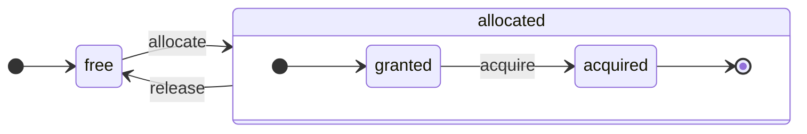
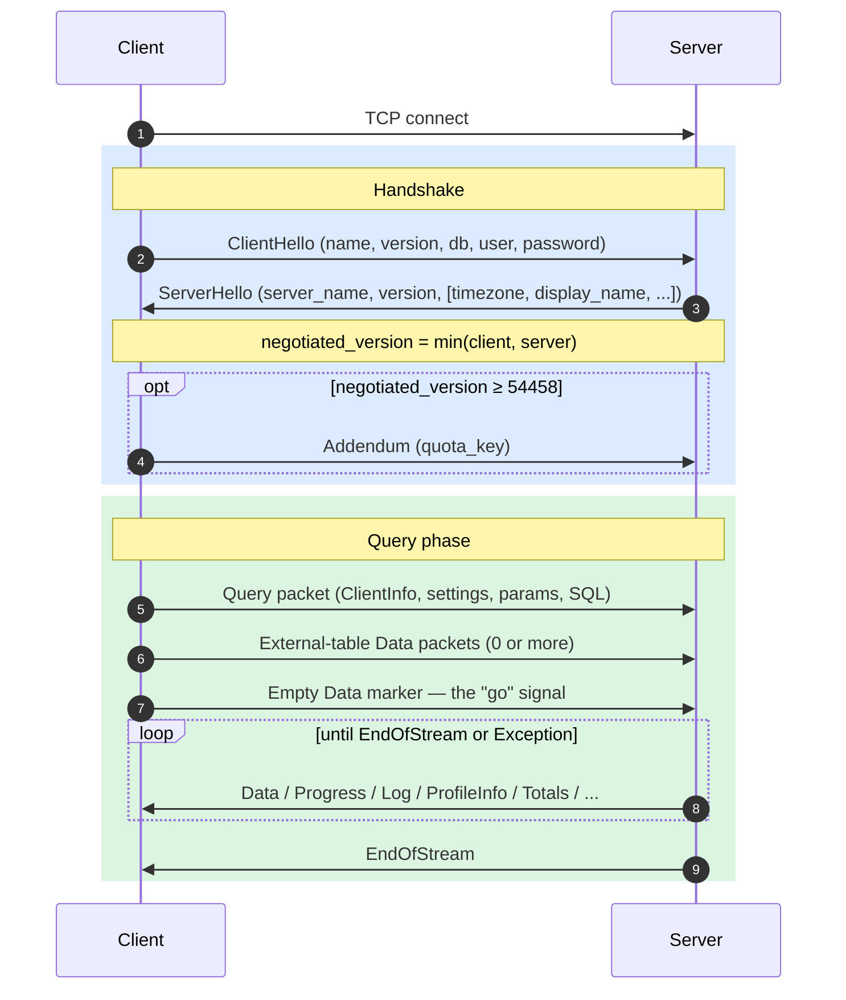
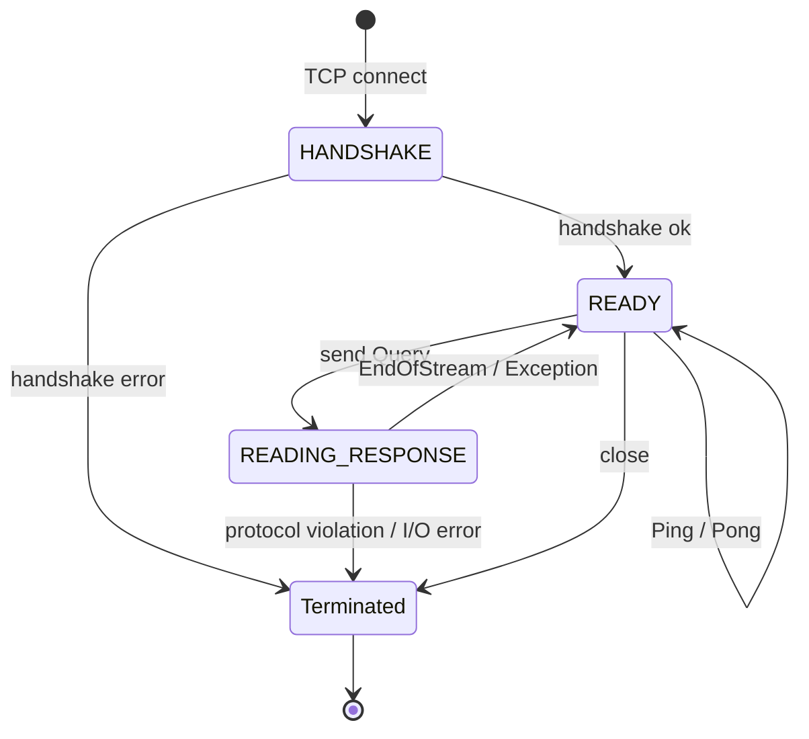
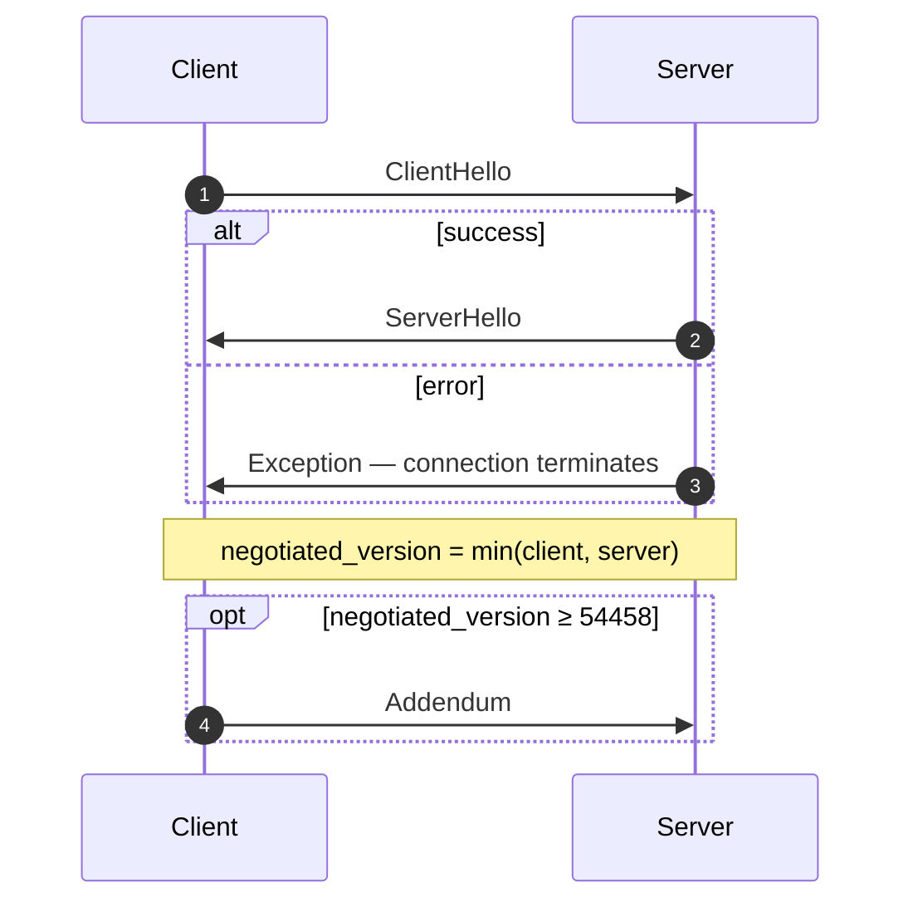
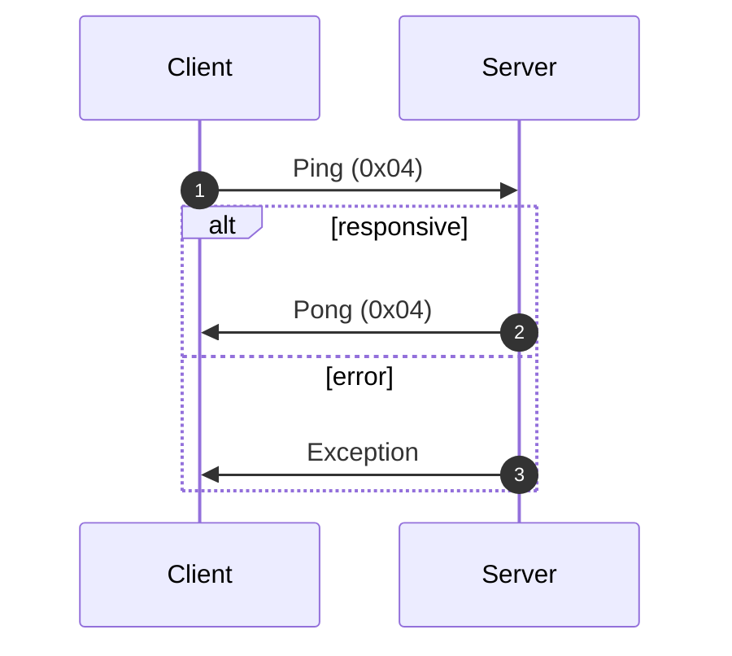
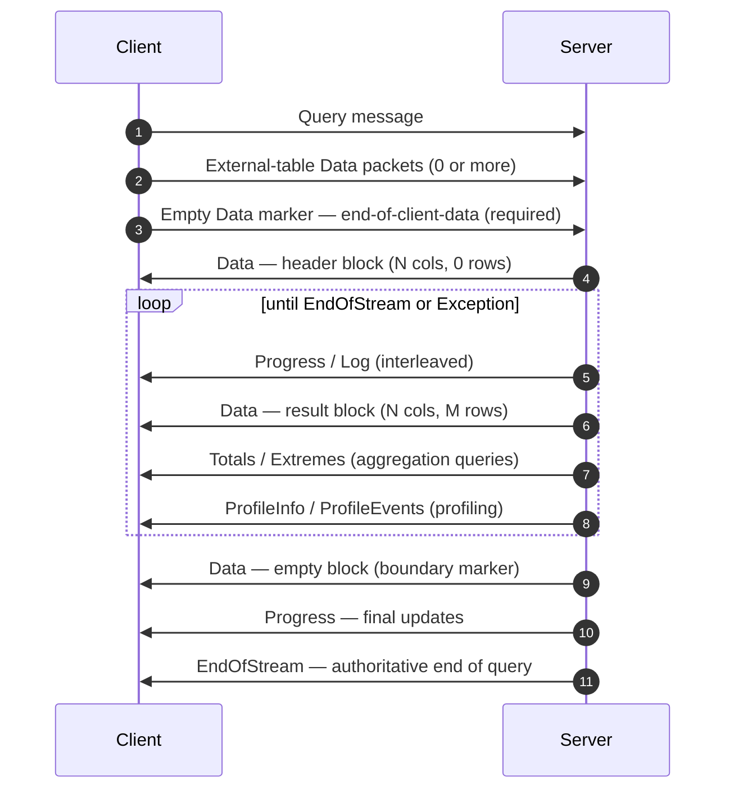
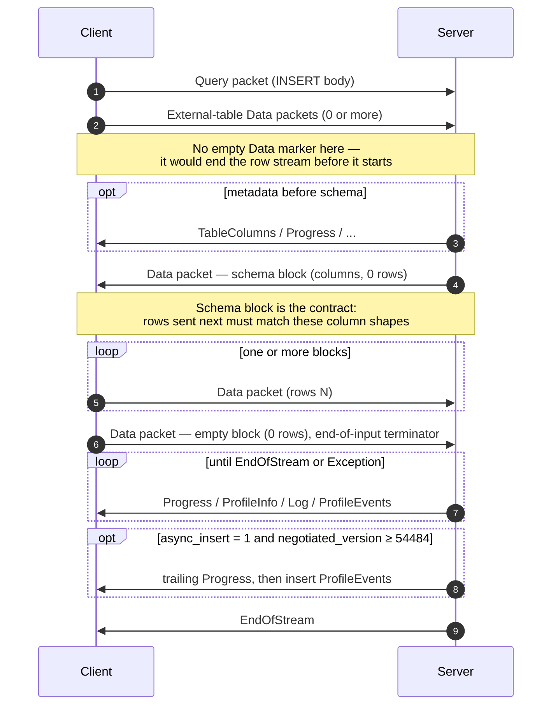
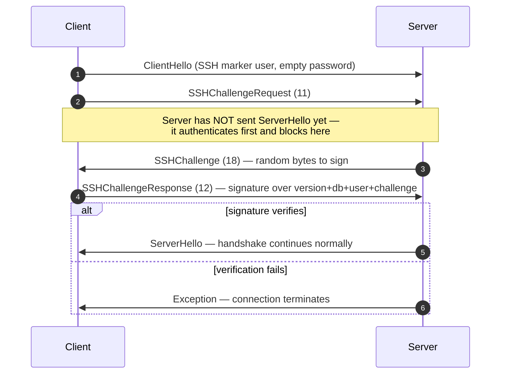

<a id="doc-3eaf0b1f9bf8215e0739ebe6"></a>

# ClickHouse/ClickHouse / docs/ko/resources/changelogs/oss/2025.mdx

Upstream: https://github.com/ClickHouse/ClickHouse/blob/28dc98b1fc057c08396c95e495b9327754a10b04/docs/ko/resources/changelogs/oss/2025.mdx

Commit: `28dc98b1fc057c08396c95e495b9327754a10b04`

Retrieved: 2026-10-01T15:20:10.316397+00:00

Kind: official-document

Raw SHA256: `84b54e85d6db6f7d86b6ae446d5df86eab726745bea737d117053f3cbc0ea6fe`

Source text below is untrusted reference content. Acquisition does not verify technical claims.

License status: UPSTREAM_NOTICES_CAPTURED_PER_FILE_REVIEW_REQUIRED. See this repository's captured license files.

---

---
slug: /whats-new/changelog/2025
sidebarTitle: '2025'
title: '2025년 변경 로그'
description: '2025년 변경 로그'
keywords: ['ClickHouse 2025', '변경 로그 2025', '릴리스 노트', '버전 이력', '새 기능']
doc_type: 'changelog'
---

<div id="table-of-contents">
  ### 목차
</div>

**[ClickHouse 릴리스 v25.12, 2025-12-18](#2512)**<br />
**[ClickHouse 릴리스 v25.11, 2025-11-27](#2511)**<br />
**[ClickHouse 릴리스 v25.10, 2025-10-30](#2510)**<br />
**[ClickHouse 릴리스 v25.9, 2025-09-25](#259)**<br />
**[ClickHouse 릴리스 v25.8 LTS, 2025-08-28](#258)**<br />
**[ClickHouse 릴리스 v25.7, 2025-07-24](#257)**<br />
**[ClickHouse 릴리스 v25.6, 2025-06-26](#256)**<br />
**[ClickHouse 릴리스 v25.5, 2025-05-22](#255)**<br />
**[ClickHouse 릴리스 v25.4, 2025-04-22](#254)**<br />
**[ClickHouse 릴리스 v25.3 LTS, 2025-03-20](#253)**<br />
**[ClickHouse 릴리스 v25.2, 2025-02-27](#252)**<br />
**[ClickHouse 릴리스 v25.1, 2025-01-28](#251)**<br />
**[2024년 변경 로그](/ko/resources/changelogs/oss/2024)**<br />
**[2023년 변경 로그](/ko/resources/changelogs/oss/2023)**<br />
**[2022년 변경 로그](/ko/resources/changelogs/oss/2022)**<br />
**[2021년 변경 로그](/ko/resources/changelogs/oss/2021)**<br />
**[2020년 변경 로그](/ko/resources/changelogs/oss/2020)**<br />
**[2019년 변경 로그](/ko/resources/changelogs/oss/2019)**<br />
**[2018년 변경 로그](/ko/resources/changelogs/oss/2018)**<br />
**[2017년 변경 로그](/ko/resources/changelogs/oss/2017)**<br />

<div id="2512">
  ### ClickHouse 릴리스 25.12, 2025-12-18
</div>

<div id="backward-incompatible-change">
  #### 하위 호환되지 않는 변경 사항
</div>

* ALTER MODIFY COLUMN은 이제 널 허용 컬럼을 널 비허용 타입으로 변환할 때 명시적인 DEFAULT를 요구합니다. 이전에는 이러한 ALTER가 cannot convert null to not null 오류로 중단될 수 있었지만, 이제 NULL은 컬럼의 기본 표현식으로 대체됩니다. [#5985](https://github.com/ClickHouse/ClickHouse/issues/5985)를 해결합니다. [#84770](https://github.com/ClickHouse/ClickHouse/pull/84770) ([Vladimir Cherkasov](https://github.com/vdimir)).
* Ngram 토크나이저는 이제 설정된 길이 N보다 짧은 ngram을 반환하지 않습니다. 검색 토큰이 비어 있으면 Text Search는 행을 반환하지 않습니다. [#89757](https://github.com/ClickHouse/ClickHouse/pull/89757) ([George Larionov](https://github.com/george-larionov)).
* `String`에서 `Nullable(String)`로 COLUMN을 변경할 때는 데이터에 mutation을 수행하지 않습니다. 그러나 `uniq` 집계 함수는 서로 다른 데이터 구조를 사용합니다. 널 허용 컬럼에서는 중첩된 uniq 집계기를 포함한 `AggregateFunctionNull`을 사용합니다. `AggregateFunctionNull`은 추가적인 bool 플래그를 직렬화합니다. 이로 인해 statistics 파일이 호환되지 않게 됩니다. 해결 방법은 직렬화 중 널 허용 컬럼인지 기록하는 플래그를 추가하는 것입니다. statistics 포맷이 변경되었으며, 이전 포맷의 statistics가 있으면 server에서 실패할 수 있습니다. 이 PR [#90904](https://github.com/ClickHouse/ClickHouse/pull/90904)는 이 크래시를 수정하고, 기존 statistics가 legacy 포맷을 사용하는 경우 예외를 발생시킵니다. 예외를 피하려면 statistics를 다시 생성할 수 있도록 `ALTER TABLE table MATERIALIZE STATISTICS ALL`을 실행해야 합니다. [#90311](https://github.com/ClickHouse/ClickHouse/pull/90311) ([Han Fei](https://github.com/hanfei1991)).
* 설정 `allow_not_comparable_types_in_order_by`/`allow_not_comparable_types_in_comparison_functions`이 제거되었습니다. ORDER BY 또는 비교 함수에서 비교할 수 없는 타입을 허용하면 논리적 오류나 예기치 않은 결과가 발생할 수 있습니다. [#90028](https://github.com/ClickHouse/ClickHouse/issues/90028)을 해결합니다. [#90527](https://github.com/ClickHouse/ClickHouse/pull/90527) ([Pavel Kruglov](https://github.com/Avogar)).
* 설정 `check_query_single_value_result`의 기본값이 `true`에서 `false`로 변경되었습니다. 이에 따라 `CHECK TABLE`은 집계된 결과(1 = 정상, 0 = 오류 발견) 대신 파트별 상세 결과를 반환합니다. 이는 이전 동작보다 사용자가 기대하는 동작에 더 가깝습니다. [#91009](https://github.com/ClickHouse/ClickHouse/pull/91009) ([Robert Schulze](https://github.com/rschu1ze)).
* 암시적 인덱스와 관련해 여러 수정이 적용되었습니다. 표시되거나 저장되는 스키마(Keeper 메타데이터)에는 `add_minmax_index_for_numeric_columns` 또는 `add_minmax_index_for_string_columns` 설정으로 생성된 것과 같은 암시적 인덱스가 포함되지 않습니다. 이로 인해 이전 릴리스의 레플리카가 있는 상태에서 더 최신 버전으로 ReplicatedMergeTree 테이블을 생성하거나 업데이트하면 메타데이터 오류가 발생할 수 있습니다. 이런 경우에는 클러스터 업그레이드가 완전히 끝날 때까지 이전 레플리카로 DDLs를 보내십시오. [#91429](https://github.com/ClickHouse/ClickHouse/pull/91429) ([Raúl Marín](https://github.com/Algunenano)).
* `receive_timeout`으로 인해 쿼리가 시간 초과되면 clickhouse-client가 0이 아닌 종료 코드(159 - TIMEOUT&#95;EXCEEDED)를 반환하도록 업데이트했습니다. 이전에는 시간 초과 시 종료 코드 0(성공)을 반환해 스크립트와 자동화에서 시간 초과 실패를 감지하기 어려웠습니다. [#91432](https://github.com/ClickHouse/ClickHouse/pull/91432) ([Sav](https://github.com/sberss)).
* 이제 빈 `ORDER BY` 키로 특수 `MergeTree` 테이블(`ReplacingMergeTree`, `CollapsingMergeTree` 등)을 생성하는 것이 금지됩니다. 이러한 테이블에서는 머지 동작이 정의되지 않기 때문입니다. 그래도 이런 테이블을 생성해야 한다면 `allow_suspicious_primary_key` 설정을 활성화하십시오. [#91569](https://github.com/ClickHouse/ClickHouse/pull/91569) ([Anton Popov](https://github.com/CurtizJ)).
* 시프트 크기가 자료형의 크기와 정확히 같은 경우 함수 `bitShiftLeft` 및 `bitShiftRight`가 0 또는 빈 값을 반환하도록 수정했습니다. [#91943](https://github.com/ClickHouse/ClickHouse/pull/91943) ([Pablo Marcos](https://github.com/pamarcos)).
* [#88380](https://github.com/ClickHouse/ClickHouse/pull/88380)의 후속 변경입니다. 이 PR에서는 프로젝션에서 위치 인수를 비활성화한 것을 하위 호환되지 않는 변경 사항으로 표시합니다. 또한 프로젝션에 위치 인수가 있는 경우 ClickHouse 클러스터를 안전하게 업그레이드할 수 있도록 `enable_positional_arguments_for_projections` 설정을 도입합니다. [#92007](https://github.com/ClickHouse/ClickHouse/pull/92007) ([Dmitry Novik](https://github.com/novikd)).
* 기본적으로 JSON의 고급 shared data를 활성화합니다. 이 변경 이후에는 25.8 이전 버전으로 다운그레이드할 수 없습니다. 이러한 버전은 JSON 컬럼이 있는 새 데이터 파트를 읽을 수 없기 때문입니다. 안전한 업그레이드를 위해 `compatibility` 설정을 이전 버전으로 지정하거나 MergeTree 설정 `dynamic_serialization_version='v2', object_serialization_version='v2'`를 설정하는 것이 권장됩니다. [#92511](https://github.com/ClickHouse/ClickHouse/pull/92511) ([Pavel Kruglov](https://github.com/Avogar)).

#### 새 기능

* 이제 S3/Azure Queue 테이블(table)에서 기존의 파일 유지 또는 제거 옵션에 더해, 처리된 파일을 이동하거나 태그를 지정하도록 구성할 수 있습니다. [#72944](https://github.com/ClickHouse/ClickHouse/issues/72944)를 해결합니다. [#86907](https://github.com/ClickHouse/ClickHouse/pull/86907) ([Murat Khairulin](https://github.com/mxwell)).
* S3/Azure Queue 스토리지에 설정 `commit_on_select`를 추가했습니다(처리된 데이터를 커밋해야 하는지와 `after_processing` 작업을 적용할지 여부를 정의하기 위한 설정). 기본값은 `false`이며, select 시 attached 상태인 mv 확인을 수정했습니다. [#91450](https://github.com/ClickHouse/ClickHouse/pull/91450) ([Kseniia Sumarokova](https://github.com/kssenii)).
* XRay를 사용해 런타임에 계측을 추가하여 운영 환경에서 문제를 디버깅하고 결정론적으로 프로파일링할 수 있습니다. [#74249](https://github.com/ClickHouse/ClickHouse/issues/74249)를 해결합니다. [#89173](https://github.com/ClickHouse/ClickHouse/pull/89173) ([Pablo Marcos](https://github.com/pamarcos)).
* `IN`에서 상수가 아닌 두 번째 인수를 사용할 수 있습니다. 또한 두 번째 인수로 튜플도 지원합니다. [#77906](https://github.com/ClickHouse/ClickHouse/pull/77906) ([Yarik Briukhovetskyi](https://github.com/yariks5s)).
* Geometry 유형의 면적 및 둘레를 계산하는 함수입니다. [#89047](https://github.com/ClickHouse/ClickHouse/pull/89047) ([Konstantin Vedernikov](https://github.com/scanhex12)).
* 속성 값이 지정한 값과 일치하는 딕셔너리 키를 반환하는 `dictGetKeys` 함수를 구현했습니다. 반복 조회 속도를 높이기 위해 `max_reverse_dictionary_lookup_cache_size_bytes` 설정으로 조정되는 쿼리별 역방향 조회 캐시를 사용합니다. [#89197](https://github.com/ClickHouse/ClickHouse/pull/89197) ([Nihal Z. Miaji](https://github.com/nihalzp)).
* 입력 JSON을 JSON 타입의 명시적 타입 경로로 형변환할 수 없을 때, JSON 타입에 대한 삽입/타입 캐스트에서 예외를 비활성화하는 `type_json_skip_invalid_typed_paths` 설정이 추가되었습니다. 이 경우 해당 타입 경로의 NULL/0 값으로 대체됩니다. [#89886](https://github.com/ClickHouse/ClickHouse/pull/89886) ([Max Justus Spransy](https://github.com/maxjustus)).
* MergeTree 테이블에 대해 `direct`(중첩 루프) 조인을 지원합니다. 사용하려면 설정에서 이를 단일 옵션으로 지정하십시오: `join_algorithm = 'direct'`. [#89920](https://github.com/ClickHouse/ClickHouse/pull/89920) ([Vladimir Cherkasov](https://github.com/vdimir)).
* Iceberg에 대해 `CREATE` 작업에서 `ORDER BY`를, `INSERT`에서는 정렬을 지원합니다. [#89916](https://github.com/ClickHouse/ClickHouse/issues/89916)을 해결했습니다. [#90141](https://github.com/ClickHouse/ClickHouse/pull/90141) ([Konstantin Vedernikov](https://github.com/scanhex12)).
* 프로젝션 수준 설정을 도입했습니다. 이 설정은 `ALTER TABLE ... ADD PROJECTION`의 새로운 `WITH SETTINGS` 절을 통해 사용할 수 있습니다. 이를 통해 프로젝션별로 특정 MergeTree 스토리지 매개변수(예: `index_granularity`, `index_granularity_bytes`)를 재정의할 수 있습니다. [#90158](https://github.com/ClickHouse/ClickHouse/pull/90158) ([Amos Bird](https://github.com/amosbird)).
* [#73900](https://github.com/ClickHouse/ClickHouse/issues/73900) 및 [#38775](https://github.com/ClickHouse/ClickHouse/issues/38775)의 일환으로 `HMAC(algorithm, message, key)` SQL 함수를 추가했습니다. [#90837](https://github.com/ClickHouse/ClickHouse/pull/90837) ([Mikhail f. Shiryaev](https://github.com/Felixoid)).
* 첫 번째 인수가 상수 배열인 경우 `has` 함수가 기본 키(primary key)와 데이터 스키핑 인덱스를 사용할 수 있도록 지원을 추가했습니다. [#90980](https://github.com/ClickHouse/ClickHouse/issues/90980)를 해결했습니다. [#91023](https://github.com/ClickHouse/ClickHouse/pull/91023) ([Nihal Z. Miaji](https://github.com/nihalzp)).
* 새로운 입출력 형식 `Buffers`를 구현했습니다. 이 형식은 `Native`와 유사하지만, `Native`와는 달리 컬럼 이름, 컬럼 타입, 추가 메타데이터를 저장하지 않습니다. [#84017](https://github.com/ClickHouse/ClickHouse/issues/84017)을 해결했습니다. [#91156](https://github.com/ClickHouse/ClickHouse/pull/91156) ([Nihal Z. Miaji](https://github.com/nihalzp)).
* Cluster 테이블 함수에서 파일을 병렬로 읽을 때 사용할 스트림 수를 제어하는 설정 `max_streams_for_files_processing_in_cluster_functions`을 추가했습니다. [#90223](https://github.com/ClickHouse/ClickHouse/issues/90223)를 해결했습니다. [#91323](https://github.com/ClickHouse/ClickHouse/pull/91323) ([Pavel Kruglov](https://github.com/Avogar)).
* 행 수준 보안(Row-level security)을 위한 데이터 마스킹(ClickHouse Cloud에서만 사용 가능). clickhouse-client에서 이를 지원하기 위해 데이터 마스킹 정책 파서를 추가했습니다. [#90552](https://github.com/ClickHouse/ClickHouse/pull/90552) ([pufit](https://github.com/pufit)).
* `windowFunnel` 집계 함수에 `allow_reentry` 옵션을 추가했습니다. strict&#95;order와 함께 활성화하면 순서를 위반하는 이벤트를 무시하고 퍼널 분석을 중단하지 않습니다. 이를 통해 새로고침(A-&gt;A-&gt;B)이나 뒤로 가기(A-&gt;B-&gt;A-&gt;C)가 포함된 사용자 여정도 처리할 수 있어 전환율 과소 집계를 방지합니다. [#86916](https://github.com/ClickHouse/ClickHouse/pull/86916) ([Lee ChaeRok](https://github.com/LeeChaeRok)).
* ZooKeeper와의 Keeper 호환성: STATISTICS를 사용한 CREATE. [#88797](https://github.com/ClickHouse/ClickHouse/pull/88797) ([Konstantin Vedernikov](https://github.com/scanhex12)).
* ClickHouse Keeper에서 ZooKeeper 영구 watch를 지원합니다. 후속 작업 2편: https://github.com/ClickHouse/ClickHouse/pull/78207. [#88813](https://github.com/ClickHouse/ClickHouse/pull/88813) ([Konstantin Vedernikov](https://github.com/scanhex12)).
* 뮤테이션 수행 중 인덱스를 어떻게 처리할지 제어하는 MergeTree 설정 `alter_column_secondary_index_mode`를 추가했습니다. 가능한 값: throw, drop, rebuild, compatibility. [#77797](https://github.com/ClickHouse/ClickHouse/issues/77797)를 해결합니다. [#89335](https://github.com/ClickHouse/ClickHouse/pull/89335) ([Raúl Marín](https://github.com/Algunenano)).
* `Time` 및 `Time64` 데이터 타입이 이제 프로덕션 환경에서 사용할 수 있게 되어, `enable_time_time64_type` 설정이 기본적으로 활성화됩니다. [#89345](https://github.com/ClickHouse/ClickHouse/pull/89345) ([Yarik Briukhovetskyi](https://github.com/yariks5s)).
* `delta_lake_snapshot_start_version`, `delta_lake_snapshot_end_version` 설정을 사용해 `deltaLake` 테이블 함수로 DeltaLake CDF를 읽을 수 있도록 지원합니다. CDF(Change Data Feed, Delta 테이블의 버전 간 행 수준 데이터 변경(예: 삽입, 업데이트, 삭제)을 자동으로 캡처하고 쿼리할 수 있게 해주는 기능)는 DeltaLake에서 `delta.enableChangeDataFeed`를 통해 활성화됩니다. 데이터와 함께 제공되는 컬럼은 `_change_type`, `_commit_version`, `_commit_timestamp`입니다. [#90431](https://github.com/ClickHouse/ClickHouse/pull/90431) ([Kseniia Sumarokova](https://github.com/kssenii)).
* 튜플 요소 접근에서 음수 인덱스를 지원합니다(예: `tuple.-1`). [#91665](https://github.com/ClickHouse/ClickHouse/pull/91665) ([Amos Bird](https://github.com/amosbird)).

<div id="experimental-feature">
  #### 실험적 기능
</div>

* text index 포맷 v3를 도입하고 베타 상태로 승격합니다.
* `automatic_parallel_replicas_mode` 설정으로 제어되는, 병렬 레플리카를 사용해 쿼리를 자동 실행하는 새로운 로직이 도입되었습니다. 일반적인 단일 노드 실행 중에는 ClickHouse가 이후 계획 단계에서 활용할 통계를 수집합니다. 통계상 병렬 레플리카가 유리할 가능성이 높다고 판단되면, ClickHouse가 해당 쿼리를 병렬 레플리카로 자동 실행합니다. 현재 지원되는 쿼리 범위는 아직 상당히 제한적입니다. [#87541](https://github.com/ClickHouse/ClickHouse/pull/87541) ([Nikita Taranov](https://github.com/nickitat)).
* `--login`을 사용해 Cloud 자격 증명으로 ClickHouse Cloud 인스턴스에 액세스할 수 있습니다. [#89261](https://github.com/ClickHouse/ClickHouse/pull/89261) ([Krishna Mannem](https://github.com/kcmannem)).
* `AggregateFunction` 컬럼이 있는 테이블에 대한 `INSERT` 쿼리를 개선하기 위해 세션 수준 설정 `aggregate_function_input_format`을 추가했습니다. 이를 통해 직렬화된 상태, 원시 값 또는 배열 형태로 데이터를 삽입할 수 있습니다. [#88088](https://github.com/ClickHouse/ClickHouse/pull/88088) ([Punith Nandyappa Subashchandra](https://github.com/punithns97)).

<div id="performance-improvement">
  #### 성능 개선
</div>

* 스킵 인덱스와 동적 임계값 필터를 사용해 `ORDER BY...LIMIT N` 쿼리를 최적화하고, 처리되는 행 수를 크게 줄였습니다. [#89835](https://github.com/ClickHouse/ClickHouse/pull/89835) ([Shankar Iyer](https://github.com/shankar-iyer)).
* ClickHouse는 이제 스킵 인덱스를 사용해 `AND`와 `OR`가 혼합된 필터 조건이 있는 WHERE 절에 대해서도 인덱스 분석을 수행합니다. 이전에는 스킵 인덱스를 활용하려면 WHERE 절이 필터 조건의 논리곱(AND) 형태여야 했습니다. 새로운 설정 `use_skip_indexes_for_disjunctions`(기본값: on)으로 이 기능을 제어할 수 있습니다. (issue [#75228](https://github.com/ClickHouse/ClickHouse/issues/75228)). [#87781](https://github.com/ClickHouse/ClickHouse/pull/87781) ([Shankar Iyer](https://github.com/shankar-iyer)).
* LEFT/INNER JOIN 작업에서 왼쪽 테이블을 원래 순서대로 읽는 기능을 지원하며, 이후 단계에서 이를 활용할 수 있습니다. 이 기능은 설정 `query_plan_read_in_order_through_join`로 비활성화할 수 있습니다. LEFT/INNER JOIN에 대해 읽기 시 가상 행 최적화(설정 `read_in_order_use_virtual_row` 참조)도 지원합니다. [#89815](https://github.com/ClickHouse/ClickHouse/pull/89815) ([Vladimir Cherkasov](https://github.com/vdimir)).
* 제한값을 늘려 지연 구체화되는 컬럼의 성능을 개선합니다. [#90309](https://github.com/ClickHouse/ClickHouse/pull/90309) ([Nikolai Kochetov](https://github.com/KochetovNicolai)).
* 대규모 `minmax` 인덱스(수백만 개의 그래뉼)가 있는 경우 인덱스 분석 시 지연 시간이 더 낮아집니다. [#90428](https://github.com/ClickHouse/ClickHouse/pull/90428) ([Shankar Iyer](https://github.com/shankar-iyer)).
* INNER JOIN에 대한 단순한 DPsize 조인 재정렬 알고리즘을 구현했습니다. 새로운 실험적 설정을 통해 어떤 알고리즘을 어떤 순서로 사용할지 제어할 수 있습니다. 예를 들어 `query_plan_optimize_join_order_algorithm='dpsize,greedy'`는 먼저 DPsize를 시도하고, 이후 greedy로 폴백한다는 의미입니다. [#91002](https://github.com/ClickHouse/ClickHouse/pull/91002) ([Alexander Gololobov](https://github.com/davenger)).
* 쿼리가 행 제한에 도달하면 즉시 실패하도록 합니다. [#61872](https://github.com/ClickHouse/ClickHouse/issues/61872)를 해결합니다. [#62804](https://github.com/ClickHouse/ClickHouse/pull/62804) ([Sean Haynes](https://github.com/seandhaynes)).
* [#84477](https://github.com/clickhouse/clickhouse/pull/84477)에서는 병렬 분산 실행을 위해 `insert select from s3Cluster(...)` 쿼리에서 사용할 수 있는 select 쿼리에 대한 제약을 추가했습니다. 이 변경으로 이전에도 가능했던 `where`를 사용할 수 있게 되었습니다. [#84611](https://github.com/ClickHouse/ClickHouse/pull/84611) ([Igor Nikonov](https://github.com/devcrafter)).
* 해시 테이블을 순회하는 동안 키를 프리페치하여 캐시 미스를 최소화합니다. [#84708](https://github.com/ClickHouse/ClickHouse/pull/84708) ([lgbo](https://github.com/lgbo-ustc)).
* `histogram` 집계 함수를 최적화해 points 배열의 끝부분만 정렬하고 단조 입력에서는 정렬을 생략하도록 하여 약 10%의 성능 향상을 달성했습니다. [#85760](https://github.com/ClickHouse/ClickHouse/pull/85760) ([MakarDev](https://github.com/MakarDev)).
* 텍스트 인덱스에서 구성한 추가 사전 필터를 활용해 `like`, `equals`, `has` 등의 함수를 사용하는 프레디케이트의 필터링 성능을 개선했습니다. 이 최적화는 `query_plan_text_index_add_hint` 설정으로 활성화됩니다. `Map` 데이터 타입 컬럼에서 텍스트 인덱스를 활용하는 방식도 개선했습니다. [#88550](https://github.com/ClickHouse/ClickHouse/pull/88550) ([Anton Popov](https://github.com/CurtizJ)).
* 미리 계산된 가능한 키 값 Set에 대해 더 빠른 조회를 수행해 반복되는 역방향 딕셔너리 조회를 최적화합니다. [#7968](https://github.com/ClickHouse/ClickHouse/issues/7968)을 해결했습니다. [#88971](https://github.com/ClickHouse/ClickHouse/pull/88971) ([Nihal Z. Miaji](https://github.com/nihalzp)).
* `topK` 집계 함수의 성능과 동작 방식을 개선했습니다. [#90091](https://github.com/ClickHouse/ClickHouse/pull/90091) ([Raúl Marín](https://github.com/Algunenano)).
* `Decimal` 비교 연산 성능을 개선했습니다. [#28192](https://github.com/ClickHouse/ClickHouse/issues/28192)를 해결합니다. [#90153](https://github.com/ClickHouse/ClickHouse/pull/90153) ([Konstantin Bogdanov](https://github.com/thevar1able)).
* https://github.com/ClickHouse/ClickHouse/pull/84423의 후속으로 Apache Paimon 함수에서 파티션 프루닝을 지원합니다. [#90253](https://github.com/ClickHouse/ClickHouse/pull/90253) ([JIaQi](https://github.com/JiaQiTang98)).
* 동적 디스패치를 통해 논리 함수에 고급 SIMD 연산을 활용합니다. [#90432](https://github.com/ClickHouse/ClickHouse/pull/90432) ([Raúl Marín](https://github.com/Algunenano)).
* 불필요하게 결과 컬럼을 0으로 초기화하지 않도록 해 JIT 함수 성능을 개선했습니다. [#90449](https://github.com/ClickHouse/ClickHouse/pull/90449) ([Raúl Marín](https://github.com/Algunenano)).
* 동적 디스패치로 `T64` 압축 해제 속도를 높였습니다. [#90610](https://github.com/ClickHouse/ClickHouse/pull/90610) ([Raúl Marín](https://github.com/Algunenano)).
* MergeTree 리더의 인플레이스 필터링을 최적화합니다. [#87119](https://github.com/ClickHouse/ClickHouse/issues/87119)을 해결합니다. [#90630](https://github.com/ClickHouse/ClickHouse/pull/90630) ([Xiaozhe Yu](https://github.com/wudidapaopao)).
* 선택된 머지 후보의 폭을 줄이기 위한 추가 휴리스틱을 도입했습니다. 더 좁은 머지를 수행하면 쓰기 증폭은 증가하지만, 동시에 `TOO_MANY_PARTS` 오류를 방지하는 데 도움이 될 수 있습니다. [#91163](https://github.com/ClickHouse/ClickHouse/pull/91163) ([Mikhail Artemenko](https://github.com/Michicosun)).
* `glob pattern`으로 생성된 S3 테이블에서 `_path` 필터 값을 푸시다운해 S3 목록 조회 작업을 피할 수 있도록 함으로써 쿼리 성능을 개선합니다. 이 기능은 `s3_path_filter_limit` 설정으로 제어됩니다. [#91165](https://github.com/ClickHouse/ClickHouse/pull/91165) ([Eduard Karacharov](https://github.com/korowa)).
* 동적 디스패치를 통해 WHERE 절에서 컬럼을 bool로 변환하는 속도를 개선했습니다. [#91203](https://github.com/ClickHouse/ClickHouse/pull/91203) ([Raúl Marín](https://github.com/Algunenano)).
* 동적 디스패치를 통해 숫자로만 이루어진 단일 block의 정렬 속도를 높였습니다. [#91213](https://github.com/ClickHouse/ClickHouse/pull/91213) ([Raúl Marín](https://github.com/Algunenano)).
* 쿼리 계획에서 사용되지 않는 컬럼을 제거하는 최적화를 추가했습니다. [#75152](https://github.com/ClickHouse/ClickHouse/issues/75152)를 해결합니다. [#76487](https://github.com/ClickHouse/ClickHouse/pull/76487) ([János Benjamin Antal](https://github.com/antaljanosbenjamin)).
* `query_plan_optimize_join_order_limit`의 기본값이 `10`으로 변경되었습니다. [#89312](https://github.com/ClickHouse/ClickHouse/pull/89312) ([Alexey Milovidov](https://github.com/alexey-milovidov)).
* `allow_statistics_optimize` 설정이 기본값으로 활성화되어 조인 최적화기가 컬럼 통계(column statistics)를 사용합니다. [#89332](https://github.com/ClickHouse/ClickHouse/pull/89332) ([Alexey Milovidov](https://github.com/alexey-milovidov)).
* `ANTI` JOIN에 대해서도 JOIN 런타임 필터를 지원합니다. 또한 잠금 경합을 줄이도록 런타임 필터 구현을 리팩터링했습니다. [#89710](https://github.com/ClickHouse/ClickHouse/pull/89710) ([Dmitry Novik](https://github.com/novikd)).
* `min_bytes_for_wide_part` 및 `vertical_merge_algorithm_min_bytes_to_activate`를 128MB로 설정해 `system.metric_log` 테이블의 머지 중 메모리 사용량을 줄였습니다(기본적으로 활성화됨). [#89811](https://github.com/ClickHouse/ClickHouse/pull/89811) ([filimonov](https://github.com/filimonov)).
* PREWHERE에서 inverted index를 사용할 수 있도록 했습니다. [#89975](https://github.com/ClickHouse/ClickHouse/issues/89975)를 해결합니다. [#89977](https://github.com/ClickHouse/ClickHouse/pull/89977) ([Peng Jian](https://github.com/fastio)).
* GCS에서 성능이 향상되는 GCP OAuth를 사용하는 경우 S3 공급자를 추가하지 않습니다. [#91706](https://github.com/ClickHouse/ClickHouse/pull/91706) ([Antonio Andelic](https://github.com/antonio2368)).

<div id="improvement">
  #### 개선 사항
</div>

* 쿼리에서 `final` 이후에만 행 정책(row policy)을 적용할 수 있도록 하는 새로운 설정 `apply_row_policy_after_final`이 추가되었습니다. 이를 통해 행 정책이 있는 ReplacingMergeTree의 동작이 더 올바르게 됩니다. [#90986](https://github.com/ClickHouse/ClickHouse/issues/90986)를 수정했습니다. [#91065](https://github.com/ClickHouse/ClickHouse/pull/91065) ([Yarik Briukhovetskyi](https://github.com/yariks5s)).
* `Pretty` 포맷에서 이제 이름이 지정된 Tuple이 Pretty JSON으로 표시됩니다. 이로써 [#65022](https://github.com/ClickHouse/ClickHouse/issues/65022)가 해결됩니다. [#91779](https://github.com/ClickHouse/ClickHouse/pull/91779) ([Mostafa Mohamed Salah](https://github.com/Sasao4o)).
* `system.error_log` 테이블(table)에 `last_error_time`, `last_error_message`, `last_error_query_id`, `last_error_trace` 필드를 추가했습니다. [#89879](https://github.com/ClickHouse/ClickHouse/pull/89879) ([Narasimha Pakeer](https://github.com/npakeer)).
* 이제 CLI client에서 `--no-server-client-version-message` 또는 `false`를 지정해 &#39;ClickHouse 서버 버전이 ClickHouse client보다 오래되었습니다. 이는 서버가 최신 상태가 아니어서 업그레이드가 필요할 수 있음을 나타낼 수 있습니다&#39; 메시지를 표시하지 않도록 할 수 있습니다. [#87784](https://github.com/ClickHouse/ClickHouse/pull/87784) ([Larry Snizek](https://github.com/larry-cdn77)).
* part가 중복 제거되었음을 알리는 오류 메시지를 추가했습니다. [#80264](https://github.com/ClickHouse/ClickHouse/pull/80264) ([Aleksandr Musorin](https://github.com/AVMusorin)).
* Kafka 테이블의 구체화된 뷰(Materialized View) 대상 테이블을 보고할 수 있도록 `system.kafka_consumers`에 `dependencies` 및 `missing_dependencies` 컬럼이 추가되었습니다. `KafkaMVNotReady` 카운터도 추가되었습니다. [#85346](https://github.com/ClickHouse/ClickHouse/pull/85346) ([Ilya Golshtein](https://github.com/ilejn)).
* 이제 원격 및 네이티브 프로토콜을 통한 삽입에서도 테이블(table)의 기본 표현식이 올바르게 동작합니다. [#87972](https://github.com/ClickHouse/ClickHouse/issues/87972)을 해결했습니다. [#88540](https://github.com/ClickHouse/ClickHouse/pull/88540) ([Pervakov Grigorii](https://github.com/GrigoryPervakov)).
* `PSI_*_*` 비동기 메트릭 수집을 비활성화할 수 있도록 했습니다. [#88557](https://github.com/ClickHouse/ClickHouse/pull/88557) ([MikhailBurdukov](https://github.com/MikhailBurdukov)).
* `Nullable` 타입 컬럼에 대한 희소 직렬화 지원이 추가되었습니다. 이는 [#44539](https://github.com/ClickHouse/ClickHouse/issues/44539)의 연장선상에 있는 작업입니다. [#88999](https://github.com/ClickHouse/ClickHouse/pull/88999) ([Amos Bird](https://github.com/amosbird)).
* `plain-rewritable` 디스크는 자체 구현과 레이아웃을 갖습니다. 일반 `plain` 디스크를 기반으로 하지 않도록 했습니다. [#89807](https://github.com/ClickHouse/ClickHouse/pull/89807) ([Mikhail Artemenko](https://github.com/Michicosun)).
* HTTP 예외에는 최종 0 청크가 절대 포함되어서는 안 됩니다. [#89998](https://github.com/ClickHouse/ClickHouse/pull/89998) ([Kaviraj Kanagaraj](https://github.com/kavirajk)).
* 핸드셰이크 중 `last_zxid_seen (provided by the client) > last_processed_zxid`인 경우 클라이언트를 거부하는 Keeper 서버 측 검사를 추가했습니다. 이를 통해 클라이언트가 지연된 레플리카에 다시 연결할 때 오래된 읽기가 발생하는 것을 방지합니다. [#90016](https://github.com/ClickHouse/ClickHouse/pull/90016) ([Miсhael Stetsyuk](https://github.com/mstetsyuk)).
* 새 데이터가 들어올 때까지 컨슈머가 대기하는 시간을 조정할 수 있도록 `kafka_consumer_reschedule_ms`를 조정 가능한 `Kafka` 테이블 엔진 설정으로 추가했습니다. [#89204](https://github.com/ClickHouse/ClickHouse/issues/89204)을 해결합니다. [#90112](https://github.com/ClickHouse/ClickHouse/pull/90112) ([Jeremy Aguilon](https://github.com/JerAguilon)).
* 진단 기능을 개선하기 위해 `system.mutations`에 새 컬럼 `parts_in_progress_names`를 추가했습니다. [#90155](https://github.com/ClickHouse/ClickHouse/pull/90155) ([Shaohua Wang](https://github.com/tiandiwonder)).
* S3 라이브러리가 XML 응답을 파싱할 때 네트워크 오류가 발생하면 재시도합니다. [#90216](https://github.com/ClickHouse/ClickHouse/pull/90216) ([Sema Checherinda](https://github.com/CheSema)).
* Keeper를 별도의 서버 프로세스에서 실행하고, 대규모 리전에서 Prometheus에 과도한 부하가 걸리지 않도록 Keeper 관련 메트릭만 계속 노출하려고 합니다. [#90244](https://github.com/ClickHouse/ClickHouse/pull/90244) ([Miсhael Stetsyuk](https://github.com/mstetsyuk)).
* 기존 `~/.clickhouse-client/` 위치 외에도 XDG Base Directory 경로(예: `~/.config/clickhouse/config.xml`)에서 ClickHouse Client 구성을 로드할 수 있도록 지원을 추가했습니다. [#89882](https://github.com/ClickHouse/ClickHouse/issues/89882)를 해결합니다. [#90306](https://github.com/ClickHouse/ClickHouse/pull/90306) ([Wujun Jiang](https://github.com/rainac1)).
* Keeper에 append 요청 배치의 바이트 크기 제한이 추가되었습니다. 이 제한은 `keeper_server.coordination_settings.max_requests_append_bytes_size`로 제어됩니다. [#90342](https://github.com/ClickHouse/ClickHouse/pull/90342) ([Antonio Andelic](https://github.com/antonio2368)).
* Iceberg에서 파티션 수가 지나치게 많아지는 것을 방지하는 설정을 추가했습니다. [#90365](https://github.com/ClickHouse/ClickHouse/pull/90365) ([Konstantin Vedernikov](https://github.com/scanhex12)).
* 가드레일 한도에 근접할 때 경고 메시지를 업데이트하여 현재 값과 throw 값을 표시합니다. [#90438](https://github.com/ClickHouse/ClickHouse/pull/90438) ([Nikita Fomichev](https://github.com/fm4v)).
* `system.filesystem_cache` 테이블에서는 전체 캐시 상태를 담은 단일 청크 하나를 생성하는 대신 청크를 스트리밍합니다. 파일 시스템 캐시 상태를 읽는 작업은 캐시가 큰 경우 시간이 오래 걸리고 메모리를 많이 사용할 수 있으므로, 대규모 배포에서는 스트리밍이 필수적입니다. [#90508](https://github.com/ClickHouse/ClickHouse/pull/90508) ([Kseniia Sumarokova](https://github.com/kssenii)).
* Hive 파티셔닝에서 잘못된 예외 메시지를 수정했습니다. 공백이 하나 누락되어 있었습니다. [#90685](https://github.com/ClickHouse/ClickHouse/pull/90685) ([Alexey Milovidov](https://github.com/alexey-milovidov)).
* 벡터 유사도 인덱스 캐시의 항목은 이제 테이블 파트가 삭제되거나 최신 파트로 대체되면 함께 제거됩니다. 이전에는 이러한 항목이 캐시 축출(eviction)이 발생할 때만 지연 정리되었습니다. [#90750](https://github.com/ClickHouse/ClickHouse/pull/90750) ([Shankar Iyer](https://github.com/shankar-iyer)).
* chdig(ClickHouse용 명령줄 진단 도구)를 [v25.12.1](https://github.com/azat/chdig/releases/tag/v25.12.1)로 업데이트했습니다. [#91394](https://github.com/ClickHouse/ClickHouse/pull/91394) ([Azat Khuzhin](https://github.com/azat)).
* 이제 S3에서 사전 서명된 URL을 사용할 수 있습니다. [#65032](https://github.com/ClickHouse/ClickHouse/issues/65032)을 해결했습니다. [#90827](https://github.com/ClickHouse/ClickHouse/pull/90827) ([Yarik Briukhovetskyi](https://github.com/yariks5s)).
* 이제 텍스트 인덱스를 `ReplacingMergeTree` 테이블에서도 사용할 수 있습니다. [#90908](https://github.com/ClickHouse/ClickHouse/pull/90908) ([Elmi Ahmadov](https://github.com/ahmadov)).
* 인증 전에 반환되는 HTTP 오류 응답에서 ClickHouse 서버 버전이 노출되지 않도록 했습니다. [#91003](https://github.com/ClickHouse/ClickHouse/pull/91003) ([filimonov](https://github.com/filimonov)).
* 이제 HTTP 클라이언트 연결의 `hard_limit`에 도달하면 `HTTP_CONNECTION_LIMIT_REACHED` 예외가 발생합니다. 디스크 연결의 경우 이 값은 `20000`으로 설정됩니다. [#91016](https://github.com/ClickHouse/ClickHouse/pull/91016) ([Sema Checherinda](https://github.com/CheSema)).
* 배경 작업에 대한 내부 검사 기능을 개선하기 위해 `system.background_schedule_pool{,_log}`를 도입했습니다. [#91157](https://github.com/ClickHouse/ClickHouse/pull/91157) ([Azat Khuzhin](https://github.com/azat)).
* 이제 Web UI 쿼리 편집기에서 `Ctrl+/`(Mac에서는 `Cmd+/`)를 사용해 현재 선택한 줄을 빠르게 주석 처리하거나 주석 해제할 수 있어, 테스트 중 쿼리의 일부를 일시적으로 비활성화하기가 더 쉬워졌습니다. [#91160](https://github.com/ClickHouse/ClickHouse/pull/91160) ([Samuel K.](https://github.com/OpenGLShaders)).
* 항상 접근할 수 있는 테이블 목록에 `system.completions`를 추가했습니다. [#91166](https://github.com/ClickHouse/ClickHouse/pull/91166) ([Yakov Olkhovskiy](https://github.com/yakov-olkhovskiy)).
* `FailedInitialQuery` 및 `FailedInitialSelectQuery` profile events를 추가했습니다. [#91172](https://github.com/ClickHouse/ClickHouse/pull/91172) ([RinChanNOW](https://github.com/RinChanNOWWW)).
* 서브컬럼이 많은 JSON 컬럼의 컬럼 샘플을 읽을 때, 스레드 풀을 무조건 사용하는 대신 `merge_tree_use_prefixes_deserialization_thread_pool` 설정을 따르도록 변경하여 잠재적인 스레드 풀 기아 현상을 해결했습니다. [#91208](https://github.com/ClickHouse/ClickHouse/pull/91208) ([Raufs Dunamalijevs](https://github.com/rienath)).
* `tupleElement`에서 `JSON` 타입을 지원합니다. [#81630](https://github.com/ClickHouse/ClickHouse/issues/81630)를 해결합니다. [#91327](https://github.com/ClickHouse/ClickHouse/pull/91327) ([Pavel Kruglov](https://github.com/Avogar)).
* 사용자 공간 페이지 캐시가 활성화되었을 때 잘못 발생하던 메모리 제한 오류를 수정했습니다. [#91361](https://github.com/ClickHouse/ClickHouse/pull/91361) ([Michael Kolupaev](https://github.com/al13n321)).
* Ngrams 토크나이저는 이제 ngram&#95;length = 1로도 생성할 수 있습니다. [#91529](https://github.com/ClickHouse/ClickHouse/pull/91529) ([George Larionov](https://github.com/george-larionov)).
* `SELECT`에서 이미 지원되는 것과 마찬가지로 `INSERT INTO FUNCTION`에서도 함수 내부 스토리지 설정을 지원합니다. [#89386](https://github.com/ClickHouse/ClickHouse/issues/89386)를 해결합니다. [#91707](https://github.com/ClickHouse/ClickHouse/pull/91707) ([Kseniia Sumarokova](https://github.com/kssenii)).
* 데이터 레이크에 대한 TRUNCATE 쿼리에서 조용히 아무 작업도 하지 않는 대신 &quot;not implemented&quot; 예외를 발생시킵니다. [#86604](https://github.com/ClickHouse/ClickHouse/issues/86604)를 해결합니다. [#91713](https://github.com/ClickHouse/ClickHouse/pull/91713) ([Kseniia Sumarokova](https://github.com/kssenii)).
* `DB::Exception: apache::thrift::transport::TTransportException: MaxMessageSize reached` 예외가 발생하지 않도록 Parquet v3 리더의 최대 메시지 크기를 설정했습니다. [#91737](https://github.com/ClickHouse/ClickHouse/pull/91737) ([Arthur Passos](https://github.com/arthurpassos)).
* `insert_select_deduplicate` 설정을 추가했습니다. 이를 통해 INSERT SELECT 시 삽입 중복 제거를 어떻게 처리하는지 더 명확해졌습니다. 일반적으로 이러한 쿼리에는 중복 제거를 적용할 수 없지만, 테이블이 변경되지 않고 결과가 정렬되어 있다면 retry 시 중복 제거를 수행할 수 있습니다. 소스가 동일한지는 추적할 수 없지만, select 쿼리 결과가 정렬되어 있는지는 확인할 수 있습니다. 실제로는 일반적인 경우 이를 확인하기가 매우 어렵지만, `ORDER BY ALL`을 사용하는 단순한 경우는 쉽게 확인할 수 있습니다. 현재 이 로직은 실제로 잘못되어 있습니다. 중복 제거를 시도하지만, 대부분의 경우 select가 서로 다른 데이터를 반환하기 때문에 blocks 간 중복을 감지하지 못합니다. [#91830](https://github.com/ClickHouse/ClickHouse/pull/91830) ([Sema Checherinda](https://github.com/CheSema)).
* `Array`를 `QBit`로 캐스팅할 때 암시적 형 변환이 허용됩니다. 이제 정수 및 부동소수점 배열을 `QBit` 컬럼에 명시적으로 형 변환하지 않아도 직접 삽입할 수 있습니다. [#91846](https://github.com/ClickHouse/ClickHouse/pull/91846) ([Raufs Dunamalijevs](https://github.com/rienath)).
* `CapnProto` 메시지 크기 제한이 추가되었습니다. 이 제한은 `format_capn_proto_max_message_size`로 변경할 수 있습니다. [#91888](https://github.com/ClickHouse/ClickHouse/pull/91888) ([Antonio Andelic](https://github.com/antonio2368)).
* 마크 캐시 메트릭이 쿼리만 추적하도록 다시 조정합니다([#83415](https://github.com/ClickHouse/ClickHouse/issues/83415) 이후 `MarkCacheHits`/`MarkCacheMisses`도 머지에 대해 업데이트되도록 변경되었는데, 이 PR에서 이 동작을 원래대로 되돌립니다). [#91910](https://github.com/ClickHouse/ClickHouse/pull/91910) ([Azat Khuzhin](https://github.com/azat)).
* 로컬 연결에서 `client_info.interface`가 `TCP`로 설정되던 문제를 수정했습니다. [#91933](https://github.com/ClickHouse/ClickHouse/pull/91933) ([Konstantin Bogdanov](https://github.com/thevar1able)).
* ACME 클라이언트 구성에서 `refresh_certificates_task_interval` 매개변수는 이제 초 단위 값을 받습니다. [#92211](https://github.com/ClickHouse/ClickHouse/pull/92211) ([Konstantin Bogdanov](https://github.com/thevar1able)).
* `system.*_log`에 대한 파트 이벤트를 `system.part_log`에 기록합니다. [#92217](https://github.com/ClickHouse/ClickHouse/pull/92217) ([Azat Khuzhin](https://github.com/azat)).

#### 버그 수정(공식 안정 릴리스에서 사용자에게 드러나는 오동작)

* `Time` 및 `Time64` 데이터 타입의 상위 타입과 관련된 PREWHERE 버그 일부를 수정합니다. [#84544](https://github.com/ClickHouse/ClickHouse/issues/84544)를 해결합니다. [#84715](https://github.com/ClickHouse/ClickHouse/pull/84715) ([Yarik Briukhovetskyi](https://github.com/yariks5s)).
* 사용자 정의 설정이 반영되도록 `DNSResolver`를 사용하기 전에 초기화합니다. [#76296](https://github.com/ClickHouse/ClickHouse/issues/76296)를 수정했습니다. [#81302](https://github.com/ClickHouse/ClickHouse/pull/81302) ([Zhigao Hong](https://github.com/zghong)).
* 일부 경우 이름에 점이 포함된 컬럼에서 서브컬럼을 읽지 못하던 문제를 수정했습니다. [#81261](https://github.com/ClickHouse/ClickHouse/issues/81261), [#82058](https://github.com/ClickHouse/ClickHouse/issues/82058), [#88169](https://github.com/ClickHouse/ClickHouse/issues/88169)을 해결합니다. [#87205](https://github.com/ClickHouse/ClickHouse/pull/87205) ([Pavel Kruglov](https://github.com/Avogar)).
* 리터럴이 아닌 매개변수에서 발생하던 GenerateRandom 엔진 충돌 수정: LOGICAL&#95;ERROR 대신 명확한 메시지와 함께 BAD&#95;ARGUMENTS를 반환합니다. [#88157](https://github.com/ClickHouse/ClickHouse/pull/88157) ([Shafi Ahmed](https://github.com/ita004)).
* `UNION`이 있는 경우 사용되지 않는 프로젝션 컬럼이 제거되던 문제를 수정했습니다. [#88180](https://github.com/ClickHouse/ClickHouse/issues/88180) 문제를 해결했습니다. [#88350](https://github.com/ClickHouse/ClickHouse/pull/88350) ([Sema Checherinda](https://github.com/CheSema)).
* 기본 키(primary key)가 내림차순으로 정렬된 경우 `JOIN` 최적화에서 발생하던 잘못된 세그먼트 분할을 수정했습니다. [#88512](https://github.com/ClickHouse/ClickHouse/issues/88512)을 해결합니다. [#88794](https://github.com/ClickHouse/ClickHouse/pull/88794) ([Amos Bird](https://github.com/amosbird)).
* s3queue&#95;keeper&#95;fault&#95;injection&#95;probablility를 다시 활성화하고 관련 문제를 수정했습니다. [#88800](https://github.com/ClickHouse/ClickHouse/pull/88800) ([Kseniia Sumarokova](https://github.com/kssenii)).
* TTL에서 컬럼이 조기에 제거되어 발생한 여러 문제를 수정했습니다. [#88002](https://github.com/ClickHouse/ClickHouse/issues/88002)를 해결합니다. [#88860](https://github.com/ClickHouse/ClickHouse/pull/88860) ([Amos Bird](https://github.com/amosbird)).
* temporary&#95;files&#95;buffer&#95;size가 0으로 설정된 경우 예외를 발생시킵니다. [#88900](https://github.com/ClickHouse/ClickHouse/issues/88900)을 해결합니다. [#88917](https://github.com/ClickHouse/ClickHouse/pull/88917) ([Vladimir Cherkasov](https://github.com/vdimir)).
* 프레디케이트에 `NULL` 상수가 포함된 경우 `Set` 인덱스 분석 중 발생하던 `Bad get` 오류를 수정했습니다. 이 수정으로 [#84856](https://github.com/ClickHouse/ClickHouse/issues/84856) 및 [#82974](https://github.com/ClickHouse/ClickHouse/issues/82974)가 해결됩니다. [#89429](https://github.com/ClickHouse/ClickHouse/pull/89429) ([Nikolai Kochetov](https://github.com/KochetovNicolai)).
* `Cannot add subcolumn X.Y: column with this name already exists` 오류를 수정했습니다. [#89599](https://github.com/ClickHouse/ClickHouse/issues/89599)를 해결했습니다. [#89602](https://github.com/ClickHouse/ClickHouse/pull/89602) ([Azat Khuzhin](https://github.com/azat)).
* 잘못된 결과가 발생하던 `theilsU` 및 `contingency` 함수의 버그를 수정했습니다. [#89760](https://github.com/ClickHouse/ClickHouse/pull/89760) ([Nihal Z. Miaji](https://github.com/nihalzp)).
* Alias 안정성 문제를 수정했습니다: SharedDatabaseCatalog의 StrictnessLevel을 수정하고, 대상도 별칭(alias)인 경우를 허용하지 않으며, 추가 인터페이스(getSerializationHints, supportsReplication, getStoragePolicy, totalBytesUncompressed, lifetimeRows, lifetimeBytes, storesDataOnDisk, tryLockForShare, lockForShare)를 구현했습니다. [#89106](https://github.com/ClickHouse/ClickHouse/issues/89106)을 해결합니다. [#89812](https://github.com/ClickHouse/ClickHouse/pull/89812) ([Kai Zhu](https://github.com/nauu)).
* `ARRAY JOIN`이 `IN` 내부에 있고 `enable_lazy_columns_replication` 설정이 활성화된 경우, 원격 쿼리 실행 중 발생할 수 있는 크래시를 수정했습니다. [#90361](https://github.com/ClickHouse/ClickHouse/issues/90361)을 해결합니다. [#89997](https://github.com/ClickHouse/ClickHouse/pull/89997) ([Pavel Kruglov](https://github.com/Avogar)).
* 여러 조인을 사용할 때 `analyzer_compatibility_join_using_top_level_identifier`와 관련해 발생할 수 있는 논리적 오류를 수정했습니다. [#90010](https://github.com/ClickHouse/ClickHouse/pull/90010) ([Vladimir Cherkasov](https://github.com/vdimir)).
* 일부 경우 텍스트 형식에서 String으로부터 잘못된 DateTime64 값을 추론하던 문제를 수정했습니다. [#89368](https://github.com/ClickHouse/ClickHouse/issues/89368)을 해결합니다. [#90013](https://github.com/ClickHouse/ClickHouse/pull/90013) ([Pavel Kruglov](https://github.com/Avogar)).
* 집계 상태 및 기타 소스의 데이터를 역직렬화할 때 크기를 검사합니다. [#90031](https://github.com/ClickHouse/ClickHouse/pull/90031) ([Raúl Marín](https://github.com/Algunenano)).
* 콜드 볼륨에서 TTL 삭제 머지를 수행할 수 있도록 볼륨 특성에 따라 파트 범위를 분할합니다. 이 패치 이후에는 최대 TTL이 현재 시각보다 이른 파트가 콜드 스토리지에서 제거됩니다. 이 알고리즘은 **단일 파트 삭제**만 스케줄합니다. [#90059](https://github.com/ClickHouse/ClickHouse/pull/90059) ([Mikhail Artemenko](https://github.com/Michicosun)).
* Kafka table이 `kafka_handle_error_mode = 'dead_letter_queue'` 설정으로 생성되었고 `system.dead_letter_queue` table이 구성되지 않은 경우, server가 충돌할 수 있었습니다. 이 동작은 수정되었습니다. [#87573](https://github.com/ClickHouse/ClickHouse/issues/87573)를 해결합니다. [#90064](https://github.com/ClickHouse/ClickHouse/pull/90064) ([Nikita Mikhaylov](https://github.com/nikitamikhaylov)).
* `ARRAY JOIN`을 사용하고 `enable_lazy_columns_replication` 설정이 활성화된 상태에서 삽입 중 발생할 수 있는 `Column with Array type is not represented by ColumnArray column: Replicated` 오류를 수정했습니다. [#90066](https://github.com/ClickHouse/ClickHouse/pull/90066) ([Pavel Kruglov](https://github.com/Avogar)).
* 잘못된 소멸 순서로 인해 서버를 정상 종료하는 과정에서 발생하던 충돌을 수정했습니다. [#82420](https://github.com/ClickHouse/ClickHouse/issues/82420)을 해결합니다. [#90076](https://github.com/ClickHouse/ClickHouse/pull/90076) ([Nikita Mikhaylov](https://github.com/nikitamikhaylov)).
* `numbers` 시스템 테이블에서 큰 간격을 사용할 때 발생하던 논리 오류와 나머지 연산 버그를 수정했습니다. [#83398](https://github.com/ClickHouse/ClickHouse/issues/83398)를 해결했습니다. [#90123](https://github.com/ClickHouse/ClickHouse/pull/90123) ([Nihal Z. Miaji](https://github.com/nihalzp)).
* 네이티브 라이터로 단일 스레드 쓰기를 사용할 때 Parquet 쓰기에서 원래 순서가 유지되지 않던 문제를 수정했습니다. https://github.com/ClickHouse/ClickHouse/pull/64424/files를 부분적으로 되돌립니다. [#90126](https://github.com/ClickHouse/ClickHouse/pull/90126) ([Arthur Passos](https://github.com/arthurpassos)).
* LIMIT/OFFSET 표현식에는 상수 노드 최적화를 적용하지 않습니다. [#89607](https://github.com/ClickHouse/ClickHouse/issues/89607)을 수정했습니다. [#90156](https://github.com/ClickHouse/ClickHouse/pull/90156) ([Yakov Olkhovskiy](https://github.com/yakov-olkhovskiy)).
* 25.8에서 원활한 업그레이드를 막던 Hive 파티셔닝 비호환성을 수정했습니다(업그레이드 중 `All hive partitioning columns must be present in the schema` 오류가 발생하던 문제 해결). [#90202](https://github.com/ClickHouse/ClickHouse/pull/90202) ([Kseniia Sumarokova](https://github.com/kssenii)).
* Glue catalog 사용 시 timestamp 컬럼이 있는 Iceberg table에서 발생하던 JSON Exception을 수정했습니다. [#90210](https://github.com/ClickHouse/ClickHouse/issues/90210)을 해결합니다. [#90209](https://github.com/ClickHouse/ClickHouse/pull/90209) ([Alsu Giliazova](https://github.com/alsugiliazova)).
* part에 있는 행 수가 index&#95;granularity보다 적을 때 MergeTreeReaderIndex에서 발생하는 행 수 불일치를 수정합니다. [#89691](https://github.com/ClickHouse/ClickHouse/issues/89691)을 해결합니다. [#90254](https://github.com/ClickHouse/ClickHouse/pull/90254) ([Peng Jian](https://github.com/fastio)).
* `nan`/`inf`가 무한히 발생하는 `WITH FILL` 쿼리를 수정했습니다. [#69261](https://github.com/ClickHouse/ClickHouse/issues/69261)을 해결합니다. [#90255](https://github.com/ClickHouse/ClickHouse/pull/90255) ([Konstantin Bogdanov](https://github.com/thevar1able)).
* query&#95;plan&#95;use&#95;logical&#95;join&#95;step=0 및 JOIN ON에 잔여 조건이 있는 경우 발생하는 &#39;column not found&#39; 오류를 수정했습니다. [#88635](https://github.com/ClickHouse/ClickHouse/issues/88635)를 해결합니다. [#90279](https://github.com/ClickHouse/ClickHouse/pull/90279) ([Vladimir Cherkasov](https://github.com/vdimir)).
* 집계 프로젝션 최적화와 관련된 일부 쿼리를 수정했습니다. [#90288](https://github.com/ClickHouse/ClickHouse/pull/90288) ([János Benjamin Antal](https://github.com/antaljanosbenjamin)).
* 컴팩트 파트에서 JSON 서브컬럼을 읽을 때 `CANNOT_READ_ALL_DATA` 오류가 발생할 수 있던 버그를 수정했습니다. [#90264](https://github.com/ClickHouse/ClickHouse/issues/90264)를 해결합니다. [#90302](https://github.com/ClickHouse/ClickHouse/pull/90302) ([Pavel Kruglov](https://github.com/Avogar)).
* 이제 manifest 파일에 정렬 순서가 지정되지 않았거나 테이블의 default&#95;sort&#95;order와 일치하지 않는 경우, ClickHouse는 Iceberg에 대해 read-in-order 최적화를 사용하지 않습니다. [#89178](https://github.com/ClickHouse/ClickHouse/issues/89178)를 수정했습니다. [#90304](https://github.com/ClickHouse/ClickHouse/pull/90304) ([alesapin](https://github.com/alesapin)).
* 이제 Time 및 Time64는 DateTime 및 DateTime64에서 변환할 때 시간대를 올바르게 반영합니다(사용자에게 DateTime[64]로 표시될 때와 동일한 시간대로 시간이 표시되어야 합니다). [#89896](https://github.com/ClickHouse/ClickHouse/issues/89896)를 해결합니다. [#90310](https://github.com/ClickHouse/ClickHouse/pull/90310) ([Yarik Briukhovetskyi](https://github.com/yariks5s)).
* `SELECT CAST(CAST(now(), 'Time'), 'Time64')`가 잘못된 결과를 반환하던 버그를 수정했습니다. [#88349](https://github.com/ClickHouse/ClickHouse/issues/88349)를 해결합니다. [#90324](https://github.com/ClickHouse/ClickHouse/pull/90324) ([Yarik Briukhovetskyi](https://github.com/yariks5s)).
* randomStringUTF8에서 정수 오버플로우로 발생하던 충돌을 수정했습니다. [#90326](https://github.com/ClickHouse/ClickHouse/pull/90326) ([Michael Kolupaev](https://github.com/al13n321)).
* `multicluster_root_path`를 사용하는 멀티클러스터 환경에서 지연 및 ZooKeeper 업데이트 누락이 발생하지 않도록 클러스터 디스커버리 업데이트 관련 문제를 수정했습니다. [#90341](https://github.com/ClickHouse/ClickHouse/pull/90341) ([RinChanNOW](https://github.com/RinChanNOWWW)).
* 존재하지 않는 JSON 경로에서 index&#95;granularity&#95;bytes=0일 때 prewhere에서 발생할 수 있는 논리 오류를 수정했습니다. [#86924](https://github.com/ClickHouse/ClickHouse/issues/86924)를 해결합니다. [#90375](https://github.com/ClickHouse/ClickHouse/pull/90375) ([Pavel Kruglov](https://github.com/Avogar)).
* precision 인수가 유효 범위를 벗어날 때 충돌을 일으키던 `L2DistanceTransposed`의 버그를 수정했습니다. [#90401](https://github.com/ClickHouse/ClickHouse/issues/90401)을 해결합니다. [#90405](https://github.com/ClickHouse/ClickHouse/pull/90405) ([Raufs Dunamalijevs](https://github.com/rienath)).
* `Array(Dynamic)` 인수가 있는 `arrayUnion`의 잠재적인 논리 오류를 수정했습니다. [#90270](https://github.com/ClickHouse/ClickHouse/issues/90270)을 해결합니다. [#90409](https://github.com/ClickHouse/ClickHouse/pull/90409) ([Pavel Kruglov](https://github.com/Avogar)).
* 하나의 ALTER에서 동일한 Nested 컬럼의 이름을 변경하고 수정할 때 발생할 수 있는 논리적 오류를 수정했습니다. [#90406](https://github.com/ClickHouse/ClickHouse/issues/90406)을 해결합니다. [#90412](https://github.com/ClickHouse/ClickHouse/pull/90412) ([Pavel Kruglov](https://github.com/Avogar)).
* HTTP 매개변수로 전달된 JSON/Dynamic/Variant 값의 파싱 문제를 수정했습니다. [#88925](https://github.com/ClickHouse/ClickHouse/issues/88925)를 해결했습니다. [#90430](https://github.com/ClickHouse/ClickHouse/pull/90430) ([Pavel Kruglov](https://github.com/Avogar)).
* 정적 `KeyValuePairExtractor`로 인해 동시 파일 읽기 중 데이터 손상이나 크래시가 발생하던 Hive 파티셔닝의 경쟁 상태(race condition)를 수정했습니다. [#90474](https://github.com/ClickHouse/ClickHouse/pull/90474) ([Paresh Joshi](https://github.com/pareshjoshij)).
* 배열 참조 벡터(기본값은 `Array(Float64))`)를 `Float64`가 아닌 요소 타입(`Float32`, `BFloat16`)의 `QBit` 컬럼과 함께 사용할 때 `L2DistanceTransposed`에서 거리 계산이 잘못되던 문제를 수정했습니다. 이제 이 함수는 참조 벡터를 `QBit`의 요소 타입에 맞게 자동으로 CAST합니다. [#89976](https://github.com/ClickHouse/ClickHouse/issues/89976)를 해결합니다. [#90485](https://github.com/ClickHouse/ClickHouse/pull/90485) ([Raufs Dunamalijevs](https://github.com/rienath)).
* 음수 인수에 대해 `toDateTimeOrNull`이 NULL을 반환하던 버그를 수정했습니다. [#90490](https://github.com/ClickHouse/ClickHouse/pull/90490) ([Yarik Briukhovetskyi](https://github.com/yariks5s)).
* `Arrow` 포맷으로 `LowCardinality(Bool/Date32)`를 출력할 때 발생할 수 있는 논리적 오류를 수정했습니다. [#83883](https://github.com/ClickHouse/ClickHouse/issues/83883)를 해결합니다. [#90505](https://github.com/ClickHouse/ClickHouse/pull/90505) ([Pavel Kruglov](https://github.com/Avogar)).
* 일부 잘못된 입력에서 IPv4 parsing 함수(예: `IPv4StringToNumOrDefault`)가 엉뚱한 값을 반환하던 문제를 수정했습니다. [#90544](https://github.com/ClickHouse/ClickHouse/issues/90544)를 해결합니다. [#87583](https://github.com/ClickHouse/ClickHouse/issues/87583)를 해결합니다. [#90545](https://github.com/ClickHouse/ClickHouse/pull/90545) ([Michael Kolupaev](https://github.com/al13n321)).
* 로컬 호스트 확인 중 주소를 확인할 수 없어 실패하는 경우 `markReplicasActive`를 재시도하도록 변경했습니다. DDLTask에서 자체 호스트 확인 중 예외가 발생하면 경고 로그를 출력합니다. DDLWorker::markReplicasActive에서는 로컬 호스트를 찾을 수 없지만 cluster에 host ID가 있는 경우, 재시도를 위해 예외를 발생시킵니다. [#90556](https://github.com/ClickHouse/ClickHouse/pull/90556) ([Tuan Pham Anh](https://github.com/tuanpach)).
* `equals` 함수의 드문 사례에서 발생하는 논리 오류를 수정했습니다. [#88142](https://github.com/ClickHouse/ClickHouse/issues/88142)를 해결합니다. [#90557](https://github.com/ClickHouse/ClickHouse/pull/90557) ([Nihal Z. Miaji](https://github.com/nihalzp)).
* `test_ssh/test.py::test_paramiko_password`에서 발생하던 Thread 새니타이저 충돌이 해결될 것으로 기대됩니다. [#90612](https://github.com/ClickHouse/ClickHouse/pull/90612) ([Govind R Nair](https://github.com/Revertionist)).
* const 비문자열 컬럼을 사용할 때 `concatWithSeparator` 함수의 논리 오류를 수정했습니다. [#90596](https://github.com/ClickHouse/ClickHouse/issues/90596)를 해결합니다. [#90655](https://github.com/ClickHouse/ClickHouse/pull/90655) ([Nihal Z. Miaji](https://github.com/nihalzp)).
* `INTO OUTFILE` 포맷팅을 수정합니다. [#90207](https://github.com/ClickHouse/ClickHouse/issues/90207)을 해결합니다. [#90656](https://github.com/ClickHouse/ClickHouse/pull/90656) ([Azat Khuzhin](https://github.com/azat)).
* 서브쿼리와 `allow_statistics_optimize=1`을 사용하는 뮤테이션 실행 중 발생할 수 있는 잠재적 충돌을 수정했습니다. [#90626](https://github.com/ClickHouse/ClickHouse/issues/90626)을 해결합니다. [#90664](https://github.com/ClickHouse/ClickHouse/pull/90664) ([Azat Khuzhin](https://github.com/azat)).
* `LIMIT BY`가 `GROUP BY`에 없는 컬럼을 사용할 때 `NOT_FOUND_COLUMN_IN_BLOCK` 대신 올바른 `NOT_AN_AGGREGATE` 오류가 발생하도록, `GROUP BY`와 함께 사용되는 `LIMIT BY`에 대한 분석기 검증을 수정했습니다. [#89713](https://github.com/ClickHouse/ClickHouse/issues/89713)을 해결했습니다. [#90665](https://github.com/ClickHouse/ClickHouse/pull/90665) ([xiaohuanlin](https://github.com/xiaohuanlin)).
* 파티션 키에서 `LowCardinality` 컬럼을 사용할 때 발생하던 타입 캐스팅 오류를 수정했습니다. [#89412](https://github.com/ClickHouse/ClickHouse/issues/89412)를 해결했습니다. [#90666](https://github.com/ClickHouse/ClickHouse/pull/90666) ([xiaohuanlin](https://github.com/xiaohuanlin)).
* 비결정적 함수(예: `shardNum()`)에서 접혀 상수화된 필터 프레디케이트를 포함한 쿼리가 쿼리 조건 캐시를 잘못 사용할 수 있던 문제를 수정했습니다. [#90692](https://github.com/ClickHouse/ClickHouse/pull/90692) ([Eduard Karacharov](https://github.com/korowa)).
* `JOIN ON` 절에서 EXISTS 함수가 포함된 쿼리로 인해 발생하던 segfault를 수정했습니다. 이제 해당 쿼리는 `INVALID_JOIN_ON_EXPRESSION` 오류만 반환합니다. [#90698](https://github.com/ClickHouse/ClickHouse/issues/90698)를 종료했습니다. [#90719](https://github.com/ClickHouse/ClickHouse/pull/90719) ([Vladimir Cherkasov](https://github.com/vdimir)).
* 테이블을 지정하지 않고 기본 데이터베이스를 사용할 때 AccessRightsElement에서 발생하는 논리 오류인 &#39;Inconsistent AST formatting&#39;을 수정했습니다. [#90742](https://github.com/ClickHouse/ClickHouse/pull/90742) ([Pablo Marcos](https://github.com/pamarcos)).
* 대상 호스트로 `localhost`를 사용하는 `remote` 테이블 함수를 사용할 때 `ALTER UPDATE` 쿼리의 접근 권한 검증을 수정했습니다. [#90761](https://github.com/ClickHouse/ClickHouse/pull/90761) ([pufit](https://github.com/pufit)).
* 이름이 지정된 컬렉션의 숨김 처리된 시크릿이 `display_secrets_in_show_and_select` 및 `format_display_secrets_in_show_and_select`에 따라 결정되도록 수정했습니다. [#90765](https://github.com/ClickHouse/ClickHouse/pull/90765) ([Pablo Marcos](https://github.com/pamarcos)).
* 메모리 누수를 초래하므로 `enable_shared_storage_snapshot_in_query`를 비활성화했습니다. [#90770](https://github.com/ClickHouse/ClickHouse/pull/90770) ([Azat Khuzhin](https://github.com/azat)).
* 병렬 레플리카가 활성화된 상태에서 분산 테이블에 대해 RIGHT JOIN을 사용할 때 발생하던 중복 데이터 문제를 수정했습니다. [#90806](https://github.com/ClickHouse/ClickHouse/pull/90806) ([zoomxi](https://github.com/zoomxi)).
* 논리적 오류와 예기치 않은 결과를 초래할 수 있는 JSON의 공유 데이터와 동적 경로에서 발생할 수 있는 불일치 상태를 수정했습니다. [#90816](https://github.com/ClickHouse/ClickHouse/pull/90816) ([Pavel Kruglov](https://github.com/Avogar)).
* SharedCatalog용 CSE에서 `dictGet()` 및 딕셔너리 이름이 포함된 ALTER MODIFY QUERY 문제를 수정했습니다(Cloud 전용 기능). [#90860](https://github.com/ClickHouse/ClickHouse/pull/90860) ([Azat Khuzhin](https://github.com/azat)).
* String 집계 상태의 인메모리 직렬화 호환성을 수정했습니다. 직렬화 방식이 서로 다르면 버전이 다른 인스턴스에서 집계 쿼리를 실행할 때 중복 결과가 발생할 수 있습니다. 새로운 직렬화 방식은 `serialize_string_in_memory_with_zero_byte`를 사용해 활성화할 수 있습니다. [#90880](https://github.com/ClickHouse/ClickHouse/pull/90880) ([Antonio Andelic](https://github.com/antonio2368)).
* INSERT가 빈번할 때 발생하던 Buffer의 백그라운드 플러시 문제를 수정했습니다. [#90892](https://github.com/ClickHouse/ClickHouse/pull/90892) ([Azat Khuzhin](https://github.com/azat)).
* system.licenses에 contrib/ 상위 디렉터리를 표시하지 않습니다. [#90901](https://github.com/ClickHouse/ClickHouse/pull/90901) ([Raúl Marín](https://github.com/Algunenano)).
* JSON/Dynamic/Variant 컬럼을 읽을 때 발생하던 높은 메모리 사용량 문제를 수정했습니다. [#90907](https://github.com/ClickHouse/ClickHouse/pull/90907) ([Pavel Kruglov](https://github.com/Avogar)).
* base58Decode 함수의 버퍼 할당을 수정했습니다. [#90909](https://github.com/ClickHouse/ClickHouse/pull/90909) ([Antonio Andelic](https://github.com/antonio2368)).
* `finish=true` 플래그가 설정된 응답을 보낸 후 레플리카로부터 또 다른 읽기 요청을 받았을 때 발생할 수 있는 논리적 오류를 수정했습니다. 이는 `MergeTreeReadPoolParallelReplicas` 내부의 논리적 레이스 컨디션으로 인해 발생할 수 있었지만, 실제로 일어날 가능성은 매우 낮았습니다. [#90921](https://github.com/ClickHouse/ClickHouse/pull/90921) ([Nikita Taranov](https://github.com/nickitat)).
* 부분 REVOKE에 대한 와일드카드 권한 부여 확인을 수정했습니다. 테스트도 추가했습니다. [#90922](https://github.com/ClickHouse/ClickHouse/pull/90922) ([pufit](https://github.com/pufit)).
* `Nested` `LowCardinality` 컬럼에 대한 `SummingMergeTree` 집계 처리를 수정했습니다. [#90927](https://github.com/ClickHouse/ClickHouse/pull/90927) ([Ivan Babrou](https://github.com/bobrik)).
* 와일드카드 권한 회수 시 전역 권한 처리 수정 와일드카드 권한을 회수할 때 `CREATE USER`와 같은 일부 전역 권한이 실수로 함께 회수될 수 있는 문제를 수정했습니다. [#90928](https://github.com/ClickHouse/ClickHouse/pull/90928) ([pufit](https://github.com/pufit)).
* Azure의 blob 목록 조회에서 발생할 수 있는 무한 루프를 수정했습니다. [#90947](https://github.com/ClickHouse/ClickHouse/pull/90947) ([Julia Kartseva](https://github.com/jkartseva)).
* 과도한 Buffer 플러시 문제 수정(CPU를 소모하고 로그를 대량으로 생성함). [#91000](https://github.com/ClickHouse/ClickHouse/pull/91000) ([Azat Khuzhin](https://github.com/azat)).
* ... adaptive&#95;write&#95;buffer&#95;initial&#95;size가 0으로 설정되지 않도록 했습니다. [#91001](https://github.com/ClickHouse/ClickHouse/pull/91001) ([Pedro Ferreira](https://github.com/PedroTadim)).
* JSON에서 `write_marks_for_substreams_in_compact_parts`가 비활성화된 Compact 파트의 하위 객체를 읽는 중, 경로가 공유 데이터와 동적 경로 양쪽에 모두 존재할 수 있을 때 발생하던 버그를 수정했습니다. [#91014](https://github.com/ClickHouse/ClickHouse/pull/91014) ([Pavel Kruglov](https://github.com/Avogar)).
* 인수가 없는 dictGet이 포함된 CTE에서 std::out&#95;of&#95;range 오류를 수정했습니다. [#91027](https://github.com/ClickHouse/ClickHouse/issues/91027)을 해결합니다. [#91022](https://github.com/ClickHouse/ClickHouse/pull/91022) ([Pavel Kruglov](https://github.com/Avogar)).
* 뮤테이션에서 materialized 컬럼의 동적 서브컬럼을 읽는 문제를 수정했습니다. [#90653](https://github.com/ClickHouse/ClickHouse/issues/90653)을 해결했습니다. [#91040](https://github.com/ClickHouse/ClickHouse/pull/91040) ([Pavel Kruglov](https://github.com/Avogar)).
* 빈 배열과 `isNull` 함수를 사용할 때 `arrayFilter` 함수가 작동하지 않는 문제를 수정했습니다. [#73849](https://github.com/ClickHouse/ClickHouse/issues/73849)를 닫습니다. [#91105](https://github.com/ClickHouse/ClickHouse/pull/91105) ([Nihal Z. Miaji](https://github.com/nihalzp)).
* 테이블 컬럼 중 하나가 빈 튜플 컬럼인 경우 `ARRAY JOIN`의 논리 오류를 수정했습니다. [#90801](https://github.com/ClickHouse/ClickHouse/issues/90801)을 해결합니다. [#91123](https://github.com/ClickHouse/ClickHouse/pull/91123) ([Nihal Z. Miaji](https://github.com/nihalzp)).
* 오래된 파트에서 alter add column으로 추가된 컬럼의 lazy materialization 문제를 수정했습니다. [#91142](https://github.com/ClickHouse/ClickHouse/pull/91142) ([Pavel Kruglov](https://github.com/Avogar)).
* Summing/Aggregating/Coalescing MergeTree에서 JSON 컬럼 머지 문제를 수정했습니다. 이전에는 데이터 파트에 쓰는 과정에서 예기치 않은 동적 경로가 생성될 수 있었습니다. [#91151](https://github.com/ClickHouse/ClickHouse/pull/91151) ([Pavel Kruglov](https://github.com/Avogar)).
* compact parts에 쓰는 동안 segfault를 유발할 수 있는 동적 구조의 불일치 가능성을 수정했습니다. [#91152](https://github.com/ClickHouse/ClickHouse/pull/91152) ([Pavel Kruglov](https://github.com/Avogar)).
* 과학적 표기법으로 표시된 비정규 부동소수점 값의 파싱을 수정했습니다. [#78903](https://github.com/ClickHouse/ClickHouse/issues/78903)을 해결합니다. [#91162](https://github.com/ClickHouse/ClickHouse/pull/91162) ([Nihal Z. Miaji](https://github.com/nihalzp)).
* 암시적 스키마를 가진 소스가 포함된 서브쿼리에서 `INSERT SELECT`를 수행할 때 발생하던 잘못된 스키마 추론을 수정했습니다. [#91204](https://github.com/ClickHouse/ClickHouse/pull/91204) ([Pervakov Grigorii](https://github.com/GrigoryPervakov)).
* https://github.com/clickhouse/clickhouse/issues/91206 수정: statistics가 있는 테이블을 생성하고 데이터를 쓴 뒤 statistics 하나를 삭제하면, 다시 읽을 때 크래시가 발생하던 문제를 수정했습니다. 이는 serialize와 deserialize에 동일한 타입의 statistics가 있다고 가정했기 때문입니다. 이번 수정에서는 현재 메타데이터에 직렬화된 statistics가 포함되어 있는지 확인하고, 포함되어 있지 않으면 이를 건너뛰기 위해 가짜 statistics를 만들어 deserialize만 수행합니다. [#91227](https://github.com/ClickHouse/ClickHouse/pull/91227) ([Han Fei](https://github.com/hanfei1991)).
* CoalescingMergeTree에서 JSON/Dynamic 및 LowCardinality의 Tuple을 포함한 컬럼에 삽입할 때 발생하던 문제를 수정했습니다. [#91215](https://github.com/ClickHouse/ClickHouse/issues/91215)를 해결합니다. [#91270](https://github.com/ClickHouse/ClickHouse/pull/91270) ([Pavel Kruglov](https://github.com/Avogar)).
* SYSTEM DROP FILESYSTEM CACHE ON CLUSTER 문제를 수정했습니다. [#91304](https://github.com/ClickHouse/ClickHouse/pull/91304) ([Anton Ivashkin](https://github.com/ianton-ru)).
* 잠재적인 논리 오류 &quot;Bad cast from type DB::ColumnSparse to DB::ColumnNullable&quot;를 수정했습니다. [#91284](https://github.com/ClickHouse/ClickHouse/issues/91284)를 해결합니다. [#91309](https://github.com/ClickHouse/ClickHouse/pull/91309) ([Pavel Kruglov](https://github.com/Avogar)).
* 악의적으로 조작된 바이트 스트림이 중첩된 QBit 타입으로 역직렬화될 때 발생하던 크래시를 수정했습니다. 원래는 불가능해야 하지만, 악용되면 서버를 크래시시키는 데 사용될 수 있었습니다. [#91313](https://github.com/ClickHouse/ClickHouse/pull/91313) ([Raufs Dunamalijevs](https://github.com/rienath)).
* 복제된 데이터베이스에서 빈 인수를 사용하는 Alias 테이블 문제를 수정했습니다. [#91378](https://github.com/ClickHouse/ClickHouse/issues/91378)에서 해결되었습니다. [#91382](https://github.com/ClickHouse/ClickHouse/pull/91382) ([Kai Zhu](https://github.com/nauu)).
* 현재 이 설정은 false이므로 async insert 큐가 원격 서버로 플러시될 때 삽입은 항상 동기식으로 수행됩니다. 사용자별로 이 설정이 True여도 마찬가지입니다. [#91386](https://github.com/ClickHouse/ClickHouse/pull/91386) ([Mikhail f. Shiryaev](https://github.com/Felixoid)).
* 머지 알고리즘에서 헤더의 희소 컬럼을 제거했습니다. [#91377](https://github.com/ClickHouse/ClickHouse/issues/91377)을 해결했습니다. [#91396](https://github.com/ClickHouse/ClickHouse/pull/91396) ([Pavel Kruglov](https://github.com/Avogar)).
* 25.8의 Hive 파티셔닝 버그를 수정하여 예외 `A hive partitioned file can't contain only partition columns`가 잘못 발생할 수 있는 문제를 해결했습니다. [#91403](https://github.com/ClickHouse/ClickHouse/pull/91403) ([Kseniia Sumarokova](https://github.com/kssenii)).
* `NULL`로 인해 발생하던 `dictGetDescendants` 크래시를 수정했습니다. 이 문제는 딕셔너리 유형이 Hierarchy를 지원하지만 어떤 컬럼도 `HIERARCHICAL`이 아닐 때 발생했습니다. [#92026](https://github.com/ClickHouse/ClickHouse/issues/92026)을 해결했습니다. [#92121](https://github.com/ClickHouse/ClickHouse/issues/92121)을 해결했습니다. [#91420](https://github.com/ClickHouse/ClickHouse/pull/91420) ([Nihal Z. Miaji](https://github.com/nihalzp)).
* 람다와 비상수 튜플 인수를 사용할 때 `IN` 함수가 충돌하던 문제를 수정했습니다. [#91379](https://github.com/ClickHouse/ClickHouse/issues/91379)를 해결합니다. [#91446](https://github.com/ClickHouse/ClickHouse/pull/91446) ([Nihal Z. Miaji](https://github.com/nihalzp)).
* 이를 지원하지 않는 스토리지에 MaterializedView 삽입이 발생할 때 트리거되던 병렬 쓰기 문제를 수정했습니다. [#91449](https://github.com/ClickHouse/ClickHouse/pull/91449) ([Pervakov Grigorii](https://github.com/GrigoryPervakov)).
* Ytsaurus XML dictionaries의 NULL 값을 처리합니다. [#91465](https://github.com/ClickHouse/ClickHouse/pull/91465) ([MikhailBurdukov](https://github.com/MikhailBurdukov)).
* `SET param_q=[1,2,3,4]; SELECT {q:QBit(Float32,4)}`와 같은 쿼리 매개변수 사용 시 `QBit` 유형에서 실패하던 문제를 수정했습니다. [#91488](https://github.com/ClickHouse/ClickHouse/pull/91488) ([Raufs Dunamalijevs](https://github.com/rienath)).
* 상수 표현식에서 untuple 사용 시 발생하는 LOGICAL&#95;ERROR를 수정했습니다. [#91507](https://github.com/ClickHouse/ClickHouse/pull/91507) ([Pervakov Grigorii](https://github.com/GrigoryPervakov)).
* `librdkafka`에서 발생할 수 있는 데이터 레이스 문제를 수정했습니다. [#91521](https://github.com/ClickHouse/ClickHouse/pull/91521) ([János Benjamin Antal](https://github.com/antaljanosbenjamin)).
* `remote` 함수의 별표(*) 인수로 인해 발생한 논리 오류를 수정했습니다. [#90568](https://github.com/ClickHouse/ClickHouse/issues/90568)을 해결합니다. [#91524](https://github.com/ClickHouse/ClickHouse/pull/91524) ([Nihal Z. Miaji](https://github.com/nihalzp)).
* ORC 포맷에서 Date 및 DateTime64 타입을 읽는 중 발생하던 오버플로우를 수정합니다. [#70976](https://github.com/ClickHouse/ClickHouse/issues/70976)를 해결합니다. [#91572](https://github.com/ClickHouse/ClickHouse/pull/91572) ([Yarik Briukhovetskyi](https://github.com/yariks5s)).
* 객체 스토리지 테이블 엔진에서는 ALTER를 허용하지 않습니다. 예를 들어, 객체 스토리지 엔진은 프로젝션을 지원하지 않으므로 ALTER ADD PROJECTION을 사용하면 서버를 다시 시작하지 못할 수 있었습니다. [#91573](https://github.com/ClickHouse/ClickHouse/pull/91573) ([Nikolay Degterinsky](https://github.com/evillique)).
* 비상수 참조 벡터(예: table에서 가져온 벡터)를 사용할 때 [`L2DistanceTransposed`](/ko/reference/functions/regular-functions/distance-functions#L2DistanceTransposed)가 잘못된 결과를 반환하던 문제가 수정되었습니다. [#91517](https://github.com/ClickHouse/ClickHouse/issues/91517). [#91593](https://github.com/ClickHouse/ClickHouse/pull/91593) ([Raufs Dunamalijevs](https://github.com/rienath)).
* FALSE 조건의 조인이 디스패치 단계에서 `LOGICAL_ERROR`를 반환하던 버그를 수정합니다. 관련 이슈 [#91173](https://github.com/ClickHouse/ClickHouse/issues/91173)를 해결합니다. [#91598](https://github.com/ClickHouse/ClickHouse/pull/91598) ([Yarik Briukhovetskyi](https://github.com/yariks5s)).
* &quot;additional filter&quot;가 있는 join에서 메모리 사용량이 증가하던 문제를 수정하고, [#91011](https://github.com/ClickHouse/ClickHouse/issues/91011)을 해결했습니다. [#91664](https://github.com/ClickHouse/ClickHouse/pull/91664) ([Vladimir Cherkasov](https://github.com/vdimir)).
* 뷰가 있고 병렬 레플리카가 활성화된 JOIN 쿼리의 문제를 수정했습니다. [#91813](https://github.com/ClickHouse/ClickHouse/pull/91813) ([Igor Nikonov](https://github.com/devcrafter)).
* 이전에 snapshot version을 사용한 적이 있는 경우, delta lake 설정 `delta_lake_snapshot_version`을 테이블 엔진(테이블 함수 아님)에서 값 -1(비활성화)과 함께 사용할 때 잘못된 결과를 반환할 수 있던 문제를 수정했습니다. [#87676](https://github.com/ClickHouse/ClickHouse/issues/87676)를 종료합니다. [#91818](https://github.com/ClickHouse/ClickHouse/pull/91818) ([Kseniia Sumarokova](https://github.com/kssenii)).
* RecursiveCTEChunkGenerator의 LOGICAL&#95;ERROR를 수정했습니다. [#91827](https://github.com/ClickHouse/ClickHouse/pull/91827) ([Pablo Marcos](https://github.com/pamarcos)).
* FINAL 및 PREWHERE를 사용하는 쿼리의 블록 구조 불일치를 수정했습니다. [#91847](https://github.com/ClickHouse/ClickHouse/pull/91847) ([Antonio Andelic](https://github.com/antonio2368)).
* `join_use_nulls`, 여러 조인 및 cross join과 관련된 논리 오류를 수정했습니다. [#91853](https://github.com/ClickHouse/ClickHouse/pull/91853) ([Vladimir Cherkasov](https://github.com/vdimir)).
* https://github.com/ClickHouse/ClickHouse/pull/90816에서 수정된 버그로 인해 발생할 수 있었던, 공유 데이터와 동적 경로에 중복된 경로가 있는 JSON을 복구하는 메커니즘을 추가했습니다. [#91886](https://github.com/ClickHouse/ClickHouse/pull/91886) ([Pavel Kruglov](https://github.com/Avogar)).
* DICTIONARY&#95;V2로 인코딩되고 NULL 값만 포함한 문자열 컬럼을 읽을 때 발생하는 ORC 리더 버그를 수정했습니다. [#91889](https://github.com/ClickHouse/ClickHouse/pull/91889) ([Peng Jian](https://github.com/fastio)).
* Tuple 컬럼의 희소 하위 스트림과 널 허용 하위 스트림 간 직렬화 불일치를 수정하여, 읽는 중 파트가 손상되거나 충돌이 발생할 수 있는 문제를 해결했습니다. 이 수정은 https://github.com/ClickHouse/ClickHouse/pull/91851 을 해결합니다. @Algunenano 비공개 리포지토리의 스트레스 테스트 문제도 이 수정으로 해결되는지 확인 부탁드립니다. @CurtizJ 이 부분도 함께 검토 부탁드립니다. 감사합니다. [#91932](https://github.com/ClickHouse/ClickHouse/pull/91932) ([Amos Bird](https://github.com/amosbird)).
* 일반적인 재기록 가능 디스크에서 백업을 생성할 때 `Directory '{}' does not exist (LOGICAL_ERROR)` 오류가 발생하던 문제를 수정했습니다. [#91935](https://github.com/ClickHouse/ClickHouse/pull/91935) ([Julia Kartseva](https://github.com/jkartseva)).
* 이름이 지정된 컬렉션을 사용해 MongoDB에 연결할 때 비정상 종료가 발생하지 않도록 했습니다. [#91959](https://github.com/ClickHouse/ClickHouse/pull/91959) ([Antonio Andelic](https://github.com/antonio2368)).
* 일부 `ALTER` 쿼리 이후 compact 파트에서 발생할 수 있었던 &quot;TOO&#95;MANY&#95;MARKS&quot; 오류를 수정했습니다. [#91980](https://github.com/ClickHouse/ClickHouse/pull/91980) ([alesapin](https://github.com/alesapin)).
* https://github.com/clickhouse/clickhouse/issues/87417을 종료합니다. v1 포맷의 쓰기 스키마(schema)에 오류가 있습니다. 필수 항목이므로 &quot;added&#95;snapshot&#95;id&quot;의 유형은 &quot;null, long&quot;이 아니라 &quot;long&quot;이어야 합니다. spark와 같은 다른 시스템과 호환되지 않으므로 버그에 해당합니다. 해당 manifest 파일들을 혼합하면 이 버그가 발생합니다. [#92078](https://github.com/ClickHouse/ClickHouse/pull/92078) ([Han Fei](https://github.com/hanfei1991)).
* 이전 버전에서 스타일이 잘못 적용되었던 `readWKT`, `readWKB`의 이름을 수정했습니다. [#92094](https://github.com/ClickHouse/ClickHouse/pull/92094) ([Alexey Milovidov](https://github.com/alexey-milovidov)).
* `midpoint` 함수의 여러 논리 오류, 오버플로우 및 기능상 버그를 수정합니다. [#91816](https://github.com/ClickHouse/ClickHouse/issues/91816)을 해결합니다. [#92102](https://github.com/ClickHouse/ClickHouse/pull/92102) ([Nihal Z. Miaji](https://github.com/nihalzp)).
* 희소 인코딩으로 저장된 특정 서브컬럼(예: 문자열 크기)을 읽을 때 발생할 수 있던 잘못된 결과를 수정했습니다. [#92156](https://github.com/ClickHouse/ClickHouse/pull/92156) ([Pavel Kruglov](https://github.com/Avogar)).
* 오류 `No macro 'replica' in config`로 인해 `system.view_refreshes`가 실패하던 문제를 수정했습니다. [#92203](https://github.com/ClickHouse/ClickHouse/pull/92203) ([Michael Kolupaev](https://github.com/al13n321)).
* 포맷에서 UDF 대체 문제를 수정했습니다. [#92210](https://github.com/ClickHouse/ClickHouse/pull/92210) ([Raúl Marín](https://github.com/Algunenano)).
* `ddlworker::markreplicasactive`에서 활성 상태인 호스트를 찾지 못했지만 `remote_servers`에 일부 host&#95;ids가 있는 경우, 예외를 발생시키는 대신 경고 로그를 출력합니다. [#92223](https://github.com/ClickHouse/ClickHouse/pull/92223) ([Tuan Pham Anh](https://github.com/tuanpach)).
* `IN`, `NOT IN` 연산자를 괄호로 둘러싸도록 했습니다. [#85075](https://github.com/ClickHouse/ClickHouse/issues/85075)를 수정했습니다. [#92225](https://github.com/ClickHouse/ClickHouse/pull/92225) ([Mikhail f. Shiryaev](https://github.com/Felixoid)).
* KeeperMap 및 Memory 테이블 백업 관련 문제를 수정했습니다. `max_compress_block_size`가 `0`으로 설정된 상태에서 이 두 엔진 중 하나를 사용하는 테이블의 백업을 생성하면 충돌이 발생할 수 있었습니다. [#92237](https://github.com/ClickHouse/ClickHouse/pull/92237) ([Antonio Andelic](https://github.com/antonio2368)).
* String 데이터와 Log 엔진의 .size 서브컬럼을 함께 읽을 때 발생하는 크래시를 수정했습니다. 이 수정은 [#89909](https://github.com/ClickHouse/ClickHouse/issues/89909)를 해결합니다. [#92290](https://github.com/ClickHouse/ClickHouse/issues/92290)의 일부 커밋도 포함되어 있습니다. [#92341](https://github.com/ClickHouse/ClickHouse/pull/92341) ([Amos Bird](https://github.com/amosbird)).
* `caseWithExpression` 함수 인수에서 `Nothing` 타입을 사용해 발생하던 논리 오류를 수정했습니다. [#85354](https://github.com/ClickHouse/ClickHouse/issues/85354)를 해결합니다. [#92351](https://github.com/ClickHouse/ClickHouse/pull/92351) ([Nihal Z. Miaji](https://github.com/nihalzp)).
* MEMORY&#95;LIMIT&#95;EXCEEDED 이후 집계 함수에서 발생할 수 있는 비정상 종료 문제를 수정했습니다. [#92390](https://github.com/ClickHouse/ClickHouse/pull/92390) ([Azat Khuzhin](https://github.com/azat)).

<div id="buildtestingpackaging-improvement">
  #### 빌드/테스트/패키징 개선
</div>

* CI에서 `clang-21`을 사용합니다. [#87074](https://github.com/ClickHouse/ClickHouse/pull/87074) ([Konstantin Bogdanov](https://github.com/thevar1able)).
* 크로스 컴파일 시 cmake에서 다운로드하는 작업을 방지합니다. [#90506](https://github.com/ClickHouse/ClickHouse/pull/90506) ([Raúl Marín](https://github.com/Algunenano)).

<div id="2511">
  ### ClickHouse 릴리스 25.11, 2025-11-27
</div>

<div id="backward-incompatible-change">
  #### 하위 호환되지 않는 변경 사항
</div>

* 사용 중단된 `Object` 타입을 제거했습니다. [#85718](https://github.com/ClickHouse/ClickHouse/pull/85718) ([Pavel Kruglov](https://github.com/Avogar)).
* 더 이상 사용되지 않는 `LIVE VIEW` 기능을 제거했습니다. `LIVE VIEW`를 사용 중이면 새 버전으로 업그레이드할 수 없습니다. [#88706](https://github.com/ClickHouse/ClickHouse/pull/88706) ([Alexey Milovidov](https://github.com/alexey-milovidov)).
* 이전 버전에서는 `Geometry` 타입이 `String`의 alias였지만, 이제는 완전한 기능을 갖춘 타입이 되었습니다. [#83344](https://github.com/ClickHouse/ClickHouse/pull/83344) ([scanhex12](https://github.com/scanhex12)).
* MergeTree 테이블의 Wide 데이터 파트에서 `Variant` 타입 서브컬럼용으로 생성되는 파일 이름을 이스케이프하도록 변경했습니다. 이 변경으로 Variant/Dynamic/JSON 데이터 타입을 사용하는 기존 테이블과의 호환성이 깨집니다. 이 수정으로 `Variant` 내부에 특수 문자가 포함된 타입(예: `\`가 포함된 특정 시간대의 DateTime)을 저장할 수 있습니다. MergeTree 설정 `escape_variant_subcolumn_filenames`를 변경하면 이스케이프를 비활성화할 수 있습니다(호환성을 유지하려면 업그레이드 전에 MergeTree 구성에서 이 설정을 비활성화하거나 `compatibility` 설정을 이전 버전으로 지정하십시오). [#69590](https://github.com/ClickHouse/ClickHouse/issues/69590)을 해결합니다. [#87300](https://github.com/ClickHouse/ClickHouse/pull/87300) ([Pavel Kruglov](https://github.com/Avogar)).
* `String` 데이터 타입에 대해 `with_size_stream` serialization 포맷을 기본적으로 활성화합니다. 이 변경은 하위 호환되지만, 새 serialization 포맷은 25.10 버전부터만 지원되므로 25.10 이전 버전으로는 다운그레이드할 수 없습니다. 25.9 및 그 이전 버전으로 다운그레이드할 가능성을 유지하려면 서버 구성의 `merge_tree` 섹션에서 `serialization_info_version`을 `basic`으로, `string_serialization_version`을 `single_stream`으로 설정하십시오. [#89329](https://github.com/ClickHouse/ClickHouse/pull/89329) ([Alexey Milovidov](https://github.com/alexey-milovidov)).
* 클라이언트가 예외를 더 안정적으로 parse할 수 있도록 HTTP 결과 응답에 대한 예외 태깅을 지원합니다. [#75175](https://github.com/ClickHouse/ClickHouse/issues/75175)를 해결합니다. 포맷 간 일관성을 위해 `http_write_exception_in_output_format` 설정은 기본적으로 비활성화되어 있습니다. [#88818](https://github.com/ClickHouse/ClickHouse/pull/88818) ([Kaviraj Kanagaraj](https://github.com/kavirajk)). 기존 동작이 깨질 가능성은 없지만(최악의 경우 예외 메시지에 이상한 문자열이 추가되는 정도입니다), 일부 부실한 스크립트가 예외 메시지를 어떻게 parse할지 알 수 없으므로 주의를 환기하는 차원에서 changelog 카테고리를 &quot;Backward Incompatible Change&quot;로 두는 것이 여전히 타당합니다.
* 공유 객체 스토리지 경로 위에 여러 개의 `plain-rewritable` 디스크를 생성하지 못하도록 했습니다. 서로 다른 메타데이터 스토리지 transaction이 충돌할 때 정의되지 않은 동작이 발생할 수 있기 때문입니다. [#89038](https://github.com/ClickHouse/ClickHouse/pull/89038) ([Mikhail Artemenko](https://github.com/Michicosun)).
* Kafka 스토리지의 SASL 설정 우선순위를 수정했습니다. 이제 CREATE TABLE 쿼리에서 지정한 테이블 수준 SASL 설정이 설정 파일의 consumer/producer별 설정보다 올바르게 우선 적용됩니다. [#89401](https://github.com/ClickHouse/ClickHouse/pull/89401) ([János Benjamin Antal](https://github.com/antaljanosbenjamin)).
* 이제 시간대가 없는 Parquet timestamp(isAdjustedToUTC=false)는 DateTime64(...)가 아니라 DateTime64(..., &#39;UTC&#39;)로 읽습니다. 이렇게 하면 해당 UTC timestamp를 문자열로 변환할 때 올바른 로컬 시간 표현이 생성되므로, 이전보다 덜 부정확합니다. 이전 동작을 사용하려면 `input_format_parquet_local_time_as_utc = 0`을 사용하십시오. [#87469](https://github.com/ClickHouse/ClickHouse/issues/87469)를 해결합니다. [#87872](https://github.com/ClickHouse/ClickHouse/pull/87872) ([Michael Kolupaev](https://github.com/al13n321)).
* `T64` 코덱에 대한 소규모 개선입니다. 이제 압축 요소 크기에 맞게 정렬되지 않은 데이터 타입은 허용하지 않으며, 그렇지 않으면 버그가 발생합니다. [#89282](https://github.com/ClickHouse/ClickHouse/issues/89282)를 해결합니다. [#89432](https://github.com/ClickHouse/ClickHouse/pull/89432) ([yanglongwei](https://github.com/ylw510)).

#### 새 기능

* `Geometry` 유형을 도입했습니다. 이 유형에서 `WKB` 및 `WKT` 포맷 읽기를 지원합니다. 이전 버전에서는 `Geometry` 유형이 `String`의 별칭이었지만, 이제는 완전한 기능을 갖춘 유형이 되었습니다. [#83344](https://github.com/ClickHouse/ClickHouse/pull/83344) ([scanhex12](https://github.com/scanhex12)).
* 사용자 가장을 지원하는 새로운 SQL 문 `EXECUTE AS`를 추가했습니다. [#39048](https://github.com/ClickHouse/ClickHouse/issues/39048)을 해결했습니다. [#70775](https://github.com/ClickHouse/ClickHouse/pull/70775) ([Shankar](https://github.com/shiyer7474)).
* ngram 기반 Naive Bayes를 사용해 텍스트를 분류하는 `naiveBayesClassifier` 함수를 추가했습니다. [#88677](https://github.com/ClickHouse/ClickHouse/pull/88677) ([Nihal Z. Miaji](https://github.com/nihalzp)).
* 테이블의 일부 비율을 선택할 수 있도록 분수형 `LIMIT` 및 `OFFSET` 지원을 추가했습니다. [#81892](https://github.com/ClickHouse/ClickHouse/issues/81892)를 해결합니다. [#88755](https://github.com/ClickHouse/ClickHouse/pull/88755) ([Ahmed Gouda](https://github.com/0xgouda)).
* Microsoft OneLake catalog용 ClickHouse 서브시스템. [#89366](https://github.com/ClickHouse/ClickHouse/pull/89366) ([scanhex12](https://github.com/scanhex12)).
* 배열에서 필요한 수의 차원을 언래핑하고 Tuple 컬럼 내부의 포인터를 스왑하는 `flipCoordinates` 함수를 추가했습니다. [#79469](https://github.com/ClickHouse/ClickHouse/issues/79469)을 해결했습니다. [#79634](https://github.com/ClickHouse/ClickHouse/pull/79634) ([Sachin Kumar Singh](https://github.com/sachinkumarsingh092)).
* 유니코드 문자 목록과 각 문자의 속성을 포함하는 `system.unicode` 테이블을 추가했습니다. [#80055](https://github.com/ClickHouse/ClickHouse/issues/80055)를 해결합니다. [#80857](https://github.com/ClickHouse/ClickHouse/pull/80857) ([wxybear](https://github.com/wxybear)).
* 머지 후 Wide part에서 데이터 타입에 지정된 매개변수와 관계없이 동적 서브컬럼 수를 제한할 수 있도록 새로운 MergeTree setting `merge_max_dynamic_subcolumns_in_wide_part`를 추가했습니다. [#87646](https://github.com/ClickHouse/ClickHouse/pull/87646) ([Pavel Kruglov](https://github.com/Avogar)).
* `cume_dist` 윈도 함수 지원이 추가되었습니다. [#86920](https://github.com/ClickHouse/ClickHouse/issues/86920)을 해결합니다. [#88102](https://github.com/ClickHouse/ClickHouse/pull/88102) ([Manuel](https://github.com/raimannma)).
* 이제 text index를 생성할 때 새 인수 `preprocessor`를 추가할 수 있습니다. 이 인수는 토큰화 전에 각 문서를 변환하는 임의의 표현식입니다. [#88272](https://github.com/ClickHouse/ClickHouse/pull/88272) ([Jimmy Aguilar Mena](https://github.com/Ergus)).
* `X-ClickHouse-Progress` 및 `X-ClickHouse-Summary`에 `memory_usage` 필드를 추가합니다. 이를 통해 클라이언트 측에서 쿼리의 메모리 사용량을 실시간으로 수집할 수 있습니다. [#88393](https://github.com/ClickHouse/ClickHouse/pull/88393) ([Christoph Wurm](https://github.com/cwurm)).
* `INTO OUTFILE`용 설정 `into_outfile_create_parent_directories`를 추가해, 출력 경로가 없을 때 상위 디렉터리를 자동으로 생성하여 오류를 방지합니다. 이를 통해 쿼리 결과를 중첩 디렉터리에 기록하는 워크플로를 간소화할 수 있습니다. [#88610](https://github.com/ClickHouse/ClickHouse/issues/88610)을 해결합니다. [#88795](https://github.com/ClickHouse/ClickHouse/pull/88795) ([Saksham](https://github.com/Saksham10-11)).
* 임시 테이블에서 `CREATE OR REPLACE` 구문을 지원합니다. [#35888](https://github.com/ClickHouse/ClickHouse/issues/35888)를 해결합니다. [#89450](https://github.com/ClickHouse/ClickHouse/pull/89450) ([Aleksandr Musorin](https://github.com/AVMusorin)).
* 배열 `arr`에서 `elem`와 같은 모든 요소를 제거하는 `arrayRemove`가 지원됩니다. 이는 Postgres 호환성을 위해서만 필요하며, ClickHouse에는 이미 훨씬 더 강력한 `arrayFilter` 함수가 있기 때문입니다. [#52099](https://github.com/ClickHouse/ClickHouse/issues/52099)를 해결합니다. [#89585](https://github.com/ClickHouse/ClickHouse/pull/89585) ([tiwarysaurav](https://github.com/tiwarysaurav)).
* 평균을 계산하는 `midpoint` 스칼라 함수를 추가했습니다. [#89029](https://github.com/ClickHouse/ClickHouse/issues/89029)을 해결했습니다. [#89679](https://github.com/ClickHouse/ClickHouse/pull/89679) ([simonmichal](https://github.com/simonmichal)).
* 이제 Web UI에 다운로드 버튼이 제공됩니다. UI에 결과의 일부만 표시되어도 전체 결과를 다운로드할 수 있습니다. [#89768](https://github.com/ClickHouse/ClickHouse/pull/89768) ([Alexey Milovidov](https://github.com/alexey-milovidov)).
* Dremio 및 명령형 디스크립터가 필요한 기타 Arrow Flight 서버를 지원하도록 `arrow_flight_request_descriptor_type` 설정을 추가합니다. [#89523](https://github.com/ClickHouse/ClickHouse/issues/89523)를 구현합니다. [#89826](https://github.com/ClickHouse/ClickHouse/pull/89826) ([Shreyas Ganesh](https://github.com/shreyasganesh0)).
* 인수와 해당 극값을 반환하는 새로운 집계 함수 `argAndMin` 및 `argAndMax`가 추가되었습니다. 이전 버전에서도 인수로 튜플을 사용해 동일한 작업을 수행할 수 있었습니다. [#89884](https://github.com/ClickHouse/ClickHouse/pull/89884) ([AbdAlRahman Gad](https://github.com/AbdAlRahmanGad)).
* Parquet 체크섬을 기록하고 검증하기 위한 설정. [#79012](https://github.com/ClickHouse/ClickHouse/pull/79012) ([Michael Kolupaev](https://github.com/al13n321)).
* 메시지 페이로드를 파싱하기 전에 엔벌로프 헤더 바이트(예: AWS Glue Schema Registry의 19바이트 prefix)를 건너뛸 수 있도록 `kafka_schema_registry_skip_bytes` 설정이 Kafka 테이블 엔진에 추가되었습니다. 이를 통해 ClickHouse는 메타데이터 헤더를 추가하는 스키마 레지스트리의 메시지를 소비할 수 있습니다. [#89621](https://github.com/ClickHouse/ClickHouse/pull/89621) ([Taras Polishchuk](https://github.com/wake-up-neo)).
* geometry를 H3 육각형으로 채울 수 있는 `h3PolygonToCells` 함수를 추가했습니다. [#33991](https://github.com/ClickHouse/ClickHouse/issues/33991)을 해결했습니다. [#66262](https://github.com/ClickHouse/ClickHouse/pull/66262) ([Zacharias Knudsen](https://github.com/zachasme)).
* S3의 blob과 연결된 모든 태그를 포함하는 새로운 가상 컬럼 `_tags` (`Map(String, String)`)을 추가했습니다(참고: blob에 태그가 없으면 추가 요청을 수행하지 않습니다). [#72945](https://github.com/ClickHouse/ClickHouse/issues/72945)를 해결했습니다. [#77773](https://github.com/ClickHouse/ClickHouse/pull/77773) ([Zicong Qu](https://github.com/zicongleoqu)).

<div id="experimental-feature">
  #### 실험적 기능
</div>

* Let&#39;s Encrypt와 같은 ACME 제공자에서 [RFC 8555](https://datatracker.ietf.org/doc/html/rfc8555) 기반 TLS 인증서를 가져오는 기능을 지원합니다. 이를 통해 분산 클러스터에서 TLS를 자동으로 구성할 수 있습니다. [#66315](https://github.com/ClickHouse/ClickHouse/pull/66315) ([Konstantin Bogdanov](https://github.com/thevar1able)).
* Prometheus HTTP Query API의 일부를 지원합니다. 이를 활성화하려면 설정 파일의 `<prometheus>` 섹션에 유형이 `query_api`인 규칙을 추가하십시오. 지원되는 핸들러는 `/api/v1/query_range` 및 `/api/v1/query`입니다. [#86132](https://github.com/ClickHouse/ClickHouse/pull/86132) ([Nikita Mikhaylov](https://github.com/nikitamikhaylov)).
* 전문 검색이 이제 베타입니다(이전에는 실험 단계였음). [#88928](https://github.com/ClickHouse/ClickHouse/pull/88928) ([Robert Schulze](https://github.com/rschu1ze)).
* `Alias`가 실험 상태로 전환되었으며, `allow_experimental_alias_table_engine = 1`로 활성화할 수 있습니다. [#89712](https://github.com/ClickHouse/ClickHouse/pull/89712) ([Kai Zhu](https://github.com/nauu)).

<div id="performance-improvement">
  #### 성능 개선
</div>

* Parquet 리더 v3는 기본적으로 활성화되어 있습니다. [#88827](https://github.com/ClickHouse/ClickHouse/pull/88827) ([Michael Kolupaev](https://github.com/al13n321)).
* 분산 실행: 파일이 아니라 row group ID를 기준으로 작업을 분할하도록 개선되었습니다. [#87508](https://github.com/ClickHouse/ClickHouse/pull/87508) ([scanhex12](https://github.com/scanhex12)).
* 이제 `RIGHT` 및 `FULL` JOIN에 ConcurrentHashJoin이 사용됩니다. 즉, 이러한 조인 유형이 더 높은 수준의 병렬성으로 실행됩니다. 다양한 `RIGHT` 및 `FULL` JOIN 사례에서 성능이 최대 2배 향상됩니다. [#78027](https://github.com/ClickHouse/ClickHouse/issues/78027)을 해결합니다. [#78462](https://github.com/ClickHouse/ClickHouse/pull/78462) ([Yarik Briukhovetskyi](https://github.com/yariks5s)).
* 쿼리에서 상수 표현식의 값이 큰 경우를 위한 최적화입니다. [#72880](https://github.com/ClickHouse/ClickHouse/issues/72880)를 해결합니다. [#81104](https://github.com/ClickHouse/ClickHouse/pull/81104) ([Yakov Olkhovskiy](https://github.com/yakov-olkhovskiy)).
* 1만 개 이상의 파트가 있는 테이블에서 파티션 프루닝이 많이 발생하는 `SELECT` 쿼리가 최대 8배 빨라졌습니다. [#85535](https://github.com/ClickHouse/ClickHouse/pull/85535) ([James Morrison](https://github.com/jawm)).
* 쿼리가 집계 상태에 고정 hash 맵을 사용하는 경우(작은 정수로 group by하는 경우), ClickHouse는 쿼리 속도를 높이기 위해 집계 상태를 병렬로 머지합니다. [#87366](https://github.com/ClickHouse/ClickHouse/pull/87366) ([Jianfei Hu](https://github.com/incfly)).
* `_part_offset`를 SELECT하고 서로 다른 ORDER BY를 사용하는 프로젝션을 보조 인덱스로 사용할 수 있도록 했습니다. 이 기능을 활성화하면 특정 쿼리 프레디케이트를 사용해 프로젝션 파트에서 데이터를 읽고 비트맵을 생성하여 PREWHERE 단계에서 행을 효율적으로 필터링할 수 있습니다. 이는 [#80343](https://github.com/ClickHouse/ClickHouse/issues/80343)에 이어 프로젝션 인덱스를 구현하는 세 번째 단계입니다. [#81021](https://github.com/ClickHouse/ClickHouse/pull/81021) ([Amos Bird](https://github.com/amosbird)).
* 드문 Aarch64 시스템 및 기타 일부 아키텍처/커널 조합에서 발생할 수 있는 VDSO 문제를 수정했습니다. [#86096](https://github.com/ClickHouse/ClickHouse/pull/86096) ([Tomas Hulata](https://github.com/tombokombo)).
* 코드를 단순화하고 [선택 알고리즘](https://clickhouse.com/blog/lz4-compression-in-clickhouse#how-to-choose-the-best-algorithm)을 조정해 LZ4 압축 해제 속도를 개선했습니다. [#88360](https://github.com/ClickHouse/ClickHouse/pull/88360) ([Raúl Marín](https://github.com/Algunenano)).
* S3는 키 이름 프리픽스를 기준으로 내부적으로 객체를 파티셔닝하며, 각 파티션에서 높은 요청률까지 자동으로 확장됩니다. 이 변경으로 두 개의 새로운 BACKUP 설정인 data&#95;file&#95;name&#95;generator와 data&#95;file&#95;name&#95;prefix&#95;length가 도입되었습니다. data&#95;file&#95;name&#95;generator=checksum인 경우, 백업 데이터 파일 이름은 내용의 해시를 사용해 지정됩니다. 예시: checksum = `abcd1234ef567890abcd1234ef567890`이고 `data_file_name_prefix_length = 3`이면 결과 경로는 `abc/d1234ef567890abcd1234ef567890`가 됩니다. 이렇게 생성된 키 분포는 S3 파티션 전반의 부하 분산을 개선하고 스로틀링 위험을 줄입니다. [#88418](https://github.com/ClickHouse/ClickHouse/pull/88418) ([Julia Kartseva](https://github.com/jkartseva)).
* 딕셔너리 블록을 캐시하고, 토큰 조회에 이진 검색 대신 해시 테이블을 사용해 텍스트 인덱스 성능을 개선했습니다. [#88786](https://github.com/ClickHouse/ClickHouse/pull/88786) ([Elmi Ahmadov](https://github.com/ahmadov)).
* 이제 쿼리에서 `optimize_read_in_order`와 `query_plan_optimize_lazy_materialization`을 동시에 활용할 수 있습니다. [#88767](https://github.com/ClickHouse/ClickHouse/issues/88767)을 해결했습니다. [#88866](https://github.com/ClickHouse/ClickHouse/pull/88866) ([Manuel](https://github.com/raimannma)).
* `DISTINCT`가 포함된 쿼리에 집계 프로젝션을 사용합니다. [#86925](https://github.com/ClickHouse/ClickHouse/issues/86925)를 해결합니다. [#88894](https://github.com/ClickHouse/ClickHouse/pull/88894) ([Nihal Z. Miaji](https://github.com/nihalzp)).
* 포스팅 리스트를 캐싱해 연속 실행 시 성능을 개선했습니다. [#88912](https://github.com/ClickHouse/ClickHouse/pull/88912) ([Elmi Ahmadov](https://github.com/ahmadov)).
* 입력 정렬 순서가 LIMIT BY 키와 일치할 때는 streaming LIMIT BY 변환을 실행합니다. [#88969](https://github.com/ClickHouse/ClickHouse/pull/88969) ([Eduard Karacharov](https://github.com/korowa)).
* 일부 경우 `ANY LEFT JOIN` 또는 `ANY RIGHT JOIN`을 `ALL INNER JOIN`으로 재작성할 수 있도록 허용했습니다. [#89403](https://github.com/ClickHouse/ClickHouse/pull/89403) ([Dmitry Novik](https://github.com/novikd)).
* 로깅 오버헤드를 줄였습니다. 항목당 사용하는 원자적 연산 수를 줄였습니다. [#89651](https://github.com/ClickHouse/ClickHouse/pull/89651) ([Sergei Trifonov](https://github.com/serxa)).
* 여러 조인과 여러 런타임 필터가 있는 쿼리에서 런타임 필터가 활성화된 경우, 새로 추가된 필터 단계의 pushdown을 다른 단계보다 우선 적용합니다. [#89725](https://github.com/ClickHouse/ClickHouse/pull/89725) ([Alexander Gololobov](https://github.com/davenger)).
* 해시 테이블 병합 오버헤드를 줄여 일부 `uniqExact` 작업을 약간 더 빠르게 수행할 수 있도록 개선했습니다. [#89727](https://github.com/ClickHouse/ClickHouse/pull/89727) ([Raúl Marín](https://github.com/Algunenano)).
* lazy materialization의 행 수 제한을 10에서 100으로 늘렸습니다. [#89772](https://github.com/ClickHouse/ClickHouse/pull/89772) ([Alexey Milovidov](https://github.com/alexey-milovidov)).
* 기본적으로 `allow_special_serialization_kinds_in_output_formats` 설정이 활성화됩니다. 일부 행 출력 포맷에서 Sparse/Replicated 컬럼을 출력할 때 메모리 사용량이 줄고 쿼리 속도가 향상됩니다. [#89402](https://github.com/ClickHouse/ClickHouse/pull/89402) ([Pavel Kruglov](https://github.com/Avogar)).
* `ALTER TABLE ... FREEZE` 쿼리에 병렬 실행이 추가되었습니다. [#71743](https://github.com/ClickHouse/ClickHouse/pull/71743) ([Kirill](https://github.com/kirillgarbar)).
* bcrypt 인증용 캐시를 추가했습니다. [#87115](https://github.com/ClickHouse/ClickHouse/pull/87115) ([Nikolay Degterinsky](https://github.com/evillique)).
* `FINAL` 쿼리에서 사용되는 스킵 인덱스가 프라이머리 키(primary key)의 일부인 컬럼에 있을 경우, 다른 파트에서 프라이머리 키 교집합을 확인하는 추가 단계는 불필요하므로 이제 수행하지 않습니다. [#85897](https://github.com/ClickHouse/ClickHouse/issues/85897)를 해결합니다. [#88368](https://github.com/ClickHouse/ClickHouse/pull/88368) ([Shankar Iyer](https://github.com/shankar-iyer)).
* 최적화 `enable_lazy_columns_replication`이 이제 기본값으로 설정되어, 조인 시 메모리 사용량을 절감할 수 있습니다. [#89316](https://github.com/ClickHouse/ClickHouse/pull/89316) ([Alexey Milovidov](https://github.com/alexey-milovidov)).
* 파트용 `ColumnsDescription`의 테이블별 캐시를 도입하여, 테이블에 파트와 컬럼이 많은 경우 메모리 사용량을 줄였습니다. [#89352](https://github.com/ClickHouse/ClickHouse/pull/89352) ([Azat Khuzhin](https://github.com/azat)).
* I/O를 줄이고 쿼리 성능을 개선하기 위해 텍스트 인덱스의 역직렬화된 헤더용 캐시를 도입했습니다. 이 캐시는 새로운 서버 설정을 통해 구성할 수 있습니다: - `text_index_header_cache_policy` - `text_index_header_cache_size` - `text_index_header_cache_max_entries` - `text_index_header_cache_size_ratio`. [#89513](https://github.com/ClickHouse/ClickHouse/pull/89513) ([Elmi Ahmadov](https://github.com/ahmadov)).

<div id="improvement">
  #### 개선 사항
</div>

* `UNION`은 `use_variant_as_common_type`가 설정된 경우 필요하면 `Variant`로 타입을 통일해야 합니다. [#82772](https://github.com/ClickHouse/ClickHouse/issues/82772)를 해결합니다. [#83246](https://github.com/ClickHouse/ClickHouse/pull/83246) ([Mithun p](https://github.com/mithunputhusseri)).
* 이제 `users.xml`에 정의된 사용자에게 SQL에서 정의한 역할을 부여할 수 있습니다. [#88139](https://github.com/ClickHouse/ClickHouse/pull/88139) ([c-end](https://github.com/c-end)).
* 딕셔너리, 갱신 가능 구체화 뷰 등에서 실행되는 내부 쿼리를 기록하고, `system.query_log`에 새 `is_internal` 컬럼을 추가했습니다. [#83277](https://github.com/ClickHouse/ClickHouse/pull/83277) ([Miсhael Stetsyuk](https://github.com/mstetsyuk)).
* 개선된 `IS NOT DISTINCT FROM` (`<=>`) 연산자: 역방향 `IS DISTINCT FROM` 지원이 추가되었으며, 서로 다른 타입의 호환 가능한 숫자 피연산자(예: `Nullable(UInt32)` 및 `Nullable(Int64)`)도 지원합니다. [#86763](https://github.com/ClickHouse/ClickHouse/issues/86763)를 해결합니다. [#87581](https://github.com/ClickHouse/ClickHouse/pull/87581) ([yanglongwei](https://github.com/ylw510)).
* `clickhouse-client`와 `clickhouse-local`의 interactive mode에서는 명령줄에서 커서가 위치한 현재 식별자와 같은 이름의 식별자가 강조 표시됩니다. [#89689](https://github.com/ClickHouse/ClickHouse/pull/89689) ([Alexey Milovidov](https://github.com/alexey-milovidov)).
* 이제 출력 형식 관련 설정은 쿼리 캐싱에 영향을 주지 않습니다. 또한 쿼리 캐싱은 `http_response_headers` 설정도 무시합니다. 이는 Web UI에서 캐시된 결과를 다운로드하는 기능 등을 구현할 수 있도록 하기 위해 필요합니다. [#89756](https://github.com/ClickHouse/ClickHouse/pull/89756) ([Alexey Milovidov](https://github.com/alexey-milovidov)).
* 쿼리 결과 캐시가 사용되면 HTTP 인터페이스는 `Age` 및 `Expires` 헤더를 반환합니다. `Age` 헤더가 있으면 결과가 캐시에서 온 것인지 알 수 있으며, `Expires`는 최초 쓰기 시에도 설정됩니다. 새로운 프로필 이벤트가 도입되었습니다: `QueryCacheAgeSeconds`, `QueryCacheReadRows`, `QueryCacheReadBytes`, `QueryCacheWrittenRows`, `QueryCacheWrittenBytes`. [#89759](https://github.com/ClickHouse/ClickHouse/pull/89759) ([Alexey Milovidov](https://github.com/alexey-milovidov)).
* `disable_insertion_and_mutation`이 활성화된 경우(즉, ClickHouse Cloud의 읽기 전용 웨어하우스인 경우)에도 원격 테이블과 데이터 레이크 테이블에 삽입할 수 있도록 허용합니다. [#88549](https://github.com/ClickHouse/ClickHouse/pull/88549) ([Alexander Tokmakov](https://github.com/tavplubix)).
* 쿼리 `SYSTEM DROP TEXT INDEX CACHES`가 추가되었습니다. [#90287](https://github.com/ClickHouse/ClickHouse/pull/90287) ([Anton Popov](https://github.com/CurtizJ)).
* 더 나은 일관성 보장을 위해 기본적으로 `enable_shared_storage_snapshot_in_query`를 활성화합니다. 단점은 없을 것입니다. [#82634](https://github.com/ClickHouse/ClickHouse/pull/82634) ([Alexey Milovidov](https://github.com/alexey-milovidov)).
* profile events를 사용하지 않을 때 클라이언트가 네트워크 트래픽을 줄일 수 있도록 `send_profile_events` 설정이 추가되었습니다. [#89588](https://github.com/ClickHouse/ClickHouse/pull/89588) ([Kaviraj Kanagaraj](https://github.com/kavirajk)).
* 쿼리별로 인접한 세그먼트의 백그라운드 다운로드를 비활성화할 수 있게 했습니다. [#89524](https://github.com/ClickHouse/ClickHouse/issues/89524)를 수정했습니다. [#89668](https://github.com/ClickHouse/ClickHouse/pull/89668) ([tanner-bruce](https://github.com/tanner-bruce)).
* 복제된 MergeTree 테이블에 손상된 디스크가 있어도 `FETCH PARTITION`을 허용합니다. [#58663](https://github.com/ClickHouse/ClickHouse/pull/58663) ([Duc Canh Le](https://github.com/canhld94)).
* MySQL 데이터베이스 엔진에서 MySQL 테이블 스키마를 가져오는 중 처리되지 않은 예외가 발생하던 문제를 수정했습니다. [#69358](https://github.com/ClickHouse/ClickHouse/pull/69358) ([Duc Canh Le](https://github.com/canhld94)).
* 이제 모든 DDL `ON CLUSTER` 쿼리는 접근 권한을 더 정확히 검증할 수 있도록 원래 쿼리를 실행한 사용자의 컨텍스트에서 실행됩니다. [#71334](https://github.com/ClickHouse/ClickHouse/pull/71334) ([pufit](https://github.com/pufit)).
* `UUID` 논리 유형을 사용하는 `FixedString(16)`로 표현된 경우 `Parquet`에서 `UUID` 지원이 추가되었습니다. [#74484](https://github.com/ClickHouse/ClickHouse/pull/74484) ([alekseev-maksim](https://github.com/alekseev-maksim)).
* 기본적으로 서버용이 아닌 바이너리에서 ThreadFuzzer를 비활성화합니다. [#89115](https://github.com/ClickHouse/ClickHouse/pull/89115) ([Raúl Marín](https://github.com/Algunenano)).
* 머티리얼라이즈 시점을 늦춰 쿼리 계획 최적화가 상관 서브쿼리 입력 서브플랜에도 반영되도록 합니다. [#79890](https://github.com/ClickHouse/ClickHouse/issues/79890)의 일부입니다. [#85455](https://github.com/ClickHouse/ClickHouse/pull/85455) ([Dmitry Novik](https://github.com/novikd)).
* clickhouse-client에서 `SELECT`를 포함한 `CREATE OR REPLACE TABLE` 쿼리에 대해 진행률 표시줄, logs 및 성능 통계를 확인할 수 있습니다. `SELECT`에 상당한 시간이 걸리더라도 이제 이 쿼리에서는 timeout이 발생하지 않습니다. [#38416](https://github.com/ClickHouse/ClickHouse/issues/38416)을 해결했습니다. [#87247](https://github.com/ClickHouse/ClickHouse/pull/87247) ([Diskein](https://github.com/Diskein)).
* 해시 함수에서 `JSON` 및 `Dynamic` 타입을 지원하도록 했습니다. [#87734](https://github.com/ClickHouse/ClickHouse/issues/87734) 문제를 해결했습니다. [#87791](https://github.com/ClickHouse/ClickHouse/pull/87791) ([Pavel Kruglov](https://github.com/Avogar)).
* ArrowFlight 서버의 누락된 부분을 구현했습니다. [#88013](https://github.com/ClickHouse/ClickHouse/pull/88013) ([Vitaly Baranov](https://github.com/vitlibar)).
* 서버와 Keeper에 여러 개의 히스토그램 메트릭을 추가하여 Keeper 요청 실행 단계의 소요 시간을 계측합니다. 다음 메트릭이 서버에 추가됩니다: `keeper_client_queue_duration_milliseconds`, `keeper_client_send_duration_milliseconds`, `keeper_client_roundtrip_duration_milliseconds`. 다음 메트릭이 Keeper에 추가됩니다: `keeper_server_preprocess_request_duration_milliseconds`, `keeper_server_process_request_duration_milliseconds`, `keeper_server_queue_duration_milliseconds`, `keeper_server_send_duration_milliseconds`. [#88158](https://github.com/ClickHouse/ClickHouse/pull/88158) ([Miсhael Stetsyuk](https://github.com/mstetsyuk)).
* 각 단계에 입력 헤더를 추가할 수 있도록 `EXPLAIN` 쿼리에 `input_headers` 옵션을 추가했습니다. [#88311](https://github.com/ClickHouse/ClickHouse/pull/88311) ([János Benjamin Antal](https://github.com/antaljanosbenjamin)).
* 스로틀러에 의해 지연된 S3 및 AzureBlobStorage 요청 수를 집계하는 profile events를 추가합니다. 디스크 관련 ThrottlerCount profile events와 비디스크 관련 ThrottlerCount profile events 간의 불일치를 수정합니다. 이제 AzureBlobStorage HTTP DELETE 요청에는 스로틀링이 적용되지 않습니다. [#88535](https://github.com/ClickHouse/ClickHouse/pull/88535) ([Sergei Trifonov](https://github.com/serxa)).
* 테이블 수준 통계에 대한 캐시를 도입하고, 2개의 설정을 추가했습니다. MergeTree 설정 `refresh_statistics_interval`은 통계 캐시의 갱신 인터벌을 의미하며, 0이면 캐시를 생성하지 않습니다. 세션 설정 `use_statistics_cache`는 쿼리에서 테이블 수준 통계를 사용할지 여부를 의미합니다. 더 나은 통계가 필요할 때는 이를 무시하도록 선택할 수도 있습니다. [#88670](https://github.com/ClickHouse/ClickHouse/pull/88670) ([Han Fei](https://github.com/hanfei1991)).
* `Array` 및 `Map`의 바이너리 역직렬화에서 크기 제한을 검증할 때 `max_binary_string_size` 대신 `max_binary_array_size` 설정을 사용하도록 수정했습니다. 이렇게 하면 `RowBinary` 포맷으로 읽을 때 올바른 제한이 적용됩니다. [#88744](https://github.com/ClickHouse/ClickHouse/pull/88744) ([Raufs Dunamalijevs](https://github.com/rienath)).
* `LockGuardWithStopWatch` 클래스를 도입하고, 머지를 실행하는 background pool에서 사용하도록 했습니다. 뮤텍스가 1초 동안 잠긴 상태로 유지되거나 어떤 스레드가 1초 안에 이를 획득하지 못해 대기하는 경우 경고 메시지가 출력됩니다. `MergeTreeBackground` 실행기에서 잠금을 너무 오래 잡고 있지 않도록 `MergeMutateSelectedEntry`의 destructor에 있던 무거운 코드를 `finalize` 메서드로 옮겼습니다. [#88898](https://github.com/ClickHouse/ClickHouse/pull/88898) ([Nikita Mikhaylov](https://github.com/nikitamikhaylov)).
* 엔드포인트에 리전이 지정되지 않은 경우 S3에서 opt-in AWS 리전을 자동으로 사용할 수 있도록 허용합니다. 참고: [opt-in AWS regions](https://docs.aws.amazon.com/global-infrastructure/latest/regions/aws-regions.html). [#88930](https://github.com/ClickHouse/ClickHouse/pull/88930) ([Andrey Zvonov](https://github.com/zvonand)).
* 이제 `clickhouse-client`에서 pager가 실행 중인 상태에서도 Ctrl-C를 눌러 쿼리를 취소할 수 있습니다. [#80778](https://github.com/ClickHouse/ClickHouse/issues/80778)을 해결했습니다. [#88935](https://github.com/ClickHouse/ClickHouse/pull/88935) ([Grigorii](https://github.com/GSokol)).
* web UI는 값이 음수인 경우에도 테이블에 막대를 표시합니다. 따라서 음수 쪽과 양수 쪽의 막대를 서로 다른 색상으로 표시하는 양방향 막대 차트를 보여줄 수 있습니다. [#89016](https://github.com/ClickHouse/ClickHouse/pull/89016) ([Alexey Milovidov](https://github.com/alexey-milovidov)).
* `shared_merge_tree_create_per_replica_metadata_nodes`를 비활성화하여 `SharedMergeTree`가 Keeper에 저장하는 메타데이터 양을 줄입니다. [#89036](https://github.com/ClickHouse/ClickHouse/pull/89036) ([Alexander Tokmakov](https://github.com/tavplubix)).
* `S3Queue`가 `disable_insertion_and_mutation` 서버 설정을 따르도록 변경했습니다. [#89048](https://github.com/ClickHouse/ClickHouse/pull/89048) ([Raúl Marín](https://github.com/Algunenano)).
* 25.6에서 `s3_retry_attempts`의 기본값을 500으로 설정해, S3에서 재파티셔닝이 발생하고 S3가 10분 이상 SlowDown 오류를 반환하더라도 백업이 성공하도록 했습니다. [#89051](https://github.com/ClickHouse/ClickHouse/pull/89051) ([Nikita Mikhaylov](https://github.com/nikitamikhaylov)).
* 이제 두 Kafka 엔진 모두에서 `kafka_compression_codec` 및 `kafka_compression_level` 설정을 사용해 Kafka 프로듀서의 압축 방식을 지정할 수 있습니다. [#89073](https://github.com/ClickHouse/ClickHouse/pull/89073) ([János Benjamin Antal](https://github.com/antaljanosbenjamin)).
* `system.columns`에 새 컬럼 `statistics`를 추가하여, 이 테이블에 생성된 통계 타입을 나타냅니다. 통계 타입이 자동으로 생성되면 접미사에 (auto)로 표시됩니다. [#89086](https://github.com/ClickHouse/ClickHouse/pull/89086) ([Han Fei](https://github.com/hanfei1991)).
* `*Cluster` 테이블 함수에 클러스터 이름 대신 일반 확장을 전달했을 때의 오류 메시지를 개선했습니다. [#89093](https://github.com/ClickHouse/ClickHouse/pull/89093) ([Konstantin Bogdanov](https://github.com/thevar1able)).
* YTsaurus: replicated&#95;table을 데이터 소스로 사용할 수 있도록 지원합니다. [#89107](https://github.com/ClickHouse/ClickHouse/pull/89107) ([MikhailBurdukov](https://github.com/MikhailBurdukov)).
* 공백으로 시작하는 쿼리는 이제 CLI의 이력에 저장되지 않습니다. [#89116](https://github.com/ClickHouse/ClickHouse/pull/89116) ([Konstantin Bogdanov](https://github.com/thevar1able)).
* `hasAnyTokens` 또는 `hasAllTokens` 함수의 입력값으로 String 배열을 지원합니다. [#89124](https://github.com/ClickHouse/ClickHouse/pull/89124) ([Elmi Ahmadov](https://github.com/ahmadov)).
* plain-rewritable 디스크가 메모리에 메타데이터를 저장하는 방식을 수정하여, 디렉터리 중첩 등과 관련된 수많은 버그를 해결했습니다. [#89125](https://github.com/ClickHouse/ClickHouse/pull/89125) ([Mikhail Artemenko](https://github.com/Michicosun)).
* Iceberg 테이블을 쿼리할 때 `IN` 표현식에 포함된 서브쿼리는 파티션 프루닝 분석 전에 적절하게 미리 계산됩니다. [#89177](https://github.com/ClickHouse/ClickHouse/pull/89177) ([Daniil Ivanik](https://github.com/divanik)).
* 기본적으로 `create_table_empty_primary_key_by_default`를 활성화하도록 변경했습니다. 사용성 측면에서 이 편이 더 낫습니다. [#89333](https://github.com/ClickHouse/ClickHouse/pull/89333) ([Alexey Milovidov](https://github.com/alexey-milovidov)).
* `SHOW CREATE DATABASE` 또는 `system.databases`에서 `engine_full`을 쿼리할 때 `Backup` 데이터베이스 엔진이 유효하지 않은 쿼리를 생성하던 문제를 수정했습니다. [#89477](https://github.com/ClickHouse/ClickHouse/issues/89477)를 해결합니다. [#89341](https://github.com/ClickHouse/ClickHouse/pull/89341) ([Alexey Milovidov](https://github.com/alexey-milovidov)).
* 이전 버전에서는 CREATE TABLE 쿼리에서 테이블 엔진을 지정하지 않은 경우 `create_table_empty_primary_key_by_default` 설정이 적용되지 않았습니다. [#89342](https://github.com/ClickHouse/ClickHouse/pull/89342) ([Alexey Milovidov](https://github.com/alexey-milovidov)).
* `chdig`를 v25.11.1로 업데이트했습니다. 로깅이 크게 개선되었고 그 밖의 다양한 개선 사항도 포함되었습니다([25.11 릴리스 노트](https://github.com/azat/chdig/releases/tag/v25.11.1)). [#89957](https://github.com/ClickHouse/ClickHouse/pull/89957) ([Azat Khuzhin](https://github.com/azat)). ([25.10 릴리스 노트](https://github.com/azat/chdig/releases/tag/v25.10.1)). [#89452](https://github.com/ClickHouse/ClickHouse/pull/89452) ([Azat Khuzhin](https://github.com/azat)).
* Web UI에서 쿼리 텍스트 영역의 크기 조절 핸들을 전체 너비로 확장해 조금 더 편리하게 사용할 수 있도록 했습니다. 또한 브라우저 네이티브 크기 조절 기능은 iPad의 Safari에서 사용할 수 없었지만, 이번 변경 후에는 적어도 텍스트 영역 하단을 드래그해 크기를 조절할 수 있습니다. [#89457](https://github.com/ClickHouse/ClickHouse/pull/89457) ([Alexey Milovidov](https://github.com/alexey-milovidov)).
* 해시 조인 결과 생성 시 메모리 추적이 개선되었습니다. 이전에는 조인 결과를 생성하는 과정에서 발생하는 임시 할당이 제대로 추적되지 않아 메모리 제한을 초과할 수 있었습니다. [#89560](https://github.com/ClickHouse/ClickHouse/pull/89560) ([Azat Khuzhin](https://github.com/azat)).
* 비동기 서버 로그: 플러시 시점을 앞당기고 기본 큐 크기를 늘렸습니다. [#89597](https://github.com/ClickHouse/ClickHouse/pull/89597) ([Raúl Marín](https://github.com/Algunenano)).
* `system.asynchronous_metrics`의 잘못된 `FilesystemCacheBytes`(및 기타 항목)를 수정했습니다. 파일 시스템 캐시에 대한 `SYSTEM` 쿼리는 한 번만 실행되도록 했습니다. `system.filesystem_caches`에서 동일한 경로를 가리키는 캐시를 위한 atomic 뷰를 추가했습니다. [#89640](https://github.com/ClickHouse/ClickHouse/pull/89640) ([Azat Khuzhin](https://github.com/azat)).
* `system.view_refreshes`의 일부 컬럼 설명을 더 명확하게 했습니다. [#89701](https://github.com/ClickHouse/ClickHouse/pull/89701) ([Tuan Pham Anh](https://github.com/tuanpach)).
* STS endpoint와 상호 작용할 때 사용하는 S3 자격 증명을 캐시해, 서로 다른 함수 호출에서 재사용할 수 있도록 합니다. 캐시된 자격 증명의 양은 `s3_credentials_provider_max_cache_size`로 제어할 수 있습니다. [#89734](https://github.com/ClickHouse/ClickHouse/pull/89734) ([Antonio Andelic](https://github.com/antonio2368)).
* 하위에 여러 표현식 단계가 있는 경우 런타임 필터 푸시다운을 수정했습니다. [#89741](https://github.com/ClickHouse/ClickHouse/pull/89741) ([Alexander Gololobov](https://github.com/davenger)).
* 시스템 메모리가 5GB 미만이면 기본적으로 실행형에 대해 `mlock`을 수행하지 않습니다. [#89751](https://github.com/ClickHouse/ClickHouse/pull/89751) ([Alexey Milovidov](https://github.com/alexey-milovidov)).
* Web UI에서 타입 힌트가 더 이상 테이블 헤더 영역으로 넘쳐 표시되지 않습니다. 또한 툴팁 표시를 수정하여 더 이상 테이블 헤더 뒤에 가려지지 않도록 했습니다. [#89753](https://github.com/ClickHouse/ClickHouse/pull/89753) ([Alexey Milovidov](https://github.com/alexey-milovidov)).
* Web UI에 테이블 속성을 표시합니다. 행 수나 바이트 수를 클릭하면 `system.tables`의 쿼리가 표시됩니다. 테이블 엔진을 클릭하면 `SHOW TABLES`가 표시됩니다. [#89771](https://github.com/ClickHouse/ClickHouse/pull/89771) ([Alexey Milovidov](https://github.com/alexey-milovidov)).
* append 방식 쓰기를 구현하지 않는 디스크를 사용하는 테이블에서 `non_replicated_deduplication_window`를 지원합니다. [#87281](https://github.com/ClickHouse/ClickHouse/issues/87281)을 해결합니다. [#89796](https://github.com/ClickHouse/ClickHouse/pull/89796) ([Tuan Pham Anh](https://github.com/tuanpach)).
* `SYSTEM FLUSH ASYNC INSERT QUEUE` 명령에 플러시할 테이블(table) 목록을 지정할 수 있는 기능이 추가되었습니다. [#89915](https://github.com/ClickHouse/ClickHouse/pull/89915) ([Sema Checherinda](https://github.com/CheSema)).
* 중복 제거 블록의 ID를 `system.part_log`에 저장합니다. [#89928](https://github.com/ClickHouse/ClickHouse/pull/89928) ([Sema Checherinda](https://github.com/CheSema)).
* 더 최적이어서 파일 시스템 캐시 설정 `keep_free_space_remove_batch`의 기본값을 10에서 100으로 변경했습니다. [#90030](https://github.com/ClickHouse/ClickHouse/pull/90030) ([Kseniia Sumarokova](https://github.com/kssenii)).
* TTL DROP 머지 유형을 도입하고, 이런 종류의 머지 이후에는 다음 삭제 TTL 머지 일정을 갱신하지 않도록 했습니다. [#90077](https://github.com/ClickHouse/ClickHouse/pull/90077) ([Mikhail Artemenko](https://github.com/Michicosun)).
* S3Queue 정리 중 RemoveRecursive Keeper 요청의 노드 제한을 더 낮춥니다. [#90201](https://github.com/ClickHouse/ClickHouse/pull/90201) ([Antonio Andelic](https://github.com/antonio2368)).
* 로그가 비어 있더라도 `SYSTEM FLUSH LOGS` 쿼리가 테이블이 생성될 때까지 대기하도록 합니다. [#89408](https://github.com/ClickHouse/ClickHouse/pull/89408) ([János Benjamin Antal](https://github.com/antaljanosbenjamin)).
* 여러 원격 세그먼트가 관련된 분산 병합 집계 또는 IN 서브쿼리가 있는 경우 `rows_before_limit_at_least` 값이 잘못되는 문제를 수정했습니다. 이 변경으로 [#63280](https://github.com/ClickHouse/ClickHouse/issues/63280)가 해결됩니다. [#63511](https://github.com/ClickHouse/ClickHouse/pull/63511) ([Amos Bird](https://github.com/amosbird)).
* `INSERT INTO ... SELECT` 쿼리 후 `0 rows in set`가 표시되던 문제를 수정했습니다. [#47800](https://github.com/ClickHouse/ClickHouse/issues/47800)을 해결합니다. [#79462](https://github.com/ClickHouse/ClickHouse/pull/79462) ([Engel Danila](https://github.com/aaaengel)).

#### 버그 수정(공식 안정 릴리스에서 사용자에게 드러나는 오동작)

* 상수 인수와 단락 평가에서 `multiIf`가 올바르게 동작하지 않던 문제를 수정했습니다. [#72714](https://github.com/ClickHouse/ClickHouse/issues/72714)를 해결합니다. [#84546](https://github.com/ClickHouse/ClickHouse/pull/84546) ([Yakov Olkhovskiy](https://github.com/yakov-olkhovskiy)).
* 서브쿼리 제약 조건이 있는 테이블을 조회할 때 발생하던 논리 오류를 수정했습니다. [#84190](https://github.com/ClickHouse/ClickHouse/issues/84190)을 해결했습니다. [#85575](https://github.com/ClickHouse/ClickHouse/pull/85575) ([Pervakov Grigorii](https://github.com/GrigoryPervakov)).
* 물음표가 포함된 URI를 사용하는 특수 쿼리에서 발생하던 버그를 수정했습니다. [#85663](https://github.com/ClickHouse/ClickHouse/pull/85663) ([Yarik Briukhovetskyi](https://github.com/yariks5s)).
* `EXPLAIN indexes = 1` 출력에서 간헐적으로 일부 컬럼이 누락되는 문제를 수정했습니다. [#86696](https://github.com/ClickHouse/ClickHouse/issues/86696)를 해결합니다. [#87083](https://github.com/ClickHouse/ClickHouse/pull/87083) ([Michael Kolupaev](https://github.com/al13n321)).
* 병렬 레플리카에서 발생할 수 있는 &quot;Cannot add subcolumn&quot; 오류를 수정했습니다. [#84888](https://github.com/ClickHouse/ClickHouse/issues/84888)을 닫습니다. [#87514](https://github.com/ClickHouse/ClickHouse/pull/87514) ([Pavel Kruglov](https://github.com/Avogar)).
* Parquet writer에서 `created_by` 문자열이 올바른 포맷으로 출력되도록 수정했습니다. 예: `ClickHouse version 25.10.1 (build 5b1dfb14925db8901a4e9202cd5d63c11ecfbb9f)`(`ClickHouse v25.9.1.1-testing` 대신). 또한 오래된 parquet-mr이 생성한 잘못된 파일과의 Parquet 리더 호환성 문제를 수정했습니다. [#87735](https://github.com/ClickHouse/ClickHouse/pull/87735) ([Michael Kolupaev](https://github.com/al13n321)).
* `cramersV`, `cramersVBiasCorrected`, `theilsU`, `contingency`에서 잘못된 결과가 나오던 phi-squared 계산을 수정했습니다. [#87831](https://github.com/ClickHouse/ClickHouse/pull/87831) ([Nihal Z. Miaji](https://github.com/nihalzp)).
* JSON에서 Float와 Bool이 혼합된 배열을 읽는 문제를 해결했습니다. 이전에는 이러한 데이터를 삽입하면 예외가 발생했습니다. [#88008](https://github.com/ClickHouse/ClickHouse/pull/88008) ([Pavel Kruglov](https://github.com/Avogar)).
* TCPHandler에서 QueryState에 shared&#95;ptr를 사용해 setProgressCallback, setFileProgressCallback 및 setBlockMarshallingCallback에서 state가 무효한지 감지합니다. [#88201](https://github.com/ClickHouse/ClickHouse/pull/88201) ([Tuan Pham Anh](https://github.com/tuanpach)).
* query&#95;plan&#95;optimize&#95;join&#95;order&#95;limit &gt; 1일 때 cross join 재정렬 시 발생하는 논리 오류를 수정하고, [#89409](https://github.com/ClickHouse/ClickHouse/issues/89409)를 닫았습니다. [#88286](https://github.com/ClickHouse/ClickHouse/pull/88286) ([Vladimir Cherkasov](https://github.com/vdimir)).
* 수정 [#88426](https://github.com/ClickHouse/ClickHouse/issues/88426) 1. Alias에서는 명시적 컬럼 정의를 허용하지 않으며, 컬럼은 대상 테이블에서 자동으로 로드됩니다. 이렇게 하면 alias가 항상 대상 테이블의 스키마와 일치합니다. 2. IStorage에서 더 많은 메서드를 프록시합니다. [#88552](https://github.com/ClickHouse/ClickHouse/pull/88552) ([Kai Zhu](https://github.com/nauu)).
* 복구 후 복제된 데이터베이스 레플리카가 `Failed to marked query-0004647339 as finished (finished=No node, synced=No node)`와 같은 메시지를 출력하며 오랫동안 멈춘 상태로 있을 수 있었는데, 이 문제가 수정되었습니다. [#88671](https://github.com/ClickHouse/ClickHouse/pull/88671) ([Alexander Tokmakov](https://github.com/tavplubix)).
* 새 분석기에서 서브쿼리를 사용할 때 발생할 수 있는 &quot;Context has expired&quot; 문제를 수정했습니다. [#88694](https://github.com/ClickHouse/ClickHouse/pull/88694) ([Azat Khuzhin](https://github.com/azat)).
* input&#95;format&#95;parquet&#95;local&#95;file&#95;min&#95;bytes&#95;for&#95;seek가 0으로 설정되었을 때 Parquet 리더에서 발생하던 세그멘테이션 폴트를 수정했습니다. [#78456](https://github.com/ClickHouse/ClickHouse/issues/78456) 문제를 해결했습니다. [#88784](https://github.com/ClickHouse/ClickHouse/pull/88784) ([Animesh](https://github.com/anibilthare)).
* PK가 역순인 경우 잘못된 min(PK)/max(PK) 결과를 수정합니다. 이로써 [#83619](https://github.com/ClickHouse/ClickHouse/issues/83619)이 해결됩니다. [#88796](https://github.com/ClickHouse/ClickHouse/pull/88796) ([Amos Bird](https://github.com/amosbird)).
* 내부 테이블을 DROP할 때 settings max&#95;table&#95;size&#95;to&#95;drop 및 max&#95;partition&#95;size&#95;to&#95;drop의 크기 제한이 올바르게 전파되지 않던 문제를 수정했습니다. [#88812](https://github.com/ClickHouse/ClickHouse/pull/88812) ([Nikolay Degterinsky](https://github.com/evillique)).
* `top_k`가 단일 인수로 호출될 때도 임계값 매개변수가 적용되도록 수정했습니다. [#88757](https://github.com/ClickHouse/ClickHouse/issues/88757)를 해결했습니다. [#88867](https://github.com/ClickHouse/ClickHouse/pull/88867) ([Manuel](https://github.com/raimannma)).
* SSL 연결이 필요한 ArrowFlight 엔드포인트 소스(예: AWS ALB 뒤에 있는 경우)가 이제 특정 데이터셋을 정상적으로 요청할 수 있습니다. [#88868](https://github.com/ClickHouse/ClickHouse/pull/88868) ([alex-shchetkov](https://github.com/alex-shchetkov)).
* ALTER로 추가된 구체화되지 않은 Nested(Tuple(...)) 처리 문제를 수정했습니다. [#83133](https://github.com/ClickHouse/ClickHouse/issues/83133)를 해결합니다. [#88879](https://github.com/ClickHouse/ClickHouse/pull/88879) ([Azat Khuzhin](https://github.com/azat)).
* 함수 `reverseUTF8`의 버그를 수정했습니다. 이전 버전에서는 4바이트 UTF-8 코드 포인트의 바이트 순서를 잘못 뒤집었습니다. 이로써 [#88913](https://github.com/ClickHouse/ClickHouse/issues/88913)이 해결되었습니다. [#88914](https://github.com/ClickHouse/ClickHouse/pull/88914) ([Alexey Milovidov](https://github.com/alexey-milovidov)).
* icebergS3Cluster 프로토콜을 수정했습니다. iceberg cluster 함수에서 스키마 진화, 위치 기반 삭제 및 동등성 삭제를 지원하기 시작했습니다. [#88287](https://github.com/ClickHouse/ClickHouse/issues/88287)를 해결했습니다. [#88919](https://github.com/ClickHouse/ClickHouse/pull/88919) ([Yang Jiang](https://github.com/Ted-Jiang)).
* 분산 테이블에 대한 병렬 레플리카 쿼리에서 parallel&#95;replicas&#95;support&#95;projection을 비활성화합니다. [#88899](https://github.com/ClickHouse/ClickHouse/issues/88899)를 해결합니다. [#88922](https://github.com/ClickHouse/ClickHouse/pull/88922) ([zoomxi](https://github.com/zoomxi)).
* 내부 CAST에서 Context가 전파되도록 했습니다. cast 설정이 전파되지 않던 여러 문제를 수정했습니다. [#88873](https://github.com/ClickHouse/ClickHouse/issues/88873)를 해결합니다. [#78025](https://github.com/ClickHouse/ClickHouse/issues/78025)를 해결합니다. [#88929](https://github.com/ClickHouse/ClickHouse/pull/88929) ([Manuel](https://github.com/raimannma)).
* file() 함수에서 글롭 패턴으로 파일 포맷을 가져오지 못하던 문제를 수정했습니다. [#88920](https://github.com/ClickHouse/ClickHouse/issues/88920)을 해결합니다. [#88947](https://github.com/ClickHouse/ClickHouse/pull/88947) ([Vitaly Baranov](https://github.com/vitlibar)).
* SQL SECURITY DEFINER로 VIEW를 생성할 때 `SET DEFINER <current_user>:definer`에 대한 접근 권한은 확인하지 않습니다. [#88968](https://github.com/ClickHouse/ClickHouse/pull/88968) ([pufit](https://github.com/pufit)).
* `p`가 `Nullable`인 경우, 부분 `QBit` 읽기 최적화가 반환 유형에서 `Nullable`을 잘못 제거하던 `L2DistanceTransposed(vec1, vec2, p)`의 `LOGICAL_ERROR`를 수정했습니다. [#88974](https://github.com/ClickHouse/ClickHouse/pull/88974) ([Raufs Dunamalijevs](https://github.com/rienath)).
* 알 수 없는 카탈로그 유형으로 인한 충돌을 수정했습니다. [#88819](https://github.com/ClickHouse/ClickHouse/issues/88819)를 해결했습니다. [#88987](https://github.com/ClickHouse/ClickHouse/pull/88987) ([scanhex12](https://github.com/scanhex12)).
* 이 변경으로 [#88081](https://github.com/ClickHouse/ClickHouse/issues/88081) 문제가 해결되었습니다. [#88988](https://github.com/ClickHouse/ClickHouse/pull/88988) ([scanhex12](https://github.com/scanhex12)).
* 스키핑 인덱스 분석 시 발생하던 성능 저하를 수정했습니다. [#89004](https://github.com/ClickHouse/ClickHouse/pull/89004) ([Anton Popov](https://github.com/CurtizJ)).
* 존재하지 않는 역할이 할당된 사용자가 clusterAllReplicas를 실행하려고 할 때 발생하던 ACCESS&#95;ENTITY&#95;NOT&#95;FOUND 오류를 수정했습니다. [#87670](https://github.com/ClickHouse/ClickHouse/issues/87670)을 해결합니다. [#89068](https://github.com/ClickHouse/ClickHouse/pull/89068) ([pufit](https://github.com/pufit)).
* CHECK 제약 조건에서 희소 컬럼 처리 문제를 수정했습니다. [#88637](https://github.com/ClickHouse/ClickHouse/issues/88637)를 해결했습니다. [#89076](https://github.com/ClickHouse/ClickHouse/pull/89076) ([Eduard Karacharov](https://github.com/korowa)).
* MergeTreeReaderTextIndex에서 가상 컬럼을 채울 때 행 수가 잘못 계산되어 LOGICAL&#95;ERROR와 함께 충돌이 발생하던 문제를 수정했습니다. [#89095](https://github.com/ClickHouse/ClickHouse/pull/89095) ([Peng Jian](https://github.com/fastio)).
* 머지 준비 과정에서 예외가 발생할 때 TTL 머지 카운터가 누수되는 문제를 방지합니다. [#89019](https://github.com/ClickHouse/ClickHouse/issues/89019)을 해결합니다. [#89127](https://github.com/ClickHouse/ClickHouse/pull/89127) ([save-my-heart](https://github.com/save-my-heart)).
* base32/base58 인코딩 및 디코딩에 필요한 버퍼 크기 계산을 수정했습니다. [#89133](https://github.com/ClickHouse/ClickHouse/pull/89133) ([Antonio Andelic](https://github.com/antonio2368)).
* 종료 처리와 백그라운드 INSERT 사이의 경쟁 상태로 인해 Distributed에서 발생하는 use-after-free를 수정했습니다. [#88640](https://github.com/ClickHouse/ClickHouse/issues/88640)을 해결합니다. [#89136](https://github.com/ClickHouse/ClickHouse/pull/89136) ([Azat Khuzhin](https://github.com/azat)).
* Parquet를 parsing하는 동안 변경 가능한 예외로 인해 발생할 수 있는 데이터 경합을 방지합니다. [#88385](https://github.com/ClickHouse/ClickHouse/issues/88385)를 해결했습니다. [#89174](https://github.com/ClickHouse/ClickHouse/pull/89174) ([Azat Khuzhin](https://github.com/azat)).
* 갱신 가능 구체화 뷰: 갱신 중 원본 테이블이 완전히 삭제되면 드물게 발생하던 서버 충돌을 수정했습니다. [#89203](https://github.com/ClickHouse/ClickHouse/pull/89203) ([Michael Kolupaev](https://github.com/al13n321)).
* HTTP 인터페이스에서 압축 스트림 도중 오류를 전송할 때 버퍼를 플러시합니다. [#89256](https://github.com/ClickHouse/ClickHouse/pull/89256) ([Alexander Tokmakov](https://github.com/tavplubix)).
* 쿼리 마스킹 규칙이 DDL 문에 잘못 적용되지 않도록 방지합니다. [#89272](https://github.com/ClickHouse/ClickHouse/pull/89272) ([MikhailBurdukov](https://github.com/MikhailBurdukov)).
* MergeTreeReaderTextIndex에서 가상 컬럼(virtual columns)을 채울 때 행 수가 잘못 계산되어 LOGICAL&#95;ERROR와 함께 크래시가 발생하던 문제를 수정했습니다. [#89095](https://github.com/ClickHouse/ClickHouse/issues/89095)를 다시 엽니다. [#89303](https://github.com/ClickHouse/ClickHouse/pull/89303) ([Jimmy Aguilar Mena](https://github.com/Ergus)).
* Statistics countmin에서 LowCardinality(Nullable(String))의 estimate 데이터 타입을 지원하지 않아 LOGICAL&#95;ERROR가 발생하던 문제를 수정했습니다. [#89343](https://github.com/ClickHouse/ClickHouse/pull/89343) ([Han Fei](https://github.com/hanfei1991)).
* IN 함수에서 프라이머리 키(primary key) 컬럼 타입이 IN 함수 오른쪽의 컬럼 타입과 다를 경우 크래시 또는 정의되지 않은 동작이 발생할 수 있습니다. 예시: SELECT string&#95;column, int&#95;column FROM test&#95;table WHERE (string&#95;column, int&#95;column) IN (SELECT &#39;5&#39;, &#39;not a number&#39;). 많은 행이 선택되고 호환되지 않는 타입이 포함된 행이 있을 때 발생합니다. [#89367](https://github.com/ClickHouse/ClickHouse/pull/89367) ([Ilya Golshtein](https://github.com/ilejn)).
* `countIf(*)` 인수가 잘리는 문제를 수정했습니다. [#89372](https://github.com/ClickHouse/ClickHouse/issues/89372)를 해결합니다. [#89373](https://github.com/ClickHouse/ClickHouse/pull/89373) ([Manuel](https://github.com/raimannma)).
* 뮤테이션 통계의 비압축 체크섬이 손실되지 않도록 수정했습니다. [#89381](https://github.com/ClickHouse/ClickHouse/pull/89381) ([Azat Khuzhin](https://github.com/azat)).
* p가 LowCardinality(Nullable(T))인 경우, 부분 QBit 읽기 최적화가 반환 유형에서 Nullable을 잘못 제거해 발생하던 L2DistanceTransposed(vec1, vec2, p)의 LOGICAL&#95;ERROR를 수정했습니다. [#88362](https://github.com/ClickHouse/ClickHouse/issues/88362)를 해결합니다. [#89397](https://github.com/ClickHouse/ClickHouse/pull/89397) ([Raufs Dunamalijevs](https://github.com/rienath)).
* 이전 ClickHouse 버전에서 기록한 Tuple 자체의 잘못된 희소 직렬화를 가진 테이블(table)을 로드할 때 발생하던 문제를 수정했습니다. [#89405](https://github.com/ClickHouse/ClickHouse/pull/89405) ([Azat Khuzhin](https://github.com/azat)).
* `deduplicate_merge_projection_mode='ignore'`를 사용할 때 비어 있지 않은 프로젝션을 가진 TTL로 비워진 파트의 잘못된 머지 처리를 수정했습니다. [#89430](https://github.com/ClickHouse/ClickHouse/issues/89430)을 해결합니다. [#89458](https://github.com/ClickHouse/ClickHouse/pull/89458) ([Amos Bird](https://github.com/amosbird)).
* 중복 컬럼이 있는 full&#95;sorting&#95;merge join의 논리 오류를 수정했습니다. [#86957](https://github.com/ClickHouse/ClickHouse/issues/86957) 문제가 해결되었습니다. [#89495](https://github.com/ClickHouse/ClickHouse/pull/89495) ([Vladimir Cherkasov](https://github.com/vdimir)).
* 로테이션 과정에서 changelog의 이름이 올바르게 변경되지 않은 경우, Keeper 시작 시 changelog를 읽는 문제를 수정했습니다. [#89496](https://github.com/ClickHouse/ClickHouse/pull/89496) ([Antonio Andelic](https://github.com/antonio2368)).
* 고유한 오른쪽 테이블 키가 있는 상태에서 OR 조건을 사용할 때 잘못된 JOIN 결과가 나오는 문제를 수정했습니다. [#89391](https://github.com/ClickHouse/ClickHouse/issues/89391)을 해결합니다. [#89512](https://github.com/ClickHouse/ClickHouse/pull/89512) ([Vladimir Cherkasov](https://github.com/vdimir)).
* 분석기 및 PK IN (서브쿼리)에서 발생할 수 있는 &quot;Context has expired&quot; 문제를 수정합니다 (v2). [#89433](https://github.com/ClickHouse/ClickHouse/issues/89433)을 해결합니다. [#89527](https://github.com/ClickHouse/ClickHouse/pull/89527) ([Azat Khuzhin](https://github.com/azat)).
* 대문자 컬럼 이름이 설정된 테이블의 MaterializedPostgreSQL 복제를 수정했습니다. [#72363](https://github.com/ClickHouse/ClickHouse/issues/72363)를 해결합니다. [#89530](https://github.com/ClickHouse/ClickHouse/pull/89530) ([Danylo Osipchuk](https://github.com/Lenivaya)).
* 집계 함수의 상태(state)에 LowCardinality(String) 컬럼의 직렬화된 값이 포함된 경우 발생하던 충돌을 수정했습니다. [#89550](https://github.com/ClickHouse/ClickHouse/pull/89550) ([Pavel Kruglov](https://github.com/Avogar)).
* `enable_lazy_columns_replication` 설정이 활성화된 경우 JOIN 오른쪽에서 `ARRAY JOIN`을 사용할 때 발생하던 충돌을 수정했습니다. [#89551](https://github.com/ClickHouse/ClickHouse/pull/89551) ([Pavel Kruglov](https://github.com/Avogar)).
* query&#95;plan&#95;convert&#95;join&#95;to&#95;in의 논리적 오류를 수정했습니다. [#89066](https://github.com/ClickHouse/ClickHouse/issues/89066)를 해결합니다. [#89554](https://github.com/ClickHouse/ClickHouse/pull/89554) ([Vladimir Cherkasov](https://github.com/vdimir)).
* 변환할 수 없는 서로 다른 타입의 컬럼과 상수가 포함된 조건을 추정하려고 할 때 statistics 추정기에서 발생하던 예외를 수정했습니다. [#89596](https://github.com/ClickHouse/ClickHouse/pull/89596) ([Han Fei](https://github.com/hanfei1991)).
* 런타임 필터는 지원되는 조인 알고리즘, 즉 해시 조인에만 추가합니다. 필터는 조인 알고리즘이 먼저 오른쪽을 완전히 읽은 다음 왼쪽을 읽을 때만 생성할 수 있지만, 예를 들어 FullSortingMergeJoin은 양쪽을 동시에 읽습니다. [#89220](https://github.com/ClickHouse/ClickHouse/issues/89220)을 수정합니다. [#89652](https://github.com/ClickHouse/ClickHouse/pull/89652) ([Alexander Gololobov](https://github.com/davenger)).
* `sparseGrams` 토크나이저에서 `hasAnyTokens`, `hasAllTokens`, `tokens` 함수가 동시 실행될 때 발생하던 문제를 수정했습니다. [#89605](https://github.com/ClickHouse/ClickHouse/issues/89605)를 해결합니다. [#89665](https://github.com/ClickHouse/ClickHouse/pull/89665) ([Elmi Ahmadov](https://github.com/ahmadov)).
* 일부 경우 join 런타임 필터와 관련해 발생하던 논리 오류/충돌을 수정했습니다. [#89062](https://github.com/ClickHouse/ClickHouse/issues/89062)를 해결합니다. [#89666](https://github.com/ClickHouse/ClickHouse/pull/89666) ([Alexander Gololobov](https://github.com/davenger)).
* `enable_lazy_columns_replication`이 활성화된 맵 컬럼에서 ARRAY JOIN 수행 시 발생할 수 있는 논리 오류를 수정했습니다. [#89705](https://github.com/ClickHouse/ClickHouse/issues/89705)를 해결합니다. [#89717](https://github.com/ClickHouse/ClickHouse/pull/89717) ([Pavel Kruglov](https://github.com/Avogar)).
* 취소 중인 원격 쿼리에서 연결이 끊어진 뒤 원격 서버를 읽으면서 발생할 수 있던 충돌을 방지합니다. [#89468](https://github.com/ClickHouse/ClickHouse/issues/89468)을 해결합니다. [#89740](https://github.com/ClickHouse/ClickHouse/pull/89740) ([Azat Khuzhin](https://github.com/azat)).
* 프로젝션 인덱스를 읽는 경로의 경쟁 상태 문제를 수정했습니다. [#89497](https://github.com/ClickHouse/ClickHouse/issues/89497)를 해결합니다. [#89762](https://github.com/ClickHouse/ClickHouse/pull/89762) ([Peng Jian](https://github.com/fastio)).
* 경쟁 조건을 일으킬 수 있던 프로젝션 인덱스 읽기 버그를 수정했습니다. [#89497](https://github.com/ClickHouse/ClickHouse/issues/89497)를 해결합니다. [#89775](https://github.com/ClickHouse/ClickHouse/pull/89775) ([Amos Bird](https://github.com/amosbird)).
* 파티션이 없는 테이블에서 Paimon 테이블 함수 처리 문제를 수정했습니다. [#89690](https://github.com/ClickHouse/ClickHouse/issues/89690)를 해결합니다. [#89793](https://github.com/ClickHouse/ClickHouse/pull/89793) ([JIaQi](https://github.com/JiaQiTang98)).
* 고급 JSON shared data 직렬화에서 경로와 해당 서브컬럼을 읽는 과정에서 발생할 수 있는 논리 오류를 수정했습니다. [#89805](https://github.com/ClickHouse/ClickHouse/issues/89805)를 해결했습니다. [#89819](https://github.com/ClickHouse/ClickHouse/pull/89819) ([Pavel Kruglov](https://github.com/Avogar)).
* 데이터 타입의 바이너리 역직렬화 중 발생할 수 있는 스택 오버플로우를 수정했습니다. [#88710](https://github.com/ClickHouse/ClickHouse/issues/88710) 이슈를 종료합니다. [#89822](https://github.com/ClickHouse/ClickHouse/pull/89822) ([Pavel Kruglov](https://github.com/Avogar)).
* `IN` 함수 내의 빈 튜플로 인한 논리 오류를 수정했습니다. [#88343](https://github.com/ClickHouse/ClickHouse/issues/88343)를 해결했습니다. [#89850](https://github.com/ClickHouse/ClickHouse/pull/89850) ([Nihal Z. Miaji](https://github.com/nihalzp)).
* 호환성을 위해 기존 분석기에서는 `optimize_injective_functions_in_group_by` 설정과 관계없이 `GROUP BY`에서 단사 함수를 제거합니다. [#89854](https://github.com/ClickHouse/ClickHouse/issues/89854)를 해결합니다. [#89870](https://github.com/ClickHouse/ClickHouse/pull/89870) ([Raufs Dunamalijevs](https://github.com/rienath)).
* 예를 들어 메모리 제한으로 인해 머지가 중단되면 merge mutate background executor는 락 없이 머지 작업에 `cancel`을 호출합니다. 하지만 이 경우 부분적으로 생성된 결과 part는 제거되지 않습니다(완료되지 않았고 이 단계에서는 아직 보이지 않았기 때문입니다). 그 후 머지 작업이 소멸되며, 이 과정에서 결과 part도 함께 소멸됩니다. 그러면 디스크 transaction이 롤백되고 S3의 데이터가 제거됩니다. 마지막으로 이 가비지 정리는 merge mutate background executor 락을 잡은 상태에서 실행되었습니다. [#89875](https://github.com/ClickHouse/ClickHouse/pull/89875) ([Mikhail Artemenko](https://github.com/Michicosun)).
* `reverse` 및 `CAST` 함수에서 빈 tuple과 관련된 논리 오류를 수정했습니다. [#89137](https://github.com/ClickHouse/ClickHouse/issues/89137)를 해결합니다. [#89908](https://github.com/ClickHouse/ClickHouse/pull/89908) ([Nihal Z. Miaji](https://github.com/nihalzp)).
* 이제 ClickHouse는 기본적으로 `SHOW DATABASES` 쿼리에서 데이터 레이크 catalog 데이터베이스가 표시되도록 합니다. [#89914](https://github.com/ClickHouse/ClickHouse/pull/89914) ([alesapin](https://github.com/alesapin)).
* 백업을 위해 GCS에서 네이티브 복사를 사용하도록 수정했습니다. 잘못된 클라이언트 복제로 인해 GCS 네이티브 복사가 항상 실패했으며, 그 결과 데이터를 수동으로 읽고 쓰는 덜 효율적인 방식이 사용되었습니다. [#89923](https://github.com/ClickHouse/ClickHouse/pull/89923) ([Antonio Andelic](https://github.com/antonio2368)).
* base32Encode의 버퍼 크기 계산을 수정했습니다. 크기가 5보다 작은 문자열 컬럼에 대해 base32Encode를 수행할 경우 충돌이 발생할 수 있었습니다. [#89911](https://github.com/ClickHouse/ClickHouse/issues/89911)을 해결합니다. [#89929](https://github.com/ClickHouse/ClickHouse/pull/89929) ([Antonio Andelic](https://github.com/antonio2368)).
* `SHOW COLUMNS` 및 `SHOW FUNCTIONS` 쿼리의 잘못된 이스케이프 처리를 수정했습니다. [#89942](https://github.com/ClickHouse/ClickHouse/pull/89942) ([alesapin](https://github.com/alesapin)).
* 사용자 이름에 &#39;@&#39; 문자가 포함된 경우 MongoDB engine의 URL 검증 문제를 수정했습니다. 이전에는 사용자 이름에 &#39;@&#39;가 있으면 잘못된 인코딩으로 인해 오류가 발생했습니다. [#89970](https://github.com/ClickHouse/ClickHouse/pull/89970) ([Kai Zhu](https://github.com/nauu)).
* [#90592](https://github.com/ClickHouse/ClickHouse/issues/90592)에 백포트됨: `IN` 내부에 `ARRAY JOIN`이 있고 `enable_lazy_columns_replication` 설정이 활성화된 경우, 원격 쿼리 수행 중 발생할 수 있는 크래시를 수정했습니다. [#90361](https://github.com/ClickHouse/ClickHouse/issues/90361)을 해결합니다. [#89997](https://github.com/ClickHouse/ClickHouse/pull/89997) ([Pavel Kruglov](https://github.com/Avogar)).
* [#90448](https://github.com/ClickHouse/ClickHouse/issues/90448)에 백포트됨: 일부 경우 텍스트 형식에서 String의 잘못된 DateTime64 값을 추론하던 문제를 수정했습니다. [#89368](https://github.com/ClickHouse/ClickHouse/issues/89368)을 해결합니다. [#90013](https://github.com/ClickHouse/ClickHouse/pull/90013) ([Pavel Kruglov](https://github.com/Avogar)).
* 빈 tuple 컬럼으로 인해 `BSONEachRow` 및 `MsgPack`에서 발생하던 논리 오류를 수정했습니다. [#89814](https://github.com/ClickHouse/ClickHouse/issues/89814)를 해결했습니다. [#71536](https://github.com/ClickHouse/ClickHouse/issues/71536)를 해결했습니다. [#90018](https://github.com/ClickHouse/ClickHouse/pull/90018) ([Nihal Z. Miaji](https://github.com/nihalzp)).
* [#90457](https://github.com/ClickHouse/ClickHouse/issues/90457)에 백포트됨: 집계 상태 및 기타 소스에서 데이터를 역직렬화할 때 크기 검사를 수행합니다. [#90031](https://github.com/ClickHouse/ClickHouse/pull/90031) ([Raúl Marín](https://github.com/Algunenano)).
* JOIN에서 중복 컬럼으로 인해 발생할 수 있는 &#39;Chunk의 행 수가 올바르지 않음&#39; 오류를 수정했습니다. [#89411](https://github.com/ClickHouse/ClickHouse/issues/89411)을 해결합니다. [#90053](https://github.com/ClickHouse/ClickHouse/pull/90053) ([Vladimir Cherkasov](https://github.com/vdimir)).
* [#90588](https://github.com/ClickHouse/ClickHouse/issues/90588)에 백포트됨: `ARRAY JOIN`을 사용하고 `enable_lazy_columns_replication` 설정이 활성화된 상태에서 삽입할 때 발생할 수 있는 오류 `Column with Array type is not represented by ColumnArray column: Replicated`를 수정했습니다. [#90066](https://github.com/ClickHouse/ClickHouse/pull/90066) ([Pavel Kruglov](https://github.com/Avogar)).
* user&#95;files에서 점(.)으로 시작하는 파일을 허용합니다. [#89662](https://github.com/ClickHouse/ClickHouse/issues/89662)을 해결합니다. [#90079](https://github.com/ClickHouse/ClickHouse/pull/90079) ([Raúl Marín](https://github.com/Algunenano)).
* [#90647](https://github.com/ClickHouse/ClickHouse/issues/90647)에 백포트됨: 큰 간격 크기를 사용할 때 `numbers` 시스템 테이블(system table)에서 발생하는 논리 오류와 모듈로 버그를 수정했습니다. [#83398](https://github.com/ClickHouse/ClickHouse/issues/83398)을 해결합니다. [#90123](https://github.com/ClickHouse/ClickHouse/pull/90123) ([Nihal Z. Miaji](https://github.com/nihalzp)).
* 딕셔너리 인수 파싱 중 정수 오버플로우 문제를 수정했습니다. [#78506](https://github.com/ClickHouse/ClickHouse/issues/78506)를 해결합니다. [#90171](https://github.com/ClickHouse/ClickHouse/pull/90171) ([Raúl Marín](https://github.com/Algunenano)).
* [#90468](https://github.com/ClickHouse/ClickHouse/issues/90468)에서 백포트됨: 25.8에서 원활한 업그레이드를 막는 Hive 파티셔닝 호환성 문제를 수정했습니다(업그레이드 중 발생하는 오류 `All hive partitioning columns must be present in the schema` 수정). [#90202](https://github.com/ClickHouse/ClickHouse/pull/90202) ([Kseniia Sumarokova](https://github.com/kssenii)).
* 쿼리 조건 캐시가 활성화된 `SELECT` 쿼리에서 경량 업데이트 후 잘못된 쿼리 결과가 반환될 수 있던 문제를 수정했습니다. [#90176](https://github.com/ClickHouse/ClickHouse/issues/90176)를 수정했습니다. [#90054](https://github.com/ClickHouse/ClickHouse/issues/90054)를 수정했습니다. [#90204](https://github.com/ClickHouse/ClickHouse/pull/90204) ([Anton Popov](https://github.com/CurtizJ)).
* 잘못된 형식의 세그먼트 디렉터리 이름을 파싱하는 과정에서 StorageDistributed가 충돌하던 문제를 수정했습니다. [#90243](https://github.com/ClickHouse/ClickHouse/pull/90243) ([Aleksandr Musorin](https://github.com/AVMusorin)).
* `LogicalExpressionOptimizerPass`에서 문자열을 정수 또는 불리언으로 암시적으로 변환하도록 처리합니다. [#89803](https://github.com/ClickHouse/ClickHouse/issues/89803)를 해결합니다. [#90245](https://github.com/ClickHouse/ClickHouse/pull/90245) ([Elmi Ahmadov](https://github.com/ahmadov)).
* 테이블 정의에서 특정 스킵 인덱스의 형식이 잘못되어 `METADATA_MISMATCH`를 유발하고 복제된 데이터베이스에서 새 레플리카를 생성하지 못하던 문제를 수정했습니다. [#90251](https://github.com/ClickHouse/ClickHouse/pull/90251) ([Nikolay Degterinsky](https://github.com/evillique)).
* [#90381](https://github.com/ClickHouse/ClickHouse/issues/90381)에서 백포트됨: part에 index&#95;granularity보다 적은 행만 있는 경우 MergeTreeReaderIndex에서 발생하는 행 수 불일치를 수정합니다. [#89691](https://github.com/ClickHouse/ClickHouse/issues/89691)을 해결합니다. [#90254](https://github.com/ClickHouse/ClickHouse/pull/90254) ([Peng Jian](https://github.com/fastio)).
* [#90608](https://github.com/ClickHouse/ClickHouse/issues/90608)에 백포트: compact parts의 JSON에서 서브컬럼을 읽을 때 `CANNOT_READ_ALL_DATA` 오류가 발생할 수 있는 버그를 수정했습니다. [#90264](https://github.com/ClickHouse/ClickHouse/issues/90264)를 해결합니다. [#90302](https://github.com/ClickHouse/ClickHouse/pull/90302) ([Pavel Kruglov](https://github.com/Avogar)).
* 인수 2개를 사용할 때 `trim`, `ltrim`, `rtrim` 함수가 동작하지 않던 문제를 수정했습니다. 이 수정으로 [#90170](https://github.com/ClickHouse/ClickHouse/issues/90170)이 해결되었습니다. [#90305](https://github.com/ClickHouse/ClickHouse/pull/90305) ([Nihal Z. Miaji](https://github.com/nihalzp)).
* [#90625](https://github.com/ClickHouse/ClickHouse/issues/90625)로 백포트됨: `index&#95;granularity&#95;bytes=0`일 때 존재하지 않는 JSON 경로에 대한 prewhere에서 발생할 수 있는 논리적 오류를 수정했습니다. [#86924](https://github.com/ClickHouse/ClickHouse/issues/86924)를 해결합니다. [#90375](https://github.com/ClickHouse/ClickHouse/pull/90375) ([Pavel Kruglov](https://github.com/Avogar)).
* [#90484](https://github.com/ClickHouse/ClickHouse/issues/90484)로 백포트됨: `L2DistanceTransposed`에서 precision 인수가 유효한 범위를 벗어날 때 크래시가 발생하던 버그를 수정했습니다. [#90401](https://github.com/ClickHouse/ClickHouse/issues/90401)을 해결합니다. [#90405](https://github.com/ClickHouse/ClickHouse/pull/90405) ([Raufs Dunamalijevs](https://github.com/rienath)).
* [#90577](https://github.com/ClickHouse/ClickHouse/issues/90577)에서 백포트됨: 배열 참조 벡터(기본값은 `Array(Float64))`)를 `Float64`가 아닌 요소 타입(`Float32`, `BFloat16`)의 `QBit` 컬럼과 함께 사용할 때 `L2DistanceTransposed`에서 거리 계산이 잘못되던 문제를 수정했습니다. 이제 이 함수는 참조 벡터를 `QBit`의 요소 타입에 맞게 자동으로 CAST합니다. [#89976](https://github.com/ClickHouse/ClickHouse/issues/89976)을 해결합니다. [#90485](https://github.com/ClickHouse/ClickHouse/pull/90485) ([Raufs Dunamalijevs](https://github.com/rienath)).
* [#90601](https://github.com/ClickHouse/ClickHouse/issues/90601)에 백포트됨: `equals` 함수의 드문 경우로 인해 발생하는 논리 오류를 수정했습니다. [#88142](https://github.com/ClickHouse/ClickHouse/issues/88142)를 해결합니다. [#90557](https://github.com/ClickHouse/ClickHouse/pull/90557) ([Nihal Z. Miaji](https://github.com/nihalzp)).
* `Tuple` 타입에서의 `CoalescingMergeTree` 문제를 수정했습니다. [#88828](https://github.com/ClickHouse/ClickHouse/pull/88828) ([scanhex12](https://github.com/scanhex12)).

<div id="buildtestingpackaging-improvement">
  #### 빌드/테스트/패키징 개선
</div>

* Docker에서 initdb SQL 스크립트와 재정의한 TCP 포트를 사용해 ClickHouse를 실행할 때 발생하던 Connection refused 오류를 수정했습니다. [#88042](https://github.com/ClickHouse/ClickHouse/pull/88042) ([Grigorii](https://github.com/GSokol)).
* ClickHouse의 새 플랫폼으로 e2k를 실험적으로 지원합니다. [#90159](https://github.com/ClickHouse/ClickHouse/pull/90159) ([Ramil Sattarov](https://github.com/r-a-sattarov)).
* CMake에서 남아 있던 `FindPackage` 사용을 제거했습니다. 빌드가 시스템 패키지에 의존하지 않도록 했습니다. [#89380](https://github.com/ClickHouse/ClickHouse/pull/89380) ([Alexey Milovidov](https://github.com/alexey-milovidov)).
* CMake 구성 중 빌드에서 컴파일러 캐시(예: `protoc`)를 사용합니다. [#89613](https://github.com/ClickHouse/ClickHouse/pull/89613) ([Konstantin Bogdanov](https://github.com/thevar1able)).
* FreeBSD 13.4 sysroot를 사용합니다. [#89617](https://github.com/ClickHouse/ClickHouse/pull/89617) ([Konstantin Bogdanov](https://github.com/thevar1able)).

<div id="2510">
  ### ClickHouse 릴리스 25.10, 2025-10-31
</div>

<div id="backward-incompatible-change">
  #### 하위 호환되지 않는 변경 사항
</div>

* 기본 `schema_inference_make_columns_nullable` 설정이 모든 컬럼을 `Nullable`로 만드는 대신, Parquet/ORC/Arrow 메타데이터의 컬럼 `Nullable` 여부 정보를 반영하도록 변경되었습니다. 텍스트 형식에는 변경이 없습니다. [#71499](https://github.com/ClickHouse/ClickHouse/pull/71499) ([Michael Kolupaev](https://github.com/al13n321)).
* 쿼리 결과 캐시는 `log_comment` 설정을 무시하므로, 이제 쿼리의 `log_comment`만 변경해서는 캐시 미스가 발생하지 않습니다. 일부 사용자가 `log_comment`를 다르게 지정해 의도적으로 캐시를 분리했을 가능성은 작지만 있습니다. 이번 변경으로 해당 동작이 달라지므로 이전 버전과 호환되지 않습니다. 이 용도에는 `query_cache_tag` 설정을 사용하십시오. [#79878](https://github.com/ClickHouse/ClickHouse/pull/79878) ([filimonov](https://github.com/filimonov)).
* 이전 버전에서는 연산자 구현 함수와 이름이 같은 테이블 함수가 포함된 쿼리의 포맷이 일관되지 않았습니다. Closes [#81601](https://github.com/ClickHouse/ClickHouse/issues/81601). Closes [#81977](https://github.com/ClickHouse/ClickHouse/issues/81977). Closes [#82834](https://github.com/ClickHouse/ClickHouse/issues/82834). Closes [#82835](https://github.com/ClickHouse/ClickHouse/issues/82835). EXPLAIN SYNTAX 쿼리는 항상 연산자를 포맷하지는 않으며, 새로운 동작은 구문을 설명하는 목적을 더 잘 반영합니다. `clickhouse-format`, `formatQuery` 및 이와 유사한 도구는 쿼리에 함수 호출 형태로 포함된 함수를 연산자로 포맷하지 않습니다. [#82825](https://github.com/ClickHouse/ClickHouse/pull/82825) ([Alexey Milovidov](https://github.com/alexey-milovidov)).
* `JOIN` 키에서 `Dynamic` 타입을 사용하는 것을 금지합니다. `Dynamic` 타입 값을 `Dynamic`이 아닌 타입과 비교하면 예기치 않은 결과가 발생할 수 있습니다. `Dynamic` 컬럼을 필요한 타입으로 캐스팅하는 것이 좋습니다. [#86358](https://github.com/ClickHouse/ClickHouse/pull/86358) ([Pavel Kruglov](https://github.com/Avogar)).
* `storage_metadata_write_full_object_key` server 옵션은 이제 기본적으로 활성화되어 있으며 현재는 비활성화할 수 없습니다. 이는 하위 호환되는 변경 사항입니다. 참고용으로만 알려드립니다. 이 변경 사항은 25.x 릴리스에서만 순방향 호환됩니다. 즉, 새 릴리스를 롤백해야 하는 경우 25.x 릴리스로만 다운그레이드할 수 있습니다. [#87335](https://github.com/ClickHouse/ClickHouse/pull/87335) ([Sema Checherinda](https://github.com/CheSema)).
* 삽입 속도가 낮을 때 ZooKeeper에 저장되는 znode 수를 줄이기 위해 `replicated_deduplication_window_seconds`를 1주에서 1시간으로 낮췄습니다. [#87414](https://github.com/ClickHouse/ClickHouse/pull/87414) ([Sema Checherinda](https://github.com/CheSema)).
* 설정 `query_plan_use_new_logical_join_step`을 `query_plan_use_logical_join_step`로 이름 변경했습니다. [#87679](https://github.com/ClickHouse/ClickHouse/pull/87679) ([Vladimir Cherkasov](https://github.com/vdimir)).
* 새 구문에서는 텍스트 인덱스의 토크나이저 매개변수를 더 유연하게 표현할 수 있습니다. [#87997](https://github.com/ClickHouse/ClickHouse/pull/87997) ([Elmi Ahmadov](https://github.com/ahmadov)).
* 기존 함수 `hasToken`과의 일관성을 높이기 위해 함수 `searchAny`와 `searchAll`의 이름을 각각 `hasAnyTokens`와 `hasAllTokens`로 변경했습니다. [#88109](https://github.com/ClickHouse/ClickHouse/pull/88109) ([Robert Schulze](https://github.com/rschu1ze)).
* 파일 시스템 캐시에서 `cache_hits_threshold`를 제거했습니다. 이 기능은 SLRU 캐시 정책이 도입되기 전에 외부 기여자가 추가한 것이며, 이제 SLRU 캐시 정책이 있으므로 두 가지를 모두 지원할 이유가 없습니다. [#88344](https://github.com/ClickHouse/ClickHouse/pull/88344) ([Kseniia Sumarokova](https://github.com/kssenii)).
* `min_free_disk_ratio_to_perform_insert` 및 `min_free_disk_bytes_to_perform_insert` 설정의 동작 방식에 두 가지 작은 변경이 있습니다: - 삽입을 거부할지 판단할 때 available bytes 대신 예약되지 않은 바이트를 사용합니다. 백그라운드 머지와 뮤테이션을 위한 예약이 구성된 임계값에 비해 작다면 아주 중요한 차이는 아닐 수 있지만, 이 방식이 더 정확해 보입니다. - 이 설정은 시스템 테이블에는 적용하지 않습니다. 그 이유는 `query_log` 같은 테이블은 계속 업데이트되어야 하기 때문입니다. 이는 디버깅에 큰 도움이 됩니다. 시스템 테이블에 기록되는 데이터는 일반적으로 실제 데이터에 비해 작으므로, `min_free_disk_ratio_to_perform_insert` 임계값이 합리적으로 설정되어 있다면 훨씬 더 오랫동안 계속 기록할 수 있어야 합니다. [#88468](https://github.com/ClickHouse/ClickHouse/pull/88468) ([c-end](https://github.com/c-end)).
* Keeper의 내부 복제에 비동기 모드를 활성화합니다. 이를 통해 Keeper는 이전과 동일하게 동작하면서 성능이 향상될 수 있습니다. 23.9보다 이전 버전에서 업데이트하는 경우 먼저 23.9+로 업데이트한 후, 다시 25.10+로 업데이트해야 합니다. 또는 업데이트 전에 `keeper_server.coordination_settings.async_replication`을 0으로 설정한 뒤, 업데이트가 완료되면 이를 활성화할 수도 있습니다. [#88515](https://github.com/ClickHouse/ClickHouse/pull/88515) ([Antonio Andelic](https://github.com/antonio2368)).

#### 새 기능

* 음수 `LIMIT` 및 음수 `OFFSET` 지원이 추가되었습니다. [#28913](https://github.com/ClickHouse/ClickHouse/issues/28913)이 해결되었습니다. [#88411](https://github.com/ClickHouse/ClickHouse/pull/88411) ([Nihal Z. Miaji](https://github.com/nihalzp)).
* `Alias` 엔진은 다른 테이블에 대한 프록시를 생성합니다. 모든 읽기 및 쓰기 작업은 대상 테이블로 전달되며, `Alias` 자체는 데이터를 저장하지 않고 대상 테이블에 대한 참조만 유지합니다. [#87965](https://github.com/ClickHouse/ClickHouse/pull/87965) ([Kai Zhu](https://github.com/nauu)).
* 연산자 `IS NOT DISTINCT FROM` (`<=>`)를 완전히 지원하게 되었습니다. [#88155](https://github.com/ClickHouse/ClickHouse/pull/88155) ([simonmichal](https://github.com/simonmichal)).
* `MergeTree` 테이블에서 통계를 생성할 수 있는 모든 적합한 컬럼에 대해 통계를 자동으로 생성하는 기능이 추가되었습니다. 생성할 통계 타입을 쉼표로 구분해 저장하는 테이블 수준 설정 `auto_statistics_types`도 추가되었습니다(예: `auto_statistics_types = 'minmax, uniq, countmin'`). [#87241](https://github.com/ClickHouse/ClickHouse/pull/87241) ([Anton Popov](https://github.com/CurtizJ)).
* 텍스트용 새 블룸 필터 인덱스인 `sparse_gram`. [#79985](https://github.com/ClickHouse/ClickHouse/pull/79985) ([scanhex12](https://github.com/scanhex12)).
* 숫자를 서로 다른 진법으로 변환하는 새로운 `conv` 함수가 추가되었으며, 현재 `2-36` 진법을 지원합니다. [#83058](https://github.com/ClickHouse/ClickHouse/pull/83058) ([hp](https://github.com/hp77-creator)).
* `LIMIT BY ALL` 구문 지원이 추가되었습니다. `GROUP BY ALL` 및 `ORDER BY ALL`과 마찬가지로, `LIMIT BY ALL`은 SELECT 절에 있는 모든 비집계 표현식을 LIMIT BY 키로 자동 확장합니다. 예를 들어 `SELECT id, name, count(*) FROM table GROUP BY id LIMIT 1 BY ALL`은 `SELECT id, name, count(*) FROM table GROUP BY id LIMIT 1 BY id, name`와 동일합니다. 이 기능을 사용하면 선택한 모든 비집계 컬럼을 명시적으로 나열하지 않고도 이를 기준으로 제한해야 할 때 쿼리를 더 간단하게 작성할 수 있습니다. [#59152](https://github.com/ClickHouse/ClickHouse/issues/59152)를 해결했습니다. [#84079](https://github.com/ClickHouse/ClickHouse/pull/84079) ([Surya Kant Ranjan](https://github.com/iit2009046)).
* ClickHouse에서 Apache Paimon을 쿼리할 수 있도록 지원을 추가했습니다. 이 통합을 통해 ClickHouse 사용자는 Paimon의 데이터 레이크 스토리지에 직접 액세스할 수 있습니다. [#84423](https://github.com/ClickHouse/ClickHouse/pull/84423) ([JIaQi](https://github.com/JiaQiTang98)).
* `studentTTestOneSample` 집계 함수가 추가되었습니다. [#85436](https://github.com/ClickHouse/ClickHouse/pull/85436) ([Dylan](https://github.com/DylanBlakemore)).
* 히스토그램 버킷의 상한과 누적 값을 인수로 받고, 분위수 위치가 속한 버킷의 상한과 하한 사이에서 선형 보간을 수행하는 집계 함수 `quantilePrometheusHistogram`이 추가되었습니다. 클래식 히스토그램에서 PromQL `histogram_quantile` 함수와 유사하게 동작합니다. [#86294](https://github.com/ClickHouse/ClickHouse/pull/86294) ([Stephen Chi](https://github.com/stephchi0)).
* delta lake 메타데이터 파일용 새 시스템 테이블(system table)입니다. [#87263](https://github.com/ClickHouse/ClickHouse/pull/87263) ([scanhex12](https://github.com/scanhex12)).
* `ALTER TABLE REWRITE PARTS`를 추가했습니다. 이 기능은 모든 새로운 설정을 사용해 테이블 파트를 처음부터 재작성합니다(일부 설정은 `use_const_adaptive_granularity`와 같이 새 파트에만 적용되기 때문입니다). [#87774](https://github.com/ClickHouse/ClickHouse/pull/87774) ([Azat Khuzhin](https://github.com/azat)).
* ZooKeeper 연결을 강제로 끊은 뒤 다시 연결하도록 `SYSTEM RECONNECT ZOOKEEPER` 명령을 추가했습니다 (https://github.com/ClickHouse/ClickHouse/issues/87317). [#87318](https://github.com/ClickHouse/ClickHouse/pull/87318) ([Pradeep Chhetri](https://github.com/chhetripradeep)).
* 설정 `max_named_collection_num_to_warn` 및 `max_named_collection_num_to_throw`를 통해 이름이 지정된 컬렉션 수를 제한할 수 있습니다. 새 메트릭 `NamedCollection` 및 오류 `TOO_MANY_NAMED_COLLECTIONS`를 추가했습니다. [#87343](https://github.com/ClickHouse/ClickHouse/pull/87343) ([Pablo Marcos](https://github.com/pamarcos)).
* `startsWith` 및 `endsWith` 함수에 대해 최적화된 대소문자 비구분 버전인 `startsWithCaseInsensitive`, `endsWithCaseInsensitive`, `startsWithCaseInsensitiveUTF8`, `endsWithCaseInsensitiveUTF8`가 추가되었습니다. [#87374](https://github.com/ClickHouse/ClickHouse/pull/87374) ([Guang Zhao](https://github.com/zheguang)).
* 서버 구성 &quot;resources&#95;and&#95;workloads&quot; 섹션을 사용해 SQL에서 `WORKLOAD` 및 `RESOURCE` 정의를 지정하는 방법이 추가되었습니다. [#87430](https://github.com/ClickHouse/ClickHouse/pull/87430) ([Sergei Trifonov](https://github.com/serxa)).
* `min_level_for_wide_part`라는 새 테이블 설정을 추가해 part가 wide part로 생성되는 최소 level을 지정할 수 있게 했습니다. [#88179](https://github.com/ClickHouse/ClickHouse/pull/88179) ([Christoph Wurm](https://github.com/cwurm)).
* Keeper client에 `cp`-`cpr` 및 `mv`-`mvr` 명령의 재귀 버전을 추가했습니다. [#88570](https://github.com/ClickHouse/ClickHouse/pull/88570) ([Mikhail Artemenko](https://github.com/Michicosun)).
* 삽입 시 스킵 인덱스를 머티리얼라이즈 대상에서 제외할 목록을 지정하는 세션 설정(`exclude_materialize_skip_indexes_on_insert`)이 추가되었습니다. 머지 중 스킵 인덱스를 머티리얼라이즈 대상에서 제외할 목록을 지정하는 MergeTree 테이블 설정(`exclude_materialize_skip_indexes_on_merge`)도 추가되었습니다. [#87252](https://github.com/ClickHouse/ClickHouse/pull/87252) ([George Larionov](https://github.com/george-larionov)).

<div id="experimental-feature">
  #### 실험적 기능
</div>

* 벡터를 비트 슬라이스 포맷으로 저장하는 `QBit` 데이터 타입과, 매개변수로 정확도와 속도 간 절충을 제어할 수 있는 근사 벡터 검색을 지원하는 `L2DistanceTransposed` 함수를 구현했습니다. [#87922](https://github.com/ClickHouse/ClickHouse/pull/87922) ([Raufs Dunamalijevs](https://github.com/rienath)).
* 이제 `searchAll` 및 `searchAny` 함수는 텍스트 컬럼이 없는 컬럼에서도 작동합니다. 이런 경우 기본 토크나이저를 사용합니다. [#87722](https://github.com/ClickHouse/ClickHouse/pull/87722) ([Jimmy Aguilar Mena](https://github.com/Ergus)).

<div id="performance-improvement">
  #### 성능 개선
</div>

* JOIN 및 ARRAY JOIN에서 지연 컬럼 복제를 구현했습니다. 일부 출력 형식에서는 Sparse 및 Replicated 같은 특수 컬럼 표현을 일반 컬럼으로 변환하지 않도록 했습니다. 이를 통해 메모리에서 불필요한 데이터 복사를 방지합니다. [#88752](https://github.com/ClickHouse/ClickHouse/pull/88752) ([Pavel Kruglov](https://github.com/Avogar)).
* 압축을 개선하고 서브컬럼에 효율적으로 접근할 수 있도록 MergeTree 테이블의 최상위 String 컬럼에 선택적 `.size` 서브컬럼 직렬화를 추가했습니다. 직렬화 버전을 제어하기 위한 새로운 MergeTree 설정과 빈 문자열에 대한 표현식 최적화를 도입했습니다. [#82850](https://github.com/ClickHouse/ClickHouse/pull/82850) ([Amos Bird](https://github.com/amosbird)).
* Iceberg의 read in order 지원. [#88454](https://github.com/ClickHouse/ClickHouse/pull/88454) ([scanhex12](https://github.com/scanhex12)).
* 런타임에 오른쪽 서브트리에서 블룸 필터를 생성한 뒤, 이 필터를 왼쪽 서브트리의 스캔에 전달해 일부 JOIN 쿼리의 속도를 높였습니다. 이는 `SELECT avg(o_totalprice) FROM orders, customer, nation WHERE c_custkey = o_custkey AND c_nationkey=n_nationkey AND n_name = 'FRANCE'`와 같은 쿼리에서 유용할 수 있습니다. [#84772](https://github.com/ClickHouse/ClickHouse/pull/84772) ([Alexander Gololobov](https://github.com/davenger)).
* 쿼리 조건 캐시(Query Condition Cache, QCC)와 인덱스 분석의 적용 순서 및 통합 방식을 리팩터링하여 쿼리 성능을 개선했습니다. 이제 QCC 필터링이 프라이머리 키(primary key) 및 스킵 인덱스 분석보다 먼저 적용되어 불필요한 인덱스 계산을 줄입니다. 또한 인덱스 분석이 여러 범위 필터를 지원하도록 확장되었으며, 해당 필터링 결과도 이제 다시 QCC에 저장됩니다. 이에 따라 인덱스 분석이 실행 시간의 대부분을 차지하는 쿼리, 특히 스킵 인덱스(예: 벡터 인덱스 또는 역색인)에 의존하는 쿼리의 속도가 크게 향상됩니다. [#82380](https://github.com/ClickHouse/ClickHouse/pull/82380) ([Amos Bird](https://github.com/amosbird)).
* 소규모 쿼리의 속도를 높이기 위한 여러 가지 세부 최적화가 적용되었습니다. [#83096](https://github.com/ClickHouse/ClickHouse/pull/83096) ([Raúl Marín](https://github.com/Algunenano)).
* 네이티브 프로토콜에서 logs와 profile events를 압축합니다. 레플리카가 100개 이상인 클러스터에서는 비압축 profile events가 초당 1..10 MB를 차지하며, 인터넷 연결이 느리면 진행 표시줄의 반응이 둔해집니다. 이로써 [#82533](https://github.com/ClickHouse/ClickHouse/issues/82533)가 해결됩니다. [#83586](https://github.com/ClickHouse/ClickHouse/pull/83586) ([Alexey Milovidov](https://github.com/alexey-milovidov)).
* 가능한 경우 SIMD CPU 명령어를 활용하는 [StringZilla](https://github.com/ashvardanian/StringZilla) 라이브러리를 사용해 대소문자를 구분하는 문자열 검색(`WHERE URL LIKE '%google%'`와 같은 filter 작업 등)의 성능을 개선했습니다. [#84161](https://github.com/ClickHouse/ClickHouse/pull/84161) ([Raúl Marín](https://github.com/Algunenano)).
* `SimpleAggregateFunction(anyLast)` 유형의 컬럼이 있는 테이블에서 FINAL을 사용해 aggregating merge tree 테이블을 조회할 때 메모리 할당과 메모리 복사를 줄였습니다. [#84428](https://github.com/ClickHouse/ClickHouse/pull/84428) ([Duc Canh Le](https://github.com/canhld94)).
* OR 조건의 JOIN 프레디케이트를 푸시다운하는 로직을 제공합니다. 예시: TPC-H Q7에서 2개의 테이블 n1 및 n2에 대한 조건이 `(n1.n_name = 'FRANCE' AND n2.n_name = 'GERMANY') OR (n1.n_name = 'GERMANY' AND n2.n_name = 'FRANCE')`와 같은 경우, 각 테이블에 대해 별도의 부분 필터를 추출합니다. n1에 대해서는 `n1.n_name = 'FRANCE' OR n1.n_name = 'GERMANY'`, n2에 대해서는 `n2.n_name = 'GERMANY' OR n2.n_name = 'FRANCE'`를 추출합니다. [#84735](https://github.com/ClickHouse/ClickHouse/pull/84735) ([Yarik Briukhovetskyi](https://github.com/yariks5s)).
* 새 기본 설정 `optimize_rewrite_like_perfect_affix`를 통해 접두사 또는 접미사가 있는 `LIKE`의 성능을 향상했습니다. [#85920](https://github.com/ClickHouse/ClickHouse/pull/85920) ([Guang Zhao](https://github.com/zheguang)).
* 여러 문자열/숫자 컬럼으로 그룹화할 때 직렬화된 키가 너무 커서 발생하던 성능 저하를 수정했습니다. 이는 [#83884](https://github.com/ClickHouse/ClickHouse/pull/83884)의 후속 작업입니다. [#85924](https://github.com/ClickHouse/ClickHouse/pull/85924) ([李扬](https://github.com/taiyang-li)).
* 키당 일치하는 항목이 많은 해시 조인에서 메모리 사용량을 줄이기 위해 새로운 `joined_block_split_single_row` 설정을 추가했습니다. 이 설정을 사용하면 왼쪽 테이블의 단일 행에 대한 일치 항목 내에서도 해시 조인 결과를 청크로 분할할 수 있으므로, 특히 왼쪽 테이블의 한 행이 오른쪽 테이블의 수천 개 또는 수백만 개의 행과 일치할 때 유용합니다. 이전에는 모든 일치 항목을 한 번에 메모리에 구체화해야 했습니다. 이로 인해 Peak memory usage는 줄어들지만 CPU 사용량은 증가할 수 있습니다. [#87913](https://github.com/ClickHouse/ClickHouse/pull/87913) ([Vladimir Cherkasov](https://github.com/vdimir)).
* SharedMutex 개선(다수의 동시 쿼리에서 성능 향상). [#87491](https://github.com/ClickHouse/ClickHouse/pull/87491) ([Raúl Marín](https://github.com/Algunenano)).
* 대부분 출현 빈도가 낮은 토큰을 포함한 문서에서 텍스트 인덱스 구축 성능이 개선되었습니다. [#87546](https://github.com/ClickHouse/ClickHouse/pull/87546) ([Anton Popov](https://github.com/CurtizJ)).
* Field destructor의 일반적인 경우를 최적화해 많은 수의 작은 쿼리에서 성능을 개선했습니다. [#87631](https://github.com/ClickHouse/ClickHouse/pull/87631) ([Raúl Marín](https://github.com/Algunenano)).
* JOIN 최적화 중 런타임 해시 테이블 통계 재계산을 건너뛰어 JOIN이 포함된 모든 쿼리의 성능을 개선했습니다. 새로운 프로파일 이벤트 `JoinOptimizeMicroseconds` 및 `QueryPlanOptimizeMicroseconds`를 추가했습니다. [#87683](https://github.com/ClickHouse/ClickHouse/pull/87683) ([Vladimir Cherkasov](https://github.com/vdimir)).
* 캐시에 마크를 저장하도록 활성화하고 MergeTreeLazy 리더에서는 direct IO를 사용하지 않도록 했습니다. 이를 통해 ORDER BY와 작은 LIMIT를 사용하는 쿼리의 성능이 향상됩니다. [#87989](https://github.com/ClickHouse/ClickHouse/pull/87989) ([Nikita Taranov](https://github.com/nickitat)).
* `is_deleted` 컬럼이 있는 `ReplacingMergeTree` 테이블에서 `FINAL` 절을 사용하는 SELECT 쿼리는, 기존의 두 가지 최적화에서 병렬화가 개선됨에 따라 이제 더 빠르게 실행됩니다. 1. `part`가 하나만 있는 테이블 파티션에 대한 `do_not_merge_across_partitions_select_final` 최적화, 2. 테이블의 다른 선택 범위를 `intersecting / non-intersecting`으로 분할하여, intersecting 범위만 FINAL 머지 변환을 거치도록 했습니다. [#88090](https://github.com/ClickHouse/ClickHouse/pull/88090) ([Shankar Iyer](https://github.com/shankar-iyer)).
* 디버깅이 활성화되지 않았을 때의 기본 코드 경로에서 fail points를 사용하지 않아 발생하는 영향을 줄였습니다. [#88196](https://github.com/ClickHouse/ClickHouse/pull/88196) ([Raúl Marín](https://github.com/Algunenano)).
* `uuid`로 필터링할 때 `system.tables` 전체 스캔을 피합니다(로그나 ZooKeeper 경로에 UUID만 있는 경우 유용할 수 있습니다). [#88379](https://github.com/ClickHouse/ClickHouse/pull/88379) ([Azat Khuzhin](https://github.com/azat)).
* 함수 `tokens`, `hasAllTokens`, `hasAnyTokens`의 성능이 개선되었습니다. [#88416](https://github.com/ClickHouse/ClickHouse/pull/88416) ([Anton Popov](https://github.com/CurtizJ)).
* 일부 경우 JOIN 성능을 약간 더 개선할 수 있도록 `AddedColumns::appendFromBlock`를 인라인 처리했습니다. [#88455](https://github.com/ClickHouse/ClickHouse/pull/88455) ([Nikita Taranov](https://github.com/nickitat)).
* 클라이언트 자동 완성은 여러 시스템 테이블에 쿼리를 수행하는 대신 `system.completions`를 사용해 더 빠르고 일관성 있게 작동합니다. [#84694](https://github.com/ClickHouse/ClickHouse/pull/84694) ([|2ustam](https://github.com/RuS2m)).
* 딕셔너리 압축을 제어하는 새로운 `dictionary_block_frontcoding_compression` text index 매개변수가 추가되었습니다. 기본적으로 `front-coding` 압축을 사용하도록 설정되어 있습니다. [#87175](https://github.com/ClickHouse/ClickHouse/pull/87175) ([Elmi Ahmadov](https://github.com/ahmadov)).
* 설정 `min_insert_block_size_rows_for_materialized_views` 및 `min_insert_block_size_bytes_for_materialized_views`에 따라, 구체화된 뷰(materialized view)에 삽입하기 전에 모든 스레드의 데이터를 먼저 합칩니다. 이전에는 `parallel_view_processing`이 활성화되어 있으면 특정 구체화된 뷰에 삽입하는 각 스레드가 삽입 블록을 독립적으로 합쳤기 때문에, 생성되는 파트 수가 더 많아질 수 있었습니다. [#87280](https://github.com/ClickHouse/ClickHouse/pull/87280) ([Antonio Andelic](https://github.com/antonio2368)).
* 임시 파일 작성기에 사용되는 버퍼 크기를 제어할 수 있도록 `temporary_files_buffer_size` 설정을 추가했습니다. * `LowCardinality` 컬럼에 대해 `scatter` 작업(예를 들어 grace 해시 조인에서 사용됨)의 메모리 사용량을 최적화했습니다. [#88237](https://github.com/ClickHouse/ClickHouse/pull/88237) ([Vladimir Cherkasov](https://github.com/vdimir)).
* 병렬 레플리카에서 텍스트 인덱스로부터 직접 읽기를 지원하도록 추가했습니다. 객체 스토리지에서 텍스트 인덱스를 읽는 성능을 개선했습니다. [#88262](https://github.com/ClickHouse/ClickHouse/pull/88262) ([Anton Popov](https://github.com/CurtizJ)).
* 데이터 레이크 카탈로그의 테이블을 대상으로 하는 쿼리는 분산 처리에 병렬 레플리카를 사용합니다. [#88273](https://github.com/ClickHouse/ClickHouse/pull/88273) ([scanhex12](https://github.com/scanhex12)).
* &quot;to&#95;remove&#95;small&#95;parts&#95;at&#95;right&quot;라는 이름의 백그라운드 머지 알고리즘 조정용 내부 휴리스틱이 이제 머지 범위 점수를 계산하기 전에 실행됩니다. 이전에는 머지 선택기가 wide 머지를 선택한 뒤 해당 suffix를 필터링했습니다. 수정: [#85374](https://github.com/ClickHouse/ClickHouse/issues/85374). [#88736](https://github.com/ClickHouse/ClickHouse/pull/88736) ([Mikhail Artemenko](https://github.com/Michicosun)).

<div id="improvement">
  #### 개선 사항
</div>

* 이제 `generateSerialID` 함수는 시리즈 이름을 받는 비상수 인수를 지원합니다. [#83750](https://github.com/ClickHouse/ClickHouse/issues/83750)를 해결합니다. [#88270](https://github.com/ClickHouse/ClickHouse/pull/88270) ([Alexey Milovidov](https://github.com/alexey-milovidov)).
* `generateSerialID` 함수에 선택적 `start_value` 매개변수가 추가되어 새 series의 시작 값을 사용자 지정할 수 있게 되었습니다. [#88085](https://github.com/ClickHouse/ClickHouse/pull/88085) ([Manuel](https://github.com/raimannma)).
* `clickhouse-format`에 쿼리 포맷 시 세미콜론이 새 줄이 아니라 마지막 줄에 오도록 하는 `--semicolons_inline` 옵션을 추가했습니다. [#88018](https://github.com/ClickHouse/ClickHouse/pull/88018) ([Jan Rada](https://github.com/ZelvaMan)).
* Keeper에서 구성이 재정의된 경우 서버 수준의 스로틀링을 구성할 수 있도록 했습니다. [#73964](https://github.com/ClickHouse/ClickHouse/issues/73964)를 해결했습니다. [#74066](https://github.com/ClickHouse/ClickHouse/pull/74066) ([JIaQi](https://github.com/JiaQiTang98)).
* `mannWhitneyUTest`는 이제 두 sample에 동일한 값만 포함된 경우 더 이상 예외를 발생시키지 않습니다. 이제 SciPy와 일치하는 유효한 결과를 반환합니다. 이로써 다음 이슈가 해결되었습니다: [#79814](https://github.com/ClickHouse/ClickHouse/issues/79814). [#80009](https://github.com/ClickHouse/ClickHouse/pull/80009) ([DeanNeaht](https://github.com/DeanNeaht)).
* 디스크 객체 스토리지 트랜잭션을 재작성할 때 메타데이터 트랜잭션이 커밋되면 기존 원격 blob을 제거합니다. [#81787](https://github.com/ClickHouse/ClickHouse/pull/81787) ([Sema Checherinda](https://github.com/CheSema)).
* 최적화 전후 결과 유형의 `LowCardinality`가 달라지는 경우, 중복된 `equal` 표현식에 대한 최적화 패스를 수정했습니다. [#82651](https://github.com/ClickHouse/ClickHouse/pull/82651) ([Yakov Olkhovskiy](https://github.com/yakov-olkhovskiy)).
* HTTP 클라이언트가 `Expect: 100-continue`와 함께 헤더 `X-ClickHouse-100-Continue: defer`를 설정하면, ClickHouse는 할당량 검증을 통과한 뒤에야 클라이언트에 `100 Continue` 응답을 보냅니다. 따라서 어차피 버려질 요청 본문을 전송하느라 네트워크 대역폭을 낭비하는 일을 막을 수 있습니다. 이는 쿼리를 URL 쿼리 문자열로 보내고 데이터는 요청 본문으로 전송하는 INSERT 쿼리에서 특히 관련이 있습니다. 전체 본문을 보내기 전에 요청을 중단하면 HTTP/1.1에서는 연결 재사용이 불가능하지만, 새 연결을 여는 데 추가되는 지연 시간은 일반적으로 대량의 데이터를 삽입할 때의 전체 INSERT 소요 시간에 비하면 크지 않습니다. [#84304](https://github.com/ClickHouse/ClickHouse/pull/84304) ([c-end](https://github.com/c-end)).
* DATABASE ENGINE = Backup을 S3 storage와 함께 사용할 때 로그의 S3 자격 증명을 마스킹합니다. [#85336](https://github.com/ClickHouse/ClickHouse/pull/85336) ([Kenny Sun](https://github.com/hwabis)).
* 머티리얼라이즈를 지연하여 상관 서브쿼리 입력 서브플랜에서 쿼리 계획(query plan) 최적화를 볼 수 있도록 했습니다. [#79890](https://github.com/ClickHouse/ClickHouse/issues/79890)의 일부입니다. [#85455](https://github.com/ClickHouse/ClickHouse/pull/85455) ([Dmitry Novik](https://github.com/novikd)).
* SYSTEM DROP DATABASE REPLICA 변경 사항: - 데이터베이스를 지정해 삭제하거나 전체 레플리카를 삭제할 때: 해당 데이터베이스의 각 테이블에 대한 레플리카도 함께 삭제됩니다 - &#39;WITH TABLES&#39;가 지정되면 각 스토리지의 레플리카를 삭제합니다 - 그 외의 경우 로직은 변경되지 않으며, 데이터베이스의 레플리카만 삭제합니다 - keeper 경로를 사용해 데이터베이스 레플리카를 삭제할 때: - &#39;WITH TABLES&#39;가 지정되면: - 데이터베이스를 Atomic으로 복원합니다 - Keeper의 statement에서 RMT 테이블을 복원합니다 - 데이터베이스를 삭제합니다(복원된 테이블도 함께 삭제됨) - 그 외의 경우 지정된 keeper 경로의 레플리카만 삭제합니다. [#85637](https://github.com/ClickHouse/ClickHouse/pull/85637) ([Tuan Pham Anh](https://github.com/tuanpach)).
* TTL에 `materialize` 함수가 포함될 때 발생하던 일관되지 않은 포맷 문제를 수정했습니다. [#82828](https://github.com/ClickHouse/ClickHouse/issues/82828)을 해결했습니다. [#85749](https://github.com/ClickHouse/ClickHouse/pull/85749) ([Alexey Milovidov](https://github.com/alexey-milovidov)).
* Iceberg table 상태 정보는 이제 더 이상 스토리지 객체에 저장되지 않습니다. 이에 따라 ClickHouse의 Iceberg를 동시 쿼리 환경에서 사용할 수 있게 됩니다. [#86062](https://github.com/ClickHouse/ClickHouse/pull/86062) ([Daniil Ivanik](https://github.com/divanik)).
* `use_persistent_processing_nodes = 1`일 때의 처리 노드와 마찬가지로, S3Queue ordered 모드의 버킷 잠금을 영구 모드로 변경했습니다. 테스트에는 Keeper 결함 주입도 추가했습니다. [#86628](https://github.com/ClickHouse/ClickHouse/pull/86628) ([Kseniia Sumarokova](https://github.com/kssenii)).
* 사용자가 포맷 이름을 잘못 입력한 경우 힌트를 제공합니다. [#86761](https://github.com/ClickHouse/ClickHouse/issues/86761)을 해결합니다. [#87092](https://github.com/ClickHouse/ClickHouse/pull/87092) ([flynn](https://github.com/ucasfl)).
* 프로젝션이 없으면 원격 레플리카는 인덱스 분석을 수행하지 않습니다. [#87096](https://github.com/ClickHouse/ClickHouse/pull/87096) ([zoomxi](https://github.com/zoomxi)).
* ytsaurus 테이블에서 utf8 인코딩을 비활성화할 수 있도록 했습니다. [#87150](https://github.com/ClickHouse/ClickHouse/pull/87150) ([MikhailBurdukov](https://github.com/MikhailBurdukov)).
* 기본값으로 `s3_slow_all_threads_after_retryable_error`를 비활성화했습니다. [#87198](https://github.com/ClickHouse/ClickHouse/pull/87198) ([Nikita Mikhaylov](https://github.com/nikitamikhaylov)).
* 테이블 함수 `arrowflight`를 `arrowFlight`로 이름 변경했습니다. [#87249](https://github.com/ClickHouse/ClickHouse/pull/87249) ([Vitaly Baranov](https://github.com/vitlibar)).
* `clickhouse-benchmark`가 CLI 플래그에서 `_` 대신 `-`도 사용할 수 있도록 업데이트했습니다. [#87251](https://github.com/ClickHouse/ClickHouse/pull/87251) ([Ahmed Gouda](https://github.com/0xgouda)).
* 신호 처리 시 `system.crash_log`로 플러시하는 작업을 동기식으로 변경했습니다. [#87253](https://github.com/ClickHouse/ClickHouse/pull/87253) ([Miсhael Stetsyuk](https://github.com/mstetsyuk)).
* `ORDER BY` 절이 없는 최상위 `SELECT` 쿼리에 `ORDER BY rand()`를 자동으로 추가하는 설정 `inject_random_order_for_select_without_order_by`가 추가되었습니다. [#87261](https://github.com/ClickHouse/ClickHouse/pull/87261) ([Rui Zhang](https://github.com/zhangruiddn)).
* `joinGet` 오류 메시지를 개선하여 `join_keys` 개수가 `right_table_keys` 개수와 서로 다르다는 점을 정확히 나타내도록 했습니다. [#87279](https://github.com/ClickHouse/ClickHouse/pull/87279) ([Isak Ellmer](https://github.com/spinojara)).
* write tx 중에 임의의 Keeper 노드의 stat을 확인할 수 있는 기능이 추가되었습니다. 이는 ABA 문제를 감지하는 데 도움이 될 수 있습니다. [#87282](https://github.com/ClickHouse/ClickHouse/pull/87282) ([Mikhail Artemenko](https://github.com/Michicosun)).
* 부하가 큰 ytsaurus 요청을 heavy 프록시로 리디렉션합니다. [#87342](https://github.com/ClickHouse/ClickHouse/pull/87342) ([MikhailBurdukov](https://github.com/MikhailBurdukov)).
* 디스크 트랜잭션의 메타데이터에 대해 가능한 모든 워크로드에서 unlink/rename/removeRecursive/removeDirectory/etc 작업의 롤백과 하드링크 수 처리를 수정하고, 다른 메타 저장소에서도 재사용할 수 있도록 인터페이스를 더 범용적으로 단순화했습니다. [#87358](https://github.com/ClickHouse/ClickHouse/pull/87358) ([Mikhail Artemenko](https://github.com/Michicosun)).
* Keeper에서 `TCP_NODELAY`를 비활성화할 수 있는 `keeper_server.tcp_nodelay` 구성 매개변수가 추가되었습니다. [#87363](https://github.com/ClickHouse/ClickHouse/pull/87363) (Copilot).
* `clickhouse-benchmarks`에서 `--connection`을 지원합니다. 이는 `clickhouse-client`에서 지원하는 방식과 동일하며, 명령줄 인수로 사용자 이름/비밀번호를 명시적으로 지정하지 않도록 클라이언트 `config.xml`/`config.yaml`의 `connections_credentials` 경로 아래에 미리 정의된 연결을 지정할 수 있습니다. `clickhouse-benchmark`에 `--accept-invalid-certificate` 지원도 추가했습니다. [#87370](https://github.com/ClickHouse/ClickHouse/pull/87370) ([Azat Khuzhin](https://github.com/azat)).
* 이제 Iceberg 테이블에서도 `max_insert_threads` 설정이 적용됩니다. [#87407](https://github.com/ClickHouse/ClickHouse/pull/87407) ([alesapin](https://github.com/alesapin)).
* `PrometheusMetricsWriter`에 히스토그램과 차원 메트릭을 추가합니다. 이를 통해 `PrometheusRequestHandler` 핸들러가 필요한 핵심 메트릭을 모두 갖추게 되며, 클라우드 환경에서 신뢰할 수 있고 오버헤드가 낮은 메트릭 수집에 활용할 수 있습니다. [#87521](https://github.com/ClickHouse/ClickHouse/pull/87521) ([Miсhael Stetsyuk](https://github.com/mstetsyuk)).
* 함수 `hasToken`은 이제 빈 token에 대해 일치 항목 0개를 반환합니다(이전에는 예외를 발생시켰습니다). [#87564](https://github.com/ClickHouse/ClickHouse/pull/87564) ([Jimmy Aguilar Mena](https://github.com/Ergus)).
* `Array` 및 `Map`(`mapKeys` 및 `mapValues`) 값에 대한 텍스트 인덱스 지원이 추가되었습니다. 지원되는 함수는 `mapContainsKey` 및 `has`입니다. [#87602](https://github.com/ClickHouse/ClickHouse/pull/87602) ([Elmi Ahmadov](https://github.com/ahmadov)).
* 만료된 전역 ZooKeeper 세션 수를 나타내는 새 `ZooKeeperSessionExpired` 메트릭을 추가했습니다. [#87613](https://github.com/ClickHouse/ClickHouse/pull/87613) ([Miсhael Stetsyuk](https://github.com/mstetsyuk)).
* 백업 대상에 대한 서버 측(네이티브) 복사에는 백업 전용 설정(예: backup&#95;slow&#95;all&#95;threads&#95;after&#95;retryable&#95;s3&#95;error)이 적용된 S3 storage 클라이언트를 사용합니다. s3&#95;slow&#95;all&#95;threads&#95;after&#95;retryable&#95;error는 더 이상 사용되지 않도록 합니다. [#87660](https://github.com/ClickHouse/ClickHouse/pull/87660) ([Julia Kartseva](https://github.com/jkartseva)).
* 실험적 `make_distributed_plan`을 사용할 때 쿼리 계획 직렬화 과정에서 `max_joined_block_size_rows` 및 `max_joined_block_size_bytes` 설정이 잘못 처리되던 문제를 수정했습니다. [#87675](https://github.com/ClickHouse/ClickHouse/pull/87675) ([Vladimir Cherkasov](https://github.com/vdimir)).
* 이제 `enable_http_compression` 설정이 기본값으로 적용됩니다. 즉, 클라이언트가 HTTP 압축을 허용하면 서버가 이를 사용합니다. 하지만 이 변경에는 몇 가지 단점이 있습니다. 클라이언트가 `bzip2`와 같이 부담이 큰 Compression method를 요청할 수 있는데, 이는 비합리적이며 서버의 리소스 사용량을 증가시킵니다(다만 큰 결과를 전송할 때에만 두드러집니다). 클라이언트가 `gzip`을 요청할 수도 있는데, 이것도 아주 나쁜 선택은 아니지만 `zstd`에 비하면 비효율적입니다. [#71591](https://github.com/ClickHouse/ClickHouse/issues/71591)을 해결합니다. [#87703](https://github.com/ClickHouse/ClickHouse/pull/87703) ([Alexey Milovidov](https://github.com/alexey-milovidov)).
* ClickHouse가 연결할 수 있는 [Zoo]Keeper 호스트 목록을 표시하는 새 항목 `keeper_hosts`가 `system.server_settings`에 추가되었습니다. [#87718](https://github.com/ClickHouse/ClickHouse/pull/87718) ([Nikita Mikhaylov](https://github.com/nikitamikhaylov)).
* 과거 이력 조사를 더 쉽게 할 수 있도록 시스템 대시보드에 `from` 및 `to` 값을 추가했습니다. [#87823](https://github.com/ClickHouse/ClickHouse/pull/87823) ([Mikhail f. Shiryaev](https://github.com/Felixoid)).
* Iceberg SELECT의 성능 추적 관련 정보를 추가했습니다. [#87903](https://github.com/ClickHouse/ClickHouse/pull/87903) ([Daniil Ivanik](https://github.com/divanik)).
* 파일 시스템 캐시 개선: 캐시에서 공간을 동시에 예약하는 여러 스레드가 캐시 우선순위 이터레이터를 재사용하도록 개선했습니다. [#87914](https://github.com/ClickHouse/ClickHouse/pull/87914) ([Kseniia Sumarokova](https://github.com/kssenii)).
* `Keeper`의 요청 크기를 제한하는 기능을 추가했습니다(`max_request_size` 설정, `ZooKeeper`의 `jute.maxbuffer`와 동일하며 이전 버전과의 호환성을 위해 기본값은 OFF이고, 향후 릴리스에서 설정될 예정입니다). [#87952](https://github.com/ClickHouse/ClickHouse/pull/87952) ([Azat Khuzhin](https://github.com/azat)).
* 기본적으로 오류 메시지에 스택트레이스가 포함되지 않도록 `clickhouse-benchmark`를 변경했습니다. [#87954](https://github.com/ClickHouse/ClickHouse/pull/87954) ([Ahmed Gouda](https://github.com/0xgouda)).
* 마크가 캐시에 있으면 스레드 풀 기반 비동기 마크 로딩(`load_marks_asynchronously=1`)을 사용하지 마십시오(풀이 과부하 상태일 수 있으므로, 마크가 이미 캐시에 있더라도 이로 인해 쿼리에 페널티가 발생할 수 있습니다). [#87967](https://github.com/ClickHouse/ClickHouse/pull/87967) ([Azat Khuzhin](https://github.com/azat)).
* Ytsaurus: 일부 컬럼만으로 테이블/테이블 함수/딕셔너리를 생성할 수 있도록 지원합니다. [#87982](https://github.com/ClickHouse/ClickHouse/pull/87982) ([MikhailBurdukov](https://github.com/MikhailBurdukov)).
* 이제 `system.zookeeper_connection_log`가 기본적으로 활성화되며, Keeper 세션 정보를 가져오는 데 사용할 수 있습니다. [#88011](https://github.com/ClickHouse/ClickHouse/pull/88011) ([János Benjamin Antal](https://github.com/antaljanosbenjamin)).
* 중복된 외부 테이블(external table)이 전달될 때 TCP와 HTTP의 동작을 일관되게 맞췄습니다. HTTP에서는 임시 테이블을 여러 번 전달할 수 있습니다. [#88032](https://github.com/ClickHouse/ClickHouse/pull/88032) ([Sema Checherinda](https://github.com/CheSema)).
* Arrow/ORC/Parquet 읽기용 사용자 지정 MemoryPools를 제거했습니다. 이제는 모든 메모리 할당을 추적하므로 [#84082](https://github.com/ClickHouse/ClickHouse/pull/84082) 이후 이 구성 요소는 불필요해진 것으로 보입니다. [#88035](https://github.com/ClickHouse/ClickHouse/pull/88035) ([Nikita Mikhaylov](https://github.com/nikitamikhaylov)).
* `Replicated` 데이터베이스를 인수 없이 생성할 수 있게 했습니다. [#88044](https://github.com/ClickHouse/ClickHouse/pull/88044) ([Pervakov Grigorii](https://github.com/GrigoryPervakov)).
* `clickhouse-keeper-client`: clickhouse-keeper의 TLS 포트에 연결할 수 있도록 지원을 추가하고, 플래그 이름은 clickhouse-client와 동일하게 유지했습니다. [#88065](https://github.com/ClickHouse/ClickHouse/pull/88065) ([Pradeep Chhetri](https://github.com/chhetripradeep)).
* 메모리 제한 초과로 백그라운드 머지가 거부된 횟수를 추적하는 새로운 프로필 이벤트가 추가되었습니다. [#88084](https://github.com/ClickHouse/ClickHouse/pull/88084) ([Grant Holly](https://github.com/grantholly-clickhouse)).
* CREATE/ALTER TABLE의 컬럼 기본값 표현식 검증에 분석기를 활성화합니다. [#88087](https://github.com/ClickHouse/ClickHouse/pull/88087) ([Max Justus Spransy](https://github.com/maxjustus)).
* 내부 쿼리 계획이 개선되었습니다: `CROSS JOIN`에 JoinStepLogical을 사용합니다. [#88151](https://github.com/ClickHouse/ClickHouse/pull/88151) ([Vladimir Cherkasov](https://github.com/vdimir)).
* `hasAnyTokens` (`hasAnyToken`) 및 `hasAllTokens` (`hasAllToken`) 함수의 alias가 추가되었습니다. [#88162](https://github.com/ClickHouse/ClickHouse/pull/88162) ([George Larionov](https://github.com/george-larionov)).
* 기본적으로 전역 샘플링 프로파일러를 활성화합니다(즉, 쿼리와 관련되지 않은 서버 스레드에도 적용됨): CPU 시간과 실제 시간 기준으로 10초마다 모든 스레드의 스택트레이스를 수집합니다. [#88209](https://github.com/ClickHouse/ClickHouse/pull/88209) ([Alexander Tokmakov](https://github.com/tavplubix)).
* 복사 및 컨테이너 생성 기능에서 확인된 &#39;Content-Length&#39; 문제 수정 사항을 포함하도록 Azure SDK를 업데이트했습니다. [#88278](https://github.com/ClickHouse/ClickHouse/pull/88278) ([Smita Kulkarni](https://github.com/SmitaRKulkarni)).
* MySQL과의 호환성을 위해 함수 `lag`가 대소문자를 구분하지 않도록 했습니다. [#88322](https://github.com/ClickHouse/ClickHouse/pull/88322) ([Lonny Kapelushnik](https://github.com/lonnylot)).
* `clickhouse-local`을 `clickhouse-server` 디렉터리에서 시작할 수 있게 했습니다. 이전 버전에서는 `Cannot parse UUID: .` 오류가 발생했습니다. 이제 서버를 시작하지 않고도 clickhouse-local을 실행해 서버의 데이터베이스를 조작할 수 있습니다. [#88383](https://github.com/ClickHouse/ClickHouse/pull/88383) ([Alexey Milovidov](https://github.com/alexey-milovidov)).
* `keeper_server.coordination_settings.check_node_acl_on_remove` 설정을 추가했습니다. 이 설정을 활성화하면 각 노드를 삭제하기 전에 해당 노드 자체와 부모 노드의 ACL을 모두 검증합니다. 활성화하지 않으면 부모 노드의 ACL만 검증합니다. [#88513](https://github.com/ClickHouse/ClickHouse/pull/88513) ([Antonio Andelic](https://github.com/antonio2368)).
* `JSON` 컬럼은 이제 `Vertical` 포맷 사용 시 보기 좋게 출력됩니다. [#81794](https://github.com/ClickHouse/ClickHouse/issues/81794)를 해결했습니다. [#88524](https://github.com/ClickHouse/ClickHouse/pull/88524) ([Frank Rosner](https://github.com/FRosner)).
* `clickhouse-client` 파일(예: 쿼리 이력)을 홈 디렉터리의 루트가 아니라 [XDG Base Directories](https://specifications.freedesktop.org/basedir-spec/latest/index.html) 사양에 설명된 위치에 저장합니다. `~/.clickhouse-client-history`가 이미 있으면 계속 사용됩니다. [#88538](https://github.com/ClickHouse/ClickHouse/pull/88538) ([Konstantin Bogdanov](https://github.com/thevar1able)).
* `GLOBAL IN`으로 인해 발생한 메모리 누수를 수정했습니다 (https://github.com/ClickHouse/ClickHouse/issues/88615). [#88617](https://github.com/ClickHouse/ClickHouse/pull/88617) ([pranavmehta94](https://github.com/pranavmehta94)).
* 문자열 입력도 허용하도록 hasAny/hasAllTokens에 오버로드가 추가되었습니다. [#88679](https://github.com/ClickHouse/ClickHouse/pull/88679) ([George Larionov](https://github.com/george-larionov)).
* 시스템 부팅 시 시작되도록 `clickhouse-keeper`용 postinstall 스크립트에 단계를 추가했습니다. [#88746](https://github.com/ClickHouse/ClickHouse/pull/88746) ([YenchangChan](https://github.com/YenchangChan)).
* Web UI에서는 키를 누를 때마다가 아니라 붙여넣을 때만 자격 증명을 확인합니다. 이렇게 하면 LDAP 서버가 잘못 구성되어 있을 때 발생하는 문제를 방지할 수 있습니다. 이 변경으로 [#85777](https://github.com/ClickHouse/ClickHouse/issues/85777)가 해결됩니다. [#88769](https://github.com/ClickHouse/ClickHouse/pull/88769) ([Alexey Milovidov](https://github.com/alexey-milovidov)).
* 제약 조건 위반 시 예외 메시지 길이를 제한합니다. 이전 버전에서는 매우 긴 문자열이 삽입되면 예외 메시지도 매우 길어질 수 있었고, 이 메시지가 query&#95;log에 기록되었습니다. [#87032](https://github.com/ClickHouse/ClickHouse/issues/87032)을 해결합니다. [#88801](https://github.com/ClickHouse/ClickHouse/pull/88801) ([Alexey Milovidov](https://github.com/alexey-milovidov)).
* 테이블 생성 시 ArrowFlight server에서 데이터셋 구조를 요청하는 동작을 수정했습니다. [#87542](https://github.com/ClickHouse/ClickHouse/pull/87542) ([Vitaly Baranov](https://github.com/vitlibar)).

#### 버그 수정(공식 안정 릴리스에서 사용자에게 드러나는 오동작)

* 클라이언트 프로토콜 오류를 일으키던 GeoParquet 문제를 수정했습니다. [#84020](https://github.com/ClickHouse/ClickHouse/pull/84020) ([Michael Kolupaev](https://github.com/al13n321)).
* 서브쿼리에서 `shardNum()`과 같은 호스트 종속 함수가 initiator 노드에서 해석되지 않던 문제를 수정했습니다. [#84409](https://github.com/ClickHouse/ClickHouse/pull/84409) ([Eduard Karacharov](https://github.com/korowa)).
* `parseDateTime64BestEffort`, `change{Year,Month,Day}`, `makeDateTime64` 등 다양한 날짜/시간 관련 함수에서 초의 소수 부분이 포함된 epoch 이전 날짜를 잘못 처리하던 문제가 수정되었습니다. 이전에는 초의 소수 부분을 초에 더해야 하는데 빼고 있었습니다. 예를 들어 `parseDateTime64BestEffort('1969-01-01 00:00:00.468')`는 `1969-01-01 00:00:00.468` 대신 `1968-12-31 23:59:59.532`를 반환했습니다. [#85396](https://github.com/ClickHouse/ClickHouse/pull/85396) ([xiaohuanlin](https://github.com/xiaohuanlin)).
* 동일한 ALTER 문 내에서 컬럼 상태가 변경될 때 ALTER COLUMN IF EXISTS 명령이 실패하던 문제를 수정했습니다. 이제 DROP COLUMN IF EXISTS, MODIFY COLUMN IF EXISTS, COMMENT COLUMN IF EXISTS, RENAME COLUMN IF EXISTS와 같은 명령은 동일한 문의 앞선 명령으로 컬럼이 삭제된 경우도 올바르게 처리합니다. [#86046](https://github.com/ClickHouse/ClickHouse/pull/86046) ([xiaohuanlin](https://github.com/xiaohuanlin)).
* 지원 범위를 벗어난 날짜에서 Date/DateTime/DateTime64를 추론하던 문제를 수정했습니다. [#86184](https://github.com/ClickHouse/ClickHouse/pull/86184) ([Pavel Kruglov](https://github.com/Avogar)).
* 일부 유효한 사용자 제출 데이터가 `AggregateFunction(quantileDD)` 컬럼에 입력될 때 머지 작업이 무한 재귀에 빠져 충돌이 발생하던 문제를 수정했습니다. [#86560](https://github.com/ClickHouse/ClickHouse/pull/86560) ([Raphaël Thériault](https://github.com/raphael-theriault-swi)).
* `cluster` 테이블 함수로 생성한 테이블에서 JSON/Dynamic 타입을 지원합니다. [#86821](https://github.com/ClickHouse/ClickHouse/pull/86821) ([Pavel Kruglov](https://github.com/Avogar)).
* CTE에서 계산된 함수 결과가 쿼리에서 비결정적으로 처리되던 문제를 수정했습니다. [#86967](https://github.com/ClickHouse/ClickHouse/pull/86967) ([Yakov Olkhovskiy](https://github.com/yakov-olkhovskiy)).
* 프라이머리 키(primary key) 컬럼에서 pointInPolygon을 사용할 때 EXPLAIN에서 발생하는 LOGICAL&#95;ERROR를 수정했습니다. [#86971](https://github.com/ClickHouse/ClickHouse/pull/86971) ([Michael Kolupaev](https://github.com/al13n321)).
* 이름에 퍼센트 인코딩된 문자열이 포함된 데이터 레이크 테이블을 수정했습니다. [#86626](https://github.com/ClickHouse/ClickHouse/issues/86626)을 해결했습니다. [#87020](https://github.com/ClickHouse/ClickHouse/pull/87020) ([Anton Ivashkin](https://github.com/ianton-ru)).
* `optimize_functions_to_subcolumns` 사용 시 `OUTER JOIN`의 널 허용 컬럼에서 발생하던 잘못된 `IS NULL` 동작을 수정하고, [#78625](https://github.com/ClickHouse/ClickHouse/issues/78625)를 해결했습니다. [#87058](https://github.com/ClickHouse/ClickHouse/pull/87058) ([Vladimir Cherkasov](https://github.com/vdimir)).
* `max_temporary_data_on_disk_size` 제한 추적에서 임시 데이터 해제가 잘못 집계되던 문제를 수정했습니다. 관련 이슈 [#87118](https://github.com/ClickHouse/ClickHouse/issues/87118). [#87140](https://github.com/ClickHouse/ClickHouse/pull/87140) ([JIaQi](https://github.com/JiaQiTang98)).
* 함수 checkHeaders는 이제 제공된 헤더를 올바르게 검증하고 허용되지 않은 헤더를 거부합니다. 최초 작성자: Michael Anastasakis (@michael-anastasakis). [#87172](https://github.com/ClickHouse/ClickHouse/pull/87172) ([Raúl Marín](https://github.com/Algunenano)).
* 모든 숫자 타입에서 `toDate`와 `toDate32`가 동일하게 동작하도록 합니다. int16에서 캐스팅할 때 발생하는 Date32 언더플로 검사 문제를 수정합니다. [#87176](https://github.com/ClickHouse/ClickHouse/pull/87176) ([Pervakov Grigorii](https://github.com/GrigoryPervakov)).
* 여러 JOIN이 포함된 쿼리에서, 특히 LEFT/INNER JOIN 뒤에 RIGHT JOIN이 오는 경우 발생하던 병렬 레플리카 관련 논리 오류를 수정했습니다. [#87178](https://github.com/ClickHouse/ClickHouse/pull/87178) ([Igor Nikonov](https://github.com/devcrafter)).
* 스키마 추론 캐시에서 `input_format_try_infer_variants` 설정을 반영합니다. [#87180](https://github.com/ClickHouse/ClickHouse/pull/87180) ([Pavel Kruglov](https://github.com/Avogar)).
* pathStartsWith가 prefix 아래의 경로에서만 일치하도록 변경했습니다. [#87181](https://github.com/ClickHouse/ClickHouse/pull/87181) ([Raúl Marín](https://github.com/Algunenano)).
* `_row_number` 가상 컬럼과 Iceberg positioned deletes의 논리 오류를 수정했습니다. [#87220](https://github.com/ClickHouse/ClickHouse/pull/87220) ([Michael Kolupaev](https://github.com/al13n321)).
* const와 non-const block이 혼합되어 있을 때 `JOIN`에서 발생하던 &quot;Too large size passed to allocator&quot; `LOGICAL_ERROR`를 수정했습니다. [#87231](https://github.com/ClickHouse/ClickHouse/pull/87231) ([Azat Khuzhin](https://github.com/azat)).
* 다른 `MergeTree` 테이블을 읽는 서브쿼리가 포함된 경량 업데이트 문제를 수정했습니다. [#87285](https://github.com/ClickHouse/ClickHouse/pull/87285) ([Anton Popov](https://github.com/CurtizJ)).
* ROW POLICY가 있을 때 작동하지 않던 move-to-prewhere 최적화를 수정했습니다. [#85118](https://github.com/ClickHouse/ClickHouse/issues/85118)의 후속 작업입니다. [#69777](https://github.com/ClickHouse/ClickHouse/issues/69777)을 종료합니다. [#83748](https://github.com/ClickHouse/ClickHouse/issues/83748)을 종료합니다. [#87303](https://github.com/ClickHouse/ClickHouse/pull/87303) ([Nikolai Kochetov](https://github.com/KochetovNicolai)).
* 데이터 파트에 없는, 기본 표현식이 설정된 컬럼에 패치를 적용할 때 발생하던 문제가 수정되었습니다. [#87347](https://github.com/ClickHouse/ClickHouse/pull/87347) ([Anton Popov](https://github.com/CurtizJ)).
* MergeTree 테이블에서 중복된 파티션 필드 이름을 사용할 때 발생하던 segmentation fault를 해결했습니다. [#87365](https://github.com/ClickHouse/ClickHouse/pull/87365) ([xiaohuanlin](https://github.com/xiaohuanlin)).
* EmbeddedRocksDB 업그레이드 관련 문제를 수정했습니다. [#87392](https://github.com/ClickHouse/ClickHouse/pull/87392) ([Raúl Marín](https://github.com/Algunenano)).
* 객체 스토리지에서 텍스트 인덱스를 통한 직접 읽기 문제를 수정했습니다. [#87399](https://github.com/ClickHouse/ClickHouse/pull/87399) ([Anton Popov](https://github.com/CurtizJ)).
* 존재하지 않는 엔진에 대한 권한이 생성되는 문제를 방지했습니다. [#87419](https://github.com/ClickHouse/ClickHouse/pull/87419) ([Jitendra](https://github.com/jitendra1411)).
* `s3_plain_rewritable`에 대해서는 &quot;찾을 수 없음&quot; 오류만 무시합니다(그렇지 않으면 각종 문제가 발생할 수 있습니다). [#87426](https://github.com/ClickHouse/ClickHouse/pull/87426) ([Azat Khuzhin](https://github.com/azat)).
* YTSaurus 소스 및 *range&#95;hashed 레이아웃을 사용하는 딕셔너리를 수정했습니다. [#87490](https://github.com/ClickHouse/ClickHouse/pull/87490) ([MikhailBurdukov](https://github.com/MikhailBurdukov)).
* 빈 튜플 배열 생성 문제를 수정했습니다. [#87520](https://github.com/ClickHouse/ClickHouse/pull/87520) ([Pavel Kruglov](https://github.com/Avogar)).
* 임시 테이블 생성 시 허용되지 않는 컬럼을 검사합니다. [#87524](https://github.com/ClickHouse/ClickHouse/pull/87524) ([Pavel Kruglov](https://github.com/Avogar)).
* hive 파티션 컬럼이 포맷 헤더에 포함되지 않도록 했습니다. [#87515](https://github.com/ClickHouse/ClickHouse/issues/87515)를 수정했습니다. [#87528](https://github.com/ClickHouse/ClickHouse/pull/87528) ([Arthur Passos](https://github.com/arthurpassos)).
* 텍스트 포맷 사용 시 DeltaLake에서 포맷 읽기 준비 과정의 문제를 수정했습니다. [#87529](https://github.com/ClickHouse/ClickHouse/pull/87529) ([Pavel Kruglov](https://github.com/Avogar)).
* Buffer 테이블에서 select 및 삽입 시 접근 검증을 수정했습니다. [#87545](https://github.com/ClickHouse/ClickHouse/pull/87545) ([pufit](https://github.com/pufit)).
* S3 테이블에서는 데이터 스키핑 인덱스를 생성할 수 없도록 했습니다. [#87554](https://github.com/ClickHouse/ClickHouse/pull/87554) ([Bharat Nallan](https://github.com/bharatnc)).
* async 로깅(10시간 동안 약 100GiB의 큰 편차가 발생할 수 있음)과 text&#95;log(거의 동일한 편차가 발생할 수 있음)에서 추적된 메모리가 누수되지 않도록 수정했습니다. [#87584](https://github.com/ClickHouse/ClickHouse/pull/87584) ([Azat Khuzhin](https://github.com/azat)).
* 이 뷰가 비동기적으로 삭제된 뒤 백그라운드 정리가 완료되기 전에 서버가 다시 시작되면, View 또는 Materialized View의 SELECT 설정이 전역 서버 설정을 덮어쓸 수 있었던 버그를 수정했습니다. [#87603](https://github.com/ClickHouse/ClickHouse/pull/87603) ([Alexander Tokmakov](https://github.com/tavplubix)).
* 메모리 과부하 경고를 계산할 때는 (가능한 경우) 사용자 공간 페이지 캐시 바이트를 제외하도록 했습니다. [#87610](https://github.com/ClickHouse/ClickHouse/pull/87610) ([Bharat Nallan](https://github.com/bharatnc)).
* CSV 역직렬화 중 타입 순서가 잘못되어 `LOGICAL_ERROR`가 발생하던 버그를 수정했습니다. [#87622](https://github.com/ClickHouse/ClickHouse/pull/87622) ([Yarik Briukhovetskyi](https://github.com/yariks5s)).
* 실행형 딕셔너리에서 `command_read_timeout`이 잘못 처리되던 문제를 수정했습니다. [#87627](https://github.com/ClickHouse/ClickHouse/pull/87627) ([Azat Khuzhin](https://github.com/azat)).
* 대체된 컬럼에 필터를 적용할 때 새 분석기에서 WHERE 절의 `SELECT * REPLACE` 동작이 잘못되던 문제를 수정했습니다. [#87630](https://github.com/ClickHouse/ClickHouse/pull/87630) ([xiaohuanlin](https://github.com/xiaohuanlin)).
* `Distributed` 위에서 `Merge`를 사용할 때의 2단계 집계 문제를 수정했습니다. [#87687](https://github.com/ClickHouse/ClickHouse/pull/87687) ([c-end](https://github.com/c-end)).
* 오른쪽 행 목록을 사용하지 않을 때 HashJoin 알고리즘에서 출력 block이 올바르게 생성되지 않던 문제를 수정했습니다. [#87401](https://github.com/ClickHouse/ClickHouse/issues/87401)을 수정했습니다. [#87699](https://github.com/ClickHouse/ClickHouse/pull/87699) ([Dmitry Novik](https://github.com/novikd)).
* 인덱스 분석 적용 후 읽을 데이터가 없으면 병렬 레플리카 읽기 모드가 잘못 선택될 수 있었습니다. [#87653](https://github.com/ClickHouse/ClickHouse/issues/87653)을 해결합니다. [#87700](https://github.com/ClickHouse/ClickHouse/pull/87700) ([zoomxi](https://github.com/zoomxi)).
* Glue에서 `timestamp` / `timestamptz` 컬럼 처리 문제를 수정했습니다. [#87733](https://github.com/ClickHouse/ClickHouse/pull/87733) ([Andrey Zvonov](https://github.com/zvonand)).
* 이 변경으로 [#86587](https://github.com/ClickHouse/ClickHouse/issues/86587)가 해결되었습니다. [#87761](https://github.com/ClickHouse/ClickHouse/pull/87761) ([scanhex12](https://github.com/scanhex12)).
* PostgreSQL interface에서 불리언 값을 쓰는 문제를 수정했습니다. [#87762](https://github.com/ClickHouse/ClickHouse/pull/87762) ([Artem Yurov](https://github.com/ArtemYurov)).
* CTE가 포함된 INSERT SELECT 쿼리에서 발생하던 알 수 없는 테이블 오류를 수정했습니다. [#85368](https://github.com/ClickHouse/ClickHouse/issues/85368). [#87789](https://github.com/ClickHouse/ClickHouse/pull/87789) ([Guang Zhao](https://github.com/zheguang)).
* Nullable 내부에 포함될 수 없는 Variant에서 NULL 맵 하위 컬럼을 읽는 문제를 수정했습니다. [#87798](https://github.com/ClickHouse/ClickHouse/pull/87798) ([Pavel Kruglov](https://github.com/Avogar)).
* 보조 노드에서 클러스터 전체에 걸친 데이터베이스 삭제가 완전히 수행되지 않을 때 발생하던 처리 오류를 수정했습니다. [#87802](https://github.com/ClickHouse/ClickHouse/pull/87802) ([Tuan Pham Anh](https://github.com/tuanpach)).
* 여러 skip 인덱스 관련 버그를 수정했습니다. [#87817](https://github.com/ClickHouse/ClickHouse/pull/87817) ([Raúl Marín](https://github.com/Algunenano)).
* AzureBlobStorage에서 먼저 네이티브 복사를 시도하고, &#39;Unauthroized&#39; 오류가 발생하면 읽기 및 쓰기 방식으로 전환하도록 업데이트했습니다(AzureBlobStorage에서 소스와 대상의 스토리지 계정이 서로 다르면 &#39;인증되지 않음&#39; 오류가 발생합니다). 또한 구성에 endpoint가 정의된 경우 &quot;use&#95;native&#95;copy&quot;가 적용되도록 수정했습니다. [#87826](https://github.com/ClickHouse/ClickHouse/pull/87826) ([Smita Kulkarni](https://github.com/SmitaRKulkarni)).
* ArrowStream 파일에 중복된 딕셔너리가 있으면 ClickHouse가 충돌합니다. [#87863](https://github.com/ClickHouse/ClickHouse/pull/87863) ([Ilya Golshtein](https://github.com/ilejn)).
* approx&#95;top&#95;k 및 finalizeAggregation 사용 시 발생하던 치명적 오류를 수정했습니다. [#87892](https://github.com/ClickHouse/ClickHouse/pull/87892) ([Jitendra](https://github.com/jitendra1411)).
* 마지막 블록이 비어 있을 때 프로젝션 머지 문제를 수정했습니다. [#87928](https://github.com/ClickHouse/ClickHouse/pull/87928) ([Raúl Marín](https://github.com/Algunenano)).
* 인수 타입이 GROUP BY에서 허용되지 않으면 GROUP BY에서 단사 함수를 제거하지 않도록 했습니다. [#87958](https://github.com/ClickHouse/ClickHouse/pull/87958) ([Pavel Kruglov](https://github.com/Avogar)).
* 쿼리에서 `session_timezone` 설정을 사용할 때 datetime 기반 키에 대해 그래뉼/파티션이 잘못 제거되던 문제를 수정했습니다. [#87987](https://github.com/ClickHouse/ClickHouse/pull/87987) ([Eduard Karacharov](https://github.com/korowa)).
* PostgreSQL 인터페이스에서 쿼리 실행 후 영향을 받은 행 수를 반환합니다. [#87990](https://github.com/ClickHouse/ClickHouse/pull/87990) ([Artem Yurov](https://github.com/ArtemYurov)).
* 잘못된 결과가 발생할 수 있으므로 PASTE JOIN에서 filter pushdown 사용을 제한합니다. [#88078](https://github.com/ClickHouse/ClickHouse/pull/88078) ([Yarik Briukhovetskyi](https://github.com/yariks5s)).
* https://github.com/ClickHouse/ClickHouse/pull/84503에서 도입된 권한 부여 검사를 위해 평가 전에 URI 정규화를 적용합니다. [#88089](https://github.com/ClickHouse/ClickHouse/pull/88089) ([pufit](https://github.com/pufit)).
* 새 분석기에서 ARRAY JOIN COLUMNS()와 일치하는 컬럼이 없을 때 발생하던 논리 오류를 수정했습니다. [#88091](https://github.com/ClickHouse/ClickHouse/pull/88091) ([xiaohuanlin](https://github.com/xiaohuanlin)).
* &quot;ClickHouse 메모리 사용량이 높음&quot; 경고를 수정했습니다(페이지 캐시 제외). [#88092](https://github.com/ClickHouse/ClickHouse/pull/88092) ([Azat Khuzhin](https://github.com/azat)).
* 컬럼 `TTL`이 설정된 `MergeTree` 테이블에서 발생할 수 있는 데이터 손상 문제를 수정했습니다. [#88095](https://github.com/ClickHouse/ClickHouse/pull/88095) ([Anton Popov](https://github.com/CurtizJ)).
* 외부 데이터베이스(`PostgreSQL`/`SQLite`/...)가 ATTACH되어 있고 그 안에 잘못된 테이블이 있는 경우, `system.tables`를 읽을 때 발생할 수 있는 처리되지 않은 예외를 수정했습니다. [#88105](https://github.com/ClickHouse/ClickHouse/pull/88105) ([Azat Khuzhin](https://github.com/azat)).
* 빈 Tuple 인수로 호출될 때 `mortonEncode` 및 `hilbertEncode` 함수가 충돌하던 문제를 수정했습니다. [#88110](https://github.com/ClickHouse/ClickHouse/pull/88110) ([xiaohuanlin](https://github.com/xiaohuanlin)).
* 이제 클러스터에 비활성 레플리카가 있는 경우에도 `ON CLUSTER` 쿼리 실행 시간이 더 짧아집니다. [#88153](https://github.com/ClickHouse/ClickHouse/pull/88153) ([alesapin](https://github.com/alesapin)).
* 이제 DDL worker가 레플리카 집합의 오래된 호스트를 정리합니다. 이렇게 하면 ZooKeeper에 저장되는 메타데이터의 양이 줄어듭니다. [#88154](https://github.com/ClickHouse/ClickHouse/pull/88154) ([alesapin](https://github.com/alesapin)).
* cgroups 없이 ClickHouse를 실행할 때 발생하는 문제를 수정했습니다(비동기 메트릭으로 인해 cgroups가 의도치 않게 필수 요구 사항이 된 문제). [#88164](https://github.com/ClickHouse/ClickHouse/pull/88164) ([Azat Khuzhin](https://github.com/azat)).
* 오류 발생 시 디렉터리 이동 작업이 올바르게 되돌려지도록 수정했습니다. 실행 중 변경된 모든 `prefix.path` 객체는 루트 객체뿐 아니라 모두 재작성해야 합니다. [#88198](https://github.com/ClickHouse/ClickHouse/pull/88198) ([Mikhail Artemenko](https://github.com/Michicosun)).
* `ColumnLowCardinality`에서 `is_shared` 플래그가 올바르게 전파되도록 수정했습니다. 해시 값이 이미 사전 계산되어 `ReverseIndex`에 캐시된 후 컬럼에 새 값이 삽입되면 group-by 결과가 잘못될 수 있습니다. [#88213](https://github.com/ClickHouse/ClickHouse/pull/88213) ([Nikita Taranov](https://github.com/nickitat)).
* `max_cpu_share` workload setting 문제를 수정했습니다. 이제 `max_cpus` workload setting을 설정하지 않아도 사용할 수 있습니다. [#88217](https://github.com/ClickHouse/ClickHouse/pull/88217) ([Neerav](https://github.com/neeravsalaria)).
* 서브쿼리가 포함된 매우 무거운 뮤테이션이 prepare 단계에서 진행이 멈추던 버그를 수정했습니다. 이제 `SYSTEM STOP MERGES`로 이러한 뮤테이션을 중지할 수 있습니다. [#88241](https://github.com/ClickHouse/ClickHouse/pull/88241) ([alesapin](https://github.com/alesapin)).
* 이제 객체 스토리지에서도 상관 서브쿼리를 사용할 수 있습니다. [#88290](https://github.com/ClickHouse/ClickHouse/pull/88290) ([alesapin](https://github.com/alesapin)).
* `system.projections` 및 `system.data_skipping_indices`에 접근할 때 DataLake 데이터베이스 초기화를 시도하지 않도록 수정했습니다. [#88330](https://github.com/ClickHouse/ClickHouse/pull/88330) ([Azat Khuzhin](https://github.com/azat)).
* 이제 데이터 레이크 카탈로그는 `show_data_lake_catalogs_in_system_tables`가 명시적으로 활성화된 경우에만 system 내부 검사 테이블에 표시됩니다. [#88341](https://github.com/ClickHouse/ClickHouse/pull/88341) ([alesapin](https://github.com/alesapin)).
* DatabaseReplicated가 `interserver_http_host` 구성을 따르도록 수정했습니다. [#88378](https://github.com/ClickHouse/ClickHouse/pull/88378) ([xiaohuanlin](https://github.com/xiaohuanlin)).
* 프로젝션을 정의하는 문맥에서는 위치 인수를 이제 명시적으로 비활성화합니다. 이 내부 쿼리 단계에서는 위치 인수가 적절하지 않기 때문입니다. 이로써 [#48604](https://github.com/ClickHouse/ClickHouse/issues/48604)가 수정되었습니다. [#88380](https://github.com/ClickHouse/ClickHouse/pull/88380) ([Amos Bird](https://github.com/amosbird)).
* `countMatches` 함수의 이차 시간 복잡도 문제를 수정했습니다. [#88400](https://github.com/ClickHouse/ClickHouse/issues/88400)을 닫습니다. [#88401](https://github.com/ClickHouse/ClickHouse/pull/88401) ([Alexey Milovidov](https://github.com/alexey-milovidov)).
* KeeperMap 테이블의 `ALTER COLUMN ... COMMENT` 명령이 복제되도록 변경하여, 복제된 데이터베이스 메타데이터에 커밋되고 모든 레플리카로 전파되게 했습니다. [#88077](https://github.com/ClickHouse/ClickHouse/issues/88077)을 해결했습니다. [#88408](https://github.com/ClickHouse/ClickHouse/pull/88408) ([Eduard Karacharov](https://github.com/korowa)).
* Replicated 데이터베이스의 materialized view에서 발생한 잘못된 순환 종속성 문제를 수정하여, 새 레플리카를 데이터베이스에 추가하지 못하던 문제를 해결했습니다. [#88423](https://github.com/ClickHouse/ClickHouse/pull/88423) ([Nikolay Degterinsky](https://github.com/evillique)).
* `group_by_overflow_mode`가 `any`로 설정된 경우 발생하던 희소 컬럼 집계 문제를 수정했습니다. [#88440](https://github.com/ClickHouse/ClickHouse/pull/88440) ([Eduard Karacharov](https://github.com/korowa)).
* 여러 개의 FULL JOIN USING 절에서 `query_plan_use_logical_join_step=0`을 사용할 때 발생하던 &quot;컬럼을 찾을 수 없음&quot; 오류를 수정했습니다. [#88103](https://github.com/ClickHouse/ClickHouse/issues/88103)을 해결합니다. [#88473](https://github.com/ClickHouse/ClickHouse/pull/88473) ([Vladimir Cherkasov](https://github.com/vdimir)).
* 노드 수가 10개를 초과하는 대규모 클러스터에서는 오류 `[941] 67c45db4-4df4-4879-87c5-25b8d1e0d414 <Trace>: RestoreCoordinationOnCluster The version of node /clickhouse/backups/restore-7c551a77-bd76-404c-bad0-3213618ac58e/stage/num_hosts changed (attempt #9), will try again`와 함께 복원에 실패할 가능성이 높습니다. 여러 호스트가 동시에 `num_hosts` 노드를 덮어쓰기 때문입니다. 이번 수정으로 시도 횟수를 제어하는 설정이 동적으로 조정되도록 했습니다. [#87721](https://github.com/ClickHouse/ClickHouse/issues/87721)을 닫습니다. [#88484](https://github.com/ClickHouse/ClickHouse/pull/88484) ([Mikhail f. Shiryaev](https://github.com/Felixoid)).
* 이 PR은 23.8 및 이전 버전과의 호환성을 확보하기 위한 것입니다. 이 호환성 문제는 다음 PR에서 도입되었습니다: https://github.com/ClickHouse/ClickHouse/pull/54240 이 SQL은 `enable_analyzer=0`일 때 실패합니다(23.8 이전에는 문제없었습니다). [#88491](https://github.com/ClickHouse/ClickHouse/pull/88491) ([JIaQi](https://github.com/JiaQiTang98)).
* 큰 값을 DateTime으로 변환할 때 `accurateCast` 오류 메시지에서 발생하던 UBSAN 정수 오버플로우를 수정했습니다. [#88520](https://github.com/ClickHouse/ClickHouse/pull/88520) ([xiaohuanlin](https://github.com/xiaohuanlin)).
* Tuple 타입에 대한 coalescing merge tree 문제를 수정했습니다. 이로써 [#88469](https://github.com/ClickHouse/ClickHouse/issues/88469)가 해결되었습니다. [#88526](https://github.com/ClickHouse/ClickHouse/pull/88526) ([scanhex12](https://github.com/scanhex12)).
* `iceberg_format_version=1`에서는 삭제를 허용하지 않습니다. 이로써 [#88444](https://github.com/ClickHouse/ClickHouse/issues/88444)가 해결되었습니다. [#88532](https://github.com/ClickHouse/ClickHouse/pull/88532) ([scanhex12](https://github.com/scanhex12)).
* 이 패치는 임의의 깊이를 가진 폴더에서 `plain-rewritable` 디스크의 이동 작업 문제를 수정합니다. [#88586](https://github.com/ClickHouse/ClickHouse/pull/88586) ([Mikhail Artemenko](https://github.com/Michicosun)).
* *cluster 함수의 SQL SECURITY DEFINER 문제를 수정했습니다. [#88588](https://github.com/ClickHouse/ClickHouse/pull/88588) ([Julian Maicher](https://github.com/jmaicher)).
* 내부 const PREWHERE 컬럼에 대한 동시 mutation으로 발생할 수 있는 잠재적 크래시를 수정했습니다. [#88605](https://github.com/ClickHouse/ClickHouse/pull/88605) ([Azat Khuzhin](https://github.com/azat)).
* 텍스트 인덱스에서 읽는 동작과, `use_skip_indexes_on_data_read` 및 `use_query_condition_cache` 설정을 활성화했을 때의 쿼리 조건 캐시 관련 문제를 수정했습니다. [#88660](https://github.com/ClickHouse/ClickHouse/pull/88660) ([Anton Popov](https://github.com/CurtizJ)).
* `Poco::Net::HTTPChunkedStreamBuf::readFromDevice`에서 `Poco::TimeoutException` 예외가 발생하면 SIGABRT와 함께 비정상 종료될 수 있습니다. [#88668](https://github.com/ClickHouse/ClickHouse/pull/88668) ([Miсhael Stetsyuk](https://github.com/mstetsyuk)).
* [#88910](https://github.com/ClickHouse/ClickHouse/issues/88910)에서 백포트되었습니다: 복구 후 복제된 데이터베이스 레플리카가 `Failed to marked query-0004647339 as finished (finished=No node, synced=No node)`와 같은 메시지를 출력하며 오랫동안 멈춰 있는 문제가 수정되었습니다. [#88671](https://github.com/ClickHouse/ClickHouse/pull/88671) ([Alexander Tokmakov](https://github.com/tavplubix)).
* 구성을 다시 로드한 후 ClickHouse가 처음 연결될 때 `system.zookeeper_connection_log`에 추가되지 않던 문제를 수정했습니다. [#88728](https://github.com/ClickHouse/ClickHouse/pull/88728) ([Antonio Andelic](https://github.com/antonio2368)).
* `date_time_overflow_behavior = 'saturate'`일 때 DateTime64를 Date로 변환하는 과정에서 시간대를 사용하는 경우, 범위를 벗어난 값에 대해 잘못된 결과가 나올 수 있던 버그를 수정했습니다. [#88737](https://github.com/ClickHouse/ClickHouse/pull/88737) ([Manuel](https://github.com/raimannma)).
* S3 테이블 엔진에서 캐시가 활성화되었을 때 발생하는 &quot;0바이트 오류&quot;를 수정하려는 또 한 번의 시도입니다. [#88740](https://github.com/ClickHouse/ClickHouse/pull/88740) ([Kseniia Sumarokova](https://github.com/kssenii)).
* `loop` 테이블 함수에서 `select` 시 접근 검증을 수정했습니다. [#88802](https://github.com/ClickHouse/ClickHouse/pull/88802) ([pufit](https://github.com/pufit)).
* 비동기 로깅 실패 시 프로그램이 중단되지 않도록 예외를 처리합니다. [#88814](https://github.com/ClickHouse/ClickHouse/pull/88814) ([Raúl Marín](https://github.com/Algunenano)).
* [#89060](https://github.com/ClickHouse/ClickHouse/issues/89060)에 백포트되었습니다: `top_k`가 단일 인수로 호출될 때 임계값 매개변수를 반영하도록 수정했습니다. [#88757](https://github.com/ClickHouse/ClickHouse/issues/88757)를 해결합니다. [#88867](https://github.com/ClickHouse/ClickHouse/pull/88867) ([Manuel](https://github.com/raimannma)).
* [#88944](https://github.com/ClickHouse/ClickHouse/issues/88944)에 백포트됨: 함수 `reverseUTF8`의 버그를 수정했습니다. 이전 버전에서는 4바이트 길이의 UTF-8 코드 포인트에 대해 바이트 순서를 잘못 뒤집었습니다. 이로써 [#88913](https://github.com/ClickHouse/ClickHouse/issues/88913)이 해결되었습니다. [#88914](https://github.com/ClickHouse/ClickHouse/pull/88914) ([Alexey Milovidov](https://github.com/alexey-milovidov)).
* [#88980](https://github.com/ClickHouse/ClickHouse/issues/88980)에 백포트됨: SQL SECURITY DEFINER로 뷰를 생성할 때 `SET DEFINER <current_user>:definer`에 대한 액세스 검사를 수행하지 않습니다. [#88968](https://github.com/ClickHouse/ClickHouse/pull/88968) ([pufit](https://github.com/pufit)).
* [#89058](https://github.com/ClickHouse/ClickHouse/issues/89058)에 백포트: 부분 `QBit` 읽기 최적화에서 `p`가 `Nullable`일 때 반환 유형에서 `Nullable`을 잘못 제거하던 문제로 인해 `L2DistanceTransposed(vec1, vec2, p)`에서 발생하던 `LOGICAL_ERROR`를 수정했습니다. [#88974](https://github.com/ClickHouse/ClickHouse/pull/88974) ([Raufs Dunamalijevs](https://github.com/rienath)).
* [#89167](https://github.com/ClickHouse/ClickHouse/issues/89167)에서 백포트: 알 수 없는 catalog 유형으로 인한 충돌을 수정했습니다. [#88819](https://github.com/ClickHouse/ClickHouse/issues/88819)을 해결합니다. [#88987](https://github.com/ClickHouse/ClickHouse/pull/88987) ([scanhex12](https://github.com/scanhex12)).
* [#89028](https://github.com/ClickHouse/ClickHouse/issues/89028)에 백포트됨: 스키핑 인덱스 분석 시 발생하던 성능 저하를 수정했습니다. [#89004](https://github.com/ClickHouse/ClickHouse/pull/89004) ([Anton Popov](https://github.com/CurtizJ)).

<div id="buildtestingpackaging-improvement">
  #### 빌드/테스트/패키징 개선
</div>

* `postgres` 라이브러리 버전 18.0을 사용합니다. [#87647](https://github.com/ClickHouse/ClickHouse/pull/87647) ([Konstantin Bogdanov](https://github.com/thevar1able)).
* FreeBSD에서 ICU를 활성화했습니다. [#87891](https://github.com/ClickHouse/ClickHouse/pull/87891) ([Raúl Marín](https://github.com/Algunenano)).
* `SSE 4`가 아니라 `SSE 4.2`로 동적 디스패치할 때는 `SSE 4` 대신 `SSE 4.2`를 사용합니다. [#88029](https://github.com/ClickHouse/ClickHouse/pull/88029) ([Raúl Marín](https://github.com/Algunenano)).
* `Speculative Store Bypass Safe`를 사용할 수 없는 경우 `NO_ARMV81_OR_HIGHER` 플래그를 요구하지 않습니다. [#88051](https://github.com/ClickHouse/ClickHouse/pull/88051) ([Konstantin Bogdanov](https://github.com/thevar1able)).
* ClickHouse를 `ENABLE_LIBFIU=OFF`로 빌드하면 failpoint 관련 함수는 no-op으로 동작하며 더 이상 성능에 영향을 주지 않습니다. 이 경우 `SYSTEM ENABLE/DISABLE FAILPOINT` 쿼리는 `SUPPORT_IS_DISABLED` 오류를 반환합니다. [#88184](https://github.com/ClickHouse/ClickHouse/pull/88184) ([c-end](https://github.com/c-end)).

<div id="259">
  ### ClickHouse 릴리스 25.9, 2025-09-25
</div>

<div id="backward-incompatible-change">
  #### 하위 호환되지 않는 변경 사항
</div>

* IPv4/IPv6에 대한 무의미한 이항 연산을 비활성화했습니다. 정수가 아닌 타입과 IPv4/IPv6 사이의 덧셈/뺄셈은 이제 허용되지 않습니다. 이전에는 부동소수점 타입과의 연산은 허용되었고, 일부 다른 타입(예: DateTime)에서는 논리 오류를 발생시켰습니다. [#86336](https://github.com/ClickHouse/ClickHouse/pull/86336) ([Raúl Marín](https://github.com/Algunenano)).
* 설정 `allow_dynamic_metadata_for_data_lakes`는 더 이상 사용이 권장되지 않습니다. 이제 모든 Iceberg 테이블은 각 쿼리를 실행하기 전에 스토리지에서 최신 테이블 스키마를 가져오려고 시도합니다. [#86366](https://github.com/ClickHouse/ClickHouse/pull/86366) ([Daniil Ivanik](https://github.com/divanik)).
* `OUTER JOIN ... USING` 절에서 병합된 컬럼을 해석하는 방식을 더 일관되게 변경했습니다. 이전에는 OUTER JOIN에서 USING 컬럼과 수식된 컬럼(`a, t1.a, t2.a`)을 모두 선택할 때, USING 컬럼이 잘못 `t1.a`로 해석되어 왼쪽 테이블에 일치하는 값이 없는 오른쪽 테이블의 행에 0/NULL이 표시되었습니다. 이제 USING 절의 식별자는 항상 병합된 컬럼으로 해석되며, 수식된 식별자는 쿼리에 다른 식별자가 무엇이 있든 병합되지 않은 컬럼으로 해석됩니다. 예시: &#96;&#96;&#96;sql SELECT a, t1.a, t2.a FROM (SELECT 1 as a WHERE 0) t1 FULL JOIN (SELECT 2 as a) t2 USING (a) -- 이전: a=0, t1.a=0, t2.a=2 (잘못됨 - &#39;a&#39;가 t1.a로 해석됨) -- 이후: a=2, t1.a=0, t2.a=2 (정상 - &#39;a&#39;는 병합됨). [#80848](https://github.com/ClickHouse/ClickHouse/pull/80848) ([Vladimir Cherkasov](https://github.com/vdimir)).
* 복제된 중복 제거 윈도우를 최대 10000까지 늘렸습니다. 이는 완전히 호환되는 변경이지만, 테이블 수가 매우 많은 환경에서는 이 변경으로 인해 리소스 활용이 높아질 수 있는 시나리오도 있을 수 있습니다. [#86820](https://github.com/ClickHouse/ClickHouse/pull/86820) ([Sema Checherinda](https://github.com/CheSema)).

#### 새 기능

* 이제 NATS 엔진에서 `nats_stream` 및 `nats_consumer`의 새로운 설정을 지정해 NATS JetStream의 메시지를 수신할 수 있습니다. [#84799](https://github.com/ClickHouse/ClickHouse/pull/84799) ([Dmitry Novikov](https://github.com/dmitry-sles-novikov)).
* `arrowFlight` 테이블 함수에 인증 및 SSL 지원이 추가되었습니다. [#87120](https://github.com/ClickHouse/ClickHouse/pull/87120) ([Vitaly Baranov](https://github.com/vitlibar)).
* AWS에서 지원하는 지능형 티어링을 지정할 수 있는 `storage_class_name`이라는 새 매개변수가 `S3` 테이블 엔진과 `s3` 테이블 함수에 추가되었습니다. 키-값 포맷과 위치 기반(비권장) 포맷 모두에서 지원됩니다). [#87122](https://github.com/ClickHouse/ClickHouse/pull/87122) ([alesapin](https://github.com/alesapin)).
* Iceberg 테이블 엔진에서 `ALTER UPDATE`를 지원합니다. [#86059](https://github.com/ClickHouse/ClickHouse/pull/86059) ([scanhex12](https://github.com/scanhex12)).
* SELECT 문에서 Iceberg 메타데이터 파일을 조회할 수 있도록 시스템 테이블(system table) `iceberg_metadata_log`를 추가했습니다. [#86152](https://github.com/ClickHouse/ClickHouse/pull/86152) ([scanhex12](https://github.com/scanhex12)).
* `Iceberg` 및 `DeltaLake` 테이블은 스토리지 레벨 설정 `disk`를 통해 사용자 지정 디스크 구성을 지원합니다. [#86778](https://github.com/ClickHouse/ClickHouse/pull/86778) ([scanhex12](https://github.com/scanhex12)).
* 데이터 레이크 디스크에서 Azure를 지원합니다. [#87173](https://github.com/ClickHouse/ClickHouse/pull/87173) ([scanhex12](https://github.com/scanhex12)).
* Azure blob storage 기반의 `Unity` 카탈로그를 지원합니다. [#80013](https://github.com/ClickHouse/ClickHouse/pull/80013) ([Smita Kulkarni](https://github.com/SmitaRKulkarni)).
* `Iceberg` 쓰기에서 더 많은 포맷(`ORC`, `Avro`)을 지원합니다. 이 변경으로 [#86179](https://github.com/ClickHouse/ClickHouse/issues/86179)가 해결됩니다. [#87277](https://github.com/ClickHouse/ClickHouse/pull/87277) ([scanhex12](https://github.com/scanhex12)).
* 데이터베이스 레플리카 정보를 제공하는 새 system table `database_replicas`를 추가했습니다. [#83408](https://github.com/ClickHouse/ClickHouse/pull/83408) ([Konstantin Morozov](https://github.com/k-morozov)).
* 한 배열을 집합으로 간주해 다른 배열에서 제외하는 `arrayExcept` 함수를 추가했습니다. [#82368](https://github.com/ClickHouse/ClickHouse/pull/82368) ([Joanna Hulboj](https://github.com/jh0x)).
* 새로운 `system.aggregated_zookeeper_log` 테이블을 추가합니다. 이 테이블에는 세션 ID, 상위 경로, 작업 유형별로 그룹화된 ZooKeeper 작업의 통계(예: 작업 수, 평균 지연 시간, 오류 수)가 포함되며, 주기적으로 디스크에 플러시됩니다. [#85102](https://github.com/ClickHouse/ClickHouse/pull/85102) [#87208](https://github.com/ClickHouse/ClickHouse/pull/87208) ([Miсhael Stetsyuk](https://github.com/mstetsyuk)).
* 새 함수 `isValidASCII`가 추가되었습니다. 입력 문자열 또는 FixedString에 ASCII 바이트(0x00–0x7F)만 포함되어 있으면 1을, 그렇지 않으면 0을 반환합니다. [#85377](https://github.com/ClickHouse/ClickHouse/issues/85377)를 해결합니다. ... [#85786](https://github.com/ClickHouse/ClickHouse/pull/85786) ([rajat mohan](https://github.com/rajatmohan22)).
* 불리언 설정은 인수 없이 지정할 수 있습니다. 예를 들어 `SET use_query_cache;`는 값을 true로 설정하는 것과 같습니다. [#85800](https://github.com/ClickHouse/ClickHouse/pull/85800) ([thraeka](https://github.com/thraeka)).
* 새로운 구성 옵션 `logger.startupLevel` 및 `logger.shutdownLevel`을 사용하면 각각 ClickHouse의 시작 및 종료 시 로그 수준을 재정의할 수 있습니다. [#85967](https://github.com/ClickHouse/ClickHouse/pull/85967) ([Lennard Eijsackers](https://github.com/Blokje5)).
* 집계 함수 `timeSeriesChangesToGrid` 및 `timeSeriesResetsToGrid`. `timeSeriesRateToGrid`와 비슷하게 동작하며, 시작 타임스탬프, 종료 타임스탬프, 간격, look back 윈도우에 대한 매개변수와 타임스탬프 및 값을 위한 2개의 인수를 받지만, 2개가 아니라 각 윈도우마다 최소 1개의 샘플만 필요합니다. PromQL `changes`/`resets`를 계산하며, 매개변수로 정의된 시간 그리드의 각 타임스탬프에 대해 지정된 윈도우에서 샘플 값이 변경되거나 감소한 횟수를 셉니다. 반환 유형은 `Array(Nullable(Float64))`입니다. [#86010](https://github.com/ClickHouse/ClickHouse/pull/86010) ([Stephen Chi](https://github.com/stephchi0)).
* 사용자가 임시 테이블과 비슷한 구문(`CREATE TEMPORARY VIEW`)을 사용해 임시 뷰를 생성할 수 있습니다. [#86432](https://github.com/ClickHouse/ClickHouse/pull/86432) ([Aly Kafoury](https://github.com/AlyHKafoury)).
* `system.warnings` 테이블에 CPU 및 메모리 사용량 경고를 추가합니다. [#86838](https://github.com/ClickHouse/ClickHouse/pull/86838) ([Bharat Nallan](https://github.com/bharatnc)).
* `Protobuf` 입력에서 `oneof` 표시자를 지원합니다. `oneof`의 어떤 부분이 존재하는지 나타내기 위해 특수 컬럼을 사용할 수 있습니다. 메시지에 [oneof](https://protobuf.dev/programming-guides/proto3/#oneof)가 포함되어 있고 `input_format_protobuf_oneof_presence`가 설정되면, ClickHouse는 `oneof`에서 어떤 필드가 발견되었는지를 나타내는 컬럼을 채웁니다. [#82885](https://github.com/ClickHouse/ClickHouse/pull/82885) ([Ilya Golshtein](https://github.com/ilejn)).
* jemalloc의 내부 도구를 바탕으로 메모리 할당 프로파일링을 개선했습니다. 이제 config `jemalloc_enable_global_profiler`를 사용해 jemalloc 전역 프로파일러를 활성화할 수 있습니다. 샘플링된 전역 메모리 할당 및 메모리 해제 이벤트는 config `jemalloc_collect_global_profile_samples_in_trace_log`를 활성화하면 `JemallocSample` 유형으로 `system.trace_log`에 저장할 수 있습니다. 이제 setting `jemalloc_enable_profiler`를 사용해 각 쿼리별로 jemalloc 프로파일링을 독립적으로 활성화할 수 있습니다. `system.trace_log`에 샘플을 저장할지 여부는 setting `jemalloc_collect_profile_samples_in_trace_log`를 사용해 쿼리별로 제어할 수 있습니다. jemalloc을 새 버전으로 업데이트했습니다. [#85438](https://github.com/ClickHouse/ClickHouse/pull/85438) ([Antonio Andelic](https://github.com/antonio2368)).
* Iceberg 테이블 삭제 시 파일도 함께 삭제하는 새로운 설정입니다. 이는 [#86211](https://github.com/ClickHouse/ClickHouse/issues/86211)을 해결합니다. [#86501](https://github.com/ClickHouse/ClickHouse/pull/86501) ([scanhex12](https://github.com/scanhex12)).

<div id="experimental-feature">
  #### 실험적 기능
</div>

* 역텍스트 인덱스가 RAM에 들어가지 않는 데이터셋에도 확장 가능하도록 처음부터 다시 구현되었습니다. [#86485](https://github.com/ClickHouse/ClickHouse/pull/86485) ([Anton Popov](https://github.com/CurtizJ)).
* 이제 JOIN 재정렬에 통계가 사용됩니다. 이 기능은 `allow_statistics_optimize = 1` 및 `query_plan_optimize_join_order_limit = 10`을 설정하여 활성화할 수 있습니다. [#86822](https://github.com/ClickHouse/ClickHouse/pull/86822) ([Han Fei](https://github.com/hanfei1991)).
* `alter table ... materialize statistics all` 지원이 추가되어 테이블의 모든 통계를 구체화할 수 있습니다. [#87197](https://github.com/ClickHouse/ClickHouse/pull/87197) ([Han Fei](https://github.com/hanfei1991)).

<div id="performance-improvement">
  #### 성능 개선
</div>

* 읽기 시 스킵 인덱스를 사용해 데이터 파트를 필터링함으로써 불필요한 인덱스 읽기를 줄일 수 있도록 지원합니다. 이는 새로운 설정 `use_skip_indexes_on_data_read`로 제어되며(기본적으로 비활성화), [#75774](https://github.com/ClickHouse/ClickHouse/issues/75774)를 해결합니다. 여기에는 [#81021](https://github.com/ClickHouse/ClickHouse/issues/81021)과 공통으로 사용되는 일부 기반 작업도 포함됩니다. [#81526](https://github.com/ClickHouse/ClickHouse/pull/81526) ([Amos Bird](https://github.com/amosbird)).
* 더 나은 성능을 위해 조인을 자동으로 재정렬할 수 있는 JOIN 순서 최적화가 추가되었습니다(`query_plan_optimize_join_order_limit` setting으로 제어됨). 현재 join order optimization은 통계 지원이 제한적이며, 주로 스토리지 엔진의 행 수 추정치에 의존합니다. 더 정교한 통계 수집과 카디널리티 추정은 향후 릴리스에서 추가될 예정입니다. **업그레이드 후 JOIN 쿼리에서 문제가 발생하는 경우**, `SET query_plan_use_new_logical_join_step = 0`을 설정해 새 구현을 일시적으로 비활성화한 뒤, 조사를 위해 문제를 보고할 수 있습니다. **USING 절의 식별자 해석에 관한 참고**: `OUTER JOIN ... USING` 절에서 coalesced 컬럼을 해석하는 방식이 더 일관되도록 변경되었습니다. 이전에는 OUTER JOIN에서 USING 컬럼과 한정된 컬럼(`a, t1.a, t2.a`)을 함께 선택하면, USING 컬럼이 잘못 `t1.a`로 해석되어 왼쪽에 일치하는 행이 없는 오른쪽 테이블의 행에 대해 0/NULL이 표시되었습니다. 이제 USING 절의 식별자는 항상 coalesced 컬럼으로 해석되고, 한정된 식별자는 쿼리에 어떤 다른 식별자가 있든 관계없이 non-coalesced 컬럼으로 해석됩니다. 예시: &#96;&#96;&#96;sql SELECT a, t1.a, t2.a FROM (SELECT 1 as a WHERE 0) t1 FULL JOIN (SELECT 2 as a) t2 USING (a) -- 이전: a=0, t1.a=0, t2.a=2 (잘못됨 - &#39;a&#39;가 t1.a로 해석됨) -- 이후: a=2, t1.a=0, t2.a=2 (올바름 - &#39;a&#39;는 coalesced됨). [#80848](https://github.com/ClickHouse/ClickHouse/pull/80848) ([Vladimir Cherkasov](https://github.com/vdimir)).
* 데이터 레이크용 분산 `INSERT SELECT`. [#86783](https://github.com/ClickHouse/ClickHouse/pull/86783) ([scanhex12](https://github.com/scanhex12)).
* `func(primary_column) = 'xx'` 및 `column in (xxx)`와 같은 조건에서 PREWHERE 최적화를 개선했습니다. [#85529](https://github.com/ClickHouse/ClickHouse/pull/85529) ([李扬](https://github.com/taiyang-li)).
* JOIN 재작성 기능이 구현되었습니다: 1. 일치하는 행 또는 일치하지 않는 행에 대해 filter condition이 항상 false인 경우 `LEFT ANY JOIN` 및 `RIGHT ANY JOIN`을 `SEMI`/`ANTI` JOIN으로 변환합니다. 이 최적화는 새로운 설정 `query_plan_convert_any_join_to_semi_or_anti_join`으로 제어됩니다. 2. 한쪽의 일치하지 않는 행에 대해 filter condition이 항상 false인 경우 `FULL ALL JOIN`을 `LEFT ALL` 또는 `RIGHT ALL` JOIN으로 변환합니다. [#86028](https://github.com/ClickHouse/ClickHouse/pull/86028) ([Dmitry Novik](https://github.com/novikd)).
* 경량한 삭제 실행 후 수직 병합 성능을 개선했습니다. [#86169](https://github.com/ClickHouse/ClickHouse/pull/86169) ([Anton Popov](https://github.com/CurtizJ)).
* `LEFT/RIGHT` join에서 일치하지 않는 행이 많은 경우 `HashJoin` 성능이 소폭 개선되었습니다. [#86312](https://github.com/ClickHouse/ClickHouse/pull/86312) ([Nikita Taranov](https://github.com/nickitat)).
* 기수 정렬(Radix sort): 컴파일러가 SIMD를 더 잘 활용하고 프리페치를 더 효율적으로 수행할 수 있도록 개선했습니다. Intel CPU에서만 소프트웨어 프리페치를 사용하도록 동적 디스패치를 활용합니다. https://github.com/ClickHouse/ClickHouse/pull/77029에서 @taiyang-li가 수행한 작업을 이어갑니다. [#86378](https://github.com/ClickHouse/ClickHouse/pull/86378) ([Raúl Marín](https://github.com/Algunenano)).
* 파트가 많은 테이블에서 실행되는 짧은 쿼리의 성능을 개선합니다(`deque` 대신 `devector`를 사용해 `MarkRanges`를 최적화). [#86933](https://github.com/ClickHouse/ClickHouse/pull/86933) ([Azat Khuzhin](https://github.com/azat)).
* join 모드에서 패치 파트를 적용하는 성능이 개선되었습니다. [#87094](https://github.com/ClickHouse/ClickHouse/pull/87094) ([Anton Popov](https://github.com/CurtizJ)).
* 선택도가 낮은 프레디케이트의 스캔 결과를 쿼리 조건 캐시에 삽입하지 않도록 제외하는 설정 `query_condition_cache_selectivity_threshold`(기본값: 1.0)이 추가되었습니다. 이를 통해 캐시 적중률이 다소 낮아지는 대신 쿼리 조건 캐시의 메모리 사용량을 줄일 수 있습니다. [#86076](https://github.com/ClickHouse/ClickHouse/pull/86076) ([zhongyuankai](https://github.com/zhongyuankai)).
* Iceberg 쓰기 시 메모리 사용량을 줄였습니다. [#86544](https://github.com/ClickHouse/ClickHouse/pull/86544) ([scanhex12](https://github.com/scanhex12)).

<div id="improvement">
  #### 개선 사항
</div>

* 한 번의 삽입으로 Iceberg에 여러 데이터 파일을 쓸 수 있도록 지원합니다. 한도를 제어할 수 있도록 새로운 설정 `iceberg_insert_max_rows_in_data_file` 및 `iceberg_insert_max_bytes_in_data_file`를 추가했습니다. [#86275](https://github.com/ClickHouse/ClickHouse/pull/86275) ([scanhex12](https://github.com/scanhex12)).
* delta lake에 삽입되는 데이터 파일의 행 수/바이트 수 제한을 추가했습니다. `delta_lake_insert_max_rows_in_data_file` 및 `delta_lake_insert_max_bytes_in_data_file` 설정으로 제어됩니다. [#86357](https://github.com/ClickHouse/ClickHouse/pull/86357) ([Kseniia Sumarokova](https://github.com/kssenii)).
* Iceberg 쓰기에서 파티션에 더 많은 타입을 지원합니다. 이로써 [#86206](https://github.com/ClickHouse/ClickHouse/issues/86206)이 해결되었습니다. [#86298](https://github.com/ClickHouse/ClickHouse/pull/86298) ([scanhex12](https://github.com/scanhex12)).
* S3 재시도 전략을 설정할 수 있게 하고, config XML 파일이 변경되면 S3 디스크 설정을 핫 리로드할 수 있도록 했습니다. [#82642](https://github.com/ClickHouse/ClickHouse/pull/82642) ([RinChanNOW](https://github.com/RinChanNOWWW)).
* S3(Azure)Queue 테이블 엔진을 개선하여 잠재적인 중복 없이 ZooKeeper 연결이 끊겨도 정상적으로 동작할 수 있도록 했습니다. S3Queue 설정 `use_persistent_processing_nodes`를 활성화해야 합니다(`ALTER TABLE MODIFY SETTING`으로 변경 가능). [#85995](https://github.com/ClickHouse/ClickHouse/pull/85995) ([Kseniia Sumarokova](https://github.com/kssenii)).
* materialized view를 생성할 때 `TO` 뒤에 쿼리 매개변수를 사용할 수 있습니다. 예를 들어 다음과 같습니다: `CREATE MATERIALIZED VIEW mv TO {to_table:Identifier} AS SELECT * FROM src_table`. [#84899](https://github.com/ClickHouse/ClickHouse/pull/84899) ([Diskein](https://github.com/Diskein)).
* `Kafka2` 테이블 엔진에 잘못된 설정이 지정된 경우 사용자 안내를 더 명확하게 개선했습니다. [#83701](https://github.com/ClickHouse/ClickHouse/pull/83701) ([János Benjamin Antal](https://github.com/antaljanosbenjamin)).
* 이제 `Time` 유형에는 시간대를 지정할 수 없습니다(의미가 없기 때문입니다). [#84689](https://github.com/ClickHouse/ClickHouse/pull/84689) ([Yarik Briukhovetskyi](https://github.com/yariks5s)).
* `best_effort` 모드에서 Time/Time64 파싱과 관련된 로직을 단순화하고 일부 버그를 방지했습니다. [#84730](https://github.com/ClickHouse/ClickHouse/pull/84730) ([Yarik Briukhovetskyi](https://github.com/yariks5s)).
* `deltaLakeAzureCluster` 함수(`deltaLakeAzure`와 유사한 클러스터 모드용)와 `deltaLakeS3Cluster` 함수(`deltaLakeCluster`의 별칭)가 추가되었습니다. [#85358](https://github.com/ClickHouse/ClickHouse/issues/85358)를 해결했습니다. [#85547](https://github.com/ClickHouse/ClickHouse/pull/85547) ([Smita Kulkarni](https://github.com/SmitaRKulkarni)).
* 일반 복사 작업에도 백업과 동일하게 `azure_max_single_part_copy_size` 설정을 적용합니다. [#85767](https://github.com/ClickHouse/ClickHouse/pull/85767) ([Ilya Golshtein](https://github.com/ilejn)).
* S3 객체 스토리지에서 재시도 가능한 오류가 발생하면 S3 클라이언트 스레드의 처리 속도를 늦춥니다. 이는 이전 설정 `backup_slow_all_threads_after_retryable_s3_error`의 적용 범위를 S3 디스크로 확장하고, 이름을 더 일반적인 `s3_slow_all_threads_after_retryable_error`로 변경한 것입니다. [#85918](https://github.com/ClickHouse/ClickHouse/pull/85918) ([Julia Kartseva](https://github.com/jkartseva)).
* 설정 allow&#95;experimental&#95;variant/dynamic/json 및 enable&#95;variant/dynamic/json을 사용 중단으로 표시했습니다. 이제 세 가지 타입은 모두 조건 없이 활성화됩니다. [#85934](https://github.com/ClickHouse/ClickHouse/pull/85934) ([Pavel Kruglov](https://github.com/Avogar)).
* `http_handlers`에서 전체 URL 문자열(`full_url` 지시어, 스킴과 host:port 포함) 기준 필터링을 지원합니다. [#86155](https://github.com/ClickHouse/ClickHouse/pull/86155) ([Azat Khuzhin](https://github.com/azat)).
* 새로운 설정 `allow_experimental_delta_lake_writes`가 추가되었습니다. [#86180](https://github.com/ClickHouse/ClickHouse/pull/86180) ([Kseniia Sumarokova](https://github.com/kssenii)).
* init.d 스크립트에서 systemd 감지 로직을 수정했습니다(&quot;Install packages&quot; check 수정). [#86187](https://github.com/ClickHouse/ClickHouse/pull/86187) ([Azat Khuzhin](https://github.com/azat)).
* 새로운 `startup_scripts_failure_reason` 차원 메트릭을 추가했습니다. 이 메트릭은 시작 스크립트 실패를 초래하는 여러 유형의 오류를 구분하는 데 필요합니다. 특히 알림을 위해서는 일시적 오류(예: `MEMORY_LIMIT_EXCEEDED` 또는 `KEEPER_EXCEPTION`)와 비일시적 오류를 구분해야 합니다. [#86202](https://github.com/ClickHouse/ClickHouse/pull/86202) ([Miсhael Stetsyuk](https://github.com/mstetsyuk)).
* Iceberg 테이블 파티션에서 `identity` 함수를 생략할 수 있게 했습니다. [#86314](https://github.com/ClickHouse/ClickHouse/pull/86314) ([scanhex12](https://github.com/scanhex12)).
* 특정 채널에서만 JSON 로깅을 활성화할 수 있도록 지원을 추가했습니다. 이를 위해 `logger.formatting.channel`을 `syslog`/`console`/`errorlog`/`log` 중 하나로 설정합니다. [#86331](https://github.com/ClickHouse/ClickHouse/pull/86331) ([Azat Khuzhin](https://github.com/azat)).
* `WHERE`에서 네이티브 숫자를 사용할 수 있도록 했습니다. 이미 논리 함수의 인수로도 사용할 수 있습니다. 이로써 필터 푸시다운과 move-to-prewhere 최적화가 간소화됩니다. [#86390](https://github.com/ClickHouse/ClickHouse/pull/86390) ([Nikolai Kochetov](https://github.com/KochetovNicolai)).
* 손상된 메타데이터가 있는 Catalog를 대상으로 `SYSTEM DROP REPLICA`를 실행할 때 발생하던 오류를 수정했습니다. [#86391](https://github.com/ClickHouse/ClickHouse/pull/86391) ([Nikita Mikhaylov](https://github.com/nikitamikhaylov)).
* Azure에서는 액세스 권한이 프로비저닝되는 데 상당한 시간이 걸릴 수 있으므로 디스크 액세스 검사(`skip_access_check = 0`)에 대한 재시도를 추가했습니다. [#86419](https://github.com/ClickHouse/ClickHouse/pull/86419) ([Alexander Tokmakov](https://github.com/tavplubix)).
* `timeSeries*()` 함수의 staleness 윈도우를 좌개방, 우폐구간으로 변경했습니다. [#86588](https://github.com/ClickHouse/ClickHouse/pull/86588) ([Vitaly Baranov](https://github.com/vitlibar)).
* `FailedInternal*Query` profile events가 추가되었습니다. [#86627](https://github.com/ClickHouse/ClickHouse/pull/86627) ([Shane Andrade](https://github.com/mauidude)).
* 구성 파일을 통해 추가할 때 이름에 점이 포함된 사용자를 처리하는 방식을 수정했습니다. [#86633](https://github.com/ClickHouse/ClickHouse/pull/86633) ([Mikhail Koviazin](https://github.com/mkmkme)).
* 쿼리 메모리 사용량에 대한 비동기 메트릭(`QueriesMemoryUsage` 및 `QueriesPeakMemoryUsage`)을 추가했습니다. [#86669](https://github.com/ClickHouse/ClickHouse/pull/86669) ([Azat Khuzhin](https://github.com/azat)).
* QPS와 기타 인터벌별 메트릭을 더 정확하게 보고할 수 있도록 `clickhouse-benchmark --precise` 플래그를 사용할 수 있습니다. 이 플래그는 쿼리 실행 시간이 보고 인터벌인 `--delay D`와 비슷한 경우에도 QPS를 일관되게 측정하는 데 도움이 됩니다. [#86684](https://github.com/ClickHouse/ClickHouse/pull/86684) ([Sergei Trifonov](https://github.com/serxa)).
* 일부 스레드(머지/변경, 쿼리, materialized view, ZooKeeper 클라이언트)에 더 높거나 낮은 우선순위를 할당할 수 있도록 Linux 스레드의 nice 값을 조정할 수 있게 했습니다. [#86703](https://github.com/ClickHouse/ClickHouse/pull/86703) ([Miсhael Stetsyuk](https://github.com/mstetsyuk)).
* 멀티파트 업로드 중 race condition으로 인해 원래 예외가 유실될 때 발생하는, 오해의 소지가 있는 &quot;specified upload does not exist&quot; 오류를 수정했습니다. [#86725](https://github.com/ClickHouse/ClickHouse/pull/86725) ([Julia Kartseva](https://github.com/jkartseva)).
* `EXPLAIN` 쿼리에서 쿼리 계획 설명을 제한합니다. `EXPLAIN` 이외의 쿼리에서는 해당 설명을 계산하지 않습니다. `query_plan_max_step_description_length` 설정이 추가되었습니다. [#86741](https://github.com/ClickHouse/ClickHouse/pull/86741) ([Nikolai Kochetov](https://github.com/KochetovNicolai)).
* `CANNOT&#95;CREATE&#95;TIMER`를 완화하기 위해 보류 중인 시그널을 조정할 수 있는 기능을 추가했습니다(쿼리 프로파일러의 경우 `query_profiler_real_time_period_ns`/`query_profiler_cpu_time_period_ns`). 또한 내부 검사를 위해 `/proc/self/status`에서 `SigQ`도 수집합니다(`ProcessSignalQueueSize`가 `ProcessSignalQueueLimit`에 가까우면 `CANNOT_CREATE_TIMER` 오류가 발생할 가능성이 높습니다). [#86760](https://github.com/ClickHouse/ClickHouse/pull/86760) ([Azat Khuzhin](https://github.com/azat)).
* Keeper에서 `RemoveRecursive` 요청 성능을 개선했습니다. [#86789](https://github.com/ClickHouse/ClickHouse/pull/86789) ([Antonio Andelic](https://github.com/antonio2368)).
* `PrettyJSONEachRow`의 JSON 타입 출력 중 불필요한 공백을 제거했습니다. [#86819](https://github.com/ClickHouse/ClickHouse/pull/86819) ([Pavel Kruglov](https://github.com/Avogar)).
* 이제 일반 재기록 가능 디스크에서 디렉터리가 제거되면 `prefix.path`의 blob 크기를 기록합니다. [#86908](https://github.com/ClickHouse/ClickHouse/pull/86908) ([alesapin](https://github.com/alesapin)).
* ClickHouse Cloud를 포함한 원격 ClickHouse 인스턴스에 대한 성능 테스트를 지원합니다. 사용 예시: `tests/performance/scripts/perf.py tests/performance/math.xml --runs 10 --user <username> --password <password> --host <hostname> --port <port> --secure`. [#86995](https://github.com/ClickHouse/ClickHouse/pull/86995) ([Raufs Dunamalijevs](https://github.com/rienath)).
* 메모리를 많이 할당하는 것으로 알려진 일부 작업(&gt;16MiB, 정렬, async inserts, 파일 로그)에서 메모리 제한을 준수하도록 개선했습니다. [#87035](https://github.com/ClickHouse/ClickHouse/pull/87035) ([Azat Khuzhin](https://github.com/azat)).
* `network_compression_method` 설정이 지원되는 범용 코덱이 아니면 예외를 발생시킵니다. [#87097](https://github.com/ClickHouse/ClickHouse/pull/87097) ([Robert Schulze](https://github.com/rschu1ze)).
* 시스템 테이블(system table) `system.query_cache`는 이제 *모든* 쿼리 결과 캐시(query result cache) 엔트리를 반환합니다. 이전에는 동일한 사용자와 역할에 속한 공유 엔트리 또는 비공유 엔트리만 반환했습니다. 이는 비공유 엔트리가 *쿼리 결과*를 노출하지 않도록 설계되어 있고, `system.query_cache`는 *쿼리 문자열(query strings)*을 반환하므로 문제되지 않습니다. 이로써 이 시스템 테이블의 동작이 `system.query_log`와 더욱 유사해집니다. [#87104](https://github.com/ClickHouse/ClickHouse/pull/87104) ([Robert Schulze](https://github.com/rschu1ze)).
* `parseDateTime` 함수에 대한 단락 평가를 활성화했습니다. [#87184](https://github.com/ClickHouse/ClickHouse/pull/87184) ([Pavel Kruglov](https://github.com/Avogar)).
* `system.parts_columns`에 새 컬럼 `statistics`이 추가되었습니다. [#87259](https://github.com/ClickHouse/ClickHouse/pull/87259) ([Han Fei](https://github.com/hanfei1991)).

#### 버그 수정(공식 안정 릴리스에서 사용자에게 보이는 오동작)

* 복제된 데이터베이스와 내부적으로 복제된 테이블에서는 ALTER 쿼리 결과를 initiator 노드에서만 검증합니다. 이 변경으로 이미 커밋된 ALTER 쿼리가 다른 노드에서 멈춰 버리던 문제가 해결됩니다. [#83849](https://github.com/ClickHouse/ClickHouse/pull/83849) ([János Benjamin Antal](https://github.com/antaljanosbenjamin)).
* `BackgroundSchedulePool`에서 각 유형별 작업 수를 제한합니다. 모든 슬롯이 한 유형의 작업으로만 점유되어 다른 작업이 처리되지 못하는 상황을 방지합니다. 또한 작업이 서로를 기다릴 때 발생하는 교착 상태도 방지합니다. 이는 `background_schedule_pool_max_parallel_tasks_per_type_ratio` 서버 설정으로 제어됩니다. [#84008](https://github.com/ClickHouse/ClickHouse/pull/84008) ([Alexander Tokmakov](https://github.com/tavplubix)).
* 데이터베이스 레플리카 복구 시 테이블이 올바르게 종료되도록 수정했습니다. 잘못 종료되면 데이터베이스 레플리카 복구 중 일부 테이블 엔진에서 LOGICAL&#95;ERROR가 발생했습니다. [#84744](https://github.com/ClickHouse/ClickHouse/pull/84744) ([Antonio Andelic](https://github.com/antonio2368)).
* 데이터베이스 이름에 대한 오타 수정 힌트를 생성할 때 접근 권한을 확인하도록 했습니다. [#85371](https://github.com/ClickHouse/ClickHouse/pull/85371) ([Dmitry Novik](https://github.com/novikd)).
* 1. hive 컬럼용 LowCardinality 2. 가상 컬럼보다 먼저 hive 컬럼 채우기(https://github.com/ClickHouse/ClickHouse/pull/81040에 필요) 3. hive의 빈 포맷에서 LOGICAL&#95;ERROR 발생 [#85528](https://github.com/ClickHouse/ClickHouse/issues/85528) 4. hive 파티션 컬럼만 유일한 컬럼인 경우에 대한 검사 수정 5. 모든 hive 컬럼이 스키마에 지정되었는지 검증 6. hive의 parallel&#95;replicas&#95;cluster에 대한 부분 수정 7. hive 유틸리티의 extractkeyValuePairs에서 순서가 보장되는 컨테이너 사용(https://github.com/ClickHouse/ClickHouse/pull/81040에 필요). [#85538](https://github.com/ClickHouse/ClickHouse/pull/85538) ([Arthur Passos](https://github.com/arthurpassos)).
* 배열 매핑을 사용할 때 간헐적으로 오류를 일으키던 `IN` 함수의 첫 번째 인수에 대한 불필요한 최적화를 방지합니다. [#85546](https://github.com/ClickHouse/ClickHouse/pull/85546) ([Yakov Olkhovskiy](https://github.com/yakov-olkhovskiy)).
* Iceberg source ID와 Parquet 이름 간의 매핑이 Parquet 파일 작성 시 schema에 맞게 조정되지 않았습니다. 이 PR은 현재 schema가 아니라 각 Iceberg 데이터 파일에 해당하는 schema를 처리합니다. [#85829](https://github.com/ClickHouse/ClickHouse/pull/85829) ([Daniil Ivanik](https://github.com/divanik)).
* 파일을 여는 작업과는 별도로 파일 크기를 읽도록 수정했습니다. 이는 `5.10` 릴리스 이전 Linux 커널의 버그에 대응해 도입된 https://github.com/ClickHouse/ClickHouse/pull/33372와 관련이 있습니다. [#85837](https://github.com/ClickHouse/ClickHouse/pull/85837) ([Konstantin Bogdanov](https://github.com/thevar1able)).
* 이제 커널 수준에서 IPv6가 비활성화된 시스템(예: `ipv6.disable=1`이 설정된 RHEL)에서도 ClickHouse Keeper가 더 이상 시작에 실패하지 않습니다. 초기 IPv6 리스너 시작에 실패하면 IPv4 리스너로 대체를 시도합니다. [#85901](https://github.com/ClickHouse/ClickHouse/pull/85901) ([jskong1124](https://github.com/jskong1124)).
* 이 PR은 [#77990](https://github.com/ClickHouse/ClickHouse/issues/77990)을 해결합니다. globalJoin에서 병렬 레플리카에 대한 TableFunctionRemote 지원을 추가합니다. [#85929](https://github.com/ClickHouse/ClickHouse/pull/85929) ([zoomxi](https://github.com/zoomxi)).
* orcschemareader::initializeifneeded()의 널 포인터 문제를 수정했습니다. 이 PR은 다음 이슈를 해결합니다: [#85292](https://github.com/ClickHouse/ClickHouse/issues/85292) ### 사용자 대상 변경 사항에 대한 문서 항목입니다. [#85951](https://github.com/ClickHouse/ClickHouse/pull/85951) ([yanglongwei](https://github.com/ylw510)).
* 외부 쿼리의 컬럼을 사용하는 경우에만 FROM 절에서 상관 서브쿼리를 허용하는 검사를 추가했습니다. [#85469](https://github.com/ClickHouse/ClickHouse/issues/85469)을 수정했습니다. [#85402](https://github.com/ClickHouse/ClickHouse/issues/85402)을 수정했습니다. [#85966](https://github.com/ClickHouse/ClickHouse/pull/85966) ([Dmitry Novik](https://github.com/novikd)).
* 다른 컬럼의 구체화된 표현식에서 하위 컬럼이 사용되는 컬럼에 대한 ALTER UPDATE를 수정했습니다. 이전에는 표현식에 하위 컬럼이 포함된 구체화된 컬럼(Materialized Column)이 제대로 업데이트되지 않았습니다. [#85985](https://github.com/ClickHouse/ClickHouse/pull/85985) ([Pavel Kruglov](https://github.com/Avogar)).
* 서브컬럼이 PK 또는 파티션 표현식에 사용되는 컬럼은 변경할 수 없도록 합니다. [#86005](https://github.com/ClickHouse/ClickHouse/pull/86005) ([Pavel Kruglov](https://github.com/Avogar)).
* 스토리지 DeltaLake에서 기본이 아닌 컬럼 매핑 모드를 사용할 때 서브컬럼을 읽지 못하던 문제를 수정했습니다. [#86064](https://github.com/ClickHouse/ClickHouse/pull/86064) ([Kseniia Sumarokova](https://github.com/kssenii)).
* JSON 내부에서 Enum 힌트가 있는 경로에 잘못된 기본값이 사용되던 문제를 수정했습니다. [#86065](https://github.com/ClickHouse/ClickHouse/pull/86065) ([Pavel Kruglov](https://github.com/Avogar)).
* 입력값 정제를 적용한 DataLake hive 카탈로그 URL 파싱. [#86018](https://github.com/ClickHouse/ClickHouse/issues/86018)을 해결했습니다. [#86092](https://github.com/ClickHouse/ClickHouse/pull/86092) ([rajat mohan](https://github.com/rajatmohan22)).
* 파일 시스템 캐시의 동적 크기 조정 중 발생하는 논리 오류를 수정했습니다. [#86122](https://github.com/ClickHouse/ClickHouse/issues/86122)를 해결합니다. https://github.com/ClickHouse/clickhouse-core-incidents/issues/473을 해결합니다. [#86130](https://github.com/ClickHouse/ClickHouse/pull/86130) ([Kseniia Sumarokova](https://github.com/kssenii)).
* DatabaseReplicatedSettings의 `logs_to_keep`에는 `NonZeroUInt64`를 사용합니다. [#86142](https://github.com/ClickHouse/ClickHouse/pull/86142) ([Tuan Pham Anh](https://github.com/tuanpach)).
* 테이블(예: `ReplacingMergeTree`)이 설정 `index_granularity_bytes = 0`으로 생성된 경우, 스킵 인덱스가 있는 `FINAL` 쿼리에서 예외가 발생하던 문제가 있었습니다. 이제 해당 예외는 수정되었습니다. [#86147](https://github.com/ClickHouse/ClickHouse/pull/86147) ([Shankar Iyer](https://github.com/shankar-iyer)).
* UB를 제거하고 Iceberg 파티션 표현식 파싱 문제를 수정합니다. [#86166](https://github.com/ClickHouse/ClickHouse/pull/86166) ([Daniil Ivanik](https://github.com/divanik)).
* 하나의 INSERT에 const 및 non-const 블록이 함께 포함된 경우 발생하던 충돌을 수정했습니다. [#86230](https://github.com/ClickHouse/ClickHouse/pull/86230) ([Azat Khuzhin](https://github.com/azat)).
* SQL에서 디스크를 생성할 때 기본적으로 `/etc/metrika.xml`의 include를 처리합니다. [#86232](https://github.com/ClickHouse/ClickHouse/pull/86232) ([alekar](https://github.com/alekar)).
* String에서 JSON으로의 accurateCastOrNull/accurateCastOrDefault 문제를 수정했습니다. [#86240](https://github.com/ClickHouse/ClickHouse/pull/86240) ([Pavel Kruglov](https://github.com/Avogar)).
* Iceberg engine에서 &#39;/&#39;가 없는 디렉터리도 지원합니다. [#86249](https://github.com/ClickHouse/ClickHouse/pull/86249) ([scanhex12](https://github.com/scanhex12)).
* FixedString haystack와 빈 needle을 사용하는 replaceRegex에서 발생하던 충돌을 수정했습니다. [#86270](https://github.com/ClickHouse/ClickHouse/pull/86270) ([Raúl Marín](https://github.com/Algunenano)).
* ALTER UPDATE Nullable(JSON) 수행 중 발생하던 크래시를 수정했습니다. [#86281](https://github.com/ClickHouse/ClickHouse/pull/86281) ([Pavel Kruglov](https://github.com/Avogar)).
* system.tables에서 누락된 definer 컬럼을 수정했습니다. [#86295](https://github.com/ClickHouse/ClickHouse/pull/86295) ([Raúl Marín](https://github.com/Algunenano)).
* LowCardinality(Nullable(T))에서 Dynamic으로 CAST하는 문제를 수정했습니다. [#86365](https://github.com/ClickHouse/ClickHouse/pull/86365) ([Pavel Kruglov](https://github.com/Avogar)).
* DeltaLake에 쓰기 작업 중 발생하던 논리 오류를 수정했습니다. [#86175](https://github.com/ClickHouse/ClickHouse/issues/86175)를 해결합니다. [#86367](https://github.com/ClickHouse/ClickHouse/pull/86367) ([Kseniia Sumarokova](https://github.com/kssenii)).
* plain&#95;rewritable 디스크에서 Azure blob storage의 빈 blob을 읽을 때 발생하던 `416 The range specified is invalid for the current size of the resource. The range specified is invalid for the current size of the resource` 오류를 수정했습니다. [#86400](https://github.com/ClickHouse/ClickHouse/pull/86400) ([Julia Kartseva](https://github.com/jkartseva)).
* Nullable(JSON)에 대한 GROUP BY 문제를 수정했습니다. [#86410](https://github.com/ClickHouse/ClickHouse/pull/86410) ([Pavel Kruglov](https://github.com/Avogar)).
* 구체화된 뷰(Materialized View)의 버그를 수정했습니다. MV를 생성한 뒤 삭제하고 같은 이름으로 다시 생성하면 작동하지 않을 수 있었습니다. [#86413](https://github.com/ClickHouse/ClickHouse/pull/86413) ([Alexander Tokmakov](https://github.com/tavplubix)).
* 모든 레플리카를 사용할 수 없는 상태에서 *cluster 함수로 읽기를 수행하면 실패하도록 했습니다. [#86414](https://github.com/ClickHouse/ClickHouse/pull/86414) ([Julian Maicher](https://github.com/jmaicher)).
* `Buffer` 테이블로 인해 발생하던 `MergesMutationsMemoryTracking` 메모리 누수를 수정하고, `Kafka`(및 기타)에서 스트리밍할 때 `query_views_log`를 수정했습니다. [#86422](https://github.com/ClickHouse/ClickHouse/pull/86422) ([Azat Khuzhin](https://github.com/azat)).
* alias 스토리지의 참조 테이블을 삭제한 후 show tables가 정상적으로 동작하도록 수정했습니다. [#86433](https://github.com/ClickHouse/ClickHouse/pull/86433) ([RinChanNOW](https://github.com/RinChanNOWWW)).
* send&#95;chunk&#95;header가 활성화된 상태에서 HTTP 프로토콜을 통해 UDF를 호출할 때 누락되던 청크 헤더를 수정했습니다. [#86469](https://github.com/ClickHouse/ClickHouse/pull/86469) ([Vladimir Cherkasov](https://github.com/vdimir)).
* jemalloc profile 플러시가 활성화된 경우 발생할 수 있는 교착 상태를 수정했습니다. [#86473](https://github.com/ClickHouse/ClickHouse/pull/86473) ([Azat Khuzhin](https://github.com/azat)).
* DeltaLake 테이블 엔진에서 서브컬럼 읽기 문제를 수정했습니다. [#86204](https://github.com/ClickHouse/ClickHouse/issues/86204)를 해결했습니다. [#86477](https://github.com/ClickHouse/ClickHouse/pull/86477) ([Kseniia Sumarokova](https://github.com/kssenii)).
* DDL 작업 처리 시 충돌을 방지하도록 loopback host ID를 올바르게 처리합니다:. [#86479](https://github.com/ClickHouse/ClickHouse/pull/86479) ([Tuan Pham Anh](https://github.com/tuanpach)).
* Postgres 데이터베이스 엔진 테이블의 numeric/decimal 컬럼에 대한 detach/attach 문제를 수정했습니다. [#86480](https://github.com/ClickHouse/ClickHouse/pull/86480) ([Julian Maicher](https://github.com/jmaicher)).
* getSubcolumnType에서 초기화되지 않은 메모리를 사용하는 문제를 수정했습니다. [#86498](https://github.com/ClickHouse/ClickHouse/pull/86498) ([Raúl Marín](https://github.com/Algunenano)).
* 함수 `searchAny` 및 `searchAll`은 이제 빈 needle로 호출하면 `true`(즉, &quot;모든 항목과 일치&quot;)를 반환합니다. 이전에는 `false`를 반환했습니다. (이슈 [#86300](https://github.com/ClickHouse/ClickHouse/issues/86300)). [#86500](https://github.com/ClickHouse/ClickHouse/pull/86500) ([Elmi Ahmadov](https://github.com/ahmadov)).
* 첫 번째 버킷에 값이 없는 경우 함수 `timeSeriesResampleToGridWithStaleness()`의 문제를 수정했습니다. [#86507](https://github.com/ClickHouse/ClickHouse/pull/86507) ([Vitaly Baranov](https://github.com/vitlibar)).
* `merge_tree_min_read_task_size`가 0으로 설정되어 발생한 충돌을 수정했습니다. [#86527](https://github.com/ClickHouse/ClickHouse/pull/86527) ([yanglongwei](https://github.com/ylw510)).
* 읽을 때 각 데이터 파일의 포맷을 Iceberg 메타데이터에서 가져오도록 변경했습니다(이전에는 테이블 인수에서 가져왔습니다). [#86529](https://github.com/ClickHouse/ClickHouse/pull/86529) ([Daniil Ivanik](https://github.com/divanik)).
* 종료 시 로그 플러시 중 발생하는 예외를 무시하고, 종료 과정을 더 안전하게 개선했습니다(SIGSEGV를 방지하기 위해). [#86546](https://github.com/ClickHouse/ClickHouse/pull/86546) ([Azat Khuzhin](https://github.com/azat)).
* 크기가 0인 part 파일이 있을 때 쿼리에서 예외가 발생하던 Backup DB 엔진을 수정했습니다. [#86563](https://github.com/ClickHouse/ClickHouse/pull/86563) ([Max Justus Spransy](https://github.com/maxjustus)).
* send&#95;chunk&#95;header가 활성화되어 있고 UDF가 HTTP protocol을 통해 호출될 때 누락되던 청크 헤더를 수정했습니다. [#86606](https://github.com/ClickHouse/ClickHouse/pull/86606) ([Vladimir Cherkasov](https://github.com/vdimir)).
* Keeper 세션 만료로 인해 발생하던 S3Queue 논리적 오류 &quot;현재 processor {}는 {}와 같아야 합니다&quot;를 수정했습니다. [#86615](https://github.com/ClickHouse/ClickHouse/pull/86615) ([Kseniia Sumarokova](https://github.com/kssenii)).
* 삽입 및 프루닝의 Nullability 버그를 수정했습니다. 이 변경으로 [#86407](https://github.com/ClickHouse/ClickHouse/issues/86407)이 해결됩니다. [#86630](https://github.com/ClickHouse/ClickHouse/pull/86630) ([scanhex12](https://github.com/scanhex12)).
* Iceberg 메타데이터 캐시가 비활성화되어 있으면 파일 시스템 캐시를 비활성화하지 마십시오. [#86635](https://github.com/ClickHouse/ClickHouse/pull/86635) ([Daniil Ivanik](https://github.com/divanik)).
* Parquet 리더 v3의 &#39;Deadlock in Parquet::ReadManager (single-threaded)&#39; 오류를 수정했습니다. [#86644](https://github.com/ClickHouse/ClickHouse/pull/86644) ([Michael Kolupaev](https://github.com/al13n321)).
* ArrowFlight의 `listen_host`에서 IPv6 지원 문제를 수정했습니다. [#86664](https://github.com/ClickHouse/ClickHouse/pull/86664) ([Vitaly Baranov](https://github.com/vitlibar)).
* `ArrowFlight` 처리기의 종료 문제를 수정했습니다. 이 PR은 [#86596](https://github.com/ClickHouse/ClickHouse/issues/86596)를 해결합니다. [#86665](https://github.com/ClickHouse/ClickHouse/pull/86665) ([Vitaly Baranov](https://github.com/vitlibar)).
* `describe_compact_output=1` 설정 시 발생하던 분산 쿼리 문제를 수정했습니다. [#86676](https://github.com/ClickHouse/ClickHouse/pull/86676) ([Azat Khuzhin](https://github.com/azat)).
* 윈도우 정의 파싱 및 쿼리 매개변수 적용 문제를 수정했습니다. [#86720](https://github.com/ClickHouse/ClickHouse/pull/86720) ([Azat Khuzhin](https://github.com/azat)).
* `PARTITION BY`로 테이블을 생성할 때 파티션 와일드카드는 없지만, 25.8 이전 버전에서는 동작하던 경우에 발생하던 예외 `Partition strategy wildcard can not be used without a '_partition_id' wildcard.`를 수정했습니다. https://github.com/ClickHouse/clickhouse-private/issues/37567 이슈를 해결합니다. [#86748](https://github.com/ClickHouse/ClickHouse/pull/86748) ([Kseniia Sumarokova](https://github.com/kssenii)).
* 병렬 쿼리가 하나의 잠금을 획득하려고 할 때 발생하는 LogicalError를 수정했습니다. [#86751](https://github.com/ClickHouse/ClickHouse/pull/86751) ([Pervakov Grigorii](https://github.com/GrigoryPervakov)).
* RowBinary 입력 형식에서 JSON 공유 데이터에 NULL을 기록하는 문제를 수정하고 ColumnObject에 몇 가지 추가 유효성 검사를 더했습니다. [#86812](https://github.com/ClickHouse/ClickHouse/pull/86812) ([Pavel Kruglov](https://github.com/Avogar)).
* limit 사용 시 빈 Tuple 순열 문제를 수정했습니다. [#86828](https://github.com/ClickHouse/ClickHouse/pull/86828) ([Pavel Kruglov](https://github.com/Avogar)).
* 영속적 처리 노드에는 별도의 Keeper 노드를 사용하지 마십시오. https://github.com/ClickHouse/ClickHouse/pull/85995에 대한 수정입니다. [#86406](https://github.com/ClickHouse/ClickHouse/issues/86406)을 해결합니다. [#86841](https://github.com/ClickHouse/ClickHouse/pull/86841) ([Kseniia Sumarokova](https://github.com/kssenii)).
* 복제된 데이터베이스에서 새 레플리카를 생성하지 못하게 하던 TimeSeries 엔진 테이블 문제를 수정했습니다. [#86845](https://github.com/ClickHouse/ClickHouse/pull/86845) ([Nikolay Degterinsky](https://github.com/evillique)).
* 작업에 특정 Keeper 노드가 없는 경우 `system.distributed_ddl_queue`를 쿼리할 때 발생하던 문제를 수정했습니다. [#86848](https://github.com/ClickHouse/ClickHouse/pull/86848) ([Antonio Andelic](https://github.com/antonio2368)).
* 압축 해제된 block의 끝에서 seek가 수행되던 문제를 수정했습니다. [#86906](https://github.com/ClickHouse/ClickHouse/pull/86906) ([Pavel Kruglov](https://github.com/Avogar)).
* Iceberg Iterator의 비동기 실행 중 발생한 예외를 처리합니다. [#86932](https://github.com/ClickHouse/ClickHouse/pull/86932) ([Daniil Ivanik](https://github.com/divanik)).
* 대용량 전처리 XML 구성 저장 문제를 수정했습니다. [#86934](https://github.com/ClickHouse/ClickHouse/pull/86934) ([c-end](https://github.com/c-end)).
* system.iceberg&#95;metadata&#95;log 테이블에서 date 필드가 채워지지 않던 문제를 수정했습니다. [#86961](https://github.com/ClickHouse/ClickHouse/pull/86961) ([Daniil Ivanik](https://github.com/divanik)).
* `WHERE`가 포함된 `TTL`에서 발생하던 무한 재계산 문제를 수정했습니다. [#86965](https://github.com/ClickHouse/ClickHouse/pull/86965) ([Anton Popov](https://github.com/CurtizJ)).
* `ROLLUP` 및 `CUBE` 수정자와 함께 사용할 때 `uniqExact` 함수에서 잘못된 결과가 나올 수 있던 문제를 수정했습니다. [#87014](https://github.com/ClickHouse/ClickHouse/pull/87014) ([Nikita Taranov](https://github.com/nickitat)).
* `parallel_replicas_for_cluster_functions` 설정이 1로 지정된 경우 `url()` 테이블 함수에서 테이블 스키마(schema)를 확인하는 과정에서 발생하던 문제를 수정했습니다. [#87029](https://github.com/ClickHouse/ClickHouse/pull/87029) ([Konstantin Bogdanov](https://github.com/thevar1able)).
* 여러 단계로 분할한 뒤 PREWHERE 출력이 올바르게 형 변환되도록 수정했습니다. [#87040](https://github.com/ClickHouse/ClickHouse/pull/87040) ([Antonio Andelic](https://github.com/antonio2368)).
* `ON CLUSTER` 절을 사용하는 경량 업데이트 문제를 수정했습니다. [#87043](https://github.com/ClickHouse/ClickHouse/pull/87043) ([Anton Popov](https://github.com/CurtizJ)).
* 일부 집계 함수 상태가 String 인수와 호환되도록 수정했습니다. [#87049](https://github.com/ClickHouse/ClickHouse/pull/87049) ([Pavel Kruglov](https://github.com/Avogar)).
* OpenAI의 모델 이름이 제대로 전달되지 않던 문제를 수정했습니다. [#87100](https://github.com/ClickHouse/ClickHouse/pull/87100) ([Kaushik Iska](https://github.com/iskakaushik)).
* EmbeddedRocksDB: 경로는 user&#95;files 디렉터리 내부에 있어야 합니다. [#87109](https://github.com/ClickHouse/ClickHouse/pull/87109) ([Raúl Marín](https://github.com/Algunenano)).
* 25.1 이전에 생성된 KeeperMap 테이블에서 DROP 쿼리 실행 후에도 ZooKeeper에 데이터가 남는 문제를 수정했습니다. [#87112](https://github.com/ClickHouse/ClickHouse/pull/87112) ([Nikolay Degterinsky](https://github.com/evillique)).
* Parquet를 읽을 때 맵과 배열 필드 ID를 처리하는 문제를 수정했습니다. [#87136](https://github.com/ClickHouse/ClickHouse/pull/87136) ([scanhex12](https://github.com/scanhex12)).
* lazy materialization에서 배열 크기 서브컬럼이 있는 배열을 읽는 문제를 수정했습니다. [#87139](https://github.com/ClickHouse/ClickHouse/pull/87139) ([Pavel Kruglov](https://github.com/Avogar)).
* Dynamic 인수를 사용하는 CASE 함수를 수정했습니다. [#87177](https://github.com/ClickHouse/ClickHouse/pull/87177) ([Pavel Kruglov](https://github.com/Avogar)).
* CSV에서 빈 문자열을 빈 배열로 읽지 못하던 문제를 수정했습니다. [#87182](https://github.com/ClickHouse/ClickHouse/pull/87182) ([Pavel Kruglov](https://github.com/Avogar)).
* 비상관 `EXISTS`에서 잘못된 결과가 발생할 수 있는 문제를 수정했습니다. 이 문제는 https://github.com/ClickHouse/ClickHouse/pull/85481 에서 도입된 `execute_exists_as_scalar_subquery=1`로 인해 발생했으며, `25.8`에 영향을 미칩니다. [#86415](https://github.com/ClickHouse/ClickHouse/issues/86415)을 수정합니다. [#87207](https://github.com/ClickHouse/ClickHouse/pull/87207) ([Nikolai Kochetov](https://github.com/KochetovNicolai)).
* iceberg&#95;metadata&#95;log이 구성되지 않은 상태에서 사용자가 디버그용 Iceberg 메타데이터 정보를 가져오려고 하면 오류를 발생시킵니다. nullptr 접근 문제를 수정했습니다. [#87250](https://github.com/ClickHouse/ClickHouse/pull/87250) ([Daniil Ivanik](https://github.com/divanik)).

<div id="buildtestingpackaging-improvement">
  #### 빌드/테스트/패키징 개선
</div>

* abseil-cpp 20250814.0과의 호환성 문제를 수정했습니다. https://github.com/abseil/abseil-cpp/issues/1923. [#85970](https://github.com/ClickHouse/ClickHouse/pull/85970) ([Yuriy Chernyshov](https://github.com/georgthegreat)).
* 독립형 WASM 렉서 빌드를 플래그로 제어하도록 했습니다. [#86505](https://github.com/ClickHouse/ClickHouse/pull/86505) ([Konstantin Bogdanov](https://github.com/thevar1able)).
* `vmull_p64` 명령어를 지원하지 않는 구형 ARM CPU에서 crc32c 빌드 문제를 수정했습니다. [#86521](https://github.com/ClickHouse/ClickHouse/pull/86521) ([Pablo Marcos](https://github.com/pamarcos)).
* `openldap` 2.6.10을 사용하도록 변경했습니다. [#86623](https://github.com/ClickHouse/ClickHouse/pull/86623) ([Konstantin Bogdanov](https://github.com/thevar1able)).
* darwin에서는 `memalign`을 가로채지 않도록 했습니다. [#86769](https://github.com/ClickHouse/ClickHouse/pull/86769) ([Konstantin Bogdanov](https://github.com/thevar1able)).
* `krb5` 1.22.1-final을 사용하도록 변경했습니다. [#86836](https://github.com/ClickHouse/ClickHouse/pull/86836) ([Konstantin Bogdanov](https://github.com/thevar1able)).
* `list-licenses.sh`에서 Rust 크레이트 이름을 풀어내는 문제를 수정했습니다. [#87305](https://github.com/ClickHouse/ClickHouse/pull/87305) ([Konstantin Bogdanov](https://github.com/thevar1able)).

<div id="258">
  ### ClickHouse 릴리스 25.8 LTS, 2025-08-28
</div>

<div id="backward-incompatible-change">
  #### 하위 호환되지 않는 변경 사항
</div>

* JSON에서 서로 다른 타입의 값으로 이루어진 배열은 이름 없는 `Tuple` 대신 `Array(Dynamic)`으로 추론합니다. 이전 동작을 사용하려면 `input_format_json_infer_array_of_dynamic_from_array_of_different_types` 설정을 비활성화하십시오. [#80859](https://github.com/ClickHouse/ClickHouse/pull/80859) ([Pavel Kruglov](https://github.com/Avogar)).
* 일관성과 단순성을 위해 S3 지연 시간 메트릭을 히스토그램으로 변경합니다. [#82305](https://github.com/ClickHouse/ClickHouse/pull/82305) ([Miсhael Stetsyuk](https://github.com/mstetsyuk)).
* 점이 포함된 식별자가 복합 식별자로 파싱되는 것을 방지하기 위해 기본 표현식에서는 해당 식별자를 backticks로 감싸야 합니다. [#83162](https://github.com/ClickHouse/ClickHouse/pull/83162) ([Pervakov Grigorii](https://github.com/GrigoryPervakov)).
* lazy materialization은 분석기(analyzer)가 활성화된 경우에만 사용됩니다(기본값). 이는 분석기 없이 유지할 경우 일부 문제가 발생하는 것으로 확인되었기 때문입니다(예: conditions에서 `indexHint()`를 사용하는 경우). [#83791](https://github.com/ClickHouse/ClickHouse/pull/83791) ([Igor Nikonov](https://github.com/devcrafter)).
* 기본적으로 `Enum` 타입 값을 Parquet 출력 형식에서 `ENUM` 논리 타입의 `BYTE_ARRAY`로 기록합니다. [#84169](https://github.com/ClickHouse/ClickHouse/pull/84169) ([Pavel Kruglov](https://github.com/Avogar)).
* 기본적으로 MergeTree setting `write_marks_for_substreams_in_compact_parts`를 활성화합니다. 이 변경으로 새로 생성된 Compact 파트에서 서브컬럼 읽기 성능이 크게 향상됩니다. 버전이 25.5 미만인 서버는 새 Compact 파트를 읽을 수 없습니다. [#84171](https://github.com/ClickHouse/ClickHouse/pull/84171) ([Pavel Kruglov](https://github.com/Avogar)).
* 이전 `concurrent_threads_scheduler`의 기본값은 `round_robin`이었지만, 단일 스레드 쿼리(예: INSERT)가 많은 경우에는 공정하지 않은 것으로 드러났습니다. 이 변경으로 더 안전한 대안인 `fair_round_robin` 스케줄러가 기본값이 됩니다. [#84747](https://github.com/ClickHouse/ClickHouse/pull/84747) ([Sergei Trifonov](https://github.com/serxa)).
* ClickHouse는 PostgreSQL 스타일의 heredoc 구문 `$tag$ string contents... $tag$`를 지원하며, 이는 dollar-quoted string literals라고도 합니다. 이전 버전에서는 태그 제약이 더 느슨하여 문장 부호와 공백을 포함한 임의의 문자를 사용할 수 있었습니다. 이로 인해 달러 문자로 시작할 수도 있는 식별자와 파싱상의 모호성이 발생합니다. 한편 PostgreSQL은 태그에 단어 문자만 허용합니다. 이 문제를 해결하기 위해 이제 heredoc 태그에는 단어 문자만 포함할 수 있도록 제한합니다. [#84731](https://github.com/ClickHouse/ClickHouse/issues/84731)을 해결합니다. [#84846](https://github.com/ClickHouse/ClickHouse/pull/84846) ([Alexey Milovidov](https://github.com/alexey-milovidov)).
* `azureBlobStorage`, `deltaLakeAzure`, `icebergAzure` 함수가 `AZURE` 권한을 올바르게 검증하도록 업데이트되었습니다. 이제 모든 cluster 변형 함수(`-Cluster` 함수)는 대응되는 비클러스터 함수 기준으로 권한을 확인합니다. 또한 `icebergLocal` 및 `deltaLakeLocal` 함수는 이제 `FILE` 권한 검사도 강제합니다. [#84938](https://github.com/ClickHouse/ClickHouse/pull/84938) ([Nikita Mikhaylov](https://github.com/nikitamikhaylov)).
* 기본적으로 `allow_dynamic_metadata_for_data_lakes` 설정(테이블 엔진 수준 설정)을 활성화합니다. [#85044](https://github.com/ClickHouse/ClickHouse/pull/85044) ([Daniil Ivanik](https://github.com/divanik)).
* 기본적으로 JSON 포맷에서 64비트 정수를 따옴표로 감싸지 않도록 합니다. [#74079](https://github.com/ClickHouse/ClickHouse/pull/74079) ([Pavel Kruglov](https://github.com/Avogar))

#### 새 기능

* PromQL 방언에 대한 기본 지원이 추가되었습니다. 사용하려면 clickhouse-client에서 `dialect='promql'`로 설정하고, `promql_table_name='X'` 설정으로 TimeSeries 테이블을 지정한 다음, `rate(ClickHouseProfileEvents_ReadCompressedBytes[1m])[5m:1m]`와 같은 쿼리를 실행하십시오. 또한 PromQL 쿼리를 SQL로 감싸 사용할 수 있습니다: `SELECT * FROM prometheusQuery('up', ...);`. 현재는 `rate`, `delta`, `increase` 함수만 지원됩니다. 단항/이항 연산자는 지원되지 않습니다. HTTP API는 지원되지 않습니다. [#75036](https://github.com/ClickHouse/ClickHouse/pull/75036) ([Vitaly Baranov](https://github.com/vitlibar)).
* AI 기반 SQL 생성은 이제 사용 가능한 경우 env ANTHROPIC&#95;API&#95;KEY 및 OPENAI&#95;API&#95;KEY를 자동으로 인식할 수 있으며, 이를 통해 이 기능을 별도 설정 없이 사용할 수 있습니다. [#83787](https://github.com/ClickHouse/ClickHouse/pull/83787) ([Kaushik Iska](https://github.com/iskakaushik)).
* 다음을 추가하여 [ArrowFlight RPC](https://arrow.apache.org/docs/format/Flight.html) 프로토콜 지원을 구현했습니다: - 새 테이블 함수 `arrowflight`. [#74184](https://github.com/ClickHouse/ClickHouse/pull/74184) ([zakr600](https://github.com/zakr600)).
* 이제 모든 테이블에서 `_table` 가상 컬럼(virtual column)을 지원합니다(`Merge` 엔진이 있는 테이블만 해당하는 것은 아님). 이는 특히 UNION ALL을 사용하는 쿼리에서 유용합니다. [#63665](https://github.com/ClickHouse/ClickHouse/pull/63665) ([Xiaozhe Yu](https://github.com/wudidapaopao)).
* 외부 집계/정렬에 모든 스토리지 정책(예: S3와 같은 객체 스토리지)을 사용할 수 있도록 허용합니다. [#84734](https://github.com/ClickHouse/ClickHouse/pull/84734) ([Azat Khuzhin](https://github.com/azat)).
* 명시적으로 지정한 IAM 역할로 AWS S3 인증을 구현합니다. GCS용 OAuth를 구현합니다. 이러한 기능은 최근까지 ClickHouse Cloud에서만 제공되었으나 이제 오픈 소스로 공개되었습니다. 객체 스토리지 연결 매개변수의 직렬화 등 일부 인터페이스를 동기화합니다. [#84011](https://github.com/ClickHouse/ClickHouse/pull/84011) ([Alexey Milovidov](https://github.com/alexey-milovidov)).
* Iceberg TableEngine에서 position delete를 지원합니다. [#83094](https://github.com/ClickHouse/ClickHouse/pull/83094) ([Daniil Ivanik](https://github.com/divanik)).
* Iceberg Equality Deletes를 지원합니다. [#85843](https://github.com/ClickHouse/ClickHouse/pull/85843) ([Han Fei](https://github.com/hanfei1991)).
* CREATE를 위한 Iceberg 쓰기 기능을 추가했습니다. [#83927](https://github.com/ClickHouse/ClickHouse/issues/83927)을 종료합니다. [#83983](https://github.com/ClickHouse/ClickHouse/pull/83983) ([Konstantin Vedernikov](https://github.com/scanhex12)).
* 쓰기용 Glue catalog. [#84136](https://github.com/ClickHouse/ClickHouse/pull/84136) ([Konstantin Vedernikov](https://github.com/scanhex12)).
* 쓰기용 Iceberg REST 카탈로그. [#84684](https://github.com/ClickHouse/ClickHouse/pull/84684) ([Konstantin Vedernikov](https://github.com/scanhex12)).
* 모든 Iceberg 포지션 삭제 파일을 데이터 파일로 머지합니다. 이렇게 하면 Iceberg 스토리지의 Parquet 파일 수와 파일 크기가 줄어듭니다. 구문: `OPTIMIZE TABLE table_name`. [#85250](https://github.com/ClickHouse/ClickHouse/pull/85250) ([Konstantin Vedernikov](https://github.com/scanhex12)).
* Iceberg에 대해 `drop table`을 지원합니다(REST/Glue 카탈로그에서 삭제하고 테이블 메타데이터도 제거). [#85395](https://github.com/ClickHouse/ClickHouse/pull/85395) ([Konstantin Vedernikov](https://github.com/scanhex12)).
* merge-on-read 포맷의 Iceberg에서 ALTER DELETE 뮤테이션을 지원합니다. [#85549](https://github.com/ClickHouse/ClickHouse/pull/85549) ([Konstantin Vedernikov](https://github.com/scanhex12)).
* DeltaLake 쓰기를 지원합니다. [#79603](https://github.com/ClickHouse/ClickHouse/issues/79603)을 해결합니다. [#85564](https://github.com/ClickHouse/ClickHouse/pull/85564) ([Kseniia Sumarokova](https://github.com/kssenii)).
* 테이블 엔진 `DeltaLake`에서 특정 snapshot version을 읽을 수 있도록 하는 설정 `delta_lake_snapshot_version`이 추가되었습니다. [#85295](https://github.com/ClickHouse/ClickHouse/pull/85295) ([Kseniia Sumarokova](https://github.com/kssenii)).
* 메타데이터(매니페스트 항목)에 더 많은 Iceberg 통계(컬럼 크기, 하한값 및 상한값)를 기록하여 min-max 프루닝을 지원합니다. [#85746](https://github.com/ClickHouse/ClickHouse/pull/85746) ([Konstantin Vedernikov](https://github.com/scanhex12)).
* Iceberg에서 단순 타입 컬럼의 추가/삭제/수정을 지원합니다. [#85769](https://github.com/ClickHouse/ClickHouse/pull/85769) ([Konstantin Vedernikov](https://github.com/scanhex12)).
* Iceberg: version-hint 파일 작성을 지원합니다. 이로써 [#85097](https://github.com/ClickHouse/ClickHouse/issues/85097)가 해결되었습니다. [#85130](https://github.com/ClickHouse/ClickHouse/pull/85130) ([Konstantin Vedernikov](https://github.com/scanhex12)).
* 이제 ephemeral 사용자가 생성한 뷰는 실제 사용자의 복사본을 저장하므로, ephemeral 사용자가 삭제된 뒤에도 더 이상 무효화되지 않습니다. [#84763](https://github.com/ClickHouse/ClickHouse/pull/84763) ([pufit](https://github.com/pufit)).
* 이제 벡터 유사성 인덱스가 이진 양자화를 지원합니다. 이진 양자화는 메모리 사용량을 크게 줄이고(더 빠른 거리 계산 덕분에) 벡터 인덱스 구축 속도도 높입니다. 또한 기존 설정 `vector_search_postfilter_multiplier `는 더 이상 사용되지 않으며, 더 범용적인 설정인 `vector_search_index_fetch_multiplier`로 대체되었습니다. [#85024](https://github.com/ClickHouse/ClickHouse/pull/85024) ([Shankar Iyer](https://github.com/shankar-iyer)).
* `s3` 또는 `s3Cluster` 테이블 엔진/함수에서 키-값 인수 사용을 허용합니다. 예를 들어 `s3('url', CSV, structure = 'a Int32', compression_method = 'gzip')`와 같이 사용할 수 있습니다. [#85134](https://github.com/ClickHouse/ClickHouse/pull/85134) ([Kseniia Sumarokova](https://github.com/kssenii)).
* Kafka와 같은 엔진에서 들어오는 잘못된 메시지를 보관하기 위한 새로운 시스템 테이블(system table)(&quot;dead letter queue&quot;). [#68873](https://github.com/ClickHouse/ClickHouse/pull/68873) ([Ilya Golshtein](https://github.com/ilejn)).
* Replicated 데이터베이스를 위한 새로운 SYSTEM RESTORE DATABASE REPLICA가 추가되었습니다. 이는 ReplicatedMergeTree의 기존 복원 기능과 유사합니다. [#73100](https://github.com/ClickHouse/ClickHouse/pull/73100) ([Konstantin Morozov](https://github.com/k-morozov)).
* 이제 PostgreSQL 프로토콜에서 `COPY` 명령을 지원합니다. [#74344](https://github.com/ClickHouse/ClickHouse/pull/74344) ([Konstantin Vedernikov](https://github.com/scanhex12)).
* mysql 프로토콜용 C# 클라이언트를 지원합니다. 이 변경으로 [#83992](https://github.com/ClickHouse/ClickHouse/issues/83992)가 해결됩니다. [#84397](https://github.com/ClickHouse/ClickHouse/pull/84397) ([Konstantin Vedernikov](https://github.com/scanhex12)).
* hive 파티션 스타일 읽기 및 쓰기를 지원합니다. [#76802](https://github.com/ClickHouse/ClickHouse/pull/76802) ([Arthur Passos](https://github.com/arthurpassos)).
* ZooKeeper 연결에 대한 이력 정보를 저장하는 `zookeeper_connection_log` 시스템 테이블을 추가했습니다. [#79494](https://github.com/ClickHouse/ClickHouse/pull/79494) ([János Benjamin Antal](https://github.com/antaljanosbenjamin)).
* 서버 설정 `cpu_slot_preemption`은 워크로드에 대한 선점형 CPU 스케줄링을 활성화하고, 워크로드 간 CPU 시간이 max-min 공정하게 배분되도록 합니다. CPU 스로틀링을 위한 새로운 워크로드 설정 `max_cpus`, `max_cpu_share`, `max_burst_cpu_seconds`가 추가되었습니다. 자세한 내용은 https://clickhouse.com/docs/operations/workload-scheduling#cpu&#95;scheduling를 참조하십시오. [#80879](https://github.com/ClickHouse/ClickHouse/pull/80879) ([Sergei Trifonov](https://github.com/serxa)).
* 설정된 쿼리 수 또는 시간 임계값에 도달하면 TCP 연결을 종료합니다. 이렇게 하면 로드 밸런서 뒤에 있는 cluster 노드 간 연결이 더 균등하게 분산되도록 하는 데 도움이 됩니다. [#68000](https://github.com/ClickHouse/ClickHouse/issues/68000)을 해결했습니다. [#81472](https://github.com/ClickHouse/ClickHouse/pull/81472) ([Kenny Sun](https://github.com/hwabis)).
* 이제 병렬 레플리카 쿼리에서 프로젝션을 지원합니다. [#82659](https://github.com/ClickHouse/ClickHouse/issues/82659). [#82807](https://github.com/ClickHouse/ClickHouse/pull/82807) ([zoomxi](https://github.com/zoomxi)).
* DESCRIBE (SELECT ...)뿐만 아니라 DESCRIBE SELECT도 지원합니다. [#82947](https://github.com/ClickHouse/ClickHouse/pull/82947) ([Yarik Briukhovetskyi](https://github.com/yariks5s)).
* mysql&#95;port 및 postgresql&#95;port에 대해 보안 연결을 강제합니다. [#82962](https://github.com/ClickHouse/ClickHouse/pull/82962) ([tiandiwonder](https://github.com/tiandiwonder)).
* 이제 `JSONExtractCaseInsensitive`(및 `JSONExtract`의 다른 변형)를 사용해 JSON 키를 대소문자 구분 없이 조회할 수 있습니다. [#83770](https://github.com/ClickHouse/ClickHouse/pull/83770) ([Alistair Evans](https://github.com/alistairjevans)).
* `system.completions` 테이블이 도입되었습니다. [#81889](https://github.com/ClickHouse/ClickHouse/issues/81889)를 해결합니다. [#83833](https://github.com/ClickHouse/ClickHouse/pull/83833) ([|2ustam](https://github.com/RuS2m)).
* 새 함수 `nowInBlock64`가 추가되었습니다. 예시: `SELECT nowInBlock64(6)`는 `2025-07-29 17:09:37.775725`를 반환합니다. [#84178](https://github.com/ClickHouse/ClickHouse/pull/84178) ([Halersson Paris](https://github.com/halersson)).
* AzureBlobStorage에 extra&#95;credentials를 추가해 client&#95;id와 tenant&#95;id를 사용한 인증을 지원합니다. [#84235](https://github.com/ClickHouse/ClickHouse/pull/84235) ([Pablo Marcos](https://github.com/pamarcos)).
* DateTime 값을 UUIDv7로 변환하는 `dateTimeToUUIDv7` 함수가 추가되었습니다. 사용 예시: `SELECT dateTimeToUUIDv7(toDateTime('2025-08-15 18:57:56'))`를 실행하면 `0198af18-8320-7a7d-abd3-358db23b9d5c`를 반환합니다. [#84319](https://github.com/ClickHouse/ClickHouse/pull/84319) ([samradovich](https://github.com/samradovich)).
* `timeSeriesDerivToGrid` 및 `timeSeriesPredictLinearToGrid` 집계 함수는 지정된 시작 타임스탬프, 종료 타임스탬프, 그리고 간격으로 정의된 시간 그리드에 맞게 데이터를 다시 샘플링하고, 각각 PromQL과 유사한 `deriv` 및 `predict_linear`을 계산합니다. [#84328](https://github.com/ClickHouse/ClickHouse/pull/84328) ([Stephen Chi](https://github.com/stephchi0)).
* 새로운 TimeSeries 함수 2개를 추가했습니다: - `timeSeriesRange(start_timestamp, end_timestamp, step)`, - `timeSeriesFromGrid(start_timestamp, end_timestamp, step, values)`,. [#85435](https://github.com/ClickHouse/ClickHouse/pull/85435) ([Vitaly Baranov](https://github.com/vitlibar)).
* 새 구문 `GRANT READ ON S3('s3://foo/.*') TO user`이 추가되었습니다. [#84503](https://github.com/ClickHouse/ClickHouse/pull/84503) ([pufit](https://github.com/pufit)).
* 새로운 출력 형식인 `Hash`가 추가되었습니다. 이 형식은 결과의 모든 컬럼과 행에 대해 하나의 해시 값을 계산합니다. 이는 예를 들어 데이터 전송이 병목이 되는 경우 결과의 &quot;지문&quot;을 계산하는 데 유용합니다. 예시: `SELECT arrayJoin(['abc', 'def']), 42 FORMAT Hash`는 `e5f9e676db098fdb9530d2059d8c23ef`를 반환합니다. [#84607](https://github.com/ClickHouse/ClickHouse/pull/84607) ([Robert Schulze](https://github.com/rschu1ze)).
* Keeper Multi 쿼리에서 임의의 watch를 설정할 수 있는 기능이 추가되었습니다. [#84964](https://github.com/ClickHouse/ClickHouse/pull/84964) ([Mikhail Artemenko](https://github.com/Michicosun)).
* `clickhouse-benchmark` 도구에 병렬 쿼리 수를 점진적으로 늘리는 모드를 활성화하는 `--max-concurrency` 옵션을 추가했습니다. [#85623](https://github.com/ClickHouse/ClickHouse/pull/85623) ([Sergei Trifonov](https://github.com/serxa)).
* 부분 집계 메트릭을 지원합니다. [#85328](https://github.com/ClickHouse/ClickHouse/pull/85328) ([Mikhail Artemenko](https://github.com/Michicosun)).

<div id="experimental-feature">
  #### 실험적 기능
</div>

* 상관 서브쿼리 지원이 기본적으로 활성화되며, 더 이상 실험적 기능이 아닙니다. [#85107](https://github.com/ClickHouse/ClickHouse/pull/85107) ([Dmitry Novik](https://github.com/novikd)).
* Unity, Glue, Rest 및 Hive Metastore 데이터 레이크 카탈로그가 실험적 단계에서 베타로 승격되었습니다. [#85848](https://github.com/ClickHouse/ClickHouse/pull/85848) ([Melvyn Peignon](https://github.com/melvynator)).
* 경량 업데이트와 삭제가 실험적 단계에서 베타로 승격되었습니다.
* 벡터 유사성 인덱스를 사용하는 근사 벡터 검색이 이제 일반 제공됩니다. [#85888](https://github.com/ClickHouse/ClickHouse/pull/85888) ([Robert Schulze](https://github.com/rschu1ze)).
* Ytsaurus 테이블 엔진 및 테이블 함수. [#77606](https://github.com/ClickHouse/ClickHouse/pull/77606) ([MikhailBurdukov](https://github.com/MikhailBurdukov)).
* 이전에는 텍스트 인덱스 데이터가 여러 세그먼트로 분리되었습니다(각 세그먼트의 기본 크기는 256 MiB). 이렇게 하면 텍스트 인덱스를 빌드할 때 메모리 활용을 줄일 수 있지만, 디스크 공간 요구량이 늘어나고 쿼리 응답 시간이 증가할 수 있습니다. [#84590](https://github.com/ClickHouse/ClickHouse/pull/84590) ([Elmi Ahmadov](https://github.com/ahmadov)).

<div id="performance-improvement">
  #### 성능 개선
</div>

* 새로운 Parquet 리더 구현입니다. 전반적으로 더 빠르며 페이지 수준 필터 푸시다운과 PREWHERE를 지원합니다. 현재는 실험적 기능입니다. 활성화하려면 `input_format_parquet_use_native_reader_v3` 설정을 사용하십시오. [#82789](https://github.com/ClickHouse/ClickHouse/pull/82789) ([Michael Kolupaev](https://github.com/al13n321)).
* Azure 라이브러리의 공식 HTTP 전송 구현을 Azure Blob Storage용 자체 HTTP 클라이언트 구현으로 대체했습니다. S3의 설정을 반영한 이 클라이언트용 여러 설정도 추가했습니다. Azure와 S3 모두에 더 공격적인 연결 타임아웃을 도입했습니다. Azure 프로파일 이벤트와 메트릭에 대한 내부 검사를 개선했습니다. 새 클라이언트는 기본적으로 활성화되어 있으며, Azure Blob Storage 기반 콜드 쿼리의 지연 시간을 크게 개선합니다. 기존 `Curl` 클라이언트는 `azure_sdk_use_native_client=false`를 설정해 다시 사용할 수 있습니다. [#83294](https://github.com/ClickHouse/ClickHouse/pull/83294) ([alesapin](https://github.com/alesapin)). 이전 공식 Azure 클라이언트 구현은 5초에서 수분에 이르는 심각한 지연 시간 급증 문제로 인해 프로덕션 환경에 적합하지 않았습니다. 해당 구현은 과감히 폐기했으며, 이에 대해 매우 만족스럽게 생각합니다.
* 파일 크기가 작은 순서대로 인덱스를 처리합니다. 전체 인덱스 정렬 순서에서는 minmax와 벡터 인덱스를 각각 단순성과 선택도를 이유로 우선하고, 그다음으로 작은 인덱스를 우선합니다. minmax/벡터 인덱스 내에서도 더 작은 인덱스를 우선합니다. [#84094](https://github.com/ClickHouse/ClickHouse/pull/84094) ([Maruth Goyal](https://github.com/maruthgoyal)).
* 기본적으로 MergeTree setting `write_marks_for_substreams_in_compact_parts`이 활성화됩니다. 이로 인해 새로 생성된 Compact 파트에서 서브컬럼 읽기 성능이 크게 향상됩니다. 25.5 미만 버전의 서버에서는 새로운 Compact 파트를 읽을 수 없습니다. [#84171](https://github.com/ClickHouse/ClickHouse/pull/84171) ([Pavel Kruglov](https://github.com/Avogar)).
* `azureBlobStorage` 테이블 엔진: 가능하면 관리형 아이덴티티 인증 토큰을 캐시해 재사용하여 스로틀링을 피합니다. [#79860](https://github.com/ClickHouse/ClickHouse/pull/79860) ([Nick Blakely](https://github.com/niblak)).
* `ALL` `LEFT/INNER` JOIN은 오른쪽 측 데이터가 조인 키 컬럼으로 함수적으로 결정되는 경우(즉, 모든 행의 조인 키 값이 고유한 경우) 자동으로 `RightAny`로 변환됩니다. [#84010](https://github.com/ClickHouse/ClickHouse/pull/84010) ([Nikita Taranov](https://github.com/nickitat)).
* 큰 컬럼이 있는 JOIN의 메모리 사용량을 제한할 수 있도록 `max_joined_block_size_rows`에 더해 `max_joined_block_size_bytes`를 추가했습니다. [#83869](https://github.com/ClickHouse/ClickHouse/pull/83869) ([Nikolai Kochetov](https://github.com/KochetovNicolai)).
* 메모리 효율적 집계 중 일부 버킷을 순서와 무관하게 전송할 수 있도록 하는 새 로직(설정 `enable_producing_buckets_out_of_order_in_aggregation`으로 제어되며 기본적으로 활성화됨)이 추가되었습니다. 일부 집계 버킷이 다른 버킷보다 머지하는 데 훨씬 더 오래 걸리는 경우, 그 사이 initiator가 더 높은 버킷 ID를 가진 버킷을 머지할 수 있어 성능이 향상됩니다. 단점은 메모리 사용량이 다소 증가할 수 있다는 점이지만(크게 유의미하지는 않을 것으로 예상됨). [#80179](https://github.com/ClickHouse/ClickHouse/pull/80179) ([Nikita Taranov](https://github.com/nickitat)).
* `optimize_rewrite_regexp_functions` 설정(기본적으로 활성화됨)을 도입했습니다. 이 설정을 사용하면 특정 정규식 패턴이 감지될 때 옵티마이저가 일부 `replaceRegexpAll`, `replaceRegexpOne`, `extract` 호출을 더 단순하고 효율적인 형태로 재작성할 수 있습니다. (이슈 [#81981](https://github.com/ClickHouse/ClickHouse/issues/81981)). [#81992](https://github.com/ClickHouse/ClickHouse/pull/81992) ([Amos Bird](https://github.com/amosbird)).
* 해시 JOIN의 메인 루프 밖에서 `max_joined_block_rows`를 처리합니다. ALL JOIN에서 성능이 소폭 향상되었습니다. [#83216](https://github.com/ClickHouse/ClickHouse/pull/83216) ([Nikolai Kochetov](https://github.com/KochetovNicolai)).
* 세분화 수준이 더 높은 MinMax 인덱스를 우선 처리합니다. [#75381](https://github.com/ClickHouse/ClickHouse/issues/75381)을 해결합니다. [#83798](https://github.com/ClickHouse/ClickHouse/pull/83798) ([Maruth Goyal](https://github.com/maruthgoyal)).
* `DISTINCT` 윈도우 집계가 선형 시간으로 실행되도록 개선하고 `sumDistinct`의 버그를 수정했습니다. [#79792](https://github.com/ClickHouse/ClickHouse/issues/79792)를 해결했습니다. [#52253](https://github.com/ClickHouse/ClickHouse/issues/52253)를 해결했습니다. [#79859](https://github.com/ClickHouse/ClickHouse/pull/79859) ([Nihal Z. Miaji](https://github.com/nihalzp)).
* 벡터 유사성 인덱스를 사용하는 벡터 검색 쿼리는 스토리지 읽기와 CPU 사용량이 줄어들어 지연 시간이 더 낮아집니다. [#83803](https://github.com/ClickHouse/ClickHouse/pull/83803) ([Shankar Iyer](https://github.com/shankar-iyer)).
* 병렬 레플리카 간 워크로드 분배의 캐시 지역성을 개선하기 위한 Rendezvous 해싱. [#82511](https://github.com/ClickHouse/ClickHouse/pull/82511) ([Anton Ivashkin](https://github.com/ianton-ru)).
* If combinator에 addManyDefaults를 구현하여 이제 If combinator가 적용된 집계 함수가 더 빠르게 동작합니다. [#83870](https://github.com/ClickHouse/ClickHouse/pull/83870) ([Raúl Marín](https://github.com/Algunenano)).
* 여러 문자열 또는 숫자 컬럼으로 GROUP BY할 때 직렬화된 키를 열 지향 방식으로 계산합니다. [#83884](https://github.com/ClickHouse/ClickHouse/pull/83884) ([李扬](https://github.com/taiyang-li)).
* 병렬 레플리카 읽기에서 인덱스 분석 결과 범위가 비어 있는 경우 발생하던 전체 스캔을 제거했습니다. [#84971](https://github.com/ClickHouse/ClickHouse/pull/84971) ([Eduard Karacharov](https://github.com/korowa)).
* 보다 안정적인 성능 테스트를 위해 -falign-functions=64를 시도합니다. [#83920](https://github.com/ClickHouse/ClickHouse/pull/83920) ([Azat Khuzhin](https://github.com/azat)).
* 이제 `column`이 `Array` 유형이 아닌 경우 `has([c1, c2, ...], column)`과 같은 조건에도 블룸 필터 인덱스를 사용할 수 있습니다. 이로써 이러한 쿼리의 성능이 향상되어 `IN` 연산자와 동일한 수준으로 효율적으로 처리됩니다. [#83945](https://github.com/ClickHouse/ClickHouse/pull/83945) ([Doron David](https://github.com/dorki)).
* CompressedReadBufferBase::readCompressedData에서 불필요한 memcpy 호출을 줄였습니다. [#83986](https://github.com/ClickHouse/ClickHouse/pull/83986) ([Raúl Marín](https://github.com/Algunenano)).
* 임시 데이터를 제거해 `largestTriangleThreeBuckets`를 최적화했습니다. [#84479](https://github.com/ClickHouse/ClickHouse/pull/84479) ([Alexey Milovidov](https://github.com/alexey-milovidov)).
* 코드를 단순화해 문자열 역직렬화를 최적화했습니다. [#38564](https://github.com/ClickHouse/ClickHouse/issues/38564)를 해결합니다. [#84561](https://github.com/ClickHouse/ClickHouse/pull/84561) ([Alexey Milovidov](https://github.com/alexey-milovidov)).
* 병렬 레플리카의 최소 작업 크기 계산 오류를 수정했습니다. [#84752](https://github.com/ClickHouse/ClickHouse/pull/84752) ([Nikita Taranov](https://github.com/nickitat)).
* `Join` 모드에서 패치 파트 적용 성능을 개선했습니다. [#85040](https://github.com/ClickHouse/ClickHouse/pull/85040) ([Anton Popov](https://github.com/CurtizJ)).
* 0 바이트를 제거했습니다. [#85062](https://github.com/ClickHouse/ClickHouse/issues/85062)를 해결합니다. 몇 가지 사소한 버그도 수정되었습니다. `structureToProtobufSchema`, `structureToCapnProtoSchema` 함수는 null 종료 바이트를 올바르게 추가하지 못하고 대신 줄바꿈 문자를 사용하고 있었습니다. 이로 인해 출력에서 줄바꿈이 누락되었고, 0 바이트에 의존하는 다른 함수(`logTrace`, `demangle`, `extractURLParameter`, `toStringCutToZero`, `encrypt`/`decrypt` 등)를 사용할 때 버퍼 오버플로우가 발생할 수 있었습니다. `regexp_tree` 딕셔너리 레이아웃은 0 바이트가 포함된 문자열 처리를 지원하지 않았습니다. `Values` 포맷으로 호출하거나, 행 끝에 줄바꿈이 없는 다른 포맷으로 호출한 `formatRowNoNewline` 함수는 출력의 마지막 문자를 잘못 잘라내고 있었습니다. `stem` 함수에는 예외 안전성과 관련된 오류가 있었으며, 매우 드문 시나리오에서 메모리 누수로 이어질 수 있었습니다. `initcap` 함수는 `FixedString` 인수에 대해 잘못 동작했습니다. 이전 문자열이 block에서 단어 문자로 끝난 경우, 문자열 시작 부분을 단어의 시작으로 인식하지 못했습니다. Apache `ORC` 포맷의 보안 취약점도 수정했으며, 이 취약점은 초기화되지 않은 메모리 노출로 이어질 수 있었습니다. `replaceRegexpAll` 함수와 해당 alias인 `REGEXP_REPLACE`의 동작이 변경되었습니다. 이제 이전 일치가 전체 문자열을 처리한 경우에도 `^a*|a*$` 또는 `^|.*`와 같은 경우 문자열 끝에서 빈 일치를 수행할 수 있습니다. 이는 JavaScript, Perl, Python, PHP, Ruby의 의미론과 일치하지만 PostgreSQL의 의미론과는 다릅니다. 많은 함수의 구현을 단순화하고 최적화했습니다. 여러 함수의 문서 내용이 잘못되어 있었으며, 이제 수정되었습니다. String 컬럼과 String 컬럼으로 구성된 복합 타입에 대한 `byteSize` 출력이 변경되었다는 점에 유의하십시오(빈 문자열당 9바이트에서 8바이트로 변경). 이는 정상적인 동작입니다. [#85063](https://github.com/ClickHouse/ClickHouse/pull/85063) ([Alexey Milovidov](https://github.com/alexey-milovidov)).
* 단일 행만 반환할 때 상수를 머티리얼라이즈하는 경우의 처리를 최적화했습니다. [#85071](https://github.com/ClickHouse/ClickHouse/pull/85071) ([Alexey Milovidov](https://github.com/alexey-milovidov)).
* delta-kernel-rs 백엔드로 병렬 파일 처리 성능을 개선했습니다. [#85642](https://github.com/ClickHouse/ClickHouse/pull/85642) ([Azat Khuzhin](https://github.com/azat)).
* 새로운 설정인 enable&#95;add&#95;distinct&#95;to&#95;in&#95;subqueries가 도입되었습니다. 이 설정을 활성화하면 ClickHouse는 분산 쿼리에서 IN 절의 서브쿼리에 DISTINCT를 자동으로 추가합니다. 이렇게 하면 세그먼트 간에 전송되는 임시 테이블의 크기를 크게 줄여 네트워크 효율성을 높일 수 있습니다. 참고: 이는 트레이드오프입니다. 네트워크 전송량은 줄어들지만 각 노드에서 추가적인 병합(중복 제거) 작업이 필요합니다. 네트워크 전송이 병목이고 병합 비용을 감수할 수 있다면 이 설정을 활성화하세요. [#81908](https://github.com/ClickHouse/ClickHouse/pull/81908) ([fhw12345](https://github.com/fhw12345)).
* 실행형 사용자 정의 함수의 쿼리 메모리 추적 오버헤드를 줄였습니다. [#83929](https://github.com/ClickHouse/ClickHouse/pull/83929) ([Eduard Karacharov](https://github.com/korowa)).
* 스토리지 `DeltaLake`에 내부 `delta-kernel-rs` 필터링(통계 및 파티션 프루닝)을 구현했습니다. [#84006](https://github.com/ClickHouse/ClickHouse/pull/84006) ([Kseniia Sumarokova](https://github.com/kssenii)).
* 온더플라이로 또는 패치 파트에 의해 업데이트되는 컬럼에 의존하는 스키핑 인덱스를 더 세밀하게 비활성화합니다. 이제 스키핑 인덱스는 온더플라이 뮤테이션이나 패치 파트의 영향을 받는 파트에서만 사용되지 않으며, 이전에는 이러한 인덱스가 모든 파트에서 비활성화되었습니다. [#84241](https://github.com/ClickHouse/ClickHouse/pull/84241) ([Anton Popov](https://github.com/CurtizJ)).
* 암호화된 이름이 지정된 컬렉션용 encrypted&#95;buffer에 필요한 최소 메모리만 할당합니다. [#84432](https://github.com/ClickHouse/ClickHouse/pull/84432) ([Pablo Marcos](https://github.com/pamarcos)).
* 첫 번째 인수가 상수 배열(집합)이고 두 번째 인수가 인덱스가 적용된 컬럼(부분 집합)인 경우 블룸 필터 인덱스(일반, ngram, token)를 활용할 수 있도록 지원을 개선하여, 더 효율적인 쿼리 실행이 가능해졌습니다. [#84700](https://github.com/ClickHouse/ClickHouse/pull/84700) ([Doron David](https://github.com/dorki)).
* Keeper의 스토리지 잠금 경합을 줄였습니다. [#84732](https://github.com/ClickHouse/ClickHouse/pull/84732) ([Antonio Andelic](https://github.com/antonio2368)).
* `WHERE`에서 누락되어 있던 `read_in_order_use_virtual_row` 지원을 추가했습니다. 이를 통해 필터가 `PREWHERE`로 완전히 푸시되지 않은 쿼리에서 추가 파트를 더 읽지 않고 건너뛸 수 있습니다. [#84835](https://github.com/ClickHouse/ClickHouse/pull/84835) ([Nikolai Kochetov](https://github.com/KochetovNicolai)).
* 각 데이터 파일에 대한 객체를 명시적으로 저장하지 않고도 Iceberg 테이블의 객체를 비동기적으로 순회할 수 있습니다. [#85369](https://github.com/ClickHouse/ClickHouse/pull/85369) ([Daniil Ivanik](https://github.com/divanik)).
* 비상관 `EXISTS`를 스칼라 서브쿼리로 실행합니다. 이를 통해 스칼라 서브쿼리 캐시를 사용할 수 있고 결과를 상수 폴딩할 수 있어 인덱스에 유용합니다. 호환성을 위해 새로운 설정 `execute_exists_as_scalar_subquery=1`이 추가되었습니다. [#85481](https://github.com/ClickHouse/ClickHouse/pull/85481) ([Nikolai Kochetov](https://github.com/KochetovNicolai)).

<div id="improvement">
  #### 개선 사항
</div>

* DatabaseReplicatedSettings의 기본값을 정의하는 `database_replicated` 설정이 추가되었습니다. Replicated DB CREATE 쿼리에 이 설정이 없으면 `database_replicated`에 지정된 값이 사용됩니다. [#85127](https://github.com/ClickHouse/ClickHouse/pull/85127) ([Tuan Pham Anh](https://github.com/tuanpach)).
* web UI(실행)에서 테이블 컬럼의 너비를 조정할 수 있게 했습니다. [#84012](https://github.com/ClickHouse/ClickHouse/pull/84012) ([Doron David](https://github.com/dorki)).
* `iceberg_metadata_compression_method` 설정으로 압축된 `.metadata.json` 파일을 지원합니다. 모든 ClickHouse 압축 방식을 지원합니다. 이로써 [#84895](https://github.com/ClickHouse/ClickHouse/issues/84895)가 해결되었습니다. [#85196](https://github.com/ClickHouse/ClickHouse/pull/85196) ([Konstantin Vedernikov](https://github.com/scanhex12)).
* `EXPLAIN indexes = 1` 출력에 읽을 범위의 개수를 표시합니다. [#79938](https://github.com/ClickHouse/ClickHouse/pull/79938) ([Christoph Wurm](https://github.com/cwurm)).
* ORC 압축 블록 크기를 설정하는 옵션을 도입하고, Spark 또는 Hive와의 일관성을 유지하기 위해 기본값을 64KB에서 256KB로 변경했습니다. [#80602](https://github.com/ClickHouse/ClickHouse/pull/80602) ([李扬](https://github.com/taiyang-li)).
* 파트에 저장된 모든 서브스트림을 추적할 수 있도록 Wide 파트에 `columns_substreams.txt` 파일을 추가했습니다. 이를 통해 JSON 및 Dynamic 타입의 동적 스트림을 추적할 수 있으므로, 동적 스트림 목록을 가져오기 위해 이러한 컬럼의 샘플을 읽을 필요가 없어집니다(예: 컬럼 크기 계산 시). 또한 이제 모든 동적 스트림이 `system.parts_columns`에 반영됩니다. [#81091](https://github.com/ClickHouse/ClickHouse/pull/81091) ([Pavel Kruglov](https://github.com/Avogar)).
* 기본적으로 민감한 데이터를 숨기도록 `clickhouse format`에 CLI 플래그 `--show&#95;secrets`를 추가합니다. [#81524](https://github.com/ClickHouse/ClickHouse/pull/81524) ([Nikolai Ryzhov](https://github.com/Dolaxom)).
* `max_remote_read_network_bandwidth_for_server` 및 `max_remote_write_network_bandwidth_for_server` 스로틀링과 관련된 문제를 방지하기 위해, S3 읽기 및 쓰기 요청은 전체 S3 요청 단위가 아니라 HTTP socket 수준에서 스로틀링됩니다. [#81837](https://github.com/ClickHouse/ClickHouse/pull/81837) ([Sergei Trifonov](https://github.com/serxa)).
* 서로 다른 윈도우에서 동일한 컬럼에 대해 서로 다른 콜레이션(collation)을 혼용할 수 있도록 했습니다(윈도우 함수). [#82877](https://github.com/ClickHouse/ClickHouse/pull/82877) ([Yakov Olkhovskiy](https://github.com/yakov-olkhovskiy)).
* 머지 선택기를 시뮬레이션, 시각화, 비교할 수 있는 도구를 추가했습니다. [#71496](https://github.com/ClickHouse/ClickHouse/pull/71496) ([Sergei Trifonov](https://github.com/serxa)).
* `address_expression` 인수에 cluster가 지정된 경우, 병렬 레플리카와 함께 `remote*` 테이블 함수를 지원하도록 추가했습니다. 또한 [#73295](https://github.com/ClickHouse/ClickHouse/issues/73295)를 수정했습니다. [#82904](https://github.com/ClickHouse/ClickHouse/pull/82904) ([Igor Nikonov](https://github.com/devcrafter)).
* 백업 파일 작성과 관련된 모든 로그 메시지의 수준을 TRACE로 설정합니다. [#82907](https://github.com/ClickHouse/ClickHouse/pull/82907) ([Hans Krutzer](https://github.com/hkrutzer)).
* 특이한 이름의 사용자 정의 함수와 코덱은 SQL 포매터에서 일관성 없이 포맷될 수 있습니다. 이 변경으로 [#83092](https://github.com/ClickHouse/ClickHouse/issues/83092) 문제가 해결되었습니다. [#83644](https://github.com/ClickHouse/ClickHouse/pull/83644) ([Alexey Milovidov](https://github.com/alexey-milovidov)).
* 이제 JSON 타입에서 Time 및 Time64 타입을 사용할 수 있습니다. [#83784](https://github.com/ClickHouse/ClickHouse/pull/83784) ([Yarik Briukhovetskyi](https://github.com/yariks5s)).
* 병렬 레플리카를 사용하는 조인은 이제 join 논리 단계를 사용합니다. 병렬 레플리카를 사용하는 조인 쿼리에서 문제가 발생하면 `SET query_plan_use_new_logical_join_step=0`을 시도한 후 이슈를 보고해 주십시오. [#83801](https://github.com/ClickHouse/ClickHouse/pull/83801) ([Vladimir Cherkasov](https://github.com/vdimir)).
* cluster&#95;function&#95;process&#95;archive&#95;on&#95;multiple&#95;nodes의 호환성 문제를 해결했습니다. [#83968](https://github.com/ClickHouse/ClickHouse/pull/83968) ([Kseniia Sumarokova](https://github.com/kssenii)).
* `S3Queue` 테이블 수준에서 mv 삽입 설정 변경을 지원합니다. 새로운 `S3Queue` 수준 설정인 `min_insert_block_size_rows_for_materialized_views` 및 `min_insert_block_size_bytes_for_materialized_views`가 추가되었습니다. 기본적으로는 profile 수준 설정이 사용되며, `S3Queue` 수준 설정이 이를 재정의합니다. [#83971](https://github.com/ClickHouse/ClickHouse/pull/83971) ([Kseniia Sumarokova](https://github.com/kssenii)).
* mutation에서 영향을 받은 행 수(예: `ALTER UPDATE` 또는 `ALTER DELETE` 쿼리에서 조건을 만족하는 전체 행 수)를 나타내는 프로파일 이벤트 `MutationAffectedRowsUpperBound`가 추가되었습니다. [#83978](https://github.com/ClickHouse/ClickHouse/pull/83978) ([Anton Popov](https://github.com/CurtizJ)).
* cgroup 정보(해당 시, 즉 `memory_worker_use_cgroup` 설정과 cgroups를 사용할 수 있는 경우)를 사용해 메모리 추적기(`memory_worker_correct_memory_tracker`)를 보정합니다. [#83981](https://github.com/ClickHouse/ClickHouse/pull/83981) ([Azat Khuzhin](https://github.com/azat)).
* MongoDB: 문자열을 숫자 타입으로 암시적으로 파싱합니다. 이전에는 ClickHouse 테이블의 숫자 컬럼에 대해 MongoDB source에서 문자열 값이 들어오면 예외가 발생했습니다. 이제 엔진이 문자열에서 숫자 값을 자동으로 파싱합니다. [#81167](https://github.com/ClickHouse/ClickHouse/issues/81167)을 해결합니다. [#84069](https://github.com/ClickHouse/ClickHouse/pull/84069) ([Kirill Nikiforov](https://github.com/allmazz)).
* `Pretty` 포맷에서 `Nullable` 숫자의 자릿수 그룹을 강조 표시합니다. [#84070](https://github.com/ClickHouse/ClickHouse/pull/84070) ([Alexey Milovidov](https://github.com/alexey-milovidov)).
* 대시보드: 상단의 툴팁이 컨테이너 밖으로 넘치지 않습니다. [#84072](https://github.com/ClickHouse/ClickHouse/pull/84072) ([Alexey Milovidov](https://github.com/alexey-milovidov)).
* 대시보드의 점 표시가 약간 더 보기 좋아졌습니다. [#84074](https://github.com/ClickHouse/ClickHouse/pull/84074) ([Alexey Milovidov](https://github.com/alexey-milovidov)).
* Dashboard의 파비콘이 이제 조금 더 개선되었습니다. [#84076](https://github.com/ClickHouse/ClickHouse/pull/84076) ([Alexey Milovidov](https://github.com/alexey-milovidov)).
* 웹 UI: 브라우저에서 비밀번호를 저장할 수 있도록 했습니다. 또한 URL 값도 기억하도록 했습니다. [#84087](https://github.com/ClickHouse/ClickHouse/pull/84087) ([Alexey Milovidov](https://github.com/alexey-milovidov)).
* 특정 Keeper 노드에 `apply_to_children` 구성을 사용해 추가 ACL을 적용할 수 있도록 지원합니다. [#84137](https://github.com/ClickHouse/ClickHouse/pull/84137) ([Antonio Andelic](https://github.com/antonio2368)).
* MergeTree에서 &quot;compact&quot; Variant 판별자 직렬화 사용을 수정했습니다. 이전에는 일부 경우에 사용할 수 있었는데도 사용되지 않았습니다. [#84141](https://github.com/ClickHouse/ClickHouse/pull/84141) ([Pavel Kruglov](https://github.com/Avogar)).
* 복제된 데이터베이스의 기본 `logs_to_keep` 매개변수를 변경할 수 있도록, 데이터베이스의 복제 설정에 서버 설정 `logs_to_keep`가 추가되었습니다. 값을 낮추면 ZNode 수가 줄어들고(특히 데이터베이스가 많은 경우), 값을 높이면 누락된 레플리카가 더 오랜 시간이 지난 뒤에도 동기화를 따라잡을 수 있습니다. [#84183](https://github.com/ClickHouse/ClickHouse/pull/84183) ([Alexey Khatskevich](https://github.com/Khatskevich)).
* JSON 타입을 파싱할 때 JSON 키의 점을 이스케이프하는 설정 `json_type_escape_dots_in_keys`를 추가했습니다. 이 설정은 기본적으로 비활성화되어 있습니다. [#84207](https://github.com/ClickHouse/ClickHouse/pull/84207) ([Pavel Kruglov](https://github.com/Avogar)).
* 닫힌 연결에서 읽지 않도록 EOF를 확인하기 전에 연결이 취소되었는지 먼저 확인합니다. [#83893](https://github.com/ClickHouse/ClickHouse/issues/83893)을 수정했습니다. [#84227](https://github.com/ClickHouse/ClickHouse/pull/84227) ([Raufs Dunamalijevs](https://github.com/rienath)).
* web UI에서 텍스트 선택 색상이 약간 개선되었습니다. 차이는 다크 모드에서 선택한 테이블 셀에만 뚜렷하게 나타납니다. 이전 버전에서는 텍스트와 선택 배경 사이의 대비가 충분하지 않았습니다. [#84258](https://github.com/ClickHouse/ClickHouse/pull/84258) ([Alexey Milovidov](https://github.com/alexey-milovidov)).
* 내부 확인 로직을 단순화해 서버 종료 시 클라이언트 연결 처리 방식을 개선했습니다. [#84312](https://github.com/ClickHouse/ClickHouse/pull/84312) ([Raufs Dunamalijevs](https://github.com/rienath)).
* 디버깅 시 테스트 로그 수준에서도 로그가 지나치게 많아질 수 있어, 표현식 visitor 로그를 비활성화하는 `delta_lake_enable_expression_visitor_logging` 설정이 추가되었습니다. [#84315](https://github.com/ClickHouse/ClickHouse/pull/84315) ([Kseniia Sumarokova](https://github.com/kssenii)).
* 이제 cgroup 수준 메트릭과 시스템 전체 메트릭이 함께 보고됩니다. cgroup 수준 메트릭의 이름은 `CGroup<Metric>`이며, OS 수준 메트릭(procfs에서 수집됨)의 이름은 `OS<Metric>`입니다. [#84317](https://github.com/ClickHouse/ClickHouse/pull/84317) ([Nikita Taranov](https://github.com/nickitat)).
* Web UI의 차트가 조금 더 나아졌습니다. 큰 변화는 아니지만 더 좋아졌습니다. [#84326](https://github.com/ClickHouse/ClickHouse/pull/84326) ([Alexey Milovidov](https://github.com/alexey-milovidov)).
* 복제된 데이터베이스 설정 `max_retries_before_automatic_recovery`의 기본값을 10으로 변경해, 일부 경우 더 빠르게 복구되도록 했습니다. [#84369](https://github.com/ClickHouse/ClickHouse/pull/84369) ([Alexander Tokmakov](https://github.com/tavplubix)).
* 쿼리 매개변수를 사용하는 CREATE USER의 포맷팅을 수정했습니다(즉, `CREATE USER {username:Identifier} IDENTIFIED WITH no_password`). [#84376](https://github.com/ClickHouse/ClickHouse/pull/84376) ([Azat Khuzhin](https://github.com/azat)).
* 백업 및 복원 작업 중 사용되는 S3 재시도 백오프 전략을 설정할 수 있도록 `backup_restore_s3_retry_initial_backoff_ms`, `backup_restore_s3_retry_max_backoff_ms`, `backup_restore_s3_retry_jitter_factor`를 도입했습니다. [#84421](https://github.com/ClickHouse/ClickHouse/pull/84421) ([Julia Kartseva](https://github.com/jkartseva)).
* S3Queue ordered 모드 수정: shutdown이 호출되면 더 일찍 종료합니다. [#84463](https://github.com/ClickHouse/ClickHouse/pull/84463) ([Kseniia Sumarokova](https://github.com/kssenii)).
* pyiceberg에서 읽을 수 있는 Iceberg 쓰기를 지원합니다. [#84466](https://github.com/ClickHouse/ClickHouse/pull/84466) ([Konstantin Vedernikov](https://github.com/scanhex12)).
* KeyValue 스토리지 프라이머리 키(예: EmbeddedRocksDB, KeeperMap)에 `IN` / `GLOBAL IN` 필터를 푸시다운할 때 Set 값의 형 변환을 허용합니다. [#84515](https://github.com/ClickHouse/ClickHouse/pull/84515) ([Eduard Karacharov](https://github.com/korowa)).
* chdig를 [25.7.1](https://github.com/azat/chdig/releases/tag/v25.7.1)로 업데이트했습니다. [#84521](https://github.com/ClickHouse/ClickHouse/pull/84521) ([Azat Khuzhin](https://github.com/azat)).
* 이제 UDF 실행 중 발생하는 저수준 오류는 `UDF_EXECUTION_FAILED` 오류 코드로 처리되며, 이전에는 서로 다른 오류 코드가 반환될 수 있었습니다. [#84547](https://github.com/ClickHouse/ClickHouse/pull/84547) ([Xu Jia](https://github.com/XuJia0210)).
* KeeperClient에 `get_acl` 명령을 추가합니다. [#84641](https://github.com/ClickHouse/ClickHouse/pull/84641) ([Antonio Andelic](https://github.com/antonio2368)).
* 데이터 레이크 테이블 엔진에 스냅샷 버전 지원을 추가했습니다. [#84659](https://github.com/ClickHouse/ClickHouse/pull/84659) ([Pete Hampton](https://github.com/pjhampton)).
* 큐 유형(즉, 해당 큐의 용도)과 큐 id(즉, 현재 큐 인스턴스에 대해 무작위로 생성된 id)로 레이블이 지정된 `ConcurrentBoundedQueue` 크기용 차원 메트릭을 추가했습니다. [#84675](https://github.com/ClickHouse/ClickHouse/pull/84675) ([Miсhael Stetsyuk](https://github.com/mstetsyuk)).
* 이제 `system.columns` 테이블은 기존 `name` 컬럼에 대한 별칭으로 `column`을 제공합니다. [#84695](https://github.com/ClickHouse/ClickHouse/pull/84695) ([Yunchi Pang](https://github.com/yunchipang)).
* 파트 검색 범위를 예를 들어 로컬 메타데이터가 있는 디스크로 제한할 수 있는 새로운 MergeTree setting `search_orphaned_parts_drives`. [#84710](https://github.com/ClickHouse/ClickHouse/pull/84710) ([Ilya Golshtein](https://github.com/ilejn)).
* Keeper에 수신된 요청의 로깅을 전환할 수 있는 4LW `lgrq`를 추가했습니다. [#84719](https://github.com/ClickHouse/ClickHouse/pull/84719) ([Antonio Andelic](https://github.com/antonio2368)).
* 외부 인증 `forward_headers`를 대소문자를 구분하지 않고 일치시킵니다. [#84737](https://github.com/ClickHouse/ClickHouse/pull/84737) ([ingodwerust](https://github.com/ingodwerust)).
* `encrypt_decrypt` 도구가 이제 암호화된 ZooKeeper 연결을 지원하게 되었습니다. [#84764](https://github.com/ClickHouse/ClickHouse/pull/84764) ([Roman Vasin](https://github.com/rvasin)).
* `system.errors`에 포맷 문자열 컬럼을 추가했습니다. 이 컬럼은 알림 규칙에서 동일한 오류 유형별로 그룹화하는 데 필요합니다. [#84776](https://github.com/ClickHouse/ClickHouse/pull/84776) ([Miсhael Stetsyuk](https://github.com/mstetsyuk)).
* `clickhouse-format`이 `--hilite`의 alias로 `--highlight`를 허용하도록 업데이트했습니다. - `clickhouse-client`가 `--highlight`의 alias로 `--hilite`를 허용하도록 업데이트했습니다. - 변경 사항을 반영해 `clickhouse-format` 문서를 업데이트했습니다. [#84806](https://github.com/ClickHouse/ClickHouse/pull/84806) ([Rishabh Bhardwaj](https://github.com/rishabh1815769)).
* 복합 타입에서 field ID를 기준으로 Iceberg를 읽는 동작을 수정했습니다. [#84821](https://github.com/ClickHouse/ClickHouse/pull/84821) ([Konstantin Vedernikov](https://github.com/scanhex12)).
* `SlowDown`과 같은 오류로 인해 재시도 폭주가 발생할 때 S3에 가해지는 부하를 줄이기 위해, 재시도 가능한 오류가 하나라도 발생하면 모든 thread의 속도를 늦추는 새로운 `backup_slow_all_threads_after_retryable_s3_error` 설정을 도입했습니다. [#84854](https://github.com/ClickHouse/ClickHouse/pull/84854) ([Julia Kartseva](https://github.com/jkartseva)).
* Replicated DB에서 non-append RMV DDL에 대해 기존 임시 테이블을 생성하고 이름을 변경하는 작업을 건너뜁니다. [#84858](https://github.com/ClickHouse/ClickHouse/pull/84858) ([Tuan Pham Anh](https://github.com/tuanpach)).
* `keeper_server.coordination_settings.latest_logs_cache_entry_count_threshold` 및 `keeper_server.coordination_settings.commit_logs_cache_entry_count_threshold`를 사용해 항목 개수를 기준으로 Keeper 로그 항목 캐시 크기를 제한합니다. [#84877](https://github.com/ClickHouse/ClickHouse/pull/84877) ([Antonio Andelic](https://github.com/antonio2368)).
* 지원되지 않는 아키텍처에서도 `simdjson`을 사용할 수 있게 했습니다(이전에는 `CANNOT_ALLOCATE_MEMORY` 오류가 발생했음). [#84966](https://github.com/ClickHouse/ClickHouse/pull/84966) ([Azat Khuzhin](https://github.com/azat)).
* 비동기 로깅: 제한값을 조정할 수 있도록 하고 내부 검사 기능을 추가합니다. [#85105](https://github.com/ClickHouse/ClickHouse/pull/85105) ([Raúl Marín](https://github.com/Algunenano)).
* 제거된 모든 객체를 수집해 객체 스토리지에서 단일 삭제 작업을 수행합니다. [#85316](https://github.com/ClickHouse/ClickHouse/pull/85316) ([Mikhail Artemenko](https://github.com/Michicosun)).
* Iceberg의 현재 positional delete 파일 구현은 모든 데이터를 RAM에 보관합니다. positional delete 파일은 대체로 크기가 큰 경우가 많아, 이는 상당한 비용으로 이어질 수 있습니다. 제가 구현한 방식은 Parquet delete 파일의 마지막 row-group만 RAM에 보관하므로 비용을 크게 줄일 수 있습니다. [#85329](https://github.com/ClickHouse/ClickHouse/pull/85329) ([Konstantin Vedernikov](https://github.com/scanhex12)).
* chdig: 화면에 남는 잔상 수정, 편집기에서 쿼리를 수정한 뒤 발생하던 크래시 수정, `path`에서 `editor` 검색, [25.8.1](https://github.com/azat/chdig/releases/tag/v25.8.1)로 업데이트. [#85341](https://github.com/ClickHouse/ClickHouse/pull/85341) ([Azat Khuzhin](https://github.com/azat)).
* Azure 구성에 누락되어 있던 `partition_columns_in_data_file`을 추가했습니다. [#85373](https://github.com/ClickHouse/ClickHouse/pull/85373) ([Arthur Passos](https://github.com/arthurpassos)).
* `timeSeries*ToGrid` 함수에서 간격 0을 허용합니다. 이는 [#75036](https://github.com/ClickHouse/ClickHouse/pull/75036)의 일부입니다. [#85390](https://github.com/ClickHouse/ClickHouse/pull/85390) ([Vitaly Baranov](https://github.com/vitlibar)).
* system.tables에 데이터 레이크 테이블을 추가할지 제어하는 show&#95;data&#95;lake&#95;catalogs&#95;in&#95;system&#95;tables 플래그를 추가했습니다. [#85384](https://github.com/ClickHouse/ClickHouse/issues/85384)를 해결했습니다. [#85411](https://github.com/ClickHouse/ClickHouse/pull/85411) ([Smita Kulkarni](https://github.com/SmitaRKulkarni)).
* `remote_fs_zero_copy_zookeeper_path`에 매크로 확장 지원이 추가되었습니다. [#85437](https://github.com/ClickHouse/ClickHouse/pull/85437) ([Mikhail Koviazin](https://github.com/mkmkme)).
* clickhouse-client의 AI가 조금 더 좋아 보입니다. [#85447](https://github.com/ClickHouse/ClickHouse/pull/85447) ([Alexey Milovidov](https://github.com/alexey-milovidov)).
* 기존 배포에서도 trace&#95;log.symbolize가 기본적으로 활성화되도록 변경했습니다. [#85456](https://github.com/ClickHouse/ClickHouse/pull/85456) ([Azat Khuzhin](https://github.com/azat)).
* 복합 식별자에 대해 더 다양한 경우를 해석할 수 있도록 지원합니다. 특히 `ARRAY JOIN`의 기존 분석기와의 호환성을 개선합니다. 기존 동작을 유지하기 위해 새로운 설정 `analyzer_compatibility_allow_compound_identifiers_in_unflatten_nested`를 도입합니다. [#85492](https://github.com/ClickHouse/ClickHouse/pull/85492) ([Nikolai Kochetov](https://github.com/KochetovNicolai)).
* system.columns의 테이블 컬럼 크기를 가져올 때 UNKNOWN&#95;DATABASE를 무시합니다. [#85632](https://github.com/ClickHouse/ClickHouse/pull/85632) ([Azat Khuzhin](https://github.com/azat)).
* 패치 파트의 총 비압축 바이트 수에 대한 제한(테이블 설정 `max_uncompressed_bytes_in_patches`)이 추가되었습니다. 이 제한은 경량 업데이트 이후 `SELECT` 쿼리가 크게 느려지는 것을 방지하고, 경량 업데이트가 오용될 가능성도 방지합니다. [#85641](https://github.com/ClickHouse/ClickHouse/pull/85641) ([Anton Popov](https://github.com/CurtizJ)).
* `GRANT READ/WRITE`의 소스 유형과 `GRANT TABLE ENGINE`의 테이블 엔진을 판별할 수 있도록 `system.grants`에 `parameter` 컬럼을 추가했습니다. [#85643](https://github.com/ClickHouse/ClickHouse/pull/85643) ([MikhailBurdukov](https://github.com/MikhailBurdukov)).
* 매개변수가 있는 컬럼(예: Decimal(8)) 뒤에 오는 CREATE DICTIONARY 쿼리의 컬럼 목록에서 후행 쉼표가 올바르게 파싱되도록 수정했습니다. [#85586](https://github.com/ClickHouse/ClickHouse/issues/85586)을 해결합니다. [#85653](https://github.com/ClickHouse/ClickHouse/pull/85653) ([Nikolay Degterinsky](https://github.com/evillique)).
* 함수 `nested`가 내부 배열을 지원합니다. [#85719](https://github.com/ClickHouse/ClickHouse/pull/85719) ([Nikolai Kochetov](https://github.com/KochetovNicolai)).
* 이제 외부 라이브러리에서 수행한 모든 메모리 할당이 ClickHouse의 메모리 추적기에서 표시되며, 메모리 사용량에 정확히 반영됩니다. 이로 인해 특정 쿼리에서 보고되는 메모리 사용량이 &quot;증가한&quot; 것으로 나타나거나 `MEMORY_LIMIT_EXCEEDED` 오류로 실패할 수 있습니다. [#84082](https://github.com/ClickHouse/ClickHouse/pull/84082) ([Nikita Mikhaylov](https://github.com/nikitamikhaylov)).

#### 버그 수정(공식 안정 릴리스에서 사용자에게 드러나는 오동작)

* 이 PR은 REST 카탈로그를 통해 Iceberg 테이블을 쿼리할 때 메타데이터를 확인하는 방식을 수정합니다. ... [#80562](https://github.com/ClickHouse/ClickHouse/pull/80562) ([Saurabh Kumar Ojha](https://github.com/saurabhojha)).
* DDLWorker 및 DatabaseReplicatedDDLWorker의 markReplicasActive를 수정했습니다. [#81395](https://github.com/ClickHouse/ClickHouse/pull/81395) ([Tuan Pham Anh](https://github.com/tuanpach)).
* 파싱 실패 시 Dynamic 컬럼 롤백 문제를 수정했습니다. [#82169](https://github.com/ClickHouse/ClickHouse/pull/82169) ([Pavel Kruglov](https://github.com/Avogar)).
* `trim` 함수가 모든 입력이 상수일 때 호출되면 이제 상수 문자열을 출력합니다. (버그 [#78796](https://github.com/ClickHouse/ClickHouse/issues/78796)). [#82900](https://github.com/ClickHouse/ClickHouse/pull/82900) ([Robert Schulze](https://github.com/rschu1ze)).
* `optimize_syntax_fuse_functions`가 활성화된 경우 중복 서브쿼리로 인해 발생하던 논리 오류를 수정하고, [#75511](https://github.com/ClickHouse/ClickHouse/issues/75511)을 해결했습니다. [#83300](https://github.com/ClickHouse/ClickHouse/pull/83300) ([Vladimir Cherkasov](https://github.com/vdimir)).
* `WHERE ... IN (<subquery>)` 절이 있는 쿼리에서 쿼리 조건 캐시(설정 `use_query_condition_cache`)가 활성화된 경우 잘못된 결과가 반환되던 문제를 수정했습니다. [#83445](https://github.com/ClickHouse/ClickHouse/pull/83445) ([LB7666](https://github.com/acking-you)).
* 기존에는 `gcs` 함수를 사용하는 데 별도의 접근 권한이 필요하지 않았습니다. 이제 사용 시 `GRANT READ ON S3` 권한이 있는지 확인합니다. [#70567](https://github.com/ClickHouse/ClickHouse/issues/70567)를 해결합니다. [#83503](https://github.com/ClickHouse/ClickHouse/pull/83503) ([pufit](https://github.com/pufit)).
* s3Cluster()에서 복제된 MergeTree로 INSERT SELECT를 수행할 때 사용할 수 없는 노드를 건너뛰도록 했습니다. [#83676](https://github.com/ClickHouse/ClickHouse/pull/83676) ([Igor Nikonov](https://github.com/devcrafter)).
* `plain_rewritable`/`plain` 메타데이터 타입에서 append를 사용하는 쓰기(실험적 트랜잭션에 사용되는 MergeTree)의 문제를 수정했습니다. 이전에는 이들이 단순히 무시되었습니다. [#83695](https://github.com/ClickHouse/ClickHouse/pull/83695) ([Tuan Pham Anh](https://github.com/tuanpach)).
* Avro 스키마 레지스트리 인증 세부 정보가 사용자나 로그에 노출되지 않도록 마스킹했습니다. [#83713](https://github.com/ClickHouse/ClickHouse/pull/83713) ([János Benjamin Antal](https://github.com/antaljanosbenjamin)).
* MergeTree 테이블을 `add_minmax_index_for_numeric_columns=1` 또는 `add_minmax_index_for_string_columns=1`로 생성한 뒤, 나중에 ALTER 작업 중 인덱스가 구체화되면서 새 레플리카에서 복제된 데이터베이스가 제대로 초기화되지 않던 문제를 수정했습니다. [#83751](https://github.com/ClickHouse/ClickHouse/pull/83751) ([Nikolay Degterinsky](https://github.com/evillique)).
* Decimal 타입에서 잘못된 통계값(min/max)을 출력하던 Parquet writer를 수정했습니다. [#83754](https://github.com/ClickHouse/ClickHouse/pull/83754) ([Michael Kolupaev](https://github.com/al13n321)).
* `LowCardinality(Float32|Float64|BFloat16)` 유형에서 NaN 값 정렬 문제를 수정했습니다. [#83786](https://github.com/ClickHouse/ClickHouse/pull/83786) ([Pervakov Grigorii](https://github.com/GrigoryPervakov)).
* 백업에서 복원할 때 정의자 사용자가 함께 백업되지 않을 수 있으며, 이 경우 전체 백업을 사용할 수 없게 될 수 있습니다. 이를 해결하기 위해 복원 중에는 대상 테이블(target table) 생성 시의 권한 검사를 미루고, 런타임에만 검사하도록 했습니다. [#83818](https://github.com/ClickHouse/ClickHouse/pull/83818) ([pufit](https://github.com/pufit)).
* 잘못된 INSERT 후 connection이 끊어진 상태로 남아 클라이언트가 충돌하던 문제를 수정했습니다. [#83842](https://github.com/ClickHouse/ClickHouse/pull/83842) ([Azat Khuzhin](https://github.com/azat)).
* 분석기가 활성화된 경우 `remote` 테이블 함수의 `view(...)` 인수에서 임의의 테이블을 참조할 수 있도록 합니다. [#78717](https://github.com/ClickHouse/ClickHouse/issues/78717)을 해결합니다. [#79377](https://github.com/ClickHouse/ClickHouse/issues/79377)을 해결합니다. [#83844](https://github.com/ClickHouse/ClickHouse/pull/83844) ([Dmitry Novik](https://github.com/novikd)).
* jsoneachrowwithprogress의 Onprogress 호출이 종료 처리와 동기화됩니다. [#83879](https://github.com/ClickHouse/ClickHouse/pull/83879) ([Sema Checherinda](https://github.com/CheSema)).
* 이로써 [#81303](https://github.com/ClickHouse/ClickHouse/issues/81303)가 수정되었습니다. [#83892](https://github.com/ClickHouse/ClickHouse/pull/83892) ([Konstantin Vedernikov](https://github.com/scanhex12)).
* const 및 non-const 인자가 혼합된 경우 colorSRGBToOKLCH/colorOKLCHToSRGB 문제를 수정했습니다. [#83906](https://github.com/ClickHouse/ClickHouse/pull/83906) ([Azat Khuzhin](https://github.com/azat)).
* NULL 값이 포함된 JSON 경로를 RowBinary 포맷으로 쓸 때 발생하던 문제를 수정했습니다. [#83923](https://github.com/ClickHouse/ClickHouse/pull/83923) ([Pavel Kruglov](https://github.com/Avogar)).
* Date를 DateTime64로 캐스팅할 때 큰 값(&gt;2106-02-07)에서 발생하던 오버플로우 문제가 수정되었습니다. [#83982](https://github.com/ClickHouse/ClickHouse/pull/83982) ([Yarik Briukhovetskyi](https://github.com/yariks5s)).
* `filesystem_prefetches_limit`를 항상 적용합니다(`MergeTreePrefetchedReadPool`에만 국한되지 않음). [#83999](https://github.com/ClickHouse/ClickHouse/pull/83999) ([Azat Khuzhin](https://github.com/azat)).
* `MATERIALIZE COLUMN` 쿼리로 인해 `checksums.txt`에 예기치 않은 파일이 생성되고, 결국 분리된 데이터 파트가 생길 수 있던 드문 버그를 수정했습니다. [#84007](https://github.com/ClickHouse/ClickHouse/pull/84007) ([alesapin](https://github.com/alesapin)).
* 한쪽 컬럼이 `LowCardinality`이고 다른 쪽이 상수일 때, 부등식 조건으로 JOIN을 수행하면 발생하는 논리 오류 `Expected single dictionary argument for function`를 수정했습니다. [#81779](https://github.com/ClickHouse/ClickHouse/issues/81779)를 해결합니다. [#84019](https://github.com/ClickHouse/ClickHouse/pull/84019) ([Alexey Milovidov](https://github.com/alexey-milovidov)).
* 구문 강조가 적용된 interactive mode에서 clickhouse client 사용 시 발생하던 충돌을 수정했습니다. [#84025](https://github.com/ClickHouse/ClickHouse/pull/84025) ([Bharat Nallan](https://github.com/bharatnc)).
* 재귀 CTE와 함께 쿼리 조건 캐시를 사용할 때 잘못된 결과가 발생하던 문제를 수정했습니다 (이슈 [#81506](https://github.com/ClickHouse/ClickHouse/issues/81506)). [#84026](https://github.com/ClickHouse/ClickHouse/pull/84026) ([zhongyuankai](https://github.com/zhongyuankai)).
* 주기적인 파트 갱신 시 예외를 올바르게 처리합니다. [#84083](https://github.com/ClickHouse/ClickHouse/pull/84083) ([Azat Khuzhin](https://github.com/azat)).
* 동등 비교의 피연산자 타입이 서로 다르거나 상수를 참조할 때 필터가 JOIN 조건에 병합되던 문제를 수정했습니다. [#83432](https://github.com/ClickHouse/ClickHouse/issues/83432)을 수정했습니다. [#84145](https://github.com/ClickHouse/ClickHouse/pull/84145) ([Dmitry Novik](https://github.com/novikd)).
* 테이블에 프로젝션이 있고 `lightweight_mutation_projection_mode = 'rebuild'`로 설정되어 있으며, 사용자가 테이블의 임의 block에서 모든 행을 삭제하는 lightweight delete를 실행할 때 드물게 발생하던 ClickHouse 크래시를 수정했습니다. [#84158](https://github.com/ClickHouse/ClickHouse/pull/84158) ([alesapin](https://github.com/alesapin)).
* 백그라운드에서 취소를 확인하는 스레드로 인해 발생하던 교착 상태를 수정했습니다. [#84203](https://github.com/ClickHouse/ClickHouse/pull/84203) ([Antonio Andelic](https://github.com/antonio2368)).
* 잘못된 `WINDOW` 정의를 분석할 때 발생하는 무한 재귀를 수정했습니다. [#83131](https://github.com/ClickHouse/ClickHouse/issues/83131)를 해결합니다. [#84242](https://github.com/ClickHouse/ClickHouse/pull/84242) ([Dmitry Novik](https://github.com/novikd)).
* 잘못된 Bech32 Encoding 및 Decoding을 유발하던 버그를 수정했습니다. 이 버그는 테스트에 사용된 알고리즘의 온라인 구현에도 동일한 문제가 있어 처음에는 발견되지 않았습니다. [#84257](https://github.com/ClickHouse/ClickHouse/pull/84257) ([George Larionov](https://github.com/george-larionov)).
* `array()` 함수에서 빈 튜플이 잘못 구성되던 문제를 수정했습니다. 이로써 [#84202](https://github.com/ClickHouse/ClickHouse/issues/84202)가 해결됩니다. [#84297](https://github.com/ClickHouse/ClickHouse/pull/84297) ([Amos Bird](https://github.com/amosbird)).
* 병렬 레플리카를 사용하는 쿼리에서 여러 개의 INNER 조인 뒤에 RIGHT 조인이 이어질 때 발생하는 `LOGICAL_ERROR`를 수정했습니다. 이러한 쿼리에는 병렬 레플리카를 사용하지 않도록 했습니다. [#84299](https://github.com/ClickHouse/ClickHouse/pull/84299) ([Vladimir Cherkasov](https://github.com/vdimir)).
* 이전에는 `set` 인덱스가 각 그래뉼이 필터를 통과하는지 판단할 때 `Nullable` 컬럼을 고려하지 않았습니다(이슈 [#75485](https://github.com/ClickHouse/ClickHouse/issues/75485)). [#84305](https://github.com/ClickHouse/ClickHouse/pull/84305) ([Elmi Ahmadov](https://github.com/ahmadov)).
* 이제 ClickHouse는 테이블 유형이 소문자로 지정된 Glue Catalog의 테이블을 읽습니다. [#84316](https://github.com/ClickHouse/ClickHouse/pull/84316) ([alesapin](https://github.com/alesapin)).
* JOIN 또는 서브쿼리가 있을 때는 테이블 함수를 해당 클러스터용 대안으로 대체하려고 하지 않습니다. [#84335](https://github.com/ClickHouse/ClickHouse/pull/84335) ([Konstantin Bogdanov](https://github.com/thevar1able)).
* `IAccessStorage`의 logger 사용을 수정했습니다. [#84365](https://github.com/ClickHouse/ClickHouse/pull/84365) ([Konstantin Bogdanov](https://github.com/thevar1able)).
* 테이블의 모든 컬럼을 업데이트하는 경량 업데이트에서 발생하던 논리 오류를 수정했습니다. [#84380](https://github.com/ClickHouse/ClickHouse/pull/84380) ([Anton Popov](https://github.com/CurtizJ)).
* `DoubleDelta` 코덱은 이제 숫자형 컬럼에만 적용할 수 있습니다. 특히 `FixedString` 컬럼은 더 이상 `DoubleDelta`로 압축할 수 없습니다. ([#80220](https://github.com/ClickHouse/ClickHouse/issues/80220) 수정). [#84383](https://github.com/ClickHouse/ClickHouse/pull/84383) ([Jimmy Aguilar Mena](https://github.com/Ergus)).
* `MinMax` 인덱스 평가 중 `nan` 값과 비교할 때 올바른 범위가 사용되지 않던 문제를 수정했습니다. [#84386](https://github.com/ClickHouse/ClickHouse/pull/84386) ([Elmi Ahmadov](https://github.com/ahmadov)).
* lazy materialization이 적용된 Variant 컬럼을 읽을 때 발생하던 문제를 수정했습니다. [#84400](https://github.com/ClickHouse/ClickHouse/pull/84400) ([Pavel Kruglov](https://github.com/Avogar)).
* `zoutofmemory`를 하드웨어 오류로 처리하고, 그렇지 않으면 논리적 오류를 발생시킵니다. https://github.com/clickhouse/clickhouse-core-incidents/issues/877를 참조하십시오. [#84420](https://github.com/ClickHouse/ClickHouse/pull/84420) ([Han Fei](https://github.com/hanfei1991)).
* `no_password`로 생성된 사용자가 서버 설정 `allow_no_password`가 0으로 변경된 후 로그인을 시도할 때 발생하던 서버 충돌을 수정했습니다. [#84426](https://github.com/ClickHouse/ClickHouse/pull/84426) ([Shankar Iyer](https://github.com/shankar-iyer)).
* Keeper changelog에 순서가 뒤바뀐 쓰기 문제가 수정되었습니다. 이전에는 changelog에 진행 중인 쓰기가 있을 수 있었지만, 롤백으로 인해 대상 파일이 동시에 변경될 수 있었습니다. 이로 인해 로그의 일관성이 깨지고 데이터 손실이 발생할 가능성이 있었습니다. [#84434](https://github.com/ClickHouse/ClickHouse/pull/84434) ([Antonio Andelic](https://github.com/antonio2368)).
* 이제 테이블에서 모든 TTL이 제거되면 MergeTree는 TTL 관련 작업을 수행하지 않습니다. [#84441](https://github.com/ClickHouse/ClickHouse/pull/84441) ([alesapin](https://github.com/alesapin)).
* LIMIT이 포함된 병렬 분산 INSERT SELECT가 허용되었는데, 이는 올바르지 않으며 대상 테이블에 데이터 중복을 일으킵니다. [#84477](https://github.com/ClickHouse/ClickHouse/pull/84477) ([Igor Nikonov](https://github.com/devcrafter)).
* 데이터 레이크에서 가상 컬럼 기준 파일 프루닝 문제를 수정했습니다. [#84520](https://github.com/ClickHouse/ClickHouse/pull/84520) ([Kseniia Sumarokova](https://github.com/kssenii)).
* RocksDB 스토리지를 사용하는 Keeper의 메모리 누수를 수정했습니다(이터레이터가 파기되지 않았음). [#84523](https://github.com/ClickHouse/ClickHouse/pull/84523) ([Azat Khuzhin](https://github.com/azat)).
* ALTER MODIFY ORDER BY에서 정렬 키(sorting key)의 TTL 컬럼을 검증하지 않던 문제를 수정했습니다. 이제 ALTER 작업 중 ORDER BY 절에 TTL 컬럼을 사용하면 올바르게 거부되어 잠재적인 테이블 손상을 방지합니다. [#84536](https://github.com/ClickHouse/ClickHouse/pull/84536) ([xiaohuanlin](https://github.com/xiaohuanlin)).
* 호환성을 위해 `allow_experimental_delta_kernel_rs`의 25.5 이전 값을 `false`로 변경했습니다. [#84587](https://github.com/ClickHouse/ClickHouse/pull/84587) ([Kseniia Sumarokova](https://github.com/kssenii)).
* manifest 파일에서 schema를 가져오지 않고, 대신 각 snapshot별로 관련 schema를 독립적으로 저장합니다. 각 데이터 파일에 해당하는 관련 schema는 연결된 snapshot에서 추론합니다. 이전 동작은 기존 상태가 있는 manifest 파일 항목에 대한 Iceberg 사양을 위반했습니다. [#84588](https://github.com/ClickHouse/ClickHouse/pull/84588) ([Daniil Ivanik](https://github.com/divanik)).
* Keeper 설정 `rotate_log_storage_interval = 0`으로 인해 ClickHouse가 비정상 종료되던 문제를 수정했습니다. (이슈 [#83975](https://github.com/ClickHouse/ClickHouse/issues/83975)). [#84637](https://github.com/ClickHouse/ClickHouse/pull/84637) ([George Larionov](https://github.com/george-larionov)).
* S3Queue의 &quot;Table is already registered&quot; 논리 오류를 수정했습니다. [#84433](https://github.com/ClickHouse/ClickHouse/issues/84433)을 해결합니다. https://github.com/ClickHouse/ClickHouse/pull/83530 이후부터 문제가 발생했습니다. [#84677](https://github.com/ClickHouse/ClickHouse/pull/84677) ([Kseniia Sumarokova](https://github.com/kssenii)).
* RefreshTask에서 &#39;view&#39;에서 ZooKeeper를 가져올 때 &#39;뮤텍스&#39;를 잠그도록 수정했습니다. [#84699](https://github.com/ClickHouse/ClickHouse/pull/84699) ([Tuan Pham Anh](https://github.com/tuanpach)).
* 지연 컬럼을 외부 정렬과 함께 사용할 때 발생하는 `CORRUPTED_DATA` 오류를 수정했습니다. [#84738](https://github.com/ClickHouse/ClickHouse/pull/84738) ([János Benjamin Antal](https://github.com/antaljanosbenjamin)).
* `DeltaLake` 스토리지의 delta-kernel 사용 시 컬럼 프루닝 문제를 수정했습니다. [#84543](https://github.com/ClickHouse/ClickHouse/issues/84543)를 해결했습니다. [#84745](https://github.com/ClickHouse/ClickHouse/pull/84745) ([Kseniia Sumarokova](https://github.com/kssenii)).
* DeltaLake 스토리지의 delta-kernel에서 자격 증명을 갱신합니다. [#84751](https://github.com/ClickHouse/ClickHouse/pull/84751) ([Kseniia Sumarokova](https://github.com/kssenii)).
* 연결 문제 후 불필요한 내부 백업이 시작되던 문제를 수정했습니다. [#84755](https://github.com/ClickHouse/ClickHouse/pull/84755) ([Vitaly Baranov](https://github.com/vitlibar)).
* 지연된 원격 소스를 쿼리할 때 `vector out of bounds` 오류가 발생할 수 있던 문제를 수정했습니다. [#84820](https://github.com/ClickHouse/ClickHouse/pull/84820) ([George Larionov](https://github.com/george-larionov)).
* `ngram` 및 `no_op` 토크나이저는 빈 입력 토큰이 있을 때 더 이상 (실험적) 텍스트 인덱스를 충돌시키지 않습니다. [#84849](https://github.com/ClickHouse/ClickHouse/pull/84849) ([Robert Schulze](https://github.com/rschu1ze)).
* `ReplacingMergeTree` 및 `CollapsingMergeTree` 엔진을 사용하는 테이블에서 발생하던 경량 업데이트 문제를 해결했습니다. [#84851](https://github.com/ClickHouse/ClickHouse/pull/84851) ([Anton Popov](https://github.com/CurtizJ)).
* 객체 큐 엔진을 사용하는 테이블에서 모든 설정이 테이블 메타데이터에 올바르게 저장되도록 수정했습니다. [#84860](https://github.com/ClickHouse/ClickHouse/pull/84860) ([Antonio Andelic](https://github.com/antonio2368)).
* Keeper가 반환하는 총 watch 개수 문제를 수정했습니다. [#84890](https://github.com/ClickHouse/ClickHouse/pull/84890) ([Antonio Andelic](https://github.com/antonio2368)).
* 25.7 미만 버전의 서버에서 생성된 `ReplicatedMergeTree` 엔진 테이블의 경량 업데이트 문제를 수정했습니다. [#84933](https://github.com/ClickHouse/ClickHouse/pull/84933) ([Anton Popov](https://github.com/CurtizJ)).
* `ALTER TABLE ... REPLACE PARTITION` 쿼리 실행 후 비복제 `MergeTree` 엔진을 사용하는 테이블에서 발생하던 경량 업데이트 문제를 수정했습니다. [#84941](https://github.com/ClickHouse/ClickHouse/pull/84941) ([Anton Popov](https://github.com/CurtizJ)).
* 불리언 리터럴의 컬럼 이름을 생성할 때 &quot;1&quot;/&quot;0&quot; 대신 &quot;true&quot;/&quot;false&quot;를 사용하도록 수정하여, 쿼리에서 불리언 리터럴과 정수 리터럴 간 컬럼 이름 충돌이 발생하지 않도록 했습니다. [#84945](https://github.com/ClickHouse/ClickHouse/pull/84945) ([xiaohuanlin](https://github.com/xiaohuanlin)).
* background schedule pool 및 executor에서 발생하는 메모리 추적 오차를 수정했습니다. [#84946](https://github.com/ClickHouse/ClickHouse/pull/84946) ([Azat Khuzhin](https://github.com/azat)).
* Merge 테이블 엔진에서 정렬이 부정확해질 수 있는 문제를 수정했습니다. [#85025](https://github.com/ClickHouse/ClickHouse/pull/85025) ([Xiaozhe Yu](https://github.com/wudidapaopao)).
* DiskEncrypted에 누락된 API를 구현합니다. [#85028](https://github.com/ClickHouse/ClickHouse/pull/85028) ([Azat Khuzhin](https://github.com/azat)).
* 크래시를 방지하기 위해 분산 환경에서 상관 서브쿼리를 사용할 경우 확인하는 로직을 추가했습니다. [#82205](https://github.com/ClickHouse/ClickHouse/issues/82205)를 수정했습니다. [#85030](https://github.com/ClickHouse/ClickHouse/pull/85030) ([Dmitry Novik](https://github.com/novikd)).
* 이제 Iceberg는 select 쿼리 간에 관련 snapshot version을 캐시하지 않고, 항상 스냅샷을 다시 확인합니다. 이전에 Iceberg snapshot을 캐시하려던 시도는 time travel을 사용하는 Iceberg 테이블 사용 시 문제를 일으켰습니다. [#85038](https://github.com/ClickHouse/ClickHouse/pull/85038) ([Daniil Ivanik](https://github.com/divanik)).
* `AzureIteratorAsync`의 이중 해제 문제를 수정했습니다. [#85064](https://github.com/ClickHouse/ClickHouse/pull/85064) ([Nikita Taranov](https://github.com/nickitat)).
* JWT로 식별되는 사용자를 생성하려 할 때 표시되는 오류 메시지를 개선했습니다. [#85072](https://github.com/ClickHouse/ClickHouse/pull/85072) ([Konstantin Bogdanov](https://github.com/thevar1able)).
* `ReplicatedMergeTree`에서 패치 파트 정리 문제가 수정되었습니다. 이전에는 패치 파트를 구체화하는 머지된 파트 또는 변이가 적용된 파트를 다른 레플리카에서 다운로드할 때까지 경량 업데이트 결과가 해당 레플리카에 일시적으로 보이지 않을 수 있었습니다. [#85121](https://github.com/ClickHouse/ClickHouse/pull/85121) ([Anton Popov](https://github.com/CurtizJ)).
* 타입이 서로 다를 때 mv에서 발생하던 illegal&#95;type&#95;of&#95;argument 문제를 수정했습니다. [#85135](https://github.com/ClickHouse/ClickHouse/pull/85135) ([Sema Checherinda](https://github.com/CheSema)).
* delta-kernel 구현의 segfault를 수정했습니다. [#85160](https://github.com/ClickHouse/ClickHouse/pull/85160) ([Kseniia Sumarokova](https://github.com/kssenii)).
* 메타데이터 파일 이동에 오랜 시간이 걸릴 때 복제된 데이터베이스 복구가 실패하던 문제를 수정했습니다. [#85177](https://github.com/ClickHouse/ClickHouse/pull/85177) ([Tuan Pham Anh](https://github.com/tuanpach)).
* `additional_table_filters expression` 설정에서 `IN (subquery)` 내부의 `Not-ready Set` 문제를 수정했습니다. [#85210](https://github.com/ClickHouse/ClickHouse/pull/85210) ([Nikolai Kochetov](https://github.com/KochetovNicolai)).
* SYSTEM DROP REPLICA 쿼리에서 불필요한 `getStatus()` 호출을 제거했습니다. 테이블이 백그라운드에서 삭제될 때 `Shutdown for storage is called` 예외가 발생하던 문제를 수정했습니다. [#85220](https://github.com/ClickHouse/ClickHouse/pull/85220) ([Nikolay Degterinsky](https://github.com/evillique)).
* `DeltaLake` engine delta-kernel 구현의 race condition을 수정했습니다. [#85221](https://github.com/ClickHouse/ClickHouse/pull/85221) ([Kseniia Sumarokova](https://github.com/kssenii)).
* `DeltaLake` 엔진에서 delta-kernel이 비활성화된 경우 파티션된 데이터를 읽지 못하던 문제를 수정했습니다. 이 문제는 25.7에서 발생했습니다(https://github.com/ClickHouse/ClickHouse/pull/81136). [#85223](https://github.com/ClickHouse/ClickHouse/pull/85223) ([Kseniia Sumarokova](https://github.com/kssenii)).
* CREATE OR REPLACE 및 RENAME 쿼리에서 누락되었던 테이블 이름 길이 확인을 추가했습니다. [#85326](https://github.com/ClickHouse/ClickHouse/pull/85326) ([Michael Kolupaev](https://github.com/al13n321)).
* DEFINER가 삭제된 경우 복제된 데이터베이스의 새 레플리카에서 RMV가 생성되지 않던 문제를 수정했습니다. [#85327](https://github.com/ClickHouse/ClickHouse/pull/85327) ([Nikolay Degterinsky](https://github.com/evillique)).
* 복합 타입의 Iceberg 쓰기 문제를 수정했습니다. [#85330](https://github.com/ClickHouse/ClickHouse/pull/85330) ([Konstantin Vedernikov](https://github.com/scanhex12)).
* 복합 타입에서는 하한 및 상한 기록이 지원되지 않습니다. [#85332](https://github.com/ClickHouse/ClickHouse/pull/85332) ([Konstantin Vedernikov](https://github.com/scanhex12)).
* 분산 테이블 또는 원격 테이블 함수로 객체 스토리지 함수에서 읽을 때 발생하던 논리 오류를 수정했습니다. 수정: [#84658](https://github.com/ClickHouse/ClickHouse/issues/84658), 수정: [#85173](https://github.com/ClickHouse/ClickHouse/issues/85173), 수정: [#52022](https://github.com/ClickHouse/ClickHouse/issues/52022). [#85359](https://github.com/ClickHouse/ClickHouse/pull/85359) ([alesapin](https://github.com/alesapin)).
* 손상된 프로젝션이 포함된 파트의 백업 문제를 수정했습니다. [#85362](https://github.com/ClickHouse/ClickHouse/pull/85362) ([Antonio Andelic](https://github.com/antonio2368)).
* 안정화되기 전까지는 릴리스에서 projection에 `_part_offset` 컬럼을 사용하지 못하도록 했습니다. [#85372](https://github.com/ClickHouse/ClickHouse/pull/85372) ([Sema Checherinda](https://github.com/CheSema)).
* JSON에 대한 ALTER UPDATE 수행 중 발생하던 크래시와 데이터 손상을 수정했습니다. [#85383](https://github.com/ClickHouse/ClickHouse/pull/85383) ([Pavel Kruglov](https://github.com/Avogar)).
* reading reverse in order 최적화를 사용하는 병렬 레플리카 쿼리에서 잘못된 결과가 반환될 수 있습니다. [#85406](https://github.com/ClickHouse/ClickHouse/pull/85406) ([Igor Nikonov](https://github.com/devcrafter)).
* String 역직렬화 중 MEMORY&#95;LIMIT&#95;EXCEEDED가 발생할 경우 생길 수 있는 UB(크래시)를 수정했습니다. [#85440](https://github.com/ClickHouse/ClickHouse/pull/85440) ([Azat Khuzhin](https://github.com/azat)).
* 잘못 표시되던 메트릭 KafkaAssignedPartitions 및 KafkaConsumersWithAssignment를 수정했습니다. [#85494](https://github.com/ClickHouse/ClickHouse/pull/85494) ([Ilya Golshtein](https://github.com/ilejn)).
* PREWHERE(명시적 또는 자동)를 사용할 때 processed bytes 통계가 실제보다 적게 집계되던 문제를 수정했습니다. [#85495](https://github.com/ClickHouse/ClickHouse/pull/85495) ([Michael Kolupaev](https://github.com/al13n321)).
* S3 요청 속도 저하의 조기 반환 조건 수정: 재시도 가능한 오류로 인해 모든 스레드가 일시 중지되었을 때 속도 저하 동작이 활성화되려면, 기존처럼 두 조건이 모두 필요한 것이 아니라 s3&#95;slow&#95;all&#95;threads&#95;after&#95;network&#95;error 또는 backup&#95;slow&#95;all&#95;threads&#95;after&#95;retryable&#95;s3&#95;error 중 하나만 true여도 되도록 수정했습니다. [#85505](https://github.com/ClickHouse/ClickHouse/pull/85505) ([Julia Kartseva](https://github.com/jkartseva)).
* 이 PR은 REST 카탈로그를 통해 Iceberg 테이블을 쿼리할 때 메타데이터 확인 과정의 문제를 수정합니다. ... [#85531](https://github.com/ClickHouse/ClickHouse/pull/85531) ([Saurabh Kumar Ojha](https://github.com/saurabhojha)).
* `log_comment` 또는 `insert_deduplication_token` 설정을 변경하는 asynchronous insert에서 드물게 발생하던 충돌을 수정했습니다. [#85540](https://github.com/ClickHouse/ClickHouse/pull/85540) ([Anton Popov](https://github.com/CurtizJ)).
* HTTP에서 multipart/form-data를 사용할 때 date&#95;time&#95;input&#95;format와 같은 매개변수가 무시되었습니다. [#85570](https://github.com/ClickHouse/ClickHouse/pull/85570) ([Sema Checherinda](https://github.com/CheSema)).
* icebergS3Cluster 및 icebergAzureCluster 테이블 함수의 시크릿 마스킹 문제를 수정했습니다. [#85658](https://github.com/ClickHouse/ClickHouse/pull/85658) ([MikhailBurdukov](https://github.com/MikhailBurdukov)).
* JSON 숫자를 Decimal 타입으로 변환할 때 `JSONExtract`에서 발생하던 정밀도 손실 문제를 수정했습니다. 이제 숫자형 JSON 값은 정확한 소수 표현을 그대로 유지하여 부동소수점 반올림 오류를 방지합니다. [#85665](https://github.com/ClickHouse/ClickHouse/pull/85665) ([ssive7b](https://github.com/ssive7b)).
* `DROP COLUMN` 뒤의 동일한 `ALTER` 문에서 `COMMENT COLUMN IF EXISTS`를 사용할 때 발생하던 `LOGICAL_ERROR`를 수정했습니다. 이제 동일한 문 내에서 해당 컬럼이 이미 삭제된 경우 `IF EXISTS` 절이 주석 작업을 올바르게 건너뜁니다. [#85688](https://github.com/ClickHouse/ClickHouse/pull/85688) ([xiaohuanlin](https://github.com/xiaohuanlin)).
* delta lake에서 cache의 count를 읽어오는 문제를 수정했습니다. [#85704](https://github.com/ClickHouse/ClickHouse/pull/85704) ([Kseniia Sumarokova](https://github.com/kssenii)).
* 큰 문자열에서 발생하던 coalescing merge tree 세그폴트를 수정했습니다. 이로써 [#84582](https://github.com/ClickHouse/ClickHouse/issues/84582)가 해결되었습니다. [#85709](https://github.com/ClickHouse/ClickHouse/pull/85709) ([Konstantin Vedernikov](https://github.com/scanhex12)).
* Iceberg 쓰기 시 메타데이터 타임스탬프를 갱신합니다. [#85711](https://github.com/ClickHouse/ClickHouse/pull/85711) ([Konstantin Vedernikov](https://github.com/scanhex12)).
* `distributed_depth`를 *Cluster function의 판단 기준으로 사용하는 것은 잘못되었으며 데이터 중복을 일으킬 수 있습니다. 대신 `client_info.collaborate_with_initiator`를 사용하십시오. [#85734](https://github.com/ClickHouse/ClickHouse/pull/85734) ([Konstantin Bogdanov](https://github.com/thevar1able)).
* Spark는 포지션 삭제 파일을 읽을 수 없습니다. [#85762](https://github.com/ClickHouse/ClickHouse/pull/85762) ([Konstantin Vedernikov](https://github.com/scanhex12)).
* send&#95;logs&#95;source&#95;regexp를 수정했습니다([#85105](https://github.com/ClickHouse/ClickHouse/issues/85105)의 비동기 로깅 리팩터링 이후). [#85797](https://github.com/ClickHouse/ClickHouse/pull/85797) ([Azat Khuzhin](https://github.com/azat)).
* MEMORY&#95;LIMIT&#95;EXCEEDED 오류 발생 시 update&#95;field를 사용하는 Dictionaries에서 발생할 수 있는 불일치를 수정했습니다. [#85807](https://github.com/ClickHouse/ClickHouse/pull/85807) ([Azat Khuzhin](https://github.com/azat)).
* `Distributed` 대상 테이블을 사용하는 병렬 분산 `INSERT SELECT`에서 `WITH` 구문의 전역 상수를 지원합니다. 이전에는 쿼리에서 `Unknown expression identifier` 오류가 발생할 수 있었습니다. [#85811](https://github.com/ClickHouse/ClickHouse/pull/85811) ([Nikolai Kochetov](https://github.com/KochetovNicolai)).
* `deltaLakeAzure`, `deltaLakeCluster`, `icebergS3Cluster`, `icebergAzureCluster`의 자격 증명을 마스킹 처리합니다. [#85889](https://github.com/ClickHouse/ClickHouse/pull/85889) ([Julian Maicher](https://github.com/jmaicher)).
* `DatabaseReplicated`에서 `CREATE ... AS (SELECT * FROM s3Cluster(...))`를 시도할 때 발생하던 논리 오류를 수정했습니다. [#85904](https://github.com/ClickHouse/ClickHouse/pull/85904) ([Konstantin Bogdanov](https://github.com/thevar1able)).
* `url()` 테이블 함수가 수행하는 HTTP 요청이 비표준 포트에 접근할 때 Host 헤더에 포트 번호를 올바르게 포함하도록 수정했습니다. 이로써 개발 환경에서 흔히 사용되는 사용자 지정 포트에서 실행되는 MinIO와 같은 S3 호환 서비스와 presigned URL을 함께 사용할 때 발생하던 인증 실패 문제가 해결됩니다. (수정: [#85898](https://github.com/ClickHouse/ClickHouse/issues/85898)). [#85921](https://github.com/ClickHouse/ClickHouse/pull/85921) ([Tom Quist](https://github.com/tomquist)).
* 이제 non-delta 테이블의 경우 Unity Catalog는 비정상적인 데이터 타입이 포함된 스키마를 무시합니다. [#85699](https://github.com/ClickHouse/ClickHouse/issues/85699)를 수정했습니다. [#85950](https://github.com/ClickHouse/ClickHouse/pull/85950) ([alesapin](https://github.com/alesapin)).
* Iceberg의 필드 NULL 허용 여부를 수정했습니다. [#85977](https://github.com/ClickHouse/ClickHouse/pull/85977) ([Konstantin Vedernikov](https://github.com/scanhex12)).
* `Replicated` 데이터베이스 복구 과정에서 발생하던 버그를 수정했습니다. 테이블 이름에 `%` 기호가 포함되어 있으면, 복구 중 테이블이 다른 이름으로 다시 생성될 수 있었습니다. [#85987](https://github.com/ClickHouse/ClickHouse/pull/85987) ([Alexander Tokmakov](https://github.com/tavplubix)).
* 빈 `Memory` 테이블을 복원할 때 `BACKUP_ENTRY_NOT_FOUND` 오류로 백업 복원이 실패하는 문제를 수정했습니다. [#86012](https://github.com/ClickHouse/ClickHouse/pull/86012) ([Julia Kartseva](https://github.com/jkartseva)).
* 분산 테이블에 ALTER를 수행할 때 sharding&#95;key에 대한 검사를 추가했습니다. 이전에는 잘못된 ALTER로 인해 테이블 정의가 손상되고 서버를 재시작할 수 없게 되었습니다. [#86015](https://github.com/ClickHouse/ClickHouse/pull/86015) ([Nikolay Degterinsky](https://github.com/evillique)).
* 빈 Iceberg 삭제 파일이 생성되지 않도록 수정했습니다. [#86061](https://github.com/ClickHouse/ClickHouse/pull/86061) ([Konstantin Vedernikov](https://github.com/scanhex12)).
* 큰 설정 값으로 인해 S3Queue 테이블이 손상되고 레플리카 재시작이 실패하던 문제를 수정했습니다. [#86074](https://github.com/ClickHouse/ClickHouse/pull/86074) ([Nikolay Degterinsky](https://github.com/evillique)).

<div id="buildtestingpackaging-improvement">
  #### 빌드/테스트/패키징 개선
</div>

* 이제 기본적으로 S3 테스트에 암호화된 디스크를 사용합니다. [#59898](https://github.com/ClickHouse/ClickHouse/pull/59898) ([Nikita Mikhaylov](https://github.com/nikitamikhaylov)).
* 스트립되지 않은 디버그 심볼을 사용하기 위해 통합 테스트에서 `clickhouse` 바이너리를 사용합니다. [#83779](https://github.com/ClickHouse/ClickHouse/pull/83779) ([Mikhail f. Shiryaev](https://github.com/Felixoid)).
* 내부 libxml2 버전을 2.14.4에서 2.14.5로 업데이트했습니다. [#84230](https://github.com/ClickHouse/ClickHouse/pull/84230) ([Robert Schulze](https://github.com/rschu1ze)).
* 내부 curl 버전을 8.14.0에서 8.15.0으로 업데이트했습니다. [#84231](https://github.com/ClickHouse/ClickHouse/pull/84231) ([Robert Schulze](https://github.com/rschu1ze)).
* 이제 CI에서 캐시에 사용하는 메모리를 줄였고, eviction 테스트도 개선했습니다. [#84676](https://github.com/ClickHouse/ClickHouse/pull/84676) ([alesapin](https://github.com/alesapin)).

<div id="257">
  ### ClickHouse 릴리스 25.7, 2025-07-24
</div>

<div id="backward-incompatible-change">
  #### 하위 호환되지 않는 변경 사항
</div>

* `extractKeyValuePairs` 함수 변경: 따옴표로 묶이지 않은 키 또는 값을 읽는 중 `quoting_character`가 예기치 않게 발견되었을 때의 동작을 제어하는 새 인수 `unexpected_quoting_character_strategy`를 도입했습니다. 값은 `invalid`, `accept`, `promote` 중 하나일 수 있습니다. `invalid`는 키를 버리고 키를 기다리는 상태로 돌아갑니다. `accept`는 이를 키의 일부로 처리합니다. `promote`는 이전 문자를 버리고 따옴표로 묶인 키로 파싱을 시작합니다. 또한 따옴표로 묶인 값을 파싱한 후에는 쌍 구분자(pair delimiter)가 발견된 경우에만 다음 키를 파싱합니다. [#80657](https://github.com/ClickHouse/ClickHouse/pull/80657) ([Arthur Passos](https://github.com/arthurpassos)).
* `countMatches` 함수에서 0바이트 일치를 지원합니다. 기존 동작을 유지하려는 사용자는 설정 `count_matches_stop_at_empty_match`를 활성화할 수 있습니다. [#81676](https://github.com/ClickHouse/ClickHouse/pull/81676) ([Elmi Ahmadov](https://github.com/ahmadov)).
* 백업 생성 시 전용 서버 설정(`max_backup_bandwidth_for_server`, `max_mutations_bandwidth_for_server`, `max_merges_bandwidth_for_server`)에 더해 로컬(`max_local_read_bandwidth_for_server`, `max_local_write_bandwidth_for_server`) 및 원격(`max_remote_read_network_bandwidth_for_server`, `max_remote_write_network_bandwidth_for_server`)용 서버 전체 스로틀러도 사용합니다. [#81753](https://github.com/ClickHouse/ClickHouse/pull/81753) ([Sergei Trifonov](https://github.com/serxa)).
* 삽입 가능한 컬럼이 없는 테이블의 생성을 금지합니다. [#81835](https://github.com/ClickHouse/ClickHouse/pull/81835) ([Pervakov Grigorii](https://github.com/GrigoryPervakov)).
* 아카이브 내부 파일 단위로 클러스터 함수를 병렬화합니다. 이전 버전에서는 전체 아카이브(zip, tar, 7z 등)가 작업 단위였습니다. 기본값이 `true`인 새 설정 `cluster_function_process_archive_on_multiple_nodes`를 추가했습니다. `true`로 설정하면 클러스터 함수에서 아카이브를 처리하는 성능이 향상됩니다. 이전 버전에서 아카이브와 함께 클러스터 함수를 사용하는 경우, 호환성을 유지하고 25.7+로 업그레이드하는 동안 오류를 방지하려면 `false`로 설정해야 합니다. [#82355](https://github.com/ClickHouse/ClickHouse/pull/82355) ([Kseniia Sumarokova](https://github.com/kssenii)).
* `SYSTEM RESTART REPLICAS` 쿼리로 인해 해당 데이터베이스에 대한 접근 권한이 없어도 Lazy 데이터베이스의 테이블이 활성화되었고, 이는 해당 테이블이 동시에 삭제되는 동안 발생했습니다. 참고: 이제 `SYSTEM RESTART REPLICAS`는 `SHOW TABLES` 권한이 있는 데이터베이스에서만 레플리카를 재시작하며, 이는 자연스러운 동작입니다. [#83321](https://github.com/ClickHouse/ClickHouse/pull/83321) ([Alexey Milovidov](https://github.com/alexey-milovidov)).

#### 새 기능

* `MergeTree` 계열 테이블에 경량 업데이트 지원이 추가되었습니다. 경량 업데이트는 새로운 구문인 `UPDATE <table> SET col1 = val1, col2 = val2, ... WHERE <condition>`을 사용해 수행할 수 있습니다. 경량 업데이트를 기반으로 한 경량한 삭제 구현도 추가되었습니다. 이 기능은 `lightweight_delete_mode = 'lightweight_update'`를 설정하여 활성화할 수 있습니다. [#82004](https://github.com/ClickHouse/ClickHouse/pull/82004) ([Anton Popov](https://github.com/CurtizJ)).
* Iceberg 스키마 진화에서 복합 타입을 지원합니다. [#73714](https://github.com/ClickHouse/ClickHouse/pull/73714) ([Konstantin Vedernikov](https://github.com/scanhex12)).
* Iceberg 테이블에 대한 INSERT 지원이 추가되었습니다. [#82692](https://github.com/ClickHouse/ClickHouse/pull/82692) ([Konstantin Vedernikov](https://github.com/scanhex12)).
* 필드 ID를 기준으로 Iceberg 데이터 파일을 읽습니다. 이를 통해 Iceberg와의 호환성이 향상됩니다. 메타데이터에서는 필드 이름을 변경하더라도, 기본 Parquet 파일의 서로 다른 이름에 계속 매핑할 수 있습니다. 이로써 [#83065](https://github.com/ClickHouse/ClickHouse/issues/83065)가 해결됩니다. [#83653](https://github.com/ClickHouse/ClickHouse/pull/83653) ([Konstantin Vedernikov](https://github.com/scanhex12)).
* 이제 ClickHouse는 Iceberg용 압축 `metadata.json` 파일을 지원합니다. [#70874](https://github.com/ClickHouse/ClickHouse/issues/70874) 문제가 수정되었습니다. [#81451](https://github.com/ClickHouse/ClickHouse/pull/81451) ([alesapin](https://github.com/alesapin)).
* Glue catalog에서 `TimestampTZ` 지원이 추가되었습니다. 이 변경으로 [#81654](https://github.com/ClickHouse/ClickHouse/issues/81654)가 해결되었습니다. [#83132](https://github.com/ClickHouse/ClickHouse/pull/83132) ([Konstantin Vedernikov](https://github.com/scanhex12)).
* ClickHouse client에 AI 기반 SQL 생성 기능이 추가되었습니다. 이제 쿼리 앞에 `??`를 붙여 자연어 설명으로부터 SQL 쿼리를 생성할 수 있습니다. OpenAI 및 Anthropic provider를 지원하며, 스키마(schema)를 자동으로 디스커버리합니다. [#83314](https://github.com/ClickHouse/ClickHouse/pull/83314) ([Kaushik Iska](https://github.com/iskakaushik)).
* Geo 타입을 WKB 포맷으로 출력하는 함수를 추가했습니다. [#82935](https://github.com/ClickHouse/ClickHouse/pull/82935) ([Konstantin Vedernikov](https://github.com/scanhex12)).
* 소스에 대해 두 가지 새로운 액세스 유형인 `READ`와 `WRITE`를 도입했으며, 소스 관련 기존 액세스 유형은 모두 더 이상 사용되지 않습니다. 이전에는 `GRANT S3 ON *.* TO user`를 사용했지만, 이제는 `GRANT READ, WRITE ON S3 TO user`를 사용합니다. 또한 이를 통해 소스에 대한 `READ`와 `WRITE` 권한을 분리할 수 있습니다. 예: `GRANT READ ON * TO user`, `GRANT WRITE ON S3 TO user`. 이 기능은 `access_control_improvements.enable_read_write_grants` 설정으로 제어되며, 기본적으로 비활성화되어 있습니다. [#73659](https://github.com/ClickHouse/ClickHouse/pull/73659) ([pufit](https://github.com/pufit)).
* NumericIndexedVector: 비트 슬라이싱 및 Roaring 비트맵 압축을 기반으로 하는 새로운 벡터 데이터 구조로, 생성, 분석, 원소별 산술 연산을 위한 20개 이상의 함수를 함께 제공합니다. 희소 데이터에서 저장 공간을 줄이고 조인, 필터, 집계 성능을 높일 수 있습니다. [#70582](https://github.com/ClickHouse/ClickHouse/issues/70582) 및 VLDB 2024의 T. Xiong과 Y. Wang가 작성한 [“Large-Scale Metric Computation in Online Controlled Experiment Platform” 논문](https://arxiv.org/abs/2405.08411)을 구현합니다. [#74193](https://github.com/ClickHouse/ClickHouse/pull/74193) ([FriendLey](https://github.com/FriendLey)).
* workload setting `max_waiting_queries`를 이제 지원합니다. 이 설정은 쿼리 큐의 크기를 제한하는 데 사용할 수 있습니다. 제한에 도달하면 그 이후의 모든 쿼리는 `SERVER_OVERLOADED` 오류로 종료됩니다. [#81250](https://github.com/ClickHouse/ClickHouse/pull/81250) ([Oleg Doronin](https://github.com/dorooleg)).
* 재무 관련 함수를 추가했습니다: `financialInternalRateOfReturnExtended` (`XIRR`), `financialInternalRateOfReturn` (`IRR`), `financialNetPresentValueExtended` (`XNPV`), `financialNetPresentValue` (`NPV`). [#81599](https://github.com/ClickHouse/ClickHouse/pull/81599) ([Joanna Hulboj](https://github.com/jh0x)).
* 두 다각형이 서로 교차하는지 확인하는 지리공간 함수 `polygonsIntersectCartesian` 및 `polygonsIntersectSpherical`를 추가했습니다. [#81882](https://github.com/ClickHouse/ClickHouse/pull/81882) ([Paul Lamb](https://github.com/plamb)).
* MergeTree 계열 테이블에서 `_part_granule_offset` 가상 컬럼을 지원합니다. 이 컬럼은 각 행이 해당 데이터 파트 내에서 속한 granule/mark의 0부터 시작하는 인덱스를 나타냅니다. 이는 [#79572](https://github.com/ClickHouse/ClickHouse/issues/79572)를 해결합니다. [#82341](https://github.com/ClickHouse/ClickHouse/pull/82341) ([Amos Bird](https://github.com/amosbird)). [#82341](https://github.com/ClickHouse/ClickHouse/pull/82341) ([Amos Bird](https://github.com/amosbird))
* sRGB와 OkLCH 색 공간 간 색상을 변환하는 SQL 함수 `colorSRGBToOkLCH` 및 `colorOkLCHToSRGB`가 추가되었습니다. [#83679](https://github.com/ClickHouse/ClickHouse/pull/83679) ([Fgrtue](https://github.com/Fgrtue)).
* 사용자 이름에 `CREATE USER` 쿼리 매개변수를 사용할 수 있습니다. [#81387](https://github.com/ClickHouse/ClickHouse/pull/81387) ([Diskein](https://github.com/Diskein)).
* 이제 `system.formats` 테이블에 HTTP 콘텐츠 유형, 스키마 추론 기능 등 포맷에 관한 확장된 정보가 포함됩니다. [#81505](https://github.com/ClickHouse/ClickHouse/pull/81505) ([Alexey Milovidov](https://github.com/alexey-milovidov)).

<div id="experimental-feature">
  #### 실험적 기능
</div>

* 텍스트 인덱스를 검색하기 위한 범용 도구인 `searchAny` 및 `searchAll` 함수를 추가했습니다. [#80641](https://github.com/ClickHouse/ClickHouse/pull/80641) ([Elmi Ahmadov](https://github.com/ahmadov)).
* 이제 텍스트 인덱스에서 새로운 `split` 토크나이저를 지원합니다. [#81752](https://github.com/ClickHouse/ClickHouse/pull/81752) ([Elmi Ahmadov](https://github.com/ahmadov)).
* `text` 인덱스의 기본 인덱스 세분화 수준 값을 64로 변경했습니다. 이 변경으로 내부 벤치마크에서 평균적인 테스트 쿼리의 예상 성능이 향상됩니다. [#82162](https://github.com/ClickHouse/ClickHouse/pull/82162) ([Jimmy Aguilar Mena](https://github.com/Ergus)).
* 256비트 비트맵은 state의 outgoing label을 정렬된 순서로 저장하지만, outgoing state는 해시 테이블에 나타나는 순서대로 디스크에 저장됩니다. 따라서 디스크에서 읽는 동안 label이 잘못된 다음 state를 가리킬 수 있었습니다. [#82783](https://github.com/ClickHouse/ClickHouse/pull/82783) ([Elmi Ahmadov](https://github.com/ahmadov)).
* 텍스트 인덱스의 FST 트리 blob에 zstd 압축을 적용했습니다. [#83093](https://github.com/ClickHouse/ClickHouse/pull/83093) ([Elmi Ahmadov](https://github.com/ahmadov)).
* vector similarity index를 베타로 승격했습니다. vector similarity index를 사용하려면 반드시 활성화해야 하는 alias 설정 `enable_vector_similarity_index`를 도입했습니다. [#83459](https://github.com/ClickHouse/ClickHouse/pull/83459) ([Robert Schulze](https://github.com/rschu1ze)).
* 실험적인 zero-copy 복제와 관련된 실험적 `send_metadata` 로직을 제거했습니다. 이 로직은 실제로 사용된 적이 없었고, 이 코드를 지원하는 사람도 없었습니다. 관련 테스트도 전혀 없었기 때문에 오래전에 이미 깨졌을 가능성이 매우 높습니다. [#82508](https://github.com/ClickHouse/ClickHouse/pull/82508) ([alesapin](https://github.com/alesapin)).
* `StorageKafka2`를 `system.kafka_consumers`에 통합했습니다. [#82652](https://github.com/ClickHouse/ClickHouse/pull/82652) ([János Benjamin Antal](https://github.com/antaljanosbenjamin)).
* 예를 들어 `(a < 1 and a > 0) or b = 3`와 같은 복잡한 CNF/DNF를 통계를 사용해 추정합니다. [#82663](https://github.com/ClickHouse/ClickHouse/pull/82663) ([Han Fei](https://github.com/hanfei1991)).

<div id="performance-improvement">
  #### 성능 개선
</div>

* 비동기 로깅을 도입했습니다. 로그를 느린 장치에 출력하더라도 더 이상 쿼리가 지연되지 않습니다. [#82516](https://github.com/ClickHouse/ClickHouse/pull/82516) ([Raúl Marín](https://github.com/Algunenano)). 큐에 유지되는 항목의 최대 개수를 제한합니다. [#83214](https://github.com/ClickHouse/ClickHouse/pull/83214) ([Raúl Marín](https://github.com/Algunenano)).
* 각 세그먼트에서 INSERT SELECT를 독립적으로 실행하는 모드에서는 병렬 분산 INSERT SELECT가 기본적으로 활성화됩니다. `parallel_distributed_insert_select` 설정을 참조하십시오. [#83040](https://github.com/ClickHouse/ClickHouse/pull/83040) ([Igor Nikonov](https://github.com/devcrafter)).
* 집계 쿼리에 널 허용이 아닌 `Nullable`이 아닌 컬럼에 대한 단일 `count()` 함수만 포함된 경우, 해시 테이블 프로빙 중 집계 로직이 완전히 인라인됩니다. 이로 인해 집계 상태를 할당하거나 유지할 필요가 없어지므로 메모리 사용량과 CPU 오버헤드가 크게 줄어듭니다. 이는 [#81982](https://github.com/ClickHouse/ClickHouse/issues/81982)를 부분적으로 해결합니다. [#82104](https://github.com/ClickHouse/ClickHouse/pull/82104) ([Amos Bird](https://github.com/amosbird)).
* 일반적으로 키 컬럼이 하나뿐인 경우에는 hash maps에 대한 추가 루프를 제거해 `HashJoin` 성능을 최적화했으며, 항상 `true`/`false`인 경우 `null_map` 및 `join_mask` 검사도 제거했습니다. [#82308](https://github.com/ClickHouse/ClickHouse/pull/82308) ([Nikita Taranov](https://github.com/nickitat)).
* `-If` combinator에 대한 경미한 최적화. [#78454](https://github.com/ClickHouse/ClickHouse/pull/78454) ([李扬](https://github.com/taiyang-li)).
* 벡터 유사도 인덱스를 사용하는 벡터 검색 쿼리는 스토리지 읽기와 CPU 사용량이 줄어들어 더 짧은 지연 시간으로 완료됩니다. [#79103](https://github.com/ClickHouse/ClickHouse/pull/79103) ([Shankar Iyer](https://github.com/shankar-iyer)).
* `filterPartsByQueryConditionCache`에서 `merge_tree_min_{rows,bytes}_for_seek`를 적용해, 인덱스로 필터링하는 다른 메서드와 동작을 일치시켰습니다. [#80312](https://github.com/ClickHouse/ClickHouse/pull/80312) ([李扬](https://github.com/taiyang-li)).
* `TOTALS` 단계 이후의 파이프라인을 멀티스레드화했습니다. [#80331](https://github.com/ClickHouse/ClickHouse/pull/80331) ([UnamedRus](https://github.com/UnamedRus)).
* `Redis` 및 `KeeperMap` 스토리지에서 key 기준 필터링을 수정했습니다. [#81833](https://github.com/ClickHouse/ClickHouse/pull/81833) ([Pervakov Grigorii](https://github.com/GrigoryPervakov)).
* JOIN 입력 및 출력 블록의 최소 크기(행 수 기준)를 제어하는 새로운 설정 `min_joined_block_size_rows`를 추가했습니다(`min_joined_block_size_bytes`와 유사하며 기본값은 65409이고, 조인 알고리즘이 이를 지원하는 경우 적용됩니다). 작은 블록은 더 큰 블록으로 합쳐집니다. [#81886](https://github.com/ClickHouse/ClickHouse/pull/81886) ([Nikita Taranov](https://github.com/nickitat)).
* `ATTACH PARTITION`이 더 이상 모든 캐시가 삭제되는 현상을 일으키지 않습니다. [#82377](https://github.com/ClickHouse/ClickHouse/pull/82377) ([Alexey Milovidov](https://github.com/alexey-milovidov)).
* 등가 클래스(equivalence classes)를 사용해 중복된 JOIN 연산을 제거함으로써 상관 서브쿼리에 대해 생성된 실행 계획을 최적화합니다. 모든 상관 컬럼에 대해 등가 표현식이 있으면, `query_plan_correlated_subqueries_use_substitution` 설정이 활성화된 경우 `CROSS JOIN`이 생성되지 않습니다. [#82435](https://github.com/ClickHouse/ClickHouse/pull/82435) ([Dmitry Novik](https://github.com/novikd)).
* 함수 `EXISTS`의 인수로 사용되는 상관 서브쿼리에서 필요한 컬럼만 읽도록 개선했습니다. [#82443](https://github.com/ClickHouse/ClickHouse/pull/82443) ([Dmitry Novik](https://github.com/novikd)).
* 쿼리 분석 단계에서 쿼리 트리 비교 속도를 약간 개선했습니다. [#82617](https://github.com/ClickHouse/ClickHouse/pull/82617) ([Nikolai Kochetov](https://github.com/KochetovNicolai)).
* false sharing을 줄이기 위해 ProfileEvents의 Counter에 메모리 정렬을 추가했습니다. [#82697](https://github.com/ClickHouse/ClickHouse/pull/82697) ([Jiebin Sun](https://github.com/jiebinn)).
* [#82308](https://github.com/ClickHouse/ClickHouse/issues/82308)의 `null_map` 및 `JoinMask` 최적화가 여러 개의 OR 조건을 포함한 JOIN에도 적용되었습니다. 또한 `KnownRowsHolder` 자료 구조도 최적화되었습니다. [#83041](https://github.com/ClickHouse/ClickHouse/pull/83041) ([Nikita Taranov](https://github.com/nickitat)).
* 플래그에 접근할 때마다 hash를 계산하지 않기 위해 join 플래그에는 일반 `std::vector<std::atomic_bool>`를 사용합니다. [#83043](https://github.com/ClickHouse/ClickHouse/pull/83043) ([Nikita Taranov](https://github.com/nickitat)).
* `HashJoin`이 `lazy` 출력 모드를 사용할 때는 결과 컬럼용 메모리를 미리 할당하지 마십시오. 특히 매칭 수가 적을 때는 비효율적입니다. 또한 조인이 완료되면 정확한 매칭 개수를 알 수 있으므로, 메모리를 더 정확하게 사전 할당할 수 있습니다. [#83304](https://github.com/ClickHouse/ClickHouse/pull/83304) ([Nikita Taranov](https://github.com/nickitat)).
* 파이프라인 구성 중 포트 헤더의 메모리 복사를 최소화했습니다. 원본 [PR](https://github.com/ClickHouse/ClickHouse/pull/70105) 작성: [heymind](https://github.com/heymind). [#83381](https://github.com/ClickHouse/ClickHouse/pull/83381) ([Raúl Marín](https://github.com/Algunenano)).
* rocksdb 스토리지를 사용하는 clickhouse-keeper의 시작 성능을 개선했습니다. [#83390](https://github.com/ClickHouse/ClickHouse/pull/83390) ([Antonio Andelic](https://github.com/antonio2368)).
* 동시 부하가 높은 환경에서 락 경합을 줄이기 위해 스토리지 스냅샷 데이터를 생성하는 동안에는 락을 유지하지 않도록 개선했습니다. [#83510](https://github.com/ClickHouse/ClickHouse/pull/83510) ([Duc Canh Le](https://github.com/canhld94)).
* 파싱 오류가 없을 때 serializer를 재사용하도록 하여 `ProtobufSingle` 입력 형식의 성능을 개선했습니다. [#83613](https://github.com/ClickHouse/ClickHouse/pull/83613) ([Eduard Karacharov](https://github.com/korowa)).
* 짧은 쿼리의 처리 속도를 높이기 위해 파이프라인 구성 성능을 개선했습니다. [#83631](https://github.com/ClickHouse/ClickHouse/pull/83631) ([Raúl Marín](https://github.com/Algunenano)).
* 짧은 쿼리 성능을 높이는 `MergeTreeReadersChain::getSampleBlock`를 최적화했습니다. [#83875](https://github.com/ClickHouse/ClickHouse/pull/83875) ([Raúl Marín](https://github.com/Algunenano)).
* 비동기 요청을 통해 데이터 카탈로그에서 테이블 목록을 조회하는 속도를 개선했습니다. [#81084](https://github.com/ClickHouse/ClickHouse/pull/81084) ([alesapin](https://github.com/alesapin)).
* `s3_slow_all_threads_after_network_error` 구성이 활성화되면 S3 재시도 메커니즘에 지터를 추가합니다. [#81849](https://github.com/ClickHouse/ClickHouse/pull/81849) ([zoomxi](https://github.com/zoomxi)).

<div id="improvement">
  #### 개선 사항
</div>

* 가독성을 높이기 위해 괄호를 여러 색으로 구분해 표시합니다. [#82538](https://github.com/ClickHouse/ClickHouse/pull/82538) ([Konstantin Bogdanov](https://github.com/thevar1able)).
* 입력 중 LIKE/REGEXP 패턴의 메타문자를 강조 표시합니다. 이 기능은 이미 `clickhouse-format`과 `clickhouse-client`의 echo 출력에서 제공되었으며, 이제 명령 프롬프트에서도 지원됩니다. [#82871](https://github.com/ClickHouse/ClickHouse/pull/82871) ([Alexey Milovidov](https://github.com/alexey-milovidov)).
* `clickhouse-format`과 클라이언트의 echo에서의 하이라이트는 명령줄 프롬프트의 하이라이트와 동일하게 작동합니다. [#82874](https://github.com/ClickHouse/ClickHouse/pull/82874) ([Alexey Milovidov](https://github.com/alexey-milovidov)).
* 이제 `plain_rewritable` 디스크를 데이터베이스 메타데이터용 디스크로 사용할 수 있습니다. 이를 데이터베이스 디스크로 지원하기 위해 `plain_rewritable`에 `moveFile` 및 `replaceFile` 메서드를 구현했습니다. [#79424](https://github.com/ClickHouse/ClickHouse/pull/79424) ([Tuan Pham Anh](https://github.com/tuanpach)).
* `PostgreSQL`, `MySQL`, `DataLake` 데이터베이스의 백업을 허용합니다. 이러한 데이터베이스를 백업하면 정의만 저장되고 내부 데이터는 저장되지 않습니다. [#79982](https://github.com/ClickHouse/ClickHouse/pull/79982) ([Nikolay Degterinsky](https://github.com/evillique)).
* 설정 `allow_experimental_join_condition`은 이제 항상 허용되므로 obsolete로 표시되었습니다. [#80566](https://github.com/ClickHouse/ClickHouse/pull/80566) ([Vladimir Cherkasov](https://github.com/vdimir)).
* ClickHouse 비동기 메트릭에 압력 메트릭을 추가했습니다. [#80779](https://github.com/ClickHouse/ClickHouse/pull/80779) ([Xander Garbett](https://github.com/Garbett1)).
* 마크 캐시 축출을 추적하기 위한 메트릭 `MarkCacheEvictedBytes`, `MarkCacheEvictedMarks`, `MarkCacheEvictedFiles`가 추가되었습니다. (issue [#60989](https://github.com/ClickHouse/ClickHouse/issues/60989)). [#80799](https://github.com/ClickHouse/ClickHouse/pull/80799) ([Shivji Kumar Jha](https://github.com/shiv4289)).
* [사양](https://github.com/apache/parquet-format/blob/master/LogicalTypes.md#enum)에 따라 Parquet enum을 바이트 배열로 기록할 수 있도록 지원합니다. [#81090](https://github.com/ClickHouse/ClickHouse/pull/81090) ([Arthur Passos](https://github.com/arthurpassos)).
* `DeltaLake` 테이블 엔진이 개선되었습니다. delta-kernel-rs에는 `ExpressionVisitor` API가 있으며, 이 PR에서 이를 구현해 파티션 컬럼 표현식 변환에 적용했습니다(이로써 기존 코드에서 사용하던 delta-kernel-rs의 오래된 deprecated 방식을 대체합니다). 앞으로 이 `ExpressionVisitor`를 통해 통계 기반 프루닝과 일부 Delta Lake 고유 기능도 구현할 수 있게 됩니다. 또한 이번 변경의 목적은 `DeltaLakeCluster` 테이블 엔진에서 파티션 프루닝을 지원하는 것입니다(파싱된 표현식의 결과인 ActionsDAG는 직렬화되어 데이터 경로와 함께 initiator에서 전송됩니다. 프루닝에 필요한 이런 정보는 데이터 파일 목록의 메타 정보로만 제공되며, 이 목록화는 initiator에서만 수행되지만 실제로는 각 읽기 server의 데이터에 적용되어야 하기 때문입니다). [#81136](https://github.com/ClickHouse/ClickHouse/pull/81136) ([Kseniia Sumarokova](https://github.com/kssenii)).
* 이름이 지정된 Tuple의 supertype을 유도할 때 요소 이름을 유지합니다. [#81345](https://github.com/ClickHouse/ClickHouse/pull/81345) ([lgbo](https://github.com/lgbo-ustc)).
* StorageKafka2에서 이전에 커밋된 오프셋에 의존하지 않도록 소비된 메시지 수를 수동으로 계산합니다. [#81662](https://github.com/ClickHouse/ClickHouse/pull/81662) ([János Benjamin Antal](https://github.com/antaljanosbenjamin)).
* ClickHouse Keeper 데이터를 관리하고 분석하기 위한 새로운 명령줄 도구 `clickhouse-keeper-utils`가 추가되었습니다. 이 도구는 스냅샷과 changelog에서 상태를 덤프하고, changelog 파일을 분석하며, 특정 로그 범위를 추출하는 기능을 지원합니다. [#81677](https://github.com/ClickHouse/ClickHouse/pull/81677) ([Antonio Andelic](https://github.com/antonio2368)).
* 전체 및 사용자별 네트워크 스로틀러는 재설정되지 않으므로, `max_network_bandwidth_for_all_users` 및 `max_network_bandwidth_for_all_users` 제한을 초과하지 않도록 보장합니다. [#81729](https://github.com/ClickHouse/ClickHouse/pull/81729) ([Sergei Trifonov](https://github.com/serxa)).
* GeoParquet을 출력 형식으로 사용할 수 있도록 지원합니다. [#81784](https://github.com/ClickHouse/ClickHouse/pull/81784) ([Konstantin Vedernikov](https://github.com/scanhex12)).
* 현재 완료되지 않은 데이터 mutation의 영향을 받고 있는 컬럼의 이름을 변경하는 `RENAME COLUMN` alter mutation은 시작할 수 없도록 합니다. [#81823](https://github.com/ClickHouse/ClickHouse/pull/81823) ([Mikhail Artemenko](https://github.com/Michicosun)).
* Connection 헤더는 연결을 유지해야 하는지 확인된 경우 헤더 끝에 전송됩니다. [#81951](https://github.com/ClickHouse/ClickHouse/pull/81951) ([Sema Checherinda](https://github.com/CheSema)).
* listen&#95;backlog(기본값 4096)에 맞춰 TCP 서버 큐(기본값 64)를 조정합니다. [#82045](https://github.com/ClickHouse/ClickHouse/pull/82045) ([Azat Khuzhin](https://github.com/azat)).
* server를 재시작하지 않고 `max_local_read_bandwidth_for_server` 및 `max_local_write_bandwidth_for_server`를 즉시 다시 로드할 수 있는 기능이 추가되었습니다. [#82083](https://github.com/ClickHouse/ClickHouse/pull/82083) ([Kai Zhu](https://github.com/nauu)).
* `TRUNCATE TABLE system.warnings`를 사용해 `system.warnings` 테이블의 모든 경고를 비울 수 있도록 지원을 추가했습니다. [#82087](https://github.com/ClickHouse/ClickHouse/pull/82087) ([Vladimir Cherkasov](https://github.com/vdimir)).
* 데이터 레이크 클러스터 함수의 파티션 프루닝을 수정했습니다. [#82131](https://github.com/ClickHouse/ClickHouse/pull/82131) ([Kseniia Sumarokova](https://github.com/kssenii)).
* DeltaLakeCluster 테이블 함수에서 파티션된 데이터를 읽는 문제를 수정했습니다. 이 PR에서는 cluster 함수의 프로토콜 버전을 높여 initiator에서 레플리카로 추가 정보를 전송할 수 있도록 했습니다. 이 추가 정보에는 파티션 컬럼(향후에는 생성된 컬럼 등 다른 항목도 포함)을 파싱하는 데 필요한 delta-kernel transform 표현식이 포함됩니다. [#82132](https://github.com/ClickHouse/ClickHouse/pull/82132) ([Kseniia Sumarokova](https://github.com/kssenii)).
* `reinterpret` 함수가 이제 `T`가 고정 크기 데이터 타입인 경우 `Array(T)`로 변환할 수 있습니다(이슈 [#82621](https://github.com/ClickHouse/ClickHouse/issues/82621)). [#83399](https://github.com/ClickHouse/ClickHouse/pull/83399) ([Shankar Iyer](https://github.com/shankar-iyer)).
* 이제 Datalake 데이터베이스에서 더 적절한 예외를 발생시킵니다. [#81211](https://github.com/ClickHouse/ClickHouse/issues/81211)을 수정했습니다. [#82304](https://github.com/ClickHouse/ClickHouse/pull/82304) ([alesapin](https://github.com/alesapin)).
* `HashJoin::needUsedFlagsForPerRightTableRow`가 false를 반환하게 하여 CROSS JOIN을 개선했습니다. [#82379](https://github.com/ClickHouse/ClickHouse/pull/82379) ([lgbo](https://github.com/lgbo-ustc)).
* 맵 컬럼을 튜플의 배열로 읽고 쓸 수 있도록 지원합니다. [#82408](https://github.com/ClickHouse/ClickHouse/pull/82408) ([MikhailBurdukov](https://github.com/MikhailBurdukov)).
* `system.licenses`에 [Rust](https://clickhouse.com/blog/rust) 크레이트의 라이선스 목록을 추가합니다. [#82440](https://github.com/ClickHouse/ClickHouse/pull/82440) ([Raúl Marín](https://github.com/Algunenano)).
* `{uuid}` 같은 매크로를 이제 S3Queue 테이블 엔진의 `keeper_path` 설정에서 사용할 수 있습니다. [#82463](https://github.com/ClickHouse/ClickHouse/pull/82463) ([Nikolay Degterinsky](https://github.com/evillique)).
* Keeper 개선: 백그라운드 스레드에서 디스크 간에 changelog 파일을 이동합니다. 이전에는 changelog를 다른 디스크로 옮기면 이동이 완료될 때까지 Keeper 전체가 차단되었습니다. 이로 인해 이동에 오랜 시간이 걸리는 경우(예: S3 디스크로 이동) 성능이 저하되었습니다. [#82485](https://github.com/ClickHouse/ClickHouse/pull/82485) ([Antonio Andelic](https://github.com/antonio2368)).
* Keeper 개선: 새 설정 `keeper_server.cleanup_old_and_ignore_new_acl`이 추가되었습니다. 이 설정을 활성화하면 모든 노드의 ACL이 제거되고 새 요청에 대한 ACL은 무시됩니다. 노드에서 ACL을 완전히 제거하는 것이 목적이라면 새 snapshot이 생성될 때까지 이 설정을 활성화된 상태로 유지하는 것이 중요합니다. [#82496](https://github.com/ClickHouse/ClickHouse/pull/82496) ([Antonio Andelic](https://github.com/antonio2368)).
* S3Queue 테이블 엔진을 사용하는 테이블에서 스트리밍을 비활성화하는 새 서버 설정 `s3queue_disable_streaming`이 추가되었습니다. 이 설정은 서버를 재시작하지 않고도 변경할 수 있습니다. [#82515](https://github.com/ClickHouse/ClickHouse/pull/82515) ([Kseniia Sumarokova](https://github.com/kssenii)).
* 파일 시스템 캐시의 동적 크기 조정 기능을 리팩터링했습니다. 내부 검사를 위해 로그를 더 추가했습니다. [#82556](https://github.com/ClickHouse/ClickHouse/pull/82556) ([Kseniia Sumarokova](https://github.com/kssenii)).
* 설정 파일 없이 실행된 `clickhouse-server`도 기본 설정과 마찬가지로 PostgreSQL 포트 9005에서 수신 대기합니다. [#82633](https://github.com/ClickHouse/ClickHouse/pull/82633) ([Alexey Milovidov](https://github.com/alexey-milovidov)).
* `ReplicatedMergeTree::executeMetadataAlter`에서는 StorageID를 가져온 뒤 DDLGuard를 사용하지 않은 상태로 `IDatabase::alterTable`을 호출하려고 시도합니다. 그 사이 해당 테이블이 다른 테이블과 EXCHANGE되었을 수 있으므로, 정의를 가져올 때 잘못된 정의를 얻을 수 있습니다. 이를 방지하기 위해 `IDatabase::alterTable`을 호출할 때 UUID가 일치하는지 확인하는 별도의 검사를 추가했습니다. [#82666](https://github.com/ClickHouse/ClickHouse/pull/82666) ([Nikolay Degterinsky](https://github.com/evillique)).
* 읽기 전용 원격 디스크를 사용하는 데이터베이스를 ATTACH할 때는 DatabaseCatalog에 테이블 UUID를 수동으로 추가합니다. [#82670](https://github.com/ClickHouse/ClickHouse/pull/82670) ([Tuan Pham Anh](https://github.com/tuanpach)).
* `NumericIndexedVector`에서 사용자가 `nan` 및 `inf`를 사용하지 못하도록 했습니다. [#82239](https://github.com/ClickHouse/ClickHouse/issues/82239)을 수정하고 그 외 몇 가지도 추가로 개선했습니다. [#82681](https://github.com/ClickHouse/ClickHouse/pull/82681) ([Raufs Dunamalijevs](https://github.com/rienath)).
* `X-ClickHouse-Progress` 및 `X-ClickHouse-Summary` 헤더 포맷에서 0 값도 생략하지 않도록 했습니다. [#82727](https://github.com/ClickHouse/ClickHouse/pull/82727) ([Nikita Mikhaylov](https://github.com/nikitamikhaylov)).
* Keeper 개선: world:anyone ACL에서 특정 권한을 지원합니다. [#82755](https://github.com/ClickHouse/ClickHouse/pull/82755) ([Antonio Andelic](https://github.com/antonio2368)).
* SummingMergeTree에서 합산할 컬럼으로 명시적으로 지정된 컬럼과 관련된 `RENAME COLUMN` 또는 `DROP COLUMN`은 허용되지 않습니다. [#81836](https://github.com/ClickHouse/ClickHouse/issues/81836)을 해결합니다. [#82821](https://github.com/ClickHouse/ClickHouse/pull/82821) ([Alexey Milovidov](https://github.com/alexey-milovidov)).
* `Decimal`에서 `Float32`로 변환할 때의 precision(정밀도)을 개선했습니다. `Decimal`에서 `BFloat16`으로 변환하는 기능을 구현했습니다. [#82660](https://github.com/ClickHouse/ClickHouse/issues/82660)을 해결했습니다. [#82823](https://github.com/ClickHouse/ClickHouse/pull/82823) ([Alexey Milovidov](https://github.com/alexey-milovidov)).
* web UI의 스크롤바가 약간 더 개선됩니다. [#82869](https://github.com/ClickHouse/ClickHouse/pull/82869) ([Alexey Milovidov](https://github.com/alexey-milovidov)).
* `clickhouse-server`에서 내장 구성을 사용하면 HTTP OPTIONS 응답을 제공해 Web UI를 사용할 수 있습니다. [#82870](https://github.com/ClickHouse/ClickHouse/pull/82870) ([Alexey Milovidov](https://github.com/alexey-milovidov)).
* config에서 경로별 추가 Keeper ACL을 지정할 수 있도록 지원이 추가되었습니다. 특정 경로에 추가 ACL을 적용하려면 config의 `zookeeper.path_acls` 아래에 정의하면 됩니다. [#82898](https://github.com/ClickHouse/ClickHouse/pull/82898) ([Antonio Andelic](https://github.com/antonio2368)).
* 이제 뮤테이션 스냅샷은 보이는 파트의 스냅샷을 기반으로 생성됩니다. 또한 스냅샷에서 사용되는 뮤테이션 카운터는 포함된 뮤테이션을 기준으로 다시 계산됩니다. [#82945](https://github.com/ClickHouse/ClickHouse/pull/82945) ([Mikhail Artemenko](https://github.com/Michicosun)).
* soft memory limit으로 인해 Keeper가 쓰기를 거부할 때 ProfileEvent를 추가합니다. [#82963](https://github.com/ClickHouse/ClickHouse/pull/82963) ([Xander Garbett](https://github.com/Garbett1)).
* 컬럼 `commit_time`, `commit_id`가 `system.s3queue_log`에 추가되었습니다. [#83016](https://github.com/ClickHouse/ClickHouse/pull/83016) ([Kseniia Sumarokova](https://github.com/kssenii)).
* 메트릭에 여러 차원이 필요한 경우가 있습니다. 예를 들어, 단일 카운터만 두는 대신 오류 코드별로 실패한 머지나 뮤테이션을 집계해야 할 수 있습니다. 이를 위해 정확히 그 역할을 하는 `system.dimensional_metrics`를 도입했으며, 첫 번째 차원 메트릭인 `failed_merges`도 추가했습니다. [#83030](https://github.com/ClickHouse/ClickHouse/pull/83030) ([Miсhael Stetsyuk](https://github.com/mstetsyuk)).
* clickhouse client의 알 수 없는 설정 경고를 모아 요약 형태로 기록합니다. [#83042](https://github.com/ClickHouse/ClickHouse/pull/83042) ([Bharat Nallan](https://github.com/bharatnc)).
* clickhouse client는 이제 connection 오류가 발생하면 로컬 포트를 표시합니다. [#83050](https://github.com/ClickHouse/ClickHouse/pull/83050) ([Jianfei Hu](https://github.com/incfly)).
* `AsynchronousMetrics`의 오류 처리가 조금 더 개선되었습니다. `/sys/block` 디렉터리가 존재하지만 접근할 수 없는 경우, 서버는 블록 디바이스 모니터링 없이 시작됩니다. [#79229](https://github.com/ClickHouse/ClickHouse/issues/79229)를 해결합니다. [#83115](https://github.com/ClickHouse/ClickHouse/pull/83115) ([Alexey Milovidov](https://github.com/alexey-milovidov)).
* 일반 테이블 이후에 SystemLogs를 종료하도록 변경했습니다(기존처럼 일반 테이블 이전이 아니라, 시스템 테이블 이전에 종료). [#83134](https://github.com/ClickHouse/ClickHouse/pull/83134) ([Kseniia Sumarokova](https://github.com/kssenii)).
* `S3Queue` 종료 과정에 대한 logs를 추가합니다. [#83163](https://github.com/ClickHouse/ClickHouse/pull/83163) ([Kseniia Sumarokova](https://github.com/kssenii)).
* `Time` 및 `Time64`를 `MM:SS`, `M:SS`, `SS` 또는 `S` 형식으로 파싱할 수 있습니다. [#83299](https://github.com/ClickHouse/ClickHouse/pull/83299) ([Yarik Briukhovetskyi](https://github.com/yariks5s)).
* `distributed_ddl_output_mode='*_only_active'`인 경우, 복제 지연(replication lag)이 `max_replication_lag_to_enqueue`보다 큰 새 레플리카나 복구된 레플리카는 기다리지 않습니다. 이렇게 하면 새 레플리카가 초기화 또는 복구를 마친 뒤 활성화되었지만, 초기화 중에 대량의 복제 로그를 누적한 경우 `DDL task is not finished on some hosts`가 발생하는 것을 방지하는 데 도움이 됩니다. 또한 복제 로그가 `max_replication_lag_to_enqueue` 미만이 될 때까지 대기하는 `SYSTEM SYNC DATABASE REPLICA STRICT` 쿼리도 구현했습니다. [#83302](https://github.com/ClickHouse/ClickHouse/pull/83302) ([Alexander Tokmakov](https://github.com/tavplubix)).
* 예외 메시지에 표현식 작업에 대한 지나치게 긴 설명을 출력하지 않도록 했습니다. [#83164](https://github.com/ClickHouse/ClickHouse/issues/83164)를 해결합니다. [#83350](https://github.com/ClickHouse/ClickHouse/pull/83350) ([Alexey Milovidov](https://github.com/alexey-milovidov)).
* part의 접두사와 접미사를 파싱하고, 비상수 컬럼에 대한 커버리지도 확인할 수 있는 기능을 추가했습니다. [#83377](https://github.com/ClickHouse/ClickHouse/pull/83377) ([Mikhail Artemenko](https://github.com/Michicosun)).
* 이름이 지정된 컬렉션 사용 시 ODBC와 JDBC의 매개변수 이름을 통일했습니다. [#83410](https://github.com/ClickHouse/ClickHouse/pull/83410) ([Andrey Zvonov](https://github.com/zvonand)).
* 스토리지가 종료되는 중에는 `getStatus`가 `ErrorCodes::ABORTED` 예외를 발생시킵니다. 이전에는 이로 인해 select 쿼리가 실패했습니다. 이제는 `ErrorCodes::ABORTED` 예외를 포착해 의도적으로 무시하도록 변경했습니다. [#83435](https://github.com/ClickHouse/ClickHouse/pull/83435) ([Miсhael Stetsyuk](https://github.com/mstetsyuk)).
* `MergeParts` 항목의 part&#95;log 프로필 이벤트에 프로세스 리소스 메트릭(예: `UserTimeMicroseconds`, `SystemTimeMicroseconds`, `RealTimeMicroseconds`)을 추가했습니다. [#83460](https://github.com/ClickHouse/ClickHouse/pull/83460) ([Vladimir Cherkasov](https://github.com/vdimir)).
* Keeper에서 `create_if_not_exists`, `check_not_exists`, `remove_recursive` 기능 플래그를 기본적으로 활성화하여 새로운 유형의 요청을 사용할 수 있게 했습니다. [#83488](https://github.com/ClickHouse/ClickHouse/pull/83488) ([Antonio Andelic](https://github.com/antonio2368)).
* 서버 종료 시 어떤 테이블이든 종료하기 전에 S3(Azure/etc)Queue streaming을 먼저 종료합니다. [#83530](https://github.com/ClickHouse/ClickHouse/pull/83530) ([Kseniia Sumarokova](https://github.com/kssenii)).
* `JSON` 입력 형식에서 `Date`/`Date32`를 정수로 처리할 수 있도록 지원합니다. [#83597](https://github.com/ClickHouse/ClickHouse/pull/83597) ([MikhailBurdukov](https://github.com/MikhailBurdukov)).
* 특정 상황에서 프로젝션 로딩 및 추가 시 표시되는 예외 메시지를 더 읽기 쉽게 개선했습니다. [#83728](https://github.com/ClickHouse/ClickHouse/pull/83728) ([Robert Schulze](https://github.com/rschu1ze)).
* `clickhouse-server`의 바이너리 체크섬 무결성 검사를 건너뛸 수 있는 구성 옵션을 추가했습니다. [#83637](https://github.com/ClickHouse/ClickHouse/issues/83637)을 해결합니다. [#83749](https://github.com/ClickHouse/ClickHouse/pull/83749) ([Rafael Roquetto](https://github.com/rafaelroquetto)).

#### 버그 수정(공식 안정 릴리스에서 사용자에게 드러나는 오동작)

* `clickhouse-benchmark`의 `--reconnect` 옵션에 설정된 잘못된 기본값을 수정했습니다. 이 값은 [#79465](https://github.com/ClickHouse/ClickHouse/issues/79465)에서 실수로 변경되었습니다. [#82677](https://github.com/ClickHouse/ClickHouse/pull/82677) ([Alexey Milovidov](https://github.com/alexey-milovidov)).
* `CREATE DICTIONARY`의 포맷이 일관되지 않던 문제를 수정합니다. [#82105](https://github.com/ClickHouse/ClickHouse/issues/82105)를 해결합니다. [#82829](https://github.com/ClickHouse/ClickHouse/pull/82829) ([Alexey Milovidov](https://github.com/alexey-milovidov)).
* `materialize` 함수가 포함된 TTL의 포맷이 일관되지 않던 문제를 수정했습니다. [#82828](https://github.com/ClickHouse/ClickHouse/issues/82828)을 해결합니다. [#82831](https://github.com/ClickHouse/ClickHouse/pull/82831) ([Alexey Milovidov](https://github.com/alexey-milovidov)).
* INTO OUTFILE과 같은 출력 옵션이 포함된 서브쿼리에서 EXPLAIN AST의 포맷이 일관되지 않던 문제를 수정했습니다. [#82826](https://github.com/ClickHouse/ClickHouse/issues/82826)을 해결합니다. [#82840](https://github.com/ClickHouse/ClickHouse/pull/82840) ([Alexey Milovidov](https://github.com/alexey-milovidov)).
* 별칭이 허용되지 않는 경우 Context에서 별칭이 포함된 괄호 표현식의 포맷이 일관되지 않던 문제를 수정했습니다. Closes [#82836](https://github.com/ClickHouse/ClickHouse/issues/82836). Closes [#82837](https://github.com/ClickHouse/ClickHouse/issues/82837). [#82867](https://github.com/ClickHouse/ClickHouse/pull/82867) ([Alexey Milovidov](https://github.com/alexey-milovidov)).
* 집계 함수 state와 IPv4를 곱할 때 올바른 오류 코드를 사용하도록 수정했습니다. [#82817](https://github.com/ClickHouse/ClickHouse/issues/82817)을 해결했습니다. [#82818](https://github.com/ClickHouse/ClickHouse/pull/82818) ([Alexey Milovidov](https://github.com/alexey-milovidov)).
* 파일 시스템 캐시의 논리 오류 수정: &quot;0바이트인데 범위가 아직 끝나지 않았습니다&quot;. [#81868](https://github.com/ClickHouse/ClickHouse/pull/81868) ([Kseniia Sumarokova](https://github.com/kssenii)).
* `minmax_count_projection`과 같이 이를 기반으로 하는 알고리즘의 정확성을 보장하기 위해, TTL로 인해 행 수가 줄어들 때 MinMax 인덱스를 재계산합니다. 이로써 [#77091](https://github.com/ClickHouse/ClickHouse/issues/77091)이 해결되었습니다. [#77166](https://github.com/ClickHouse/ClickHouse/pull/77166) ([Amos Bird](https://github.com/amosbird)).
* `ORDER BY ... LIMIT BY ... LIMIT N` 조합의 쿼리에서 ORDER BY가 PartialSorting으로 실행되면, 카운터 `rows_before_limit_at_least`는 이제 정렬 변환이 처리한 행 수가 아니라 LIMIT 절이 소비한 행 수를 반영합니다. [#78999](https://github.com/ClickHouse/ClickHouse/pull/78999) ([Eduard Karacharov](https://github.com/korowa)).
* alternation을 포함하고 첫 번째 대안이 리터럴이 아닌 정규식을 사용하는 token/ngram 인덱스 필터링에서 발생하던 과도한 granule 스키핑을 수정했습니다. [#79373](https://github.com/ClickHouse/ClickHouse/pull/79373) ([Eduard Karacharov](https://github.com/korowa)).
* `<=>` 연산자와 Join 스토리지 관련 논리 오류를 수정하여, 이제 쿼리가 올바른 오류 코드를 반환합니다. [#80165](https://github.com/ClickHouse/ClickHouse/pull/80165) ([Vladimir Cherkasov](https://github.com/vdimir)).
* `remote` 함수 계열과 함께 사용할 때 `loop` 함수에서 발생하던 충돌을 수정했습니다. `loop(remote(...))`에서 LIMIT 절이 올바르게 적용되도록 수정했습니다. [#80299](https://github.com/ClickHouse/ClickHouse/pull/80299) ([Julia Kartseva](https://github.com/jkartseva)).
* Unix epoch(1970-01-01) 이전 날짜와 최대 날짜(2106-02-07 06:28:15) 이후의 날짜를 처리할 때 `to_utc_timestamp` 및 `from_utc_timestamp` 함수에서 발생하던 잘못된 동작을 수정했습니다. 이제 이 함수는 값을 각각 epoch 시작 시점과 최대 날짜로 올바르게 제한합니다. [#80498](https://github.com/ClickHouse/ClickHouse/pull/80498) ([Surya Kant Ranjan](https://github.com/iit2009046)).
* 병렬 레플리카로 실행된 일부 쿼리에서는 순차 읽기 최적화가 initiator에는 적용될 수 있지만 원격 노드에는 적용될 수 없습니다. 그 결과 병렬 레플리카 coordinator(initiator 측)와 원격 노드에서 서로 다른 읽기 모드가 사용되는데, 이는 논리적 오류입니다. [#80652](https://github.com/ClickHouse/ClickHouse/pull/80652) ([Igor Nikonov](https://github.com/devcrafter)).
* 컬럼 유형이 널 허용(Nullable)으로 변경되었을 때 프로젝션을 구체화하는 과정에서 발생하던 논리 오류를 수정했습니다. [#80741](https://github.com/ClickHouse/ClickHouse/pull/80741) ([Pavel Kruglov](https://github.com/Avogar)).
* TTL을 업데이트할 때 TTL GROUP BY에서 발생하는 잘못된 TTL 재계산 문제를 수정했습니다. [#81222](https://github.com/ClickHouse/ClickHouse/pull/81222) ([Evgeniy Ulasik](https://github.com/H0uston)).
* `WHERE function(key) IN (...)`와 같은 조건을 `WHERE key IN (...)`처럼 잘못 적용하던 Parquet 블룸 필터 문제를 수정했습니다. [#81255](https://github.com/ClickHouse/ClickHouse/pull/81255) ([Michael Kolupaev](https://github.com/al13n321)).
* 머지 중 예외가 발생했을 때 `Aggregator`가 충돌할 수 있던 문제를 수정했습니다. [#81450](https://github.com/ClickHouse/ClickHouse/pull/81450) ([Nikita Taranov](https://github.com/nickitat)).
* 필요한 경우 `InterpreterInsertQuery::extendQueryLogElemImpl`가 데이터베이스 및 테이블 이름에 백쿼트를 다시 추가하도록 수정했습니다(예: 이름에 `-`와 같은 특수 문자가 포함된 경우). [#81528](https://github.com/ClickHouse/ClickHouse/pull/81528) ([Ilia Shvyrialkin](https://github.com/Harzu)).
* 왼쪽 인수가 null이고 서브쿼리 결과가 NULL을 허용하지 않는 경우 `transform_null_in=1`에서 `IN` 실행을 수정했습니다. [#81584](https://github.com/ClickHouse/ClickHouse/pull/81584) ([Pavel Kruglov](https://github.com/Avogar)).
* 기존 테이블을 읽을 때 default/materialize 표현식을 실행하는 동안 실험적이거나 의심스러운 타입을 검증하지 않습니다. [#81618](https://github.com/ClickHouse/ClickHouse/pull/81618) ([Pavel Kruglov](https://github.com/Avogar)).
* TTL 표현식에 dict를 사용할 때 머지 중 발생하던 &quot;Context has expired&quot; 문제를 수정했습니다. [#81690](https://github.com/ClickHouse/ClickHouse/pull/81690) ([Azat Khuzhin](https://github.com/azat)).
* CAST 함수의 단조성 문제를 수정했습니다. [#81722](https://github.com/ClickHouse/ClickHouse/pull/81722) ([zoomxi](https://github.com/zoomxi)).
* 스칼라 상관 서브쿼리 처리 과정에서 필수 컬럼을 읽지 못하는 문제를 수정했습니다. [#81716](https://github.com/ClickHouse/ClickHouse/issues/81716)를 해결합니다. [#81805](https://github.com/ClickHouse/ClickHouse/pull/81805) ([Dmitry Novik](https://github.com/novikd)).
* 이전 버전에서는 서버가 `/js` 요청에 대해 과도한 콘텐츠를 반환했습니다. 이로써 [#61890](https://github.com/ClickHouse/ClickHouse/issues/61890)이 해결되었습니다. [#81895](https://github.com/ClickHouse/ClickHouse/pull/81895) ([Alexey Milovidov](https://github.com/alexey-milovidov)).
* 이전에는 `MongoDB` 테이블 엔진 정의의 `host:port` 인수에 경로 구성 요소가 포함될 수 있었지만, 이는 조용히 무시되었습니다. mongodb 통합은 이러한 테이블의 로드를 거부합니다. 이번 수정으로 `MongoDB` 엔진에 인수가 5개 있는 경우에는 *이러한 테이블의 로드를 허용하고 경로 구성 요소를 무시하며*, 인수에 지정된 데이터베이스 이름을 사용합니다. *참고:* 이 수정은 새로 생성된 테이블이나 `mongo` 테이블 함수를 사용하는 쿼리에는 적용되지 않으며, 딕셔너리 소스와 이름이 지정된 컬렉션에도 적용되지 않습니다. [#81942](https://github.com/ClickHouse/ClickHouse/pull/81942) ([Vladimir Cherkasov](https://github.com/vdimir)).
* 머지 중 예외가 발생할 경우 `Aggregator`에서 발생할 수 있는 크래시를 수정했습니다. [#82022](https://github.com/ClickHouse/ClickHouse/pull/82022) ([Nikita Taranov](https://github.com/nickitat)).
* 쿼리에서 상수 별칭 컬럼만 사용하는 경우 필터 분석이 올바르게 동작하지 않던 문제를 수정했습니다. [#79448](https://github.com/ClickHouse/ClickHouse/issues/79448). [#82037](https://github.com/ClickHouse/ClickHouse/pull/82037) ([Dmitry Novik](https://github.com/novikd)).
* 동일한 컬럼을 GROUP BY와 SET의 TTL에 사용할 때 발생하던 LOGICAL&#95;ERROR와 그에 따른 충돌을 수정했습니다. [#82054](https://github.com/ClickHouse/ClickHouse/pull/82054) ([Pablo Marcos](https://github.com/pamarcos)).
* 시크릿 마스킹에서 S3 테이블 함수 인수 검증을 수정해 발생할 수 있는 `LOGICAL_ERROR`를 방지하고, [#80620](https://github.com/ClickHouse/ClickHouse/issues/80620)을 해결했습니다. [#82056](https://github.com/ClickHouse/ClickHouse/pull/82056) ([Vladimir Cherkasov](https://github.com/vdimir)).
* Iceberg의 데이터 경합 문제를 수정했습니다. [#82088](https://github.com/ClickHouse/ClickHouse/pull/82088) ([Azat Khuzhin](https://github.com/azat)).
* `DatabaseReplicated::getClusterImpl`를 수정했습니다. `hosts`의 첫 번째 요소(또는 여러 요소)의 `id == DROPPED_MARK`이고 동일한 세그먼트에 속한 다른 요소가 없는 경우, `shards`의 첫 번째 요소가 빈 벡터가 되어 `std::out_of_range`가 발생합니다. [#82093](https://github.com/ClickHouse/ClickHouse/pull/82093) ([Miсhael Stetsyuk](https://github.com/mstetsyuk)).
* arraySimilarity의 복사-붙여넣기 오류를 수정하고, UInt32 및 Int32 가중치 사용을 금지했습니다. 테스트와 문서도 업데이트했습니다. [#82103](https://github.com/ClickHouse/ClickHouse/pull/82103) ([Mikhail f. Shiryaev](https://github.com/Felixoid)).
* `WHERE` 조건에서 `IndexSet`과 함께 `arrayJoin`을 사용하는 쿼리에서 발생하던 `Not found column` 오류를 수정했습니다. [#82113](https://github.com/ClickHouse/ClickHouse/pull/82113) ([Nikolai Kochetov](https://github.com/KochetovNicolai)).
* Glue catalog 통합의 버그를 수정했습니다. 이제 ClickHouse는 일부 서브컬럼에 Decimal이 포함된 중첩 데이터 타입을 가진 테이블도 읽을 수 있습니다. 예: `map<string, decimal(9, 2)>`. [#81301](https://github.com/ClickHouse/ClickHouse/issues/81301)을 수정했습니다. [#82114](https://github.com/ClickHouse/ClickHouse/pull/82114) ([alesapin](https://github.com/alesapin)).
* https://github.com/ClickHouse/ClickHouse/pull/79051에서 25.5에 도입된 SummingMergeTree의 성능 저하 문제를 수정했습니다. [#82130](https://github.com/ClickHouse/ClickHouse/pull/82130) ([Pavel Kruglov](https://github.com/Avogar)).
* URI를 통해 설정을 전달하면 마지막 값이 적용됩니다. [#82137](https://github.com/ClickHouse/ClickHouse/pull/82137) ([Sema Checherinda](https://github.com/CheSema)).
* Iceberg에서 발생하던 &quot;Context has expired&quot; 문제를 수정했습니다. [#82146](https://github.com/ClickHouse/ClickHouse/pull/82146) ([Azat Khuzhin](https://github.com/azat)).
* 메모리 압박 상황에서 서버가 원격 쿼리를 처리할 때 발생할 수 있는 교착 상태를 수정했습니다. [#82160](https://github.com/ClickHouse/ClickHouse/pull/82160) ([Kirill](https://github.com/kirillgarbar)).
* 큰 수에 적용할 때 발생하던 `numericIndexedVectorPointwiseAdd`, `numericIndexedVectorPointwiseSubtract`, `numericIndexedVectorPointwiseMultiply`, `numericIndexedVectorPointwiseDivide` 함수의 오버플로우를 수정했습니다. [#82165](https://github.com/ClickHouse/ClickHouse/pull/82165) ([Raufs Dunamalijevs](https://github.com/rienath)).
* Materialized Views에서 INSERT 쿼리를 놓치게 하던 테이블 종속성 버그를 수정했습니다. [#82222](https://github.com/ClickHouse/ClickHouse/pull/82222) ([Nikolay Degterinsky](https://github.com/evillique)).
* 제안 스레드와 메인 클라이언트 스레드 사이에서 발생할 수 있는 데이터 레이스를 수정했습니다. [#82233](https://github.com/ClickHouse/ClickHouse/pull/82233) ([Azat Khuzhin](https://github.com/azat)).
* 이제 ClickHouse는 스키마 진화 후에도 Glue catalog의 Iceberg table을 읽을 수 있습니다. [#81272](https://github.com/ClickHouse/ClickHouse/issues/81272) 문제가 수정되었습니다. [#82301](https://github.com/ClickHouse/ClickHouse/pull/82301) ([alesapin](https://github.com/alesapin)).
* 비동기 메트릭 설정 `asynchronous_metrics_update_period_s` 및 `asynchronous_heavy_metrics_update_period_s`에 대한 유효성 검사 문제를 수정했습니다. [#82310](https://github.com/ClickHouse/ClickHouse/pull/82310) ([Bharat Nallan](https://github.com/bharatnc)).
* 여러 JOIN이 있는 쿼리에서 matcher를 해석할 때 발생하는 논리 오류를 수정하고, [#81969](https://github.com/ClickHouse/ClickHouse/issues/81969)을 해결했습니다. [#82421](https://github.com/ClickHouse/ClickHouse/pull/82421) ([Vladimir Cherkasov](https://github.com/vdimir)).
* AWS ECS 토큰을 다시 로드할 수 있도록 만료 시간을 추가했습니다. [#82422](https://github.com/ClickHouse/ClickHouse/pull/82422) ([Konstantin Bogdanov](https://github.com/thevar1able)).
* `CASE` 함수에서 `NULL` 인수와 관련된 버그를 수정합니다. [#82436](https://github.com/ClickHouse/ClickHouse/pull/82436) ([Yarik Briukhovetskyi](https://github.com/yariks5s)).
* 클라이언트에서 데이터 레이스(data race)(전역 Context를 사용하지 않음)와 `session_timezone` 재정의 문제를 수정했습니다(이전에는 예를 들어 `users.xml`/클라이언트 옵션에서 `session_timezone`이 비어 있지 않은 값으로 설정되고, 쿼리 Context에서는 빈 값으로 설정된 경우 잘못되게도 `users.xml`의 값이 사용되었지만, 이제는 쿼리 Context가 항상 전역 Context보다 우선합니다). [#82444](https://github.com/ClickHouse/ClickHouse/pull/82444) ([Azat Khuzhin](https://github.com/azat)).
* 외부 테이블 엔진에서 캐시된 버퍼의 경계 정렬을 비활성화하는 기능을 수정했습니다. 이 문제는 https://github.com/ClickHouse/ClickHouse/pull/81868에서 발생했습니다. [#82493](https://github.com/ClickHouse/ClickHouse/pull/82493) ([Kseniia Sumarokova](https://github.com/kssenii)).
* 키-값 저장소가 타입 변환된 키와 조인될 때 발생하던 충돌을 수정했습니다. [#82497](https://github.com/ClickHouse/ClickHouse/pull/82497) ([Pervakov Grigorii](https://github.com/GrigoryPervakov)).
* logs/query&#95;log에서 명명된 컬렉션 값이 숨겨지지 않던 문제를 수정했습니다. [#82405](https://github.com/ClickHouse/ClickHouse/issues/82405)를 해결합니다. [#82510](https://github.com/ClickHouse/ClickHouse/pull/82510) ([Kseniia Sumarokova](https://github.com/kssenii)).
* 세션 종료 시 user&#95;id가 간혹 비어 있을 수 있어 로깅 중 발생할 수 있는 충돌을 수정했습니다. [#82513](https://github.com/ClickHouse/ClickHouse/pull/82513) ([Bharat Nallan](https://github.com/bharatnc)).
* Time 파싱으로 인해 msan 문제가 발생할 수 있던 사례를 수정했습니다. 관련 수정: [#82477](https://github.com/ClickHouse/ClickHouse/issues/82477). [#82514](https://github.com/ClickHouse/ClickHouse/pull/82514) ([Yarik Briukhovetskyi](https://github.com/yariks5s)).
* 서버 작업이 중단되지 않도록 `threadpool_writer_pool_size`를 0으로 설정하지 못하도록 했습니다. [#82532](https://github.com/ClickHouse/ClickHouse/pull/82532) ([Bharat Nallan](https://github.com/bharatnc)).
* 상관 컬럼에 대한 행 정책 표현식 분석 과정에서 발생하던 `LOGICAL_ERROR`를 수정했습니다. [#82618](https://github.com/ClickHouse/ClickHouse/pull/82618) ([Dmitry Novik](https://github.com/novikd)).
* `enable_shared_storage_snapshot_in_query = 1`일 때 `mergeTreeProjection` 테이블 함수에서 부모 메타데이터를 잘못 사용하던 문제를 수정했습니다. 이는 [#82634](https://github.com/ClickHouse/ClickHouse/issues/82634)에 대한 수정입니다. [#82638](https://github.com/ClickHouse/ClickHouse/pull/82638) ([Amos Bird](https://github.com/amosbird)).
* 함수 `trim{Left,Right,Both}`는 이제 &quot;FixedString(N)&quot; 타입의 입력 문자열도 지원합니다. 예를 들어, 이제 `SELECT trimBoth(toFixedString('abc', 3), 'ac')`도 작동합니다. [#82691](https://github.com/ClickHouse/ClickHouse/pull/82691) ([Robert Schulze](https://github.com/rschu1ze)).
* AzureBlobStorage에서 네이티브 복사 시 인증 메서드를 비교하는 과정에서 예외가 발생하면, 읽어서 복사하는 방식(즉, 네이티브가 아닌 복사)으로 폴백하도록 코드를 업데이트했습니다. [#82693](https://github.com/ClickHouse/ClickHouse/pull/82693) ([Smita Kulkarni](https://github.com/SmitaRKulkarni)).
* 빈 요소가 있는 경우 `groupArraySample`/`groupArrayLast`의 역직렬화를 수정했습니다(입력이 비어 있으면 역직렬화 중 바이너리 데이터의 일부를 건너뛸 수 있었고, 이로 인해 데이터를 읽는 동안 손상이 발생하거나 TCP protocol에서 UNKNOWN&#95;PACKET&#95;FROM&#95;SERVER 오류가 발생할 수 있었습니다). 이 문제는 숫자 및 날짜/시간 타입에는 영향을 주지 않습니다. [#82763](https://github.com/ClickHouse/ClickHouse/pull/82763) ([Pedro Ferreira](https://github.com/PedroTadim)).
* 빈 `Memory` 테이블을 백업할 때 `BACKUP_ENTRY_NOT_FOUND` 오류로 인해 백업 복원이 실패하던 문제를 수정했습니다. [#82791](https://github.com/ClickHouse/ClickHouse/pull/82791) ([Julia Kartseva](https://github.com/jkartseva)).
* union/intersect/except&#95;default&#95;mode 재작성 과정의 예외 안전성 문제를 수정했습니다. [#82664](https://github.com/ClickHouse/ClickHouse/issues/82664)를 닫습니다. [#82820](https://github.com/ClickHouse/ClickHouse/pull/82820) ([Alexey Milovidov](https://github.com/alexey-milovidov)).
* 비동기 테이블 로딩 작업의 개수를 추적합니다. 실행 중인 작업이 있으면 `TransactionLog::removeOldEntries`에서 `tail_ptr`를 업데이트하지 않습니다. [#82824](https://github.com/ClickHouse/ClickHouse/pull/82824) ([Tuan Pham Anh](https://github.com/tuanpach)).
* Iceberg의 데이터 레이스를 수정했습니다. [#82841](https://github.com/ClickHouse/ClickHouse/pull/82841) ([Azat Khuzhin](https://github.com/azat)).
* `use_skip_indexes_if_final_exact_mode` 최적화 설정은 `MergeTree` 엔진 설정 / 데이터 분포에 따라 관련 후보 범위를 선택하지 못할 수 있었는데, 이 문제가 이제 해결되었습니다. [#82879](https://github.com/ClickHouse/ClickHouse/pull/82879) ([Shankar Iyer](https://github.com/shankar-iyer)).
* 유형이 SCRAM&#95;SHA256&#95;PASSWORD인 AST에서 파싱할 때 인증 데이터의 salt를 설정합니다. [#82888](https://github.com/ClickHouse/ClickHouse/pull/82888) ([Tuan Pham Anh](https://github.com/tuanpach)).
* 캐싱이 없는 Database 구현을 사용하는 경우, 컬럼이 반환된 뒤 해당 테이블의 메타데이터가 삭제되고 참조가 무효화됩니다. [#82939](https://github.com/ClickHouse/ClickHouse/pull/82939) ([buyval01](https://github.com/buyval01)).
* storage `Merge`를 사용하는 테이블이 포함된 JOIN 표현식이 있는 쿼리에서 필터 수정이 올바르게 처리되지 않던 문제를 해결했습니다. [#82092](https://github.com/ClickHouse/ClickHouse/issues/82092)를 수정했습니다. [#82950](https://github.com/ClickHouse/ClickHouse/pull/82950) ([Dmitry Novik](https://github.com/novikd)).
* QueryMetricLog의 LOGICAL&#95;ERROR 수정: 뮤텍스는 NULL이 될 수 없습니다. [#82979](https://github.com/ClickHouse/ClickHouse/pull/82979) ([Pablo Marcos](https://github.com/pamarcos)).
* 가변 길이 서식 지정자(예: `%M`)와 함께 서식 지정자 `%f`를 사용할 때 함수 `formatDateTime`의 출력이 잘못되던 문제를 수정했습니다. [#83020](https://github.com/ClickHouse/ClickHouse/pull/83020) ([Robert Schulze](https://github.com/rschu1ze)).
* 보조 쿼리가 VIEW에서 항상 모든 컬럼을 읽는 경우, 활성화된 분석기에서 발생하던 성능 저하를 수정했습니다. [#81718](https://github.com/ClickHouse/ClickHouse/issues/81718). [#83036](https://github.com/ClickHouse/ClickHouse/pull/83036) ([Dmitry Novik](https://github.com/novikd)).
* 읽기 전용 디스크에서 백업을 복원할 때 표시되는 오해의 소지가 있는 오류 메시지를 수정했습니다. [#83051](https://github.com/ClickHouse/ClickHouse/pull/83051) ([Julia Kartseva](https://github.com/jkartseva)).
* 의존성이 없는 테이블을 생성할 때는 순환 의존성을 검사하지 않도록 했습니다. 이로써 https://github.com/ClickHouse/ClickHouse/pull/65405에서 도입된, 수천 개의 테이블을 생성하는 사용 사례에서의 성능 저하를 해결합니다. [#83077](https://github.com/ClickHouse/ClickHouse/pull/83077) ([Pavel Kruglov](https://github.com/Avogar)).
* 테이블로 음수 Time 값을 암시적으로 읽어오는 문제를 수정하고, 문서가 혼동을 주지 않도록 개선했습니다. [#83091](https://github.com/ClickHouse/ClickHouse/pull/83091) ([Yarik Briukhovetskyi](https://github.com/yariks5s)).
* `lowCardinalityKeys` 함수에서 공유 딕셔너리의 무관한 파트를 사용하지 않도록 수정했습니다. [#83118](https://github.com/ClickHouse/ClickHouse/pull/83118) ([Alexey Milovidov](https://github.com/alexey-milovidov)).
* Materialized View에서 서브컬럼 사용 시 발생하던 회귀 문제가 수정되었습니다. 이 변경으로 다음 문제가 해결됩니다: [#82784](https://github.com/ClickHouse/ClickHouse/issues/82784). [#83221](https://github.com/ClickHouse/ClickHouse/pull/83221) ([Nikita Mikhaylov](https://github.com/nikitamikhaylov)).
* 잘못된 INSERT 후 연결이 끊어진 상태로 남아 클라이언트가 충돌하던 문제를 수정했습니다. [#83253](https://github.com/ClickHouse/ClickHouse/pull/83253) ([Azat Khuzhin](https://github.com/azat)).
* 빈 컬럼이 포함된 블록의 크기를 계산할 때 발생하던 충돌을 수정했습니다. [#83271](https://github.com/ClickHouse/ClickHouse/pull/83271) ([Raúl Marín](https://github.com/Algunenano)).
* UNION의 Variant 유형에서 발생할 수 있는 비정상 종료 문제를 수정했습니다. [#83295](https://github.com/ClickHouse/ClickHouse/pull/83295) ([Pavel Kruglov](https://github.com/Avogar)).
* 지원되지 않는 SYSTEM 쿼리로 인해 clickhouse-local에서 발생하던 LOGICAL&#95;ERROR를 수정했습니다. [#83333](https://github.com/ClickHouse/ClickHouse/pull/83333) ([Surya Kant Ranjan](https://github.com/iit2009046)).
* S3 클라이언트의 `no_sign_request`를 수정했습니다. 이를 사용하면 S3 요청에 명시적으로 서명하지 않도록 할 수 있습니다. 또한 엔드포인트 기반 설정을 사용해 특정 엔드포인트에 대해서도 정의할 수 있습니다. [#83379](https://github.com/ClickHouse/ClickHouse/pull/83379) ([Antonio Andelic](https://github.com/antonio2368)).
* CPU 스케줄링이 활성화된 상태에서 부하가 있는 환경에서 실행될 때, 설정 &#39;max&#95;threads=1&#39;이 적용된 쿼리에서 발생할 수 있는 크래시를 수정합니다. [#83387](https://github.com/ClickHouse/ClickHouse/pull/83387) ([Fan Ziqi](https://github.com/f2quantum)).
* CTE 정의가 같은 이름을 가진 다른 테이블 표현식을 참조할 때 발생하는 `TOO_DEEP_SUBQUERIES` 예외를 수정했습니다. [#83413](https://github.com/ClickHouse/ClickHouse/pull/83413) ([Dmitry Novik](https://github.com/novikd)).
* `REVOKE S3 ON system.*` 실행 시 `*.*`에 대한 S3 권한까지 취소되던 잘못된 동작을 수정했습니다. 이로써 [#83417](https://github.com/ClickHouse/ClickHouse/issues/83417)이 해결되었습니다. [#83420](https://github.com/ClickHouse/ClickHouse/pull/83420) ([pufit](https://github.com/pufit)).
* 쿼리 간에 async&#95;read&#95;counters를 공유하지 않도록 수정했습니다. [#83423](https://github.com/ClickHouse/ClickHouse/pull/83423) ([Azat Khuzhin](https://github.com/azat)).
* 서브쿼리에 FINAL이 포함되어 있으면 병렬 레플리카를 비활성화합니다. [#83455](https://github.com/ClickHouse/ClickHouse/pull/83455) ([zoomxi](https://github.com/zoomxi)).
* 설정 `role_cache_expiration_time_seconds` 구성에서 발생하던 경미한 정수 오버플로우를 해결했습니다(이슈 [#83374](https://github.com/ClickHouse/ClickHouse/issues/83374)). [#83461](https://github.com/ClickHouse/ClickHouse/pull/83461) ([wushap](https://github.com/wushap)).
* https://github.com/ClickHouse/ClickHouse/pull/79963에서 도입된 버그를 수정했습니다. definer가 지정된 MV에 삽입할 때는 권한 검사에 definer의 권한 부여를 사용해야 합니다. 이로써 [#79951](https://github.com/ClickHouse/ClickHouse/issues/79951)도 해결됩니다. [#83502](https://github.com/ClickHouse/ClickHouse/pull/83502) ([pufit](https://github.com/pufit)).
* Iceberg 배열 요소와 Iceberg 맵 값, 그리고 그 안에 중첩된 모든 하위 필드에 대한 경계 기반 파일 프루닝을 비활성화했습니다. [#83520](https://github.com/ClickHouse/ClickHouse/pull/83520) ([Daniil Ivanik](https://github.com/divanik)).
* 임시 데이터 저장소로 사용할 때 발생할 수 있는 「파일 캐시가 초기화되지 않음」 오류를 수정했습니다. [#83539](https://github.com/ClickHouse/ClickHouse/pull/83539) ([Bharat Nallan](https://github.com/bharatnc)).
* Keeper 수정: 세션 종료 시 ephemeral 노드가 삭제될 때 전체 watch 개수가 올바르게 업데이트되도록 했습니다. [#83583](https://github.com/ClickHouse/ClickHouse/pull/83583) ([Antonio Andelic](https://github.com/antonio2368)).
* max&#95;untracked&#95;memory 관련 잘못된 메모리 처리를 수정합니다. [#83607](https://github.com/ClickHouse/ClickHouse/pull/83607) ([Azat Khuzhin](https://github.com/azat)).
* UNION ALL을 사용하는 INSERT SELECT는 드문 경우 널 포인터 역참조를 일으킬 수 있었습니다. 이로써 [#83618](https://github.com/ClickHouse/ClickHouse/issues/83618)이 해결되었습니다. [#83643](https://github.com/ClickHouse/ClickHouse/pull/83643) ([Alexey Milovidov](https://github.com/alexey-milovidov)).
* 논리적 오류를 일으킬 수 있으므로 max&#95;insert&#95;block&#95;size에 0 값을 허용하지 않도록 했습니다. [#83688](https://github.com/ClickHouse/ClickHouse/pull/83688) ([Bharat Nallan](https://github.com/bharatnc)).
* block&#95;size&#95;bytes=0일 때 estimateCompressionRatio()에서 발생하는 무한 루프를 수정했습니다. [#83704](https://github.com/ClickHouse/ClickHouse/pull/83704) ([Azat Khuzhin](https://github.com/azat)).
* `IndexUncompressedCacheBytes`/`IndexUncompressedCacheCells`/`IndexMarkCacheBytes`/`IndexMarkCacheFiles` 메트릭을 수정했습니다(이전에는 `Cache` 접두사 없이 메트릭에 포함되어 있었습니다). [#83730](https://github.com/ClickHouse/ClickHouse/pull/83730) ([Azat Khuzhin](https://github.com/azat)).
* `BackgroundSchedulePool` 종료 중 발생할 수 있는 비정상 종료(작업에서 스레드를 조인하는 과정으로 인해 발생)와 단위 테스트에서의 멈춤 현상을 수정했습니다. [#83769](https://github.com/ClickHouse/ClickHouse/pull/83769) ([Azat Khuzhin](https://github.com/azat)).
* 이름 충돌 시 새 분석기가 WITH 절에서 외부 별칭을 참조할 수 있도록 하는 하위 호환성 설정을 도입했습니다. [#82700](https://github.com/ClickHouse/ClickHouse/issues/82700)을 수정했습니다. [#83797](https://github.com/ClickHouse/ClickHouse/pull/83797) ([Dmitry Novik](https://github.com/novikd)).
* 라이브러리 브리지 정리 중 Context를 재귀적으로 잠그면서 종료 시 발생하던 데드락을 수정했습니다. [#83824](https://github.com/ClickHouse/ClickHouse/pull/83824) ([Azat Khuzhin](https://github.com/azat)).

<div id="buildtestingpackaging-improvement">
  #### 빌드/테스트/패키징 개선
</div>

* ClickHouse 렉서를 위한 최소 C 라이브러리(10 KB)를 빌드합니다. 이는 [#80977](https://github.com/ClickHouse/ClickHouse/issues/80977)에 필요합니다. [#81347](https://github.com/ClickHouse/ClickHouse/pull/81347) ([Alexey Milovidov](https://github.com/alexey-milovidov)). standalone 렉서용 테스트를 추가하고 테스트 태그 `fasttest-only`를 추가합니다. [#82472](https://github.com/ClickHouse/ClickHouse/pull/82472) ([Yakov Olkhovskiy](https://github.com/yakov-olkhovskiy)).
* Nix submodule 입력에 대한 check를 추가합니다. [#81691](https://github.com/ClickHouse/ClickHouse/pull/81691) ([Konstantin Bogdanov](https://github.com/thevar1able)).
* localhost에서 통합 테스트를 실행할 때 발생할 수 있는 여러 문제를 수정합니다. [#82135](https://github.com/ClickHouse/ClickHouse/pull/82135) ([Oleg Doronin](https://github.com/dorooleg)).
* Mac 및 FreeBSD에서 SymbolIndex를 컴파일합니다. (하지만 실제로는 ELF 시스템인 Linux와 FreeBSD에서만 동작합니다.) [#82347](https://github.com/ClickHouse/ClickHouse/pull/82347) ([Alexey Milovidov](https://github.com/alexey-milovidov)).
* Azure SDK를 v1.15.0으로 업데이트했습니다. [#82747](https://github.com/ClickHouse/ClickHouse/pull/82747) ([Smita Kulkarni](https://github.com/SmitaRKulkarni)).
* google-cloud-cpp의 storage 모듈을 빌드 시스템에 추가합니다. [#82881](https://github.com/ClickHouse/ClickHouse/pull/82881) ([Pablo Marcos](https://github.com/pamarcos)).
* Docker Official Library의 요구 사항에 맞게 clickhouse-server용 `Dockerfile.ubuntu`를 변경합니다. [#83039](https://github.com/ClickHouse/ClickHouse/pull/83039) ([Mikhail f. Shiryaev](https://github.com/Felixoid)).
* `curl clickhouse.com`에 builds를 업로드할 때 발생하는 문제를 수정하기 위한 [#83158](https://github.com/ClickHouse/ClickHouse/issues/83158)의 후속 작업입니다. [#83463](https://github.com/ClickHouse/ClickHouse/pull/83463) ([Mikhail f. Shiryaev](https://github.com/Felixoid)).
* `clickhouse/clickhouse-server` 및 공식 `clickhouse` 이미지에 `busybox` 바이너리와 설치 도구를 추가합니다. [#83735](https://github.com/ClickHouse/ClickHouse/pull/83735) ([Mikhail f. Shiryaev](https://github.com/Felixoid)).
* ClickHouse 서버 호스트를 지정할 수 있도록 `CLICKHOUSE_HOST` 환경 변수 지원을 추가해, 기존 `CLICKHOUSE_USER` 및 `CLICKHOUSE_PASSWORD` 환경 변수와 일관성을 맞췄습니다. 이를 통해 클라이언트나 설정 파일을 직접 수정하지 않고도 더 쉽게 구성할 수 있습니다. [#83659](https://github.com/ClickHouse/ClickHouse/pull/83659) ([Doron David](https://github.com/dorki)).

<div id="256">
  ### ClickHouse 릴리스 25.6, 2025-06-26
</div>

<div id="backward-incompatible-change">
  #### 하위 호환되지 않는 변경 사항
</div>

* 이전에는 패턴이 이를 허용하더라도 함수 `countMatches`가 첫 번째 빈 일치에서 개수를 세는 것을 중단했습니다. 이 문제를 해결하기 위해 이제 `countMatches`는 빈 일치가 발생하면 한 문자 앞으로 이동한 뒤 계속 실행됩니다. 기존 동작을 유지하려는 사용자는 설정 `count_matches_stop_at_empty_match`를 활성화할 수 있습니다. [#81676](https://github.com/ClickHouse/ClickHouse/pull/81676) ([Elmi Ahmadov](https://github.com/ahmadov)).
* 사소한 변경: `backup_threads` 및 `restore_threads` 서버 설정이 0이 될 수 없도록 했습니다. [#80224](https://github.com/ClickHouse/ClickHouse/pull/80224) ([Raúl Marín](https://github.com/Algunenano)).
* 사소한 변경: `String`에 대한 `bitNot`가 내부 메모리 표현에서 널 종료 문자열을 반환하도록 수정했습니다. 이는 사용자에게 보이는 동작에는 영향을 주지 않지만, 작성자가 이 변경 사항을 강조하고자 했습니다. [#80791](https://github.com/ClickHouse/ClickHouse/pull/80791) ([Azat Khuzhin](https://github.com/azat)).

<div id="new-feature">
  #### 새로운 기능
</div>

* 새로운 데이터 타입 `Time` ([H]HH:MM:SS) 및 `Time64` ([H]HH:MM:SS[.fractional])와 기본 CAST 함수, 그리고 다른 데이터 타입과 상호 운용하기 위한 함수가 추가되었습니다. 기존 함수 `toTime`와의 호환성을 위한 설정도 추가되었습니다. 현재는 기존 동작을 유지하기 위해 `use_legacy_to_time` 설정이 적용됩니다. [#81217](https://github.com/ClickHouse/ClickHouse/pull/81217) ([Yarik Briukhovetskyi](https://github.com/yariks5s)). Time/Time64 간 비교를 지원합니다. [#80327](https://github.com/ClickHouse/ClickHouse/pull/80327) ([Yarik Briukhovetskyi](https://github.com/yariks5s)).
* 새로운 CLI 도구 [`chdig`](https://github.com/azat/chdig/) - ClickHouse의 일부인, ClickHouse용 TUI interface(top과 유사). [#79666](https://github.com/ClickHouse/ClickHouse/pull/79666) ([Azat Khuzhin](https://github.com/azat)).
* 테이블 메타데이터 파일을 저장할 디스크를 지정하는 `disk` 설정이 `Atomic` 및 `Ordinary` 데이터베이스 엔진에서 지원됩니다. [#80546](https://github.com/ClickHouse/ClickHouse/pull/80546) ([Tuan Pham Anh](https://github.com/tuanpach)). 이를 통해 외부 소스의 데이터베이스를 ATTACH할 수 있습니다.
* 새로운 MergeTree 유형인 `CoalescingMergeTree`입니다. 이 엔진은 백그라운드 머지 중에 NULL이 아닌 첫 번째 값을 선택합니다. 이로써 [#78869](https://github.com/ClickHouse/ClickHouse/issues/78869)가 해결됩니다. [#79344](https://github.com/ClickHouse/ClickHouse/pull/79344) ([scanhex12](https://github.com/scanhex12)).
* WKB를 읽는 함수를 지원합니다(&quot;Well-Known Binary&quot;는 GIS 애플리케이션에서 사용되는 다양한 Geometry 타입의 바이너리 인코딩 포맷입니다). [#43941](https://github.com/ClickHouse/ClickHouse/issues/43941)을 참조하십시오. [#80139](https://github.com/ClickHouse/ClickHouse/pull/80139) ([scanhex12](https://github.com/scanhex12)).
* 워크로드용 쿼리 슬롯 스케줄링이 추가되었습니다. 자세한 내용은 [워크로드 스케줄링](/ko/concepts/features/configuration/server-config/workload-scheduling#query_scheduling)을 참조하십시오. [#78415](https://github.com/ClickHouse/ClickHouse/pull/78415) ([Sergei Trifonov](https://github.com/serxa)).
* `timeSeries*` 도우미 함수로 시계열 데이터를 다룰 때 일부 시나리오를 더 빠르게 처리할 수 있습니다: - 지정된 시작 timestamp, 종료 timestamp, 간격에 맞춰 데이터를 시간 그리드로 다시 샘플링 - PromQL과 유사한 `delta`, `rate`, `idelta`, `irate`를 계산. [#80590](https://github.com/ClickHouse/ClickHouse/pull/80590) ([Alexander Gololobov](https://github.com/davenger)).
* 맵 값으로 필터링할 수 있는 `mapContainsValuesLike`/`mapContainsValues`/`mapExtractValuesLike` 함수를 추가하고, 블룸 필터 기반 인덱스도 이를 지원합니다. [#78171](https://github.com/ClickHouse/ClickHouse/pull/78171) ([UnamedRus](https://github.com/UnamedRus)).
* 이제 설정 제약 조건에 허용되지 않는 값의 집합을 지정할 수 있습니다. [#78499](https://github.com/ClickHouse/ClickHouse/pull/78499) ([Bharat Nallan](https://github.com/bharatnc)).
* 단일 쿼리의 모든 서브쿼리에서 동일한 스토리지 스냅샷을 공유할 수 있도록 설정 `enable_shared_storage_snapshot_in_query`가 추가되었습니다. 이를 통해 하나의 쿼리에서 동일한 테이블이 여러 번 참조되더라도 일관된 읽기가 보장됩니다. [#79471](https://github.com/ClickHouse/ClickHouse/pull/79471) ([Amos Bird](https://github.com/amosbird)).
* `Parquet`에 `JSON` 컬럼을 쓰고, `Parquet`에서 `JSON` 컬럼을 직접 읽을 수 있도록 지원합니다. [#79649](https://github.com/ClickHouse/ClickHouse/pull/79649) ([Nihal Z. Miaji](https://github.com/nihalzp)).
* `pointInPolygon`에 `MultiPolygon` 지원이 추가되었습니다. [#79773](https://github.com/ClickHouse/ClickHouse/pull/79773) ([Nihal Z. Miaji](https://github.com/nihalzp)).
* 로컬 파일 시스템에 마운트된 Delta 테이블을 `deltaLakeLocal` 테이블 함수로 쿼리할 수 있도록 지원을 추가했습니다. [#79781](https://github.com/ClickHouse/ClickHouse/pull/79781) ([roykim98](https://github.com/roykim98)).
* String에서 DateTime으로 cast할 때 사용할 파싱 모드를 선택할 수 있는 새로운 설정 `cast_string_to_date_time_mode`를 추가했습니다. [#80210](https://github.com/ClickHouse/ClickHouse/pull/80210) ([Pavel Kruglov](https://github.com/Avogar)). 예를 들어, 이를 best effort 모드로 설정할 수 있습니다.
* Bitcoin의 Bech 알고리즘을 처리하기 위한 `bech32Encode` 및 `bech32Decode` 함수를 추가했습니다(이슈 [#40381](https://github.com/ClickHouse/ClickHouse/issues/40381)). [#80239](https://github.com/ClickHouse/ClickHouse/pull/80239) ([George Larionov](https://github.com/glarik)).
* MergeTree 파트 이름을 분석하기 위한 SQL 함수를 추가했습니다. [#80573](https://github.com/ClickHouse/ClickHouse/pull/80573) ([Mikhail Artemenko](https://github.com/Michicosun)).
* 새 가상 컬럼 `_disk_name``을` 도입해, 쿼리 대상으로 선택된 파트를 해당 파트가 저장된 디스크를 기준으로 필터링할 수 있게 했습니다. [#80650](https://github.com/ClickHouse/ClickHouse/pull/80650) ([tanner-bruce](https://github.com/tanner-bruce)).
* 내장 웹 도구 목록을 보여주는 랜딩 페이지를 추가했습니다. 브라우저와 유사한 user agent로 요청하면 이 페이지가 열립니다. [#81129](https://github.com/ClickHouse/ClickHouse/pull/81129) ([Alexey Milovidov](https://github.com/alexey-milovidov)).
* 함수 `arrayFirst`, `arrayFirstIndex`, `arrayLast`, `arrayLastIndex`는 필터 표현식에서 반환된 NULL 값을 제외합니다. 이전 버전에서는 널 허용 필터 결과를 지원하지 않았습니다. [#81113](https://github.com/ClickHouse/ClickHouse/issues/81113)을 수정했습니다. [#81197](https://github.com/ClickHouse/ClickHouse/pull/81197) ([Lennard Eijsackers](https://github.com/Blokje5)).
* 이제 `USE name` 대신 `USE DATABASE name` 구문을 사용할 수 있습니다. [#81307](https://github.com/ClickHouse/ClickHouse/pull/81307) ([Yarik Briukhovetskyi](https://github.com/yariks5s)).
* 사용 가능한 코덱을 확인할 수 있는 새로운 시스템 테이블(system table) `system.codecs`가 추가되었습니다. (이슈 [#81525](https://github.com/ClickHouse/ClickHouse/issues/81525)). [#81600](https://github.com/ClickHouse/ClickHouse/pull/81600) ([Jimmy Aguilar Mena](https://github.com/Ergus)).
* `lag` 및 `lead` 윈도우 함수를 지원합니다. [#9887](https://github.com/ClickHouse/ClickHouse/issues/9887)를 해결합니다. [#82108](https://github.com/ClickHouse/ClickHouse/pull/82108) ([Dmitry Novik](https://github.com/novikd)).
* 함수 `tokens`가 이제 로그에 적합한 새 토크나이저 `split`을 지원합니다. [#80195](https://github.com/ClickHouse/ClickHouse/pull/80195) ([Robert Schulze](https://github.com/rschu1ze)).
* `clickhouse-local`에 `--database` 인수 지원이 추가되었습니다. 이전에 생성한 데이터베이스로 전환할 수 있습니다. 이로써 [#44115](https://github.com/ClickHouse/ClickHouse/issues/44115)가 해결되었습니다. [#81465](https://github.com/ClickHouse/ClickHouse/pull/81465) ([Alexey Milovidov](https://github.com/alexey-milovidov)).

<div id="experimental-feature">
  #### 실험적 기능
</div>

* ClickHouse Keeper를 사용해 `Kafka2`에 Kafka 리밸런싱과 유사한 로직을 구현했습니다. 각 레플리카는 두 가지 유형의 파티션 잠금, 즉 영구 잠금과 임시 잠금을 지원합니다. 레플리카는 가능한 한 영구 잠금을 오래 유지하려고 합니다. 어느 시점에서든 한 레플리카가 보유하는 영구 잠금 수는 `all_topic_partitions / active_replicas_count`를 넘지 않습니다(`all_topic_partitions`는 전체 파티션 수, `active_replicas_count`는 활성 레플리카 수). 이를 초과하면 레플리카는 일부 파티션을 해제합니다. 일부 파티션은 레플리카가 임시로 보유합니다. 한 레플리카의 임시 잠금 최대 수는 다른 레플리카도 일부 파티션을 영구 잠금으로 가져갈 수 있도록 동적으로 변경됩니다. 임시 잠금을 갱신할 때 레플리카는 임시 잠금을 모두 해제한 뒤 다시 일부를 획득하려고 시도합니다. [#78726](https://github.com/ClickHouse/ClickHouse/pull/78726) ([Daria Fomina](https://github.com/sinfillo)).
* 실험적 전문 검색 인덱스가 개선되었습니다. 이제 명시적 매개변수를 key-value 쌍으로 지원합니다. 현재 지원되는 매개변수는 필수 `tokenizer`와 선택 사항인 `max_rows_per_postings_list`, `ngram_size`입니다. [#80262](https://github.com/ClickHouse/ClickHouse/pull/80262) ([Elmi Ahmadov](https://github.com/ahmadov)).
* 이전에는 세그먼트 ID를 디스크의 `.gin_sid` 파일을 읽고 쓰면서 즉시 갱신했기 때문에 전문 검색 인덱스에서 `packed` 저장소를 지원하지 않았습니다. `packed` 저장소에서는 커밋되지 않은 파일에서 값을 읽을 수 없어 문제가 발생했습니다. 이제는 지원됩니다. [#80852](https://github.com/ClickHouse/ClickHouse/pull/80852) ([Elmi Ahmadov](https://github.com/ahmadov)).
* `gin` 유형의 실험적 인덱스(`PostgreSQL` 해커들의 내부 농담이라 개인적으로는 마음에 들지 않는 이름)는 `text`로 이름이 변경되었습니다. 기존 `gin` 유형 인덱스는 계속 로드할 수 있지만, 검색에 사용하려고 하면 예외를 발생시키며 대신 `text` 인덱스를 사용하라고 안내합니다. [#80855](https://github.com/ClickHouse/ClickHouse/pull/80855) ([Robert Schulze](https://github.com/rschu1ze)).

<div id="performance-improvement">
  #### 성능 개선
</div>

* 여러 PROJECTION을 part 수준 필터링에 사용할 수 있도록 다중 PROJECTION 필터링 지원을 활성화했습니다. 이를 통해 [#55525](https://github.com/ClickHouse/ClickHouse/issues/55525)를 해결합니다. 이는 [#78429](https://github.com/ClickHouse/ClickHouse/issues/78429)에 이은 projection 인덱스 구현의 두 번째 단계입니다. [#80343](https://github.com/ClickHouse/ClickHouse/pull/80343) ([Amos Bird](https://github.com/amosbird)).
* 기본적으로 파일 시스템 캐시에서 `SLRU` 캐시 정책을 사용하도록 변경했습니다. [#75072](https://github.com/ClickHouse/ClickHouse/pull/75072) ([Kseniia Sumarokova](https://github.com/kssenii)).
* 쿼리 파이프라인의 Resize 단계에서 발생하는 경합을 제거했습니다. [#77562](https://github.com/ClickHouse/ClickHouse/pull/77562) ([Zhiguo Zhou](https://github.com/ZhiguoZh)).
* 네트워크 connection에 연결된 단일 스레드가 아니라 파이프라인 스레드에서 블록의 압축/압축 해제와 직렬화/역직렬화를 오프로드해 처리하는 옵션이 도입되었습니다. 이 옵션은 `enable_parallel_blocks_marshalling` 설정으로 제어됩니다. initiator와 원격 노드 간에 대량의 데이터를 전송하는 분산 쿼리의 속도를 높일 것으로 예상됩니다. [#78694](https://github.com/ClickHouse/ClickHouse/pull/78694) ([Nikita Taranov](https://github.com/nickitat)).
* 모든 블룸 필터 타입의 성능이 개선되었습니다. [OpenHouse 컨퍼런스 영상](https://www.youtube.com/watch?v=yIVz0NKwQvA\&pp=ygUQb3BlbmhvdXNlIG9wZW5haQ%3D%3D) [#79800](https://github.com/ClickHouse/ClickHouse/pull/79800) ([Delyan Kratunov](https://github.com/dkratunov)).
* 집합 중 하나가 비어 있을 때 `UniqExactSet::merge`에 빠른 경로를 추가했습니다. 또한 이제 LHS 집합이 2레벨이고 RHS가 단일 레벨인 경우, RHS를 2레벨로 변환하지 않습니다. [#79971](https://github.com/ClickHouse/ClickHouse/pull/79971) ([Nikita Taranov](https://github.com/nickitat)).
* 2단계 해시 테이블을 사용할 때 메모리 재사용 효율을 높이고 페이지 폴트를 줄였습니다. 이를 통해 GROUP BY 성능을 향상했습니다. [#80245](https://github.com/ClickHouse/ClickHouse/pull/80245) ([Jiebin Sun](https://github.com/jiebinn)).
* 쿼리 조건 캐시의 불필요한 업데이트를 줄이고 잠금 경합을 완화했습니다. [#80247](https://github.com/ClickHouse/ClickHouse/pull/80247) ([Jiebin Sun](https://github.com/jiebinn)).
* `concatenateBlocks`에 대한 사소한 최적화입니다. 병렬 해시 조인에도 도움이 될 가능성이 높습니다. [#80328](https://github.com/ClickHouse/ClickHouse/pull/80328) ([李扬](https://github.com/taiyang-li)).
* 기본 키(primary key) 범위에서 mark 범위를 선택할 때 기본 키가 함수로 감싸져 있으면 이진 검색을 사용할 수 없습니다. 이 PR은 이러한 제약을 개선합니다. 기본 키가 항상 단조인 함수 체인으로 감싸져 있거나 RPN에 항상 참인 요소가 포함된 경우에도 이진 검색을 적용할 수 있습니다. [#45536](https://github.com/ClickHouse/ClickHouse/issues/45536)를 해결합니다. [#80597](https://github.com/ClickHouse/ClickHouse/pull/80597) ([zoomxi](https://github.com/zoomxi)).
* `Kafka` 엔진의 종료 속도를 개선했습니다(여러 `Kafka` 테이블이 있는 경우 발생하던 추가 3초 지연 제거). [#80796](https://github.com/ClickHouse/ClickHouse/pull/80796) ([Azat Khuzhin](https://github.com/azat)).
* Async inserts: 메모리 사용량을 줄이고 삽입 쿼리 성능을 개선합니다. [#80972](https://github.com/ClickHouse/ClickHouse/pull/80972) ([Raúl Marín](https://github.com/Algunenano)).
* 로그 테이블이 비활성화된 경우 프로세서 프로파일링을 수행하지 않습니다. [#81256](https://github.com/ClickHouse/ClickHouse/pull/81256) ([Raúl Marín](https://github.com/Algunenano)). 그 결과 매우 짧은 쿼리의 속도가 향상됩니다.
* 소스가 요청된 값과 정확히 일치할 때 `toFixedString` 처리 속도를 개선합니다. [#81257](https://github.com/ClickHouse/ClickHouse/pull/81257) ([Raúl Marín](https://github.com/Algunenano)).
* 사용자에게 적용된 제한이 없으면 quota 값을 처리하지 않습니다. [#81549](https://github.com/ClickHouse/ClickHouse/pull/81549) ([Raúl Marín](https://github.com/Algunenano)). 이로 인해 매우 짧은 쿼리가 더 빨라집니다.
* 메모리 추적의 성능 회귀를 수정했습니다. [#81694](https://github.com/ClickHouse/ClickHouse/pull/81694) ([Michael Kolupaev](https://github.com/al13n321)).
* 분산 쿼리의 세그먼트 분할 키 최적화가 개선되었습니다. [#78452](https://github.com/ClickHouse/ClickHouse/pull/78452) ([fhw12345](https://github.com/fhw12345)).
* 병렬 레플리카: 모든 읽기 작업이 다른 레플리카에 할당된 경우, 사용되지 않는 느린 레플리카를 기다리지 않도록 개선했습니다. [#80199](https://github.com/ClickHouse/ClickHouse/pull/80199) ([Igor Nikonov](https://github.com/devcrafter)).
* 병렬 레플리카는 별도의 연결 타임아웃을 사용합니다. `parallel_replicas_connect_timeout_ms` 설정을 참조하세요. 이전에는 `connect_timeout_with_failover_ms`/`connect_timeout_with_failover_secure_ms` 설정이 병렬 레플리카 쿼리의 연결 타임아웃 값으로 사용되었으며, 기본값은 1초였습니다. [#80421](https://github.com/ClickHouse/ClickHouse/pull/80421) ([Igor Nikonov](https://github.com/devcrafter)).
* 저널링 파일 시스템에서는 `mkdir`이 디스크에 영구 저장되는 파일 시스템 저널에 기록됩니다. 디스크가 느리면 이 작업에 시간이 오래 걸릴 수 있습니다. 이를 reserve lock 범위 밖으로 옮겼습니다. [#81371](https://github.com/ClickHouse/ClickHouse/pull/81371) ([Kseniia Sumarokova](https://github.com/kssenii)).
* Iceberg manifest 파일 읽기를 첫 읽기 쿼리가 실행될 때까지 미룹니다. [#81619](https://github.com/ClickHouse/ClickHouse/pull/81619) ([Daniil Ivanik](https://github.com/divanik)).
* 해당하는 경우 `GLOBAL [NOT] IN` 프레디케이트를 `PREWHERE` 절로 이동하도록 허용합니다. [#79996](https://github.com/ClickHouse/ClickHouse/pull/79996) ([Eduard Karacharov](https://github.com/korowa)).

<div id="improvement">
  #### 개선 사항
</div>

* `EXPLAIN SYNTAX`는 이제 새로운 분석기를 사용합니다. 쿼리 트리에서 생성된 AST를 반환합니다. 쿼리 트리를 AST로 변환하기 전에 실행할 패스 수를 제어하는 `query_tree_passes` 옵션이 추가되었습니다. [#74536](https://github.com/ClickHouse/ClickHouse/pull/74536) ([Vladimir Cherkasov](https://github.com/vdimir)).
* Native 형식에서 Dynamic 및 JSON용 평탄화된 serialization을 구현하여, Dynamic의 shared variant나 JSON의 shared data 같은 특수 구조 없이도 Dynamic 및 JSON 데이터를 serialize/deserialize할 수 있게 했습니다. 이 serialization은 `output_format_native_use_flattened_dynamic_and_json_serialization`을 설정해 활성화할 수 있습니다. 이 serialization을 사용하면 다양한 언어의 클라이언트에서 TCP protocol의 Dynamic 및 JSON 지원을 더 쉽게 구현할 수 있습니다. [#80499](https://github.com/ClickHouse/ClickHouse/pull/80499) ([Pavel Kruglov](https://github.com/Avogar)).
* `AuthenticationRequired` 오류 발생 후 `S3` 자격 증명을 갱신합니다. [#77353](https://github.com/ClickHouse/ClickHouse/pull/77353) ([Vitaly Baranov](https://github.com/vitlibar)).
* `system.asynchronous_metrics`에 딕셔너리 메트릭이 추가되었습니다. - `DictionaryMaxUpdateDelay` - 딕셔너리 업데이트의 최대 지연 시간(초) - `DictionaryTotalFailedUpdates` - 모든 딕셔너리에서 마지막 성공적 로딩 이후 발생한 오류 수 [#78175](https://github.com/ClickHouse/ClickHouse/pull/78175) ([Vlad](https://github.com/codeworse)).
* 손상된 테이블을 보관하기 위해 생성되었을 가능성이 있는 데이터베이스에 대한 경고를 추가했습니다. [#78841](https://github.com/ClickHouse/ClickHouse/pull/78841) ([János Benjamin Antal](https://github.com/antaljanosbenjamin)).
* `S3Queue`, `AzureQueue` 엔진에 `_time` 가상 컬럼이 추가되었습니다. [#78926](https://github.com/ClickHouse/ClickHouse/pull/78926) ([Anton Ivashkin](https://github.com/ianton-ru)).
* CPU 과부하 시 연결 종료를 제어하는 설정을 핫 리로드 가능하도록 개선했습니다. [#79052](https://github.com/ClickHouse/ClickHouse/pull/79052) ([Alexey Katsman](https://github.com/alexkats)).
* Azure blob storage의 일반 디스크에 대해 system.tables에 표시되는 데이터 경로에 컨테이너 접두사를 추가하여, S3 및 GCP와 일관되게 표시되도록 합니다. [#79241](https://github.com/ClickHouse/ClickHouse/pull/79241) ([Julia Kartseva](https://github.com/jkartseva)).
* 이제 clickhouse-client와 local에서는 `param_<name>`(밑줄)뿐 아니라 `param-<name>`(대시) 형식의 쿼리 매개변수도 허용합니다. 이 변경으로 [#63093](https://github.com/ClickHouse/ClickHouse/issues/63093)가 해결되었습니다. [#79429](https://github.com/ClickHouse/ClickHouse/pull/79429) ([Engel Danila](https://github.com/aaaengel)).
* 체크섬이 활성화된 상태에서 로컬에서 원격 S3로 데이터를 복사할 때 발생하는 대역폭 차감에 관한 상세 경고 메시지. [#79464](https://github.com/ClickHouse/ClickHouse/pull/79464) ([VicoWu](https://github.com/VicoWu)).
* 이전에는 `input_format_parquet_max_block_size = 0`(잘못된 값)으로 설정하면 ClickHouse가 멈췄습니다. 이제 이 동작이 수정되었습니다. 이로써 [#79394](https://github.com/ClickHouse/ClickHouse/issues/79394)가 해결되었습니다. [#79601](https://github.com/ClickHouse/ClickHouse/pull/79601) ([abashkeev](https://github.com/abashkeev)).
* `startup_scripts`에 `throw_on_error` 설정이 추가되었습니다. `throw_on_error`가 true이면 모든 쿼리가 성공적으로 완료되지 않는 한 서버가 시작되지 않습니다. 기본적으로 `throw_on_error`는 false이므로 이전 동작이 유지됩니다. [#79732](https://github.com/ClickHouse/ClickHouse/pull/79732) ([Aleksandr Musorin](https://github.com/AVMusorin)).
* 모든 유형의 `http_handlers`에서 `http_response_headers`를 추가할 수 있도록 했습니다. [#79975](https://github.com/ClickHouse/ClickHouse/pull/79975) ([Andrey Zvonov](https://github.com/zvonand)).
* 함수 `reverse`가 이제 `Tuple` 데이터 타입을 지원합니다. [#80053](https://github.com/ClickHouse/ClickHouse/issues/80053)를 해결했습니다. [#80083](https://github.com/ClickHouse/ClickHouse/pull/80083) ([flynn](https://github.com/ucasfl)).
* [#75817](https://github.com/ClickHouse/ClickHouse/issues/75817) 해결: `system.zookeeper` 테이블에서 `auxiliary_zookeepers` 데이터를 가져올 수 있도록 지원합니다. [#80146](https://github.com/ClickHouse/ClickHouse/pull/80146) ([Nikolay Govorov](https://github.com/mrdimidium)).
* 서버의 TCP 소켓 관련 비동기 메트릭을 추가했습니다. 이를 통해 관측성이 향상됩니다. [#80187](https://github.com/ClickHouse/ClickHouse/issues/80187)을 해결했습니다. [#80188](https://github.com/ClickHouse/ClickHouse/pull/80188) ([Alexey Milovidov](https://github.com/alexey-milovidov)).
* `SimpleAggregateFunction`에서 `anyLast_respect_nulls` 및 `any_respect_nulls`를 지원합니다. [#80219](https://github.com/ClickHouse/ClickHouse/pull/80219) ([Diskein](https://github.com/Diskein)).
* 복제된 데이터베이스에서 불필요한 `adjustCreateQueryForBackup` 호출을 제거했습니다. [#80282](https://github.com/ClickHouse/ClickHouse/pull/80282) ([Vitaly Baranov](https://github.com/vitlibar)).
* `clickhouse-local`에서 등호 없이도 추가 옵션(`--` 뒤에 오는 `-- --config.value='abc'`와 같은 형식)을 허용합니다. [#80292](https://github.com/ClickHouse/ClickHouse/issues/80292)를 해결합니다. [#80293](https://github.com/ClickHouse/ClickHouse/pull/80293) ([Alexey Milovidov](https://github.com/alexey-milovidov)).
* `SHOW ... LIKE` 쿼리에서 메타문자가 강조 표시되도록 했습니다. 이로써 [#80275](https://github.com/ClickHouse/ClickHouse/issues/80275) 문제가 해결되었습니다. [#80297](https://github.com/ClickHouse/ClickHouse/pull/80297) ([Alexey Milovidov](https://github.com/alexey-milovidov)).
* `clickhouse-local`에서 SQL UDF를 영구적으로 유지할 수 있게 했습니다. 이전에 생성된 함수는 시작 시 로드됩니다. 이로써 [#80085](https://github.com/ClickHouse/ClickHouse/issues/80085)가 해결됩니다. [#80300](https://github.com/ClickHouse/ClickHouse/pull/80300) ([Alexey Milovidov](https://github.com/alexey-milovidov)).
* 예비 DISTINCT 단계에 대한 EXPLAIN 계획 설명을 수정했습니다. [#80330](https://github.com/ClickHouse/ClickHouse/pull/80330) ([UnamedRus](https://github.com/UnamedRus)).
* ODBC/JDBC에서 이름이 지정된 컬렉션을 사용할 수 있게 했습니다. [#80334](https://github.com/ClickHouse/ClickHouse/pull/80334) ([Andrey Zvonov](https://github.com/zvonand)).
* 읽기 전용(readonly) 및 손상된 디스크 수를 위한 메트릭입니다. DiskLocalCheckThread가 시작되면 이를 알리는 로그가 기록됩니다. [#80391](https://github.com/ClickHouse/ClickHouse/pull/80391) ([VicoWu](https://github.com/VicoWu)).
* 프로젝션이 있는 `s3_plain_rewritable` 스토리지 지원이 추가되었습니다. 이전 버전에서는 프로젝션을 참조하는 S3 메타데이터 객체가 이동될 때 업데이트되지 않았습니다. [#70258](https://github.com/ClickHouse/ClickHouse/issues/70258)를 해결했습니다. [#80393](https://github.com/ClickHouse/ClickHouse/pull/80393) ([Sav](https://github.com/sberss)).
* `SYSTEM UNFREEZE` 명령은 readonly 및 write-once 디스크에서 파트를 찾으려고 시도하지 않습니다. 이로써 [#80430](https://github.com/ClickHouse/ClickHouse/issues/80430)이 해결되었습니다. [#80432](https://github.com/ClickHouse/ClickHouse/pull/80432) ([Alexey Milovidov](https://github.com/alexey-milovidov)).
* 병합된 파트 관련 메시지의 로그 수준을 낮췄습니다. [#80476](https://github.com/ClickHouse/ClickHouse/pull/80476) ([Hans Krutzer](https://github.com/hkrutzer)).
* Iceberg 테이블에 대한 파티션 프루닝의 기본 동작을 변경했습니다. [#80583](https://github.com/ClickHouse/ClickHouse/pull/80583) ([Melvyn Peignon](https://github.com/melvynator)).
* 인덱스 검색 알고리즘의 관측성을 위해 두 개의 새로운 ProfileEvents인 `IndexBinarySearchAlgorithm`과 `IndexGenericExclusionSearchAlgorithm`을 추가했습니다. [#80679](https://github.com/ClickHouse/ClickHouse/pull/80679) ([Pablo Marcos](https://github.com/pamarcos)).
* 오래된 커널에서 `MADV_POPULATE_WRITE`를 지원하지 않더라도 logs에 경고를 남기지 않도록 했습니다(로그 오염 방지). [#80704](https://github.com/ClickHouse/ClickHouse/pull/80704) ([Robert Schulze](https://github.com/rschu1ze)).
* `TTL` 표현식에서 `Date32` 및 `DateTime64`를 지원하도록 개선되었습니다. [#80710](https://github.com/ClickHouse/ClickHouse/pull/80710) ([Andrey Zvonov](https://github.com/zvonand)).
* `max_merge_delayed_streams_for_parallel_write`의 호환성 관련 값을 조정했습니다. [#80760](https://github.com/ClickHouse/ClickHouse/pull/80760) ([Azat Khuzhin](https://github.com/azat)).
* 크래시를 수정했습니다. 소멸자에서 임시 파일을 제거하려고 시도하는 중 예외가 발생하면(이 파일은 디스크에 임시 데이터를 스필하는 데 사용됩니다) 프로그램이 종료될 수 있던 문제입니다. [#80776](https://github.com/ClickHouse/ClickHouse/pull/80776) ([Alexey Milovidov](https://github.com/alexey-milovidov)).
* `SYSTEM SYNC REPLICA`에 `IF EXISTS` 수정자가 추가되었습니다. [#80810](https://github.com/ClickHouse/ClickHouse/pull/80810) ([Raúl Marín](https://github.com/Algunenano)).
* 「Having zero bytes, but read range is not finished...」 관련 예외 메시지를 확장하고, `system.filesystem_cache`에 finished&#95;download&#95;time 컬럼을 추가했습니다. [#80849](https://github.com/ClickHouse/ClickHouse/pull/80849) ([Kseniia Sumarokova](https://github.com/kssenii)).
* `EXPLAIN`을 indexes = 1과 함께 사용할 때 출력에 검색 알고리즘 섹션이 추가됩니다. 그러면 &quot;이진 검색&quot; 또는 &quot;일반 제외 검색&quot;이 표시됩니다. [#80881](https://github.com/ClickHouse/ClickHouse/pull/80881) ([Pablo Marcos](https://github.com/pamarcos)).
* 2024년 초에는 새 분석기가 기본적으로 활성화되어 있지 않았기 때문에 MySQL handler에서 `prefer_column_name_to_alias`가 true로 하드코딩되어 있었습니다. 이제는 이 하드코딩을 제거할 수 있습니다. [#80916](https://github.com/ClickHouse/ClickHouse/pull/80916) ([Yarik Briukhovetskyi](https://github.com/yariks5s)).
* 이제 `system.iceberg_history`에서 glue 또는 iceberg rest와 같은 catalog 데이터베이스의 이력을 표시합니다. 또한 일관성을 위해 `system.iceberg_history`의 `table_name` 및 `database_name` 컬럼 이름이 각각 `table` 및 `database`로 변경되었습니다. [#80975](https://github.com/ClickHouse/ClickHouse/pull/80975) ([alesapin](https://github.com/alesapin)).
* `merge` 테이블 함수에서 읽기 전용 모드를 사용할 수 있도록 하여, 이를 사용할 때 `CREATE TEMPORARY TABLE` 권한이 필요하지 않게 했습니다. [#80981](https://github.com/ClickHouse/ClickHouse/pull/80981) ([Miсhael Stetsyuk](https://github.com/mstetsyuk)).
* 인메모리 캐시에 대한 내부 검사가 개선되었습니다(`system.asynchronouse_metrics`의 불완전한 정보 대신 `system.metrics`에 캐시 정보를 노출). `dashboard.html`에 인메모리 캐시 크기(바이트 단위)를 추가했습니다. `VectorSimilarityIndexCacheSize`/`IcebergMetadataFilesCacheSize`는 `VectorSimilarityIndexCacheBytes`/`IcebergMetadataFilesCacheBytes`로 이름이 변경되었습니다. [#81023](https://github.com/ClickHouse/ClickHouse/pull/81023) ([Azat Khuzhin](https://github.com/azat)).
* `system.rocksdb`를 읽을 때 `RocksDB` 테이블을 포함할 수 없는 엔진을 사용하는 데이터베이스는 무시합니다. [#81083](https://github.com/ClickHouse/ClickHouse/pull/81083) ([Pervakov Grigorii](https://github.com/GrigoryPervakov)).
* `clickhouse-local` 설정 파일에서 `filesystem_caches`와 `named_collections`를 허용합니다. [#81105](https://github.com/ClickHouse/ClickHouse/pull/81105) ([Alexey Milovidov](https://github.com/alexey-milovidov)).
* `INSERT` 쿼리에서 `PARTITION BY` 구문 강조 표시를 수정했습니다. 이전 버전에서는 `PARTITION BY`가 키워드로 강조되지 않았습니다. [#81106](https://github.com/ClickHouse/ClickHouse/pull/81106) ([Alexey Milovidov](https://github.com/alexey-milovidov)).
* Web UI의 소규모 개선 2가지: - `CREATE`, `INSERT`처럼 결과 출력이 없는 쿼리를 올바르게 처리합니다(최근까지는 이런 쿼리를 실행하면 스피너가 무한히 표시되었습니다); - 테이블을 더블클릭하면 맨 위로 스크롤합니다. [#81131](https://github.com/ClickHouse/ClickHouse/pull/81131) ([Alexey Milovidov](https://github.com/alexey-milovidov)).
* `MemoryResidentWithoutPageCache` 메트릭은 사용자 공간 페이지 캐시를 제외한 서버 프로세스의 물리 메모리 사용량을 바이트 단위로 제공합니다. 이는 사용자 공간 페이지 캐시를 사용할 때 실제 메모리 사용량을 더 정확하게 파악하는 데 도움이 됩니다. 사용자 공간 페이지 캐시가 비활성화되면 이 값은 `MemoryResident`와 같습니다. [#81233](https://github.com/ClickHouse/ClickHouse/pull/81233) ([Jayme Bird](https://github.com/jaymebrd)).
* 클라이언트, 로컬 서버, Keeper 클라이언트 및 disks app에서 수동으로 기록된 예외를 이미 기록된 것으로 표시해, 중복 기록되지 않도록 합니다. [#81271](https://github.com/ClickHouse/ClickHouse/pull/81271) ([Miсhael Stetsyuk](https://github.com/mstetsyuk)).
* 이제 `use_skip_indexes_if_final` 및 `use_skip_indexes_if_final_exact_mode` 설정의 기본값은 `True`입니다. 이제 `FINAL` 절이 있는 쿼리는 스킵 인덱스(적용 가능한 경우)를 사용해 그래뉼을 선별하고, 일치하는 기본 키(primary key) 범위에 해당하는 추가 그래뉼도 읽습니다. 근사치 또는 부정확한 결과를 반환하던 이전 동작이 필요한 경우에는 충분히 검토한 후 `use_skip_indexes_if_final_exact_mode`를 FALSE로 설정할 수 있습니다. [#81331](https://github.com/ClickHouse/ClickHouse/pull/81331) ([Shankar Iyer](https://github.com/shankar-iyer)).
* web UI에 여러 개의 쿼리가 있으면 커서가 위치한 쿼리가 실행됩니다. [#80977](https://github.com/ClickHouse/ClickHouse/issues/80977)의 후속 작업입니다. [#81354](https://github.com/ClickHouse/ClickHouse/pull/81354) ([Alexey Milovidov](https://github.com/alexey-milovidov)).
* 이 PR은 변환 함수의 단조성 검사에서 `is_strict` 구현과 관련된 문제를 해결합니다. 현재 `toFloat64(UInt32)` 및 `toDate(UInt8)`와 같은 일부 변환 함수는 `is_strict`가 true여야 하지만, 잘못하여 false를 반환하고 있습니다. [#81359](https://github.com/ClickHouse/ClickHouse/pull/81359) ([zoomxi](https://github.com/zoomxi)).
* 연속된 범위에 `KeyCondition`이 일치하는지 확인할 때, 키가 비엄격 함수 체인으로 감싸져 있으면 `Constraint::POINT`를 `Constraint::RANGE`로 변환해야 할 수 있습니다. 예를 들어 `toDate(event_time) = '2025-06-03'`는 `event_time`에 대해 [&#39;2025-06-03 00:00:00&#39;, &#39;2025-06-04 00:00:00&#39;) 범위를 의미합니다. 이 PR은 이러한 동작을 수정합니다. [#81400](https://github.com/ClickHouse/ClickHouse/pull/81400) ([zoomxi](https://github.com/zoomxi)).
* `clickhouse`/`ch` 별칭은 `--host` 또는 `--port`가 지정되면 `clickhouse-local` 대신 `clickhouse-client`를 호출합니다. [#79422](https://github.com/ClickHouse/ClickHouse/issues/79422)의 후속 작업입니다. [#65252](https://github.com/ClickHouse/ClickHouse/issues/65252)를 닫습니다. [#81509](https://github.com/ClickHouse/ClickHouse/pull/81509) ([Alexey Milovidov](https://github.com/alexey-milovidov)).
* 이제 Keeper 응답 시간 분포 데이터를 확보했으므로 메트릭 히스토그램 버킷을 조정할 수 있습니다. [#81516](https://github.com/ClickHouse/ClickHouse/pull/81516) ([Miсhael Stetsyuk](https://github.com/mstetsyuk)).
* 프로파일 이벤트 `PageCacheReadBytes`를 추가했습니다. [#81742](https://github.com/ClickHouse/ClickHouse/pull/81742) ([Kseniia Sumarokova](https://github.com/kssenii)).
* 파일 시스템 캐시의 논리적 오류를 수정했습니다: &quot;0바이트이지만 범위가 아직 완료되지 않음&quot;. [#81868](https://github.com/ClickHouse/ClickHouse/pull/81868) ([Kseniia Sumarokova](https://github.com/kssenii)).

#### 버그 수정(공식 안정 릴리스에서 사용자에게 나타나는 오동작)

* SELECT EXCEPT 쿼리에서 매개변수화된 뷰 문제를 수정합니다. [#49447](https://github.com/ClickHouse/ClickHouse/issues/49447)를 해결합니다. [#57380](https://github.com/ClickHouse/ClickHouse/pull/57380) ([Nikolay Degterinsky](https://github.com/evillique)).
* 분석기: join에서 컬럼 타입 승격 후 컬럼 프로젝션 이름을 수정했습니다. [#63345](https://github.com/ClickHouse/ClickHouse/issues/63345)를 해결합니다. [#63519](https://github.com/ClickHouse/ClickHouse/pull/63519) ([Dmitry Novik](https://github.com/novikd)).
* analyzer&#95;compatibility&#95;join&#95;using&#95;top&#95;level&#95;identifier가 활성화된 경우, 컬럼 이름 충돌 시 발생하던 논리적 오류를 수정했습니다. [#75676](https://github.com/ClickHouse/ClickHouse/pull/75676) ([Vladimir Cherkasov](https://github.com/vdimir)).
* `allow_push_predicate_ast_for_distributed_subqueries`가 활성화된 경우 푸시다운된 프레디케이트에서 CTE 사용이 올바르게 처리되도록 수정했습니다. [#75647](https://github.com/ClickHouse/ClickHouse/issues/75647)을 수정했습니다. [#79672](https://github.com/ClickHouse/ClickHouse/issues/79672)를 수정했습니다. [#77316](https://github.com/ClickHouse/ClickHouse/pull/77316) ([Dmitry Novik](https://github.com/novikd)).
* 지정된 레플리카가 존재하지 않아도 SYSTEM SYNC REPLICA LIGHTWEIGHT &#39;foo&#39;가 성공한 것으로 보고되던 문제를 수정했습니다. 이제 이 명령은 동기화를 시도하기 전에 Keeper에서 해당 레플리카의 존재 여부를 올바르게 확인합니다. [#78405](https://github.com/ClickHouse/ClickHouse/pull/78405) ([Jayme Bird](https://github.com/jaymebrd)).
* 아주 제한적인 상황에서 `ON CLUSTER` 쿼리의 `CONSTRAINT` 섹션에 `currentDatabase` 함수가 사용될 때 발생하던 크래시를 수정했습니다. [#78100](https://github.com/ClickHouse/ClickHouse/issues/78100)를 해결합니다. [#79070](https://github.com/ClickHouse/ClickHouse/pull/79070) ([pufit](https://github.com/pufit)).
* 서버 간 쿼리에서 외부 역할이 전달되도록 수정했습니다. [#79099](https://github.com/ClickHouse/ClickHouse/pull/79099) ([Andrey Zvonov](https://github.com/zvonand)).
* SingleValueDataGeneric에서 Field 대신 IColumn을 사용하도록 변경했습니다. 이를 통해 `Dynamic/Variant/JSON` 타입에서 `argMax`와 같은 일부 집계 함수의 잘못된 반환값을 수정합니다. [#79166](https://github.com/ClickHouse/ClickHouse/pull/79166) ([Pavel Kruglov](https://github.com/Avogar)).
* Azure blob storage에 대해 use&#95;native&#95;copy 및 allow&#95;azure&#95;native&#95;copy 설정 적용 문제를 수정하고, 자격 증명이 일치할 때만 네이티브 복사를 사용하도록 업데이트하여 [#78964](https://github.com/ClickHouse/ClickHouse/issues/78964)를 해결했습니다. [#79561](https://github.com/ClickHouse/ClickHouse/pull/79561) ([Smita Kulkarni](https://github.com/SmitaRKulkarni)).
* 이 컬럼이 연관되어 있는지 확인하는 과정에서 발생하던, 컬럼의 알 수 없는 origin 범위 관련 논리 오류를 수정했습니다. [#78183](https://github.com/ClickHouse/ClickHouse/issues/78183)를 수정했습니다. [#79451](https://github.com/ClickHouse/ClickHouse/issues/79451)를 수정했습니다. [#79727](https://github.com/ClickHouse/ClickHouse/pull/79727) ([Dmitry Novik](https://github.com/novikd)).
* ColumnConst 및 분석기를 사용하는 grouping sets에서 발생하던 잘못된 결과를 수정했습니다. [#79743](https://github.com/ClickHouse/ClickHouse/pull/79743) ([Andrey Zvonov](https://github.com/zvonand)).
* 로컬 레플리카가 오래된 상태일 때 분산 테이블을 읽으면 로컬 세그먼트 결과가 중복되는 문제를 수정했습니다. [#79761](https://github.com/ClickHouse/ClickHouse/pull/79761) ([Eduard Karacharov](https://github.com/korowa)).
* 음수 부호 비트를 가진 NaN의 정렬 순서를 수정했습니다. [#79847](https://github.com/ClickHouse/ClickHouse/pull/79847) ([Pervakov Grigorii](https://github.com/GrigoryPervakov)).
* 이제 GROUP BY ALL에서는 GROUPING 부분이 고려되지 않습니다. [#79915](https://github.com/ClickHouse/ClickHouse/pull/79915) ([Yarik Briukhovetskyi](https://github.com/yariks5s)).
* `TopK` / `TopKWeighted` 함수에서 상태 병합이 잘못되어, 용량이 소진되지 않았는데도 과도한 오류 값이 발생하던 문제를 수정했습니다. [#79939](https://github.com/ClickHouse/ClickHouse/pull/79939) ([Joel Höner](https://github.com/athre0z)).
* `azure_blob_storage` 객체 스토리지에서 `readonly` 설정이 적용되도록 수정했습니다. [#79954](https://github.com/ClickHouse/ClickHouse/pull/79954) ([Julia Kartseva](https://github.com/jkartseva)).
* 백슬래시로 이스케이프한 문자를 사용해 `match(column, '^…')`를 사용할 때 발생하던 잘못된 쿼리 결과와 메모리 부족으로 인한 충돌을 수정했습니다. [#79969](https://github.com/ClickHouse/ClickHouse/pull/79969) ([filimonov](https://github.com/filimonov)).
* 데이터 레이크용 Hive 파티셔닝 비활성화. https://github.com/issues/assigned?issue=ClickHouse%7CClickHouse%7C79937를 부분적으로 해결합니다. [#80005](https://github.com/ClickHouse/ClickHouse/pull/80005) ([Daniil Ivanik](https://github.com/divanik)).
* 람다 표현식이 포함된 스킵 인덱스가 적용되지 않던 문제를 수정했습니다. 인덱스 정의의 상위 수준 함수가 쿼리의 함수와 정확히 일치할 때 발생하던 경우를 수정했습니다. [#80025](https://github.com/ClickHouse/ClickHouse/pull/80025) ([Nikolai Kochetov](https://github.com/KochetovNicolai)).
* 복제 로그에서 ATTACH&#95;PART 명령을 실행하는 레플리카가 파트를 ATTACH할 때 메타데이터 버전을 수정했습니다. [#80038](https://github.com/ClickHouse/ClickHouse/pull/80038) ([Aleksei Filatov](https://github.com/aalexfvk)).
* 실행형 사용자 정의 함수(eUDF)의 이름은 다른 함수와 달리 `system.query_log` 테이블의 `used_functions` 컬럼에 추가되지 않습니다. 이 PR에서는 요청에 eUDF가 사용된 경우 해당 eUDF 이름도 추가되도록 구현했습니다. [#80073](https://github.com/ClickHouse/ClickHouse/pull/80073) ([Kyamran](https://github.com/nibblerenush)).
* LowCardinality(FixedString)의 Arrow 형식에서 발생하는 논리 오류를 수정했습니다. [#80156](https://github.com/ClickHouse/ClickHouse/pull/80156) ([Pavel Kruglov](https://github.com/Avogar)).
* Merge 엔진에서 서브컬럼을 읽을 때 발생하던 문제를 수정했습니다. [#80158](https://github.com/ClickHouse/ClickHouse/pull/80158) ([Pavel Kruglov](https://github.com/Avogar)).
* `KeyCondition`에서 숫자 타입 간 비교 관련 버그를 수정했습니다. [#80207](https://github.com/ClickHouse/ClickHouse/pull/80207) ([Yarik Briukhovetskyi](https://github.com/yariks5s)).
* 프로젝션이 있는 테이블에 lazy materialization이 적용될 때 발생하는 AMBIGUOUS&#95;COLUMN&#95;NAME 문제를 수정했습니다. [#80251](https://github.com/ClickHouse/ClickHouse/pull/80251) ([Igor Nikonov](https://github.com/devcrafter)).
* 암시적 프로젝션을 사용할 때 LIKE &#39;ab&#95;c%&#39;와 같은 문자열 prefix filter에 대한 잘못된 count 최적화를 수정했습니다. 이 변경으로 [#80250](https://github.com/ClickHouse/ClickHouse/issues/80250) 문제가 해결됩니다. [#80261](https://github.com/ClickHouse/ClickHouse/pull/80261) ([Amos Bird](https://github.com/amosbird)).
* MongoDB 문서에서 중첩된 숫자 필드가 문자열로 잘못 직렬화되는 문제를 수정했습니다. MongoDB 문서의 최대 깊이 제한을 제거했습니다. [#80289](https://github.com/ClickHouse/ClickHouse/pull/80289) ([Kirill Nikiforov](https://github.com/allmazz)).
* 복제된 데이터베이스의 RMT에 대한 메타데이터 검사를 완화합니다. [#80296](https://github.com/ClickHouse/ClickHouse/issues/80296)을 해결합니다. [#80298](https://github.com/ClickHouse/ClickHouse/pull/80298) ([Nikolay Degterinsky](https://github.com/evillique)).
* PostgreSQL 스토리지에서 DateTime 및 DateTime64의 텍스트 표현을 수정했습니다. [#80301](https://github.com/ClickHouse/ClickHouse/pull/80301) ([Yakov Olkhovskiy](https://github.com/yakov-olkhovskiy)).
* `StripeLog` 테이블에서 시간대를 포함한 `DateTime`을 허용합니다. 이로써 [#44120](https://github.com/ClickHouse/ClickHouse/issues/44120)이 해결되었습니다. [#80304](https://github.com/ClickHouse/ClickHouse/pull/80304) ([Alexey Milovidov](https://github.com/alexey-milovidov)).
* 쿼리 계획 단계에서 행 수가 변경되는 경우, 비결정적 함수가 포함된 프레디케이트의 filter-push-down을 비활성화합니다. [#40273](https://github.com/ClickHouse/ClickHouse/issues/40273)를 수정했습니다. [#80329](https://github.com/ClickHouse/ClickHouse/pull/80329) ([Nikolai Kochetov](https://github.com/KochetovNicolai)).
* 서브컬럼이 포함된 프로젝션에서 발생할 수 있는 논리 오류와 비정상 종료 문제를 수정했습니다. [#80333](https://github.com/ClickHouse/ClickHouse/pull/80333) ([Pavel Kruglov](https://github.com/Avogar)).
* `ON` 표현식이 단순한 동등 비교가 아닌 경우, 논리적 JOIN sep의 filter-push-down 최적화로 인해 발생하는 `NOT_FOUND_COLUMN_IN_BLOCK` 오류를 수정했습니다. [#79647](https://github.com/ClickHouse/ClickHouse/issues/79647), [#77848](https://github.com/ClickHouse/ClickHouse/issues/77848)을 수정했습니다. [#80360](https://github.com/ClickHouse/ClickHouse/pull/80360) ([Nikolai Kochetov](https://github.com/KochetovNicolai)).
* 파티션된 테이블에서 역순으로 정렬된 키를 읽을 때 잘못된 결과가 반환되는 문제를 수정했습니다. 이 변경으로 [#79987](https://github.com/ClickHouse/ClickHouse/issues/79987)이 해결됩니다. [#80448](https://github.com/ClickHouse/ClickHouse/pull/80448) ([Amos Bird](https://github.com/amosbird)).
* 널 허용 키가 있고 optimize&#95;read&#95;in&#95;order가 활성화된 테이블에서 정렬이 잘못되던 문제를 수정했습니다. [#80515](https://github.com/ClickHouse/ClickHouse/pull/80515) ([Pervakov Grigorii](https://github.com/GrigoryPervakov)).
* SYSTEM STOP REPLICATED VIEW를 사용해 뷰를 일시 중지한 경우, 갱신 가능 구체화 뷰의 DROP 작업이 멈추는 문제가 수정되었습니다. [#80543](https://github.com/ClickHouse/ClickHouse/pull/80543) ([Michael Kolupaev](https://github.com/al13n321)).
* 분산 쿼리에서 상수 튜플 사용 시 발생하는 &#39;Cannot find column&#39; 문제를 수정했습니다. [#80596](https://github.com/ClickHouse/ClickHouse/pull/80596) ([Yakov Olkhovskiy](https://github.com/yakov-olkhovskiy)).
* `join_use_nulls` 사용 시 분산 테이블의 `shardNum` 함수를 수정했습니다. [#80612](https://github.com/ClickHouse/ClickHouse/pull/80612) ([János Benjamin Antal](https://github.com/antaljanosbenjamin)).
* Merge 엔진에서 테이블 부분 집합에만 존재하는 컬럼을 읽을 때 잘못된 결과가 반환되던 문제를 수정했습니다. [#80643](https://github.com/ClickHouse/ClickHouse/pull/80643) ([Pavel Kruglov](https://github.com/Avogar)).
* replxx에서 멈춤이 발생해 생길 수 있는 SSH 프로토콜 문제를 수정했습니다. [#80688](https://github.com/ClickHouse/ClickHouse/pull/80688) ([Azat Khuzhin](https://github.com/azat)).
* 이제 iceberg&#95;history 테이블의 타임스탬프가 올바르게 처리됩니다. [#80711](https://github.com/ClickHouse/ClickHouse/pull/80711) ([Melvyn Peignon](https://github.com/melvynator)).
* 딕셔너리 등록 실패 시 발생할 수 있는 크래시를 수정했습니다(`CREATE DICTIONARY`가 `CANNOT_SCHEDULE_TASK`와 함께 실패하면 딕셔너리 레지스트리에 댕글링 포인터가 남을 수 있고, 이후 크래시로 이어질 수 있습니다). [#80714](https://github.com/ClickHouse/ClickHouse/pull/80714) ([Azat Khuzhin](https://github.com/azat)).
* 객체 스토리지 테이블 함수에서 단일 요소 enum 글롭 패턴의 처리 문제를 수정했습니다. [#80716](https://github.com/ClickHouse/ClickHouse/pull/80716) ([Konstantin Bogdanov](https://github.com/thevar1able)).
* Tuple(Dynamic) 및 String 비교 함수의 반환 유형이 잘못되어 논리 오류가 발생하던 문제를 수정했습니다. [#80728](https://github.com/ClickHouse/ClickHouse/pull/80728) ([Pavel Kruglov](https://github.com/Avogar)).
* Unity Catalog에 누락되어 있던 데이터 타입 `timestamp_ntz` 지원을 추가합니다. [#79535](https://github.com/ClickHouse/ClickHouse/issues/79535), [#79875](https://github.com/ClickHouse/ClickHouse/issues/79875)를 수정합니다. [#80740](https://github.com/ClickHouse/ClickHouse/pull/80740) ([alesapin](https://github.com/alesapin)).
* `IN cte`를 사용하는 분산 쿼리에서 `THERE_IS_NO_COLUMN` 오류를 수정했습니다. [#75032](https://github.com/ClickHouse/ClickHouse/issues/75032)를 해결합니다. [#80757](https://github.com/ClickHouse/ClickHouse/pull/80757) ([Nikolai Kochetov](https://github.com/KochetovNicolai)).
* 외부 ORDER BY에서 파일 수가 과도하게 많아져 과도한 메모리 사용량으로 이어지던 문제를 수정했습니다. [#80777](https://github.com/ClickHouse/ClickHouse/pull/80777) ([Azat Khuzhin](https://github.com/azat)).
* 이 PR로 [#80742](https://github.com/ClickHouse/ClickHouse/issues/80742)가 해결될 수 있습니다. [#80783](https://github.com/ClickHouse/ClickHouse/pull/80783) ([zoomxi](https://github.com/zoomxi)).
* get&#95;member&#95;id()가 NULL로부터 std::string을 생성하면서 발생하던 Kafka 충돌을 수정했습니다(브로커 연결에 실패한 경우에만 발생했을 가능성이 높습니다). [#80793](https://github.com/ClickHouse/ClickHouse/pull/80793) ([Azat Khuzhin](https://github.com/azat)).
* Kafka engine를 종료하기 전에 consumer가 올바르게 종료될 때까지 대기하도록 수정했습니다(종료 후에도 활성 상태인 consumer는 다양한 디버그 assertion을 유발할 수 있으며, 테이블이 삭제되거나 분리된 뒤에도 백그라운드에서 brokers의 데이터를 읽을 수 있음). [#80795](https://github.com/ClickHouse/ClickHouse/pull/80795) ([Azat Khuzhin](https://github.com/azat)).
* `predicate-push-down` 최적화로 인해 발생하는 `NOT_FOUND_COLUMN_IN_BLOCK`를 수정했습니다. [#80443](https://github.com/ClickHouse/ClickHouse/issues/80443)를 해결합니다. [#80834](https://github.com/ClickHouse/ClickHouse/pull/80834) ([Nikolai Kochetov](https://github.com/KochetovNicolai)).
* JOIN에서 USING과 함께 테이블 함수를 사용할 때 별표(*) 매처를 해석하는 과정에서 발생하던 논리 오류를 수정했습니다. [#80894](https://github.com/ClickHouse/ClickHouse/pull/80894) ([Vladimir Cherkasov](https://github.com/vdimir)).
* Iceberg 메타데이터 파일 캐시의 메모리 사용량 집계를 수정했습니다. [#80904](https://github.com/ClickHouse/ClickHouse/pull/80904) ([Azat Khuzhin](https://github.com/azat)).
* 널 허용 파티션 키 사용 시 잘못된 파티셔닝 문제를 수정했습니다. [#80913](https://github.com/ClickHouse/ClickHouse/pull/80913) ([Pervakov Grigorii](https://github.com/GrigoryPervakov)).
* 원본 테이블이 initiator에 없을 때, 푸시다운된 프레디케이트가 있는 분산 쿼리(`allow_push_predicate_ast_for_distributed_subqueries=1`)에서 발생하던 `Table does not exist` 오류를 수정했습니다. [#77281](https://github.com/ClickHouse/ClickHouse/issues/77281)을 수정합니다. [#80915](https://github.com/ClickHouse/ClickHouse/pull/80915) ([Nikolai Kochetov](https://github.com/KochetovNicolai)).
* 이름이 지정된 윈도우를 사용하는 중첩 함수의 논리 오류를 수정했습니다. [#80926](https://github.com/ClickHouse/ClickHouse/pull/80926) ([Pervakov Grigorii](https://github.com/GrigoryPervakov)).
* 널 허용 및 부동소수점 컬럼의 extremes 관련 문제를 수정했습니다. [#80970](https://github.com/ClickHouse/ClickHouse/pull/80970) ([Pervakov Grigorii](https://github.com/GrigoryPervakov)).
* system.tables를 쿼리할 때 발생할 수 있는 크래시를 수정했습니다(메모리 부족 상황에서 발생할 가능성이 높습니다). [#80976](https://github.com/ClickHouse/ClickHouse/pull/80976) ([Azat Khuzhin](https://github.com/azat)).
* 파일 확장자에서 압축 방식이 추론되는 파일에 대해, TRUNCATE와 함께 사용할 때의 atomic rename 문제를 수정했습니다. [#80979](https://github.com/ClickHouse/ClickHouse/pull/80979) ([Pablo Marcos](https://github.com/pamarcos)).
* ErrorCodes::getName 문제를 수정했습니다. [#81032](https://github.com/ClickHouse/ClickHouse/pull/81032) ([RinChanNOW](https://github.com/RinChanNOWWW)).
* 사용자에게 모든 테이블에 대한 권한이 없을 때 Unity Catalog에서 테이블 목록을 볼 수 없던 버그를 수정했습니다. 이제 모든 테이블이 정상적으로 나열되며, 접근이 제한된 테이블을 읽으려고 하면 예외가 발생합니다. [#81044](https://github.com/ClickHouse/ClickHouse/pull/81044) ([alesapin](https://github.com/alesapin)).
* 이제 ClickHouse는 `SHOW TABLES` 쿼리에서 데이터 레이크 카탈로그가 반환하는 오류 및 예기치 않은 응답을 무시합니다. [#79725](https://github.com/ClickHouse/ClickHouse/issues/79725)를 수정했습니다. [#81046](https://github.com/ClickHouse/ClickHouse/pull/81046) ([alesapin](https://github.com/alesapin)).
* JSONExtract 및 JSON 타입 파싱에서 정수 값의 DateTime64 파싱 문제를 수정했습니다. [#81050](https://github.com/ClickHouse/ClickHouse/pull/81050) ([Pavel Kruglov](https://github.com/Avogar)).
* 스키마 추론 캐시에 date&#95;time&#95;input&#95;format 설정값을 반영합니다. [#81052](https://github.com/ClickHouse/ClickHouse/pull/81052) ([Pavel Kruglov](https://github.com/Avogar)).
* 쿼리가 시작된 후 컬럼이 전송되기 전에 테이블이 삭제된 경우 INSERT 중 발생하던 크래시를 수정했습니다. [#81053](https://github.com/ClickHouse/ClickHouse/pull/81053) ([Azat Khuzhin](https://github.com/azat)).
* quantileDeterministic에서 초기화되지 않은 값을 사용하는 문제를 수정했습니다. [#81062](https://github.com/ClickHouse/ClickHouse/pull/81062) ([Azat Khuzhin](https://github.com/azat)).
* `metadatastoragefromdisk` 디스크 트랜잭션에서 하드링크 수 관리 문제를 수정했습니다. 테스트도 추가했습니다. [#81066](https://github.com/ClickHouse/ClickHouse/pull/81066) ([Sema Checherinda](https://github.com/CheSema)).
* 사용자 정의 함수(UDF) 이름은 다른 함수와 달리 `system.query_log` 테이블에 기록되지 않습니다. 이 PR에서는 요청에서 UDF가 사용된 경우 두 컬럼 `used_executable_user_defined_functions` 또는 `used_sql_user_defined_functions` 중 하나에 UDF 이름이 추가되도록 구현했습니다. [#81101](https://github.com/ClickHouse/ClickHouse/pull/81101) ([Kyamran](https://github.com/nibblerenush)).
* 텍스트 형식(`JSON`, `Values`, ...)을 사용하고 `Enum` 필드가 생략된 경우, `http protocol`을 통한 삽입 시 발생하던 `Too large size ... passed to allocator` 오류 및 잠재적 크래시를 수정했습니다. [#81145](https://github.com/ClickHouse/ClickHouse/pull/81145) ([Anton Popov](https://github.com/CurtizJ)).
* non-MT MV로 푸시되는 INSERT 블록의 희소 컬럼에서 발생하는 LOGICAL&#95;ERROR를 수정했습니다. [#81161](https://github.com/ClickHouse/ClickHouse/pull/81161) ([Azat Khuzhin](https://github.com/azat)).
* 교차 복제 환경에서 `distributed_product_mode_local=local` 사용 시 발생하던 `Unknown table expression identifier` 문제를 수정했습니다. [#81162](https://github.com/ClickHouse/ClickHouse/pull/81162) ([Nikolai Kochetov](https://github.com/KochetovNicolai)).
* 필터링 후 Parquet 파일의 행 수가 잘못 캐시되던 문제를 수정했습니다. [#81184](https://github.com/ClickHouse/ClickHouse/pull/81184) ([Michael Kolupaev](https://github.com/al13n321)).
* 상대 cache 경로를 사용할 때 fs cache의 max&#95;size&#95;to&#95;total&#95;space 설정 문제를 수정했습니다. [#81237](https://github.com/ClickHouse/ClickHouse/pull/81237) ([Kseniia Sumarokova](https://github.com/kssenii)).
* Parquet 포맷으로 const 튜플 또는 맵을 출력할 때 `clickhouse-local`이 충돌하는 문제를 수정했습니다. [#81249](https://github.com/ClickHouse/ClickHouse/pull/81249) ([Michael Kolupaev](https://github.com/al13n321)).
* 네트워크를 통해 수신된 배열 오프셋을 검증합니다. [#81269](https://github.com/ClickHouse/ClickHouse/pull/81269) ([Azat Khuzhin](https://github.com/azat)).
* 빈 테이블을 조인하고 윈도우 함수를 사용하는 쿼리의 특정 예외 사례를 수정했습니다. 이 버그로 인해 병렬 스트림 수가 급증해 OOM이 발생합니다. [#81299](https://github.com/ClickHouse/ClickHouse/pull/81299) ([Alexander Gololobov](https://github.com/davenger)).
* 데이터 레이크 Cluster 함수(`deltaLakeCluster`, `icebergCluster` 등) 관련 수정 사항: (1) 기존 분석기와 함께 `Cluster` 함수를 사용할 때 `DataLakeConfiguration`에서 발생할 수 있는 segfault 문제 수정, (2) 중복된 데이터 레이크 메타데이터 업데이트(불필요한 객체 스토리지 요청) 제거, (3) 포맷이 명시적으로 지정되지 않았을 때 객체 스토리지에서 발생하던 불필요한 목록 조회를 수정(이는 비클러스터 데이터 레이크 엔진에는 이미 적용되어 있었음). [#81300](https://github.com/ClickHouse/ClickHouse/pull/81300) ([Kseniia Sumarokova](https://github.com/kssenii)).
* force&#95;restore&#95;data 플래그로 손실된 Keeper 메타데이터를 복구할 수 있게 합니다. [#81324](https://github.com/ClickHouse/ClickHouse/pull/81324) ([Raúl Marín](https://github.com/Algunenano)).
* delta-kernel의 region 오류를 수정했습니다. [#79914](https://github.com/ClickHouse/ClickHouse/issues/79914)를 해결했습니다. [#81353](https://github.com/ClickHouse/ClickHouse/pull/81353) ([Kseniia Sumarokova](https://github.com/kssenii)).
* divideOrNull의 잘못된 JIT를 비활성화했습니다. [#81370](https://github.com/ClickHouse/ClickHouse/pull/81370) ([Raúl Marín](https://github.com/Algunenano)).
* MergeTree 테이블의 파티션 컬럼 이름이 길 때 발생하는 삽입 오류를 수정했습니다. [#81390](https://github.com/ClickHouse/ClickHouse/pull/81390) ([hy123q](https://github.com/haoyangqian)).
* [#81957](https://github.com/ClickHouse/ClickHouse/issues/81957)에서 백포트됨: 머지 중 예외가 발생할 경우 `Aggregator`에서 발생할 수 있던 크래시를 수정했습니다. [#81450](https://github.com/ClickHouse/ClickHouse/pull/81450) ([Nikita Taranov](https://github.com/nickitat)).
* 여러 manifest 파일의 내용을 메모리에 저장하지 않도록 했습니다. [#81470](https://github.com/ClickHouse/ClickHouse/pull/81470) ([Daniil Ivanik](https://github.com/divanik)).
* 백그라운드 풀(`background_.*pool_size`) 종료 중 발생할 수 있는 크래시를 수정했습니다. [#81473](https://github.com/ClickHouse/ClickHouse/pull/81473) ([Azat Khuzhin](https://github.com/azat)).
* `URL` 엔진(engine)을 사용하는 테이블(table)에 쓰는 과정에서 발생하던 `Npy` 포맷의 범위를 벗어난 읽기 문제를 수정했습니다. 이로써 [#81356](https://github.com/ClickHouse/ClickHouse/issues/81356)가 해결되었습니다. [#81502](https://github.com/ClickHouse/ClickHouse/pull/81502) ([Alexey Milovidov](https://github.com/alexey-milovidov)).
* Web UI에 `NaN%`가 표시되는 경우가 있습니다(전형적인 JavaScript 문제). [#81507](https://github.com/ClickHouse/ClickHouse/pull/81507) ([Alexey Milovidov](https://github.com/alexey-milovidov)).
* `database_replicated_enforce_synchronous_settings=1`일 때 `DatabaseReplicated` 문제를 수정했습니다. [#81564](https://github.com/ClickHouse/ClickHouse/pull/81564) ([Azat Khuzhin](https://github.com/azat)).
* LowCardinality(Nullable(...)) 타입의 정렬 순서를 바로잡았습니다. [#81583](https://github.com/ClickHouse/ClickHouse/pull/81583) ([Pervakov Grigorii](https://github.com/GrigoryPervakov)).
* 요청을 소켓에서 끝까지 읽지 않은 경우 서버가 HTTP 연결을 유지해서는 안 됩니다. [#81595](https://github.com/ClickHouse/ClickHouse/pull/81595) ([Sema Checherinda](https://github.com/CheSema)).
* 상관된 스칼라 서브쿼리가 프로젝션 표현식의 널 허용 결과를 반환하도록 했습니다. 상관된 서브쿼리가 빈 결과 집합을 반환할 때의 문제를 수정했습니다. [#81632](https://github.com/ClickHouse/ClickHouse/pull/81632) ([Dmitry Novik](https://github.com/novikd)).
* `ReplicatedMergeTree`에 `ATTACH`하는 중 발생하는 `Unexpected relative path for a deduplicated part` 문제를 수정했습니다. [#81647](https://github.com/ClickHouse/ClickHouse/pull/81647) ([Azat Khuzhin](https://github.com/azat)).
* 쿼리 설정 `use_iceberg_partition_pruning`은 쿼리 Context가 아니라 전역 Context를 사용하므로 Iceberg 스토리지에서는 적용되지 않습니다. 기본값이 true이므로 심각한 문제는 아닙니다. 이 PR로 이를 수정할 수 있습니다. [#81673](https://github.com/ClickHouse/ClickHouse/pull/81673) ([Han Fei](https://github.com/hanfei1991)).
* [#82128](https://github.com/ClickHouse/ClickHouse/issues/82128)에 백포트: TTL 표현식에서 dict를 사용할 때 머지 중 발생하는 &quot;Context has expired&quot; 문제를 수정했습니다. [#81690](https://github.com/ClickHouse/ClickHouse/pull/81690) ([Azat Khuzhin](https://github.com/azat)).
* MergeTree 설정 `merge_max_block_size`가 0이 아닌지 확인하는 검증을 추가했습니다. [#81693](https://github.com/ClickHouse/ClickHouse/pull/81693) ([Bharat Nallan](https://github.com/bharatnc)).
* `clickhouse-local`에서 `DROP VIEW ` 쿼리가 멈추는 문제를 수정했습니다. [#81705](https://github.com/ClickHouse/ClickHouse/pull/81705) ([Bharat Nallan](https://github.com/bharatnc)).
* 일부 경우 StorageRedis join 문제를 수정했습니다. [#81736](https://github.com/ClickHouse/ClickHouse/pull/81736) ([Pervakov Grigorii](https://github.com/GrigoryPervakov)).
* 빈 `USING ()` 사용 시 기존 분석기가 활성화된 상태에서 발생하던 `ConcurrentHashJoin` 충돌 문제를 수정했습니다. [#81754](https://github.com/ClickHouse/ClickHouse/pull/81754) ([Nikita Taranov](https://github.com/nickitat)).
* Keeper 수정: logs에 잘못된 엔트리가 있으면 새 logs의 커밋을 차단합니다. 이전에는 leader가 일부 logs를 잘못 적용해도 follower는 digest 불일치를 감지하고 중단했지만, leader는 계속 새 logs를 커밋했습니다. [#81780](https://github.com/ClickHouse/ClickHouse/pull/81780) ([Antonio Andelic](https://github.com/antonio2368)).
* 스칼라 상관 서브쿼리 처리 중 필요한 컬럼을 읽지 못하는 문제를 수정했습니다. [#81716](https://github.com/ClickHouse/ClickHouse/issues/81716) 문제를 해결합니다. [#81805](https://github.com/ClickHouse/ClickHouse/pull/81805) ([Dmitry Novik](https://github.com/novikd)).
* 코드 여기저기에 들어가 있던 Kusto를 정리했습니다. 이로써 [#81643](https://github.com/ClickHouse/ClickHouse/issues/81643)를 해결했습니다. [#81885](https://github.com/ClickHouse/ClickHouse/pull/81885) ([Alexey Milovidov](https://github.com/alexey-milovidov)).
* 이전 버전에서는 서버가 `/js` 요청에 대해 과도하게 많은 콘텐츠를 반환했습니다. 이 변경으로 [#61890](https://github.com/ClickHouse/ClickHouse/issues/61890)이 해결되었습니다. [#81895](https://github.com/ClickHouse/ClickHouse/pull/81895) ([Alexey Milovidov](https://github.com/alexey-milovidov)).
* 이전에는 `MongoDB` 테이블 엔진 정의에서 `host:port` 인수에 경로 구성 요소를 포함할 수 있었지만, 이는 별다른 경고 없이 무시되었습니다. MongoDB 통합은 이러한 테이블의 로드를 거부합니다. 이번 수정으로 `MongoDB` 엔진에 인수가 5개 있는 경우, 인수에 지정된 데이터베이스 이름을 사용하여 *이러한 테이블도 로드할 수 있으며 경로 구성 요소는 무시됩니다*. *참고:* 이 수정은 새로 생성된 테이블이나 `mongo` 테이블 함수를 사용하는 쿼리에는 적용되지 않으며, 딕셔너리 소스와 이름이 지정된 컬렉션에도 적용되지 않습니다. [#81942](https://github.com/ClickHouse/ClickHouse/pull/81942) ([Vladimir Cherkasov](https://github.com/vdimir)).
* 머지 중 예외가 발생할 경우 `Aggregator`에서 발생할 수 있는 크래시를 수정했습니다. [#82022](https://github.com/ClickHouse/ClickHouse/pull/82022) ([Nikita Taranov](https://github.com/nickitat)).
* `arraySimilarity`의 복사-붙여넣기 오류를 수정하고, `UInt32` 및 `Int32` 가중치 사용을 금지했습니다. 테스트와 문서도 업데이트했습니다. [#82103](https://github.com/ClickHouse/ClickHouse/pull/82103) ([Mikhail f. Shiryaev](https://github.com/Felixoid)).
* 제안 스레드와 메인 클라이언트 스레드 간에 발생할 수 있는 데이터 레이스를 수정했습니다. [#82233](https://github.com/ClickHouse/ClickHouse/pull/82233) ([Azat Khuzhin](https://github.com/azat)).

<div id="buildtestingpackaging-improvement">
  #### 빌드/테스트/패키징 개선
</div>

* `postgres` 16.9를 사용하도록 변경했습니다. [#81437](https://github.com/ClickHouse/ClickHouse/pull/81437) ([Konstantin Bogdanov](https://github.com/thevar1able)).
* `openssl` 3.2.4를 사용하도록 변경했습니다. [#81438](https://github.com/ClickHouse/ClickHouse/pull/81438) ([Konstantin Bogdanov](https://github.com/thevar1able)).
* `abseil-cpp` 2025-01-27 버전을 사용합니다. [#81440](https://github.com/ClickHouse/ClickHouse/pull/81440) ([Konstantin Bogdanov](https://github.com/thevar1able)).
* `mongo-c-driver` 1.30.4를 사용하도록 변경했습니다. [#81449](https://github.com/ClickHouse/ClickHouse/pull/81449) ([Konstantin Bogdanov](https://github.com/thevar1able)).
* `krb5` 1.21.3-final 버전을 사용합니다. [#81453](https://github.com/ClickHouse/ClickHouse/pull/81453) ([Konstantin Bogdanov](https://github.com/thevar1able)).
* `orc` 2.1.2를 사용하도록 변경했습니다. [#81455](https://github.com/ClickHouse/ClickHouse/pull/81455) ([Konstantin Bogdanov](https://github.com/thevar1able)).
* `grpc` 1.73.0을 사용하도록 변경했습니다. [#81629](https://github.com/ClickHouse/ClickHouse/pull/81629) ([Konstantin Bogdanov](https://github.com/thevar1able)).
* `delta-kernel-rs` v0.12.1을 사용하도록 변경했습니다. [#81707](https://github.com/ClickHouse/ClickHouse/pull/81707) ([Konstantin Bogdanov](https://github.com/thevar1able)).
* `c-ares`를 `v1.34.5`로 업데이트했습니다. [#81159](https://github.com/ClickHouse/ClickHouse/pull/81159) ([Konstantin Bogdanov](https://github.com/thevar1able)).
* CVE-2025-5025 및 CVE-2025-4947에 대응하기 위해 `curl`을 8.14로 업그레이드했습니다. [#81171](https://github.com/ClickHouse/ClickHouse/pull/81171) ([larryluogit](https://github.com/larryluogit)).
* `libarchive`를 3.7.9로 업그레이드하여 다음 문제를 해결했습니다: CVE-2024-20696 CVE-2025-25724 CVE-2024-48958 CVE-2024-57970 CVE-2025-1632 CVE-2024-48957 CVE-2024-48615. [#81174](https://github.com/ClickHouse/ClickHouse/pull/81174) ([larryluogit](https://github.com/larryluogit)).
* `libxml2` 버전을 2.14.3으로 업그레이드했습니다. [#81187](https://github.com/ClickHouse/ClickHouse/pull/81187) ([larryluogit](https://github.com/larryluogit)).
* `CARGO_HOME`에 벤더된 Rust 소스를 복사하지 않도록 했습니다. [#79560](https://github.com/ClickHouse/ClickHouse/pull/79560) ([Konstantin Bogdanov](https://github.com/thevar1able)).
* Sentry 라이브러리 의존성을 자체 endpoint로 대체해 제거했습니다. [#80236](https://github.com/ClickHouse/ClickHouse/pull/80236) ([Alexey Milovidov](https://github.com/alexey-milovidov)).
* Dependabot 알림에 대응하기 위해 CI 이미지의 Python 의존성을 업데이트했습니다. [#80658](https://github.com/ClickHouse/ClickHouse/pull/80658) ([Raúl Marín](https://github.com/Algunenano)).
* 시작 시 Keeper에서 복제된 DDL의 중지 플래그 읽기를 재시도하도록 하여, Keeper에 fault injection이 활성화된 경우에도 테스트가 더 견고해지도록 개선했습니다. [#80964](https://github.com/ClickHouse/ClickHouse/pull/80964) ([Alexander Gololobov](https://github.com/davenger)).
* ubuntu 아카이브 URL에 https를 사용하도록 변경했습니다. [#81016](https://github.com/ClickHouse/ClickHouse/pull/81016) ([Raúl Marín](https://github.com/Algunenano)).
* 테스트 이미지의 Python 의존성을 업데이트했습니다. [#81042](https://github.com/ClickHouse/ClickHouse/pull/81042) ([dependabot[bot]](https://github.com/apps/dependabot)).
* Nix build를 위해 `flake.nix`를 도입했습니다. [#81463](https://github.com/ClickHouse/ClickHouse/pull/81463) ([Konstantin Bogdanov](https://github.com/thevar1able)).
* 빌드 중 네트워크 액세스가 필요했던 `delta-kernel-rs` 문제를 수정했습니다. [#80609](https://github.com/ClickHouse/ClickHouse/issues/80609)을 해결합니다. [#81602](https://github.com/ClickHouse/ClickHouse/pull/81602) ([Konstantin Bogdanov](https://github.com/thevar1able)). [A Year of Rust in ClickHouse](https://clickhouse.com/blog/rust) 글을 읽어보십시오.

<div id="255">
  ### ClickHouse 릴리스 25.5, 2025-05-22
</div>

<div id="backward-incompatible-change">
  #### 하위 호환되지 않는 변경 사항
</div>

* 이제 함수 `geoToH3`는 입력을 (lat, lon, res) 순서로 받습니다(다른 기하 함수에서 일반적으로 사용하는 순서). 기존 결과 순서인 (lon, lat, res)를 유지하려면 설정 `geotoh3_argument_order = 'lon_lat'`를 지정할 수 있습니다. [#78852](https://github.com/ClickHouse/ClickHouse/pull/78852) ([Pratima Patel](https://github.com/pratimapatel2008)).
* 파일 시스템 캐시 설정 `allow_dynamic_cache_resize`를 추가했습니다. 기본값은 `false`이며, 파일 시스템 캐시를 동적으로 리사이즈할 수 있게 합니다. 이유: 특정 환경(ClickHouse Cloud)에서는 모든 스케일링 이벤트가 프로세스 재시작을 통해 발생하므로, 동작을 더 세밀하게 제어하고 안전장치로 삼기 위해 이 기능이 명시적으로 비활성화되어 있기를 원합니다. 이전 버전에서는 별도 설정 없이 동적 캐시 리사이즈가 기본적으로 동작했으므로, 이 PR은 하위 호환되지 않는 변경 사항으로 표시되었습니다. [#79148](https://github.com/ClickHouse/ClickHouse/pull/79148) ([Kseniia Sumarokova](https://github.com/kssenii)).
* 레거시 인덱스 타입 `annoy` 및 `usearch` 지원을 제거했습니다. 두 타입 모두 오랫동안 스텁 상태였으며, 즉 레거시 인덱스를 사용하려는 모든 시도는 결국 오류를 반환했습니다. 아직 `annoy` 및 `usearch` 인덱스가 남아 있다면 삭제하십시오. [#79802](https://github.com/ClickHouse/ClickHouse/pull/79802) ([Robert Schulze](https://github.com/rschu1ze)).
* `format_alter_commands_with_parentheses` 서버 설정을 제거했습니다. 이 설정은 24.2에서 도입되었으며 기본적으로 비활성화되어 있었습니다. 25.2에서는 기본적으로 활성화되었습니다. 새 포맷을 지원하지 않는 LTS 버전이 더 이상 없으므로 이 설정을 제거할 수 있습니다. [#79970](https://github.com/ClickHouse/ClickHouse/pull/79970) ([János Benjamin Antal](https://github.com/antaljanosbenjamin)).
* `DeltaLake` 스토리지의 `delta-kernel-rs` 구현을 기본적으로 활성화했습니다. [#79541](https://github.com/ClickHouse/ClickHouse/pull/79541) ([Kseniia Sumarokova](https://github.com/kssenii)).
* `URL`에서 읽을 때 여러 번 리디렉션되는 경우, 설정 `enable_url_encoding`이 리디렉션 체인의 모든 단계에 올바르게 적용됩니다. [#79563](https://github.com/ClickHouse/ClickHouse/pull/79563) ([Shankar Iyer](https://github.com/shankar-iyer)). 이제 설정 `enble_url_encoding`의 기본값은 `false`입니다. [#80088](https://github.com/ClickHouse/ClickHouse/pull/80088) ([Shankar Iyer](https://github.com/shankar-iyer)).

<div id="new-feature">
  #### 새로운 기능
</div>

* WHERE 절에서 스칼라 상관 서브쿼리를 지원합니다. [#6697](https://github.com/ClickHouse/ClickHouse/issues/6697)를 해결합니다. [#79600](https://github.com/ClickHouse/ClickHouse/pull/79600) ([Dmitry Novik](https://github.com/novikd)). 단순한 경우 프로젝션 목록에서도 상관 서브쿼리를 지원합니다. [#79925](https://github.com/ClickHouse/ClickHouse/pull/79925) ([Dmitry Novik](https://github.com/novikd)). [#76078](https://github.com/ClickHouse/ClickHouse/pull/76078) ([Dmitry Novik](https://github.com/novikd)). 이제 TPC-H 테스트 스위트를 100% 통과합니다.
* 벡터 유사성 인덱스를 사용한 벡터 검색이 이제 베타 상태입니다(이전에는 experimental이었습니다). [#80164](https://github.com/ClickHouse/ClickHouse/pull/80164) ([Robert Schulze](https://github.com/rschu1ze)).
* `Parquet` 포맷에서 geo 타입을 지원합니다. [#75317](https://github.com/ClickHouse/ClickHouse/issues/75317)이 해결되었습니다. [#79777](https://github.com/ClickHouse/ClickHouse/pull/79777) ([scanhex12](https://github.com/scanhex12)).
* 인덱싱 및 검색을 위해 부분 문자열을 추출하는 강건한 알고리즘인 &quot;희소 ngrams&quot;를 계산하는 새로운 함수 `sparseGrams`, `sparseGramsHashes`, `sparseGramsHashesUTF8`, `sparseGramsUTF8`가 추가되었습니다. [#79517](https://github.com/ClickHouse/ClickHouse/pull/79517) ([scanhex12](https://github.com/scanhex12)).
* 처리할 입력 데이터가 있으면 이제 `clickhouse-local`(및 축약 별칭 `ch`)은 암시적 `FROM table`을 사용합니다. 이로써 [#65023](https://github.com/ClickHouse/ClickHouse/issues/65023)가 해결되었습니다. 또한 `--input-format`이 지정되지 않았고 일반 파일을 처리하는 경우 `clickhouse-local`에서 포맷 추론이 활성화되었습니다. [#79085](https://github.com/ClickHouse/ClickHouse/pull/79085) ([Alexey Milovidov](https://github.com/alexey-milovidov)).
* 무작위이거나 암호화되었을 가능성이 있는 데이터를 검색할 수 있도록 `stringBytesUniq` 및 `stringBytesEntropy` 함수를 추가했습니다. [#79350](https://github.com/ClickHouse/ClickHouse/pull/79350) ([Sachin Kumar Singh](https://github.com/sachinkumarsingh092)).
* base32 인코딩과 디코딩을 위한 함수가 추가되었습니다. [#79809](https://github.com/ClickHouse/ClickHouse/pull/79809) ([Joanna Hulboj](https://github.com/jh0x)).
* `getServerSetting` 및 `getMergeTreeSetting` 함수를 추가했습니다. #78318을 해결했습니다. [#78439](https://github.com/ClickHouse/ClickHouse/pull/78439) ([NamNguyenHoai](https://github.com/NamHoaiNguyen)).
* `version-hint.text` 파일을 활용할 수 있도록 새로운 `iceberg_enable_version_hint` 설정을 추가했습니다. [#78594](https://github.com/ClickHouse/ClickHouse/pull/78594) ([Arnaud Briche](https://github.com/arnaudbriche)).
* 데이터베이스에서 `LIKE` 키워드로 필터링하여 특정 테이블을 TRUNCATE할 수 있게 되었습니다. [#78597](https://github.com/ClickHouse/ClickHouse/pull/78597) ([Yarik Briukhovetskyi](https://github.com/yariks5s)).
* `MergeTree` 계열 테이블에서 `_part_starting_offset` 가상 컬럼을 지원합니다. 이 컬럼은 현재 파트 목록을 기준으로 쿼리 시점에 계산되며, 앞선 모든 파트의 누적 행 수를 나타냅니다. 누적 값은 쿼리 실행 전반에 걸쳐 유지되며, 파트 프루닝 이후에도 계속 유효합니다. 이 동작을 지원하도록 관련 내부 로직도 리팩터링되었습니다. [#79417](https://github.com/ClickHouse/ClickHouse/pull/79417) ([Amos Bird](https://github.com/amosbird)).
* 오른쪽 인수가 0인 경우 NULL을 반환하는 `divideOrNull`,`moduloOrNull`, `intDivOrNull`,`positiveModuloOrNull` 함수를 추가했습니다. [#78276](https://github.com/ClickHouse/ClickHouse/pull/78276) ([kevinyhzou](https://github.com/KevinyhZou)).
* ClickHouse 벡터 검색은 이제 프리필터링과 포스트필터링을 모두 지원하며, 보다 세밀하게 제어할 수 있도록 관련 설정도 제공합니다. (이슈 [#78161](https://github.com/ClickHouse/ClickHouse/issues/78161)). [#79854](https://github.com/ClickHouse/ClickHouse/pull/79854) ([Shankar Iyer](https://github.com/shankar-iyer)).
* [`icebergHash`](https://iceberg.apache.org/spec/#appendix-b-32-bit-hash-requirements) 및 [`icebergBucket`](https://iceberg.apache.org/spec/#bucket-transform-details) 함수를 추가합니다. [`bucket transfom`](https://iceberg.apache.org/spec/#partitioning)으로 파티셔닝된 `Iceberg` 테이블에서 데이터 파일 프루닝을 지원합니다. [#79262](https://github.com/ClickHouse/ClickHouse/pull/79262) ([Daniil Ivanik](https://github.com/divanik)).

<div id="experimental-feature">
  #### 실험적 기능
</div>

* 새로운 `Time`/`Time64` 데이터 타입: `Time`(HHH:MM:SS) 및 `Time64`(HHH:MM:SS.`<fractional>`)와 함께, 몇 가지 기본 CAST 함수와 다른 데이터 타입과 상호 운용하기 위한 함수가 추가되었습니다. 또한 CAST 함수에 `toTime` 함수가 필요해짐에 따라, 기존 함수 이름을 `toTime`에서 `toTimeWithFixedDate`로 변경했습니다. [#75735](https://github.com/ClickHouse/ClickHouse/pull/75735) ([Yarik Briukhovetskyi](https://github.com/yariks5s)).
  72459).
* Iceberg datalake용 Hive metastore catalog. [#77677](https://github.com/ClickHouse/ClickHouse/pull/77677) ([scanhex12](https://github.com/scanhex12)).
* `full_text` 타입의 인덱스 이름이 `gin`으로 변경되었습니다. 이는 PostgreSQL 및 다른 데이터베이스에서 더 익숙한 용어를 따른 것입니다. 기존 `full_text` 타입 인덱스도 계속 로드할 수 있지만, 검색에 사용하려고 하면 예외를 발생시키며 대신 `gin` 인덱스를 사용하라는 안내가 표시됩니다. [#79024](https://github.com/ClickHouse/ClickHouse/pull/79024) ([Robert Schulze](https://github.com/rschu1ze)).

<div id="performance-improvement">
  #### 성능 개선
</div>

* 개별 서브컬럼을 읽을 수 있도록 각 substream의 마크를 저장하는 방식으로 Compact part 포맷이 변경되었습니다. 이전 Compact 포맷도 읽기에는 계속 지원되며, 쓰기에는 MergeTree setting `write_marks_for_substreams_in_compact_parts`를 사용해 활성화할 수 있습니다. 이 변경은 compact 파트 스토리지를 바꾸므로, 더 안전한 업그레이드를 위해 기본적으로 비활성화되어 있습니다. 향후 릴리스 중 하나에서는 기본적으로 활성화될 예정입니다. [#77940](https://github.com/ClickHouse/ClickHouse/pull/77940) ([Pavel Kruglov](https://github.com/Avogar)).
* 서브컬럼이 있는 조건을 prewhere로 이동할 수 있도록 했습니다. [#79489](https://github.com/ClickHouse/ClickHouse/pull/79489) ([Pavel Kruglov](https://github.com/Avogar)).
* 여러 그래뉼에 대해 보조 인덱스 표현식을 한 번에 평가해 보조 인덱스 성능을 향상했습니다. [#64109](https://github.com/ClickHouse/ClickHouse/pull/64109) ([Alexey Milovidov](https://github.com/alexey-milovidov)).
* `compile_expressions`(일반 표현식 조각용 JIT 컴파일러)를 기본값으로 활성화합니다. 이 변경으로 [#51264](https://github.com/ClickHouse/ClickHouse/issues/51264), [#56386](https://github.com/ClickHouse/ClickHouse/issues/56386), [#66486](https://github.com/ClickHouse/ClickHouse/issues/66486)가 해결됩니다. [#79907](https://github.com/ClickHouse/ClickHouse/pull/79907) ([Alexey Milovidov](https://github.com/alexey-milovidov)).
* 새로운 설정이 도입되었습니다: `use_skip_indexes_in_final_exact_mode`. `ReplacingMergeTree` 테이블에 대한 쿼리에 FINAL 절이 있는 경우, 스킵 인덱스를 기준으로 테이블 범위만 읽으면 잘못된 결과가 반환될 수 있습니다. 이 설정을 사용하면 스킵 인덱스가 반환한 프라이머리 키(primary key) 범위와 겹치는 최신 파트를 스캔하여 올바른 결과를 반환하도록 할 수 있습니다. 비활성화하려면 0, 활성화하려면 1로 설정하십시오. [#78350](https://github.com/ClickHouse/ClickHouse/pull/78350) ([Shankar Iyer](https://github.com/shankar-iyer)).
* 객체 스토리지 클러스터 테이블 함수(예: `s3Cluster`)는 이제 일관 해시를 기준으로 읽을 파일을 레플리카에 할당해 캐시 지역성을 개선합니다. [#77326](https://github.com/ClickHouse/ClickHouse/pull/77326) ([Andrej Hoos](https://github.com/adikus)).
* `S3Queue`/`AzureQueue`의 성능을 개선하여 데이터 INSERT를 병렬로 수행할 수 있도록 했습니다(`parallel_inserts=true` 큐 설정으로 활성화할 수 있습니다). 이전에는 S3Queue/AzureQueue가 파이프라인의 첫 단계(다운로드, 파싱)만 병렬로 처리할 수 있었고, INSERT는 단일 스레드로 수행되었습니다. 또한 `INSERT`는 거의 항상 병목입니다. 이제 `processing_threads_num`에 거의 선형적으로 비례해 확장됩니다. [#77671](https://github.com/ClickHouse/ClickHouse/pull/77671) ([Azat Khuzhin](https://github.com/azat)). S3Queue/AzureQueue에서 max&#95;processed&#95;files&#95;before&#95;commit이 더 공정하게 동작하도록 개선했습니다. [#79363](https://github.com/ClickHouse/ClickHouse/pull/79363) ([Azat Khuzhin](https://github.com/azat)).
* 오른쪽 테이블의 크기가 임계값 미만일 때 `hash` 알고리즘으로 폴백하도록 하는 임계값(설정 `parallel_hash_join_threshold`로 제어)을 도입했습니다. [#76185](https://github.com/ClickHouse/ClickHouse/pull/76185) ([Nikita Taranov](https://github.com/nickitat)).
* 이제 병렬 레플리카가 활성화된 읽기에서 작업 크기를 결정할 때 레플리카 수를 사용합니다. 이렇게 하면 읽어야 할 데이터 양이 그리 많지 않을 때 레플리카 간 작업 분배가 더 개선됩니다. [#78695](https://github.com/ClickHouse/ClickHouse/pull/78695) ([Nikita Taranov](https://github.com/nickitat)).
* 분산 집계의 최종 단계에서 `uniqExact` 상태를 병렬로 병합할 수 있도록 개선했습니다. [#78703](https://github.com/ClickHouse/ClickHouse/pull/78703) ([Nikita Taranov](https://github.com/nickitat)).
* 키 기반 집계에서 `uniqExact` 상태를 병렬로 병합할 때 발생할 수 있는 성능 저하를 수정했습니다. [#78724](https://github.com/ClickHouse/ClickHouse/pull/78724) ([Nikita Taranov](https://github.com/nickitat)).
* Azure 스토리지의 List Blobs API 호출 수를 줄였습니다. [#78860](https://github.com/ClickHouse/ClickHouse/pull/78860) ([Julia Kartseva](https://github.com/jkartseva)).
* 병렬 레플리카를 사용하는 분산 INSERT SELECT 성능을 개선했습니다. [#79441](https://github.com/ClickHouse/ClickHouse/pull/79441) ([Azat Khuzhin](https://github.com/azat)).
* `LogSeriesLimiter`가 생성될 때마다 정리를 수행하지 않도록 하여, 잠금 경합을 피하고 높은 동시성 시나리오에서의 성능 저하를 방지합니다. [#79864](https://github.com/ClickHouse/ClickHouse/pull/79864) ([filimonov](https://github.com/filimonov)).
* 단순 count 최적화로 쿼리 속도를 높입니다. [#79945](https://github.com/ClickHouse/ClickHouse/pull/79945) ([Raúl Marín](https://github.com/Algunenano)).
* 일부 `Decimal` 연산의 인라이닝이 개선되었습니다. [#79999](https://github.com/ClickHouse/ClickHouse/pull/79999) ([Konstantin Bogdanov](https://github.com/thevar1able)).
* 기본적으로 `input_format_parquet_bloom_filter_push_down`를 true로 설정했습니다. 또한 설정 변경 이력의 오류를 수정했습니다. [#80058](https://github.com/ClickHouse/ClickHouse/pull/80058) ([Alexey Milovidov](https://github.com/alexey-milovidov)).
* 모든 행을 삭제해야 하는 파트의 `ALTER ... DELETE` 뮤테이션을 최적화했습니다. 이제 이런 경우에는 뮤테이션을 실행하지 않고 원본 파트 대신 빈 파트를 생성합니다. [#79307](https://github.com/ClickHouse/ClickHouse/pull/79307) ([Anton Popov](https://github.com/CurtizJ)).
* 가능한 경우 Compact part에 삽입할 때 block을 추가로 복사하지 않도록 개선했습니다. [#79536](https://github.com/ClickHouse/ClickHouse/pull/79536) ([Pavel Kruglov](https://github.com/Avogar)).
* 입력 형식에서 생성되는 블록의 크기를 바이트 단위로 제한하는 설정 `input_format_max_block_size_bytes`가 추가되었습니다. 이 설정은 행에 큰 값이 포함된 경우 데이터 가져오기 중 메모리 사용량이 과도하게 증가하는 것을 방지하는 데 도움이 될 수 있습니다. [#79495](https://github.com/ClickHouse/ClickHouse/pull/79495) ([Pavel Kruglov](https://github.com/Avogar)).
* 스레드와 async&#95;socket&#95;for&#95;remote/use&#95;hedge&#95;requests의 가드 페이지를 제거합니다. `FiberStack`의 할당 메서드를 `mmap`에서 `aligned_alloc`로 변경합니다. 이는 VMA를 분할하므로 높은 부하에서는 vm.max&#95;map&#95;count 한도에 도달할 수 있기 때문입니다. [#79147](https://github.com/ClickHouse/ClickHouse/pull/79147) ([Sema Checherinda](https://github.com/CheSema)).
* 병렬 레플리카를 사용한 Lazy Materialization. [#79401](https://github.com/ClickHouse/ClickHouse/pull/79401) ([Igor Nikonov](https://github.com/devcrafter)).

#### 개선

* 경량한 삭제를 실시간으로 적용할 수 있는 기능이 추가되었습니다(설정 `lightweight_deletes_sync = 0`, `apply_mutations_on_fly = 1` 사용). [#79281](https://github.com/ClickHouse/ClickHouse/pull/79281) ([Anton Popov](https://github.com/CurtizJ)).
* 터미널에 Pretty 형식의 데이터가 표시될 때, 다음 블록의 컬럼 너비가 같으면 커서를 위로 이동해 이전 블록에 이어 붙여 표시할 수 있습니다. 이로써 [#79333](https://github.com/ClickHouse/ClickHouse/issues/79333)이 해결됩니다. 이 기능은 새로운 설정 `output_format_pretty_glue_chunks`로 제어됩니다. [#79339](https://github.com/ClickHouse/ClickHouse/pull/79339) ([Alexey Milovidov](https://github.com/alexey-milovidov)).
* `isIPAddressInRange` 함수가 `String`, `IPv4`, `IPv6`, `Nullable(String)`, `Nullable(IPv4)`, `Nullable(IPv6)` 데이터 타입도 지원하도록 확장되었습니다. [#78364](https://github.com/ClickHouse/ClickHouse/pull/78364) ([YjyJeff](https://github.com/YjyJeff)).
* `PostgreSQL` 엔진 연결 풀 설정을 동적으로 변경할 수 있게 했습니다. [#78414](https://github.com/ClickHouse/ClickHouse/pull/78414) ([Samay Sharma](https://github.com/samay-sharma)).
* 일반 PROJECTION에서 `_part_offset`을 지정할 수 있게 했습니다. 이는 PROJECTION 인덱스를 구축하는 첫 단계입니다. [#58224](https://github.com/ClickHouse/ClickHouse/issues/58224)와 함께 사용할 수 있으며, #63207 개선에도 도움이 될 수 있습니다. [#78429](https://github.com/ClickHouse/ClickHouse/pull/78429) ([Amos Bird](https://github.com/amosbird)).
* `system.named_collections`에 새 컬럼(`create_query` 및 `source`)을 추가했습니다. [#78179](https://github.com/ClickHouse/ClickHouse/issues/78179)를 해결했습니다. [#78582](https://github.com/ClickHouse/ClickHouse/pull/78582) ([MikhailBurdukov](https://github.com/MikhailBurdukov)).
* 시스템 테이블(system table) `system.query_condition_cache`에 새 필드 `condition`이 추가되었습니다. 이 필드는 쿼리 조건 캐시에서 키로 사용되는 해시 계산에 사용되는 평문 조건을 저장합니다. [#78671](https://github.com/ClickHouse/ClickHouse/pull/78671) ([Robert Schulze](https://github.com/rschu1ze)).
* 이제 `BFloat16` 컬럼에서도 벡터 유사성 인덱스를 생성할 수 있습니다. [#78850](https://github.com/ClickHouse/ClickHouse/pull/78850) ([Robert Schulze](https://github.com/rschu1ze)).
* `DateTime64`의 best effort 파싱에서 소수 부분이 포함된 Unix 타임스탬프를 지원합니다. [#78908](https://github.com/ClickHouse/ClickHouse/pull/78908) ([Pavel Kruglov](https://github.com/Avogar)).
* 스토리지 `DeltaLake` delta-kernel 구현에서 컬럼 매핑 모드 관련 수정이 이루어졌으며, 스키마 진화 테스트가 추가되었습니다. [#78921](https://github.com/ClickHouse/ClickHouse/pull/78921) ([Kseniia Sumarokova](https://github.com/kssenii)).
* 값 변환을 더 정확히 수행하도록 개선하여 Values 형식에서 `Variant` 컬럼으로의 삽입을 개선했습니다. [#78923](https://github.com/ClickHouse/ClickHouse/pull/78923) ([Pavel Kruglov](https://github.com/Avogar)).
* `tokens` 함수가 추가 &quot;토크나이저&quot; 인수와 토크나이저별 추가 인수를 받을 수 있도록 확장되었습니다. [#79001](https://github.com/ClickHouse/ClickHouse/pull/79001) ([Elmi Ahmadov](https://github.com/ahmadov)).
* `SHOW CLUSTER` 문은 이제 인수에 포함된 매크로가 있으면 이를 확장합니다. [#79006](https://github.com/ClickHouse/ClickHouse/pull/79006) ([arf42](https://github.com/arf42)).
* 이제 해시 함수는 배열, 튜플, 맵 내의 `NULL`을 지원합니다. (이슈 [#48365](https://github.com/ClickHouse/ClickHouse/issues/48365) 및 [#48623](https://github.com/ClickHouse/ClickHouse/issues/48623)). [#79008](https://github.com/ClickHouse/ClickHouse/pull/79008) ([Michael Kolupaev](https://github.com/al13n321)).
* cctz를 2025a로 업데이트했습니다. [#79043](https://github.com/ClickHouse/ClickHouse/pull/79043) ([Raúl Marín](https://github.com/Algunenano)).
* UDF의 기본 stderr 처리 방식을 &quot;log&#95;last&quot;로 변경했습니다. 사용성이 개선됩니다. [#79066](https://github.com/ClickHouse/ClickHouse/pull/79066) ([Alexey Milovidov](https://github.com/alexey-milovidov)).
* Web UI에서 탭 작업을 되돌릴 수 있게 합니다. 이로써 [#71284](https://github.com/ClickHouse/ClickHouse/issues/71284)가 해결됩니다. [#79084](https://github.com/ClickHouse/ClickHouse/pull/79084) ([Alexey Milovidov](https://github.com/alexey-milovidov)).
* `recoverLostReplica` 중 설정을 https://github.com/ClickHouse/ClickHouse/pull/78637에서와 동일한 방식으로 제거했습니다. [#79113](https://github.com/ClickHouse/ClickHouse/pull/79113) ([Nikita Mikhaylov](https://github.com/nikitamikhaylov)).
* Parquet 인덱스 프루닝을 프로파일링할 수 있도록 profile events에 `ParquetReadRowGroups` 및 `ParquetPrunedRowGroups`를 추가합니다. [#79180](https://github.com/ClickHouse/ClickHouse/pull/79180) ([flynn](https://github.com/ucasfl)).
* 클러스터에서 데이터베이스에 `ALTER`를 수행하는 기능을 지원합니다. [#79242](https://github.com/ClickHouse/ClickHouse/pull/79242) ([Tuan Pham Anh](https://github.com/tuanpach)).
* QueryMetricLog에 대한 통계 수집에서 누락된 실행은 명시적으로 건너뜁니다. 그렇지 않으면 로그가 현재 시점을 따라잡는 데 오랜 시간이 걸립니다. [#79257](https://github.com/ClickHouse/ClickHouse/pull/79257) ([Mikhail Artemenko](https://github.com/Michicosun)).
* `Arrow` 기반 포맷 읽기 관련 소규모 최적화 몇 가지입니다. [#79308](https://github.com/ClickHouse/ClickHouse/pull/79308) ([Bharat Nallan](https://github.com/bharatnc)).
* 설정 `allow_archive_path_syntax`가 실수로 Experimental로 표시되었습니다. 실험적 설정이 기본적으로 활성화되지 않도록 하는 테스트를 추가했습니다. [#79320](https://github.com/ClickHouse/ClickHouse/pull/79320) ([Alexey Milovidov](https://github.com/alexey-milovidov)).
* 페이지 캐시 설정을 쿼리별로 조정할 수 있게 했습니다. 이는 더 빠르게 실험하고, 높은 처리량과 낮은 지연 시간이 중요한 쿼리를 세밀하게 튜닝할 수 있도록 하기 위해 필요합니다. [#79337](https://github.com/ClickHouse/ClickHouse/pull/79337) ([Alexey Milovidov](https://github.com/alexey-milovidov)).
* 대부분의 64비트 해시처럼 보이는 숫자에는 Pretty 형식에서 숫자 힌트를 출력하지 않도록 했습니다. 이로써 [#79334](https://github.com/ClickHouse/ClickHouse/issues/79334)가 해결되었습니다. [#79338](https://github.com/ClickHouse/ClickHouse/pull/79338) ([Alexey Milovidov](https://github.com/alexey-milovidov)).
* 고급 대시보드의 그래프 색상은 해당 쿼리의 해시값을 바탕으로 결정됩니다. 이렇게 하면 대시보드를 스크롤할 때 그래프를 더 쉽게 기억하고 찾을 수 있습니다. [#79341](https://github.com/ClickHouse/ClickHouse/pull/79341) ([Alexey Milovidov](https://github.com/alexey-milovidov)).
* 비동기 메트릭 `FilesystemCacheCapacity`를 추가했습니다. 이는 `cache` 가상 파일 시스템의 총 용량을 나타내며, 전역 인프라 모니터링에 유용합니다. [#79348](https://github.com/ClickHouse/ClickHouse/pull/79348) ([Alexey Milovidov](https://github.com/alexey-milovidov)).
* system.parts 접근을 최적화했습니다(요청한 경우에만 컬럼/인덱스 크기를 읽습니다). [#79352](https://github.com/ClickHouse/ClickHouse/pull/79352) ([Azat Khuzhin](https://github.com/azat)).
* 모든 필드가 아니라 쿼리 `'SHOW CLUSTER <name>'`에 필요한 필드만 계산합니다. [#79368](https://github.com/ClickHouse/ClickHouse/pull/79368) ([Tuan Pham Anh](https://github.com/tuanpach)).
* `DatabaseCatalog`의 스토리지 설정을 지정할 수 있게 되었습니다. [#79407](https://github.com/ClickHouse/ClickHouse/pull/79407) ([Kseniia Sumarokova](https://github.com/kssenii)).
* `DeltaLake`에서 로컬 스토리지를 지원합니다. [#79416](https://github.com/ClickHouse/ClickHouse/pull/79416) ([Kseniia Sumarokova](https://github.com/kssenii)).
* delta-kernel-rs를 활성화하는 쿼리 수준 설정 `allow_experimental_delta_kernel_rs`이 추가되었습니다. [#79418](https://github.com/ClickHouse/ClickHouse/pull/79418) ([Kseniia Sumarokova](https://github.com/kssenii)).
* Azure/S3 blob storage의 blob 목록을 조회할 때 발생할 수 있는 무한 루프를 수정했습니다. [#79425](https://github.com/ClickHouse/ClickHouse/pull/79425) ([Alexander Gololobov](https://github.com/davenger)).
* 파일 시스템 캐시 설정 `max_size_ratio_to_total_space`가 추가되었습니다. [#79460](https://github.com/ClickHouse/ClickHouse/pull/79460) ([Kseniia Sumarokova](https://github.com/kssenii)).
* `clickhouse-benchmark`의 `reconnect` 옵션을 재연결 방식에 따라 0, 1 또는 N 값을 받을 수 있도록 재구성했습니다. [#79465](https://github.com/ClickHouse/ClickHouse/pull/79465) ([Sachin Kumar Singh](https://github.com/sachinkumarsingh092)).
* 서로 다른 `plain_rewritable` 디스크에 있는 테이블에서도 `ALTER TABLE ... MOVE|REPLACE PARTITION`을 허용합니다. [#79566](https://github.com/ClickHouse/ClickHouse/pull/79566) ([Julia Kartseva](https://github.com/jkartseva)).
* 이제 참조 벡터가 `Array(BFloat16)` 유형인 경우에도 벡터 유사도 인덱스가 사용됩니다. [#79745](https://github.com/ClickHouse/ClickHouse/pull/79745) ([Shankar Iyer](https://github.com/shankar-iyer)).
* system.error&#95;log 테이블에 last&#95;error&#95;message, last&#95;error&#95;trace, query&#95;id 컬럼을 추가합니다. 관련 티켓 [#75816](https://github.com/ClickHouse/ClickHouse/issues/75816). [#79836](https://github.com/ClickHouse/ClickHouse/pull/79836) ([Andrei Tinikov](https://github.com/Dolso)).
* 기본적으로 크래시 보고서 전송을 활성화합니다. 이는 서버의 설정 파일에서 비활성화할 수 있습니다. [#79838](https://github.com/ClickHouse/ClickHouse/pull/79838) ([Alexey Milovidov](https://github.com/alexey-milovidov)).
* 시스템 테이블(system table) `system.functions`에 이제 각 함수가 처음 도입된 ClickHouse 버전이 표시됩니다. [#79839](https://github.com/ClickHouse/ClickHouse/pull/79839) ([Robert Schulze](https://github.com/rschu1ze)).
* `access_control_improvements.enable_user_name_access_type` 설정이 추가되었습니다. 이 설정을 사용하면 https://github.com/ClickHouse/ClickHouse/pull/72246 에서 도입된 사용자/역할에 대한 세분화된 권한 부여를 활성화하거나 비활성화할 수 있습니다. 25.1보다 이전 버전의 레플리카가 포함된 클러스터가 있는 경우에는 이 설정을 끄는 것이 좋을 수 있습니다. [#79842](https://github.com/ClickHouse/ClickHouse/pull/79842) ([pufit](https://github.com/pufit)).
* `ASTSelectWithUnionQuery::clone()` 메서드의 올바른 구현이 이제 `is_normalized` 필드도 고려하도록 반영되었습니다. 이는 [#77569](https://github.com/ClickHouse/ClickHouse/issues/77569)에 도움이 될 수 있습니다. [#79909](https://github.com/ClickHouse/ClickHouse/pull/79909) ([Nikita Mikhaylov](https://github.com/nikitamikhaylov)).
* EXCEPT 연산자가 포함된 일부 쿼리의 일관되지 않은 포맷을 수정했습니다. EXCEPT 연산자의 왼쪽이 `*`로 끝나면 포맷된 쿼리에서 괄호가 사라지고, 이후 `EXCEPT` 수정자가 적용된 `*`로 파싱됩니다. 이러한 쿼리는 퍼저로 발견되었으며, 실제로는 발견될 가능성이 낮습니다. 이 변경으로 [#79950](https://github.com/ClickHouse/ClickHouse/issues/79950)이 해결되었습니다. [#79952](https://github.com/ClickHouse/ClickHouse/pull/79952) ([Alexey Milovidov](https://github.com/alexey-milovidov)).
* Variant 역직렬화 순서 캐시를 사용해 `JSON` 유형 파싱을 소폭 개선했습니다. [#79984](https://github.com/ClickHouse/ClickHouse/pull/79984) ([Pavel Kruglov](https://github.com/Avogar)).
* 설정 `s3_slow_all_threads_after_network_error`를 추가했습니다. [#80035](https://github.com/ClickHouse/ClickHouse/pull/80035) ([Vitaly Baranov](https://github.com/vitlibar)).
* 머지 대상으로 선택된 파트에 대한 로깅 수준이 잘못 지정되어 있었습니다(Information). [#80061](https://github.com/ClickHouse/ClickHouse/issues/80061)을 해결합니다. [#80062](https://github.com/ClickHouse/ClickHouse/pull/80062) ([Alexey Milovidov](https://github.com/alexey-milovidov)).
* trace-visualizer: 툴팁과 상태 메시지에 런타임/Share 항목을 추가했습니다. [#79040](https://github.com/ClickHouse/ClickHouse/pull/79040) ([Sergei Trifonov](https://github.com/serxa)).
* trace-visualizer: ClickHouse 서버에서 데이터를 불러옵니다. [#79042](https://github.com/ClickHouse/ClickHouse/pull/79042) ([Sergei Trifonov](https://github.com/serxa)).
* 실패하는 머지 관련 메트릭을 추가했습니다. [#79228](https://github.com/ClickHouse/ClickHouse/pull/79228) ([Miсhael Stetsyuk](https://github.com/mstetsyuk)).
* `clickhouse-benchmark`는 최대 반복 횟수가 지정된 경우 이를 기준으로 백분율을 표시합니다. [#79346](https://github.com/ClickHouse/ClickHouse/pull/79346) ([Alexey Milovidov](https://github.com/alexey-milovidov)).
* system.parts 테이블용 시각화 도구를 추가했습니다. [#79437](https://github.com/ClickHouse/ClickHouse/pull/79437) ([Sergei Trifonov](https://github.com/serxa)).
* 쿼리 지연 시간 분석 도구를 추가했습니다. [#79978](https://github.com/ClickHouse/ClickHouse/pull/79978) ([Sergei Trifonov](https://github.com/serxa)).

<div id="bug-fix-user-visible-misbehavior-in-an-official-stable-release">
  #### 버그 수정(공식 안정 릴리스에서 사용자가 인지할 수 있는 오동작)
</div>

* part에 없는 컬럼 이름 변경 문제를 수정했습니다. [#76346](https://github.com/ClickHouse/ClickHouse/pull/76346) ([Anton Popov](https://github.com/CurtizJ)).
* materialized view가 너무 늦게 시작될 수 있습니다. 예를 들어, 해당 materialized view로 스트리밍하는 Kafka 테이블이 시작된 후에 시작될 수 있습니다. [#72123](https://github.com/ClickHouse/ClickHouse/pull/72123) ([Ilya Golshtein](https://github.com/ilejn)).
* 분석기가 활성화된 상태에서 `VIEW`를 생성할 때 `SELECT` 쿼리 재작성이 올바르게 동작하지 않던 문제를 수정했습니다. [#75956](https://github.com/ClickHouse/ClickHouse/issues/75956)를 해결합니다. [#76356](https://github.com/ClickHouse/ClickHouse/pull/76356) ([Dmitry Novik](https://github.com/novikd)).
* 서버에서 `apply_settings_from_server`를 통해 `async_insert`를 적용할 때 발생하던 문제를 수정했습니다(이전에는 클라이언트에서 `Unknown packet 11 from server` 오류가 발생했습니다). [#77578](https://github.com/ClickHouse/ClickHouse/pull/77578) ([Azat Khuzhin](https://github.com/azat)).
* 새로 추가된 레플리카에서 작동하지 않던 복제된 데이터베이스의 갱신 가능 구체화 뷰 문제를 수정했습니다. [#77774](https://github.com/ClickHouse/ClickHouse/pull/77774) ([Michael Kolupaev](https://github.com/al13n321)).
* 갱신 가능 구체화 뷰로 인해 백업이 깨지던 문제를 수정했습니다. [#77893](https://github.com/ClickHouse/ClickHouse/pull/77893) ([Michael Kolupaev](https://github.com/al13n321)).
* `transform`의 기존 논리 오류를 수정했습니다. [#78247](https://github.com/ClickHouse/ClickHouse/pull/78247) ([Yarik Briukhovetskyi](https://github.com/yariks5s)).
* 분석기에서 보조 인덱스가 적용되지 않던 일부 사례를 수정했습니다. [#65607](https://github.com/ClickHouse/ClickHouse/issues/65607), [#69373](https://github.com/ClickHouse/ClickHouse/issues/69373)을 수정했습니다. [#78485](https://github.com/ClickHouse/ClickHouse/pull/78485) ([Nikolai Kochetov](https://github.com/KochetovNicolai)).
* 압축이 활성화된 HTTP protocol에서 프로파일 이벤트(`NetworkSendElapsedMicroseconds`/`NetworkSendBytes`)를 덤프할 때 발생하던 문제를 수정했습니다(오류는 버퍼 크기(일반적으로 약 1MiB)보다 커서는 안 됩니다). [#78516](https://github.com/ClickHouse/ClickHouse/pull/78516) ([Azat Khuzhin](https://github.com/azat)).
* JOIN ... USING에 ALIAS 컬럼이 포함될 때 분석기가 LOGICAL&#95;ERROR를 발생시키던 문제를 수정하고, 적절한 오류를 발생시키도록 개선했습니다. [#78618](https://github.com/ClickHouse/ClickHouse/pull/78618) ([Yakov Olkhovskiy](https://github.com/yakov-olkhovskiy)).
* 분석기 수정: SELECT에 위치 인수가 포함되면 CREATE VIEW ... ON CLUSTER가 실패하던 문제를 수정했습니다. [#78663](https://github.com/ClickHouse/ClickHouse/pull/78663) ([Yakov Olkhovskiy](https://github.com/yakov-olkhovskiy)).
* `SELECT`에 스칼라 서브쿼리가 있을 때, 스키마 추론이 적용된 테이블 함수에 `INSERT SELECT`를 수행할 경우 발생하는 `Block structure mismatch` 오류를 수정했습니다. [#78677](https://github.com/ClickHouse/ClickHouse/pull/78677) ([Pervakov Grigorii](https://github.com/GrigoryPervakov)).
* 분석기 수정: SELECT 쿼리에서 분산 테이블에 prefer&#95;global&#95;in&#95;and&#95;join=1이 설정된 경우, `in` 함수가 `globalIn`으로 대체되도록 수정했습니다. [#78749](https://github.com/ClickHouse/ClickHouse/pull/78749) ([Yakov Olkhovskiy](https://github.com/yakov-olkhovskiy)).
* `MongoDB` engine 또는 `mongodb` 테이블 함수로 읽는 테이블에 대한 여러 유형의 `SELECT` 쿼리를 수정했습니다. 여기에는 `WHERE` 절에서 상수 값이 암시적으로 변환되는 쿼리(예: `WHERE datetime = '2025-03-10 00:00:00'`)와 `LIMIT` 및 `GROUP BY`가 포함된 쿼리가 해당됩니다. 이전에는 이러한 쿼리가 잘못된 결과를 반환할 수 있었습니다. [#78777](https://github.com/ClickHouse/ClickHouse/pull/78777) ([Anton Popov](https://github.com/CurtizJ)).
* 서로 다른 JSON 타입 간 변환을 수정했습니다. 이제 `String`으로 변환한 뒤 다시 변환하는 단순 CAST를 통해 수행됩니다. 효율은 다소 떨어지지만 100% 정확합니다. [#78807](https://github.com/ClickHouse/ClickHouse/pull/78807) ([Pavel Kruglov](https://github.com/Avogar)).
* Dynamic type을 인터벌로 변환하는 과정에서 발생하던 논리 오류를 수정했습니다. [#78813](https://github.com/ClickHouse/ClickHouse/pull/78813) ([Pavel Kruglov](https://github.com/Avogar)).
* JSON 파싱 오류 시 컬럼 롤백 문제를 수정했습니다. [#78836](https://github.com/ClickHouse/ClickHouse/pull/78836) ([Pavel Kruglov](https://github.com/Avogar)).
* 상수 별칭 컬럼을 사용해 JOIN할 때 발생하던 &#39;bad cast&#39; 오류를 수정했습니다. [#78848](https://github.com/ClickHouse/ClickHouse/pull/78848) ([Vladimir Cherkasov](https://github.com/vdimir)).
* 뷰와 대상 테이블(target table) 간에 타입이 다른 컬럼에 대해서는 materialized view에서 prewhere를 허용하지 않습니다. [#78889](https://github.com/ClickHouse/ClickHouse/pull/78889) ([Pavel Kruglov](https://github.com/Avogar)).
* Variant 컬럼의 잘못된 바이너리 데이터 파싱 중 발생하던 논리 오류를 수정했습니다. [#78982](https://github.com/ClickHouse/ClickHouse/pull/78982) ([Pavel Kruglov](https://github.com/Avogar)).
* Parquet 배치 크기가 0으로 설정되면 예외를 발생시킵니다. 이전에는 output&#95;format&#95;parquet&#95;batch&#95;size = 0으로 설정하면 ClickHouse가 멈췄습니다. 이제 이 동작은 수정되었습니다. [#78991](https://github.com/ClickHouse/ClickHouse/pull/78991) ([daryawessely](https://github.com/daryawessely)).
* compact 파트에서 basic 포맷 사용 시 Variant 판별자의 역직렬화 문제를 수정했습니다. 이는 https://github.com/ClickHouse/ClickHouse/pull/55518에서 도입되었습니다. [#79000](https://github.com/ClickHouse/ClickHouse/pull/79000) ([Pavel Kruglov](https://github.com/Avogar)).
* `complex_key_ssd_cache` 유형의 딕셔너리는 이제 `block_size` 및 `write_buffer_size` 매개변수에 0 또는 음수를 허용하지 않습니다(이슈 [#78314](https://github.com/ClickHouse/ClickHouse/issues/78314)). [#79028](https://github.com/ClickHouse/ClickHouse/pull/79028) ([Elmi Ahmadov](https://github.com/ahmadov)).
* SummingMergeTree에서 집계되지 않은 컬럼에는 `Field`를 사용하지 마십시오. 그러면 SummingMergeTree에서 사용하는 Dynamic/Variant 타입과 관련해 예기치 않은 오류가 발생할 수 있습니다. [#79051](https://github.com/ClickHouse/ClickHouse/pull/79051) ([Pavel Kruglov](https://github.com/Avogar)).
* 분석기에서 대상 테이블이 분산이고 헤더가 다른 Materialized View에서 읽을 때 발생하던 문제를 수정했습니다. [#79059](https://github.com/ClickHouse/ClickHouse/pull/79059) ([Pavel Kruglov](https://github.com/Avogar)).
* 배치 삽입이 있었던 테이블에서 `arrayUnion()`이 불필요한(잘못된) 값을 추가로 반환하던 버그를 수정했습니다. [#75057](https://github.com/ClickHouse/ClickHouse/issues/75057)를 수정했습니다. [#79079](https://github.com/ClickHouse/ClickHouse/pull/79079) ([Peter Nguyen](https://github.com/petern48)).
* `OpenSSLInitializer`에서 발생하는 세그폴트를 수정했습니다. [#79092](https://github.com/ClickHouse/ClickHouse/issues/79092)를 해결합니다. [#79097](https://github.com/ClickHouse/ClickHouse/pull/79097) ([Konstantin Bogdanov](https://github.com/thevar1able)).
* S3 ListObject에는 항상 prefix를 설정하도록 했습니다. [#79114](https://github.com/ClickHouse/ClickHouse/pull/79114) ([Azat Khuzhin](https://github.com/azat)).
* 배치 삽입이 수행된 테이블에서 arrayUnion()이 잘못된 값을 추가로 반환하던 버그를 수정했습니다. [#79157](https://github.com/ClickHouse/ClickHouse/issues/79157)을 수정했습니다. [#79158](https://github.com/ClickHouse/ClickHouse/pull/79158) ([Peter Nguyen](https://github.com/petern48)).
* filter pushdown 후 발생하던 논리 오류를 수정했습니다. [#79164](https://github.com/ClickHouse/ClickHouse/pull/79164) ([Pervakov Grigorii](https://github.com/GrigoryPervakov)).
* HTTP 기반 엔드포인트에서 사용되는 delta-kernel 구현과 관련된 DeltaLake 테이블 엔진 문제를 수정하고, NOSIGN도 수정했습니다. [#78124](https://github.com/ClickHouse/ClickHouse/issues/78124)를 해결합니다. [#79203](https://github.com/ClickHouse/ClickHouse/pull/79203) ([Kseniia Sumarokova](https://github.com/kssenii)).
* Keeper 수정: 실패한 multi 요청 시 watch가 트리거되지 않도록 수정했습니다. [#79247](https://github.com/ClickHouse/ClickHouse/pull/79247) ([Antonio Andelic](https://github.com/antonio2368)).
* `IN`에서 Dynamic 및 JSON 타입을 금지합니다. 현재 `IN` 구현에서는 잘못된 결과가 나올 수 있습니다. `IN`에서 이러한 타입을 제대로 지원하려면 구현이 복잡하므로, 향후 지원될 수 있습니다. [#79282](https://github.com/ClickHouse/ClickHouse/pull/79282) ([Pavel Kruglov](https://github.com/Avogar)).
* JSON 타입 파싱 시 중복 경로 검사 로직을 수정했습니다. [#79317](https://github.com/ClickHouse/ClickHouse/pull/79317) ([Pavel Kruglov](https://github.com/Avogar)).
* SecureStreamSocket 연결 문제를 해결했습니다. [#79383](https://github.com/ClickHouse/ClickHouse/pull/79383) ([Konstantin Bogdanov](https://github.com/thevar1able)).
* 데이터가 포함된 plain&#95;rewritable 디스크가 로드되지 않던 문제를 수정했습니다. [#79439](https://github.com/ClickHouse/ClickHouse/pull/79439) ([Julia Kartseva](https://github.com/jkartseva)).
* MergeTree의 Wide 파트에서 동적 서브컬럼 디스커버리 과정에서 발생하던 크래시를 수정했습니다. [#79466](https://github.com/ClickHouse/ClickHouse/pull/79466) ([Pavel Kruglov](https://github.com/Avogar)).
* 테이블 이름 길이는 초기 CREATE 쿼리에서만 검증합니다. 하위 호환성 문제를 피하기 위해 후속 CREATE 쿼리에서는 이를 검증하지 않습니다. [#79488](https://github.com/ClickHouse/ClickHouse/pull/79488) ([Miсhael Stetsyuk](https://github.com/mstetsyuk)).
* 희소 컬럼이 있는 테이블에서 여러 경우에 발생하던 `Block structure mismatch` 오류를 수정했습니다. [#79491](https://github.com/ClickHouse/ClickHouse/pull/79491) ([Anton Popov](https://github.com/CurtizJ)).
* &quot;Logical Error: Can&#39;t set alias of * of Asterisk on alias&quot; 오류가 발생하던 두 가지 경우를 수정했습니다. [#79505](https://github.com/ClickHouse/ClickHouse/pull/79505) ([Raúl Marín](https://github.com/Algunenano)).
* Atomic 데이터베이스의 이름을 변경할 때 잘못된 경로를 사용하던 문제를 해결했습니다. [#79569](https://github.com/ClickHouse/ClickHouse/pull/79569) ([Tuan Pham Anh](https://github.com/tuanpach)).
* JSON 컬럼과 다른 컬럼을 함께 사용하는 ORDER BY 문제를 수정했습니다. [#79591](https://github.com/ClickHouse/ClickHouse/pull/79591) ([Pavel Kruglov](https://github.com/Avogar)).
* 원격에서 읽는 중 `use_hedged_requests`와 `allow_experimental_parallel_reading_from_replicas`가 모두 비활성화되어 있을 때 결과가 중복되는 문제를 수정했습니다. [#79599](https://github.com/ClickHouse/ClickHouse/pull/79599) ([Eduard Karacharov](https://github.com/korowa)).
* Unity Catalog 사용 시 delta-kernel 구현에서 발생하던 충돌을 수정했습니다. [#79677](https://github.com/ClickHouse/ClickHouse/pull/79677) ([Kseniia Sumarokova](https://github.com/kssenii)).
* 자동 디스커버리 클러스터의 매크로가 올바르게 해석되도록 수정했습니다. [#79696](https://github.com/ClickHouse/ClickHouse/pull/79696) ([Anton Ivashkin](https://github.com/ianton-ru)).
* 잘못 설정된 page&#95;cache&#95;limits를 적절히 처리합니다. [#79805](https://github.com/ClickHouse/ClickHouse/pull/79805) ([Bharat Nallan](https://github.com/bharatnc)).
* 가변 길이 포매터(예: 요일인 `Monday`, `Tuesday` 등을 나타내는 `%W`) 다음에 복합 포매터(한 번에 여러 구성 요소를 출력하는 포매터, 예: 미국식 날짜 `05/04/25`를 나타내는 `%D`)가 올 때 SQL 함수 `formatDateTime`의 결과를 수정합니다. [#79835](https://github.com/ClickHouse/ClickHouse/pull/79835) ([Robert Schulze](https://github.com/rschu1ze)).
* IcebergS3는 count 최적화를 지원하지만, IcebergS3Cluster는 지원하지 않습니다. 따라서 클러스터 모드에서 반환되는 count() 결과는 레플리카 수의 배수로 나타날 수 있습니다. [#79844](https://github.com/ClickHouse/ClickHouse/pull/79844) ([wxybear](https://github.com/wxybear)).
* 프로젝션 시점까지 쿼리 실행에 컬럼이 전혀 사용되지 않는 경우, lazy materialization에서 발생하는 AMBIGUOUS&#95;COLUMN&#95;NAME 오류를 수정했습니다. 예시: SELECT * FROM t ORDER BY rand() LIMIT 5. [#79926](https://github.com/ClickHouse/ClickHouse/pull/79926) ([Igor Nikonov](https://github.com/devcrafter)).
* 쿼리 `CREATE DATABASE datalake ENGINE = DataLakeCatalog(\'http://catalog:8181\', \'admin\', \'password\')`에서 비밀번호를 숨깁니다. [#79941](https://github.com/ClickHouse/ClickHouse/pull/79941) ([Han Fei](https://github.com/hanfei1991)).
* JOIN USING에서 별칭을 지정할 수 있습니다. 컬럼 이름이 변경된 경우(예: ARRAY JOIN으로 인해)에는 이 별칭을 지정하십시오. [#73707](https://github.com/ClickHouse/ClickHouse/issues/73707)을 수정했습니다. [#79942](https://github.com/ClickHouse/ClickHouse/pull/79942) ([Nikolai Kochetov](https://github.com/KochetovNicolai)).
* UNION이 포함된 구체화된 뷰(Materialized View)가 새 레플리카에서 올바르게 작동하도록 했습니다. [#80037](https://github.com/ClickHouse/ClickHouse/pull/80037) ([Samay Sharma](https://github.com/samay-sharma)).
* SQL 함수 `parseDateTime`의 포맷 지정자 `%e`가 이제 한 자릿수 일자(예: `3`)도 인식합니다. 이전에는 공백 패딩(예: ` 3`)이 필요했습니다. 이 변경으로 MySQL과 동작이 호환됩니다. 이전 동작을 유지하려면 setting `parsedatetime_e_requires_space_padding = 1`을 설정하십시오. (이슈 [#78243](https://github.com/ClickHouse/ClickHouse/issues/78243)). [#80057](https://github.com/ClickHouse/ClickHouse/pull/80057) ([Robert Schulze](https://github.com/rschu1ze)).
* ClickHouse 로그에 표시되는 `Cannot find 'kernel' in '[...]/memory.stat'` 경고를 수정했습니다(이슈 [#77410](https://github.com/ClickHouse/ClickHouse/issues/77410)). [#80129](https://github.com/ClickHouse/ClickHouse/pull/80129) ([Robert Schulze](https://github.com/rschu1ze)).
* 스택 오버플로우로 인한 충돌을 방지하기 위해 FunctionComparison에서 스택 크기를 확인하도록 했습니다. [#78208](https://github.com/ClickHouse/ClickHouse/pull/78208) ([Julia Kartseva](https://github.com/jkartseva)).
* `system.workloads`에서 SELECT를 수행할 때 발생하는 경쟁 상태를 수정했습니다. [#78743](https://github.com/ClickHouse/ClickHouse/pull/78743) ([Sergei Trifonov](https://github.com/serxa)).
* 수정: 분산 쿼리의 lazy materialization. [#78815](https://github.com/ClickHouse/ClickHouse/pull/78815) ([Igor Nikonov](https://github.com/devcrafter)).
* `Array(Bool)`을 `Array(FixedString)`으로 변환하는 문제를 수정했습니다. [#78863](https://github.com/ClickHouse/ClickHouse/pull/78863) ([Nikita Taranov](https://github.com/nickitat)).
* Parquet 버전 선택 시 혼란을 줄입니다. [#78818](https://github.com/ClickHouse/ClickHouse/pull/78818) ([Michael Kolupaev](https://github.com/al13n321)).
* `ReservoirSampler`의 자체 병합 문제를 수정했습니다. [#79031](https://github.com/ClickHouse/ClickHouse/pull/79031) ([Nikita Taranov](https://github.com/nickitat)).
* 클라이언트 Context에서 삽입 대상 테이블 저장을 수정했습니다. [#79046](https://github.com/ClickHouse/ClickHouse/pull/79046) ([Pervakov Grigorii](https://github.com/GrigoryPervakov)).
* `AggregatingSortedAlgorithm` 및 `SummingSortedAlgorithm`의 데이터 멤버의 소멸 순서를 수정했습니다. [#79056](https://github.com/ClickHouse/ClickHouse/pull/79056) ([Nikita Taranov](https://github.com/nickitat)).
* `enable_user_name_access_type`는 `DEFINER` 액세스 유형에 영향을 미쳐서는 안 됩니다. [#80026](https://github.com/ClickHouse/ClickHouse/pull/80026) ([pufit](https://github.com/pufit)).
* system 데이터베이스 메타데이터가 Keeper에 있으면 system 데이터베이스에 대한 쿼리가 중단될 수 있습니다. [#79304](https://github.com/ClickHouse/ClickHouse/pull/79304) ([Mikhail Artemenko](https://github.com/Michicosun)).

<div id="buildtestingpackaging-improvement">
  #### 빌드/테스트/패키징 개선
</div>

* 항상 다시 빌드하지 않고, 이미 빌드된 `chcache` 바이너리를 재사용할 수 있도록 했습니다. [#78851](https://github.com/ClickHouse/ClickHouse/pull/78851) ([János Benjamin Antal](https://github.com/antaljanosbenjamin)).
* NATS 일시 중지 대기 기능을 추가했습니다. [#78987](https://github.com/ClickHouse/ClickHouse/pull/78987) ([Dmitry Novikov](https://github.com/dmitry-sles-novikov)).
* ARM 빌드를 amd64compat로 잘못 게시하던 문제를 수정했습니다. [#79122](https://github.com/ClickHouse/ClickHouse/pull/79122) ([Alexander Gololobov](https://github.com/davenger)).
* OpenSSL에 사전 생성된 어셈블리를 사용하도록 했습니다. [#79386](https://github.com/ClickHouse/ClickHouse/pull/79386) ([Konstantin Bogdanov](https://github.com/thevar1able)).
* `clang20`으로 빌드할 수 있도록 수정했습니다. [#79588](https://github.com/ClickHouse/ClickHouse/pull/79588) ([Konstantin Bogdanov](https://github.com/thevar1able)).
* `chcache`: Rust 캐싱 지원. [#78691](https://github.com/ClickHouse/ClickHouse/pull/78691) ([Konstantin Bogdanov](https://github.com/thevar1able)).
* `zstd` 어셈블리 파일에 언와인드 정보를 추가했습니다. [#79288](https://github.com/ClickHouse/ClickHouse/pull/79288) ([Michael Kolupaev](https://github.com/al13n321)).

<div id="254">
  ### ClickHouse 25.4 릴리스, 2025-04-22
</div>

<div id="backward-incompatible-change">
  #### 하위 호환되지 않는 변경 사항
</div>

* `allow_materialized_view_with_bad_select`가 `false`일 때 `materialized view`의 모든 컬럼이 대상 테이블과 일치하는지 확인합니다. [#74481](https://github.com/ClickHouse/ClickHouse/pull/74481) ([Christoph Wurm](https://github.com/cwurm)).
* `dateTrunc`가 음수 Date/DateTime 인수와 함께 사용되는 경우를 수정했습니다. [#77622](https://github.com/ClickHouse/ClickHouse/pull/77622) ([Yarik Briukhovetskyi](https://github.com/yariks5s)).
* 기존 `MongoDB` 통합이 제거되었습니다. 서버 설정 `use_legacy_mongodb_integration`은 더 이상 사용되지 않으며 이제 아무 동작도 하지 않습니다. [#77895](https://github.com/ClickHouse/ClickHouse/pull/77895) ([Robert Schulze](https://github.com/rschu1ze)).
* 파티션 또는 정렬 키에 사용되는 컬럼은 집계에서 제외하도록 `SummingMergeTree` 검증을 개선했습니다. [#78022](https://github.com/ClickHouse/ClickHouse/pull/78022) ([Pervakov Grigorii](https://github.com/GrigoryPervakov)).

<div id="new-feature">
  #### 새로운 기능
</div>

* 워크로드용 CPU 슬롯 스케줄링이 추가되었습니다. 자세한 내용은 [문서](/ko/concepts/features/configuration/server-config/workload-scheduling#cpu_scheduling)를 참조하십시오. [#77595](https://github.com/ClickHouse/ClickHouse/pull/77595) ([Sergei Trifonov](https://github.com/serxa)).
* `clickhouse-local`은 `--path` 명령줄 인수를 지정하면 재시작 후에도 데이터베이스를 유지합니다. 이 변경으로 [#50647](https://github.com/ClickHouse/ClickHouse/issues/50647)이 해결되었습니다. 이 변경으로 [#49947](https://github.com/ClickHouse/ClickHouse/issues/49947)도 해결되었습니다. [#71722](https://github.com/ClickHouse/ClickHouse/pull/71722) ([Alexey Milovidov](https://github.com/alexey-milovidov)).
* 서버에 과부하가 걸리면 쿼리를 거부합니다. 판단은 대기 시간(`OSCPUWaitMicroseconds`)과 바쁜 시간(`OSCPUVirtualTimeMicroseconds`)의 비율을 기준으로 이루어집니다. 이 비율이 `min_os_cpu_wait_time_ratio_to_throw`와 `max_os_cpu_wait_time_ratio_to_throw` 사이이면 쿼리는 일정 확률로 거부됩니다(이 값들은 쿼리 수준 설정입니다). [#63206](https://github.com/ClickHouse/ClickHouse/pull/63206) ([Alexey Katsman](https://github.com/alexkats)).
* `Iceberg`의 time travel: 특정 timestamp 시점의 `Iceberg` 테이블을 쿼리할 수 있는 설정을 추가했습니다. [#71072](https://github.com/ClickHouse/ClickHouse/pull/71072) ([Brett Hoerner](https://github.com/bretthoerner)). [#77439](https://github.com/ClickHouse/ClickHouse/pull/77439) ([Daniil Ivanik](https://github.com/divanik)).
* `Iceberg` 메타데이터를 위한 인메모리 캐시로, manifest 파일/목록과 `metadata.json`을 저장해 쿼리 속도를 높입니다. [#77156](https://github.com/ClickHouse/ClickHouse/pull/77156) ([Han Fei](https://github.com/hanfei1991)).
* Azure Blob Storage용 `DeltaLake` 테이블 엔진을 지원합니다. [#68043](https://github.com/ClickHouse/ClickHouse/issues/68043)를 해결했습니다. [#74541](https://github.com/ClickHouse/ClickHouse/pull/74541) ([Smita Kulkarni](https://github.com/SmitaRKulkarni)).
* 역직렬화된 벡터 유사성 인덱스를 위한 인메모리 캐시가 추가되었습니다. 이에 따라 반복되는 근사 최근접 이웃(ANN) 검색 쿼리가 더 빨라집니다. 새 캐시의 크기는 서버 설정 `vector_similarity_index_cache_size` 및 `vector_similarity_index_cache_max_entries`로 제어됩니다. 이 기능은 이전 릴리스의 스키핑 인덱스 캐시 기능을 대체합니다. [#77905](https://github.com/ClickHouse/ClickHouse/pull/77905) ([Shankar Iyer](https://github.com/shankar-iyer)).
* DeltaLake에서 파티션 프루닝을 지원합니다. [#78486](https://github.com/ClickHouse/ClickHouse/pull/78486) ([Kseniia Sumarokova](https://github.com/kssenii)).
* 읽기 전용 `MergeTree` 테이블에서 백그라운드 갱신을 지원하여, 사실상 무제한의 분산 리더로 업데이트 가능한 테이블을 쿼리할 수 있습니다(ClickHouse 네이티브 데이터 레이크). [#76467](https://github.com/ClickHouse/ClickHouse/pull/76467) ([Alexey Milovidov](https://github.com/alexey-milovidov)).
* 데이터베이스 메타데이터 파일 저장에 사용자 지정 디스크를 사용할 수 있도록 지원합니다. 현재는 서버 전역 수준에서만 구성할 수 있습니다. [#77365](https://github.com/ClickHouse/ClickHouse/pull/77365) ([Tuan Pham Anh](https://github.com/tuanpach)).
* plain&#95;rewritable 디스크에서 ALTER TABLE ... ATTACH|DETACH|MOVE|REPLACE PARTITION을 지원합니다. [#77406](https://github.com/ClickHouse/ClickHouse/pull/77406) ([Julia Kartseva](https://github.com/jkartseva)).
* `Kafka` 테이블 엔진에 `SASL` 구성과 자격 증명을 위한 테이블 설정이 추가되었습니다. 이를 통해 설정 파일이나 이름이 지정된 컬렉션을 사용하지 않고도 CREATE TABLE 문에서 직접 Kafka 및 Kafka 호환 시스템의 SASL 기반 인증을 구성할 수 있습니다. [#78810](https://github.com/ClickHouse/ClickHouse/pull/78810) ([Christoph Wurm](https://github.com/cwurm)).
* MergeTree 테이블에서 `default_compression_codec` 설정을 사용할 수 있도록 했습니다. 지정된 컬럼에 대해 CREATE 쿼리에서 이를 명시적으로 정의하지 않으면 이 설정이 사용됩니다. 이로써 [#42005](https://github.com/ClickHouse/ClickHouse/issues/42005)가 해결되었습니다. [#66394](https://github.com/ClickHouse/ClickHouse/pull/66394) ([gvoelfin](https://github.com/gvoelfin)).
* ClickHouse가 분산 연결에 특정 네트워크를 사용하도록 `clusters` 구성에 `bind_host` 설정을 추가했습니다. [#74741](https://github.com/ClickHouse/ClickHouse/pull/74741) ([Todd Yocum](https://github.com/toddyocum)).
* `system.tables`에 새 컬럼 `parametrized_view_parameters`를 추가했습니다. https://github.com/clickhouse/clickhouse/issues/66756 이슈를 해결합니다. [#75112](https://github.com/ClickHouse/ClickHouse/pull/75112) ([NamNguyenHoai](https://github.com/NamHoaiNguyen)).
* 데이터베이스 주석을 변경할 수 있게 했습니다. [#73351](https://github.com/ClickHouse/ClickHouse/issues/73351)을 해결합니다. ### 사용자 대상 변경 사항에 대한 문서 항목. [#75622](https://github.com/ClickHouse/ClickHouse/pull/75622) ([NamNguyenHoai](https://github.com/NamHoaiNguyen)).
* PostgreSQL 호환 프로토콜에서 `SCRAM-SHA-256` 인증을 지원합니다. [#76839](https://github.com/ClickHouse/ClickHouse/pull/76839) ([scanhex12](https://github.com/scanhex12)).
* 함수 `arrayLevenshteinDistance`, `arrayLevenshteinDistanceWeighted`, `arraySimilarity`를 추가했습니다. [#77187](https://github.com/ClickHouse/ClickHouse/pull/77187) ([Mikhail f. Shiryaev](https://github.com/Felixoid)).
* `parallel_distributed_insert_select` 설정은 `ReplicatedMergeTree`에 대한 `INSERT SELECT`에도 적용됩니다(이전에는 Distribued 테이블이 필요했습니다). [#78041](https://github.com/ClickHouse/ClickHouse/pull/78041) ([Igor Nikonov](https://github.com/devcrafter)).
* `toInterval` 함수를 추가했습니다. 이 함수는 2개의 인수(value 및 unit)를 받아 값을 특정 `Interval` 유형으로 변환합니다. [#78723](https://github.com/ClickHouse/ClickHouse/pull/78723) ([Andrew Davis](https://github.com/pulpdrew)).
* Iceberg 테이블 함수와 엔진에서 루트 `metadata.json` 파일을 찾을 수 있는 몇 가지 편리한 방법을 추가했습니다. [#78455](https://github.com/ClickHouse/ClickHouse/issues/78455)를 해결합니다. [#78475](https://github.com/ClickHouse/ClickHouse/pull/78475) ([Daniil Ivanik](https://github.com/divanik)).
* ClickHouse의 SSH 프로토콜에서 비밀번호 기반 인증을 지원합니다. [#78586](https://github.com/ClickHouse/ClickHouse/pull/78586) ([Nikita Mikhaylov](https://github.com/nikitamikhaylov)).

<div id="experimental-feature">
  #### 실험적 기능
</div>

* `WHERE` 절의 `EXISTS` 표현식 인수로 상관 서브쿼리를 지원합니다. [#72459](https://github.com/ClickHouse/ClickHouse/issues/72459)를 해결했습니다. [#76078](https://github.com/ClickHouse/ClickHouse/pull/76078) ([Dmitry Novik](https://github.com/novikd)).
* ASCII 및 UTF8 버전의 `sparseGrams` 및 `sparseGramsHashes` 함수가 추가되었습니다. 작성자: [scanhex12](https://github.com/scanhex12). [#78176](https://github.com/ClickHouse/ClickHouse/pull/78176) ([Pervakov Grigorii](https://github.com/GrigoryPervakov)). 사용하지 마십시오. 구현이 향후 버전에서 변경될 예정입니다.

<div id="performance-improvement">
  #### 성능 개선
</div>

* ORDER BY 및 LIMIT 적용 후 데이터를 읽는 lazy 컬럼을 통해 성능을 최적화합니다. [#55518](https://github.com/ClickHouse/ClickHouse/pull/55518) ([Xiaozhe Yu](https://github.com/wudidapaopao)).
* 쿼리 조건 캐시를 기본적으로 활성화했습니다. [#79080](https://github.com/ClickHouse/ClickHouse/pull/79080) ([Alexey Milovidov](https://github.com/alexey-milovidov)).
* `col->insertFrom()` 호출을 디버추얼라이즈하여 JOIN 결과 생성 속도를 높였습니다. [#77350](https://github.com/ClickHouse/ClickHouse/pull/77350) ([Alexander Gololobov](https://github.com/davenger)).
* 가능하면 `filter` 쿼리 계획 단계에 있는 동등 조건을 JOIN 조건에 머지하여, 이를 해시 테이블 키로 사용할 수 있도록 했습니다. [#78877](https://github.com/ClickHouse/ClickHouse/pull/78877) ([Dmitry Novik](https://github.com/novikd)).
* 두 파트 모두에서 JOIN 키가 PK의 접두사일 경우, JOIN에 동적 세그먼트 분할을 사용합니다. 이 최적화는 `query_plan_join_shard_by_pk_ranges` 설정으로 활성화됩니다(기본값은 비활성화). [#74733](https://github.com/ClickHouse/ClickHouse/pull/74733) ([Nikolai Kochetov](https://github.com/KochetovNicolai)).
* 컬럼의 하한값과 상한값을 기준으로 `Iceberg` 데이터 프루닝을 지원합니다. [#77638](https://github.com/ClickHouse/ClickHouse/issues/77638)을 수정했습니다. [#78242](https://github.com/ClickHouse/ClickHouse/pull/78242) ([alesapin](https://github.com/alesapin)).
* `Iceberg`에 단순 `count` 최적화를 적용했습니다. 이제 필터 없이 `count()`를 사용하는 쿼리가 더 빠르게 실행됩니다. [#77639](https://github.com/ClickHouse/ClickHouse/issues/77639)을 해결합니다. [#78090](https://github.com/ClickHouse/ClickHouse/pull/78090) ([alesapin](https://github.com/alesapin)).
* `max_merge_delayed_streams_for_parallel_write`를 사용해 병합 작업이 병렬로 플러시할 수 있는 컬럼 수를 설정할 수 있는 기능이 추가되었습니다(이를 통해 S3로의 수직 병합에서 메모리 사용량을 약 25배 줄일 수 있습니다). [#77922](https://github.com/ClickHouse/ClickHouse/pull/77922) ([Azat Khuzhin](https://github.com/azat)).
* 캐시가 머지와 같은 작업에서 수동적으로 사용되는 경우 `filesystem_cache_prefer_bigger_buffer_size`를 비활성화합니다. 이렇게 하면 머지 시 메모리 사용량이 줄어듭니다. [#77898](https://github.com/ClickHouse/ClickHouse/pull/77898) ([Kseniia Sumarokova](https://github.com/kssenii)).
* 이제 병렬 레플리카가 활성화된 읽기에서 작업 크기를 결정할 때 레플리카 수를 사용합니다. 이를 통해 읽을 데이터 양이 그다지 많지 않을 때 레플리카 간 작업 분배가 더욱 개선됩니다. [#78695](https://github.com/ClickHouse/ClickHouse/pull/78695) ([Nikita Taranov](https://github.com/nickitat)).
* 원격 IO 지연 시간을 감춰 전체 성능을 향상시키는 `ORC` 포맷의 비동기 IO 프리페치를 지원합니다. [#70534](https://github.com/ClickHouse/ClickHouse/pull/70534) ([李扬](https://github.com/taiyang-li)).
* 성능 향상을 위해 비동기 삽입에 사용되는 메모리를 미리 할당하도록 개선했습니다. [#74945](https://github.com/ClickHouse/ClickHouse/pull/74945) ([Ilya Golshtein](https://github.com/ilejn)).
* `multiRead`를 사용할 수 있는 곳에서는 단일 `get` 요청 사용을 없애 Keeper 요청 수를 줄였습니다. 이는 레플리카 수가 늘어날 때 Keeper에 상당한 부하를 줄 수 있었습니다. [#56862](https://github.com/ClickHouse/ClickHouse/pull/56862) ([Nikolay Degterinsky](https://github.com/evillique)).
* 널 허용 인수에서 함수를 실행할 때의 소폭 최적화입니다. [#76489](https://github.com/ClickHouse/ClickHouse/pull/76489) ([李扬](https://github.com/taiyang-li)).
* `arraySort` 최적화. [#76850](https://github.com/ClickHouse/ClickHouse/pull/76850) ([李扬](https://github.com/taiyang-li)).
* 잠금 사용을 줄이기 위해 동일한 파트의 마크를 머지한 뒤 한 번에 쿼리 조건 캐시에 기록합니다. [#77377](https://github.com/ClickHouse/ClickHouse/pull/77377) ([zhongyuankai](https://github.com/zhongyuankai)).
* 괄호 확장이 1개인 쿼리에 대한 `s3Cluster` 성능을 최적화했습니다. [#77686](https://github.com/ClickHouse/ClickHouse/pull/77686) ([Tomáš Hromada](https://github.com/gyfis)).
* 단일 널 허용 또는 LowCardinality 컬럼의 ORDER BY를 최적화했습니다. [#77789](https://github.com/ClickHouse/ClickHouse/pull/77789) ([李扬](https://github.com/taiyang-li)).
* `Native` 포맷의 메모리 사용량을 최적화했습니다. [#78442](https://github.com/ClickHouse/ClickHouse/pull/78442) ([Azat Khuzhin](https://github.com/azat)).
* 사소한 최적화: 형 변환이 필요한 경우 `count(if(...))`를 `countIf`로 재작성하지 않습니다. [#78564](https://github.com/ClickHouse/ClickHouse/issues/78564)를 종료했습니다. [#78565](https://github.com/ClickHouse/ClickHouse/pull/78565) ([李扬](https://github.com/taiyang-li)).
* 이제 `hasAll` 함수는 `tokenbf_v1`, `ngrambf_v1` 전문 텍스트 스킵 인덱스를 활용할 수 있습니다. [#77662](https://github.com/ClickHouse/ClickHouse/pull/77662) ([UnamedRus](https://github.com/UnamedRus)).
* 벡터 유사성 인덱스는 메인 메모리를 최대 2배까지 과다 할당할 수 있었습니다. 이번 수정으로 메모리 할당 방식을 개선해 메모리 사용량을 줄이고 벡터 유사성 인덱스 캐시의 효율을 높였습니다. (issue [#78056](https://github.com/ClickHouse/ClickHouse/issues/78056)). [#78394](https://github.com/ClickHouse/ClickHouse/pull/78394) ([Shankar Iyer](https://github.com/shankar-iyer)).
* `system.metric_log` 테이블에 스키마 유형을 지정하는 설정 `schema_type`이 도입되었습니다. 허용되는 스키마는 세 가지입니다. `wide` -- 현재 스키마로, 각 메트릭/이벤트를 별도의 컬럼에 저장합니다(개별 컬럼 읽기에 가장 효율적임), `transposed` -- `system.asynchronous_metric_log`와 유사한 스키마로, 메트릭/이벤트를 행으로 저장합니다. 그리고 가장 주목할 만한 `transposed_with_wide_view` -- `transposed` 스키마의 기반 테이블(underlying table)을 생성하면서, 쿼리를 기반 테이블로 변환하는 `wide` 스키마의 뷰도 함께 도입합니다. `transposed_with_wide_view`에서는 뷰의 subsecond 해상도가 지원되지 않으며, `event_time_microseconds`는 하위 호환성을 위한 alias일 뿐입니다. [#78412](https://github.com/ClickHouse/ClickHouse/pull/78412) ([alesapin](https://github.com/alesapin)).

<div id="improvement">
  #### 개선 사항
</div>

* `Distributed` 쿼리의 쿼리 계획을 직렬화합니다. 새로운 설정 `serialize_query_plan`이 추가되었습니다. 이 설정을 활성화하면 `Distributed` 테이블의 쿼리는 원격 쿼리 실행 시 직렬화된 쿼리 계획을 사용합니다. 이에 따라 TCP 프로토콜에 새로운 패킷 유형이 도입되며, 이 패킷을 처리할 수 있도록 서버 설정에 `<process_query_plan_packet>true</process_query_plan_packet>`를 추가해야 합니다. [#69652](https://github.com/ClickHouse/ClickHouse/pull/69652) ([Nikolai Kochetov](https://github.com/KochetovNicolai)).
* 뷰에서 `JSON` 유형과 서브컬럼을 읽을 수 있도록 지원합니다. [#76903](https://github.com/ClickHouse/ClickHouse/pull/76903) ([Pavel Kruglov](https://github.com/Avogar)).
* `ALTER DATABASE ... ON CLUSTER`를 지원합니다. [#79242](https://github.com/ClickHouse/ClickHouse/pull/79242) ([Tuan Pham Anh](https://github.com/tuanpach)).
* 이제 갱신 가능 구체화 뷰의 갱신 내역이 `system.query_log`에 기록됩니다. [#71333](https://github.com/ClickHouse/ClickHouse/pull/71333) ([Michael Kolupaev](https://github.com/al13n321)).
* 사용자 정의 함수(UDFs)는 이제 구성의 새로운 설정을 통해 결정적인 것으로 표시할 수 있습니다. 또한 이제 쿼리 캐시는 쿼리 내에서 호출된 UDFs가 결정적인지 확인합니다. 이 경우 쿼리 결과를 캐시합니다. (이슈 [#59988](https://github.com/ClickHouse/ClickHouse/issues/59988)). [#77769](https://github.com/ClickHouse/ClickHouse/pull/77769) ([Jimmy Aguilar Mena](https://github.com/Ergus)).
* 모든 유형의 복제된 작업에 백오프 로직을 적용했습니다. 이를 통해 CPU 사용량, 메모리 사용량, 로그 파일 크기를 줄일 수 있습니다. `max_postpone_time_for_failed_replicated_fetches_ms`, `max_postpone_time_for_failed_replicated_merges_ms`, `max_postpone_time_for_failed_replicated_tasks_ms`라는 새로운 설정을 추가했으며, 이는 `max_postpone_time_for_failed_mutations_ms`와 유사합니다. [#74576](https://github.com/ClickHouse/ClickHouse/pull/74576) ([MikhailBurdukov](https://github.com/MikhailBurdukov)).
* `query_id`를 `system.errors`에 추가했습니다. [#75815](https://github.com/ClickHouse/ClickHouse/issues/75815)를 해결했습니다. [#76581](https://github.com/ClickHouse/ClickHouse/pull/76581) ([Vladimir Baikov](https://github.com/bkvvldmr)).
* `UInt128`을 `IPv6`로 변환하는 기능 지원이 추가되었습니다. 이제 `IPv6`에 대해 `bitAnd` 연산과 산술 연산을 수행한 뒤 다시 `IPv6`로 변환할 수 있습니다. [#76752](https://github.com/ClickHouse/ClickHouse/issues/76752)를 해결합니다. 또한 `IPv6`에 대한 `bitAnd` 연산 결과 역시 다시 `IPv6`로 변환할 수 있습니다. 관련 항목: [#57707](https://github.com/ClickHouse/ClickHouse/pull/57707). [#76928](https://github.com/ClickHouse/ClickHouse/pull/76928) ([Muzammil Abdul Rehman](https://github.com/muzammilar)).
* 기본적으로 `Variant` 유형의 텍스트 형식에서는 특수 `Bool` 값을 파싱하지 않습니다. 설정 `allow_special_bool_values_inside_variant`를 사용하면 이를 활성화할 수 있습니다. [#76974](https://github.com/ClickHouse/ClickHouse/pull/76974) ([Pavel Kruglov](https://github.com/Avogar)).
* 세션 수준과 서버 수준에서 낮은 `priority` 쿼리의 작업별 대기 시간을 설정할 수 있도록 지원합니다. [#77013](https://github.com/ClickHouse/ClickHouse/pull/77013) ([VicoWu](https://github.com/VicoWu)).
* JSON 데이터 타입 값의 비교를 구현했습니다. 이제 JSON 객체를 맵과 유사하게 비교할 수 있습니다. [#77397](https://github.com/ClickHouse/ClickHouse/pull/77397) ([Pavel Kruglov](https://github.com/Avogar)).
* `system.kafka_consumers`에 대한 권한 지원이 개선되었습니다. 내부 `librdkafka` 오류를 그대로 전달합니다(참고로 이 라이브러리는 형편없습니다). [#77700](https://github.com/ClickHouse/ClickHouse/pull/77700) ([Ilya Golshtein](https://github.com/ilejn)).
* Buffer 테이블 엔진 설정에 대한 유효성 검사가 추가되었습니다. [#77840](https://github.com/ClickHouse/ClickHouse/pull/77840) ([Pervakov Grigorii](https://github.com/GrigoryPervakov)).
* `HDFS`에서 pread를 활성화하거나 비활성화할 수 있도록 `enable_hdfs_pread` 설정을 추가했습니다. [#77885](https://github.com/ClickHouse/ClickHouse/pull/77885) ([kevinyhzou](https://github.com/KevinyhZou)).
* ZooKeeper `multi` 읽기 및 쓰기 요청 횟수에 대한 profile events를 추가했습니다. [#77888](https://github.com/ClickHouse/ClickHouse/pull/77888) ([JackyWoo](https://github.com/JackyWoo)).
* `disable_insertion_and_mutation`이 활성화되어 있어도 임시 테이블을 생성하고 여기에 삽입할 수 있도록 허용합니다. [#77901](https://github.com/ClickHouse/ClickHouse/pull/77901) ([Xu Jia](https://github.com/XuJia0210)).
* `max_insert_delayed_streams_for_parallel_write`를 100으로 낮췄습니다. [#77919](https://github.com/ClickHouse/ClickHouse/pull/77919) ([Azat Khuzhin](https://github.com/azat)).
* Joda 문법에서 `yyy`와 같은 연도 파싱을 수정했습니다(참고로 이는 Java에서 사용하는 방식입니다). [#77973](https://github.com/ClickHouse/ClickHouse/pull/77973) ([李扬](https://github.com/taiyang-li)).
* `MergeTree` 테이블의 파트를 ATTACH할 때는 블록 순서에 따라 수행되며, 이는 `ReplacingMergeTree`와 같은 특수한 머지 알고리즘에 중요합니다. 이로써 [#71009](https://github.com/ClickHouse/ClickHouse/issues/71009)가 해결되었습니다. [#77976](https://github.com/ClickHouse/ClickHouse/pull/77976) ([Alexey Milovidov](https://github.com/alexey-milovidov)).
* 이제 쿼리 마스킹 규칙은 일치가 발생하면 `LOGICAL_ERROR`를 발생시킬 수 있습니다. 이를 통해 사전 정의된 비밀번호가 logs 어디에서든 유출되는지 확인할 수 있습니다. [#78094](https://github.com/ClickHouse/ClickHouse/pull/78094) ([Nikita Mikhaylov](https://github.com/nikitamikhaylov)).
* MySQL과의 호환성을 높이기 위해 `information_schema.tables`에 `index_length_column` 컬럼이 추가되었습니다. [#78119](https://github.com/ClickHouse/ClickHouse/pull/78119) ([Paweł Zakrzewski](https://github.com/KrzaQ)).
* 새로운 메트릭 `TotalMergeFailures` 및 `NonAbortedMergeFailures` 2개를 도입했습니다. 이 메트릭은 짧은 시간 동안 머지가 지나치게 많이 실패하는 경우를 감지하는 데 필요합니다. [#78150](https://github.com/ClickHouse/ClickHouse/pull/78150) ([Miсhael Stetsyuk](https://github.com/mstetsyuk)).
* path-style 방식에서 key가 지정되지 않았을 때 발생하던 잘못된 S3 URL 파싱을 수정했습니다. [#78185](https://github.com/ClickHouse/ClickHouse/pull/78185) ([Arthur Passos](https://github.com/arthurpassos)).
* `BlockActiveTime`, `BlockDiscardTime`, `BlockWriteTime`, `BlockQueueTime`, `BlockReadTime` 비동기 메트릭 값이 잘못 보고되던 문제를 수정했습니다(변경 전에는 1초가 잘못 보고되어 0.001로 표시되었습니다). [#78211](https://github.com/ClickHouse/ClickHouse/pull/78211) ([filimonov](https://github.com/filimonov)).
* StorageS3(Azure)Queue에서 materialized view로 푸시하는 동안 발생하는 오류에 `loading_retries` 제한을 적용합니다. 이전에는 이러한 오류가 무기한으로 재시도되었습니다. [#78313](https://github.com/ClickHouse/ClickHouse/pull/78313) ([Kseniia Sumarokova](https://github.com/kssenii)).
* `delta-kernel-rs` 구현을 사용하는 DeltaLake에서 성능 및 진행률 표시줄 문제를 수정했습니다. [#78368](https://github.com/ClickHouse/ClickHouse/pull/78368) ([Kseniia Sumarokova](https://github.com/kssenii)).
* 런타임 디스크에서 `include`, `from_env`, `from_zk`를 지원합니다. [#78177](https://github.com/ClickHouse/ClickHouse/issues/78177)를 해결합니다. [#78470](https://github.com/ClickHouse/ClickHouse/pull/78470) ([Kseniia Sumarokova](https://github.com/kssenii)).
* 오랫동안 실행 중인 뮤테이션에 대해 `system.warnings` 테이블에 동적 경고를 추가했습니다. [#78658](https://github.com/ClickHouse/ClickHouse/pull/78658) ([Bharat Nallan](https://github.com/bharatnc)).
* 시스템 테이블(system table) `system.query_condition_cache`에 `condition` 필드가 추가되었습니다. 이 필드는 쿼리 조건 캐시에서 키로 사용되는 해시에 해당하는 평문 조건을 저장합니다. [#78671](https://github.com/ClickHouse/ClickHouse/pull/78671) ([Robert Schulze](https://github.com/rschu1ze)).
* Hive 파티셔닝에서 빈 값을 허용합니다. [#78816](https://github.com/ClickHouse/ClickHouse/pull/78816) ([Arthur Passos](https://github.com/arthurpassos)).
* `BFloat16`의 `IN` 절 타입 강제 변환 문제를 수정했습니다(즉, `SELECT toBFloat16(1) IN [1, 2, 3];`가 이제 `1`을 반환합니다). [#78754](https://github.com/ClickHouse/ClickHouse/issues/78754)를 해결합니다. [#78839](https://github.com/ClickHouse/ClickHouse/pull/78839) ([Raufs Dunamalijevs](https://github.com/rienath)).
* `disk = ...`가 설정된 경우 `MergeTree`는 다른 디스크의 파트를 확인하지 않습니다. [#78855](https://github.com/ClickHouse/ClickHouse/pull/78855) ([Azat Khuzhin](https://github.com/azat)).
* `system.query_log`의 `used_data_type_families`에서 데이터 타입이 표준 이름으로 기록되도록 했습니다. [#78972](https://github.com/ClickHouse/ClickHouse/pull/78972) ([Kseniia Sumarokova](https://github.com/kssenii)).
* `recoverLostReplica` 중 정리 설정을 [#78637](https://github.com/ClickHouse/ClickHouse/pull/78637)에서 처리한 것과 동일하게 조정했습니다. [#79113](https://github.com/ClickHouse/ClickHouse/pull/79113) ([Nikita Mikhaylov](https://github.com/nikitamikhaylov)).
* INFILE의 스키마 추론에 삽입 컬럼을 사용합니다. [#78490](https://github.com/ClickHouse/ClickHouse/pull/78490) ([Pervakov Grigorii](https://github.com/GrigoryPervakov)).

#### 버그 수정(공식 안정 릴리스에서 사용자에게 드러나는 오동작)

* 집계 프로젝션에서 `count(Nullable)`을 사용할 때 발생하는 잘못된 프로젝션 분석을 수정합니다. 이 변경으로 [#74495](https://github.com/ClickHouse/ClickHouse/issues/74495)가 해결됩니다. 또한 이 PR에서는 프로젝션이 사용되는 이유와 사용되지 않는 이유를 더 명확히 파악할 수 있도록 프로젝션 분석 관련 logs를 일부 추가합니다. [#74498](https://github.com/ClickHouse/ClickHouse/pull/74498) ([Amos Bird](https://github.com/amosbird)).
* `DETACH PART` 수행 중 `Part <...> does not contain in snapshot of previous virtual parts. (PART_IS_TEMPORARILY_LOCKED)` 오류가 발생하던 문제를 수정했습니다. [#76039](https://github.com/ClickHouse/ClickHouse/pull/76039) ([Aleksei Filatov](https://github.com/aalexfvk)).
* 분석기에서 리터럴을 포함한 표현식이 있는 스킵 인덱스가 작동하지 않던 문제를 수정하고, 인덱스 분석 과정에서 불필요한 단순 CAST를 제거했습니다. [#77229](https://github.com/ClickHouse/ClickHouse/pull/77229) ([Pavel Kruglov](https://github.com/Avogar)).
* `close_session` 쿼리 매개변수가 아무런 효과를 내지 않아 이름이 지정된 세션이 `session_timeout` 이후에만 닫히던 버그를 수정했습니다. [#77336](https://github.com/ClickHouse/ClickHouse/pull/77336) ([Alexey Katsman](https://github.com/alexkats)).
* attached 상태인 Materialized View가 없는 경우 NATS 서버에서 메시지를 수신하지 못하던 문제를 수정했습니다. [#77392](https://github.com/ClickHouse/ClickHouse/pull/77392) ([Dmitry Novikov](https://github.com/dmitry-sles-novikov)).
* 빈 `FileLog`에서 `merge` 테이블 함수를 통해 읽을 때 발생하던 논리 오류를 수정하고 [#75575](https://github.com/ClickHouse/ClickHouse/issues/75575)를 해결했습니다. [#77441](https://github.com/ClickHouse/ClickHouse/pull/77441) ([Vladimir Cherkasov](https://github.com/vdimir)).
* shared variant의 `Dynamic` 직렬화에 기본 포맷 설정을 사용하도록 수정했습니다. [#77572](https://github.com/ClickHouse/ClickHouse/pull/77572) ([Pavel Kruglov](https://github.com/Avogar)).
* 로컬 디스크에 테이블 데이터 경로가 존재하는지 확인하는 동작을 수정했습니다. [#77608](https://github.com/ClickHouse/ClickHouse/pull/77608) ([Tuan Pham Anh](https://github.com/tuanpach)).
* 일부 타입에서 상수 값을 원격으로 전송할 때 발생하던 문제를 수정했습니다. [#77634](https://github.com/ClickHouse/ClickHouse/pull/77634) ([Pavel Kruglov](https://github.com/Avogar)).
* S3/AzureQueue에서 만료된 Context로 인해 발생하는 충돌을 수정했습니다. [#77720](https://github.com/ClickHouse/ClickHouse/pull/77720) ([Kseniia Sumarokova](https://github.com/kssenii)).
* RabbitMQ, Nats, Redis, AzureQueue 테이블 엔진의 자격 증명을 숨깁니다. [#77755](https://github.com/ClickHouse/ClickHouse/pull/77755) ([Kseniia Sumarokova](https://github.com/kssenii)).
* `argMin`/`argMax`에서 `NaN` 비교 시 발생하는 정의되지 않은 동작을 수정했습니다. [#77756](https://github.com/ClickHouse/ClickHouse/pull/77756) ([Raúl Marín](https://github.com/Algunenano)).
* 작업에서 쓸 블록이 생성되지 않더라도 머지와 뮤테이션이 취소되었는지 정기적으로 확인합니다. [#77766](https://github.com/ClickHouse/ClickHouse/pull/77766) ([János Benjamin Antal](https://github.com/antaljanosbenjamin)).
* 복제된 데이터베이스에서 새로 추가한 레플리카에서 갱신 가능 구체화 뷰가 작동하지 않는 문제를 수정했습니다. [#77774](https://github.com/ClickHouse/ClickHouse/pull/77774) ([Michael Kolupaev](https://github.com/al13n321)).
* `NOT_FOUND_COLUMN_IN_BLOCK` 오류 발생 시 발생할 수 있는 비정상 종료 문제를 수정했습니다. [#77854](https://github.com/ClickHouse/ClickHouse/pull/77854) ([Vladimir Cherkasov](https://github.com/vdimir)).
* 데이터를 채우는 과정에서 S3/AzureQueue에 발생하던 비정상 종료를 수정했습니다. [#77878](https://github.com/ClickHouse/ClickHouse/pull/77878) ([Bharat Nallan](https://github.com/bharatnc)).
* SSH 서버의 이력에 대한 퍼지 검색을 비활성화합니다(skim 라이브러리가 필요하기 때문입니다). [#78002](https://github.com/ClickHouse/ClickHouse/pull/78002) ([Azat Khuzhin](https://github.com/azat)).
* 벡터 유사도 인덱스가 정의된 다른 벡터 컬럼이 테이블에 있는 경우, 인덱스가 없는 컬럼에 대한 벡터 검색 쿼리가 잘못된 결과를 반환하던 버그를 수정했습니다. (이슈 [#77978](https://github.com/ClickHouse/ClickHouse/issues/77978)). [#78069](https://github.com/ClickHouse/ClickHouse/pull/78069) ([Shankar Iyer](https://github.com/shankar-iyer)).
* 사소한 오류가 있던 &quot;요청한 출력 형식 {}은 바이너리입니다... 그래도 출력하시겠습니까? [y/N]&quot; 프롬프트를 수정했습니다. [#78095](https://github.com/ClickHouse/ClickHouse/pull/78095) ([Azat Khuzhin](https://github.com/azat)).
* origin 인수가 0일 때 `toStartOfInterval`에서 발생하는 버그를 수정했습니다. [#78096](https://github.com/ClickHouse/ClickHouse/pull/78096) ([Yarik Briukhovetskyi](https://github.com/yariks5s)).
* HTTP 인터페이스에서 비어 있는 `session_id` 쿼리 매개변수를 지정할 수 없도록 합니다. [#78098](https://github.com/ClickHouse/ClickHouse/pull/78098) ([Alexey Katsman](https://github.com/alexkats)).
* `ALTER` 쿼리 직후 실행된 `RENAME` 쿼리로 인해 발생할 수 있던 `Replicated` 데이터베이스의 메타데이터 덮어쓰기 문제를 수정했습니다. [#78107](https://github.com/ClickHouse/ClickHouse/pull/78107) ([Nikolay Degterinsky](https://github.com/evillique)).
* `NATS` 엔진에서 발생하던 충돌을 수정했습니다. [#78108](https://github.com/ClickHouse/ClickHouse/pull/78108) ([Dmitry Novikov](https://github.com/dmitry-sles-novikov)).
* SSH용 내장 클라이언트에서는 history&#95;file 생성을 시도하지 않도록 변경했습니다(이전 버전에서는 생성을 시도했지만 항상 실패했습니다). [#78112](https://github.com/ClickHouse/ClickHouse/pull/78112) ([Azat Khuzhin](https://github.com/azat)).
* `RENAME DATABASE` 또는 `DROP TABLE` 쿼리 이후 `system.detached_tables`에 잘못된 정보가 표시되던 문제를 수정했습니다. [#78126](https://github.com/ClickHouse/ClickHouse/pull/78126) ([Nikolay Degterinsky](https://github.com/evillique)).
* [#77274](https://github.com/ClickHouse/ClickHouse/pull/77274) 이후 `Replicated` 데이터베이스에서 테이블 수가 과도한지 확인하는 검사에 대한 수정입니다. 또한 `ReplicatedMergeTree` 또는 `KeeperMap`의 경우 Keeper에 집계되지 않는 노드가 생성되지 않도록 스토리지를 생성하기 전에 검사를 수행합니다. [#78127](https://github.com/ClickHouse/ClickHouse/pull/78127) ([Nikolay Degterinsky](https://github.com/evillique)).
* 동시 `S3Queue` 메타데이터 초기화로 인해 발생할 수 있는 크래시를 수정했습니다. [#78131](https://github.com/ClickHouse/ClickHouse/pull/78131) ([Azat Khuzhin](https://github.com/azat)).
* `groupArray*` 함수는 이제 `max_size` 인수에 Int 유형의 값 0이 지정되면, 이미 UInt의 경우와 동일하게 이를 실행하려고 시도하는 대신 `BAD_ARGUMENTS` 오류를 반환합니다. [#78140](https://github.com/ClickHouse/ClickHouse/pull/78140) ([Eduard Karacharov](https://github.com/korowa)).
* 로컬 테이블이 분리되기 전에 제거된 경우, 손실된 레플리카를 복구하는 과정에서 발생할 수 있던 크래시를 방지합니다. [#78173](https://github.com/ClickHouse/ClickHouse/pull/78173) ([Raúl Marín](https://github.com/Algunenano)).
* `system.s3_queue_settings`에서 &quot;alterable&quot; 컬럼이 항상 `false`를 반환하는 문제를 수정했습니다. [#78187](https://github.com/ClickHouse/ClickHouse/pull/78187) ([Kseniia Sumarokova](https://github.com/kssenii)).
* Azure access signature가 사용자에게나 로그에 노출되지 않도록 마스킹합니다. [#78189](https://github.com/ClickHouse/ClickHouse/pull/78189) ([Kseniia Sumarokova](https://github.com/kssenii)).
* Wide 파트에서 프리픽스가 있는 하위 스트림의 프리페치 문제를 수정했습니다. [#78205](https://github.com/ClickHouse/ClickHouse/pull/78205) ([Pavel Kruglov](https://github.com/Avogar)).
* `LowCardinality(Nullable)` 유형의 키 배열에서 `mapFromArrays`가 충돌을 일으키거나 잘못된 결과를 반환하던 문제를 수정했습니다. [#78240](https://github.com/ClickHouse/ClickHouse/pull/78240) ([Eduard Karacharov](https://github.com/korowa)).
* delta-kernel-rs 인증 옵션을 수정했습니다. [#78255](https://github.com/ClickHouse/ClickHouse/pull/78255) ([Kseniia Sumarokova](https://github.com/kssenii)).
* 레플리카의 `disable_insertion_and_mutation`이 true이면 갱신 가능 구체화 뷰 작업을 예약하지 않도록 수정했습니다. 작업은 삽입 작업의 일종이므로 `disable_insertion_and_mutation`이 true이면 실패합니다. [#78277](https://github.com/ClickHouse/ClickHouse/pull/78277) ([Xu Jia](https://github.com/XuJia0210)).
* `Merge` 엔진의 기반 테이블에 대한 접근 권한을 검증합니다. [#78339](https://github.com/ClickHouse/ClickHouse/pull/78339) ([Pervakov Grigorii](https://github.com/GrigoryPervakov)).
* `Distributed` 테이블을 쿼리할 때 `FINAL` 수정자가 무시될 수 있습니다. [#78428](https://github.com/ClickHouse/ClickHouse/pull/78428) ([Yakov Olkhovskiy](https://github.com/yakov-olkhovskiy)).
* `bitmapMin`은 비트맵이 비어 있으면 uint32&#95;max를 반환하고(입력 타입이 더 크면 uint64&#95;max), 이는 빈 roaring&#95;bitmap의 최솟값 동작과 일치합니다. [#78444](https://github.com/ClickHouse/ClickHouse/pull/78444) ([wxybear](https://github.com/wxybear)).
* `distributed_aggregation_memory_efficient`가 활성화된 경우 `FROM`을 읽은 직후 쿼리 처리의 병렬화를 비활성화합니다. 그렇지 않으면 논리적 오류가 발생할 수 있습니다. [#76934](https://github.com/ClickHouse/ClickHouse/issues/76934)을 해결합니다. [#78500](https://github.com/ClickHouse/ClickHouse/pull/78500) ([flynn](https://github.com/ucasfl)).
* `max_streams_to_max_threads_ratio` 설정을 적용한 후 계획된 스트림 수가 0개가 되는 경우에도, 읽기를 위해 최소 1개의 스트림이 설정되도록 했습니다. [#78505](https://github.com/ClickHouse/ClickHouse/pull/78505) ([Eduard Karacharov](https://github.com/korowa)).
* 스토리지 `S3Queue`에서 논리 오류 &quot;Cannot unregister: table uuid is not registered&quot;를 수정했습니다. 해당 수정으로 [#78285](https://github.com/ClickHouse/ClickHouse/issues/78285)가 해결됩니다. [#78541](https://github.com/ClickHouse/ClickHouse/pull/78541) ([Kseniia Sumarokova](https://github.com/kssenii)).
* 이제 ClickHouse는 cgroups v1과 v2가 모두 활성화된 시스템에서도 자체 cgroup v2를 식별할 수 있습니다. [#78566](https://github.com/ClickHouse/ClickHouse/pull/78566) ([Grigory Korolev](https://github.com/gkorolev)).
* `-Cluster` 테이블 함수가 테이블 수준 설정과 함께 사용될 때 실패하던 문제가 수정되었습니다. [#78587](https://github.com/ClickHouse/ClickHouse/pull/78587) ([Daniil Ivanik](https://github.com/divanik)).
* INSERT 시 ReplicatedMergeTree에서 트랜잭션이 지원되지 않는 경우에 대한 검사 개선. [#78633](https://github.com/ClickHouse/ClickHouse/pull/78633) ([Azat Khuzhin](https://github.com/azat)).
* ATTACH 시 쿼리 설정을 정리합니다. [#78637](https://github.com/ClickHouse/ClickHouse/pull/78637) ([Raúl Marín](https://github.com/Algunenano)).
* 잘못된 경로가 `iceberg_metadata_file_path`에 지정되었을 때 발생하던 비정상 종료를 수정했습니다. [#78688](https://github.com/ClickHouse/ClickHouse/pull/78688) ([alesapin](https://github.com/alesapin)).
* `DeltaLake` 테이블 엔진의 delta-kernel-s 구현에서, 읽기 스키마가 테이블 스키마와 다르면서 동시에 파티션 컬럼도 있는 경우 `"not found column"` 오류가 발생하던 문제를 수정했습니다. [#78690](https://github.com/ClickHouse/ClickHouse/pull/78690) ([Kseniia Sumarokova](https://github.com/kssenii)).
* 이름이 지정된 session의 종료를 예약한 뒤(timeout 만료 전), 같은 이름의 새 named session을 생성하면 첫 번째 session의 종료 예정 시점에 새 session도 함께 종료되던 문제를 수정했습니다. [#78698](https://github.com/ClickHouse/ClickHouse/pull/78698) ([Alexey Katsman](https://github.com/alexkats)).
* `MongoDB` engine 또는 `mongodb` 테이블 함수에서 읽는 여러 유형의 `SELECT` 쿼리를 수정했습니다. 여기에는 `WHERE` 절에서 상수 값이 암시적으로 변환되는 쿼리(예: `WHERE datetime = '2025-03-10 00:00:00'`)와 `LIMIT` 및 `GROUP BY`를 사용하는 쿼리가 포함됩니다. 이전에는 이러한 쿼리가 잘못된 결과를 반환할 수 있었습니다. [#78777](https://github.com/ClickHouse/ClickHouse/pull/78777) ([Anton Popov](https://github.com/CurtizJ)).
* `CHECK TABLE` 실행 중 테이블 종료가 차단되지 않도록 수정했습니다. [#78782](https://github.com/ClickHouse/ClickHouse/pull/78782) ([Raúl Marín](https://github.com/Algunenano)).
* Keeper 수정: 모든 경우의 ephemeral 개수를 수정했습니다. [#78799](https://github.com/ClickHouse/ClickHouse/pull/78799) ([Antonio Andelic](https://github.com/antonio2368)).
* `view` 이외의 테이블 함수를 사용할 때 `StorageDistributed`에서 발생하는 잘못된 CAST 문제를 수정합니다. [#78464](https://github.com/ClickHouse/ClickHouse/issues/78464)를 해결합니다. [#78828](https://github.com/ClickHouse/ClickHouse/pull/78828) ([Konstantin Bogdanov](https://github.com/thevar1able)).
* `tupleElement(*, 1)` 포맷의 일관성을 수정했습니다. [#78639](https://github.com/ClickHouse/ClickHouse/issues/78639)를 해결했습니다. [#78832](https://github.com/ClickHouse/ClickHouse/pull/78832) ([Konstantin Bogdanov](https://github.com/thevar1able)).
* `ssd_cache` 유형의 Dictionaries는 이제 `block_size` 및 `write_buffer_size` 매개변수에 0 또는 음수 값이 지정되면 이를 허용하지 않습니다(이슈 [#78314](https://github.com/ClickHouse/ClickHouse/issues/78314)). [#78854](https://github.com/ClickHouse/ClickHouse/pull/78854) ([Elmi Ahmadov](https://github.com/ahmadov)).
* 비정상 종료 후 ALTER 수행 시 갱신 가능 MATERIALIZED VIEW에서 발생하던 충돌을 수정했습니다. [#78858](https://github.com/ClickHouse/ClickHouse/pull/78858) ([Azat Khuzhin](https://github.com/azat)).
* `CSV` 포맷에서 잘못된 `DateTime` 값 파싱을 수정했습니다. [#78919](https://github.com/ClickHouse/ClickHouse/pull/78919) ([Pavel Kruglov](https://github.com/Avogar)).
* Keeper 수정: 실패한 multi 요청에서는 watch가 트리거되지 않도록 수정했습니다. [#79247](https://github.com/ClickHouse/ClickHouse/pull/79247) ([Antonio Andelic](https://github.com/antonio2368)).
* min-max 값이 명시적으로 지정되어 있지만 `NULL`인 경우 Iceberg 테이블을 읽는 데 실패하던 문제를 수정했습니다. Go Iceberg 라이브러리가 이렇게 잘못된 파일을 생성하는 것으로 확인되었습니다. [#78740](https://github.com/ClickHouse/ClickHouse/issues/78740)을 닫습니다. [#78764](https://github.com/ClickHouse/ClickHouse/pull/78764) ([flynn](https://github.com/ucasfl)).

<div id="buildtestingpackaging-improvement">
  #### 빌드/테스트/패키징 개선
</div>

* Rust에서 CPU 타깃 기능을 반영하고 모든 크레이트에서 LTO를 활성화합니다. [#78590](https://github.com/ClickHouse/ClickHouse/pull/78590) ([Raúl Marín](https://github.com/Algunenano)).

<div id="253">
  ### ClickHouse 25.3 LTS 릴리스, 2025-03-20
</div>

<div id="backward-incompatible-change">
  #### 하위 호환되지 않는 변경 사항
</div>

* 복제된 데이터베이스에 대한 TRUNCATE를 허용하지 않습니다. [#76651](https://github.com/ClickHouse/ClickHouse/pull/76651) ([Bharat Nallan](https://github.com/bharatnc)).
* 스키핑 인덱스 캐시 변경이 되돌려졌습니다. [#77447](https://github.com/ClickHouse/ClickHouse/pull/77447) ([Nikita Mikhaylov](https://github.com/nikitamikhaylov)).

#### 새 기능

* `JSON` 데이터 타입은 프로덕션 환경에서 사용할 수 있습니다. https://jsonbench.com/을 참조하십시오. `Dynamic` 및 `Variant` 데이터 타입은 프로덕션 환경에서 사용할 수 있습니다. [#77785](https://github.com/ClickHouse/ClickHouse/pull/77785) ([Alexey Milovidov](https://github.com/alexey-milovidov)).
* clickhouse-server에 SSH 프로토콜 지원을 추가했습니다. 이제 모든 SSH 클라이언트를 사용해 ClickHouse에 연결할 수 있습니다. 이로써 다음 이슈가 해결되었습니다: [#74340](https://github.com/ClickHouse/ClickHouse/issues/74340). [#74989](https://github.com/ClickHouse/ClickHouse/pull/74989) ([George Gamezardashvili](https://github.com/Infjoker)).
* 병렬 레플리카가 활성화된 경우 테이블 함수를 해당 -Cluster 대체 항목으로 대체합니다. [#65024](https://github.com/ClickHouse/ClickHouse/issues/65024)을 수정했습니다. [#70659](https://github.com/ClickHouse/ClickHouse/pull/70659) ([Konstantin Bogdanov](https://github.com/thevar1able)).
* OS 페이지 캐시에 의존하는 대신 프로세스 내 메모리에 데이터를 캐시할 수 있는 사용자 공간 페이지 캐시의 새로운 구현이 추가되었습니다. 이 기능은 로컬 파일 시스템 캐시를 사용할 수 없는 원격 가상 파일 시스템에 데이터가 저장된 경우 유용합니다. [#70509](https://github.com/ClickHouse/ClickHouse/pull/70509) ([Michael Kolupaev](https://github.com/al13n321)).
* `concurrent_threads_scheduler` 서버 설정이 추가되었습니다. 이 설정은 동시 실행 중인 쿼리 간에 CPU 슬롯을 어떻게 분배할지 제어합니다. `round_robin`(이전 동작) 또는 `fair_round_robin`으로 설정해 INSERT와 SELECT 간의 CPU 분배가 불공정한 문제를 해결할 수 있습니다. [#75949](https://github.com/ClickHouse/ClickHouse/pull/75949) ([Sergei Trifonov](https://github.com/serxa)).
* `estimateCompressionRatio` 집계 함수를 추가했습니다. [#70801](https://github.com/ClickHouse/ClickHouse/issues/70801) [#76661](https://github.com/ClickHouse/ClickHouse/pull/76661) ([Tariq Almawash](https://github.com/talmawash)).
* 함수 `arraySymmetricDifference`가 추가되었습니다. 이 함수는 여러 배열 인수에서 모든 인수에 공통으로 포함되지 않는 모든 요소를 반환합니다. 예시: `SELECT arraySymmetricDifference([1, 2], [2, 3])`는 `[1, 3]`을 반환합니다. (이슈 [#61673](https://github.com/ClickHouse/ClickHouse/issues/61673)). [#76231](https://github.com/ClickHouse/ClickHouse/pull/76231) ([Filipp Abapolov](https://github.com/pheepa)).
* 스토리지/테이블 함수 설정 `iceberg_metadata_file_path `을 사용해 Iceberg에서 읽을 메타데이터 파일을 명시적으로 지정할 수 있게 했습니다. [#47412](https://github.com/ClickHouse/ClickHouse/issues/47412)을 해결했습니다. [#77318](https://github.com/ClickHouse/ClickHouse/pull/77318) ([alesapin](https://github.com/alesapin)).
* 블록체인 구현, 특히 EVM 기반 시스템에서 널리 사용되는 `keccak256` 해시 함수를 추가했습니다. [#76669](https://github.com/ClickHouse/ClickHouse/pull/76669) ([Arnaud Briche](https://github.com/arnaudbriche)).
* 새 함수 3개를 추가했습니다. 사양에 따라 `icebergTruncate`를 추가했습니다. https://iceberg.apache.org/spec/#truncate-transform-details, `toYearNumSinceEpoch` 및 `toMonthNumSinceEpoch`를 추가했습니다. `Iceberg` 엔진의 파티션 프루닝에서 `truncate` 변환을 지원합니다. [#77403](https://github.com/ClickHouse/ClickHouse/pull/77403) ([alesapin](https://github.com/alesapin)).
* `LowCardinality(Decimal)` 데이터 타입 지원 [#72256](https://github.com/ClickHouse/ClickHouse/issues/72256). [#72833](https://github.com/ClickHouse/ClickHouse/pull/72833) ([zhanglistar](https://github.com/zhanglistar)).
* `FilterTransformPassedRows` 및 `FilterTransformPassedBytes` profile events는 쿼리 실행 중 필터링된 행 수와 바이트 수를 보여줍니다. [#76662](https://github.com/ClickHouse/ClickHouse/pull/76662) ([Onkar Deshpande](https://github.com/onkar)).
* 히스토그램 메트릭 유형을 지원합니다. 인터페이스는 Prometheus 클라이언트와 매우 유사하여, `observe(value)`만 호출하면 해당 값이 속한 버킷의 카운터가 증가합니다. 히스토그램 메트릭은 `system.histogram_metrics`를 통해 노출됩니다. [#75736](https://github.com/ClickHouse/ClickHouse/pull/75736) ([Miсhael Stetsyuk](https://github.com/mstetsyuk)).
* 명시적 값 분기를 위한 비상수 CASE 지원. [#77399](https://github.com/ClickHouse/ClickHouse/pull/77399) ([Yarik Briukhovetskyi](https://github.com/yariks5s)).

<div id="experimental-feature">
  #### 실험적 기능
</div>

* AWS S3 및 로컬 파일 시스템의 DeltaLake 테이블에 대한 [Unity Catalog](https://www.databricks.com/product/unity-catalog) 지원을 추가했습니다. [#76988](https://github.com/ClickHouse/ClickHouse/pull/76988) ([alesapin](https://github.com/alesapin)).
* Iceberg 테이블용 AWS Glue 서비스 카탈로그와의 실험적 통합을 도입했습니다. [#77257](https://github.com/ClickHouse/ClickHouse/pull/77257) ([alesapin](https://github.com/alesapin)).
* 동적 클러스터 자동 디스커버리 지원이 추가되었습니다. 이는 기존 *node* 자동 디스커버리 기능을 확장한 것입니다. 이제 ClickHouse는 `<multicluster_root_path>`를 사용해 공통 ZooKeeper 경로 아래의 새로운 &#95;clusters&#95;를 자동으로 감지하고 등록할 수 있습니다. [#76001](https://github.com/ClickHouse/ClickHouse/pull/76001) ([Anton Ivashkin](https://github.com/ianton-ru)).
* 새로운 설정 `enable_replacing_merge_with_cleanup_for_min_age_to_force_merge`를 통해, 구성 가능한 timeout이 지난 뒤 전체 파티션에 대한 자동 cleanup 머지를 허용합니다. [#76440](https://github.com/ClickHouse/ClickHouse/pull/76440) ([Christoph Wurm](https://github.com/cwurm)).

<div id="performance-improvement">
  #### 성능 개선
</div>

* 반복되는 조건을 사용하는 쿼리의 성능을 높이기 위해 쿼리 조건 캐시를 구현했습니다. 조건을 만족하지 않는 데이터 구간의 범위를 메모리에 임시 인덱스로 저장하며, 이후 쿼리에서 이 인덱스를 사용합니다. Close [#67768](https://github.com/ClickHouse/ClickHouse/issues/67768) [#69236](https://github.com/ClickHouse/ClickHouse/pull/69236) ([zhongyuankai](https://github.com/zhongyuankai)).
* 파트 제거 시 캐시에서 데이터를 적극적으로 제거합니다. 데이터 양이 적다면 캐시가 최대 크기까지 커지지 않도록 합니다. [#76641](https://github.com/ClickHouse/ClickHouse/pull/76641) ([Alexey Milovidov](https://github.com/alexey-milovidov)).
* 산술 계산에서 Int256 및 UInt256을 clang 내장 i256으로 대체해 성능을 개선했습니다 [#70502](https://github.com/ClickHouse/ClickHouse/issues/70502). [#73658](https://github.com/ClickHouse/ClickHouse/pull/73658) ([李扬](https://github.com/taiyang-li)).
* 일부 경우(예: 빈 배열 컬럼) 데이터 파트에 빈 파일이 포함될 수 있습니다. 테이블이 메타데이터 스토리지와 객체 스토리지가 분리된 디스크에 있을 때는 ObjectStorage에 빈 blob을 쓰지 않고, 해당 파일의 메타데이터만 저장할 수 있습니다. [#75860](https://github.com/ClickHouse/ClickHouse/pull/75860) ([Alexander Gololobov](https://github.com/davenger)).
* Decimal32/Decimal64/DateTime64의 min/max 성능을 개선했습니다. [#76570](https://github.com/ClickHouse/ClickHouse/pull/76570) ([李扬](https://github.com/taiyang-li)).
* 이제 쿼리 컴파일(설정 `compile_expressions`) 시 머신 유형을 고려합니다. 이에 따라 해당 쿼리의 속도가 크게 향상됩니다. [#76753](https://github.com/ClickHouse/ClickHouse/pull/76753) ([ZhangLiStar](https://github.com/zhanglistar)).
* `arraySort`를 최적화했습니다. [#76850](https://github.com/ClickHouse/ClickHouse/pull/76850) ([李扬](https://github.com/taiyang-li)).
* 머지처럼 캐시가 수동적으로 사용되는 경우 `filesystem_cache_prefer_bigger_buffer_size`를 비활성화합니다. [#77898](https://github.com/ClickHouse/ClickHouse/pull/77898) ([Kseniia Sumarokova](https://github.com/kssenii)).
* 코드 일부 위치에 `preserve_most` 속성을 적용해 코드 생성이 약간 더 개선되도록 했습니다. [#67778](https://github.com/ClickHouse/ClickHouse/pull/67778) ([Nikita Taranov](https://github.com/nickitat)).
* ClickHouse 서버 종료 속도가 더 빨라졌습니다(2.5초 지연 제거). [#76550](https://github.com/ClickHouse/ClickHouse/pull/76550) ([Azat Khuzhin](https://github.com/azat)).
* ReadBufferFromS3 및 기타 원격 읽기 버퍼에서 불필요한 할당을 줄여 메모리 사용량을 절반으로 낮췄습니다. [#76692](https://github.com/ClickHouse/ClickHouse/pull/76692) ([Sema Checherinda](https://github.com/CheSema)).
* zstd를 1.5.5에서 1.5.7로 업데이트했으며, 그에 따라 일부 [성능 개선](https://github.com/facebook/zstd/releases/tag/v1.5.7)이 있을 수 있습니다. [#77137](https://github.com/ClickHouse/ClickHouse/pull/77137) ([Pradeep Chhetri](https://github.com/chhetripradeep)).
* Wide 파트의 JSON 컬럼 프리페치 중 메모리 사용량을 줄였습니다. 이는 ClickHouse Cloud처럼 ClickHouse가 공유 스토리지 위에서 사용되는 환경에서 의미가 있습니다. [#77640](https://github.com/ClickHouse/ClickHouse/pull/77640) ([Pavel Kruglov](https://github.com/Avogar)).

<div id="improvement">
  #### 개선 사항
</div>

* `TRUNCATE`를 `INTO OUTFILE`과 함께 사용할 때 원자적으로 이름을 변경할 수 있도록 지원합니다. [#70323](https://github.com/ClickHouse/ClickHouse/issues/70323)를 해결합니다. [#77181](https://github.com/ClickHouse/ClickHouse/pull/77181) ([Onkar Deshpande](https://github.com/onkar)).
* 이제 부동소수점 값 설정에 `NaN`이나 `inf`를 더 이상 사용할 수 없습니다. 애초에 그다지 의미 있는 사용 방식도 아니었습니다. [#77546](https://github.com/ClickHouse/ClickHouse/pull/77546) ([Yarik Briukhovetskyi](https://github.com/yariks5s)).
* `compatibility` 설정과 관계없이, 분석기가 비활성화된 경우 기본적으로 병렬 레플리카를 비활성화합니다. 다만 `parallel_replicas_only_with_analyzer`를 명시적으로 `false`로 설정하여 이 동작을 변경할 수 있습니다. [#77115](https://github.com/ClickHouse/ClickHouse/pull/77115) ([Igor Nikonov](https://github.com/devcrafter)).
* 클라이언트 요청 헤더에서 외부 HTTP 인증자로 전달할 헤더 목록을 정의할 수 있는 기능이 추가되었습니다. [#77054](https://github.com/ClickHouse/ClickHouse/pull/77054) ([inv2004](https://github.com/inv2004)).
* 튜플 컬럼의 필드에 대해 컬럼명을 대소문자 구분 없이 매칭하도록 합니다. https://github.com/apache/incubator-gluten/issues/8324를 종료합니다. [#73780](https://github.com/ClickHouse/ClickHouse/pull/73780) ([李扬](https://github.com/taiyang-li)).
* 이제 Gorilla 코덱의 매개변수는 항상 `.sql` 파일에 있는 테이블(table) 메타데이터에 저장됩니다. 이 변경으로 다음 이슈가 해결됩니다: [#70072](https://github.com/ClickHouse/ClickHouse/issues/70072). [#74814](https://github.com/ClickHouse/ClickHouse/pull/74814) ([Nikita Mikhaylov](https://github.com/nikitamikhaylov)).
* 일부 데이터 레이크의 파싱을 개선했습니다(시퀀스 ID 파싱: manifest 파일의 시퀀스 식별자를 파싱하는 기능을 추가하고, Avro 메타데이터 파싱: 향후 개선 사항에도 쉽게 확장할 수 있도록 Avro 메타데이터 파서를 재설계했습니다). [#75010](https://github.com/ClickHouse/ClickHouse/pull/75010) ([Daniil Ivanik](https://github.com/divanik)).
* `system.opentelemetry_span_log`의 기본 ORDER BY에서 trace&#95;id를 삭제했습니다. [#75907](https://github.com/ClickHouse/ClickHouse/pull/75907) ([Azat Khuzhin](https://github.com/azat)).
* 이제 암호화(`encrypted_by` 속성)를 모든 설정 파일(config.xml, users.xml, 중첩된 설정 파일)에 적용할 수 있습니다. 이전에는 최상위 config.xml 파일에만 적용되었습니다. [#75911](https://github.com/ClickHouse/ClickHouse/pull/75911) ([Mikhail Gorshkov](https://github.com/mgorshkov)).
* `system.warnings` 테이블을 개선하고, 추가·업데이트·제거할 수 있는 동적 경고 메시지를 일부 추가했습니다. [#76029](https://github.com/ClickHouse/ClickHouse/pull/76029) ([Bharat Nallan](https://github.com/bharatnc)).
* 이 PR에서는 모든 `DROP` 작업이 순서상 먼저 와야 하므로 `ALTER USER user1 ADD PROFILES a, DROP ALL PROFILES` 쿼리를 실행할 수 없게 됩니다. [#76242](https://github.com/ClickHouse/ClickHouse/pull/76242) ([pufit](https://github.com/pufit)).
* SYNC REPLICA 관련 다양한 개선 사항(개선된 오류 메시지, 강화된 테스트, 기본 검증). [#76307](https://github.com/ClickHouse/ClickHouse/pull/76307) ([Azat Khuzhin](https://github.com/azat)).
* 백업 중 Access Denied로 인해 S3로의 멀티파트 복사가 실패할 때 올바른 폴백이 사용되도록 했습니다. 자격 증명이 서로 다른 버킷 간에 백업을 수행하면 멀티파트 복사 중 Access Denied 오류가 발생할 수 있습니다. [#76515](https://github.com/ClickHouse/ClickHouse/pull/76515) ([Antonio Andelic](https://github.com/antonio2368)).
* librdkafka(엉망인 소프트웨어)를 버전 2.8.0으로 업그레이드하고(그래도 딱히 나아지지는 않습니다), Kafka 테이블의 종료 시퀀스를 개선하여 테이블 삭제 및 server 재시작 시 지연을 줄였습니다. 이제 `engine=Kafka`는 테이블이 삭제될 때 더 이상 consumer group을 명시적으로 떠나지 않습니다. 대신 consumer는 비활성 상태가 `session_timeout_ms`(기본값: 45초) 동안 이어진 뒤 자동으로 제거될 때까지 그룹에 남아 있습니다. [#76621](https://github.com/ClickHouse/ClickHouse/pull/76621) ([filimonov](https://github.com/filimonov)).
* S3 요청 설정에 대한 유효성 검사 문제를 수정했습니다. [#76658](https://github.com/ClickHouse/ClickHouse/pull/76658) ([Vitaly Baranov](https://github.com/vitlibar)).
* `server_settings` 또는 `settings`와 같은 시스템 테이블에는 편리한 `default` 값 컬럼이 있습니다. 이를 `merge_tree_settings`와 `replicated_merge_tree_settings`에도 추가했습니다. [#76942](https://github.com/ClickHouse/ClickHouse/pull/76942) ([Diego Nieto](https://github.com/lesandie)).
* `ProfileEvents::QueryPreempted`가 추가되었으며, 로직은 `CurrentMetrics::QueryPreempted`와 유사합니다. [#77015](https://github.com/ClickHouse/ClickHouse/pull/77015) ([VicoWu](https://github.com/VicoWu)).
* 이전에는 복제된 데이터베이스(Replicated database)에서 쿼리에 지정된 자격 증명이 로그에 기록될 수 있었습니다. 이 동작은 수정되었습니다. 이로써 [#77123](https://github.com/ClickHouse/ClickHouse/issues/77123)가 해결되었습니다. [#77133](https://github.com/ClickHouse/ClickHouse/pull/77133) ([Nikita Mikhaylov](https://github.com/nikitamikhaylov)).
* `plain_rewritable disk`에서 ALTER TABLE DROP PARTITION을 사용할 수 있도록 했습니다. [#77138](https://github.com/ClickHouse/ClickHouse/pull/77138) ([Julia Kartseva](https://github.com/jkartseva)).
* 백업/복원 설정 `allow_s3_native_copy`는 이제 3가지 값을 지원합니다: - `False` - S3 네이티브 복사를 사용하지 않습니다; - `True` (기존 기본값) - ClickHouse는 먼저 S3 네이티브 복사를 시도하고, 실패하면 읽기+쓰기 방식으로 폴백합니다; - `'auto'` (새 기본값) - ClickHouse는 먼저 source와 대상의 자격 증명을 비교합니다. 같으면 ClickHouse는 S3 네이티브 복사를 시도한 후 읽기+쓰기 방식으로 폴백할 수 있습니다. 다르면 ClickHouse는 바로 읽기+쓰기 방식을 사용합니다. [#77401](https://github.com/ClickHouse/ClickHouse/pull/77401) ([Vitaly Baranov](https://github.com/vitlibar)).
* DeltaLake 테이블 엔진용 delta kernel에서 AWS 세션 토큰과 환경 자격 증명 사용을 지원합니다. [#77661](https://github.com/ClickHouse/ClickHouse/pull/77661) ([Kseniia Sumarokova](https://github.com/kssenii)).

#### 버그 수정(공식 안정 릴리스에서 사용자에게 보이는 오동작)

* 비동기 분산 INSERT에서 대기 중인 배치를 처리하는 동안 멈추는 문제를 수정했습니다(예: `No such file or directory`가 발생하는 경우). [#72939](https://github.com/ClickHouse/ClickHouse/pull/72939) ([Azat Khuzhin](https://github.com/azat)).
* 암시적 Date→DateTime 변환에 포화 동작을 적용해 인덱스 분석 중 datetime 변환을 개선했습니다. 이를 통해 datetime 범위 제한으로 인해 발생할 수 있는 인덱스 분석의 부정확성을 해결합니다. 이 수정은 [#73307](https://github.com/ClickHouse/ClickHouse/issues/73307)을 해결합니다. 또한 기본값(default value)인 `date_time_overflow_behavior = 'ignore'`일 때의 명시적 `toDateTime` 변환도 수정합니다. [#73326](https://github.com/ClickHouse/ClickHouse/pull/73326) ([Amos Bird](https://github.com/amosbird)).
* UUID와 테이블 이름 간 경합으로 인해 발생하는 각종 버그를 수정합니다(예를 들어 `RENAME`과 `RESTART REPLICA` 사이의 경합이 해결됩니다. `SYSTEM RESTART REPLICA`와 동시에 `RENAME`이 수행되면 잘못된 레플리카가 재시작되거나, 테이블 중 하나가 `Table X is being restarted` 상태로 남을 수 있습니다). [#76308](https://github.com/ClickHouse/ClickHouse/pull/76308) ([Azat Khuzhin](https://github.com/azat)).
* async insert를 활성화한 상태에서 block 크기가 서로 다른 `insert into ... from file ...`을 수행할 때, 첫 번째 block 크기가 &lt; async&#95;max&#95;size이고 두 번째 block이 &gt; async&#95;max&#95;size이면 두 번째 block이 삽입되지 않던 데이터 손실 문제를 수정했습니다. 해당 데이터는 `squashing`에 남아 있었습니다. [#76343](https://github.com/ClickHouse/ClickHouse/pull/76343) ([Han Fei](https://github.com/hanfei1991)).
* `system.data_skipping_indices`에서 필드 &#39;marks&#39;가 &#39;marks&#95;bytes&#39;로 이름이 변경되었습니다. [#76374](https://github.com/ClickHouse/ClickHouse/pull/76374) ([Robert Schulze](https://github.com/rschu1ze)).
* 축출 중 발생하는 예기치 않은 오류 처리와 관련된 동적 파일 시스템 캐시 크기 조정 문제를 수정했습니다. [#76466](https://github.com/ClickHouse/ClickHouse/pull/76466) ([Kseniia Sumarokova](https://github.com/kssenii)).
* 병렬 hash에서 `used_flag` 초기화를 수정했습니다. 이 문제로 server가 충돌할 수 있었습니다. [#76580](https://github.com/ClickHouse/ClickHouse/pull/76580) ([Nikita Taranov](https://github.com/nickitat)).
* 프로젝션 내에서 `defaultProfiles` 함수를 호출할 때 발생하는 논리 오류를 수정했습니다. [#76627](https://github.com/ClickHouse/ClickHouse/pull/76627) ([pufit](https://github.com/pufit)).
* Web UI의 브라우저에서 대화형 basic auth를 요청하지 않도록 했습니다. [#76319](https://github.com/ClickHouse/ClickHouse/issues/76319)을 해결했습니다. [#76637](https://github.com/ClickHouse/ClickHouse/pull/76637) ([Alexey Milovidov](https://github.com/alexey-milovidov)).
* 분산 테이블에서 불리언 리터럴을 선택할 때 발생하던 THERE&#95;IS&#95;NO&#95;COLUMN 예외를 수정했습니다. [#76656](https://github.com/ClickHouse/ClickHouse/pull/76656) ([Yakov Olkhovskiy](https://github.com/yakov-olkhovskiy)).
* 테이블 디렉터리 내부의 하위 경로를 더욱 정교하게 선택하도록 개선했습니다. [#76681](https://github.com/ClickHouse/ClickHouse/pull/76681) ([Daniil Ivanik](https://github.com/divanik)).
* PK에 서브컬럼이 포함된 테이블을 변경한 후 발생하던 오류 `Not found column in block`를 수정했습니다. https://github.com/ClickHouse/ClickHouse/pull/72644 이후에는 https://github.com/ClickHouse/ClickHouse/pull/74403가 필요합니다. [#76686](https://github.com/ClickHouse/ClickHouse/pull/76686) ([Nikolai Kochetov](https://github.com/KochetovNicolai)).
* NULL 단락 평가 관련 성능 테스트를 추가하고 버그를 수정했습니다. [#76708](https://github.com/ClickHouse/ClickHouse/pull/76708) ([李扬](https://github.com/taiyang-li)).
* 출력 쓰기 버퍼를 마무리하기 전에 플러시합니다. 일부 출력 형식(예: `JSONEachRowWithProgressRowOutputFormat`)을 마무리하는 과정에서 발생하던 `LOGICAL_ERROR`를 수정했습니다. [#76726](https://github.com/ClickHouse/ClickHouse/pull/76726) ([Antonio Andelic](https://github.com/antonio2368)).
* MongoDB의 바이너리 UUID 지원을 추가했습니다([#74452](https://github.com/ClickHouse/ClickHouse/issues/74452)) - 테이블 함수를 사용할 때 MongoDB에 대한 WHERE pushdown을 수정했습니다([#72210](https://github.com/ClickHouse/ClickHouse/issues/72210)) - MongoDB의 바이너리 UUID를 ClickHouse의 UUID로만 파싱할 수 있도록 MongoDB - ClickHouse type mapping을 변경했습니다. 이렇게 하면 앞으로 발생할 수 있는 모호성이나 예기치 않은 동작을 방지할 수 있습니다. - OID 매핑을 수정하면서 하위 호환성은 유지했습니다. [#76762](https://github.com/ClickHouse/ClickHouse/pull/76762) ([Kirill Nikiforov](https://github.com/allmazz)).
* JSON 서브컬럼의 프리픽스를 병렬로 역직렬화할 때 예외 처리를 수정했습니다. [#76809](https://github.com/ClickHouse/ClickHouse/pull/76809) ([Pavel Kruglov](https://github.com/Avogar)).
* 음의 정수에서 `lgamma` 함수의 동작을 수정했습니다. [#76840](https://github.com/ClickHouse/ClickHouse/pull/76840) ([Ilya Kataev](https://github.com/IlyaKataev)).
* 명시적으로 정의된 기본 키(primary key)에 대한 역방향 키 분석 문제를 수정했습니다. [#76654](https://github.com/ClickHouse/ClickHouse/issues/76654)와 유사합니다. [#76846](https://github.com/ClickHouse/ClickHouse/pull/76846) ([Amos Bird](https://github.com/amosbird)).
* JSON 포맷에서 Bool 값이 가독성 있게 출력되지 않던 문제를 수정했습니다. [#76905](https://github.com/ClickHouse/ClickHouse/pull/76905) ([Pavel Kruglov](https://github.com/Avogar)).
* async inserts 중 오류 발생 시 잘못된 JSON 컬럼 롤백 때문에 발생할 수 있는 충돌을 수정했습니다. [#76908](https://github.com/ClickHouse/ClickHouse/pull/76908) ([Pavel Kruglov](https://github.com/Avogar)).
* 이전에는 `multiIf`가 계획 단계와 실제 실행 단계에서 서로 다른 타입의 컬럼을 반환할 수 있었습니다. 이로 인해 C++ 관점에서 코드가 정의되지 않은 동작을 일으킬 수 있었습니다. [#76914](https://github.com/ClickHouse/ClickHouse/pull/76914) ([Nikita Taranov](https://github.com/nickitat)).
* MergeTree에서 상수 널 허용 키의 직렬화가 잘못되던 문제를 수정했습니다. 이로써 [#76939](https://github.com/ClickHouse/ClickHouse/issues/76939) 문제가 해결됩니다. [#76985](https://github.com/ClickHouse/ClickHouse/pull/76985) ([Amos Bird](https://github.com/amosbird)).
* `BFloat16` 값의 정렬을 수정했습니다. 이로써 [#75487](https://github.com/ClickHouse/ClickHouse/issues/75487)이 해결되었습니다. 이로써 [#75669](https://github.com/ClickHouse/ClickHouse/issues/75669)이 해결되었습니다. [#77000](https://github.com/ClickHouse/ClickHouse/pull/77000) ([Alexey Milovidov](https://github.com/alexey-milovidov)).
* part 일관성 검사에서 임시 서브컬럼을 건너뛰도록 확인 로직을 추가해, Variant 서브컬럼이 있는 JSON 관련 문제를 수정했습니다. [#72187](https://github.com/ClickHouse/ClickHouse/issues/72187). [#77034](https://github.com/ClickHouse/ClickHouse/pull/77034) ([Smita Kulkarni](https://github.com/SmitaRKulkarni)).
* 타입이 일치하지 않을 때 Values 형식에서 템플릿을 파싱하는 과정에서 발생하던 충돌을 수정했습니다. [#77071](https://github.com/ClickHouse/ClickHouse/pull/77071) ([Pavel Kruglov](https://github.com/Avogar)).
* 기본 키에 서브컬럼이 포함된 EmbeddedRocksDB 테이블은 생성할 수 없도록 했습니다. 이전에는 이런 테이블을 생성할 수 있었지만 SELECT 쿼리가 실패했습니다. [#77074](https://github.com/ClickHouse/ClickHouse/pull/77074) ([Pavel Kruglov](https://github.com/Avogar)).
* 원격 측으로 프레디케이트를 푸시다운할 때 리터럴 타입이 제대로 반영되지 않아 발생하던 분산 쿼리의 잘못된 비교를 수정했습니다. [#77093](https://github.com/ClickHouse/ClickHouse/pull/77093) ([Duc Canh Le](https://github.com/canhld94)).
* 예외로 인해 Kafka 테이블 생성 중 발생하던 크래시를 수정했습니다. [#77121](https://github.com/ClickHouse/ClickHouse/pull/77121) ([Pavel Kruglov](https://github.com/Avogar)).
* Kafka 및 RabbitMQ 엔진에서 JSON과 서브컬럼을 지원합니다. [#77122](https://github.com/ClickHouse/ClickHouse/pull/77122) ([Pavel Kruglov](https://github.com/Avogar)).
* MacOS에서 예외 처리 시 스택 언와인딩 문제를 수정했습니다. [#77126](https://github.com/ClickHouse/ClickHouse/pull/77126) ([Eduard Karacharov](https://github.com/korowa)).
* getSubcolumn 함수에서 &#39;null&#39; 서브컬럼을 읽을 때 발생하던 문제를 수정했습니다. [#77163](https://github.com/ClickHouse/ClickHouse/pull/77163) ([Pavel Kruglov](https://github.com/Avogar)).
* 배열(Array) 및 지원되지 않는 함수와 관련된 블룸 필터 인덱스 문제를 수정했습니다. [#77271](https://github.com/ClickHouse/ClickHouse/pull/77271) ([Pavel Kruglov](https://github.com/Avogar)).
* 테이블 개수 제한은 초기 CREATE 쿼리에서만 확인해야 합니다. [#77274](https://github.com/ClickHouse/ClickHouse/pull/77274) ([Nikolay Degterinsky](https://github.com/evillique)).
* 버그가 아닙니다: `SELECT toBFloat16(-0.0) == toBFloat16(0.0)`는 이제 이전의 `false` 대신 올바르게 `true`를 반환합니다. 이로써 동작이 `Float32` 및 `Float64`와 일치하게 되었습니다. [#77290](https://github.com/ClickHouse/ClickHouse/pull/77290) ([Shankar Iyer](https://github.com/shankar-iyer)).
* 초기화되지 않은 key&#95;index 변수를 잘못 참조할 수 있는 문제를 수정했습니다. 이 문제는 디버그 빌드에서 충돌을 일으킬 수 있습니다(이 초기화되지 않은 참조는 이후 코드에서 오류를 발생시킬 가능성이 높으므로 릴리스 빌드에서는 문제가 되지 않을 가능성이 큽니다.) ### 사용자에게 표시되는 변경 사항에 대한 문서 항목입니다. [#77305](https://github.com/ClickHouse/ClickHouse/pull/77305) ([wxybear](https://github.com/wxybear)).
* Bool 값 파티션의 이름을 수정했습니다. 이 문제는 https://github.com/ClickHouse/ClickHouse/pull/74533에서 발생했습니다. [#77319](https://github.com/ClickHouse/ClickHouse/pull/77319) ([Pavel Kruglov](https://github.com/Avogar)).
* 내부에 널 허용 요소가 포함된 튜플과 문자열의 비교를 수정했습니다. 예를 들어, 변경 전에는 Tuple `(1, null)`과 String `'(1,null)'`을 비교할 때 오류가 발생했습니다. 또 다른 예로, `a`가 Nullable 컬럼인 Tuple `(1, a)`와 String `'(1, 2)'`을 비교하는 경우가 있었습니다. 이번 변경으로 이러한 문제가 해결되었습니다. [#77323](https://github.com/ClickHouse/ClickHouse/pull/77323) ([Alexey Katsman](https://github.com/alexkats)).
* ObjectStorageQueueSource의 충돌을 수정했습니다. 이 문제는 https://github.com/ClickHouse/ClickHouse/pull/76358에서 도입되었습니다. [#77325](https://github.com/ClickHouse/ClickHouse/pull/77325) ([Pavel Kruglov](https://github.com/Avogar)).
* `input` 사용 시 `async_insert` 문제를 수정했습니다. [#77340](https://github.com/ClickHouse/ClickHouse/pull/77340) ([Azat Khuzhin](https://github.com/azat)).
* 수정: `WITH FILL`은 정렬 컬럼이 플래너에 의해 제거되면 NOT&#95;FOUND&#95;COLUMN&#95;IN&#95;BLOCK 오류로 실패할 수 있습니다. INTERPOLATE 표현식에 대해 계산된 DAG가 일관되지 않아 발생하는 유사한 문제도 수정했습니다. [#77343](https://github.com/ClickHouse/ClickHouse/pull/77343) ([Yakov Olkhovskiy](https://github.com/yakov-olkhovskiy)).
* 잘못된 AST 노드에 alias를 설정할 때 발생하던 여러 LOGICAL&#95;ERROR를 수정했습니다. [#77445](https://github.com/ClickHouse/ClickHouse/pull/77445) ([Raúl Marín](https://github.com/Algunenano)).
* 파일 시스템 캐시 구현에서 파일 세그먼트 쓰기 중 발생하는 오류 처리 문제를 수정했습니다. [#77471](https://github.com/ClickHouse/ClickHouse/pull/77471) ([Kseniia Sumarokova](https://github.com/kssenii)).
* DatabaseIceberg가 catalog에서 제공된 올바른 메타데이터 파일을 사용하도록 수정했습니다. [#75187](https://github.com/ClickHouse/ClickHouse/issues/75187)를 해결했습니다. [#77486](https://github.com/ClickHouse/ClickHouse/pull/77486) ([Kseniia Sumarokova](https://github.com/kssenii)).
* 이제 쿌리 캐시는 UDF를 비결정적인 것으로 간주합니다. 따라서 UDF가 포함된 쿼리의 결과는 더 이상 캐시되지 않습니다. 이전에는 사용자가 비결정적 UDF를 정의할 수 있었고, 그 결과가 잘못 캐시되는 문제가 있었습니다(issue [#77553](https://github.com/ClickHouse/ClickHouse/issues/77553)). [#77633](https://github.com/ClickHouse/ClickHouse/pull/77633) ([Jimmy Aguilar Mena](https://github.com/Ergus)).
* `enable_filesystem_cache_log` 설정이 있을 때만 작동하던 system.filesystem&#95;cache&#95;log 문제를 수정했습니다. [#77650](https://github.com/ClickHouse/ClickHouse/pull/77650) ([Kseniia Sumarokova](https://github.com/kssenii)).
* 프로젝션 내에서 `defaultRoles` 함수를 호출할 때 발생하는 논리적 오류를 수정했습니다. [#76627](https://github.com/ClickHouse/ClickHouse/issues/76627)의 후속 수정입니다. [#77667](https://github.com/ClickHouse/ClickHouse/pull/77667) ([pufit](https://github.com/pufit)).
* 함수 `arrayResize`의 두 번째 인수로 `Nullable` 유형은 이제 허용되지 않습니다. 이전에는 두 번째 인수로 `Nullable`을 사용하면 오류가 발생하거나 잘못된 결과가 나오는 등 다양한 문제가 생길 수 있었습니다. (issue [#48398](https://github.com/ClickHouse/ClickHouse/issues/48398)). [#77724](https://github.com/ClickHouse/ClickHouse/pull/77724) ([Manish Gill](https://github.com/mgill25)).
* 작업에서 기록할 블록이 생성되지 않더라도 머지와 뮤테이션이 취소되었는지 정기적으로 확인합니다. [#77766](https://github.com/ClickHouse/ClickHouse/pull/77766) ([János Benjamin Antal](https://github.com/antaljanosbenjamin)).

<div id="buildtestingpackaging-improvement">
  #### 빌드/테스트/패키징 개선
</div>

* `clickhouse-odbc-bridge` 및 `clickhouse-library-bridge`를 별도 리포지토리인 https://github.com/ClickHouse/odbc-bridge/로 분리했습니다. [#76225](https://github.com/ClickHouse/ClickHouse/pull/76225) ([Alexey Milovidov](https://github.com/alexey-milovidov)).
* Rust 크로스 컴파일 문제를 수정하고 Rust를 완전히 비활성화할 수 있도록 했습니다. [#76921](https://github.com/ClickHouse/ClickHouse/pull/76921) ([Raúl Marín](https://github.com/Algunenano)).

<div id="252">
  ### ClickHouse 릴리스 25.2, 2025-02-27
</div>

<div id="backward-incompatible-change">
  #### 하위 호환되지 않는 변경 사항
</div>

* 기본적으로 `async_load_databases`를 완전히 활성화했습니다(`config.xml`을 업그레이드하지 않는 설치도 포함). [#74772](https://github.com/ClickHouse/ClickHouse/pull/74772) ([Azat Khuzhin](https://github.com/azat)).
* `JSONCompactEachRowWithProgress` 및 `JSONCompactStringsEachRowWithProgress` 포맷을 추가했습니다. [#69989](https://github.com/ClickHouse/ClickHouse/issues/69989)의 후속 작업입니다. `JSONCompactWithNames` 및 `JSONCompactWithNamesAndTypes`는 더 이상 &quot;합계&quot;를 출력하지 않습니다. 구현상 실수였던 것으로 보입니다. [#75037](https://github.com/ClickHouse/ClickHouse/pull/75037) ([Alexey Milovidov](https://github.com/alexey-milovidov)).
* ALTER 명령 목록의 의미를 더 명확히 구분할 수 있도록 `format_alter_operations_with_parentheses`의 기본값을 true로 변경했습니다(https://github.com/ClickHouse/ClickHouse/pull/59532 참조). 이 변경으로 24.3 이전 클러스터와의 복제가 중단됩니다. 이전 릴리스를 사용하는 클러스터를 업그레이드하는 경우 서버 구성에서 이 설정을 끄거나 먼저 24.3으로 업그레이드하십시오. [#75302](https://github.com/ClickHouse/ClickHouse/pull/75302) ([Raúl Marín](https://github.com/Algunenano)).
* 정규식을 사용한 로그 메시지 필터링 기능을 제거했습니다. 구현 과정에서 데이터 레이스가 발생했기 때문에 제거해야 합니다. [#75577](https://github.com/ClickHouse/ClickHouse/pull/75577) ([János Benjamin Antal](https://github.com/antaljanosbenjamin)).
* 이제 `min_chunk_bytes_for_parallel_parsing` 설정값은 0일 수 없습니다. 이 변경으로 [#71110](https://github.com/ClickHouse/ClickHouse/issues/71110)이 수정됩니다. [#75239](https://github.com/ClickHouse/ClickHouse/pull/75239) ([Nikita Mikhaylov](https://github.com/nikitamikhaylov)).
* 캐시 구성의 설정 유효성을 검사합니다. 이전에는 존재하지 않는 설정이 무시되었지만, 이제는 오류를 발생시키므로 제거해야 합니다. [#75452](https://github.com/ClickHouse/ClickHouse/pull/75452) ([Kseniia Sumarokova](https://github.com/kssenii)).

<div id="new-feature">
  #### 새로운 기능
</div>

* `Nullable(JSON)` 타입을 지원합니다. [#73556](https://github.com/ClickHouse/ClickHouse/pull/73556) ([Pavel Kruglov](https://github.com/Avogar)).
* DEFAULT 및 MATERIALIZED 표현식에서 서브컬럼을 지원합니다. [#74403](https://github.com/ClickHouse/ClickHouse/pull/74403) ([Pavel Kruglov](https://github.com/Avogar)).
* `output_format_parquet_write_bloom_filter` 설정을 사용해 Parquet 블룸 필터를 기록할 수 있습니다(기본적으로 활성화됨). [#71681](https://github.com/ClickHouse/ClickHouse/pull/71681) ([Michael Kolupaev](https://github.com/al13n321)).
* 웹 UI에서 이제 대화형 데이터베이스 탐색을 사용할 수 있습니다. [#75777](https://github.com/ClickHouse/ClickHouse/pull/75777) ([Alexey Milovidov](https://github.com/alexey-milovidov)).
* 스토리지 정책에서 읽기 전용 디스크와 읽기-쓰기 디스크를 함께 조합할 수 있습니다(여러 볼륨 또는 여러 디스크 형태). 이를 통해 전체 볼륨에서 데이터를 읽을 수 있으며, 삽입은 쓰기 가능한 디스크를 우선 사용합니다(즉, Copy-on-Write 스토리지 정책). [#75862](https://github.com/ClickHouse/ClickHouse/pull/75862) ([Azat Khuzhin](https://github.com/azat)).
* 백업에서 테이블/데이터베이스를 즉시 ATTACH할 수 있는 새로운 데이터베이스 엔진 `DatabaseBackup,`을 추가했습니다. [#75725](https://github.com/ClickHouse/ClickHouse/pull/75725) ([Maksim Kita](https://github.com/kitaisreal)).
* Postgres wire 프로토콜에서 prepared statements를 지원합니다. [#75035](https://github.com/ClickHouse/ClickHouse/pull/75035) ([scanhex12](https://github.com/scanhex12)).
* 데이터베이스 레이어 없이 테이블을 ATTACH하는 기능을 추가했습니다. 이 기능은 Web, S3 및 이와 유사한 외부 가상 파일 시스템에 있는 MergeTree 테이블에 유용합니다. [#75788](https://github.com/ClickHouse/ClickHouse/pull/75788) ([Azat Khuzhin](https://github.com/azat)).
* 두 문자열의 일부를 비교하는 새로운 문자열 비교 함수 `compareSubstrings`를 추가했습니다. 예시: `SELECT compareSubstrings('Saxony', 'Anglo-Saxon', 0, 6, 5) AS result` 는 &quot;첫 번째 문자열의 오프셋 0과 두 번째 문자열의 오프셋 5부터 시작해 문자열 &#39;Saxon&#39;과 &#39;Anglo-Saxon&#39;의 6바이트를 사전식으로 비교한다&quot;는 뜻입니다. [#74070](https://github.com/ClickHouse/ClickHouse/pull/74070) ([lgbo](https://github.com/lgbo-ustc)).
* 새로운 함수 `initialQueryStartTime`이 추가되었습니다. 이 함수는 현재 쿼리의 시작 시간을 반환합니다. 분산 쿼리 동안에는 모든 세그먼트에서 값이 동일합니다. [#75087](https://github.com/ClickHouse/ClickHouse/pull/75087) ([Roman Lomonosov](https://github.com/lomik)).
* MySQL용 명명된 컬렉션과 함께 SSL 인증을 지원합니다. [#59111](https://github.com/ClickHouse/ClickHouse/issues/59111)을 해결합니다. [#59452](https://github.com/ClickHouse/ClickHouse/pull/59452) ([Nikolay Degterinsky](https://github.com/evillique)).

<div id="experimental-feature">
  #### 실험적 기능
</div>

* 동일한 쿼리에서 여러 Grace JOIN의 총 메모리 사용량을 모니터링하고, `MEMORY_LIMIT_EXCEEDED`를 방지하기 위해 외부 스토리지로 적응적으로 스필할 수 있도록 하는 새로운 설정 `enable_adaptive_memory_spill_scheduler`가 추가되었습니다. [#72728](https://github.com/ClickHouse/ClickHouse/pull/72728) ([lgbo](https://github.com/lgbo-ustc)).
* 새로운 실험적 `Kafka` 테이블 엔진이 Keeper 기능 플래그를 완전히 따르도록 개선했습니다. [#76004](https://github.com/ClickHouse/ClickHouse/pull/76004) ([János Benjamin Antal](https://github.com/antaljanosbenjamin)).
* 라이선스 문제로 v24.10에서 제거되었던 (Intel) QPL 코덱을 복원했습니다. [#76021](https://github.com/ClickHouse/ClickHouse/pull/76021) ([Konstantin Bogdanov](https://github.com/thevar1able)).
* HDFS 통합에 `dfs.client.use.datanode.hostname` 구성 옵션 지원이 추가되었습니다. [#74635](https://github.com/ClickHouse/ClickHouse/pull/74635) ([Mikhail Tiukavkin](https://github.com/freshertm)).

<div id="performance-improvement">
  #### 성능 개선
</div>

* S3의 Wide 파트에서 전체 JSON 컬럼 읽기 성능을 개선했습니다. 서브컬럼 프리픽스 역직렬화를 위한 프리페치 추가, 역직렬화된 프리픽스 캐시, 서브컬럼 프리픽스의 병렬 역직렬화를 통해 구현되었습니다. 그 결과 `SELECT data FROM table`와 같은 쿼리에서는 S3의 JSON 컬럼 읽기 속도가 4배, `SELECT data FROM table LIMIT 10`와 같은 쿼리에서는 약 10배 향상됩니다. [#74827](https://github.com/ClickHouse/ClickHouse/pull/74827) ([Pavel Kruglov](https://github.com/Avogar)).
* `max_rows_in_join = max_bytes_in_join = 0`일 때 `parallel_hash`에서 발생하던 불필요한 경합을 수정했습니다. [#75155](https://github.com/ClickHouse/ClickHouse/pull/75155) ([Nikita Taranov](https://github.com/nickitat)).
* 옵티마이저가 조인 양측을 스왑할 때 `ConcurrentHashJoin`에서 발생하던 이중 사전 할당을 수정했습니다. [#75149](https://github.com/ClickHouse/ClickHouse/pull/75149) ([Nikita Taranov](https://github.com/nickitat)).
* 일부 조인 시나리오의 성능을 소폭 개선했습니다. 출력 행 수를 미리 계산하고 그에 맞는 메모리를 예약합니다. [#75376](https://github.com/ClickHouse/ClickHouse/pull/75376) ([Alexander Gololobov](https://github.com/davenger)).
* `WHERE a < b AND b < c AND c < 5`와 같은 쿼리에서는 더 나은 필터링을 위해 새로운 비교 조건(`a < 5 AND b < 5`)을 추론할 수 있습니다. [#73164](https://github.com/ClickHouse/ClickHouse/pull/73164) ([Shichao Jin](https://github.com/jsc0218)).
* Keeper 개선: 성능 향상을 위해 인메모리 스토리지에 커밋할 때는 digest 계산을 비활성화했습니다. `keeper_server.digest_enabled_on_commit` 설정으로 활성화할 수 있습니다. 요청 전처리 시에는 여전히 digest를 계산합니다. [#75490](https://github.com/ClickHouse/ClickHouse/pull/75490) ([Antonio Andelic](https://github.com/antonio2368)).
* 가능한 경우 JOIN ON의 filter 표현식을 푸시다운합니다. [#75536](https://github.com/ClickHouse/ClickHouse/pull/75536) ([Vladimir Cherkasov](https://github.com/vdimir)).
* MergeTree에서 컬럼과 인덱스 크기를 지연 계산합니다. [#75938](https://github.com/ClickHouse/ClickHouse/pull/75938) ([Pavel Kruglov](https://github.com/Avogar)).
* `MATERIALIZE TTL`에서 `ttl_only_drop_parts`를 다시 준수하도록 했습니다. TTL 재계산에 필요한 컬럼만 읽고, 파트를 빈 파트로 교체해 삭제합니다. [#72751](https://github.com/ClickHouse/ClickHouse/pull/72751) ([Andrey Zvonov](https://github.com/zvonand)).
* plain&#95;rewritable 메타데이터 파일의 쓰기 버퍼 크기를 줄였습니다. [#75758](https://github.com/ClickHouse/ClickHouse/pull/75758) ([Julia Kartseva](https://github.com/jkartseva)).
* 일부 윈도우 함수의 메모리 사용량을 줄였습니다. [#65647](https://github.com/ClickHouse/ClickHouse/pull/65647) ([lgbo](https://github.com/lgbo-ustc)).
* Parquet 블룸 필터와 min/max 인덱스를 함께 평가합니다. 이는 data = [1, 2, 4, 5]일 때 `x = 3 or x > 5`를 올바르게 지원하는 데 필요합니다. [#71383](https://github.com/ClickHouse/ClickHouse/pull/71383) ([Arthur Passos](https://github.com/arthurpassos)).
* `Executable` 스토리지에 전달되는 쿼리는 더 이상 단일 스레드 실행으로 제한되지 않습니다. [#70084](https://github.com/ClickHouse/ClickHouse/pull/70084) ([yawnt](https://github.com/yawnt)).
* ALTER TABLE FETCH PARTITION에서 파트를 병렬로 가져옵니다(스레드 풀 크기는 `max_fetch_partition_thread_pool_size`로 제어합니다). [#74978](https://github.com/ClickHouse/ClickHouse/pull/74978) ([Azat Khuzhin](https://github.com/azat)).
* `indexHint` 함수를 사용하는 프레디케이트를 `PREWHERE`로 이동할 수 있도록 했습니다. [#74987](https://github.com/ClickHouse/ClickHouse/pull/74987) ([Anton Popov](https://github.com/CurtizJ)).

#### 개선

* `LowCardinality` 컬럼의 메모리 크기 계산을 수정했습니다. [#74688](https://github.com/ClickHouse/ClickHouse/pull/74688) ([Nikita Taranov](https://github.com/nickitat)).
* `processors_profile_log` 테이블에는 이제 TTL 30일의 기본 구성이 적용됩니다. [#66139](https://github.com/ClickHouse/ClickHouse/pull/66139) ([Ilya Yatsishin](https://github.com/qoega)).
* 클러스터 구성에서 세그먼트에 이름을 지정할 수 있습니다. [#72276](https://github.com/ClickHouse/ClickHouse/pull/72276) ([MikhailBurdukov](https://github.com/MikhailBurdukov)).
* Prometheus 원격 쓰기 응답의 성공 상태 코드를 200/OK에서 204/NoContent로 변경합니다. [#74170](https://github.com/ClickHouse/ClickHouse/pull/74170) ([Michael Dempsey](https://github.com/bluestealth)).
* 서버를 재시작하지 않고도 `max_remote_read_network_bandwidth_for_serve` 및 `max_remote_write_network_bandwidth_for_server`를 실행 중에 다시 로드할 수 있는 기능이 추가되었습니다. [#74206](https://github.com/ClickHouse/ClickHouse/pull/74206) ([Kai Zhu](https://github.com/nauu)).
* 백업 생성 시 blob 경로를 사용해 체크섬을 계산할 수 있습니다. [#74729](https://github.com/ClickHouse/ClickHouse/pull/74729) ([Vitaly Baranov](https://github.com/vitlibar)).
* `system.query_cache`에 쿼리 ID 컬럼을 추가했습니다([#68205](https://github.com/ClickHouse/ClickHouse/issues/68205) 해결). [#74982](https://github.com/ClickHouse/ClickHouse/pull/74982) ([NamHoaiNguyen](https://github.com/NamHoaiNguyen)).
* `KILL QUERY`를 사용하거나 시간 제한(`max_execution_time`)에 따라 자동으로 `ALTER TABLE ... FREEZE ...` 쿼리를 취소할 수 있습니다. [#75016](https://github.com/ClickHouse/ClickHouse/pull/75016) ([Kirill](https://github.com/kirillgarbar)).
* `SimpleAggregateFunction`에서 `groupUniqArrayArrayMap`을 지원하도록 추가했습니다. [#75034](https://github.com/ClickHouse/ClickHouse/pull/75034) ([Miel Donkers](https://github.com/mdonkers)).
* 데이터베이스 엔진 `Iceberg`에서 카탈로그 자격 증명 설정을 숨기도록 했습니다. [#74559](https://github.com/ClickHouse/ClickHouse/issues/74559)를 해결합니다. [#75080](https://github.com/ClickHouse/ClickHouse/pull/75080) ([Kseniia Sumarokova](https://github.com/kssenii)).
* `intExp2` / `intExp10`: 정의되지 않은 동작을 명시합니다. 인수가 너무 작으면 0을 반환하고, 너무 크면 `18446744073709551615`를 반환하며, `nan`이면 예외를 발생시킵니다. [#75312](https://github.com/ClickHouse/ClickHouse/pull/75312) ([Vitaly Baranov](https://github.com/vitlibar)).
* `DatabaseIceberg`의 카탈로그 설정에서 `s3.endpoint`를 네이티브로 지원합니다. [#74558](https://github.com/ClickHouse/ClickHouse/issues/74558)를 해결했습니다. [#75375](https://github.com/ClickHouse/ClickHouse/pull/75375) ([Kseniia Sumarokova](https://github.com/kssenii)).
* `SYSTEM DROP REPLICA`를 실행하는 사용자에게 필요한 권한이 충분하지 않을 때 아무런 알림 없이 실패하지 않도록 했습니다. [#75377](https://github.com/ClickHouse/ClickHouse/pull/75377) ([Bharat Nallan](https://github.com/bharatnc)).
* 시스템 logs 중 하나라도 플러시에 실패한 횟수를 나타내는 ProfileEvent를 추가했습니다. [#75466](https://github.com/ClickHouse/ClickHouse/pull/75466) ([Alexey Milovidov](https://github.com/alexey-milovidov)).
* 복호화 및 압축 해제 시 검사를 추가하고 로깅을 강화했습니다. [#75471](https://github.com/ClickHouse/ClickHouse/pull/75471) ([Vitaly Baranov](https://github.com/vitlibar)).
* `parseTimeDelta` 함수에 마이크로 기호(U+00B5) 지원이 추가되었습니다. 이제 마이크로 기호(U+00B5)와 그리스 문자 뮤(U+03BC) 모두 마이크로초를 나타내는 유효한 표기로 인식되며, 이에 따라 ClickHouse의 동작이 Go 구현과 일치합니다([time.go 참조](https://github.com/golang/go/blob/ad7b46ee4ac1cee5095d64b01e8cf7fcda8bee5e/src/time/time.go#L983C19-L983C20) 및 [time/format.go](https://github.com/golang/go/blob/ad7b46ee4ac1cee5095d64b01e8cf7fcda8bee5e/src/time/format.go#L1608-L1609)). [#75472](https://github.com/ClickHouse/ClickHouse/pull/75472) ([Vitaly Orlov](https://github.com/orloffv)).
* 클라이언트 측 코드(예: INSERT 데이터 파싱 및 쿼리 출력 포맷팅)에서 서버의 `users.xml` 및 사용자 프로필의 설정을 사용할지 여부를 제어하는 클라이언트 설정(`apply_settings_from_server`)으로 서버 설정(`send_settings_to_client`)을 대체했습니다. 그렇지 않으면 클라이언트 명령줄, 세션, 쿼리의 설정만 사용합니다. 이는 네이티브 클라이언트에만 적용되며(예: HTTP에는 적용되지 않음), 쿼리 처리의 대부분(서버에서 수행됨)에는 적용되지 않습니다. [#75478](https://github.com/ClickHouse/ClickHouse/pull/75478) ([Michael Kolupaev](https://github.com/al13n321)).
* 구문 오류에 대한 오류 메시지가 개선되었습니다. 이전에는 쿼리가 너무 크고, 길이 제한을 초과한 token이 매우 긴 문자열 리터럴인 경우 원인에 대한 메시지가 그 매우 긴 token의 두 예시 사이에 묻혀 보이지 않았습니다. 오류 메시지에서 UTF-8이 포함된 쿼리가 잘못 잘리는 문제를 수정했습니다. 쿼리 조각에 따옴표가 과도하게 붙는 문제를 수정했습니다. 이로써 [#75473](https://github.com/ClickHouse/ClickHouse/issues/75473)이 해결되었습니다. [#75561](https://github.com/ClickHouse/ClickHouse/pull/75561) ([Alexey Milovidov](https://github.com/alexey-milovidov)).
* 스토리지 `S3(Azure)Queue`에 profile events를 추가했습니다. [#75618](https://github.com/ClickHouse/ClickHouse/pull/75618) ([Kseniia Sumarokova](https://github.com/kssenii)).
* 호환성을 위해 서버에서 클라이언트로 설정을 전송하는 기능을 비활성화했습니다(`send_settings_to_client=false`)(이 기능은 추후 사용성을 개선하기 위해 클라이언트 설정으로 다시 구현될 예정입니다). [#75648](https://github.com/ClickHouse/ClickHouse/pull/75648) ([Michael Kolupaev](https://github.com/al13n321)).
* 백그라운드 스레드가 주기적으로 읽는 여러 소스의 정보를 사용해 내부 memory tracker를 보정할 수 있도록 `memory_worker_correct_memory_tracker` 설정을 추가했습니다. [#75714](https://github.com/ClickHouse/ClickHouse/pull/75714) ([Antonio Andelic](https://github.com/antonio2368)).
* 컬럼 `normalized_query_hash`를 `system.processes`에 추가합니다. 참고: `normalizedQueryHash` 함수로 즉시 쉽게 계산할 수 있지만, 이는 후속 변경을 대비해 필요합니다. [#75756](https://github.com/ClickHouse/ClickHouse/pull/75756) ([Alexey Milovidov](https://github.com/alexey-milovidov)).
* 더 이상 존재하지 않는 데이터베이스를 대상으로 생성된 `Merge` 테이블이 있어도 `system.tables`를 쿼리할 때 예외가 발생하지 않습니다. 복잡한 작업을 수행하지 못하도록 `Hive` 테이블에서 `getTotalRows` 메서드를 제거합니다. [#75772](https://github.com/ClickHouse/ClickHouse/pull/75772) ([Alexey Milovidov](https://github.com/alexey-milovidov)).
* Backup의 start&#95;time/end&#95;time을 마이크로초 단위까지 저장합니다. [#75929](https://github.com/ClickHouse/ClickHouse/pull/75929) ([Aleksandr Musorin](https://github.com/AVMusorin)).
* RSS로 보정되지 않은 내부 전역 메모리 트래커의 값을 나타내는 `MemoryTrackingUncorrected` 메트릭을 추가했습니다. [#75935](https://github.com/ClickHouse/ClickHouse/pull/75935) ([Antonio Andelic](https://github.com/antonio2368)).
* `PostgreSQL` 또는 `MySQL` 테이블 함수에서 `localhost:1234/handle`과 같은 엔드포인트를 파싱할 수 있도록 했습니다. 이는 https://github.com/ClickHouse/ClickHouse/pull/52503 에서 도입된 회귀 문제를 수정합니다. [#75944](https://github.com/ClickHouse/ClickHouse/pull/75944) ([Nikita Mikhaylov](https://github.com/nikitamikhaylov)).
* 알 수 없는 값으로 설정된 `workload` 설정이 있는 쿼리의 동작을 선택할 수 있는 서버 설정 `throw_on_unknown_workload`가 추가되었습니다. 무제한 액세스를 허용(기본값)하거나 `RESOURCE_ACCESS_DENIED` 오류를 발생시키도록 설정할 수 있습니다. 이 설정은 모든 쿼리에서 workload scheduling을 사용하도록 강제할 때 유용합니다. [#75999](https://github.com/ClickHouse/ClickHouse/pull/75999) ([Sergei Trifonov](https://github.com/serxa)).
* 필요하지 않다면 `ARRAY JOIN`에서 서브컬럼을 `getSubcolumn`으로 재작성하지 않습니다. [#76018](https://github.com/ClickHouse/ClickHouse/pull/76018) ([Pavel Kruglov](https://github.com/Avogar)).
* 테이블을 로드하는 중 coordination 오류가 발생하면 재시도합니다. [#76020](https://github.com/ClickHouse/ClickHouse/pull/76020) ([Alexander Tokmakov](https://github.com/tavplubix)).
* `SYSTEM FLUSH LOGS`에서 개별 로그를 플러시할 수 있도록 지원합니다. [#76132](https://github.com/ClickHouse/ClickHouse/pull/76132) ([Raúl Marín](https://github.com/Algunenano)).
* `/binary` server 페이지를 개선했습니다. Morton curve 대신 Hilbert curve를 사용하도록 변경했습니다. 정사각형에 512 MB 분량의 주소를 표시해 정사각형이 더 잘 채워지도록 했습니다(이전 버전에서는 주소가 정사각형의 절반만 채웠습니다). 주소 색상은 함수 이름보다 라이브러리 이름에 더 가깝게 지정했습니다. 영역 바깥쪽으로도 조금 더 스크롤할 수 있게 했습니다. [#76192](https://github.com/ClickHouse/ClickHouse/pull/76192) ([Alexey Milovidov](https://github.com/alexey-milovidov)).
* TOO&#95;MANY&#95;SIMULTANEOUS&#95;QUERIES 오류 발생 시 ON CLUSTER 쿼리를 재시도합니다. [#76352](https://github.com/ClickHouse/ClickHouse/pull/76352) ([Patrick Galbraith](https://github.com/CaptTofu)).
* 서버의 상대적인 CPU 부족량을 계산하는 비동기 메트릭 `CPUOverload`를 추가했습니다. [#76404](https://github.com/ClickHouse/ClickHouse/pull/76404) ([Alexey Milovidov](https://github.com/alexey-milovidov)).
* `output_format_pretty_max_rows`의 기본값을 10000에서 1000으로 변경했습니다. 사용성 면에서 이 편이 더 낫다고 생각합니다. [#76407](https://github.com/ClickHouse/ClickHouse/pull/76407) ([Alexey Milovidov](https://github.com/alexey-milovidov)).

#### 버그 수정(공식 안정 릴리스에서 사용자에게 드러나는 오동작)

* 쿼리 해석 중 예외가 발생할 경우, 지정된 사용자 정의 포맷으로 예외가 출력되도록 수정했습니다. 이전 버전에서는 쿼리에 지정한 포맷이 아니라 기본 포맷으로 예외가 출력되었습니다. 이 변경으로 [#55422](https://github.com/ClickHouse/ClickHouse/issues/55422)가 해결되었습니다. [#74994](https://github.com/ClickHouse/ClickHouse/pull/74994) ([Alexey Milovidov](https://github.com/alexey-milovidov)).
* SQLite의 타입 매핑을 수정(`integer` 타입은 `int64`로, 부동소수점 타입은 `float64`로). [#73853](https://github.com/ClickHouse/ClickHouse/pull/73853) ([Joanna Hulboj](https://github.com/jh0x)).
* 상위 스코프에서의 식별자 해석을 수정했습니다. WITH 절에서 표현식에 별칭을 사용하는 것을 허용합니다. [#58994](https://github.com/ClickHouse/ClickHouse/issues/58994)를 수정했습니다. [#62946](https://github.com/ClickHouse/ClickHouse/issues/62946)를 수정했습니다. [#63239](https://github.com/ClickHouse/ClickHouse/issues/63239)를 수정했습니다. [#65233](https://github.com/ClickHouse/ClickHouse/issues/65233)를 수정했습니다. [#71659](https://github.com/ClickHouse/ClickHouse/issues/71659)를 수정했습니다. [#71828](https://github.com/ClickHouse/ClickHouse/issues/71828)를 수정했습니다. [#68749](https://github.com/ClickHouse/ClickHouse/issues/68749)를 수정했습니다. [#66143](https://github.com/ClickHouse/ClickHouse/pull/66143) ([Dmitry Novik](https://github.com/novikd)).
* `negate` 함수의 단조성 문제를 수정했습니다. 이전 버전에서는 `x`가 프라이머리 키인 경우 쿼리 `select * from a where -x = -42;`가 잘못된 결과를 반환할 수 있습니다. [#71440](https://github.com/ClickHouse/ClickHouse/pull/71440) ([Michael Kolupaev](https://github.com/al13n321)).
* arrayIntersect의 빈 Tuple 처리 문제를 수정했습니다. 이 수정으로 [#72578](https://github.com/ClickHouse/ClickHouse/issues/72578)가 해결됩니다. [#72581](https://github.com/ClickHouse/ClickHouse/pull/72581) ([Amos Bird](https://github.com/amosbird)).
* 잘못된 접두사가 있는 JSON 하위 객체 서브컬럼을 읽는 문제를 수정했습니다. [#73182](https://github.com/ClickHouse/ClickHouse/pull/73182) ([Pavel Kruglov](https://github.com/Avogar)).
* 클라이언트-서버 통신에서 Native 형식 설정이 올바르게 전달되도록 수정했습니다. [#73924](https://github.com/ClickHouse/ClickHouse/pull/73924) ([Pavel Kruglov](https://github.com/Avogar)).
* 일부 스토리지에서 지원되지 않는 타입을 검사합니다. [#74218](https://github.com/ClickHouse/ClickHouse/pull/74218) ([Pavel Kruglov](https://github.com/Avogar)).
* macOS의 PostgreSQL 인터페이스에서 `INSERT INTO SELECT` 쿼리 실행 중 발생하던 충돌을 수정했습니다(이슈 [#72938](https://github.com/ClickHouse/ClickHouse/issues/72938)). [#74231](https://github.com/ClickHouse/ClickHouse/pull/74231) ([Artem Yurov](https://github.com/ArtemYurov)).
* 복제된 데이터베이스에서 초기화되지 않은 max&#95;log&#95;ptr를 수정했습니다. [#74336](https://github.com/ClickHouse/ClickHouse/pull/74336) ([Konstantin Morozov](https://github.com/k-morozov)).
* 인터벌 삽입 시 발생하던 비정상 종료를 수정했습니다(이슈 [#74299](https://github.com/ClickHouse/ClickHouse/issues/74299)). [#74478](https://github.com/ClickHouse/ClickHouse/pull/74478) ([NamHoaiNguyen](https://github.com/NamHoaiNguyen)).
* 상수 JSON 리터럴 포맷팅을 수정했습니다. 이전에는 쿼리를 다른 서버로 전송할 때 구문 오류가 발생할 수 있었습니다. [#74533](https://github.com/ClickHouse/ClickHouse/pull/74533) ([Pavel Kruglov](https://github.com/Avogar)).
* 암시적 프로젝션이 활성화된 상태에서 상수 파티션 표현식을 사용할 때 CREATE 쿼리가 잘못 생성되던 문제를 수정했습니다. 이 수정으로 [#74596](https://github.com/ClickHouse/ClickHouse/issues/74596) 문제가 해결됩니다. [#74634](https://github.com/ClickHouse/ClickHouse/pull/74634) ([Amos Bird](https://github.com/amosbird)).
* INSERT가 예외와 함께 종료된 후 연결이 깨진 상태로 남는 문제를 방지합니다. [#74740](https://github.com/ClickHouse/ClickHouse/pull/74740) ([Azat Khuzhin](https://github.com/azat)).
* 중간 상태에 남아 있던 연결은 재사용하지 않도록 했습니다. [#74749](https://github.com/ClickHouse/ClickHouse/pull/74749) ([Azat Khuzhin](https://github.com/azat)).
* 타입 이름이 대문자가 아닐 경우 JSON 타입 선언을 구문 분석하는 중 발생하던 충돌을 수정했습니다. [#74784](https://github.com/ClickHouse/ClickHouse/pull/74784) ([Pavel Kruglov](https://github.com/Avogar)).
* Keeper: 연결이 설정되기 전에 이미 종료된 경우 발생하던 logical&#95;error를 수정했습니다. [#74844](https://github.com/ClickHouse/ClickHouse/pull/74844) ([Michael Kolupaev](https://github.com/al13n321)).
* `AzureBlobStorage`를 사용하는 테이블(table)이 있을 때 서버가 시작되지 않던 문제를 수정했습니다. 이제 Azure에 요청을 보내지 않고도 테이블을 로드합니다. [#74880](https://github.com/ClickHouse/ClickHouse/pull/74880) ([Alexey Katsman](https://github.com/alexkats)).
* BACKUP 및 RESTORE 작업에서 `query_log`의 `used_privileges` 및 `missing_privileges` 필드가 누락되던 문제를 수정했습니다. [#74887](https://github.com/ClickHouse/ClickHouse/pull/74887) ([Alexey Katsman](https://github.com/alexkats)).
* HDFS SELECT 요청 중 SASL 오류가 발생하면 HDFS krb 티켓을 갱신합니다. [#74930](https://github.com/ClickHouse/ClickHouse/pull/74930) ([inv2004](https://github.com/inv2004)).
* startup&#95;scripts의 복제된 데이터베이스 관련 쿼리를 수정했습니다. [#74942](https://github.com/ClickHouse/ClickHouse/pull/74942) ([Azat Khuzhin](https://github.com/azat)).
* null-safe 비교를 사용할 때 JOIN ON 절에서 별칭 처리된 표현식 유형과 관련된 문제를 수정했습니다. [#74970](https://github.com/ClickHouse/ClickHouse/pull/74970) ([Vladimir Cherkasov](https://github.com/vdimir)).
* remove 작업이 실패한 경우 part의 state를 deleting에서 다시 outdated로 되돌립니다. [#74985](https://github.com/ClickHouse/ClickHouse/pull/74985) ([Sema Checherinda](https://github.com/CheSema)).
* 이전 버전에서는 스칼라 서브쿼리가 있을 때 HTTP headers가 기록되기 전에 수행되는 데이터 포맷 초기화 중에 (서브쿼리 처리에서 누적된) 진행 정보를 기록하기 시작했습니다. 이로 인해 X-ClickHouse-QueryId, X-ClickHouse-Format, Content-Type과 같은 HTTP headers가 손실되었습니다. [#74991](https://github.com/ClickHouse/ClickHouse/pull/74991) ([Alexey Milovidov](https://github.com/alexey-milovidov)).
* `database_replicated_allow_replicated_engine_arguments=0`으로 설정된 경우 `CREATE TABLE AS...` 쿼리를 수정했습니다. [#75000](https://github.com/ClickHouse/ClickHouse/pull/75000) ([Bharat Nallan](https://github.com/bharatnc)).
* INSERT 중 예외 발생 후 클라이언트 연결이 비정상 상태로 남는 문제를 수정했습니다. [#75030](https://github.com/ClickHouse/ClickHouse/pull/75030) ([Azat Khuzhin](https://github.com/azat)).
* PSQL 복제에서 잡히지 않은 예외로 인해 발생하던 충돌을 수정했습니다. [#75062](https://github.com/ClickHouse/ClickHouse/pull/75062) ([Azat Khuzhin](https://github.com/azat)).
* Sasl은 어떤 RPC 호출에서도 실패할 수 있으며, 이 수정으로 krb5 티켓이 만료된 경우 해당 호출을 재시도할 수 있습니다. [#75063](https://github.com/ClickHouse/ClickHouse/pull/75063) ([inv2004](https://github.com/inv2004)).
* `optimize_function_to_subcolumns` 설정이 활성화된 경우 `Array`, `Map`, `Nullable(..)` 컬럼에서 인덱스(프라이머리 및 세컨더리) 사용이 수정되었습니다. 이전에는 이러한 컬럼의 인덱스가 무시될 수 있었습니다. [#75081](https://github.com/ClickHouse/ClickHouse/pull/75081) ([Anton Popov](https://github.com/CurtizJ)).
* 내부 테이블이 있는 materialized view를 생성할 때는 `flatten_nested`를 비활성화하십시오. 그렇지 않으면 이렇게 평탄화된 컬럼을 사용할 수 없습니다. [#75085](https://github.com/ClickHouse/ClickHouse/pull/75085) ([Christoph Wurm](https://github.com/cwurm)).
* forwarded&#95;for 필드의 일부 IPv6 주소(예: ::ffff:1.1.1.1)가 잘못 해석되어 예외가 발생하면서 클라이언트 연결이 끊어지던 문제를 수정했습니다. [#75133](https://github.com/ClickHouse/ClickHouse/pull/75133) ([Yakov Olkhovskiy](https://github.com/yakov-olkhovskiy)).
* LowCardinality의 널 허용 데이터 타입에 대한 nullsafe JOIN 처리를 수정했습니다. 이전에는 `IS NOT DISTINCT FROM`, `<=>`, `a IS NULL AND b IS NULL OR a == b`와 같은 nullsafe 비교를 사용하는 JOIN ON 절이 LowCardinality 컬럼에서 올바르게 동작하지 않았습니다. [#75143](https://github.com/ClickHouse/ClickHouse/pull/75143) ([Vladimir Cherkasov](https://github.com/vdimir)).
* NumRowsCache의 total&#95;number&#95;of&#95;rows를 계산할 때 key&#95;condition이 지정되지 않았는지 확인합니다. [#75164](https://github.com/ClickHouse/ClickHouse/pull/75164) ([Daniil Ivanik](https://github.com/divanik)).
* 새 분석기에서 사용되지 않는 보간이 포함된 쿼리 문제를 수정했습니다. [#75173](https://github.com/ClickHouse/ClickHouse/pull/75173) ([János Benjamin Antal](https://github.com/antaljanosbenjamin)).
* Insert가 포함된 CTE에서 발생하던 충돌 버그를 수정했습니다. [#75188](https://github.com/ClickHouse/ClickHouse/pull/75188) ([Shichao Jin](https://github.com/jsc0218)).
* Keeper 수정: 로그를 롤백할 때 손상된 changelog에 기록하지 않도록 했습니다. [#75197](https://github.com/ClickHouse/ClickHouse/pull/75197) ([Antonio Andelic](https://github.com/antonio2368)).
* 적절한 경우 `BFloat16`을 상위 타입(supertype)으로 사용합니다. 이 변경으로 다음 이슈가 해결됩니다: [#74404](https://github.com/ClickHouse/ClickHouse/issues/74404). [#75236](https://github.com/ClickHouse/ClickHouse/pull/75236) ([Nikita Mikhaylov](https://github.com/nikitamikhaylov)).
* any&#95;join&#95;distinct&#95;right&#95;table&#95;keys 및 JOIN ON의 OR 연산에서 JOIN 결과의 예상치 못한 기본값 문제를 수정했습니다. [#75262](https://github.com/ClickHouse/ClickHouse/pull/75262) ([Vladimir Cherkasov](https://github.com/vdimir)).
* azureblobstorage 테이블 엔진의 자격 증명을 마스킹합니다. [#75319](https://github.com/ClickHouse/ClickHouse/pull/75319) ([Garrett Thomas](https://github.com/garrettthomaskth)).
* ClickHouse가 PostgreSQL, MySQL, SQLite 같은 외부 데이터베이스에 필터 pushdown을 잘못 적용할 수 있던 문제를 수정했습니다. 이로써 다음 이슈가 해결되었습니다: [#71423](https://github.com/ClickHouse/ClickHouse/issues/71423). [#75320](https://github.com/ClickHouse/ClickHouse/pull/75320) ([Nikita Mikhaylov](https://github.com/nikitamikhaylov)).
* Protobuf 형식으로 출력하는 도중과 병렬 쿼리 `SYSTEM DROP FORMAT SCHEMA CACHE` 실행 중에 발생할 수 있는 Protobuf 스키마 캐시 충돌을 수정했습니다. [#75357](https://github.com/ClickHouse/ClickHouse/pull/75357) ([Pavel Kruglov](https://github.com/Avogar)).
* 병렬 레플리카 사용 시 `HAVING`의 필터가 푸시다운되면 발생할 수 있는 논리 오류 또는 초기화되지 않은 메모리 문제를 수정했습니다. [#75363](https://github.com/ClickHouse/ClickHouse/pull/75363) ([Vladimir Cherkasov](https://github.com/vdimir)).
* `icebergS3`, `icebergAzure` 테이블 함수 및 테이블 엔진에서 민감한 정보를 숨기도록 개선했습니다. [#75378](https://github.com/ClickHouse/ClickHouse/pull/75378) ([Kseniia Sumarokova](https://github.com/kssenii)).
* `TRIM` 함수에서 계산 결과가 빈 문자열인 트림 문자가 이제 올바르게 처리됩니다. 예시: `SELECT TRIM(LEADING concat('') FROM 'foo')` (Issue [#69922](https://github.com/ClickHouse/ClickHouse/issues/69922)). [#75399](https://github.com/ClickHouse/ClickHouse/pull/75399) ([Manish Gill](https://github.com/mgill25)).
* IOutputFormat의 데이터 레이스 문제를 수정했습니다. [#75448](https://github.com/ClickHouse/ClickHouse/pull/75448) ([Pavel Kruglov](https://github.com/Avogar)).
* Array 유형의 JSON 서브컬럼을 분산 테이블에 대한 JOIN에 사용할 때 발생할 수 있는 오류 `Elements ... and ... of Nested data structure ... (Array columns) have different array sizes`를 수정했습니다. [#75512](https://github.com/ClickHouse/ClickHouse/pull/75512) ([Pavel Kruglov](https://github.com/Avogar)).
* `CODEC(ZSTD, DoubleDelta)` 사용 시 발생하던 데이터 손상을 수정했습니다. [#70031](https://github.com/ClickHouse/ClickHouse/issues/70031) 문제를 해결했습니다. [#75548](https://github.com/ClickHouse/ClickHouse/pull/75548) ([Konstantin Bogdanov](https://github.com/thevar1able)).
* allow&#95;feature&#95;tier와 compatibility MergeTree 설정 간의 상호작용을 수정했습니다. [#75635](https://github.com/ClickHouse/ClickHouse/pull/75635) ([Raúl Marín](https://github.com/Algunenano)).
* 파일이 재시도된 경우 system.s3queue&#95;log의 processed&#95;rows 값이 잘못 기록되는 문제를 수정했습니다. [#75666](https://github.com/ClickHouse/ClickHouse/pull/75666) ([Kseniia Sumarokova](https://github.com/kssenii)).
* materialized view가 URL 엔진에 기록하는 중 연결 문제가 발생할 경우 `materialized_views_ignore_errors`가 적용되도록 수정했습니다. [#75679](https://github.com/ClickHouse/ClickHouse/pull/75679) ([Christoph Wurm](https://github.com/cwurm)).
* 서로 다른 타입의 컬럼 간에 여러 비동기 `RENAME` 쿼리(`alter_sync = 0` 사용)를 수행한 뒤 `MergeTree` 테이블을 읽는 과정에서 드물게 발생하던 크래시를 수정했습니다. [#75693](https://github.com/ClickHouse/ClickHouse/pull/75693) ([Anton Popov](https://github.com/CurtizJ)).
* `UNION ALL` 사용 시 일부 쿼리에서 발생하던 `Block structure mismatch in QueryPipeline stream` 오류를 수정했습니다. [#75715](https://github.com/ClickHouse/ClickHouse/pull/75715) ([Nikolai Kochetov](https://github.com/KochetovNicolai)).
* PK 컬럼을 `alter modify`할 때 해당 프로젝션을 다시 빌드하도록 수정했습니다. 이전에는 프로젝션 PK에 사용된 컬럼을 `alter modify`한 후 select를 수행하면 `CANNOT_READ_ALL_DATA` 오류가 발생할 수 있었습니다. [#75720](https://github.com/ClickHouse/ClickHouse/pull/75720) ([Pavel Kruglov](https://github.com/Avogar)).
* 분석기 사용 시 스칼라 서브쿼리에서 `ARRAY JOIN` 결과가 잘못되던 문제를 수정했습니다. [#75732](https://github.com/ClickHouse/ClickHouse/pull/75732) ([Nikolai Kochetov](https://github.com/KochetovNicolai)).
* `DistinctSortedStreamTransform`에서 널 포인터 역참조 문제를 수정했습니다. [#75734](https://github.com/ClickHouse/ClickHouse/pull/75734) ([Nikita Taranov](https://github.com/nickitat)).
* `allow_suspicious_ttl_expressions`의 동작을 수정했습니다. [#75771](https://github.com/ClickHouse/ClickHouse/pull/75771) ([Aleksei Filatov](https://github.com/aalexfvk)).
* 함수 `translate`에서 초기화되지 않은 메모리 읽기를 수정했습니다. 이로써 [#75592](https://github.com/ClickHouse/ClickHouse/issues/75592)가 해결되었습니다. [#75794](https://github.com/ClickHouse/ClickHouse/pull/75794) ([Alexey Milovidov](https://github.com/alexey-milovidov)).
* Native 형식에서 문자열 포맷팅으로 처리되는 JSON에 포맷 설정이 전파되도록 했습니다. [#75832](https://github.com/ClickHouse/ClickHouse/pull/75832) ([Pavel Kruglov](https://github.com/Avogar)).
* 설정 변경 이력에 v24.12에서 parallel hash가 기본 조인 알고리즘으로 활성화되었음을 기록했습니다. 즉, v24.12보다 이전 호환성 수준이 구성된 경우 ClickHouse는 계속 non-parallel hash를 사용해 조인을 수행합니다. [#75870](https://github.com/ClickHouse/ClickHouse/pull/75870) ([Robert Schulze](https://github.com/rschu1ze)).
* 자동으로 추가된 min-max 인덱스가 있는 테이블을 새 테이블에 복사할 수 없던 버그를 수정했습니다(이슈 [#75677](https://github.com/ClickHouse/ClickHouse/issues/75677)). [#75877](https://github.com/ClickHouse/ClickHouse/pull/75877) ([Smita Kulkarni](https://github.com/SmitaRKulkarni)).
* `clickhouse-library-bridge`는 파일 시스템에서 임의의 라이브러리를 열 수 있으므로, 격리된 환경 내에서만 실행하는 것이 안전합니다. `clickhouse-library-bridge`가 clickhouse-server와 가까운 환경에서 실행될 때 발생할 수 있는 취약점을 방지하기 위해, 라이브러리 경로를 구성에 지정된 위치로 제한합니다. 이 취약점은 **Arseniy Dugin**이 [ClickHouse Bug Bounty Program](https://github.com/ClickHouse/ClickHouse/issues/38986)을 통해 발견했습니다. [#75954](https://github.com/ClickHouse/ClickHouse/pull/75954) ([Alexey Milovidov](https://github.com/alexey-milovidov)).
* 일부 메타데이터에 JSON serialization을 사용했는데, 이는 실수였습니다. JSON은 문자열 리터럴 안에서 0바이트를 포함한 binary data를 지원하지 않기 때문입니다. SQL 쿼리에는 binary data와 유효하지 않은 UTF-8이 포함될 수 있으므로, 메타데이터 파일도 이를 지원해야 합니다. 한편 ClickHouse의 `JSONEachRow` 및 유사한 포맷은 binary data를 손실 없이 완전히 roundtrip할 수 있도록 JSON 표준에서 일부 벗어나는 방식을 사용합니다. 배경은 여기에서 확인할 수 있습니다: https://github.com/ClickHouse/ClickHouse/pull/73668#issuecomment-2560501790. 해결 방법은 `Poco::JSON` library가 ClickHouse의 JSON 포맷 serialization과 일관되도록 하는 것입니다. 이 변경으로 [#73668](https://github.com/ClickHouse/ClickHouse/issues/73668)이 해결되었습니다. [#75963](https://github.com/ClickHouse/ClickHouse/pull/75963) ([Alexey Milovidov](https://github.com/alexey-milovidov)).
* `S3Queue` 스토리지의 커밋 제한 검사 로직 수정. [#76104](https://github.com/ClickHouse/ClickHouse/pull/76104) ([Kseniia Sumarokova](https://github.com/kssenii)).
* 자동 인덱스(`add_minmax_index_for_numeric_columns`/`add_minmax_index_for_string_columns`)가 있는 MergeTree 테이블을 ATTACH할 때 발생하던 문제를 수정했습니다. [#76139](https://github.com/ClickHouse/ClickHouse/pull/76139) ([Azat Khuzhin](https://github.com/azat)).
* job의 부모 스레드에서 스택 트레이스(`enable_job_stack_trace` 설정)가 출력되지 않던 문제를 수정했습니다. `enable_job_stack_trace` 설정이 스레드에 올바르게 전파되지 않아 스택 트레이스 내용이 이 설정을 항상 반영하지 않던 문제를 수정했습니다. [#76191](https://github.com/ClickHouse/ClickHouse/pull/76191) ([Yakov Olkhovskiy](https://github.com/yakov-olkhovskiy)).
* `ALTER RENAME`에 `CREATE USER` grant가 필요하다고 잘못 확인하던 권한 검사 문제를 수정했습니다. [#74372](https://github.com/ClickHouse/ClickHouse/issues/74372)를 해결했습니다. [#76241](https://github.com/ClickHouse/ClickHouse/pull/76241) ([pufit](https://github.com/pufit)).
* 빅 엔디언 아키텍처에서 `FixedString` 사용 시 `reinterpretAs` 문제를 수정했습니다. [#76253](https://github.com/ClickHouse/ClickHouse/pull/76253) ([Azat Khuzhin](https://github.com/azat)).
* S3Queue의 논리 오류 &quot;현재 processor {}는 버킷 {}에 대해 {}와 같아야 합니다&quot;를 수정했습니다. [#76358](https://github.com/ClickHouse/ClickHouse/pull/76358) ([Kseniia Sumarokova](https://github.com/kssenii)).
* Memory 데이터베이스에서 ALTER 시 발생하던 교착 상태를 수정했습니다. [#76359](https://github.com/ClickHouse/ClickHouse/pull/76359) ([Azat Khuzhin](https://github.com/azat)).
* `WHERE`에 `pointInPolygon` 함수가 있는 조건식이 포함된 경우 인덱스 분석의 논리 오류를 수정했습니다. [#76360](https://github.com/ClickHouse/ClickHouse/pull/76360) ([Anton Popov](https://github.com/CurtizJ)).
* signal handler 내의 잠재적으로 안전하지 않은 호출을 수정했습니다. [#76549](https://github.com/ClickHouse/ClickHouse/pull/76549) ([Yakov Olkhovskiy](https://github.com/yakov-olkhovskiy)).
* PartsSplitter의 reverse key 지원 문제를 수정했습니다. 이로써 [#73400](https://github.com/ClickHouse/ClickHouse/issues/73400) 문제가 해결됩니다. [#73418](https://github.com/ClickHouse/ClickHouse/pull/73418) ([Amos Bird](https://github.com/amosbird)).

<div id="buildtestingpackaging-improvement">
  #### 빌드/테스트/패키징 개선
</div>

* ARM 및 Intel 기반 Mac 모두에서 HDFS 빌드를 지원합니다. [#74244](https://github.com/ClickHouse/ClickHouse/pull/74244) ([Yan Xin](https://github.com/yxheartipp)).
* Darwin용 크로스 컴파일 시 ICU와 GRPC를 활성화합니다. [#75922](https://github.com/ClickHouse/ClickHouse/pull/75922) ([Raúl Marín](https://github.com/Algunenano)).
* 내장 LLVM 19로 업데이트했습니다. [#75148](https://github.com/ClickHouse/ClickHouse/pull/75148) ([Konstantin Bogdanov](https://github.com/thevar1able)).
* Docker image에서 default 사용자의 네트워크 접근을 비활성화합니다. [#75259](https://github.com/ClickHouse/ClickHouse/pull/75259) ([Mikhail f. Shiryaev](https://github.com/Felixoid)). 모든 clickhouse-server 관련 작업을 함수로 만들고, `entrypoint.sh`에서 기본 바이너리를 시작할 때만 실행하도록 했습니다. 오래 미뤄졌던 이 개선은 [#50724](https://github.com/ClickHouse/ClickHouse/issues/50724)에서 제안되었습니다. `users.xml`에서 값을 가져오기 위한 `--users` 스위치를 `clickhouse-extract-from-config`에 추가했습니다. [#75643](https://github.com/ClickHouse/ClickHouse/pull/75643) ([Mikhail f. Shiryaev](https://github.com/Felixoid)).
* 바이너리에서 약 20MB의 불필요한 코드를 제거했습니다. [#76226](https://github.com/ClickHouse/ClickHouse/pull/76226) ([Alexey Milovidov](https://github.com/alexey-milovidov)).

<div id="251">
  ### ClickHouse 25.1 릴리스, 2025-01-28
</div>

<div id="backward-incompatible-change">
  #### 하위 호환되지 않는 변경 사항
</div>

* `JSONEachRowWithProgress`는 진행 상황이 갱신될 때마다 이를 기록합니다. 이전 버전에서는 결과의 각 block 뒤에서만 진행 상황이 표시되어 사실상 쓸모가 없었습니다. 진행 상황 표시 방식도 변경되어 이제 0 값은 표시되지 않습니다. 이 변경으로 [#70800](https://github.com/ClickHouse/ClickHouse/issues/70800)이 해결되었습니다. [#73834](https://github.com/ClickHouse/ClickHouse/pull/73834) ([Alexey Milovidov](https://github.com/alexey-milovidov)).
* `Merge` 테이블은 컬럼의 union을 사용하고 공통 타입을 도출하여 기반 테이블의 구조를 통합합니다. 이 변경으로 [#64864](https://github.com/ClickHouse/ClickHouse/issues/64864)가 해결되었습니다. 특정 경우에는 이 변경이 하위 호환되지 않을 수 있습니다. 예를 들어 테이블 간 공통 타입은 없지만 첫 번째 테이블의 타입으로는 여전히 변환할 수 있는 경우가 있으며, UInt64와 Int64 또는 임의의 숫자 타입과 String 조합이 이에 해당합니다. 이전 동작으로 되돌리려면 `merge_table_max_tables_to_look_for_schema_inference`를 `1`로 설정하거나 `compatibility`를 `24.12` 또는 그 이전으로 설정하십시오. [#73956](https://github.com/ClickHouse/ClickHouse/pull/73956) ([Alexey Milovidov](https://github.com/alexey-milovidov)).
* Parquet 출력 형식은 Date 및 DateTime 컬럼을 원시 숫자로 기록하는 대신 Parquet가 지원하는 날짜/시간 타입으로 변환합니다. `DateTime`은 `DateTime64(3)`이 됩니다(이전: `UInt32`). `output_format_parquet_datetime_as_uint32` 설정을 사용하면 이전 동작으로 되돌릴 수 있습니다. `Date`는 `Date32`가 됩니다(이전: `UInt16`). [#70950](https://github.com/ClickHouse/ClickHouse/pull/70950) ([Michael Kolupaev](https://github.com/al13n321)).
* 기본적으로 `ORDER BY` 및 비교 함수 `less/greater/equal/etc`에서는 비교할 수 없는 타입(`JSON`/`Object`/`AggregateFunction` 등)을 허용하지 않습니다. [#73276](https://github.com/ClickHouse/ClickHouse/pull/73276) ([Pavel Kruglov](https://github.com/Avogar)).
* 더 이상 사용되지 않는 `MaterializedMySQL` 데이터베이스 엔진이 제거되어 이제 사용할 수 없습니다. [#73879](https://github.com/ClickHouse/ClickHouse/pull/73879) ([Alexey Milovidov](https://github.com/alexey-milovidov)).
* `mysql` 딕셔너리 소스는 더 이상 `SHOW TABLE STATUS` 쿼리를 수행하지 않습니다. 최근 MySQL 버전의 InnoDB 테이블에서는 이 쿼리가 아무런 유용한 정보를 제공하지 않기 때문입니다. 이 변경으로 [#72636](https://github.com/ClickHouse/ClickHouse/issues/72636)이 해결되었습니다. 이 변경은 하위 호환되지만, 사용자가 알아차릴 수 있도록 이 범주에 포함했습니다. [#73914](https://github.com/ClickHouse/ClickHouse/pull/73914) ([Alexey Milovidov](https://github.com/alexey-milovidov)).
* 이제 `CHECK TABLE` 쿼리에는 별도의 `CHECK` grant가 필요합니다. 이전 버전에서는 이러한 쿼리를 실행하려면 `SHOW TABLES` grant만으로 충분했습니다. 하지만 `CHECK TABLE` 쿼리는 부담이 클 수 있으며, `SELECT` 쿼리에 적용되는 일반적인 query complexity 제한도 적용되지 않습니다. 이로 인해 DoS가 발생할 가능성이 있었습니다. [#74471](https://github.com/ClickHouse/ClickHouse/pull/74471) ([Alexey Milovidov](https://github.com/alexey-milovidov)).
* 함수 `h3ToGeo()`는 이제 결과를 `(lat, lon)` 순서로 반환합니다(이는 기하 함수의 표준 순서입니다). 기존 결과 순서인 `(lon, lat)`를 유지하려면 설정 `h3togeo_lon_lat_result_order = true`를 지정할 수 있습니다. [#74719](https://github.com/ClickHouse/ClickHouse/pull/74719) ([Manish Gill](https://github.com/mgill25)).
* 이제 새로운 MongoDB driver가 기본값입니다. 기존 driver를 계속 사용하려면 서버 설정 `use_legacy_mongodb_integration`을 true로 설정할 수 있습니다. [#73359](https://github.com/ClickHouse/ClickHouse/pull/73359) ([Robert Schulze](https://github.com/rschu1ze)).

<div id="new-feature">
  #### 새로운 기능
</div>

* `SELECT` 쿼리를 제출한 직후 실행하는 동안, 아직 완료되지 않은(백그라운드 프로세스에서 아직 구체화되지 않은) 뮤테이션을 즉시 적용할 수 있는 기능이 추가되었습니다. 이 기능은 `apply_mutations_on_fly`를 설정하여 활성화할 수 있습니다. [#74877](https://github.com/ClickHouse/ClickHouse/pull/74877) ([Anton Popov](https://github.com/CurtizJ)).
* `Iceberg`에서 시간 관련 변환 파티션 연산에 대한 `Iceberg` 테이블의 파티션 프루닝을 구현했습니다. [#72044](https://github.com/ClickHouse/ClickHouse/pull/72044) ([Daniil Ivanik](https://github.com/divanik)).
* MergeTree 정렬 키와 스킵 인덱스에서 서브컬럼을 지원합니다. [#72644](https://github.com/ClickHouse/ClickHouse/pull/72644) ([Pavel Kruglov](https://github.com/Avogar)).
* `Apache Arrow`/`Parquet`/`ORC`에서 `HALF_FLOAT` 값을 읽을 수 있도록 지원합니다(`Float32`로 읽어들입니다). 이로써 [#72960](https://github.com/ClickHouse/ClickHouse/issues/72960)이 해결되었습니다. IEEE-754 half float는 `BFloat16`과 같지 않다는 점에 유의하십시오. [#73835](https://github.com/ClickHouse/ClickHouse/issues/73835)를 해결합니다. [#73836](https://github.com/ClickHouse/ClickHouse/pull/73836) ([Alexey Milovidov](https://github.com/alexey-milovidov)).
* `system.trace_log` 테이블에는 심볼화된 스택 트레이스를 담는 새로운 2개의 컬럼 `symbols`와 `lines`가 추가됩니다. 이를 통해 프로파일 정보의 수집 및 내보내기를 쉽게 수행할 수 있습니다. 이 동작은 `trace_log` 내부의 서버 구성 값 `symbolize`로 제어되며, 기본적으로 활성화되어 있습니다. [#73896](https://github.com/ClickHouse/ClickHouse/pull/73896) ([Alexey Milovidov](https://github.com/alexey-milovidov)).
* 테이블에서 자동 증가 번호를 생성하는 데 사용할 수 있는 새 함수 `generateSerialID`를 추가했습니다. [kazalika](https://github.com/kazalika)가 [#64310](https://github.com/ClickHouse/ClickHouse/issues/64310)을 이어 작업했습니다. 이로써 [#62485](https://github.com/ClickHouse/ClickHouse/issues/62485)가 해결됩니다. [#73950](https://github.com/ClickHouse/ClickHouse/pull/73950) ([Alexey Milovidov](https://github.com/alexey-milovidov)).
* DDL 쿼리에 `query1 PARALLEL WITH query2 PARALLEL WITH query3 ... PARALLEL WITH queryN` 구문이 추가되었습니다. 이는 서브쿼리 `{query1, query2, ... queryN}`를 서로 병렬로 실행할 수 있으며, 그렇게 하는 것이 권장된다는 의미입니다. [#73983](https://github.com/ClickHouse/ClickHouse/pull/73983) ([Vitaly Baranov](https://github.com/vitlibar)).
* 역직렬화된 스키핑 인덱스 그래뉼을 위한 인메모리 캐시가 추가되었습니다. 이를 통해 스키핑 인덱스를 사용하는 반복적인 쿼리의 속도가 더 빨라집니다. 새 캐시의 크기는 서버 설정 `skipping_index_cache_size` 및 `skipping_index_cache_max_entries`로 제어됩니다. 이 캐시는 원래 벡터 유사성 인덱스의 성능 개선을 위해 도입되었으며, 그 결과 이제 해당 인덱스가 훨씬 더 빨라졌습니다. [#70102](https://github.com/ClickHouse/ClickHouse/pull/70102) ([Robert Schulze](https://github.com/rschu1ze)).
* 이제 내장 Web UI는 쿼리 실행 중 진행률 표시줄을 표시합니다. 쿼리를 취소할 수도 있습니다. 총 레코드 수와 속도에 대한 추가 정보를 표시합니다. 데이터가 도착하는 즉시 테이블을 점진적으로 렌더링할 수 있습니다. HTTP 압축을 활성화했습니다. 테이블 렌더링이 더 빨라졌습니다. 테이블 헤더가 고정됩니다. 셀을 선택하고 화살표 키로 이동할 수 있습니다. 선택한 셀의 외곽선 때문에 셀이 더 작아지는 문제를 수정했습니다. 이제 셀은 마우스를 올렸을 때는 확장되지 않고 선택했을 때만 확장됩니다. 들어오는 데이터 렌더링을 언제 중지할지는 서버가 아니라 클라이언트에서 결정합니다. 숫자의 자릿수 구분을 강조 표시합니다. 전반적인 디자인을 새로 고쳐 더 대담해졌습니다. 서버에 연결 가능한지와 자격 증명이 올바른지 확인하고 서버 버전과 업타임을 표시합니다. 클라우드 아이콘은 Safari를 포함한 모든 글꼴에서 외곽선이 표시됩니다. 중첩된 데이터 타입의 큰 정수가 더 잘 렌더링됩니다. inf/nan을 올바르게 표시합니다. 마우스를 컬럼 헤더 위에 올리면 데이터 타입을 표시합니다. [#74204](https://github.com/ClickHouse/ClickHouse/pull/74204) ([Alexey Milovidov](https://github.com/alexey-milovidov)).
* 숫자 컬럼에는 `add_minmax_index_for_numeric_columns` 설정을, 문자열 컬럼에는 `add_minmax_index_for_string_columns` 설정을 사용해, MergeTree가 관리하는 컬럼에 기본적으로 min-max(스키핑) 인덱스를 생성하는 기능이 추가되었습니다. 현재는 두 설정이 모두 비활성화되어 있으므로 아직 동작 변화는 없습니다. [#74266](https://github.com/ClickHouse/ClickHouse/pull/74266) ([Smita Kulkarni](https://github.com/SmitaRKulkarni)).
* `script_query_number` 및 `script_line_number` 필드를 `system.query_log`, 네이티브 프로토콜의 ClientInfo, 그리고 서버 로그에 추가했습니다. 이로써 [#67542](https://github.com/ClickHouse/ClickHouse/issues/67542)가 해결되었습니다. 제보: 앞서 [#68133](https://github.com/ClickHouse/ClickHouse/issues/68133)에서 이 기능을 먼저 시작한 [pinsvin00](https://github.com/pinsvin00). [#74477](https://github.com/ClickHouse/ClickHouse/pull/74477) ([Alexey Milovidov](https://github.com/alexey-milovidov)).
* 패턴에서 가장 긴 이벤트 연쇄와 일치하는 이벤트의 타임스탬프를 반환하는 집계 함수 `sequenceMatchEvents`를 추가했습니다. [#72349](https://github.com/ClickHouse/ClickHouse/pull/72349) ([UnamedRus](https://github.com/UnamedRus)).
* `arrayNormalizedGini` 함수가 추가되었습니다. [#72823](https://github.com/ClickHouse/ClickHouse/pull/72823) ([flynn](https://github.com/ucasfl)).
* `DateTime64` 값 간은 물론 `DateTime`과의 뺄셈도 가능하도록 `DateTime64`에 마이너스 연산자 지원을 추가했습니다. [#74482](https://github.com/ClickHouse/ClickHouse/pull/74482) ([Li Yin](https://github.com/liyinsg)).

<div id="experimental-feature">
  #### 실험적 기능
</div>

* `BFloat16` 데이터 타입은 정식 운영 환경에서 사용할 수 있습니다. [#73840](https://github.com/ClickHouse/ClickHouse/pull/73840) ([Alexey Milovidov](https://github.com/alexey-milovidov)).

<div id="performance-improvement">
  #### 성능 개선
</div>

* 함수 `indexHint`를 최적화했습니다. 이제 `indexHint` 함수의 인수로만 사용되는 컬럼은 테이블에서 읽지 않습니다. [#74314](https://github.com/ClickHouse/ClickHouse/pull/74314) ([Anton Popov](https://github.com/CurtizJ)). `indexHint` 함수가 엔터프라이즈 데이터 아키텍처의 핵심 요소라면, 이 최적화가 큰 도움이 될 것입니다.
* `parallel_hash` JOIN 알고리즘에서 `max_joined_block_size_rows` 설정이 더 정확하게 반영되도록 개선되었습니다. 이로써 `hash` 알고리즘과 비교했을 때 메모리 사용량이 증가하는 현상을 방지하는 데 도움이 됩니다. [#74630](https://github.com/ClickHouse/ClickHouse/pull/74630) ([Nikita Taranov](https://github.com/nickitat)).
* 쿼리 계획 수준에서 `MergingAggregated` 단계에 대한 프레디케이트 push down 최적화를 지원합니다. 이를 통해 분석기를 사용하는 일부 쿼리의 성능이 향상됩니다. [#74073](https://github.com/ClickHouse/ClickHouse/pull/74073) ([Nikolai Kochetov](https://github.com/KochetovNicolai)).
* 왼쪽 테이블 블록의 해시 기반 분할이 `parallel_hash` JOIN 알고리즘의 프로브 단계에서 제거되었습니다. [#73089](https://github.com/ClickHouse/ClickHouse/pull/73089) ([Nikita Taranov](https://github.com/nickitat)).
* RowBinary 입력 형식을 최적화했습니다. [#63805](https://github.com/ClickHouse/ClickHouse/issues/63805)를 해결했습니다. [#65059](https://github.com/ClickHouse/ClickHouse/pull/65059) ([Pavel Kruglov](https://github.com/Avogar)).
* `optimize_on_insert`가 활성화되면 파트를 레벨 1로 기록합니다. 이를 통해 새로 생성된 파트에 대해 `FINAL`이 포함된 쿼리에 여러 최적화를 적용할 수 있습니다. [#73132](https://github.com/ClickHouse/ClickHouse/pull/73132) ([Anton Popov](https://github.com/CurtizJ)).
* 일부 저수준 최적화를 통해 문자열 역직렬화 속도를 개선했습니다. [#65948](https://github.com/ClickHouse/ClickHouse/pull/65948) ([Nikita Taranov](https://github.com/nickitat)).
* 머지 시와 같이 레코드 간 동등성 비교를 수행할 때는, 서로 다를 가능성이 가장 높은 컬럼부터 행 비교를 시작합니다. [#63780](https://github.com/ClickHouse/ClickHouse/pull/63780) ([UnamedRus](https://github.com/UnamedRus)).
* 키를 기준으로 오른쪽 조인 테이블을 다시 정렬해 grace hash join 성능을 개선했습니다. [#72237](https://github.com/ClickHouse/ClickHouse/pull/72237) ([kevinyhzou](https://github.com/KevinyhZou)).
* `arrayROCAUC` 및 `arrayAUCPR`이 전체 곡선의 일부 면적을 계산할 수 있도록 지원하여, 매우 큰 데이터셋에서도 계산을 병렬화할 수 있게 했습니다. [#72904](https://github.com/ClickHouse/ClickHouse/pull/72904) ([Emmanuel](https://github.com/emmanuelsdias)).
* 유휴 스레드가 너무 많이 생성되는 것을 방지했습니다. [#72920](https://github.com/ClickHouse/ClickHouse/pull/72920) ([Guo Wangyang](https://github.com/guowangy)).
* 테이블 함수에서 중괄호 확장만 있는 경우에는 blob storage 키를 나열하지 않도록 했습니다. [#73333](https://github.com/ClickHouse/ClickHouse/issues/73333)을 해결했습니다. [#73518](https://github.com/ClickHouse/ClickHouse/pull/73518) ([Konstantin Bogdanov](https://github.com/thevar1able)).
* 널 허용 인수에서 실행되는 함수에 대한 단락 평가 최적화. [#73820](https://github.com/ClickHouse/ClickHouse/pull/73820) ([李扬](https://github.com/taiyang-li)).
* 함수가 아닌 컬럼에는 `maskedExecute`를 적용하지 않도록 하고, 단락 평가 실행 성능을 개선했습니다. [#73965](https://github.com/ClickHouse/ClickHouse/pull/73965) ([lgbo](https://github.com/lgbo-ustc)).
* 성능 향상을 위해 `Kafka`/`NATS`/`RabbitMQ`/`FileLog`의 입력 형식에서 헤더 자동 감지를 비활성화했습니다. [#74006](https://github.com/ClickHouse/ClickHouse/pull/74006) ([Azat Khuzhin](https://github.com/azat)).
* grouping sets를 사용한 집계 후 파이프라인을 더 높은 수준의 병렬성으로 실행합니다. [#74082](https://github.com/ClickHouse/ClickHouse/pull/74082) ([Nikita Taranov](https://github.com/nickitat)).
* `MergeTreeReadPool`의 크리티컬 섹션을 줄였습니다. [#74202](https://github.com/ClickHouse/ClickHouse/pull/74202) ([Guo Wangyang](https://github.com/guowangy)).
* 병렬 레플리카 성능이 개선되었습니다. 이제 병렬 레플리카 프로토콜과 관련되지 않은 패킷의 역직렬화는 쿼리 initiator에서 항상 파이프라인 스레드에서 이루어집니다. 이전에는 파이프라인 스케줄링을 담당하는 스레드에서 이루어질 수 있었고, 이로 인해 initiator의 응답성이 떨어지며 파이프라인 실행이 지연될 수 있었습니다. [#74398](https://github.com/ClickHouse/ClickHouse/pull/74398) ([Igor Nikonov](https://github.com/devcrafter)).
* Keeper에서 대규모 멀티 요청의 성능을 개선했습니다. [#74849](https://github.com/ClickHouse/ClickHouse/pull/74849) ([Antonio Andelic](https://github.com/antonio2368)).
* 로그 래퍼는 값으로 사용하고 힙에는 할당하지 않도록 했습니다. [#74034](https://github.com/ClickHouse/ClickHouse/pull/74034) ([Mikhail Artemenko](https://github.com/Michicosun)).
* MySQL 및 Postgres 딕셔너리 레플리카에 대한 connection을 백그라운드에서 다시 설정해, 해당 딕셔너리에 대한 요청이 지연되지 않도록 했습니다. [#71101](https://github.com/ClickHouse/ClickHouse/pull/71101) ([Yakov Olkhovskiy](https://github.com/yakov-olkhovskiy)).
* 병렬 레플리카는 레플리카 선택을 개선하기 위해 레플리카 가용성에 대한 이력 정보를 사용했지만, connection을 사용할 수 없을 때는 레플리카의 오류 수를 갱신하지 않았습니다. 이 PR은 connection을 사용할 수 없을 때도 레플리카의 오류 수를 갱신하도록 합니다. [#72666](https://github.com/ClickHouse/ClickHouse/pull/72666) ([zoomxi](https://github.com/zoomxi)).
* 머지 시 스킵 인덱스 생성을 억제하는 MergeTree 설정 `materialize_skip_indexes_on_merge`가 추가되었습니다. 이를 통해 스킵 인덱스를 생성할 시점을(`ALTER TABLE [..] MATERIALIZE INDEX [...]`를 통해) 명시적으로 제어할 수 있습니다. 스킵 인덱스의 생성 비용이 큰 경우(예: 벡터 유사성 인덱스) 유용할 수 있습니다. [#74401](https://github.com/ClickHouse/ClickHouse/pull/74401) ([Robert Schulze](https://github.com/rschu1ze)).
* Storage(S3/Azure)Queue의 Keeper 요청을 최적화했습니다. [#74410](https://github.com/ClickHouse/ClickHouse/pull/74410) ([Kseniia Sumarokova](https://github.com/kssenii)). [#74538](https://github.com/ClickHouse/ClickHouse/pull/74538) ([Kseniia Sumarokova](https://github.com/kssenii)).
* 기본값으로 최대 `1000`개의 병렬 레플리카를 사용합니다. [#74504](https://github.com/ClickHouse/ClickHouse/pull/74504) ([Konstantin Bogdanov](https://github.com/thevar1able)).
* S3 디스크에서 읽을 때 HTTP 세션 재사용을 개선했습니다 ([#72401](https://github.com/ClickHouse/ClickHouse/issues/72401)). [#74548](https://github.com/ClickHouse/ClickHouse/pull/74548) ([Julian Maicher](https://github.com/jmaicher)).

<div id="improvement">
  #### 개선 사항
</div>

* 암시적 ENGINE가 있는 CREATE TABLE 쿼리에서 SETTINGS를 지원하며, 엔진 설정과 쿼리 설정을 함께 사용할 수 있도록 지원합니다. [#73120](https://github.com/ClickHouse/ClickHouse/pull/73120) ([Raúl Marín](https://github.com/Algunenano)).
* `use_hive_partitioning`을 기본값으로 활성화했습니다. [#71636](https://github.com/ClickHouse/ClickHouse/pull/71636) ([Yarik Briukhovetskyi](https://github.com/yariks5s)).
* 매개변수가 서로 다른 JSON 타입 간 CAST 및 ALTER를 지원합니다. [#72303](https://github.com/ClickHouse/ClickHouse/pull/72303) ([Pavel Kruglov](https://github.com/Avogar)).
* JSON 컬럼 값의 동등 비교를 지원합니다. [#72991](https://github.com/ClickHouse/ClickHouse/pull/72991) ([Pavel Kruglov](https://github.com/Avogar)).
* 불필요한 백쿼트를 사용하지 않도록 JSON 서브컬럼이 포함된 식별자의 포맷을 개선했습니다. [#73085](https://github.com/ClickHouse/ClickHouse/pull/73085) ([Pavel Kruglov](https://github.com/Avogar)).
* 대화형 메트릭이 개선되었습니다. 병렬 레플리카의 메트릭이 완전히 표시되지 않던 문제를 수정했습니다. 메트릭은 가장 최근 업데이트된 순서로 먼저 표시하고, 이후에는 이름의 사전식 순서로 표시합니다. 오래된 메트릭은 표시하지 않습니다. [#71631](https://github.com/ClickHouse/ClickHouse/pull/71631) ([Julia Kartseva](https://github.com/jkartseva)).
* 기본적으로 JSON 출력 형식을 보기 좋게 표시합니다. 이를 제어하기 위한 새로운 설정 `output_format_json_pretty_print`를 추가하고, 기본적으로 활성화했습니다. [#72148](https://github.com/ClickHouse/ClickHouse/pull/72148) ([Pavel Kruglov](https://github.com/Avogar)).
* 기본적으로 `LowCardinality(UUID)`를 허용합니다. 이는 ClickHouse Cloud 고객 환경에서 실용적인 것으로 입증되었습니다. [#73826](https://github.com/ClickHouse/ClickHouse/pull/73826) ([Alexey Milovidov](https://github.com/alexey-milovidov)).
* 설치 중 표시되는 메시지가 더 좋아졌습니다. [#73827](https://github.com/ClickHouse/ClickHouse/pull/73827) ([Alexey Milovidov](https://github.com/alexey-milovidov)).
* ClickHouse Cloud 비밀번호 재설정 메시지를 개선했습니다. [#73831](https://github.com/ClickHouse/ClickHouse/pull/73831) ([Alexey Milovidov](https://github.com/alexey-milovidov)).
* 파일에 데이터를 추가할 수 없는 File 테이블의 오류 메시지를 개선했습니다. [#73832](https://github.com/ClickHouse/ClickHouse/pull/73832) ([Alexey Milovidov](https://github.com/alexey-milovidov)).
* 사용자가 터미널에서 바이너리 형식(예: Native, Parquet, Avro)으로 출력을 실수로 요청한 경우 확인 메시지를 표시합니다. 이로써 [#59524](https://github.com/ClickHouse/ClickHouse/issues/59524)가 해결되었습니다. [#73833](https://github.com/ClickHouse/ClickHouse/pull/73833) ([Alexey Milovidov](https://github.com/alexey-milovidov)).
* 터미널에서 가독성을 높일 수 있도록 Pretty 및 Vertical 형식의 후행 공백을 강조 표시합니다. 이는 `output_format_pretty_highlight_trailing_spaces` 설정으로 제어됩니다. 초기 구현은 [Braden Burns](https://github.com/bradenburns)가 [#72996](https://github.com/ClickHouse/ClickHouse/issues/72996)에서 수행했습니다. [#71590](https://github.com/ClickHouse/ClickHouse/issues/71590)을 해결합니다. [#73847](https://github.com/ClickHouse/ClickHouse/pull/73847) ([Alexey Milovidov](https://github.com/alexey-milovidov)).
* `clickhouse-client` 및 `clickhouse-local`은 stdin이 파일에서 리디렉션되면 입력 데이터의 압축을 자동으로 감지합니다. 이로써 [#70865](https://github.com/ClickHouse/ClickHouse/issues/70865)가 해결되었습니다. [#73848](https://github.com/ClickHouse/ClickHouse/pull/73848) ([Alexey Milovidov](https://github.com/alexey-milovidov)).
* 기본적으로 Pretty 형식에서는 너무 긴 컬럼 이름을 잘라 표시합니다. 이는 `output_format_pretty_max_column_name_width_cut_to` 및 `output_format_pretty_max_column_name_width_min_chars_to_cut` 설정으로 제어됩니다. 이는 [tanmaydatta](https://github.com/tanmaydatta)가 [#66502](https://github.com/ClickHouse/ClickHouse/issues/66502)에서 진행한 작업을 이어간 것입니다. 이로써 [#65968](https://github.com/ClickHouse/ClickHouse/issues/65968)이 해결되었습니다. [#73851](https://github.com/ClickHouse/ClickHouse/pull/73851) ([Alexey Milovidov](https://github.com/alexey-milovidov)).
* `Pretty` 포맷의 가독성을 개선했습니다. 이전 블록이 출력된 지 얼마 지나지 않았다면 블록을 병합합니다. 이는 새로운 설정 `output_format_pretty_squash_consecutive_ms`(기본값 50 ms)와 `output_format_pretty_squash_max_wait_ms`(기본값 1000 ms)로 제어됩니다. [#49537](https://github.com/ClickHouse/ClickHouse/issues/49537)의 후속 작업입니다. 이로써 [#49153](https://github.com/ClickHouse/ClickHouse/issues/49153)가 해결되었습니다. [#73852](https://github.com/ClickHouse/ClickHouse/pull/73852) ([Alexey Milovidov](https://github.com/alexey-milovidov)).
* 현재 병합 중인 소스 파트 수에 대한 메트릭을 추가했습니다. 이로써 [#70809](https://github.com/ClickHouse/ClickHouse/issues/70809)가 해결되었습니다. [#73868](https://github.com/ClickHouse/ClickHouse/pull/73868) ([Alexey Milovidov](https://github.com/alexey-milovidov)).
* 출력이 터미널로 표시될 경우 `Vertical` 포맷에서 컬럼을 강조 표시합니다. 이는 `output_format_pretty_color` 설정으로 비활성화할 수 있습니다. [#73898](https://github.com/ClickHouse/ClickHouse/pull/73898) ([Alexey Milovidov](https://github.com/alexey-milovidov)).
* MySQL 호환성이 한층 개선되어 이제 `mysqlsh`(Oracle에서 제공하는 강력한 MySQL CLI)로도 ClickHouse에 연결할 수 있습니다. 이는 테스트를 더 수월하게 수행하는 데 필요합니다. [#73912](https://github.com/ClickHouse/ClickHouse/pull/73912) ([Alexey Milovidov](https://github.com/alexey-milovidov)).
* Pretty 형식은 테이블 셀 내에서 여러 줄 필드를 렌더링할 수 있어 가독성이 향상됩니다. 이 기능은 기본적으로 활성화되어 있으며, `output_format_pretty_multiline_fields` 설정으로 제어할 수 있습니다. [Volodyachan](https://github.com/Volodyachan)이 [#64094](https://github.com/ClickHouse/ClickHouse/issues/64094)에서 진행한 작업을 이어받은 것입니다. 이로써 [#56912](https://github.com/ClickHouse/ClickHouse/issues/56912)가 종료됩니다. [#74032](https://github.com/ClickHouse/ClickHouse/pull/74032) ([Alexey Milovidov](https://github.com/alexey-milovidov)).
* 브라우저에서 JavaScript가 X-ClickHouse HTTP 헤더에 접근할 수 있도록 노출했습니다. 이를 통해 애플리케이션을 더 편리하게 작성할 수 있습니다. [#74180](https://github.com/ClickHouse/ClickHouse/pull/74180) ([Alexey Milovidov](https://github.com/alexey-milovidov)).
* `JSONEachRowWithProgress` 포맷에는 메타데이터가 포함된 이벤트와 함께 합계 및 극값도 포함됩니다. 또한 `rows_before_limit_at_least`와 `rows_before_aggregation`도 포함됩니다. 이 포맷은 부분 결과가 먼저 출력된 뒤 예외가 도착하더라도 예외를 올바르게 출력합니다. 이제 진행 정보에는 경과한 나노초도 포함됩니다. 마지막에 최종 진행 이벤트가 1개 더 출력됩니다. 쿼리 런타임 중 진행 정보는 `interactive_delay` 설정값보다 더 짧은 간격으로 출력되지 않습니다. [#74181](https://github.com/ClickHouse/ClickHouse/pull/74181) ([Alexey Milovidov](https://github.com/alexey-milovidov)).
* Play UI의 모래시계가 부드럽게 회전하도록 개선되었습니다. [#74182](https://github.com/ClickHouse/ClickHouse/pull/74182) ([Alexey Milovidov](https://github.com/alexey-milovidov)).
* HTTP 응답이 압축되어 있더라도, 패킷이 도착하는 즉시 전송합니다. 이렇게 하면 브라우저가 Progress 패킷과 압축된 데이터를 받을 수 있습니다. [#74201](https://github.com/ClickHouse/ClickHouse/pull/74201) ([Alexey Milovidov](https://github.com/alexey-milovidov)).
* 출력 레코드 수가 N = `output_format_pretty_max_rows`보다 많으면, 처음 N개 행만 표시하는 대신 출력 테이블의 중간을 생략하고 앞의 N/2개 행과 뒤의 N/2개 행을 표시합니다. [#64200](https://github.com/ClickHouse/ClickHouse/issues/64200)의 후속 작업입니다. 이 변경으로 [#59502](https://github.com/ClickHouse/ClickHouse/issues/59502)가 해결되었습니다. [#73929](https://github.com/ClickHouse/ClickHouse/pull/73929) ([Alexey Milovidov](https://github.com/alexey-milovidov)).
* 해시 조인 알고리즘이 활성화된 경우, 더 범용적인 조인 계획 알고리즘을 사용할 수 있도록 했습니다. [#71926](https://github.com/ClickHouse/ClickHouse/pull/71926) ([János Benjamin Antal](https://github.com/antaljanosbenjamin)).
* 데이터 타입이 `DateTime64`인 컬럼에 bloom&#95;filter 인덱스를 생성할 수 있게 되었습니다. [#66416](https://github.com/ClickHouse/ClickHouse/pull/66416) ([Yutong Xiao](https://github.com/YutSean)).
* `min_age_to_force_merge_seconds`와 `min_age_to_force_merge_on_partition_only`가 모두 활성화된 경우, 파트 병합은 최대 바이트 제한을 무시합니다. [#73656](https://github.com/ClickHouse/ClickHouse/pull/73656) ([Kai Zhu](https://github.com/nauu)).
* 추적성을 강화하기 위해 OpenTelemetry 스팬 로그 테이블에 HTTP 헤더를 추가했습니다. [#70516](https://github.com/ClickHouse/ClickHouse/pull/70516) ([jonymohajanGmail](https://github.com/jonymohajanGmail)).
* 항상 `GMT` time zone으로만 쓰는 것이 아니라, 사용자 지정 time zone으로 `orc` 파일을 쓸 수 있도록 지원합니다. [#70615](https://github.com/ClickHouse/ClickHouse/pull/70615) ([kevinyhzou](https://github.com/KevinyhZou)).
* 여러 클라우드에 걸쳐 백업을 저장할 때 IO scheduling 설정을 준수합니다. [#71093](https://github.com/ClickHouse/ClickHouse/pull/71093) ([János Benjamin Antal](https://github.com/antaljanosbenjamin)).
* `system.asynchronous_metrics`에 `metric` 컬럼의 별칭 `name`을 추가했습니다. [#71164](https://github.com/ClickHouse/ClickHouse/pull/71164) ([megao](https://github.com/jetgm)).
* 과거에는 어떤 이유에서인지 쿼리 `ALTER TABLE MOVE PARTITION TO TABLE`가 전용 `ALTER_MOVE_PARTITION` 대신 `SELECT` 및 `ALTER DELETE` 권한을 확인했습니다. 이 PR에서는 이 접근 유형을 사용하도록 했습니다. 호환성을 위해 `SELECT` 및 `ALTER DELETE`가 부여된 경우 이 권한도 암묵적으로 부여되지만, 이 동작은 향후 릴리스에서 제거될 예정입니다. [#16403](https://github.com/ClickHouse/ClickHouse/issues/16403)을 닫습니다. [#71632](https://github.com/ClickHouse/ClickHouse/pull/71632) ([pufit](https://github.com/pufit)).
* 정렬 순서가 깨지는 것을 허용하는 대신, 정렬 키의 컬럼을 구체화하려고 하면 예외를 발생시킵니다. [#71891](https://github.com/ClickHouse/ClickHouse/pull/71891) ([Peter Nguyen](https://github.com/petern48)).
* `EXPLAIN QUERY TREE`에서 민감한 정보를 숨기도록 개선했습니다. [#72025](https://github.com/ClickHouse/ClickHouse/pull/72025) ([Yakov Olkhovskiy](https://github.com/yakov-olkhovskiy)).
* &quot;네이티브&quot; 리더에서 Parquet의 정수 논리 타입을 지원합니다. [#72105](https://github.com/ClickHouse/ClickHouse/pull/72105) ([Arthur Passos](https://github.com/arthurpassos)).
* 기본 사용자에 비밀번호가 설정된 경우, 브라우저에서 대화형으로 자격 증명을 요청합니다. 이전 버전에서는 server가 HTTP 403을 반환했지만, 이제는 HTTP 401을 반환합니다. [#72198](https://github.com/ClickHouse/ClickHouse/pull/72198) ([Alexey Milovidov](https://github.com/alexey-milovidov)).
* 액세스 유형 `CREATE_USER`, `ALTER_USER`, `DROP_USER`, `CREATE_ROLE`, `ALTER_ROLE`, `DROP_ROLE`를 전역 방식에서 매개변수화된 방식으로 전환했습니다. 이제 액세스 관리 권한을 더 세밀하게 부여할 수 있습니다:. [#72246](https://github.com/ClickHouse/ClickHouse/pull/72246) ([pufit](https://github.com/pufit)).
* `system.mutations`에 `latest_fail_error_code_name` 컬럼을 추가합니다. 이 컬럼은 정체된 뮤테이션에 대한 새 메트릭을 도입하고, 이를 사용해 클라우드에서 발생한 오류 그래프를 생성하며, 선택적으로 노이즈가 더 적은 새 알림을 추가하는 데 필요합니다. [#72398](https://github.com/ClickHouse/ClickHouse/pull/72398) ([Miсhael Stetsyuk](https://github.com/mstetsyuk)).
* `ATTACH PARTITION` 쿼리의 메모리 할당을 줄였습니다. [#72583](https://github.com/ClickHouse/ClickHouse/pull/72583) ([Konstantin Morozov](https://github.com/k-morozov)).
* `max_bytes_before_external_sort` 제한이 전체 쿼리 메모리 사용량을 기준으로 적용되도록 변경했습니다(이전에는 정렬 스레드 하나의 정렬 블록 바이트 수를 의미했지만, 이제는 `max_bytes_before_external_group_by`와 같은 의미로, 모든 스레드를 포함한 전체 쿼리 메모리의 총 제한을 뜻합니다). 또한 디스크상의 블록 크기를 제어하는 설정 `min_external_sort_block_bytes`도 추가했습니다. [#72598](https://github.com/ClickHouse/ClickHouse/pull/72598) ([Azat Khuzhin](https://github.com/azat)).
* trace collector에 의한 메모리 제한을 무시합니다. [#72606](https://github.com/ClickHouse/ClickHouse/pull/72606) ([Azat Khuzhin](https://github.com/azat)).
* `system.server_settings`에 서버 설정인 `dictionaries_lazy_load` 및 `wait_dictionaries_load_at_startup`을 추가했습니다. [#72664](https://github.com/ClickHouse/ClickHouse/pull/72664) ([Christoph Wurm](https://github.com/cwurm)).
* `BACKUP`/`RESTORE` 쿼리에서 지정할 수 있는 설정 목록에 `max_backup_bandwidth`를 추가합니다. [#72665](https://github.com/ClickHouse/ClickHouse/pull/72665) ([Christoph Wurm](https://github.com/cwurm)).
* 복제 클러스터에서 생성되는 로그 양을 줄이는 데 도움이 되도록 ReplicatedMergeTree 엔진에서 새로 생성되는 복제된 파트에 대한 로그 수준을 낮춤. [#72876](https://github.com/ClickHouse/ClickHouse/pull/72876) ([mor-akamai](https://github.com/morkalfon)).
* 논리합에서 공통 표현식 추출을 개선했습니다. 모든 논리합 항에 공통 부분 표현식이 없더라도 결과 필터 표현식을 단순화할 수 있도록 했습니다. [#71537](https://github.com/ClickHouse/ClickHouse/issues/71537)의 후속 작업입니다. [#73271](https://github.com/ClickHouse/ClickHouse/pull/73271) ([Dmitry Novik](https://github.com/novikd)).
* Storage `S3Queue`/`AzureQueue`에서는 설정 없이 생성된 테이블에도 설정을 추가할 수 있게 되었습니다. [#73283](https://github.com/ClickHouse/ClickHouse/pull/73283) ([Kseniia Sumarokova](https://github.com/kssenii)).
* 함수 `least` 및 `greatest`가 `NULL` 인수를 처리할 때 무조건 `NULL`을 반환할지(`true`), 아니면 이를 무시할지(`false`)를 제어하는 설정 `least_greatest_legacy_null_behavior`(기본값: `false`)를 도입했습니다. [#73344](https://github.com/ClickHouse/ClickHouse/pull/73344) ([Robert Schulze](https://github.com/rschu1ze)).
* ObjectStorageQueueMetadata의 정리 스레드에서 Keeper 멀티 요청을 사용하도록 했습니다. [#73357](https://github.com/ClickHouse/ClickHouse/pull/73357) ([Antonio Andelic](https://github.com/antonio2368)).
* ClickHouse가 cgroup에서 실행되더라도 시스템 부하, 프로세스 스케줄링, 메모리 등과 관련된 시스템 전체의 비동기 메트릭은 계속 수집됩니다. 이러한 메트릭은 리소스 사용량이 높은 프로세스가 호스트에서 ClickHouse뿐인 경우 유용한 신호가 될 수 있습니다. [#73369](https://github.com/ClickHouse/ClickHouse/pull/73369) ([Nikita Taranov](https://github.com/nickitat)).
* 스토리지 `S3Queue`에서 24.6 이전에 생성된 기존 ordered 테이블을 버킷이 있는 새 구조로 이전할 수 있게 되었습니다. [#73467](https://github.com/ClickHouse/ClickHouse/pull/73467) ([Kseniia Sumarokova](https://github.com/kssenii)).
* 기존 `system.s3queue`와 유사한 `system.azure_queue`를 추가했습니다. [#73477](https://github.com/ClickHouse/ClickHouse/pull/73477) ([Kseniia Sumarokova](https://github.com/kssenii)).
* 함수 `parseDateTime64`(및 그 변형)는 이제 1970년 이전 또는 2106년 이후의 입력 날짜에 대해서도 올바른 결과를 반환합니다. 예시: `SELECT parseDateTime64InJodaSyntax('2200-01-01 00:00:00.000', 'yyyy-MM-dd HH:mm:ss.SSS')`. [#73594](https://github.com/ClickHouse/ClickHouse/pull/73594) ([zhanglistar](https://github.com/zhanglistar)).
* 사용자들이 제기한 `clickhouse-disks`의 일부 사용성 문제를 개선합니다. [#67136](https://github.com/ClickHouse/ClickHouse/issues/67136)를 닫습니다. [#73616](https://github.com/ClickHouse/ClickHouse/pull/73616) ([Daniil Ivanik](https://github.com/divanik)).
* S3(Azure)Queue 스토리지에서 커밋 설정을 변경할 수 있게 했습니다. (커밋 설정: `max_processed_files_before_commit`, `max_processed_rows_before_commit`, `max_processed_bytes_before_commit`, `max_processing_time_sec_before_commit`). [#73635](https://github.com/ClickHouse/ClickHouse/pull/73635) ([Kseniia Sumarokova](https://github.com/kssenii)).
* S3(Azure)Queue 스토리지에서 커밋 한도 설정과 비교할 수 있도록 소스 간 진행률을 집계합니다. [#73641](https://github.com/ClickHouse/ClickHouse/pull/73641) ([Kseniia Sumarokova](https://github.com/kssenii)).
* `BACKUP`/`RESTORE` 쿼리에서 핵심 설정 지원이 추가되었습니다. [#73650](https://github.com/ClickHouse/ClickHouse/pull/73650) ([Vitaly Baranov](https://github.com/vitlibar)).
* Parquet 출력 시 `output_format_compression_level`을 반영합니다. [#73651](https://github.com/ClickHouse/ClickHouse/pull/73651) ([Arthur Passos](https://github.com/arthurpassos)).
* Apache Arrow의 `fixed_size_list`를 지원되지 않는 유형으로 처리하는 대신 `Array`로 읽도록 지원을 추가했습니다. [#73654](https://github.com/ClickHouse/ClickHouse/pull/73654) ([Julian Meyers](https://github.com/J-Meyers)).
* 두 가지 백업 엔진을 추가했습니다: `Memory`(현재 사용자 세션 내에 백업을 보관) 및 `Null`(백업을 어디에도 보관하지 않음)이며, 테스트용입니다. [#73690](https://github.com/ClickHouse/ClickHouse/pull/73690) ([Vitaly Baranov](https://github.com/vitlibar)).
* `concurrent_threads_soft_limit_num` 및 `concurrent_threads_soft_limit_num_ratio_to_cores`는 서버를 재시작하지 않고도 변경할 수 있습니다. [#73713](https://github.com/ClickHouse/ClickHouse/pull/73713) ([Sergei Trifonov](https://github.com/serxa)).
* `formatReadable` 함수에 확장 숫자 타입(`Decimal`, 큰 정수) 지원을 추가했습니다. [#73765](https://github.com/ClickHouse/ClickHouse/pull/73765) ([Raúl Marín](https://github.com/Algunenano)).
* Postgres wire 프로토콜 호환성을 위한 TLS를 지원합니다. [#73812](https://github.com/ClickHouse/ClickHouse/pull/73812) ([scanhex12](https://github.com/scanhex12)).
* 함수 `isIPv4String`은 올바른 IPv4 주소 뒤에 0 바이트가 이어지는 경우 true를 반환했지만, 이런 경우에는 false를 반환해야 합니다. [#65387](https://github.com/ClickHouse/ClickHouse/issues/65387)의 후속 작업입니다. [#73946](https://github.com/ClickHouse/ClickHouse/pull/73946) ([Alexey Milovidov](https://github.com/alexey-milovidov)).
* MySQL wire protocol의 오류 코드가 MySQL과 호환되도록 개선했습니다. [#56831](https://github.com/ClickHouse/ClickHouse/issues/56831)의 후속 작업입니다. [#50957](https://github.com/ClickHouse/ClickHouse/issues/50957)를 해결합니다. [#73948](https://github.com/ClickHouse/ClickHouse/pull/73948) ([Alexey Milovidov](https://github.com/alexey-milovidov)).
* `IN`, `NOT IN`과 같은 연산자에서 enum 리터럴을 enum 타입에 대해 검증하고, 리터럴이 유효한 enum 값이 아니면 예외를 발생시키도록 설정 `validate_enum_literals_in_opearators`를 추가했습니다. [#73985](https://github.com/ClickHouse/ClickHouse/pull/73985) ([Vladimir Cherkasov](https://github.com/vdimir)).
* Storage `S3(Azure)Queue`에서는 커밋 설정으로 정의된 단일 배치에 포함된 모든 파일을 하나의 Keeper 트랜잭션으로 커밋합니다. [#73991](https://github.com/ClickHouse/ClickHouse/pull/73991) ([Kseniia Sumarokova](https://github.com/kssenii)).
* 실행형 UDF와 Dictionaries에 대한 헤더 감지를 비활성화합니다(이로 인해 Function &#39;X&#39;: 잘못된 결과, 예상 행 수는 Y개이지만 실제는 Y-1개인 문제가 발생할 수 있음). [#73992](https://github.com/ClickHouse/ClickHouse/pull/73992) ([Azat Khuzhin](https://github.com/azat)).
* `EXPLAIN PLAN.`에 `distributed` 옵션이 추가되었습니다. 이제 `EXPLAIN distributed=1 ... `을 사용하면 `ReadFromParallelRemote*` 단계에 원격 실행 계획이 추가됩니다. [#73994](https://github.com/ClickHouse/ClickHouse/pull/73994) ([Nikolai Kochetov](https://github.com/KochetovNicolai)).
* Dynamic 인수와 함께 사용하는 not/xor에 올바른 반환 유형이 사용되도록 수정했습니다. [#74013](https://github.com/ClickHouse/ClickHouse/pull/74013) ([Pavel Kruglov](https://github.com/Avogar)).
* 테이블 생성 후에도 `add_implicit_sign_column_constraint_for_collapsing_engine`을 변경할 수 있게 했습니다. [#74014](https://github.com/ClickHouse/ClickHouse/pull/74014) ([Christoph Wurm](https://github.com/cwurm)).
* materialized view의 SELECT 쿼리에서 서브컬럼을 지원합니다. [#74030](https://github.com/ClickHouse/ClickHouse/pull/74030) ([Pavel Kruglov](https://github.com/Avogar)).
* 이제 `clickhouse-client`에서 사용자 지정 프롬프트를 설정하는 간단한 방법이 3가지 있습니다. 1. 명령줄 매개변수 `--prompt`를 통해, 2. 설정 파일에서 `<prompt>[...]</prompt>` 설정을 통해, 3. 설정 파일에서 연결별 설정 `<connections_credentials><prompt>[...]</prompt></connection_credentials>`를 통해 설정할 수 있습니다. [#74168](https://github.com/ClickHouse/ClickHouse/pull/74168) ([Christoph Wurm](https://github.com/cwurm)).
* ClickHouse Client에서 9440 포트로 연결할 때 보안 연결을 자동으로 감지합니다. [#74212](https://github.com/ClickHouse/ClickHouse/pull/74212) ([Christoph Wurm](https://github.com/cwurm)).
* http&#95;handlers에서 사용자 이름만으로도 인증할 수 있도록 했습니다(이전에는 비밀번호도 함께 입력해야 했습니다). [#74221](https://github.com/ClickHouse/ClickHouse/pull/74221) ([Azat Khuzhin](https://github.com/azat)).
* 대체 쿼리 언어인 PRQL 및 KQL 지원은 Experimental로 표시되었습니다. 이를 사용하려면 설정 `allow_experimental_prql_dialect = 1` 및 `allow_experimental_kusto_dialect = 1`을 지정하십시오. [#74224](https://github.com/ClickHouse/ClickHouse/pull/74224) ([Robert Schulze](https://github.com/rschu1ze)).
* 더 많은 집계 함수가 기본 Enum 유형을 반환할 수 있도록 지원합니다. [#74272](https://github.com/ClickHouse/ClickHouse/pull/74272) ([Raúl Marín](https://github.com/Algunenano)).
* `OPTIMIZE TABLE`에서 이제 기존 키워드 `FINAL` 대신 키워드 `FORCE`를 지정할 수 있습니다. [#74342](https://github.com/ClickHouse/ClickHouse/pull/74342) ([Robert Schulze](https://github.com/rschu1ze)).
* 서버 종료에 시간이 너무 오래 걸릴 때 알림을 발생시키는 데 필요한 `IsServerShuttingDown` 메트릭을 추가합니다. [#74429](https://github.com/ClickHouse/ClickHouse/pull/74429) ([Miсhael Stetsyuk](https://github.com/mstetsyuk)).
* EXPLAIN에 Iceberg 테이블 이름이 추가되었습니다. [#74485](https://github.com/ClickHouse/ClickHouse/pull/74485) ([alekseev-maksim](https://github.com/alekseev-maksim)).
* 기존 분석기에서 RECURSIVE CTE를 사용할 때 표시되는 오류 메시지를 개선했습니다. [#74523](https://github.com/ClickHouse/ClickHouse/pull/74523) ([Raúl Marín](https://github.com/Algunenano)).
* `system.errors`에 상세 오류 메시지를 표시합니다. [#74574](https://github.com/ClickHouse/ClickHouse/pull/74574) ([Vitaly Baranov](https://github.com/vitlibar)).
* clickhouse-keeper와의 클라이언트 통신에 비밀번호를 사용할 수 있도록 지원합니다. 서버와 클라이언트에 적절한 SSL 구성을 지정한 경우 이 기능은 크게 유용하지 않지만, 일부 경우에는 여전히 도움이 될 수 있습니다. 비밀번호는 16자를 초과할 수 없습니다. 이는 Keeper Auth 모델과는 관련이 없습니다. [#74673](https://github.com/ClickHouse/ClickHouse/pull/74673) ([alesapin](https://github.com/alesapin)).
* config reloader에 대한 오류 코드를 추가했습니다. [#74746](https://github.com/ClickHouse/ClickHouse/pull/74746) ([Garrett Thomas](https://github.com/garrettthomaskth)).
* MySQL 및 PostgreSQL 테이블 함수와 엔진에서 IPv6 주소를 지원합니다. [#74796](https://github.com/ClickHouse/ClickHouse/pull/74796) ([Mikhail Koviazin](https://github.com/mkmkme)).
* `divideDecimal`에 쇼트 서킷 최적화를 구현했습니다. [#74280](https://github.com/ClickHouse/ClickHouse/issues/74280)를 수정했습니다. [#74843](https://github.com/ClickHouse/ClickHouse/pull/74843) ([Kevin Mingtarja](https://github.com/kevinmingtarja)).
* 이제 시작 스크립트 내에서 사용자를 지정할 수 있습니다. [#74894](https://github.com/ClickHouse/ClickHouse/pull/74894) ([pufit](https://github.com/pufit)).
* Azure SAS Tokens 지원이 추가되었습니다. [#72959](https://github.com/ClickHouse/ClickHouse/pull/72959) ([Azat Khuzhin](https://github.com/azat)).

#### 버그 수정(공식 안정 릴리스에서 사용자에게 드러나는 오동작)

* Parquet 압축 수준은 압축 코덱이 지원하는 경우에만 설정합니다. [#74659](https://github.com/ClickHouse/ClickHouse/pull/74659) ([Arthur Passos](https://github.com/arthurpassos)).
* 수정자와 함께 Collation 로캘을 사용할 때 오류가 발생하던 회귀 문제가 수정되었습니다. 예를 들어, `SELECT arrayJoin(['kk 50', 'KK 01', ' KK 2', ' KK 3', 'kk 1', 'x9y99', 'x9y100']) item ORDER BY item ASC COLLATE 'tr-u-kn-true-ka-shifted`가 이제 정상적으로 작동합니다. [#73544](https://github.com/ClickHouse/ClickHouse/pull/73544) ([Robert Schulze](https://github.com/rschu1ze)).
* keeper-client에서 SEQUENTIAL 노드를 생성할 수 없던 문제를 수정했습니다. [#64177](https://github.com/ClickHouse/ClickHouse/pull/64177) ([Duc Canh Le](https://github.com/canhld94)).
* position 함수에서 잘못된 문자 수 계산을 수정했습니다. [#71003](https://github.com/ClickHouse/ClickHouse/pull/71003) ([思维](https://github.com/heymind)).
* 처리되지 않은 부분 권한 취소로 인해 액세스 엔터티에 대한 `RESTORE` 작업에 필요 이상으로 많은 권한이 필요했습니다. 이 PR은 이 문제를 수정합니다. [#71853](https://github.com/ClickHouse/ClickHouse/issues/71853)를 종료합니다. [#71958](https://github.com/ClickHouse/ClickHouse/pull/71958) ([pufit](https://github.com/pufit)).
* `ALTER TABLE REPLACE/MOVE PARTITION FROM/TO TABLE` 이후 일시 중지가 발생하지 않도록 합니다. 백그라운드 작업 스케줄링에 올바른 설정을 가져오도록 수정했습니다. [#72024](https://github.com/ClickHouse/ClickHouse/pull/72024) ([Aleksei Filatov](https://github.com/aalexfvk)).
* 일부 입력 및 출력 형식(예: Parquet, Arrow)에서 빈 튜플이 처리되는 방식을 수정했습니다. [#72616](https://github.com/ClickHouse/ClickHouse/pull/72616) ([Michael Kolupaev](https://github.com/al13n321)).
* 와일드카드 데이터베이스/테이블에 대한 컬럼 수준 GRANT SELECT/INSERT SQL 문은 이제 오류를 반환합니다. [#72646](https://github.com/ClickHouse/ClickHouse/pull/72646) ([Johann Gan](https://github.com/johanngan)).
* 대상 액세스 엔터티에 암시적으로 부여된 권한 때문에 사용자가 `REVOKE ALL ON *.*`를 실행할 수 없는 문제를 수정했습니다. [#72872](https://github.com/ClickHouse/ClickHouse/pull/72872) ([pufit](https://github.com/pufit)).
* formatDateTime 스칼라 함수에서 양수 시간대가 포맷되는 방식을 수정했습니다. [#73091](https://github.com/ClickHouse/ClickHouse/pull/73091) ([ollidraese](https://github.com/ollidraese)).
* PROXYv1를 통해 연결이 이루어지고 `auth_use_forwarded_address`가 설정된 경우 원본 포트가 올바르게 반영되도록 수정했습니다. 이전에는 프록시 포트가 잘못 사용되었습니다. `currentQueryID()` 함수를 추가했습니다. [#73095](https://github.com/ClickHouse/ClickHouse/pull/73095) ([Yakov Olkhovskiy](https://github.com/yakov-olkhovskiy)).
* TCPHandler의 NativeWriter에 포맷 설정을 전달하여 `output_format_native_write_json_as_string`과 같은 설정이 올바르게 적용되도록 했습니다. [#73179](https://github.com/ClickHouse/ClickHouse/pull/73179) ([Pavel Kruglov](https://github.com/Avogar)).
* StorageObjectStorageQueue에서 발생하는 충돌을 수정했습니다. [#73274](https://github.com/ClickHouse/ClickHouse/pull/73274) ([Kseniia Sumarokova](https://github.com/kssenii)).
* 서버 종료 중 갱신 가능 구체화 뷰에서 드물게 발생하던 충돌을 수정했습니다. [#73323](https://github.com/ClickHouse/ClickHouse/pull/73323) ([Michael Kolupaev](https://github.com/al13n321)).
* 이제 함수 `formatDateTime`의 `%f` 플레이스홀더는 항상 6자리의 (초 미만) 숫자를 생성합니다. 이로써 동작이 MySQL `DATE_FORMAT` 함수와 호환됩니다. 이전 동작은 설정 `formatdatetime_f_prints_scale_number_of_digits = 1`을 사용해 복원할 수 있습니다. [#73324](https://github.com/ClickHouse/ClickHouse/pull/73324) ([ollidraese](https://github.com/ollidraese)).
* `s3` 스토리지와 테이블 함수에서 읽을 때 `_etag` 컬럼 필터링이 올바르게 동작하도록 수정했습니다. [#73353](https://github.com/ClickHouse/ClickHouse/pull/73353) ([Anton Popov](https://github.com/CurtizJ)).
* 기존 분석기 사용 시 `IN (subquery)`를 `JOIN ON` 표현식에서 사용할 때 발생하던 `Not-ready Set is passed as the second argument for function 'in'` 오류를 수정했습니다. [#73382](https://github.com/ClickHouse/ClickHouse/pull/73382) ([Nikolai Kochetov](https://github.com/KochetovNicolai)).
* Dynamic 및 JSON 컬럼의 squashin 준비 과정 문제를 수정했습니다. 이전에는 일부 경우 타입/경로 제한에 도달하지 않았더라도 새 타입이 shared variant/shared data에 삽입될 수 있었습니다. [#73388](https://github.com/ClickHouse/ClickHouse/pull/73388) ([Pavel Kruglov](https://github.com/Avogar)).
* 과도하게 큰 메모리 할당을 방지하기 위해 `types` 바이너리 디코딩 중 손상된 크기 값을 검사하도록 수정했습니다. [#73390](https://github.com/ClickHouse/ClickHouse/pull/73390) ([Pavel Kruglov](https://github.com/Avogar)).
* 병렬 레플리카가 활성화된 단일 레플리카 클러스터에서 읽을 때의 논리 오류를 수정했습니다. [#73403](https://github.com/ClickHouse/ClickHouse/pull/73403) ([Michael Kolupaev](https://github.com/al13n321)).
* ZooKeeper 및 구버전 Keeper에서 발생하는 ObjectStorageQueue 문제를 수정했습니다. [#73420](https://github.com/ClickHouse/ClickHouse/pull/73420) ([Antonio Andelic](https://github.com/antonio2368)).
* Hive 파티셔닝이 기본적으로 활성화되도록 필요한 수정 사항을 적용했습니다. [#73479](https://github.com/ClickHouse/ClickHouse/pull/73479) ([Yarik Briukhovetskyi](https://github.com/yariks5s)).
* 벡터 유사도 인덱스를 생성할 때 발생하던 데이터 레이스를 수정했습니다. [#73517](https://github.com/ClickHouse/ClickHouse/pull/73517) ([Antonio Andelic](https://github.com/antonio2368)).
* 딕셔너리의 소스에 잘못된 데이터가 있는 함수가 포함된 경우 발생하는 segfault를 수정했습니다. [#73535](https://github.com/ClickHouse/ClickHouse/pull/73535) ([Yarik Briukhovetskyi](https://github.com/yariks5s)).
* storage S3(Azure)Queue에서 실패한 삽입 시 재시도 문제를 수정했습니다. [#70951](https://github.com/ClickHouse/ClickHouse/issues/70951)을 해결합니다. [#73546](https://github.com/ClickHouse/ClickHouse/pull/73546) ([Kseniia Sumarokova](https://github.com/kssenii)).
* `LowCardinality` 요소를 포함한 튜플에서, 설정 `optimize_functions_to_subcolumns`가 활성화된 일부 경우에 발생할 수 있는 `tupleElement` 함수의 오류를 수정했습니다. [#73548](https://github.com/ClickHouse/ClickHouse/pull/73548) ([Anton Popov](https://github.com/CurtizJ)).
* range 항목이 뒤따르는 enum glob의 파싱을 수정했습니다. [#73473](https://github.com/ClickHouse/ClickHouse/issues/73473)를 해결했습니다. [#73569](https://github.com/ClickHouse/ClickHouse/pull/73569) ([Konstantin Bogdanov](https://github.com/thevar1able)).
* 비복제 테이블의 서브쿼리에서 `parallel&#95;replicas&#95;for&#95;non&#95;replicated&#95;merge&#95;tree` 설정이 무시되던 문제가 수정되었습니다. [#73584](https://github.com/ClickHouse/ClickHouse/pull/73584) ([Igor Nikonov](https://github.com/devcrafter)).
* 작업을 예약할 수 없을 때 발생하는 std::logical&#95;error 수정. 스트레스 테스트에서 발견되었습니다. [#73629](https://github.com/ClickHouse/ClickHouse/pull/73629) ([Alexander Gololobov](https://github.com/davenger)).
* 분산 쿼리에서 잘못된 처리 단계로 인해 발생하는 논리 오류를 방지하기 위해 `EXPLAIN SYNTAX`에서는 쿼리를 해석하지 않도록 했습니다. 수정: [#65205](https://github.com/ClickHouse/ClickHouse/issues/65205). [#73634](https://github.com/ClickHouse/ClickHouse/pull/73634) ([Dmitry Novik](https://github.com/novikd)).
* Dynamic 컬럼에서 발생할 수 있는 데이터 불일치 문제를 수정했습니다. `Nested columns sizes are inconsistent with local_discriminators column size` 논리적 오류가 발생할 수 있는 문제를 수정했습니다. [#73644](https://github.com/ClickHouse/ClickHouse/pull/73644) ([Pavel Kruglov](https://github.com/Avogar)).
* `FINAL` 및 `SAMPLE`이 포함된 쿼리에서 `NOT_FOUND_COLUMN_IN_BLOCK` 오류를 수정했습니다. `CollapsingMergeTree`에서 `FINAL`을 사용하는 SELECT의 잘못된 결과를 수정하고 `FINAL` 최적화를 활성화했습니다. [#73682](https://github.com/ClickHouse/ClickHouse/pull/73682) ([Anton Popov](https://github.com/CurtizJ)).
* LIMIT BY COLUMNS에서 발생하던 크래시를 수정했습니다. [#73686](https://github.com/ClickHouse/ClickHouse/pull/73686) ([Raúl Marín](https://github.com/Algunenano)).
* 일반 프로젝션을 강제로 사용하도록 했고, 쿼리가 정의된 프로젝션과 정확히 동일함에도 프로젝션이 선택되지 않아 오류가 발생하던 버그를 수정했습니다. [#73700](https://github.com/ClickHouse/ClickHouse/pull/73700) ([Shichao Jin](https://github.com/jsc0218)).
* Dynamic/Object 구조의 역직렬화 문제를 수정했습니다. 이로 인해 CANNOT&#95;READ&#95;ALL&#95;DATA 예외가 발생할 수 있었습니다. [#73767](https://github.com/ClickHouse/ClickHouse/pull/73767) ([Pavel Kruglov](https://github.com/Avogar)).
* 백업에서 파트를 복원할 때 `metadata_version.txt`를 건너뜁니다. [#73768](https://github.com/ClickHouse/ClickHouse/pull/73768) ([Vitaly Baranov](https://github.com/vitlibar)).
* Enum으로 CAST할 때 LIKE와 함께 사용하면 발생하던 segmentation fault를 수정했습니다. [#73775](https://github.com/ClickHouse/ClickHouse/pull/73775) ([zhanglistar](https://github.com/zhanglistar)).
* 디스크로 작동하지 않던 S3 Express 버킷 문제 수정. [#73777](https://github.com/ClickHouse/ClickHouse/pull/73777) ([Sameer Tamsekar](https://github.com/stamsekar)).
* CollapsingMergeTree 테이블에서 잘못된 sign 컬럼 값을 가진 행을 머지할 수 있도록 합니다. [#73864](https://github.com/ClickHouse/ClickHouse/pull/73864) ([Christoph Wurm](https://github.com/cwurm)).
* 오프라인 레플리카가 있는 상태에서 DDL을 쿼리할 때 오류가 발생하는 문제를 수정했습니다. [#73876](https://github.com/ClickHouse/ClickHouse/pull/73876) ([Tuan Pham Anh](https://github.com/tuanpach)).
* 중첩된 튜플에 명시적인 이름(&#39;keys&#39;,&#39;values&#39;)이 없는 `Map`을 생성할 수 있어 `map()` 타입 비교가 간헐적으로 실패하던 문제를 수정했습니다. [#73878](https://github.com/ClickHouse/ClickHouse/pull/73878) ([Yakov Olkhovskiy](https://github.com/yakov-olkhovskiy)).
* GROUP BY ALL 절을 해석할 때 윈도우 함수를 무시하도록 했습니다. [#73501](https://github.com/ClickHouse/ClickHouse/issues/73501)을 수정했습니다. [#73916](https://github.com/ClickHouse/ClickHouse/pull/73916) ([Dmitry Novik](https://github.com/novikd)).
* 암시적 권한을 수정했습니다(이전에는 와일드카드로 동작했습니다). [#73932](https://github.com/ClickHouse/ClickHouse/pull/73932) ([Azat Khuzhin](https://github.com/azat)).
* 중첩된 맵 생성 시 메모리 사용량이 높아지는 문제를 수정했습니다. [#73982](https://github.com/ClickHouse/ClickHouse/pull/73982) ([Pavel Kruglov](https://github.com/Avogar)).
* 빈 키가 있는 중첩 JSON 파싱 문제를 수정했습니다. [#73993](https://github.com/ClickHouse/ClickHouse/pull/73993) ([Pavel Kruglov](https://github.com/Avogar)).
* 수정: 별칭이 다른 별칭에서 참조되고 역순으로 선택된 경우, 해당 별칭이 프로젝션에 추가되지 않는 문제를 수정했습니다. [#74033](https://github.com/ClickHouse/ClickHouse/pull/74033) ([Yakov Olkhovskiy](https://github.com/yakov-olkhovskiy)).
* Azure에서 plain&#95;rewritable 디스크를 초기화하는 동안 발생하는 객체를 찾을 수 없음 오류를 무시합니다. [#74059](https://github.com/ClickHouse/ClickHouse/pull/74059) ([Julia Kartseva](https://github.com/jkartseva)).
* enum 타입 및 빈 테이블에서 `any`와 `anyLast`의 동작을 수정했습니다. [#74061](https://github.com/ClickHouse/ClickHouse/pull/74061) ([Joanna Hulboj](https://github.com/jh0x)).
* Kafka 테이블 엔진에서 키워드 인수를 지정할 때 발생하던 문제를 수정했습니다. [#74064](https://github.com/ClickHouse/ClickHouse/pull/74064) ([Yarik Briukhovetskyi](https://github.com/yariks5s)).
* Storage `S3Queue` 설정에서 &quot;s3queue&#95;&quot; 접두사가 있는 경우와 없는 경우를 서로 바꿔 적용할 때 발생하던 문제를 수정했습니다. [#74075](https://github.com/ClickHouse/ClickHouse/pull/74075) ([Kseniia Sumarokova](https://github.com/kssenii)).
* 설정 `allow_push_predicate_ast_for_distributed_subqueries`를 추가했습니다. 이를 통해 분석기에서 분산 쿼리에 대한 AST 기반 프레디케이트 푸시다운을 사용할 수 있습니다. 이는 쿼리 계획 직렬화를 사용하는 분산 쿼리가 지원될 때까지 적용하는 임시 해결책입니다. [#66878](https://github.com/ClickHouse/ClickHouse/issues/66878) [#69472](https://github.com/ClickHouse/ClickHouse/issues/69472) [#65638](https://github.com/ClickHouse/ClickHouse/issues/65638) [#68030](https://github.com/ClickHouse/ClickHouse/issues/68030) [#73718](https://github.com/ClickHouse/ClickHouse/issues/73718)을 해결합니다. [#74085](https://github.com/ClickHouse/ClickHouse/pull/74085) ([Nikolai Kochetov](https://github.com/KochetovNicolai)).
* [#73095](https://github.com/ClickHouse/ClickHouse/issues/73095) 이후 `forwarded_for` 필드에 포트가 포함될 수 있어, 포트가 포함된 호스트 이름을 해석할 수 없던 문제를 수정했습니다. [#74116](https://github.com/ClickHouse/ClickHouse/pull/74116) ([Yakov Olkhovskiy](https://github.com/yakov-olkhovskiy)).
* `ALTER TABLE (DROP STATISTICS ...) (DROP STATISTICS ...)`의 잘못된 포맷을 수정했습니다. [#74126](https://github.com/ClickHouse/ClickHouse/pull/74126) ([Han Fei](https://github.com/hanfei1991)).
* 이슈 [#66112](https://github.com/ClickHouse/ClickHouse/issues/66112) 수정. [#74128](https://github.com/ClickHouse/ClickHouse/pull/74128) ([Anton Ivashkin](https://github.com/ianton-ru)).
* `CREATE TABLE`에서 더 이상 `Loop`를 테이블 엔진으로 사용할 수 없습니다. 이 조합은 이전에 segfault를 일으켰습니다. [#74137](https://github.com/ClickHouse/ClickHouse/pull/74137) ([Yarik Briukhovetskyi](https://github.com/yariks5s)).
* postgresql 및 sqlite 테이블 함수에서 SQL 인젝션을 방지하도록 보안 문제를 수정했습니다. [#74144](https://github.com/ClickHouse/ClickHouse/pull/74144) ([Pablo Marcos](https://github.com/pamarcos)).
* 압축된 Memory 엔진 테이블에서 하위 컬럼을 읽을 때 발생하던 충돌을 수정했습니다. [#74009](https://github.com/ClickHouse/ClickHouse/issues/74009)를 해결합니다. [#74161](https://github.com/ClickHouse/ClickHouse/pull/74161) ([Nikita Taranov](https://github.com/nickitat)).
* system.detached&#95;tables 쿼리에서 발생하던 무한 루프를 수정했습니다. [#74190](https://github.com/ClickHouse/ClickHouse/pull/74190) ([Konstantin Morozov](https://github.com/k-morozov)).
* 파일을 실패 상태로 설정하는 과정에서 s3queue의 논리 오류를 수정했습니다. [#74216](https://github.com/ClickHouse/ClickHouse/pull/74216) ([Kseniia Sumarokova](https://github.com/kssenii)).
* 기준 백업에서 `RESTORE`할 때 네이티브 복사 설정(`allow_s3_native_copy`/`allow_azure_native_copy`) 문제를 수정했습니다. [#74286](https://github.com/ClickHouse/ClickHouse/pull/74286) ([Azat Khuzhin](https://github.com/azat)).
* 데이터베이스의 분리된 테이블 수가 max&#95;block&#95;size의 배수일 때 발생하는 문제를 수정했습니다. [#74289](https://github.com/ClickHouse/ClickHouse/pull/74289) ([Konstantin Morozov](https://github.com/k-morozov)).
* 소스와 대상의 자격 증명이 서로 다를 때 ObjectStorage(즉, S3)를 통한 복사가 올바르게 작동하도록 수정했습니다. [#74331](https://github.com/ClickHouse/ClickHouse/pull/74331) ([Azat Khuzhin](https://github.com/azat)).
* GCS의 네이티브 복사에서 &quot;JSON API에서 Rewrite 메서드 사용&quot;을 감지하는 기능을 수정했습니다. [#74338](https://github.com/ClickHouse/ClickHouse/pull/74338) ([Azat Khuzhin](https://github.com/azat)).
* `BackgroundMergesAndMutationsPoolSize`가 잘못 계산되던 문제를 수정했습니다(실제 값보다 2배 크게 계산되었습니다). [#74509](https://github.com/ClickHouse/ClickHouse/pull/74509) ([alesapin](https://github.com/alesapin)).
* Cluster Discovery를 활성화하면 Keeper watch가 누수되던 버그를 수정했습니다. [#74521](https://github.com/ClickHouse/ClickHouse/pull/74521) ([RinChanNOW](https://github.com/RinChanNOWWW)).
* UBSan에서 보고된 메모리 정렬 문제를 수정했습니다 [#74512](https://github.com/ClickHouse/ClickHouse/issues/74512). [#74534](https://github.com/ClickHouse/ClickHouse/pull/74534) ([Arthur Passos](https://github.com/arthurpassos)).
* 테이블 생성 중 KeeperMap의 동시 정리 작업 문제를 수정했습니다. [#74568](https://github.com/ClickHouse/ClickHouse/pull/74568) ([Antonio Andelic](https://github.com/antonio2368)).
* 올바른 쿼리 결과를 유지하기 위해 `EXCEPT` 또는 `INTERSECT`가 있을 때 서브쿼리에서 사용되지 않는 프로젝션 컬럼을 제거하지 않도록 수정했습니다. [#73930](https://github.com/ClickHouse/ClickHouse/issues/73930)을 수정했습니다. [#66465](https://github.com/ClickHouse/ClickHouse/issues/66465)을 수정했습니다. [#74577](https://github.com/ClickHouse/ClickHouse/pull/74577) ([Dmitry Novik](https://github.com/novikd)).
* `Tuple` 컬럼을 포함하고 희소 직렬화가 활성화된 테이블 간 `INSERT SELECT` 쿼리 문제를 수정했습니다. [#74698](https://github.com/ClickHouse/ClickHouse/pull/74698) ([Anton Popov](https://github.com/CurtizJ)).
* `right` 함수는 상수 음수 오프셋에서 올바르게 동작하지 않습니다. [#74701](https://github.com/ClickHouse/ClickHouse/pull/74701) ([Daniil Ivanik](https://github.com/divanik)).
* 클라이언트 측의 결함 있는 압축 해제로 인해 gzip으로 압축된 데이터 삽입이 간헐적으로 실패하던 문제를 수정했습니다. [#74707](https://github.com/ClickHouse/ClickHouse/pull/74707) ([siyuan](https://github.com/linkwk7)).
* 와일드카드 권한 부여가 있는 경우 부분적으로 권한을 회수하면 예상보다 더 많은 권한이 제거될 수 있었습니다. [#74263](https://github.com/ClickHouse/ClickHouse/issues/74263)을 해결합니다. [#74751](https://github.com/ClickHouse/ClickHouse/pull/74751) ([pufit](https://github.com/pufit)).
* Keeper 수정: 디스크에서 로그 항목을 읽을 때 발생하던 문제를 수정했습니다. [#74785](https://github.com/ClickHouse/ClickHouse/pull/74785) ([Antonio Andelic](https://github.com/antonio2368)).
* SYSTEM REFRESH/START/STOP VIEW에 대한 권한 검사를 수정하여, 이제 특정 뷰에 대해 쿼리를 실행할 때는 `*.*`에 대한 이 권한이 필요하지 않으며 해당 뷰에 대한 권한만 있으면 됩니다. [#74789](https://github.com/ClickHouse/ClickHouse/pull/74789) ([Alexander Tokmakov](https://github.com/tavplubix)).
* `hasColumnInTable` 함수가 별칭 컬럼을 고려하지 못하던 문제를 수정해, 별칭 컬럼에서도 작동하도록 했습니다. [#74841](https://github.com/ClickHouse/ClickHouse/pull/74841) ([Bharat Nallan](https://github.com/bharatnc)).
* Azure Blob Storage에서 빈 컬럼이 있는 테이블의 데이터 파트 머지 중 발생하는 FILE&#95;DOESNT&#95;EXIST 오류를 수정했습니다. [#74892](https://github.com/ClickHouse/ClickHouse/pull/74892) ([Julia Kartseva](https://github.com/jkartseva)).
* 임시 테이블을 조인할 때 프로젝션 컬럼 이름을 수정하여 [#68872](https://github.com/ClickHouse/ClickHouse/issues/68872)를 해결했습니다. [#74897](https://github.com/ClickHouse/ClickHouse/pull/74897) ([Vladimir Cherkasov](https://github.com/vdimir)).

<div id="buildtestingpackaging-improvement">
  #### 빌드/테스트/패키징 개선
</div>

* 범용 설치 스크립트가 이제 macOS에서도 설치를 제안하도록 변경되었습니다. [#74339](https://github.com/ClickHouse/ClickHouse/pull/74339) ([Alexey Milovidov](https://github.com/alexey-milovidov)).

<a id="doc-98a20c15ad2ff2e253d2119b"></a>

# ClickHouse/ClickHouse / docs/ko/resources/changelogs/oss/2026.mdx

Upstream: https://github.com/ClickHouse/ClickHouse/blob/28dc98b1fc057c08396c95e495b9327754a10b04/docs/ko/resources/changelogs/oss/2026.mdx

Commit: `28dc98b1fc057c08396c95e495b9327754a10b04`

Retrieved: 2026-10-01T15:20:10.316397+00:00

Kind: official-document

Raw SHA256: `ac0f444f9ea9e6149b52b50214c55af5f5eedb60a25d4327692f32bf4077ef99`

Source text below is untrusted reference content. Acquisition does not verify technical claims.

License status: UPSTREAM_NOTICES_CAPTURED_PER_FILE_REVIEW_REQUIRED. See this repository's captured license files.

---

---
description: '2026년 변경 로그'
note: '이 파일은 python3 _site/scripts/update_changelogs.py로 생성됩니다'
slug: /whats-new/changelog/
sidebarTitle: '2026'
title: '2026년 변경 로그'
doc_type: 'changelog'
---

{/* 리포지토리 수준의 CHANGELOG.md를 기반으로
    _site/scripts/update_changelogs.py로 생성되었습니다. */}

{/* AUTOGENERATED_START */}

### ClickHouse 릴리스 26.8 LTS, 2026-08-27, FIXME (진행 중)

#### 하위 호환되지 않는 변경 사항

* 이제 `X-ClickHouse-Format` HTTP 요청 헤더로 응답 포맷을 명시적으로 선택할 수 있습니다. 이 헤더는 `output_format` 설정의 별칭이므로 쿼리의 `FORMAT` 절과 경로 확장자보다 우선합니다. 이전 버전에서는 `default_format` 매개변수처럼 출력 형식이 지정되지 않은 경우에만 기본값을 설정했습니다. 이를 통해 원하는 포맷으로 데이터를 요청할 수 있는 &quot;대역 외&quot; 옵션을 제공합니다. 이 헤더는 `INSERT` 요청 본문의 파싱 방식은 변경하지 않습니다. 이를 위해서는 `input_format` 또는 `format`을 사용하십시오. [#105249](https://github.com/ClickHouse/ClickHouse/pull/105249) ([Alexey Milovidov](https://github.com/alexey-milovidov)).
* `JSONEachRow` 및 유사한 포맷의 `DateTime` 및 `DateTime64` 열에서 따옴표로 묶이지 않은 JSON 숫자는 이제 `Values`, `CAST`, `toDateTime64`와 일관되게 선택적 초 미만 정밀도를 지원하는 Unix timestamp로 해석됩니다. 이전에는 `1703363853.035` 같은 소수는 거부되었으며, `1703363853` 같은 정수는 `DateTime64`의 원시 스케일 값으로 읽혀 `1970-...` timestamp가 생성되었습니다. 따옴표로 묶인 문자열과 ClickHouse&#39;의 자체 JSON 출력은 영향을 받지 않습니다. [#108091](https://github.com/ClickHouse/ClickHouse/pull/108091) ([Alexey Milovidov](https://github.com/alexey-milovidov)).
* `max_insert_threads`의 기본값이 `1`에서 서버에서 사용 가능한 CPU 코어 수로 결정되는 `auto`로 변경되었습니다. 이에 따라 기본적으로 `INSERT SELECT`가 병렬 처리되며, 대상 쓰기 경로를 안전하게 분산할 수 있는 경우 이제 `max_insert_threads`로 일반 `INSERT`의 쓰기 작업도 병렬 처리할 수 있습니다. 이로 인해 이러한 쿼리에서 생성되는 파트 수와 삽입된 행의 순서가 변경될 수 있습니다. 이전 동작을 복원하려면 `max_insert_threads`를 `1`로 설정하거나 `compatibility`를 `26.8` 미만 버전으로 설정하십시오. [#109000](https://github.com/ClickHouse/ClickHouse/pull/109000) ([Alexey Milovidov](https://github.com/alexey-milovidov)). [#109006](https://github.com/ClickHouse/ClickHouse/pull/109006) ([Alexey Milovidov](https://github.com/alexey-milovidov)).
* 이제 `PostgreSQL` 및 `MaterializedPostgreSQL` 데이터베이스 엔진은 `PostgreSQL` 테이블 엔진, `postgresql` 테이블 함수 및 DDL-created 딕셔너리와 마찬가지로 `remote_url_allow_hosts`를 준수합니다. `remote_url_allow_hosts`가 구성된 경우 `CREATE DATABASE` 및 사용자가 실행한 `ATTACH DATABASE`는 허용되지 않은 호스트를 가리키는 `PostgreSQL` 및 `MaterializedPostgreSQL` 데이터베이스를 `UNACCEPTABLE_URL` 오류와 함께 거부합니다. 기존 데이터베이스는 서버 시작 시 계속 로드됩니다. [#111135](https://github.com/ClickHouse/ClickHouse/pull/111135) ([Alexey Milovidov](https://github.com/alexey-milovidov)).
* Experimental `ALP(STD)` 코덱은 이제 `Float32` 스케일링 연산을 `Float64`로 수행합니다. 이로써 압축률이 향상되고 소수 데이터 압축 시 예외가 빈번하게 발생하던 문제가 해소되지만, 이전 버전에서 기록된 `Float32` 값은 이제 최대 1 ULP 차이로 디코딩될 수 있습니다. [#111627](https://github.com/ClickHouse/ClickHouse/pull/111627) ([Raufs Dunamalijevs](https://github.com/rienath)).
* `library` 딕셔너리 소스를 제거했습니다. 이제 `SOURCE(LIBRARY(...))`는 `UNKNOWN_ELEMENT_IN_CONFIG` 오류로 실패하며, `dictionaries_lib_path` 서버 설정은 더 이상 사용되지 않고 효과도 없습니다. [#111980](https://github.com/ClickHouse/ClickHouse/pull/111980) ([Alexey Milovidov](https://github.com/alexey-milovidov)).
* `Arrow` 및 `ArrowStream` 포맷용 Apache Arrow 라이브러리 기반 reader 및 writer를 제거했습니다. 26.7부터 기본값이었던 네이티브 ClickHouse 구현만 이제 사용됩니다. `input_format_arrow_use_native_reader` 및 `output_format_arrow_use_native_writer` 설정은 더 이상 사용되지 않습니다. 계속 허용되지만 효과가 없으므로 Apache Arrow 구현을 강제하기 위해 이를 `0`으로 설정한 쿼리도 이제 네이티브 구현을 사용합니다. [#111996](https://github.com/ClickHouse/ClickHouse/pull/111996) ([Alexey Milovidov](https://github.com/alexey-milovidov)).
* Int64 마이크로초 범위를 초과하는 timespan 설정값(밀리초/초)은 거부됩니다. [#112757](https://github.com/ClickHouse/ClickHouse/pull/112757) ([Azat Khuzhin](https://github.com/azat)). 오버플로우를 일으킬 정도로 터무니없이 큰 값을 사용한 경우에만 호환성 문제가 될 수 있습니다.
* `MySQL` 소스의 TLS 자격 증명(`ssl_ca`, `ssl_cert`, `ssl_key`)은 서버가 자체 권한으로 해당 파일을 열기 때문에 이제 `CREATE NAMED COLLECTION`, 쿼리 인수 또는 `CREATE DICTIONARY` 등에서 SQL을 통해 파일 경로로 지정할 수 없습니다. 경로는 서버 설정 파일에서 계속 지원됩니다. 그 외에는 로그와 비밀번호와 마찬가지로 `SHOW` 쿼리에서 마스킹되는 새 `ssl_ca_pem`, `ssl_cert_pem`, `ssl_key_pem` 매개변수로 인증서 또는 키 내용을 전달하십시오. [#112070](https://github.com/ClickHouse/ClickHouse/pull/112070) ([Alexey Milovidov](https://github.com/alexey-milovidov)).
* 이제 `SYSTEM ... CACHE ON CLUSTER` 명령의 권한 검사는 `SYSTEM DROP CACHE` 권한 그룹 대신 각 명령에 해당하는 권한을 사용합니다. 이에 따라 세분화된 단일 캐시 권한을 보유한 사용자는 해당 명령을 실행할 수 있으며, 그룹 권한 보유자는 `SYSTEM SYNC FILESYSTEM CACHE` 권한 없이 `SYSTEM SYNC FILESYSTEM CACHE ON CLUSTER`를 실행할 수 없습니다. [#114042](https://github.com/ClickHouse/ClickHouse/pull/114042) ([Groene AI](https://github.com/groeneai)).
* 본문이 단일 `Distributed` 테이블에 대한 일반 `SELECT`인 뷰에서는 이제 외부 쿼리 전체가 세그먼트로 푸시다운됩니다(기본적으로 활성화되는 새 설정 `optimize_trivial_view_pushdown_to_distributed`). 이로 인해 이러한 뷰의 관찰 가능한 동작이 변경됩니다. 이제 뷰 참조에 지정한 `FINAL` 및 `SAMPLE`은 무시되지 않고 세그먼트 로컬 테이블에 전파되며, 단일 세그먼트 클러스터에서는 `extremes`가 보고되지 않습니다. 이전 동작을 복원하려면 `optimize_trivial_view_pushdown_to_distributed = 0`을 설정하십시오. [#101791](https://github.com/ClickHouse/ClickHouse/pull/101791) ([simonmichal](https://github.com/simonmichal)).
* 경량 `UPDATE` 패치 파트는 이제 (`sorting_key..., _block_number, _block_offset`) 순으로 정렬된 새 v2 디스크 저장 포맷을 사용하며, 새 병합 알고리즘으로 적용됩니다. 최대 메모리 사용량은 전체 패치가 아니라 동일한 정렬 키가 연속되는 가장 큰 구간으로 제한되며, 병합 경계를 넘는 업데이트도 더 이상 메모리 내 Join 적용으로 대체되지 않습니다. 이전 포맷의 패치 파트는 계속 읽을 수 있습니다. 26.8 이전 버전에서 롤링 업그레이드하는 동안에는 모든 복제본이 업그레이드될 때까지 `patch_parts_version = 'v1'`을 유지하거나 `compatibility` 설정을 사용하십시오. [#103182](https://github.com/ClickHouse/ClickHouse/pull/103182) ([Anton Popov](https://github.com/CurtizJ)).
* `VALID UNTIL`의 축약형으로 `CREATE USER` 및 `ALTER USER`에 `VALID FOR <interval>` 절을 추가했습니다. 만료 기한은 쿼리 실행 시점의 현재 시간에 지정된 인터벌을 더해 계산되며, `VALID UNTIL` 형식으로 저장됩니다. 이제 `system.users` 테이블의 `valid_until` 컬럼은 2106년 이후의 기한을 정확하게 표현할 수 있도록 `Array(DateTime)` 대신 `Array(DateTime64(0))` 유형을 사용하므로, 이 컬럼을 읽는 도구는 새 유형을 처리해야 합니다. [#110171](https://github.com/ClickHouse/ClickHouse/pull/110171) ([Alexey Milovidov](https://github.com/alexey-milovidov)).
* 이제 `EXPLAIN SYNTAX`는 줄마다 하나의 레코드를 반환하는 대신 줄바꿈이 포함된 단일 `String` 레코드로 재포맷된 쿼리를 반환합니다. 따라서 출력은 직접 사용할 수 있는 복구 가능한 단일 행이 됩니다(예: `SELECT count() FROM (EXPLAIN SYNTAX ...)`는 `1`을 반환합니다). 이는 기본값이 `1`인 새 `single_record` 옵션으로 제어되며, 기존의 줄당 하나의 레코드 출력을 복원하려면 `single_record = 0`을 설정하십시오. 다른 `EXPLAIN` 종류(`PLAN`/`PIPELINE`/`AST`)는 줄별 트리 출력을 유지합니다. [#110479](https://github.com/ClickHouse/ClickHouse/pull/110479) ([Alexey Milovidov](https://github.com/alexey-milovidov)).
* `Date32`의 지원 범위를 `DateTime64`와 동일하게 `[1900-01-01, 2299-12-31]`에서 `[0000-01-01, 9999-12-31]`로 확장했습니다. 이제 파싱 및 변환 시 이전 경계값으로 자동 제한하는 대신 확장된 범위를 허용합니다. 이전 버전과의 호환성 참고 사항: 숫자 변환 `toDate32(N)`에서 `[120530, 2932896]` 범위의 값은 이제 1970년 초의 Unix 타임스탬프가 아닌 일 번호(`2300-01-01`부터 `9999-12-31`까지의 날짜)로 해석됩니다. 이는 일 번호 범위에 들어가는 숫자를 일 번호로 해석한다는 규칙에 따른 것입니다. `0000-01-01`의 일 번호보다 작은 숫자와 `9999-12-31` 이후의 타임스탬프는 새 경계값으로 포화됩니다. [#111534](https://github.com/ClickHouse/ClickHouse/pull/111534) ([Alexey Milovidov](https://github.com/alexey-milovidov)).
* `arrayIntersect` 및 `arraySymmetricDifference`는 더 이상 하나의 인수 내에서 반복된 값을 여러 인수에 나타난 값처럼 처리하지 않습니다. 이전 동작에 의존한 쿼리는 이제 다른 결과를 반환할 수 있습니다. `arrayIntersect([1], [2], [1, 1])`는 `[1]` 대신 `[]`를, `arrayIntersect([1, 2], [2], [1, 1, 2])`는 `[1, 2]` 대신 `[2]`를, `arraySymmetricDifference([1], [2], [1, 1])`는 `[2]` 대신 `[2, 1]`을 반환합니다. `arraySymmetricDifference`에는 두 인수만으로도 충분합니다. `arraySymmetricDifference([1], [2, 2])`는 `[1]` 대신 `[2, 1]`을 반환합니다. 이제 값은 앞선 모든 인수에 존재한 경우에만 해당 인수에 대해 계산되므로, 결과에는 모든 인수에 존재하는 값만 정확히 포함됩니다. 같은 변경의 일환으로 `arrayIntersect`는 모든 인수가 아닌 가장 작은 인수를 기반으로 해시 테이블을 구축하므로, 인수 크기가 크게 다를 때 최대 1.85배 더 빠르고 메모리를 3분의 1 적게 사용합니다. `arrayUnion`은 영향을 받지 않습니다. [#113021](https://github.com/ClickHouse/ClickHouse/pull/113021) ([Alexey Milovidov](https://github.com/alexey-milovidov)).
* 이제 `disable_insertion_and_mutation`은 외부 스토리지에 직접 쓰는 작업은 계속 허용하면서 `Kafka`, `RabbitMQ`, `NATS` 테이블의 백그라운드 소비를 방지합니다. 제한된 `Kafka2`, `NATS`, `RabbitMQ` 테이블은 직접 `SELECT`할 때 consumer를 초기화하지 않습니다. 최근 도입된 `message_queue_disable_insertion` 설정은 이제 서버를 재시작해야 적용됩니다. [#113660](https://github.com/ClickHouse/ClickHouse/pull/113660) ([Christoph Wurm](https://github.com/cwurm)).
* `AggregateFunction` 컬럼에 대한 윈도우 `PARTITION BY` 또는 `ORDER BY`는 이제 `ILLEGAL_COLUMN` 오류와 함께 거부됩니다. 이는 이러한 컬럼에 대한 최상위 `ORDER BY`가 이미 거부되던 것과 같습니다. 이전에는 이러한 쿼리가 적어도 하나의 분석기에서 허용되었으며, 윈도우 `PARTITION BY`의 파티션 방식은 `max_threads`에 따라 달라졌습니다. 이 제한은 `Array`, `Tuple`, `Map`, `Variant` 또는 `SimpleAggregateFunction`에 중첩된 state에도 적용됩니다. 일반 유형에 대한 `SimpleAggregateFunction`, `QBit`, state에 대한 `GROUP BY` 및 `DISTINCT`는 영향을 받지 않습니다. [#113878](https://github.com/ClickHouse/ClickHouse/pull/113878) ([Groene AI](https://github.com/groeneai)).
* `include_from` 설정은 더 이상 기본값으로 `/etc/metrika.xml`을 사용하지 않습니다. 이전에는 ClickHouse 구성에서 해당 파일을 참조하지 않더라도 파일이 존재하면 구성 치환에 사용되었습니다. 이 암시적 치환 파일에 의존했다면 영향을 받는 각 구성 파일에 `<include_from>/etc/metrika.xml</include_from>`을 명시적으로 추가하십시오. 별도로 로드되는 `users.xml` 및 XML 딕셔너리 구성에는 각각 자체 `include_from` 요소가 필요합니다. [#114161](https://github.com/ClickHouse/ClickHouse/pull/114161) ([Alexey Milovidov](https://github.com/alexey-milovidov)).
* `NATS` 테이블 엔진은 새 `nats_credentials` 설정에서 인라인 자격 증명(`.creds` 파일과 동일한 페이로드)을 허용하며, SQL에서는 더 이상 `nats_credential_file`을 허용하지 않습니다. 이 경로는 서버 파일 시스템의 파일을 가리키며 서버가 자체 권한으로 해당 파일을 열기 때문입니다. 따라서 서버 구성 파일에 정의된 명명된 컬렉션에서만 지정하거나 서버 구성 자체에서 `nats.credential_file`로 지정할 수 있습니다. 연산자가 `<nats_credential_file overridable="false">`로 고정하지 않은 한, 쿼리는 이렇게 구성된 경로를 인라인 `nats_credentials`로 대체할 수 있습니다. 이 제한이 적용되기 전에 생성된 테이블은 업그레이드 후에도 계속 작동합니다. [#114644](https://github.com/ClickHouse/ClickHouse/pull/114644) ([Alexey Milovidov](https://github.com/alexey-milovidov)).
* 이제 비동기 메트릭에서 `Map` 데이터 타입을 사용할 수 있으며, CPU 코어별 및 장치별 메트릭은 단일 키-값 메트릭으로 변환되었습니다. `OSUserTimeCPU0`, `OSUserTimeCPU1`, ...은 CPU 코어 번호를 키, 값을 값으로 하는 맵을 포함하는 단일 `OSUserTimeCPU` 메트릭이 되었습니다(다른 `OS*TimeCPU*` 메트릭, `CPUFrequencyMHz_*`, `Temperature*`, `EDAC*`, `Block*_*`, `Network(Receive|Send)*_*`, `Disk*_*`, `*BlobsQueueEstimate`, `AsyncLogging*QueueSize`도 동일함). `system.asynchronous_metrics`에는 새 `key_values Map(LowCardinality(String), Float64)` 컬럼이 추가되었으며(이러한 메트릭의 `value` 컬럼은 `NaN`임), `system.asynchronous_metric_log`는 새 `key` 컬럼을 사용해 키마다 한 행으로 기록합니다. Prometheus 엔드포인트는 이를 레이블과 함께 내보내고(예: `ClickHouseAsyncMetrics_BlockReadBytes{device="sda"}`), Graphite `MetricsTransmitter`는 `<prefix>.<Metric>.<key>` 형식으로 전송합니다. 모니터링에서 이전 메트릭 이름을 읽는 경우, 새 `asynchronous_metrics_key_values_mode` 서버 설정을 `legacy_names`로 설정하여 모든 키를 이전 이름으로 다시 별도의 스칼라 메트릭으로 게시하거나, 모니터링을 마이그레이션하는 동안 두 형식을 동시에 게시하려면 `both`로 설정하십시오. 이 설정은 재시작 없이 `SYSTEM RELOAD CONFIG`로 적용됩니다. [#115333](https://github.com/ClickHouse/ClickHouse/pull/115333) ([Alexey Milovidov](https://github.com/alexey-milovidov)). [#116791](https://github.com/ClickHouse/ClickHouse/pull/116791) ([Alexey Milovidov](https://github.com/alexey-milovidov)).

#### 새 기능

* SQL에서 사용자 지정 HTTP handler를 정의하고 로컬 또는 Keeper 스토리지에 영속적으로 저장할 수 있는 `CREATE HANDLER`, `ALTER HANDLER`, `DROP HANDLER` SQL 문을 추가했습니다. `currentHandler` 및 `currentRequestURL` 함수, `system.handlers` 테이블, `system.query_log`의 `http_handler_name` / `http_request_url` 열도 추가했습니다. [#106231](https://github.com/ClickHouse/ClickHouse/pull/106231) ([Alexey Milovidov](https://github.com/alexey-milovidov)).
* HTTP 인터페이스에서 URL 경로를 통해 테이블과 데이터베이스에 액세스하는 기능(예: &#96;/database/table.format.gz?filter=a&gt;0&#96;)과, 서로 및 기존 &#96;query&#96; URL 매개변수와 함께 사용할 수 있는 새 설정(&#96;http&#95;allow&#95;database&#95;as&#95;path&#96;, &#96;http&#95;allow&#95;table&#95;as&#95;file&#96;, &#96;http&#95;allow&#95;filters&#95;as&#95;path&#96;, &#96;http&#95;allow&#95;filters&#95;as&#95;unrecognized&#95;url&#95;parameters&#96;, &#96;select&#96;, &#96;order&#96;, &#96;sort&#96;, &#96;filter&#96;, &#96;page&#96;, &#96;compression&#96;, &#96;format&#96;, &#96;input&#95;format&#96;, &#96;output&#95;format&#96;, &#96;default&#95;format&#96;, &#96;database&#96;)을 추가했습니다. [#105249](https://github.com/ClickHouse/ClickHouse/pull/105249) ([Alexey Milovidov](https://github.com/alexey-milovidov)).
* 새 설정 `framing_output_format`으로 선택할 수 있는 framing 포맷을 추가했습니다. 이 포맷은 데이터 청크, 합계 및 극값, 진행 패킷, profile events, 서버 로그, 예외 등 쿼리 응답의 여러 부분을 단일 HTTP 응답 스트림으로 다중화합니다. 구현된 framing 포맷은 `None`(기본값, 기존과 동일하게 작동), `EventStream`(HTTP 서버 전송 이벤트), `JSONEachPacketBase64`, `JSONEachPacketString`(패킷마다 Base64 인코딩된 데이터 또는 문자열 데이터를 포함하는 JSON 객체)입니다. [#110127](https://github.com/ClickHouse/ClickHouse/pull/110127) ([Alexey Milovidov](https://github.com/alexey-milovidov)).
* `default_session_user` 서버 설정을 추가했습니다. 이는 클라이언트가 사용자 이름을 지정하지 않고 연결할 때 인증에 사용할 사용자입니다(이전에는 `default`로 하드코딩되어 있었습니다. 이제 native, MySQL, PostgreSQL 프로토콜은 빈 사용자 이름을 거부하지 않고 허용하며, Arrow Flight는 자체적으로 하드코딩된 `default` 대신 이 설정을 따릅니다). `protocols` 섹션의 composable protocol endpoint는 `default_session_user` 키를 사용해 endpoint별로 이 값을 재정의할 수 있으므로, 서로 다른 listening port에서 서로 다른 익명 사용자를 제공할 수 있습니다. 빈 문자열로 설정하면 사용자 이름 없이 연결할 수 없습니다. interserver 연결에는 기본 session 사용자가 사용되지 않습니다. [#110179](https://github.com/ClickHouse/ClickHouse/pull/110179) ([Alexey Milovidov](https://github.com/alexey-milovidov)).
* SQL 쿼리에서 pipe operator를 지원합니다. `FROM t |> WHERE x > 1 |> AGGREGATE count() AS c GROUP BY y |> ORDER BY c DESC |> LIMIT 10`은 GoogleSQL의 pipe 구문과 유사합니다. 모든 `SELECT` 쿼리 뒤에 `|>` operator 체인을 추가할 수 있으며, 각 operator는 앞선 쿼리를 서브쿼리로 감싸므로 결과 AST는 중첩된 서브쿼리를 사용하는 동등한 쿼리와 동일합니다. `FROM` 절로 시작하는 쿼리에서는 이제 `SELECT` 절을 생략할 수 있으며, 기본값은 `SELECT *`입니다. [#111151](https://github.com/ClickHouse/ClickHouse/pull/111151) ([Alexey Milovidov](https://github.com/alexey-milovidov)).
* AST를 JSON으로 직렬화하고 역직렬화하는 `parseQueryToJSON` 및 `formatQueryFromJSON` 함수를 추가했으며, `enable_json_ast_dialect`로 활성화되는 experimental `clickhouse_json` 방언도 추가했습니다. [#100412](https://github.com/ClickHouse/ClickHouse/pull/100412) ([Alexey Milovidov](https://github.com/alexey-milovidov)). [#113480](https://github.com/ClickHouse/ClickHouse/pull/113480) ([Nikita Fomichev](https://github.com/fm4v)).
* 새로운 설정 `run_query_in_background`. 서버는 쿼리를 수락한 후 즉시 빈 결과를 반환하고, 연결 상태와 관계없이 쿼리가 완료될 때까지 실행합니다. 결과는 폐기됩니다. `system.processes` 및 `system.query_log`에서 `query_id`를 통해 쿼리를 추적할 수 있습니다. 연결이 끊겨도 중단되어서는 안 되는 `INSERT ... SELECT`, `CREATE TABLE … AS SELECT`, `CREATE MATERIALIZED VIEW … POPULATE` 등의 장기 실행 쿼리를 위한 기능입니다. [#112816](https://github.com/ClickHouse/ClickHouse/pull/112816) ([Miсhael Stetsyuk](https://github.com/mstetsyuk)).
* 쿼리 로그 테이블에 액세스할 필요 없이 각 사용자가 자신의 쿼리 로그 레코드를 확인할 수 있는 새 시스템 테이블 `system.user_query_log`를 추가했습니다. 원래 구현과 아이디어는 Yue Ni(@niyue)가 제안했습니다. [#104462](https://github.com/ClickHouse/ClickHouse/issues/104462). [#110156](https://github.com/ClickHouse/ClickHouse/pull/110156) ([Alexey Milovidov](https://github.com/alexey-milovidov)).
* URL 통합의 나머지 항목을 구현했습니다(이슈 [#59617](https://github.com/ClickHouse/ClickHouse/issues/59617)). 새 `s3_base` 설정은 `url_base`와 마찬가지로 `s3` 테이블 함수와 `S3` 테이블 엔진(및 구성을 공유하는 `s3Cluster`, `gcs`, `oss` 함수)에서 상대 URL을 해석합니다. 새 `URL` 데이터베이스 엔진은 테이블 이름을 URL로 취급하고 선택적 기준 URL을 기준으로 해석하며, URL 스킴에 따라 적절한 엔진으로 전달합니다. 따라서 파일, 웹 및 객체 스토리지를 일관되게 처리할 수 있습니다. 또한 `clickhouse-local`의 기본(`Overlay`) 데이터베이스에서 `Filesystem`을 `file://` 기준 URL로 대체하므로 일반 파일 이름은 계속 사용할 수 있고, `SELECT * FROM 'https://example.com/data.csv'`도 작성할 수 있습니다. [#111512](https://github.com/ClickHouse/ClickHouse/pull/111512) ([Alexey Milovidov](https://github.com/alexey-milovidov)).
* 공개 데이터 세트를 포함한 Google BigQuery 테이블을 읽고 쓸 수 있는 `bigquery` 테이블 함수와 `BigQuery` 테이블 엔진을 추가했습니다. 테이블 구조는 BigQuery 테이블 스키마에서 추론됩니다. 인증 방식으로 OAuth 액세스 토큰, `JSON` 형식의 서비스 계정 키, 새로 고침 토큰을 사용하는 OAuth 클라이언트를 지원합니다. [#110166](https://github.com/ClickHouse/ClickHouse/pull/110166) ([Alexey Milovidov](https://github.com/alexey-milovidov)).
* 일반 `CREATE MATERIALIZED VIEW ... POPULATE`는 이제 로컬에서 원자적으로 처리됩니다. 뷰는 원본 테이블에 대한 새 삽입을 구독하고, 기존 데이터는 원본에 짧은 독점 잠금을 설정한 상태에서 함께 스냅샷으로 저장됩니다. 따라서 채우기 작업과 동시에 동일한 서버를 통해 삽입된 행이 더 이상 누락되거나 중복되지 않습니다(새 설정 `materialized_views_populate_atomically`, 기본적으로 활성화됨). 이 보장은 로컬 삽입 경로에만 적용됩니다. 다른 레플리카 또는 분산 쓰기 경로를 통해 들어오는 삽입은 범위에 포함되지 않으며, 고정된 스냅샷을 제공할 수 있는 원본(`MergeTree` 엔진 계열 및 `Memory`)이 필요합니다. 다른 원본, `CREATE OR REPLACE` / `REPLACE`, `Replicated` 데이터베이스에서 생성된 뷰는 기존의 비원자적 채우기 방식을 유지합니다. 이제 `POPULATE`를 `TO`와 함께 사용하여 대상 테이블을 백필할 수도 있습니다. [#108715](https://github.com/ClickHouse/ClickHouse/pull/108715) ([Alexey Milovidov](https://github.com/alexey-milovidov)).
* 이제 Keeper는 맞춤형 LSM 트리를 사용해 데이터를 디스크에 저장할 수 있습니다. 이전 스토리지와 유사한 성능을 제공합니다. 활성화하려면 coordnation 설정 `use_lsmt_storage = true`를 사용하고, 파일을 디스크에 저장하려면 `storage_memory_only = false`를 설정하며, 파일 저장 위치를 지정하려면 구성에 `data_storage_path` 또는 `data_storage_disk`를 추가하십시오. S3에 쓰려면 `data_storage_disk`가 `s3_plain` 유형의 디스크를 가리키도록 설정하십시오. [#113903](https://github.com/ClickHouse/ClickHouse/pull/113903) ([Michael Kolupaev](https://github.com/al13n321)).
* 데이터 레이크용 &quot;S3 테이블&quot; 엔진 카탈로그입니다. [#103220](https://github.com/ClickHouse/ClickHouse/pull/103220)와 동일하지만 `INSERT`가 작동합니다. [#113505](https://github.com/ClickHouse/ClickHouse/pull/113505) ([Konstantin Vedernikov](https://github.com/scanhex12)).
* Snowflake Horizon 지원을 추가했습니다. 이제 Horizon 카탈로그 뒤에 있는 Iceberg의 Iceberg 테이블을 쿼리할 수 있습니다. 카탈로그를 통해 Iceberg 테이블에 쓸 수도 있습니다. [#114547](https://github.com/ClickHouse/ClickHouse/pull/114547) ([Melvyn Peignon](https://github.com/melvynator)).
* `Puffin` 파일 포맷 지원을 추가했습니다. `file`, `url`, `s3` 및 유사한 테이블 함수와 함께 사용할 수 있습니다. [#103936](https://github.com/ClickHouse/ClickHouse/pull/103936) ([Konstantin Vedernikov](https://github.com/scanhex12)).
* 윈도우 함수에 `GROUPS` 프레임 모드(SQL:2011) 지원을 추가했습니다. 예: `any(price) OVER (PARTITION BY symbol ORDER BY ts GROUPS BETWEEN CURRENT ROW AND 1 FOLLOWING)`. `GROUPS` 프레임에서는 경계를 전체 피어 그룹, 즉 `ORDER BY` 키 값이 동일한 행의 집합 단위로 계산합니다. 따라서 `N PRECEDING`/`N FOLLOWING`은 물리적 행(`ROWS`)이나 `ORDER BY` 값 간 거리(`RANGE`)가 아니라 현재 행이 속한 피어 그룹의 앞/뒤에 있는 `N`개의 피어 그룹을 의미합니다. [#108653](https://github.com/ClickHouse/ClickHouse/pull/108653) ([Nihal Z. Miaji](https://github.com/nihalzp)).
* `MergeTree` 테이블의 각 part, 컬럼, substream별로 각 코덱을 사용하는 압축 block 수를 보고하는 `mergeTreeCodecBlockCounts` 테이블 함수를 추가했습니다. [#109623](https://github.com/ClickHouse/ClickHouse/pull/109623) ([Raufs Dunamalijevs](https://github.com/rienath)).
* `Array(Point)`로 저장되며 `Geometry` 타입에 포함되는 `MultiPoint` Geo 데이터 타입을 추가했습니다. [#109951](https://github.com/ClickHouse/ClickHouse/pull/109951) ([David Meng](https://github.com/davidmenggx)).
* `HDFS` 스토리지에 `_etag` 가상 컬럼을 추가했습니다. [#108255](https://github.com/ClickHouse/ClickHouse/pull/108255) ([Zhang Yifan](https://github.com/zhangyifan27)).
* 기본 제공 `ORC` 리더와 출력 형식이 이제 `uniontype`을 지원하며, 이를 ClickHouse `Variant` 타입에 매핑합니다. 이전에는 이러한 컬럼을 읽으면 `Unsupported ORC type` 오류가 발생했고, 쓰면 `ILLEGAL_COLUMN` 오류가 발생했습니다. [#110078](https://github.com/ClickHouse/ClickHouse/pull/110078) ([Alexey Milovidov](https://github.com/alexey-milovidov)). [#110085](https://github.com/ClickHouse/ClickHouse/pull/110085) ([Alexey Milovidov](https://github.com/alexey-milovidov)).
* MeCab 형태소 분석기를 사용하는 텍스트 인덱스 및 `tokens`, `hasAnyTokens`, `hasAllTokens` 함수용 `japanese` 토크나이저를 추가했습니다. 딕셔너리는 서버 구성에서 지정한 위치로부터 런타임에 로드되며, 사용 전에 SHA-256 체크섬으로 검증됩니다. [#111420](https://github.com/ClickHouse/ClickHouse/pull/111420) ([Jimmy Aguilar Mena](https://github.com/Ergus)).
* `tokens` 함수와 `MergeTree` 텍스트 인덱스용 `chinese` 토크나이저를 추가했습니다. 딕셔너리와 Hidden Markov Model을 사용해 중국어 텍스트를 단어로 분할하며(알고리즘은 [jieba](https://github.com/fxsjy/jieba)를 따릅니다), `coarse_grained`(기본값) 및 `fine_grained` 세분화 수준을 제공합니다. [#80174](https://github.com/ClickHouse/ClickHouse/issues/80174)의 후속 작업입니다. [#89945](https://github.com/ClickHouse/ClickHouse/pull/89945) ([Amos Bird](https://github.com/amosbird)).
* 텍스트 인덱스 및 `tokens`, `hasAnyTokens`, `hasAllTokens` 함수용 새 `icu` 토크나이저를 추가했습니다. 로캘을 인식하는 유니코드 단어 분할 기능을 제공하며, 중국어, 일본어, 태국어 등의 언어에는 딕셔너리 기반 분할도 지원합니다. [#109940](https://github.com/ClickHouse/ClickHouse/pull/109940) ([Jimmy Aguilar Mena](https://github.com/Ergus)).
* 텍스트 인덱스와 `tokens` 함수용 `splitByRegexp` 토크나이저를 추가했습니다. 이 토크나이저는 정규식을 구분자로 사용해 입력을 토큰으로 분할합니다. 예를 들어 `tokenizer = splitByRegexp('[^\p{L}\p{N}#+]+')`를 사용하면 다른 토크나이저가 분리하는 `C++` 또는 `C#`처럼 특수 문자가 포함된 토큰을 유지할 수 있습니다. [#110002](https://github.com/ClickHouse/ClickHouse/pull/110002) ([Jimmy Aguilar Mena](https://github.com/Ergus)).
* Keeper HTTP 대시보드에 상태 색상, 지연, 우선순위와 함께 Raft 멤버십을 토폴로지 그래프로 표시하는 Cluster 탭을 추가했습니다. 이를 통해 정상, 지연 또는 연결 불가능한 노드를 확인하고 리더의 대시보드를 직접 열 수 있습니다. [#111655](https://github.com/ClickHouse/ClickHouse/pull/111655) ([yanglongwei](https://github.com/ylw510)).
* 새 서버 구성 섹션 `create_union_system_log_tables`는 시스템 로그 테이블, 그 순환 버전 및/또는 클러스터의 모든 레플리카에 있는 동일한 테이블의 합집합을 쿼리하는 `all_...` 테이블(예: `system.all_query_log`)을 생성하고 자동으로 유지 관리하도록 요청합니다. 이제 `remote`, `remoteSecure`, `cluster`, `clusterAllReplicas` 테이블 함수는 생성하는 `Distributed` 스토리지의 설정을 지정하는 후행 `SETTINGS` 절을 허용합니다. 예: `clusterAllReplicas('default', system.query_log, SETTINGS skip_unavailable_shards = 1)`. [#112670](https://github.com/ClickHouse/ClickHouse/pull/112670) ([Alexey Milovidov](https://github.com/alexey-milovidov)).
* NATS 테이블 엔진에 `nats_credentials` 설정을 추가하여 사용자가 NATS 자격 증명을 문자열로 인라인 지정할 수 있습니다(`.creds` 파일의 페이로드와 동일). [#110733](https://github.com/ClickHouse/ClickHouse/pull/110733) ([addshore](https://github.com/addshore)).
* 조인되는 테이블 간 두 개의 부등식 비교(`<`, `<=`, `>`, `>=`)가 있는 `ON` 절의 조인을 위한 정렬 기반 `IEJoin` 알고리즘을 추가했습니다. `join_algorithm` 설정에 `ie_join`을 추가해 활성화할 수 있습니다. 지원되는 종류는 `ALL INNER/LEFT/RIGHT/FULL JOIN` 및 `SEMI`/`ANTI LEFT/RIGHT JOIN`입니다. 이전에는 이러한 쿼리가 필터가 적용된 `CROSS JOIN`으로 실행되었으며(`INNER`만 해당), 대규모 테이블에서 훨씬 느렸습니다. [#109920](https://github.com/ClickHouse/ClickHouse/pull/109920) ([Vladimir Cherkasov](https://github.com/vdimir)).
* 그룹화 및 분산 집계를 포함해 유한한 음이 아닌 숫자 값의 지니 계수를 계산하는 집계 함수 `gini`를 추가했습니다. [#112280](https://github.com/ClickHouse/ClickHouse/pull/112280) ([Amirreza Akhondi](https://github.com/amirreza1307)). [#114643](https://github.com/ClickHouse/ClickHouse/pull/114643) ([Groene AI](https://github.com/groeneai)).
* Apache Hive `LazySimpleSerDe` 텍스트를 출력하는 `HiveText` 출력 형식을 추가했습니다. 필드는 `\x01`로 구분되고, 행은 `format_hive_text_rows_delimiter` 설정(기본값 `\n`)으로 구분되며, 중첩된 `Array`, `Map`, `Tuple` 값에는 Hive의 구분자 목록이 사용됩니다. 이 출력 형식은 Hive의 기본 `LazySimpleSerDe`를 대상으로 하며, 중첩된 값이나 사용자 지정 행 구분 기호에서는 ClickHouse의 `HiveText` 입력 형식과 대칭적이지 않습니다. [#107582](https://github.com/ClickHouse/ClickHouse/pull/107582) ([Alexey Milovidov](https://github.com/alexey-milovidov)).
* Prometheus 메트릭 엔드포인트에서 상수 레이블을 지원하도록 추가했습니다. `<prometheus>` 내부의 새 `<labels>` 섹션은 구성된 레이블을 노출되는 모든 메트릭에 추가하여 동일한 Prometheus가 수집하는 여러 클러스터를 구분하는 데 도움이 됩니다. 레이블 값은 `from_env`와 같은 표준 구성 치환을 지원합니다. [#85969](https://github.com/ClickHouse/ClickHouse/issues/85969)을 해결합니다. [#111672](https://github.com/ClickHouse/ClickHouse/pull/111672) ([Valery Petrov](https://github.com/valerypetrov)).
* `always_fetch_mutated_part` 설정을 추가했습니다. 활성화하면 레플리카는 로컬에서 뮤테이션을 실행하는 대신 다른 레플리카에서 뮤테이션된 파트를 다운로드할 수 있습니다. [#113020](https://github.com/ClickHouse/ClickHouse/pull/113020) ([Rory Shanks](https://github.com/rorylshanks)).
* `JSON` 값에 RFC 7396 스타일의 merge-patch 집계를 수행하는 집계 함수 `mergedJSONPatch`를 추가했습니다. 상태 머지 지원 및 `AggregatingMergeTree`에서의 사용을 포함합니다. 타임스탬프 또는 다른 순서 지정 컬럼을 정렬 키로 사용하여 `JSON` 컬럼을 집계하면 최신 상태를 계산할 수 있습니다. [#108349](https://github.com/ClickHouse/ClickHouse/pull/108349) ([larryluogit](https://github.com/larryluogit)).
* 임베딩 모델을 사용해 두 텍스트의 의미적 유사성을 계산하는 `aiSimilarity` 함수를 추가했습니다. 이 함수는 `[-1, 1]` 범위의 `Nullable(Float32)`를 반환합니다. `1`은 텍스트가 동일함을 의미하며, 피연산자가 `NULL`이거나 비어 있거나 임베딩에 실패한 경우에는 `NULL`을 반환합니다. [#110777](https://github.com/ClickHouse/ClickHouse/pull/110777) ([David Meng](https://github.com/davidmenggx)).
* 복원할 항목을 세밀하게 제어할 수 있도록 `restore_table_data`, `restore_access_entities`, `restore_functions` 복원 설정을 추가했습니다. 이러한 설정은 개별 카테고리에서 `structure_only`를 재정의할 수 있습니다. 예를 들어 `structure_only=true, restore_access_entities=true`를 지정하면 테이블 데이터 없이 테이블 정의와 액세스 엔터티를 복원합니다. [#102402](https://github.com/ClickHouse/ClickHouse/pull/102402) ([Nikita Fomichev](https://github.com/fm4v)).
* 배열 첨자 연산자가 인덱스로 정수 배열을 지원합니다. `arr[indexes]`는 `arrayMap(i -> arr[i], indexes)`와 동일하게 지정된 모든 위치의 원소를 반환합니다. [#108371](https://github.com/ClickHouse/ClickHouse/pull/108371) ([folly](https://github.com/ucasfl)).
* 배열, 맵, JSON에 대한 `has`의 부정 함수인 `notHas`를 추가했습니다. haystack이 상수 배열이면 `notHas(constant_array, x)`는 기본적으로 활성화된 `optimize_rewrite_has_to_in`에 의해 `x NOT IN constant_array`로 재작성됩니다. 따라서 Set 조회로 실행되며, `NOT IN`처럼 프라이머리 키 인덱스를 통해 가지치기할 수 있습니다. [#109926](https://github.com/ClickHouse/ClickHouse/pull/109926) ([Nihal Z. Miaji](https://github.com/nihalzp)).
* 이제 `arrayElement` 함수(`vec[n]` 연산자)와 `arraySlice` 함수가 `QBit` 데이터 타입에서 작동합니다. `qbit[n]`은 n번째 벡터 원소를 완전 정밀도로 반환하고, `arraySlice(qbit, offset, length)`는 일부 차원에 대한 프로젝션을 반환합니다. 두 함수는 필요한 stride 그룹의 비트 평면만 읽으며, stride 그룹 경계에 맞춰 정렬된 슬라이스는 복사 없이 저장된 스트림을 재사용합니다. 이로써 [#109942](https://github.com/ClickHouse/ClickHouse/issues/109942)를 해결했습니다. [#109953](https://github.com/ClickHouse/ClickHouse/pull/109953) ([Utkal Singh](https://github.com/Utkal059)).
* `PNG` 출력 형식에서 애니메이션 PNG를 지원합니다. `t` 컬럼을 사용하면 쿼리 결과가 애니메이션으로 변환되며, `t`의 시간 배율은 `output_format_image_time_multiplier_seconds` 및 `output_format_image_time_divisor_seconds`로 설정합니다. 또한 `output_format_image_streaming_animation`을 사용하면 프레임을 메모리에 버퍼링하지 않고 쿼리가 생성하는 대로 출력합니다. [#112846](https://github.com/ClickHouse/ClickHouse/pull/112846) ([Alexey Milovidov](https://github.com/alexey-milovidov)).
* LLM provider를 사용해 텍스트에서 개인 식별 정보(PII)를 감지하고 마스킹하는 새 함수 `aiRedact`를 추가했습니다. 마스킹할 카테고리(예: `['email', 'name']`)를 지정하거나 빈 배열을 전달하여 기본 PII 카테고리 집합을 사용할 수 있습니다. 일치하는 값은 토큰(기본값: `[REDACTED]`)으로 대체됩니다. [#110464](https://github.com/ClickHouse/ClickHouse/pull/110464) ([David Meng](https://github.com/davidmenggx)).
* LLM을 사용해 텍스트에 대해 자연어 조건을 평가하고 `WHERE`, `PREWHERE`, `JOIN ... ON`에서 사용할 `UInt8`을 반환하는 `aiFilter` 함수를 추가했습니다. [#110594](https://github.com/ClickHouse/ClickHouse/pull/110594) ([yanglongwei](https://github.com/ylw510)).
* `PostgreSQL` 테이블 엔진, `postgresql` 테이블 함수, `PostgreSQL` 및 `MaterializedPostgreSQL` 데이터베이스 엔진, `PostgreSQL` 딕셔너리에서 PostgreSQL TLS/SSL 연결을 지원합니다. `sslmode`와 인증서 및 키는 리터럴 콘텐츠(`sslrootcert_pem`, `sslcert_pem`, `sslkey_pem`, 비밀번호처럼 마스킹됨) 또는 경로(`sslrootcert`, `sslcert`, `sslkey`, 서버 설정 파일에 정의된 명명된 컬렉션에서만 허용됨)로 지정할 수 있습니다. [#110615](https://github.com/ClickHouse/ClickHouse/pull/110615) ([Alexey Milovidov](https://github.com/alexey-milovidov)).
* ClickHouse 서버에 내부 검사 포트가 추가되었습니다. 이 포트는 서버가 테이블을 연결하기 전에 시작되고 테이블 분리가 완료된 후에야 중지되는 네이티브 프로토콜 TCP 리스너입니다. 이 기간에는 연산자가 `clickhouse client`로 연결하여 `SHOW PROCESSLIST`, `SELECT * FROM system.stack_trace`, `SYSTEM INSTRUMENT ADD 'QueryMetricLog::startQuery' SLEEP ENTRY 0.5`와 같은 쿼리를 실행할 수 있습니다. 또한 `shutdown_wait_unfinished` 서버 설정의 기본값이 5초에서 120초로 증가했습니다. 이전 기본값은 연결 폴링 주기보다 짧았으므로, 서버가 미완료 연결이 종료될 때까지 기다리지 않고 종료 과정 중에 강제 종료될 수 있었습니다. [#110838](https://github.com/ClickHouse/ClickHouse/pull/110838) ([Miсhael Stetsyuk](https://github.com/mstetsyuk)).
* Keeper `mntr` 명령에 에뮬레이션된 ZooKeeper 메트릭 `zk_leader_uptime`, `zk_sum_election_time`, `zk_cnt_election_time`, `zk_sum_leader_unavailable_time`, `zk_cnt_leader_unavailable_time`를 추가했습니다. 또한 Keeper 전용 리더 관련 메트릭 `KeeperLastLeaderElectionTime`, `KeeperLastLeaderUnavailableTime`도 추가했습니다. [#113334](https://github.com/ClickHouse/ClickHouse/pull/113334) ([Maxim Orlovsky](https://github.com/UberDever)).
* 기존 프로젝션을 다시 빌드하지 않고 프로젝션 수준의 설정(예: index&#95;granularity)을 변경할 수 있도록 ALTER TABLE ... MODIFY PROJECTION을 지원합니다. 새 설정은 병합 과정에서 지연 적용됩니다. [#113343](https://github.com/ClickHouse/ClickHouse/pull/113343) ([Diego Gomes Tomé](https://github.com/diegomestre2)).
* 뮤테이션 완료 시점을 기록하는 `finish_time` 열을 `system.mutations`에 추가했습니다. 미완료 뮤테이션과 완료 시간을 알 수 없는 뮤테이션은 0을 반환합니다. [#113474](https://github.com/ClickHouse/ClickHouse/pull/113474) ([Nikita Mikhaylov](https://github.com/nikitamikhaylov)).
* `experimental`과 `beta` 사이에 새로운 `private preview` 기능 티어를 추가했습니다. 이제 기능 티어는 `experimental < private preview < beta < production` 순서입니다. 서버 설정 `allow_feature_tier`에 새 수준이 추가되었습니다. `0`은 모든 티어를 허용하고, `1`은 experimental을 제외하며, `2`는 private preview도 추가로 제외하고, `3`은 production 설정만 허용합니다. 이전에 production 설정만 허용하기 위해 `allow_feature_tier = 2`로 고정한 구성은 이제 `3`을 사용해야 합니다. [#113481](https://github.com/ClickHouse/ClickHouse/issues/113481)을 종료합니다. [#113581](https://github.com/ClickHouse/ClickHouse/pull/113581) ([Groene AI](https://github.com/groeneai)).
* 내장 Web SQL UI(`/play`)에서 이제 쿼리를 수정하지 않고도 결과를 컬럼별로 정렬하고 값으로 필터링하며 페이지를 이동할 수 있습니다. 모든 컬럼 헤더에 정렬 화살표와 필터 입력란이 표시되고, 선택한 셀에서는 해당 값에 맞는 비교 옵션을 제공하며, 한 화면에 표시되지 않는 결과 아래에는 페이지 크기를 조정할 수 있는 페이지네이터가 표시됩니다. 이 모든 작업은 서버에서 `order`, `filter`, `limit`, `page` 쿼리 구성 설정을 사용해 수행되므로, 현재 표시되는 행만이 아니라 전체 결과에 적용됩니다. 선택한 정렬, 필터, 페이지 정보는 페이지 URL에 포함되므로 공유 링크로 동일한 결과를 재현할 수 있습니다. [#115540](https://github.com/ClickHouse/ClickHouse/pull/115540) ([Alexey Milovidov](https://github.com/alexey-milovidov)).
* `chdig` [v26.8.1](https://github.com/azat/chdig/releases/tag/v26.8.1): ratatui, tmux 창, tmuxinator 세션, 색상을 유지한 로그 공유, [기능 둘러보기](https://github.com/azat/chdig/blob/v26.8.1/Documentation/Features.md). [#115216](https://github.com/ClickHouse/ClickHouse/pull/115216) ([Azat Khuzhin](https://github.com/azat)).

#### 실험적 기능

* `enable_cascades_optimizer = 1` 및 `make_distributed_plan = 1`을 함께 설정하여 활성화하는 실험적 Cascades 비용 기반 최적화기를 분산 쿼리 계획에 추가했습니다. 추정 비용을 기준으로 셔플, 브로드캐스트, 복제, 로컬 조인 전략과 2단계, 셔플, 로컬 집계, 2단계 분산 top-N, 병렬 및 복제 읽기 중에서 선택하며, 필요에 따라 exchange 연산자를 삽입합니다. [#86353](https://github.com/ClickHouse/ClickHouse/pull/86353) ([Alexander Gololobov](https://github.com/davenger)).
* 실험적 `MergeTree` 설정 `enable_adaptive_codec_selection`을 추가했습니다. 활성화하면 머지 및 뮤테이션 시 기본 코덱을 사용하는 컬럼마다 블록별 출력 크기가 가장 작은 코덱을 선택합니다. [#111834](https://github.com/ClickHouse/ClickHouse/pull/111834) ([Raufs Dunamalijevs](https://github.com/rienath)). * 이제 적응형 코덱 선택은 모든 후보를 측정한 뒤 선택된 코덱으로 재압축하는 대신, 블록당 각 후보 코덱으로 최대 한 번만 압축합니다. [#113511](https://github.com/ClickHouse/ClickHouse/pull/113511) ([Raufs Dunamalijevs](https://github.com/rienath)).
* `clickhouse` 바이너리를 Emscripten을 통해 WebAssembly(`wasm64`)용으로 빌드할 수 있으며, `clickhouse local`은 Node.js ≥ 24 및 브라우저에서 `MergeTree` 테이블을 포함한 쿼리를 실행합니다. 새 `Build (wasm64)` CI 작업은 빌드 및 Node.js 실행 경로를 고정하고(브라우저 경로는 아직 CI에서 지원하지 않음) WebAssembly 모듈을 아티팩트로 제공합니다. [#113404](https://github.com/ClickHouse/ClickHouse/pull/113404) ([Alexey Milovidov](https://github.com/alexey-milovidov)).
* 이제 `parallel_replicas_plan_based`는 쿼리 계획을 최적화하여 로컬/원격 경계를 선택하고, `parallel_replicas_allow_view_over_mergetree` 없이도 `UNION`이 포함된 뷰에 대한 쿼리를 병렬화하며, `IN (subquery)` 쿼리는 실패하는 대신 로컬 계획으로 대체합니다. 또한 적합한 `JOIN`(`INNER`, `LEFT`, `RIGHT`, `SEMI`/`ANTI` 포함)도 분산합니다. [#111063](https://github.com/ClickHouse/ClickHouse/pull/111063) ([Igor Nikonov](https://github.com/devcrafter)). [#112268](https://github.com/ClickHouse/ClickHouse/pull/112268) ([Igor Nikonov](https://github.com/devcrafter)). [#112443](https://github.com/ClickHouse/ClickHouse/pull/112443) ([Igor Nikonov](https://github.com/devcrafter)).
* 이제 분산 쿼리 계획(`make_distributed_plan`)은 빈 `MergeTree` 테이블 읽기처럼 계획 수립 시 소스가 행을 생성하지 않는 것으로 확인된 쿼리도 지원합니다. [#111941](https://github.com/ClickHouse/ClickHouse/pull/111941) ([Groene AI](https://github.com/groeneai)).
* 기본적으로 비활성화된 `use_projection_index_in_read_pools` 설정을 추가했습니다. 활성화하면 projection 또는 스킵 인덱스로 완전히 필터링된 범위는 읽는 동안 granule별로 건너뛰는 대신, 해당 범위에 대한 읽기 작업을 생성하기 전에 `MergeTree` 읽기 풀에서 제거됩니다. 따라서 읽지 않을 데이터에 대해 읽기 작업을 생성하거나 리더를 설정하지 않아도 됩니다. [#110291](https://github.com/ClickHouse/ClickHouse/pull/110291) ([Nikolai Kochetov](https://github.com/KochetovNicolai)). [#112296](https://github.com/ClickHouse/ClickHouse/pull/112296) ([Anton Popov](https://github.com/CurtizJ)).
* PromQL: 태그가 없는 즉시 벡터에 대한 연산(예: `vector(1) + vector(2)`, `topk(1, vector(1))`, `label_replace(vector(1), ...)` 및 `on()`이 포함된 이항 연산자)이 유형 오류로 실패하던 문제를 수정했습니다. [#111872](https://github.com/ClickHouse/ClickHouse/pull/111872) ([Valery Petrov](https://github.com/valerypetrov)).
* PromQL: `changes` 및 `resets` 함수를 구현했습니다. [#112352](https://github.com/ClickHouse/ClickHouse/pull/112352) ([Valery Petrov](https://github.com/valerypetrov)).
* 단순히 `QUERY_WAS_CANCELLED`를 반환하는 대신, 분산 쿼리(`make_distributed_plan = 1`)를 취소한 오류를 보고합니다. 이전에는 실패한 워커 작업의 실제 오류를 서버 로그에서만 확인할 수 있었습니다. [#112590](https://github.com/ClickHouse/ClickHouse/pull/112590) ([Alexander Gololobov](https://github.com/davenger)).
* `make_distributed_plan = 1`일 때 ClickHouse는 분산 쿼리 계획에서 아직 지원되지 않는 기능이 나중에 실패하지 않도록 비활성화합니다. [#109476](https://github.com/ClickHouse/ClickHouse/issues/109476)을 해결합니다. [#112463](https://github.com/ClickHouse/ClickHouse/pull/112463) ([alesapin](https://github.com/alesapin)).
* 분산 쿼리 계획(`make_distributed_plan`)에서 이제 `ORDER BY ... LIMIT k` 쿼리에 지연 머티리얼라이제이션을 사용합니다. [#113111](https://github.com/ClickHouse/ClickHouse/pull/113111) ([Shankar Iyer](https://github.com/shankar-iyer)).
* 분산 쿼리 계획(`make_distributed_plan`)에서 파티션 없는 윈도우 함수(`OVER (ORDER BY ...)`)를 지원합니다. 이전에는 `WindowStep`을 원격 실행용으로 직렬화할 수 없어 윈도우 함수가 포함된 모든 쿼리가 실패했습니다. `PARTITION BY`가 있는 윈도우는 현재도 지원되지 않습니다. [#109802](https://github.com/ClickHouse/ClickHouse/pull/109802) ([Vighnesh Pathrikar](https://github.com/VighneshPath)).
* `ORDER BY ... LIMIT n`(TopK) 쿼리에서 쿼리 조건 캐시 사용을 제어하는 설정 `use_query_condition_cache_for_top_k`를 추가했습니다. [#111492](https://github.com/ClickHouse/ClickHouse/pull/111492) ([Alexey Milovidov](https://github.com/alexey-milovidov)). 이제 `ORDER BY <column> LIMIT n`(TopK) 최적화를 사용하는 쿼리에서는 [쿼리 조건 캐시](/ko/operations/query-condition-cache)가 기본적으로 활성화됩니다. 설정 `use_query_condition_cache_for_top_k`로 다시 비활성화할 수 있습니다. [#114539](https://github.com/ClickHouse/ClickHouse/pull/114539) ([Alexey Milovidov](https://github.com/alexey-milovidov)).
* `kafka_partition_shard_num` 및 `kafka_shard_count` 설정을 통해 `StorageKafka2`에 정적 파티션-세그먼트 연결을 추가했습니다. 이를 통해 여러 ClickHouse 세그먼트가 Kafka 파티션의 서로 겹치지 않는 하위 집합을 결정론적으로 소비할 수 있습니다. [#108886](https://github.com/ClickHouse/ClickHouse/pull/108886) ([johnjing](https://github.com/JingYanchao)).
* 실험적 AI 함수를 강화했습니다. 기본적으로 원격 호스트의 안전하지 않은(`http`) endpoint를 차단하고(새 설정 `ai_function_allow_insecure_endpoint`), 쿼리당 outbound API 호출 수를 제한하며(`ai_function_max_api_calls_per_query`의 기본값은 이제 `1000`), 로그에 기록되는 provider 오류 응답을 정리합니다. [#111286](https://github.com/ClickHouse/ClickHouse/pull/111286) ([George Larionov](https://github.com/george-larionov)).
* PromQL: 이제 [0, 1] 범위를 벗어난 분위수 수준의 `quantile`은 오류를 발생시키는 대신 Prometheus처럼 -Inf/+Inf/NaN을 반환하며, `histogram_quantile`은 Prometheus처럼 `le` 레이블이 없거나 구문 분석할 수 없는 입력 시리즈를 무시합니다. [#111871](https://github.com/ClickHouse/ClickHouse/pull/111871) ([Valery Petrov](https://github.com/valerypetrov)).
* TimeSeries 테이블에서 여러 구성 요소로 된 식별자를 허용합니다. [#112799](https://github.com/ClickHouse/ClickHouse/pull/112799) ([Vitaly Baranov](https://github.com/vitlibar)).
* 내부 테이블의 인덱스 세분화 수준을 제어하는 `TimeSeries` 설정 `samples_index_granularity` 및 `tags_inner_granularity`를 추가했습니다. [#113075](https://github.com/ClickHouse/ClickHouse/pull/113075) ([Vitaly Baranov](https://github.com/vitlibar)).
* PromQL: `deriv` 함수를 추가하고, 이를 뒷받침하는 집계 함수가 밀리초 해상도 타임스탬프에서 값을 1000배 작게 반환하던 버그를 수정했습니다. [#112360](https://github.com/ClickHouse/ClickHouse/pull/112360) ([Valery Petrov](https://github.com/valerypetrov)).
* PromQL: 문자열에서 잘못된 구분 기호 간 이스케이프와 잘못된 유니코드 서로게이트 코드 포인트를 거부합니다. [#113587](https://github.com/ClickHouse/ClickHouse/pull/113587) ([Minh Vu](https://github.com/fallintoplace)). [#113203](https://github.com/ClickHouse/ClickHouse/pull/113203) ([Minh Vu](https://github.com/fallintoplace)).
* PromQL: 무한 제수를 사용한 모듈로 연산에서도 유한 값을 유지합니다. [#113746](https://github.com/ClickHouse/ClickHouse/pull/113746) ([Minh Vu](https://github.com/fallintoplace)).
* PromQL: 날짜/시간 함수 `hour`, `minute`, `month`, `year`, `day_of_week`, `day_of_month`, `day_of_year`, `days_in_month`를 이제 인수 없이 호출할 수 있으며, Prometheus와 마찬가지로 기본값으로 `vector(time())`를 사용합니다. [#111869](https://github.com/ClickHouse/ClickHouse/pull/111869) ([Valery Petrov](https://github.com/valerypetrov)).
* PromQL이 이제 즉시 쿼리와 범위 쿼리에서 Prometheus HTTP API `lookback_delta` 매개변수를 지원합니다. [#113971](https://github.com/ClickHouse/ClickHouse/pull/113971) ([Minh Vu](https://github.com/fallintoplace)).
* 분산 쿼리 계획(`make_distributed_plan`)이 이제 `IN (subquery)`를 `JOIN`으로 재작성하지 않고 지원합니다. 집합은 초기화 노드에서 한 번만 생성되고, 해당 값은 워커 작업과 함께 전송됩니다. 강제 `rewrite_in_to_join` 재정의는 제거되었지만, 재작성은 명시적 설정으로 계속 사용할 수 있습니다. [#113826](https://github.com/ClickHouse/ClickHouse/pull/113826) ([Alexander Gololobov](https://github.com/davenger)).
* 스트리밍 쿼리가 워터마크를 지원합니다. [#106169](https://github.com/ClickHouse/ClickHouse/pull/106169) ([Mikhail Artemenko](https://github.com/Michicosun)).
* 실험적 `ReaderExecutor` 읽기 경로에 읽기 통과 파일 시스템 캐시를 추가했습니다(`use_reader_executor`, 기본적으로 비활성화됨). [#110029](https://github.com/ClickHouse/ClickHouse/pull/110029) ([Sema Checherinda](https://github.com/CheSema)).
* PromQL: 함수 `clamp`, `clamp_min`, `clamp_max`, `round`를 구현했습니다. [#111870](https://github.com/ClickHouse/ClickHouse/pull/111870) ([Valery Petrov](https://github.com/valerypetrov)).
* Prometheus remote-write 엔드포인트를 통해 삽입 통계와 쿼리를 올바르게 수집합니다. [#112825](https://github.com/ClickHouse/ClickHouse/pull/112825) ([James Cunningham](https://github.com/JTCunning)).
* PromQL 집계 연산자가 이제 Prometheus와 마찬가지로 대소문자가 혼합된 표기를 허용합니다. [#114076](https://github.com/ClickHouse/ClickHouse/pull/114076) ([Minh Vu](https://github.com/fallintoplace)).
* TimeSeries: 모든 태그를 `tags` 컬럼에 저장합니다. [#114300](https://github.com/ClickHouse/ClickHouse/pull/114300) ([Vitaly Baranov](https://github.com/vitlibar)).
* `parallel_replicas_plan_based`가 활성화된 경우 `ORDER BY` 쿼리에 순서 읽기 최적화를 적용합니다. 이제 정렬 작업이 레플리카로 전송되고 초기화 노드에서 병합되므로, 각 레플리카가 정렬 키 순서대로 읽습니다. 또한 이 설정이 활성화된 상태에서 프라이머리 키가 아닌 컬럼에 `ORDER BY`를 적용할 때 발생하는 `Unknown function __topKFilter` 오류를 수정합니다. [#114315](https://github.com/ClickHouse/ClickHouse/pull/114315) ([Igor Nikonov](https://github.com/devcrafter)).
* 일반 따옴표로 묶인 PromQL 문자열에서 리터럴 줄 바꿈을 거부합니다. [#114381](https://github.com/ClickHouse/ClickHouse/pull/114381) ([Minh Vu](https://github.com/fallintoplace)).
* `make_distributed_plan`의 부분 집계 전략에서 중복된 `GROUP BY` 키 문제를 수정하고, 분산 읽기에 대한 집계에도 이 전략을 사용할 수 있도록 합니다. [#114523](https://github.com/ClickHouse/ClickHouse/pull/114523) ([Alexander Gololobov](https://github.com/davenger)).
* WHATIF에서 가상 인덱스 유형 허용 목록을 위반하면 예외를 발생시킵니다. [#114646](https://github.com/ClickHouse/ClickHouse/pull/114646) ([Yarik Briukhovetskyi](https://github.com/yariks5s)).
* 벡터 검색을 위한 양자화된 하위 컬럼 읽기 기능을 복원했습니다(26.7에 도입됨). [#114763](https://github.com/ClickHouse/ClickHouse/pull/114763) ([Shankar Iyer](https://github.com/shankar-iyer)).
* 실험적 `TimeSeries` 테이블 엔진은 더 이상 samples 내부 테이블에서 자동 생성되는 `value` 컬럼에 `Gorilla` 코덱을 적용하지 않으며, 이제 기본값으로 `CODEC(ZSTD(1))`를 사용합니다. 명시적으로 선언한 컬럼은 사용자가 지정한 코덱을 그대로 유지합니다. `timestamp` 컬럼의 기본값은 변경되지 않았습니다(`CODEC(DoubleDelta, ZSTD(1))`). [#114790](https://github.com/ClickHouse/ClickHouse/pull/114790) ([Nikita Mikhaylov](https://github.com/nikitamikhaylov)).
* 분산 계획 쿼리(`make_distributed_plan`)는 이제 전체 결과를 계산한 뒤 버리는 대신, `LIMIT`가 충족되면 상위 단계의 실행을 중지합니다. [#114806](https://github.com/ClickHouse/ClickHouse/pull/114806) ([Alexander Gololobov](https://github.com/davenger)).
* 실험적 `ReaderExecutor` 읽기 경로에 사용자 공간 페이지 캐시 계층을 추가했습니다(`use_reader_executor`, 기본적으로 비활성화됨). 캐시 미스 시 실행기는 사용자 공간 페이지 캐시를 채우고, 이후 읽기 요청은 zero-copy 방식으로 해당 캐시에서 처리합니다. [#114890](https://github.com/ClickHouse/ClickHouse/pull/114890) ([Sema Checherinda](https://github.com/CheSema)).
* `make_distributed_plan = 1`로 실행되는 쿼리에서 `ROLLUP`, `CUBE`, `GROUPING SETS` 및 `grouping` 함수를 지원합니다. [#114950](https://github.com/ClickHouse/ClickHouse/pull/114950) ([Alexander Gololobov](https://github.com/davenger)).
* PromQL 쿼리에서 범위 셀렉터 내부에 `offset`을 사용할 때 발생하는 오류 `Illegal type Decimal(18, 0) of argument of function toIntervalNanosecond`를 수정했습니다. 예: `rate(m[2m] offset 5m)`. [#114997](https://github.com/ClickHouse/ClickHouse/pull/114997) ([Nikita Mikhaylov](https://github.com/nikitamikhaylov)).
* 실험적 `make_distributed_plan` 및 `enable_cascades_optimizer`가 활성화된 상태에서 `distributed_plan_workers_num` 값이 매우 크더라도 서버가 더 이상 `std::length_error`로 중단되지 않습니다. 이제 이러한 노드 수는 `INVALID_SETTING_VALUE`로 거부됩니다. [#115398](https://github.com/ClickHouse/ClickHouse/pull/115398) ([Groene AI](https://github.com/groeneai)).
* Cascades 최적화기가 생성한 분산 계획에서 `GROUPING SETS` 집계를 지원합니다(`make_distributed_plan = 1, enable_cascades_optimizer = 1`). [#115426](https://github.com/ClickHouse/ClickHouse/pull/115426) ([Alexander Gololobov](https://github.com/davenger)).
* 이제 `TimeSeries` 테이블에서 &quot;최근 샘플&quot; 테이블을 유지할 수 있습니다. 새 엔진 설정 `recent_samples_ttl_seconds`가 0이 아니면, 엔진은 삽입할 때마다 기록되는 samples 테이블의 TTL이 적용된 복사본을 생성합니다(기본적으로 `recent_samples_partition_by`에 따라 일 단위로 파티션됨). 시간 범위가 TTL 기간 내에 있는 PromQL 쿼리는 자동으로 이 테이블에서 읽으므로, 대규모 테이블에서 알림/기록 규칙 및 짧은 시간 범위의 대시보드가 몇 배 더 빨라집니다. 새 쿼리 수준 설정 `time_series_prefer_recent_samples_table`로 이 동작을 비활성화할 수 있습니다. [#115441](https://github.com/ClickHouse/ClickHouse/pull/115441) ([Nikita Mikhaylov](https://github.com/nikitamikhaylov)).
* `TimeSeries`에서 SELECT 쿼리를 구현했습니다. [#115622](https://github.com/ClickHouse/ClickHouse/pull/115622) ([Vitaly Baranov](https://github.com/vitlibar)).
* `TimeSeries` 테이블용 Prometheus HTTP API의 `/api/v1/series` 엔드포인트를 구현했습니다. `match[]` 시리즈 셀렉터(반복된 값은 합집합으로 처리), 선택적 `start`/`end` 시간 범위 및 선택적 `limit` 매개변수를 지원합니다. [#115676](https://github.com/ClickHouse/ClickHouse/pull/115676) ([Nikita Mikhaylov](https://github.com/nikitamikhaylov)).
* 분산 쿼리 계획(`make_distributed_plan`)은 이제 `LIMIT`가 충족되면 유휴 업스트림 단계를 즉시 중지합니다. 유휴 exchange 싱크는 `NoMoreDataNeeded`가 도착하는 즉시 이를 읽고, 유휴 exchange 소스는 출력이 닫힌 것을 감지해 중지 신호를 업스트림으로 전달합니다. 이전에는 이러한 단계가 더 이상 소비되지 않는 데이터를 계속 읽고 계산했습니다. [#115690](https://github.com/ClickHouse/ClickHouse/pull/115690) ([Alexander Gololobov](https://github.com/davenger)).
* 이제 `parallel_replicas_plan_based`가 활성화되면 자동 병렬 레플리카가 런타임 통계를 수집하고 지원되는 쿼리에 병렬 레플리카를 활성화할 수 있습니다. [#115788](https://github.com/ClickHouse/ClickHouse/pull/115788) ([Igor Nikonov](https://github.com/devcrafter)).
* TimeSeries 테이블의 외부 최근 samples table을 참조 종속성으로 등록합니다. [#115944](https://github.com/ClickHouse/ClickHouse/pull/115944) ([Groene AI](https://github.com/groeneai)).

#### 성능 개선

* 병렬 `GROUP BY`를 위한 새로운 적응형 알고리즘(설정 `enable_adaptive_aggregator`로 제어, 기본 활성화): 각 스레드는 자체 해시 테이블에 `adaptive_aggregator_freeze_threshold`개의 키가 쌓일 때까지 집계한 후 테이블을 고정합니다. 따라서 자주 사용되는 키는 조정 없이 캐시에 상주하는 작은 테이블에서 계속 업데이트되고, 드문 키는 해시에 따라 버킷별 백로그로 전달되어 버킷 병렬 머지 과정에서 정확히 한 번 집계됩니다. [#111459](https://github.com/ClickHouse/ClickHouse/pull/111459) ([Nihal Z. Miaji](https://github.com/nihalzp)).
* 모든 파트에 복사하는 대신 테이블의 파트 간에 스키마 기반 파트별 메타데이터(컬럼 목록, 컬럼 설명, 직렬화, 컬럼 서브스트림)를 공유하여, 데이터 파트가 많은 `MergeTree` 테이블의 메모리 사용량을 줄였습니다. 작은 파트가 많은 와이드 테이블에서 효과가 가장 큽니다. [#109816](https://github.com/ClickHouse/ClickHouse/pull/109816) ([Raúl Marín](https://github.com/Algunenano)).
* 집계 중 크기가 제한된 힙을 유지해 결과에 포함될 수 없는 그룹을 제거함으로써 `GROUP BY ... ORDER BY ... LIMIT` 및 `GROUP BY ... LIMIT` 쿼리를 최적화하고, 고카디널리티 그룹화 시 메모리 사용량과 실행 시간을 크게 줄였습니다. `enable_group_by_top_k_optimization` 설정으로 제어됩니다. [Dmitriy Terenichev](https://github.com/Dmitry909)의 초기 구현([#78553](https://github.com/ClickHouse/ClickHouse/pull/78553))을 기반으로 합니다. [#96630](https://github.com/ClickHouse/ClickHouse/pull/96630) ([Konstantin Bogdanov](https://github.com/thevar1able)).
* 단일 `String` 집계 키의 해시 테이블 셀 크기를 줄여 문자열 비중이 높은 `GROUP BY` 워크로드의 성능을 개선했습니다. 새 `enable_packed_string_keys_in_aggregation` 설정은 기본적으로 활성화됩니다. 이를 비활성화하거나 `compatibility`를 `26.8` 미만으로 설정하면 기존 `StringHashTable` 방식이 복원됩니다. 이 방식은 11바이트보다 긴 키를 사용하는 매우 낮은 카디널리티 집계에서 여전히 더 빠를 수 있습니다. [#110573](https://github.com/ClickHouse/ClickHouse/pull/110573) ([Harikrishnan Prabakaran](https://github.com/harikrishnan94)). [#112089](https://github.com/ClickHouse/ClickHouse/pull/112089) ([Harikrishnan Prabakaran](https://github.com/harikrishnan94)).
* 기본 활성화되는 새 `enable_parallel_single_level_merge` 설정으로 단일 수준 집계 해시 테이블의 최종 머지를 병렬화했습니다. 이를 통해 스레드별 해시 테이블은 2단계 임계값 미만으로 유지되지만 머지가 실행 시간의 대부분을 차지하는 `GROUP BY` 쿼리의 속도가 빨라집니다. [#110395](https://github.com/ClickHouse/ClickHouse/pull/110395) ([Nihal Z. Miaji](https://github.com/nihalzp)).
* 입력 스트림이 고유 컬럼 접두사를 기준으로 정렬된 경우(예: `SELECT DISTINCT a, b FROM table ORDER BY a`) `DISTINCT`의 성능을 개선했습니다. 이러한 쿼리는 최대 2.4배 더 빠르게 실행됩니다. [#110170](https://github.com/ClickHouse/ClickHouse/pull/110170) ([Nihal Z. Miaji](https://github.com/nihalzp)).
* 각 파티션의 행을 단일 스트림에 유지하여 파티션된 `MergeTree` 테이블에서 `DISTINCT` 쿼리의 속도를 높이고 메모리 사용량을 줄였습니다. 이에 따라 동일한 키 집합이 여러 예비 `DISTINCT`에 나타나는 대신, 각 스트림의 예비 `DISTINCT`는 서로 겹치지 않는 키 집합을 처리합니다. 이는 파티션 표현식이 `DISTINCT` 컬럼의 결정론적 함수일 때 적용되며, 파티션 수와 편중을 기준으로 하는 비용 휴리스틱으로 제어됩니다(기본적으로 비활성화된 `force_distinct_partitions_independently` 설정으로 전환 가능). 이러한 파티션별 비중첩 특성은 `Expression`, `Filter`, `ARRAY JOIN` 단계를 거쳐 최종 `DISTINCT`, `LIMIT BY`, `GROUP BY` 소비자까지 전파되므로, 이들도 머지를 건너뛸 수 있습니다. 기본 활성화되는 새 `allow_distinct_partitions_independently` 설정과 휴리스틱 조정을 위한 `max_number_of_partitions_for_independent_distinct` 설정으로 제어됩니다. [#108326](https://github.com/ClickHouse/ClickHouse/pull/108326) ([Nihal Z. Miaji](https://github.com/nihalzp)).
* 키 없는 집계에서 `uniq`, `uniqExact`, `uniqHLL12` 함수를 최적화했습니다. [#110150](https://github.com/ClickHouse/ClickHouse/pull/110150) ([Anton Popov](https://github.com/CurtizJ)).
* 이제 `Parquet` V3 리더는 컬럼 청크 전체가 딕셔너리 인코딩된 경우, 동등 조건 및 `IN` 조건에서 최소/최대 통계와 블룸 필터뿐 아니라 딕셔너리 페이지를 사용해 전체 행 그룹을 건너뛸 수 있습니다. 새로운 `input_format_parquet_dictionary_filter_push_down` 설정으로 제어합니다. [#106952](https://github.com/ClickHouse/ClickHouse/pull/106952) ([Alexey Milovidov](https://github.com/alexey-milovidov)). [#110567](https://github.com/ClickHouse/ClickHouse/pull/110567) ([Alexey Milovidov](https://github.com/alexey-milovidov)).
* `Iceberg` 테이블을 포함해 객체 스토리지에서 `Parquet` 파일을 읽을 때 지연 구체화를 지원합니다. `ORDER BY ... LIMIT n` 쿼리에서는 정렬 및 필터링에 필요하지 않은 컬럼을 `LIMIT`를 통과한 `n`개 행에 대해서만 읽습니다. `S3`의 200 MB `Parquet` 파일에서 `SELECT k, s ... ORDER BY k DESC LIMIT 10`은 171 MB 대신 3.3 MB를 읽습니다(51배 적은 I/O, 8배 빠름). 새로운 `query_plan_optimize_lazy_materialization_for_object_storage` 설정으로 제어하며, 기본적으로 활성화되어 있고 `query_plan_optimize_lazy_materialization`도 필요합니다. [#110970](https://github.com/ClickHouse/ClickHouse/pull/110970) ([Alexey Milovidov](https://github.com/alexey-milovidov)). * `ORDER BY ... LIMIT n` 쿼리의 지연 구체화([#110970](https://github.com/ClickHouse/ClickHouse/issues/110970))가 이제 `file` 테이블 함수와 `File` 테이블 엔진으로 읽는 로컬 Parquet 파일에도 적용됩니다. 정렬 및 필터링에 필요하지 않은 컬럼은 `LIMIT`를 통과한 `n`개 행에 대해서만 읽습니다. 두 번의 읽기 사이에 파일이 수정되면, 남은 파일을 두 번째로 읽을 때 새로운 `FILE_CHANGED_DURING_READ` 오류와 함께 안전하게 실패합니다. 새로운 `query_plan_optimize_lazy_materialization_for_file` 설정으로 제어하며 기본적으로 활성화되어 있습니다. 또한 요청된 하위 컬럼(예: `JSON` 컬럼의 하위 컬럼)이 지연될 때 객체 스토리지의 지연 구체화가 `Not found column or subcolumn ... in block` 오류와 함께 실패하던 문제도 수정했습니다. [#114262](https://github.com/ClickHouse/ClickHouse/pull/114262) ([Alexey Milovidov](https://github.com/alexey-milovidov)).
* 테이블&#39;의 현재 활성 크기와 기록될 블록 크기의 합이 새로운 `materialize_statistics_on_insert_max_table_size` 설정(기본값 25 GiB) 이하이면, 이제 기본적으로 `INSERT` 시 컬럼 통계를 구체화합니다. 이 검사는 기록되는 블록별로 수행되므로 빈 테이블에 처음 대량 로드할 때도 각 블록에 대해 통계가 구체화될 수 있습니다. 이를 통해 비용 기반 조인 최적화기가 새로 로드된 차원 테이블을 정확히 추정하고 비효율적인 조인 순서를 방지합니다(예: TPC-H Q5 및 Q8은 더 이상 스케일 팩터 40에서 시간 초과되지 않음). 반면 이미 규모가 큰 팩트 테이블은 머지 중에 계속 통계를 구체화합니다. [#109454](https://github.com/ClickHouse/ClickHouse/pull/109454) ([Alexey Milovidov](https://github.com/alexey-milovidov)).
* 파티션된 `MergeTree` 테이블에서 각 파티션을 자체 스트림으로 읽고 파티션별로 윈도우를 평가해, 윈도우 정렬 전에 일반적으로 모든 행을 스레드 간에 재분배하는 해시 분산을 생략함으로써 윈도우 함수를 가속했습니다. 테이블 파티션 표현식이 윈도우 `PARTITION BY` 컬럼의 결정론적 함수일 때 적용되며, 파티션별 `GROUP BY` / `DISTINCT`와 동일한 비용 휴리스틱(`max_threads`에 비해 충분한 파티션 수, 지배적인 파티션 없음)을 사용합니다. 새로운 설정 `allow_window_partitions_independently`(기본적으로 활성화됨), `force_window_partitions_independently`, `max_number_of_partitions_for_independent_window`으로 제어합니다. [#114783](https://github.com/ClickHouse/ClickHouse/pull/114783) ([Nihal Z. Miaji](https://github.com/nihalzp)).
* 패킹된 파트를 기록할 때 파트 커밋 중 두 번째 전체 복사본을 메모리에 유지하지 않고 최종 아카이브를 대상 파일에 직접 스트리밍하여 메모리 사용량을 줄였습니다. [#111995](https://github.com/ClickHouse/ClickHouse/pull/111995) ([Alexey Milovidov](https://github.com/alexey-milovidov)).
* 새로운 `join_algorithm` 값 `parallel_full_sorting_merge`를 추가했습니다. 해시 호환 동등 조인의 경우 조인 키의 해시를 기준으로 전체 정렬 머지 조인을 독립적인 세그먼트별 머지 조인으로 분할해 모든 스레드에서 실행합니다. 머지 조인의 낮은 스트리밍 메모리 사용량을 유지하면서 병렬화합니다(벤치마크에서 `parallel_hash`보다 약 2.4배 빠르고 메모리 사용량은 약 3.3배 적음). `ASOF` 조인은 단일 `full_sorting_merge`로 폴백하며, 해시 비호환 키 유형(부동 소수점, `JSON`, `Object`, `Dynamic`)은 해시 분산 재작성만 건너뛰고 `query_plan_join_shard_by_pk_ranges`가 활성화된 경우 프라이머리 키 범위를 기준으로 소스에서 계속 세그먼트화할 수 있습니다. 결과는 정렬되지 않습니다. [#109005](https://github.com/ClickHouse/ClickHouse/pull/109005) ([Alexey Milovidov](https://github.com/alexey-milovidov)).
* `Parquet` 리더에 row group 및 페이지 수준의 GeoParquet 공간 프루닝을 추가했습니다. row group 프루닝은 경계 상자가 쿼리 지오메트리와 겹치지 않는 row group 전체를 건너뜁니다. 페이지 수준 프루닝은 `covering.bbox` 컬럼 인덱스를 사용해 row group 내 관련 없는 페이지를 건너뛰며, 이제 공간 조건 푸시다운도 `Parquet` 행을 읽는 동안 적용됩니다. [#104435](https://github.com/ClickHouse/ClickHouse/pull/104435) ([Vasily Chekalkin](https://github.com/bacek)).
* Parquet 필터 푸시다운(row group 프루닝 및 컬럼 인덱스)이 더 많은 유형 변환을 지원합니다. `DateTime64(x) <-> DateTime64(y)`, `Decimal(x) <-> Decimal(y)`, `Float32 <-> Float64`. [#110457](https://github.com/ClickHouse/ClickHouse/pull/110457) ([Michael Kolupaev](https://github.com/al13n321)).
* 예를 들어 프라이머리 키 또는 스킵 인덱스로 인해 마크 범위가 단편화되었을 때 원격 디스크에 대한 중복 읽기 요청을 줄였습니다. [#113584](https://github.com/ClickHouse/ClickHouse/pull/113584) ([Anton Popov](https://github.com/CurtizJ)).
* 이전 행&#39;의 결과를 연속해서 같은 값을 가진 행에 재사용하여 클러스터링된(예: 프라이머리 키로 정렬된) 컬럼에 대한 `IN` 실행 속도를 높였습니다. [#114853](https://github.com/ClickHouse/ClickHouse/pull/114853) ([Nikita Mikhaylov](https://github.com/nikitamikhaylov)).
* `GROUP BY` 키가 없는 집계는 더 이상 단일 행 출력을 `max_threads`개의 스트림으로 분산하지 않습니다. 따라서 이러한 집계 이후에도 계획이 이어지는 쿼리는 병렬성을 잃지 않으면서 훨씬 작은 파이프라인(생성, 스케줄링, 프로파일링할 프로세서 수 감소)을 사용합니다. [#115170](https://github.com/ClickHouse/ClickHouse/pull/115170) ([Nikita Mikhaylov](https://github.com/nikitamikhaylov)).
* Keeper가 잠금 경합을 줄이면서 changelog 항목을 읽도록 개선했습니다. catch-up 읽기는 공유 잠금 상태에서 계획하고 디스크 I/O는 잠금 없이 수행하며, 팔로워 catch-up과 커밋 경로 모두 백그라운드 스레드 풀에서 항목을 사전 디코딩할 수 있어 리더의 중복 디스크 읽기와 CPU 디코딩을 줄입니다. [#108473](https://github.com/ClickHouse/ClickHouse/pull/108473) ([Antonio Andelic](https://github.com/antonio2368)).
* 직렬 방식 대신 여러 changelog 파일을 동시에 읽어 Keeper 시작 속도를 높였습니다. 이는 새로운 설정 `log_startup_read_max_streams` 및 `log_startup_read_buffer_size`로 제어됩니다. [#109881](https://github.com/ClickHouse/ClickHouse/pull/109881) ([Antonio Andelic](https://github.com/antonio2368)).
* `system.metric_log`에 새로운 `bucketed` 스키마 유형을 추가했습니다. 이 유형은 128개 버킷을 사용하는 버킷형 `Map` 직렬화로 모든 메트릭을 단일 `Map(Enum16(...), Int64)` 컬럼에 저장하고, 호환성을 위해 메트릭별 `ALIAS` 컬럼을 제공합니다. 테이블은 수천 개가 아닌 몇 개의 컬럼으로 구성되며, 0 값은 저장되지 않고, 단일 메트릭을 읽을 때는 128개 버킷 중 하나만 읽습니다. 또한 이제 `Enum` 키를 가진 `Map`은 `map['name']`과 같이 enum 값의 문자열 이름으로 인덱싱할 수 있습니다. [#115380](https://github.com/ClickHouse/ClickHouse/pull/115380) ([Alexey Milovidov](https://github.com/alexey-milovidov)).
* 볼륨을 줄이는 함수(`length`, `lengthUTF8`, `empty`, `notEmpty`)를 `Sorting` 및 `Filter` 단계 아래로 푸시다운해 넓은 `String` / `FixedString` 인수를 고정 크기 결과로 대체하는 쿼리 계획 최적화를 추가했습니다. 이에 따라 정렬 시 버퍼링되거나 필터링 시 복사되지 않습니다. 새 설정 `query_plan_push_down_volume_reducing_functions`로 제어되며, 기본적으로 활성화됩니다. [#106199](https://github.com/ClickHouse/ClickHouse/pull/106199) ([Peng](https://github.com/fastio)).
* `read_in_order_use_virtual_row`를 기본적으로 활성화했습니다. 파트가 많은 테이블을 프라이머리 키 순서(예: `ORDER BY primary_key LIMIT n`)로 읽을 때 실제로 결과에 기여할 수 있는 파트만 읽습니다. 또한 읽기 병렬성을 유지하기 위해 최대 `max_threads`개 파트의 미리 읽기 범위를 추가로 읽습니다. 이를 통해 최대 메모리 사용량이 크게 줄어듭니다. [#106215](https://github.com/ClickHouse/ClickHouse/pull/106215) ([Alexey Milovidov](https://github.com/alexey-milovidov)).
* 이제 집계 함수가 없는 집계 쿼리는 지원되는 키 타입에 대해 `HashMap` 대신 `HashSet` 기반 방식을 사용합니다. 최대 1.8배의 성능 향상이 관찰되었습니다. [#108862](https://github.com/ClickHouse/ClickHouse/pull/108862) ([Nikita Taranov](https://github.com/nickitat)).
* 프로브 측이 작을 것으로 예상되면 `JOIN` 런타임 필터 오버헤드를 피합니다. 임계값은 새 `join_runtime_filter_min_probe_rows` 설정(기본값 `1000`)으로 제어됩니다. [#104860](https://github.com/ClickHouse/ClickHouse/pull/104860) ([Vladimir Cherkasov](https://github.com/vdimir)).
* 이제 `nullIf(key, sentinel) = const`와 같은 프레디케이트가 있는 쿼리에서 프라이머리 키, 파티션, skip-index 가지치기를 사용할 수 있습니다. [#107308](https://github.com/ClickHouse/ClickHouse/pull/107308) ([Aditya Kumar](https://github.com/adityaksolves)).
* `MergeTree` 파트 및 테이블 메타데이터용 전용 jemalloc Arena를 제어하는 서버 설정 `jemalloc_merge_tree_arenas`를 추가했습니다. 코어 수가 많은 서버에서는 CPU별 풀이 동시 머지 간 allocator 잠금 경합을 줄일 수 있으며, 이제 전용 Arena에는 장기간 유지되는 메타데이터만 저장됩니다. [#109490](https://github.com/ClickHouse/ClickHouse/pull/109490) ([Raúl Marín](https://github.com/Algunenano)).
* 고정 너비 정수 컬럼처럼 match offset이 작은 컬럼에서 SSSE3 `pshufb`를 사용해 짧은 offset의 중첩 복사를 벡터화하여 `x86_64`의 ZSTD 압축 해제 속도를 높였습니다. 예를 들어 AMD Zen 5에서는 `UInt64` 컬럼의 압축 해제 속도가 최대 약 1.2배 빨라집니다. [#110909](https://github.com/ClickHouse/ClickHouse/pull/110909) ([Konstantin Bogdanov](https://github.com/thevar1able)).
* `uniqExact`와 마찬가지로 CRC32 해싱을 사용하고 행별 삽입을 인라인하여 숫자 타입의 `groupUniqArray` 속도를 최대 3배 높였습니다. [#110917](https://github.com/ClickHouse/ClickHouse/pull/110917) ([Manuel](https://github.com/raimannma)).
* `NONE` codec에서 `estimateCompressionRatio` 성능을 개선했습니다. [#111107](https://github.com/ClickHouse/ClickHouse/pull/111107) ([Raufs Dunamalijevs](https://github.com/rienath)).
* 파트가 많은 테이블의 스냅샷을 커밋할 때 CFS 스로틀링을 줄이기 위해 기본 `max_snapshot_commit_thread_pool_size`를 `backup_threads`와 동일한 `16`으로 낮췄습니다. [#111417](https://github.com/ClickHouse/ClickHouse/pull/111417) ([Han Fei](https://github.com/hanfei1991)).
* 파일 수가 매우 많은 테이블의 스냅샷을 커밋할 때 CPU 사용량을 줄였습니다. [#112297](https://github.com/ClickHouse/ClickHouse/pull/112297) ([Han Fei](https://github.com/hanfei1991)).
* 중복 제거가 비활성화된 경우 비동기 삽입 중복 제거 hash 사전 준비를 건너뜁니다. [#111549](https://github.com/ClickHouse/ClickHouse/pull/111549) ([Sema Checherinda](https://github.com/CheSema)).
* `ON` 조건이 항상 false인 `JOIN`(예: `ON 1 = 2`, `ON NULL`, `a.t = 'A' AND a.t = 'B'`)은 이제 결과에 영향을 주지 않는 쪽을 읽지 않습니다. 기본적으로 활성화된 `query_plan_short_circuit_constant_false_join` 설정으로 제어됩니다. [#110234](https://github.com/ClickHouse/ClickHouse/pull/110234) ([Groene AI](https://github.com/groeneai)).
* 현재 manifest 파일을 파싱하는 동안 다음 manifest 파일을 미리 가져와 I/O와 CPU 작업을 동시에 수행함으로써 `Iceberg` 테이블 읽기 속도를 높였습니다. [#108543](https://github.com/ClickHouse/ClickHouse/pull/108543) ([Asya Shneerson](https://github.com/asya-ch)).
* 기본 키 순서로 읽으며 작은 `LIMIT`를 사용하는 `FINAL` 쿼리는 더 이상 `split_intersecting_parts_ranges_into_layers_final`을 사용하지 않습니다. [#110431](https://github.com/ClickHouse/ClickHouse/pull/110431) ([Nikolai Kochetov](https://github.com/KochetovNicolai)).
* 오른쪽에 `NULL` 조인 키 또는 `ON` 표현식으로 필터링된 행이 있는 경우 null 맵 재구성을 방지하여 `parallel_hash` 알고리즘을 사용하는 `RIGHT` 및 `FULL JOIN`의 성능을 개선했습니다. [#111258](https://github.com/ClickHouse/ClickHouse/pull/111258) ([Hechem Selmi](https://github.com/m-selmi)).
* 일치 항목이 많은 수 MB 크기의 haystack에서 함수 실행 시간이 몇 분까지 걸릴 수 있던 이차 시간 복잡도를 수정해 `countSubstringsCaseInsensitiveUTF8`의 성능을 개선했습니다. [#112003](https://github.com/ClickHouse/ClickHouse/pull/112003) ([Groene AI](https://github.com/groeneai)).
* 실험적 `TimeSeries` 엔진의 Prometheus 쿼리 API(`/api/v1/query`, `/api/v1/query_range`)가 이제 단일 스레드가 아닌 병렬로 쿼리를 실행합니다. [#112108](https://github.com/ClickHouse/ClickHouse/pull/112108) ([Nikita Mikhaylov](https://github.com/nikitamikhaylov)).
* `TimeSeries` 샘플 내부 테이블에서 자동 생성되는 `timestamp` 및 `value` 컬럼의 기본값이 각각 `CODEC(DoubleDelta, ZSTD(1))` 및 `CODEC(Gorilla, ZSTD(1))`로 변경되었습니다. [#112110](https://github.com/ClickHouse/ClickHouse/pull/112110) ([Nikita Mikhaylov](https://github.com/nikitamikhaylov)).
* `system.query_log` 수집의 성능 회귀를 수정했습니다. `Settings` 및 `asynchronous_read_counters` 맵 컬럼을 구성하는 작업은 이전보다 약 6배 느렸으며, 변경된 설정이 많은 쿼리를 다수 기록하는 서버에서는 `SYSTEM FLUSH LOGS query_log`가 180초 제한 시간을 초과할 수 있었습니다. [#112191](https://github.com/ClickHouse/ClickHouse/issues/112191)을 해결합니다. [#112210](https://github.com/ClickHouse/ClickHouse/pull/112210) ([Groene AI](https://github.com/groeneai)).
* `ON` 절에 여러 `OR` 분리 조건이 있는 `RIGHT` 및 `FULL` 해시 `JOIN`과 잔여 부등 조건이 있는 `RIGHT`/`FULL JOIN`의 성능을 개선했습니다. [#111590](https://github.com/ClickHouse/ClickHouse/pull/111590) ([Hechem Selmi](https://github.com/m-selmi)).
* 잠금 해제 경로에서 사용하지 않는 데이터 파트별 메타데이터를 로드하지 않아 `UNLOCK SNAPSHOT`의 메모리 사용량을 줄였으며, 파트가 매우 많은 snapshot에서 메모리 부족이 발생하는 것을 방지했습니다. [#111849](https://github.com/ClickHouse/ClickHouse/pull/111849) ([Julia Kartseva](https://github.com/jkartseva)).
* 비동기 `INSERT` 플러시 중 `JSON` 컬럼의 동적 경로에 대한 메모리 사전 할당을 복원해, 일괄 처리된 행을 추가하는 동안 반복적인 재할당을 방지했습니다. [#112222](https://github.com/ClickHouse/ClickHouse/pull/112222) ([Groene AI](https://github.com/groeneai)).
* 머지 중 `TTL ... GROUP BY` 집계를 위한 연속 키 최적화를 다시 활성화했습니다. 해당 경로에서 실수로 비활성화되어 결과는 정확했지만 머지가 필요 이상으로 많은 작업을 수행했습니다. [#112314](https://github.com/ClickHouse/ClickHouse/pull/112314) ([Groene AI](https://github.com/groeneai)).
* `input_format_binary_decode_types_in_binary_format`가 활성화된 경우 `Native`, `RowBinary` 등 바이너리 인코딩 타입에서 `Nested` 컬럼을 더 빠르게 읽습니다. 또한 형식이 잘못된 중첩 `Tuple` 타입 이름은 지수 시간이 걸리는 파싱 대신 구문 오류로 보고합니다. [#112560](https://github.com/ClickHouse/ClickHouse/pull/112560) ([Alexey Milovidov](https://github.com/alexey-milovidov)).
* 동적 변형 또는 JSON 경로가 많은 `Dynamic` 및 `Object` 컬럼의 스쿼싱과 병합 성능을 개선했습니다. [#110583](https://github.com/ClickHouse/ClickHouse/pull/110583) ([Christoph Viebig](https://github.com/cv4g)).
* 128비트 및 256비트 타입(`Int128`, `UInt128`, `Int256`, `UInt256`, `Decimal128`, `Decimal256`)에서 `min` 및 `max` 성능을 개선했습니다. 와이드 정수는 최대 1.8배, 와이드 소수는 최대 3.4배 더 빨라집니다. [#111965](https://github.com/ClickHouse/ClickHouse/pull/111965) ([Manuel](https://github.com/raimannma)).
* 두 가지 디스크 기반 기능을 기본적으로 활성화하고 베타로 승격했습니다. 1) `packed_skip_index_max_bytes = '1M'`: 최대 1 MiB 크기의 skip-index 서브스트림을 이제 파트당 단일 `skp_idx.packed` 아카이브에 기록하여 객체 스토리지의 객체 수와 쓰기 요청을 줄입니다. 호환성: 새로 기록되는 파트에만 영향을 미치며 이전 버전에서도 완전히 읽을 수 있습니다. 26.6 이전 버전은 프루닝에 패킹 인덱스를 사용하지 않으며(구체화되지 않은 것으로 처리됨), 독립적인 파일별 레이아웃을 유지하려면 `packed_skip_index_max_bytes = 0`을 설정하십시오. 2) `compute_exact_num_defaults_for_sparse_columns` 및 `optimize_trivial_count_with_sparsity_filter`: 정확한 컬럼별 `num_defaults` 카운터를 영속화하고, 프레디케이트가 행을 기본값과 비기본값으로 구분할 때 데이터 스캔 없이 `SELECT count() FROM t WHERE <pred>`를 처리하는 데 사용합니다. 호환성: 이전 버전은 `serialization.json`의 `exact_num_defaults` 플래그를 무시하므로 다운그레이드 후에도 파트를 완전히 읽을 수 있습니다. count 재작성은 정확한 카운터가 있는 파트에만 적용되므로 파트가 혼재된 테이블에서도 결과의 정확성이 유지됩니다. [#111816](https://github.com/ClickHouse/ClickHouse/pull/111816) ([Raúl Marín](https://github.com/Algunenano)).
* 텍스트 인덱스에 없는 토큰을 선택적으로 캐싱하는 기능을 추가했습니다. [#112742](https://github.com/ClickHouse/ClickHouse/pull/112742) ([Rory Shanks](https://github.com/rorylshanks)).
* 예를 들어 집계 함수에 전달되는 상수 `Array(JSON)`처럼 원소가 공유 데이터에 `JSON` 값을 포함하는 `Array`를 복제할 때 발생하는 이차 재할당을 수정했습니다. 이러한 쿼리는 행 수에 따라 제곱으로 증가하는 양의 바이트를 복사했습니다. [#112897](https://github.com/ClickHouse/ClickHouse/pull/112897) ([Groene AI](https://github.com/groeneai)).
* 포인트 인수가 `Point` 타입(또는 숫자 원소 2개로 구성된 다른 `Tuple`)의 전체 키 컬럼인 경우 `pointInPolygon`에서 프라이머리 키 인덱스를 사용합니다. 예를 들어 `coord`를 기준으로 정렬된 테이블에서 `pointInPolygon(coord, [...])`를 사용할 수 있습니다. 이전에는 두 개의 스칼라 키 컬럼을 사용하는 `pointInPolygon((x, y), [...])` 형식만 분석되었습니다. [#54805](https://github.com/ClickHouse/ClickHouse/issues/54805)를 해결합니다. [#112956](https://github.com/ClickHouse/ClickHouse/pull/112956) ([Alexey Milovidov](https://github.com/alexey-milovidov)).
* 메모리 사용량, 특히 읽기 및 프리페치 버퍼의 메모리 사용량을 줄이기 위해 `TTLDrop` 병합에서 데이터 읽기 단계를 완전히 건너뜁니다. [#105639](https://github.com/ClickHouse/ClickHouse/issues/105639)를 해결합니다. [#105859](https://github.com/ClickHouse/ClickHouse/pull/105859) ([Pavel Kruglov](https://github.com/Avogar)).
* 파일 항목을 복사하는 대신 인메모리 맵으로 이동하여 백업 메타데이터를 읽을 때의 메모리 할당을 줄였습니다. [#111718](https://github.com/ClickHouse/ClickHouse/pull/111718) ([Julia Kartseva](https://github.com/jkartseva)).
* `arrayFilter(s -> s != '', ...)`와 같은 빈 문자열 비교가 표현식에 포함된 경우, `optimize_empty_string_comparisons = 1`에 의해 `notEmpty`로 재작성되더라도 텍스트 인덱스를 사용합니다. [#111788](https://github.com/ClickHouse/ClickHouse/issues/111788)을 해결합니다. [#112115](https://github.com/ClickHouse/ClickHouse/pull/112115) ([Jimmy Aguilar Mena](https://github.com/Ergus)).
* `lightweight DELETE` 후 쿼리 조건 캐시의 가지치기를 복원했습니다. 이제 과거에 `lightweight DELETE`가 적용된 테이블에 대해 선택적 쿼리를 반복 실행해도 모든 마크를 읽는 방식으로 폴백되지 않습니다. [#112947](https://github.com/ClickHouse/ClickHouse/pull/112947) ([Nikita Fomichev](https://github.com/fm4v)).
* `enable_lazy_columns_replication`이 활성화된 경우, 고차 함수가 더 이상 배열의 각 요소마다 캡처된 컬럼을 물리적으로 복사하지 않으므로 큰 컬럼을 캡처하는 람다의 메모리 사용량과 복사 시간이 줄어듭니다. [#111581](https://github.com/ClickHouse/ClickHouse/pull/111581) ([Diego Gomes Tomé](https://github.com/diegomestre2)).
* `Dynamic` 키와 `JSON` 경로 서브컬럼에 대한 `GROUP BY`에서 26.5에 도입된 약 1.5배의 성능 회귀를 수정했습니다. [#112316](https://github.com/ClickHouse/ClickHouse/pull/112316) ([Utkal Singh](https://github.com/Utkal059)).
* 이제 `text_index_posting_list_apply_mode`의 기본값은 `lazy`입니다. 이에 따라 `posting_list_codec`이 설정된 텍스트 인덱스의 텍스트 인덱스 쿼리는 포스팅 리스트를 비트맵으로 즉시 구체화하지 않고, 커서를 사용해 패킹된 블록 단위로 필요할 때 디코딩합니다. [#113521](https://github.com/ClickHouse/ClickHouse/pull/113521) ([Anton Popov](https://github.com/CurtizJ)).
* `TimeSeries` 테이블에 대한 PromQL 쿼리 속도를 개선했습니다. 이제 `timeSeriesIdToGroup`은 연속된 행이 동일한 시리즈 ID를 가질 때 이전 행의 그룹을 재사용하여 행별 ID 직렬화와 해시 조회를 건너뜁니다. [#113580](https://github.com/ClickHouse/ClickHouse/pull/113580) ([Nikita Mikhaylov](https://github.com/nikitamikhaylov)).
* PromQL 집계 연산자 `topk`, `bottomk`, `limitk`는 이제 모든 시리즈를 단일 행에 수집하는 대신, 제한된 메모리를 사용하는 스트리밍 병렬 실행 계획을 사용합니다. 이전에는 `MEMORY_LIMIT_EXCEEDED`로 실패했던 고카디널리티 메트릭 쿼리도 이제 제한된 메모리 내에서 실행됩니다. [#113656](https://github.com/ClickHouse/ClickHouse/pull/113656) ([Nikita Mikhaylov](https://github.com/nikitamikhaylov)). [#114409](https://github.com/ClickHouse/ClickHouse/pull/114409) ([Alexey Milovidov](https://github.com/alexey-milovidov)).
* 256비트 정수(`Int256`, `UInt256`, `Decimal256`)의 나눗셈 속도를 개선했습니다. 이는 `intDiv`, `modulo`, `Decimal256` 산술 연산 및 이러한 유형을 텍스트로 변환하는 작업에 적용됩니다. [#112477](https://github.com/ClickHouse/ClickHouse/pull/112477) ([Konstantin Bogdanov](https://github.com/thevar1able)).
* 필요한 변환 과정에서 해석된 서브컬럼 메타데이터를 재사용하여 `JSON` 서브컬럼에 대한 `MergeTree` 읽기 성능을 개선했습니다. [#113008](https://github.com/ClickHouse/ClickHouse/pull/113008) ([Rory Shanks](https://github.com/rorylshanks)).
* `sparseGrams` 토크나이저를 사용하는 텍스트 및 블룸 필터 기반 스킵 인덱스의 구축 속도를 개선했습니다. [#110541](https://github.com/ClickHouse/ClickHouse/pull/110541) ([UnamedRus](https://github.com/UnamedRus)).
* 이제 스냅샷 생성에 전용 스레드 풀을 사용하므로, 부하가 큰 동시 `BACKUP` 작업으로 인해 더 이상 스레드 풀이 고갈되지 않습니다. [#113509](https://github.com/ClickHouse/ClickHouse/pull/113509) ([Han Fei](https://github.com/hanfei1991)).
* 여러 실행 계획 단계에서 공유되는 PromQL 서브표현식(`topk`/`bottomk`/`limitk`의 피연산자, `or`의 왼쪽 피연산자)을 두 번이 아닌 한 번만 평가합니다. 이제 PromQL에서 생성된 SQL은 공유 서브쿼리를 구체화합니다. 이로써 Samples table의 중복 스캔이 제거됩니다. `rate`에 대한 `topk`는 콜드 상태에서 약 2배 빨라지며, kubernetes-mixin 규칙 쿼리는 10~29% 개선됩니다. [#113772](https://github.com/ClickHouse/ClickHouse/pull/113772) ([Nikita Mikhaylov](https://github.com/nikitamikhaylov)).
* 이제 `enable_function_early_short_circuit` 설정을 사용해 분석 중 내장 `and` 및 `or`에 대한 조기 단락 접기를 활성화할 수 있습니다. 일반적인 타입 추론과 의미 유효성 검사를 유지하면서 결과에 영향을 주지 않는 단일 행 `count()` 스칼라 서브쿼리의 실행을 건너뛸 수 있습니다. [#83017](https://github.com/ClickHouse/ClickHouse/issues/83017)을 해결합니다. [#83505](https://github.com/ClickHouse/ClickHouse/pull/83505) ([fhw12345](https://github.com/fhw12345)).
* `PREWHERE` 조건 순서 지정 시 I/O 비용과 선택도를 함께 고려합니다. [#101275](https://github.com/ClickHouse/ClickHouse/pull/101275) 이후 도입된 일부 사례의 `PREWHERE` 실행 성능 회귀를 수정합니다. [#110462](https://github.com/ClickHouse/ClickHouse/issues/110462)의 일부입니다. [#110695](https://github.com/ClickHouse/ClickHouse/pull/110695) ([Pavel Kruglov](https://github.com/Avogar)).
* 블록 기반 Myers 코드 경로에서 행별 힙 할당을 방지하여 ARM에서 중간 길이 문자열의 `levenshteinDistance`(및 `editDistance`) 성능을 개선했습니다. [#108185](https://github.com/ClickHouse/ClickHouse/pull/108185) ([Groene AI](https://github.com/groeneai)).
* 일반 `MergeTree` 머지에 배치 정렬 큐를 선택적으로 사용할 수 있도록 `merge_use_batch_sorting_queue` `MergeTree` 설정을 추가했습니다. 정렬 머지 비용이 큰 머지 워크로드에서 CPU 사용량과 실제 경과 시간을 줄입니다. [#108468](https://github.com/ClickHouse/ClickHouse/pull/108468) ([Rory Shanks](https://github.com/rorylshanks)).
* 코어 수가 많은 서버에서 일반적인 로컬 비정렬 협소 컬럼 `MergeTree` 스캔 시 과도한 읽기 스트림과 파이프라인 오버헤드를 줄이기 위해 `merge_tree_min_bytes_per_read_stream` 설정을 추가했습니다. [#109035](https://github.com/ClickHouse/ClickHouse/pull/109035) ([Jiebin Sun](https://github.com/jiebinn)).
* `SECOND`, `MINUTE`, `HOUR` 인터벌에서 함수 `toStartOfInterval`(별칭 `time_bucket`, `date_bin`)의 성능을 최대 5배 향상했습니다. [#109729](https://github.com/ClickHouse/ClickHouse/pull/109729) ([Manuel](https://github.com/raimannma)).
* 이제 양쪽 피어의 프로토콜 revision이 모두 54489 이상이면, 네이티브 프로토콜은 값별 varint 길이 접두사 대신 누적 바이트 오프셋의 별도 스트림(`Array`가 오프셋에 사용하는 것과 동일한 레이아웃) 뒤에 연결된 데이터를 `String` 컬럼으로 전송합니다. 이에 따라 클라이언트는 정확한 크기로 버퍼를 사전 할당하고 단일 대량 복사로 `String` 컬럼을 읽을 수 있으며, 값별 레이아웃보다 약 4배 빠릅니다. 이전 클라이언트와 서버에는 영향이 없습니다. 레이아웃은 프로토콜 revision을 통해 협상됩니다. 동일한 레이아웃은 새 설정 `output_format_native_write_string_with_size_stream` / `input_format_native_read_string_with_size_stream`을 통해 `Native` 및 `Buffers` 포맷에서도 사용할 수 있습니다(기본적으로 비활성화되어 있어 포맷의 이식성이 유지됩니다). [#110320](https://github.com/ClickHouse/ClickHouse/pull/110320) ([vahid-sohrabloo](https://github.com/vahid-sohrabloo)).
* iceberg&#95;metadata&#95;log&#95;level이 호출 지점의 임곗값보다 낮을 때 Iceberg 매니페스트 항목을 불필요하게 JSON 직렬화하지 않습니다. [#110437](https://github.com/ClickHouse/ClickHouse/pull/110437) ([Andy Bradshaw](https://github.com/andybradshaw)).
* 희소한 시나리오에서 full sorting merge join의 성능을 최대 1.5~3배 개선합니다. [#111200](https://github.com/ClickHouse/ClickHouse/pull/111200) ([Vladimir Cherkasov](https://github.com/vdimir)).
* 부동 소수점 컬럼의 minmax 및 기본 컬럼 통계 효율성을 개선했습니다. [#111221](https://github.com/ClickHouse/ClickHouse/pull/111221) ([Christoph Viebig](https://github.com/cv4g)).
* probe와 build 조인 키 타입이 다른 경우(예: 널 허용 probe 키와 널 허용이 아닌 build 키)에도 `join_runtime_filter_from_fixed_hash_table`를 활성화합니다. [#111244](https://github.com/ClickHouse/ClickHouse/pull/111244) ([Hechem Selmi](https://github.com/m-selmi)).
* 텍스트 인덱스 카디널리티 메타데이터에서 `COUNT()` 쿼리 결과를 직접 반환합니다. [#111494](https://github.com/ClickHouse/ClickHouse/pull/111494) ([Elmi Ahmadov](https://github.com/ahmadov)).
* 공유 데이터에 저장된 JSON/`Object` 컬럼 값의 행 단위 해싱(`JSON` 컬럼에 대한 `uniq`/`uniqExact`, 해시 기반 `GROUP BY`/`DISTINCT` 키 등에 사용)을 값마다 `ColumnDynamic`을 재구성하지 않도록 하여 가속했습니다. 해시 값은 변경되지 않습니다. [#111501](https://github.com/ClickHouse/ClickHouse/pull/111501) ([Valery Petrov](https://github.com/valerypetrov)).
* 상수가 아닌 pattern을 사용하는 `mapContainsKeyLike`, `mapContainsValueLike`, `mapExtractKeyLike`, `mapExtractValueLike` 함수는 enable&#95;lazy&#95;columns&#95;replication이 활성화된 경우 메모리와 시간을 더 적게 사용합니다. 이제 pattern은 캡처 시 맵 항목마다 즉시 복사되지 않고 내부 lambda 실행 시점에 복사되며, 더 빨리 해제됩니다. 따라서 최대 사용량 시 확장된 pattern 복사본이 하나 줄어듭니다. [#111749](https://github.com/ClickHouse/ClickHouse/pull/111749) ([Diego Gomes Tomé](https://github.com/diegomestre2)).
* 경로가 공유 데이터에 저장된 `JSON` 컬럼의 정렬 및 기타 비교 기반 작업을 가속했습니다. 이전에는 값을 비교할 때마다 임시 `Dynamic` 컬럼을 구체화하고 양쪽 값에 대해 전체 바이너리 역직렬화를 수행했기 때문에, 이러한 컬럼의 `ORDER BY`가 비정상적으로 느렸습니다. [#111894](https://github.com/ClickHouse/ClickHouse/pull/111894) ([Groene AI](https://github.com/groeneai)).
* `clickhouse-client`는 더 이상 모든 쿼리 전에 server에 Ping하지 않으므로 쿼리당 네트워크 왕복이 제거됩니다. 또한 server가 Ping에 응답하기에 너무 느리다는 이유만으로 연결을 다시 설정해 새 세션을 자동으로 시작하고 임시 테이블, 현재 데이터베이스 및 세션 설정을 잃는 일이 더 이상 없습니다. [#111990](https://github.com/ClickHouse/ClickHouse/pull/111990) ([Alexey Milovidov](https://github.com/alexey-milovidov)).
* 추이 조건 최적화를 더욱 적절하게 사용합니다. 이제 추이성으로 생성된 추가 필터는 전체 필터를 적용할 수 없는 인덱스 분석에만 사용됩니다. `optimize_and_compare_chain` 설정을 참조하십시오. [#112076](https://github.com/ClickHouse/ClickHouse/pull/112076) ([Yarik Briukhovetskyi](https://github.com/yariks5s)).
* `shrink_over_allocated_columns_min_waste_ratio` 및 `shrink_over_allocated_columns_min_waste_bytes` 설정 2개를 추가했습니다. 이 설정을 사용하면 INSERT 시 가변 길이 컬럼의 2의 거듭제곱 단위 증가로 인해 예약된 메모리가 사용된 메모리를 초과하는 과다 할당 컬럼을 머티리얼라이즈 및 파트 기록 전에 필요한 크기로 축소하여 최대 메모리 사용량을 줄입니다. 기본적으로 비활성화되어 있습니다. [#112161](https://github.com/ClickHouse/ClickHouse/pull/112161) ([Pavel Kruglov](https://github.com/Avogar)).
* `ARRAY JOIN`의 지연 실행 컬럼 복제가 쿼리 계획 직렬화 시 더 이상 손실되지 않습니다. `serialize_query_plan = 1`을 사용하면 원격 계획 조각을 실행하는 노드가 기본적으로 활성화된 `enable_lazy_columns_replication`을 무시하고 모든 복제본을 항상 구체화했습니다. [#112330](https://github.com/ClickHouse/ClickHouse/pull/112330) ([Groene AI](https://github.com/groeneai)).
* `Decimal` 값을 텍스트로 포맷하는 속도가 크게 향상되었습니다. 큰 스케일의 `Decimal256`에서는 최대 190배, `Decimal64`에서는 약 1.6배 빨라졌습니다. AVX-512 IFMA를 지원하는 프로세서에서는 64비트 정수를 텍스트로 변환하는 속도가 약 1.4배 향상되었습니다. 또한 소수 부분에서 발생한 올림을 누락하던 `toDecimalString`의 반올림 문제를 수정했습니다. 이전에는 `toDecimalString(toDecimal64('9.995', 3), 2)`가 `9.00`을 반환했지만, 이제 `10.00`을 반환합니다. [#112457](https://github.com/ClickHouse/ClickHouse/pull/112457) ([Konstantin Bogdanov](https://github.com/thevar1able)).
* 이제 `WHERE`의 동등 조건에서 `Int32`와 `Nullable(Int32)`처럼 피연산자 유형은 다르지만 공통 상위 유형이 있는 경우 해당 조건이 `JOIN` 조건에 병합됩니다. 이를 통해 CROSS JOIN을 INNER JOIN으로 변환할 수 있습니다. [#112630](https://github.com/ClickHouse/ClickHouse/pull/112630) ([Hechem Selmi](https://github.com/m-selmi)).
* 삭제 파일이 많은 Iceberg 테이블 쿼리가 이제 더 빠르게 시작됩니다. ClickHouse는 삭제 manifest 파일을 하나씩 읽고 디코딩하는 대신 동시에 읽고 디코딩하므로 스토리지 읽기 작업이 겹쳐 수행됩니다. 새 설정 `iceberg_delete_manifest_decode_concurrency`(기본값 `4`)로 동시에 디코딩할 파일 수를 제어합니다. [#112679](https://github.com/ClickHouse/ClickHouse/pull/112679) ([Asya Shneerson](https://github.com/asya-ch)).
* 비동기 로깅이 이제 크기가 제한된 잠금 없는 큐를 사용합니다. 로그 메시지를 기록하는 스레드는 뮤텍스에서 차단되거나 로깅 스레드를 깨우지 않습니다. [#112803](https://github.com/ClickHouse/ClickHouse/pull/112803) ([Alexey Milovidov](https://github.com/alexey-milovidov)).
* 상수 벡터의 `randomHadamardTransform`은 이제 행마다 한 번씩이 아니라 한 번만 평가됩니다. 이에 따라 `QBit` 컬럼과 비교하기 전에 `randomHadamardTransform`으로 쿼리 벡터를 회전하는 벡터 검색 쿼리의 속도가 향상됩니다. [#112921](https://github.com/ClickHouse/ClickHouse/pull/112921) ([Alexey Milovidov](https://github.com/alexey-milovidov)).
* 프라이머리 키 컬럼에서 `IN (subquery)`로 필터링하는 하나의 mutation의 파트 작업 간 집합 공유를 복원했습니다. `enable_sharing_sets_for_mutations`는 기본적으로 활성화되어 있지만, 프라이머리 키 분석을 위해 생성된 집합이 공유 캐시에 더 이상 참여하지 않아 N개의 파트가 있는 테이블에서 동일한 집합을 N번 구체화했습니다. [#112941](https://github.com/ClickHouse/ClickHouse/pull/112941) ([Groene AI](https://github.com/groeneai)).
* 구조가 서로 다른 많은 테이블을 포함하는 `Merge` 테이블과의 JOIN에서 발생하던 쿼리 계획 수립의 세제곱 복잡도를 수정했습니다. 이전에는 이러한 쿼리가 `max_execution_time` 또는 `KILL QUERY`에 응답하지 않은 채 쿼리 계획 수립에 수분이 걸릴 수 있었습니다. [#113140](https://github.com/ClickHouse/ClickHouse/pull/113140) ([Alexey Milovidov](https://github.com/alexey-milovidov)).
* `S3` 클라이언트의 버킷-리전 캐시가 이제 데이터 레이크 카탈로그에서도 작동합니다. 이전에는 카탈로그에 대한 모든 요청마다 리전을 다시 확인했습니다. [#113330](https://github.com/ClickHouse/ClickHouse/pull/113330) ([Konstantin Vedernikov](https://github.com/scanhex12)).
* `GROUP BY` 키가 없는 집계가 사용할 수 없는 해시 테이블 크기 캐시 키를 계산하기 위해 상수 폴딩된 리터럴의 전체 내용을 포함한 전체 입력 계획 하위 트리를 실행할 때마다 직렬화하던 성능 저하를 수정했습니다. `SELECT quantileMerge(arrayJoin(arrayMap(x -> state, range(5000000))))`와 같은 쿼리는 실행당 쿼리 계획 최적화에 약 63ms가 걸렸지만, 이제 0.15ms가 걸립니다. [#113333](https://github.com/ClickHouse/ClickHouse/pull/113333) ([Groene AI](https://github.com/groeneai)).
* UInt128/UInt256/Int128/Int256을 DECIMAL로 선택적으로 Parquet 직렬화하여 row group 및 페이지 프루닝을 활성화했습니다. [#113347](https://github.com/ClickHouse/ClickHouse/pull/113347) ([Ivan Babrou](https://github.com/bobrik)).
* `uniq_v2` 컬럼 통계 사용 시 쿼리 계획 수립 속도를 개선했습니다. 이제 쿼리 계획 수립 과정에서 쿼리당 여러 번 수행되는 요청마다 고유 값의 예상 개수를 다시 계산하지 않고 캐시합니다. (이슈 [#113038](https://github.com/ClickHouse/ClickHouse/issues/113038)). [#113357](https://github.com/ClickHouse/ClickHouse/pull/113357) ([Groene AI](https://github.com/groeneai)).
* 고급 공유 데이터에서 전체 JSON 경로를 읽을 때 불필요한 서브스트림을 미리 가져오지 않습니다. [#113380](https://github.com/ClickHouse/ClickHouse/pull/113380) ([Pavel Kruglov](https://github.com/Avogar)).
* 이제 Parquet 및 ORC 파일의 `Tuple` 서브컬럼에 필터 푸시다운이 적용됩니다. 이제 `file`, `s3` 또는 `url`에서 `WHERE tup.1 = 555555`와 같은 조건자는 전체 파일을 읽는 대신 튜플 요소 자체의 통계를 사용해 row group과 행 인덱스 간격을 프루닝합니다. [#113383](https://github.com/ClickHouse/ClickHouse/pull/113383) ([Groene AI](https://github.com/groeneai)).
* `timeSeries*ToGrid` 집계 함수 내부의 버킷별 해시 맵을 평면적인 정렬 샘플 배열로 교체했습니다. 이에 따라 순서대로 입력되는 경우(대부분의 경우) 샘플 수집은 O(1) 추가 작업이 되며, 완료 단계의 버킷별 복사 및 정렬 과정이 제거됩니다. [#113681](https://github.com/ClickHouse/ClickHouse/pull/113681) ([Nikita Mikhaylov](https://github.com/nikitamikhaylov)).
* TimeSeries 엔진에서 PromQL 쿼리 성능을 개선했습니다. 이제 내부 셀렉터 SQL은 샘플 테이블의 프라이머리 키 컬럼을 직접 읽고(효과 없는 캐스팅 없이), 시계열 ID 집합보다 먼저 타임스탬프 범위를 확인합니다. 이에 따라 콜드 상태의 셀렉터 중심 쿼리가 30~44% 더 빨라집니다. [#113768](https://github.com/ClickHouse/ClickHouse/pull/113768) ([Nikita Mikhaylov](https://github.com/nikitamikhaylov)).
* 시계열 태그 collector에서 타입이 지정된 ID 맵을 사용합니다. [#113839](https://github.com/ClickHouse/ClickHouse/pull/113839) ([Vitaly Baranov](https://github.com/vitlibar)).
* 정렬 키가 모두 상수인 MergeTree 파트를 쓸 때 불필요한 정렬 여부 검사를 건너뜁니다. [#113899](https://github.com/ClickHouse/ClickHouse/pull/113899) ([Perfloop Agent](https://github.com/perfloop-agent)).
* 표준 ID 생성기를 사용하는 2개 구성 요소 튜플 ID 레이아웃에서는 하나의 메트릭의 모든 시계열과 일치하는 PromQL 셀렉터가 이제 대규모 `id IN <set>` 조건 대신 인덱스 분석 중 `id`의 연속된 프라이머리 키 범위를 사용해 `TimeSeries` 테이블의 샘플 테이블을 필터링합니다. 셀렉터 중심 PromQL 쿼리에서 가장 큰 비용을 차지하던 단일 스레드 인덱스 분석 비용을 제거합니다. 620억 개 샘플 테이블에서 대시보드 및 규칙 쿼리 형태의 콜드 지연 시간은 최대 45%, 전체 제품군의 콜드 기하평균은 11% 감소합니다. [#114131](https://github.com/ClickHouse/ClickHouse/pull/114131) ([Nikita Mikhaylov](https://github.com/nikitamikhaylov)).
* 태그 그룹 ID가 조밀한 범위를 차지할 때 해시 기반 재매핑을 직접 인덱싱으로 대체하여 벡터화된 TimeSeries 태그 변환 속도를 높였습니다. [#114244](https://github.com/ClickHouse/ClickHouse/pull/114244) ([Minh Vu](https://github.com/fallintoplace)).
* 이제 Prometheus HTTP API 엔드포인트 `/api/v1/query` 및 `/api/v1/query_range`는 `prometheusQuery` 및 `prometheusQueryRange` 테이블 함수와 마찬가지로 여러 계획 단계에서 공유되는 PromQL 하위 쿼리를 한 번만 평가합니다. 이전에는 `enable_analyzer = 0`으로 요청했거나 해당 설정이 포함된 프로필을 사용하는 사용자의 요청에서 참조하는 단계마다 공유 하위 쿼리를 한 번씩 다시 스캔했습니다. [#114261](https://github.com/ClickHouse/ClickHouse/pull/114261) ([Groene AI](https://github.com/groeneai)).
* 컬럼 통계에서 `col IN (...)`의 선택도를 추정하는 비용을 제한했습니다. 이 작업으로 단일 쿼리의 계획 수립에 수백 밀리초가 추가될 수 있었습니다. 이제 추정기는 선택도 값 하나만 필요로 하는 집합을 채우기 위해 `col IN (subquery)`의 하위 쿼리를 실행하지 않으며, 생성되지 않은 집합은 건너뜁니다. 새 `statistics_max_set_size_for_exact_selectivity_estimation` 설정(기본값: 10000)보다 큰 집합의 선택도는 이제 집합의 크기와 경계 범위를 기반으로 추정됩니다. [#114389](https://github.com/ClickHouse/ClickHouse/pull/114389) ([Nikita Taranov](https://github.com/nickitat)).
* 동일한 이름의 쿼리 매개변수나 헤더를 많이 포함하는 HTTP 요청(예: `role=` 매개변수가 수천 번 반복되는 경우)을 파싱해도 더 이상 이차 시간이 걸리지 않습니다. [#114410](https://github.com/ClickHouse/ClickHouse/pull/114410) ([James](https://github.com/sanjams2)).
* 26.7에서 발생한 회귀 문제를 수정했습니다. `DateTime64` 컬럼의 `toUnixTimestamp`(또는 다른 정수 변환)를 기준으로 정렬된 `MergeTree` 테이블에서 해당 컬럼에 일반 범위 필터를 적용하면 프라이머리 키를 사용하지 않고 일치하는 파트의 모든 그래뉼을 읽던 문제가 해결되었습니다. 또한 원본 `DateTime64` 컬럼을 기준으로 정렬된 테이블에서 `toInt64(ts) >= c`와 같은 필터도 이제 프라이머리 키를 사용합니다. [#114413](https://github.com/ClickHouse/ClickHouse/pull/114413) ([Alexey Milovidov](https://github.com/alexey-milovidov)).
* 이제 `ColumnArray`의 비용이 큰 일관성 검사는 디버그 빌드에서만 수행됩니다. [#114469](https://github.com/ClickHouse/ClickHouse/pull/114469) ([Anton Popov](https://github.com/CurtizJ)).
* 정렬 설명이 모두 상수인 분산 gather에는 머지 정렬을 수행하지 않습니다. [#114626](https://github.com/ClickHouse/ClickHouse/pull/114626) ([Groene AI](https://github.com/groeneai)).
* 각 파티션의 행을 단일 스트림에 유지하고 각 스트림에서 독립적으로 중복을 제거하여, 파티션된 `MergeTree` 테이블에서 `IN (subquery)`의 집합 생성을 가속화했습니다. 이에 따라 이전에는 모든 행을 직렬로 해싱하던 단일 집합 채우기 변환은 고유한 행만 처리합니다. 이 최적화는 파티션 표현식이 하위 쿼리 출력 컬럼의 결정론적 함수인 경우에 적용됩니다. 가장 큰 파티션의 행 수가 평균 파티션의 2배를 초과하면 이 최적화는 적용되지 않습니다. 새 설정 `force_creating_set_partitions_independently`(기본값: 비활성화)는 이 검사를 우회합니다. 새 설정 `allow_creating_set_partitions_independently`(기본값: 활성화)로 제어됩니다. [#114645](https://github.com/ClickHouse/ClickHouse/pull/114645) ([Nihal Z. Miaji](https://github.com/nihalzp)).
* 머지 전에 스레드별 집계 상태를 단일 수준에서 2단계 수준으로 변환하는 작업을 병렬화했습니다. 이로써 집계 메모리 계산을 정확하게 변경하면서 26.7 개발 빌드에 도입된, 코어 수가 매우 많은 머신에서 비용이 큰 집계 상태(예: `COUNT(DISTINCT ...)`, ClickBench Q10/Q11)를 사용하는 짧은 `GROUP BY` 쿼리의 2~3배 성능 회귀 문제가 해결됩니다. [#114691](https://github.com/ClickHouse/ClickHouse/pull/114691) ([Alexey Milovidov](https://github.com/alexey-milovidov)).
* `timeSeries*ToGrid` 집계 함수를 가속화했습니다. 이제 샘플별 버킷 계산에서 Int128 나눗셈을 피하고, 동일한 버킷에 속하는 연속 샘플은 해시 맵 조회를 건너뜁니다. [#114889](https://github.com/ClickHouse/ClickHouse/pull/114889) ([Nikita Mikhaylov](https://github.com/nikitamikhaylov)).
* 시스템 로그 큐에 항목을 추가할 때 큐가 커져도 더 이상 전체 큐를 깊은 복사하지 않습니다. [#115030](https://github.com/ClickHouse/ClickHouse/pull/115030) ([Groene AI](https://github.com/groeneai)).
* `timeSeries*ToGrid` 집계 함수의 샘플을 동일한 그리드 버킷에 속하는 연속 샘플 단위로 처리하여, 정렬된 시계열 데이터에서 `timeSeriesRateToGrid` 및 관련 함수의 샘플 수집 단계를 1.2~2배 가속화했습니다. [#115041](https://github.com/ClickHouse/ClickHouse/pull/115041) ([Nikita Mikhaylov](https://github.com/nikitamikhaylov)).
* PromQL 집합 연산자에 컴팩트한 존재 마스크를 사용합니다. [#115224](https://github.com/ClickHouse/ClickHouse/pull/115224) ([Minh Vu](https://github.com/fallintoplace)).
* PromQL 즉시 쿼리 평가 속도가 향상되었습니다. `timeSeries*ToGrid` 집계 함수는 단일 지점 그리드에 벡터화된 샘플 분류 경로를 사용하며, `timeSeriesIdToGroup`은 결과 컬럼을 직접 채웁니다. [#115267](https://github.com/ClickHouse/ClickHouse/pull/115267) ([Nikita Mikhaylov](https://github.com/nikitamikhaylov)).
* `ON` 절에 `OR`로 연결된 여러 동등 조건이 있는 `JOIN`은 이제 쿼리에서 선택하지 않는 오른쪽 키 컬럼을 구체화하지 않습니다. [#115465](https://github.com/ClickHouse/ClickHouse/pull/115465) ([Nikita Taranov](https://github.com/nickitat)).
* `DateTime` 또는 `DateTime64` 유형을 지정할 때 더 이상 사용되지 않는 UTC 시간대 조회 테이블을 생성하지 않으므로, 이러한 유형의 생성과 `clickhouse local` 및 `clickhouse client` 시작 속도가 향상됩니다. [#115488](https://github.com/ClickHouse/ClickHouse/pull/115488) ([Konstantin Bogdanov](https://github.com/thevar1able)).
* 시스템 테이블을 연결할 때 테이블 주석을 설정하기 위해 전체 컬럼 설명을 포함한 각 테이블의 메타데이터를 두 번 복사하지 않습니다. [#115490](https://github.com/ClickHouse/ClickHouse/pull/115490) ([Konstantin Bogdanov](https://github.com/thevar1able)).
* 이제 클라이언트 호스트명은 `clickhouse client` 및 `clickhouse local`을 실행할 때마다가 아니라 처음 보고될 때 해석됩니다. [#115491](https://github.com/ClickHouse/ClickHouse/pull/115491) ([Konstantin Bogdanov](https://github.com/thevar1able)).
* 함수 `h3kRing`, `h3ToChildren`, `h3PolygonToCells`, `h3PolygonToCellsWithContainment`가 많은 행에 대해 결과를 생성할 때 발생하던 이차 시간 문제를 수정했습니다. 196,000개 행에 대한 쿼리는 CI 스트레스 실행에서 메모리 복사에 838초가 걸렸지만, 이제 약 5초가 걸립니다. [#115773](https://github.com/ClickHouse/ClickHouse/pull/115773) ([Groene AI](https://github.com/groeneai)).
* 모든 값이 0인 PromQL 조건 벡터에 대한 중복 시리즈 검사를 가속화했습니다. [#115822](https://github.com/ClickHouse/ClickHouse/pull/115822) ([Minh Vu](https://github.com/fallintoplace)).
* `String`, `FixedString`, `LowCardinality` 키에 대해 집계 함수 없이 수행하는 `GROUP BY`를 가속화했습니다. 이제 쿼리는 사용되지 않는 플레이스홀더를 모든 행마다 해시 테이블에 재작성하지 않고, 새 키를 추가하는 행에 대해서만 재작성합니다. [#115834](https://github.com/ClickHouse/ClickHouse/pull/115834) ([Nikita Taranov](https://github.com/nickitat)).
* `DateTime64` 인수에서 `toUTCTimestamp`/`to_utc_timestamp` 및 `fromUTCTimestamp`/`from_utc_timestamp`를 가속화하여 [#109738](https://github.com/ClickHouse/ClickHouse/issues/109738)의 오버플로우 수정 이전 처리량을 복원했습니다. 결과는 변경되지 않습니다. [#115802](https://github.com/ClickHouse/ClickHouse/issues/115802)를 해결합니다. [#115838](https://github.com/ClickHouse/ClickHouse/pull/115838) ([Groene AI](https://github.com/groeneai)).
* 큰 상수 폴딩 리터럴에 대한 키 기반 집계의 메모리 사용량과 쿼리 계획 최적화 시간을 줄였습니다. 이제 집계 해시 테이블 통계 캐시 키는 먼저 메모리에 누적한 후 해시하는 대신 직렬화 과정에서 해시되므로, 큰 리터럴을 포함하는 계획은 최적화 중에 해당 리터럴의 복사본을 유지하지 않습니다. 80MB 리터럴의 경우 최대 메모리는 약 250MB, 최적화 시간은 약 2.5배 감소합니다. 계산된 키는 변경되지 않습니다. [#115847](https://github.com/ClickHouse/ClickHouse/pull/115847) ([Groene AI](https://github.com/groeneai)).

#### 개선 사항

* 이제 발신 OpenAI 형식 HTTP 요청에는 업스트림 엔드포인트를 식별할 수 있도록 호출한 AI 함수의 SQL 이름이 태그로 추가됩니다. [#110449](https://github.com/ClickHouse/ClickHouse/pull/110449) ([George Larionov](https://github.com/george-larionov)).
* 양수 형태의 `LIMIT BY`에 대한 취소 지연 시간이 줄었습니다. 이제 `KILL QUERY` 및 Ctrl+C는 전체 단계가 완료될 때까지 기다리지 않고 단일 청크 내에서 중단됩니다. [#106070](https://github.com/ClickHouse/ClickHouse/pull/106070) ([Roman Vasin](https://github.com/rvasin)).
* 삽입 파이프라인을 구성하는 동안 materialized view의 `TO` 대상 테이블이 쓰기를 거부해 `INSERT`가 실패하면, 이제 오류 메시지에 단순 스토리지 오류만 표시하는 대신 materialized view와 대상 테이블의 이름이 표시됩니다. [#107234](https://github.com/ClickHouse/ClickHouse/pull/107234) ([Groene AI](https://github.com/groeneai)).
* `input_format_protobuf_oneof_presence`를 사용할 때 ClickHouse는 더 이상 `oneof` 존재 여부 enum에 Protobuf 스키마에 선언된 태그만 정확히 나열하도록 요구하지 않습니다. 이제 대상 테이블에 일치하는 컬럼이 없는 추가 태그도 허용되므로 스키마 변경이 쉬워집니다. [#109174](https://github.com/ClickHouse/ClickHouse/pull/109174) ([Ilya Golshtein](https://github.com/ilejn)).
* `QBit`에 대한 전치 거리 함수(`L2DistanceTransposed`, `cosineDistanceTransposed`, `dotProductTransposed` 및 양자화된 변형)는 이제 검색 차원 수보다 긴 참조 벡터를 허용하고, 추가 후행 요소는 무시합니다. 따라서 전체 크기의 쿼리 벡터를 미리 분할하지 않고도 차원이 축소된 Matryoshka 검색에 재사용할 수 있습니다. [#109388](https://github.com/ClickHouse/ClickHouse/pull/109388) ([Alexey Milovidov](https://github.com/alexey-milovidov)).
* `basic` 통계의 `NullCount` 하위 통계 이름이 `DefaultCount`로 변경되었으며, 이제 `Nullable` 컬럼의 `NULL` 행뿐 아니라 컬럼 타입의 기본값과 동일한 행도 계산합니다. [#109977](https://github.com/ClickHouse/ClickHouse/pull/109977) ([Han Fei](https://github.com/hanfei1991)).
* 로컬 디스크의 `Iceberg` 테이블에 대한 동시 쓰기를 지원합니다. 이제 `LocalObjectStorage`가 조건부 쓰기를 구현하므로 `version-hint.text`를 통해 새 스냅샷을 게시하는 compare-and-swap이 여기에서도 작동하며, 동시 작성자가 서로의 업데이트를 잃지 않습니다. [#112556](https://github.com/ClickHouse/ClickHouse/pull/112556) ([Alexey Milovidov](https://github.com/alexey-milovidov)).
* 세분화 수준이 호환되지 않는 두 `MergeTree` 테이블 간의 `ALTER TABLE ... MOVE/REPLACE PARTITION`은 이제 `LOGICAL_ERROR` 대신 `BAD_ARGUMENTS`를 발생시킵니다. [#110535](https://github.com/ClickHouse/ClickHouse/pull/110535) ([Groene AI](https://github.com/groeneai)).
* 스트리밍 파싱이 SQL 표현식 파싱으로 성공적으로 대체될 때 `Values` 포맷은 더 이상 `system.errors` 및 `system.error_log`에 잘못된 파싱 오류를 기록하지 않습니다. [#111141](https://github.com/ClickHouse/ClickHouse/pull/111141) ([Pablo Marcos](https://github.com/pamarcos)).
* `*MergeTree` 테이블에 `INSERT` 블록을 중복 제거하는 동안 수행되는 컬럼별 데이터 해시 계산을 집계하는 `DuplicationDataHashComputations` `ProfileEvent`가 추가되었습니다. [#111173](https://github.com/ClickHouse/ClickHouse/pull/111173) ([Valery Petrov](https://github.com/valerypetrov)).
* 범용 설치 스크립트 출력에서 `./clickhouse` 및 `sudo ./clickhouse install` 명령을 강조 표시합니다. [#111514](https://github.com/ClickHouse/ClickHouse/pull/111514) ([Alexey Milovidov](https://github.com/alexey-milovidov)).
* 분석기를 사용할 때 데카르트 조인 및 분석기가 계획한 상수 프레디케이트 조인은 더 이상 호환되지 않는 `join_algorithm` 설정으로 인해 실패하지 않습니다. [#108289](https://github.com/ClickHouse/ClickHouse/pull/108289) ([János Benjamin Antal](https://github.com/antaljanosbenjamin)).
* `bitmaskToArray` 및 `bitmaskToList`가 이제 `Int128`, `UInt128`, `Int256`, `UInt256` 인수를 지원합니다. 또한 `bitPositionsToArray`는 이제 가장 높은 설정 비트 위치가 아니라 설정된 비트 수에 비례해 동작하므로 큰 정수 인수에서 더 빨라졌습니다. [#110743](https://github.com/ClickHouse/ClickHouse/pull/110743) ([Manuel](https://github.com/raimannma)).
* 호스트 OS에 맞는 올바른 LLVM host triple을 사용하여 네이티브 소스에서 빌드한 macOS/aarch64 환경의 JIT-컴파일된 표현식에서 발생하는 충돌을 수정했습니다. [#111591](https://github.com/ClickHouse/ClickHouse/pull/111591) ([Raúl Marín](https://github.com/Algunenano)).
* 튜플 경로 인수에 `LowCardinality` 원소가 포함된 경우 `Dynamic` 입력에서 `JSON_EXISTS`, `JSON_VALUE`, `JSON_QUERY`가 `LOGICAL_ERROR` 예외를 발생시키지 않도록 수정했습니다. [#110345](https://github.com/ClickHouse/ClickHouse/issues/110345)를 해결합니다. [#109944](https://github.com/ClickHouse/ClickHouse/pull/109944) ([Groene AI](https://github.com/groeneai)).
* 타입 트리에 stripe footer보다 많은 컬럼이 선언된 손상된 `ORC` 파일은 이제 debug/새니타이저 빌드에서 중단되는 대신 `CANNOT_EXTRACT_TABLE_STRUCTURE` 오류와 함께 스키마 추론에 실패합니다. [#110967](https://github.com/ClickHouse/ClickHouse/pull/110967) ([Groene AI](https://github.com/groeneai)).
* `system.metric_log`와 같은 교체된 시스템 로그 테이블은 이제 메타데이터가 `max_query_size`를 초과하더라도 `table_readonly`로 표시할 수 있으므로, 교체 시 더 이상 `QUERY_IS_TOO_LARGE`가 기록되지 않고 정상적으로 계속됩니다. [#111703](https://github.com/ClickHouse/ClickHouse/pull/111703) ([Alexey Milovidov](https://github.com/alexey-milovidov)).
* Play에 현재 탭을 제외한 모든 탭을 닫는 버튼을 추가했습니다. [#111835](https://github.com/ClickHouse/ClickHouse/pull/111835) ([Mikhail Artemenko](https://github.com/Michicosun)). 버튼이 숨겨진 후 Enter 또는 Space로 활성화했을 때의 키보드 포커스 문제도 수정했습니다. [#111899](https://github.com/ClickHouse/ClickHouse/pull/111899) ([Alexey Milovidov](https://github.com/alexey-milovidov)).
* Play에서 값이 이미지 URL인 테이블 셀 위에 마우스를 올린 상태로 `Ctrl`(Mac에서는 `Cmd`)를 누르면 이제 이미지 미리보기가 표시됩니다. [#109347](https://github.com/ClickHouse/ClickHouse/pull/109347) ([Alexey Milovidov](https://github.com/alexey-milovidov)).
* Linux에서 `rseq`를 사용할 수 없을 때 ClickHouse는 시작 시 `system.warnings` 항목을 추가합니다. CPU별 프로필 카운터가 더 느린 `sched_getcpu` 경로로 폴백되기 때문입니다. [#109283](https://github.com/ClickHouse/ClickHouse/pull/109283) ([Azat Khuzhin](https://github.com/azat)).
* 스키마 추론이 컬럼을 `Nullable`로 래핑하는 경우에도 `file` 테이블 함수에 대한 `COUNT(*)`가 더 이상 예외를 발생시키지 않습니다. [#102044](https://github.com/ClickHouse/ClickHouse/issues/102044)를 해결합니다. [#102509](https://github.com/ClickHouse/ClickHouse/pull/102509) ([Rory Shanks](https://github.com/rorylshanks)).
* 함수 `L1Normalize`, `L2Normalize`, `LinfNormalize`, `LpNormalize`(및 해당 별칭)가 이제 `Tuple` 인수뿐 아니라 `L2Norm` 및 거리 함수와 일관되게 `Array` 인수에서도 작동합니다. [#110052](https://github.com/ClickHouse/ClickHouse/pull/110052) ([Alexey Milovidov](https://github.com/alexey-milovidov)).
* 레거시 Apache Arrow 기반 `ORC` 리더를 제거했습니다. `ORC` 입력 형식은 이제 항상 기존 기본값이었던 네이티브 ClickHouse 디코더를 사용합니다. `input_format_orc_use_fast_decoder` 설정은 더 이상 사용되지 않으며 아무런 효과가 없습니다. [#110074](https://github.com/ClickHouse/ClickHouse/pull/110074) ([Alexey Milovidov](https://github.com/alexey-milovidov)).
* 자주 사용되는 `clickhouse-client` 인수를 XML에서 구성할 수 있도록 했으며(`<hints/>`, `<highlight/>`, `<echo/>`, `<echo_query_id/>`, `<echo_formatted/>`, `<print-profile-events/>`), `history_max_entries`, `suggestion_limit`, `progress`, `progress-table`, `enable_progress_table_toggle`, `print-memory-to-stderr`, `chime-threshold-seconds`, `profile-events-delay-ms` 등의 설정에서 기본값이 지정된 해당 CLI 플래그를 생략해도 클라이언트 구성 값이 유지되도록 했습니다. [#110607](https://github.com/ClickHouse/ClickHouse/pull/110607) ([Larry Snizek](https://github.com/larry-cdn77)).
* `JOIN`에서 가장 왼쪽 테이블의 `FINAL`이 다른 조인 테이블에도 적용되던 이전 동작을 복원하기 위해 `analyzer_compatibility_apply_final_to_all_joined_tables` 설정을 추가했습니다. 이 설정은 설정 변경 이력에 등록되므로, 26.6 이전 버전으로 `compatibility`를 설정하면 이전 의미 체계가 자동으로 복원됩니다. [#111589](https://github.com/ClickHouse/ClickHouse/pull/111589) ([Nikita Fomichev](https://github.com/fm4v)).
* Play에서 `+`(새 탭) 버튼이 이제 Firefox에서 올바른 높이로 렌더링됩니다. [#109524](https://github.com/ClickHouse/ClickHouse/pull/109524) ([Alexey Milovidov](https://github.com/alexey-milovidov)).
* 직속 외부 쿼리보다 한 단계 더 바깥 범위의 컬럼을 참조하는 중첩 연관 `EXISTS` 하위 쿼리는 이제 내부 `NOT_FOUND_COLUMN_IN_BLOCK` 예외 대신 `NOT_IMPLEMENTED` 오류로 실패합니다. [#110310](https://github.com/ClickHouse/ClickHouse/pull/110310) ([Groene AI](https://github.com/groeneai)).
* AST 재작성 후 `EXECUTE AS` 쿼리를 포맷해도 더 이상 클라이언트 측 예외가 발생하지 않습니다(예: AST fuzzer). [#111725](https://github.com/ClickHouse/ClickHouse/pull/111725) ([Groene AI](https://github.com/groeneai)).
* 매개변수화된 뷰의 `DESCRIBE` 쿼리 지원을 개선하고, 새 분석기에서 스칼라 표현식 내 매개변수화된 뷰를 지원합니다. [#66307](https://github.com/ClickHouse/ClickHouse/issues/66307)을 해결합니다. [#69598](https://github.com/ClickHouse/ClickHouse/issues/69598)을 해결합니다. [#68978](https://github.com/ClickHouse/ClickHouse/pull/68978) ([Dmitry Novik](https://github.com/novikd)).
* 포맷-구문 분석-포맷 왕복 과정을 통과할 수 없는 잘못된 `CREATE INDEX` 및 `CREATE HYPOTHETICAL INDEX` 표현식은 이제 디버그 및 새니타이저 빌드에서 `Inconsistent AST formatting` 논리 오류 대신 예외를 보고합니다. [#109175](https://github.com/ClickHouse/ClickHouse/pull/109175) ([Groene AI](https://github.com/groeneai)).
* Web UI: 자격 증명이 올바르고 서버에 연결할 수 있어도 사용자 이름/비밀번호 필드가 계속 빨간색으로 표시되는 문제를 수정했으며, 연결을 편집한 후 자격 증명을 다시 확인해 올바른 값이 녹색으로 표시되도록 했습니다. [#109414](https://github.com/ClickHouse/ClickHouse/pull/109414) ([Alexey Milovidov](https://github.com/alexey-milovidov)).
* 텍스트 인덱스 빌더가 임시 세그먼트를 플러시하는 시점을 제어하는 `text_index_max_processed_tokens_before_flush` 및 `text_index_max_memory_usage_before_flush` 설정을 추가했습니다. [#111573](https://github.com/ClickHouse/ClickHouse/pull/111573) ([Rory Shanks](https://github.com/rorylshanks)).
* `use_split_cache`가 활성화되었을 때 시스템 캐시에 저장할 파일 확장자를 제어하는 `system_cache_extensions` 설정을 추가했습니다. [#111575](https://github.com/ClickHouse/ClickHouse/pull/111575) ([Kirill](https://github.com/kirillgarbar)).
* musl 기반 빌드의 오류 메시지에 이제 `strerror: 0`과 같은 빈 값 또는 숫자 값 대신 사람이 읽을 수 있는 `strerror` 텍스트가 표시됩니다. [#111620](https://github.com/ClickHouse/ClickHouse/pull/111620) ([Konstantin Bogdanov](https://github.com/thevar1able)).
* 실제로 적용되는 명명된 컬렉션 스토리지 유형을 이제 `system.server_settings`의 `named_collections_storage.type` 및 `getServerSetting('named_collections_storage_type')`을 통해 확인할 수 있습니다. [#111806](https://github.com/ClickHouse/ClickHouse/pull/111806) ([Pablo Marcos](https://github.com/pamarcos)).
* `ColumnReplicated::permute`의 지나치게 엄격한 순열 크기 검사를 완화하여, 제한이 설정된 경우 컬럼보다 짧은 순열을 허용하는 일반적인 `IColumn::permute` 계약을 따르도록 합니다. [#109897](https://github.com/ClickHouse/ClickHouse/pull/109897) ([Groene AI](https://github.com/groeneai)).
* 내부 스트리밍 읽기 계획을 통합해 스트리밍 쿼리 계획을 개선하고, 직접 텍스트 인덱스 읽기가 이중으로 최적화되는 문제를 방지합니다. [#111821](https://github.com/ClickHouse/ClickHouse/pull/111821) ([Mikhail Artemenko](https://github.com/Michicosun)).
* Web UI: 이제 `Run one` 버튼과 `Run all` 버튼 사이의 간격이 첫 번째 버튼 앞의 왼쪽 여백과 일치합니다. [#111988](https://github.com/ClickHouse/ClickHouse/pull/111988) ([Alexey Milovidov](https://github.com/alexey-milovidov)).
* 메모리 예약 스케줄링(실험적)에서는 보류 중인 메모리 해제로 한도를 초과한 예약 증가에 필요한 공간이 확보되는 경우 더 이상 할당을 축출하지 않습니다. 이제 축출 여부는 처리 중인 감소가 적용될 때까지 결정하지 않으므로, 메모리 부족 상황에서 불필요하게 쿼리가 종료되는 것을 방지합니다. [#112299](https://github.com/ClickHouse/ClickHouse/pull/112299) ([Sergei Trifonov](https://github.com/serxa)).
* Iceberg v2에서는 manifest 파일에 `sequence_number`가 필요하지만 BigQuery와 같은 다른 엔진은 이를 포함하지 않은 manifest 파일을 작성할 수 있습니다. 이제 ClickHouse에서 이러한 테이블을 읽을 수 있습니다. [#112431](https://github.com/ClickHouse/ClickHouse/pull/112431) ([Konstantin Vedernikov](https://github.com/scanhex12)).
* join 순서 변경에 필요한 통계가 없으면 경고를 표시합니다. [#107666](https://github.com/ClickHouse/ClickHouse/pull/107666) ([Vladimir Cherkasov](https://github.com/vdimir)).
* `INFORMATION_SCHEMA` 뷰에 MySQL 호환 컬럼을 추가했습니다. `SCHEMATA.DEFAULT_COLLATION_NAME` 및 `DEFAULT_ENCRYPTION`, `TABLES.ENGINE` 및 관련 MySQL 컬럼, 그리고 `COLUMNS.COLUMN_KEY`, `PRIVILEGES`, `GENERATION_EXPRESSION`, `SRS_ID`입니다. 이를 통해 MySQL을 지원하는 클라이언트가 `UNKNOWN_IDENTIFIER` 오류 없이 카탈로그 내부 검사 쿼리를 실행할 수 있습니다. [#109351](https://github.com/ClickHouse/ClickHouse/pull/109351) ([Alexey Milovidov](https://github.com/alexey-milovidov)).
* `ON` 조건에서 동등하다고 지정된 `INNER JOIN` 키에 대한 비한정 참조(예: `SELECT id FROM a INNER JOIN b ON a.id = b.id`)는 양쪽 값이 동일함이 보장되므로 더 이상 모호한 식별자로 보고되지 않습니다. [#109366](https://github.com/ClickHouse/ClickHouse/pull/109366) ([Alexey Milovidov](https://github.com/alexey-milovidov)).
* HTTP 인터페이스를 통한 `ACCESS_DENIED` 예외에는 HTTP 코드 `500 Internal Server Error` 대신 `403 Forbidden`을 반환합니다. [#111043](https://github.com/ClickHouse/ClickHouse/pull/111043) ([Schum](https://github.com/Schum-io)).
* UNIQUE KEY 인덱스 SST를 로컬 임시 파일에 스테이징하는 대신 파트 저장소에 직접 기록하여 로컬 임시 볼륨에 대한 의존성을 제거하고 추가 복사를 방지합니다. [#111189](https://github.com/ClickHouse/ClickHouse/pull/111189) ([johnjing](https://github.com/JingYanchao)).
* 이제 `UTMToGeo`는 네 번째 인수로 `geoToUTM`이 반환하는 MGRS 위도 밴드 문자(정수형 반구 플래그 외에)를 허용하므로, `geoToUTM` 결과를 `UTMToGeo`로 직접 왕복 변환할 수 있습니다. [#111521](https://github.com/ClickHouse/ClickHouse/pull/111521) ([Alexey Milovidov](https://github.com/alexey-milovidov)).
* `part_minmax_index_columns`를 낮춘 후(예: `with_block_number_offset`에서 다시 `partition_key_only`로) 디버그/새니타이저 빌드에서 백그라운드 병합이 중단될 수 있던 `LOGICAL_ERROR`(&quot;Part level Min-Max index was constructed from unexpected columns set&quot;)를 수정했습니다. [#111511](https://github.com/ClickHouse/ClickHouse/pull/111511) ([Groene AI](https://github.com/groeneai)).
* 디스크로 스필되는 `JOIN`의 결과 크기를 적게 보고하던 `ProfileEvents['JoinResultRowCount']` 문제를 수정했습니다. 지연된 버킷에서 출력된 행은 `JoinDelayedJoinedTransformRowCount`에만 집계되고 전체 합계에는 누락되었습니다. 쿼리 결과는 항상 정확했으며, 잘못된 것은 프로파일 이벤트뿐이었습니다. [#112673](https://github.com/ClickHouse/ClickHouse/pull/112673) ([Groene AI](https://github.com/groeneai)).
* 이제 `SYSTEM DISABLE FAILPOINT`는 `SYSTEM ENABLE FAILPOINT`와 마찬가지로 존재하지 않는 fail point 이름을 거부하고 `BAD_ARGUMENTS`를 발생시킵니다. 이전에는 이름을 잘못 입력해도 성공으로 보고되었고, 의도한 fail point는 활성화된 상태로 남았지만 아무것도 비활성화되지 않았다는 안내가 없었습니다. [#112680](https://github.com/ClickHouse/ClickHouse/pull/112680) ([Groene AI](https://github.com/groeneai)).
* `system.tables` 테이블에 새 열 `skipping_indices_types`를 추가했습니다. 이 열에는 각 테이블에 정의된 데이터 스킵 인덱스의 고유 타입이 포함됩니다. [#106388](https://github.com/ClickHouse/ClickHouse/pull/106388) ([Anton Popov](https://github.com/CurtizJ)).
* 분산 쿼리에 항상 알려진 클라이언트 버전이 포함되는지 확인하는 검사를 추가했습니다. 이에 따라 0 버전이 원격 세그먼트로 조용히 전달되는 대신 논리 오류가 발생합니다. 서버에서 시작된 쿼리(백그라운드 플러시, 스트리밍 소비자, 딕셔너리 다시 로드, 비동기 삽입 플러시)는 이제 서버 자체 버전을 initiator 버전으로 보고합니다. [#109408](https://github.com/ClickHouse/ClickHouse/pull/109408) ([Alexey Milovidov](https://github.com/alexey-milovidov)).
* `MergeTree`의 파트별 기본 키 이진 검색 진단 로그 수준을 trace 로깅에서 test 로깅으로 낮춰 상세도를 줄였습니다. [#110324](https://github.com/ClickHouse/ClickHouse/pull/110324) ([Alexey Milovidov](https://github.com/alexey-milovidov)).
* 객체 스토리지 테이블(예: `S3`)의 Hive 파티셔닝 샘플 경로는 이제 `CREATE`/`ATTACH` 시점이 아니라 테이블을 처음 사용할 때 확인됩니다. 따라서 연결할 수 없는 endpoint가 더 이상 테이블 생성이나 서버 시작을 차단하지 않습니다. [#111842](https://github.com/ClickHouse/ClickHouse/pull/111842) ([Nikolay Degterinsky](https://github.com/evillique)).
* `ReadBufferFromPocoSocketBase::setReceiveTimeout`가 인수를 마이크로초가 아닌 초 단위로 적용하던 문제와, `-DENABLE_LIBFIU=OFF`로 구성된 build가 컴파일되지 않던 문제를 수정했습니다. libfiu가 없는 build에서는 이제 `SYSTEM ENABLE FAILPOINT` 및 관련 명령이 아무 작업 없이 넘어가는 대신 예외를 발생시킵니다. [#112767](https://github.com/ClickHouse/ClickHouse/pull/112767) ([Alexey Milovidov](https://github.com/alexey-milovidov)).
* `clickhouse-local`이 `JSON`/`XML` 출력의 `statistics`와 진행률 표시줄에서 `rows_read` 및 기타 진행률 카운터를 적게 보고하던 문제를 수정했습니다. 진행률 패킷을 구성하는 동안 도착한 진행률 증분이 폐기되고 있었습니다. [#112958](https://github.com/ClickHouse/ClickHouse/pull/112958) ([Alexey Milovidov](https://github.com/alexey-milovidov)).
* `Distributed` 테이블에 비동기 `INSERT`할 때 이름이 255바이트 파일 시스템 제한을 초과하는 큐 디렉터리가 필요한 경우 발생하는 오류를 수정했습니다(`use_compact_format_in_distributed_parts_names = 0`에서 발생 가능). 이전에는 `internal_replication`이 있는 세그먼트에서 `LOGICAL_ERROR`가 발생했고, 그렇지 않은 경우에는 출처 정보가 없는 `Code: 1001. std::exception`이 발생했습니다. 이제 두 경우 모두 테이블, 클러스터 및 제한을 명시하는 `ARGUMENT_OUT_OF_BOUND`를 보고합니다. [#113083](https://github.com/ClickHouse/ClickHouse/pull/113083) ([Groene AI](https://github.com/groeneai)).
* `execution_time` 할당량 제한을 내부 나노초 단위로 변환할 때 정의되지 않은 동작에 의존하지 않고, 범위를 벗어난 값은 `BAD_ARGUMENTS`로 거부합니다. [#113178](https://github.com/ClickHouse/ClickHouse/pull/113178) ([Alexey Milovidov](https://github.com/alexey-milovidov)).
* 자동 병렬 레플리카가 이제 `JOIN` 쿼리를 지원합니다. [#106073](https://github.com/ClickHouse/ClickHouse/pull/106073) ([Nikita Taranov](https://github.com/nickitat)).
* `OneLake` 카탈로그에서 refresh-token 인증을 지원합니다. [#110413](https://github.com/ClickHouse/ClickHouse/pull/110413) ([alesapin](https://github.com/alesapin)).
* `write_snapshot_version` `Keeper` 설정을 이제 핫 리로드할 수 있습니다. [#112150](https://github.com/ClickHouse/ClickHouse/pull/112150) ([alesapin](https://github.com/alesapin)).
* `SYSTEM DROP FILESYSTEM CACHE`를 병렬 처리하도록 개선했습니다. [#112532](https://github.com/ClickHouse/ClickHouse/pull/112532) ([Kseniia Sumarokova](https://github.com/kssenii)).
* `s3Cluster`, `urlCluster` 또는 `fileCluster` 위에 `SQL SECURITY DEFINER` 또는 `SQL SECURITY NONE` 뷰를 지원되지 않는 방식으로 중첩하면, 이제 디버그 및 새니타이저 빌드에서 `LOGICAL_ERROR`가 발생하는 대신 일반 쿼리 오류로 거부됩니다. [#113371](https://github.com/ClickHouse/ClickHouse/pull/113371) ([Groene AI](https://github.com/groeneai)).
* `analyzer_compatibility_multiple_joins_qualify_column_names` 설정(기본값 `false`)을 추가했습니다. 이 설정을 활성화하고 쿼리의 `FROM` 절에 `JOIN`이 2개 이상 포함되면 분석기가 생성하는 결과 컬럼명은 기존 분석기의 다중 조인 재작성 방식을 따릅니다. 즉, `*`에서 확장된 컬럼은 `<alias-or-table>.<column>`으로 이름이 지정되며, `SELECT` 목록의 별칭 없는 컬럼 참조는 작성한 그대로의 이름을 유지합니다. 이에 따라 `SELECT ll.Date FROM (SELECT * FROM t AS ll JOIN t1 ON ... JOIN t2 ON ...)`처럼 이러한 정규화된 이름을 참조하는 외부 쿼리가 기존 분석기에서와 동일하게 작동합니다. 또한 `group_by_use_nulls`를 `ROLLUP`, `CUBE` 또는 `GROUPING SETS`와 함께 사용할 때 분석기가 `*`에서 확장된 컬럼의 정규화된 결과 컬럼명을 잃어버려 중복된 결과 컬럼명이 생성되고 해당 컬럼에 대한 외부 참조가 실패하던 문제도 수정했습니다. [#110746](https://github.com/ClickHouse/ClickHouse/pull/110746) ([Dmitry Novik](https://github.com/novikd)).
* `allow_experimental_delta_kernel_rs`의 이름을 `allow_delta_kernel_rs`로 변경했습니다. 이전 이름은 별칭으로 유지됩니다. [#113476](https://github.com/ClickHouse/ClickHouse/pull/113476) ([Kseniia Sumarokova](https://github.com/kssenii)).
* `remote`/`remoteSecure` 테이블 함수 또는 `Remote`/`RemoteSecure` 테이블 엔진에 존재하지 않는 명명된 컬렉션과 `key = value` 재정의를 함께 지정하면, 이제 ClickHouse는 호출을 위치 기반으로 다시 파싱해 관련 없는 오류를 보고하는 대신 존재하지 않는 명명된 컬렉션을 보고합니다. [#113510](https://github.com/ClickHouse/ClickHouse/pull/113510) ([Groene AI](https://github.com/groeneai)).
* 사용자 completion hook에서 completion을 로드할 때 `clickhouse-bootstrap` completion을 사용해 셸을 시작해도 더 이상 환경 변수가 출력되지 않습니다. [#113694](https://github.com/ClickHouse/ClickHouse/pull/113694) ([Azat Khuzhin](https://github.com/azat)).
* `shared_merge_tree_merge_coordinator_distribution_algorithm`에 `sainte_lague` 값을 추가하고, `water_filling` 대신 기본값으로 지정했습니다. [#113442](https://github.com/ClickHouse/ClickHouse/pull/113442) ([Mikhail Artemenko](https://github.com/Michicosun)).
* 전체 파일 세그먼트가 아닌 단일 청크(약 1 MiB)에 대한 다른 쿼리의 파일 시스템 캐시 다운로드를 읽기 작업이 기다리는 시간을 제한하는 `filesystem_cache_wait_for_concurrent_download_timeout_milliseconds` 설정을 추가했습니다. [#113322](https://github.com/ClickHouse/ClickHouse/pull/113322) ([Kseniia Sumarokova](https://github.com/kssenii)).
* 이전 플러시 직후 도착한 changelog 추가 작업을 즉시 다시 플러시하는 대신 일괄 처리하는 Keeper 설정 `min_time_between_fsyncs_ms`(기본값 `5`ms)를 추가했습니다. [#113749](https://github.com/ClickHouse/ClickHouse/pull/113749) ([Michael Kolupaev](https://github.com/al13n321)).
* Keeper에 저장된 오프셋(`kafka_keeper_path`)을 사용하는 Kafka 테이블은 이제 직접 읽기 또는 구체화된 뷰 스트리밍 중과 같이 Keeper 세션이 손실된 후 테이블이 비활성화되면 `LOGICAL_ERROR` 대신 `ABORTED`를 발생시킵니다. [#113913](https://github.com/ClickHouse/ClickHouse/pull/113913) ([Alexey Milovidov](https://github.com/alexey-milovidov)).
* `viewIfPermitted`의 일관되지 않은 AST 포맷팅을 수정했습니다. 이제 테이블 함수 형식에서는 `ELSE` 분기의 `not`과 같은 연산자가 잘못 포맷되지 않으며, 표현식 형식인 `viewIfPermitted(...)`에는 더 이상 불필요한 `ELSE`가 추가되지 않습니다. [#113652](https://github.com/ClickHouse/ClickHouse/pull/113652) ([Alexey Milovidov](https://github.com/alexey-milovidov)).
* 갱신 가능 구체화 뷰의 갱신이 취소될 때(예: 서버 종료 시) `database_atomic_wait_for_drop_and_detach_synchronously`가 활성화되어 있으면 기록되던 불필요한 `Failed to drop temporary table after refresh. Table ... is left behind and requires manual cleanup.` 오류를 수정했습니다. 실제로는 임시 테이블이 삭제되므로 수동 정리가 필요하지 않았습니다. [#113957](https://github.com/ClickHouse/ClickHouse/pull/113957) ([Groene AI](https://github.com/groeneai)).
* 이제 서버 구성에 알 수 없는 구성 옵션이 있으면 서버가 `UNKNOWN_ELEMENT_IN_CONFIG`를 발생시켜 오타나 잘못 구성된 옵션을 조기에 발견할 수 있도록 합니다. 이 검사는 `<skip_check_for_incorrect_settings>`로 비활성화할 수 있습니다. [#100332](https://github.com/ClickHouse/ClickHouse/pull/100332) ([Alexey Milovidov](https://github.com/alexey-milovidov)).
* Web UI에서는 더 이상 키를 누를 때마다 브라우저 이력과 URL이 업데이트되지 않습니다. 쿼리가 성공적으로 실행되거나 탭이 변경될 때 기록됩니다. [#113596](https://github.com/ClickHouse/ClickHouse/pull/113596) ([Alexey Milovidov](https://github.com/alexey-milovidov)).
* 이제 ClickHouse는 조용히 종료되는 대신 스택 오버플로우를 보고합니다. 치명적 신호 핸들러가 대체 신호 스택에서 실행되므로, 오류가 발생한 스레드의 스택이 소진된 경우에도 `SIGSEGV`, `SIGABRT`, `SIGILL`, `SIGBUS`, `SIGSYS`, `SIGFPE`, `SIGTRAP`에서 스택 추적이 생성됩니다. [#113927](https://github.com/ClickHouse/ClickHouse/pull/113927) ([Groene AI](https://github.com/groeneai)).
* 명명된 `Tuple`에서 `ALTER TABLE ... MODIFY COLUMN <col> Tuple(...)`는 이제 하위 필드만 추가할 때 메타데이터 전용으로 처리되며, 최상위 수준의 `ADD COLUMN`과 동일한 속도를 제공합니다. `SET `allow&#95;metadata&#95;only&#95;named&#95;tuple&#95;alter` = 1`로 활성화됩니다. [#107305](https://github.com/ClickHouse/ClickHouse/pull/107305) ([Amos Bird](https://github.com/amosbird)).
* 파싱 시 JSON 객체 크기를 제한하는 `input_format_json_max_object_size` 설정을 추가했습니다. [#106704](https://github.com/ClickHouse/ClickHouse/issues/106704)를 해결합니다. [#107669](https://github.com/ClickHouse/ClickHouse/pull/107669) ([Pavel Kruglov](https://github.com/Avogar)).
* Kerberos keytab 인증을 사용하지 않는 `Kafka` 엔진 구성에서는 `sasl.kerberos.kinit.cmd configuration parameter is ignored.`가 로깅되지 않도록 했습니다. [#108235](https://github.com/ClickHouse/ClickHouse/pull/108235) ([Ivan Shelestov](https://github.com/Shelestov7)).
* system.s3(azure)&#95;queue&#95;metadata를 추가했습니다. [#108522](https://github.com/ClickHouse/ClickHouse/pull/108522) ([Kseniia Sumarokova](https://github.com/kssenii)).
* 허용되는 원격 MySQL/PostgreSQL 데이터베이스 연결 실패를 오류 대신 경고로 로깅합니다. [#109472](https://github.com/ClickHouse/ClickHouse/pull/109472) ([Shaohua Wang](https://github.com/tiandiwonder)).
* `port`와 `secure`가 모두 지정되지 않은 경우, `clickhouse-client`는 기본 포트 9000과 보안 포트 9440을 동시에 시도한 후 먼저 응답하는 포트를 사용합니다. 따라서 해당 서버의 일반 포트가 거부되지 않고 조용히 드롭되더라도 `clickhouse-client --host play.clickhouse.com --user play`는 `--secure` 없이 TLS를 통해 연결됩니다. 먼저 응답한 포트를 사용할 수 없는 경우(예: 신뢰할 수 없는 인증서를 사용하는 보안 포트)에는 프로토콜이 명시적으로 요청되지 않았으므로 클라이언트가 다른 포트로 대체합니다. [#110130](https://github.com/ClickHouse/ClickHouse/pull/110130) ([Alexey Milovidov](https://github.com/alexey-milovidov)).
* 이제 Playground에서 클라우드 로고를 클릭하면 새 탭에서 ClickHouse 웹사이트가 열리므로, 쿼리 실행 중에도 진행 상황을 잃지 않습니다. [#110422](https://github.com/ClickHouse/ClickHouse/pull/110422) ([William Hatcher](https://github.com/williamhatcher)).
* STREAM BOUNDED 수정자를 추가했습니다. 이 수정자는 스트리밍 쿼리의 첫 번째 스냅샷만 읽고 업데이트를 구독하지 않은 채 종료합니다. [#110653](https://github.com/ClickHouse/ClickHouse/pull/110653) ([Smita Kulkarni](https://github.com/SmitaRKulkarni)).
* `EXPLAIN ANALYZE`에 조인의 내부 상태 정보를 추가했습니다. [#110892](https://github.com/ClickHouse/ClickHouse/pull/110892) ([Kirill Kopnev](https://github.com/Fgrtue)).
* `RWLockImpl::getLock()` 재진입 어설션이 발생할 때(`RWLock is already locked in exclusive mode` / `Cannot acquire exclusive lock while RWLock is already locked`), 이제 오류 메시지에 현재 잠금을 보유한 다른 `query_id`와 요청한 `query_id`가 이미 보유한 잠금 수가 표시됩니다. 이를 통해 이러한 잠금 순서 오류를 진단할 수 있습니다. [#110971](https://github.com/ClickHouse/ClickHouse/pull/110971) ([Groene AI](https://github.com/groeneai)).
* ClickHouse Keeper는 이제 서버의 TCP handler와 일관되게 &quot;Client has not sent any data&quot; 이벤트를 `Warning` 대신 `Information` 수준으로 기록합니다. 이를 통해 Keeper 클라이언트 포트에 연결한 직후 연결을 닫는 TCP 상태 점검 프로브(예: Kubernetes `tcpSocket` liveness 프로브)로 인한 불필요한 경고를 방지합니다. [#111217](https://github.com/ClickHouse/ClickHouse/pull/111217) ([Zeynel](https://github.com/ZeynelKoca)).
* 이제 `MaterializedPostgreSQL`은 업데이트 중 변경되지 않은 PostgreSQL `TOAST` 값을 기본값으로 대체하지 않고 유지합니다. [#111552](https://github.com/ClickHouse/ClickHouse/pull/111552) ([OrpheusAgent](https://github.com/OrpheusAgent)).
* keeper: 기본 `write_snapshot_version`을 8로 높이고 핫 리로드할 수 있도록 했습니다. [#111715](https://github.com/ClickHouse/ClickHouse/pull/111715) ([Michael Kolupaev](https://github.com/al13n321)).
* STREAM UNORDERED 수정자를 추가했습니다. 스냅샷별 커밋 순서 정렬을 건너뜁니다. [#111794](https://github.com/ClickHouse/ClickHouse/pull/111794) ([Smita Kulkarni](https://github.com/SmitaRKulkarni)).
* 텍스트 인덱스의 디스크 저장 포맷 버전을 제어하는 새 MergeTree 설정 `text_index_version`을 추가했습니다. 값은 `v0_initial`, `v1_with_codec`, `v2_with_positions`입니다. 롤링 업그레이드 중이거나 다운그레이드하기 전에 이 값을 이전 버전으로 설정하면, 최신 서버가 이전 서버에서도 읽을 수 있는 포맷으로 텍스트 인덱스 파트를 계속 작성합니다. compatibility 설정이 이를 자동으로 조정합니다. [#111803](https://github.com/ClickHouse/ClickHouse/pull/111803) ([Anton Popov](https://github.com/CurtizJ)).
* AI 텍스트 함수(`aiGenerate`, `aiClassify`, `aiExtract`, `aiTranslate`)는 이제 부분 출력을 조용히 반환하는 대신 잘렸거나 불완전한 제공자 응답(예: 모델이 `max_tokens` 제한에 도달한 경우)을 거부합니다. 동작은 `ai_function_throw_on_error` 설정을 따릅니다. [#111830](https://github.com/ClickHouse/ClickHouse/pull/111830) ([George Larionov](https://github.com/george-larionov)).
* 가우스 조건부 평균 접두사 중심점을 사용해 `p < 8` `QBit(Int8)` 코드를 재구성함으로써 저정밀도 `L2DistanceTransposedQuantized`, `cosineDistanceTransposedQuantized`, `dotProductTransposedQuantized`를 개선했습니다. 전체 정밀도(`p = 8`)에서는 비트 단위 정확성이 유지됩니다. 저정밀도 근사 거리는 변경될 수 있으며, 재현율 및 지연 시간 개선 효과는 워크로드에 따라 달라집니다. [#111867](https://github.com/ClickHouse/ClickHouse/pull/111867) ([Sergey Kuznetsov](https://github.com/skuznetsov)).
* 여러 `AND` 조건이 있는 `WHERE` 절에서 마지막 결합 조건이 아닌 조건으로 제거된 그래뉼에 대해 *쿼리 조건 캐시*가 채워지지 않던 문제를 수정했습니다. [#112083](https://github.com/ClickHouse/ClickHouse/pull/112083) ([Shankar Iyer](https://github.com/shankar-iyer)).
* JSON 컬럼을 구축할 때 내부 String 버퍼가 2의 거듭제곱 단위로 증가하는 크기를 제한하여 대용량 JSON 문서 삽입 시 피크 메모리를 줄이는 새 설정 `input_format_json_max_string_column_growth_step`을 추가했습니다. 기본적으로 비활성화되어 있습니다. [#112159](https://github.com/ClickHouse/ClickHouse/pull/112159) ([Pavel Kruglov](https://github.com/Avogar)).
* 버킷 기반 공유 데이터 직렬화(`map_with_buckets` 및 advanced)를 사용하는 JSON 컬럼을 쓸 때, 모든 버킷을 동시에 구체화하는 대신 공유 데이터를 한 번에 하나의 버킷씩 분할하도록 변경하여 피크 메모리를 줄였습니다. 이는 주로 Array(JSON) 컬럼에 유용합니다. 스칼라 JSON에서는 공유 데이터가 세분화 단위별로 분할되며(`index&#95;granularity&#95;bytes`로 제한됨) 절감 효과가 작습니다. 반면 단일 Array(JSON) 세분화 단위에는 많은 중첩 행과 그에 따른 대량의 공유 데이터가 포함될 수 있으므로, 한 번에 하나의 버킷씩 분할하면 피크 메모리가 크게 감소합니다. [#112172](https://github.com/ClickHouse/ClickHouse/pull/112172) ([Pavel Kruglov](https://github.com/Avogar)).
* 내장 `/docs` 페이지와 `help` 명령에서 표시되는 `system.documentation`의 설정 문서에 이제 기본값 변경 이력이 포함됩니다. 즉, 설정이 도입된 버전과 이후의 모든 기본값 변경 사항이 이전 값, 새 값 및 변경 이유와 함께 표시됩니다. [#112177](https://github.com/ClickHouse/ClickHouse/pull/112177) ([Alexey Milovidov](https://github.com/alexey-milovidov)).
* 이제 `EXPLAIN ANALYZE`가 스트리밍 쿼리에서도 작동합니다. [#112445](https://github.com/ClickHouse/ClickHouse/pull/112445) ([Kirill Kopnev](https://github.com/Fgrtue)).
* 컬럼 선언의 수정자 `COMMENT`, `CODEC`, `STATISTICS`, `TTL`, `COLLATE`, `PRIMARY KEY` 및 컬럼별 `SETTINGS`를 이제 `CREATE TABLE`에서 임의의 순서로 각각 한 번씩 작성할 수 있습니다. 이전에는 고정된 순서만 허용되었으며, 예를 들어 `x UInt64 CODEC(ZSTD) COMMENT 'text'`는 구문 오류였습니다. `ALTER TABLE ... ADD COLUMN` / `MODIFY COLUMN`에서도 지원되는 수정자 `COMMENT`, `CODEC`, `STATISTICS`, `TTL` 및 컬럼별 `SETTINGS`를 임의의 순서로 작성할 수 있습니다. 이제 `ADD COLUMN`의 컬럼별 `SETTINGS`와 `ADD COLUMN` / `MODIFY COLUMN`에서 선언된 `STATISTICS`는 자동으로 삭제되지 않고 적용되며, 이 `ALTER` 명령에서 `COLLATE` 및 `PRIMARY KEY`를 사용하면 자동으로 무시되는 대신 예외가 발생합니다. [#112788](https://github.com/ClickHouse/ClickHouse/pull/112788) ([Alexey Milovidov](https://github.com/alexey-milovidov)).
* `pread_threadpool` 읽기 메서드는 읽기 작업을 스레드 풀에 넘기지 않고 페이지 캐시에 이미 있는 데이터를 읽으려면 `RWF_NOWAIT` 플래그가 지정된 `preadv2` 시스템 호출이 필요합니다. 이제 시작 시 해당 시스템 호출을 사용할 수 있는지 확인하며, 사용할 수 없는 경우(Linux 커널이 5.11보다 오래되었거나 컨테이너 런타임의 `seccomp` 프로필이 시스템 호출을 거부하는 경우) `local_filesystem_read_method`의 기본값을 `pread`로 전환하고 그 이유를 서버 로그에 기록합니다. 이전에는 이러한 시스템에서 모든 읽기 작업마다 스레드 풀로 넘기는 비용이 발생했으며, `EPERM`을 반환하는 `seccomp` 프로필에서는 쿼리가 `CANNOT_READ_FROM_FILE_DESCRIPTOR` 오류와 함께 실패했습니다. [#112945](https://github.com/ClickHouse/ClickHouse/pull/112945) ([Alexey Milovidov](https://github.com/alexey-milovidov)).
* 형식이 잘못된 Parquet thrift 메타데이터를 INCORRECT&#95;DATA로 보고합니다. [#113311](https://github.com/ClickHouse/ClickHouse/pull/113311) ([Groene AI](https://github.com/groeneai)).
* 음수를 포함하는 부호 있는 고정 폭 값에 대한 GCD 코덱 처리를 수정했습니다. 이전에는 부호 있는 값에서 직접 제수를 계산했으며, 이로 인해 공통 제수를 찾지 못해 부호 있는 정수 및 십진수 컬럼의 압축 효율이 크게 저하될 수 있었습니다. 이제 부호 없는 타입 및 압축 해제의 기존 동작은 유지하면서, 부호 있는 타입의 제수는 절댓값을 기준으로 계산합니다. [#113798](https://github.com/ClickHouse/ClickHouse/pull/113798) ([Kirill Shcherbatov](https://github.com/kshcherbatov)).
* 각 실험적 압축 코덱을 개별적으로 활성화할 수 있도록 `enable_alp_codec`, `enable_sz3_codec`, `enable_zxc_codec`, `enable_quantized_codec` 설정을 추가했습니다. [#113824](https://github.com/ClickHouse/ClickHouse/pull/113824) ([Raufs Dunamalijevs](https://github.com/rienath)).
* 키에 사용되는 서브컬럼이 디스크 호환 유형을 유지하는 경우, 기본 키 또는 파티션 키에 서브컬럼이 사용된 컬럼에 대해 `ALTER TABLE ... MODIFY COLUMN`을 허용합니다. 이전에는 이러한 ALTER가 모두 금지되었습니다. [#113862](https://github.com/ClickHouse/ClickHouse/pull/113862) ([Pavel Kruglov](https://github.com/Avogar)).
* `system.dashboards`에 `Filesystem cache` 대시보드를 추가했습니다. [#113884](https://github.com/ClickHouse/ClickHouse/pull/113884) ([Kseniia Sumarokova](https://github.com/kssenii)).
* 버퍼를 다시 채울 때 생성되는 캐시 로그가 `filesystem_cache_verbose_logging` 설정에 의해 제어되도록 했습니다. [#113885](https://github.com/ClickHouse/ClickHouse/pull/113885) ([Groene AI](https://github.com/groeneai)).
* `MergeTree` 읽기 중 컬럼의 선언된 유형과 데이터의 유형이 서로 다를 때(예: 뮤테이션이 완료되지 않은 `ALTER TABLE ... MODIFY COLUMN` 이후 유형 출처가 혼재된 경우), 이제 서버는 검사되지 않은 형변환 대신 해당 컬럼과 두 구조를 명시하는 명확한 예외를 보고합니다. 이전에는 디버그 및 새니타이저 빌드에서 컬럼 이름 없이 단순히 `Bad cast from type A to B` 오류와 함께 중단되었고, 릴리스 빌드에서는 일치하지 않는 메모리를 조용히 순회했습니다. [#114087](https://github.com/ClickHouse/ClickHouse/pull/114087) ([Alexey Milovidov](https://github.com/alexey-milovidov)).
* 이제 `PARTITION BY`가 포함된 윈도 함수가 `make_distributed_plan`에서 작동합니다. 계획 구조상 가능한 경우, 각 버킷이 완전한 파티션을 받도록 윈도우를 버킷 간에 병렬 실행합니다. [#114111](https://github.com/ClickHouse/ClickHouse/pull/114111) ([Vighnesh Pathrikar](https://github.com/VighneshPath)).
* 웹 UI: 데이터베이스 패널의 모래시계 로딩 표시기가 다시 애니메이션으로 표시됩니다. [#114187](https://github.com/ClickHouse/ClickHouse/pull/114187) ([Alexey Milovidov](https://github.com/alexey-milovidov)).
* 이제 외부 널 허용 고정 폭 집계 메서드에 64비트 해시 함수를 사용합니다(매우 높은 카디널리티의 집계에서 발생할 수 있는 심각한 충돌 문제를 방지합니다). [#114210](https://github.com/ClickHouse/ClickHouse/pull/114210) ([Nikita Taranov](https://github.com/nickitat)).
* 컬럼 목록을 생략한 `Distributed` 및 `Buffer` 테이블은 이제 항상 생성 사용자의 접근 권한에 따라 구조를 추론합니다. [#114211](https://github.com/ClickHouse/ClickHouse/pull/114211) ([Pedro Ferreira](https://github.com/PedroTadim)).
* 이제 `LowCardinality` 컬럼에 대한 `x IN (subquery)`는 `LowCardinality(UInt8)`을 반환합니다. 이는 `x IN (literal list)`와 동일한 유형입니다. 이전에는 두 형식이 서로 다른 유형을 반환했고, 이러한 `IN`이 포함된 분산 계획에서는 계획 유형 검사에 특수 처리가 필요했습니다. [#114229](https://github.com/ClickHouse/ClickHouse/pull/114229) ([Alexander Gololobov](https://github.com/davenger)).
* 기본적으로 `ie_join`을 활성화했습니다. 이제 `join_algorithm`의 기본값은 `direct,parallel_hash,hash,ie_join`입니다. `ON` 섹션에 부등 조건(조인되는 테이블의 표현식 간 `<`, `<=`, `>`, `>=` 비교 2개)만 있는 `JOIN`은 이제 필터가 있는 `CROSS JOIN` 대신 정렬 기반 IEJoin 알고리즘으로 실행되며, 이러한 조건을 사용하는 `LEFT`/`RIGHT`/`FULL`/`SEMI`/`ANTI` 조인도 지원합니다. `ie_join`은 목록의 마지막에 있으므로 다른 알고리즘을 적용할 수 없을 때만 사용됩니다. [#114327](https://github.com/ClickHouse/ClickHouse/pull/114327) ([Vladimir Cherkasov](https://github.com/vdimir)).
* Web UI에서 `x` 내림차순으로 정렬된 결과의 호버 풍선에 대칭 위치의 데이터가 표시되던 차트를 수정했습니다. 이제 `Date`, `Date32`, `DateTime`, `DateTime64` 열도 그릴 수 있으며, 이전에는 정수 Unix 타임스탬프만 지원했습니다. 축과 풍선의 날짜는 ISO 8601 형식으로 렌더링되며, 수량에는 고급 대시보드와 마찬가지로 `K`/`M`/`G`/... 접미사가 적용됩니다. [#114349](https://github.com/ClickHouse/ClickHouse/pull/114349) ([Alexey Milovidov](https://github.com/alexey-milovidov)).
* `JSON` 데이터 타입, `JSONExtract`, `isValidJSON`에서 64비트 범위를 초과하는 정수의 파싱을 지원합니다. 이제 이러한 값은 전체 문서를 거부하는 대신 `Int128`/`UInt256`과 같은 대형 정수 타입으로 읽습니다. [#114379](https://github.com/ClickHouse/ClickHouse/pull/114379) ([Pavel Kruglov](https://github.com/Avogar)).
* 이제 QueryRunner 테이블은 테이블의 전체 수명 동안 스레드를 점유하지 않고, 필요할 때 워커 스레드를 시작한 후 유휴 상태가 되면 해제합니다. [#114522](https://github.com/ClickHouse/ClickHouse/pull/114522) ([Miсhael Stetsyuk](https://github.com/mstetsyuk)).
* 원격 복제본과의 비동기 통신에 사용되는 파이버 스택에 관한 관측성을 추가했습니다. 프로파일 이벤트 `FiberStackAllocs`, `FiberStackAllocBytes`, `FiberStackAllocNanoseconds`, `FiberStackFreeNanoseconds`와 메트릭 `FiberStacks`, `FiberStackBytes`가 추가되었습니다. [#114541](https://github.com/ClickHouse/ClickHouse/pull/114541) ([Alexey Milovidov](https://github.com/alexey-milovidov)).
* PromQL: `@ start()` 및 `@ end()` 타임스탬프 수정자를 지원합니다. [#114558](https://github.com/ClickHouse/ClickHouse/pull/114558) ([Minh Vu](https://github.com/fallintoplace)).
* 비동기 연결 설정 및 원격 쿼리 실행에 사용되는 파이버(헤지드 요청, `async_socket_for_remote`, `async_query_sending_for_remote`)에 OpenTelemetry 추적 컨텍스트를 전파합니다. 이제 분산 쿼리의 원격 쿼리 스팬은 클라이언트가 제공한 추적 컨텍스트에 직접 연결되지 않고 initiator의 `Connection::sendQuery` 스팬의 올바른 하위 스팬으로 연결되며, 각 비동기 작업 실행은 자체 스팬을 생성합니다. [#114813](https://github.com/ClickHouse/ClickHouse/pull/114813) ([Diego Gomes Tomé](https://github.com/diegomestre2)).
* 이 변경으로 WHATIF 인덱스를 사용할 때 프로젝션이 제공하는 기준선은 문을 실패시키는 대신 후보별로 `not_applicable`을 보고합니다. [#114846](https://github.com/ClickHouse/ClickHouse/pull/114846) ([Yarik Briukhovetskyi](https://github.com/yariks5s)).
* 이제 `DROP DATABASE`는 로딩 의존성과 참조 의존성을 모두 고려해 역위상 순서로 테이블을 삭제합니다(이전에는 로딩 의존성만 고려). 따라서 `DROP DATABASE` 도중 충돌이 발생해도 의존성이 이미 삭제된 테이블이 남지 않습니다. [#114952](https://github.com/ClickHouse/ClickHouse/pull/114952) ([Alexey Milovidov](https://github.com/alexey-milovidov)).
* Web UI 대시보드에서 전역 오류 화면을 대시보드 위에 표시되는 알림으로 대체했습니다. 따라서 차트 하나가 실패해도 더 이상 전체 페이지가 숨겨지지 않습니다. [#115019](https://github.com/ClickHouse/ClickHouse/pull/115019) ([Mikhail Artemenko](https://github.com/Michicosun)).
* 메모리 부족 시 적응형 집계기의 학습 단계 테이블을 스필합니다. [#115038](https://github.com/ClickHouse/ClickHouse/pull/115038) ([Groene AI](https://github.com/groeneai)).
* 이제 `clickhouse-local`은 `clickhouse-server`와 동일한 허용적 헤더를 사용해 CORS 사전 요청에 응답합니다. 따라서 `SYSTEM START LISTEN HTTP`로 열리는 HTTP 인터페이스는 `file://` URL에서 연 Web UI를 포함해 별도 설정 없이 브라우저에서 사용할 수 있습니다. [#115045](https://github.com/ClickHouse/ClickHouse/pull/115045) ([Alexey Milovidov](https://github.com/alexey-milovidov)).
* PostgreSQL 스타일 정규식 일치 연산자를 지원합니다. `~`(`match` 함수의 별칭), `~*`(대소문자 구분 없는 일치), `!~` 및 `!~*`(부정)입니다. 이제 PostgreSQL 호환 프로토콜을 통해 ClickHouse에 연결하면 `psql`의 `\d`, `\dt`, `\dv` 명령어를 사용할 수 있으며, 쿼리가 실패해도 더 이상 연결이 종료되지 않습니다. [#115066](https://github.com/ClickHouse/ClickHouse/pull/115066) ([Alexey Milovidov](https://github.com/alexey-milovidov)).
* `clickhouse-client`가 대화형으로 비밀번호를 요청할 때 `Connecting to ...` 메시지를 두 번 출력하지 않습니다. [#115081](https://github.com/ClickHouse/ClickHouse/pull/115081) ([Alexey Milovidov](https://github.com/alexey-milovidov)).
* 이제 `EXPLAIN WHATIF`는 `empirical_status`가 `unsupported`일 때 표시되는 새 `empirical_reason` 줄에 경험적 추정을 건너뛴 이유를 표시합니다. [#115140](https://github.com/ClickHouse/ClickHouse/pull/115140) ([Yarik Briukhovetskyi](https://github.com/yariks5s)).
* `join_algorithm` 설정으로 활성화된 조인 알고리즘 중 어느 것도 `JOIN`을 실행할 수 없는 경우, 이제 오류 메시지에 시도한 알고리즘과 실패한 JOIN의 엄격성 및 종류가 표시됩니다. 이전에는 단순히 모두 작동하지 않았다고만 보고했습니다. [#115226](https://github.com/ClickHouse/ClickHouse/pull/115226) ([Alexey Elkin](https://github.com/elkinal)).
* 이제 참조 벡터가 정수 배열 리터럴인 경우 벡터 검색 쿼리에서 벡터 유사성 인덱스를 사용할 수 있습니다. 예: `ORDER BY L2Distance(vec, [1, 2])`. 이전에는 이러한 쿼리가 자동으로 브루트포스 스캔으로 대체되었습니다. [#115255](https://github.com/ClickHouse/ClickHouse/pull/115255) ([Robert Schulze](https://github.com/rschu1ze)).
* 이제 Azure 클라이언트 측 네트워크 실패(연결 재설정/거부, DNS 및 TLS 오류)는 S3 클라이언트와 마찬가지로 합성 `500`으로 표시되지 않고 전송 오류로 처리되어 재시도됩니다. [#115269](https://github.com/ClickHouse/ClickHouse/pull/115269) ([Arsen Muk](https://github.com/arsenmuk)).
* 이제 모든 SQL 문의 문서(예: 이름, 구문, 설명, 예시)를 시스템 테이블 `system.statements`에서 가져올 수 있습니다. [#115341](https://github.com/ClickHouse/ClickHouse/pull/115341) ([Robert Schulze](https://github.com/rschu1ze)).
* `BACKUP`은 대상 소유권을 획득하거나 아카이브를 여는 과정에서 아무것도 기록하기 전에 생성 시도가 실패하더라도 더 이상 대상에 잠금 파일을 남기지 않습니다. 이후 백업은 이러한 잠금과 일치할 수 없었으므로, 파일을 수동으로 삭제할 때까지 같은 대상에 대한 모든 재시도가 실패했습니다. `S3` 및 `Azure` 대상에 대한 백업도 잠금을 배타적으로 생성하며, 다른 백업에 속한 잠금은 스토리지가 반환한 오류가 아닌 동시 백업으로 보고됩니다. [#115387](https://github.com/ClickHouse/ClickHouse/pull/115387) ([Julia Kartseva](https://github.com/jkartseva)).
* BuilderRWBufferFromHTTP에서 bearer token 인증을 지원합니다(2차 시도). [#115400](https://github.com/ClickHouse/ClickHouse/pull/115400) ([Sergei Trifonov](https://github.com/serxa)).
* S3Queue에 몇 가지 차원 메트릭을 추가했습니다. [#115422](https://github.com/ClickHouse/ClickHouse/pull/115422) ([Bharat Nallan](https://github.com/bharatnc)).
* OpenSearch, Elasticsearch, SolR 및 Lucene과의 호환성을 개선하기 위해 텍스트 인덱스 토크나이저 `array`의 별칭으로 `keyword`를 추가했습니다. [#115507](https://github.com/ClickHouse/ClickHouse/pull/115507) ([Robert Schulze](https://github.com/rschu1ze)).
* 자체 S3 테이블을 생성할 수 있습니다. [#115652](https://github.com/ClickHouse/ClickHouse/pull/115652) ([Konstantin Vedernikov](https://github.com/scanhex12)).
* 서버 전체에 적용되지 않는 MEMORY&#95;LIMIT&#95;EXCEEDED 오류에서는 스레드별로 추적되지 않는 메모리를 기록하지 않습니다. [#115658](https://github.com/ClickHouse/ClickHouse/pull/115658) ([Azat Khuzhin](https://github.com/azat)).
* Prometheus remote-write 프로토콜이 이제 비동기 삽입을 지원합니다. 여러 동시 remote-write 요청의 데이터는 `async_insert` 설정에 따라 파트를 생성하기 전에 일괄 처리됩니다(기본적으로 활성화되어 있으며, 동기 동작을 유지하려면 handler URL에 `async_insert=0`을 추가하십시오). 대상 `TimeSeries` 테이블의 모든 내부 테이블에 데이터가 플러시된 후에만 요청이 승인됩니다. [#115688](https://github.com/ClickHouse/ClickHouse/pull/115688) ([Nikita Mikhaylov](https://github.com/nikitamikhaylov)).
* 모든 `timeSeries*` 집계 함수가 중복 timestamp를 동일한 규칙으로 처리하도록 변경했습니다(가장 큰 값이 선택되고, NaN은 다른 모든 값보다 우선순위가 낮음). 이에 따라 동일한 timestamp의 일부 값이 NaN일 때 `timeSeriesInstantRateToGrid`, `timeSeriesInstantDeltaToGrid`, `timeSeriesLastTwoSamples`, `timeSeriesResampleToGridWithStaleness`에서 발생하던 순서 의존적 결과를 수정했습니다. 이 규칙은 이제 문서화되고 테스트되었습니다. [#115920](https://github.com/ClickHouse/ClickHouse/pull/115920) ([Vitaly Baranov](https://github.com/vitlibar)).

#### 버그 수정(공식 안정 릴리스에서 사용자에게 보이는 오작동)

* `inject_random_order_for_select_without_order_by` 사용 시 발생하던 컬럼명 손상 및 `BAD_ARGUMENTS` 예외를 수정합니다. 다중 컬럼 `SELECT` 쿼리가 더 이상 실패하지 않으며, `CREATE TABLE AS SELECT`, `CREATE VIEW AS SELECT`, `JSONEachRow`와 같은 명명된 형식의 출력 컬럼명도 내부 `__subquery_column_<UUID>` 별칭으로 대체되지 않고 유지됩니다. [#102812](https://github.com/ClickHouse/ClickHouse/issues/102812)를 해결합니다. [#101107](https://github.com/ClickHouse/ClickHouse/issues/101107)를 해결합니다. [#105896](https://github.com/ClickHouse/ClickHouse/pull/105896) ([Groene AI](https://github.com/groeneai)).
* 공통 중간 표현식을 공유하는 결합 조건이 `PREWHERE`에 있을 때 네이티브 `Parquet` V3 리더에서 발생하는 `NOT_FOUND_COLUMN_IN_BLOCK`를 수정합니다. [#107059](https://github.com/ClickHouse/ClickHouse/pull/107059) ([Groene AI](https://github.com/groeneai)).
* 지연 머티리얼라이즈와 함께 `WHERE`에서 `_part_starting_offset` 또는 `_part_offset` 가상 컬럼을 사용하는 쿼리에서 발생하는 `NOT_FOUND_COLUMN_IN_BLOCK`를 수정합니다. [#108287](https://github.com/ClickHouse/ClickHouse/pull/108287) ([Vladimir Cherkasov](https://github.com/vdimir)).
* `optimize_functions_to_subcolumns = 1`(기본값)에서 이전 데이터 파일이 작성된 후 추가된 스키마 변경 `Iceberg` 컬럼에 대해 `WHERE col IS NULL` 또는 `IS NOT NULL`을 실행할 때 발생하는 `Not found column or subcolumn c.null in block`를 수정합니다. [#109515](https://github.com/ClickHouse/ClickHouse/pull/109515) ([Groene AI](https://github.com/groeneai)).
* 테이블 메타데이터의 `decimal(20,0)`과 매니페스트의 `decimal(20, 0)`처럼 Decimal 또는 기타 매개변수화된 Primitive 유형이 메타데이터 파일마다 서로 다른 공백으로 직렬화된 `Iceberg` 테이블을 읽을 때 발생하는 잘못된 `ICEBERG_SPECIFICATION_VIOLATION` 오류를 수정합니다. [#109676](https://github.com/ClickHouse/ClickHouse/pull/109676) ([Groene AI](https://github.com/groeneai)).
* `PREWHERE`가 `FINAL` 뒤에 적용될 때 `optimize_move_to_prewhere = 1`을 사용한 지연 `PREWHERE` 문제를 수정합니다. 쿼리 결과를 변경할 수 있었던 `WHERE` 조건이 더 이상 지연된 ROW POLICY보다 먼저 이동하지 않습니다. [#109703](https://github.com/ClickHouse/ClickHouse/pull/109703) ([Yarik Briukhovetskyi](https://github.com/yariks5s)).
* `Array(String)` 컬럼을 `arr = ['x']`와 같은 배열 리터럴과 비교하고 해당 컬럼에 `text`, `tokenbf_v1` 또는 `ngrambf_v1` 스킵 인덱스가 있을 때 발생하는 `BAD_GET`을 수정합니다. 이제 이러한 비교는 쿼리 실패 대신 전체 스캔으로 폴백됩니다. [#110057](https://github.com/ClickHouse/ClickHouse/pull/110057) ([Groene AI](https://github.com/groeneai)).
* 텍스트 인덱스가 있을 때 빈 검색값과 함께 사용하는 `has`, `mapContainsKey`, `mapContainsValue`에서 잘못된 결과가 반환되는 문제를 수정합니다. [#110246](https://github.com/ClickHouse/ClickHouse/pull/110246) ([Robert Schulze](https://github.com/rschu1ze)).
* `CREATE TABLE ... AS SELECT` 쿼리에서 스칼라 서브쿼리를 `s3` 테이블 함수의 URL 인수 또는 다른 테이블 함수의 인수로 사용할 때 발생하는 `Host is empty in S3 URI`를 수정합니다. [#110254](https://github.com/ClickHouse/ClickHouse/pull/110254) ([Sema Checherinda](https://github.com/CheSema)).
* `SYSTEM STOP/START CLEANUP` 및 `SYSTEM STOP/START VIRTUAL PARTS UPDATE`의 `ON CLUSTER` 권한 검사를 수정합니다. 더 이상 `SYSTEM PULLING REPLICATION LOG` 권한이 필요하지 않으며, 이제 `SYSTEM CLEANUP` 또는 `SYSTEM VIRTUAL PARTS UPDATE` 권한을 사용합니다. [#110289](https://github.com/ClickHouse/ClickHouse/pull/110289) ([Groene AI](https://github.com/groeneai)).
* `read_only = true`인 읽기 전용 객체 스토리지 복제본이 `refresh_parts_interval`을 통해 새 파트를 감지하지 못하고, 이러한 디스크에서 `table_disk = true`가 `table_disk is not supported for non-ObjectStorage disks` 오류와 함께 실패하던 문제를 수정했습니다. [#110460](https://github.com/ClickHouse/ClickHouse/pull/110460) ([Julia Kartseva](https://github.com/jkartseva)).
* `INSERT INTO FUNCTION icebergS3(...)`와 같은 데이터 레이크 테이블 함수를 통해 쓸 때 문자열 컬럼의 `String` 타입 어노테이션이 사라진 `Parquet` 파일이 생성되어 Spark와 같은 외부 리더가 기록된 데이터를 읽을 수 없던 문제를 수정했습니다. [#110465](https://github.com/ClickHouse/ClickHouse/pull/110465) ([Shaohua Wang](https://github.com/tiandiwonder)).
* Spark가 기록한 파일과 `output_format_orc_dictionary_key_size_threshold`를 활성화한 ClickHouse 자체에서 기록한 파일을 포함해, 맵 키가 딕셔너리 인코딩된 `ORC` 파일을 읽을 때 `Map cannot have a key of type LowCardinality(Nullable(String))` 오류로 스키마 추론이 실패하던 문제를 수정했습니다. [#110492](https://github.com/ClickHouse/ClickHouse/pull/110492) ([Shaohua Wang](https://github.com/tiandiwonder)).
* 메타데이터 전용 `ALTER MODIFY COLUMN T`로 `Nullable(T)`로 변경된 `Nullable` 컬럼에서 `optimize_functions_to_subcolumns` 사용 시 `IS NULL` / `IS NOT NULL` / `count()` 결과가 잘못되던 문제를 수정했습니다. 변환 전에 기록된 파트에서는 이제 `.null` 서브컬럼이 스토리지 타입의 기본값이 아니라 물리적으로 존재하는 상위 컬럼에서 파생됩니다. [#110584](https://github.com/ClickHouse/ClickHouse/pull/110584) ([Groene AI](https://github.com/groeneai)).
* `Enum`과 `String`, `Decimal`과 `Float64`, 또는 너비가 서로 다른 `FixedString` 값처럼 비교 의미 체계가 다른 타입이 전이 조건에 혼합될 때 `optimize_and_compare_chain` 최적화로 인해 쿼리 결과가 잘못되던 문제를 수정했습니다. [#110621](https://github.com/ClickHouse/ClickHouse/pull/110621) ([Yarik Briukhovetskyi](https://github.com/yariks5s)).
* 최적화 프로그램이 정렬 키 접두사를 확장할 때 일부 순서대로 읽는 쿼리의 결과가 잘못되던 문제를 수정했습니다. [#110725](https://github.com/ClickHouse/ClickHouse/pull/110725) ([Groene AI](https://github.com/groeneai)).
* 잘못 파싱된 쿼리를 조용히 허용하는 대신, 주석 문자열 리터럴이 누락된 `COMMENT` 절을 포함하는 `CREATE` SQL 문에서 구문 오류가 발생하도록 수정했습니다. 예를 들어, 이제 `CREATE VIEW v COMMENT AS SELECT 1`은 주석 없이 뷰를 생성하지 않습니다. [#111159](https://github.com/ClickHouse/ClickHouse/pull/111159) ([Shaohua Wang](https://github.com/tiandiwonder)).
* `optimize_move_to_prewhere_if_final = 1`이고 `WHERE` 절이 `WHERE k`처럼 정렬 키 컬럼에 대한 암시적 불리언 조건일 때, `FINAL`을 사용하는 `SummingMergeTree` 및 `CoalescingMergeTree`에서 결과가 잘못되던 문제를 수정했습니다. [#111342](https://github.com/ClickHouse/ClickHouse/pull/111342) ([Groene AI](https://github.com/groeneai)).
* `DROP DATABASE`와 같이 객체 스토리지 기반 데이터베이스와 테이블에 대한 메타데이터 전용 작업에서 `Directory '...' was created concurrently with remote path '...'` 예외가 불필요하게 발생하던 문제를 수정했습니다. [#111353](https://github.com/ClickHouse/ClickHouse/pull/111353) ([Mikhail Artemenko](https://github.com/Michicosun)).
* 이제 데이터 레이크 REST 카탈로그는 오래된 자격 증명을 누락된 테이블로 조용히 처리하거나 `UNKNOWN_TABLE`을 반환하지 않고 적절한 예외를 보고합니다. [#111379](https://github.com/ClickHouse/ClickHouse/pull/111379) ([alesapin](https://github.com/alesapin)).
* 분석기가 비활성화된 경우(`enable_analyzer = 0`) 매개변수화된 뷰에서 `SQL SECURITY DEFINER` 및 `SQL SECURITY NONE`이 적용되지 않던 문제를 수정했습니다. 이전에는 기본 테이블에 대한 권한이 없는 사용자가 이러한 뷰를 SELECT하면, 분석기가 활성화된 경우에는 동일한 뷰가 작동함에도 `ACCESS_DENIED`로 실패했습니다. [#111458](https://github.com/ClickHouse/ClickHouse/pull/111458) ([Groene AI](https://github.com/groeneai)).
* 스토리지에서 스키마를 추론하는 경우 `CREATE TABLE` 시점에 `Nullable(Nothing)` 컬럼이나 테이블에서 허용되지 않는 기타 유형을 거부합니다. 예를 들어 `SELECT NULL`을 수행하는 뷰에 대한 컬럼 없는 `remote`, `Remote` 또는 `Distributed` 테이블에서, 다음 서버 재시작 시 로드에 실패하고 관련 없는 테이블의 로드까지 차단하는 메타데이터를 저장하지 않습니다. [#111487](https://github.com/ClickHouse/ClickHouse/pull/111487) ([Groene AI](https://github.com/groeneai)).
* 내부 `Struct`가 변경된 중첩 `Array(Map(...))` 컬럼에서 발생하는 `std::bad_variant_access` 및 잘못된 `Iceberg` 스키마 진화를 수정합니다. [#111489](https://github.com/ClickHouse/ClickHouse/pull/111489) ([Konstantin Vedernikov](https://github.com/scanhex12)).
* `Nullable(UInt8)`에서 `String`, `LowCardinality(String)` 또는 `Array(UInt8)`로 변환하는 경우처럼, `DEFAULT`가 있는 `Nullable` 컬럼을 다른 유형으로 변환할 때 `ALTER MODIFY COLUMN`이 실패하는 문제를 수정합니다. [#102156](https://github.com/ClickHouse/ClickHouse/pull/102156) ([DQ](https://github.com/il9ue)).
* `DETACH DICTIONARY ... PERMANENTLY`가 `HAVE_DEPENDENT_OBJECTS`로 거부된 후 `dictGet`에서 발생하는 `BAD_ARGUMENTS`(`Dictionary not found`)를 수정합니다. 이제 detach가 거부되더라도 딕셔너리를 계속 사용할 수 있습니다. [#105259](https://github.com/ClickHouse/ClickHouse/pull/105259) ([Groene AI](https://github.com/groeneai)).
* 이제 ClickHouse가 `Iceberg` 테이블용으로 작성하는 데이터 파일에는 `Avro` 및 `ORC` 형식으로 `Iceberg` 필드 ID가 포함됩니다. 또한 `ORC` `String` 컬럼은 바이너리가 아닌 `string`으로 작성되며, 선택적 복합 `ORC` 필드(`Array`, `Map`, `Tuple`)는 올바른 `iceberg.required` 메타데이터를 유지합니다. 이로써 컬럼 이름 변경 후 발생하던 조용한 `NULL` 결과 문제를 해결하고 Spark 및 `iceberg-java`와 같은 사양 준수 리더와의 호환성을 복원합니다. [#109994](https://github.com/ClickHouse/ClickHouse/pull/109994) ([Groene AI](https://github.com/groeneai)). [#111775](https://github.com/ClickHouse/ClickHouse/pull/111775) ([Groene AI](https://github.com/groeneai)).
* 기존 경로가 크기가 다른 콘텐츠로 재작성된 후 `plain_rewritable` 디스크에서 파일을 읽을 때 발생하는 문제를 수정합니다. 그렇지 않으면 오래된 인메모리 메타데이터가 `UNEXPECTED_END_OF_FILE`을 유발할 수 있습니다. [#110304](https://github.com/ClickHouse/ClickHouse/pull/110304) ([Konstantin Bogdanov](https://github.com/thevar1able)).
* `query_log`, `query_views_log` 등의 시스템 로그 레코드로 인해 발생하는 사용자별 메모리 추적기의 오차를 수정합니다. 그렇지 않으면 지속적으로 워크로드를 실행하는 사용자에게 `max_memory_usage_for_user` 제한이 잘못 적용될 수 있습니다. [#110708](https://github.com/ClickHouse/ClickHouse/pull/110708) ([Raúl Marín](https://github.com/Algunenano)).
* `ReplicatedMergeTree` 테이블에서 주석만 변경하거나 설정만 변경하는 `ALTER`이 동시에 실행된 `ALTER ... ADD COLUMN`으로 추가된 컬럼을 조용히 삭제하여 레플리카에 오래된 테이블 메타데이터가 남을 수 있는 드문 경쟁 상태를 수정합니다. [#111029](https://github.com/ClickHouse/ClickHouse/pull/111029) ([Shaohua Wang](https://github.com/tiandiwonder)).
* `ORDER BY (g, r DESC)`처럼 정렬 키 접미사가 내림차순인 테이블에서 일치하는 행을 제외할 수 있던 잘못된 기본 키 가지치기를 수정합니다. [#111059](https://github.com/ClickHouse/ClickHouse/pull/111059) ([Nihal Z. Miaji](https://github.com/nihalzp)).
* 인증서 검증이 활성화된 경우 모든 TLS 핸드셰이크에서 발생하는 피어 인증서 메모리 누수를 수정합니다. [#111425](https://github.com/ClickHouse/ClickHouse/pull/111425) ([Konstantin Bogdanov](https://github.com/thevar1able)).
* `ALTER TABLE ... UPDATE/DELETE ... IN PARTITION {param:Type}`에서 파티션으로 쿼리 매개변수를 사용하는 뮤테이션을 수정합니다. 이제 직렬화된 파티션 값을 올바르게 다시 파싱할 수 있으므로, 더 이상 테이블 로드를 방해하는 뮤테이션 항목을 `ALTER`이 작성하지 않습니다. [#111518](https://github.com/ClickHouse/ClickHouse/pull/111518) ([Michael Kolupaev](https://github.com/al13n321)).
* 메모리 프로파일러 등으로 코루틴 또는 파이버 스택에서 스택 트레이스를 캡처할 때 발생하는 macOS/aarch64 크래시를 수정했습니다. [#111656](https://github.com/ClickHouse/ClickHouse/pull/111656) ([Raúl Marín](https://github.com/Algunenano)).
* `input_format_allow_errors_num > 0`으로 `Protobuf` 데이터를 읽을 때, 동일한 블록에서 유효한 메시지 뒤에 잘못되었지만 건너뛸 수 있는 메시지가 이어지는 경우 발생하는 서버 크래시를 수정했습니다. [#107739](https://github.com/ClickHouse/ClickHouse/pull/107739) ([Andrey Tsarevskiy | Андрей Царевский ](https://github.com/atsarevskiy)).
* `Distributed` 테이블 쿼리에서 `_shard_num` 또는 `shardNum`이 `Nullable`이 되는 경우(예: `join_use_nulls = 1`을 사용한 `FULL JOIN`) `ORDER BY` 및 분석기와 함께 사용 시 발생하는 `NOT_FOUND_COLUMN_IN_BLOCK`을 수정했습니다. [#109798](https://github.com/ClickHouse/ClickHouse/pull/109798) ([Groene AI](https://github.com/groeneai)).
* `join_algorithm = 'full_sorting_merge'`를 사용하는 `LEFT`/`RIGHT`/`FULL`/`ASOF JOIN`에서 조인되지 않은 행이 컬럼 타입의 기본값 대신 `0`으로 채워져 발생할 수 있던 잘못된 결과 및 `UNKNOWN_ELEMENT_OF_ENUM` 예외를 수정했습니다. [#111197](https://github.com/ClickHouse/ClickHouse/pull/111197) ([Groene AI](https://github.com/groeneai)).
* 고차 함수의 람다 본문이 `Bool` 리터럴 분기와 `UInt8` 비교 분기를 혼합한 상수 조건 `if` 또는 `multiIf`인 경우(예: `arrayFilter(p -> multiIf(false, true, p = 'ALL'), ['ALL'])`) 발생하는 `LOGICAL_ERROR` 예외를 수정했습니다. [#111245](https://github.com/ClickHouse/ClickHouse/pull/111245) ([Groene AI](https://github.com/groeneai)).
* 명시적인 `partition_strategy` 없이 `S3`, `AzureBlobStorage`, `URL` 및 유사한 파일형 엔진의 경로에 `{_partition_id}` 플레이스홀더를 사용하면 이제 다시 `wildcard` 전략을 의미합니다. 이에 따라 `BAD_ARGUMENTS`로 실패하기 시작했던 26.6 이전 DDL과의 호환성이 복원됩니다. [#111279](https://github.com/ClickHouse/ClickHouse/pull/111279) ([Nikita Fomichev](https://github.com/fm4v)).
* 그룹화 키가 컬럼의 함수이고 집계가 같은 컬럼을 읽는 경우, `Distributed` 테이블을 감싼 `Merge` 테이블에 대한 `GROUP BY` 쿼리에서 발생하는 `NUMBER_OF_COLUMNS_DOESNT_MATCH`를 수정했습니다. [#111334](https://github.com/ClickHouse/ClickHouse/pull/111334) ([Groene AI](https://github.com/groeneai)).
* 동일한 역할에 대한 `GRANT role TO role`은 이제 `system.role_grants`에 자기 참조 항목을 조용히 생성하는 대신 `BAD_ARGUMENTS`와 함께 거부됩니다. [#103315](https://github.com/ClickHouse/ClickHouse/pull/103315) ([zxuhan7](https://github.com/zxuhan)).
* 메타데이터 파일에 `refs` 섹션이 없는 경우의 `Iceberg` 테이블 쓰기 문제를 수정했습니다. [#106896](https://github.com/ClickHouse/ClickHouse/pull/106896) ([Aleksandr Musorin](https://github.com/AVMusorin)).
* Arrow Flight 로그인 후 `system.session_log`를 읽을 수 없게 되던 문제를 수정했습니다. `interface` 컬럼은 `Enum8`이지만 열거형에 `ArrowFlight` 값이 없었기 때문에 Arrow Flight 프로토콜을 통한 로그인에서 원시 값 `10`이 기록되었고, 이러한 행을 읽는 모든 `SELECT`에서 `Unexpected value 10 in enum` 예외가 발생했습니다. [#110758](https://github.com/ClickHouse/ClickHouse/pull/110758) ([Alexey Milovidov](https://github.com/alexey-milovidov)).
* 하위 초 인터벌에서 `toStartOfInterval`에 발생하던 부호 있는 정수 오버플로우를 수정했습니다. `Int64` 하한에서 한 인터벌 이내인 `DateTime64` 값의 경우 반올림 결과가 양수의 잘못된 값으로 조용히 래핑되었으나, 이제 함수가 `DECIMAL_OVERFLOW` 예외를 발생시킵니다. [#111370](https://github.com/ClickHouse/ClickHouse/pull/111370) ([Alexey Milovidov](https://github.com/alexey-milovidov)).
* `POINT M EMPTY`와 같이 차원 태그가 있는 빈 Point에서 `readWKTPoint` 및 `readWKT`가 초기화되지 않은 좌표(스칼라) 또는 이전 행의 좌표(벡터화)를 반환하던 문제를 수정했습니다. 이제 이러한 입력은 `POINT EMPTY`와 마찬가지로 `CANNOT_PARSE_TEXT` 오류로 거부됩니다. [#111517](https://github.com/ClickHouse/ClickHouse/pull/111517) ([Groene AI](https://github.com/groeneai)).
* 왼쪽에 `UNION ALL`을 거쳐 유지되는 `1 AS b, 1 AS b`와 같은 동일 이름의 중복 컬럼이 있을 때 `RIGHT` 및 `FULL JOIN`에서 발생하던 `Unexpected number of columns in result sample block` 예외를 수정했습니다. [#111554](https://github.com/ClickHouse/ClickHouse/pull/111554) ([Groene AI](https://github.com/groeneai)).
* 중첩된 조합자에서 `RESPECT NULLS` 또는 `IGNORE NULLS` 수정자와 함께 `-Tuple` 조합자를 사용하는 분산 쿼리에서 발생하던 `CANNOT_CONVERT_TYPE` 및 `LOGICAL_ERROR` 예외를 수정했습니다. 예: `anyRespectNullsStateTuple(...) IGNORE NULLS`. [#111570](https://github.com/ClickHouse/ClickHouse/pull/111570) ([Alexey Milovidov](https://github.com/alexey-milovidov)).
* iOS Safari의 자동 텍스트 확대 기능으로 강조 표시 오버레이의 위치가 어긋날 수 있던 iPhone용 Play의 SQL 구문 강조 표시를 수정했습니다. [#111683](https://github.com/ClickHouse/ClickHouse/pull/111683) ([Alexey Milovidov](https://github.com/alexey-milovidov)).
* 유형이 `Array`, `Tuple` 또는 `LowCardinality`인 하위 쿼리 값 인수로 매개변수화된 뷰를 호출할 때 발생하던 `UNKNOWN_QUERY_PARAMETER`를 수정했습니다. 예: `SELECT * FROM v(param = (SELECT groupArray(x) FROM t))`. [#111790](https://github.com/ClickHouse/ClickHouse/pull/111790) ([Groene AI](https://github.com/groeneai)).
* 딕셔너리 키가 래핑되지 않은 상태에서 딕셔너리에 `JOIN`할 때 `Nullable`, `LowCardinality` 또는 `LowCardinality(Nullable)` 조인 키를 사용하면 발생하던 `TYPE_MISMATCH` (`Key type for complex key ... does not match`)를 수정했습니다. 이제 직접 조인 딕셔너리 조회는 `dictGet` 및 `dictHas`와 마찬가지로 키를 딕셔너리에 선언된 키 유형으로 정규화하며, `NULL` 키는 일치하지 않습니다. [#111857](https://github.com/ClickHouse/ClickHouse/pull/111857) ([Groene AI](https://github.com/groeneai)).
* `fsync_part_directory = 1`일 때 파트 디렉터리의 이름을 임시 이름에서 최종 이름으로 변경하는 작업 자체도 이제 상위 디렉터리에 fsync를 수행하여 영속화합니다. 상위 디렉터리가 다른 위치로 이동하는 경우에는 원본 상위 디렉터리에도 fsync를 수행합니다. 이전에는 이동된 디렉터리에만 fsync를 수행했으므로, 파트가 커밋된 직후 전원이 끊기면 설정이 활성화되어 있어도 디스크에서 파트가 누락되어 행이 손실될 수 있었습니다. [#111861](https://github.com/ClickHouse/ClickHouse/pull/111861) ([Groene AI](https://github.com/groeneai)).
* 극단적인 매개변수에서 `randChiSquared`, `randStudentT`, `randFisherF`, `randBinomial`이 멈추던 문제를 수정했습니다. 이러한 쿼리는 `max_execution_time` 또는 `KILL QUERY`로 중단할 수 없었습니다. 이제 `max_rand_distribution_parameter` 또는 `max_rand_distribution_trials`가 `0`으로 설정된 경우에도 이러한 매개변수는 거부되며, `randBinomial`의 `max_rand_distribution_trials`는 더 이상 기본값인 `10^9`보다 높게 설정할 수 없습니다. [#111909](https://github.com/ClickHouse/ClickHouse/pull/111909) ([Alexey Milovidov](https://github.com/alexey-milovidov)).
* 분석기가 `x = c1 OR x = c2 OR ...`, `x != c1 AND x != c2 AND ...` 또는 `has(const_array, x)`와 같은 비교 체인을 `IN` 및 `NOT IN`으로 재작성할 때 잘못된 결과가 발생하던 문제를 수정했습니다. 또한 `Dynamic`, `Array(Dynamic)` 또는 `JSON` 구조를 포함한 표현식에서 발생하던 `Illegal type ... of argument of function in` 예외도 수정했습니다. [#111924](https://github.com/ClickHouse/ClickHouse/pull/111924) ([Groene AI](https://github.com/groeneai)).
* `MergeTree` 테이블에서 `Nullable(Tuple(...))` 컬럼과 null을 포함하는 요소 하위 컬럼(`Variant`, `Dynamic` 또는 `LowCardinality`) 중 하나를 함께 선택할 때 잘못된 결과가 반환되고 `LOGICAL_ERROR`가 발생하던 문제를 수정했습니다. [#111949](https://github.com/ClickHouse/ClickHouse/pull/111949) ([Groene AI](https://github.com/groeneai)).
* 알 수 없는 클러스터에 `USER_INTERSERVER_MARKER`를 사용하거나 `<secret>` 요소 없이 구성된 클러스터에 사용하는 네이티브 프로토콜 핸드셰이크를 거부합니다. 이전에는 이러한 핸드셰이크가 인증 전에 interserver 모드로 전환되어 로컬 테이블 정보를 읽을 수 있었습니다. [#99675](https://github.com/ClickHouse/ClickHouse/pull/99675) ([Dan Anderson](https://github.com/MillaFleurs)).
* `String` 또는 `Nullable(String)` 키와 함께 `DirectKeyValueJoin`을 사용할 때 자동으로 0개의 행을 반환할 수 있던 `EmbeddedRocksDB`, `Redis`, `KeeperMap` 테이블 대상 `JOIN` 문제를 수정했습니다. [#105253](https://github.com/ClickHouse/ClickHouse/pull/105253) ([Vladimir Cherkasov](https://github.com/vdimir)).
* `MULTI_READ` 기능 플래그가 없는 Keeper에서 다시 연결한 후 `Replicated` 데이터베이스의 조정된 갱신 가능 구체화 뷰가 멈추던 문제를 수정했습니다. 이제 뷰는 `Unexpected exception in refresh scheduling`을 계속 기록하는 대신 `Disabled` 상태로 정상적으로 중지됩니다. [#108890](https://github.com/ClickHouse/ClickHouse/pull/108890) ([Groene AI](https://github.com/groeneai)).
* ZooKeeper 클라이언트가 `INT32_MAX`바이트보다 큰 요청에 오버플로된 `int32` 길이 접두사를 전송하던 문제를 수정했습니다. 이제 크기가 너무 큰 요청은 클라이언트 측에서 거부됩니다. 제한은 `<zookeeper>` 아래의 `max_request_size`로 구성할 수 있으며, 설정하지 않으면 Keeper에서 가져옵니다. [#109165](https://github.com/ClickHouse/ClickHouse/issues/109165)를 해결합니다. [#109190](https://github.com/ClickHouse/ClickHouse/pull/109190) ([Arsen Muk](https://github.com/arsenmuk)).
* 영구 처리 노드를 사용하는 `S3Queue`/`AzureQueue` 순서 모드 문제를 수정했습니다. 이제 스트리밍 중에 버킷 잠금이 갱신되므로 `persistent_processing_node_ttl_seconds`로 제어되는 TTL 정리가 실행 중인 프로세서의 잠금을 제거하지 않습니다. 잠금 소유권을 잃더라도 이를 감지하고 보고하며, 새 파일 반복자로 스트리밍을 복구합니다. [#110292](https://github.com/ClickHouse/ClickHouse/pull/110292) ([Kseniia Sumarokova](https://github.com/kssenii)).
* 선행 행을 건너뛴 후 `string_serialization_version = 'with_size_stream'`으로 `String` 컬럼을 읽을 때와 `object_shared_data_serialization_version = 'map'`으로 저장된 `JSON` 컬럼의 하위 객체를 읽을 때 잘못된 데이터가 반환되거나 범위를 벗어난 읽기가 발생할 수 있던 문제를 수정했습니다. [#110471](https://github.com/ClickHouse/ClickHouse/pull/110471) ([Alexey Milovidov](https://github.com/alexey-milovidov)).
* 분석기가 `_table` 또는 `_database` 같은 가상 컬럼을 참조하는 `DEFAULT` 또는 `MATERIALIZED` 표현식을 허용하던 `CREATE TABLE` 및 `ALTER TABLE` 문제를 수정했습니다. 이제 이러한 표현식은 이후 삽입 시 `NOT_FOUND_COLUMN_IN_BLOCK` 오류가 발생하는 대신 정의 시점에 거부됩니다. [#111776](https://github.com/ClickHouse/ClickHouse/pull/111776) ([Groene AI](https://github.com/groeneai)).
* 실행형 UDF, `executable` 테이블 엔진 및 실행형 딕셔너리에서 이미 닫힌 파일 디스크립터에 대한 `fcntl` 호출이 동시 실행 쿼리의 무관한 디스크립터를 손상시켜 쿼리가 무기한 멈출 수 있던 경쟁 상태를 수정했습니다. [#111779](https://github.com/ClickHouse/ClickHouse/pull/111779) ([Raúl Marín](https://github.com/Algunenano)).
* 더 이상 권장되지 않는 `minmax` 통계를 생성할 때 예외를 발생시키는 대신 경고를 표시합니다. [#111785](https://github.com/ClickHouse/ClickHouse/pull/111785) ([Han Fei](https://github.com/hanfei1991)).
* ClickHouse에서 작성한 `Iceberg` 테이블을 PyIceberg 및 Spark 같은 외부 리더가 읽을 수 없던 문제를 수정했습니다. 이제 매니페스트 목록과 매니페스트 `Avro` 스키마에 필수 `Iceberg` `field-id` 속성이 포함됩니다. [#111786](https://github.com/ClickHouse/ClickHouse/pull/111786) ([Groene AI](https://github.com/groeneai)).
* part 연결/분리/이동/복제 작업 중 part에 구체화되는 `block_number` 및 `block_offset` 컬럼을 재생성하여, part 조작 후에도 오래된 상태로 남지 않도록 수정했습니다. [#111801](https://github.com/ClickHouse/ClickHouse/pull/111801) ([Mikhail Artemenko](https://github.com/Michicosun)).
* `query_plan_split_filter` 최적화로 인해 `INTERSECT` 또는 `UNION`의 한 분기에 내부 `__split_filter` 컬럼이 남아 `Block structure mismatch in IntersectOrExceptStep stream: different number of columns` 예외가 발생할 수 있던 문제를 수정했습니다. [#111930](https://github.com/ClickHouse/ClickHouse/pull/111930) ([Groene AI](https://github.com/groeneai)).
* `join_use_nulls = 1`에서 `WHERE` 절에 `JOIN ON` 조건을 반복하는 쿼리에서 발생하던 `AMBIGUOUS_COLUMN_NAME` 문제를 수정했습니다. 이제 이러한 쿼리는 실패하지 않고 결과를 반환합니다. [#112007](https://github.com/ClickHouse/ClickHouse/pull/112007) ([Groene AI](https://github.com/groeneai)).
* `Paimon` REST 카탈로그의 DLF 인증 문제를 수정했습니다. 첫 번째 요청 이후의 요청이 HTTP 401로 실패하지 않으며, 테이블 존재 여부 검사에서 HTTP 404를 올바르게 감지합니다. [#112015](https://github.com/ClickHouse/ClickHouse/pull/112015) ([JIaQi Tang](https://github.com/JiaQiTang98)).
* Keeper에서 동시에 수행되는 `Kafka` 테이블 정리 중 발생하는 `LOGICAL_ERROR`를 수정했습니다. 세션 만료 후 테이블의 Keeper 경로가 사라져도 생성 또는 제거 작업이 실패하지 않습니다. [#112078](https://github.com/ClickHouse/ClickHouse/pull/112078) ([Groene AI](https://github.com/groeneai)).
* `_block_number` 및 `_block_offset` 컬럼에 대해 part 수준 MinMax 인덱스가 활성화된 경우의 머지 및 뮤테이션 문제를 수정했습니다. [#109281](https://github.com/ClickHouse/ClickHouse/pull/109281) ([Mikhail Artemenko](https://github.com/Michicosun)).
* 쓰기가 이미 시작된 후 `DeltaLakeLocal` 또는 `deltaLake` 테이블에 대한 `INSERT`가 실패하면 완료되지 않은 데이터 파일이 남는 문제를 수정했습니다. [#109328](https://github.com/ClickHouse/ClickHouse/pull/109328) ([Groene AI](https://github.com/groeneai)).
* 표현식 또는 SQL UDF로 생성된 `encrypt`, `decrypt`, HMAC 함수의 비밀 인수와 `s3`/`s3Cluster`, `S3` 기반 엔진, `BACKUP ... TO S3`에서 `SHOW CREATE`, `system.query_log`, 서버 로그 및 `EXPLAIN` 출력으로 credential이 유출되는 문제를 수정했습니다. [#109768](https://github.com/ClickHouse/ClickHouse/pull/109768) ([Raúl Marín](https://github.com/Algunenano)).
* `s3` 및 `file`을 통해 압축되지 않은 `STORED` zip 항목의 대용량 `Parquet` 파일을 읽는 문제를 수정했습니다. [#110495](https://github.com/ClickHouse/ClickHouse/pull/110495) ([Eva Wuuu](https://github.com/Gudauu)).
* 하위 쿼리, CTE 또는 뷰에 숨겨진 스트리밍 `FROM ... STREAM` 읽기가 포함된 쿼리에서 `EXPLAIN ANALYZE`가 멈추는 문제를 수정했습니다. 이러한 쿼리는 최상위 수준의 스트리밍 읽기와 마찬가지로 이제 `NOT_IMPLEMENTED`로 거부됩니다. [#110935](https://github.com/ClickHouse/ClickHouse/pull/110935) ([Groene AI](https://github.com/groeneai)).
* `i8` 양자화에서 `vector_similarity` 인덱스를 사용할 때 제곱 크기가 무한대로 오버플로우하는 벡터를 거부합니다. 이전에는 이러한 벡터가 오류 없이 잘못된 결과를 생성했습니다. [#111085](https://github.com/ClickHouse/ClickHouse/pull/111085) ([Groene AI](https://github.com/groeneai)).
* `min_rows_to_fsync_after_merge`, `min_compressed_bytes_to_fsync_after_merge` 또는 `fsync_part_directory`가 설정된 경우 머지되거나 구체화된 part의 텍스트 인덱스 파일에 fsync를 수행합니다. 이전에는 이 파일들만 part에서 동기화되지 않은 상태로 남아 있어, 머지 직후 전원이 꺼지면 커밋되었지만 손상된 part가 남아 데이터가 손실될 수 있었습니다. [#111335](https://github.com/ClickHouse/ClickHouse/pull/111335) ([Groene AI](https://github.com/groeneai)).
* `user_files`에 대한 경로 유효성 검사 문제를 수정했습니다. [#111442](https://github.com/ClickHouse/ClickHouse/pull/111442) ([Alexander Tokmakov](https://github.com/tavplubix)).
* 중지된 `RabbitMQ` 테이블에서 `SYSTEM REFRESH`가 대기 중인 백로그를 소비하지 못하는 문제를 수정했습니다. 이제 갱신 작업은 순서가 맞지 않는 단 한 번의 스트리밍 주기를 소진하기 전에 AMQP 전달 루프가 시작될 때까지 기다립니다. [#111480](https://github.com/ClickHouse/ClickHouse/pull/111480) ([Groene AI](https://github.com/groeneai)).
* 로컬 객체에 대한 액세스를 `user_files` 경로로 제한했습니다. [#111483](https://github.com/ClickHouse/ClickHouse/pull/111483) ([Konstantin Vedernikov](https://github.com/scanhex12)).
* `String` 값을 포함한 잘못된 집계 함수 상태를 역직렬화할 때 범위를 벗어난 메모리 액세스로 발생하는 segfault를 수정했습니다. 이제 이러한 상태는 검증 후 거부됩니다. [#111606](https://github.com/ClickHouse/ClickHouse/pull/111606) ([Miсhael Stetsyuk](https://github.com/mstetsyuk)).
* `system.zookeeper_info`를 파싱하는 동안 발생하는 정수 오버플로우를 수정했습니다. [#111629](https://github.com/ClickHouse/ClickHouse/pull/111629) ([Kseniia Sumarokova](https://github.com/kssenii)).
* `FINAL` 쿼리가 `SELECT` 목록에 없는 정렬 키 컬럼을 필터링하고 해당 필터가 `PREWHERE`로 이동할 때 발생하는 `NOT_FOUND_COLUMN_IN_BLOCK` 문제를 수정했습니다. 예: `optimize_move_to_prewhere_if_final = 1`인 경우의 `SELECT s FROM t FINAL WHERE k GROUP BY s`. [#111721](https://github.com/ClickHouse/ClickHouse/pull/111721) ([Groene AI](https://github.com/groeneai)).
* `allow_experimental_delta_lake_writes = 1`을 사용한 `DeltaLake` 파티션 `INSERT`에서 경로 문자가 포함된 파티션 값이 손상되고 `NULL` 파티션 값이 거부되는 문제를 수정했습니다. 이제 파티션 값은 단일 경로 세그먼트로 퍼센트 인코딩되며, `NULL` 또는 빈 문자열 값은 null `partitionValues` 항목과 함께 `__HIVE_DEFAULT_PARTITION__`으로 기록됩니다. [#111793](https://github.com/ClickHouse/ClickHouse/pull/111793) ([Groene AI](https://github.com/groeneai)).
* `Buffer` 테이블을 통해 동적 서브컬럼을 읽을 때 예외가 발생하거나 데이터가 자동으로 건너뛰어지는 문제를 수정했습니다. [#111948](https://github.com/ClickHouse/ClickHouse/pull/111948) ([Alexey Milovidov](https://github.com/alexey-milovidov)).
* `USE {db:Identifier}` 이후 `clickhouse-client`가 현재 데이터베이스를 잃는 문제를 수정했습니다. 이후 클라이언트가 다시 연결해야 하면 세션이 알림 없이 `default` 데이터베이스로 전환되었습니다. [#111982](https://github.com/ClickHouse/ClickHouse/pull/111982) ([Alexey Milovidov](https://github.com/alexey-milovidov)).
* 메타데이터 전용 `ALTER MODIFY COLUMN`으로 통계가 있는 컬럼의 타입을 변경한 후 `MergeTree` 뮤테이션 중 발생하는 `LOGICAL_ERROR` 예외(`Type mismatch when building statistics for column`)를 수정했습니다. 이제 뮤테이션으로 실제 재작성된 컬럼의 통계는 다시 계산되며, 변경되지 않은 컬럼은 기존 통계를 유지합니다. [#112009](https://github.com/ClickHouse/ClickHouse/pull/112009) ([Groene AI](https://github.com/groeneai)).
* 변경 가능한 `snapshot/LATEST` 힌트가 동시에 대체될 때 실패할 수 있던 `Paimon` 테이블 읽기 문제를 수정했습니다. 이제 유효하지 않거나 오래된 힌트는 무시하고 대신 카탈로그에서 스냅샷을 로드합니다. [#112010](https://github.com/ClickHouse/ClickHouse/pull/112010) ([JIaQi Tang](https://github.com/JiaQiTang98)).
* WKT 인코딩된 지오메트리 컬럼에서 `point(1 2)`와 같이 대문자가 아닌 타입 키워드를 사용하거나 `LINESTRING EMPTY`, `POLYGON()`과 같이 빈 컨테이너를 사용하는 `GeoParquet`, `Arrow`, `ArrowStream` 파일을 읽는 문제를 수정했습니다. 이 수정으로 빈 지오메트리에 대한 `wkt` 출력이 저장된 파일도 다시 읽을 수 있습니다. [#112020](https://github.com/ClickHouse/ClickHouse/pull/112020) ([Groene AI](https://github.com/groeneai)).
* 쿼리 수준 설정 재정의가 Azure 네이티브 복사에 적용되지 않는 문제를 수정했습니다. [#112037](https://github.com/ClickHouse/ClickHouse/pull/112037) ([Smita Kulkarni](https://github.com/SmitaRKulkarni)).
* `query_masking_rules`가 `EPHEMERAL` 열의 유형을 변경해 `CREATE TABLE`이 잘못된 유형을 저장하거나 실패할 수 있던 문제를 수정합니다. [#112048](https://github.com/ClickHouse/ClickHouse/pull/112048) ([Alexey Milovidov](https://github.com/alexey-milovidov)).
* 테이블 함수 매개변수에서 더 이상 aggregate state를 허용하지 않습니다. 이전에는 이러한 매개변수가 지원되지 않아 논리 오류가 발생했습니다. [#112085](https://github.com/ClickHouse/ClickHouse/issues/112085)를 해결합니다. [#112087](https://github.com/ClickHouse/ClickHouse/pull/112087) ([Pedro Ferreira](https://github.com/PedroTadim)).
* `ON` 표현식에 상수 결합 조건이 포함된 `JOIN`(예: `ON l.id = r.id AND CAST(NULL AS Nullable(UInt8))`)에서 잘못된 결과가 반환되던 문제를 수정합니다. [#112155](https://github.com/ClickHouse/ClickHouse/pull/112155) ([Vladimir Cherkasov](https://github.com/vdimir)).
* `text_index_posting_list_apply_mode = 'lazy'`일 때 `aarch64`처럼 `simdcomp`를 사용하지 않는 빌드에서 `hasAllTokens` 및 기타 다중 토큰 텍스트 인덱스 검색이 잘못된 결과를 반환하던 문제를 수정합니다. [#112178](https://github.com/ClickHouse/ClickHouse/pull/112178) ([Groene AI](https://github.com/groeneai)).
* 매개변수화된 뷰를 `parameter = value` 할당 형식이 아닌 인수로 호출할 때 잘못된 결과가 반환되던 문제를 수정합니다. 이제 이러한 호출은 두 실행 경로 모두에서 `UNKNOWN_QUERY_PARAMETER` 오류로 거부됩니다. [#112194](https://github.com/ClickHouse/ClickHouse/pull/112194) ([Groene AI](https://github.com/groeneai)).
* `SELECT` 본문에서 `INTERSECT`, `EXCEPT` 또는 `UNION DISTINCT`와 `UNION ALL`을 혼합한 `UNION` 체인을 사용하는 매개변수화된 뷰가 일반 뷰로 잘못 분류되어 메타데이터를 로드할 수 없던 문제를 수정합니다. [#112211](https://github.com/ClickHouse/ClickHouse/pull/112211) ([Groene AI](https://github.com/groeneai)).
* `TSV` 계열의 스키마 추론이 `0.0` 또는 `0.5`처럼 앞에 0이 붙은 Decimal 값을 `String`으로 추론하고, 이러한 첫 행을 헤더로 처리하던 문제를 수정합니다. 또한 `TSKV`가 `x=1\x2E5`와 같은 이스케이프 인코딩 값을 숫자 유형으로 추론하던 문제를 수정합니다. [#112105](https://github.com/ClickHouse/ClickHouse/issues/112105)를 해결합니다. [#112226](https://github.com/ClickHouse/ClickHouse/pull/112226) ([Groene AI](https://github.com/groeneai)).
* `system.s3_queue_settings`가 `bucketing_mode`, `partitioning_mode`, `partition_regex`, `partition_component`에 대해 잘못된 값을 보고하던 문제를 수정합니다. [#112300](https://github.com/ClickHouse/ClickHouse/pull/112300) ([Bharat Nallan](https://github.com/bharatnc)).
* 프라이머리 키가 `Array` 또는 `Tuple`이고 쿼리에서 여기에 `plus`, `minus`, `multiply`, `divide` 또는 `intDiv`를 적용할 때 발생하던 잘못된 결과, 잘못 정렬된 `ORDER BY` 출력 및 `BAD_TYPE_OF_FIELD` 예외를 수정합니다. [#112339](https://github.com/ClickHouse/ClickHouse/pull/112339) ([Groene AI](https://github.com/groeneai)).
* `Distributed` 테이블 또는 `*Cluster` 테이블 함수를 통해 실행하는 경우처럼 `PASTE JOIN`을 포함하는 쿼리의 원격 실행 문제를 수정합니다. ClickHouse는 더 이상 쿼리를 잘못된 구문인 `ALL PASTE JOIN`으로 포맷하지 않습니다. [#112404](https://github.com/ClickHouse/ClickHouse/pull/112404) ([Groene AI](https://github.com/groeneai)).
* 고유한 오른쪽 키, 혼합된 `ON` 조건 및 작은 `max_joined_block_size_rows`를 가진 `LEFT JOIN`에서 발생하던 `JoiningTransform`의 `LOGICAL_ERROR`(`Invalid number of rows in Chunk`)를 수정합니다. [#106928](https://github.com/ClickHouse/ClickHouse/pull/106928) ([Groene AI](https://github.com/groeneai)).
* `S3Queue` 테이블 엔진의 `_tags` 가상 컬럼을 수정했습니다. 이 컬럼은 선언만 되어 있고 채워지지 않아 `SELECT _tags`가 항상 빈 맵을 반환했습니다. 이제 `S3` 엔진 및 `s3` 테이블 함수처럼 객체 태그를 반환합니다. [#108676](https://github.com/ClickHouse/ClickHouse/pull/108676) ([Groene AI](https://github.com/groeneai)).
* 머지가 `ALTER TABLE... RENAME COLUMN`과 동시에 실행되거나 컬럼의 유일한 값이 경량 `UPDATE`에서 비롯된 경우, 기본 표현식이 없는 컬럼에서 데이터가 손실되는 문제를 수정했습니다. 해당 컬럼이 병합된 파트에서 삭제되어 모든 값이 NULL로 읽힐 수 있었습니다. [#109356](https://github.com/ClickHouse/ClickHouse/pull/109356) ([Groene AI](https://github.com/groeneai)).
* `Wide` 파트에서 `MATERIALIZED` 컬럼의 `ALTER TABLE... DROP COLUMN`과 같은 전체 파트 재작성 mutation 이후 데이터 파트에서 스킵 인덱스가 삭제되거나 `CHECK TABLE`이 `UNEXPECTED_FILE_IN_DATA_PART` 오류로 실패하는 문제를 수정했습니다. [#109616](https://github.com/ClickHouse/ClickHouse/pull/109616) ([Groene AI](https://github.com/groeneai)).
* `toUTCTimestamp`/`fromUTCTimestamp`(`to_utc_timestamp`/`from_utc_timestamp` 별칭 포함) 및 `toTime64`의 `DateTime64` 경로에서 발생한 2개의 버그를 수정했습니다. 첫째, `Int64` 경계 근처에서 발생하는 부호 있는 정수 오버플로우를 수정했습니다(이제 `Int128`에서 계산한 후 표현 가능한 범위로 제한합니다). 둘째, 시간대 오프셋 경계 근처의 음수 소수 값에서 잘못된 결과가 반환되는 문제를 수정했습니다. 초 단위 분할이 0 방향으로 절단되어 `timezoneOffset()`이 다음 초를 검사하고 DST/오프셋 변경의 잘못된 쪽을 선택할 수 있었습니다. [#109738](https://github.com/ClickHouse/ClickHouse/pull/109738) ([Groene AI](https://github.com/groeneai)).
* 자식 테이블의 행 정책 필터가 기존 컬럼 하나만으로 이루어진 경우(예: `CREATE ROW POLICY... USING flag`), `Merge` 테이블에서 읽을 때 발생하는 논리 오류(&quot;Cannot determine row level filter; 0 columns deleted, 0 columns added&quot;)를 수정했습니다. [#109843](https://github.com/ClickHouse/ClickHouse/pull/109843) ([Groene AI](https://github.com/groeneai)).
* `GROUP BY GROUPING SETS`(또는 이를 포함하는 스칼라 서브쿼리나 mutation 서브쿼리)가 있는 쿼리를 `force_aggregation_in_order = 1`과 함께 실행할 때 발생하는 2개의 오류를 수정했습니다. 이전 분석기(`enable_analyzer = 0`)에서는 `Trying to get name of not a column: ExpressionList` 오류가 발생했고, 분석기 사용 시 `enable_memory_bound_merging_of_aggregation_results = 1`인 분산 쿼리에서는 `Memory bound merging of aggregated results is not supported for grouping sets.` 오류가 발생했습니다. [#109862](https://github.com/ClickHouse/ClickHouse/pull/109862) ([Groene AI](https://github.com/groeneai)).
* 컨테이너 타입(예: `Array(Bool)`, `Tuple(Bool,...)`) 내부에서 숫자 `1`/`0`을 `Bool` 값으로 파싱하지 못하는 문제를 수정했습니다. 이전에는 `[true,false]`는 작동했지만 `[1,0]`은 `CANNOT_READ_ARRAY_FROM_TEXT` 오류로 실패했습니다. [#109976](https://github.com/ClickHouse/ClickHouse/pull/109976) ([Groene AI](https://github.com/groeneai)).
* 적용 시점에 컬럼이 이미 존재할 때 `ALTER TABLE... ADD COLUMN IF NOT EXISTS`에서 잘못 발생하는 `ILLEGAL_COLUMN` 오류를 수정했습니다. 하나의 statement에서 동일한 컬럼을 `IF NOT EXISTS`와 함께 두 번 추가하거나, 준비 및 적용 단계 사이에 동시 `ALTER`가 컬럼을 추가할 때 발생했습니다. [#110080](https://github.com/ClickHouse/ClickHouse/pull/110080) ([Groene AI](https://github.com/groeneai)).
* 선택적 필터가 있는 쿼리에서 병렬 레플리카를 사용할 때 `FixedString` 컬럼의 `length`(및 QBit 차원)가 고정 크기 `N` 대신 `0`을 반환하는 문제를 수정했습니다. [#110427](https://github.com/ClickHouse/ClickHouse/pull/110427) ([Groene AI](https://github.com/groeneai)).
* `flipCoordinates`가 `Geometry` 타입을 잃는 문제를 수정했습니다. 이제 `Geometry` 인수의 결과는 내부 `Variant(...)`가 아닌 `Geometry` 타입으로 다시 지정되므로 `areaCartesian` 같은 함수에 직접 전달할 수 있습니다. [#110694](https://github.com/ClickHouse/ClickHouse/pull/110694) ([Groene AI](https://github.com/groeneai)).
* `optimize_injective_functions_in_group_by`가 `GROUP BY GROUPING SETS` 및 `GROUP BY... WITH TOTALS`의 쿼리 결과를 변경하는 문제를 수정했습니다. 이 설정은 결과를 보존하는 것으로 문서화되어 있지만, 그룹화 키의 단사 함수를 제거하면 해당 키가 집계 집합에 없는 행(`GROUPING SETS`의 비구성원 집합) 또는 `WITH TOTALS` 행에서 잘못된 값이 생성되거나 행이 누락되었습니다. 잘못된 값은 실제 키 값과 일치할 수 있어 동일한 결과 집합에서 상위 집계 행을 실제 그룹과 구분할 수 없었습니다. [#110721](https://github.com/ClickHouse/ClickHouse/pull/110721) ([Groene AI](https://github.com/groeneai)).
* 이제 JSON `Bool` 파싱에서 숫자 `1`/`0`이 `allow_special_bool_values` 설정을 따릅니다. 이전에는 JSON `Bool` 파서가 이 설정을 무시하고 `Bool`이 정수 타입보다 `Variant` 역직렬화 우선순위가 높았기 때문에, `Variant(Bool, UInt32)`에 대한 `{"v":1}` 같은 JSON 입력이 `allow_special_bool_values_inside_variant = 0`이어도 `Bool`로 읽혔습니다. [#110835](https://github.com/ClickHouse/ClickHouse/pull/110835) ([Groene AI](https://github.com/groeneai)).
* 대상이 `Alias`이고 내부 쿼리가 행 수를 변경하는 종속 materialized view를 `INSERT`가 통과하며, alias 홉 뒤에 중복 제거 테이블이 있는 경우 발생하는 논리적 오류 `block.rows() == getRows()`를 수정했습니다. 이 오류는 릴리스 빌드에서 범위를 벗어난 읽기와 삽입 중복 제거 손상을 유발했습니다. [#111103](https://github.com/ClickHouse/ClickHouse/pull/111103) ([Alexey Milovidov](https://github.com/alexey-milovidov)).
* `Tuple`, `Array`, `Map`, `Nullable`, `Variant` 같은 컨테이너 컬럼 내에 중첩된 호환 가능한 집계 상태 컬럼(예: `quantileState` 및 `quantilesState(0.9)`)에 대한 집합 연산에서 발생하는 논리적 오류 `Block structure mismatch`(디버그 및 sanitizer 빌드)와 `Illegal types of arguments` 오류를 수정했습니다. [#111191](https://github.com/ClickHouse/ClickHouse/pull/111191) ([Alexey Milovidov](https://github.com/alexey-milovidov)).
* DISTINCT 조기 중단 제한 힌트가 결과의 head를 제한할 수 없을 때, 정렬된 `LIMIT`/`OFFSET`와 함께 사용한 `DISTINCT`가 잘못된 행을 반환하는 문제를 수정했습니다. 해당 경우는 음수 `LIMIT`(tail 대신 head 반환), 소수 `LIMIT`/`OFFSET`(전체를 읽은 후에만 소수 부분을 확인할 수 있음), `LIMIT` 없는 단독 `OFFSET`(offset 이후의 tail 누락)입니다. 예를 들어 다중 파트 테이블에서 `SELECT DISTINCT intDiv(x, 100) FROM t ORDER BY intDiv(x, 100) LIMIT -1`은 가장 큰 고유 값 대신 가장 작은 고유 값을 반환했습니다. [#111326](https://github.com/ClickHouse/ClickHouse/pull/111326) ([Groene AI](https://github.com/groeneai)).
* 쿼리에 `set` 스킵 인덱스와 `(x AND <null-value>) OR y` 형태의 조건자가 있고 NULL이 함수(예: `toInt64OrNull('x')`, `nullIf(1, 1)`, `CAST(NULL AS Nullable(Int64))`)로 생성될 때 잘못된 결과가 반환되는 문제를 수정했습니다. 이러한 값은 `__bitWrapperFunc`로 래핑되어 &quot;unknown&quot; 마스크 대신 `NULL`을 전파했으므로, set 인덱스가 실제로 일치하는 granule을 제외해 쿼리가 반환해야 할 행보다 적은 행을 반환할 수 있었습니다. [#111604](https://github.com/ClickHouse/ClickHouse/pull/111604) ([Groene AI](https://github.com/groeneai)).
* 테이블에 `ALTER TABLE... ADD COLUMN` 전후에 작성된 data files가 모두 포함되고 `optimize_move_to_prewhere`가 활성화된 경우, Iceberg table에서 `DELETE`/`UPDATE`가 잘못된 행을 조용히 삭제하거나 `NOT_FOUND_COLUMN_IN_BLOCK`을 발생시키는 문제를 수정했습니다. [#111693](https://github.com/ClickHouse/ClickHouse/pull/111693) ([Groene AI](https://github.com/groeneai)).
* 2개 이상의 세그먼트가 있는 `Distributed` 테이블, `clusterAllReplicas` 또는 사용자 지정 키 병렬 레플리카에서 빈 결과를 포함해 `ORDER BY ... WITH FILL ... INTERPOLATE`를 사용할 때 발생하던 `LOGICAL_ERROR`(&quot;Invalid number of rows in Chunk&quot;)와 강화된 빌드에서 발생하는 관련 범위 밖 접근 중단을 수정했습니다. 이제 `WITH FILL`은 최종 결과를 생성하는 노드에서만 적용되며, 이로써 세그먼트/레플리카 전반에서 생성된 채우기 행이 중복되는 문제도 해결됩니다. [#111919](https://github.com/ClickHouse/ClickHouse/pull/111919) ([Yakov Olkhovskiy](https://github.com/yakov-olkhovskiy)).
* 시행 횟수와 관계없이 특수한 확률값 `0` 및 `1`에서도 `randBinomial`을 사용할 수 있도록 했습니다. [#112021](https://github.com/ClickHouse/ClickHouse/pull/112021) ([Alexey Milovidov](https://github.com/alexey-milovidov)).
* 벡터 검색 쿼리가 쿼리 조건 캐시를 오염시켜 잘못된 결과가 발생하던 문제를 수정했습니다. `vector_similarity` 인덱스가 있는 테이블에서 실행한 `SELECT... WHERE <condition> ORDER BY <distance function> LIMIT n` 쿼리가 일부 그래뉼을 `<condition>`과 일치하지 않는 것으로 기록하여, 이후 동일한 테이블에서 실행한 일반 `SELECT... WHERE <condition>`가 아무 경고 없이 더 적은 행을 반환할 수 있었습니다. 이제 벡터 검색 읽기는 쿼리 조건 캐시에 기록하지 않습니다. [#112086](https://github.com/ClickHouse/ClickHouse/pull/112086) ([Groene AI](https://github.com/groeneai)).
* 정의에서 `substring` 문법으로 다시 파싱할 수 없는 형식의 `substr`, `mid` 또는 `byteSlice`를 호출하는 `CREATE VIEW` 또는 `CREATE FUNCTION`은 허용되지만, ClickHouse가 이를 위해 작성하는 메타데이터가 유효한 SQL이 아닌 버그를 수정했습니다. 이후 해당 정의를 읽으면 `SYNTAX_ERROR`로 실패하고, 서버 시작 시 메타데이터 로딩이 중단되어 서버가 전혀 시작되지 못했습니다. 이제 이러한 정의는 저장 후 다시 읽을 수 있으며, `substring(x, a, b, c)` 형식의 기존 메타데이터 파일도 다시 읽을 수 있으므로 영향을 받은 서버가 수동 개입 없이 시작됩니다. [#112195](https://github.com/ClickHouse/ClickHouse/pull/112195) ([Groene AI](https://github.com/groeneai)).
* 로컬 메타데이터가 Keeper와 불일치한 `TimeSeries` 테이블로 인해 `Replicated` 데이터베이스에서 레플리카 복구가 영구적으로 멈추던 문제를 수정했습니다. 이로 인해 레플리카는 데이터베이스를 다시 제공하지 못했고 재시작 후에도 손상된 상태로 유지되었습니다. 이제 이러한 테이블의 내부 테이블은 `DROP`을 전혀 실행할 수 없는 백그라운드 작업으로 지연되는 대신, 복구 메타데이터 트랜잭션을 계속 사용할 수 있는 동안 삭제됩니다. [#112218](https://github.com/ClickHouse/ClickHouse/pull/112218) ([Groene AI](https://github.com/groeneai)).
* 동일한 쿼리에서 상위 서브컬럼도 읽을 때, 요소가 널을 허용하지 않는 `LowCardinality(T)`인 `Nullable(Tuple(...))` 컬럼의 서브컬럼을 읽는 문제를 수정했습니다. Compact 파트에서는 추출된 서브컬럼이 `LowCardinality(Nullable(T))` 버퍼로 역직렬화되고 그 하위 스트림이 상위 서브컬럼의 읽기와 공유되어, 상위 서브컬럼이 잘못된 값을 반환하거나 쿼리가 `Unexpected return type from assumeNotNull`로 실패하거나 서버가 `string_view` 강화 어설션으로 종료될 수 있었습니다. [#112232](https://github.com/ClickHouse/ClickHouse/pull/112232) ([Groene AI](https://github.com/groeneai)).
* 샘플링 쿼리 프로파일러가 활성화된 경우 `pthread_rwlock`이 깨우기 신호를 놓쳐 발생하던 macOS의 영구적인 서버 멈춤 문제를 수정했습니다(Apple 버그 FB24027930). 이제 Darwin에서는 `pthread_rwlock`이 신호에 강건한 구현으로 대체됩니다. [#112267](https://github.com/ClickHouse/ClickHouse/pull/112267) ([Raúl Marín](https://github.com/Algunenano)).
* 쿼리가 `geohashesInBox`, `arrayFold`, `sleep`, `base58Decode`, `h3PolygonToCells` 또는 `h3PolygonToCellsWithContainment`를 평가하는 동안 `max_execution_time` 및 `KILL QUERY`가 무시되던 문제를 수정했습니다. 이러한 쿼리는 취소된 후에도 몇 분간 계속 실행될 수 있었습니다. 이제 정렬 키, 스킵 인덱스, `PARTITION BY` 키와 같이 테이블 메타데이터에 저장된 표현식 내부의 평가에도 적용됩니다. [#112273](https://github.com/ClickHouse/ClickHouse/pull/112273) ([Groene AI](https://github.com/groeneai)). [#113456](https://github.com/ClickHouse/ClickHouse/pull/113456) ([Groene AI](https://github.com/groeneai)).
* 선택한 컬럼이 테이블의 컬럼 순서와 다른 순서로 나열된 경우, `FINAL`, `PREWHERE` 필터, 작은 `LIMIT`, `make_distributed_plan = 1`이 포함된 쿼리에서 발생하는 논리 오류 `Cannot add step Expression to QueryPlan because it has incompatible header with root step JoinLazyColumnsStep`를 수정했습니다. 지연 머티리얼라이제이션이 노드의 출력 헤더를 보존하지 않고 계획 노드를 대체해 쿼리 계획이 일관되지 않게 되었습니다. [#112303](https://github.com/ClickHouse/ClickHouse/pull/112303) ([Groene AI](https://github.com/groeneai)).
* 스키마에 튜플 내부에 중첩된 튜플이 포함된 Iceberg 테이블에 데이터를 쓰는 문제를 수정했습니다. 게시된 테이블 메타데이터가 내부 튜플의 필드 이름을 위치 기반 이름인 `1`, `2`,...로 대체해 기본 `Parquet` 형식에서는 `INSERT`가 `INCORRECT_DATA` 오류로 실패하고, `Avro`에서는 컬럼을 다시 읽을 수 없었습니다. [#112480](https://github.com/ClickHouse/ClickHouse/pull/112480) ([Groene AI](https://github.com/groeneai)).
* 병합되는 파트 중 하나가 비어 있을 때(예: 파트의 모든 행을 삭제한 mutation 이후) 텍스트 인덱스가 있는 파트를 머지할 때 발생하는 `ATTEMPT_TO_READ_AFTER_EOF` 오류를 수정했습니다. [#112490](https://github.com/ClickHouse/ClickHouse/pull/112490) ([Anton Popov](https://github.com/CurtizJ)).
* `toDecimal32`의 스케일이나 `toDateTime`의 시간대처럼 상수여야 하는 인수가 스칼라 서브쿼리에서 전달되고 이전 분석기를 사용할 때 발생하는 잘못된 결과 및 논리 오류를 수정했습니다. 이러한 인수는 값이 0이거나 비어 있는 것처럼 분석되어 선언된 결과 타입이 계산된 값과 일치하지 않았으며, `CREATE VIEW` 및 `CREATE MATERIALIZED VIEW`에서 잘못된 컬럼 타입이 저장되었습니다. [#112492](https://github.com/ClickHouse/ClickHouse/pull/112492) ([Groene AI](https://github.com/groeneai)).
* `ReplicatedMergeTree` 레플리카가 자체 대기 중인 `ALTER... ADD COLUMN`을 적용하기 전에 다른 레플리카에서 가져온 파트에 mutation을 수행할 때 발생하는 `LOGICAL_ERROR` (&quot;Part... contains column... that is absent in table...&quot;)를 수정했습니다. 이제 이러한 mutation은 메타데이터 변경이 적용될 때까지 연기됩니다. [#112510](https://github.com/ClickHouse/ClickHouse/pull/112510) ([Groene AI](https://github.com/groeneai)).
* 프로젝션에서 GROUP BY를 ORDER BY 및 `arrayJoin`과 함께 사용할 때 잘못된 쿼리 결과가 발생하던 문제를 수정했습니다. [#101775](https://github.com/ClickHouse/ClickHouse/pull/101775) ([Yash ](https://github.com/Onyx2406)).
* 배치에 처리할 수 없는 파일이 포함되어 있고 배치를 처리 중으로 설정하는 Keeper 요청도 동시에 실패할 때, `enable_hash_ring_filtering = 1`이 설정된 `S3Queue`/`AzureQueue`에서 발생하는 서버 충돌(범위 밖 접근)을 수정했습니다. [#108977](https://github.com/ClickHouse/ClickHouse/pull/108977) ([Groene AI](https://github.com/groeneai)).
* Wide 파트가 있는 테이블에서 `ALTER TABLE... MODIFY COLUMN`이 컬럼을 동적 서브컬럼이 있는 타입(예: `Variant`에서 `Dynamic`)으로 변경한 후 해당 파트를 읽거나 머지할 때 발생하는 논리 오류 `Stream <col>.variant_discr... is not found`(디버그 및 sanitizer 빌드에서 서버 중단)를 수정했습니다. [#110204](https://github.com/ClickHouse/ClickHouse/pull/110204) ([Groene AI](https://github.com/groeneai)).
* 음수 오프셋의 시간대에서 극단적인 `DateTime64` 값(예: `INT64_MIN`)을 `Time`/`Time64`로 변환할 때 발생하는 부호 있는 정수 오버플로(UBSan)를 수정했습니다. [#110451](https://github.com/ClickHouse/ClickHouse/pull/110451) ([Groene AI](https://github.com/groeneai)).
* `allow_part_offset_column_in_projections` 또는 `allow_commit_order_projection`을 비활성화한 후 테이블을 분리하거나 서버를 재시작했을 때, `_part_offset` 또는 커밋 순서 프로젝션이 있는 MergeTree 테이블을 영구적으로 ATTACH할 수 없게 되던 문제를 수정했습니다. 이 두 설정은 CREATE 시점에만 적용되는 제한이므로 ATTACH 시에는 더 이상 다시 확인하지 않습니다. [#110570](https://github.com/ClickHouse/ClickHouse/pull/110570) ([Groene AI](https://github.com/groeneai)).
* `analyzer_compatibility_join_using_top_level_identifier = 1`을 사용하면 이제 `JOIN... USING`의 식별자를 SELECT 목록 내부 하위 표현식에 정의된 별칭에서 확인할 수 있습니다(예: `SELECT uniqExact(lower(x) AS id) FROM t1 JOIN t2 USING (id)`). 이는 이전 분석기 동작과 일치합니다. 이전에는 최상위 프로젝션 별칭만 고려되었으며, 설정을 활성화해도 이러한 쿼리는 `UNKNOWN_IDENTIFIER` 예외로 실패했습니다. 이제 일치하는 별칭이 중첩된 경우에도 이 설정을 제안하는 오류 힌트가 표시됩니다. [#110739](https://github.com/ClickHouse/ClickHouse/pull/110739) ([Dmitry Novik](https://github.com/novikd)).
* 인증되지 않은 요청으로 인해 ClickHouse가 전달된 클라이언트 주소 헤더에 포함된 호스트명을 해석할 수 있던 문제를 수정했습니다. 이제 ClickHouse는 이러한 헤더에서 숫자 IP 주소만 허용합니다. 전달 주소에 할당량을 적용할 때 잘못된 값은 DNS 해석 없이 무시됩니다. `auth_use_forwarded_address`를 활성화한 경우 잘못된 전달 주소는 인증 중 거부됩니다. 거부 내역은 디버그 수준으로 기록됩니다. [#111060](https://github.com/ClickHouse/ClickHouse/pull/111060) ([Dmitriy Borisenko](https://github.com/otselnik)).
* 행 정책과 `additional_table_filters`가 쿼리에서 별도로 선택되지 않은 동일한 컬럼을 참조할 때 발생하는 `NOT_FOUND_COLUMN_IN_BLOCK`을 수정했습니다. [#111099](https://github.com/ClickHouse/ClickHouse/pull/111099) ([Groene AI](https://github.com/groeneai)).
* 분석기가 활성화된 경우 뷰에 저장된 쿼리에서 CTE 이름으로 한정된 컬럼(`cte_name.column`)에 대한 `UNKNOWN_IDENTIFIER` 오류를 수정했습니다. [#111386](https://github.com/ClickHouse/ClickHouse/pull/111386) ([Dmitry Novik](https://github.com/novikd)).
* 병렬 레플리카로 읽는 동안 시작 노드에서 프로젝션 최적화(정확한 개수, minmax-count 또는 범위를 선택하지 않는 저장된 집계/일반 프로젝션)가 쿼리에 완전히 응답하는 경우 서버를 중단시킬 수 있던 `LOGICAL_ERROR`(`Got read request from replica N for unknown stream...`)를 수정했습니다. [#111689](https://github.com/ClickHouse/ClickHouse/pull/111689) ([Groene AI](https://github.com/groeneai)).
* `toStartOfInterval`의 세 인수 오버로드에서 발생한 부호 있는 정수 오버플로우를 수정했습니다. `Int64` 하한에 가까운 `origin` 인수에 대해 함수가 오류를 보고하는 대신 래핑된 값을 반환하던 문제입니다. [#112045](https://github.com/ClickHouse/ClickHouse/pull/112045) ([Alexey Milovidov](https://github.com/alexey-milovidov)).
* 두 하위 조인이 모두 출력 컬럼을 생성하지 않는 다중 테이블 조인에서 발생하는 `LOGICAL_ERROR` 예외(`Block structure mismatch in joined block stream`)를 수정했습니다. 예를 들어 `query_plan_optimize_join_order_limit`가 `0` 또는 `1`로 설정된 상태에서 `SELECT count() FROM t1, t2, t3, t4 WHERE (t1.b = t2.b) AND (t3.a = t4.a)`를 실행하는 경우입니다. [#112205](https://github.com/ClickHouse/ClickHouse/pull/112205) ([Groene AI](https://github.com/groeneai)).
* `values` 테이블 함수가 `String`/텍스트 컬럼에 삽입된 리터럴이 아닌 `Bool` 상수(예: `CAST(true, 'Nullable(Bool)')`)를 `true`/`false` 대신 `1`/`0`으로 렌더링하던 문제를 수정했습니다. [#112308](https://github.com/ClickHouse/ClickHouse/pull/112308) ([Yakov Olkhovskiy](https://github.com/yakov-olkhovskiy)).
* 위치 삭제로 비워진 `Iceberg` 데이터 청크를 파티셔닝할 때 발생하는 `LOGICAL_ERROR`(`partitions_count > 0`)를 수정했습니다. 예를 들어 데이터 파일이 완전히 삭제된 파티셔닝된 `Iceberg` 테이블을 컴팩션하는 경우입니다. [#112432](https://github.com/ClickHouse/ClickHouse/pull/112432) ([Pedro Ferreira](https://github.com/PedroTadim)).
* 값 파서가 다시 읽을 수 없는 텍스트 값에 대해 스키마 추론이 숫자 유형을 제안하던 문제를 수정했습니다. 추론 과정에서 불완전한 지수(`1e+`), 누락된 가수(`.`), 반복된 부호(`++inf`)를 허용했지만, `readFloatTextPrecise`는 추론된 스키마를 읽을 때 이를 `CANNOT_PARSE_NUMBER`로 거부했습니다. `Dynamic` 열에서는 INSERT 시점에 오류가 발생했습니다. 이제 추론은 리더가 실제로 사용하는 파서로 숫자를 검증합니다. 또한 추론된 유형이 `max_read_buffer_size`에 따라 달라지던 경우를 제거하고, `0e5`처럼 앞에 0이 있는 유효한 지수 형식이 CSV와 마찬가지로 TSV에서도 `Float64`로 추론되도록 했습니다. [#112226](https://github.com/ClickHouse/ClickHouse/issues/112226)를 따르며 [#112105](https://github.com/ClickHouse/ClickHouse/issues/112105)의 지수 관련 문제를 해결합니다. [#112453](https://github.com/ClickHouse/ClickHouse/pull/112453) ([Groene AI](https://github.com/groeneai)).
* PromQL 쿼리에서 오류 위치를 올바르게 보고하도록 수정했습니다. [#112494](https://github.com/ClickHouse/ClickHouse/pull/112494) ([Minh Vu](https://github.com/fallintoplace)).
* 클러스터 전체에서 집계하는 쿼리를 `serialize_query_plan = 1` 및 계획 기반 병렬 레플리카로 실행할 때 발생하던 `LOGICAL_ERROR`(`Cannot add transform Resize to Pipes because it has no outputs`)를 수정했습니다. 병합 단계에서 파이프라인을 0개 스트림으로 크기 조정해 발생하던 문제입니다. [#112506](https://github.com/ClickHouse/ClickHouse/pull/112506) ([Groene AI](https://github.com/groeneai)).
* 삭제할 수 없는 테이블을 생성할 수 있게 하던 테이블 이름 길이 검사상의 부호 없는 언더플로를 수정했습니다. 이스케이프된 데이터베이스 이름이 214바이트에 도달하면 `metadata_dropped` 파일 이름에 대해 계산된 제한값이 래핑되어 `CREATE TABLE`이 허용되고, 이후 `DROP TABLE` 또는 `DROP DATABASE`가 `File name too long` 오류로 실패했습니다. 이제 이러한 이름은 해당 경계 바로 아래에서 이미 반환되던 것과 동일한 `ARGUMENT_OUT_OF_BOUND` 오류로 거부됩니다. [#112527](https://github.com/ClickHouse/ClickHouse/pull/112527) ([Groene AI](https://github.com/groeneai)).
* 하위 쿼리 내에서 `getClientHTTPHeader`를 사용할 때 발생하는 `Context has expired` 예외를 수정했습니다. [#112533](https://github.com/ClickHouse/ClickHouse/pull/112533) ([Alexey Milovidov](https://github.com/alexey-milovidov)).
* `s3_allow_server_credentials_in_user_queries`가 쿼리에서 제공한 `extra_credentials(role_arn = '...')`를 잘못 거부하던 문제를 수정했습니다. 명시적 역할을 사용하는 STS assume-role은 이제 항상 허용됩니다. 이는 서버 자체의 자격 증명을 쿼리에 노출하지 않으며, 비공개 S3 버킷에 대한 액세스 권한을 부여하는 문서화된 방식입니다. [#112603](https://github.com/ClickHouse/ClickHouse/pull/112603) ([Raúl Marín](https://github.com/Algunenano)).
* `ORDER BY`가 디스크로 스필되는 쿼리에서 읽기 카운터(`read_rows`, `read_bytes`, `ProfileEvents['SelectedRows']`, `ProfileEvents['SelectedBytes']`)와 `READ_ROWS`, `READ_BYTES` QUOTA가 과다하게 부과되던 문제를 수정했습니다. 외부 정렬 임시 파일에서 다시 읽은 행이 소스 읽기로 다시 집계되어, 스필 쿼리가 실제 읽은 양보다 많이 읽은 것으로 보고되고 할당량 내에 있었음에도 `QUOTA_EXCEEDED`로 거부될 수 있었습니다. [#112645](https://github.com/ClickHouse/ClickHouse/pull/112645) ([Groene AI](https://github.com/groeneai)).
* 쓰기 형식이 `Avro`인 Iceberg 테이블에서 유형이 `list`, `map` 또는 `struct`이고 `"required": false`로 선언된 필드를 `["null", T]` union 없이 필수 필드로 직렬화하던 문제를 수정했습니다. 이로 인해 데이터 파일 자체의 스키마가 테이블 메타데이터와 불일치하고 다른 Iceberg 리더에서는 필수 필드로 인식되었습니다. 이제 이러한 필드는 Iceberg 사양에서 선택적 필드에 사용하는 `["null", T]` union으로 기록됩니다. [#112648](https://github.com/ClickHouse/ClickHouse/pull/112648) ([Groene AI](https://github.com/groeneai)).
* `WHERE` 프레디케이트에 delta-kernel 프레디케이트 변환기가 처리할 수 없는 서브표현식이 `NOT` 아래에 있는 경우 `DeltaLake` 테이블이 너무 적은 행을 반환하던 문제를 수정했습니다. 이제 이러한 서브표현식은 하위 이터레이터의 끝이 아닌 명시적인 알 수 없는 프레디케이트로 delta-kernel에 보고됩니다. 이전에는 이를 포함하는 결합 조건이 조용히 잘렸습니다. [#112652](https://github.com/ClickHouse/ClickHouse/pull/112652) ([Groene AI](https://github.com/groeneai)).
* 동시 쿼리가 공유하는 액세스 권한 트리를 `const` 메서드 `AccessRights::getFilters`가 수정해 발생하며, 종료 시 서버를 크래시할 수 있던 힙 손상 문제를 수정했습니다. [#112692](https://github.com/ClickHouse/ClickHouse/pull/112692) ([Groene AI](https://github.com/groeneai)).
* `ARRAY JOIN` 절에 표현식이 없을 때 쿼리 포맷팅에서 발생하던 논리 오류를 수정했습니다. 이제 이러한 절은 빈 `USING`과 마찬가지로 파싱할 수 없는 텍스트로 허용되고 포맷팅되는 대신, 파싱 중 `SYNTAX_ERROR`와 함께 거부됩니다. [#112699](https://github.com/ClickHouse/ClickHouse/pull/112699) ([Groene AI](https://github.com/groeneai)).
* 분산 쿼리 계획의 로컬 실행(`distributed_plan_execute_locally = 1`)에서 발생하던 쿼리 멈춤 문제를 수정했습니다. 메모리 내 교환 리더가 데이터를 생성하는 소스가 시작되기 전에 유일한 파이프라인 스레드를 차단할 수 있었습니다. [#111762](https://github.com/ClickHouse/ClickHouse/pull/111762) ([Alexander Gololobov](https://github.com/davenger)).
* 유형이 `list`, `map` 또는 `struct`인 `"required": false`로 선언된 `Iceberg` 필드가 `Parquet` 푸터에 `REQUIRED`로 기록되던 문제를 수정했습니다. 이제 이러한 필드는 공개된 `Iceberg` 스키마 및 다른 리더와 일치하게 `OPTIONAL`로 기록됩니다. [#112669](https://github.com/ClickHouse/ClickHouse/pull/112669) ([Groene AI](https://github.com/groeneai)).
* 런타임에 쿼리가 프로세서를 제거할 때(예: 지연 읽기가 적용된 `FINAL` 또는 외부 정렬) 서버를 크래시할 수 있던 파이프라인 실행기의 힙 use-after-free 문제를 수정했습니다. 이 문제는 AST fuzzer로 발견되었습니다. [#111017](https://github.com/ClickHouse/ClickHouse/pull/111017) ([Groene AI](https://github.com/groeneai)).
* 공유 스토리지 스냅샷(설정 `enable_shared_storage_snapshot_in_query`)을 사용하는 쿼리가 스냅샷에서 데이터 파트를 제거할 때 발생하는 use-after-free(세그멘테이션 폴트) 문제를 수정했습니다. 예를 들어 쿼리의 다른 부분에서 동시에 읽는 동일한 `MergeTree` 테이블을 스트리밍 서브쿼리가 읽는 경우입니다. [#111192](https://github.com/ClickHouse/ClickHouse/pull/111192) ([Alexey Milovidov](https://github.com/alexey-milovidov)).
* `CREATE TABLE` 시점에 TTL 표현식에서 지원되지 않는 `AggregateFunction` 열 사용(예: `TTL toDateTime(state)`)을 거부하도록 수정했습니다. 이전에는 TTL 실행 중 나중에 `ILLEGAL_TYPE_OF_ARGUMENT`로 실패했습니다. 이는 `Variant` 대안 및 `Dynamic` 값 내부에 포함된 상태에도 적용됩니다. `finalizeAggregation`과 같은 유효한 상태 인식 소비자는 계속 허용됩니다. [#107366](https://github.com/ClickHouse/ClickHouse/pull/107366) ([Ria Khatoniar](https://github.com/Ria-K912)).
* `Distributed` 테이블에 대한 쿼리에서 `MATERIALIZED` CTE가 둘 이상의 조인 트리 위치(예: 조인된 서브쿼리 2개 또는 조인된 서브쿼리와 `WHERE`의 스칼라 서브쿼리)에서 참조될 때 발생하던 `LOGICAL_ERROR`(`CTE '...' does not have query tree, but was not planned yet`)를 수정했습니다. 이제 예외를 발생시키는 대신 쿼리가 실행됩니다(디버그/새니타이저 빌드에서는 서버가 중단되었습니다). [#108924](https://github.com/ClickHouse/ClickHouse/pull/108924) ([Groene AI](https://github.com/groeneai)).
* 이에 의존하는 비교 연산을 수정하기 위해 버킷형 맵 직렬화에서 원래 키 순서를 보존합니다. [#109178](https://github.com/ClickHouse/ClickHouse/pull/109178) ([Pavel Kruglov](https://github.com/Avogar)).
* Iceberg 테이블에서 `ALTER TABLE... EXECUTE expire_snapshots`를 실행한 후 보존된 스냅샷의 `system.iceberg_history`에서 `made_current_at`가 `1970-01-01`로 표시되는 문제를 수정했습니다. 또한 메타데이터에 `snapshot-log`가 없는 테이블에서 `system.iceberg_history`가 행을 반환하지 않는 문제를 수정했습니다. [#111781](https://github.com/ClickHouse/ClickHouse/pull/111781) ([Groene AI](https://github.com/groeneai)).
* `FixedString` 텍스트 try-parse가 파싱 실패 시 컬럼에 일부 바이트를 추가한 채 남기는 문제를 수정했습니다. 이 문제로 인해 `Variant`/`Array`/`Nullable` 컬럼을 직렬화하는 동안 `Sizes of nested column and null map of Nullable column are not equal` 논리 오류가 발생하거나 결과 바이트가 조용히 밀릴 수 있었습니다. [#111908](https://github.com/ClickHouse/ClickHouse/pull/111908) ([Groene AI](https://github.com/groeneai)).
* `replaceOne`, `replaceAll`, `replaceRegexpOne`, `replaceRegexpAll`이 `max_execution_time` 및 `KILL QUERY`를 무시하는 문제를 수정했습니다. 이제 단일 호출도 실행 중 취소 여부를 확인하므로, 큰 값이나 많은 행에 대한 장기 실행 대체 작업이 완료될 때까지 서버 스레드를 점유하지 않고 중지됩니다. 이러한 호출은 반환할 부분 결과가 없으므로 `timeout_overflow_mode = 'break'`에서는 제한 시간을 오류로 처리합니다. 상수 폴딩 시에는 항상 오류가 발생하며, 파이프라인에서는 실행기의 블록 간 검사 전에 이 체크포인트에 도달한 경우 오류가 발생합니다. 블록 간 검사는 계속해서 쿼리를 오류 없이 중지합니다. [#112483](https://github.com/ClickHouse/ClickHouse/pull/112483) ([Groene AI](https://github.com/groeneai)).
* 일반 `VIEW` 본문이 `CREATE VIEW v AS SELECT x FROM {db:Identifier}.t`와 같이 쿼리 매개변수를 통해 테이블 또는 딕셔너리를 참조할 때 발생하는 논리 오류와 잘못된 종속성 레코드 문제를 수정했습니다. 이제 이러한 뷰는 현재 데이터베이스에 있는 같은 이름의 테이블에 대한 참조 종속성을 기록하지 않으므로, 관련 없는 테이블을 다시 삭제할 수 있습니다. [#112704](https://github.com/ClickHouse/ClickHouse/pull/112704) ([Groene AI](https://github.com/groeneai)).
* 컬럼이 삭제된 후 다시 추가된 `Nested` 원소 하위 컬럼을 잘못된 타입으로 읽는 문제를 수정했습니다. 이러한 하위 컬럼을 자체 상위 컬럼과 함께 선택하면 블록은 여전히 원소 타입을 선언하지만 하위 컬럼 위치에는 전체 원소가 반환되어, 릴리스 빌드에서는 임의의 값이 생성되고 디버그 및 새니타이저 빌드에서는 논리 오류가 발생했습니다. [#112769](https://github.com/ClickHouse/ClickHouse/pull/112769) ([Groene AI](https://github.com/groeneai)).
* `Quantized('product',...)` 코덱이 적용된 컬럼의 `product_quantization_codebook` 하위 컬럼을 읽을 때 발생하는 `Cannot read all data of type FixedString` 오류를 수정했습니다. 파트별 코드북은 모든 그래뉼 데이터 뒤에 기록되므로 mark로 구분되지 않으며, mark 범위가 파트의 마지막 mark 전에 끝나는 읽기 작업에서는 이를 충분히 읽지 못할 수 있었습니다. [#112818](https://github.com/ClickHouse/ClickHouse/pull/112818) ([Alexey Milovidov](https://github.com/alexey-milovidov)).
* `Avro`처럼 추가를 지원하지 않는 포맷으로 비어 있지 않은 파일에 `File` 엔진 또는 `file` 테이블 함수를 통해 `INSERT`할 때 발생하는 segfault 및 조용한 데이터 손상을 수정했습니다. 파일 디스크립터나 파티션된 경로를 통한 쓰기는 기존 검사를 우회하므로 포맷 접두사가 생략되고 기존 바이트 뒤에 두 번째 헤더가 기록되어 파일을 읽을 수 없게 되었습니다. 이제 이러한 `INSERT`는 일반 경로와 마찬가지로 `CANNOT_APPEND_TO_FILE` 오류와 함께 거부됩니다. [#112839](https://github.com/ClickHouse/ClickHouse/pull/112839) ([Groene AI](https://github.com/groeneai)).
* 함수 생성 시 클라이언트 연결 ID를 캡처하도록 변경하여, 하위 쿼리 내에서 `connectionId`를 사용할 때 `Context has expired`가 발생하는 문제를 수정했습니다. [#112533](https://github.com/ClickHouse/ClickHouse/issues/112533)를 해결합니다. [#112870](https://github.com/ClickHouse/ClickHouse/pull/112870) ([ClickGap AI Bot](https://github.com/clickgapai)).
* JSON 숫자를 읽는 데 사용되는 `Poco::NumberParser`에서 대상 유형에 맞지 않는 정수 파싱을 수정했습니다. 이러한 숫자는 거부되지 않고 잘못된 값으로 조용히 파싱되었으며(예: `18446744073709551617`이 `1`로 변환됨), `Int64` 최댓값을 초과하는 `UInt64` 숫자는 AST JSON 왕복 변환 과정에서 보존되지 않았습니다. [#112904](https://github.com/ClickHouse/ClickHouse/pull/112904) ([Alexey Milovidov](https://github.com/alexey-milovidov)).
* `NULL`과 비교하는 `Array` 및 `Map` 값의 `IS DISTINCT FROM`을 수정했습니다. [#103042](https://github.com/ClickHouse/ClickHouse/issues/103042)을 해결합니다. [#103162](https://github.com/ClickHouse/ClickHouse/pull/103162) ([yanglongwei](https://github.com/ylw510)).
* 리더가 실행하는 복제된 분산 DDL의 재시도가 모두 소진된 후 후속 `ON CLUSTER` DDL 쿼리가 영구적으로 차단되는 문제를 방지했습니다. [#108505](https://github.com/ClickHouse/ClickHouse/pull/108505) ([Ahaan Limaye](https://github.com/ahaanlimaye)).
* 상관 서브쿼리를 사용하고 `correlated_subqueries_default_join_kind = 'left'`를 설정한 분기를 집합 연산(`INTERSECT` / `UNION ALL` / `EXCEPT`)으로 결합할 때 발생하는 `LOGICAL_ERROR` (&quot;모든 입력이 완료되기 전에 ChunkBuffer에서 청크를 추출하려고 합니다&quot;)를 수정했습니다. [#108554](https://github.com/ClickHouse/ClickHouse/pull/108554) ([Groene AI](https://github.com/groeneai)).
* 범위를 벗어난 부동 소수점 값(`BFloat16`, `Float32`, `Float64`) 및 `Int64::max()`를 초과하는 `UInt64` 값을 `DateTime` 및 `Time`으로 변환할 때, 이제 모든 아키텍처에서 범위 경계값으로 안정적으로 포화됩니다(이전에는 범위를 벗어난 변환 결과가 아키텍처에 따라 달랐으며 x86-64에서는 값이 래핑될 수 있었습니다). 또한 유한하지 않은 값(`NaN`, `inf`)은 이제 임의의 결과를 생성하는 대신 예외를 발생시킵니다. 동일한 수정이 `toDate`의 부동 소수점-`Date` 변환 경로와 `UInt64` 및 wide 정수(`(U)Int128`, `(U)Int256`)를 `Date` 및 `Date32`로 변환하는 경우에도 적용되었습니다. 이전에는 이 변환이 포화되지 않고 epoch 이전 날짜를 반환할 수 있었습니다. 이제 숫자를 `Time`으로 변환하면 모든 숫자 소스 유형에서 해당 유형의 범위로 포화됩니다(이전에는 narrow unsigned 또는 wide integer 소스의 값이 제한되지 않은 채 저장되고 출력 시에만 제한되었습니다). 또한 `Time`으로의 정확한 캐스트는 더 이상 `Time`이 지원하는 음수 값을 거부하지 않으며, 범위에 맞지 않는 값을 조용히 포화하지도 않습니다. 숫자를 `Date32`로 정확하게 캐스트하는 경우(`accurateCast`, `accurateCastOrNull`)도 이제 `Date` 및 `DateTime`에서와 마찬가지로 범위를 벗어나거나 유한하지 않은 값을 조용히 포화하지 않고 예외를 발생시키거나 `NULL`을 반환하며, `OrDefault` 변형은 이러한 입력에 대해 `Date32`의 기본값을 반환합니다. 정수가 아닌 부동 소수점 숫자를 `Date`, `Date32`, `DateTime` 또는 `Time`으로 정확하게 캐스트하는 경우도 이제 조용히 잘라내는 대신 거부됩니다. 또한 실수로 `toDateTime64` 예시를 보여 주고 `DateTime64` 값 범위를 설명하던 `toDateTime32` 함수 문서를 수정했습니다. [#110459](https://github.com/ClickHouse/ClickHouse/pull/110459) ([Alexey Milovidov](https://github.com/alexey-milovidov)).
* 이제 `ALTER TABLE... DETACH PARTITION/PART`는 테이블의 `fsync_part_directory` 설정이 활성화된 경우 생성되는 `detached/` 아래의 클론(파트 하위 트리 및 디스크 루트까지의 디렉터리 체인)을 Full(디렉터리) 및 Packed 파트 스토리지 모두에서 fsync합니다. 이전에는 활성 집합에서 행을 제거하는 빈 커버링 파트는 fsync되었지만 클론은 전혀 fsync되지 않았으므로, 확인 응답 직후 전원이 손실되면 btrfs에서 분리된 데이터가 손상될 수 있었습니다(동기화되지 않은 클론 디렉터리 항목이 롤백되어 `detached/`가 비고 `ATTACH`할 항목이 남지 않음). 기존 `fsync_part_directory` 설정에 따라 적용되며 기본 동작은 변경되지 않습니다. [#111426](https://github.com/ClickHouse/ClickHouse/pull/111426) ([Groene AI](https://github.com/groeneai)).
* 호출자에게 해당 객체에 대한 삭제 권한이 없을 때 `CREATE OR REPLACE`가 대체된 객체를 내부 이름으로 남겨 두던 문제를 수정했습니다. [#111466](https://github.com/ClickHouse/ClickHouse/pull/111466) ([Nikolay Degterinsky](https://github.com/evillique)).
* 둘 이상의 파티션과 행 정책이 정의된 테이블에서 `STREAM` 읽기(`enable_streaming_queries = 1`)를 실행할 때 발생하던 충돌을 수정했습니다. 디버그 및 sanitizer 빌드에서는 `Filter column... not found in DAG outputs` 논리 오류로 실패했으며, 릴리스 빌드에서는 세그먼테이션 오류가 발생할 수 있었습니다. [#111572](https://github.com/ClickHouse/ClickHouse/pull/111572) ([Groene AI](https://github.com/groeneai)).
* 스냅샷 요약이 부정확하거나 손상된 Iceberg 테이블에서 `count()`를 수정했습니다. 이제 단순 카운트 최적화는 manifest 파일에서 정확한 행 수를 가져오며, 행 수준 삭제로 메타데이터의 카운트가 부정확한 경우 실제 스캔을 수행합니다. 또한 Iceberg `OPTIMIZE TABLE`이 잘못된 manifest 목록의 카운트 및 계보를 기록하던 문제를 수정하고, `totalBytes` 메타데이터가 손상된 요약도 안정적으로 처리하도록 개선했습니다. [#111617](https://github.com/ClickHouse/ClickHouse/pull/111617) ([Melvyn Peignon](https://github.com/melvynator)).
* PREWHERE 조건이 여러 읽기 단계로 분할되었을 때 파트에 없는 DEFAULT 컬럼이 DEFAULT 표현식 대신 데이터 유형의 기본값으로 채워지던 문제를 수정했습니다. [#111757](https://github.com/ClickHouse/ClickHouse/issues/111757)를 해결했습니다. [#111795](https://github.com/ClickHouse/ClickHouse/pull/111795) ([Yarik Briukhovetskyi](https://github.com/yariks5s)).
* `enable_parallel_blocks_marshalling`이 활성화된(기본적으로 활성화됨) 샤드에서 실행되는 분산 쿼리에서 발생하던 `Expected UInt64 column for __grouping_set, got BLOB` 및 `ColumnBLOB should be converted to a regular column before usage` 논리 오류를 수정했습니다. 예를 들어 로컬 복제본이 있는 클러스터에서 `GROUP BY GROUPING SETS`를 사용하거나, 로컬 테이블과 분산 테이블에 걸친 `Merge` 테이블을 읽을 때 발생했습니다. 이제 블록이 동일한 프로세스에서 소비되는 계획에는 `BlocksMarshallingStep`이 추가되지 않습니다. [#111997](https://github.com/ClickHouse/ClickHouse/pull/111997) ([Groene AI](https://github.com/groeneai)).
* 손상된 MergeTree 통계가 로드될 때 오류를 무시하는 대신 작업이 실패하도록 변경했습니다. [#112201](https://github.com/ClickHouse/ClickHouse/pull/112201) ([Sergey Kuznetsov](https://github.com/skuznetsov-clickhouse)).
* 다른 Merge 테이블 또는 컬럼 유형이 다른 materialized view를 기반으로 하는 Merge 테이블에서 PREWHERE를 사용할 때 발생하는 논리 오류를 수정했습니다. 또한 원격 서버에서 읽는 테이블(분산 테이블 또는 이를 래핑하는 테이블)에서 행 정책이 조용히 무시되어 정책으로 숨겨야 할 행이 노출될 수 있던 문제를 수정했습니다. 이제 이러한 쿼리는 ILLEGAL&#95;PREWHERE 오류로 거부됩니다. 대신 각 원격 서버의 기반 로컬 테이블에 이러한 정책을 정의하십시오. 단, 별개의 기존 버그로 인해 `serialize_query_plan = 1`로 전송된 읽기에는 이러한 정책이 여전히 적용되지 않습니다. [#112326](https://github.com/ClickHouse/ClickHouse/pull/112326) ([Pedro Ferreira](https://github.com/PedroTadim)).
* 문서화된 기본값 `0`이 무한 타임아웃을 의미하도록 `connection_pool_max_wait_ms`를 수정했습니다. 연결 풀이 가득 찬 쿼리는 이전에는 CPU를 소비하며 빠르게 반복 재시도했고, 반복할 때마다 `No free connections in pool. Waiting 0 ms.`를 기록했습니다. 이제 연결이 풀에 반환될 때까지 기다립니다. [#112053](https://github.com/ClickHouse/ClickHouse/issues/112053)를 해결했습니다. [#112380](https://github.com/ClickHouse/ClickHouse/pull/112380) ([Groene AI](https://github.com/groeneai)).
* HDFS에서 확인된 Iceberg 쓰기가 조용히 손실되던 문제를 수정했습니다. Iceberg 커밋은 조건부 쓰기를 통해 각 새 메타데이터 파일을 게시하지만, `HDFSObjectStorage`가 이 조건을 무시하고 일반 덮어쓰기를 수행해 동시 작성자는 모두 확인되었지만 그중 한 작성자의 스냅샷에 더 이상 접근할 수 없게 되었습니다. 이제 HDFS는 조건부 쓰기를 거부하므로 HDFS에서 스토리지가 관리하는 Iceberg 쓰기와 명시적 컬럼 목록을 포함한 `CREATE TABLE... ENGINE = IcebergHDFS(...)`는 실패합니다. 읽기에는 영향이 없습니다. [#112437](https://github.com/ClickHouse/ClickHouse/pull/112437) ([Groene AI](https://github.com/groeneai)).
* 행 수를 변경하는 내부 쿼리가 있는 materialized view를 통해 `INSERT`가 수행되고 중복 제거 대상 테이블이 파티션된 경우, 삽입 중복 제거에서 발생하던 범위 밖 읽기(릴리스 빌드에서는 크래시)를 수정했습니다. `DeduplicationInfo::filterToPartition`은 더 작은 뷰 출력 블록 크기에 맞춘 파티션 선택기에서 토큰의 소스 행 범위를 순회해 각 중복 제거 토큰을 파티션에 할당했으며, 이 과정에서 경계를 벗어나 읽었습니다. 이제 행 수 변경으로 소스 행과 파티션 간 매핑이 더 이상 존재하지 않는 모든 materialized view 대상에서는 범위 밖 순회나 동일한 삽입에 대해 이후 가드가 발생시키던 `NOT_IMPLEMENTED` 대신, 모든 토큰을 모든 파티션에 유지합니다. [#112649](https://github.com/ClickHouse/ClickHouse/pull/112649) ([Sema Checherinda](https://github.com/CheSema)).
* 상태 표현은 같지만 최종화 시 서로 다른 유형이 되는 함수에서 집계 상태가 생성된 컬럼에 `finalizeAggregation`을 적용할 때 발생하던 논리적 오류(디버그 및 새니타이저 빌드에서는 중단됨)를 수정했습니다. 예를 들어 `UNION`으로 결합되거나 `arrayReduce`를 통해 생성된 `quantileState`와 `quantilesState(0.9)`가 이에 해당합니다. 이제 이러한 쿼리는 크래시 대신 일반 오류를 발생시킵니다. [#112662](https://github.com/ClickHouse/ClickHouse/pull/112662) ([Zain Ul Abidin](https://github.com/zainulabidin302)).
* `KeeperMap` 테이블에서 `DELETE`가 일치하는 행 중 처음 `max_block_size`개만 삭제하면서 뮤테이션이 성공적으로 완료되었다고 보고하던 문제를 수정했습니다. 또한 `keeper_map_strict_mode = 1`에서 `DELETE`가 원자적으로 수행되지 않던 문제도 수정했습니다. 버전 없는 제거로 대체되어 동시에 업데이트된 행이 삭제될 수 있었으며, 일치하는 행을 블록별로 적용했으므로 충돌이 발생하면 삭제가 부분적으로만 적용된 상태로 남을 수 있었습니다. [#112777](https://github.com/ClickHouse/ClickHouse/pull/112777) ([Alexey Milovidov](https://github.com/alexey-milovidov)).
* 불완전한 `RENAME COLUMN` alter-mutation이 아직 진행 중인 동안 `MergeTree` 테이블에 `ALTER`가 적용되던 문제를 수정했습니다. 이로 인해 스토리지 메타데이터가 호환되지 않게 업데이트되고, 이후 뮤테이션이 완전히 차단될 수 있었습니다. [#112783](https://github.com/ClickHouse/ClickHouse/pull/112783) ([Mikhail Artemenko](https://github.com/Michicosun)).
* `enable_analyzer = 0`이 서버 기본값일 때 재귀 CTE가 있는 뷰에서 서버 시작 및 `ATTACH`가 `WITH RECURSIVE is not supported with the old analyzer` 오류와 함께 실패하던 문제를 수정했습니다. [#112784](https://github.com/ClickHouse/ClickHouse/pull/112784) ([Nikolay Degterinsky](https://github.com/evillique)).
* `ON` 절에 `ON (t.key = j.key) AND (t.a < j.a)`처럼 두 테이블의 컬럼을 참조하는 조건이 포함된 JOIN의 오른쪽에 `Join` 테이블 엔진을 사용할 때 발생하던 논리적 오류를 수정했습니다. 이제 이러한 쿼리는 `required columns:... but not found any in left table` 또는 `std::bad_variant_access` 대신 명확한 예외와 함께 거부됩니다. [#112815](https://github.com/ClickHouse/ClickHouse/pull/112815) ([Groene AI](https://github.com/groeneai)).
* `ON` 절에 `ON (t1.key = t2.key) AND (t1.a * 10 < t2.a)`와 같은 양쪽 테이블 간 비등가 잔여 조건인 혼합 조건이 포함된 `JOIN`에서 잘못된 결과가 반환되던 문제를 수정했습니다. 이러한 조건은 해시 계열만 평가하지만, `full_sorting_merge`, `partial_merge` 및 직접 키-값 join은 이러한 JOIN을 실행할 수 있다고 판단한 뒤 잔여 조건을 조용히 무시하여 추가 행을 반환했습니다. 이제 이들은 실행을 거부하므로 대신 해시 알고리즘이 사용됩니다. [#112831](https://github.com/ClickHouse/ClickHouse/pull/112831) ([Groene AI](https://github.com/groeneai)).
* 직접 I/O를 사용하는 `encrypted` 디스크에서 `Compact` 파트를 읽을 때 발생하던 `ReadBufferFromEncryptedFile: Wrong file position` 논리적 오류를 수정했습니다. 이 문제로 인해 머지가 `system.replication_queue`에서 중단되었습니다. [#112943](https://github.com/ClickHouse/ClickHouse/pull/112943) ([Alexey Milovidov](https://github.com/alexey-milovidov)).
* 인식할 수 없는 문자가 길게 이어지는 PromQL 쿼리(예: NUL 바이트로 패딩된 `FixedString` 값)를 파싱할 때 발생하는 이차 시간 복잡도 성능 저하를 수정했습니다. 이전에는 쿼리 분석 중에 발생하므로 취소할 수 없었으며, 메가바이트 크기의 잘못된 입력을 파싱하면 스레드가 수십 분 동안 점유될 수 있었습니다. 이제 파서는 첫 번째 오류에서 중지됩니다. [#112944](https://github.com/ClickHouse/ClickHouse/pull/112944) ([Alexey Milovidov](https://github.com/alexey-milovidov)).
* 단위가 반복되거나 긴 단위부터 짧은 단위 순으로 정렬되지 않은 PromQL 기간을 거부합니다. [#112954](https://github.com/ClickHouse/ClickHouse/pull/112954) ([Minh Vu](https://github.com/fallintoplace)).
* `output_format_parquet_parallel_encoding`이 활성화되고(기본값) `max_threads`가 1보다 큰 상태에서 `Parquet`을 쓸 때 멈추는 문제를 수정했습니다. 인코더가 추가 스레드를 스케줄링하지 못하면 활성 스레드 카운터가 언더플로우되어, 쓰기 작업이 완료되거나 오류를 보고하는 대신 영구적으로 진행되지 않을 수 있었습니다. [#112959](https://github.com/ClickHouse/ClickHouse/pull/112959) ([Groene AI](https://github.com/groeneai)). [#113170](https://github.com/ClickHouse/ClickHouse/pull/113170) ([Alexey Milovidov](https://github.com/alexey-milovidov)).
* `geohashesInBox(0., 0., 180., 0., 12)`와 같이 면적이 0인 상자에서 `geohashesInBox`가 무한정 시간을 소모하던 문제를 수정했습니다. 이러한 쿼리는 올바른 단일 geohash를 반환했지만, 행마다 약 5e8회의 빈 루프 반복을 수행하고 `max_execution_time`과 `KILL QUERY`를 모두 무시했습니다. [#112976](https://github.com/ClickHouse/ClickHouse/pull/112976) ([Groene AI](https://github.com/groeneai)).
* 대체 문자열이 일치에 참여하지 않은 캡처 그룹을 참조할 때 `replaceRegexpOne`/`replaceRegexpAll`에서 발생하는 정의되지 않은 동작(`memcpy`에 null 포인터 전달)을 수정했습니다. 예: `replaceRegexpAll('abc', '(a)|(b)', '\\2')`. [#113012](https://github.com/ClickHouse/ClickHouse/pull/113012) ([Alexey Milovidov](https://github.com/alexey-milovidov)).
* 값 없이 기록된 것으로 표시된 `SETTINGS` 변경에 `true` 이외의 값이 지정된 경우 이를 거부하고, 쿼리를 포맷할 때 이러한 변경의 값을 절대 생략하지 않도록 했습니다. 이전에는 조작된 AST JSON 페이로드로 `Bool` 설정을 `false`로 실행할 수 있었지만, `system.query_log`와 `formatQueryFromJSON`에는 값이 없는 형식으로 표시되었습니다. [#113025](https://github.com/ClickHouse/ClickHouse/pull/113025) ([Alexey Milovidov](https://github.com/alexey-milovidov)).
* 매우 큰 지연 시간으로 백그라운드 작업을 스케줄링할 때 발생하는 정의되지 않은 동작과 조용히 발생하는 스케줄링 오류를 수정했습니다. 예를 들어 매우 긴 `REFRESH AFTER` 주기를 가진 갱신 가능 구체화 뷰에서 발생할 수 있습니다. 이제 지연 시간은 오버플로우하는 대신 표현 가능한 최대값으로 제한됩니다. [#113041](https://github.com/ClickHouse/ClickHouse/pull/113041) ([Groene AI](https://github.com/groeneai)).
* 선언된 정밀도에 해당하는 유형보다 물리적 유형이 더 넓은 `Parquet` `DECIMAL` 컬럼(예: 물리적 `INT64`로 저장된 `DECIMAL(9, 2)`)을 읽을 때 발생하는 범위 밖 쓰기를 수정했습니다. 이러한 파일은 유효한 `Parquet` 파일이며 다른 작성 도구도 생성하지만, 리더는 선언된 정밀도를 기준으로 대상 컬럼의 크기를 정하는 반면 디코더는 물리적 너비만큼 기록하여 메모리를 손상시켰습니다. 이제 이러한 파일을 읽을 때 값이 선언된 정밀도에 맞지 않으면 손상된 데이터를 반환하는 대신 `DECIMAL_OVERFLOW`가 발생하며, 물리적 유형과 같거나 더 넓은 유형 힌트를 사용하면 손실 없이 읽을 수 있습니다. [#113046](https://github.com/ClickHouse/ClickHouse/pull/113046) ([Groene AI](https://github.com/groeneai)).
* 상수가 아닌 컬럼에 상수 제수 -1을 적용한 `intDiv`가 다른 실행 경로처럼 `ILLEGAL_DIVISION` 예외를 발생시키지 않고 최소 부호 있는 정수(예: `intDiv(-9223372036854775808, -1)`)의 나눗셈 결과를 조용히 래핑하던 문제를 수정했습니다. read-in-order 최적화는 음수 상수로 나누는 `intDiv`를 단조 함수로 올바르게 처리하지만, 래핑된 값이 결과 정렬 순서를 위반하므로 이 문제가 잘못된 `ORDER BY`/`DISTINCT` 결과를 유발할 수도 있었습니다. [#113048](https://github.com/ClickHouse/ClickHouse/pull/113048) ([Alexey Milovidov](https://github.com/alexey-milovidov)).
* ClickHouse 26.3에서 `unicode_word` 토크나이저로 생성한 텍스트 인덱스를 이후 버전에서 로드할 수 없던 비호환성 문제를 수정했습니다. [#113061](https://github.com/ClickHouse/ClickHouse/pull/113061) ([Robert Schulze](https://github.com/rschu1ze)).
* `PARTITION BY`를 사용하는 윈도 함수나 `join_algorithm = 'parallel_full_sorting_merge'`를 사용하는 조인처럼 파티션별로 데이터를 분산하는 쿼리에서, 블록이 부분적으로만 분산된 상태에서 한 샤드의 다운스트림 처리가 완료될 때 발생하던 `Pipeline stuck` 논리 오류를 수정했습니다. [#113190](https://github.com/ClickHouse/ClickHouse/pull/113190) ([Groene AI](https://github.com/groeneai)).
* 8바이트보다 큰 유형(`UInt128`, `Int128`, `UInt256`, `Int256` 및 해당 `Nullable` 변형)의 단일 `LowCardinality` 키를 사용하는 해시 조인에서 잘못된 결과가 발생하던 문제를 수정했습니다. 이러한 조인은 키 값이 서로 다른 행을 조용히 반환했습니다. [#113230](https://github.com/ClickHouse/ClickHouse/pull/113230) ([Groene AI](https://github.com/groeneai)).
* 세션에 `optimize_respect_aliases = 0`이 설정된 상태에서 테이블 수준 `ALIAS` 컬럼에 `ALTER TABLE ... ADD PROJECTION`을 실행하면 테이블을 사용할 수 없게 만들고, 이후 `INSERT`가 `UNKNOWN_IDENTIFIER`(`Missing columns`)와 함께 실패하던 문제를 수정했습니다. [#109091](https://github.com/ClickHouse/ClickHouse/pull/109091) ([Groene AI](https://github.com/groeneai)).
* `MergeTree` 오른쪽 테이블에 대한 `direct` `JOIN`에서 발생하던 `NOT_FOUND_COLUMN_IN_BLOCK` 및 `LOGICAL_ERROR` 예외와, 관련 디버그 및 새니타이저 빌드 중단 문제를 수정했습니다. [#109932](https://github.com/ClickHouse/ClickHouse/pull/109932) ([Groene AI](https://github.com/groeneai)).
* 피연산자에 최소 공통 상위 유형이 없을 때 이전에는 `ILLEGAL_TYPE_OF_ARGUMENT` 예외가 발생하던 비교 문제를 수정했습니다. 이제 `Array(Int64)`와 `Array(UInt64)`, `Array(Int256)`와 `Array(UInt256)` 같은 배열을 `=`, `!=`, `<`, `<=`, `>`, `>=`, `IS DISTINCT FROM`, `IS NOT DISTINCT FROM`으로 사전식 비교할 수 있습니다. 이제 `isDistinctFrom` 및 `isNotDistinctFrom`도 지원되는 비배열 숫자 및 십진수 쌍을 예외를 발생시키지 않고 값으로 비교하며, `Tuple(Nullable(...))` 내부에 중첩된 배열의 동등 비교 문제도 수정했습니다. [#33897](https://github.com/ClickHouse/ClickHouse/issues/33897)을 해결합니다. [#110245](https://github.com/ClickHouse/ClickHouse/pull/110245) ([Diego Gomes Tomé](https://github.com/diegomestre2)).
* `LowCardinality` 키 컬럼이 `LowCardinality`를 다시 도입하는 중첩 `CAST` 체인으로 래핑될 때 프라이머리 키 인덱스 분석 중 발생하던 `LOGICAL_ERROR`(`Bad cast from ColumnString to ColumnLowCardinality`)를 수정했습니다. 예: `WHERE CAST(CAST(s, 'LowCardinality(String)'), 'String') < '5'`. 디버그 및 새니타이저 빌드에서는 서버가 중단되고, 릴리스 빌드에서는 쿼리가 실패했습니다. [#111050](https://github.com/ClickHouse/ClickHouse/pull/111050) ([Groene AI](https://github.com/groeneai)).
* 왼쪽 키는 `Nullable`이고 스토리지 키는 그렇지 않은 경우, `USING`을 사용하는 `Join` 엔진 테이블의 `FULL JOIN`에서 잘못된 결과가 발생하던 문제를 수정했습니다. `NULL` 키를 가진 일치하지 않는 왼쪽 행이 `NULL` 대신 `0`을 반환했습니다. [#111371](https://github.com/ClickHouse/ClickHouse/pull/111371) ([Groene AI](https://github.com/groeneai)).
* `MaterializedPostgreSQL` 데이터베이스를 `Merge` 테이블을 통해 읽을 때 오래된 행 버전이나 삭제된 행 버전이 표시되는 문제를 수정했습니다. 이제 이러한 읽기는 직접 읽기와 동일하게 `FINAL` 및 `_sign = 1` 필터링을 적용하는 `MaterializedPostgreSQL` 래퍼를 거칩니다. [#112382](https://github.com/ClickHouse/ClickHouse/pull/112382) ([Alexey Milovidov](https://github.com/alexey-milovidov)).
* 예를 들어 `ALTER TABLE ... MODIFY COLUMN` 뒤에 `ALTER TABLE ... MATERIALIZE PROJECTION`을 실행한 경우처럼, 컬럼 타입이 테이블 메타데이터의 타입보다 오래된 파트에서 전체 파트를 다시 쓰는 뮤테이션을 실행할 때 발생하는 `Bad cast from ColumnNullable to ColumnString` 문제를 수정했습니다. [#112501](https://github.com/ClickHouse/ClickHouse/pull/112501) ([Alexey Milovidov](https://github.com/alexey-milovidov)).
* 행 기반 입력 형식이 블록을 파싱하는 동안 수분간 `KILL QUERY` 및 `max_execution_time`을 무시하는 문제를 수정했습니다. 이제 8192행마다 취소 여부를 확인하므로, 종료된 `INSERT`(백그라운드 비동기 삽입 플러시 포함)는 블록 끝까지 실행되지 않고 즉시 중지됩니다. [#112646](https://github.com/ClickHouse/ClickHouse/pull/112646) ([Groene AI](https://github.com/groeneai)).
* `RENAME TABLE`이 대상 데이터베이스가 아닌 원본 데이터베이스를 기준으로 최대 테이블 이름 길이를 확인하는 문제를 수정했습니다. 이름이 긴 데이터베이스로 테이블을 이동하면 `DROP TABLE`로 삭제할 수 없는 테이블이 생성될 수 있었고, 이러한 데이터베이스에서 테이블을 이동하는 작업은 잘못 거부되었습니다. [#113019](https://github.com/ClickHouse/ClickHouse/pull/113019) ([Groene AI](https://github.com/groeneai)).
* 선언된 컬럼 타입이 내부 쿼리에서 생성하는 타입과 다른 `VIEW`에서 선택할 때 발생하는 `UNKNOWN_IDENTIFIER` 문제를 수정했습니다. 예를 들어 `v`가 `String` 컬럼에 대해 `arr Array(UInt8)`을 선언한 경우의 `SELECT sum(length(arr)) FROM v`가 해당합니다. 기본값인 `optimize_functions_to_subcolumns = 1`에서는 옵티마이저가 `length(arr)`를 `arr.size0` 서브컬럼 읽기로 다시 작성하고, 해당 서브컬럼이 없는 내부 쿼리에 그 이름을 전달했습니다. [#113057](https://github.com/ClickHouse/ClickHouse/pull/113057) ([Groene AI](https://github.com/groeneai)).
* 뮤테이션 프레디케이트가 명시적인 데이터베이스 이름 없이 `merge` 테이블 함수를 사용할 때 발생하는 예외(릴리스 빌드에서는 서버 시작을 막는 오류)를 수정했습니다. 이제 테이블 이름과 마찬가지로 뮤테이션이 적용된 테이블의 데이터베이스를 사용합니다. [#113185](https://github.com/ClickHouse/ClickHouse/pull/113185) ([Alexey Milovidov](https://github.com/alexey-milovidov)).
* `share_nested_offsets = 1`인 `MergeTree` 테이블에서 삭제 후 다시 추가된 `Nested` 멤버의 서브컬럼을 같은 그룹에 있는 멤버와 함께 읽을 때 발생하는 잘못된 결과 및 `LOGICAL_ERROR`를 수정했습니다. 읽기가 둘 이상의 블록에 걸치면 해당 멤버가 이후 블록의 값을 반환했습니다. [#113225](https://github.com/ClickHouse/ClickHouse/pull/113225) ([Groene AI](https://github.com/groeneai)).
* 예를 들어 동시에 실행 중인 `DROP DATABASE ... SYNC`로 인해 SQL 문이 다른 레플리카를 기다리는 동안 테이블 종료가 시작될 때, `ReplicatedMergeTree`에서 `alter_sync = 2`를 사용하는 `ALTER`, `OPTIMIZE`, `TRUNCATE` 및 파티션 조작 SQL 문이 중단되는 문제를 수정했습니다. 이제 이러한 SQL 문은 `UNFINISHED` 오류와 함께 실패하며 `max_execution_time` 및 `KILL QUERY`도 적용됩니다. [#113228](https://github.com/ClickHouse/ClickHouse/pull/113228) ([Groene AI](https://github.com/groeneai)).
* `stdout`이 TTY일 때 `INTO OUTFILE`에 ANSI 이스케이프 시퀀스를 쓰지 않습니다. [#113252](https://github.com/ClickHouse/ClickHouse/pull/113252) ([Azat Khuzhin](https://github.com/azat)).
* 서로 다른 항목의 마감 시간이 같을 때 비동기 삽입 큐에서 드물게 발생하는 use-after-free 문제를 수정했습니다. [#113363](https://github.com/ClickHouse/ClickHouse/pull/113363) ([Miсhael Stetsyuk](https://github.com/mstetsyuk)).
* 동일한 백업에서 둘 이상의 `ENGINE = Backup` 데이터베이스를 생성하거나 이러한 데이터베이스를 다른 이름으로 재생성할 때 테이블이 조용히 비어 버리는 문제를 수정했습니다. 이제 `Backup` 데이터베이스를 지원하는 스토리지 정책은 로컬 데이터베이스 이름도 포함한 이름으로 식별되므로, 각 데이터베이스는 자체 데이터 경로에 맞게 생성된 디스크를 사용합니다. [#113378](https://github.com/ClickHouse/ClickHouse/pull/113378) ([Groene AI](https://github.com/groeneai)).
* `MergeTree` 테이블에 시간 표현식은 같고 `WHERE` 조건만 다른 `TTL ... DELETE WHERE` 규칙이 2개 이상 있을 때 행이 삭제되지 않는 문제를 수정했습니다. TTL 삭제 머지 후 파트의 `rows_where_ttl_info`가 0으로 재설정되어 이후 TTL 머지가 예약되지 않았고, 만료된 행이 오류나 로그 메시지 없이 무기한 유지되었습니다. [#113116](https://github.com/ClickHouse/ClickHouse/issues/113116)를 해결합니다. [#113384](https://github.com/ClickHouse/ClickHouse/pull/113384) ([Groene AI](https://github.com/groeneai)).
* 많은 테이블과 일치하는 `Merge` 테이블(또는 `merge` 테이블 함수)에 대한 쿼리가 이제 모든 하위 테이블의 계획 수립이 완료된 후가 아니라 테이블별 쿼리 계획을 생성하는 동안 `KILL QUERY` 및 `max_execution_time`에 반응합니다. `timeout_overflow_mode = 'break'`에서는 해당 모드에 문서화된 대로 나머지 일치 테이블의 쿼리 계획 생성을 중지하고 오류 없이 부분 결과를 반환합니다. [#113415](https://github.com/ClickHouse/ClickHouse/pull/113415) ([Alexey Milovidov](https://github.com/alexey-milovidov)). [#113642](https://github.com/ClickHouse/ClickHouse/pull/113642) ([Groene AI](https://github.com/groeneai)).
* Ctrl+C로 쿼리를 취소한 후 또는 stdin에서 데이터를 읽는 `INSERT` 후에 `clickhouse-client`가 코드 `0` 대신 `139`로 종료되는 문제를 수정했습니다. [#113431](https://github.com/ClickHouse/ClickHouse/pull/113431) ([Groene AI](https://github.com/groeneai)).
* 텍스트 인덱스의 `전처리기` 및 `후처리기` 표현식에서 `ALIAS` 열을 참조할 수 있도록 했습니다. [#110014](https://github.com/ClickHouse/ClickHouse/pull/110014) ([Jimmy Aguilar Mena](https://github.com/Ergus)).
* 병렬 레플리카가 중복 행을 반환하던 여러 사례를 수정했습니다. 계획 기반 병렬 레플리카에서 `distributed_aggregation_memory_efficient`가 무시되어 메모리 효율적 머지의 버킷이 순서에 맞지 않게 도착하고 두 번 머지되었으며, 병렬 레플리카를 쿼리에 적용할 수 없거나 `parallel_replicas_custom_key` 없이 `parallel_replicas_mode`가 사용자 정의 키 필터링을 요청한 경우 데이터가 레플리카 간에 분할되지 않았음에도 샤드가 모든 레플리카에서 읽혔습니다. [#112942](https://github.com/ClickHouse/ClickHouse/pull/112942) ([Nikita Taranov](https://github.com/nickitat)).
* 데이터를 채우는 `SELECT`가 실패하고 `database_atomic_wait_for_drop_and_detach_synchronously`가 활성화되었을 때 `CREATE TABLE ... AS SELECT`를 종료할 수 없게 되는 문제를 수정했습니다. 임시 테이블을 정리하기 위한 내부 `DROP`이 백그라운드 삭제 대기열을 기다리면서 `KILL QUERY`와 `max_execution_time`를 모두 무시했습니다. [#113504](https://github.com/ClickHouse/ClickHouse/pull/113504) ([Groene AI](https://github.com/groeneai)).
* `ALTER TABLE ... EXECUTE remove_orphan_files`가 `Iceberg` 테이블에서 사용 중인 `metadata/version-hint.text` 파일을 삭제하는 문제를 수정했습니다. 연결 가능 집합 항목을 만들 때 후행 슬래시가 절대 없는 값에 후행 슬래시가 있다고 가정해 문자열을 연결했으므로, 실제 힌트 파일이 연결 가능한 것으로 인식되지 않았고 `older_than` 임계값보다 오래되면 삭제되었습니다. `iceberg_use_version_hint = 1`에서는 이후 테이블을 전혀 읽을 수 없었습니다. [#113548](https://github.com/ClickHouse/ClickHouse/pull/113548) ([Groene AI](https://github.com/groeneai)).
* 매개변수화된 뷰를 한정하지 않고 참조하는 쿼리가 세그먼트로 전송될 때 뷰의 데이터베이스 정보가 누락되어, 세그먼트가 자체 기본 데이터베이스를 기준으로 이름을 해석하던 문제를 수정했습니다. 해당 데이터베이스의 내용에 따라 쿼리가 `UNKNOWN_FUNCTION`으로 실패하거나 다른 뷰의 행을 반환할 수 있었습니다. `Distributed` 테이블을 통한 `IN`, `JOIN`, `remote`에 영향을 줍니다. [#113550](https://github.com/ClickHouse/ClickHouse/pull/113550) ([Groene AI](https://github.com/groeneai)).
* 쿼리가 `indexHint` 내부의 하위 쿼리를 사용해 `system.databases`의 `name` 컬럼을 필터링할 때 발생하던 `LOGICAL_ERROR`를 수정했습니다. 예: `SELECT count() FROM system.databases WHERE indexHint(name IN (SELECT 'foo'))`. [#113556](https://github.com/ClickHouse/ClickHouse/pull/113556) ([Groene AI](https://github.com/groeneai)).
* `merge_max_block_size_bytes`가 빈 컬럼의 `byteSize()`보다 작게 설정된 경우 백그라운드 머지와 `OPTIMIZE`에서 발생하던 무한 루프를 수정했습니다. 빈 `LowCardinality` 컬럼도 딕셔너리를 포함하므로 단일 행도 머지되기 전에 바이트 제한에 도달할 수 있었고, 이로 인해 머지는 빈 블록을 계속 생성하면서 CPU 코어 1개를 100% 사용하고 백그라운드 풀 슬롯을 해제하지 않았습니다. [#113585](https://github.com/ClickHouse/ClickHouse/pull/113585) ([Groene AI](https://github.com/groeneai)).
* `Variant` 컬럼에 대한 쿼리가 `max_execution_time` 및 `KILL QUERY`를 무시하던 문제를 수정했습니다. 여러 `Variant` 인수로 함수를 호출하면 각 인수의 모든 대체 유형에 대해 함수가 한 번씩 해석되었으며, 이 작업을 수행하는 두 루프 모두 취소 여부를 확인하지 않아 이러한 쿼리는 완료될 때까지 중지할 수 없었습니다. [#113612](https://github.com/ClickHouse/ClickHouse/pull/113612) ([Groene AI](https://github.com/groeneai)).
* `auto` 및 `none` 압축 힌트가 모두 소문자가 아닌 대소문자로 작성되었을 때 발생하던 `Unknown compression method`를 수정했습니다. 예: `file('data.csv.gz', 'CSV', 'x String', 'AUTO')`. `GZIP` 등의 코덱 이름은 이미 대소문자를 구분하지 않고 허용되었으며, 이제 두 특수 힌트도 동일하게 동작합니다. [#113631](https://github.com/ClickHouse/ClickHouse/pull/113631) ([Groene AI](https://github.com/groeneai)).
* 새 분석기에서 상수 폴딩으로 상수 `Geometry` 값의 유형이 변경되던 문제를 수정했습니다. `Geometry`는 대체 유형이 동일한 스토리지 레이아웃을 공유할 수 있는 명명된 `Variant`이므로(`LineString`/`Ring`, `MultiLineString`/`Polygon`, 빈 값), 대체 유형만 다른 두 폴딩된 상수가 하나로 축소될 수 있었습니다. 예를 들어 `MULTIPOLYGON EMPTY`가 `LINESTRING()`가 되었습니다. [#110709](https://github.com/ClickHouse/ClickHouse/pull/110709) ([Groene AI](https://github.com/groeneai)).
* 유일한 컬럼에 완전히 만료되는 컬럼 `TTL`이 설정된 단일 컬럼 `MergeTree` 테이블을 `min_bytes_for_wide_part = 1`로 머지하는 동안 발생하던 예외(`Cannot calculate columns sizes when columns or checksums are not initialized`)를 수정했습니다. [#111169](https://github.com/ClickHouse/ClickHouse/pull/111169) ([Groene AI](https://github.com/groeneai)).
* 백그라운드 스케줄 풀을 시작하지 못해도(예: 전역 스레드 풀이 고갈된 상태의 `iceberg` 풀) 더 이상 서버가 중단되지 않으며, 이제 오류는 복구 가능한 예외로 처리됩니다. 또한 `system.background_schedule_pool`을 읽어도 더 이상 부수 효과로 해당 풀이 생성되지 않습니다. [#111209](https://github.com/ClickHouse/ClickHouse/pull/111209) ([Groene AI](https://github.com/groeneai)).
* 손상된 인덱스 데이터에서 네이티브 프로토콜의 범위 밖 읽기 문제를 수정했습니다. [#112331](https://github.com/ClickHouse/ClickHouse/pull/112331) ([Pavel Kruglov](https://github.com/Avogar)).
* 두 쿼리가 동시에 동일한 테이블 이름을 해석할 때 `Filesystem` 또는 `HDFS` 데이터베이스가 영구적으로 멈추는 교착 상태를 수정했습니다. 이후 해당 데이터베이스에 대한 모든 쿼리가 영구적으로 차단되어 중단할 수 없으므로, 복구하려면 서버를 재시작해야 했습니다. [#112495](https://github.com/ClickHouse/ClickHouse/pull/112495) ([Groene AI](https://github.com/groeneai)).
* 레플리카 연결을 설정 중인 분산 쿼리에서 `max_execution_time` 및 `KILL QUERY`가 조용히 무시되던 문제를 수정했습니다. 이제 이러한 쿼리는 남은 모든 레플리카에 대해 연결과 재시도를 계속하는 대신, 다음 연결 시도 시 중지됩니다. [#112689](https://github.com/ClickHouse/ClickHouse/pull/112689) ([Groene AI](https://github.com/groeneai)).
* 갱신 쿼리를 계획하는 동안 갱신 가능 구체화 뷰가 차단되면 `DROP TABLE` 및 `SYSTEM STOP VIEW`가 멈추던 문제를 수정했습니다. [#113188](https://github.com/ClickHouse/ClickHouse/pull/113188) ([Nikolay Degterinsky](https://github.com/evillique)).
* `ENGINE = Distributed(...)` 또는 `ENGINE = Buffer(...)`를 사용하고 컬럼 목록이 없는 `CREATE TABLE`이, 생성 권한을 가진 사용자가 볼 권한이 없는 참조 테이블의 구조를 노출하던 문제를 수정했습니다. 이제 로컬 `CREATE`에서는 해당 사용자의 컨텍스트에서 구조를 추론하므로, 참조 테이블에 대한 `SHOW COLUMNS` 권한이 필요합니다. DDL 큐에서 재실행되는 `CREATE`(`ON CLUSTER` 또는 `Replicated` 데이터베이스 내부)는 적용 대상이 아닙니다. [#113220](https://github.com/ClickHouse/ClickHouse/pull/113220) ([Groene AI](https://github.com/groeneai)). [#113372](https://github.com/ClickHouse/ClickHouse/pull/113372) ([Groene AI](https://github.com/groeneai)).
* `merge` 테이블 함수와 `Merge` 테이블 엔진을 통해 내부 `_temporary_and_external_tables` 데이터베이스를 읽을 수 있어, 한 세션이 다른 세션 및 사용자의 임시 테이블을 읽을 수 있던 문제를 수정했습니다. 이제 데이터베이스 정규식에서 해당 데이터베이스를 제외하며, 직접 액세스와 마찬가지로 이름을 명시적으로 지정하는 것도 거부됩니다. [#113224](https://github.com/ClickHouse/ClickHouse/pull/113224) ([Alexey Milovidov](https://github.com/alexey-milovidov)).
* `countSubstrings`, `countSubstringsCaseInsensitive`, `countSubstringsCaseInsensitiveUTF8`, `countMatches`, `countMatchesCaseInsensitive`가 `KILL QUERY` 및 `max_execution_time`를 무시하던 문제를 수정했습니다. 많은 행, 많은 일치 항목 또는 하나의 큰 값에 대해 호출하면 쿼리가 취소된 후에도 몇 분간 계속 실행될 수 있었습니다. [#113369](https://github.com/ClickHouse/ClickHouse/pull/113369) ([Groene AI](https://github.com/groeneai)). [#113886](https://github.com/ClickHouse/ClickHouse/pull/113886) ([Groene AI](https://github.com/groeneai)).
* 테이블에서 `serialization_info_version = 'basic'`을 사용할 때 Compact 파트의 mutation 결과가 해당 파트의 serialization 정보가 메모리에 남아 있는지, 또는 `serialization.json`에서 다시 로드되었는지에 따라 달라지던 문제를 수정했습니다. `ReplicatedMergeTree`에서는 바이트 수준에서 동일한 원본 파트를 보유한 두 레플리카가 서로 다른 mutation 파트를 기록하여 mutation이 `CHECKSUM_DOESNT_MATCH`로 실패했습니다. [#113500](https://github.com/ClickHouse/ClickHouse/issues/113500)를 해결합니다. [#113588](https://github.com/ClickHouse/ClickHouse/pull/113588) ([Groene AI](https://github.com/groeneai)).
* 동일한 `snapshot-id`가 `Iceberg` `snapshot-log`에 두 번 이상 나타날 때(롤백 후 남아 있는 경우), `system.iceberg_history`의 `made_current_at`이 스냅샷이 현재 상태가 된 가장 최근 시간이 아니라 가장 이른 시간을 보고하던 문제를 수정했습니다. [#113598](https://github.com/ClickHouse/ClickHouse/pull/113598) ([Groene AI](https://github.com/groeneai)).
* `EmbeddedRocksDB`, `KeeperMap`, `Redis` 또는 딕셔너리와 같은 키-값 소스에 대한 `JOIN`의 오른쪽에서 선택한 `_table` 또는 `_database` 등의 가상 컬럼 값이 잘못되던 문제를 수정했습니다. 쿼리가 데이터 컬럼 값을 반환하거나 `LOGICAL_ERROR` 예외로 실패할 수 있었습니다. [#113698](https://github.com/ClickHouse/ClickHouse/pull/113698) ([Groene AI](https://github.com/groeneai)).
* 여러 자식, 컬럼만 지정한 `PREWHERE`, 별도의 `WHERE`가 있는 `Merge` 테이블에 대한 `EXPLAIN ANALYZE`가 `Required output position N is out of range for pass-through inputs` 오류로 실패하던 문제를 수정했습니다. [#113621](https://github.com/ClickHouse/ClickHouse/issues/113621)를 해결합니다. [#113725](https://github.com/ClickHouse/ClickHouse/pull/113725) ([Groene AI](https://github.com/groeneai)).
* `metadata_type = plain_rewritable` 디스크(예: `s3_plain_rewritable`)에서 디렉터리에 대해 `clickhouse-disks move`를 실행할 때 `DIRECTORY_ALREADY_EXISTS` 오류로 실패하고 빈 대상 디렉터리가 남던 문제를 수정했습니다. [#113727](https://github.com/ClickHouse/ClickHouse/pull/113727) ([Groene AI](https://github.com/groeneai)).
* 하위 테이블에서 `IN`이 포함된 `ALIAS` 컬럼을 선언하고 해당 컬럼의 기본값이 하위 테이블마다 다른 경우, `Merge` 테이블 읽기가 `No set is registered for key ...` 오류로 실패하던 문제를 수정했습니다. [#113757](https://github.com/ClickHouse/ClickHouse/pull/113757) ([Groene AI](https://github.com/groeneai)).
* 하위 쿼리 내 `untuple`이 생성한 컬럼을 `WHERE`에서 참조할 때(예: `SELECT t.keys FROM (SELECT untuple(arrayJoin(m)) AS t FROM ...) WHERE t.values > 0`) `enable_analyzer = 0`에서 발생하던 `UNKNOWN_IDENTIFIER` 문제를 수정했습니다. `enable_optimize_predicate_expression` 재작성으로 이러한 프레디케이트가 이름이 아직 존재하지 않는 `HAVING` 절로 하위 쿼리에 푸시되던 것이 원인이었습니다. [#113760](https://github.com/ClickHouse/ClickHouse/pull/113760) ([Groene AI](https://github.com/groeneai)).
* 하나의 구문에서 `ALIAS` 컬럼을 물리적 컬럼(`DEFAULT` 또는 `MATERIALIZED`)으로 전환하면서 `CODEC`도 지정할 때 `ALTER TABLE ... MODIFY COLUMN`이 `Cannot specify codec for column type ALIAS` 오류로 실패하던 문제를 수정했습니다. [#113693](https://github.com/ClickHouse/ClickHouse/issues/113693)을 해결합니다. [#113853](https://github.com/ClickHouse/ClickHouse/pull/113853) ([Groene AI](https://github.com/groeneai)).
* 이전 분석기(`allow_experimental_analyzer = 0`)에서 조인된 `Merge` 테이블에 `ORDER BY ALL` 및 `GROUP BY ALL`을 적용할 때 발생하던 문제를 수정했습니다. 이제 쿼리가 내부 예외로 실패하지 않으며, 디버그 및 새니타이저 빌드도 더 이상 중단되지 않습니다. [#109139](https://github.com/ClickHouse/ClickHouse/pull/109139) ([Groene AI](https://github.com/groeneai)).
* `initializeAggregation('sumState', 0::UInt64)`처럼 표현식에 숫자 형변환이 포함된 값을 삽입할 때 간헐적으로 발생할 수 있던 `Cannot parse string ... as UInt64 ... While executing ValuesBlockInputFormat` 예외를 수정했습니다. [#110637](https://github.com/ClickHouse/ClickHouse/pull/110637) ([Groene AI](https://github.com/groeneai)).
* 정상 디스크에서 실패를 보고하던 주기적인 로컬 디스크 검사를 수정했습니다. 서버가 `local` 디스크와 함께 내장 Keeper를 실행할 때 두 검사 스레드가 같은 파일을 검사하여 일시적으로 `FILE_DOESNT_EXIST`, `CANNOT_READ_ALL_DATA` 또는 `CANNOT_UNLINK`를 기록하고, `BrokenDisks` 메트릭에서 해당 디스크를 일시적으로 손상된 디스크로 집계할 수 있었습니다. [#110773](https://github.com/ClickHouse/ClickHouse/pull/110773) ([Groene AI](https://github.com/groeneai)).
* 계획 기반 병렬 레플리카가 활성화된 경우 `Merge` 테이블 및 `merge` 테이블 함수에 대한 쿼리에서 잘못된 결과와 `Cannot serialize FutureSetFromSubquery with no query plan` 논리 오류가 발생하던 문제를 수정했습니다. [#112849](https://github.com/ClickHouse/ClickHouse/pull/112849) ([Alexey Milovidov](https://github.com/alexey-milovidov)).
* 이제 `URL` 데이터베이스 엔진의 테이블은 소스 읽기 권한이 없는 사용자에게 로컬 파일의 존재 여부를 노출하지 않습니다. `SHOW TABLES` 권한만 필요한 `EXISTS TABLE`과 테이블 이름 확인은 이제 파일 시스템을 검사하기 전에 권한 검사를 수행합니다. [#113029](https://github.com/ClickHouse/ClickHouse/pull/113029) ([Alexey Milovidov](https://github.com/alexey-milovidov)).
* 상수 폴딩으로 참조하는 컬럼이 제거되어 TTL 표현식을 사용할 수 없게 되던 문제를 수정했습니다. 예를 들어 널 허용이 아닌 `x`에 대한 `TTL d + INTERVAL 1 DAY DELETE WHERE isNull(x)`는 테이블에 대한 모든 `INSERT`가 `Missing columns` 오류로 실패하게 만들었습니다. 또한 `variant_throw_on_type_mismatch = 0`으로 생성된 `Variant` 컬럼에 대한 TTL 표현식이 있는 테이블에서 서버가 시작하지 못하던 문제도 수정했습니다. [#113042](https://github.com/ClickHouse/ClickHouse/pull/113042) ([Alexey Milovidov](https://github.com/alexey-milovidov)).
* `postgresql` 테이블 함수 및 `PostgreSQL` 테이블 엔진의 읽기 취소 문제를 수정했습니다. 읽기가 아직 시작되는 동안 취소하면 트랜잭션 포인터에서 경합이 발생해 취소 요청이 유실될 수 있었고, 이 경우 PostgreSQL이 쿼리를 완료할 때까지 쿼리가 계속 실행되었습니다. [#113150](https://github.com/ClickHouse/ClickHouse/pull/113150) ([Groene AI](https://github.com/groeneai)).
* 실행 중인 쿼리가 삭제된 테이블을 해제할 때까지 기다리는 `UNDROP TABLE`을 이제 `KILL QUERY`로 중단할 수 있습니다. [#113263](https://github.com/ClickHouse/ClickHouse/pull/113263) ([Alexey Milovidov](https://github.com/alexey-milovidov)).
* `Poco` XML 핸들러가 파싱 도중 예외를 발생시킬 때 전체 XML 파서에서 발생하던 메모리 누수를 수정했습니다. 예를 들어, 고유한 원소 이름이 많은 문서를 파싱하는 동안 `Poco::XML::NamePool` 오버플로우가 발생하는 경우입니다. [#113348](https://github.com/ClickHouse/ClickHouse/pull/113348) ([Alexey Milovidov](https://github.com/alexey-milovidov)).
* `HDFS` 디스크 쓰기 문제를 수정했습니다. 이제 생성된 객체 키에 중첩된 디렉터리 프리픽스가 포함된 경우 누락된 상위 디렉터리를 생성하므로 `Parent directory doesn't exist` 오류로 실패하지 않습니다. [#113396](https://github.com/ClickHouse/ClickHouse/pull/113396) ([Alexey Milovidov](https://github.com/alexey-milovidov)).
* `join_use_nulls`가 활성화된 상태에서 `ON` 절에 `ON (t.key = d.key) AND (t.a * 10 < d.a)`와 같이 두 테이블을 모두 참조하는 비등가 조건이 있는 딕셔너리 대상 `JOIN`에서 잘못된 결과가 발생하거나, assertion이 활성화된 빌드에서 assertion이 중단되는 문제를 수정했습니다. [#113534](https://github.com/ClickHouse/ClickHouse/pull/113534) ([Alexey Milovidov](https://github.com/alexey-milovidov)).
* initiator에서 매우 빠르게 완료되는 쿼리가 최대 `receive_timeout`초 동안 멈추는 문제를 수정했습니다. [#113551](https://github.com/ClickHouse/ClickHouse/pull/113551) ([Nikita Taranov](https://github.com/nickitat)).
* 업데이트 대상 테이블의 데이터베이스가 세션 데이터베이스와 다를 때 `UPDATE` 및 경량 `DELETE`가 잘못된 테이블을 읽는 문제를 수정했습니다. 이제 정규화되지 않은 테이블 이름과 `merge` 테이블 함수는 업데이트 대상 테이블의 데이터베이스를 기준으로 해석되므로, 문이 더 이상 다른 테이블에서 선택한 행을 의도치 않게 업데이트하거나 삭제하지 않습니다. [#113748](https://github.com/ClickHouse/ClickHouse/pull/113748) ([Groene AI](https://github.com/groeneai)).
* 병렬 `INSERT`가 잘못 `TOO_MANY_PARTS`로 거부되는 문제를 수정했습니다. `max_insert_threads`가 일반 `INSERT`를 병렬화할 때 쿼리는 더 이상 자체 형제 싱크가 커밋한 파트를 계산하지 않습니다. [#114015](https://github.com/ClickHouse/ClickHouse/issues/114015)를 해결합니다. [#114016](https://github.com/ClickHouse/ClickHouse/pull/114016) ([Alexey Milovidov](https://github.com/alexey-milovidov)).
* 병렬 레플리카가 있는 쿼리가 `GLOBAL JOIN` 임시 테이블로 전송된 테이블의 `ALIAS` 컬럼을 선택할 때 발생하는 `NO_SUCH_COLUMN_IN_TABLE`, 분산 `JOIN` 양쪽에서 같은 이름의 `ALIAS` 컬럼을 선언할 때 발생하는 `MULTIPLE_EXPRESSIONS_FOR_ALIAS`, 그리고 `Distributed` 테이블이 다른 `ALIAS` 컬럼을 기반으로 `ALIAS` 컬럼을 선언할 때(`JOIN USING` 키인 경우 포함) 발생하는 `UNKNOWN_IDENTIFIER`를 수정했습니다. [#107700](https://github.com/ClickHouse/ClickHouse/pull/107700) ([Yakov Olkhovskiy](https://github.com/yakov-olkhovskiy)).
* 첫 번째 원소가 `NULL`인 CSV `Tuple`을 읽는 문제를 수정했습니다. `input_format_csv_deserialize_separate_columns_into_tuple` 및 `input_format_null_as_default`가 활성화된 경우, `\N,1` 같은 행의 첫 번째 `\N`이 전체 컬럼이 `NULL`인 것으로 처리되어 행이 기본값으로 대체되고 나머지 원소 셀에서 구문 분석 오류가 발생했습니다. 이제 첫 번째 `NULL`은 첫 번째 원소의 값으로 처리되며, `input_format_null_as_default`는 해당 원소에 적용됩니다. 전체 bare `Tuple`에 단일 `\N` 필드를 제공하는 행은 이제 나머지 원소가 누락된 것으로 간주되어 거부됩니다. 이러한 필드를 다시 전체 컬럼으로 읽으려면 `input_format_csv_deserialize_separate_columns_into_tuple = 0`으로 설정하십시오. [#109744](https://github.com/ClickHouse/ClickHouse/pull/109744) ([Groene AI](https://github.com/groeneai)).
* `LIMIT`가 있는 유효한 분산 쿼리에서 드물게 발생하던 `Logical error: 'No more packets are available.'`를 수정했습니다. 디버그 및 sanitizer 빌드에서는 서버가 중단되기도 했습니다. [#110334](https://github.com/ClickHouse/ClickHouse/pull/110334) ([Groene AI](https://github.com/groeneai)).
* 빈 원격 데이터베이스 이름으로 정의된 `Distributed` 테이블을 `distributed_product_mode = 'local'`과 함께 `JOIN`에 사용할 때 발생하던 논리 오류(`!part.empty()`)를 수정했습니다. [#110677](https://github.com/ClickHouse/ClickHouse/pull/110677) ([Groene AI](https://github.com/groeneai)).
* 데이터베이스와 이름이 같은 테이블의 analyzer에서 `db.table.column`과 같은 정규화된 컬럼명을 확인하는 문제를 수정했습니다. [#82084](https://github.com/ClickHouse/ClickHouse/issues/82084)를 해결합니다. [#110976](https://github.com/ClickHouse/ClickHouse/pull/110976) ([Alexey Milovidov](https://github.com/alexey-milovidov)).
* 26.5부터 기본값으로 설정된 자동 디스크 스필 임곗값이 구성된 경우 해시 조인이 빌드 후 최적화(고정 해시 테이블로 변환, 공유 런타임 필터, 오른쪽 테이블 재정렬)를 잃던 문제를 수정했습니다. [#111972](https://github.com/ClickHouse/ClickHouse/pull/111972) ([Alexey Milovidov](https://github.com/alexey-milovidov)).
* 서브컬럼이 기본 키/정렬 키, 파티션 키 또는 명시적 스킵 인덱스에 사용되는 컬럼에서 `JSON` 타입 힌트를 변경하는 `ALTER TABLE ... MODIFY COLUMN`이(`allow_experimental_json_lazy_type_hints` 활성화 시) 디스크상의 키 또는 인덱스를 손상시킬 수 있던 버그를 수정했습니다. 일반적인 읽기 작업에서는 캐시된 구조로 인해 이 문제가 가려졌지만, 구조를 다시 로드한 후(예: 서버 재시작 시)에는 쿼리가 `CANNOT_READ_ALL_DATA`와 함께 실패하거나 잘못된 결과를 반환했습니다. 이제 참조된 `JSON` 서브컬럼의 디스크상 유형을 변경하는 이러한 `ALTER`는 거부됩니다. 이러한 구조 외부 컬럼의 타입 힌트 변경이나 참조된 서브컬럼의 디스크상 유형을 변경하지 않는 변경(예: 관련 없는 타입이 지정된 경로 추가)은 계속 메타데이터 전용으로 처리됩니다. [#112302](https://github.com/ClickHouse/ClickHouse/pull/112302) ([Pavel Kruglov](https://github.com/Avogar)).
* `join_any_take_last_row = 1`인 상태에서 `query_plan_join_swap_table`이 `ANY JOIN`을 스왑할 때 잘못된 결과가 반환되던 문제를 수정했습니다. 이제 ClickHouse는 원래 조인 측 순서를 유지하므로 `ANY JOIN`은 계속 마지막으로 일치하는 행을 반환합니다. [#111645](https://github.com/ClickHouse/ClickHouse/issues/111645)를 해결합니다. [#112458](https://github.com/ClickHouse/ClickHouse/pull/112458) ([Vladimir Cherkasov](https://github.com/vdimir)).
* 페이지 매김이 endpoint 접두사를 제거하는 클라이언트 wrapper를 우회해 첫 번째 페이지 이후의 모든 페이지에서 잘못된 blob 이름을 반환하던, 접두사가 있는 endpoint의 `AzureBlobStorage` 디스크에서 발생하는 `listObjects` 문제를 수정했습니다. 이제 페이지 매김은 연속 토큰을 통해 wrapper를 다시 거치므로 모든 페이지의 blob 이름이 올바르게 반환됩니다. [#112872](https://github.com/ClickHouse/ClickHouse/pull/112872) ([Arsen Muk](https://github.com/arsenmuk)).
* Thrift 메타데이터에서 메타데이터 자체보다 큰 컨테이너 또는 문자열 length를 선언한 `Parquet` 파일을 읽을 때 발생하던 무제한 메모리 할당 문제를 수정했습니다. 이제 이러한 length는 메모리를 할당하는 대신 거부됩니다. [#113212](https://github.com/ClickHouse/ClickHouse/pull/113212) ([Groene AI](https://github.com/groeneai)).
* `read_in_order_use_virtual_row`가 활성화된 상태에서 `MergeTree` 순서 읽기 쿼리가 `WITH FILL ... INTERPOLATE`를 `IN` 또는 `has` 필터와 함께 사용할 때 발생하던 `Cannot insert element into Set` (`NOT_IMPLEMENTED`) 오류를 수정했습니다. [#113264](https://github.com/ClickHouse/ClickHouse/pull/113264) ([Groene AI](https://github.com/groeneai)).
* 가상 행을 사용하거나 `String` 정렬 키에 `toString`/`CAST(..., 'Nullable(String)')`를 적용하는 쿼리를 포함한 일부 `ORDER BY` 쿼리에서 `optimize_read_in_order`가 조용히 건너뛰어지던 문제를 수정했습니다. 또한 일광 절약 시간제를 적용하는 시간대의 `Time`, `Time64` 또는 `DateTime` 값에 `toString`을 적용한 결과에 대한 필터나 `ORDER BY`가 잘못된 결과를 반환하던 문제를 수정했습니다. [#113291](https://github.com/ClickHouse/ClickHouse/pull/113291) ([Vladimir Cherkasov](https://github.com/vdimir)).
* 사용자 정의 키 타입 목록의 끝을 벗어나 읽는 대신, `tuple()` 또는 `(x, y)`와 같은 잘못된 `parallel_replicas_custom_key` 표현식을 `ILLEGAL_TYPE_OF_COLUMN_FOR_FILTER` 오류로 거부하도록 수정했습니다. [#113359](https://github.com/ClickHouse/ClickHouse/pull/113359) ([Nikita Taranov](https://github.com/nickitat)).
* 명명된 컬렉션을 사용하는 테이블에서 `DROP TABLE` 도중 서버가 종료된 후 재시작에 실패하던 문제를 수정했습니다. 이후 `DROP NAMED COLLECTION`이 성공하면 누락된 명명된 컬렉션을 참조하는 테이블 메타데이터가 남아 다음 시작 시 `NAMED_COLLECTION_DOESNT_EXIST` 오류로 실패할 수 있었습니다. [#113524](https://github.com/ClickHouse/ClickHouse/pull/113524) ([Alexey Milovidov](https://github.com/alexey-milovidov)).
* AWS Glue `DataLakeCatalog` 데이터베이스가 오류를 보고하는 대신 테이블이 없다고 보고하던 2가지 경우를 수정했습니다. 이제 Glue 데이터베이스가 없는 상태에서 해당 데이터베이스의 테이블을 나열할 때 `SHOW TABLES` 및 `system.tables`가 `DATALAKE_DATABASE_ERROR` (&quot;Exception calling GetTables ... not found&quot;)로 실패하지 않습니다. 예를 들어 동일한 AWS 계정에서 관련 없는 데이터베이스가 동시에 삭제된 경우에 발생할 수 있습니다. 이제 이러한 데이터베이스는 목록 조회를 중단하는 대신 테이블을 제공하지 않습니다. 또한 인증, DNS 또는 5xx 오류처럼 테이블 부재 이외의 이유로 기본 `GetTable` 호출이 실패하더라도, 존재하는 테이블에 대해 `EXISTS TABLE`이 더 이상 `0`을 반환하지 않습니다. 그 외 모든 Glue 오류는 두 경로에서 계속 전파됩니다. [#113591](https://github.com/ClickHouse/ClickHouse/pull/113591) ([Groene AI](https://github.com/groeneai)).
* Raft 상태 파일(`term` 및 `voted_for` 저장)을 유지하는 동안 충돌이 발생하면 노드에 유효한 상태나 백업이 남지 않을 수 있던 Keeper 내구성 버그를 수정했습니다. 재시작 시 노드가 `term = 0`으로 재설정되고 해당 term에서 이미 부여한 투표를 다시 부여할 수 있었으며, 이로 인해 두 리더가 생기고 커밋된 데이터가 손실될 수 있었습니다. 이제 새 상태 파일이 완전히 기록되고 동기화될 때까지 이전 상태가 유지됩니다. [#113654](https://github.com/ClickHouse/ClickHouse/pull/113654) ([Alexey Bakharew](https://github.com/alexbakharew)).
* `MergeTree` 테이블이 삭제되는 동안 백그라운드 통계 갱신, 파트 갱신 또는 오래되었거나 예기치 않은 파트 로딩 작업이 계속 실행 중일 때 발생하는 데이터 레이스를 수정했습니다. [#113722](https://github.com/ClickHouse/ClickHouse/pull/113722) ([Alexey Milovidov](https://github.com/alexey-milovidov)).
* 이전 분석기에서 `WINDOW VIEW`의 `ORDER BY ALL` 문제와 조인이 포함된 `Merge` 또는 `Distributed` 테이블 쿼리에서 발생하는 `INTERPOLATE`, `WINDOW`, `LIMIT BY` 관련 `UNKNOWN_IDENTIFIER` 오류를 수정했습니다. [#113759](https://github.com/ClickHouse/ClickHouse/pull/113759) ([Alexey Milovidov](https://github.com/alexey-milovidov)).
* 실험적 `SZ3` 압축 코덱의 메모리 누수를 수정했습니다. 압축률이 낮거나 손상된 데이터의 압축이 예외로 실패할 때 임시 스크래치 버퍼가 할당된 채로 남아 있었습니다. [#113916](https://github.com/ClickHouse/ClickHouse/pull/113916) ([Alexey Milovidov](https://github.com/alexey-milovidov)).
* `remote`, `mysql` 및 유사한 테이블 함수의 주소 인수 파싱에서 발생하는 이차 시간 복잡도를 수정했습니다. 매우 긴 주소(예: 0으로 패딩된 메가바이트 크기의 `FixedString`)를 사용하면 분석 중 쿼리가 멈추고 취소할 수 없었습니다. [#113918](https://github.com/ClickHouse/ClickHouse/pull/113918) ([Alexey Milovidov](https://github.com/alexey-milovidov)).
* `Iceberg` 테이블의 이력에 위치 삭제 파일당 둘 이상의 행을 제거한 행 삭제가 포함되어 있을 때 `Unsupported snapshot's operation type OVERWRITE` 오류와 함께 실패하던 `OPTIMIZE TABLE`을 수정했습니다. [#113745](https://github.com/ClickHouse/ClickHouse/issues/113745)를 해결합니다. [#113964](https://github.com/ClickHouse/ClickHouse/pull/113964) ([Groene AI](https://github.com/groeneai)).
* 복제된 데이터베이스에서는 `ALTER TABLE ATTACH PARTITION FROM`을 복제하지 않습니다. [#94835](https://github.com/ClickHouse/ClickHouse/pull/94835) ([MikhailBurdukov](https://github.com/MikhailBurdukov)).
* 잘못된 Azure 업로드 크기 설정(예: `azure_min_upload_part_size = 0` 또는 `azure_max_blocks_in_multipart_upload = 0`)을 이제 쓰기 경로 내부 깊은 곳에서 `second_size > 0` 예외가 발생하기 전에 명확한 오류와 함께 조기에 거부합니다. 이는 쿼리 설정과 Azure 디스크 구성 모두에 적용됩니다. [#103394](https://github.com/ClickHouse/ClickHouse/pull/103394) ([Statxc](https://github.com/statxc)).
* `WHERE` 프레디케이트를 SQLite로 푸시다운할 때 `StorageSQLite` 및 `sqlite()` 테이블 함수에서 발생하던 잘못된 SQL 리터럴 이스케이프 처리를 수정했습니다. 작은따옴표와 제어 문자(`\n`, `\r`, `\t`, `\`)가 SQLite에서 해석되지 않는 백슬래시로 이스케이프되어 구문 오류나 잘못된 쿼리 결과가 발생했습니다. 또한 PostgreSQL로 푸시다운되는 문자열 리터럴의 이스케이프 처리도 수정했습니다. `IN` 목록에 중첩된 문자열은 ClickHouse 이스케이프 방식을 그대로 사용했고, 제어 문자는 PostgreSQL에서 다른 바이트로 읽히는 백슬래시 시퀀스로 전송되었습니다. [#104217](https://github.com/ClickHouse/ClickHouse/pull/104217) ([Shaohua Wang](https://github.com/tiandiwonder)).
* `query_plan_convert_join_to_in`이 활성화되어 있고 SELECT에서 원본 배열 컬럼을 참조할 때 `INNER JOIN ... ON arrayJoin(...) = ...` 쿼리에서 발생하는 `NOT_FOUND_COLUMN_IN_BLOCK` 예외를 수정했습니다. [#104809](https://github.com/ClickHouse/ClickHouse/pull/104809) ([Shaohua Wang](https://github.com/tiandiwonder)).
* 현재 행의 컬럼을 참조하는 비상수 오른쪽 피연산자가 있는 IN 및 NOT IN 표현식을 수정하고, 새 분석기의 튜플 오른쪽 피연산자 처리 방식을 기존 ClickHouse IN 의미 체계에 맞췄습니다. 이전 분석기에서는 오른쪽 피연산자가 단독 원본 컬럼인 경우(`x IN (arr)`)에도 여전히 테이블 이름으로 해석되어 범위 밖에 남았습니다. [#104993](https://github.com/ClickHouse/ClickHouse/pull/104993) ([Yue Ni](https://github.com/niyue)).
* 동일한 원본 컬럼을 두 번 이상 선택할 때 `file`, `s3`, `input` 등의 테이블 함수에서 `INSERT SELECT`를 실행하면 발생하던 `Cannot add column ...: column with this name already exists` 오류를 수정했습니다. [#105982](https://github.com/ClickHouse/ClickHouse/pull/105982) ([etienne](https://github.com/crakjie)).
* `Replicated` 데이터베이스에서 `max_replication_lag_to_enqueue = 0`을 거부합니다. 이 값은 복구 후 동기화되지 않은 상태 검사를 항상 참으로 만들어 디버그 및 sanitizer 빌드에서 `LOGICAL_ERROR`와 함께 서버가 중단되었습니다. 이제 `0`은 모든 소스(`CREATE DATABASE ... SETTINGS`, `<database_replicated>` 서버 구성 블록, `ATTACH` 재실행 및 기존 메타데이터의 업그레이드 시 재실행)에서 파싱 시점에 `BAD_ARGUMENTS` 오류와 함께 거부됩니다. 가장 작은 유효 값은 `1`입니다. [#98823](https://github.com/ClickHouse/ClickHouse/issues/98823)를 해결합니다. [#106006](https://github.com/ClickHouse/ClickHouse/pull/106006) ([Groene AI](https://github.com/groeneai)).
* `enable_sharding_aggregator = 1`을 `UNION ALL` 및 파이프라인 너비보다 작은 `max_streams_for_union_step`와 함께 사용하는 쿼리에서 발생하던 `Logical error: 'Pipeline stuck'` 오류를 수정했습니다. 이제 `BufferedShardByHashTransform`은 입력이 소진되는 즉시 빈 큐의 출력 포트를 완료하고, 형제 큐가 백프레셔 한도에 도달했더라도 요청된 빈 포트에서 배출할 항목이 없으면 계속 입력을 가져옵니다. [#106251](https://github.com/ClickHouse/ClickHouse/pull/106251) ([Groene AI](https://github.com/groeneai)).
* `interactive_delay`와 같은 대기 타임아웃 설정에 매우 큰 값이 지정되었을 때 발생하던 부호 있는 정수 오버플로를 수정했습니다. 이로 인해 대기하지 않고 즉시 타임아웃될 수 있었으며, Undefined Behavior Sanitizer에서 서버가 중단될 수 있었습니다. [#106961](https://github.com/ClickHouse/ClickHouse/pull/106961) ([Groene AI](https://github.com/groeneai)).
* 유효한 하루 중 시간 범위(음수 또는 `>= 24h`) 밖의 `Time`/`Time64` 값을 `Arrow` 포맷으로 내보내는 작업은 이제 잘못된 Arrow `time32`/`time64` 데이터를 기록하는 대신 명확한 오류와 함께 거부됩니다. [#107179](https://github.com/ClickHouse/ClickHouse/pull/107179) ([Shaohua Wang](https://github.com/tiandiwonder)).
* 동일한 표현식으로 확장되는 중복 `ALIAS` 컬럼(예: 둘 다 `toString(x)`로 정의된 2개의 컬럼)이 있는 `Distributed` 테이블에서 2단계/메모리 효율적 분산 집계 시 `GROUP BY`가 잘못된 결과를 반환하던 문제를 수정했습니다. 중복 키는 세그먼트에서 하나로 축소되었지만 시작자에서는 전체 키 집합으로 머지되었으므로, 2단계 집계에서는 서로 다른 세그먼트의 동일한 그룹이 서로 다른 버킷에 배치되어 머지되지 않았고, 분할된 `count()`와 함께 세그먼트당 한 번씩 그룹이 반환되었습니다. [#108855](https://github.com/ClickHouse/ClickHouse/pull/108855) ([Groene AI](https://github.com/groeneai)).
* `ALTER TABLE ... MOVE PART ... TO SHARD '<path>'`에서 잘못 발생하던 `Inconsistent AST formatting` 오류를 수정했습니다. 쿼리 포맷터가 `SHARD` 키워드를 제거해 포맷이 변경된 쿼리를 다시 파싱할 수 없었고, 이로 인해 `LOGICAL_ERROR`가 발생했습니다(릴리스 빌드에서는 처리되는 예외이며, 디버그 및 새니타이저 빌드에서는 중단됨). [#109060](https://github.com/ClickHouse/ClickHouse/pull/109060) ([Groene AI](https://github.com/groeneai)).
* 절대값으로 디코딩하는 모든 읽기 경로에서 비단조 `Array` 오프셋을 이제 `Native` 형식에서만이 아니라 거부합니다. 이전에는 손상된 `set` 스킵 인덱스 그래뉼이 검사 없이 통과한 뒤 범위를 벗어나 읽혔습니다. [#109212](https://github.com/ClickHouse/ClickHouse/pull/109212) ([Groene AI](https://github.com/groeneai)).
* 이제 `JSONExtract`는 문자열 JSON 값을 `DateTime`/`DateTime64`로 변환할 때 `CAST`와 일관되게 `cast_string_to_date_time_mode`를 적용합니다. [#109126](https://github.com/ClickHouse/ClickHouse/issues/109126)를 해결합니다. [#109252](https://github.com/ClickHouse/ClickHouse/pull/109252) ([Utkal Singh](https://github.com/Utkal059)).
* compatibility 설정을 상향 조정하는 동안 발생할 수 있는 논리적 오류 &quot;Unexpected substream ... for column ...&quot;를 수정했습니다. [#109496](https://github.com/ClickHouse/ClickHouse/pull/109496) ([Pavel Kruglov](https://github.com/Avogar)).
* system.detached&#95;parts 크기 계산에서 누락된 coordination 구성 요소를 설정했습니다. [#109553](https://github.com/ClickHouse/ClickHouse/pull/109553) ([Den Kalantaevskii](https://github.com/Diskein)).
* 쿼리 프로파일러가 활성화된 상태에서 스트리밍 삽입의 블록 대기 타임아웃(`input_format_max_block_wait_ms`)이 만료되지 않을 수 있던 문제를 수정했습니다. 파일 디스크립터 폴링이 프로파일러 신호마다 전체 타임아웃으로 다시 시작되었기 때문에, 정체된 입력 소스가 대기 한도에 도달했을 때 플러시하는 대신 부분 블록 플러시를 무기한 지연시킬 수 있었습니다. [#109602](https://github.com/ClickHouse/ClickHouse/pull/109602) ([Shaohua Wang](https://github.com/tiandiwonder)).
* 쿼리 계획 중 상수 폴딩은 이제 분석 과정에서 함수가 해석된 타입과 인수 타입이 다른 경우 해당 함수를 실행하지 않습니다. 이러한 불일치로 인해 이전에는 출력 헤더를 계산하는 동안 `LOGICAL_ERROR`가 발생했으며, 이는 디버그 및 sanitizer 빌드에서 assertion 실패를 일으켰습니다. 이제는 폴딩을 건너뛰고, 실제로 유효하지 않은 쿼리는 일반 실행 경로에서 복구 가능한 `ILLEGAL_TYPE_OF_ARGUMENT` 오류를 계속 보고합니다. [#109747](https://github.com/ClickHouse/ClickHouse/pull/109747) ([Groene AI](https://github.com/groeneai)).
* `_sample_factor` 가상 컬럼을 참조하는 mutation이 실행 도중 `Unexpected const virtual column: _sample_factor` 오류로 실패한 뒤 멈춘 상태로 남는 문제를 수정했습니다. 이제 mutation은 이 값을 `1`로 읽으며, 이는 `SAMPLE` 없이 실행한 쿼리가 반환하는 값과 같습니다. [#109813](https://github.com/ClickHouse/ClickHouse/pull/109813) ([Groene AI](https://github.com/groeneai)).
* `use_constant_folding_in_index_analysis` 관련 3가지 문제를 수정했습니다. 테이블에서 `part_minmax_index_columns = '`with&#95;block&#95;number&#95;offset`'`를 설정한 경우 일반 프로젝션을 사용하는 `SELECT`를 중단시킬 수 있던 논리 오류 `Invalid partition key size`, `PARTITION BY id % 200`와 같은 모듈로 파티션 키에 대한 필터에서 행이 조용히 누락되는 잘못된 결과, 그리고 `sparseGrams` tokenizer를 사용하는 `text` 인덱스를 `max_threads > 1`인 상태에서 여러 파티션에 걸친 `LIKE` 프레디케이트로 쿼리할 때 발생하던 크래시(데이터 레이스)입니다. [#109896](https://github.com/ClickHouse/ClickHouse/pull/109896) ([Groene AI](https://github.com/groeneai)).
* 파일/객체 스토리지 테이블을 읽는 중 구문 분석/분석 오류가 보고될 때 발생하는 데이터 레이스(및 드문 크래시)를 수정했습니다. 지연 `KeyCondition` 초기화 중 발생한 구문 분석 오류가 reader 스레드 간에 단일 exception 객체로 공유되었으며, 2개의 스레드가 동시에 해당 메시지에 `(in file/uri ...)`를 추가하면서 exception 메시지 문자열에 대한 레이스가 발생할 수 있었습니다. [#109911](https://github.com/ClickHouse/ClickHouse/pull/109911) ([Groene AI](https://github.com/groeneai)).
* `accurateCastOrDefault`에서 쿼리 설정 전파를 수정하고 `Dynamic` 및 `Variant`로 인코딩된 원본 `NULL`을 보존했습니다. [#109943](https://github.com/ClickHouse/ClickHouse/issues/109943)를 해결합니다. [#109946](https://github.com/ClickHouse/ClickHouse/pull/109946) ([Pavel Kruglov](https://github.com/Avogar)). [#114912](https://github.com/ClickHouse/ClickHouse/pull/114912) ([Alexey Milovidov](https://github.com/alexey-milovidov)).
* 아직 작은 표현 방식으로 유지되는 비트맵에서 `subBitmap`, `bitmapSubsetInRange`, `bitmapSubsetLimit`가 잘못된 결과를 반환하던 문제를 수정했습니다. 여기에는 `2^32`를 초과하는 `UInt64` 및 `Int64` 원소 값이 32비트로 잘리는 문제도 포함됩니다. 이제 부호 있는 원소 타입에 대한 비트맵 함수의 비교는 일관되게 해당 원소 타입의 부호 없는 값을 사용하므로, `Int8` 비트맵에서 원소 `-1`은 부호 확장된 `4294967295`가 아니라 `255`로 비교됩니다. 또한 작은 표현 방식을 벗어난 비트맵에서 발생하던 `bitmapMin`, `bitmapMax`, `bitmapContains`, `bitmapTransform` 문제도 수정했습니다. 부호 확장된 임계값을 전달한 쿼리는 조정해야 합니다. `Int8` 비트맵에서는 `bitmapSubsetInRange(bm, 4294967168, 4294967296)`가 `bitmapSubsetInRange(bm, 128, 256)`로 변경됩니다. 또한 `groupNumericIndexedVector`가 더 넓은 인덱스 타입과 달리 `Int8` 및 `Int16` 인덱스 컬럼에서 다른 결과를 반환하던 문제와, `numericIndexedVectorGetValue`가 음수 인덱스에 대해 `0`을 반환하던 문제를 수정했습니다. 부분 집합 함수가 1부터 시작하는 인덱싱을 사용한다고 설명된 내용과 부호 있는 `bitmapBuild` / `bitmapToArray` 지원을 포함해 비트맵 함수 문서도 수정했습니다. [#110072](https://github.com/ClickHouse/ClickHouse/pull/110072) ([Rami Darwiche](https://github.com/RamiDarwiche)).
* 쿼리 취소를 무시하던 `optimize_aggregation_in_order` 문제를 수정했습니다. 이제 `AggregatingInOrderTransform`은 청크를 집계하는 동안 취소 여부를 확인하므로, `KILL QUERY` 또는 `max_execution_time`(기본 `timeout_overflow_mode = 'throw'`에서)으로 중지된 쿼리가 전체 청크 처리를 완료할 때까지 실행되지 않고 즉시 중지됩니다. [#110104](https://github.com/ClickHouse/ClickHouse/pull/110104) ([Groene AI](https://github.com/groeneai)).
* 트랜잭션 내에서 실행된 `KILL TRANSACTION`과 `ALTER TABLE ... UPDATE/DELETE` 사이의 경쟁 상태를 수정했습니다. 트랜잭션에 뮤테이션이 등록된 후 테이블에 등록되기 전에 롤백이 발생하면 고아 뮤테이션 항목이 남아 백그라운드 작업에서 논리 오류(`Cannot find transaction ... that has started mutation ...`)가 발생하고, 서버를 재시작할 때까지 영향을 받은 파트에 대한 이후의 모든 뮤테이션이 차단되었습니다. [#110226](https://github.com/ClickHouse/ClickHouse/pull/110226) ([Shaohua Wang](https://github.com/tiandiwonder)).
* `query_plan_merge_expression_into_join`이 활성화된 상태에서 다중 테이블 뷰에 대한 쉼표 조인으로 트리거될 수 있던 조인 순서 최적화기의 `LOGICAL_ERROR`(`Left and right columns have same names`)를 수정했습니다. [#110227](https://github.com/ClickHouse/ClickHouse/pull/110227) ([Groene AI](https://github.com/groeneai)).
* 이제 조인 순서 카디널리티 추정은 모든 활성 파트가 아니라 파티션/PK 가지치기 후 남은 파트의 컬럼 통계를 조합합니다. 이전에는 작은 파티션으로 가지치기된 쿼리도 테이블 전체 통계를 기준으로 계획되어 행 수가 2500배 과대 추정되고 해시 조인의 빌드 측이 바뀌었으며, 역설적으로 통계를 비활성화하면 더 나은 계획이 생성되었습니다. 또한 조인 순서 최적화기의 메모이제이션된 인덱스 분석 결과가 적용된 프로젝션으로 잘못 인식되어 JOIN 아래의 MergeTree 관계에서 lazy FINAL이 조용히 비활성화되던 문제도 수정했습니다. [#110283](https://github.com/ClickHouse/ClickHouse/pull/110283) ([Sergey Kuznetsov](https://github.com/skuznetsov-clickhouse)).
* 외부 쿼리에 연관 컬럼의 중복 값이 있고 서브쿼리가 CROSS JOIN 경로를 통해 비상관화될 때, 연관된 스칼라 서브쿼리가 잘못된 결과를 반환하던 문제를 수정했습니다. 이전에는 `count()` 및 `sum()` 같은 집계 결과가 중복 횟수만큼 곱해졌습니다. 이 문제는 실험적 `allow_experimental_correlated_subqueries` 기능에 영향을 줍니다. [#110311](https://github.com/ClickHouse/ClickHouse/pull/110311) ([Groene AI](https://github.com/groeneai)).
* `optimize_or_like_chain`이 활성화된 상태에서 `OR` 체인의 `LIKE`/`ILIKE`/`match` 왼쪽에 집계 또는 윈도 함수가 나타날 때 발생할 수 있던 논리 오류(`Function node with name '...' is not resolved as ordinary function`)를 수정했습니다. [#110641](https://github.com/ClickHouse/ClickHouse/pull/110641) ([Groene AI](https://github.com/groeneai)).
* `WHERE`에서 참조하는 컬럼에 대해 `ALTER TABLE ... UPDATE`를 수행한 뒤 `<cond>`와 일치하게 된 행을 `TTL ... DELETE WHERE <cond>`가 제거하지 않던 문제를 수정했습니다. 이제 뮤테이션이 행 TTL을 다시 계산하므로 새로 조건과 일치하는 만료 행이 조용히 유지되지 않고 삭제됩니다. [#110648](https://github.com/ClickHouse/ClickHouse/pull/110648) ([Groene AI](https://github.com/groeneai)).
* 메모리 추적의 계정 처리 누수를 수정했습니다. 상위 메모리 트래커(예: 서버 전체 메모리 제한)가 할당을 거부하면 스레드, 쿼리, 사용자 수준 트래커에 거부된 할당량이 계속 남았습니다. 이 오류는 시간이 지남에 따라 누적되어 `MemoryTracking` 및 쿼리별/사용자별 메모리 사용량을 부풀리고, 잘못된 `MEMORY_LIMIT_EXCEEDED` 오류를 유발할 수 있었습니다. [#110784](https://github.com/ClickHouse/ClickHouse/pull/110784) ([Seva Potapov](https://github.com/seva-potapov)).
* 빈 폴리곤의 정규 WKB 직렬화 문제를 수정했습니다. 이제 `wkb(POLYGON EMPTY)`는 잘못된 단일 0포인트 링 대신 `numRings = 0`을 출력하므로, 표준 빈 폴리곤의 WKB 왕복 변환에서도 동일성이 보존됩니다. [#110796](https://github.com/ClickHouse/ClickHouse/pull/110796) ([Groene AI](https://github.com/groeneai)).
* `INTERSECT` 또는 `EXCEPT` 쿼리에서 CTE 컬럼 별칭을 사용할 때 발생하는 문제를 수정했습니다. 예를 들어 `WITH t (a, b) AS (SELECT 1, 2 INTERSECT SELECT 1, 2) SELECT a, b FROM t` 쿼리가 UNKNOWN&#95;IDENTIFIER 오류로 실패했습니다. [#104770](https://github.com/ClickHouse/ClickHouse/issues/104770)를 해결했습니다. [#110885](https://github.com/ClickHouse/ClickHouse/pull/110885) ([Yarik Briukhovetskyi](https://github.com/yariks5s)).
* 비정상적인 `max_streams_for_merge_tree_reading` 값(`UInt64` 최댓값에 가까운 값)과 `allow_asynchronous_read_from_io_pool_for_merge_tree = 1`을 함께 사용해 MergeTree 테이블을 읽을 때 발생하던 `std::length_error`(`LOGICAL_ERROR`)를 수정했습니다. 이제 이 설정은 `max_threads`와 동일한 상한으로 제한됩니다. [#110936](https://github.com/ClickHouse/ClickHouse/pull/110936) ([Groene AI](https://github.com/groeneai)).
* 백틱 타입 마커로 시작하는 내부 타입 힌트 서브컬럼명을 가진 `JSON` 인수에 `getSubcolumn`을 호출할 때 발생하던 충돌(쿼리 분석 중 널 포인터 역참조)을 수정했습니다. [#110940](https://github.com/ClickHouse/ClickHouse/pull/110940) ([Groene AI](https://github.com/groeneai)).
* `mysql` 테이블 함수 또는 `MySQL` 테이블/데이터베이스 엔진을 통해 널 허용 MySQL 공간 컬럼(`LINESTRING`, `POLYGON`, `MULTILINESTRING`, `MULTIPOLYGON`, `MULTIPOINT` 또는 일반 `GEOMETRY`)을 읽을 때 발생하던 `Nested type LineString cannot be inside Nullable type (ILLEGAL_TYPE_OF_ARGUMENT)` 오류를 수정했습니다. 이제 이러한 컬럼은 MySQL이 반환하는 형식(4바이트 SRID 접두사와 그 뒤의 WKB 페이로드)으로 값을 보관하는 `Nullable(String)`으로 폴백됩니다. `POINT`는 계속 `Nullable(Point)`에 매핑됩니다. [#110943](https://github.com/ClickHouse/ClickHouse/pull/110943) ([Groene AI](https://github.com/groeneai)).
* 이전 피어와의 호환성을 위해 버전이 지정된 집계 상태를 포함하는 `SimpleAggregateFunction` 래퍼의 `Native` 직렬화를 수정했습니다. [#110997](https://github.com/ClickHouse/ClickHouse/pull/110997) ([Groene AI](https://github.com/groeneai)).
* 여러 스레드가 리더를 공유하는 상황에서 스필된 블록을 읽던 중 실패할 경우 `grace_hash` 조인에서 발생할 수 있던 `LOGICAL_ERROR: ReadBuffer is canceled. Can't read from it.`를 수정했습니다. [#111056](https://github.com/ClickHouse/ClickHouse/pull/111056) ([Groene AI](https://github.com/groeneai)).
* 이제 각 SSH 키가 `max_authentication_methods_per_user` 제한에 개별적으로 계산되므로 구문과 관계없이 제한이 일관되게 적용됩니다. 이전에는 하나의 `ssh_key` 메서드에 포함된 여러 키가 하나로 계산되었습니다. [#111181](https://github.com/ClickHouse/ClickHouse/pull/111181) ([Yecine Megdiche](https://github.com/TheMC47)).
* 재사용되는 구체화된 CTE(`enable_materialized_cte`)를 `WITH TOTALS` 또는 `extremes` 출력이 버려지는 분기에서 읽을 때 발생하던 `LOGICAL_ERROR`(`Reading from materialized CTE '...' before its materialization completed - DelayedPortsProcessor gate is missing in the query plan`)를 수정했습니다. 외부 집계, `INSERT ... SELECT`, 집합 연산 및 `EXPLAIN ANALYZE`가 이에 해당합니다. [#111194](https://github.com/ClickHouse/ClickHouse/pull/111194) ([Groene AI](https://github.com/groeneai)).
* `map[key]`가 첫 번째 중복 키의 값 대신 뒤에 있는 중복 키의 값을 반환하던 문제를 수정했습니다. `Map` 컬럼에 중복 키가 포함된 경우 `map[key]`의 결과는 같은 블록 내 앞선 행과 `optimize_functions_to_subcolumns` 설정에 따라 달라질 수 있어, 동일한 행에 대한 `SELECT`와 `WHERE` 결과가 일치하지 않을 수 있었습니다. [#111246](https://github.com/ClickHouse/ClickHouse/pull/111246) ([Groene AI](https://github.com/groeneai)).
* `use_variant_default_implementation_for_comparisons = 0`에서 `AND` 체인이 컬럼을 `Nullable`이 아닌 유형의 NULL 값 상수(예: NULL 값 `Variant`)와 비교할 때 논리 표현식 최적화 도구에서 발생하는 논리 오류 `!rhs_literal->getValue().isNull()`를 수정했습니다. [#111292](https://github.com/ClickHouse/ClickHouse/pull/111292) ([Groene AI](https://github.com/groeneai)).
* `parallel_replicas_min_number_of_rows_per_replica`가 설정되고 왼쪽 테이블의 컬럼이 프로젝션될 때 `RIGHT JOIN`에서 발생하는 `NOT_FOUND_COLUMN_IN_BLOCK` / `THERE_IS_NO_COLUMN` 오류와 일부 릴리스에서 조용히 잘못된 결과가 반환되는 문제를 수정했습니다. [#111332](https://github.com/ClickHouse/ClickHouse/pull/111332) ([Groene AI](https://github.com/groeneai)).
* 이제 대상 테이블에서 `fsync_after_insert`가 활성화된 경우 `RESTORE`가 복원된 파트 파일을 fsync하므로, 복원된 파트도 삽입된 파트와 마찬가지로 전원 손실에 대해 내구성을 갖습니다. 이전에는 복원된 파일이 기록되고 닫히기만 했으며(fsnyc되지 않음), `RESTORE`가 `RESTORED`를 반환한 직후 전원 손실이 발생하면 파트가 불완전해지고 테이블이 비어 있을 수 있었습니다. [#111378](https://github.com/ClickHouse/ClickHouse/pull/111378) ([Groene AI](https://github.com/groeneai)).
* 로컬 스냅샷 디스크에서 드물게 발생하는 Keeper 데이터 손실 가능 구간을 수정했습니다. 이제 스냅샷 쓰기 경로는 `tmp_` 마커를 제거한 후 스냅샷 디렉터리를 fsync하므로, 전원 손실 시 스냅샷 콘텐츠는 유지되지만 마커 제거만 유실되는 일이 더 이상 발생하지 않습니다. 이전에는 이러한 충돌로 인해 Keeper가 정상적으로 완전히 동기화된 스냅샷을 불완전한 것으로 간주해 재시작 시 삭제했으며, `force_sync=true`여도 승인된 쓰기가 손실될 수 있었습니다. 객체 스토리지 기반 스냅샷 디스크에는 적용되지 않습니다. [#111397](https://github.com/ClickHouse/ClickHouse/pull/111397) ([Groene AI](https://github.com/groeneai)).
* 여러 `text` 인덱스가 있는 `MergeTree` 테이블의 읽기 헤더에 텍스트 인덱스 직접 읽기 최적화로 인해 사용되지 않는 인덱스 가상 컬럼이 남을 때 발생하는 지연 머티리얼라이즈 최적화의 범위 밖 읽기(릴리스 빌드) / 논리 오류(디버그 빌드)와 `Merge` 테이블의 `Pipe::unitePipes`에서 발생하는 논리 오류를 수정했습니다. [#111467](https://github.com/ClickHouse/ClickHouse/pull/111467) ([Groene AI](https://github.com/groeneai)).
* 이식성 없는 HTTP `Last-Modified` 헤더 파싱으로 인해 musl 기반 빌드에서 `url`/`urlCluster` 테이블 함수의 `_time` 가상 컬럼이 항상 `NULL`이 되는 문제를 수정했습니다. [#111619](https://github.com/ClickHouse/ClickHouse/pull/111619) ([Konstantin Bogdanov](https://github.com/thevar1able)).
* `MergeTree` 테이블이 현재 설정에서 다형성 파트(비적응형 세분화 수준)를 비활성화한 상태로 기존 `Compact` 파트를 로드할 때 발생하는 `LOGICAL_ERROR`(`Cannot create part with type Compact and storage type Full because table does not support polymorphic parts`)를 수정했습니다. 예를 들어 읽기 전용 테이블이 다른 테이블과 디스크 경로를 공유하고 `SYSTEM RESTART DISK` 또는 서버 시작 시 파트를 다시 로드할 때 발생할 수 있었습니다. 디버그 및 sanitizer 빌드에서는 이 예외로 인해 서버가 중단됩니다. [#111626](https://github.com/ClickHouse/ClickHouse/pull/111626) ([Groene AI](https://github.com/groeneai)).
* 동일한 Keeper 경로의 다른 테이블이 동시에 삭제될 때 `CREATE TABLE ... ENGINE = KeeperMap`이 `Coordination error: No node, path .../metadata/drop_lock_version` 오류와 함께 실패하는 문제를 수정했습니다. 이제 CREATE는 사라진 메타데이터 하위 트리를 완료된 정리 작업으로 간주하고 재시도하며, 바로 다음 문에서 같은 상황에 대해 이미 수행하던 방식입니다. [#111966](https://github.com/ClickHouse/ClickHouse/pull/111966) ([Groene AI](https://github.com/groeneai)).
* `ReplicatedMergeTree` 뮤테이션과 이전 임시 디렉터리 제거 간의 경합 상태를 수정했습니다. 이 문제로 일부 파일이 누락된 뮤테이션된 파트가 게시되어 해당 파트의 읽기와 이후의 모든 뮤테이션이 실패할 수 있었습니다. [#111992](https://github.com/ClickHouse/ClickHouse/pull/111992) ([Alexey Milovidov](https://github.com/alexey-milovidov)).
* 쿼리에서 병렬 레플리카, 분산 테이블 또는 외부 집계를 사용하거나 상태가 테이블(`Dynamic` 값 내부 포함)에 저장된 경우, 동일한 데이터에 대해 실행할 때마다 `quantileDeterministic`, `quantilesDeterministic`, `medianDeterministic`가 서로 다른 결과를 반환하던 문제를 수정했습니다. 레이아웃을 변경할 수 없으므로, 버전 없는 타입 표기로 이 버전 이전에 저장된 상태는 이전 동작을 유지합니다. [#112052](https://github.com/ClickHouse/ClickHouse/pull/112052) ([Alexey Milovidov](https://github.com/alexey-milovidov)).
* 직렬화된 쿼리 계획에서 `serialize_string_in_memory_with_zero_byte`가 누락되던 문제를 수정했습니다. `serialize_query_plan = 1`인 경우, 설정이 비활성화된 클러스터에서는 직렬화 시 설정이 기록되지 않고 역직렬화 시에만 읽히므로 실행 노드에서 항상 기본값으로 적용되었습니다. 이로 인해 시작 노드와 역직렬화된 계획을 실행하는 노드 간 메모리 내 문자열 표현이 달라질 수 있었습니다. [#112131](https://github.com/ClickHouse/ClickHouse/pull/112131) ([Groene AI](https://github.com/groeneai)).
* 치명적 로그 메시지와 `system.crash_log`의 `trace_full` 컬럼에서 스택 프레임이 함수 이름 대신 `?`로 표시되던 문제를 수정했습니다. 이는 릴리스 빌드에서 흔히 발생하는 libc++ `__functional` 헤더에 코드가 귀속된 일반 함수의 프레임에 영향을 주었습니다. [#112152](https://github.com/ClickHouse/ClickHouse/pull/112152) ([Alexey Milovidov](https://github.com/alexey-milovidov)).
* 쿼리가 `intDiv(constant, key)` 또는 `divide(constant, key)`로 필터링할 때 행이 오류 없이 누락되던 문제를 수정했습니다. 기본 키 및 파티션 분석이 상수를 키 컬럼으로 나눌 때 단조성 방향을 잘못 판단하여 일치하는 그래뉼이 제외되고 쿼리가 더 적은 행을 반환했습니다. 또한 피제수인 부호 없는 상수의 상위 비트가 설정된 `intDiv` 문제, `Decimal` 피연산자로 인해 나눗셈이 Decimal의 기본 너비에서 계산될 때 단조성이 있다고 잘못 판단하던 문제, `IPv4`/`IPv6` 상수를 키 컬럼으로 나누는 유효한 쿼리에서 키 분석이 `Cannot compare DB::IPv4 with long`을 발생시키던 문제도 수정했습니다. [#112156](https://github.com/ClickHouse/ClickHouse/pull/112156) ([Groene AI](https://github.com/groeneai)).
* `system.replicas`에 대한 쿼리가 상태 요청을 처리하기 전에 종료된 경우 `DROP TABLE ... SYNC`가 영구적으로 중단되던 문제를 수정했습니다. [#112164](https://github.com/ClickHouse/ClickHouse/pull/112164) ([Nikolay Degterinsky](https://github.com/evillique)).
* `BUFFERED_V1` WebAssembly UDF가 빈 결과 버퍼를 반환할 때 서버가 중단(`SIGABRT`)되던 문제를 수정했습니다. 이제 쿼리는 포착 가능한 `WASM_ERROR`로 실패하며 서버는 계속 실행됩니다. [#112182](https://github.com/ClickHouse/ClickHouse/pull/112182) ([Nikolai Ovchinnikov](https://github.com/kolsha)).
* 딕셔너리에 대해 `join_algorithm = 'direct'`를 사용하는 `JOIN`에 희소 직렬화로 저장된 조인 키가 제공될 때 발생하던 해제 후 사용 문제를 수정했습니다. `getColumnVectorData`가 임시 컬럼에 대한 참조를 반환해 딕셔너리 조회가 해제된 메모리를 읽었으며, 릴리스 빌드에서는 잘못된 결과가 반환될 수 있고 디버그 또는 새니타이저 빌드에서는 중단되었습니다. [#112327](https://github.com/ClickHouse/ClickHouse/pull/112327) ([Groene AI](https://github.com/groeneai)).
* 쿼리 실행 중 MergeTree 프로젝션에 행 정책이 적용되지 않던 경우를 수정했습니다. [#112329](https://github.com/ClickHouse/ClickHouse/pull/112329) ([Yarik Briukhovetskyi](https://github.com/yariks5s)).
* `MATERIALIZED VIEW`를 통해 연결된 Iceberg 테이블에 삽입할 때 발생하던 데이터 손상 문제를 수정했습니다. 데이터 파일이 현재 Iceberg 스키마가 아닌 대상의 `CREATE` 시점 컬럼 타입을 기준으로 작성되어 `DateTime` 값이 단순 Avro `int`로 저장된 뒤 마이크로초로 읽혔으며, `DateTime64(0)` 또는 `DateTime64(9)`에서는 파일을 전혀 다시 읽을 수 없었습니다. 이에 따라 Iceberg 스키마가 뷰에 선언된 컬럼보다 더 넓은 대상에 대해 `INSERT INTO <materialized view>`를 실행하면 이제 손상된 행을 기록하는 대신 `TYPE_MISMATCH`가 발생합니다. [#112359](https://github.com/ClickHouse/ClickHouse/pull/112359) ([Groene AI](https://github.com/groeneai)).
* Keeper는 더 이상 `max_memory_usage_soft_limit`를 초과한 상태에서 데이터가 비어 있는 `Set` 요청을 거부하지 않습니다. 이러한 요청은 저장된 데이터 양을 늘릴 수 없으며, 이를 거부하면 클라이언트가 세션을 다시 설정하지 못해 Keeper 메모리 이벤트가 지속되는 내내 테이블이 읽기 전용 상태로 유지될 수 있었습니다. [#112386](https://github.com/ClickHouse/ClickHouse/pull/112386) ([Shaohua Wang](https://github.com/tiandiwonder)).
* 대용량 스냅샷을 성공적으로 설치한 후 Keeper 팔로워가 장시간 쿼럼에서 이탈해 대량의 `Session expired` 오류가 발생하던 문제를 수정했습니다. 스냅샷 적용 시간이 스냅샷 설치 타임아웃보다 길어질 때마다 리더가 팔로워의 확인 응답을 폐기한 뒤, 왕복할 때마다 해당 팔로워의 로그 인덱스를 한 항목씩 역방향으로 이동했습니다. 또한 이전에는 `raft_limits_response_limit`를 통해서만 변경할 수 있어 죽은 피어 감지를 늦추지 않고는 조정할 수 없었던 이 타임아웃을 제어하는 Keeper 설정 `nuraft_snapshot_sync_ctx_timeout_ms`를 추가했습니다. [#112405](https://github.com/ClickHouse/ClickHouse/pull/112405) ([Shaohua Wang](https://github.com/tiandiwonder)).
* 프로파일 이벤트 및 메모리 트래커의 데이터 레이스를 수정했습니다. [#112466](https://github.com/ClickHouse/ClickHouse/pull/112466) ([Miсhael Stetsyuk](https://github.com/mstetsyuk)).
* 보안 관련 버그를 수정했습니다. [#112479](https://github.com/ClickHouse/ClickHouse/pull/112479) ([Kseniia Sumarokova](https://github.com/kssenii)).
* 예를 들어 `KILL MUTATION`으로 제거되어 뮤테이션이 실행되지 않은 `ALTER TABLE ... MODIFY COLUMN` 타입 변경 후 오래된 보조(스킵) 인덱스를 읽던 문제를 수정했습니다. 디스크의 그래뉼은 이전 타입으로 기록되었지만 새 타입으로 디코딩되어 `LOGICAL_ERROR`가 발생하거나, 수 엑사바이트 규모의 할당을 요청하거나, 잘못된 결과를 조용히 반환했습니다. 또한 저장된 모든 바이트는 동일하게 유지되지만 의미가 변경되는 표현식의 인덱스가 잘못된 결과를 반환하던 문제도 수정했습니다. 예를 들어 `DateTime`의 시간대만 변경하거나 `UInt8`을 `Bool`로 바꾸는 등 사용자 지정 타입 이름만 변경하는 `MODIFY COLUMN`에서는 뮤테이션이 전혀 생성되지 않습니다. 이제 이러한 인덱스는 영향을 받는 파트에서 건너뜁니다. [#112213](https://github.com/ClickHouse/ClickHouse/issues/112213)를 해결합니다. [#112484](https://github.com/ClickHouse/ClickHouse/pull/112484) ([Groene AI](https://github.com/groeneai)).
* 일관되지 않은 블룸 필터 메타데이터가 있는 Parquet 파일을 읽을 때 발생하던 충돌을 수정했습니다. 이러한 파일은 필요한 것보다 적은 행을 조용히 반환할 수도 있었습니다. [#112498](https://github.com/ClickHouse/ClickHouse/pull/112498) ([Shaohua Wang](https://github.com/tiandiwonder)).
* AsynchronousBoundedReadBuffer의 readBigAt 데이터 레이스를 수정했습니다. [#109678](https://github.com/ClickHouse/ClickHouse/issues/109678)를 해결합니다. [#112573](https://github.com/ClickHouse/ClickHouse/pull/112573) ([Kseniia Sumarokova](https://github.com/kssenii)).
* `(SELECT 1) AS t(x)` 또는 `WITH t(x) AS (SELECT 1)`과 같은 컬럼 별칭 목록이 `view` 테이블 함수 내부에서 인식되지 않던 문제를 수정했습니다. 동일한 구문이 `view` 외부에서는 작동함에도 내부에서 `t.x`를 참조하면 `UNKNOWN_IDENTIFIER`로 실패했습니다. [#112690](https://github.com/ClickHouse/ClickHouse/pull/112690) ([Groene AI](https://github.com/groeneai)).
* 2단계 집계를 사용하는 다중 계층 분산 `GROUP BY` 쿼리에서 발생할 수 있었던 논리 오류 `SortingAggregatedTransform already got bucket with number N`를 수정했습니다. [#112794](https://github.com/ClickHouse/ClickHouse/pull/112794) ([Nikita Taranov](https://github.com/nickitat)).
* `nats_stream`이 설정된 `NATS` 테이블이 NATS 서버를 재시작한 후 아무것도 소비하지 않던 문제를 수정했습니다. 이제 `DETACH TABLE` 및 `ATTACH TABLE` 없이 `JetStream` subscription이 자동으로 다시 설정됩니다. [#112828](https://github.com/ClickHouse/ClickHouse/pull/112828) ([Groene AI](https://github.com/groeneai)).
* 읽기 또는 머지 경로에서 발생하는 일시적인 Azure Blob Storage 오류, 즉 RBAC 권한 전파 지연으로 인한 `403 Forbidden`, credential 인증 실패 또는 `408`로 표시되는 연결 시간 초과가 재시도 불가능한 오류로 잘못 분류되고 `POTENTIALLY_BROKEN_DATA_PART`(코드 740)로 보고되어 정상 데이터 파트에 잘못된 심각 경고를 발생시키던 문제를 수정했습니다. 이제 이러한 일시적 실패는 재시도 가능한 것으로 처리되며, 실제로 지속되는 실패는 실제로 존재하지 않는 손상된 데이터 파트가 아닌 일반 Azure 오류로 표시됩니다. [#112871](https://github.com/ClickHouse/ClickHouse/pull/112871) ([Arsen Muk](https://github.com/arsenmuk)).
* 배치 요청 자체가 실패할 때 Azure 배치 객체 삭제에서 `system.blob_storage_log` Delete 이벤트가 기록되지 않아 전체 배치가 로그에 남지 않던 문제를 수정했습니다. 이제 배치 수준에서 실패하면 각 객체에 대해 Delete 이벤트가 기록됩니다. [#112873](https://github.com/ClickHouse/ClickHouse/pull/112873) ([Arsen Muk](https://github.com/arsenmuk)).
* 전체 파트를 다시 쓰지 않는 mutation으로 파트가 생성된 경우, 테이블을 다시 로드한 후 `_block_number` 및 `_block_offset`에 대한 파트별 MinMax 인덱스가 사라지던 문제를 수정했습니다. [#112878](https://github.com/ClickHouse/ClickHouse/pull/112878) ([Alexey Milovidov](https://github.com/alexey-milovidov)).
* 조인 중 평가되는 non-equi `JOIN ON` 조건에 `arrayJoin`이 포함될 때 발생하는 논리 오류 및 잘못된 결과를 수정했습니다. 이제 `hash`, `parallel_hash` 또는 `grace_hash` 조인은 이러한 조건을 `INVALID_JOIN_ON_EXPRESSION`으로 거부합니다. 확장이 한쪽에만 의존하는 경우 조인 전에 서브쿼리의 `ARRAY JOIN`으로 옮기십시오. `arrayJoin` 인수가 양쪽의 컬럼을 참조하는 조건은 구조를 변경해야 합니다. [#112889](https://github.com/ClickHouse/ClickHouse/pull/112889) ([Groene AI](https://github.com/groeneai)).
* `Distributed` 테이블을 대상으로 하는 `Merge` 테이블에서 읽을 때 `ORDER BY` 결과가 잘못되는 문제를 수정했습니다. 행이 순서와 다르게 반환될 수 있었으며, `LIMIT`를 사용한 경우 결과에 포함되어야 할 행이 누락될 수 있었습니다. [#112931](https://github.com/ClickHouse/ClickHouse/pull/112931) ([Alexey Milovidov](https://github.com/alexey-milovidov)).
* `IN` 오른쪽의 `Bool` 상수가 `String` 왼쪽 피연산자에 대해 정규 `'true'`/`'false'` 대신 `'1'`/`'0'`으로 변환되던 문제를 수정했습니다(이제 `CAST` 및 `values` 테이블 함수와 일관됩니다). [#113051](https://github.com/ClickHouse/ClickHouse/pull/113051) ([Yakov Olkhovskiy](https://github.com/yakov-olkhovskiy)).
* 대상이 materialized view를 트리거하는 `Alias` 테이블에 삽입할 때 항상 비어 있던 `query_log`의 `views` 컬럼을 수정했습니다. [#113076](https://github.com/ClickHouse/ClickHouse/pull/113076) ([Enric Calabuig](https://github.com/eclbg)).
* 표현식에 정의된 `set` 스킵 인덱스가 있는 테이블을 읽을 때, 쿼리가 널 허용 피연산자와 함께 해당 표현식을 반복하면 발생하던 `LOGICAL_ERROR`를 수정했습니다. 예를 들어 `INDEX b_set intDiv(id, 1000) TYPE set(100)`에 대해 `WHERE intDiv(id, (SELECT 1000)) = 3`을 실행하는 경우입니다. 스칼라 서브쿼리는 `Nullable` 유형이므로 이것만으로도 문제가 발생했습니다. [#113244](https://github.com/ClickHouse/ClickHouse/pull/113244) ([George Larionov](https://github.com/george-larionov)).
* `inject_random_order_for_select_without_order_by` 설정이 활성화된 상태에서 집계 쿼리가 `Distributed` 하위 테이블을 포함하는 `Merge` 테이블을 읽을 때 발생하는 논리 오류(예외) `Chunk info was not set for chunk in MergingAggregatedTransform`를 수정했습니다. 이제 중간 단계까지만 계획된 쿼리에는 무작위 `ORDER BY rand()` 래퍼가 삽입되지 않습니다. [#113266](https://github.com/ClickHouse/ClickHouse/pull/113266) ([Alexey Milovidov](https://github.com/alexey-milovidov)).
* `WHERE` 절에 점이 많은 큰 문자열 상수가 포함되고 테이블에 `bloom_filter`, `tokenbf_v1`, `ngrambf_v1` 또는 `text` 스킵 인덱스가 있을 때 발생하던 쿼리 계획 최적화 정체 문제를 수정했습니다. 필터 컬럼명을 `JSONAllPaths(...)` 인덱스 컬럼과 비교하는 과정에서 이름을 점 기준으로 분할한 모든 경우를 열거하여, 스킵 인덱스 조건 생성의 복잡도가 상수 길이에 대해 제곱으로 증가했습니다. [#113003](https://github.com/ClickHouse/ClickHouse/issues/113003)를 해결했습니다. [#113289](https://github.com/ClickHouse/ClickHouse/pull/113289) ([Groene AI](https://github.com/groeneai)).
* `kafka_num_consumers`가 CPU 코어 수에서 파생된 제한을 초과할 때 `Kafka` 테이블의 `ATTACH`가 실패하던 문제를 수정했습니다. [#113390](https://github.com/ClickHouse/ClickHouse/pull/113390) ([Nikolay Degterinsky](https://github.com/evillique)).
* 구체화된 CTE를 사용하는 쿼리가 실패한 후 발생하던 영구적인 `DROP TABLE` 중단 및 메모리 누수를 수정했습니다. 서버를 재시작할 때까지 테이블이 삭제 대기열에 멈춰 있었습니다. [#113397](https://github.com/ClickHouse/ClickHouse/pull/113397) ([Shaohua Wang](https://github.com/tiandiwonder)).
* `analyzer_compatibility_join_using_top_level_identifier = 1`에서 `view(...)` 인수가 있는 remote 계열 테이블 함수가 키가 `SELECT` 목록 별칭인 `JOIN ... USING`의 왼쪽에 사용될 때 발생하는 논리 오류 `IDENTIFIER is not a table expression`를 수정했습니다. [#113400](https://github.com/ClickHouse/ClickHouse/pull/113400) ([Groene AI](https://github.com/groeneai)).
* 정밀도가 밀리초보다 높은 `TIMESTAMP` 컬럼으로 파티션된 `Paimon` 테이블을 읽을 때 `scale 6 is not supported, only support scale <= 3` 오류와 함께 실패하던 문제를 수정했습니다. [#112768](https://github.com/ClickHouse/ClickHouse/issues/112768)를 해결했습니다. [#113401](https://github.com/ClickHouse/ClickHouse/pull/113401) ([JIaQi Tang](https://github.com/JiaQiTang98)).
* `make_distributed_plan`에서 하위 쿼리가 자체 `SETTINGS` 절에서 `distributed_plan_execute_locally`를 설정할 때 발생하는 segfault 및 `LOGICAL_ERROR`(`No host found for exchange stream final_result__0_0`)를 수정했습니다. 분산 계획과 이를 실행하는 코드는 서로 다른 컨텍스트에서 설정을 읽어 불일치할 수 있었으며, 이로 인해 시작 노드가 자기모순적인 파이프라인을 구축했습니다. [#113422](https://github.com/ClickHouse/ClickHouse/pull/113422) ([Groene AI](https://github.com/groeneai)).
* 널 허용 `ARRAY` 또는 `MAP` 컬럼을 포함하는 Paimon 테이블을 읽을 수 없던 문제를 수정했습니다. 스키마 매퍼가 복합 타입을 ClickHouse에서 허용하지 않는 `Nullable`로 래핑했기 때문에 이러한 테이블은 전혀 읽을 수 없었고, `DESC`와 `SELECT` 모두 `Nested type Array(Nullable(Int32)) cannot be inside Nullable type` 오류와 함께 실패했습니다. 이제 널 허용 복합 컬럼은 비-`Nullable` 복합 타입으로 매핑되며, `NULL` 값은 빈 값으로 읽힙니다. [#113337](https://github.com/ClickHouse/ClickHouse/issues/113337)를 해결했습니다. [#113450](https://github.com/ClickHouse/ClickHouse/pull/113450) ([Groene AI](https://github.com/groeneai)).
* 반대편의 상수 컬럼을 포함하는 `JOIN ON` 조건에 대한 데이터 파트 및 그라뉼 가지치기를 수정했습니다. [#113484](https://github.com/ClickHouse/ClickHouse/pull/113484) ([Vladimir Cherkasov](https://github.com/vdimir)).
* `Dynamic` 컬럼의 `Map` 값에 대해 자체 메타데이터와 모순되는 `Map` 레이아웃의 파트가 기록되는 문제를 수정했습니다. `map_serialization_version`만 다른 테이블이 캐시된 직렬화 객체 하나를 공유하면서, 파트의 메타데이터는 `with_buckets`로 선언되었지만 실제로는 `basic` Map 레이아웃을 갖게 될 수 있었고, 이후 읽을 때 `LOGICAL_ERROR: Stream ...buckets_info ... is not found` 오류가 발생했습니다. 이전 버전에서 이미 이 방식으로 기록된 파트는 계속 읽을 수 없으므로 삭제해야 합니다. [#113514](https://github.com/ClickHouse/ClickHouse/pull/113514) ([Groene AI](https://github.com/groeneai)).
* 스키마가 캐시된 소스에서 이전 쿼리의 순서에 따라 추론된 컬럼 타입이 달라지던 문제를 수정했습니다. 추론된 타입을 변경하는 설정이 스키마 추론 캐시 키에서 누락되어, 첫 번째 쿼리의 값이 이후 모든 쿼리에서 보이는 타입을 결정했습니다. 해당 설정은 `input_format_try_infer_exponent_floats`, `max_parser_depth`, `input_format_json_infer_array_of_dynamic_from_array_of_different_types`이며, `Parquet`의 경우 `input_format_parquet_local_time_as_utc`, `input_format_parquet_allow_geoparquet_parser`, `input_format_parquet_skip_columns_with_unsupported_types_in_schema_inference`, `schema_inference_make_json_columns_nullable`도 포함됩니다. 또한 `Form`에 누락된 캐시 키 getter를 등록하고, `Template` getter가 자체 행 포맷의 이스케이프 규칙을 사용하도록 했습니다. [#113533](https://github.com/ClickHouse/ClickHouse/pull/113533) ([Groene AI](https://github.com/groeneai)).
* `trace_profile_events_list` 설정을 사용해 특정 profile events의 스택 트레이스를 `system.trace_log`에 기록할 때 발생할 수 있는 이론적인 데이터 레이스를 수정했습니다. [#113553](https://github.com/ClickHouse/ClickHouse/pull/113553) ([Miсhael Stetsyuk](https://github.com/mstetsyuk)).
* `RENAME DATABASE`가 데이터베이스의 테이블을 삭제할 수 없게 만들 만큼 긴 대상 이름을 허용하던 문제를 수정했습니다. 이제 테이블 이름 길이 검사는 `check_table_dependencies`와 관계없이 실행되며, 이전에는 전혀 검사되지 않아 기본 설정에서도 영향을 받았던 분리된 테이블도 검사합니다. [#101747](https://github.com/ClickHouse/ClickHouse/issues/101747)을 해결합니다. [#113557](https://github.com/ClickHouse/ClickHouse/pull/113557) ([Groene AI](https://github.com/groeneai)).
* 둘 이상의 하위 테이블이 있는 `Merge` 테이블이 외부 쿼리에서 참조하는 materialized CTE를 읽을 때 발생하던 `LOGICAL_ERROR` `Reading from materialized CTE '...' before its materialization completed - DelayedPortsProcessor gate is missing in the query plan` 오류를 수정했습니다. [#113558](https://github.com/ClickHouse/ClickHouse/pull/113558) ([Alexey Milovidov](https://github.com/alexey-milovidov)).
* scalar subquery를 포함한 행 정책이 `Merge` 테이블을 통해 테이블을 읽은 후 한 번만 평가되고 이후 계속 재사용되던 문제를 수정했습니다. 파싱된 정책 조건은 캐시되어 모든 쿼리에서 공유되며, `Merge`를 통해 읽을 때 캐시된 표현식이 제자리에서 다시 작성되었습니다. 이로 인해 동일한 정책을 사용하는 동시 쿼리 간 데이터 레이스도 발생했습니다. [#113563](https://github.com/ClickHouse/ClickHouse/pull/113563) ([Alexey Milovidov](https://github.com/alexey-milovidov)).
* 키가 복합 키(여러 컬럼)이거나 `UUID`, `Int256`, `FixedString(4)` 같은 단일 16/32바이트 값인 `Join` 엔진 테이블을 읽을 때 발생하던 `Unsupported JOIN keys of type keys256 in StorageJoin` 오류를 수정했습니다. 이러한 테이블은 생성하고 데이터를 기록하거나 조인 대상으로 사용할 수는 있었지만 `SELECT`로 다시 읽을 수는 없었습니다. [#74362](https://github.com/ClickHouse/ClickHouse/issues/74362) 및 [#77394](https://github.com/ClickHouse/ClickHouse/issues/77394)를 해결합니다. [#113578](https://github.com/ClickHouse/ClickHouse/pull/113578) ([Groene AI](https://github.com/groeneai)).
* Web UI에서 `run=1`이 포함된 링크를 열어도 다음 페이지 새로고침 시 다른 탭의 URL에 있는 쿼리가 자동 실행되지 않습니다. [#113595](https://github.com/ClickHouse/ClickHouse/pull/113595) ([Alexey Milovidov](https://github.com/alexey-milovidov)).
* 요소 타입이 Nothing인 배열을 비교할 때 발생하는 logical error를 수정했습니다. [#113609](https://github.com/ClickHouse/ClickHouse/pull/113609) ([Groene AI](https://github.com/groeneai)).
* 이제 대상 스토리지가 .lock 파일을 읽을 수 없을 때 동시 백업으로 잘못 보고하는 대신 실제 잠금 파일 액세스 오류를 보고합니다. [#113637](https://github.com/ClickHouse/ClickHouse/pull/113637) ([Kirill Shokhin](https://github.com/kirillshokhin)).
* 원격 세그먼트의 구조가 없는 `Distributed` 테이블을 이전 server version에서 작성된 metadata로부터 attached 상태로 만들거나 로드할 때 발생하는 논리적 오류 `Sending a distributed query with unknown (zero) client version`을 수정했습니다. [#113675](https://github.com/ClickHouse/ClickHouse/pull/113675) ([Alexey Milovidov](https://github.com/alexey-milovidov)).
* match() 패턴에서 NUL 바이트를 일반 리터럴로 처리합니다. [#113690](https://github.com/ClickHouse/ClickHouse/pull/113690) ([Vitaly Baranov](https://github.com/vitlibar)).
* 프레임 내 첫 번째 인수가 상수일 때 윈도우 프레임의 `theilsU`가 0 대신 임의의 값을 반환하는 문제를 수정했습니다. [#113691](https://github.com/ClickHouse/ClickHouse/pull/113691) ([Alexey Milovidov](https://github.com/alexey-milovidov)).
* 자동 병렬 레플리카(`automatic_parallel_replicas_mode`)가 `query_plan_join_shard_by_pk_ranges`로 세그먼트화된 단일 노드 변형 계획을 채택할 때 발생하는 `Logical error: Duplicate announcement received for replica number N`을 수정했습니다. [#113730](https://github.com/ClickHouse/ClickHouse/pull/113730) ([Alexey Milovidov](https://github.com/alexey-milovidov)).
* 사용자 정의 키 병렬 레플리카(`parallel_replicas_mode = '`custom&#95;key&#95;sampling`'` 또는 `'custom_key_range'`)에서 하위 테이블 중 하나가 `Distributed` 테이블인 `Merge` 테이블을 읽을 때 발생하는 `CANNOT_CONVERT_TYPE` 및 `GroupingAggregatedTransform` 예외를 수정했습니다. [#113741](https://github.com/ClickHouse/ClickHouse/issues/113741)를 해결합니다. [#113742](https://github.com/ClickHouse/ClickHouse/pull/113742) ([Alexey Milovidov](https://github.com/alexey-milovidov)).
* 읽기 작업 모드에서 `SELECT`가 병렬 레플리카와 함께 명명된 테이블에 `STREAM` 수정자를 사용할 때 발생하는 `LOGICAL_ERROR`를 수정했습니다. `PREWHERE`에서 `IN` 집합으로 구체화된 CTE를 사용하면 server가 `Reading from materialized CTE ... DelayedPortsProcessor gate is missing in the query plan` 오류를 발생시켰습니다(디버그 및 새니타이저 빌드에서는 server가 중단됨). 이제 병렬 레플리카가 요청되면 `STREAM`이 포함된 테이블을 사용할 수 없습니다. `enable_parallel_replicas = 2`에서는 쿼리가 `SUPPORT_IS_DISABLED`로 실패하며, `1`에서는 `FINAL`과 마찬가지로 병렬 레플리카 없이 실행됩니다. [#113754](https://github.com/ClickHouse/ClickHouse/pull/113754) ([Groene AI](https://github.com/groeneai)).
* `ARRAY JOIN`을 포함하는 오른쪽 입력과 상수 `ON` 표현식으로 조인할 때 발생하는 server 크래시를 수정했습니다. 지연 복제된 오른쪽 컬럼을 읽는 과정에서 이미 해제된 `ColumnReplicated`를 사용했습니다. [#113859](https://github.com/ClickHouse/ClickHouse/issues/113859)를 해결합니다. [#113901](https://github.com/ClickHouse/ClickHouse/pull/113901) ([Groene AI](https://github.com/groeneai)).
* `Date`/`DateTime`/`DateTime64`/`Time`/`Time64`에 대한 `avg`의 정의되지 않은 동작과 잘못된 결과를 수정했습니다. 이제 평균은 정수 영역에서 정확하게 계산되므로 `Int64` 경계 오버플로우(UB, x86에서 잘못된 결과)와 2^53 초과 시 `Float64` 정밀도 손실(나노초 단위에서 확인 가능)이 모두 해결됩니다. [#113912](https://github.com/ClickHouse/ClickHouse/pull/113912) ([Alexey Milovidov](https://github.com/alexey-milovidov)).
* 오른쪽 입력에 합계가 포함될 때 `join_algorithm = 'partial_merge'`를 사용하는 `JOIN`에서 잘못된 결과가 반환되는 문제를 수정했습니다. 오른쪽 입력이 머지되지 않은 상태로 남을 수 있어 `LEFT` 조인은 실제 일치 항목에 기본값을 대입하고, `INNER`/`RIGHT` 조인은 행을 전혀 반환하지 않았습니다. `RIGHT`/`FULL`의 비조인 경로에서는 같은 상태에서 null 포인터를 역참조하여 server가 크래시될 수 있었습니다. [#113936](https://github.com/ClickHouse/ClickHouse/pull/113936) ([Groene AI](https://github.com/groeneai)).
* `MySQL` 통합에서 명명된 컬렉션의 TLS 자격 증명을 빈 `ssl_ca_pem`/`ssl_cert_pem`/`ssl_key_pem` 값으로 재정의할 때, 컬렉션이 콘텐츠 형식으로 자격 증명을 저장한 경우 해당 재정의가 허용되던 결함을 수정했습니다. 이 경우 재정의를 거부하는 대신 구성된 CA 또는 클라이언트 인증서가 조용히 삭제될 수 있었습니다. [#113947](https://github.com/ClickHouse/ClickHouse/pull/113947) ([Alexey Milovidov](https://github.com/alexey-milovidov)).
* 필터 평가에만 필요한 컬럼이 출력 슬롯이 이미 제거된 뒤 디코딩되도록 예약된 경우 Parquet v3 리더에서 발생하는 `std::out_of_range` 예외(`Logical error: 'std::exception. Code: 1001, type: std::out_of_range'`, 디버그 및 새니타이저 빌드에서는 서버도 중단됨)를 수정했습니다. [#113956](https://github.com/ClickHouse/ClickHouse/pull/113956) ([Groene AI](https://github.com/groeneai)).
* 기본 스토리지와 컬럼 타입이 다른 뷰(예: `engine`이 `Nullable(String)`인 `information_schema.tables`가 `engine`이 `String`인 `system.tables`에 기반한 경우)의 필터가 스토리지로 푸시다운될 때 발생하는 논리 오류(`Unexpected return type`)를 수정했습니다. [#113984](https://github.com/ClickHouse/ClickHouse/pull/113984) ([Alexey Milovidov](https://github.com/alexey-milovidov)).
* 세그먼트 간 Raft 로그 잘라내기(`writeAt`) 중 충돌이 발생한 후 ClickHouse Keeper가 `CORRUPTED_DATA`로 시작을 거부하던 문제를 수정했습니다. 이 문제로 승인된 로그 항목이 오래된 changelog 세그먼트 뒤에 남을 수 있었습니다. [#114003](https://github.com/ClickHouse/ClickHouse/pull/114003) ([Nishant Agarwal](https://github.com/nishant-uxs)).
* `{database}` 또는 `{table}` 매크로를 통해 `ReplicatedMergeTree` ZooKeeper 경로에 이름이 대입되는 테이블이나 데이터베이스는, 해당 이름이 안전한 단일 경로 구성 요소가 아니면 이제 거부됩니다. 이전에는 `/`를 포함한 이름이 이스케이프되지 않은 채 삽입되어 테이블이 다른 테이블의 Keeper 하위 트리에 znode를 등록하고, 해당 위치의 `ALTER` 및 `OPTIMIZE`를 영구적으로 손상시켰습니다. `.` 또는 `..` 구성 요소, 제어 문자, 매크로 구문도 거부됩니다. 기존 테이블은 계속 로드하고 연결할 수 있습니다. [#114006](https://github.com/ClickHouse/ClickHouse/pull/114006) ([Groene AI](https://github.com/groeneai)).
* 테이블 정렬 키가 `GROUP BY` 키의 엄격한 접두사이고 `quantileDD`처럼 상태가 힙 메모리를 소유하는 집계 함수를 사용할 때, `optimize_aggregation_in_order = 1`에서 발생하는 메모리 누수를 수정했습니다. 이러한 쿼리를 실행할 때마다 서버 메모리가 증가하며 재시작 전까지 계속됩니다. [#114010](https://github.com/ClickHouse/ClickHouse/pull/114010) ([Groene AI](https://github.com/groeneai)).
* 분산 쿼리 계획에 집계 함수 상태를 생성하는 윈도 함수가 포함될 때 발생하는 논리 오류를 수정했습니다. 예를 들어 `make_distributed_plan = 1`에서 `theilsUState(a, b) OVER (ORDER BY a)`를 사용하는 경우입니다. `cramersV`, `cramersVBiasCorrected`, `theilsU`, `contingency` 계열에 영향을 미칩니다. [#114020](https://github.com/ClickHouse/ClickHouse/pull/114020) ([Groene AI](https://github.com/groeneai)).
* 전체 입력을 읽어야 하는 `LIMIT`가 포함된 `SELECT DISTINCT`에서 잘못된 결과가 반환되던 문제를 수정했습니다. `LIMIT n WITH TIES`는 동률 행을 누락했고, `exact_rows_before_limit = 1`은 잘린 `rows_before_limit_at_least`를 보고했으며, `GROUP BY ... WITH TOTALS`는 스트림의 접두사만으로 합계 행을 계산했습니다. [#114025](https://github.com/ClickHouse/ClickHouse/pull/114025) ([Groene AI](https://github.com/groeneai)).
* `UInt128`/`UInt256`에서 `max_execution_time` 및 `KILL QUERY`를 무시하던 `isProbablePrime` 문제를 수정했습니다. 넓은 값으로 구성된 블록이 취소 지점 없이 단일 함수 호출 안에서 완료될 때까지 실행되어, 쿼리가 제한 시간을 몇 분 넘겨 실행될 수 있었습니다. [#114032](https://github.com/ClickHouse/ClickHouse/pull/114032) ([Groene AI](https://github.com/groeneai)).
* `materialized_views_ignore_errors`가 활성화된 상태에서 의존성을 수집하는 동안 실패한 materialized view의 `system.query_views_log` 행이 누락되는 문제를 수정했습니다. 디버그 및 새니타이저 빌드에서 뷰를 로깅하지 않고 `std::out_of_range`로 서버가 중단되던 문제도 수정했습니다. [#114064](https://github.com/ClickHouse/ClickHouse/pull/114064) ([Groene AI](https://github.com/groeneai)).
* `PREWHERE` 절에 `IN (subquery)` 프레디케이트가 포함되고 `rewrite_in_to_join = 1`(또는 이를 강제로 활성화하는 `make_distributed_plan = 1`)이 설정된 경우 발생하던 `Code: 46. DB::Exception: Unknown function exists. (UNKNOWN_FUNCTION)` 오류를 수정했습니다. 동일한 쿼리를 `WHERE`로 작성하면 올바르게 작동했습니다. [#114067](https://github.com/ClickHouse/ClickHouse/pull/114067) ([RohithPariki](https://github.com/RohithPariki)).
* 행 정책이 쿼리의 유일한 필터이고 정렬 컬럼에 `minmax` 스킵 인덱스가 있을 때 `ORDER BY ... LIMIT`가 요청한 것보다 적은 행을 반환하거나 아무 행도 반환하지 않는 문제를 수정했습니다. top-K 최적화가 행 정책을 적용하기 전에 읽기 범위를 축소했습니다. [#114073](https://github.com/ClickHouse/ClickHouse/pull/114073) ([Alexey Milovidov](https://github.com/alexey-milovidov)).
* `bloom_filter` 인덱스를 `FixedString` 상수로 쿼리할 때 `hasAny`, `hasAll`, `has`, `indexOf`, `mapContainsKey`, `mapContainsValue`, `mapContains`가 너무 적은 행을 반환하거나 `TOO_LARGE_STRING_SIZE` 오류로 실패하는 문제를 수정했습니다. 인덱스는 패딩된 상수 형태를 해싱하지만 함수는 패딩되지 않은 형태와 비교하므로, 일치하는 그래뉼이 건너뛰어졌습니다. [#114089](https://github.com/ClickHouse/ClickHouse/pull/114089) ([Alexey Milovidov](https://github.com/alexey-milovidov)).
* 통계 파트 프루닝이 인덱스 분석 중 `IN`/`GLOBAL IN` 서브쿼리를 추측 실행했는데 해당 서브쿼리가 실패할 때 발생할 수 있던 `LOGICAL_ERROR` &quot;함수 `globalNullIn`의 두 번째 인수로 준비되지 않은 Set이 전달되었습니다&quot; 오류와 쿼리의 실제 오류 메시지가 손실되는 문제를 수정했습니다. [#114121](https://github.com/ClickHouse/ClickHouse/pull/114121) ([Groene AI](https://github.com/groeneai)).
* PREWHERE 최적화에서 `allow_calculating_subcolumns_sizes_for_merge_tree_reading` 설정을 준수합니다. [#114146](https://github.com/ClickHouse/ClickHouse/pull/114146) ([Pavel Kruglov](https://github.com/Avogar)).
* 버퍼에 쓰기 전에 `lcp`가 이전 토큰보다 크거나 `lcp + data_size`가 오버플로우하는 손상되었거나 악의적인 딕셔너리를 거부합니다. [#114155](https://github.com/ClickHouse/ClickHouse/pull/114155) ([Elmi Ahmadov](https://github.com/ahmadov)).
* 집계가 JIT 컴파일된 후 데이터에 1970년 이전 타임스탬프가 포함될 때 `DateTime64` 컬럼의 `min` 및 `max`가 잘못된 결과를 반환하는 문제를 수정했습니다. `DateTime64`와 `Time64`는 `Decimal64`에서 파생되지만 `is_signed`가 이들에 맞게 특수화되지 않아 생성된 코드가 틱 수를 부호 없는 정수로 비교했고, 그 결과 1970년 이전 타임스탬프가 `max`에서는 선택되고 `min`에서는 선택되지 않았습니다. [#114168](https://github.com/ClickHouse/ClickHouse/pull/114168) ([Groene AI](https://github.com/groeneai)).
* 레이어가 빈 파이프를 생성할 때 기본 키 범위 레이어를 통해 `MergeTree` 테이블을 읽는 과정에서 발생하던 예외를 수정했습니다. [#114177](https://github.com/ClickHouse/ClickHouse/pull/114177) ([Alexey Milovidov](https://github.com/alexey-milovidov)).
* Native protocol을 통해 수신된 일부 잘못된 형식의 `Replicated` 직렬화 컬럼에 대해 보고되던 오류 코드를 수정했습니다. 이제 이러한 컬럼은 `LOGICAL_ERROR`(디버그 및 새니타이저 빌드에서 서버를 중단시켰음) 대신 `INCORRECT_DATA`로 거부됩니다. [#114186](https://github.com/ClickHouse/ClickHouse/pull/114186) ([Pavel Kruglov](https://github.com/Avogar)).
* `PARTITION BY (a)`, `ORDER BY (b)`, `INDEX ix (b * c) TYPE minmax`, `PROJECTION p (SELECT (b) ...)`, `CONSTRAINT c CHECK (a > 0)`, `TTL (d + INTERVAL 10 YEAR)`, `DEFAULT (a + 1)`처럼 불필요한 괄호를 사용해 정의된 테이블에서 `ATTACH PARTITION FROM`, `REPLACE PARTITION`, `MOVE PARTITION TO TABLE` 작업과 `ReplicatedMergeTree` 레플리카 추가가 `Tables have different ...`, `METADATA_MISMATCH`, `INCOMPATIBLE_COLUMNS` 오류로 실패하던 문제를 수정했습니다. [#114188](https://github.com/ClickHouse/ClickHouse/pull/114188) ([Alexey Milovidov](https://github.com/alexey-milovidov)).
* `ALP`, `FPC`, `GCD`가 코덱 해시에 타입에서 파생된 매개변수를 포함하지 않던 문제를 수정했습니다. Compact 파트에서는 작성기가 고유한 각 코덱 해시별로 압축 스트림 하나를 공유하므로, 동일한 코덱을 사용하는 값 너비가 다른 두 컬럼이 충돌하여 잘못된 너비를 가진 코덱 객체 하나를 공유했습니다. 이로 인해 너비가 다를 때 유효한 삽입이 `CANNOT_COMPRESS` 오류로 거부되었으며, 그렇지 않은 경우에는 한 컬럼의 압축률이 필요 이상으로 낮아졌습니다. [#114189](https://github.com/ClickHouse/ClickHouse/pull/114189) ([Groene AI](https://github.com/groeneai)).
* `MergeTree` 키 표현식에 키 컬럼 자체가 아닌 `mortonEncode` 또는 `hilbertEncode` 호출이 포함될 때 발생하는 `std::out_of_range: map::at: key not found` 오류를 수정했습니다. 예: `ORDER BY mortonEncode(hilbertEncode(x, y), x, y)` 또는 `PARTITION BY mortonEncode(x, y) % 4`. [#114233](https://github.com/ClickHouse/ClickHouse/pull/114233) ([Groene AI](https://github.com/groeneai)).
* 윈도우 뷰 backfill 소스 쿼리에서 일반 `LIMIT`/`OFFSET`를 제거합니다. [#114247](https://github.com/ClickHouse/ClickHouse/pull/114247) ([Alexey Milovidov](https://github.com/alexey-milovidov)).
* 인수가 원소 타입 `Nothing`의 비어 있지 않은 배열일 때 `arrayAutocorrelation`에서 발생하던 `LOGICAL_ERROR`를 수정했습니다. 예: `SELECT arrayAutocorrelation([arrayMax([])])`. 이제 이러한 인수는 `ILLEGAL_COLUMN` 오류로 거부됩니다. 빈 배열 리터럴 `[]`은 계속 `[]`을 반환합니다. [#114249](https://github.com/ClickHouse/ClickHouse/pull/114249) ([Groene AI](https://github.com/groeneai)).
* `nuraft_use_bg_thread_for_snapshot_io`가 활성화된 경우 Keeper 서버가 클러스터에 참여하지 못하던 문제를 수정했습니다. 참여 중인 서버로 전송된 로그 배치가 조용히 삭제되어 멤버십 변경이 완료되지 않았습니다. [#114275](https://github.com/ClickHouse/ClickHouse/pull/114275) ([Shaohua Wang](https://github.com/tiandiwonder)).
* `XDG_CACHE_HOME`을 `XDG_STATE_HOME`에서 읽던 문제를 수정했습니다. [#114278](https://github.com/ClickHouse/ClickHouse/pull/114278) ([Alexey Milovidov](https://github.com/alexey-milovidov)).
* 테이블 파일을 쓰기 전에 catalog에 Iceberg 네임스페이스를 등록합니다(SeaweedFS에 필요). [#114285](https://github.com/ClickHouse/ClickHouse/pull/114285) ([Azat Khuzhin](https://github.com/azat)).
* 오른쪽 테이블의 키가 아닌 컬럼에 대한 필터가 ANY INNER JOIN 아래로 푸시다운될 때 결과가 일관되지 않던 문제를 수정했습니다. [#114313](https://github.com/ClickHouse/ClickHouse/pull/114313) ([Kirill Shokhin](https://github.com/kirillshokhin)).
* bash-completion 2.12+에서 bash 자동 완성이 작동하지 않던 문제를 수정했습니다(&#95;comp&#95;get&#95;words). [#114339](https://github.com/ClickHouse/ClickHouse/pull/114339) ([Azat Khuzhin](https://github.com/azat)).
* 스키마에 이름이 비어 있는 컬럼이 선언된 데이터 레이크 테이블을 읽을 때 발생하는 비정상 종료를 수정했습니다. 잘못된 Iceberg 메타데이터는 `ICEBERG_SPECIFICATION_VIOLATION`으로 거부되며, 카탈로그, Delta Lake 또는 Paimon에서 제공한 스키마는 `AMBIGUOUS_COLUMN_NAME`으로 거부됩니다. 이 검사는 무조건 적용되므로, 이름이 비어 있는 필드를 포함한 사용되지 않는 과거 스키마를 단순히 보유한 Iceberg 테이블도 해당 스키마를 읽는 시점에 중단되는 대신 읽을 수 없게 됩니다. [#114394](https://github.com/ClickHouse/ClickHouse/pull/114394) ([Groene AI](https://github.com/groeneai)).
* Raft 리더 변경 중 ClickHouse Keeper에 연결하는 클라이언트의 처리 중 요청이 삭제되었을 때 즉시 연결이 거부되지 않고, 전체 `session_timeout_ms`(기본값 30초) 동안 대기한 후 거부될 수 있던 버그를 수정했습니다. 이제 연결 중인 클라이언트는 더 빨리 다른 복제본에 다시 연결할 수 있습니다. [#114401](https://github.com/ClickHouse/ClickHouse/pull/114401) ([Groene AI](https://github.com/groeneai)).
* 이제 `BACKUP`, `RESTORE` 및 `ENGINE = Backup`은 `s3()`, `file()` 및 `azureBlobStorage()`와 동일한 방식으로 사용자의 `SOURCES` 권한에 따라 백업 위치에 대한 접근 권한을 검사합니다. 이전에는 `BACKUP` 권한은 있지만 `SOURCES` 권한은 없는 사용자가 서버에서 접근할 수 있는 모든 위치에 백업을 쓰거나 해당 위치에서 백업을 읽을 수 있었습니다. 이제 백업을 쓰려면 대상 소스에 대한 `WRITE` 권한(`WRITE ON S3`, `WRITE ON AZURE`, `WRITE ON FILE`)이 필요하며, 읽으려면 `READ` 권한이 필요합니다. `Disk(...)` 대상은 계속해서 `backups.allowed_disk`로만 제한됩니다. [#114405](https://github.com/ClickHouse/ClickHouse/pull/114405) ([Groene AI](https://github.com/groeneai)).
* `ignore_drop_queries_probability`가 설정된 경우 내부 `_tmp_replace_*` 테이블이 남는 `CREATE OR REPLACE` 및 `NOT_IMPLEMENTED`로 실패하는 `CREATE OR REPLACE VIEW` 문제를 수정했습니다. 내부적으로 실행되는 DROP은 하나의 사용자 문에 속한 단계이므로 이제 DROP 장애 주입이 적용되지 않습니다. [#114420](https://github.com/ClickHouse/ClickHouse/pull/114420) ([Groene AI](https://github.com/groeneai)).
* JSON AST(`dialect = clickhouse_json`)에서 역직렬화된 `ALTER TABLE ... MOVE` 명령이 `PART` 형식을 `TO TABLE`과 함께 사용하거나 `PARTITION` 형식을 `TO SHARD`와 함께 사용할 때 발생하던 `LOGICAL_ERROR`(`Bad cast from type DB::ASTLiteral to DB::ASTPartition`) 및 형식화된 SQL을 구문 분석할 수 없던 문제를 수정했습니다. 이제 이러한 페이로드는 `BAD_ARGUMENTS`로 거부됩니다. [#114429](https://github.com/ClickHouse/ClickHouse/pull/114429) ([Groene AI](https://github.com/groeneai)).
* 텍스트 인덱스 가상 컬럼으로 재작성되더라도 `PREWHERE`와 `WHERE` 필터 조건 모두에서 참조되는 컬럼은 제거하지 않습니다. [#114460](https://github.com/ClickHouse/ClickHouse/pull/114460) ([Elmi Ahmadov](https://github.com/ahmadov)).
* 프레디케이트에 `IN (subquery)`가 포함된 뮤테이션이 `KILL MUTATION` 또는 `DETACH DATABASE` 등으로 취소될 때 서브쿼리의 Set이 아직 생성 중이면 발생하던 `Not-ready Set is passed as the second argument for function 'in'` 오류를 수정했습니다. 관련 항목: [#107619](https://github.com/ClickHouse/ClickHouse/issues/107619). [#114463](https://github.com/ClickHouse/ClickHouse/pull/114463) ([Groene AI](https://github.com/groeneai)).
* 이제 정렬 키, 기본 키 또는 파티션 키에 사용되는 컬럼에 대해 `ALTER TABLE ... DROP COLUMN`을 실행하면 `ALTER TABLE ... CLEAR COLUMN`과 마찬가지로 설명과 함께 `ALTER_OF_COLUMN_IS_FORBIDDEN` 오류가 발생합니다. 이전에는 키 표현식을 다시 계산하는 과정에서 발생하는 혼란스러운 `UNKNOWN_IDENTIFIER: Missing columns` 오류로 실패했습니다. 그룹의 컬럼이 키에 사용되는 경우 공통 접두사로 전체 `Nested` 그룹을 삭제하거나 지우는 작업에도 동일하게 적용됩니다. 이전에는 이 작업으로 그룹의 데이터가 조용히 삭제되거나 완료되지 않는 뮤테이션이 남을 수 있었습니다. 이제 `TTL` 표현식에만 사용되는 컬럼을 삭제할 때도 영향을 받는 TTL 표현식을 보고합니다. [#114468](https://github.com/ClickHouse/ClickHouse/pull/114468) ([Maksim Dergousov](https://github.com/m7kss1)).
* 첫 번째 원소가 `NULL`인 `Tuple` 컬럼을 `CSV` 이스케이프 규칙과 함께 `CustomSeparated`, `Regexp`, `Template` 포맷에서 읽을 때 발생하던 문제를 수정했습니다. 이 경우 일반 `Tuple`은 원소당 하나의 필드를 차지하므로, 앞의 `\N` 필드는 전체 컬럼이 아니라 해당 원소를 나타냅니다. 이전에는 이 필드가 전체 컬럼으로 처리되어 나머지 원소 필드가 다음 컬럼으로 밀렸고, 그 결과 `CustomSeparated`는 자체 출력을 다시 읽을 수 없었습니다. [#114402](https://github.com/ClickHouse/ClickHouse/issues/114402)을 해결했습니다. [#114471](https://github.com/ClickHouse/ClickHouse/pull/114471) ([Groene AI](https://github.com/groeneai)).
* 배열 원소와 needle의 문자열 유형이 서로 다를 때(예: `Array(FixedString(N))` 원소에 대한 `String` needle) `arrayExists(x -> x = needle, arr)`가 잘못된 결과를 반환하거나 `TOO_LARGE_STRING_SIZE`와 함께 실패하던 문제를 수정했습니다. 기본적으로 활성화된 `optimize_rewrite_array_exists_to_has` 최적화가 이러한 호출을 `has`로 재작성했지만, `has`는 `=`와 달리 0으로 패딩된 값을 비교하지 않습니다. [#114496](https://github.com/ClickHouse/ClickHouse/pull/114496) ([Groene AI](https://github.com/groeneai)).
* 메타데이터가 Iceberg 사양에서 허용하지 않는 스키마 진화를 나타내는 Iceberg 테이블을 읽어도 더 이상 서버가 중단되지 않습니다. `IcebergSchemaProcessor`의 4가지 사양 위반은 실패한 단언으로 처리되는 `LOGICAL_ERROR`로 보고되거나 검사 없이 치명적 단언에 도달했지만, 이제 `ICEBERG_SPECIFICATION_VIOLATION`을 발생시킵니다. [#114518](https://github.com/ClickHouse/ClickHouse/pull/114518) ([Groene AI](https://github.com/groeneai)).
* `Regexp` 입력 형식이 일치한 필드에서 파싱되지 않은 나머지 부분을 자동으로 버려 오류를 보고하는 대신 잘리거나 잘못된 값을 저장하던 문제를 수정했습니다. 즉, `UInt64`에 `v=-1`을 입력하면 `0`으로 읽혔고, `JSON` 규칙에서 `Date`에 `v=2020-01-01junk`를 입력하면 `1975-07-14`로 읽혔습니다. 이제 잘못된 형식의 필드는 해당 규칙의 동작 방식으로 문서화된 포맷과 일치하도록 `Escaped`, `CSV`, `JSON` 규칙에서 거부됩니다. `Raw`에서는 이제 탭을 포함한 일치 필드를 탭에서 자르지 않고 전체로 읽습니다. [#114520](https://github.com/ClickHouse/ClickHouse/pull/114520) ([Groene AI](https://github.com/groeneai)).
* `ALTER TABLE ... MODIFY COLUMN`으로 `Nullable`이 된 Iceberg 컬럼을 필터링할 때 발생하던 `LOGICAL_ERROR`를 수정했습니다. [#85029](https://github.com/ClickHouse/ClickHouse/issues/85029)을 해결했습니다. [#114521](https://github.com/ClickHouse/ClickHouse/pull/114521) ([Groene AI](https://github.com/groeneai)).
* 이제 `CREATE TABLE` 및 `ALTER TABLE`은 정렬 키에 사용된 컬럼에서 `SZ3`와 같은 손실 코덱을 거부합니다. [#114531](https://github.com/ClickHouse/ClickHouse/pull/114531) ([Groene AI](https://github.com/groeneai)).
* `metaData.partitionColumns`가 `metaData.schemaString`에 선언되지 않은 컬럼 이름을 지정하는 Delta Lake 테이블을 읽을 때 발생하던 `LOGICAL_ERROR`를 수정했습니다. 이제 이러한 메타데이터는 쿼리에 프레디케이트가 있을 때뿐 아니라 테이블 또는 해당 스키마를 스냅샷에서 읽을 때마다 delta-kernel 리더에서는 `BAD_ARGUMENTS`로, 레거시 리더에서는 `INCORRECT_DATA`로 거부됩니다. [#114538](https://github.com/ClickHouse/ClickHouse/pull/114538) ([Groene AI](https://github.com/groeneai)).
* ORC 분기가 모두 하나의 유형으로 읽히는 Variant를 거부합니다. [#114540](https://github.com/ClickHouse/ClickHouse/pull/114540) ([Groene AI](https://github.com/groeneai)).
* Map 또는 JSON 컨테이너를 기반으로 하는 `LIKE/ILIKE` 연산자의 텍스트 인덱스 평가를 수정했습니다. [#114544](https://github.com/ClickHouse/ClickHouse/pull/114544) ([Elmi Ahmadov](https://github.com/ahmadov)).
* **PromQL 그룹화 수정자에서 따옴표로 묶인 레이블 이름을 지원합니다.**. [#114545](https://github.com/ClickHouse/ClickHouse/pull/114545) ([Minh Vu](https://github.com/fallintoplace)).
* 더 낮은 스케일의 `Decimal64`를 재스케일하는 과정에서 `Int64` 오버플로우가 발생할 때 잘못된 `Time64` 리터럴과 `IN` 목록 상수(종종 부호가 반전됨)가 생성되던 문제를 수정합니다. 이제 이러한 변환에서는 `DateTime64` 분기 및 명시적 `CAST`와 마찬가지로 `DECIMAL_OVERFLOW`가 보고됩니다. [#114546](https://github.com/ClickHouse/ClickHouse/pull/114546) ([Groene AI](https://github.com/groeneai)).
* **PromQL 그룹화 레이블 목록에서 후행 쉼표를 허용합니다.** [#114548](https://github.com/ClickHouse/ClickHouse/pull/114548) ([Minh Vu](https://github.com/fallintoplace)).
* PromQL 셀렉터에서 따옴표로 묶인 메트릭 및 레이블 이름을 지원합니다. [#114551](https://github.com/ClickHouse/ClickHouse/pull/114551) ([Minh Vu](https://github.com/fallintoplace)).
* `max_execution_time`이 경과하기 최대 1ms 전에 쿼리가 취소되어, 자체 모순적인 `Timeout exceeded: elapsed 999.672 ms, maximum: 1000 ms` 오류와 함께 실패할 수 있었습니다. [#114559](https://github.com/ClickHouse/ClickHouse/pull/114559) ([Alexey Milovidov](https://github.com/alexey-milovidov)).
* mutation이 진행 중인 테이블을 읽을 때 `MATERIALIZED` 컬럼이 오래된 값을 반환할 수 있었고, 이를 업데이트된 컬럼과 함께 선택하면 오류가 발생할 수 있던 문제를 수정했습니다. [#114561](https://github.com/ClickHouse/ClickHouse/pull/114561) ([Shaohua Wang](https://github.com/tiandiwonder)).
* 구성된 `--default_database`에서 허용하는 길이보다 이름이 긴 `CREATE TABLE`을 `clickhouse-local`이 허용하여 삭제할 수 없는 테이블이 생성되던 문제를 수정합니다. 이제 `DatabaseOverlay`는 데이터를 기록하는 디스크 기반 데이터베이스와 동일하게 테이블 이름 길이를 검사합니다. [#114567](https://github.com/ClickHouse/ClickHouse/pull/114567) ([Groene AI](https://github.com/groeneai)).
* 대상 테이블에 대한 권한이 없는 사용자가 해당 테이블의 스키마, 행 수, 크기 및 존재 여부를 확인할 수 있던 `Alias` 테이블 엔진의 RBAC 우회 문제를 수정했습니다. [#114596](https://github.com/ClickHouse/ClickHouse/pull/114596) ([Kai Zhu](https://github.com/nauu)).
* 서버 시작 후 처음 실행되는 집계가 지연 실행 `FINAL` 최적화(`query_plan_optimize_lazy_final`)를 사용하는 쿼리인 경우, 해시 테이블 통계와 이에 따른 집계 해시 테이블 사전 할당이 전체 서버에서 조용히 영구적으로 비활성화되던 문제를 수정했습니다. [#114597](https://github.com/ClickHouse/ClickHouse/pull/114597) ([Alexey Milovidov](https://github.com/alexey-milovidov)).
* 하나의 `ALTER`에서 이름을 변경한 후 삭제하고 다시 추가한 컬럼이 mutation이 아직 보류 중일 때 자체 기본값 대신 삭제된 컬럼의 값을 반환하던 문제를 수정했습니다. [#114601](https://github.com/ClickHouse/ClickHouse/pull/114601) ([Shaohua Wang](https://github.com/tiandiwonder)).
* 초 단위 인터벌 인수의 범위가 2^32의 배수일 때(예: `toIntervalDay(2147483648)`) 함수 `hop` 및 `windowID`에서 발생하던 취소할 수 없는 무한 루프를 수정했습니다. 래핑된 뺄셈으로 인해 시간 오버플로우 검사가 우회되었으며, 상수 인수를 사용하면 쿼리를 종료할 수도 없는 분석 단계에서 루프가 실행되었습니다. 동일한 인터벌로 인해 `WINDOW VIEW`의 백그라운드 스레드도 무한히 실행될 수 있었습니다. 이제 이러한 윈도우 뷰는 생성 시 거부됩니다. [#114607](https://github.com/ClickHouse/ClickHouse/pull/114607) ([Alexey Milovidov](https://github.com/alexey-milovidov)).
* `http_response_headers` 또는 `additional_table_filters`가 포함된 설정 프로필처럼 `Map` 값을 가진 설정을 포함하는 액세스 엔터티가 ClickHouse에서 다시 읽을 수 없는 형식으로 저장되어, 재시작 후 해당 엔터티를 영구적으로 로드할 수 없게 되던 버그를 수정합니다. [#114620](https://github.com/ClickHouse/ClickHouse/pull/114620) ([Groene AI](https://github.com/groeneai)).
* `ignore_drop_queries_probability`가 활성화된 경우 갱신 가능 구체화 뷰가 교체된 대상 테이블을 정리하지 못하던 문제를 수정했습니다. 이전 대상을 정리하기 위해 갱신이 실행하는 `DROP`은 사용자가 요청한 `DROP`이 아니라 갱신 단계이므로, 더 이상 결함 주입이 적용되지 않습니다. [#114622](https://github.com/ClickHouse/ClickHouse/pull/114622) ([Groene AI](https://github.com/groeneai)).
* 빈 `String` 또는 숫자 0처럼 원소 타입의 기본값과 같은 상수 `LowCardinality` 검색값에 대해 `has`, `indexOf`, `countEqual`, `mapContainsKey`, `mapContainsValue` 및 `Map` 첨자가 &quot;찾을 수 없음&quot;을 반환하던 문제를 수정했습니다. [#114624](https://github.com/ClickHouse/ClickHouse/pull/114624) ([Groene AI](https://github.com/groeneai)).
* 지연 포스팅 목록 적용 모드에서 텍스트 인덱스가 있는 테이블을 대상으로 한 쿼리가 읽기 도중 취소될 때 발생하던 논리적 오류 `Multi-block postings must be compressed`를 수정했습니다. [#114636](https://github.com/ClickHouse/ClickHouse/pull/114636) ([Anton Popov](https://github.com/CurtizJ)).
* 상위 쿼리에 후행 `SETTINGS` 절이 있을 때 `view` 및 `viewIfPermitted` 테이블 함수의 하위 쿼리 인수 포맷팅을 수정했습니다. 이러한 쿼리는 다시 파싱할 수 없는 `view((SELECT ...))` 형식으로 포맷팅되었고, 이로 인해 내부 포맷-파싱-포맷 검사에 실패하여 `Inconsistent AST formatting` 오류가 발생했습니다. [#114658](https://github.com/ClickHouse/ClickHouse/pull/114658) ([Groene AI](https://github.com/groeneai)).
* 자체 읽기 버퍼를 소유하는 입력 형식으로 Parquet을 읽을 때 발생하던 힙 메모리 손상을 수정했습니다. 예를 들어 `SOURCE(FILE(... format 'Parquet'))`를 사용하는 딕셔너리에서 발생했습니다. 파이프라인이 버퍼를 해제한 뒤에도 백그라운드 프리페치 및 디코드 작업이 해당 버퍼를 통해 계속 읽고 쓸 수 있어 서버가 중단될 수 있었습니다. [#114668](https://github.com/ClickHouse/ClickHouse/pull/114668) ([Groene AI](https://github.com/groeneai)).
* 기반 테이블에서 부모 컬럼을 `ALIAS`로 선언한 경우 `Merge` 테이블을 통해 하위 컬럼(`.size0`, `.null`, 튜플 원소, `String.size`)을 읽을 때 발생하던 문제를 수정했습니다. 이러한 읽기는 타입 기본값을 반환했으며, 같은 쿼리에서 부모 컬럼도 선택하면 관련 없는 컬럼의 값을 반환할 수 있었습니다. [#114673](https://github.com/ClickHouse/ClickHouse/pull/114673) ([Groene AI](https://github.com/groeneai)).
* `ON` 절에 `OR`로 연결된 여러 조건이 있는 `ANY RIGHT JOIN` 및 `SEMI RIGHT JOIN`이 오른쪽 테이블의 일부 행을 두 번 반환하고 다른 행의 일치 항목을 누락하던 문제를 수정했습니다. 플래너가 테이블을 교체하여 이를 `ANY RIGHT JOIN`으로 실행할 수 있으므로 명시적으로 작성한 `ANY LEFT JOIN`도 영향을 받았습니다. [#114676](https://github.com/ClickHouse/ClickHouse/pull/114676) ([Vladimir Cherkasov](https://github.com/vdimir)).
* `DISTINCT`, `QUALIFY`, 윈도우 함수 또는 프로젝션의 `arrayJoin`이 포함된 쿼리에서 단순 `GROUP BY ... LIMIT` 최적화(설정 `optimize_trivial_group_by_limit_query`)가 잘못된 결과를 반환하던 문제를 수정했습니다. 이들은 집계 후 그룹을 소비하거나 필터링하므로 집계를 `LIMIT + OFFSET` 키로 제한하면 행 수가 부족하거나 잘못된 값이 반환될 수 있었습니다. 이제 이러한 쿼리에는 이 최적화가 적용되지 않습니다. [#114695](https://github.com/ClickHouse/ClickHouse/pull/114695) ([Alexey Milovidov](https://github.com/alexey-milovidov)).
* 다각형 인수가 유효하지 않은 상수 리터럴이고 `validate_polygons = 0`일 때 MergeTree 프라이머리 키에 대해 `pointInPolygon`으로 필터링한 `SELECT` 결과에서 행이 누락되던 문제를 수정했습니다. 프라이머리 키 분석이 검증하지 않은 다각형을 기반으로 그레뉼 건너뛰기를 수행하여 일치하는 행이 포함된 그레뉼을 제외했습니다. [#114710](https://github.com/ClickHouse/ClickHouse/pull/114710) ([Groene AI](https://github.com/groeneai)).
* `-OrNull` 또는 `-OrDefault` 결합자의 집계 상태를 `group_by_overflow_mode = 'any'` 및 0이 아닌 `max_rows_to_group_by`와 함께 머지할 때 발생하는 서버 충돌을 수정했습니다. 예를 들어 쿼리가 집계 프로젝션을 통해 읽을 때 발생할 수 있습니다. [#114740](https://github.com/ClickHouse/ClickHouse/pull/114740) ([Groene AI](https://github.com/groeneai)).
* `PREWHERE`가 머지에 필요한 `FINAL` 컬럼(`ver`, `is_deleted`, `sign`)을 사용하지만 해당 컬럼을 선택하지 않는 `SELECT ... FINAL`에서 발생하던 `LOGICAL_ERROR`(&quot;Unexpected number of kept output positions after removing unused columns from `ReadFromMergeTree`&quot;)를 수정했습니다. [#114746](https://github.com/ClickHouse/ClickHouse/pull/114746) ([Groene AI](https://github.com/groeneai)).
* 내부 집합 연산이 있는 children에 대해 `make_distributed_plan`을 활성화한 상태로 `Merge` 테이블을 읽을 때 발생하는 논리 오류(`Block structure mismatch`)를 수정했습니다. [#114753](https://github.com/ClickHouse/ClickHouse/pull/114753) ([Alexey Milovidov](https://github.com/alexey-milovidov)).
* `Kafka` 테이블 엔진 내부에서 메모리 할당에 실패하는 대신, 터무니없이 큰 `kafka_num_consumers` 값을 명확한 오류와 함께 거부하도록 수정했습니다. 이전에는 `kafka_disable_num_consumers_limit`가 활성화된 경우 이러한 값으로 인해 `std::length_error` 예외가 발생했습니다. [#114764](https://github.com/ClickHouse/ClickHouse/pull/114764) ([Alexey Milovidov](https://github.com/alexey-milovidov)).
* `accurateCastOrDefault` 또는 `to<Type>OrDefault` 함수를 포함하는 저장된 표현식이 이를 생성한 쿼리가 완료된 후 평가될 때(예: `INSERT`의 `MATERIALIZED` 컬럼 기본값 또는 mutation 표현식) 발생하던 `LOGICAL_ERROR: Context has expired` 예외를 수정했습니다. [#114769](https://github.com/ClickHouse/ClickHouse/pull/114769) ([Groene AI](https://github.com/groeneai)).
* 쿼리에 `PREWHERE` 및 `WHERE` 텍스트 검색 프레디케이트 모두에서 텍스트 인덱싱된 컬럼을 사용하는 테이블 상위에 `JOIN`이 있을 때 발생하는 `LOGICAL_ERROR`(`Cannot find input column ... on its position in inputs of expression actions DAG`)를 수정했습니다. [#114771](https://github.com/ClickHouse/ClickHouse/pull/114771) ([Groene AI](https://github.com/groeneai)).
* attach 스레드에서 시작 중 재시작 스레드의 wakeup이 누락되던 문제를 수정했습니다. [#114802](https://github.com/ClickHouse/ClickHouse/pull/114802) ([Azat Khuzhin](https://github.com/azat)).
* compaction을 구현하지 않는 엔진을 사용하는 객체 스토리지 테이블에서 `OPTIMIZE TABLE`이 아무 작업도 하지 않으면서 성공으로 보고되던 문제를 수정했습니다. 이제 이 statement를 지원하지 않는 다른 모든 엔진과 마찬가지로 오류가 발생합니다. 이는 `DeltaLake`, `Paimon`, `Hudi` 및 일반 객체 스토리지 엔진(`S3`, `GCS`, `COSN`, `OSS`, `AzureBlobStorage`, `HDFS`, 객체 스토리지 기반 `URL`)에 영향을 미칩니다. compaction을 구현하는 `Iceberg`는 변경되지 않습니다. [#114765](https://github.com/ClickHouse/ClickHouse/issues/114765)를 해결했습니다. [#114805](https://github.com/ClickHouse/ClickHouse/pull/114805) ([Groene AI](https://github.com/groeneai)).
* `timeSeriesRange` 및 `timeSeriesFromGrid`는 시작/종료 타임스탬프를 unsigned 값으로 읽었기 때문에 1970년 이전 타임스탬프에 대해 잘못된 `DECIMAL_OVERFLOW`를 발생시켰습니다. 또한 `DateTime`/`UInt32` 타임스탬프에서는 step이 하위 32비트로 자동 절단되었습니다. 이제 모든 계산은 `Int64`로 수행됩니다. [#114815](https://github.com/ClickHouse/ClickHouse/pull/114815) ([Vitaly Baranov](https://github.com/vitlibar)).
* `DROP TABLE`이 `ReplicatedMergeTree` 테이블에서 lightweight `UPDATE`와 동시에 실행될 때 발생하는 서버 중단(`Logical error: Part patch-... doesn't exist`)을 수정했습니다. 이제 UPDATE는 patch part가 committed될 때까지 테이블의 shared lock을 유지하므로, `DROP`은 이를 제거하지 않고 대기합니다. [#114826](https://github.com/ClickHouse/ClickHouse/pull/114826) ([Groene AI](https://github.com/groeneai)).
* async inserts의 몇 가지 버그를 수정했습니다(`MEMORY_LIMIT_EXCEEDED`로 일부 쿼리가 실패할 때 발생할 수 있는 충돌과 전혀 작동하지 않던 `async_insert_queue_flush_on_shutdown`). [#114839](https://github.com/ClickHouse/ClickHouse/pull/114839) ([Azat Khuzhin](https://github.com/azat)).
* `LowCardinality` 컬럼에 대해 `IN (subquery)`와 비교한 결과를 서브쿼리 경계 너머에서 `tuple(...)`을 통해 읽고 `enable_analyzer = 0`으로 설정했을 때 발생하던 `LOGICAL_ERROR: Unexpected return type from tuple. Expected Tuple(..., UInt8). Got Tuple(..., LowCardinality(UInt8))`를 수정했습니다. 이전 분석기에서 `LowCardinality` 컬럼의 `x IN (subquery)`는 이제 `x IN (literal list)` 및 `enable_analyzer = 1`일 때와 동일한 유형인 `LowCardinality(UInt8)`을 반환합니다. [#114856](https://github.com/ClickHouse/ClickHouse/pull/114856) ([Nikita Fomichev](https://github.com/fm4v)).
* AI 함수 할당량 설정(`ai_function_max_api_calls_per_query`, `ai_function_max_input_tokens_per_query`, `ai_function_max_output_tokens_per_query`)이 쿼리별이 아니라 블록별로 적용되어, 처리된 블록 및 스레드 수에 비례해 쿼리가 구성된 한도를 초과할 수 있었습니다. 이제 서버별로 전체 쿼리에 한도가 적용됩니다. API 호출 한도는 정확한 상한(원자적 예약)이며 토큰 한도는 최선 노력 방식으로 적용됩니다. 분산 쿼리는 참여하는 각 서버/프래그먼트에서 한도를 독립적으로 적용합니다. [#114885](https://github.com/ClickHouse/ClickHouse/pull/114885) ([George Larionov](https://github.com/george-larionov)).
* 테이블이 아직 로드 중인 상태에서 Global Thread 풀이 일시적으로 포화될 때 발생하는 서버 중단을 수정했습니다. 이제 `AsyncLoader`는 추가 로더 워커를 생성할 수 없더라도 다른 워커가 대기 중인 작업을 계속 처리할 수 있으면 `std::terminate`를 호출하지 않고 계속 실행됩니다. [#114897](https://github.com/ClickHouse/ClickHouse/pull/114897) ([Groene AI](https://github.com/groeneai)).
* `DateTime64` 및 범위가 넓은 `Decimal` 값에 대한 `quantile` 및 `quantiles`의 정의되지 않은 동작과 잘못된 경계 결과를 수정했습니다. [#114919](https://github.com/ClickHouse/ClickHouse/pull/114919) ([Alexey Milovidov](https://github.com/alexey-milovidov)).
* 손상된 ORC stripe footer에서 발생하는 서버 중단을 수정했습니다. [#114924](https://github.com/ClickHouse/ClickHouse/pull/114924) ([Groene AI](https://github.com/groeneai)).
* ThreadGroup의 use-after-free로 인해 발생할 수 있는 충돌을 수정했습니다(async INSERT/MV/EXPLAIN ANALYZE). [#114940](https://github.com/ClickHouse/ClickHouse/pull/114940) ([Azat Khuzhin](https://github.com/azat)).
* 이름이 내부 테이블 이름보다 사전식으로 앞서는 `TimeSeries` 테이블(예: `` DROP TABLE `-ts` ``) 또는 `ENGINE = TimeSeries`로 선언된 materialized view를 삭제할 때 발생하던 멈춤을 수정했습니다. 삭제 작업이 DDL guard에서 자체 교착 상태에 빠져 `KILL QUERY`로 취소할 수 없었습니다. [#114953](https://github.com/ClickHouse/ClickHouse/pull/114953) ([Groene AI](https://github.com/groeneai)).
* `allow_deprecated_syntax_for_merge_tree`에서 더 이상 권장되지 않는 위치 기반 구문으로 생성된 `ReplicatedMergeTree`에서 발생하는 `BAD_DATA_PART_NAME`(&quot;Trying to get part name in new format for old format version&quot;)을 수정했습니다. mutation이 아직 적용되지 않은 레플리카에서 완료된 것으로 보고될 수 있었으며, 테이블이 재시작 후 읽기 전용 상태로 유지될 수 있었습니다. [#114980](https://github.com/ClickHouse/ClickHouse/pull/114980) ([Groene AI](https://github.com/groeneai)).
* 원격 클러스터에서 읽는 `IN` 서브쿼리가 있는 쿼리에서 발생하는 논리 오류 `Not-ready Set is passed as the second argument for function 'in'`를 수정했습니다. 이제 쿼리는 연결 실패와 같은 서브쿼리의 실제 오류로 실패합니다. [#114983](https://github.com/ClickHouse/ClickHouse/pull/114983) ([Alexey Milovidov](https://github.com/alexey-milovidov)).
* 이전 분석기에서 양쪽에 동일한 비상수 튜플이 있는 IN 연산의 논리 오류를 수정했습니다. [#114988](https://github.com/ClickHouse/ClickHouse/pull/114988) ([Groene AI](https://github.com/groeneai)).
* 위치 기반 Tuple 구조 힌트를 통해 튜플 요소를 읽는 문제를 수정했습니다. [#115000](https://github.com/ClickHouse/ClickHouse/pull/115000) ([Groene AI](https://github.com/groeneai)).
* arrayReduceInRanges에서 크기가 0인 집계의 사전 집계 상태에 별칭을 지정하지 않도록 수정했습니다. [#115008](https://github.com/ClickHouse/ClickHouse/pull/115008) ([Groene AI](https://github.com/groeneai)).
* 기록된 파일 크기를 커밋하는 과정에서 실패하는 `Log`, `TinyLog` 또는 `StripeLog` 테이블 대상 `INSERT`를 수정했습니다. 이러한 삽입은 오류를 보고한 후에도 행을 테이블에 남기거나 배열 컬럼의 데이터 파일 간 일관성이 깨진 상태로 만들 수 있었습니다. 이제 오프셋에 원소가 있는 것으로 표시되지만 배열 컬럼에 원소가 없는 `Log` 또는 `TinyLog` 테이블을 읽으면 원소의 끝을 넘어 읽는 대신 해당 컬럼 이름을 포함한 오류가 발생합니다. 부분적으로 작성된 원소 컬럼은 이미 거부되었습니다. [#115027](https://github.com/ClickHouse/ClickHouse/pull/115027) ([Groene AI](https://github.com/groeneai)).
* 지연 복제된 컬럼에서 adaptive aggregator가 중단되는 문제를 수정했습니다. [#115034](https://github.com/ClickHouse/ClickHouse/pull/115034) ([Groene AI](https://github.com/groeneai)).
* 예를 들어 좌표가 `+-DBL_MAX`에 도달한 경우처럼 경계 상자가 무한한 상수 Polygon에서 `pointInPolygon`이 범위를 벗어나 읽는 문제를 수정했습니다. 이제 이러한 Polygon은 `BAD_ARGUMENTS`로 거부되며, 빈 링이 있는 Polygon은 내부가 없는 것으로 처리됩니다. 이전에는 쿼리가 잘못된 결과를 반환하거나 하드닝 또는 sanitizers가 활성화된 빌드에서 서버가 중단될 수 있었습니다. [#115035](https://github.com/ClickHouse/ClickHouse/pull/115035) ([Groene AI](https://github.com/groeneai)).
* 예를 들어 `sequenceMatch('(?0)')`처럼 `sequenceMatch`, `sequenceCount` 또는 `sequenceMatchEvents` 패턴에 이벤트 번호 `0`이 포함될 때 내부 `Code: 1001` 오류로 발생하던 `out_of_range` 예외를 수정했습니다. 이제 이러한 패턴은 `BAD_ARGUMENTS`로 거부됩니다. `sequenceMatch('(?1)(?t>+)(?2)')`처럼 부호만 있는 시간 조건은 이전에 자동으로 `(?t>0)`으로 처리되었으나, 이제 `SYNTAX_ERROR`로 거부됩니다. [#115056](https://github.com/ClickHouse/ClickHouse/pull/115056) ([Groene AI](https://github.com/groeneai)).
* 경량 업데이트가 있는 테이블에서 발생하는 `Found patch part ... that intersects mutation with version ...` (`LOGICAL_ERROR`)를 수정했습니다. patch part 머지로 인해 데이터 버전 범위가 기존 part의 데이터 버전에 걸치는 patch가 생성될 수 있었습니다. 이 patch는 적용하거나 건너뛸 수 없으므로 이후 해당 파티션의 모든 작업이 실패하고 복제 큐가 중단되었습니다. 이제 이러한 머지는 할당되지 않습니다. [#115064](https://github.com/ClickHouse/ClickHouse/pull/115064) ([Alexey Milovidov](https://github.com/alexey-milovidov)).
* 실험적 `use_reader_executor` 설정으로 파일 시스템 캐시를 통해 읽을 때 발생하는 `LOGICAL_ERROR` (`Cache file segment is in detached state`)를 수정했습니다. 이 회귀는 [#110029](https://github.com/ClickHouse/ClickHouse/issues/110029)에서 도입되었으며 어떤 릴리스에도 포함되지 않았으므로 백포트할 필요가 없습니다. [#115070](https://github.com/ClickHouse/ClickHouse/pull/115070) ([Groene AI](https://github.com/groeneai)).
* Arrow Flight server: ADBC Flight SQL 드라이버와 같은 Go 기반 Flight 클라이언트가 전송하는 패딩 없는 Base64 인코딩 `Basic` 인증 자격 증명을 허용하고, `authorization` 헤더 형식이 잘못된 경우 일반적인 `Unexpected error in RPC handling` 대신 적절한 인증 오류를 반환합니다. [#115085](https://github.com/ClickHouse/ClickHouse/pull/115085) ([Alexey Milovidov](https://github.com/alexey-milovidov)).
* SSH 인터페이스 및 Web terminal에서 사용되는 임베디드 클라이언트의 자동 완성(`system.completions`의 힌트 및 TAB 완성)을 수정했습니다. 제안은 빈 비밀번호를 사용하는 `default` 사용자로 인증하는 별도 연결을 통해 로드되었으며, 이로 인해 `default`에 비밀번호가 설정된 서버에서는 실패했고, 그렇지 않은 경우 로그인한 사용자가 액세스할 수 없는 엔터티의 이름이 노출되었습니다. 이제 제안은 세션&#39;의 자체 연결을 통해 로드됩니다. [#115086](https://github.com/ClickHouse/ClickHouse/pull/115086) ([Alexey Milovidov](https://github.com/alexey-milovidov)).
* `allow_experimental_url_wildcard_from_index_pages`가 활성화된 상태에서 `CREATE TABLE ... AS url('http://host/**/', ...)`로 테이블을 생성한 후 서버가 시작되지 않던 문제를 수정했습니다. 이러한 테이블의 메타데이터를 로드할 때 실험적 기능 검사가 다시 수행되어 `SUPPORT_IS_DISABLED` 오류가 발생했고, 서버 시작이 중단되었습니다. [#115095](https://github.com/ClickHouse/ClickHouse/pull/115095) ([Groene AI](https://github.com/groeneai)).
* bucketIndexForTimestamp를 64비트 산술 연산으로 재작성했습니다. [#115097](https://github.com/ClickHouse/ClickHouse/pull/115097) ([Vitaly Baranov](https://github.com/vitlibar)).
* `ALTER TABLE ... MATERIALIZE INDEX`, `MATERIALIZE STATISTICS`, `MATERIALIZE PROJECTION`을 포맷할 때 `IF EXISTS` 절이 누락되어, 포맷된 쿼리가 파싱된 쿼리와 달라지던 문제를 수정했습니다. 또한 SQL parser가 생성할 수 없으며 다른 명령으로 포맷되는 4개의 `ALTER ... STATISTICS` AST JSON 페이로드를 거부하도록 했습니다. [#115099](https://github.com/ClickHouse/ClickHouse/pull/115099) ([Groene AI](https://github.com/groeneai)).
* 정렬 키가 표현식인 테이블에서 `PREWHERE`를 사용하는 일부 `SELECT ... FINAL` 쿼리에서 발생하던 예외(`Block structure mismatch in Expression for FilterSortedStreamByRange`)를 수정했습니다. [#115113](https://github.com/ClickHouse/ClickHouse/pull/115113) ([Shaohua Wang](https://github.com/tiandiwonder)).
* clickhouse-local의 CORS CLI 재정의 문제를 수정했습니다. [#115129](https://github.com/ClickHouse/ClickHouse/pull/115129) ([Alexey Milovidov](https://github.com/alexey-milovidov)).
* 프로젝션 사용 시 분산 인덱스 분석을 비활성화했습니다(잘못된 결과 방지). [#115132](https://github.com/ClickHouse/ClickHouse/pull/115132) ([Azat Khuzhin](https://github.com/azat)).
* `Time` 분기가 `Time64`, `DateTime` 또는 `DateTime64`와 결합되고 표현식이 JIT 컴파일될 때 `if`와 `multiIf`가 음수 대신 큰 양수를 반환하던 문제를 수정했습니다. [#115146](https://github.com/ClickHouse/ClickHouse/pull/115146) ([Groene AI](https://github.com/groeneai)).
* SQL 콘솔이나 `play.html`처럼 다른 페이지에 내장된 웹 터미널은 해당 페이지에서 자격 증명을 전달받으며, 자격 증명이 도착하기 전에는 자체적으로 연결을 열지 않습니다. 이전에는 빈 비밀번호로 한 번 연결한 뒤 실제 자격 증명으로 다시 연결해 `Connecting...`을 두 번 출력했습니다. [#115148](https://github.com/ClickHouse/ClickHouse/pull/115148) ([Alexey Milovidov](https://github.com/alexey-milovidov)).
* `WHERE` 절에 `NOT` 아래의 `NULL` 표현식이 포함될 때 잘못된 결과가 반환되던 문제를 수정했습니다. 예: `SELECT count() FROM t WHERE NOT (id >= 20 AND NULL)`. 인덱스 분석이 이러한 조건을 전체 범위에 대해 참으로 판정하여 필터를 건너뛰었습니다. 이로 인해 `count()`는 쿼리에서 제외되어야 할 행을 반환했고, 해당 조건을 사용한 `ALTER TABLE ... DELETE`는 유지되어야 할 행을 제거했습니다. [#115152](https://github.com/ClickHouse/ClickHouse/pull/115152) ([Groene AI](https://github.com/groeneai)).
* 본문에 JOIN이 포함된 `SQL SECURITY DEFINER` 또는 `SQL SECURITY NONE`으로 선언된 뷰의 join 통계가 `EXPLAIN ANALYZE`에서 누락되던 문제를 수정했습니다. 디버그 및 새니타이저 빌드에서는 쿼리가 논리 오류 `JoinStep analyzed without the analyze mode`와 함께 중단되었습니다. [#115156](https://github.com/ClickHouse/ClickHouse/pull/115156) ([Groene AI](https://github.com/groeneai)).
* text index의 손상된 포스팅 리스트를 역직렬화하는 동안 발생하던 범위 외 읽기 문제를 수정했습니다. [#115222](https://github.com/ClickHouse/ClickHouse/pull/115222) ([Anton Popov](https://github.com/CurtizJ)).
* 기본값 `optimize_trivial_count_query = 1`에서 `SELECT count(arrayJoin(arr))`가 잘못된 결과를 반환하던 문제를 수정했습니다. 배열 원소 수 대신 저장된 행 수가 반환되었으며, `file()` 및 `url()`에서는 쿼리가 `0`을 반환했습니다. [#115123](https://github.com/ClickHouse/ClickHouse/issues/115123)를 해결했습니다. [#115227](https://github.com/ClickHouse/ClickHouse/pull/115227) ([Groene AI](https://github.com/groeneai)).
* `ALIAS` 또는 `EPHEMERAL` 컬럼에 `STATISTICS(...)`를 선언한 테이블에 `INSERT`할 때마다 발생해 해당 테이블이 읽기 전용이 되던 `NOT_FOUND_COLUMN_IN_BLOCK` 문제를 수정했습니다. [#115231](https://github.com/ClickHouse/ClickHouse/pull/115231) ([Groene AI](https://github.com/groeneai)).
* 완료된 쿼리의 최종 통계(`N rows in result`, `Read ... rows`)가 Web UI에서 보이지 않는 색상으로 렌더링되던 문제를 수정했습니다. [#115245](https://github.com/ClickHouse/ClickHouse/pull/115245) ([Alexey Milovidov](https://github.com/alexey-milovidov)).
* 잘못된 형식의 `AggregateFunction(uniq, ...)` 상태를 읽을 때 조용히 잘못된 결과가 반환되거나 정의되지 않은 동작이 발생하던 문제를 수정했습니다. 직렬화된 상태의 `skip_degree` 필드가 유효성 검사 없이 시프트 지수로 사용되어, 범위를 벗어난 값이 오류 대신 임의의 카디널리티를 생성했습니다. 이제 이러한 상태는 `INCORRECT_DATA`와 함께 거부됩니다. [#115276](https://github.com/ClickHouse/ClickHouse/pull/115276) ([Groene AI](https://github.com/groeneai)).
* 원본 테이블의 SELECT 행 정책으로 숨겨진 행의 프라이머리 키 및 MinMax 인덱스 값을 mergeTreeIndex 테이블 함수가 노출하던 행 정책 우회 문제를 수정했습니다. 이제 행 정책이 있는 테이블에 대해 mergeTreeIndex를 읽는 작업은 거부됩니다. [#115304](https://github.com/ClickHouse/ClickHouse/pull/115304) ([Yarik Briukhovetskyi](https://github.com/yariks5s)).
* 인터벌 사이의 구분 쉼표가 생략된 경우 `CREATE QUOTA` 및 `ALTER QUOTA`가 마지막 `FOR INTERVAL` 블록을 제외한 모든 블록을 조용히 무시하던 문제를 수정했습니다. 이 구문은 앞선 제한을 하나도 적용하지 않은 채 성공했습니다. 이제 인터벌은 2020년 이전과 마찬가지로 다시 누적됩니다. [#115282](https://github.com/ClickHouse/ClickHouse/issues/115282)를 해결합니다. [#115320](https://github.com/ClickHouse/ClickHouse/pull/115320) ([Groene AI](https://github.com/groeneai)).
* 한 분기가 `Date` 또는 `Date32`이고 결과 타입이 `DateTime` 또는 `DateTime64`일 때 `if`, `multiIf`, `CASE`가 잘못된 결과를 반환하던 문제를 수정했습니다. `compile_expressions = 1`(기본값)에서는 컴파일된 표현식이 날짜의 일 수를 초로 변환하지 않고 타임스탬프 컬럼에 복사하여 `if(cond, toDate32('1900-01-01'), toDateTime64('1970-01-01', 3))`가 `1969-12-31 23:59:34.433`을 반환했습니다. [#115272](https://github.com/ClickHouse/ClickHouse/issues/115272)를 해결합니다. [#115325](https://github.com/ClickHouse/ClickHouse/pull/115325) ([Groene AI](https://github.com/groeneai)).
* 삭제된 명명된 컬렉션을 참조하는 메타데이터가 남지 않도록 했습니다. [#115326](https://github.com/ClickHouse/ClickHouse/pull/115326) ([Groene AI](https://github.com/groeneai)).
* `timezoneOffset`(별칭 `timeZoneOffset`)이 `Pacific/Kiritimati` 및 `Pacific/Apia`처럼 국제 날짜 변경선을 지난 후 UTC 오프셋이 1970-01-01의 오프셋과 정확히 하루 차이 나는 시간대와 1970년 이전의 대부분 시간대에서 정확히 하루만큼 잘못된 오프셋을 반환하던 문제를 수정했습니다. 또한 이 오프셋을 사용하는 `parseDateTime`, `parseDateTimeOrNull`, `parseDateTime64`, `parseDateTimeInJodaSyntax`, `EXTRACT(TIMEZONE_HOUR / TIMEZONE_MINUTE ...)`, `formatDateTime`의 `%z`, `toUTCTimestamp`, `fromUTCTimestamp`도 수정합니다. [#115281](https://github.com/ClickHouse/ClickHouse/issues/115281)를 해결합니다. [#115332](https://github.com/ClickHouse/ClickHouse/pull/115332) ([Groene AI](https://github.com/groeneai)).
* 설정 제약 조건 우회 문제를 수정했습니다. `SET <name> = DEFAULT`는 사용자 프로필의 제약 조건을 확인하지 않고 설정을 재설정했으므로, 설정에 값을 할당하는 대신 재설정하여 `MIN`/`MAX`/`CONST` 제약 조건을 우회할 수 있었고, 세션이 `SET readonly = DEFAULT`를 통해 읽기 전용 모드를 벗어날 수 있었습니다. [#115334](https://github.com/ClickHouse/ClickHouse/pull/115334) ([Alexey Milovidov](https://github.com/alexey-milovidov)).
* Arrow Flight server: 사용자 이름/비밀번호 구분자가 누락된 잘못된 기본 인증 자격 증명을 거부합니다. [#115347](https://github.com/ClickHouse/ClickHouse/pull/115347) ([Alexey Milovidov](https://github.com/alexey-milovidov)).
* 양쪽 중 한쪽에서 기본 키, 컬럼 통계 또는 빈 테이블로 인해 모든 파트가 제외된 경우, `query_plan_join_shard_by_pk_ranges`가 활성화된 `full_sorting_merge` JOIN에서 발생하던 `LOGICAL_ERROR`(`Join is supported only for pipelines with one output port`)를 수정했습니다. [#115352](https://github.com/ClickHouse/ClickHouse/pull/115352) ([Alexey Milovidov](https://github.com/alexey-milovidov)).
* &#95;part&#95;starting&#95;offset에 대한 필터에서는 쿼리 조건 캐시를 비활성화합니다. [#115358](https://github.com/ClickHouse/ClickHouse/pull/115358) ([Azat Khuzhin](https://github.com/azat)).
* 호출마다 서로 다른 별칭이 지정된 경우 하나의 쿼리에서 `randConstant`가 서로 다른 두 값을 반환하던 문제를 수정했습니다. `randConstant`는 쿼리 전체에서 단일 값을 유지하는 것으로 문서화되어 있으며, `SELECT randConstant() = randConstant()`는 이미 `1`을 반환했지만, `SELECT randConstant() AS a, randConstant() AS b`처럼 별칭을 추가하면 서로 무관한 두 값이 생성되었습니다. [#115384](https://github.com/ClickHouse/ClickHouse/pull/115384) ([Alexey Milovidov](https://github.com/alexey-milovidov)).
* `Nullable` 컬럼에 대한 `uniqExact(tuple(x))`처럼 null 허용 여부를 숨기는 injective 함수로 감싼 인수에서 `uniq`, `uniqExact`, `uniqHLL12`, `uniqTheta`가 잘못된 결과를 반환하던 문제를 수정했습니다. `optimize_injective_functions_inside_uniq` 최적화가 래핑 함수를 제거한 뒤 NULL 행을 집계하지 않고 건너뛰었습니다. [#115466](https://github.com/ClickHouse/ClickHouse/pull/115466) ([Vladimir Cherkasov](https://github.com/vdimir)).
* `GroupingAggregatedTransform`가 동일한 버킷에 중복 청크를 생성하던 문제를 수정했습니다. [#115487](https://github.com/ClickHouse/ClickHouse/pull/115487) ([Nikita Taranov](https://github.com/nickitat)).
* 좌표가 `Float64`가 아닐 때 `geoToH3`의 오류 메시지에 잘못된 인수 위치와 유형이 표시되던 문제를 수정했습니다. 기본값인 `geotoh3_argument_order = 'lat_lon'`에서는 메시지가 다른 인수를 가리키고 해당 인수의 유형을 출력했습니다. [#101813](https://github.com/ClickHouse/ClickHouse/issues/101813)을 해결합니다. [#115503](https://github.com/ClickHouse/ClickHouse/pull/115503) ([Groene AI](https://github.com/groeneai)).
* HTTP 헤더 필터를 통과하는 HTTP 헤더 이름과 값에서 줄 바꿈(`\n`)뿐 아니라 단독 캐리지 리턴(`\r`)도 거부합니다. 이로써 `url` 테이블 함수 및 엔진, HTTP 딕셔너리, 데이터 레이크 카탈로그 등 사용자 제공 헤더를 전달하는 기능에서 발생할 수 있는 HTTP 헤더 삽입(요청/응답 분할) 취약점을 해결합니다. [#115510](https://github.com/ClickHouse/ClickHouse/pull/115510) ([Sergei Trifonov](https://github.com/serxa)).
* 최대 항목 수(`SLRU` 정책)로 구성된 캐시에서 해당 수만큼의 항목이 각각 두 번 이상 액세스되면 새 항목을 더 이상 조용히 수용하지 않던 문제를 수정했습니다. 영향을 받는 캐시에는 Iceberg 및 Paimon 메타데이터 파일 캐시, Parquet 메타데이터 캐시, 텍스트 인덱스 캐시, 벡터 유사성 인덱스 캐시, 컴파일된 표현식 캐시, ObjectStorageQueue 파일 상태 캐시가 포함됩니다. [#115517](https://github.com/ClickHouse/ClickHouse/pull/115517) ([Groene AI](https://github.com/groeneai)).
* 명명된 컬렉션에서 `http_client = 'gcp_oauth'`를 설정하고 Google OAuth2 토큰 엔드포인트가 연결은 수락하지만 응답하지 않을 때 `BACKUP`/`RESTORE ... TO S3`, GCS 디스크 및 `s3` 테이블 함수에서 최대 1시간 동안 멈추던 문제를 수정했습니다. 이제 Bearer token 요청은 호출자의 데이터 전송 요청 제한 시간을 상속하지 않으며, 응답 대기 시간은 STS `AssumeRole` 요청 제한과 동일하게 10초로 제한됩니다. [#115531](https://github.com/ClickHouse/ClickHouse/pull/115531) ([Groene AI](https://github.com/groeneai)).
* 분산 쿼리에서 `dictGet` 및 그 변형 관련 문제를 수정했습니다. 이제 정규화되지 않은 딕셔너리 이름은 각 샤드의 현재 데이터베이스를 기준으로 해석하는 대신 시작 노드의 현재 데이터베이스에 바인딩됩니다. 이전에는 딕셔너리를 찾지 못하거나 같은 이름의 다른 딕셔너리로 해석될 수 있었습니다. [#115541](https://github.com/ClickHouse/ClickHouse/pull/115541) ([Alexey Milovidov](https://github.com/alexey-milovidov)).
* `STREAM BOUNDED` 쿼리가 시작 전에 커밋된 행보다 적은 행을 반환하거나, 대개는 아무 행도 반환하지 않을 수 있던 경합 상태를 수정했습니다. [#115543](https://github.com/ClickHouse/ClickHouse/pull/115543) ([Alexey Milovidov](https://github.com/alexey-milovidov)).
* `compress_snapshots_with_zstd_format`가 비활성화된 경우 Keeper 스냅샷이 빈 파일로 기록되던 문제를 수정했습니다. 서버 로그에는 `Created persistent snapshot`가 기록되었지만 스냅샷 파일은 0바이트였으며, 이후 노드는 `CORRUPTED_DATA` 오류로 시작을 거부했습니다. [#115388](https://github.com/ClickHouse/ClickHouse/issues/115388)를 해결했습니다. [#115553](https://github.com/ClickHouse/ClickHouse/pull/115553) ([Groene AI](https://github.com/groeneai)).
* `system.query_thread_log`의 `read_rows`, `read_bytes`, `written_rows`, `written_bytes`가 기록된 쿼리의 값 대신 스레드 수명 동안의 누적 합계를 보고하던 문제를 수정했습니다. 특히 쿼리를 시작한 `HTTPHandler` 스레드를 비롯한 장기간 유지되는 풀 스레드의 행이 영향을 받았습니다. [#115596](https://github.com/ClickHouse/ClickHouse/pull/115596) ([Groene AI](https://github.com/groeneai)).
* 집계 중 딕셔너리가 커지는 `LowCardinality(String)` 키를 집계하거나 조인할 때 캐시된 딕셔너리 해시를 범위를 벗어나 읽던 문제를 수정했습니다. 이 문제는 `TTL ... GROUP BY`에서 발생할 수 있었습니다. 잘못된 해시가 생성될 수 있었으며, 새니타이저 빌드에서는 heap-buffer-overflow가 보고되었습니다. [#115604](https://github.com/ClickHouse/ClickHouse/pull/115604) ([Groene AI](https://github.com/groeneai)).
* 이제 `CREATE TABLE` 및 `ALTER TABLE`은 파티션 키에 사용되는 열에서 `SZ3`과 같은 손실 코덱을 거부합니다. [#115626](https://github.com/ClickHouse/ClickHouse/pull/115626) ([Groene AI](https://github.com/groeneai)).
* 텍스트, tokenbf&#95;v1 및 ngrambf&#95;v1 인덱스의 잘못된 백슬래시 이스케이프 문자를 수정했습니다. [#115634](https://github.com/ClickHouse/ClickHouse/pull/115634) ([Elmi Ahmadov](https://github.com/ahmadov)).
* 활성 데이터 파트 집합에 있는 파트에 대해 호출될 때 `removePartAndCoveredParts`가 올바르게 작동하지 않던 문제를 수정했습니다. [#115640](https://github.com/ClickHouse/ClickHouse/pull/115640) ([Mikhail Artemenko](https://github.com/Michicosun)).
* 동등한 프라이머리 키가 불필요한 최외곽 괄호만 다른 경우 KeeperMap 리더가 공유 메타데이터를 허용하도록 했습니다. [#115642](https://github.com/ClickHouse/ClickHouse/pull/115642) ([Sergey Kuznetsov](https://github.com/skuznetsov-clickhouse)).
* 새 이름으로 데이터베이스 또는 테이블을 복원할 때 저장된 뷰 본문에서 테이블 별칭이 삭제되어 복원된 뷰를 읽으면 `UNKNOWN_IDENTIFIER` 오류로 실패하던 버그를 수정했습니다. [#115479](https://github.com/ClickHouse/ClickHouse/issues/115479)를 해결했습니다. [#115645](https://github.com/ClickHouse/ClickHouse/pull/115645) ([Groene AI](https://github.com/groeneai)).
* `has` 또는 `notHas` 프레디케이트에 NULL 배열 원소가 있고 프라이머리 키가 `String`, `Array(String)` 또는 `Map(String, String)`인 경우 발생하던 `Code: 349. Cannot convert NULL value to non-Nullable type` 오류를 수정했습니다. 또한 해당 원소가 NULL을 보유한 `Dynamic` 또는 `Variant`일 때 잘못된 결과가 반환되던 문제도 수정했습니다. 다른 키 유형에서와 마찬가지로 이제 키 분석 중 NULL이 집합에서 제거됩니다. [#115647](https://github.com/ClickHouse/ClickHouse/pull/115647) ([Groene AI](https://github.com/groeneai)).
* 행을 빈 결과로 포맷할 때 잘못된 결과 또는 논리 오류가 발생할 수 있던 함수 `formatRowNoNewline`의 버그를 수정했습니다. [#115669](https://github.com/ClickHouse/ClickHouse/pull/115669) ([Alexey Milovidov](https://github.com/alexey-milovidov)).
* 단일 지점 Prometheus 범위 쿼리에서 0 또는 음수 `step` 값을 거부합니다. [#115679](https://github.com/ClickHouse/ClickHouse/pull/115679) ([Minh Vu](https://github.com/fallintoplace)).
* Int64 범위를 초과하는 PromQL 타임스탬프 및 기간을 거부합니다. [#115682](https://github.com/ClickHouse/ClickHouse/pull/115682) ([Minh Vu](https://github.com/fallintoplace)).
* `readWKB`, `JSONMergePatch`, `url`/`remote`/`cluster`/`mysql`/`postgresql` 테이블 함수의 주소 파서, `CURSOR` 절 파서 및 CapnProto 스키마 파서에서 지나치게 깊게 중첩된 입력으로 인해 발생하는 서버 크래시를 수정합니다. 인수가 리터럴이 아닐 때 `EXECUTE` 문 파서에서 발생하는 크래시도 수정합니다. [#115700](https://github.com/ClickHouse/ClickHouse/pull/115700) ([Alexey Milovidov](https://github.com/alexey-milovidov)).
* 길이가 8의 배수가 아닌 바이너리 문자열 리터럴의 결과와 압축된 블록에 본문이 없는 경우 LZ4 압축 해제기가 초기화되지 않은 메모리를 반환하지 않도록 수정합니다. [#115704](https://github.com/ClickHouse/ClickHouse/pull/115704) ([Alexey Milovidov](https://github.com/alexey-milovidov)).
* 인증 전에 읽는 PostgreSQL wire 프로토콜 시작 메시지의 크기를 제한합니다. [#115708](https://github.com/ClickHouse/ClickHouse/pull/115708) ([Alexey Milovidov](https://github.com/alexey-milovidov)).
* 컬럼 별칭이 `FROM` 섹션의 테이블 표현식 별칭과 일치하는 쿼리에서 발생하는 `MULTIPLE_EXPRESSIONS_FOR_ALIAS` 오류를 수정합니다(버전 25.2의 분석기 회귀). [#115714](https://github.com/ClickHouse/ClickHouse/pull/115714) ([Alexey Milovidov](https://github.com/alexey-milovidov)).
* `SYSTEM START LISTEN`으로 시작한 리스너의 연결 핸들러에서 예외가 발생할 때(예: 클라이언트가 잘못된 패킷을 전송하거나 keep-alive 소켓을 재설정할 때) `clickhouse-local`이 전체 프로세스를 종료하던 문제를 수정했습니다. 이제 이 프로세스는 `clickhouse-server`처럼 오류를 로그에 기록하고 계속 서비스를 제공합니다. [#115715](https://github.com/ClickHouse/ClickHouse/pull/115715) ([Groene AI](https://github.com/groeneai)).
* 컬럼이 전혀 없는 테이블 표현식에서 쿼리가 컬럼을 읽지 않을 때 발생하는 `LOGICAL_ERROR: No available columns`를 수정합니다. 예를 들어 `tbl`이 대상이 삭제된 `Alias` 테이블이거나 매개변수화된 뷰인 `SELECT count() FROM loop(db, tbl)`가 이에 해당합니다. 이제 이러한 쿼리는 디버그 및 새니타이저 빌드에서 서버를 중단하는 대신 `UNSUPPORTED_METHOD`로 실패합니다. [#115716](https://github.com/ClickHouse/ClickHouse/pull/115716) ([Groene AI](https://github.com/groeneai)).
* `Distributed` 테이블에 대한 `IN` 하위 쿼리 내에서 `MATERIALIZED` CTE를 읽을 때 발생하는 `LOGICAL_ERROR` &quot;materialized CTE &#39;X&#39;의 머티리얼라이즈가 완료되기 전에 읽었습니다 - 쿼리 계획에 DelayedPortsProcessor 게이트가 없습니다&quot;를 수정합니다. [#113184](https://github.com/ClickHouse/ClickHouse/issues/113184)을 해결합니다. [#115740](https://github.com/ClickHouse/ClickHouse/pull/115740) ([Groene AI](https://github.com/groeneai)).
* 유효하지 않은 프로젝션 및 인덱스 이름을 거부합니다. [#115824](https://github.com/ClickHouse/ClickHouse/pull/115824) ([Alexander Tokmakov](https://github.com/tavplubix)).
* 한 피연산자가 스칼라인 경우 PromQL 벡터 매칭 수정자를 거부합니다. [#115828](https://github.com/ClickHouse/ClickHouse/pull/115828) ([Minh Vu](https://github.com/fallintoplace)).
* 대상 유형이 `LowCardinality`일 때 `cast_keep_nullable`이 널 허용 여부를 유지하지 않던 문제를 수정했습니다. NULL을 허용하는 값을 `LowCardinality(T)`로 CAST하면 `LowCardinality(Nullable(T))`를 생성하는 대신 `CANNOT_INSERT_NULL_IN_ORDINARY_COLUMN`이 발생했습니다. [#103485](https://github.com/ClickHouse/ClickHouse/issues/103485)을 해결합니다. [#115851](https://github.com/ClickHouse/ClickHouse/pull/115851) ([Groene AI](https://github.com/groeneai)).
* Objects의 경로를 중복 제거 해시에 추가하여 잘못된 중복 제거를 방지합니다. [#115866](https://github.com/ClickHouse/ClickHouse/pull/115866) ([Mikhail f. Shiryaev](https://github.com/Felixoid)).
* `Distributed` 테이블 또는 병렬 레플리카에서 실행되는 `has([map('k', 'v')], m)`처럼 `Array(Map(...))` 타입의 상수를 포함하는 쿼리에서 발생하는 `TYPE_MISMATCH`(&quot;CAST AS Array can only be performed between same-dimensional array types&quot;)를 수정합니다. [#115883](https://github.com/ClickHouse/ClickHouse/pull/115883) ([Alexey Milovidov](https://github.com/alexey-milovidov)).
* 윈도우 쿼리의 정렬 컬럼이 해당 컬럼을 언급하지 않는 `Expression` 단계를 거칠 때, `make_distributed_plan = 1`에서 쿼리 계획 최적화 중 발생하는 `Unknown identifier`를 수정합니다. [#115737](https://github.com/ClickHouse/ClickHouse/issues/115737)을 해결합니다. [#115890](https://github.com/ClickHouse/ClickHouse/pull/115890) ([Groene AI](https://github.com/groeneai)).
* 행 블록을 확장하는 동안 `max_execution_time` 및 `KILL QUERY`를 무시하던 `h3kRing`, `h3HexRing`, `h3Line`, `h3ToChildren`를 수정합니다. [#115893](https://github.com/ClickHouse/ClickHouse/pull/115893) ([Alexey Milovidov](https://github.com/alexey-milovidov)).
* 대상이 매개변수화된 뷰인 `Alias` 테이블과 일치하는 `Merge` 테이블을 통해 읽을 때 더 이상 `LOGICAL_ERROR: Table has no columns.`가 발생하지 않습니다(디버그 및 새니타이저 빌드에서는 서버가 중단됨). 이제 이러한 테이블은 매개변수화된 뷰 자체와 동일한 오류인 `STORAGE_REQUIRES_PARAMETER`를 보고합니다. 컬럼을 제공할 수 없는 다른 일치 테이블은 이제 내부 오류 대신 `UNSUPPORTED_METHOD`를 보고합니다. [#115896](https://github.com/ClickHouse/ClickHouse/pull/115896) ([Groene AI](https://github.com/groeneai)).
* 표현식이 `_sample_factor`를 참조하는 대기 중인 뮤테이션의 즉석 미리 보기 문제를 수정합니다. `apply_mutations_on_fly = 1` 및 `SAMPLE` 절을 사용할 때 표현식이 백그라운드 구체화에서 저장되는 값이 아니라 읽기 쿼리의 샘플 팩터로 평가되어, 미리 보기 행이 최종 구체화 결과와 달랐고 대기 중인 `ALTER TABLE t DELETE WHERE _sample_factor > 1`로 인해 `SAMPLE` 읽기에서 행이 전혀 반환되지 않을 수 있었습니다. 쿼리 자체의 `_sample_factor` 컬럼은 변경되지 않습니다. [#115906](https://github.com/ClickHouse/ClickHouse/pull/115906) ([Groene AI](https://github.com/groeneai)).
* `ENGINE = URL(...)` 정의를 포함하는 `ATTACH TABLE`이 URL 스킴이 디스패치하는 엔진의 `TABLE ENGINE` 권한을 확인하지 않던 문제를 수정합니다. `TABLE ENGINE ON URL`만 보유한 사용자가 `File`, `S3`, `AzureBlobStorage` 또는 `HDFS` 기반 테이블을 연결한 뒤 읽을 수 있었지만, `CREATE TABLE`은 이를 올바르게 거부합니다. [#115914](https://github.com/ClickHouse/ClickHouse/pull/115914) ([Groene AI](https://github.com/groeneai)).
* 구문 분석할 수 없는 KeeperMap 메타데이터 노드가 서버 시작을 막지 않도록 수정합니다. [#115941](https://github.com/ClickHouse/ClickHouse/pull/115941) ([Groene AI](https://github.com/groeneai)).
* ACME(Let&#39;s Encrypt)로 TLS 인증서를 획득하는 서버에서 `showCertificate` 함수가 충돌하는 문제를 수정합니다. 이제 이 함수는 인증서를 다시 로드한 후에도 실제로 제공되는 인증서를 보고합니다. [#115976](https://github.com/ClickHouse/ClickHouse/pull/115976) ([Alexey Milovidov](https://github.com/alexey-milovidov)).
* `TO` 대상이 다른 materialized view인 materialized view에 삽입할 때 디버그 및 새니타이저 빌드에서 서버가 중단되는 문제를 수정합니다. 이러한 삽입은 릴리스 버전에서도 이미 실패했으며, 정보가 부족한 `Code: 1001 STD_EXCEPTION`가 표시되었습니다. 이제 문제가 되는 뷰의 이름을 포함한 `NOT_IMPLEMENTED`를 보고합니다. [#115985](https://github.com/ClickHouse/ClickHouse/pull/115985) ([Groene AI](https://github.com/groeneai)).
* 포맷 버전이 `V3`인 통계 파일을 이제 `ILLEGAL_STATISTICS` 오류로 거부하지 않고 읽을 수 있습니다. 이러한 파일은 짧은 기간 동안의 `master` 빌드에서만 생성되었지만, 이를 포함한 파트는 전혀 읽을 수 없었고 readonly 디스크에서는 `ALTER TABLE ... MATERIALIZE STATISTICS`로 재생성할 수도 없었습니다. [#116030](https://github.com/ClickHouse/ClickHouse/pull/116030) ([Alexey Milovidov](https://github.com/alexey-milovidov)).
* 암시적 minmax 인덱스(`add_minmax_index_for_numeric_columns` 등)가 있는 테이블에서 단일 `ALTER TABLE` 문에 `RENAME COLUMN`과 `MODIFY SETTING` 같은 다른 명령을 함께 사용할 때 발생하던 `LOGICAL_ERROR: Index with name auto_minmax_index_<column> already exists` 오류를 수정했습니다. 일반 컬럼의 이름을 변경한 뒤에도 `DROP COLUMN`이 `UNKNOWN_IDENTIFIER` 오류로 실패하거나, `ADD COLUMN`에 암시적 인덱스가 생성되지 않는 문제가 더 이상 발생하지 않습니다. [#116063](https://github.com/ClickHouse/ClickHouse/pull/116063) ([Groene AI](https://github.com/groeneai)).
* 객체 스토리지 사용 시 상태 비저장 워커가 크래시하는 문제를 수정했습니다. [#116067](https://github.com/ClickHouse/ClickHouse/pull/116067) ([Konstantin Vedernikov](https://github.com/scanhex12)).

#### 빌드/테스트/패키징 개선

* macOS용 서명된 아티팩트를 제공합니다. [#115169](https://github.com/ClickHouse/ClickHouse/pull/115169) ([Konstantin Bogdanov](https://github.com/thevar1able)).
* clang 23으로 소스에서 빌드할 때 발생하는 문제를 수정했습니다. [#112288](https://github.com/ClickHouse/ClickHouse/pull/112288) ([Azat Khuzhin](https://github.com/azat)).
* SQL parser의 의존성과 코드 크기를 줄여 이제 별도로 빌드할 수 있습니다. 독립형 WebAssembly 빌드는 `utils/wasm-parser`를 참조하십시오. SQL 키워드 및 액세스 타입 테이블은 이제 서버를 시작할 때마다 생성하는 대신 컴파일 시 생성됩니다. [#112067](https://github.com/ClickHouse/ClickHouse/pull/112067) ([Alexey Milovidov](https://github.com/alexey-milovidov)).
* 라이선스 생성에 실패한 경우, 소스 빌드 시 `StorageSystemLicenses.generated.cpp`가 손상되는 대신 CMake 생성 단계에서 실패하도록 변경했습니다. [#111222](https://github.com/ClickHouse/ClickHouse/pull/111222) ([Mikhail Artemenko](https://github.com/Michicosun)).
* 번들 Apache Thrift 라이브러리를 버전 0.24.0으로 업데이트했습니다. [#111278](https://github.com/ClickHouse/ClickHouse/pull/111278) ([Groene AI](https://github.com/groeneai)).
* musl 빌드에 `libucontext`를 추가하여 새니타이저 빌드에서 사용하는 `boost::context`의 `ucontext` 백엔드를 활성화했습니다. [#111437](https://github.com/ClickHouse/ClickHouse/pull/111437) ([Konstantin Bogdanov](https://github.com/thevar1able)).
* musl로 빌드할 때 발생하는 소스 수준의 이식성 문제를 수정했습니다. [#111631](https://github.com/ClickHouse/ClickHouse/pull/111631) ([Konstantin Bogdanov](https://github.com/thevar1able)).
* 소스에서 빌드할 때 `Core/ProtocolDefines.h`를 수정해도 더 이상 전체에 가까운 재빌드가 발생하지 않습니다. `BlockInfo.h`에서 include를 제거하고 해당 상수를 사용하는 파일에만 추가했습니다. [#111650](https://github.com/ClickHouse/ClickHouse/pull/111650) ([Alexander Gololobov](https://github.com/davenger)).
* 시스템 라이브러리에서 수행한 메모리 할당에 대한 메모리 추적기 디버그 검사를 비활성화하여 macOS 디버그 빌드에서 시작 시 중단되는 문제를 수정했습니다. [#112080](https://github.com/ClickHouse/ClickHouse/pull/112080) ([Arsen Muk](https://github.com/arsenmuk)).
* 번들 `libarchive`를 버전 3.8.9로 업데이트했습니다. [#112434](https://github.com/ClickHouse/ClickHouse/pull/112434) ([Konstantin Bogdanov](https://github.com/thevar1able)).
* `StringZilla`를 버전 5.0.5로 업데이트했습니다. [#112319](https://github.com/ClickHouse/ClickHouse/pull/112319) ([Konstantin Bogdanov](https://github.com/thevar1able)).
* `jwt-cpp`를 v0.7.2로 업데이트했습니다. [#112595](https://github.com/ClickHouse/ClickHouse/pull/112595) ([Konstantin Bogdanov](https://github.com/thevar1able)).
* 번들 SQLite amalgamation을 3.41.2에서 3.53.4로 업데이트했습니다. [#112599](https://github.com/ClickHouse/ClickHouse/pull/112599) ([Konstantin Bogdanov](https://github.com/thevar1able)).
* `aws-c-http`를 버전 0.11.0으로 업데이트했습니다. [#112413](https://github.com/ClickHouse/ClickHouse/pull/112413) ([Govind R Nair](https://github.com/Revertionist)).
* `libcotp`를 v4.2.1로 업데이트했습니다. [#112596](https://github.com/ClickHouse/ClickHouse/pull/112596) ([Konstantin Bogdanov](https://github.com/thevar1able)).
* 이제 빌드 설명에 직접 작성된 어셈블리가 없는 아키텍처에서는 최종 링크 단계에서 정의되지 않은 심볼 오류로 실패하는 대신, 이식 가능한 C 소스로 OpenSSL을 빌드할 수 있습니다. 새 `OPENSSL_NO_ASM` CMake 옵션으로도 이 경로를 명시적으로 선택할 수 있습니다. [#112863](https://github.com/ClickHouse/ClickHouse/pull/112863) ([Alexey Milovidov](https://github.com/alexey-milovidov)).
* `ENABLE_ORC` CMake 옵션을 추가했습니다(기본 활성화). 이제 ORC와 ORC에 포함되는 protobuf 및 `protoc` 없이도 Parquet를 포함하는 빌드를 생성할 수 있습니다. [#112864](https://github.com/ClickHouse/ClickHouse/pull/112864) ([Alexey Milovidov](https://github.com/alexey-milovidov)).
* `Common/Exception.cpp`를 컴파일할 때 더 이상 ClickHouse의 패치된 libc++가 필요하지 않습니다. 따라서 다른 C++ 표준 라이브러리에 연결하는 빌드는 컴파일에 실패하는 대신 throw 지점의 스택 트레이스가 없는 예외를 사용합니다. [#112865](https://github.com/ClickHouse/ClickHouse/pull/112865) ([Alexey Milovidov](https://github.com/alexey-milovidov)).
* aarch64 musl 빌드에서 스택 언와인딩이 이제 libc 프레임에서 멈추지 않고 시그널 프레임과 차단된 syscall을 계속 통과합니다. 이에 따라 치명적 오류 처리기와 샘플링 쿼리 프로파일러의 스택 트레이스가 개선됩니다. [#112592](https://github.com/ClickHouse/ClickHouse/pull/112592) ([Konstantin Bogdanov](https://github.com/thevar1able)).
* 번들로 제공되는 `libexpat`를 2.8.2로 업데이트했습니다. [#112593](https://github.com/ClickHouse/ClickHouse/pull/112593) ([Konstantin Bogdanov](https://github.com/thevar1able)).
* `simdjson`을 v4.6.5로 업데이트했습니다. [#112594](https://github.com/ClickHouse/ClickHouse/pull/112594) ([Konstantin Bogdanov](https://github.com/thevar1able)).
* Apache Arrow를 25.0.0으로, Apache ORC를 2.3.1로 업데이트했습니다. [#112604](https://github.com/ClickHouse/ClickHouse/pull/112604) ([Konstantin Bogdanov](https://github.com/thevar1able)).
* 커버리지 빌드(`WITH_COVERAGE`)가 이제 호스트 clang 툴체인에 번들로 포함된 아카이브 대신 번들 LLVM 소스에서 트리 내 빌드된 프로파일 런타임에 연결됩니다. [#112607](https://github.com/ClickHouse/ClickHouse/pull/112607) ([Konstantin Bogdanov](https://github.com/thevar1able)).
* Protocol Buffers를 v35.1로, gRPC를 v1.83.0으로 업데이트했습니다. [#112614](https://github.com/ClickHouse/ClickHouse/pull/112614) ([Konstantin Bogdanov](https://github.com/thevar1able)).
* 실험적 WebAssembly(`wasm64`, Emscripten 사용) 대상을 추가했습니다. 이제 `emcmake cmake`가 소스 트리를 구성하고 하위 계층이 빌드됩니다. 또한 모든 플랫폼에서 빌드되지 않던 `-DENABLE_LIBFIU=OFF`를 수정했습니다. [#112911](https://github.com/ClickHouse/ClickHouse/pull/112911) ([Alexey Milovidov](https://github.com/alexey-milovidov)).
* 모든 `-Wunique-object-duplication` 발생 지점을 수정했습니다. 헤더에 정의된 변경 가능한 singleton이 프로세스당 하나가 아닌 공유 객체당 하나의 복사본을 갖는 문제로, 대부분 정의를 `.cpp`로 옮겨 해결했습니다. [#112995](https://github.com/ClickHouse/ClickHouse/pull/112995) ([Alexey Milovidov](https://github.com/alexey-milovidov)).
* 이제 끊어진 심볼릭 링크 위에 `tgz` 패키지를 설치해도 심볼릭 링크 체인이 유지되며, `umask`에서 파생된 모드 대신 패키지 대상의 모드와 소유권이 적용됩니다. [#112766](https://github.com/ClickHouse/ClickHouse/pull/112766) ([Alexey Milovidov](https://github.com/alexey-milovidov)).
* `aarch64` musl 빌드에서 `memmove`가 이제 일반 C word-at-a-time 루프 대신 ARM optimized-routines의 어셈블리 구현(`memcpy`와 공유)을 사용합니다. [#113502](https://github.com/ClickHouse/ClickHouse/pull/113502) ([Konstantin Bogdanov](https://github.com/thevar1able)).
* musl 빌드에서 `AI_ADDRCONFIG`를 사용하는 `getaddrinfo`가 이제 glibc 의미 체계를 따릅니다. 따라서 IPv4 전용 환경에서 `localhost`가 더 이상 사용할 수 없는 `::1`로 먼저 해석되지 않으며, `sysconf`는 -1 대신 `getpwuid_r`/`getgrgid_r`에 대한 glibc의 버퍼 크기 힌트를 반환하여 libhdfs3 문제를 해결합니다. [#113485](https://github.com/ClickHouse/ClickHouse/pull/113485) ([Konstantin Bogdanov](https://github.com/thevar1able)).
* musl 빌드에서 `sched_getcpu`는 이제 syscall 대신 rseq 읽기(~1ns)를 사용합니다. 이를 통해 glibc와 동작을 일치시키고, 할당이 많은 워크로드에서 jemalloc&#39;s `percpu_arena`로 인한 시스템 시간 오버헤드를 제거했습니다. musl은 rseq도 즉시 등록하고 glibc `__rseq_*` ABI를 내보냅니다. [#113501](https://github.com/ClickHouse/ClickHouse/pull/113501) ([Konstantin Bogdanov](https://github.com/thevar1able)).
* 모든 벤더 Rust 코드(`PCO` 코덱, `delta-kernel-rs`를 통한 Delta Lake 읽기, `prqlc`, `chdig`, `wasmtime`, `skim`을 통한 클라이언트의 퍼지 이력 검색)를 `opt-level = 0`으로 컴파일하던 로컬(CI가 아닌) 빌드를 수정했습니다. `SANITIZE` CMake 변수는 `option`으로 선언되어 기본값이 BOOL `OFF`였고, 이 값은 `STREQUAL ""` &quot;새니타이저 없음&quot; 검사에 실패했습니다. 따라서 명시적인 `-DSANITIZE=...` 없이 구성된 모든 빌드는 Rust 최적화를 비활성화하는 새니타이저 우회 경로를 사용했습니다. [#114083](https://github.com/ClickHouse/ClickHouse/pull/114083) ([Alexey Milovidov](https://github.com/alexey-milovidov)).
* zstd로 압축된 Docker image 레이어를 Push합니다. [#114342](https://github.com/ClickHouse/ClickHouse/pull/114342) ([Alexey Milovidov](https://github.com/alexey-milovidov)).
* release 빌드에 대해서만 Debian 패키지를 빌드합니다. [#114739](https://github.com/ClickHouse/ClickHouse/pull/114739) ([Alexey Milovidov](https://github.com/alexey-milovidov)).
* 전체 library 세트가 없는 구성(`ENABLE_LIBRARIES=0` 또는 `ENABLE_ROCKSDB=0`)에서 `unit_tests_dbms`를 빌드하지 못하던 문제를 수정했습니다. [#115655](https://github.com/ClickHouse/ClickHouse/pull/115655) ([Alexey Milovidov](https://github.com/alexey-milovidov)).

### ClickHouse 릴리스 26.7, 2026-07-22. [발표 자료](https://presentations.clickhouse.com/2026-release-26.7/), [영상](https://www.youtube.com/watch?v=mKBNLaFOVDA)

#### 하위 호환되지 않는 변경 사항

* 사용자 SQL에서 시작된 S3 액세스는 이제 기본적으로 서버 자체의 클라우드 자격 증명(환경, IMDS/IRSA, 인스턴스 프로필, AWS 구성 파일, `role_arn` 기반 STS, GCP OAuth 메타데이터)을 확인하지 않습니다. 이러한 요청에는 명시적 자격 증명 또는 `NOSIGN`을 사용해야 합니다. 명명된 컬렉션은 이제 기본적으로 `use_environment_credentials`를 `0`으로 설정합니다. 이전 동작은 요청별로 `use_environment_credentials = 1`을 지정하거나(또는 전역적으로 `<s3>` 구성 사용), 새 설정 `s3_allow_server_credentials_in_user_queries`와 함께 사용해 복원할 수 있습니다(기본값은 비활성화). 명시적으로 제공된 자격 증명과 운영자가 프로비저닝한 구성 자격 증명은 영향을 받지 않습니다. 서버 시작 시 또는 `RESTORE` 시에는 이러한 자격 증명을 확인하도록 정의된 영구 `S3`/`S3Queue` 테이블, 동적 S3 디스크 또는 `DataLakeCatalog`를 시작을 중단하는 대신 익명으로 로드합니다(자격 증명을 다시 설정하기 전까지는 접근할 수 없음). 이 동작은 새 server setting `s3_load_table_anonymously_if_credentials_restricted`로 제어되며, 기본값은 활성화입니다. [#106855](https://github.com/ClickHouse/ClickHouse/pull/106855) ([Raúl Marín](https://github.com/Algunenano)).
* `**/` 글롭(임의 개수의 디렉터리)이 이제 같은 디렉터리에도 일치합니다. 이전에는 글롭 패턴에서 `**/`가 특수한 경우로 처리되지 않았기 때문에 `data/**/file.txt`는 `data/file.txt`(디렉터리 깊이 0)와 일치하지 않았습니다. [#97676](https://github.com/ClickHouse/ClickHouse/pull/97676) ([Alexey Milovidov](https://github.com/alexey-milovidov)).
* 객체 스토리지에 저장된 백업에서는 `zip`/`zipx` 백업 아카이브 포맷을 `BACKUP`와 `RESTORE` 모두에서 거부합니다. 여기에는 직접 `S3(...)`/`AzureBlobStorage(...)` 대상을 사용하는 경우와 S3 또는 Azure 기반 `Disk(...)` 대상을 사용하는 경우가 포함됩니다. Zip은 중앙 디렉터리를 읽기 위해 시크가 필요하므로 객체 스토리지에서는 매우 느립니다. 대신 `tar.gz`와 같은 tar 기반 포맷을 사용하십시오. [#101770](https://github.com/ClickHouse/ClickHouse/pull/101770) ([Yash ](https://github.com/Onyx2406)).
* `DateTime64`의 지원 범위를 `[1900-01-01, 2299-12-31]`에서 `[0000-01-01, 9999-12-31]`로 확장했습니다. 이제 이전 범위를 벗어나는 값도 경계값으로 잘리지 않고 올바르게 계산됩니다(cctz 사용). 정밀도가 8 또는 9인 경우에는 tick이 `Int64`로 저장되므로 범위가 계속 더 좁습니다(나노초 정밀도에서는 최대값이 여전히 `2262-04-11`입니다). 이전 버전과의 호환성: 과거에 범위를 벗어난 날짜-시간을 사용했고, 이전 범위 내부에서 적용되던 매우 특수한 포화 규칙에 의존했다면 이제 결과가 더 정확한 값으로 바뀐다는 점에 유의하십시오. [#107907](https://github.com/ClickHouse/ClickHouse/pull/107907) ([Alexey Milovidov](https://github.com/alexey-milovidov)).
* `AggregatingMergeTree`는 이제 테이블 생성 시 컬럼이 sorting key의 일부도 아니고 집계 상태 측정값(`AggregateFunction`/`SimpleAggregateFunction`)도 아닌 스키마를 거부합니다. 이런 컬럼은 백그라운드 머지 중 임의의 값으로 조용히 축약되어, 해당 컬럼에 대해 `GROUP BY`를 수행하거나 필터링하는 쿼리에서 잘못된 결과를 만들 수 있습니다. 이전 동작을 복원하려면 `allow_dimensions_outside_sorting_key = 1`을 설정하십시오. [#751](https://github.com/ClickHouse/ClickHouse/issues/751)을 해결합니다. [#108087](https://github.com/ClickHouse/ClickHouse/pull/108087) ([Alexey Milovidov](https://github.com/alexey-milovidov)).
* 구성 기반 workload scheduling 구성(`resources` 및 `workload_classifiers` server config 섹션)을 제거했습니다. 대신 `CREATE RESOURCE` 및 `CREATE WORKLOAD` 쿼리를 사용하십시오. 더 이상 사용되지 않는 구성 섹션은 경고와 함께 무시됩니다. [#108286](https://github.com/ClickHouse/ClickHouse/pull/108286) ([Sergei Trifonov](https://github.com/serxa)).
* ClickHouse는 이제 동기 삽입과 비동기 삽입 모두에 대해 통합된 삽입 중복 제거 해시를 항상 사용하며, 기존의 삽입별 중복 제거 동작은 제거되었습니다. 서버 설정 `insert_deduplication_version`은 마이그레이션 안전장치로 유지됩니다. 이 설정이 레거시 값(`old_separate_hashes` 또는 `compatible_double_hashes`)으로 설정되어 있으면 서버는 시작을 거부합니다. 레거시 값을 사용하던 버전에서 업그레이드하려면 먼저 `compatible_double_hashes`를 지원하는 릴리스를 실행해야 합니다(이 릴리스는 레거시 해시와 통합 해시를 모두 기록합니다). 복제된 테이블(Replicated Table)의 경우 최소 `replicated_deduplication_window_seconds` 동안 실행하십시오(기본값은 1시간이며, 기본 윈도우 설정에서는 해당 시간 동안의 모든 삽입에 대한 통합 해시를 유지하므로 삽입 재시도 루프에는 충분한 것으로 간주됩니다). `non_replicated_deduplication_window` &gt; 0인 비복제 테이블의 경우 이 윈도우는 시간 기반이 아니라 개수 기반이므로, 최소 그 횟수만큼 `compatible_double_hashes`로 실행하십시오. 그런 다음 이 버전으로 업그레이드하기 전에 해당 설정을 제거하거나 `new_unified_hash`로 설정하십시오. [#108361](https://github.com/ClickHouse/ClickHouse/pull/108361) ([Sema Checherinda](https://github.com/CheSema)). `insert_deduplication_version`을 한 번도 설정한 적이 없다면 이 항목은 무시해도 됩니다.
* 오랫동안 사용 중단되었던 `snowflakeToDateTime`, `snowflakeToDateTime64`, `dateTimeToSnowflake`, `dateTime64ToSnowflake` 함수가 제거되었습니다. 이 함수들은 v24.6에서 이미 사용 중단되었으며, 대신 `snowflakeIDToDateTime`, `snowflakeIDToDateTime64`, `dateTimeToSnowflakeID`, `dateTime64ToSnowflakeID`를 사용해야 합니다. 이를 다시 활성화하는 데 사용되던 설정 `allow_deprecated_snowflake_conversion_functions`는 이제 더 이상 사용되지 않으며 아무런 효과도 없습니다. [#108711](https://github.com/ClickHouse/ClickHouse/pull/108711) ([Alexey Milovidov](https://github.com/alexey-milovidov)).
* 이제 설정 `use_legacy_to_time`의 기본값은 `0`이므로, `toTime`은 날짜와 시간이 포함된 값을 고정된 날짜로 변환하는 대신 `Time` 데이터 타입으로 변환합니다. 기존 동작은 여전히 `toTimeWithFixedDate` 함수를 사용하거나 `use_legacy_to_time = 1`로 설정하여 사용할 수 있습니다. [#108729](https://github.com/ClickHouse/ClickHouse/pull/108729) ([Alexey Milovidov](https://github.com/alexey-milovidov)).
* 이제 Naive Bayes 모델(`naiveBayesClassifier`에 사용됨)은 더 이상 지원되지 않는 이전의 서버 측 구성(XML 구성 파일에서 직렬화된 `.bin` 모델 파일을 참조하는 방식) 대신, 클래스별로 사전 집계된 n-그램 개수 테이블로부터 로드 시점에 생성되는 `NAIVE_BAYES` 레이아웃의 딕셔너리로 구성됩니다. 따라서 기존 모델은 딕셔너리로 다시 생성해야 합니다. `naiveBayesClassifier`와 함께 3개의 새 함수도 추가되었습니다. `naiveBayesClassifierWithProb`는 예측된 클래스와 그 확률을 함께 반환하고, `naiveBayesClassifierWithAllProbs`는 모든 클래스와 각 확률을 반환하며, `naiveBayesNgrams`는 원시 레이블 텍스트에서 학습 데이터를 만들 수 있도록 딕셔너리와 동일한 방식으로 텍스트를 n-그램으로 토큰화합니다. 또한 여러 성능 최적화가 적용되었습니다. 9.7 MiB 코드 포인트 트라이그램 언어 모델 기준으로 메모리 사용량은 약 49배 줄었고(1.84 GiB에서 38 MiB), 로드는 약 11배 빨라졌으며, 분류도 약 11배 빨라졌습니다. [#108773](https://github.com/ClickHouse/ClickHouse/pull/108773) ([Nihal Z. Miaji](https://github.com/nihalzp)).
* 이제 `hasColumnInTable` 함수는 임의의 원격 서버에서 컬럼을 확인하기 위한 선택적 인수 `hostname`, `username`, `password`를 더 이상 받지 않으며, `hasColumnInTable(database, table, column)` 형식만 남아 있습니다. 제거된 원격 모드는 보안상 문제가 있었습니다. 어떤 사용자든 임의의 호스트로 아웃바운드 연결을 유발할 수 있었고, 자격 증명이 쿼리 로그에 노출되었으며, 어떤 privilege로도 제한되지 않았기 때문입니다. [#110881](https://github.com/ClickHouse/ClickHouse/pull/110881) ([Alexey Milovidov](https://github.com/alexey-milovidov)).

#### 새로운 기능

* 쿼리 성능을 분석하기 위한 `EXPLAIN ANALYZE`가 추가되었습니다. 쿼리를 실행한 뒤 실제 실행 메트릭을 익숙한 쿼리 계획 형식으로 표시합니다. [#106586](https://github.com/ClickHouse/ClickHouse/pull/106586) ([Kirill Kopnev](https://github.com/Fgrtue)). [#110668](https://github.com/ClickHouse/ClickHouse/pull/110668) ([Kirill Kopnev](https://github.com/Fgrtue)).
* 프로젝션 정의에서 `WHERE` 절을 지원합니다. `WHERE`가 있는 프로젝션은 프레디케이트와 일치하는 행만 구체화하며, 쿼리의 `WHERE`가 프로젝션의 `WHERE`를 함의하는 경우 최적화기는 이를 비용 기반으로 활용할 수 있습니다. [#102347](https://github.com/ClickHouse/ClickHouse/pull/102347) ([S Bala Vignesh](https://github.com/SBALAVIGNESH123)).
* `skip_unavailable_shards`가 활성화된 경우 원격 세그먼트에서 발생한 어떤 예외를 조용히 무시할지 제어하는 `skip_unavailable_shards_mode` 설정(`Distributed` engine 설정으로도 사용 가능)이 추가되었습니다. [#79091](https://github.com/ClickHouse/ClickHouse/pull/79091) ([cjw](https://github.com/byte-sourcerer)).
* 지정한 출력 형식을 사용해 각 그룹의 행을 포맷하고 결과를 문자열로 반환하는 `groupFormat` 집계 함수가 추가되었습니다. [#93201](https://github.com/ClickHouse/ClickHouse/pull/93201) ([Yang Hu](https://github.com/wandersofb)).
* `kafka_sasl_mechanism`의 지원 값으로 `AWS_MSK_IAM`이 추가되어, ClickHouse가 SASL/SCRAM 자격 증명을 관리하지 않고도 IAM 역할을 사용해 Amazon MSK에 인증할 수 있게 되었습니다. [#96100](https://github.com/ClickHouse/ClickHouse/pull/96100) ([kalavt](https://github.com/kalavt)).
* 집계 함수 조합자 `-Tuple`이 추가되었습니다. 이 조합자는 `Tuple` 컬럼의 각 원소에 기본 집계 함수를 독립적으로 적용하고, 원소 이름을 유지한 채 결과 `Tuple`을 반환합니다. 예를 들어 `t = (a, b)`일 때 `sumTuple(t)`는 `(sum(a), sum(b))`를 반환합니다. 여러 인수를 받는 집계 함수는 인수마다 하나의 tuple을 받아 위치별로 짝지어 처리합니다. `corrTuple((a1, a2), (b1, b2))`는 `(corr(a1, b1), corr(a2, b2))`를 반환합니다. 배열에 대한 `-ForEach`와 달리 원소는 서로 다른 타입일 수 있으며, 원소별 결과 타입과 이름도 유지됩니다. [#98190](https://github.com/ClickHouse/ClickHouse/pull/98190) ([RinChanNOW](https://github.com/RinChanNOWWW)).
* 이제 텍스트 인덱스는 `postprocessor` 인수를 지원합니다. 이는 토큰화 후 각 토큰을 변환하는 임의의 표현식입니다(예: `lower`). [#98939](https://github.com/ClickHouse/ClickHouse/pull/98939) ([Jimmy Aguilar Mena](https://github.com/Ergus)). [#108606](https://github.com/ClickHouse/ClickHouse/pull/108606) ([Jimmy Aguilar Mena](https://github.com/Ergus)).
* `stem` 함수에 지정할 수 있는 모든 언어를 나열하는 `system.stemmers` 시스템 테이블이 추가되었습니다. [#100611](https://github.com/ClickHouse/ClickHouse/pull/100611) ([Jimmy Aguilar Mena](https://github.com/Ergus)).
* 음수 `LIMIT`에 대해 `WITH TIES`를 지원합니다. [#100930](https://github.com/ClickHouse/ClickHouse/pull/100930) ([Nihal Z. Miaji](https://github.com/nihalzp)).
* `toTimeZone`의 문법적 편의 기능으로 표준 SQL `AT TIME ZONE` 및 `AT LOCAL` 후위 연산자를 지원합니다. 이제 표현식 `expr AT TIME ZONE zone`은 `toTimeZone(expr, zone)`와 동일하고, `expr AT LOCAL`은 `toTimeZone(expr, timeZone())`와 동일합니다. [#106092](https://github.com/ClickHouse/ClickHouse/pull/106092) ([lizepeng](https://github.com/lvzhipin03)).
* `URL` 테이블 엔진과 `url` 테이블 함수는 이제 URL scheme에 따라 적절한 백엔드로 dispatch됩니다. `file://`는 `File` 엔진이 처리하고, `s3://`/`gs://`/`gcs://`/`oss://`는 `S3`, `az://`/`azure://`/`abfss://`/`abfs://`는 `AzureBlobStorage`, `hdfs://`는 `HDFS`, `http(s)://`는 이전과 같이 `URL` 엔진이 처리합니다. `url_base` 설정은 scheme dispatch 전에 적용됩니다. 기본 `url_scheme_mappers`로 해석되는 S3 scheme만 dispatch되며, 다른 S3-compatible 공급업체 scheme(`cos`, `obs`, ...)은 여기에 포함되지 않으므로 `s3` 엔진/함수를 직접 사용해야 합니다. [#106093](https://github.com/ClickHouse/ClickHouse/pull/106093) ([Alexey Milovidov](https://github.com/alexey-milovidov)).
* `remote` 및 `remoteSecure` 테이블 함수의 영구적 대응 버전인 `Remote` 및 `RemoteSecure` 테이블 엔진이 추가되었습니다. 이제 `CREATE TABLE ... AS remote(...)`뿐 아니라 `CREATE TABLE ... ENGINE = Remote('addresses', db, table, ...)`도 사용할 수 있습니다. [#106189](https://github.com/ClickHouse/ClickHouse/pull/106189) ([Alexey Milovidov](https://github.com/alexey-milovidov)).
* `Kafka`, `RabbitMQ`, `NATS`, `S3Queue`/`AzureQueue` 테이블과 갱신 가능 구체화 뷰의 백그라운드 활동을 하나의 통합된 인터페이스로 제어할 수 있도록, 엔진에 구애받지 않는 `SYSTEM STOP`, `SYSTEM START`, `SYSTEM PAUSE`, `SYSTEM CANCEL`, `SYSTEM REFRESH` 명령과 서버 전체에 적용되는 `... ALL BACKGROUND` 형식이 추가되었습니다. 갱신 가능 구체화 뷰에서는 기존 `SYSTEM ... VIEW` 명령의 별칭으로 동작합니다. 또한 NATS에서 이러한 제어를 지원하기 위해, 이제 JetStream 테이블은 메시지가 성공적으로 삽입된 후에만 확인 응답합니다(at-least-once. 이전에는 메시지가 전달되면 자동으로 확인 응답되어 삽입이 실패할 경우 유실될 수 있었습니다). 새로운 `nats_wait_for_flush_interval` 설정(기본값 `false`, 이전의 저지연 동작 유지)을 사용하면 큐가 비는 즉시 플러시하는 대신 전체 플러시 인터벌 동안 consumption 사이클을 열어 둘 수 있습니다. 새로운 `nats_commit_on_select` 설정을 사용하면 JetStream 테이블에 직접 `SELECT`를 실행할 때 읽은 메시지를 consume(확인 응답)합니다. [#107476](https://github.com/ClickHouse/ClickHouse/pull/107476) ([Samuel Krempaský](https://github.com/NIKTONIKTO717)).
* `mysql`, `postgresql`, `sqlite` 테이블 함수와 테이블 엔진이 테이블 이름 대신 사용자 쿼리를 받아 외부 데이터베이스에 그대로 전달할 수 있도록 지원이 추가되었습니다. 쿼리는 서브쿼리 `(SELECT ...)` 또는 `query('SELECT ...')` 형식으로 작성할 수 있습니다. 결과 테이블의 구조는 쿼리 결과로부터 추론되며, 이러한 테이블은 읽기 전용입니다. [#46758](https://github.com/ClickHouse/ClickHouse/issues/46758)이 해결되었습니다. [Denis Vidiaev](https://github.com/the-devid)의 초기 구현([#79652](https://github.com/ClickHouse/ClickHouse/pull/79652))을 기반으로 합니다. [#107740](https://github.com/ClickHouse/ClickHouse/pull/107740) ([Alexey Milovidov](https://github.com/alexey-milovidov)).
* 여러 쿼리를 동시에 작업할 수 있도록 ClickHouse Web UI(Play)에 탭이 추가되었습니다. 탭, 탭 제목, 매개변수, 활성 상태, 작은 결과 스냅샷은 새로고침 후에도 유지되며(큰 결과와 이미지 결과는 복원되지 않음), 브라우저 기록 및 URL과 연동되고, 마우스 휠로 전환할 수 있습니다. [#107826](https://github.com/ClickHouse/ClickHouse/pull/107826) ([Alexey Milovidov](https://github.com/alexey-milovidov)).
* `QueryRunner` 테이블 엔진이 도입되었습니다. `QueryRunner` 테이블에 삽입된 레코드는 엔진이 실행할 쿼리를 나타냅니다. 이 엔진은 비동기 쿼리 실행, 생성된 쿼리의 일괄 실행, 원격 클러스터로의 쿼리 전달, 벤치마크, 퍼징, shadow traffic을 사용한 테스트에 활용할 수 있습니다. [#107888](https://github.com/ClickHouse/ClickHouse/pull/107888) ([Miсhael Stetsyuk](https://github.com/mstetsyuk)).
* [GeoJSON](https://geojson.org/) `FeatureCollection` 문서를 출력하는 `GeoJSON` 출력 형식이 추가되어, 각 행마다 하나의 feature를 생성합니다. 단일 Geo 타입 컬럼(`Point`, `LineString`, `MultiLineString`, `Polygon`, `MultiPolygon`, `Ring` 또는 `Geometry`)은 각 feature의 `geometry`가 되고, 이름이 `id`인 컬럼은 feature `id`가 되며, 나머지 컬럼은 모두 feature `properties`가 됩니다. 이때 `properties`라는 이름의 단일 객체 타입 컬럼(`JSON`, `Map` 또는 이름 있는 `Tuple`)이 있으면 해당 값이 `properties` 객체로 직접 기록됩니다. `Ring`은 단일 링 `Polygon`으로 기록됩니다. 새 `format_geojson_validate_geometry` 설정(기본적으로 활성화됨)은 4개 미만의 점을 가진 `Polygon`이나 닫히지 않은 `Polygon` 링처럼 유효한 GeoJSON 도형이 아닌 geometry를 읽거나 쓸 때 거부할지를 제어합니다. 또한 이제 `GeoJSON` 입력 형식은 `id` 컬럼을 `String`이 아니라 `Nullable(String)`으로 추론하므로, `id` 멤버가 없거나 `"id": null`이 명시된 feature는 `NULL`로 읽혀 빈 문자열 `""`과 구분됩니다. 초기 구현은 [Mark Needham](https://github.com/mneedham)이 작성했습니다([#98124](https://github.com/ClickHouse/ClickHouse/pull/98124)). [#108065](https://github.com/ClickHouse/ClickHouse/pull/108065) ([Nihal Z. Miaji](https://github.com/nihalzp)).
* `QBit` 컬럼과 기준 벡터 사이의 근사 내적을 계산하는 `dotProductTransposed` 함수(별칭 `scalarProductTransposed`)가 추가되어, 기존 `L2DistanceTransposed` 및 `cosineDistanceTransposed` 함수를 보완합니다. [#108100](https://github.com/ClickHouse/ClickHouse/pull/108100) ([Alexey Milovidov](https://github.com/alexey-milovidov)). 또한 `quantizeBFloat16ToInt8` Lloyd-Max 코드의 `QBit(Int8)`에서 동작하며 저장된 코드를 실행 중에 dequantize하는 양자화된 transposed 거리 함수 `cosineDistanceTransposedQuantized`, `L2DistanceTransposedQuantized`, `dotProductTransposedQuantized`도 추가되었습니다. 부동소수점 기준 벡터는 full-precision 쿼리이며 `Float32` 정밀도로 비교됩니다(`Float64` 쿼리는 더 좁은 타입으로 변환됨). `Array(Int8)` 기준은 자체적으로 dequantize되어 대칭적인 quantized-vs-quantized 거리를 계산합니다. [#109405](https://github.com/ClickHouse/ClickHouse/pull/109405) ([Alexey Milovidov](https://github.com/alexey-milovidov)).
* `QBit` 데이터 타입(`QBit(T, dimension, stride)`)에 선택적 stride 매개변수가 추가되었습니다. 이 매개변수는 차원 그룹을 별도 스트림에 저장하므로 벡터 검색에서 앞부분 차원만 효율적으로 읽을 수 있습니다(예: Matryoshka embeddings). transposed 거리 함수는 축소된 수의 차원만 읽기 위한 선택적 네 번째 인수 `used_dims`를 받습니다. [#108103](https://github.com/ClickHouse/ClickHouse/pull/108103) ([Alexey Milovidov](https://github.com/alexey-milovidov)).
* `QBit` 데이터 타입에 `Int8` 타입 지원이 추가되어, 양자화된 8비트 정수 벡터에 대한 저장과 transposed-distance 벡터 검색(`L2DistanceTransposed`, `cosineDistanceTransposed`)이 가능해졌습니다. [#108105](https://github.com/ClickHouse/ClickHouse/pull/108105) ([Alexey Milovidov](https://github.com/alexey-milovidov)).
* 새 함수 `randomHadamardTransform(vector[, seed[, output_dims]])`: 부동소수점 벡터에 대한 deterministic randomized Hadamard transform입니다. 이는 직교하며 norm을 보존하는 회전으로, 양자화 전에 embeddings를 전처리하는 데 유용하고, (truncated된 경우) Johnson–Lindenstrauss / subsampled-randomized-Hadamard random projection으로도 사용할 수 있습니다. [#108227](https://github.com/ClickHouse/ClickHouse/pull/108227) ([Alexey Milovidov](https://github.com/alexey-milovidov)).
* 딕셔너리 정의에서 `dictionary_lazy_load` 설정을 사용해 딕셔너리별 지연 로딩을 구성할 수 있도록 지원이 추가되었습니다. 이를 통해 전역 `dictionaries_lazy_load` server setting을 재정의하여, 일부 딕셔너리는 지연 로딩하고 다른 딕셔너리는 즉시 로딩할 수 있습니다. [#108314](https://github.com/ClickHouse/ClickHouse/pull/108314) ([Miсhael Stetsyuk](https://github.com/mstetsyuk)).
* HTTP 인터페이스의 `/docs` 경로에서 사용할 수 있는 내장 문서 검색 페이지를 추가했습니다. 이 페이지는 `system.documentation` 테이블을 즉시 검색하고 참고 문서를 렌더링합니다(구문 강조, 수식, 교차 링크 포함). [#108345](https://github.com/ClickHouse/ClickHouse/pull/108345) ([Alexey Milovidov](https://github.com/alexey-milovidov)).
* 함수 `xxHash64Spark`를 추가했습니다. 이 함수는 시드 `42`를 사용해 `String` 및 `NULL` 입력에 대한 Spark 호환 `xxHash64` 값을 계산하고 `Int64`를 반환합니다. [#108436](https://github.com/ClickHouse/ClickHouse/pull/108436) ([Lalit Yadav](https://github.com/lalitium)).
* 이제 `ALTER USER`, `ALTER ROLE`, `ALTER SETTINGS PROFILE`에서 `MODIFY SETTING name = value`의 별칭으로 `SET name = value`를 사용할 수 있습니다. 이는 전체 설정 목록을 교체하는 단독 `SETTINGS` 절과 달리, 나머지 설정은 유지하면서 개별 설정만 그대로 변경합니다. 따라서 사용자의 다른 설정이 실수로 지워질 가능성이 줄어듭니다. [#108722](https://github.com/ClickHouse/ClickHouse/pull/108722) ([Groene AI](https://github.com/groeneai)).
* 기존 제약 조건의 표현식을 그대로 변경할 수 있도록 `ALTER TABLE ... MODIFY CONSTRAINT [IF EXISTS] name CHECK expr`를 지원합니다. [#108768](https://github.com/ClickHouse/ClickHouse/pull/108768) ([Alexey Milovidov](https://github.com/alexey-milovidov)).
* Web UI: 컬럼별 색상 코딩 전환 기능(컬럼 헤더의 🌈 아이콘)을 추가하여 막대, 히트맵, 범주형, 시각화 없음 사이를 전환할 수 있습니다. 선택한 모드는 URL과 브라우저 기록에 저장됩니다. [#108873](https://github.com/ClickHouse/ClickHouse/pull/108873) ([Alexey Milovidov](https://github.com/alexey-milovidov)).
* 이제 `Keeper`가 `ZooKeeper`의 `CreateContainer` opcode(19)를 올바르게 처리합니다. 이 기능은 새 옵트인 `create_container` 기능 플래그로 제어되며(`create_ttl`과 마찬가지로 기본적으로 비활성화됨), ensemble 전체 업그레이드 후 활성화할 수 있습니다. 활성화되면 외부 `ZooKeeper` 클라이언트(예: Java `ZooKeeper` 3.9+)는 `ConnectionLoss`를 받는 대신 `Keeper`에서 컨테이너 노드를 생성할 수 있습니다. 컨테이너 노드는 예상된 `ephemeralOwner` 센티널 값을 보고하며, 리더의 백그라운드 GC 스레드가 자식이 없는 컨테이너를 자동으로 삭제합니다. opcode 19 없이 `CONTAINER` create-mode 플래그를 담은 일반 `Create` 요청은 계속 거부됩니다(`ZBADARGUMENTS`). 알려진 `ZooKeeper` 클라이언트 중 이 조합을 보내는 경우는 없습니다. 이는 서버 측 프로토콜 호환성만을 위한 것으로, ClickHouse 자체 `ZooKeeper` 클라이언트(`zkutil`)는 변경되지 않았으며 스스로 컨테이너 노드를 생성하는 API도 없습니다. [#108908](https://github.com/ClickHouse/ClickHouse/pull/108908) ([unintended](https://github.com/unintended)).
* WGS84 지리 좌표와 UTM 및 MGRS 좌표계 사이를 변환하는 함수 `geoToUTM`, `UTMToGeo`, `geoToMGRS`, `MGRSToGeo`를 추가했습니다. [#108939](https://github.com/ClickHouse/ClickHouse/pull/108939) ([Alexey Milovidov](https://github.com/alexey-milovidov)).
* `digits(n, offset[, length])` 함수를 추가했습니다. 이 함수는 1부터 시작하는 `offset` 위치부터 `n`의 숫자를 `length`자리만큼 반환하며, `length`를 생략하면 숫자의 끝까지 반환합니다. [#109012](https://github.com/ClickHouse/ClickHouse/pull/109012) ([Umang Agrawal](https://github.com/1000ms)).
* 숫자의 제곱을 계산하는 산술 함수 `sqr`를 추가했습니다. [#109061](https://github.com/ClickHouse/ClickHouse/pull/109061) ([Lalit Yadav](https://github.com/lalitium)).
* 계층형 딕셔너리에서 키의 최상위 조상(루트)을 반환하는 새 함수 `dictGetRoot`를 추가했습니다. 이는 `dictGetHierarchy(dict_name, key)[-1]`와 동일한 편리한 함수입니다. [#109459](https://github.com/ClickHouse/ClickHouse/pull/109459) ([Alexey Milovidov](https://github.com/alexey-milovidov)).
* 딕셔너리 정의를 삭제하지 않고도 딕셔너리 메모리를 해제할 수 있도록 `SYSTEM UNLOAD DICTIONARY` 및 `SYSTEM UNLOAD DICTIONARIES` 명령을 추가했습니다. 딕셔너리는 다음에 접근할 때 지연 로드됩니다. [#109639](https://github.com/ClickHouse/ClickHouse/pull/109639) ([Matheus Nerone](https://github.com/Manerone)).
* 두 기하 데이터가 교차하는지 여부를 반환하는 `geometryIntersectCartesian` 및 `geometryIntersectSpherical` 함수를 추가했습니다. `polygonsIntersectCartesian`/`polygonsIntersectSpherical`와 달리, 공통 `Geometry` 타입을 포함한 모든 기하 데이터 타입(`Point`, `LineString`, `MultiLineString`, `Ring`, `Polygon`, `MultiPolygon`)을 지원하며, 두 인수는 서로 다른 타입일 수도 있습니다. [#110062](https://github.com/ClickHouse/ClickHouse/pull/110062) ([Alexey Milovidov](https://github.com/alexey-milovidov)).
* 이제 쿼리 매개변수(`{name:Type}` 치환)를 설정 값으로 사용할 수 있습니다. 이는 쿼리의 `SETTINGS` 절(`SELECT` 또는 `INSERT` 등)과 별도의 `SET` 쿼리 모두에서 지원됩니다. 예: `SELECT ... SETTINGS max_threads = {threads:UInt64}` 및 `SET max_threads = {threads:UInt64}`. [#108760](https://github.com/ClickHouse/ClickHouse/pull/108760) ([Alexey Milovidov](https://github.com/alexey-milovidov)).

#### 실험적 기능

* `url` 테이블 함수와 `URL` 테이블 엔진의 와일드카드 확장: URL 경로의 와일드카드는 HTTP 인덱스 페이지(HTML 또는 plaintext 디렉터리 목록)를 나열하고 일치하는 URL을 추출하는 방식으로 확장됩니다. 이때 인덱스 페이지 크기와 읽을 수 있는 디렉터리 수에는 제한이 있습니다. `allow_experimental_url_wildcard_from_index_pages` 설정으로 활성화됩니다. [#95181](https://github.com/ClickHouse/ClickHouse/pull/95181) ([Yue Ni](https://github.com/niyue)).
* 이제 Text indexes는 토큰 위치(`support_phrase_search` 인덱스 인수)를 저장할 수 있으므로, `hasPhrase` 함수에서 직접 읽기를 사용해 정확한 구문 일치를 수행할 수 있습니다. 이를 사용하려면 `MergeTree` 설정 `allow_experimental_text_index_phrase_search`를 활성화해야 합니다. [#103172](https://github.com/ClickHouse/ClickHouse/pull/103172) ([Elmi Ahmadov](https://github.com/ahmadov)). 이 인수는 처음에는 `positions`라는 이름으로 도입되었습니다. [#109900](https://github.com/ClickHouse/ClickHouse/pull/109900) ([Elmi Ahmadov](https://github.com/ahmadov)).
* `Iceberg` 테이블에서 `OPTIMIZE TABLE ... MANIFEST`를 통한 manifest 파일 compaction을 지원합니다(`allow_experimental_iceberg_compaction` 설정으로 제어됨). [#95174](https://github.com/ClickHouse/ClickHouse/issues/95174)를 해결합니다. [#98178](https://github.com/ClickHouse/ClickHouse/pull/98178) ([Smita Kulkarni](https://github.com/SmitaRKulkarni)). 또한 manifest 파티션 튜플이 해당 파티션 사양과 일치하지 않을 때 `Iceberg` 테이블의 `OPTIMIZE TABLE ... MANIFEST`가 올바르게 동작하도록 수정했습니다. [#111368](https://github.com/ClickHouse/ClickHouse/pull/111368) ([Smita Kulkarni](https://github.com/SmitaRKulkarni)).
* 실험적 `ALP` codec에 Real Doubles(RD) 변형과 선택적 `ALP(AUTO|STD|RD)` 인수를 추가했습니다. 이제 단독 `ALP`는 항상 `STD`를 사용하는 대신, 기존 `STD` 방식과 `RD` 사이에서 자동으로 선택합니다. [#99654](https://github.com/ClickHouse/ClickHouse/pull/99654) ([Nazarii Piontko](https://github.com/nazarii-piontko)).
* 역직렬화된 `Paimon` 메타데이터 파일(manifest 목록 및 manifests)을 위한 메모리 내 SLRU 캐시를 추가했습니다. `use_paimon_metadata_files_cache` 설정으로 활성화하면 동일한 `Paimon` 테이블에 대한 반복 쿼리 시 객체 스토리지에서 메타데이터를 다시 다운로드하고 다시 파싱하는 과정을 건너뜁니다. [#104657](https://github.com/ClickHouse/ClickHouse/pull/104657) ([XiaoBinMu](https://github.com/Binnn-MX)).
* 실행형 사용자 정의 함수용 &quot;드라이버&quot;를 추가했습니다. `<user_defined_executable_function_drivers_config>`에 선언된 드라이버는 `CREATE FUNCTION name ARGUMENTS (...) RETURNS T ENGINE = DriverName(...) AS '...code...'`에서 사용할 수 있으며, 함수 생성 시점에 사용자 코드 스니펫을 컴파일하거나 다른 방식으로 처리해 실행 가능한 executable UDF를 생성할 수 있습니다. 생성된 구성은 `<dynamic_user_defined_executable_functions_path>`에 저장되며, 원본 쿼리는 `ATTACH FUNCTION`으로 영속화되어 서버를 재시작해도 함수가 유지됩니다. 개념 증명용 `c_function_body` 드라이버는 `executable_pool` 모드에서 샌드박스된 Docker 컨테이너 내부의 C 함수 본문을 컴파일하고 실행합니다. [Daniil Timižev](https://github.com/dahbka-lis)의 초기 구현([#77128](https://github.com/ClickHouse/ClickHouse/pull/77128))을 기반으로 합니다. [#105131](https://github.com/ClickHouse/ClickHouse/pull/105131) ([Alexey Milovidov](https://github.com/alexey-milovidov)).
* 프레디케이트가 컬럼을 기본값과 비기본값으로 정확히 나눌 때, 데이터 스캔 없이 `serialization.json`의 컬럼별 희소성 통계를 사용해 `SELECT count(*) FROM t WHERE col <op> default(col)`를 처리합니다(새 실험적 설정 `optimize_trivial_count_with_sparsity_filter`로 제어되며 기본적으로 비활성화됨). [#105890](https://github.com/ClickHouse/ClickHouse/pull/105890) ([Raúl Marín](https://github.com/Algunenano)).
* 이제 `/api/v1/query` 및 `/api/v1/query_range`에 대한 Prometheus Query API 요청이 `read_rows` 및 `read_bytes` 메트릭과 함께 `system.query_log`에 기록됩니다. [#106611](https://github.com/ClickHouse/ClickHouse/pull/106611) ([James Cunningham](https://github.com/JTCunning)).
* 실험적 `ReaderExecutor` 읽기 경로(`use_reader_executor`, 기본적으로 비활성화)는 이제 원격 소스 connection을 열린 상태로 유지하고 순차 읽기 전반에 걸쳐 재사용할 수 있어, scan 시 객체 스토리지 요청 수를 줄입니다. [#107735](https://github.com/ClickHouse/ClickHouse/pull/107735) ([Sema Checherinda](https://github.com/CheSema)). 이제 암호화된 파일 읽기도 지원하며, 전역 encryption header cache는 `encryption_header_cache_size` server setting으로 구성하고 `SYSTEM DROP ENCRYPTION HEADERS CACHE`로 비웁니다. [#109702](https://github.com/ClickHouse/ClickHouse/pull/109702) ([Sema Checherinda](https://github.com/CheSema)).
* `make_distributed_plan`이 활성화되면 `MergeTree` 계열 테이블의 `SELECT ... FINAL`에 대해 분산 쿼리 계획 읽기를 지원합니다. [#108148](https://github.com/ClickHouse/ClickHouse/pull/108148) ([Alexander Gololobov](https://github.com/davenger)).
* `MergeTree` 쿼리에 대해 계획 기반 병렬 레플리카 실행 기능을 실험적으로 추가했습니다. [#108504](https://github.com/ClickHouse/ClickHouse/pull/108504) ([Igor Nikonov](https://github.com/devcrafter)).
* 실험적 `Quantize` 벡터 코덱 계열과 양자화된 companion stream에 대한 선택적 2단계 근사 벡터 검색 재작성을 추가했습니다. [#108565](https://github.com/ClickHouse/ClickHouse/pull/108565) ([Shankar Iyer](https://github.com/shankar-iyer)).
* 원래 [Konstantin Vedernikov](https://github.com/scanhex12)이 구현한([#83088](https://github.com/ClickHouse/ClickHouse/pull/83088)) `Float32`/`Float64`(및 해당 배열) column용 실험적 `SZ3` 오차 경계 손실 압축 코덱을 다시 활성화했습니다. `allow_experimental_codecs`가 필요합니다. [#108788](https://github.com/ClickHouse/ClickHouse/pull/108788) ([Alexey Milovidov](https://github.com/alexey-milovidov)). 이전에는 `CORRUPTED_DATA` 오류와 함께 실패하던 `SZ3('ALGO_LORENZO_REG', ...)`로 압축된 데이터 읽기를 수정했으며, 유한하지 않은 floating-point 값(`NaN` 및 무한대)을 압축할 때 발생할 수 있는 undefined 동작도 방지했습니다. [#110762](https://github.com/ClickHouse/ClickHouse/pull/110762) ([Alexey Milovidov](https://github.com/alexey-milovidov)).
* 실험적 `ZXC` 코덱을 추가했습니다. 이 코덱은 압축은 느리지만 압축 해제는 매우 빠른 비대칭 LZ 코덱이며, 압축률은 `LZ4`와 `ZSTD` 사이입니다. `allow_experimental_codecs = 1`이 필요하며, `system.compression_codecs`에서는 실험적 기능으로 표시됩니다. [#110620](https://github.com/ClickHouse/ClickHouse/pull/110620) ([Alexey Milovidov](https://github.com/alexey-milovidov)). [#111007](https://github.com/ClickHouse/ClickHouse/pull/111007) ([Alexey Milovidov](https://github.com/alexey-milovidov)).
* 이제 `onelake_client_id` 및 `onelake_client_secret` 대신 `onelake_bearer_token` 설정을 통해 미리 획득한 Bearer token으로 OneLake에 인증할 수 있습니다. 이렇게 하면 장기간 유효한 클라이언트 시크릿을 공유하지 않아도 됩니다. 토큰은 갱신되지 않으므로 만료되면 데이터베이스를 다시 생성해야 합니다. [#109104](https://github.com/ClickHouse/ClickHouse/pull/109104) ([Asya Shneerson](https://github.com/asya-ch)).
* AI 함수는 더 이상 명명된 컬렉션을 첫 번째 위치 인수로 받지 않습니다. 자격 증명은 `ai_function_text_default_credentials` / `ai_function_embedding_default_credentials` 설정 또는 선택적 후행 `Map(String, String)` 인수의 `credentials` 키에서 가져오며, 이 인수에는 조정 가능한 값(`model`, `max_tokens`, `temperature`, `system_prompt`, `instructions`, `dimensions`)도 함께 포함됩니다. [#109232](https://github.com/ClickHouse/ClickHouse/pull/109232) ([George Larionov](https://github.com/george-larionov)). 이제 `aiEmbed` 함수는 명명된 컬렉션에서 읽는 대신 `model`을 필수 위치 인수(`aiEmbed(text, model[, params])`)로 받으며, 이를 통해 embeddings의 재현성을 보장합니다. [#110619](https://github.com/ClickHouse/ClickHouse/pull/110619) ([George Larionov](https://github.com/george-larionov)).
* `skp_idx.packed`에 패킹된 skip 인덱스(`packed_skip_index_max_bytes`로 제어됨)의 `data_uncompressed_bytes`를 수정했습니다. 보고되던 압축되지 않은 크기가 실제로는 압축된 크기였으며, 이로 인해 `distributed_index_analysis`가 활성화되지 않을 수도 있었습니다. [#109272](https://github.com/ClickHouse/ClickHouse/pull/109272) ([Raúl Marín](https://github.com/Algunenano)).
* `MergeTree` 테이블에 실험적인 패킹 data part 저장소를 추가했습니다. 이 기능은 스트림마다 파일을 하나씩 저장하는 대신, part 파일 대부분을 단일 `data.packed` 아카이브에 저장합니다(프로젝션 및 `txn_version.txt`와 같은 일부 서비스 파일은 여전히 별도로 기록됨). `min_bytes_for_full_part_storage`, `min_rows_for_full_part_storage`, `min_level_for_full_part_storage` 설정으로 제어되며, 기본적으로는 비활성화되어 있습니다. 테이블이 패킹된 part를 쓰기 시작하면 이전 server 버전에서는 이를 읽을 수 없으므로, 이 포맷을 활성화하면 server를 다운그레이드할 수 없습니다. [#108118](https://github.com/ClickHouse/ClickHouse/pull/108118) ([Raúl Marín](https://github.com/Algunenano)).
* 실험적인 테이블 함수 `eval`을 추가했습니다. 이 함수는 상수 표현식을 쿼리 문자열로 평가한 뒤, 그 결과로 생성된 단일 `SELECT` 쿼리를 실행합니다. 이 기능은 기본적으로 비활성화되어 있으며, `allow_experimental_eval_table_function` 설정으로 활성화할 수 있습니다. 작성자: [Yue Ni](https://github.com/niyue). [#110132](https://github.com/ClickHouse/ClickHouse/pull/110132) ([Alexey Milovidov](https://github.com/alexey-milovidov)).
* 실험적인 Prometheus remote-write v1 HTTP handler에 `zstd` 압축 지원을 추가했습니다. [#110907](https://github.com/ClickHouse/ClickHouse/pull/110907) ([James Cunningham](https://github.com/JTCunning)).
* `DeltaLake` 테이블 쓰기(`allow_experimental_delta_lake_writes` 설정)가 Beta로 승격되었습니다. [#107034](https://github.com/ClickHouse/ClickHouse/pull/107034) ([Kseniia Sumarokova](https://github.com/kssenii)).
* 실험적인 distributed query 계획(`make_distributed_plan`)의 실행을 관찰할 수 있도록 `ProfileEvents` `DistributedPlanRemoteTasks`, `DistributedPlanLocalExecution`, `DistributedPlanHostsUsed`를 추가했습니다. [#107985](https://github.com/ClickHouse/ClickHouse/pull/107985) ([Shankar Iyer](https://github.com/shankar-iyer)).
* Keeper에서 RocksDB 기반의 실험적인 저장소(`experimental_use_rocksdb`)를 제거했습니다. 더 나은 새로운 온디스크 저장소가 곧 제공될 예정입니다. [#108000](https://github.com/ClickHouse/ClickHouse/pull/108000) ([Michael Kolupaev](https://github.com/al13n321)).
* 분산 인덱스 분석(실험적 기능이며 `distributed_index_analysis` 설정으로 제어됨)은 이제 큰 data part 이름 목록을 쿼리 텍스트에 포함하는 대신 스칼라 값으로 remote server에 전송합니다. 이를 통해 `max_ast_elements` / `max_query_size` 제한으로 인한 잠재적인 실패를 방지하고 AST 파싱 오버헤드를 제거합니다. [#110419](https://github.com/ClickHouse/ClickHouse/pull/110419) ([Azat Khuzhin](https://github.com/azat)).
* 실험적인 `timeSeries*ToGrid` 집계 함수를 최적화했습니다. 이제 buckets가 step과 윈도우 둘 다에 정렬되며, 윈도우가 step보다 훨씬 클 때 최종 집계가 훨씬 더 빨라집니다. 집계 state의 serialization 포맷은 호환되지 않는 방식으로 변경되었습니다(이 함수들은 실험적 기능입니다). [#106724](https://github.com/ClickHouse/ClickHouse/pull/106724) ([Vitaly Baranov](https://github.com/vitlibar)).
* `TimeSeries` 테이블의 external target table이 이제 참조 의존성으로 등록됩니다. materialized view와 마찬가지로, 이를 참조하는 `TimeSeries` 테이블을 삭제하기 전에는 external target table을 삭제할 수 없습니다(`check_referential_table_dependencies`가 활성화된 경우). [#108388](https://github.com/ClickHouse/ClickHouse/pull/108388) ([Vitaly Baranov](https://github.com/vitlibar)).
* PromQL 함수 `increase`를 추가했습니다. [#111023](https://github.com/ClickHouse/ClickHouse/pull/111023) ([Vitaly Baranov](https://github.com/vitlibar)).

#### 성능 개선

* 이제 `JOIN`은 왼쪽 테이블에서 프라이머리 키 인덱스 또는 스킵 인덱스를 사용해 그래뉼을 프루닝할 수 있습니다. 이 동작은 `enable_join_runtime_filters_index_analysis` 설정으로 제어됩니다. [#109085](https://github.com/ClickHouse/ClickHouse/pull/109085) ([Shankar Iyer](https://github.com/shankar-iyer)).
* 이제 단순 직렬화가 가능한 타입 벡터의 직렬화와 역직렬화는 개별 요소를 처리하는 대신 단일 버퍼 I/O 호출을 사용합니다. [#89842](https://github.com/ClickHouse/ClickHouse/pull/89842) ([Jimmy Aguilar Mena](https://github.com/Ergus)).
* 역방향 딕셔너리 조회를 최적화했습니다. 이제 `WHERE dictGet(dict, attr, key_expr) = value`와 같은 상수 동등 조건은 `IN (SELECT ... FROM dictionary(...))` 서브쿼리로 재작성되는 대신 키 필터(`key_expr = const`, `key_expr IN [...]`, 또는 `WHERE 0`)로 직접 상수 폴딩되며, `dictGetKeys`의 상수 경로도 병렬로 실행됩니다. [#91164](https://github.com/ClickHouse/ClickHouse/pull/91164) ([Nihal Z. Miaji](https://github.com/nihalzp)).
* 각 데이터 파트의 프라이머리 키 인덱스를 일반 제외 검색 알고리즘이 분석하는 데 사용할 수 있는 단계 수를 제한하는 새로운 설정 `merge_tree_generic_exclusion_search_max_steps`를 추가했습니다. 이 예산은 가장 큰 남은 키 범위부터 먼저 사용되므로, 예산이 작아도 데이터의 대부분을 프루닝할 수 있습니다. 완전히 분석되지 않은 범위는 전체를 읽으므로 쿼리 결과의 정확성은 유지되지만 더 많은 그래뉼을 읽을 수 있습니다. 이 제한은 느슨하게 적용됩니다. 즉, 최대 `merge_tree_coarse_index_granularity`단계까지, 여기에 해당 파트가 이미 분할된 각 범위(예: 쿼리 조건 캐시로 인한 분할)마다 1단계를 더한 만큼 초과될 수 있습니다. 기본값 0은 단계 수가 무제한임을 의미합니다. [#92779](https://github.com/ClickHouse/ClickHouse/pull/92779) ([Michael Jarrett](https://github.com/EmeraldShift)).
* 이제 `Distributed` 테이블 위의 뷰에 대해 `ORDER BY`와 `LIMIT`가 있는 쿼리는 merge-sorted-streams 최적화를 사용합니다. 외부 `ORDER BY`/`LIMIT`가 단순 뷰의 내부 쿼리로 푸시다운되므로 각 샤드는 데이터를 로컬에서 정렬하고, coordinator는 전체 정렬을 수행하는 대신 사전 정렬된 스트림을 머지합니다. [#94102](https://github.com/ClickHouse/ClickHouse/pull/94102) ([matanper](https://github.com/matanper)).
* `optimize_or_like_chain`을 기본적으로 활성화했습니다. [#87779](https://github.com/ClickHouse/ClickHouse/issues/87779)를 종료합니다. [#94517](https://github.com/ClickHouse/ClickHouse/pull/94517) ([Alexey Milovidov](https://github.com/alexey-milovidov)).
* 불필요한 백그라운드 작업을 방지하기 위해 TTL이 없는 순환 비복제 `MergeTree` 시스템 로그 테이블을 `table_readonly`로 표시합니다. 이제 `table_readonly` `MergeTree` 설정은 일반 `MergeTree` 테이블의 모든 백그라운드 작업도 억제합니다. 여기에는 일반 머지, TTL(`DELETE`/`MOVE`/재압축) 및 재압축 머지, 백그라운드 뮤테이션, 백그라운드 파트 이동이 포함됩니다. 또한 기존에 거부하던 insert, 뮤테이션, `OPTIMIZE` 외에도 변경을 수반하는 파티션 명령(`ATTACH`/`MOVE`/`DROP`/`DROP DETACHED`/`FETCH`/`REPLACE PARTITION` 및 테이블로의 `MOVE PARTITION ... TO TABLE`)을 거부합니다. 그 결과, TTL이 있는 `table_readonly` 테이블은 이 설정이 활성화된 동안 만료된 데이터를 더 이상 정리하지 않습니다. [#95079](https://github.com/ClickHouse/ClickHouse/pull/95079) ([Mathuranath Metivier](https://github.com/matt-metivier)).
* 서버에 사용자가 많은 경우 `system.users`에서 단일 사용자 레코드를 가져오는 성능을 개선했습니다. [#96699](https://github.com/ClickHouse/ClickHouse/pull/96699) ([Alistair Evans](https://github.com/alistairjevans)).
* 이제 병렬 레플리카를 사용한 순차 읽기는 더 나은 병렬성을 위해 로컬 읽기와 동일하게 테이블을 `max_threads`개의 파트로 분할하는 로직을 사용합니다. [#101434](https://github.com/ClickHouse/ClickHouse/pull/101434) ([Nikita Taranov](https://github.com/nickitat)).
* 파티션 키의 입력 컬럼이기도 한 프라이머리 키 컬럼이 있을 때, `MergeTree` 테이블의 프라이머리 키 분석에서 파티션 minmax 인덱스 경계를 활용해 더 많은 granule을 프루닝합니다. 예를 들어 `ORDER BY (id, event_time)` 및 `PARTITION BY toYYYYMM(event_time)`를 사용하는 `MergeTree` 테이블에서는 ClickHouse가 프라이머리 키 인덱스 분석 중 `event_time`의 파티션 minmax 인덱스를 사용해 granule 프루닝 결정을 더 정확하게 내립니다. 이 동작은 새로운 설정 `use_partition_minmax_for_primary_key_pruning`으로 제어됩니다(기본적으로 활성화됨). [#103480](https://github.com/ClickHouse/ClickHouse/pull/103480) ([UnamedRus](https://github.com/UnamedRus)).
* Top-K 동적 필터링(`ORDER BY ... LIMIT n`)을 사용하는 쿼리에 대해 쿼리 조건 캐시를 활성화합니다. 캐시 항목은 Top-K 계획 매개변수별로 나뉘므로 동일한 쿼리는 캐시된 `WHERE` 필터 결과를 재사용하고, `LIMIT`, 정렬 컬럼 또는 정렬 방향이 달라지면 새 항목이 생성됩니다. [#104478](https://github.com/ClickHouse/ClickHouse/pull/104478) ([Alexey Milovidov](https://github.com/alexey-milovidov)).
* `use_constant_folding_in_index_analysis` 설정이 추가되었습니다(기본적으로 비활성화됨). 활성화하면 `MergeTree` 프라이머리 키, `MinMax` 및 스킵 인덱스 분석에서 각 part별로 파티션 수준 상수를 필터 프레디케이트에 별도로 반영하여, 예를 들어 `PARTITION BY a`와 함께 `(a = 1 AND b >= 1) OR (a = 2 AND b > 10)`처럼 분기가 파티션 값에 따라 달라지는 필터의 프루닝을 개선합니다. [#104582](https://github.com/ClickHouse/ClickHouse/pull/104582) ([Mikhail Artemenko](https://github.com/Michicosun)).
* `GROUP BY` 키가 `ORDER BY` 키 및 테이블 정렬 키와 일치할 때 조기 종료가 가능하도록 `LIMIT`을 aggregation-in-order로 푸시해, 읽는 행 수를 크게 줄입니다. [#104859](https://github.com/ClickHouse/ClickHouse/pull/104859) ([Konstantin Bogdanov](https://github.com/thevar1able)).
* 이제 서버 전체 및 사용자별 카운터에 CPU별 atomic 연산을 사용하여 profile events 업데이트가 최대 30배 빨라졌습니다. 이 동작은 `user_profile_events_per_cpu` 서버 설정으로 제어됩니다(64코어 기준 사용자당 약 640 KiB를 사용하므로, 사용자가 매우 많다면 비활성화 상태로 두는 것이 더 적절할 수 있습니다). [#105056](https://github.com/ClickHouse/ClickHouse/pull/105056) ([Azat Khuzhin](https://github.com/azat)).
* `allow_aggregate_partitions_independently`가 기본적으로 활성화됩니다. `GROUP BY` 키가 파티션 키에 잘 맞으면 ClickHouse는 각 파티션을 독립적으로 집계하고 전역 머지 단계를 건너뛸 수 있습니다. 런타임 휴리스틱은 파티션 배치가 불리한 경우(파티션이 너무 적거나 너무 많거나, 파티션 크기 편차가 큰 경우) 이 최적화를 자동으로 건너뜁니다. [#105128](https://github.com/ClickHouse/ClickHouse/pull/105128) ([Alexey Milovidov](https://github.com/alexey-milovidov)).
* rescoring(`vector_search_with_rescoring = 1`)을 사용하는 벡터 검색 쿼리는 이제 벡터 인덱스가 반환한 행에 대해서만 정확한 거리를 계산하며, 동일한 `MergeTree` granule의 인접 행을 brute-force로 rescoring하는 대신 정확한 행 위치 필터를 적용합니다. [#105591](https://github.com/ClickHouse/ClickHouse/pull/105591) ([Sergey Kuznetsov](https://github.com/skuznetsov)). [#108846](https://github.com/ClickHouse/ClickHouse/pull/108846) ([Sergey Kuznetsov](https://github.com/skuznetsov)).
* 값마다 비교 호출을 한 번씩 수행하는 대신 값의 연속 구간을 한꺼번에 비교해 `FixedString` 키에서 `partial_merge` 조인 알고리즘의 성능을 개선합니다. [#105737](https://github.com/ClickHouse/ClickHouse/pull/105737) ([Artem Zuikov](https://github.com/4ertus2)).
* 데이터 레이크 카탈로그(Iceberg REST, Glue, Unity, Hive, Paimon)의 `SHOW TABLES` 및 `system.tables`는 이제 네임스페이스에 바인딩된 프레디케이트를 카탈로그로 푸시다운하여 전체 카탈로그 스캔을 피합니다. [#105022](https://github.com/ClickHouse/ClickHouse/issues/105022)를 해결합니다. [#106029](https://github.com/ClickHouse/ClickHouse/pull/106029) ([Smita Kulkarni](https://github.com/SmitaRKulkarni)).
* 오버커밋 및 메모리 부족(out-of-memory) 오류를 방지하기 위해 CPU당 추적되지 않는 메모리의 상한을 설정했습니다(상한은 `max_per_cpu_untracked_memory` 및 `per_cpu_untracked_memory_thread_buffer` server settings로 구성됩니다). [#106055](https://github.com/ClickHouse/ClickHouse/pull/106055) ([Azat Khuzhin](https://github.com/azat)).
* 정렬된 stream에서 동일한 key value가 연속으로 나타나는 구간을 스캔하는 연산자의 성능을 개선했습니다 — in order `DISTINCT`, in order `LIMIT BY`, 음수 in order `LIMIT BY`, `full_sorting_merge` 및 `partial_merge` 조인. [#106502](https://github.com/ClickHouse/ClickHouse/pull/106502) ([Nihal Z. Miaji](https://github.com/nihalzp)).
* Apache Arrow 라이브러리를 사용하지 않는 `Arrow` 및 `ArrowStream` 포맷용 네이티브 reader와 writer를 구현해 추가 데이터 복사와 변환을 피할 수 있게 했습니다. 이제 이것이 기본값이며(settings `input_format_arrow_use_native_reader` 및 `output_format_arrow_use_native_writer`), 읽기와 쓰기 모두에서 더 빠릅니다. [#106522](https://github.com/ClickHouse/ClickHouse/pull/106522) ([Alexey Milovidov](https://github.com/alexey-milovidov)).
* LTO 사용 시 발생하던 thread-cache 손상을 수정한 뒤 jemalloc에 LTO를 다시 활성화해 성능을 개선했습니다. [#106898](https://github.com/ClickHouse/ClickHouse/pull/106898) ([Azat Khuzhin](https://github.com/azat)).
* `JOIN`의 메모리 사용량을 줄이고 성능을 개선했습니다. 이제 해시 조인의 오른쪽은 compact 8바이트 인덱스 기반 행 참조를 사용하므로, 모든 키 유형에서 `ALL` 조인의 해시 테이블 entries가 `ANY` 조인만큼 작아졌습니다. 대규모 `parallel_hash` 조인 쿼리에서 벤치마크한 결과 — `UInt64` 및 `String` 키를 사용하는 1억~3억 행 테이블의 `INNER` 및 `ANY` 조인에서, 고유 키와 중복 키를 모두 포함한 경우 중앙값 기준 쿼리가 약 12% 더 빨라졌고 peak memory는 약 15% 줄었으며, 느려진 쿼리는 없었습니다. `UInt64` 키의 `INNER` 조인이 가장 큰 개선을 보였으며(중앙값 기준 약 21% 더 빨라지고 메모리는 38% 감소), 효과가 가장 컸습니다. [#107189](https://github.com/ClickHouse/ClickHouse/pull/107189) ([Harikrishnan Prabakaran](https://github.com/harikrishnan94)).
* 단일 컬럼 non-NULL `LowCardinality(String)` 조인 키를 이제 해시 조인에서 네이티브로 지원합니다. [#107264](https://github.com/ClickHouse/ClickHouse/pull/107264) ([Nikita Taranov](https://github.com/nickitat)).
* `dpsub` 조인 순서 열거 알고리즘(dynamic programming over subsets)을 추가했습니다. 이를 통해 `dpsize`보다 더 낮은 최적화 오버헤드로 최적의 조인 계획을 제공하고 non-inner 조인도 지원합니다. [#107351](https://github.com/ClickHouse/ClickHouse/pull/107351) ([Fisnik Kastrati](https://github.com/fkastrati)).
* 시작 시 파일 시스템 캐시 loading 속도를 높이기 위해 각 cache file의 크기를 파일 이름에 인코딩하도록 했습니다(`<_offset>_<size>`가 아니라 `<offset>_<size>`). 이에 따라 파일마다 `stat`를 호출할 필요가 없습니다. 이전 버전에서 기록한 cache file의 loading도 계속 지원합니다. [#107415](https://github.com/ClickHouse/ClickHouse/pull/107415) ([Alexey Milovidov](https://github.com/alexey-milovidov)).
* 불필요한 문자열 머티리얼라이즈를 피함으로써 `Array(LowCardinality(String))`에 대한 `arrayElement`와 `LowCardinality(String)` 키 또는 값을 갖는 `Map`에서 map `LIKE` 함수의 성능을 개선했습니다. [#107450](https://github.com/ClickHouse/ClickHouse/pull/107450) ([Michael Jarrett](https://github.com/EmeraldShift)).
* 전체 쿼리의 메모리가 아니라 집계 상태(aggregation state) 자체의 메모리를 추적하도록 해, 메모리 사용량이 작을 때 단일 수준 집계를 two-level aggregation으로 변환하지 않도록 했습니다. [#107490](https://github.com/ClickHouse/ClickHouse/pull/107490) ([Hechem Selmi](https://github.com/m-selmi)).
* 집계 쿼리 분석 속도를 높였습니다. 이제 집계 해시 테이블 크기 통계를 위한 cache key는 전체 쿼리 AST를 빌드하는 대신 query plan에서 계산합니다. [#107643](https://github.com/ClickHouse/ClickHouse/pull/107643) ([Dmitry Novik](https://github.com/novikd)).
* 각 행을 SipHash로 해시하는 대신 행 값을 기준으로 멀티셋의 키를 구성하여 `INTERSECT ALL` 및 `EXCEPT ALL`(`INTERSECT`와 `EXCEPT`의 기본 모드)의 성능을 몇 배 향상했습니다. [#107649](https://github.com/ClickHouse/ClickHouse/pull/107649) ([Raúl Marín](https://github.com/Algunenano)).
* 캐시 잠금을 유지하지 않은 상태에서 행 policy 필터를 다시 빌드하도록 하여, `CREATE ROW POLICY`와 `DROP ROW POLICY`를 동시에 수행할 때 쿼리 확장성을 개선했습니다. [#107917](https://github.com/ClickHouse/ClickHouse/pull/107917) ([Azat Khuzhin](https://github.com/azat)).
* 단순한 정규식에 대해 `match`, `extract`, `extractAll`, `replaceRegexpOne`, `replaceRegexpAll` 함수를 LLVM으로 네이티브 코드로 컴파일해 속도를 높였습니다. 이는 새로운 설정 `compile_regular_expressions`로 제어되며(기본적으로 활성화됨), 지원되는 부분 집합에 속하지 않는 패턴은 자동으로 RE2 engine으로 폴백됩니다. [#108004](https://github.com/ClickHouse/ClickHouse/pull/108004) ([Alexey Milovidov](https://github.com/alexey-milovidov)).
* 짧은 offset의 겹치는 복사를 NEON으로 벡터화하여, 고정 폭 정수 컬럼처럼 match offset이 작은 컬럼에서 AArch64(ARM)의 ZSTD 압축 해제 속도를 높였습니다. 예를 들어 `UInt64` 컬럼의 압축 해제는 AWS Graviton 4에서 최대 약 2.3배 빨라졌습니다. [#108049](https://github.com/ClickHouse/ClickHouse/pull/108049) ([Alexey Milovidov](https://github.com/alexey-milovidov)).
* gzip/zlib/deflate 압축 및 압축 해제에 `libdeflate` 라이브러리를 사용하여 `.gz`/HTTP/`url`/`s3` 데이터와 Parquet GZIP 코덱의 처리 속도를 높였습니다(압축은 더 나은 압축률로 약 1.15배, 압축 해제는 약 1.4–1.5배). [#108074](https://github.com/ClickHouse/ClickHouse/pull/108074) ([Alexey Milovidov](https://github.com/alexey-milovidov)).
* 프라이머리 키 필터와 결합된 텍스트 검색 쿼리의 성능을 개선했습니다. [#108114](https://github.com/ClickHouse/ClickHouse/pull/108114) ([Anton Popov](https://github.com/CurtizJ)).
* 쿼리의 첫 실행 중 수집된 런타임 통계를 사용해 이후 실행을 최적화합니다. `hash` 조인 알고리즘은 수집된 통계에 따라 `parallel_hash`로 자동 전환할 수 있습니다. [#108125](https://github.com/ClickHouse/ClickHouse/pull/108125) ([Hechem Selmi](https://github.com/m-selmi)). 또한 새로운 설정 `join_runtime_filter_size_from_hash_table_stats`로 제어되는 기능을 통해, 런타임 조인 통계의 해시 테이블 크기를 사용해 조인 런타임 필터의 크기도 최적화합니다. [#108313](https://github.com/ClickHouse/ClickHouse/pull/108313) ([Hechem Selmi](https://github.com/m-selmi)).
* 고정 크기의 낮은 cardinality 컬럼에 대해 LZ4 압축 해제 속도를 개선했습니다. [#108175](https://github.com/ClickHouse/ClickHouse/pull/108175) ([Nikita Taranov](https://github.com/nickitat)).
* 기본 공백 문자를 사용하는 `trimLeft`/`trimRight`/`trimBoth` 함수(및 해당 alias인 `ltrim`/`rtrim`/`trim`)의 속도를 높였습니다. trim이 필요 없는 연속된 행은 하나의 Batch로 복사하고, 행별 공백 스캔은 실제로 앞이나 뒤에 공백이 있는 행에 대해서만 수행합니다. [#108177](https://github.com/ClickHouse/ClickHouse/pull/108177) ([Groene AI](https://github.com/groeneai)).
* 패턴이 단일 문자이고 대체 문자열도 단일 문자일 때 `replaceAll`과 `replaceRegexpAll`의 성능을 개선했습니다(예: `replaceRegexpAll(s, ' ', '_')`). 이러한 대체는 더 이상 문자열 layout을 바꾸지 않으므로, 이제 컬럼을 한 번만 복사한 뒤 일치하는 바이트를 제자리에서 재작성하고, 각 일치 항목마다 검색 루프를 실행하지 않습니다. [#108178](https://github.com/ClickHouse/ClickHouse/pull/108178) ([Groene AI](https://github.com/groeneai)).
* 상수 Polygon에 대한 `pointInPolygon` 함수의 성능을 개선했습니다. 이제 전처리된 Polygon 캐시는 원시 상수 인수를 키로 사용하므로, 상수 Polygon은 입력 블록마다 다시 파싱되지 않고 한 번만 파싱됩니다(캐시 미스 시). [#108184](https://github.com/ClickHouse/ClickHouse/pull/108184) ([Groene AI](https://github.com/groeneai)).
* 기본값인 best-effort 모드(`date_time_input_format = 'best_effort'`, `cast_string_to_date_time_mode = 'best_effort'`)에서 정규 `YYYY-MM-DD hh:mm:ss` 날짜-시간 표현의 파싱 속도를 높였습니다. 이는 해당 기본값이 `basic`에서 `best_effort`로 바뀌면서 발생한 파싱 성능 회귀를 복구합니다. [#108187](https://github.com/ClickHouse/ClickHouse/pull/108187) ([Groene AI](https://github.com/groeneai)).
* 기능이 비활성화된 경우(`predicate_statistics_sample_rate = 0`, 기본값) `MergeTree` 읽기 경로에서 `system.predicate_statistics_log`의 selectivity 카운터를 유지하지 않도록 했습니다. 이로써 모든 읽기에서 granule별 atomic update와 `O(rows)` filter popcount가 제거되어, 특히 AArch64에서 두드러졌던 성능 회귀를 복구합니다. [#108190](https://github.com/ClickHouse/ClickHouse/pull/108190) ([Groene AI](https://github.com/groeneai)).
* `precise_float_parsing = 1`일 때 텍스트에서 부동소수점 수를 파싱하는 속도를 높여, 거의 모든 입력에서 기본 parser와 같거나 더 빠르게 동작하도록 했습니다. 또한 포함된 `fast_float` library를 v8.2.10으로 올렸습니다. [#108205](https://github.com/ClickHouse/ClickHouse/pull/108205) ([Raúl Marín](https://github.com/Algunenano)).
* base64 인코딩 및 디코딩 함수에 `simdutf` library를 사용해 성능을 개선했습니다. [#108333](https://github.com/ClickHouse/ClickHouse/pull/108333) ([Konstantin Bogdanov](https://github.com/thevar1able)).
* 비용이 큰 high-cardinality key에 대해 `DISTINCT`를 최적화했습니다. [#108366](https://github.com/ClickHouse/ClickHouse/pull/108366) ([Nihal Z. Miaji](https://github.com/nihalzp)).
* Linux가 아닌 build(macOS 및 FreeBSD)에서는 jemalloc이 dirty pages를 더 이상 즉시 purge하지 않습니다(`free`마다 `madvise` syscall 1회). 대신 Linux처럼 유한한 `dirty_decay_ms`를 사용하는 background purging thread를 사용합니다. 이로써 재귀 CTE처럼 allocation churn이 많은 workload의 속도가 크게 향상되며(macOS의 재귀 CTE 벤치마크에서 약 2배), RSS에 미치는 영향은 무시할 만한 수준입니다. [#108430](https://github.com/ClickHouse/ClickHouse/pull/108430) ([Alexey Milovidov](https://github.com/alexey-milovidov)).
* 같은 `WITH` alias를 참조하거나 동일한 부분 표현식을 여러 번 반복하는 표현식(예: 깊게 중첩된 `if`/`multiIf` 체인)에 대해, actions DAG를 구성할 때 공유된 부분 표현식을 다시 만들지 않도록 하여 분석기에서의 query planning 속도를 높였습니다. [#108523](https://github.com/ClickHouse/ClickHouse/pull/108523) ([Dmitry Novik](https://github.com/novikd)).
* 이제 `ON` clause에 비동등 프레디케이트가 포함되어 있어도 동등 key를 기준으로 Runtime Filters를 생성하므로, 동등 및 비동등 조건이 섞인 join에서 해시 조인으로 들어가는 행 수가 줄어듭니다. `LEFT ANTI JOIN`은 영향을 받지 않습니다. [#108579](https://github.com/ClickHouse/ClickHouse/pull/108579) ([Antonio Álvarez Caballero](https://github.com/29antonioac)).
* 코드베이스 전반에서 `-fno-math-errno`를 전역으로 활성화하여 compiler가 수학 함수를 더 잘 최적화할 수 있도록 했습니다. [#108628](https://github.com/ClickHouse/ClickHouse/pull/108628) ([Nikita Taranov](https://github.com/nickitat)).
* 집계 및 join 해시 테이블에 대한 소프트웨어 프리페치 임계값을 `4 * L2 cache size`에서 `L2 cache size`로 낮춰, 해시 테이블이 더 이상 L2에 들어가지 않으면 프리페치가 활성화되도록 했습니다. 이는 보고된 L2 크기가 큰 플랫폼(예: 2 MiB L2를 사용하는 AArch64)에서 중간 크기 해시 테이블(~1-8 MiB)에 대한 `GROUP BY` 및 `JOIN`의 성능 회귀를 복구합니다. [#108655](https://github.com/ClickHouse/ClickHouse/pull/108655) ([Groene AI](https://github.com/groeneai)).
* 윈도 함수 성능을 개선했습니다. 이제 `SELECT *`를 포함하는 컬럼 수가 많은 테이블에 대한 윈도 쿼리는 메모리를 훨씬 적게 사용하며 더 빠르게 실행됩니다. `quantile*`, `uniq*`, `groupArray`를 포함한 윈도 집계는 `OVER ()` 및 `OVER (ORDER BY ... RANGE ...)`에서 더 빨라졌습니다. `cume_dist` 함수도 더 빨라졌으며, `PARTITION BY` 또는 `ORDER BY`를 사용하는 윈도는 반복값이 많은 컬럼에서도 이제 더 나은 성능을 발휘합니다. [#108688](https://github.com/ClickHouse/ClickHouse/pull/108688) ([Nihal Z. Miaji](https://github.com/nihalzp)).
* 비교식의 `AND` 체인이 많거나 매우 긴 쿼리에 대한 쿼리 분석을 가속했습니다. 이제 `optimize_and_compare_chain` 최적화는 쿼리 트리의 상당 부분을 해시하는 대신 작업 예산(새로운 설정 `optimize_and_compare_chain_max_hash_work`) 내에서 수행되며, lambda 해상도는 재귀 방지를 위해 lambda 본문 해시를 더 이상 다시 계산하지 않습니다. [#108757](https://github.com/ClickHouse/ClickHouse/pull/108757) ([Alexey Milovidov](https://github.com/alexey-milovidov)).
* 여러 스레드로 `JSON`/`Dynamic` 컬럼을 읽을 때 발생하던 성능 회귀를 수정했습니다. `input_format_binary_max_type_complexity` 설정을 값마다 조회하면서 공유 쿼리 컨텍스트의 참조 카운트 경합이 발생해 병렬 읽기가 직렬화되었는데, 이제 설정 값이 스레드별로 캐시됩니다. [#108797](https://github.com/ClickHouse/ClickHouse/pull/108797) ([Seva Potapov](https://github.com/seva-potapov)).
* `s3` 및 기타 테이블 함수를 통해 객체 스토리지에서 많은 작은 파일을 읽을 때 프리페치가 중단되고 동기식 읽기로 되돌아가, 수많은 초소형 파일에 대한 단일 스레드 및 낮은 동시성 읽기가 크게 느려지던 성능 회귀([#71781](https://github.com/ClickHouse/ClickHouse/issues/71781)에서 도입됨)를 수정했습니다. [#108872](https://github.com/ClickHouse/ClickHouse/pull/108872) ([Nikita Fomichev](https://github.com/fm4v)). 이제 객체 스토리지 읽기가 파일 시스템 캐시(`filesystem_cache_name`)를 경유할 때도 초기 소형 객체 프리페치가 수행되므로, 캐시를 활성화한 상태에서 많은 작은 파일(예: `S3Queue` 수집)을 읽을 때 더 이상 동기식으로 처리되지 않으며 지연 시간의 제약도 받지 않습니다. [#109478](https://github.com/ClickHouse/ClickHouse/pull/109478) ([Nikita Fomichev](https://github.com/fm4v)).
* 깊게 중첩된 배열 및 튜플 리터럴을 이제 2차 시간이 아니라 선형 시간에 파싱합니다. [#108892](https://github.com/ClickHouse/ClickHouse/pull/108892) ([Alexey Milovidov](https://github.com/alexey-milovidov)).
* `parallel_hash` 조인 알고리즘에서 잠금 경합으로 인한 오버헤드를 줄였습니다. [#108938](https://github.com/ClickHouse/ClickHouse/pull/108938) ([Hechem Selmi](https://github.com/m-selmi)).
* 압축을 수행하는 대신 압축된 크기를 분석적으로 계산하도록 변경해 `T64`로 인코딩된 컬럼의 `estimateCompressionRatio`를 가속했습니다. [#109054](https://github.com/ClickHouse/ClickHouse/pull/109054) ([Raufs Dunamalijevs](https://github.com/rienath)).
* 분산 쿼리 계획의 셔플 단계에 있던 단일 스레드 병목을 제거했습니다. 이제 각 업스트림 스트림이 전체 데이터 스트림을 단일 transform으로 몰아넣는 대신, 대상 버킷별로 자신의 행을 독립적으로 분산합니다. [#109206](https://github.com/ClickHouse/ClickHouse/pull/109206) ([Alexander Gololobov](https://github.com/davenger)).
* Keeper server의 유휴 CPU 사용량을 줄였습니다. [#109255](https://github.com/ClickHouse/ClickHouse/pull/109255) ([Michael Kolupaev](https://github.com/al13n321)).
* 공유 데이터에 희소한 경로가 많은 `JSON` 컬럼의 직렬화와 병합을 가속했습니다. 공유 데이터를 경로별 컬럼으로 평탄화할 때 누적된 모든 경로 컬럼을 각 행마다 스캔하던 작업을 제거했고, 기본값을 셀마다 하나씩 삽입하는 대신 누락 구간을 일괄 백필합니다. [#109341](https://github.com/ClickHouse/ClickHouse/pull/109341) ([Groene AI](https://github.com/groeneai)).
* 컬럼 수가 많은 쿼리에서 표현식 평가에 드는 CPU 오버헤드를 줄였습니다(예: 작은 stride를 사용하는 `QBit` 컬럼에 대한 벡터 검색에서는 각 벡터가 수백 개의 비트 평면 서브컬럼으로 확장되고, 이 모두가 단일 `*DistanceTransposed` 호출에 전달되는 경우). [#109380](https://github.com/ClickHouse/ClickHouse/pull/109380) ([Alexey Milovidov](https://github.com/alexey-milovidov)).
* H3 geo 함수(`h3ToGeoBoundary`, `h3ToGeo`, `h3CellAreaM2`/`h3CellAreaRads2`, `geoToH3`)의 성능을 개선했습니다. 사인과 코사인을 함께 계산하고 좌표 변환에서 중복되는 삼각 함수 호출을 제거했습니다. 결과는 바뀌지 않습니다(비트 단위까지 동일). [#109399](https://github.com/ClickHouse/ClickHouse/pull/109399) ([Alexey Milovidov](https://github.com/alexey-milovidov)).
* 비교 및 부호 확장 코드를 분기 없이 처리하도록 변경해, 큰 폭의 정수 타입(`Int128`, `UInt128`, `Int256`, `UInt256` 및 `Decimal128`처럼 이를 기반으로 하는 타입)의 비교(`<`, `>`, `<=`, `>=`) 성능을 최대 7배, 부호 있는 정수를 `Int256`으로 변환하는 성능을 최대 7배(양수와 음수가 섞인 데이터 기준) 개선했습니다. [#109474](https://github.com/ClickHouse/ClickHouse/pull/109474) ([Manuel](https://github.com/raimannma)).
* `uniqCombined`(키 없는 집계 경우 포함) 및 `uniqHLL12`를 최적화했습니다. [#109794](https://github.com/ClickHouse/ClickHouse/pull/109794) ([Anton Popov](https://github.com/CurtizJ)). [#109831](https://github.com/ClickHouse/ClickHouse/pull/109831) ([Anton Popov](https://github.com/CurtizJ)).
* `arraySort` 및 `arrayReverseSort` 함수는 lambda 없이 호출할 때 숫자 배열(`Decimal` 및 `DateTime64` 포함)에서 몇 배 더 빨라졌습니다. [#109832](https://github.com/ClickHouse/ClickHouse/pull/109832) ([Manuel](https://github.com/raimannma)).
* 산술 고속 경로를 활용해, 고정 오프셋 시간대(예: UTC)의 `DateTime` 및 `DateTime64` 값에 대한 `addDays`, `addWeeks`, `subtractDays`, `subtractWeeks` 처리 속도를 높였습니다. [#109836](https://github.com/ClickHouse/ClickHouse/pull/109836) ([Manuel](https://github.com/raimannma)).
* 텍스트 인덱스 분석을 최적화했습니다. [#109886](https://github.com/ClickHouse/ClickHouse/pull/109886) ([Anton Popov](https://github.com/CurtizJ)).
* `parallel_hash` 조인 알고리즘에서 조인되지 않은 행 처리도 두 가지 경우에 추가로 병렬화했습니다. 잔여 필터가 있는 경우와 작은 조인 키(단일 레벨 해시 맵)인 경우입니다. [#110008](https://github.com/ClickHouse/ClickHouse/pull/110008) ([Hechem Selmi](https://github.com/m-selmi)).
* 내장 web UI 응답(Play UI, 대시보드, 정적 파일 handler)이 이제 클라이언트의 `Accept-Encoding` 헤더에 따라 zstd, gzip, deflate, brotli, lz4, xz, snappy 또는 bzip2로 압축됩니다. 예를 들어 `/play` 페이지는 압축되지 않은 약 350 KB에서 zstd 사용 시 120 KB 미만으로 줄어들어, 느린 연결에서 로드 시간을 단축합니다. 이미 압축된 응답은 그대로 유지되며, CDN과 캐시를 올바르게 파티셔닝할 수 있도록 `Vary: Accept-Encoding`도 함께 출력됩니다. [#110108](https://github.com/ClickHouse/ClickHouse/pull/110108) ([Sayantanu Dey](https://github.com/sayantanu-dey)).
* 안전한 경우 필터를 윈도 함수 아래 또는 `LIMIT BY` 아래로 푸시다운합니다. 즉, 그 위에 작성된 프레디케이트(서브쿼리를 감싸는 바깥쪽 `WHERE` 또는 `QUALIFY`의 결합 조건)가 윈도 `PARTITION BY` 컬럼만 참조하거나, `LIMIT BY` 키 컬럼만 참조하는 경우(`n >= 1`이고 `OFFSET`이 없는 `LIMIT n BY`), 이제 스토리지까지 도달하여 프라이머리 키 인덱스와 파티션 프루닝, 스킵 인덱스, 프로젝션을 활용할 수 있습니다. 예를 들어 `SELECT ... row_number() OVER (PARTITION BY key ORDER BY ts) AS rn ... QUALIFY rn = 1 AND key = 'x'`는 더 이상 전체 테이블을 읽고 윈도 연산을 수행하지 않습니다. [#110114](https://github.com/ClickHouse/ClickHouse/pull/110114) ([Groene AI](https://github.com/groeneai)). [#110116](https://github.com/ClickHouse/ClickHouse/pull/110116) ([Groene AI](https://github.com/groeneai)).
* `join_use_nulls = 1`일 때, 외부 조인의 양쪽 컬럼을 모두 참조하는 NULL 배제 `WHERE`(예: `WHERE l.k = 42 AND r.k = 42`)는 이제 `join_use_nulls = 0`일 때와 마찬가지로 조인을 `INNER`(또는 `LEFT`/`RIGHT`)로 변환하고 프라이머리 키를 프루닝합니다. 이전에는 이 경우 이러한 변환이 건너뛰어져 두 테이블을 모두 전체 읽기했습니다. [#110121](https://github.com/ClickHouse/ClickHouse/pull/110121) ([Groene AI](https://github.com/groeneai)).
* 단일 비상수 `Nullable` 인수를 갖는 함수는 이제 새 null 맵을 할당하고 병합하는 대신, 인수의 null 맵을 결과와 공유합니다. [#110151](https://github.com/ClickHouse/ClickHouse/pull/110151) ([Manuel](https://github.com/raimannma)).
* 프라이머리 키 인덱스 분석에서 각 hyperrectangle 검사마다 발생하던 힙 할당을 없애, 쿼리 형태에 따라 mark 필터링 속도를 5~26% 높였습니다. [#110153](https://github.com/ClickHouse/ClickHouse/pull/110153) ([Manuel](https://github.com/raimannma)).
* 각 요소를 비교하는 루프 대신 벡터화된 리덕션을 사용해 숫자 배열에 대한 `arrayMin` 및 `arrayMax` 함수의 성능을 약 1.3~1.5배 향상했습니다. [#110163](https://github.com/ClickHouse/ClickHouse/pull/110163) ([Manuel](https://github.com/raimannma)).
* `Delta` 코덱의 압축 해제를 벡터화했습니다. 이제 8/16/32비트 데이터 타입에서 디코딩이 1.5~5배 빨라졌으며, `Delta`로 압축된 컬럼 스캔은 최대 20% 더 빨라집니다. [#110189](https://github.com/ClickHouse/ClickHouse/pull/110189) ([Manuel](https://github.com/raimannma)).
* 상수 needle을 사용하는 `Enum` 컬럼에서 문자열 검색 함수(`like`, `position`, `match`, `countSubstrings`, `hasToken` 등)의 속도를 높였습니다. 이제 모든 행을 검색하는 대신, 서로 다른 enum 이름만 검색한 뒤 결과를 각 행에 다시 매핑합니다. [#110325](https://github.com/ClickHouse/ClickHouse/pull/110325) ([Alexey Milovidov](https://github.com/alexey-milovidov)).
* 벡터화된 배치 처리를 통해 집계 함수 `groupBitOr`/`groupBitAnd`/`groupBitXor`와 분산 계열(`varPop`, `varSamp`, `stddevPop`, `stddevSamp`, `skewPop`, `skewSamp`, `kurtPop`, `kurtSamp`, `covarPop`, `covarSamp`, `corr`)의 속도를 높였습니다. 예측하기 어려운 조건에서 `-If` combinator를 사용할 경우 최대 4배, 이를 사용하지 않는 분산 계열의 경우 최대 3배 빨라집니다. [#110461](https://github.com/ClickHouse/ClickHouse/pull/110461) ([Manuel](https://github.com/raimannma)).
* text index 분석(어떤 그래뉼을 읽을지 선택하는 단계)의 속도를 높였습니다. 이제 모든 그래뉼을 순회하는 대신 제외 검색을 사용하고, 각 범위 검사마다 임시 비트맵을 생성하지 않습니다. [#110530](https://github.com/ClickHouse/ClickHouse/pull/110530) ([Anton Popov](https://github.com/CurtizJ)).
* 자동 `PREWHERE` 최적화에서 `Map` 서브컬럼의 on-disk 크기를 반영하도록 개선했습니다. 이를 통해 [#99200](https://github.com/ClickHouse/ClickHouse/pull/99200)에서 도입된 `PREWHERE` 성능 회귀를 수정했습니다. [#110462](https://github.com/ClickHouse/ClickHouse/issues/110462)의 일부입니다. [#110623](https://github.com/ClickHouse/ClickHouse/pull/110623) ([Pavel Kruglov](https://github.com/Avogar)).
* 텍스트에서 `UUID` 값을 parsing하는 속도를 개선했습니다(예: `JSONExtract`에서 `LowCardinality(UUID)`로 추출, `toUUID`, `CAST AS UUID`). 이제 16진수를 두 번 처리하지 않고 한 번에 검증하고 변환합니다. [#110625](https://github.com/ClickHouse/ClickHouse/pull/110625) ([Groene AI](https://github.com/groeneai)).
* 더 빠른 sorting 및 해시 테이블 구현을 사용해 `timeSeries*ToGrid` 집계 함수의 성능을 크게 개선했습니다. [#110875](https://github.com/ClickHouse/ClickHouse/pull/110875) ([Nikita Mikhaylov](https://github.com/nikitamikhaylov)).
* 이제 `SELECT * FROM t WHERE id`와 같은 쿼리는 `id` 컬럼에 대해 인덱스 스키핑을 사용합니다. [#89222](https://github.com/ClickHouse/ClickHouse/issues/89222)를 해결했습니다. [#89603](https://github.com/ClickHouse/ClickHouse/pull/89603) ([Aditya Chopra](https://github.com/adityachopra29)).
* 조인 재정렬 최적화 중 표현식 단계를 `JOIN` 단계에 병합할 수 있도록 `query_plan_merge_expression_into_join` 설정(기본적으로 enabled)을 추가했습니다. 이를 통해 조인을 감싸는 서브쿼리(예: 계산된 컬럼이 있는 서브쿼리 내부에 `JOIN`이 있는 경우)를 가로지르는 조인 재정렬이 가능해져, 복잡한 조인 트리를 더 효과적으로 최적화할 수 있습니다. [#98533](https://github.com/ClickHouse/ClickHouse/pull/98533) ([Vladimir Cherkasov](https://github.com/vdimir)).
* 동일한 표현식에 여러 비교 조건이 있는 `AND` chains를 최적화합니다. 즉, 모순을 감지하고(예: `a < 3 AND a > 5` → `false`), 불필요한 조건을 제거합니다(예: `a = 3 AND a < 5` → `a = 3`). [#99736](https://github.com/ClickHouse/ClickHouse/pull/99736) ([Xiaozhe Yu](https://github.com/wudidapaopao)).
* `UNION` 쿼리의 여러 분기에서 참조되는 Materialized CTEs는 이제 한 번만 구체화되며 모든 분기에서 공유됩니다. 이전에는 각 분기마다 CTE 사본이 별도로 생성되어 인라인된 후 각각 평가되었습니다. [#102107](https://github.com/ClickHouse/ClickHouse/pull/102107) ([Dmitry Novik](https://github.com/novikd)).
* `BackgroundSchedulePool`의 스레드는 이제 서버 시작 시 한꺼번에 생성되지 않고, 필요할 때 지연 생성됩니다. 새로운 server setting `background_schedule_pool_initial_size`(기본값 `16`)로 미리 생성할 worker 수를 제어하며, 필요 시 풀은 `background_schedule_pool_size`까지 확장됩니다. 이로써 부하가 낮은 서버의 유휴 스레드 수를 줄일 수 있습니다. [#85265](https://github.com/ClickHouse/ClickHouse/issues/85265)를 해결했습니다. [#105066](https://github.com/ClickHouse/ClickHouse/pull/105066) ([Alexey Milovidov](https://github.com/alexey-milovidov)).
* `JSON` 타입의 고급 shared data serialization에서 불필요한 mark file 로드를 건너뜁니다. [#107051](https://github.com/ClickHouse/ClickHouse/pull/107051) ([Pavel Kruglov](https://github.com/Avogar)).
* 함수 `pointInPolygon`에 사용되는 전처리된 상수 다각형 캐시는 이제 쿼리와 스레드 간에 공유되며, 새로운 서버 설정 `point_in_polygon_cache_size`로 크기 상한이 정해집니다(기본값 256 MiB, `0`은 캐시 비활성화, 런타임에 변경 가능). 이전에는 캐시가 전처리된 각 다각형의 복사본을 `max_threads`개까지 유지했고, 서로 다른 다각형이 늘어날수록 제한 없이 커졌으며, 서버를 재시작할 때까지 해제되지 않았습니다. 이 캐시는 `SYSTEM DROP POINT IN POLYGON CACHE`로 비울 수 있으며, 현재 사용량은 `system.metrics`의 `PointInPolygonCacheBytes`, `PointInPolygonCacheCells`, `PointInPolygonCacheSizeLimit`에 보고됩니다. [#106393](https://github.com/ClickHouse/ClickHouse/issues/106393)을 해결했습니다. [#107247](https://github.com/ClickHouse/ClickHouse/pull/107247) ([Nihal Z. Miaji](https://github.com/nihalzp)).
* Keeper는 이제 스냅샷을 디스크에 직렬화해 기록하거나 디스크 간에 스냅샷을 이동하는 동안 내부 스냅샷 잠금을 유지하지 않으므로, 다른 노드로의 스냅샷 전송과 Raft 처리가 더 이상 로컬 스냅샷 생성으로 인해 중단되지 않습니다. [#107595](https://github.com/ClickHouse/ClickHouse/pull/107595) ([Antonio Andelic](https://github.com/antonio2368)).
* 파일 시스템 캐시의 background eviction을 병렬화했습니다(`keep_free_space_ratio` 설정으로 제어). 병렬화 수준을 제어하는 새로운 설정 `keep_free_space_eviction_threads`를 추가했으며, `keep_free_space_remove_batch`의 기본값을 `100`에서 `250`으로 늘렸습니다. [#108147](https://github.com/ClickHouse/ClickHouse/pull/108147) ([Kseniia Sumarokova](https://github.com/kssenii)).
* Azure Blob Storage의 읽기 후 쓰기 방식 복사(네이티브 복사를 사용할 수 없을 때 backups에서 사용)에서 동시에 스테이징되는 파트 수를 `max_inflight_parts_for_one_file`로 제한하여, 많은 대용량 파일을 병렬로 복사할 때 과도한 메모리 사용을 방지합니다. [#108232](https://github.com/ClickHouse/ClickHouse/pull/108232) ([Smita Kulkarni](https://github.com/SmitaRKulkarni)).
* 세 가지 text index 캐시를 모두 전역으로 활성화했습니다. 이전에는 쿼리 내에서만 활성화되었습니다. 또한 포스팅 리스트 캐시 크기는 이제 0으로 설정되어 사실상 다시 비활성화됩니다. 포스팅 리스트는 크기가 크고 캐싱 비용이 너무 높기 때문입니다. [#108274](https://github.com/ClickHouse/ClickHouse/pull/108274) ([Robert Schulze](https://github.com/rschu1ze)).
* 마크 로딩 중 스트리밍 인메모리 마크 압축을 추가하여 최대 메모리 사용량을 줄였습니다. [#108285](https://github.com/ClickHouse/ClickHouse/issues/108285)를 해결했습니다. [#108325](https://github.com/ClickHouse/ClickHouse/pull/108325) ([Pavel Kruglov](https://github.com/Avogar)).
* 새로운 파일 시스템 캐시 설정 `reserve_granularity`(기본값 4 MiB)는 더 큰 그래뉼 단위로 공간을 미리 예약하여, 파일 시스템 캐시 공간 예약 핫 패스에서의 잠금 경합을 줄입니다. [#108369](https://github.com/ClickHouse/ClickHouse/pull/108369) ([Kseniia Sumarokova](https://github.com/kssenii)).
* 파일 시스템 캐시 메타데이터(파일 세그먼트별 및 키별)가 사용하는 메모리 양을 줄였습니다. [#108477](https://github.com/ClickHouse/ClickHouse/pull/108477) ([Kseniia Sumarokova](https://github.com/kssenii)).
* 이제 `database` 및 `table` columns에 대한 `WHERE` filters가 있는 `system.iceberg_history` 쿼리는 일치하는 데이터베이스에만 접근하므로, 서버에 관련 없는 원격 데이터베이스가 많은 경우 시간을 절약할 수 있습니다. [#108492](https://github.com/ClickHouse/ClickHouse/pull/108492) ([Den Kalantaevskii](https://github.com/Diskein)).
* 파일 시스템 캐시에서 불필요한 잠금을 제거하여 잠금 경합을 줄였습니다. [#108932](https://github.com/ClickHouse/ClickHouse/pull/108932) ([Kseniia Sumarokova](https://github.com/kssenii)).
* `BACKUP` 및 `RESTORE` 메타데이터 처리의 메모리 사용량을 줄였습니다. 이제 백업을 열 때(`RESTORE`용이거나 증분 `BACKUP`의 기반인 경우) `.backup` 메타데이터를 인메모리 XML 문서 트리로 로드하는 대신 스트림으로 파싱하므로, 대규모 백업(특히 증분 백업)에서 수 GB 규모의 DOM 트리 할당을 피할 수 있습니다. [#109107](https://github.com/ClickHouse/ClickHouse/pull/109107) ([Julia Kartseva](https://github.com/jkartseva)). 또한 `BACKUP`을 마무리할 때 더 이상 모든 파일의 파일 정보를 임시 벡터로 복사하지 않으므로, 수백만 개의 파일이 포함된 백업에서 일시적으로 수 GB가 소모되던 문제가 해소되었습니다. [#109861](https://github.com/ClickHouse/ClickHouse/pull/109861) ([Julia Kartseva](https://github.com/jkartseva)). 백업 엔트리를 기록할 때도 더 이상 현재 호스트의 파일 정보 목록을 복사하지 않습니다. [#111162](https://github.com/ClickHouse/ClickHouse/pull/111162) ([Julia Kartseva](https://github.com/jkartseva)).
* aggregator의 메모리 소모를 줄였습니다. [#109224](https://github.com/ClickHouse/ClickHouse/pull/109224) ([Konstantin Vedernikov](https://github.com/scanhex12)).
* `File` 테이블 엔진을 통해 읽는 로컬 `Parquet` 파일에서 쿼리 조건 캐시를 지원합니다(이전에는 객체 스토리지와 데이터 레이크에서만 지원). [#109247](https://github.com/ClickHouse/ClickHouse/pull/109247) ([Alexey Milovidov](https://github.com/alexey-milovidov)).
* 텍스트 인덱스 헤더 캐시의 메모리 사용량을 2~2.5배 줄였습니다. 더 많은 데이터 파트 헤더가 캐시(`text_index_header_cache_size` 설정)에 들어갈 수 있어 텍스트 검색 쿼리의 디스크 읽기가 줄어듭니다. [#109332](https://github.com/ClickHouse/ClickHouse/pull/109332) ([Anton Popov](https://github.com/CurtizJ)).
* 전치 벡터 거리 함수 `L2DistanceTransposed`, `cosineDistanceTransposed`, `dotProductTransposed`가 이제 `Nullable(QBit)` 컬럼에 부분 비트 평면 읽기 최적화를 적용하여, 전체 컬럼 대신 요청된 비트 평면만 읽습니다. [#109358](https://github.com/ClickHouse/ClickHouse/pull/109358) ([Alexey Milovidov](https://github.com/alexey-milovidov)).
* 이제 `IS NOT DISTINCT FROM` 및 `IS TRUE`도 `=`와 마찬가지로 기본 키와 MinMax 인덱스를 사용해 그래뉼을 가지치기합니다. 이전에는 `k IS NOT DISTINCT FROM 42` 및 `(k = 42) IS TRUE`가 모든 그래뉼을 스캔했습니다. [#110006](https://github.com/ClickHouse/ClickHouse/pull/110006) ([Groene AI](https://github.com/groeneai)).
* 연결 풀의 연결은 이제 매번 사용 전에 Ping하지 않습니다. 이로써 재사용되는 모든 연결에 추가되던 `Ping`-`Pong` 왕복이 제거되어 분산 쿼리와 `clickhouse-benchmark`의 지연 시간이 줄어듭니다. 오래된 풀 연결은 타임아웃 0의 폴링(왕복을 추가하지 않는 non-blocking 검사)으로 감지하고, 재연결로 복구합니다. [#110068](https://github.com/ClickHouse/ClickHouse/pull/110068) ([Alexey Milovidov](https://github.com/alexey-milovidov)).
* TLS(HTTPS, S3) 상의 HTTP keep-alive 풀 연결에서 불필요하게 재연결되던 문제를 수정했습니다. 오래된 연결 검사에서 소켓에 `poll`을 사용했는데, 이 방식은 읽지 않은 TLS post-handshake 레코드(세션 티켓 또는 `KeyUpdate`)를 전달 중인 정상 연결을 닫힌 것으로 잘못 판단했습니다. 이제 일반 소켓에는 non-blocking `MSG_PEEK`를, TLS 소켓에는 `SSL_peek`/`SSL_has_pending`를 사용하며, 이를 통해 정상적인 TLS 종료와 일부만 도착한 TLS 레코드도 올바르게 감지합니다. [#110402](https://github.com/ClickHouse/ClickHouse/pull/110402) ([Alexey Milovidov](https://github.com/alexey-milovidov)).
* TopK 동적 필터링(`ORDER BY ... LIMIT k`)으로 가속되는 쿼리는 이제 쿼리 조건 캐시를 더 폭넓게 활용합니다. 쿼리에 lazy materialization이 적용된 경우에도 캐시가 채워지며, 이러한 쿼리는 동일한 `WHERE` 프레디케이트를 가진 일반 쿼리가 이전에 기록한 엔트리도 재사용할 수 있습니다. [#110507](https://github.com/ClickHouse/ClickHouse/pull/110507) ([Shankar Iyer](https://github.com/shankar-iyer)).
* 와일드카드(`%`, `_`)가 없는 `LIKE`/`NOT LIKE` 패턴은 이제 정확한 기본 키(primary key) 범위를 사용하므로, 더 넓은 접두사 범위를 읽는 대신 동등한 `=`/`!=` 프레디케이트와 동일한 수의 그래뉼을 읽습니다. [#107077](https://github.com/ClickHouse/ClickHouse/pull/107077) ([Groene AI](https://github.com/groeneai)).
* 파일 시스템 캐시를 통해 데이터를 읽을 때 발생하던 중복 file segment 잠금 경합(26.1에서 도입된 성능 회귀)을 수정했습니다. [#109577](https://github.com/ClickHouse/ClickHouse/pull/109577) ([Kseniia Sumarokova](https://github.com/kssenii)).
* `Tuple` 서브컬럼에 정의된 스킵 인덱스가 `tupleElement(t, 'name')`, `tupleElement(t, N)`, 또는 `t.N`으로 필드에 접근할 때, 같은 쿼리에서 전체 tuple도 함께 읽는 경우(예: `SELECT *`) 사용되지 않던 문제를 수정했습니다. 이제 이러한 모든 형식은 이름이 지정된 서브컬럼 접근인 `t.name`과 동일하게 그래뉼을 가지치기합니다. [#110056](https://github.com/ClickHouse/ClickHouse/pull/110056) ([Groene AI](https://github.com/groeneai)).
* `prefer_localhost_replica`가 로컬 레플리카를 선택할 때 `Distributed` 테이블에서 `ORDER BY ... LIMIT` 쿼리가 느려지던 문제를 수정했습니다. 로컬 샤드 계획에서 사전 limit를 제거해 지연 실행 머티리얼라이즈와 동적 top-K 필터링이 적용되지 못하던 문제를 해결했습니다. [#110136](https://github.com/ClickHouse/ClickHouse/pull/110136) ([Michael Jarrett](https://github.com/EmeraldShift)).
* 인덱스가 단순 컬럼이 아니라 표현식에 정의된 경우(예: `lower(...)` 전처리기가 있는 `assumeNotNull(col)`) `ILIKE` 연산자에 대해 텍스트 인덱스가 사용되지 않던 문제를 수정했습니다. 이러한 쿼리는 인덱스를 사용하는 대신 모든 그래뉼을 읽고 있었습니다. 이 변경으로 [#110350](https://github.com/ClickHouse/ClickHouse/issues/110350)이 해결됩니다. [#110595](https://github.com/ClickHouse/ClickHouse/pull/110595) ([Elmi Ahmadov](https://github.com/ahmadov)).
* 파일 시스템 캐시의 잠금 경합을 줄였습니다. 이제 캐시에서 읽는 쿼리는 엔트리의 LRU priority를 업데이트할 때 우선순위 큐 잠금으로 인해 더 이상 블록되지 않습니다. [#109065](https://github.com/ClickHouse/ClickHouse/pull/109065) ([Antonio Andelic](https://github.com/antonio2368)).
* 필터 전용 `postprocessor` 표현식(예: `if(..., '', token)`)을 사용하는 텍스트 인덱스 쿼리는 이제 빈 토큰을 행별로 머티리얼라이즈하는 대신 미리 버리므로 성능이 향상됩니다. [#109049](https://github.com/ClickHouse/ClickHouse/pull/109049) ([Elmi Ahmadov](https://github.com/ahmadov)).
* 시스템 로그 큐의 잠금 경합을 줄여, 사용량이 많은 클러스터에서 쿼리 테일 지연 시간을 낮췄습니다. [#110539](https://github.com/ClickHouse/ClickHouse/pull/110539) ([Sean Haynes](https://github.com/seandhaynes)).
* 비상수 needle을 사용하는 substring search functions(`position`, `countSubstrings`, `multiSearch*`, `replaceAll`, `replaceOne` 및 이들의 case-insensitive 변형과 UTF-8 변형)의 성능을, 단순한 구현 대신 행별 경로에서 SIMD 기반 문자열 검색기를 사용해 최대 1.5배까지 향상했습니다. [#110580](https://github.com/ClickHouse/ClickHouse/pull/110580) ([Raúl Marín](https://github.com/Algunenano)).
* 이제 `FINAL`, 필터, 그리고 작은 `LIMIT`이 있는 `ReplacingMergeTree` 쿼리에는 `ORDER BY`가 없어도 지연 실행 머티리얼라이즈가 적용됩니다. 필터와 `FINAL` 머지에 필요하지 않은 컬럼은 limit 적용 후 남은 행에 대해서만 가져오므로, 선택도가 높은 필터와 함께 wide 컬럼을 선택하는 경우 이러한 쿼리가 훨씬 빨라집니다. 이는 `query_plan_optimize_lazy_materialization` 및 `query_plan_max_limit_for_lazy_materialization`으로 제어됩니다. [#110722](https://github.com/ClickHouse/ClickHouse/pull/110722) ([Nikolai Kochetov](https://github.com/KochetovNicolai)).
* 중복 제거가 활성화되어 있고 하나의 flush가 여러 파티션으로 나뉘는 경우 async insert 성능을 개선했습니다. 이제 ClickHouse는 각 파티션마다 다시 계산하는 대신, 계산된 중복 제거 해시를 파티션 전반에서 재사용합니다. [#111150](https://github.com/ClickHouse/ClickHouse/pull/111150) ([Valery Petrov](https://github.com/valerypetrov)).

#### 개선 사항

* `input_format_csv_missing_nullable_as_empty_string` 설정(기본적으로 비활성화)이 추가되었습니다. 활성화하면 CSV 입력에서 `Nullable(String)` 컬럼의 누락된 값은 `input_format_csv_empty_as_default`와 관계없이 `NULL` 대신 빈 `String`으로 읽습니다. [#58225](https://github.com/ClickHouse/ClickHouse/pull/58225) ([kevinyhzou](https://github.com/KevinyhZou)). [#107577](https://github.com/ClickHouse/ClickHouse/pull/107577) ([Alexey Milovidov](https://github.com/alexey-milovidov)).
* 이제 함수 `toDateOrNull`, `toDateTimeOrNull`, `toDateTime64OrNull`은 모든 네이티브 정수 타입의 정수 인수를 받을 수 있습니다(`toDate`, `toDateTime`, `toDateTime64`와 동일하게 해석되며, 선택적 시간대 인수를 지원함). 결과 타입의 범위를 벗어나는 값은 `NULL`을 반환합니다. 예를 들어 `toDateTimeOrNull(1583851242, 'Asia/Shanghai')`는 `2020-03-10 22:40:42`를 반환하고, `toDateTimeOrNull(4294967296)`는 `NULL`을 반환합니다. [#79791](https://github.com/ClickHouse/ClickHouse/pull/79791) ([Jitendra](https://github.com/jitendra1411)).
* `system.grants` 테이블에 `is_wildcard` 컬럼이 추가되었습니다. 이 컬럼은 권한 부여에 와일드카드 접두사 매칭이 사용되었는지 여부를 나타냅니다(예: `GRANT SELECT ON db*.*`). 이전에는 동일한 이름에 대한 와일드카드 권한 부여와 정확히 일치하는 권한 부여를 `system.grants`에서 구분할 수 없었습니다. [#92835](https://github.com/ClickHouse/ClickHouse/issues/92835)를 해결합니다. [#98577](https://github.com/ClickHouse/ClickHouse/pull/98577) ([DQ](https://github.com/il9ue)).
* HTTP 인터페이스에서 Snappy Compression을 허용하고(`Accept-Encoding: snappy`), 일반적인 `file`/`url` Snappy I/O에서 Hadoop Snappy 블록 포맷과 Snappy framing 포맷 중 하나를 선택할 수 있도록 `snappy_mode` 설정을 추가했습니다. [#100752](https://github.com/ClickHouse/ClickHouse/pull/100752) ([Alexey Milovidov](https://github.com/alexey-milovidov)).
* `analyzer_compatibility_allow_non_aggregate_in_having` 설정으로 이전 분석기와의 호환성을 지원합니다. 활성화하면 집계가 아닌 AND 조건이 `HAVING`에서 `WHERE`로 이동합니다. [#104232](https://github.com/ClickHouse/ClickHouse/pull/104232) ([Dmitry Novik](https://github.com/novikd)).
* 새로운 서버 설정 `memory_worker_rss_speculative_reserve_ratio`(기본값 `1.0`)가 추가되었습니다. 이 설정은 샘플 간 RSS 증가 속도가 트래커의 메모리 집계보다 빠를 때 전역 memory tracker가 관측된 RSS를 기준으로 메모리를 추가로 추정 예약하도록 합니다. 이로 인해 allocation은 더 이르게 `MEMORY_LIMIT_EXCEEDED`를 받게 되고, kernel OOM-killer가 먼저 동작할 가능성은 낮아집니다. 추정 예약을 비활성화하려면 비율을 `0`으로 설정하십시오. [#104976](https://github.com/ClickHouse/ClickHouse/pull/104976) ([Alexey Milovidov](https://github.com/alexey-milovidov)).
* 파일 시스템 캐시 eviction 활동에 대한 opt-in Prometheus 메트릭(`filesystem_cache_evictions_total`, `filesystem_cache_evicted_bytes_total`, `filesystem_cache_evicted_segment_hits`, `filesystem_cache_evicted_segment_size_bytes` 및 `user_id` 레이블이 붙은 사용자별 변형)이 추가되었으며, `system.dimensional_metrics`, `system.histogram_metrics`, Prometheus 엔드포인트를 통해 캐시별로 노출됩니다. 이 메트릭은 캐시 disk-config 설정 `expose_prometheus_eviction_metrics`와 `expose_prometheus_eviction_metrics_per_user`로 제어되며(둘 다 기본적으로 비활성화), `SYSTEM RELOAD CONFIG`를 통해 런타임에 전환할 수 있습니다. [#105020](https://github.com/ClickHouse/ClickHouse/pull/105020) ([Sacheendra Talluri](https://github.com/sacheendra)).
* `EXPLAIN [PLAN] actions=1, compact=1, pretty=1`이 기본값이 됩니다. [#105036](https://github.com/ClickHouse/ClickHouse/pull/105036) ([Kirill Kopnev](https://github.com/Fgrtue)).
* `DeltaLake` 통합의 기반 library인 `delta-kernel-rs`를 v0.23.0으로 올렸습니다. [#105861](https://github.com/ClickHouse/ClickHouse/pull/105861) ([Smita Kulkarni](https://github.com/SmitaRKulkarni)).
* `clickhouse-disks`에 `du` 및 `wc` 명령을 추가했습니다. 각각 지정한 파일 또는 디렉터리의 전체 크기를 바이트 단위로 출력하고, 파일의 바이트 수, 줄 수, 단어 수를 표시합니다. [#106268](https://github.com/ClickHouse/ClickHouse/pull/106268) ([Asya Shneerson](https://github.com/asya-ch)).
* 새 비동기 메트릭 `UntrackedMemory`(`system.asynchronous_metrics`에서 확인 가능)를 추가했습니다. 이 메트릭은 스레드에서 이미 할당되었지만 아직 전역 메모리 추적 카운터에 반영되지 않은 메모리를 보고합니다. 각 스레드는 작은 할당을 로컬에 누적한 후 한꺼번에 보고합니다. 이를 통해 `MemoryTracking`과 프로세스의 실제 메모리 사용량 사이에 차이가 나는 이유를 설명할 수 있습니다. 이제 `MEMORY_LIMIT_EXCEEDED` 오류 메시지에도 추적되지 않은 메모리 양이 포함되므로, 쿼리 또는 서버가 메모리 제한에 도달한 이유를 더 쉽게 파악할 수 있습니다. [#106386](https://github.com/ClickHouse/ClickHouse/pull/106386) ([Miсhael Stetsyuk](https://github.com/mstetsyuk)).
* ClickStack(관측성 UI)을 버전 2.28.0으로 업그레이드했습니다. [#106406](https://github.com/ClickHouse/ClickHouse/pull/106406) ([Aaron Knudtson](https://github.com/knudtty)).
* `dotProduct`에 `BFloat16` 지원을 추가하고 SIMD 경로에 배칭을 적용해 성능을 개선했습니다. [#106569](https://github.com/ClickHouse/ClickHouse/pull/106569) ([Nikita Taranov](https://github.com/nickitat)).
* `max_named_collection_num_to_throw`, `max_table_num_to_throw`, `max_replicated_table_num_to_throw`, `max_view_num_to_throw`, `max_dictionary_num_to_throw`, `max_database_num_to_throw` 설정을 서버 재시작 없이 변경할 수 있도록 했습니다. [#106821](https://github.com/ClickHouse/ClickHouse/pull/106821) ([Maxim Orlovsky](https://github.com/UberDever)).
* `s3_storage_class_name` 설정에서 `STANDARD` 및 `INTELLIGENT_TIERING` 외에도 `REDUCED_REDUNDANCY`, `STANDARD_IA`, `ONEZONE_IA`, `GLACIER_IR`, `EXPRESS_ONEZONE` 값을 지원합니다. [#107251](https://github.com/ClickHouse/ClickHouse/pull/107251) ([Aditya Kumar](https://github.com/adityaksolves)).
* `MaterializedPostgreSQL` 데이터베이스 엔진에 생성 시점 설정 `materialized_postgresql_use_extended_date_and_time_types`를 추가했습니다. 기본적으로(활성화 시) PostgreSQL `date`/`timestamp` 컬럼은 `Date32`/`DateTime64`로 추론되며, `CREATE DATABASE` 시점에 이 값을 `0`으로 설정하면 더 좁은 `Date`/`DateTime` 타입으로 추론합니다. 이 설정은 `MaterializedPostgreSQL` 테이블 엔진에는 적용되지 않습니다. [#107428](https://github.com/ClickHouse/ClickHouse/pull/107428) ([Alexey Milovidov](https://github.com/alexey-milovidov)).
* `SOME` / `ALL` 배열 양화자(`expr OP SOME(array)` / `expr OP ALL(array)`)가 이제 키워드 비교 프레디케이트 `IS DISTINCT FROM`, `IS NOT DISTINCT FROM`과 문자열 검색 프레디케이트 `LIKE`, `ILIKE`, `NOT LIKE`, `NOT ILIKE`, `REGEXP`도 지원하며, 이는 `arrayExists` / `arrayAll`로 재작성됩니다. [#107454](https://github.com/ClickHouse/ClickHouse/pull/107454) ([Alexey Milovidov](https://github.com/alexey-milovidov)).
* SQLite 데이터베이스를 여는 데 실패할 때 발생하던 메모리 누수를 수정했습니다(예: `sqlite` 테이블 함수 또는 `SQLite` 데이터베이스 엔진에 열 수 없는 경로가 지정된 경우). [#107807](https://github.com/ClickHouse/ClickHouse/pull/107807) ([Alexey Milovidov](https://github.com/alexey-milovidov)).
* 웹 UI (`play.html`)에서 실행 단축키 힌트는 이제 항상 `Ctrl/Cmd+Enter`를 표시하는 대신 Mac에서는 `Cmd+Enter`, 그 외 플랫폼에서는 `Ctrl+Enter`를 표시합니다. 또한 힌트의 `, +Shift to run all` 부분은 여러 쿼리가 있을 때만 표시됩니다. [#107817](https://github.com/ClickHouse/ClickHouse/pull/107817) ([Alexey Milovidov](https://github.com/alexey-milovidov)). [#108957](https://github.com/ClickHouse/ClickHouse/pull/108957) ([Alexey Milovidov](https://github.com/alexey-milovidov)).
* 이제 대상 테이블이 `MergeTree` 계열인 경우 `Alias` 테이블 엔진이 병렬 레플리카를 사용한 읽기를 지원합니다. [#107830](https://github.com/ClickHouse/ClickHouse/pull/107830) ([Kai Zhu](https://github.com/nauu)).
* `uniqCombined64` 스케치를 기반으로 하는 `uniq` 통계의 경량 대안인 `uniq_v2` 컬럼 통계 유형이 추가되었습니다. [#107863](https://github.com/ClickHouse/ClickHouse/pull/107863) ([Han Fei](https://github.com/hanfei1991)). 또한 `minmax` 컬럼 통계 유형은 Deprecated 되었고, `auto_statistics_types`의 기본값은 `basic, uniq_v2`로 변경되었습니다. [#108680](https://github.com/ClickHouse/ClickHouse/pull/108680) ([Han Fei](https://github.com/hanfei1991)).
* 이제 AI 함수 (`aiGenerate`, `aiEmbed`, `aiClassify`, `aiExtract`, `aiTranslate`)는 `ai_function_max_retries`가 설정되면 `url` 테이블 함수의 retry 동작과 동일하게 일시적인 네트워크 오류(connection reset, TLS connect failure, timeout, unreachable address)를 재시도합니다. 이전에는 provider 측 HTTP 오류 응답만 재시도했습니다. [#107927](https://github.com/ClickHouse/ClickHouse/pull/107927) ([Alexey Milovidov](https://github.com/alexey-milovidov)).
* 이제 `MergeTree` 테이블에 `INSERT`할 때 많은 part를 쓰는 중에도 쿼리 취소와 `max_execution_time`이 적용되며, 종료된 뒤에도 오랫동안 계속 실행될 수 있는 문제가 없어졌습니다. [#107929](https://github.com/ClickHouse/ClickHouse/pull/107929) ([Michael Kolupaev](https://github.com/al13n321)).
* 웹 UI (`play.html`)에서 이제 웹 터미널 아이콘을 마우스 가운데 버튼 클릭 또는 Ctrl/Cmd/Shift+클릭으로 새 브라우저 탭에서 열 수 있습니다. [#108006](https://github.com/ClickHouse/ClickHouse/pull/108006) ([Alexey Milovidov](https://github.com/alexey-milovidov)).
* 이제 클라이언트의 AI SQL 생성은 구성에서 `ai.temperature`로 명시적으로 설정한 경우에만 `temperature` 매개변수를 전송합니다. 이 변경으로 `temperature` 매개변수를 허용하지 않는 모델에서도 AI SQL 생성이 정상적으로 동작합니다. [#108014](https://github.com/ClickHouse/ClickHouse/pull/108014) ([Alexey Milovidov](https://github.com/alexey-milovidov)).
* 오픈 소스 빌드에 `system.masking_policies` 테이블과 `SHOW MASKING POLICIES` 내부 검사가 추가되었습니다. 마스킹 정책 자체는 계속 ClickHouse Cloud 기능으로 유지되므로 오픈 소스 빌드에서는 이 테이블이 비어 있지만, 내부 검사 쿼리가 더 이상 오류로 실패하지 않습니다. [#108030](https://github.com/ClickHouse/ClickHouse/pull/108030) ([Alexey Milovidov](https://github.com/alexey-milovidov)).
* 이제 Keeper 기반 Kafka consumer는 레플리카 전반에서 임시 파티션 잠금을 획득하는 순서를 무작위화하여 파티션 분배의 공정성을 높이고 잠금 경합을 줄입니다. 이전에는 의도한 셔플이 효과를 내지 못했습니다. [#108033](https://github.com/ClickHouse/ClickHouse/pull/108033) ([Alexey Milovidov](https://github.com/alexey-milovidov)).
* `system.completions`와 WASM 기반 SQL lexer를 바탕으로 한 자동 완성이 웹 UI (`play.html`)에 추가되었습니다. [#108059](https://github.com/ClickHouse/ClickHouse/pull/108059) ([Alexey Milovidov](https://github.com/alexey-milovidov)).
* `clickhouse-client`와 `clickhouse-local`은 이제 커서가 입력 끝에 있을 때 가장 잘 맞는 제안에 대한 입력 중 자동 완성 힌트(인라인 &quot;고스트&quot; 텍스트)를 표시합니다. 가장 관련성 높은 제안(최근 사용한 항목과 쿼리에 이미 포함된 식별자)이 우선 표시됩니다. Up/Down(또는 Ctrl-Up/Ctrl-Down)으로 이동하고, Tab 또는 Right로 단일 힌트나 선택된 힌트를 적용할 수 있으며, Enter로 선택된 힌트를 적용할 수 있습니다. Tab은 기존 완성 목록도 엽니다. 새 `--hints` 옵션으로 제어됩니다(기본 활성화, `--highlight` 필요). [#108070](https://github.com/ClickHouse/ClickHouse/pull/108070) ([Alexey Milovidov](https://github.com/alexey-milovidov)).
* 이제 `QBit` 데이터 타입에 `length` 함수를 지원하며, 벡터의 차원을 상수로 반환합니다. [#108071](https://github.com/ClickHouse/ClickHouse/pull/108071) ([Alexey Milovidov](https://github.com/alexey-milovidov)). 또한 `QBit`에서 `Array`로 `CAST`하는 기능을 지원하여 원래 벡터를 재구성할 수 있습니다. 이는 기존 `Array`에서 `QBit`로 변환하는 기능의 역연산입니다. [#108072](https://github.com/ClickHouse/ClickHouse/pull/108072) ([Alexey Milovidov](https://github.com/alexey-milovidov)).
* 이제 REST 데이터 레이크 카탈로그(예: OneLake)로 보내는 요청에 ClickHouse `User-Agent` 헤더가 포함됩니다. [#108117](https://github.com/ClickHouse/ClickHouse/pull/108117) ([Konstantin Vedernikov](https://github.com/scanhex12)).
* 이제 `arrayFold`는 쿼리 취소와 `max_execution_time`을 준수합니다. 이전에는 매우 긴 배열에 대한 폴드 연산이 단일 함수 호출 내에서 전체 실행되어 중단할 수 없었기 때문에, 폴드가 끝날 때까지 `KILL QUERY`와 시간 제한이 무시되었습니다. [#108192](https://github.com/ClickHouse/ClickHouse/pull/108192) ([Groene AI](https://github.com/groeneai)).
* 이제 `MVTEncodeGeom`은 클리핑 전에 도형 데이터를 정수 픽셀 그리드에 스냅하고, `wagyu` 라이브러리로 다각형을 클리핑하므로, 클리핑된 출력이 유효하며(자체 교차하는 링 복구) 경계에 맞춰 정렬되어 PostGIS `ST_AsMVTGeom`과 일치합니다. [#108248](https://github.com/ClickHouse/ClickHouse/pull/108248) ([Saarthak Gupta](https://github.com/saarthak2002)).
* 단계별 쿼리 실행 전 `ProfileEvents`가 추가되었습니다: `QueryParseMicroseconds`, `QueryAnalysisMicroseconds`, `QueryPlanBuildMicroseconds`, `QueryPipelineBuildMicroseconds`. 이를 통해 쿼리 실행 전에 시간이 어디에 소요되는지(파싱, 분석, 쿼리 계획 빌드, 파이프라인 빌드)를 확인할 수 있으며, `system.query_log`와 `system.events`에서 사용할 수 있습니다. [#108282](https://github.com/ClickHouse/ClickHouse/pull/108282) ([Jordi Villar](https://github.com/jrdi)).
* 이제 `ALTER TABLE` 작업으로 인해 테이블 메타데이터가 `max_query_size`를 초과하게 되는 경우 사전에 거부하여, DDL 배포나 레플리카 복구 같은 구성 요소에서 테이블을 로드할 수 없게 되는 상황을 방지합니다. [#108283](https://github.com/ClickHouse/ClickHouse/pull/108283) ([Andrew Kravchuk](https://github.com/lockie)).
* `system.backups`와 `system.backup_log`에 `settings` 및 `engine_settings` 컬럼이 추가되었습니다. `settings`는 작업에 요청된 backup/복원 전용 설정(예: `allow_s3_native_copy`, `deduplicate_files`, `structure_only`)을 표시하고, `engine_settings`는 backup 엔진의 reader와 writer가 실제로 사용한 설정(예: `allow_native_copy` 같은 S3 request 설정으로, endpoint 구성을 병합한 뒤 요청값과 달라질 수 있음)을 표시합니다. 이를 통해 `BACKUP`/`RESTORE` 작업이 실제로 어떤 설정으로 실행되었는지 확인할 수 있습니다. [#108334](https://github.com/ClickHouse/ClickHouse/pull/108334) ([Julia Kartseva](https://github.com/jkartseva)).
* 각 엔터티의 문서가 정의된 원본 파일 경로를 담는 `source` 컬럼이 `system.documentation`에 추가되었습니다. 이제 이 테이블에는 압축 코덱, profile events, 현재 메트릭, 비동기 메트릭, 그리고 시스템 테이블 자체(해당 컬럼 포함)에 대한 문서도 포함되며, 설정 문서에는 각 설정의 유형과 기본값도 표시됩니다. [#108346](https://github.com/ClickHouse/ClickHouse/pull/108346) ([Alexey Milovidov](https://github.com/alexey-milovidov)). 이제 비어 있는 설정 기본값은 빈 backticks 대신 *empty string*으로 렌더링됩니다. [#108708](https://github.com/ClickHouse/ClickHouse/pull/108708) ([Alexey Milovidov](https://github.com/alexey-milovidov)).
* `kqueue` 위에 epoll 기반 폴링 기본 타입을 구현하여 macOS에서 원격 복제본의 비동기 읽기(`async_socket_for_remote`)를 지원합니다. 이에 따라 macOS에서 분산 쿼리가 샤드를 직렬이 아니라 병렬로 읽을 수 있습니다. [#108403](https://github.com/ClickHouse/ClickHouse/pull/108403) ([Raúl Marín](https://github.com/Algunenano)).
* 바이너리 수학 함수에서 `BFloat16`를 지원합니다. [#108442](https://github.com/ClickHouse/ClickHouse/pull/108442) ([Zhang Yifan](https://github.com/zhangyifan27)).
* 이제 `MergeTree`는 블록마다 서로 다른 코덱을 사용하는 압축 스트림을 읽을 수 있습니다. 이는 적응형 코덱 선택을 위한 읽기 측 전제 조건입니다([#105404](https://github.com/ClickHouse/ClickHouse/issues/105404)). [#108592](https://github.com/ClickHouse/ClickHouse/pull/108592) ([Raufs Dunamalijevs](https://github.com/rienath)).
* 이제 `max_threads` 및 유사한 설정의 자동값은 `system.settings`에서 `'auto(8)'`가 아니라 `auto(8)`로 표시됩니다. 바깥쪽 작은따옴표는 오랫동안 값 자체에 포함된 artifact였습니다. 버전 간 compatibility는 유지됩니다. 이전 서버에서 전달된 설정을 파싱할 때는 기존 따옴표 형식도 계속 허용됩니다. [#108657](https://github.com/ClickHouse/ClickHouse/pull/108657) ([Alexey Milovidov](https://github.com/alexey-milovidov)).
* `/schema` Web UI에 여러 사용성 개선이 적용되었습니다. Enter 키로 스키마 로드, 테마에 맞는 스크롤바, 읽기 쉬운 테이블 이름, 독립 테이블의 데이터베이스별 일관된 그룹화, 드래그 중 텍스트 선택 방지, 그리고 `play` 스타일의 authentication 양식(Credential Management API, 비밀번호 제거를 포함한 URL 제공 자격 증명, 실시간 자격 증명 검증)이 포함됩니다. [#108724](https://github.com/ClickHouse/ClickHouse/pull/108724) ([Alexey Milovidov](https://github.com/alexey-milovidov)).
* 텍스트 인덱스 지연 실행 posting-list 적용 모드는 더 이상 Experimental이 아니며, `allow_experimental_text_index_lazy_apply` 없이 `text_index_posting_list_apply_mode = 'lazy'`로 선택할 수 있습니다. 밀도 임계값 설정 이름은 `text_index_density_threshold`에서 `text_index_lazy_intersection_density_threshold`로 변경되었습니다. [#108814](https://github.com/ClickHouse/ClickHouse/pull/108814) ([Anton Popov](https://github.com/CurtizJ)).
* Databricks Delta Sharing의 Iceberg REST endpoint용 `delta_sharing` catalog 유형이 `DataLakeCatalog`에 추가되었습니다. 이 endpoint의 네임스페이스는 평면 구조이며 `parent` listing filter를 무시합니다. 그렇지 않으면 `SHOW TABLES`가 멈출 수 있는 이러한 endpoint에서는 `catalog_type = 'rest'` 대신 이를 사용하십시오. [#108865](https://github.com/ClickHouse/ClickHouse/pull/108865) ([Seva Potapov](https://github.com/seva-potapov)).
* 포맷된 echoed 쿼리 앞에 사용자 지정 구분자를 출력하는 새 `clickhouse-client`/`clickhouse-local` 옵션 `--echo-query-separator`가 추가되었습니다. 이를 통해 입력한 쿼리와 다시 포맷된 echo를 더 쉽게 구분할 수 있습니다. 기본적으로는 비활성화되어 있습니다. [#108888](https://github.com/ClickHouse/ClickHouse/pull/108888) ([David Meng](https://github.com/davidmenggx)).
* Web UI의 데이터베이스 패널 개선 사항: 데이터베이스를 펼치면 데이터베이스 이름 옆 괄호 안에 테이블 수가 표시됩니다. [#108891](https://github.com/ClickHouse/ClickHouse/pull/108891) ([Alexey Milovidov](https://github.com/alexey-milovidov)). 펼쳐진 데이터베이스 옆의 새로 고침 버튼을 클릭하면 해당 테이블 목록을 다시 불러옵니다. [#108958](https://github.com/ClickHouse/ClickHouse/pull/108958) ([Alexey Milovidov](https://github.com/alexey-milovidov)). 패널을 다시 열면 이전에 펼쳐 두었던 데이터베이스가 복원됩니다. [#108964](https://github.com/ClickHouse/ClickHouse/pull/108964) ([Alexey Milovidov](https://github.com/alexey-milovidov)).
* `EXPLAIN WHATIF`에서 결합된 skip-index 효과를 계산할 수 있도록 했습니다. 즉, 현재 존재하는 모든 적합한 가상 인덱스의 교집합에 대한 데이터 비율을 표시합니다. [#108934](https://github.com/ClickHouse/ClickHouse/pull/108934) ([Yarik Briukhovetskyi](https://github.com/yariks5s)).
* Web UI에서 셀 안의 링크를 클릭한 뒤 페이지로 돌아오면 결과 테이블의 가로 스크롤 위치가 초기화되던 문제를 수정했습니다. [#108941](https://github.com/ClickHouse/ClickHouse/pull/108941) ([Alexey Milovidov](https://github.com/alexey-milovidov)).
* 이제 `MySQL` 데이터베이스 엔진, 테이블 엔진, 테이블 함수는 MySQL의 공간 컬럼 타입(`LINESTRING`, `POLYGON`, `MULTILINESTRING`, `MULTIPOLYGON`, 그리고 범용 `GEOMETRY`)을 `String` 대신 해당하는 ClickHouse 기하학 타입으로 매핑합니다. 이 동작은 새로 추가된 `mysql_datatypes_support_level` 설정의 `geometry` 플래그로 제어되며, 기본적으로 활성화되어 있습니다. `POINT`는 계속 항상 `Point`로 변환됩니다. 범용 `GEOMETRY` 컬럼은 상위 `Geometry` 타입으로 매핑되며, 하위 타입에 대응하는 ClickHouse 타입이 없는 값(`MULTIPOINT`, `GEOMETRYCOLLECTION`)을 읽으면 읽기 시점에 예외가 발생합니다. [#108944](https://github.com/ClickHouse/ClickHouse/pull/108944) ([Alexey Milovidov](https://github.com/alexey-milovidov)).
* Web UI (`play.html`): 전체 키보드 탐색 지원 — 데이터베이스 패널과 결과 테이블에서 화살표 키로 탐색할 수 있고, 도구 모음 버튼, 테마 전환기, 다운로드 메뉴에 키보드로 접근할 수 있으며, 포커스 윤곽선도 표시됩니다. [#108972](https://github.com/ClickHouse/ClickHouse/pull/108972) ([Alexey Milovidov](https://github.com/alexey-milovidov)).
* HTTP 인터페이스: 자격 증명이 URL 매개변수(`user`/`password`)와 `Authorization` 헤더를 통해 모두 제공되면, 이제 요청을 거부하는 대신 URL 매개변수가 우선 적용됩니다. 이로써 브라우저가 Basic 자격 증명을 기억하고 있을 때 Web UI (`play.html`)에서 결과를 다운로드하면 `AUTHENTICATION_FAILED`(오류 516)로 실패하던 문제가 해결됩니다. [#108980](https://github.com/ClickHouse/ClickHouse/pull/108980) ([Alexey Milovidov](https://github.com/alexey-milovidov)).
* `show_data_lake_catalogs_in_system_tables`를 `system.tables`, `system.columns`, `system.completions`에서 `DataLakeCatalog`의 표시 여부만 제어하는 설정으로 복원했습니다. 또한 기본적으로 활성화되는 `show_remote_databases_in_system_tables`를 추가하여, 사용자가 해당 시스템 테이블에서 `MySQL` 및 `PostgreSQL` 데이터베이스를 별도로 숨길 수 있도록 했습니다. [#109082](https://github.com/ClickHouse/ClickHouse/pull/109082) ([Pablo Marcos](https://github.com/pamarcos)).
* 기본적으로 정밀한(표현 가능한 값 중 가장 가까운) float parsing 알고리즘을 사용하고, `precise_float_parsing` 설정을 `toFloat*`/`CAST`에만 아니라 입력 형식(`CSV`, `TSV`, `JSON`, `VALUES`, ...)과 숫자 리터럴에도 적용하도록 했습니다. 이전 동작으로 되돌리려면 `precise_float_parsing = 0`으로 설정하십시오. 이전 동작은 경우에 따라 더 빠를 수 있지만 정확도는 더 낮습니다. 해결: [#60146](https://github.com/ClickHouse/ClickHouse/issues/60146). 해결: [#74647](https://github.com/ClickHouse/ClickHouse/issues/74647). 해결: [#68914](https://github.com/ClickHouse/ClickHouse/issues/68914). [#109086](https://github.com/ClickHouse/ClickHouse/pull/109086) ([Raúl Marín](https://github.com/Algunenano)).
* 단일 CTE가 있는 쿼리도 이제 여러 CTE가 있는 쿼리와 동일한 줄바꿈과 들여쓰기 형식으로 포맷됩니다. 이전에는 `WITH a AS (...)`에서 CTE가 `WITH`와 같은 줄에 유지되었지만, CTE가 2개 이상이면 `WITH`가 별도 줄에 표시되고 각 CTE는 들여쓰기되었습니다. [#109092](https://github.com/ClickHouse/ClickHouse/pull/109092) ([Groene AI](https://github.com/groeneai)).
* Web UI: 강조 표시된 자동 완성 항목이 이미 입력한 단어와 같거나 대소문자만 다른 동일한 단어인 경우(예: 입력한 `hash`에 대해 `HASH`가 제안되는 경우), 이제 Right/Tab/Enter를 눌러도 단어가 재작성되거나 자동 완성에 키 입력이 먹히지 않습니다. 대신 해당 키는 예상대로 캐럿을 이동하거나 줄바꿈을 삽입합니다. [#109106](https://github.com/ClickHouse/ClickHouse/pull/109106) ([Alexey Milovidov](https://github.com/alexey-milovidov)). [#109384](https://github.com/ClickHouse/ClickHouse/pull/109384) ([Alexey Milovidov](https://github.com/alexey-milovidov)).
* Web UI(`play.html`)에 `clickhouse-client`와 동일하게 무지개 괄호, 괄호 짝, 식별자 짝, 숫자 그룹 강조 표시가 추가되었습니다. [#109108](https://github.com/ClickHouse/ClickHouse/pull/109108) ([Alexey Milovidov](https://github.com/alexey-milovidov)).
* Web UI에서 `Tab` 및 `Shift+Tab`으로 이제 선택한 줄을 공백 4칸 기준으로 들여쓰기하거나 내어쓸 수 있습니다. [#109110](https://github.com/ClickHouse/ClickHouse/pull/109110) ([Alexey Milovidov](https://github.com/alexey-milovidov)).
* Web UI: 쿼리 편집기에서 구문 오류 위치를 빨간 배경으로 강조 표시합니다. 편집기에 다시 포커스가 돌아오면 강조 표시는 즉시 해제됩니다. [#109112](https://github.com/ClickHouse/ClickHouse/pull/109112) ([Alexey Milovidov](https://github.com/alexey-milovidov)).
* `clickhouse-compressor --stat`와 오래된 파트에 대한 기본 코덱 감지는 이제 손상된 블록 헤더를 오해의 소지가 있는 파일 끝 오류가 아니라 손상으로 보고합니다. [#109157](https://github.com/ClickHouse/ClickHouse/pull/109157) ([Raufs Dunamalijevs](https://github.com/rienath)).
* ClickHouse Keeper는 이제 `os_collect_psi_metrics` 설정을 준수하며, 이 설정이 비활성화되어 있으면 PSI 메트릭 수집을 건너뜁니다. [#109179](https://github.com/ClickHouse/ClickHouse/pull/109179) ([Maxim Orlovsky](https://github.com/UberDever)).
* Web UI에서 쿼리 탭이 표시될 때 연결 매개변수(host, user, password)는 이제 오른쪽 상단의 키 버튼 뒤에 숨겨지며, 필요할 때 드롭다운으로 표시됩니다. [#109243](https://github.com/ClickHouse/ClickHouse/pull/109243) ([Alexey Milovidov](https://github.com/alexey-milovidov)).
* Web UI: 단일 값 결과(1행 1컬럼, 예: `SHOW CREATE TABLE`)를 3줄로 제한하지 않고 전체 높이로 표시합니다. [#109245](https://github.com/ClickHouse/ClickHouse/pull/109245) ([Alexey Milovidov](https://github.com/alexey-milovidov)).
* Web UI에서 데이터베이스 패널의 테이블을 마우스 가운데 버튼으로 클릭하거나, Shift를 누른 채 클릭하거나, 플랫폼의 새 탭 수정자(macOS에서는 Cmd, 그 외 환경에서는 Ctrl)와 함께 클릭하면 이제 해당 쿼리가 새 Web UI 탭에서 열립니다. [#109246](https://github.com/ClickHouse/ClickHouse/pull/109246) ([Alexey Milovidov](https://github.com/alexey-milovidov)).
* 원격(객체 스토리지) `Parquet` 파일의 쿼리 조건 캐시를 경로뿐 아니라 ETag까지 기준으로 키를 지정하여, 객체를 제자리에서 덮어써도 더 이상 오래된 캐시 결과가 제공되지 않도록 했습니다. [#109310](https://github.com/ClickHouse/ClickHouse/pull/109310) ([Alexey Milovidov](https://github.com/alexey-milovidov)).
* Web UI에서 빈 문자열과 NULL은 이제 categorical 색상 지정 모드에서 더 이상 색상 처리되지 않습니다. [#109342](https://github.com/ClickHouse/ClickHouse/pull/109342) ([Alexey Milovidov](https://github.com/alexey-milovidov)).
* Web UI: 이제 데이터베이스 패널에서 테이블 아이콘을 클릭하면 해당 컬럼 목록이 표시되며, 타입 아이콘, 압축된 크기에 비례하는 크기 막대, 그리고 압축된 크기/압축되지 않은 크기 및 압축률을 보여주는 툴팁이 함께 제공됩니다. [#109346](https://github.com/ClickHouse/ClickHouse/pull/109346) ([Alexey Milovidov](https://github.com/alexey-milovidov)).
* Web UI: 탭 제목이 잘린 경우 마우스를 올리면 전체 탭 제목이 툴팁으로 표시됩니다. [#109354](https://github.com/ClickHouse/ClickHouse/pull/109354) ([Alexey Milovidov](https://github.com/alexey-milovidov)).
* Web UI: 이제 탭 제목을 마우스 가운데 버튼으로 클릭하거나 Ctrl/Shift/Cmd+클릭하면 탭이 복제됩니다. [#109357](https://github.com/ClickHouse/ClickHouse/pull/109357) ([Alexey Milovidov](https://github.com/alexey-milovidov)).
* Web UI: 브라우저 창이 좁을 때 어색하게 줄바꿈되지 않도록 최종 진행률 및 쿼리 통계 영역의 크기를 균등하게 조정합니다. [#109363](https://github.com/ClickHouse/ClickHouse/pull/109363) ([Alexey Milovidov](https://github.com/alexey-milovidov)).
* Web UI: 이제 데이터베이스 패널에서 데이터베이스를 선택하면 에디터에서 실행하는 쿼리의 기본 데이터베이스로 사용됩니다. [#109372](https://github.com/ClickHouse/ClickHouse/pull/109372) ([Alexey Milovidov](https://github.com/alexey-milovidov)).
* 고정 크기 원소로 이루어진 `Array`를 `String`으로 `reinterpret`하는 기능을 지원합니다. 이는 기존의 `String`/`FixedString`을 `Array`로 `reinterpret`하는 기능의 반대 방향입니다. [#109383](https://github.com/ClickHouse/ClickHouse/pull/109383) ([Alexey Milovidov](https://github.com/alexey-milovidov)).
* Web UI: 결과에 행이 1개뿐이면 컬럼별 색상 구분 토글을 표시하지 않습니다. [#109385](https://github.com/ClickHouse/ClickHouse/pull/109385) ([Alexey Milovidov](https://github.com/alexey-milovidov)).
* 차원이 동일하게 유지되는 한, 원소 타입 및/또는 stride가 다른 `QBit` 타입 간 `CAST`를 허용합니다(예: `QBit(Float32, N)`에서 `CAST(x AS QBit(Float64, N))`). stride만 변경하는 경우에는 손실이 없으며, 원소 타입 변경은 해당 `Array` 변환 시맨틱을 따릅니다(예: `Float32`를 `BFloat16`으로 변환하면 정밀도가 손실될 수 있고, `accurateCast` / `accurateCastOrNull`은 정확히 표현할 수 없는 행을 거부합니다). [#109387](https://github.com/ClickHouse/ClickHouse/pull/109387) ([Alexey Milovidov](https://github.com/alexey-milovidov)).
* 함수 `quantizeBFloat16ToInt8` 및 `dequantizeInt8ToBFloat16`은 이제 기존 스칼라 오버로드에 더해 `Array` 및 `QBit` 인수도 받으며, 전체 벡터에 Lloyd-Max 코덱을 적용합니다(해당 원소 타입의 `Array`/`QBit`를 반환). [#109398](https://github.com/ClickHouse/ClickHouse/pull/109398) ([Alexey Milovidov](https://github.com/alexey-milovidov)).
* Web UI: 이제 Documentation 링크가 URL에 현재 사용자 이름을 포함합니다. [#109419](https://github.com/ClickHouse/ClickHouse/pull/109419) ([Alexey Milovidov](https://github.com/alexey-milovidov)).
* `BFloat16` 배열에 대해 `arraySum`, `arrayAvg`, `arrayProduct`를 지원합니다. [#109420](https://github.com/ClickHouse/ClickHouse/pull/109420) ([Alexey Milovidov](https://github.com/alexey-milovidov)).
* 이제 `parseDateTime` / `parseDateTime64`(및 해당 `OrZero` / `OrNull` 변형)의 MySQL 스타일 포맷 지정자 `%f`는 정확히 6자리를 요구하는 대신, MySQL의 `STR_TO_DATE`처럼 왼쪽 정렬된 마이크로초로 해석되는 소수 자릿수 1~6자리를 허용합니다. 또한 내장 함수 문서 예시에서 `PrettyCompact` 테이블 정렬이 어긋나는 문제도 수정했습니다. [#109421](https://github.com/ClickHouse/ClickHouse/pull/109421) ([Alexey Milovidov](https://github.com/alexey-milovidov)).
* Web UI: 이제 쿼리 탭이 지속적으로 유지됩니다 — 각 탭은 다른 탭으로 전환했다가 다시 돌아와도 렌더링된 결과(이미지와 차트 포함)와 실행 중인 쿼리를 그대로 유지하며, 오래 실행되는 쿼리도 백그라운드에서 계속 실행됩니다. 탭 제목에는 해당 쿼리의 스피너, 진행률 표시줄, 완료 체크 표시가 나타납니다. [#109425](https://github.com/ClickHouse/ClickHouse/pull/109425) ([Alexey Milovidov](https://github.com/alexey-milovidov)).
* Web UI: 쿼리 결과의 일부가 이미 스트리밍된 뒤 쿼리가 실패하는 경우, 클라이언트 측 `SyntaxError: Unexpected end of JSON input`를 표시하는 대신 오류를 올바르게 표시하도록 했습니다(또는 `http_write_exception_in_output_format` 사용 시 실패한 쿼리를 성공한 것으로 표시하던 문제를 수정했습니다). [#109430](https://github.com/ClickHouse/ClickHouse/pull/109430) ([Alexey Milovidov](https://github.com/alexey-milovidov)).
* Web UI에 고정 컬럼을 추가했습니다. 이제 헤더에서 컬럼을 고정할 수 있으며, 결과 테이블을 가로로 스크롤해도 해당 컬럼이 가장자리에 고정된 상태로 계속 표시됩니다. [#109439](https://github.com/ClickHouse/ClickHouse/pull/109439) ([Alexey Milovidov](https://github.com/alexey-milovidov)).
* Advanced dashboard(`/dashboard`)에서 이제 특정 메트릭의 차트를 소스 코드나 문서에 표시된 메트릭명으로 직접 추가할 수 있으므로, 디버깅 세션 중 여러 메트릭을 더 쉽게 추가할 수 있습니다. [#109449](https://github.com/ClickHouse/ClickHouse/pull/109449) ([Mikhail Artemenko](https://github.com/Michicosun)).
* Web UI: 마우스로 텍스트를 선택한 뒤 경계를 넘어 드래그할 때 연결 설정 드롭다운이 닫히는 문제를 수정했습니다. [#109451](https://github.com/ClickHouse/ClickHouse/pull/109451) ([Alexey Milovidov](https://github.com/alexey-milovidov)).
* Web UI: 이제 결과 테이블의 컬럼 헤더 위에 마우스를 올리면 전체 컬럼명과 유형이 툴팁으로 표시되므로, 잘린 헤더도 전체 내용을 확인할 수 있습니다. [#109463](https://github.com/ClickHouse/ClickHouse/pull/109463) ([Alexey Milovidov](https://github.com/alexey-milovidov)). 또한 컬럼이 전체 제목을 표시할 만큼 충분히 넓은데도 컬럼 헤더 제목이 줄임표로 잘리던 문제를 수정했습니다. [#110397](https://github.com/ClickHouse/ClickHouse/pull/110397) ([Alexey Milovidov](https://github.com/alexey-milovidov)).
* macOS 빌드에서 SSD cache 딕셔너리(`SSD_CACHE` 레이아웃)와 `FileLog` 테이블 엔진을 지원합니다. [#109493](https://github.com/ClickHouse/ClickHouse/pull/109493) ([Raúl Marín](https://github.com/Algunenano)).
* Web UI: 페이지를 열 때 빈 쿼리가 있는 탭은 복원하지 않도록 했습니다. [#109529](https://github.com/ClickHouse/ClickHouse/pull/109529) ([Alexey Milovidov](https://github.com/alexey-milovidov)).
* `TERM`에 `256`이 포함되지 않은 terminal(예: Ghostty, kitty, Alacritty, foot)에서 대화형 클라이언트의 입력 중 자동 완성 힌트가 읽기 어렵고 밝은 색상이 부자연스럽게 표시되던 문제를 수정했습니다. 이제 밝은 색상은 bold + 어두운 색상으로 대체하지 않고 항상 aixterm 밝은 색상 코드로 출력되며, 최신 terminal이 이를 어두운 배경에서 어둡고 읽기 어려운 색상으로 렌더링하던 문제를 해결합니다. [#109622](https://github.com/ClickHouse/ClickHouse/pull/109622) ([Alasdair Brown](https://github.com/sdairs)).
* macOS 빌드에서 jemalloc의 CPU별 arena와 할당 프로파일링을 활성화했습니다. [#109684](https://github.com/ClickHouse/ClickHouse/pull/109684) ([Raúl Marín](https://github.com/Algunenano)).
* `ALTER DATABASE ... MODIFY SETTING`을 사용해 `OneLake` 데이터 레이크 카탈로그 데이터베이스의 일부 인증 설정을 변경할 수 있도록 했습니다. [#110019](https://github.com/ClickHouse/ClickHouse/pull/110019) ([alesapin](https://github.com/alesapin)).
* 이제 `Hive` 엔진은 Apache Arrow `ORC` 어댑터 대신 ClickHouse의 네이티브 `ORC` 리더를 사용해 `ORC` 파일 메타데이터(최소/최대 인덱스, 행 수)를 읽습니다. [#110086](https://github.com/ClickHouse/ClickHouse/pull/110086) ([Alexey Milovidov](https://github.com/alexey-milovidov)).
* 드물게 사용되는 혼합 타입 쌍(`Decimal`과 비트 폭이 다른 정수, 그리고 `Int128`/`UInt128`/`Int256`/`UInt256`가 포함된 쌍)에 대해, 각 타입 조합마다 전용 컴파일 커널을 두는 대신 공통 타입으로 변환한 뒤 비교 및 산술 연산을 수행하도록 변경해 바이너리 크기를 약 10.5 MB 줄였습니다. 동일 타입 쌍, 자주 사용되는 쌍, 그리고 메모리 병목인 `plus`/`minus`/`multiply`는 기존 전용 커널을 유지합니다. 결과, 결과 타입, 예외 처리 동작은 변경되지 않았습니다. [#110131](https://github.com/ClickHouse/ClickHouse/pull/110131) ([Alexey Milovidov](https://github.com/alexey-milovidov)).
* `IN` 오른쪽의 서브쿼리에서 단일 컬럼이 왼쪽 인수보다 1차원 더 깊은 배열인 경우, 이제 혼란스러운 타입 불일치 오류로 실패하는 대신 배열의 원소 집합(배열 리터럴이나 배열을 반환하는 함수와 같은 방식)으로 해석합니다. 예를 들어, 이제 `x IN (SELECT groupArray(x) FROM ...)`가 동작합니다. [#110169](https://github.com/ClickHouse/ClickHouse/pull/110169) ([Alexey Milovidov](https://github.com/alexey-milovidov)).
* `SQLite` 테이블 엔진 또는 `sqlite` 테이블 함수에서 읽을 때, SQLite 데이터베이스가 다른 연결에 의해 잠겨 있으면 더 이상 CPU 코어 1개를 완전히 점유하며 바쁘게 대기하지 않습니다. 이제 읽기 작업은 잠금을 기다리는 동안 유휴 상태로 대기하며, 취소도 가능합니다. [#110248](https://github.com/ClickHouse/ClickHouse/pull/110248) ([Groene AI](https://github.com/groeneai)).
* 로그 및 예외 메시지의 경과 시간, 속도, 비율 값을 소수 셋째 자리까지 반올림하여 `1.345844286 sec.` 같은 숫자가 더 이상 전체 정밀도로 출력되지 않도록 했습니다. [#110277](https://github.com/ClickHouse/ClickHouse/pull/110277) ([Alexey Milovidov](https://github.com/alexey-milovidov)).
* Web UI (Play)에서 이제 `BFloat16`을 부동소수점 수로 인식하며, 해당 컬럼은 이에 맞게 오른쪽 정렬되고 색상도 적용됩니다. [#110433](https://github.com/ClickHouse/ClickHouse/pull/110433) ([Alexey Milovidov](https://github.com/alexey-milovidov)).
* `PostgreSQL` 테이블 엔진과 `postgresql` 테이블 함수에서 `SETTINGS` 절을 지원합니다(예: `SETTINGS postgresql_connection_pool_size = 50`). 이를 통해 `MySQL` 엔진과 기능 동등성을 갖추었습니다. [#110614](https://github.com/ClickHouse/ClickHouse/pull/110614) ([Alexey Milovidov](https://github.com/alexey-milovidov)).
* 요청한 테이블이 존재하지 않을 경우, 이제 `SHOW CREATE TABLE`(및 `SHOW CREATE VIEW` / `SHOW CREATE DICTIONARY`)도 `SELECT` 쿼리와 마찬가지로 오류 메시지에 이름이 비슷한 테이블을 제안합니다. [#110633](https://github.com/ClickHouse/ClickHouse/pull/110633) ([Alexey Milovidov](https://github.com/alexey-milovidov)).
* `merge_selector_enable_heuristic_to_lower_max_parts_to_merge_at_once` 설정을 기본으로 활성화했습니다. 이제 머지 선택기는 파티션이 얼마나 가득 찼는지에 따라 한 번에 머지할 수 있는 최대 파트 수를 자동으로 낮춥니다. [#91163](https://github.com/ClickHouse/ClickHouse/pull/91163)를 참조하십시오. [#110726](https://github.com/ClickHouse/ClickHouse/pull/110726) ([Mikhail Artemenko](https://github.com/Michicosun)).
* PostgreSQL wire 프로토콜에서 PostgreSQL 정리 명령 `RESET`, `UNLISTEN`, `DISCARD`를 구문 오류로 실패 처리하는 대신 no-op으로 허용합니다. 이로써 연결 설정 및 정리 과정에서 `RESET ALL`과 `UNLISTEN *`를 보내는 Skunk 같은 드라이버와의 호환성이 향상됩니다. [#110780](https://github.com/ClickHouse/ClickHouse/pull/110780) ([Alexey Milovidov](https://github.com/alexey-milovidov)).
* `auto_statistics_types` 설정의 기본값을 `basic, uniq`에서 `basic, uniq_v2`로 변경했습니다. [#110878](https://github.com/ClickHouse/ClickHouse/pull/110878) ([Han Fei](https://github.com/hanfei1991)).
* `randomHadamardTransform`는 이제 가장 큰 홀수 인수가 64 이하인 모든 벡터 길이에 대해 정확한 길이 보존 변환을 계산합니다(예: `3584 = 512 * 7`, embedding 모델에서 흔히 사용됨). 이는 기존 `2^N`, `2^k * {12, 20}`, `2^k * 9` 계열을 확장한 것입니다. 정확히 표현할 수 없는 길이에 대한 전체 변환은 이제 더 긴 벡터로 자동 0 패딩하는 대신 예외를 발생시킵니다. 임의 길이의 잘린 투영을 계산하려면 `output_dims`를 전달하십시오. [#111006](https://github.com/ClickHouse/ClickHouse/pull/111006) ([Alexey Milovidov](https://github.com/alexey-milovidov)).
* 동시에 삭제 및 재생성되는 `Replicated` 데이터베이스를 backup하는 중 발생하던 `LOGICAL_ERROR` 예외를 수정했습니다. 이제 이러한 backup은 `CANNOT_GET_REPLICATED_DATABASE_SNAPSHOT`과 함께 명확하게 실패합니다. [#100651](https://github.com/ClickHouse/ClickHouse/pull/100651) ([Alexey Milovidov](https://github.com/alexey-milovidov)).
* zip 아카이브를 풀 수 없을 때(예: 아카이브를 S3에서 읽는 중 read buffer가 seek를 거부하는 경우) 실제 근본 원인이 드러나도록 했습니다. 이전에는 실제 오류가 `Couldn't unpack zip archive: Code = -100` / `Couldn't open zip archive`라는 일반적인 메시지에 가려져 있었습니다. [#105103](https://github.com/ClickHouse/ClickHouse/pull/105103) ([Groene AI](https://github.com/groeneai)).
* server 재시작 후(또는 `DETACH DATABASE`/`ATTACH DATABASE` 후) 표시되던 혼란스러운 &quot;Maybe you meant X?&quot; 힌트를 수정했습니다. 이미 삭제된 테이블을 다시 삭제하려고 하면 방금 삭제한 이름이 대안으로 제안될 수 있었습니다. [#106238](https://github.com/ClickHouse/ClickHouse/pull/106238) ([Groene AI](https://github.com/groeneai)).
* 백그라운드 테이블 삭제 큐에서 발생하던 logical error(`Logical error: 'removed'`, debug builds에서 server 중단)를 수정했습니다. 이 오류는 동일한 명시적 UUID를 여러 `CREATE OR REPLACE TABLE` 쿼리에서 재사용할 때 트리거되며, 그 결과 해당 UUID를 공유하는 삭제된 테이블이 둘 이상 큐에 들어갈 때 발생했습니다. [#107031](https://github.com/ClickHouse/ClickHouse/pull/107031) ([Groene AI](https://github.com/groeneai)).
* alias가 지정된 lambda가 접근 연산자(tuple 요소 `.N` 또는 배열 요소 `[]`)의 피연산자로 사용되고 표현식 목록에서 첫 번째가 아닌 위치에 있을 때 발생할 수 있던 `Inconsistent AST formatting` logical error를 수정했습니다. 이 오류는 debug 및 새니타이저 build에서 server를 중단시킬 수 있었습니다. 예: `SELECT 1, ((p0, p1) -> p0 AS a7).4[3] FROM t`. [#107092](https://github.com/ClickHouse/ClickHouse/pull/107092) ([Groene AI](https://github.com/groeneai)).
* `clusterAllReplicas(..., urlCluster(...))`처럼 다른 distributed query 내부에 중첩된 cluster table function(`urlCluster`, `fileCluster`, `s3Cluster`, ...)은 이제 logical error(`Distributed task iterator is not initialized`)로 실패하는 대신 `BAD_ARGUMENTS` 오류를 반환하며 거부됩니다. [#107107](https://github.com/ClickHouse/ClickHouse/pull/107107) ([Groene AI](https://github.com/groeneai)).
* 쿼리 timeout(`max_execution_time`에서 `timeout_overflow_mode = 'break'`)으로 중단된 `OPTIMIZE ... DRY RUN`은 이제 `rows_sources` 관련 logical error 대신 `TIMEOUT_EXCEEDED`를 반환합니다(이전에는 debug/새니타이저 build에서 server를 중단시켰습니다). [#107114](https://github.com/ClickHouse/ClickHouse/pull/107114) ([Groene AI](https://github.com/groeneai)).
* macOS에서 `ZooKeeper` 세션 종료 처리 중 발생하는 무해한 `Net Exception: Socket is not connected` 오류를 더 이상 로깅하지 않습니다. `clickhouse keeper-client`도 종료 시 이 불필요한 오류를 더 이상 stderr에 출력하지 않습니다. [#107438](https://github.com/ClickHouse/ClickHouse/pull/107438) ([Groene AI](https://github.com/groeneai)).
* `refresh_retries`가 매우 큰 값(`Int64` 최댓값 근처)으로 설정된 상태에서 갱신 가능 구체화 뷰가 실패한 갱신을 재시도할 때 발생하던 signed integer 오버플로우를 수정했습니다. 이 오버플로우는 undefined behavior 새니타이저가 적용된 build에서 server를 중단시킬 수 있었습니다. [#108005](https://github.com/ClickHouse/ClickHouse/pull/108005) ([Groene AI](https://github.com/groeneai)).
* `JOIN`에서 null-safe 비교 연산자(`<=>` / `IS NOT DISTINCT FROM`)를 사용하고 키 중 하나가 스칼라 서브쿼리인 경우(예: `... JOIN t2 ON (SELECT x FROM t1) <=> t2.k`), 이전 분석기(`enable_analyzer = 0`)에서 발생하던 `LOGICAL_ERROR`(debug/sanitizer build에서 server abort)를 수정했습니다. 이제 이러한 쿼리는 논리 오류 대신 일반적인 `NOT_FOUND_COLUMN_IN_BLOCK` 오류를 반환합니다. [#108123](https://github.com/ClickHouse/ClickHouse/pull/108123) ([Groene AI](https://github.com/groeneai)).
* 이제 `_distance` 컬럼을 선택하는 벡터 검색 쿼리는 논리 오류로 실패하는 대신 적절한 오류를 반환합니다. [#108423](https://github.com/ClickHouse/ClickHouse/pull/108423) ([Robert Schulze](https://github.com/rschu1ze)).
* 최종 비동기 S3/Azure multipart-upload 완료 작업의 scheduling이 실패할 때(예: thread-pool 고갈 시) 발생할 수 있었고, debug 및 sanitizer build에서 server abort를 일으킬 수 있었던 `std::future_error` (`The associated promise has been destructed prior to the associated state becoming ready`)를 수정했습니다. 이제 대신 실제 scheduling 오류가 보고됩니다. [#108730](https://github.com/ClickHouse/ClickHouse/pull/108730) ([Groene AI](https://github.com/groeneai)).
* 매우 큰 정규식(예: 수십만 개의 와일드카드가 포함된 `LIKE` 또는 `match` 패턴)을 컴파일할 때 과도한 서버 로그 출력과 지나치게 큰 오류 메시지가 발생하지 않도록 수정했습니다. 이제 이러한 패턴은 명확한 `CANNOT_COMPILE_REGEXP` 오류와 함께 실패합니다. [#108821](https://github.com/ClickHouse/ClickHouse/pull/108821) ([Raúl Marín](https://github.com/Algunenano)).
* 동기화가 어긋났거나 퍼징된 connection에서 범위를 벗어난 protocol 패킷 유형을 문자열로 변환할 때(예: `Unexpected packet from server` / `Received ... packet` 오류 메시지) 발생하던 정의되지 않은 동작을 수정했습니다. [#108885](https://github.com/ClickHouse/ClickHouse/pull/108885) ([Groene AI](https://github.com/groeneai)).
* 테이블 표현식이 `IN` 연산자의 왼쪽 인수로 사용될 때 발생하던 혼란스러운 내부 오류(`Method getResultType is not supported for TABLE query tree node`)를 수정했습니다. 이제 이러한 쿼리는 명확한 오류 메시지를 반환합니다. [#109412](https://github.com/ClickHouse/ClickHouse/pull/109412) ([Alexey Milovidov](https://github.com/alexey-milovidov)).
* 버전 번호가 모두 숫자이지만 32비트 정수 범위를 초과하는 메타데이터 파일(예: `v99999999999999999999.metadata.json`)이 있는 Iceberg 테이블을 읽을 때의 문제를 수정했습니다. 이전에는 이러한 이름이 명확한 `BAD_ARGUMENTS` 오류 대신 불명확한 `std::out_of_range` (`STD_EXCEPTION`)를 발생시켰습니다. [#109619](https://github.com/ClickHouse/ClickHouse/pull/109619) ([Groene AI](https://github.com/groeneai)).
* 행 기반 입력 형식(예: `TSV`/`CSV`)이 입력을 parse하지 못했고 기본 읽기가 이미 취소된 경우(예: 잘못된 형식의 HTTP chunk 또는 잘린 body) 발생할 수 있었던 `Logical error: 'ReadBuffer is canceled. Can't read from it.'`를 수정했습니다. 이제 verbose parse 진단을 구성할 때 취소된 buffer에서 더 이상 읽지 않습니다. [#109708](https://github.com/ClickHouse/ClickHouse/pull/109708) ([Groene AI](https://github.com/groeneai)).
* `arrayJoin`(또는 그 별칭인 `unnest`)을 사용하는 행 정책 filter expression은 이제 명확한 오류와 함께 거부됩니다. 이전에는 이러한 정책이 쿼리 시점에 `column->size() == num_rows` 논리 오류를 발생시켰습니다. [#109753](https://github.com/ClickHouse/ClickHouse/pull/109753) ([Raúl Marín](https://github.com/Algunenano)). [#109973](https://github.com/ClickHouse/ClickHouse/pull/109973) ([Raúl Marín](https://github.com/Algunenano)).
* 스키마에 지원되지 않는 중첩 유형(예: `ROW` 필드)이 포함된 Paimon 테이블을 읽을 때, 이제 오류 코드 0에 메시지도 없는 단순한 `DB::Exception. (OK)` 대신 지원되지 않는 유형 이름이 포함된 명확한 `BAD_ARGUMENTS` 오류를 보고합니다. [#109762](https://github.com/ClickHouse/ClickHouse/pull/109762) ([Groene AI](https://github.com/groeneai)).
* 실험적 설정 `make_distributed_plan = 1`이 적용된 쿼리에서 `distributed_plan_default_reader_bucket_count` 또는 `distributed_plan_default_shuffle_join_bucket_count`가 매우 크게 설정되면 발생하던 `LOGICAL_ERROR` (`std::length_error`)를 수정했습니다. 이제 이러한 값은 `INVALID_SETTING_VALUE` 오류와 함께 거부됩니다. [#109770](https://github.com/ClickHouse/ClickHouse/pull/109770) ([Groene AI](https://github.com/groeneai)).
* 재귀 CTE가 외부 스코프의 식별자를 상관된 컬럼(correlated column)으로 해석할 때(`allow_experimental_correlated_subqueries = 1`) 발생하던 `LOGICAL_ERROR` (`query tree node does not have valid source node`)를 수정했습니다. 이제 이러한 쿼리는 명확한 `UNSUPPORTED_METHOD` 오류를 반환합니다. [#109863](https://github.com/ClickHouse/ClickHouse/pull/109863) ([Groene AI](https://github.com/groeneai)).
* `ORDER BY ... WITH FILL`이 `Int64`/`UInt64` 컬럼에서 매우 큰 간격(gap)을 건너뛸 때(예: 2^63에 가까운 간격에서 step이 2인 경우) 발생하던 부호 있는 정수 오버플로우를 수정했습니다. 이 오버플로우는 새니타이저 환경에서는 정의되지 않은 동작이었고, 릴리스 build에서는 조용히 래핑되었습니다. [#109937](https://github.com/ClickHouse/ClickHouse/pull/109937) ([Groene AI](https://github.com/groeneai)).
* `Distributed` 테이블에서 `optimize_const_name_size`가 낮게 설정된 상태로 `SELECT ... ORDER BY ... WITH FILL`을 실행할 때 발생하던 `Bad cast from type DB::FunctionNode to DB::ConstantNode` logical error를 수정했습니다(debug/새니타이저 build에서는 server가 중단됨). [#109938](https://github.com/ClickHouse/ClickHouse/pull/109938) ([Groene AI](https://github.com/groeneai)).
* 이전 분석기(`enable_analyzer = 0`)에서 `INTERPOLATE` 대상이 `WITH FILL` 컬럼의 별칭(alias)일 때 발생하던 `Invalid number of rows in Chunk` logical error를 수정했습니다. 이제 이러한 쿼리는 명확한 `INVALID_WITH_FILL_EXPRESSION` 오류와 함께 거부됩니다. [#110103](https://github.com/ClickHouse/ClickHouse/pull/110103) ([Groene AI](https://github.com/groeneai)).
* `indexHint`/`ignore`/`isZeroOrNull` 함수에 타입이 `Nothing`으로 해석되는 인수(예: `indexHint(assumeNotNull(materialize(NULL)))`와 같은 표현식 내부)가 전달될 때 발생하던 logical error를 수정했습니다(debug/새니타이저 build에서는 server가 중단됨). [#110192](https://github.com/ClickHouse/ClickHouse/pull/110192) ([Groene AI](https://github.com/groeneai)).
* `max_read_buffer_size` 또는 `max_read_buffer_size_local_fs`와 같은 읽기 버퍼 크기 설정에 범위를 벗어난 값을 설정했을 때 발생할 수 있던 `Too large size (...) passed to allocator` logical error를 수정했습니다. 이제 이러한 값은 설정 유효성 검사에서 256 MiB로 제한되며, 추가로 `INSERT ... FROM INFILE`의 활용 지점에서도 제한됩니다. 이는 유효성 검사가 적용되지 않는 `clickhouse-client` 내부에서 파일을 읽기 때문입니다. [#110207](https://github.com/ClickHouse/ClickHouse/pull/110207) ([Alexey Milovidov](https://github.com/alexey-milovidov)).
* 이제 `CHECK TABLE`은 메타데이터 로드에 실패한 프로젝션 파트에 대해, 오해의 소지가 있는 `Columns doesn't match ... Expected: 0 columns` 오류 대신 실제 손상 내용을 보고합니다. [#110262](https://github.com/ClickHouse/ClickHouse/pull/110262) ([Raúl Marín](https://github.com/Algunenano)).
* PostgreSQL source(예: `postgresql` 테이블 함수 또는 `PostgreSQL` 테이블 엔진)에서 읽은 값을 선언된 컬럼 타입으로 파싱할 수 없을 때(예: `text` 컬럼을 `Int32`로 선언한 경우) 발생하는 타입 불일치가 이제 적절한 쿼리 오류로 보고됩니다. 이전에는 debug 및 새니타이저 build에서 server가 중단되었습니다. [#110264](https://github.com/ClickHouse/ClickHouse/pull/110264) ([Groene AI](https://github.com/groeneai)).
* macOS에서 쿼리 프로파일러, 메모리 및 trace 프로파일러, 그리고 `system.trace_log` 심볼화(symbolization)를 지원합니다. [#109825](https://github.com/ClickHouse/ClickHouse/pull/109825) ([Raúl Marín](https://github.com/Algunenano)).
* `chdig`를 [v26.7.1](https://github.com/azat/chdig/releases/tag/v26.7.1)로 업데이트했습니다. 공유용 압축 스택 트레이스, 쿼리 패턴, 별도 arena 메모리 지원, Perfetto 개선 사항, 호환성 수정이 포함됩니다. [#110938](https://github.com/ClickHouse/ClickHouse/pull/110938) ([Azat Khuzhin](https://github.com/azat)).
* 부호 없는 키를 부호 있는 상수로 나눌 때 `intDiv`의 단조성 추론이 잘못되던 문제를 수정했습니다. 이 문제로 인해 결과 유형의 부호 경계를 넘는 `IN`/`NOT IN` 프레디케이트에서 프라이머리 키 인덱스 프루닝이 비활성화될 수 있었고, debug builds에서는 `LOGICAL_ERROR` `Invalid binary search result in MergeTreeSetIndex`가 발생하기도 했습니다. [#107586](https://github.com/ClickHouse/ClickHouse/pull/107586) ([Groene AI](https://github.com/groeneai)).
* `allow_lossy_numeric_supertype` 설정을 추가했습니다(기본값은 비활성화). 이 설정을 활성화하면 손실 없는 공통 유형이 없는 숫자 인수(예: `Decimal`과 `Float64`, 또는 `Int64`와 `Float64`)에 대해 `if`, `multiIf`, `coalesce`, `ifNull`, `array`, `map`이 `Variant` 대신 `Float64`로 결정되므로, 결과를 `sum`, `avg`, `min`, `max`와 같은 집계 함수에 사용할 수 있습니다. 이제 관련 집계 함수 오류 메시지에도 이 설정 이름이 명시됩니다. [#106707](https://github.com/ClickHouse/ClickHouse/issues/106707)을 해결했습니다. [#107236](https://github.com/ClickHouse/ClickHouse/pull/107236) ([Groene AI](https://github.com/groeneai)).
* 테이블이 로드되기 전에 Prometheus 엔드포인트(메트릭 전용 구성용)와 비동기 메트릭 수집을 시작하도록 변경하여, 시간이 오래 걸릴 수 있는 메타데이터 로딩 단계 중에도 메트릭을 확인할 수 있도록 했습니다. [#108402](https://github.com/ClickHouse/ClickHouse/pull/108402) ([Christoph Wurm](https://github.com/cwurm)).

#### 버그 수정(공식 안정 릴리스에서 사용자에게 영향을 주는 오동작)

* 중복 제거 블록이 많은 테이블에서 `TRUNCATE TABLE` 및 `DROP PARTITION`이 실패하던 문제를 수정했습니다. 기존에는 이 블록들을 단일 ZooKeeper request로 제거할 때 기본 1 MB `jute.maxbuffer` 제한을 초과할 수 있었습니다. [#105991](https://github.com/ClickHouse/ClickHouse/pull/105991) ([Clayton McClure](https://github.com/cmcclure-twilio)). 이 문제는 ClickHouse Keeper 대신 Apache ZooKeeper(권장하지 않음)를 사용하는 경우에만 영향을 줍니다.
* `MergeTree` 계열 테이블에서 `DELETE FROM` 및 `ALTER TABLE ... UPDATE/DELETE` 같은 뮤테이션의 `WHERE` 절에서 정규화된 컬럼명(`database.table.column`)을 사용할 때 실패하던 문제를 수정했습니다. 이전에는 이러한 쿼리가 누락된 컬럼 오류로 실패했습니다. [#71760](https://github.com/ClickHouse/ClickHouse/issues/71760)을 종료합니다. [#109491](https://github.com/ClickHouse/ClickHouse/pull/109491) ([Mikhail Artemenko](https://github.com/Michicosun)).
* PromQL 쿼리의 쿼리 결과 캐시를 수정했습니다. `promql` 방언은 비결정적 함수 검사(non-deterministic-function check)를 우회해 `now()`를 기준으로 한 오래된 결과를 반환할 수 있었고, Prometheus HTTP API (`/api/v1/query`, `/api/v1/query_range`)는 캐시 엔트리를 전혀 저장하지 않았습니다. [#110887](https://github.com/ClickHouse/ClickHouse/pull/110887) ([Nikita Mikhaylov](https://github.com/nikitamikhaylov)).
* `TZ` 환경 변수가 비어 있을 때 server가 시작되지 않던 문제를 수정했습니다. [#68920](https://github.com/ClickHouse/ClickHouse/issues/68920)을 종료합니다. [#68921](https://github.com/ClickHouse/ClickHouse/pull/68921) ([Ardenwick](https://github.com/ardenwick)).
* `Backup` 데이터베이스 엔진이 더 이상 사용할 수 없는 백업(예: 파일이 삭제되었거나 기본 스토리지에 접근할 수 없는 경우)을 참조할 때 server가 시작되지 않던 문제를 수정했습니다. 이제는 server 전체의 시작을 막는 대신 테이블 없이 데이터베이스를 로드합니다. [#83188](https://github.com/ClickHouse/ClickHouse/pull/83188) ([Vitaly Orlov](https://github.com/orloffv)).
* `Distributed` 엔진 테이블에 background 삽입을 사용할 때, 원격 shard로 데이터를 전송하는 과정에서 반복된 오류로 인해 발생한 지연이 오류 해결 후 감소하도록 수정했습니다. 이전에는 지연이 계속 증가하기만 하고 초기화되지 않았습니다. [#87378](https://github.com/ClickHouse/ClickHouse/pull/87378) ([Andrei Kochemirovskii](https://github.com/Blackmorse)).
* 시작 시 `Distributed` 비동기 삽입 큐를 스캔하며 발견된 손상된 파일에 대해, `system.distribution_queue`의 `broken_data_files`와 `BrokenDistributedFilesToInsert` 메트릭이 항상 `0`을 보고하던 문제를 수정했습니다. [#92124](https://github.com/ClickHouse/ClickHouse/pull/92124) ([KG.Xu](https://github.com/squalfof)).
* 디스크 가득 참 오류 이후 로깅이 복구되지 않던 문제를 수정했습니다. 이전에는 로그 디스크가 가득 차면 ClickHouse가 Failed 상태에 들어가 syslog에 오류 메시지를 계속 쏟아냈고(시간당 100GB 이상 기록될 수 있음), 디스크 공간이 확보된 뒤에도 복구되지 않았습니다. 이제는 디스크 공간이 다시 확보되면 server를 재시작하지 않아도 로깅 시스템이 자동으로 복구됩니다. [#93127](https://github.com/ClickHouse/ClickHouse/pull/93127) ([jaehanbyun](https://github.com/jaehanbyun)).
* `vended_credentials`가 비활성화된 경우 Unity `DataLakeCatalog` 테이블 읽기에 정적 S3 자격 증명을 전달하도록 수정하여, 익명 객체 스토리지 접근 실패를 방지했습니다. [#96910](https://github.com/ClickHouse/ClickHouse/pull/96910) ([kgeg401](https://github.com/kgeg401)).
* `DeltaLake` 테이블 엔진의 스키마 parsing 코드에서 발생하던 충돌을 수정했습니다. [#97112](https://github.com/ClickHouse/ClickHouse/pull/97112) ([Kseniia Sumarokova](https://github.com/kssenii)).
* 인증되지 않은 TCP 클라이언트가 interserver port를 통해 테이블 존재 여부와 복제 상태를 확인할 수 있던 보안 문제를 수정했습니다. [#99854](https://github.com/ClickHouse/ClickHouse/pull/99854) ([Shaohua Wang](https://github.com/tiandiwonder)).
* `DESCRIBE TABLE`에서 서브쿼리 뒤에 별칭(alias)이 올 때 발생하던 구문 오류를 수정했습니다. [#100031](https://github.com/ClickHouse/ClickHouse/issues/100031)을 해결했습니다. [#100205](https://github.com/ClickHouse/ClickHouse/pull/100205) ([Yarik Briukhovetskyi](https://github.com/yariks5s)).
* `ROLLUP`/`CUBE`와 함께 `group_by_use_nulls`를 사용할 때 outer column이 `널 허용(Nullable)`이 되면 상관 서브쿼리(correlated subqueries)에서 발생하던 예외를 수정했습니다. [#100365](https://github.com/ClickHouse/ClickHouse/pull/100365) ([Alexey Milovidov](https://github.com/alexey-milovidov)).
* 롤백된 트랜잭션성 `MergeTree` part가 커밋된 part와 겹칠 때, 테이블 시작 중 발생하던 서버 비정상 종료(새니타이저 빌드에서)와 감지되지 않는 데이터 손실을 수정했습니다. [#100992](https://github.com/ClickHouse/ClickHouse/pull/100992) ([Tuan Pham Anh](https://github.com/tuanpach)).
* `MergeTree` 테이블의 `Array(LowCardinality(String))` 컬럼에서 `indexOfAssumeSorted`가 잘못된 결과를 반환하던 문제를 수정했습니다. [#101771](https://github.com/ClickHouse/ClickHouse/pull/101771) ([Yash ](https://github.com/Onyx2406)).
* 테이블의 정렬 키(sorting key)가 `Date` 컬럼을 `toDateTime`으로 감싸는 경우(예: `ORDER BY toDateTime(date_column)`)와 쿼리가 `WHERE date_column >= '...'`처럼 원본 컬럼에 비교 필터를 적용하는 경우, 잘못된 프라이머리 키 프루닝이 발생하던 문제를 수정했습니다. `DateTime` 범위를 벗어나는 `Date` 값(`2106-02-07` 이후)에 대해 `toDateTime(Date)`는 오버플로우를 일으키므로 저장된 키는 단조성을 보장하지 않습니다. 따라서 ClickHouse는 이제 이 키/프레디케이트 조합에 대해 프라이머리 키 프루닝을 사용하지 않습니다. 그렇게 하면 일치하는 행이 들어 있는 그래뉼이 제외될 수 있기 때문입니다. [#101744](https://github.com/ClickHouse/ClickHouse/issues/101744)를 종료했습니다. [#101814](https://github.com/ClickHouse/ClickHouse/pull/101814) ([Nihal Z. Miaji](https://github.com/nihalzp)).
* 나눗셈이 부동소수점 예외(floating-point exception)(0으로 나누기 또는 `INT_MIN / -1`)로 이어질 때(부호 있는 인수와 없는 인수가 섞인 경우 포함), `intDivOrNull`, `moduloOrNull`, `positiveModuloOrNull`이 `NULL` 대신 `0`을 반환하던 문제와 `intDivOrNull`, `intDivOrZero`가 `NULL` / `0`을 반환하는 대신 예외를 발생시키던 문제를 수정했습니다. [#101976](https://github.com/ClickHouse/ClickHouse/pull/101976) ([Yarik Briukhovetskyi](https://github.com/yariks5s)).
* 동시 `Iceberg` 메타데이터 업데이트나 `DeltaLake` 테이블에 대해 `merge` 테이블 함수를 통한 읽기 같은 예외적인 상황에서 `Iceberg` 또는 `DeltaLake` 테이블을 읽을 때 발생하던 `LOGICAL_ERROR` 예외를 수정했습니다. [#102033](https://github.com/ClickHouse/ClickHouse/pull/102033) ([Groene AI](https://github.com/groeneai)).
* 아웃바운드 HTTP 요청(예: `aiGenerate` 함수, `url` 테이블 함수, S3)이 IPv4와 IPv6 주소를 모두 알리지만 그중 하나의 주소 계열만 라우팅 가능한 호스트에서 `No route to host`로 실패하던 문제를 수정했습니다. 이제 HTTP 연결 풀은 첫 번째 주소가 네트워크 오류로 실패하면 첫 번째 요청에서 즉시 오류를 전파하는 대신, 다음으로 확인된 주소로 폴백합니다. [#103786](https://github.com/ClickHouse/ClickHouse/pull/103786) ([Alexey Milovidov](https://github.com/alexey-milovidov)).
* 순환 의존성이 있는 테이블이 포함된 백업을 `RESTORE`하는 중 발생하던 서버 비정상 종료를 수정했습니다. [#103824](https://github.com/ClickHouse/ClickHouse/pull/103824) ([Konstantin Bogdanov](https://github.com/thevar1able)).
* Arrow `time32`/`time64` 컬럼에 대한 스키마 추론(예: `SELECT * FROM file(..., 'Arrow')`)은 이제 `DateTime64` 대신 `Time64`를 추론합니다. 이전에 추론된 유형에 의존하던 후속 구성 요소는 업그레이드 후 새 유형을 보게 됩니다. 또한 이제 `Time`/`Time64` 값은 정밀도에 따라 적절한 Apache Arrow 시간 유형을 선택해 Arrow로 내보낼 수 있습니다. [#104038](https://github.com/ClickHouse/ClickHouse/issues/104038)을 해결했습니다. [#104316](https://github.com/ClickHouse/ClickHouse/pull/104316) ([/bin/cat](https://github.com/Maoyao233)).
* `MergeTree`에서 `ALTER TABLE ... RENAME COLUMN`과 동시에 실행되는 `OPTIMIZE TABLE ... FINAL`(또는 임의의 백그라운드 머지) 사이의 경쟁 상태(race)로 인해, 이름이 변경된 컬럼의 데이터가 경고 없이 기본값으로 대체될 수 있던 문제를 수정했습니다. [#104822](https://github.com/ClickHouse/ClickHouse/pull/104822) ([Groene AI](https://github.com/groeneai)).
* `DETACH DATABASE`/`ATTACH DATABASE` 이후 `lazy_load_tables = 1`이 설정된 `Atomic` 데이터베이스에서, `ALTER TABLE ... RENAME COLUMN`이 진행 중일 때 동시에 수행된 `INSERT` 중 `Block structure mismatch` 논리 오류(logical error)가 발생하던 문제를 수정했습니다. [#104852](https://github.com/ClickHouse/ClickHouse/pull/104852) ([Groene AI](https://github.com/groeneai)).
* 매개변수 형식과 2인수 형식을 혼용할 때 `groupConcat`이 잘못 동작하던 문제를 수정했습니다. 예: `groupConcat(',', 2)(x, '/')`: 행 수 제한 매개변수가 경고 없이 무시되어 요청한 개수 대신 모든 행이 반환되었고, 이제 두 번째 인수의 구분자가 매개변수를 올바르게 재정의합니다. [#104882](https://github.com/ClickHouse/ClickHouse/pull/104882) ([Yarik Briukhovetskyi](https://github.com/yariks5s)).
* `KILL QUERY`/`KILL MUTATION`/`KILL PART_MOVE_TO_SHARD`/`KILL TRANSACTION`의 `WHERE` clause에 행별 subquery가 포함되어 있거나, 관련 `system.*` 테이블에 대한 내부 `SELECT`가 2개 이상의 block을 내보낼 정도로 `max_block_size`가 작을 때 발생하던 `LOGICAL_ERROR` (`Expected one block from input stream`)를 수정했습니다. [#104927](https://github.com/ClickHouse/ClickHouse/pull/104927) ([Groene AI](https://github.com/groeneai)).
* 더 작은 인터벌 단위에서 더 큰 인터벌 단위로 `CAST`할 때 잘못된 결과를 반환하던 문제를 수정했습니다(예: `CAST(toIntervalSecond(60) AS IntervalMinute)`가 `1` 대신 `0`을 반환). [#104986](https://github.com/ClickHouse/ClickHouse/issues/104986)를 종료합니다. [#105058](https://github.com/ClickHouse/ClickHouse/pull/105058) ([Yarik Briukhovetskyi](https://github.com/yariks5s)).
* 읽기 순서 파이프라인(`optimize_read_in_order = 1` 및 `read_in_order_use_virtual_row_per_block = 1`)으로 실행되는 `LIMIT ... WITH TIES` 쿼리에서 발생하던 논리 오류(logical error) (`Assertion 'row < chunk.getNumRows()' failed`)를 수정했습니다. [#105102](https://github.com/ClickHouse/ClickHouse/pull/105102) ([Groene AI](https://github.com/groeneai)).
* 갱신 가능 구체화 뷰(`MATERIALIZED VIEW ... REFRESH ...`)의 누수 문제를 수정했습니다. 갱신 시 `EXCHANGE TABLES`를 통해 교체되는 임시 내부 테이블은 `max_table_size_to_drop`보다 크면 삭제할 수 없었기 때문에, 이후 갱신할 때마다 또 다른 임시 내부 테이블이 생성되어 뷰의 데이터 디렉터리가 디스크가 소진될 때까지 계속 커질 수 있었습니다. 이제 갱신 작업의 내부 삭제는 `max_table_size_to_drop` 및 `max_partition_size_to_drop`를 우회합니다. 이러한 안전장치는 뷰 자체에 대해 사용자가 실행한 `DROP TABLE`에는 계속 적용됩니다. [#104900](https://github.com/ClickHouse/ClickHouse/issues/104900)를 종료합니다. [#105106](https://github.com/ClickHouse/ClickHouse/pull/105106) ([Groene AI](https://github.com/groeneai)).
* 정렬 키를 변경하지 않는 `ALTER` 쿼리(설정, comment, codec 변경, 키가 아닌 컬럼 추가 등)에서, 정렬 키에 `SimpleAggregateFunction`(또는 `allow_suspicious_primary_key = 1`일 때만 허용되는 다른 유형)이 포함된 `MergeTree` 테이블에 대해 예기치 않은 `DATA_TYPE_CANNOT_BE_USED_IN_KEY` 오류가 발생하던 문제를 수정했습니다. [#105111](https://github.com/ClickHouse/ClickHouse/pull/105111) ([Groene AI](https://github.com/groeneai)).
* `Replicated` 데이터베이스가 삭제되거나 `DETACH`되는 동안 `system.clusters` 레플리카 상태 컬럼(`is_active`, `unsynced_after_recovery`, `recovery_time` 등)을 쿼리할 때 발생하던 use-after-free를 수정했습니다. 또한 이 코드 경로에서 무시되던 무해한 Keeper 예외(영향받는 데이터베이스는 일시적으로 사용할 수 없는 것으로 간주되어 건너뜀)는 이제 `Error`가 아니라 `Information` 수준으로 기록되므로, 기본 `send_logs_level = 'warning'`에서는 더 이상 클라이언트에 전달되지 않습니다. [#105149](https://github.com/ClickHouse/ClickHouse/pull/105149) ([Groene AI](https://github.com/groeneai)).
* `clickhouse-local --ignore-error`에서 여러 SQL 문을 실행할 때, 어휘 오류 또는 괄호 불일치 오류가 발생할 때마다 이후의 모든 SQL 문이 오류 메시지에 함께 출력되던 문제를 수정했습니다. [#105480](https://github.com/ClickHouse/ClickHouse/pull/105480) ([Groene AI](https://github.com/groeneai)).
* 갱신 가능 구체화 뷰가 갱신 스케줄링과 동시에 삭제되거나 교체될 때 드물게 발생하던 서버 크래시를 수정했습니다. [#105588](https://github.com/ClickHouse/ClickHouse/pull/105588) ([Groene AI](https://github.com/groeneai)).
* 데이터 파일 포맷이 `Parquet`가 아닌 `Iceberg` 테이블에서 `ALTER TABLE ... DELETE` 및 `ALTER TABLE ... UPDATE`를 수행할 경우, 서버가 크래시하거나 테이블이 조용히 손상되는 대신 명확한 `NOT_IMPLEMENTED` 오류를 반환하도록 했습니다. [#105893](https://github.com/ClickHouse/ClickHouse/pull/105893) ([Groene AI](https://github.com/groeneai)).
* `EXCEPT` 또는 `INTERSECT`로 정의된 뷰에서 피연산자가 `UNION` 체인인 경우, `DETACH`/`ATTACH` 이후 또는 서버 재시작 후 잘못된 결과가 나오던 문제를 수정했습니다. 포매터에서 `INTERSECT`/`EXCEPT`의 `UNION` 하위 식 주위 괄호가 누락되어, 저장된 SQL이 우선순위가 뒤바뀐 상태로 다시 파싱되고 있었습니다. [#105935](https://github.com/ClickHouse/ClickHouse/pull/105935) ([Groene AI](https://github.com/groeneai)).
* 포맷 자동 감지 중 `JSON` 데이터가 `TSKV`로 잘못 감지되던 문제를 수정했습니다. 이슈 [#100797](https://github.com/ClickHouse/ClickHouse/issues/100797)을 해결했습니다. [#106009](https://github.com/ClickHouse/ClickHouse/pull/106009) ([Pavel Kruglov](https://github.com/Avogar)).
* `JSON` 컬럼에 직접 `minmax` 스킵 인덱스를 생성하는 것을 금지했습니다. 이전에는 혼합 타입 배열이 삽입되면 나중에 `NO_COMMON_TYPE` 예외와 함께 INSERT가 실패할 수 있었습니다. 대신 타입이 있는 서브컬럼에 인덱스를 생성하십시오(예: `INDEX idx json.field TYPE minmax`). [#106094](https://github.com/ClickHouse/ClickHouse/pull/106094) ([linhaojie](https://github.com/linhaojie)).
* `Time` 유형 파티션 키가 있는 테이블에서 `OPTIMIZE TABLE ... PARTITION ...` 및 파티션 값을 해석하는 다른 쿼리가 `Parsed partition value ... doesn't match partition value for an existing part with the same partition ID` 논리 오류를 발생시키던 문제를 수정했습니다. [#106202](https://github.com/ClickHouse/ClickHouse/pull/106202) ([Groene AI](https://github.com/groeneai)).
* 경량한 삭제 후 프로젝션 파트가 남지 않는 경우 데이터 파트가 손상된 프로젝션이 있는 것으로 잘못 표시되던 문제를 수정했습니다. 이는 프로젝션이 출력 행 0개로 다시 빌드되거나, 프로젝션이 삭제될 때(`lightweight_mutation_projection_mode = 'rebuild'`/`'drop'`) 발생할 수 있었습니다. 이전에는 이 손상 상태 때문에 해당 파트에 대한 쿼리에서 프로젝션 최적화가 비활성화되었습니다. [#106273](https://github.com/ClickHouse/ClickHouse/pull/106273) ([Shaohua Wang](https://github.com/tiandiwonder)).
* `plain` 객체 스토리지 디스크(`s3_plain` 등)에서 `removeDirectory`가 비어 있지 않은 디렉터리를 제거할 때 재귀 삭제처럼 내부의 모든 파일을 삭제하던 문제를 수정했습니다. 이제 비어 있지 않은 디렉터리 삭제는 `CANNOT_RMDIR`로 실패하며, 재귀 삭제는 디렉터리 내용을 명시적으로 처리합니다. [#106281](https://github.com/ClickHouse/ClickHouse/pull/106281) ([RinChanNOW](https://github.com/RinChanNOWWW)).
* quorum `INSERT`가 실패로 표시되는 것과 동시에 Keeper 하드웨어 오류로부터 복구하는 과정에서 `Part ... doesn't exist` 논리 오류가 발생해 서버가 중단될 수 있던 문제를 수정했습니다. [#106424](https://github.com/ClickHouse/ClickHouse/pull/106424) ([Alexey Milovidov](https://github.com/alexey-milovidov)).
* 행 정책을 적용할 때 중복된 컬럼명 때문에 발생하던 `LOGICAL_ERROR` 예외를 수정했습니다. [#106438](https://github.com/ClickHouse/ClickHouse/pull/106438) ([János Benjamin Antal](https://github.com/antaljanosbenjamin)).
* 기존 대상의 크기가 `max_table_size_to_drop`를 초과할 때 `CREATE OR REPLACE TABLE` 및 `REPLACE TABLE`이 디스크에 `_tmp_replace_*` 테이블을 남기고 원본 테이블을 빈 테이블로 교체하던 문제를 수정했습니다. 이제 크기 검사는 스왑 전에 수행되므로, 제한을 위반하면 사용자에게 표시되는 테이블명이 포함된 오류와 함께 정상적으로 중단됩니다. [#106782](https://github.com/ClickHouse/ClickHouse/pull/106782) ([Groene AI](https://github.com/groeneai)).
* `Dynamic` 인수에서 `JSON_QUERY`/`JSON_VALUE`/`JSON_EXISTS`가 `String`/`UInt8` 대신 `Dynamic`을 반환하던 문제를 수정했습니다. [#106461](https://github.com/ClickHouse/ClickHouse/issues/106461)을 해결합니다. [#106877](https://github.com/ClickHouse/ClickHouse/pull/106877) ([Pavel Kruglov](https://github.com/Avogar)).
* `query_plan_optimize_lazy_final`이 활성화된 상태에서 텍스트 인덱스 필터와 함께 `FINAL`로 `ReplacingMergeTree` 테이블을 쿼리할 때 잘못된 결과가 나오던 문제를 수정했습니다. 지연 실행 `FINAL` 최적화가 텍스트 인덱스의 직접 읽기를 재현하지 못하는 읽기 단계를 생성해, 필터가 일치하는 모든 행을 제거했습니다. [#106894](https://github.com/ClickHouse/ClickHouse/pull/106894) ([Jimmy Aguilar Mena](https://github.com/Ergus)).
* 예외에 덧붙는 메시지에도 `query_masking_rules`를 적용하여, masking rules가 구성된 경우 `jdbc`/`odbc` 테이블 함수 오류의 `(in file/uri ...)` 접미사에 포함된 URL-encoded credentials가 노출되지 않도록 했습니다. [#106916](https://github.com/ClickHouse/ClickHouse/pull/106916) ([Gaurav Dubey](https://github.com/gaurav0107)).
* 파티션 키에 `LowCardinality(Nullable(...))` 컬럼이 있는 테이블에서 파트를 다시 로드할 때마다(서버 재시작, `DETACH`/`ATTACH`) 파트가 손상된 것으로 표시되고 detach되던 문제를 수정했습니다. 26.5부터는 이런 컬럼의 최솟값과 최댓값이 `NULL`일 때 파트별 minmax 인덱스 파일이 기록되지 않았지만, 파트 일관성 검사는 여전히 해당 파일을 요구했습니다. 영향을 받은 버전에서 작성된 파트에는 minmax 인덱스 파일이 없으므로, 여전히 수동으로 다시 attach해야 합니다. [#106837](https://github.com/ClickHouse/ClickHouse/issues/106837)을 해결합니다. [#106945](https://github.com/ClickHouse/ClickHouse/pull/106945) ([Pedro Ferreira](https://github.com/PedroTadim)).
* non-equi `JOIN ... ON` 프레디케이트가 `Nothing` 타입 컬럼(예: `ARRAY JOIN []`로 생성된 컬럼)을 참조할 때 발생하던 `LOGICAL_ERROR` (`Unexpected expression in JOIN ON section. Expected boolean (UInt8), got 'Nothing'`)를 수정했습니다. [#106981](https://github.com/ClickHouse/ClickHouse/pull/106981) ([Groene AI](https://github.com/groeneai)).
* `enable_filesystem_query_cache_limit = 1`로 생성된 파일 시스템 캐시 디스크를 통해 `MergeTree` 테이블을 읽을 때 드물게 발생하던 `LOGICAL_ERROR` (`Attempt to release query context that does not exist`)와 이에 수반되는 server 크래시를 수정했습니다. [#107028](https://github.com/ClickHouse/ClickHouse/pull/107028) ([Groene AI](https://github.com/groeneai)).
* 빈 파트를 `plain_rewritable` 디스크로 이동할 때 발생하던 server 크래시를 수정했습니다(예: `remove_empty_parts = 0`으로 유지된 빈 파트에 대해 `ALTER TABLE ... MOVE PARTITION ... TO DISK`를 수행하는 경우). [#107040](https://github.com/ClickHouse/ClickHouse/pull/107040) ([Groene AI](https://github.com/groeneai)).
* `optimize_read_in_order` 및 `read_in_order_use_virtual_row`가 활성화된 상태에서 `UNION ALL`에 대한 `ORDER BY` 쿼리의 행 순서가 잘못되던 문제를 수정했습니다. [#106879](https://github.com/ClickHouse/ClickHouse/issues/106879)을 해결합니다. [#107053](https://github.com/ClickHouse/ClickHouse/pull/107053) ([Vladimir Cherkasov](https://github.com/vdimir)).
* 좌표 인수에 상수 값과 비상수 값이 섞여 있거나 좌표가 `BFloat16`인 경우 `geohashesInBox` 함수에서 발생하던 `LOGICAL_ERROR`(`Unsupported argument types`)를 수정했습니다. 이제 상수/비상수 `Float32` 인수를 혼용해도 동작하며, `BFloat16` 인수는 명확한 오류 메시지와 함께 거부됩니다. [#107063](https://github.com/ClickHouse/ClickHouse/pull/107063) ([Groene AI](https://github.com/groeneai)).
* 동일한 키에 대해 `WITH CUBE`, `WITH ROLLUP`, 또는 `GROUPING SETS`를 사용하는 `GROUP BY`에 `SELECT DISTINCT`를 적용할 때 잘못된 결과(중복 행)가 발생하던 문제를 수정했습니다. 이러한 경우 그룹화 수식어가 키 컬럼이 기본값으로 채워진 추가 행을 생성할 수 있고, 이 행들이 실제 그룹 값과 충돌할 수 있으므로 `query_plan_remove_redundant_distinct` 최적화는 더 이상 `DISTINCT`를 제거하지 않습니다. [#107072](https://github.com/ClickHouse/ClickHouse/pull/107072) ([Groene AI](https://github.com/groeneai)).
* `WHERE` 필터가 상수 항을 포함하는 논리곱일 때 `OUTER JOIN`에서 잘못된 결과가 발생하던 문제를 수정했습니다(예: `p AND 1`, 또는 `QUALIFY NULL`이 `WHERE`에 병합되는 `WHERE p QUALIFY NULL`). 상수 논리곱 항이 조인의 보존되지 않는 쪽으로 푸시다운된 뒤 조인 후 필터에서 제거될 수 있었고, 그 결과 조인이 해당 쪽 컬럼이 기본값으로 채워진 비일치 행을 생성했으며, 이 행들이 필터를 잘못 통과했습니다. [#107084](https://github.com/ClickHouse/ClickHouse/pull/107084) ([Groene AI](https://github.com/groeneai)).
* `<lifetime>`으로 구성된 `executable_pool` 사용자 정의 함수가 기반 script의 변경 사항을 반영하지 못하던 문제를 수정했습니다. 이전에는 `SYSTEM RELOAD FUNCTIONS`만 수정된 script를 다시 읽었고, 주기적인 `<lifetime>` 재로드에서는 계속 이전 버전이 실행되었습니다. [#107087](https://github.com/ClickHouse/ClickHouse/pull/107087) ([Groene AI](https://github.com/groeneai)).
* `correlated_subqueries_default_join_kind = 'left'`일 때 동일한 컬럼 식별자를 두 번 프로젝션하는 소스(예: `SELECT number, *`)에 대한 correlated scalar subquery에서 발생하던 `LOGICAL_ERROR` 예외(`Cannot find input column ... on its position in inputs of expression actions DAG`)를 수정했습니다. [#107112](https://github.com/ClickHouse/ClickHouse/pull/107112) ([Groene AI](https://github.com/groeneai)).
* worker thread가 profiler를 시작하는 시점과 server 종료 시점 사이에 server 전역 trace collector에서 발생하던 data race를 수정했습니다. [#107307](https://github.com/ClickHouse/ClickHouse/pull/107307) ([Groene AI](https://github.com/groeneai)).
* 증분 백업은 이제 `.backup` 메타데이터 파일의 `<base_backup>` locator에 `S3` 자격 증명을 저장하지 않습니다. `use_same_s3_credentials_for_base_backup = 1`로 생성되었거나, 이 백업 locator와 일치하는 명시적 기준 백업 자격 증명으로 생성된 백업은 비밀값이 아닌 마커를 저장하며, 복원 시 추가 설정 없이 복원됩니다. 다른 명시적 기준 백업 자격 증명이나 추가 기준 authentication 인수로 생성된 백업의 경우 `base_backup` setting과 함께 해당 값을 `RESTORE`에 전달하십시오. 이전 버전에서 embedded credentials로 생성된 백업도 계속 복원할 수 있습니다. [#107357](https://github.com/ClickHouse/ClickHouse/pull/107357) ([Pablo Marcos](https://github.com/pamarcos)).
* `output_format_csv_serialize_tuple_into_separate_columns`가 활성화된 경우(기본값) `CSVWithNames` 및 `CSVWithNamesAndTypes` header의 컬럼 수가 데이터보다 적던 문제를 수정했습니다. 이제 header(및 타입 행)는 `Tuple` 컬럼을 점 표기 이름(예: `t.a`, `t.b`)을 사용하는 리프 field로 평탄화하므로, header 컬럼 수가 데이터와 일치합니다. 이를 제어하는 새로운 설정 `output_format_csv_header_serialize_tuple_into_separate_columns`(기본값 `1`)이 추가되었으며, 이전의 단일 이름 header로 되돌리려면 `0`으로 설정할 수 있습니다. [#107371](https://github.com/ClickHouse/ClickHouse/pull/107371) ([Groene AI](https://github.com/groeneai)).
* `Parquet` data files에 예약된 행 계보 컬럼(예: `_row_id`)이 포함된 `Iceberg` v3 table을 읽을 때 발생하던 문제를 수정했습니다. 이제 네이티브 `Parquet` reader는 table schema에 포함되지 않은 예약 field ID에 대해 더 이상 `ICEBERG_SPECIFICATION_VIOLATION`을 발생시키지 않습니다. [#107377](https://github.com/ClickHouse/ClickHouse/pull/107377) ([Greg Maher](https://github.com/gregakinman)).
* 실행되기 전에 예약된 작업이 스레드 풀 큐에서 제거되면서, 종료 중 드물게 서버가 비정상 종료되던 문제(`std::future_error`: `The associated promise has been destructed prior to the associated state becoming ready`)를 수정했습니다. [#107383](https://github.com/ClickHouse/ClickHouse/pull/107383) ([Groene AI](https://github.com/groeneai)).
* `MaterializedPostgreSQL` 테이블 및 데이터베이스 엔진을 수정하여, 기본이 아닌 PostgreSQL schema(`materialized_postgresql_schema`)에서도 단일 테이블 또는 데이터베이스를 복제할 수 있도록 했습니다. 여기에는 동일한 데이터베이스의 여러 schema에 같은 이름의 테이블이 있는 경우도 포함됩니다(이전에는 publication과 replication slot을 공유하면서 서로 간섭했습니다). [#107425](https://github.com/ClickHouse/ClickHouse/pull/107425) ([Alexey Milovidov](https://github.com/alexey-milovidov)).
* 서버가 중지된 동안 단일 복제된 테이블의 구조가 변경되면 `MaterializedPostgreSQL`이 전체 데이터베이스 복제를 중단하던 문제(`LOGICAL_ERROR: Columns number mismatch`)를 수정했습니다. 이제는 영향을 받은 테이블만 건너뛰며, `DETACH`/`ATTACH`로 복구할 수 있습니다. [#107427](https://github.com/ClickHouse/ClickHouse/pull/107427) ([Alexey Milovidov](https://github.com/alexey-milovidov)).
* `MaterializedPostgreSQL` 데이터베이스의 `BACKUP`이 더 이상 `Table ... were created or changed its definition during scanning` 오류와 함께 무기한 멈추지 않으며, 이제 실제로 테이블 데이터도 백업합니다(기반 `ReplacingMergeTree`에 위임됨). 이 데이터는 독립 실행형 `ReplacingMergeTree`로 복원할 수 있습니다. [#107433](https://github.com/ClickHouse/ClickHouse/pull/107433) ([Alexey Milovidov](https://github.com/alexey-milovidov)).
* `compatibility = '26.6'` 설정 시(암묵적으로 `hive` 파티션 전략을 활성화함) `BAD_ARGUMENTS`를 발생시키지 않고 S3/객체 스토리지 테이블 경로에서 `{_partition_id}`를 조용히 허용하던 회귀를 수정했습니다. [#107437](https://github.com/ClickHouse/ClickHouse/pull/107437) ([Lefteris](https://github.com/LefterisXefteris)).
* MongoDB에서 읽는 동안(예: MongoDB 딕셔너리 또는 `mongodb` 테이블 함수를 통해) 재시도 가능한 읽기 오류가 발생한 뒤, 재시도 중 서버 선택이 실패할 경우 생길 수 있던 번들된 `mongo-c-driver`의 메모리 누수를 수정했습니다. [#107448](https://github.com/ClickHouse/ClickHouse/pull/107448) ([Groene AI](https://github.com/groeneai)).
* 외부 엔진이 생성한 metadata에서 선택적인 `snapshots`, `metadata-log`, `snapshot-log` 배열이 생략된 `Iceberg` 테이블에 삽입할 때 발생하던 예외를 수정했습니다. 이제 이러한 삽입은 실패하지 않고 성공합니다. [#107473](https://github.com/ClickHouse/ClickHouse/pull/107473) ([Shaohua Wang](https://github.com/tiandiwonder)).
* `DELETE FROM`(경량한 삭제)에 `ALTER DELETE`뿐 아니라 `ALTER UPDATE` privilege까지 필요하던 문제를 수정했습니다. 이제 `ALTER DELETE`만 부여된 사용자도 문서에 설명된 대로 `DELETE FROM`을 실행할 수 있습니다. [#107491](https://github.com/ClickHouse/ClickHouse/pull/107491) ([Shaohua Wang](https://github.com/tiandiwonder)).
* `use_hive_partitioning = 1`을 사용해 Hive 파티셔닝된 파일을 읽을 때, 실제(가상 아님) 컬럼을 필터링하는 `WHERE`/`PREWHERE` 절이 있고 동시에 Hive 파티션 컬럼도 선택된 경우 발생하던 `NOT_FOUND_COLUMN_IN_BLOCK`을 수정했습니다. [#107505](https://github.com/ClickHouse/ClickHouse/pull/107505) ([Groene AI](https://github.com/groeneai)).
* 이전 분석기(`enable_analyzer = 0`)가 자식이 `INTERSECT`/`EXCEPT` 집합 연산인 `UNION` 하위 쿼리에서 컬럼 일부만 읽을 때 발생하던 `LOGICAL_ERROR`(`Different order of columns in UNION subquery`)를 수정했습니다. [#107511](https://github.com/ClickHouse/ClickHouse/pull/107511) ([Groene AI](https://github.com/groeneai)).
* `Arrow`/`ORC` 데이터를 `LowCardinality(Nullable(...))` 컬럼에 삽입할 때 `NULL` 값이 조용히 빈 문자열로 변환되던 문제를 수정했습니다. 이는 26.5에서 도입된 회귀였습니다. [#107532](https://github.com/ClickHouse/ClickHouse/pull/107532) ([Jimmy Aguilar Mena](https://github.com/Ergus)).
* `Dynamic` 컬럼이 있는 테이블의 mutation으로 생성된 `MergeTree` 파트를 머지하거나 읽는 과정에서 발생할 수 있던 논리 오류(`Stream ... variant_discr ... is not found`)를 수정했습니다. [#107562](https://github.com/ClickHouse/ClickHouse/pull/107562) ([Alexey Milovidov](https://github.com/alexey-milovidov)).
* `pointInPolygon`이 `Variant` 또는 `Dynamic` 같은 래퍼 유형의 상수 Polygon 인수와 함께 호출될 때(예: `pointInPolygon((x, y), if(c, [(0, 0), ...], NULL))`) 프라이머리 키 분석 중 발생하던 논리 오류(`WhichDataType(const_type).isArray()`)를 수정했습니다. [#107589](https://github.com/ClickHouse/ClickHouse/pull/107589) ([Groene AI](https://github.com/groeneai)).
* 감시 중인 파일이 삭제된 후 동일한 inode를 재사용해 다시 생성될 때 `FileLog` 엔진에서 발생할 수 있던 논리 오류(`Last stored last_written_position in meta file ... is bigger than current last_written_pos`)를 수정했습니다. [#107617](https://github.com/ClickHouse/ClickHouse/pull/107617) ([Groene AI](https://github.com/groeneai)).
* ZooKeeper 클라이언트 요청 처리 중 드물게 발생하던 서버 중단(`std::future_error`: `The associated promise has been destructed prior to the associated state becoming ready`)을 수정했습니다. 이 문제는 예를 들어 메모리 압박 상태에서 비동기 Keeper 요청이 전송 중 폐기될 때 발생할 수 있었습니다. [#107647](https://github.com/ClickHouse/ClickHouse/pull/107647) ([Groene AI](https://github.com/groeneai)).
* `ReplicatedMergeTree` 테이블에 대한 `RESTORE`를 수정하여, 백업의 중복 콘텐츠 파트가 조용히 중복 제거되지 않고 보존되도록 했습니다. [#107652](https://github.com/ClickHouse/ClickHouse/pull/107652) ([Pablo Marcos](https://github.com/pamarcos)).
* `JSON` 컬럼에서 runtime join filter가 잘못된 결과를 생성하던 문제를 수정했습니다. Closes [#107646](https://github.com/ClickHouse/ClickHouse/issues/107646). [#107663](https://github.com/ClickHouse/ClickHouse/pull/107663) ([Pavel Kruglov](https://github.com/Avogar)).
* 공통 부분 표현식을 공유하는 `ALIAS` 컬럼을 선택하는 분산 쿼리에서 잘못된 결과가 반환되던 문제를 수정했습니다. 컬럼 정렬이 어긋나 값이 잘못된 컬럼 아래 반환될 수 있었습니다. [#107675](https://github.com/ClickHouse/ClickHouse/pull/107675) ([Vladimir Cherkasov](https://github.com/vdimir)).
* 이제 `normalized_query_hash`를 키로 사용하는 quota는 쿼리 수 카운터와 마찬가지로 모든 리소스(`read_rows`, `read_bytes`, `result_rows`, `result_bytes`, `execution_time`, `written_bytes`, `errors`)를 사용자별 단일 공유 버킷이 아니라 쿼리 패턴별로 집계합니다. [#107681](https://github.com/ClickHouse/ClickHouse/pull/107681) ([Alexey Milovidov](https://github.com/alexey-milovidov)).
* `UNION`/`INTERSECT`/`EXCEPT`의 형제 분기들이 `WHERE` 프레디케이트만 다르고, 한 분기의 프레디케이트가 `Const` 컬럼으로 상수 폴딩되었을 때 발생하던 `Block structure mismatch in UnionStep stream` 논리 오류(debug/sanitizer 빌드에서는 서버 중단, release 빌드에서는 `Code: 49`)를 수정했습니다. [#107719](https://github.com/ClickHouse/ClickHouse/pull/107719) ([Groene AI](https://github.com/groeneai)).
* `Variant` 및 `Dynamic` 컬럼 내부에 중첩된 `LowCardinality`를 일관성 없이 제거하면서 발생하던 논리 오류(`Bad cast`)를 수정했습니다. 예를 들어 `concat`, `format`, 프라이머리 키 분석에서 문제가 발생할 수 있었습니다. Closes [#107598](https://github.com/ClickHouse/ClickHouse/issues/107598). [#107773](https://github.com/ClickHouse/ClickHouse/pull/107773) ([Pavel Kruglov](https://github.com/Avogar)).
* 클러스터에 비활성 레플리카(예: 자동 스케일링 후 남아 있는 오래된 엔트리)가 있을 때 병렬 레플리카에서 작업 분배가 심하게 치우치던 문제를 수정했습니다. 이제 이러한 레플리카는 읽기 코디네이터의 집계 대상에서 제외되므로, 작업이 단일 레플리카에 몰리지 않고 온라인 레플리카 전체에 고르게 분배됩니다. [#107805](https://github.com/ClickHouse/ClickHouse/pull/107805) ([Alexey Milovidov](https://github.com/alexey-milovidov)).
* 프라이머리 키 분석 중 `IN` 서브쿼리 Set를 빌드하는 과정이 조용히 실패할 때(예: `overflow_mode = 'break'`인 서브쿼리 timeout) 발생할 수 있었던 `Not-ready Set is passed as the second argument` 예외를 수정했습니다. 이 문제로 인해 해당 Set가 쿼리 파이프라인에서 영구적으로 빌드되지 않은 상태로 남을 수 있었습니다. [#107924](https://github.com/ClickHouse/ClickHouse/pull/107924) ([Alexey Milovidov](https://github.com/alexey-milovidov)).
* `JOIN ... ON` 조건 내부에 `UNION` 서브쿼리가 있을 때 프레디케이트 푸시다운(`enable_optimize_predicate_expression`, 레거시 분석기)에서 발생하던 서버 크래시를 수정했습니다. [#107930](https://github.com/ClickHouse/ClickHouse/pull/107930) ([Groene AI](https://github.com/groeneai)).
* S3 또는 S3 호환(예: GCS) 객체를 읽는 도중 동일한 위치에 덮어쓸 경우 발생하던 잘못된 `CHECKSUM_DOESNT_MATCH` 및 `Parquet` 읽기 오류(일부 포맷에서는 조용히 잘못된 결과가 반환되는 문제 포함)를 수정했습니다. 이제 이런 읽기는 두 객체 버전의 데이터가 이어 붙여진 결과를 반환하는 대신, 명확하고 재시도 가능한 오류로 실패합니다. 이 동작은 새로운 설정 `s3_validate_etag_on_read`로 제어되며 기본적으로 활성화되어 있습니다. [#107934](https://github.com/ClickHouse/ClickHouse/pull/107934) ([Shaohua Wang](https://github.com/tiandiwonder)).
* 항상 참인 조건과 인덱싱되지 않은 컬럼에 대한 검사 조건을 결합해 행 정책이 필터링하는 경우, `set` 데이터 스키핑 인덱스가 있는 테이블에서 `SELECT`가 `NOT_FOUND_COLUMN_IN_BLOCK`와 함께 실패하던 문제를 수정했습니다. [#107971](https://github.com/ClickHouse/ClickHouse/pull/107971) ([Shaohua Wang](https://github.com/tiandiwonder)).
* 빈 이름이나 잘못된 이름의 placeholder가 매개변수로 허용되지 않도록 실행형 사용자 정의 함수 명령 매개변수 파싱을 수정했습니다. [#107983](https://github.com/ClickHouse/ClickHouse/pull/107983) ([Goutam Adwant](https://github.com/goutamadwant)).
* `PREWHERE`에서 `Map` 서브컬럼의 성능 회귀를 수정했습니다. [#107912](https://github.com/ClickHouse/ClickHouse/issues/107912)를 해결합니다. 원인은 [#99200](https://github.com/ClickHouse/ClickHouse/pull/99200)이었습니다. [#107988](https://github.com/ClickHouse/ClickHouse/pull/107988) ([Pavel Kruglov](https://github.com/Avogar)).
* 존재하지 않는 variant 인덱스를 판별자가 참조하는 잘못된 형식의 `Native` block에서 `Variant` 컬럼을 읽을 때 발생하던 범위 밖 쓰기를 수정했습니다. [#107991](https://github.com/ClickHouse/ClickHouse/pull/107991) ([uwezkhan](https://github.com/uwezkhan)).
* `Date32` 키 컬럼에 함수가 표현할 수 있는 범위를 벗어난 날짜(특히 `1970-01-01` 이전 날짜)가 포함되어 있을 때, `toStartOfDay`, `toStartOfISOYear`, `toDaysSinceYearZero`, `toRelativeSecondNum`, `toRelativeMinuteNum`, `toRelativeHourNum`, `toRelativeWeekNum`, `toRelativeDayNum`, `toMonthNumSinceEpoch`, 또는 `toYearNumSinceEpoch`를 적용하면 잘못된 프라이머리 키 및 파티션 프루닝으로 인해 쿼리 결과가 잘못되던 문제를 수정했습니다. 이 함수들은 자신이 프라이머리 인덱스에 대해 단조적이라고 보고하지만, 이전에는 이런 인수에서 값이 순환되어 실제로 일치하는 행이 들어 있는 그래뉼까지 인덱스가 프루닝할 수 있었습니다. 이제는 결과 타입의 경계값에서 포화되며 `Date32` 전체 범위에서 단조성을 유지합니다. [#108018](https://github.com/ClickHouse/ClickHouse/pull/108018) ([Nihal Z. Miaji](https://github.com/nihalzp)).
* 요소가 `Dynamic`/`Variant`인 `Tuple`에 대한 `accurateCastOrNull`을 수정했습니다. 실제 소스 `NULL`이 변환 실패로 처리되던 문제입니다. 이제 대상 요소가 `Nullable`이면 소스 `NULL`은 요소 `NULL`로 유지됩니다(일반적인 `Tuple(Nullable(...))` 소스와 동일). 대상 요소가 `Nullable`이 아니면, 소스 `NULL`은 요소 기본값을 생성하는 대신 전체 튜플을 `NULL`로 만듭니다. 파싱/오버플로우 실패 시에는 계속해서 전체 튜플이 `NULL` 처리됩니다. [#108023](https://github.com/ClickHouse/ClickHouse/pull/108023) ([Groene AI](https://github.com/groeneai)). 또한 `Tuple` 내부에 중첩된 `Dynamic` 또는 `Variant` 컬럼을 `accurateCastOrNull` 또는 `accurateCastOrDefault`로 `Nullable`이 아닌 요소 타입으로 캐스팅할 때 발생하던 logical error도 수정했습니다. [#108061](https://github.com/ClickHouse/ClickHouse/pull/108061) ([Alexey Milovidov](https://github.com/alexey-milovidov)).
* BSI(bit-sliced index) 구성이 다른 전체 1 벡터를 곱할 때 `numericIndexedVectorPointwiseMultiply`가 빈 결과를 반환하던 문제를 수정했습니다. [#108027](https://github.com/ClickHouse/ClickHouse/pull/108027) ([Alexey Milovidov](https://github.com/alexey-milovidov)).
* `saturate` 및 `ignore` 오버플로우 모드에서 범위를 벗어난 값을 `Time64` 범위로 제한하지 않던 `toTime64` 및 `CAST(... AS Time64)` 문제를 수정했습니다. 이로 인해 표시상으로는 동일하지만 비교 시에는 다른 값으로 취급되는 값이 생성될 수 있었습니다. [#108028](https://github.com/ClickHouse/ClickHouse/pull/108028) ([Alexey Milovidov](https://github.com/alexey-milovidov)).
* 이제 `getClientHTTPHeader`는 비결정적으로 올바르게 처리되므로, 그 결과가 더 이상 쿼리 결과 캐시에서 잘못 재사용되지 않습니다. [#108029](https://github.com/ClickHouse/ClickHouse/pull/108029) ([Alexey Milovidov](https://github.com/alexey-milovidov)).
* `clickhouse-client --port 9440`이 다시 보안(TLS) 연결을 자동으로 활성화합니다. 이는 포트를 보안 연결 검사에 전달하지 않도록 변경한 리팩터링 때문에 깨져 있던 문제였습니다. [#108032](https://github.com/ClickHouse/ClickHouse/pull/108032) ([Alexey Milovidov](https://github.com/alexey-milovidov)).
* 읽기 전용 테이블의 데이터 파트를 갱신하는 중 일시적인 오류가 발생하더라도, 이제 백그라운드 갱신 작업이 영구적으로 중지되지 않습니다. [#108034](https://github.com/ClickHouse/ClickHouse/pull/108034) ([Alexey Milovidov](https://github.com/alexey-milovidov)).
* `system.warnings`에서 memory/CPU/mutation 과부하 경고가 비동기 메트릭 사이클보다 한 사이클 늦게 표시되던 문제(그리고 첫 번째 사이클에서는 표시되지 않던 문제)를 수정했습니다. [#108035](https://github.com/ClickHouse/ClickHouse/pull/108035) ([Alexey Milovidov](https://github.com/alexey-milovidov)).
* 이제 `mongodb` 테이블 함수는 `oid_columns`를 이름 있는 인수로 전달하는 방식(예: `oid_columns='_id'`)을 지원하며, 더 이상 `BAD_ARGUMENTS` 오류로 거부하지 않습니다. [#108039](https://github.com/ClickHouse/ClickHouse/pull/108039) ([Alexey Milovidov](https://github.com/alexey-milovidov)).
* 한정된 애스터리스크(`t.*`)가 `JOIN USING` 키를 선택하고, 해당 join이 `PASTE`/`CROSS`/쉼표 join 또는 외부 `ON` join 아래에 중첩되어 있으며 `join_use_nulls = 0`일 때 발생하던 `Bad cast from type DB::ColumnNullable to DB::ColumnVector<...>` 예외(logical error)를 수정했습니다. [#108043](https://github.com/ClickHouse/ClickHouse/pull/108043) ([Groene AI](https://github.com/groeneai)).
* regexp &quot;match all&quot; 함수 `extractAll`, `extractAllGroupsVertical`, `extractAllGroupsHorizontal`, `countMatches`, `splitByRegexp`에서 폭이 0인 단언(`\b`, `^`, `$`)을 잘못 처리하던 문제를 수정했습니다. 예를 들어, 이제 `extractAll('new york is the greatest', '\b(\w)')`는 모든 글자가 아니라 각 단어의 첫 글자를 올바르게 반환합니다. [#108047](https://github.com/ClickHouse/ClickHouse/pull/108047) ([Alexey Milovidov](https://github.com/alexey-milovidov)).
* `Atomic` 데이터베이스에서 `CREATE TABLE ... AS SELECT` 쿼리가 실패할 때 빈 테이블이 남던 문제를 수정했습니다. 예를 들어 사용자가 서브쿼리에서 참조된 테이블에 대한 접근 권한이 없는 경우가 이에 해당합니다. 이전에는 다시 시도하면 원래 오류 대신 테이블이 이미 존재한다는 메시지가 보고되었습니다. 이제 테이블은 임시 테이블을 통해 생성되며, 데이터가 모두 채워진 후에만 표시됩니다. [#108048](https://github.com/ClickHouse/ClickHouse/pull/108048) ([Alexey Milovidov](https://github.com/alexey-milovidov)).
* `DateTime64`, `Decimal` 또는 부동소수점 범위를 사용하는 `range_hashed` 또는 `complex_key_range_hashed` 딕셔너리를 `dictGet`/`dictHas`에 맞는 인수와 함께 쿼리할 수 있도록 했습니다. 이전에는 이러한 쿼리가 `must be convertible to Int64` 오류와 함께 실패했고, `Decimal`/`DateTime64` 범위의 개방형 인터벌은 기본값을 잘못 반환했습니다. [#108052](https://github.com/ClickHouse/ClickHouse/pull/108052) ([Alexey Milovidov](https://github.com/alexey-milovidov)).
* 딕셔너리 정의에서 키 컬럼이 첫 번째 컬럼이 아니고, 명시적 쿼리를 사용하는 로컬 `ClickHouse` 소스가 있는 복합 키 딕셔너리를 로드할 때 발생하던 예외(`CANNOT_PARSE_TEXT`)를 수정했습니다. 이제 원본 컬럼은 위치가 아니라 이름을 기준으로 딕셔너리 구조와 매칭됩니다. [#108053](https://github.com/ClickHouse/ClickHouse/pull/108053) ([Alexey Milovidov](https://github.com/alexey-milovidov)).
* 비트 폭이 작은 부동소수점 컬럼에서 정확히 표현할 수 없는 decimal 리터럴(예: `Float32` 컬럼의 `0.1`)을 사용할 때 `values` 테이블 함수가 `ARGUMENT_OUT_OF_BOUND`로 실패하던 문제를 수정했습니다. 예: `SELECT * FROM values('x Float32', 0.1)`. 이제 이러한 값도 허용되며, 표현 가능한 가장 가까운 값으로 변환되어 `CAST` 및 `INSERT ... VALUES`와 일관되게 동작합니다. [#108055](https://github.com/ClickHouse/ClickHouse/pull/108055) ([Alexey Milovidov](https://github.com/alexey-milovidov)).
* 사용자가 `ALIAS` 컬럼에만 `SELECT` 접근 권한을 가진 테이블에서 `SELECT count()`(또는 그 밖의 단순한 쿼리)를 실행할 때 발생하던 `LOGICAL_ERROR` (`No available columns`)를 수정했습니다. [#108056](https://github.com/ClickHouse/ClickHouse/pull/108056) ([Alexey Milovidov](https://github.com/alexey-milovidov)).
* `mapFilter`, `mapSort`(및 그 변형), `mapConcat`가 `Map`의 키 및 값 타입에서 `LowCardinality`를 제거하던 문제를 수정했습니다. 이전에는 `Map(LowCardinality(String), String)` 컬럼에 `mapFilter`를 적용하면 `Map(String, String)`이 반환되었고, 이로 인해 `CREATE TABLE ... AS SELECT`로 생성된 테이블의 metadata가 손상되어 `CHECK TABLE`이 실패할 수 있었습니다. [#108057](https://github.com/ClickHouse/ClickHouse/pull/108057) ([Alexey Milovidov](https://github.com/alexey-milovidov)).
* `splitByNonAlpha` 이외의 토크나이저를 사용하는 텍스트 인덱스에서 `hasToken` 사용 시 잘못된 결과가 반환되던 문제를 수정했습니다. [#108066](https://github.com/ClickHouse/ClickHouse/pull/108066) ([Robert Schulze](https://github.com/rschu1ze)).
* XML에 정의된 많은 MySQL 딕셔너리가 `share_connection`을 통해 하나의 연결 풀을 공유할 때 `SYSTEM RELOAD DICTIONARIES`(및 `RELOAD DICTIONARY`)가 멈추던 문제를 수정했습니다. 이제 이러한 풀도 구성의 `connection_pool_size`와 `connection_wait_timeout`(기본값 5초)을 준수하며, 이는 명명된 컬렉션을 통해 정의된 딕셔너리와 동일하게 동작합니다. [#108083](https://github.com/ClickHouse/ClickHouse/pull/108083) ([Alexey Milovidov](https://github.com/alexey-milovidov)).
* 딕셔너리에 대해 `SHOW DICTIONARIES` 권한만 가진 사용자도 `EXISTS <dictionary>`를 사용할 수 있도록 했습니다(이전에는 `SHOW TABLES`가 필요했습니다). [#108084](https://github.com/ClickHouse/ClickHouse/pull/108084) ([Alexey Milovidov](https://github.com/alexey-milovidov)).
* `CREATE TABLE dst AS src SETTINGS ...`(및 명시적인 `ENGINE` 없이 `ORDER BY`/`PARTITION BY`를 사용하는 유사한 변형)에서 원본 테이블의 엔진, 스토리지 절(예: 테이블 `TTL` 및 키), 설정이 조용히 누락되던 문제를 수정했습니다. 이제 엔진과 재정의되지 않은 스토리지 절은 원본 테이블에서 상속되며, 지정한 설정은 원본 테이블 설정 위에 머지됩니다. [#108085](https://github.com/ClickHouse/ClickHouse/pull/108085) ([Alexey Milovidov](https://github.com/alexey-milovidov)).
* Windows 기반 파일 시스템(WSL, CIFS/SMB, Docker Desktop bind mount)에서 part writer가 파트 디렉터리 rename 중 file descriptor를 열린 상태로 유지해 `filesystem error: in rename: Permission denied`가 발생하면서 `MergeTree` 테이블에 대한 `INSERT`가 실패하던 문제를 수정했습니다. [#108089](https://github.com/ClickHouse/ClickHouse/pull/108089) ([Alexey Milovidov](https://github.com/alexey-milovidov)).
* `WHERE` 절 없이 `Hive` 테이블을 쿼리할 때(예: `SELECT * FROM hive_table`) 크래시(null pointer dereference)가 발생하던 문제를 수정했습니다. [#108094](https://github.com/ClickHouse/ClickHouse/pull/108094) ([Alexey Milovidov](https://github.com/alexey-milovidov)).
* 비상수 또는 false 조건이 있는 `ALTER UPDATE col = ... WHERE <cond>`를 수행한 뒤 `ALTER MODIFY COLUMN col <new type>`를 실행한 후, `apply_mutations_on_fly = 1` 상태에서 컬럼을 읽을 때 발생하던 `LOGICAL_ERROR`(&quot;if에서 예기치 않은 반환 유형&quot;)를 수정했습니다. [#108128](https://github.com/ClickHouse/ClickHouse/pull/108128) ([Groene AI](https://github.com/groeneai)).
* 입력값의 precision이 인터벌 단위보다 더 세밀할 때 `toStartOfInterval` 및 `dateTrunc`가 해당 인터벌의 시작값이 아니라 반올림된 값을 반환하던 문제를 수정했습니다. 예를 들어 `toStartOfInterval(toDateTime64('2023-10-09 10:11:12.000999', 6), INTERVAL 1 millisecond)`는 `10:11:12.000` 대신 `10:11:12.001`을 반환했습니다. 명시적인 origin을 사용하는 오버로드도 영향을 받았습니다. [#103535](https://github.com/ClickHouse/ClickHouse/issues/103535)를 해결했습니다. [#108186](https://github.com/ClickHouse/ClickHouse/pull/108186) ([Yarik Briukhovetskyi](https://github.com/yariks5s)).
* `system.query_views_log`의 `view_query` 컬럼에서 민감한 정보를 숨기도록 했습니다. [#108214](https://github.com/ClickHouse/ClickHouse/pull/108214) ([Valerii Mordovskii](https://github.com/Fidelaggio)).
* 레거시 `hypothesis` 스킵 인덱스(`ATTACH` 호환성만을 위해 남겨둔 제거된 인덱스 유형)가 attached 상태인 `MergeTree` 테이블에서 멈춤 현상이 발생하던 문제를 수정했습니다. 이전에는 이러한 테이블에서 경량 DELETE, `OPTIMIZE`, 일반 `INSERT`, 또는 필터링된 `SELECT`를 수행하면 `ILLEGAL_INDEX`(&quot;&#39;hypothesis&#39; 유형의 인덱스는 더 이상 지원되지 않습니다&quot;)와 함께 실패했고, `DELETE` 뮤테이션은 무한히 재시도되었습니다. 이제 이 오래된 인덱스는 비활성 상태로 처리됩니다. 즉, 머지/뮤테이션 중에는 변경 없이 그대로 유지되고, 삽입 및 쿼리 계획에서는 건너뛰며, `ALTER TABLE ... DROP INDEX`로 계속 삭제할 수 있습니다. [#108217](https://github.com/ClickHouse/ClickHouse/pull/108217) ([Groene AI](https://github.com/groeneai)).
* `type_json_allow_duplicated_key_with_literal_and_nested_object` 설정이 `JSON`의 typed path에서 동작하지 않던 문제를 수정했습니다. [#108218](https://github.com/ClickHouse/ClickHouse/pull/108218) ([Pavel Kruglov](https://github.com/Avogar)).
* 일반/집계 projection이 있는 `MergeTree` 테이블에서 `make_distributed_plan = 1`로 쿼리를 실행할 때 발생하던 `LOGICAL_ERROR`(`Different list of shards in child plans`)를 수정했습니다. [#108256](https://github.com/ClickHouse/ClickHouse/pull/108256) ([Groene AI](https://github.com/groeneai)).
* `replaceRegexpOne` 및 `replaceRegexpAll`에서 `.`이 기본적으로 줄바꿈 문자와도 매칭되도록 수정해, 다른 정규식 함수와 일관되게 동작하도록 했습니다. [#108265](https://github.com/ClickHouse/ClickHouse/pull/108265) ([linjiayu1025-collab](https://github.com/linjiayu1025-collab)).
* `accurateCastOrNull`로 `Array(Dynamic)` 또는 `Array(Variant)`를 `QBit`로 캐스팅할 때 발생하던 logical error를 수정했습니다. 예: `accurateCastOrNull(CAST(range(114), 'Array(Dynamic)'), 'QBit(Float32, 114)')`. [#108288](https://github.com/ClickHouse/ClickHouse/pull/108288) ([Groene AI](https://github.com/groeneai)).
* 이제 `AggregateFunction` state 컬럼에도 `index_granularity_bytes`가 올바르게 적용됩니다. 이전에는 이런 컬럼에서 granule 바이트 상한이 무시되어(`AggregatingMergeTree` 테이블의 `uniqExact` state 및 집계 프로젝션 등), 설정된 제한보다 훨씬 큰 granule이 생성되고 그 결과 읽기 증폭과 쿼리 시 메모리 사용량이 증가했습니다. [#108297](https://github.com/ClickHouse/ClickHouse/pull/108297) ([Groene AI](https://github.com/groeneai)).
* lightweight `UPDATE`/`DELETE` 조건이 두 번 평가되던 문제를 수정했습니다. 이 문제는 비결정적 조건에서는 잘못된 동작을, 결정적 조건에서는 불필요한 추가 작업을 유발할 수 있었습니다. [#86032](https://github.com/ClickHouse/ClickHouse/issues/86032)를 해결합니다. [#108323](https://github.com/ClickHouse/ClickHouse/pull/108323) ([ofeliacode](https://github.com/ofeliacode)).
* `headers_regexp` 정규식이 빈 값을 허용하는 헤더가 요청에 없을 때, 사전 정의된 HTTP 핸들러에서 발생하던 exception을 수정했습니다. [#108324](https://github.com/ClickHouse/ClickHouse/pull/108324) ([Vitaly Baranov](https://github.com/vitlibar)).
* 상수가 아닌 limit 인수에서 `arrayPartialSort`가 올바르게 동작하지 않던 문제를 수정했습니다. [#108327](https://github.com/ClickHouse/ClickHouse/pull/108327) ([Vitaly Baranov](https://github.com/vitlibar)).
* 스킵 인덱스를 빌드하는 동안 취소되거나 `KILL`된 `INSERT`가 오랫동안 계속 실행되던 문제를 수정했습니다(예: high-cardinality 컬럼에 대한 제한 없는 `set(0)` 인덱스). 이제 쿼리가 취소되면 인덱스 빌드도 즉시 중단됩니다. [#108351](https://github.com/ClickHouse/ClickHouse/pull/108351) ([Shaohua Wang](https://github.com/tiandiwonder)).
* `primes` 테이블 함수에 대한 `SELECT`가 취소 요청에 응답하지 않던 문제를 수정했습니다. `step`(또는 `limit`)이 큰 경우 `KILL QUERY` 또는 타임아웃 이후에도 쿼리가 오랫동안 계속 실행될 수 있었습니다. 이제 즉시 중단됩니다. [#108353](https://github.com/ClickHouse/ClickHouse/pull/108353) ([Shaohua Wang](https://github.com/tiandiwonder)).
* 이름에 `INT` 부분 문자열이 포함된 데이터 타입 이름의 파싱 문제를 수정했습니다(예: 데이터 타입 위치에서 사용된 `quantileInterpolatedWeighted`와 같은 함수형 이름). 이런 이름이 MySQL 정수 타입으로 잘못 인식되어 첫 번째 `(...)` 인수 그룹이 display-width modifier로 조용히 소비되었고, 그 결과 쿼리 포맷팅 round-trip이 깨질 수 있었습니다. [#108354](https://github.com/ClickHouse/ClickHouse/pull/108354) ([Groene AI](https://github.com/groeneai)).
* 잘못된 형식의 `ARRAY JOIN` 뒤에 쉼표와 괄호로 묶인 테이블 목록이 올 경우, 거부되어야 하는데도 cross join으로 잘못 파싱되던 불일치를 수정했습니다. [#108365](https://github.com/ClickHouse/ClickHouse/pull/108365) ([Raúl Marín](https://github.com/Algunenano)).
* `format_display_secrets_in_show_and_select`가 비활성화된 경우(기본값), `EXPLAIN actions`, `EXPLAIN header`, `EXPLAIN PIPELINE` 출력에서 `encrypt`, `decrypt`, `HMAC` 등의 함수에 전달되는 시크릿 인수를 숨기도록 했습니다. [#108386](https://github.com/ClickHouse/ClickHouse/pull/108386) ([Raúl Marín](https://github.com/Algunenano)).
* `TO` 대상을 사용하는 갱신 가능 구체화 뷰의 `CREATE OR REPLACE` 문제를 수정했습니다. 교체되는 뷰가 이미 대상 테이블을 소유하고 있다는 이유로 잘못 거부되던 문제였습니다. [#108392](https://github.com/ClickHouse/ClickHouse/pull/108392) ([Nikolay Degterinsky](https://github.com/evillique)).
* 잘못된 형식이거나 동기화가 어긋난 native TCP protocol 스트림으로 인해 발생할 수 있던 서버 크래시(`Received signal 4`, illegal instruction)를 수정했습니다. 이제 클라이언트가 제공한 초기 주소는 파싱하기 전에 숫자 형식의 `host:port`인지 검증하며, 숫자가 아닌 포트가 트랩된 `getservbyname` libc 함수까지 전달되지 않도록 했습니다. [#108410](https://github.com/ClickHouse/ClickHouse/pull/108410) ([Groene AI](https://github.com/groeneai)).
* 데이터베이스 종료 중 예외가 발생할 경우(예: 테이블의 플러시가 ZooKeeper timeout에 걸리는 경우) 발생하던 서버 크래시를 수정했습니다. 이제 나머지 종료 절차가 더 이상 건너뛰어지지 않으므로, 서버가 종료되기 전에 system logs가 플러시되고 해당 스레드가 join됩니다. [#108417](https://github.com/ClickHouse/ClickHouse/pull/108417) ([Groene AI](https://github.com/groeneai)).
* 패턴에 NUL(`\0`) 바이트가 포함되어 있을 때 정규식 함수(`match`, `extract`, `extractAll`, `replaceRegexpOne`, `replaceRegexpAll` 등)가 잘못된 결과를 조용히 반환하던 문제를 수정했습니다. 이제 NUL은 RE2와 일관되게 일반 리터럴 바이트로 처리됩니다. [#108427](https://github.com/ClickHouse/ClickHouse/pull/108427) ([Alexey Milovidov](https://github.com/alexey-milovidov)).
* `http_options_response`가 구성되지 않았을 때 `clickhouse-local`이 HTTP `OPTIONS` 요청에 빈 응답을 반환하던 문제를 수정했습니다. 이 때문에 쿼리는 정상적으로 동작하더라도 웹 UI(`/play`)에서는 연결이 끊어진 것으로 표시되었습니다. [#108428](https://github.com/ClickHouse/ClickHouse/pull/108428) ([Alexey Milovidov](https://github.com/alexey-milovidov)).
* 분산 쿼리가 구조적으로 동일한 중복 `ALIAS` 컬럼을 중복 제거하는 동시에 `key = value` named-collection 인수를 사용하는 테이블 함수(예: `oss(s3_conn, filename = '...')`)를 참조할 때 발생하던 `LOGICAL_ERROR` (&quot;Invalid action query tree node ...&quot;) 예외를 수정했습니다. [#108435](https://github.com/ClickHouse/ClickHouse/pull/108435) ([Groene AI](https://github.com/groeneai)).
* `Replicated` 데이터베이스의 coordinated 갱신 가능 구체화 뷰가 `MULTI_READ` 기능 플래그를 지원하지 않는 Keeper(예: Keeper 다운그레이드 이후)에 attach되었을 때 시작 시 발생할 수 있던 서버 크래시(`LOGICAL_ERROR: 'Unexpected exception in refresh scheduling'`)를 수정했습니다. 이제 서버를 중단하는 대신 해당 뷰가 정상적으로 중지됩니다. [#108441](https://github.com/ClickHouse/ClickHouse/pull/108441) ([Groene AI](https://github.com/groeneai)).
* 병렬 레플리카 환경에서 `MergeTree` 테이블의 virtual columns를 조회할 때 발생하던 `NOT_FOUND_COLUMN_IN_BLOCK` 오류(예: `Column _part not found`)를 수정했습니다. 여기에는 `asterisk_include_virtual_columns = 1`을 사용하는 `SELECT *`도 포함됩니다. [#108451](https://github.com/ClickHouse/ClickHouse/pull/108451) ([Groene AI](https://github.com/groeneai)).
* 이제 `SYSTEM RESET DDL WORKER`를 실행하려면 새로운 `SYSTEM RESET DDL WORKER` privilege가 필요합니다. 이전에는 인증된 모든 사용자(`readonly` 사용자 포함)가 이를 실행해 DDL worker 상태를 반복해서 재설정할 수 있었고, 그 결과 `ON CLUSTER` DDL이 차단될 수 있었습니다. [#108460](https://github.com/ClickHouse/ClickHouse/pull/108460) ([Groene AI](https://github.com/groeneai)).
* `catboostEvaluate`의 model 경로를 `file` 테이블 함수 및 딕셔너리 소스와 마찬가지로 `user_files` 디렉터리로 제한했습니다. 이전에는 이 함수가 포함 여부 검사 없이 임의의 파일 시스템 경로를 허용해 `user_files` 외부 파일의 존재 여부를 확인하고 해당 파일에 대한 읽기를 유발할 수 있었습니다. 이제 model은 반드시 `user_files` 내부에 있어야 합니다. [#108463](https://github.com/ClickHouse/ClickHouse/pull/108463) ([Groene AI](https://github.com/groeneai)).
* 이제 `hasColumnInTable` 함수는 대상 테이블에 대한 `SHOW COLUMNS` privilege가 필요하며, 이는 `DESCRIBE` 및 `SHOW CREATE TABLE`에 필요한 권한과 동일합니다. 이전에는 어떤 사용자든 접근 검사 없이 `hasColumnInTable`을 호출해 컬럼명을 확인하고 테이블 및 데이터베이스의 존재 여부를 확인할 수 있었습니다. [#108464](https://github.com/ClickHouse/ClickHouse/pull/108464) ([Groene AI](https://github.com/groeneai)).
* `mannWhitneyUTest`, `rankCorr`, `largestTriangleThreeBuckets`, `quantileGK`, `sequenceMatch`/`sequenceCount`, `groupArrayIntersect`에 대해 조작된 집계 함수 상태를 역직렬화할 때 발생하던 과도한 메모리 할당 문제를 수정했습니다. 손상된 상태가 매우 큰 요소 개수를 선언하면 몇 바이트의 입력만으로도 서버가 수십 기가바이트를 할당하려고 시도할 수 있었는데, 이제 이러한 상태는 `TOO_LARGE_ARRAY_SIZE` 오류와 함께 거부됩니다. [#108465](https://github.com/ClickHouse/ClickHouse/pull/108465) ([Groene AI](https://github.com/groeneai)).
* S3 `301 Moved Permanently` 응답의 리디렉션 대상이 `remote_url_allow_hosts` (`RemoteHostFilter`)와 일치하는지 검증하도록 했습니다. 이전에는 AWS SDK의 301 처리에서 응답에 포함된 공격자 지정 endpoint(`Location` header 또는 `<Endpoint>` 요소)를 호스트 검사 없이 그대로 따라갔기 때문에, 악의적이거나 침해된 S3-compatible 서버가 ClickHouse를 임의의 호스트(SSRF)로 리디렉션할 수 있었습니다. 307 리디렉션 경로에서는 이미 이 검사를 수행하고 있었으며, 이제 두 경로 모두 일관되게 동작합니다. [#108466](https://github.com/ClickHouse/ClickHouse/pull/108466) ([Groene AI](https://github.com/groeneai)).
* `DataLakeCatalog` 데이터베이스 엔진의 기존 `storage_aws_access_key_id`, `storage_aws_secret_access_key`, `storage_catalog_credential`, `storage_auth_header` 설정이 `system.databases.engine_full` 및 `SHOW CREATE DATABASE`에 평문으로 표시되던 자격 증명 유출 문제를 수정했습니다. 이제 이러한 값은 `[HIDDEN]`으로 가려집니다. [#108470](https://github.com/ClickHouse/ClickHouse/pull/108470) ([Groene AI](https://github.com/groeneai)).
* `ssl_certificate` 사용자 식별에서 단일 `*` 와일드카드가 정확히 하나의 이름 구성 요소에만 일치하도록 수정했습니다(RFC 6125 6.4.3). 이전에는 `CN` 또는 `DNS:` SAN 주체의 와일드카드(예: `*.corp.example.com`)가 `evil.deep.corp.example.com`과 같은 다중 레이블 이름에도 일치하여, 더 깊은 하위 도메인용 certificate 보유자가 와일드카드 사용자로 인증할 수 있었습니다. `URI:` SAN 일치 방식은 변경되지 않았습니다. [#108472](https://github.com/ClickHouse/ClickHouse/pull/108472) ([Groene AI](https://github.com/groeneai)).
* MySQL wire 프로토콜의 SQL injection 문제를 수정했습니다. 이제 MySQL interface(포트 9004)를 통해 전송되는 `SHOW TABLE STATUS LIKE` 인수와 `SET <mysql_setting>` 값은 재작성된 쿼리에 그대로 이어 붙이는 대신 파싱한 후 다시 인용합니다. 또한 MySQL interface를 통한 `KILL QUERY <id>`가 여러 자리 connection id를 조용히 무시하던 문제도 수정했습니다. [#108474](https://github.com/ClickHouse/ClickHouse/pull/108474) ([Groene AI](https://github.com/groeneai)).
* HTTP 쿼리 문자열 매개변수로 전달되는 민감한 값(예: `param_secret_key`/`param_aws_secret_access_key` 같은 `param_*` 쿼리 매개변수 바인딩, `password` 매개변수 또는 S3 스타일 `signature` 매개변수)이 더 이상 `system.text_log` 또는 OpenTelemetry 스팬에 그대로 기록되지 않습니다. 이제 `Request URI` 로그 줄에서는 이름이 민감해 보이는 매개변수의 값을 `[HIDDEN]`으로 대체해 가립니다. [#108475](https://github.com/ClickHouse/ClickHouse/pull/108475) ([Groene AI](https://github.com/groeneai)).
* `url` 테이블 함수와 `URL` 저장 엔진의 스키마 추론 중 `http_forbid_headers` 구성이 적용되도록 했습니다. 이전에는 스키마를 추론하는 동안(예: `Regexp` 형식 또는 `DESCRIBE` 사용 시) 금지된 header가 여전히 네트워크로 전송되었고, 해당 response body가 파싱 오류에 반영되어 시크릿이 유출될 수 있었습니다. 이제 추론 경로에서는 네트워크 접근 전에 header 필터를 검사하며, 이는 `urlCluster`의 기존 동작과 일치합니다. [#108476](https://github.com/ClickHouse/ClickHouse/pull/108476) ([Groene AI](https://github.com/groeneai)).
* 쿼리 조건 캐시(설정 `use_query_condition_cache`, 기본 활성화)와 함께 `SELECT ... SAMPLE ...`를 사용할 때 잘못된 결과가 반환되던 문제를 수정했습니다. [#108488](https://github.com/ClickHouse/ClickHouse/pull/108488) ([Groene AI](https://github.com/groeneai)).
* `max_parser_depth`가 큰 값으로 설정된 경우 `[[[ ... ]]]` 또는 `array(array( ... ))`처럼 깊게 중첩된 표현식으로 인해 발생하던 서버 크래시(스택 오버플로우)를 수정했습니다. [#108493](https://github.com/ClickHouse/ClickHouse/pull/108493) ([Raúl Marín](https://github.com/Algunenano)).
* 브로커가 TCP RST를 보내지 않은 채 누락된 하트비트로 인해 AMQP connection을 닫을 때, `DROP TABLE` 또는 서버 종료 시 `RabbitMQ` 테이블 엔진이 무기한 멈추던 문제를 수정했습니다. 이제 모든 블로킹 event loop 호출에 30초 타임아웃이 적용되어 종료가 항상 완료됩니다. [#108497](https://github.com/ClickHouse/ClickHouse/pull/108497) ([Aly Ayman](https://github.com/alyelmorsy-dataengineer)).
* 내부 쿼리의 일부로 실행된 보조 쿼리가 이제 내부 쿼리로 기록됩니다. [#108506](https://github.com/ClickHouse/ClickHouse/pull/108506) ([Miсhael Stetsyuk](https://github.com/mstetsyuk)).
* `ArrowFlight` 테이블 엔진과 `arrowFlight` 테이블 함수가 이제 `<remote_url_allow_hosts>` 허용 목록을 준수합니다. 이전에는 connection 호스트와 포트가 검증되지 않아 쿼리가 허용 목록에 없는 호스트에도 연결될 수 있었습니다. [#108507](https://github.com/ClickHouse/ClickHouse/pull/108507) ([Groene AI](https://github.com/groeneai)).
* MySQL wire 프로토콜 명령 `COM_FIELD_LIST` (`mysql_list_fields`)와 `COM_INIT_DB` (`USE database`)가 이제 해당 SQL 대응식(`SHOW COLUMNS`/`DESCRIBE` 및 `USE`)과 동일한 access control을 적용합니다. 이전에는 일부 컬럼에만 권한이 있는 테이블의 컬럼명을 노출할 수 있었고, `SHOW DATABASES` privilege 없이 현재 데이터베이스를 전환할 수도 있었습니다. [#108508](https://github.com/ClickHouse/ClickHouse/pull/108508) ([Groene AI](https://github.com/groeneai)).
* `http_forbid_headers`를 이제 대소문자를 구분하지 않고 일치시킵니다. HTTP header 이름은 대소문자를 구분하지 않으므로, 이제 `Authorization`을 금지하면 `authorization`, `AUTHORIZATION` 및 그 밖의 대소문자 변형도 함께 차단됩니다. 설정된 `header_regexp` 패턴도 이제 명시적인 `(?i)` 플래그 없이 대소문자를 구분하지 않고 일치합니다. [#108509](https://github.com/ClickHouse/ClickHouse/pull/108509) ([Groene AI](https://github.com/groeneai)).
* 분산 쿼리가 아직 구체화되지 않은 `MATERIALIZED` CTE를 외부 테이블로 참조하고, 원격 소스가 지연 생성되는 경우 발생할 수 있던 서버 크래시(세그멘테이션 폴트)를 수정했습니다. [#108547](https://github.com/ClickHouse/ClickHouse/pull/108547) ([Groene AI](https://github.com/groeneai)).
* 쿼리 조건 캐시(`use_query_condition_cache = 1`)가 예를 들어 `use_skip_indexes = 0`, `ignore_data_skipping_indices` 또는 다른 `use_skip_indexes_for_disjunctions` 모드처럼 서로 다른 스킵 인덱스 집합이 실행된 쿼리에 대해 스킵 인덱스에서 파생된 mark 제외 정보를 재사용하면서 잘못된 결과를 반환하던 문제를 수정했습니다. 이제 스킵 인덱스에서 파생된 캐시 엔트리는 실제로 실행된 스킵 인덱스의 유효 집합을 기준으로 키가 지정됩니다. [#108548](https://github.com/ClickHouse/ClickHouse/pull/108548) ([Groene AI](https://github.com/groeneai)).
* `DateTime64` 인수와 함께 사용하는 `changeYear`, `changeMonth`, `changeDay`, `changeHour`, `changeMinute`, `changeSecond`의 여러 버그를 수정했습니다. 결과 컬럼이 인수의 scale 대신 하드코딩된 기본 scale 3으로 생성되어, 결과를 `arrayPushBack`/`arrayPushFront`/`arrayConcat`에 전달할 때 `LOGICAL_ERROR` (`writeSlice expects same column types`)가 발생할 수 있었습니다. 또한 나노초 정밀도(scale 9) 입력에서는 `DECIMAL_OVERFLOW`가 발생했고, epoch 이전의 sub-second 입력은 잘못된 calendar second를 반환했습니다. 아울러 `DateTime64`에 대한 `timeSlots`가 선언된 return type에서 선택적 `Size` 인수의 scale을 무시하던 문제와, `Size`에서 가장 큰 scale에 대해 잘못된 timestamp를 반환하던 문제도 수정했습니다. [#108551](https://github.com/ClickHouse/ClickHouse/pull/108551) ([Groene AI](https://github.com/groeneai)). [#108681](https://github.com/ClickHouse/ClickHouse/pull/108681) ([Takumi Hara](https://github.com/takumihara)). [#108994](https://github.com/ClickHouse/ClickHouse/pull/108994) ([Groene AI](https://github.com/groeneai)).
* `enable_identifier_resolve_cache`가 활성화된 상태(기본값)에서 복합 프레디케이트에 `GROUP BY`에서 별칭을 지정한 뒤 다시 참조할 때 발생하던 `NOT_FOUND_COLUMN_IN_BLOCK` 오류를 수정했습니다. [#108553](https://github.com/ClickHouse/ClickHouse/pull/108553) ([Groene AI](https://github.com/groeneai)).
* `STREAM` 읽기(`SELECT DISTINCT ... FROM table STREAM`)에 `DISTINCT`를 실행할 때 발생하던 논리 오류(`Equal values are not contiguous within the range assumed to be sorted`)를 수정했습니다. 이제 `STREAM` 읽기에는 읽기 순서 최적화가 적용되지 않습니다. `STREAM` 읽기는 정렬 키 순서가 아니라 커밋 순서대로 행을 생성하기 때문입니다. [#108568](https://github.com/ClickHouse/ClickHouse/pull/108568) ([Groene AI](https://github.com/groeneai)).
* 프로젝션이 두 가지 경우에 컬럼의 선언된 `DEFAULT` 값(예: `-1`) 대신 컬럼 타입의 기본값(예: `0`)을 반환하던 문제를 수정했습니다. 첫째, 프로젝션 생성 후 `ALTER TABLE ... ADD COLUMN ... DEFAULT`로 추가한 컬럼을 읽을 때(기본 테이블에서 읽는 경우는 이미 올바르게 동작했음), 둘째, 와이드 파트에서 해당 컬럼의 `TTL`이 만료된 후입니다. [#108569](https://github.com/ClickHouse/ClickHouse/pull/108569) ([Shaohua Wang](https://github.com/tiandiwonder)). [#109013](https://github.com/ClickHouse/ClickHouse/pull/109013) ([Shaohua Wang](https://github.com/tiandiwonder)).
* S3 업로드(예: 백업)가 일시적인 읽기 오류 후 재시도될 때 발생할 수 있던 `ReadBuffer is canceled. Can't read from it.` 오류를 수정했습니다. [#108573](https://github.com/ClickHouse/ClickHouse/pull/108573) ([Groene AI](https://github.com/groeneai)).
* 프라이머리 키는 서로 동일하지만 선언 방식이 다른 테이블(하나는 명시적 `PRIMARY KEY`, 다른 하나는 `ORDER BY`에서 암묵적으로 파생됨)을 `ATTACH PARTITION ... FROM`이 거부하던 문제를 수정했습니다. [#108590](https://github.com/ClickHouse/ClickHouse/pull/108590) ([Jordi Orihuela](https://github.com/jordiori)).
* 여러 텍스트 인덱스가 부분적으로 구체화된 경우 텍스트 인덱스에서의 직접 읽기가 실패하던 문제를 수정했습니다. [#108530](https://github.com/ClickHouse/ClickHouse/issues/108530)을 해결합니다. [#108607](https://github.com/ClickHouse/ClickHouse/pull/108607) ([Anton Popov](https://github.com/CurtizJ)).
* `DESCRIBE loop('db', 'table')` 및 `DESCRIBE loop(<inner table function>)`가 `SHOW COLUMNS` / 소스 접근 검사를 우회해 권한이 없는 사용자가 테이블의 컬럼 스키마를 읽을 수 있었던 메타데이터 노출 문제를 수정했습니다. [#108624](https://github.com/ClickHouse/ClickHouse/pull/108624) ([Groene AI](https://github.com/groeneai)).
* `S3Queue` 및 `AzureQueue` 테이블 엔진의 `_etag` 가상 컬럼을 수정했습니다. 이 컬럼은 선언만 되어 있고 실제 값이 채워지지 않아 `SELECT _etag`가 항상 빈 문자열을 반환했습니다. 이제 `S3` 엔진 및 `s3` 테이블 함수와 같이 객체 ETag를 반환합니다. [#108625](https://github.com/ClickHouse/ClickHouse/pull/108625) ([Groene AI](https://github.com/groeneai)).
* 타임스탬프 컬럼의 시간대가 고정된 숫자 UTC 오프셋(예: `+05:30`, `-08:00`, `00:00`) 또는 비IANA 표식 `fixed`인 `Arrow`, `ArrowStream`, Arrow 기반 `ORC` 파일을 읽을 때, 이전에는 `Cannot load time zone ...` (`BAD_ARGUMENTS`) 오류와 함께 실패하던 문제를 수정했습니다. [#108633](https://github.com/ClickHouse/ClickHouse/pull/108633) ([Groene AI](https://github.com/groeneai)).
* `SEMI`/`ANTI` join에 `join_algorithm = 'full_sorting_merge'`를 사용할 때 발생하던 예외(`LOGICAL_ERROR: Join is supported only for pipelines with one output port` 또는 `NOT_IMPLEMENTED: MergeJoinAlgorithm is not implemented for strictness Semi`)를 수정했습니다. 여기에는 `EXISTS` 상관 서브쿼리를 비상관화해 생성된 join도 포함됩니다. 이제 `full_sorting_merge`는 실행할 수 없는 엄격성/종류 조합을 거부하므로, 플래너는 활성화된 다른 알고리즘으로 대체하거나 해당 join을 실행할 수 없다고 보고합니다. [#108658](https://github.com/ClickHouse/ClickHouse/pull/108658) ([Groene AI](https://github.com/groeneai)).
* 서로 다른 짧은 토큰이 매우 많은 경우 `positions = 1`로 텍스트 인덱스를 빌드할 때 발생하던 힙 버퍼 오버플로를 수정했습니다. [#108659](https://github.com/ClickHouse/ClickHouse/pull/108659) ([Groene AI](https://github.com/groeneai)).
* S3에서 읽거나 S3에 쓰는 쿼리가 S3 요청이 진행 중인 상태에서 취소될 경우(예: `KILL QUERY`), 이제 오해의 소지가 있는 네트워크/S3 오류 대신 취소된 것으로 보고됩니다. 특히 S3로의 백업 또는 복원이 취소된 경우, 이제 `system.backups`에 `BACKUP_CANCELLED`/`RESTORE_CANCELLED`로 표시됩니다. [#108673](https://github.com/ClickHouse/ClickHouse/pull/108673) ([Julia Kartseva](https://github.com/jkartseva)).
* 잘못된 형식의 `auth_header`를 사용해 이전 버전(25.12 이하)에서 생성된 `DataLakeCatalog` 데이터베이스가 26.2 이상으로 업그레이드한 후 ATTACH되지 않아 server 시작이 실패하던 문제를 수정했습니다. 이제 `auth_header`는 `CREATE` 시에만 검증되며, `ATTACH` 시에는 startup 중이 아니라 처음 사용할 때 지연 방식으로 catalog를 빌드합니다. 따라서 설정이 잘못되었거나 연결할 수 없는 catalog 데이터베이스 하나 때문에 더 이상 server 시작이 차단되지 않습니다. [#108674](https://github.com/ClickHouse/ClickHouse/pull/108674) ([Groene AI](https://github.com/groeneai)).
* 널 허용이 아닌 `LowCardinality` 요소를 `Nullable(Tuple(...))` 컬럼의 subcolumn으로 사용할 때(예: sort key), merge 중 논리 오류(`Sort order of blocks violated`)가 발생하고 읽기 결과가 잘못될 수 있던 문제를 수정했습니다. [#108679](https://github.com/ClickHouse/ClickHouse/pull/108679) ([Groene AI](https://github.com/groeneai)).
* 동일한 `Distributed` 테이블에 대해 `SYSTEM FLUSH DISTRIBUTED`와 `DROP TABLE`이 동시에 실행될 때 발생할 수 있는 크래시(use-after-free)를 수정했습니다. [#108684](https://github.com/ClickHouse/ClickHouse/pull/108684) ([Groene AI](https://github.com/groeneai)).
* key가 유효한 Base64가 아닐 때 `azureBlobStorage`(및 관련 Azure 테이블 함수와 스토리지)를 통해 발생할 수 있었던 Azure account key의 Base64 디코딩 크래시를 수정했습니다. 바이트 값이 `>= 0x80`이면 범위를 벗어난 읽기가 발생했고, 유효하지 않은 바이트는 어떤 값이든 정의되지 않은 동작을 일으켰습니다. 이제 유효하지 않은 key는 정상적으로 거부됩니다. [#108716](https://github.com/ClickHouse/ClickHouse/pull/108716) ([Groene AI](https://github.com/groeneai)).
* `Distributed` 테이블에 대한 subquery가 동일한 표현식으로 확장되는 2개 이상의 `ALIAS` 컬럼을 읽고(예: `a1 String ALIAS toString(x), a2 String ALIAS toString(x)`), 그 subquery가 바깥쪽 쿼리에 입력으로 사용될 때 발생하던 `NUMBER_OF_COLUMNS_DOESNT_MATCH` 오류를 수정했습니다. 예: `SELECT count() FROM (SELECT a1, a2 FROM dist GROUP BY a1, a2)`. [#108725](https://github.com/ClickHouse/ClickHouse/pull/108725) ([Groene AI](https://github.com/groeneai)).
* `CREATE OR REPLACE MATERIALIZED VIEW ... POPULATE` 실행 후 새 view가 원본 테이블을 구독하지 않은 상태로 남아, replace 이후 삽입된 모든 행이 조용히 누락되던 문제를 수정했습니다. [#108728](https://github.com/ClickHouse/ClickHouse/pull/108728) ([Alexey Milovidov](https://github.com/alexey-milovidov)).
* `Distributed` 테이블의 세그먼트 분할 키가 분석기가 상수 폴딩하는 표현식(예: `if(1, toInt32(id), toInt32(id) + 1)`)이고 `optimize_skip_unused_shards = 1`일 때 발생하던 예외(`Cannot find sharding key column`, 그리고 debug 및 새니타이저 빌드에서는 server abort)를 수정했습니다. [#108737](https://github.com/ClickHouse/ClickHouse/pull/108737) ([Groene AI](https://github.com/groeneai)).
* `GROUPING SETS`/`ROLLUP`/`CUBE`에서 `LowCardinality` 상수 그룹화 키와 함께 `group_by_use_nulls`를 사용할 때 발생하던 논리 오류(`Bad cast from type DB::ColumnNullable to DB::ColumnString`)와 잘못된 결과가 나올 수 있던 문제를 수정했습니다. [#108771](https://github.com/ClickHouse/ClickHouse/pull/108771) ([Alexey Milovidov](https://github.com/alexey-milovidov)).
* 키에서 `LowCardinality(FixedString)`(또는 `LowCardinality(Nullable(FixedString))`) 키 컬럼을 함수로 감싼 경우, 예를 들어 `WHERE k = 'literal'`와 함께 `PARTITION BY sipHash64(k) % N`을 사용할 때 파티션 및 프라이머리 키 프루닝이 조용히 비활성화되던 문제를 수정했습니다. 이 경우 쿼리는 프루닝하지 않고 모든 파티션을 스캔했습니다. [#108777](https://github.com/ClickHouse/ClickHouse/pull/108777) ([Groene AI](https://github.com/groeneai)).
* `Alias` 테이블을 통한 `INSERT ... SELECT` 또는 `TimeSeries` 테이블로의 `INSERT ... SELECT`가 예를 들어 `timeout_overflow_mode = 'break'`와 같이 예외 없이 취소될 때 발생하던 logical error(디버그 및 새니타이저 빌드에서 서버 중단)를 수정했습니다. [#108783](https://github.com/ClickHouse/ClickHouse/pull/108783) ([Groene AI](https://github.com/groeneai)). [#108796](https://github.com/ClickHouse/ClickHouse/pull/108796) ([Shaohua Wang](https://github.com/tiandiwonder)).
* `String` 요소가 희소하게 저장된 `Tuple`에 `groupConcat`를 적용할 때 발생하던 `Bad cast from type DB::ColumnSparse to DB::ColumnString` logical error(디버그 및 새니타이저 빌드에서 서버 중단)를 수정했습니다. [#108790](https://github.com/ClickHouse/ClickHouse/pull/108790) ([Groene AI](https://github.com/groeneai)).
* `Map` 값에 `LowCardinality`를 포함한 중첩 `Map`이 있을 때 `mapFilter`, `mapSort`, `mapReverseSort`, `mapPartialSort`, `mapConcat`에서 발생하던 `TYPE_MISMATCH`를 수정했습니다. 예: `mapFilter((k, v) -> 1, map('a'::LowCardinality(String), map('x'::LowCardinality(String), 'y')))`. [#108798](https://github.com/ClickHouse/ClickHouse/pull/108798) ([Groene AI](https://github.com/groeneai)).
* 살아 있는 레플리카 수가 과반수보다 적을 때 `insert_quorum = 'auto'`가 삽입을 미리 거부하지 않던 문제를 수정했습니다. 이제 이러한 삽입은 로컬 파트를 기록한 뒤 나중에 `UNKNOWN_STATUS_OF_INSERT`로 timeout되는 대신, 즉시 `TOO_FEW_LIVE_REPLICAS`와 함께 실패합니다. [#108800](https://github.com/ClickHouse/ClickHouse/pull/108800) ([Gagan Dhakrey](https://github.com/gagandhakrey)).
* `JOIN`의 `WITH TOTALS` 행에 조인 한쪽의 상수 subquery에서 오는 상수값 대신 기본값(예: `0`)이 들어갈 수 있던 bug를 수정했습니다. 잘못된 결과는 일부 join 순서에서만, 또는 `query_plan_join_swap_table` 설정을 사용할 때만 나타났습니다. [#108807](https://github.com/ClickHouse/ClickHouse/pull/108807) ([Vladimir Cherkasov](https://github.com/vdimir)).
* 서버 종료가 `S3Queue`/`AzureQueue` 테이블 종료와 동시에 진행될 때 발생할 수 있던 segmentation fault(null 포인터 역참조)를 수정했습니다. [#108810](https://github.com/ClickHouse/ClickHouse/pull/108810) ([Miсhael Stetsyuk](https://github.com/mstetsyuk)).
* signal-stack 크기가 큰 CPU(예: AMX 인식 커널의 Intel Sapphire Rapids / Granite Rapids)에서 실행되는 glibc 빌드에서, signal alt-stack 크기를 페이지 크기의 배수로 올림하지 않아 시작 시 abort(`Cannot allocate ThreadStack`, `EINVAL`)가 발생하던 문제를 수정했습니다. [#108813](https://github.com/ClickHouse/ClickHouse/pull/108813) ([Groene AI](https://github.com/groeneai)).
* 이전에 취소된 쿼리로 인해 동기화가 어긋난 connection이 풀에서 재사용될 때, 분산 쿼리가 간헐적으로 `UNEXPECTED_PACKET_FROM_SERVER`(`expected TablesStatusResponse, got ProfileInfo`)와 함께 실패하던 문제를 수정했습니다. [#108854](https://github.com/ClickHouse/ClickHouse/pull/108854) ([Alexey Milovidov](https://github.com/alexey-milovidov)).
* 분산 테이블에서 `LowCardinality` 인수가 2개 이상인 함수 호출 시 발생할 수 있었던 논리 오류(릴리스 빌드에서는 예외, 디버그 및 새니타이저 빌드에서는 서버 중단)를 수정했습니다. 예를 들어 `remote` 테이블 함수와 함께 `GROUP BY` 키로 사용된 `concatAssumeInjective((SELECT toLowCardinality('p')), s)`에서 발생할 수 있었습니다. 오류 메시지는 `Default functions implementation for LowCardinality is supported only with a single LowCardinality argument` 또는 `Expected the argument ... to have N rows, but it has M`였습니다. [#108871](https://github.com/ClickHouse/ClickHouse/pull/108871) ([Groene AI](https://github.com/groeneai)).
* 소스와 대상의 물리 타입이 동일할 때 `reinterpret(x, 'Decimal128(scale)')`(및 `Decimal32`/`Decimal64`/`Decimal256`/`DateTime64` 대상)가 요청된 대상 스케일이 아니라 소스 스케일을 내부 스케일로 갖는 결과 컬럼을 생성하던 문제를 수정했습니다. 값 자체는 올바르지만 컬럼 객체는 선언된 타입과 구조적으로 일관되지 않았습니다. [#108878](https://github.com/ClickHouse/ClickHouse/pull/108878) ([Groene AI](https://github.com/groeneai)).
* 이전의 동일한 작업이 중단되어(예: 롤백된 transaction 또는 크래시) 오래된 `tmp_empty_<part>` 디렉터리가 남아 있는 상태에서 `MergeTree` 테이블에 대해 `DROP`/`DETACH`/`MOVE`/`REPLACE PARTITION`을 실행하면, 디버그 및 새니타이저 빌드에서 서버가 중단될 수 있었던 `LOGICAL_ERROR` (`New empty part is about to materialize but the directory already exist`)를 수정했습니다. 이제는 실패하는 대신 오래된 디렉터리를 회수합니다. [#108879](https://github.com/ClickHouse/ClickHouse/pull/108879) ([Groene AI](https://github.com/groeneai)).
* ClickHouse Keeper가 `Create2` 응답의 `Stat`에서 잘못된 `dataLength = 0`을 반환하던 문제와, ClickHouse ZooKeeper 클라이언트가 `Create2` 응답의 `Stat`를 역직렬화하지 않던 문제를 수정했습니다. [#108909](https://github.com/ClickHouse/ClickHouse/pull/108909) ([unintended](https://github.com/unintended)).
* `clickhouse-local`이 `=` 바로 옆에 지정된 빈 옵션 값(예: `--format_csv_null_representation=''`)을 거부하던 문제를 수정했습니다. 이제 `--format_csv_null_representation ""` 및 `SET format_csv_null_representation = ''`와 동일하게 동작합니다. [#108910](https://github.com/ClickHouse/ClickHouse/pull/108910) ([Vismay](https://github.com/vismaytiwari)).
* 이름 있는 요소와 이름 없는 요소가 혼합된 `Tuple` 데이터 타입(예: `Tuple(a UInt8, UInt16)`)을 포맷팅할 때, 디버그 및 새니타이저 빌드에서 서버를 중단시키던 `LOGICAL_ERROR` (`Inconsistent AST formatting`)를 수정했습니다. [#108915](https://github.com/ClickHouse/ClickHouse/pull/108915) ([Groene AI](https://github.com/groeneai)).
* `GROUPING SETS`, `ROLLUP` 또는 `CUBE`와 함께 `uniqExact` aggregate state를 병합할 때 `max_threads > 1`이면 발생하던 segmentation fault를 수정했습니다. [#108928](https://github.com/ClickHouse/ClickHouse/pull/108928) ([Raúl Marín](https://github.com/Algunenano)).
* 지연 실행 컬럼 복제(`enable_lazy_columns_replication`)가 적용된 상태에서, 배치 중간 오류 이후 `INSERT`가 롤백되면(예: `Buffer` 테이블, 비동기 삽입, 또는 `Kafka`/`RabbitMQ`/`FileLog` 엔진) 잘못된 결과나 범위를 벗어난 읽기가 발생할 수 있었던 문제를 수정했습니다. [#108935](https://github.com/ClickHouse/ClickHouse/pull/108935) ([Groene AI](https://github.com/groeneai)).
* 이제 `join_any_take_last_row`가 디스크로 자동 스필을 사용하는 join을 포함해, 지원되는 모든 해시 기반 join 경로에서 적용됩니다. [#108936](https://github.com/ClickHouse/ClickHouse/pull/108936) ([János Benjamin Antal](https://github.com/antaljanosbenjamin)).
* 분석기에서 `JOIN`의 한 테이블에 지정한 `FINAL`(예: `FROM t1 FINAL JOIN t2`)이 다른 조인 테이블에도 잘못 적용되던 버그를 수정했습니다. 이로 인해 이런 쿼리가 더 느려질 수 있었습니다. [#108979](https://github.com/ClickHouse/ClickHouse/pull/108979) ([Vladimir Cherkasov](https://github.com/vdimir)).
* analyzer가 비활성화된 상태에서, 한 브랜치가 병렬 레플리카와 함께 `GROUP BY GROUPING SETS`를 사용하고 다른 브랜치가 `FINAL`을 사용하는 `UNION ALL`/`INTERSECT`/`EXCEPT` 구문에서 발생할 수 있던 `LOGICAL_ERROR`(&quot;Cannot find `__grouping_set` column in header of MergingAggregatedTransform with grouping sets&quot; 또는 &quot;Chunk info was not set for chunk in MergingAggregatedTransform&quot;)를 수정했습니다. [#109003](https://github.com/ClickHouse/ClickHouse/pull/109003) ([Groene AI](https://github.com/groeneai)).
* `automatic_parallel_replicas_mode`가 활성화되어 있고 `parallel_replicas_min_number_of_rows_per_replica`가 0보다 큰 경우 자동 병렬 레플리카 계획(planner)에서 발생할 수 있던 `LOGICAL_ERROR`를 수정했습니다. [#109011](https://github.com/ClickHouse/ClickHouse/pull/109011) ([Groene AI](https://github.com/groeneai)).
* `MsgPack` 포맷의 스키마 추론 중 발생하던 과도한 메모리 할당을 수정했습니다. 배열/맵/문자열/바이너리 헤더에 매우 큰 요소 개수가 선언된 손상된 입력이 더 이상 단일 수 GB 규모의 할당을 유발하지 않으며, 잘못된 입력으로 거부됩니다. 이 수정으로 릴리스 빌드에서의 메모리 부족 상태와 새니타이저에서의 `allocation-size-too-big` 중단도 해결되었습니다. [#109019](https://github.com/ClickHouse/ClickHouse/pull/109019) ([Groene AI](https://github.com/groeneai)).
* 서버에서 해석되는 `DateTime`/`DateTime64` 문자열 리터럴(비동기 `INSERT`, `SELECT` 리터럴)에 대해 `use_client_time_zone`이 무시되던 문제를 수정했습니다. 이제 `use_client_time_zone`이 활성화되면 클라이언트가 로컬 시간대를 `session_timezone`으로 전달하므로, 서버 측 파싱이 동기 `INSERT` 경로와 일치합니다. [#109051](https://github.com/ClickHouse/ClickHouse/pull/109051) ([Groene AI](https://github.com/groeneai)).
* `query_plan_optimize_lazy_final`이 활성화되고 `WHERE` 필터가 `PREWHERE`로 부분적으로 푸시다운되는(`optimize_move_to_prewhere_if_final`을 통해) 경우 발생하던 `NOT_FOUND_COLUMN_IN_BLOCK` 오류를 수정했습니다. [#109073](https://github.com/ClickHouse/ClickHouse/pull/109073) ([Groene AI](https://github.com/groeneai)).
* `b`가 다른 테이블의 비복합 컬럼과 같은 이름을 공유하는 테이블(또는 subquery/CTE) 별칭인 쿼리에서 `b.*`와 같은 한정 와일드카드를 사용할 때 발생하던 오류를 수정했습니다. 이제 이러한 쿼리는 더 이상 실패하지 않으며 `b`의 모든 컬럼을 올바르게 선택합니다. [#109078](https://github.com/ClickHouse/ClickHouse/pull/109078) ([Vladimir Cherkasov](https://github.com/vdimir)).
* 상관 subquery가 join으로 decorrelate되고 소스 relation에 동일한 컬럼명이 두 번 이상 포함된 경우 발생하던 `Block structure mismatch in JoinStep` 논리 오류(debug 및 새니타이저 빌드에서는 서버 중단)를 수정했습니다. 예: `WITH t AS (SELECT number, * FROM numbers(3)) SELECT *, (SELECT t.number WHERE t.number >= 0) FROM t`, `correlated_subqueries_default_join_kind = 'right'`인 경우입니다. [#109114](https://github.com/ClickHouse/ClickHouse/pull/109114) ([Groene AI](https://github.com/groeneai)).
* 파일 시스템 캐시를 통해 읽는 쿼리가 `KILL QUERY`로 취소된 뒤에도 진행 중인 다운로드가 끝나기를 계속 기다리며 멈출 수 있었고, 이런 대기 상태로 인해 갱신이 멈춘 갱신 가능 구체화 뷰를 drop하거나 `SYSTEM STOP VIEW`할 때 작업이 차단되던 문제를 수정했습니다. [#109116](https://github.com/ClickHouse/ClickHouse/pull/109116) ([Murphy](https://github.com/murphy-4o)).
* materialized view가 있는 테이블에 삽입할 때 `parallel_view_processing` 설정이 무시되던 문제를 수정했습니다. 25.10부터는 이 설정과 관계없이 뷰가 항상 병렬로 실행되었습니다. [#109170](https://github.com/ClickHouse/ClickHouse/pull/109170) ([Antonio Andelic](https://github.com/antonio2368)).
* `INSERT` 컬럼 목록에서 `t.* LIKE '<pattern>'` / `t.* ILIKE '<pattern>'` 형태의 한정된 컬럼 매처는 허용하면서, 정규 형식인 `t.COLUMNS('<regexp>')`는 거부하던 파서의 불일치를 수정했습니다. 이 문제는 쿼리 포맷 왕복을 깨뜨렸고, debug 및 새니타이저 빌드에서는 서버를 중단시켰습니다. [#109176](https://github.com/ClickHouse/ClickHouse/pull/109176) ([Groene AI](https://github.com/groeneai)).
* 비단조적으로 증가하던 `ProfileEvents` 증가량 문제를 수정했습니다. 소켓 타임아웃 또는 AIO 실패 시 `NetworkReceiveBytes` 및 `AIOWriteBytes` 카운터가 음수만큼 증가해 매우 큰 값으로 래핑될 수 있었고, `MemoryOvercommitWaitTimeMicroseconds`는 비단조 시계로 측정되고 있었습니다. [#109180](https://github.com/ClickHouse/ClickHouse/pull/109180) ([Azat Khuzhin](https://github.com/azat)).
* `Arrow`, `ArrowStream`, `Avro` 형식과 레거시 `ORC`, `Parquet` 리더에서 널 허용 struct 열에 대해 `Nullable(Tuple)`을 반환하던 스키마 추론을 수정했습니다. `allow_experimental_nullable_tuple_type`가 비활성화되어 있을 때는 `Nullable(Tuple)` 유형이 허용되지 않습니다. `DESCRIBE`는 `CREATE TABLE`이 거부하는 유형을 반환했기 때문에, 추론된 스키마를 사용해 테이블을 생성하거나 데이터를 삽입할 때 `Nullable Tuple type is not allowed` 오류로 실패했습니다. [#109185](https://github.com/ClickHouse/ClickHouse/pull/109185) ([Nihal Z. Miaji](https://github.com/nihalzp)).
* 상관된 `EXISTS` 및 스칼라 서브쿼리에서, 상관 관계가 서브쿼리 프로젝션에만 나타나고 비상관 `WHERE` 절과 함께 사용될 때 잘못된 결과가 나오던 문제를 수정했습니다. 이 경우 서브쿼리가 모든 행에 대해 false 또는 `NULL`로 평가될 수 있었습니다. [#105760](https://github.com/ClickHouse/ClickHouse/issues/105760)을 수정합니다. [#109186](https://github.com/ClickHouse/ClickHouse/pull/109186) ([Dmitry Novik](https://github.com/novikd)).
* `CREATE USER ... HOST LIKE 'a', 'b'`(및 동등한 `ALTER USER`)가 첫 번째 패턴만 조용히 유지하던 문제를 수정했습니다. 이제 지정된 모든 `HOST LIKE` 패턴이 사용자의 호스트 허용 목록에 저장됩니다. [#109187](https://github.com/ClickHouse/ClickHouse/pull/109187) ([Groene AI](https://github.com/groeneai)).
* 분석기 사용 시 `Distributed` engine 테이블을 통해 쿼리한 경우, `mapValues(map)` 또는 `mapKeys(map)`에 정의된 텍스트 인덱스가 조용히 사용되지 않던 문제를 수정했습니다. 이 인덱스는 로컬 테이블과 `cluster`/`remote` 테이블 함수에서는 사용되었지만, `Distributed` engine 테이블을 통한 쿼리에서는 스킵되었고 `force_data_skipping_indices`가 설정된 경우 `INDEX_NOT_USED`로 실패했습니다. [#109188](https://github.com/ClickHouse/ClickHouse/pull/109188) ([Groene AI](https://github.com/groeneai)).
* `Replicated` 데이터베이스에서 DDL 쿼리를 실행할 때 Keeper의 호스트별 `finished` 상태 노드가 이미 정리된 경우, 디버그 및 새니타이저 빌드에서 서버를 중단시킬 수 있었던 잘못된 `LOGICAL_ERROR`(`There was an error on <host>: Cannot obtain error message (probably it's a bug)`)를 수정했습니다. [#109192](https://github.com/ClickHouse/ClickHouse/pull/109192) ([Groene AI](https://github.com/groeneai)).
* 지수의 크기가 `Int32`를 오버플로우하는 `SAMPLE` 비율(예: `SAMPLE 1e-3000000000`)이 조용히 `SAMPLE 1`로 처리되던 문제를 수정했습니다. [#109197](https://github.com/ClickHouse/ClickHouse/pull/109197) ([Raúl Marín](https://github.com/Algunenano)).
* `SYSTEM PREWARM PRIMARY INDEX CACHE ... ON CLUSTER`의 접근 검사에서 `SYSTEM PREWARM PRIMARY INDEX CACHE` 대신 잘못하여 `SYSTEM PREWARM MARK CACHE` privilege를 요구하던 문제를 수정했습니다. [#109198](https://github.com/ClickHouse/ClickHouse/pull/109198) ([Raúl Marín](https://github.com/Algunenano)).
* 사용자 지정 `disk` 설정(`SETTINGS disk = disk(...)`)으로 생성된 `MergeTree` 테이블에서 `ALTER` 쿼리가 실패하던 문제를 수정했습니다. [#63019](https://github.com/ClickHouse/ClickHouse/issues/63019)을 수정합니다. [#109199](https://github.com/ClickHouse/ClickHouse/pull/109199) ([Mikhail Artemenko](https://github.com/Michicosun)).
* 윈도우 컨텍스트(`OVER ()`)의 집계 함수 `cramersV`, `cramersVBiasCorrected`, `contingency`, `theilsU` 상태와 일반 집계를 연쇄된 집합 연산(`EXCEPT`, `INTERSECT`) 또는 중첩된 `UNION ALL`로 결합한 뒤, 예를 들어 `-Merge` combinator를 통해 읽을 때 발생하던 서버 크래시를 수정했습니다. [#109200](https://github.com/ClickHouse/ClickHouse/pull/109200) ([Groene AI](https://github.com/groeneai)).
* 상수 `ON` 조건이 있는 `ANY JOIN`(예: `t1 ANY INNER JOIN t2 ON 1`)에서 잘못된 결과가 반환되던 문제를 수정했습니다. 이 쿼리는 `ANY` join 결과 대신 전체 카테시안 곱을 반환했습니다. [#109207](https://github.com/ClickHouse/ClickHouse/pull/109207) ([Vladimir Cherkasov](https://github.com/vdimir)).
* `optimize_on_insert`로 인해 삽입된 block이 비게 될 때(예: `SummingMergeTree`에서 합계가 0이 되는 행), 중복 제거가 적용된 비동기 삽입에서 발생하던 서버 크래시를 수정했습니다. [#109229](https://github.com/ClickHouse/ClickHouse/pull/109229) ([Den Kalantaevskii](https://github.com/Diskein)).
* `SYSTEM DROP REPLICA` 및 `SYSTEM DROP DATABASE REPLICA ... FROM ZKPATH`가 비어 있거나 루트만 가리키는 ZooKeeper 경로를 파싱 시점에 `BAD_ARGUMENTS`와 함께 거부하고, 보조 Keeper 경로를 이름이 지정된 Keeper로 라우팅하며, Keeper 경로를 정규화해 로컬 자체 보호 검사가 의도한 레플리카를 잘못 대상으로 삼거나 우회되지 않도록 수정했습니다. [#109230](https://github.com/ClickHouse/ClickHouse/pull/109230) ([Groene AI](https://github.com/groeneai)).
* URL 범위의 `<s3>` endpoint 블록이 최상위 `<s3>` 기본값보다 우선 적용되도록 S3 설정 우선순위를 수정했습니다. [#109251](https://github.com/ClickHouse/ClickHouse/pull/109251) ([Bharat Nallan](https://github.com/bharatnc)).
* 서버가 인라인 데이터를 직접 파싱하는 경우(`send_table_structure_on_insert_with_inline_data = 0`)에, 인라인 `VALUES` 데이터와 함께 사용하는 `INSERT INTO TABLE FUNCTION`(예: `remote` 또는 `file`)에 컬럼 `DEFAULT` 값이 적용되지 않던 버그를 수정했습니다. `DEFAULT`가 있는 비-`Nullable` 컬럼에 명시적으로 삽입된 `NULL`이 선언된 기본값 대신 `0`이 되던 문제입니다. 이제 일반 테이블 `INSERT` 및 HTTP protocol과 동일하게 동작합니다. [#109258](https://github.com/ClickHouse/ClickHouse/pull/109258) ([Groene AI](https://github.com/groeneai)).
* `Replicated` 데이터베이스 내에서 `s3Cluster`(및 `fileCluster`/`urlCluster` 같은 다른 cluster table function)로 수행하는 `CREATE TABLE ... AS SELECT`가 `NOT_FOUND_COLUMN_IN_BLOCK`와 함께 실패하던 문제를 수정했습니다. [#109266](https://github.com/ClickHouse/ClickHouse/pull/109266) ([Groene AI](https://github.com/groeneai)).
* 데이터 레이크 카탈로그 데이터베이스에서 `SHOW TABLES`와 `SELECT ... FROM system.tables`가 서로 다른 결과를 반환하던 문제를 수정했습니다. 이제 ClickHouse가 읽을 수 없는 테이블은 두 경우 모두에서 일관되게 숨겨집니다. [#109273](https://github.com/ClickHouse/ClickHouse/pull/109273) ([Smita Kulkarni](https://github.com/SmitaRKulkarni)).
* `enable_block_number_column` 또는 `enable_block_offset_column` 설정이 활성화된 상태에서 프로젝션이 있는 `MergeTree` 테이블을 머지할 때, 프로젝션 파트에 불필요한 `_block_number`/`_block_offset` 컬럼이 포함되던 버그를 수정했습니다. 이로 인해 머지된 프로젝션 파트가 프로젝션 정의 및 삽입으로 생성된 프로젝션 파트와 더 이상 일치하지 않게 되었고, `CHECK TABLE` 및 `OPTIMIZE ... DRY RUN`에서 이를 손상된 것으로(`CORRUPTED_DATA`) 보고했습니다. [#109284](https://github.com/ClickHouse/ClickHouse/pull/109284) ([Groene AI](https://github.com/groeneai)).
* 두 필드 `{key, value}`를 가진 레코드의 Avro `array`를 ClickHouse `Map` 컬럼으로 읽을 수 있도록 했습니다. 이는 Iceberg와 Spark가 문자열이 아닌 키를 가진 `MAP<K, V>`에 대해 생성하는 인코딩입니다(Avro 기본 맵은 문자열 키만 지원함). 이전에는 이러한 파일을 `Array(Tuple(key, value))`로는 읽을 수 있었지만 `Map(K, V)`로는 읽을 수 없었고, `Type Map(...) is not compatible with Avro array` 오류와 함께 실패했습니다. [#109289](https://github.com/ClickHouse/ClickHouse/pull/109289) ([Groene AI](https://github.com/groeneai)).
* 필수 인덱스 인수가 생략되었을 때 `CREATE HYPOTHETICAL INDEX ... TYPE set`(및 `ngrambf_v1`/`tokenbf_v1`)에서 발생하던 server 크래시를 수정했습니다. 이제 이러한 SQL 문은 명확한 오류 메시지와 함께 거부됩니다. [#109294](https://github.com/ClickHouse/ClickHouse/pull/109294) ([Groene AI](https://github.com/groeneai)).
* `enforce_keeper_component_tracking` server setting이 활성화된 경우, 메타데이터를 Keeper에 저장하는 `MergeTree` 테이블에서 `KILL MUTATION`과 같은 mutation 작업 수행 시 `LOGICAL_ERROR` (`Current component is empty`)가 발생할 수 있던 문제를 수정했습니다. [#109297](https://github.com/ClickHouse/ClickHouse/pull/109297) ([Groene AI](https://github.com/groeneai)).
* 약 2262년 이후의 `ORC` timestamps를 스케일이 9보다 작은 `DateTime64` 컬럼으로 읽을 때 발생하던 문제를 수정했습니다. 기존 `ORC` 네이티브 리더는 모든 timestamp를 고정된 `DateTime64(9)` 중간 단계로 변환했는데, 이 과정에서 나노초 스케일 기준 `Int64` 오버플로우가 발생해 요청한 `DateTime64` 스케일(예: Iceberg가 생성하는 `DateTime64(6)`)로는 값을 표현할 수 있는 경우에도 `VALUE_IS_OUT_OF_RANGE_OF_DATA_TYPE`와 함께 해당 값을 거부했습니다. 이제 timestamps는 요청된 스케일로 직접 읽으며, 대상 스케일로도 값을 담을 수 없는 경우에는 `date_time_overflow_behavior`를 따릅니다. [#109302](https://github.com/ClickHouse/ClickHouse/pull/109302) ([Groene AI](https://github.com/groeneai)).
* server로 동작하는 `clickhouse-local`은(`SYSTEM START LISTEN HTTP` 이후) 이제 대화형 `PrettyCompact` 기본값 대신 `clickhouse-server`와 동일한 `TabSeparated` 기본 출력 형식으로 HTTP 연결을 제공합니다. 이로써 `clickhouse-connect`와 같은 드라이버로 HTTP를 통해 `clickhouse-local`에 연결할 때 발생하던 문제가 해결되었습니다. 대화형 terminal 세션에서는 계속 `PrettyCompact`로 결과를 렌더링합니다. [#109362](https://github.com/ClickHouse/ClickHouse/pull/109362) ([Alexey Milovidov](https://github.com/alexey-milovidov)).
* S3 멀티파트 업로드에서 일시적으로 발생하던 `Code: 499 ... InvalidPart` (`S3_ERROR`) 실패를 수정했습니다. MinIO는 `CompleteMultipartUpload` 시점에 방금 업로드한 part가 없다고 잠시 보고할 수 있는데, 이제 이 오류도 이미 처리되던 `NoSuchKey`와 마찬가지로 `s3_max_unexpected_write_error_retries` 한도 내에서 재시도됩니다. [#109364](https://github.com/ClickHouse/ClickHouse/pull/109364) ([Groene AI](https://github.com/groeneai)).
* 다른 컬럼에 인라인 alias를 정의하고 참조하는 `DEFAULT` 또는 `MATERIALIZED` 표현식이 있을 때 `ALTER TABLE ... DROP COLUMN`에서 발생하던 `UNKNOWN_IDENTIFIER` 오류를 수정했습니다. [#109374](https://github.com/ClickHouse/ClickHouse/pull/109374) ([Alexey Milovidov](https://github.com/alexey-milovidov)).
* `GROUPING SETS`, `ROLLUP`, `CUBE`에서 발생할 수 있었던, two-level Set을 사용하는 `uniqExact` aggregate states의 병렬 머지 중 data race(및 그에 따른 드문 크래시)를 수정했습니다. [#109389](https://github.com/ClickHouse/ClickHouse/pull/109389) ([Groene AI](https://github.com/groeneai)).
* 2개 이상의 shard가 있는 cluster에서 `Distributed` 테이블을 읽는 `CREATE TABLE ... ON CLUSTER ... AS SELECT` 실행 시 발생하던 오류(`NOT_FOUND_COLUMN_IN_BLOCK`, 또는 이전 버전에서는 `std::bad_function_call`)를 수정했습니다. [#109407](https://github.com/ClickHouse/ClickHouse/pull/109407) ([Alexey Milovidov](https://github.com/alexey-milovidov)).
* `TTL ... GROUP BY`(롤업)가 있는 테이블의 머지를 수정했습니다. 이미 완전히 집계된 parts가 무기한 반복해서 다시 머지되도록 예약될 수 있었고, `MATERIALIZED` 컬럼이나 활성화된 persistent virtual columns가 있는 테이블도 잘못 처리되던 문제가 있었습니다. 이제 이러한 컬럼은 `any`로 집계됩니다. [#105647](https://github.com/ClickHouse/ClickHouse/issues/105647)를 종료합니다. [#109410](https://github.com/ClickHouse/ClickHouse/pull/109410) ([Mikhail Artemenko](https://github.com/Michicosun)). [#109532](https://github.com/ClickHouse/ClickHouse/pull/109532) ([Mikhail Artemenko](https://github.com/Michicosun)).
* 오른쪽 인수에 일반 배열 컬럼이 있는 `IN`이 잘못된 결과(항상 false)를 조용히 반환하거나 예외를 발생시키던 문제를 수정하여, 이제 `x IN arr`가 `has(arr, x)`처럼 동작합니다. [#109416](https://github.com/ClickHouse/ClickHouse/pull/109416) ([Alexey Milovidov](https://github.com/alexey-milovidov)).
* 영속적 가상 컬럼 `_block_number`/`_block_offset`에 대한 암시적 MinMax 인덱스(`add_minmax_index_for_block_number_column`/`add_minmax_index_for_block_offset_column`로 활성화)가 있는 `MergeTree` 테이블에서 `ALTER TABLE` 작업(`RENAME`/`ADD`/`MODIFY COLUMN`, 그리고 새로 삽입된 part가 있는 테이블의 `MATERIALIZE INDEX`) 수행 시 발생하던 `UNKNOWN_IDENTIFIER` 오류를 수정했습니다. [#109428](https://github.com/ClickHouse/ClickHouse/pull/109428) ([Groene AI](https://github.com/groeneai)). [#110236](https://github.com/ClickHouse/ClickHouse/pull/110236) ([Groene AI](https://github.com/groeneai)).
* 상수가 아닌 `Array(LowCardinality(T))` 인수에 대한 `arrayFold`에서 발생하던 `LOGICAL_ERROR`를 수정했습니다(예: `arrayFold((acc, x) -> acc + x, materialize([1, 2, 3]::Array(LowCardinality(Int64))), toInt64(0))`). 이 문제는 `Arguments of 'plus' have incorrect data types` 오류와 함께 실패했으며(디버그 및 새니타이저 빌드에서는 server가 중단됨), 이제 해결되었습니다. [#109462](https://github.com/ClickHouse/ClickHouse/pull/109462) ([Groene AI](https://github.com/groeneai)).
* `ReplicatedMergeTree` 테이블에서 `CHECK TABLE` 수행 중 일시적이고 재시도 가능한 ZooKeeper 오류(예: connection loss)가 발생하면 정상적인 part를 손상된 것으로 보고하던 문제를 수정했습니다. 이제 이러한 오류는 재시도 가능한 쿼리 오류로 표시됩니다. [#109465](https://github.com/ClickHouse/ClickHouse/pull/109465) ([Alexey Milovidov](https://github.com/alexey-milovidov)).
* `groupArrayLastMerge`와 `largestTriangleThreeBuckets` 집계 함수에서 발생하던 segfault를 수정했습니다. 이제 집계 함수 상태의 역직렬화를 검증하므로, 손상된 상태로 인해 메모리 범위를 벗어난 접근이 발생하지 않습니다. [#109485](https://github.com/ClickHouse/ClickHouse/pull/109485) ([Miсhael Stetsyuk](https://github.com/mstetsyuk)). [#109492](https://github.com/ClickHouse/ClickHouse/pull/109492) ([Miсhael Stetsyuk](https://github.com/mstetsyuk)).
* `parallel_hash` 조인 알고리즘에서 전역 `max_rows_in_join` / `max_bytes_in_join` 제한이 적용되지 않던 문제를 수정했습니다. 이 문제로 인해 `join_overflow_mode = 'throw'`인 쿼리가 `SET_SIZE_LIMIT_EXCEEDED`를 발생시키는 대신 조용히 성공할 수 있었습니다. [#109488](https://github.com/ClickHouse/ClickHouse/pull/109488) ([Hechem Selmi](https://github.com/m-selmi)).
* 값이 `Int32`에 들어가지 않는 `BIGINT` 컬럼으로 파티션된 Paimon table을 읽을 때 발생하던 문제를 수정했습니다. 이러한 파티션 값은 잘려서(예: `9223372036854775807`이 `-1`로 변환됨) 잘못된 파티션 경로가 생성되었고, 그 결과 파일 시스템 오류로 실패했습니다. [#109510](https://github.com/ClickHouse/ClickHouse/pull/109510) ([Groene AI](https://github.com/groeneai)).
* equality delete file이 있는 Iceberg table을 읽을 때 발생하던 크래시를 수정했습니다. equality delete file에서는 컬럼이 nullable인데 table schema에서는 non-nullable이거나(또는 그 반대인 경우), delete file에서 읽은 값이 검사되지 않은 캐스트를 통해 다른 타입의 컬럼에 삽입되어(컬럼 타입 혼동) 컬럼이 손상되고 server가 크래시했습니다. [#109551](https://github.com/ClickHouse/ClickHouse/pull/109551) ([Miсhael Stetsyuk](https://github.com/mstetsyuk)).
* MySQL `connect_timeout`, read 및 write timeout이 적용되지 않던 문제를 수정했습니다. 응답하지 않는 MySQL server에 대한 connection 시도는 `connect_timeout = 1`이어도 2분 넘게 멈출 수 있었는데, 이는 sampling query profiler의 주기적 시그널이 MySQL client의 내부 poll deadline을 계속 재설정했기 때문입니다. [#109592](https://github.com/ClickHouse/ClickHouse/pull/109592) ([Shaohua Wang](https://github.com/tiandiwonder)).
* 동일한 테이블에 데이터를 삽입한 커밋되지 않은 트랜잭션과 비트랜잭션 `TRUNCATE`가 동시에 실행될 때 발생할 수 있던 `LOGICAL_ERROR`(`creation_csn is not set while removal_csn is set to 1`)를 수정했습니다. 이제 이러한 `TRUNCATE`는 아직 커밋되지 않은 트랜잭션이 생성한 파트를 제거하지 않습니다. [#109598](https://github.com/ClickHouse/ClickHouse/pull/109598) ([Tuan Pham Anh](https://github.com/tuanpach)).
* 물리적 널 허용 여부가 요청된 ClickHouse 유형과 다른 `Parquet` 구조체 컬럼을 읽을 때 발생하던 `TYPE_MISMATCH` 오류를 수정했습니다. 이제 널 비허용 `Parquet` 그룹도 `Nullable(Tuple(...))`로 읽을 수 있으며, 네이티브 `Parquet` 리더는 물리적으로 널 허용인 구조체(`Parquet` `OPTIONAL` 그룹)도 `Nullable(Tuple(...))`로 읽을 수 있습니다. [#109615](https://github.com/ClickHouse/ClickHouse/pull/109615) ([Groene AI](https://github.com/groeneai)). [#109898](https://github.com/ClickHouse/ClickHouse/pull/109898) ([Groene AI](https://github.com/groeneai)).
* 다중 쿼리 스트림에서 `INSERT ... VALUES` 뒤에 후행 SQL 주석(예: `VALUES (1) -- comment`)이 붙는 경우, 서버 측 인라인 삽입 파싱 경로(`send_table_structure_on_insert_with_inline_data = 0`)에서 발생하던 무음 데이터 손실을 수정했습니다. 이 후행 주석이 종료 `;` 뒤의 행 데이터로 스캔되면서, 스트림에 이어지는 쿼리들이 조용히 건너뛰어지고 있었습니다. [#109643](https://github.com/ClickHouse/ClickHouse/pull/109643) ([Groene AI](https://github.com/groeneai)).
* 시작 시 오류가 발생한 후 서버 종료 중인 짧은 시점에 쿼리가 도착하면 발생하던 segfault를 수정했습니다. [#109675](https://github.com/ClickHouse/ClickHouse/pull/109675) ([Miсhael Stetsyuk](https://github.com/mstetsyuk)).
* `ALTER TABLE ... APPLY PATCHES`로 경량 업데이트를 구체화한 뒤 오래된 스키핑 인덱스(`text`, `bloom_filter` 등)와 프로젝션이 남아 있던 문제를 수정했습니다. 이전에는 패치로 업데이트된 컬럼에 의존하는 인덱스 및 프로젝션 파일이 그대로 남아 있어, 이를 사용하는 쿼리가 잘못된 결과를 반환할 수 있었습니다(예: `hasToken`이 업데이트된 행을 놓치거나, 사용이 끝난 패치 파트가 제거된 뒤 프로젝션이 오래된 집계를 반환하는 경우). [#109709](https://github.com/ClickHouse/ClickHouse/pull/109709) ([Groene AI](https://github.com/groeneai)).
* 쿼리가 `name`/`database` 컬럼만 읽을 때, 데이터베이스별 권한이 있는 사용자에 대해 `system.tables`가 데이터베이스를 조용히 건너뛰던 문제를 수정했습니다. 26.2에서 도입되었습니다. [#109723](https://github.com/ClickHouse/ClickHouse/pull/109723) ([Samay Sharma](https://github.com/samay-sharma)).
* `output_format_arrow_low_cardinality_as_dictionary = 1`일 때 `LowCardinality(Time)` 컬럼을 `Arrow` 포맷으로 쓰는 과정에서 발생하던 `LOGICAL_ERROR`를 수정했습니다. [#109730](https://github.com/ClickHouse/ClickHouse/pull/109730) ([Groene AI](https://github.com/groeneai)).
* 객체 스토리지가 continuation token과 함께 빈 listing 페이지를 반환할 때 `ObjectStorageQueue`/`AzureQueue`(및 `azureBlobStorage` 테이블 함수)가 객체를 조용히 건너뛰던 문제를 수정했습니다. Azure Blob Storage에서는 이런 일이 발생할 수 있으며(예: listing이 내부 파티션 경계를 넘는 경우), 비동기 list iterator가 빈 페이지를 listing의 끝으로 간주해 token을 버리고 있었습니다. 이제 continuation token을 계속 따라갑니다. [#109761](https://github.com/ClickHouse/ClickHouse/pull/109761) ([Gal Ben Moshe](https://github.com/GalBenMoshe)).
* 타임스탬프(`DateTime64`) 컬럼으로 파티션된 Iceberg 테이블에서 파티션 프루닝 결과 행이 전혀 반환되지 않던 문제를 수정했습니다. [#109764](https://github.com/ClickHouse/ClickHouse/pull/109764) ([Den Kalantaevskii](https://github.com/Diskein)).
* `FixedString` 인자에 대해 `conv` 함수에서 발생하던 `ILLEGAL_COLUMN` 예외를 수정했습니다. 이제 이러한 인자는 올바르게 `String`으로 캐스트됩니다. [#109670](https://github.com/ClickHouse/ClickHouse/issues/109670)을 닫습니다. [#109771](https://github.com/ClickHouse/ClickHouse/pull/109771) ([hp](https://github.com/hp77-creator)).
* `getClientHTTPHeader` 함수는 이제 [RFC 9110](https://www.rfc-editor.org/info/rfc9110/#section-5.1)에 따라 헤더 이름을 대소문자를 구분하지 않고(case-insensitive) 처리합니다. 특히 `authorization` 헤더는 이제 대소문자와 관계없이 필터링됩니다. [#103957](https://github.com/ClickHouse/ClickHouse/issues/103957)을 해결합니다. [#109791](https://github.com/ClickHouse/ClickHouse/pull/109791) ([Mikhail f. Shiryaev](https://github.com/Felixoid)).
* `max_execution_time`(`timeout_overflow_mode = 'throw'` 사용 시)이 간헐적으로 쿼리를 전혀 취소하지 못하던 문제를 수정했습니다. 내부 timeout 감시자가 이미 더 늦은 deadline의 쿼리를 대기 중인 상태에서, 그 이후에 등록된 더 이른 deadline의 쿼리가 완전히 누락되어 시간 제한을 한참 넘겨 실행될 수 있었습니다. [#109792](https://github.com/ClickHouse/ClickHouse/pull/109792) ([Shaohua Wang](https://github.com/tiandiwonder)).
* gzip으로 압축된 Iceberg 메타데이터 파일의 파일 이름을 수정했습니다. ClickHouse는 이를 `v{N}.gzip.metadata.json`(HTTP `Content-Encoding` 토큰)으로 기록했지만, Iceberg 사양은 `gz` 확장자인 `v{N}.gz.metadata.json`을 기대합니다. 그 결과 Spark와 다른 Hadoop 카탈로그 리더가 ClickHouse가 기록한 메타데이터를 찾지 못할 수 있었습니다. 이제 ClickHouse는 `v{N}.gz.metadata.json`으로 기록하며, 이전 버전과의 호환성을 위해 기존 `gzip` 이름도 계속 읽습니다. [#109812](https://github.com/ClickHouse/ClickHouse/pull/109812) ([Groene AI](https://github.com/groeneai)).
* 빌드 측 join 키가 `NULL` 값을 포함한 `LowCardinality(Nullable(...))`이고 런타임 필터가 블룸 필터로 폴백되는 경우, `enable_join_runtime_filters = 1`(26.2부터 기본 활성화)인 join에서 발생할 수 있었던 `NOT_IMPLEMENTED` 오류(&quot;Method getDataAt is not supported for Nullable(String)&quot;)를 수정했습니다. [#109824](https://github.com/ClickHouse/ClickHouse/pull/109824) ([Groene AI](https://github.com/groeneai)).
* 외부 데이터베이스 엔진(예: `PostgreSQL`)은 더 이상 `UUID` 컬럼에 대한 범위 비교(`>=`, `>`, `<=`, `<`)를 푸시다운하지 않습니다. ClickHouse와 외부 데이터베이스는 UUID를 서로 다르게 정렬하므로, 이를 푸시다운하면 결과에서 행이 조용히 누락되었습니다. 이제 이러한 프레디케이트는 ClickHouse에서 평가됩니다. [#109833](https://github.com/ClickHouse/ClickHouse/pull/109833) ([Vismay](https://github.com/vismaytiwari)).
* higher-order function이 구체적인 값을 기대하는 위치에 lambda 표현식이 전달될 때 서버가 크래시하던 문제를 수정했습니다(예: `arrayFold(lambda, arr, another_lambda)`에서 `arrayFold`의 accumulator). 이제 `enable_analyzer = 0`일 때 이러한 쿼리는 크래시를 일으키는 대신 `ILLEGAL_TYPE_OF_ARGUMENT`로 거부됩니다. [#109840](https://github.com/ClickHouse/ClickHouse/pull/109840) ([Groene AI](https://github.com/groeneai)).
* `icebergLocal` 테이블 함수와 `IcebergLocal` engine이 객체 스토리지 유형을 `local`이 아니라 `azure`로 선언하던 문제를 수정했습니다. 이 문제로 인해 `SETTINGS disk = '...'`를 통해 로컬 디스크와 함께 사용할 때 디스크 유형 검사(`Disk type doesn't match`)에 실패했습니다. [#109872](https://github.com/ClickHouse/ClickHouse/pull/109872) ([Pedro Ferreira](https://github.com/PedroTadim)).
* 동일한 원본 컬럼으로 두 번 이상 파티션된 Iceberg 테이블(예: `PARTITIONED BY (hours(ts), ts)`)을 읽을 때의 문제를 수정했습니다. 이러한 테이블은 이전에는 `Cannot add column ...: column with this name already exists (ILLEGAL_COLUMN)` 오류와 함께 실패했습니다. [#109895](https://github.com/ClickHouse/ClickHouse/pull/109895) ([Groene AI](https://github.com/groeneai)).
* 최종 마크가 없는 파트(비적응형 세분화 수준, `index_granularity_bytes = 0`)에서 역순(`DESC`) 키 컬럼을 가진 테이블에 대해 프라이머리 키 인덱스가 granule을 잘못 가지치기해 잘못된 쿼리 결과가 발생하던 문제를 수정했습니다. [#109901](https://github.com/ClickHouse/ClickHouse/pull/109901) ([Nihal Z. Miaji](https://github.com/nihalzp)).
* 내부 깊이 제한을 넘는 타입 중첩이 발생할 때 `generateRandomStructure`가 간헐적으로 두 개의 데이터 타입이 이어 붙은 잘못된 구조 문자열(예: `Decimal32(7)IPv4`)을 생성해 결과를 파싱할 수 없던 문제를 수정했습니다. [#109928](https://github.com/ClickHouse/ClickHouse/pull/109928) ([Groene AI](https://github.com/groeneai)).
* `Array(LowCardinality(Nullable(String)))`(이 방식으로 저장된 `Nested` 필드 포함)에 `text` 인덱스가 생성되어 있고, 인덱싱된 배열에 `NULL` 원소가 포함된 경우 발생하던 `NOT_IMPLEMENTED` 오류(`Method getDataAt is not supported for Nullable(String) in case if value is NULL`)를 수정했습니다. 이제 인덱스 생성 중에는 `Array(Nullable(String))`와 동일하게 `NULL` 배열 원소를 건너뜁니다. [#110055](https://github.com/ClickHouse/ClickHouse/pull/110055) ([Groene AI](https://github.com/groeneai)).
* `LowCardinality(Nullable(...))` 컬럼에 `minmax` 스킵 인덱스가 생성된 경우 잘못된 결과가 반환되던 문제를 수정했습니다. 이전에는 스토리지로 푸시다운된 `WHERE`/`PREWHERE`/`HAVING ... IS NULL` 프레디케이트가 모든 granule을 제외해, 해당 컬럼에 `NULL` 값이 있어도 0개의 행을 반환했습니다. [#110061](https://github.com/ClickHouse/ClickHouse/pull/110061) ([Groene AI](https://github.com/groeneai)).
* `distinct_overflow_mode = 'break'`를 수정했습니다. 이제 `DISTINCT`는 문서에 설명된 대로 제한값까지 누적된 부분 결과를 반환하고 소스 읽기를 중단합니다. 이전에는 `max_rows_in_distinct` / `max_bytes_in_distinct`를 초과한 청크가 버려져(결과가 잘리거나 비게 됨), 쿼리가 입력 끝까지 계속 읽으면서 해시 집합에 삽입해 결국 `MEMORY_LIMIT_EXCEEDED`로 이어질 수 있었습니다. [#110075](https://github.com/ClickHouse/ClickHouse/pull/110075) ([Sergey Kuznetsov](https://github.com/skuznetsov-clickhouse)).
* 모든 포지션 삭제 파일보다 최신인 비 Parquet 형식의 데이터 파일(예: `ORC`)을 포함한 Iceberg 테이블에서 `OPTIMIZE TABLE` 수행 시 발생하던 논리 오류 `ChunkInfoRowNumbers does not exist`를 수정했습니다. [#110107](https://github.com/ClickHouse/ClickHouse/pull/110107) ([Alexey Milovidov](https://github.com/alexey-milovidov)).
* `max_bytes_in_distinct`와 `max_bytes_in_set`를 수정했습니다. 문자열 키는 제한 검사에 반영되지 않던 arena에 저장되었기 때문에, 문자열 키에 대한 `DISTINCT` / `IN`은 전체 키 payload만큼(키 길이에 따라 사실상 제한 없이) 바이트 제한을 초과하는 메모리를 점유할 수 있었습니다. 이제 제한값 계산에 arena도 포함되어 문서와 일치하며, 바이트 제한에 근접한 문자열 키를 사용하는 쿼리는 이전보다 더 일찍(정상적으로) 제한에 걸릴 수 있습니다. [#110120](https://github.com/ClickHouse/ClickHouse/pull/110120) ([Sergey Kuznetsov](https://github.com/skuznetsov-clickhouse)).
* `identity`(또는 스칼라 서브쿼리 결과)가 중첩된 `LowCardinality`를 포함한 값을 감싸고, 쿼리에서 `WITH TOTALS`/`WITH ROLLUP`을 사용하는 경우 발생하던 `LOGICAL_ERROR`(`Bad cast from type ColumnLowCardinality to ColumnString`)를 수정했습니다. [#110138](https://github.com/ClickHouse/ClickHouse/pull/110138) ([Groene AI](https://github.com/groeneai)).
* 내부 차원 크기가 0인 `Npy` 파일을 읽을 때 발생하던 문제를 수정했습니다. 이제 구체화된 행 수와 최적화된 `count` 결과, 비최적화 `count` 결과가 서로 일치합니다. [#110146](https://github.com/ClickHouse/ClickHouse/pull/110146) ([Yanjun Qiu](https://github.com/qiuyanjun888)).
* 여러 키로 그룹화할 때 정렬 순서가 그룹화 키의 접두사에만 해당하는 경우, aggregation in order에서 이차 시간 복잡도로 급증하던 문제(및 `max_execution_time`에 반응하지 않던 문제)를 수정했습니다. [#110159](https://github.com/ClickHouse/ClickHouse/pull/110159) ([Alexey Milovidov](https://github.com/alexey-milovidov)).
* 상관 서브쿼리를 포함한 필터(예: `exists((SELECT ...))`)가 `convert_query_to_cnf` 또는 `optimize_and_compare_chain`으로 최적화될 때 발생하던 논리 오류(`Unexpected number of columns in result sample block`)를 수정했습니다. [#110187](https://github.com/ClickHouse/ClickHouse/pull/110187) ([Alexey Milovidov](https://github.com/alexey-milovidov)).
* `WHERE` 조건이나 `UPDATE` 할당식의 subquery 내부에서 set operation(`UNION`/`UNION ALL`/`UNION DISTINCT`/`EXCEPT`/`INTERSECT`)을 사용하는 `DELETE` 또는 `ALTER UPDATE` mutation에서 발생하던 예외(`UNION mode UNION_DEFAULT must be normalized`)를 수정했습니다. [#110196](https://github.com/ClickHouse/ClickHouse/pull/110196) ([Alexey Milovidov](https://github.com/alexey-milovidov)).
* 동일한 아카이브에서 이전 읽기가 스트림 도중 실패한 후 zip 아카이브를 읽는 과정(예: zip 백업에서 `RESTORE` 수행 중)에서 발생할 수 있었던 `ReadBuffer is canceled. Can't read from it.` logical error(debug/새니타이저 build에서 server 중단)를 수정했습니다. [#110197](https://github.com/ClickHouse/ClickHouse/pull/110197) ([Groene AI](https://github.com/groeneai)).
* `x IN (subquery)`가 포함된 mutation이 프라이머리 키 분석 중 subquery Set을 빌드할 때 발생하던 server 종료 지연과 응답하지 않는 `KILL MUTATION` 문제를 수정했습니다. 이제 Set 빌드가 즉시 취소됩니다. [#110198](https://github.com/ClickHouse/ClickHouse/pull/110198) ([Alexey Milovidov](https://github.com/alexey-milovidov)).
* 이제 Keeper는 다중 노드 구성에서 무한 append-entries 루프에 빠지는 대신 coordination 설정 `max_requests_batch_size` 및 `max_requests_append_size`를 `0`으로 설정하는 것을 거부합니다. [#110200](https://github.com/ClickHouse/ClickHouse/pull/110200) ([Alexey Milovidov](https://github.com/alexey-milovidov)).
* tuple 표현식에 `GROUP BY ALL`을 적용하고 `ORDER BY`를 함께 사용할 때 발생하던 `NOT_FOUND_COLUMN_IN_BLOCK` 오류를 수정했습니다. [#110206](https://github.com/ClickHouse/ClickHouse/pull/110206) ([Alexey Milovidov](https://github.com/alexey-milovidov)).
* subcolumn(`Nullable` 컬럼의 `x.null` 또는 `Array`의 `arr.size0` 등)을 참조하는 `CHECK` 제약 조건이 있는 table에 `INSERT`할 때 발생하던 `NOT_FOUND_COLUMN_IN_BLOCK` 오류를 수정했습니다. [#110208](https://github.com/ClickHouse/ClickHouse/pull/110208) ([Alexey Milovidov](https://github.com/alexey-milovidov)).
* 기본 sort order에서 인용이 필요한 컬럼(예: `@timestamp`)을 참조하는 Iceberg tables를 읽는 문제를 수정했습니다. 이런 table은 생성된 storage `ORDER BY`가 원시 컬럼명으로 만들어져 `SYNTAX_ERROR`와 함께 파싱에 실패했기 때문에 읽을 수 없었습니다. [#110233](https://github.com/ClickHouse/ClickHouse/pull/110233) ([Groene AI](https://github.com/groeneai)).
* `DataLakeCatalog` (Iceberg/Glue) 데이터베이스의 `system.tables`에서 단일 table의 metadata를 확인할 수 없을 때 전체 쿼리가 중단되거나, 아무 경고 없이 table이 누락되던 문제를 수정했습니다. 이제 이런 table은 `database_datalake_require_metadata_access`와 관계없이, 열린 storage 객체가 필요한 컬럼(`engine`, `total_rows` 등)에는 기본값/NULL 값을 사용한 채 이름으로 계속 표시됩니다. 손상된 table에 직접 접근하면 여전히 오류가 보고됩니다. [#110242](https://github.com/ClickHouse/ClickHouse/pull/110242) ([Groene AI](https://github.com/groeneai)).
* `quantileTDigest` 계열 aggregate-function state 컬럼이 `GROUP BY` 키로 사용되고 여러 스레드에서 동시에 serialize될 때 발생할 수 있던 크래시(heap-buffer-overflow)를 수정했습니다. [#110263](https://github.com/ClickHouse/ClickHouse/pull/110263) ([Groene AI](https://github.com/groeneai)).
* ADLS Gen2 (DFS) 쓰기를 `.blob` host 대신 `.dfs` endpoint host로 라우팅하도록 변경해 Microsoft Fabric / OneLake `DataLakeCatalog` table에 대한 `INSERT`가 `IncorrectEndpointError`(HTTP 400)와 함께 실패하던 문제를 수정했습니다. 참고: `remote_url_allow_hosts`를 사용할 경우 `INSERT`를 위해 `.blob`(읽기) 및 `.dfs`(쓰기) Fabric host를 모두 허용 목록에 포함해야 합니다. [#110290](https://github.com/ClickHouse/ClickHouse/pull/110290) ([Mohammad Lareb Zafar](https://github.com/zlareb1)).
* 특정 PRQL 쿼리(`SET dialect = 'prql'`)를 구문 분석할 때 발생하던 server 중단 문제를 수정했습니다. `prqlc` compiler 내부의 panic 때문에 쿼리 오류로 보고되는 대신 프로세스가 중단되고 있었습니다. [#110316](https://github.com/ClickHouse/ClickHouse/pull/110316) ([Groene AI](https://github.com/groeneai)).
* 프로젝션의 컬럼 집합이 변경되기 전에 기록된 프로젝션 파트가(예: `ALIAS` 컬럼의 소스를 구체화하는 방식이 버전 업그레이드 후 달라진 경우, 또는 프로젝션에서 사용하는 `ALIAS` 컬럼이 `ALTER TABLE ... MODIFY COLUMN`으로 다른 대상을 가리키도록 변경된 경우) 프로젝션을 통해 읽히거나 머지될 때, 쿼리 결과가 조용히 잘못되던 문제를 수정했습니다. 누락된 컬럼이 실제 데이터 대신 기본값으로 채워지고 있었습니다. 이제 이러한 파트는 base table에서 읽고, 머지 시에는 base data를 기반으로 프로젝션을 다시 빌드합니다. [#110328](https://github.com/ClickHouse/ClickHouse/pull/110328) ([Shaohua Wang](https://github.com/tiandiwonder)).
* 큰 채우기 범위를 생성할 때(특히 `INTERPOLATE` 사용 시) `ORDER BY ... WITH FILL`이 `max_execution_time`을 준수하지 않고 취소에도 시간이 오래 걸리던 문제를 수정했습니다. [#110332](https://github.com/ClickHouse/ClickHouse/pull/110332) ([Alexey Milovidov](https://github.com/alexey-milovidov)).
* `UPDATE ..., DELETE ...`와 같은 다중 명령 `ALTER`를 Iceberg table에 실행할 때 발생하던 logical error(debug/새니타이저 build에서의 server 중단)를 수정했습니다. 이제 이러한 뮤테이션은 명확한 `NOT_IMPLEMENTED` 오류와 함께 거부됩니다. [#110347](https://github.com/ClickHouse/ClickHouse/pull/110347) ([Groene AI](https://github.com/groeneai)).
* `SELECT` 쿼리가 단순한 table 식별자 바로 뒤에서 끝나는 경우(예: `... FROM t COMMENT 'x'`) `COMMENT`가 암시적 alias로 잘못 처리되던 parser bug를 수정했습니다. 이 때문에 comment가 view/table에 적용되지 않고, 대신 오해를 부르는 구문 오류가 발생하고 있었습니다. [#110372](https://github.com/ClickHouse/ClickHouse/pull/110372) ([Aditya Kumar](https://github.com/adityaksolves)).
* 매우 깊게 중첩된 `Array`/`Tuple`/`Map`/`Object` literal을 복사하거나 파기할 때 발생하던 server crash(네이티브 stack 오버플로우)를 수정했습니다. 예를 들어 `max_parser_depth`를 높인 상태에서 매우 깊게 중첩된 literal이 포함된 쿼리에서 발생할 수 있었습니다. [#110393](https://github.com/ClickHouse/ClickHouse/pull/110393) ([Raúl Marín](https://github.com/Algunenano)).
* 벡터 검색이 예상보다 적은 행을 반환할 수 있던 두 가지 경우를 수정했습니다. `vector_search_index_fetch_multiplier` 값이 1.0보다 작으면 계산된 fetch 수가 0으로 잘려 빈 결과가 나올 수 있었으며(이제 이러한 값은 거부됨), `LIMIT ... WITH TIES` 쿼리에서는 이제 벡터 검색 최적화를 적용하지 않습니다. 이는 해당 최적화가 검색 범위를 정확히 N개의 후보로 제한해 N번째 행과 동률인 행을 제외했기 때문입니다. [#110452](https://github.com/ClickHouse/ClickHouse/pull/110452) ([Tamish Mhatre](https://github.com/tamish560)). [#110453](https://github.com/ClickHouse/ClickHouse/pull/110453) ([Tamish Mhatre](https://github.com/tamish560)).
* 하위 쿼리에 correlated subquery가 포함되어 있고 인덱스 분석 중 Set이 빌드되는 `IN (subquery)`에서 발생하던 logical error `Expected CommonSubplanReferenceStep to reference CommonSubplanStep`, 오류 `Subplan cannot be used to build pipeline`, 그리고 logical error `Trying to extract chunk from ChunkBuffer before all inputs are finished`를 수정했습니다. [#110491](https://github.com/ClickHouse/ClickHouse/pull/110491) ([Alexey Milovidov](https://github.com/alexey-milovidov)).
* 이름이 지정된 `WINDOW` 절 정의 내부에서 쿼리 매개변수 치환이 되지 않던 문제를 수정했습니다. 이전에는 해당 위치의 매개변수가 치환되지 않은 채로 조용히 남아 있었고, 설정되지 않은 `Identifier` 매개변수는 `EXPLAIN SYNTAX` 중 `Logical error: '!part.empty()'` 예외를 유발할 수 있었습니다. [#110506](https://github.com/ClickHouse/ClickHouse/pull/110506) ([Alexey Milovidov](https://github.com/alexey-milovidov)).
* 남아 있는 `txn_version.txt.tmp` 파일로 인해 디스크 수준 metadata가 손상된 경우, 객체 스토리지 디스크의 `MergeTree` 테이블에서 server 시작이 실패하던 문제를 수정했습니다. [#110519](https://github.com/ClickHouse/ClickHouse/pull/110519) ([Alexey Milovidov](https://github.com/alexey-milovidov)).
* 백그라운드 캐시 다운로드가 파일 시스템 관련이 아닌 오류로 실패할 때(예: Iceberg table에서 `OPTIMIZE` 실행 중) 빈 고아 캐시 파일이 남으면서 발생할 수 있었던 파일 시스템 캐시의 논리 오류(`Expected file ... not to exist`)를 수정했습니다. [#110549](https://github.com/ClickHouse/ClickHouse/pull/110549) ([Groene AI](https://github.com/groeneai)).
* `Dynamic` 타입 개수 또는 `JSON`/`Object` 경로 개수가 `SIZE_MAX`에 가까운 손상된 `Native` 형식 스트림을 읽을 때 발생하던 문제를 수정했습니다. 이제 이러한 잘못된 입력은 처리되지 않은 `std::length_error` 대신 명확한 `INCORRECT_DATA` 오류와 함께 거부됩니다. [#110590](https://github.com/ClickHouse/ClickHouse/pull/110590) ([Alexey Milovidov](https://github.com/alexey-milovidov)).
* 아직 동기화 대기열에 들어 있는 상태에서 테이블이 분리되거나(또는 구조가 변경되거나) 할 때 발생할 수 있었던 `MaterializedPostgreSQL` 데이터베이스 엔진의 서버 충돌을 수정했습니다. [#110596](https://github.com/ClickHouse/ClickHouse/pull/110596) ([Alexey Milovidov](https://github.com/alexey-milovidov)).
* 클라이언트의 `SET param_<name>`(및 `--param_<name>` 플래그)가 매개변수 이름이 `limit`, `offset`, `max_threads`, `log_comment` 같은 내장 설정 이름과 일치할 때 잘못 동작하던 문제를 수정했습니다. 충돌한 설정에 따라 쿼리가 `CANNOT_PARSE_QUOTED_STRING`으로 실패하거나, 값이 조용히 정규화되거나(예: `max_threads=0`이 `auto(N)`으로 변경됨), 설정 별칭 이름이 사라질 수 있었습니다. 또한 이러한 매개변수는 같은 세션의 이후 모든 `SET param_*`도 망가뜨렸습니다. [#110597](https://github.com/ClickHouse/ClickHouse/pull/110597) ([Raúl Marín](https://github.com/Algunenano)).
* `DEFAULT` 표현식이 있고 part에 구체화되지 않은 컬럼(예: `ALTER TABLE ADD COLUMN` 이후 또는 `ALTER TABLE MATERIALIZE COLUMN` 중)의 서브컬럼을 읽을 때 발생하던 문제를 수정했습니다. 이전에는 서브컬럼이 평가된 `DEFAULT` 표현식 대신 타입 기본값으로 채워졌고, 이러한 `QBit` 컬럼에서 전치 벡터 거리 함수(`cosineDistanceTransposed` 등)를 사용하면 `SIZES_OF_ARRAYS_DONT_MATCH` 오류가 발생했습니다. 이 변경으로 [#110634](https://github.com/ClickHouse/ClickHouse/issues/110634)가 해결됩니다. [#110636](https://github.com/ClickHouse/ClickHouse/pull/110636) ([Alexey Milovidov](https://github.com/alexey-milovidov)).
* `non_replicated_deduplication_window`가 활성화된 파티션된 `MergeTree` 테이블에 `INSERT`할 때, 비동기 삽입 배치가 부분적으로만 중복 제거된 경우(`insert_deduplication_token` 값 일부는 중복이고 일부는 신규인 경우) 발생할 수 있었던 `LOGICAL_ERROR` `Invalid partition key size: 0`을 수정했습니다. [#110651](https://github.com/ClickHouse/ClickHouse/pull/110651) ([Groene AI](https://github.com/groeneai)).
* 이제 백그라운드 비동기 삽입 플러시는 `KILL QUERY`로 종료하면 즉시 중단됩니다. 이전에는 큰 버퍼링 페이로드를 플러시할 때 끝까지 계속 파싱하면서 취소를 무시했습니다. [#110652](https://github.com/ClickHouse/ClickHouse/pull/110652) ([Shaohua Wang](https://github.com/tiandiwonder)).
* `partial_merge` JOIN 위에 배치된 `optimize_aggregation_in_order`가 있는 `GROUP BY` 및 `optimize_distinct_in_order`가 있는 `DISTINCT`에서 잘못된 결과가 나오던 문제를 수정했습니다. 읽기 순서 최적화가 partial-merge join을 통해 전파되었지만, partial-merge join은 왼쪽 입력을 조인 키 기준으로 다시 정렬하므로 왼쪽 스트림의 원래 순서를 보존하지 않습니다. 이 때문에 행이 잘못 그룹화되었습니다. [#110671](https://github.com/ClickHouse/ClickHouse/pull/110671) ([Groene AI](https://github.com/groeneai)).
* `Date`/`Date32`/`DateTime64` 값에서 극단적인 `MONTH`, `WEEK`, 또는 `DAY` 인터벌 개수와 함께 `toStartOfInterval`을 사용할 때 발생하던 부호 있는 정수 오버플로우를 수정했습니다. [#110688](https://github.com/ClickHouse/ClickHouse/pull/110688) ([Groene AI](https://github.com/groeneai)).
* 병렬 레플리카가 `custom_key_sampling` / `custom_key_range` 모드로 실행될 때, `FROM`에 서브쿼리가 있는 쿼리에서 발생하던 `NOT_FOUND_COLUMN_IN_BLOCK` 오류를 수정했습니다. 이러한 쿼리(예: `SELECT * FROM (SELECT id, k, v FROM t WHERE id < 20) ORDER BY k`)는 이전에는 `Not found column __table2.id in block ...` 오류와 함께 실패했습니다. [#110690](https://github.com/ClickHouse/ClickHouse/pull/110690) ([Groene AI](https://github.com/groeneai)).
* 앞에 공백이 있는 WKT 문자열(예: `readWKT(' POINT(1 2)')`)을 `readWKT`가 거부하던 문제를 수정했습니다. 이러한 문자열은 타입이 지정된 `readWKTPoint`/`readWKTPolygon`/... 리더와 WKT 문법에서는 허용됩니다. [#110706](https://github.com/ClickHouse/ClickHouse/pull/110706) ([Groene AI](https://github.com/groeneai)).
* `Distributed` 테이블 위의 `Merge` 테이블에 대한 쿼리에서 동일한 텍스트 인덱스 프레디케이트가 `PREWHERE`와 `WHERE` 양쪽에 사용될 때 발생하던 논리 오류(`Column ... already added for reading`, debug/새니타이저 빌드에서 서버 중단)를 수정했습니다. [#110710](https://github.com/ClickHouse/ClickHouse/pull/110710) ([Groene AI](https://github.com/groeneai)).
* 병렬 레플리카가 활성화된 경우, 스칼라 서브쿼리 또는 상수 기준 벡터와 함께 호출되는 `QBit` 컬럼용 전치 거리 함수(예: `cosineDistanceTransposed`)에서 발생하던 `NOT_FOUND_COLUMN_IN_BLOCK` 오류를 수정했습니다. 이 변경으로 [#110719](https://github.com/ClickHouse/ClickHouse/issues/110719)가 해결됩니다. [#110729](https://github.com/ClickHouse/ClickHouse/pull/110729) ([Alexey Milovidov](https://github.com/alexey-milovidov)).
* 두 개의 파티션 작업(예: 두 개의 `MOVE PARTITION`/`REPLACE PARTITION` 쿼리 또는 background `DROP_RANGE`와 경합하는 하나의 작업)이 겹치는 범위에 대한 background 파트 검사를 동시에 취소할 때, `ReplicatedMergeTree`에서 드물게 발생하던 `LOGICAL_ERROR`(`Unexpected number of parts to remove from parts_queue`; debug/새니타이저 빌드에서 서버 중단)를 수정했습니다. [#110738](https://github.com/ClickHouse/ClickHouse/pull/110738) ([Groene AI](https://github.com/groeneai)).
* `Quantized(...)` codec이 적용된 컬럼이 다른 serialization 안에 감싸져 있을 때 발생할 수 있던 `Hash is not set for serialization` 논리 오류를 수정했습니다. 예를 들어, 동일한 이름의 컬럼이 서로 다른 유형을 갖는 소스들 위의 `Merge` 테이블에서(`Variant`로 머지됨) 이 문제가 발생할 수 있었습니다. [#110776](https://github.com/ClickHouse/ClickHouse/pull/110776) ([Groene AI](https://github.com/groeneai)).
* `median`/`quantile` 집계 함수 상태에 매우 큰 정수 상수(예: `medianState(x) * 18446744073709551615`)를 곱할 때 발생하던 서버 멈춤 문제를 수정했습니다. 해당 쿼리는 취소에 응답하지 않게 되어 무기한 실행될 수 있었습니다. [#110779](https://github.com/ClickHouse/ClickHouse/pull/110779) ([Groene AI](https://github.com/groeneai)).
* 길이가 0인 인터벌을 가진 쿼터(예: `CREATE QUOTA q FOR INTERVAL 0 SECOND MAX queries = 1000`)가 소모될 때 발생하던 서버 크래시(정수 0으로 나누기)를 수정했습니다. 이제 0 이하의 쿼터 인터벌 기간은 쿼터 생성 시 거부됩니다. [#110846](https://github.com/ClickHouse/ClickHouse/pull/110846) ([Pedro Ferreira](https://github.com/PedroTadim)).
* `col`이 `LowCardinality`일 때 `throwIf(notLike(col, pattern))`(및 함수에 적용된 다른 `throwIf`)가 무조건 예외를 발생시키던 문제를 수정했습니다. 기본 `LowCardinality` 구현은 전체 딕셔너리에 대해 `throwIf`를 실행했는데, 이 딕셔너리에는 어떤 행도 참조하지 않더라도 예약된 기본값이 항상 포함됩니다. 따라서 사용되지 않는 해당 슬롯에 0이 아닌 값이 있으면, 조건을 만족하지 않는 데이터에 대해서도 `throwIf`가 예외를 발생시켰습니다. [#110864](https://github.com/ClickHouse/ClickHouse/pull/110864) ([Groene AI](https://github.com/groeneai)).
* interserver secret로 보호되는 클러스터에서 병렬 복제본(parallel-replica) 및 `Distributed` 읽기 시 쿼리의 활성 역할(`SET ROLE` 또는 `role` 매개변수)을 원격 노드로 전파하도록 수정했습니다. 이전에는 원격 노드가 사용자의 기본 역할로 되돌아가면서 행 수준 정책을 시작 노드와 일관되지 않게 평가했습니다. [#110867](https://github.com/ClickHouse/ClickHouse/pull/110867) ([Nikolay Degterinsky](https://github.com/evillique)).
* 초기 schema에 중첩 field(`Tuple`/`Array`/`Map`)가 포함된 경우 `ALTER TABLE ... ADD COLUMN` 이후 Iceberg tables에서 중복 field ID가 생성되던 문제를 수정했습니다. 이제 `last-column-id`는 중첩된 하위 field를 포함해 할당된 최대 field ID를 기록하므로, 이후 추가된 컬럼이 더 이상 중첩 field ID를 재사용하지 않으며 읽기 시 `ICEBERG_SPECIFICATION_VIOLATION`(`Duplicate field id`)으로 실패하지 않습니다. [#110884](https://github.com/ClickHouse/ClickHouse/pull/110884) ([Groene AI](https://github.com/groeneai)).
* Ed25519 SSH key(`CREATE USER ... IDENTIFIED WITH ssh_key ... TYPE 'ssh-ed25519'` 또는 `users.xml`의 해당 key)를 사용할 때 FIPS builds에서 발생하던 크래시를 수정했습니다. Ed25519는 FIPS 승인을 받은 방식이 아니므로, 이제 이러한 key는 명확한 `LIBSSH_ERROR` 오류와 함께 거부됩니다. [#110891](https://github.com/ClickHouse/ClickHouse/pull/110891) ([Konstantin Bogdanov](https://github.com/thevar1able)).
* `QBit` 컬럼에 대한 전치 거리 함수(`cosineDistanceTransposed`, `L2DistanceTransposed`, `dotProductTransposed`)의 저정밀도 결과를 수정했습니다. `precision` 비트 평면으로 잘린 값은 제거된 비트를 0으로 채워 복원되고 있었는데, 이로 인해 복원된 모든 값이 0 쪽으로 바이어스되었고 낮은 정밀도에서는 퇴화 현상까지 발생했습니다. 예를 들어 `QBit(BFloat16)`에서 정밀도가 1이면 부호 비트만 남아 모든 값이 `±0.0`으로 복원되므로, 모든 행의 거리가 동일한 상수가 되어 순위 정보를 전혀 제공하지 못했습니다. 이제 잘린 값은 남아 있는 정밀도 cell의 제한된 중간점으로 복원됩니다(raw `Int8` 코드는 해당 cell의 중심으로 복원되며, 정확한 0과 무한대는 유지됨). 따라서 더 낮은 `precision`은 정확도를 속도와 맞바꾸되, 결과가 과도하게 바이어스되지는 않습니다. full-precision 결과는 변경되지 않습니다. 이로써 [#110898](https://github.com/ClickHouse/ClickHouse/issues/110898)가 해결되었습니다. [#110911](https://github.com/ClickHouse/ClickHouse/pull/110911) ([Alexey Milovidov](https://github.com/alexey-milovidov)).
* 임시 테이블도 사용하는 세션에서 Iceberg tables를 쿼리한 뒤 정상 종료(graceful shutdown) 과정 중 발생하던 server 크래시(use-after-free)를 수정했습니다. [#110914](https://github.com/ClickHouse/ClickHouse/pull/110914) ([Miсhael Stetsyuk](https://github.com/mstetsyuk)).
* 이전(version 0) state 포맷으로 serialize된 `Bool` 값을 가진 `sumMap`/`sumMapWithOverflow`/`sumMapFiltered` aggregate states를 병합할 때 발생하던 `LOGICAL_ERROR: Cannot sum Bools`(debug/sanitizer builds에서의 server 중단)를 수정했습니다. 동일한 수정으로 version-0 `Bool` states에서 조용히 잘못된 결과가 나오던 두 가지 경우도 바로잡았습니다. 즉, `Bool` 타입의 맵 key가 states 간에 deduplicate되지 않던 문제와, 0값 compaction이 잘못된 항목을 삭제하던 문제입니다. [#110922](https://github.com/ClickHouse/ClickHouse/pull/110922) ([Groene AI](https://github.com/groeneai)).
* `-Tuple` combinator가 적용된 aggregate function을 `RESPECT NULLS`와 함께 사용하고 중간 state(`-State`, 분산 집계, `WITH ROLLUP`/`WITH CUBE`)를 생성할 때 발생하던 크래시를 수정했습니다. 결합된 함수가 잘못된 state variant의 이름을 따르고 있었기 때문에, serialize된 `AggregateFunction` 타입이 round-trip 시 호환되지 않는 메모리 레이아웃으로 다시 해석되고 있었습니다. [#110930](https://github.com/ClickHouse/ClickHouse/pull/110930) ([Groene AI](https://github.com/groeneai)).
* schema evolution으로 이름이 변경된 Iceberg 컬럼에 대해 `PREWHERE`(및 행 수준 정책)가 이전 data files에서 조용히 `0`개의 행을 반환하던 문제를 수정했습니다. 이제 이러한 쿼리는 `WHERE`와 일치하는 올바른 행을 반환합니다. [#110941](https://github.com/ClickHouse/ClickHouse/pull/110941) ([Groene AI](https://github.com/groeneai)).
* 여러 거리값이 동일한 경우, lazy materialization과 함께 `vector_search_with_rescoring = 1`을 사용하는 벡터 검색 쿼리에서 발생할 수 있던 `LOGICAL_ERROR` (`LazyMaterializingTransform: Number of rows in lazy chunk N does not match number of offsets M`)를 수정했습니다. [#111003](https://github.com/ClickHouse/ClickHouse/pull/111003) ([Groene AI](https://github.com/groeneai)).
* Apache Arrow Java &lt; 19.0.0(Apache Spark에 번들됨)에서 생성된, 비어 있는 중첩 `Array`/`Map` 컬럼이 포함된 `Arrow`/`ArrowStream` 데이터 읽기 문제를 수정했습니다. 이전에는 offsets 버퍼가 너무 작다는 `INCORRECT_DATA` 오류로 거부되었습니다. [#111101](https://github.com/ClickHouse/ClickHouse/pull/111101) ([Raúl Marín](https://github.com/Algunenano)).
* 페이지 캐시가 활성화된 `plain_rewritable` 디스크에서 오래된 읽기 문제를 수정했습니다. [#111105](https://github.com/ClickHouse/ClickHouse/pull/111105) ([Mikhail Artemenko](https://github.com/Michicosun)).
* 분산 쿼리 및 병렬 레플리카를 사용하는 쿼리에서 `Variant` 유형(`Geometry` 포함) 상수에 대해 발생하던 `CANNOT_CONVERT_TYPE` 오류를 수정했습니다. [#111136](https://github.com/ClickHouse/ClickHouse/pull/111136) ([Nikita Fomichev](https://github.com/fm4v)).
* 단일 read request가 `hdfsPread`의 32비트 크기 제한(`INT_MAX`)을 초과할 때, HDFS에서 큰 파일을 읽는 작업이 실패하거나 잘못 읽히던 버그를 수정했습니다. [#98470](https://github.com/ClickHouse/ClickHouse/pull/98470) ([Arup Chauhan](https://github.com/arup-chauhan)).
* 빈 needle을 사용한 동등 비교에서 text index가 잘못 사용되던 문제를 수정했습니다. [#108340](https://github.com/ClickHouse/ClickHouse/pull/108340) ([Robert Schulze](https://github.com/rschu1ze)).
* 예약된 머지를 가득 찬 background pool에 배치할 수 없을 때, `Manual` 머지 선택기와 함께 `SYSTEM SYNC MERGES`에서 발생하던 멈춤 현상을 수정했습니다. [#108770](https://github.com/ClickHouse/ClickHouse/pull/108770) ([Alexey Milovidov](https://github.com/alexey-milovidov)).
* 오래된 `txn_version.txt.tmp` 파일이 data part에 남아 있을 때 `ATTACH TABLE ... AS REPLICATED`가 커밋된 데이터를 버리고 mutation 이전의 행을 되살리던 문제를 수정했습니다. [#108772](https://github.com/ClickHouse/ClickHouse/pull/108772) ([Alexey Milovidov](https://github.com/alexey-milovidov)).
* 이동된 파트의 commit과 블록 번호 할당이 동일한 잠금 아래에서 처리되지 않아, non-replicated `MergeTree` 테이블에서 `ALTER TABLE ... MOVE PARTITION TO TABLE` 실행 시 서로 겹치는 data parts가 생성될 수 있던 race condition을 수정했습니다. [#108922](https://github.com/ClickHouse/ClickHouse/pull/108922) ([Mikhail Artemenko](https://github.com/Michicosun)).
* Databricks UniForm이 manifest files에 퇴화된 placeholder 스키마(빈 필드 목록 포함)를 기록하는 경우, 해당 방식으로 작성된 `Iceberg` 테이블을 읽지 못하던 문제를 수정했습니다. [#108945](https://github.com/ClickHouse/ClickHouse/pull/108945) ([Konstantin Vedernikov](https://github.com/scanhex12)).
* 파티션되지 않은 `Hive` 테이블을 여러 스레드로 읽을 때 발생하던 use-after-free 문제를 수정했습니다. [#109164](https://github.com/ClickHouse/ClickHouse/pull/109164) ([Alexey Milovidov](https://github.com/alexey-milovidov)).
* `logger.startup_console_log_level`이 설정된 경우, server 시작 후 console 로그 레벨이 원래대로 복원되지 않던 문제를 수정했습니다. 잘못된 구성 키에서 레벨을 읽어 오고 있었기 때문에, console이 server의 전체 lifetime 동안 높아진 시작 레벨에 머물렀습니다. [#103472](https://github.com/ClickHouse/ClickHouse/issues/103472)를 종료합니다. [#109858](https://github.com/ClickHouse/ClickHouse/pull/109858) ([Garrett Thomas](https://github.com/garrettthomaskth)).
* `plain_rewritable` 디스크 metadata 트랜잭션에서 snapshot isolation 이상 현상을 수정했습니다. [#92055](https://github.com/ClickHouse/ClickHouse/issues/92055)를 수정합니다. [#110948](https://github.com/ClickHouse/ClickHouse/pull/110948) ([Mikhail Artemenko](https://github.com/Michicosun)).
* 호스트가 명시적인 `--host` 인수로 전달되지 않았을 때, 예를 들어 `--connection`, 설정 파일 또는 `CLICKHOUSE_HOST` 환경 변수에서 호스트를 가져오는 경우 `clickhouse-client --login`에서 발생하던 abort(`front() called on an empty vector`)를 수정했습니다. [#103603](https://github.com/ClickHouse/ClickHouse/issues/103603)을 닫습니다. [#110279](https://github.com/ClickHouse/ClickHouse/pull/110279) ([Christoph Wurm](https://github.com/cwurm)).
* 람다 인수가 이름에 점이 포함된 백틱으로 감싼 식별자(예: `__table1.`)일 때 발생하던 논리 오류(`!part.empty()`)를 수정했습니다. 이전에는 이런 쿼리가 릴리스 빌드에서는 처리된 예외를 발생시키고, 오류 메시지를 포맷하는 동안 디버그 및 새니타이저 빌드에서는 서버를 중단시켰습니다. [#108735](https://github.com/ClickHouse/ClickHouse/pull/108735) ([Groene AI](https://github.com/groeneai)).
* 표현식에서 `IN` operator를 사용하는 `ALIAS` 컬럼(다른 `ALIAS` 컬럼을 통해 간접적으로 사용하는 경우 포함)이 있는 테이블에서 `ALTER TABLE ... DROP COLUMN`, `ALTER TABLE ... DELETE`/`UPDATE` 뮤테이션, 그리고 lightweight `DELETE FROM` 실행 시 발생하던 `LOGICAL_ERROR`(`No set is registered for key`)를 수정했습니다. [#111039](https://github.com/ClickHouse/ClickHouse/pull/111039) ([Pedro Ferreira](https://github.com/PedroTadim)).
* async inserts 및 중복 제거(`async_insert=1`, `async_insert_deduplicate=1`)와 함께 발생하던 무증상 데이터 손실을 수정했습니다. 서로 다른 `insert_deduplication_token` 값을 가진 여러 비동기 삽입 항목이 서로 다른 파티션에 기록되는 하나의 플러시로 합쳐질 때, 각 토큰이 해당 토큰의 행이 실제로 기록된 파티션뿐 아니라 플러시가 기록한 모든 파티션의 중복 제거 로그에 등록되고 있었습니다. 그 결과, 이후 그 토큰 중 하나를 재사용한 삽입이 한 번도 기록된 적 없는 파티션에서도 조용히 중복으로 처리되어 제거될 수 있었습니다. 이제 토큰은 해당 행이 실제로 기록된 파티션에만 등록됩니다. [#111031](https://github.com/ClickHouse/ClickHouse/issues/111031)을 닫습니다. [#111049](https://github.com/ClickHouse/ClickHouse/pull/111049) ([Groene AI](https://github.com/groeneai)).
* experimental setting `make_distributed_plan = 1`을 사용할 때 `Distributed` 테이블 또는 뷰 위의 `Merge` 테이블을 쿼리하면 발생하던 `LOGICAL_ERROR` 예외(`ScatterExchangeStep should have one source shard, got 8`)와 중복 행 문제를 수정했습니다. [#107946](https://github.com/ClickHouse/ClickHouse/issues/107946)을 닫습니다. [#108401](https://github.com/ClickHouse/ClickHouse/pull/108401) ([Groene AI](https://github.com/groeneai)).
* `Nullable(Tuple(...))` 컬럼을 여러 개의 개별 컬럼으로 평탄화하지 않고 하나의 `CSV` 필드로 serialize하도록 수정했습니다. 이전에는 널이 아닌 값은 여러 `CSV` 필드로 기록되고 `NULL`은 단일 `\N`으로 기록되어, 행마다 컬럼 수가 달라졌고 이로 인해 `CSVWithNames`/`CSVWithNamesAndTypes` 헤더와 round-trip이 깨졌습니다. [#108959](https://github.com/ClickHouse/ClickHouse/pull/108959) ([Groene AI](https://github.com/groeneai)).
* 포맷 수준 키 조건이 `Parquet` 파일에서 읽지 않는 컬럼을 참조할 때 `Parquet` v3 리더에서 발생하던 논리 오류(`KeyCondition uses PREWHERE output`)를 수정했습니다. [#109267](https://github.com/ClickHouse/ClickHouse/pull/109267) ([Groene AI](https://github.com/groeneai)).
* `serialize_query_plan = 1`에서 `FINAL` 또는 `SAMPLE`을 사용하는 테이블 함수 읽기의 잘못된 결과를 수정했습니다. 또한 서로 다른 테이블 함수가 더 이상 같은 사전 할당 항목을 공유하지 않도록, 테이블 함수의 집계 해시 테이블 통계 캐시 키도 수정했습니다. [#109847](https://github.com/ClickHouse/ClickHouse/pull/109847) ([Azat Khuzhin](https://github.com/azat)).
* 최종화 전에 실패한 `BACKUP ... TO Memory(...)`의 정리(cleanup)를 수정했습니다. 이전에는 실패한 백업이 등록된 상태로 남아 있어 같은 이름을 다시 사용할 수 없었습니다. [#109947](https://github.com/ClickHouse/ClickHouse/pull/109947) ([Julia Kartseva](https://github.com/jkartseva)).
* `WITH FILL STEP` 및 `add*` / `subtract*` 날짜/시간 인터벌 함수의 극단적인 인터벌 산술 문제를 수정했습니다. 이제 범위를 벗어나는 델타는 더 이상 부호 있는 오버플로우에 의존하지 않으며, `YEAR` 간격이 매우 큰 `WITH FILL`도 달력을 거꾸로 계산하다가 멈추지 않습니다. [#110158](https://github.com/ClickHouse/ClickHouse/pull/110158) ([Groene AI](https://github.com/groeneai)).
* Azure 서비스에서 발생하던 `411 Length Required` 오류를 수정했습니다. 이제 Poco 기반 Azure HTTP 전송은 Azure Key Vault처럼 자체적으로 `Content-Length`를 설정하지 않는 SDK 클라이언트에 대해 request body에서 `Content-Length`를 설정합니다. [#110299](https://github.com/ClickHouse/ClickHouse/pull/110299) ([Konstantin Bogdanov](https://github.com/thevar1able)).
* 지연 실행 `FINAL` 최적화 (`query_plan_optimize_lazy_final`, 기본적으로 비활성화됨)는 쿼리가 sorting-key 순서로 읽히는 경우 더 이상 적용되지 않습니다. 대체 계획이 그 순서를 보존하지 않아 결과가 잘못된 순서로 반환될 수 있기 때문입니다. 또한 읽어야 할 행 수보다 작은 `LIMIT`가 읽기 단계에 직접 적용되는 경우에도 더 이상 적용되지 않습니다. 이 경우 필수적인 set 구성 패스 때문에 조기 종료의 이점이 사라집니다. [#110576](https://github.com/ClickHouse/ClickHouse/pull/110576) ([Nikolai Kochetov](https://github.com/KochetovNicolai)).
* `POINT EMPTY`에 대해 `readWKT` 및 `readWKTPoint`가 초기화되지 않은 좌표(스칼라) 또는 이전 행의 오래된 좌표(벡터화)를 반환하던 문제를 수정했습니다. 이제 `POINT EMPTY`는 `CANNOT_PARSE_TEXT`와 함께 거부됩니다. ClickHouse `Point`는 빈 값을 표현할 수 없는 고정 `Tuple(Float64, Float64)`이기 때문입니다. [#110692](https://github.com/ClickHouse/ClickHouse/pull/110692) ([Groene AI](https://github.com/groeneai)).
* 해시 조인에서 오른쪽 컬럼을 materializing할 때 시간대가 잘못 처리되던 문제를 수정했습니다. [#111033](https://github.com/ClickHouse/ClickHouse/issues/111033)을 종료합니다. [#111074](https://github.com/ClickHouse/ClickHouse/pull/111074) ([Yarik Briukhovetskyi](https://github.com/yariks5s)).
* `String`(또는 더 좁은 `FixedString`) 키 또는 minmax 스킵 인덱스를 더 넓은 `FixedString` 상수와 비교하는 조건으로 필터링할 때, 예를 들어 `toFixedString('abc', 257) = string_col` 같은 경우 잘못된 `count()` 결과가 나오고 행이 누락되던 문제를 수정했습니다. 프라이머리 키 및 minmax 프루닝이 NUL로 패딩된 상수로 범위를 구성하면서 일치하는 그래뉼을 잘못 건너뛰고 있었습니다. [#111106](https://github.com/ClickHouse/ClickHouse/pull/111106) ([Groene AI](https://github.com/groeneai)).
* 비동기 `Native` 포맷 삽입을 수정하여, `ALTER ... MODIFY COLUMN` 이후 호환되지 않게 된 버퍼링된 엔트리 하나 때문에 전체 배치가 실패하지 않도록 했습니다. [#111064](https://github.com/ClickHouse/ClickHouse/issues/111064)을 종료합니다. [#111108](https://github.com/ClickHouse/ClickHouse/pull/111108) ([Mikhail f. Shiryaev](https://github.com/Felixoid)).
* 다른 종류의 객체로 딕셔너리에 `CREATE OR REPLACE`를 수행할 때 발생하던 문제를 수정했습니다. 대체가 이미 committed된 뒤 `CANNOT_DETACH_DICTIONARY_AS_TABLE`로 실패하면서 `_tmp_replace_*` 고아 테이블이 남고 있었습니다. [#111142](https://github.com/ClickHouse/ClickHouse/pull/111142) ([Nikolay Degterinsky](https://github.com/evillique)).
* 오른쪽 컬럼에 대한 `WHERE` filter로 인해 쿼리 플래너가 조인을 `SEMI` 또는 `ANTI`로 재작성할 수 있을 때, `Join` engine 테이블에 대한 `ANY` join에서 발생하던 `INCOMPATIBLE_TYPE_OF_JOIN`를 수정했습니다. `Join` engine 테이블은 변경할 수 없는 고정된 선언 엄격성을 가지므로, 이제 이런 테이블에 대해서는 해당 변환을 수행하지 않습니다. [#111362](https://github.com/ClickHouse/ClickHouse/pull/111362) ([Groene AI](https://github.com/groeneai)).
* 입력 데이터가 0개의 행으로 parse될 때(예: 빈 JSON document 또는 피처가 없는 GeoJSON `FeatureCollection`) `format` 테이블 함수가 컬럼을 전혀 반환하지 않던 문제를 수정했습니다. 이제 `NOT_FOUND_COLUMN_IN_BLOCK`를 발생시키는 대신 올바른 컬럼을 가진 빈 결과를 반환합니다. [#111390](https://github.com/ClickHouse/ClickHouse/issues/111390)을 종료합니다. [#111428](https://github.com/ClickHouse/ClickHouse/pull/111428) ([Groene AI](https://github.com/groeneai)).

#### 빌드/테스트/패키징 개선

* 새니타이저 빌드는 이제 새니타이저 보고서를 전역 버퍼 `sanitizer_report`에 저장하므로, 코어 덤프 분석기가 코어 덤프에서 이를 읽을 수 있습니다. [#109333](https://github.com/ClickHouse/ClickHouse/pull/109333) ([Miсhael Stetsyuk](https://github.com/mstetsyuk)).
* vendored 바이너리를 사용하는 대신 `musl`을 소스에서 직접 빌드합니다. [#97452](https://github.com/ClickHouse/ClickHouse/pull/97452) ([Konstantin Bogdanov](https://github.com/thevar1able)).
* LLVM-libc의 SIMD `memcmp`/`memcpy`/`memmove`/`memset`/`bcmp`/`memmem` 구현을 사용합니다. [#107566](https://github.com/ClickHouse/ClickHouse/pull/107566) ([Konstantin Bogdanov](https://github.com/thevar1able)). AVX-512를 지원하는 머신의 `-O0` 디버그 빌드(`-DDEBUG_O_LEVEL=0`)에서 발생하던 `memmove`의 무음 손상 문제를 수정했습니다. [#110904](https://github.com/ClickHouse/ClickHouse/pull/110904) ([Konstantin Bogdanov](https://github.com/thevar1able)).
* 코드베이스와 번들된 타사 라이브러리 전반에서 `curl` 라이브러리 사용을 제거했습니다. [#108296](https://github.com/ClickHouse/ClickHouse/pull/108296) ([Konstantin Bogdanov](https://github.com/thevar1able)).
* `mariadb-connector-c`를 3.4.9로 업데이트했습니다. [#108328](https://github.com/ClickHouse/ClickHouse/pull/108328) ([Konstantin Bogdanov](https://github.com/thevar1able)).
* `libssh`를 0.12.0으로 업데이트했습니다. [#108329](https://github.com/ClickHouse/ClickHouse/pull/108329) ([Konstantin Bogdanov](https://github.com/thevar1able)).
* macOS에서 transaction `COMMIT` 시 발생하던 멈춤 문제를 수정했습니다. [#108375](https://github.com/ClickHouse/ClickHouse/pull/108375) ([Raúl Marín](https://github.com/Algunenano)).
* 객체 파일의 DWARF 디버그 섹션을 압축(`-gz`)하는 `COMPRESS_DEBUG_SECTIONS` CMake 옵션을 추가했습니다. 이 옵션은 compiler가 지원하는 환경에서 자동으로 활성화되어 Debug 빌드 디렉터리 크기를 줄여 줍니다. 최종 바이너리는 압축되지 않은 상태로 유지되므로 런타임 스택 트레이스 심볼화에는 영향이 없습니다. [#109306](https://github.com/ClickHouse/ClickHouse/pull/109306) ([Murphy](https://github.com/murphy-4o)). 이제 번들된 LLVM 툴체인이 zlib과 함께 빌드되므로 clang이 `-gz=zlib`를 지원하며, 누락되어 있던 `clang++-21` 심볼릭 링크도 추가했습니다. [#109596](https://github.com/ClickHouse/ClickHouse/pull/109596) ([Murphy](https://github.com/murphy-4o)).
* 이제 Debug 빌드는 vendored Rust 크레이트를 축소된 디버그 정보(`debug = 1`, cargo&#39;s `limited` 수준)와 incremental 캐시 없이(`REDUCE_RUST_DEBUG_INFO`, 기본 활성화) 컴파일하므로, Rust 빌드 아티팩트 크기를 줄이고(클린 빌드 기준 약 12 → 약 7 GB) 재빌드 과정에서 cargo 캐시가 무제한으로 커지는 문제를 방지합니다. 전체 DWARF와 incremental 컴파일을 복원하려면 `-DREDUCE_RUST_DEBUG_INFO=OFF`로 설정하십시오. [#109471](https://github.com/ClickHouse/ClickHouse/pull/109471) ([Murphy](https://github.com/murphy-4o)).
* macOS에서 streaming 분산 쿼리 exchange와 `STREAM` 읽기를 지원합니다. [#109769](https://github.com/ClickHouse/ClickHouse/pull/109769) ([Raúl Marín](https://github.com/Algunenano)).
* `libarchive`를 3.8.7에서 3.8.8로 올렸습니다. [#109874](https://github.com/ClickHouse/ClickHouse/pull/109874) ([Robert Schulze](https://github.com/rschu1ze)).
* `c-ares`를 1.34.6에서 1.34.8로 올렸습니다. [#109905](https://github.com/ClickHouse/ClickHouse/pull/109905) ([Robert Schulze](https://github.com/rschu1ze)).
* CVE-2026-40355 및 CVE-2026-40356 수정이 포함되도록 `krb5`를 업데이트했습니다. [#109910](https://github.com/ClickHouse/ClickHouse/pull/109910) ([Robert Schulze](https://github.com/rschu1ze)).
* `libpng` 타사 의존성을 제거했습니다. 이제 `FORMAT PNG`는 기존 대신 번들된 zlib를 기반으로 하는 작은 내장 PNG 인코더를 사용합니다. [#110051](https://github.com/ClickHouse/ClickHouse/pull/110051) ([Alexey Milovidov](https://github.com/alexey-milovidov)).
* jemalloc malloc zone을 래핑하여 `operator new`를 거치지 않는 raw C allocation도 macOS의 memory tracker에서 추적하도록 했으므로, 이들에도 메모리 제한이 적용됩니다. [#110370](https://github.com/ClickHouse/ClickHouse/pull/110370) ([Raúl Marín](https://github.com/Algunenano)).
* `clickhouse-server` 및 `clickhouse-keeper`용 `-distroless` Docker 이미지는 이제 셸이 없는 production stage에서 빌드됩니다. 이전에는 debug stage에서 빌드되어 `/busybox/sh`를 포함했습니다. [#105677](https://github.com/ClickHouse/ClickHouse/issues/105677)를 해결했습니다. [#105678](https://github.com/ClickHouse/ClickHouse/pull/105678) ([ashishch432](https://github.com/ashishch432)).
* `abseil-cpp`를 LTS `20260526.0`으로 업데이트했습니다. [#108991](https://github.com/ClickHouse/ClickHouse/pull/108991) ([Konstantin Bogdanov](https://github.com/thevar1able)).

### ClickHouse 릴리스 26.6, 2026-06-25. [발표 자료](https://presentations.clickhouse.com/2026-release-26.6/), [영상](https://www.youtube.com/watch?v=-NmqMH9y4EY)

#### 하위 호환되지 않는 변경 사항

* 이번 변경으로 `allow_experimental_query_deduplication` 기능이 제거되었습니다. 이 기능은 오랫동안 Experimental 상태였고, 테스트도 없으며 앞으로도 지원할 계획이 없습니다(초기 테스트는 불안정하여 [#49579](https://github.com/ClickHouse/ClickHouse/pull/49579)에서 제거되었습니다). [#99398](https://github.com/ClickHouse/ClickHouse/pull/99398) ([Igor Nikonov](https://github.com/devcrafter)).
* XRay 기반 `SYSTEM INSTRUMENT` 기능은 이제 `parameters` 대신 `arguments`를 사용합니다. `system.instrumentation.parameters` 컬럼 이름이 `arguments`로 변경되었고, `SYSTEM INSTRUMENT ADD ... HANDLER PARAMETERS ...` 구문도 `SYSTEM INSTRUMENT ADD ... HANDLER ARGUMENTS ...`로 변경되었습니다. 기존 컬럼명이나 구문을 사용하는 쿼리 또는 자동화는 새 이름을 사용하도록 업데이트해야 하며, 이전 이름은 더 이상 지원되지 않습니다. [#103854](https://github.com/ClickHouse/ClickHouse/pull/103854) ([Pablo Marcos](https://github.com/pamarcos)).
* 설정 `show_data_lake_catalogs_in_system_tables`는 `show_remote_databases_in_system_tables`로 이름이 바뀌었고 적용 범위도 확장되었습니다. 값이 0(기본값)일 때는 데이터 레이크 카탈로그뿐 아니라 `MySQL` 및 `PostgreSQL` 데이터베이스도 `system.tables`, `system.columns`, `system.completions`에서 숨겨집니다. 이전 설정 이름은 별칭으로 유지됩니다. [#104416](https://github.com/ClickHouse/ClickHouse/pull/104416) ([Pablo Marcos](https://github.com/pamarcos)).
* 기본 x86 build는 이제 x86-64-v2(SSE4.2) 대신 x86-64-v3(AVX2)를 대상으로 합니다. 이를 사용하려면 AVX2를 지원하는 CPU(Intel Haswell 이상, AMD Excavator 이상)가 필요합니다. CPU가 AVX2를 지원하지 않으면 일반 x86-64를 대상으로 하는 `amd64compat` build를 사용하십시오. [#105019](https://github.com/ClickHouse/ClickHouse/pull/105019) ([Raúl Marín](https://github.com/Algunenano)).
* 이제 `min`/`max` aggregate와 `minmax` indexes에서 중첩된 `Dynamic`/`Variant`를 거부합니다. 이전에는 최상위 수준의 `Dynamic`/`Variant`만 검사했습니다. [#104747](https://github.com/ClickHouse/ClickHouse/issues/104747)을 해결합니다. [#105468](https://github.com/ClickHouse/ClickHouse/pull/105468) ([Pavel Kruglov](https://github.com/Avogar)).
* `icebergHash`와 `icebergBucket`은 이제 `Int128`, `UInt128`, `Int256`, `UInt256`, `Decimal256` 인수를 명시적인 오류와 함께 거부합니다. 이전에는 더 넓은 값을 조용히 잘라내 충돌하는 해시를 생성했습니다. Iceberg spec은 32/64비트 정수와 precision이 최대 38인 Decimal에 대해서만 해싱을 정의하므로, 범위에 맞는 값에 대해 기존 동작을 유지하려면 `Int64` 또는 `Decimal128`로 캐스팅하십시오. [#105866](https://github.com/ClickHouse/ClickHouse/pull/105866) ([Raúl Marín](https://github.com/Algunenano)).
* CLI에 쿼리 에코 동작을 세밀하게 제어하는 기능이 추가되었습니다. `--echo` 옵션은 이제 선택적 Boolean 값을 받을 수 있으며 interactive와 batch mode 모두에서 동작합니다. 새 옵션 `--echo-formatted`와 `--echo-query-id`는 각각 에코된 쿼리에 포맷을 적용할지 여부와 `query_id`를 출력할지 여부를 제어합니다. `--hilite`/`--highlight` 옵션은 이제 에코된 쿼리의 하이라이트도 제어합니다. 이에 따른 부수 효과로 `--echo`는 이제 Boolean 값 옵션이 되었으므로, 값 없이 단독으로 사용한 `--echo` 바로 뒤에 오는 위치 인수 쿼리는 해당 옵션의 값으로 처리됩니다. 이 경우 `--echo --query "..."` 또는 `--echo=false`를 사용하십시오. [#106191](https://github.com/ClickHouse/ClickHouse/pull/106191) ([Alexey Milovidov](https://github.com/alexey-milovidov)).
* Experimental KQL(Kusto) 함수 `array_sort_asc`와 `array_sort_desc`, 그리고 해당 SQL backend인 `kql_array_sort_asc`와 `kql_array_sort_desc`가 제거되었습니다. 이 함수들은 Experimental 상태였고 구현 품질이 낮았으며, 정확성 문제와 parser 버그의 원인이었습니다. 이제 이러한 이름을 사용하는 쿼리는 `UNKNOWN_FUNCTION`을 반환합니다. [#108101](https://github.com/ClickHouse/ClickHouse/pull/108101) ([Groene AI](https://github.com/groeneai)).
* `ALTER TABLE ... REPLACE PARTITION ... FROM ...`은 이제 원본 테이블에 요청한 파티션의 파트가 없을 때 대상 파티션의 데이터를 더 이상 조용히 삭제하지 않습니다. 이전에는 이런 요청이 대상 파티션을 삭제한 뒤 그 자리에 아무 데이터도 쓰지 않았는데, 이는 데이터 손실로 이어지기 쉬운 위험한 동작이었습니다. 이제는 기본적으로 `BAD_ARGUMENTS` 오류와 함께 거부됩니다. 이전의 조용한 초기화 동작을 복원하려면 새로운 설정 `allow_replace_partition_from_empty_source = 1`을 설정하거나 `compatibility`를 `26.5` 이하로 설정하십시오. 대상 데이터를 명시적으로 삭제하려면 `ALTER TABLE ... DROP PARTITION`을 사용하십시오. [#104939](https://github.com/ClickHouse/ClickHouse/pull/104939) ([Groene AI](https://github.com/groeneai)).
* 서버 설정 `insert_deduplication_version`의 기본값이 `compatible_double_hashes`에서 `new_unified_hash`로 변경됩니다. 이제 삽입 중복 제거는 파트/파티션 단위가 아니라 삽입된 블록 전체(삽입 1회 기준)에 대해 동작합니다. 즉, 동일한 삽입을 재시도하는 경우에는 여전히 중복 제거되지만, 동일한 파트를 생성하는 서로 다른 두 삽입 사이에서는 더 이상 중복 제거되지 않으며, 같은 행이라도 순서만 바꿔 삽입한 경우에는 더 이상 중복 제거되지 않습니다. 이전 동작을 복원하려면 `insert_deduplication_version = compatible_double_hashes`를 설정하십시오. 기본값이 `old_separate_hashes`였던 release에서 직접 업그레이드하는 instance는 `new_unified_hash`를 사용하기 전에, 관련된 가장 긴 중복 제거 윈도우가 경과할 때까지 먼저 `compatible_double_hashes`로 실행해야 합니다. [#107886](https://github.com/ClickHouse/ClickHouse/pull/107886) ([Sema Checherinda](https://github.com/CheSema)).

#### 새로운 기능

* 일련의 스냅샷 읽기(snapshot reads)를 통해 구현된 `MergeTree` 테이블 대상 연속 쿼리 지원이 추가되었습니다. 이는 Streaming Queries에 대한 일반 지원을 위한 첫 단계입니다. [#105114](https://github.com/ClickHouse/ClickHouse/pull/105114) ([Mikhail Artemenko](https://github.com/Michicosun)).
* 가상(what-if) 스킵 인덱스가 추가되었습니다. `CREATE HYPOTHETICAL INDEX ... ON t (expr) TYPE ...`를 사용해 세션 범위의 가상 스킵 인덱스를 정의한 다음, `EXPLAIN WHATIF SELECT ...`를 사용하면 이를 구체화하지 않고도 스킵 비율과 비용을 추정할 수 있습니다. 정의된 인덱스는 새로운 `system.hypothetical_indexes` 테이블에서 확인할 수 있습니다. [#104608](https://github.com/ClickHouse/ClickHouse/pull/104608) ([Yarik Briukhovetskyi](https://github.com/yariks5s)).
* 테이블, materialized view, 갱신 가능 구체화 뷰, Dictionaries, 분산 테이블, 뷰 간의 의존성 그래프를 시각화하는 내장 `/schema` 웹 UI가 `clickhouse-server`에 추가되었습니다. [#105276](https://github.com/ClickHouse/ClickHouse/pull/105276) ([Nikita Mikhaylov](https://github.com/nikitamikhaylov)).
* `PNG` 출력 형식 지원이 추가되어 쿼리 결과를 PNG 이미지로 직접 렌더링할 수 있습니다. [#74691](https://github.com/ClickHouse/ClickHouse/pull/74691) ([Maksim Dergousov](https://github.com/m7kss1)).
* 환경 변수를 기반으로 `clickhouse-client` 또는 `clickhouse-local`을 호출한 AI 코딩 agent(Claude Code, Cursor, Codex, Gemini CLI, Goose 등)를 감지하는 기능이 추가되었습니다. 감지된 agent는 `system.query_log`, `system.query_thread_log`, `system.processes`의 새 `client_agent` 컬럼에 기록됩니다. [#106619](https://github.com/ClickHouse/ClickHouse/pull/106619) ([Alexey Milovidov](https://github.com/alexey-milovidov)).
* 시스템의 공통 구성 요소(functions, table engines, data types, settings, formats 등)에 대한 내장 참조 문서를 단일 테이블에 수집하고, 해당 문서를 Markdown으로 렌더링하는 새로운 system table `system.documentation`이 추가되었습니다. [#107463](https://github.com/ClickHouse/ClickHouse/pull/107463) ([Alexey Milovidov](https://github.com/alexey-milovidov)).
* [GeoJSON](https://geojson.org/) `FeatureCollection` 문서를 읽기 위한 `GeoJSON` 입력 형식이 추가되었습니다. 이 형식은 feature마다 1개의 행을 생성하며, `id` (`String`), `geometry` (`Geometry`), `properties` (`Nullable(JSON)`) 컬럼을 만듭니다. `Point`, `LineString`, `MultiLineString`, `Polygon`, `MultiPolygon` geometry는 ClickHouse의 네이티브 `Geometry` 유형으로 읽어들입니다. `Geometry` 유형으로 표현할 수 없는 `GeometryCollection` 및 `MultiPoint`는 기본적으로 예외를 발생시키며, `input_format_geojson_unsupported_geometry_handling` 설정을 통해 `NULL`로 저장할 수도 있습니다. [#91533](https://github.com/ClickHouse/ClickHouse/issues/91533)에 기여합니다. [#98124](https://github.com/ClickHouse/ClickHouse/pull/98124) ([Mark Needham](https://github.com/mneedham)).
* SQL에서 Mapbox Vector Tiles를 직접 제공하기 위한 함수가 추가되었습니다. `MVTEncodeGeom`은 geometry를 slippy-map 타일의 픽셀 공간으로 투영한 뒤 클리핑하고, `MVTEncode`는 그룹의 투영된 geometry를 단일 레이어 타일의 바이너리 바이트로 집계하며, `MVTBoundingBox` / `MVTBoundingBoxMercator`는 타일의 경계 상자를 반환해 행을 해당 범위로 제한할 수 있도록 합니다. Point, 선, Polygon geometry가 지원됩니다. PostGIS 별칭인 `ST_AsMVTGeom` 및 `ST_AsMVT`로도 사용할 수 있습니다. [#106107](https://github.com/ClickHouse/ClickHouse/pull/106107) ([Saarthak Gupta](https://github.com/saarthak2002)).
* 이제 `clickhouse-local`은 `SYSTEM START LISTEN` 및 `SYSTEM STOP LISTEN` 쿼리를 지원하므로, TCP 및 HTTP 연결을 수락하는 서버로 변환할 수 있습니다. [#101143](https://github.com/ClickHouse/ClickHouse/pull/101143) ([Alexey Milovidov](https://github.com/alexey-milovidov)).
* `clickhouse-client`와 `clickhouse-local`에 대화형 `help` 명령을 추가했습니다. `help <name>`(`help` 대신 `/help`, `man`, `/man`도 사용 가능)를 입력하면 함수, 테이블 엔진, 데이터 타입, 포맷, 설정 또는 기타 구성 요소의 문서가 표시되며, 터미널에서 Markdown으로 렌더링되고 SQL 구문 강조가 적용됩니다. 단어가 모호한 경우에는 일치하는 모든 항목을 표시하고, 찾을 수 없는 경우에는 유사한 이름을 제안합니다. [#108042](https://github.com/ClickHouse/ClickHouse/pull/108042) ([Alexey Milovidov](https://github.com/alexey-milovidov)).
* Azure Data Lake Storage Gen2에 쓰기를 지원합니다. [#105406](https://github.com/ClickHouse/ClickHouse/pull/105406) ([Konstantin Vedernikov](https://github.com/scanhex12)).
* 스키마 진화(schema evolution) 지원을 강화하기 위해 `RowBinaryWithNamesAndTypesAndDefaults` 포맷을 추가했습니다. [#105736](https://github.com/ClickHouse/ClickHouse/pull/105736) ([Mark Zitnik](https://github.com/mzitnik)).
* 기존 `Enum` 타입에 새 값을 추가할 때 현재의 모든 `Enum` 값을 다시 지정할 필요가 없도록 `ALTER TABLE` 쿼리에 `ADD ENUM VALUES`를 구현했습니다. [#93830](https://github.com/ClickHouse/ClickHouse/pull/93830) ([Ilya Golshtein](https://github.com/ilejn)).
* 이제 갱신 가능 구체화 뷰는 시간 기반 일정 대신 다른 RMV의 갱신에 따라 갱신을 트리거하는 `REFRESH DEPENDS ON`을 지원합니다. (`REFRESH EVERY ... DEPENDS ON`은 이미 존재했지만, 이 사용 사례에는 안정적으로 사용할 수 없었습니다.) 자세한 내용은 `CREATE MATERIALIZED VIEW` 문서를 참고하십시오. [#104440](https://github.com/ClickHouse/ClickHouse/pull/104440) ([Michael Kolupaev](https://github.com/al13n321)).
* `* LIKE '<pattern>'` 및 `* ILIKE '<pattern>'`를 사용해 컬럼을 이름 패턴으로 선택하는 기능을 추가했으며, `table.* LIKE '<pattern>'`, `table.* ILIKE '<pattern>'`와 같은 테이블 한정 형식도 지원합니다. `LIKE`는 컬럼명을 대소문자를 구분해 일치시키고, `ILIKE`는 대소문자를 구분하지 않고 일치시킵니다. [#104569](https://github.com/ClickHouse/ClickHouse/pull/104569) ([Yue Ni](https://github.com/niyue)).
* `LIKE` 패턴에서 사용자 정의 이스케이프 문자를 정의하는 `ESCAPE` 구문을 추가하여 `%`와 `_`를 와일드카드가 아닌 일반 문자로 처리할 수 있게 했습니다. [#99774](https://github.com/ClickHouse/ClickHouse/pull/99774) ([Ilya Yatsishin](https://github.com/qoega)).
* `materialize_projections_on_insert`와 `materialize_projections_on_merge` `MergeTree` 테이블 설정을 추가했습니다. `materialize_projections_on_insert = 0`이면 `INSERT` 시 프로젝션 파트 생성을 건너뛰므로, 프로젝션이 많은 테이블의 삽입 처리량이 향상됩니다. `materialize_projections_on_merge = 1`이면 머지 시 소스 파트 전체에 없는 프로젝션을 다시 빌드하므로, 프로젝션을 삽입 시점이 아니라 머지 중에 생성할 수 있습니다. 머지는 여전히 동일한 프로젝션 집합을 공유하는 파트만 결합합니다. [#100993](https://github.com/ClickHouse/ClickHouse/pull/100993) ([Christoph Wurm](https://github.com/cwurm)).
* 기본적으로 비활성화된 새로운 변경 불가능한 `MergeTree` 설정 `allow_tuple_element_aggregation`을 추가했습니다. 활성화하면 `SummingMergeTree`, `AggregatingMergeTree`, `CoalescingMergeTree`가 머지 중에 `Tuple` 컬럼을 재귀적으로 평탄화하고 각 리프 요소를 최상위 컬럼인 것처럼 독립적으로 집계합니다. 즉, `SummingMergeTree`는 합산하고, `AggregatingMergeTree`는 해당 집계 함수 상태를 머지하며, `CoalescingMergeTree`는 마지막 non-NULL 값을 유지합니다. 이 설정은 테이블 생성 시 지정해야 하며, 이를 지원하지 않는 엔진에서는 별도 경고 없이 무시됩니다. [#98039](https://github.com/ClickHouse/ClickHouse/pull/98039) ([johnjing](https://github.com/JingYanchao)).
* 새 함수 `quantizeBFloat16ToInt8`와 `dequantizeInt8ToBFloat16`: 임베딩 구성 요소를 256단계 Gaussian Lloyd-Max 양자화기를 사용해 8비트로 압축하는 스칼라 코덱으로, 여기서 비트 절단을 통해 Int4/Int2/binary 코드를 추출할 수 있습니다. [#108102](https://github.com/ClickHouse/ClickHouse/pull/108102) ([Alexey Milovidov](https://github.com/alexey-milovidov)).
* 함수 `arrayTopK` 및 `arrayBottomK`를 추가했습니다: - `arrayTopK(k, array)`는 가장 큰 K개 원소를 내림차순으로 반환합니다 - `arrayBottomK(k, array)`는 가장 작은 K개 원소를 오름차순으로 반환합니다. [#104563](https://github.com/ClickHouse/ClickHouse/pull/104563) ([Vitaly Baranov](https://github.com/vitlibar)).
* `Iceberg` 테이블의 파일별 메타데이터를 노출하는 새로운 시스템 테이블 `system.iceberg_files`를 추가했습니다. 이 테이블은 각 테이블의 현재 스냅샷에 포함된 각 데이터 파일 또는 삭제 파일마다 1개의 행을 제공합니다. 이로써 [#98777](https://github.com/ClickHouse/ClickHouse/issues/98777)가 해결되었습니다. [#104415](https://github.com/ClickHouse/ClickHouse/pull/104415) ([Asya Shneerson](https://github.com/asya-ch)).
* 모든 테이블의 `CHECK` 및 `ASSUME` 제약 조건에 대한 정보를 제공하는 `system.constraints` 테이블을 추가했습니다. 여기에는 제약 조건 이름, 유형, 표현식이 포함됩니다. [#105337](https://github.com/ClickHouse/ClickHouse/pull/105337) ([Pedro Ferreira](https://github.com/PedroTadim)).
* 사용 가능한 딕셔너리 레이아웃을 내장 문서(`description`, `syntax`, `examples`, `introduced_in`, `related`)와 함께 나열하는 새로운 `system.dictionary_layouts` 테이블을 추가했습니다. [#106182](https://github.com/ClickHouse/ClickHouse/pull/106182) ([Alexey Milovidov](https://github.com/alexey-milovidov)).
* 사용 가능한 딕셔너리 소스를 내장 문서(`description`, `syntax`, `examples`, `introduced_in`, `related`)와 함께 나열하는 새로운 `system.dictionary_sources` 테이블을 추가했습니다. [#106184](https://github.com/ClickHouse/ClickHouse/pull/106184) ([Alexey Milovidov](https://github.com/alexey-milovidov)).
* 사용 가능한 데이터 스키핑 인덱스 유형을 내장 문서(`description`, `syntax`, `examples`, `introduced_in`, `related`)와 함께 나열하는 새로운 `system.data_skipping_index_types` 테이블을 추가했습니다. [#106186](https://github.com/ClickHouse/ClickHouse/pull/106186) ([Alexey Milovidov](https://github.com/alexey-milovidov)).
* 사용 가능한 디스크 유형을 내장 문서(`description`, `syntax`, `examples`, `introduced_in`, `related`)와 함께 나열하는 새로운 `system.disk_types` 테이블을 추가했습니다. [#106187](https://github.com/ClickHouse/ClickHouse/pull/106187) ([Alexey Milovidov](https://github.com/alexey-milovidov)).
* `SYSTEM RESTART DISK <name>`를 구현했습니다. 이제 디스크의 인메모리 메타데이터를 다시 로드하고, 해당 디스크에 있는 readonly 레플리카 테이블의 데이터 파트를 다시 스캔합니다. 이를 통해 공유 `plain_rewritable` 스토리지에 있는 테이블의 readonly 레플리카가 `refresh_parts_interval`을 기다리거나 서버를 재시작하지 않고도, 다른 서버가 기록한 데이터를 필요할 때 확인할 수 있습니다. [#106645](https://github.com/ClickHouse/ClickHouse/pull/106645) ([Jordi Villar](https://github.com/jrdi)).
* 이제 PostgreSQL 스타일의 `expr OP SOME(array)` / `expr OP ALL(array)`(subquery가 아닌 우변)이 지원되며, `=`/`<>`의 경우 `has` / `NOT has`로, 그 밖의 비교 연산자의 경우 `arrayExists` / `arrayAll` 람다로 재작성됩니다. `ANY`는 `any`가 집계 함수이기도 하므로 array form에서는 허용되지 않습니다. 대신 `SOME`을 사용하십시오. `ANY`/`SOME`/`ALL`의 subquery form은 계속해서 `IN` / `NOT IN`으로 변환됩니다. [#105129](https://github.com/ClickHouse/ClickHouse/pull/105129) ([Alexey Milovidov](https://github.com/alexey-milovidov)).
* `load_balancing` 전략 `hostname_longest_common_prefix` 및 `hostname_longest_common_suffix` 두 가지를 새로 추가했습니다. 이 전략은 시작 노드의 호스트명과 가장 긴 공통 prefix(각각 suffix)를 공유하는 레플리카를 우선 선택합니다. 데이터 센터 정보가 호스트명의 prefix 또는 suffix에 인코딩되어 있고 숫자 구간의 길이가 가변적인 경우에 유용합니다. 이런 경우 기존 `nearest_hostname` 및 `hostname_levenshtein_distance` 전략은 잘못된 레플리카를 선택할 수 있습니다. [#107360](https://github.com/ClickHouse/ClickHouse/pull/107360) ([Denny [DBA at Innervate]](https://github.com/den-crane)).
* 인증서 기반 authentication의 관측성을 개선하기 위해 TLS 클라이언트 certificate 정보(subjects, serial number, issuer, validity period)를 `system.session_log` table에 추가했습니다. [#107679](https://github.com/ClickHouse/ClickHouse/pull/107679) ([Alexey Milovidov](https://github.com/alexey-milovidov)).
* `S3` 역할 기반 접근을 위한 선택적 `external_id` credential을 추가했습니다. [#106941](https://github.com/ClickHouse/ClickHouse/pull/106941) ([Elian Gidoni](https://github.com/eliangidoni)).
* 새로운 `S3Queue` setting `after_processing_move_preserve_path`를 추가했습니다. `after_processing='move'` 및 `after_processing_move_prefix`와 함께 활성화하면, 처리된 객체를 파일 이름만 남기도록 평탄화하지 않고 원본 전체 경로를 대상 prefix 아래에 유지한 채 이동합니다. [#105354](https://github.com/ClickHouse/ClickHouse/pull/105354) ([Asya Shneerson](https://github.com/asya-ch)).
* message queue 엔진(`Kafka`, `RabbitMQ`, `NATS`)에서 attached 상태인 materialized view로 삽입하는 기능을 비활성화하는 `message_queue_disable_insertion` server setting을 추가했습니다. 읽기 전용 레플리카 시나리오에 유용합니다. [#104911](https://github.com/ClickHouse/ClickHouse/pull/104911) ([JIaQi Tang](https://github.com/JiaQiTang98)).
* `LOCALTIME` 및 `LOCALTIMESTAMP`를 추가했습니다(SQL 표준 / PostgreSQL 구문). `LOCALTIMESTAMP`는 `now()`의 alias이며(`DateTime` 반환), `LOCALTIME`은 현재 시각의 시간 부분을 `Time` 값으로 반환합니다. [#106139](https://github.com/ClickHouse/ClickHouse/pull/106139) ([Thomas Cabral](https://github.com/thomas-cabral)).
* `EXTRACT(unit FROM expr)`의 구문 설탕으로 `date_part('unit', expr)`를 추가했습니다. 표준 인터벌 종류와 PostgreSQL 추가 항목(`epoch`, `dow`, `doy`, `isodow`, `isoyear`, `century`, `decade`, `millennium`)을 모두 지원합니다. [#105127](https://github.com/ClickHouse/ClickHouse/pull/105127) ([Alexey Milovidov](https://github.com/alexey-milovidov)).
* 시간대 오프셋의 시와 분 부분을 위한 PostgreSQL 호환 `EXTRACT(TIMEZONE_HOUR FROM dt)` 및 `EXTRACT(TIMEZONE_MINUTE FROM dt)`와, 인터벌에서 값을 추출하기 위한 `EXTRACT(<unit> FROM INTERVAL n <unit>)` / `date_part('<unit>', INTERVAL n <unit>)`를 추가했습니다. [#106227](https://github.com/ClickHouse/ClickHouse/pull/106227) ([Vinayak Joshi](https://github.com/vinayakj592)).
* `argMin` 및 `argMax`에 대한 aggregate alias `min_by`와 `max_by`를 추가했습니다. [#105712](https://github.com/ClickHouse/ClickHouse/pull/105712) ([Joey Yu](https://github.com/itsjoeoui)). 이런 alias는 멍청하며, 진짜 엔지니어는 원래 ClickHouse 이름을 사용합니다.
* Oracle/MySQL/Snowflake compatibility를 위해 `regexpExtract`의 대소문자 구분 없는 alias로 `REGEXP_SUBSTR`를 추가했습니다. [#105122](https://github.com/ClickHouse/ClickHouse/pull/105122) ([Alexey Milovidov](https://github.com/alexey-milovidov)).
* PostgreSQL / SQL 표준 compatibility를 위해 `currentUser()`의 대소문자 구분 없는 alias로 `SESSION_USER`를 추가했습니다. [#106081](https://github.com/ClickHouse/ClickHouse/pull/106081) ([Takumi Hara](https://github.com/takumihara)).
* `CREATE TABLE`과 마찬가지로 `ALTER TABLE ... ADD/MODIFY COLUMN`에서 끝에 오는 `NULL` / `NOT NULL` modifier를 지원합니다. [#106150](https://github.com/ClickHouse/ClickHouse/pull/106150) ([Takumi Hara](https://github.com/takumihara)).
* 이제 h3의 `h3PolygonToCellsWithContainment` function을 사용해 중심 기반, 완전 포함, 겹침 포함 모드를 지원하는 새 알고리즘을 사용할 수 있습니다. [#104455](https://github.com/ClickHouse/ClickHouse/pull/104455) ([Youssef Kadry](https://github.com/yousefQadry)).
* 키 지정이 `IP_ADDRESS` 또는 `FORWARDED_IP_ADDRESS`로 이루어질 때 `IPV4_PREFIX_BITS and IPV6_PREFIX_BITS` 플래그를 추가합니다. [#89270](https://github.com/ClickHouse/ClickHouse/pull/89270) ([Aditya Chopra](https://github.com/adityachopra29)).
* 이제 `formatReadableTimeDelta`는 `Month` 및 `Year`를 제외한 타입의 `INTERVAL` 표현식을 입력으로 받을 수 있습니다. [#64315](https://github.com/ClickHouse/ClickHouse/pull/64315) ([Francisco J. Jurado Moreno](https://github.com/Beetelbrox)).
* 이제 `formatReadableSize`, `formatReadableDecimalSize`, `formatReadableQuantity` 함수에 선택적 precision 인수를 지정해 소수점 이하 자릿수를 제어할 수 있습니다. 기본값은 2로, 기존 동작을 유지합니다. [#104648](https://github.com/ClickHouse/ClickHouse/pull/104648) ([Antonio Filipovic](https://github.com/antoniofilipovic)).
* 부동소수점 텍스트 출력의 소수 자릿수를 제어하는 `output_format_float_precision` 설정을 추가합니다. [#99721](https://github.com/ClickHouse/ClickHouse/pull/99721) ([phulv94](https://github.com/phulv94)).
* 텍스트 형식에서 부동소수점 및 `Decimal` 숫자가 정수값인 경우에도 항상 소수점을 출력하도록 하는 `output_format_always_write_decimal_point_in_float_and_decimal` 설정을 추가했습니다. 예를 들어 `1` 대신 `1.`을 출력합니다. 기본적으로는 비활성화되어 있습니다. [#62614](https://github.com/ClickHouse/ClickHouse/pull/62614) ([Ilya Yatsishin](https://github.com/qoega)).
* 새로운 HTTP handler 구성 원소 `<url_prefix>` 및 `<full_url_prefix>`(기본 경로 하위의 모든 경로와 일치하며, 예를 들어 Prometheus handler에 유용함)를 지원하고, `<url_regexp>`, `<full_url_regexp>`, `<headers_regexp>`도 함께 지원합니다. 기존 `<url>regex:...</url>` 형식은 이제 더 이상 사용되지 않습니다. [#107492](https://github.com/ClickHouse/ClickHouse/pull/107492) ([Vitaly Baranov](https://github.com/vitlibar)).
* `basic` 통계를 지원합니다. 이는 컬럼별 compact 통계로, 해당하는 경우 숫자의 최소/최대값, 평균 문자열 길이, NULL 개수를 저장합니다. [#106048](https://github.com/ClickHouse/ClickHouse/pull/106048) ([Han Fei](https://github.com/hanfei1991)).
* ClickHouse Keeper에서 TTL 노드를 지원하며, `create_ttl` 기능 플래그로 활성화할 수 있습니다. [#100397](https://github.com/ClickHouse/ClickHouse/pull/100397) ([Konstantin Vedernikov](https://github.com/scanhex12)).
* workloads를 위한 메모리 reservation 기능을 도입합니다. [workload scheduling](https://clickhouse.com/docs/operations/workload-scheduling) 문서를 참조하십시오. [#82414](https://github.com/ClickHouse/ClickHouse/pull/82414) ([Sergei Trifonov](https://github.com/serxa)).

#### 실험적 기능

* 다단계 분산 쿼리 실행: planner가 쿼리 계획을 scatter / broadcast / gather / shuffle exchange로 연결된 stage로 분할하고, 계획 조각을 worker 노드에 dispatch합니다. stage 간 데이터는 TCP를 통해 스트리밍되거나 공유 객체 스토리지의 임시 파일을 통해 전달되며, 이 경로는 분산 shuffle 및 broadcast hash 조인, shuffle 집계, 분산 정렬을 지원합니다. 이 기능은 Experimental 상태이며 기본적으로 비활성화되어 있습니다. [#106020](https://github.com/ClickHouse/ClickHouse/pull/106020) ([Alexander Gololobov](https://github.com/davenger)). 이제 experimental 분산 쿼리 계획 엔진(`make_distributed_plan`)은 worker별로 서로 다른 task-dispatch 및 streaming-exchange 포트를 사용할 수 있으며, `<remote_servers>`에서 replica별로 `stateless_worker_port`와 `streaming_exchange_port`를 사용해 구성합니다. 설정하지 않으면 기존 server 수준 포트(`stateless_worker_client.port` 및 `distributed_query.streaming_exchange_port`)가 사용됩니다. 이를 통해 하나의 호스트에서 여러 worker를 실행할 수 있습니다. [#107885](https://github.com/ClickHouse/ClickHouse/pull/107885) ([Alexander Gololobov](https://github.com/davenger)).
* 내부 조인용 experimental `dphyp` 조인 재정렬 알고리즘이 `query_plan_optimize_join_order_algorithm` 설정의 옵션으로 추가되었으며, 조인 순서 탐색에 상한을 두고 상한을 초과하면 체인의 다음 알고리즘으로 대체되는 `query_plan_optimize_join_order_max_searched_plans` 설정도 추가되었습니다. 이전의 무제한 탐색 동작을 유지하려면 이를 `0`으로 설정하십시오. [#98798](https://github.com/ClickHouse/ClickHouse/pull/98798) ([Alexander Gololobov](https://github.com/davenger)).
* ClickHouse 내부에서 LLM API를 사용해 임베딩을 생성할 수 있는 `aiEmbed` 함수가 추가되었습니다. [#102922](https://github.com/ClickHouse/ClickHouse/pull/102922) ([George Larionov](https://github.com/george-larionov)).
* Experimental Linux OOM 카나리가 추가되었습니다. 이는 메인 server 프로세스보다 먼저 Linux OOM killer의 대상이 되는 희생용 자식 프로세스입니다. `oom_canary_enable`로 활성화하면 allocator 캐시를 비우고, 쿼리와 merge를 취소하고, `system.crash_log`에 이벤트를 기록하여 메모리 압박을 완화합니다. OOM 대응에는 cgroup v2 `memory.events`의 OOM-kill 증거가 필요합니다. [#101942](https://github.com/ClickHouse/ClickHouse/pull/101942) ([Peng](https://github.com/fastio)).
* `/webterminal`의 웹 terminal 인터페이스가 이제 정식 기능이 되었으며 기본적으로 활성화됩니다. 이는 새로운 `enable_webterminal` server 설정으로 제어되며, 기존 `allow_experimental_webterminal` 설정은 deprecated 상태이지만 이전 버전과의 호환성을 위해 계속 적용됩니다. endpoint를 비활성화하려면 `enable_webterminal`을 `false`로 설정하십시오. [#106255](https://github.com/ClickHouse/ClickHouse/pull/106255) ([Alexey Milovidov](https://github.com/alexey-milovidov)).
* 이제 PromQL HTTP endpoint에서 URL 쿼리 매개변수(`database=`, `table=`, 또는 `table=db.table`)를 통해 데이터베이스와 table을 지정할 수 있습니다. 기존의 암묵적인 `default.prometheus` table 대체 동작은 제거되었습니다. handler 구성이나 URL 어디에서도 table을 지정하지 않으면 이제 handler는 `The time series table name is not set`를 반환합니다. 기존 동작을 유지하려면 `<table>default.prometheus</table>`를 구성하거나 URL에 `table=...`를 전달하십시오. [#107553](https://github.com/ClickHouse/ClickHouse/pull/107553) ([Vitaly Baranov](https://github.com/vitlibar)).
* `prometheusQuery` 및 `prometheusQueryRange` 테이블 함수에 PromQL `histogram_quantile` 함수 지원이 추가되었습니다. 이를 통해 `le` 레이블로 식별되는 기존 Prometheus histogram bucket에 대해 분위수를 계산할 수 있습니다. [#103477](https://github.com/ClickHouse/ClickHouse/pull/103477) ([Joe Smith](https://github.com/Yasumoto)).
* text index에 lazy 포스팅 리스트 적용 모드가 추가되었습니다. `SET allow_experimental_text_index_lazy_apply = 1` 및 `SET text_index_posting_list_apply_mode = 'lazy'`로 활성화하면, 포스팅 리스트는 Roaring Bitmap으로 완전히 materialize되는 대신 커서 기반 접근 방식을 사용해 packed-block 단위로 필요할 때 디코딩되므로, 선택적인 text index 쿼리의 메모리 사용량과 CPU 시간을 줄일 수 있습니다. [#100035](https://github.com/ClickHouse/ClickHouse/pull/100035) ([Peng](https://github.com/fastio)).
* WebAssembly UDF용 [AssemblyScript](https://www.assemblyscript.org) ABI 지원이 추가되었습니다. 브라우저 기반 [playground](https://pastila.nl/?0009878e/b9768c4e2144d0c2f3dd512e7a1aaf69.html)를 사용하면 로컬에 툴체인을 설치하지 않고도 AssemblyScript ABI를 사용해 볼 수 있습니다. 이 playground는 AssemblyScript 코드를 컴파일하고, 생성된 WebAssembly module을 로컬 ClickHouse에 로드합니다. [#104606](https://github.com/ClickHouse/ClickHouse/pull/104606) ([Vladimir Cherkasov](https://github.com/vdimir)).
* 선택적 prefix를 사용해 메인 HTTP 포트에 Prometheus handler를 attach할 수 있게 되었습니다. [#104975](https://github.com/ClickHouse/ClickHouse/pull/104975) ([James Cunningham](https://github.com/JTCunning)).
* 실험적 `MergeTree` setting `packed_skip_index_max_bytes`가 추가되었습니다. 이 setting은 작은 skip-index 서브스트림을 part별 단일 `skp_idx.packed` 아카이브로 묶어, table에 많은 skip 인덱스가 정의된 경우 inode 부담을 줄입니다. 이 결정은 쓰기 시점에 서브스트림별로 이루어집니다. 직렬화된 크기가 임계값 이하인 서브스트림은 아카이브에 들어가고, 그보다 큰 항목은 독립형 `skp_idx_<name>.idx2` / `.mrk2` 레이아웃을 유지합니다. 하나의 part 안에서 두 레이아웃을 혼합할 수 있습니다. 전문 검색 인덱스는 지원되지 않으며 항상 파일별로 유지됩니다. 기본값은 0(패킹 비활성화)입니다. [#105321](https://github.com/ClickHouse/ClickHouse/pull/105321) ([Raúl Marín](https://github.com/Algunenano)).
* `ABI BUFFERED_V1`을 사용하는 WebAssembly UDF용 `Buffers` serialization을 지원하며, persisted WASM UDF function setting으로 `webassembly_udf_enable_fuel`이 추가되었습니다. [#105574](https://github.com/ClickHouse/ClickHouse/pull/105574) ([Antonio Andelic](https://github.com/antonio2368)).
* 실험적 `use_reader_executor` setting(기본값 비활성화)이 추가되었습니다. 이 setting은 읽기를 기존 레거시 read buffer 체인 대신 새로운 pipeline 기반 `ReaderExecutor`를 통해 처리하도록 라우팅합니다. [#106570](https://github.com/ClickHouse/ClickHouse/pull/106570) ([Sema Checherinda](https://github.com/CheSema)). 모델링된 읽기 비용 KPI(`ReaderExecutorModeledCostMsPerRequestedMiB`)를 포함해, 실험적 `use_reader_executor` 읽기 경로를 위한 관측성 메트릭이 추가되었습니다. [#106968](https://github.com/ClickHouse/ClickHouse/pull/106968) ([Sema Checherinda](https://github.com/CheSema)). 실험적 `use_reader_executor` 읽기 경로 뒤에 `ChainedBuffers` buffer가 도입되었으며, `ReaderExecutorChainedBufferBytes` 메트릭도 함께 추가되었습니다. [#107210](https://github.com/ClickHouse/ClickHouse/pull/107210) ([Sema Checherinda](https://github.com/CheSema)).
* `MergeTree` sorting key의 내림차순 정렬(예: `ORDER BY (time DESC, key)`)이 이제 항상 지원되며, 더 이상 사용되지 않는 실험적 setting `allow_experimental_reverse_key`가 필요하지 않습니다. [#106440](https://github.com/ClickHouse/ClickHouse/pull/106440) ([Nikita Mikhaylov](https://github.com/nikitamikhaylov)).
* `Nullable(Tuple(...))`가 이제 베타입니다. 기본적으로 비활성화되어 있으며, 사용하려면 `enable_nullable_tuple_type = 1`로 설정하십시오. [#107754](https://github.com/ClickHouse/ClickHouse/pull/107754) ([Nihal Z. Miaji](https://github.com/nihalzp)).

#### 성능 개선

* Keeper를 전반적으로 약 2배 더 빠르게 만드는 여러 변경 사항이 적용되었습니다(향상된 배치 처리, 리더로 보내는 메시지의 파이프라이닝, 로그 추가 파이프라이닝). [#101757](https://github.com/ClickHouse/ClickHouse/pull/101757) ([Michael Kolupaev](https://github.com/al13n321)).
* 단순한 `SELECT` 쿼리의 쿼리별 오버헤드(파싱, 분석, 계획)를 줄였습니다. 예를 들어, 단일 connection에서 실행한 `SELECT count() FROM hits`는 약 50% 더 빨라졌습니다. [#104513](https://github.com/ClickHouse/ClickHouse/pull/104513) ([Raúl Marín](https://github.com/Algunenano)).
* 길고 high-cardinality인 프라이머리 키에 대한 프라이머리 키 인덱스 분석을 최적화했습니다. 긴 프라이머리 키의 경우 이제 인덱스 분석 실행 시간은 프라이머리 키의 길이보다 쿼리 filter의 복잡도(실제로 사용하는 키 컬럼)에 주로 좌우됩니다. 따라서 소수의 컬럼에만 filter를 적용하는 쿼리에서는 sorting key를 확장하더라도 인덱스 분석에 추가되는 오버헤드가 거의 없습니다. 또한 high-cardinality 프라이머리 키에서는 ClickHouse가 선택적인 키 컬럼 prefix만 메모리에 유지하고 뒤쪽 컬럼은 로드하지 않는데, 이제 인덱스 분석도 전체 키가 아니라 해당 인메모리 prefix만 대상으로 수행됩니다. 이 최적화는 기본적으로 활성화되어 있으며, 새로운 설정 `use_lightweight_primary_key_index_analysis`로 비활성화할 수 있습니다. [#65103](https://github.com/ClickHouse/ClickHouse/issues/65103)을 해결합니다. [#91836](https://github.com/ClickHouse/ClickHouse/pull/91836) ([Nihal Z. Miaji](https://github.com/nihalzp)).
* 이제 기본 x86 build는 x86-64-v2(SSE4.2) 대신 x86-64-v3(AVX2)를 대상으로 합니다. 이를 사용하려면 AVX2를 지원하는 CPU(Intel Haswell 이상, AMD Excavator 이상)가 필요합니다. CPU가 AVX2를 지원하지 않으면 일반 x86-64를 대상으로 하는 `amd64compat` build를 사용하십시오. [#105019](https://github.com/ClickHouse/ClickHouse/pull/105019) ([Raúl Marín](https://github.com/Algunenano)).
* 범용 비교 정렬에 Rust 표준 라이브러리의 sort 구현을 C++로 포팅한 `ipnsort`와 `driftsort`(안정 정렬)를 사용합니다. 이를 통해 숫자가 아닌 컬럼에 대한 `ORDER BY`와 안정 정렬이 빨라지고, 역순 정렬된 입력에서 발생하던 최악의 경우도 제거됩니다. [#106650](https://github.com/ClickHouse/ClickHouse/pull/106650) ([Alexey Milovidov](https://github.com/alexey-milovidov)).
* 해시를 사용해 그룹화 키 기준으로 행을 thread 간에 분산하여 각 thread가 머지 단계 없이 서로 겹치지 않는 키 부분집합을 집계하도록 하는, 고카디널리티의 균등 분포 키를 위한 새로운 `GROUP BY` 최적화가 추가되었습니다. 활성화하려면 `enable_sharding_aggregator = 1`을 설정하십시오. [#104233](https://github.com/ClickHouse/ClickHouse/pull/104233) ([Nihal Z. Miaji](https://github.com/nihalzp)).
* 문자열 키 `GROUP BY` 쿼리에 대해 해시 테이블 prefetching을 활성화하여, high-cardinality 문자열 집계 성능을 약 8% 개선했습니다. [#101007](https://github.com/ClickHouse/ClickHouse/pull/101007) ([Le Zhang](https://github.com/damahua)).
* 큰 aggregate state(예: `groupArray`)를 사용하는 부분 2단계 집계 결과를 머지할 때 피크 메모리 사용량을 줄였습니다. 이제 머지가 완료될 때까지 모든 버킷의 원본 state를 유지하는 대신, 머지 중에 각 버킷의 원본 state를 점진적으로 해제합니다. [#102330](https://github.com/ClickHouse/ClickHouse/pull/102330) ([Yuri Fedoseev](https://github.com/yurifedoseev)).
* `Enum` `DataType`의 메모리 표현을 최적화했습니다. `Enum` 유형이 포함된 table의 메모리 사용량은 `Enum` 구성 요소에서 최대 10배까지 개선될 수 있습니다. 값(숫자)으로 이름을 조회하는 시간은 비슷하거나 더 빠릅니다. 이름으로 검색하는 경우는 약간 더 느리지만, 이런 접근 방식은 비교적 드뭅니다. [#95668](https://github.com/ClickHouse/ClickHouse/pull/95668) ([Ilya Yatsishin](https://github.com/qoega)).
* 쿼리 분석 중 식별자 확인이 중복 수행되지 않도록 식별자 확인 캐시를 추가했습니다. [#88043](https://github.com/ClickHouse/ClickHouse/pull/88043) ([Max Justus Spransy](https://github.com/maxjustus)).
* 컬럼이 많은 테이블에 대한 쿼리의 쿼리 분석 성능을 개선했습니다. 필요하지 않은 경우 컬럼 노드 해시(전체 원본 테이블 표현식 포함)를 계산하지 않도록 했습니다. 이제 약 1200개 컬럼이 있는 테이블에 대한 중첩 `SELECT *` 서브쿼리 분석이 약 50배 빨라졌습니다. [#106957](https://github.com/ClickHouse/ClickHouse/pull/106957) ([Dmitry Novik](https://github.com/novikd)).
* 함수 호출이 많거나 깊게 중첩된 쿼리의 쿼리 분석 속도를 개선했습니다. 함수 해석 캐시에서 불필요한 쿼리 트리 해시를 제거했습니다. [#107516](https://github.com/ClickHouse/ClickHouse/pull/107516) ([Dmitry Novik](https://github.com/novikd)).
* 많은 접근 엔터티(행 정책, 역할, 할당량, 설정 프로필)가 한 번에 변경될 때 복제된 접근 스토리지에서 로그인 및 쿼리 시작이 오래 지연되던 문제를 수정했습니다. 이제 엔터티별 캐시는 변경된 각 엔터티마다 다시 계산하는 대신 알림 batch당 한 번만 다시 계산되므로, 접근 잠금을 몇 분간 유지할 수 있던 2차 복잡도 작업이 제거되었습니다. [#107672](https://github.com/ClickHouse/ClickHouse/pull/107672) ([Azat Khuzhin](https://github.com/azat)).
* probe 측에서 해시 조인의 `FixedHashMap`을 JOIN runtime filter로 공유합니다. build 측 해시 테이블이 `FixedHashMap`이거나 `FixedHashMap`으로 변환할 수 있는 경우, 이를 runtime filter로 게시하고 기존에 `BuildRuntimeFilterStep`이 설치하던 `Set`/`BloomFilter`를 대체합니다. 이 동작은 새로운 설정 `join_runtime_filter_from_fixed_hash_table`(기본값 `true`)으로 제어됩니다. [#105640](https://github.com/ClickHouse/ClickHouse/pull/105640) ([Xiaozhe Yu](https://github.com/wudidapaopao)).
* `JOIN` 뒤에 선택적인 `LIMIT`, `TopN` 또는 다른 `JOIN`이 오는 경우 셀렉터 및 복제 인덱스를 지연 적용합니다. 지연 셀렉터 인덱스를 활성화하기 위한 payload 컬럼 수를 제어하려면 설정 `query_plan_min_columns_for_join_lazy_indexing`을 사용하십시오(0은 최적화 비활성화를 의미합니다). 최적화가 적용될 `LIMIT`을 제어하려면 설정 `query_plan_max_limit_for_join_lazy_indexing`을 사용하십시오. [#106566](https://github.com/ClickHouse/ClickHouse/pull/106566) ([Hechem Selmi](https://github.com/m-selmi)).
* 이제 병렬 레플리카와 함께 DP(dynamic programming) JOIN 재정렬을 사용할 수 있습니다. [#105889](https://github.com/ClickHouse/ClickHouse/pull/105889) ([Nikita Taranov](https://github.com/nickitat)).
* JOIN이 runtime filter(기본 활성화: `enable_join_runtime_filters`)를 사용할 때 쿼리 계획을 개선했습니다. 이제 join-reorder 비용 모델이 오른쪽 서브트리의 `WindowTransform`(및 기타 행 보존 계획 단계)을 통과해 내부를 파악하고, 통계 없음으로 처리하는 대신 기반 행 수와 컬럼별 NDV를 사용합니다. [#107229](https://github.com/ClickHouse/ClickHouse/pull/107229) ([UnamedRus](https://github.com/UnamedRus)).
* RIGHT 및 FULL join에서 조인되지 않은 행을 배칭하여 출력하는 경로를 de-virtualize했습니다. [#105679](https://github.com/ClickHouse/ClickHouse/pull/105679) ([Hechem Selmi](https://github.com/m-selmi)).
* `HashJoin`에서 패킹 `keys32` 및 `keys64` 메서드를 지원합니다. [#107202](https://github.com/ClickHouse/ClickHouse/pull/107202) ([Nikita Taranov](https://github.com/nickitat)).
* `Set`에서 패킹 `keys32` 및 `keys64` 메서드를 지원합니다. [#107564](https://github.com/ClickHouse/ClickHouse/pull/107564) ([Nikita Taranov](https://github.com/nickitat)).
* 집계에서 널 허용 컬럼을 더욱 최적으로 처리합니다. [#106015](https://github.com/ClickHouse/ClickHouse/pull/106015) ([Nikita Taranov](https://github.com/nickitat)).
* `LIMIT BY` 쿼리의 성능을 개선했습니다. [#103349](https://github.com/ClickHouse/ClickHouse/pull/103349) ([Nihal Z. Miaji](https://github.com/nihalzp)).
* `LIMIT BY` 컬럼이 `ORDER BY`의 접두사인 경우, `Sort` 수행 중 각 병렬 정렬 스트림 내부에서 `LIMIT BY`를 실행하도록 해 `ORDER BY ... LIMIT BY` 쿼리 속도를 높였습니다. 이로써 최종 정렬 머지와 이후 파이프라인 단계로 전달되는 행 수가 줄어듭니다. 이 최적화는 새로운 설정 `query_plan_push_limit_by_into_sort`로 제어되며(기본적으로 활성화됨), [#104000](https://github.com/ClickHouse/ClickHouse/pull/104000) ([Nihal Z. Miaji](https://github.com/nihalzp))에서 도입되었습니다.
* `<cols>`가 테이블의 정렬 키(sorting key) 접두사이거나, `WHERE col = const`로 선행 컬럼이 고정된 뒤 접두사가 되는 경우 `SELECT ... LIMIT N BY <cols>` 쿼리 속도를 높였습니다. 이 기능을 활성화하면 `MergeTree`는 프라이머리 키 순서로 데이터를 읽고, `LIMIT BY`는 먼저 스트리밍 모드에서 각 정렬 스트림마다 O(1) 메모리로 필터링을 수행해 대부분의 데이터를 걸러낸 다음, 마지막으로 줄어든 데이터에 일반 `LIMIT BY`를 적용해 최종 결과를 얻습니다. 새로운 설정 `optimize_limit_by_in_order`로 제어되며(기본적으로 활성화됨), [#105135](https://github.com/ClickHouse/ClickHouse/pull/105135) ([Nihal Z. Miaji](https://github.com/nihalzp))에서 도입되었습니다.
* 파티셔닝된 `MergeTree` 테이블에서 `LIMIT BY` 쿼리 속도를 높였습니다. 이제 제한을 적용하기 전에 모든 스트림을 하나로 머지하는 대신, 각 파티션의 스트림 내부에서 `LIMIT BY`를 병렬로 실행합니다. 이는 파티션 표현식이 `LIMIT BY` 컬럼의 deterministic 함수인 경우에 적용되며, 이 경우 어떤 `LIMIT BY` 그룹도 두 파티션에 걸칠 수 없습니다. 새로운 설정 `allow_limit_by_partitions_independently`로 제어되며(기본적으로 활성화됨), [#105126](https://github.com/ClickHouse/ClickHouse/pull/105126) ([Nihal Z. Miaji](https://github.com/nihalzp))에서 도입되었습니다.
* 중복된 키 표현식을 제거해 `LIMIT BY` 쿼리 속도를 높였습니다. 다른 키들의 deterministic 함수인 키는 제거되며(예: `LIMIT 5 BY x, f(x)`는 `LIMIT 5 BY x`가 됨), 키의 injective 함수는 해당 인수로 대체됩니다(예: `LIMIT 5 BY toString(x)`는 `LIMIT 5 BY x`가 됨). 이에 따라 각 행에서 평가해야 하는 표현식 수와 비용이 줄어듭니다. 새로운 설정 `optimize_limit_by_function_keys` 및 `optimize_injective_functions_in_limit_by`로 제어되며, 둘 다 기본적으로 활성화되어 있습니다. [#106818](https://github.com/ClickHouse/ClickHouse/pull/106818) ([Nihal Z. Miaji](https://github.com/nihalzp)).
* 세그먼트된 집계, `grace_hash` 조인의 버킷 처리, 병렬 윈도우 파티셔닝의 속도를 높이기 위해 청크별 컬럼 해싱을 하드웨어 CRC32C를 사용하는 커널로 대체했습니다. [#106538](https://github.com/ClickHouse/ClickHouse/pull/106538) ([Harikrishnan Prabakaran](https://github.com/harikrishnan94)).
* x86-64-v4/v3에서 다중 타깃 auto-vectorization을 사용해 배열 인수에 대한 `L1Distance`, `L2Distance`, `L2SquaredDistance`, `LinfDistance`, `cosineDistance`를 최적화했습니다. 비상수 배열 인수의 경우, 런타임 exponent와 함께 `std::pow`를 사용하는 `LpDistance`를 제외한 모든 함수가 이제 컴파일러가 벡터화한 커널을 사용할 수 있습니다. 기존 AVX-512 및 Sapphire Rapids `BFloat16` 상수 인수 고속 경로는 `L2Distance`와 `cosineDistance`에 대해 그대로 유지됩니다. [#101310](https://github.com/ClickHouse/ClickHouse/pull/101310) ([Peng](https://github.com/fastio)).
* `{Norm}Distance` 및 `dotProduct` 함수의 성능이 향상되었습니다. [#106007](https://github.com/ClickHouse/ClickHouse/pull/106007) ([Nikita Taranov](https://github.com/nickitat)).
* `arrayNorm` 함수의 성능이 향상되었습니다. [#106211](https://github.com/ClickHouse/ClickHouse/pull/106211) ([Nikita Taranov](https://github.com/nickitat)).
* 일부 경우 `dotProduct`의 성능이 향상되었습니다. [#106210](https://github.com/ClickHouse/ClickHouse/pull/106210) ([Nikita Taranov](https://github.com/nickitat)).
* 배열 길이가 벡터화 처리 폭으로 정확히 나누어떨어질 때 `Array(Float32)`, `Array(Float64)`, `Array(BFloat16)`에서 `L2Distance` 및 `cosineDistance`의 AVX-512 const-left 경로 성능을 개선했습니다. [#104625](https://github.com/ClickHouse/ClickHouse/pull/104625) ([Sergey Kuznetsov](https://github.com/skuznetsov)).
* AMD에 대해 AVX-512 코드 생성(codegen)을 활성화하고 `arrayDistance`의 코드 생성을 개선했습니다. [#106505](https://github.com/ClickHouse/ClickHouse/pull/106505) ([Nikita Taranov](https://github.com/nickitat)).
* `QBit` 데이터 타입에 대한 `L2DistanceTransposed` 및 `cosineDistanceTransposed` 함수의 성능을 개선했습니다. [#106701](https://github.com/ClickHouse/ClickHouse/pull/106701) ([Raufs Dunamalijevs](https://github.com/rienath)).
* `encrypt`, `decrypt`, `tryDecrypt`, `aes_encrypt_mysql`, `aes_decrypt_mysql` 함수의 성능을 최대 10배까지 개선하여 BoringSSL에서 OpenSSL 3.x로의 마이그레이션(24.4) 과정에서 손실된 성능을 복구했습니다. [#107339](https://github.com/ClickHouse/ClickHouse/pull/107339) ([Konstantin Bogdanov](https://github.com/thevar1able)).
* OpenSSL 3.x에서 행별 암묵적 OpenSSL 프로바이더 조회를 피하도록 하여 `encrypt`, `decrypt`, `halfMD5` 함수의 성능을 개선했습니다. [#99105](https://github.com/ClickHouse/ClickHouse/pull/99105) ([Konstantin Bogdanov](https://github.com/thevar1able)).
* AVX-512를 사용해 여러 입력을 병렬로 해시하는 `SHA1`의 SIMD 구현을 추가해 처리량을 개선했습니다. [#105459](https://github.com/ClickHouse/ClickHouse/pull/105459) ([Joanna Hulboj](https://github.com/jh0x)).
* 멀티버퍼 `MD5` 구현을 위한 AArch64 ASIMD/NEON 백엔드를 추가했습니다. [#105563](https://github.com/ClickHouse/ClickHouse/pull/105563) ([Venkata  Vineel ](https://github.com/vyalamar)).
* `MATERIALIZE PROJECTION` 중 프로젝션을 계산하기 전에 소스 블록을 스쿼시하여 임시 프로젝션 파트 수와 머지 오버헤드를 줄였습니다. 5천만 행 테이블에서 약 3.4배 빨라졌습니다. [#100047](https://github.com/ClickHouse/ClickHouse/pull/100047) ([Amos Bird](https://github.com/amosbird)).
* 파트 쓰기 중 불필요한 컬럼 순열을 피하도록 하여 `ORDER BY` 컬럼에 스킵 인덱스가 있는 `MergeTree` 테이블의 `INSERT` 지연 시간을 줄였습니다(트레이스 형태 워크로드에서 약 17%). [#101101](https://github.com/ClickHouse/ClickHouse/pull/101101) ([Amos Bird](https://github.com/amosbird)).
* Arrow의 SIMD 코드 경로(ARM의 NEON, x86의 SSE4.2/AVX2/AVX512)를 활성화하고 이를 사용해 `BYTE_STREAM_SPLIT`로 인코딩된 Parquet `FLOAT`/`DOUBLE` 컬럼의 디코딩 속도를 높였습니다. [#106376](https://github.com/ClickHouse/ClickHouse/pull/106376) ([Raúl Marín](https://github.com/Algunenano)).
* `bloom_filter` 인덱스가 있는 `LowCardinality` 컬럼의 삽입 성능을 개선했습니다. [#106410](https://github.com/ClickHouse/ClickHouse/pull/106410) ([Michael Jarrett](https://github.com/EmeraldShift)).
* 디스크별 스레드 풀을 사용해 `DiskObjectStorageTransaction::copyFile`에서 blob 복사를 병렬화했습니다. [#105089](https://github.com/ClickHouse/ClickHouse/pull/105089) ([Asya Shneerson](https://github.com/asya-ch)).
* `file`, `s3` 같은 파일 기반 테이블 함수와 함께 `One` 입력 형식을 사용할 때 파일 내용을 읽지 않도록 했습니다. [#105157](https://github.com/ClickHouse/ClickHouse/pull/105157) ([Yue Ni](https://github.com/niyue)).
* 동적 심볼을 내보내지 않도록 하여 macOS에서 `clickhouse` 시작 속도를 약 3배 높였습니다. 그렇지 않으면 동적 링커가 시작할 때마다 이를 처리해야 합니다. [#107768](https://github.com/ClickHouse/ClickHouse/pull/107768) ([Raúl Marín](https://github.com/Algunenano)).
* 시작 시 파일 시스템 캐시를 로드할 때 캐시 키마다 중복으로 디렉터리를 여는 작업을 없애 성능을 높였습니다. [#107414](https://github.com/ClickHouse/ClickHouse/pull/107414) ([Alexey Milovidov](https://github.com/alexey-milovidov)).
* 시작 시 파일 시스템 캐시를 로드할 때, 디렉터리 목록 조회가 끝난 뒤 스레드의 절반을 유휴 상태로 두는 대신 해당 스레드가 캐시 메타데이터 로드도 돕도록 하여 성능을 높였습니다. [#107416](https://github.com/ClickHouse/ClickHouse/pull/107416) ([Alexey Milovidov](https://github.com/alexey-milovidov)).
* 번들된 WasmEdge 라이브러리를 업데이트하여 `clickhouse` 프로세스 시작 오버헤드를 줄였습니다. 이제 이 라이브러리는 시작할 때마다 전역 초기화기에서 임의의 hash secret을 생성하지 않습니다. [#107869](https://github.com/ClickHouse/ClickHouse/pull/107869) ([Raúl Marín](https://github.com/Algunenano)).
* 이제 `MergeTree` 프라이머리 키와 스킵 인덱스는 `ifNull` 또는 `coalesce`가 조건을 감싼 필터(예: `ifNull(key = 0, 0)` 또는 `coalesce(key = 0, 0)`)에 대해서도 그래뉼을 가지치기할 수 있습니다. 이러한 프레디케이트는 잠재적으로 `NULL`일 수 있는 비교를 확정적인 Boolean으로 바꾸기 위해 쿼리 생성기가 자주 만들어내지만, 이전에는 인덱스 분석기가 이를 해석하지 못해 그래뉼을 건너뛸 수 없었습니다. 이는 기존 `allow_key_condition_coalesce_rewrite` 설정(기본적으로 활성화됨)을 확장한 것입니다. [#106264](https://github.com/ClickHouse/ClickHouse/issues/106264)를 해결합니다. [#106272](https://github.com/ClickHouse/ClickHouse/pull/106272) ([Andy Zhao](https://github.com/andyzzhao)).
* 26.6에서는 `DateTime64` 타입에 대한 스킵 인덱스 평가 시 CPU 사용량이 더 줄어듭니다. [#107707](https://github.com/ClickHouse/ClickHouse/pull/107707) ([Shankar Iyer](https://github.com/shankar-iyer)).
* 희소한 token 처리 방식을 최적화하여 여러 token 검색에서 텍스트 인덱스 분석 성능을 개선했습니다. [#98226](https://github.com/ClickHouse/ClickHouse/pull/98226) ([Anton Popov](https://github.com/CurtizJ)).
* 텍스트 인덱스의 posting-list 압축 세그먼트에 캐시를 사용합니다. [#106299](https://github.com/ClickHouse/ClickHouse/pull/106299) ([Anton Popov](https://github.com/CurtizJ)).
* 테이블의 큰 연속 구간을 선택하는 쿼리에 대한 일반 제외 검색 성능을 개선했습니다. [#93813](https://github.com/ClickHouse/ClickHouse/pull/93813) ([Michael Jarrett](https://github.com/EmeraldShift)).
* 동일한 endpoint와 bucket을 사용하는 `S3` clients는 캐시를 공유하므로 중복된 region 디스커버리를 피할 수 있습니다. [#92482](https://github.com/ClickHouse/ClickHouse/issues/92482)를 해결합니다. [#96802](https://github.com/ClickHouse/ClickHouse/pull/96802) ([Andrey Zvonov](https://github.com/zvonand)).
* 쿼리에 `has(<constant array>, <expr>)`가 포함된 경우, 분석기는 가능하면 더 빠른 `in` 구현을 사용하도록 해당 노드를 변환합니다. [#97341](https://github.com/ClickHouse/ClickHouse/pull/97341) ([Shankar Iyer](https://github.com/shankar-iyer)).
* `ThreadPool`에서 새 job이 예약되면 임의의 worker thread 대신 가장 최근에 유휴 상태가 된 worker thread(LIFO)를 깨웁니다. 이렇게 하면 스레드별 allocator 캐시로 인한 메모리 단편화를 줄일 수 있습니다. job 처리 순서는 바뀌지 않습니다. [#100177](https://github.com/ClickHouse/ClickHouse/pull/100177) ([Alexey Milovidov](https://github.com/alexey-milovidov)).
* 근사 런타임 필터와 블룸 필터 인덱스의 성능을 개선했습니다. [#100201](https://github.com/ClickHouse/ClickHouse/pull/100201) ([Christoph Viebig](https://github.com/cv4g)).
* `ASOF JOIN`에서 `parallel_hash` 조인 알고리즘을 사용할 수 있도록 하여, 서로 다른 동등성 키 값에 걸쳐 build를 병렬화할 수 있게 했습니다. 이전에는 `ASOF`가 무조건 `parallel_hash`에서 제외되었습니다. [#105375](https://github.com/ClickHouse/ClickHouse/pull/105375) ([Greg Maher](https://github.com/gregakinman)).
* 빈 입력으로 결과가 비어 있음이 이미 확정되는 경우, `INTERSECT` 및 `EXCEPT` 쿼리에서 범위가 제한되지 않은 입력을 읽지 않도록 했습니다. [#105393](https://github.com/ClickHouse/ClickHouse/pull/105393) ([Yue Ni](https://github.com/niyue)).
* 다양한 `MemoryTracker` 블로커에 `constinit`를 추가했습니다. [#105490](https://github.com/ClickHouse/ClickHouse/pull/105490) ([Azat Khuzhin](https://github.com/azat)).
* 범위 검사 중 `rb_max`를 반복 호출하지 않도록 개선하여, `UInt64`가 아닌 `groupBitmap` 상태에서 `bitmapContains` 성능을 향상했습니다. [#105960](https://github.com/ClickHouse/ClickHouse/pull/105960) ([Yue Ni](https://github.com/niyue)).
* 단일 딕셔너리를 사용하는 `LowCardinality` 컬럼의 불연속 쿼리 처리 속도를 높였습니다. [#103662](https://github.com/ClickHouse/ClickHouse/pull/103662) ([Ivan Babrou](https://github.com/bobrik)).
* 블록에 행이 1개만 있을 때 `HashJoin` 프로브를 위한 빠른 경로를 추가했습니다. [#106008](https://github.com/ClickHouse/ClickHouse/pull/106008) ([Nikita Taranov](https://github.com/nickitat)).
* 이제 `SELECT ... FROM view(SELECT ... FROM remote(...)) WHERE ... `와 같은 쿼리의 프레디케이트가 원격 샤드로 전송되는 쿼리로 푸시다운됩니다. 최적화 `allow_push_predicate_ast_for_distributed_subqueries`에 테이블 함수 처리 케이스가 누락되어 있었습니다. [#105986](https://github.com/ClickHouse/ClickHouse/pull/105986) ([Nikolai Kochetov](https://github.com/KochetovNicolai)).
* `enable_join_transitive_predicates`를 기본으로 활성화했습니다. [#103724](https://github.com/ClickHouse/ClickHouse/pull/103724) ([Alexander Gololobov](https://github.com/davenger)).
* 텍스트 인덱스에서 `multiSearchAny`, `multiSearchAnyUTF8`, `multiMatchAny` 함수를 지원하도록 추가했습니다. 또한 `match` 함수의 텍스트 인덱스 분석도 개선하여, 이제 대체 그룹이 있는 패턴에서 더 많은 그래뉼을 건너뛸 수 있습니다. [#106279](https://github.com/ClickHouse/ClickHouse/pull/106279) ([Anton Popov](https://github.com/CurtizJ)).
* 초기 PREWHERE 선택 이후에 도입된 필터(프레디케이트 푸시다운, 런타임 필터, 또는 planner가 설정한 WHERE와 명시적 PREWHERE의 조합)를 `MergeTree` 읽기 위에 별도의 Filter 단계로 남겨두는 대신, 두 번째 optimizer 패스에서 기존 PREWHERE에 머지할 수 있도록 했습니다. [#105445](https://github.com/ClickHouse/ClickHouse/pull/105445) ([Yarik Briukhovetskyi](https://github.com/yariks5s)).
* 이제 `QueryConditionCache`는 PREWHERE를 부분적으로만 통과하는 읽기 배치 내에서도 개별적으로 필터링된 그래뉼을 기록하므로, 동일한 조건을 사용하는 후속 쿼리에서 mark 재읽기 횟수를 줄입니다. [#105335](https://github.com/ClickHouse/ClickHouse/pull/105335) ([Han Fei](https://github.com/hanfei1991)).
* 기본적으로 활성화되는 Keeper 설정 `nuraft_use_bg_thread_for_snapshot_io`를 추가하여, `NuRaft`가 스냅샷 객체를 Raft worker thread가 아니라 background thread에서 읽도록 했습니다. [#106285](https://github.com/ClickHouse/ClickHouse/pull/106285) ([Antonio Andelic](https://github.com/antonio2368)).
* `KeeperMemoryStorage`를 사용하는 ClickHouse Keeper에서 수신한 스냅샷을 적용할 때 최대 메모리 사용량을 줄였습니다. [#105851](https://github.com/ClickHouse/ClickHouse/pull/105851) ([Antonio Andelic](https://github.com/antonio2368)).
* LLVM/JIT allocation을 전용 jemalloc arena로 라우팅합니다. 수명이 긴 JIT bookkeeping과 수명이 짧은 쿼리 allocation이 뒤섞이면서 발생하는 RSS 단편화를 줄입니다. 관측성을 위해 새로운 비동기 메트릭 `jemalloc.jit_arena.active_bytes`, `jemalloc.jit_arena.dirty_bytes`, `CompiledExpressionCacheBytesMax`, `CompiledExpressionCacheCountMax`를 추가했습니다. 이제 `SYSTEM DROP COMPILED EXPRESSION CACHE`는 기본 CHJIT 인스턴스도 함께 삭제하고 JIT arena도 비웁니다. [#104113](https://github.com/ClickHouse/ClickHouse/pull/104113) ([Raúl Marín](https://github.com/Algunenano)).
* 네이티브 V3 리더로 `Parquet`에서 희소 딕셔너리 인코딩된 `Nullable(String)` 컬럼을 읽을 때 과도한 메모리 reservation이 발생하던 문제를 수정했습니다. [#102805](https://github.com/ClickHouse/ClickHouse/pull/102805) ([Francisco](https://github.com/Milias)).
* 암호화된 디스크에서 `CREATE TABLE ... CLONE AS (and REPLACE / ATTACH PARTITION ... FROM)`가 하드링크 대신 데이터를 복사하던 문제를 수정했습니다. [#106731](https://github.com/ClickHouse/ClickHouse/pull/106731) ([Nikita Mikhaylov](https://github.com/nikitamikhaylov)).
* 쿼리 계획 최적화기의 카디널리티 추정을 개선했습니다. 이제 결정적 단일 인수 함수(예: `toYear(date)`)가 생성한 컬럼은 통계 정보 없이 남겨지는 대신, 해당 인수의 고유값 개수를 상한으로 상속하므로 조인 재정렬의 정확도가 높아집니다. [#107757](https://github.com/ClickHouse/ClickHouse/pull/107757) ([Alexander Gololobov](https://github.com/davenger)).
* 높은 로그 발생률에서 비동기 로깅의 CPU 오버헤드를 줄였습니다. 이제 모든 메시지마다가 아니라, 큐가 비어 있는 상태에서 비어 있지 않은 상태로 전환될 때만 로그 컨슈머에 알립니다. [#107352](https://github.com/ClickHouse/ClickHouse/pull/107352) ([Nikita Mikhaylov](https://github.com/nikitamikhaylov)).
* 더 많은 시나리오에서 쿼리 실행 중 중복 계산을 제거했습니다. [#106113](https://github.com/ClickHouse/ClickHouse/pull/106113) ([Yarik Briukhovetskyi](https://github.com/yariks5s)).
* recursive CTE 결과 처리를 병렬화했습니다. 이제 대규모 `WITH RECURSIVE` 결과에 대한 `GROUP BY` 또는 기타 연산이 더 이상 단일 스레드로 제한되지 않습니다. [#107694](https://github.com/ClickHouse/ClickHouse/pull/107694) ([Alexey Milovidov](https://github.com/alexey-milovidov)).
* ARM에는 NEON SIMD 경로를, x86에는 더 넓은 AVX2 커널을 추가하여 대소문자를 구분하지 않는 부분 문자열 검색(`positionCaseInsensitiveUTF8`, `ILIKE`, `multiSearchAnyCaseInsensitiveUTF8` 및 관련 함수)의 성능을 개선했습니다. [#107882](https://github.com/ClickHouse/ClickHouse/pull/107882) ([Raúl Marín](https://github.com/Algunenano)).
* `FPC` 부동소수점 코덱의 predictor 테이블이 `VectorWithMemoryTracking`을 사용하기 시작하면서 발생한 ARM 환경에서의 약 16% 처리량 저하를 수정했습니다. [#108182](https://github.com/ClickHouse/ClickHouse/pull/108182) ([Groene AI](https://github.com/groeneai)).

#### 개선 사항

* 백그라운드 `MemoryWorker`가 이제 현재 메모리 사용량과 커널이 사용 가능하다고 보고한 메모리 양을 기반으로 서버의 hard memory limit를 주기적으로 갱신합니다. 이를 통해 ClickHouse는 동일한 호스트에서 실행 중인 다른 프로세스를 위한 여유 메모리를 남겨둘 수 있습니다. 계산식은 `(resident memory + system MemAvailable) * max_server_memory_usage_to_ram_ratio`입니다. 동일한 서버 설정 `max_server_memory_usage_to_ram_ratio`가 시작 시 cap과 동적 조정 모두를 제어하며, 둘 다 비활성화하려면 `0`으로 설정하십시오. 정적인 시작/리로드 cap만 유지하려면(이전 버전의 동작) 새 서버 설정 `memory_worker_dynamic_hard_limit`를 `0`으로 설정하십시오. [#104964](https://github.com/ClickHouse/ClickHouse/pull/104964) ([Alexey Milovidov](https://github.com/alexey-milovidov)).
* `PostgreSQL` protocol에서 C# PostgreSQL 클라이언트를 지원합니다. 이로써 [#18611](https://github.com/ClickHouse/ClickHouse/issues/18611)이 해결되었습니다. [#80785](https://github.com/ClickHouse/ClickHouse/pull/80785) ([Konstantin Vedernikov](https://github.com/scanhex12)).
* 뮤테이션이 이제 분석기를 사용합니다. [#98884](https://github.com/ClickHouse/ClickHouse/pull/98884) ([Nikolai Kochetov](https://github.com/KochetovNicolai)).
* CLI에서 쿼리 에코에 대한 세분화된 제어가 추가되었습니다. 이제 `--echo` 옵션은 선택적 Boolean 값을 받을 수 있으며 interactive 및 batch mode 모두에서 동작합니다. 새 옵션 `--echo-formatted`와 `--echo-query-id`는 각각 에코된 쿼리의 포맷 적용 여부와 `query_id` 출력 여부를 제어합니다. 이제 `--hilite`/`--highlight` 옵션은 에코된 쿼리의 하이라이트 여부도 제어합니다. 이에 따라 `--echo`는 이제 Boolean 값 옵션이므로, 값 없이 `--echo` 바로 뒤에 오는 위치 인자는 해당 옵션의 값으로 처리됩니다. 대신 `--echo --query "..."` 또는 `--echo=false`를 사용하십시오. [#106191](https://github.com/ClickHouse/ClickHouse/pull/106191) ([Alexey Milovidov](https://github.com/alexey-milovidov)).
* 데이터 레이크 카탈로그에 대해 concurrent consistency check와 함께 schema evolution을 지원합니다. [#106102](https://github.com/ClickHouse/ClickHouse/pull/106102) ([Konstantin Vedernikov](https://github.com/scanhex12)).
* datalake 테이블 엔진에서 cache disk를 사용할 수 있습니다. [#102017](https://github.com/ClickHouse/ClickHouse/pull/102017) ([RinChanNOW](https://github.com/RinChanNOWWW)).
* `catalog_type = 'onelake'`인 `DataLakeCatalog` 데이터베이스가 기본적으로 OneLake Blob endpoint(`.blob.fabric.microsoft.com`)를 사용해 테이블 데이터를 읽도록 수정했습니다. 이전 DFS endpoint(`.dfs.fabric.microsoft.com`) 동작을 유지하려면 `onelake_use_blob_endpoint = false`를 설정하십시오. [#106843](https://github.com/ClickHouse/ClickHouse/pull/106843) ([Konstantin Vedernikov](https://github.com/scanhex12)).
* `S3(Azure)Queue` 설정 `persistent_processing_node_ttl_seconds`의 기본값을 `1 hour`에서 `6 hours`로 변경했습니다(서비스 비정상 재시작 등으로 인한 정리 시간을 의미함). 이전 기본값은 processing nodes ttl에는 적절했지만 버킷 lock ttl에도 사용되며, 이 경우 더 오래 유지될 수 있으므로 1시간으로는 충분하지 않았습니다. [#106838](https://github.com/ClickHouse/ClickHouse/pull/106838) ([Kseniia Sumarokova](https://github.com/kssenii)).
* `Iceberg` metadata cache의 기본 크기를 1 GB에서 128 MB로 줄였습니다. [#106492](https://github.com/ClickHouse/ClickHouse/pull/106492) ([Konstantin Vedernikov](https://github.com/scanhex12)).
* `S3Queue` streaming task의 `query_id`를 종속 테이블 삽입에 전달합니다. [#106494](https://github.com/ClickHouse/ClickHouse/pull/106494) ([Christoph Wurm](https://github.com/cwurm)).
* `DataLakeCatalog`를 통해 테이블을 쿼리할 때 `system.query_log`의 `used_storages`를 저장 엔진 이름으로 채웁니다. [#100706](https://github.com/ClickHouse/ClickHouse/pull/100706) ([Melvyn Peignon](https://github.com/melvynator)).
* Iceberg snapshot이 어떤 &#39;operation&#39;과 &#39;summary&#39;를 갖는지 확인할 수 있습니다. 테스트와 디버깅에 유용합니다. [#106246](https://github.com/ClickHouse/ClickHouse/pull/106246) ([Den Kalantaevskii](https://github.com/Diskein)).
* 최종 `S3` 멀티파트 업로드 요청을 task tracker를 통해 비동기로 완료하도록 개선하여, finalize 단계에서 직렬로 실행하는 대신 마지막 part 업로드와 동시에 겹쳐 수행할 수 있게 했습니다. [#105487](https://github.com/ClickHouse/ClickHouse/pull/105487) ([Asya Shneerson](https://github.com/asya-ch)).
* text index의 기본 매개변수를 제어하는 4개의 새로운 `MergeTree` 테이블 설정 `text_index_dictionary_block_size`, `text_index_dictionary_block_frontcoding_compression`, `text_index_posting_list_block_size`, `text_index_posting_list_codec`를 추가했습니다. 이 설정을 사용하면 각 인덱스 정의마다 매개변수를 지정하지 않아도 테이블 수준에서 text index 동작을 조정할 수 있습니다. 인덱스별로 명시한 인수는 계속 우선 적용됩니다. [#100626](https://github.com/ClickHouse/ClickHouse/pull/100626) ([Anton Popov](https://github.com/CurtizJ)).
* projection이 `index_granularity`뿐 아니라 추가 `MergeTree` 설정(compression, part format, serialization)도 재정의할 수 있도록 허용하고, 허용 가능한 설정의 allow-list와 검증도 함께 추가했습니다. [#101170](https://github.com/ClickHouse/ClickHouse/pull/101170) ([Amos Bird](https://github.com/amosbird)).
* projection 머지 진행 상황을 확인할 수 있도록 `system.merges`에 `current_projection`, `current_projection_progress`, `projections_completed`, `projections_remaining` 컬럼을 추가했습니다. [#102611](https://github.com/ClickHouse/ClickHouse/pull/102611) ([Amos Bird](https://github.com/amosbird)).
* 프라이머리 키 컬럼에 대한 `IN` 서브쿼리와 함께 사용하는 `PREWHERE`가 granule pruning에 프라이머리 키 인덱스를 사용하지 않아, 관련 granule만 읽지 못하고 전체 테이블 스캔이 발생하던 문제를 수정했습니다. [#102570](https://github.com/ClickHouse/ClickHouse/pull/102570) ([Nikita Mikhaylov](https://github.com/nikitamikhaylov)).
* 이제 `h3PolygonToCells` 함수는 `MultiPolygon`의 모든 polygon에 걸쳐 최대 배열 크기를 강제 적용하고, 기반 H3 라이브러리의 반환 코드를 검증하며, 빈 결과를 조용히 반환하는 대신 `MultiLineString` 인수를 거부합니다. [#106399](https://github.com/ClickHouse/ClickHouse/pull/106399) ([Raúl Marín](https://github.com/Algunenano)).
* 로컬 ClickHouse Keeper snapshot 정보를 제공하는 새로운 keeper 전용 `system.keeper_snapshots` 테이블을 추가했습니다. [#105571](https://github.com/ClickHouse/ClickHouse/pull/105571) ([Miсhael Stetsyuk](https://github.com/mstetsyuk)).
* 로컬 ClickHouse Keeper changelog(Raft 로그) 파일 정보를 제공하는 새로운 keeper 전용 `system.keeper_changelogs` 테이블을 추가했습니다. [#105617](https://github.com/ClickHouse/ClickHouse/pull/105617) ([Miсhael Stetsyuk](https://github.com/mstetsyuk)).
* keeper 전용 `system.keeper_cluster` 테이블을 추가했습니다. 현재 Keeper가 인식하는 각 Raft cluster 멤버마다 한 개의 행이 포함됩니다. [#105646](https://github.com/ClickHouse/ClickHouse/pull/105646) ([Miсhael Stetsyuk](https://github.com/mstetsyuk)).
* watch에 대해 더 많은 Keeper 프로파일 이벤트(서버 측 + 클라이언트 측)를 추가했습니다. [#97703](https://github.com/ClickHouse/ClickHouse/issues/97703)을 해결합니다. [#105336](https://github.com/ClickHouse/ClickHouse/pull/105336) ([Konstantin Vedernikov](https://github.com/scanhex12)).
* `NuRaft`의 미커밋 log entry 수용 제한과 append-entries backward-probe 스로틀링을 위한 Keeper `coordination_settings`를 추가했습니다. [#106108](https://github.com/ClickHouse/ClickHouse/pull/106108) ([Antonio Andelic](https://github.com/antonio2368)).
* `mysql` 테이블 함수, `MySQL` 테이블 엔진, `MySQL` 데이터베이스 엔진, 딕셔너리 `SOURCE(MYSQL)`, 명명된 컬렉션에 `enable_compression` 설정을 추가했습니다. 이 설정을 활성화하면 ClickHouse는 연결을 통해 전송되는 모든 데이터에 대해 MySQL 프로토콜 수준의 compression을 협상합니다. [#103229](https://github.com/ClickHouse/ClickHouse/pull/103229) ([Bernard Lim](https://github.com/bernardlim)).
* PostgreSQL wire 프로토콜을 통해 실행되는 쿼리의 취소 지연 시간을 줄였습니다. 이제 `KILL QUERY`는 전체 청크가 클라이언트로 전송될 때까지 기다리지 않고, 단일 청크 내에서 출력 직렬화를 중단합니다. [#106535](https://github.com/ClickHouse/ClickHouse/pull/106535) ([Roman Vasin](https://github.com/rvasin)).
* MySQL wire 프로토콜을 통해 실행되는 쿼리의 취소 지연 시간을 줄였습니다. 이제 `KILL QUERY`는 전체 청크가 클라이언트로 전송될 때까지 기다리지 않고, 단일 청크 내에서 출력 직렬화를 중단합니다. [#107228](https://github.com/ClickHouse/ClickHouse/pull/107228) ([Roman Vasin](https://github.com/rvasin)).
* MySQL handshake에서 `auth_response` length를 읽는 방식을 수정했습니다. 길이 바이트 `>= 128`가 signed `char`로 읽히면서 수 기가바이트 크기의 값으로 해석되던 문제를 해결했습니다. [#107384](https://github.com/ClickHouse/ClickHouse/pull/107384) ([uwezkhan](https://github.com/uwezkhan)).
* 이제 `MaterializedPostgreSQL`은 정밀도가 76보다 큰 PostgreSQL `numeric(p, 0)` 열(예: 256비트 정수에 사용되는 `numeric(78, 0)`)을 &quot;Precision too big&quot; 오류로 실패 처리하는 대신 ClickHouse `Int256`으로 매핑합니다. `Int256`에 맞지 않는 값은 명확한 오류와 함께 거부됩니다. [#107431](https://github.com/ClickHouse/ClickHouse/pull/107431) ([Alexey Milovidov](https://github.com/alexey-milovidov)).
* TCP connection 설정에 실패하면 클라이언트에 예외를 전송합니다. [#107317](https://github.com/ClickHouse/ClickHouse/pull/107317) ([Nikolai Kochetov](https://github.com/KochetovNicolai)).
* 이제 사용자는 8비트/16비트/32비트/64비트 정수 변형에 `Avro` `Fixed` 필드를 삽입할 수 있습니다. [#98139](https://github.com/ClickHouse/ClickHouse/pull/98139) ([Patrick Pichler](https://github.com/patrickpichler)).
* 이제 `AvroConfluent` 포맷은 일시적인 장애(전송 시간 초과, connection 거부, DNS 오류, HTTP `5xx`/`408`/`429`)가 발생할 때 첫 번째 네트워크 문제에서 INSERT를 중단하는 대신, Confluent 스키마 레지스트리 HTTP 클라이언트를 지수형 백오프로 재시도합니다. 새로운 설정 `format_avro_schema_registry_max_retries`(기본값 `5`)와 `format_avro_schema_registry_retry_initial_backoff_ms`(기본값 `100`)로 이 정책을 제어합니다. 스키마 검증 오류(HTTP `409`, 잘못된 형식의 Avro JSON)는 계속 치명적인 오류로 처리됩니다. [#106661](https://github.com/ClickHouse/ClickHouse/pull/106661) ([Groene AI](https://github.com/groeneai)).
* `system.query_log.used_privileges`에 예외를 발생시키지 않는 `isGranted` 경로(`checkAccessWithFilter`)를 거치는 경우를 포함해, 부여된 모든 접근 검사에 대한 권한을 기록합니다. 이전에는 예외를 발생시키는 진입점(`checkAccess` / `checkGrantOption`)을 통해 검사된 권한만 기록되었기 때문에, `file` / `s3` / `azure` / `url` 테이블 함수를 사용하는 `DESCRIBE`, `CREATE TABLE AS` 및 유사한 쿼리에서 `READ ON FILE` / `READ ON S3` / `READ ON AZURE` / `READ ON URL`이 감사 로그에 표시되지 않았습니다. 접근 제어 적용 방식은 변경되지 않았습니다. [#104693](https://github.com/ClickHouse/ClickHouse/pull/104693) ([Alexey Bakharew](https://github.com/alexbakharew)).
* MergeTree-family tables에 저장된 데이터의 총 압축되지 않은 크기를 보고하는 비동기 메트릭 `TotalUncompressedBytesOfMergeTreeTables` 및 `TotalUncompressedBytesOfMergeTreeTablesSystem`을 추가했습니다. [#106364](https://github.com/ClickHouse/ClickHouse/pull/106364) ([Alexey Milovidov](https://github.com/alexey-milovidov)).
* 운영자가 서버 전체 메모리 한도에 도달한 시점을 모니터링할 수 있도록 프로파일 이벤트 `GlobalMemoryLimitExceeded`를 추가했습니다. [#106466](https://github.com/ClickHouse/ClickHouse/pull/106466) ([Sacheendra Talluri](https://github.com/sacheendra)).
* `executable_pool` UDF에 대해 `ExecutableUserDefinedFunction*` `ProfileEvents` 카운터를 채우도록 했습니다. 이제 호출별 실행 횟수, wall 시간과 풀 대기 시간, 자식 프로세스의 CPU 및 최대 메모리 사용량, stdin/stdout 바이트를 `system.query_log.ProfileEvents`에서 확인할 수 있습니다. [#105010](https://github.com/ClickHouse/ClickHouse/pull/105010) ([Xu Jia](https://github.com/XuJia0210)) [#105618](https://github.com/ClickHouse/ClickHouse/pull/105618) ([Ilya Andreev](https://github.com/andreev-io)).
* resident memory(`VmRSS`)와 `executable` 및 `executable_pool` 사용자 정의 함수의 실행 중인 프로세스 수를 보고하는 비동기 메트릭 `ExecutableUserDefinedFunctionMemoryResidentBytes` 및 `ExecutableUserDefinedFunctionProcesses`를 추가했습니다. 여기에는 하위 프로세스와 유휴 풀 워커도 포함됩니다. [#107300](https://github.com/ClickHouse/ClickHouse/pull/107300) ([Hanzi Jiang](https://github.com/HanziJiang)).
* 나머지 anonymous memory와 별도로 pthread 스택 메모리를 보고하는 Linux 전용 async 메트릭 3개(`MemoryThreadStacksCount`, `MemoryThreadStacksVirtual`, `MemoryThreadStacksResident`)를 추가했습니다. `asynchronous_metrics_enable_heavy_metrics`를 통해 활성화됩니다. Linux 5.17+(`prctl(PR_SET_VMA_ANON_NAME)`)와 읽기 가능한 `/proc/self/smaps`가 필요하며, 그렇지 않으면 해당 메트릭은 제공되지 않고 이 제한 사항은 `system.warnings`에 보고됩니다. [#106230](https://github.com/ClickHouse/ClickHouse/pull/106230) ([Raúl Marín](https://github.com/Algunenano)).
* macOS에서 `MemoryThreadStacks*` 비동기 메트릭(스레드 스택의 resident/virtual 크기 및 개수)을 노출합니다. [#107752](https://github.com/ClickHouse/ClickHouse/pull/107752) ([Raúl Marín](https://github.com/Algunenano)).
* 이제 테이블 엔진에 내장 문서가 포함되며, `system.table_engines` 테이블의 새로운 `description`, `syntax`, `examples`, `introduced_in`, `related` 컬럼을 통해 확인할 수 있습니다. [#106177](https://github.com/ClickHouse/ClickHouse/pull/106177) ([Alexey Milovidov](https://github.com/alexey-milovidov)).
* 이제 데이터베이스 엔진에 내장 문서가 포함되며, `system.database_engines` 테이블의 새로운 `description`, `syntax`, `examples`, `introduced_in`, `related` 컬럼을 통해 확인할 수 있습니다. [#106178](https://github.com/ClickHouse/ClickHouse/pull/106178) ([Alexey Milovidov](https://github.com/alexey-milovidov)).
* 이제 데이터 타입에 내장 문서가 포함되며, `system.data_type_families` 테이블의 새로운 `description`, `syntax`, `examples`, `introduced_in`, `related` 컬럼을 통해 확인할 수 있습니다. [#106180](https://github.com/ClickHouse/ClickHouse/pull/106180) ([Alexey Milovidov](https://github.com/alexey-milovidov)).
* 이제 입력/출력 포맷에 내장 문서가 포함되며, `system.formats` 테이블의 새로운 `description`, `examples`, `introduced_in`, `related` 컬럼을 통해 확인할 수 있습니다. [#106181](https://github.com/ClickHouse/ClickHouse/pull/106181) ([Alexey Milovidov](https://github.com/alexey-milovidov)).
* 이제 집계 함수 조합자에 내장 문서가 포함되며, `system.aggregate_function_combinators` 테이블의 새로운 `description`, `syntax`, `examples`, `introduced_in`, `related` 컬럼을 통해 확인할 수 있습니다. [#106185](https://github.com/ClickHouse/ClickHouse/pull/106185) ([Alexey Milovidov](https://github.com/alexey-milovidov)).
* `clickhouse-client`, `clickhouse-local`, 그리고 내장 클라이언트에 `--chime` 명령줄 옵션을 추가했습니다. 쿼리가 최소 N초 동안 실행된 후 종료되면(성공 또는 오류), 클라이언트는 stderr에 ASCII `BEL` 제어 문자(`\x07`)를 기록합니다. 소리를 낼지 시각적으로 깜박일지는 terminal이 사용자 기본 설정에 따라 결정합니다. 기본적으로 5초 임계값으로 활성화되며, 사용자 지정 임계값은 `--chime N`, 비활성화하려면 `--chime 0`을 사용하십시오. [#92718](https://github.com/ClickHouse/ClickHouse/issues/92718)을 닫습니다. [#104545](https://github.com/ClickHouse/ClickHouse/pull/104545) ([Groene AI](https://github.com/groeneai)).
* `clickhouse-client`에서 terminal이 bracketed paste를 지원하지 않는 경우, 붙여넣은 여러 줄 쿼리의 줄바꿈이 이제 각 줄마다 continuation prompt로 전환되지 않고 동일한 편집 버퍼로 합쳐집니다. 붙여넣은 쿼리는 하나의 prompt 아래에 유지되며, 화살표 키로 줄 사이를 이동할 수 있습니다. 이는 일반적인 TTY 버퍼링 기반 붙여넣기 동작에 의존하는 최선형 개선입니다. [#104299](https://github.com/ClickHouse/ClickHouse/pull/104299) ([Alexey Milovidov](https://github.com/alexey-milovidov)). 이제 syntax highlighting이 비활성화된 경우(`--highlight 0`)에도 동작합니다. [#106665](https://github.com/ClickHouse/ClickHouse/pull/106665) ([Alexey Milovidov](https://github.com/alexey-milovidov)).
* `clickhouse-client`/`clickhouse-local`에 MySQL 스타일의 런타임 pager 제어를 추가했습니다. [#105706](https://github.com/ClickHouse/ClickHouse/pull/105706) ([Azat Khuzhin](https://github.com/azat)).
* `clickhouse-client`가 이제 UTF-8이 아닌 terminal도 올바르게 처리합니다. terminal 문자 encoding이 UTF-8이 아닌 경우(예: `LANG=C`), `Pretty` 포맷은 terminal을 깨뜨릴 수 있는 유니코드 박스 그리기 문자를 출력하는 대신 ASCII 격자 테두리로 폴백됩니다. [#106213](https://github.com/ClickHouse/ClickHouse/pull/106213) ([Alexey Milovidov](https://github.com/alexey-milovidov)).
* 악의적인 server가 클라이언트에 그대로 표시되는 바이트를 주입하지 못하도록, `clickhouse-client`의 `Hello` packet 처리에서 server가 제공하는 표시 문자열(server name, time zone, display name, password-rule pattern 및 message)을 정제하고, 크기 상한도 두어 무제한 allocation을 방지했습니다. [#105243](https://github.com/ClickHouse/ClickHouse/pull/105243) ([Raúl Marín](https://github.com/Algunenano)).
* 이제 Web UI는 쿼리가 `FORMAT PNG`와 같은 image 출력 형식을 사용할 경우, raw bytes를 table로 보여주는 대신 결과를 image로 표시합니다. [#107638](https://github.com/ClickHouse/ClickHouse/pull/107638) ([Alexey Milovidov](https://github.com/alexey-milovidov)).
* `output_format_pretty_use_nbsp_for_padding` setting을 추가했습니다. `output_format_pretty_grid_charset`이 `UTF-8`일 때 table 스타일 `Pretty` 포맷의 table 레이아웃 padding을 `U+00A0` NO-BREAK SPACE로 렌더링합니다. 이렇게 하면 일반 공백을 축소하는 도구에서도 복사한 `Pretty` 출력의 table 정렬을 유지하는 데 도움이 됩니다. 이 setting은 기본적으로 비활성화되어 있으며, `ASCII` charset 출력에서는 일반 공백을 그대로 사용합니다. [#103559](https://github.com/ClickHouse/ClickHouse/pull/103559) ([Ashrith Bandla](https://github.com/ashrithb)).
* 공통 설치 script가 이제 Linux 및 macOS에서 `clickhousectl`도 `~/.local/bin`에 설치하고, `chctl` symlink도 함께 생성합니다. 건너뛰려면 `CLICKHOUSE_ONLY=1`을 설정하십시오. [#105399](https://github.com/ClickHouse/ClickHouse/pull/105399) ([Alasdair Brown](https://github.com/sdairs)).
* 현재 directory에 `clickhouse` binary가 이미 있는 상태에서 `curl https://clickhouse.com/ | sh`로 ClickHouse를 설치할 때 간헐적으로 발생할 수 있던 잘못된 `Syntax error: Unterminated quoted string`를 수정했습니다. [#106417](https://github.com/ClickHouse/ClickHouse/pull/106417) ([Alexey Milovidov](https://github.com/alexey-milovidov)).
* web terminal이 열려 있을 때 `play.html` 페이지의 왼쪽 패널 높이를 수정하여, 하단의 terminal toggle 버튼이 계속 표시되도록 했습니다. [#105087](https://github.com/ClickHouse/ClickHouse/pull/105087) ([Alexey Milovidov](https://github.com/alexey-milovidov)).
* Web UI에서 쿼리를 실행한 후 유일한 쿼리가 선택되지 않도록 했습니다. [#105711](https://github.com/ClickHouse/ClickHouse/pull/105711) ([Joey Yu](https://github.com/itsjoeoui)).
* 이제 Web SQL UI는 쿼리 높이가 현재 editor 높이보다 최대 30% 더 큰 경우 쿼리 editor를 확장합니다. [#105713](https://github.com/ClickHouse/ClickHouse/pull/105713) ([Joey Yu](https://github.com/itsjoeoui)).
* Web UI에서 왼쪽 패널이 확장되면 하단 메뉴 아이콘(Web Terminal 및 GitHub)을 가로로 배치해 데이터베이스와 테이블 목록에 더 많은 세로 공간을 확보합니다. [#106427](https://github.com/ClickHouse/ClickHouse/pull/106427) ([Alexey Milovidov](https://github.com/alexey-milovidov)).
* Web UI(`play.html`)에서 이제 `Escape`를 누르면 현재 선택된 결과 테이블 셀이 비활성화됩니다. [#107777](https://github.com/ClickHouse/ClickHouse/pull/107777) ([Alexey Milovidov](https://github.com/alexey-milovidov)).
* Web SQL UI(Play)의 데이터베이스 패널 개선 사항: 데이터베이스 아이콘 툴팁, 패널 숨기기 버튼, 전체 너비에서 클릭 가능한 데이터베이스/테이블 이름, 그리고 스크롤바가 나타날 때 패널 너비가 흔들리던 문제를 수정했습니다. [#108013](https://github.com/ClickHouse/ClickHouse/pull/108013) ([Alexey Milovidov](https://github.com/alexey-milovidov)).
* 모든 allocation에서 `MEMORY_LIMIT_EXCEEDED`를 발생시킬 수 있도록 서버 setting(`min_allocation_size_to_throw_on_memory_limit`)을 추가했습니다. 이는 OOM을 방지하는 데 도움이 됩니다. [#105265](https://github.com/ClickHouse/ClickHouse/pull/105265) ([Azat Khuzhin](https://github.com/azat)).
* SSH에 `NONE` authentication을 허용합니다(`no_password` 사용자에게 비밀번호를 묻지 않도록 함). [#105476](https://github.com/ClickHouse/ClickHouse/pull/105476) ([Azat Khuzhin](https://github.com/azat)).
* privilege를 삭제하기 전에 `clickhouse su`에서 보조 그룹 목록을 초기화하여 `/bin/su` 및 `sudo`의 동작과 일치시켰습니다. 이전에는 권한이 삭제된 프로세스가 호출자의 보조 그룹을 상속했습니다. [#105247](https://github.com/ClickHouse/ClickHouse/pull/105247) ([Raúl Marín](https://github.com/Algunenano)).
* 숫자 프레디케이트 함수(`isFinite`, `isNaN`)에 `BFloat16` 지원을 추가했습니다. [#105391](https://github.com/ClickHouse/ClickHouse/pull/105391) ([Mohamed Hussain S](https://github.com/mohhddhassan)).
* 폴리곤 딕셔너리(`polygon_index_cell`, `polygon_index_each`)의 메모리 사용량을 줄이고, `system.dictionaries.bytes_allocated`가 이들이 빌드하는 조회 인덱스를 올바르게 반영하도록 했습니다. [#105431](https://github.com/ClickHouse/ClickHouse/pull/105431) ([Raúl Marín](https://github.com/Algunenano)).
* Kafka 테이블 엔진 consumer가 파티션 assignment 이후에도 짧은 폴링 주기를 계속 사용하던 문제를 수정해, 구성된 `kafka_poll_timeout_ms`로 돌아가도록 하고 과도한 빈 폴링, 더 작은 inserted part, 그리고 리밸런싱 이후 추가 머지 오버헤드를 방지합니다. [#100431](https://github.com/ClickHouse/ClickHouse/pull/100431) ([sugaf1204](https://github.com/sugaf1204)).
* query plan에서 사용되지 않는 컬럼을 제거할 때 컬럼명 대신 위치로 컬럼을 식별합니다. 이를 통해 중복된 컬럼명이 있는 경우에도 미사용 컬럼 제거가 가능해집니다. [#100586](https://github.com/ClickHouse/ClickHouse/pull/100586) ([János Benjamin Antal](https://github.com/antaljanosbenjamin)).
* 이제 복제된 엔진에 `table_readonly`를 사용하려는 시도에 대해 ClickHouse가 적절한 exception을 발생시키며, 이 setting과 관련된 DDL queries(및 `DatabaseReplicated`)에 대한 exception 처리도 개선되었습니다. [#100950](https://github.com/ClickHouse/ClickHouse/pull/100950) ([alesapin](https://github.com/alesapin)). 이제 대상 테이블에 `table_readonly = 1`이 설정된 경우 `OPTIMIZE TABLE ... ON CLUSTER` 및 기타 DDL이 더 이상 멈추지 않습니다. 이제 이 setting은 전용 새 오류 코드 `TABLE_IS_PERMANENTLY_READ_ONLY`를 발생시키며, `DDLWorker`는 이를 재시도할 수 없는 오류로 처리합니다(임시 `ReplicatedMergeTree` ZooKeeper 연결 끊김 중 발생하는 일시적 `TABLE_IS_READ_ONLY`와 구별됨). 또한 이제 `table_readonly` setting은 생성 시와 `ALTER MODIFY SETTING`을 통해서 모두 `ReplicatedMergeTree`에 대해 명시적으로 거부됩니다. [#97652](https://github.com/ClickHouse/ClickHouse/issues/97652)의 후속 작업입니다. [#105109](https://github.com/ClickHouse/ClickHouse/pull/105109) ([Alexey Milovidov](https://github.com/alexey-milovidov)).
* 대상 테이블이 교체된 뒤(예: `EXCHANGE TABLES` 또는 삭제 후 재생성) `UNKNOWN_TABLE`로 실패할 수 있던 갱신 가능 구체화 뷰의 갱신을 수정했습니다. 이제 갱신 시 오래된 UUID에 의존하지 않고 대상 테이블 이름으로 확인합니다. [#102724](https://github.com/ClickHouse/ClickHouse/pull/102724) ([Seva Potapov](https://github.com/seva-potapov)).
* `wait_for_part_commit_in_dependent_materialized_views` 설정(기본값 `false`)을 추가했습니다. materialized view의 `SELECT`가 자신의 원본 테이블을 다시 읽는 경우(예: 원본에 대한 `INNER JOIN`)에는, 삽입된 part가 종속 뷰 실행 이후에야 커밋되므로 현재 삽입 중인 행이 연쇄 처리에서 누락될 수 있었습니다. 이 설정을 활성화하면 종속 뷰가 트리거되기 전에 part를 커밋하므로 진행 중인 행도 확인할 수 있지만, 그 대신 삽입 병렬성은 낮아집니다. [#105943](https://github.com/ClickHouse/ClickHouse/pull/105943) ([Elmi Ahmadov](https://github.com/ahmadov)).
* `tryDeserialize`에서 치명적 오류(예: `MEMORY_LIMIT_EXCEEDED`)를 더 이상 무시하지 않습니다. [#106808](https://github.com/ClickHouse/ClickHouse/pull/106808) ([Azat Khuzhin](https://github.com/azat)).
* `InverseDictionaryLookupPass`에서 `CREATE TEMPORARY TABLE` 권한을 지연 평가하도록 했습니다. [#107098](https://github.com/ClickHouse/ClickHouse/pull/107098) ([Azat Khuzhin](https://github.com/azat)).
* `serialize_query_plan = 1`이 설정된 분산 쿼리에서 상수 인수가 있는 람다(예: `arrayMap(t -> t.2, ...)`)를 포함할 때 발생하던 `ILLEGAL_TYPE_OF_ARGUMENT` 오류를 수정했습니다. 이제 쿼리 계획 직렬화 중 `ActionsDAG` `INPUT` 노드의 상수 컬럼이 보존됩니다. [#107124](https://github.com/ClickHouse/ClickHouse/pull/107124) ([Alexey Milovidov](https://github.com/alexey-milovidov)).
* `contingency`, `cramersV`, `cramersVBiasCorrected`, `theilsU` 집계 함수 상태의 역직렬화는 이제 저장된 개수들이 일관된 contingency table을 이루는지 검증하며, 그렇지 않으면 `CORRUPTED_DATA` 예외를 발생시킵니다. [#106899](https://github.com/ClickHouse/ClickHouse/issues/106899)를 닫습니다. [#107185](https://github.com/ClickHouse/ClickHouse/pull/107185) ([Nihal Z. Miaji](https://github.com/nihalzp)).
* `arrow::Status`로 래핑된 예외의 원래 오류 코드를 보존합니다. [#107267](https://github.com/ClickHouse/ClickHouse/pull/107267) ([Azat Khuzhin](https://github.com/azat)).
* 기존 `CREATE QUOTA ... KEYED BY normalized_query_hash` DDL syntax와 일치하도록, 정적 서버 구성(`users.xml`)에 정의된 quota에서 `keyed_by_normalized_query_hash`를 지원합니다. [#107654](https://github.com/ClickHouse/ClickHouse/pull/107654) ([Alexey Milovidov](https://github.com/alexey-milovidov)).
* 이제 compatibility 설정은 더 이상 사용되지 않는 설정을 적용하지 않으므로, 이를 변경된 것으로 표시하거나 더 이상 사용되지 않는 설정 경고를 생성하지 않습니다. [#107737](https://github.com/ClickHouse/ClickHouse/pull/107737) ([Maxim Orlovsky](https://github.com/UberDever)).
* async inserts는 더 이상 `trace`/`debug` 수준에서 `query_id` 전체 목록을 기록하지 않습니다. 이 동작은 26.2부터 async insert 트래픽이 많은 services에서 `text_log`를 과도하게 증가시킬 수 있었습니다. 이제 상세한 줄은 `test` 수준에 기록됩니다. [#107852](https://github.com/ClickHouse/ClickHouse/pull/107852) ([Sema Checherinda](https://github.com/CheSema)).
* 파일 시스템 캐시 개선 사항: 무효화된 priority 항목이 `KeyMetadata`를 붙잡아 두지 않도록 했습니다. [#106387](https://github.com/ClickHouse/ClickHouse/pull/106387)의 후속 작업입니다. [#107903](https://github.com/ClickHouse/ClickHouse/pull/107903) ([Kseniia Sumarokova](https://github.com/kssenii)).
* `FileCache` 메트릭 개선 사항입니다. [#106116](https://github.com/ClickHouse/ClickHouse/pull/106116) ([Kseniia Sumarokova](https://github.com/kssenii)).
* 스택 트레이스가 실제로 비어 있을 때는 예외 메시지에 &quot;Stack trace (when copying this message, always include the lines below):&quot; 머리말을 출력하지 않도록 했습니다. [#106524](https://github.com/ClickHouse/ClickHouse/pull/106524) ([Alexey Milovidov](https://github.com/alexey-milovidov)).
* 매우 큰 오프셋에 대한 파일 시스템 캐시 경계 정렬을 계산할 때 `roundUpToMultiple`에서 발생할 수 있는 잠재적인 오버플로우를 수정했습니다. [#92579](https://github.com/ClickHouse/ClickHouse/pull/92579) ([Bharat Nallan](https://github.com/bharatnc)).
* 이제 `EXPLAIN SYNTAX`는 explain 출력에서 연산자를 일관되게 함수 호출 형식으로 포맷합니다(예: `1 + 2` 대신 `plus(1, 2)`). [#94681](https://github.com/ClickHouse/ClickHouse/pull/94681) ([Mohamed Abdelhalim ](https://github.com/1abdelhalim)).
* 오류 메시지의 테이블 이름 힌트를 개선했습니다. 더 이상 완전히 동일한 이름을 제안하지 않으며, 제안에 데이터베이스 이름도 포함합니다(예: &quot;Maybe you meant `other_db.my_table`?&quot;). [#95116](https://github.com/ClickHouse/ClickHouse/pull/95116) ([Mathuranath Metivier](https://github.com/matt-metivier)).
* `FROM` 절이 없는 쿼리에서 확인되지 않은 식별자에 대한 오류 메시지를 개선해 `FROM` 절 추가를 제안하도록 했습니다. [#101769](https://github.com/ClickHouse/ClickHouse/pull/101769) ([Yash ](https://github.com/Onyx2406)).
* 반복되는 processor 체인을 축약해 표시하는 `EXPLAIN PIPELINE` 옵션을 추가했습니다. [#104662](https://github.com/ClickHouse/ClickHouse/pull/104662) ([Yue Ni](https://github.com/niyue)).
* parser가 첫 번째 세미콜론 또는 스트림 끝 토큰보다 앞까지 되돌아간 경우 발생하던, 구문 오류 메시지 구성 과정의 heap-buffer-overflow 읽기(`parseQuery.cpp`를 통한 `UTF8::computeWidthImpl`)를 수정했습니다. release 빌드에서는 인접한 heap 메모리의 바이트가 표시된 오류 메시지에 섞여 들어갔고, ASan 빌드에서는 중단되었습니다. [#105086](https://github.com/ClickHouse/ClickHouse/pull/105086) ([Groene AI](https://github.com/groeneai)).
* compatibility 설정 `file_like_engine_default_partition_strategy`에서 hive 파티션 strategy를 기본값으로 사용하도록 했습니다. [#86746](https://github.com/ClickHouse/ClickHouse/pull/86746) ([Kseniia Sumarokova](https://github.com/kssenii)).
* macOS에서 더 큰(8 MiB) thread stack을 사용해 Linux 기본값과 맞추고, JIT 컴파일 중 stack overflow로 인해 드물게 발생하던 server 충돌을 수정했습니다. [#107033](https://github.com/ClickHouse/ClickHouse/pull/107033) ([Raúl Marín](https://github.com/Algunenano)).
* `clickhouse-local`의 임시 저장소 크기 제한이 더 이상 1 GiB로 하드코딩되지 않습니다. 기본값은 1 TiB로 상향되었으며, `max_temporary_data_on_disk_size` server setting으로 구성할 수 있습니다. [#106689](https://github.com/ClickHouse/ClickHouse/pull/106689) ([Alexey Milovidov](https://github.com/alexey-milovidov)).
* `clickhouse-disks`에 `read-checksums` 명령을 추가했습니다. 이 명령은 `MergeTreeDataPart`의 `checksums.txt` 파일을 읽어 사람이 읽기 쉬운 탭 구분 테이블로 출력합니다. [#106901](https://github.com/ClickHouse/ClickHouse/pull/106901) ([Asya Shneerson](https://github.com/asya-ch)).
* `clickhouse-disks`에 `read-bitmap` 명령을 추가했습니다. [#107834](https://github.com/ClickHouse/ClickHouse/pull/107834) ([murphy-4o](https://github.com/murphy-4o)).
* Chdig: 보안 연결에 TLS를 활성화했습니다(기존에는 &quot;unknown setting `skip_verify`&quot; 또는 &quot;connection reset by peer&quot;가 발생했습니다). [#105864](https://github.com/ClickHouse/ClickHouse/pull/105864) ([Azat Khuzhin](https://github.com/azat)).
* [`chdig` v26.5.1](https://github.com/azat/chdig/releases/tag/v26.5.1). [#105918](https://github.com/ClickHouse/ClickHouse/pull/105918) ([Azat Khuzhin](https://github.com/azat)).
* [`chdig` v26.6.1](https://github.com/azat/chdig/releases/v26.6.1) - `{asynchronous_,}metric_log`, 쿼리 패턴, 히트맵, 디스크에 저장된 로그/트레이스(이전에는 1시간 분량의 트레이스 저장에 &gt;40GiB가 필요할 수 있었습니다). [#107678](https://github.com/ClickHouse/ClickHouse/pull/107678) ([Azat Khuzhin](https://github.com/azat)).
* 서버 구성(`programs/server/config.xml`)에서 이제 `keep_alive_timeout`을 30으로 설정합니다(기존 값은 10). 이는 문서화된 실제 기본 구현값과 일치합니다. [#107779](https://github.com/ClickHouse/ClickHouse/pull/107779) ([Dan Checkoway](https://github.com/dcheckoway)).
* 서버 설정 `disk_connections_rcvbuf`의 기본값이 `0`(커널 TCP 자동 튜닝)에서 `204800`(200 KB)으로 변경되었습니다. 이에 따라 객체 스토리지(`S3`/`Azure`/`GCS`) 디스크 연결의 소켓별 TCP 수신 버퍼 상한이 설정됩니다. [#107859](https://github.com/ClickHouse/ClickHouse/pull/107859) ([Sema Checherinda](https://github.com/CheSema)).
* 이제 `PREWHERE` 최적화기는 선택도를 추정하기 전에 동일한 컬럼 집합을 참조하는 결합 조건을 그룹화합니다. 따라서 `a > 2500 AND a < 2502`와 같은 조건은 서로 독립적인 두 프레디케이트가 아니라 하나의 결합된 범위로 함께 평가되어, 더 정확한 선택도 추정값을 생성합니다. [#106337](https://github.com/ClickHouse/ClickHouse/pull/106337) ([Han Fei](https://github.com/hanfei1991)).
* silk fiber 대응 보안 소켓 및 일반 소켓 구현을 추가했습니다. [#107680](https://github.com/ClickHouse/ClickHouse/pull/107680) ([Miсhael Stetsyuk](https://github.com/mstetsyuk)).
* `nested` 함수의 깨진 오류 메시지(인수 순서가 뒤바뀜)와 오타를 수정했습니다. [#108031](https://github.com/ClickHouse/ClickHouse/pull/108031) ([Alexey Milovidov](https://github.com/alexey-milovidov)).
* 지정된 경로에 `sed` 표현식을 제자리에서 적용하는 `sed` 명령을 `clickhouse-disks`에 추가했습니다. [#107131](https://github.com/ClickHouse/ClickHouse/pull/107131) ([Asya Shneerson](https://github.com/asya-ch)).
* `MaterializedPostgreSQL` 데이터베이스 엔진에 생성 시점 설정 `materialized_postgresql_use_extended_date_and_time_types`를 추가했습니다. 기본값(활성화)에서는 PostgreSQL `date`/`timestamp` 컬럼을 `Date32`/`DateTime64`로 추론하며, `CREATE DATABASE` 시점에 이 값을 `0`으로 설정하면 더 좁은 `Date`/`DateTime` 타입으로 추론합니다. [#107428](https://github.com/ClickHouse/ClickHouse/pull/107428) ([Alexey Milovidov](https://github.com/alexey-milovidov)).

#### 버그 수정(공식 안정 릴리스에서 사용자에게 영향을 주는 오동작)

* `tryN` 접미사가 붙은 분리된 파트를 삭제할 수 있게 했습니다. [#58957](https://github.com/ClickHouse/ClickHouse/pull/58957) ([János Benjamin Antal](https://github.com/antaljanosbenjamin)).
* 병렬 레플리카로 실행할 때 중첩된 서브쿼리 내부에서 projection alias가 중복된 쿼리(예: `SELECT *, day + 365 AS day`)에 대해 발생하던 `MULTIPLE_EXPRESSIONS_FOR_ALIAS` 예외를 수정했습니다. [#80310](https://github.com/ClickHouse/ClickHouse/pull/80310) ([Alexey Milovidov](https://github.com/alexey-milovidov)).
* 세미콜론 뒤에 주석이 있는 쿼리 끝에서 `splitMultipartQuery`가 &quot;Empty query&quot; 오류를 발생시키던 버그를 수정했습니다. [#85491](https://github.com/ClickHouse/ClickHouse/pull/85491) ([Yarik Briukhovetskyi](https://github.com/yariks5s)).
* `ARRAY JOIN`에서 발생하던 `Function writeSlice expects same column types for GenericArraySlice and GenericArraySink` 예외를 수정했습니다. 이 문제는 `LowCardinality` 숫자 타입이 사용될 때 발생했습니다(issue [#57243](https://github.com/ClickHouse/ClickHouse/issues/57243)). [#91784](https://github.com/ClickHouse/ClickHouse/pull/91784) ([Jimmy Aguilar Mena](https://github.com/Ergus)).
* 새 분석기와 함께 상수 컬럼이 포함된 `LIMIT BY`를 `DISTINCT` 및 `ORDER BY`와 함께 사용할 때 발생하던 `NOT_FOUND_COLUMN_IN_BLOCK` 예외를 수정했습니다. [#93195](https://github.com/ClickHouse/ClickHouse/pull/93195) ([Ashrith Bandla](https://github.com/ashrithb)).
* `data_type_default_nullable = 1`이고 테이블이 `Replicated` 데이터베이스에서 생성되거나 `ON CLUSTER`를 통해 생성될 때, `NOT NULL` 컬럼이 조용히 `Nullable`로 생성되던 문제를 수정했습니다. [#97572](https://github.com/ClickHouse/ClickHouse/pull/97572) ([xiaohuanlin](https://github.com/xiaohuanlin)).
* Hive Metastore와 통신할 때 발생하는 TTransportException 오류를 처리하기 위해 자동 재시도 메커니즘과 재연결 로직을 추가해 HiveCatalog 연결 안정성을 개선했습니다. [#98471](https://github.com/ClickHouse/ClickHouse/pull/98471) ([Dmitriy Borisenko](https://github.com/otselnik)).
* `nested` 함수(`ARRAY JOIN`에서 내부적으로 사용됨)가 컬럼 타입에서 `LowCardinality`를 제거해 출력에서 `Array(LowCardinality(String))`이 `Array(String)`으로 바뀌던 문제를 수정했습니다. [#95582](https://github.com/ClickHouse/ClickHouse/issues/95582)를 해결합니다. [#98974](https://github.com/ClickHouse/ClickHouse/pull/98974) ([Yash ](https://github.com/Onyx2406)).
* 병렬 레플리카가 활성화된 쿼리에서 `url`, `s3` 또는 유사한 테이블 함수를 사용할 때 발생하던 &quot;Distributed task iterator is not initialized&quot; 예외를 수정했습니다. [#100146](https://github.com/ClickHouse/ClickHouse/pull/100146) ([Alexey Milovidov](https://github.com/alexey-milovidov)).
* 외부 도구(예: Spark)로 format 버전이 업그레이드된 Iceberg 테이블을 읽을 때 발생하던 logical error 예외를 수정했습니다. [#100407](https://github.com/ClickHouse/ClickHouse/pull/100407) ([Alexey Milovidov](https://github.com/alexey-milovidov)).
* 이제 `like`, `ilike`, `notLike`, `notILike`, `match` 함수는 비상수 needle과 함께 상수 haystack(예: `'foo' LIKE pattern_column`)도 지원하며, 이전에는 이 경우 `ILLEGAL_COLUMN`이 발생했습니다. [#100479](https://github.com/ClickHouse/ClickHouse/pull/100479) ([Yash ](https://github.com/Onyx2406)).
* 뷰가 정수 컬럼을 `Bool` 컬럼으로 매핑할 때 `query_plan_enable_optimizations = 0`인 `MaterializedView` 쿼리가 잘못된 행 수를 반환하던 문제를 수정했습니다. [#100692](https://github.com/ClickHouse/ClickHouse/pull/100692) ([Maksim Moisiuk](https://github.com/Maximus5)).
* PREWHERE 최적화가 활성화된 상태에서 ORC 데이터 파일이 포함된 Iceberg 테이블을 읽을 때 발생하던 예외(`LOGICAL_ERROR: 'PREWHERE passed to format that doesn't support it'`)를 수정했습니다. [#101206](https://github.com/ClickHouse/ClickHouse/pull/101206) ([Groene AI](https://github.com/groeneai)).
* RestCatalog의 경쟁 상태(race) 문제를 수정했습니다. [#101216](https://github.com/ClickHouse/ClickHouse/pull/101216) ([Smita Kulkarni](https://github.com/SmitaRKulkarni)).
* 일반 프로젝션이 있는 테이블 위의 VIEW에서 SELECT할 때 발생하던 `NOT_FOUND_COLUMN_IN_BLOCK` 오류를 수정했습니다. [#101218](https://github.com/ClickHouse/ClickHouse/pull/101218) ([Amos Bird](https://github.com/amosbird)).
* 파일이 삭제된 뒤 다시 생성될 때 FileLog의 오래된 메타데이터가 남아 있던 문제를 수정했습니다. [#101408](https://github.com/ClickHouse/ClickHouse/pull/101408) ([Azat Khuzhin](https://github.com/azat)).
* 조인 재정렬 과정에서 `RIGHT`/`LEFT JOIN`이 다른 테이블과 쉼표 조인(교차 조인)될 경우 일치하지 않는 행이 조용히 누락되던 문제를 수정했습니다. 예: `t1 RIGHT JOIN t2 ON t1.c = t2.c, t3`. 이전에는 쿼리가 외부 조인 결과 대신 내부 조인 결과를 반환했습니다. [#101684](https://github.com/ClickHouse/ClickHouse/pull/101684) ([Groene AI](https://github.com/groeneai)).
* `EXPLAIN INSERT INTO ... SELECT ... FORMAT ...`에서 `FORMAT` 절이 `EXPLAIN` 출력에 적용되지 않고 `INSERT`에서 소비되던 문제를 수정했습니다. [#101772](https://github.com/ClickHouse/ClickHouse/pull/101772) ([Yash ](https://github.com/Onyx2406)).
* 테이블 수준의 `default_compression_codec` 설정이 명시적으로 구성된 경우 `MergeTree` 파트에 잘못된 압축 코덱이 선택되던 문제를 수정했습니다. 삽입 시, 머지 중, 그리고 프로젝션용으로 기록된 파트에서 테이블 수준 설정 대신 서버 전체 기본 코덱이 사용되고 있었으며(완전 삭제 뮤테이션으로 생성된 빈 파트도 이제 여기에 포함됩니다). [#101784](https://github.com/ClickHouse/ClickHouse/pull/101784) ([Yash ](https://github.com/Onyx2406)).
* `max_bytes_per_second`, `max_cpus` 등의 workload settings에서 음수 `Float64` 값(예: `-100.5`)을 거부하도록 했습니다. 이전에는 음수 정수만 검증했기 때문에, 음수 부동소수점 값이 조용히 손상된 scheduler 노드를 만들 수 있었습니다. [#101825](https://github.com/ClickHouse/ClickHouse/issues/101825)를 종료합니다. [#101842](https://github.com/ClickHouse/ClickHouse/pull/101842) ([Groene AI](https://github.com/groeneai)).
* JOIN 내부에 집계가 포함된 VIEW가 있는 쿼리를 실행할 때 발생할 수 있던 `LOGICAL_ERROR` (&quot;Port is not connected&quot;, 코드 49)를 수정했습니다. [#102574](https://github.com/ClickHouse/ClickHouse/pull/102574) ([Jimmy Aguilar Mena](https://github.com/Ergus)).
* 기본값이 아닌 serialization을 사용하는 컬럼에 뮤테이션을 수행한 뒤 파트 메타데이터가 일관되지 않던 문제를 수정했습니다. [#102817](https://github.com/ClickHouse/ClickHouse/pull/102817) ([Eduard Karacharov](https://github.com/korowa)).
* 뮤테이션 실행 전에 메타데이터를 업데이트하도록 수정해 [#96806](https://github.com/ClickHouse/ClickHouse/issues/96806)을 해결했습니다. [#102882](https://github.com/ClickHouse/ClickHouse/pull/102882) ([Smita Kulkarni](https://github.com/SmitaRKulkarni)).
* 동시 `INSERT`가 실행 중일 때 SELECT 쿼리가 크게 느려지던 문제를 수정했습니다. 이전에는 `INSERT` 파이프라인이 대부분의 슬롯을 실제로 사용하지 않더라도 쿼리 시작 시 `max_threads`까지 CPU 슬롯을 예약해 동시 SELECT를 굶주리게 했습니다. 이제 CPU 슬롯 할당은 수요 기반으로 이루어집니다. 즉, 파이프라인은 실제로 병렬화 가능한 작업을 푸시할 때만 슬롯을 요청합니다. 이는 동시성 제어와 workload용 선점형 CPU scheduler 모두에 적용됩니다. 새로운 server setting `concurrent_threads_lazy_allocation`(기본값 `true`)은 롤백 수단으로 사용할 수 있습니다. [#102928](https://github.com/ClickHouse/ClickHouse/pull/102928) ([Seva Potapov](https://github.com/seva-potapov)).
* `Nullable(Tuple(...))` 컬럼에서 추출한 서브컬럼을 읽을 때 `NULL` 전파가 올바르게 처리되도록 수정했습니다. 예를 들어 `tup Nullable(Tuple(s Nullable(String)))`의 경우, 이제 `SELECT tup.s`는 바깥쪽 Tuple이 `NULL`인 행에서 잘못된 값이 아니라 `NULL`을 정확히 반환합니다. 이 수정은 `NULL`을 표현할 수 있는 모든 요소 타입인 `Nullable`, `Dynamic`, `Variant`, `LowCardinality(Nullable(...))`에 적용됩니다. [#105356](https://github.com/ClickHouse/ClickHouse/issues/105356) 종료. [#102942](https://github.com/ClickHouse/ClickHouse/pull/102942) ([Nihal Z. Miaji](https://github.com/nihalzp)).
* 클라이언트가 제공한 Native 형식 데이터가 잘렸거나 잘못된 형식인 경우 `LOGICAL_ERROR` 대신 `INCORRECT_DATA`를 발생시키도록 했습니다. [#102975](https://github.com/ClickHouse/ClickHouse/pull/102975) ([János Benjamin Antal](https://github.com/antaljanosbenjamin)).
* ObjectStorage 읽기 작업에 취소 확인을 추가했습니다. [#98165](https://github.com/ClickHouse/ClickHouse/issues/98165) 종료. [#103016](https://github.com/ClickHouse/ClickHouse/pull/103016) ([Smita Kulkarni](https://github.com/SmitaRKulkarni)).
* 집계 함수 매개변수를 디코딩할 때 `input_format_binary_max_type_complexity`를 준수하도록 했습니다. [#102903](https://github.com/ClickHouse/ClickHouse/issues/102903) 종료. [#103026](https://github.com/ClickHouse/ClickHouse/pull/103026) ([Pavel Kruglov](https://github.com/Avogar)).
* Arrow 기반 Parquet 리더에서 geo 컬럼의 널 허용 추론을 수정했습니다. [#101845](https://github.com/ClickHouse/ClickHouse/issues/101845) 종료. [#103032](https://github.com/ClickHouse/ClickHouse/pull/103032) ([Pavel Kruglov](https://github.com/Avogar)).
* `recursiveRemoveLowCardinality`가 사용자 정의 geometry type 이름(예: `LineString`과 `Ring`, `MultiLineString`과 `Polygon`)을 지워 geometry type이 잘못 해석되던 문제를 수정했습니다. [#103207](https://github.com/ClickHouse/ClickHouse/issues/103207) 종료. [#103041](https://github.com/ClickHouse/ClickHouse/pull/103041) ([Joanna Hulboj](https://github.com/jh0x)).
* `max_insert_block_size_bytes`가 `0`(기본값)일 때 `INSERT` parsing 중 `input_format_max_block_size_bytes`가 조용히 무시되던 문제를 수정했습니다. 이제 이 설정은 행 입력 형식이 생성하는 block 크기를 올바르게 제한합니다. [#103068](https://github.com/ClickHouse/ClickHouse/pull/103068) ([Kirill Kopnev](https://github.com/Fgrtue)).
* 후행 null byte를 잘못 제거해 ClickHouse가 간헐적으로 잘못된 GSSAPI tokens를 생성하던 문제를 수정했습니다. [#103114](https://github.com/ClickHouse/ClickHouse/pull/103114) ([Michael Jarrett](https://github.com/EmeraldShift)).
* short-circuit 함수(`if`, `multiIf`, `and`, `or` 등)에 대한 분석기 시점 상수 폴딩을 수정해, 정적으로 도달할 수 없는 분기에서 더 이상 분석 시점에 예외가 발생하지 않도록 했습니다. 예를 들어 이제 `WITH 0 AS n SELECT multiIf(n = 0, 0, intDiv(100, n))`는 0으로 나누기 오류로 실패하지 않고 `0`을 올바르게 반환합니다. [#103157](https://github.com/ClickHouse/ClickHouse/pull/103157) ([Peng](https://github.com/fastio)).
* `EXPLAIN SYNTAX`가 parameterized views를 확장합니다. [#103263](https://github.com/ClickHouse/ClickHouse/pull/103263) ([Jordi Villar](https://github.com/jrdi)).
* `INSERT INTO FUNCTION hdfs(...)`를 통해 HDFS에 Parquet(및 ORC, Arrow 같은 다른 trailer-bearing 포맷)을 쓸 때 발생하던 데이터 손상 문제를 수정했습니다. 26.1부터 `WriteBufferFromHDFS`가 `finalize()`에서 작업 버퍼를 flush하지 않아, 각 파일의 마지막 최대 `DBMS_DEFAULT_BUFFER_SIZE`바이트가 조용히 손실되었고 여기에는 Parquet `PAR1` footer도 포함되었습니다. 이런 파일을 읽으면 `Not a Parquet file (wrong magic bytes at the end of file)`가 반환되었습니다. [#103268](https://github.com/ClickHouse/ClickHouse/pull/103268) ([Groene AI](https://github.com/groeneai)).
* `join_overflow_mode = 'break'`와 함께 조인 크기 제한(`max_rows_in_join` / `max_bytes_in_join`)이 설정된 경우, correlated subqueries에서 잘못된 결과가 나오거나 logical error가 발생할 수 있던 문제를 수정했습니다. 이제 correlated subquery를 평가하기 위해 내부적으로 생성되는 join은 이러한 사용자 제한을 무시하므로, 더 이상 조기에 중단되어 행이 누락되지 않습니다. [#103322](https://github.com/ClickHouse/ClickHouse/pull/103322) ([Groene AI](https://github.com/groeneai)).
* `EmbeddedRocksDB` 테이블에서 `ALTER TABLE ... MODIFY SETTING`을 실행할 때, server가 쿼리를 거부했더라도 잘못된 설정 값이 테이블 메타데이터 파일에 저장될 수 있던 버그를 수정했습니다. 이후 server를 다시 시작하면 테이블이 `CANNOT_PARSE_BOOL`(또는 유사한 parsing error)로 인해 attach에 실패했고, 로드 실패를 치명적으로 처리하는 데이터베이스에서는 server 시작 자체가 거부될 수 있었습니다. 이제 잘못된 설정 값은 메타데이터를 기록하기 전에 거부됩니다. [#103417](https://github.com/ClickHouse/ClickHouse/pull/103417) ([Groene AI](https://github.com/groeneai)).
* 지원되지 않는 개수의 인수로 객체 스토리지 engine(`AzureBlobStorage`, `DeltaLakeAzure`, `S3`, `HDFS`) 테이블을 생성할 때 server가 abort되던 문제를 수정했습니다. 이제 debug/새니타이저 빌드에서도 abort되는 대신 `NUMBER_OF_ARGUMENTS_DOESNT_MATCH` 오류를 정상적으로 반환합니다. [#103544](https://github.com/ClickHouse/ClickHouse/pull/103544) ([Groene AI](https://github.com/groeneai)).
* abstract syntax tree (AST)가 구조적으로 잘못된 경우(예: AST fuzzer가 생성한 경우) `JSON` 및 `Dynamic` 데이터 타입 매개변수 parsing에서 발생하던 server crash를 수정했습니다. `equals(name, value)` 매개변수 표현식에 children이 2개 미만으로 남을 수 있었고, 이후 `DataTypeObject`와 `DataTypeDynamic`이 범위 검사 없이 이를 역참조하고 있었습니다. [#103545](https://github.com/ClickHouse/ClickHouse/pull/103545) ([Groene AI](https://github.com/groeneai)).
* prewhere에서 사용된 람다의 컬럼명 충돌로 인해 분석기에서 발생하던 logical error를 수정했습니다. [#103584](https://github.com/ClickHouse/ClickHouse/issues/103584)를 닫습니다. [#103627](https://github.com/ClickHouse/ClickHouse/pull/103627) ([Pavel Kruglov](https://github.com/Avogar)).
* 비동기 메타데이터 로딩 중 일반 데이터베이스 안에서 `Iceberg` engine 테이블을 로드할 때 `DataLakeConfiguration::getCatalog`에서 간헐적으로 발생하던 `Logical error: 'Database <name> not found'`를 수정했습니다. [#103775](https://github.com/ClickHouse/ClickHouse/pull/103775) ([Groene AI](https://github.com/groeneai)).
* `PREWHERE` / `WHERE` / `HAVING` / `QUALIFY` 안에서 projection alias를 참조하는 쿼리(예: `SELECT x AS a, y AS b, (a AND b) AS c FROM t PREWHERE c`) 또는 컬럼명이 겹치는 self-join에 대한 `SELECT *`를 병렬 레플리카 및 `parallel_replicas_local_plan = 0`과 함께 실행할 때, remote 레플리카에서 발생하던 `MULTIPLE_EXPRESSIONS_FOR_ALIAS` 오류를 수정했습니다. [#74324](https://github.com/ClickHouse/ClickHouse/issues/74324)를 닫습니다. [#103806](https://github.com/ClickHouse/ClickHouse/pull/103806) ([Groene AI](https://github.com/groeneai)).
* 여러 `minmax` 스킵 인덱스와 `use_skip_indexes_for_disjunctions = 1`이 설정된 `MergeTree` 테이블에서, 쿼리가 중첩된 `coalesce`/`ifNull` 비교(예: `WHERE coalesce(a, b, coalesce(c, d), e) = const`)를 사용할 때 server가 abort되던 문제를 수정했습니다. 이제 `<op>(coalesce(...), const)`에 대한 skip-index 재작성은 내부 `coalesce` 인수에도 재귀적으로 적용되므로, 각 인덱스의 `KeyCondition` RPN이 disjunction 추적 코드가 이미 가정하고 있는 template의 RPN과 일치합니다. [#103929](https://github.com/ClickHouse/ClickHouse/pull/103929) ([Groene AI](https://github.com/groeneai)).
* 새로운 분석기에서 `GLOBAL IN` 및 `GLOBAL JOIN` 쿼리의 `max_rows_to_transfer`와 `max_bytes_to_transfer`가 조용히 무시되던 문제를 수정했습니다. 이제 구체화된 외부 테이블이 설정된 한도를 초과하면, 이전 분석기의 동작과 동일하게 `SET_SIZE_LIMIT_EXCEEDED`가 발생하거나(`transfer_overflow_mode`에 따라) 중단됩니다. [#103333](https://github.com/ClickHouse/ClickHouse/issues/103333)을 해결했습니다. [#104119](https://github.com/ClickHouse/ClickHouse/pull/104119) ([Groene AI](https://github.com/groeneai)).
* `show_data_lake_catalogs_in_system_tables`가 활성화된 DataLake catalog 데이터베이스에서 `INSERT` 또는 DDL 문이 존재하지 않는 테이블을 참조할 때 catalog/S3 메타데이터를 과도하게 읽던 문제를 수정했습니다. 오타 힌트 제안 경로에서 전체 catalog의 각 테이블에 대한 전체 Iceberg 메타데이터를 로드하고 있었으며, 이로 인해 큰 catalog에서는 메모리가 고갈될 수 있었습니다. [#104124](https://github.com/ClickHouse/ClickHouse/pull/104124) ([DQ](https://github.com/il9ue)).
* `MergeTree` 오른쪽 테이블과 함께 `direct` `join_algorithm`을 사용하는 쿼리에서, 조회 계획이 최적화 과정에서 컬럼 순서를 재배치할 때 발생할 수 있던 크래시(`LOGICAL_ERROR` &quot;Columns are assumed to be of identical types, but they are different in Nullable&quot;가 debug 빌드에서 발생하고, `ColumnString::compareAt` 널 포인터 SIGSEGV가 release 빌드에서 발생)와 잘못된 결과를 수정했습니다. 오른쪽 컬럼이 잘못된 이름의 슬롯에 배치될 수 있었고, 그 결과 join key에 대한 filter 또는 비교가 잘못된 유형의 컬럼을 참조할 수 있었습니다. AST fuzzer가 STID 2139-5111로 드러냈으며 [#107272](https://github.com/ClickHouse/ClickHouse/issues/107272)에 보고되었습니다. [#104174](https://github.com/ClickHouse/ClickHouse/pull/104174) ([Groene AI](https://github.com/groeneai)).
* `Date`에 대해 범위를 벗어난 정수 파티션 ID를 `ALTER` 시 조용한 오버플로우 또는 `LOGICAL_ERROR`를 일으키는 대신 거부하도록 수정했습니다. [#104250](https://github.com/ClickHouse/ClickHouse/pull/104250) ([Azat Khuzhin](https://github.com/azat)).
* query plan serialization 없이 병렬 레플리카 및 분석기와 함께 `additional_table_filters`를 비활성화했습니다. 이전에는 이로 인해 잘못된 결과가 발생할 수 있었습니다. [#104296](https://github.com/ClickHouse/ClickHouse/pull/104296) ([Azat Khuzhin](https://github.com/azat)).
* `Nullable` 키 컬럼의 값이 딕셔너리에 없을 때 `dictGetOrNull`이 `SELECT` projection의 다른 컬럼을 조용히 `NULL`로 덮어쓰던 문제를 수정했습니다. 이 함수는 입력에 alias된 null map을 제자리에서 변경하고 있었으며, 이제 변경 전에 결과 컬럼을 깊은 복사로 복제합니다. [#73633](https://github.com/ClickHouse/ClickHouse/issues/73633)을 해결했습니다. [#104327](https://github.com/ClickHouse/ClickHouse/pull/104327) ([Groene AI](https://github.com/groeneai)).
* `ALTER TABLE ... DROP PARTITION ID 'patch-...'` 이후 `DETACH`/`ATTACH TABLE`을 수행했을 때 손상된 patch part가 생기던 문제를 수정했습니다. 이전에는 비어 있는 covering part가 `partition.dat`와 `source_parts.dat` 없이 기록되었고, 그 결과 다음 attach 또는 서버 재시작 후 `system.detached_parts`에 `broken-on-start_patch-...` 항목이 생겼습니다. [#93132](https://github.com/ClickHouse/ClickHouse/issues/93132)를 해결했습니다. [#102103](https://github.com/ClickHouse/ClickHouse/issues/102103)를 해결했습니다. [#104353](https://github.com/ClickHouse/ClickHouse/pull/104353) ([Groene AI](https://github.com/groeneai)).
* `HTTP` 인터페이스 및 `INSERT SELECT FROM input`에 대해 `input_format_max_block_wait_ms`를 사용하는 streaming `INSERT`를 수정하여, 요청이 끝나기 전에 부분 입력 block이 flush되도록 했습니다. [#104534](https://github.com/ClickHouse/ClickHouse/pull/104534) ([Alexey Milovidov](https://github.com/alexey-milovidov)).
* `JOIN` 이후 `ORDER BY ... LIMIT`와 `arrayJoin`을 함께 사용하는 쿼리가 조용히 0개의 행을 반환할 수 있던 버그를 수정했습니다. 함수 평가를 `SortingStep` 위로 끌어올리는 쿼리 계획 최적화는, 끌어올린 표현식에 `arrayJoin`이 포함된 경우 더 이상 적용되지 않습니다. `arrayJoin`은 행 수를 변경할 수 있기 때문입니다. [#82279](https://github.com/ClickHouse/ClickHouse/issues/82279)를 종료합니다. [#104558](https://github.com/ClickHouse/ClickHouse/pull/104558) ([Groene AI](https://github.com/groeneai)).
* `MergeTree` 계열 테이블이 제거되는 과정에서 드물게 발생하던 server abort를 수정했습니다. 이 abort는 background-job scheduler가 완전히 중지되기 전에 `shutdown`에서 예외가 발생할 때 일어날 수 있었습니다. 이 짧은 시점에 background task가 실행되면, 부분적으로 파괴된 storage object를 통해 virtual call을 dispatch하면서 `__cxa_pure_virtual`에 도달할 수 있었습니다. [#104561](https://github.com/ClickHouse/ClickHouse/pull/104561) ([Groene AI](https://github.com/groeneai)).
* null value를 포함하는 type hint와 결합된 `JSON` 복합 subcolumn에서 결과가 일관되지 않던 문제를 수정했습니다. [#104584](https://github.com/ClickHouse/ClickHouse/pull/104584) ([Pavel Kruglov](https://github.com/Avogar)).
* aggregate projection에 서로 다른 `IN (...)` 조건을 가진 여러 `sumIf` aggregate가 포함된 경우, 잘못된 결과가 반환되거나 projection이 누락되던 문제를 수정했습니다. [#104765](https://github.com/ClickHouse/ClickHouse/pull/104765) ([Jimmy Aguilar Mena](https://github.com/Ergus)).
* `JOIN ON` 내부에서 사용된 `arrayJoin()`의 행 수 계산이 잘못되던 문제를 수정했습니다. 결과가 배열 길이만큼 한 번 더 곱해지고 있었습니다. [#104785](https://github.com/ClickHouse/ClickHouse/pull/104785) ([Shaohua Wang](https://github.com/tiandiwonder)).
* 부호 있는 정수 타입이 0을 지나는 경우 `deltaSumTimestamp`가 잘못된 결과를 반환하던 문제를 수정했습니다. [#104750](https://github.com/ClickHouse/ClickHouse/issues/104750)을 해결합니다. [#104830](https://github.com/ClickHouse/ClickHouse/pull/104830) ([Konstantin Bogdanov](https://github.com/thevar1able)).
* NULL 상수와 함께 filter push-down이 수행된 뒤 UnionStep에서 block structure 불일치가 발생하던 문제를 수정했습니다. [#104821](https://github.com/ClickHouse/ClickHouse/issues/104821)를 종료합니다. [#104853](https://github.com/ClickHouse/ClickHouse/pull/104853) ([Pavel Kruglov](https://github.com/Avogar)).
* 새로 ATTACH된 `Iceberg`, `DeltaLake`, 또는 `Hudi` 테이블의 메타데이터 파일이 손상되었거나 로드할 수 없는 경우 `DELETE FROM`이 발생시키던 `Logical error: 'Metadata is not initialized'`를 수정했습니다. 이제는 일반적인 사용자 대상 예외가 보고되며, server는 계속 실행됩니다. [#104891](https://github.com/ClickHouse/ClickHouse/issues/104891)를 종료합니다. [#104917](https://github.com/ClickHouse/ClickHouse/pull/104917) ([Groene AI](https://github.com/groeneai)).
* 구성 변경 시 `max_memory_usage_soft_limit`가 on-the-fly로 업데이트되지 않던 문제를 수정했습니다. soft memory limit는 시작 시 한 번 계산된 뒤 캐시되었기 때문에, 이후 구성 다시 로드는 효과가 없었습니다. 이 수정 이후에는 구성이 다시 로드될 때마다 제한이 다시 계산되어 즉시 적용되며, Keeper 재시작이 필요하지 않습니다. [#104940](https://github.com/ClickHouse/ClickHouse/pull/104940) ([Kai Zhu](https://github.com/nauu)).
* macOS에서 JIT symbol resolution을 수정하여 sort, 표현식, aggregate JIT 컴파일이 더 이상 `CANNOT_COMPILE_CODE: Could not find symbol _<name>` 오류로 실패하지 않도록 했습니다. [#104946](https://github.com/ClickHouse/ClickHouse/pull/104946) ([Alexei Fedotov](https://github.com/leshikus)).
* 새로운 분석기에서 `optimize_skip_unused_shards_rewrite_in`이 활성화된 상태로 `SELECT ... FROM <Distributed table> WHERE/HAVING/GROUP BY ... (sharding_key_column IN tuple())` 형태의 쿼리를 실행할 때 발생하던 예외(벡터 하드닝에서의 `Received signal 6 (abort)`로 나타나며, 빈 벡터에 대한 `Tuple::back()`으로 관찰 가능)를 수정했습니다. [#104966](https://github.com/ClickHouse/ClickHouse/pull/104966) ([Alexey Milovidov](https://github.com/alexey-milovidov)).
* 디버그 / sanitiser 빌드에서 `CREATE TABLE t (c0 Int CODEC(not((not(materialize(1), materialize(2)))), ZSTD)) ENGINE = Memory`와 같은 쿼리로 발생하던 `Logical error: 'Inconsistent AST formatting'` 서버 중단(STID 1941-1bfa)을 수정했습니다. 이제 포매터는 `CODEC` / `STATISTICS` / `BACKUP_NAME` 인수 목록 내부(연산자 형식 `(a, b)`를 사용할 수 없는 위치)에 있는 다중 인수 `tuple(...)` 함수 호출 주위에 불필요한 바깥 괄호를 더 이상 출력하지 않으므로, 포맷-파싱-포맷 round-trip이 안정적으로 유지됩니다. [#104991](https://github.com/ClickHouse/ClickHouse/pull/104991) ([Groene AI](https://github.com/groeneai)).
* 25.8에서 생성되었고 별도의 `ALTER TABLE ... ADD COLUMN`으로 추가된 컬럼에 대한 스킵 인덱스를 포함한 파트에서 `ALTER TABLE ... MATERIALIZE INDEX` 실행 시 발생하던 `NOT_FOUND_COLUMN_IN_BLOCK`을 수정했습니다. 이제 mutation은 강제 재계산 중 해당 파트에 이미 존재하는 모든 스킵 인덱스와 프로젝션에 필요한 모든 컬럼을 올바르게 읽습니다. [#104872](https://github.com/ClickHouse/ClickHouse/issues/104872)를 닫습니다. [#105039](https://github.com/ClickHouse/ClickHouse/pull/105039) ([Groene AI](https://github.com/groeneai)).
* `enable_materialized_cte`를 사용하는 쿼리에서 발생하던 두 가지 형태의 `LOGICAL_ERROR: Reading from materialized CTE 'X' before it has been materialized`를 수정했습니다. (1) 다른 materialized CTE에 대한 `IN (subquery)`로 필터링되는 재사용 materialized CTE, (2) 직접 참조되는 동시에 중첩된 IN-subquery를 통해 MergeTree 프라이머리 키에 도달하는 `WHERE ... IN (...)` 필터 내부에서도 참조되는 materialized CTE입니다. 동일한 쿼리에 대한 `EXPLAIN`도 영향을 받았는데, 이 버그들이 계획 최적화 중 발생했기 때문입니다. [#101940](https://github.com/ClickHouse/ClickHouse/issues/101940), [#102320](https://github.com/ClickHouse/ClickHouse/issues/102320)을 닫습니다. [#105041](https://github.com/ClickHouse/ClickHouse/pull/105041) ([Dmitry Novik](https://github.com/novikd)).
* `Float32` 컬럼에 대한 `countmin` statistics `PREWHERE` selectivity 추정을 수정했습니다. 두 가지 버그 때문에 `countmin` statistics가 `Float32` 컬럼에 대해 잘못된 추정값을 조용히 생성하고 있었습니다. `ConditionSelectivityEstimator`는 컬럼 타입(`Float32`)이 리터럴 타입(`Float64`)보다 더 좁을 때 statistics를 완전히 건너뛰어 기본 selectivity로 되돌아가고 스케치를 무시했으며, `StatisticsCountMinSketch::estimateEqual`는 `Field` 객체의 처음 N바이트를 해시했지만 `Field`는 `Float32`를 `Float64`로 저장하므로(`NearestFieldType<Float32>` = `Float64`), 쿼리 시점에 사용된 바이트 패턴이 빌드 중 저장된 실제 `Float32` 바이트와 달랐습니다. [#105047](https://github.com/ClickHouse/ClickHouse/pull/105047) ([Han Fei](https://github.com/hanfei1991)).
* `ENGINE` 없이 스토리지 절(`ORDER BY`, `PARTITION BY`, `PRIMARY KEY`, `SAMPLE BY`, `TTL`, `UNIQUE KEY` 또는 엔진 `SETTINGS`)을 지정하는 `ATTACH TABLE name <clauses>;` 쿼리는, 저장된 정의로 테이블을 조용히 다시 ATTACH하고 사용자 지정 절을 무시하는 대신 이제 `BAD_ARGUMENTS`를 발생시킵니다. 쿼리 수준 세션 `SETTINGS`(`log_comment` 등)는 계속 적용됩니다. 저장된 metadata로 다시 ATTACH하려면 `ATTACH TABLE t;`를 사용하고, 설정을 변경하려면 `ATTACH` 후 `ALTER TABLE t MODIFY SETTING ...`를 사용하십시오. [#105068](https://github.com/ClickHouse/ClickHouse/pull/105068) ([Groene AI](https://github.com/groeneai)).
* 집계 함수가 자체 state를 반환하는 컬럼(예: `uniqStateOrDefaultState`, `sumStateOrDefaultState`, `uniqStateForEachState`)에 대해 호출될 때 `runningAccumulate`에서 발생하던 use-after-free를 수정했습니다. [#105085](https://github.com/ClickHouse/ClickHouse/pull/105085) ([János Benjamin Antal](https://github.com/antaljanosbenjamin)).
* Web UI(`play.html`)의 버그를 수정했습니다. 커서가 마지막의 유일한 `;` 뒤에 있을 때 쿼리를 실행하면 실제로 쿼리를 실행하는 대신 &quot;empty query&quot;가 표시되던 문제입니다. [#105107](https://github.com/ClickHouse/ClickHouse/pull/105107) ([Alexey Milovidov](https://github.com/alexey-milovidov)).
* `Replicated` 데이터베이스 내의 `CREATE TABLE ... AS SELECT`가 `system.current_roles` 또는 `system.enabled_roles`를 읽을 때 발생하던 `LOGICAL_ERROR: 'No user in current context, it's a bug'`를 수정했습니다. 이제 이 내부 DDL 워커 Context에서는 쿼리가 성공적으로 실행되며 빈 result set을 반환합니다. [#105150](https://github.com/ClickHouse/ClickHouse/pull/105150) ([Groene AI](https://github.com/groeneai)).
* `quantileExactWeightedInterpolated`, `quantileDD`, `quantilePrometheusHistogram`의 aggregate state를 복수형 대응 함수인 `quantilesXxxMerge`와 머지할 때(또는 그 반대의 경우) 발생하던 `ILLEGAL_TYPE_OF_ARGUMENT`를 수정했습니다. 이 3개 분위수 계열의 단수형 및 복수형 variant는 동일한 내부 aggregate state를 공유하지만 내부 이름 매핑 테이블에 등록되어 있지 않아, 함수 간 state 머지와 이 계열에 대한 함수 융합 최적화가 거부되고 있었습니다. [#105189](https://github.com/ClickHouse/ClickHouse/pull/105189) ([Groene AI](https://github.com/groeneai)).
* 결과가 `Date` 범위를 벗어나는 `Date32` 및 `DateTime64` 인수에 대해 `toStartOfWeek`, `toLastDayOfWeek`, `toMonday`, `toStartOfMonth`, `toLastDayOfMonth`, `toStartOfQuarter`, `toStartOfYear`가 잘못된 결과를 반환하던 문제를 수정했습니다. 이제 임의의 날짜로 오버플로우되는 대신, `1970-01-01` 이전 결과는 `1970-01-01`로 제한되고 `2149-06-06` 이후 결과는 `2149-06-06`으로 제한됩니다. 또한 이러한 함수가 범위를 벗어난 값을 포함한 `Date32` 또는 `DateTime64` 키에 대해 `WHERE` 절에서 사용될 때 발생하던 잘못된 쿼리 결과(잘못 가지치기된 파트 및 그래뉼)도 함께 수정했습니다. [#105244](https://github.com/ClickHouse/ClickHouse/pull/105244) ([Yarik Briukhovetskyi](https://github.com/yariks5s)).
* 첫 번째 인수가 모든 대안이 두 번째 인수의 유형과 호환되지 않는 `Variant` 배열이고 `variant_throw_on_type_mismatch`가 비활성화되어 있을 때 `arrayRemove`에서 발생하던 logical error를 수정했습니다. 이제 함수는 이 비교를 &quot;절대 같지 않음&quot;으로 처리하고, 서버 측 `assertTypeEquality` 실패를 발생시키는 대신 배열을 변경하지 않은 채 반환합니다. [#105248](https://github.com/ClickHouse/ClickHouse/pull/105248) ([Groene AI](https://github.com/groeneai)).
* 캐싱을 위해 디스크에 일부 디렉터리를 생성하지 못하더라도 `FileCache`에서 쿼리를 성공적으로 실행할 수 있도록 수정했습니다. [#105250](https://github.com/ClickHouse/ClickHouse/pull/105250) ([Den Kalantaevskii](https://github.com/Diskein)).
* `extremes = 1`인 쿼리가 `ExtremesTransform`에서 첫 번째 청크로부터 극값 컬럼을 구성하는 도중 예외(예: `MEMORY_LIMIT_EXCEEDED`)를 만나면 발생하던 `Assertion 'px != 0' failed`에 따른 서버 중단을 수정했습니다. 이제 서버가 충돌하는 대신 클라이언트가 원래 예외를 받습니다. [#105264](https://github.com/ClickHouse/ClickHouse/pull/105264) ([Groene AI](https://github.com/groeneai)).
* 이제 `LEFT ANTI JOIN`은 일치하지 않는 행에 대해 왼쪽 키 값을 복제하는 대신, 오른쪽 조인 키 컬럼을 기본값으로 올바르게 반환합니다. 이전에는 `SELECT a.x AS l, b.x AS r FROM a LEFT ANTI JOIN b ON a.x = b.x`가 일치하지 않는 행에 대해 기본값(`Int32`의 경우 `0`, `String`의 경우 `''`, `Nullable`의 경우 `NULL`)을 반환해야 하는데도 `r = a.x`를 반환할 수 있었습니다. 영향받은 것은 조인 키 컬럼뿐이었으며, 키가 아닌 오른쪽 컬럼은 이미 기본값으로 올바르게 처리되고 있었습니다. 동일한 버그는 최적화기가 양쪽을 바꿨을 때 `RIGHT ANTI JOIN`에서도 발생했습니다. [#99959](https://github.com/ClickHouse/ClickHouse/issues/99959)를 해결합니다. [#105278](https://github.com/ClickHouse/ClickHouse/pull/105278) ([Groene AI](https://github.com/groeneai)).
* 기본값이 아닌 `--default_database`로 반복 실행할 때 `clickhouse-local`에서 발생하던 데이터 손실 문제를 수정했습니다(예: `clickhouse-local --path X -- --default_database=mydb`). 영속 저장된 데이터베이스 UUID를 찾는 경로가 `metadata/default`로 하드코딩되어 있어, 재시작할 때마다 새 UUID가 발급되고 이전 실행에서 만든 테이블이 보이지 않게 되었습니다. [#101831](https://github.com/ClickHouse/ClickHouse/issues/101831)을 해결했습니다. [#105284](https://github.com/ClickHouse/ClickHouse/pull/105284) ([Groene AI](https://github.com/groeneai)).
* `ALTER TABLE <memory_table> APPLY PATCHES` 또는 `ALTER TABLE <memory_table> APPLY DELETED MASK`를 실행할 때 발생하던 논리 오류 `Mutation of `Memory` table produced incomplete output`를 수정했습니다. `Memory` 테이블은 patch part나 deletion mask를 가지지 않으므로, 이제 두 명령 모두 올바르게 no-op으로 처리됩니다. [#105286](https://github.com/ClickHouse/ClickHouse/pull/105286) ([Groene AI](https://github.com/groeneai)).
* 쿼리 요청에 `table_id` 매개변수를 전달하도록 하여 Unity Catalog에서 장시간 실행되는 쿼리 문제를 수정했습니다. [#105303](https://github.com/ClickHouse/ClickHouse/pull/105303) ([Konstantin Vedernikov](https://github.com/scanhex12)).
* `distributed_group_by_no_merge=1`일 때 `Distributed` 위의 `Merge` 위에 다시 `Merge`를 사용하는 경우 발생하던 `CANNOT_CONVERT_TYPE`를 수정했습니다. [#105330](https://github.com/ClickHouse/ClickHouse/pull/105330) ([Azat Khuzhin](https://github.com/azat)).
* 위치 인수로 파일도 함께 지정된 경우 `clickhouse local`과 `clickhouse client`가 `--query`/`-q`를 조용히 무시하던 문제를 수정했습니다. 이제 두 경우 모두 일관되게 `BAD_ARGUMENTS`를 반환합니다. [#105334](https://github.com/ClickHouse/ClickHouse/pull/105334) ([Raúl Marín](https://github.com/Algunenano)).
* 대상이 존재하지 않을 때 `REPLACE TEMPORARY TABLE`이 조용히 새 테이블을 만들던 문제를 수정했습니다. 이제 `REPLACE TABLE`의 동작에 맞춰 `UNKNOWN_TABLE`을 발생시킵니다. create-or-replace 동작을 유지하려면 `CREATE OR REPLACE TEMPORARY TABLE`을 사용하십시오. [#105373](https://github.com/ClickHouse/ClickHouse/pull/105373) ([Groene AI](https://github.com/groeneai)).
* `catalog_type = 'glue'`인 `DataLakeCatalog` 데이터베이스에서 장시간 실행되는 읽기(예: `INSERT ... SELECT`)가, 테이블 메타데이터 로드 시점에 확보한 STS 세션 자격 증명의 만료 시간이 지나면 `ExpiredToken` 오류와 함께 실패하던 문제를 수정했습니다. 이제 AWS STS 자격 증명은 쿼리 실행 중에도 갱신되므로, 해당 읽기는 토큰 만료 이후에도 계속됩니다. [#105381](https://github.com/ClickHouse/ClickHouse/pull/105381) ([Pratima Patel](https://github.com/pratimapatel2008)).
* 일부 경우 `ARRAY JOIN`과 함께 사용할 때 음수 `LIMIT BY`에서 발생하던 논리 오류를 수정했습니다. [#105403](https://github.com/ClickHouse/ClickHouse/pull/105403) ([Nihal Z. Miaji](https://github.com/nihalzp)).
* Parquet 파일을 읽을 때 `read_bytes`(및 `system.query_log`, 진행률 표시줄 등에 표시되는 파생 bytes/s)가 과도하게 계산되던 문제를 수정했습니다. 이전 구현에서는 각 청크마다 row group의 전체 압축된 크기를 보고했기 때문에, N개 컬럼 중 K개를 읽으면 `N / K`만큼 과다 계산되었습니다. 이제는 선택한 컬럼에 대해서만 합산합니다. 또한 이전에는 데이터 파일 크기를 전혀 보고하지 않던 Iceberg 테이블의 파일 단위 진행률 추적도 수정했습니다. [#105413](https://github.com/ClickHouse/ClickHouse/pull/105413) ([Groene AI](https://github.com/groeneai)).
* 플래너가 `recursive_with` 플래그는 설정했지만 `WITH` 표현식은 없는 `SELECT`를 생성할 때, cluster table functions(`s3Cluster`, `urlCluster`, `fileCluster`, ...)에서 발생할 수 있던 서버 segfault를 수정했습니다. [#105370](https://github.com/ClickHouse/ClickHouse/issues/105370)을 해결했습니다. [#105433](https://github.com/ClickHouse/ClickHouse/pull/105433) ([Groene AI](https://github.com/groeneai)).
* `count_distinct_optimization = 1`일 때 `Nullable` 컬럼에서 `countDistinct` / `uniqExact`의 잘못된 결과를 수정했습니다(NULL 그룹이 잘못 집계되고 있었습니다). [#105439](https://github.com/ClickHouse/ClickHouse/pull/105439) ([Raúl Marín](https://github.com/Algunenano)).
* 바이너리 또는 문자열 컬럼에서 손상된 중간 오프셋이 있는 Arrow 또는 ArrowStream 파일을 읽을 때 발생하던 heap-buffer-overflow와, geo 태그가 있는 Arrow 컬럼을 읽을 때 발생하던 null 포인터 역참조를 수정했습니다. [#105449](https://github.com/ClickHouse/ClickHouse/pull/105449) ([Raúl Marín](https://github.com/Algunenano)).
* 윈도우 `PARTITION BY`에서 `Dynamic`/`Variant` 타입을 검증하도록 수정했습니다. 이전에는 `allow_suspicious_types_in_group_by`가 비활성화된 경우 이를 검사하지 않았습니다. [#105028](https://github.com/ClickHouse/ClickHouse/issues/105028) 이슈를 해결했습니다. [#105450](https://github.com/ClickHouse/ClickHouse/pull/105450) ([Pavel Kruglov](https://github.com/Avogar)).
* JSONStrings* 포맷에서 `input_format_json_empty_as_default`가 동작하지 않던 문제를 수정했습니다. [#104913](https://github.com/ClickHouse/ClickHouse/issues/104913) 이슈를 해결했습니다. [#105453](https://github.com/ClickHouse/ClickHouse/pull/105453) ([Pavel Kruglov](https://github.com/Avogar)).
* 표현식 파싱 중 `VALUES` 포맷을 통해 `Variant` 컬럼에 `NULL`을 삽입할 때 발생하던 문제를 수정했습니다. [#104909](https://github.com/ClickHouse/ClickHouse/issues/104909) 이슈를 해결했습니다. [#105455](https://github.com/ClickHouse/ClickHouse/pull/105455) ([Pavel Kruglov](https://github.com/Avogar)).
* 딕셔너리 키가 조회된 경우와 조회되지 않은 경우가 섞여 있고 `short_circuit_function_evaluation`이 활성화된 상태에서, 기본 인수가 `Nullable` 표현식일 때 `dictGetOrDefault`가 `CANNOT_INSERT_NULL_IN_ORDINARY_COLUMN`을 발생시키던 문제를 수정했습니다. [#105461](https://github.com/ClickHouse/ClickHouse/pull/105461) ([Raúl Marín](https://github.com/Algunenano)).
* `Quoted` (Values) 텍스트 리더가 `Map(Array(Nothing), ...)`처럼 불완전하게 추론된 타입에 대해 `String`으로 폴백할 때, `Dynamic` 컬럼에서 값이 잘리던 문제를 수정했습니다. 이전에는 이 폴백이 원시 필드를 단순한 `'...'` 연결로 감쌌기 때문에, 내부의 작은따옴표(이러한 폴백에서는 항상 존재함)로 인해 문자열이 중간에 종료되어 값의 나머지 부분이 손실되었습니다. [#105463](https://github.com/ClickHouse/ClickHouse/pull/105463) ([Groene AI](https://github.com/groeneai)).
* `ALTER` 후 압축된 `Memory` 테이블에서 `Dynamic` 서브컬럼을 읽을 때 발생하던 SIGSEGV를 수정했습니다. [#104901](https://github.com/ClickHouse/ClickHouse/issues/104901) 이슈를 해결했습니다. [#105464](https://github.com/ClickHouse/ClickHouse/pull/105464) ([Pavel Kruglov](https://github.com/Avogar)).
* `Dynamic`에 대해 `toFloat64`/`toUInt32`/`toString`/etc.가 `cast_keep_nullable`을 무시하던 문제를 수정했습니다. [#104789](https://github.com/ClickHouse/ClickHouse/issues/104789) 이슈를 해결했습니다. [#105467](https://github.com/ClickHouse/ClickHouse/pull/105467) ([Pavel Kruglov](https://github.com/Avogar)).
* `WithNames` 포맷의 스키마 캐시 키에 `skip_first_lines`를 포함하도록 수정했습니다. [#104527](https://github.com/ClickHouse/ClickHouse/issues/104527) 이슈를 해결했습니다. [#105469](https://github.com/ClickHouse/ClickHouse/pull/105469) ([Pavel Kruglov](https://github.com/Avogar)).
* `GROUP BY ... WITH ROLLUP`, `WITH CUBE`, 또는 `WITH TOTALS`와 함께 Nullable 인수를 사용할 때, `uniqStateOrNull` / `uniqStateOrDefault` / `uniqOrNullState`(및 `uniq`에 대한 유사한 combinator chain)에서 발생하던 서버 segfault를 수정했습니다. [#105470](https://github.com/ClickHouse/ClickHouse/pull/105470) ([Groene AI](https://github.com/groeneai)).
* 분석기가 활성화된 상태에서 `ORDER BY ... WITH FILL INTERPOLATE`와 `LIMIT N BY`를 함께 사용할 때 발생하던 `NOT_FOUND_COLUMN_IN_BLOCK` 예외를 수정했습니다. [#103474](https://github.com/ClickHouse/ClickHouse/issues/103474) 이슈를 해결했습니다. [#105481](https://github.com/ClickHouse/ClickHouse/pull/105481) ([Yakov Olkhovskiy](https://github.com/yakov-olkhovskiy)).
* 음수(에포크 이전) `DateTime64` 값에서 `toStartOfMillisecond` 및 `toStartOfMicrosecond`가 거의 1초 차이 나는 결과를 반환하던 문제를 수정하고, `INT64_MIN`에 가까운 `DateTime64` 입력에 대해 `toStartOfSecond`, `toStartOfMillisecond`, `toStartOfMicrosecond`에서 발생하던 `UndefinedBehaviorSanitizer` signed-integer-overflow도 수정했습니다. [#105482](https://github.com/ClickHouse/ClickHouse/pull/105482) ([Groene AI](https://github.com/groeneai)).
* 새로운 compatibility 설정 `analyzer_compatibility_prefer_alias_over_subcolumn`을 추가했습니다(기본값은 비활성화). 이 설정을 활성화하면 새 분석기는 다중 구성 요소 식별자에 대해 `Tuple` subcolumn / dotted-column 일치보다 alias-prefix 해석을 우선 적용하여, 이전 interpreter의 동작을 복원합니다. 이로써 조인에 대해 `SELECT *`를 사용하는 CTE/subquery의 내부 table과 이름이 같은 table을 쿼리에서 join할 때, 애스터리스크로 이름이 변경된 컬럼(예: `b.id`)이 내부 table 식별자를 외부 스코프로 누출시켜 발생하던 `AMBIGUOUS_IDENTIFIER`(및 관련) 오류를 방지합니다. [#105491](https://github.com/ClickHouse/ClickHouse/pull/105491) ([Vladimir Cherkasov](https://github.com/vdimir)).
* 이제 *index only* 최적화로 실행된 벡터 검색 쿼리는 `SELECT` 목록에 `L2Distance()`가 포함된 경우 올바른 값을 반환합니다. 이전에는 이 함수가 *L2-squared* 거리 값을 잘못 반환했습니다. 벡터 검색 쿼리 자체는 올바른 순위의 결과를 반환하고 있었으며, `L2Distance()` 값을 **명시적으로 가져와 해석하는** 애플리케이션에서만 제곱된 값을 보게 되었다는 점에 유의하십시오. [#105495](https://github.com/ClickHouse/ClickHouse/pull/105495) ([Shankar Iyer](https://github.com/shankar-iyer)).
* 새로운 Kafka 테이블 엔진에서 topic 파티션 재할당 중 메시지가 잘못 처리되어, offset rollback 이후 메시지가 누락될 수 있던 드문 문제를 수정했습니다. [#105500](https://github.com/ClickHouse/ClickHouse/pull/105500) ([János Benjamin Antal](https://github.com/antaljanosbenjamin)).
* 본문이 correlated subquery인 `MATERIALIZED` CTE를 `IN`의 오른쪽 피연산자로 사용할 때 발생하던 예외(`Trying to execute PLACEHOLDER action` logical error)를 수정했습니다. 이제 이러한 CTE는 분석 시점에 거부되며, 이는 동일한 패턴이 CTE를 `FROM`에서 직접 참조할 때 이미 거부되던 방식과 일치합니다. [#105518](https://github.com/ClickHouse/ClickHouse/pull/105518) ([Groene AI](https://github.com/groeneai)).
* 포맷을 명시적으로 지정했을 때 stdout/stdin compression이 적용되지 않던 문제를 수정했습니다. [#104441](https://github.com/ClickHouse/ClickHouse/issues/104441)을 해결했습니다. [#105528](https://github.com/ClickHouse/ClickHouse/pull/105528) ([Pavel Kruglov](https://github.com/Avogar)).
* `JSON` 유형의 `singleValueOrNull` 역직렬화에서 발생하던 segfault를 수정했습니다. [#103630](https://github.com/ClickHouse/ClickHouse/issues/103630)을 해결했습니다. [#105535](https://github.com/ClickHouse/ClickHouse/pull/105535) ([Pavel Kruglov](https://github.com/Avogar)).
* `clickhouse-format --backslash`가 `INSERT` `VALUES` 데이터를 조용히 누락하던 문제를 수정했습니다. [#103533](https://github.com/ClickHouse/ClickHouse/issues/103533)을 해결했습니다. [#105536](https://github.com/ClickHouse/ClickHouse/pull/105536) ([Pavel Kruglov](https://github.com/Avogar)).
* `variant_throw_on_type_mismatch/dynamic_throw_on_type_mismatch=false`가 함수 실행 중 예외를 포착하지 못하던 문제를 수정했습니다. [#103484](https://github.com/ClickHouse/ClickHouse/issues/103484)을 해결했습니다. [#105543](https://github.com/ClickHouse/ClickHouse/pull/105543) ([Pavel Kruglov](https://github.com/Avogar)).
* `JSON`의 shared data에 삽입할 때 `input_format_try_infer_datetimes`가 무시되던 문제를 수정했습니다. [#103221](https://github.com/ClickHouse/ClickHouse/issues/103221)을 해결했습니다. [#105544](https://github.com/ClickHouse/ClickHouse/pull/105544) ([Pavel Kruglov](https://github.com/Avogar)).
* 작은 비정렬 입력에서 `histogram`이 잘못된 결과를 반환하던 문제를 수정했습니다. [#103109](https://github.com/ClickHouse/ClickHouse/issues/103109) 해결. [#105548](https://github.com/ClickHouse/ClickHouse/pull/105548) ([Pavel Kruglov](https://github.com/Avogar)).
* `JSONExtract` 및 텍스트 역직렬화에서 범위를 벗어난 값을 처리할 때 `DateTime`이 순환하던 문제를 수정했습니다. [#103094](https://github.com/ClickHouse/ClickHouse/issues/103094) 해결. [#105551](https://github.com/ClickHouse/ClickHouse/pull/105551) ([Pavel Kruglov](https://github.com/Avogar)).
* `optimize_trivial_insert_select`가 활성화되어 있을 때 테이블 함수에서 삽입 테이블을 사용하는 방식의 문제를 수정했습니다. [#103083](https://github.com/ClickHouse/ClickHouse/issues/103083) 해결. [#105555](https://github.com/ClickHouse/ClickHouse/pull/105555) ([Pavel Kruglov](https://github.com/Avogar)).
* 표현식과 `WHEN` 값이 모두 `NULL`일 때, 일치하는 `THEN` 대신 `CASE` 표현식이 `ELSE` 브랜치를 반환하던 문제를 수정했습니다. [#105556](https://github.com/ClickHouse/ClickHouse/pull/105556) ([Raúl Marín](https://github.com/Algunenano)).
* `select`의 `FD_SETSIZE` 제한에 도달해 발생하던 `replxx` 크래시를 수정했습니다(이제 `poll`로 대체됨). 이전에는 SSH 또는 웹 터미널이 활성화된 경우 서버가 크래시될 수 있었습니다. [#105559](https://github.com/ClickHouse/ClickHouse/pull/105559) ([Azat Khuzhin](https://github.com/azat)).
* 표현식을 실행하기 전에 `executePartitionByExpression`에서 서브컬럼을 구체화하도록 수정했습니다. [#103057](https://github.com/ClickHouse/ClickHouse/issues/103057) 해결. [#105573](https://github.com/ClickHouse/ClickHouse/pull/105573) ([Pavel Kruglov](https://github.com/Avogar)).
* `TTL` 표현식이 서브컬럼을 참조할 때 발생하는 `NOT_FOUND_COLUMN_IN_BLOCK` 예외를 수정했습니다. [#105578](https://github.com/ClickHouse/ClickHouse/pull/105578) ([Pavel Kruglov](https://github.com/Avogar)).
* HTTP 또는 네이티브 프로토콜을 통해 `ENGINE` 절 없이 `CREATE TABLE ... TO INNER UUID '...'`를 전송할 때, `CREATE TABLE` 권한이 있는 모든 사용자가 유발할 수 있었던 서버 크래시(SIGSEGV)를 수정했습니다. 동일한 버그로 클라이언트도 크래시될 수 있었습니다. 이제 파서는 null 포인터를 역참조하는 대신 적절한 `BAD_ARGUMENTS` 오류를 보고합니다. [#105579](https://github.com/ClickHouse/ClickHouse/pull/105579) ([Groene AI](https://github.com/groeneai)).
* `estimateCompressionRatio` 윈도 함수가 행 사이에서 누적 데이터를 잃어버리던 문제를 수정했습니다. [#101738](https://github.com/ClickHouse/ClickHouse/issues/101738) 해결. [#105581](https://github.com/ClickHouse/ClickHouse/pull/105581) ([Pavel Kruglov](https://github.com/Avogar)).
* 동일한 VALUES 절에서 크기가 서로 다른 튜플을 `String` 컬럼에 삽입할 때 발생하는 크래시를 수정했습니다. [#101727](https://github.com/ClickHouse/ClickHouse/issues/101727) 해결. [#105582](https://github.com/ClickHouse/ClickHouse/pull/105582) ([Pavel Kruglov](https://github.com/Avogar)).
* 이제 Hive 파티션 값 추출은 `cast_string_to_date_time_mode` 설정을 따르며, 기본적으로 파티션 키에서 시간대 접미사가 포함된 ISO 8601 타임스탬프(예: `+0000`, `+00:00`, `Z`)를 허용합니다. [#105584](https://github.com/ClickHouse/ClickHouse/pull/105584) ([Alexey Milovidov](https://github.com/alexey-milovidov)).
* `NULL` 값을 포함하는 Timezone이 있는 `DateTime`에서 `toString`을 호출할 때 발생하는 `NOT_IMPLEMENTED` 오류를 수정했습니다. [#103712](https://github.com/ClickHouse/ClickHouse/issues/103712) 해결. [#105587](https://github.com/ClickHouse/ClickHouse/pull/105587) ([Yarik Briukhovetskyi](https://github.com/yariks5s)).
* 평탄화된 `Dynamic` 컬럼의 `Native` 역직렬화에서 발생하는 OOB 읽기를 수정했습니다. [#105666](https://github.com/ClickHouse/ClickHouse/pull/105666) ([Pavel Kruglov](https://github.com/Avogar)).
* 결과 유형이 `Variant`이고, 두 번째 또는 세 번째 분기가 `Int64`에 들어가는 `UInt64` 리터럴에 대한 상수 조건 `if`인 `if` 표현식의 쿼리 계획 수립 중 발생하던 `LOGICAL_ERROR`(`Unexpected return type from if`)를 수정했습니다. [#105649](https://github.com/ClickHouse/ClickHouse/issues/105649)를 해결합니다. [#105680](https://github.com/ClickHouse/ClickHouse/pull/105680) ([Groene AI](https://github.com/groeneai)).
* 다른 writer(예: `icebergLocal`/`icebergS3` 테이블 함수)가 해당 설정 없이 테이블을 갱신한 뒤 `iceberg_use_version_hint = 1`로 Iceberg table을 읽을 때 잘못된 결과가 반환되던 문제를 수정했습니다. 이제 `version-hint.text` 파일이 존재하면 모든 writer가 이를 동기화된 상태로 유지하므로, 이후 힌트를 사용하는 reader는 최신 snapshot을 볼 수 있습니다. [#105682](https://github.com/ClickHouse/ClickHouse/pull/105682) ([Groene AI](https://github.com/groeneai)).
* `use_query_condition_cache = 1`(기본값)일 때 `SELECT` 쿼리에서 개수가 실제보다 적게 집계되지만 별도 오류는 표시되지 않던 문제를 수정했습니다. bloom-filter 스킵 인덱스가 있는 컬럼에 대해 `PREWHERE pk_prefix = X WHERE non_pk IN (...)` 형태의 쿼리가 `pk_prefix = X` 프레디케이트에 대한 `QueryConditionCache`를 오염시켜, 이후 정상적인 `SELECT count() ... WHERE pk_prefix = X`가 실제보다 적은 잘못된 결과를 반환했습니다. 모든 26.x releases에 영향을 주었습니다. [#104781](https://github.com/ClickHouse/ClickHouse/issues/104781). [#105686](https://github.com/ClickHouse/ClickHouse/pull/105686) ([Groene AI](https://github.com/groeneai)).
* 여러 개의 서로 다른 값을 이미 관측한 state를 머지할 때 `singleValueOrNullMerge`가 `NULL` 대신 구체적인 값을 반환하던 문제를 수정했습니다. [#105734](https://github.com/ClickHouse/ClickHouse/pull/105734) ([Minh Vu](https://github.com/fallintoplace)).
* 잘못된 행을 처리한 뒤 `Template` 입력 형식의 오류 복구가 제대로 동작하지 않던 문제를 수정했습니다. [#105735](https://github.com/ClickHouse/ClickHouse/pull/105735) ([Yue Ni](https://github.com/niyue)).
* collection 이름이 비어 있거나 NUL 바이트를 포함할 때 `mongodb` 테이블 함수, MongoDB 스토리지, MongoDB 딕셔너리 소스에서 발생하던 크래시를 수정했습니다. [#105776](https://github.com/ClickHouse/ClickHouse/pull/105776) ([Raúl Marín](https://github.com/Algunenano)).
* 쓰기 실패 후 `Keeper` snapshot 정리 동작을 수정하여, 부분 snapshot이 안전하게 정리되고 실패한 쓰기를 `latest_snapshot_meta`를 앞당기지 않고 재시도할 수 있도록 했습니다. [#105779](https://github.com/ClickHouse/ClickHouse/pull/105779) ([Antonio Andelic](https://github.com/antonio2368)).
* 명시적으로 지정된 `SummingMergeTree` 및 `CoalescingMergeTree`의 `columns_to_sum` 컬럼에 대해 `ALTER TABLE ... CLEAR COLUMN`이 거부되던 문제를 수정했습니다. [#105785](https://github.com/ClickHouse/ClickHouse/pull/105785) ([Antonio Andelic](https://github.com/antonio2368)).
* 데이터베이스 이름을 쿼리 매개변수로 전달하는 parameterized view를 생성할 때, 예를 들어 `CREATE VIEW {db:Identifier}.v AS SELECT {p:UInt64}`와 같은 경우 `DatabaseCatalog::tryGetDatabase`에서 assertion이 발생하고(release 빌드에서는 그 결과 `UNKNOWN_DATABASE` 오류가 발생) 하던 문제를 수정했습니다. 이제 `CREATE` statement의 DDL 부분에 있는 매개변수는 생성 시점에 치환되며, SELECT 본문에 있는 매개변수는 view 호출 시점에 계속 치환할 수 있습니다. [#105799](https://github.com/ClickHouse/ClickHouse/pull/105799) ([Groene AI](https://github.com/groeneai)).
* 집계 상태가 직렬화될 때(예: 병렬 레플리카, binary-state formatter를 통한 `sumMapState`, external aggregation) `Nested(... Nullable(Decimal(P, S)))` 컬럼에 대한 `sumMap` 및 `sumMapWithOverflow`에서 발생하던 `Bad get: has Decimal32, requested Decimal128` 문제를 수정했습니다. [#105816](https://github.com/ClickHouse/ClickHouse/pull/105816) ([Groene AI](https://github.com/groeneai)).
* `ALTER MODIFY COLUMN ... LowCardinality(...)` 뮤테이션보다 앞서 대기 중인 on-fly `UPDATE`/`DELETE` 뮤테이션이 큐에 있는 테이블에서 `apply_mutations_on_fly = 1`을 사용할 때 발생하던 `Expected ColumnLowCardinality, got String` / `Bad cast from type DB::ColumnString to DB::ColumnLowCardinality` 오류를 수정했습니다. [#105847](https://github.com/ClickHouse/ClickHouse/pull/105847) ([Raúl Marín](https://github.com/Algunenano)).
* 이제 Iceberg 쓰기에서 `Nullable(T)` 파티션 컬럼의 NULL 값이 보존됩니다. 이전에는 ClickHouse가 기록한 NULL이 Spark 또는 다른 Iceberg reader에서 다시 읽을 때 내부 유형의 기본값(`int`의 경우 `0`)으로 나타났습니다. [#105852](https://github.com/ClickHouse/ClickHouse/issues/105852)를 해결했습니다. [#105862](https://github.com/ClickHouse/ClickHouse/pull/105862) ([Groene AI](https://github.com/groeneai)).
* `IN (subquery)` 프레디케이트에 대한 `Parquet` 및 `ORC` 필터 pushdown을 수정하여 `file`, `url`, `s3` 및 object-storage 읽기에서 row-group/page/bloom-filter 프루닝이 동작하도록 했습니다. [#105863](https://github.com/ClickHouse/ClickHouse/pull/105863) ([Arsen Muk](https://github.com/arsenmuk)).
* 새 분석기에서 `Merge` 테이블의 read-in-order를 수정했습니다. [#105867](https://github.com/ClickHouse/ClickHouse/pull/105867) ([Nikolai Kochetov](https://github.com/KochetovNicolai)).
* 단일 delete file이 여러 data file을 참조하고, 그러한 delete file 여러 개가 동일한 data file에 적용될 때 Iceberg v2 merge-on-read position deletes가 잘못된 행을 반환하던 문제를 수정했습니다. 이제 streaming reader(`use_roaring_bitmap_iceberg_positional_deletes = 0`)는 Parquet row-group 프루닝에 의존하지 않고 C++에서 `file_path`를 기준으로 delete-file 행을 필터링하여 오름차순 positions 불변식을 복원합니다. [#105888](https://github.com/ClickHouse/ClickHouse/pull/105888) ([Groene AI](https://github.com/groeneai)).
* 새 분석기에서 `IN Array(...)` 필터를 사용하는 분산 쿼리에 대해 발생하던 `Cannot find column` 오류를 수정했습니다. [#105894](https://github.com/ClickHouse/ClickHouse/pull/105894) ([Nikolai Kochetov](https://github.com/KochetovNicolai)).
* `STATISTICS`가 있는 컬럼이 다른 `ALTER`에 의해 동시에 삭제될 때, `MergeTree` 테이블에서 `ALTER TABLE ... MODIFY COLUMN ... Nullable(...)` 수행 시 발생하던 SIGSEGV를 수정했습니다. [#105912](https://github.com/ClickHouse/ClickHouse/issues/105912)를 해결했습니다. [#105917](https://github.com/ClickHouse/ClickHouse/pull/105917) ([Groene AI](https://github.com/groeneai)).
* PostgreSQL에서 읽는 쿼리, 즉 postgresql 테이블 함수, PostgreSQL 테이블 엔진 또는 PostgreSQL 소스를 사용하는 딕셔너리를 통한 쿼리가 취소되었을 때(예: KILL QUERY), 원격 PostgreSQL 쿼리 취소에 실패하면 발생할 수 있던 서버 크래시를 수정했습니다. [#105949](https://github.com/ClickHouse/ClickHouse/pull/105949) ([Rory Shanks](https://github.com/rorylshanks)).
* handler 인수가 단일 공백으로 구분되도록 `SYSTEM INSTRUMENT ADD` formatting을 수정하고, 값이 3개 이상인 잘못된 `SLEEP` instrumentation 인수 목록이나 최소값이 최대값보다 큰 범위를 거부하도록 했습니다. [#105984](https://github.com/ClickHouse/ClickHouse/pull/105984) ([Pablo Marcos](https://github.com/pamarcos)).
* outer join 뒤에 오는 inner join이 outer join의 null-supplying side를 참조하는 쿼리에서 잘못된 결과가 나올 수 있던 문제를 수정했습니다. join 재정렬 과정에서 inner join 조건을 outer join의 ON 절로 끌어오는 실행 계획이 선택될 수 있었습니다. [#105992](https://github.com/ClickHouse/ClickHouse/pull/105992) ([Vladimir Cherkasov](https://github.com/vdimir)).
* 쿼리에 지나치게 큰 문자열 리터럴이 포함되어 전송될 때 발생할 수 있던 크래시를 수정했습니다. [#105996](https://github.com/ClickHouse/ClickHouse/pull/105996) ([Nikita Taranov](https://github.com/nickitat)).
* `ORDER BY`에서 정렬 접두사와 함께 `INTERPOLATE ()`(비어 있음)를 사용하고 `use_with_fill_by_sorting_prefix`가 활성화된 경우 발생하던 `INVALID_WITH_FILL_EXPRESSION` 예외를 수정했습니다. 이제 정렬 접두사 컬럼은 암시적 보간 집합에서 올바르게 제외되며, 명시적으로 이름을 지정한 `INTERPOLATE (col)`와 동일하게 동작합니다. [#106001](https://github.com/ClickHouse/ClickHouse/pull/106001) ([Yakov Olkhovskiy](https://github.com/yakov-olkhovskiy)).
* `Bool` 파티션 키에서 `ALTER TABLE` 파티션 작업이 조용히 실패하던 문제를 수정했습니다. [#101722](https://github.com/ClickHouse/ClickHouse/issues/101722)를 해결했습니다. [#106004](https://github.com/ClickHouse/ClickHouse/pull/106004) ([Pavel Kruglov](https://github.com/Avogar)).
* 기본값이 있는 타입 지정 `JSON` 경로에서 `JSONExtractRaw` 및 `JSONHas`가 올바르게 동작하지 않던 문제를 수정했습니다. [#101721](https://github.com/ClickHouse/ClickHouse/issues/101721)를 해결했습니다. [#106005](https://github.com/ClickHouse/ClickHouse/pull/106005) ([Pavel Kruglov](https://github.com/Avogar)).
* 데이터 레이크 구성에서 비어 있는 basepath에 잘못 `&#39;/&#39;` 접두사가 추가되던 문제를 수정했습니다. [#105989](https://github.com/ClickHouse/ClickHouse/issues/105989)를 해결했습니다. [#106013](https://github.com/ClickHouse/ClickHouse/pull/106013) ([thewisenerd](https://github.com/thewisenerd)).
* `DETACH` + `ATTACH`를 수행한 뒤 또는 서버 재시작 후 `IcebergLocal` 테이블 엔진이 읽기 전용이 되어, 이후 모든 `INSERT`가 `Local object storage Local is readonly. (READONLY)`와 함께 실패하던 문제를 수정했습니다. [#106016](https://github.com/ClickHouse/ClickHouse/pull/106016) ([Groene AI](https://github.com/groeneai)).
* 새 요청 디스패처 응답 큐가 응답 스레드가 시작되기 전에 가득 차면서 팔로워 catch-up 중 `Keeper` 장애가 발생하던 문제를 수정했습니다. [#106049](https://github.com/ClickHouse/ClickHouse/pull/106049) ([Antonio Andelic](https://github.com/antonio2368)).
* 기존 분석기와의 호환성을 개선했습니다. 테이블에 `x.a Array, x.b Array, x String` 같은 컬럼이 있는 경우 `ARRAY JOIN x`에서 배열을 우선 사용합니다. [#106069](https://github.com/ClickHouse/ClickHouse/pull/106069) ([Nikolai Kochetov](https://github.com/KochetovNicolai)).
* 객체 metadata에 blob ETag가 포함되지 않아 Azure Blob Storage(예: Azure 기반 Delta Lake 테이블)에서 파일 시스템 캐시가 조용히 비활성화되던 문제를 수정했습니다. [#106091](https://github.com/ClickHouse/ClickHouse/pull/106091) ([thewisenerd](https://github.com/thewisenerd)).
* 부분적인 `SHOW DICTIONARIES` revoke가 있을 때 `system.dictionaries`가 0개의 행을 반환하던 문제를 수정했습니다. [#106105](https://github.com/ClickHouse/ClickHouse/pull/106105) ([Pavel Kruglov](https://github.com/Avogar)).
* `allow_experimental_delta_kernel_rs`가 활성화된 상태에서 잘못된 바이트를 포함한 자격 증명 또는 옵션으로 DeltaLake 테이블을 쿼리하면 서버가 충돌하던 문제를 수정했습니다(Rust FFI가 `extern "C"` 경계를 넘어 패닉을 일으킴). [#106109](https://github.com/ClickHouse/ClickHouse/pull/106109) ([Raúl Marín](https://github.com/Algunenano)).
* `ORDER BY`에 `(c0 / -42)` 또는 `intDiv(c0, -42)` 같은 단조 감소 함수가 포함된 테이블에 대한 쿼리에서 잘못된 결과가 반환되던 문제를 수정했습니다. 기반 컬럼에 대한 프레디케이트(예: `c0 < 0`)가 일치하는 행이 포함된 그래뉼을 잘못 가지치기해 결과가 누락될 수 있었습니다. [#106084](https://github.com/ClickHouse/ClickHouse/issues/106084)를 해결했습니다. [#106124](https://github.com/ClickHouse/ClickHouse/issues/106124)를 해결했습니다. [#106080](https://github.com/ClickHouse/ClickHouse/issues/106080)를 해결했습니다. [#106136](https://github.com/ClickHouse/ClickHouse/pull/106136) ([Nihal Z. Miaji](https://github.com/nihalzp)).
* `MATERIALIZED VIEW` 정의에서 `WASM` SQL UDF를 사용할 수 있도록 지원을 수정했습니다. [#106161](https://github.com/ClickHouse/ClickHouse/pull/106161) ([Yue Ni](https://github.com/niyue)).
* Iceberg 파티션 프루닝이 이제 분석기가 스칼라 서브쿼리 결과를 소스 타입과 대상 타입이 같은 내부 `_CAST(Const, 'TargetType')`로 감싸는 경우에도 `WHERE partition_col = (SELECT ... FROM ...)` 필터를 올바르게 처리합니다. 이전에는 이러한 필터로 인해 파티션 프루닝이 비활성화되어 full table scan이 트리거되었습니다. [#106204](https://github.com/ClickHouse/ClickHouse/pull/106204) ([Groene AI](https://github.com/groeneai)).
* clickhouse local의 `--query_id` 매개변수가 사용자 지정 query id를 지정할 수 있도록 수정했습니다. [#106205](https://github.com/ClickHouse/ClickHouse/pull/106205) ([Yue Ni](https://github.com/niyue)).
* `S3` 디스크 및 객체 스토리지에서 멀티파트 업로드로 기록된 객체에 S3 storage class(`s3_storage_class` / `s3_storage_class_name`)가 적용되지 않던 문제를 수정했습니다. 이로 인해 큰 객체가 기본 `STANDARD` 클래스로 생성되었습니다. 이제 이 옵션 이름은 디스크, 객체 스토리지, backups에서 `s3_storage_class`와 `s3_storage_class_name` 모두 사용할 수 있습니다. [#106214](https://github.com/ClickHouse/ClickHouse/pull/106214) ([Alexey Milovidov](https://github.com/alexey-milovidov)).
* `nuraft_max_log_gap_in_stream` 설정이 기본값이 아닌 값으로 설정된 경우(기본값은 0이며, 즉 `append_entries` requests의 파이프라이닝을 비활성화함) Keeper가 시작 중 간헐적으로 멈추는 문제를 수정했습니다. [#106220](https://github.com/ClickHouse/ClickHouse/pull/106220) ([Michael Kolupaev](https://github.com/al13n321)).
* 손상된 `DDSketch` 집계 함수 상태(bin keys)를 잘못된 데이터로 허용하는 대신 삽입 시 검증하도록 수정했습니다. [#106236](https://github.com/ClickHouse/ClickHouse/pull/106236) ([Yarik Briukhovetskyi](https://github.com/yariks5s)).
* 서브쿼리가 in-order 설정을 재정의할 때 coordinator 모드가 일치하지 않던 문제를 수정했습니다. [#106243](https://github.com/ClickHouse/ClickHouse/pull/106243) ([Nikita Taranov](https://github.com/nickitat)).
* 프레디케이트가 상위에 적용된 상태에서 `Distributed` 테이블을 `Merge` 테이블 또는 `merge` 테이블 함수를 통해 쿼리할 경우 `optimize_skip_unused_shards`가 적용되지 않고, `force_optimize_skip_unused_shards`가 잘못 실패하던 문제를 수정했습니다. [#106250](https://github.com/ClickHouse/ClickHouse/pull/106250) ([Nikolai Kochetov](https://github.com/KochetovNicolai)).
* 이전 분석기에서 `SELECT` 목록의 `ORDER BY` 열에 별칭이 지정된 경우 `INTERPOLATE ()`가 `INVALID_WITH_FILL_EXPRESSION`을 발생시키던 문제를 수정했습니다. [#106248](https://github.com/ClickHouse/ClickHouse/issues/106248)을 닫습니다. [#106252](https://github.com/ClickHouse/ClickHouse/pull/106252) ([Yakov Olkhovskiy](https://github.com/yakov-olkhovskiy)).
* 잘못된 형식의 `AggregateFunction(uniqTheta, ...)` 상태를 `RowBinary` 입력 또는 query parameter에서 역직렬화할 때 abort가 발생하던 문제를 수정했습니다. 이제 잘못된 입력은 `std::exception`으로 빠져나가 `abortOnFailedAssertion`을 통해 프로세스를 중단시키는 대신 `CORRUPTED_DATA`로 거부됩니다. [#106260](https://github.com/ClickHouse/ClickHouse/pull/106260) ([Groene AI](https://github.com/groeneai)).
* `RowBinaryWithNamesAndTypes` 타입 디코딩 중(`input_format_binary_decode_types_in_binary_format = 1`) 범위를 벗어난 `IntervalKind` 바이트를, 이후 해시 경로에서 undefined behavior를 일으킬 수 있는 잘못된 kind의 `DataTypeInterval`을 생성하는 대신, 명확한 `INCORRECT_DATA` 오류로 거부하도록 수정했습니다. [#106261](https://github.com/ClickHouse/ClickHouse/pull/106261) ([Groene AI](https://github.com/groeneai)).
* `26.1+`에서 `SLRU` downgrade 실패 시 rollback 문제를 수정했습니다. `keep_free_space_ratio` 기능의 `System`/`Data` cache 분할 우선순위도 수정했습니다. [#106286](https://github.com/ClickHouse/ClickHouse/pull/106286) ([Kseniia Sumarokova](https://github.com/kssenii)).
* null-map이 아니라 `Nullable(JSON)`에서 `null` 서브컬럼을 `JSON` 경로로 읽도록 수정했습니다. [#106085](https://github.com/ClickHouse/ClickHouse/issues/106085)를 해결했습니다. [#106295](https://github.com/ClickHouse/ClickHouse/pull/106295) ([Pavel Kruglov](https://github.com/Avogar)).
* Iceberg REST 카탈로그에 테이블이 포함된 경우 `RestCatalog::empty`가 잘못된 결과를 반환하던 문제를 수정했습니다. [#106301](https://github.com/ClickHouse/ClickHouse/pull/106301) ([Lefteris](https://github.com/LefterisXefteris)).
* `enable_parallel_replicas`, `query_plan_use_new_logical_join_step`, `query_plan_optimize_join_order_algorithm = 'greedy'`가 활성화된 상태에서, 왼쪽 `MergeTree` 테이블이 비어 있는 `INNER JOIN` 쿼리에서 발생하던 예외를 수정했습니다. [#106338](https://github.com/ClickHouse/ClickHouse/pull/106338) ([Nikolai Kochetov](https://github.com/KochetovNicolai)).
* 가수부 시프트가 1비트 어긋나 발생하던 비정규 `Float16` 값의 `Float32` 변환 오류를 수정했습니다(예: Numpy `.npy` 파일에서 읽을 때). [#106343](https://github.com/ClickHouse/ClickHouse/pull/106343) ([Joanna Hulboj](https://github.com/jh0x)).
* 제약 조건 기반 최적화(`optimize_using_constraints`)를 상관 서브쿼리와 함께 사용할 때 발생할 수 있던 크래시와 `NOT_FOUND_COLUMN_IN_BLOCK` 오류를 수정했습니다. [#106349](https://github.com/ClickHouse/ClickHouse/pull/106349) ([Raúl Marín](https://github.com/Algunenano)).
* 모든 배열이 비어 있고 키가 상수가 아닐 때 컬럼을 해시하는 과정에서 `sipHash64Keyed`, `sipHash128Keyed`, `sipHash128ReferenceKeyed`에 발생하던 경계 밖 읽기를 수정했습니다. [#106355](https://github.com/ClickHouse/ClickHouse/pull/106355) ([Raúl Marín](https://github.com/Algunenano)).
* `SYSTEM RELOAD CONFIG`가 엔드포인트별 Azure Blob Storage 설정(`use_native_copy` 등)을 유실하던 문제를 수정했습니다. 이로 인해 서버를 재시작하기 전까지 디스크에 구성된 설정값이 `BACKUP`/`RESTORE`에서 무시되었습니다. [#106357](https://github.com/ClickHouse/ClickHouse/pull/106357) ([Julia Kartseva](https://github.com/jkartseva)).
* 캡처 그룹이 없는 pattern에서 `regexpExtract(haystack, pattern)`이 `INDEX_OF_POSITIONAL_ARGUMENT_IS_OUT_OF_RANGE`를 발생시키는 대신 전체 일치 항목을 반환하도록 수정했습니다. [#106374](https://github.com/ClickHouse/ClickHouse/pull/106374) ([Groene AI](https://github.com/groeneai)).
* 목록 조회와 읽기 사이에 원격 S3 객체가 더 짧은 내용으로 덮어써질 때, 캐시 사전 다운로드 중 발생하던 `LOGICAL_ERROR` 예외를 수정했습니다. [#106375](https://github.com/ClickHouse/ClickHouse/pull/106375) ([Nikita Fomichev](https://github.com/fm4v)).
* 파일 시스템 캐시의 메모리 사용량 증가 문제를 수정했습니다. [#106387](https://github.com/ClickHouse/ClickHouse/pull/106387) ([Kseniia Sumarokova](https://github.com/kssenii)).
* Arrow IPC 포맷 리더(`ArrowColumnToCHColumn`)의 여러 heap 경계 밖 읽기 문제를 수정했습니다. 잘못된 Arrow 파일은 버퍼에 들어 있는 것보다 더 많은 행을 선언하거나, list/struct/map child 길이를 부모와 일치하지 않게 선언하거나, 단조 증가하지 않는 list offsets를 제공하거나, child 유효성 비트맵을 잘라낼 수 있으며, 이로 인해 heap 할당의 끝을 넘어 읽기가 발생할 수 있었습니다. 이 문제는 `SELECT` 권한이 있는 모든 사용자가 `file()`, `format()`, 테이블 함수 또는 ArrowFlight 입력을 통해 유발할 수 있습니다. 이제 raw pointer에 접근하기 전에 모든 데이터, offsets, view-struct, 유효성 비트맵 버퍼를 검증하며, list/struct/map 형태와 offsets의 일관성도 확인합니다. [#106395](https://github.com/ClickHouse/ClickHouse/pull/106395) ([Raúl Marín](https://github.com/Algunenano)).
* 갱신 가능 구체화 뷰의 REPLACE 대상이 복제된 또는 Shared 데이터베이스에서 수집될 때, 해당 materialized view가 백업을 시작한 레플리카에 아직 인스턴스화되지 않은 경우 `FILE_DOESNT_EXIST`로 인해 백업이 실패하던 문제를 수정했습니다. [#106411](https://github.com/ClickHouse/ClickHouse/pull/106411) ([Julia Kartseva](https://github.com/jkartseva)).
* mutation (`DELETE`/`UPDATE`) 프레디케이트에, 또 다른 서브쿼리 안에 중첩된 기본 테이블 표현식에서 읽는 `IN`/`EXISTS` 서브쿼리가 포함될 때 발생할 수 있는 논리 오류 `Column identifier ... is already registered`를 수정했습니다. [#106414](https://github.com/ClickHouse/ClickHouse/pull/106414) ([Alexey Milovidov](https://github.com/alexey-milovidov)).
* 조인 그래프에서 두 릴레이션이 같은 컬럼명을 공유할 때, 병렬 레플리카로 실행되는 join에서 발생할 수 있던 조인 순서 최적화기의 논리 오류(`Left and right columns have same names`)를 수정했습니다. [#106418](https://github.com/ClickHouse/ClickHouse/pull/106418) ([Alexey Milovidov](https://github.com/alexey-milovidov)).
* `NaN` 또는 무한대 포인트 좌표가 포함된 소스 데이터로 polygon dictionary를 생성할 때 발생하던 논리 오류를 수정했습니다. 이제 이러한 좌표는 명확한 오류와 함께 거부됩니다. [#106423](https://github.com/ClickHouse/ClickHouse/pull/106423) ([Alexey Milovidov](https://github.com/alexey-milovidov)).
* `system.query_log`의 `used_privileges` 및 `missing_privileges` 컬럼에 다른 사용자, 데이터베이스 또는 세션의 이전 무관한 쿼리에서 유출된 권한 문자열이 포함될 수 있던 버그를 수정했습니다. [#106425](https://github.com/ClickHouse/ClickHouse/pull/106425) ([Alexey Milovidov](https://github.com/alexey-milovidov)).
* 이제 `base58Encode`, `base58Decode`, `tryBase58Decode` 함수는 큰 입력에 대해서도 `max_execution_time`과 쿼리 취소를 준수하며, 매우 오랫동안 실행되는 대신 10 KB를 초과하는 입력을 거부합니다. 이 제한은 새로운 설정 `function_base58_max_input_size`로 구성할 수 있습니다(`0`은 비활성화). [#106428](https://github.com/ClickHouse/ClickHouse/pull/106428) ([Alexey Milovidov](https://github.com/alexey-milovidov)).
* `read_in_order_use_virtual_row_per_block = 1`과 작은 `max_block_size`를 사용해 wide parts를 역순으로 읽을 때 `ORDER BY ... DESC` 쿼리에서 간헐적으로 잘못된 결과가 발생하던 문제를 수정했습니다. [#106429](https://github.com/ClickHouse/ClickHouse/pull/106429) ([Vladimir Cherkasov](https://github.com/vdimir)).
* Parquet V3 native reader를 사용할 때, `SELECT` 목록에 없는 컬럼에 대한 `IS NOT NULL`이 포함된 복합 `WHERE`로 Iceberg 또는 S3 table을 쿼리하면 발생하던 `NOT_FOUND_COLUMN_IN_BLOCK` exception을 수정했습니다. [#106443](https://github.com/ClickHouse/ClickHouse/pull/106443) ([Shaohua Wang](https://github.com/tiandiwonder)).
* 이름이 지정된 컬렉션을 사용해 `HTTPDictionary`의 헤더를 지정할 수 있도록 했습니다. [#106459](https://github.com/ClickHouse/ClickHouse/pull/106459) ([Jan Rada](https://github.com/ZelvaMan)).
* `CurrentThread::attachToGroup`가 중간에 실패한 뒤 worker thread가 오래된 thread group에 attached 상태로 남아, 이후 같은 thread에서 실행되는 작업이 `Thread is already attached to a group` 오류와 함께 실패할 수 있던 경우를 수정했습니다. [#106462](https://github.com/ClickHouse/ClickHouse/pull/106462) ([Mikhail f. Shiryaev](https://github.com/Felixoid)).
* 벡터 검색 쿼리가 벡터 인덱스를 사용하면서 `minmax` 같은 다른 스킵 인덱스와 `use_skip_indexes_on_data_read = 1`을 함께 사용할 때 발생하던 exception을 수정했습니다. [#106473](https://github.com/ClickHouse/ClickHouse/pull/106473) ([Shankar Iyer](https://github.com/shankar-iyer)).
* 손상된 `Avro` 데이터를 역직렬화할 때 범위를 벗어난 읽기와 중단을 일으키는 대신, 잘못된 형식의 `Avro` enum 값은 이제 검증되며 오류와 함께 거부됩니다. [#106476](https://github.com/ClickHouse/ClickHouse/pull/106476) ([Miсhael Stetsyuk](https://github.com/mstetsyuk)).
* `_file` 또는 `_path` 필터를 사용해 Iceberg tables에서 읽을 때 progress 보고가 과도하게 집계되던 문제를 수정했습니다. 이전에는 필터링 여부와 관계없이 `total_bytes_to_read` progress에 매니페스트의 모든 파일이 포함되었습니다. [#106491](https://github.com/ClickHouse/ClickHouse/pull/106491) ([Pedro Ferreira](https://github.com/PedroTadim)).
* `STORAGE_TYPE 'simple'`과 `cache`/`direct` 레이아웃, 그리고 단일 문자열(복합) 키를 사용하는 Redis Dictionaries에서 발생하던 `Bad cast exception`을 수정했습니다. 이제 이러한 Dictionaries는 정상적으로 동작하며, `simple` 스토리지의 복합 키는 명확한 오류를 보고합니다. [#106501](https://github.com/ClickHouse/ClickHouse/pull/106501) ([Vladimir Cherkasov](https://github.com/vdimir)).
* `f(const)`가 NaN으로 평가될 때, 예를 들어 음수 상수에 대해 `ORDER BY sqrt(c0)`를 사용하는 경우 `ORDER BY f(c0)`가 있는 테이블에서 `WHERE c0 = const`가 행을 전혀 반환하지 않던 잘못된 결과 버그를 수정했습니다. 프라이머리 키 분석이 모든 granule을 잘못 가지치기했으며, 후속 쿼리의 쿼리 조건 캐시까지 오염시켰습니다. [#106507](https://github.com/ClickHouse/ClickHouse/pull/106507) ([Groene AI](https://github.com/groeneai)).
* 동률을 판단할 때 `LIMIT WITH TIES` 및 소수형 `LIMIT WITH TIES`가 `ORDER BY ... COLLATE`의 Collation을 따르지 않던 문제를 수정했습니다. Collation에 따라 동일한 행(예: numeric Collation에서 `'1'`과 `'01'`)을 바이트 단위로 비교해 일부 동률 행이 결과에서 잘못 제외되고 있었습니다. [#106539](https://github.com/ClickHouse/ClickHouse/pull/106539) ([Nihal Z. Miaji](https://github.com/nihalzp)).
* 정렬 순서 기반 `DISTINCT`와 정렬 순서 기반 `LIMIT BY` 최적화(음수 `LIMIT BY` 포함)가 Collation이 적용된 정렬 입력(`ORDER BY ... COLLATE`)에서 잘못된 결과를 반환하던 문제를 수정했습니다. Collation에 따라 같은 행(예: case-insensitive Collation에서 `'a'`와 `'A'`)은 Collation 키 기준으로 정렬되므로 값 기준으로는 인접하지 않을 수 있어, 이제 collator를 사용하면 in order 최적화를 건너뜁니다. [#106564](https://github.com/ClickHouse/ClickHouse/pull/106564) ([Nihal Z. Miaji](https://github.com/nihalzp)).
* 암시적 `_minmax_count_projection`, 명시적 aggregate projection 또는 일반 projection이 있는 테이블에서 `SELECT c, count() FROM t WHERE c GROUP BY c`가 잘못된 결과를 반환하던 문제를 수정했습니다. 이전에는 모든 그룹이 상수 키와 전체 행 수를 가진 단일 행으로 합쳐졌습니다. [#106590](https://github.com/ClickHouse/ClickHouse/pull/106590) ([Groene AI](https://github.com/groeneai)).
* 두 번째 인수가 비상수 tuple인 경우 `IN`의 첫 번째 인수에서 스칼라 서브쿼리를 사용할 수 없던 버그를 수정했습니다. [#106610](https://github.com/ClickHouse/ClickHouse/pull/106610) ([Yarik Briukhovetskyi](https://github.com/yariks5s)).
* `Memory` engine에서 행별 데이터에 영향을 주지 않는 `ALTER TABLE <memory_table>` 명령, 즉 `APPLY PATCHES`, `APPLY DELETED MASK`, `MATERIALIZE STATISTICS`, `MATERIALIZE INDEX`, `MATERIALIZE PROJECTION`, `REWRITE PARTS`를 실행할 때 발생하던 `Mutation of `Memory` table produced incomplete output` 예외를 수정했습니다. `Memory` 테이블은 이러한 구조를 소유하지 않으므로, 이제 이런 명령은 no-op으로 처리됩니다. [#106621](https://github.com/ClickHouse/ClickHouse/pull/106621) ([Groene AI](https://github.com/groeneai)).
* `LowCardinality(DateTime)` 컬럼을 형식(CSV, TSV, JSONEachRow 등)으로 직렬화할 때 `session_timezone`이 무시되던 문제를 수정했습니다. 이전에는 서버에서 `LowCardinality(DateTime)` 컬럼이 한 번 기록된 뒤, 이후 해당 컬럼을 기록하는 모든 쿼리가 `session_timezone`과 관계없이 처음 관찰된 시간대의 wall-clock 문자열을 출력했습니다. [#106634](https://github.com/ClickHouse/ClickHouse/pull/106634) ([Groene AI](https://github.com/groeneai)).
* `multiIf` 내부의 애스터리스크를 테이블 함수 인수로 전달하는 쿼리(예: `numbers(multiIf(*, ...), 2)`)에서 발생하던 `LOGICAL_ERROR` &quot;Trying to get name of not a column: `ExpressionList`&quot;를 수정했습니다. 이제 이 쿼리는 확인할 수 없는 matcher를 `UNSUPPORTED_METHOD`로 거부합니다. [#106647](https://github.com/ClickHouse/ClickHouse/pull/106647) ([Groene AI](https://github.com/groeneai)).
* `MergeTree` 테이블에 그래뉼이 0개인 skip-index 파트가 있고 디스크에 비어 있지 않은 마크 파일이 있을 때, `Too many marks in file ...skp_idx_idx.cmrk4, marks expected 0 (bytes size 0)` 오류로 서버가 시작하지 못하던 문제를 수정했습니다. [#106675](https://github.com/ClickHouse/ClickHouse/pull/106675) ([Groene AI](https://github.com/groeneai)).
* 디렉터리 목록 조회에서 무한 재귀를 일으킬 수 있는 비정상적인 `file` 글롭 패턴을 거부하도록 했습니다. 이제 최대 재귀 깊이 1000이 적용되며, 이를 초과하는 쿼리는 서버가 스택 오버플로우로 비정상 종료되는 대신 `TOO_DEEP_RECURSION` 오류를 발생시킵니다. [#106676](https://github.com/ClickHouse/ClickHouse/pull/106676) ([Groene AI](https://github.com/groeneai)).
* `if`/`multiIf` 조건이 `Const(Nullable(Nothing))`로 상수 폴딩될 때(예: `arraySort(x -> x, [])[toNullable(1)]`처럼 빈 배열에 대해 범위를 벗어난 첨자 접근), `FunctionIf::executeForConstAndNullableCondition`에서 `Bad cast from type DB::ColumnNothing to DB::ColumnVector<char8_t>`와 함께 서버가 중단되던 문제를 수정했습니다. [#106678](https://github.com/ClickHouse/ClickHouse/pull/106678) ([Groene AI](https://github.com/groeneai)).
* 테이블 함수 `input`이 쿼리에서 두 곳 이상 참조되는 non-MATERIALIZED CTE로 감싸져 있을 때 발생하던 예외 `'Trying to read from input() twice.'`를 수정했습니다. 이제 이런 쿼리는 계획 수립 시점에 명확한 `INVALID_USAGE_OF_INPUT` 오류와 함께 거부됩니다. `input`은 일회성 클라이언트 스트림이므로 쿼리 계획에서 하나의 소스만 이를 소비할 수 있습니다. [#106682](https://github.com/ClickHouse/ClickHouse/pull/106682) ([Groene AI](https://github.com/groeneai)).
* `EXPLAIN ... INSERT ... SELECT ... FORMAT ...`의 `EXPLAIN` 출력에도 `FORMAT`이 적용되도록 했으며, `SETTINGS`가 `FORMAT`보다 앞에 오거나 출력 형식이 `Values`인 경우에도 동일합니다. [#101772](https://github.com/ClickHouse/ClickHouse/issues/101772)의 후속 작업입니다. [#106686](https://github.com/ClickHouse/ClickHouse/pull/106686) ([Alexey Milovidov](https://github.com/alexey-milovidov)).
* 실제로 workload 리소스에 대한 접근이 허용된 쿼리에서 드물게 잘못 발생하던 `RESOURCE_ACCESS_DENIED` 오류(&quot;Scheduler queue with resource request is about to be destructed&quot;)를 수정했습니다. 이 문제는 재사용된 thread-local request 객체에 이전 request의 실패 상태가 남아 있어 발생했습니다. [#106690](https://github.com/ClickHouse/ClickHouse/pull/106690) ([Alexey Milovidov](https://github.com/alexey-milovidov)).
* NATS 라이브러리의 callbacks를 통해 `INATSConsumer::onMsg`가 호출되는 시점과 `INATSConsumer` 객체가 파괴되는 시점 사이의 경쟁 상태를 수정했습니다. [#106692](https://github.com/ClickHouse/ClickHouse/pull/106692) ([Miсhael Stetsyuk](https://github.com/mstetsyuk)).
* 16진수 또는 8진수 이스케이프가 포함된 정규식에 대해 `match`, `extract`, `extractAll`, `countMatches`가 잘못된 결과를 반환하던 문제를 수정했습니다. [#106709](https://github.com/ClickHouse/ClickHouse/pull/106709) ([ofeliacode](https://github.com/ofeliacode)).
* 이제 Keeper의 내부 Raft TLS가 `openSSL.client.verificationMode` 설정을 따릅니다. 이전에는 이 설정과 관계없이 Keeper 간 Raft 통신에서 피어 인증서 검증이 항상 활성화되어 있었기 때문에 `none`이 조용히 무시되었습니다. 이제 `none`은 Raft 피어 인증서 검증을 명시적으로 비활성화하며, 설정이 없으면 이전과 같은 기본 보안 동작이 유지됩니다. `none`을 명시적으로 설정한 구성은 업그레이드 후 설정 의도에 맞게 Raft 피어 인증서 검증을 중단합니다. [#106726](https://github.com/ClickHouse/ClickHouse/pull/106726) ([Antonio Andelic](https://github.com/antonio2368)).
* `SYSTEM RELOAD CONFIG`의 시작 스크립트와 관련된 논리 오류를 수정했습니다. 또한 `SYSTEM RELOAD CONFIG` 시 시작 스크립트를 로드하도록 했습니다(현재는 비공개 전용 기능). [#106727](https://github.com/ClickHouse/ClickHouse/pull/106727) ([Miсhael Stetsyuk](https://github.com/mstetsyuk)).
* 이전에 정상적으로 동작하던 집계를 깨뜨리던 변경 사항을 되돌렸습니다. 이 변경으로 인해 `sumMap` / `-Map` combinator가 사용자 지정 이름의 숫자 값 유형(예: `SimpleAggregateFunction(sum, T)` 및 `Bool`)을 `ILLEGAL_TYPE_OF_ARGUMENT: Values for -Map cannot be summed`와 함께 거부했습니다. [#106729](https://github.com/ClickHouse/ClickHouse/pull/106729) ([Nikita Fomichev](https://github.com/fm4v)).
* 신뢰할 수 없는 입력으로 도달 가능한 포맷 리더의 여러 메모리 안전성 및 리소스 고갈 문제를 수정했습니다. 여기에는 네이티브 Parquet 리더의 `DataPageV2` definition/repetition level-length 처리에서 발생하는 힙 경계 밖 읽기, 깊게 중첩된 스키마를 가진 Parquet 파일에서의 스택 오버플로우, 그리고 GeoParquet WKB/WKT geometry 및 Avro strings/bytes를 파싱할 때 `max_memory_usage`를 무시하던 메모리 할당이 포함됩니다. [#106739](https://github.com/ClickHouse/ClickHouse/pull/106739) ([Raúl Marín](https://github.com/Algunenano)).
* 확장되는 HTML 엔터티 `&nGt;` 또는 `&nLt;`가 포함된 문자열을 디코딩할 때 `decodeHTMLComponent`에서 발생하던 힙 버퍼 오버플로우(서버 크래시)를 수정했습니다. 이 문제는 모든 사용자가 단일 `SELECT`만으로 유발할 수 있었습니다. [#106741](https://github.com/ClickHouse/ClickHouse/pull/106741) ([Raúl Marín](https://github.com/Algunenano)).
* 스키핑 인덱스에 대해 `GRANULARITY 0`을 사용하는 `CREATE TABLE`, `ALTER TABLE ADD INDEX`, `CREATE INDEX`를 명확한 `BAD_ARGUMENTS` 오류로 거부하도록 했습니다. 이전에는 디버그 빌드에서 이로 인해 `Inconsistent AST formatting` 예외가 발생했습니다. [#106783](https://github.com/ClickHouse/ClickHouse/pull/106783) ([Groene AI](https://github.com/groeneai)).
* 레거시 형식의 `azure_blob_storage` 디스크에서 endpoint 설정을 무시하던 Azure BACKUP/RESTORE 문제를 수정했습니다. [#106784](https://github.com/ClickHouse/ClickHouse/pull/106784) ([Julia Kartseva](https://github.com/jkartseva)).
* 키 컬럼이 `LowCardinality`이고 프레디케이트 상수가 `LowCardinality(Nullable(...))`일 때, `MinMax` statistics로 파트를 가지치기하는 과정에서 발생하던 `Bad cast` 예외를 수정했습니다. [#106793](https://github.com/ClickHouse/ClickHouse/pull/106793) ([Groene AI](https://github.com/groeneai)).
* 파싱 중 예외(예: `MEMORY_LIMIT_EXCEEDED`)가 발생할 때 불일치한 컬럼이 생성되고, 이후 `LOGICAL_ERROR`로 이어지던 문제를 수정했습니다. [#106802](https://github.com/ClickHouse/ClickHouse/pull/106802) ([Azat Khuzhin](https://github.com/azat)).
* `keeper_server.http_control.secure_port`를 구성한 뒤 HTTPS 클라이언트의 요청에 server가 HTTP 응답을 반환하던 문제를 수정했습니다. [#106822](https://github.com/ClickHouse/ClickHouse/pull/106822) ([linjiayu1025-collab](https://github.com/linjiayu1025-collab)).
* 비ASCII 입력 바이트에 대한 `parseDateTime`의 logical error를 수정했습니다. [#106856](https://github.com/ClickHouse/ClickHouse/pull/106856) ([Pavel Kruglov](https://github.com/Avogar)).
* `SHOW CREATE ROW POLICY`가 다른 키워드와 일관되지 않게 `restrictive`/`permissive`를 대문자가 아닌 소문자로 출력하던 문제를 수정했습니다. [#106865](https://github.com/ClickHouse/ClickHouse/pull/106865) ([Valery Petrov](https://github.com/valerypetrov)).
* `UNION` 내의 빈 테이블 때문에 `UNION`이 포함된 뷰에 병렬 레플리카가 적용되지 않던 문제를 수정했습니다. [#106900](https://github.com/ClickHouse/ClickHouse/pull/106900) ([Igor Nikonov](https://github.com/devcrafter)).
* `input_format_allow_errors_num > 0`일 때 잘린 `Protobuf` 데이터를 읽는 과정에서 발생하던 server 크래시(SIGSEGV)를 수정했습니다. [#106905](https://github.com/ClickHouse/ClickHouse/pull/106905) ([Andrey Tsarevskiy | Андрей Царевский ](https://github.com/atsarevskiy)).
* 집계 함수 인수에 `Nullable` 유형으로의 cast가 필요할 때, `optimize_rewrite_aggregate_function_with_if` 최적화와 관련된 분산 쿼리에서 발생하던 `THERE_IS_NO_COLUMN` 예외를 수정했습니다. [#106908](https://github.com/ClickHouse/ClickHouse/pull/106908) ([Yakov Olkhovskiy](https://github.com/yakov-olkhovskiy)).
* 조인 키에 `Tuple`, `Array` 또는 `Map` 안에 중첩된 `Variant` 또는 `Dynamic` 타입이 포함되어 있고, 조인의 오른쪽에 고유 값이 하나만 있을 때 JOIN runtime filter에서 발생하던 예외(`LOGICAL_ERROR`)를 수정했습니다. [#106931](https://github.com/ClickHouse/ClickHouse/pull/106931) ([Groene AI](https://github.com/groeneai)).
* 가중치 배열에 큰 정수 값이 포함된 경우 `arrayLevenshteinDistanceWeighted` 및 `arraySimilarity`에서 발생하던 부호 있는 정수 오버플로우(정의되지 않은 동작)를 수정했습니다. 이제 가중치가 정수형이면 가중 거리를 더 넓은 정수형에 누적하므로, 큰 정수 가중치에서도 더 이상 오버플로우가 발생하지 않고 정확도가 유지됩니다. [#106934](https://github.com/ClickHouse/ClickHouse/pull/106934) ([Groene AI](https://github.com/groeneai)).
* RocksDB 핸들이 해제된 `EmbeddedRocksDB` 테이블에서 `TRUNCATE` 또는 `DROP`을 실행할 때 발생하던 server 크래시(null 포인터 역참조)를 수정했습니다. 예를 들어 이전 `TRUNCATE`로 데이터 디렉터리가 비워진 `read_only` 테이블에서 이 문제가 발생할 수 있었습니다. [#106940](https://github.com/ClickHouse/ClickHouse/pull/106940) ([Groene AI](https://github.com/groeneai)).
* `urlCluster`와 같은 `*Cluster` 테이블 함수에서 `max_streams_for_files_processing_in_cluster_functions` 설정값이 매우 클 때 읽기 작업 중 발생하던 예외(`LOGICAL_ERROR`로 보고되는 `std::length_error`)를 수정했습니다. 이제 stream 수는 합리적인 값으로 제한됩니다. [#106946](https://github.com/ClickHouse/ClickHouse/pull/106946) ([Groene AI](https://github.com/groeneai)).
* 분산 쿼리가 샤드로 전송되기 직전에 취소될 때 `RemoteQueryExecutor`에서 발생하던 server 크래시(`DB::IConnections`의 null 포인터 역참조)를 수정했습니다. [#106950](https://github.com/ClickHouse/ClickHouse/pull/106950) ([Groene AI](https://github.com/groeneai)).
* 비동기 삽입 플러시(`AsyncInsertFlush`) 쿼리에 대해 `system.processors_profile_log` 및 `system.query_log`에서 `elapsed_us`가 항상 0으로 기록되고 `read_rows`/`read_bytes`가 실제보다 적게 집계되던 문제를 수정했습니다. [#106982](https://github.com/ClickHouse/ClickHouse/pull/106982) ([Christoph Wurm](https://github.com/cwurm)).
* 로컬 저장 순서가 전역 순서와 다른 `Map` variant를 포함한 `Variant` 컬럼이 있는 정렬된 block을 병합할 때 발생하던 크래시(`Source column is not Map` / `SIGSEGV`)를 수정했습니다. [#107011](https://github.com/ClickHouse/ClickHouse/pull/107011) ([Groene AI](https://github.com/groeneai)).
* `ReplicatedMergeTree` 테이블에 동기 삽입하는 중, 삽입된 block이 완전히 중복 제거되었고 충돌한 part의 중복 제거 노드가 이미 제거된 경우(예: 동시 `DROP PARTITION`) 발생하던 논리 오류 `conflicted_part_name.has_value()`를 수정했습니다. [#107026](https://github.com/ClickHouse/ClickHouse/pull/107026) ([Groene AI](https://github.com/groeneai)).
* 동일한 원본 테이블에 연결된 두 개의 materialized view가 같은 대상 테이블에 기록하고, 종속 view가 그 대상 테이블을 읽는 상황에서 `materialized_views_squash_parallel_inserts`가 활성화되어 있을 때 `INSERT` 시 발생하던 예외(논리 오류 `this->visited_views == right->visited_views`)를 수정했습니다. [#107027](https://github.com/ClickHouse/ClickHouse/pull/107027) ([Groene AI](https://github.com/groeneai)).
* `UNION`/`INTERSECT`/`EXCEPT`의 한 브랜치가 `Sparse`로 직렬화된 컬럼을 읽고, 다른 형제 브랜치가 같은 컬럼을 전체 형식(full)으로 읽을 때(예: materialized view로 푸시할 때) 발생하던 `Block structure mismatch in UnionStep stream` 논리 오류(debug/sanitizer build에서는 server 중단, release build에서는 `Code: 49`)를 수정했습니다. [#107041](https://github.com/ClickHouse/ClickHouse/pull/107041) ([Groene AI](https://github.com/groeneai)).
* 쓰기 스키마와 일치하지 않는 컬럼이 있는 DeltaLake 테이블에 삽입할 때 발생하던 `LOGICAL_ERROR` 예외를 수정했습니다(예: 서브컬럼으로 펼쳐지는 `Nested` 컬럼 또는 명시적인 컬럼 하위 집합을 사용하는 테이블 함수). 이제 이러한 삽입은 사용자에게 표시되는 `INCOMPATIBLE_COLUMNS` 오류와 함께 실패합니다. [#87402](https://github.com/ClickHouse/ClickHouse/issues/87402)을 해결했습니다. [#107058](https://github.com/ClickHouse/ClickHouse/pull/107058) ([Groene AI](https://github.com/groeneai)).
* lazy materialization으로 인해 정렬 컬럼보다 다른 컬럼이 앞에 배치될 때 `ORDER BY <numeric column> ... LIMIT n` 쿼리에서 발생하던 `TYPE_MISMATCH` 오류(&quot;Cannot convert string ... to type ...&quot;)를 수정했습니다. 이제 top-K 임계값은 올바른 정렬 컬럼에서 읽어옵니다. [#107060](https://github.com/ClickHouse/ClickHouse/pull/107060) ([Groene AI](https://github.com/groeneai)).
* `SHOW ROW POLICIES` 또는 `SHOW MASKING POLICIES` 뒤에 `FORMAT`, `SETTINGS`, 또는 `INTO OUTFILE` 절이 오는 경우 발생하던 구문 오류를 수정했습니다(예: `SHOW ROW POLICIES FORMAT TabSeparated`). [#107061](https://github.com/ClickHouse/ClickHouse/pull/107061) ([Groene AI](https://github.com/groeneai)).
* 해제된 컬럼명을 서로 다른 타입의 컬럼 사이에서 다시 사용하는 복합 `ALTER TABLE ... RENAME COLUMN a TO b, RENAME COLUMN c TO a`(&quot;swap&quot;) 처리 문제를 수정했습니다. 머티리얼라이즈된 파트에 잘못된 컬럼 타입이 기록되어 이후 `SELECT`가 `Conversion between numeric types and IPv6 is not supported` 오류와 함께 실패하거나(debug build에서는 part 로드 중 중단) 했습니다. [#107064](https://github.com/ClickHouse/ClickHouse/pull/107064) ([Groene AI](https://github.com/groeneai)).
* boundaries 배열에 `NaN`이 포함될 때 `roundDown` 함수가 비결정적 결과를 반환하던 문제를 수정했습니다. 동일한 입력값도 배치 내 주변 행에 따라 유한한 boundary 또는 `NaN`을 반환할 수 있었습니다. 이제 `NaN` boundary는 무시되므로 결과는 유한한 boundary에만 의존합니다. [#107065](https://github.com/ClickHouse/ClickHouse/pull/107065) ([Groene AI](https://github.com/groeneai)).
* 보간된 분위수가 소수이지만 범위 내에 있을 때 `Date` 및 `DateTime` 인수에 대해 `quantileTDigest`와 `quantileTDigestWeighted`가 `DECIMAL_OVERFLOW`를 발생시키던 문제를 수정했습니다(예: 모든 값이 해당 타입 범위에 들어가는 `quantileTDigestWeighted(date, weight)`). 이제 소수 결과는 결과 타입에 맞게 잘리며, `quantilesTDigestWeighted`와 동일하게 동작합니다. 실제로 범위를 벗어난 값은 계속 오류를 발생시킵니다. [#106722](https://github.com/ClickHouse/ClickHouse/issues/106722)을 해결했습니다. [#107066](https://github.com/ClickHouse/ClickHouse/pull/107066) ([Groene AI](https://github.com/groeneai)).
* 사용자 지정 trim character set이 16자를 초과할 때 `trimLeft`, `trimRight`, `trimBoth`(및 별칭 `ltrim`, `rtrim`, `trim`)가 `TOO_LARGE_STRING_SIZE`를 발생시키던 문제를 수정했습니다. 이제 길이에 관계없이 trim set이 다시 지원됩니다. [#107071](https://github.com/ClickHouse/ClickHouse/pull/107071) ([Nikita Fomichev](https://github.com/fm4v)).
* `Enum8`/`Enum16` 타입 정의에서 범위를 벗어난 정수 값이 조용히 잘리던 문제를 수정했습니다. 이제 `Enum8('a' = 200)`은 조용히 `Enum8('a' = -56)`을 생성하는 대신 `ARGUMENT_OUT_OF_BOUND`를 발생시킵니다. [#107081](https://github.com/ClickHouse/ClickHouse/pull/107081) ([Groene AI](https://github.com/groeneai)).
* 여러 행이 선행 컬럼에서 같은 값을 가질 때, `Nullable` 컬럼으로 정렬하는 다중 컬럼 `ORDER BY ... LIMIT` 쿼리에서 잘못된 행 순서가 발생하던 문제(및 debug build에서의 `LOGICAL_ERROR` &quot;Rows are not sorted with permutation&quot;)를 수정했습니다. [#107094](https://github.com/ClickHouse/ClickHouse/pull/107094) ([Groene AI](https://github.com/groeneai)).
* `Dynamic`에 대한 JOIN으로 생성된 `Dynamic` 컬럼에서 함수를 실행할 때 발생하던 `LOGICAL_ERROR` (`Expected the argument N to have X rows, but it has Y`)를 수정했습니다(예: `RIGHT`/`FULL JOIN`의 조인되지 않은 행, 또는 join으로 디코릴레이션된 상관 `EXISTS` 서브쿼리). [#107095](https://github.com/ClickHouse/ClickHouse/pull/107095) ([Groene AI](https://github.com/groeneai)).
* 구성을 다시 로드할 때 불필요하게 ZooKeeper 세션이 재생성되던 문제를 수정했습니다. [#107096](https://github.com/ClickHouse/ClickHouse/pull/107096) ([Azat Khuzhin](https://github.com/azat)).
* 액세스 엔터티를 새로 고칠 때 ZooKeeper 읽기 전반에 걸쳐 mutex를 유지하지 않도록 수정했습니다. [#107097](https://github.com/ClickHouse/ClickHouse/pull/107097) ([Azat Khuzhin](https://github.com/azat)).
* `adaptive_write_buffer_initial_size`를 매우 큰 값으로 설정한 경우 `MergeTree` 테이블에 `INSERT`할 때 발생하던 `Logical error: Too large size passed to allocator` 예외를 수정했습니다. 이제 adaptive write buffer initial size는 buffer의 최대값으로 제한됩니다. [#107104](https://github.com/ClickHouse/ClickHouse/pull/107104) ([Groene AI](https://github.com/groeneai)).
* `LowCardinality` 멤버를 포함하는 `Variant` 상수를, key 표현식이 비단조적 결정 함수인 키 컬럼과 비교할 때 발생하던 `LOGICAL ERROR` (`Bad cast from type DB::ColumnString to DB::ColumnLowCardinality`)를 수정했습니다(예: `sipHash64(col)`에 대한 `minmax` 스킵 인덱스). [#107111](https://github.com/ClickHouse/ClickHouse/pull/107111) ([Groene AI](https://github.com/groeneai)).
* `JOIN ... USING` 키에 대한 수식된 애스터리스크(`t.*`)를 집계 함수에 전달하고 outer JOIN의 반대편에 `Nullable` 키가 있는 경우(`join_use_nulls = 0`) 발생하던 `Bad cast from type DB::IColumn const* to DB::ColumnNullable const*` logical error를 수정했습니다. [#107129](https://github.com/ClickHouse/ClickHouse/pull/107129) ([Groene AI](https://github.com/groeneai)).
* `MODIFY SETTING`/`RESET SETTING`과 comment 변경(예: `MODIFY COMMENT 'x', MODIFY SETTING old_parts_lifetime = 123`)이 함께 포함된 `ALTER TABLE ... ON CLUSTER` 배치가 leader 레플리카에만 적용되고 다른 레플리카는 서로 다른 상태로 남던 문제를 수정했습니다. 또한 위치 기반 또는 컬럼별 `SETTINGS`의 `MODIFY COLUMN ... COMMENT`가 로컬 comment 전용 metadata 변경으로 잘못 분류되던 문제도 수정했습니다. 이로 인해 컬럼 재정렬이 복제된 metadata에서 누락되어 레플리카 재시작 시 `INCOMPATIBLE_COLUMNS`가 발생할 수 있었습니다. [#107142](https://github.com/ClickHouse/ClickHouse/pull/107142) ([Groene AI](https://github.com/groeneai)).
* 수식된 애스터리스크 매처(예: `x.*`)가 자신의 재귀 항 내부에서 이름으로 recursive CTE를 참조할 때 발생하던 `LOGICAL_ERROR` (&quot;Table expression ... data must be initialized&quot;)를 수정했습니다. 이제 이러한 매처는 해당 위치에서 이미 동작하던 수식된 컬럼(`x.a`) 또는 비수식 매처(`*`)와 동일하게 재귀 테이블의 컬럼으로 확장됩니다. [#107144](https://github.com/ClickHouse/ClickHouse/pull/107144) ([Groene AI](https://github.com/groeneai)).
* on-fly 뮤테이션(`apply_mutations_on_fly`) 또는 patch parts가 `PREWHERE` 전에 행을 필터링할 때 쿼리 조건 캐시로 인해 잘못된 쿼리 결과가 발생하던 문제를 수정했습니다. `apply_mutations_on_fly = 1`로 읽는 쿼리가 캐시를 오염시켜, 이후 `apply_mutations_on_fly = 0`이고 동일한 프레디케이트를 사용하는 쿼리가 원래 읽어야 할 mark를 건너뛰어 너무 적은 행을 반환할 수 있었습니다. 동일한 수정은 `PREWHERE` 앞에 필터로 추가되는 행 수준 보안 policy에도 적용됩니다. 제한적인 row policy로 실행된 쿼리가, 이후 해당 policy 없이 동일한 프레디케이트를 사용하는 쿼리의 캐시를 오염시킬 수 있었습니다. [#107145](https://github.com/ClickHouse/ClickHouse/pull/107145) ([Groene AI](https://github.com/groeneai)).
* `BACKUP`에서 `AzureBlobStorage`로의 복사를 수정했습니다. 백업 내부에서 데이터 파일을 복사할 때 대상 객체가 백업 디렉터리 밖에 기록되던 문제가 있었습니다. 이제 `S3` 대상의 Backup 객체 존재 여부 확인은 접두사 나열 대신 정확한 `HeadObject` 요청을 사용하므로, 비슷한 접두사를 가진 키가 잘못 일치하는 문제를 방지합니다. [#107153](https://github.com/ClickHouse/ClickHouse/pull/107153) ([Pablo Marcos](https://github.com/pamarcos)).
* `quantileExactExclusive`, `quantilesExactExclusive`, `quantileExactInclusive`, `quantilesExactInclusive`의 부호 있는 정수 오버플로를 수정했습니다. 이 문제는 큰 범위에 걸친 `Int64` 입력에서 잘못된 결과를 생성할 수 있었습니다. [#107154](https://github.com/ClickHouse/ClickHouse/pull/107154) ([Groene AI](https://github.com/groeneai)).
* 갱신 가능 구체화 뷰에 `REFRESH ... DEPENDS ON <name>` 의존성이 있고, 그 한정되지 않은 이름이 임시 테이블 또는 CTE 이름과 일치할 때 재시작 시 server가 크래시 루프에 빠질 수 있던 `LOGICAL_ERROR` (&quot;Unexpected exception in refresh scheduling&quot;)를 수정했습니다. [#107156](https://github.com/ClickHouse/ClickHouse/pull/107156) ([Groene AI](https://github.com/groeneai)).
* 구성 다시 로드 시 시작 스크립트가 실행되지 않도록 했습니다. 이는 의미적으로 잘못된 동작일 뿐 아니라 사용자가 예상하지 않는 동작이며, 오류를 일으키기 쉬운 것으로 알려져 있었습니다. [#107187](https://github.com/ClickHouse/ClickHouse/pull/107187) ([Miсhael Stetsyuk](https://github.com/mstetsyuk)).
* 사전 예약용 `queue_size`의 최대값에 상한을 두었습니다. [#107205](https://github.com/ClickHouse/ClickHouse/pull/107205) ([Elian Gidoni](https://github.com/eliangidoni)).
* `group_by_use_nulls` 설정이 활성화된 상태에서 `grouping` 함수를 사용하는 쿼리에서 발생하던 `Argument ... of GROUPING function is not a part of GROUP BY clause` 오류를 수정했습니다. [#107206](https://github.com/ClickHouse/ClickHouse/pull/107206) ([Nikolai Kochetov](https://github.com/KochetovNicolai)).
* `max_streams_for_union_step` 설정으로 인해 union 파이프라인이 축소될 때, `optimize_read_in_order`가 활성화된 `UNION ALL`의 `ORDER BY` 결과 순서가 잘못되던 문제를 수정했습니다. 이제 계획이 정렬된 UNION output streams에 의존하는 경우 축소를 건너뜁니다. [#106880](https://github.com/ClickHouse/ClickHouse/issues/106880)을 닫습니다. [#107208](https://github.com/ClickHouse/ClickHouse/pull/107208) ([Vladimir Cherkasov](https://github.com/vdimir)).
* server 종료 후반부에 프록시 구성을 확인하는 과정에서 발생할 수 있던 null pointer dereference를 수정했습니다. [#107231](https://github.com/ClickHouse/ClickHouse/pull/107231) ([Pedro Ferreira](https://github.com/PedroTadim)).
* non-replicated `MergeTree` 테이블에서 legacy parallel replicas가 활성화된 경우 lightweight `UPDATE` 쿼리를 수정했습니다. [#107246](https://github.com/ClickHouse/ClickHouse/pull/107246) ([Groene AI](https://github.com/groeneai)).
* 쓰기 block의 컬럼명이 최신 스키마의 field id와 일치하지 않는 `Iceberg` 테이블에 삽입할 때 발생하던 server 중단(`std::out_of_range` logical error)을 수정했습니다(예: 동시 작성자가 `iceberg_metadata_staleness_ms` 범위 내에서 컬럼명을 변경한 경우). 이제는 server가 크래시되는 대신 명확한 쿼리 오류와 함께 삽입이 실패합니다. [#107279](https://github.com/ClickHouse/ClickHouse/pull/107279) ([Groene AI](https://github.com/groeneai)).
* `max_*_thread_pool_free_size > 0`인 경우 정적 스레드 풀이 idle threads를 무기한 유지해 server 및 local 종료가 멈추던 버그를 수정했습니다. [#107291](https://github.com/ClickHouse/ClickHouse/pull/107291) ([Miсhael Stetsyuk](https://github.com/mstetsyuk)).
* `s3` 테이블 함수가 소문자 위치 인수 `partition_strategy`(예: `hive`)를 조용히 무시하던 문제를 수정했습니다. [#107297](https://github.com/ClickHouse/ClickHouse/pull/107297) ([Julia Kartseva](https://github.com/jkartseva)).
* 병렬 block 마샬링에서 `low_cardinality_allow_in_native_format=0` 처리를 수정했습니다. [#107319](https://github.com/ClickHouse/ClickHouse/pull/107319) ([Azat Khuzhin](https://github.com/azat)).
* `use_skip_indexes_for_top_k` 최적화가 활성화된 상태에서, 정렬 컬럼에 `minmax` 스킵 인덱스가 있는 파트의 일부 행이 경량 `DELETE`로 제거된 경우 `ORDER BY <col> LIMIT n`이 잘못된 결과(대개 빈 결과)를 반환하던 문제를 수정했습니다. 이제 이 최적화는 경량 삭제된 파트의 오래된 minmax를 실제 상위 행이 있는 파트보다 우선 순위에 두지 않습니다. [#107320](https://github.com/ClickHouse/ClickHouse/pull/107320) ([Groene AI](https://github.com/groeneai)).
* ClickHouse Keeper에서 `last_snapshot`(및 `mntr`의 `zk_latest_snapshot_size`)을 통해 보고되는 스냅샷 메타데이터가 오래되었거나 중복된 스냅샷 설치 후 이전 상태로 되돌아갈 수 있던 버그를 수정했습니다. 이로 인해 동일한 인덱스를 가진 로컬 스냅샷이 피어로 계속 스트리밍되거나 S3로 업로드되는 도중, 등록된 스냅샷 파일을 제자리에서 덮어쓸 수도 있었습니다. [#107321](https://github.com/ClickHouse/ClickHouse/pull/107321) ([Antonio Andelic](https://github.com/antonio2368)).
* `MsgPack`, `BSON`, `ORC`, `Parquet`, `JSON`, `DeltaLake`, `Iceberg`, `Paimon` 포맷에서 매우 깊게 중첩된 스키마 또는 값을 읽을 때 발생할 수 있던 server stack 오버플로우(크래시) 문제를 수정했습니다. 이제 이러한 깊은 중첩 입력은 예외와 함께 거부됩니다. [#107341](https://github.com/ClickHouse/ClickHouse/pull/107341) ([Raúl Marín](https://github.com/Algunenano)).
* `SYSTEM SYNC DATABASE REPLICA ... STRICT`에서 발생할 수 있는 logical error를 수정하고, `STRICT` 수정자가 데이터베이스 레플리카에 실제로 적용되도록 했습니다. [#107344](https://github.com/ClickHouse/ClickHouse/pull/107344) ([Pedro Ferreira](https://github.com/PedroTadim)).
* Delta 로그에서 컬럼 이름이 변경되거나 삭제된 뒤처럼, ClickHouse 스키마에 정의된 컬럼이 Delta 컬럼 매핑에 없는 `DeltaLake` 테이블을 읽을 때 debug/새니타이저 빌드에서 server abort가 발생하던 문제를 수정했습니다. 이제는 대신 쿼리가 잡아서 처리할 수 있는 `INCORRECT_DATA` 오류로 실패합니다. [#107347](https://github.com/ClickHouse/ClickHouse/pull/107347) ([Groene AI](https://github.com/groeneai)).
* 채우기 대상 컬럼보다 앞에 있는 `ORDER BY` 컬럼에 `COLLATE` collation이 사용될 때 `ORDER BY ... WITH FILL`이 추가 행을 생성하던 문제를 수정했습니다. 이제 행은 정렬 순서와 일치하도록 해당 collation을 사용한 sorting prefix를 기준으로 그룹화됩니다. [#107365](https://github.com/ClickHouse/ClickHouse/pull/107365) ([Groene AI](https://github.com/groeneai)).
* 메타데이터 버전 간에 기존 `schema-id`가 다른 스키마에 다시 바인딩되는 Iceberg 테이블을 읽을 때 발생하던 크래시(debug 빌드에서는 `LOGICAL_ERROR`)와, 조용히 잘못된 결과를 반환하던 버그(release 빌드)를 수정했습니다. 이제 이러한 메타데이터는 `ICEBERG_SPECIFICATION_VIOLATION`으로 거부됩니다. [#107370](https://github.com/ClickHouse/ClickHouse/pull/107370) ([Groene AI](https://github.com/groeneai)).
* `toString`, `concat` 같은 함수가 단일 비어 있지 않은 variant와 NULL을 함께 담고 있는 `Variant` 또는 `Dynamic` 컬럼에 적용되고, 함수가 입력 컬럼을 변경 없이 그대로 반환할 때 발생하던 `LOGICAL_ERROR`(`Variant N (T) has size X, but expected Y`)를 수정했습니다. [#107374](https://github.com/ClickHouse/ClickHouse/pull/107374) ([Groene AI](https://github.com/groeneai)).
* scalar subquery에 동일한 테이블을 읽는 중첩된 서브쿼리가 포함된 경우, 병렬 레플리카에서 발생할 수 있던 `Logical error: 'Duplicate announcement received for replica number N'` 문제를 수정했습니다. [#107381](https://github.com/ClickHouse/ClickHouse/pull/107381) ([Groene AI](https://github.com/groeneai)).
* `getServerSetting`이 `system.server_settings`의 보고와 일치하도록, 런타임 중 변경 가능한 server settings(`max_server_memory_usage`, `mark_cache_size`, `max_concurrent_queries`, 스레드 풀 크기 등)의 현재 실제 적용 값을 반환하도록 수정했습니다. [#107388](https://github.com/ClickHouse/ClickHouse/pull/107388) ([Alexey Milovidov](https://github.com/alexey-milovidov)).
* `Decimal` 크기 인수를 사용하는 `arrayResize`를 수정했습니다. 이제 크기는 원시 비스케일 표현이 아니라 실제 값으로 해석됩니다(예: `arrayResize([1, 2, 3], 1.5::Decimal(2, 1))`는 요소 1개를 반환합니다). [#107389](https://github.com/ClickHouse/ClickHouse/pull/107389) ([Alexey Milovidov](https://github.com/alexey-milovidov)).
* `use_strict_insert_block_limits`가 활성화된 상태에서 `Alias` 테이블에 비동기 `INSERT`를 수행할 때 발생하던 `LOGICAL_ERROR` (`block.rows() == getRows()`)를 수정했습니다. [#107400](https://github.com/ClickHouse/ClickHouse/pull/107400) ([Groene AI](https://github.com/groeneai)).
* 분기(부분 술어) 푸시다운 최적화가 JOIN에 의해 유형이 확장된 `USING` 키로 조건을 푸시할 때 발생하던 논리 오류(`Unexpected return type from equals. Expected Nullable(UInt8). Got UInt8`)를 수정했습니다. 또한 알 수 없는 식별자를 참조하는 상수 폴딩 가능한 `if`/`multiIf` 분기를 포함한 `JOIN ... USING` 쿼리에서 식별자를 해석할 때 analyzer에서 발생하던 server 크래시(세분화 오류)도 수정했습니다. [#107407](https://github.com/ClickHouse/ClickHouse/pull/107407) ([Groene AI](https://github.com/groeneai)).
* 범위를 벗어난 이벤트 유형을 가진 조작된 집계 함수 상태를 finalize할 때 `windowFunnel`에서 발생하던 힙 버퍼 오버플로(server 크래시)를 수정했습니다. 이 문제는 단일 `SELECT`만으로도 누구나 악용할 수 있었습니다. [#107412](https://github.com/ClickHouse/ClickHouse/pull/107412) ([uwezkhan](https://github.com/uwezkhan)).
* 유한하지 않은 부동소수점 값(`nan` 또는 `inf` 등)이 `prometheusQuery` / `prometheusQueryRange` 테이블 함수의 timestamp/duration 인수로 전달될 때 발생하던 정의되지 않은 동작을 수정했습니다. 이제 이러한 인수는 잘못된 timestamp를 생성하는 대신 `BAD_ARGUMENTS`를 발생시킵니다. [#107417](https://github.com/ClickHouse/ClickHouse/pull/107417) ([Groene AI](https://github.com/groeneai)).
* PostgreSQL 데이터베이스 또는 테이블 이름에 대문자가 포함된 경우 `MaterializedPostgreSQL`이 변경 사항 복제를 조용히 중단하던 문제를 수정했습니다(`pgoutput` consumer가 대소문자를 유지하는 publication과 일치하지 않는, 따옴표 없는 소문자 publication 이름을 요청했습니다). [#107423](https://github.com/ClickHouse/ClickHouse/pull/107423) ([Alexey Milovidov](https://github.com/alexey-milovidov)).
* 키 표현식(`ORDER BY`, `PRIMARY KEY`, `PARTITION BY` 또는 skip `INDEX`)에 오른쪽 피연산자로 테이블이 오는 `IN` 연산자가 포함된 경우(예: `ORDER BY (x IN some_table)`) 발생하던 예외(`Logical error: Not-ready Set is passed as the second argument for function 'in'`)를 수정했습니다. 이제 이러한 키 표현식은 테이블 생성 시점에 거부됩니다. [#107424](https://github.com/ClickHouse/ClickHouse/pull/107424) ([Groene AI](https://github.com/groeneai)).
* `NULL` 페이로드 값을 보존하는 집계 함수(`*_respect_nulls` 계열: `anyRespectNulls`, `first_value_respect_nulls`, `anyLast_respect_nulls`, `last_value_respect_nulls`)에 대해 `optimize_rewrite_aggregate_function_with_if` 최적화가 잘못된 결과를 반환하던 문제를 수정했습니다. 이제 이 최적화는 이러한 함수에 대해 `f(if(cond, x, NULL))`를 `-If` 형태로 재작성하지 않습니다. [#107430](https://github.com/ClickHouse/ClickHouse/pull/107430) ([Groene AI](https://github.com/groeneai)).
* 로컬 디스크 객체 스토리지 디렉터리(예: `local` 디스크의 Iceberg table)를 나열하는 동안 파일이 동시에 교체될 때 발생하던 잘못된 `filesystem error: in last_write_time: No such file or directory` 예외를 수정했습니다. 이제 동시에 제거된 항목은 나열을 중단시키는 대신 목록에서 생략됩니다. [#107432](https://github.com/ClickHouse/ClickHouse/pull/107432) ([Groene AI](https://github.com/groeneai)).
* `optimize_if_transform_strings_to_enum = 1`이고 최적화된 문자열 리터럴 기반 `if`/`transform` 표현식이 분산 테이블 또는 병렬 레플리카에서의 `GROUP BY` 또는 `ORDER BY` 키인 경우 발생하던 `THERE_IS_NO_COLUMN` 오류를 수정했습니다. [#107455](https://github.com/ClickHouse/ClickHouse/pull/107455) ([Groene AI](https://github.com/groeneai)).
* distinct 키 집합을 초기화하는 도중 메모리 할당이 실패할 때(예: memory limit에 도달한 경우) 발생할 수 있었던 드문 서버 크래시를 `DISTINCT` 처리에서 수정했습니다. [#107467](https://github.com/ClickHouse/ClickHouse/pull/107467) ([Groene AI](https://github.com/groeneai)).
* `apply_mutations_on_fly = 1`을 사용하는 테이블에서, 보류 중인 on-fly `UPDATE`의 대상 컬럼이 더 앞선 on-fly `UPDATE`에서 함수 인수로도 읽히고 그 전에 `ALTER MODIFY COLUMN ... LowCardinality(...)` 뮤테이션이 있는 경우 발생하던 `LOGICAL_ERROR: Unexpected return type from materialize`(및 유사한 유형 불일치 오류)를 수정했습니다. [#107475](https://github.com/ClickHouse/ClickHouse/pull/107475) ([Groene AI](https://github.com/groeneai)).
* `S3`를 통해 `DeltaLake` 테이블을 읽을 때 AWS STS 자격 증명이 오래된 상태로 유지되던 문제를 수정했습니다. 이제 엔진은 스냅샷을 갱신할 때 새 자격 증명이 적용된 `S3` 클라이언트를 계속 사용하므로, 장시간 실행되는 읽기 작업이 STS 토큰의 TTL이 만료된 뒤 더 이상 실패하지 않습니다. 또한 STS assume-role 자격 증명 공급자는 이제 STS를 사용하는 모든 `S3` 접근에서 자격 증명 갱신을 올바르게 반영합니다. [#107480](https://github.com/ClickHouse/ClickHouse/pull/107480) ([Elmi Ahmadov](https://github.com/ahmadov)).
* `CREATE TABLE ... CLONE AS`, `ATTACH PARTITION ... FROM`, `MOVE PARTITION ... TO TABLE`이 일반 `MergeTree`의 파트를 `ReplacingMergeTree`, `SummingMergeTree`, `AggregatingMergeTree`로 가져온 뒤 `SELECT ... FINAL`과 `OPTIMIZE TABLE ... FINAL`이 중복 행을 반환하던 문제를 수정했습니다. 이제 소스 엔진과 대상 엔진이 다르면 가져온 파트의 머지 수준을 0으로 재설정하므로, 대상 엔진이 다음 머지에서 이를 중복 제거합니다. [#107481](https://github.com/ClickHouse/ClickHouse/pull/107481) ([Groene AI](https://github.com/groeneai)).
* 길이 필드가 4보다 작은 메시지로 인해 `size - 4`에서 래프어라운드가 발생하고 과도한 `resize`/`ignore`가 수행되던 PostgreSQL wire 프로토콜 파서의 정수 언더플로를 수정했습니다. [#107485](https://github.com/ClickHouse/ClickHouse/pull/107485) ([uwezkhan](https://github.com/uwezkhan)).
* 이제 ReplicatedMergeTree에서 쿼럼을 기다리는 동안 쿼리 취소가 더 정확하게 추적됩니다. [#107513](https://github.com/ClickHouse/ClickHouse/pull/107513) ([Nikita Taranov](https://github.com/nickitat)).
* `PARTITION BY` 키가 있는 테이블을 쿼리할 때, 더 큰 표현식 안에 포함된 `IN`/`NOT IN` 서브쿼리(예: `WHERE (c0 IN (SELECT ...)) != 0`)로 인해 발생하던 `Not-ready Set is passed as the second argument for function 'in'` (`LOGICAL_ERROR`)를 수정했습니다. [#107515](https://github.com/ClickHouse/ClickHouse/pull/107515) ([Groene AI](https://github.com/groeneai)).
* 비동기 삽입 플러시 경로(`async_insert = 1`)에서 `currentUser()`, `user()`, `SESSION_USER`, `authenticatedUser()`가 빈 문자열로 평가되던 문제를 수정했습니다. 이 문제는 이러한 함수를 참조하는 `DEFAULT`/`MATERIALIZED` 컬럼 표현식과 materialized views에 영향을 주었으며, 삽입한 사용자 대신 빈 문자열이 조용히 저장되었습니다. [#107541](https://github.com/ClickHouse/ClickHouse/pull/107541) ([Groene AI](https://github.com/groeneai)).
* `enable_analyzer = 1`(기본값)일 때, 테이블이 다른 데이터베이스에만 존재하는 경우 이제 해당 이름만으로 쿼리해도 올바른 테이블을 제안합니다. 예를 들어 `SELECT * FROM functions`를 실행하면 `Maybe you meant system.functions?`가 표시됩니다. 이전에는 새 분석기가 힌트 없는 `Unknown table expression identifier` 오류를 반환했지만, 기존 분석기는 이미 유용한 제안을 제공했습니다. [#107550](https://github.com/ClickHouse/ClickHouse/pull/107550) ([Groene AI](https://github.com/groeneai)).
* rapidjson 라이브러리(`prettyPrintJSON`, `JSONMergePatch`, rapidjson JSON 파서)에서 사용하는 메모리를 memory tracker에 반영하도록 하여, 비정상적인 입력이 제한 없이 메모리를 할당하는 대신 `MEMORY_LIMIT_EXCEEDED`로 거부되도록 했습니다. [#107555](https://github.com/ClickHouse/ClickHouse/pull/107555) ([Raúl Marín](https://github.com/Algunenano)).
* `optimize_prewhere_after_pushdown`이 활성화된 상태에서 명시적 `PREWHERE`와 `WHERE`를 함께 사용해 `file()`, `url()`, 또는 객체 스토리지 원본을 쿼리할 때 발생하던 `LOGICAL_ERROR` (`updateFormatPrewhereInfo called more than once`)를 수정했습니다. [#107568](https://github.com/ClickHouse/ClickHouse/pull/107568) ([Groene AI](https://github.com/groeneai)).
* 분산 쿼리 계획이 로컬에서 실행될 때(`make_distributed_plan` + `distributed_plan_execute_locally`) `log_formatted_queries = 1`이면 발생할 수 있던 크래시(널 포인터 역참조)를 수정했습니다. [#107570](https://github.com/ClickHouse/ClickHouse/pull/107570) ([Groene AI](https://github.com/groeneai)).
* 분산 계획 쿼리(`make_distributed_plan = 1`)를 종료하는 과정에서 워커 상태 검사에 실패해 다음 검사를 다시 예약하지 못할 경우(예: 종료 시 `CANNOT_SCHEDULE_TASK` 또는 `MEMORY_LIMIT_EXCEEDED`) 발생하던 서버 중단(`std::terminate`, signal 6)을 수정했습니다. 이제 쿼리는 정상적으로 실패하고 서버는 계속 실행됩니다. [#107575](https://github.com/ClickHouse/ClickHouse/pull/107575) ([Groene AI](https://github.com/groeneai)).
* Elf 및 DWARF 파싱에 누락되어 있던 경계 검사를 추가했습니다. [#107579](https://github.com/ClickHouse/ClickHouse/pull/107579) ([Michael Kolupaev](https://github.com/al13n321)).
* ORC 리더에 누락되어 있던 경계 검사를 추가했습니다. [#107580](https://github.com/ClickHouse/ClickHouse/pull/107580) ([Michael Kolupaev](https://github.com/al13n321)).
* `Replicated` 데이터베이스 내 `TimeSeries` 테이블이 관련된 `RENAME TABLE`, `RENAME DATABASE`, 또는 `CREATE OR REPLACE TABLE`에서 발생할 수 있던 예외(`Digest does not match` logical error)를 수정했습니다. 이제 `TimeSeries` 테이블 이름 변경도 지원됩니다. [#107583](https://github.com/ClickHouse/ClickHouse/pull/107583) ([Groene AI](https://github.com/groeneai)).
* MySQL 프로토콜 포트에서 인증 없이 메모리 고갈을 유발할 수 있던 서비스 거부 문제를 수정했습니다. [#107599](https://github.com/ClickHouse/ClickHouse/pull/107599) ([Shaohua Wang](https://github.com/tiandiwonder)).
* `Replicated` 데이터베이스의 `TimeSeries` 테이블에 대한 `DROP TABLE` 문제를 수정했습니다. 이전에는 내부 테이블이 정리되지 않은 채 남고 백그라운드 삭제 작업이 무한히 재시도되어(`DROP TABLE ... SYNC`가 멈춤) 있었습니다. [#107604](https://github.com/ClickHouse/ClickHouse/pull/107604) ([Groene AI](https://github.com/groeneai)).
* 복제된 part 가져오기 프로토콜에서 악의적인 레플리카가 part 디렉터리 외부에 파일을 쓸 수 있게 할 수 있던 두 가지 경로 순회 문제를 수정했습니다. [#107606](https://github.com/ClickHouse/ClickHouse/pull/107606) ([Antonio Andelic](https://github.com/antonio2368)).
* Azure를 통해 Delta Lake table을 읽을 때 발생하던 &#39;Account must be specified error&#39;를 수정했습니다. [#107620](https://github.com/ClickHouse/ClickHouse/pull/107620) ([Smita Kulkarni](https://github.com/SmitaRKulkarni)).
* 일반 `MergeTree` 테이블에서 `ALTER TABLE ... REPLACE PARTITION` 수행 후 서버를 재시작하면 교체된 part가 다시 살아나, 테이블이 대체된 행과 이전의 오래된 행을 모두 반환하던 문제를 수정했습니다. [#107623](https://github.com/ClickHouse/ClickHouse/pull/107623) ([Groene AI](https://github.com/groeneai)).
* 대상이 `Distributed` 테이블인 materialized view를 `enable_analyzer = 0`으로 쿼리할 때 발생하던 서버 크래시를 수정했습니다. [#107653](https://github.com/ClickHouse/ClickHouse/pull/107653) ([Groene AI](https://github.com/groeneai)).
* 여러 쿼터가 동일한 사용자 또는 역할에 할당된 경우, 이제는 그중 하나만 비결정적으로 선택되어 적용되는 대신 모든 쿼터가 함께 적용됩니다(하나라도 초과하면 쿼리가 거부됨). 또한 `SHOW QUOTA`와 `system.quota_usage`에는 현재 사용자에게 적용되는 모든 쿼터가 표시됩니다. [#107664](https://github.com/ClickHouse/ClickHouse/pull/107664) ([Alexey Milovidov](https://github.com/alexey-milovidov)).
* 키-값 인수가 중복될 때 `s3` 및 기타 객체 스토리지 테이블 함수가 `BAD_ARGUMENTS` 대신 `LOGICAL_ERROR`를 발생시키던 문제를 수정했습니다. 예: `s3('http://...', format = 'CSV', format = 'TSV')`. [#107670](https://github.com/ClickHouse/ClickHouse/pull/107670) ([Groene AI](https://github.com/groeneai)).
* `MySQL Connector/J` 8.2.0 이상(9.x 포함)에서 MySQL interface를 사용할 수 없던 문제를 수정했습니다. 이제 `OK` 패킷의 `info` 필드가 MySQL server와 동일하게 길이 인코딩되어 JDBC 드라이버가 연결할 수 있습니다. [#107693](https://github.com/ClickHouse/ClickHouse/pull/107693) ([Alexey Milovidov](https://github.com/alexey-milovidov)).
* `make_distributed_plan = 1`인 쿼리에서 함수로 감싼 키를 기준으로 조인할 때, 양쪽에 공통 유형이 없으면 `LOGICAL_ERROR`(&quot;Input nodes size mismatch in dag&quot;)가 발생하던 문제를 수정했습니다(예: 오른쪽 키가 `UInt64`인 `ON intDiv(-1, t1.key) = t2.key`). [#107701](https://github.com/ClickHouse/ClickHouse/pull/107701) ([Groene AI](https://github.com/groeneai)).
* Apache Arrow Java &lt; 19.0.0(Apache Spark 포함)에서 생성된 빈 `String`/`Binary` 컬럼이 있는 Arrow/ArrowStream 데이터를 읽을 때 더 이상 `INCORRECT_DATA`가 발생하지 않습니다. [#107764](https://github.com/ClickHouse/ClickHouse/pull/107764) ([Raúl Marín](https://github.com/Algunenano)).
* 쿼리에서 사전에 강제 변환되지 않은 다른 유형의 리터럴과 컬럼을 비교할 때(예: `numeric_col IN (SELECT '5')` 또는 `string_col IN (SELECT 5)`), `countmin` 컬럼 통계 추정 중 `BAD_GET` 예외(&quot;Bad get: has String, requested UInt64&quot;)가 발생하던 문제를 수정했습니다. [#107793](https://github.com/ClickHouse/ClickHouse/pull/107793) ([Groene AI](https://github.com/groeneai)).
* 원격 테이블 구조를 추론하는 동안 브리지가 응답하지 않게 되면 `odbc` 및 `jdbc` 테이블 함수가 몇 분 동안 멈추고 쿼리 취소(`KILL QUERY`, `max_execution_time`)를 무시하던 문제를 수정했습니다. [#107809](https://github.com/ClickHouse/ClickHouse/pull/107809) ([Alexey Milovidov](https://github.com/alexey-milovidov)).
* `s3`/`gcs` 테이블 함수에서 위치 기반 시크릿 인수 형식과 이름이 지정된 시크릿 인수 형식을 혼용한 잘못된 쿼리를 포맷할 때 예외(`Logical error: 'index >= result.start'`)가 발생하던 문제를 수정했습니다. 예: `s3('url', 'a', 'b', secret_access_key = 'c')`. [#107818](https://github.com/ClickHouse/ClickHouse/pull/107818) ([Groene AI](https://github.com/groeneai)).
* `LowCardinality` 컬럼에서 Set 스킵 인덱스가 그래뉼을 프루닝하지 못하던 문제를 수정했습니다. [#107868](https://github.com/ClickHouse/ClickHouse/pull/107868) ([Konstantin Bogdanov](https://github.com/thevar1able)).
* 서버 설정 `insert_deduplication_version = new_unified_hash`를 사용할 때 `String` 및 `Array` 컬럼에 대해 삽입 중복 제거가 잘못된 해시를 계산하던 문제를 수정했습니다. 동일한 삽입이라도 중복 제거 해시가 삽입된 블록 내 행의 위치에 따라 달라져 중복 제거에 실패할 수 있었습니다. [#107915](https://github.com/ClickHouse/ClickHouse/pull/107915) ([Sema Checherinda](https://github.com/CheSema)).
* macOS(Apple Silicon)에서 여러 정렬 키를 사용하는 `Nullable` 컬럼에 대한 `ORDER BY` 결과가 잘못되던 문제를 수정했습니다. 원인은 JIT-compiled 정렬 비교자에서 부호 확장이 누락된 것이었습니다. [#107973](https://github.com/ClickHouse/ClickHouse/pull/107973) ([Raúl Marín](https://github.com/Algunenano)).
* 여러 스레드로 `Dynamic` 컬럼을 읽을 때 발생한 성능 회귀를 수정했습니다. 원인은 [#100730](https://github.com/ClickHouse/ClickHouse/pull/100730)이었습니다. [#107942](https://github.com/ClickHouse/ClickHouse/issues/107942)를 해결했습니다. [#107997](https://github.com/ClickHouse/ClickHouse/pull/107997) ([Pavel Kruglov](https://github.com/Avogar)).
* 사용 중단된 데이터 레이크 설정 `storage_catalog_url`이 이제 카탈로그 가드에서 올바르게 거부되며(이전에는 `storage_catalog_type` 및 `storage_aws_access_key_id`만 검사했음), 오류 메시지에는 사용 중단된 모든 설정이 나열됩니다. [#108040](https://github.com/ClickHouse/ClickHouse/pull/108040) ([Alexey Milovidov](https://github.com/alexey-milovidov)).
* `LIKE` 쿼리가 희소 저장된 컬럼에 대해 direct-read 폴백 경로를 통해 `text` 인덱스에서 읽을 때 발생하던 `Bad cast from type DB::ColumnSparse to DB::ColumnVector<char8_t>` logical error를 수정했습니다. [#108068](https://github.com/ClickHouse/ClickHouse/pull/108068) ([Groene AI](https://github.com/groeneai)).
* 빈 batch에서도 access cache의 batch-finished 핸들러를 항상 실행하도록 수정했습니다. [#108124](https://github.com/ClickHouse/ClickHouse/pull/108124) ([Azat Khuzhin](https://github.com/azat)).
* `UNION ALL`이 포함된 일부 쿼리에서 발생하던 `LOGICAL_ERROR` (`Column identifier is already registered`)를 수정했습니다. [#100770](https://github.com/ClickHouse/ClickHouse/pull/100770) ([Shaohua Wang](https://github.com/tiandiwonder)).
* 서버 종료 중 workload storage mutex에서 발생하던 use-after-free를 수정했습니다. [#101447](https://github.com/ClickHouse/ClickHouse/pull/101447) ([Tuan Pham Anh](https://github.com/tuanpach)).
* `Shared` 카탈로그에서 `ALTER DATABASE MODIFY COMMENT` 실행 시 발생하던 데드락을 수정했습니다. [#103683](https://github.com/ClickHouse/ClickHouse/pull/103683) ([Nikolay Degterinsky](https://github.com/evillique)).
* 이제 비어 있는 유니코드 인용 식별자는 `CANNOT_PARSE_QUOTED_STRING` 대신 `SYNTAX_ERROR`를 발생시킵니다. [#104173](https://github.com/ClickHouse/ClickHouse/pull/104173) ([leonard9893](https://github.com/leonard9893)).
* `timeSeries*` 집계 함수의 원래 매개변수 타입을 보존하여, 테이블을 다시 ATTACH할 때와 병렬 레플리카 환경에서도 `AggregateFunction` 타입이 올바르게 round-trip되도록 했습니다. [#104812](https://github.com/ClickHouse/ClickHouse/pull/104812) ([Vitaly Baranov](https://github.com/vitlibar)).
* 병렬 레플리카 환경에서 `serialize_query_plan` 사용 시 materialized CTE에서 발생하던 `LOGICAL_ERROR`를 수정했습니다. [#104896](https://github.com/ClickHouse/ClickHouse/pull/104896) ([Igor Nikonov](https://github.com/devcrafter)).
* staleness(윈도우) 매개변수가 `INT64_MAX`에 가까울 때 `timeSeries*ToGrid` 함수에서 발생하던 부호 있는 정수 오버플로우를 수정했습니다. [#105319](https://github.com/ClickHouse/ClickHouse/pull/105319) ([Groene AI](https://github.com/groeneai)).
* `compatibility` 설정 값이 더 이상 `apply_row_policy_after_final`을 `false`로 되돌리지 않으므로, `FINAL`과 함께 row policy가 항상 올바르게 적용됩니다. [#105637](https://github.com/ClickHouse/ClickHouse/pull/105637) ([Yarik Briukhovetskyi](https://github.com/yariks5s)).
* `posix_spawn` stub에서 `SETPGROUP`/`RESETIDS`/`SETSIGDEF`를 올바르게 반영하도록 수정해 `clickhouse chdig client` 문제를 해결했습니다. [#105858](https://github.com/ClickHouse/ClickHouse/pull/105858) ([Azat Khuzhin](https://github.com/azat)).
* merge/mutate 실행기가 초기화되지 않았을 때 프로젝션에 대한 merge-tree 무결성 검사 중 발생하던 예외를 수정했습니다. [#105919](https://github.com/ClickHouse/ClickHouse/pull/105919) ([Mikhail Artemenko](https://github.com/Michicosun)).
* 프로젝션에 대한 인덱스 분석 중 `minmax` 인덱스를 이제 부모 파트가 아니라 프로젝션 자체에서 로드하도록 수정하여 올바른 결과가 나오게 했습니다. [#105940](https://github.com/ClickHouse/ClickHouse/pull/105940) ([Mikhail Artemenko](https://github.com/Michicosun)).
* `materialize(monotonic_chain(...))`에 대해 `addMonotonicChain`에서 발생하던 예외를 수정했습니다. [#106050](https://github.com/ClickHouse/ClickHouse/pull/106050) ([Nikolai Kochetov](https://github.com/KochetovNicolai)).
* `MASKING POLICY` 종속 항목이 포함된 백업에서 `RESTORE`가 실패하던 문제를 수정했습니다. [#106086](https://github.com/ClickHouse/ClickHouse/pull/106086) ([Julia Kartseva](https://github.com/jkartseva)).
* `prefer_column_name_to_alias`가 활성화된 상태에서 SQL 사용자 정의 함수를 확장할 때 발생할 수 있던 메모리 손상 문제를 수정했습니다. [#106121](https://github.com/ClickHouse/ClickHouse/pull/106121) ([Nikolai Kochetov](https://github.com/KochetovNicolai)).
* 이제 브리지 연결을 사용하는 딕셔너리는 서버 재시작 후 연결을 다시 설정하면서 재로드됩니다. [#106151](https://github.com/ClickHouse/ClickHouse/issues/106151)을 해결합니다. [#106152](https://github.com/ClickHouse/ClickHouse/pull/106152) ([Pedro Ferreira](https://github.com/PedroTadim)).
* `LocalObjectStorage`의 파일 시스템 캐시를 수정했습니다. [#106239](https://github.com/ClickHouse/ClickHouse/pull/106239) ([Kseniia Sumarokova](https://github.com/kssenii)).
* `use_delayed_remote_source`를 사용하는 테이블 함수의 지연 원격 소스를 수정했습니다. [#106470](https://github.com/ClickHouse/ClickHouse/pull/106470) ([Nikolay Degterinsky](https://github.com/evillique)).
* 그리드 시작 이전의 타임스탬프와 윈도우 범위를 벗어난 타임스탬프에 대한 `timeSeriesLastToGrid` 문제를 수정했습니다. [#106504](https://github.com/ClickHouse/ClickHouse/pull/106504) ([Vitaly Baranov](https://github.com/vitlibar)). [#106577](https://github.com/ClickHouse/ClickHouse/pull/106577) ([Vitaly Baranov](https://github.com/vitlibar)).
* 쿼리 매개변수가 포함된 함수 이름에서 발생하던 `LOGICAL_ERROR` (`Inconsistent AST formatting`)를 수정했습니다. [#106635](https://github.com/ClickHouse/ClickHouse/pull/106635) ([Vitaly Baranov](https://github.com/vitlibar)).
* 분산 실행 계획 작업의 역직렬화 전에 테이블이 삭제될 때 발생하던 logical error를 수정했습니다. [#106944](https://github.com/ClickHouse/ClickHouse/pull/106944) ([Alexander Gololobov](https://github.com/davenger)).
* `Nullable` `GROUP BY` 키에 정확한 비교를 사용하도록 했습니다. [#107050](https://github.com/ClickHouse/ClickHouse/pull/107050) ([Nikolai Kochetov](https://github.com/KochetovNicolai)).
* 테이블 함수 인수가 컬럼 표현식이 아닐 때(예: `multiIf`/`CASE`의 아직 해석되지 않은 `*` matcher) 발생하던 `LOGICAL_ERROR` (`Trying to get name of not a column`)를 수정했습니다. [#107411](https://github.com/ClickHouse/ClickHouse/pull/107411) ([Alexey Milovidov](https://github.com/alexey-milovidov)).
* 서로 다른 잘못된 time-zone 이름이 많이 처리될 때 time-zone cache (`DateLUT`)가 무제한으로 증가하던 문제를 수정했습니다. [#107464](https://github.com/ClickHouse/ClickHouse/pull/107464) ([Alexey Milovidov](https://github.com/alexey-milovidov)).
* 일반 `MergeTree` mutation을 완료된 것으로 보고하기 전에 `part_log` 항목을 먼저 기록하도록 했습니다. [#107741](https://github.com/ClickHouse/ClickHouse/pull/107741) ([Azat Khuzhin](https://github.com/azat)).
* 이제 `arrayFold`는 잘못된 입력에 대비해 배열 인수의 유효성을 검사합니다. [#107932](https://github.com/ClickHouse/ClickHouse/pull/107932) ([Michael Kolupaev](https://github.com/al13n321)).
* `MergeTree` part의 캐시된 skip-index archive reader에서 드물게 발생하던 data race와 use-after-free 가능성을 수정했습니다. 이 문제는 쿼리가 part가 이동되거나 이름이 변경되는 동안 skip indices를 읽을 때 발생할 수 있었습니다. [#107995](https://github.com/ClickHouse/ClickHouse/pull/107995) ([Raúl Marín](https://github.com/Algunenano)).
* `PREWHERE`를 사용하는 `Map` 서브컬럼의 성능 회귀를 수정했습니다. [#107988](https://github.com/ClickHouse/ClickHouse/pull/107988) ([Pavel Kruglov](https://github.com/Avogar)).
* 시간대가 포함된 `parseDateTimeBestEffort`가 `toString(Nullable(DateTime64))`의 NULL 행에서 `CANNOT_PARSE_DATETIME`을 발생시키던 문제를 수정했습니다. [#108310](https://github.com/ClickHouse/ClickHouse/pull/108310) ([Yarik Briukhovetskyi](https://github.com/yariks5s)).
* 선택 사항인 `dataset` 키가 빠진 명명된 컬렉션을 `No such key 'dataset'` 오류와 함께 거부하던 `ArrowFlight` 테이블 함수와 엔진을 수정했습니다. [#108041](https://github.com/ClickHouse/ClickHouse/pull/108041) ([Alexey Milovidov](https://github.com/alexey-milovidov)).
* 인수가 없는 윈도 함수가 `CODEC` 또는 엔진 선언 안에 있을 때 발생하던 `Inconsistent AST formatting` 논리 오류를 수정했습니다(예: `CODEC(cume_dist() OVER (...))`). 이제 이러한 함수는 괄호를 유지하므로 쿼리가 포맷/파싱 round-trip을 거쳐도 유지됩니다. [#107806](https://github.com/ClickHouse/ClickHouse/pull/107806) ([Alexey Milovidov](https://github.com/alexey-milovidov)).
* 구분자가 포함된 needle에 대해 `hasToken`이 `BAD_ARGUMENTS`를 발생시키지 않고 텍스트 인덱스를 통해 조용히 결과를 반환하던 문제를 수정했습니다. [#108189](https://github.com/ClickHouse/ClickHouse/pull/108189) ([Jimmy Aguilar Mena](https://github.com/Ergus)).
* 이제 `use_skip_indexes_on_data_read` 설정을 `compatibility` 설정을 통해 26.1 이전의 기본값(`false`)으로 되돌릴 수 있습니다. 이는 on-data-read 경로가 `minmax`/`set`/`bloom_filter` skip-index mark-range pruning을 무력화하는 성능 회귀를 피할 수 있는 수단을 제공합니다. [#108330](https://github.com/ClickHouse/ClickHouse/pull/108330) ([egor romanov](https://github.com/egor-click)).
* `remote`/`remoteSecure`에 전달된 명명된 컬렉션의 `database`/`db` 재정의가 상수 데이터베이스 이름이 아닐 때 발생할 수 있던 크래시(null pointer dereference)를 수정했습니다. 예: `remote(nc, database = (SELECT 1))`. 이제는 크래시가 발생하는 대신 명확한 오류와 함께 쿼리가 실패합니다. [#108271](https://github.com/ClickHouse/ClickHouse/pull/108271) ([Groene AI](https://github.com/groeneai)).
* ZooKeeper 연결이 잘못된 타이밍에 끊기면 갱신 가능 구체화 뷰가 멈추던 문제를 수정했습니다. [#108234](https://github.com/ClickHouse/ClickHouse/pull/108234) ([Michael Kolupaev](https://github.com/al13n321)).
* 값이 기본값으로 채워진 `Array(Tuple(...))` 컬럼을 읽을 때 발생하던 `Bad cast from type DB::ColumnVector<...> to DB::ColumnTuple` 문제를 수정했습니다. 예를 들어 `ALTER TABLE ... ADD COLUMN` 이후 또는 진행 중에 적용된 미완료 `ALTER TABLE ... CLEAR COLUMN` mutation 이후에 발생할 수 있었습니다. [#107232](https://github.com/ClickHouse/ClickHouse/pull/107232) ([Groene AI](https://github.com/groeneai)).
* 공통 상위 타입이 `Dynamic`인 `JOIN ... USING` 키를 명시적으로 참조해 집계 함수에 전달할 때 발생하던 `Bad cast from type DB::ColumnDynamic to DB::ColumnNullable` 논리 오류를 수정했습니다. 예: `count(t.key) IGNORE NULLS`. [#107289](https://github.com/ClickHouse/ClickHouse/pull/107289) ([Groene AI](https://github.com/groeneai)).
* 적용되지 않은 lightweight `UPDATE` 패치가 남아 있는 파티션에서 `REPLACE PARTITION`, `MOVE PARTITION`, `DETACH PARTITION` 또는 `DETACH PART`를 실행할 때 일반 비복제 `MergeTree`에서 조용한 데이터 손실이 발생하던 문제를 수정했습니다. 이제 이러한 작업은 `ReplicatedMergeTree`와 마찬가지로 명령을 거부합니다. [#107386](https://github.com/ClickHouse/ClickHouse/pull/107386) ([Groene AI](https://github.com/groeneai)).
* 조회 인수가 `LowCardinality`일 때 `Dynamic` 키를 가진 `Map`에 대해 `has`를 사용할 경우 발생하던 크래시(release builds에서는 SIGSEGV, debug builds에서는 type-mismatch assertion)를 수정했습니다. 예: `has(map('a'::Dynamic, ...), toLowCardinality('b'))`. [#107956](https://github.com/ClickHouse/ClickHouse/pull/107956) ([Groene AI](https://github.com/groeneai)).
* 뷰의 `SELECT`가 생성하는 것보다 더 넓은 `Enum`을 가진 컬럼이 `TO` 대상 테이블에 선언된 materialized view에 삽입할 때 발생하던 `LOGICAL_ERROR` (&quot;Block structure mismatch ... between `ConvertingTransform` and `RemovingReplicatedColumnsTransform`&quot;)를 수정했습니다. 이제 유효한 `Enum` 확장이 올바르게 적용됩니다. [#107648](https://github.com/ClickHouse/ClickHouse/pull/107648) ([Groene AI](https://github.com/groeneai)).
* 여러 `ALIAS` 컬럼이 동일한 표현식으로 확장되고, 이를 `ORDER BY`/`GROUP BY`/`HAVING`와 함께 참조할 때 `Distributed` 테이블(또는 병렬 레플리카)을 쿼리하면 발생하던 `NUMBER_OF_COLUMNS_DOESNT_MATCH` 오류를 수정했습니다. [#107913](https://github.com/ClickHouse/ClickHouse/pull/107913) ([Yakov Olkhovskiy](https://github.com/yakov-olkhovskiy)).
* 입력 문자열이 32768바이트보다 크고 어떤 문자 집합도 감지할 수 없을 때 `detectCharset` 및 `detectLanguageUnknown` 함수에서 발생하던 정의되지 않은 동작(`memcpy`에 null 포인터 전달)을 수정했습니다. [#108250](https://github.com/ClickHouse/ClickHouse/pull/108250) ([Groene AI](https://github.com/groeneai)).
* `Int64` 범위 한계에 가까운 극단적인 `DateTime64` 값에서 `hour` 및 `minute` 단위로 `dateDiff`를 사용할 때 발생하던 `signed integer overflow`(정의되지 않은 동작)를 수정했습니다. [#108229](https://github.com/ClickHouse/ClickHouse/pull/108229) ([Groene AI](https://github.com/groeneai)).
* 비어 있는 병합된 파트의 text index에서 발생하던 `Too many marks`를 수정했습니다. [#106867](https://github.com/ClickHouse/ClickHouse/pull/106867) ([Azat Khuzhin](https://github.com/azat)).
* 상수가 아니거나 false인 조건을 사용하는 `ALTER UPDATE col = ... WHERE <cond>`를 수행한 뒤, `ALTER MODIFY COLUMN col <new type>`를 실행한 후 `apply_mutations_on_fly = 1` 상태에서 컬럼을 읽을 때 발생하던 `LOGICAL_ERROR` (&quot;Unexpected return type from if&quot;)를 수정했습니다. [#108128](https://github.com/ClickHouse/ClickHouse/pull/108128) ([Groene AI](https://github.com/groeneai)).
* `Array(Dynamic)` 또는 `Array(Variant)`를 `accurateCastOrNull`로 `QBit`에 캐스팅할 때 발생하던 server abort(`IColumn::insertFrom`의 `Logical error`)를 수정했습니다. 예: `accurateCastOrNull(CAST(range(114), 'Array(Dynamic)'), 'QBit(Float32, 114)')`. [#108288](https://github.com/ClickHouse/ClickHouse/pull/108288) ([Groene AI](https://github.com/groeneai)).
* `DESCRIBE TABLE (...) AS ...`에서 subquery 뒤에 alias가 오는 경우 발생하던 syntax error를 수정했습니다. [#100205](https://github.com/ClickHouse/ClickHouse/pull/100205) ([Yarik Briukhovetskyi](https://github.com/yariks5s)).
* 이제 `getClientHTTPHeader`는 비결정적으로 올바르게 처리되므로, 그 결과가 더 이상 쿼리 결과 캐시에서 잘못 재사용되지 않습니다. [#108029](https://github.com/ClickHouse/ClickHouse/pull/108029) ([Alexey Milovidov](https://github.com/alexey-milovidov)).

#### 빌드/테스트/패키징 개선

* `delta-kernel-rs`를 `default-engine-native-tls` 기능과 함께 빌드해 자체 HTTP 클라이언트(`reqwest`)가 ClickHouse에 이미 링크된 OpenSSL을 재사용할 수 있도록 했습니다. 이는 `native-tls`를 부분적으로만 활성화한 것입니다. `object_store`가 여전히 `reqwest/rustls-tls-native-roots`를 강제하므로, `reqwest`는 결국 `native-tls`와 `rustls` 백엔드를 모두 사용하게 됩니다. 현재 `delta-kernel-rs`는 MSan에서 계속 비활성화되어 있습니다. 이는 `ring`이 여전히 `object_store`를 통해 컴파일되기 때문입니다(`rustls`를 통한 전이적 경로와 AWS 요청 HMAC 서명을 위한 직접 경로 모두 포함). 또한 `ring`의 수작업 어셈블리는 MSan에 필요한 심볼을 생성하지 않습니다(상위 프로젝트에서 [arrow-rs-object-store#585](https://github.com/apache/arrow-rs-object-store/pull/585)로 추적 중). [#96856](https://github.com/ClickHouse/ClickHouse/pull/96856) ([Austin Bonander](https://github.com/abonander)).
* `clickhouse` 바이너리에 PGO (Profile-Guided Optimization) 및 BOLT (Binary Optimization and Layout Tool) 사후 링크 최적화를 추가했습니다. 프로필은 CI 워크로드에서 수집되며, 릴리스 빌드 중 최선 노력 방식으로 적용됩니다. 두 단계 모두 프로필이 오래되었거나 호환되지 않으면 최적화되지 않은 출력으로 폴백됩니다. 현재로서는 PGO의 이점이 없습니다. [#100938](https://github.com/ClickHouse/ClickHouse/pull/100938) ([Alexey Milovidov](https://github.com/alexey-milovidov)).
* `clickhouse keeper-bench`에 `--storage` 모드를 추가해 `KeeperStorage`를 in-process로 벤치마크할 수 있도록 했습니다(네트워크 없음, raft 없음, state machine 없음). 이 모드는 네트워크 모드와 동일한 `setup`/`generator` 구성 섹션을 사용합니다. [#103081](https://github.com/ClickHouse/ClickHouse/pull/103081) ([Michael Kolupaev](https://github.com/al13n321)).
* `ENABLE_AWS_S3=OFF`일 때 빌드가 가능하도록 수정했습니다. [#105390](https://github.com/ClickHouse/ClickHouse/pull/105390) ([Yue Ni](https://github.com/niyue)).
* `mongo-cxx-driver`를 r4.3.0으로 업데이트했습니다. [#105522](https://github.com/ClickHouse/ClickHouse/pull/105522) ([Konstantin Bogdanov](https://github.com/thevar1able)).
* RapidJSON 대상 빌드를 수정했습니다. [#105674](https://github.com/ClickHouse/ClickHouse/pull/105674) ([Ilya Golshtein](https://github.com/ilejn)).
* 널리 사용되는 base/ 헤더에서 전이적 include를 제거하고 벤더링된 `Poco/Logger.h`에서 사용되지 않는 코드를 제거해 빌드 속도를 높였습니다. [#105702](https://github.com/ClickHouse/ClickHouse/pull/105702) ([Raúl Marín](https://github.com/Algunenano)).
* `libxml2`를 2.15.1에서 2.15.3으로 업데이트했습니다. [#105985](https://github.com/ClickHouse/ClickHouse/pull/105985) ([Konstantin Bogdanov](https://github.com/thevar1able)).
* Poco 내부에서 `expat` 2.8.1을 사용합니다. [#105988](https://github.com/ClickHouse/ClickHouse/pull/105988) ([Konstantin Bogdanov](https://github.com/thevar1able)).
* `thrift`를 `v0.23.0`으로 올렸습니다. [#105993](https://github.com/ClickHouse/ClickHouse/pull/105993) ([Konstantin Bogdanov](https://github.com/thevar1able)).
* `postgres` 태그 `REL_18_4`를 사용합니다. [#105994](https://github.com/ClickHouse/ClickHouse/pull/105994) ([Konstantin Bogdanov](https://github.com/thevar1able)).
* `krb5`를 1.22.2로 업그레이드했습니다. [#106076](https://github.com/ClickHouse/ClickHouse/pull/106076) ([Konstantin Bogdanov](https://github.com/thevar1able)).
* 번들된 `curl`을 8.20.0으로 업데이트했습니다. [#106077](https://github.com/ClickHouse/ClickHouse/pull/106077) ([Konstantin Bogdanov](https://github.com/thevar1able)).
* `mariadb-connector-c`를 3.1.29로 올렸습니다. ClickHouse 관련 패치는 모두 유지했습니다. [#106287](https://github.com/ClickHouse/ClickHouse/pull/106287) ([Nikita Mikhaylov](https://github.com/nikitamikhaylov)).
* libssl3t64 CVE 수정에 맞춰 distroless 베이스 이미지 다이제스트를 올렸습니다. [#106360](https://github.com/ClickHouse/ClickHouse/pull/106360) ([Rahul Nair](https://github.com/motsc)).
* `wasmtime` v45.0.1을 사용하도록 변경했습니다. [#106836](https://github.com/ClickHouse/ClickHouse/pull/106836) ([Konstantin Bogdanov](https://github.com/thevar1able)).
* `openssl`을 3.5.7로 올렸습니다. [#106844](https://github.com/ClickHouse/ClickHouse/pull/106844) ([Konstantin Bogdanov](https://github.com/thevar1able)).
* 이제 Distroless Docker build는 전체 버전 태그뿐 아니라 `:X.Y-distroless`와 `:X.Y.Z-distroless` 플로팅 태그도 업데이트합니다. [#106932](https://github.com/ClickHouse/ClickHouse/pull/106932) ([Rahul Nair](https://github.com/motsc)).
* NTLM 인증, 쿠키, alt-svc, HSTS, DNS-over-HTTPS, netrc, MIME, AWS SigV4 등 사용하지 않는 `curl` 기능을 비활성화했습니다. [#107226](https://github.com/ClickHouse/ClickHouse/pull/107226) ([Konstantin Bogdanov](https://github.com/thevar1able)).
* snapshot IO가 background thread에서 실행될 때 발생하던 snapshot-install 라이브락을 수정한 버전으로 `NuRaft`를 업데이트했습니다. `nuraft_use_bg_thread_for_snapshot_io` Keeper 설정은 기본적으로 계속 비활성화되어 있으며, 이제 CI에서는 두 모드를 모두 포괄하도록 이 값을 무작위화합니다. [#107338](https://github.com/ClickHouse/ClickHouse/pull/107338) ([Antonio Andelic](https://github.com/antonio2368)).
* ClickHouse checkout 경로에 header 확장 기능과 일치하는 substring이 포함될 때 `abseil` 빌드가 실패하던 문제를 수정했습니다. [#107349](https://github.com/ClickHouse/ClickHouse/pull/107349) ([zhiqiang](https://github.com/zhiqiang-hhhh)).
* x86&#95;64에서는 musl libc에서 사용할 수 없는 glibc 전용 `sysconf(_SC_LEVEL2_CACHE_SIZE)` 대신 `CPUID`로 L2 cache size를 확인하도록 변경했습니다. [#107469](https://github.com/ClickHouse/ClickHouse/pull/107469) ([Konstantin Bogdanov](https://github.com/thevar1able)).
* 깊게 중첩된 쿼리를 지원하기 위해 musl build의 stack 크기를 8 MiB로 늘렸습니다. [#107470](https://github.com/ClickHouse/ClickHouse/pull/107470) ([Konstantin Bogdanov](https://github.com/thevar1able)).
* Rust 정적 라이브러리에서 지역화되는 C library 심볼 집합을 수동으로 관리하는 allowlist가 아니라 실제 reference libraries를 기준으로 도출하도록 변경해, 모든 compiler-rt builtins와 플랫폼 libm 함수가 포함되도록 했습니다. [#107571](https://github.com/ClickHouse/ClickHouse/pull/107571) ([Raúl Marín](https://github.com/Algunenano)).
* distroless server 및 Keeper image를 `gcr.io/distroless/base-nossl-debian13`로 전환해, ClickHouse가 실제로 링크하는 라이브러리만 포함하고 자체적으로 정적 링크하는 라이브러리는 더 이상 가져오지 않도록 했습니다. [#107837](https://github.com/ClickHouse/ClickHouse/pull/107837) ([Rahul Nair](https://github.com/motsc)).
* 오래되어 skip 처리되던 macOS(`arm_darwin`)의 stateless tests 50개를 다시 활성화했고, macOS에서 directory 동기화에는 `F_FULLFSYNC` 대신 `fsync`를 사용하도록 했습니다. [#107887](https://github.com/ClickHouse/ClickHouse/pull/107887) ([Raúl Marín](https://github.com/Algunenano)).

### ClickHouse 릴리스 26.5, 2026-05-21. [발표 자료](https://presentations.clickhouse.com/2026-release-26.5/), [영상](https://www.youtube.com/watch?v=P1IDAvsi7p8)

#### 하위 호환되지 않는 변경 사항

* `date_time_input_format` 및 `cast_string_to_date_time_mode`의 기본값이 `basic`에서 `best_effort`로 변경되었습니다. 이전에는 기본 형식이 아닌 datetime 문자열(예: `2024 April 4`, `Apr 15, 2020 10:30:00`)을 파싱하지 못해 실패하던 쿼리가 이제는 기본적으로 성공할 수 있습니다. 기존의 엄격한 파싱 동작을 유지하려면 이 설정을 `basic`으로 지정하거나 `compatibility`를 사용하십시오. [#89334](https://github.com/ClickHouse/ClickHouse/pull/89334) ([Alexey Milovidov](https://github.com/alexey-milovidov)).
* 이제 `null`이라는 Tuple 요소 이름은 사용할 수 없습니다. Nullable null 맵에 사용되는 subcolumn 이름과 충돌하여 subcolumn 확인이 모호해지기 때문입니다. [#98377](https://github.com/ClickHouse/ClickHouse/pull/98377) ([Alexey Milovidov](https://github.com/alexey-milovidov)).
* 동적 디스크에서 `from_env`, `from_zk`, `include` 사용을 금지하기 위해 `dynamic_disk_allow_from_env`, `dynamic_disk_allow_from_zk`, `dynamic_disk_allow_include` 설정이 추가되었습니다. 이전에는 기본적으로 허용되던 동작이 이제 기본적으로 금지되므로 하위 호환되지 않는 변경 사항입니다. [#99138](https://github.com/ClickHouse/ClickHouse/pull/99138) ([Kseniia Sumarokova](https://github.com/kssenii)).
* 더 이상 폐기된 Arrow 기반 Parquet 리더 및 라이터를 사용할 수 없습니다. 대신 네이티브 구현이 사용됩니다. [#100949](https://github.com/ClickHouse/ClickHouse/pull/100949) ([Alexey Milovidov](https://github.com/alexey-milovidov)).
* 이제 `SHOW CREATE TABLE t`는 이름이 `t`인 영구 테이블과 임시 테이블이 모두 존재하고 데이터베이스가 지정되지 않은 경우, 기존 `DESCRIBE TABLE` 동작과 동일하게 임시 테이블을 우선합니다. 또한 `DESCRIBE TEMPORARY TABLE` 구문도 이제 지원됩니다. [#100966](https://github.com/ClickHouse/ClickHouse/pull/100966) ([Alexey Milovidov](https://github.com/alexey-milovidov)).
* 인증 전 HTTP 연결의 메모리 사용량을 제한하기 위해 기본 `http_max_fields`는 1,000,000에서 1,000으로, `http_max_field_name_size`는 128 KB에서 4 KB로 줄였습니다. `http_max_request_header_size` 및 `http_headers_read_timeout` 설정도 추가되었습니다. 이전의 더 높은 제한값에 의존하는 사용자는 설정을 통해 이를 복원할 수 있습니다. [#103285](https://github.com/ClickHouse/ClickHouse/pull/103285) ([Sema Checherinda](https://github.com/CheSema)).
* `system.metric_log`에 `histograms` 중첩 컬럼이 추가되어, 등록된 모든 히스토그램 메트릭의 스냅샷이 각 행에 저장됩니다. 또한 0값 출력 여부를 제어하는 `system_metric_log_show_zero_values_in_histograms` 설정도 추가되었습니다. 이에 따라 `system.histogram_metric_log` 테이블은 더 이상 사용이 권장되지 않습니다. [#103770](https://github.com/ClickHouse/ClickHouse/pull/103770) ([Miсhael Stetsyuk](https://github.com/mstetsyuk)).
* 이제 명시적인 time zone 없이 `DateTime` 또는 `DateTime64`로 `CAST`하면, 원본 인수가 명시적인 time zone을 가진 `DateTime`/`DateTime64`인 경우 해당 time zone이 유지됩니다. 이는 `toDateTime`/`toDateTime64` 함수의 동작과 일치합니다. [#55072](https://github.com/ClickHouse/ClickHouse/issues/55072)를 닫습니다. [#104433](https://github.com/ClickHouse/ClickHouse/pull/104433) ([Alexey Milovidov](https://github.com/alexey-milovidov)).
* `kql` 테이블 함수가 제거되었습니다. KQL 방언으로 쿼리를 실행하려면 `SET dialect = 'kusto'`를 사용하십시오. [#105101](https://github.com/ClickHouse/ClickHouse/pull/105101) ([Alexey Milovidov](https://github.com/alexey-milovidov)).
* 윈도우 함수 `RANK`와 `DENSE_RANK`는 이제 SQL 표준에 맞게 인수를 허용하지 않으며, `NUMBER_OF_ARGUMENTS_DOESNT_MATCH` 예외를 발생시킵니다. 이전에는 `RANK(x) OVER (ORDER BY id)`와 같은 쿼리가 인수를 무시한 채 조용히 허용되었습니다. 이전의 관대한 동작을 복원하려면 `allow_rank_dense_rank_arguments = 1`로 설정하십시오. [#49526](https://github.com/ClickHouse/ClickHouse/issues/49526)를 닫습니다. [#104324](https://github.com/ClickHouse/ClickHouse/pull/104324) ([Groene AI](https://github.com/groeneai)).

#### 새로운 기능

* `max_bytes_ratio_before_external_group_by` 및 `max_bytes_ratio_before_external_sort`와 동일한 방식의 새로운 설정 `max_bytes_ratio_before_external_join`을 추가했습니다. 이 설정은 해시 조인의 디스크 spill 임계값을 사용 가능한 메모리 대비 비율로 나타내며, 절대값 설정인 `max_bytes_before_external_join`과 함께 사용할 경우 계산된 임계값 중 더 작은 값이 적용됩니다. [#103862](https://github.com/ClickHouse/ClickHouse/pull/103862) ([Alexey Milovidov](https://github.com/alexey-milovidov)). 새로운 `max_bytes_ratio_before_external_join` 설정은 이제 기본적으로 0.5로 활성화되며, `max_bytes_ratio_before_external_group_by` 및 `max_bytes_ratio_before_external_sort`와 동일하게 동작합니다. 해시 조인은 오른쪽 데이터가 사용 가능한 시스템 메모리의 절반을 초과하면 자동으로 grace hash join으로 spill됩니다(메모리 제한이 구성된 경우). [#104285](https://github.com/ClickHouse/ClickHouse/pull/104285) ([Alexey Milovidov](https://github.com/alexey-milovidov)).
* 테이블 함수 `filesystem`을 추가했습니다. 이를 통해 디렉터리 구조를 테이블로 표현하고, SQL을 사용해 파일의 메타데이터와 내용을 쿼리할 수 있습니다. 원래 작업은 @perst20의 [#42039](https://github.com/ClickHouse/ClickHouse/pull/42039)에서 시작되었습니다. [#42039](https://github.com/ClickHouse/ClickHouse/issues/42039) 및 [#50208](https://github.com/ClickHouse/ClickHouse/issues/50208)을 참조하십시오. [#53610](https://github.com/ClickHouse/ClickHouse/pull/53610) ([Alexey Milovidov](https://github.com/alexey-milovidov)).
* `arrayMap`, `arrayFilter` 등의 고차 함수에 함수 이름만 직접 전달할 수 있도록 했습니다. 예를 들어 이제 `arrayMap(negate, [1, 2, 3])`는 `arrayMap(x -> negate(x), [1, 2, 3])`와 동일합니다. [#101033](https://github.com/ClickHouse/ClickHouse/pull/101033) ([Alexey Milovidov](https://github.com/alexey-milovidov)).
* 서버가 네이티브 프로토콜을 통해 인라인 INSERT 데이터를 직접 파싱할 수 있도록 설정 `send_table_structure_on_insert_with_inline_data`와 클라이언트 옵션 `--inline-insert-data`를 추가했습니다. 이를 통해 테이블 구조를 받기 위한 왕복을 피할 수 있어, 작은 삽입이 많은 경우 성능이 향상됩니다. [#101034](https://github.com/ClickHouse/ClickHouse/pull/101034) ([Alexey Milovidov](https://github.com/alexey-milovidov)).
* SQL 쿼리 tokenization 및 구문 강조를 위한 `tokenizeQuery`와 `highlightQuery` 함수를 추가했습니다. `tokenizeQuery`는 lexer 토큰, 바이트 오프셋, 토큰 유형을 반환하며, `highlightQuery`는 parser 기반 구문 강조 범위와 강조 범주(keyword, identifier, function, number, string 등)를 반환합니다. [#101054](https://github.com/ClickHouse/ClickHouse/pull/101054) ([Alexey Milovidov](https://github.com/alexey-milovidov)).
* RFC 3986 의미 체계를 따라 `url` 테이블 함수와 `URL` 테이블 엔진에서 relative URL을 해석할 수 있도록 `url_base` 설정을 추가했습니다. [#101113](https://github.com/ClickHouse/ClickHouse/pull/101113) ([Alexey Milovidov](https://github.com/alexey-milovidov)).
* `LIMIT BY` 절에서 음수 값을 지원하여 각 그룹의 시작이 아니라 *끝*에서 행을 선택할 수 있습니다. 예를 들어 `LIMIT -2 BY id`는 각 `id`에 대해 마지막 두 행을 반환합니다. 음수 offsets(`LIMIT -1 OFFSET -1 BY id`)와 부호가 혼합된 경우(`LIMIT -2 OFFSET 1 BY id`)도 지원됩니다. [#103222](https://github.com/ClickHouse/ClickHouse/pull/103222) ([Nihal Z. Miaji](https://github.com/nihalzp)).
* 여러 JSON 쿼리의 성능을 개선하기 위해 `json_value` 함수가 `tuple` 및 `array`로 출력하는 기능을 지원합니다. [#78362](https://github.com/ClickHouse/ClickHouse/pull/78362) ([kevinyhzou](https://github.com/KevinyhZou)). 또한 @KevinyhZou가 `JSON_VALUE`, `JSON_EXISTS`, `JSON_QUERY`에서 다중 경로 `Tuple`/`Array` JSONPath 인수를 지원하도록 했습니다. [#101102](https://github.com/ClickHouse/ClickHouse/pull/101102) ([Alexey Milovidov](https://github.com/alexey-milovidov)).
* 새로운 `kafka_autodetect_client_rack` 매개변수가 도입되었습니다. 설정하면 클라우드 기능을 통해 Availability Zone을 감지하고 이를 `librdkafka`의 `client.rack` 매개변수로 전달하여 존 간 통신을 방지합니다. [#81323](https://github.com/ClickHouse/ClickHouse/pull/81323) ([Ilya Golshtein](https://github.com/ilejn)).
* 객체 스토리지 읽기 작업을 추적할 수 있도록 `system.blob_storage_log`에 `Read` 이벤트 유형을 추가했습니다. 이 기능은 새로운 설정 `enable_blob_storage_log_for_read_operations`로 제어됩니다. [#96867](https://github.com/ClickHouse/ClickHouse/pull/96867) ([Alexey Milovidov](https://github.com/alexey-milovidov)).
* 이제 새로운 `system.zookeeper_watches` 테이블을 사용해 `clickhouse-server`가 등록한 ZooKeeper watch를 확인할 수 있습니다. [#99277](https://github.com/ClickHouse/ClickHouse/pull/99277) ([Den Kalantaevskii](https://github.com/Diskein)).
* 모든 테이블에 걸쳐 합산한, 분산 쿼리에 포함된 세그먼트 수를 집계하는 `Shards` 프로필 이벤트를 추가했습니다. [#99470](https://github.com/ClickHouse/ClickHouse/pull/99470) ([Alexey Milovidov](https://github.com/alexey-milovidov)).
* 이제 `WASM` UDF를 `DETERMINISTIC`으로 선언할 수 있으며 상수 접기의 대상이 됩니다. [#100005](https://github.com/ClickHouse/ClickHouse/pull/100005) ([Vasily Chekalkin](https://github.com/bacek)).
* `parallel_replicas_prefer_local_replica` 설정을 추가했습니다. 비활성화하면 병렬 레플리카가 로드 밸런싱 알고리즘에 따라 순수하게 선택되므로 `max_parallel_replicas = 1`인 쿼리도 다른 호스트로 전달될 수 있습니다. [#100139](https://github.com/ClickHouse/ClickHouse/pull/100139) ([Alexey Milovidov](https://github.com/alexey-milovidov)).
* 송신 HTTP 연결의 TCP 소켓 버퍼 크기를 제어할 수 있도록 `{disk,storage,http}_connections_rcvbuf` 및 `{disk,storage,http}_connections_sndbuf` 서버 설정을 추가했습니다. 이를 통해 운영자는 커널 자동 튜닝을 재정의하고 연결당 메모리 사용량의 상한을 설정할 수 있습니다. [#100478](https://github.com/ClickHouse/ClickHouse/pull/100478) ([Sema Checherinda](https://github.com/CheSema)).
* `CREATE OR REPLACE TABLE`과 동일한 원자적 교체 시맨틱으로 `CREATE OR REPLACE MATERIALIZED VIEW`를 지원합니다. 내부 테이블, `TO` 테이블, `POPULATE`, `REFRESH`, `ON CLUSTER`와 함께 작동합니다. [#100539](https://github.com/ClickHouse/ClickHouse/pull/100539) ([DQ](https://github.com/il9ue)).
* S3 GET 요청의 연결 수명과 소비된 바이트를 관찰할 수 있도록 `s3_read_request_duration_microseconds` 및 `s3_read_request_bytes` 히스토그램 메트릭을 추가했습니다. 이 메트릭은 `system.histogram_metrics`와 Prometheus 엔드포인트에서 확인할 수 있습니다. [#102058](https://github.com/ClickHouse/ClickHouse/pull/102058) ([Sema Checherinda](https://github.com/CheSema)).
* Keeper 스냅샷 진행 상황 추적을 기반으로 Incremental read를 지원하는 `Paimon`, `PaimonS3`, `PaimonAzure`, `PaimonHDFS`, `PaimonLocal` 테이블 엔진을 추가했습니다. Incremental 모드는 마지막으로 커밋된 스냅샷 이후의 새 행만 반환합니다. 특정 대상 스냅샷의 delta 읽기는 `paimon_target_snapshot_id`를 통해 사용할 수 있으며, 쿼리별 스냅샷 상한은 `max_consume_snapshots`로 설정할 수 있습니다. 백그라운드 metadata refresh는 `paimon_metadata_refresh_interval_sec`로 구성할 수 있습니다. `allow_experimental_paimon_storage_engine`으로 제어됩니다. [#102343](https://github.com/ClickHouse/ClickHouse/pull/102343) ([XiaoBinMu](https://github.com/Binnn-MX)).
* 새로운 Kafka 테이블 설정 `kafka_map_virtual_columns_on_write`를 추가했습니다. 활성화하면 Kafka 테이블 스키마에서 `_key`, `_timestamp`, `_headers.name`, `_headers.value`라는 이름의 컬럼이 `INSERT` 시 각각 해당 Kafka 메시지 키, 타임스탬프, 헤더로 생성되며 메시지 페이로드에서는 제외됩니다. [#103243](https://github.com/ClickHouse/ClickHouse/pull/103243) ([Alexey Milovidov](https://github.com/alexey-milovidov)).
* 갱신 가능 구체화 뷰에 `SYSTEM PAUSE VIEW [db.]name` 및 `SYSTEM PAUSE VIEWS` 쿼리가 추가되었습니다. `SYSTEM STOP VIEW`와 달리 `SYSTEM PAUSE VIEW`는 현재 실행 중인 갱신을 중단하지 않습니다. 즉, 진행 중인 갱신은 끝까지 완료되며 이후 갱신만 방지됩니다. 이 상태는 `SYSTEM START VIEW` 또는 `SYSTEM START VIEWS`로 해제할 수 있으며, 이제 이 명령들은 중지 상태와 일시 중지 상태를 모두 일관되게 해제합니다. [#103252](https://github.com/ClickHouse/ClickHouse/pull/103252) ([Nikita Mikhaylov](https://github.com/nikitamikhaylov)).
* 문자열에서 N번째 정규식 일치의 바이트 위치를 반환하는 함수 `regexpPosition`(PostgreSQL 호환 alias인 `regexpInstr` 및 `regexp_instr` 포함)이 추가되었습니다. 시작 오프셋, 일치 후 반환 모드, 정규식 flag, 캡처 그룹 선택을 지원합니다. [#104172](https://github.com/ClickHouse/ClickHouse/pull/104172) ([Abhinav Agarwal](https://github.com/aagarwal-gtr)).
* 소수 판별을 위한 새 함수 `isPrime` 및 `isProbablePrime`이 추가되었습니다. `isPrime`은 `UInt64`까지의 부호 없는 정수에 대해 정확한 결과를 반환합니다. `isProbablePrime`은 `UInt128` 및 `UInt256`도 지원하며, 이러한 더 큰 타입에서는 `0`이 확실한 합성수, `1`이 소수일 가능성이 높음을 의미합니다. `isProbablePrime`의 선택적 두 번째 인수 `rounds`는 신뢰도를 제어하며(`256`으로 제한), 기본값인 `25`회 반복은 임의의 합성수에 대한 거짓 양성률을 `10^-15` 미만으로 낮춥니다. 또한 `isProbablePrime`은 취소할 수 있습니다. [#104234](https://github.com/ClickHouse/ClickHouse/pull/104234) ([Nihal Z. Miaji](https://github.com/nihalzp)). [#104639](https://github.com/ClickHouse/ClickHouse/pull/104639) ([Alexey Milovidov](https://github.com/alexey-milovidov)). [#104806](https://github.com/ClickHouse/ClickHouse/pull/104806) ([Nihal Z. Miaji](https://github.com/nihalzp)).
* 이제 `clear` 및 `/clear`는 잘못된 쿼리로 실행되지 않고 clickhouse 명령줄 도구에서 터미널을 지웁니다. [#104318](https://github.com/ClickHouse/ClickHouse/pull/104318) ([Tyler Hannan](https://github.com/tylerhannan)).
* 이제 `SELECT` 쿼리에서 `file` 테이블 함수가 `Array(String)` 경로를 받을 수 있습니다. [#104442](https://github.com/ClickHouse/ClickHouse/pull/104442) ([Yue](https://github.com/niyue)).
* `system.functions` 테이블에 `deterministic` 및 `higher_order` 컬럼이 추가되었습니다. [#104479](https://github.com/ClickHouse/ClickHouse/pull/104479) ([Pedro Ferreira](https://github.com/PedroTadim)).
* `bech32Encode`에 선택적 인코딩 variant 매개변수(`bech32` / `bech32m`)가 추가되었고, `bech32Decode`에는 비-SegWit 주소 인코딩(예: Cosmos SDK, Injective, Osmosis)을 위한 raw decode 모드가 추가되었습니다. [#98986](https://github.com/ClickHouse/ClickHouse/pull/98986) ([Yash ](https://github.com/Onyx2406)).
* 이제 이전에는 입력 전용이었던 `AvroConfluent` 포맷으로 데이터를 쓸 수 있습니다. 이를 통해 예를 들어 Kafka에 쓸 때 Confluent 스키마 레지스트리 프레이밍이 적용된 Avro 메시지를 ClickHouse에서 직접 생성할 수 있습니다. 스키마는 스키마 레지스트리에 자동으로 등록됩니다. subject 이름을 지정하려면 새 `output_format_avro_confluent_subject` 설정을 사용하십시오. [#101935](https://github.com/ClickHouse/ClickHouse/pull/101935) ([János Benjamin Antal](https://github.com/antaljanosbenjamin)).
* JSON 문자열을 사람이 읽기 쉬운 형태로 포맷하는 `prettyPrintJSON` 함수가 추가되었습니다. 이전에는 클라이언트 측에서 별도 단계가 필요했던 dashboard나 보고서에서 유용합니다. [#62523](https://github.com/ClickHouse/ClickHouse/issues/62523)를 해결합니다. [#102594](https://github.com/ClickHouse/ClickHouse/pull/102594) ([Dmitry Prokofyev](https://github.com/prokofyevDmitry)).
* PostgreSQL / SQL 표준 호환성을 위해 `STRING_AGG`가 `groupConcat`의 대소문자를 구분하지 않는 별칭으로 추가되었습니다. [#105125](https://github.com/ClickHouse/ClickHouse/pull/105125) ([Alexey Milovidov](https://github.com/alexey-milovidov)).
* 이제 전체 외부 쿼리를 캐시하지 않아도 특정 서브쿼리에서 `SETTINGS use_query_cache = true`를 사용해 개별 서브쿼리 결과를 독립적으로 캐시할 수 있습니다. 새로운 설정 `query_cache_for_subqueries = true`를 사용하면 모든 서브쿼리에 `use_query_cache`를 일괄 적용할 수 있습니다. 참고: 이제 외부 쿼리의 `use_query_cache`는 더 이상 서브쿼리로 자동 전파되지 않습니다. [#99804](https://github.com/ClickHouse/ClickHouse/pull/99804) ([Vincent Voyer](https://github.com/vvo)).
* `clickhouse-client`의 색상을 본뜬 렉서 기반 구문 강조가 웹 UI의 쿼리 편집기(`play.html`)에 추가되었습니다. [#105105](https://github.com/ClickHouse/ClickHouse/pull/105105) ([Alexey Milovidov](https://github.com/alexey-milovidov)).

#### 실험적 기능

* WebSocket을 통해 브라우저에서 대화형 `clickhouse-client` 세션을 제공하는 실험적인 웹 터미널 인터페이스를 `/webterminal`에 추가했습니다. 기본적으로 비활성화되어 있으며, `allow_experimental_webterminal` 서버 설정으로 활성화할 수 있습니다. [여기](https://play.clickhouse.com/webterminal?user=play)에서 확인할 수 있습니다. [#100277](https://github.com/ClickHouse/ClickHouse/pull/100277) ([Alexey Milovidov](https://github.com/alexey-milovidov)). [#105191](https://github.com/ClickHouse/ClickHouse/pull/105191) ([Alexey Milovidov](https://github.com/alexey-milovidov)). [#105059](https://github.com/ClickHouse/ClickHouse/pull/105059) ([Alexey Milovidov](https://github.com/alexey-milovidov)).
* `Kafka2` engine(실험적 기능이며 Keeper 기반 offset storage 사용)이 이제 직접 `SELECT` 쿼리와 `kafka_commit_on_select` 설정을 지원합니다. [#100276](https://github.com/ClickHouse/ClickHouse/pull/100276) ([Alexey Milovidov](https://github.com/alexey-milovidov)).
* 이제 `WASM` UDFs는 더 많은 숫자 타입을 강제 변환할 수 있습니다. 더 작은 정수를 더 큰 정수로(예: `Int8`에서 `UInt64`로), 그리고 모든 정수를 부동소수점으로(예: `Int32`에서 `Float32`로) 변환할 수 있습니다. [#100435](https://github.com/ClickHouse/ClickHouse/pull/100435) ([Vasily Chekalkin](https://github.com/bacek)).
* `DELETE FROM system.webassembly_modules` 쿼리에서 `LIKE` 함수를 지원합니다. [#104397](https://github.com/ClickHouse/ClickHouse/pull/104397) ([Vladimir Cherkasov](https://github.com/vdimir)).
* `Iceberg`에서 geo types를 지원합니다. [#103113](https://github.com/ClickHouse/ClickHouse/pull/103113) ([Konstantin Vedernikov](https://github.com/scanhex12)).
* ArrowFlight SQL server에 prepared statements 기능을 추가했습니다. [#103047](https://github.com/ClickHouse/ClickHouse/pull/103047) ([Yakov Olkhovskiy](https://github.com/yakov-olkhovskiy)).
* KQL parser 단계 전반에서 parser depth와 backtracks counters를 유지하도록 하여 KQL parser(Kusto 언어 지원)의 견고성을 개선했습니다. 이를 통해 복잡한 KQL 쿼리에서도 parser limits가 일관되게 추적됩니다. [#103528](https://github.com/ClickHouse/ClickHouse/pull/103528) ([Yakov Olkhovskiy](https://github.com/yakov-olkhovskiy)).

#### 성능 개선

* `file` 테이블 함수 또는 `File` 테이블 엔진을 통해 로컬 Parquet 파일을 읽을 때 Parquet footer 메타데이터 캐시를 재사용합니다. 이전에는 이 캐시를 객체 스토리지 백엔드에서만 사용했습니다. [#104260](https://github.com/ClickHouse/ClickHouse/pull/104260) ([Alexey Milovidov](https://github.com/alexey-milovidov)).
* 정렬 키가 조인으로 보존되는 쪽의 컬럼만 참조하는 경우 `ORDER BY ... LIMIT n`을 `LEFT`/`RIGHT` 조인 아래로 푸시다운하여, 조인 전에 보존되는 쪽 입력이 생성해야 하는 행 수를 제한합니다. 이는 새로운 설정 `query_plan_top_k_through_join`으로 제어됩니다(기본적으로 활성화됨). [#104268](https://github.com/ClickHouse/ClickHouse/pull/104268) ([Alexey Milovidov](https://github.com/alexey-milovidov)).
* `ORDER BY ... LIMIT N` 쿼리의 성능을 개선하기 위해 `use_top_k_dynamic_filtering` 및 `use_skip_indexes_for_top_k` 설정을 기본적으로 활성화합니다. [#99537](https://github.com/ClickHouse/ClickHouse/pull/99537) ([Alexey Milovidov](https://github.com/alexey-milovidov)). 또한 기본적으로 `use_top_k_dynamic_filtering`을 고정 길이 정렬 컬럼에만 적용하여, 행당 임계값 비교 비용이 I/O 절감 효과를 초과하는 `ORDER BY <var-length-column> LIMIT N` 쿼리에서 성능 회귀를 방지합니다. 이전 동작은 새로운 `use_top_k_dynamic_filtering_for_variable_length_types` 설정으로 사용할 수 있습니다. [#104216](https://github.com/ClickHouse/ClickHouse/pull/104216) ([Alexey Milovidov](https://github.com/alexey-milovidov)).
* 페이지 폴트를 줄이기 위해 `jemalloc`의 oversize-arena 기능을 사용합니다. [#103958](https://github.com/ClickHouse/ClickHouse/pull/103958) ([Nikita Taranov](https://github.com/nickitat)).
* 피크 메모리 사용량을 줄이기 위해 `UNION ALL`에서 동시에 활성 상태인 stream 수를 제한합니다. [#100176](https://github.com/ClickHouse/ClickHouse/pull/100176) ([Alexey Milovidov](https://github.com/alexey-milovidov)).
* 사용자 공간 페이지 캐시를 소폭 최적화했습니다. [#100300](https://github.com/ClickHouse/ClickHouse/pull/100300) ([Alexey Milovidov](https://github.com/alexey-milovidov)). 이제 사용자 공간 페이지 캐시는 항상 OS 페이지 캐시보다 더 우수합니다.
* 사용자 공간 페이지 캐시(`use_page_cache_for_object_storage = 1`)를 통한 객체 스토리지의 콜드 읽기가 이제 훨씬 빨라졌습니다. 연속된 캐시 미스를 `page_cache_block_size` 블록마다 하나의 요청으로 처리하는 대신 단일 HTTP request로 합치기 때문입니다. [#104230](https://github.com/ClickHouse/ClickHouse/pull/104230) ([Alexey Milovidov](https://github.com/alexey-milovidov)).
* 타입 캐스팅과 함수 적용이 포함된 인덱스 분석 속도를 향상합니다. [#55653](https://github.com/ClickHouse/ClickHouse/issues/55653)을 해결합니다. [#100366](https://github.com/ClickHouse/ClickHouse/pull/100366) ([Alexey Milovidov](https://github.com/alexey-milovidov)).
* 매우 많은 수의 기반 테이블 위에 있는 `Merge` 테이블에서 대규모 쿼리 성능을 향상합니다. [#32465](https://github.com/ClickHouse/ClickHouse/issues/32465)을 해결합니다. [#100369](https://github.com/ClickHouse/ClickHouse/pull/100369) ([Alexey Milovidov](https://github.com/alexey-milovidov)).
* 설정 field 타입에서 vtable을 제거하여 `Settings` 복사 크기를 약 28배 줄이고, 모든 설정 타입에 대해 typed-array layout을 사용해 캐시 지역성을 개선합니다. [#102269](https://github.com/ClickHouse/ClickHouse/pull/102269) ([Raúl Marín](https://github.com/Algunenano)).
* 서버의 여유 메모리가 부족할 때 쿼리 병렬성을 자동으로 줄이기 위해 `max_threads_min_free_memory_per_thread` 및 `max_insert_threads_min_free_memory_per_thread` 설정을 추가합니다. [#100383](https://github.com/ClickHouse/ClickHouse/pull/100383) ([Alexey Milovidov](https://github.com/alexey-milovidov)).
* 저메모리 시스템(&lt; 4 GiB)에서 메모리 사용량을 줄입니다. [#100389](https://github.com/ClickHouse/ClickHouse/pull/100389) ([Alexey Milovidov](https://github.com/alexey-milovidov)).
* `OptimizeTrivialGroupByLimitPass`를 추가했습니다. 단순한 `SELECT ... FROM t GROUP BY k LIMIT n` 쿼리(`HAVING`, `ORDER BY`, 윈도우 함수 없음)의 경우, 이제 분석기가 `max_rows_to_group_by = n + offset`과 `group_by_overflow_mode = 'any'`를 설정합니다. 따라서 전체 입력을 그룹화하지 않고, 서로 다른 키 `n`개가 생성되는 즉시 집계가 중단됩니다. 이 동작은 새로운 설정 `optimize_trivial_group_by_limit_query`로 제어되며 기본적으로 활성화되어 있습니다. [#104473](https://github.com/ClickHouse/ClickHouse/pull/104473) ([Amos Bird](https://github.com/amosbird)) ([Alexey Milovidov](https://github.com/alexey-milovidov)).
* `_part_offset` 및 `_block_number` 가상 컬럼에 대해, 프로젝션을 포함한 그래뉼 수준의 암시적 MinMax 인덱스를 추가했습니다. 이를 통해 가상 컬럼 프레디케이트를 기준으로 그래뉼을 빠르게 프루닝할 수 있습니다. [#103952](https://github.com/ClickHouse/ClickHouse/pull/103952) ([Mikhail Artemenko](https://github.com/Michicosun)). [#104746](https://github.com/ClickHouse/ClickHouse/pull/104746) ([Mikhail Artemenko](https://github.com/Michicosun)). [#105137](https://github.com/ClickHouse/ClickHouse/pull/105137) ([Mikhail Artemenko](https://github.com/Michicosun)).
* `prealloc_serialized` 계열의 집계 메서드에 대해, batch 직렬화 단계에서 각 행의 해시를 미리 계산하고 이를 사용해 (a) `emplaceKey`/`findKey`에서 해시를 다시 계산하지 않으며 (b) 다음 행의 버킷에 소프트웨어 프리페치를 수행합니다. 이를 통해 해시 테이블 캐시 미스로 인한 지연 시간을 숨겨, 다중 키 문자열/직렬화 집계 성능을 높입니다. [#104475](https://github.com/ClickHouse/ClickHouse/pull/104475) ([Amos Bird](https://github.com/amosbird)) ([Alexey Milovidov](https://github.com/alexey-milovidov)).
* `Iceberg` 테이블용 쿼리 조건 캐시를 추가했습니다. [#102115](https://github.com/ClickHouse/ClickHouse/pull/102115) ([Konstantin Vedernikov](https://github.com/scanhex12)).
* 윈도우 함수와 함께 사용할 때 `cramersV`, `cramersVBiasCorrected`, `theilsU`, `contingency`를 최적화했습니다. [#83521](https://github.com/ClickHouse/ClickHouse/issues/83521)을 해결합니다. [#93384](https://github.com/ClickHouse/ClickHouse/pull/93384) ([Nihal Z. Miaji](https://github.com/nihalzp)).
* `tupleElement(dictGet('dict', ('a', 'b', 'c'), key), N)`를 `dictGet('dict', 'a', key)`로 재작성하는 쿼리 최적화를 추가해, 불필요한 딕셔너리 속성을 가져오지 않도록 했습니다. 이 동작은 `optimize_dictget_tuple_element` 설정으로 제어되며 기본적으로 활성화되어 있습니다. [#100186](https://github.com/ClickHouse/ClickHouse/pull/100186) ([Alexey Milovidov](https://github.com/alexey-milovidov)).
* 정렬이 포함된 분산 쿼리에서 initiator의 정렬 단계에 buffering을 활성화했습니다. [#100661](https://github.com/ClickHouse/ClickHouse/pull/100661) ([Nikita Taranov](https://github.com/nickitat)).
* `partial_merge` JOIN의 성능을 개선했습니다. [#100945](https://github.com/ClickHouse/ClickHouse/pull/100945) ([Artem Zuikov](https://github.com/4ertus2)).
* `partial_merge` JOIN에서 메모리 과다 할당을 소폭 줄였습니다. [#100963](https://github.com/ClickHouse/ClickHouse/pull/100963) ([Artem Zuikov](https://github.com/4ertus2)).
* 전체 메모리 추적기 계층을 순회하는 대신 샘플링 설정을 캐시해 allocations/deallocations를 최적화했습니다. [#101267](https://github.com/ClickHouse/ClickHouse/pull/101267) ([Azat Khuzhin](https://github.com/azat)).
* 내부 추적 컨테이너를 미리 할당해 S3 멀티파트 업로드 중 메모리 할당 오버헤드를 줄였습니다. [#101799](https://github.com/ClickHouse/ClickHouse/pull/101799) ([Gagan Dhakrey](https://github.com/gagandhakrey)).
* 큰 해시 테이블의 메모리 접근 지연 시간을 줄이기 위해 해시 조인 probe 단계에 소프트웨어 프리페치를 추가했습니다. 이 기능은 `enable_software_prefetch_in_join` 설정으로 제어됩니다. [#102444](https://github.com/ClickHouse/ClickHouse/pull/102444) ([Xiaozhe Yu](https://github.com/wudidapaopao)).
* `MemoryTracker` 레이아웃을 최적화해 성능을 약 25% 개선했습니다. [#103464](https://github.com/ClickHouse/ClickHouse/pull/103464) ([Azat Khuzhin](https://github.com/azat)).
* 인덱스 분석 전에 `coalesce(a, b, ...) <op> const` 및 `ifNull(a, b) <op> const` 프레디케이트를 재작성하여, 각 인수에 대한 컬럼별 프라이머리 키와 스킵 인덱스가 그래뉼을 가지치기할 수 있도록 했습니다. 이 동작은 새로운 설정 `allow_key_condition_coalesce_rewrite`로 제어되며 기본적으로 활성화되어 있습니다. [#103468](https://github.com/ClickHouse/ClickHouse/pull/103468) ([Manuel](https://github.com/raimannma)).
* 대용량 JSON 메타데이터 파일이 있는 Iceberg 카탈로그를 읽을 때, 이스케이프된 슬래시 처리 최적화를 통해 쿼리 성능을 크게 개선했습니다. [#103998](https://github.com/ClickHouse/ClickHouse/pull/103998) ([Mohaidoss](https://github.com/mohaidoss)).
* 캐시가 비활성화된 경우(서버 설정 `index_uncompressed_cache_size = 0`, 기본값) 인덱스 비압축 캐시 오버헤드를 피하도록 개선했습니다. [#104063](https://github.com/ClickHouse/ClickHouse/pull/104063) ([Michael Kolupaev](https://github.com/al13n321)).
* 선택성이 낮은 `WHERE` 필터와 함께 사용할 때, 작은 limit의 `ORDER BY ... LIMIT` 쿼리가 과도한 그래뉼을 읽던 문제를 수정했습니다. 이전에는 in-order read 위에 있는 모든 필터가 mark range별 작업 분할을 비활성화해, pipeline이 그래뉼 사이에서 취소되지 못하고 각 stream마다 전체 part를 읽었습니다. [#104112](https://github.com/ClickHouse/ClickHouse/pull/104112) ([Vladimir Cherkasov](https://github.com/vdimir)).
* JOIN 순서를 재배치한 뒤 해시 테이블 크기 캐시 재사용이 누락되던 문제를 수정했습니다. [#104131](https://github.com/ClickHouse/ClickHouse/pull/104131) ([Nikita Taranov](https://github.com/nickitat)).
* `fsync_after_insert`가 활성화된 경우, 이제 part 파일의 fsync를 IO 스레드 풀을 사용해 병렬로 수행하므로 wide tables에서 삽입 마무리 속도가 빨라집니다. 전체 ClickBench `hits` 적재는 약 22% 더 빨라졌습니다. [#104137](https://github.com/ClickHouse/ClickHouse/pull/104137) ([Alexey Milovidov](https://github.com/alexey-milovidov)).
* AArch64에서 NEON을 사용해 `find_first_symbols`, `find_first_not_symbols`, `find_last_symbols_or_null`, `find_last_not_symbols_or_null`, `splitInto`를 벡터화했습니다. 이전에는 이 helper들이 x86(SSE2 / SSE4.2)에서만 SIMD 경로를 사용했고 ARM에서는 스칼라 루프로 처리되었습니다. 그 결과 ClickBench `hits` 데이터셋에서 TSV 파싱은 약 2배, URL 함수와 `splitByChar`는 약 1.3배 빨라졌습니다. 반면 매우 높은 밀도의 JSON 파싱(필드 간격이 16바이트 미만인 경우)은 기존 SSE2 절충과 마찬가지로 약간 느려집니다. [#104228](https://github.com/ClickHouse/ClickHouse/pull/104228) ([Alexey Milovidov](https://github.com/alexey-milovidov)).
* 단순한 `ALIAS` 컬럼(예: `some_alias ALIAS m`일 때 `some_alias['key']`)을 통해 데이터를 읽을 때도 이제 기본 컬럼을 직접 참조할 때와 동일한 subcolumn별 읽기 경로를 사용하므로, `Map`, `Array`, `Tuple`, `Nullable` 별칭 컬럼에서 큰 I/O 절감 효과가 다시 복원됩니다. [#104245](https://github.com/ClickHouse/ClickHouse/pull/104245) ([Raúl Marín](https://github.com/Algunenano)).
* 쿼리별 `AsyncReadCounters`를 락 프리로 바꿔 비동기 원격 FS 읽기 경로에서 락 경합을 줄였습니다. [#104374](https://github.com/ClickHouse/ClickHouse/pull/104374) ([Nikita Mikhaylov](https://github.com/nikitamikhaylov)).
* 프로젝션의 in-order scan에 대한 쿼리 계획을 소폭 개선했습니다. [#103723](https://github.com/ClickHouse/ClickHouse/pull/103723) ([Mikhail Artemenko](https://github.com/Michicosun)).
* `optimizeUseNormalProjections`를 확장해, 필터링된 항목은 없지만 projection의 sorting key로 쿼리 계획에서 정렬 단계를 제거할 수 있는 특정 사례도 처리하도록 했습니다. [#104680](https://github.com/ClickHouse/ClickHouse/pull/104680) ([Mikhail Artemenko](https://github.com/Michicosun)).
* `json.path[]` 문법 설탕과 명시적 type hint가 타입이 지정된 `JSON` 경로에서 올바르게 작동하도록 지원합니다. [#99179](https://github.com/ClickHouse/ClickHouse/pull/99179) ([Pavel Kruglov](https://github.com/Avogar)).
* `json.path[N].nested.path`(`tupleElement(tupleElement(json.path[N], 'nested'), 'path')`로 확장됨)를 `json.path[].nested.path[N]`로 최적화하여 읽는 데이터 양을 크게 줄였습니다. [#99802](https://github.com/ClickHouse/ClickHouse/pull/99802) ([Pavel Kruglov](https://github.com/Avogar)).
* `system.parts`에서 `SHOW TABLES` 접근 검사를 최적화했습니다. 데이터베이스 수준의 grant 검사를 테이블별 루프 밖으로 이동했습니다. [#100860](https://github.com/ClickHouse/ClickHouse/pull/100860) ([Shaohua Wang](https://github.com/tiandiwonder)).
* `system.tables`의 `SELECT name` / `SELECT database, name` fast path에서 중복된 테이블별 `SHOW TABLES` 접근 검사를 제거했습니다. [#100881](https://github.com/ClickHouse/ClickHouse/pull/100881) ([Shaohua Wang](https://github.com/tiandiwonder)).
* macOS에서 JIT 컴파일을 활성화했습니다. [#100947](https://github.com/ClickHouse/ClickHouse/pull/100947) ([Alexey Milovidov](https://github.com/alexey-milovidov)).
* `FINAL` 이후의 행 정책이 정렬 키 컬럼에만 의존하고 deterministic한 경우, 해당 행 정책의 지연 적용을 건너뛰고 그로 인해 강제되던 `PREWHERE` 지연도 함께 건너뜁니다. [#102884](https://github.com/ClickHouse/ClickHouse/pull/102884) ([Yarik Briukhovetskyi](https://github.com/yariks5s)).
* text index에서 `hasAny`와 `hasAll`을 filter 프레디케이트로 지원하도록 추가했습니다. [#103266](https://github.com/ClickHouse/ClickHouse/pull/103266) ([Anton Popov](https://github.com/CurtizJ)).
* 수명이 긴 MergeTree 힙 상태(파트별 및 테이블별 metadata)를 전용 jemalloc arena로 분리하고, 이를 `jemalloc.mergetree_arena.*` 비동기 메트릭으로 노출합니다. 이를 통해 안정 상태에서 기본 arena의 단편화를 줄이고, 파트별로 오래 남는 객체가 원래 해제될 수 있는 페이지를 계속 점유하지 않도록 합니다. [#104136](https://github.com/ClickHouse/ClickHouse/pull/104136) ([Raúl Marín](https://github.com/Algunenano)).
* 많은 요청이 단일 session에서 파이프라이닝되는 높은 부하 상황에서 ZooKeeper 클라이언트의 timeout 처리 방식을 개선했습니다. 이제 ZooKeeper 클라이언트는 진행 기반 timeout을 사용합니다. `session_timeout_ms` 내에 서버로부터 어떤 데이터라도 수신되는 한 대기 시간이 연장됩니다. 요청당 `3 * session_timeout_ms`의 하드 상한은 여전히 호출 측 지연 시간을 제한합니다. [#100466](https://github.com/ClickHouse/ClickHouse/issues/100466)을 해결합니다. [#104351](https://github.com/ClickHouse/ClickHouse/pull/104351) ([Antonio Andelic](https://github.com/antonio2368)).
* 이벤트별 trace 플래그를 별도 배열로 분리하고 필요 시점에 할당하도록 변경해 `ProfileEvents` tracing 오버헤드를 줄였습니다. [#105030](https://github.com/ClickHouse/ClickHouse/pull/105030) ([Azat Khuzhin](https://github.com/azat)).
* `ColumnDecimal`에 `compareTrackAt`를 추가해 `Decimal` 컬럼의 비교 성능을 개선했습니다. [#105110](https://github.com/ClickHouse/ClickHouse/pull/105110) ([Artem Zuikov](https://github.com/4ertus2)).
* 여러 입력을 병렬로 해시하는 `MD5`의 SIMD 구현(`AVX2` / `AVX512`)을 추가해 처리량을 개선했습니다. [#105161](https://github.com/ClickHouse/ClickHouse/pull/105161) ([Joanna Hulboj](https://github.com/jh0x)).

#### 개선 사항

* 모든 ClickHouse 애플리케이션의 도움말 출력을 개선했습니다. 이제 `--help`는 일관되게 종료 코드 `0`을 반환하고 `stdout`에 출력되며, 최상위 `clickhouse --help`에서는 모든 하위 명령이 표시됩니다. 또한 `clickhouse start` / `restart`에 `--no-sudo` 옵션(Docker에서 유용함)과 `clickhouse help` 하위 명령을 추가했습니다. @qoega의 [#58244](https://github.com/ClickHouse/ClickHouse/issues/58244)를 잇는 작업입니다. [#98148](https://github.com/ClickHouse/ClickHouse/pull/98148) ([Alexey Milovidov](https://github.com/alexey-milovidov)).
* `input_format_column_name_matching_mode`의 기본값이 `match_case`에서 `auto`로 변경되었습니다. 입력 컬럼 이름을 테이블 스키마와 대조하는 입력 형식(`JSONEachRow`, `CSVWithNames`, `JSONColumns`, `BSONEachRow`, `RowBinaryWithNames` 등)은 이제 먼저 대소문자를 구분해 일치를 시도하고, 실패하면 대소문자를 구분하지 않는 방식으로 다시 시도합니다. 이전의 엄격한 동작은 `compatibility`에서 유지됩니다. [#104320](https://github.com/ClickHouse/ClickHouse/pull/104320) ([Alexey Milovidov](https://github.com/alexey-milovidov)).
* PostgreSQL/SQL 표준 호환성을 위해 `stddevSamp`의 대소문자 비구분 별칭으로 `STDDEV`를 추가했습니다. [#105120](https://github.com/ClickHouse/ClickHouse/pull/105120) ([Alexey Milovidov](https://github.com/alexey-milovidov)).
* PostgreSQL 호환성을 위해 `arrayStringConcat`의 대소문자 비구분 별칭으로 `array_to_string`을 추가했습니다. [#105121](https://github.com/ClickHouse/ClickHouse/pull/105121) ([Alexey Milovidov](https://github.com/alexey-milovidov)).
* PostgreSQL 호환성을 위해 `arrayJoin`의 대소문자 비구분 별칭으로 `unnest`를 추가했습니다(함수 호출 형식). [#105124](https://github.com/ClickHouse/ClickHouse/pull/105124) ([Alexey Milovidov](https://github.com/alexey-milovidov)).
* `clickhouse-client`의 진행 표시줄에 이제 RAM 옆에 디스크의 임시 데이터 사용량(예: 외부 sort, aggregation 또는 JOIN용)이 표시되며, 분산 쿼리의 호스트별 세부 내역도 포함됩니다. [#105190](https://github.com/ClickHouse/ClickHouse/pull/105190) ([Alexey Milovidov](https://github.com/alexey-milovidov)).
* 쿼리별 프레디케이트 필터 선택도와 MergeTree 인덱스 granule 프루닝을 샘플링해 기록하는 새 로그 `system.predicate_statistics_log`를 추가했습니다. 기본적으로 비활성화되어 있으며, `predicate_statistics_sample_rate` server setting으로 활성화할 수 있습니다. 자동 인덱스 및 프로젝션 추천에 필요합니다. [#98727](https://github.com/ClickHouse/ClickHouse/pull/98727) ([Yarik Briukhovetskyi](https://github.com/yariks5s)).
* `skip_unavailable_shards`가 활성화된 경우, 테이블이 없는 로컬 세그먼트를 스키핑할 수 있도록 했습니다. [#100141](https://github.com/ClickHouse/ClickHouse/pull/100141) ([Alexey Milovidov](https://github.com/alexey-milovidov)).
* Linux mdraid 배열이 resync 중이거나 성능 저하 상태일 때 시작 경고(`system.warnings`에서 확인 가능)를 추가했습니다. 두 경우 모두 디스크 I/O 성능에 영향을 줄 수 있으며, 디스크 장애를 나타낼 수도 있습니다. [#100941](https://github.com/ClickHouse/ClickHouse/pull/100941) ([Alexey Milovidov](https://github.com/alexey-milovidov)).
* 이제 WASM UDF가 `system.functions`에 올바른 `origin`(`WasmUserDefined`)으로 표시되며, `syntax`, `arguments`, `returned_value` 컬럼은 해당 ClickHouse 유형 메타데이터를 기반으로 채워집니다. 이전에는 누락되거나 잘못된 `origin`으로 중복 표시되었습니다. [#101053](https://github.com/ClickHouse/ClickHouse/pull/101053) ([Vasily Chekalkin](https://github.com/bacek)).
* 이제 `generate_series` 테이블 함수가 내림차순 시퀀스를 생성할 수 있도록 음수 간격 값을 지원합니다. 예: `SELECT * FROM generate_series(99, 0, -1)`. [#101056](https://github.com/ClickHouse/ClickHouse/pull/101056) ([Alexey Milovidov](https://github.com/alexey-milovidov)).
* 일부 함수(`dotProduct`, `formatRow`, `structureToCapnProtoSchema`/`structureToProtobufSchema`, 사용자 정의 함수)를 `DEFAULT`/`MATERIALIZED` 표현식이나 테이블 엔진 설정 같은 지연 실행 경로에서 사용할 때 발생하던 `Context has expired` 예외를 수정했습니다. 필요한 경우 해당 함수가 강한 Context를 유지하도록 보장했습니다. [#101109](https://github.com/ClickHouse/ClickHouse/pull/101109) ([Alexey Milovidov](https://github.com/alexey-milovidov)).
* 한도가 0인 우선순위(예: `enable_filesystem_query_cache_limit`가 활성화되어 있을 때 사용되는 쿼리별 파일 시스템 캐시 우선순위)에서 발생하던 잘못된 `Cache limits violated` logical error를 수정했습니다. [#101428](https://github.com/ClickHouse/ClickHouse/pull/101428) ([Alexey Milovidov](https://github.com/alexey-milovidov)).
* `s3express` endpoint의 Region을 자동으로 감지합니다. [#101520](https://github.com/ClickHouse/ClickHouse/pull/101520) ([Pradeep Chhetri](https://github.com/chhetripradeep)).
* `Iceberg` 쓰기에서 data file의 field id를 지원합니다. [#102322](https://github.com/ClickHouse/ClickHouse/issues/102322)를 해결합니다. [#102362](https://github.com/ClickHouse/ClickHouse/pull/102362) ([Konstantin Vedernikov](https://github.com/scanhex12)).
* 이제 web UI(`play.html`)의 왼쪽 패널이 독립적으로 스크롤되며, 페이지를 스크롤해도 계속 표시되고, 테이블을 클릭하면 쿼리 영역으로 이동합니다. [#102498](https://github.com/ClickHouse/ClickHouse/pull/102498) ([Alexey Milovidov](https://github.com/alexey-milovidov)).
* 왼쪽 패널의 ClickHouse 로고를 Ctrl/Cmd/Shift+클릭하거나 가운데 클릭하면 Play UI를 새 tab에서 열 수 있습니다. [#102501](https://github.com/ClickHouse/ClickHouse/pull/102501) ([Alexey Milovidov](https://github.com/alexey-milovidov)).
* 모든 테이블에서 projection primary key와 projection index granularity가 사용하는 메모리를 추적하는 새 메트릭을 추가했습니다. [#102587](https://github.com/ClickHouse/ClickHouse/pull/102587) ([Narasimha Pakeer](https://github.com/npakeer)).
* 원격 파일 시스템 읽기/쓰기에 `max_network_bandwidth_for_user` 및 `max_network_bandwidth_for_all_users`를 적용합니다. [#103080](https://github.com/ClickHouse/ClickHouse/pull/103080) ([Azat Khuzhin](https://github.com/azat)).
* 전역 상태가 아니라 스냅샷된 테이블의 상태를 기준으로 판단하도록 변경하여, 갱신 가능 구체화 뷰가 지속적으로 갱신될 때도 backups의 복원력을 개선했습니다. [#103384](https://github.com/ClickHouse/ClickHouse/pull/103384) ([Nikita Mikhaylov](https://github.com/nikitamikhaylov)).
* 이제 `SELECT * FROM system.databases`는 `show_data_lake_catalogs_in_system_tables` 설정과 관계없이 데이터 레이크 카탈로그 데이터베이스를 항상 표시합니다. 이전에는 기본적으로 숨겨져 있었는데, 항상 이를 표시하는 `SHOW DATABASES`와 일관되지 않았습니다. [#103444](https://github.com/ClickHouse/ClickHouse/pull/103444) ([Alsu Giliazova](https://github.com/alsugiliazova)).
* 코드에서 server setting `concurrent_threads_soft_limit_ratio_to_cores`의 기본값을 함께 제공되는 `config.xml` 값(`2`)과 일치시키도록 조정했습니다. 이에 따라 함께 제공되는 `config.xml`을 사용하지 않더라도, 기본 `max_min_fair` concurrent threads scheduler가 별도 설정 없이 쿼리 처리 스레드를 코어 수의 2배로 제한합니다. [#103446](https://github.com/ClickHouse/ClickHouse/pull/103446) ([Alexey Milovidov](https://github.com/alexey-milovidov)).
* `getURLScheme`에서 빈 입력을 처리하고, `Lexer::nextToken`의 `max_query_size` 검사에서 null-pointer arithmetic을 방지하며, 디코딩 전에 빈 haystack에 대한 UTF-8 subsequence 평가를 단락 처리해 parser 및 문자열 함수의 경계 사례에서 새니타이저 안정성을 개선했습니다. [#103489](https://github.com/ClickHouse/ClickHouse/pull/103489) ([Yakov Olkhovskiy](https://github.com/yakov-olkhovskiy)).
* `divide(0, x)` 및 `intDiv(0, x)`의 단조성 추론 정확성을 개선했습니다. 이전에는 이 함수들이 무조건 단조적인 것으로 보고되었지만, `0 / x`는 0을 포함하는 모든 범위에서 비단조적입니다. `0 / 0`이 정의되지 않기 때문입니다(`divide`는 `NaN`/`Inf`, `intDiv`는 0으로 나누기 예외 발생). 이 잘못된 판단으로 인해 `KeyCondition::applyMonotonicFunctionsChainToRange`가 `left > right`인 범위를 생성했고, 프라이머리 키에 대한 `IN` / `NOT IN` 표현식에서 키를 `divide(0, key)` 또는 `intDiv(0, key)`로 감싼 경우 디버그 빌드에서 `LOGICAL_ERROR` `Invalid binary search result in MergeTreeSetIndex`가 발생했습니다. 릴리스 빌드는 영향을 받지 않았습니다 — 해당 어설션은 `#ifndef NDEBUG`로 제한되기 때문입니다. [#103621](https://github.com/ClickHouse/ClickHouse/pull/103621) ([Groene AI](https://github.com/groeneai)).
* `system.histogram_metrics`에서 `HTTPConnectionPool*TCP{Rcv,Snd}BufBytes_{p50,p75,p90,p95}` 비동기 메트릭을 버킷 기반 히스토그램 `http_pool_tcp_buf_bytes`(레이블 `group`, `direction`)로 대체했습니다. 그룹별 총합 비동기 메트릭은 그대로 유지됩니다. [#103704](https://github.com/ClickHouse/ClickHouse/pull/103704) ([Sema Checherinda](https://github.com/CheSema)).
* 이제 서버 설정 `{disk,storage,http}_connections_{rcvbuf,sndbuf}`가 `system.server_settings`에서 재시작 없이 변경 가능하다고 표시됩니다. 이 값들은 `SYSTEM RELOAD CONFIG`를 통해 업데이트할 수 있으며, 런타임 적용 경로는 이미 [#100478](https://github.com/ClickHouse/ClickHouse/issues/100478)부터 갖춰져 있었습니다. [#103772](https://github.com/ClickHouse/ClickHouse/pull/103772) ([Sema Checherinda](https://github.com/CheSema)).
* `flameGraph`에 해석된 심볼(`Array(String)`) 지원을 추가했습니다. [#103816](https://github.com/ClickHouse/ClickHouse/pull/103816) ([Azat Khuzhin](https://github.com/azat)).
* 이제 CLI 클라이언트는 터미널 색상이 괄호와 충돌하는 환경에서 구성에 `<rainbow_parentheses>false</rainbow_parentheses>`를 지정할 수 있습니다(마찬가지로 `clickhouse format`에도 이제 `--no_rainbow_parentheses`가 추가되었습니다). [#103851](https://github.com/ClickHouse/ClickHouse/pull/103851) ([Larry Snizek](https://github.com/larry-cdn77)).
* 실패 시 부분적으로 수행된 `putNGram` 삽입을 롤백하고 실패한 검색 패턴을 폴백 검색기로 전환하도록 하여, `MultiVolnitsky`의 UTF-8 대소문자 비구분 검색에서 발생하던 비일관 상태를 방지하도록 수정했습니다. [#103864](https://github.com/ClickHouse/ClickHouse/pull/103864) ([Yakov Olkhovskiy](https://github.com/yakov-olkhovskiy)).
* glibc 호환 musl에서 `rseq` TLS를 통해 `sched_getcpu`를 구현했습니다. [#104016](https://github.com/ClickHouse/ClickHouse/pull/104016) ([Azat Khuzhin](https://github.com/azat)).
* APPEND 모드의 복제된 갱신 가능 구체화 뷰는 갱신 중 ZooKeeper 연결이 잠시 끊기더라도 더 이상 두 번 갱신되지 않습니다. [#104051](https://github.com/ClickHouse/ClickHouse/pull/104051) ([Michael Kolupaev](https://github.com/al13n321)).
* 명시적인 컬럼 목록이 없는 분산 테이블도 추론된 원격 테이블 구조를 기준으로 세그먼트 분할 키를 검증할 수 있도록 했습니다. [#104111](https://github.com/ClickHouse/ClickHouse/pull/104111) ([Yue](https://github.com/niyue)).
* `Azure` `abfss` 경로에서 REST 카탈로그 관련 문제를 수정했습니다. [#104120](https://github.com/ClickHouse/ClickHouse/pull/104120) ([Konstantin Vedernikov](https://github.com/scanhex12)).
* Keeper S3 스냅샷 클라이언트가 `role_arn` 및 `role_session_name` 인증 설정을 따르도록 하여, 스냅샷 업로드에 STS `AssumeRole` 기반 인증을 사용할 수 있게 했습니다. [#104140](https://github.com/ClickHouse/ClickHouse/pull/104140) ([Alexey Milovidov](https://github.com/alexey-milovidov)).
* `MATERIALIZED` CTE가 포함된 쿼리를 실행할 때 발생하던 메모리 누수를 수정했습니다. [#104153](https://github.com/ClickHouse/ClickHouse/pull/104153) ([Alexey Milovidov](https://github.com/alexey-milovidov)).
* 대규모 비ASCII 데이터 세트(예: 텍스트 인덱스 build 중)를 처리할 때 누적 출력 버퍼가 2 GiB를 초과하면 발생하던 `lowerUTF8` / `upperUTF8` 예외를 수정했으며, 지나치게 긴 단일 행은 명확한 오류 메시지와 함께 거부하도록 했습니다. [#104229](https://github.com/ClickHouse/ClickHouse/pull/104229) ([Shaohua Wang](https://github.com/tiandiwonder)).
* 일시적인 I/O 실패가 발생하더라도 MergeTree 컬럼 통계 로딩이 더 안정적으로 동작하도록 개선하여, 영향을 받은 파트에서 통계 기반 최적화가 영구적으로 비활성화되는 것을 방지했습니다. [#104372](https://github.com/ClickHouse/ClickHouse/pull/104372) ([zoomxi](https://github.com/zoomxi)).
* 이제 `INSERT INTO ... SELECT FROM input(...)`에 `CREATE TEMPORARY TABLE` 권한이 더 이상 필요하지 않습니다. [#104470](https://github.com/ClickHouse/ClickHouse/pull/104470) ([Alexey Milovidov](https://github.com/alexey-milovidov)).
* 삭제 대상 파트 중 하나 이상이 원격 디스크에 저장되어 있을 때 `concurrent_part_removal_threshold` 대신 사용하는 새로운 MergeTree setting `concurrent_part_removal_threshold_for_remote_disk`(기본값 `16`)을 추가했습니다. 기존 임계값 `100`에서는 각 삭제가 별도의 네트워크 왕복임에도 직렬로 수행되어, 객체 스토리지 백엔드에서 `DROP TABLE` 및 기타 파트 삭제 작업이 수십 초 동안 멈춘 것처럼 보일 수 있었습니다. 새 setting은 원격 스토리지에서 병렬 삭제 경로가 훨씬 더 빨리 활성화되도록 하면서도, 로컬 디스크의 동작은 변경하지 않습니다. [#104676](https://github.com/ClickHouse/ClickHouse/pull/104676) ([Groene AI](https://github.com/groeneai)).
* 새로운 설정 `defer_partition_pruning_after_final`(기본값 `1`)은 26.3에서 도입된 `FINAL` 하의 파티션 프루닝 건너뛰기 동작을 선택적으로 비활성화할 수 있게 합니다. 이 값을 `0`으로 설정하면 26.3 이전의 파티션 프루닝 동작으로 복원되며, 동일 PK 행이 여러 파티션에 걸칠 수 없는 이벤트 로그 워크로드에서 성능이 크게 향상됩니다. `compatibility = '26.2'`를 설정하면 자동으로 `0`으로 전환됩니다. [#104705](https://github.com/ClickHouse/ClickHouse/pull/104705) ([Nikita Fomichev](https://github.com/fm4v)).
* 범위를 벗어난 입력에 대해 `intExp2`가 잘못된 결과를 반환하던 문제를 수정했습니다(JIT에서는 시프트 `>= 64`, 두 코드 경로 모두에서는 절댓값이 `INT_MAX`를 초과하는 정수). [#105054](https://github.com/ClickHouse/ClickHouse/pull/105054) ([Raúl Marín](https://github.com/Algunenano)).
* `clickhouse install` 및 `clickhouse git-import`에서 CLI 옵션과 파싱된 입력으로 생성된 셸 인수를 따옴표로 감싸, 공백이나 셸 메타문자가 포함된 경로, 사용자/그룹 이름, commit 해시도 올바르게 처리되도록 했습니다. [#105232](https://github.com/ClickHouse/ClickHouse/pull/105232) ([Raúl Marín](https://github.com/Algunenano)).
* 이제 `Alias` 테이블 엔진은 더 이상 Experimental 상태가 아니며, `allow_experimental_alias_table_engine` 설정 없이 사용할 수 있습니다. [#103488](https://github.com/ClickHouse/ClickHouse/pull/103488) ([Alexey Milovidov](https://github.com/alexey-milovidov)).
* `clickhouse-benchmark`에 `--queries-format` 옵션을 추가하여, 기본 탭 이스케이프 방식의 한 줄당 하나의 쿼리 입력(`tsv`)과 `;`로 구분된 여러 쿼리 스크립트로 표준 입력을 파싱하는 방식(`script`) 중에서 선택할 수 있도록 했습니다. [#99972](https://github.com/ClickHouse/ClickHouse/pull/99972) ([Aleksandr Musorin](https://github.com/AVMusorin)).
* 요소별 튜플 연산자 `tuplePlus`, `tupleMinus`, `tupleMultiply`, `tupleDivide`, `tupleModulo`, `tupleIntDiv`, `tupleIntDivOrZero`가 이제 가변 인수를 지원하며, 크기가 같은 2개 이상의 튜플을 받아 좌측 폴드 방식으로 요소별 적용을 수행합니다. 이전에는 정확히 2개의 인수만 받을 수 있었습니다. [#104659](https://github.com/ClickHouse/ClickHouse/pull/104659) ([Aruj Bansal](https://github.com/arujbansal)).
* `/processors-profile`에 새로운 내장 웹 UI가 추가되어, `system.query_log`와 `system.processors_profile_log`를 기반으로 과거 `SELECT` 쿼리의 파이프라인을 히트맵으로 시각화할 수 있습니다. 각 processor는 `elapsed_us` 값에 따라 색상이 지정되며, 마우스를 올리면 processor별 통계(행 수, 바이트 수, 대기 시간)가 표시됩니다. [#104614](https://github.com/ClickHouse/ClickHouse/pull/104614) ([Nikita Mikhaylov](https://github.com/nikitamikhaylov)).
* `query_plan_use_logical_join_step` 설정(및 해당 alias인 `query_plan_use_new_logical_join_step`)은 이제 obsolete 상태이며 더 이상 효과가 없습니다. logical join step이 항상 사용됩니다. [#104017](https://github.com/ClickHouse/ClickHouse/pull/104017) ([Vladimir Cherkasov](https://github.com/vdimir)).
* `play.html`과 다른 내장 웹 페이지(`dashboard.html`, `jemalloc.html`, `merges.html`, `binary.html`, `webterminal.html`)의 `user` 입력란은 더 이상 `default`라는 고정 텍스트로 미리 채워지지 않습니다. 이제 `user` placeholder 힌트가 표시되며, 기본적으로 비어 있습니다. 비워 둔 경우 페이지는 `user=` URL 매개변수를 전송하지 않으며(WebTerminal 인증 JSON에서도 `user` field가 생략됨), 이에 따라 server는 평소와 같이 `default` 사용자로 폴백합니다. 또한 다른 채널(`X-ClickHouse-User`, HTTP Basic, handler별 `<handler><user>` 구성)로 제공된 HTTP 자격 증명도 더 이상 덮어써지지 않습니다. [#105254](https://github.com/ClickHouse/ClickHouse/pull/105254) ([Alexey Milovidov](https://github.com/alexey-milovidov)).
* `ORC` reader: offset 기반 읽기(`readBigAt`)를 `use_prefetch`와 분리하여, `HDFS`의 EC-encoded 데이터를 `use_prefetch = false`인 경우에도(예: Gluten에서) 올바르게 읽을 수 있도록 했습니다. [#103348](https://github.com/ClickHouse/ClickHouse/pull/103348) ([zhanglistar](https://github.com/zhanglistar)).
* 이제 `play.html`에서 `CSVWithNames` 포맷으로 다운로드한 파일은 `.csv` 파일 확장자를 사용합니다. [#103737](https://github.com/ClickHouse/ClickHouse/pull/103737) ([JackFielding](https://github.com/JackFielding)).
* BigLake catalog에 대한 입력 검증이 강화되었습니다. [#105117](https://github.com/ClickHouse/ClickHouse/pull/105117) ([Konstantin Vedernikov](https://github.com/scanhex12)).

#### 버그 수정(공식 안정 릴리스에서 사용자에게 영향을 주는 오동작)

* 표현식이 괄호로 묶였는지 기억하도록 하여 일관되지 않은 포맷 문제를 수정했습니다. [#92340](https://github.com/ClickHouse/ClickHouse/pull/92340) ([Alexey Milovidov](https://github.com/alexey-milovidov)).
* Decimal과 Float 유형 간의 정확한 비교가 이루어지도록 수정했습니다. [#94293](https://github.com/ClickHouse/ClickHouse/pull/94293) ([zoomxi](https://github.com/zoomxi)).
* 분산 쿼리에서 위치 인수를 사용할 수 있도록 했습니다. [#94359](https://github.com/ClickHouse/ClickHouse/pull/94359) ([simonmichal](https://github.com/simonmichal)).
* 동일한 이름의 구체화된 뷰(materialized view)를 삭제한 뒤 다시 생성할 때 `DatabaseCatalog::updateDependencies`에서 발생하던 assertion failure를 수정했습니다. 또한 참조 의존성이 비어 있을 때 `RENAME TABLE` 또는 `EXCHANGE TABLES` 수행 중 뷰 의존성이 조용히 사라지던 문제도 수정했습니다. [#98779](https://github.com/ClickHouse/ClickHouse/pull/98779) ([Alexey Milovidov](https://github.com/alexey-milovidov)).
* 기존 데이터베이스의 UUID와 동일한 UUID로 `ON CLUSTER`를 통해 테이블을 생성할 때 발생하던 서버 중단(assertion failure in `DatabaseCatalog::getTableImpl`) 문제를 수정했습니다. [#98861](https://github.com/ClickHouse/ClickHouse/pull/98861) ([xiaohuanlin](https://github.com/xiaohuanlin)).
* 데이터 읽기 시 스킵 인덱스 사용(설정 `use_skip_indexes_on_data_read`가 활성화된 경우)과 경량 업데이트로 생성된 기존 patch parts 처리 문제를 수정했습니다. [#99543](https://github.com/ClickHouse/ClickHouse/pull/99543) ([Alexey Milovidov](https://github.com/alexey-milovidov)).
* 쿼리 최적화기가 `IN (subquery)`가 포함된 filter를 PREWHERE로 이동할 때 발생할 수 있던 &quot;Not-ready Set&quot; 예외를 수정했습니다. [#100375](https://github.com/ClickHouse/ClickHouse/pull/100375) ([Alexey Milovidov](https://github.com/alexey-milovidov)).
* 단일 `ALTER TABLE` 문에서 `ADD COLUMN`과 `RENAME COLUMN`을 함께 사용할 때 발생하던 &quot;Cannot find column&quot; 오류를 수정했습니다. [#100387](https://github.com/ClickHouse/ClickHouse/pull/100387) ([Alexey Milovidov](https://github.com/alexey-milovidov)).
* `UNION`과 `INTERSECT`/`EXCEPT` 연산자가 혼합된 뷰가 `DETACH`/`ATTACH` 또는 서버 재시작 후 잘못된 결과를 반환하던 문제를 수정했습니다. [#100390](https://github.com/ClickHouse/ClickHouse/pull/100390) ([Alexey Milovidov](https://github.com/alexey-milovidov)).
* IN 절에 상관 서브쿼리가 있을 때 AST 퍼저를 사용한 스트레스 테스트 중 발생할 수 있던 &quot;Trying to execute PLACEHOLDER action&quot; 예외를 수정했습니다. [#100398](https://github.com/ClickHouse/ClickHouse/pull/100398) ([Alexey Milovidov](https://github.com/alexey-milovidov)).
* `year`, `month`, `day` 변환으로 파티션된 `Date` 컬럼이 있는 Iceberg table에 삽입할 때 발생하던 logical error 예외를 수정했습니다. [#100404](https://github.com/ClickHouse/ClickHouse/pull/100404) ([Alexey Milovidov](https://github.com/alexey-milovidov)).
* `ALTER TABLE MODIFY COLUMN`으로 컬럼 유형이 변경된 뒤 호환되지 않는 데이터에 스킵 인덱스가 사용되던 문제를 수정했습니다. 이 문제는 새니타이저 빌드에서 서버 충돌이나 잘못된 쿼리 결과를 초래할 수 있었습니다. [#100526](https://github.com/ClickHouse/ClickHouse/pull/100526) ([Alexey Milovidov](https://github.com/alexey-milovidov)).
* `paimonCluster`, `paimonS3Cluster`, `paimonAzureCluster`, `deltaLakeS3` 테이블 함수의 `query_log`에서 자격 증명이 노출되던 문제를 수정했습니다. [#100529](https://github.com/ClickHouse/ClickHouse/pull/100529) ([JIaQi Tang](https://github.com/JiaQiTang98)).
* `rd_kafka_consumer_close`의 데드락으로 인해 Kafka engine 테이블에서 `DROP TABLE`이 무기한 멈출 수 있던 문제를 수정했습니다. [#100604](https://github.com/ClickHouse/ClickHouse/pull/100604) ([Alexey Milovidov](https://github.com/alexey-milovidov)).
* 하드코딩된 `source_table_engines` 목록을 `StorageFactory` 및 `DatabaseFactory`를 통한 런타임 조회로 대체합니다. 소스 엔진(PostgreSQL, MySQL, S3 등)을 사용하는 `CREATE DATABASE`가 `CREATE TABLE`과 동일한 소스 권한을 요구하도록 `DatabaseFactory::EngineFeatures`에 `source_access_type`을 추가합니다. 이로써 `table_engines_require_grant=false`일 때 `GRANT TABLE ENGINE ON *`가 실패하던 문제가 수정됩니다. [#71544](https://github.com/ClickHouse/ClickHouse/issues/71544)를 닫습니다. [#100746](https://github.com/ClickHouse/ClickHouse/pull/100746) ([pufit](https://github.com/pufit)).
* `ALIAS` 컬럼에 함수 호출 내부에 중첩된 상관 서브쿼리(예: `ALIAS toString(intDivOrZero(x, (SELECT ...)))`)가 포함된 테이블을 읽을 때 발생하던 서버 크래시를 수정합니다. 이제 `CREATE TABLE` 및 `ALTER TABLE`은 `DEFAULT` / `ALIAS` / `MATERIALIZED` 컬럼 표현식에서 깊이에 관계없이 모든 서브쿼리를 `THERE_IS_NO_DEFAULT_VALUE`와 함께 거부합니다. 이전에는 얕은 검증으로 중첩된 서브쿼리가 허용되어, 상관 서브쿼리의 경우 읽기 시점에 크래시가 발생했고, 중첩되어 있지만 상관되지 않은 경우에는 동작하는 것처럼 보였지만 예기치 않은 동작으로 이어질 수 있었습니다. 이제 두 경우 모두 DDL 시점에 거부됩니다. [#100753](https://github.com/ClickHouse/ClickHouse/pull/100753) ([Groene AI](https://github.com/groeneai)).
* `CONSTRAINT ... ASSUME` 정의가 있는 테이블에서 상관 서브쿼리가 포함된 쿼리를 사용할 때, `optimize_substitute_columns` 및 `convert_query_to_cnf` 설정이 활성화되어 있으면 발생할 수 있던 서버 크래시(`Logical error: Bad cast from type DB::FunctionNode to DB::ColumnNode`)를 수정했습니다. [#100756](https://github.com/ClickHouse/ClickHouse/pull/100756) ([Groene AI](https://github.com/groeneai)).
* JSON 컬럼에 행을 삽입할 때, 해당 행이 호환되지 않는 값을 가진 타입 지정 필드와 함께 새로운 동적 필드를 추가하고, 이후 그 컬럼이 GROUP BY 키로 사용될 경우 발생할 수 있던 예외를 수정합니다. [#100758](https://github.com/ClickHouse/ClickHouse/pull/100758) ([Jimmy Aguilar Mena](https://github.com/Ergus)).
* `DiskObjectStorageTransaction` 경로(`s3_with_keeper` 디스크에서 사용되며, `use_fake_transaction=false`일 때 명시적으로 사용됨)를 거치는 S3/객체 스토리지 쓰기에서 workload IO scheduling이 조용히 우회되던 문제를 수정합니다. 이전에는 이러한 디스크의 MergeTree 테이블에 대한 INSERT 쓰기에서 트랜잭션 쓰기 경로용 `WriteSettings`에 리소스 링크가 주입되지 않아 `CREATE RESOURCE` / `CREATE WORKLOAD` 스로틀링이 무시되었습니다. [#100777](https://github.com/ClickHouse/ClickHouse/pull/100777) ([JIaQi Tang](https://github.com/JiaQiTang98)).
* `Protobuf`와 `ProtobufList` 간 공유 스키마 캐시 충돌을 수정합니다. 메시지를 먼저 `FORMAT Protobuf`로 읽고 그다음 `FORMAT ProtobufList`로 읽으면, `ProtobufList`가 캐시된 스키마를 엔벌로프 형식으로 강제하기 때문에 실패할 수 있었습니다. 이제 엔벌로프 스키마를 사용할 수 없으면 `ProtobufList`는 캐시된 메시지 유형으로 폴백합니다. [#100849](https://github.com/ClickHouse/ClickHouse/pull/100849) ([Callum Cooper](https://github.com/callumc34)).
* `std::exception` ABI 불일치로 인해 발생하던 Rust CXX 브리지의 heap-buffer-overflow를 수정합니다. [#100931](https://github.com/ClickHouse/ClickHouse/pull/100931) ([Azat Khuzhin](https://github.com/azat)).
* 이제 `FunctionVariantAdaptor`는 함수와 호환되는 `Variant` 대안이 하나도 없을 때, 조용히 `Nullable(Nothing)`를 반환하는 대신 `ILLEGAL_TYPE_OF_ARGUMENT` 예외를 발생시킵니다. 이전에는 호환되는 대안 유형이 없는 `WHERE function(variant_col)` 프레디케이트가 오류 없이 0개의 행을 반환했지만, 동일한 `SELECT` 문맥에서는 이미 올바르게 예외가 발생했습니다. [#100939](https://github.com/ClickHouse/ClickHouse/pull/100939) ([Vasily Chekalkin](https://github.com/bacek)).
* 이제 데이터베이스에 뷰가 포함되어 있어도 `TRUNCATE ALL TABLES`가 더 이상 실패하지 않습니다. [#100943](https://github.com/ClickHouse/ClickHouse/pull/100943) ([Alexey Milovidov](https://github.com/alexey-milovidov)).
* `optimize_rewrite_array_exists_to_has` 최적화가 타입이 호환되지 않는 경우(예: Date와 String)도 올바르게 처리하도록 수정하고, 기본적으로 다시 활성화했습니다. [#100944](https://github.com/ClickHouse/ClickHouse/pull/100944) ([Alexey Milovidov](https://github.com/alexey-milovidov)).
* `storage_configuration` 디스크 설정이 전역 `<s3>` 섹션보다 우선 적용되고, 사용자/프로필/쿼리 수준 설정은 이 둘보다 우선 적용되도록 S3 설정 우선순위를 수정했습니다. [#100975](https://github.com/ClickHouse/ClickHouse/pull/100975) ([Alexey Milovidov](https://github.com/alexey-milovidov)).
* 희소 직렬화에서 BFloat16, Float32, Float64 컬럼의 음수 0(-0.0) 부호가 손실되던 문제를 수정했습니다. [#100983](https://github.com/ClickHouse/ClickHouse/pull/100983) ([Takumi Hara](https://github.com/takumihara)).
* WKT로 인코딩된 GeoParquet 및 Arrow 파일을 읽을 때 사용하는 WKT geometry parser의 두 가지 버그를 수정했습니다. `MULTILINESTRING` geometry가 잘못 `Polygon`으로 파싱되던 문제(타입이 지정된 컬럼에서는 예외가 발생하고, 혼합 `Geometry` 컬럼에서는 데이터가 조용히 손상됨)와, 타입 키워드가 없는 잘못된 형식의 WKT 문자열이 명확한 오류 대신 정의되지 않은 동작을 일으키던 문제를 해결했습니다. [#100997](https://github.com/ClickHouse/ClickHouse/pull/100997) ([Vasily Chekalkin](https://github.com/bacek)).
* 단일 세그먼트가 있는 분산 테이블에서 `grouping`/`GROUPING SETS` 쿼리가 &quot;Method executeImpl is not supported for &#39;grouping&#39; function&quot; 오류와 함께 실패하던 문제를 수정했습니다. [#101030](https://github.com/ClickHouse/ClickHouse/pull/101030) ([Alexey Milovidov](https://github.com/alexey-milovidov)).
* 동일한 테이블 표현식이 여러 번 처리될 때 발생할 수 있던 플래너의 `LOGICAL_ERROR` &quot;Column identifier is already registered&quot; 오류를 수정했습니다. [#101048](https://github.com/ClickHouse/ClickHouse/pull/101048) ([Alexey Milovidov](https://github.com/alexey-milovidov)).
* `additional_result_filter` 설정을 UNION 또는 EXCEPT 쿼리와 함께 사용할 때 발생하던 LOGICAL&#95;ERROR 예외 &quot;Column identifier is already registered&quot;를 수정했습니다. [#101051](https://github.com/ClickHouse/ClickHouse/pull/101051) ([Alexey Milovidov](https://github.com/alexey-milovidov)).
* GROUPING SETS, ROLLUP 또는 CUBE와 함께 집계 함수가 포함된 `* APPLY` 및 `group_by_use_nulls=1`을 사용할 때 발생하던 server 크래시(Logical error: Bad cast from ColumnVector to ColumnNullable)를 수정했습니다. [#101062](https://github.com/ClickHouse/ClickHouse/pull/101062) ([Groene AI](https://github.com/groeneai)).
* `input_format_csv_skip_first_lines` 또는 `input_format_tsv_skip_first_lines`가 파일의 줄 수보다 클 때 발생하던 무한 루프를 수정했습니다. [#101111](https://github.com/ClickHouse/ClickHouse/pull/101111) ([Alexey Milovidov](https://github.com/alexey-milovidov)).
* 디버그 build에서 예외를 일으킬 수 있던 lazy materialization optimization의 범위 밖 접근 문제를 수정했습니다. [#101144](https://github.com/ClickHouse/ClickHouse/pull/101144) ([Alexey Milovidov](https://github.com/alexey-milovidov)).
* 재귀 CTE의 type inference를 수정했습니다. 이제 `UNION ALL`의 비재귀 측과 재귀 측 전반에 걸쳐 컬럼 타입을 `getLeastSupertype`으로 수렴할 때까지 반복적으로 확장하므로, `x + 1`과 같은 표현식에서 정수 오버플로우를 방지합니다. [#101155](https://github.com/ClickHouse/ClickHouse/pull/101155) ([Alexey Milovidov](https://github.com/alexey-milovidov)).
* CREATE TABLE SETTINGS를 통해 극단적인 값을 설정했을 때 server 크래시가 발생하지 않도록 MergeTree 압축 block 크기 설정(max&#95;compress&#95;block&#95;size, min&#95;compress&#95;block&#95;size, marks&#95;compress&#95;block&#95;size, primary&#95;key&#95;compress&#95;block&#95;size)을 256 MiB로 제한했습니다. [#101159](https://github.com/ClickHouse/ClickHouse/pull/101159) ([Groene AI](https://github.com/groeneai)).
* ROW POLICY가 `USING` 절에서 스칼라 서브쿼리를 사용할 때(예: `USING (SELECT 1)`) `QueryAnalyzer::resolve()`에서 발생하던 LOGICAL&#95;ERROR 크래시를 수정했습니다. [#100695](https://github.com/ClickHouse/ClickHouse/issues/100695)를 닫습니다. [#101263](https://github.com/ClickHouse/ClickHouse/pull/101263) ([Groene AI](https://github.com/groeneai)).
* stream 할당에 실패할 때 `MergeTreeDataPartWriterCompact::cancel`에서 발생하던 정의되지 않은 동작을 수정했습니다. [#101292](https://github.com/ClickHouse/ClickHouse/pull/101292) ([Alexey Milovidov](https://github.com/alexey-milovidov)).
* ALTER statement에서 할당 시 시간대가 포함되지 않던 문제를 수정했습니다. [#101328](https://github.com/ClickHouse/ClickHouse/issues/101328)를 닫습니다. 관련: https://github.com/ClickHouse/ClickHouse/pull/100647. [#101403](https://github.com/ClickHouse/ClickHouse/pull/101403) ([Yarik Briukhovetskyi](https://github.com/yariks5s)).
* SELECT pipeline이 여러 stream을 생성할 때 ORDER BY ALL이 포함된 INSERT SELECT 쿼리에서 발생하던 server 크래시(LOGICAL&#95;ERROR)를 수정했습니다. [#101443](https://github.com/ClickHouse/ClickHouse/pull/101443) ([Groene AI](https://github.com/groeneai)).
* join 재정렬 과정에서 INNER JOIN filter(outer join의 보존되는 쪽만 참조)를 outer join의 ON 절로 밀어 넣어 발생하던 잘못된 쿼리 결과를 수정했습니다. [#101504](https://github.com/ClickHouse/ClickHouse/pull/101504) ([Vladimir Cherkasov](https://github.com/vdimir)).
* arrayJoin이 포함된 계획에는 lazy materialization을 적용하지 않도록 하여, limit가 지켜지지 않을 수 있던 문제를 수정했습니다. [#101608](https://github.com/ClickHouse/ClickHouse/issues/101608)을 닫습니다. [#101644](https://github.com/ClickHouse/ClickHouse/pull/101644) ([Vladimir Cherkasov](https://github.com/vdimir)).
* `mergeFilterIntoJoinCondition` 최적화가 타입이 일치하지 않는 WHERE 동등 조건을 조용히 삭제하면서 발생하던 잘못된 JOIN 쿼리 결과를 수정했습니다. [#101652](https://github.com/ClickHouse/ClickHouse/pull/101652) ([Xiaozhe Yu](https://github.com/wudidapaopao)).
* `error` 테스트 힌트가 구문/파싱 오류에서 동작하지 않던 문제를 수정했습니다 — 이전에는 잘못된 쿼리에 대한 `-- { error SYNTAX_ERROR }`가 클라이언트 측 parse 오류와 매칭되지 않고 &quot;Expected server error&quot;로 실패했습니다. [#101675](https://github.com/ClickHouse/ClickHouse/pull/101675) ([Groene AI](https://github.com/groeneai)).
* `INTO OUTFILE ... TRUNCATE`가 실제로 atomic rename을 사용하지 않던 문제를 수정했습니다 — 원본 파일이 아니라 임시 파일에 써야 했지만 실제로는 원본 파일에 직접 기록되어, 쿼리 실패 시 원본 내용이 손상되었습니다. 이제 데이터는 임시 파일에 기록되며 성공한 경우에만 rename됩니다. [#101884](https://github.com/ClickHouse/ClickHouse/pull/101884) ([Pablo Marcos](https://github.com/pamarcos)).
* schema에 varchar(n) 또는 char(n) 컬럼 타입이 포함된 Delta Lake 테이블을 읽을 때 발생하던 `Unsupported DeltaLake type: varchar(n)` 예외를 수정했습니다. 이제 이러한 타입은 Delta Lake protocol이 Parquet에서 이를 일반 바이트 배열로 저장하는 방식과 일관되게 String으로 매핑됩니다. [#101973](https://github.com/ClickHouse/ClickHouse/pull/101973) ([Flavio Malavazi](https://github.com/flaviomalavazi)).
* `schema_inference_mode=union`과 이질적인 Parquet schema를 사용하는 S3의 tar 아카이브를 읽을 때 발생하던 조용한 데이터 손실을 수정했습니다 — Parquet metadata cache가 아카이브의 첫 번째 파일 metadata를 이후 모든 파일에 잘못 재사용하고 있었습니다. [#101990](https://github.com/ClickHouse/ClickHouse/pull/101990) ([Ahaan Limaye](https://github.com/ahaanlimaye)).
* 동일한 server lifetime 동안 해당 테이블에 대해 이전에 SELECT 또는 INSERT가 한 번도 수행되지 않은 상태에서 Iceberg 테이블에 ALTER TABLE UPDATE/DELETE를 실행하면 발생하던 server 크래시(LOGICAL&#95;ERROR)를 수정했습니다. [#102113](https://github.com/ClickHouse/ClickHouse/pull/102113) ([Alexey Milovidov](https://github.com/alexey-milovidov)).
* 인메모리 데이터베이스(예: 임시 테이블)의 테이블에서 ALTER 쿼리를 실행할 때 발생할 수 있는 크래시를 수정했습니다. [#102360](https://github.com/ClickHouse/ClickHouse/pull/102360) ([Den Kalantaevskii](https://github.com/Diskein)).
* 동일한 소스에 대해 하위 호환 READ/WRITE 권한 부여를 포맷할 때 `formatQuery`가 `GRANT FILE ON *.*, FILE ON *.* TO x`처럼 중복된 권한 부여를 생성하던 문제를 수정했습니다. 이제 `GRANT FILE ON *.* TO x`만 생성합니다. [#102411](https://github.com/ClickHouse/ClickHouse/pull/102411) ([Groene AI](https://github.com/groeneai)).
* `max_streams_to_max_threads_ratio`가 1보다 클 때 read-in-order 쿼리 이후 집계의 병렬성이 손실되던 문제를 수정했습니다. [#102467](https://github.com/ClickHouse/ClickHouse/pull/102467) ([Alexey Milovidov](https://github.com/alexey-milovidov)).
* Buffer 테이블 엔진에서 서브컬럼(예: 널 허용의 `.null`, 배열의 `.size0`, Tuple 요소 또는 맵 키/값)을 선택할 때 발생하던 크래시(`LOGICAL_ERROR: Unknown virtual column`)를 수정했습니다. [#102470](https://github.com/ClickHouse/ClickHouse/pull/102470) ([Groene AI](https://github.com/groeneai)).
* `join_use_nulls`를 사용하는 LEFT/RIGHT JOIN이 3개 이상의 테이블이 포함된 다른 조인과 함께 사용될 때, 조인 재정렬 최적화에서 발생하던 &quot;Cannot fold actions for projection&quot; 예외를 수정했습니다. [#102516](https://github.com/ClickHouse/ClickHouse/pull/102516) ([Alexey Milovidov](https://github.com/alexey-milovidov)).
* numericIndexedVector에서 스칼라 원소별 연산(예: `numericIndexedVectorPointwiseAdd`) 수행 시 스칼라가 범위를 벗어나면 조용히 오버플로우가 발생하던 문제를 수정했습니다. 이제 이런 입력은 손상된 값을 반환하는 대신 `INCORRECT_DATA` 오류를 발생시킵니다. [#102546](https://github.com/ClickHouse/ClickHouse/pull/102546) ([FriendLey](https://github.com/FriendLey)).
* SAMPLE 및 쿼리 수준 OFFSET이 포함된 INSERT의 AST 포맷이 일관되지 않던 문제를 수정했습니다. [#102523](https://github.com/ClickHouse/ClickHouse/issues/102523)를 닫습니다. [#102547](https://github.com/ClickHouse/ClickHouse/pull/102547) ([zoomxi](https://github.com/zoomxi)).
* 잘못된 집계 함수 상태를 역직렬화할 때 `groupConcat`에서 발생하던 `LOGICAL_ERROR` 예외를 수정했습니다. [#102558](https://github.com/ClickHouse/ClickHouse/pull/102558) ([Christoph Wurm](https://github.com/cwurm)).
* 이제 `input_format_csv_use_default_on_bad_values=0`일 때 Time64 CSV 값 끝부분의 잘못된 데이터를 허용하지 않습니다. [#102490](https://github.com/ClickHouse/ClickHouse/issues/102490)를 닫습니다. [#102596](https://github.com/ClickHouse/ClickHouse/pull/102596) ([Yarik Briukhovetskyi](https://github.com/yariks5s)).
* Enum 타입 경로가 있는 JSON 컬럼에 기본값을 삽입할 때 발생하던 UNKNOWN&#95;ELEMENT&#95;OF&#95;ENUM 예외를 수정했습니다. [#102359](https://github.com/ClickHouse/ClickHouse/issues/102359)를 닫습니다. [#102687](https://github.com/ClickHouse/ClickHouse/pull/102687) ([Pavel Kruglov](https://github.com/Avogar)).
* 일부 경우 컬럼 이름 변경 중 `columns&#95;substreams.txt`가 손상되던 문제를 수정했습니다. [#102259](https://github.com/ClickHouse/ClickHouse/issues/102259)를 닫습니다. [#102689](https://github.com/ClickHouse/ClickHouse/pull/102689) ([Pavel Kruglov](https://github.com/Avogar)).
* JSON 파싱 중 Time 데이터 타입에 삽입할 때 발생하던 문제를 수정했습니다. [#102016](https://github.com/ClickHouse/ClickHouse/issues/102016)를 닫습니다. [#102690](https://github.com/ClickHouse/ClickHouse/pull/102690) ([Pavel Kruglov](https://github.com/Avogar)).
* 캐시된 스키마 파일 이름에서 content sample의 16진수 인코딩 문제를 수정했습니다. [#101904](https://github.com/ClickHouse/ClickHouse/issues/101904)를 닫습니다. [#102703](https://github.com/ClickHouse/ClickHouse/pull/102703) ([Pavel Kruglov](https://github.com/Avogar)).
* `SummingMergeTree` 머지 중 `ORDER BY` 키가 signaling NaN 값을 포함한 `Float32` 컬럼에 대한 hash 표현식일 때 발생하던 정렬 순서 위반(디버그에서는 크래시, 릴리스에서는 조용한 데이터 손상) 문제를 수정했습니다. [#102791](https://github.com/ClickHouse/ClickHouse/pull/102791) ([Groene AI](https://github.com/groeneai)).
* `DETACH DATABASE ... SYNC` 및 `waitDetachedTableNotInUse`를 호출하는 기타 작업이 `KILL QUERY`로 취소 가능하고 server 종료에도 응답하도록 변경하여, 동시에 실행되는 쿼리가 테이블 참조를 보유할 때 무기한 대기 상태에 빠지는 문제를 방지했습니다. [#102804](https://github.com/ClickHouse/ClickHouse/pull/102804) ([Antonio Andelic](https://github.com/antonio2368)).
* `ANY RIGHT JOIN`에서 잘못된 결과가 나올 수 있던 문제를 수정했습니다. [#102893](https://github.com/ClickHouse/ClickHouse/pull/102893) ([Nikita Taranov](https://github.com/nickitat)).
* socket 계층의 짧은 쓰기를 Poco `BufferedStreamBuf::flushBuffer`가 처리하지 못해, S3 요청이 재시도되지 않고 `ios_base::clear: unspecified iostream_category error`로 실패하던 문제를 수정했습니다. [#102894](https://github.com/ClickHouse/ClickHouse/pull/102894) ([Sema Checherinda](https://github.com/CheSema)).
* INSERT SELECT 쿼리에서 HTTP 인터페이스를 통해 `input('auto')` 테이블 함수가 실패하던 문제를 수정했습니다. [#102902](https://github.com/ClickHouse/ClickHouse/pull/102902) ([Miсhael Stetsyuk](https://github.com/mstetsyuk)).
* row policies/additional&#95;table&#95;filters에서 단순한 LIMIT 최적화를 비활성화했습니다(병렬 인덱스 분석을 허용하기 위해). [#102921](https://github.com/ClickHouse/ClickHouse/pull/102921) ([Azat Khuzhin](https://github.com/azat)).
* `HMAC` SQL 함수에서 시크릿 키를 숨기도록 했습니다. [#102927](https://github.com/ClickHouse/ClickHouse/issues/102927) 문제를 수정했습니다. [#102997](https://github.com/ClickHouse/ClickHouse/pull/102997) ([Mikhail f. Shiryaev](https://github.com/Felixoid)).
* `optimize_syntax_fuse_functions`가 활성화된 상태에서 동일한 `quantile` 호출을 여러 번 참조하는 분산 쿼리(예: `SELECT`, `HAVING`, `ORDER BY`)에서 발생하던 `MULTIPLE_EXPRESSIONS_FOR_ALIAS` 예외를 수정했습니다. [#103014](https://github.com/ClickHouse/ClickHouse/pull/103014) ([tanner-bruce](https://github.com/tanner-bruce)).
* 필터가 왼쪽 컬럼에 의존할 때 준비되지 않은 Set이 전달되던 CI에서 발견된 사례를 수정했습니다. [#102966](https://github.com/ClickHouse/ClickHouse/issues/102966)을 닫습니다. [#103029](https://github.com/ClickHouse/ClickHouse/pull/103029) ([Yarik Briukhovetskyi](https://github.com/yariks5s)).
* 일부 경우 `castOrNull`을 JSON으로 변환할 때 발생하던 문제를 수정했습니다. [#101818](https://github.com/ClickHouse/ClickHouse/issues/101818)을 닫습니다. [#103036](https://github.com/ClickHouse/ClickHouse/pull/103036) ([Pavel Kruglov](https://github.com/Avogar)).
* 집계 PROJECTION이 쿼리와 일치하고 테이블의 일부 파트에 PROJECTION 데이터가 없을 때(예: 이미 데이터를 보유한 테이블에 PROJECTION이 추가되었지만 `MATERIALIZE PROJECTION`을 실행하지 않은 경우) `SELECT DISTINCT`가 불완전한 결과를 조용히 반환하던 문제를 수정했습니다. [#102951](https://github.com/ClickHouse/ClickHouse/issues/102951)을 닫습니다. [#103052](https://github.com/ClickHouse/ClickHouse/pull/103052) ([Nihal Z. Miaji](https://github.com/nihalzp)).
* 분석기에서 공통 표현식 추출 중 `AND(OR(A, A), A)`와 같은 `WHERE` 프레디케이트가 최상위 단일 인수로 축약될 때 발생하던 `TOO_FEW_ARGUMENTS_FOR_FUNCTION` 예외를 수정했습니다. [#103072](https://github.com/ClickHouse/ClickHouse/pull/103072) ([Peng](https://github.com/fastio)).
* `QBit` 요소를 포함한 튜플, 맵 또는 배열에 대해 `if`/`ifNull`을 평가할 때 발생하던 논리 오류 `Function writeSlice expects same column types for GenericArraySlice and GenericArraySink`를 수정했습니다. `ColumnQBit::structureEquals`가 한 `QBit` 컬럼의 내부 튜플을 다른 `QBit` 컬럼의 외부 래퍼와 잘못 비교해, 구조적으로 동일한 `QBit` 컬럼을 서로 다른 것으로 판단하고 있었습니다. [#103084](https://github.com/ClickHouse/ClickHouse/pull/103084) ([Groene AI](https://github.com/groeneai)).
* `database_atomic_wait_for_drop_and_detach_synchronously`와 함께 사용하는 `DETACH DATABASE`가 테이블 참조가 유지되고 있을 때 무기한 대기하지 않고 `KILL QUERY`를 따르도록 수정했습니다. [#103095](https://github.com/ClickHouse/ClickHouse/pull/103095) ([Alexey Milovidov](https://github.com/alexey-milovidov)).
* 식별자가 아닌 프레디케이트를 사용해 WASM 모듈을 삭제할 때(예: `WHERE 1=1`) 발생하던 segfault를 수정했습니다. [#103101](https://github.com/ClickHouse/ClickHouse/pull/103101) ([Joe Redfern](https://github.com/JosephRedfern)).
* `remote()` 또는 분산 테이블을 통해 더 최신 server에 삽입할 때, 기존 클라이언트가 `UNEXPECTED_PACKET_FROM_SERVER`와 함께 실패하던 하위 호환성 문제를 수정했습니다. 원인은 `processInsertQuery` 끝에서 `sendProgress`를 무조건 호출하던 것이었습니다. [#103148](https://github.com/ClickHouse/ClickHouse/pull/103148) ([Sema Checherinda](https://github.com/CheSema)).
* 두 번째 인수로 상수가 아닌 튜플을 사용하는 IN에서는, 튜플 요소를 좌변 타입으로 CAST해 축소하면 안 되도록 수정했습니다. 이 경우 오버플로우가 발생할 수 있습니다. [#103055](https://github.com/ClickHouse/ClickHouse/issues/103055)를 닫습니다. [#103169](https://github.com/ClickHouse/ClickHouse/pull/103169) ([Yarik Briukhovetskyi](https://github.com/yariks5s)).
* protocol 함수에서 초기화되지 않은 값을 사용하던 문제를 수정했습니다. [#103187](https://github.com/ClickHouse/ClickHouse/pull/103187) ([Pavel Kruglov](https://github.com/Avogar)).
* `WHERE` 절에서 `LowCardinality` 키 컬럼을 중첩된 `LowCardinality`를 포함하는 타입으로 CAST한 상수(예: `Variant(LowCardinality(Date), String)`)와 비교할 때, MergeTree 인덱스 분석 중 발생하던 `LOGICAL_ERROR` (`Bad cast … to ColumnLowCardinality`)를 수정했습니다. [#103211](https://github.com/ClickHouse/ClickHouse/pull/103211) ([Groene AI](https://github.com/groeneai)).
* `timeSeries*ToGrid` 집계 함수 계열(예: `timeSeriesResampleToGridWithStaleness`, `timeSeriesChangesToGrid`, `timeSeriesResetsToGrid`, `timeSeriesRateToGrid`)을 버킷 수 계산에서 부호 있는 64비트 산술 오버플로우를 일으킬 수 있는 극단적인 timestamp 매개변수로 호출할 때 발생하던 `Logical error: 'index < bucket_count'`를 수정했습니다. 또한 악의적인 입력으로 인해 대규모 메모리 할당이 실수로 발생하지 않도록 전체 그리드 버킷 수를 최대 1,600만 개로 제한했습니다. [#103223](https://github.com/ClickHouse/ClickHouse/pull/103223) ([Groene AI](https://github.com/groeneai)).
* `ReplacingMergeTree`의 지연 실행 `FINAL` 경로에서 파이프라인 확장 중 발생하던 `Logical error: 'Port is already connected'` 예외를 수정했습니다. 이 버그는 `query_plan_optimize_lazy_final = 1`인 쿼리에 영향을 주었으며, `ReadFromMergeTree::initializePipeline`이 내부 변환(예: `Resize`)을 삽입해 서브 파이프라인의 processors를 서로 연결하면서 `LazyUnorderedReadFromMergeTreeSource::expandPipeline`이 이미 연결된 출력 포트를 다시 연결하려고 시도한 것이 원인이었습니다. [#103230](https://github.com/ClickHouse/ClickHouse/pull/103230) ([Groene AI](https://github.com/groeneai)).
* 입력이 정렬된 서브쿼리들의 `UNION ALL`인 경우 `LIMIT BY`와 `DISTINCT`에서 잘못된 결과가 나오던 문제를 수정했습니다. 쿼리 계획 최적화기가 이러한 union을 전역적으로 정렬된 것으로 잘못 판단해 추가 행이 반환되고 있었습니다. [#103231](https://github.com/ClickHouse/ClickHouse/pull/103231) ([Nihal Z. Miaji](https://github.com/nihalzp)).
* 지연 복제가 적용된 맵(Map) 타입에서 통계 계산 중 발생할 수 있던 크래시를 수정했습니다. [#102390](https://github.com/ClickHouse/ClickHouse/issues/102390)을 닫습니다. [#103273](https://github.com/ClickHouse/ClickHouse/pull/103273) ([Pavel Kruglov](https://github.com/Avogar)).
* ClickHouse, MySQL, PostgreSQL 및 XDBC 딕셔너리 소스에서 `clone() const`와 `isModified() const`가 동일한 `invalidate_query_response` 문자열을 각각 읽고 쓰면서 발생하던 data race를 수정했습니다. [#103277](https://github.com/ClickHouse/ClickHouse/pull/103277) ([Miсhael Stetsyuk](https://github.com/mstetsyuk)).
* `Date32`의 잘못된 단조성 감지를 수정했습니다. [#101265](https://github.com/ClickHouse/ClickHouse/issues/101265)를 닫습니다. [#103283](https://github.com/ClickHouse/ClickHouse/pull/103283) ([Yarik Briukhovetskyi](https://github.com/yariks5s)).
* 인증 전 TCP Hello 패킷 문자열을 64 KB로 제한하고, 전체 handshake 시간을 제한하는 `handshake_timeout_milliseconds` server setting을 추가해 인증되지 않은 클라이언트가 과도한 메모리를 사용하거나 스레드를 무기한 점유하지 못하도록 했습니다. [#103284](https://github.com/ClickHouse/ClickHouse/pull/103284) ([Sema Checherinda](https://github.com/CheSema)).
* String 컬럼의 Parquet ColumnIndex 통계에서 `min_value &gt; max_value`가 되는 문제를 수정했습니다. [#103334](https://github.com/ClickHouse/ClickHouse/pull/103334) ([Saurabh Kumar Ojha](https://github.com/saurabhojha)).
* `flattenTuple` 및 `tupleToNameValuePairs`에서 `Nullable(Tuple(...))` 입력의 NULL 행을 잘못 처리하던 문제를 수정했습니다. 이제 `flattenTuple`은 바깥쪽 null 맵을 유지하므로 NULL 행이 그대로 NULL로 유지됩니다. 또한 `tupleToNameValuePairs`는 입력이 `Nullable(Tuple(...))`일 때 가능한 경우 결과 값 타입을 `Nullable(T)`로 변경하므로, NULL 행이 `[('a', 0), ('b', 0)]` 대신 `[('a', NULL), ('b', NULL)]`을 생성합니다. 요소 타입을 `Nullable`로 감쌀 수 없는 경우(예: `Array`)에는 NULL 대신 기본값이 사용됩니다. [#103312](https://github.com/ClickHouse/ClickHouse/issues/103312)를 닫습니다. [#103383](https://github.com/ClickHouse/ClickHouse/pull/103383) ([Nihal Z. Miaji](https://github.com/nihalzp)).
* Native 형식에서 잘못된 flattened Dynamic 데이터를 검사하도록 수정했습니다. [#103392](https://github.com/ClickHouse/ClickHouse/pull/103392) ([Pavel Kruglov](https://github.com/Avogar)).
* snapshot 동기화 후 오래된 RPC로 인해 복제가 멈추던 문제를 수정했습니다. [#103406](https://github.com/ClickHouse/ClickHouse/pull/103406) ([Seva Potapov](https://github.com/seva-potapov)).
* BSON 타입이 `Nullable(T)` 또는 `Array(Nullable(T))` 컬럼 내부의 대상 컬럼 타입과 호환되지 않는 값을 포함한 잘못된 BSON document를 읽을 때, 서버를 중단시키던 `LOGICAL_ERROR` &quot;Cannot pop N rows from X&quot;를 수정했습니다(디버그 / 새니타이저 build에서 발생). 이제 잘못된 행은 의도한 대로 깔끔한 `ILLEGAL_COLUMN` exception을 생성합니다. [#103418](https://github.com/ClickHouse/ClickHouse/pull/103418) ([Groene AI](https://github.com/groeneai)).
* 첫 번째 행이 비어 있는 `Array(String)` 컬럼에 상수 false 람다를 함께 적용할 때 `arrayFill` 및 `arrayReverseFill`에서 발생하던 서버 중단을 수정했습니다. aggregate / sub-array 루프에서 `size_t` 인덱스가 underflow되어 `SIZE_MAX`가 되었고, 그 결과 `ColumnString::doInsertManyFrom` 내부에서 범위를 벗어난 읽기가 발생했습니다. [#12263](https://github.com/ClickHouse/ClickHouse/issues/12263)와 같은 계열의 버그입니다. [#103424](https://github.com/ClickHouse/ClickHouse/pull/103424) ([Groene AI](https://github.com/groeneai)).
* 상위 REPLACE RMV의 EXCHANGE가 해상도 결정 중 대상 storage 아이덴티티를 바꾸면서, SQL SECURITY DEFINER를 사용하는 하위 APPEND RMV에서 발생하던 ACCESS&#95;DENIED / UNKNOWN&#95;TABLE 문제를 수정했습니다. [#103427](https://github.com/ClickHouse/ClickHouse/pull/103427) ([Alexander Gololobov](https://github.com/davenger)).
* `url` 테이블 함수에서 `_time` 컬럼을 채우도록 수정했습니다. [#103437](https://github.com/ClickHouse/ClickHouse/pull/103437) ([Nikita Taranov](https://github.com/nickitat)).
* 잘못된 비트 폭을 가진 비정상 입력을 처리할 때 `ALP` 코덱 압축 해제 경로에서 발생할 수 있는 범위 밖 읽기 문제를 수정했습니다. [#103457](https://github.com/ClickHouse/ClickHouse/pull/103457) ([Raufs Dunamalijevs](https://github.com/rienath)).
* `SYSTEM SYNC FILESYSTEM CACHE '<name>' ON CLUSTER ...`에서 쿼리를 포맷하는 과정에서 캐시 이름이 누락되어, 원격 노드가 요청된 캐시만 동기화하는 대신 모든 파일 시스템 캐시를 동기화할 수 있던 버그를 수정했습니다. [#103469](https://github.com/ClickHouse/ClickHouse/pull/103469) ([Asish Kumar](https://github.com/officialasishkumar)).
* `deltaLakeAzure`에서 URL 인코딩된 경로를 처리하는 문제를 수정했습니다. [#103509](https://github.com/ClickHouse/ClickHouse/issues/103509)를 해결합니다. [#103525](https://github.com/ClickHouse/ClickHouse/pull/103525) ([Smita Kulkarni](https://github.com/SmitaRKulkarni)).
* `AggregateFunction` 상태에 정수를 곱할 때(예: `quantilesExactState(...) * N`) 발생하던 heap-use-after-free 문제를 수정했습니다. 제곱을 이용한 거듭제곱 루프에서 상태를 자기 자신과 머지했는데, 집계 함수의 `merge`가 내부 저장소를 재할당하는 경우 이는 정의되지 않은 동작입니다. STID 0988-40af를 해결합니다. [#103536](https://github.com/ClickHouse/ClickHouse/pull/103536) ([Groene AI](https://github.com/groeneai)).
* 디스크에 있는 2개의 비어 있는 Unexpected 파트가 서로 겹치지만 포함 관계는 아닌 블록 범위를 가질 때, `ReplicatedMergeTree` 테이블 시작 중 드물게 발생하던 `LOGICAL_ERROR` &quot;Part X intersects previous part Y&quot;를 수정했습니다. 이 예외로 인해 테이블 ATTACH 스레드가 중단되어 테이블이 시작되지 못했습니다. [#103537](https://github.com/ClickHouse/ClickHouse/pull/103537) ([Groene AI](https://github.com/groeneai)).
* 마지막 데이터 마크가 불완전한 비적응형 인덱스 세분화 수준(`index_granularity_bytes = 0`)의 `MergeTree` 테이블에서 뮤테이션으로 인해 트리거되던 `Logical error: Incorrect mark rows for part ...`(디버그 전용 assertion)을 수정했습니다. 이 문제는 `DETACH`/`ATTACH` 후 경량 `DELETE`를 수행하면 가장 쉽게 재현되었습니다. [#103538](https://github.com/ClickHouse/ClickHouse/pull/103538) ([Groene AI](https://github.com/groeneai)).
* `file()` 테이블 함수를 통해 `/proc` 및 `/sys` 의사 파일을 읽을 때(예: `SELECT * FROM file('/proc/cpuinfo', 'RawBLOB')`), `clickhouse-local`이 아무런 경고 없이 0행을 반환하던 문제를 수정했습니다. [#103548](https://github.com/ClickHouse/ClickHouse/pull/103548) ([Ashrith Bandla](https://github.com/ashrithb)).
* `GenerateRandom` 테이블 엔진의 `max_string_length` 인수 처리 문제를 수정했습니다. [#103550](https://github.com/ClickHouse/ClickHouse/pull/103550) ([Alex Kuleshov](https://github.com/0xAX)).
* 로그에서 중첩된 자격 증명을 마스킹하는 처리 문제를 수정했습니다. [#103552](https://github.com/ClickHouse/ClickHouse/pull/103552) ([Vitaly Baranov](https://github.com/vitlibar)).
* 사용할 수 없을 때도 SVE 명령어를 사용하던 SVE 감지 문제를 수정했습니다. [#103568](https://github.com/ClickHouse/ClickHouse/pull/103568) ([Raúl Marín](https://github.com/Algunenano)).
* `GenerateRandom` 스토리지 인수 파싱 문제를 수정했습니다. [#103574](https://github.com/ClickHouse/ClickHouse/pull/103574) ([Konstantin Bogdanov](https://github.com/thevar1able)).
* 데이터가 ±inf로 시작할 때 `WITH FILL`에서 발생하던 무한 루프를 수정했습니다. [#103580](https://github.com/ClickHouse/ClickHouse/pull/103580) ([Konstantin Bogdanov](https://github.com/thevar1able)).
* `JSONExtract`가 `Variant` 타입으로 추출할 때 JSON의 소수 숫자를 소리 없이 잘라내던 문제를 수정했습니다. 이전에는 `JSONExtract('{"x": 3.14}', 'x', 'Variant(Int64, Float64)')`가 `Int64=3`을 반환했고, `JSONExtract('{"x": 3.14}', 'x', 'Variant(String, Int64)')`도 `Int64=3`을 반환해 소수 부분이 사라졌습니다. 이제는 소수 값이 손실 없이 보존됩니다. `Float64`/`Decimal` 멤버가 있으면 해당 멤버가 값을 저장하고, 그렇지 않으면 `String` 멤버가 원래 JSON을 담습니다. 정수 멤버만 포함하는 `Variant` 타입(예: `Variant(Int64, Int32)`)과 직접 정수 추출(`JSONExtract(json, 'Int64')`, `JSONExtractInt` 등)은 변경되지 않습니다. [#103620](https://github.com/ClickHouse/ClickHouse/pull/103620) ([Groene AI](https://github.com/groeneai)).
* 인수 없이 `SYSTEM INSTRUMENT REMOVE`를 실행했을 때 `SYNTAX_ERROR`(오류 코드 62) 대신 `std::bad_optional_access`(오류 코드 1001)가 발생하던 문제를 수정했습니다. [#103622](https://github.com/ClickHouse/ClickHouse/pull/103622) ([Pablo Marcos](https://github.com/pamarcos)).
* 시간대 문자열을 3번째 인수로 전달해 호출했을 때 `windowID` 및 `tumble` window view에서 발생하던 logical error / 정의되지 않은 동작을 수정했습니다. [#103641](https://github.com/ClickHouse/ClickHouse/pull/103641) ([Alexey Milovidov](https://github.com/alexey-milovidov)).
* 이제 S3 클라이언트 로깅은 비어 있지 않은 x-amz-bucket-region 헤더(잘못된 SigV4 서명 Region)를 포함한 HTTP 400 응답을 일반적인 오류 경로로 처리하지 않고, 더 명확한 로그 메시지와 함께 정보성 wrong-region 사례로 처리합니다. 또한 STS 웹 아이덴티티 자격 증명 provider는 웹 아이덴티티가 구성된 경우에만 S3 자격 증명 체인에 추가되므로, 이를 사용하지 않는 배포에서 불필요한 경고가 줄어듭니다. [#99140](https://github.com/ClickHouse/ClickHouse/issues/99140)을 해결합니다. [#103673](https://github.com/ClickHouse/ClickHouse/pull/103673) ([MeltonSmith](https://github.com/MeltonSmith)).
* 데이터베이스가 존재하지 않을 때 `SYSTEM SYNC REPLICA <db>.<tbl> IF EXISTS`가 오류 없이 성공하도록 수정해, 테이블이 없을 때의 기존 동작 및 `DROP TABLE IF EXISTS`의 선례와 일치시켰습니다. 이전에는 `IF EXISTS`가 있어도 쿼리가 `UNKNOWN_DATABASE`를 발생시켰습니다. [#103629](https://github.com/ClickHouse/ClickHouse/issues/103629)을 해결합니다. [#103689](https://github.com/ClickHouse/ClickHouse/pull/103689) ([Groene AI](https://github.com/groeneai)).
* `MergeTree` 테이블의 정렬 키에 `Array(LowCardinality(...))`가 있고, `WHERE` 절에서 해당 컬럼과 요소 타입이 다른 `Array` 상수 사이에 `plus` / `minus`를 사용할 때 `FunctionBinaryArithmetic::executeImpl2`가 `Arguments of 'plus' have incorrect data types`라는 logical error를 발생시키던 문제를 수정했습니다. 이제 `KeyCondition::getMonotonicityForRange`는 내부 숫자 디스패치를 호출하기 전에 `LowCardinality`를 재귀적으로 제거합니다. [#103701](https://github.com/ClickHouse/ClickHouse/pull/103701) ([Groene AI](https://github.com/groeneai)).
* 26.1+에서 동적 cache 크기 조정 중 발생하던 경쟁 상태를 수정했습니다. [#103702](https://github.com/ClickHouse/ClickHouse/pull/103702) ([Kseniia Sumarokova](https://github.com/kssenii)).
* 표현식에 캡처된 상수가 있는 람다(예: `arrayMap((k, v) -> concat(k, '=', v), mapKeys(m), mapValues(m)))`)가 포함된 `ALIAS` 컬럼에서 text 및 bloom&#95;filter skip 인덱스가 소리 없이 무시되던 문제를 수정했습니다. [#103708](https://github.com/ClickHouse/ClickHouse/pull/103708) ([Anton Popov](https://github.com/CurtizJ)).
* `UINT64_MAX`에 가까운 `start_pos`에서 `position` 및 `positionCaseInsensitive`가 오버플로우하는 포인터 산술 때문에 멈추거나 세그멘테이션 폴트를 일으키던 문제를 수정했습니다. [#103766](https://github.com/ClickHouse/ClickHouse/pull/103766) ([Raúl Marín](https://github.com/Algunenano)).
* 소수 부분이 두 번 포함된 dateTime을 파싱하는 과정에서 발생하던 정의되지 않은 동작을 수정했습니다. [#103773](https://github.com/ClickHouse/ClickHouse/pull/103773) ([Yarik Briukhovetskyi](https://github.com/yariks5s)).
* 26.x에서 `Decimal` 결과 유형이고 한 분기에는 비-`Decimal`(정수 또는 부동소수점) 리터럴이 있는 JIT 컴파일 `if` 및 `multiIf`가, 값이 실제보다 `10^scale`배 작게 조용히 반환되던 데이터 정확성 회귀를 수정했습니다. 느린(비-JIT) 경로는 영향을 받지 않았습니다. 영향을 받는 버전의 우회 방법: `SET compile_expressions = 0`. [#103809](https://github.com/ClickHouse/ClickHouse/pull/103809) ([Groene AI](https://github.com/groeneai)).
* text index에서 지원되는 함수로 토크나이저가 전달되지 않던 문제를 수정했습니다. [#103826](https://github.com/ClickHouse/ClickHouse/pull/103826) ([Elmi Ahmadov](https://github.com/ahmadov)).
* `WHERE` 절에서, 요소들이 단일 키 컬럼으로 deduplicate되는 tuple에 대해 `IN` 또는 `NOT IN`을 사용할 경우 `numbers`, `generate_series` 및 유사한 범위 준수 소스가 잘못된 결과를 반환하던 문제를 수정했습니다(예: `WHERE tuple(number, number) NOT IN (tuple(1, 2))`). [#103660](https://github.com/ClickHouse/ClickHouse/issues/103660)을 해결합니다. [#103835](https://github.com/ClickHouse/ClickHouse/pull/103835) ([Groene AI](https://github.com/groeneai)).
* 자동 스필 해시 조인의 실제 메모리 피크가 `max_bytes_before_external_join` 이하로 유지되도록 했습니다. 이전에는 통계 기반 사전 할당, 제자리 해시 테이블 확장, 그리고 제한 없는 `GraceHashJoin` 인메모리 버킷 때문에 각각 쿼리가 구성된 한도를 초과하여 `MEMORY_LIMIT_EXCEEDED`가 발생할 수 있었습니다. [#103838](https://github.com/ClickHouse/ClickHouse/pull/103838) ([Alexey Milovidov](https://github.com/alexey-milovidov)).
* system logs(`text_log`, `filesystem_cache_log` 등)가 구성된 경우 `clickhouse-local` 종료 시 멈추는 문제를 수정했습니다. `SystemLogs::flushImpl`가 `BaseDaemon::instance().flushTextLogs()`를 호출하고 있었는데, 이는 `clickhouse-server` 외부에서 `std::bad_cast`를 발생시키고 저장 스레드를 계속 실행 상태로 남겨 `pthread_cond_destroy`가 system log 큐의 파괴를 막고 있었습니다. [#103874](https://github.com/ClickHouse/ClickHouse/pull/103874) ([Alexey Milovidov](https://github.com/alexey-milovidov)).
* 본문이 참조마다 서로 다른 추론 컬럼 유형으로 해석되는 `MATERIALIZED` CTE 쿼리는, 서버를 `Bad cast` `LOGICAL_ERROR`로 크래시시키는 대신 명확한 `TYPE_MISMATCH` 오류로 거부하도록 했습니다. 이는 이전에 CTE 본문이 외부 스코프의 식별자(예: 호출하는 subquery의 projection에 있는 alias)를 참조하고, 이것이 참조마다 서로 다른 상수로 인라인될 때 발생했습니다. [#103879](https://github.com/ClickHouse/ClickHouse/pull/103879) ([Groene AI](https://github.com/groeneai)).
* `ANY` `OUTER` `JOIN` 위의 filter에 `rand`, `now`, `rowNumberInAllBlocks` 같은 비결정적 함수가 포함될 때 JOIN 변환 쿼리 계획 최적화기(`tryConvertAnyOuterJoinToInnerJoin`, `tryConvertAnyJoinToSemiOrAntiJoin`)에서 초기화되지 않은 값을 사용하던 문제를 수정했습니다. 이제 최적화기는 이러한 filter를 상수 폴딩하려고 시도하지 않고 JOIN도 변경하지 않습니다. 이로써 행이 조용히 누락될 수 있었던 `INNER`/`SEMI`/`ANTI JOIN`으로의 잘못된 변환도 방지됩니다. [#103880](https://github.com/ClickHouse/ClickHouse/pull/103880) ([Groene AI](https://github.com/groeneai)).
* consumer가 임시(ephemeral) topic-partition 잠금을 보유한 상태에서 Keeper session이 교체될 경우 서버가 크래시할 수 있었던 `StorageKafka2`의 use-after-free 문제를 수정했습니다. [#103890](https://github.com/ClickHouse/ClickHouse/pull/103890) ([Groene AI](https://github.com/groeneai)).
* `EmbeddedRocksDB` 테이블을 `JOIN ... USING (key)`로 조인할 때, subquery의 키 컬럼 유형이 스토리지의 프라이머리 키와 다른 유형(예: `Nullable(UInt64)`, `Int64`, `Decimal`)이면 발생하던 `LOGICAL_ERROR` &quot;Primary key type mismatch&quot;를 수정했습니다. 이제 플래너는 유형 불일치 시 `DirectKeyValueJoin`을 적용하지 않고, 유형 변환을 처리할 수 있는 `HashJoin`으로 대체합니다. [#103928](https://github.com/ClickHouse/ClickHouse/pull/103928) ([Groene AI](https://github.com/groeneai)).
* `SET max_threads = DEFAULT`(`max_final_threads` 및 `max_parsing_threads`도 동일)에서 더 이상 auto 상태가 사라지지 않습니다. 이전에는 이 설정들 중 하나를 재설정한 후 `system.settings`가 `'auto(32)'` 대신 해석된 코어 수(예: `32`)를 표시했고, server는 해당 값이 명시적으로 고정된 것처럼 동작했습니다. [#103991](https://github.com/ClickHouse/ClickHouse/pull/103991) ([Groene AI](https://github.com/groeneai)).
* 저장된 `alpha_size`가 25.12 이전 버전의 deserialize+serialize 사이클로 증가한 `AggregateFunction(topK(N), String)` 컬럼을 읽을 때 발생하던 `SIZES_OF_ARRAYS_DONT_MATCH`를 수정했습니다. [#104002](https://github.com/ClickHouse/ClickHouse/pull/104002) ([Raúl Marín](https://github.com/Algunenano)).
* PostgreSQL, Cassandra 및 XDBC 딕셔너리 소스의 SQL injection 취약점을 수정했습니다. 작은따옴표가 포함된 문자열 키는 `\'`(백슬래시)로 이스케이프되었지만, 이들 backend는 이를 이스케이프 시퀀스가 아니라 문자 그대로의 백슬래시로 처리하므로 딕셔너리 lookup 쿼리에 임의의 SQL이 삽입될 수 있었습니다. 이제 `ExternalQueryBuilder`는 해당 backend에 대해 SQL 표준 `''` 이스케이프를 생성하며, ClickHouse 및 MySQL 딕셔너리 소스는 계속 백슬래시 이스케이프를 사용합니다. [#104009](https://github.com/ClickHouse/ClickHouse/pull/104009) ([Shaohua Wang](https://github.com/tiandiwonder)).
* 컬럼 유형이 LowCardinality로 변경되거나 LowCardinality에서 다른 유형으로 변경되었고 min-max projection이 재구축되지 않았을 때 집계에서 발생할 수 있는 유형 불일치를 수정했습니다. [#104013](https://github.com/ClickHouse/ClickHouse/pull/104013) ([Nikita Taranov](https://github.com/nickitat)).
* 표현식을 병합할 때 사용되지 않는 컬럼 제거 방지 정보가 전파되지 않아 발생하던 쿼리 최적화의 무한 루프를 수정했습니다. [#104083](https://github.com/ClickHouse/ClickHouse/pull/104083) ([János Benjamin Antal](https://github.com/antaljanosbenjamin)).
* 이름 기반 대신 UUID 기반 아이덴티티 추적을 사용하여 streaming 테이블(S3Queue, Kafka, RabbitMQ)의 batch 이름 변경 시 `StreamingStorageRegistry::renameTable`에서 발생하던 `LOGICAL_ERROR`를 수정했습니다. [#104101](https://github.com/ClickHouse/ClickHouse/pull/104101) ([Nikita Taranov](https://github.com/nickitat)).
* `UNION ALL`로 구성된 CTE에 `SELECT DISTINCT` 브랜치가 포함되어 있고 바깥쪽 쿼리가 CTE 컬럼의 부분 집합만 projection할 때 잘못된 결과가 나오던 문제를 수정했습니다. 새로운 분석기의 `RemoveUnusedProjectionColumnsPass`가 내부 `DISTINCT` projection에서 참조되지 않은 컬럼을 잘못 제거하면서, 원래는 distinct 상태로 유지되어야 할 행들(즉, projection된 컬럼의 값은 같지만 제거된 컬럼의 값은 다른 경우)이 하나로 합쳐졌습니다. [#104114](https://github.com/ClickHouse/ClickHouse/pull/104114) ([Groene AI](https://github.com/groeneai)).
* `optimize_inverse_dictionary_lookup` 설정에서 최적화가 행을 조용히 누락시키거나 예외를 억제할 수 있었던 여러 edge case 정합성 문제를 수정했습니다. [#103270](https://github.com/ClickHouse/ClickHouse/issues/103270)을 닫습니다. [#103085](https://github.com/ClickHouse/ClickHouse/issues/103085)를 닫습니다. [#104133](https://github.com/ClickHouse/ClickHouse/pull/104133) ([Nihal Z. Miaji](https://github.com/nihalzp)).
* `quantileTiming` 상태를 deserialize하는 동안 발생하던 범위 밖 쓰기를 수정했습니다. [#104141](https://github.com/ClickHouse/ClickHouse/pull/104141) ([Alexey Milovidov](https://github.com/alexey-milovidov)).
* 범위를 벗어난 `Float64` 값이 wide 정수 유형(`UInt64`, `Int64`, `Int128`, `UInt128`, `Int256`, `UInt256`)으로 변환될 때 발생하는 정의되지 않은 동작을 수정했습니다. 이전에는 `Float64(numeric_limits<T>::max())`와 같은 값(실제 최댓값보다 큰 값으로 반올림됨)이 경계 검사를 우회해 이후 cast에서 UB를 유발했습니다. 이는 집계 함수 매개변수 파싱(`topK`, `histogram`, `uniqUpTo`, `groupArrayInsertAt` 등)과 `SET <setting> = <Float64>`를 통한 정수 유형 설정에 영향을 주었습니다. [#103817](https://github.com/ClickHouse/ClickHouse/issues/103817)을 닫습니다. [#104154](https://github.com/ClickHouse/ClickHouse/pull/104154) ([Groene AI](https://github.com/groeneai)).
* 중첩된 `Tuple(Tuple(Nullable(...)))`(또는 그보다 더 깊은 중첩)을 `String` 리터럴과 비교할 때 발생하던 `LOGICAL_ERROR` 예외 &quot;Unexpected return type from comparison. Expected `UInt8`. Got `Const(Nullable(UInt8))`&quot;를 수정했습니다. 이제 비교 결과의 반환 유형이 런타임 동작과 일치하게 `Nullable(UInt8)`로 올바르게 추론됩니다. [#104171](https://github.com/ClickHouse/ClickHouse/pull/104171) ([Groene AI](https://github.com/groeneai)).
* `query_plan_optimize_lazy_final = 1`일 때 `SELECT ... FROM <ReplacingMergeTree(version, is_deleted)> FINAL PREWHERE is_deleted = <expr> AND <other column expr>`에서 발생하던 서버 중단(`UndefinedBehaviorSanitizer: reference binding to null pointer`, 릴리스 빌드의 segfault)을 수정했습니다. 지연 실행 FINAL의 비교차 읽기 단계에서 `is_deleted` 컬럼을 입력으로 소비한 뒤 출력에 다시 포함하지 않아 출력 헤더에서 `is_deleted` 컬럼이 누락되었습니다. 그 결과 후속 `addIsDeletedFilter` 단계에서 null `ActionsDAG::Node` 포인터를 역참조했습니다. [#104177](https://github.com/ClickHouse/ClickHouse/pull/104177) ([Groene AI](https://github.com/groeneai)).
* system.failpoints 테이블을 호출할 때 failpoint가 사용되어 비활성화될 수 있던 문제를 수정했습니다. [#104237](https://github.com/ClickHouse/ClickHouse/pull/104237) ([Pedro Ferreira](https://github.com/PedroTadim)).
* 입력에 버퍼 경계에서 정확히 끝나는 UTF-8 문자가 포함될 때 `detectLanguage*` 함수에서 발생하던 `MemorySanitizer: use-of-uninitialized-value`를 수정했습니다. [#104257](https://github.com/ClickHouse/ClickHouse/pull/104257) ([Raúl Marín](https://github.com/Algunenano)).
* 기본 객체 스토리지가 파일 시스템 캐시와 같은 데코레이터로 래핑된 디스크를 대상으로 `SETTINGS disk = '...'`와 함께 호출할 때, 데이터 레이크 테이블 함수 및 엔진(`icebergS3`, `deltaLakeS3` 등)의 인수 파싱이 중단되던 논리 오류(`Bad cast from type DB::CachedObjectStorage to DB::S3ObjectStorage`)를 수정했습니다. [#89300](https://github.com/ClickHouse/ClickHouse/issues/89300)을 해결합니다. [#104258](https://github.com/ClickHouse/ClickHouse/pull/104258) ([Groene AI](https://github.com/groeneai)).
* `values`라는 이름의 컬럼에 대한 괄호로 감싼 아래첨자 표현식(예: `(values['a'])`)의 파싱을 수정하여, 더 이상 SQL 표준 `VALUES` 테이블 표현식으로 해석되지 않도록 했습니다. [#104312](https://github.com/ClickHouse/ClickHouse/pull/104312) ([Desel72](https://github.com/Desel72)).
* 파일 시스템 캐시 백그라운드 축출 스레드(`SLRUFileCachePriority::collectEvictionInfo`)에서 발생할 수 있던 서버 중단/`LOGICAL_ERROR`를 수정했습니다. 이 문제는 `keep_free_space_size_ratio` 또는 `keep_free_space_elements_ratio`가 충분히 높아, 모든 캐시 엔트리가 이미 SLRU 보호 큐로 승격된 상태(수습 큐는 비어 있음)에서 축출이 트리거될 때 발생할 수 있었습니다. [#104313](https://github.com/ClickHouse/ClickHouse/pull/104313) ([Groene AI](https://github.com/groeneai)).
* UNION ALL 뷰, 윈도우 함수 또는 별칭과 컬럼 이름 충돌이 있는 경우에 프로젝션 사용 시 발생하던 예외(`NOT_FOUND_COLUMN_IN_BLOCK`, `LOGICAL_ERROR`, `AMBIGUOUS_COLUMN_NAME`)를 수정했습니다. [#88798](https://github.com/ClickHouse/ClickHouse/issues/88798)에서 비롯된 회귀입니다. [#104317](https://github.com/ClickHouse/ClickHouse/pull/104317) ([Amos Bird](https://github.com/amosbird)).
* Postgres 배열 파싱에서 발생할 수 있는 underflow를 수정했습니다. [#104322](https://github.com/ClickHouse/ClickHouse/pull/104322) ([Grant Holly](https://github.com/grantholly-clickhouse)).
* 이제 `Array`, `Tuple`, `Map`처럼 `Nullable`이 아닌 유형을 반환하는 함수도 `Nullable` 인수를 받을 수 있습니다. 영향받는 함수는 `extractAll`, `extractAllGroups`, `extractAllGroupsHorizontal`, `extractAllGroupsVertical`, `extractGroups`, `splitByChar`, `splitByString`, `splitByRegexp`, `splitByWhitespace`, `splitByNonAlpha`, `alphaTokens`입니다. `NULL` 입력 행이 들어오면 이제 &quot;Nested type is not allowed inside Nullable type&quot; 오류를 발생시키는 대신 결과 유형의 기본값(예: 빈 배열)을 반환합니다. [#104326](https://github.com/ClickHouse/ClickHouse/pull/104326) ([Alexey Milovidov](https://github.com/alexey-milovidov)).
* 파티션된 테이블에서 Iceberg 통계를 수정했습니다. 이로써 [#104321](https://github.com/ClickHouse/ClickHouse/issues/104321)이 해결됩니다. [#104329](https://github.com/ClickHouse/ClickHouse/pull/104329) ([Konstantin Vedernikov](https://github.com/scanhex12)).
* macOS(및 유사한 jemalloc build)에서 server 시작 시 발생하던 치명적인 logical error를 수정했습니다. 이 문제는 선택적 `background_thread` / `max_background_threads` mallctl이 없는데도 `Jemalloc::verifySetup`이 `jemalloc_enable_background_threads` 불일치를 잘못 보고하면서 발생했습니다. 이제 해당 mallctl을 사용할 수 없으면 검증을 건너뛰며, `getValue`도 실패 시 출력값이 초기화되지 않은 상태로 남지 않도록 수정했습니다. 이로써 [#102183](https://github.com/ClickHouse/ClickHouse/issues/102183)이 해결됩니다. [#104330](https://github.com/ClickHouse/ClickHouse/pull/104330) ([SAYON DEEP](https://github.com/sayondeep)).
* `max_rows_to_read_leaf` 및 `read_overflow_mode_leaf = 'throw'`를 사용하는 `SELECT` 쿼리에서, 스킵 인덱스로 인해 실제 읽기량이 leaf 제한 아래로 줄어들 수 있는데도 `TOO_MANY_ROWS`를 잘못 발생시키던 정확성 회귀를 수정했습니다. 대응되는 non-leaf 설정(`max_rows_to_read` / `read_overflow_mode`)은 이미 올바르게 처리되고 있었습니다. [#104331](https://github.com/ClickHouse/ClickHouse/pull/104331) ([Groene AI](https://github.com/groeneai)).
* `toUUID`, `toUUIDOrNull`, `toUUIDOrZero`, `toUUIDOrDefault`, `UUID` 및 `Nullable(UUID)`로 `CAST`, `UUID`로 `accurateCastOrNull`, 그리고 텍스트에서 UUID를 파싱하는 입력 형식(`Avro`, `MsgPack`, `JSONExtract`, ...)이 이제 길이는 맞지만 16진수가 아닌 문자를 포함한 문자열을 거부합니다. 이전에는 이런 입력이 16진수 숫자 lookup table의 끝을 벗어나면서 조용히 가짜 UUID로 변환되었습니다. 이제 `toUUID`는 `CANNOT_PARSE_UUID`를 발생시키고, `Or*` 변형은 `NULL` / zero UUID / 지정된 기본값을 반환합니다. [#104370](https://github.com/ClickHouse/ClickHouse/pull/104370) ([Groene AI](https://github.com/groeneai)).
* `caseWithExpression`(및 SQL `CASE expr WHEN ... THEN ... ELSE ...`)에서 THEN만의 supertype과 (THEN들 + ELSE)의 supertype이 서로 다른 `ColumnDecimal` storage에 놓일 때 발생하던 `Bad cast` `LOGICAL_ERROR`를 수정했습니다. 예를 들어 THEN 값이 `(UInt16, Int8)`이고 ELSE가 `Decimal(9, 2)`인 경우입니다. 이로써 [#104335](https://github.com/ClickHouse/ClickHouse/issues/104335)이 해결됩니다. [#104378](https://github.com/ClickHouse/ClickHouse/pull/104378) ([Groene AI](https://github.com/groeneai)).
* `logExceptionBeforeStart`를 통해 보고되는 내부 실패(비동기 삽입 플러시, 구체화된 뷰(Materialized View) 갱신, 내부 쿼리 중 발생한 parse 오류)가 이제 사용자에게 보이는 `FailedQuery`, `FailedSelectQuery`, `FailedInsertQuery` counters와 함께 `FailedInternalQuery`, `FailedInternalSelectQuery`, `FailedInternalInsertQuery` ProfileEvents도 올바르게 증가시킵니다. 이전에는 쿼리 실행이 시작되기 전에 발생한 실패의 경우 이러한 내부 counters가 0으로 남아, 중요한 내부 실패 범주가 과소 집계되고 있었습니다. [#104399](https://github.com/ClickHouse/ClickHouse/pull/104399) ([Groene AI](https://github.com/groeneai)).
* `BACKUP` 또는 `RESTORE` 구문의 `base_backup` 설정 안에서 쿼리 매개변수를 사용할 때 발생하던 `Code: 36. BAD_ARGUMENTS Expected literal, got {name:Type}` 예외를 수정했습니다(예: `BACKUP ... SETTINGS base_backup = S3({backup_name:String}, ...)`). 이 회귀는 PR [#99205](https://github.com/ClickHouse/ClickHouse/issues/99205)로 인해 `26.1.5`에 도입되었습니다. [#103324](https://github.com/ClickHouse/ClickHouse/issues/103324)을 해결합니다. [#104413](https://github.com/ClickHouse/ClickHouse/pull/104413) ([Groene AI](https://github.com/groeneai)).
* `ALTER TABLE ... DROP COLUMN` 뒤에 `iceberg_metadata_staleness_ms`가 0보다 큰 `INSERT`를 수행할 때 `IcebergLocal`/`IcebergS3` 쓰기에서 발생하던 서버 비정상 종료를 수정했습니다. 이제 `ALTER`가 로컬 Iceberg 메타데이터 파일 캐시를 무효화하므로, 이후 읽기 및 쓰기 작업에서 새 스키마를 올바르게 확인할 수 있습니다. [#104419](https://github.com/ClickHouse/ClickHouse/pull/104419) ([Groene AI](https://github.com/groeneai)).
* `DROP ROLE`, `DROP USER`, `DROP SETTINGS PROFILE`, `DROP ROW POLICY`, `DROP QUOTA`, `DROP MASKING POLICY` 실행 시, 삭제된 엔터티를 참조하던 다른 액세스 엔터티에서도 해당 참조를 제거하고(예: 사용자의 `DEFAULT ROLE` 목록, settings profile의 `TO` 목록, row policy의 grantee), 이 정리 내용을 디스크에 영구 저장하도록 수정했습니다. 이전에는 `SHOW CREATE`가 알 수 없는 UUID를 필터링했기 때문에 메모리 내 상태는 올바른 것처럼 보였지만, 디스크의 `.sql` 파일에는 고아 상태의 `ID('<dropped-uuid>')` 항목이 남아 있었고, 다음 서버 재시작 시 참조가 다시 살아나 분산 쿼리 실행 중 `ACCESS_ENTITY_NOT_FOUND` 오류로 나타났습니다. [#104427](https://github.com/ClickHouse/ClickHouse/pull/104427) ([Groene AI](https://github.com/groeneai)).
* `BlobEndpoint` URL에 비어 있거나, 숫자가 아니거나, 범위를 벗어난 포트가 포함된 연결 문자열(예: `BlobEndpoint=http://host:abc/`)과 함께 `azureBlobStorage`, `AzureBlobStorage` 엔진, DeltaLake-on-Azure를 사용할 때 트리거되던 서버 비정상 종료를 수정했습니다. 이제 서버는 debug/새니타이저 빌드에서 중단되는 대신, 명확한 `BAD_ARGUMENTS` 오류를 반환합니다. [#104460](https://github.com/ClickHouse/ClickHouse/pull/104460) ([Groene AI](https://github.com/groeneai)).
* `remote` 및 `remoteSecure` 테이블 함수에서 사용자 이름으로 따옴표 없는 식별자를 허용하도록 했습니다. 이는 데이터베이스 및 테이블 인수가 따옴표 없는 식별자를 허용하는 방식과 동일합니다. 이전에는 이러한 쿼리가 `default` 사용자를 가리키는 오해의 소지가 있는 인증 오류와 함께 실패했습니다. [#104465](https://github.com/ClickHouse/ClickHouse/pull/104465) ([Alexey Milovidov](https://github.com/alexey-milovidov)).
* SQL 사용자 정의 함수 본문에 괄호로 묶인 내부 `UNION ALL`이 포함될 때 트리거되던 `Logical error: Incorrect ASTSelectWithUnionQuery (modes: M, selects: N)`를 수정했습니다(예: `CREATE FUNCTION f AS x -> (SELECT 1 UNION ALL (SELECT 1 UNION ALL SELECT 1))`). [#104477](https://github.com/ClickHouse/ClickHouse/pull/104477) ([Groene AI](https://github.com/groeneai)).
* 두 번째 인수가 빈 `uniqTheta` state일 때 `uniqThetaIntersect`가 `0`이 아니라 첫 번째 인수의 카디널리티를 반환하던 문제를 수정했습니다. 예를 들어 프레디케이트가 모든 행을 제외하는 경우의 `uniqThetaMergeStateIf(s, predicate)` 결과가 이에 해당합니다. [#104529](https://github.com/ClickHouse/ClickHouse/pull/104529) ([Groene AI](https://github.com/groeneai)).
* Iceberg REST 카탈로그(`iceberg-rest`, `onelake`, `biglake`)를 백엔드로 사용하는 `DataLakeCatalog` 데이터베이스에서 `SHOW TABLES` 및 `system.tables`가 목록을 조용히 잘라내던 문제를 수정했습니다. 카탈로그 서버가 list-tables 또는 list-namespaces 응답을 페이지 단위로 나누는 경우(예: Microsoft Fabric / OneLake에서 네임스페이스당 테이블 수가 약 50개를 초과하는 경우), 뒤쪽 페이지의 테이블은 직접 `SELECT`로 쿼리할 수 있었음에도 `SHOW TABLES`와 `system.tables`에서는 보이지 않았습니다. 이제 `RestCatalog`는 Iceberg REST OpenAPI 사양에 정의된 `next-page-token` 연속 토큰을 따라가며, 기존 `PaimonRestCatalog` 및 `UnityCatalog`의 동작과 일치합니다. [#104531](https://github.com/ClickHouse/ClickHouse/pull/104531) ([Groene AI](https://github.com/groeneai)).
* 이제 `input` 테이블 함수는 고정된 스키마를 갖는 포맷(`LineAsString`, `RawBLOB`, `JSONAsString` 등)의 경우 주변 `INSERT` 쿼리의 `FORMAT` 절에서 구조를 추론합니다. 따라서 이러한 포맷에서는 더 이상 `input('line String')`처럼 구조를 반복해서 지정할 필요가 없습니다. [#104532](https://github.com/ClickHouse/ClickHouse/issues/104532). [#104533](https://github.com/ClickHouse/ClickHouse/pull/104533) ([Groene AI](https://github.com/groeneai)).
* Iceberg 이력의 필드 데이터 형식을 `Int32`에서 `Int64`로 변경했습니다. [#94176](https://github.com/ClickHouse/ClickHouse/issues/94176)를 종료합니다. [#104579](https://github.com/ClickHouse/ClickHouse/pull/104579) ([Smita Kulkarni](https://github.com/SmitaRKulkarni)).
* 함수 호출에서 쉼표 뒤에 람다가 오는 경우(예: ``SELECT substring(x, `x` -> `x`)``) 파싱 시 발생하던 `Inconsistent AST formatting` `LOGICAL_ERROR`를 수정했습니다. 기존 parser는 앞선 인수들을 람다의 왼쪽으로 조용히 병합해, 동일한 AST로 다시 파싱할 수 없는 단일 인수 호출을 만들어냈습니다. 이제 함수의 원래 인수 개수를 보존합니다. [#104626](https://github.com/ClickHouse/ClickHouse/pull/104626) ([Groene AI](https://github.com/groeneai)).
* 이제 `CHECK TABLE t`는 데이터베이스 한정자가 지정되지 않은 경우 같은 이름의 영구 테이블보다 `TEMPORARY` 테이블을 우선합니다. 이는 이미 `SHOW CREATE TABLE`, `DESCRIBE TABLE`, `OPTIMIZE TABLE`, `ALTER TABLE`에 적용되는 우선순위와 일치합니다. 이전에는 `CHECK TABLE t`가 임시 테이블을 완전히 건너뛰었기 때문에, 해당 엔진이 `CHECK`를 지원하더라도 임시 `Log` 또는 `File` 테이블에서 `UNKNOWN_TABLE` 오류가 발생했습니다. [#100966](https://github.com/ClickHouse/ClickHouse/pull/100966)의 후속 작업입니다. [#104637](https://github.com/ClickHouse/ClickHouse/pull/104637) ([Groene AI](https://github.com/groeneai)).
* `<placement>`가 구성되지 않은 Keeper에 `quorum_reads=true`와 함께 `get /keeper/availability_zone`을 보낼 때 발생하던 Keeper 종료 및 재시작 루프를 수정했습니다. [#104663](https://github.com/ClickHouse/ClickHouse/pull/104663) ([myeongjun](https://github.com/myeongjjun)).
* `FutureSetFromTuple::buildOrderedSetInplace`에서 논리 오류를 일으키는 TOCTOU data race를 수정했습니다. [#104673](https://github.com/ClickHouse/ClickHouse/pull/104673) ([Miсhael Stetsyuk](https://github.com/mstetsyuk)).
* 인수가 컬럼으로 전달됐는지 상수로 전달됐는지에 따라 동일한 입력에 대해서도 서로 다른 결과를 반환하던 여러 함수를 수정했습니다: `bitRotateLeft` / `bitRotateRight`(경계 shift count), `length(FixedString)` / `concatWithSeparator`의 `LowCardinality(Nullable)` 입력, NaN에 대한 `roundDown`, 잘못된 UTF-8에 대한 `rightUTF8`. [#104710](https://github.com/ClickHouse/ClickHouse/pull/104710) ([Raúl Marín](https://github.com/Algunenano)).
* 가장 자주 나타나는 값이 컬럼 기본값이고 데이터가 여러 `MergeTree` 파트에 걸쳐 있는 경우(희소 컬럼 읽기 경로), `anyHeavy`가 heavy value가 아닌 값을 반환하던 문제를 수정했습니다. [#104712](https://github.com/ClickHouse/ClickHouse/pull/104712) ([Raúl Marín](https://github.com/Algunenano)).
* 설정 제약 조건 처리의 여러 결함을 수정했습니다. 설정의 정식 이름에 선언된 `MergeTreeSettings` 제약 조건은 해당 설정의 별칭으로 값을 쓰면 우회할 수 있었고, `disallowed_values` 제약 조건 검사는 clamp 경로(보조 쿼리, `ON CLUSTER` workers, `SQL SECURITY DEFINER` views)에서 변경을 조용히 무시하는 대신 예외를 발생시키고 있었습니다. [#104737](https://github.com/ClickHouse/ClickHouse/pull/104737) ([Raúl Marín](https://github.com/Algunenano)).
* 아직 metadata가 로드되지 않은 지연 ATTACH된 `Iceberg` / `IcebergLocal` / `DeltaLake` / `Hudi` table에서 `OPTIMIZE TABLE`, `ALTER TABLE ... DELETE`, `ALTER TABLE ... ADD COLUMN` 및 기타 ALTER 변형 실행 시 발생하던 `LOGICAL_ERROR` 예외(`Metadata is not initialized`)를 수정했습니다(일반적으로 server 재시작 후 또는 이전 metadata 쓰기 실패로 디스크에 손상된 metadata 파일이 남은 뒤에 발생). 이제 metadata 로드에 성공하면 작업이 정상적으로 진행되며, 실패하면 debug / sanitizer builds에서 server를 중단시키는 대신 근본 원인인 로드 실패를 일반적인 사용자 대상 예외로 표시합니다. [#104738](https://github.com/ClickHouse/ClickHouse/pull/104738) ([Groene AI](https://github.com/groeneai)).
* `AvroConfluentRowInputFormat`의 use-after-free 버그로 인한 segfault를 수정했습니다. [#104751](https://github.com/ClickHouse/ClickHouse/pull/104751) ([Miсhael Stetsyuk](https://github.com/mstetsyuk)).
* 이제 `numericIndexedVectorPointwiseMultiply`, `numericIndexedVectorPointwiseDivide`, `numericIndexedVectorPointwiseEqual`, `numericIndexedVectorPointwiseNotEqual`의 스칼라 변형은 `Int64::max`를 초과하는 `UInt64` 스칼라로 호출되면 `INCORRECT_DATA`를 발생시킵니다. [#104784](https://github.com/ClickHouse/ClickHouse/pull/104784) ([FriendLey](https://github.com/FriendLey)).
* `compatibility` 설정을 적용한 뒤 별칭 이름으로 설정을 수동 재정의하는 경우(예: `SET allow_experimental_analyzer = 1` 대신 `SET enable_analyzer = 1`) 이후 `compatibility` 설정을 다시 변경하면 해당 재정의가 되돌아갈 수 있던 버그를 수정했습니다. [#104829](https://github.com/ClickHouse/ClickHouse/pull/104829) ([Raúl Marín](https://github.com/Algunenano)).
* https://github.com/ClickHouse/ClickHouse/commit/0e8ad4355c9d 이후 AWS 로거가 비활성화되던 문제를 수정했습니다. [#104837](https://github.com/ClickHouse/ClickHouse/pull/104837) ([Konstantin Bogdanov](https://github.com/thevar1able)).
* 인수가 컬럼으로 전달되었는지 상수로 전달되었는지에 따라 동일한 입력에 대해 서로 다른 결과를 반환하던 함수 3개를 추가로 수정했습니다. 대상은 상수 `Date`/`Date32`/`Enum`/`FixedString` 기본값을 사용하는 `transform`(및 이를 통해 호출되는 `caseWithExpression`), `String`과 상수 `FixedString` 사이의 비교 연산자, 그리고 상수 조건에서 `FixedString` 분기를 갖는 `if`/`ifNull`/`nullIf`입니다. [#104858](https://github.com/ClickHouse/ClickHouse/pull/104858) ([Raúl Marín](https://github.com/Algunenano)).
* 파티션 표현식에 단일 상수 값으로 축약되는 함수 chain(예: `floor(NULL, toRelativeYearNum(...))`)이 포함될 때 `MergeTree` tables의 파티션 프루닝 중 발생하던 `Bad cast from type DB::ColumnConst to DB::ColumnNullable` server 중단 문제를 수정했습니다. [#104861](https://github.com/ClickHouse/ClickHouse/pull/104861) ([Groene AI](https://github.com/groeneai)).
* `ContextData` 복사 생성자에서 발생하던 `ThreadSanitizer` data race를 수정했습니다. `table_function_results`가 `table_function_results_mutex`를 획득하지 않은 채 원본 객체에서 복사되어, 동시에 실행 중인 `Context::executeTableFunction` 쓰기 작업이 복사 생성자의 동기화되지 않은 읽기와 경합할 수 있었습니다. [#104879](https://github.com/ClickHouse/ClickHouse/pull/104879) ([Groene AI](https://github.com/groeneai)).
* 동적 structure를 가진 유형의 data part 일관성 검사를 수정하고 손상된 columns&#95;substreams.txt를 감지하도록 했습니다. 추가 변경 사항을 포함해 https://github.com/ClickHouse/ClickHouse/pull/103858 을(를) 다시 제출한 것입니다. [#104888](https://github.com/ClickHouse/ClickHouse/pull/104888) ([Pavel Kruglov](https://github.com/Avogar)).
* DatabaseCatalog에서 DROP과 UNDROP 사이의 경쟁 상태를 수정했습니다. [#104915](https://github.com/ClickHouse/ClickHouse/pull/104915) ([Azat Khuzhin](https://github.com/azat)).
* 부분적으로 다운로드된 세그먼트가 있는 파일 시스템 캐시의 동적 크기 조정을 수정하고, eviction 실패 후 복원 accounting도 바로잡았습니다. [#104921](https://github.com/ClickHouse/ClickHouse/pull/104921) ([Antonio Andelic](https://github.com/antonio2368)).
* 임시 테이블에서 `DETACH TABLE`(`TEMPORARY` 키워드 없이 사용)을 실행하면 이제 `DETACH TEMPORARY TABLE`과 동일하게 `SYNTAX_ERROR`가 올바르게 발생합니다. 이전에는 내부 `is_detached` 플래그만 조용히 설정한 뒤 오류 없이 반환했습니다. 임시 테이블을 제거하려면 `DROP TEMPORARY TABLE` 또는 `DROP TABLE`을 사용하십시오(후자는 `Context::ResolveExternal`을 통해 임시 테이블을 확인합니다). [#103475](https://github.com/ClickHouse/ClickHouse/issues/103475)를 해결합니다. [#104943](https://github.com/ClickHouse/ClickHouse/pull/104943) ([Groene AI](https://github.com/groeneai)).
* `filesystem` 테이블 함수가 파일 내용을 로드할 때 `max_memory_usage` / `max_server_memory_usage`를 준수하도록 수정했습니다. 이전에는 크거나 많은 병렬 콘텐츠 읽기가 `MEMORY_LIMIT_EXCEEDED`를 발생시키지 않은 채 한도를 초과해, 결국 OOM으로 종료될 수 있었습니다. [#104956](https://github.com/ClickHouse/ClickHouse/pull/104956) ([Alexey Milovidov](https://github.com/alexey-milovidov)).
* `uuid`로 `system.detached_tables`를 필터링할 때 발생하던 `LOGICAL_ERROR`를 수정했습니다(예: `SELECT count() FROM system.detached_tables WHERE uuid = '...'`). 이제 쿼리가 서버를 중단시키는 대신 예상한 결과를 반환합니다. [#104979](https://github.com/ClickHouse/ClickHouse/pull/104979) ([Groene AI](https://github.com/groeneai)).
* `flattenTuple`를 중첩 구조에 빈 `Tuple()` 리프만 포함된 튜플(예: `Tuple(c0 Array(Tuple()))` 또는 `Tuple(c0 Tuple())`)에 호출해도 더 이상 `LOGICAL_ERROR`가 발생하지 않습니다. 이제 이런 입력에는 flatten 결과가 빈 튜플이 된다는 점을 설명하는 사용자 대상 `ILLEGAL_TYPE_OF_ARGUMENT` 예외가 발생합니다. [#104989](https://github.com/ClickHouse/ClickHouse/pull/104989) ([Groene AI](https://github.com/groeneai)).
* `GROUP BY`와 함께 `loop(remote(...))`(또는 집계를 지연할 수 있는 storage를 감싸는 모든 `loop()`)를 쿼리할 때 발생하던 서버 비정상 종료와 조용히 잘못된 결과를 반환하는 버그를 수정했습니다. 이전에는 외부 플래너가 내부 storage가 보고한 processing stage를 기준으로 `MergingAggregatedStep`을 추가했지만, `LoopSource`는 항상 내부 select를 `QueryProcessingStage::Complete`로 구체화하고 일반 컬럼 청크를 내보내므로, `enable_parallel_replicas = 1`에서는 `MergingAggregatedTransform`에서 `LOGICAL_ERROR`(`Chunk info was not set for chunk in MergingAggregatedTransform`)가 발생했고 그 외의 경우에는 외부 집계가 조용히 누락되었습니다. [#105001](https://github.com/ClickHouse/ClickHouse/pull/105001) ([Groene AI](https://github.com/groeneai)).
* `clickhouse-benchmark --reconnect`(값 없이 단독 사용)는 `--reconnect`를 값을 요구하는 정수 옵션으로 바꾼 변경 때문에 25.4에서 의도치 않게 동작이 깨졌습니다. 이제 이 단독 형식이 다시 동작하며 `--reconnect=1`(모든 쿼리마다 재연결)과 동일합니다. [#105006](https://github.com/ClickHouse/ClickHouse/pull/105006) ([Groene AI](https://github.com/groeneai)).
* 불완전한 UTF-8 시퀀스로 끝나는 컬럼 이름에 대해 잘못된 형식의 JSON 출력이 생성되던 문제를 수정했습니다. [#105012](https://github.com/ClickHouse/ClickHouse/pull/105012) ([Pablo Marcos](https://github.com/pamarcos)).
* materialized view의 원본 테이블에 대해 `EXCHANGE TABLES` 또는 `CREATE OR REPLACE TABLE` 실행 후 발생하던 조용한 데이터 손실을 수정했습니다. 이제 `MV`의 source-view 의존성 에지가 원래 이름에 유지되므로 삽입 시 계속 트리거됩니다. 이 회귀는 [#98779](https://github.com/ClickHouse/ClickHouse/issues/98779)에서 도입되었으며, 회귀 이전 동작을 복원합니다. [#105029](https://github.com/ClickHouse/ClickHouse/pull/105029) ([Sema Checherinda](https://github.com/CheSema)).
* `toUInt128(<Float64 expression>)`처럼 `Float`를 `UInt128`로 변환하는 표현식을 JIT 컴파일할 때 발생하던 `CANNOT_COMPILE_CODE Could not find symbol __fixunsdfti` 문제를 수정했습니다. 부호 없는 128비트 float-to-int용 compiler-rt builtin이 JIT 심볼 리졸버에 누락되어 있었습니다. [#105031](https://github.com/ClickHouse/ClickHouse/issues/105031)을 해결합니다. [#105048](https://github.com/ClickHouse/ClickHouse/pull/105048) ([Raúl Marín](https://github.com/Algunenano)).
* `send_logs_level`이 설정된 경우, 실패한 쿼리의 로그 메시지를 `clickhouse-local`이 출력하지 않던 문제를 수정했습니다. [#105067](https://github.com/ClickHouse/ClickHouse/pull/105067) ([Alexey Milovidov](https://github.com/alexey-milovidov)).
* 동일한 쿼리에서 같은 매개변수화된 뷰(parameterized view)가 서로 다른 인수 값으로 두 번 이상 참조될 때 잘못된 결과가 나오던 문제를 수정했습니다. 이전에는 분석기가 호출을 하나로 합쳐 첫 번째 필터를 제외한 나머지를 조용히 삭제했습니다. [#105170](https://github.com/ClickHouse/ClickHouse/pull/105170) ([Alexey Milovidov](https://github.com/alexey-milovidov)).
* `play.html` web UI에서 결과 테이블 하단에 `TOTALS` 행이 두 번 렌더링되던 문제를 수정했습니다. [#103803](https://github.com/ClickHouse/ClickHouse/pull/103803) ([Alexey Milovidov](https://github.com/alexey-milovidov)).
* 벡터 검색 중 유한하지 않은 벡터(`NaN`, `±Inf`)를 거부하도록 했습니다(검색 대상 벡터와 기준 벡터 모두 포함). 이전에는 이로 인해 `usearch`에서 정의되지 않은 동작이 발생했습니다. [#104079](https://github.com/ClickHouse/ClickHouse/pull/104079) ([Groene AI](https://github.com/groeneai)).
* PromQL: 빈 벡터에 대한 집계 연산자 문제를 수정했습니다. [#104425](https://github.com/ClickHouse/ClickHouse/pull/104425) ([Vitaly Baranov](https://github.com/vitlibar)).
* PromQL: Prometheus 쿼리 API의 오류 처리 문제를 수정했습니다. [#104741](https://github.com/ClickHouse/ClickHouse/pull/104741) ([Vitaly Baranov](https://github.com/vitlibar)).
* `MergeTreeTransaction::afterCommit`의 경쟁 상태를 수정했습니다. 커밋 `CSN`을 ZooKeeper에 기록한 뒤 트랜잭션을 최종 확정하기 전에 연결이 끊기면, 새로운 `creation_csn` / `removal_csn`이 `system.parts`에 반영되기 전에 `COMMIT` 응답이 클라이언트에 도달할 수 있었습니다. [#104708](https://github.com/ClickHouse/ClickHouse/pull/104708) ([Tuan Pham Anh](https://github.com/tuanpach)).
* 중첩 배열 인덱싱(`arr[arr[arr[...]]]`)을 변환할 때 KQL 파서에서 메모리가 기하급수적으로 증가하던 문제를 수정했습니다. [#105142](https://github.com/ClickHouse/ClickHouse/pull/105142) ([Alexey Milovidov](https://github.com/alexey-milovidov)).
* 오른쪽 테이블에 키당 여러 행이 있고 크기 제한 때문에 출력 블록이 분할될 때 `RIGHT ANY JOIN`에서 잘못된 결과가 나오던 문제를 수정했습니다. [#99431](https://github.com/ClickHouse/ClickHouse/issues/99431)을 해결합니다. [#102064](https://github.com/ClickHouse/ClickHouse/pull/102064) ([Vladimir Cherkasov](https://github.com/vdimir)).
* 중첩 유형 역직렬화 중 `Avro` 리더에서 스택 오버플로우를 검사하도록 했습니다. [#102417](https://github.com/ClickHouse/ClickHouse/pull/102417) ([Pavel Kruglov](https://github.com/Avogar)).
* `MergeTree` 설정에 대해 `system.completions`에 중복 행이 생기던 문제를 수정했습니다. `getMergeTreeSettings`와 `getReplicatedMergeTreeSettings`가 동일한 설정 이름을 갖고 있는데도 둘 다 덤프되어 각 설정 이름이 두 번씩 나타났습니다. [#102013](https://github.com/ClickHouse/ClickHouse/issues/102013)을 해결합니다. [#102015](https://github.com/ClickHouse/ClickHouse/pull/102015) ([Groene AI](https://github.com/groeneai)).
* 부분적으로 처리된 파일을 객체 스토리지에서 끝까지 모두 읽을 때까지 `StorageObjectStorageQueue` (`S3Queue`, `AzureQueue`)가 종료되지 않던 문제를 수정했습니다. 이제 종료 시 소스가 읽기를 즉시 중단하며, 중복 제거 덕분에 종료 전에 대상 테이블로 이미 스트리밍된 행은 다음 시작 시 파일을 다시 시도하더라도 중복 삽입되지 않습니다. [#103126](https://github.com/ClickHouse/ClickHouse/pull/103126) ([Tuan Pham Anh](https://github.com/tuanpach)).
* `insert_deduplication_token`을 사용하는 `Alias` 테이블 엔진으로 다중 블록 삽입 시 모든 블록이 유지되도록 수정했습니다. [#103246](https://github.com/ClickHouse/ClickHouse/pull/103246) ([Enric Calabuig](https://github.com/eclbg)).
* 네이티브 `JSON` 컬럼에서 `JSONHas` 및 `JSONExtractBool`이 `0`/`1` 대신 추출된 값(`UInt8`로 캐스팅됨)을 반환하던 문제를 수정했습니다. [#103313](https://github.com/ClickHouse/ClickHouse/pull/103313) ([zxuhan7](https://github.com/zxuhan)).
* `format_custom_row_after_delimiter`가 누락된 비정상적이거나 악의적인 데이터로부터 `CustomSeparated` 입력 형식을 보호하도록 수정했습니다. 이전에는 헤더 감지, 스키마 추론, 가변 컬럼 행 처리 과정에서 필드가 제한 없이 누적되어 실패하기 전에 수 기가바이트의 메모리가 할당될 수 있었습니다. 이제 단일 행에 1,000,000개가 넘는 필드가 포함되면 `INCORRECT_DATA`와 함께 읽기가 실패합니다. [#103404](https://github.com/ClickHouse/ClickHouse/pull/103404) ([Groene AI](https://github.com/groeneai)).
* 복원된 파트 ATTACH에 일반 삽입용 Keeper 재시도 한도 대신 `backup_restore_keeper_max_retries`를 사용하도록 복제된 `MergeTree` 테이블의 `RESTORE`를 수정했습니다. [#104610](https://github.com/ClickHouse/ClickHouse/pull/104610) ([Pablo Marcos](https://github.com/pamarcos)).
* `MergeTree` 테이블에서 `WHERE p AND <LowCardinality(Nullable(int)) constant>`가 잘못된 결과를 반환하던 문제를 수정했습니다. 이전에는 이러한 쿼리가 0개의 행을 반환했는데, 이는 파트 프루닝이 `LowCardinality(Nullable(...))` 타입에서 기본값 `NULL`을 도출하고 `notEquals(x, NULL)` 가드를 합성해 모든 파트를 프루닝했기 때문입니다. [#104767](https://github.com/ClickHouse/ClickHouse/pull/104767) ([Groene AI](https://github.com/groeneai)).
* 컬럼의 비단사 함수이면서 동시에 파티션 키이기도 한 값을 기준으로 그룹화할 때 잘못된 집계 결과가 나오던 문제를 수정했습니다(예: `PARTITION BY a`와 함께 `GROUP BY intDiv(a, 2)` 또는 `a % 2`). 같은 그룹으로 매핑되는 서로 다른 파티션의 값이 머지되지 않아 `allow_aggregate_partitions_independently = 1` 환경에서 중복된 그룹 행이 생성되었습니다. [#104869](https://github.com/ClickHouse/ClickHouse/pull/104869) ([Nihal Z. Miaji](https://github.com/nihalzp)).
* 복구 중인 팔로워에게 snapshot을 전송하는 도중 해당 snapshot이 제거되거나 이동될 수 있던 `Keeper` snapshot 전송의 경쟁 상태 문제를 수정했습니다. [#104941](https://github.com/ClickHouse/ClickHouse/pull/104941) ([Antonio Andelic](https://github.com/antonio2368)).
* `hilbertEncode` 및 `mortonEncode`에서 비상수 `Tuple` 첫 번째 인수(범위 마스크)가 모든 행의 비트 시프트 계산에 0번째 행의 값을 사용하던, 잘못된 결과를 조용히 반환하는 버그를 수정했습니다. 이제 이 함수들은 행별 마스크 값을 계산하므로 결과가 더 이상 입력이 상수인지 여부나 블록 크기에 의존하지 않습니다. [#104992](https://github.com/ClickHouse/ClickHouse/pull/104992) ([Groene AI](https://github.com/groeneai)).
* `./clickhouse-local.xml`, `~/.clickhouse-local/config.xml`, 또는 `/etc/clickhouse-local/config.xml`에서 설정 파일이 자동으로 탐지될 때 `clickhouse-local`이 사용자 수준 구성(`profiles`, `users`, `quotas`, 접근 제어 설정)을 조용히 무시하던 문제를 수정했습니다. 이전에는 `--config-file`이 전달되었거나 현재 디렉터리에 `./config.xml`이 있을 때만 이러한 설정이 적용되었지만, 이제는 모든 탐지 경로에서 일관되게 동작합니다. [#105008](https://github.com/ClickHouse/ClickHouse/pull/105008) ([Groene AI](https://github.com/groeneai)).
* 문자열 리터럴과 비교할 때 `BFloat16` 컬럼이 일치하는 항목을 0개로 조용히 반환하던 문제를 수정했습니다(예: `WHERE bf16_col = '49.9'`). [#105042](https://github.com/ClickHouse/ClickHouse/pull/105042) ([Raúl Marín](https://github.com/Algunenano)).
* 머지 중 `SummingMergeTree`, `AggregatingMergeTree`, `CoalescingMergeTree`에서 머지에 필요한 컬럼이 없거나 만료된 경우 `CLEAR COLUMN` 및 TTL 처리가 올바르게 동작하지 않던 문제를 수정했습니다. [#101953](https://github.com/ClickHouse/ClickHouse/issues/101953)를 닫습니다. [#105203](https://github.com/ClickHouse/ClickHouse/pull/105203) ([Antonio Andelic](https://github.com/antonio2368)).
* 역참조 전에 `shared->clusters_config`에 대한 명시적인 null 가드를 추가해 `DNSCacheUpdater::run`과 `Context::reloadClusterConfig` 사이의 경쟁 상태를 수정했습니다. [#105220](https://github.com/ClickHouse/ClickHouse/pull/105220) ([Mikhail f. Shiryaev](https://github.com/Felixoid)).
* `ms` 및 `ns` precision에서 `toDateTime64`의 `best_effort` 날짜/시간 parsing 문제를 수정했습니다. [#105233](https://github.com/ClickHouse/ClickHouse/pull/105233) ([Kaviraj Kanagaraj](https://github.com/kavirajk)).
* `OSIOWaitMicroseconds`가 쿼리별 I/O 대기 시간이 아니라 thread-lifetime I/O 대기 시간을 보고하던 문제를 수정했습니다. [#105246](https://github.com/ClickHouse/ClickHouse/pull/105246) ([Mikhail f. Shiryaev](https://github.com/Felixoid)).
* 이제 `Hudi` 테이블 엔진은 테이블 디렉터리의 Parquet file 이름이 Hudi `[FileId]_[FileWriteToken]_[Timestamp].[extension]` 명명 규칙과 일치하지 않을 때 `LOGICAL_ERROR` 대신 `INCORRECT_DATA`(일반적인 쿼리 수준 예외)를 발생시킵니다. 이전에는 이런 파일 이름이 디버그 build에서 예외를 유발했습니다. [#105266](https://github.com/ClickHouse/ClickHouse/pull/105266) ([Groene AI](https://github.com/groeneai)).
* 스케줄링 실패 시 `ParallelFormattingOutputFormat`에서 발생하던 교착 상태를 수정했습니다. `scheduleFormatterThreadForUnitWithNumber`가 예외를 발생시키면(예: `CANNOT_SCHEDULE_TASK`) 해당 unit을 처리할 formatter thread가 없는 상태에서 unit이 `READY_TO_FORMAT`에 남아 멈춤이 발생했습니다. 이제 schedule 호출은 `try`/`catch`로 감싸며, 모든 실패는 `onBackgroundException`을 통해 처리되어 collector가 정상적으로 종료됩니다. [#105275](https://github.com/ClickHouse/ClickHouse/pull/105275) ([Azat Khuzhin](https://github.com/azat)).
* 비정상 종료 후 복구하는 과정에서 `Distributed` async inserts에 발생하던 조용한 데이터 손실 문제를 수정했습니다. 저장된 batch에서 마지막 `.bin` 파일은 온전하지만 중간 파일 하나가 손상된 경우, `DistributedAsyncInsertBatch::recoverBatch`는 마지막 파일의 헤더만 검증했고 이후 `sendBatch`는 온전한 파일까지 포함한 전체 batch를 손상된 것으로 표시해 해당 행이 유실됐습니다. 이제 각 파일의 헤더를 개별적으로 검증하므로 실제로 손상된 파일만 `broken/`으로 이동하고, 남은 행은 원격 세그먼트에 정상적으로 전달됩니다. [#105281](https://github.com/ClickHouse/ClickHouse/pull/105281) ([Groene AI](https://github.com/groeneai)).
* `clickhouse extract-from-config --try`의 회귀 문제를 수정했습니다. 구성에서 `from_env` 속성을 사용하고 `include_from` 요소가 없거나(또는 없는 파일을 가리키는 경우) 모든 `from_env` 치환이 조용히 누락되어 빈 문자열이 반환되던 문제입니다. 이로 인해 26.2.5에서 Docker entrypoint의 포트 디스커버리가 깨졌습니다. [#101704](https://github.com/ClickHouse/ClickHouse/issues/101704)를 닫습니다. [#105283](https://github.com/ClickHouse/ClickHouse/pull/105283) ([Groene AI](https://github.com/groeneai)).
* `INSERT INTO`로 `SQLite` 테이블에 삽입할 때, 삽입되는 값이 작은따옴표를 포함하는 텍스트 표현의 `Enum`, `JSON`, `AggregateFunction`이면 SQLite 구문 오류로 실패하던 문제를 수정했습니다. 이제 `output_format_values_escape_quote_with_quote` 설정이 해당 serialization에도 적용됩니다(이전에는 `String`과 `FixedString`에만 적용됐습니다). [#105285](https://github.com/ClickHouse/ClickHouse/pull/105285) ([Groene AI](https://github.com/groeneai)).
* `allow_push_predicate_ast_for_distributed_subqueries = 1`(기본값)이 설정된 분산 쿼리에서, `GLOBAL IN` 튜플이 projection에 중복된 컬럼 이름이 포함된 서브쿼리와 매칭될 때 발생하던 `Code: 44. ILLEGAL_COLUMN: Cannot add column ...: column with this name already exists` 오류를 수정했습니다. 예: `(x, y) GLOBAL IN (SELECT number, number FROM numbers(5))`. [#105290](https://github.com/ClickHouse/ClickHouse/pull/105290) ([Groene AI](https://github.com/groeneai)).
* `reinterpret`를 `Array(LowCardinality(...))`에 적용할 때 런타임에 혼란을 주는 `NOT_IMPLEMENTED` 오류가 반환되던 문제를 수정했습니다. 이제 타입 검사 중 `ILLEGAL_TYPE_OF_ARGUMENT`를 반환합니다. [#105301](https://github.com/ClickHouse/ClickHouse/pull/105301) ([Raúl Marín](https://github.com/Algunenano)).
* `minMap`/`maxMap`(배열 형식) 및 `minMappedArrays`/`maxMappedArrays`가 이제 `NaN`을 `ORDER BY`와 일관되게 처리합니다. `NaN`은 마지막으로 처리되며(모든 값이 `NaN`인 경우에만 반환됨), 이전에는 IEEE 754의 비순서 비교 의미론 때문에 결과가 데이터 내 `NaN`의 위치에 따라 달라졌고, [#100448](https://github.com/ClickHouse/ClickHouse/pull/100448)에서 수정된 `minMap`/`maxMap`의 `Map` 인수 형식과도 일치하지 않았습니다. [#105331](https://github.com/ClickHouse/ClickHouse/pull/105331) ([Raúl Marín](https://github.com/Algunenano)).
* `Nested` 컬럼이 있는 `MergeTree` 계열 테이블의 테이블별 `ColumnsDescription` 캐시에서 발생하던 메모리 누수를 수정했습니다. `share_nested_offsets = 1`(기본값)일 때 `ALTER ADD COLUMN`/`DROP COLUMN` 사이클 전반에서 항목이 한 번도 제거되지 않았습니다. [#105376](https://github.com/ClickHouse/ClickHouse/pull/105376) ([Groene AI](https://github.com/groeneai)).
* `TYPE set(N)` 스킵 인덱스가 있는 `SELECT`에 결과 타입이 `Float`, `BFloat16` 또는 기타 비정수 타입인 `WHERE` 원자 조건이 포함될 때(예: `WHERE c0 + 0.1` 또는 `WHERE log(c0)`), 발생하던 `BAD_ARGUMENTS` 예외 &quot;It&#39;s a bug! Only integer types are supported by `__bitWrapperFunc`&quot;를 수정했습니다. 이제 이 경우 스킵 인덱스는 일반 프레디케이트 경로로 대체됩니다. [#105384](https://github.com/ClickHouse/ClickHouse/pull/105384) ([Groene AI](https://github.com/groeneai)).

#### 빌드/테스트/패키징 개선

* 시스템 `compiler-rt` 라이브러리와 헤더 사용을 중단합니다. [#91475](https://github.com/ClickHouse/ClickHouse/issues/91475)를 해결합니다. [#102857](https://github.com/ClickHouse/ClickHouse/pull/102857) ([Konstantin Bogdanov](https://github.com/thevar1able)).
* `libssl3t64`의 OpenSSL CVE를 해결하기 위해 distroless Docker 베이스 이미지를 갱신합니다. [#103583](https://github.com/ClickHouse/ClickHouse/pull/103583) ([Rahul Nair](https://github.com/motsc)).
* `keyserver.ubuntu.com`에서 시간 초과가 발생하는 대신 여러 Ubuntu 키 서버를 연계해 사용함으로써, 릴리스 중 GPG 키를 안정적으로 받아오도록 합니다. [#103834](https://github.com/ClickHouse/ClickHouse/pull/103834) ([Mikhail f. Shiryaev](https://github.com/Felixoid)).
* 빌드 시점의 `CMake` 검사(`check_*`, `try_compile`, `try_run`)를 제거하고 금지합니다. 컴파일러와 툴체인은 고정되어 있으므로 구성 시점의 기능 탐지는 불필요하며, 이제 프로젝트 전체에서 차단됩니다. 버전별 동작은 반드시 `CMAKE_CXX_COMPILER_VERSION`을 기준으로 명시적으로 분기해야 합니다. [#103980](https://github.com/ClickHouse/ClickHouse/pull/103980) ([Alexey Milovidov](https://github.com/alexey-milovidov)).
* `libarchive`를 3.8.6에서 3.8.7로 올립니다. [#104047](https://github.com/ClickHouse/ClickHouse/pull/104047) ([Robert Schulze](https://github.com/rschu1ze)).
* `mongo-c-driver`를 2.3.0으로 업데이트합니다. [#104300](https://github.com/ClickHouse/ClickHouse/pull/104300) ([Raúl Marín](https://github.com/Algunenano)).
* 22.x용 LLVM 의존성을 업데이트합니다. [#104381](https://github.com/ClickHouse/ClickHouse/pull/104381) ([Joshua Carp](https://github.com/jmcarp)).
* 이식 가능한 POSIX `posix_openpt` / `grantpt` / `unlockpt`를 사용하고 Linux 전용 `#if` 가드를 제거해, 내장 클라이언트와 PTY 디스크립터 클래스가 macOS 및 FreeBSD에서 빌드되도록 합니다. [#104436](https://github.com/ClickHouse/ClickHouse/pull/104436) ([Alexey Milovidov](https://github.com/alexey-milovidov)).
* `librdkafka`를 버전 2.14.1로 업그레이드합니다. [#105222](https://github.com/ClickHouse/ClickHouse/pull/105222) ([János Benjamin Antal](https://github.com/antaljanosbenjamin)).

### ClickHouse 릴리스 26.4, 2026-04-30. [발표 자료](https://presentations.clickhouse.com/2026-release-26.4/), [영상](https://www.youtube.com/watch?v=9lSVy7k2EoI)

#### 하위 호환되지 않는 변경 사항

* 이제 `IN` 연산자는 `Bool` 타입에 대해 정확한 값 비교 semantics를 사용합니다. 즉, 집합 내 `0`과 `1` 값만 `Bool` 값과 일치합니다. 이전에는 `IN` 집합에서 `255`보다 큰 숫자 값이 `Bool`과 비교될 때 잘못해서 true로 클램프되어, `SELECT CAST(1, 'Bool') IN (256)`이 1을 반환했습니다. 이제는 올바르게 `0`을 반환합니다. [#92980](https://github.com/ClickHouse/ClickHouse/issues/92980)을 해결합니다. [#93115](https://github.com/ClickHouse/ClickHouse/pull/93115) ([Ashrith Bandla](https://github.com/ashrithb)).
* H3 라이브러리가 v4로 업데이트되어 길이, 면적 및 기타 메트릭 계산의 정밀도가 향상되었습니다. 새 결과가 이전 결과와 다르기 때문에 이 변경은 하위 호환되지 않습니다. [#100348](https://github.com/ClickHouse/ClickHouse/pull/100348) ([Alexey Milovidov](https://github.com/alexey-milovidov)).
* 이제 `WITH` 표현식 목록 요소에서 `SELECT`를 bareword 식별자로 사용하는 것을 허용하지 않습니다. [#101059](https://github.com/ClickHouse/ClickHouse/pull/101059) ([Aruj Bansal](https://github.com/arujbansal)).
* 이 패치는 merge 테이블이 가상 컬럼을 처리하는 방식을 변경합니다. 기반 테이블에 `_table` 또는 `_database`가 있으면 해당 컬럼은 스토리지에서 읽고, 그렇지 않으면 읽기 단계 이후 표현식 단계를 통해 채웁니다. [#101742](https://github.com/ClickHouse/ClickHouse/pull/101742) ([Mikhail Artemenko](https://github.com/Michicosun)).
* 이제 `IN` 연산자는 복합 타입(`Tuple`, `Array`, `Map`) 내부에서 발생하는 손실성 `Decimal` 변환도 거부하므로, 동작이 최상위 스칼라 비교와 일관되게 되었습니다. 이전에는 정밀도 검사가 최상위 스칼라 값에만 적용되었습니다. 예를 들어 `CAST('33.3', 'Decimal64(1)') IN (33.33)`은 올바르게 `0`을 반환했지만, `CAST(['33.3'], 'Array(Decimal64(1))') IN ([33.33])`은 손실성 변환이 `Array` 내부에서 발생했기 때문에 잘못해서 `1`을 반환했습니다. 이제 두 경우 모두 올바르게 `0`을 반환합니다. [#101812](https://github.com/ClickHouse/ClickHouse/pull/101812) ([Nihal Z. Miaji](https://github.com/nihalzp)).
* 인증 전 HTTP 연결의 메모리 사용량을 제한하기 위해 기본 `http_max_fields`를 1,000,000에서 1,000으로, `http_max_field_name_size`를 128 KB에서 4 KB로 낮췄습니다. 또한 `http_max_request_header_size` 및 `http_headers_read_timeout` 설정을 추가했습니다. 이전의 더 높은 제한값에 의존하는 사용자는 설정을 통해 이를 복원할 수 있습니다. [#103285](https://github.com/ClickHouse/ClickHouse/pull/103285) ([Sema Checherinda](https://github.com/CheSema)).

#### 새로운 기능

* 메모리 제한에 도달하면 해시 조인과 병렬 해시 조인을 grace hash join으로 변환해 자동으로 스필하도록 지원합니다. 이 동작은 `max_bytes_before_external_join`로 제어됩니다. [#97813](https://github.com/ClickHouse/ClickHouse/pull/97813) ([János Benjamin Antal](https://github.com/antaljanosbenjamin)).
* Arrow Flight SQL 지원이 추가되었습니다. [#91170](https://github.com/ClickHouse/ClickHouse/pull/91170) ([Yakov Olkhovskiy](https://github.com/yakov-olkhovskiy)).
* `Paimon` 테이블 엔진에 Keeper 기반 스냅샷 진행 상태 추적을 통한 증분 읽기 지원을 추가하고, `paimon_target_snapshot_id`를 사용한 대상 스냅샷 델타 읽기를 포함했으며, 유형 매핑, 파티션 프루닝, 증분 읽기 시나리오에 대한 테스트 범위를 확장했습니다. [#93655](https://github.com/ClickHouse/ClickHouse/pull/93655) ([XiaoBinMu](https://github.com/Binnn-MX)).
* `stem` 함수는 이제 실험적 기능이 아닙니다(이전에는 `allow_experimental_nlp_functions` 설정을 활성화해야 했습니다). [#102399](https://github.com/ClickHouse/ClickHouse/pull/102399) ([Jimmy Aguilar Mena](https://github.com/Ergus)). 이제 `stem` 함수를 사용하면 `String`, `FixedString`, `Array([Fixed]String)`, `Nullable`, `LowCardinality`, `Const` 컬럼의 모든 단어/토큰에 대해 손쉽게 어간 추출을 수행할 수 있습니다. [#99137](https://github.com/ClickHouse/ClickHouse/pull/99137) ([Jimmy Aguilar Mena](https://github.com/Ergus)).
* 호환성 설정 `use_strict_insert_block_limits`를 사용할 때 squashing 과정에서 `max_insert_block_size_rows`, `max_insert_block_size_bytes`, `min_insert_block_size_rows`, `min_insert_block_size_bytes`에 대한 새로운 동작을 구현합니다. [#94207](https://github.com/ClickHouse/ClickHouse/pull/94207) ([Kirill Kopnev](https://github.com/Fgrtue)).
* 숫자 배열의 각 지연값(lag)에 대한 정규화된 자기상관을 계산하는 함수 `arrayAutocorrelation(arr [, max_lag])`를 추가했습니다. 정수, 부동소수점, 십진수 배열 타입을 지원합니다. [#94776](https://github.com/ClickHouse/ClickHouse/pull/94776) ([Wenyu Chen](https://github.com/wenyuchen96)).
* SQL 함수 `obfuscateQuery`. 이슈 [#98010](https://github.com/ClickHouse/ClickHouse/issues/98010)을 해결합니다. [#98305](https://github.com/ClickHouse/ClickHouse/pull/98305) ([Xuewei Wang](https://github.com/Sallery-X)).
* 딕셔너리 속성에 Map 및 JSON/Object 타입 지원을 추가했습니다. 이제 딕셔너리는 FLAT 및 HASHED 레이아웃 모두에서 Map(String, String), Map(String, Array(String)), JSON, Nullable(JSON) 타입을 포함한 복합 타입을 저장하고 가져올 수 있습니다. [#98627](https://github.com/ClickHouse/ClickHouse/pull/98627) ([yanglongwei](https://github.com/ylw510)).
* 새로운 MergeTree 설정 2개(`replicated_fetches_min_part_level` 및 `replicated_fetches_min_part_level_timeout_seconds`)가 추가되어, 레플리카가 피어에서 새로 삽입된(머지되지 않은) 파트를 가져오지 않고 건너뛸 수 있게 되었습니다. 이에 따라 수집 부하가 큰 상황에서 복제 오버헤드를 줄일 수 있습니다. [#98625](https://github.com/ClickHouse/ClickHouse/pull/98625) ([tanner-bruce](https://github.com/tanner-bruce)).
* JSONAllPaths와 bloom&#95;filter, tokenbf&#95;v1, ngrambf&#95;v1 및 text(역색인) 인덱스 타입을 사용해 JSON 컬럼에 대한 MergeTree 스킵 인덱스 지원이 추가되어, 각 그래뉼에 존재하는 JSON 경로 집합을 기준으로 그래뉼 스키핑이 가능해졌습니다. [#98886](https://github.com/ClickHouse/ClickHouse/pull/98886) ([Pavel Kruglov](https://github.com/Avogar)).
* 이제 `printf` 함수는 상수가 아닌 포맷 문자열도 지원하여, 컬럼 값에 따라 각 행마다 서로 다른 포맷 패턴을 사용할 수 있습니다. [#98991](https://github.com/ClickHouse/ClickHouse/pull/98991) ([Yash ](https://github.com/Onyx2406)).
* 삽입 순서에 따라 데이터를 재구성하는 새 프로젝션 인덱스 `commit_order`를 추가했습니다. [#99004](https://github.com/ClickHouse/ClickHouse/pull/99004) ([Mikhail Artemenko](https://github.com/Michicosun)).
* 텍스트 문자열에서 검색어가 나타난 부분을 HTML 태그(기본값 `<em>`/`</em>`)로 감싸는 `highlight` 함수를 추가했습니다. ASCII case-insensitive 일치, 겹치는 일치 항목의 자동 병합, 사용자 지정 여는/닫는 태그를 지원합니다. [#99131](https://github.com/ClickHouse/ClickHouse/pull/99131) ([Peng](https://github.com/fastio)).
* 공개 ClickHouse 서비스를 남용으로부터 보호하기 위해 정규화된 쿼리 해시를 기준으로 쿼터를 구현했습니다. 1. 쿼터 키 유형으로 `NORMALIZED_QUERY_HASH`를 지원합니다. - 서로 다른 정규화된 쿼리마다 별도의 쿼터 버킷을 사용하므로, `CREATE QUOTA q KEYED BY normalized_query_hash`는 각 개별 쿼리를 독립적으로 추적합니다. 2. 쿼터 리소스 유형으로 `QUERIES_PER_NORMALIZED_HASH`를 지원합니다 -- 인터벌 내에서 단일 정규화된 쿼리의 최대 실행 횟수를 제한하므로, `MAX queries_per_normalized_hash = 100`은 특정 쿼리 패턴이 100회를 초과해 실행되는 것을 방지합니다. [#99586](https://github.com/ClickHouse/ClickHouse/pull/99586) ([Alexey Milovidov](https://github.com/alexey-milovidov)).
* 이제 `NATURAL JOIN` 구문을 사용해 JOIN 쿼리를 작성할 수 있으며, 이 구문은 이름이 같은 모든 컬럼을 자동으로 매칭하고 결과에서 해당 컬럼의 중복을 제거합니다. [#99840](https://github.com/ClickHouse/ClickHouse/pull/99840) ([Peter Nguyen](https://github.com/petern48)).
* `SET session_timezone`의 별칭인 `SET TIME ZONE 'tz'`를 지원합니다. [#99883](https://github.com/ClickHouse/ClickHouse/pull/99883) ([phulv94](https://github.com/phulv94)).
* Web UI(`play.html`)에 매개변수화된 쿼리 지원이 추가되었습니다. `{name:Type}`와 같은 쿼리 매개변수를 감지하고, 해당 값을 입력할 수 있는 입력 필드를 표시합니다. [#100041](https://github.com/ClickHouse/ClickHouse/pull/100041) ([Alexey Milovidov](https://github.com/alexey-milovidov)).
* SQL 표준 `VALUES` 절을 `FROM` 절에서 테이블 표현식으로 사용할 수 있도록 지원합니다. 예: `SELECT * FROM (VALUES (1, 'a'), (2, 'b')) AS t(id, val)`. [#100143](https://github.com/ClickHouse/ClickHouse/pull/100143) ([Desel72](https://github.com/Desel72)).
* `EXTRACT` 연산자에 PostgreSQL과 호환되는 단위 `EPOCH`, `DOW`, `DOY`, `ISODOW`, `ISOYEAR`, `WEEK`, `CENTURY`, `DECADE`, `MILLENNIUM`을 추가했습니다. 또한 이전에는 오류가 발생했던 `EXTRACT(WEEK FROM date)`도 수정했습니다. [#100274](https://github.com/ClickHouse/ClickHouse/pull/100274) ([Alexey Milovidov](https://github.com/alexey-milovidov)).
* `TO` 범위 한정자를 사용하는 SQL 표준 복합 인터벌 리터럴(예: `INTERVAL '1:30' HOUR TO MINUTE`) 지원이 추가되었습니다. 내부적으로는 인터벌의 합으로 분해됩니다. [#100453](https://github.com/ClickHouse/ClickHouse/pull/100453) ([Desel72](https://github.com/Desel72)).
* HTTP 연결 풀 소켓의 커널 TCP 수신 및 송신 버퍼 메모리(`sk_rmem_alloc`, `sk_wmem_alloc`)에 대한 비동기 메트릭을 추가하고, 이를 연결 그룹별 p50/p75/p90/p95 백분위수와 합계로 보고하도록 했습니다. [#100575](https://github.com/ClickHouse/ClickHouse/pull/100575) ([Sema Checherinda](https://github.com/CheSema)).
* HTTP 제어 포트의 `/jemalloc` 경로에서 사용할 수 있는 ClickHouse Keeper용 jemalloc 프로파일링 웹 UI가 추가되었습니다. [#100606](https://github.com/ClickHouse/ClickHouse/pull/100606) ([murphy-4o](https://github.com/murphy-4o)).
* ordered mode와 unordered mode를 위한 명령 `SYSTEM FLUSH OBJECT STORAGE QUEUE db.table PATH 'x'`을 구현했습니다. [#100709](https://github.com/ClickHouse/ClickHouse/pull/100709) ([Bharat Nallan](https://github.com/bharatnc)).
* `JSON` 컬럼의 모든 값을 텍스트 표현으로 직렬화해 경로 이름 순으로 정렬한 뒤 `Array(String)`으로 반환하는 `JSONAllValues` 함수를 추가했습니다. `JSON` 컬럼의 `JSONAllValues` 표현식에 대한 텍스트 인덱스 지원도 추가했습니다. `JSONAllValues(json_column)`에 텍스트 인덱스를 생성하면 `JSON` 서브컬럼에 대한 쿼리 필터링(예: `json_column.key1 = 'value'`)에 자동으로 사용됩니다. [#100730](https://github.com/ClickHouse/ClickHouse/pull/100730) ([Anton Popov](https://github.com/CurtizJ)).
* 입력 형식에 대해 대소문자 구분 방식을 다르게 설정할 수 있는 새로운 설정 `input_format_column_name_matching_mode`를 추가했습니다. [#99346](https://github.com/ClickHouse/ClickHouse/pull/99346) ([manerone](https://github.com/Manerone)).
* `clickhouse-keeper-client`에 `watch` 명령이 추가되었으며, `get`, `exists`, `ls` 명령에서도 `watch`를 지원합니다. [#100834](https://github.com/ClickHouse/ClickHouse/pull/100834) ([Den Kalantaevskii](https://github.com/Diskein)).
* ClickHouse Keeper에 `getChildrenRecursive`(ListRecursive) 요청이, `clickhouse-keeper-client`에 `lsr` 명령이 추가되었습니다. 이로써 [#99916](https://github.com/ClickHouse/ClickHouse/issues/99916)가 해결되었습니다. [#100998](https://github.com/ClickHouse/ClickHouse/pull/100998) ([Konstantin Vedernikov](https://github.com/scanhex12)).
* 2차원 배열(행렬)을 받아 전치하는 새 함수 `arrayTranspose`가 추가되었습니다: `SELECT arrayTranspose([[1, 2, 3], [4, 5, 6]])`. [#101214](https://github.com/ClickHouse/ClickHouse/pull/101214) ([Vitaly Baranov](https://github.com/vitlibar)).
* `auto_statistics_types mergetree` 설정의 기본값은 `'minmax, uniq'`입니다 — 새 테이블에서 적절한 모든 컬럼에 대해 minmax 및 uniq 통계가 자동으로 생성됩니다 - `materialize_statistics_on_insert`의 기본값은 false입니다 — 이제 통계는 삽입 시점이 아니라 머지 과정에서 구축되므로 삽입 오버헤드가 줄어듭니다. 이전 동작을 복원하려면 `SET materialize_statistics_on_insert = 1`을 사용하십시오. [#101275](https://github.com/ClickHouse/ClickHouse/pull/101275) ([Han Fei](https://github.com/hanfei1991)).
* 교차 레플리카 간 복제 지연으로 발생하는 데이터 누락을 줄이기 위해 materialized view 의존성 체인에 `prefer_dependency_replica` 갱신 설정을 추가했습니다. [#101591](https://github.com/ClickHouse/ClickHouse/pull/101591) ([Seva Potapov](https://github.com/seva-potapov)).
* 구문 검색(연속된 토큰 시퀀스)을 위한 `hasPhrase`(별칭 `matchPhrase`) 함수를 추가했습니다. 검색은 브루트포스 방식으로 수행되며, 즉 아직 텍스트 인덱스에서는 지원되지 않습니다. [#101997](https://github.com/ClickHouse/ClickHouse/pull/101997) ([Elmi Ahmadov](https://github.com/ahmadov)).
* S3 GET 요청 연결 수명 주기와 소비된 바이트 수를 관찰할 수 있도록 `s3_read_request_duration_microseconds` 및 `s3_read_request_bytes` 히스토그램 메트릭을 추가했으며, `system.histogram_metrics`와 Prometheus 엔드포인트에서 확인할 수 있습니다. [#102058](https://github.com/ClickHouse/ClickHouse/pull/102058) ([Sema Checherinda](https://github.com/CheSema)).
* 이제 `Date` 및 `Date32` 값을 `+` 연산자로 `Time` 및 `Time64` 값에 더해 `DateTime` 또는 `DateTime64` 결과를 생성할 수 있습니다. 예를 들어 `SELECT toDate('2024-01-15') + toTime('14:30:25')`는 `2024-01-15 14:30:25`를 반환합니다. 결과는 session 시간대에서 계산되며, 범위를 벗어나는 결과는 `date_time_overflow_behavior` 설정에 따라 처리됩니다. [#95914](https://github.com/ClickHouse/ClickHouse/issues/95914)를 해결합니다. [#102421](https://github.com/ClickHouse/ClickHouse/pull/102421) ([Nihal Z. Miaji](https://github.com/nihalzp)).
* 텍스트 인덱스는 이제 일반 제공 상태이며, `compatibility` 설정과 관계없이 활성화된 상태를 유지하여 백업 복원 중이나 호환 모드에서 실행할 때 예기치 않게 비활성화되는 일을 방지합니다. [#101518](https://github.com/ClickHouse/ClickHouse/pull/101518) ([Nikita Fomichev](https://github.com/fm4v)).

#### 실험적 기능

* Iceberg 테이블에서 객체 스토리지의 미참조 파일을 식별하고 제거하는 `ALTER TABLE ... EXECUTE remove_orphan_files`를 추가했습니다. [#99127](https://github.com/ClickHouse/ClickHouse/pull/99127) ([murphy-4o](https://github.com/murphy-4o)).
* join 재정렬에 사용되는 통계를 무작위화하는 `query_plan_optimize_join_order_randomize` 설정을 추가했습니다. 테스트에 유용합니다. [#100643](https://github.com/ClickHouse/ClickHouse/pull/100643) ([Vladimir Cherkasov](https://github.com/vdimir)).
* SQL을 사용해 OpenAI 및 Anthropic 엔드포인트를 호출할 수 있도록 ClickHouse에 AI 함수 지원을 추가했습니다. `aiGenerate`는 이러한 함수의 첫 번째 예입니다. [#100831](https://github.com/ClickHouse/ClickHouse/pull/100831) ([George Larionov](https://github.com/george-larionov)).
* ClickHouse에서 LLM API를 활용할 수 있는 AI 함수 `aiClassify`, `aiExtract`, `aiTranslate`를 추가했습니다. [#100832](https://github.com/ClickHouse/ClickHouse/pull/100832) ([George Larionov](https://github.com/george-larionov)).
* 모든 히스토그램 메트릭(예: S3/Azure 지연 시간, Keeper 요청 처리 단계의 소요 시간)을 주기적으로 스냅샷하는 새로운 시스템 테이블 `system.histogram_metric_log`를 추가했습니다. 또한 `system.histogram_metrics`의 `value` 컬럼은 더 유연하고 Prometheus 데이터 모델과도 더 잘 호환되므로 `Float64`로 변경됩니다. [#103046](https://github.com/ClickHouse/ClickHouse/pull/103046) ([Miсhael Stetsyuk](https://github.com/mstetsyuk)). 이 테이블 구조는 향후 릴리스에서 변경될 가능성이 높습니다.

#### 성능 개선

* 이제 ClickHouse는 min/max 통계를 기반으로 SELECT 쿼리에서 전체 데이터 파트를 건너뛸 수 있습니다. [#94140](https://github.com/ClickHouse/ClickHouse/pull/94140) ([zoomxi](https://github.com/zoomxi)).
* 뮤테이션이 완료된 ReplicatedMergeTree 테이블에서 readonly 작업 중 발생하는 잠금 경합을 줄였습니다. [#95771](https://github.com/ClickHouse/ClickHouse/pull/95771) ([Eduard Karacharov](https://github.com/korowa)).
* 프로젝션을 읽을 때 `optimize_read_in_order`가 적용되도록 했습니다. [#89453](https://github.com/ClickHouse/ClickHouse/issues/89453)을 해결했습니다. [#95885](https://github.com/ClickHouse/ClickHouse/pull/95885) ([Andrey Zvonov](https://github.com/zvonand)).
* 해시 조인 및 Concurrent Hash Join이 소폭 개선되었습니다. [#96663](https://github.com/ClickHouse/ClickHouse/pull/96663) ([Yarik Briukhovetskyi](https://github.com/yariks5s)).
* 입력 데이터의 중복이 거의 없을 때 `LowCardinality` 컬럼 최적화를 비활성화하여 `DISTINCT` 변환을 최적화했습니다. [#97113](https://github.com/ClickHouse/ClickHouse/pull/97113) ([Nihal Z. Miaji](https://github.com/nihalzp)).
* [#97723](https://github.com/ClickHouse/ClickHouse/issues/97723)의 `LIKE` 쿼리 성능이 최적화되었습니다. 이제 이러한 쿼리에서도 텍스트 인덱스를 사용할 수 있습니다. [#98149](https://github.com/ClickHouse/ClickHouse/pull/98149) ([Elmi Ahmadov](https://github.com/ahmadov)).
* 벡터화된 수학 함수(`exp`, `log`, `sigmoid`, `tanh`)는 이제 AArch64(NEON/SVE 사용)와 FreeBSD/Darwin에서도 가속됩니다. 이전에는 이들 환경에서 더 느린 스칼라 폴백을 사용했습니다. [#98230](https://github.com/ClickHouse/ClickHouse/pull/98230) ([Raúl Marín](https://github.com/Algunenano)).
* 이제 `^(abc-1|abc-2)`와 같이 리터럴 문자열의 정규식 선택 패턴을 사용해 `MergeTree` 프라이머리 키(primary key) 컬럼을 필터링하는 쿼리도, 각 선택지가 공통 접두사를 공유하면 프라이머리 키 프루닝을 사용할 수 있습니다. [#98988](https://github.com/ClickHouse/ClickHouse/pull/98988) ([Yash ](https://github.com/Onyx2406)).
* `ORDER BY ... LIMIT` top-k 동적 필터링을 일반화해 `Nullable`, `String`, `COLLATE` 타입도 지원합니다. [#99033](https://github.com/ClickHouse/ClickHouse/pull/99033) ([murphy-4o](https://github.com/murphy-4o)).
* 직접 인덱스 해시 테이블을 사용해 값 범위가 좁은 `Int32` 및 `Int64` 키의 해시 조인 속도를 개선했습니다. [#99275](https://github.com/ClickHouse/ClickHouse/pull/99275) ([Hechem Selmi](https://github.com/m-selmi)).
* 단일 딕셔너리를 사용하는 `LowCardinality` 컬럼의 비연속 쿼리 성능이 향상되었습니다. [#99285](https://github.com/ClickHouse/ClickHouse/pull/99285) ([Ivan Babrou](https://github.com/bobrik)).
* 내부 루프의 가상 디스패치를 제거해 `Float64` 컬럼용 `var*Stable` 및 `stddev*Stable` 함수의 속도를 높였습니다. 참고: 이로 인해 부동소수점 결과를 ULP 수준에서 변경하는 컴파일러 최적화(FMA/레지스터)가 활성화됩니다. [#99460](https://github.com/ClickHouse/ClickHouse/pull/99460) ([Riyane El Qoqui](https://github.com/riyaneel)).
* 입력이 32/64바이트인 경우 최적화된 Firedancer base58 인코딩을 사용합니다(`base58Encode`에는 자동으로 적용됨). 디코딩 결과가 32/64바이트인 경우 최적화된 base58 디코딩도 사용할 수 있습니다(`base58Decode('...', 32)` 등으로 명시). [#99461](https://github.com/ClickHouse/ClickHouse/pull/99461) ([Joanna Hulboj](https://github.com/jh0x)).
* 바이너리 크기를 줄이고 명령어 캐시 활용 효율을 높이기 위해 링커의 섹션 기반 최적화(`-ffunction-sections`, `-fdata-sections`, `--icf=all`)를 활성화했습니다. [#99474](https://github.com/ClickHouse/ClickHouse/pull/99474) ([Alexey Milovidov](https://github.com/alexey-milovidov)).
* 코어 수가 많은 머신에서 집계를 수행하는 짧은 쿼리의 음의 스케일링 문제를 수정했습니다. 쿼리가 소수의 마크를 읽는 경우, 집계 후 파이프라인이 더 이상 `max_threads`까지 확장되지 않아 대부분 비어 있는 스트림으로 인한 오버헤드를 방지합니다. [#99493](https://github.com/ClickHouse/ClickHouse/pull/99493) ([Alexey Milovidov](https://github.com/alexey-milovidov)).
* 읽기 작업 크기를 적절히 선택해 병렬 레플리카 쿼리의 성능을 개선했습니다. [#99801](https://github.com/ClickHouse/ClickHouse/pull/99801) ([Nikita Taranov](https://github.com/nickitat)).
* 사용자 공간 페이지 캐시를 통해 원격 파일을 읽을 때 프리페치를 사용할 수 있도록 합니다. [#99919](https://github.com/ClickHouse/ClickHouse/pull/99919) ([Alexey Milovidov](https://github.com/alexey-milovidov)).
* 서브컬럼을 열거할 때 String `.size` 서브컬럼이 불필요하게 계산되는 것을 방지했습니다. [#99941](https://github.com/ClickHouse/ClickHouse/pull/99941) ([Pavel Kruglov](https://github.com/Avogar)).
* 레플리카 수가 매우 많은 클러스터에 호텔에서 접속해 작업할 때 clickhouse-client의 진행률 표시줄이 덜 흔들리도록 개선했습니다. [#100145](https://github.com/ClickHouse/ClickHouse/pull/100145) ([Alexey Milovidov](https://github.com/alexey-milovidov)).
* 페이지 캐시가 활성화된 경우 `clickhouse-local`에서 `MemoryWorker`를 시작해 사용자 공간 페이지 캐시를 실제로 사용할 수 있게 했습니다. [#100306](https://github.com/ClickHouse/ClickHouse/pull/100306) ([Alexey Milovidov](https://github.com/alexey-milovidov)).
* `LIMIT` 절을 `UNION ALL` 내부로 푸시다운해 쿼리를 최적화합니다. [#100364](https://github.com/ClickHouse/ClickHouse/pull/100364) ([Alexey Milovidov](https://github.com/alexey-milovidov)).
* `ORDER BY`에서 `String` 및 `FixedString` 컬럼 비교를 위한 JIT 컴파일 지원을 추가하여, 문자열 비중이 높은 정렬 키에서 머지 단계 정렬 성능을 6~17% 개선했습니다. @lgbo-ustc와 공동 작성했습니다. [#100577](https://github.com/ClickHouse/ClickHouse/pull/100577) ([Raúl Marín](https://github.com/Algunenano)).
* `read_in_order_use_virtual_row`가 새로운 `read_in_order_use_virtual_row_per_block` 설정과 함께 활성화되면, 이제 `MergeTree`에서 읽은 각 블록 뒤에 가상 행 경계 정보가 생성되어 `WHERE`/`PREWHERE`/`JOIN`에 의해 데이터가 완전히 필터링된 파트의 경우 머지가 스트림 도중 소스 우선순위를 다시 조정할 수 있습니다. Close [#99945](https://github.com/ClickHouse/ClickHouse/issues/99945). [#100603](https://github.com/ClickHouse/ClickHouse/pull/100603) ([Vladimir Cherkasov](https://github.com/vdimir)).
* dragonbox 호환 반올림을 사용해 `itoa`의 fast path를 확장함으로써 큰 정수 값의 Float-to-String 변환 속도를 높였습니다. [#100649](https://github.com/ClickHouse/ClickHouse/pull/100649) ([Raúl Marín](https://github.com/Algunenano)).
* Float를 String으로 변환하는 속도를 1.5배~3배 높이기 위해 `dragonbox`를 `zmij`로 대체합니다. [#100650](https://github.com/ClickHouse/ClickHouse/pull/100650) ([Raúl Marín](https://github.com/Algunenano)).
* 소프트웨어 나눗셈을 Barrett reduction으로 대체하고 변환 루프를 언롤링해 `Int128`/`UInt128`의 문자열 변환 속도를 높였습니다. [#100671](https://github.com/ClickHouse/ClickHouse/pull/100671) ([Raúl Marín](https://github.com/Algunenano)).
* `uniqExact` 병렬 머지에서 중복 스레드 생성 방지. [#100686](https://github.com/ClickHouse/ClickHouse/pull/100686) ([Jiebin Sun](https://github.com/jiebinn)).
* `uniqExact`에 배치 병렬 머지 기능을 추가했습니다. [#100687](https://github.com/ClickHouse/ClickHouse/pull/100687) ([Jiebin Sun](https://github.com/jiebinn)).
* 기반 `MergeTree` 테이블이 있는 단순 뷰를 병렬 레플리카로 실행할 때 쿼리 병렬화가 개선되었습니다. [#100815](https://github.com/ClickHouse/ClickHouse/pull/100815) ([Igor Nikonov](https://github.com/devcrafter)).
* `parallel_replicas_allow_view_over_mergetree=1`일 때 단순 뷰(적격한 `MergeTree` 테이블에 대한 `UNION ALL` 뷰 포함)에서 병렬 레플리카를 지원합니다. 이를 통해 내부 쿼리 대신 뷰의 외부 쿼리를 병렬화할 수 있어, 노드 전반에서 쿼리 병렬성이 향상됩니다. [#100958](https://github.com/ClickHouse/ClickHouse/pull/100958) ([Igor Nikonov](https://github.com/devcrafter)).
* 쿼리 계획(query plan)에 `IN` 필터가 있는 경우 `full_sorting_merge`가 기본 키(primary key) 순서로 읽도록 최적화했습니다. [#101261](https://github.com/ClickHouse/ClickHouse/pull/101261) ([Nikita Taranov](https://github.com/nickitat)).
* 전체 memory tracker 계층을 순회하는 대신 샘플링 설정을 캐시해 메모리 할당/해제를 최적화했습니다. [#101267](https://github.com/ClickHouse/ClickHouse/pull/101267) ([Azat Khuzhin](https://github.com/azat)).
* `deduplicate_insert = 'enable'`(26.2부터 기본값)일 때 발생하던 심각한 INSERT 성능 회귀를, 데이터 해시 계산을 `squashing`에서 `sink`로 미루고 `updateHashWithValueRange`를 통한 배치 컬럼 해싱을 사용해 수정했습니다. 그 결과 22개 컬럼, 500만 행 기준 오버헤드가 약 2.5초에서 약 0.5초로 줄었습니다. [#101494](https://github.com/ClickHouse/ClickHouse/pull/101494) ([Sema Checherinda](https://github.com/CheSema)).
* `try_lock`을 사용해 경합 없는 획득의 타이밍 측정을 피하고 보유 시간 측정을 제거함으로써 프로파일링된 잠금 오버헤드를 줄였습니다. [#101502](https://github.com/ClickHouse/ClickHouse/pull/101502) ([Antonio Andelic](https://github.com/antonio2368)).
* `arrayDotProduct`의 수작업 AVX-512 intrinsics를 플랫폼 독립적이며 자동 벡터화가 가능한 루프로 대체하고, AVX2 및 ARM NEON 지원을 추가했습니다. [#101571](https://github.com/ClickHouse/ClickHouse/pull/101571) ([Peng](https://github.com/fastio)).
* 이스케이프된 문자열(예: `'{\'key\':1}'`) 형태로 값이 전달될 때 `Map`, `Array`, `Tuple` 컬럼의 `INSERT VALUES` 성능을 개선하여 SQL 표현식 파서로 불필요하게 폴백되는 것을 방지했습니다. [#102119](https://github.com/ClickHouse/ClickHouse/pull/102119) ([Joanna Hulboj](https://github.com/jh0x)).
* `RabbitMQ` 테이블 엔진의 과도한 CPU 사용 문제를 수정했습니다. [#102711](https://github.com/ClickHouse/ClickHouse/pull/102711) ([Jaap Elst](https://github.com/jaapieaapie1)).
* 이제 JOIN 순서 최적화기는 기존 조인 조건에서 추이적인 동등 조인 프레디케이트를 추론합니다. 예를 들어 `A.x = B.x AND B.x = C.x`가 주어지면 `A.x = C.x`라는 동치 관계를 인식하여, 최적화기가 추이적으로 연결된 테이블 간의 Direct JOIN도 고려할 수 있습니다. 이로써 차원 테이블이 공유 팩트 테이블을 통해 연결되는 스타 및 스노우플레이크 스키마(schema)에서 실행 계획의 품질이 향상될 수 있습니다. 이 기능은 새로운 `enable_join_transitive_predicates` 설정으로 제어되며(기본적으로 비활성화), [#98479](https://github.com/ClickHouse/ClickHouse/pull/98479) ([Alexander Gololobov](https://github.com/davenger))에서 도입되었습니다.
* 병렬로 머지 작업을 미리 취소하여 `TRUNCATE DATABASE TABLES LIKE`를 최적화했습니다. [#98597](https://github.com/ClickHouse/ClickHouse/pull/98597) ([Shaohua Wang](https://github.com/tiandiwonder)).
* 곱셈 연산에 대한 단조성 지원이 추가되어 `key * constant` 표현식에 대해 기본 키(primary key) 프루닝이 가능해졌습니다. [#98983](https://github.com/ClickHouse/ClickHouse/pull/98983) ([Amos Bird](https://github.com/amosbird)).
* 캐시 딕셔너리는 더 이상 `hasKeys`에서 배타적 잠금을 사용하지 않습니다. 캐시 읽기에 공유 잠금을 사용하도록 변경되어 잠금 경합이 줄어듭니다. [#100796](https://github.com/ClickHouse/ClickHouse/pull/100796) ([liuguangliang](https://github.com/sourcelliu)).
* VIEW에 더 많은 최적화를 적용할 수 있도록 쿼리 트리에서 VIEW 서브쿼리를 인라인 처리했습니다. [#100830](https://github.com/ClickHouse/ClickHouse/pull/100830) ([Dmitry Novik](https://github.com/novikd)).
* 서버 시작 시 cache loading을 최적화했습니다. [#101500](https://github.com/ClickHouse/ClickHouse/pull/101500) ([Kseniia Sumarokova](https://github.com/kssenii)).
* 프레디케이트의 선택도가 충분히 높을 때 FINAL을 사용하는 ReplacingMergeTree에 지연 컬럼 머티리얼라이즈를 구현합니다. [#101647](https://github.com/ClickHouse/ClickHouse/pull/101647) ([Nikolai Kochetov](https://github.com/KochetovNicolai)).
* `optimize_rewrite_array_exists_to_has` 최적화를 다시 활성화합니다(23.10부터 기본적으로 비활성화됨). 이 최적화는 `arrayExists(x -> x = elem, arr)`를 훨씬 더 빠른 `has(arr, elem)`로 재작성하며, 이제 배열의 element 타입과 `elem`이 `has`와 호환되지 않는 경우(예: `Date`와 `String`)에는 재작성을 올바르게 건너뛰므로, 이전에는 오류가 발생하던 쿼리도 계속 작동합니다. [#71431](https://github.com/ClickHouse/ClickHouse/issues/71431)을 해결합니다. [#100944](https://github.com/ClickHouse/ClickHouse/pull/100944) ([Alexey Milovidov](https://github.com/alexey-milovidov)).

#### 개선 사항

* EXPLAIN PLAN pretty=1 출력이 개선되었습니다. 최상위 쿼리의 출력 컬럼을 표시하고, join 릴레이션의 레이블/기호와 예상 결과 행 수 및 locality를 보여주며, join/source 단계별 출력 컬럼도 포함합니다. 이번 변경은 [#98117](https://github.com/ClickHouse/ClickHouse/issues/98117)의 Information Deficit 부분을 다룹니다. [#99462](https://github.com/ClickHouse/ClickHouse/pull/99462) ([Kirill Kopnev](https://github.com/Fgrtue)).
* MergeTree 테이블 설정 `share_nested_offsets`를 추가했습니다(기본값 `true`). `false`로 설정하면 점으로 구분된 이름(예: `n.a`, `n.b`)을 가진 배열 컬럼은 오프셋 파일을 공유하고 기존 `Nested` 시맨틱의 일부로 배열 크기가 같은지 검증하는 대신, 각각 독립적인 컬럼으로 처리됩니다. [#98416](https://github.com/ClickHouse/ClickHouse/pull/98416) ([Amos Bird](https://github.com/amosbird)).
* 이제 users.xml/yaml 구성 파일에서 여러 인증 메서드를 지정할 수 있습니다(SQL에서는 원래부터 가능했습니다). [#91998](https://github.com/ClickHouse/ClickHouse/pull/91998) ([Flip-Liquid](https://github.com/Flip-Liquid)).
* TLS를 사용하는 Raft 노드 간 연결을 자동으로 재로드합니다. [#93455](https://github.com/ClickHouse/ClickHouse/pull/93455) ([Evgeny](https://github.com/evkuzin)).
* `cast_keep_nullable`가 Dynamic/JSON 타입에서도 동작하도록 확장되었습니다. 이 옵션을 설정하면 널 허용(Nullable) 가능한 타입에서 NULL을 캐스팅할 때 NULL을 반환하고, 그렇지 않으면 `CANNOT_INSERT_NULL_IN_ORDINARY_COLUMN` 오류를 발생시킵니다. [#96504](https://github.com/ClickHouse/ClickHouse/pull/96504) ([Seva Potapov](https://github.com/seva-potapov)).
* 객체 풀을 도입해 내부 데이터 구조(`ISerialization` 객체)의 메모리 점유량을 줄였습니다. [#96563](https://github.com/ClickHouse/ClickHouse/pull/96563) ([Nikita Mikhaylov](https://github.com/nikitamikhaylov)).
* keeper-client XML 설정에 `password` 및 `identity` 필드 지원을 추가했습니다. [#96800](https://github.com/ClickHouse/ClickHouse/pull/96800) ([Grigorii Sokolik](https://github.com/GSokol)).
* Unity Catalog용 `Iceberg` 쓰기 기능을 개선했습니다. [#98162](https://github.com/ClickHouse/ClickHouse/pull/98162) ([Konstantin Vedernikov](https://github.com/scanhex12)).
* `finalize_projection_parts_synchronously` 설정을 추가해 INSERT 중 프로젝션 파트를 동기적으로 최종화할 수 있도록 했습니다. 기본적으로는 기존 비동기 동작을 유지하면서, 프로젝션이 많은 테이블의 피크 메모리 사용량을 줄일 수 있습니다. [#98228](https://github.com/ClickHouse/ClickHouse/pull/98228) ([Amos Bird](https://github.com/amosbird)).
* 각 프로젝션의 머지/재빌드 소요 시간을 밀리초 단위로 기록하는 `projections_duration_ms` 컬럼을 `system.part_log`에 추가했습니다. [#98292](https://github.com/ClickHouse/ClickHouse/pull/98292) ([Amos Bird](https://github.com/amosbird)).
* KILL QUERY와 clickhouse-client의 쿼리 취소(Ctrl+C)를 통해 ExpressionTransform 및 NumbersRangedSource에서의 쿼리 취소를 개선했습니다. [#98908](https://github.com/ClickHouse/ClickHouse/pull/98908) ([Roman Vasin](https://github.com/rvasin)).
* 하드코딩된 `source_table_engines` 목록을 `StorageFactory::getAllStorages()`를 통한 런타임 조회로 대체했습니다. 이 변경으로 일부 누락된 테이블 엔진에 대한 접근 검사도 추가되었으며, [#71544](https://github.com/ClickHouse/ClickHouse/issues/71544)가 해결되었습니다. [#98984](https://github.com/ClickHouse/ClickHouse/pull/98984) ([pufit](https://github.com/pufit)).
* Variant 및 Dynamic의 유형 불일치 시 동작(throw 또는 NULL 반환)을 제어하는 설정을 추가했습니다. [#99085](https://github.com/ClickHouse/ClickHouse/pull/99085) ([Bharat Nallan](https://github.com/bharatnc)).
* `Iceberg` 및 Spark 호환성 개선: 저장소 경로와 메타데이터 경로를 혼용하면서 발생한 일관성 없는 경로 처리 문제를 수정하고, `Iceberg` 테이블이 테이블 위치를 URL 또는 절대 경로로만 기록하도록 강제했으며, 일부 ClickHouse 리더는 순회 후 바이트 수 계산을 지원하지 않으므로 `Azure`에서 파일 크기 계산을 위한 폴백을 추가했고, Spark와 호환되는 방식으로 `version-hint.txt`를 처리하며, 앞으로 경로 타입이 혼동되지 않도록 타입 수준 추상화를 도입했고, 중간 업로드/다운로드 없이 엔진 간 상호 운용성을 검증하는 `Azure` 및 `Local` 테스트를 추가했으며, 이전에는 적절하지 않은 경로 추론 휴리스틱에 의존하던 위치 삭제 사용도 수정했습니다. [#99163](https://github.com/ClickHouse/ClickHouse/pull/99163) ([Daniil Ivanik](https://github.com/divanik)). [#100420](https://github.com/ClickHouse/ClickHouse/pull/100420) ([Daniil Ivanik](https://github.com/divanik)).
* https://github.com/ClickHouse/ClickHouse/pull/92844에서 도입된 `IPartitionStrategy::cached_result`의 잠재적인 경쟁 조건을 수정했습니다. [#99400](https://github.com/ClickHouse/ClickHouse/pull/99400) ([Arthur Passos](https://github.com/arthurpassos)).
* 이제 ClickHouse 인터벌 데이터 타입을 Arrow 형식으로 작성할 수 있습니다. [#99519](https://github.com/ClickHouse/ClickHouse/pull/99519) ([Peter Nguyen](https://github.com/petern48)).
* `Arrow` 및 `Parquet` 포맷에서 `UUID` 데이터 타입을 가져오고 내보내는 기능에 네이티브 지원이 추가되었습니다. 이제 사용자는 수동으로 문자열 변환을 하거나 별도 우회 방법을 쓰지 않고도 ClickHouse와 다른 데이터 도구 간에 UUID 데이터를 직접 쿼리하고 전송할 수 있습니다. 최상위 UUID에 대해서는 자동 논리 추론을 지원하며, 중첩 UUID에 대해서는 명시적 스키마 힌트도 지원합니다. [#99521](https://github.com/ClickHouse/ClickHouse/pull/99521) ([Ivan](https://github.com/ivanmantova)).
* 객체 스토리지에서 `7z` 아카이브를 지원합니다. [#70968](https://github.com/ClickHouse/ClickHouse/issues/70968)을 해결합니다. [#99600](https://github.com/ClickHouse/ClickHouse/pull/99600) ([Alexey Milovidov](https://github.com/alexey-milovidov)).
* 객체 스토리지(`S3`, `Azure` 등) 파일 목록 조회 및 읽기 파이프라인을 내부 검사할 수 있도록 `ObjectStorageListedObjects`, `ObjectStorageGlobFilteredObjects`, `ObjectStoragePredicateFilteredObjects`, `ObjectStorageReadObjects` ProfileEvents를 추가했습니다. [#99778](https://github.com/ClickHouse/ClickHouse/pull/99778) ([Sema Checherinda](https://github.com/CheSema)).
* 모든 기반 분산/원격 테이블에 없는 컬럼을 쿼리할 때 `UNKNOWN_IDENTIFIER` 오류로 `merge` 테이블 함수가 실패하던 문제를 수정했습니다. [#99833](https://github.com/ClickHouse/ClickHouse/pull/99833) ([Alexey Milovidov](https://github.com/alexey-milovidov)).
* 이제 ReplicatedMergeTree의 mutation 총 실행 시간 메트릭에 커밋 시간도 포함됩니다. 이는 [#96376](https://github.com/ClickHouse/ClickHouse/issues/96376) 이후 누락되어 있었습니다. [#99936](https://github.com/ClickHouse/ClickHouse/pull/99936) ([alesapin](https://github.com/alesapin)).
* `MetadataStorageFromDisk`에 삭제 대기 중인 blob 객체를 위한 write-ahead log를 추가해, 객체 삭제 시 메타데이터와 원격 객체 스토리지 간의 내구성과 일관성을 개선했습니다. [#100019](https://github.com/ClickHouse/ClickHouse/pull/100019) ([Maksim Kita](https://github.com/kitaisreal)).
* server 환경 변수에 대한 접근을 방지하기 위해, 내장 클라이언트(SSH 및 WebSocket 프로토콜)에서 AI SQL 생성(`??` 명령)을 비활성화했습니다. [#100290](https://github.com/ClickHouse/ClickHouse/pull/100290) ([Alexey Milovidov](https://github.com/alexey-milovidov)).
* catalog를 통한 Iceberg 삽입 인터페이스를 변경합니다. 다음 설정은 폐기 예정입니다: `storage_catalog_type`, `storage_aws_access_key_id` 등. [#100334](https://github.com/ClickHouse/ClickHouse/pull/100334) ([Konstantin Vedernikov](https://github.com/scanhex12)).
* clickhouse-client에 붙여넣을 때 탭이 공백 4개로 렌더링되도록 합니다. [#100405](https://github.com/ClickHouse/ClickHouse/issues/100405)를 닫습니다. [#100416](https://github.com/ClickHouse/ClickHouse/pull/100416) ([Raúl Marín](https://github.com/Algunenano)).
* `show_data_lake_catalogs_in_system_tables`가 비활성화된 경우, 「혹시 …을(를) 의미하셨나요?」 테이블 힌트를 표시하기 위해 원격 데이터 레이크 카탈로그 전체를 스캔하지 않도록 개선했습니다. [#100452](https://github.com/ClickHouse/ClickHouse/pull/100452) ([Alsu Giliazova](https://github.com/alsugiliazova)).
* 파티션 프루닝 이후 `distributed_index_analysis_min_indexes_bytes_to_activate`가 적용됩니다. [#100477](https://github.com/ClickHouse/ClickHouse/pull/100477) ([Azat Khuzhin](https://github.com/azat)).
* 빈 IN/NOT IN 절을 사용할 때 Parquet 블룸 필터 push down에서 발생하던 assertion failure를 수정했습니다. [#100543](https://github.com/ClickHouse/ClickHouse/pull/100543) ([zoomxi](https://github.com/zoomxi)).
* 이제 MinMax 컬럼 통계는 최소값과 최대값을 Float64 대신 타입이 지정된 Field로 저장합니다. 직렬화된 포맷에는 값과 함께 컬럼 타입 이름도 포함됩니다. 통계 파일 버전은 V2로 올라갔으며, 이전 버전에서 작성된 파일은 다시 구체화해야 합니다(ALTER TABLE … MATERIALIZE STATISTICS ALL). 수정 [#53140](https://github.com/ClickHouse/clickhouse-private/issues/53140). [#100605](https://github.com/ClickHouse/ClickHouse/pull/100605) ([Han Fei](https://github.com/hanfei1991)).
* Consumer 종료 시 발생하는 교착 상태 수정 사항을 포함하도록 `cppkafka`를 업데이트합니다. [#100612](https://github.com/ClickHouse/ClickHouse/pull/100612) ([Azat Khuzhin](https://github.com/azat)).
* 이제 Iceberg에서 데이터 파일을 파싱할 때 사용되는 객체 정보에 manifest 파일에서 파싱된 파일 행 수와 바이트 단위의 파일 크기가 포함됩니다. [#100645](https://github.com/ClickHouse/ClickHouse/pull/100645) ([Daniil Ivanik](https://github.com/divanik)).
* 캐시 메모리 아레나를 분리할지 제어할 수 있도록 `use_separate_cache_arena` 구성 매개변수를 추가했습니다. [#100664](https://github.com/ClickHouse/ClickHouse/pull/100664) ([Seva Potapov](https://github.com/seva-potapov)).
* Apache Arrow의 `StringView` 및 `BinaryView` 데이터 타입을 ClickHouse `String` 컬럼으로 가져올 수 있도록 네이티브 지원을 추가하여 Arrow 기반 수집의 호환성을 개선했습니다. [#100762](https://github.com/ClickHouse/ClickHouse/pull/100762) ([Ivan](https://github.com/ivanmantova)).
* 이제 런타임 중 구성 파일이 변경되면 일부 Keeper server 설정이 즉시 다시 로드됩니다: max&#95;requests&#95;batch&#95;size, max&#95;requests&#95;batch&#95;bytes&#95;size, max&#95;request&#95;size, quorum&#95;reads. [#100773](https://github.com/ClickHouse/ClickHouse/pull/100773) ([Michael Kolupaev](https://github.com/al13n321)).
* 릴리스 빌드에서 profile events `MemoryAllocatedWithoutCheck/MemoryAllocatedWithoutCheckBytes`의 카운트를 증가시켰습니다. [#100899](https://github.com/ClickHouse/ClickHouse/pull/100899) ([Pavel Kruglov](https://github.com/Avogar)).
* 이제 Cgroupv2 메모리 추적에서는 커널 메모리에서 `slab_reclaimable`을 제외하여, 회수 불가능한 메모리 사용량을 더 정확하게 측정합니다. [#100901](https://github.com/ClickHouse/ClickHouse/pull/100901) ([Antonio Andelic](https://github.com/antonio2368)).
* `use_partition_pruning = 0`은 이제 파티션 키 기반 프루닝뿐만 아니라, 파티션 키 컬럼에 대한 `MinMax` 인덱스 프루닝과 count 최적화도 비활성화합니다. [#100904](https://github.com/ClickHouse/ClickHouse/pull/100904) ([Nihal Z. Miaji](https://github.com/nihalzp)).
* `EXPLAIN [PLAN]`에서 `pretty=1`을 사용하면 이제 표현식이 사람이 읽기 쉬운 포맷으로 출력됩니다. [#100927](https://github.com/ClickHouse/ClickHouse/pull/100927) ([Kirill Kopnev](https://github.com/Fgrtue)).
* `accurateCastOrNull` 및 `accurateCastOrDefault`가 이제 `Tuple` 대상 타입을 지원하며, 여기에는 `널 허용` 요소를 포함하는 중첩 `튜플`도 포함됩니다. 이전에는 `Tuple`이 `Nullable` 내부에 포함될 수 없었기 때문에 이러한 함수에서 `Tuple` 대상을 허용하지 않았습니다. [#100820](https://github.com/ClickHouse/ClickHouse/issues/100820)을 해결했습니다. [#100942](https://github.com/ClickHouse/ClickHouse/pull/100942) ([Nihal Z. Miaji](https://github.com/nihalzp)).
* 밝은 테마와 어두운 테마를 전환할 때 실행 UI에서 차트가 중복 표시되는 문제를 수정했습니다. [#101058](https://github.com/ClickHouse/ClickHouse/pull/101058) ([Alexey Milovidov](https://github.com/alexey-milovidov)).
* chdig를 [v26.3.1](https://github.com/azat/chdig/releases/tag/v26.3.1)로 업데이트(perfetto UI, CPU/메모리/머지/쿼리 요약에 스파크라인 추가, system.warnings, 로그에서 regexp 검색). [#101092](https://github.com/ClickHouse/ClickHouse/pull/101092) ([Azat Khuzhin](https://github.com/azat)). chdig를 [v26.4.3](https://github.com/azat/chdig/releases/tag/v26.4.3)로 업데이트(perfetto 개선, pastila.nl을 통한 공유 관련 수정, 플레임 그래프 diff, 설정을 실시간으로 변경). [#103145](https://github.com/ClickHouse/ClickHouse/pull/103145) ([Azat Khuzhin](https://github.com/azat)).
* 이제 `SELECT` 쿼리 앞의 `WITH` 절 끝에도 후행 쉼표를 사용할 수 있습니다. [#101093](https://github.com/ClickHouse/ClickHouse/pull/101093) ([Aruj Bansal](https://github.com/arujbansal)).
* `compress_per_column_in_compact_parts` MergeTree 설정을 추가하여 압축 블록이 Compact 파트 내부에서 구성되는 방식을 제어할 수 있게 했습니다. `true`(기본값, 현재 동작 유지)인 경우 각 컬럼이 새 압축 블록에서 시작하므로 필요한 컬럼만 선택적으로 압축 해제할 수 있습니다. `false`인 경우 하나의 granule 내 모든 컬럼이 동일한 압축 블록에 패킹되어, 항상 모든 컬럼을 읽는 워크로드에서 압축률과 읽기 성능이 향상됩니다. [#101114](https://github.com/ClickHouse/ClickHouse/pull/101114) ([Amos Bird](https://github.com/amosbird)).
* Play UI에서 테이블 정보 말풍선이 전체 행이 아니라 테이블 이름에 마우스를 올렸을 때만 표시되도록 개선했습니다. [#101118](https://github.com/ClickHouse/ClickHouse/pull/101118) ([Alexey Milovidov](https://github.com/alexey-milovidov)).
* Play UI 사이드바에 엔진별 아이콘을 추가하고 테이블 목록의 UX를 개선했습니다. [#101134](https://github.com/ClickHouse/ClickHouse/pull/101134) ([Alexey Milovidov](https://github.com/alexey-milovidov)).
* `Arrow`, `ArrowStream`, `ORC`, 레거시 `Parquet` 포맷에서 `Nullable(Tuple)`를 지원합니다. [#101272](https://github.com/ClickHouse/ClickHouse/pull/101272) ([Nihal Z. Miaji](https://github.com/nihalzp)).
* 웹 UI(play.html)에서 합계(TOTALS) 행을 테이블 푸터에 표시합니다. [#101286](https://github.com/ClickHouse/ClickHouse/pull/101286) ([Alexey Milovidov](https://github.com/alexey-milovidov)).
* 웹 UI(`play.html`)에서 다중 쿼리 모드를 지원합니다. `SELECT` 계열 쿼리를 병렬로 실행하고 각 쿼리의 결과를 개별적으로 표시하면서 여러 쿌리를 한 번에 실행할 수 있습니다. [#101290](https://github.com/ClickHouse/ClickHouse/pull/101290) ([Alexey Milovidov](https://github.com/alexey-milovidov)).
* 결과 테이블이 웹 컴포넌트로 리팩터링된 이후 play.html 웹 UI에서 컬럼 크기 조정이 올바르게 동작하지 않던 문제를 수정했습니다. [#101295](https://github.com/ClickHouse/ClickHouse/pull/101295) ([Alexey Milovidov](https://github.com/alexey-milovidov)).
* 시간 인터벌별로 MEMORY&#95;LIMIT&#95;EXCEEDED 발생 시 jemalloc profile 플러시 횟수를 제한하는 기능을 추가했습니다. [#101396](https://github.com/ClickHouse/ClickHouse/pull/101396) ([Azat Khuzhin](https://github.com/azat)).
* Keeper 설정 `nuraft_streaming_mode`(기본값 `false`), `nuraft_max_log_gap_in_stream`, `nuraft_max_bytes_in_flight_in_stream`가 추가되었습니다. [#90743](https://github.com/ClickHouse/ClickHouse/issues/90743)를 해결합니다. [#101427](https://github.com/ClickHouse/ClickHouse/pull/101427) ([Kseniia Sumarokova](https://github.com/kssenii)).
* 커널 OS 페이지 캐시와 ClickHouse 사용자 공간 페이지 캐시를 모두 제외한 cgroup 메모리 사용량을 보고하는 비동기 메트릭 `CGroupMemoryUsedWithoutPageCache`가 추가되었으며, `MemoryResidentWithoutPageCache`와 동일한 방식입니다. 또한 `CGroupMemoryUsed` 메트릭 설명도 더 명확히 했습니다. [#101513](https://github.com/ClickHouse/ClickHouse/pull/101513) ([Francesco Ciocchetti](https://github.com/primeroz)).
* SQL 표준 `OVERLAY` 함수 구문에 파서(parser) 수준의 문법 편의 구문을 추가합니다. `overlay` 함수는 이미 존재하며, 이번 변경으로 `PLACING`, `FROM`, `FOR`를 구분자로 사용하는 키워드 기반 형식도 지원합니다. [#101681](https://github.com/ClickHouse/ClickHouse/pull/101681) ([Desel72](https://github.com/Desel72)).
* 시스템 테이블 `information_schema.tables`에 컬럼 별칭 `INDEX_LENGTH`가 추가되었습니다. 이는 이 테이블에 이미 있는 기존 대문자 별칭과 동일한 방식입니다. [#101705](https://github.com/ClickHouse/ClickHouse/pull/101705) ([Robert Schulze](https://github.com/rschu1ze)).
* 시스템 테이블(system table) `information_schema.tables`는 이제 비활성 테이블 파트를 무시합니다. 이에 따라 표시되는 테이블 크기 값이 더 현실적으로 표시됩니다. [#101706](https://github.com/ClickHouse/ClickHouse/pull/101706) ([Robert Schulze](https://github.com/rschu1ze)).
* 이제 `ngrams` 함수는 유효하지 않은 ngram 길이를 허용하지 않습니다. 예시: `SELECT ngrams('abc', 0)`는 이제 오류를 반환합니다. [#101922](https://github.com/ClickHouse/ClickHouse/pull/101922) ([Robert Schulze](https://github.com/rschu1ze)).
* [#91820](https://github.com/ClickHouse/ClickHouse/issues/91820) 및 [#90837](https://github.com/ClickHouse/ClickHouse/issues/90837)의 후속 작업: 오류 메시지에서 지원되지 않는 알고리즘을 걸러내고, FIPS 빌드에서는 FIPS 전용 테스트를 실행합니다. [#102067](https://github.com/ClickHouse/ClickHouse/pull/102067) ([Mikhail f. Shiryaev](https://github.com/Felixoid)).
* Web UI(`play.html`)에서 셀 높이를 3줄로 제한하고, 클릭하면 셀이 확장되도록 개선했습니다. [#102154](https://github.com/ClickHouse/ClickHouse/pull/102154) ([Alexey Milovidov](https://github.com/alexey-milovidov)).
* S3 endpoint에 대해 (virtual/path) 스타일을 강제할 수 있는 새 옵션이 추가되었습니다. [#82019](https://github.com/ClickHouse/ClickHouse/issues/82019), [#76007](https://github.com/ClickHouse/ClickHouse/issues/76007) 문제를 해결합니다. https://github.com/ClickHouse/ClickHouse/pull/83168의 후속 작업입니다. [#102378](https://github.com/ClickHouse/ClickHouse/pull/102378) ([Konstantin Vedernikov](https://github.com/scanhex12)).
* 이제 `restore_replace_external_engines_to_null` 설정은 실패하거나 외부 연결을 시작하는 대신, 외부 엔진(예: `DataLakeCatalog`, `MySQL`, `PostgreSQL`, `S3`)을 사용하는 데이터베이스를 복원할 때도 해당 데이터베이스를 건너뜁니다. [#102400](https://github.com/ClickHouse/ClickHouse/pull/102400) ([Nikita Fomichev](https://github.com/fm4v)).
* `HINT` 모드에서 `hasPhrase` 함수의 텍스트 인덱스 분석을 지원하도록 했습니다. [#102438](https://github.com/ClickHouse/ClickHouse/pull/102438) ([Elmi Ahmadov](https://github.com/ahmadov)).
* ColumnDependency에서 STATISTICS를 읽기 전용으로 간주하여 MATERIALIZE STATISTICS ALL 수행 중 발생하는 LOGICAL&#95;ERROR를 수정합니다. [#102627](https://github.com/ClickHouse/ClickHouse/pull/102627) ([Konstantin Bogdanov](https://github.com/thevar1able)).
* keeper-as-server 모드에서 `system.asynchronous_metric_log`를 생성하고 데이터를 채웁니다. [#102664](https://github.com/ClickHouse/ClickHouse/pull/102664) ([Miсhael Stetsyuk](https://github.com/mstetsyuk)).
* 시스템 로그 테이블에서 ALIAS 컬럼을 생략할 수 있도록 `default_system_log_flush_policy.skip_alias_columns` 구성 옵션을 추가하여, ALIAS 컬럼을 거부하는 S3 기반 시스템 로그 문제를 해결했습니다. [#102669](https://github.com/ClickHouse/ClickHouse/pull/102669) ([Miсhael Stetsyuk](https://github.com/mstetsyuk)).
* 시스템 테이블에는 자동 통계를 활성화하지 마십시오. 이를 사용할 일은 거의 없습니다. [#102862](https://github.com/ClickHouse/ClickHouse/pull/102862) ([Han Fei](https://github.com/hanfei1991)).
* LIKE 최적화에서 `array` 토크나이저를 지원합니다. [#102880](https://github.com/ClickHouse/ClickHouse/pull/102880) ([Elmi Ahmadov](https://github.com/ahmadov)).
* 릴리스 빌드에서도 MemoryAllocatedWithoutCheck를 전송하도록 했습니다. [#103064](https://github.com/ClickHouse/ClickHouse/pull/103064) ([Azat Khuzhin](https://github.com/azat)).
* system.stack&#95;trace에 스레드별 untracked&#95;memory를 표시합니다. [#103065](https://github.com/ClickHouse/ClickHouse/pull/103065) ([Azat Khuzhin](https://github.com/azat)).

#### 버그 수정(공식 안정 릴리스에서 사용자에게 영향을 주는 오동작)

* Lazy materialization에서 반환되는 불필요한 컬럼으로 인해 발생하는 `Block structure mismatch in stream` 오류를 수정했습니다. [#95191](https://github.com/ClickHouse/ClickHouse/issues/95191)을 해결합니다. [#96682](https://github.com/ClickHouse/ClickHouse/pull/96682) ([Nikolai Kochetov](https://github.com/KochetovNicolai)).
* `ON CLUSTER`를 사용하는 데이터 마스킹 정책 쿼리의 논리 오류를 수정했습니다. [#97594](https://github.com/ClickHouse/ClickHouse/pull/97594) ([Bharat Nallan](https://github.com/bharatnc)).
* GCS에서 Unity Catalog를 사용할 때 발생하던 버그를 수정했습니다. [#98456](https://github.com/ClickHouse/ClickHouse/pull/98456) ([Melvyn Peignon](https://github.com/melvynator)).
* `DataLakeCatalog`는 이제 `auth_header` 설정을 검증할 때 서버의 `http_forbid_headers` 구성을 따릅니다. [#98827](https://github.com/ClickHouse/ClickHouse/pull/98827) ([Michael Anastasakis](https://github.com/michael-anastasakis)).
* S3 중괄호 확장 글롭 패턴에서 발생하던 N+1 `HeadObject` 호출을 수정했습니다. [#99219](https://github.com/ClickHouse/ClickHouse/pull/99219) ([Konstantin Bogdanov](https://github.com/thevar1able)).
* 엔진 자체에서도 설정을 지원하는 경우 CREATE 쿼리의 설정 변경 사항을 검증합니다. [#99279](https://github.com/ClickHouse/ClickHouse/pull/99279) ([János Benjamin Antal](https://github.com/antaljanosbenjamin)).
* 표현식이 EPHEMERAL 컬럼에 의존하는 MATERIALIZED 컬럼이 있는 테이블에서 `ALTER TABLE UPDATE/DELETE`가 `Missing columns` 오류로 실패하던 문제를 수정했습니다. [#99281](https://github.com/ClickHouse/ClickHouse/pull/99281) ([Yash ](https://github.com/Onyx2406)).
* JDBC, ODBC 및 NATS 연결 문자열의 자격 증명은 이제 쿼리 로그와 `SHOW CREATE` 출력에서 마스킹되어, 민감한 정보가 실수로 노출되는 일을 방지합니다. URI 스타일 연결 문자열(예: `{scheme}://{user}:{password}@{host}`)의 경우 비밀번호 부분만 마스킹되고, 나머지 부분은 디버깅을 쉽게 할 수 있도록 계속 표시됩니다. 이제 `nats_token` 설정도 마스킹됩니다. [#99344](https://github.com/ClickHouse/ClickHouse/pull/99344) ([János Benjamin Antal](https://github.com/antaljanosbenjamin)).
* DD-month-YYYY 형식에서 month 프리픽스로 시작하는 단어를 `parseDateTimeBestEffort`가 잘못 파싱하는 문제를 수정했습니다. [#99345](https://github.com/ClickHouse/ClickHouse/issues/99345#event-23517658314)를 해결합니다. [#99350](https://github.com/ClickHouse/ClickHouse/pull/99350) ([Pavel Kruglov](https://github.com/Avogar)).
* 분석기를 사용하지 않을 때 TABLE&#95;UUID&#95;MISMATCH를 무시하던 문제를 수정했습니다. [#99380](https://github.com/ClickHouse/ClickHouse/pull/99380) ([Azat Khuzhin](https://github.com/azat)).
* `compatibility`와 함께 동일한 요청으로 전송된 명시적 설정의 값이 서버 기본값과 일치할 경우, 해당 설정이 조용히 무시될 수 있던 버그를 수정했습니다. [#99402](https://github.com/ClickHouse/ClickHouse/pull/99402) ([Raufs Dunamalijevs](https://github.com/rienath)).
* hive 파티셔닝 경로에서 앞에 0이 붙은 숫자로 인해 오류가 발생하던 문제를 수정했습니다. [#98801](https://github.com/ClickHouse/ClickHouse/issues/98801). [#99458](https://github.com/ClickHouse/ClickHouse/pull/99458) ([Yarik Briukhovetskyi](https://github.com/yariks5s)).
* 실행 중인 읽기 쿼리와 동시에 테이블이 삭제될 때 발생하는 heap-use-after-free 문제를 수정했습니다(CI에서 지난 90일 동안 19회 발생). [#99483](https://github.com/ClickHouse/ClickHouse/pull/99483) ([Alexey Milovidov](https://github.com/alexey-milovidov)).
* Keeper에서 읽기 요청이 멈춰 세션 시간이 초과될 수 있던 버그를 수정했습니다. 이 문제는 동일한 서버에서 서로 무관한 다른 세션이 절묘하게 잘못된 시점에 종료될 때 발생할 수 있었습니다. [#99484](https://github.com/ClickHouse/ClickHouse/pull/99484) ([Michael Kolupaev](https://github.com/al13n321)).
* 패치 적용 전에 컬럼 구조를 검증합니다. [#99531](https://github.com/ClickHouse/ClickHouse/pull/99531) ([Seva Potapov](https://github.com/seva-potapov)).
* `Dynamic` 컬럼이 있는 테이블에서 수직 병합 중 `SYSTEM STOP/START MERGES`를 빠르게 전환할 때 발생하는 `rows_sources` assertion 실패를 수정했습니다. [#99532](https://github.com/ClickHouse/ClickHouse/pull/99532) ([Alexey Milovidov](https://github.com/alexey-milovidov)).
* `toWeek()`의 잘못된 파티션 프루닝을 수정하여 `toYYYYMM(date)`로 파티션된 테이블에서 `WHERE toWeek(date, mode) = N` 쿼리가 49~52주차에 빈 결과를 반환하던 문제를 해결했습니다. [#99542](https://github.com/ClickHouse/ClickHouse/pull/99542) ([Takumi Hara](https://github.com/takumihara)).
* JOIN으로 생성된 미참조 행이 있는 ColumnReplicated를 처리하는 함수에서 발생하던 예외를 수정했습니다. [#99564](https://github.com/ClickHouse/ClickHouse/pull/99564) ([Hechem Selmi](https://github.com/m-selmi)).
* `CLEAR COLUMN`이 프로젝션을 다시 빌드하지 않고, 비워진 컬럼에 의존하는 materialized 컬럼도 재평가하지 않던 문제를 수정했습니다. 이 문제는 이후 머지 과정에서 예외나 데이터 손상을 일으킬 수 있었습니다. [#99565](https://github.com/ClickHouse/ClickHouse/pull/99565) ([Desel72](https://github.com/Desel72)).
* 테이블에 컬럼 통계(column statistics)가 있고 `use_statistics`가 활성화된 상태에서, 쿼리가 단일 스칼라 쿼리 매개변수(예: `WHERE col IN ({p:String})`)와 함께 IN을 사용할 때 `ConditionSelectivityEstimator`에서 발생하던 예외(`Bad get: has Tuple, actual type String`)를 수정했습니다. [#99614](https://github.com/ClickHouse/ClickHouse/pull/99614) ([Ilya Yatsishin](https://github.com/qoega)).
* 알 수 없는 프로젝션이 있는 파트는 영구 손실로 표시되어서는 안 됩니다. [#99623](https://github.com/ClickHouse/ClickHouse/pull/99623) ([Sema Checherinda](https://github.com/CheSema)).
* `SYSTEM STOP MERGES` 및 `SYSTEM START MERGES`가 동시에 실행되는 경우 수직 병합 중 드물게 발생하던 논리 오류 예외를 수정했습니다. [#99628](https://github.com/ClickHouse/ClickHouse/pull/99628) ([Desel72](https://github.com/Desel72)).
* 머지 중 크래시를 일으키던 injectRequiredColumns의 댕글링 참조를 수정했습니다. [#99679](https://github.com/ClickHouse/ClickHouse/pull/99679) ([Tuan Pham Anh](https://github.com/tuanpach)).
* 숫자 값이 대상 컬럼 유형의 표현 범위를 초과할 때 Avro 포맷 리더에서 발생하던 정의되지 않은 동작을 수정했습니다. 이제는 잘못된 값을 조용히 생성하는 대신 오버플로우가 발생하면 쿼리가 실패합니다. [#99697](https://github.com/ClickHouse/ClickHouse/pull/99697) ([asyablue22](https://github.com/asyablue22)).
* `executable` 테이블 함수 인수의 셸 스타일 따옴표 파싱을 수정했습니다. [#99794](https://github.com/ClickHouse/ClickHouse/pull/99794) ([Nikita Semenov](https://github.com/leftmain)).
* 행 수가 일치하지 않는 Native 형식 스트림을 역직렬화할 때 `NativeReader`에서 발생하던 오탐 abort를 수정했습니다. `LOGICAL_ERROR`를 `INCORRECT_DATA`로 변경해, 새니타이저/디버그 빌드에서 `abort()`를 트리거하는 대신 데이터 오류로 처리되도록 했습니다. [#99822](https://github.com/ClickHouse/ClickHouse/pull/99822) ([Rahul Nair](https://github.com/motsc)).
* 바이너리 스트림의 직렬화 종류가 `DETACHED`일 때 `Tuple` 컬럼 역직렬화 과정에서 프로세스가 비정상 종료되는 문제를 수정했습니다. [#99823](https://github.com/ClickHouse/ClickHouse/pull/99823) ([Rahul Nair](https://github.com/motsc)).
* SLRU 하위 큐 승격 과정의 경쟁 상태로 인해 파일 시스템 캐시를 동적으로 리사이즈할 때 잘못된 `LOGICAL_ERROR` 예외가 발생하던 문제를 수정했습니다. [#99850](https://github.com/ClickHouse/ClickHouse/pull/99850) ([Alexey Milovidov](https://github.com/alexey-milovidov)).
* `query_log` 및 클라이언트 출력에서 `written_rows`, `read_rows`, `result_rows`가 0으로 보고되던 async insert 쿼리 문제를 수정했습니다. [#99879](https://github.com/ClickHouse/ClickHouse/pull/99879) ([Sema Checherinda](https://github.com/CheSema)).
* `system tables`에 대한 내부 쿼리가 `ColumnConst`로 감싼 컬럼을 반환할 때 `KILL QUERY`에서 발생하던 &quot;Bad cast from type X to Y&quot; 예외를 수정했습니다. [#99881](https://github.com/ClickHouse/ClickHouse/pull/99881) ([Alexey Milovidov](https://github.com/alexey-milovidov)).
* untuple 인수 내부의 상관 서브쿼리에서 발생하던 논리 오류를 수정했습니다. [#99917](https://github.com/ClickHouse/ClickHouse/pull/99917) ([Vladimir Cherkasov](https://github.com/vdimir)).
* `right`, `rightUTF8` 또는 기타 substring 함수에 길이로 INT64&#95;MIN (-9223372036854775808)을 지정해 호출할 때 발생하던 예외를 수정했습니다. 이전에는 정수 오버플로우로 인해 정의되지 않은 동작이 발생했지만, 이제는 함수가 ARGUMENT&#95;OUT&#95;OF&#95;BOUND 오류를 올바르게 보고합니다. [#99934](https://github.com/ClickHouse/ClickHouse/pull/99934) ([Jimmy Aguilar Mena](https://github.com/Ergus)).
* 이제 ClickHouse는 spark 스타일 테이블(각 파일에 전체 절대 경로가 있거나 공통 테이블 경로를 기준으로 한 상대 경로가 있는 경우)을 올바르게 처리합니다. [#92348](https://github.com/ClickHouse/ClickHouse/issues/92348)를 수정했습니다. [#99935](https://github.com/ClickHouse/ClickHouse/pull/99935) ([alesapin](https://github.com/alesapin)).
* `ALTER TABLE ... MODIFY QUERY`에서 중첩된 서브쿼리에 `SETTINGS`가 포함되어 있고 `ALTER` 자체에도 `SETTINGS`가 있을 때 발생하던 &quot;AST 포맷 불일치&quot; 예외를 수정했습니다. [#99938](https://github.com/ClickHouse/ClickHouse/pull/99938) ([Nikita Mikhaylov](https://github.com/nikitamikhaylov)).
* 성능 회귀가 의심되어 [#97114](https://github.com/ClickHouse/ClickHouse/issues/97114) &quot;자식 노드가 1개인지 확인하기 전에 join 단계의 행 수 추정을 수행하도록 변경&quot;을 되돌렸습니다. [#99957](https://github.com/ClickHouse/ClickHouse/pull/99957) ([Alexander Gololobov](https://github.com/davenger)).
* HEAD 요청 응답에 `Content-Length` 헤더가 없을 때(예: GCS의 압축 해제 트랜스코딩으로 인해) ClickHouse가 파일을 건너뛸 수 있던 버그를 수정했습니다. [#99971](https://github.com/ClickHouse/ClickHouse/pull/99971) ([Yarik Briukhovetskyi](https://github.com/yariks5s)).
* 짝수 정수 상수로 `NumericIndexedVector` aggregate states를 곱할 때, `pointwiseAddInplace`에서 별칭이 있는 Roaring 비트맵에 자체 XOR가 수행되어 발생하던 assertion failure(디버그 빌드에서는 예외, 릴리스 빌드에서는 잘못된 결과)를 수정했습니다. [#99976](https://github.com/ClickHouse/ClickHouse/pull/99976) ([Desel72](https://github.com/Desel72)).
* 연쇄된 `JOIN USING`에서 조인 변환 후 키 타입이 변경되더라도, 레거시 필터 푸시다운 중 `Unexpected return type` 예외가 발생하지 않도록 수정했습니다. [#99999](https://github.com/ClickHouse/ClickHouse/pull/99999) ([Alexey Milovidov](https://github.com/alexey-milovidov)).
* 해석되지 않은 테이블 함수 인수 안에서 스칼라 서브쿼리를 사용할 때 발생하는 `LOGICAL_ERROR` 예외 &quot;테이블 표현식에 대해 예상하지 못한 노드 유형 ... 실제는 IDENTIFIER&quot;를 수정했습니다. 예: `SELECT * FROM remote('localhost', view(SELECT 2 AS x), concat(x, (SELECT 1)))`. [#100014](https://github.com/ClickHouse/ClickHouse/pull/100014) ([Alexey Milovidov](https://github.com/alexey-milovidov)).
* 다음 줄에 후행 SQL 주석(`--` 또는 `/* */`)이 있는 경우, 데이터 뒤에 이어지는 `VALUES`를 사용한 `INSERT`가 실패하던 문제가 수정되었습니다. 이제 해당 주석은 다른 행으로 구문 분석되는 대신 건너뜁니다. [#100016](https://github.com/ClickHouse/ClickHouse/pull/100016) ([Pratima Patel](https://github.com/pratimapatel2008)).
* `arrayRemove`에서 NULL 요소를 포함한 튜플을 비교할 때 발생하던 예외를 수정했습니다. [#100017](https://github.com/ClickHouse/ClickHouse/pull/100017) ([Alexey Milovidov](https://github.com/alexey-milovidov)).
* `system.asynchronous_inserts`에서 사용자 간 데이터 유출 문제를 수정했습니다. 이전에는 해당 테이블에 대한 `SELECT` 권한이 있는 사용자가 다른 사용자의 대기 중인 async insert 항목을 볼 수 있었지만, 이제는 `SHOW_USERS` 권한이 있는 경우를 제외하면 현재 사용자 기준으로만 항목이 필터링됩니다. [#100024](https://github.com/ClickHouse/ClickHouse/pull/100024) ([Shaohua Wang](https://github.com/tiandiwonder)).
* Time64를 UInt64로 CAST할 때 값이 24시간으로 잘릴 수 있던 문제를 수정했습니다. [#100025](https://github.com/ClickHouse/ClickHouse/pull/100025) ([Yarik Briukhovetskyi](https://github.com/yariks5s)).
* 목록 값에 존재하지 않는 함수가 포함된 정의가 있는 `CREATE DICTIONARY`에서 로컬 server가 충돌하던 문제를 수정했습니다. [#100036](https://github.com/ClickHouse/ClickHouse/pull/100036) ([Yakov Olkhovskiy](https://github.com/yakov-olkhovskiy)).
* `CSV`, `MsgPack` 포맷에서 `Nullable(Tuple)`을 올바르게 파싱하지 못하던 문제를 수정했습니다. [#99753](https://github.com/ClickHouse/ClickHouse/issues/99753)를 해결합니다. [#100038](https://github.com/ClickHouse/ClickHouse/pull/100038) ([Nihal Z. Miaji](https://github.com/nihalzp)).
* `IN`의 오른쪽에 WITH 함수 표현식 별칭(예: `tuple(...)`)을 사용할 때 `UNKNOWN_IDENTIFIER`로 인해 `CREATE VIEW`가 실패하던 문제를 수정했습니다. [#100042](https://github.com/ClickHouse/ClickHouse/pull/100042) ([Peng](https://github.com/fastio)).
* 병렬 레플리카 환경에서 `initializeAggregation` 또는 `AggregatingMergeTree`와 함께 사용할 때 시계열 집계 함수(예: `timeSeriesResampleToGridWithStaleness`)가 `ILLEGAL_TYPE_OF_ARGUMENT`로 실패하던 문제를 수정했습니다. [#100053](https://github.com/ClickHouse/ClickHouse/pull/100053) ([Alexey Milovidov](https://github.com/alexey-milovidov)).
* NumericIndexedVectorDataBSI 내부에서 음수 값이 올바르게 처리되도록 수정했습니다. [#100086](https://github.com/ClickHouse/ClickHouse/pull/100086) ([Daniil Ivanik](https://github.com/divanik)).
* 상수 입력에서 Const 컬럼 유형이 유지되지 않던 `accurateCastOrDefault` 및 `to*OrDefault` 함수 문제를 수정했습니다. [#100132](https://github.com/ClickHouse/ClickHouse/pull/100132) ([Alexey Milovidov](https://github.com/alexey-milovidov)).
* `LowCardinality(Nullable(T))` 유형의 생략된 쿼리 매개변수는 이제 `Nullable(T)`와 동일하게 기본값이 올바르게 NULL로 설정됩니다. [#100144](https://github.com/ClickHouse/ClickHouse/pull/100144) ([Denys Melnyk](https://github.com/germiBest)).
* StringSearcher.h의 초기화되지 않은 값 사용 문제를 수정했습니다. [#100225](https://github.com/ClickHouse/ClickHouse/pull/100225) ([Konstantin Bogdanov](https://github.com/thevar1able)).
* Ctrl+C로 스칼라 서브쿼리와 기타 분석 시점 파이프라인을 취소할 수 있도록 했습니다. 이전에는 오래 실행되는 스칼라 서브쿼리 도중 Ctrl+C를 눌러도 서브쿼리가 완료될 때까지 아무런 효과가 없었습니다. 또한 진행률 표시줄과 JSON 통계가 스칼라 서브쿼리 실행 중 읽은 행 수를 `clickhouse-client`와 `clickhouse-local` 모두에서 올바르게 표시하도록 수정했습니다. @YjyJeff와 공동 작성했습니다. [#100230](https://github.com/ClickHouse/ClickHouse/pull/100230) ([Raúl Marín](https://github.com/Algunenano)).
* 교차 조인 및 런타임 필터가 포함된 `Dynamic` 컬럼 관련 쿼리에서 발생하던 `LOGICAL_ERROR` 예외를 수정했습니다. 원인은 `hasOnlyNulls` 최적화 경로에서 `ColumnVariant::filter`가 variant 컬럼 포인터를 복제하는 대신 공유하던 것이었습니다. https://github.com/ClickHouse/ClickHouse/pull/100147을(를) 닫습니다. [#100234](https://github.com/ClickHouse/ClickHouse/pull/100234) ([Pavel Kruglov](https://github.com/Avogar)).
* `arrayFirst`/`arrayLast` 함수를 호출할 때 variant 배열의 데이터 타입이 잘못 재해석될 수 있던 버그를 수정했습니다. 예를 들어, 이전에는 실제 내부 variant 타입이 `Date`인 경우 `Array(Variant(Date, Bool))`가 `Bool`로 변환되었습니다. [#100255](https://github.com/ClickHouse/ClickHouse/pull/100255) ([timothygk](https://github.com/timothygk)).
* 함수에 몇 가지 사소한 변경이 있었습니다. h3 함수는 이제 경계를 더 정확히 검증하고, readWKB는 크기 제한(새로운 설정 `max_wkb_geometry_elements`)을 확인하며, 난수 생성기 함수는 계산 중 최대 반복 횟수를 제한합니다. [#93543](https://github.com/ClickHouse/ClickHouse/issues/93543)의 후속 조치입니다. [#100270](https://github.com/ClickHouse/ClickHouse/pull/100270) ([Alexey Milovidov](https://github.com/alexey-milovidov)).
* cutURLParameter에서 매개변수가 다른 매개변수의 부분 문자열로 포함된 경우, 해당 매개변수를 잘못 건너뛰는 문제를 수정했습니다. [#100280](https://github.com/ClickHouse/ClickHouse/pull/100280) ([Nikita Semenov](https://github.com/leftmain)).
* Iceberg 메타데이터 파일 경로 설정에 널 바이트가 포함된 경우 발생하던 예외를 수정했습니다. [#100283](https://github.com/ClickHouse/ClickHouse/pull/100283) ([Alexey Milovidov](https://github.com/alexey-milovidov)).
* `distributed_index_analysis`를 `IN` 서브쿼리를 포함한 프레디케이트와 함께 사용할 때 실행 쿼리 수가 2차적으로 증가하던 문제를 수정했습니다. [#100287](https://github.com/ClickHouse/ClickHouse/pull/100287) ([Anton Popov](https://github.com/CurtizJ)).
* `GROUP BY ... WITH TOTALS HAVING`, `UNION DISTINCT`, 그리고 널 허용 표현식을 함께 사용할 때 발생하던 &quot;Block structure mismatch&quot; 예외를 수정했습니다. [#100293](https://github.com/ClickHouse/ClickHouse/pull/100293) ([Alexey Milovidov](https://github.com/alexey-milovidov)).
* `block_size_bytes` 매개변수가 매우 클 때 `estimateCompressionRatio`에서 발생하는 LOGICAL&#95;ERROR 예외를 수정했습니다. [#100298](https://github.com/ClickHouse/ClickHouse/pull/100298) ([Alexey Milovidov](https://github.com/alexey-milovidov)).
* 디버그 빌드에서 `GROUP BY CUBE(...) WITH ROLLUP` 또는 이와 유사한 조합을 사용할 때 발생하던 &quot;일관되지 않은 AST 포맷팅&quot; 예외를 수정했습니다. [#100376](https://github.com/ClickHouse/ClickHouse/pull/100376) ([Alexey Milovidov](https://github.com/alexey-milovidov)).
* `SELECT *` 또는 `EXCEPT`/`INTERSECT` 쿼리와 컬럼 별칭을 사용하는 뷰를 생성할 때 발생하던 예외를 수정했습니다. [#100386](https://github.com/ClickHouse/ClickHouse/pull/100386) ([Alexey Milovidov](https://github.com/alexey-milovidov)).
* heartbeat 오류가 발생한 뒤 컨슈머가 리밸런싱 상태에 고착되었을 때 Kafka engine 테이블에서 `DROP TABLE`이 무기한 대기하는 문제를 수정했습니다. [#100388](https://github.com/ClickHouse/ClickHouse/pull/100388) ([Alexey Milovidov](https://github.com/alexey-milovidov)).
* zip 아카이브를 사용하는 백업/복원 작업에서 `ReadBuffer is canceled. Can't read from it.` 예외가 발생하던 문제를 수정했습니다. [#100400](https://github.com/ClickHouse/ClickHouse/pull/100400) ([Alexey Milovidov](https://github.com/alexey-milovidov)).
* 데이터가 서로 맞지 않는 granule 경계를 가진 여러 파트에 분산되어 있을 때, `max_rows_to_read` / `force_primary_key`를 사용하는 `SELECT count()` 쿼리에서 발생하는 `TOO_MANY_ROWS` 예외를 수정했습니다. [#100408](https://github.com/ClickHouse/ClickHouse/pull/100408) ([Alexey Milovidov](https://github.com/alexey-milovidov)).
* 테이블별, DB별, 컬럼별 revoke를 포함한 모든 grant 조합에서 `system.completions`가 접근 권한에 따라 데이터베이스, 테이블, 컬럼을 올바르게 필터링하도록 수정했습니다. [#100432](https://github.com/ClickHouse/ClickHouse/pull/100432) ([Shaohua Wang](https://github.com/tiandiwonder)).
* race condition으로 인해 NuRaft에서 발생하던 SEGFAULT를 수정했습니다. [#100444](https://github.com/ClickHouse/ClickHouse/pull/100444) ([Pablo Marcos](https://github.com/pamarcos)).
* `min`/`max`/`argMin`/`argMax`가 이제 NaN을 `ORDER BY`와 일관되게 처리합니다. NaN은 항상 건너뛰고(모든 값이 NaN인 경우에만 반환됨), 이전에는 IEEE 754의 비순서 비교 시맨틱 때문에 결과가 데이터 내 NaN의 위치에 따라 달라졌습니다. [#100448](https://github.com/ClickHouse/ClickHouse/pull/100448) ([Raúl Marín](https://github.com/Algunenano)).
* `delta_lake_snapshot_start_version` 없이 `delta_lake_snapshot_end_version`만 설정된 경우, `BAD_ARGUMENTS` 오류를 발생시키는 대신 그대로 무시되던 복사-붙여넣기 버그를 수정했습니다. [#100454](https://github.com/ClickHouse/ClickHouse/pull/100454) ([Mohammad Lareb Zafar](https://github.com/zlareb1)).
* `StorageRabbitMQ::shutdown`은 멱등적이지 않습니다(weak pointer에 무조건 접근한 뒤 해당 shared pointer를 파괴함). 하지만 이제 이 메서드는 두 번 호출됩니다. 한 번은 `StreamingStorageRegistry`에서, 그다음은 `DatabaseCatalog`에서 호출됩니다. 이번 수정으로 이 메서드가 멱등적으로 동작하도록 변경하고, 방어적인 null 검사도 추가했습니다. [#100455](https://github.com/ClickHouse/ClickHouse/pull/100455) ([Miсhael Stetsyuk](https://github.com/mstetsyuk)).
* `QBit` 대상 유형에서 `accurateCastOrNull` 사용 시 발생하던 `LOGICAL_ERROR` 예외를 수정했습니다. [#100470](https://github.com/ClickHouse/ClickHouse/pull/100470) ([Raufs Dunamalijevs](https://github.com/rienath)).
* nested `Array(JSON)` 컬럼이 있는 테이블에 `optimize_on_insert=0`으로 wide 파트에 삽입할 때 발생하던 LOGICAL&#95;ERROR 예외 &quot;Stream ... not found&quot; 문제를 수정했습니다. [#100475](https://github.com/ClickHouse/ClickHouse/pull/100475) ([Pavel Kruglov](https://github.com/Avogar)).
* 백업 메타데이터에서 파일 항목의 경로를 검증해 `RESTORE` 중 경로 순회, 절대 경로, 빈 이름을 차단합니다. [#100483](https://github.com/ClickHouse/ClickHouse/pull/100483) ([Pablo Marcos](https://github.com/pamarcos)).
* 작동하지 않던 `LIMIT m OFFSET n WITH TIES` 구문 문제를 수정했습니다. 이 구문은 이미 작동하던 `LIMIT n, m WITH TIES`와 동일합니다. [#100491](https://github.com/ClickHouse/ClickHouse/pull/100491) ([Nihal Z. Miaji](https://github.com/nihalzp)).
* `IN`을 사용할 때 이름 있는 필드와 `LowCardinality` 요소가 포함된 `Nullable(Tuple)` 컬럼에서 발생하는 예외 &quot;No set is registered for key&quot;를 수정했습니다. [#100523](https://github.com/ClickHouse/ClickHouse/pull/100523) ([Alexey Milovidov](https://github.com/alexey-milovidov)).
* 벡터 유사도 검색 중 크래시를 일으키거나 즉시 드러나지 않게 메모리를 손상시킬 수 있던 usearch `sorted_buffer_gt::insert()`의 heap-buffer-overflow를 수정했습니다. [#100537](https://github.com/ClickHouse/ClickHouse/pull/100537) ([Dustin Healy](https://github.com/dustinhealy)).
* `EXECUTE AS`가 쿼리에서 지정된 `FORMAT` 및 `INTO OUTFILE` 절을 무시하던 문제를 수정했습니다. [#100538](https://github.com/ClickHouse/ClickHouse/pull/100538) ([pufit](https://github.com/pufit)).
* 쿼리 수준 OFFSET이 있는 SAMPLE의 일관되지 않은 AST 포맷을 수정했습니다. [#100576](https://github.com/ClickHouse/ClickHouse/issues/100576)을 해결합니다. [#100579](https://github.com/ClickHouse/ClickHouse/pull/100579) ([Pavel Kruglov](https://github.com/Avogar)).
* Azure에서 polaris catalog 관련 문제를 수정했습니다. 25.12부터는 Azure에서 이 catalog를 사용할 때 경로 시작 부분에 버킷이 추가되기 시작했습니다. 예를 들어 `abfss://polaris-polaris@<some_url>.windows.net/<other-path>` 대신 `abfss://polaris-polaris@<some_url>.windows.net/polaris-polaris/<other-path>`가 되었습니다. 이 PR은 경로에서 버킷을 제거합니다. [#100583](https://github.com/ClickHouse/ClickHouse/pull/100583) ([Konstantin Vedernikov](https://github.com/scanhex12)).
* 일부 블록에서 기본 컬럼이 const인 경우 transform에서 발생하던 type mismatch 예외를 수정했습니다. [#100574](https://github.com/ClickHouse/ClickHouse/issues/100574)를 해결합니다. [#100616](https://github.com/ClickHouse/ClickHouse/pull/100616) ([Pavel Kruglov](https://github.com/Avogar)).
* projection SELECT 부분에 쿼리의 원래 SELECT 부분에 없는 컬럼이 포함된 경우 발생하는 NOT&#95;FOUND&#95;COLUMN&#95;IN&#95;BLOCK 문제를 수정합니다. [#100194](https://github.com/ClickHouse/ClickHouse/issues/100194)을 해결합니다. [#100623](https://github.com/ClickHouse/ClickHouse/pull/100623) ([Yarik Briukhovetskyi](https://github.com/yariks5s)).
* 비정상적으로 큰 차원을 가진 조작된 `.npy` 파일로 인한 서비스 거부를 방지하기 위해, Npy 포맷의 shape 차원을 파일 크기와 오버플로우 한도에 맞춰 검증합니다. 또한 빈 shape는 거부하고, 행당 메모리 사용량은 2 GiB로 제한합니다. [#100625](https://github.com/ClickHouse/ClickHouse/pull/100625) ([Raúl Marín](https://github.com/Algunenano)).
* async inserts (TCP) 중과 HTTP를 통한 모든 삽입에서 `DateTime` 값을 파싱할 때 `session_timezone`이 무시되던 문제를 수정했습니다. [#100647](https://github.com/ClickHouse/ClickHouse/pull/100647) ([Sema Checherinda](https://github.com/CheSema)).
* 소스로 테이블 함수를 사용할 때(예: `cluster('name', view(...), sharding_key)`), `cluster()` 및 `clusterAllReplicas()` 테이블 함수에 sharding key를 전달할 수 있습니다. [#100665](https://github.com/ClickHouse/ClickHouse/pull/100665) ([Sergey Veletskiy](https://github.com/velom)).
* 매개변수화된 집계 함수에서 Array combinator와 NULL 인수(예: `quantileIfArrayArray(0.5)([[NULL]], [[1]])`)를 사용할 때 발생하던 서버 충돌(assertion failure)을 수정했습니다. [#100679](https://github.com/ClickHouse/ClickHouse/pull/100679) ([nerve-bot](https://github.com/nerve-bot)).
* `use_variant_as_common_type`가 활성화된 상태에서 빈 튜플과 비어 있지 않은 튜플의 공통 상위 타입을 계산할 때 발생하던 예외를 수정했습니다. [#100699](https://github.com/ClickHouse/ClickHouse/pull/100699) ([Antonio Andelic](https://github.com/antonio2368)).
* Azure blob storage 디스크가 구성되어 있지만 endpoint에 일시적으로 연결할 수 없는 경우(예: DNS 실패)에도 server가 더 이상 시작되지 못하는 문제가 발생하지 않습니다. [#100701](https://github.com/ClickHouse/ClickHouse/pull/100701) ([Raúl Marín](https://github.com/Algunenano)).
* 부호 없는 제수가 부호 있는 결과 타입에 담기지 않을 때 `positiveModulo`에서 발생하던 정의되지 않은 동작을 수정했습니다. [#100705](https://github.com/ClickHouse/ClickHouse/pull/100705) ([Raúl Marín](https://github.com/Algunenano)).
* `use_top_k_dynamic_filtering`이 활성화되어 있고 `ORDER BY` 컬럼이 `Dynamic` 또는 `Variant` 유형일 때 발생하던 서버 크래시(논리 오류 &quot;Unexpected return type from &#95;&#95;topKFilter&quot;)를 수정했습니다. [#100742](https://github.com/ClickHouse/ClickHouse/pull/100742) ([Groene AI](https://github.com/groeneai)).
* LowCardinality 요소를 포함한 Tuple 키에서 PREWHERE/WHERE와 함께 `has()` 함수를 사용할 때 발생하던 서버 충돌 문제를 수정했습니다. [#100760](https://github.com/ClickHouse/ClickHouse/pull/100760) ([Groene AI](https://github.com/groeneai)).
* S3 객체 스토리지에서 동시 쓰기 환경의 `Log` 또는 `StripeLog` 테이블을 읽을 때 발생하는 `file_offset_of_buffer_end <= getFileSize()` 어서션 실패(디버그 빌드에서는 예외)를 수정했습니다. [#100763](https://github.com/ClickHouse/ClickHouse/pull/100763) ([Alexey Milovidov](https://github.com/alexey-milovidov)).
* 통계가 활성화된 테이블에서 WHERE 절에 함수 표현식(예: toDecimal64(col, 3))이 포함될 때 선택도 추정기에서 발생하던 예외를 수정했습니다. 이제 추정기는 잘못된 형 변환을 시도하는 대신 이러한 프레디케이트를 건너뜁니다. [#100764](https://github.com/ClickHouse/ClickHouse/pull/100764) ([Han Fei](https://github.com/hanfei1991)).
* 재정렬이 있는 join에서 잘못된 결과가 발생할 수 있는 드문 사례를 수정했습니다. [#100790](https://github.com/ClickHouse/ClickHouse/pull/100790) ([Yarik Briukhovetskyi](https://github.com/yariks5s)).
* 최적화된 단순 count에서 `AggregateFunction` 인수 타입이 잘못 처리되던 문제를 수정했습니다. 이 문제로 인해 분산 테이블에서 `count(v0 + v1)`와 같은 표현식을 쿼리할 때 `NUMBER_OF_ARGUMENTS_DOESNT_MATCH` 예외가 발생했습니다. [#100794](https://github.com/ClickHouse/ClickHouse/pull/100794) ([YjyJeff](https://github.com/YjyJeff)).
* 일부 카탈로그에서는 `select * from system.databases` 쿼리 결과의 `SETTINGS` 섹션에 일부 시크릿이 표시될 수 있습니다. 이 PR은 이러한 동작이 발생하지 않도록 방지합니다. [#100800](https://github.com/ClickHouse/ClickHouse/pull/100800) ([Konstantin Vedernikov](https://github.com/scanhex12)).
* `toStartOfInterval`에서 origin 인수를 사용해 Week, Quarter 또는 Year 인터벌에 극단적인 인터벌 값을 적용할 때 발생할 수 있던 정의되지 않은 동작(부호 있는 정수 오버플로우)을 수정했습니다. [#100817](https://github.com/ClickHouse/ClickHouse/pull/100817) ([Raúl Marín](https://github.com/Algunenano)).
* `Nullable(Tuple)` 도입 이후 `Tuple` 반환 유형과 하나 이상의 `Nullable` 인수를 가진 `If`, `Distinct`, `DistinctIf`, `IfState ` 집계 함수 조합자가 이전에 직렬화된 상태를 읽을 수 없던 문제를 수정했습니다. [#98917](https://github.com/ClickHouse/ClickHouse/issues/98917)을 해결합니다. [#100826](https://github.com/ClickHouse/ClickHouse/pull/100826) ([Nihal Z. Miaji](https://github.com/nihalzp)).
* 연결 풀에서 발생한 use-after-free로 인해 s3Cluster 및 분산 쿼리에서 발생하던 segfault를 수정했습니다. [#100837](https://github.com/ClickHouse/ClickHouse/pull/100837) ([Konstantin Bogdanov](https://github.com/thevar1able)).
* 서버 종료 중 딕셔너리를 로드할 때 발생하는 NULL 포인터 역참조 segfault를 수정했습니다. `Context::getUserDefinedSQLObjectsStorage`(`user_defined_sql_objects_storage`를 역참조함)는 딕셔너리 thread에서 호출되고, 동시에 메인 thread는 `Context::shutdown`(`user_defined_sql_objects_storage`를 null로 설정함)을 호출합니다. 따라서 `Context::shutdown`를 실행하기 전에 딕셔너리 로더에서 이후 업데이트를 비활성화하고, 현재 실행 중인 딕셔너리 쿼리를 종료하며, 딕셔너리 로딩 thread를 join해야 합니다. 이는 일반 쿼리에서 처리하는 방식과 유사합니다. [#100839](https://github.com/ClickHouse/ClickHouse/pull/100839) ([Miсhael Stetsyuk](https://github.com/mstetsyuk)).
* 입력에 ASCII가 아닌 바이트가 포함된 경우 `ULIDStringToDateTime`의 버퍼 오버플로우를 수정했습니다. [#100843](https://github.com/ClickHouse/ClickHouse/pull/100843) ([Konstantin Bogdanov](https://github.com/thevar1able)).
* 여러 테이블(`Distributed` 테이블 포함)을 래핑하는 `Merge` 테이블(또는 `merge()` 테이블 함수)을 `distributed_group_by_no_merge=1`이 활성화된 상태에서 쿼리할 때 발생하던 크래시(`LOGICAL_ERROR`)를 수정했습니다. [#100859](https://github.com/ClickHouse/ClickHouse/pull/100859) ([Groene AI](https://github.com/groeneai)).
* Cast&#95;keep&#95;nullable가 활성화되면 dynamic null을 Variant로 CAST할 때 예외를 발생시키지 않습니다. [#100864](https://github.com/ClickHouse/ClickHouse/pull/100864) ([Seva Potapov](https://github.com/seva-potapov)).
* `clickhouse-keeper-client`의 `get`, `exists`, `ls` 명령에서 `watch_id` 중복 오류 메시지가 stderr가 아닌 stdout에 출력되던 문제를 수정했습니다. [#100893](https://github.com/ClickHouse/ClickHouse/pull/100893) ([Mohammad Lareb Zafar](https://github.com/zlareb1)).
* 널 허용 튜플 배열에서 발생하던 `intDiv`/`intDivOrZero` 예외를 수정했습니다. 예: `SELECT intDiv([divide((1, 2), ... AND NULL)], 2)`. [#100895](https://github.com/ClickHouse/ClickHouse/pull/100895) ([Raúl Marín](https://github.com/Algunenano)).
* 정의를 저장하기 전에 `StorageAlias`의 엔진 인수를 평가하여 `currentDatabase()`와 같은 표현식이 데이터베이스에 저장되기 전에 리터럴 값으로 해석되도록 했습니다. [#100902](https://github.com/ClickHouse/ClickHouse/pull/100902) ([Nikolay Degterinsky](https://github.com/evillique)).
* `query_plan_merge_expressions = 0`이고 `ExpressionStep`이 `ReadFromMergeTree` 바로 위에 있을 때 `processAndOptimizeTextIndexFunctions`를 수정했습니다. [#100879](https://github.com/ClickHouse/ClickHouse/issues/100879)를 해결합니다. [#100909](https://github.com/ClickHouse/ClickHouse/pull/100909) ([Jimmy Aguilar Mena](https://github.com/Ergus)).
* replxx를 업데이트해 do&#95;complete&#95;line에서 발생하는 범위 외 접근 문제에 대한 수정이 포함되도록 했습니다. [#100925](https://github.com/ClickHouse/ClickHouse/pull/100925) ([Azat Khuzhin](https://github.com/azat)).
* JOIN에서 세그먼트-by-PK 최적화를 사용할 때 쿼리 조건 캐시가 적용되고 일부 파트가 캐시된 조건으로 필터링되면 잘못된 결과가 나오던 문제를 수정했습니다. [#100926](https://github.com/ClickHouse/ClickHouse/pull/100926) ([Groene AI](https://github.com/groeneai)).
* `divide` 및 `intDiv`를 일부 경우 인덱스 분석 중 필터 표현식에서 사용하면 `ILLEGAL_DIVISION`이 반환되던 문제를 수정했습니다. [#100928](https://github.com/ClickHouse/ClickHouse/pull/100928) ([Nihal Z. Miaji](https://github.com/nihalzp)).
* 비동기 시작 중 시작 의존성 순서가 잘못되어 발생하던, 내부 테이블이 있는 materialized view의 &quot;대상 테이블이 존재하지 않습니다&quot; 오류를 수정했습니다. [#100946](https://github.com/ClickHouse/ClickHouse/pull/100946) ([Nikolay Degterinsky](https://github.com/evillique)).
* 18자리를 초과하는 초 단위 소수 자릿수를 포함한 datetime 문자열을 parsing할 때 `parseDateTimeBestEffort`에서 발생하는 정의되지 않은 동작(부호 있는 정수 오버플로우)을 수정했습니다. [#100948](https://github.com/ClickHouse/ClickHouse/pull/100948) ([Vasily Chekalkin](https://github.com/bacek)).
* `IN` 절에 튜플 서브쿼리가 포함된 경우(예: `WHERE (id, str) IN (SELECT (id, str) FROM ...)`) 또는 서브쿼리의 컬럼 수가 `IN` 왼쪽 튜플과 일치하지 않는 경우, 텍스트 검색 인덱스 사용 시 발생하던 비정상 종료를 수정했습니다. [#100959](https://github.com/ClickHouse/ClickHouse/pull/100959) ([Anton Popov](https://github.com/CurtizJ)).
* `MergeTree` 테이블에서 희소 컬럼 직렬화를 사용할 때 폴리곤 딕셔너리를 생성하는 중 발생하던 충돌을 수정했습니다. [#100964](https://github.com/ClickHouse/ClickHouse/pull/100964) ([Anton Popov](https://github.com/CurtizJ)).
* 상수 폴딩된 표현식과 함께 `INTERSECT ALL` / `UNION ALL`을 사용할 때 발생하는 논리 오류 &quot;Invalid action query tree node&quot;를 수정했습니다. [#100977](https://github.com/ClickHouse/ClickHouse/pull/100977) ([Alexey Milovidov](https://github.com/alexey-milovidov)).
* `Nullable(Tuple)` 도입 이후 하나 이상의 `Nullable` 인수를 사용하는 `sumCountOrDefault` 집계 함수가 이전에 직렬화된 state를 읽지 못하던 문제를 수정했습니다. [#100882](https://github.com/ClickHouse/ClickHouse/issues/100882)를 해결했습니다. [#101021](https://github.com/ClickHouse/ClickHouse/pull/101021) ([Nihal Z. Miaji](https://github.com/nihalzp)).
* 지연 컬럼 복제(`enable_lazy_columns_replication`)가 뒤늦게 도착한 입력과 함께 머지-정렬 파이프라인으로 전달되는 `ColumnReplicated` 컬럼을 생성할 때, 머지 알고리즘에서 발생하던 충돌(`Logical error: isConst/isSparse/isReplicated assertTypeEquality`)을 수정했습니다. [#101036](https://github.com/ClickHouse/ClickHouse/pull/101036) ([Groene AI](https://github.com/groeneai)).
* `SELECT`에서 동일한 alias가 여러 표현식에 사용될 때 잘못 `UNKNOWN_IDENTIFIER` 오류가 보고되던 문제를 수정했으며, 이제 올바른 `MULTIPLE_EXPRESSIONS_FOR_ALIAS` 오류가 보고됩니다. [#101040](https://github.com/ClickHouse/ClickHouse/pull/101040) ([Alexey Milovidov](https://github.com/alexey-milovidov)).
* 지정된 시간대가 표현식의 시간대와 다를 때 `DateTime`/`DateTime64` 타입의 ALIAS 컬럼에 시간대 변환이 적용되지 않던 문제를 수정했습니다. [#101043](https://github.com/ClickHouse/ClickHouse/pull/101043) ([Alexey Milovidov](https://github.com/alexey-milovidov)).
* 뷰, 서브쿼리 및 `INSERT ... SELECT`의 `query_log`에 행 정책(row policies)이 기록되지 않던 문제를 수정했습니다. 쿼리 계획 단계에서 행 정책이 적용되더라도, 로깅을 위해 서브 플래너에서 상위 플래너로 전달되지 않았습니다. 이제 행 정책(로깅 전용)은 `QueryAccessInfo`에 보관되므로 플래너와 서브 플래너가 모두 이를 채울 수 있습니다. [#101044](https://github.com/ClickHouse/ClickHouse/pull/101044) ([Narasimha Pakeer](https://github.com/npakeer)).
* `DirectJoinMergeTreeEntity`에서 파이프라인 블록에 `ColumnConst` 컬럼이 포함되어 있고, 이 컬럼이 일반 컬럼과 머지될 때 발생하던 예외를 수정했습니다. [#101046](https://github.com/ClickHouse/ClickHouse/pull/101046) ([Alexey Milovidov](https://github.com/alexey-milovidov)).
* CTE 컬럼 별칭 형식의 불필요한 공백을 수정했습니다 (`WITH t (a, b)` → `WITH t(a, b)`). [#101049](https://github.com/ClickHouse/ClickHouse/pull/101049) ([Alexey Milovidov](https://github.com/alexey-milovidov)).
* 분석기가 활성화된 상태에서 `merge`와 같은 중첩 테이블 함수를 사용할 때 `remote`/`cluster` 테이블 함수가 실패하던 문제를 수정했습니다. [#101055](https://github.com/ClickHouse/ClickHouse/pull/101055) ([Alexey Milovidov](https://github.com/alexey-milovidov)).
* `prefer_localhost_replica=1`일 때 분산 쿼리에서 `OFFSET`이 두 번 적용되어 예상보다 적은 행이 반환되는 문제를 수정했습니다. [#101071](https://github.com/ClickHouse/ClickHouse/pull/101071) ([Nihal Z. Miaji](https://github.com/nihalzp)).
* `format_regexp` 설정에 유효하지 않은 정규식을 사용했을 때 `Regexp` 포맷에서 발생하던 충돌을 수정했습니다. [#101074](https://github.com/ClickHouse/ClickHouse/pull/101074) ([Nihal Z. Miaji](https://github.com/nihalzp)).
* 병렬 레플리카에서 `serialize_query_plan=1`을 사용할 때 시계열 집계 함수에 발생하던 &quot;Illegal type Decimal64 of start parameter&quot; 오류를 수정했습니다. [#101083](https://github.com/ClickHouse/ClickHouse/pull/101083) ([Groene AI](https://github.com/groeneai)).
* `ORDER BY ... LIMIT`와 함께 PREWHERE가 있는 프로젝션을 사용할 때 `optimizeLazyMaterialization`에서 발생하던 예외를 수정했습니다. [#101115](https://github.com/ClickHouse/ClickHouse/pull/101115) ([Anton Popov](https://github.com/CurtizJ)).
* 내부 전용 `Null` combinator(예: `sumNull`, `avgNull`)와 집계 함수를 함께 사용하고 `aggregate_functions_null_for_empty = 1` 설정이 활성화되어 있을 때 발생하던 서버 충돌(SIGABRT)을 수정했습니다. [#101147](https://github.com/ClickHouse/ClickHouse/pull/101147) ([Groene AI](https://github.com/groeneai)).
* 파일 시스템 캐시 쓰기 경로에서 완료된 파일 세그먼트를 로깅할 때 해제된 메모리를 읽을 수 있던 use-after-free 문제를 수정했습니다(BuzzHouse에서 MemorySanitizer로 감지됨). [#101161](https://github.com/ClickHouse/ClickHouse/pull/101161) ([Groene AI](https://github.com/groeneai)).
* 명시적 요소 없이 생성된 Set을 사용하는 GLOBAL IN 프레디케이트를 분산 인덱스 분석에서 처리할 때, &quot;Trying to attach external table to a ready set without explicit elements&quot; 오류와 함께 서버가 충돌하던 문제를 수정했습니다. [#101178](https://github.com/ClickHouse/ClickHouse/pull/101178) ([Groene AI](https://github.com/groeneai)).
* JIT 컴파일이 활성화된 상태에서(컴파일 임계값 도달 후) `Decimal` 컬럼의 `MAX`/`MIN` 집계 함수가 잘못된 결과를 반환하던 문제를 수정했습니다. [#101203](https://github.com/ClickHouse/ClickHouse/pull/101203) ([Raúl Marín](https://github.com/Algunenano)).
* 경량한 삭제 후 `minmax_count_projection` 및 단순 `COUNT(*)` 최적화가, 경량한 삭제 마스크가 있는 모든 파트가 머지되어 사라진 뒤에도 영구적으로 비활성화된 상태로 남아 있던 문제를 수정했습니다. [#101212](https://github.com/ClickHouse/ClickHouse/pull/101212) ([Anton Popov](https://github.com/CurtizJ)).
* `list`와 `read` 사이에 원격 객체가 덮어써지면서 이전에는 객체 메타데이터가 오래된 상태로 남아 캐시에서 `Having zero bytes, ...` 논리 오류가 발생할 수 있던 문제를 수정했습니다. [#101219](https://github.com/ClickHouse/ClickHouse/pull/101219) ([Kseniia Sumarokova](https://github.com/kssenii)).
* `lc_column`이 LowCardinality 타입일 때 `ORDER BY CAST(lc_column, 'Type')`로 MergeTree 테이블을 쿼리하면 발생하던 server crash(LOGICAL&#95;ERROR: ColumnVector에서 ColumnLowCardinality로의 잘못된 CAST)를 수정했습니다. [#101220](https://github.com/ClickHouse/ClickHouse/pull/101220) ([Groene AI](https://github.com/groeneai)).
* `S3Queue`에서 오래된 processing 노드 정리 문제를 수정했습니다. [#101230](https://github.com/ClickHouse/ClickHouse/pull/101230) ([Kseniia Sumarokova](https://github.com/kssenii)).
* 유효하지 않은 optimizations 인수가 전달된 경우 mergeTreeAnalyzeIndexes()에서 발생할 수 있는 정의되지 않은 동작(UB)을 수정했습니다. [#101253](https://github.com/ClickHouse/ClickHouse/pull/101253) ([Azat Khuzhin](https://github.com/azat)).
* 파티션된 Iceberg 테이블에서 `ALTER TABLE UPDATE`를 연속으로 수행할 때 발생하는 `Logical error: 'partitions_count > 0'` 예외를 수정했습니다. [#101278](https://github.com/ClickHouse/ClickHouse/pull/101278) ([Desel72](https://github.com/Desel72)).
* 큰 정수 상수(예: 256, 2147483648)가 MergeTree 테이블에서 AND와 함께 WHERE 절의 불리언 프레디케이트로 사용될 때 쿼리 결과가 잘못되던 문제를 수정했습니다. 예를 들어 `SELECT count() FROM t WHERE (2147483648 > b) AND 2147483648`는 모든 행과 일치해야 하지만, 이전에는 잘못하여 0을 반환했습니다. [#101287](https://github.com/ClickHouse/ClickHouse/pull/101287) ([Groene AI](https://github.com/groeneai)).
* 복제된 MergeTree를 사용하는 Delta Lake 클러스터의 insert-select 문제를 수정했습니다. [#101299](https://github.com/ClickHouse/ClickHouse/pull/101299) ([Konstantin Vedernikov](https://github.com/scanhex12)).
* 스칼라 서브쿼리가 서로 의존하는 구체화된 CTE 체인을 참조할 때 발생하던 &quot;Logical error: Reading from materialized CTE before materialization&quot; 크래시를 수정했습니다. [#101305](https://github.com/ClickHouse/ClickHouse/pull/101305) ([Groene AI](https://github.com/groeneai)).
* `IStorage::getDependentViewsByColumn`의 `storage_id` 관련 데이터 레이스를 수정했습니다. [#101385](https://github.com/ClickHouse/ClickHouse/pull/101385) ([Nikolay Degterinsky](https://github.com/evillique)).
* BACKUP FROM SNAPSHOT AST의 포맷팅 및 클로닝 문제를 수정했습니다. [#101405](https://github.com/ClickHouse/ClickHouse/pull/101405) ([Pablo Marcos](https://github.com/pamarcos)).
* `enforce_keeper_component_tracking`이 활성화된 상태에서 `system.part_moves_between_shards`를 쿼리할 때 발생하던 LOGICAL&#95;ERROR 충돌 &quot;Current component is empty&quot;를 수정했습니다. [#101462](https://github.com/ClickHouse/ClickHouse/pull/101462) ([Groene AI](https://github.com/groeneai)).
* 퍼저가 잘못된 Dynamic 타입 AST를 생성할 때 `DataTypeDynamic::create()`에서 발생하는 세그멘테이션 오류를 수정했습니다. [#101464](https://github.com/ClickHouse/ClickHouse/pull/101464) ([Groene AI](https://github.com/groeneai)).
* DeltaKernel이 활성화되지 않은 상태에서 `delta_lake_snapshot_version` 또는 CDF 버전 설정을 사용하면, 잘못된 데이터를 조용히 반환하는 대신 오류를 발생시킵니다. [#101489](https://github.com/ClickHouse/ClickHouse/pull/101489) ([Desel72](https://github.com/Desel72)).
* `analyzer_compatibility_join_using_top_level_identifier` 설정이 활성화된 상태에서 ARRAY JOIN과 JOIN USING을 함께 사용할 때 발생하던 `NOT_FOUND_COLUMN_IN_BLOCK` 예외를 수정했습니다. [#101240](https://github.com/ClickHouse/ClickHouse/issues/101240)를 해결했습니다. [#101507](https://github.com/ClickHouse/ClickHouse/pull/101507) ([Vladimir Cherkasov](https://github.com/vdimir)).
* `iceberg_metadata_file_path`로 테이블을 생성했고 대상 메타데이터 버전이 이미 존재할 때 Iceberg INSERT 재시도 루프가 실패하던 문제를 수정했습니다. [#101548](https://github.com/ClickHouse/ClickHouse/pull/101548) ([Groene AI](https://github.com/groeneai)).
* 직렬화/역직렬화 불일치를 방지하기 위해 arrayIntersect 및 관련 함수의 결과 컬럼에서 널 허용을 제거합니다. [#101569](https://github.com/ClickHouse/ClickHouse/pull/101569) ([George Larionov](https://github.com/george-larionov)).
* IcebergLocal 테이블 엔진을 사용하는 materialized view를 SELECT할 때 발생하던 서버 충돌(LOGICAL&#95;ERROR)을 수정했습니다. [#101577](https://github.com/ClickHouse/ClickHouse/pull/101577) ([Groene AI](https://github.com/groeneai)).
* NaN 인수로 `intExp10`을 호출할 때 오류 메시지가 잘못 표시되던 문제를 수정했습니다. `intExp10`이 아니라 `intExp2`가 표시되고 있었습니다. [#101582](https://github.com/ClickHouse/ClickHouse/pull/101582) ([Krishna Chaitanya](https://github.com/Krishnachaitanyakc)).
* [#100288](https://github.com/ClickHouse/ClickHouse/issues/100288)의 리팩터링 이후 `allow_statistics=0`이 `ALTER TABLE ADD STATISTICS` 및 `ALTER TABLE DROP STATISTICS`를 차단하지 못하던 문제를 수정했습니다. [#101585](https://github.com/ClickHouse/ClickHouse/pull/101585) ([Krishna Chaitanya](https://github.com/Krishnachaitanyakc)).
* `drop_lock_version` 노드가 없는 25.1 이전의 부분 삭제로 남은 ZooKeeper 노드가 있을 경우, `KeeperMap` `CREATE TABLE`이 &quot;테이블 메타데이터를 생성할 수 없습니다&quot; 오류와 함께 실패하던 문제를 수정했습니다. [#101623](https://github.com/ClickHouse/ClickHouse/pull/101623) ([Antonio Andelic](https://github.com/antonio2368)).
* 맵 서브컬럼을 읽는 과정에서 발생할 수 있는 잠재적인 논리 오류를 수정했습니다. [#100769](https://github.com/ClickHouse/ClickHouse/issues/100769)를 해결했습니다. [#101336](https://github.com/ClickHouse/ClickHouse/issues/101336)를 해결했습니다. [#101641](https://github.com/ClickHouse/ClickHouse/pull/101641) ([Pavel Kruglov](https://github.com/Avogar)).
* 잠재적인 충돌을 방지하기 위해 `getSubcolumnData`에서 prefix 일치보다 정확한 subcolumn 일치가 우선되도록 수정했습니다. [#101271](https://github.com/ClickHouse/ClickHouse/issues/101271)을 해결합니다. [#101645](https://github.com/ClickHouse/ClickHouse/pull/101645) ([Pavel Kruglov](https://github.com/Avogar)).
* `LowCardinality` 컬럼을 `Variant` NULL 상수와 비교할 때 `use_variant_default_implementation_for_comparisons`가 비활성화된 경우 발생하던 크래시(LOGICAL&#95;ERROR: &quot;ColumnUnique can&#39;t contain null values&quot;)를 수정했습니다. [#101690](https://github.com/ClickHouse/ClickHouse/pull/101690) ([Groene AI](https://github.com/groeneai)).
* 내용: Bzip2ReadBuffer에 빈 내부 스트림 처리 가드를 추가하여, 내부 스트림이 비어 있을 때 UNEXPECTED&#95;END&#95;OF&#95;FILE을 발생시키는 대신 EOF를 반환하도록 했습니다. [#101691](https://github.com/ClickHouse/ClickHouse/pull/101691) ([ClickGap AI Bot](https://github.com/clickgapai)).
* 내용: `system.s3_queue_settings` 및 `system.azure_queue_settings`의 `alterable` 컬럼 설명 텍스트가 뒤바뀌어 있던 문제를 수정했습니다. 실제 코드 동작과 일치하도록 `0`과 `1`의 의미를 서로 바꿨습니다. [#101703](https://github.com/ClickHouse/ClickHouse/pull/101703) ([ClickGap AI Bot](https://github.com/clickgapai)).
* positiveModulo(tuple, number)가 modulo가 아니라 division으로 잘못 디스패치되던 문제를 수정했습니다. [#101709](https://github.com/ClickHouse/ClickHouse/pull/101709) ([ClickGap AI Bot](https://github.com/clickgapai)).
* `thread_pool_size`가 cache로 감싼 디스크에 설정된 경우 발생하던 충돌을 수정했습니다. 이전에는 `FileCacheSettings::loadFromConfig()`가 `thread_pool_size`를 알 수 없는 설정으로 간주해 거부했기 때문에 서버가 시작되지 못했습니다. 이 설정은 유효한 `IDisk` 매개변수로, 백그라운드 part 이동 작업 중 디스크 간 복사 작업에 사용되는 스레드 수를 제어합니다. [#101712](https://github.com/ClickHouse/ClickHouse/pull/101712) ([Francisco](https://github.com/Milias)).
* `RANGE_HASHED` 딕셔너리를 생성할 때 존재하지 않는 `MAX` 범위 속성이 아무 경고 없이 허용되고, 최소 및 최대 범위 속성의 타입이 서로 다를 경우 잘못된 타입 구성이 사용되던 문제를 수정했습니다. 이 버그는 `buildRangeConfiguration`에서 최대 속성을 조회할 때 `max_attr_name` 대신 `min_attr_name`을 참조한 복사-붙여넣기 오류로 인해 발생했습니다. [#101732](https://github.com/ClickHouse/ClickHouse/pull/101732) ([Yakov Olkhovskiy](https://github.com/yakov-olkhovskiy)).
* 대기 타이머의 수명이 자신이 참조하는 `ProfileEvents::Counters`를 가진 worker thread보다 길어질 때 CPU lease scheduler에서 발생하던 use-after-free crash를 수정했습니다. [#101761](https://github.com/ClickHouse/ClickHouse/pull/101761) ([Antonio Andelic](https://github.com/antonio2368)).
* arrayLevenshteinDistanceWeighted 및 arraySimilarity 함수의 버그를 수정했습니다. [#101725](https://github.com/ClickHouse/ClickHouse/issues/101725)를 해결했습니다. [#101767](https://github.com/ClickHouse/ClickHouse/pull/101767) ([Mikhail f. Shiryaev](https://github.com/Felixoid)).
* POST form 본문을 무시하는 Prometheus Query API 문제를 수정했습니다. [#101794](https://github.com/ClickHouse/ClickHouse/pull/101794) ([James Cunningham](https://github.com/JTCunning)).
* S3 `Client::~Client` 소멸자에서 예외가 전파되어 서버가 종료되던 문제를 수정했습니다. [#101798](https://github.com/ClickHouse/ClickHouse/pull/101798) ([Gagan Dhakrey](https://github.com/gagandhakrey)).
* `Object` 유형 동적 경로의 병렬 역직렬화에서 발생하던 use-after-scope 문제를 수정해, 동적 경로가 많은 테이블을 읽을 때 발생할 수 있던 충돌을 방지했습니다. [#101823](https://github.com/ClickHouse/ClickHouse/pull/101823) ([Antonio Andelic](https://github.com/antonio2368)).
* 특정(기본값이 아닌) 형식 지정 설정에서 formatter `%W`를 사용하는 함수 `formatDateTime`의 잘못된 출력이 수정되었습니다. [#101847](https://github.com/ClickHouse/ClickHouse/pull/101847) ([Robert Schulze](https://github.com/rschu1ze)).
* 검색 문자열이 디맹글된 심볼 이름의 템플릿 인수 내부에 처음 나타나는 경우 `SYSTEM INSTRUMENT ADD`에서 `shouldPatchFunction` false negative가 발생하던 문제를 수정. [#101885](https://github.com/ClickHouse/ClickHouse/pull/101885) ([Pablo Marcos](https://github.com/pamarcos)).
* 주기적 갱신 중 ZooKeeper 세션이 만료될 때 UDF 레지스트리가 손실되는 문제를 수정했습니다. 이 문제로 인해 전체 갱신이 성공할 때까지 모든 사용자 정의 함수를 사용할 수 없게 될 수 있었습니다. [#101891](https://github.com/ClickHouse/ClickHouse/pull/101891) ([Nikita Fomichev](https://github.com/fm4v)).
* `AES_256_GCM_SIV`에 대한 `system.codecs` 설명이 `AES-128` 대신 `AES-256`을 표시하도록 수정했습니다. [#101917](https://github.com/ClickHouse/ClickHouse/pull/101917) ([Jimmy Aguilar Mena](https://github.com/Ergus)).
* JSON 컬럼에 생성된 MinMax 인덱스에서 잘못된 최솟값과 최댓값을 사용해 잘못된 쿼리 결과가 나오던 문제를 수정했습니다. [#101700](https://github.com/ClickHouse/ClickHouse/issues/101700)을 해결합니다. [#101918](https://github.com/ClickHouse/ClickHouse/pull/101918) ([Pavel Kruglov](https://github.com/Avogar)).
* `splitByString` 토크나이저는 이제 빈 구분자 문자열을 허용하지 않습니다. [#101928](https://github.com/ClickHouse/ClickHouse/pull/101928) ([Robert Schulze](https://github.com/rschu1ze)).
* `materialize_skip_indexes_on_merge=false`에서 머지 중 텍스트(전문 검색) 인덱스 생성을 억제하지 못하던 문제를 수정했습니다. 이전에는 텍스트가 아닌 스킵 인덱스(minmax, set, bloom&#95;filter)만 억제되었고, 텍스트 인덱스는 계속 생성되어 CPU와 I/O를 낭비했습니다. [#101932](https://github.com/ClickHouse/ClickHouse/pull/101932) ([Groene AI](https://github.com/groeneai)).
* `sparseGrams` 토크나이저가 지정된 최대 길이보다 긴 토큰을 생성하던 문제를 수정했습니다(구현에 `+2`가 하드코딩되어 있었기 때문입니다). [#101934](https://github.com/ClickHouse/ClickHouse/pull/101934) ([Elmi Ahmadov](https://github.com/ahmadov)).
* `addStreams` 중 스트림 생성자에서 예외가 발생해 `column_streams`에 null 항목이 남는 경우, `MergeTreeDataPartWriterWide::cancel`에서 발생하던 SIGSEGV를 수정했습니다. [#101936](https://github.com/ClickHouse/ClickHouse/pull/101936) ([Antonio Andelic](https://github.com/antonio2368)).
* `query_plan_direct_read_from_text_index`가 활성화된 상태에서, 전문 인덱스가 있는 Merge 또는 분산 테이블에 대해 `has*Tokens`와 LIKE가 혼합된 결합 필터 조건으로 쿼리할 때 발생하던 예외를 수정했습니다. [#101939](https://github.com/ClickHouse/ClickHouse/pull/101939) ([Jimmy Aguilar Mena](https://github.com/Ergus)).
* 잘못된 `QueryProcessingStage` 값이 포함된 네이티브 프로토콜 쿼리 패킷을 파싱할 때 발생할 수 있는 정의되지 않은 동작을 수정했습니다. [#101972](https://github.com/ClickHouse/ClickHouse/pull/101972) ([Raúl Marín](https://github.com/Algunenano)).
* 초기 쿼리 구문 분석 중 예외가 발생하면, 동기화가 어긋난 스트림에서 잘못된 데이터를 읽지 않도록 TCP 연결을 닫습니다. [#101989](https://github.com/ClickHouse/ClickHouse/pull/101989) ([Raúl Marín](https://github.com/Algunenano)).
* 파일 시스템 캐시 26.1+에서 공간 예약 관련 논리 오류를 일으킬 수 있는 SLRU 경쟁 상태 버그를 수정했습니다. 디버그 빌드에서는 다음과 같은 assertion 실패가 발생할 수도 있습니다: `'Previous state is Evicting, but expected state to be Active while setting Evicting flag for 2c1e3484ecdc6b78a8978fa5b17c5097:0:339 (state: Evicting)'.`. [#101991](https://github.com/ClickHouse/ClickHouse/pull/101991) ([Kseniia Sumarokova](https://github.com/kssenii)).
* 뒤에 데이터가 남아 있는 문자열을 빈 `Tuple()`으로 캐스팅할 때 발생하던 예외를 수정했습니다. [#102011](https://github.com/ClickHouse/ClickHouse/pull/102011) ([Alexey Milovidov](https://github.com/alexey-milovidov)).
* ORDER BY와 grace&#95;hash 조인 알고리즘을 사용하는 쿼리에서 행이 잘못된 순서로 정렬되던 문제를 수정했습니다. 영향을 받는 쿼리는 결과를 잘못된 순서로 반환해, 별다른 경고 없이 잘못된 출력이 생성될 수 있었습니다. [#102036](https://github.com/ClickHouse/ClickHouse/pull/102036) ([János Benjamin Antal](https://github.com/antaljanosbenjamin)).
* `max_bytes_in_join` 설정이 적용된 RIGHT JOIN 및 FULL JOIN 쿼리에서 발생할 수 있던 LOGICAL ERROR(Unexpected size of index type)를 수정했습니다. [#102042](https://github.com/ClickHouse/ClickHouse/pull/102042) ([Jimmy Aguilar Mena](https://github.com/Ergus)).
* 음수 값을 가진 Time을 DateTime과 비교할 때 잘못된 결과가 반환되던 문제를 수정했습니다. [#101670](https://github.com/ClickHouse/ClickHouse/issues/101670)을 해결합니다. [#102056](https://github.com/ClickHouse/ClickHouse/pull/102056) ([Yarik Briukhovetskyi](https://github.com/yariks5s)).
* `ZooKeeperRetriesControl`이 오래된(만료된) ZooKeeper 세션을 갱신하지 않은 채 재시도하면서 발생하던 UDF 갱신 중 충돌을 수정했습니다. [#102059](https://github.com/ClickHouse/ClickHouse/pull/102059) ([Nikita Fomichev](https://github.com/fm4v)).
* unlock snapshot을 포맷할 때 누락되던 공백 문제를 수정했습니다. https://github.com/clickhouse/clickhouse/issues/101723 이슈를 해결했습니다. [#102063](https://github.com/ClickHouse/ClickHouse/pull/102063) ([Han Fei](https://github.com/hanfei1991)).
* WHERE 절이 있는 뷰를 쿼리할 때, 내부 쿼리에서 뷰 메타데이터와 타입이 다른 컬럼(예: `join_use_nulls`를 사용하는 LEFT JOIN으로 인해 생성된 널 허용(Nullable) 컬럼)이 생성되면 발생하던 크래시(SIGSEGV)를 수정했습니다. [#102085](https://github.com/ClickHouse/ClickHouse/pull/102085) ([Miсhael Stetsyuk](https://github.com/mstetsyuk)).
* 캐시 키가 일치하지 않아 part 제거 후에도 `VectorSimilarityIndexCache` 항목이 제거되지 않던 문제를 수정했습니다. [#102152](https://github.com/ClickHouse/ClickHouse/pull/102152) ([Seva Potapov](https://github.com/seva-potapov)).
* rabbitmq storage 사용 시 손상된 메시지에 NACK를 보냅니다. [#102157](https://github.com/ClickHouse/ClickHouse/pull/102157) ([Seva Potapov](https://github.com/seva-potapov)).
* 잘못된 빈 튜플 문자열을 파싱할 때의 논리 오류를 수정했습니다. [#102289](https://github.com/ClickHouse/ClickHouse/pull/102289) ([Nihal Z. Miaji](https://github.com/nihalzp)).
* GROUP BY 컬럼의 순서가 테이블의 정렬 키와 다를 때 `optimize_aggregation_in_order=1`을 사용하면 잘못된 집계 결과(중복된 행)가 발생하던 문제를 수정했습니다. [#102299](https://github.com/ClickHouse/ClickHouse/pull/102299) ([Groene AI](https://github.com/groeneai)).
* Avro 포맷 사용 시 직렬화 전에 `LowCardinality`/`Nullable` 래퍼 타입이 해제되지 않아 발생하던 `IcebergLocal` `ALTER TABLE ... UPDATE` 크래시를 수정했습니다. [#102337](https://github.com/ClickHouse/ClickHouse/pull/102337) ([Desel72](https://github.com/Desel72)).
* 표현식이 없는 materialized 컬럼의 뮤테이션에서 발생하던 세그멘테이션 폴트를 수정했습니다. [#102185](https://github.com/ClickHouse/ClickHouse/issues/102185)를 해결합니다. [#102342](https://github.com/ClickHouse/ClickHouse/pull/102342) ([zoomxi](https://github.com/zoomxi)).
* 배열 유형 관련 Coalescing merge tree 문제를 수정했습니다. 이로써 [#89509](https://github.com/ClickHouse/ClickHouse/issues/89509)이 해결되었습니다. [#102384](https://github.com/ClickHouse/ClickHouse/pull/102384) ([Konstantin Vedernikov](https://github.com/scanhex12)).
* 블룸 필터 푸시다운이 활성화되어 있고 WHERE 절에 등호/부등호 조건이 있는 상태에서 Parquet 파일을 읽을 때 발생하던 segfault(또는 디버그 빌드의 LOGICAL&#95;ERROR)를 수정했습니다. 이 충돌은 Parquet 프리페처가 블룸 필터 데이터를 가져오는 과정에서 범위를 벗어난 메모리에 접근해 발생했으며, 비결정적으로 잘못된 쿼리 결과를 반환할 수도 있었습니다. [#102385](https://github.com/ClickHouse/ClickHouse/pull/102385) ([Groene AI](https://github.com/groeneai)).
* 하위 큐 간에 공유된 eviction 통계와 실패한 후보에 대한 잘못된 복구 경로로 인해 SLRU 파일 시스템 캐시를 동적으로 크기 조정하는 중 발생하던 `LOGICAL_ERROR` 중단 문제를 수정했습니다. [#102396](https://github.com/ClickHouse/ClickHouse/pull/102396) ([Antonio Andelic](https://github.com/antonio2368)).
* Replicated 데이터베이스에서 대상 테이블이 없는 별칭 테이블이 새 레플리카에서 초기화에 실패하던 문제를 수정했습니다. [#101320](https://github.com/ClickHouse/ClickHouse/issues/101320)을 해결합니다. [#102397](https://github.com/ClickHouse/ClickHouse/pull/102397) ([Nikolay Degterinsky](https://github.com/evillique)).
* null byte만으로 이루어진 검색 문자열을 찾을 때 문자열 검색 함수(`countSubstrings`, `position` 등)에서 발생하는 범위를 벗어난 읽기를 수정했습니다. [#102401](https://github.com/ClickHouse/ClickHouse/pull/102401) ([Raúl Marín](https://github.com/Algunenano)).
* 풀 텍스트 인덱스 설정(`enable_full_text_index`, `allow_experimental_full_text_index`, `use_skip_indexes_on_data_read`)은 이제 `compatibility` 설정이 26.1보다 이전 버전을 가리키는 경우에도 더 이상 비활성화되지 않습니다. 이전에는 이로 인해 `SharedDatabaseCatalog`가 텍스트 인덱스가 있는 테이블을 생성하지 못할 수 있었습니다. [#102422](https://github.com/ClickHouse/ClickHouse/pull/102422) ([Nikita Fomichev](https://github.com/fm4v)).
* 끝에 `%`가 있는 `printf`에서 메모리 범위를 벗어나 읽는 문제를 수정했습니다. [#102472](https://github.com/ClickHouse/ClickHouse/pull/102472) ([Raúl Marín](https://github.com/Algunenano)).
* rewind가 buffer 취소 플래그를 재설정하지 않아 발생하던 AsynchronousMetrics의 디버그 빌드 내 chassert 예외 `ReadBuffer is canceled`를 수정했습니다. [#102524](https://github.com/ClickHouse/ClickHouse/pull/102524) ([Yuri Fedoseev](https://github.com/yurifedoseev)).
* 구분자만으로 이루어진 needle(예: `'()'`, `'!!!'`)에 대해, 텍스트 인덱스가 있는 컬럼에서 `hasToken` / `hasTokenOrNull`이 올바르게 동작하도록 수정되었습니다. 이전에는 `BAD_ARGUMENTS`를 발생시켜야 하는 경우(`hasToken`) 또는 `NULL`을 반환해야 하는 경우(`hasTokenOrNull`)에도, 인덱스가 모든 그래뉼을 조용히 건너뛰었습니다. [#102544](https://github.com/ClickHouse/ClickHouse/pull/102544) ([Jimmy Aguilar Mena](https://github.com/Ergus)).
* Keeper의 대규모 multi 요청에서 발생하는 OOM을 수정했습니다. OpenTelemetry tracing에서는 `ZooKeeperRequest` 객체의 OpenTelemetry 스팬에 대해 무조건 1KiB가 넘는 메모리를 할당했기 때문에, 매우 큰 multi 요청의 경우 추가로 10GiB가 넘는 메모리를 할당하려고 했습니다. 이를 해결하기 위해 이제 shared data를 정적 메모리에 유지하고, `ZooKeeperOpentelemetrySpans`에서는 `std::optional` 대신 `std::unique_ptr`를 사용합니다. [#102586](https://github.com/ClickHouse/ClickHouse/pull/102586) ([Miсhael Stetsyuk](https://github.com/mstetsyuk)).
* 기존 컬렉션에 `CREATE NAMED COLLECTION IF NOT EXISTS`를 실행할 때 `NamedCollection`의 CurrentMetric이 부풀려지던 문제와, 시작 시 config 또는 SQL storage에서 로드된 컬렉션에 대해 CurrentMetric이 초기화되지 않던 문제를 수정했습니다. [#102507](https://github.com/ClickHouse/ClickHouse/issues/102507)을 해결합니다. [#102598](https://github.com/ClickHouse/ClickHouse/pull/102598) ([Pablo Marcos](https://github.com/pamarcos)).
* 동시 DDL로 인해 로컬 세그먼트가 빈 컬럼을 반환할 경우 `getStructureOfRemoteTable`에서 발생하는 예외를 수정했습니다. [#102604](https://github.com/ClickHouse/ClickHouse/pull/102604) ([Alexey Milovidov](https://github.com/alexey-milovidov)).
* Shared 데이터베이스에서 동시에 실행되는 여러 `CREATE TABLE IF NOT EXISTS` 쿼리가 동일한 `S3Queue` 테이블을 대상으로 할 때 발생하던 `LOGICAL_ERROR` 예외를 수정했습니다. [#102610](https://github.com/ClickHouse/ClickHouse/pull/102610) ([Nikita Taranov](https://github.com/nickitat)).
* WHERE 필터가 적용된 널 허용 컬럼을 읽을 때 네이티브 Parquet V3 리더에서 발생하던 LOGICAL&#95;ERROR 충돌 &quot;Unexpected number of rows in column subchunk&quot;를 수정했습니다. [#102628](https://github.com/ClickHouse/ClickHouse/pull/102628) ([Groene AI](https://github.com/groeneai)).
* `AzureWriteMicroseconds` profile 이벤트 설명에 &quot;write&quot; 대신 &quot;read&quot;라고 잘못 표기된 문제를 수정했습니다. [#102639](https://github.com/ClickHouse/ClickHouse/pull/102639) ([Miсhael Stetsyuk](https://github.com/mstetsyuk)).
* 일부 특수한 경우 행 정책에서 &#39;Not found column in block&#39; 예외가 발생하는 버그입니다. [#102648](https://github.com/ClickHouse/ClickHouse/pull/102648) ([Yarik Briukhovetskyi](https://github.com/yariks5s)).
* config에 정의된 정적 클러스터에 일시적으로 활성 상태인 노드가 없을 때 ClusterDiscovery에서 발생하던 server 예외를 수정했습니다. [#102661](https://github.com/ClickHouse/ClickHouse/pull/102661) ([Kseniia Sumarokova](https://github.com/kssenii)).
* 시간대 조정 후 오버플로우가 발생할 때 날짜 데이터 타입을 잘못 추론하던 문제를 수정했습니다. [#102601](https://github.com/ClickHouse/ClickHouse/issues/102601)을 해결했습니다. [#102674](https://github.com/ClickHouse/ClickHouse/pull/102674) ([Pavel Kruglov](https://github.com/Avogar)).
* `SYSTEM WAIT VIEW` 대기 중에 갱신 가능 구체화 뷰가 삭제되면 영원히 멈추는 문제를 수정했습니다. [#102681](https://github.com/ClickHouse/ClickHouse/pull/102681) ([Nikolay Degterinsky](https://github.com/evillique)).
* 모든 행에서 ELSE를 반환하던 Dynamic 표현식이 포함된 CASE를 수정했습니다. [#102511](https://github.com/ClickHouse/ClickHouse/issues/102511)을 해결합니다. [#102684](https://github.com/ClickHouse/ClickHouse/pull/102684) ([Pavel Kruglov](https://github.com/Avogar)).
* binary로 인코딩된 데이터 타입에서 평탄화된 Dynamic 타입 직렬화 문제를 수정했습니다. [#101911](https://github.com/ClickHouse/ClickHouse/issues/101911)을 해결합니다. [#102692](https://github.com/ClickHouse/ClickHouse/pull/102692) ([Pavel Kruglov](https://github.com/Avogar)).
* format&#95;schema&#95;source=&#39;query&#39;가 여러 행 결과를 조용히 무시하는 문제를 수정했습니다. [#101905](https://github.com/ClickHouse/ClickHouse/issues/101905)를 해결합니다. [#102698](https://github.com/ClickHouse/ClickHouse/pull/102698) ([Pavel Kruglov](https://github.com/Avogar)).
* 모든 오류를 `1`로 매핑하는 대신 SSH 클라이언트를 통해 실제 종료 코드를 보고합니다. [#101741](https://github.com/ClickHouse/ClickHouse/issues/101741)을 해결합니다. [#102700](https://github.com/ClickHouse/ClickHouse/pull/102700) ([Konstantin Bogdanov](https://github.com/thevar1able)).
* 동적/사전 정의 쿼리 핸들러에서 HTTP 헤더가 유실되는 문제를 수정했습니다. [#101846](https://github.com/ClickHouse/ClickHouse/issues/101846)를 해결합니다. [#102706](https://github.com/ClickHouse/ClickHouse/pull/102706) ([Konstantin Bogdanov](https://github.com/thevar1able)).
* 축약된 jemalloc heap profile에 Poisson 샘플링 보정을 적용해 jeprof 출력과 일치하도록 했습니다. 이전에는 축약 포맷이 샘플링 확률을 반영하지 않아 실제 메모리 할당 크기를 과소평가했습니다. [#102759](https://github.com/ClickHouse/ClickHouse/pull/102759) ([Antonio Andelic](https://github.com/antonio2368)).
* 함수 `hasPhrase`에 `NULL` 인수가 전달될 때 발생하던 충돌을 수정했습니다. [#102802](https://github.com/ClickHouse/ClickHouse/pull/102802) ([Nikita Taranov](https://github.com/nickitat)).
* 재귀적 스키마에 순환하는 심볼릭 타입 참조가 포함된 Avro 파일을 읽을 때 발생하던 서버 충돌(SIGSEGV)을 수정했습니다. 이제 이러한 스키마는 충돌을 일으키는 대신 감지되어 명확한 오류 메시지와 함께 거부됩니다. [#102853](https://github.com/ClickHouse/ClickHouse/pull/102853) ([Groene AI](https://github.com/groeneai)).
* `FunctionVariantAdaptor`에서 결과를 캐스팅하는 동안 `Variant` 컬럼의 함수가 메모리 한도에 걸리거나 타입 변환 이외의 다른 예외를 만나면 발생하던 서버 충돌(LOGICAL&#95;ERROR assertion)을 수정했습니다. 이제 이 예외는 내부 오류로 잘못 분류되지 않고 올바르게 전파됩니다. [#102855](https://github.com/ClickHouse/ClickHouse/pull/102855) ([Groene AI](https://github.com/groeneai)).
* 스키마 추론 중 `std::length_error`가 발생할 때(예: 비정상적으로 큰 `input_format_msgpack_number_of_columns` 값이나 손상된 입력 데이터로 인해) 디버그/새니타이저 빌드에서 서버가 충돌하는 문제를 수정했습니다. [#102859](https://github.com/ClickHouse/ClickHouse/pull/102859) ([Groene AI](https://github.com/groeneai)).
* 복제된 컬럼과 희소 컬럼의 직렬화에서 NULL 표현이 설정(예: format&#95;tsv&#95;null&#95;representation)을 준수하도록 개선했습니다. [#102888](https://github.com/ClickHouse/ClickHouse/pull/102888) ([Hechem Selmi](https://github.com/m-selmi)).
* [#103499](https://github.com/ClickHouse/ClickHouse/issues/103499)에서 백포트됨: socket 계층의 짧은 쓰기를 Poco `BufferedStreamBuf::flushBuffer`가 처리하지 못해 S3 요청이 재시도되지 않고 `ios_base::clear: unspecified iostream_category error` 오류로 실패하던 문제를 수정했습니다. [#102894](https://github.com/ClickHouse/ClickHouse/pull/102894) ([Sema Checherinda](https://github.com/CheSema)).
* 경량한 삭제 후, 경량한 삭제 마스크가 있는 모든 파트가 머지되어 사라진 뒤에도 `minmax_count_projection` 및 단순한 `COUNT(*)` 최적화가 영구적으로 비활성화된 상태로 남는 문제를 수정했습니다. [#102900](https://github.com/ClickHouse/ClickHouse/pull/102900) ([Anton Popov](https://github.com/CurtizJ)).
* LTO로 인해 jemalloc에서 간헐적으로 발생하던 충돌을 수정했습니다. [#102913](https://github.com/ClickHouse/ClickHouse/pull/102913) ([Azat Khuzhin](https://github.com/azat)).
* 새 분석기에서 행 정책 OR 체인을 IN으로 최적화했습니다. [#102915](https://github.com/ClickHouse/ClickHouse/pull/102915) ([Azat Khuzhin](https://github.com/azat)).
* 잘못된 정렬로 페이지 캐시가 해제되면서 발생할 수 있는 jemalloc 메타데이터 손상을 수정해, 충돌로 이어질 수 있는 문제를 해결했습니다. [#102918](https://github.com/ClickHouse/ClickHouse/pull/102918) ([Azat Khuzhin](https://github.com/azat)).
* materialized view가 없는 일반 INSERT는 이제 더 이상 과도한 ConcurrencyControl 슬롯과 스레드(`max_insert_threads` 대신 `max_threads`)를 요청하지 않으므로, INSERT 처리량이 높은 클러스터에서 CC 슬롯 고갈과 스레드 수 폭증을 방지합니다. [#102961](https://github.com/ClickHouse/ClickHouse/pull/102961) ([Sema Checherinda](https://github.com/CheSema)).
* 커널 OOM을 방지할 수 있도록 MEMORY&#95;LIMIT&#95;EXCEEDED 예외를 발생시키기 위해 ArrowMemoryPool을 다시 도입했습니다. [#102999](https://github.com/ClickHouse/ClickHouse/pull/102999) ([Azat Khuzhin](https://github.com/azat)).
* `CAST`로 `Nullable(DateTime)`에 변환할 때 `cast_string_to_date_time_mode`가 무시되던 문제를 수정했습니다. [#101840](https://github.com/ClickHouse/ClickHouse/issues/101840)를 해결합니다. [#103035](https://github.com/ClickHouse/ClickHouse/pull/103035) ([Pavel Kruglov](https://github.com/Avogar)).
* 텍스트 인덱스 직접 읽기 최적화에 `ALIAS` 컬럼 지원이 추가되었습니다. [#103037](https://github.com/ClickHouse/ClickHouse/pull/103037) ([Anton Popov](https://github.com/CurtizJ)).
* [#103454](https://github.com/ClickHouse/ClickHouse/issues/103454)에 백포트됨: 집계 프로젝션이 쿼리와 일치하고 테이블의 일부 파트에 프로젝션 데이터가 없는 경우(예: 이미 데이터가 있는 테이블에 프로젝션을 추가했지만 `MATERIALIZE PROJECTION`을 실행하지 않은 경우) `SELECT DISTINCT`가 불완전한 결과를 아무 경고 없이 반환하던 문제를 수정했습니다. [#102951](https://github.com/ClickHouse/ClickHouse/issues/102951)을 닫습니다. [#103052](https://github.com/ClickHouse/ClickHouse/pull/103052) ([Nihal Z. Miaji](https://github.com/nihalzp)).
* `WHERE x AND toNullable(N)`이 `MergeTree` 테이블에서 `N`이 `UInt8`보다 큰 정수형(예: `256`, `65535`, `2147483648` 또는 임의의 음수 정수)일 때 잘못된 결과를 반환하던 문제를 수정했습니다. `splitFilterNodeForAllowedInputs`가 축약된 `AND`의 `Nullable` 나머지를 불리언으로 변환하는 과정에서 `NULL` 0을 사용해, 3값 논리에서 비교 결과가 `NULL`로 평가되면서 filter가 모든 행을 잘못 걸러내고 있었습니다. [#103077](https://github.com/ClickHouse/ClickHouse/pull/103077) ([Groene AI](https://github.com/groeneai)).
* 인수가 뒤바뀐 순서로 전달될 때(`function_locate_has_mysql_compatible_argument_order = 1`인 경우 `locate(needle, haystack)`) 문자열 검색 함수(예: `locate`, `position`)의 오류 메시지에 잘못된 인수 유형이 표시되던 문제를 수정했습니다. [#103102](https://github.com/ClickHouse/ClickHouse/pull/103102) ([Alex Kuleshov](https://github.com/0xAX)).
* failpoint에서 일시 중지된 스레드가 없을 때 disableFailPoint를 호출하면 waitForPause가 무기한 대기 상태에 빠지는 문제를 수정했습니다. [#103119](https://github.com/ClickHouse/ClickHouse/pull/103119) ([Shaohua Wang](https://github.com/tiandiwonder)).
* 인증 전 TCP Hello 패킷 문자열의 크기를 64 KB로 제한하고, 전체 핸드셰이크 시간을 제한하는 `handshake_timeout_milliseconds` server setting을 추가하여 인증되지 않은 클라이언트가 과도한 메모리를 소비하거나 스레드를 무기한 점유하는 것을 방지합니다. [#103284](https://github.com/ClickHouse/ClickHouse/pull/103284) ([Sema Checherinda](https://github.com/CheSema)).
* Parquet ColumnIndex 통계에서 String 컬럼의 min&#95;value가 max&#95;value보다 크게 표시되던 문제를 수정했습니다. [#103334](https://github.com/ClickHouse/ClickHouse/pull/103334) ([Saurabh Kumar Ojha](https://github.com/saurabhojha)).
* Native 형식에서 잘못된 평탄화 Dynamic 데이터를 검사합니다. [#103392](https://github.com/ClickHouse/ClickHouse/pull/103392) ([Pavel Kruglov](https://github.com/Avogar)).
* `url` 테이블 함수에서 `_time` 컬럼을 채우도록 했습니다. [#103437](https://github.com/ClickHouse/ClickHouse/pull/103437) ([Nikita Taranov](https://github.com/nickitat)).
* 사용할 수 없는 경우 SVE 명령어를 사용하던 SVE 감지 문제를 수정했습니다. [#103568](https://github.com/ClickHouse/ClickHouse/pull/103568) ([Raúl Marín](https://github.com/Algunenano)).

#### 빌드/테스트/패키징 개선

* Libstemmer (Snowball) 종속성은 이제 더 최신 버전인 v3.0.1을 사용합니다. [#99256](https://github.com/ClickHouse/ClickHouse/pull/99256) ([Jimmy Aguilar Mena](https://github.com/Ergus)).
* clickhouse-test에서 설정 `use_skip_indexes_for_top_k`, `use_top_k_dynamic_filtering`, `query_plan_max_limit_for_top_k_optimization`를 무작위화했습니다. [#91782](https://github.com/ClickHouse/ClickHouse/pull/91782) ([Nikita Fomichev](https://github.com/fm4v)).
* 함수의 다양한 속성이 올바른지 확인하는 스트레스 테스트를 구현했습니다. [#93543](https://github.com/ClickHouse/ClickHouse/pull/93543) ([Michael Kolupaev](https://github.com/al13n321)).
* 업스트림의 것을 가져오는 대신 `llvm-project`용 자체 CMake 구성을 제공합니다. [#97453](https://github.com/ClickHouse/ClickHouse/pull/97453) ([Konstantin Bogdanov](https://github.com/thevar1able)).
* 쿼리 최적화 패스의 커버리지를 높이기 위해 테스트 인프라에서 더 많은 `optimize_*` 설정을 무작위화했습니다. [#97547](https://github.com/ClickHouse/ClickHouse/pull/97547) ([Alexey Milovidov](https://github.com/alexey-milovidov)).
* Rust toolchain으로 nightly-2026-03-22를 사용합니다. [#98602](https://github.com/ClickHouse/ClickHouse/pull/98602) ([Konstantin Bogdanov](https://github.com/thevar1able)).
* `wasmtime` v42.0.1을 사용하도록 변경했습니다. [#98603](https://github.com/ClickHouse/ClickHouse/pull/98603) ([Konstantin Bogdanov](https://github.com/thevar1able)).
* `llvm-project` 22.1.1을 사용하도록 변경했습니다. [#98882](https://github.com/ClickHouse/ClickHouse/pull/98882) ([Konstantin Bogdanov](https://github.com/thevar1able)).
* 야간 테스트별 커버리지 파이프라인을 위해 `SANITIZE_COVERAGE`(사용자 정의 새니타이저 콜백, 심볼 단위 세분화 수준)을 LLVM 소스 기반 커버리지(`WITH_COVERAGE`, `-fprofile-instr-generate -fcoverage-mapping`)로 대체합니다. 이제 서버는 시작 시 ELF 섹션에서 자체 커버리지 매핑을 읽고, 새로운 `SYSTEM SET COVERAGE TEST 'name'` 명령을 통해 테스트별 `(file, line_start, line_end)` 튜플을 수집합니다. 대상 CI 체크의 테스트 선택은 새로운 `checks_coverage_lines` CIDB 테이블에 대한 줄 범위 쿼리를 사용하며, 변경된 diff 줄을 얼마나 많이 커버하는지에 따라 후보 테스트의 순위를 매깁니다. [#99513](https://github.com/ClickHouse/ClickHouse/pull/99513) ([Nikita Fomichev](https://github.com/fm4v)).
* -O0 빌드 시 발생하는 llvm-libc 링크 오류 수정. [#100023](https://github.com/ClickHouse/ClickHouse/pull/100023) ([Zheguang Zhao](https://github.com/zheguang)).
* 구성에 `logger.log` 및 `logger.errorlog` 설정이 포함되어 있지 않은 경우(예: 모든 로그 메시지가 STDOUT/STDERR로 출력되도록 설정된 경우) 컨테이너 시작 시 나타나던 두 개의 오류 메시지를 수정했습니다. [#100239](https://github.com/ClickHouse/ClickHouse/pull/100239) ([Simon](https://github.com/simonhammes)).
* macOS builds에서는 Apple의 `ld`(cctools-port ld64)보다 `ld64.lld`를 우선 사용합니다. cctools-port의 ld64는 `-ffunction-sections` 및 `-dead_strip` 옵션과 함께 사용할 때 매우 느리므로, 이를 통해 Darwin 링크 시간이 크게 줄어듭니다. `ld64.lld`를 사용할 수 없으면 `ld`로 대체됩니다. [#100275](https://github.com/ClickHouse/ClickHouse/pull/100275) ([Alexey Milovidov](https://github.com/alexey-milovidov)).
* 디렉터리에 어떤 민감한 정보도 등록되지 않도록 보장하는 테스트(REST + Glue). [#100307](https://github.com/ClickHouse/ClickHouse/pull/100307) ([Konstantin Vedernikov](https://github.com/scanhex12)).
* 최근 수정된 테스트를 서로 다른 무작위 설정으로 반복 실행합니다. [#100385](https://github.com/ClickHouse/ClickHouse/pull/100385) ([Alexey Milovidov](https://github.com/alexey-milovidov)).
* CMake에서 `#embed` 파일 의존성을 추적하고, 올바르게 다시 빌드되도록 ccache depend mode를 활성화했습니다. [#100411](https://github.com/ClickHouse/ClickHouse/pull/100411) ([Alexey Milovidov](https://github.com/alexey-milovidov)).
* TPC-H 쿼리에 대한 정확성 검사를 추가했습니다. [#100580](https://github.com/ClickHouse/ClickHouse/pull/100580) ([Raufs Dunamalijevs](https://github.com/rienath)).
* `aws-sdk-cpp` 1.11.771을 사용하도록 변경했습니다. [#100582](https://github.com/ClickHouse/ClickHouse/pull/100582) ([Konstantin Bogdanov](https://github.com/thevar1able)).
* 성능 테스트 XML에서 file 속성을 통해 외부 SQL 쿼리 파일과 설정을 참조할 수 있게 했습니다. [#100747](https://github.com/ClickHouse/ClickHouse/pull/100747) ([Raufs Dunamalijevs](https://github.com/rienath)).
* `LowerUpperImpl.h`에 누락된 `TargetSpecific.h` include를 추가해 `-march=x86-64-v4`에서 컴파일되도록 수정했습니다. [#100932](https://github.com/ClickHouse/ClickHouse/pull/100932) ([Alexey Milovidov](https://github.com/alexey-milovidov)).
* cxxflags에 --no-default-config를 추가해 Gentoo에서의 빌드 문제를 수정했습니다. [#100973](https://github.com/ClickHouse/ClickHouse/pull/100973) ([Isak Ellmer](https://github.com/spinojara)).
* `utils/auto-bisect/`가 추가되었습니다 — 로컬에서 빌드할 필요 없이 사전 구축된 CI 바이너리를 다운로드하고 사용자가 제공한 테스트 스크립트를 실행해 회귀를 처음 발생시킨 커밋을 찾는 셸 기반 이분 탐색 프레임워크입니다. [#100989](https://github.com/ClickHouse/ClickHouse/pull/100989) ([Nikita Fomichev](https://github.com/fm4v)).
* CMake에서 기본적으로 ThinLTO를 비활성화해 로컬 개발자 빌드에서 더 이상 암묵적으로 활성화되지 않도록 했습니다. CI 릴리스 빌드는 `-DENABLE_THINLTO=1`를 명시적으로 전달하므로 영향을 받지 않습니다. [#101041](https://github.com/ClickHouse/ClickHouse/pull/101041) ([Alexey Milovidov](https://github.com/alexey-milovidov)).
* 성능 테스트에 TPC-DS SF1 벤치마크를 추가했습니다. [#101209](https://github.com/ClickHouse/ClickHouse/pull/101209) ([Raufs Dunamalijevs](https://github.com/rienath)).
* `has_lightweight_delete` 플래그의 수명 주기, `optimize_trivial_count_query`에서의 `COUNT(*)` 정확성, `MATERIALIZED`/`DEFAULT` 컬럼 무결성, `ReplicatedMergeTree` 플래그 복구, 삭제된 행이 있을 때의 `read_in_order`, 여러 삭제/머지 사이클, `_row_exists` 컬럼 숨김, 다양한 프레디케이트, `ALTER DELETE`에 대한 RBAC 강제 적용을 다루는 MergeTree 경량 삭제 stateless 테스트를 추가했습니다. [#101792](https://github.com/ClickHouse/ClickHouse/pull/101792) ([Nikita Fomichev](https://github.com/fm4v)).
* 이제 태그된 릴리스용 Distroless Docker 이미지가 ubuntu 및 alpine 버전으로도 게시됩니다. [#101941](https://github.com/ClickHouse/ClickHouse/pull/101941) ([Rahul Nair](https://github.com/motsc)).
* 이제 스택 트레이스에는 빌드 디렉터리가 포함된 경로(예: `./ci/tmp/fast_build/./src/Common/Exception.cpp`) 대신 깔끔한 상대 경로(예: `src/Common/Exception.cpp`)가 표시됩니다. [#102000](https://github.com/ClickHouse/ClickHouse/pull/102000) ([Raúl Marín](https://github.com/Algunenano)).
* 리포지토리에 커밋된 5 MB 초과 파일을 거부하는 CI 스타일 check를 추가하고, 기존의 정상적인 테스트 데이터는 허용 목록에 포함합니다. 사용되지 않는 14 MB `zookeeper_log.parquet`를 제거합니다. [#102080](https://github.com/ClickHouse/ClickHouse/pull/102080) ([Raúl Marín](https://github.com/Algunenano)).
* 컴파일 시간을 줄이기 위해 헤더에서 사용되지 않는 `#include` 지시문 약 400개를 제거했습니다. [#102585](https://github.com/ClickHouse/ClickHouse/pull/102585) ([Raúl Marín](https://github.com/Algunenano)).
* `wasmtime` v43.0.1을 사용하도록 변경했습니다. [#102603](https://github.com/ClickHouse/ClickHouse/pull/102603) ([Konstantin Bogdanov](https://github.com/thevar1able)).
* 3.5.6 버전의 `openssl`을 사용합니다. [#102606](https://github.com/ClickHouse/ClickHouse/pull/102606) ([Konstantin Bogdanov](https://github.com/thevar1able)).
* `xz` 5.8.3을 사용하도록 변경했습니다. [#102607](https://github.com/ClickHouse/ClickHouse/pull/102607) ([Konstantin Bogdanov](https://github.com/thevar1able)).
* distroless Docker image 기반을 Debian 12 (glibc 2.36, OpenSSL 3.0)에서 Debian 13 (glibc 2.41, OpenSSL 3.5)으로 업그레이드하여, 도달 가능한 취약점 기준 CVE 노출 범위를 0건으로 줄였습니다. [#101678](https://github.com/ClickHouse/ClickHouse/pull/101678) ([Rahul Nair](https://github.com/motsc)).

### ClickHouse 릴리스 26.3 LTS, 2026-03-26. [발표 자료](https://presentations.clickhouse.com/), [영상](https://www.youtube.com/watch?v=_bY0ucNB1lQ)

#### 하위 호환되지 않는 변경 사항

* 업그레이드 후 다운그레이드하면 데이터 손실이 발생할 수 있습니다. 데이터 타입 직렬화 버전이 중첩 데이터 타입에도 전파됩니다. 예를 들어, 이전에는 String 직렬화 버전 `with_size_stream`이 최상위 String 컬럼과 Tuple 요소에만 적용되었습니다. 이제는 `Array`/`Map`/`Variant`/`JSON`/기타와 같은 모든 중첩 타입 내부의 모든 String 타입에도 적용됩니다. 이 동작은 현재 기본적으로 활성화된 MergeTree setting `propagate_types_serialization_versions_to_nested_types`로 제어됩니다. 이 변경 이후 새로 생성된 데이터 파트는 이전 버전에서 읽을 수 없지만, 기존 파트는 새 버전에서도 문제없이 읽을 수 있습니다. **업그레이드는 안전하지만 다운그레이드는 안전하지 않습니다. 즉, 26.3으로 업그레이드한 후 롤백해야 한다면 중첩 타입이 있는 컬럼에 26.3이 기록한 데이터는 읽을 수 없게 됩니다!** 자세한 내용은 [#101429](https://github.com/ClickHouse/ClickHouse/issues/101429)를 참조하십시오. [#94859](https://github.com/ClickHouse/ClickHouse/pull/94859) ([Pavel Kruglov](https://github.com/Avogar)).
* `hypothesis` 스킵 인덱스 유형을 제거합니다. 이는 실용성이 제한적이었던 잘 알려지지 않은 Experimental 기능이었습니다. 이제 `INDEX ... TYPE hypothesis`로 테이블을 생성하면 오류가 발생합니다. [#96874](https://github.com/ClickHouse/ClickHouse/pull/96874) ([Alexey Milovidov](https://github.com/alexey-milovidov)).
* 실험적 `detectProgrammingLanguage` 함수를 제거했습니다. [#99567](https://github.com/ClickHouse/ClickHouse/pull/99567) ([Alexey Milovidov](https://github.com/alexey-milovidov)).
* SQL 표준에 맞도록 `NOT` 연산자 우선순위를 수정했습니다. 이제 `NOT`은 `IS NULL`, `BETWEEN`, `LIKE` 및 산술 연산자보다 낮은 우선순위로 바인딩됩니다. 예를 들어, 이제 `NOT (x) IS NULL`은 `(NOT x) IS NULL`이 아니라 `NOT (x IS NULL)`로 파싱됩니다. 이 변경으로 인해 이전의 비표준 동작에 의존하던 쿼리 결과가 달라질 수 있습니다. [#97680](https://github.com/ClickHouse/ClickHouse/pull/97680) ([Alexey Milovidov](https://github.com/alexey-milovidov)).
* 일반 프로젝션의 메타데이터를 수정하여 다중 컬럼 정렬 키를 사용하는 프로젝션을 올바르게 인식할 수 있도록 했습니다. [#90429](https://github.com/ClickHouse/ClickHouse/issues/90429)를 기반으로 합니다. [#91352](https://github.com/ClickHouse/ClickHouse/pull/91352) ([Amos Bird](https://github.com/amosbird)).
* replace&#95;long&#95;file&#95;name&#95;to&#95;hash 설정을 따르지 않던 스킵 인덱스 파일 문제를 수정했습니다. 이 문제로 이름이 긴 인덱스에서 &quot;File name too long&quot; 오류가 발생하고 인덱스 읽기가 깨졌습니다. 이제 스킵 인덱스 파일 이름은 컬럼 파일과 마찬가지로 max&#95;file&#95;name&#95;length를 초과하면 해시 처리됩니다. 이는 하위 호환됩니다(새 서버는 기존 파트를 읽을 수 있음). 하지만 다운그레이드하거나 롤링 업그레이드 중에 이전 서버를 사용하는 경우 이름이 긴 인덱스가 무시될 수 있습니다. [#97128](https://github.com/ClickHouse/ClickHouse/pull/97128) ([Raúl Marín](https://github.com/Algunenano)).
* async insert가 기본적으로 활성화됩니다. 이제 ClickHouse는 모든 소규모 삽입을 기본적으로 배칭합니다. 이 설정은 compatibility에서 지정됩니다. `compatibility=<version less than 26.2>`로 설정하면 기본값은 이전과 같은 `false`가 됩니다. async inserts는 여러 수준에서 끄거나 켤 수 있습니다. 즉, 사용자 profile의 config, session, 쿼리 또는 MergeTree table에서 설정할 수 있습니다. [#97590](https://github.com/ClickHouse/ClickHouse/pull/97590) ([Sema Checherinda](https://github.com/CheSema)).
* `mysql_datatypes_support_level`의 기본값을 빈 값에서 `decimal,datetime64,date2Date32`로 변경해, 기본적으로 MySQL `DATE`는 `Date32`에, `DECIMAL`/`NUMERIC`은 `Decimal`에, 정밀도가 있는 `DATETIME`/`TIMESTAMP`는 `DateTime64`에 올바르게 매핑되도록 했습니다. 이전에는 MySQL `DATE` 컬럼이 1970-01-01 이전 날짜를 표현할 수 없는 `Date`에 매핑되어 데이터 손상이 발생했습니다. [#97716](https://github.com/ClickHouse/ClickHouse/pull/97716) ([Alexey Milovidov](https://github.com/alexey-milovidov)).
* regexp는 느리기 때문에 `mergeTreeAnalyzeIndexes{,UUID}`에서 regexp 대신 파트 이름 배열을 받도록 했습니다 (*실험적 기능*). [#98474](https://github.com/ClickHouse/ClickHouse/pull/98474) ([Azat Khuzhin](https://github.com/azat)).
* 실행형 UDFs의 기본 `stderr_reaction` 값을 `throw`에서 `log_last`로 변경했습니다. stderr로 경고를 출력하는 UDFs는 이제 종료 코드가 0인 경우 더 이상 실패하지 않습니다. 이제 종료 코드 예외에 stderr 내용도 포함됩니다. [#99232](https://github.com/ClickHouse/ClickHouse/pull/99232) ([Xu Jia](https://github.com/XuJia0210)).

#### 새로운 기능

* MergeTree에서 맵 컬럼에 대한 버킷 기반 직렬화가 추가되었습니다(`map_serialization_version = 'with_buckets'`). 키는 hash 기반 버킷으로 분할되므로, 단일 키(`m['key']`)를 읽을 때 전체 컬럼 대신 하나의 버킷만 읽어도 되어 맵 크기에 따라 단일 키 lookup 속도가 2~49배 향상됩니다. 버킷 수와 버킷팅 전략은 새로운 MergeTree 설정인 `map_serialization_version`, `max_buckets_in_map`, `map_buckets_strategy`, `map_buckets_coefficient`, `map_buckets_min_avg_size`로 제어할 수 있습니다. [#99200](https://github.com/ClickHouse/ClickHouse/pull/99200) ([Pavel Kruglov](https://github.com/Avogar)).
* 구체화된 CTE(materialized CTE)를 지원합니다. 쿼리 실행 중 CTE를 한 번만 평가하고 그 결과를 임시 테이블에 저장할 수 있도록 합니다. [#53449](https://github.com/ClickHouse/ClickHouse/issues/53449)를 해결했습니다. [#94849](https://github.com/ClickHouse/ClickHouse/pull/94849) ([Dmitry Novik](https://github.com/novikd)).
* 호환성을 위해 `NOW`와 같은 일부 SQL 표준 함수는 괄호 없이도 사용할 수 있도록 허용합니다. [#52102](https://github.com/ClickHouse/ClickHouse/issues/52102)을 해결합니다. [#95949](https://github.com/ClickHouse/ClickHouse/pull/95949) ([Aly Kafoury](https://github.com/AlyHKafoury)).
* 이제 자연 정렬 키 함수는 `naturalSortKey(s)`로 사용할 수 있습니다. [#90322](https://github.com/ClickHouse/ClickHouse/pull/90322) ([Nazarii Piontko](https://github.com/nazarii-piontko)).
* 이제 JSONExtract 함수에서 네이티브 JSON/Object 입력을 사용할 수 있습니다. [#88370](https://github.com/ClickHouse/ClickHouse/issues/88370)을 해결합니다. [#96711](https://github.com/ClickHouse/ClickHouse/pull/96711) ([Fisnik Kastrati](https://github.com/fkastrati)).
* `Nullable` 유형의 쿼리 매개변수가 지정되지 않으면 해당 값은 `NULL`로 간주합니다. [#93869](https://github.com/ClickHouse/ClickHouse/pull/93869) ([Vikash Kumar](https://github.com/vikashkumar2020)).
* `Replicated` 데이터베이스용 보조 ZooKeeper를 지원합니다. [#95590](https://github.com/ClickHouse/ClickHouse/pull/95590) ([RinChanNOW](https://github.com/RinChanNOWWW)).
* 맵과 마찬가지로 JSON 타입에서 경로의 존재 여부를 확인하는 `has` 함수를 지원합니다. [#96927](https://github.com/ClickHouse/ClickHouse/pull/96927) ([DQ](https://github.com/il9ue)).
* `mergeTreeTextIndex(database, table, index)` 테이블 함수가 추가되어 텍스트 인덱스에서 데이터를 직접 읽을 수 있게 되었습니다. 이 함수는 내부 검사에 사용하거나 텍스트 인덱스 데이터를 기반으로 집계를 수행하는 데 사용할 수 있습니다. [#97003](https://github.com/ClickHouse/ClickHouse/pull/97003) ([Anton Popov](https://github.com/CurtizJ)).
* `table_readonly` MergeTree setting을 추가해 테이블을 읽기 전용으로 표시하고 삽입 및 수정을 방지할 수 있게 했습니다. [#97652](https://github.com/ClickHouse/ClickHouse/pull/97652) ([Alexey Milovidov](https://github.com/alexey-milovidov)).
* 새로운 설정 `use_partition_pruning`과 별칭 `use_partition_key`가 추가되었습니다. 이를 `false`로 설정하면 파티션 키 기반 파티션 프루닝이 비활성화됩니다. [#97888](https://github.com/ClickHouse/ClickHouse/pull/97888) ([Nihal Z. Miaji](https://github.com/nihalzp)).
* Iceberg 테이블에서 `ALTER TABLE ... EXECUTE expire_snapshots('<timestamp>')`를 지원합니다. [#97904](https://github.com/ClickHouse/ClickHouse/pull/97904) ([murphy-4o](https://github.com/murphy-4o)). [#99130](https://github.com/ClickHouse/ClickHouse/pull/99130)
* `<protocols>`의 각 `type=http` 항목에서 별도의 `<http_handlers_*>` 구성 섹션을 가리키는 사용자 지정 `<handlers>` 키를 지정할 수 있도록 하여, 포트별로 서로 다른 HTTP 라우팅 규칙을 적용할 수 있게 했습니다. [#98414](https://github.com/ClickHouse/ClickHouse/pull/98414) ([Amos Bird](https://github.com/amosbird)).
* `EXPLAIN`에 `pretty=1` 옵션을 추가해 트리 스타일의 들여쓰기 출력을 제공하고, `compact=1`로 `Expression` 단계를 접어 쿼리 계획을 더 읽기 쉽게 만듭니다. [#98500](https://github.com/ClickHouse/ClickHouse/pull/98500) ([Kirill Kopnev](https://github.com/Fgrtue)).
* `restore_access_entities_with_current_grants` 서버 설정을 추가했습니다. 이 설정을 활성화하면 백업에서 복원된 사용자/역할에 대한 권한 부여는 복원을 수행하는 사용자가 부여할 수 있는 범위로 제한되며(`GRANT CURRENT GRANTS`와 동일한 의미), `ACCESS_DENIED` 오류로 실패하지 않습니다. [#98795](https://github.com/ClickHouse/ClickHouse/pull/98795) ([pufit](https://github.com/pufit)).
* 유니코드 대소문자 폴딩과 발음 구별 부호 제거를 위한 `caseFoldUTF8` 및 `removeDiacriticsUTF8` 함수를 추가했습니다. [#98973](https://github.com/ClickHouse/ClickHouse/pull/98973) ([George Larionov](https://github.com/george-larionov)).
* NFKC 정규화와 대소문자 접기를 결합한 NFKC&#95;Casefold 유니코드 정규화를 지원하는 `normalizeUTF8NFKCCasefold` 문자열 함수를 추가했습니다. [#99276](https://github.com/ClickHouse/ClickHouse/pull/99276) ([George Larionov](https://github.com/george-larionov)).
* 전문 검색 인덱스와 `tokens` 함수에 `unicode_word` 토크나이저를 추가했습니다. 이 토크나이저는 유니코드 단어 경계 규칙에 따라 텍스트를 분할합니다. ASCII 단어는 연결 문자(밑줄, 콜론, 점, 작은따옴표)를 포함해 구성되고, 비ASCII 유니코드 문자는 한 글자씩 토큰화됩니다. 참고: 26.3에서는 이 토크나이저를 `unicode_word`라는 이름으로만 사용할 수 있으며, 26.4에서 `asciiCJK`로 이름이 변경되었습니다. [#99357](https://github.com/ClickHouse/ClickHouse/pull/99357) ([Amos Bird](https://github.com/amosbird)).
* `skip_unavailable_shards`가 활성화된 경우 자동으로 건너뛸 수 있는 세그먼트 수를 제한하는 `max_skip_unavailable_shards_num` 및 `max_skip_unavailable_shards_ratio` 설정이 추가되었습니다. 사용 불가능한 세그먼트의 수 또는 비율이 구성된 임계값을 초과하면, 조용히 불완전한 결과를 반환하는 대신 예외가 발생합니다. [#99369](https://github.com/ClickHouse/ClickHouse/pull/99369) ([Alexey Milovidov](https://github.com/alexey-milovidov)).
* 이제 하위 쿼리 표현식에서 `SOME` 키워드를 사용할 수 있습니다. 이는 `ANY`와 동일하게 동작합니다. [#99842](https://github.com/ClickHouse/ClickHouse/pull/99842) ([Artem Kytkin](https://github.com/Vinceent)).
* 텍스트 출력 형식에서 `FixedString` 값의 후행 null byte를 제거할 수 있도록 `output_format_trim_fixed_string` 설정이 추가되었습니다. [#97558](https://github.com/ClickHouse/ClickHouse/pull/97558) ([NeedmeFordev](https://github.com/spider-yamet)).
* FROM 절에서 괄호로 묶은 테이블 JOIN 표현식을 지원합니다. 예: `SELECT * FROM (t1 CROSS JOIN t2)`. [#97650](https://github.com/ClickHouse/ClickHouse/pull/97650) ([Alexey Milovidov](https://github.com/alexey-milovidov)).
* 함수 `toDaysInMonth`를 구현했습니다. 지정한 날짜가 속한 월의 일수를 반환합니다. [#99227](https://github.com/ClickHouse/ClickHouse/pull/99227) ([Vitaly Baranov](https://github.com/vitlibar)).

#### 실험적 기능

* WebAssembly 기반 사용자 정의 함수(UDF)에 대한 실험적 지원을 추가했습니다. 이제 사용자 정의 함수 로직을 WebAssembly로 구현해 ClickHouse 내에서 실행할 수 있습니다. Wasmtime 백엔드 지원에 기여한 [Alexey Smirnov](https://github.com/lioshik)에게 특별히 감사드립니다. [#88747](https://github.com/ClickHouse/ClickHouse/pull/88747) ([Vladimir Cherkasov](https://github.com/vdimir)). 또한 WASM UDF 지원도 점진적으로 개선되었습니다. [#99373](https://github.com/ClickHouse/ClickHouse/pull/99373) ([Vasily Chekalkin](https://github.com/bacek)).
* `polyglot` 라이브러리를 사용해 외부 SQL 방언 지원을 추가했습니다. [#99496](https://github.com/ClickHouse/ClickHouse/pull/99496) ([Alexey Milovidov](https://github.com/alexey-milovidov)).
* `ALP` 부동소수점 Compression 코덱을 추가했습니다(압축되지 않는 double에 대해서는 `ALP_rd` 폴백 없음). [#91362](https://github.com/ClickHouse/ClickHouse/pull/91362) ([Nazarii Piontko](https://github.com/nazarii-piontko)).
* `JSON` 컬럼에 대한 실험적 지연 타입 힌트 지원을 추가했습니다. `allow_experimental_json_lazy_type_hints`로 활성화하면, 타입 힌트만 추가하거나 수정하는 `ALTER TABLE ... MODIFY COLUMN json JSON(path TypeName)`는 과거 데이터를 다시 쓰지 않고 메타데이터 전용 작업으로 즉시 완료됩니다. 타입 힌트는 기존 파트에는 쿼리 시점에 적용되고, INSERT 및 백그라운드 머지 중에 구체화됩니다. [#97412](https://github.com/ClickHouse/ClickHouse/pull/97412) ([tanner-bruce](https://github.com/tanner-bruce)).
* YTsaurus 테이블 엔진의 병렬 읽기를 활성화했습니다. [#97343](https://github.com/ClickHouse/ClickHouse/pull/97343) ([MikhailBurdukov](https://github.com/MikhailBurdukov)).

#### 성능 개선

* 데이터 레이크의 성능을 개선했습니다. 이전 버전에서는 객체 스토리지에서 읽을 때 파이프라인이 처리 스레드 수에 맞게 조정되지 않았습니다. 그 결과 멀티코어 머신에서 성능이 대폭 향상되었습니다(~40배). [#99548](https://github.com/ClickHouse/ClickHouse/pull/99548) ([Alexey Milovidov](https://github.com/alexey-milovidov)).
* 이제 `enable_parallel_replicas`와 `automatic_parallel_replicas_mode`의 관계는 다음과 같습니다. `enable_parallel_replicas > 0`인 경우에만 쿼리에서 병렬 레플리카를 사용할 수 있습니다. 또한 `automatic_parallel_replicas_mode=1`이면, 병렬 레플리카 사용 여부는 이전에 수집된 통계를 바탕으로 계획 단계에서 결정됩니다. `automatic_parallel_replicas_mode=0`이면, 통계와 무관하게 지원되는 모든 쿼리에서 병렬 레플리카가 사용됩니다. 주목할 만한 예외 중 하나는 병렬 레플리카를 사용하는 분산 insert-select입니다. 이 경우 쿼리는 항상 `automatic_parallel_replicas_mode=0`인 것처럼 실행됩니다. [#97517](https://github.com/ClickHouse/ClickHouse/pull/97517) ([Nikita Taranov](https://github.com/nickitat)).
* 프레디케이트에 비교 연산자(`=`, `<`, `>`, `!=`) 중 하나가 포함되고 파티션 키가 결정적 함수 체인으로 감싸진 경우 파티션 프루닝을 허용합니다(예: `PARTITION BY x`이고 `cityHash64(x) % 5 > 2`, `toYYYYMM(x) < 2026`, `toYYYYMM(x) = 2026`, 또는 `toYYYYMM(x) != 2026`와 같은 프레디케이트는 모두 프루닝에 파티션 키를 사용합니다). [#28800](https://github.com/ClickHouse/ClickHouse/issues/28800)을 해결합니다. [#98432](https://github.com/ClickHouse/ClickHouse/pull/98432) ([Nihal Z. Miaji](https://github.com/nihalzp)).
* `CAST` 대상 유형이 `Nullable`이고 변환이 단조적이면 read-in-order 최적화와 프라이머리 키 프루닝을 사용할 수 있도록 합니다. 예를 들어 `PRIMARY KEY x`인 경우 ClickHouse는 `ORDER BY x::Nullable(UInt64)`에 read-in-order 최적화를 사용할 수 있으며, `WHERE x::Nullable(UInt64) > 500000`와 같은 프레디케이트에는 프라이머리 키 프루닝을 적용할 수 있습니다. [#98482](https://github.com/ClickHouse/ClickHouse/pull/98482) ([Nihal Z. Miaji](https://github.com/nihalzp)).
* 정수형 컬럼을 부동소수점 리터럴과 비교할 때 인덱스 프루닝과 필터 푸시다운을 허용합니다. 예를 들어 이제 `WHERE x < 10.5`와 같은 프레디케이트는 프루닝에 프라이머리 키를 사용할 수 있으며, `prime < 1e9` 또는 `number < 1e5`와 같은 필터는 무한정 실행을 유발하는 대신 `primes()` 및 `numbers()` 테이블 함수로 푸시다운됩니다. [#85167](https://github.com/ClickHouse/ClickHouse/issues/85167)을 해결합니다. [#98516](https://github.com/ClickHouse/ClickHouse/pull/98516) ([Nihal Z. Miaji](https://github.com/nihalzp)).
* 메타데이터만 읽기 위해 파일을 다시 다운로드할 필요가 없도록 Parquet 메타데이터용 새 SLRU 캐시를 추가하여 읽기 성능을 개선했습니다. [#98140](https://github.com/ClickHouse/ClickHouse/pull/98140) ([Grant Holly](https://github.com/grantholly-clickhouse)).
* 옵티마이저 통계를 기반으로 ANTI, SEMI 및 FULL 조인의 좌우를 바꿀 수 있도록 지원합니다. [#97498](https://github.com/ClickHouse/ClickHouse/pull/97498) ([Hechem Selmi](https://github.com/m-selmi)).
* 대형 Polygon에서 `pointInPolygon`의 그래뉼 스키핑을 최적화하고, 기본 키(primary key) 프루닝 중 `pointInPolygon` 인덱스 분석이 예외를 발생시키던 문제를 수정했습니다. [#91633](https://github.com/ClickHouse/ClickHouse/pull/91633) ([Nihal Z. Miaji](https://github.com/nihalzp)).
* `levenshteinDistance` 함수의 성능이 개선되었습니다. [#94543](https://github.com/ClickHouse/ClickHouse/pull/94543) ([Joanna Hulboj](https://github.com/jh0x)).
* 요소별 함수 호출을 피하여 배치 decimal 유형 변환을 최적화했습니다. [#95923](https://github.com/ClickHouse/ClickHouse/pull/95923) ([Konstantin Bogdanov](https://github.com/thevar1able)).
* 이제 Iceberg 테이블은 `iceberg_metadata_async_prefetch_period_ms` 테이블 설정을 통해 비동기 메타데이터 프리페치를 지원하며, 이 설정은 메타데이터 캐시를 주기적으로 미리 채웁니다. 또한 `iceberg_metadata_staleness_ms` 쿼리 설정을 사용하면 지정된 staleness 기준보다 최신인 캐시된 메타데이터를 SELECT 쿼리에서 사용할 수 있으므로, 요청 처리 중 Iceberg 카탈로그를 호출할 필요가 없어집니다. [#96191](https://github.com/ClickHouse/ClickHouse/pull/96191) ([Arsen Muk](https://github.com/arsenmuk)).
* `S3Queue` ordered 모드는 전체 prefix 이력을 다시 나열하지 않도록 S3 ListObjectsV2 StartAfter를 사용해 ListObjects 호출을 줄입니다. [#96370](https://github.com/ClickHouse/ClickHouse/pull/96370) ([Venkata  Vineel ](https://github.com/vyalamar)).
* 삽입 중복 제거 시 메모리 사용량 감소. 일반적으로 중복 제거를 위해서는 원본 block이 필요하지만, 동기 삽입에서는 이를 생략해 메모리를 크게 절약할 수 있게 되었습니다. [#96661](https://github.com/ClickHouse/ClickHouse/pull/96661) ([Sema Checherinda](https://github.com/CheSema)).
* 하드코딩된 64 대신 cache line 크기에는 아키텍처별 값을 사용합니다. [#97357](https://github.com/ClickHouse/ClickHouse/pull/97357) ([Nikita Taranov](https://github.com/nickitat)).
* 텍스트 인덱스 딕셔너리 읽기를 소폭 최적화해 텍스트 인덱스 분석의 전반적인 성능을 개선했습니다. [#97519](https://github.com/ClickHouse/ClickHouse/pull/97519) ([Anton Popov](https://github.com/CurtizJ)).
* ARM에서 16바이트 블록의 `LZ4` 압축 해제 속도를 개선했습니다. [#97774](https://github.com/ClickHouse/ClickHouse/pull/97774) ([Raúl Marín](https://github.com/Algunenano)).
* 기존 iterator 스타일 API를 대체해 SIMD 및 상태 유지형 토크나이저를 지원하는 새로운 고성능 인터페이스로 토큰화를 리팩터링했습니다. [#90268](https://github.com/ClickHouse/ClickHouse/issues/90268)의 일부입니다. [#97871](https://github.com/ClickHouse/ClickHouse/pull/97871) ([Amos Bird](https://github.com/amosbird)).
* 인덱스된 컬럼과 인덱스되지 않은 컬럼이 함께 포함된 결합 조건이 있는 쿼리에서 텍스트 인덱스 분석 성능이 개선되었습니다. 이전에는 이런 경우 인덱스 분석 중 조기 종료 최적화가 잘못 비활성화되었습니다. [#98096](https://github.com/ClickHouse/ClickHouse/pull/98096) ([Anton Popov](https://github.com/CurtizJ)).
* 매우 긴 배열이나 맵을 생성하는 상수 표현식이 포함된 쿼리의 성능이 개선되었습니다. [#98287](https://github.com/ClickHouse/ClickHouse/pull/98287) ([Alexey Milovidov](https://github.com/alexey-milovidov)).
* 정수 상수와 비교할 때의 `DateTime64` 기본 키(primary key) 키 조건 분석을 수정해, 이전에는 전혀 이루어지지 않던 granule 프루닝이 가능해졌습니다. [#98410](https://github.com/ClickHouse/ClickHouse/pull/98410) ([Amos Bird](https://github.com/amosbird)).
* 설정 `optimize_syntax_fuse_functions`은 기본적으로 활성화되어 있습니다. [#98424](https://github.com/ClickHouse/ClickHouse/pull/98424) ([Alexey Milovidov](https://github.com/alexey-milovidov)).
* 로컬 누산기를 사용하고 각 행마다 집계 상태를 거치는 store-forwarding 대신 `avgWeighted` 집계 함수를 최적화하여, 널 허용 입력에서 성능을 최대 27%까지 향상했습니다. [#98793](https://github.com/ClickHouse/ClickHouse/pull/98793) ([Antonio Andelic](https://github.com/antonio2368)).
* 특정 시나리오에서 병렬 윈도우 함수의 성능을 높이고 메모리 사용량을 줄이며, 대규모 배열을 사용하는 `arrayFold` 워크로드의 성능도 개선합니다. 또한 해당 쿼리에서 페이지 폴트로 인한 부담을 줄이고, 메모리 제한이 엄격한 환경에서 안정성을 높일 수 있습니다. [#98892](https://github.com/ClickHouse/ClickHouse/pull/98892) ([filimonov](https://github.com/filimonov)).
* 정렬 머지 성능을 개선했습니다. [#99013](https://github.com/ClickHouse/ClickHouse/pull/99013) ([Artem Zuikov](https://github.com/4ertus2)).
* `INTERSECT ALL` 및 `EXCEPT ALL`을 최적화했습니다. [#99097](https://github.com/ClickHouse/ClickHouse/pull/99097) ([Raufs Dunamalijevs](https://github.com/rienath)).
* 역순 읽기에서도 `read_in_order_use_virtual_row` 최적화를 지원합니다. [#99198](https://github.com/ClickHouse/ClickHouse/pull/99198) ([Vladimir Cherkasov](https://github.com/vdimir)).
* 쓰기 전에 JoinUsedFlags 설정 여부를 확인해 `RIGHT` 및 `FULL` JOIN의 캐시 경합을 줄였습니다. [#99274](https://github.com/ClickHouse/ClickHouse/pull/99274) ([Hechem Selmi](https://github.com/m-selmi)).
* 부동소수점 연산을 순수한 정수 산술로 대체해 `PrefetchingHelper::calcPrefetchLookAhead`를 최적화하고, 명령어 캐시 배치를 개선하며 집계 루프 중 사이클 오버헤드를 줄였습니다. [#99327](https://github.com/ClickHouse/ClickHouse/pull/99327) ([Riyane El Qoqui](https://github.com/riyaneel)).
* 노드의 자식 저장에 `absl::flat_hash_set` 대신 `CompactChildrenSet`를 사용해 Keeper의 메모리 사용량을 줄였습니다. 새 컨테이너는 힙 할당 없이 0~1개의 자식을 인라인으로 저장할 수 있으며, 이는 대부분의 Keeper 노드에 해당합니다. 이로써 `KeeperMemNode`의 크기가 144바이트에서 128바이트로 줄어듭니다. [#99860](https://github.com/ClickHouse/ClickHouse/pull/99860) ([Antonio Andelic](https://github.com/antonio2368)).
* 이제 집계 프로젝션이 뷰에서 올바르게 지원됩니다. [#32753](https://github.com/ClickHouse/ClickHouse/issues/32753)를 수정했습니다. [#88798](https://github.com/ClickHouse/ClickHouse/pull/88798) ([Amos Bird](https://github.com/amosbird)).
* `join_use_nulls`와 함께 OUTER join을 INNER join으로 변환하는 최적화를 지원합니다. [#90978](https://github.com/ClickHouse/ClickHouse/issues/90978)를 해결했습니다. [#95968](https://github.com/ClickHouse/ClickHouse/pull/95968) ([Vladimir Cherkasov](https://github.com/vdimir)).
* 읽기 전에 크기를 정확히 계산하도록 개선해 서브컬럼 읽기 성능을 높였습니다. 이를 통해 메모리 사용량을 줄이고 서브컬럼 읽기 속도를 향상했습니다. [#96251](https://github.com/ClickHouse/ClickHouse/pull/96251) ([Pavel Kruglov](https://github.com/Avogar)).
* 수명이 짧은 메모리 할당, 즉 쿼리 및 요청용 할당이 캐시용 장수명 할당과 섞일 때 발생하는 메모리 단편화를 방지할 수 있도록, mark 캐시, 비압축 캐시, 페이지 캐시가 각각 별도의 jemalloc arena를 사용하도록 했습니다. [#96812](https://github.com/ClickHouse/ClickHouse/pull/96812) ([Seva Potapov](https://github.com/seva-potapov)). [#98812](https://github.com/ClickHouse/ClickHouse/pull/98812). [#99021](https://github.com/ClickHouse/ClickHouse/pull/99021)
* `DELETE TTL` 규칙이 적용된 테이블에서도 이제 수직 병합 알고리즘을 사용할 수 있습니다. [#97332](https://github.com/ClickHouse/ClickHouse/pull/97332) ([murphy-4o](https://github.com/murphy-4o)).
* 분산 인덱스 분석 시 데이터 스키핑 인덱스를 적용합니다. [#97767](https://github.com/ClickHouse/ClickHouse/pull/97767) ([Azat Khuzhin](https://github.com/azat)).
* `prewarm_mark_cache` 설정이 활성화되면 이제 보조 인덱스의 마크도 예열됩니다(data part를 fetch할 때와 테이블 시작 시 인덱스 마크 캐시에 로드됨). [#97772](https://github.com/ClickHouse/ClickHouse/pull/97772) ([Anton Popov](https://github.com/CurtizJ)).
* 접근 제어 시 잠금을 줄였습니다. [#97894](https://github.com/ClickHouse/ClickHouse/pull/97894) ([Nikita Taranov](https://github.com/nickitat)).
* apply&#95;row&#95;policy&#95;after&#95;final 또는 apply&#95;prewhere&#95;after&#95;final이 활성화되면, 이제 행 정책과 PREWHERE의 복합 AND 조건을 분해해 프라이머리 키 인덱스 분석에 사용할 정렬 키 원자를 추출합니다. 이전에는 지연된 필터에 정렬 키 프레디케이트와 비정렬 키 프레디케이트가 섞여 있으면(예: x &gt; 1 AND y != &#39;foo&#39;), 전체 표현식이 인덱스 분석 대상에서 제외되었습니다. 이제는 중첩된 AND 표현식에서도 정렬 키 원자(예: x &gt; 1)를 추출해 granule 프루닝에 활용합니다. [#98513](https://github.com/ClickHouse/ClickHouse/pull/98513) ([Yarik Briukhovetskyi](https://github.com/yariks5s)).
* 락을 획득하지 않고도 작업 리소스가 해제되도록 변경해 MergeTreeBackgroundExecutor의 락 경합을 줄였습니다. [#93620](https://github.com/ClickHouse/ClickHouse/issues/93620)을 해결합니다. [#98604](https://github.com/ClickHouse/ClickHouse/pull/98604) ([Dmitry Novik](https://github.com/novikd)).
* ArrowStream 리더가 처음 몇 바이트를 매우 큰 메타데이터 길이로 잘못 해석해 발생하던, Arrow가 아닌 데이터를 읽을 때(예: 명시적 포맷 없이 `url` 또는 `file`에서 읽는 JSON) 포맷 자동 감지 과정의 과도한 메모리 사용량(~514 MiB) 문제를 수정했습니다. [#98893](https://github.com/ClickHouse/ClickHouse/pull/98893) ([Konstantin Bogdanov](https://github.com/thevar1able)).

#### 개선 사항

* 동일한 컬럼에 서로 다른 Geo 유형이 포함된 GeoParquet 파일도 파싱할 수 있게 되었습니다. [#97851](https://github.com/ClickHouse/ClickHouse/pull/97851) ([Mark Needham](https://github.com/mneedham)).
* 와일드카드 의미를 유지한 채 LIKE 패턴을 토큰화하는 `tokensForLikePattern` SQL 함수를 도입했습니다. `%`와 `_`는 와일드카드로 처리되고, 이스케이프된 와일드카드(`\%`, `\_`)는 리터럴로 처리되며, 이스케이프되지 않은 와일드카드에 인접한 토큰은 제외됩니다. [#97872](https://github.com/ClickHouse/ClickHouse/pull/97872) ([Amos Bird](https://github.com/amosbird)).
* S3 테이블 엔진에 `{_schema_hash}` 플레이스홀더를 추가하여 테이블의 컬럼 정의 해시가 S3 경로에 삽입되도록 했습니다. [#98265](https://github.com/ClickHouse/ClickHouse/pull/98265) ([Miсhael Stetsyuk](https://github.com/mstetsyuk)).
* `SymbolIndex`, `addressToSymbol`, `system.symbols`, `buildId`는 이제 Mach-O 심볼 테이블을 파싱해 macOS에서도 작동합니다. [#99014](https://github.com/ClickHouse/ClickHouse/pull/99014) ([Alexey Milovidov](https://github.com/alexey-milovidov)).
* 이제 `system.stack_trace` 테이블이 macOS에서도 작동하여 모든 서버 스레드의 스택 트레이스를 내부 검사할 수 있습니다. [#98982](https://github.com/ClickHouse/ClickHouse/pull/98982) ([Alexey Milovidov](https://github.com/alexey-milovidov)).
* LDAP 클라이언트가 referral을 따라갈지 여부를 제어할 수 있도록 server별 LDAP 구성 옵션 `<follow_referrals>`(기본값 `false`)이 추가되었습니다. referral 추적을 비활성화하면 Active Directory domain-root base DN에서 검색할 때 발생하는 timeout과 멈춤 현상을 방지할 수 있습니다. referral 관련 log messages는 `warn`에서 `trace`로 변경되었습니다. [#96765](https://github.com/ClickHouse/ClickHouse/pull/96765) ([paf91](https://github.com/paf91)).
* 이제 쿼리 실행 중 사용된 모든 데이터 스키핑 인덱스를 `query&#95;log` 테이블의 `skip_indices`라는 새 컬럼에 기록합니다. [#78676](https://github.com/ClickHouse/ClickHouse/issues/78676)을 수정했습니다. 원 작성자는 @pheepa입니다. [#87862](https://github.com/ClickHouse/ClickHouse/pull/87862) ([Grant Holly](https://github.com/grantholly-clickhouse)).
* ACCESS&#95;DENIED 힌트는 이제 사용자가 필요한 모든 컬럼을 볼 수 있는 경우가 아니면 컬럼 이름을 더 이상 노출하지 않으며, 데이터베이스/테이블 이름은 계속 힌트에 표시됩니다. [#91067](https://github.com/ClickHouse/ClickHouse/pull/91067) ([filimonov](https://github.com/filimonov)).
* 머지 부하가 큰 상황에서도 정리가 지연되지 않도록 MergeTree에 전용 정리 thread를 추가했습니다. 이로써 [#86181](https://github.com/ClickHouse/ClickHouse/issues/86181)이 해결되었습니다. [#91574](https://github.com/ClickHouse/ClickHouse/pull/91574) ([Amos Bird](https://github.com/amosbird)).
* 임의의 호스트의 IP가 아니라 로컬 서버(server)의 호스트명에 대한 IP가 변경된 경우에만 클러스터 설정을 다시 로드합니다. [#81215](https://github.com/ClickHouse/ClickHouse/issues/81215), [#70156](https://github.com/ClickHouse/ClickHouse/issues/70156), [#65268](https://github.com/ClickHouse/ClickHouse/issues/65268)를 수정했습니다. [#93726](https://github.com/ClickHouse/ClickHouse/pull/93726) ([Zhigao Hong](https://github.com/zghong)).
* optimize&#95;aggregators&#95;of&#95;group&#95;by&#95;keys가 GROUPING SETS 쿼리에서 집계 함수를 제대로 최적화할 수 있도록 개선했습니다. [#93935](https://github.com/ClickHouse/ClickHouse/pull/93935) ([Xiaozhe Yu](https://github.com/wudidapaopao)).
* Keeper-bench: 메트릭에 오류를 보고하고 --input-request-log 모드용 JSON 메트릭 파일을 생성합니다. [#95748](https://github.com/ClickHouse/ClickHouse/pull/95748) ([Mohammad Lareb Zafar](https://github.com/zlareb1)).
* CREATE USER에 ROLE 절이 새로 추가되었습니다. [#97074](https://github.com/ClickHouse/ClickHouse/pull/97074) ([Vitaly Baranov](https://github.com/vitlibar)).
* 이제 복제된 데이터베이스로 생성된 클러스터에서 internal&#95;replication 설정을 지정할 수 있습니다. [#97228](https://github.com/ClickHouse/ClickHouse/pull/97228) ([Pervakov Grigorii](https://github.com/GrigoryPervakov)).
* 새로운 설정 `allow_nullable_tuple_in_extracted_subcolumns`은 `Tuple`, `Variant`, `Dynamic`, `JSON`에서 추출한 `Tuple(...)` 서브컬럼을 `Nullable(Tuple(...))`(누락된 행에는 `NULL`)로 반환할지, 또는 `Tuple(...)`(누락된 행에는 기본 `Tuple` 값)로 반환할지를 제어합니다. 이 설정은 기본적으로 비활성화되어 있으며, 변경하려면 서버를 재시작해야 합니다. [#97299](https://github.com/ClickHouse/ClickHouse/pull/97299) ([Nihal Z. Miaji](https://github.com/nihalzp)).
* EXPLAIN 쿼리 출력에 deferred filter 정보를 별도 항목으로 추가했습니다(Row Policies/PREWHERE와 함께 FINAL을 사용할 때). 관련: [#91065](https://github.com/ClickHouse/ClickHouse/pull/91065). [#97374](https://github.com/ClickHouse/ClickHouse/pull/97374) ([Yarik Briukhovetskyi](https://github.com/yariks5s)).
* 기본적으로 `type_json_allow_duplicated_key_with_literal_and_nested_object`를 활성화합니다. 이를 통해 원본 JSON 데이터 `{"a" : 42, "a.b" : 42}`를 ClickHouse가 `{"a" : 42, "a" : {"b" : 42}}`와 같은 JSON으로 포맷할 때 발생할 수 있는, 파싱 중 중복 키 관련 오류를 피할 수 있습니다. [#97423](https://github.com/ClickHouse/ClickHouse/pull/97423) ([Pavel Kruglov](https://github.com/Avogar)).
* Keeper 개선: `find_super_nodes`는 Keeper에서 노드 수가 예상치 않게 증가하는 문제를 디버깅할 때 매우 유용한 명령입니다. 하지만 super node가 여러 개 있으면, 명령이 처음 발견한 super node의 하위 노드를 영원히 순회하느라 둘 이상을 찾는 것이 거의 불가능합니다. 이 PR은 super node의 하위 노드를 순회하지 않도록 합니다. [#97819](https://github.com/ClickHouse/ClickHouse/pull/97819) ([pufit](https://github.com/pufit)).
* `clickhouse-keeper-client`에 초기 자동 완성 기능이 추가되었습니다. [#97828](https://github.com/ClickHouse/ClickHouse/pull/97828) ([Konstantin Bogdanov](https://github.com/thevar1able)).
* 충돌이 발생할 경우 비동기 로깅 버퍼를 플러시합니다. [#97836](https://github.com/ClickHouse/ClickHouse/pull/97836) ([Azat Khuzhin](https://github.com/azat)).
* 기본값으로 impersonate 기능을 활성화합니다([EXECUTE AS target&#95;user](https://clickhouse.com/docs/sql-reference/statements/execute_as) 참조). [#97870](https://github.com/ClickHouse/ClickHouse/pull/97870) ([Vitaly Baranov](https://github.com/vitlibar)).
* SQLite 테이블 엔진에서 KILL QUERY와 clickhouse-client의 쿼리 취소(Ctrl+C)를 통한 쿼리 취소 기능이 개선되었습니다. [#97944](https://github.com/ClickHouse/ClickHouse/pull/97944) ([Roman Vasin](https://github.com/rvasin)).
* jemalloc의 `lg_prof_sample`을 제어하는 서버 설정 `jemalloc_profiler_sampling_rate`를 추가하고, 이를 `jemalloc.prof.lg_sample` 비동기 메트릭으로 노출했습니다. [#97945](https://github.com/ClickHouse/ClickHouse/pull/97945) ([Antonio Andelic](https://github.com/antonio2368)).
* 동시 실행이 가능한 크기 제한 큐 구현에서 가중치를 지원합니다. [#97962](https://github.com/ClickHouse/ClickHouse/pull/97962) ([Daniil Ivanik](https://github.com/divanik)).
* PostgreSQL 딕셔너리 소스에서 허용되는 키에 sslmode를 추가했습니다. 이전에는 PostgreSQLDictionarySource.cpp의 dictionary&#95;allowed&#95;keys 허용 목록에 sslmode가 포함되어 있지 않아 PostgreSQL 딕셔너리 연결의 SSL 모드를 설정할 수 없었습니다. 그 결과, 딕셔너리가 SSL을 요구하는 PostgreSQL 서버(예: 기본적으로 SSL을 강제하는 AWS RDS)에 연결할 수 없었습니다. 연결 시 TLS 협상이 실패하고, 서버가 암호화되지 않은 폴백 연결을 거부했기 때문입니다. [#98014](https://github.com/ClickHouse/ClickHouse/pull/98014) ([mcalfin](https://github.com/mcalfin)).
* 혼란을 주는 일반적인 메시지 대신, 존재하지 않는 파일 경로를 `clickhouse` 또는 `clickhouse-local`에 전달할 때 명확한 &quot;해당 파일이 없습니다&quot; 오류를 표시합니다. [#98048](https://github.com/ClickHouse/ClickHouse/pull/98048) ([Raúl Marín](https://github.com/Algunenano)).
* 이제 `Nullable([Fixed]String)` 및 `Array(Nullable([Fixed]String))` 컬럼에서도 텍스트 인덱스를 생성할 수 있습니다. [#98118](https://github.com/ClickHouse/ClickHouse/pull/98118) ([Jimmy Aguilar Mena](https://github.com/Ergus)).
* 딕셔너리 소스가 의존하는 이름이 지정된 컬렉션이 삭제되지 않도록 했습니다. [#98127](https://github.com/ClickHouse/ClickHouse/pull/98127) ([Pablo Marcos](https://github.com/pamarcos)).
* 합계가 포함된 쿼리에 `grace_hash` 조인 알고리즘을 활성화했습니다. [#98144](https://github.com/ClickHouse/ClickHouse/pull/98144) ([János Benjamin Antal](https://github.com/antaljanosbenjamin)).
* 일반 shared merge tree의 DROP DATABASE 시 백그라운드 머지를 조기에 취소합니다. [#98161](https://github.com/ClickHouse/ClickHouse/pull/98161) ([Shaohua Wang](https://github.com/tiandiwonder)).
* clickhouse-client에서 KILL QUERY 및 cancel query(Ctrl+C)를 사용한 MongoDB와 MySQL 쿼리 취소를 개선했습니다. [#98187](https://github.com/ClickHouse/ClickHouse/pull/98187) ([Roman Vasin](https://github.com/rvasin)).
* NetlinkMetricsProvider를 제거하고, 스레드별 taskstats 메트릭 수집에는 procfs만 사용합니다. Netlink 기반 수집은 컨테이너 환경에서 문제가 있고, 경합 시 꼬리 지연 시간이 더 나빠집니다. [#98229](https://github.com/ClickHouse/ClickHouse/pull/98229) ([Amos Bird](https://github.com/amosbird)).
* manifest 파일 캐싱 문제를 해결하기 위해 Iceberg manifest 파일 처리 로직을 리팩터링했습니다. [#98231](https://github.com/ClickHouse/ClickHouse/pull/98231) ([Daniil Ivanik](https://github.com/divanik)).
* 이제 테이블의 정렬 키가 `toDate(time)`와 같은 표현식일 수 있는 경우도 고려하며, 이러한 표현식이 filter의 일부인 경우에는 표현식 지연을 하지 않도록 판단할 수 있습니다. [#98237](https://github.com/ClickHouse/ClickHouse/pull/98237) ([Yarik Briukhovetskyi](https://github.com/yariks5s)).
* ZooKeeper의 임시 잠금 znode에 할당된 최대 순차 번호를 나타내는 새 `MaxAllocatedEphemeralLockSequentialNumber` 메트릭을 추가했습니다. [#98243](https://github.com/ClickHouse/ClickHouse/pull/98243) ([Miсhael Stetsyuk](https://github.com/mstetsyuk)).
* ClickStack를 버전 2.20.0으로 업데이트합니다. [#98252](https://github.com/ClickHouse/ClickHouse/pull/98252) ([Aaron Knudtson](https://github.com/knudtty)).
* 다중 요청 내 각 하위 요청을 개별 요청으로 집계하는 새로운 profile event `KeeperRequestTotalWithSubrequests`가 추가되어, 실제 Keeper 작업 부하를 더 잘 파악할 수 있게 되었습니다. 기존 `KeeperRequestTotal` 이벤트는 계속해서 각 다중 요청을 단일 요청으로 집계합니다. [#98348](https://github.com/ClickHouse/ClickHouse/pull/98348) ([Antonio Andelic](https://github.com/antonio2368)).
* `SYSTEM RELOAD DICTIONARIES`는 이제 사전을 위상 정렬 순서대로 다시 로드하므로, 다른 사전을 소스로 사용하는 사전에서도 다시 로드 후 최신 데이터를 반영해 볼 수 있습니다. [#98356](https://github.com/ClickHouse/ClickHouse/pull/98356) ([Alexey Milovidov](https://github.com/alexey-milovidov)).
* MergeTree 설정을 변경한 후 통계 캐시를 재시작합니다. [#98520](https://github.com/ClickHouse/ClickHouse/pull/98520) ([Han Fei](https://github.com/hanfei1991)).
* 연결할 수 있는 &quot;alive&quot; 레플리카만 분산 인덱스 분석에 참여합니다. [#98521](https://github.com/ClickHouse/ClickHouse/pull/98521) ([Azat Khuzhin](https://github.com/azat)).
* SQL로 정의된 사용자에 대해 구성 파일에 정의된 설정 프로필(`default` 프로필 제외)의 사용을 금지하는 설정 `access_control_improvements.disallow_config_defined_profiles_for_sql_defined_users`이 추가되었습니다(기본적으로 disabled/allowed). [#98662](https://github.com/ClickHouse/ClickHouse/pull/98662) ([Alexander Tokmakov](https://github.com/tavplubix)).
* 자동 병렬 레플리카 휴리스틱에서 사용하는 노드 수의 상한을, `max_parallel_replicas` 설정만 기준으로 삼는 대신 클러스터의 실제 노드 수에 맞춰 제한합니다. [#98668](https://github.com/ClickHouse/ClickHouse/pull/98668) ([Nikita Taranov](https://github.com/nickitat)).
* 분산 인덱스 분석을 위해 헤지 요청과 비동기 읽기를 구현했습니다. [#98724](https://github.com/ClickHouse/ClickHouse/pull/98724) ([Azat Khuzhin](https://github.com/azat)).
* 바이너리 `AggregateFunction` 상태의 역직렬화는 이제 입력 전체를 끝까지 소비해야 합니다. 불필요한 후행 바이트가 추가로 있으면 ClickHouse는 잘못된 형식의 상태 데이터를 허용하지 않고 예외를 발생시킵니다. [#98786](https://github.com/ClickHouse/ClickHouse/pull/98786) ([Nihal Z. Miaji](https://github.com/nihalzp)).
* TRUNCATE DATABASE가 쿼리 취소에 반응하도록 했습니다. [#98828](https://github.com/ClickHouse/ClickHouse/pull/98828) ([Shaohua Wang](https://github.com/tiandiwonder)).
* 요청 파이프라이닝, 워밍업 기간, 연산별 통계, 재현 가능한 시드, 더 나은 오류 처리를 추가하여 `keeper-bench`를 개선했습니다. [#98906](https://github.com/ClickHouse/ClickHouse/pull/98906) ([Antonio Andelic](https://github.com/antonio2368)).
* 분산 인덱스 분석에서 SAMPLE 절을 사용할 수 있도록 지원합니다. [#98931](https://github.com/ClickHouse/ClickHouse/pull/98931) ([Azat Khuzhin](https://github.com/azat)).
* 쿼리가 빈 결과를 반환하거나 오류가 발생해도 대시보드에 차트 제목이 표시되도록 개선했습니다. [#98975](https://github.com/ClickHouse/ClickHouse/pull/98975) ([Yash ](https://github.com/Onyx2406)).
* 분석기 오류 메시지에서 더 이상 테이블의 모든 컬럼을 한꺼번에 출력하지 않습니다(이로 인해 150KB가 넘는 예외가 발생할 수 있었습니다). 이제 컬럼 목록은 최대 10개 항목까지만 표시됩니다. [#99002](https://github.com/ClickHouse/ClickHouse/pull/99002) ([Yash ](https://github.com/Onyx2406)).
* 조인이 포함된 하위 쿼리의 컬럼 통계를 올바르게 반환해, 상위 쿼리에서 이를 조인 재정렬에 활용할 수 있도록 했습니다. [#99096](https://github.com/ClickHouse/ClickHouse/pull/99096) ([Alexander Gololobov](https://github.com/davenger)).
* send 스레드가 종료될 때까지 기다리지 않고, 종료 처리가 시작되면 즉시 ZooKeeper 세션을 만료된 상태로 표시합니다. 이렇게 하면 다른 스레드가 지체 없이 새 세션을 설정할 수 있습니다. [#99102](https://github.com/ClickHouse/ClickHouse/pull/99102) ([Raúl Marín](https://github.com/Algunenano)).
* LLVM-libc의 수학 함수 `exp`, `exp2`, `expm1`, `fabs`, `fabsl`, `floor`, `fmodl`, `log`, `log2`, `logf`, `pow`, `scalbn`, `scalbnl`, `copysignl`, `nan`, `nanf`, `nanl`과 `explogxf` 공유 상수를 더 폭넓게 사용합니다. [#99118](https://github.com/ClickHouse/ClickHouse/pull/99118) ([Konstantin Bogdanov](https://github.com/thevar1able)).
* 메모리 사용량을 줄이고 `system.jemalloc_profile_text` collapsed 포맷의 잠재적인 중복 출력 문제를 수정합니다. [#99121](https://github.com/ClickHouse/ClickHouse/pull/99121) ([Antonio Andelic](https://github.com/antonio2368)).
* `system.aggregated_zookeeper_log`에 `is_subrequest` 컬럼을 추가하여 독립형 요청과 Multi/MultiRead 요청 내 하위 요청을 구분할 수 있게 했습니다. 이전에는 하위 요청이 독립형 요청과 동일한 버킷에 집계되었고, 각 하위 작업이 전체 multi-request 기간으로 기록되었기 때문에 평균 지연 시간이 오해를 불러일으킬 수 있었습니다. 이제 하위 요청의 지연 시간은 0입니다. [#99169](https://github.com/ClickHouse/ClickHouse/pull/99169) ([Miсhael Stetsyuk](https://github.com/mstetsyuk)).
* 컬럼 타입을 지정하지 않아도 `ALTER TABLE MODIFY COLUMN x TTL ...` 명령을 허용합니다. [#99208](https://github.com/ClickHouse/ClickHouse/pull/99208) ([Nikolay Degterinsky](https://github.com/evillique)).
* 이미 연결이 끊어진 세션에 대한 오래된 Keeper 요청은 건너뛰어 불필요한 Raft 왕복을 방지합니다. 추적되는 종료된 세션 수는 `max_finished_sessions_cache_size` coordination 설정으로 제한됩니다. [#99246](https://github.com/ClickHouse/ClickHouse/pull/99246) ([Antonio Andelic](https://github.com/antonio2368)).
* `IN` 연산자에서 `mapValues(map)` 기반 텍스트 인덱스를 지원합니다. [#99286](https://github.com/ClickHouse/ClickHouse/pull/99286) ([Anton Popov](https://github.com/CurtizJ)).
* clickhouse keeper-client에서 셸과 유사한 자동 완성을 지원합니다(따옴표로 묶인 인수의 자동 완성 처리, 예: `'foo ba'`, 이스케이프된 인수 처리, 예: `foo\ ba`, 공백이 있는 노드는 `ls`에서 따옴표로 묶어 출력). [#99312](https://github.com/ClickHouse/ClickHouse/pull/99312) ([Azat Khuzhin](https://github.com/azat)).
* 잠금 경합으로 인해 Keeper `mntr` 명령이 중단되는 문제를 방지합니다. [#99472](https://github.com/ClickHouse/ClickHouse/pull/99472) ([Antonio Andelic](https://github.com/antonio2368)).
* 콜백 호출과 읽기 요청 디스패치를 뮤텍스 범위 밖에서 수행하여 Keeper 디스패처의 락 경합을 줄이고, 관측성을 위해 프로파일링된 락 가드를 추가했습니다. [#99751](https://github.com/ClickHouse/ClickHouse/pull/99751) ([Antonio Andelic](https://github.com/antonio2368)).
* Parquet 파일의 마지막 블록 끝에 패딩이 누락되어 있어도 허용합니다. [#99857](https://github.com/ClickHouse/ClickHouse/pull/99857) ([Seva Potapov](https://github.com/seva-potapov)).

#### 버그 수정(공식 안정 릴리스에서 사용자에게 영향을 주는 오동작)

* 정규화된 전체 이름으로 지정되지 않은 경우 Alias 테이블의 대상이 DDL 종속성으로 저장되는 방식을 수정했습니다. 이제 세션 데이터베이스 대신 Alias 테이블의 데이터베이스에 저장됩니다. [#95175](https://github.com/ClickHouse/ClickHouse/pull/95175) ([Enric Calabuig](https://github.com/eclbg)).
* ALIAS 컬럼의 서브컬럼을 읽는 중 잘못된 결과가 반환되거나 예외가 발생하는 문제를 수정했습니다. [#95408](https://github.com/ClickHouse/ClickHouse/pull/95408) ([Pavel Kruglov](https://github.com/Avogar)).
* 이전 분석기에서 JOIN에 비표준 식별자 별칭을 사용할 때 발생하던 컬럼 누락 문제를 수정합니다. [#25594](https://github.com/ClickHouse/ClickHouse/issues/25594), [#47288](https://github.com/ClickHouse/ClickHouse/issues/47288), [#53263](https://github.com/ClickHouse/ClickHouse/issues/53263)를 해결합니다. [#95679](https://github.com/ClickHouse/ClickHouse/pull/95679) ([Zhigao Hong](https://github.com/zghong)).
* 인수가 비어 있을 때 Kusto 방언 함수 `bin()`, `bin_at()`, `extract()`, `indexof()`에서 발생하던 충돌을 수정합니다. [#95736](https://github.com/ClickHouse/ClickHouse/pull/95736) ([NeedmeFordev](https://github.com/spider-yamet)).
* clickhouse-client에서 user&#95;files&#95;path 이외의 위치에는 local&#95;object&#95;storage(로컬 파일 시스템 기반 datalake와 LocalDisk에서 사용될 수 있음)를 마운트할 수 없도록 합니다. [#96201](https://github.com/ClickHouse/ClickHouse/pull/96201) ([Daniil Ivanik](https://github.com/divanik)).
* `DeltaLake` 테이블 엔진에서 스냅샷 버전 변경 시 발생하는 논리적 경쟁 상태를 수정하고, 불필요하게 비용이 큰 스냅샷 재로드를 제거했습니다. [#96226](https://github.com/ClickHouse/ClickHouse/pull/96226) ([Kseniia Sumarokova](https://github.com/kssenii)).
* DETACH와 ATTACH 사이에 part 이름이 여러 차례 연속으로 변경된 경우, MergeTree에서 part를 ATTACH할 때 발생하던 논리 오류를 수정했습니다. [#96351](https://github.com/ClickHouse/ClickHouse/pull/96351) ([Alexey Milovidov](https://github.com/alexey-milovidov)).
* 동일한 요청에서 `compatibility`와 함께 전송된 명시적 설정의 값이 서버 기본값과 같을 경우, 해당 설정이 별다른 표시 없이 무시될 수 있던 버그를 수정했습니다. [#97078](https://github.com/ClickHouse/ClickHouse/pull/97078) ([Raufs Dunamalijevs](https://github.com/rienath)).
* 병렬 파싱이 적용된 INSERT에서 잘못된 데이터를 만나면 클라이언트가 실제 파싱 오류(정확한 행 번호 포함) 대신 `NETWORK_ERROR`를 보고하던 문제를 수정했습니다. [#97339](https://github.com/ClickHouse/ClickHouse/pull/97339) ([Alexey Milovidov](https://github.com/alexey-milovidov)).
* `Nullable(Tuple)` 도입 이후 `sumCount` 집계 함수가 기존에 직렬화된 상태를 읽지 못하던 문제를 수정했습니다. [#97370](https://github.com/ClickHouse/ClickHouse/issues/97370)을 해결합니다. [#97502](https://github.com/ClickHouse/ClickHouse/pull/97502) ([Nihal Z. Miaji](https://github.com/nihalzp)).
* `Nothing` 타입 요소(예: `NULL` 튜플 요소와 비교하는 경우)가 포함된 튜플 비교를 `GROUPING SETS` 및 `ORDER BY`와 함께 사용할 때 발생하던 예외를 수정했습니다. [#97509](https://github.com/ClickHouse/ClickHouse/pull/97509) ([Alexey Milovidov](https://github.com/alexey-milovidov)).
* 여러 압축 코덱을 사용할 때 Compact MergeTree 파트에서 비결정적으로 계산되던 `uncompressed_hash`를 수정하여, 잘못된 중복 제거 동작이 발생할 수 있던 문제를 해결했습니다. [#97522](https://github.com/ClickHouse/ClickHouse/pull/97522) ([Alexey Milovidov](https://github.com/alexey-milovidov)).
* shared data의 버킷 및 JSON을 사용하는 INSERT SELECT에서 누락된 스트림 관련 논리 오류를 수정했습니다. [#97331](https://github.com/ClickHouse/ClickHouse/issues/97331)을 해결합니다. [#97523](https://github.com/ClickHouse/ClickHouse/pull/97523) ([Pavel Kruglov](https://github.com/Avogar)).
* SummingMergeTree 및 CoalescingMergeTree 머지 중 `MEMORY_LIMIT_EXCEEDED` 예외가 `CORRUPTED_DATA`로 잘못 보고되는 문제를 수정했습니다. [#97537](https://github.com/ClickHouse/ClickHouse/pull/97537) ([János Benjamin Antal](https://github.com/antaljanosbenjamin)).
* `url()`과 같은 테이블 함수를 포함한 상관 서브쿼리에서 발생하는 &quot;Context has expired&quot; 예외를 수정했습니다. [#97544](https://github.com/ClickHouse/ClickHouse/pull/97544) ([Alexey Milovidov](https://github.com/alexey-milovidov)).
* `optimize_syntax_fuse_functions`에서 집계 프로젝션, Date 타입, 컬럼 이름 보존과 관련된 예외 및 비정상 동작을 수정했습니다. [#97545](https://github.com/ClickHouse/ClickHouse/pull/97545) ([Alexey Milovidov](https://github.com/alexey-milovidov)).
* 정규식이 일치하지 않을 때 잘못된 결과를 내던 `replaceRegexpOne`→`extract` 쿼리 재작성을 제거하고, `replaceRegexpOne`을 `GROUP BY ... WITH CUBE` 및 `group_by_use_nulls=1`과 함께 사용할 때 발생하던 예외도 수정했습니다. [#97546](https://github.com/ClickHouse/ClickHouse/pull/97546) ([Alexey Milovidov](https://github.com/alexey-milovidov)).
* `DROP DATABASE`에서 쿼리가 강제 종료될 때 `database_atomic_wait_for_drop_and_detach_synchronously`가 무기한 멈추는 문제를 수정했습니다. [#97586](https://github.com/ClickHouse/ClickHouse/pull/97586) ([Alexey Milovidov](https://github.com/alexey-milovidov)).
* `KILL QUERY`가 `WITH FILL` 생성 과정, `dictGet`을 통한 딕셔너리 로딩, 또는 `ReplicatedMergeTree`에서 `mutations_sync=1`로 실행되는 `ALTER DELETE`에 멈춰 있는 쿼리를 종료하지 못하던 문제를 수정했습니다. [#97589](https://github.com/ClickHouse/ClickHouse/pull/97589) ([Alexey Milovidov](https://github.com/alexey-milovidov)).
* `loop` 테이블 함수는 행 정책, 컬럼 수준 권한, 기타 보안 검사가 적용되는 인터프리터 계층을 거치지 않고 `inner_storage->read()`를 직접 호출하고 있었습니다. 이로 인해 행 정책으로 제한된 사용자도 직접 SELECT에서는 행이 전혀 반환되지 않더라도 `loop(table)`를 통해 모든 행을 읽을 수 있었습니다. [#97682](https://github.com/ClickHouse/ClickHouse/pull/97682) ([pufit](https://github.com/pufit)).
* `toDate()` 함수를 사용할 때 epoch 이전 DateTime64에서 발생하던 잘못된 파티션 프루닝을 수정했습니다. [#97746](https://github.com/ClickHouse/ClickHouse/pull/97746) ([Yarik Briukhovetskyi](https://github.com/yariks5s)).
* 이 패치 이후에는 데이터 파트 집합에 더 높은 파티션 ID를 가진 다른 파티션이 존재할 경우 `hasPartitionId`가 false를 반환합니다. [#97748](https://github.com/ClickHouse/ClickHouse/pull/97748) ([Mikhail Artemenko](https://github.com/Michicosun)).
* JSON의 고급 shared data에서 빈 그래뉼을 읽을 때 발생할 수 있는 충돌을 수정했습니다. [#97563](https://github.com/ClickHouse/ClickHouse/issues/97563)을 해결했습니다. [#97778](https://github.com/ClickHouse/ClickHouse/pull/97778) ([Pavel Kruglov](https://github.com/Avogar)).
* `DROP`와 `INSERT` 사이의 경합 상태로 인해 `Distributed`에 `INSERT`할 때 발생하던 `Cannot schedule a file` `LOGICAL_ERROR`를 수정했습니다. [#97822](https://github.com/ClickHouse/ClickHouse/pull/97822) ([Azat Khuzhin](https://github.com/azat)).
* `tokenbf_v1` 스킵 인덱스와 함께 `mapContainsKey/mapContainsKeyLike`를 호출할 때 발생하던 ClickHouse 서버 크래시/assert 문제를 수정했습니다. [#97826](https://github.com/ClickHouse/ClickHouse/pull/97826) ([Shankar Iyer](https://github.com/shankar-iyer)).
* 복합 타입(`Variant`, `Dynamic`, `Tuple`) 내부의 `LowCardinality`로 인해 `concatWithSeparator`, `format`, `IN` 서브쿼리, `GLOBAL IN`, 런타임 필터가 적용된 조인에서 발생하던 LOGICAL&#95;ERROR 예외를 수정했습니다. [#97831](https://github.com/ClickHouse/ClickHouse/pull/97831) ([Raúl Marín](https://github.com/Algunenano)).
* `GROUP BY`와 함께 여러 분산 테이블에 결합된 `merge()` 테이블 함수에서 `ARRAY JOIN`을 사용할 때 발생하던 `LOGICAL_ERROR` 예외 `Chunk info was not set for chunk in MergingAggregatedTransform`를 수정했습니다. [#97838](https://github.com/ClickHouse/ClickHouse/pull/97838) ([Raúl Marín](https://github.com/Algunenano)).
* 높은 동시성에서 연결 그룹의 하드 제한에 도달할 경우, HTTP 연결 풀 소멸자에서 포착되지 않은 예외로 인해 서버가 크래시(`std::terminate`)하던 문제를 수정했습니다. 연결을 풀로 다시 반환하는 과정에서 `HTTP_CONNECTION_LIMIT_REACHED` 예외가 `~PooledConnection` 밖으로 전파되어 `SIGABRT`로 이어질 수 있었습니다. [#97850](https://github.com/ClickHouse/ClickHouse/pull/97850) ([Antonio Andelic](https://github.com/antonio2368)).
* `grace_hash` 알고리즘을 비등가 조인과 함께 사용할 때, 조인 결과의 크기 제약으로 인해 왼쪽 블록을 끝까지 처리하지 못하는 경우 잘못된 결과가 반환되던 문제를 수정했습니다. [#97866](https://github.com/ClickHouse/ClickHouse/pull/97866) ([János Benjamin Antal](https://github.com/antaljanosbenjamin)).
* [#96686](https://github.com/ClickHouse/ClickHouse/pull/96686)에서 도입된 DeltaLake 메타데이터 스캔의 성능 저하 문제를 수정했습니다. [#97880](https://github.com/ClickHouse/ClickHouse/pull/97880) ([Kseniia Sumarokova](https://github.com/kssenii)).
* ZooKeeper 클라이언트에서 sendThread와 receiveThread 사이의 데이터 레이스를 수정했습니다. [#97887](https://github.com/ClickHouse/ClickHouse/pull/97887) ([Pablo Marcos](https://github.com/pamarcos)).
* 분산 INSERT SELECT에서 CTE를 사용할 수 없던 버그를 수정했습니다. https://github.com/ClickHouse/ClickHouse/pull/87789의 후속 작업입니다. [#95837](https://github.com/ClickHouse/ClickHouse/issues/95837)을 해결합니다. [#97889](https://github.com/ClickHouse/ClickHouse/pull/97889) ([Yarik Briukhovetskyi](https://github.com/yariks5s)).
* `CachedOnDiskReadBufferFromFile::readBigAt`에서 발생하는 예외를 수정했습니다. [#97325](https://github.com/ClickHouse/ClickHouse/issues/97325)를 해결합니다. [#97890](https://github.com/ClickHouse/ClickHouse/pull/97890) ([Kseniia Sumarokova](https://github.com/kssenii)).
* 컬럼 불일치로 인해 `Alias` 엔진에서 materialized 컬럼 사용 시 발생하던 `LOGICAL_ERROR` 예외를 수정했습니다. [#97907](https://github.com/ClickHouse/ClickHouse/issues/97907)을 해결합니다. [#97921](https://github.com/ClickHouse/ClickHouse/pull/97921) ([Kai Zhu](https://github.com/nauu)).
* 로그 저장소에 `s3_plain` 메타데이터를 사용하면서 Azure Blob Storage를 사용할 때, 재시작 후 Keeper 데이터가 손실되던 문제를 수정했습니다. [#97987](https://github.com/ClickHouse/ClickHouse/pull/97987) ([Antonio Andelic](https://github.com/antonio2368)).
* `Int8`보다 큰 정수 타입에서 `sign` 함수의 JIT 오컴파일을 수정했습니다. -128..127 범위를 벗어나는 값에서 잘못된 부호가 반환될 수 있었습니다. [#98012](https://github.com/ClickHouse/ClickHouse/pull/98012) ([Alexey Milovidov](https://github.com/alexey-milovidov)).
* 이름에 점이 포함된 struct 필드(예: ``STRUCT<`a.foo`: STRING, `b.foo`: STRING>``)가 있는 상태에서 컬럼 매핑 &quot;name&quot; 모드를 사용하는 Delta Lake 테이블을 읽을 때 발생하던 `DUPLICATE_COLUMN` 예외와, 경고 없이 NULL이 반환되던 문제가 수정되었습니다. [#98013](https://github.com/ClickHouse/ClickHouse/pull/98013) ([Caio Ishizaka Costa](https://github.com/ch-caioishizaka)).
* 경량 업데이트 및 보조 인덱스 이후의 mutation 문제를 수정했습니다. [#98044](https://github.com/ClickHouse/ClickHouse/pull/98044) ([Raúl Marín](https://github.com/Algunenano)).
* 기본 키(primary key) 기반 스킵 인덱스와 비기본 키 스킵 인덱스를 함께 사용할 때 FINAL 쿼리 결과가 잘못되던 문제를 수정했습니다. [#98097](https://github.com/ClickHouse/ClickHouse/pull/98097) ([Raúl Marín](https://github.com/Algunenano)).
* 스칼라 `file()` 및 `DESCRIBE TABLE file()`에 `READ ON FILE` 검사를 적용합니다. [#98115](https://github.com/ClickHouse/ClickHouse/pull/98115) ([Nikolay Degterinsky](https://github.com/evillique)).
* glob pattern(예: `file('dir/**', 'LineAsString')`)으로 파일에 쿼리할 때 디렉터리에 끊어진 심볼릭 링크가 있으면 처리되지 않은 파일 시스템 예외(`STD_EXCEPTION`)가 발생해 충돌하던 문제를 수정했습니다. 이제 끊어진 심볼릭 링크는 조용히 건너뛰고, 쿼리는 모든 유효한 파일의 결과를 반환합니다. [#98143](https://github.com/ClickHouse/ClickHouse/pull/98143) ([Mark Andreev](https://github.com/mrk-andreev)).
* 필터 표현식에서 `arrayJoin`을 사용할 때 외부 조인을 내부 조인으로 변환하는 쿼리 계획 최적화 과정에서 발생하던 세그폴트를 수정했습니다. [#98147](https://github.com/ClickHouse/ClickHouse/pull/98147) ([Alexey Milovidov](https://github.com/alexey-milovidov)).
* 메시지 간에 읽기 상태가 재설정되지 않아 `ProtobufList` 포맷이 Kafka 엔진에서 작동하지 않던 문제를 수정했습니다. [#98151](https://github.com/ClickHouse/ClickHouse/pull/98151) ([Alexey Milovidov](https://github.com/alexey-milovidov)).
* analyzer&#95;compatibility&#95;join&#95;using&#95;top&#95;level&#95;identifier 및 ARRAY JOIN 관련 논리 오류를 수정하고, [#98164](https://github.com/ClickHouse/ClickHouse/issues/98164)를 해결했습니다. [#98179](https://github.com/ClickHouse/ClickHouse/pull/98179) ([Vladimir Cherkasov](https://github.com/vdimir)).
* `aggregated_zookeeper_log`의 watch 응답에서 `Watch` component를 비워 두지 않고 설정합니다. [#98202](https://github.com/ClickHouse/ClickHouse/pull/98202) ([Antonio Andelic](https://github.com/antonio2368)).
* 파티션 키 컬럼이 정렬 키에 포함되지 않으면, 파티션 프루닝으로 인해 FINAL 중복 제거 과정에서 &quot;최종적으로 남아야 하는&quot; 행이 들어 있는 파티션이 잘못 건너뛰어질 수 있습니다. [#98242](https://github.com/ClickHouse/ClickHouse/pull/98242) ([Yarik Briukhovetskyi](https://github.com/yariks5s)).
* 상수 배열을 인수로 전달해 호출할 때 `kql_array_sort_asc`/`kql_array_sort_desc`에서 발생하던 논리 오류 &quot;Bad cast from type DB::ColumnConst to DB::ColumnArray&quot;를 수정했습니다. [#98251](https://github.com/ClickHouse/ClickHouse/pull/98251) ([Alexey Milovidov](https://github.com/alexey-milovidov)).
* `extremes = 1`이 enabled된 경우 크래시를 일으킬 수 있던 `ColumnConst::getExtremes`의 범위 밖 접근 문제를 수정했습니다. [#98263](https://github.com/ClickHouse/ClickHouse/pull/98263) ([Alexey Milovidov](https://github.com/alexey-milovidov)).
* 동일한 테이블 쌍에 대해 반대 방향으로 두 개의 concurrent `MOVE PARTITION` 작업이 수행될 때 발생할 수 있는 잠재적 데드락을 수정했습니다. [#98264](https://github.com/ClickHouse/ClickHouse/pull/98264) ([Alexey Milovidov](https://github.com/alexey-milovidov)).
* 이제 HTTP server는 잘못된 headers로 인해 발생한 400 Bad Request 응답에 대해 빈 본문 대신 응답 본문에 오류 메시지를 반환합니다. [#98268](https://github.com/ClickHouse/ClickHouse/pull/98268) ([Alexey Milovidov](https://github.com/alexey-milovidov)).
* 분산 인덱스 분석(실험적 기능) 및 쿼리 조건 캐시에서 잘못된 결과를 반환하던 문제를 수정했습니다. [#98269](https://github.com/ClickHouse/ClickHouse/pull/98269) ([Azat Khuzhin](https://github.com/azat)).
* 65535 경계를 넘는 데이터가 포함된 키 컬럼에서 `toDate` 변환으로 인해 트리거된 LOGICAL&#95;ERROR 예외 &quot;`MergeTreeSetIndex`의 이진 검색 결과가 잘못되었습니다&quot;를 수정했습니다. [#98276](https://github.com/ClickHouse/ClickHouse/pull/98276) ([Alexey Milovidov](https://github.com/alexey-milovidov)).
* legacy join 단계의 코드 경로에서 `query_plan_join_swap_table` 최적화가 CROSS JOIN으로 감싸진 RIGHT JOIN의 테이블 순서를 바꿀 때 발생하던 `LOGICAL_ERROR` 예외를 수정했습니다. [#98279](https://github.com/ClickHouse/ClickHouse/pull/98279) ([Alexey Milovidov](https://github.com/alexey-milovidov)).
* 손상된 `quantilesDD` 집계 함수 상태를 읽을 때 세그멘테이션 폴트, 예외, 무한 루프, OOM이 발생하지 않도록 `DDSketch` 역직렬화 중 손상된 데이터를 검증합니다. [#98284](https://github.com/ClickHouse/ClickHouse/pull/98284) ([Alexey Milovidov](https://github.com/alexey-milovidov)).
* 외부 쿼리의 연관 컬럼을 `arrayMap`과 같은 람다 함수 내부에서 참조할 때 발생하던 LOGICAL&#95;ERROR &quot;Trying to execute PLACEHOLDER action&quot;를 수정했습니다. [#98285](https://github.com/ClickHouse/ClickHouse/pull/98285) ([Alexey Milovidov](https://github.com/alexey-milovidov)).
* `CASE` 표현식에 `materialize(NULL)` 또는 다른 `Nullable(Nothing)` 인수가 포함된 경우 `caseWithExpression`에서 발생하던 논리 오류 예외를 수정했습니다. [#98290](https://github.com/ClickHouse/ClickHouse/pull/98290) ([Alexey Milovidov](https://github.com/alexey-milovidov)).
* `merge` 테이블 함수에서 `_table` 가상 컬럼을 필터링할 때 발생하는 잘못된 형변환 예외를 수정했습니다. [#98291](https://github.com/ClickHouse/ClickHouse/pull/98291) ([Alexey Milovidov](https://github.com/alexey-milovidov)).
* `blocks/` 및 `deduplication_hashes/` ZooKeeper 디렉터리 간 정리 순서가 일관되지 않아 재삽입이 잘못 중복 제거되던 간헐적 중복 제거 실패 문제를 수정했습니다. [#98293](https://github.com/ClickHouse/ClickHouse/pull/98293) ([Alexey Milovidov](https://github.com/alexey-milovidov)).
* `ORDER BY ... WITH FILL`을 `LIMIT BY`와 함께 사용할 때 예외가 발생하던 문제를 수정했습니다. [#98361](https://github.com/ClickHouse/ClickHouse/pull/98361) ([Alexey Milovidov](https://github.com/alexey-milovidov)).
* Parquet/Arrow `Date` 컬럼을 `Enum` 컬럼에 삽입할 때 발생하던 드러나지 않는 데이터 손상을 수정했습니다 — 이제 잘못된 Enum 값을 저장하는 대신, 호환되지 않는 유형 변환을 올바르게 거부합니다. [#98364](https://github.com/ClickHouse/ClickHouse/pull/98364) ([Alexey Milovidov](https://github.com/alexey-milovidov)).
* `Array` 컬럼이 있는 Arrow 파일을 `Nested` 컬럼이 있는 테이블로 읽어들일 때 발생하던 예외를 수정했습니다. [#98365](https://github.com/ClickHouse/ClickHouse/pull/98365) ([Alexey Milovidov](https://github.com/alexey-milovidov)).
* 인덱스 또는 프로젝션이 뮤테이션이 완료되기 전에 삭제되면 `MATERIALIZE INDEX` 및 `MATERIALIZE PROJECTION` 뮤테이션이 중단되던 문제를 수정했습니다. [#98369](https://github.com/ClickHouse/ClickHouse/pull/98369) ([Alexey Milovidov](https://github.com/alexey-milovidov)).
* `Nullable(Tuple(...))`에서 읽는 중 Tuple 요소 이름이 Nullable `null` 하위 컬럼과 충돌할 때 발생하던 예외를 수정했습니다. [#98372](https://github.com/ClickHouse/ClickHouse/pull/98372) ([Alexey Milovidov](https://github.com/alexey-milovidov)).
* `Merge` 테이블(`Distributed` 테이블로 래핑된)을 다른 테이블과 조인할 때 발생하던 예외 &quot;Column ... query tree node does not have valid source node&quot;를 수정했습니다. [#98376](https://github.com/ClickHouse/ClickHouse/pull/98376) ([Alexey Milovidov](https://github.com/alexey-milovidov)).
* 문자열 표현이 아니라 원시 바이트를 생성하던 네이티브 V3 리더의 잘못된 Parquet `Bool`→`FixedString` 변환을 수정했습니다. [#98378](https://github.com/ClickHouse/ClickHouse/pull/98378) ([Alexey Milovidov](https://github.com/alexey-milovidov)).
* `tryGetColumnDescription`이 다른 컬럼 조회 메서드와 일관되게 상위 컬럼 종류를 기준으로 서브컬럼을 필터링하도록 수정했습니다. [#98391](https://github.com/ClickHouse/ClickHouse/pull/98391) ([Alexey Milovidov](https://github.com/alexey-milovidov)).
* HTTP Basic Auth에서 패딩이 없는 base64 자격 증명도 허용합니다. 일부 HTTP 클라이언트는 `Authorization: Basic` 헤더에서 끝의 `=` 패딩을 생략하는데, 이로 인해 이전에는 인증에 실패했습니다. [#98392](https://github.com/ClickHouse/ClickHouse/pull/98392) ([Amos Bird](https://github.com/amosbird)).
* 잘못된 MinMax 인덱스 경계값으로 인해 `Nullable` 파티션 키 컬럼이 있는 파트를 병합한 뒤 파티션 프루닝 결과가 잘못되던 문제를 수정했습니다. [#98405](https://github.com/ClickHouse/ClickHouse/pull/98405) ([Amos Bird](https://github.com/amosbird)).
* 파이프라인 실행기에서 드물게 발생하는 예외를 수정했습니다. 파이프라인 확장과 쿼리 취소가 경합할 때 이 예외가 `Received signal 6`으로 나타날 수 있었습니다(디버그 빌드에서만 해당). [#98428](https://github.com/ClickHouse/ClickHouse/pull/98428) ([Alexey Milovidov](https://github.com/alexey-milovidov)).
* `count_distinct_optimization`을 `QUALIFY` 절과 함께 사용할 때 발생하는 &quot;컬럼 식별자가 이미 등록되어 있습니다&quot; 예외를 해결했습니다. [#98433](https://github.com/ClickHouse/ClickHouse/pull/98433) ([Alexey Milovidov](https://github.com/alexey-milovidov)).
* `LowCardinality` 컬럼 인수와 함께 `IN`/`NOT IN`을 사용할 때 발생하는 &quot;cannot be inside Nullable type&quot; 예외를 수정했습니다(예: `a`가 `LowCardinality(String)`일 때 `a NOT IN (b)`). [#98443](https://github.com/ClickHouse/ClickHouse/pull/98443) ([Alexey Milovidov](https://github.com/alexey-milovidov)).
* `FilterBySetOnTheFly` 최적화가 `MergeJoinTransform`과 순환 의존성을 형성할 때 `PingPongProcessor`에서 발생한 교착 상태로 인해 `full_sorting_merge` 조인에서 발생하던 &quot;Pipeline stuck&quot; 예외를 수정했습니다. [#98454](https://github.com/ClickHouse/ClickHouse/pull/98454) ([Alexey Milovidov](https://github.com/alexey-milovidov)).
* 모든 행을 삭제하는 TTL과 상수 `GROUP BY` 키를 사용하는 집계 프로젝션이 있는 파트를 병합할 때 발생하는 `LOGICAL_ERROR` 예외 &quot;Projection cannot increase the number of rows in a block&quot;를 수정했습니다. [#98458](https://github.com/ClickHouse/ClickHouse/pull/98458) ([Alexey Milovidov](https://github.com/alexey-milovidov)).
* `CROSS JOIN`을 `INNER JOIN USING`과 함께 사용할 때 발생하던 논리 오류 예외를 수정했습니다. [#98459](https://github.com/ClickHouse/ClickHouse/pull/98459) ([Alexey Milovidov](https://github.com/alexey-milovidov)).
* 키 인수가 `Nullable`일 때 `dictGetOrDefault`에서 발생하는 널 포인터 역참조 문제를 수정했습니다. [#98460](https://github.com/ClickHouse/ClickHouse/pull/98460) ([Alexey Milovidov](https://github.com/alexey-milovidov)).
* 집계 프로젝션을 사용할 때 `materialize`로 인해 쿼리와 프로젝션 간에 `LowCardinality` 유형 차이가 생겨 `DISTINCT` 쿼리에서 예외가 발생하던 문제를 수정했습니다. [#98462](https://github.com/ClickHouse/ClickHouse/pull/98462) ([Alexey Milovidov](https://github.com/alexey-milovidov)).
* OUTER JOIN과 `join_use_nulls`가 활성화된 상태에서 필터 표현식에 `arrayJoin`을 사용할 때 발생하던 LOGICAL&#95;ERROR 예외를 수정했습니다. [#98464](https://github.com/ClickHouse/ClickHouse/pull/98464) ([Alexey Milovidov](https://github.com/alexey-milovidov)).
* `optimize_aggregation_in_order`를 사용해 병렬 레플리카를 사용할 때 발생하던 논리 오류 예외 &quot;Replica decided to read in WithOrder mode, not in ReverseOrder&quot;를 수정했습니다. [#98467](https://github.com/ClickHouse/ClickHouse/pull/98467) ([Alexey Milovidov](https://github.com/alexey-milovidov)).
* `addWatch` 요청 후 ClickHouse Keeper가 Java ZooKeeper 클라이언트의 연결을 끊는 문제를 수정했습니다. Java 클라이언트는 `addWatch` 응답에서 4바이트 `ErrorResponse` 본문을 기대하지만, Keeper는 빈 본문을 보내 `EOFException`을 발생시키고 세션 연결 해제를 유발했습니다. 이로 인해 Apache Curator의 `CuratorCache`와 영구 watch를 사용하는 모든 Java 애플리케이션이 정상적으로 동작하지 않았습니다. [#98079](https://github.com/ClickHouse/ClickHouse/issues/98079)를 수정합니다. [#98499](https://github.com/ClickHouse/ClickHouse/pull/98499) ([Antonio Andelic](https://github.com/antonio2368)).
* 팔로워가 다운될 때 `zk_followers` 및 `zk_synced_followers` Keeper 메트릭이 감소하지 않던 문제를 수정했습니다. `mntr` four-letter-word 명령에 새로운 `zk_learners` 및 `zk_synced_non_voting_followers` 메트릭을 추가했습니다. [#54173](https://github.com/ClickHouse/ClickHouse/issues/54173)을 수정합니다. [#98504](https://github.com/ClickHouse/ClickHouse/pull/98504) ([Antonio Andelic](https://github.com/antonio2368)).
* MergeTree 트랜잭션 사용 시 `TRUNCATE TABLE`과 `OPTIMIZE TABLE`이 동시에 실행될 때 `renameAndCommitEmptyParts`에서 발생할 수 있던 `LOGICAL&#95;ERROR` 예외 문제를 수정했습니다. [#98508](https://github.com/ClickHouse/ClickHouse/pull/98508) ([Alexey Milovidov](https://github.com/alexey-milovidov)).
* Keeper&#39;s secure raft port가 `openSSL` 구성의 `cipherList`와 `dhParamsFile`을 무시하고, 사용자 지정 값 대신 항상 기본값을 사용하던 문제를 수정했습니다. [#51188](https://github.com/ClickHouse/ClickHouse/issues/51188)을 해결했습니다. [#98509](https://github.com/ClickHouse/ClickHouse/pull/98509) ([Antonio Andelic](https://github.com/antonio2368)).
* &quot;Receiving request for session X took 9963 ms&quot;와 같이 오해를 살 수 있는 Keeper 로그 메시지를 수정했습니다. 보고된 시간은 실제 작업 수행 시간이 아니라, 하트비트 사이에 `poll()`에서 유휴 상태로 대기한 시간이었습니다. [#79026](https://github.com/ClickHouse/ClickHouse/issues/79026)를 수정했습니다. [#98510](https://github.com/ClickHouse/ClickHouse/pull/98510) ([Antonio Andelic](https://github.com/antonio2368)).
* read&#95;in&#95;order&#95;use&#95;virtual&#95;row 및 단조 함수에서 예기치 않은 결과가 발생하는 문제를 수정하고, [#97837](https://github.com/ClickHouse/ClickHouse/issues/97837)을 해결했습니다. [#98514](https://github.com/ClickHouse/ClickHouse/pull/98514) ([Vladimir Cherkasov](https://github.com/vdimir)).
* MergeTree 테이블에서 `IN` 서브쿼리와 함께 `PREWHERE`를 사용할 때 발생하던 `LOGICAL_ERROR: Not-ready Set is passed as the second argument for function 'in'` 오류를 수정했습니다. [#98522](https://github.com/ClickHouse/ClickHouse/pull/98522) ([Alexey Milovidov](https://github.com/alexey-milovidov)).
* 종료 신호에 응답하지 않아 서버가 정상적으로 종료되지 않던 Keeper TCP 연결 문제를 수정했습니다. [#98525](https://github.com/ClickHouse/ClickHouse/pull/98525) ([Alexey Milovidov](https://github.com/alexey-milovidov)).
* `query_plan_merge_expressions = 0`인 상태에서 `query_plan_convert_join_to_in`이 활성화되면 발생하는 &quot;ActionsDAG 출력에서 정렬 컬럼을 찾을 수 없습니다&quot; 예외를 수정했습니다. [#98526](https://github.com/ClickHouse/ClickHouse/pull/98526) ([Alexey Milovidov](https://github.com/alexey-milovidov)).
* 명명된 컬렉션 사용 시 실패하던 MongoDB 딕셔너리 소스 문제를 수정했습니다. [#97840](https://github.com/ClickHouse/ClickHouse/issues/97840)를 해결했습니다. [#98528](https://github.com/ClickHouse/ClickHouse/pull/98528) ([Pablo Marcos](https://github.com/pamarcos)).
* 매개변수 치환 후 Identifier가 비어 있을 때 발생하는 LOGICAL&#95;ERROR를 수정했습니다. [#98530](https://github.com/ClickHouse/ClickHouse/pull/98530) ([Pervakov Grigorii](https://github.com/GrigoryPervakov)).
* `sort_overflow_mode = 'break'`를 윈도우 함수와 함께 사용할 때 발생하던 파이프라인 데드락을 수정했습니다. [#98543](https://github.com/ClickHouse/ClickHouse/pull/98543) ([Alexey Milovidov](https://github.com/alexey-milovidov)).
* 새 block을 추가하는 도중 예외가 발생했을 때 Buffer 엔진의 컬럼 롤백을 수정했습니다. 이전 로직은 컬럼의 메모리 내 상태를 손상시킬 수 있었습니다. [#98551](https://github.com/ClickHouse/ClickHouse/pull/98551) ([Pavel Kruglov](https://github.com/Avogar)).
* const `Dynamic` 또는 `Variant` 컬럼과 `NULL`에 대한 null-safe 비교(`<=>` / `IS NOT DISTINCT FROM`)에서 발생하던 예외 `Bad cast from type ColumnConst to ColumnDynamic`를 수정했습니다. 또한 `Dynamic`/`Variant`와 `NULL` 간의 `IS DISTINCT FROM`이 항상 0을 잘못 반환하던 문제도 수정했습니다. [#98553](https://github.com/ClickHouse/ClickHouse/pull/98553) ([Alexey Milovidov](https://github.com/alexey-milovidov)).
* text index를 다른 스킵 인덱스와 함께 사용할 때 발생하던 문제를 수정했습니다. 이전에는 쿼리 필터에서 text index와 다른 일반 스킵 인덱스를 동시에 사용하면 &quot;Trying to get non-existing mark&quot;와 같은 논리 오류가 발생할 수 있었습니다. [#98555](https://github.com/ClickHouse/ClickHouse/pull/98555) ([Anton Popov](https://github.com/CurtizJ)).
* 동일한 쿼리 범위에서 별칭이 지정된 테이블 함수가 여러 번 나타날 때(예: `PREWHERE` 절과 `QUALIFY` 절 모두에서) 발생하는 논리 오류 &quot;TABLE&#95;FUNCTION is not allowed in expression context&quot;를 수정했습니다. [#98557](https://github.com/ClickHouse/ClickHouse/pull/98557) ([Alexey Milovidov](https://github.com/alexey-milovidov)).
* PK에서 컬럼뿐 아니라 표현식도 사용하는 분산 인덱스 분석을 수정했습니다(이로 인해 원격 레플리카에서 중복 그래뉼이 전혀 필터링되지 않던 문제가 있었습니다). [#98561](https://github.com/ClickHouse/ClickHouse/pull/98561) ([Azat Khuzhin](https://github.com/azat)).
* 서브컬럼이 다른 컬럼의 기본값/별칭 표현식에서 사용되는 경우 해당 컬럼을 삭제할 수 없도록 하고, `ALTER DROP COLUMN`에서 기본값 표현식에 분석기를 사용합니다. [#98569](https://github.com/ClickHouse/ClickHouse/pull/98569) ([Nikita Mikhaylov](https://github.com/nikitamikhaylov)).
* HTTP 클라이언트에서 재시도할 수 없는 오류(`HTTP_CONNECTION_LIMIT_REACHED` 포함) 발생 시 S3 요청이 잘못 재시도되는 문제를 수정했습니다. [#98598](https://github.com/ClickHouse/ClickHouse/pull/98598) ([Sema Checherinda](https://github.com/CheSema)).
* DateTime64에서 파티션 프루닝 시 발생하는 Decimal 오버플로우를 수정했습니다. [#98628](https://github.com/ClickHouse/ClickHouse/pull/98628) ([Yarik Briukhovetskyi](https://github.com/yariks5s)).
* JIT 표현식 컴파일의 두 가지 버그를 수정했습니다. `nativeCast` 타입 검사에 있던 복사 붙여넣기 오류로 인해 정수→정수 및 부동소수점→부동소수점 CAST 분기에 도달할 수 없던 문제와, LLVM `PassBuilder`에 잘못된 `nullptr` TargetMachine이 전달되어 대상별 최적화 패스가 등록되지 않던 문제를 해결했습니다. [#98660](https://github.com/ClickHouse/ClickHouse/pull/98660) ([Alexey Milovidov](https://github.com/alexey-milovidov)).
* 사용자가 `SHOW_COLUMNS` 권한 없이도 localhost를 대상으로 하는 `remote()`, `remoteSecure()`, `cluster()`, 또는 `clusterAllReplicas()`를 통해 임의의 테이블을 DESCRIBE할 수 있었던 RBAC 우회를 수정했습니다. [#98669](https://github.com/ClickHouse/ClickHouse/pull/98669) ([pufit](https://github.com/pufit)).
* filter push-down 최적화로 공유 DAG 노드가 손상되면서, 불리언이 아닌 표현식(예: `sin(col)`)이 JOIN과 함께 WHERE와 SELECT 양쪽에서 사용될 때 발생하던 `BAD_GET` 예외와 잘못된 쿼리 결과를 수정했습니다. [#98681](https://github.com/ClickHouse/ClickHouse/pull/98681) ([Alexey Milovidov](https://github.com/alexey-milovidov)).
* 병렬 레플리카에서 `read_in_order_through_join`를 사용할 때 발생하는 LOGICAL&#95;ERROR &quot;Replica decided to read in Default mode, not in WithOrder&quot; 오류를 수정했습니다. [#98685](https://github.com/ClickHouse/ClickHouse/pull/98685) ([Alexey Milovidov](https://github.com/alexey-milovidov)).
* `input` 테이블 함수를 `remote`의 인수로 사용할 때 발생하는 &quot;Bad cast from type `DB::TableFunctionNode` to `DB::QueryNode`&quot; 예외를 수정했습니다. [#98694](https://github.com/ClickHouse/ClickHouse/pull/98694) ([Alexey Milovidov](https://github.com/alexey-milovidov)).
* 빈 covering parts를 잘못 정리해 발생한 오래된 데이터 파트의 재등장 문제를 수정했습니다. [#98698](https://github.com/ClickHouse/ClickHouse/pull/98698) ([Shaohua Wang](https://github.com/tiandiwonder)).
* `equals` 비교에서 불리언 함수가 `Variant` 타입을 반환할 때 `LogicalExpressionOptimizerPass`에서 발생하는 예외를 수정했습니다. [#98712](https://github.com/ClickHouse/ClickHouse/pull/98712) ([Alexey Milovidov](https://github.com/alexey-milovidov)).
* 월/요일 이름의 프리픽스로 시작하는 단어를 `parseDateTimeBestEffort`가 잘못 파싱하는 문제를 수정했습니다. [#97965](https://github.com/ClickHouse/ClickHouse/issues/97965)를 해결합니다. [#98742](https://github.com/ClickHouse/ClickHouse/pull/98742) ([Pavel Kruglov](https://github.com/Avogar)).
* 새 분석기가 활성화된 상태에서, 서로 다른 매개변수(예: 서로 다른 `SKIP` 필드)를 가진 JSON 컬럼이 있고 JSON 하위 경로를 참조하는 ALIAS 컬럼도 포함된 테이블에 대해 `merge()` 테이블 함수 또는 `Merge` 엔진으로 쿼리할 때 발생하던 `UNKNOWN_IDENTIFIER` 예외를 수정했습니다. [#97812](https://github.com/ClickHouse/ClickHouse/issues/97812)을 해결합니다. [#98753](https://github.com/ClickHouse/ClickHouse/pull/98753) ([Pavel Kruglov](https://github.com/Avogar)).
* 분석기 사용 시 `View`에서 `Distributed` 스토리지를 사용하는 경우 `optimize_skip_unused_shards` 최적화가 올바르게 동작하지 않던 문제를 수정했습니다. [#98754](https://github.com/ClickHouse/ClickHouse/pull/98754) ([Nikolai Kochetov](https://github.com/KochetovNicolai)).
* `clickhouse-client`에서 `--external`로 전달된 외부 테이블의 Tuple 하위 컬럼에 이름으로 접근하는 동작(예: `Tuple(a UUID, b Int32)`에 대해 `SELECT x.a`)을 수정했습니다. [#96925](https://github.com/ClickHouse/ClickHouse/issues/96925)를 해결합니다. [#98755](https://github.com/ClickHouse/ClickHouse/pull/98755) ([Pavel Kruglov](https://github.com/Avogar)).
* 유효하지 않은(중간에 잘린) UTF-8 입력에서 `reverseUTF8` 예외가 발생하던 문제를 수정했습니다. [#98770](https://github.com/ClickHouse/ClickHouse/pull/98770) ([Alexey Milovidov](https://github.com/alexey-milovidov)).
* false와 OR로 결합된 프레디케이트(즉, or(x, 0))에서 set 스킵 인덱스의 유용성 감지를 수정했습니다. [#98776](https://github.com/ClickHouse/ClickHouse/pull/98776) ([Azat Khuzhin](https://github.com/azat)).
* `FINAL` + `PREWHERE` + 상수 `WHERE` 표현식 + `count()`와 같은 컬럼과 무관한 집계 함수 조합에서 발생할 수 있던 `LOGICAL_ERROR` 예외(`removeUnusedColumns`에서 block 구조 불일치)를 수정했습니다. [#98778](https://github.com/ClickHouse/ClickHouse/pull/98778) ([Alexey Milovidov](https://github.com/alexey-milovidov)).
* ClickHouse 딕셔너리의 자동 재로드 시 생성되는 `system.trace_log` 항목에 비어 있지 않은 쿼리 ID가 포함되도록 합니다. [#98784](https://github.com/ClickHouse/ClickHouse/pull/98784) ([Miсhael Stetsyuk](https://github.com/mstetsyuk)).
* `IDatabaseTablesIterator::table()` 호출에서 테이블 스냅샷을 생성한 시점부터 이후 반복 과정에서 다른 스레드가 테이블을 변경하는 시점 사이에 만들어진 시스템 테이블(system tables)에서 NULL 포인터를 역참조하면서 발생하던 크래시를 수정했습니다. [#98792](https://github.com/ClickHouse/ClickHouse/pull/98792) ([Grant Holly](https://github.com/grantholly-clickhouse)).
* `SYSTEM START REPLICATED VIEW`가 갱신 작업을 다시 시작하지 못하던 문제를 수정했습니다. [#98797](https://github.com/ClickHouse/ClickHouse/pull/98797) ([Pablo Marcos](https://github.com/pamarcos)).
* `view()` 테이블 함수에 조인이 포함되어 있고 이를 다른 JOIN 안에서 사용할 때 발생하는 &quot;Inconsistent table names&quot; 예외를 수정했습니다(이전 분석기에서만 해당). [#98809](https://github.com/ClickHouse/ClickHouse/pull/98809) ([Alexey Milovidov](https://github.com/alexey-milovidov)).
* `pending&#95;signals`를 통한 RLIMIT&#95;SIGPENDING 조정 문제를 수정했습니다. [#98829](https://github.com/ClickHouse/ClickHouse/pull/98829) ([Azat Khuzhin](https://github.com/azat)).
* cluster 테이블 함수와 `loop`를 함께 사용할 때 발생하던 예외를 수정했습니다. [#98860](https://github.com/ClickHouse/ClickHouse/pull/98860) ([Konstantin Bogdanov](https://github.com/thevar1able)).
* `enable_join_runtime_filters=1`(기본값)일 때 여러 개의 조인 키 컬럼을 사용하는 LEFT ANTI JOIN이 잘못된 결과를 반환하던 문제가 수정되었습니다. [#98871](https://github.com/ClickHouse/ClickHouse/pull/98871) ([Alexander Gololobov](https://github.com/davenger)).
* 데이터를 여러 청크에서 읽을 때(예: `index_granularity`가 작을 때) `WITH FILL STALENESS`가 추가로 채워진 행을 생성하는 문제를 수정했습니다. [#98895](https://github.com/ClickHouse/ClickHouse/pull/98895) ([Alexey Milovidov](https://github.com/alexey-milovidov)).
* &quot;RPNBuilderFunctionTreeNode에 A개의 인수가 있는데, B 인덱스의 인수를 가져오려고 했습니다&quot; LOGICAL&#95;ERROR를 수정했습니다. [#98900](https://github.com/ClickHouse/ClickHouse/pull/98900) ([Azat Khuzhin](https://github.com/azat)).
* 실패한 메모리 할당이 롤백되지 않아 발생한 메모리 추적 오차, `nallocx(0)`의 정의되지 않은 동작, 전역 피크 추적에서 1만큼 어긋나는 문제를 수정했습니다. 추적 범위를 `io_uring` 링 버퍼까지 확장했습니다. [#98915](https://github.com/ClickHouse/ClickHouse/pull/98915) ([Antonio Andelic](https://github.com/antonio2368)).
* 사용자 경로 외부의 로컬 데이터 레이크 테이블은 생성뿐만 아니라 ATTACH도 금지합니다. [#98936](https://github.com/ClickHouse/ClickHouse/pull/98936) ([Daniil Ivanik](https://github.com/divanik)).
* `urlCluster` 또는 이와 유사한 클러스터 테이블 함수를 사용하는 쿼리에서 &quot;ReadBuffer is canceled&quot; 예외를 발생시킬 수 있는 경쟁 상태를 수정했습니다. [#98955](https://github.com/ClickHouse/ClickHouse/pull/98955) ([Alexey Milovidov](https://github.com/alexey-milovidov)).
* `BFloat16` 유형의 인수가 전달될 때 재무 함수(`financialNetPresentValue`, `financialInternalRateOfReturn` 등)에서 발생하는 `LOGICAL_ERROR` 예외를 수정했습니다. [#98958](https://github.com/ClickHouse/ClickHouse/pull/98958) ([Alexey Milovidov](https://github.com/alexey-milovidov)).
* 쿼리 계획 표현식 머지가 비활성화된 경우(query&#95;plan&#95;merge&#95;expressions = 0 또는 query&#95;plan&#95;enable&#95;optimizations = 0), ALIAS 컬럼에 대해 스킵 인덱스(및 프라이머리 키 조건)가 적용되지 않던 문제를 수정했습니다. [#98960](https://github.com/ClickHouse/ClickHouse/pull/98960) ([Peng](https://github.com/fastio)).
* async 삽입 시 `InsertQuery` ProfileEvent가 증가하도록 했습니다. [#98626](https://github.com/ClickHouse/ClickHouse/issues/98626)을 해결합니다. [#98962](https://github.com/ClickHouse/ClickHouse/pull/98962) ([Narasimha Pakeer](https://github.com/npakeer)).
* 기본 키(primary key)에 NaN 부동소수점 값이 포함된 경우, `accurateLess`와 `accurateEquals`가 ClickHouse 정렬 순서에 맞게 NaN을 일관되게 처리하도록 하여 디버그 빌드에서 발생하던 예외 &quot;Inconsistent KeyCondition behavior&quot;를 수정했습니다. [#98075](https://github.com/ClickHouse/ClickHouse/issues/98075)를 해결했습니다. [#98964](https://github.com/ClickHouse/ClickHouse/pull/98964) ([Alexey Milovidov](https://github.com/alexey-milovidov)).
* SummingMergeTree는 이제 Bool(및 기타 도메인 유형) 컬럼을 더 이상 합산하지 않습니다. Bool 값은 산술적으로 합산되는 대신 그대로 유지됩니다. [#98976](https://github.com/ClickHouse/ClickHouse/pull/98976) ([Yash ](https://github.com/Onyx2406)).
* `optimize_const_name_size`가 설정되고 `enable_scalar_subquery_optimization` = 0인 상태에서 원격 세그먼트에 대해 쿼리할 때 발생하던 `Scalar doesn&#39;t exist` 예외를 수정했습니다. 원격 쿼리에서 `__getScalar` 참조로 대체된 큰 상수들이 세그먼트로 전송되지 않아 쿼리가 실패하던 문제가 있었습니다. [#98979](https://github.com/ClickHouse/ClickHouse/pull/98979) ([andriibeee](https://github.com/andriibeee)).
* `GROUP BY`와 역방향 딕셔너리 조회, `Date/DateTime` 변환 비교, 튜플 비교가 포함된 표현식이 있는 일부 쿼리에서 `NOT_FOUND_COLUMN_IN_BLOCK` 문제를 수정했습니다. [#98888](https://github.com/ClickHouse/ClickHouse/issues/98888)를 해결합니다. [#98980](https://github.com/ClickHouse/ClickHouse/pull/98980) ([Nihal Z. Miaji](https://github.com/nihalzp)).
* MergeTree 엔진에서 version/sign/is&#95;deleted 컬럼을 `EPHEMERAL` 또는 `ALIAS`로 변경할 때 발생하던 정의되지 않은 동작(널 포인터 역참조)을 수정했습니다. 이제 이러한 변경은 올바르게 거부됩니다. [#98985](https://github.com/ClickHouse/ClickHouse/pull/98985) ([Alexey Milovidov](https://github.com/alexey-milovidov)).
* `system.grants`가 `access_object` 컬럼에서 `URL` 및 `S3` 권한 부여의 정규식 매개변수를 빠뜨리던 문제를 수정했습니다. [#98987](https://github.com/ClickHouse/ClickHouse/pull/98987) ([DQ](https://github.com/il9ue)).
* Iceberg BigLake 읽기 관련 문제가 수정되었습니다. 이제 ADC 자격 증명이 GCS S3 클라이언트로 전달되어 403 오류가 해결되고, OAuth2 자격 증명은 전송 전에 URL 인코딩되어 특수 문자가 포함된 토큰에서 발생하던 인증 실패가 해결되며, 네임스페이스 순회도 더 이상 BigLake HTTP 400 응답에서 중단되지 않습니다. [#98998](https://github.com/ClickHouse/ClickHouse/pull/98998) ([Nikita Fomichev](https://github.com/fm4v)).
* `clickhouse-client`에서 `TZ` 환경 변수가 POSIX 파일 경로 구문(예: `TZ=:/etc/localtime`)을 사용할 때 시간대를 변경하지 못하던 문제를 수정했습니다. [#99000](https://github.com/ClickHouse/ClickHouse/pull/99000) ([Yash ](https://github.com/Onyx2406)).
* `startsWith`, `LIKE`, `NOT LIKE`를 `FixedString` 컬럼과 함께 사용할 때 발생하던 잘못되거나 충분하지 않던 프루닝을 수정했습니다. 또한 이제 `FixedString`에서 `String`으로 변환하는 CAST 함수는 키 컬럼에 적용된 경우 그래뉼을 프루닝할 수 있습니다. [#98940](https://github.com/ClickHouse/ClickHouse/issues/98940)을 해결합니다. [#99001](https://github.com/ClickHouse/ClickHouse/pull/99001) ([Nihal Z. Miaji](https://github.com/nihalzp)).
* 중복 이벤트가 발생했을 때 `strict_deduplication`을 사용하는 `windowFunnel`이 잘못된 레벨을 반환하던 문제를 수정했습니다. [#99003](https://github.com/ClickHouse/ClickHouse/pull/99003) ([Yash ](https://github.com/Onyx2406)).
* 서브쿼리에서 EXISTS가 LIMIT 및 OFFSET 절을 무시하던 버그를 수정했습니다. 이 버그로 인해 OFFSET이 적용되었거나 LIMIT이 0이어서 서브쿼리가 행을 반환하지 않는 경우 잘못된 결과가 발생했습니다. [#88722](https://github.com/ClickHouse/ClickHouse/issues/88722)을 닫습니다. [#99005](https://github.com/ClickHouse/ClickHouse/pull/99005) ([andriibeee](https://github.com/andriibeee)).
* `GROUPING SETS`와 함께 필터 푸시다운 최적화 과정에서 상수로 단락 평가되는 AND 표현식을 만나면 발생하던 &quot;Block structure mismatch&quot; 예외를 수정했습니다. [#99010](https://github.com/ClickHouse/ClickHouse/pull/99010) ([Alexey Milovidov](https://github.com/alexey-milovidov)).
* 쿼리 계획에 `_part_offset` 컬럼이 없을 때 패치 파트(경량 업데이트)를 읽는 과정에서 발생하던 예외를 수정했습니다. [#99023](https://github.com/ClickHouse/ClickHouse/pull/99023) ([Alexey Milovidov](https://github.com/alexey-milovidov)).
* `pk_id`가 primary key이고 `String` 유형일 때, `SELECT * FROM table WHERE pk_id = ''`와 같은 쿼리는 이제 그래뉼을 필터링할 때 primary key 인덱스를 올바르게 사용합니다. [#99027](https://github.com/ClickHouse/ClickHouse/pull/99027) ([Shankar Iyer](https://github.com/shankar-iyer)).
* 백그라운드 스레드가 데이터를 스트리밍하는 중에 materialized view가 분리되면 Kafka 엔진에서 발생하던 `DEPENDENCIES_NOT_FOUND` 예외를 수정했습니다. [#99028](https://github.com/ClickHouse/ClickHouse/pull/99028) ([Alexey Milovidov](https://github.com/alexey-milovidov)).
* 가상 컬럼과 같은 이름의 `EPHEMERAL` 컬럼(예: `_part_offset`)이 있는 테이블을 생성할 때 발생하던 예외를 해결했습니다. [#99031](https://github.com/ClickHouse/ClickHouse/pull/99031) ([Alexey Milovidov](https://github.com/alexey-milovidov)).
* 글롭 패턴을 사용하는 `url()` 테이블 함수로 존재하지 않는 압축 파일을 읽을 때 표시되던 오해의 소지가 있는 &quot;inflate failed: buffer error&quot;를 수정했습니다. 이제 `http_skip_not_found_url_for_globs`가 활성화된 경우 예상대로 빈 결과를 반환합니다. [#99034](https://github.com/ClickHouse/ClickHouse/pull/99034) ([Alexey Milovidov](https://github.com/alexey-milovidov)).
* 스키마(schema) 변경(예: ADD COLUMN) 이후 패치 파트에서 `ALTER TABLE ... DROP PART`를 실행할 때 발생하던 서버 충돌(std::terminate)을 수정했습니다. 이 충돌은 빈 커버리지 파트 메타데이터에서 시스템 컬럼(`_part`)이 누락되면서 NOEXCEPT&#95;SCOPE 내부에서 예외가 처리되지 않은 것이 원인이었습니다. [#99036](https://github.com/ClickHouse/ClickHouse/pull/99036) ([Peng](https://github.com/fastio)).
* *캐시된 디스크 읽기* 중 메모리 한도 초과 예외가 발생하면 ClickHouse 서버 프로세스가 비정상 종료될 수 있었습니다. 이 문제가 수정되었습니다. [#99042](https://github.com/ClickHouse/ClickHouse/pull/99042) ([Shankar Iyer](https://github.com/shankar-iyer)).
* `dictGet`을 사용해 ROW POLICY와 ALIAS 컬럼이 모두 있는 테이블을 쿼리할 때 발생하던 `LOGICAL_ERROR`를 수정했습니다. 이 문제는 새로운 분석기에서 ALIAS 컬럼을 해석하는 과정에서 테이블 표현식에 너무 이르게 접근해 발생했습니다. [#99065](https://github.com/ClickHouse/ClickHouse/pull/99065) ([Peng](https://github.com/fastio)).
* 데이터 포맷이 Avro인 Iceberg 테이블에서 사용자가 가상 컬럼(virtual columns)만 쿼리하려고 할 때 발생하는 범위 이탈 오류를 수정했습니다. 매우 드문 시나리오이므로 치명적 문제로 표시하지 않았습니다. [#88238](https://github.com/ClickHouse/ClickHouse/issues/88238)을 해결했습니다. [#99080](https://github.com/ClickHouse/ClickHouse/pull/99080) ([alesapin](https://github.com/alesapin)).
* `remote()` + `view()`를 사용하는 재귀 CTE에서 발생하던 세그멘테이션 폴트를 수정했습니다. [#99081](https://github.com/ClickHouse/ClickHouse/pull/99081) ([Konstantin Bogdanov](https://github.com/thevar1able)).
* read-in-order 최적화가 적용된 경우 불필요한 추가 인덱스 분석을 건너뜁니다. [#99084](https://github.com/ClickHouse/ClickHouse/pull/99084) ([Vladimir Cherkasov](https://github.com/vdimir)).
* patch part를 적용하는 중 메모리 제한 예외가 발생해 일어나던 충돌을 수정했습니다. [#99086](https://github.com/ClickHouse/ClickHouse/pull/99086) ([Anton Popov](https://github.com/CurtizJ)).
* 재초기화 복구 과정에서 ZooKeeper 항목이 삭제된 뒤 오래된 `first_failed_task_name` 때문에 발생하던 `DDLWorker`의 디버그 어설션을 수정했습니다. [#99099](https://github.com/ClickHouse/ClickHouse/pull/99099) ([Antonio Andelic](https://github.com/antonio2368)).
* TTL이 적용된 머지 시 텍스트 인덱스 재구축 문제를 수정했습니다. [#99107](https://github.com/ClickHouse/ClickHouse/pull/99107) ([Anton Popov](https://github.com/CurtizJ)).
* Iceberg 테이블 엔진의 `ALTER TABLE ... REMOVE SETTINGS` 쿼리에서 발생하는 충돌을 수정했습니다. [#86330](https://github.com/ClickHouse/ClickHouse/issues/86330)를 해결합니다. [#99108](https://github.com/ClickHouse/ClickHouse/pull/99108) ([alesapin](https://github.com/alesapin)).
* `query_plan_convert_any_join_to_semi_or_anti_join` 최적화에서 일치하지 않는 행에 대해 잘못된 결과를 반환하던 버그를 수정했습니다. 관련: https://github.com/ClickHouse/ClickHouse/pull/95995. [#99112](https://github.com/ClickHouse/ClickHouse/pull/99112) ([Yarik Briukhovetskyi](https://github.com/yariks5s)).
* `ASTColumnsExceptTransformer::transform`에서 발생하는 LOGICAL&#95;ERROR 예외를 해결했습니다. [#99119](https://github.com/ClickHouse/ClickHouse/pull/99119) ([Pablo Marcos](https://github.com/pamarcos)).
* 필요한 소스 접근 권한 없이 사용자가 테이블 함수(`mysql()`, `postgresql()`, `sqlite()`, `arrowFlight()`, `jdbc()`, `odbc()` 등)에서 `DESCRIBE TABLE` 또는 `CREATE TABLE AS`를 통해 테이블 구조를 확인할 수 있게 했던 RBAC 우회를 수정했습니다. 원격 서버에서 스키마를 추론하는 함수의 경우, 이 문제로 인해 권한 없이 아웃바운드 연결(SSRF)을 유발할 수도 있었습니다. [#99122](https://github.com/ClickHouse/ClickHouse/pull/99122) ([pufit](https://github.com/pufit)).
* 동적 재구성과 리더십 이전 중 발생하던 Keeper 충돌(NuRaft의 세그멘테이션 오류)을 수정했습니다. [#99133](https://github.com/ClickHouse/ClickHouse/pull/99133) ([JIaQi Tang](https://github.com/JiaQiTang98)).
* 대상에서 이를 지원하지 않는 경우, SAMPLE과 함께 Buffer 테이블을 사용할 때 발생하던 충돌을 수정했습니다. [#99141](https://github.com/ClickHouse/ClickHouse/pull/99141) ([Kseniia Sumarokova](https://github.com/kssenii)).
* patch parts 컬럼 순서가 일치하지 않아 발생한 LOGICAL&#95;ERROR를 수정했습니다. [#99164](https://github.com/ClickHouse/ClickHouse/pull/99164) ([Pablo Marcos](https://github.com/pamarcos)).
* Iceberg 테이블에 서로 다른 포맷(ORC 및 Parquet)의 파일이 함께 포함된 경우 발생하던 매우 드문 크래시를 수정했습니다. [#88126](https://github.com/ClickHouse/ClickHouse/issues/88126)를 수정합니다. [#99168](https://github.com/ClickHouse/ClickHouse/pull/99168) ([alesapin](https://github.com/alesapin)).
* 백업/복원에 max&#95;execution&#95;time이 적용되지 않던 문제를 수정했습니다. [#99205](https://github.com/ClickHouse/ClickHouse/pull/99205) ([Kseniia Sumarokova](https://github.com/kssenii)).
* `ORDER BY ALL`이 없는 `INSERT SELECT` 쿼리에서 `insert_deduplication_token`이 조용히 무시되던 문제를 수정했습니다. 이전에는 정렬되지 않은 `INSERT SELECT`에서 명시적인 사용자 token이 제공된 경우에도 중복 제거가 완전히 비활성화되었습니다. 이제는 `insert_deduplication_token`만 제공하면 `ORDER BY ALL` 유무와 관계없이 중복 제거가 활성화됩니다. [#99206](https://github.com/ClickHouse/ClickHouse/pull/99206) ([Desel72](https://github.com/Desel72)).
* `InverseDictionaryLookupPass` 최적화 중 과도하게 수행되던 접근 권한 검사를 수정했습니다. 이제 방문하는 모든 노드마다 `CREATE_TEMPORARY_TABLE` 권한을 확인하는 대신, 패스를 실행하기 전에 한 번만 확인합니다. [#99210](https://github.com/ClickHouse/ClickHouse/pull/99210) ([Mikhail Artemenko](https://github.com/Michicosun)).
* 스킵 인덱스 타입, 압축 코덱 이름, 데이터베이스 엔진 이름, 딕셔너리 레이아웃/소스 정의를 난독화하면서 `clickhouse format --obfuscate`가 유효하지 않은 SQL을 생성하는 문제를 수정했습니다. [#99260](https://github.com/ClickHouse/ClickHouse/pull/99260) ([Raúl Marín](https://github.com/Algunenano)).
* 일부 경우 Time[64] 타입과 DateTime[64] 타입을 비교할 때 혼동을 초래하던 버그를 수정했습니다. 이제 이런 경우에는 `1970-01-01`을 날짜 부분으로 추가해 Time[64] 값을 DateTime[64]로 승격합니다. [#99267](https://github.com/ClickHouse/ClickHouse/pull/99267) ([Yarik Briukhovetskyi](https://github.com/yariks5s)).
* 분산 DDL 쿼리의 DDL worker에서 설정 제약 범위를 제한합니다. [#99317](https://github.com/ClickHouse/ClickHouse/pull/99317) ([Pablo Marcos](https://github.com/pamarcos)).
* TOTP 인증 관련 사소한 문제를 수정했습니다: 비밀번호가 비어 있을 때의 `--one-time-password` CLI 옵션 처리와 `<digits>` 및 `<period>` 구성 값 검증입니다. [#99322](https://github.com/ClickHouse/ClickHouse/pull/99322) ([Vladimir Cherkasov](https://github.com/vdimir)).
* enum 정의에 없는 값을 가진 `Enum8`/`Enum16` 컬럼을 직렬화할 때 Avro 출력 형식에서 발생하던 논리적 오류 `unordered_map::at: key not found`를 수정했습니다. [#99332](https://github.com/ClickHouse/ClickHouse/pull/99332) ([Desel72](https://github.com/Desel72)).
* Dynamic이 포함된 Tuple 내부의 희소 직렬화에서 CHECK TABLE 문제를 수정했습니다. [#96588](https://github.com/ClickHouse/ClickHouse/issues/96588)을 해결합니다. [#99351](https://github.com/ClickHouse/ClickHouse/pull/99351) ([Pavel Kruglov](https://github.com/Avogar)).
* 텍스트 인덱스 전처리기의 지나치게 엄격한 검증을 수정했습니다. [#99359](https://github.com/ClickHouse/ClickHouse/pull/99359) ([Anton Popov](https://github.com/CurtizJ)).
* 25.10에서 이후 버전으로 암시적 minmax 인덱스가 있는 복제된 테이블(Replicated Tables)을 업그레이드할 때 발생하는 호환성 문제를 수정했습니다. [#99392](https://github.com/ClickHouse/ClickHouse/pull/99392) ([Raúl Marín](https://github.com/Algunenano)).
* 텍스트 인덱스 분석에서 부정형 함수(`notEquals`, `notLike`, `notIn`) 지원을 제거했습니다. 이러한 함수는 어떤 그래뉼도 건너뛸 수 없으므로, 이 함수들에 대해 인덱스를 분석해도 이점 없이 오버헤드만 늘어났습니다. [#99393](https://github.com/ClickHouse/ClickHouse/pull/99393) ([Anton Popov](https://github.com/CurtizJ)).
* `Distributed` 테이블이 IN 하위 쿼리 내부에서 사용된 경우를 처리하기 위해 새 분석기에서 `optimize_skip_unused_shards`를 수정했습니다. [#99436](https://github.com/ClickHouse/ClickHouse/pull/99436) ([Nikolai Kochetov](https://github.com/KochetovNicolai)).
* 쿼리 결과에 중복된 컬럼 이름이 포함될 때 `INTERSECT`/`EXCEPT`에서 발생하던 heap-use-after-free 문제를 수정했습니다. [#99471](https://github.com/ClickHouse/ClickHouse/pull/99471) ([Alexey Milovidov](https://github.com/alexey-milovidov)).
* `ALTER TABLE ... DROP PART`에서 파트 이름으로 타입이 지정된 쿼리 매개변수를 사용할 때 발생하는 논리 오류를 수정했습니다. [#99489](https://github.com/ClickHouse/ClickHouse/pull/99489) ([Alexey Milovidov](https://github.com/alexey-milovidov)).
* 별칭으로 `SELECT`와 `WHERE` 절 모두에서 텍스트 인덱스 프레디케이트(예: `hasAllTokens`)를 참조할 때 발생하던 `NOT_FOUND_COLUMN_IN_BLOCK` 예외를 수정했습니다. [#99504](https://github.com/ClickHouse/ClickHouse/pull/99504) ([Anton Popov](https://github.com/CurtizJ)).
* 서로 별도의 텍스트 인덱스가 있는 컬럼들에 걸쳐 OR로 `hasAllTokens`를 사용할 때 잘못된 결과가 반환되는 문제를 수정했습니다. [#99505](https://github.com/ClickHouse/ClickHouse/pull/99505) ([Anton Popov](https://github.com/CurtizJ)).
* `page_cache_max_size` 설정이 적용되도록 `clickhouse-local`에서 페이지 캐시를 초기화하도록 했습니다. [#99510](https://github.com/ClickHouse/ClickHouse/pull/99510) ([Alexey Milovidov](https://github.com/alexey-milovidov)).
* 드물게 `DETACH/ATTACH TABLE` 쿼리 후 데이터 파트가 손상된 것으로 잘못 표시되어 분리되던 문제를 수정했습니다. [#99529](https://github.com/ClickHouse/ClickHouse/pull/99529) ([Anton Popov](https://github.com/CurtizJ)).
* HTTP 인터페이스를 통해 Pretty 형식으로 비어 있는 시스템 테이블을 쿼리할 때 `std::length_error` 예외가 발생하던 문제를 수정했습니다. [#99541](https://github.com/ClickHouse/ClickHouse/pull/99541) ([Alexey Milovidov](https://github.com/alexey-milovidov)).
* 가상 컬럼(예: `_part_offset`)과 같은 이름의 `EPHEMERAL` 컬럼을 만들기 위해 `ALTER TABLE ADD COLUMN`을 사용할 때 발생하던 `LOGICAL_ERROR`를 수정했습니다. [#99549](https://github.com/ClickHouse/ClickHouse/pull/99549) ([Alexey Milovidov](https://github.com/alexey-milovidov)).
* 캐시 키 불일치로 인해 part 제거 후에도 `VectorSimilarityIndexCache` 항목이 퇴출되지 않던 문제를 수정했습니다. [#99575](https://github.com/ClickHouse/ClickHouse/pull/99575) ([Seva Potapov](https://github.com/seva-potapov)).
* 로컬 파일에서 Google 자격 증명을 읽지 못하게 합니다. 파일 경로를 알고 있으면 다른 자격 증명도 읽을 수 있으므로 이 설정은 안전하지 않습니다. [#99584](https://github.com/ClickHouse/ClickHouse/pull/99584) ([Konstantin Vedernikov](https://github.com/scanhex12)).
* 분석기의 성능 저하 문제를 수정했습니다. ARRAY JOIN에서 사용되지 않는 컬럼을 제거했습니다. [#99587](https://github.com/ClickHouse/ClickHouse/pull/99587) ([Dmitry Novik](https://github.com/novikd)).
* 기존 경량한 삭제와 행 정책이 있는 테이블에서 텍스트 인덱스를 읽을 수 있도록 수정했습니다. [#99661](https://github.com/ClickHouse/ClickHouse/pull/99661) ([Anton Popov](https://github.com/CurtizJ)).
* filter-in-decoder 경로에서 필터링으로 제외된 페이지를 만날 때 Parquet 리더에서 발생하는 nullptr 역참조를 수정했습니다. [#99676](https://github.com/ClickHouse/ClickHouse/issues/99676)를 해결합니다. [#99677](https://github.com/ClickHouse/ClickHouse/pull/99677) ([Alexey Milovidov](https://github.com/alexey-milovidov)).
* O&#95;DIRECT 사용 시 AsynchronousReadBufferFromFileDescriptor에서 발생하는 잘못된 seek 동작을 수정했습니다. [#99358](https://github.com/ClickHouse/ClickHouse/issues/99358)를 해결했습니다. [#99678](https://github.com/ClickHouse/ClickHouse/pull/99678) ([Pavel Kruglov](https://github.com/Avogar)).
* 손상된 압축 데이터를 압축 해제할 때 `CompressionCodecT64`에서 발생하던 힙 버퍼 오버플로우와 `CompressionCodecMultiple`에서 발생하던 프로세스 강제 종료 문제를 수정했습니다. 두 문제는 모두 새로운 libFuzzer 타깃에서 발견되었습니다. 이제 코덱은 비정상 종료되는 대신 예외를 발생시킵니다. [#99680](https://github.com/ClickHouse/ClickHouse/pull/99680) ([Rahul](https://github.com/motsc)).
* 서버가 모든 테이블의 로딩을 완료할 때까지 처리를 지연합니다. [#99700](https://github.com/ClickHouse/ClickHouse/pull/99700) ([Seva Potapov](https://github.com/seva-potapov)).
* 인라인 DDL 매개변수에서 `RemoteHostFilter`를 우회하는 MySQL 딕셔너리 소스 문제를 수정했습니다. [#99720](https://github.com/ClickHouse/ClickHouse/pull/99720) ([Shaohua Wang](https://github.com/tiandiwonder)).
* `system.tables`에서 데이터 레이크 테이블을 순회할 때 발생하는 논리 오류를 수정했습니다. [#99739](https://github.com/ClickHouse/ClickHouse/pull/99739) ([Konstantin Vedernikov](https://github.com/scanhex12)).
* 전처리기가 적용된 텍스트 인덱스에서 `IN` 함수와 함께 사용하는 프레디케이트 분석 문제를 수정했습니다. 또한 텍스트 인덱스에서 검색된 토큰 간 충돌 문제를 수정했으며, 이 문제로 인해 잘못된 결과가 반환될 수 있었습니다. [#99755](https://github.com/ClickHouse/ClickHouse/pull/99755) ([Anton Popov](https://github.com/CurtizJ)).
* shape 차원이 음수인 `Npy` 포맷 파일을 읽을 때 발생하던 무한 루프를 수정했습니다. [#99812](https://github.com/ClickHouse/ClickHouse/pull/99812) ([Desel72](https://github.com/Desel72)).
* 쿼리 계획 헤더를 계산할 때 0개의 행에 대해 평가되는 경우 `FixedString` 인수의 `CRC32` 함수에서 발생하는 global-buffer-overflow를 수정했습니다. [#99835](https://github.com/ClickHouse/ClickHouse/pull/99835) ([Alexey Milovidov](https://github.com/alexey-milovidov)).
* Iceberg 테이블에서 `ALTER TABLE ... MODIFY COLUMN ... COMMENT` 실행 시 발생하던 크래시(NULL 포인터 역참조)를 수정했습니다. [#99838](https://github.com/ClickHouse/ClickHouse/pull/99838) ([Desel72](https://github.com/Desel72)).
* `aggregate_functions_null_for_empty` 설정이 `Array` 또는 `Map`처럼 널 허용이 아닌 타입을 반환하는 집계 함수(예: `groupArray`, `sumMap`)에서도 작동하도록 수정했습니다. [#99839](https://github.com/ClickHouse/ClickHouse/pull/99839) ([Alexey Milovidov](https://github.com/alexey-milovidov)).
* 부호 있는 정수 타입과 부호 없는 정수 타입이 혼합된 상태에서 `midpoint` 함수를 호출할 때 발생하던 LOGICAL&#95;ERROR 예외를 수정했습니다. [#99867](https://github.com/ClickHouse/ClickHouse/pull/99867) ([Alexey Milovidov](https://github.com/alexey-milovidov)).
* HAVING 절이 있는 쿼리에서 필터 표현식에 NULL을 반환하는 함수로 감싼 집계와 `materialize(0)`가 함께 포함된 경우 발생하던 &quot;Block structure mismatch&quot; 예외를 수정했습니다. [#99915](https://github.com/ClickHouse/ClickHouse/pull/99915) ([Alexey Milovidov](https://github.com/alexey-milovidov)).
* 데이터 인수가 배열 키 또는 기타 중첩 배열 타입을 포함한 맵인 경우 `sipHash128Keyed`(및 유사한 키 지정 해시 함수)에서 발생하던 assertion failure를 수정했습니다. [#99921](https://github.com/ClickHouse/ClickHouse/pull/99921) ([Alexey Milovidov](https://github.com/alexey-milovidov)).
* `convertAnyJoinToSemiOrAntiJoin`를 사용하는 쿼리 계획 최적화 중 `IN` 함수에서 발생하던 `LOGICAL_ERROR` 예외 &quot;Not-ready Set&quot;를 수정했습니다. [#99939](https://github.com/ClickHouse/ClickHouse/pull/99939) ([Alexey Milovidov](https://github.com/alexey-milovidov)).

#### 빌드/테스트/패키징 개선

* 무거운 헤더 include를 제거하고 비용이 큰 Template 인스턴스화를 헤더 밖으로 옮겨 컴파일 시간을 줄였습니다. [#97893](https://github.com/ClickHouse/ClickHouse/pull/97893) ([Raúl Marín](https://github.com/Algunenano)).
* Template 디스패치 매트릭스를 축소하고 무거운 include를 제거해 산술 함수와 관련 헤더의 컴파일 시간을 줄였습니다. [#98204](https://github.com/ClickHouse/ClickHouse/pull/98204) ([Raúl Marín](https://github.com/Algunenano)).
* `mongo-c-driver` 2.2.2를 사용합니다. [#98304](https://github.com/ClickHouse/ClickHouse/pull/98304) ([Konstantin Bogdanov](https://github.com/thevar1able)).
* `postgres` REL&#95;18&#95;3을 사용합니다. [#98306](https://github.com/ClickHouse/ClickHouse/pull/98306) ([Konstantin Bogdanov](https://github.com/thevar1able)).
* glibc malloc의 비효율적인 메모리 회수 동작으로 인한 RSS 누적을 방지하기 위해 UBSan 빌드에서 jemalloc allocator를 활성화했습니다. [#98444](https://github.com/ClickHouse/ClickHouse/pull/98444) ([Alexey Milovidov](https://github.com/alexey-milovidov)).
* parser combinator 라이브러리로 인한 심볼 이름 비대화를 줄이기 위해 Rust v0 심볼 맹글링을 사용하고 PRQL 라이브러리에서 내부 심볼을 제거했습니다. [#98446](https://github.com/ClickHouse/ClickHouse/pull/98446) ([Alexey Milovidov](https://github.com/alexey-milovidov)).
* `tests/benchmarks`에 TPC-H 벤치마크 스위트와 TPC-DS README를 추가했습니다. [#98495](https://github.com/ClickHouse/ClickHouse/pull/98495) ([Raufs Dunamalijevs](https://github.com/rienath)).
* 99개 TPC-DS 쿼리 전체에 대한 정합성 테스트를 추가했습니다. [#99204](https://github.com/ClickHouse/ClickHouse/pull/99204) ([Raufs Dunamalijevs](https://github.com/rienath)).
* 오프라인 레플리카 버그가 있는 DDL CREATE TABLE + ALTER를 재현하는 통합 테스트를 추가하고, 이를 예상된 실패로 표시했습니다 ([#44070](https://github.com/ClickHouse/ClickHouse/issues/44070)). [#99259](https://github.com/ClickHouse/ClickHouse/pull/99259) ([Raufs Dunamalijevs](https://github.com/rienath)).
* `je_` prefix를 사용하도록 jemalloc을 통합하고 링커의 --wrap 사용을 제거했습니다. [#99342](https://github.com/ClickHouse/ClickHouse/pull/99342) ([Azat Khuzhin](https://github.com/azat)).

### ClickHouse 릴리스 26.2, 2026-02-26. [발표 자료](https://presentations.clickhouse.com/2026-release-26.2/), [동영상](https://www.youtube.com/watch?v=7qHba08vNfo)

#### 하위 호환되지 않는 변경 사항

* 모든 삽입에 대해 기본적으로 중복 제거가 활성화됩니다. 이전에는 비동기 삽입과 MV&#39;s에는 비활성화되어 있었고, 동기 삽입에는 활성화되어 있었습니다. 목적은 두 삽입 방식의 기본값을 동일하게 맞추는 것입니다. 클러스터에서 중복 제거를 명시적으로 비활성화한 경우, 기존 동작을 유지하려면 `deduplicate_insert='backward_compatible_choice'`를 명시적으로 설정해야 합니다. `deduplicate_blocks_in_dependent_materialized_views`도 마찬가지입니다. [#95970](https://github.com/ClickHouse/ClickHouse/pull/95970) ([Sema Checherinda](https://github.com/CheSema)).
* 통계 저장 포맷이 개선되었습니다. 이제 모든 통계가 단일 파일에 저장됩니다. [#93414](https://github.com/ClickHouse/ClickHouse/pull/93414) ([Anton Popov](https://github.com/CurtizJ)). 테이블 통계를 명시적으로 활성화하지 않았다면 이 항목은 무시해도 됩니다.
* S3(Azure)Queue의 인메모리 메타데이터를 제한합니다. 시스템 테이블 이름이 `azure_queue`에서 `azure_queue_metadata_cache`로, `system.s3queue`에서 `s3queue_metadata_cache`로 변경되었습니다. [#95809](https://github.com/ClickHouse/ClickHouse/pull/95809) ([Kseniia Sumarokova](https://github.com/kssenii)).
* 이전에는 `Variant` 컬럼에 함수를 적용할 때 Variant 하위 유형이 해당 함수와 호환되지 않으면 아무 경고 없이 NULL을 반환했지만, 이제는 예외를 발생시키므로 이러한 NULL 동작에 의존하던 쿼리가 중단될 수 있습니다. [#95811](https://github.com/ClickHouse/ClickHouse/pull/95811) ([Bharat Nallan](https://github.com/bharatnc)).
* PostgreSQL의 `DATE` 컬럼은 이제 ClickHouse에서 `Date32`로 추론됩니다(이전 버전에서는 `Date`로 추론되었고, 이로 인해 좁은 범위를 벗어나는 값에서 오버플로우가 발생했습니다). 이제 `Date32` 값을 PostgreSQL에 다시 삽입할 수 있습니다. [#73084](https://github.com/ClickHouse/ClickHouse/issues/73084)를 해결합니다. [#95999](https://github.com/ClickHouse/ClickHouse/pull/95999) ([Alexey Milovidov](https://github.com/alexey-milovidov)).
* `do_not_merge_across_partitions_select_final` 설정의 의미가 더 명확해졌습니다. 이전에는 구성 파일에서 이 설정을 명시적으로 지정하지 않더라도 해당 기능이 자동으로 활성화될 수 있었습니다. 이로 인해 반복적으로 혼란이 발생했고, 안타깝게도 프로덕션 환경에서 몇 가지 문제로 이어졌습니다. 이제 규칙은 더 단순합니다. `do_not_merge_across_partitions_select_final=1`이면 이 기능이 무조건 활성화됩니다. `do_not_merge_across_partitions_select_final=0`이면 새로운 설정 `enable_automatic_decision_for_merging_across_partitions_for_final=1`일 때만 자동 결정이 사용되며, 그렇지 않으면 사용되지 않습니다. 기존 동작을 최대한 유지하기 위해 기본값은 `do_not_merge_across_partitions_select_final=0` 및 `enable_automatic_decision_for_merging_across_partitions_for_final=1`로 설정되었습니다. [#96110](https://github.com/ClickHouse/ClickHouse/pull/96110) ([Nikita Taranov](https://github.com/nickitat)).
* 명시적으로 컬럼을 지정해 S3 테이블을 생성할 때, 이제 ClickHouse는 해당 컬럼 이름이 원격 파일의 스키마(schema)에 실제로 존재하는지 검증합니다. 이전에는 컬럼 이름이 일치하지 않아도 작동하던 쿼리가 이제는 테이블 생성 시점에 실패합니다. 이 변경으로 [#96089](https://github.com/ClickHouse/ClickHouse/issues/96089)가 해결되었습니다. [#96194](https://github.com/ClickHouse/ClickHouse/pull/96194) ([Konstantin Vedernikov](https://github.com/scanhex12)).
* ORDER BY 및 기타 테이블 키 표현식에서 서브쿼리 사용을 금지합니다. [#96847](https://github.com/ClickHouse/ClickHouse/pull/96847) ([Alexey Milovidov](https://github.com/alexey-milovidov)).
* 기본적으로 `apply_row_policy_after_final`을 활성화합니다. 원래는 `optimize_move_to_prewhere_if_final=0`일 때 ROW POLICY와 PREWHERE가 모두 FINAL을 준수하며 FINAL 이후에 적용되었습니다. 하지만 [#87303](https://github.com/ClickHouse/ClickHouse/issues/87303)에서 ROW POLICY filter에 대해서는 `optimize_move_to_prewhere_if_final`이 무시되면서 이 동작이 깨졌습니다. 이를 해결하기 위해 이 PR에서는 [#91065](https://github.com/ClickHouse/ClickHouse/issues/91065)에서 도입된 `apply_row_policy_after_final` setting을 활성화합니다. `apply_row_policy_after_final`이 활성화되면 ROW POLICY는 이전과 마찬가지로 기본적으로 계속 FINAL을 준수합니다. 이 PR은 `optimize_move_to_prewhere_if_final=1`일 때의 동작을 변경하므로 하위 호환되지 않는 변경입니다. 이제 ROW POLICY를 FINAL 이전에 적용하려면 `optimize_move_to_prewhere_if_final` 대신 `apply_row_policy_after_final`을 사용해야 합니다. [#97279](https://github.com/ClickHouse/ClickHouse/pull/97279) ([Nikolai Kochetov](https://github.com/KochetovNicolai)).
* `Date` 유형은 이제 Arrow/ArrowStream 포맷에서 `uint16` 대신 Arrow의 네이티브 `date32` 유형으로 직렬화됩니다. 이제 PyArrow와 같은 도구는 해당 컬럼을 날짜 유형으로 올바르게 인식합니다. 이전 동작은 `output_format_arrow_date_as_uint16` 설정으로 복원할 수 있습니다. `Date` 컬럼에 `uint16`을 사용한 이전 Arrow 파일을 읽는 기능도 계속 지원됩니다. [#96860](https://github.com/ClickHouse/ClickHouse/pull/96860) ([Alexey Milovidov](https://github.com/alexey-milovidov)).

#### 새로운 기능

* 이제 ClickHouse에서 ClickStack(관측성 UI)을 직접 사용할 수 있어 디버깅과 로컬 개발에 유용합니다. [#96597](https://github.com/ClickHouse/ClickHouse/pull/96597) ([Aaron Knudtson](https://github.com/knudtty)).
* 인증 메서드로 TOTP(시간 기반 일회용 비밀번호)를 지원합니다. [#71273](https://github.com/ClickHouse/ClickHouse/pull/71273) ([Vladimir Cherkasov](https://github.com/vdimir)).
* `lazy_load_tables` 데이터베이스 설정을 추가했습니다. 활성화되면 데이터베이스 시작 시 테이블을 로드하지 않고, 대신 경량 `StorageTableProxy`가 생성되며 실제 테이블 엔진은 처음 접근할 때 구체화됩니다. [#96283](https://github.com/ClickHouse/ClickHouse/pull/96283) ([xiaohuanlin](https://github.com/xiaohuanlin)).
* 타임아웃이 발생하면 데이터 블록을 내보내도록 `input_format_max_block_wait_ms` 설정을 추가하고, HTTP connection이 예기치 않게 종료되어도 남은 데이터를 처리할 수 있도록 했습니다. [#94509](https://github.com/ClickHouse/ClickHouse/pull/94509) ([Mostafa Mohamed Salah](https://github.com/Sasao4o)).
* Google BigLake 카탈로그 통합. 이로써 [#95339](https://github.com/ClickHouse/ClickHouse/issues/95339)가 해결됩니다. [#97104](https://github.com/ClickHouse/ClickHouse/pull/97104) ([Konstantin Vedernikov](https://github.com/scanhex12)).
* 사용 가능한 모든 토크나이저를 표시하는 시스템 테이블(system table) `system.tokenizers`가 추가되었습니다. [#96753](https://github.com/ClickHouse/ClickHouse/pull/96753) ([Robert Schulze](https://github.com/rschu1ze)).
* UDF의 로딩 상태와 구성을 모니터링할 수 있도록 새 시스템 테이블(system table) `system.user_defined_functions`을 추가했습니다. [#90340](https://github.com/ClickHouse/ClickHouse/pull/90340) ([Xu Jia](https://github.com/XuJia0210)).
* `malloc_stats_print`를 통해 jemalloc로 빌드된 서버의 메모리 사용량을 진단할 수 있도록, jemalloc 메모리 할당자 통계를 노출하는 `system.jemalloc_stats` 테이블을 추가했습니다. 또한 이러한 통계를 대화형으로 시각화할 수 있도록 ClickHouse HTTP 인터페이스에 `/jemalloc.html` HTTP 엔드포인트를 추가했습니다. [#97077](https://github.com/ClickHouse/ClickHouse/pull/97077) ([Antonio Andelic](https://github.com/antonio2368)).
* jemalloc 힙 프로파일을 읽고 분석하기 위한 `system.jemalloc_profile_text` 테이블이 추가되었습니다. 출력 형식은 `jemalloc_profile_text_output_format` 설정으로 제어됩니다(raw, symbolized 또는 collapsed이며, 기본값은 collapsed). 인라인 프레임 해상도는 `jemalloc_profile_text_symbolize_with_inline`으로 제어됩니다(활성화되면 심볼화 속도가 느려지는 대신 인라인 프레임이 포함되고, 비활성화되면 더 빠른 출력을 위해 인라인 프레임을 건너뜁니다). collapsed 포맷의 경우 `jemalloc_profile_text_collapsed_use_count`는 스택 가중치를 live allocation count(true) 기준으로 할지, live bytes(false, 기본값) 기준으로 할지 제어합니다. 이를 통해 jemalloc 힙 프로파일에 대한 메모리 프로파일링과 flame graph 시각화가 한층 쉬워집니다. [#93248](https://github.com/ClickHouse/ClickHouse/issues/93248)을 수정했습니다. [#97218](https://github.com/ClickHouse/ClickHouse/pull/97218) ([Antonio Andelic](https://github.com/antonio2368)).
* `default_dictionary_database` 설정이 추가되었습니다. 이 설정을 사용하면 ClickHouse가 데이터베이스 한정자 없이 참조된 외부 딕셔너리를 지정된 기본 데이터베이스에서 해석할 수 있습니다. 이를 통해 XML로 정의된 전역 딕셔너리에서 SQL로 정의된 데이터베이스별 딕셔너리로의 마이그레이션이 간소화되며, 기존 딕셔너리 쿼리(예: `dictGet(&#39;name&#39;, …)`)를 수정하지 않고도 계속 사용할 수 있습니다. [#91412](https://github.com/ClickHouse/ClickHouse/pull/91412) ([Dmitrii Plotnikov](https://github.com/dimbo4ka)).
* `DatabaseReplicated`에서 보조 Zookeeper를 지원합니다. [#91683](https://github.com/ClickHouse/ClickHouse/pull/91683) ([RinChanNOW](https://github.com/RinChanNOWWW)).
* 새로운 테이블 함수 `primes`와 소수를 오름차순으로 포함하는 새로운 시스템 테이블(system table) `system.primes`를 구현했습니다. [#90839](https://github.com/ClickHouse/ClickHouse/issues/90839)를 해결했습니다. [#92776](https://github.com/ClickHouse/ClickHouse/pull/92776) ([Nihal Z. Miaji](https://github.com/nihalzp)).
* Async inserts는 병렬 quorum을 지원합니다. 삽입된 데이터는 quorum까지 복제됩니다. 중복이 발견되면 이전에 삽입된 데이터도 복제될 때까지 쿼리는 대기합니다. [#93356](https://github.com/ClickHouse/ClickHouse/pull/93356) ([Sema Checherinda](https://github.com/CheSema)).
* sRGB와 OKLAB 사이에서 값을 상호 변환하는 함수 `colorOKLABToSRGB`, `colorSRGBToOKLAB`가 추가되었습니다. [#93361](https://github.com/ClickHouse/ClickHouse/pull/93361) ([Pranav Tiwari](https://github.com/pranavt84)).
* 새로운 `deduplicate_insert` 설정이 추가되었으며, 이 설정은 `insert_deduplicate` 및 `async_insert_deduplicate`보다 우선 적용됩니다. [#94413](https://github.com/ClickHouse/ClickHouse/pull/94413) ([Sema Checherinda](https://github.com/CheSema)).
* 서버 설정 `insert_deduplication_version`으로 통합된 중복 제거 해시 기반 마이그레이션이 가능해졌습니다. [#95409](https://github.com/ClickHouse/ClickHouse/pull/95409) ([Sema Checherinda](https://github.com/CheSema)).
* `xxh3_128` 해싱 함수를 추가했습니다. [#96055](https://github.com/ClickHouse/ClickHouse/pull/96055) ([Raúl Marín](https://github.com/Algunenano)).
* 결과 파트를 커밋하지 않고 머지를 시뮬레이션할 수 있는 `OPTIMIZE <table> DRY RUN PARTS <part names>` 쿼리가 추가되었습니다. 이 기능은 테스트 용도로 유용합니다. 예를 들어 새 버전에서 머지의 정확성을 검증하고, 머지 관련 버그를 결정적으로 재현하며, 머지 성능을 신뢰성 있게 벤치마크할 수 있습니다. [#96122](https://github.com/ClickHouse/ClickHouse/pull/96122) ([Anton Popov](https://github.com/CurtizJ)).
* 테이블에서 사용 중인 이름이 지정된 컬렉션이 삭제되는 것을 방지하기 위해, `check_named_collection_dependencies` 설정으로 기본 활성화되는 새 검사를 추가했습니다. [#96181](https://github.com/ClickHouse/ClickHouse/pull/96181) ([Pablo Marcos](https://github.com/pamarcos)).
* 서버에 있는 기존 failpoint와 각 failpoint의 활성화 여부를 확인할 수 있도록 `system.fail_points`가 추가되었습니다. 이는 테스트 자동화에 도움이 됩니다. [#96762](https://github.com/ClickHouse/ClickHouse/pull/96762) ([Pedro Ferreira](https://github.com/PedroTadim)).
* Glue catalog에 역할 기반 접근이 추가되었습니다. `aws_role_arn` 설정을 사용하고, 필요에 따라 `aws_role_session_name`도 사용할 수 있습니다. [#90825](https://github.com/ClickHouse/ClickHouse/pull/90825) ([Antonio Andelic](https://github.com/antonio2368)).
* `add_minmax_index_for_temporal_columns` 설정이 추가되었습니다. 이 설정을 활성화하면 모든 `Date`, `Date32`, `Time`, `Time64`, `DateTime`, `DateTime64` 컬럼에 대해 MinMax 인덱스를 자동으로 생성합니다. [#93355](https://github.com/ClickHouse/ClickHouse/pull/93355) ([Michael Jarrett](https://github.com/EmeraldShift)).
* JOIN을 위한 확장 테이블 별칭을 지원합니다(`SELECT * FROM (SELECT 1) AS t(a) JOIN (SELECT 1) AS u(b) ON a = b`와 같은 쿼리). [#95131](https://github.com/ClickHouse/ClickHouse/issues/95131)을 종료했습니다. [#95331](https://github.com/ClickHouse/ClickHouse/pull/95331) ([Yarik Briukhovetskyi](https://github.com/yariks5s)).
* Iceberg 테이블에서 `ALTER TABLE RENAME COLUMN`이 지원되도록 추가되었습니다. 이전에는 `ADD COLUMN, DROP COLUMN, and MODIFY COLUMN`만 지원되었습니다. [#97455](https://github.com/ClickHouse/ClickHouse/pull/97455) ([murphy-4o](https://github.com/murphy-4o)).

#### 실험적 기능

* 텍스트 인덱스가 이제 일반 제공됩니다. [#96794](https://github.com/ClickHouse/ClickHouse/pull/96794) ([Robert Schulze](https://github.com/rschu1ze)).
* 양자화된 비트 패킹 벡터 저장(근사 최근접 이웃 검색에 사용됨)을 위한 `QBit` 데이터 타입이 이제 일반 제공되며, 더 이상 실험적 설정을 활성화할 필요가 없습니다. [#95358](https://github.com/ClickHouse/ClickHouse/pull/95358) ([Raufs Dunamalijevs](https://github.com/rienath)).
* 이제 ClickHouse의 벡터 검색은 클러스터의 레플리카를 사용해 부하를 *분산* 하고 벡터 인덱스 파트에 대한 검색도 분산할 수 있습니다. 이를 통해 ClickHouse는 단일 VM의 메모리 용량을 초과하는 대규모 벡터 인덱스를 지원할 수 있습니다. [#95876](https://github.com/ClickHouse/ClickHouse/pull/95876) ([Shankar Iyer](https://github.com/shankar-iyer)).
* `ast_fuzzer_runs` 및 `ast_fuzzer_any_query` 설정으로 제어되는 서버 측 AST 퍼저를 추가했습니다. 활성화하면 서버는 각 쿼리를 정상적으로 실행한 뒤, 해당 쿼리에 무작위 뮤테이션을 적용한 쿼리를 실행하고 결과는 버립니다. [#97568](https://github.com/ClickHouse/ClickHouse/pull/97568) ([Alexey Milovidov](https://github.com/alexey-milovidov)).
* 실험적 KQL 방언에 `iif` 함수를 추가했습니다. [#94790](https://github.com/ClickHouse/ClickHouse/pull/94790) ([happyso](https://github.com/sunyeongchoi)).
* 이제 스키마 추론은 `allow_experimental_nullable_tuple_type` 설정을 반영합니다. 활성화하면 추론된 튜플 타입이 `Nullable(Tuple(...))`가 될 수 있으므로, 누락된 중첩 객체는 `NULL` 요소로 이루어진 튜플이 아니라 `NULL`이 될 수 있습니다. [#95525](https://github.com/ClickHouse/ClickHouse/pull/95525) ([Nihal Z. Miaji](https://github.com/nihalzp)).
* 이제 `use_statistics_cache` 설정이 기본적으로 활성화되므로, 컬럼 통계가 메모리에 캐시되어 각 파트에서 다시 로드하지 않아도 쿼리 최적화 속도가 빨라집니다. [#95950](https://github.com/ClickHouse/ClickHouse/pull/95950) ([Han Fei](https://github.com/hanfei1991)).

#### 성능 개선

* 기본 키의 모든 결정적 표현식을 데이터 스키핑에 사용할 수 있습니다(예: `ORDER BY cityHash64(user_id)`/ `ORDER BY length(user_id)`). 결정적 표현식의 경우 ClickHouse는 쿼리 상수에 해당 표현식을 적용하고, 그 결과를 `=`, `IN`, `has`와 같은 프레디케이트에 대해 기본 키 인덱스에서 사용할 수 있습니다. 표현식이 추가로 단사적이기도 하면(예: `ORDER BY hex(p)` 또는 `ORDER BY reverse(tuple(reverse(p), hex(p)))`), 부정된 형태인 `!=`, `NOT IN`, `NOT has`에도 인덱스를 효과적으로 사용할 수 있습니다. [#10685](https://github.com/ClickHouse/ClickHouse/issues/10685)를 해결합니다. [#82161](https://github.com/ClickHouse/ClickHouse/issues/82161)를 해결합니다. [#92952](https://github.com/ClickHouse/ClickHouse/pull/92952) ([Nihal Z. Miaji](https://github.com/nihalzp)).
* 통계 저장 형식을 개선했습니다. 이제 모든 통계가 하나의 파일에 저장됩니다. [#93414](https://github.com/ClickHouse/ClickHouse/pull/93414) ([Anton Popov](https://github.com/CurtizJ)).
* 파일 시스템 캐시에서 원격 테이블 엔진/함수의 병렬 읽기를 허용합니다. [#71781](https://github.com/ClickHouse/ClickHouse/pull/71781) ([Kseniia Sumarokova](https://github.com/kssenii)).
* 로컬 파일과 객체 스토리지 테이블 함수에서 사용자 공간 페이지 캐시를 사용할 수 있게 했습니다. [#77874](https://github.com/ClickHouse/ClickHouse/pull/77874) ([Michael Kolupaev](https://github.com/al13n321)).
* 사용자 공간 페이지 캐시에서 불필요한 memcpy를 제거했습니다. [#77884](https://github.com/ClickHouse/ClickHouse/pull/77884) ([Michael Kolupaev](https://github.com/al13n321)).
* `concurrent_threads_scheduler`의 기본값이 이제 `fair_round_robin` 대신 `max_min_fair`로 변경되었습니다. 이 변경으로 할당된 슬롯 수가 적은 쿼리를 우선 처리해 높은 부하 상황에서도 공정성이 향상되며, 그 결과 짧게 실행되는 쿼리가 오래 실행되는 쿼리 때문에 불이익을 받지 않게 됩니다. [#95300](https://github.com/ClickHouse/ClickHouse/pull/95300) ([Sergei Trifonov](https://github.com/serxa)).
* `FINAL` 쿼리가 필터링에 기본 키(primary key) 조건을 사용하고 다른 조건에는 스킵 인덱스를 사용하는 경우, 이제 `PrimaryKeyExpand` 처리 단계에서는 초기에 선별된 기본 키 범위에 대해서만 교차 여부를 확인합니다. [#94903](https://github.com/ClickHouse/ClickHouse/pull/94903) ([Shankar Iyer](https://github.com/shankar-iyer)).
* 이제 `s3(...)`와 같은 테이블 함수에 병렬 레플리카를 사용할 때, 테이블 함수를 감싸는 단일 서브쿼리가 포함된 쿼리도 레플리카 전체에 자동으로 병렬화됩니다. 이전에는 테이블 함수를 직접 참조하는 경우에만 병렬화되었습니다. [#92264](https://github.com/ClickHouse/ClickHouse/issues/92264)를 해결했습니다. [#96332](https://github.com/ClickHouse/ClickHouse/pull/96332) ([phulv94](https://github.com/phulv94)).
* 캐시에 있는 데이터와 시스템 파일을 별도의 세그먼트로 나눌 수 있도록 했습니다. [#87834](https://github.com/ClickHouse/ClickHouse/pull/87834) ([MikhailBurdukov](https://github.com/MikhailBurdukov)).
* 일부 해시 조인 작업에서 `ColumnVector::replicate`에 동적 디스패치를 구현해 성능을 개선했습니다. [#79573](https://github.com/ClickHouse/ClickHouse/pull/79573) ([Raúl Marín](https://github.com/Algunenano)).
* 복잡한 프레디케이트가 있는 경우 병렬 해시 조인의 성능이 개선되었습니다. 이전에는 조인되지 않은 행을 하나의 스레드에서 처리했는데, 이는 비효율적이었습니다. 이번 최적화는 조인되지 않은 행 처리를 여러 스레드에 걸쳐 병렬화하는 것입니다. `parallel_non_joined_rows_processing` 설정으로 전환할 수 있습니다. 기본적으로 활성화되어 있습니다. [#92068](https://github.com/ClickHouse/ClickHouse/pull/92068) ([Yarik Briukhovetskyi](https://github.com/yariks5s)).
* JSON 타입 파싱 성능을 약간 개선했습니다. [#93614](https://github.com/ClickHouse/ClickHouse/pull/93614) ([Pavel Kruglov](https://github.com/Avogar)).
* AST의 메모리 사용량을 개선했습니다. 하이라이팅을 사용하지 않고 VALUES 파싱도 없는 경우에는 필드를 사용하지 않으므로, 이 최적화는 의미가 있습니다. [#93974](https://github.com/ClickHouse/ClickHouse/pull/93974) ([Ilya Yatsishin](https://github.com/qoega)).
* named Tuple AST 객체의 메모리 사용량을 최적화했습니다. 컬럼 이름을 일반 AST 리터럴 노드에 두는 대신 tuple 객체 내 문자열로 배치했습니다. [#94704](https://github.com/ClickHouse/ClickHouse/pull/94704) ([Ilya Yatsishin](https://github.com/qoega)).
* 추가 링커 옵션으로 디버추얼라이제이션이 개선되었습니다. [#94737](https://github.com/ClickHouse/ClickHouse/pull/94737) ([Nikita Taranov](https://github.com/nickitat)).
* ZooKeeper 요청을 배칭해 파트가 많은 ReplicatedMergeTree 테이블의 레플리카 클론 성능을 개선했습니다. [#94847](https://github.com/ClickHouse/ClickHouse/pull/94847) ([c-end](https://github.com/c-end)).
* 읽기 단계에 이미 PREWHERE 필터가 있으면 새 필터를 추가할 수 없었습니다. 이번 변경으로 PREWHERE 최적화를 JOIN 런타임 필터 최적화 이후로 미뤄, 런타임 필터도 PREWHERE로 푸시할 수 있게 했습니다. [#95838](https://github.com/ClickHouse/ClickHouse/pull/95838) ([Alexander Gololobov](https://github.com/davenger)).
* x86에서 동적 디스패치를 사용해 `T64` 코덱 압축 성능을 개선했습니다. [#95881](https://github.com/ClickHouse/ClickHouse/pull/95881) ([Raúl Marín](https://github.com/Algunenano)).
* 가능한 경우(NULL이 아니고, `-If`가 아니며, GROUP BY가 없고, IPv6나 String이 아닌 경우) 삽입을 배칭하여 숫자 타입에 대한 `uniq`를 더 빠르게 처리합니다. [#95904](https://github.com/ClickHouse/ClickHouse/pull/95904) ([Raúl Marín](https://github.com/Algunenano)).
* Keeper를 위한 저수준 최적화: `ZooKeeper::observeOperations`가 ZooKeeper 수신 스레드 CPU 사용량의 &gt;20%를 차지하는 것으로 확인되었습니다. 이번 변경에서는 이를 다음과 같이 개선했습니다. 1. `AggregatedZooKeeperLog::stats`에는 `SipHash` 대신 10배 이상 더 빠른 `CityHash64`를 사용합니다. 2. `Coordination::ErrorCounter`에는 `std::unordered_map`과 `std::mutex` 대신 `std::array<std::atomic<UInt32>, N>`를 사용합니다. [#95962](https://github.com/ClickHouse/ClickHouse/pull/95962) ([Miсhael Stetsyuk](https://github.com/mstetsyuk)).
* 메모리 절약을 위해 ProfileEvents::Counter의 64바이트 정렬을 제거했습니다. [#96097](https://github.com/ClickHouse/ClickHouse/pull/96097) ([Azat Khuzhin](https://github.com/azat)).
* 메모리 최적화: `CachedOnDiskReadBufferFromFile` 구조체 크기를 50배 줄였습니다. [#96098](https://github.com/ClickHouse/ClickHouse/pull/96098) ([Azat Khuzhin](https://github.com/azat)).
* 비어 있는 해시 테이블의 크기를 조정할 때는 기존 데이터를 복사하지 않도록 했습니다. [#96180](https://github.com/ClickHouse/ClickHouse/pull/96180) ([Raúl Marín](https://github.com/Algunenano)).
* `RIGHT OUTER` JOIN에서도 JOIN runtime filters를 지원합니다. [#96183](https://github.com/ClickHouse/ClickHouse/pull/96183) ([Hechem Selmi](https://github.com/m-selmi)).
* 최적화 옵션 `enable_join_runtime_filters`가 이제 기본적으로 활성화됩니다. [#89314](https://github.com/ClickHouse/ClickHouse/pull/89314) ([Alexey Milovidov](https://github.com/alexey-milovidov)).
* 이전에는 모든 파트에 구체화된 텍스트 인덱스가 있을 때만 텍스트 인덱스 직접 읽기 최적화가 적용되었습니다. 이 PR에서는 부분 지원이 추가되었습니다. 즉, 일부 파트에 구체화된 텍스트 인덱스가 있으면 해당 파트에서는 이를 사용하고, 구체화된 텍스트 인덱스가 없는 파트에서는 원래 필터 표현식을 실행하는 방식으로 처리됩니다. [#96411](https://github.com/ClickHouse/ClickHouse/pull/96411) ([Anton Popov](https://github.com/CurtizJ)).
* 필터링 속도를 높이기 위해 시스템 로그 테이블의 시간 컬럼에 `minmax` 보조 인덱스를, `query_id`/`initial_query_id` 컬럼에 `bloom_filter` 인덱스를 추가했습니다. [#96712](https://github.com/ClickHouse/ClickHouse/pull/96712) ([Alexey Milovidov](https://github.com/alexey-milovidov)).
* 이제 지연 머티리얼라이즈 최적화가 `UNION ALL` 쿼리의 첫 번째 분기뿐 아니라 모든 분기에 적용됩니다. 이제 서로 다른 `MergeTree` 테이블에서 정렬 및 LIMIT가 적용된 여러 읽기를 `UNION ALL`로 결합하는 쿼리는 모든 분기에서 컬럼 읽기를 지연할 수 있어 I/O가 줄어듭니다. [#96832](https://github.com/ClickHouse/ClickHouse/pull/96832) ([Federico Ginosa](https://github.com/menxit)).
* 불필요한 데이터 복사를 제거하고 숫자 컬럼에 벡터화된 최소/최대 계산을 적용해 INSERT 시 minmax 스킵 인덱스 계산을 최적화했습니다. [#97392](https://github.com/ClickHouse/ClickHouse/pull/97392) ([Raúl Marín](https://github.com/Algunenano)).
* 스토리지 `DeltaLake`가 이제 delta lake 메타데이터의 `count()` 결과를 사용해 system.tables에 정확한 테이블 통계(총 바이트 수/행 수)를 표시합니다. [#96190](https://github.com/ClickHouse/ClickHouse/pull/96190) ([Kseniia Sumarokova](https://github.com/kssenii)).
* 사용되지 않는 컬럼은 MergeTree에서 읽을 때 읽기 단계에서도 제거됩니다. 이는 특히 필터가 `PREWHERE`로 푸시다운될 때 유용합니다. [#89982](https://github.com/ClickHouse/ClickHouse/pull/89982) ([János Benjamin Antal](https://github.com/antaljanosbenjamin)).
* 테이블 이름만 가져오도록 `SHOW TABLES` 쿼리 처리를 개선하고, getLightweightTablesIterator가 테이블 이름만 포함된 구조를 반환하도록 개선했습니다. [#93835](https://github.com/ClickHouse/ClickHouse/issues/93835)를 해결합니다. [#94467](https://github.com/ClickHouse/ClickHouse/pull/94467) ([Smita Kulkarni](https://github.com/SmitaRKulkarni)).
* 키 컬럼이 이러한 함수로 감싸진 경우에도 범위 프레디케이트에서 프라이머리 키(primary key) 및 스킵 인덱스 프루닝을 사용할 수 있도록 `assumeNotNull`, `coalesce`, `ifNull`을 개선했습니다. [#94689](https://github.com/ClickHouse/ClickHouse/issues/94689)를 해결합니다. [#94754](https://github.com/ClickHouse/ClickHouse/pull/94754) ([Nihal Z. Miaji](https://github.com/nihalzp)).
* getChildren Keeper 요청에 with&#95;data 및 with&#95;stat 확장 기능을 추가했습니다. 이제 단일 작업으로 자식 목록뿐만 아니라 각 항목의 `stat` 및/또는 `data`도 함께 가져올 수 있습니다. [#94826](https://github.com/ClickHouse/ClickHouse/pull/94826) ([Nikolay Degterinsky](https://github.com/evillique)).
* 최종적으로 로컬 계획을 실행하든 병렬 레플리카가 포함된 계획을 실행하든 관계없이, 인덱스 분석은 (대부분의 경우) 한 번만 수행됩니다. [#94854](https://github.com/ClickHouse/ClickHouse/pull/94854) ([Nikita Taranov](https://github.com/nickitat)).
* 파트 수(`distributed_index_analysis_min_parts_to_activate`)와 인덱스 크기(`distributed_index_analysis_min_indexes_size_to_activate`)에 따라 분산 인덱스 분석을 활성화할 수 있도록 했습니다. [#95216](https://github.com/ClickHouse/ClickHouse/pull/95216) ([Azat Khuzhin](https://github.com/azat)).
* Iceberg 테이블에서 PREWHERE 최적화를 사용할 수 있도록 했습니다. [#95476](https://github.com/ClickHouse/ClickHouse/pull/95476) ([Konstantin Vedernikov](https://github.com/scanhex12)).
* 일부 AST 클래스의 메모리 점유량을 줄였습니다. [#95514](https://github.com/ClickHouse/ClickHouse/pull/95514) ([Raúl Marín](https://github.com/Algunenano)).
* `split_intersecting_parts_ranges_into_layers`를 활성화했을 때 생성되는 pipeline 스트림 수를 제한합니다. 과도한 메모리 사용을 방지하는 데 도움이 됩니다. [#96478](https://github.com/ClickHouse/ClickHouse/pull/96478) ([Nikita Taranov](https://github.com/nickitat)).
* 다중 조인에 대해 equivalent sets 최적화를 구현했습니다. 이제 여러 개의 연속된 `INNER JOIN` 연산이 있는 쿼리는 개선된 필터 푸시다운 최적화의 이점을 누릴 수 있습니다. 테이블이 동등한 컬럼을 기준으로 조인되는 경우(예: `t1 JOIN t2 ON t1.id = t2.id JOIN t3 ON t2.id = t3.id WHERE t1.id > 10`), 체인 내 어느 테이블에 적용된 필터든 자동으로 모든 테이블에 푸시다운됩니다. [#96550](https://github.com/ClickHouse/ClickHouse/issues/96550)을 해결했습니다. [#96596](https://github.com/ClickHouse/ClickHouse/pull/96596) ([Vladimir Cherkasov](https://github.com/vdimir)).
* delta lake 메타데이터 스캔을 최적화했습니다. delta-kernel PR https://github.com/delta-io/delta-kernel-rs/pull/1827의 변경 사항을 반영했습니다. [#96686](https://github.com/ClickHouse/ClickHouse/pull/96686) ([Kseniia Sumarokova](https://github.com/kssenii)).
* 복제된 데이터베이스에서 더미 쿼리가 실행될 때마다 캐시된 클러스터를 업데이트하지 않도록 개선했습니다. [#96897](https://github.com/ClickHouse/ClickHouse/pull/96897) ([Tuan Pham Anh](https://github.com/tuanpach)).
* 접두사가 ASCII 문자로만 이루어진 경우 `startsWithUTF8`로 필터링할 때 기본 키 인덱스를 사용합니다. [#97055](https://github.com/ClickHouse/ClickHouse/pull/97055) ([vkcku](https://github.com/vkcku)).

#### 개선 사항

* Keeper 요청에 OpenTelemetry 추적 기능을 추가했습니다. [#91332](https://github.com/ClickHouse/ClickHouse/pull/91332) ([Miсhael Stetsyuk](https://github.com/mstetsyuk)).
* ClickHouse 시작 시와 종료 시의 콘솔 로그 수준을 각각 재정의할 수 있는 새로운 구성 옵션: `logger.startup_console_level` 및 `logger.shutdown_console_level`. [#95919](https://github.com/ClickHouse/ClickHouse/pull/95919) ([Garrett Thomas](https://github.com/garrettthomaskth)).
* 구성을 다시 로드할 때 명령줄 재정의 사항을 적용합니다. [#80294](https://github.com/ClickHouse/ClickHouse/issues/80294)를 해결합니다. [#80295](https://github.com/ClickHouse/ClickHouse/pull/80295) ([Alexey Milovidov](https://github.com/alexey-milovidov)).
* `mongodb` 테이블 함수에서 명명된 컬렉션 매개변수의 키-값 재정의를 허용합니다. [#89616](https://github.com/ClickHouse/ClickHouse/pull/89616) ([vanchaklar](https://github.com/vanchaklar)).
* 이제 Iceberg 테이블의 읽기 순서 최적화는 단순한 컬럼 참조뿐 아니라 `icebergBucket`, `icebergTruncate`와 같은 복잡한 정렬 함수에도 적용됩니다. [#90256](https://github.com/ClickHouse/ClickHouse/pull/90256) ([Konstantin Vedernikov](https://github.com/scanhex12)).
* 진단을 개선하기 위해 system.mutations에 parts&#95;postpone&#95;reasons라는 새 컬럼을 추가했습니다. 이 컬럼은 파트가 연기되는 사유를 보여줍니다. [#92206](https://github.com/ClickHouse/ClickHouse/pull/92206) ([Shaohua Wang](https://github.com/tiandiwonder)).
* `DataflowStatisticsCache`에서 읽어야 할 행 수의 변화를 추적합니다(삽입/삭제 또는 쿼리 조건 캐시 사용으로 인해 발생). [#93636](https://github.com/ClickHouse/ClickHouse/pull/93636) ([Nikita Taranov](https://github.com/nickitat)).
* SYSTEM RESET DDL WORKER [ON CLUSTER] 쿼리를 지원합니다. 이 쿼리는 DDLWorker의 메인 스레드에 상태 재설정을 요청합니다. host ID가 업데이트될 때 레플리카 활성 상태를 갱신하는 데 유용합니다. [#93780](https://github.com/ClickHouse/ClickHouse/pull/93780) ([Tuan Pham Anh](https://github.com/tuanpach)).
* `MUTATE_PART` 및 `MUTATE_PART_START` 이벤트 유형에 대해 `system.part_log`에서 `mutation_ids`를 지원하도록 했습니다. [#93811](https://github.com/ClickHouse/ClickHouse/pull/93811) ([Shaohua Wang](https://github.com/tiandiwonder)).
* 이제 백그라운드 작업(Mutate, Merge)은 &#39;background&#39; 프로필로 일반 쿼리와 분리해 독립적으로 설정할 수 있습니다. 이전에는 이러한 작업이 &#39;default&#39; 프로필을 통해 일반 쿼리와 같은 설정을 사용했습니다. [#93905](https://github.com/ClickHouse/ClickHouse/pull/93905) ([Arsen Muk](https://github.com/arsenmuk)).
* `system.crash_log`에 더 자세한 정보를 추가했습니다. [#94112](https://github.com/ClickHouse/ClickHouse/pull/94112) [#95857](https://github.com/ClickHouse/ClickHouse/pull/95857) ([Miсhael Stetsyuk](https://github.com/mstetsyuk)).
* 실행 중인 비내부 쿼리 수를 추적하기 위해 새로운 `QueryNonInternal` 메트릭이 추가되었습니다. 이 메트릭은 `ClickHouseMetrics_QueryNonInternal`로 노출되며, 비내부 쿼리에만 적용되는 `max_concurrent_queries` 제한에 대해 쿼리 동시성을 모니터링하는 데 도움이 됩니다. [#94284](https://github.com/ClickHouse/ClickHouse/pull/94284) ([Ashwath Singh](https://github.com/ashwath)).
* `RuntimeDataflowStatisticsCacheUpdater`에서 compact part의 컬럼에 대한 입력 바이트 통계 수집을 지원합니다. [#94626](https://github.com/ClickHouse/ClickHouse/pull/94626) ([Nikita Taranov](https://github.com/nickitat)).
* Keeper의 잘못된 구성으로 인해 클러스터 구성에 실패하는 문제를 확인하는 검사를 추가했습니다. [#60932](https://github.com/ClickHouse/ClickHouse/issues/60932)를 해결합니다. [#94682](https://github.com/ClickHouse/ClickHouse/pull/94682) ([Konstantin Bogdanov](https://github.com/thevar1able)).
* 파트 로딩 시 JSON 프리픽스 역직렬화를 개선했습니다. [#94848](https://github.com/ClickHouse/ClickHouse/pull/94848) ([Pavel Kruglov](https://github.com/Avogar)).
* 대상 테이블의 materialized view가 트리거되도록 전체 INSERT 파이프라인을 사용해 쓰기 경로를 리팩터링했습니다. [#94890](https://github.com/ClickHouse/ClickHouse/pull/94890) ([Kai Zhu](https://github.com/nauu)).
* 벡터 유사도 검색 계획 최적화는 검색 대상 컬럼에 인덱스가 있는 경우에만 적용됩니다. [#94998](https://github.com/ClickHouse/ClickHouse/pull/94998) ([Eduard Karacharov](https://github.com/korowa)).
* 사용자 인증 전에 총 메모리 한도를 확인하고, 총 한도가 허용치를 초과하면 `(total) memory limit exceeded` 오류를 발생시킵니다. [#95003](https://github.com/ClickHouse/ClickHouse/pull/95003) ([Nikolai Kochetov](https://github.com/KochetovNicolai)).
* `throw_on_unmatched_row_policies` 구성 옵션이 추가되었습니다. 이 옵션을 활성화하면 사용자가 행 정책(row policies)이 있는 테이블(table)을 쿼리할 때 해당 사용자에게 적용되는 정책이 하나도 없으면 예외를 발생시킵니다. 이를 통해 access control 구성 오류로 인해 모든 행이 반환되는 모호한 동작을 방지합니다. [#95014](https://github.com/ClickHouse/ClickHouse/pull/95014) ([Vitaly Baranov](https://github.com/vitlibar)).
* Unity Catalog을 사용하는 장기 실행 쿼리에서 S3 액세스 토큰을 동적으로 갱신합니다. 이로써 [#93981](https://github.com/ClickHouse/ClickHouse/issues/93981)이 해결되었습니다. [#95069](https://github.com/ClickHouse/ClickHouse/pull/95069) ([Konstantin Vedernikov](https://github.com/scanhex12)).
* ClickHouse가 `memory_worker_decay_adjustment_period_ms`밀리초 동안 지속적으로 메모리 압박을 받으면 jemalloc의 더티 페이지 감쇠를 비활성화합니다. ClickHouse가 동일한 시간 동안 정상 상태로 동작하면 jemalloc의 더티 페이지 감쇠를 다시 활성화합니다. [#95145](https://github.com/ClickHouse/ClickHouse/pull/95145) ([Antonio Andelic](https://github.com/antonio2368)).
* s3Queue의 `keeper_path` 설정을 사용하는 S3Queue용 보조 Zookeeper 지원. [#95203](https://github.com/ClickHouse/ClickHouse/pull/95203) ([Diego Nieto](https://github.com/lesandie)).
* TTL 삭제 파트 병합에서 `max_parts_to_merge_at_once`를 준수하도록 했습니다. [#95315](https://github.com/ClickHouse/ClickHouse/pull/95315) ([Kseniia Sumarokova](https://github.com/kssenii)).
* 물리적 연결을 반영할 수 있도록 query&#95;log에 `connection_address`와 `connection_port`를 추가합니다(`address`와 `port`는 프록시를 통해 연결되고 auth&#95;use&#95;forwarded&#95;address=1이 설정된 경우 대체됨). [#95471](https://github.com/ClickHouse/ClickHouse/pull/95471) ([Yakov Olkhovskiy](https://github.com/yakov-olkhovskiy)).
* 쿼리 조건 캐시의 잘못된 메모리 사용량 계산을 수정했습니다. 핵심 문제는 여러 문자열(예: part&#95;name, 테이블 ID, 전체 SQL 조건)로 구성된 캐시 키를 고려하지 않았다는 점이었습니다. [#95478](https://github.com/ClickHouse/ClickHouse/pull/95478) ([Nikita Mikhaylov](https://github.com/nikitamikhaylov)).
* 내장 구성으로 시작한 서버에서는 일반 구성과 마찬가지로 사용자와 권한 부여를 관리하고 이를 `access` 디렉터리에 저장할 수 있습니다. 이로써 테스트가 더 용이해집니다. 또한 내장 구성과 clickhouse-local에서 모든 access&#95;control&#95;improvements를 활성화했습니다. [#95481](https://github.com/ClickHouse/ClickHouse/pull/95481) ([Alexey Milovidov](https://github.com/alexey-milovidov)).
* 액세스가 거부될 경우 자격 증명을 확인하라는 안내를 포함하도록 S3 authentication 오류 메시지를 개선했습니다. [#95648](https://github.com/ClickHouse/ClickHouse/pull/95648) ([Gerald Latkovic](https://github.com/batkovic75)).
* 통계 캐시를 활성화하고 캐시 업데이트 주기를 300초로 설정했습니다. [#95841](https://github.com/ClickHouse/ClickHouse/pull/95841) ([Han Fei](https://github.com/hanfei1991)).
* `system.aggregated_zookeeper_log`에 컴포넌트 이름을 추가했습니다. [#95882](https://github.com/ClickHouse/ClickHouse/pull/95882) ([Antonio Andelic](https://github.com/antonio2368)).
* `system.tables`에서 `DeltaLake` 테이블을 조회할 때 객체 스토리지 읽기를 생략합니다. [#95899](https://github.com/ClickHouse/ClickHouse/pull/95899) ([Antonio Andelic](https://github.com/antonio2368)).
* `compatibility` 설정이 `26.2` 이상인 경우, 기본적으로 `enable_max_bytes_limit_for_min_age_to_force_merge`가 활성화됩니다. [#95917](https://github.com/ClickHouse/ClickHouse/pull/95917) ([Christoph Wurm](https://github.com/cwurm)).
* 이제 macOS에서 Delta Lake를 사용할 수 있습니다. #95979를 해결합니다. [#95985](https://github.com/ClickHouse/ClickHouse/pull/95985) ([Alexey Milovidov](https://github.com/alexey-milovidov)).
* 이전 버전에서는 UPDATE 및 RENAME COLUMN과 충돌하는 ALTER 표현식을 함께 사용할 때, 적절한 예외 대신 논리 오류가 발생했습니다. [#70678](https://github.com/ClickHouse/ClickHouse/issues/70678)을 해결했습니다. [#96022](https://github.com/ClickHouse/ClickHouse/pull/96022) ([Alexey Milovidov](https://github.com/alexey-milovidov)).
* 모든 ClickHouse 애플리케이션의 도움말 출력을 개선하고, 몇 가지 수정 사항과 함께 `--no-sudo` 옵션을 추가했습니다. 이는 [Ilya Yatsishin](https://github.com/qoega)이 진행한 [#58244](https://github.com/ClickHouse/ClickHouse/issues/58244)의 후속 작업입니다. [#96025](https://github.com/ClickHouse/ClickHouse/pull/96025) ([Alexey Milovidov](https://github.com/alexey-milovidov)).
* 다른 모든 거리 함수에 이미 이런 형식의 alias가 있으므로 `cosineDistance`의 alias로 `distanceCosine`을 추가했습니다. [#96065](https://github.com/ClickHouse/ClickHouse/pull/96065) ([Raufs Dunamalijevs](https://github.com/rienath)).
* `with_data` Keeper 확장 기능을 지원하여 Database Replicated에서 테이블 가져오기를 개선했습니다. [#96090](https://github.com/ClickHouse/ClickHouse/pull/96090) ([Nikolay Degterinsky](https://github.com/evillique)).
* chdig를 [v26.2.1](https://github.com/azat/chdig/releases/tag/v26.2.1)로 업데이트했습니다(새 기능 추가 및 MacOS 지원). [#96113](https://github.com/ClickHouse/ClickHouse/pull/96113) ([Azat Khuzhin](https://github.com/azat)).
* `numbers` 및 `primes`의 filter pushdown을 개선했습니다. 이제 ClickHouse는 정확한 범위를 추론할 수 없는 경우에도 `WHERE` 조건에서 보수적인 값 범위를 추론하고, 그에 따라 시퀀스 생성을 제한할 수 있습니다(예를 들어 `WHERE number % 5 < 2 AND number > 100 AND number < 300`의 경우 ClickHouse는 100에서 300 사이의 숫자만 생성한 뒤 프레디케이트를 적용함). 이를 통해 무제한 스캔을 방지합니다. [#84853](https://github.com/ClickHouse/ClickHouse/issues/84853)를 해결했습니다. [#93913](https://github.com/ClickHouse/ClickHouse/issues/93913)를 해결했습니다. [#96115](https://github.com/ClickHouse/ClickHouse/pull/96115) ([Nihal Z. Miaji](https://github.com/nihalzp)).
* 이전에는 파싱 모호성을 해소하기 위해 `COMMENT` 절이 있으면 formatter가 SELECT를 괄호로 감쌌습니다. 이제는 괄호 없이도 모호성이 없도록 `AS SELECT` 앞에 `COMMENT`를 출력합니다. [#96293](https://github.com/ClickHouse/ClickHouse/pull/96293) ([Alexey Milovidov](https://github.com/alexey-milovidov)).
* `allow_impersonate_user` 구성 설정은 이제 독립적인 server setting이 아니라 `access_control_improvements` 섹션 내에 위치합니다. [#96451](https://github.com/ClickHouse/ClickHouse/pull/96451) ([Vitaly Baranov](https://github.com/vitlibar)).
* `core_dump.size_limit` 구성 설정을 핫 리로드할 수 있도록 개선하여, 구성 변경 사항을 적용하기 위해 server를 다시 시작할 필요가 없게 했습니다. [#96524](https://github.com/ClickHouse/ClickHouse/pull/96524) ([Miсhael Stetsyuk](https://github.com/mstetsyuk)).
* socket timeout 발생 시 CPU 및 실시간 프로파일러의 상호 운용성을 개선합니다. [#96601](https://github.com/ClickHouse/ClickHouse/pull/96601) ([Sergei Trifonov](https://github.com/serxa)).
* DROP COLUMN mutation 직후 ADD COLUMN을 빠르게 실행할 때 삭제된 데이터가 다시 되살아나는 현상을 방지합니다. [#96713](https://github.com/ClickHouse/ClickHouse/pull/96713) ([Alexey Milovidov](https://github.com/alexey-milovidov)).
* `system.instrumentation`의 `function_id` 타입을 LowCardinality(Int32)에서 Int32로 변경했습니다. [#96726](https://github.com/ClickHouse/ClickHouse/pull/96726) (Copilot).
* 뮤테이션을 동기적으로 기다리는 경우 쿼리 취소와 시간 제한이 적용됩니다. [#96756](https://github.com/ClickHouse/ClickHouse/pull/96756) ([Alexey Milovidov](https://github.com/alexey-milovidov)).
* 디버깅에 유용할 수 있는 delta-kernel 로깅을 변경할 수 있도록 시스템 명령 `SYSTEM RELOAD DELTA KERNEL TRACING <level>`을 추가했습니다. [#96763](https://github.com/ClickHouse/ClickHouse/pull/96763) ([Kseniia Sumarokova](https://github.com/kssenii)).
* IP 주소 패밀리별 필터링, 즉 `dns_allow_resolve_names_to_ipv4/ipv6` 설정은 DNS 캐시가 비활성화되어 있어도 적용됩니다. [#96810](https://github.com/ClickHouse/ClickHouse/pull/96810) ([c-end](https://github.com/c-end)).
* jemalloc 내부 검사 개선. [#96840](https://github.com/ClickHouse/ClickHouse/pull/96840) ([Azat Khuzhin](https://github.com/azat)).
* `/play` Web UI에서 시스템 테이블을 쿼리할 때 `QUERY_CACHE_USED_WITH_SYSTEM_TABLE` 오류가 발생하던 문제를 수정했습니다. [#96869](https://github.com/ClickHouse/ClickHouse/pull/96869) ([Alexey Milovidov](https://github.com/alexey-milovidov)).
* Web UI 개선: 실행 중인 쿼리 상태를 나타내도록 파비콘을 변경하고, 조용히 무시하던 보조 쿼리(데이터베이스 및 테이블 로딩) 오류를 표시합니다. [#85055](https://github.com/ClickHouse/ClickHouse/issues/85055)를 닫습니다. [#96883](https://github.com/ClickHouse/ClickHouse/pull/96883) ([Alexey Milovidov](https://github.com/alexey-milovidov)).
* 데이터베이스 목록을 표시하거나 숨길 수 있도록 `/play` UI의 왼쪽 패널을 클릭할 수 있게 했습니다. [#96884](https://github.com/ClickHouse/ClickHouse/pull/96884) ([Alexey Milovidov](https://github.com/alexey-milovidov)).
* `DROP DATABASE`는 이제 종속성의 역순으로 테이블을 삭제하므로, 데이터베이스에 로딩 종속성이 있는 테이블(예: `joinGet`를 사용하는 `Distributed` 테이블)이 포함된 경우 크래시 안전성이 향상됩니다. [#97057](https://github.com/ClickHouse/ClickHouse/pull/97057) ([Alexey Milovidov](https://github.com/alexey-milovidov)).
* 유효하지 않은 YAML이 건너뛰어지지 않도록 yaml-cpp 버전을 올렸습니다. [#97333](https://github.com/ClickHouse/ClickHouse/pull/97333) ([Azat Khuzhin](https://github.com/azat)).
* `play.html` 사이드바에서 테이블을 불러오는 동안 로딩 표시기를 보여줍니다. [#97531](https://github.com/ClickHouse/ClickHouse/pull/97531) ([Alexey Milovidov](https://github.com/alexey-milovidov)).
* 내장 웹 UI(play.html)에 원본 쿼리 결과를 클립보드로 복사하는 버튼을 추가했습니다. [#97532](https://github.com/ClickHouse/ClickHouse/pull/97532) ([Alexey Milovidov](https://github.com/alexey-milovidov)).
* 더 다양한 경우에도 파싱할 수 있는 SQL을 생성하도록 쿼리 난독화기(`clickhouse-format --obfuscate`)를 수정했습니다. [#97584](https://github.com/ClickHouse/ClickHouse/pull/97584) ([Alexey Milovidov](https://github.com/alexey-milovidov)).

#### 버그 수정(공식 안정 릴리스에서 사용자에게 영향을 주는 오동작)

* 메타데이터만 변경하는 ALTER 후, 예를 들어 Enum 요소를 확장한 경우 프로젝션을 활용한 집계 최적화 과정에서 예외가 발생할 수 있습니다. [#84143](https://github.com/ClickHouse/ClickHouse/pull/84143) ([Alexey Milovidov](https://github.com/alexey-milovidov)).
* 구체화된 뷰(Materialized View)는 이제 생성된 데이터베이스를 실행 컨텍스트로 사용합니다. 이는 다음을 의미합니다. - 뷰의 SELECT 쿼리에서 참조하는 이름에 대해 명시적인 데이터베이스 지정은 생략할 수 있습니다. - 명시적인 데이터베이스 지정이 없으면 구체화된 뷰가 생성된 동일한 데이터베이스를 사용하는 것으로 간주합니다. [#88193](https://github.com/ClickHouse/ClickHouse/pull/88193) ([Dmitry Kovalev](https://github.com/dk-github)).
* ON CLUSTER 사용 시 CREATE USER 인증 메서드에서 쿼리 매개변수 치환이 올바르게 이루어지도록 수정했습니다. 인증 메서드의 쿼리 매개변수(예: password)가 치환되지 않아 원격 노드에서 UNKNOWN&#95;QUERY&#95;PARAMETER 오류가 발생했습니다. [#92777](https://github.com/ClickHouse/ClickHouse/pull/92777) ([xiaohuanlin](https://github.com/xiaohuanlin)).
* `has`, `mapContainsKey`, `mapContainsValue` 함수의 텍스트 인덱스 분석에서 발생하던 불일치가 수정되었습니다. 이전에는 이러한 함수를 사용하는 쿼리가 표현식을 텍스트 인덱스로 평가하는지 여부에 따라 서로 다른 결과를 반환할 수 있었습니다. [#93578](https://github.com/ClickHouse/ClickHouse/pull/93578) ([Anton Popov](https://github.com/CurtizJ)).
* 스택 언와인딩 과정에서 `dropReplicationSlot`이 예외를 throw할 때, 테이블을 `MaterializedPostgreSQL` 데이터베이스에 ATTACH하면 발생하던 크래시를 수정했습니다. [#96871](https://github.com/ClickHouse/ClickHouse/pull/96871) ([Alexey Milovidov](https://github.com/alexey-milovidov)).
* 동일한 파일을 두고 경합하는 동시 백업을 많이 수행하면 server가 중단될 수 있었습니다. [#93659](https://github.com/ClickHouse/ClickHouse/pull/93659) ([Alexey Milovidov](https://github.com/alexey-milovidov)).
* 병렬 레플리카와 non-MT 테이블 간 JOIN을 수행하는 쿼리를 수정합니다. [#92056](https://github.com/ClickHouse/ClickHouse/issues/92056)를 해결합니다. [#93902](https://github.com/ClickHouse/ClickHouse/pull/93902) ([Igor Nikonov](https://github.com/devcrafter)).
* 이름에 점이 포함된 Iceberg 컬럼의 값이 NULL로 반환되던 문제를 수정했습니다. [#94335](https://github.com/ClickHouse/ClickHouse/pull/94335) ([Mikhail Koviazin](https://github.com/mkmkme)).
* `stringJaccardIndexUTF8`의 UTF8 문자열 처리 방식을 수정하고 성능을 개선했습니다. [#94613](https://github.com/ClickHouse/ClickHouse/pull/94613) ([Joanna Hulboj](https://github.com/jh0x)).
* `WITH FILL STALENESS`에서 발생할 수 있는 오버플로우를 수정했습니다(이로 인해 UB 및/또는 무한 루프가 발생할 수 있음). 큰 점프 때문에 발생할 수 있는 무한 루프를 수정했습니다. 구 분석기 지원을 추가했습니다(주로 스트레스 테스트용). [#94663](https://github.com/ClickHouse/ClickHouse/pull/94663) ([Azat Khuzhin](https://github.com/azat)).
* 호스트명이 여러 주소로 해석되고 원격 레플리카가 멈춘 경우 분산 쿼리가 멈춘 채로 남을 수 있는 문제를 수정했습니다. [#94726](https://github.com/ClickHouse/ClickHouse/pull/94726) ([c-end](https://github.com/c-end)).
* 가장 왼쪽 테이블 표현식이 `-Cluster` 테이블 함수일 때 여러 테이블 표현식을 조인하는 과정에서 잘못된 결과가 나오는 문제를 수정했습니다. [#89996](https://github.com/ClickHouse/ClickHouse/issues/89996)를 해결합니다. [#94748](https://github.com/ClickHouse/ClickHouse/pull/94748) ([Konstantin Bogdanov](https://github.com/thevar1able)).
* `toWeek`, `toYearWeek`, `toStartOfWeek`, `toLastDayOfWeek`, `toDayOfWeek`가 포함된 프레디케이트에서 잘못된 기본 키(primary key) 및 스킵 인덱스 프루닝을 수정하고, `LowCardinality(String)`를 사용하는 유효한 쿼리에서 이러한 함수 일부가 발생시키던 예외를 수정했습니다. [#94816](https://github.com/ClickHouse/ClickHouse/pull/94816) ([Nihal Z. Miaji](https://github.com/nihalzp)).
* SQL Security가 설정된 뷰의 `ATTACH` 쿨리에서 불필요한 permissions check 건너뛰기를 제거했습니다. 이를 통해 필요한 접근 권한을 검증하지 않은 상태에서 사용자가 definer가 있는 뷰를 attach할 때 발생할 수 있는 잠재적인 권한 상승을 방지합니다. [#94865](https://github.com/ClickHouse/ClickHouse/pull/94865) ([pufit](https://github.com/pufit)).
* `delete_tmp_*` 디렉터리가 동시에 제거되면서 발생하던 `ReplicatedMergeTree` 시작 시 크래시를 수정했습니다. [#94892](https://github.com/ClickHouse/ClickHouse/pull/94892) ([myeongjun](https://github.com/myeongjjun)).
* materialized view가 있는 Iceberg 테이블에 `INSERT`할 때 중복 제거 정보가 유실되어 예외가 발생하던 문제를 수정했습니다. [#94938](https://github.com/ClickHouse/ClickHouse/pull/94938) ([Daniil Ivanik](https://github.com/divanik)).
* `SYSTEM DROP QUERY CACHE TAG 'TAGNAME' ON CLUSTER <CLUSTERNAME>`가 클러스터 전체의 쿼리 캐시를 삭제하던 버그를 수정했습니다. [#94978](https://github.com/ClickHouse/ClickHouse/pull/94978) ([Rory Crispin](https://github.com/RoryCrispin)).
* 수직 병합 후에도 상수 인덱스 세분화 수준(use&#95;const&#95;adaptive&#95;granularity)을 유지합니다(Nested 수정이 포함된 v2이며, 전반적으로도 적용됩니다). [#95013](https://github.com/ClickHouse/ClickHouse/pull/95013) ([Azat Khuzhin](https://github.com/azat)).
* [ClickHouse/ClickHouse[#82764](https://github.com/ClickHouse/ClickHouse/issues/82764)](https://github.com/ClickHouse/ClickHouse/pull/82764) 이후 26.1 버전의 파일 시스템 캐시에서 발생한 경쟁 상태 문제를 수정했습니다. [#95042](https://github.com/ClickHouse/ClickHouse/pull/95042) ([Kseniia Sumarokova](https://github.com/kssenii)).
* clickhouse-client에서 KILL QUERY 및 쿼리 취소(Ctrl+C)로 postgresql() 테이블 함수를 취소할 수 없던 문제를 수정했습니다. [#95136](https://github.com/ClickHouse/ClickHouse/pull/95136) ([Roman Vasin](https://github.com/rvasin)).
* 여러 개의 조인에서 `USING` 절을 사용할 때 원본 테이블의 한정된 컬럼에 대한 타입 추론을 수정했습니다. 이전에는 이후 조인이 해당 컬럼을 사용하지 않는 경우에도, 하위 원본 컬럼의 타입이 공통 상위 타입으로 잘못 갱신되었습니다(예: `SELECT t2.a FROM t1 LEFT JOIN t2 USING (a) LEFT JOIN t3 USING (a)`에서 `t2.a` 컬럼은 첫 번째 조인에서만 사용되므로, 그 타입은 `t3.a`를 제외한 `t1.a`와 `t2.a`의 상위 타입이어야 합니다). 이로 인해 함수가 실제 실행 계획에 나타나는 타입과 다른 컬럼 타입을 예상할 경우 논리 오류나 충돌이 발생할 수 있었습니다. [#95157](https://github.com/ClickHouse/ClickHouse/pull/95157) ([Vladimir Cherkasov](https://github.com/vdimir)).
* 매니페스트의 .avro 목록과 파일 내용을 가져올 때 컬럼 변환을 한 번만 수행하도록 수정했습니다. [#95164](https://github.com/ClickHouse/ClickHouse/pull/95164) ([Daniil Ivanik](https://github.com/divanik)).
* 과도한 메모리 사용이나 잘못된 컬럼 통계를 초래할 수 있었던 JSON 컬럼 크기 계산 오류를 수정했습니다. [#95207](https://github.com/ClickHouse/ClickHouse/pull/95207) ([Azat Khuzhin](https://github.com/azat)).
* 경량 업데이트 후 대형 패치 파트를 적용할 때 메모리 사용량 집계가 부정확하던 문제를 수정했습니다. 이전에는 큰 패치를 적용하면 메모리를 과도하게 사용할 수 있었고, 그 결과 서버 프로세스가 OOM killer에 의해 종료될 수 있었습니다. [#95231](https://github.com/ClickHouse/ClickHouse/pull/95231) ([Anton Popov](https://github.com/CurtizJ)).
* `max_parallel_replicas`를 사용하는 분산 쿼리가 인덱스 분석 중 로컬 레플리카로 폴백될 때 잘못된 결과나 예외를 일으킬 수 있던 정의되지 않은 동작을 수정했습니다. [#95263](https://github.com/ClickHouse/ClickHouse/pull/95263) ([Azat Khuzhin](https://github.com/azat)).
* `group_by_overflow_mode`를 `any`로 설정한 경우 `sum` 및 시계열에서 희소 컬럼 집계가 올바르게 동작하도록 수정했습니다. [#95301](https://github.com/ClickHouse/ClickHouse/pull/95301) ([Mikhail Koviazin](https://github.com/mkmkme)).
* `plain_rewritable` 디스크 정책에서 메타데이터 파일을 unlink하는 도중 네트워크 오류가 발생하면 스토리지가 불일치 상태로 남을 수 있던 신뢰성 문제를 수정했습니다. [#95302](https://github.com/ClickHouse/ClickHouse/pull/95302) ([Mikhail Artemenko](https://github.com/Michicosun)).
* Iceberg에서 Date를 Date32로 대체합니다. [#95322](https://github.com/ClickHouse/ClickHouse/pull/95322) ([Konstantin Vedernikov](https://github.com/scanhex12)).
* `redis` 테이블 함수의 비밀번호 인수는 이제 로그와 시스템 테이블(system tables)(예: `query_log`)에서 마스킹됩니다. [#95325](https://github.com/ClickHouse/ClickHouse/pull/95325) ([János Benjamin Antal](https://github.com/antaljanosbenjamin)).
* 분산 쿼리가 해당 테이블을 대상으로 아직 실행 중인데도 테이블이 삭제되거나 변경되어 예외가 발생하거나 잘못된 결과가 반환될 수 있던 버그를 수정했습니다. [#95356](https://github.com/ClickHouse/ClickHouse/pull/95356) ([Azat Khuzhin](https://github.com/azat)).
* 분산 쿼리에서 음수 `LIMIT/OFFSET`를 사용할 때 일부 경우에 발생하던 논리 오류를 수정했습니다. [#95357](https://github.com/ClickHouse/ClickHouse/pull/95357) ([Nihal Z. Miaji](https://github.com/nihalzp)).
* ssh를 사용해 연결할 때 clickhouse-client가 비밀번호를 두 번 묻던 버그를 수정했습니다. [#95372](https://github.com/ClickHouse/ClickHouse/pull/95372) ([Isak Ellmer](https://github.com/spinojara)).
* storage S3(Azure)Queue의 데이터 레이스를 수정했습니다. [#95385](https://github.com/ClickHouse/ClickHouse/pull/95385) ([Kseniia Sumarokova](https://github.com/kssenii)).
* prewhere 내 람다 표현식으로 인해 발생한 필터 오류를 수정했습니다. [#95395](https://github.com/ClickHouse/ClickHouse/pull/95395) ([Xiaozhe Yu](https://github.com/wudidapaopao)).
* 집계 인수가 `Nullable`인 경우 `optimize_syntax_fuse_functions`가 `sum/count/avg`를 `sumCount()`로 재작성하지 않도록 수정했습니다. [#95390](https://github.com/ClickHouse/ClickHouse/issues/95390)을 해결합니다. [#95441](https://github.com/ClickHouse/ClickHouse/pull/95441) ([Nihal Z. Miaji](https://github.com/nihalzp)).
* 취소 시 분산 쿼리에서 발생할 수 있는 충돌을 방지했습니다. [#95466](https://github.com/ClickHouse/ClickHouse/pull/95466) ([Aleksandr Musorin](https://github.com/AVMusorin)).
* S3(Azure)Queue engine의 스트리밍 중복 제거를 수정했습니다. [#95467](https://github.com/ClickHouse/ClickHouse/pull/95467) ([Kseniia Sumarokova](https://github.com/kssenii)).
* 분산 쿼리에서 초기 사용자에게 할당된 행 정책이 업데이트되지 않던 문제를 수정했습니다. [#95469](https://github.com/ClickHouse/ClickHouse/pull/95469) ([Vitaly Baranov](https://github.com/vitlibar)).
* plain&#95;rewritable 위의 암호화된 디스크에 대한 검사 수정(동일한 객체 스토리지 prefix를 사용하는 여러 plain-rewritable 디스크를 등록할 수 없는 `It is not possible to register multiple plain-rewritable disks with the same object storage prefix` 문제가 발생할 수 있는 현상을 수정합니다). [#95470](https://github.com/ClickHouse/ClickHouse/pull/95470) ([Azat Khuzhin](https://github.com/azat)).
* `mergeTreeProjection` 테이블 함수에 접근 검사(access check)가 누락되어 있어, 테이블에 대한 SELECT 권한은 없지만 테이블 함수 권한은 있는 사용자가 해당 프로젝션에서 데이터를 읽을 수 있었습니다. 이번 수정으로 `mergeTreeIndex` 및 `mergeTreeAnalyzeIndexes`에 이미 적용되어 있는 것과 동일한 접근 검사가 추가되었습니다. [#95480](https://github.com/ClickHouse/ClickHouse/pull/95480) ([Alexey Milovidov](https://github.com/alexey-milovidov)).
* Dynamic/JSON 타입의 동적 서브컬럼에서 size 서브컬럼을 읽을 때 발생할 수 있는 논리 오류를 수정했습니다. [#95573](https://github.com/ClickHouse/ClickHouse/pull/95573) ([Pavel Kruglov](https://github.com/Avogar)).
* [#94262](https://github.com/ClickHouse/ClickHouse/issues/94262)에서 도입된 (Experimental) zero‑copy 복제의 회귀 문제를 수정했습니다. 이 문제로 인해 다른 레플리카가 공유 파트를 모두 가져오기 전에 해당 파트가 삭제될 수 있었습니다. [#95597](https://github.com/ClickHouse/ClickHouse/pull/95597) ([filimonov](https://github.com/filimonov)).
* JSON 배열에 `tupleElement`를 적용할 때 발생하는 충돌을 수정했습니다. [#95581](https://github.com/ClickHouse/ClickHouse/issues/95581)을 해결합니다. [#95647](https://github.com/ClickHouse/ClickHouse/pull/95647) ([Pavel Kruglov](https://github.com/Avogar)).
* USING이 있는 JOIN의 VALUES 절에서 람다 함수 내부에 매처(`*`)를 사용할 때 발생하던 논리 오류 예외를 수정했습니다. [#93675](https://github.com/ClickHouse/ClickHouse/issues/93675)를 해결했습니다. [#95661](https://github.com/ClickHouse/ClickHouse/pull/95661) ([Vladimir Cherkasov](https://github.com/vdimir)).
* 분산 DDL을 기다리는 동안 복제된 데이터베이스를 동시에 삭제할 때 발생하던 `There was an error: Cannot obtain error message` 논리 오류를 수정했습니다. [#95539](https://github.com/ClickHouse/ClickHouse/issues/95539)을 해결했습니다. [#95664](https://github.com/ClickHouse/ClickHouse/pull/95664) ([Alexander Tokmakov](https://github.com/tavplubix)).
* `transform_null_in`이 활성화된 상태에서 `NULL` 값에 대해 `IN` 함수가 잘못된 결과를 반환하던 문제를 수정했습니다. [#65776](https://github.com/ClickHouse/ClickHouse/issues/65776)을 해결합니다. [#95674](https://github.com/ClickHouse/ClickHouse/pull/95674) ([Nihal Z. Miaji](https://github.com/nihalzp)).
* 설정 `cast_keep_nullable`가 활성화된 경우 `CAST`에서 LowCardinality 널 허용 타입을 올바르게 처리하도록 수정했습니다. [#95670](https://github.com/ClickHouse/ClickHouse/issues/95670)을 해결했습니다. [#95747](https://github.com/ClickHouse/ClickHouse/pull/95747) ([Alexey Milovidov](https://github.com/alexey-milovidov)).
* 파티션된 Delta Lake 데이터의 squashing 문제를 수정했습니다. [#95773](https://github.com/ClickHouse/ClickHouse/pull/95773) ([Kseniia Sumarokova](https://github.com/kssenii)).
* 런타임 필터의 널 허용 조인 컬럼에서 발생하던 경쟁 상태를 수정했습니다. [#95775](https://github.com/ClickHouse/ClickHouse/pull/95775) ([Hechem Selmi](https://github.com/m-selmi)).
* `USING` 컬럼의 타입이 테이블과 SELECT 목록에서 서로 다를 때, matcher(`*`, `table.*`) 및 `analyzer_compatibility_join_using_top_level_identifier`가 있는 쿼리에서 발생할 수 있는 논리적 오류를 수정했습니다. [#90477](https://github.com/ClickHouse/ClickHouse/issues/90477)를 해결했습니다. [#95808](https://github.com/ClickHouse/ClickHouse/pull/95808) ([Vladimir Cherkasov](https://github.com/vdimir)).
* 작업 스케줄링 중 오류가 발생하면 예외가 발생할 수 있었던 병렬 스레드 풀 작업(백업, 집계, 분산 쿼리)의 메모리 안전성 버그를 수정했습니다. [#95818](https://github.com/ClickHouse/ClickHouse/pull/95818) ([Raúl Marín](https://github.com/Algunenano)).
* 삭제 중인 워크로드를 사용하는 쿼리와 동시에 실행될 때 `DROP WORKLOAD`에서 발생하던 크래시를 수정했습니다. [#95856](https://github.com/ClickHouse/ClickHouse/pull/95856) ([Alexey Milovidov](https://github.com/alexey-milovidov)).
* 여러 데이터베이스에 대해 제한된 권한만 가진 사용자가 시스템 테이블을 조회할 때 성능이 느려지는 문제를 수정했습니다. [#89371](https://github.com/ClickHouse/ClickHouse/issues/89371)을 해결합니다. [#95874](https://github.com/ClickHouse/ClickHouse/pull/95874) ([pufit](https://github.com/pufit)).
* 중첩된 경로가 있는 JSON에 대해 `tupleElement`를 실행할 때 발생하던 문제를 수정했습니다. 이전에는 이 문제로 인해 잘못된 쿼리 결과가 나올 수 있었습니다. [#95907](https://github.com/ClickHouse/ClickHouse/pull/95907) ([Pavel Kruglov](https://github.com/Avogar)).
* 빈 MergeTree 테이블에서 `direct` 조인 알고리즘을 사용할 때 발생할 수 있는 `NOT_SUPPORTED` 오류를 수정했습니다. [#95935](https://github.com/ClickHouse/ClickHouse/pull/95935) ([Vladimir Cherkasov](https://github.com/vdimir)).
* 클라이언트가 설정 별칭을 제안하거나 자동 완성하지 않던 문제를 수정했으며, [#92190](https://github.com/ClickHouse/ClickHouse/issues/92190)를 해결했습니다. [#95945](https://github.com/ClickHouse/ClickHouse/pull/95945) ([phulv94](https://github.com/phulv94)).
* system.asynchronous&#95;metric&#95;log의 event&#95;date 문제를 수정했습니다. [#95947](https://github.com/ClickHouse/ClickHouse/pull/95947) ([Raúl Marín](https://github.com/Algunenano)).
* JSON 데이터 타입의 경로 스키핑을 수정했습니다. 이전에는 `JSON(SKIP path)`를 사용하면 접두사 `path`를 가진 모든 JSON 키가 스키핑되어 `"pathpath"` 같은 키까지 제외되었고, 그 결과 삽입 시 이러한 경로의 데이터가 손실될 수 있었습니다. 이제는 `"path"` 키만 스키핑되도록 수정되었습니다. [#95948](https://github.com/ClickHouse/ClickHouse/pull/95948) ([Pavel Kruglov](https://github.com/Avogar)).
* 알 수 없는 프로젝션이 있는 파트를 영구 손실로 표시해서는 안 됩니다. [#95952](https://github.com/ClickHouse/ClickHouse/pull/95952) ([Mikhail Artemenko](https://github.com/Michicosun)).
* `Nullable(String)` 키를 사용하는 `Join` 테이블에서 빈 문자열이 `NULL`로 처리되던 문제를 수정했습니다. [#71414](https://github.com/ClickHouse/ClickHouse/issues/71414)을 해결했습니다. [#96002](https://github.com/ClickHouse/ClickHouse/pull/96002) ([Alexey Milovidov](https://github.com/alexey-milovidov)).
* 이제 PostgreSQL engine이 `BOOLEAN[]`를 올바르게 읽을 수 있습니다. [#72754](https://github.com/ClickHouse/ClickHouse/issues/72754)를 해결했습니다. [#96006](https://github.com/ClickHouse/ClickHouse/pull/96006) ([Alexey Milovidov](https://github.com/alexey-milovidov)).
* 빈 파일에서 읽을 때 발생하던 `ProtobufList` 포맷 문제를 수정했습니다. [#70059](https://github.com/ClickHouse/ClickHouse/issues/70059)를 해결합니다. [#96007](https://github.com/ClickHouse/ClickHouse/pull/96007) ([Alexey Milovidov](https://github.com/alexey-milovidov)).
* 빈 테이블에서 유령 레코드를 생성하던 `ProtobufList` 포맷 문제를 수정했습니다. [#72596](https://github.com/ClickHouse/ClickHouse/issues/72596)를 해결합니다. [#96010](https://github.com/ClickHouse/ClickHouse/pull/96010) ([Alexey Milovidov](https://github.com/alexey-milovidov)).
* 유형 추론 시 분산 쿼리와 PREWHERE가 함께 사용되는 드문 경우에 `UInt64`와 `Int32` 간 `if` 함수의 유형 불일치를 수정했습니다. [#70017](https://github.com/ClickHouse/ClickHouse/issues/70017)을 해결합니다. [#96012](https://github.com/ClickHouse/ClickHouse/pull/96012) ([Alexey Milovidov](https://github.com/alexey-milovidov)).
* `Bool` 타입이 포함된 `JIT` 컴파일 쿼리 문제를 수정했습니다. [#96013](https://github.com/ClickHouse/ClickHouse/pull/96013) ([Alexey Milovidov](https://github.com/alexey-milovidov)).
* SQLite TEXT 컬럼에서 UUID 컬럼을 읽을 때 발생하던 논리적 오류를 수정했습니다. [#71263](https://github.com/ClickHouse/ClickHouse/issues/71263)를 해결합니다. [#96016](https://github.com/ClickHouse/ClickHouse/pull/96016) ([Alexey Milovidov](https://github.com/alexey-milovidov)).
* `DateTime`, `Date`, `UUID` 및 기타 타입에 대한 SQLite engine의 형 변환 문제를 수정했습니다. [#73481](https://github.com/ClickHouse/ClickHouse/issues/73481)을 해결했습니다. [#96017](https://github.com/ClickHouse/ClickHouse/pull/96017) ([Alexey Milovidov](https://github.com/alexey-milovidov)).
* `FixedString` 값이 외부 데이터베이스인 SQLite 및 PostgreSQL에 대한 쿼리에서 잘못 이스케이프되던 문제를 수정했습니다. [#73519](https://github.com/ClickHouse/ClickHouse/issues/73519)을 해결합니다. @jh0x와 공동 작성했습니다. [#96019](https://github.com/ClickHouse/ClickHouse/pull/96019) ([Alexey Milovidov](https://github.com/alexey-milovidov)).
* 큰 PRECEDING 오프셋에서 발생하던 WindowTransform의 assertion failure를 수정했습니다. [#75852](https://github.com/ClickHouse/ClickHouse/issues/75852)를 해결했습니다. [#96026](https://github.com/ClickHouse/ClickHouse/pull/96026) ([Alexey Milovidov](https://github.com/alexey-milovidov)).
* 동시에 수행되는 async 삽입에서 동일한 매개변수 이름을 사용하지만 값은 서로 다른 경우 발생할 수 있는 데이터 손상 버그를 수정했습니다. [#96035](https://github.com/ClickHouse/ClickHouse/pull/96035) ([Seva Potapov](https://github.com/seva-potapov)).
* 전역 프로파일러의 주기(`global_profiler_real_time_period_ns` 및 `global_profiler_cpu_time_period_ns`로 제어됨)를 수정했습니다. 설정된 값이 아니라 잘린 값이 사용되어 프로파일러가 의도한 것보다 더 자주 깨어나는 문제가 있었습니다. [#96048](https://github.com/ClickHouse/ClickHouse/pull/96048) ([Antonio Andelic](https://github.com/antonio2368)).
* 이전에는 position delete에 대한 Iceberg manifest 파일에서 항목에 reference data file이 존재하지만 null인 경우, 해당 data files의 올바른 범위를 가져오지 못했습니다. 이 PR은 이 버그를 수정합니다. [#96061](https://github.com/ClickHouse/ClickHouse/pull/96061) ([Daniil Ivanik](https://github.com/divanik)).
* 기본 역할 해제 시 발생하던 문제를 수정했습니다. [#96103](https://github.com/ClickHouse/ClickHouse/pull/96103) ([Vitaly Baranov](https://github.com/vitlibar)).
* 드물게 발생하는, `use_primary_key`가 비활성화되어 있고 인덱스를 사용하는 조건의 논리합이 매우 많은 경우 인덱스 분석 중 발생하던 use-after-free를 수정했습니다. [#96112](https://github.com/ClickHouse/ClickHouse/pull/96112) ([Alexey Milovidov](https://github.com/alexey-milovidov)).
* 명시적으로 지정된 크기가 데이터 타입 크기와 일치하지 않고 버퍼 크기가 너무 작은 경우 발생하는 `Gorilla` 코덱 회귀 문제를 수정했습니다. 이전 버전에서는 압축 해제 시 예외가 발생했습니다. [#78253](https://github.com/ClickHouse/ClickHouse/issues/78253)를 해결합니다. [#96118](https://github.com/ClickHouse/ClickHouse/pull/96118) ([Alexey Milovidov](https://github.com/alexey-milovidov)).
* 딕셔너리 로드 시, 한 딕셔너리가 자신을 재귀적으로 참조하는 Merge 테이블을 참조할 때 발생할 수 있는 교착 상태를 방지했습니다. [#78360](https://github.com/ClickHouse/ClickHouse/issues/78360)을 해결했습니다. [#96120](https://github.com/ClickHouse/ClickHouse/pull/96120) ([Alexey Milovidov](https://github.com/alexey-milovidov)).
* MySQL 및 JODA 스타일처럼 고정 폭이 아닌 서식 지정자를 사용할 때 `formatDateTime`에서 초기화되지 않은 값을 사용하는 문제를 수정했습니다. [#96133](https://github.com/ClickHouse/ClickHouse/pull/96133) ([Alexey Milovidov](https://github.com/alexey-milovidov)).
* 설정 `use_const_adaptive_granularity`와 `index_granularity_bytes`의 조합(즉, &quot;비적응형 세분화 수준&quot;)으로 인해 읽어야 하는 행 수가 잘못 계산되면서 예외가 발생했습니다. [#96143](https://github.com/ClickHouse/ClickHouse/pull/96143) ([Alexey Milovidov](https://github.com/alexey-milovidov)).
* S3 및 Azure와 같은 객체 스토리지의 파일 기반 테이블에서 잘못된 ALTER UPDATE mutation을 실행하면 nullptr 역참조가 발생할 수 있었습니다. [#92994](https://github.com/ClickHouse/ClickHouse/issues/92994)를 해결했습니다. [#96162](https://github.com/ClickHouse/ClickHouse/pull/96162) ([Alexey Milovidov](https://github.com/alexey-milovidov)).
* `AccessRights::contains`가 부분 REVOKE 사용 시 잘못된 결과를 반환하던 문제를 수정했습니다. [#96170](https://github.com/ClickHouse/ClickHouse/pull/96170) ([pufit](https://github.com/pufit)).
* 잘못된 쿼리 결과를 초래할 수 있었던 CTE의 상수 폴딩과 관련된 쿼리 조건 캐시 해시 충돌을 수정했습니다. [#96060](https://github.com/ClickHouse/ClickHouse/issues/96060)을 해결합니다. [#96172](https://github.com/ClickHouse/ClickHouse/pull/96172) ([Alexey Milovidov](https://github.com/alexey-milovidov)).
* ProcessList에서 발생할 수 있는 교착 상태를 수정했습니다. 작업을 cancellation checker에 추가하는 도중 메모리 오버커밋 트래커가 트리거되면 잠금 순서 역전으로 인해 이런 문제가 발생할 수 있습니다. [#96182](https://github.com/ClickHouse/ClickHouse/pull/96182) ([Antonio Andelic](https://github.com/antonio2368)).
* 여러 개의 INNER JOIN과 함께 외부 조인(LEFT, RIGHT 또는 FULL)이 포함된 쿼리에서, 허용되지 않는 조인 재정렬로 인해 잘못된 결과가 반환될 수 있던 버그를 수정했습니다. 외부 조인의 ON 조건이 앞서 조인된 여러 테이블의 컬럼을 참조할 때, 옵티마이저가 모든 테이블 간 의존성을 제대로 반영하지 못해 조인을 잘못 재정렬할 수 있었고, 그 결과 일부 행이 누락되었습니다. Close [#95972](https://github.com/ClickHouse/ClickHouse/issues/95972). [#96193](https://github.com/ClickHouse/ClickHouse/pull/96193) ([Vladimir Cherkasov](https://github.com/vdimir)).
* 테이블에 정의된 통계 정보가 없으면 ClickHouse는 이를 로드하려고 시도하지 않습니다. 이렇게 하면 통계 파일의 존재 여부를 확인하는 데 드는 일부 오버헤드(100ms+)를 줄일 수 있습니다. (issue [#96068](https://github.com/ClickHouse/ClickHouse/issues/96068)). [#96233](https://github.com/ClickHouse/ClickHouse/pull/96233) ([Han Fei](https://github.com/hanfei1991)).
* 집계 인수가 `LowCardinality(Nullable)`인 경우 `optimize_syntax_fuse_functions`가 `sum/count/avg`를 `sumCount()`로 재작성하지 않도록 수정했습니다. [#95390](https://github.com/ClickHouse/ClickHouse/issues/95390)을 해결합니다. [#96239](https://github.com/ClickHouse/ClickHouse/pull/96239) ([Nihal Z. Miaji](https://github.com/nihalzp)).
* 일부 경우 `not IN` 및 `not has` 함수에서 잘못된 파티션 프루닝을 수정했습니다. [#96241](https://github.com/ClickHouse/ClickHouse/pull/96241) ([Nihal Z. Miaji](https://github.com/nihalzp)).
* 벡터 유사도 인덱스에서 발생하던 `stack-use-after-scope` 문제를 수정했습니다. [#96259](https://github.com/ClickHouse/ClickHouse/pull/96259) ([Alexey Milovidov](https://github.com/alexey-milovidov)).
* 쿼리 앞에 SQL 주석이 있을 때 테스트 러너가 오류 힌트 주석을 인식하지 못하는 문제를 수정했습니다. [#96336](https://github.com/ClickHouse/ClickHouse/pull/96336) ([Yakov Olkhovskiy](https://github.com/yakov-olkhovskiy)).
* 테이블의 프라이머리 키가 널 허용이고, 쿼리에서 첫 번째 인수가 상수인 `coalesce` 함수를 사용할 때 KeyCondition에서 발생하는 논리 오류를 수정했습니다. [#96340](https://github.com/ClickHouse/ClickHouse/pull/96340) ([Alexey Milovidov](https://github.com/alexey-milovidov)).
* `GROUPING SETS`, `group_by_use_nulls`, 그리고 내부에 `LowCardinality`를 포함한 `Tuple` 데이터 타입이 상호작용하면서 쿼리 파이프라인에서 예상치 못한 block 구조가 생성되어 논리 오류가 발생할 수 있었습니다. 이 문제는 `Nullable` `Tuple`이 도입된 이후 나타났습니다. [#96358](https://github.com/ClickHouse/ClickHouse/pull/96358) ([Alexey Milovidov](https://github.com/alexey-milovidov)).
* 빈 표현식 `()`을 인덱스로 한 테이블을 생성할 수 있었고, 이로 인해 유효하지 않은 메모리 접근이 발생했습니다. [#96363](https://github.com/ClickHouse/ClickHouse/pull/96363) ([Alexey Milovidov](https://github.com/alexey-milovidov)).
* 기존 분석기에서 JOIN과 중복된 별칭이 함께 있을 때 발생하던 충돌을 수정했습니다. [#96405](https://github.com/ClickHouse/ClickHouse/pull/96405) ([Ilya Golshtein](https://github.com/ilejn)).
* Variant 컬럼에 대한 잘못된 in-place 필터링 최적화로 인해 발생한 `Nested columns sizes are inconsistent with local_discriminators` 오류를 수정했습니다. [#96410](https://github.com/ClickHouse/ClickHouse/pull/96410) ([Alexey Milovidov](https://github.com/alexey-milovidov)).
* 원본 테이블의 전체 수식자를 무시하던 `CREATE TABLE ... CLONE AS ...` 문제를 수정했습니다. [#96415](https://github.com/ClickHouse/ClickHouse/pull/96415) ([Hasyimi Bahrudin](https://github.com/hasyimibhar)).
* clickhouse-client에서 `mysql` 테이블 함수가 KILL QUERY 또는 쿼리 취소(Ctrl+C)로 취소되지 않던 문제를 수정했습니다. [#96437](https://github.com/ClickHouse/ClickHouse/pull/96437) ([Roman Vasin](https://github.com/rvasin)).
* `max_execution_time` 값이 큰 쿼리에서 취소 확인 스레드의 라이브락 문제를 수정했습니다. [#96450](https://github.com/ClickHouse/ClickHouse/pull/96450) ([Sergei Trifonov](https://github.com/serxa)).
* 분산 쿼리에서 소수값 `LIMIT/OFFSET`을 사용할 때 일부 경우에 발생하던 논리 오류를 수정했습니다. [#96475](https://github.com/ClickHouse/ClickHouse/pull/96475) ([Nihal Z. Miaji](https://github.com/nihalzp)).
* 람다 함수가 포함된 특정 표현식에서 NULL 포인터 역참조 문제를 수정했습니다. [#96479](https://github.com/ClickHouse/ClickHouse/pull/96479) ([Alexey Milovidov](https://github.com/alexey-milovidov)).
* `LowCardinality` 컬럼이 `Nullable`로 변환될 때 잘못된 결과가 나오던 문제를 수정했습니다. [#96483](https://github.com/ClickHouse/ClickHouse/pull/96483) ([Nihal Z. Miaji](https://github.com/nihalzp)).
* 존재하지 않는 컬럼을 참조하거나 위치 인수를 사용하는 `ORDER BY` 절이 포함된 Iceberg 테이블을 생성할 때 발생하는 충돌을 수정했습니다. [#93280](https://github.com/ClickHouse/ClickHouse/issues/93280)을 해결합니다. [#96484](https://github.com/ClickHouse/ClickHouse/pull/96484) ([Konstantin Vedernikov](https://github.com/scanhex12)).
* 널 허용 하위 필드가 있는 Tuple 컬럼에서 발생하던 런타임 필터 예외를 수정했습니다. [#96509](https://github.com/ClickHouse/ClickHouse/pull/96509) ([Alexey Milovidov](https://github.com/alexey-milovidov)).
* `PREWHERE` filter 컬럼에 불리언이 아닌 UInt8 값이 있을 때 Parquet V3 네이티브 리더에서 발생하는 `LOGICAL_ERROR` 예외를 수정했습니다. [#96594](https://github.com/ClickHouse/ClickHouse/pull/96594) ([Alexey Milovidov](https://github.com/alexey-milovidov)).
* 메타데이터 변경 시 복제된 테이블에서 인덱스가 암시적으로 다시 생성되던 문제를 수정했습니다. [#96600](https://github.com/ClickHouse/ClickHouse/pull/96600) ([Raúl Marín](https://github.com/Algunenano)).
* DROP WORKLOAD 시 발생하는 데이터 레이스를 수정했습니다. [#96614](https://github.com/ClickHouse/ClickHouse/pull/96614) ([Sergei Trifonov](https://github.com/serxa)).
* Iceberg 테이블 쓰기에서 파티션된 삽입으로 인해 파티션 파일 전반에 데이터가 잘못 분산될 수 있던 버그를 수정했습니다. [#96620](https://github.com/ClickHouse/ClickHouse/pull/96620) ([Konstantin Vedernikov](https://github.com/scanhex12)).
* constraints가 있는 `CREATE TABLE`에서 발생하던 `heap-use-after-free` 문제를 수정했습니다. [#96669](https://github.com/ClickHouse/ClickHouse/pull/96669) ([Nikita Taranov](https://github.com/nickitat)).
* 버퍼 오버플로우를 방지하기 위해 bech32의 witness 버전을 검증하도록 수정했습니다. [#96671](https://github.com/ClickHouse/ClickHouse/pull/96671) ([Raúl Marín](https://github.com/Algunenano)).
* 유효하지 않은 `auth_header` 설정으로 데이터 레이크 REST 카탈로그를 생성했을 때 `system.tables`에서 오류가 반환되던 문제를 수정했습니다. [#96680](https://github.com/ClickHouse/ClickHouse/pull/96680) ([Han Fei](https://github.com/hanfei1991)).
* TTL 머지 후 블록의 모든 행이 필터링된 경우 `_minmax_count_projection`을 통해 `min(timestamp)`가 epoch(`1970-01-01`)를 반환하던 문제를 수정했습니다. [#96703](https://github.com/ClickHouse/ClickHouse/pull/96703) ([Raquel Barbadillo](https://github.com/rbarbadillo)).
* `iceberg_metadata_file_path` 설정의 유효성 검사를 개선하여 경로 탐색을 방지하고, 지정된 메타데이터 파일이 테이블 디렉터리 내에 있는지 확인합니다. [#96754](https://github.com/ClickHouse/ClickHouse/pull/96754) ([Daniil Ivanik](https://github.com/divanik)).
* `GROUP BY`에서 `Variant` 인수를 사용할 때 발생하던 `ifNull` 충돌을 수정했습니다. [#96790](https://github.com/ClickHouse/ClickHouse/pull/96790) ([Alexey Milovidov](https://github.com/alexey-milovidov)).
* `table_disk=1` 설정이 적용된 테이블 간 캐시 키 충돌을 수정했습니다. [#96818](https://github.com/ClickHouse/ClickHouse/pull/96818) ([Raufs Dunamalijevs](https://github.com/rienath)).
* 경쟁 상태로 인해 MemoryWorker의 정리 스레드가 멈춰 있던 문제를 수정했습니다. [#96819](https://github.com/ClickHouse/ClickHouse/pull/96819) ([Antonio Andelic](https://github.com/antonio2368)).
* Iceberg 카탈로그에서 자격 증명이 포함된 데이터가 로그에 남지 않도록 수정했습니다. [#96831](https://github.com/ClickHouse/ClickHouse/pull/96831) ([Konstantin Vedernikov](https://github.com/scanhex12)).
* 서버 오류 발생 후 clickhouse-client의 종료 상태 코드를 수정했습니다. [#96841](https://github.com/ClickHouse/ClickHouse/pull/96841) ([Vitaly Baranov](https://github.com/vitlibar)).
* CROSS JOIN과 사용 설정된 병렬 레플리카를 사용하는 쿼리에서 잘못된 결과가 반환될 수 있었습니다. [#74337](https://github.com/ClickHouse/ClickHouse/issues/74337)을 수정했습니다. [#96848](https://github.com/ClickHouse/ClickHouse/pull/96848) ([Igor Nikonov](https://github.com/devcrafter)).
* 이전에 동일한 컬럼에 경량 업데이트가 수행된 뒤 `ALTER TABLE DROP COLUMN` 쿼리가 실패하던 문제를 수정했습니다. [#96861](https://github.com/ClickHouse/ClickHouse/pull/96861) ([Anton Popov](https://github.com/CurtizJ)).
* `plain_rewritable` 객체 스토리지 디스크에서 아카이브 기반 백업(`.zip`, `.tzst`)을 생성할 때 발생하던 스택 오버플로우(충돌) 문제를 수정했습니다. [#96872](https://github.com/ClickHouse/ClickHouse/pull/96872) ([Alexey Milovidov](https://github.com/alexey-milovidov)).
* 대상 파일 시스템에서 디스크 공간 부족이나 기타 I/O 오류로 백업이 실패할 때 발생하던 server 충돌을 수정했습니다. [#96873](https://github.com/ClickHouse/ClickHouse/pull/96873) ([Alexey Milovidov](https://github.com/alexey-milovidov)).
* `EXCEPT ALL` 및 `INTERSECT ALL`이 행의 중복 개수를 무시하고 해당 `DISTINCT` 구문처럼 동작하던 문제를 수정했습니다. [#96876](https://github.com/ClickHouse/ClickHouse/pull/96876) ([Alexey Milovidov](https://github.com/alexey-milovidov)).
* 호환되지 않는 타입(예: 정수 검색값으로 `IPv4` 배열을 검색하는 경우)으로 호출할 때 `indexOfAssumeSorted`에서 발생하는 `std::terminate` 예외를 수정했습니다. [#96877](https://github.com/ClickHouse/ClickHouse/pull/96877) ([Alexey Milovidov](https://github.com/alexey-milovidov)).
* 윈도우 함수와 `group_by_use_nulls = 1`, CUBE/ROLLUP/GROUPING SETS를 사용할 때 발생하는 예외 `Bad cast from type DB::ColumnNullable to DB::ColumnString`를 수정했습니다. [#96878](https://github.com/ClickHouse/ClickHouse/pull/96878) ([Alexey Milovidov](https://github.com/alexey-milovidov)).
* JIT로 컴파일된 표현식에서 `DateTime`을 `DateTime64`로 변환할 때(`CASE`/`if`/`multiIf`에서 DateTime 타입이 혼합된 경우 등) 잘못된 결과가 발생하던 문제를 수정했습니다. 값이 적절히 스케일 조정되지 않고 재해석되어, 표현식 컴파일이 적용된 뒤 잘못된 타임스탬프가 생성되었습니다. [#96879](https://github.com/ClickHouse/ClickHouse/pull/96879) ([Alexey Milovidov](https://github.com/alexey-milovidov)).
* 스킵 인덱스 표현식이 상수 컬럼을 반환할 때(예: 정수 컬럼의 `ifNotFinite(1, c0)`에 대한 `bloom_filter`) `CoalescingMergeTree`에서 발생하는 논리 오류 예외를 수정했습니다. [#96880](https://github.com/ClickHouse/ClickHouse/pull/96880) ([Alexey Milovidov](https://github.com/alexey-milovidov)).
* HTTP로 TLS가 활성화된 네이티브 프로토콜 포트에 실수로 연결할 때 오류 메시지에 잘못된 포트 번호가 표시되는 문제를 수정했습니다. [#96881](https://github.com/ClickHouse/ClickHouse/pull/96881) ([Alexey Milovidov](https://github.com/alexey-milovidov)).
* CTE와 서브쿼리에서 `file`과 같은 테이블 함수에 서브쿼리별 `SETTINGS`가 적용되지 않던 문제를 해결했습니다. [#96882](https://github.com/ClickHouse/ClickHouse/pull/96882) ([Alexey Milovidov](https://github.com/alexey-milovidov)).
* X509 인증서를 읽을 때 BIO 객체에서 발생하는 메모리 누수를 해결했습니다. [#96885](https://github.com/ClickHouse/ClickHouse/pull/96885) ([Alexey Milovidov](https://github.com/alexey-milovidov)).
* 구체적인 값이 필요한 곳(예: `arrayFold`의 accumulator 인수)에 람다 표현식이 전달될 때 쿼리 분석기에서 발생하던 `LOGICAL_ERROR` 예외를 수정했습니다. [#96892](https://github.com/ClickHouse/ClickHouse/pull/96892) ([Alexey Milovidov](https://github.com/alexey-milovidov)).
* 복잡한 중첩 타입(Nullable Enum 값을 갖는 Map을 포함한 Nullable Tuple의 Array)을 캐스팅할 때 발생하는 `ColumnNullable is not compatible with original` 예외를 수정했습니다. [#96924](https://github.com/ClickHouse/ClickHouse/pull/96924) ([Alexey Milovidov](https://github.com/alexey-milovidov)).
* 세그먼트된 `HASHED` 딕셔너리의 병렬 로딩 중 간헐적으로 일부 행이 로드되지 않을 수 있던 경쟁 조건을 수정했습니다. [#96953](https://github.com/ClickHouse/ClickHouse/pull/96953) ([Alexey Milovidov](https://github.com/alexey-milovidov)).
* `REPLACE PARTITION`과 백그라운드 뮤테이션 사이의 경쟁 상태를 수정해, REPLACE 이후 이전 데이터와 새 데이터가 모두 보일 수 있던 문제를 해결했습니다. [#96955](https://github.com/ClickHouse/ClickHouse/pull/96955) ([Alexey Milovidov](https://github.com/alexey-milovidov)).
* INNER JOIN 및 WHERE 절과 함께 사용할 때 `arrayJoin` 함수가 중복 행을 생성하던 문제를 수정했습니다. 이 문제는 부분 프레디케이트 푸시다운 최적화에서 `arrayJoin`이 포함된 필터를 JOIN 아래로 잘못 푸시했기 때문에 발생했습니다. [#96989](https://github.com/ClickHouse/ClickHouse/pull/96989) ([Alexey Milovidov](https://github.com/alexey-milovidov)).
* `BlockIO::operator=`가 `query_metadata_cache`를 이동하지 않아 캐시된 스토리지 스냅샷이 너무 일찍 파기되고, 그 결과 `MergeTreeData` 스토리지에서 해제 후 사용(use-after-free)이 발생해 `clearCaches`에서 크래시(SEGFAULT)가 발생하던 문제를 수정했습니다. [#96995](https://github.com/ClickHouse/ClickHouse/pull/96995) ([Alexey Milovidov](https://github.com/alexey-milovidov)).
* `if` 또는 `transform` 함수가 `Nullable(String)`을 반환할 때 `IfTransformStringsToEnumPass`에서 발생하는 assertion failure를 수정했습니다(예: `GROUP BY ... WITH CUBE`와 `group_by_use_nulls = true`를 사용하는 경우). [#97002](https://github.com/ClickHouse/ClickHouse/pull/97002) ([Alexey Milovidov](https://github.com/alexey-milovidov)).
* `INSERT ... SELECT`에서 `UNION ALL` 및 `JOIN`을 사용할 때 block squashing 후 상수 문자열 컬럼에 잘못된 값이 들어가 잘못된 데이터가 기록되던 문제를 수정했습니다. [#97019](https://github.com/ClickHouse/ClickHouse/pull/97019) ([Hasyimi Bahrudin](https://github.com/hasyimibhar)).
* `ALTER TABLE MODIFY COLUMN`으로 컬럼 유형이 변경된 뒤 컬럼 통계를 생성할 때 발생하던 `assert_cast` 예외(또는 릴리스 빌드에서 조용히 발생하는 데이터 손상)를 수정했습니다. [#97027](https://github.com/ClickHouse/ClickHouse/pull/97027) ([Alexey Milovidov](https://github.com/alexey-milovidov)).
* Azure Blob Storage, SSH 프로토콜 및 Arrow Flight 인터페이스에서 초기화되지 않은 메모리를 읽는 버그를 수정했습니다. [#97053](https://github.com/ClickHouse/ClickHouse/pull/97053) ([Alexey Milovidov](https://github.com/alexey-milovidov)).
* ROW POLICY/PREWHERE 및 FINAL이 있는 쿼리 결과에 인덱스가 영향을 미치던 문제를 수정했습니다. [#97076](https://github.com/ClickHouse/ClickHouse/pull/97076) ([Yarik Briukhovetskyi](https://github.com/yariks5s)).
* `MergeTree` 테이블에서 `REPLACE PARTITION`과 백그라운드 뮤테이션 사이에 남아 있던 race condition을 수정해, 오래된 데이터가 다시 나타날 수 있던 문제를 해결했습니다. [#97105](https://github.com/ClickHouse/ClickHouse/pull/97105) ([Alexey Milovidov](https://github.com/alexey-milovidov)).
* 별칭 컬럼이 있는 암시적 인덱스를 수정하고, 생성 전에 전체 유효성 검사를 수행합니다. [#97115](https://github.com/ClickHouse/ClickHouse/pull/97115) ([Raúl Marín](https://github.com/Algunenano)).
* `arrayROCAUC`처럼 상수 인수가 필요한 함수에서 `FunctionVariantAdaptor`의 논리 오류를 수정했습니다. [#97116](https://github.com/ClickHouse/ClickHouse/pull/97116) ([Bharat Nallan](https://github.com/bharatnc)).
* 이미 뮤테이션된 파트에 대해 `PartCheckThread`가 `GET_PART`를 다시 큐에 넣어 `parts_to_do`에 유령 항목이 남는 문제로 인해 정체되던 뮤테이션을 수정했습니다. [#97162](https://github.com/ClickHouse/ClickHouse/pull/97162) ([Alexey Milovidov](https://github.com/alexey-milovidov)).
* `ORDER BY ... LIMIT`가 있는 서브쿼리의 쿼리 계획 행 수 추정을 수정하여, 옵티마이저가 비최적의 조인 순서를 선택할 수 있던 문제를 해결했습니다. [#97193](https://github.com/ClickHouse/ClickHouse/pull/97193) ([Alexander Gololobov](https://github.com/davenger)).
* Variant 컬럼을 처리하는 함수가 `Nothing` 타입을 반환할 때 `FunctionVariantAdaptor`에서 발생하는 `LOGICAL_ERROR` 예외를 수정했습니다. 이는 `UNION ALL` 쿼리에서 빈 배열이 있을 경우 발생할 수 있습니다. [#97213](https://github.com/ClickHouse/ClickHouse/pull/97213) ([Alexey Milovidov](https://github.com/alexey-milovidov)).
* 동시 접근 시 예외가 발생할 수 있었던 S3 multipart copy 작업(예: S3로 `BACKUP`/`RESTORE` 수행 중)의 데이터 레이스를 수정했습니다. [#97227](https://github.com/ClickHouse/ClickHouse/pull/97227) ([Azat Khuzhin](https://github.com/azat)).
* `WHERE` 절에서 `arrayJoin`이 `JOIN` 양쪽의 컬럼을 모두 참조할 때 발생하는 `LOGICAL_ERROR` 예외를 수정했습니다. [#97239](https://github.com/ClickHouse/ClickHouse/pull/97239) ([Alexey Milovidov](https://github.com/alexey-milovidov)).
* PREWHERE를 사용하는 Tuple에서 희소 `Nullable(String)`의 `.size` 하위 컬럼을 읽을 때 발생하는 `LOGICAL_ERROR` 예외를 수정했습니다. [#97264](https://github.com/ClickHouse/ClickHouse/pull/97264) ([Alexey Milovidov](https://github.com/alexey-milovidov)).
* `ORDER BY ... LIMIT`를 사용해 비적응형 인덱스 세분화 수준(`index_granularity_bytes = 0`)을 사용하는 테이블에서 읽을 때 `LazyMaterializingTransform`에서 발생하던 &quot;지연 청크의 행 수가 오프셋 개수와 일치하지 않습니다&quot; 예외를 수정했습니다. [#97270](https://github.com/ClickHouse/ClickHouse/pull/97270) ([Alexey Milovidov](https://github.com/alexey-milovidov)).
* `SYSTEM RESTART REPLICA`에서 테이블 재생성이 ZooKeeper 이외의 예외(예: 메모리 제한)로 실패할 경우 데이터베이스에서 테이블이 사라져 `DatabaseReplicated`의 메타데이터 다이제스트 불일치가 발생하던 문제를 수정했습니다. [#97276](https://github.com/ClickHouse/ClickHouse/pull/97276) ([Alexey Milovidov](https://github.com/alexey-milovidov)).
* `system.merge_tree_settings`의 필드 `readonly`가 이제 특정 MergeTree 설정(예: `index_granularity`)이 항상 읽기 전용임을 올바르게 반영합니다. [#97277](https://github.com/ClickHouse/ClickHouse/pull/97277) ([Robert Schulze](https://github.com/rschu1ze)).
* 데이터 없이 스토리지 스냅샷이 생성된 경우 `MergeTree` 테이블에서 `count()` 최적화 중 발생하던 충돌을 수정했습니다. [#97281](https://github.com/ClickHouse/ClickHouse/pull/97281) ([Pablo Marcos](https://github.com/pamarcos)).
* 스택 트레이스용 디버그 정보에서 함수 이름을 해석할 때 발생할 수 있는 크래시를 수정했습니다. [#97294](https://github.com/ClickHouse/ClickHouse/pull/97294) ([Azat Khuzhin](https://github.com/azat)).
* analyzer&#95;compatibility&#95;join&#95;using&#95;top&#95;level&#95;identifier 및 ALIAS 컬럼에서 발생하는 논리 오류를 수정했습니다. [#96228](https://github.com/ClickHouse/ClickHouse/issues/96228)을 해결했습니다. [#97297](https://github.com/ClickHouse/ClickHouse/pull/97297) ([Vladimir Cherkasov](https://github.com/vdimir)).
* 텍스트 인덱스가 적용된 컬럼을 `QUALIFY` 절과 함께 사용할 때 `applyOrder`에서 발생하는 `LOGICAL_ERROR` 예외를 수정했습니다. [#97313](https://github.com/ClickHouse/ClickHouse/pull/97313) ([Alexey Milovidov](https://github.com/alexey-milovidov)).
* 시스템 테이블 `system.functions`는 이제 내부 함수의 경우 `categories = ''` 대신 `categories = 'Internal'`로 표시됩니다. [#97315](https://github.com/ClickHouse/ClickHouse/pull/97315) ([Robert Schulze](https://github.com/rschu1ze)).
* RIGHT JOIN 체인이 포함된 쿼리에서 병렬 레플리카가 활성화된 경우 잘못된 결과가 나올 수 있습니다. [#74341](https://github.com/ClickHouse/ClickHouse/issues/74341)을 수정했습니다. [#97316](https://github.com/ClickHouse/ClickHouse/pull/97316) ([Igor Nikonov](https://github.com/devcrafter)).
* 갱신 가능 구체화 뷰 및 테이블 이름이 변경되는 기타 상황에서 발생할 수 있던 불필요한 `TABLE_UUID_MISMATCH` 오류를 수정했습니다. [#97323](https://github.com/ClickHouse/ClickHouse/pull/97323) ([Azat Khuzhin](https://github.com/azat)).
* 지연 백업 배치에서 유효하지 않은 스토리지 포인터를 참조하는 use-after-free로 인해 발생하던 `StorageKeeperMap` 백업 segfault를 수정했습니다. [#97336](https://github.com/ClickHouse/ClickHouse/pull/97336) ([Alexey Milovidov](https://github.com/alexey-milovidov)).
* `mutations_execute_subqueries_on_initiator`가 활성화된 경우 `ALTER UPDATE/DELETE` 내부의 스칼라 서브쿼리에서 사용되는 `exists` 함수를 수정했습니다. 스칼라 서브쿼리가 잘못 평가되어 오류가 발생하거나 손상된 뮤테이션 명령이 생성될 수 있었고, 이로 인해 다음 server 재시작 시 table을 로드할 수 없게 될 수 있었습니다. [#97347](https://github.com/ClickHouse/ClickHouse/pull/97347) ([Kirill Kopnev](https://github.com/Fgrtue)).
* LowCardinality 타입이 포함된 Variant 컬럼과 NULL을 비교할 때 발생하던 논리 예외 `Unexpected return type from equals. Expected Nullable(UInt8). Got Const(LowCardinality(Nullable(UInt8)))`를 수정했습니다. [#97379](https://github.com/ClickHouse/ClickHouse/pull/97379) ([Alexey Milovidov](https://github.com/alexey-milovidov)).
* 세그먼트별 쿼리 캐시가 활성화된 상태에서 `EXCHANGE TABLES`가 병렬로 실행될 때 발생할 수 있는 경쟁 상태(race condition)를 수정했습니다. [#97411](https://github.com/ClickHouse/ClickHouse/pull/97411) ([Konstantin Vedernikov](https://github.com/scanhex12)).
* 바깥쪽 `Tuple` 래퍼의 `nullable_source`가 변환된 배열 컬럼을 맞지 않는 컬럼 유형으로 대체할 때 발생하던 `Array`-to-`QBit` 변환의 `LOGICAL_ERROR` 예외를 수정했습니다. [#97389](https://github.com/ClickHouse/ClickHouse/issues/97389)를 해결합니다. [#97413](https://github.com/ClickHouse/ClickHouse/pull/97413) ([Alexey Milovidov](https://github.com/alexey-milovidov)).
* 괄호 안에 있는 별칭이 지정된 튜플 리터럴의 AST 포맷팅 라운드트립 불일치 문제를 수정했습니다. 예를 들어 `(('a', 'b') AS x)`가 잘못하여 `tuple(('a', 'b') AS x)`로 재포맷되던 문제입니다. [#97418](https://github.com/ClickHouse/ClickHouse/pull/97418) ([Alexey Milovidov](https://github.com/alexey-milovidov)).
* 파싱 오류로 인해 행이 0개인 빈 block이 생성될 때, 중복 제거가 적용된 비동기 삽입에서 발생하던 예외를 수정했습니다. [#97460](https://github.com/ClickHouse/ClickHouse/pull/97460) ([Sema Checherinda](https://github.com/CheSema)).
* `ORDER BY ... LIMIT`를 사용해 비적응형 인덱스 세분화 수준(`index_granularity_bytes = 0`) 테이블을 읽을 때 `LazyMaterializingTransform`에서 발생하던 &quot;lazy 청크의 행 수가 오프셋 수와 일치하지 않습니다&quot; 예외를 수정했습니다. [#97482](https://github.com/ClickHouse/ClickHouse/pull/97482) ([Alexey Milovidov](https://github.com/alexey-milovidov)).
* Iceberg 삽입 관련 설정을 수정했습니다. `allow_experimental_insert_into_iceberg` 설정의 별칭을 추가했습니다. [#97483](https://github.com/ClickHouse/ClickHouse/pull/97483) ([Konstantin Vedernikov](https://github.com/scanhex12)).
* `optimize_inverse_dictionary_lookup` 최적화가 `dictGet(...)` 프레디케이트를 재작성할 때 `CREATE TEMPORARY TABLE` 권한이 없는 사용자에게 발생하던 `ACCESS_DENIED` 문제를 수정했습니다. 이제 ClickHouse는 재작성을 건너뛰고 원래 표현식을 실행합니다. [#97269](https://github.com/ClickHouse/ClickHouse/issues/97269)을 해결합니다. [#97484](https://github.com/ClickHouse/ClickHouse/pull/97484) ([Nihal Z. Miaji](https://github.com/nihalzp)).
* 내부 희소 서브컬럼이 있는 컬럼(예: 희소 직렬화 프로필이 서로 다른 MergeTree 파트의 `Tuple` 컬럼)을 처리할 때 `Set` 및 `MergeTreeIndexSet`에서 발생하던 assertion failure(디버그/새니타이저 빌드에서는 예외 발생)를 수정했습니다. [#97493](https://github.com/ClickHouse/ClickHouse/pull/97493) ([Alexey Milovidov](https://github.com/alexey-milovidov)).
* StorageKafka2에서 발생할 수 있는 use-after-free 문제를 해결했습니다. [#97520](https://github.com/ClickHouse/ClickHouse/pull/97520) ([Bharat Nallan](https://github.com/bharatnc)).
* 출력 경로에 디렉터리가 포함된 경우 `TRUNCATE` 및 `into_outfile_create_parent_directories` 설정과 함께 `INTO OUTFILE`이 올바르게 동작하지 않던 문제를 수정했습니다. [#97549](https://github.com/ClickHouse/ClickHouse/pull/97549) ([Alexey Milovidov](https://github.com/alexey-milovidov)).
* 분석기가 활성화된 상태에서 `merge()` 테이블 함수를 통해 ALIAS 컬럼 안에 람다 표현식이 포함된 테이블을 쿼리할 때 발생하던 `BAD_ARGUMENTS` 오류를 수정했습니다. [#97551](https://github.com/ClickHouse/ClickHouse/pull/97551) ([Alexey Milovidov](https://github.com/alexey-milovidov)).
* Keeper zxid가 0일 때 `system.zookeeper_info`에서 발생하는 예외를 수정했습니다. [#97553](https://github.com/ClickHouse/ClickHouse/pull/97553) ([Alexey Milovidov](https://github.com/alexey-milovidov)).
* 키 유형이 String이 아닐 때 `ip_trie` 딕셔너리에서 발생할 수 있는 논리 오류를 수정했습니다. [#97555](https://github.com/ClickHouse/ClickHouse/pull/97555) ([Bharat Nallan](https://github.com/bharatnc)).
* 기본 `RestCatalog`에서 REST 카탈로그 OAuth 인증이 작동하지 않던 문제를 수정했습니다(`OneLakeCatalog`와 같은 파생 카탈로그에서만 작동했습니다). 이로 인해 BigLake 카탈로그 도입 후 기본 REST 카탈로그가 동작하지 않게 되었습니다. [#97561](https://github.com/ClickHouse/ClickHouse/pull/97561) ([Konstantin Vedernikov](https://github.com/scanhex12)).
* 이제 Geometry 함수(`perimeterSpherical`, `areaSpherical` 등)는 `Geometry` variant 타입에 더해 개별 지오메트리 하위 타입(`Polygon`, `Ring`, `Point` 등)도 허용합니다. [#97571](https://github.com/ClickHouse/ClickHouse/pull/97571) ([Alexey Milovidov](https://github.com/alexey-milovidov)).
* `Nullable(Tuple(... Nullable(T) ...))` 타입의 서브컬럼에 `isNull`/`isNotNull`을 사용할 때 `LOGICAL_ERROR` 예외가 발생하던 문제를 수정했습니다. [#97224](https://github.com/ClickHouse/ClickHouse/issues/97224)를 해결합니다. [#97582](https://github.com/ClickHouse/ClickHouse/pull/97582) ([Alexey Milovidov](https://github.com/alexey-milovidov)).
* 경량 업데이트 중 패치 파트를 적용할 때 발생하는 널 포인터 역참조를 수정했습니다. [#97583](https://github.com/ClickHouse/ClickHouse/pull/97583) ([Alexey Milovidov](https://github.com/alexey-milovidov)).
* `BaseSettings::readBinary`는 `accessor.find`에서 받은 인덱스를 찾지 못했음을 나타내는 센티널 값(즉, `-1`)인지 확인하지 않은 채 `field_infos[]`에 전달하므로, `std::vector` 경계 밖 접근이 발생할 수 있습니다. 이 문제는 libcxx 하드닝 덕분에 발견되었습니다. 이는 더 최신 server가 더 오래된 server가 알지 못하는 설정을 보낼 때, 아마도 쿼리 계획 역직렬화 중에 발생한 것으로 보입니다. 문자열 기반 읽기 메서드는 이미 이를 올바르게 처리하고 있었지만, `readBinary`에는 같은 확인이 빠져 있었습니다. [#97585](https://github.com/ClickHouse/ClickHouse/pull/97585) ([Miсhael Stetsyuk](https://github.com/mstetsyuk)).
* 한 브랜치에 상수 false 프레디케이트가 있는 `UNION ALL` 쿼리에서 잘못된 결과가 반환되던 문제를 수정했습니다. 해당 브랜치는 아무것도 반환하지 않아야 했지만, 잘못하여 데이터를 읽고 있었습니다. [#97620](https://github.com/ClickHouse/ClickHouse/pull/97620) ([Bharat Nallan](https://github.com/bharatnc)).
* 단일 컬럼 참조가 포함된 `IN (col)`이 `UNSUPPORTED_METHOD` 오류와 함께 실패하던 문제를 수정했습니다. [#97646](https://github.com/ClickHouse/ClickHouse/pull/97646) ([Alexey Milovidov](https://github.com/alexey-milovidov)).
* `GROUP BY ... WITH ROLLUP/CUBE` 수행 중 키에 `Nullable(Tuple(...))` 내부의 `LowCardinality(Nullable(...))`가 포함된 경우 발생하는 논리 오류 예외를 수정했습니다. [#97647](https://github.com/ClickHouse/ClickHouse/pull/97647) ([Alexey Milovidov](https://github.com/alexey-milovidov)).
* 디버그 빌드에서 `LOGICAL_ERROR`를 유발할 수 있던 `NOT (1, 1, 1)`의 AST 포맷 불일치를 수정했습니다. [#97653](https://github.com/ClickHouse/ClickHouse/pull/97653) ([Alexey Milovidov](https://github.com/alexey-milovidov)).
* 비어 있는 ZooKeeper 트랜잭션 로그 파일을 처리할 때 발생하던 `keeper-converter` 예외를 수정했습니다. [#97673](https://github.com/ClickHouse/ClickHouse/pull/97673) ([Alexey Milovidov](https://github.com/alexey-milovidov)).

#### 빌드/테스트/패키징 개선

* ClickHouse를 clang-23(master)로 빌드할 수 있습니다. [#95578](https://github.com/ClickHouse/ClickHouse/pull/95578) ([Alexey Milovidov](https://github.com/alexey-milovidov)).
* `bind_host`가 구성된 경우 `is_local`을 강제로 false로 설정하도록 수정하고, 이를 통합 테스트로 대체했습니다. [#74741](https://github.com/ClickHouse/ClickHouse/pull/74741)에 대한 후속 조치입니다. [#93109](https://github.com/ClickHouse/ClickHouse/pull/93109) [#96018](https://github.com/ClickHouse/ClickHouse/pull/96018) ([Zhigao Hong](https://github.com/zghong)).
* 스트레스 테스트: CI에서 스트레스 테스트와 업그레이드 테스트를 수정했습니다. `no-{build}` 태그는 무시하도록 했습니다. 호환성 무작위화를 추가했습니다. [#94693](https://github.com/ClickHouse/ClickHouse/pull/94693) ([Nikita Fomichev](https://github.com/fm4v)).
* 빌드 결과물로 parser&#95;memory&#95;profiler 바이너리를 게시했습니다. 이 도구는 AST의 메모리 사용량을 분석하는 데 사용할 수 있습니다. [#95826](https://github.com/ClickHouse/ClickHouse/pull/95826) ([Ilya Yatsishin](https://github.com/qoega)).
* 결과에 해석된 심볼이 포함된 `.heap.sym` 파일을 생성하는 `parser_memory_profiler` 도구에 `--symbolize` 플래그를 추가했습니다. [#96477](https://github.com/ClickHouse/ClickHouse/pull/96477) ([Ilya Yatsishin](https://github.com/qoega)).
* 통합 테스트에서 사용하는 타사 Docker 이미지를 특정 버전으로 고정합니다. [#96500](https://github.com/ClickHouse/ClickHouse/pull/96500) ([Alexey Milovidov](https://github.com/alexey-milovidov)).
* `OpenSSL`을 동적으로 링크하는 기능을 다시 복원했습니다. 이는 권장되지 않으며 어떤 프로덕션 빌드에서도 사용되지 않지만, 인터넷상의 애호가들을 위해 이 옵션은 여전히 남아 있습니다. [#96506](https://github.com/ClickHouse/ClickHouse/pull/96506) ([Govind R Nair](https://github.com/Revertionist)).
* `Coordination::OpNum`에 타입별 특수화를 적용해 `magic_enum` 범위를 [-100, 1000]에서 기본값인 [-128, 127]로 줄이고, 빌드 시간을 개선했습니다. [#96632](https://github.com/ClickHouse/ClickHouse/pull/96632) ([Alexey Milovidov](https://github.com/alexey-milovidov)).
* 빌드 시간을 줄이기 위해 Function 클래스에서 불필요한 C++ 템플릿을 제거했습니다. [#96646](https://github.com/ClickHouse/ClickHouse/pull/96646) ([Alexey Milovidov](https://github.com/alexey-milovidov)).
* 빌드 병렬성을 향상하기 위해 `StorageSystemLicenses` 생성 시점을 configure 단계로 옮겼습니다. [#96697](https://github.com/ClickHouse/ClickHouse/pull/96697) ([Alexey Milovidov](https://github.com/alexey-milovidov)).
* 라이선스 스캔을 병렬로 수행합니다. [#96727](https://github.com/ClickHouse/ClickHouse/pull/96727) ([Raúl Marín](https://github.com/Algunenano)).
* SSH 프로토콜 지원에 대한 stateless 기능 테스트를 추가했습니다. [#96996](https://github.com/ClickHouse/ClickHouse/pull/96996) ([Alexey Milovidov](https://github.com/alexey-milovidov)).
* Kafka 3.9.0을 stateless 기능 테스트 인프라에 추가하여, ZooKeeper 역할로 ClickHouse Keeper를 사용하면서 Kafka 및 Kafka2 테이블 엔진을 직접 테스트할 수 있게 했습니다. 새로 추가된 6개의 stateless 테스트는 기본적인 produce/consume, 가상 컬럼(virtual columns), INSERT, 여러 포맷, 손상된 메시지 처리, 그리고 Keeper 기반 offset 저장을 다룹니다. [#96997](https://github.com/ClickHouse/ClickHouse/pull/96997) ([Alexey Milovidov](https://github.com/alexey-milovidov)).
* PGO+BOLT 최적화 clang toolchain을 빌드하는 CI 워크플로를 추가합니다. [#96991](https://github.com/ClickHouse/ClickHouse/pull/96991) ([Alexey Milovidov](https://github.com/alexey-milovidov)).
* CI에서 PGO로 최적화된 LLVM/Clang 빌드를 사용해 빌드 속도가 20..30% 향상됩니다. [#97031](https://github.com/ClickHouse/ClickHouse/pull/97031) ([Alexey Milovidov](https://github.com/alexey-milovidov)).
* glibc의 수학 관련 함수를 llvm-libc 구현으로 대체합니다. [#90151](https://github.com/ClickHouse/ClickHouse/pull/90151) ([Konstantin Bogdanov](https://github.com/thevar1able)).
* Boost를 1.83에서 1.90으로 업데이트하여 디버그 빌드에서 `devector` 어설션이 실패하던 문제를 수정했습니다. [#97037](https://github.com/ClickHouse/ClickHouse/pull/97037) ([Alexey Milovidov](https://github.com/alexey-milovidov)).
* `postgres`를 REL&#95;18&#95;1로 업데이트했습니다. [#95189](https://github.com/ClickHouse/ClickHouse/pull/95189) ([Konstantin Bogdanov](https://github.com/thevar1able)).
* `libexpat` 2.7.3을 사용하도록 변경했습니다. [#95218](https://github.com/ClickHouse/ClickHouse/pull/95218) ([Konstantin Bogdanov](https://github.com/thevar1able)).
* `OpenSSL` 3.5.5를 사용하도록 변경했습니다. [#95345](https://github.com/ClickHouse/ClickHouse/pull/95345) ([Konstantin Bogdanov](https://github.com/thevar1able)).
* `simdjson` v4.2.4를 사용하도록 변경했습니다. [#97129](https://github.com/ClickHouse/ClickHouse/pull/97129) ([Konstantin Bogdanov](https://github.com/thevar1able)).
* `libarchive` 3.8.5를 사용하도록 변경했습니다. [#97131](https://github.com/ClickHouse/ClickHouse/pull/97131) ([Konstantin Bogdanov](https://github.com/thevar1able)).
* `fast_float` v8.2.3을 사용하도록 변경했습니다. [#97133](https://github.com/ClickHouse/ClickHouse/pull/97133) ([Konstantin Bogdanov](https://github.com/thevar1able)).
* `abseil-cpp`는 20260107.1을, `s2geometry`는 v0.13.1을 사용합니다. [#97134](https://github.com/ClickHouse/ClickHouse/pull/97134) ([Konstantin Bogdanov](https://github.com/thevar1able)).
* `libxml2`를 2.15.1로 업데이트했습니다. [#95574](https://github.com/ClickHouse/ClickHouse/pull/95574) ([Robert Schulze](https://github.com/rschu1ze)).
* 지원이 종료(EOL)되었거나 제거된 베이스 이미지를 기반으로 하던 Tier-3 통합 테스트용 Docker 이미지 7개를 현재 지원되는 버전으로 업그레이드했습니다. [#97314](https://github.com/ClickHouse/ClickHouse/pull/97314) ([Rahul](https://github.com/motsc)).
* TPC-DS 벤치마크 쿼리를 추가했습니다. [#97349](https://github.com/ClickHouse/ClickHouse/pull/97349) ([Raufs Dunamalijevs](https://github.com/rienath)).
* 개별 x86 명령어 세트 cmake 옵션(`ENABLE_SSSE3`, `ENABLE_AVX2`, `NO_SSE3_OR_HIGHER`, `ARCH_NATIVE` 등)을, 런타임 디스패치 시스템에서 이미 사용 중인 표준 x86-64 마이크로아키텍처 수준에 맞는 단일 숫자 `X86_ARCH_LEVEL` 옵션(`1`/`2`/`3`/`4`)으로 대체합니다. [#97354](https://github.com/ClickHouse/ClickHouse/pull/97354) ([Raúl Marín](https://github.com/Algunenano)).
* `FunctionBinaryArithmetic`에서 나눗셈이 아닌 연산에는 `division_by_nullable=true` Template Variant를 인스턴스화하지 않도록 해 컴파일 시간과 바이너리 크기를 줄였습니다. [#97496](https://github.com/ClickHouse/ClickHouse/pull/97496) ([Raúl Marín](https://github.com/Algunenano)).
* `typeid_cast.h`, `assert_cast.h`, `Context_fwd.h`, `IDataType.h` 및 여러 Column 헤더처럼 광범위하게 참조되는 헤더에서 `Exception.h`를 제거해 `Exception.h`의 include 의존성 범위를 줄였습니다. [#97497](https://github.com/ClickHouse/ClickHouse/pull/97497) ([Raúl Marín](https://github.com/Algunenano)).
* 항상 호스트 컴파일러의 헤더 대신 번들된 `compiler-rt` 헤더(새니타이저 및 XRay 인터페이스)를 사용하고, 기본값으로 `compiler-rt` 라이브러리를 소스에서 빌드합니다. [#97499](https://github.com/ClickHouse/ClickHouse/pull/97499) ([Raúl Marín](https://github.com/Algunenano)).
* 충분한 `long double`를 지원하는 플랫폼에서는 `wide_integer_impl.h`에 boost/multiprecision 헤더를 포함하지 않도록 해 빌드 시간을 단축했습니다. [#96633](https://github.com/ClickHouse/ClickHouse/pull/96633) ([Alexey Milovidov](https://github.com/alexey-milovidov)).
* LLVM Code Coverage job을 구현하고, 우선 master 브랜치에서 활성화했습니다. [#90952](https://github.com/ClickHouse/ClickHouse/pull/90952) ([Alexey Bakharew](https://github.com/alexbakharew)).
* 릴리스 빌드에서 빠른 libcxx 강화 기능을 활성화했습니다. 이는 주로 범위 초과(out-of-bounds) 검사에 필요합니다. 성능 테스트 결과를 보면, 눈에 띄는 성능 저하는 없을 것으로 예상됩니다. [#94757](https://github.com/ClickHouse/ClickHouse/pull/94757) ([Miсhael Stetsyuk](https://github.com/mstetsyuk)).

### ClickHouse 릴리스 26.1, 2026-01-29. [발표 자료](https://presentations.clickhouse.com/2026-release-26.1/), [영상](https://www.youtube.com/watch?v=fWuYt4M0xE4)

#### 하위 호환되지 않는 변경 사항

* formatter에서 alias가 잘못 치환되어 발생한 포맷 불일치 문제를 수정했습니다. 이로써 [#82833](https://github.com/ClickHouse/ClickHouse/issues/82833)이 해결되었습니다. 이로써 [#82832](https://github.com/ClickHouse/ClickHouse/issues/82832)가 해결되었습니다. 이로써 [#68296](https://github.com/ClickHouse/ClickHouse/issues/68296)가 해결되었습니다. 이 변경으로 인해 잠재적으로 하위 호환성이 깨질 수 있습니다. 분석기가 비활성화되어 있으면, 별칭을 참조하는 IN 절이 있는 일부 CREATE VIEW 쿼리를 처리할 수 없습니다. 이러한 비호환성을 방지하려면 분석기를 활성화하십시오(24.3부터 기본적으로 활성화됨). [#82838](https://github.com/ClickHouse/ClickHouse/pull/82838) ([Alexey Milovidov](https://github.com/alexey-milovidov)).
* 코덱 `DEFLATE_QPL` 및 `ZSTD_QAT`이 제거되었습니다. 업그레이드 전에 `DEFLATE_QPL` 또는 `ZSTD_QAT`으로 압축된 기존 데이터를 다른 코덱으로 변환하는 것이 좋습니다. 코덱을 사용하려면 설정 `enable_deflate_qpl_codec` 및 `enable_zstd_qat_codec`를 활성화해야 했다는 점에 유의하십시오. [#92150](https://github.com/ClickHouse/ClickHouse/pull/92150) ([Robert Schulze](https://github.com/rschu1ze)).
* `system.query_log.exception`에서 stderr 캡처를 활성화해 UDF 디버깅을 개선했습니다. 이전에는 UDF stderr가 파일에만 기록되고 query logs에는 노출되지 않아 디버깅이 불가능했습니다. 이제 stderr는 기본적으로 예외를 발생시키며, 예외를 발생시키기 전에 전체 내용이 완전히 누적되고(최대 1MB), 그 결과 전체 Python traceback과 오류 메시지가 `system.query_log.exception`에 표시되어 효과적으로 문제를 해결할 수 있습니다. [#92209](https://github.com/ClickHouse/ClickHouse/pull/92209) ([Xu Jia](https://github.com/XuJia0210)).
* `JOIN USING ()` 절에서 빈 컬럼 목록은 이제 구문 오류로 간주됩니다. 이전에는 쿼리 실행 중 `INVALID_JOIN_ON_EXPRESSION`으로 처리되어야 했습니다. `Join` 스토리지와 join하는 경우와 같은 일부 상황에서는 `LOGICAL_ERROR`가 발생했습니다. [#82502](https://github.com/ClickHouse/ClickHouse/issues/82502)을 해결합니다. [#92371](https://github.com/ClickHouse/ClickHouse/pull/92371) ([Vladimir Cherkasov](https://github.com/vdimir)).
* 기본적으로 JSON 타입에서 SKIP REGEXP에 부분 일치를 사용하도록 변경했습니다. [#79250](https://github.com/ClickHouse/ClickHouse/issues/79250)을 해결했습니다. [#92847](https://github.com/ClickHouse/ClickHouse/pull/92847) ([Pavel Kruglov](https://github.com/Avogar)).
* &quot;단순 ALIAS 컬럼에 대한 INSERT 허용&quot;을 되돌렸습니다(ClickHouse/ClickHouse[#84154](https://github.com/ClickHouse/ClickHouse/issues/84154)의 되돌림). 사용자 지정 포맷에서는 작동하지 않고, 이를 제어하는 설정도 없습니다. [#92849](https://github.com/ClickHouse/ClickHouse/pull/92849) ([Azat Khuzhin](https://github.com/azat)).
* 데이터 레이크 카탈로그가 객체 스토리지에 접근할 수 없을 때 오류를 발생시키는 설정. [#93606](https://github.com/ClickHouse/ClickHouse/pull/93606) ([Konstantin Vedernikov](https://github.com/scanhex12)).
* `Lazy` 데이터베이스 엔진이 제거되어 이제 더 이상 사용할 수 없습니다. [#91231](https://github.com/ClickHouse/ClickHouse/issues/91231) 이슈가 종료되었습니다. [#93627](https://github.com/ClickHouse/ClickHouse/pull/93627) ([Alexey Milovidov](https://github.com/alexey-milovidov)).
* 버그 때문에 사용할 수 없는 `metric_log`의 `transposed_with_wide_view` 모드를 제거했습니다. 이제 이 모드로 `system.metric_log`를 정의할 수 없습니다. 이는 [#78412](https://github.com/ClickHouse/ClickHouse/issues/78412)을 부분적으로 되돌리는 변경입니다. [#93867](https://github.com/ClickHouse/ClickHouse/pull/93867) ([Alexey Milovidov](https://github.com/alexey-milovidov)).
* 워크로드용 CPU 스케줄링은 이제 기본적으로 선점형으로 동작합니다. `cpu_slot_preemption` 서버 설정을 참조하십시오. [#94060](https://github.com/ClickHouse/ClickHouse/pull/94060) ([Sergei Trifonov](https://github.com/serxa)).
* 손상된 파트를 방지하기 위해 인덱스 파일 이름을 이스케이프 처리합니다. 이 변경으로 인해 이전 버전에서 생성된 인덱스 중 이름에 ASCII 이외의 문자가 포함된 인덱스는 ClickHouse에서 로드되지 않습니다. 이를 처리하려면 MergeTree 설정 `escape_index_filenames`를 사용할 수 있습니다. [#94079](https://github.com/ClickHouse/ClickHouse/pull/94079) ([Raúl Marín](https://github.com/Algunenano)).
* 포맷 설정 `exact_rows_before_limit`, `rows_before_aggregation`, `cross_to_inner_join_rewrite`, `regexp_dict_allow_hyperscan`, `regexp_dict_flag_case_insensitive`, `regexp_dict_flag_dotall`, `dictionary_use_async_executor`는 이제 일반 설정(포맷 설정 아님)으로 변경되었습니다. 이는 순전히 내부적인 변경이므로, Iceberg, DeltaLake, Kafka, S3, S3Queue, Azure, Hive, RabbitMQ, Set, FileLog, NATS 테이블 엔진 정의에서 이러한 설정을 지정한 (드문) 경우를 제외하면 사용자에게 눈에 띄는 영향은 없습니다. 이러한 경우에는 이전까지는 이 설정들이 무시되었지만, 이제는 해당 정의에서 오류가 발생합니다. [#94106](https://github.com/ClickHouse/ClickHouse/pull/94106) ([Robert Schulze](https://github.com/rschu1ze)).
* 이제 `joinGet/joinGetOrNull` 함수는 기반 Join 테이블의 `SELECT` 권한을 적용합니다. 이 변경 이후 `joinGet('db.table', 'column', key)`를 실행하려면 사용자는 Join 테이블에 정의된 키 컬럼과 조회하는 속성 컬럼 모두에 대해 `SELECT` 권한을 보유해야 합니다. 이러한 권한이 없는 쿼리는 `ACCESS_DENIED`와 함께 실패합니다. 마이그레이션하려면 전체 테이블 접근에는 `GRANT SELECT ON db.join_table TO user`를 사용하고, 컬럼 단위 접근에는 `GRANT SELECT(key_col, attr_col) ON db.join_table TO user`를 사용하여 필요한 권한을 부여하십시오. 이 변경은 이전에 명시적인 `SELECT` 권한 부여를 구성하지 않은 상태에서 `joinGet`/`joinGetOrNull`에 의존하던 모든 사용자와 애플리케이션에 영향을 줍니다. [#94307](https://github.com/ClickHouse/ClickHouse/pull/94307) ([Vladimir Cherkasov](https://github.com/vdimir)).
* `CREATE TABLE ... AS ...` 쿼리에 대해 `SHOW COLUMNS`를 확인하도록 했습니다. 이전에는 `SHOW TABLES`를 확인했지만, 이런 유형의 권한 검사에는 올바르지 않은 grant입니다. [#94556](https://github.com/ClickHouse/ClickHouse/pull/94556) ([pufit](https://github.com/pufit)).
* `Hash` 출력 형식이 블록 크기에 영향을 받지 않도록 변경했습니다. [#94503](https://github.com/ClickHouse/ClickHouse/pull/94503) ([Alexey Milovidov](https://github.com/alexey-milovidov)). 이 변경으로 인해 이전 버전과 비교하면 출력 해시 값이 달라집니다.

#### 새로운 기능

* ClickHouse Keeper용 HTTP API 및 내장 웹 UI. [#78181](https://github.com/ClickHouse/ClickHouse/pull/78181) ([pufit](https://github.com/pufit) 및 [speeedmaster](https://github.com/speeedmaster)).
* 이제 async insert 중복 제거가 의존하는 materialized view와도 함께 작동합니다. block&#95;id 충돌이 발생하면 원래 block을 필터링하여 block&#95;id와 연결된 행을 제거하고, 남은 행에는 관련된 모든 materialized view의 SELECT 쿼리가 적용되며, 그 결과 충돌하는 행이 제외된 원래 block이 다시 구성됩니다. [#89140](https://github.com/ClickHouse/ClickHouse/pull/89140) ([Sema Checherinda](https://github.com/CheSema)). materialized view가 포함된 경우 async inserts와 함께 중복 제거를 사용할 수 있습니다. [#93957](https://github.com/ClickHouse/ClickHouse/pull/93957) ([Sema Checherinda](https://github.com/CheSema)).
* 프로젝션 인덱스 기능을 간소화하고 확장하기 위한 새로운 구문과 프레임워크를 도입했습니다. 이는 https://github.com/ClickHouse/ClickHouse/pull/81021의 후속 작업입니다. [#91844](https://github.com/ClickHouse/ClickHouse/pull/91844) ([Amos Bird](https://github.com/amosbird)).
* `Array` 컬럼에 텍스트 인덱스 지원 추가. [#89895](https://github.com/ClickHouse/ClickHouse/pull/89895) ([Jimmy Aguilar Mena](https://github.com/Ergus)).
* 기본적으로 `use_variant_as_common_type`가 활성화되어, `Array` 안, `UNION` 쿼리, 그리고 `if`/`multiIf`/`case`의 분기에서 서로 호환되지 않는 타입도 사용할 수 있습니다. [#90677](https://github.com/ClickHouse/ClickHouse/pull/90677) ([Alexey Milovidov](https://github.com/alexey-milovidov)).
* 새 system table `zookeeper_info`. [#88014](https://github.com/ClickHouse/ClickHouse/issues/88014)을 구현했습니다. [#90809](https://github.com/ClickHouse/ClickHouse/pull/90809) ([Smita Kulkarni](https://github.com/SmitaRKulkarni)).
* 모든 함수에서 `Variant` 유형을 지원하도록 했습니다. [#90900](https://github.com/ClickHouse/ClickHouse/pull/90900) ([Bharat Nallan](https://github.com/bharatnc)).
* 주로 버전 정보가 포함된 `ClickHouse_Info` 메트릭을 Prometheus `/metrics` 엔드포인트에 추가하여, 시간 경과에 따른 상세 버전 정보를 추적하는 차트를 만들 수 있게 했습니다. [#91125](https://github.com/ClickHouse/ClickHouse/pull/91125) ([Christoph Wurm](https://github.com/cwurm)).
* 클러스터 구성을 변경할 수 있는 Keeper용 새 4문자 `rcfg` 명령을 도입했습니다. 이 명령은 표준 `reconfigure` 요청보다 더 폭넓게 구성을 변경할 수 있습니다. 이 명령은 `json` 문자열을 인수로 받습니다. TCP 인터페이스로 전송되는 전체 바이트 시퀀스는 다음과 같은 형식이어야 합니다: `rcfg{json_string_length_big_endian}{json_string}`. 명령 예시는 다음과 같습니다: `{"preconditions": {"leaders": [1, 2], "members": [1, 2, 3, 4, 5]}, "actions": [{"transfer_leadership": [3]}, {"remove_members": [1, 2]}, {"set_priority": [{"id": 4, "priority": 100}, {"id": 5, "priority": 100}]}, {"transfer_leadership": [4, 5]}, {"set_priority": [{"id": 3, "priority": 0}]}]}`. [#91354](https://github.com/ClickHouse/ClickHouse/pull/91354) ([alesapin](https://github.com/alesapin)).
* 지정된 구분자를 기준으로 문자열을 나눈 부분 문자열들의 순서를 뒤집는 `reverseBySeparator` 함수를 추가했습니다. [#91463](https://github.com/ClickHouse/ClickHouse/issues/91463)를 해결했습니다. [#91780](https://github.com/ClickHouse/ClickHouse/pull/91780) ([Xuewei Wang](https://github.com/Sallery-X)).
* 삽입되는 블록의 생성 방식을 더 세밀하게 제어할 수 있는 새로운 설정 `max_insert_block_size_bytes`를 추가했습니다. [#92833](https://github.com/ClickHouse/ClickHouse/pull/92833) ([Kirill Kopnev](https://github.com/Fgrtue)).
* `ignore_on_cluster_for_replicated_database` 설정이 활성화되어 있으면 복제된 데이터베이스에서 `ON CLUSTER` 절을 사용해 DDL 쿼리를 실행할 수 있습니다. 이 경우 클러스터 이름은 무시됩니다. [#92872](https://github.com/ClickHouse/ClickHouse/pull/92872) ([Kirill](https://github.com/kirillgarbar)).
* `mergeTreeAnalyzeIndexes` 함수를 추가했습니다. [#92954](https://github.com/ClickHouse/ClickHouse/pull/92954) ([Azat Khuzhin](https://github.com/azat)).
* 새로운 설정 `use_primary_key`를 추가했습니다. 기본 키(primary key) 기반 granule 프루닝을 비활성화하려면 `false`로 설정하십시오. [#93319](https://github.com/ClickHouse/ClickHouse/pull/93319) ([Nihal Z. Miaji](https://github.com/nihalzp)).
* `icebergLocalCluster` 테이블 함수가 추가되었습니다. [#93323](https://github.com/ClickHouse/ClickHouse/pull/93323) ([Anton Ivashkin](https://github.com/ianton-ru)).
* 두 점 사이의 [코사인 거리](https://en.wikipedia.org/wiki/Cosine_similarity#Cosine_distance)를 근사하는 `cosineDistanceTransposed` 함수가 추가되었습니다. [#93621](https://github.com/ClickHouse/ClickHouse/pull/93621) ([Raufs Dunamalijevs](https://github.com/rienath)).
* 각 데이터 파트에 포함된 파일 수를 보여주는 `files` 컬럼이 system.parts 테이블에 추가되었습니다. [#94337](https://github.com/ClickHouse/ClickHouse/pull/94337) ([Match](https://github.com/gayanMatch)).
* 동시성 제어를 위한 max-min 공정 스케줄러를 추가했습니다. 많은 쿼리가 제한된 CPU 슬롯을 두고 경쟁하는 높은 과구독 상황에서 더 나은 공정성을 제공합니다. 짧게 실행되는 쿼리는 시간이 지남에 따라 더 많은 슬롯을 누적한 장시간 실행 쿼리 때문에 불이익을 받지 않습니다. `concurrent_threads_scheduler` 서버 설정을 `max_min_fair` 값으로 지정하면 활성화됩니다. [#94732](https://github.com/ClickHouse/ClickHouse/pull/94732) ([Sergei Trifonov](https://github.com/serxa)).
* ClickHouse client가 서버에 연결할 때 TLS SNI를 재정의할 수 있도록 하는 기능이 추가되었습니다. [#89761](https://github.com/ClickHouse/ClickHouse/pull/89761) ([Matt Klein](https://github.com/mattklein123)).
* `joinGet` 함수 호출에서 임시 테이블 지원이 추가되었습니다. [#92973](https://github.com/ClickHouse/ClickHouse/pull/92973) ([Eduard Karacharov](https://github.com/korowa)).
* `DeltaLake` 테이블 엔진이 삭제 벡터를 지원합니다. [#93852](https://github.com/ClickHouse/ClickHouse/pull/93852) ([Kseniia Sumarokova](https://github.com/kssenii)).
* `deltaLakeCluster`에서 삭제 벡터를 지원합니다. [#94365](https://github.com/ClickHouse/ClickHouse/pull/94365) ([Kseniia Sumarokova](https://github.com/kssenii)).
* 데이터 레이크용 Google Cloud Storage 지원. [#93866](https://github.com/ClickHouse/ClickHouse/pull/93866) ([Konstantin Vedernikov](https://github.com/scanhex12)).

#### 실험적 기능

* `QBit`을 Experimental에서 베타로 이동했습니다. [#93816](https://github.com/ClickHouse/ClickHouse/pull/93816) ([Raufs Dunamalijevs](https://github.com/rienath)).
* `Nullable(Tuple)` 지원을 추가했습니다. 활성화하려면 `allow_experimental_nullable_tuple_type = 1`로 설정하십시오. [#89643](https://github.com/ClickHouse/ClickHouse/pull/89643) ([Nihal Z. Miaji](https://github.com/nihalzp)).
* https://github.com/ClickHouse/ClickHouse/pull/84423에 이어 Paimon REST 카탈로그를 지원합니다. [#92011](https://github.com/ClickHouse/ClickHouse/pull/92011) ([JIaQi Tang](https://github.com/JiaQiTang98)).

#### 성능 개선

* 이제 `use_skip_indexes_on_data_read` 설정이 기본적으로 활성화되어 있습니다. 이 설정을 사용하면 읽는 동시에 스트리밍 방식으로 필터링할 수 있어 쿼리 성능과 시작 시간이 개선됩니다. [#93407](https://github.com/ClickHouse/ClickHouse/pull/93407) ([Shankar Iyer](https://github.com/shankar-iyer)).
* `LowCardinality` 컬럼에서 `DISTINCT` 성능을 개선했습니다. [#5917](https://github.com/ClickHouse/ClickHouse/issues/5917)을 해결했습니다. [#91639](https://github.com/ClickHouse/ClickHouse/pull/91639) ([Nihal Z. Miaji](https://github.com/nihalzp)).
* `distinctJSONPaths` 집계 함수가 전체 JSON 컬럼이 아니라 데이터 파트의 JSON 경로만 읽도록 최적화했습니다. [#92196](https://github.com/ClickHouse/ClickHouse/pull/92196) ([Pavel Kruglov](https://github.com/Avogar)).
* 더 많은 필터가 조인까지 푸시다운되도록 개선되었습니다. [#85556](https://github.com/ClickHouse/ClickHouse/pull/85556) ([Nikita Taranov](https://github.com/nickitat)).
* filter가 한쪽 입력만 사용할 때, 조인 ON 조건에서 더 많은 경우에 push down을 지원합니다. `ANY`, `SEMI`, `ANTI` 조인을 지원합니다. [#92584](https://github.com/ClickHouse/ClickHouse/pull/92584) ([Dmitry Novik](https://github.com/novikd)).
* 동등한 Set을 사용해 `SEMI JOIN`의 filter를 push down할 수 있게 했습니다. [#85239](https://github.com/ClickHouse/ClickHouse/issues/85239)을 해결했습니다. [#92837](https://github.com/ClickHouse/ClickHouse/pull/92837) ([Dmitry Novik](https://github.com/novikd)).
* 오른쪽이 비어 있으면 해시 조인의 왼쪽을 읽지 않습니다. 이전에는 비어 있지 않은 첫 번째 block이 나올 때까지 왼쪽을 읽었는데, 필터링이나 집계가 많은 경우 상당한 작업이 발생할 수 있었습니다. [#94062](https://github.com/ClickHouse/ClickHouse/pull/94062) ([Alexander Gololobov](https://github.com/davenger)).
* 쿼리 파이프라인 내부에서 데이터를 파티셔닝하는 데 &quot;fastrange&quot; (Daniel Lemire) 메서드를 사용합니다. 이를 통해 병렬 정렬과 조인이 개선될 수 있습니다. [#93080](https://github.com/ClickHouse/ClickHouse/pull/93080) ([Alexey Milovidov](https://github.com/alexey-milovidov)).
* PARTITION BY가 정렬 키와 일치하거나 정렬 키의 접두사인 경우 윈도우 함수의 성능을 개선했습니다. [#87299](https://github.com/ClickHouse/ClickHouse/pull/87299) ([Nikita Taranov](https://github.com/nickitat)).
* 외부 필터가 뷰까지 푸시다운되어 로컬 및 원격 노드에서 PREWHERE를 적용할 수 있습니다. [#88189](https://github.com/ClickHouse/ClickHouse/issues/88189)을 해결합니다. [#88316](https://github.com/ClickHouse/ClickHouse/pull/88316) ([Igor Nikonov](https://github.com/devcrafter)).
* 더 많은 함수에 JIT 컴파일을 적용합니다. [#73509](https://github.com/ClickHouse/ClickHouse/issues/73509)를 해결합니다. [#88770](https://github.com/ClickHouse/ClickHouse/pull/88770) ([Alexey Milovidov](https://github.com/alexey-milovidov), [Taiyang Li](https://github.com/taiyang-li)와 함께).
* `FINAL` 쿼리에서 사용되는 스킵 인덱스가 프라이머리 키(primary key)를 구성하는 컬럼에 있는 경우, 다른 파트에서 프라이머리 키의 교집합을 확인하는 추가 단계는 불필요하므로 이제 수행하지 않습니다. [#85897](https://github.com/ClickHouse/ClickHouse/issues/85897)을 해결합니다. [#93899](https://github.com/ClickHouse/ClickHouse/pull/93899) ([Shankar Iyer](https://github.com/shankar-iyer)).
* 소수값 `LIMIT` 및 `OFFSET`의 성능과 메모리 사용량을 최적화했습니다. [#91167](https://github.com/ClickHouse/ClickHouse/pull/91167) ([Ahmed Gouda](https://github.com/0xgouda)).
* Parquet 리더 V3 프리페처가 더 빠른 랜덤 읽기 로직을 사용하도록 수정했습니다. [#90890](https://github.com/ClickHouse/ClickHouse/issues/90890)를 해결합니다. [#91435](https://github.com/ClickHouse/ClickHouse/pull/91435) ([Arsen Muk](https://github.com/arsenmuk)).
* `icebergCluster`의 성능을 향상했습니다. [#91462](https://github.com/ClickHouse/ClickHouse/issues/91462)를 해결했습니다. [#91537](https://github.com/ClickHouse/ClickHouse/pull/91537) ([Yang Jiang](https://github.com/Ted-Jiang)).
* 상수 필터에서는 가상 컬럼을 기준으로 필터링하지 않습니다. [#91588](https://github.com/ClickHouse/ClickHouse/pull/91588) ([c-end](https://github.com/c-end)).
* 적응형 쓰기 버퍼를 활성화해 열 수가 매우 많은 테이블에서 와이드 파트를 사용할 때 INSERT/머지의 메모리 사용량을 줄였습니다. 또한 암호화된 디스크에 대한 적응형 쓰기 버퍼 지원을 추가했습니다. [#92250](https://github.com/ClickHouse/ClickHouse/pull/92250) ([Azat Khuzhin](https://github.com/azat)).
* 인덱스에서 검색하는 토큰 수를 줄여 `text index`와 `sparseGrams` 토크나이저를 사용하는 전문 검색 성능을 개선했습니다. [#93078](https://github.com/ClickHouse/ClickHouse/pull/93078) ([Anton Popov](https://github.com/CurtizJ)).
* 함수 `isValidASCII`는 참인 경우, 즉 입력 값이 모두 ASCII인 경우에 최적화되었습니다. [#93347](https://github.com/ClickHouse/ClickHouse/pull/93347) ([Robert Schulze](https://github.com/rschu1ze)).
* 이제 read-in-order 최적화는 WHERE 조건 때문에 ORDER BY 컬럼이 상수로 고정되는 경우를 인식하여, 역순 읽기를 효율적으로 수행할 수 있습니다. 그 결과 `WHERE tenant='42' ORDER BY tenant, event_time DESC`와 같은 멀티 테넌트 쿼리는 전체 정렬 없이도 InReverseOrder를 사용할 수 있습니다.&quot;. [#94103](https://github.com/ClickHouse/ClickHouse/pull/94103) ([matanper](https://github.com/matanper)).
* 메모리 사용량을 최적화하기 위해 값 매개변수를 ASTLiteral 자식 노드 대신 (string, integer) 쌍으로 저장하는 Enum AST 전용 클래스를 도입했습니다. [#94178](https://github.com/ClickHouse/ClickHouse/pull/94178) ([Ilya Yatsishin](https://github.com/qoega)).
* 여러 레플리카에서의 분산 인덱스 분석입니다. 공유 스토리지와 클러스터 내 대규모 데이터에 유용합니다. 이는 SharedMergeTree(ClickHouse Cloud)에 적용되며, 공유 스토리지를 사용하는 다른 유형의 MergeTree 테이블에도 적용될 수 있습니다. [#86786](https://github.com/ClickHouse/ClickHouse/pull/86786) ([Azat Khuzhin](https://github.com/azat)).
* 다음 경우에는 join 런타임 필터를 비활성화하여 오버헤드를 줄였습니다: - 블룸 필터에서 설정된 비트 수가 너무 많은 경우 - 런타임에 걸러지는 행이 너무 적은 경우. [#91578](https://github.com/ClickHouse/ClickHouse/pull/91578) ([Alexander Gololobov](https://github.com/davenger)).
* 상관 서브쿼리 입력에 인메모리 버퍼를 사용해 중복 평가를 방지했습니다. [#79890](https://github.com/ClickHouse/ClickHouse/issues/79890)의 일부입니다. [#91205](https://github.com/ClickHouse/ClickHouse/pull/91205) ([Dmitry Novik](https://github.com/novikd)).
* 병렬 레플리카 읽기에서 모든 레플리카가 고아 상태의 range를 병렬로 가져갈 수 있도록 허용합니다. 이를 통해 부하 분산이 개선되고 롱테일 지연 시간이 줄어듭니다. [#91374](https://github.com/ClickHouse/ClickHouse/pull/91374) ([zoomxi](https://github.com/zoomxi)).
* 이제 외부 집계/정렬/조인이 모든 Context에서 쿼리 설정 `temporary_files_codec`을 따릅니다. grace hash join에서 누락되었던 프로필 이벤트를 수정했습니다. [#92388](https://github.com/ClickHouse/ClickHouse/pull/92388) ([Vladimir Cherkasov](https://github.com/vdimir)).
* 집계/정렬 중 디스크 스필 시 쿼리 메모리 사용량 감지를 더욱 안정적으로 개선했습니다. [#92500](https://github.com/ClickHouse/ClickHouse/pull/92500) ([Azat Khuzhin](https://github.com/azat)).
* 집계 키 컬럼의 총 행 수와 NDV(고유 값 개수) 통계를 추정합니다. [#92812](https://github.com/ClickHouse/ClickHouse/pull/92812) ([Alexander Gololobov](https://github.com/davenger)).
* simdcomp를 사용해 postings list 압축을 최적화했습니다. [#92871](https://github.com/ClickHouse/ClickHouse/pull/92871) ([Peng Jian](https://github.com/fastio)).
* 버킷을 활용해 S3Queue Ordered 모드 처리를 리팩터링했습니다. 이를 통해 성능도 개선되고 Keeper 요청 수도 줄어들 것으로 기대됩니다. [#92889](https://github.com/ClickHouse/ClickHouse/pull/92889) ([Kseniia Sumarokova](https://github.com/kssenii)).
* 이제 `mapContainsKeyLike` 및 `mapContainsValueLike` 함수는 각각 `mapKeys()` 또는 `mapValues()`에 대한 텍스트 인덱스를 활용할 수 있습니다. [#93049](https://github.com/ClickHouse/ClickHouse/pull/93049) ([Michael Jarrett](https://github.com/EmeraldShift)).
* Linux 이외의 시스템에서 메모리 사용량을 줄였습니다(jemalloc 더티 페이지의 즉시 퍼지를 활성화). [#93360](https://github.com/ClickHouse/ClickHouse/pull/93360) ([Eduard Karacharov](https://github.com/korowa)).
* dirty 페이지 크기와 `max_server_memory_usage`의 비율이 `memory_worker_purge_dirty_pages_threshold_ratio`를 초과하면 jemalloc 아레나를 강제로 정리합니다. [#93500](https://github.com/ClickHouse/ClickHouse/pull/93500) ([Eduard Karacharov](https://github.com/korowa)).
* AST의 메모리 사용량을 줄였습니다. [#93601](https://github.com/ClickHouse/ClickHouse/pull/93601) ([Nikolai Kochetov](https://github.com/KochetovNicolai)).
* 일부 경우에는 테이블을 읽을 때 ClickHouse가 메모리 제한을 제대로 준수하지 않는 문제가 있었습니다. 이 동작은 수정되었습니다. [#93715](https://github.com/ClickHouse/ClickHouse/pull/93715) ([Nikita Mikhaylov](https://github.com/nikitamikhaylov)).
* 기본적으로 `CHECK_STAT` 및 `TRY_REMOVE` Keeper 확장 기능이 활성화됩니다. [#93886](https://github.com/ClickHouse/ClickHouse/pull/93886) ([Mikhail Artemenko](https://github.com/Michicosun)).
* Iceberg manifest 파일 항목에서 position delete에 해당하는 파일 이름의 하한 및 상한 경계를 파싱해, 해당 데이터 파일을 더 정확하게 선택할 수 있도록 개선했습니다. [#93980](https://github.com/ClickHouse/ClickHouse/pull/93980) ([Daniil Ivanik](https://github.com/divanik)).
* JSON 컬럼의 동적 서브컬럼 최대 개수를 제어하는 설정 2개를 추가했습니다. 첫 번째는 MergeTree 설정 `merge_max_dynamic_subcolumns_in_compact_part`이며(기존에 추가된 `merge_max_dynamic_subcolumns_in_wide_part`와 유사), Compact part로 머지하는 동안 생성되는 동적 서브컬럼 수를 제한합니다. 두 번째는 쿼리 수준 설정 `max_dynamic_subcolumns_in_json_type_parsing`으로, JSON 데이터를 파싱하는 동안 생성되는 동적 서브컬럼 수를 제한하며, 삽입 시 이 제한을 지정할 수 있게 합니다. [#94184](https://github.com/ClickHouse/ClickHouse/pull/94184) ([Pavel Kruglov](https://github.com/Avogar)).
* 일부 경우 JSON 컬럼 스쿼싱을 약간 더 최적화했습니다. [#94247](https://github.com/ClickHouse/ClickHouse/pull/94247) ([Pavel Kruglov](https://github.com/Avogar)).
* 실제 운영 경험을 바탕으로 스레드 풀 큐 크기를 줄였습니다. MergeTree에서 데이터를 읽기 전에 메모리 사용량을 명시적으로 확인하는 검사를 추가했습니다. [#94692](https://github.com/ClickHouse/ClickHouse/pull/94692) ([Nikita Mikhaylov](https://github.com/nikitamikhaylov)).
* CPU 기아 상황에서는 스케줄러가 MemoryWorker 스레드를 우선적으로 선택하도록 하여, ClickHouse 프로세스를 존립을 위협하는 상황으로부터 보호합니다. [#94864](https://github.com/ClickHouse/ClickHouse/pull/94864) ([Nikita Mikhaylov](https://github.com/nikitamikhaylov)).
* jemalloc 더티 페이지 정리를 MemoryWorker의 메인 스레드와 별도의 스레드에서 실행합니다. 정리가 느리면 RSS 사용량 업데이트가 지연되어 프로세스가 메모리 부족(OOM)으로 종료될 수 있습니다. 총 메모리 사용량 비율에 따라 더티 페이지 정리를 시작하는 새 설정 `memory_worker_purge_total_memory_threshold_ratio`를 추가했습니다. [#94902](https://github.com/ClickHouse/ClickHouse/pull/94902) ([Antonio Andelic](https://github.com/antonio2368)).

#### 개선 사항

* 이제 Azure Blob Storage에서 `system.blob_storage_log`를 사용할 수 있습니다. [#93105](https://github.com/ClickHouse/ClickHouse/pull/93105) ([Alexey Milovidov](https://github.com/alexey-milovidov)).
* Local 및 HDFS에 `blob_storage_log`를 구현했습니다. `S3Queue`가 `blob_storage_log`에 로깅할 때 디스크 이름이 아닌 다른 값을 사용하면 발생하던 오류를 수정했습니다. `blob_storage_log`에 `error_code` 컬럼을 추가했습니다. 로컬 테스트를 단순화하기 위해 테스트 설정 파일을 분리했습니다. [#93106](https://github.com/ClickHouse/ClickHouse/pull/93106) ([Alexey Milovidov](https://github.com/alexey-milovidov)).
* `clickhouse-client` 및 `clickhouse-local`은 입력 중 숫자 리터럴 내 자릿수 그룹(천, 백만 등)을 강조 표시합니다. 이로써 [#93100](https://github.com/ClickHouse/ClickHouse/issues/93100)이 해결되었습니다. [#93108](https://github.com/ClickHouse/ClickHouse/pull/93108) ([Alexey Milovidov](https://github.com/alexey-milovidov)).
* `clickhouse-client`에서 등호 기호 앞뒤에 공백이 있는 명령줄 인수를 지원하도록 추가했습니다. [#93077](https://github.com/ClickHouse/ClickHouse/issues/93077)를 해결했습니다. [#93174](https://github.com/ClickHouse/ClickHouse/pull/93174) ([Cole Smith](https://github.com/colesmith54)).
* `<interactive_history_legacy_keymap>true</interactive_history_legacy_keymap>`를 사용하면 이제 CLI 클라이언트가 이전처럼 일반 검색 시 Ctrl-R로 돌아가고, Ctrl-T는 퍼지 검색을 수행할 수 있습니다. [#87785](https://github.com/ClickHouse/ClickHouse/pull/87785) ([Larry Snizek](https://github.com/larry-cdn77)).
* 캐시를 지우는 구문 `SYSTEM DROP [...] CACHE`는 이 구문이 캐시를 비활성화하는 것처럼 오해하게 만들었습니다. 이제 ClickHouse는 더 의미가 분명한 구문인 `SYSTEM CLEAR [...] CACHE`를 지원합니다. 기존 구문도 계속 사용할 수 있습니다. [#93727](https://github.com/ClickHouse/ClickHouse/pull/93727) ([Pranav Tiwari](https://github.com/pranavt84)).
* `EmbeddedRocksDB`에서 여러 컬럼을 기본 키(primary key)로 지원합니다. 관련 이슈 [#32819](https://github.com/ClickHouse/ClickHouse/issues/32819)를 해결했습니다. [#33917](https://github.com/ClickHouse/ClickHouse/pull/33917) ([usurai](https://github.com/usurai)).
* 이제 스칼라 값에 대해 비상수 IN을 사용할 수 있습니다(`val1 NOT IN if(cond, val2, val3)`와 같은 쿼리). [#93495](https://github.com/ClickHouse/ClickHouse/pull/93495) ([Yarik Briukhovetskyi](https://github.com/yariks5s)).
* 지원되지 않으므로 `x-amz-server-side-encryption` 헤더가 `HeadObject`, `UploadPart` &amp; `CompleteMultipartUpload` S3 요청으로 전달되지 않도록 방지합니다. [#64577](https://github.com/ClickHouse/ClickHouse/pull/64577) ([Francisco J. Jurado Moreno](https://github.com/Beetelbrox)).
* S3Queue의 ordered mode에서 Hive 파티셔닝 추적을 지원합니다. [#71161](https://github.com/ClickHouse/ClickHouse/issues/71161)을 해결합니다. [#81040](https://github.com/ClickHouse/ClickHouse/pull/81040) ([Anton Ivashkin](https://github.com/ianton-ru)).
* 파일 시스템 캐시의 공간 예약을 최적화합니다. `FileCache::collectCandidatesForEviction`는 배타 잠금 없이 실행됩니다. [#82764](https://github.com/ClickHouse/ClickHouse/pull/82764) ([Kseniia Sumarokova](https://github.com/kssenii)).
* 서버 로그에 대해 복합 로테이션 전략(크기 + 시간)을 지원합니다. [#87620](https://github.com/ClickHouse/ClickHouse/pull/87620) ([Jianmei Zhang](https://github.com/zhangjmruc)).
* 이제 CLI 클라이언트에서는 명령줄 옵션 `--no-warnings` 대신 `<warnings>false</warnings>`를 지정할 수 있습니다. [#87783](https://github.com/ClickHouse/ClickHouse/pull/87783) ([Larry Snizek](https://github.com/larry-cdn77)).
* Date, DateTime, Time 값을 인수로 사용하는 `avg` 집계 함수 지원이 추가되었습니다. [#82267](https://github.com/ClickHouse/ClickHouse/issues/82267)이 해결되었습니다. [#87845](https://github.com/ClickHouse/ClickHouse/pull/87845) ([Yarik Briukhovetskyi](https://github.com/yariks5s)).
* 최적화 `use_join_disjunctions_push_down`은 기본적으로 활성화되어 있습니다. [#89313](https://github.com/ClickHouse/ClickHouse/pull/89313) ([Alexey Milovidov](https://github.com/alexey-milovidov)).
* 상관 서브쿼리에서 더 많은 테이블 엔진과 데이터 소스 유형을 지원합니다. [#80775](https://github.com/ClickHouse/ClickHouse/issues/80775)를 해결합니다. [#90175](https://github.com/ClickHouse/ClickHouse/pull/90175) ([Dmitry Novik](https://github.com/novikd)).
* 매개변수화된 뷰의 스키마를 명시적으로 지정한 경우 해당 스키마가 표시됩니다. [#88875](https://github.com/ClickHouse/ClickHouse/issues/88875), [#81385](https://github.com/ClickHouse/ClickHouse/issues/81385)가 해결되었습니다. [#90220](https://github.com/ClickHouse/ClickHouse/pull/90220) ([Grigorii Sokolik](https://github.com/GSokol)).
* 로그가 마지막으로 커밋된 인덱스 이전에 있는 경우 Keeper 로그 항목의 누락 구간을 올바르게 처리합니다. [#90403](https://github.com/ClickHouse/ClickHouse/pull/90403) ([Antonio Andelic](https://github.com/antonio2368)).
* JBOD 볼륨에서 `min_free_disk_bytes_to_perform_insert` 설정이 제대로 작동하도록 개선했습니다. [#90878](https://github.com/ClickHouse/ClickHouse/pull/90878) ([Aleksandr Musorin](https://github.com/AVMusorin)).
* `S3` 테이블 엔진과 `s3` 테이블 함수용 이름이 지정된 컬렉션에서 `storage_class_name` 설정을 지정할 수 있게 했습니다. [#91926](https://github.com/ClickHouse/ClickHouse/pull/91926) ([János Benjamin Antal](https://github.com/antaljanosbenjamin)).
* `system.zookeeper`를 통해 보조 ZooKeeper에 삽입하는 기능을 지원합니다. [#92092](https://github.com/ClickHouse/ClickHouse/pull/92092) ([RinChanNOW](https://github.com/RinChanNOWWW)).
* Keeper에 `KeeperChangelogWrittenBytes`, `KeeperChangelogFileSyncMicroseconds`, `KeeperSnapshotWrittenBytes`, `KeeperSnapshotFileSyncMicroseconds` profile events와 `KeeperBatchSizeElements`, `KeeperBatchSizeBytes` 히스토그램 메트릭이 새로 추가되었습니다. [#92149](https://github.com/ClickHouse/ClickHouse/pull/92149) ([Miсhael Stetsyuk](https://github.com/mstetsyuk)).
* 새로운 설정 `trace_profile_events_list`를 추가했습니다. 이 설정은 `trace_profile_event`를 사용하는 tracing을 지정된 이벤트 이름 목록으로 제한합니다. 이를 통해 대규모 workload에서 데이터를 더욱 정밀하게 수집할 수 있습니다. [#92298](https://github.com/ClickHouse/ClickHouse/pull/92298) ([Alexey Milovidov](https://github.com/alexey-milovidov)).
* 일시 중지 가능한 failpoint용 SYSTEM NOTIFY FAILPOINT를 지원합니다. - SYSTEM WAIT FAILPOINT fp PAUSE/RESUME를 지원합니다. [#92368](https://github.com/ClickHouse/ClickHouse/pull/92368) ([Shaohua Wang](https://github.com/tiandiwonder)).
* `system.data_skipping_indices`에 `creation`(implicit/explicit) 컬럼이 추가되었습니다. [#92378](https://github.com/ClickHouse/ClickHouse/pull/92378) ([Raúl Marín](https://github.com/Algunenano)).
* YTsaurus dyn 테이블의 컬럼 설명을 딕셔너리 소스에 전달할 수 있도록 했습니다. [#92391](https://github.com/ClickHouse/ClickHouse/pull/92391) ([MikhailBurdukov](https://github.com/MikhailBurdukov)).
* [#63985](https://github.com/ClickHouse/ClickHouse/pull/63985)에서는 포트별로 TLS 구성에 필요한 모든 매개변수를 지정할 수 있게 했습니다([composable protocols](https://clickhouse.com/docs/operations/settings/composable-protocols) 참조). 따라서 더 이상 전역 TLS 구성에 의존할 필요가 없습니다. 하지만 현재 구현에서는 여전히 전역 `openSSL.server` 구성 섹션이 암묵적으로 필요하며, 이로 인해 포트마다 서로 다른 TLS 구성이 필요한 환경과 충돌합니다. 예를 들어 keeper-in-server 배포에서는 inter-keeper 통신과 clickhouse client 연결에 대해 각각 별도의 TLS 구성이 필요합니다. [#92457](https://github.com/ClickHouse/ClickHouse/pull/92457) ([Miсhael Stetsyuk](https://github.com/mstetsyuk)).
* 악의적인 페이로드를 방지하기 위해 바이너리 형식에서 디코딩할 수 있는 전체 타입 노드 수를 제한하는 새로운 설정 `input_format_binary_max_type_complexity`를 도입했습니다. [#92519](https://github.com/ClickHouse/ClickHouse/pull/92519) ([Raufs Dunamalijevs](https://github.com/rienath)).
* 실행 중인 작업이 `system.background_schedule_pool{,_log}`에 반영되도록 했습니다. 문서를 추가했습니다. [#92587](https://github.com/ClickHouse/ClickHouse/pull/92587) ([Azat Khuzhin](https://github.com/azat)).
* 클라이언트에서 Ctrl+R로 검색할 때 일치하는 이력이 없으면 현재 쿼리를 실행합니다. [#92749](https://github.com/ClickHouse/ClickHouse/pull/92749) ([Azat Khuzhin](https://github.com/azat)).
* `EXPLAIN indices = 1`을 `EXPLAIN indexes = 1`의 별칭(alias)으로 지원합니다. [#92483](https://github.com/ClickHouse/ClickHouse/issues/92483)를 해결합니다. [#92774](https://github.com/ClickHouse/ClickHouse/pull/92774) ([Pranav Tiwari](https://github.com/pranavt84)).
* 이제 Parquet 리더에서 Tuple 또는 맵 컬럼을 JSON으로 읽을 수 있습니다. 즉, `f.parquet`에서 컬럼 `x`의 타입이 tuple 또는 map이어도 `select x from file(f.parquet, auto, 'x JSON')`가 정상적으로 작동합니다. [#92864](https://github.com/ClickHouse/ClickHouse/pull/92864) ([Michael Kolupaev](https://github.com/al13n321)).
* Parquet 리더에서 빈 튜플을 지원하도록 개선했습니다. [#92868](https://github.com/ClickHouse/ClickHouse/pull/92868) ([Michael Kolupaev](https://github.com/al13n321)).
* Azure Blob Storage에서 네이티브 복사가 BadRequest(예: 잘못된 블록 목록)로 실패할 경우 읽기-쓰기 복사로 폴백합니다. 이전에는 blob을 서로 다른 스토리지 계정으로 복사할 때 발생하는 인증되지 않음 오류에 대해서만 이렇게 처리했습니다. 하지만 &quot;지정된 블록 목록이 잘못되었습니다&quot; 오류도 간헐적으로 발생합니다. 이에 따라 이제 모든 네이티브 복사 실패 시 읽기 &amp; 쓰기 방식으로 폴백하도록 조건을 업데이트했습니다. [#92888](https://github.com/ClickHouse/ClickHouse/pull/92888) ([Smita Kulkarni](https://github.com/SmitaRKulkarni)).
* EC2 인스턴스 프로필 자격 증명을 사용해 동시에 많은 S3 쿼리를 실행할 때 발생하던 EC2 메타데이터 엔드포인트 스로틀링 문제를 수정했습니다. 이전에는 각 쿼리가 자체 `AWSInstanceProfileCredentialsProvider`를 생성해 EC2 메타데이터 서비스로 동시 요청을 보내면서 타임아웃 및 `HTTP response code: 403` 오류가 발생할 수 있었습니다. 이제 자격 증명 공급자는 캐시되어 모든 쿼리에서 공유됩니다. [#92891](https://github.com/ClickHouse/ClickHouse/pull/92891) ([Sav](https://github.com/sberss)).
* 하위 호환성을 유지할 수 있도록 `insert_select_deduplicate` 설정을 개선했습니다. [#92951](https://github.com/ClickHouse/ClickHouse/pull/92951) ([Sema Checherinda](https://github.com/CheSema)).
* 작업 로그가 지나치게 많이 기록되는 것을 방지하기 위해 평균보다 느린 백그라운드 작업만 로그에 기록합니다 (`background_schedule_pool_log.duration_threshold_milliseconds=30`). [#92965](https://github.com/ClickHouse/ClickHouse/pull/92965) ([Azat Khuzhin](https://github.com/azat)).
* 이전 버전에서는 일부 C++ 함수 이름이 `system.trace_log`와 `system.symbols`에 잘못(&quot;mangled&quot;) 표시되었고, `demangle` 함수도 이를 제대로 처리하지 못했습니다. [#93074](https://github.com/ClickHouse/ClickHouse/issues/93074)를 해결했습니다. [#93075](https://github.com/ClickHouse/ClickHouse/pull/93075) ([Alexey Milovidov](https://github.com/alexey-milovidov)).
* 갱신 가능 구체화 뷰를 백업에서 제외할 수 있도록 `backup_data_from_refreshable_materialized_view_targets` 백업 설정을 도입했습니다. 항상 백업되는 APPEND 갱신 전략의 RMV는 예외입니다. [#93076](https://github.com/ClickHouse/ClickHouse/pull/93076) ([Julia Kartseva](https://github.com/jkartseva)). [#93658](https://github.com/ClickHouse/ClickHouse/pull/93658) ([Julia Kartseva](https://github.com/jkartseva))
* 함수처럼 처리가 무거운 번역 단위에는 디버그 정보를 전혀 사용하지 않는 대신 최소한의 디버그 정보를 사용합니다. [#93079](https://github.com/ClickHouse/ClickHouse/pull/93079) ([Alexey Milovidov](https://github.com/alexey-milovidov)).
* MinIO 전용 오류에 대한 오류 코드 매핑을 구현하여 AWS S3 C++ SDK에 MinIO 호환성 지원을 추가했습니다. 이 변경으로 AWS S3 대신 MinIO 배포를 사용할 때 ClickHouse가 MinIO 서버 오류를 올바르게 처리하고 재시도할 수 있게 되어, 자체 호스팅 MinIO 클러스터에서 객체 스토리지를 운영하는 사용자의 신뢰성이 향상됩니다. [#93082](https://github.com/ClickHouse/ClickHouse/pull/93082) ([XiaoBinMu](https://github.com/Binnn-MX)).
* 심볼화된 jemalloc 프로파일을 기록합니다(힙 프로파일 생성 시 바이너리가 필요 없도록). [#93099](https://github.com/ClickHouse/ClickHouse/pull/93099) ([Azat Khuzhin](https://github.com/azat)).
* 대규모 커밋과 잘못된 커밋에서 동작하지 않던 `clickhouse git-import` 도구를 다시 사용할 수 있게 했습니다. https://presentations.clickhouse.com/2020-matemarketing/ 를 참조하십시오. [#93202](https://github.com/ClickHouse/ClickHouse/pull/93202) ([Alexey Milovidov](https://github.com/alexey-milovidov)).
* URL 스토리지 비밀번호를 쿼리 로그에 표시하지 않습니다. [#93245](https://github.com/ClickHouse/ClickHouse/pull/93245) ([Konstantin Vedernikov](https://github.com/scanhex12)).
* `flipCoordinates`에 `Geometry` 유형 지원을 추가했습니다. [#93303](https://github.com/ClickHouse/ClickHouse/pull/93303) ([Bharat Nallan](https://github.com/bharatnc)).
* SYSTEM INSTRUMENT ADD/REMOVE의 UX 개선: 함수 이름에 String 리터럴을 사용하고, 일치하는 모든 함수에 패치를 적용하며, `REMOVE`에서 function&#95;name을 사용할 수 있도록 했습니다. [#93345](https://github.com/ClickHouse/ClickHouse/pull/93345) ([Pablo Marcos](https://github.com/pamarcos)).
* 머지 과정에서 통계 구체화를 활성화하거나 비활성화하는 새로운 설정 `materialize_statistics_on_merge`를 추가했습니다. 기본값은 `1`입니다. [#93379](https://github.com/ClickHouse/ClickHouse/pull/93379) ([Han Fei](https://github.com/hanfei1991)).
* 이제 ClickHouse는 `DESCRIBE SELECT` 쿼리에서 괄호 없이도 `SELECT`를 파싱할 수 있습니다. [#58382](https://github.com/ClickHouse/ClickHouse/issues/58382)를 해결했습니다. [#93429](https://github.com/ClickHouse/ClickHouse/pull/93429) ([Yarik Briukhovetskyi](https://github.com/yariks5s)).
* 확률에 따라 캐시 정확성 검사를 무작위로 수행하도록 추가했습니다. [#93439](https://github.com/ClickHouse/ClickHouse/pull/93439) ([Kseniia Sumarokova](https://github.com/kssenii)).
* JSON에서 하나는 리터럴이고 다른 하나는 중첩 객체인 중복 경로를 허용하기 위해 `type_json_allow_duplicated_key_with_literal_and_nested_object` 설정이 추가되었습니다. 예: `{"a" : 42, "a" : {"b" : 42}}`. 중복 경로에 대한 이 제한이 https://github.com/ClickHouse/ClickHouse/pull/79317 에 추가되기 전에 일부 데이터가 생성되었을 수 있으며, 이제 이러한 데이터를 추가로 처리하면 오류가 발생할 수 있습니다. 이 설정을 사용하면 이러한 기존 데이터도 오류 없이 계속 사용할 수 있습니다. [#93604](https://github.com/ClickHouse/ClickHouse/pull/93604) ([Pavel Kruglov](https://github.com/Avogar)).
* Pretty JSON에서 단순 타입 값은 별도 줄에 출력하지 않도록 했습니다. [#93836](https://github.com/ClickHouse/ClickHouse/pull/93836) ([Pavel Kruglov](https://github.com/Avogar)).
* `alter table ... modify setting ...` SQL 문이 많으면 5초 동안 잠금을 획득하지 못할 수 있습니다. 이 경우 `logical error` 대신 `timeout`을 반환하는 편이 더 낫습니다. [#93856](https://github.com/ClickHouse/ClickHouse/pull/93856) ([Han Fei](https://github.com/hanfei1991)).
* 구문 오류 발생 시 과도한 출력이 나오지 않도록 했습니다. 이 변경 전에는 전체 SQL 스크립트를 출력했는데, 여기에는 많은 쿼리가 포함될 수 있었습니다. [#93876](https://github.com/ClickHouse/ClickHouse/pull/93876) ([Alexey Milovidov](https://github.com/alexey-milovidov)).
* Keeper에서 통계가 포함된 `check` 요청의 바이트 크기를 올바르게 계산하도록 수정했습니다. [#93907](https://github.com/ClickHouse/ClickHouse/pull/93907) ([Mikhail Artemenko](https://github.com/Michicosun)).
* 조인 재정렬 시 런타임 해시 테이블 크기 통계를 사용할지 제어하는 `use_hash_table_stats_for_join_reordering` 설정이 추가되었습니다. 이 설정은 기본적으로 활성화되어 있어 `collect_hash_table_stats_during_joins`의 기존 동작을 유지합니다. [#93912](https://github.com/ClickHouse/ClickHouse/pull/93912) ([Vladimir Cherkasov](https://github.com/vdimir)).
* 이제 `system.server_settings` 테이블에서 중첩된 전역 서버 설정(예: `logger.level`)을 일부 확인할 수 있습니다. 이는 고정된 구조를 가진 설정에만 해당합니다(목록, 열거형, 반복 등은 제외). [#94001](https://github.com/ClickHouse/ClickHouse/pull/94001) ([Hechem Selmi](https://github.com/m-selmi)).
* 이제 `QBit`에 대해 동등 비교를 수행할 수 있습니다. [#94078](https://github.com/ClickHouse/ClickHouse/pull/94078) ([Raufs Dunamalijevs](https://github.com/rienath)).
* Keeper가 손상된 스냅샷 또는 일관되지 않은 변경 로그를 감지하면, 수동으로 중단하거나 파일을 자동으로 정리하는 대신 예외를 발생시킵니다. 이렇게 하면 Keeper가 수동 개입에 의존하는 더 안전한 방식으로 동작하게 됩니다. [#94168](https://github.com/ClickHouse/ClickHouse/pull/94168) ([Antonio Andelic](https://github.com/antonio2368)).
* `CREATE TABLE` 실패 시 남을 수 있는 잔여물 문제를 수정했습니다. [#94174](https://github.com/ClickHouse/ClickHouse/pull/94174) ([Azat Khuzhin](https://github.com/azat)).
* 암호로 보호된 TLS 개인 키를 사용할 때 발생하는 초기화되지 않은 메모리 접근 문제(OpenSSL 버그)를 수정했습니다. [#94182](https://github.com/ClickHouse/ClickHouse/pull/94182) ([Konstantin Bogdanov](https://github.com/thevar1able)).
* chdig를 [v26.1.1](https://github.com/azat/chdig/releases/tag/v26.1.1)로 업데이트했습니다. [#94290](https://github.com/ClickHouse/ClickHouse/pull/94290) ([Azat Khuzhin](https://github.com/azat)).
* S3Queue ordered mode에서 더 범용적인 파티셔닝을 지원합니다. [#94321](https://github.com/ClickHouse/ClickHouse/pull/94321) ([Bharat Nallan](https://github.com/bharatnc)).
* 설정 `allow_statistics_optimize`의 별칭으로 `use_statistics`가 추가되었습니다. 이는 기존 설정 `use_primary_key`, `use_skip_indexes`와의 일관성을 높입니다. [#94366](https://github.com/ClickHouse/ClickHouse/pull/94366) ([Robert Schulze](https://github.com/rschu1ze)).
* 요소의 존재 여부를 확인할 수 있도록 Numbers에서 Enums로 변환할 때 `input_format_numbers_enum_on_conversion_error` 설정을 활성화했습니다. [#94384](https://github.com/ClickHouse/ClickHouse/pull/94384) ([Elmi Ahmadov](https://github.com/ahmadov)).
* S3(Azure)Queue ordered mode에서 추적 한도를 기준으로 실패한 노드를 정리하도록 개선했습니다(이전에는 실패한 항목과 처리된 항목 모두에 대해 Unordered mode에서만 정리했지만, 이제는 Ordered mode에서도 실패한 노드에 한해 정리합니다). [#94412](https://github.com/ClickHouse/ClickHouse/pull/94412) ([Kseniia Sumarokova](https://github.com/kssenii)).
* clickhouse-local에서 `default` 사용자의 액세스 관리를 활성화했습니다. `clickhouse-local`의 기본 사용자에게 `access&#95;management` 권한이 없어, 제한이 없어야 하는 사용자임에도 `DROP ROW POLICY IF EXISTS` 같은 작업이 `ACCESS_DENIED` 오류와 함께 실패했습니다. [#94501](https://github.com/ClickHouse/ClickHouse/pull/94501) ([Alexey Milovidov](https://github.com/alexey-milovidov)).
* YTsaurus 딕셔너리 및 테이블에서 명명된 컬렉션을 사용할 수 있도록 합니다. [#94582](https://github.com/ClickHouse/ClickHouse/pull/94582) ([MikhailBurdukov](https://github.com/MikhailBurdukov)).
* S3 및 Azure Blob Storage용 BACKUP/RESTORE에서 SQL로 정의된 이름이 지정된 컬렉션을 지원하도록 했습니다. [#94604](https://github.com/ClickHouse/ClickHouse/issues/94604)를 해결했습니다. [#94605](https://github.com/ClickHouse/ClickHouse/pull/94605) ([Pablo Marcos](https://github.com/pamarcos)).
* S3Queue의 ordered 모드에서 파티션 키 기반 버킷팅을 지원합니다. [#94698](https://github.com/ClickHouse/ClickHouse/pull/94698) ([Bharat Nallan](https://github.com/bharatnc)).
* 가장 오래 실행 중인 머지의 경과 시간을 나타내는 비동기 메트릭을 추가했습니다. [#94825](https://github.com/ClickHouse/ClickHouse/pull/94825) ([Raúl Marín](https://github.com/Algunenano)).
* IcebergBitmapPositionDeleteTransform을 사용해 position delete를 적용하기 전에 대상 파일을 확인하는 절차를 추가했습니다. [#94897](https://github.com/ClickHouse/ClickHouse/pull/94897) ([Yang Jiang](https://github.com/Ted-Jiang)).
* 이제 `view_duration_ms`는 그룹이 활성 상태였던 시간을 표시하며, 그 안에 있는 스레드 실행 시간의 합계는 표시하지 않습니다. [#94966](https://github.com/ClickHouse/ClickHouse/pull/94966) ([Sema Checherinda](https://github.com/CheSema)).
* `hasAnyTokens` 및 `hasAllTokens` 함수에서 최대 검색 토큰 수 제한을 제거했습니다. 기존에는 64개로 제한되어 있었습니다. 예시: `SELECT count() FROM table WHERE hasAllTokens(text, ['token_1', 'token_2', [...], 'token_65']]);` 검색 토큰이 65개이므로 이 쿼리는 `BAD_ARGUMENTS` 오류를 발생시켰습니다. 이 PR에서는 해당 제한이 완전히 제거되어 동일한 쿼리가 오류 없이 실행됩니다. [#95152](https://github.com/ClickHouse/ClickHouse/pull/95152) ([Elmi Ahmadov](https://github.com/ahmadov)).
* Numbers에서 Enum으로 변환할 때 요소의 존재 여부를 확인할 수 있는 설정 `input_format_numbers_enum_on_conversion_error`를 추가했습니다. 해결: [#56144](https://github.com/ClickHouse/ClickHouse/issues/56144). [#56240](https://github.com/ClickHouse/ClickHouse/pull/56240) ([Nikolay Degterinsky](https://github.com/evillique)).
* 메모리 할당을 줄이기 위해 Iceberg 테이블에서 데이터 파일과 포지션 삭제 파일을 읽는 과정에 포맷 파서 리소스를 공유하도록 개선했습니다. [#94701](https://github.com/ClickHouse/ClickHouse/pull/94701) ([Yang Jiang](https://github.com/Ted-Jiang)).

#### 버그 수정(공식 안정 릴리스에서 사용자에게 영향을 주는 오동작)

* 미리 정의된 쿼리 핸들러에서 삽입 중 후행 공백이 데이터로 해석되던 버그를 수정했습니다. [#83604](https://github.com/ClickHouse/ClickHouse/pull/83604) ([Fabian Ponce](https://github.com/FabianPonce)).
* Join storage에서 outer to inner join optimization이 적용될 때 발생하던 INCOMPATIBLE&#95;TYPE&#95;OF&#95;JOIN 오류를 수정했습니다. [#80794](https://github.com/ClickHouse/ClickHouse/issues/80794)를 해결합니다. [#84292](https://github.com/ClickHouse/ClickHouse/pull/84292) ([Vladimir Cherkasov](https://github.com/vdimir)).
* `allow_experimental_join_right_table_sorting`이 활성화된 상태에서 해시 조인을 사용할 때 발생하는 &quot;Invalid number of rows in Chunk&quot; 예외를 수정했습니다. [#86440](https://github.com/ClickHouse/ClickHouse/pull/86440) ([yanglongwei](https://github.com/ylw510)).
* 파일 시스템이 대소문자를 구분하지 않으면 MergeTree에서 파일 이름을 항상 hash로 대체합니다. 이전에는 대소문자를 구분하지 않는 파일 시스템(MacOS 등)을 사용하는 시스템에서 여러 컬럼/하위 컬럼 이름이 대소문자만 다른 경우 데이터 손상이 발생할 수 있었습니다. [#86559](https://github.com/ClickHouse/ClickHouse/pull/86559) ([Pavel Kruglov](https://github.com/Avogar)).
* materialized view 내부의 기반 쿼리에 대해 생성 단계에서 전체 권한 검사를 수행하도록 추가합니다. [#89180](https://github.com/ClickHouse/ClickHouse/pull/89180) ([pufit](https://github.com/pufit)).
* 상수 인수에서 발생하던 `icebergHash` 함수 충돌 문제를 수정했습니다. [#90335](https://github.com/ClickHouse/ClickHouse/pull/90335) ([Michael Kolupaev](https://github.com/al13n321)).
* 트랜잭션 없이 실행된 mutation이 최종적으로 롤백되는 활성 트랜잭션의 파트를 변경할 때 발생하던 논리 오류를 수정했습니다. [#90469](https://github.com/ClickHouse/ClickHouse/pull/90469) ([Shaohua Wang](https://github.com/tiandiwonder)).
* 일반 데이터베이스를 atomic 데이터베이스로 변환한 후 `system.warnings`가 올바르게 갱신되도록 수정했습니다. [#90473](https://github.com/ClickHouse/ClickHouse/pull/90473) ([sdk2](https://github.com/sdk2)).
* Parquet 파일을 읽을 때 **prewhere** 표현식의 일부가 쿼리의 다른 부분에서도 사용되는 경우 발생하던 assertion을 수정했습니다. [#90635](https://github.com/ClickHouse/ClickHouse/pull/90635) ([Max Kainov](https://github.com/maxknv)).
* split-by-buckets 모드에서 Iceberg를 읽을 때 단일 노드 cluster에서 발생하던 충돌을 수정했습니다. 이 수정으로 [#90913](https://github.com/ClickHouse/ClickHouse/issues/90913#issue-3668583963)이 해결되었습니다. [#91553](https://github.com/ClickHouse/ClickHouse/pull/91553) ([Konstantin Vedernikov](https://github.com/scanhex12)).
* 서브컬럼 읽기 중 Log 엔진에서 발생할 수 있는 논리 오류를 수정했습니다. [#91710](https://github.com/ClickHouse/ClickHouse/issues/91710)을 해결합니다. [#91711](https://github.com/ClickHouse/ClickHouse/pull/91711) ([Pavel Kruglov](https://github.com/Avogar)).
* 논리 오류 수정: ATTACH AS REPLICATED 중 &#39;Storage does not support transaction&#39; 오류. [#91772](https://github.com/ClickHouse/ClickHouse/pull/91772) ([Shaohua Wang](https://github.com/tiandiwonder)).
* LEFT ANTI JOIN에 추가 사후 조건이 있을 때 런타임 필터가 잘못 동작하던 문제를 수정했습니다. [#91824](https://github.com/ClickHouse/ClickHouse/pull/91824) ([Alexander Gololobov](https://github.com/davenger)).
* Nothing 타입이 포함된 null-safe 비교에서 발생하는 오류를 수정합니다. [#91834](https://github.com/ClickHouse/ClickHouse/issues/91834)를 해결합니다. [#84870](https://github.com/ClickHouse/ClickHouse/issues/84870)를 해결합니다. [#91821](https://github.com/ClickHouse/ClickHouse/issues/91821)를 해결합니다. [#91884](https://github.com/ClickHouse/ClickHouse/pull/91884) ([Yarik Briukhovetskyi](https://github.com/yariks5s)).
* 네이티브 Parquet 리더에서 매우 반복적인 문자열 데이터에 영향을 주는 DELTA&#95;BYTE&#95;ARRAY 디코딩 버그를 수정했습니다. [#91929](https://github.com/ClickHouse/ClickHouse/pull/91929) ([Daniel Muino](https://github.com/dmuino)).
* 스키마 추론 중 글롭 패턴에서는 모든 파일이 아니라, 스키마가 추론된 해당 파일에 대해서만 스키마를 캐시합니다. [#91745](https://github.com/ClickHouse/ClickHouse/issues/91745)를 해결합니다. [#92006](https://github.com/ClickHouse/ClickHouse/pull/92006) ([Pavel Kruglov](https://github.com/Avogar)).
* 잘못된 아카이브 항목 크기 헤더로 인해 발생하던 `Couldn't pack tar archive: Failed to write all bytes` 오류를 수정했습니다. [#89075](https://github.com/ClickHouse/ClickHouse/issues/89075)를 해결합니다. [#92122](https://github.com/ClickHouse/ClickHouse/pull/92122) ([Julia Kartseva](https://github.com/jkartseva)).
* `insert select`에서 HTTP connection이 닫히지 않도록 요청 stream을 해제합니다. [#92175](https://github.com/ClickHouse/ClickHouse/pull/92175) ([Sema Checherinda](https://github.com/CheSema)).
* 여러 조인과 `USING` 절, `join_use_nulls`를 사용하는 쿼리에서 발생하는 논리 오류를 수정했습니다. [#92251](https://github.com/ClickHouse/ClickHouse/pull/92251) ([Vladimir Cherkasov](https://github.com/vdimir)).
* join&#95;use&#95;nulls를 사용하는 join 재정렬 과정에서 발생하던 논리 오류를 수정하고, https://github.com/clickhouse/clickhouse/issues/90795를 종료했습니다. [#92289](https://github.com/ClickHouse/ClickHouse/pull/92289) ([Vladimir Cherkasov](https://github.com/vdimir)).
* negate 리터럴이 포함된 arrayElement의 일관되지 않은 AST 포맷팅을 수정했습니다. 해결 [#92288](https://github.com/ClickHouse/ClickHouse/issues/92288) 해결 [#92212](https://github.com/ClickHouse/ClickHouse/issues/92212) 해결 [#91832](https://github.com/ClickHouse/ClickHouse/issues/91832) 해결 [#91789](https://github.com/ClickHouse/ClickHouse/issues/91789) 해결 [#91735](https://github.com/ClickHouse/ClickHouse/issues/91735) 해결 [#88495](https://github.com/ClickHouse/ClickHouse/issues/88495) 해결 [#92386](https://github.com/ClickHouse/ClickHouse/issues/92386). [#92293](https://github.com/ClickHouse/ClickHouse/pull/92293) ([Pavel Kruglov](https://github.com/Avogar)).
* `join_on_disk_max_files_to_merge` 설정에서 발생할 수 있는 충돌을 수정했습니다. [#92335](https://github.com/ClickHouse/ClickHouse/pull/92335) ([Bharat Nallan](https://github.com/bharatnc)).
* 관련 이슈: #https://github.com/ClickHouse/support-escalation/issues/6365. [#92339](https://github.com/ClickHouse/ClickHouse/pull/92339) ([Tuan Pham Anh](https://github.com/tuanpach)).
* `SYSTEM SYNC FILE CACHE`의 누락된 접근 권한 검사를 수정했습니다. [#92101](https://github.com/ClickHouse/ClickHouse/issues/92101)을 해결합니다. [#92372](https://github.com/ClickHouse/ClickHouse/pull/92372) ([Kseniia Sumarokova](https://github.com/kssenii)).
* 윈도 함수와 여러 인수에 적용되는 `count_distinct_optimization` 패스를 수정했습니다. [#92376](https://github.com/ClickHouse/ClickHouse/pull/92376) ([Raúl Marín](https://github.com/Algunenano)).
* 특정 집계 함수를 윈도우 함수와 함께 사용할 때 발생하는 &quot;finalized buffer에 쓸 수 없음&quot; 오류를 수정했습니다. [#91415](https://github.com/ClickHouse/ClickHouse/issues/91415)를 해결합니다. [#92395](https://github.com/ClickHouse/ClickHouse/pull/92395) ([Jimmy Aguilar Mena](https://github.com/Ergus)).
* `CREATE TABLE ... AS urlCluster()` 및 데이터베이스 엔진 `Replicated`와 관련된 논리적 오류를 수정했습니다. [#92216](https://github.com/ClickHouse/ClickHouse/issues/92216)을 해결했습니다. [#92418](https://github.com/ClickHouse/ClickHouse/pull/92418) ([Kseniia Sumarokova](https://github.com/kssenii)).
* MergeTree에서 mutation 수행 중 원본 part의 serialization 정보 설정을 상속하도록 했습니다. 이로써 데이터 타입 serialization이 변경된 후 mutation된 part에 대한 쿼리에서 잘못된 결과가 나올 수 있던 문제를 해결했습니다. [#92419](https://github.com/ClickHouse/ClickHouse/pull/92419) ([Pavel Kruglov](https://github.com/Avogar)).
* 같은 이름의 컬럼과 서브컬럼 간에 발생할 수 있는 충돌을 수정하여, 잘못된 직렬화가 사용되거나 쿼리가 실패하는 문제를 해결했습니다. [#90219](https://github.com/ClickHouse/ClickHouse/issues/90219)을 종료합니다. [#85161](https://github.com/ClickHouse/ClickHouse/issues/85161)을 종료합니다. [#92453](https://github.com/ClickHouse/ClickHouse/pull/92453) ([Pavel Kruglov](https://github.com/Avogar)).
* 외부 조인을 내부 조인으로 변환할 때 쿼리 계획(query plan)이 원치 않게 변경되어 발생하던 `LOGICAL_ERROR`를 수정했습니다. 또한 조인 중 집계 키에 단사 함수가 적용되는 경우에도 이 최적화를 적용할 수 있도록 최적화 요건을 완화했습니다. [#92503](https://github.com/ClickHouse/ClickHouse/pull/92503) ([János Benjamin Antal](https://github.com/antaljanosbenjamin)).
* 빈 튜플 컬럼을 정렬할 때 발생할 수 있는 오류 `SIZES_OF_COLUMNS_DOESNT_MATCH`를 수정했습니다. [#92422](https://github.com/ClickHouse/ClickHouse/issues/92422)를 해결합니다. [#92520](https://github.com/ClickHouse/ClickHouse/pull/92520) ([Pavel Kruglov](https://github.com/Avogar)).
* JSON 타입에서 호환되지 않는 타입 지정 경로가 있는지 확인합니다. [#91577](https://github.com/ClickHouse/ClickHouse/issues/91577)을 해결했습니다. [#92539](https://github.com/ClickHouse/ClickHouse/pull/92539) ([Pavel Kruglov](https://github.com/Avogar)).
* Backup 데이터베이스의 SHOW CREATE DATABASE에서 발생하던 교착 상태를 수정했습니다. [#92541](https://github.com/ClickHouse/ClickHouse/pull/92541) ([Azat Khuzhin](https://github.com/azat)).
* hypothesis 인덱스를 검증할 때 적절한 오류 코드를 사용합니다. [#92559](https://github.com/ClickHouse/ClickHouse/pull/92559) ([Raúl Marín](https://github.com/Algunenano)).
* 분석기에서 컬럼 별칭 내 동적 서브컬럼 해상도 문제를 수정했습니다. 이전에는 컬럼 별칭의 동적 서브컬럼이 `getSubcolumn`으로 감싸져 있었고, 경우에 따라 아예 해상되지 않을 수 있었습니다. [#91434](https://github.com/ClickHouse/ClickHouse/issues/91434)를 해결합니다. [#92583](https://github.com/ClickHouse/ClickHouse/pull/92583) ([Pavel Kruglov](https://github.com/Avogar)).
* 두 번째 인수가 NULL일 때 `tokens()`에서 발생할 수 있는 충돌을 방지합니다. [#92586](https://github.com/ClickHouse/ClickHouse/pull/92586) ([Raúl Marín](https://github.com/Algunenano)).
* 기반 const PREWHERE 컬럼을 제자리에서 수정하면서 발생할 수 있는 잠재적 비정상 종료 문제를 수정했습니다. 이 문제는 컬럼을 축소(`IColumn::shrinkToFit`)하거나 필터링(`IColumn::filter`)할 때 발생할 수 있었으며, 여러 스레드에서 동시에 트리거될 수 있었습니다. [#92588](https://github.com/ClickHouse/ClickHouse/pull/92588) ([Arsen Muk](https://github.com/arsenmuk)).
* 대용량 파트(4,294,967,295개 행 초과)를 포함한 테이블에서는 텍스트 인덱스를 생성하거나 구체화하는 기능이 일시적으로 비활성화되었습니다. 현재 인덱스 구현은 아직 이처럼 큰 파트를 지원하지 않으므로, 이 제한은 잘못된 쿼리 결과를 방지합니다. [#92644](https://github.com/ClickHouse/ClickHouse/pull/92644) ([Anton Popov](https://github.com/CurtizJ)).
* JOIN 실행 중 발생하는 논리적 오류 `Too large size (A) passed to allocator`를 수정했습니다. [#92043](https://github.com/ClickHouse/ClickHouse/issues/92043)를 해결합니다. [#92667](https://github.com/ClickHouse/ClickHouse/pull/92667) ([Yarik Briukhovetskyi](https://github.com/yariks5s)).
* ngram 길이(첫 번째 매개변수)가 8보다 큰 `ngrambf_v1` 인덱스에서 예외가 발생하던 버그를 수정했습니다. [#92672](https://github.com/ClickHouse/ClickHouse/pull/92672) ([Robert Schulze](https://github.com/rschu1ze)).
* zookeeper storage를 사용할 때 백그라운드에서 이름이 지정된 컬렉션을 다시 로드하는 과정에서 발생하던 처리되지 않은 예외를 수정했습니다. https://github.com/ClickHouse/clickhouse-private/issues/44180 를 해결합니다. [#92717](https://github.com/ClickHouse/ClickHouse/pull/92717) ([Kseniia Sumarokova](https://github.com/kssenii)).
* 와일드카드 권한 부여에 대한 접근 권한 검사 로직의 오류를 수정했습니다. 이전 시도인 https://github.com/ClickHouse/ClickHouse/pull/90928에서는 심각한 취약점을 해결했지만, 지나치게 제한적으로 적용되는 바람에 관련 없는 권한 취소로 인해 일부 와일드카드 `GRANT` SQL 문이 실패했습니다. [#92725](https://github.com/ClickHouse/ClickHouse/pull/92725) ([pufit](https://github.com/pufit)).
* `WHERE`에서 `not match(...)`를 사용할 때 데이터 스키핑 로직에 버그가 있어 잘못된 결과가 발생하던 문제를 수정했습니다. [#92492](https://github.com/ClickHouse/ClickHouse/issues/92492)를 닫습니다. [#92726](https://github.com/ClickHouse/ClickHouse/pull/92726) ([Nihal Z. Miaji](https://github.com/nihalzp)).
* 읽기 전용 디스크에 MergeTree 테이블이 생성된 경우, 시작 시 임시 디렉터리 삭제를 시도하지 않도록 했습니다. [#92748](https://github.com/ClickHouse/ClickHouse/pull/92748) ([Alexey Milovidov](https://github.com/alexey-milovidov)).
* ALTER TABLE REWRITE PARTS (v2)에서 발생하던 &quot;빈 ExpressionActionsChain에 action을 추가할 수 없음&quot; 오류를 수정했습니다. [#92754](https://github.com/ClickHouse/ClickHouse/pull/92754) ([Azat Khuzhin](https://github.com/azat)).
* 연결이 끊긴 `Connection`에서 읽을 때 발생하는 비정상 종료를 방지합니다. [#92807](https://github.com/ClickHouse/ClickHouse/pull/92807) ([Raufs Dunamalijevs](https://github.com/rienath)).
* `Ordered` 모드의 `S3Queue` 스토리지에서 발생하던 논리 오류 ` Failed to set file processing within 100 retries`를 수정했습니다. 이제 이 오류는 경고로 대체되었습니다. 이 오류는 Keeper 세션이 만료되면 25.10 버전 이전에 발생할 수 있었지만, `Ordered` 모드에서 처리 동시성이 높을 경우 이론적으로는 여전히 발생할 수 있으므로 25.10+ 버전에서도 경고로 유지됩니다. [#92814](https://github.com/ClickHouse/ClickHouse/pull/92814) ([Kseniia Sumarokova](https://github.com/kssenii)).
* 이전에는 조건이 false인 PK 세그먼트 분할을 사용하는 일부 쿼리가 실패했습니다. 이제는 더 이상 실패하지 않습니다. https://github.com/ClickHouse/ClickHouse/pull/89313에 필요합니다. [#92815](https://github.com/ClickHouse/ClickHouse/pull/92815) ([Yarik Briukhovetskyi](https://github.com/yariks5s)).
* `system.parts` 테이블에서 텍스트 인덱스의 압축되지 않은 크기 계산을 바로잡았습니다. [#92832](https://github.com/ClickHouse/ClickHouse/pull/92832) ([Anton Popov](https://github.com/CurtizJ)).
* `WHERE` 절 프레디케이트에 서브쿼리가 있는 `IN` 절을 포함한 경량 업데이트에서 프라이머리 인덱스 사용을 수정했습니다. [#92838](https://github.com/ClickHouse/ClickHouse/pull/92838) ([Anton Popov](https://github.com/CurtizJ)).
* JSON에서 경로 &#39;skip&#39;의 타입 힌트 생성 문제를 수정했습니다. [#92731](https://github.com/ClickHouse/ClickHouse/issues/92731)을 해결합니다. [#92842](https://github.com/ClickHouse/ClickHouse/pull/92842) ([Pavel Kruglov](https://github.com/Avogar)).
* S3 테이블 엔진에서는 비결정적 함수가 있는 경우 파티션 키를 캐시하지 않아야 합니다. [#92844](https://github.com/ClickHouse/ClickHouse/pull/92844) ([Miсhael Stetsyuk](https://github.com/mstetsyuk)).
* `ratio_of_defaults_for_sparse_serialization=0.0`에서 희소 컬럼에 mutation을 수행한 후 발생할 수 있는 `FILE_DOESNT_EXIST` 오류를 수정했습니다. [#92633](https://github.com/ClickHouse/ClickHouse/issues/92633)를 해결합니다. [#92860](https://github.com/ClickHouse/ClickHouse/pull/92860) ([Pavel Kruglov](https://github.com/Avogar)).
* 기존 Parquet 리더(기본적으로 사용되지 않음)에서 JSON 컬럼이 튜플 컬럼 뒤에 오는 경우의 Parquet 스키마 추론 문제를 수정했습니다. 빈 튜플에서 실패하던 기존 Parquet 리더(기본적으로 사용되지 않음) 문제를 수정했습니다. [#92867](https://github.com/ClickHouse/ClickHouse/pull/92867) ([Michael Kolupaev](https://github.com/al13n321)).
* 상수 조건과 `join_use_nulls`를 사용하는 여러 조인에서 발생하는 논리 오류를 수정하고 [#92640](https://github.com/ClickHouse/ClickHouse/issues/92640)을 해결했습니다. [#92892](https://github.com/ClickHouse/ClickHouse/pull/92892) ([Vladimir Cherkasov](https://github.com/vdimir)).
* 파티션 표현식에 하위 컬럼이 포함된 테이블에 삽입할 때 발생할 수 있는 오류 `NOT_FOUND_COLUMN_IN_BLOCK`를 수정했습니다. [#93210](https://github.com/ClickHouse/ClickHouse/issues/93210)을 닫습니다. [#83406](https://github.com/ClickHouse/ClickHouse/issues/83406)을 닫습니다. [#92905](https://github.com/ClickHouse/ClickHouse/pull/92905) ([Pavel Kruglov](https://github.com/Avogar)).
* 별칭이 있는 테이블에 대한 Merge engine에서 `NO_SUCH_COLUMN_IN_TABLE` 오류를 수정했습니다. [#88665](https://github.com/ClickHouse/ClickHouse/issues/88665)를 해결합니다. [#92910](https://github.com/ClickHouse/ClickHouse/pull/92910) ([Pavel Kruglov](https://github.com/Avogar)).
* LowCardinality(Nullable(T)) 컬럼에서 full&#95;sorting&#95;join의 NULL != NULL 문제를 수정했습니다. [#92924](https://github.com/ClickHouse/ClickHouse/pull/92924) ([Vladimir Cherkasov](https://github.com/vdimir)).
* `MergeTree` 테이블에서 텍스트 인덱스를 머지하는 동안 발생하던 여러 크래시를 수정했습니다. [#92925](https://github.com/ClickHouse/ClickHouse/pull/92925) ([Anton Popov](https://github.com/CurtizJ)).
* 테이블 최적화 중 예외를 방지하기 위해, TTL 집계 시 필요한 경우 SET 표현식 결과에 LowCardinality 래퍼를 복원합니다. [#92971](https://github.com/ClickHouse/ClickHouse/pull/92971) ([Seva Potapov](https://github.com/seva-potapov)).
* 빈 배열을 `has` 함수에 사용할 때 인덱스 분석 중 발생하던 논리 오류를 수정했습니다. [#92906](https://github.com/ClickHouse/ClickHouse/issues/92906)을 해결합니다. [#92995](https://github.com/ClickHouse/ClickHouse/pull/92995) ([Nihal Z. Miaji](https://github.com/nihalzp)).
* 종료 중인 백그라운드 스케줄 풀에서 발생할 수 있는 멈춤 현상을 수정했습니다(종료 시 server가 멈출 수 있음). [#93008](https://github.com/ClickHouse/ClickHouse/pull/93008) ([Azat Khuzhin](https://github.com/azat)).
* ALTER를 통해 `ratio_of_defaults_for_sparse_serialization` 설정을 `1.0`으로 변경한 뒤 희소 컬럼 mutation 중 발생할 수 있는 FILE&#95;DOESNT&#95;EXIST 오류를 수정했습니다. [#93016](https://github.com/ClickHouse/ClickHouse/pull/93016) ([Pavel Kruglov](https://github.com/Avogar)).
* WHERE에서 `not materialize(...)` 또는 `not CAST(...)`를 사용할 때 데이터 스키핑 로직에 발생하던 버그를 수정해 잘못된 결과가 반환되던 문제를 해결했습니다. [#88536](https://github.com/ClickHouse/ClickHouse/issues/88536)을 닫습니다. [#93017](https://github.com/ClickHouse/ClickHouse/pull/93017) ([Nihal Z. Miaji](https://github.com/nihalzp)).
* 공유 파트에서 TOCTOU 경쟁 상태로 인해 오래된 파트가 사용될 수 있던 문제를 수정했습니다. [#93022](https://github.com/ClickHouse/ClickHouse/pull/93022) ([Azat Khuzhin](https://github.com/azat)).
* 범위를 벗어난 오프셋을 포함한 잘못된 `groupConcat` 집계 상태를 역직렬화할 때 발생하는 충돌을 수정했습니다. [#93028](https://github.com/ClickHouse/ClickHouse/pull/93028) ([Raufs Dunamalijevs](https://github.com/rienath)).
* 분산 쿼리를 사전 취소한 뒤 연결이 손상된 상태로 남는 문제를 수정했습니다. [#93029](https://github.com/ClickHouse/ClickHouse/pull/93029) ([Azat Khuzhin](https://github.com/azat)).
* 오른쪽 조인 키가 희소 컬럼인 경우 JOIN 결과가 올바르게 나오도록 수정했습니다. 이 변경으로 [#92920](https://github.com/ClickHouse/ClickHouse/issues/92920)를 해결합니다. 이 버그는 `set compatibility='23.3'`에서만 재현됩니다. 백포트해야 할지는 확실하지 않습니다. [#93038](https://github.com/ClickHouse/ClickHouse/pull/93038) ([Amos Bird](https://github.com/amosbird)).
* `estimateCompressionRatio()`에서 발생할 수 있는 `Cannot finalize buffer after cancellation` 문제를 해결했습니다. 수정 사항: [#87380](https://github.com/ClickHouse/ClickHouse/issues/87380). [#93068](https://github.com/ClickHouse/ClickHouse/pull/93068) ([Azat Khuzhin](https://github.com/azat)).
* 복잡한 표현식(예: `concat(col1, col2)`)을 기반으로 생성된 텍스트 인덱스가 머지될 때 발생하던 문제를 수정했습니다. [#93073](https://github.com/ClickHouse/ClickHouse/pull/93073) ([Anton Popov](https://github.com/CurtizJ)).
* 필터에 서브컬럼이 포함된 경우에도 프로젝션이 적용되도록 수정했습니다. [#92882](https://github.com/ClickHouse/ClickHouse/issues/92882)를 해결했습니다. [#93141](https://github.com/ClickHouse/ClickHouse/pull/93141) ([Pavel Kruglov](https://github.com/Avogar)).
* JOIN 런타임 필터가 쿼리 계획에 추가될 때 일부 경우에 발생하던 논리 오류를 수정했습니다. 이 문제는 JOIN 한쪽에서 중복된 const 컬럼을 잘못 반환해 발생했습니다. [#93144](https://github.com/ClickHouse/ClickHouse/pull/93144) ([Alexander Gololobov](https://github.com/davenger)).
* JOIN 런타임 필터에서 사용하는 특수 함수 `__applyFilter`가 일부 정상적인 경우에도 ILLEGAL&#95;TYPE&#95;OF&#95;ARGUMENT를 반환하던 문제가 있었습니다. [#93187](https://github.com/ClickHouse/ClickHouse/pull/93187) ([Alexander Gololobov](https://github.com/davenger)).
* 보간된 컬럼이 사실상 동일한 컬럼의 별칭인 경우, 블록에서 서로 다른 보간된 컬럼이 하나의 동일한 컬럼으로 합쳐지는 현상을 방지했습니다. [#93197](https://github.com/ClickHouse/ClickHouse/pull/93197) ([Yakov Olkhovskiy](https://github.com/yakov-olkhovskiy)).
* 이미 채워진 오른쪽 테이블과 join할 때는 런타임 필터를 추가하지 않도록 했습니다. [#93211](https://github.com/ClickHouse/ClickHouse/pull/93211) ([Alexander Gololobov](https://github.com/davenger)).
* 비정상 종료된 session 이후 Keeper 영구 watch 정리 문제를 수정했습니다. 이로써 [#92480](https://github.com/ClickHouse/ClickHouse/issues/92480)가 해결됩니다. [#93213](https://github.com/ClickHouse/ClickHouse/pull/93213) ([Konstantin Vedernikov](https://github.com/scanhex12)).
* Iceberg의 ORDER BY tuple 관련 문제를 수정했습니다. 이로써 [#92977](https://github.com/ClickHouse/ClickHouse/issues/92977)가 해결되었습니다. [#93225](https://github.com/ClickHouse/ClickHouse/pull/93225) ([Konstantin Vedernikov](https://github.com/scanhex12)).
* S3Queue 설정 `s3queue_migrate_old_metadata_to_buckets` 관련 버그를 수정했습니다. [#93392](https://github.com/ClickHouse/ClickHouse/issues/93392), [#93196](https://github.com/ClickHouse/ClickHouse/issues/93196), [#81739](https://github.com/ClickHouse/ClickHouse/issues/81739)를 해결합니다. [#93232](https://github.com/ClickHouse/ClickHouse/pull/93232) ([Kseniia Sumarokova](https://github.com/kssenii)).
* 머지 중 프로젝션을 다시 빌드할 때 사용하지 않는 컬럼을 제거합니다. 이렇게 하면 메모리 사용량이 줄고 임시 파트 생성도 감소합니다. [#93233](https://github.com/ClickHouse/ClickHouse/pull/93233) ([Nikolai Kochetov](https://github.com/KochetovNicolai)).
* 스칼라 상관 서브쿼리가 있는 상황에서 서브쿼리의 미사용 컬럼이 제거되는 문제를 수정했습니다. 수정 전에는 상관 서브쿼리에서만 사용되는 컬럼이 제거될 수 있었고, 그 결과 쿼리가 `NOT_FOUND_COLUMN_IN_BLOCK` 오류로 실패했습니다. [#93273](https://github.com/ClickHouse/ClickHouse/pull/93273) ([Dmitry Novik](https://github.com/novikd)).
* 원본 테이블 ALTER 시 MV에서 하위 컬럼(subcolumn)이 누락될 수 있는 문제를 수정했습니다. [#93231](https://github.com/ClickHouse/ClickHouse/issues/93231)를 해결했습니다. [#93276](https://github.com/ClickHouse/ClickHouse/pull/93276) ([Pavel Kruglov](https://github.com/Avogar)).
* 로컬 테이블과 원격/분산 테이블을 함께 머지할 때 `hostName()`에 대해 ILLEGAL&#95;COLUMN이 발생할 수 있었던, 분석기의 `Merge` 테이블 엔진 쿼리 계획 수립 문제를 수정했습니다. [#92059](https://github.com/ClickHouse/ClickHouse/issues/92059)를 해결합니다. [#93286](https://github.com/ClickHouse/ClickHouse/pull/93286) ([Jinlin](https://github.com/withlin)).
* 비상수 배열 인수를 사용하는 NOT IN이 잘못된 값을 반환하던 문제를 수정하고, 비상수 배열 함수 지원을 추가합니다. [#14980](https://github.com/ClickHouse/ClickHouse/issues/14980)을 해결합니다. [#93314](https://github.com/ClickHouse/ClickHouse/pull/93314) ([Yarik Briukhovetskyi](https://github.com/yariks5s)).
* `use_top_k_dynamic_filtering` 최적화에서 발생하던 `Not found column` 문제를 수정했습니다. [#93186](https://github.com/ClickHouse/ClickHouse/issues/93186)를 해결합니다. [#93316](https://github.com/ClickHouse/ClickHouse/pull/93316) ([Nikolai Kochetov](https://github.com/KochetovNicolai)).
* 서브컬럼에 생성된 텍스트 인덱스의 재구축 문제를 수정했습니다. [#93326](https://github.com/ClickHouse/ClickHouse/pull/93326) ([Anton Popov](https://github.com/CurtizJ)).
* `hasAllTokens` 및 `hasAnyTokens` 함수에서 두 번째 인수인 빈 배열 처리 방식을 수정했습니다. [#93328](https://github.com/ClickHouse/ClickHouse/pull/93328) ([Anton Popov](https://github.com/CurtizJ)).
* 오른쪽 테이블에 대한 합계가 있는 쿼리에서 런타임 필터를 사용할 때 발생하는 논리 오류를 수정했습니다. [#93330](https://github.com/ClickHouse/ClickHouse/pull/93330) ([Alexander Gololobov](https://github.com/davenger)).
* 함수 `tokens`를 비상수 토크나이저 매개변수(2번째, 3번째, 4번째 매개변수)와 함께 호출해도(예: `SELECT tokens(NULL, 1, materialize(1))`) 서버가 더 이상 충돌하지 않습니다. [#93383](https://github.com/ClickHouse/ClickHouse/pull/93383) ([Robert Schulze](https://github.com/rschu1ze)).
* 악의적으로 조작된 집계 상태로 인해 메모리 안전성 문제가 발생할 수 있었던 `groupConcat` 상태 역직렬화의 정수 오버플로우 취약점을 수정했습니다. [#93426](https://github.com/ClickHouse/ClickHouse/pull/93426) ([Raufs Dunamalijevs](https://github.com/rienath)).
* 인덱스에 토큰이 전혀 없는 경우(모든 배열이 비어 있거나 모든 토큰이 토크나이저에 의해 건너뛰어지는 경우) 배열 컬럼의 텍스트 인덱스 분석 문제를 수정했습니다. [#93457](https://github.com/ClickHouse/ClickHouse/pull/93457) ([Anton Popov](https://github.com/CurtizJ)).
* 사용자 이름/비밀번호가 connection string에 포함된 경우 ClickHouse Client에서 OAuth 로그인을 건너뜁니다. [#93459](https://github.com/ClickHouse/ClickHouse/pull/93459) ([Krishna Mannem](https://github.com/kcmannem)).
* DataLakeCatalog에서 Azure ADLS Gen2의 제공된 자격 증명 지원을 수정했습니다 - Iceberg REST 카탈로그에서 `adls.sas-token.*` 키를 파싱하고 ABFSS URL 파싱을 수정했습니다. [#93477](https://github.com/ClickHouse/ClickHouse/pull/93477) ([Karun Anantharaman](https://github.com/karunmotorq)).
* 분석기 사용 시 GLOBAL IN 지원 문제를 수정했습니다(이전에는 Set이 원격 노드에 다시 생성되었습니다). [#93507](https://github.com/ClickHouse/ClickHouse/pull/93507) ([Azat Khuzhin](https://github.com/azat)).
* 역직렬화 과정에서 subcolumn을 희소 컬럼에 직접 추출하던 문제를 수정했습니다. [#93512](https://github.com/ClickHouse/ClickHouse/pull/93512) ([Pavel Kruglov](https://github.com/Avogar)).
* 중복된 검색 쿼리에서 텍스트 인덱스의 직접 읽기가 제대로 동작하지 않던 문제를 수정했습니다. [#93516](https://github.com/ClickHouse/ClickHouse/pull/93516) ([Anton Popov](https://github.com/CurtizJ)).
* 런타임 필터가 활성화된 상태에서 JOIN된 테이블이 동일한 컬럼을 여러 번 반환할 때(예: SELECT a, a, a FROM t) 발생하는 NOT&#95;FOUND&#95;COLUMN&#95;IN&#95;BLOCK 오류를 수정했습니다. [#93526](https://github.com/ClickHouse/ClickHouse/pull/93526) ([Alexander Gololobov](https://github.com/davenger)).
* ssh를 사용해 연결할 때 clickhouse-client가 비밀번호를 두 번 물어보던 버그를 수정했습니다. [#93547](https://github.com/ClickHouse/ClickHouse/pull/93547) ([Isak Ellmer](https://github.com/spinojara)).
* 종료 시 zookeeper가 확실히 마무리되도록 하여, 극히 드문 경우 종료 과정이 멈출 수 있는 문제를 수정했습니다. [#93602](https://github.com/ClickHouse/ClickHouse/pull/93602) ([Azat Khuzhin](https://github.com/azat)).
* 중복 제거 경쟁 상태로 인해 ReplicatedMergeTree 복원 시 발생하는 LOGICAL&#95;ERROR를 수정했습니다. [#93612](https://github.com/ClickHouse/ClickHouse/pull/93612) ([Pablo Marcos](https://github.com/pamarcos)).
* 일부 입력 형식에서 희소 컬럼으로 직접 역직렬화할 때 TTL 업데이트에 희소 컬럼을 사용하던 문제를 수정했습니다. 이 수정으로 `Unexpected type of result TTL column` 논리 오류가 발생할 가능성을 해결합니다. [#93619](https://github.com/ClickHouse/ClickHouse/pull/93619) ([Pavel Kruglov](https://github.com/Avogar)).
* 잘못된 입력값으로 호출될 때 H3 인덱스 함수가 때때로 충돌하거나 멈추는 문제를 수정했습니다. [#93657](https://github.com/ClickHouse/ClickHouse/pull/93657) ([Michael Kolupaev](https://github.com/al13n321)).
* UTF-8이 아닌 데이터에 `ngram_bf` 인덱스를 사용하면 초기화되지 않은 메모리를 읽을 수 있었고, 그 결과 해당 인덱스 구조에 포함될 수 있는 값이 노출될 수 있었습니다. [#92576](https://github.com/ClickHouse/ClickHouse/issues/92576)을 해결합니다. [#93663](https://github.com/ClickHouse/ClickHouse/pull/93663) ([Alexey Milovidov](https://github.com/alexey-milovidov)).
* 압축 해제된 버퍼 크기가 예상대로인지 확인합니다. [#93690](https://github.com/ClickHouse/ClickHouse/pull/93690) ([Raúl Marín](https://github.com/Algunenano)).
* `merge` 테이블 엔진 사용 시 `SHOW COLUMNS` 권한을 확인하지 않고는 테이블의 컬럼 목록을 가져올 수 없도록 했습니다. [#93695](https://github.com/ClickHouse/ClickHouse/pull/93695) ([János Benjamin Antal](https://github.com/antaljanosbenjamin)).
* 서브컬럼 위에 생성된 스킵 인덱스의 머티리얼라이즈 문제를 수정했습니다. [#93708](https://github.com/ClickHouse/ClickHouse/pull/93708) ([Anton Popov](https://github.com/CurtizJ)).
* `PipelineExecutor`가 살아 있는 동안 `IStorage` 객체가 파괴되지 않도록 스토리지의 공유 포인터를 `QueryPipeline::resources::storage_holders`에 저장합니다. [#93746](https://github.com/ClickHouse/ClickHouse/pull/93746) ([Miсhael Stetsyuk](https://github.com/mstetsyuk)).
* 재시작 후 interserver host가 변경된 경우 Replicated DB를 ATTACH할 때 발생하던 문제를 수정했습니다. [#93779](https://github.com/ClickHouse/ClickHouse/pull/93779) ([Tuan Pham Anh](https://github.com/tuanpach)).
* cache가 활성화된 경우 발생하던 `ReadBufferFromS3`의 assert `!read_until_position`를 수정했습니다. [#93809](https://github.com/ClickHouse/ClickHouse/pull/93809) ([Kseniia Sumarokova](https://github.com/kssenii)).
* 빈 Tuple이 `Map` 컬럼과 함께 사용될 때 드물게 발생하던 논리 오류를 수정했습니다. [#93784](https://github.com/ClickHouse/ClickHouse/issues/93784)를 해결했습니다. [#93814](https://github.com/ClickHouse/ClickHouse/pull/93814) ([Nihal Z. Miaji](https://github.com/nihalzp)).
* 머지 중 프로젝션을 재구축할 때 발생하던 `_part_offset` 손상을 수정하고, `_part_offset` 컬럼의 불필요한 읽기를 피하며 프로젝션 계산에서 필요 없는 컬럼을 건너뛰도록 해 프로젝션 처리를 최적화했습니다. 이는 [#93233](https://github.com/ClickHouse/ClickHouse/issues/93233)에서 도입된 최적화를 이어갑니다. [#93827](https://github.com/ClickHouse/ClickHouse/pull/93827) ([Amos Bird](https://github.com/amosbird)).
* &#39;Bad version&#39; 처리 로직 제거. [#93843](https://github.com/ClickHouse/ClickHouse/pull/93843) ([Anton Ivashkin](https://github.com/ianton-ru)).
* 키가 부호 있는 정수형일 때 분산 쿼리에서 `optimize_inverse_dictionary_lookup`가 작동하지 않던 문제를 수정했습니다. [#93259](https://github.com/ClickHouse/ClickHouse/issues/93259)를 해결합니다. [#93848](https://github.com/ClickHouse/ClickHouse/pull/93848) ([Nihal Z. Miaji](https://github.com/nihalzp)).
* 분산 `remote()` 쿼리에서 `lag`/`lead`가 작동하지 않던 문제를 수정했습니다. [#90014](https://github.com/ClickHouse/ClickHouse/issues/90014)를 해결했습니다. [#93858](https://github.com/ClickHouse/ClickHouse/pull/93858) ([Nihal Z. Miaji](https://github.com/nihalzp)).
* system instrument 디스패치 관련 버그를 수정했습니다. [#93937](https://github.com/ClickHouse/ClickHouse/pull/93937) ([Pablo Marcos](https://github.com/pamarcos)).
* https://github.com/ClickHouse/ClickHouse/pull/89173에서 `TraceSender`가 내부 파이프를 통해 전송하는 구조에 필드를 하나 추가했습니다. 하지만 버퍼 크기는 업데이트되지 않았고([여기](https://github.com/ClickHouse/ClickHouse/pull/89173/changes#diff-36ecfac5cde34c92c031652d8a77f0d12782cd5d43e68d6ef159e6d46a54224fL44) 참조), 그 결과 `buffer_size`를 초과하는 데이터를 버퍼에 쓰게 되어 플러시가 여러 번 발생합니다. 또한 `TraceSender::send`는 여러 스레드에서 호출되므로 각 스레드의 플러시가 서로 뒤섞일 수 있고, 이로 인해 수신 측인 `TraceCollector`가 의존하는 불변식이 깨집니다. [#93966](https://github.com/ClickHouse/ClickHouse/pull/93966) ([Miсhael Stetsyuk](https://github.com/mstetsyuk)).
* 스토리지 `Join`에서 `USING` 절을 사용하는 join 연산 중 super type으로의 형 변환을 수정했습니다. [#91672](https://github.com/ClickHouse/ClickHouse/issues/91672)을 해결합니다. [#78572](https://github.com/ClickHouse/ClickHouse/issues/78572)를 해결합니다. [#94000](https://github.com/ClickHouse/ClickHouse/pull/94000) ([Dmitry Novik](https://github.com/novikd)).
* join 런타임 필터가 Merge 테이블에 적용된 경우 FilterStep이 올바르게 추가되지 않던 문제를 수정했습니다. [#94021](https://github.com/ClickHouse/ClickHouse/pull/94021) ([Alexander Gololobov](https://github.com/davenger)).
* 블룸 필터 스킵 인덱스가 적용된 여러 컬럼 프레디케이트와 `OR`, `NOT` 조건이 모두 포함된 `SELECT` 쿼리는 일관성 없는 결과를 반환할 수 있었습니다. 이제 이 문제가 수정되었습니다. [#94026](https://github.com/ClickHouse/ClickHouse/pull/94026) ([Shankar Iyer](https://github.com/shankar-iyer)).
* 종속 인덱스가 있는 컬럼에서 CLEAR 동작을 수정했습니다. [#94057](https://github.com/ClickHouse/ClickHouse/pull/94057) ([Raúl Marín](https://github.com/Algunenano)).
* `ReadWriteBufferFromHTTP`에서 초기화되지 않은 값을 사용하는 문제를 수정했습니다. [#94058](https://github.com/ClickHouse/ClickHouse/pull/94058) ([Alexey Milovidov](https://github.com/alexey-milovidov)).
* JSON에서 타입이 지정된 경로에 대한 잘못된 검사 로직을 수정했습니다. 이 검사는 https://github.com/ClickHouse/ClickHouse/pull/92842 에서 도입되었으며, 기존 테이블 시작 시 오류를 유발할 수 있습니다. [#94070](https://github.com/ClickHouse/ClickHouse/pull/94070) ([Pavel Kruglov](https://github.com/Avogar)).
* OUTER JOIN이 있는 경우 필터 분석 중 발생하는 크래시를 수정했습니다. [#90979](https://github.com/ClickHouse/ClickHouse/issues/90979)를 해결했습니다. [#94080](https://github.com/ClickHouse/ClickHouse/pull/94080) ([Dmitry Novik](https://github.com/novikd)).
* 병렬 환경에서 UInt8 집계 키를 사용할 때(`max_threads` &gt; 1 - 기본값) `uniqTheta`의 정확도 문제를 수정했습니다. [#94095](https://github.com/ClickHouse/ClickHouse/pull/94095) ([Azat Khuzhin](https://github.com/azat)).
* `SCOPE_EXIT` 내부의 `socket.setBlocking(true)` 호출에서 발생한 예외로 인해 생기던 크래시를 수정했습니다. [#94100](https://github.com/ClickHouse/ClickHouse/pull/94100) ([Miсhael Stetsyuk](https://github.com/mstetsyuk)).
* ReplicatedMergeTree에서 `DROP PARTITION`이 이후 로그 엔트리에서 생성된 파트를 삭제하면서 발생하던 데이터 손실 문제를 수정했습니다. [#94123](https://github.com/ClickHouse/ClickHouse/pull/94123) ([Tuan Pham Anh](https://github.com/tuanpach)).
* 페이지 경계를 넘는 배열을 Parquet 리더 v3가 잘못 처리하던 문제가 수정되었습니다. 이는 예를 들어 Arrow가 페이지 통계나 페이지 인덱스를 활성화하지 않은 상태로 작성한 파일에서 발생합니다. 영향은 Array 데이터 타입의 컬럼에만 미칩니다. 대표적인 증상은 데이터 약 1 MB마다 배열 하나가 잘리는 것입니다. 이 수정이 적용되기 전에는 우회책으로 다음 설정을 사용하십시오: `input_format_parquet_use_native_reader_v3 = 0`. [#94125](https://github.com/ClickHouse/ClickHouse/pull/94125) ([Michael Kolupaev](https://github.com/al13n321)).
* Log entry를 기다리는 동안 ReplicatedMergeTree에서 watch가 과도하게 생성되던 문제를 수정했습니다. [#94133](https://github.com/ClickHouse/ClickHouse/pull/94133) ([Azat Khuzhin](https://github.com/azat)).
* 함수 `arrayShuffle`, `arrayPartialShuffle`, `arrayRandomSample`에서 const 컬럼을 구체화해 각 행마다 다른 결과를 반환하도록 했습니다. [#94134](https://github.com/ClickHouse/ClickHouse/pull/94134) ([Joanna Hulboj](https://github.com/jh0x)).
* materialized view에서 테이블 함수를 평가할 때 발생하던 데이터 레이스를 수정했습니다. [#94171](https://github.com/ClickHouse/ClickHouse/pull/94171) ([Alexey Milovidov](https://github.com/alexey-milovidov)).
* 쿼리가 잘못된 경우 `PostgreSQL` 데이터베이스 엔진에서 발생하는 nullptr 역참조 문제를 수정했습니다. [#92887](https://github.com/ClickHouse/ClickHouse/issues/92887)를 해결합니다. [#94180](https://github.com/ClickHouse/ClickHouse/pull/94180) ([Alexey Milovidov](https://github.com/alexey-milovidov)).
* 여러 서브쿼리가 있는 `SELECT` 쿼리를 사용하는 갱신 가능 구체화 뷰의 메모리 누수를 수정했습니다. [#94200](https://github.com/ClickHouse/ClickHouse/pull/94200) ([Antonio Andelic](https://github.com/antonio2368)).
* `DataPartStorageOnDiskBase::remove`와 `system.parts` 사이의 경쟁 상태(data race)를 수정했습니다. [#49076](https://github.com/ClickHouse/ClickHouse/issues/49076)를 해결합니다. [#94262](https://github.com/ClickHouse/ClickHouse/pull/94262) ([Alexey Milovidov](https://github.com/alexey-milovidov)).
* 메모리 예외 발생 시 크래시(`std::terminate`)를 유발할 수 있는 HashTable 복사 대입의 잘못된 `noexcept` 지정자를 제거했습니다. [#94275](https://github.com/ClickHouse/ClickHouse/pull/94275) ([Nikita Taranov](https://github.com/nickitat)).
* 이전에는 GROUP BY에 중복된 컬럼이 있는 프로젝션(예: `GROUP BY c0, c0`)을 생성하고 데이터를 삽입하면, `optimize_row_order`가 활성화된 경우 `std::length_error`가 발생했습니다. [#94065](https://github.com/ClickHouse/ClickHouse/issues/94065)를 해결합니다. [#94277](https://github.com/ClickHouse/ClickHouse/pull/94277) ([Alexey Milovidov](https://github.com/alexey-milovidov)).
* 연결 시 멈춤 및 크래시를 유발하던 ZooKeeper 클라이언트의 발견하기 어려운 버그를 수정했습니다. [#94320](https://github.com/ClickHouse/ClickHouse/pull/94320) ([Azat Khuzhin](https://github.com/azat)).
* 서브컬럼에 적용되지 않던 function to subcolumns 최적화 문제를 수정했습니다. [#94323](https://github.com/ClickHouse/ClickHouse/pull/94323) ([Pavel Kruglov](https://github.com/Avogar)).
* `enable_lazy_columns_replication`이 활성화된 상태에서 중첩된 RIGHT JOIN에서 발생할 수 있던 잘못된 결과를 수정했습니다. 이 버그로 인해 복제된 컬럼의 모든 행이 각기 다른 값 대신 동일한 값을 잘못 반환했습니다. [#93891](https://github.com/ClickHouse/ClickHouse/issues/93891)을 해결했습니다. [#94339](https://github.com/ClickHouse/ClickHouse/pull/94339) ([Vladimir Cherkasov](https://github.com/vdimir)).
* 등가 집합을 사용하는 SEMI JOIN의 필터 pushdown을 수정했습니다. 인수 타입이 변경된 경우에는 필터를 pushdown하지 않습니다. [#93264](https://github.com/ClickHouse/ClickHouse/issues/93264)를 수정했습니다. [#94340](https://github.com/ClickHouse/ClickHouse/pull/94340) ([Dmitry Novik](https://github.com/novikd)).
* DataLake 데이터베이스 엔진에서 DeltaLake CDF 사용을 수정했습니다(delta lake catalogs 통합). [#94122](https://github.com/ClickHouse/ClickHouse/issues/94122)를 해결했습니다. [#94342](https://github.com/ClickHouse/ClickHouse/pull/94342) ([Kseniia Sumarokova](https://github.com/kssenii)).
* `SLRU` 캐시 정책 사용 시 현재 메트릭 `FilesystemCacheSizeLimit`의 값이 잘못 표시되던 문제를 수정했습니다. [#94363](https://github.com/ClickHouse/ClickHouse/pull/94363) ([Kseniia Sumarokova](https://github.com/kssenii)).
* 이제 2개 미만의 인수로 Backup 데이터베이스 엔진을 생성하면 `std::out_of_range: InlinedVector::at(size_type) const failed bounds check.` 대신 `Wrong number of arguments`라는 더 명확한 오류 메시지가 반환됩니다. [#94374](https://github.com/ClickHouse/ClickHouse/pull/94374) ([Robert Schulze](https://github.com/rschu1ze)).
* grant option이 있는 권한에 대해 데이터베이스 수준에서 전역 권한을 취소할 수 없는 경우 이를 무시합니다. [#94386](https://github.com/ClickHouse/ClickHouse/pull/94386) ([pufit](https://github.com/pufit)).
* compact 파트에서 희소 오프셋을 읽을 때 발생하던 문제를 수정했습니다. [#94385](https://github.com/ClickHouse/ClickHouse/issues/94385)를 해결했습니다. [#94399](https://github.com/ClickHouse/ClickHouse/pull/94399) ([Pavel Kruglov](https://github.com/Avogar)).
* `alter_column_secondary_index_mode`의 `throw` 모드를 사용하더라도, 암시적 인덱스를 사용하는 컬럼에 대한 ALTER를 막지 않습니다. [#94425](https://github.com/ClickHouse/ClickHouse/pull/94425) ([Raúl Marín](https://github.com/Algunenano)).
* 여러 `receivePacketsExpectQuery` 호출에서 `Protocol::Client::IgnoredPartUUIDs`를 읽을 때 `TCPHandler`가 크래시 나는 문제를 수정했습니다. [#94434](https://github.com/ClickHouse/ClickHouse/pull/94434) ([Miсhael Stetsyuk](https://github.com/mstetsyuk)).
* `system.functions`에서 민감한 데이터 마스킹 문제를 수정했습니다. [#94436](https://github.com/ClickHouse/ClickHouse/pull/94436) ([Vitaly Baranov](https://github.com/vitlibar)).
* 비활성화된 `send_profile_events`에서 발생하던 nullptr 역참조 문제를 수정했습니다. 이 기능은 최근 ClickHouse Python driver에 도입되었습니다. [#92488](https://github.com/ClickHouse/ClickHouse/issues/92488)을 해결합니다. [#94466](https://github.com/ClickHouse/ClickHouse/pull/94466) ([Alexey Milovidov](https://github.com/alexey-milovidov)).
* 머지 중 발생하는 text index .mrk 비호환성 문제를 수정했습니다. [#94494](https://github.com/ClickHouse/ClickHouse/pull/94494) ([Peng Jian](https://github.com/fastio)).
* `read_in_order_use_virtual_row`가 활성화되면, 인덱스가 잘렸는지 확인하지 않은 상태에서 코드가 전체 프라이머리 키(primary key) 크기를 기준으로 인덱스 컬럼에 접근해 use-after-free / 초기화되지 않은 메모리 문제가 발생했습니다. [#85596](https://github.com/ClickHouse/ClickHouse/issues/85596)를 해결합니다. [#94500](https://github.com/ClickHouse/ClickHouse/pull/94500) ([Alexey Milovidov](https://github.com/alexey-milovidov)).
* 타입이 널 허용(Nullable)인 경우, GLOBAL IN을 사용하는 서브쿼리에 외부 테이블(external table)을 전송할 때 발생하던 타입 불일치 오류를 수정했습니다. [#94097](https://github.com/ClickHouse/ClickHouse/issues/94097)를 해결합니다. [#94511](https://github.com/ClickHouse/ClickHouse/pull/94511) ([Alexey Milovidov](https://github.com/alexey-milovidov)).
* 이전 버전에서는 동일한 표현식에 대해 여러 인덱스 조건을 사용하는 쿼리에서 `Not found column` 예외가 잘못 발생할 수 있습니다. [#60660](https://github.com/ClickHouse/ClickHouse/issues/60660)을 해결했습니다. [#94515](https://github.com/ClickHouse/ClickHouse/pull/94515) ([Alexey Milovidov](https://github.com/alexey-milovidov)).
* 런타임 필터에서 널 허용 조인 컬럼이 잘못 처리되던 문제를 수정했습니다. [#94555](https://github.com/ClickHouse/ClickHouse/pull/94555) ([Alexander Gololobov](https://github.com/davenger)).
* 현재 사용 중인 다른 워크로드 내에서 워크로드를 생성해도 더 이상 비정상 종료가 발생하지 않습니다. [#94599](https://github.com/ClickHouse/ClickHouse/pull/94599) ([Sergei Trifonov](https://github.com/serxa)).
* 존재하지 않는 컬럼에 대해 `isNotNull`을 평가할 때 ANY LEFT JOIN 최적화 중 발생하던 충돌을 수정했습니다. [#94600](https://github.com/ClickHouse/ClickHouse/pull/94600) ([Molly](https://github.com/ggmolly)).
* 계산된 기본값이 설정된 다른 컬럼을 참조할 때 기본 표현식 평가가 올바르게 이루어지지 않던 문제를 수정했습니다. [#94615](https://github.com/ClickHouse/ClickHouse/pull/94615) ([Alexey Milovidov](https://github.com/alexey-milovidov)).
* BACKUP/RESTORE 작업에서 발생하던 권한 문제를 수정했습니다. [#94617](https://github.com/ClickHouse/ClickHouse/pull/94617) ([Pablo Marcos](https://github.com/pamarcos)).
* 데이터 타입이 `Nullable(DateTime64)`인 경우 잘못된 타입 변환으로 인해 발생하는 충돌을 수정했습니다. [#94627](https://github.com/ClickHouse/ClickHouse/pull/94627) ([Miсhael Stetsyuk](https://github.com/mstetsyuk)).
* `ORDER BY`가 포함된 특정 분산 쿼리에서 `ALIAS` 컬럼의 값이 서로 뒤바뀌어 반환되던 버그(즉, 컬럼 `a`에 컬럼 `b`의 데이터가 표시되고 그 반대도 발생하는 문제)를 수정했습니다. [#94644](https://github.com/ClickHouse/ClickHouse/pull/94644) ([filimonov](https://github.com/filimonov)).
* keeper-bench 결과를 파일로 저장하는 문제를 수정했습니다. [#94654](https://github.com/ClickHouse/ClickHouse/pull/94654) ([Antonio Andelic](https://github.com/antonio2368)).
* 컬럼에 음수 부동소수점 값이 포함된 경우 MinMax 유형 통계에서 발생하는 잘못된 추정치를 수정했습니다. [#94665](https://github.com/ClickHouse/ClickHouse/pull/94665) ([zoomxi](https://github.com/zoomxi)).
* 맵의 key가 struct인 경우 Parquet 파일을 읽지 못하던 문제를 수정했습니다. [#94670](https://github.com/ClickHouse/ClickHouse/pull/94670) ([Konstantin Vedernikov](https://github.com/scanhex12)).
* 복잡한 ON 조건을 사용할 때 발생할 수 있는 잘못된 RIGHT JOIN 결과를 수정했습니다. [#92913](https://github.com/ClickHouse/ClickHouse/issues/92913)를 해결했습니다. [#94680](https://github.com/ClickHouse/ClickHouse/pull/94680) ([Vladimir Cherkasov](https://github.com/vdimir)).
* 수직 병합 후에도 일정한 인덱스 세분화 수준(use&#95;const&#95;adaptive&#95;granularity)이 유지되도록 했습니다. [#94725](https://github.com/ClickHouse/ClickHouse/pull/94725) ([Azat Khuzhin](https://github.com/azat)).
* 스칼라 서브쿼리와 테이블 의존성과 관련된 mutation 버그를 수정했습니다. 테이블에 특정 컬럼에 대한 의존성(인덱스 또는 프로젝션)이 있으면 스칼라 서브쿼리가 데이터 없이 평가되어 캐시될 수 있었고, 이로 인해 잘못된 변경이 발생할 수 있었습니다. [#94731](https://github.com/ClickHouse/ClickHouse/pull/94731) ([Raúl Marín](https://github.com/Algunenano)).
* 오류 발생 시 AsynchronousMetrics cpu&#95;pressure 폴백이 올바르게 동작하도록 수정했습니다. [#94827](https://github.com/ClickHouse/ClickHouse/pull/94827) ([Raúl Marín](https://github.com/Algunenano)).
* `getURLHostRFC` 함수는 포인터를 역참조하기 전에 경계 검사(bounds check)가 없었습니다. 빈 문자열이 `domainRFC`에 전달되면 초기화되지 않은 메모리를 읽게 되어 MSan 오류가 발생했습니다. [#94851](https://github.com/ClickHouse/ClickHouse/pull/94851) ([Alexey Milovidov](https://github.com/alexey-milovidov)).
* 암호화된 디스크가 읽기 전용으로 처리되던 문제를 수정했습니다. [#94852](https://github.com/ClickHouse/ClickHouse/pull/94852) ([Azat Khuzhin](https://github.com/azat)).
* 분산 테이블에서 이전 분석기를 사용할 때 소수형 `LIMIT/OFFSET`에 발생하던 논리 오류를 수정했습니다. [#94712](https://github.com/ClickHouse/ClickHouse/issues/94712)을 해결합니다. [#94999](https://github.com/ClickHouse/ClickHouse/pull/94999) ([Ahmed Gouda](https://github.com/0xgouda)).
* 기본적으로 JOIN 런타임 필터가 활성화된 경우 일부 조건에서 발생하던 충돌을 수정했습니다. [#95000](https://github.com/ClickHouse/ClickHouse/pull/95000) ([Alexander Gololobov](https://github.com/davenger)).
* 테이블 엔진 `URL()` 및 테이블 함수 `url()`에서 사용하는 URL의 비밀번호 마스킹을 개선했습니다. [#95006](https://github.com/ClickHouse/ClickHouse/pull/95006) ([Vitaly Baranov](https://github.com/vitlibar)).
* 함수 `toStartOfInterval`은 이제 `enable_extended_results_for_datetime_functions`가 활성화되어 있을 때, `X`가 `Day, Week, Month, Quarter, Year`인 경우 `toStartOfX`와 동일하게 동작합니다. [#95011](https://github.com/ClickHouse/ClickHouse/pull/95011) ([Kirill Kopnev](https://github.com/Fgrtue)).
* 상수 문자열 비교에서 설정 `cast_string_to_date_time_mode`, `bool_true_representation`, `bool_false_representation`, `input_format_null_as_default`가 반영되지 않던 문제를 수정했습니다. [#91681](https://github.com/ClickHouse/ClickHouse/issues/91681)를 해결합니다. [#95040](https://github.com/ClickHouse/ClickHouse/pull/95040) ([Nihal Z. Miaji](https://github.com/nihalzp)).
* 파일 시스템 캐시의 데이터 레이스 문제를 수정합니다. [#95064](https://github.com/ClickHouse/ClickHouse/pull/95064) ([Alexey Milovidov](https://github.com/alexey-milovidov)).
* Parquet 리더에서 드물게 발생하던 경쟁 상태 문제를 수정했습니다. [#95068](https://github.com/ClickHouse/ClickHouse/pull/95068) ([Alexey Milovidov](https://github.com/alexey-milovidov)).
* `LIMIT`가 0일 때 top K 최적화에서 발생하던 충돌을 수정했습니다. [#93893](https://github.com/ClickHouse/ClickHouse/issues/93893)를 해결합니다. [#95072](https://github.com/ClickHouse/ClickHouse/pull/95072) ([Alexey Milovidov](https://github.com/alexey-milovidov)).
* DateTime/정수에서 Time64로 변환할 때는 단조 함수가 아닌 `toTime`을 사용해 하루 중 시간 부분을 추출합니다. `ToDateTimeMonotonicity` 템플릿이 이 변환이 단조적이라고 잘못 판단하여, 디버그 빌드에서 &quot;Invalid binary search result in MergeTreeSetIndex&quot; 예외가 발생했습니다. [#95125](https://github.com/ClickHouse/ClickHouse/pull/95125) ([Alexey Milovidov](https://github.com/alexey-milovidov)).
* 필요한 경우에만 manifest 파일 항목 목록을 다시 생성하도록 했습니다(이전에는 반복할 때마다 다시 생성되었습니다). [#95162](https://github.com/ClickHouse/ClickHouse/pull/95162) ([Daniil Ivanik](https://github.com/divanik)).

#### 빌드/테스트/패키징 개선

* jemalloc의 힙 프로파일링 기능을 사용해 ClickHouse SQL 파서의 메모리 할당을 프로파일링하는 도구 모음을 추가했습니다. [#94072](https://github.com/ClickHouse/ClickHouse/pull/94072) ([Ilya Yatsishin](https://github.com/qoega)).
* 파서의 메모리 할당 디버깅을 간소화하는 도구를 추가했습니다. 이 도구는 쿼리를 AST 표현으로 파싱하기 전후의 jemalloc `stats.allocated` 메트릭을 사용해 무엇이 할당되었는지 보여줍니다. 또한, 할당이 발생한 위치에 대한 보고서를 만들 수 있도록 전후 시점의 프로필을 덤프하는 메모리 프로파일링 모드도 지원합니다. [#93523](https://github.com/ClickHouse/ClickHouse/pull/93523) ([Ilya Yatsishin](https://github.com/qoega)).
* 전이적으로 포함되는 libc++ include를 제거했습니다. [#92523](https://github.com/ClickHouse/ClickHouse/pull/92523) ([Raúl Marín](https://github.com/Algunenano)).
* 일부 순차 테스트를 병렬로 실행되도록 변경했습니다: https://github.com/ClickHouse/ClickHouse/pull/93030/changes#diff-c3a73510dae653c9bbfa24300b32f5d6ec663fd4e72cc4a3d5daa6e4342915df. [#93030](https://github.com/ClickHouse/ClickHouse/pull/93030) ([Nikita Fomichev](https://github.com/fm4v)).
* 일부 빌드 플래그를 정리했습니다. [#93679](https://github.com/ClickHouse/ClickHouse/pull/93679) ([Raúl Marín](https://github.com/Algunenano)).
* c-ares를 v1.34.5에서 v1.34.6으로 올렸습니다. 이는 ClickHouse와 관련 없는 c-ares의 `CVE-2025-62408` 문제를 해결합니다. [#94129](https://github.com/ClickHouse/ClickHouse/pull/94129) ([Govind R Nair](https://github.com/Revertionist)).
* `curl` 8.18.0을 사용합니다. [#94742](https://github.com/ClickHouse/ClickHouse/pull/94742) ([Konstantin Bogdanov](https://github.com/thevar1able)).

{/* AUTOGENERATED_END */}

<a id="doc-4bb28807d1b7ac7655e01e9c"></a>

# ClickHouse/ClickHouse / docs/ko/resources/changelogs/security-changelog.mdx

Upstream: https://github.com/ClickHouse/ClickHouse/blob/28dc98b1fc057c08396c95e495b9327754a10b04/docs/ko/resources/changelogs/security-changelog.mdx

Commit: `28dc98b1fc057c08396c95e495b9327754a10b04`

Retrieved: 2026-10-01T15:20:10.316397+00:00

Kind: official-document

Raw SHA256: `7f4674f0b4f54130814c338029e4771bfc6b5eadcadfc4cdba3e2db642efc495`

Source text below is untrusted reference content. Acquisition does not verify technical claims.

License status: UPSTREAM_NOTICES_CAPTURED_PER_FILE_REVIEW_REQUIRED. See this repository's captured license files.

---

---
slug: /whats-new/security-changelog
sidebarTitle: '보안 변경 내역'
title: '보안 변경 내역'
description: '보안 관련 업데이트와 변경 사항을 자세히 정리한 보안 변경 내역'
doc_type: 'changelog'
keywords: ['보안', 'CVE', '취약점', '보안 수정', '패치']
---

<div id="fixed-in-clickhouse-release-2025-01-05">
  ## ClickHouse v25.1.5.5, 2025-01-05에서 수정
</div>

<div id="CVE-2025-1385">
  ### [CVE-2025-1385](https://github.com/ClickHouse/ClickHouse/security/advisories/GHSA-5phv-x8x4-83x5)
</div>

library bridge 기능이 활성화되면 clickhouse-library-bridge가 localhost에 HTTP API를 노출합니다. 이를 통해 clickhouse-server는 지정된 경로의 라이브러리를 동적으로 로드하고 격리된 프로세스에서 실행할 수 있습니다. 특정 디렉터리로 파일을 업로드할 수 있게 하는 ClickHouse 테이블 엔진 기능과 결합되면, 서버 구성이 잘못된 경우 해당 두 테이블 엔진 모두에 접근할 권한이 있는 공격자가 이를 악용해 ClickHouse 서버에서 임의 코드를 실행할 수 있습니다.

수정 사항은 다음 오픈소스 버전에 반영되었습니다: v24.3.18.6, v24.8.14.27, v24.11.5.34, v24.12.5.65, v25.1.5.5

ClickHouse Cloud는 이 취약점의 영향을 받지 않습니다.

제보: [Arseniy Dugin](https://github.com/ZerLes)

<div id="fixed-in-clickhouse-release-2024-08-01">
  ## ClickHouse v24.5에서 수정됨, 2024-08-01
</div>

<div id="CVE-2024-6873">
  ### [CVE-2024-6873](https://github.com/ClickHouse/ClickHouse/security/advisories/GHSA-432f-r822-j66f)
</div>

특수하게 조작된 요청을 ClickHouse 서버 네이티브 인터페이스로 전송하면, 인증되지 않은 경로를 통해 ClickHouse 서버 프로세스의 실행 흐름을 변경할 수 있습니다. 이 변경은 실행 시점에 메모리의 256바이트 범위 내에서 사용 가능한 대상으로만 제한됩니다. 이 취약점은 당사의 Bugbounty 프로그램을 통해 확인되었으며, 현재까지 알려진 Proof of Concept 원격 코드 실행(Remote Code Execution, RCE) 코드는 작성되거나 악용된 바가 없습니다.

수정 사항은 다음 오픈소스 버전에 반영되었습니다: v23.8.15.35-lts, v24.3.4.147-lts, v24.4.2.141-stable, v24.5.1.1763, v24.6.1.4423-stable

ClickHouse Cloud는 다른 버전 체계를 사용하며, 이 취약점에 대한 수정 사항은 v24.2 이상을 실행하는 모든 인스턴스에 적용되었습니다.

제보:  malacupa (독립 연구자)

<div id="fixed-in-clickhouse-release-24-01-30">
  ## ClickHouse v24.1(2024-01-30)에서 수정
</div>

<div id="CVE-2024-22412">
  ### [CVE-2024-22412](https://github.com/ClickHouse/ClickHouse/security/advisories/GHSA-45h5-f7g3-gr8r)
</div>

ClickHouse에서 쿼리 캐시가 활성화된 상태로 사용자 역할을 전환하면 부정확한 데이터를 반환할 위험이 있습니다. ClickHouse는 영향받는 버전의 ClickHouse를 사용하는 경우, 애플리케이션에서 여러 역할을 동적으로 전환한다면 쿼리 캐시를 사용하지 않을 것을 권고합니다.

수정 사항은 다음 오픈소스 버전에 반영되었습니다: v24.1.1.2048, v24.1.8.22-stable, v23.12.6.19-stable, v23.8.12.13-lts, v23.3.22.3-lts

ClickHouse Cloud는 다른 버전 체계를 사용하며, 이 취약점에 대한 수정은 v24.0.2.54535에 적용되었습니다.

제보: Runreveal 팀의 Evan Johnson과 Alan Braithwaite - 자세한 내용은 [블로그 게시물](https://blog.runreveal.com/cve-2024-22412-behind-the-bug-a-classic-caching-problem-in-the-clickhouse-query-cache/)에서 확인할 수 있습니다.

<div id="fixed-in-clickhouse-release-23-10-5-20-2023-11-26">
  ## ClickHouse v23.10.5.20, 2023-11-26에 수정됨
</div>

<div id="CVE-2023-47118">
  ### [CVE-2023-47118](https://github.com/ClickHouse/ClickHouse/security/advisories/GHSA-g22g-p6q2-x39v)
</div>

기본적으로 9000/tcp 포트에서 실행되는 네이티브 인터페이스에 영향을 미치는 힙 버퍼 오버플로 취약점입니다. 공격자는 T64 압축 코덱의 버그를 악용해 ClickHouse 서버 프로세스를 비정상 종료시킬 수 있습니다. 이 취약점은 인증 없이도 악용될 수 있습니다.

수정 사항은 다음 오픈소스 버전에 반영되었습니다: v23.10.2.13, v23.9.4.11, v23.8.6.16, v23.3.16.7

ClickHouse Cloud는 다른 버전 체계를 사용하며, 이 취약점에 대한 수정은 v23.9.2.47475에 적용되었습니다.

제보: malacupa (독립 연구원)

<div id="CVE-2023-48298">
  ### [CVE-2023-48298](https://github.com/ClickHouse/ClickHouse/security/advisories/GHSA-qw9f-qv29-8938)
</div>

FPC 압축 코덱에서 정수 언더플로우 취약점이 발견되었습니다. 공격자는 이를 악용해 ClickHouse 서버 프로세스를 충돌시킬 수 있습니다. 이 취약점은 인증 없이도 악용될 수 있습니다.

수정 사항은 다음 오픈소스 버전에 반영되었습니다: v23.10.4.25, v23.9.5.29, v23.8.7.24, v23.3.17.13.

ClickHouse Cloud는 다른 버전 체계를 사용하며, 이 취약점에 대한 수정 사항은 v23.9.2.47475에 적용되었습니다.

제보: malacupa (독립 연구원)

<div id="CVE-2023-48704">
  ### [CVE-2023-48704](https://github.com/ClickHouse/ClickHouse/security/advisories/GHSA-5rmf-5g48-xv63)
</div>

기본적으로 9000/tcp 포트에서 실행되는 네이티브 인터페이스에 영향을 미치는 힙 버퍼 오버플로 취약점입니다. 공격자는 Gorilla 코덱의 버그를 트리거하여 ClickHouse 서버 프로세스를 충돌시킬 수 있습니다. 이 취약점은 인증 없이도 악용할 수 있습니다.

수정 사항은 다음 오픈소스 버전에 적용되었습니다: v23.10.5.20, v23.9.6.20, v23.8.8.20, v23.3.18.15.

ClickHouse Cloud는 다른 버전 체계를 사용하며, 이 취약점에 대한 수정 사항은 v23.9.2.47551에 적용되었습니다.

제보:  malacupa (독립 연구원)

<div id="fixed-in-clickhouse-release-22-9-1-2603-2022-9-22">
  ## ClickHouse 22.9.1.2603, 2022-09-22에서 수정
</div>

<div id="CVE-2022-44011">
  ### CVE-2022-44011
</div>

ClickHouse 서버에서 힙 버퍼 오버플로 문제가 발견되었습니다. ClickHouse 서버에 데이터를 적재할 수 있는 악의적인 사용자는 형식이 잘못된 CapnProto 객체를 삽입해 ClickHouse 서버를 충돌시킬 수 있었습니다.

수정 사항은 버전 22.9.1.2603, 22.8.2.11, 22.7.4.16, 22.6.6.16, 22.3.12.19에 반영되었습니다.

제보: Kiojj (독립 연구자)

<div id="CVE-2022-44010">
  ### CVE-2022-44010
</div>

ClickHouse 서버에서 힙 버퍼 오버플로 문제가 발견되었습니다. 공격자는 특수하게 조작된 HTTP 요청을 HTTP 엔드포인트(기본적으로 포트 8123에서 수신)에 전송해 힙 버퍼 오버플로를 유발하고, 그 결과 ClickHouse 서버 프로세스를 충돌시킬 수 있습니다. 이 공격에는 인증이 필요하지 않습니다.

수정 사항은 버전 22.9.1.2603, 22.8.2.11, 22.7.4.16, 22.6.6.16, 22.3.12.19에 반영되었습니다.

제보: Kiojj (독립 연구원)

<div id="fixed-in-clickhouse-release-21-10-2-215-2021-10-18">
  ## ClickHouse 21.10.2.15, 2021-10-18에서 수정
</div>

<div id="cve-2021-43304">
  ### CVE-2021-43304
</div>

악성 쿼리를 파싱하는 과정에서 ClickHouse의 LZ4 압축 코덱에 힙 버퍼 오버플로가 발생합니다. LZ4::decompressImpl 루프의 복사 연산, 특히 임의 복사 연산인 `wildCopy<copy_amount>(op, ip, copy_end)`이 대상 버퍼의 범위를 초과하지 않는지 확인하는 검증이 없습니다.

제보: JFrog Security Research Team

<div id="cve-2021-43305">
  ### CVE-2021-43305
</div>

악의적으로 조작된 쿼리를 파싱하는 과정에서 ClickHouse의 LZ4 압축 코덱에 힙 버퍼 오버플로가 발생합니다. LZ4::decompressImpl 루프의 복사 작업, 특히 임의 복사 작업인 `wildCopy<copy_amount>(op, ip, copy_end)`이 대상 버퍼의 경계를 초과하지 않는지 확인하는 검증이 없습니다. 이 문제는 CVE-2021-43304와 매우 유사하지만, 취약한 복사 작업은 다른 wildCopy 호출에 있습니다.

제보: JFrog Security Research Team

<div id="cve-2021-42387">
  ### CVE-2021-42387
</div>

악의적으로 조작된 쿼리를 parsing하는 과정에서 ClickHouse의 LZ4 압축 코덱에서 힙 경계 밖 읽기가 발생합니다. LZ4::decompressImpl() 루프의 일부로, 사용자가 제공한 16비트 부호 없는 값(&#39;offset&#39;)을 압축 데이터에서 읽습니다. 이후 이 offset은 복사 작업의 길이를 계산하는 데 사용되지만, 복사 작업 원본의 상한 경계는 검사하지 않습니다.

제보: JFrog Security Research Team

<div id="cve-2021-42388">
  ### CVE-2021-42388
</div>

악의적으로 조작된 쿼리를 parsing하는 과정에서 ClickHouse의 LZ4 압축 코덱에서 힙 경계 밖 읽기가 발생합니다. LZ4::decompressImpl() 루프의 일부로, 사용자 제공 16비트 부호 없는 값(`offset`)을 압축된 데이터에서 읽습니다. 이후 이 `offset`은 복사 작업의 길이를 계산하는 데 사용되지만, 복사 작업 원본의 하한 경계는 확인하지 않습니다.

제보: JFrog Security Research Team

<div id="cve-2021-42389">
  ### CVE-2021-42389
</div>

악의적으로 조작된 쿼리를 parsing하는 과정에서 ClickHouse의 Delta 압축 코덱에 0으로 나누기 문제가 발생합니다. 압축된 buffer의 첫 번째 바이트가 0인지 확인되지 않은 상태로 modulo 연산에 사용됩니다.

제보: JFrog Security Research Team

<div id="cve-2021-42390">
  ### CVE-2021-42390
</div>

악의적인 쿼리를 파싱하는 과정에서 ClickHouse의 DeltaDouble 압축 코덱에서 0으로 나누기 취약점이 발생합니다. 압축된 버퍼의 첫 번째 바이트를 0인지 확인하지 않고 모듈로 연산에 사용합니다.

제보: JFrog Security Research Team

<div id="cve-2021-42391">
  ### CVE-2021-42391
</div>

악의적으로 조작된 쿼리를 파싱하는 과정에서 ClickHouse의 Gorilla 압축 코덱에 0으로 나누기 오류가 발생합니다. 압축된 버퍼의 첫 번째 바이트가 0인지 확인하지 않은 채 모듈로 연산에 사용됩니다.

제보: JFrog Security Research Team

<div id="fixed-in-clickhouse-release-21-4-3-21-2021-04-12">
  ## ClickHouse 21.4.3.21, 2021-04-12에서 수정
</div>

<div id="cve-2021-25263">
  ### CVE-2021-25263
</div>

CREATE DICTIONARY 권한이 있는 공격자는 허용된 디렉터리 외부의 임의의 파일을 읽을 수 있습니다.

수정 사항은 20.8.18.32-lts, 21.1.9.41-stable, 21.2.9.41-stable, 21.3.6.55-lts, 21.4.3.21-stable 및 이후 버전에 적용되었습니다.

제보: [Vyacheslav Egoshin](https://twitter.com/vegoshin)

<div id="fixed-in-clickhouse-release-19-14-3-3-2019-09-10">
  ## ClickHouse 릴리스 19.14.3.3(2019-09-10)에서 수정됨
</div>

<div id="cve-2019-15024">
  ### CVE-2019-15024
</div>

ZooKeeper에 대한 쓰기 권한이 있고 ClickHouse가 실행 중인 네트워크에서 접근 가능한 커스텀 서버를 실행할 수 있는 공격자는, ClickHouse 레플리카로 동작하는 악성 서버를 직접 만들어 ZooKeeper에 등록할 수 있습니다. 이후 다른 레플리카가 해당 악성 레플리카에서 데이터 파트를 fetch할 때, clickhouse-server가 파일 시스템의 임의 경로에 데이터를 쓰도록 강제할 수 있습니다.

제보: Yandex Information Security Team의 Eldar Zaitov

<div id="cve-2019-16535">
  ### CVE-2019-16535
</div>

압축 해제 알고리즘의 OOB read, OOB write 및 정수 언더플로를 악용해 네이티브 프로토콜을 통해 RCE 또는 DoS를 일으킬 수 있습니다.

제보: Yandex Information Security Team의 Eldar Zaitov

<div id="cve-2019-16536">
  ### CVE-2019-16536
</div>

악의적인 인증 클라이언트가 DoS를 유발하는 스택 오버플로우를 일으킬 수 있습니다.

제보: Yandex Information Security Team의 Eldar Zaitov

<div id="fixed-in-clickhouse-release-19-13-6-1-2019-09-20">
  ## ClickHouse 릴리스 19.13.6.1(2019-09-20)에서 수정됨
</div>

<div id="cve-2019-18657">
  ### CVE-2019-18657
</div>

`url` 테이블 함수에는 공격자가 요청에 임의의 HTTP headers를 주입할 수 있게 하는 취약점이 있었습니다.

제보: [Nikita Tikhomirov](https://github.com/NSTikhomirov)

<div id="fixed-in-clickhouse-release-18-12-13-2018-09-10">
  ## ClickHouse 릴리스 18.12.13(2018-09-10)에서 수정됨
</div>

<div id="cve-2018-14672">
  ### CVE-2018-14672
</div>

CatBoost 모델을 로드하는 함수에 경로 순회 취약점이 있어, 오류 메시지를 통해 임의 파일을 읽을 수 있었습니다.

제보: Yandex Information Security Team의 Andrey Krasichkov

<div id="fixed-in-clickhouse-release-18-10-3-2018-08-13">
  ## ClickHouse 릴리스 18.10.3, 2018-08-13에서 수정
</div>

<div id="cve-2018-14671">
  ### CVE-2018-14671
</div>

unixODBC에서는 파일 시스템에서 임의의 공유 객체를 로드할 수 있어 원격 코드 실행 취약점이 발생했습니다.

제보: Yandex Information Security Team의 Andrey Krasichkov 및 Evgeny Sidorov

<div id="fixed-in-clickhouse-release-1-1-54388-2018-06-28">
  ## ClickHouse 릴리스 1.1.54388, 2018-06-28에서 수정
</div>

<div id="cve-2018-14668">
  ### CVE-2018-14668
</div>

&quot;remote&quot; 테이블 함수에서 &quot;user&quot;, &quot;password&quot;, &quot;default&#95;database&quot; 필드에 임의의 기호를 허용하여 교차 프로토콜 요청 위조(Cross-Protocol Request Forgery) 공격으로 이어질 수 있었습니다.

제보: Yandex Information Security Team의 Andrey Krasichkov

<div id="fixed-in-clickhouse-release-1-1-54390-2018-07-06">
  ## ClickHouse 릴리스 1.1.54390, 2018-07-06에서 수정
</div>

<div id="cve-2018-14669">
  ### CVE-2018-14669
</div>

ClickHouse MySQL 클라이언트에서 &quot;LOAD DATA LOCAL INFILE&quot; 기능이 활성화되어 있어, 악의적인 MySQL 데이터베이스가 연결된 ClickHouse 서버의 임의 파일을 읽을 수 있었습니다.

제보: Yandex Information Security Team의 Andrey Krasichkov와 Evgeny Sidorov

<div id="fixed-in-clickhouse-release-1-1-54131-2017-01-10">
  ## ClickHouse 릴리스 1.1.54131(2017-01-10)에서 수정됨
</div>

<div id="cve-2018-14670">
  ### CVE-2018-14670
</div>

deb 패키지의 잘못된 구성으로 인해 데이터베이스가 무단 사용될 수 있습니다.

제보: 영국 국가 사이버 보안 센터(NCSC)

<a id="doc-9ad5446f5f4533557f6de4a7"></a>

# ClickHouse/ClickHouse / docs/ko/resources/develop-contribute/contribute/backports.mdx

Upstream: https://github.com/ClickHouse/ClickHouse/blob/28dc98b1fc057c08396c95e495b9327754a10b04/docs/ko/resources/develop-contribute/contribute/backports.mdx

Commit: `28dc98b1fc057c08396c95e495b9327754a10b04`

Retrieved: 2026-10-01T15:20:10.316397+00:00

Kind: official-document

Raw SHA256: `5f9836128f36835e562cf9ca8a2b1ef39ed07ad815f7de615e08b4423b60f583`

Source text below is untrusted reference content. Acquisition does not verify technical claims.

License status: UPSTREAM_NOTICES_CAPTURED_PER_FILE_REVIEW_REQUIRED. See this repository's captured license files.

---

---
description: 'ClickHouse 백포트 정책 및 자동화 시스템 개요'
sidebarTitle: '백포트 시스템'
slug: /development/backports
title: '백포트 시스템'
doc_type: 'reference'
---

이 문서에서는 ClickHouse 백포트 정책과 이를 구현하는 자동화 시스템을 설명합니다.

## 릴리스 모델 {#release-model}

ClickHouse 버전은 `YY.M.patch.build-type` 체계를 따릅니다. 여기서 `YY`는 두 자리 연도, `M`은 릴리스 월(앞에 0이 붙지 않음), `patch`는 해당 브랜치 내의 패치 번호, `build`는 단조 증가하는 빌드 번호이며, `type`은 `stable` 또는 `lts`입니다.

예시: `25.3.8.23-lts` — 2025년 3월 LTS, 패치 8, 빌드 23.

릴리스 트랙은 두 가지입니다.

* **안정** 릴리스는 대략 매월 릴리스됩니다. 가장 최근의 안정 릴리스 3개에는 패치가 제공되므로, 각 릴리스는 약 3개월 동안 활성 지원을 받습니다.
* **LTS (장기 지원)** 릴리스는 매년 3월과 8월에 릴리스됩니다. 두 개의 LTS 버전이 동시에 지원되며, 각각 최소 12개월 동안 지원됩니다.

프로덕션 워크로드를 실행하는 사용자는 최신 안정 릴리스 또는 LTS 릴리스 중 하나를 사용하는 것이 권장되며, 패치 릴리스에는 호환성이 깨지는 변경 사항이 도입되지 않으므로 새로운 패치 버전으로 신속히 업그레이드하는 것이 좋습니다.

## 백포트 정책 {#backport-policy}

모든 변경 사항이 백포트되는 것은 아닙니다. 목표는 릴리스 브랜치를 안정적으로 유지하는 것이므로, 백포트 범위는 의도적으로 좁게 제한되어 있습니다.

* **보안 수정** — 항상 백포트됩니다.
* **치명적인 버그 수정** (예외(logical errors), 데이터 손실, 잘못된 결과, RBAC 문제) — 일반적인 백포트 규칙에 따라 백포트 대상으로 자동 선정되며, `pr-critical-bugfix` 레이블로 식별됩니다. 이 레이블이 있으면 `pr-must-backport`가 자동으로 추가됩니다.
* **안정성 및 회귀 수정** — 변경으로 인한 위험이 버그를 그대로 둘 때의 위험보다 낮은 경우 백포트되며, maintainer가 수동으로 추가한 `pr-must-backport`로 식별됩니다.
* **우회 방법이 있는 경미한 버그 수정** — 릴리스 브랜치가 불안정해지는 것을 방지하기 위해 일반적으로 백포트되지 않습니다.
* **새 기능, 개선 사항, 성능 관련 작업** — 백포트되지 않습니다.

`pr-must-backport` 레이블은 maintainer가 PR을 백포트 대상으로 지정할 때 사용하는 수동 재정의 수단입니다. `pr-critical-bugfix` 레이블이 있으면 CI hook이 `pr-must-backport`를 자동으로 추가합니다(`pr_labels_and_category.py` 참조).

**충돌 에스컬레이션.** 자동 백포트로 머지 충돌을 해결할 수 없는 경우에도 체리픽 PR은 반드시 생성되어야 하며, 사람이 충돌을 해결하고 백포트를 완료할 수 있도록 원본 PR의 author, merger, 기존 담당자에게 할당되어야 합니다.

## Backport Tool {#backport-tool}

위에서 설명한 백포트 정책은 `ci/tools/cherry_pick.py`의 자동화 도구로 구현되어 있습니다. 이 도구는 ClickHouse 인프라에서 GitHub Actions 워크플로로 실행되며, 활성 릴리스 브랜치 탐지, 백포트 대상 PR 선택, 2단계 체리픽 및 백포트 절차 수행, 충돌 관리, 지연 정책 적용, 레이블 동기화 유지 등 모든 요구 사항을 처리합니다.

장기적인 목표는 이 구현을 다른 프로젝트에서도 채택할 수 있는 독립형 오픈소스 Python 도구로 분리하는 것입니다. 목표 설계는 다음과 같습니다.

* **Configurable** — 모든 정책 매개변수(적격 레이블, 지연 기간, 오래된 PR 임계값 등)를 설정 파일로 표현하여, 코드 변경 없이도 어떤 프로젝트의 백포트 요구 사항에 맞게 도구를 조정할 수 있도록 합니다.
* **Distributable** — ClickHouse의 CI 인프라에 의존하지 않고, PyPI에서 설치할 수 있는 자체 완결형 Python wheel 패키지로 제공합니다.
* **Programmable** — pull request, 레이블, 릴리스 브랜치에 대한 깔끔한 객체 모델을 제공하여, 사용자가 핵심 엔진 위에서 사용자 지정 워크플로를 스크립트로 작성할 수 있도록 합니다.

### 테스트 {#testing}

독립형 도구에 계획된 구성 요소 중 하나는 전용 테스트 스위트와 이를 뒷받침하는 경량 테스트 인프라입니다. 이 인프라는 다음 항목이 미리 준비된 임시 GitHub 리포지토리(또는 이에 대응하는 로컬 환경)를 생성할 수 있습니다.

* 릴리스 라인을 나타내는 구성 가능한 브랜치들,
* 다양한 조합의 백포트 레이블이 지정된 Pull Request,
* 릴리스 브랜치를 가리키는 `release` 레이블이 있는 릴리스 PR.

이를 통해 테스트는 프로덕션 상태를 건드리지 않고도, 실제처럼 동작하지만 폐기 가능한 리포지토리를 대상으로 전체 자동화 루프(레이블 감지, 체리픽 브랜치 생성, 충돌 처리, 백포트 PR 생성, 담당자 로직, 지연 정책)를 검증할 수 있습니다. 동일한 인프라는 정책 변경 사항을 배포하기 전에 회귀 테스트하는 데에도 재사용할 수 있습니다.

## 활성 릴리스 브랜치 {#active-release-branches}

활성 릴리스 브랜치는 해당 릴리스 PR(`release` 레이블이 지정된 PR)이 GitHub에서 아직 열려 있는 브랜치를 의미합니다. 백포트 자동화는 실행할 때마다 이를 동적으로 감지하므로, 새 릴리스가 릴리스되거나 기존 릴리스가 지원 종료되더라도 구성을 변경할 필요가 없습니다.

버전별 레이블은 PR이 반드시 반영되어야 하는 *가장 오래된* 릴리스를 지정합니다. 즉, 지정된 릴리스에만 백포트되는 것이 아니라 해당 릴리스 **및 그보다 최신인 모든 활성 릴리스 브랜치**에도 백포트됩니다. 예를 들어, 개발 브랜치에 머지된 PR에 `v25.3-must-backport`가 지정되면 `25.3`과 그 이후의 모든 활성 릴리스(`25.4`, `25.5`, …)에 백포트됩니다. 여러 버전별 레이블이 있으면 더 낮은 버전이 우선하는데, 그 레이블이 이미 더 최신 버전까지 포함하기 때문입니다.

지정된 릴리스 자체가 활성 상태일 필요는 없습니다. 지원 종료된 릴리스(열려 있는 릴리스 PR이 없는 릴리스)에 대한 레이블이 있더라도, 그 이후의 모든 활성 릴리스에 수정 사항이 계속 반영되므로 해당 릴리스에서 업그레이드할 때 수정 사항이 모르는 사이에 누락되는 일이 없습니다. 예를 들어, PR에 `v25.12-must-backport`가 지정되면 `25.12` 자체가 지원 종료된 후에도 `26.1`, `26.2`, …로 계속 백포트됩니다.

## 구현 {#implementation}

### 개요 {#overview}

백포트 자동화는 `CherryPick` GitHub Actions 워크플로(`.github/workflows/cherry_pick.yml`)로 매시간 실행되며, `ci/tools/cherry_pick.py`에 구현되어 있습니다. GitHub API와 자체 호스팅 `style-checker-aarch64` 러너에서 수행되는 로컬 git 작업을 통해 동작합니다.

이 프로세스는 각 (원본 PR, 릴리스 브랜치) 쌍마다 2단계로 진행됩니다:

1. 실제 머지 대상과 충돌 해결을 분리하기 위해 **체리픽 PR**이 생성됩니다. 충돌이 없으면 자동으로 머지됩니다.
2. 실제 릴리스 브랜치를 대상으로 **백포트 PR**이 생성되며, 체리픽된 변경 사항은 하나의 커밋으로 스쿼시됩니다.

### 레이블 {#labels}

원본 PR의 레이블은 백포트 수행 여부와 대상 위치를 제어합니다.

| 레이블                                               | 효과                                                                                                                                                          |
| ------------------------------------------------- | ----------------------------------------------------------------------------------------------------------------------------------------------------------- |
| `pr-must-backport`                                | 모든 활성 릴리스 브랜치에 백포트합니다                                                                                                                                       |
| `pr-must-backport-force`                          | 모든 활성 릴리스 브랜치에 백포트합니다 (`pr-must-backport`와 동일)                                                                                                              |
| `pr-critical-bugfix`                              | `pr-must-backport`를 자동으로 설정합니다 (`pr_labels_and_category.py`의 `AUTO_BACKPORT`를 통해)                                                                           |
| `v{VER}-must-backport` (예: `v25.3-must-backport`) | 해당 릴리스 브랜치와 **그보다 최신인 모든 활성 릴리스 브랜치**에 백포트합니다. 버전은 PR이 도달해야 하는 *가장 오래된* 릴리스를 나타내며, 이름이 지정된 릴리스 자체가 이미 지원 종료 상태여도 마찬가지입니다. 이러한 레이블이 여러 개 있으면 가장 낮은 버전이 우선합니다 |
| `pr-backports-created`                            | 필요한 모든 백포트 PR이 생성되면 봇이 설정하며, 체리픽 PR이 다시 열리면 해제됩니다                                                                                                           |
| `pr-cherrypick`                                   | 봇이 생성한 체리픽 PR에 적용됩니다                                                                                                                                        |
| `pr-backport`                                     | 봇이 생성한 백포트 PR에 적용됩니다                                                                                                                                        |
| `do not test`                                     | CI가 실행되지 않도록 체리픽 PR에 적용됩니다                                                                                                                                  |

### 브랜치 및 PR 명명 규칙 {#branch-and-pr-naming}

각 원본 PR 번호 `N`과 릴리스 브랜치 `release/X.Y`에 대해:

* 체리픽 브랜치: `cherrypick/release/X.Y/N`
* 백포트 브랜치: `backport/release/X.Y/N`
* 체리픽 PR 제목: `Cherry pick #N to release/X.Y: <original title>`
* 백포트 PR 제목: `Backport #N to release/X.Y: <original title>`

### 단계별 절차 {#step-by-step-process}

#### 1. 활성 릴리스 찾기 {#discover-active-releases}

`BackportPRs.receive_release_prs`는 GitHub에서 `release` 레이블이 지정된 모든 열린 PR을 조회합니다. 이들 PR의 head ref가 릴리스 브랜치 이름(예: `release/25.3`)입니다. 여기서 검색할 버전별 레이블 세트를 도출합니다. 즉, 리포지토리에 존재하면서 버전이 최신 활성 릴리스보다 새롭지 않은 모든 `v{VER}-must-backport` 레이블입니다. 이전 레이블은 해당 릴리스가 더 이상 활성 상태가 아니더라도 포함됩니다(모든 활성 릴리스보다 최신인 레이블은 어떤 활성 브랜치로도 확장될 수 없으므로 건너뜁니다). 따라서 지원 종료된 릴리스용 레이블이 지정된 PR도 더 최신 릴리스가 활성 상태인 한 계속 찾아낼 수 있습니다.

#### 2. 백포트할 PR 찾기 {#find-prs-to-backport}

`BackportPRs.receive_prs_for_backport`는 GitHub Search API를 사용해 다음 조건을 충족하는 머지된 PR을 찾습니다.

* 하나 이상의 백포트 레이블(`pr-must-backport`, `pr-must-backport-force`, `pr-critical-bugfix` 또는 버전별 레이블)이 있으며,
* 아직 `pr-backports-created` 레이블이 없고,
* 모든 릴리스 브랜치에서 확인된 가장 오래된 커밋 날짜 이후에 머지되었으며,
* 최근 90일 이내에 업데이트되었습니다(검색 쿼리의 효율성을 유지하기 위해).

#### 3. 체리픽 단계 (`ReleaseBranch.create_cherrypick`) {#cherry-pick-stage}

아직 체리픽 PR이 없는 각 (원본 PR, 릴리스 브랜치) 쌍에 대해 다음을 수행합니다.

1. 릴리스 브랜치를 체크아웃한 뒤, 그 브랜치에서 **백포트 브랜치**(`backport/release/X.Y/N`)를 생성합니다.
2. 머지 커밋의 첫 번째 부모를 대상으로 `git merge -s ours`를 수행해, 내용 변경 없이 합성 머지 베이스를 생성합니다.
3. 원본 PR의 머지 커밋을 직접 가리키도록 **체리픽 브랜치**(`cherrypick/release/X.Y/N`)를 강제로 생성합니다.
4. 체리픽 브랜치를 백포트 브랜치에 머지하기 위해 `git merge --no-commit --no-ff`를 시도합니다.
   * 이미 최신 상태이면 해당 변경은 이미 릴리스 브랜치에 포함되어 있으므로 완료로 표시하고 건너뜁니다.
   * 그렇지 않으면(충돌 여부와 관계없이) 리셋한 후 두 브랜치를 모두 푸시합니다.
5. `cherrypick/release/X.Y/N`에서 `backport/release/X.Y/N`으로 보내는 체리픽 PR을 생성하고, `pr-cherrypick` 및 `do not test` 레이블을 지정합니다.
6. 해당하는 경우 원본 PR의 `pr-bugfix` 또는 `pr-critical-bugfix`를 그대로 전파합니다.
7. 이 단계에서는 담당자를 설정하지 않으며, 충돌이 감지된 경우에만 추가합니다.

#### 4. 충돌 없는 체리픽 PR 자동 머지 {#auto-merge-conflict-free-cherry-pick-prs}

체리픽 PR을 머지할 수 있으면(충돌 없음), 봇이 GitHub API를 통해 이를 자동으로 머지한 뒤 즉시 백포트 단계로 진행합니다.

#### 5. 백포트 단계 (`ReleaseBranch.create_backport`) {#backport-stage}

체리픽 PR이 머지된 후:

1. 백포트 브랜치를 체크아웃한 뒤 pull합니다.
2. 릴리스 브랜치와 백포트 브랜치 사이의 머지 베이스를 찾습니다.
3. 머지 베이스로 `git reset --soft`를 수행해, 체리픽한 모든 커밋을 하나로 스쿼시합니다.
4. 백포트 PR 제목을 메시지로 사용해 커밋합니다.
5. 백포트 브랜치를 강제로 푸시한 뒤, 실제 릴리스 브랜치를 대상으로 하는 백포트 PR을 엽니다.
6. PR에 `pr-backport` 레이블을 지정합니다(해당하는 경우 `pr-bugfix` / `pr-critical-bugfix`도 지정).
7. PR을 원본 PR의 작성자, 머지한 사용자, 기존 담당자에게 할당합니다(로봇 계정 제외).

#### 6. 완료 {#completion}

특정 원본 PR에 연결된 모든 릴리스 브랜치에 대한 백포트가 완료되면, 봇이 원본 PR에 `pr-backports-created`를 추가합니다.

#### 7. 사전 점검 {#pre-check}

PR 작업을 시작하기 전에 `ReleaseBranch.pre_check`는 `git merge-base --is-ancestor`를 실행해 해당 머지 커밋이 이미 릴리스 브랜치에서 도달 가능한지 확인합니다. 이미 도달 가능한 경우 해당 PR은 이미 백포트된 것으로 간주하고 건너뜁니다.

### 오래된 체리픽 PR 처리 {#stale-cherry-pick-pr-handling}

`CherryPickPRs` 클래스는 매시간 실행이 시작될 때 실행되며, 다음 두 가지 시나리오를 처리합니다:

* **고아 상태의 체리픽 PR**: 체리픽 PR의 릴리스 브랜치에 더 이상 열려 있는 릴리스 PR이 없으면(즉, 릴리스가 닫히면) 해당 체리픽 PR은 자동으로 닫힙니다.
* **다시 열린 체리픽 PR**: 원본 PR에 이미 `pr-backports-created`가 있지만 해당 체리픽 PR이 여전히 열려 있으면, 원본 PR에서 `pr-backports-created` 레이블을 제거하여 다시 처리할 수 있도록 합니다.

수동으로 충돌을 해결해야 하는 체리픽 PR의 경우:

* **3일** 동안 업데이트가 없으면 봇이 담당자를 멘션하는 Ping 댓글을 게시합니다.
* **7일** 동안 업데이트가 없으면 봇이 닫힘 안내 댓글을 게시하고 PR을 닫습니다.

### 충돌 해결 {#conflict-resolution}

체리픽에 충돌이 발생하면 사람이 해결할 수 있도록 체리픽 PR은 열린 상태로 유지됩니다. 봇은 이를 원본 PR의 작성자, 머지한 사람 및 담당자에게 할당합니다. 충돌이 해결되고 체리픽 PR이 머지되면 봇은 다음 1시간 주기 실행 시 백포트 PR을 생성합니다.

백포트를 완전히 폐기하려면 체리픽 PR을 닫으십시오. 봇은 이를 의도적으로 건너뛴 것으로 처리합니다.

손상된 체리픽 PR을 처음부터 다시 생성하려면:

1. 체리픽 PR에서 `pr-cherrypick` 레이블을 제거합니다.
2. `cherrypick/...` 브랜치를 삭제합니다.
3. 원본 PR에 `pr-backports-created`가 있으면 제거합니다.

### 백포트 PR용 CI {#ci-for-backport-prs}

백포트 PR은 릴리스 브랜치를 대상으로 하므로, 표준 PR 워크플로가 아니라 전용 CI 워크플로(`ci/workflows/backport_branches.py`에 정의된 `BackportPR`)를 사용합니다. 이 워크플로는 CI의 대표적인 일부만 실행합니다. 여기에는 ASan/UBSan 및 TSan 빌드, 릴리스 빌드, macOS 빌드, ASan 기반 기능 테스트, TSan 기반 스트레스 테스트, 그리고 통합 테스트가 포함됩니다. 또한 백포트 브랜치에 커밋이 1개 이상 50개 이하이고, 변경된 파일이 최소 1개 이상 있는지도 검증합니다(`check_backport_branch.py`에서 적용).

### 인증 {#authentication}

이 워크플로는 `git push` 작업에 SSH 키(`ROBOT_CLICKHOUSE_SSH_KEY`)를 사용합니다. GitHub API 호출은 `get_best_robot_token`으로 인증하며, 이 함수는 SSM(`/github-tokens`)에 저장된 토큰 풀에서 남은 할당량이 가장 많은 토큰을 선택합니다. `ROBOT_CLICKHOUSE_COMMIT_TOKEN`은 API 호출이 아니라 Actions 워크플로의 체크아웃 단계에서 사용됩니다. 담당자를 할당할 때는 로봇 계정(`robot-clickhouse`, `clickhouse-gh`)을 제외합니다.

### GitHub API 캐시 {#github-api-cache}

`GitHubCache` (`cache_utils.py`에 있음)는 PyGithub 객체 캐시를 S3에 저장해 매시간 실행할 때마다 API 호출을 줄입니다. 캐시는 각 실행이 시작될 때 다운로드되고 종료될 때 업로드됩니다.

### 오류 처리 {#error-handling}

개별 PR 처리 중 발생한 오류는 포착되어 로그에 기록되지만, 실행은 중단되지 않습니다. 모든 PR 처리가 끝난 후 오류가 하나라도 발생했다면 `BackportException`이 발생합니다. CI에서는 이로 인해 `CIBuddy`를 통해 팀 채팅에 알림이 전송됩니다.

<a id="doc-cd71e93c644d4dcf5c0934ac"></a>

# ClickHouse/ClickHouse / docs/ko/resources/develop-contribute/contribute/building-and-benchmarking-deflate-qpl.mdx

Upstream: https://github.com/ClickHouse/ClickHouse/blob/28dc98b1fc057c08396c95e495b9327754a10b04/docs/ko/resources/develop-contribute/contribute/building-and-benchmarking-deflate-qpl.mdx

Commit: `28dc98b1fc057c08396c95e495b9327754a10b04`

Retrieved: 2026-10-01T15:20:10.316397+00:00

Kind: official-document

Raw SHA256: `e2da5beb02ca16382468bc426eacdcdb806c84b8a840e07e7167623ba7f39230`

Source text below is untrusted reference content. Acquisition does not verify technical claims.

License status: UPSTREAM_NOTICES_CAPTURED_PER_FILE_REVIEW_REQUIRED. See this repository's captured license files.

---

---
description: 'ClickHouse를 빌드하고 DEFLATE_QPL 코덱으로 벤치마크를 실행하는 방법'
sidebarTitle: 'DEFLATE_QPL 빌드 및 벤치마킹'
slug: /development/building_and_benchmarking_deflate_qpl
title: 'DEFLATE_QPL로 벤치마크 실행'
doc_type: 'guide'
---

* 호스트 머신이 QPL의 필수 [사전 요구 사항](https://intel.github.io/qpl/documentation/get_started_docs/installation.html#prerequisites)을 충족하는지 확인하세요

* `cmake` 빌드 중에는 deflate&#95;qpl이 기본적으로 활성화됩니다. 실수로 변경한 경우 빌드 플래그를 다시 확인하세요: ENABLE&#95;QPL=1

* 일반적인 요구 사항은 ClickHouse의 일반 [빌드 지침](/ko/resources/develop-contribute/build/build)을 참조하세요

<div id="files-list">
  ## 파일 목록
</div>

[qpl-cmake](https://github.com/ClickHouse/ClickHouse/tree/master/contrib/qpl-cmake) 아래의 `benchmark_sample` 폴더에는 Python 스크립트로 벤치마크를 실행하는 예시가 포함되어 있습니다:

`client_scripts`에는 일반적인 벤치마크를 실행하기 위한 Python 스크립트가 포함되어 있습니다. 예시는 다음과 같습니다:

* `client_stressing_test.py`: [1~4]개의 서버 인스턴스를 대상으로 쿼리 스트레스 테스트를 수행하는 Python 스크립트입니다.
* `queries_ssb.sql`: [Star Schema Benchmark](/ko/get-started/sample-datasets/star-schema)의 모든 쿼리가 나열된 파일입니다.
* `allin1_ssb.sh`: 이 셸 스크립트는 전체 벤치마크 워크플로를 자동으로 한 번에 실행합니다.

`database_files`는 lz4/deflate/zstd 코덱에 따라 데이터베이스 파일이 저장됨을 의미합니다.

<div id="run-benchmark-automatically-for-star-schema">
  ## Star Schema용 벤치마크 자동 실행:
</div>

```bash
$ cd ./benchmark_sample/client_scripts
$ sh run_ssb.sh
```

완료되면 이 폴더에서 모든 결과를 확인하세요:`./output/`

실패한 경우 아래 섹션에 따라 벤치마크를 수동으로 실행하세요.

<div id="definition">
  ## 정의
</div>

[CLICKHOUSE&#95;EXE]는 ClickHouse 실행 파일의 경로를 의미합니다.

<div id="environment">
  ## 환경
</div>

* CPU: Sapphire Rapid
* OS 요구 사항은 [QPL 시스템 요구 사항](https://intel.github.io/qpl/documentation/get_started_docs/installation.html#system-requirements)을 참조하십시오
* IAA 설정은 [Accelerator Configuration](https://intel.github.io/qpl/documentation/get_started_docs/installation.html#accelerator-configuration)을 참조하십시오
* Python 모듈을 설치하십시오:

```bash
pip3 install clickhouse_driver numpy
```

[IAA 자체 점검]

```bash
$ accel-config list | grep -P 'iax|state'
```

예상 출력은 다음과 같습니다:

```bash
    "dev":"iax1",
    "state":"enabled",
            "state":"enabled",
```

아무 출력도 표시되지 않으면 IAA가 아직 준비되지 않은 상태입니다. IAA 설정을 다시 확인하십시오.

<div id="generate-raw-data">
  ## 원시 데이터 생성
</div>

```bash
$ cd ./benchmark_sample
$ mkdir rawdata_dir && cd rawdata_dir
```

[`dbgen`](/ko/get-started/sample-datasets/star-schema)을 사용해 다음 매개변수로 1억 개의 행 데이터를 생성합니다:
-s 20

`*.tbl` 같은 파일은 `./benchmark_sample/rawdata_dir/ssb-dbgen` 아래에 생성되어야 합니다:

<div id="database-setup">
  ## 데이터베이스 설정
</div>

LZ4 코덱을 사용해 데이터베이스를 설정합니다

```bash
$ cd ./database_dir/lz4
$ [CLICKHOUSE_EXE] server -C config_lz4.xml >&/dev/null&
$ [CLICKHOUSE_EXE] client
```

여기에서 콘솔에 `Connected to ClickHouse server` 메시지가 표시되어야 합니다. 이 메시지는 클라이언트가 서버와의 연결을 성공적으로 설정했음을 의미합니다.

[Star Schema Benchmark](/ko/get-started/sample-datasets/star-schema)에 나와 있는 아래 3단계를 완료하십시오.

* ClickHouse에서 테이블 생성
* 데이터 삽입. 여기서는 입력 데이터로 `./benchmark_sample/rawdata_dir/ssb-dbgen/*.tbl`을 사용하십시오.
* &quot;star schema&quot;를 비정규화된 &quot;flat schema&quot;로 변환

IAA Deflate 코덱으로 DB 설정

```bash
$ cd ./database_dir/deflate
$ [CLICKHOUSE_EXE] server -C config_deflate.xml >&/dev/null&
$ [CLICKHOUSE_EXE] client
```

위의 lz4와 동일한 3단계를 완료합니다

ZSTD 코덱으로 데이터베이스를 설정합니다

```bash
$ cd ./database_dir/zstd
$ [CLICKHOUSE_EXE] server -C config_zstd.xml >&/dev/null&
$ [CLICKHOUSE_EXE] client
```

위의 lz4와 동일하게 3단계를 완료하십시오

[자체 점검]
각 코덱(lz4/zstd/deflate)별로 데이터베이스가 정상적으로 생성되었는지 확인하려면 아래 쿼리를 실행하세요:

```sql
SELECT count() FROM lineorder_flat
```

다음과 같은 출력이 표시되어야 합니다:

```sql
┌───count()─┐
│ 119994608 │
└───────────┘
```

[IAA Deflate 코덱 자체 점검]

클라이언트에서 처음으로 삽입 또는 쿼리를 실행하면 ClickHouse 서버 콘솔에 다음 로그가 출력될 것으로 예상됩니다:

```text
Hardware-assisted DeflateQpl codec is ready!
```

이 로그가 보이지 않고 대신 아래와 같은 다른 로그가 표시된다면:

```text
하드웨어 가속 DeflateQpl 코덱 초기화에 실패했습니다
```

이는 IAA 장치가 아직 준비되지 않았다는 뜻이므로, IAA 설정을 다시 확인해야 합니다.

<div id="benchmark-with-single-instance">
  ### 단일 인스턴스에서 벤치마크하기
</div>

* 벤치마크를 시작하기 전에 C6를 비활성화하고 CPU 주파수 거버너를 `performance`로 설정하십시오.

```bash
$ cpupower idle-set -d 3
$ cpupower frequency-set -g performance
```

* 소켓 간 교차 메모리 바인딩으로 인한 영향을 없애기 위해 `numactl`을 사용하여 서버는 한 소켓에, 클라이언트는 다른 소켓에 바인딩합니다.
* 단일 인스턴스는 단일 클라이언트가 연결된 단일 서버를 의미합니다.

이제 LZ4/Deflate/ZSTD 각각에 대해 벤치마크를 실행합니다:

LZ4:

```bash
$ cd ./database_dir/lz4 
$ numactl -m 0 -N 0 [CLICKHOUSE_EXE] server -C config_lz4.xml >&/dev/null&
$ cd ./client_scripts
$ numactl -m 1 -N 1 python3 client_stressing_test.py queries_ssb.sql 1 > lz4.log
```

IAA deflate:

```bash
$ cd ./database_dir/deflate
$ numactl -m 0 -N 0 [CLICKHOUSE_EXE] server -C config_deflate.xml >&/dev/null&
$ cd ./client_scripts
$ numactl -m 1 -N 1 python3 client_stressing_test.py queries_ssb.sql 1 > deflate.log
```

ZSTD:

```bash
$ cd ./database_dir/zstd
$ numactl -m 0 -N 0 [CLICKHOUSE_EXE] server -C config_zstd.xml >&/dev/null&
$ cd ./client_scripts
$ numactl -m 1 -N 1 python3 client_stressing_test.py queries_ssb.sql 1 > zstd.log
```

이제 예상대로 3개의 로그가 출력되어야 합니다:

```text
lz4.log
deflate.log
zstd.log
```

성능 메트릭을 확인하는 방법:

여기서는 QPS를 중점적으로 보므로 `QPS_Final` 키워드를 검색하여 통계를 확인하십시오

<div id="benchmark-with-multi-instances">
  ## 다중 인스턴스로 벤치마크하기
</div>

* 과도한 스레드로 인한 메모리 병목의 영향을 줄이기 위해 다중 인스턴스로 벤치마크를 실행하는 것을 권장합니다.
* 다중 인스턴스는 각각의 클라이언트에 연결된 여러 대(2대 또는 4대)의 서버를 의미합니다.
* 하나의 소켓에 있는 코어는 균등하게 나누어 각 서버에 할당해야 합니다.
* 다중 인스턴스의 경우 각 코덱마다 새 폴더를 생성하고, 단일 인스턴스와 유사한 단계에 따라 데이터셋을 삽입해야 합니다.

차이점은 2가지입니다:

* 클라이언트 측에서는 테이블 생성 및 데이터 삽입 시 할당된 포트로 ClickHouse를 실행해야 합니다.
* 서버 측에서는 포트가 할당된 특정 xml 구성 파일로 ClickHouse를 실행해야 합니다. 다중 인스턴스용 사용자 지정 xml 구성 파일은 모두 ./server&#95;config 아래에 제공됩니다.

여기서는 소켓당 코어가 60개라고 가정하고, 예시로 2개의 인스턴스를 사용합니다.
첫 번째 인스턴스용 서버 실행
LZ4:

```bash
$ cd ./database_dir/lz4
$ numactl -C 0-29,120-149 [CLICKHOUSE_EXE] server -C config_lz4.xml >&/dev/null&
```

ZSTD:

```bash
$ cd ./database_dir/zstd
$ numactl -C 0-29,120-149 [CLICKHOUSE_EXE] server -C config_zstd.xml >&/dev/null&
```

IAA Deflate:

```bash
$ cd ./database_dir/deflate
$ numactl -C 0-29,120-149 [CLICKHOUSE_EXE] server -C config_deflate.xml >&/dev/null&
```

[두 번째 인스턴스용 서버 시작]

LZ4:

```bash
$ cd ./database_dir && mkdir lz4_s2 && cd lz4_s2
$ cp ../../server_config/config_lz4_s2.xml ./
$ numactl -C 30-59,150-179 [CLICKHOUSE_EXE] server -C config_lz4_s2.xml >&/dev/null&
```

ZSTD:

```bash
$ cd ./database_dir && mkdir zstd_s2 && cd zstd_s2
$ cp ../../server_config/config_zstd_s2.xml ./
$ numactl -C 30-59,150-179 [CLICKHOUSE_EXE] server -C config_zstd_s2.xml >&/dev/null&
```

IAA Deflate:

```bash
$ cd ./database_dir && mkdir deflate_s2 && cd deflate_s2
$ cp ../../server_config/config_deflate_s2.xml ./
$ numactl -C 30-59,150-179 [CLICKHOUSE_EXE] server -C config_deflate_s2.xml >&/dev/null&
```

두 번째 인스턴스용 테이블 생성 &amp;&amp; 데이터 삽입

테이블 생성:

```bash
$ [CLICKHOUSE_EXE] client -m --port=9001 
```

데이터 삽입:

```bash
$ [CLICKHOUSE_EXE] client --query "INSERT INTO [TBL_FILE_NAME] FORMAT CSV" < [TBL_FILE_NAME].tbl  --port=9001
```

* [TBL&#95;FILE&#95;NAME]은 `./benchmark_sample/rawdata_dir/ssb-dbgen` 아래에서 정규식 *. tbl에 맞게 이름이 지정된 파일 이름을 나타냅니다.
* `--port=9001`은 서버 인스턴스에 할당된 포트를 의미하며, 이 포트는 config&#95;lz4&#95;s2.xml/config&#95;zstd&#95;s2.xml/config&#95;deflate&#95;s2.xml에도 정의되어 있습니다. 인스턴스를 더 추가하려면 이를 각각 s3/s4 인스턴스에 해당하는 값 9002/9003으로 대체해야 합니다. 이를 지정하지 않으면 기본 포트는 9000이며, 이 값은 첫 번째 인스턴스에서 이미 사용 중입니다.

2개 인스턴스로 벤치마크

LZ4:

```bash
$ cd ./database_dir/lz4
$ numactl -C 0-29,120-149 [CLICKHOUSE_EXE] server -C config_lz4.xml >&/dev/null&
$ cd ./database_dir/lz4_s2
$ numactl -C 30-59,150-179 [CLICKHOUSE_EXE] server -C config_lz4_s2.xml >&/dev/null&
$ cd ./client_scripts
$ numactl -m 1 -N 1 python3 client_stressing_test.py queries_ssb.sql 2  > lz4_2insts.log
```

ZSTD:

```bash
$ cd ./database_dir/zstd
$ numactl -C 0-29,120-149 [CLICKHOUSE_EXE] server -C config_zstd.xml >&/dev/null&
$ cd ./database_dir/zstd_s2
$ numactl -C 30-59,150-179 [CLICKHOUSE_EXE] server -C config_zstd_s2.xml >&/dev/null& 
$ cd ./client_scripts
$ numactl -m 1 -N 1 python3 client_stressing_test.py queries_ssb.sql 2 > zstd_2insts.log
```

IAA deflate

```bash
$ cd ./database_dir/deflate
$ numactl -C 0-29,120-149 [CLICKHOUSE_EXE] server -C config_deflate.xml >&/dev/null&
$ cd ./database_dir/deflate_s2
$ numactl -C 30-59,150-179 [CLICKHOUSE_EXE] server -C config_deflate_s2.xml >&/dev/null&
$ cd ./client_scripts
$ numactl -m 1 -N 1 python3 client_stressing_test.py queries_ssb.sql 2 > deflate_2insts.log
```

여기서 client&#95;stressing&#95;test.py의 마지막 인수인 `2`는 인스턴스 수를 의미합니다. 더 많은 인스턴스를 사용하려면 이 값을 3 또는 4로 대체해야 합니다. 이 스크립트는 최대 4개의 인스턴스를 지원합니다/

이제 예상한 대로 3개의 로그가 출력되어야 합니다:

```text
lz4_2insts.log
deflate_2insts.log
zstd_2insts.log
```

성능 메트릭을 확인하는 방법:

여기서는 QPS를 중점적으로 보므로 `QPS_Final` 키워드를 검색해 통계를 수집하십시오.

4개 인스턴스에 대한 벤치마크 설정은 위의 2개 인스턴스와 유사합니다.
검토용 최종 보고서에는 2개 인스턴스의 벤치마크 데이터를 사용하는 것을 권장합니다.

<div id="tips">
  ## 팁
</div>

새 ClickHouse 서버를 시작하기 전에 항상 백그라운드에서 실행 중인 ClickHouse 프로세스가 없는지 확인하고, 기존 프로세스가 있으면 종료하십시오:

```bash
$ ps -aux| grep clickhouse
$ kill -9 [PID]
```

./client&#95;scripts/queries&#95;ssb.sql의 쿼리 목록을 공식 [Star Schema Benchmark](/ko/get-started/sample-datasets/star-schema)와 비교해 보면, 포함되지 않은 3개의 쿼리(Q1.2/Q1.3/Q3.4)가 있음을 확인할 수 있습니다. 이는 이러한 쿼리의 CPU 사용률이 매우 낮아 &lt; 10%에 불과하므로 성능 차이를 보여주기 어렵기 때문입니다.

<a id="doc-ca55028b6a529c38b74262ec"></a>

# ClickHouse/ClickHouse / docs/ko/resources/develop-contribute/contribute/continuous-integration.mdx

Upstream: https://github.com/ClickHouse/ClickHouse/blob/28dc98b1fc057c08396c95e495b9327754a10b04/docs/ko/resources/develop-contribute/contribute/continuous-integration.mdx

Commit: `28dc98b1fc057c08396c95e495b9327754a10b04`

Retrieved: 2026-10-01T15:20:10.316397+00:00

Kind: official-document

Raw SHA256: `711afba378728bf5718932230714f36aadc3d0e4e581ad1e1afddb982250a65e`

Source text below is untrusted reference content. Acquisition does not verify technical claims.

License status: UPSTREAM_NOTICES_CAPTURED_PER_FILE_REVIEW_REQUIRED. See this repository's captured license files.

---

---
description: 'ClickHouse 지속적 통합 시스템 개요'
sidebarTitle: '지속적 통합 (CI)'
slug: /development/continuous-integration
title: '지속적 통합 (CI)'
doc_type: 'reference'
---

풀 리퀘스트를 제출하면 ClickHouse [지속적 통합(CI) 시스템](/ko/resources/develop-contribute/contribute/tests#test-automation)이 코드에 대해 몇 가지 자동화된 검사를 실행합니다.
이 과정은 리포지토리 메인테이너(ClickHouse 팀 구성원)가 코드를 검토한 뒤 풀 리퀘스트에 `can be tested` 레이블을 추가하면 진행됩니다.
검사 결과는 [GitHub checks documentation](https://docs.github.com/en/github/collaborating-with-issues-and-pull-requests/about-status-checks)에 설명된 대로 GitHub 풀 리퀘스트 페이지에 표시됩니다.
검사가 실패하면 수정이 필요할 수 있습니다.
이 페이지에서는 마주칠 수 있는 검사를 개괄적으로 설명하고, 이를 해결하기 위해 수행할 수 있는 작업을 안내합니다.

검사 실패가 변경 사항과 관련이 없어 보인다면, 일시적인 실패이거나 인프라 문제일 수 있습니다.
풀 리퀘스트에 빈 커밋을 푸시하여 CI 검사를 다시 시작하십시오:

```shell
git commit --allow-empty
git push
```

어떻게 해야 할지 잘 모르겠다면 메인테이너에게 도움을 요청하십시오.

## master와 머지 {#merge-with-master}

PR을 master에 머지할 수 있는지 확인합니다.
머지할 수 없으면 `Cannot fetch mergecommit` 메시지와 함께 실패합니다.
이 검사를 통과하려면 [GitHub 문서](https://docs.github.com/en/github/collaborating-with-issues-and-pull-requests/resolving-a-merge-conflict-on-github)에 설명된 대로 충돌을 해결하거나, git을 사용해 `master` 브랜치를 pull request 브랜치에 머지하십시오.

## 문서 검사(Mintlify) {#docs-check}

Mintlify 문서, 내부 링크 및 앵커, 리디렉션, 스니펫 가져오기, changelog를 검증합니다. 외부 링크 오류는 경고로 보고됩니다.
또한 생성된 영역과 읽기 전용 문서 사본을 직접 수정하는 작업은 허용하지 않습니다. 대신 소스 등록에서 구조화된 문서를 업데이트하십시오. 의도적으로 생성된 업데이트에는 `pr-autogenerated-docs` 레이블이 있어야 합니다.
문서를 변경한 후 검사가 실패하면 보고서를 열어 `ERROR` 및 `WARNING` 메시지를 확인하십시오.

## 설명 검사 {#description-check}

풀 리퀘스트 설명이 템플릿 [PULL&#95;REQUEST&#95;TEMPLATE.md](https://github.com/ClickHouse/ClickHouse/blob/master/.github/PULL_REQUEST_TEMPLATE.md)을 준수하는지 확인하십시오.
변경 사항에 대한 changelog 카테고리(예: Bug Fix)를 지정하고, [CHANGELOG.md](/ko/resources/changelogs/oss/2026)에 변경 내용을 설명하는 사용자가 이해할 수 있는 메시지를 작성해야 합니다.

## Docker 이미지 {#docker-image}

ClickHouse 서버와 Keeper Docker 이미지를 빌드하여 정상적으로 빌드되는지 확인합니다.

### 공식 Docker 라이브러리 테스트 {#official-docker-library-tests}

[공식 Docker 라이브러리](https://github.com/docker-library/official-images/tree/master/test#alternate-config-files)의 테스트를 실행해 `clickhouse/clickhouse-server` Docker 이미지가 올바르게 동작하는지 확인합니다.

새 테스트를 추가하려면 디렉터리 `ci/jobs/scripts/docker_server/tests/$test_name`를 만들고 그 안에 `run.sh` 스크립트를 생성하십시오.

테스트에 대한 추가 정보는 [CI jobs scripts 문서](https://github.com/ClickHouse/ClickHouse/tree/master/ci/jobs/scripts/docker_server)에서 확인할 수 있습니다.

## Marker 검사 {#marker-check}

이 검사는 CI 시스템이 풀 리퀘스트 처리를 시작했음을 나타냅니다.
상태가 &#39;pending&#39;이면 아직 모든 검사가 시작되지 않았다는 의미입니다.
모든 검사가 시작되면 상태가 &#39;success&#39;로 변경됩니다.

## Style Check {#style-check}

코드베이스에서 다양한 스타일 검사를 수행합니다. 아래의 각 하위 검사는 [`ci/jobs/check_style.py`](https://github.com/ClickHouse/ClickHouse/blob/master/ci/jobs/check_style.py)의 `testname`에 해당하며, `--test <name>` 옵션으로 개별 실행할 수 있습니다(아래 참조).

##### cpp {#cpp}

[`check_cpp.sh`](https://github.com/ClickHouse/ClickHouse/blob/master/ci/jobs/scripts/check_style/check_cpp.sh)를 통해 정규식 기반 C++ 스타일 검사를 수행합니다. 검사에 실패하면 [코드 스타일 가이드](/ko/resources/develop-contribute/contribute/style)에 따라 문제를 수정하세요.

##### whitespace_check {#whitespace-check}

컬럼 정렬을 위한 경우를 제외하고, C++에서 쉼표 뒤의 이중 공백을 표시합니다.

##### catch_all {#catch-all}

알 수 없는 예외를 삼키는 것은 안전하지 않으므로, 소멸자, `main`, 퍼저 진입 지점을 제외한 곳에서는 `catch (...)`를 금지합니다.

##### yamllint {#yamllint}

`.yamllint`를 사용해 `.github/` 아래의 YAML 워크플로 파일을 린트합니다.

##### xmllint {#xmllint}

`tests/` 및 `programs/` 디렉터리 아래의 XML 파일을 검증합니다.

##### functional_tests_check {#functional-tests-check}

상태 비저장 기능 테스트를 검사합니다. `event_date`로 필터링하는 쿼리는 `today()` 대신 `>= yesterday()`를 사용해야 하며(자정 무렵의 불안정한 동작을 방지하기 위해), 테스트 파일 이름에는 `fail`이 포함되면 안 됩니다.

##### test_numbers_check {#test-numbers-check}

상태 비저장 기능 테스트 번호(`tests/queries/0_stateless/<NNNNN>_*`)에서 큰 번호 간격을 표시합니다.

##### 심볼릭 링크 {#symlinks}

리포지토리에서 끊어진 심볼릭 링크를 감지합니다.

##### 기타 {#various}

[`various_checks.sh`](https://github.com/ClickHouse/ClickHouse/blob/master/ci/jobs/scripts/check_style/various_checks.sh)를 통한 기타 리포지토리 검사: `system.query_log` / `system.parts` / 기타에 대한 쿼리는 반드시 `currentDatabase`로 필터링해야 하며, `Replicated*MergeTree` ZooKeeper 경로에는 테스트별 접두사가 포함되어야 하고, 통합 테스트 디렉터리에는 `__init__.py`가 있어야 하며, UTF BOM이 없어야 하고, 소스/데이터 파일에는 실행 비트가 설정되어 있지 않아야 하며, 서드파티 docker-compose 이미지에는 `:latest` 태그를 사용해서는 안 되는 등 다양한 항목을 검사합니다.

### 로컬에서 Style Check 작업 실행하기 {#running-style-check-locally}

전체 *Style Check* 작업은 다음과 같이 Docker 컨테이너에서 로컬로 실행할 수 있습니다:

```sh
python -m ci.praktika run "Style check"
```

특정 체크를 실행하려면(예: *cpp* 체크):

```sh
python -m ci.praktika run "Style check" --test cpp
```

이 명령은 `clickhouse/style-test` Docker 이미지를 가져와 컨테이너화된 환경에서 작업을 실행합니다.
Python 3와 Docker 외에는 별도의 종속성이 필요하지 않습니다.

## stateless tests 실행하기 {#running-stateless-tests}

기본 설정으로 로컬에 설치한 ClickHouse는 일부 테스트 케이스에서는 동작할 수 있지만, 모든 테스트 쿼리를 올바르게 실행할 수는 없습니다. CI에서는 각 작업마다 특정 ClickHouse 구성(예: S3 storage, 병렬 레플리카)을 설치하므로 이를 수동으로 재현하기가 번거로울 수 있습니다. 이런 번거로움을 피하려면 CI와 동일한 오케스트레이션을 사용해 로컬에서 모든 CI 작업을 재현할 수 있으며, 수동 구성은 필요하지 않습니다.

#### 사전 요구 사항 {#ci-prerequisites}

* Python 3 (표준 라이브러리만)
* Docker

필요한 경우 Ubuntu에 Docker를 설치한 후 다시 로그인하십시오:

```sh
sudo apt-get update
sudo apt-get install docker.io
sudo usermod -aG docker "$USER"
sudo tee /etc/docker/daemon.json <<'EOF'
{
  "ipv6": true,
  "ip6tables": true
}
EOF
sudo systemctl restart docker
```

#### CI 작업을 로컬에서 실행하기 {#run-ci-job-locally}

CI 보고서에서 원하는 `job` 이름을 선택한 다음 로컬에서 실행하십시오:

```bash
python -m ci.praktika run "<JOB_NAME>"
```

* 항상 CI 보고서에 표시된 작업 이름을 그대로 정확히 따옴표로 묶어 사용하십시오(공백과 쉼표가 포함될 수 있음). 예: `"Stateless tests (amd_debug, parallel)"`. 이렇게 하면 CI와 동일한 ClickHouse 구성이 설정되고 동일한 테스트가 실행됩니다.
* 작업 이름에 포함된 아키텍처와 빌드 유형(예: `amd_debug`)은 CI 전용 레이블입니다. 로컬에서 실행할 때는 영향을 주지 않습니다. 즉, 현재 실행 중인 아키텍처와 제공한 바이너리가 무엇이든 작업은 그것을 사용합니다. 작업 이름은 ClickHouse 구성과 테스트 세트만 결정합니다(`--test`로 재정의하지 않는 한).
* CI에서는 리소스를 더 효율적으로 활용하기 위해 기능 테스트를 여러 배치로 나누어 실행합니다. 예를 들어 `"Stateless tests (amd_debug, parallel)"`와 `"Stateless tests (amd_debug, sequential)"`를 함께 실행하면 전체 범위를 포괄합니다. 병렬 실행이 안전한 테스트는 동시에 실행되고, 나머지는 순차적으로 실행됩니다. 이렇게 분할하면 가능한 범위에서 병렬성을 극대화하여 전체 CI 시간을 줄일 수 있습니다. 로컬에서 전체 테스트 범위를 재현하려면 두 배치를 모두 실행하십시오.
* 제한된 범위의 기능 테스트를 실행해 ClickHouse의 기본 기능을 검증하는 `"Fast test"` CI 작업도 있습니다. 이 작업은 모든 선택적 모듈이 포함되지 않은 빌드를 사용하며, 회귀를 가장 빠르게 찾아내는 방법입니다. 로컬에서도 같은 방식으로 실행할 수 있습니다. ClickHouse 바이너리를 기본 검색 경로 중 하나(`./ci/tmp/clickhouse`, `./build/programs/clickhouse`, 또는 `./clickhouse`)에 두십시오. 그렇지 않으면 작업이 먼저 ClickHouse를 빌드하려고 시도합니다:
  ```bash
  python -m ci.praktika run "Fast test"
  ```

#### CI 작업 내에서 특정 테스트 실행 {#run-specific-tests-within-ci-job}

`--test`를 사용하면 CI에서 사용하는 것과 동일한 ClickHouse 구성을 준비한 뒤, 선택한 테스트만 실행합니다:

```bash
python -m ci.praktika run "Stateless tests (amd_debug, parallel)" \
  --test 00001_select1
```

* 여러 테스트 이름을 지정할 수 있습니다:
  ```bash
  python -m ci.praktika run "Stateless tests (amd_debug, parallel)" \
    --test 00001_select1 00002_log_and_exception_messages_formatting
  ```
* 팁: ClickHouse 구성은 아무 것이나 상관없고 특정 테스트만 실행하면 되는 경우, 전체 작업 이름 대신 별칭 `functional`을 사용하세요:
  ```bash
  python -m ci.praktika run functional --test 00001_select1
  ```

#### 추가 사용자 설정 옵션 {#additional-customization-options}

* `--path PATH` — ClickHouse 실행 파일의 사용자 지정 경로입니다. 기본적으로 러너는 `./ci/tmp/clickhouse`, `./build/programs/clickhouse`, `./clickhouse` 순서대로 검색합니다.
* `--count N` — 각 테스트를 N번 반복합니다.
* `--workers N` — 머신 용량을 기준으로 자동 계산되는 병렬 워커 수를 재정의합니다.

## 빌드 검사 {#build-check}

후속 단계에서 사용할 수 있도록 다양한 구성으로 ClickHouse를 빌드합니다.

### 로컬에서 빌드 실행하기 {#running-builds-locally}

다음을 사용하면 CI와 유사한 환경에서 로컬로 빌드를 실행할 수 있습니다.

```bash
python -m ci.praktika run "<BUILD_JOB_NAME>"
```

Python 3와 Docker 외에는 추가 의존성이 필요하지 않습니다.

#### 사용 가능한 빌드 작업 {#available-build-jobs}

빌드 작업 이름은 CI Report에 표시되는 이름과 정확히 동일합니다.

**AMD64 빌드:**

* `Build (amd_debug)` - 심볼이 포함된 디버그 빌드
* `Build (amd_release)` - 최적화된 릴리스 빌드
* `Build (amd_asan)` - Address Sanitizer 빌드
* `Build (amd_tsan)` - Thread Sanitizer 빌드
* `Build (amd_msan)` - Memory Sanitizer 빌드
* `Build (amd_ubsan)` - Undefined Behavior Sanitizer 빌드
* `Build (amd_binary)` - Thin LTO 없이 빠르게 생성하는 릴리스 빌드
* `Build (amd_compat)` - 구형 시스템용 호환성 빌드
* `Build (amd_musl)` - musl libc를 사용한 빌드
* `Build (amd_darwin)` - macOS 빌드
* `Build (amd_freebsd)` - FreeBSD 빌드

**ARM64 빌드:**

* `Build (arm_release)` - ARM64용 최적화 릴리스 빌드
* `Build (arm_asan)` - ARM64 Address Sanitizer 빌드
* `Build (arm_coverage)` - 커버리지 계측이 포함된 ARM64 빌드
* `Build (arm_binary)` - Thin LTO 없이 빠르게 생성하는 ARM64 릴리스 빌드
* `Build (arm_darwin)` - macOS ARM64 빌드
* `Build (arm_v80compat)` - ARMv8.0 호환성 빌드

**기타 아키텍처:**

* `Build (ppc64le)` - PowerPC 64비트 리틀 엔디안
* `Build (riscv64)` - RISC-V 64비트
* `Build (s390x)` - IBM System/390 64비트
* `Build (loongarch64)` - LoongArch 64비트
* `Build (wasm64)` - Emscripten을 통한 WebAssembly 64비트. 실험적: `clickhouse` 바이너리를 빌드하고 Node.js ≥ 24에서 `clickhouse local`이 쿼리를 실행하는지 확인합니다(모듈은 브라우저에서도 실행되지만 CI에서는 아직 이를 확인하지 않습니다).

작업이 성공하면 빌드 결과는 `<repo_root>/ci/tmp/build` 디렉터리에서 확인할 수 있습니다.

**참고:** &quot;기타 아키텍처&quot; 범주에 속하지 않는 빌드에는 교차 컴파일이 사용되므로, `BUILD_JOB_NAME`에서 요청한 빌드를 생성하려면 로컬 머신의 아키텍처가 빌드 유형과 일치해야 합니다.

#### 예시 {#example-run-local}

로컬 디버그 빌드를 실행하려면 다음을 수행하십시오.

```bash
python -m ci.praktika run "Build (amd_debug)"
```

위 방법이 맞지 않는다면, 빌드 로그의 cmake 옵션을 사용하고 [일반 빌드 프로세스](/ko/resources/develop-contribute/build/build)를 따르십시오.

## 상태 비저장 기능 테스트 {#functional-stateless-tests}

Release, Debug, sanitizer 사용 등 다양한 구성으로 빌드된 ClickHouse 바이너리에 대해 [상태 비저장 기능 테스트](/ko/resources/develop-contribute/contribute/tests#functional-tests)를 실행합니다.
어떤 테스트가 실패하는지 보고서에서 확인한 다음, [여기](/ko/resources/develop-contribute/contribute/tests#functional-tests)에 설명된 대로 로컬에서 실패를 재현하십시오.
재현할 때는 올바른 빌드 구성을 사용해야 합니다. 예를 들어 테스트가 AddressSanitizer에서는 실패하지만 Debug에서는 통과할 수 있습니다.
[CI 빌드 검사 페이지](/ko/get-started/setup/self-managed/advanced)에서 바이너리를 다운로드하거나 로컬에서 빌드하십시오.

풀 리퀘스트에서 이름이 `selected tests`로 끝나는 대부분의 새니타이저 작업은 전체 테스트 모음을 실행하지 않습니다.
변경 사항에 맞춰 선택된 테스트, 즉 풀 리퀘스트에서 추가하거나 수정한 테스트, 이 풀 리퀘스트에서 이미 실패한 테스트, 그리고 커버리지 데이터베이스에 따라 변경된 줄을 검사하는 테스트만 실행합니다.
Debug 및 일반 바이너리 구성에서도 전체 테스트 모음을 실행하며, 새니타이저가 포함된 빌드는 [스트레스 테스트](#stress-test)에서 테스트하고, master 브랜치에서는 모든 구성으로 전체 테스트 모음을 실행합니다.

## 통합 테스트 {#integration-tests}

[통합 테스트](/ko/resources/develop-contribute/contribute/tests#integration-tests)를 실행합니다.

## 버그 수정 검증 검사 {#bugfix-validate-check}

새 테스트(기능 또는 통합)가 있거나, master 브랜치에서 빌드한 바이너리에서 실패하는 변경된 테스트가 있는지 확인합니다.
이 검사는 풀 리퀘스트에 &quot;pr-bugfix&quot; 레이블이 있을 때 실행됩니다.

## 스트레스 테스트 {#stress-test}

여러 클라이언트에서 상태 비저장 기능 테스트를 동시에 실행하여 동시성 관련 오류를 감지합니다. 실패하면:

* 먼저 다른 테스트 실패를 모두 해결하십시오;
  * 보고서에서 서버 로그를 찾아 오류의 가능한 원인을 확인하십시오.

## 호환성 검사 {#compatibility-check}

오래된 libc 버전의 배포판에서도 `clickhouse` 실행 파일이 실행되는지 확인합니다.
실패하면 메인테이너에게 도움을 요청하십시오.

## AST fuzzer {#ast-fuzzer}

무작위로 생성된 쿼리를 실행해 프로그램 오류를 찾아냅니다.
실패하면 메인테이너에게 도움을 요청하십시오.

## 성능 테스트 {#performance-tests}

쿼리 성능의 변화를 측정합니다.
자동으로 실행되는 검사 중 가장 오래 걸리며, 완료까지 6시간이 채 걸리지 않습니다.
성능 테스트 보고서에 대한 자세한 설명은 [여기](https://github.com/ClickHouse/ClickHouse/blob/master/tests/performance/scripts/README.md#how-to-read-the-report)에 있습니다.

## Revert pull requests {#revert-pull-requests}

머지된 변경 사항을 되돌리는 풀 리퀘스트는 즉시 통과 처리됩니다. style check를 제외한 모든 CI 작업을 건너뛰어, 되돌리기를 최대한 빠르게 머지할 수 있도록 합니다.
그 이유는 다음과 같습니다. 되돌리기는 CI가 이미 검사를 마친 `master` 상태를 복원하는 반면, 되돌리기가 대체하는 현재 상태는 깨져 있으므로, 해당 풀 리퀘스트의 자체 검사에 쓰는 시간은 그만큼 `master`가 깨진 상태로 머무는 시간이 됩니다.
style check는 빠르게 실행되고 충돌 해결 과정에서 형식이 정리되지 않은 되돌리기를 잡아내므로 여전히 실행됩니다.
머지 큐는 여전히 자체적인 (소규모) 검사를 실행하며, 머지 후에는 `master`에서 전체 CI가 실행됩니다.

풀 리퀘스트는 정규 제목 shape에만 근거해 되돌리기로 간주되며, 이는 `git revert`와 GitHub의 &quot;Revert&quot; 버튼이 생성하는 형태, 즉 `Revert "<되돌린 변경 사항의 제목>"`입니다.
되돌리기를 다시 되돌리면 래퍼가 중첩되므로(`Revert "Revert "..."`), 중첩 깊이가 최종 효과를 결정합니다. 깊이가 홀수이면 실제 되돌리기이므로 건너뛰고, 짝수이면 원래 변경 사항을 다시 적용하는 것이므로 평소와 같이 테스트됩니다.
본문에서 되돌리기를 단순히 언급하기만 한 풀 리퀘스트는 평소와 같이 테스트됩니다.

되돌리기 풀 리퀘스트에서도 전체 CI를 실행하려면(예: 되돌리기 과정에서 충돌을 해결해야 했거나 올바른 수정인지 확신이 없는 경우), `ci-force-all` 레이블을 추가하고 빈 커밋을 푸시하여 검사를 다시 시작하십시오.

## CI 회귀 되돌리기 {#revert-ci-regressions}

이 작업은 풀 리퀘스트를 검사하는 작업이 아닙니다. 매시간 `master`에서 실행되며, 이미 머지된 풀 리퀘스트를 되돌릴 수 있습니다.

이 작업은 지난 24시간 동안 CI 데이터베이스가 `master`에서 기록한 실패 테스트를 가져와, 테스트가 실패한 모든 검사를 기준으로 테스트 이름별로 그룹화합니다.
같은 테스트가 debug 및 tsan 빌드에서 실패했다면 원인을 찾아야 할 단일 실패로 간주하며, 실패가 나타난 검사는 증거로 조사에 포함됩니다. 테스트를 중단시키는 변경은 대개 여러 빌드에서 동시에 문제를 일으킵니다.
빌드 실패나 시간 초과된 작업처럼 특정 테스트에 귀속할 수 없는 실패는 제외합니다. 「이 검사는 왜 실패하는가」라는 질문에는 되돌릴 수 있는 단일한 답이 없기 때문입니다.
`Test script failed` 또는 `Server died`처럼 테스트와 유사한 이름으로 테스트 하니스가 전체 스크립트에 대해 기록한 행도 같은 방식으로 제외합니다.
둘 이상의 `master` 커밋에서 실패한 테스트는 AI 에이전트에 전달됩니다. 이 에이전트에는 전체 `master` 이력이 있는 리포지토리와 CI 데이터베이스에 대한 읽기 전용 접근 권한이 주어지며, 이 실패가 최근 머지된 풀 리퀘스트로 인해 도입되었는지, 그렇다면 어느 풀 리퀘스트인지라는 단 하나의 질문에 답합니다.
에이전트에는 GitHub 자격 증명도 이를 발급할 방법도 없습니다. 비어 있는 환경에서 독립된 권한 없는 사용자로 실행되며, 해당 사용자의 cloud 자격 증명 엔드포인트는 firewall로 차단됩니다. 또한 작업 자체의 checkout이 아닌 일회용 리포지토리 clone에서 작업하므로, 에이전트의 결론이나 남길 수 있는 어떤 것도 아래 검사 외에는 GitHub에 도달할 수 없습니다.
임계값은 실패 행이 아니라 커밋 수를 계산하므로, 3개의 빌드에서 실패하는 하나의 문제 있는 커밋도 단일 발생으로 간주되어 조치하지 않습니다.
또한 실패 모드별로 계산합니다. 기록된 출력은 변동하는 부분(주소, 타임스탬프, 무작위 데이터베이스 이름)을 정규화하여 지문을 생성합니다. 한 커밋에서는 회귀가 발생하고 다른 커밋에서는 관련 없는 간헐적 실패가 발생하는 등 테스트 이름이 서로 다른 두 원인에 걸친 경우 반복 실패로 간주하지 않으므로, 하나의 원인이 자체적으로 반복될 때까지 조사하지 않습니다.

명확한 답이 있는 경우에만 조치합니다.
에이전트가 높은 신뢰도로 회귀를 보고하고, 지정된 풀 리퀘스트가 안전성 검사를 통과하면(`master`에 최근 3일 이내 머지됨, 되돌리기 자체가 아님, 아직 되돌려지지 않음, 되돌리기를 충돌 없이 적용할 수 있음), 작업은 이를 되돌리고 검사를 기다리지 않고 즉시 되돌리기를 머지하며 변경을 다시 도입하는 `Reapply "..."`라는 제목의 초안 풀 리퀘스트를 엽니다.
회귀 판정은 풀 리퀘스트와 해당 변경이 들어온 `master` 커밋을 모두 지정해야 하며, 둘은 일치해야 합니다. 작업은 해당 번호를 그 풀 리퀘스트가 생성한 머지 커밋에 대한 GitHub 기록과 대조하며, 일치하지 않으면 어느 쪽에도 조치하지 않습니다.
실패가 사라진 후에는 아무것도 되돌리지 않습니다. 실패는 중단된 후에도 하루 동안 관찰 기간에 남아 있으므로, 되돌리기 직전에 작업이 CI 데이터베이스에 다시 질의합니다. 영향을 받은 모든 검사가 실행된 최신 `master` 커밋에 실패가 없으면 이미 수정된 것으로 기록하고 그대로 둡니다.
검사가 실행된 시점이 아니라 브랜치 자체 이력 기준의 최신 커밋을 사용합니다. 검사가 늦게 시작된 오래된 커밋을 최근의 정상 증거로 해석해서는 안 됩니다.
통과가 아니라 부재를 확인하는 이유는 이 작업이 조사하는 대부분의 항목에는 찾을 수 있는 통과 행이 없기 때문입니다. 논리 오류나 멈춘 검사는 실패 자체의 텍스트로 기록되며, 발생할 때만 기록됩니다.
검사는 해당 실행이 테스트를 끝까지 완료한 경우에만 해당 커밋을 실행한 것으로 간주합니다. 중간에 중단된 실행은 생성한 테스트 행 옆에 하니스가 `Test script failed` 또는 `Server died`로 기록하며, 일부 테스트만 실행했을 뿐 반드시 이 테스트를 실행한 것은 아닙니다. 따라서 실패에 대한 기록이 없더라도 증거가 아니지만, 동일한 커밋에서 완료된 동일 검사 재실행은 증거가 됩니다.
필요한 부재의 정도는 실패 발생 빈도에 따라 다릅니다. 100회 중 한 번 실패하는 항목에서는 정상 커밋 몇 개가 아무 의미가 없으므로, 자체 발생 사이에 실패가 나타나지 않았던 기록상 최장 기간보다 더 길어야 합니다.
질문에 전혀 답할 수 없는 경우, 즉 실패가 관찰된 검사가 더 이상 해당 이름으로 보고하지 않거나 실패 시작 이후의 커밋 이력이 쿼리가 반환하는 범위보다 긴 경우도 기록하며 아무것도 되돌리지 않습니다.
실행당 최대 2개의 풀 리퀘스트만 되돌립니다.

풀 리퀘스트가 되돌려진 경우:

* 되돌리기 풀 리퀘스트에는 무엇이 실패했으며 왜 변경이 원인으로 지목되었는지가 설명되어 있습니다. 원인 귀속이 잘못되었다면 그곳에 알리고 변경을 다시 적용하십시오.
* `Reapply "..."` 초안 풀 리퀘스트에는 변경 사항이 수정되지 않은 채로 유지됩니다. 해당 브랜치에서 실패를 수정하고, 검토 준비 상태로 표시한 후 일반 CI를 통과하도록 하십시오.

모든 조사는 아무것도 되돌리지 않은 조사까지 포함하여 CI 데이터베이스의 `checks_investigated` 테이블에 기록됩니다.
값은 `checks`에 기록된 그대로 유지되므로 두 테이블을 다시 조인할 수 있습니다. 즉, `test_name`으로 직접 조인하고, 여러 `checks` 행을 배열로 수집하는 컬럼은 `has(check_names, check_name)` 및 `has(commit_shas, commit_sha)`로 조인하며, 원인으로 지목된 풀 리퀘스트는 `offending_pull_request_number = pull_request_number`로 조인합니다. 작업이 검토한 내용과 내린 결론, 수행한 작업의 이력은 [play.clickhouse.com](https://play.clickhouse.com/)에서 쿼리할 수 있습니다.

```sql
SELECT investigation_time, test_name, check_names, failure_count, commit_count, verdict, confidence, action, explanation
FROM checks_investigated
WHERE investigation_time >= now() - INTERVAL 7 DAY
ORDER BY investigation_time DESC;
```

이 작업은 `ci/jobs/revert_ci_regressions.py`에 구현되어 있으며 `Hourly` 워크플로의 일부로 실행됩니다.
`--dry-run`으로 실행하면 모든 조건을 확인하고 평가하지만 아무것도 변경하지 않습니다. table, 행, 브랜치, 풀 리퀘스트, 머지가 생성되지 않으며, 대신 기록될 행이 출력됩니다.
별도의 워크플로인 `.github/workflows/revert_broken_prs.yml`은 자체 CI가 실패한 상태에서 반영된 머지를 되돌립니다. 두 워크플로는 동일한 `revert-<pull request number>` 브랜치 이름을 사용하므로 풀 리퀘스트가 두 번 되돌려지지 않습니다.
수동으로 시작한 되돌리기도 고려됩니다. 되돌리기가 이미 `master`에 있거나, `revert-<pull request number>` 또는 `revert-<pull request number>-<branch>`라는 브랜치(GitHub의 `Revert` 버튼이 생성하는 브랜치)가 존재하거나, 이러한 브랜치에서 생성된 풀 리퀘스트가 열려 있거나 머지된 경우 작업은 작업을 수행하지 않습니다.

<a id="doc-f188f4b18538efdfb0b97dba"></a>

# ClickHouse/ClickHouse / docs/ko/resources/develop-contribute/contribute/contrib.mdx

Upstream: https://github.com/ClickHouse/ClickHouse/blob/28dc98b1fc057c08396c95e495b9327754a10b04/docs/ko/resources/develop-contribute/contribute/contrib.mdx

Commit: `28dc98b1fc057c08396c95e495b9327754a10b04`

Retrieved: 2026-10-01T15:20:10.316397+00:00

Kind: official-document

Raw SHA256: `c0d41a6b40b1958d50621ab4a6daf1dc06546da3b6e2542ecd50217aa57ab17a`

Source text below is untrusted reference content. Acquisition does not verify technical claims.

License status: UPSTREAM_NOTICES_CAPTURED_PER_FILE_REVIEW_REQUIRED. See this repository's captured license files.

---

---
description: 'ClickHouse의 서드파티 사용 방식과 서드파티 라이브러리를 추가하고 유지 관리하는 방법을 설명하는 페이지입니다.'
sidebarTitle: '서드파티 라이브러리'
slug: /development/contrib
title: '서드파티 라이브러리'
doc_type: 'reference'
---

ClickHouse는 다양한 용도로 서드파티 라이브러리를 활용합니다. 예를 들어 다른 데이터베이스에 연결하거나, 디스크에서 데이터를 읽어오거나 디스크에 저장할 때 데이터를 디코딩/인코딩하거나, 특정한 전문 SQL 함수를 구현하는 데 사용합니다.
대상 시스템에서 사용 가능한 라이브러리에 의존하지 않도록, 각 서드파티 라이브러리는 Git 서브모듈 형태로 ClickHouse의 소스 트리에 포함되며, ClickHouse와 함께 컴파일 및 링크됩니다.
서드파티 라이브러리와 해당 라이선스 목록은 다음 쿼리로 확인할 수 있습니다.

```sql
SELECT library_name, license_type, license_path FROM system.licenses ORDER BY library_name COLLATE 'en';
```

나열된 라이브러리는 ClickHouse 리포지토리의 `contrib/` 디렉터리에 있는 라이브러리입니다.
빌드 옵션에 따라 일부 라이브러리는 컴파일되지 않았을 수 있으므로, 해당 기능을 런타임에서 사용할 수 없을 수도 있습니다.

[예시](https://sql.clickhouse.com?query_id=478GCPU7LRTSZJBNY3EJT3)

<div id="adding-and-maintaining-third-party-libraries">
  ## 서드파티 라이브러리 추가 및 유지 관리
</div>

각 서드파티 라이브러리는 ClickHouse 리포지토리의 `contrib/` 디렉터리 아래에 있는 전용 디렉터리에 있어야 합니다.
라이브러리 디렉터리에 외부 코드 사본을 그대로 넣지 마십시오.
대신 외부 업스트림 리포지토리에서 서드파티 코드를 가져오는 Git 서브모듈을 생성하십시오.

ClickHouse에서 사용하는 모든 서브모듈은 `.gitmodule` 파일에 나열되어 있습니다.

* 라이브러리를 그대로 사용할 수 있다면(일반적인 경우), 업스트림 리포지토리를 직접 참조할 수 있습니다.
* 라이브러리에 패치가 필요하다면 [GitHub의 ClickHouse organization](https://github.com/ClickHouse)에 업스트림 리포지토리의 포크를 만드십시오.

후자의 경우, 사용자 지정 패치를 업스트림 커밋과 가능한 한 분리하는 것을 목표로 합니다.
이를 위해 통합하려는 브랜치 또는 태그에서 `ClickHouse/` 접두어를 가진 브랜치를 만드십시오. 예를 들어 `ClickHouse/2024_2`(브랜치 `2024_2`의 경우) 또는 `ClickHouse/release/vX.Y.Z`(태그 `release/vX.Y.Z`의 경우)입니다.
업스트림 개발 브랜치인 `master`/ `main` / `dev`를 그대로 따라가지 마십시오(즉, 포크 리포지토리에서 `ClickHouse/master` / `ClickHouse/main` / `ClickHouse/dev` 같은 접두어 브랜치를 만들지 마십시오).
이러한 브랜치는 계속 변경되므로 올바른 버전 관리를 더 어렵게 만듭니다.
&quot;접두어 브랜치&quot;를 사용하면 업스트림 리포지토리에서 포크로 pull하더라도 사용자 지정 `ClickHouse/` 브랜치는 영향을 받지 않습니다.
`contrib/`의 서브모듈은 포크된 서드파티 리포지토리의 `ClickHouse/` 브랜치만 추적해야 합니다.

패치는 외부 라이브러리의 `ClickHouse/` 브랜치에만 적용해야 합니다.

이를 수행하는 방법은 두 가지입니다.

* 포크된 리포지토리의 `ClickHouse/` 접두어 브랜치에 새 수정 사항을 추가하려는 경우입니다. 예를 들어 sanitizer 수정이 이에 해당합니다. 이 경우 수정 사항을 `ClickHouse/` 접두어가 붙은 브랜치(예: `ClickHouse/fix-sanitizer-disaster`)로 push하십시오. 그런 다음 새 브랜치에서 사용자 지정 추적 브랜치로 PR을 생성하십시오. 예: `ClickHouse/2024_2 <-- ClickHouse/fix-sanitizer-disaster`. 이후 PR을 머지하십시오.
* 서브모듈을 업데이트하면서 이전 패치를 다시 적용해야 하는 경우입니다. 이 경우 예전 PR을 다시 만드는 것은 과도합니다. 대신 이전 커밋을 새 `ClickHouse/` 브랜치(새 버전에 해당)에 체리픽하면 됩니다. 여러 커밋으로 이루어진 PR이라면 커밋을 자유롭게 squash해도 됩니다. 가장 이상적인 경우는 사용자 지정 패치를 이미 업스트림에 기여해 두어, 새 버전에서는 해당 패치를 생략할 수 있는 경우입니다.

서브모듈 업데이트가 완료되면 ClickHouse에서 서브모듈을 갱신하여 포크의 새 hash를 가리키도록 하십시오.

서드파티 라이브러리용 패치는 공식 리포지토리를 염두에 두고 작성하고, 해당 패치를 업스트림 리포지토리에 다시 기여하는 것도 고려하십시오.
이렇게 하면 다른 사용자도 패치의 혜택을 받을 수 있고, ClickHouse 팀의 유지 관리 부담도 줄일 수 있습니다.

<a id="doc-a644588eea420d762a9eebd4"></a>

# ClickHouse/ClickHouse / docs/ko/resources/develop-contribute/contribute/integrating-rust-libraries.mdx

Upstream: https://github.com/ClickHouse/ClickHouse/blob/28dc98b1fc057c08396c95e495b9327754a10b04/docs/ko/resources/develop-contribute/contribute/integrating-rust-libraries.mdx

Commit: `28dc98b1fc057c08396c95e495b9327754a10b04`

Retrieved: 2026-10-01T15:20:10.316397+00:00

Kind: official-document

Raw SHA256: `95e2e1126f78f83c54ebe6f4003cde51c352ac92dea9b6f9f39ca4abc6ab306e`

Source text below is untrusted reference content. Acquisition does not verify technical claims.

License status: UPSTREAM_NOTICES_CAPTURED_PER_FILE_REVIEW_REQUIRED. See this repository's captured license files.

---

---
description: 'Rust 라이브러리를 ClickHouse에 통합하는 가이드'
sidebarTitle: 'Rust 라이브러리'
slug: /development/integrating_rust_libraries
title: 'Rust 라이브러리 통합'
doc_type: 'guide'
---

Rust 라이브러리 통합은 BLAKE3 해시 함수 통합을 예시로 설명합니다.

통합의 첫 단계는 라이브러리를 /rust 폴더에 추가하는 것입니다. 이를 위해 빈 Rust 프로젝트를 만들고 Cargo.toml에 필요한 라이브러리를 포함해야 합니다. 또한 Cargo.toml에 `crate-type = ["staticlib"]`를 추가해 새 라이브러리가 정적 라이브러리로 컴파일되도록 설정해야 합니다.

다음으로, Corrosion 라이브러리를 사용해 해당 라이브러리를 CMake에 연결해야 합니다. 첫 단계는 /rust 폴더 내부의 CMakeLists.txt에 라이브러리 폴더를 추가하는 것입니다. 그런 다음 라이브러리 디렉터리에 CMakeLists.txt 파일을 추가해야 합니다. 이 파일에서 Corrosion import 함수를 호출해야 합니다. BLAKE3를 가져오기 위해 다음 줄을 사용했습니다:

```CMake
corrosion_import_crate(MANIFEST_PATH Cargo.toml NO_STD)

target_include_directories(_ch_rust_blake3 INTERFACE include)
add_library(ch_rust::blake3 ALIAS _ch_rust_blake3)
```

따라서 Corrosion을 사용해 올바른 CMake 타깃을 만든 다음, 더 편리한 이름으로 변경합니다. `_ch_rust_blake3`라는 이름은 Cargo.toml에서 온 것으로, 그곳에서 프로젝트 이름(`name = "_ch_rust_blake3"`)으로 사용된다는 점에 유의하십시오.

Rust 데이터 타입은 C/C++ 데이터 타입과 호환되지 않으므로, 비어 있는 라이브러리 프로젝트를 사용해 C/C++에서 전달받은 데이터를 변환하고, 라이브러리 메서드를 호출하며, 출력 데이터를 다시 변환하는 shim 메서드를 만듭니다. 예를 들어, BLAKE3에는 다음과 같은 메서드를 작성했습니다:

```rust
#[no_mangle]
pub unsafe extern "C" fn blake3_apply_shim(
    begin: *const c_char,
    _size: u32,
    out_char_data: *mut u8,
```

```rust
#[no_mangle]
pub unsafe extern "C" fn blake3_apply_shim(
    begin: *const c_char,
    _size: u32,
    out_char_data: *mut u8,
) -> *mut c_char {
    if begin.is_null() {
        let err_str = CString::new("input was a null pointer").unwrap();
        return err_str.into_raw();
    }
    let mut hasher = blake3::Hasher::new();
    let input_bytes = CStr::from_ptr(begin);
    let input_res = input_bytes.to_bytes();
    hasher.update(input_res);
    let mut reader = hasher.finalize_xof();
    reader.fill(std::slice::from_raw_parts_mut(out_char_data, blake3::OUT_LEN));
    std::ptr::null_mut()
}
```

이 메서드는 C 호환 문자열, 해당 크기, 그리고 출력 문자열 포인터를 입력으로 받습니다. 그런 다음 C 호환 입력값을 실제 라이브러리 메서드에서 사용하는 타입으로 변환한 뒤 해당 메서드를 호출합니다. 이후에는 라이브러리 메서드의 출력을 다시 C 호환 타입으로 변환해야 합니다. 하지만 이 경우에는 라이브러리가 `fill()` 메서드를 통해 포인터에 직접 쓸 수 있도록 지원하므로 변환이 필요하지 않았습니다. 여기서 핵심 권장 사항은 메서드 수를 최소화하는 것입니다. 그래야 각 메서드 호출 시 수행해야 하는 변환이 줄어들고 오버헤드도 크게 늘어나지 않습니다.

`#[no_mangle]` 속성과 `extern "C"`는 이러한 모든 메서드에 반드시 필요하다는 점도 알아두어야 합니다. 이것들이 없으면 올바른 C/C++ 호환 컴파일을 수행할 수 없습니다. 또한 이는 통합의 다음 단계에도 필요합니다.

shim 메서드용 코드를 작성한 후에는 라이브러리용 헤더 파일을 준비해야 합니다. 이는 수동으로 할 수도 있고, 자동 생성을 위해 cbindgen 라이브러리를 사용할 수도 있습니다. cbindgen을 사용하는 경우에는 build.rs 빌드 스크립트를 작성하고 cbindgen을 build-dependency로 포함해야 합니다.

헤더 파일을 자동 생성할 수 있는 빌드 스크립트 예시:

```rust
    let crate_dir = env::var("CARGO_MANIFEST_DIR").unwrap();

    let package_name = env::var("CARGO_PKG_NAME").unwrap();
    let output_file = ("include/".to_owned() + &format!("{}.h", package_name)).to_string();

    match cbindgen::generate(&crate_dir) {
        Ok(header) => {
            header.write_to_file(&output_file);
        }
        Err(err) => {
            panic!("{}", err)
        }
    }
```

또한 C와 호환되는 모든 속성에는 #[no&#95;mangle] 속성과 `extern "C"`를 사용해야 합니다. 이를 사용하지 않으면 라이브러리가 잘못 컴파일될 수 있으며, cbindgen이 헤더 자동 생성을 시작하지 못합니다.

이 모든 단계를 마친 후에는 작은 프로젝트에서 라이브러리를 테스트하여 호환성이나 헤더 생성과 관련된 문제를 모두 찾아볼 수 있습니다. 헤더 생성 중 문제가 발생하면 `cbindgen.toml` 파일로 설정을 조정해 볼 수 있습니다(템플릿은 여기에서 확인할 수 있습니다: [https://github.com/eqrion/cbindgen/blob/master/template.toml](https://github.com/eqrion/cbindgen/blob/master/template.toml)).

BLAKE3를 통합할 때 발생한 문제도 언급할 만합니다:
MemorySanitizer는 Rust에서 일부 변수가 초기화되었는지 확인하지 못하므로 거짓 양성(false positive) 보고가 발생할 수 있습니다. 이 문제는 일부 변수에 대해 더 명확하게 정의된 메서드를 작성하여 해결했지만, 이 메서드 구현은 더 느리며 MemorySanitizer builds를 수정하기 위한 용도로만 사용됩니다.

<a id="doc-4688ae3d13cd2414e3498361"></a>

# ClickHouse/ClickHouse / docs/ko/resources/develop-contribute/contribute/profile-guided-optimization.mdx

Upstream: https://github.com/ClickHouse/ClickHouse/blob/28dc98b1fc057c08396c95e495b9327754a10b04/docs/ko/resources/develop-contribute/contribute/profile-guided-optimization.mdx

Commit: `28dc98b1fc057c08396c95e495b9327754a10b04`

Retrieved: 2026-10-01T15:20:10.316397+00:00

Kind: official-document

Raw SHA256: `b001dd0ffcecaafde95ea445451c1de06d119935b7c59252a0366ef66ac779e9`

Source text below is untrusted reference content. Acquisition does not verify technical claims.

License status: UPSTREAM_NOTICES_CAPTURED_PER_FILE_REVIEW_REQUIRED. See this repository's captured license files.

---

---
description: '프로파일 기반 최적화에 대한 문서'
sidebarTitle: '프로파일 기반 최적화(PGO)'
slug: /operations/optimizing-performance/profile-guided-optimization
title: '프로파일 기반 최적화'
doc_type: 'guide'
---

프로파일 기반 최적화(Profile-Guided Optimization, PGO)는 프로그램의 런타임 프로파일을 바탕으로 최적화하는 컴파일러 최적화 기법입니다.

테스트에 따르면 PGO는 ClickHouse의 성능 향상에 도움이 됩니다. 테스트 결과 ClickBench 테스트 스위트에서 QPS가 최대 15%까지 향상되는 것으로 확인되었습니다. 더 자세한 결과는 [여기](https://pastebin.com/xbue3HMU)에서 확인할 수 있습니다. 성능 향상 폭은 일반적인 워크로드에 따라 달라지므로, 더 좋은 결과가 나올 수도 있고 그렇지 않을 수도 있습니다.

ClickHouse의 PGO에 대한 자세한 내용은 관련 GitHub [issue](https://github.com/ClickHouse/ClickHouse/issues/44567)에서 확인할 수 있습니다.

<div id="how-to-build-clickhouse-with-pgo">
  ## PGO로 ClickHouse를 빌드하는 방법
</div>

PGO에는 크게 두 가지 방식이 있습니다. [Instrumentation](https://clang.llvm.org/docs/UsersManual.html#using-sampling-profilers)과 [샘플링](https://clang.llvm.org/docs/UsersManual.html#using-sampling-profilers)(AutoFDO라고도 함)입니다. 이 가이드에서는 ClickHouse에서 Instrumentation PGO를 사용하는 방법을 설명합니다.

1. ClickHouse를 Instrumented 모드로 빌드합니다. Clang에서는 `CXXFLAGS`에 `-fprofile-generate` 옵션을 전달하면 됩니다.
2. 샘플 워크로드로 instrumented ClickHouse를 실행합니다. 여기서는 평소 사용하는 워크로드를 사용해야 합니다. 한 가지 방법으로 [ClickBench](https://github.com/ClickHouse/ClickBench)를 샘플 워크로드로 사용할 수 있습니다. Instrumentation 모드의 ClickHouse는 느리게 동작할 수 있으므로 이를 감안해야 하며, 성능이 중요한 환경에서는 instrumented ClickHouse를 실행하지 마십시오.
3. 이전 단계에서 수집한 프로파일과 `-fprofile-use` 컴파일러 플래그를 사용하여 ClickHouse를 다시 컴파일합니다.

PGO 적용 방법에 대한 더 자세한 안내는 Clang [documentation](https://clang.llvm.org/docs/UsersManual.html#profile-guided-optimization)에서 확인할 수 있습니다.

운영 환경에서 직접 샘플 워크로드를 수집할 계획이라면 샘플링 PGO 사용을 권장합니다.

<a id="doc-d9711134a0f30569cd572511"></a>

# ClickHouse/ClickHouse / docs/ko/resources/develop-contribute/contribute/style.mdx

Upstream: https://github.com/ClickHouse/ClickHouse/blob/28dc98b1fc057c08396c95e495b9327754a10b04/docs/ko/resources/develop-contribute/contribute/style.mdx

Commit: `28dc98b1fc057c08396c95e495b9327754a10b04`

Retrieved: 2026-10-01T15:20:10.316397+00:00

Kind: official-document

Raw SHA256: `975a2df5b8fb0b972c4019739fa96b6b7d157d93dce05bbfc1a01eab7715a01d`

Source text below is untrusted reference content. Acquisition does not verify technical claims.

License status: UPSTREAM_NOTICES_CAPTURED_PER_FILE_REVIEW_REQUIRED. See this repository's captured license files.

---

---
description: 'ClickHouse C++ 개발을 위한 코딩 스타일 지침'
sidebarTitle: 'C++ 스타일 가이드'
slug: /development/style
title: 'C++ 스타일 가이드'
doc_type: 'guide'
---

<div id="general-recommendations">
  ## 일반 권장 사항
</div>

다음은 요구 사항이 아니라 권장 사항입니다.
코드를 편집하는 경우 기존 코드의 형식을 따르는 것이 좋습니다.
일관성을 유지하려면 코드 스타일이 필요합니다. 일관성이 있으면 코드를 읽기 쉬워지고, 코드를 검색하기도 쉬워집니다.
많은 규칙에는 논리적인 이유가 없으며, 오랫동안 정착된 관행에 따라 정해진 것입니다.

<div id="formatting">
  ## 포매팅
</div>

**1.** 대부분의 포매팅은 `clang-format`이 자동으로 처리합니다.

**2.** 들여쓰기는 공백 4칸입니다. 탭 키 입력 시 공백 4개가 삽입되도록 개발 환경을 설정하십시오.

**3.** 여는 중괄호와 닫는 중괄호는 각각 별도의 줄에 작성해야 합니다.

```cpp
inline void readBoolText(bool & x, ReadBuffer & buf)
{
    char tmp = '0';
    readChar(tmp, buf);
    x = tmp != '0';
}
```

**4.** 함수 본문 전체가 단일 `statement`인 경우, 한 줄로 작성할 수 있습니다. 중괄호 양쪽에 공백을 넣으십시오(줄 끝 공백은 제외).

```cpp
inline size_t mask() const                { return buf_size() - 1; }
inline size_t place(HashValue x) const    { return x & mask(); }
```

**5.** 함수의 경우, 괄호 앞뒤에 공백을 넣지 마십시오.

```cpp
void reinsert(const Value & x)
```

```cpp
memcpy(&buf[place_value], &x, sizeof(x));
```

**6.** `if`, `for`, `while` 및 기타 표현식에서는 여는 괄호 앞에 공백을 삽입합니다(함수 호출과는 달리).

```cpp
for (size_t i = 0; i < rows; i += storage.index_granularity)
```

**7.** 이항 연산자(binary operator)(`+`, `-`, `*`, `/`, `%`, ...) 및 삼항 연산자(ternary operator) `?:` 앞뒤에 공백을 추가하십시오.

```cpp
UInt16 year = (s[0] - '0') * 1000 + (s[1] - '0') * 100 + (s[2] - '0') * 10 + (s[3] - '0');
UInt8 month = (s[5] - '0') * 10 + (s[6] - '0');
UInt8 day = (s[8] - '0') * 10 + (s[9] - '0');
```

**8.** 줄 바꿈 문자(line feed)가 입력된 경우, 연산자를 새 줄에 배치하고 그 앞의 들여쓰기를 늘리십시오.

```cpp
if (elapsed_ns)
    message << " ("
        << rows_read_on_server * 1000000000 / elapsed_ns << " rows/s., "
        << bytes_read_on_server * 1000.0 / elapsed_ns << " MB/s.) ";
```

**9.** 필요한 경우 줄 안에서 정렬을 맞추기 위해 공백을 사용할 수 있습니다.

```cpp
dst.ClickLogID         = click.LogID;
dst.ClickEventID       = click.EventID;
dst.ClickGoodEvent     = click.GoodEvent;
```

**10.** `.`, `->` 연산자 앞뒤에 공백을 사용하지 마십시오.

필요한 경우 연산자를 다음 줄로 내려쓸 수 있습니다. 이 경우 연산자 앞의 들여쓰기가 늘어납니다.

**11.** 단항 연산자(`--`, `++`, `*`, `&`, ...)와 인수 사이에 공백을 넣지 마십시오.

**12.** 쉼표 뒤에는 공백을 넣되, 앞에는 넣지 마십시오. `for` 표현식 내부의 세미콜론에도 동일한 규칙이 적용됩니다.

**13.** `[]` 연산자 앞뒤에 공백을 사용하지 마십시오.

**14.** `template <...>` 표현식에서 `template`과 `<` 사이에는 공백을 넣고, `<` 뒤와 `>` 앞에는 공백을 넣지 마십시오.

```cpp
template <typename TKey, typename TValue>
struct AggregatedStatElement
{}
```

**15.** 클래스와 구조체에서 `public`, `private`, `protected`는 `class/struct`와 동일한 들여쓰기 수준으로 작성하고, 나머지 코드는 한 단계 들여쓰기하십시오.

```cpp
template <typename T>
class MultiVersion
{
public:
    /// 사용을 위한 객체의 버전. shared_ptr이 버전의 수명을 관리합니다.
    using Version = std::shared_ptr<const T>;
    ...
}
```

**16.** 파일 전체에 동일한 `namespace`가 사용되고 특별히 중요한 다른 내용이 없다면, `namespace` 내부에 들여쓰기(offset)를 할 필요가 없습니다.

**17.** `if`, `for`, `while` 또는 다른 표현식의 블록이 단일 `statement`로 구성된 경우, 중괄호는 생략할 수 있습니다. 대신 `statement`를 별도의 줄에 작성하십시오. 이 규칙은 중첩된 `if`, `for`, `while`, ...에도 동일하게 적용됩니다.

단, 내부 `statement`에 중괄호나 `else`가 포함된 경우 외부 블록도 중괄호로 작성해야 합니다.

```cpp
/// 쓰기를 완료합니다.
for (auto & stream : streams)
    stream.second->finalize();
```

**18.** 줄 끝에 공백이 있어서는 안 됩니다.

**19.** 소스 파일은 UTF-8로 인코딩됩니다.

**20.** 비ASCII 문자는 문자열 리터럴(string literal)에 사용할 수 있습니다.

```cpp
<< ", " << (timer.elapsed() / chunks_stats.hits) << " μsec/hit.";
```

**21.** 한 줄에 여러 표현식을 작성하지 마십시오.

**22.** 함수 내부의 코드 섹션은 그룹화하고, 그 사이에는 빈 줄을 1개 이하만 두십시오.

**23.** 함수, 클래스 등은 빈 줄 1개 또는 2개로 구분하십시오.

**24.** 값과 관련된 `const`는 type name 앞에 작성해야 합니다.

```cpp
//올바른 예
const char * pos
const std::string & s
//잘못된 예
char const * pos
```

**25.** 포인터나 참조를 선언할 때는 `*`와 `&` 기호 앞뒤를 공백으로 구분해야 합니다.

```cpp
//올바름
const char * pos
//올바르지 않음
const char* pos
const char *pos
```

**26.** Template 타입을 사용할 때는(가장 단순한 경우는 제외) `using` 키워드로 별칭을 지정하십시오.

즉, Template 매개변수는 `using`에서만 지정하며, 코드에는 반복해서 작성하지 않습니다.

`using`은 함수 내부처럼 로컬 범위에서 선언할 수 있습니다.

```cpp
//올바른 예
using FileStreams = std::map<std::string, std::shared_ptr<Stream>>;
FileStreams streams;
//잘못된 예
std::map<std::string, std::shared_ptr<Stream>> streams;
```

**27.** 서로 다른 타입의 변수 여러 개를 한 문장에서 선언하지 마십시오.

```cpp
//잘못된 예
int x, *y;
```

**28.** C 스타일 형변환은 사용하지 마십시오.

```cpp
//잘못된 예
std::cerr << (int)c <<; std::endl;
//올바른 예
std::cerr << static_cast<int>(c) << std::endl;
```

**29.** 클래스와 struct에서는 각 접근 범위 내에서 멤버와 함수를 따로 그룹화합니다.

**30.** 작은 클래스와 struct에서는 메서드 선언과 구현을 분리할 필요가 없습니다.

이는 클래스나 struct에 있는 작은 메서드에도 동일하게 적용됩니다.

Template 클래스와 struct에서는 메서드 선언과 구현을 분리하지 마십시오(그렇지 않으면 같은 translation unit에 정의해야 하기 때문입니다).

**31.** 줄은 80자 대신 140자에서 줄바꿈해도 됩니다.

**32.** postfix가 필요하지 않다면 항상 prefix 증가/감소 연산자를 사용합니다.

```cpp
for (Names::const_iterator it = column_names.begin(); it != column_names.end(); ++it)
```

<div id="comments">
  ## Comments
</div>

**1.** 단순하지 않은 모든 코드 부분에는 반드시 Comments를 추가하세요.

이것은 매우 중요합니다. Comments를 작성하다 보면 해당 코드가 불필요하거나 설계가 잘못되었다는 점을 깨닫게 될 수 있습니다.

```cpp
/** Part of piece of memory, that can be used.
  * For example, if internal_buffer is 1MB, and there was only 10 bytes loaded to buffer from file for reading,
  * then working_buffer will have size of only 10 bytes
  * (working_buffer.end() will point to position right after those 10 bytes available for read).
  */
```

**2.** Comments는 필요에 따라 얼마든지 자세하게 작성할 수 있습니다.

**3.** Comments는 설명할 코드 앞에 배치하십시오. 드문 경우에는 코드와 같은 줄에서 뒤에 둘 수도 있습니다.

```cpp
/** 쿼리를 파싱하고 실행합니다.
*/
void executeQuery(
    ReadBuffer & istr, /// 쿼리를 읽어올 위치 (해당하는 경우 INSERT용 데이터 포함)
    WriteBuffer & ostr, /// 결과를 쓸 위치
    Context & context, /// DB, 테이블, 데이터 타입, 엔진, 함수, 집계 함수...
    BlockInputStreamPtr & query_plan, /// 쿼리 실행 방식에 대한 설명을 작성할 수 있는 위치
    QueryProcessingStage::Enum stage = QueryProcessingStage::Complete /// SELECT 쿼리를 어느 단계까지 처리할지 지정
    )
```

**4.** Comments는 영어로만 작성해야 합니다.

**5.** 라이브러리를 작성하는 경우, 이를 설명하는 자세한 Comments를 메인 헤더 파일에 포함하십시오.

**6.** 추가 정보를 제공하지 않는 Comments는 달지 마십시오. 특히 다음과 같은 빈 Comments는 남기지 마십시오:

```cpp
/*
* Procedure Name:
* Original procedure name:
* Author:
* Date of creation:
* Dates of modification:
* Modification authors:
* Original file name:
* Purpose:
* Intent:
* Designation:
* Classes used:
* Constants:
* Local variables:
* Parameters:
* Date of creation:
* Purpose:
*/
```

예시는 http://home.tamk.fi/~jaalto/course/coding-style/doc/unmaintainable-code/ 자료에서 가져왔습니다.

**7.** 각 파일의 시작 부분에 의미 없는 Comments(author, creation date ..)을 작성하지 마십시오.

**8.** 한 줄 Comments는 슬래시 세 개 `///`로 시작하고, 여러 줄 Comments는 `/**`로 시작합니다. 이러한 Comments는 &quot;문서화&quot; Comments로 간주됩니다.

참고: 이러한 Comments에서 Doxygen을 사용해 문서를 생성할 수 있습니다. 하지만 IDE에서 코드를 탐색하는 편이 더 편리하므로 일반적으로 Doxygen은 사용하지 않습니다.

**9.** 여러 줄 Comments의 시작과 끝에는 빈 줄이 있으면 안 됩니다(여러 줄 Comments를 닫는 줄은 제외).

**10.** 코드를 Comments 처리할 때는 &quot;문서화&quot; Comments가 아니라 일반 Comments를 사용하십시오.

**11.** 커밋하기 전에 Comments 처리한 코드 부분은 삭제하십시오.

**12.** Comments나 코드에 욕설을 사용하지 마십시오.

**13.** 대문자를 사용하지 마십시오. 문장 부호를 과도하게 사용하지 마십시오.

```cpp
/// WHAT THE FAIL???
```

**14.** 구분 기호 용도로 Comments를 사용하지 마십시오.

```cpp
///******************************************************
```

**15.** 댓글로 토론을 시작하지 마십시오.

```cpp
/// Why did you do this stuff?
```

**16.** 블록의 내용을 설명하는 Comments를 블록 끝에 따로 달 필요는 없습니다.

```cpp
/// for
```

<div id="names">
  ## 이름
</div>

**1.** 변수와 클래스 멤버의 이름은 밑줄(&#95;)로 구분한 소문자를 사용합니다.

```cpp
size_t max_block_size;
```

**2.** 함수(메서드) 이름은 소문자로 시작하는 camelCase로 작성합니다.

```cpp
std::string getName() const override { return "Memory"; }
```

**3.** 클래스(struct) 이름에는 대문자로 시작하는 CamelCase를 사용합니다. 인터페이스에는 I를 제외한 다른 접두어를 사용하지 않습니다.

```cpp
class StorageMemory : public IStorage
```

**4.** `using`의 이름은 클래스와 같은 방식으로 지정합니다.

**5.** Template 유형 인수의 이름: 단순한 경우에는 `T`, `U`, `T1`, `T2`를 사용합니다.

더 복잡한 경우에는 클래스 이름 규칙을 따르거나 접두사 `T`를 추가합니다.

```cpp
template <typename TKey, typename TValue>
struct AggregatedStatElement
```

**6.** Template 상수 인수의 이름은 변수 이름 규칙을 따르거나, 간단한 경우에는 `N`을 사용합니다.

```cpp
template <bool without_www>
struct ExtractDomain
```

**7.** 추상 클래스(인터페이스)에는 `I` 접두사를 붙일 수 있습니다.

```cpp
class IProcessor
```

**8.** 변수를 로컬에서만 사용한다면 짧은 이름을 사용할 수 있습니다.

그 밖의 경우에는 의미가 드러나는 이름을 사용합니다.

```cpp
bool info_successfully_loaded = false;
```

**9.** `define`와 전역 상수의 이름에는 밑줄로 구분한 ALL&#95;CAPS를 사용합니다.

```cpp
#define MAX_SRC_TABLE_NAMES_TO_STORE 1000
```

**10.** 파일 이름은 파일 내용과 같은 스타일을 사용해야 합니다.

파일에 클래스가 하나만 있는 경우 파일 이름도 클래스 이름과 동일하게(CamelCase) 지정합니다.

파일에 함수가 하나만 있는 경우 파일 이름도 함수 이름과 동일하게(camelCase) 지정합니다.

**11.** 이름에 약어가 포함된 경우에는 다음과 같습니다.

* 변수 이름에서는 약어를 소문자로 사용해야 합니다. `mysql_connection` (`mySQL_connection` 아님)
* 클래스와 함수 이름에서는 약어의 대문자를 유지합니다. `MySQLConnection` (`MySqlConnection` 아님)

**12.** 클래스 멤버를 초기화하는 데에만 사용하는 생성자 인수는 클래스 멤버와 같은 이름으로 하되, 끝에 밑줄을 붙여야 합니다.

```cpp
FileQueueProcessor(
    const std::string & path_,
    const std::string & prefix_,
    std::shared_ptr<FileHandler> handler_)
    : path(path_),
    prefix(prefix_),
    handler(handler_),
    log(&Logger::get("FileQueueProcessor"))
{
}
```

인수가 생성자 본문에서 사용되지 않으면 밑줄 접미사는 생략할 수 있습니다.

**13.** 로컬 변수와 클래스 멤버의 이름을 서로 다르게 지을 필요는 없습니다(프리픽스가 필요하지 않음).

```cpp
timer (not m_timer)
```

**14.** `enum`의 상수에는 첫 글자를 대문자로 하는 CamelCase를 사용합니다. ALL&#95;CAPS도 사용할 수 있습니다. `enum`이 지역 범위가 아니면 `enum class`를 사용합니다.

```cpp
enum class CompressionMethod
{
    QuickLZ = 0,
    LZ4     = 1,
};
```

**15.** 모든 이름은 영어로 작성해야 합니다. 히브리어 단어를 음역한 형태는 허용되지 않습니다.

T&#95;PAAMAYIM&#95;NEKUDOTAYIM는 안 됩니다.

**16.** 널리 알려진 약어는 허용됩니다(약어의 의미를 Wikipedia나 검색 엔진에서 쉽게 찾을 수 있는 경우).

`AST`, `SQL`.

`NVDH`는 안 됩니다(임의의 문자 나열).

줄인 형태가 일반적으로 쓰인다면 완전한 단어가 아니어도 허용됩니다.

Comments에 전체 이름이 함께 적혀 있다면 약어를 사용할 수도 있습니다.

**17.** C++ 소스 코드 파일 이름은 `.cpp` 확장자를 사용해야 합니다. 헤더 파일은 `.h` 확장자를 사용해야 합니다.

**18.** 제품 이름은 대문자 `C`와 대문자 `H`를 사용하여 한 단어로 `ClickHouse`라고 작성합니다. `clickhouse_spelling` 스타일 검사는 일반적인 토큰 표기인 `clickhouse`와 `CLICKHOUSE`도 허용하며, 그 외 모든 변형은 오타로 간주합니다. 이 검사는 코드, Comments, 메시지, 문서, 파일 이름을 확인합니다. 패키지, 바이너리, 호스트 이름처럼 소문자만 사용하는 토큰에는 `clickhouse`를 사용하고, CamelCase 식별자에는 `ClickHouse`를 사용하며, 매크로와 환경 변수에는 `CLICKHOUSE`를 사용합니다.

`ClickHouse`, `clickhouse-client`, `CLICKHOUSE_DATABASE`

`Clickhouse`, `clickHouse`, `click_house`, `CLICK_HOUSE`, `click-house`, `Click House`는 안 됩니다.

<div id="how-to-write-code">
  ## 코드 작성 방법
</div>

**1.** 메모리 관리.

수동 메모리 해제(`delete`)는 라이브러리 코드에서만 사용할 수 있습니다.

라이브러리 코드에서 `delete` 연산자는 소멸자 안에서만 사용할 수 있습니다.

애플리케이션 코드에서는 메모리를 소유한 객체가 직접 해제해야 합니다.

예시:

* 가장 쉬운 방법은 객체를 스택에 두거나 다른 클래스의 멤버로 만드는 것입니다.
* 작은 객체가 매우 많다면 컨테이너를 사용합니다.
* 힙에 있는 소수의 객체를 자동으로 해제하려면 `shared_ptr/unique_ptr`를 사용합니다.

**2.** 리소스 관리.

`RAII`를 사용하고, 위 내용을 참고하십시오.

**3.** 오류 처리.

예외를 사용합니다. 대부분의 경우 예외를 발생시키기만 하면 되며, 이를 잡을 필요는 없습니다(`RAII` 때문입니다).

오프라인 데이터 처리 애플리케이션에서는 예외를 잡지 않아도 되는 경우가 많습니다.

사용자 요청을 처리하는 서버에서는 일반적으로 연결 핸들러의 최상위 수준에서 예외를 잡는 것만으로 충분합니다.

스레드 함수에서는 `join` 후 메인 스레드에서 다시 예외를 발생시킬 수 있도록 모든 예외를 잡아 보관해야 합니다.

```cpp
/// 아직 계산이 시작되지 않은 경우, 첫 번째 블록을 동기적으로 계산합니다
if (!started)
{
    calculate();
    started = true;
}
else /// 계산이 이미 진행 중인 경우, 결과를 기다립니다
    pool.wait();

if (exception)
    exception->rethrow();
```

처리하지도 않고 예외를 숨기지 마십시오. 모든 예외를 무작정 로그에만 남기지 마십시오.

```cpp
//올바르지 않음
catch (...) {}
```

일부 예외를 무시해야 한다면 특정 예외만 무시하고, 나머지는 다시 발생시키십시오.

```cpp
catch (const DB::Exception & e)
{
    if (e.code() == ErrorCodes::UNKNOWN_AGGREGATE_FUNCTION)
        return nullptr;
    else
        throw;
}
```

응답 코드나 `errno`를 사용하는 함수는 항상 반환 결과를 확인하고, 오류가 발생하면 예외를 발생시키십시오.

```cpp
if (0 != close(fd))
    throw ErrnoException(ErrorCodes::CANNOT_CLOSE_FILE, "Cannot close file {}", file_name);
```

코드의 불변식을 확인할 때 assert를 사용할 수 있습니다.

**4.** 예외 타입.

애플리케이션 코드에서는 복잡한 예외 계층 구조를 사용할 필요가 없습니다. 예외 메시지는 시스템 관리자가 이해할 수 있어야 합니다.

**5.** 소멸자에서 예외 던지기.

권장되지는 않지만 허용됩니다.

다음과 같은 방법을 사용하십시오:

* 예외로 이어질 수 있는 모든 작업을 미리 수행하는 함수(`done()` 또는 `finalize()`)를 만드십시오. 이 함수가 호출되었다면, 이후 소멸자에서는 예외가 발생하지 않아야 합니다.
* 지나치게 복잡한 작업(예: 네트워크를 통한 메시지 전송)은 클래스 사용자가 소멸 전에 호출해야 하는 별도의 메서드로 분리할 수 있습니다.
* 소멸자에서 예외가 발생하면, 이를 숨기기보다는 로그로 남기는 편이 낫습니다(로거를 사용할 수 있다면).
* 단순한 애플리케이션에서는 예외 처리를 위해 `std::terminate`(C++11에서 기본적으로 적용되는 `noexcept`의 경우)에 의존해도 무방합니다.

**6.** 익명 코드 블록.

특정 변수를 지역 변수로 만들기 위해 하나의 함수 내부에 별도의 코드 블록을 만들 수 있습니다. 이렇게 하면 블록을 벗어날 때 소멸자가 호출됩니다.

```cpp
Block block = data.in->read();

{
    std::lock_guard<std::mutex> lock(mutex);
    data.ready = true;
    data.block = block;
}

ready_any.set();
```

**7.** 멀티스레딩.

오프라인 데이터 처리 프로그램에서는:

* 단일 CPU 코어에서 가능한 한 최고의 성능을 내도록 하십시오. 그런 다음 필요하면 코드를 병렬화할 수 있습니다.

서버 애플리케이션에서는:

* 요청 처리에는 스레드 풀을 사용하십시오. 지금까지는 사용자 공간 Context 전환이 필요한 작업이 없었습니다.

병렬화에는 `fork`를 사용하지 않습니다.

**8.** 스레드 동기화.

서로 다른 스레드가 서로 다른 메모리 셀(더 나아가 서로 다른 캐시 라인)을 사용하도록 하고, 스레드 동기화를 전혀 사용하지 않는 것(`joinAll` 제외)이 가능한 경우가 많습니다.

동기화가 필요하다면 대부분의 경우 `lock_guard`와 함께 뮤텍스를 사용하면 충분합니다.

그 밖의 경우에는 시스템 동기화 프리미티브를 사용하십시오. busy wait는 사용하지 마십시오.

원자적 연산은 가장 단순한 경우에만 사용해야 합니다.

잠금 없는(lock-free) 데이터 구조는 해당 분야가 주된 전문 분야가 아니라면 구현하려고 하지 마십시오.

**9.** 포인터와 참조.

대부분의 경우 참조를 우선해서 사용하십시오.

**10.** `const`.

상수 참조, 상수를 가리키는 포인터, `const_iterator`, `const` 메서드를 사용하십시오.

`const`를 기본값으로 생각하고, 필요한 경우에만 non-`const`를 사용하십시오.

변수를 값으로 전달할 때는 `const`를 사용하는 것이 대체로 의미가 없습니다.

**11.** `unsigned`.

필요한 경우 `unsigned`를 사용하십시오.

**12.** 숫자 타입.

`UInt8`, `UInt16`, `UInt32`, `UInt64`, `Int8`, `Int16`, `Int32`, `Int64` 타입과 `size_t`, `ssize_t`, `ptrdiff_t`를 사용하십시오.

숫자에는 다음 타입을 사용하지 마십시오: `signed/unsigned long`, `long long`, `short`, `signed/unsigned char`, `char`.

**13.** 인수 전달.

이동될 복잡한 값은 값으로 전달하고 `std::move`를 사용하십시오. 루프에서 값을 갱신해야 한다면 참조로 전달하십시오.

함수가 힙에서 생성된 객체의 소유권을 넘겨받는다면, 인수 타입은 `shared_ptr` 또는 `unique_ptr`로 지정하십시오.

**14.** 반환 값.

대부분의 경우 `return`만 사용하면 됩니다. `return std::move(res)`는 작성하지 마십시오.

함수가 힙에 객체를 할당해 반환한다면 `shared_ptr` 또는 `unique_ptr`를 사용하십시오.

드문 경우에는(루프에서 값을 갱신하는 경우) 인수를 통해 값을 반환해야 할 수 있습니다. 이 경우 인수는 참조여야 합니다.

```cpp
using AggregateFunctionPtr = std::shared_ptr<IAggregateFunction>;

/** 이름으로 집계 함수를 생성할 수 있습니다.
  */
class AggregateFunctionFactory
{
public:
    AggregateFunctionFactory();
    AggregateFunctionPtr get(const String & name, const DataTypes & argument_types) const;
```

**15.** `namespace`.

애플리케이션 코드에 별도의 `namespace`를 사용할 필요는 없습니다.

작은 라이브러리에서도 마찬가지로 필요하지 않습니다.

중대형 라이브러리에서는 모든 것을 `namespace` 안에 넣으십시오.

라이브러리의 `.h` 파일에서는 애플리케이션 코드에 필요하지 않은 구현 세부 사항을 숨기기 위해 `namespace detail`을 사용할 수 있습니다.

`.cpp` 파일에서는 심볼을 숨기기 위해 `static` 또는 익명 `namespace`를 사용할 수 있습니다.

또한 관련 이름이 외부 `namespace`로 노출되지 않도록 `enum`에 `namespace`를 사용할 수도 있습니다(하지만 `enum class`를 사용하는 편이 더 낫습니다).

**16.** 지연 초기화.

초기화에 인수가 필요하다면 일반적으로 기본 생성자를 작성하지 않는 편이 좋습니다.

나중에 초기화를 지연해야 한다면 유효하지 않은 객체를 생성하는 기본 생성자를 추가할 수 있습니다. 또는 객체 수가 적다면 `shared_ptr/unique_ptr`를 사용할 수 있습니다.

```cpp
Loader(DB::Connection * connection_, const std::string & query, size_t max_block_size_);

/// 지연 초기화를 위한 생성자
Loader() {}
```

**17.** 가상 함수.

클래스를 다형적으로 사용할 의도가 없다면 함수를 가상 함수로 만들 필요가 없습니다. 이는 소멸자에도 마찬가지입니다.

**18.** 인코딩.

모든 곳에서 UTF-8을 사용하십시오. `std::string`과 `char *`를 사용하십시오. `std::wstring`과 `wchar_t`는 사용하지 마십시오.

**19.** 로깅.

코드 전반의 예시를 참조하십시오.

커밋하기 전에 의미 없는 로깅, 디버그 로깅, 그 밖의 모든 디버그 출력을 삭제하십시오.

루프 안에서의 로깅은 Trace 수준에서도 피해야 합니다.

로그는 어떤 로깅 수준에서도 읽기 쉬워야 합니다.

로깅은 대체로 애플리케이션 코드에서만 사용해야 합니다.

로그 메시지는 영어로 작성해야 합니다.

로그는 가능하면 시스템 관리자가 이해할 수 있어야 합니다.

로그에 욕설을 사용하지 마십시오.

로그에는 UTF-8 인코딩을 사용하십시오. 드문 경우에는 로그에 비ASCII 문자를 사용할 수 있습니다.

**20.** 입출력.

애플리케이션 성능에 중요한 내부 루프에서는 `iostreams`를 사용하지 마십시오(`stringstream`은 절대 사용하지 마십시오).

대신 `DB/IO` 라이브러리를 사용하십시오.

**21.** 날짜와 시간.

`DateLUT` 라이브러리를 참조하십시오.

**22.** include.

include 가드 대신 항상 `#pragma once`를 사용하십시오.

**23.** using.

`using namespace`는 사용하지 않습니다. 특정 대상에 대해서만 `using`을 사용할 수 있습니다. 다만 클래스나 함수 내부의 로컬 범위에서만 사용하십시오.

**24.** 꼭 필요한 경우가 아니면 함수에 `trailing return type`을 사용하지 마십시오.

```cpp
auto f() -> void
```

**25.** 변수 선언 및 초기화.

```cpp
//올바른 방법
std::string s = "Hello";
std::string s{"Hello"};

//잘못된 방법
auto s = std::string{"Hello"};
```

**26.** 가상 함수의 경우, 기반 클래스에는 `virtual`을 쓰고, 파생 클래스에서는 `virtual` 대신 `override`를 사용합니다.

<div id="unused-features-of-c">
  ## C++에서 사용하지 않는 기능
</div>

**1.** 가상 상속은 사용하지 않습니다.

**2.** 현대 C++에서 문법적으로 간편하게 표현할 수 있는 구문(예:).

```cpp
// 문법적 편의 기능 없이 전통적인 방식
template <typename G, typename = std::enable_if_t<std::is_same<G, F>::value, void>> // std::enable_if를 통한 SFINAE, ::value 사용
std::pair<int, int> func(const E<G> & e) // 명시적으로 지정된 반환 타입
{
    if (elements.count(e)) // .count()를 이용한 멤버십 검사
    {
        // ...
    }

    elements.erase(
        std::remove_if(
            elements.begin(), elements.end(),
            [&](const auto x){
                return x == 1;
            }),
        elements.end()); // remove-erase 관용구

    return std::make_pair(1, 2); // make_pair()로 pair 생성
}

// 문법적 편의 기능 사용 (C++14/17/20)
template <typename G>
requires std::same_v<G, F> // C++20 컨셉을 통한 SFINAE, C++14 Template 별칭 사용
auto func(const E<G> & e) // auto 반환 타입 (C++14)
{
    if (elements.contains(e)) // C++20 .contains를 이용한 멤버십 검사
    {
        // ...
    }

    elements.erase_if(
        elements,
        [&](const auto x){
            return x == 1;
        }); // C++20 std::erase_if

    return {1, 2}; // 또는: return std::pair(1, 2); // 초기화 목록 또는 값 초기화로 pair 생성 (C++17)
}
```

<div id="platform">
  ## 플랫폼
</div>

**1.** 코드는 특정 플랫폼을 대상으로 작성합니다.

다만 다른 조건이 동일하다면, 크로스 플랫폼 또는 이식성 있는 코드를 선호합니다.

**2.** 언어: C++20([사용 가능한 C++20 기능](https://en.cppreference.com/w/cpp/compiler_support#C.2B.2B20_features) 목록 참조).

**3.** 컴파일러: `clang`. 이 문서를 작성하는 시점(2025년 3월) 기준으로 코드는 clang 버전 &gt;= 19로 컴파일합니다.

표준 라이브러리(`libc++`)를 사용합니다.

**4.** OS: Linux Ubuntu, Precise 이상.

**5.** 코드는 x86&#95;64 CPU 아키텍처용으로 작성합니다.

CPU 명령어 집합은 서버에서 지원하는 최소 집합을 기준으로 합니다. 현재는 SSE 4.2입니다.

**6.** 일부 예외를 제외하고 `-Wall -Wextra -Werror -Weverything` 컴파일 플래그를 사용합니다.

**7.** 정적 연결이 어려운 라이브러리를 제외한 모든 라이브러리는 정적 링크를 사용합니다(`ldd` 명령의 출력 참조).

**8.** 코드는 릴리스 설정으로 개발하고 디버깅합니다.

<div id="tools">
  ## 도구
</div>

**1.** KDevelop는 좋은 IDE입니다.

**2.** 디버깅에는 `gdb`, `valgrind` (`memcheck`), `strace`, `-fsanitize=...`, 또는 `tcmalloc_minimal_debug`를 사용합니다.

**3.** 프로파일링에는 `Linux Perf`, `valgrind` (`callgrind`), 또는 `strace -cf`를 사용합니다.

**4.** 소스 코드는 Git으로 관리됩니다.

**5.** 빌드에는 `CMake`를 사용합니다.

**6.** 프로그램은 `deb` 패키지로 배포됩니다.

**7.** master에 커밋할 때는 빌드가 깨지지 않도록 해야 합니다.

다만 일부 선별된 리비전만 정상적으로 동작하는 것으로 간주됩니다.

**8.** 코드가 아직 완전히 준비되지 않았더라도 가능한 한 자주 커밋하십시오.

이를 위해 브랜치를 사용하십시오.

`master` 브랜치의 코드가 아직 빌드되지 않는다면, `push` 전에 빌드 대상에서 제외하십시오. 며칠 안에 이를 마무리하거나 제거해야 합니다.

**9.** 단순하지 않은 변경의 경우 브랜치를 사용하고 서버에 공개하십시오.

**10.** 사용되지 않는 코드는 리포지토리에서 제거됩니다.

<div id="libraries">
  ## 라이브러리
</div>

**1.** C++20 표준 라이브러리를 사용합니다(실험적 확장 허용). 또한 `boost` 및 `Poco` 프레임워크도 사용합니다.

**2.** OS 패키지의 라이브러리는 사용할 수 없습니다. 미리 설치된 라이브러리도 사용할 수 없습니다. 모든 라이브러리는 `contrib` 디렉터리에 소스 코드 형태로 두고 ClickHouse와 함께 빌드해야 합니다. 자세한 내용은 [새로운 서드파티 라이브러리 추가 가이드라인](/ko/resources/develop-contribute/contribute/contrib#adding-and-maintaining-third-party-libraries)을 참조하십시오.

**3.** 항상 이미 사용 중인 라이브러리를 우선적으로 선택합니다.

<div id="general-recommendations">
  ## 일반 권장 사항
</div>

**1.** 코드는 가능한 한 적게 작성하십시오.

**2.** 가장 단순한 해결책부터 시도하십시오.

**3.** 코드가 어떻게 동작하고 내부 루프가 어떻게 작동할지 알기 전에는 코드를 작성하지 마십시오.

**4.** 가장 단순한 경우에는 클래스나 struct 대신 `using`을 사용하십시오.

**5.** 가능하면 복사 생성자, 대입 연산자, 소멸자(클래스에 가상 함수가 하나 이상 있는 경우의 가상 소멸자는 제외), 이동 생성자, 이동 대입 연산자는 작성하지 마십시오. 즉, 컴파일러가 생성한 함수가 올바르게 동작해야 합니다. `default`를 사용할 수 있습니다.

**6.** 코드는 단순할수록 좋습니다. 가능하면 코드의 규모를 줄이십시오.

<div id="additional-recommendations">
  ## 추가 권장 사항
</div>

**1.** `stddef.h`의 타입에 `std::`를 명시적으로 붙이는 것

은 권장하지 않습니다. 즉, 더 짧기 때문에 `std::size_t` 대신 `size_t`를 사용하는 것을 권장합니다.

`std::`를 붙여도 괜찮습니다.

**2.** 표준 C 라이브러리 함수에 `std::`를 명시적으로 붙이는 것

은 권장하지 않습니다. 즉, `std::memcpy` 대신 `memcpy`를 사용하십시오.

그 이유는 `memmem`처럼 비슷한 비표준 함수도 있기 때문입니다. 이런 함수도 때때로 사용합니다. 이러한 함수는 `namespace std`에 존재하지 않습니다.

어디서나 `memcpy` 대신 `std::memcpy`를 사용하면, `std::`가 없는 `memmem`이 어색해 보일 수 있습니다.

그래도 원한다면 `std::`를 계속 사용할 수 있습니다.

**3.** 같은 함수가 표준 C++ 라이브러리에도 있을 때 C 함수를 사용하는 것.

더 효율적이라면 허용됩니다.

예를 들어, 큰 메모리 청크를 복사할 때는 `std::copy` 대신 `memcpy`를 사용하십시오.

**4.** 여러 줄 함수 인수.

다음 줄바꿈 스타일은 모두 허용됩니다:

```cpp
function(
  T1 x1,
  T2 x2)
```

```cpp
function(
  size_t left, size_t right,
  const & RangesInDataParts ranges,
  size_t limit)
```

```cpp
function(size_t left, size_t right,
  const & RangesInDataParts ranges,
  size_t limit)
```

```cpp
function(size_t left, size_t right,
      const & RangesInDataParts ranges,
      size_t limit)
```

```cpp
function(
      size_t left,
      size_t right,
      const & RangesInDataParts ranges,
      size_t limit)
```

<a id="doc-5f83e2f7e4a67f59bb797255"></a>

# ClickHouse/ClickHouse / docs/ko/resources/develop-contribute/contribute/tests.mdx

Upstream: https://github.com/ClickHouse/ClickHouse/blob/28dc98b1fc057c08396c95e495b9327754a10b04/docs/ko/resources/develop-contribute/contribute/tests.mdx

Commit: `28dc98b1fc057c08396c95e495b9327754a10b04`

Retrieved: 2026-10-01T15:20:10.316397+00:00

Kind: official-document

Raw SHA256: `936ef2993c2ce6687149057600a2e0f022b619b27b6a9a3b5bafd5216b8f13d5`

Source text below is untrusted reference content. Acquisition does not verify technical claims.

License status: UPSTREAM_NOTICES_CAPTURED_PER_FILE_REVIEW_REQUIRED. See this repository's captured license files.

---

---
description: 'ClickHouse를 테스트하고 테스트 스위트를 실행하는 방법 안내'
sidebarTitle: '테스트'
slug: /development/tests
title: 'ClickHouse 테스트'
doc_type: 'guide'
---

## 테스트 유형 {#test-types}

ClickHouse에는 다음과 같은 테스트가 있습니다.

* [기능 테스트](#functional-tests) - 다음과 같은 서로 겹치는 하위 집합으로 구성된 쿼리 및 스크립트 모음
  * [빠른 테스트](#running-fast-tests) - 최소 하위 집합
  * 데이터를 데이터베이스에 채울 필요가 없는 [상태 비저장 테스트](#running-stateless-tests)
  * 병렬로 실행할 수 없는 순차 테스트
* 클러스터에서 `pytest`로 실행되는 [통합 테스트](#integration-tests)
* [단위 테스트](#unit-tests)
* [성능 테스트](#performance-tests)
* [빌드 테스트](#build-tests)
* [Sanitizers](#sanitizers)
* [퍼저](#fuzzing)
  그 밖의 몇 가지 테스트도 있으며, 아래 섹션을 참조하십시오.

## 기능 테스트 {#functional-tests}

기능 테스트는 가장 간단하고 사용하기 편리한 테스트입니다.
ClickHouse의 대부분의 기능은 기능 테스트로 검증할 수 있으며, 이런 방식으로 테스트할 수 있는 ClickHouse 코드 변경에는 반드시 기능 테스트를 사용해야 합니다.

각 기능 테스트는 실행 중인 ClickHouse 서버에 하나 이상의 쿼리를 보내고 그 결과를 기준 결과와 비교합니다.

테스트는 `./tests/queries` 디렉터리에 있습니다.

각 테스트는 `.sql`과 `.sh` 두 가지 유형 중 하나입니다.

* `.sql` 테스트는 `clickhouse-client`에 파이프로 전달되는 간단한 SQL 스크립트입니다.
* `.sh` 테스트는 독립적으로 실행되는 스크립트입니다.

일반적으로는 `.sh` 테스트보다 SQL 테스트를 사용하는 것이 좋습니다.
순수 SQL만으로 검증할 수 없는 기능을 테스트해야 할 때만 `.sh` 테스트를 사용하십시오. 예를 들어 입력 데이터를 `clickhouse-client`로 파이프하거나 `clickhouse-local`을 테스트하는 경우가 이에 해당합니다.

<Note>
  데이터 타입 `DateTime` 및 `DateTime64`를 테스트할 때 흔히 하는 실수는 서버가 특정 시간대(예: &quot;UTC&quot;)를 사용한다고 가정하는 것입니다. 실제로는 그렇지 않습니다. CI 테스트 실행에서는 시간대가 의도적으로 무작위로 설정됩니다. 가장 쉬운 해결 방법은 테스트 값에 시간대를 명시적으로 지정하는 것입니다. 예를 들어 `toDateTime64(val, 3, 'Europe/Amsterdam')`와 같이 지정할 수 있습니다.
</Note>

### 로컬에서 테스트 실행하기 {#running-a-test-locally}

기본 포트(9000)로 수신 대기하도록 로컬에서 ClickHouse 서버를 시작합니다.
예를 들어 `01428_hash_set_nan_key` 테스트를 실행하려면 리포지토리 폴더로 이동한 후 다음 명령을 실행합니다:

```sh
PATH=<path to clickhouse-client>:$PATH tests/clickhouse-test 01428_hash_set_nan_key
```

테스트 결과(`stderr` 및 `stdout`)는 테스트 파일과 같은 위치에 있는 `01428_hash_set_nan_key.[stderr|stdout]` 파일에 기록됩니다(`queries/0_stateless/foo.sql`의 경우 출력은 `queries/0_stateless/foo.stdout`에 기록됩니다).

`clickhouse-test`의 모든 옵션은 `tests/clickhouse-test --help`를 참조하십시오.
테스트 이름 filter를 지정하여 모든 테스트를 실행하거나 일부 테스트만 실행할 수 있습니다: `./clickhouse-test substring`.
테스트를 병렬로 실행하거나 무작위 순서로 실행하는 옵션도 있습니다.

#### macOS(Darwin)에서 테스트 실행 {#running-tests-on-macos}

많은 기능 테스트는 GNU 명령줄 유틸리티(`timeout`, `head`, `sed`, `grep`, `date` 등)를 셸에서 호출합니다. macOS에는 이러한 도구의 BSD 버전이 포함되어 있는데, GNU 버전과 동작 및 옵션이 다릅니다(예를 들어 BSD `head`는 `head -c 1G`를 허용하지 않고, BSD `ps`에는 `--` 긴 옵션이 없으며, `timeout`은 아예 없습니다). BSD 도구로 테스트를 실행하면 실제 문제와 무관한 실패가 발생합니다.

macOS CI 러너는 Homebrew를 통해 GNU 도구를 설치하고, `PATH`에서 BSD 도구보다 앞에 오도록 구성합니다. 로컬에서도 동일하게 재현하십시오:

```sh
brew install coreutils gnu-sed grep
export PATH="$(brew --prefix)/opt/coreutils/libexec/gnubin:$(brew --prefix)/opt/gnu-sed/libexec/gnubin:$(brew --prefix)/opt/grep/libexec/gnubin:$PATH"
```

`coreutils`는 GNU `timeout`, `head`, `date` 등을 제공하고, `gnu-sed`와 `grep`은 GNU `sed`와 `grep`을 제공합니다. 이후 `which timeout head sed grep`을 실행하면 `gnubin` 경로가 반환되어야 합니다.

### 빠른 테스트 실행 {#running-fast-tests}

테스트 하위 집합(「빠른 테스트」라고 함)을 실행하려면 어느 정도 성능이 좋은 머신이 필요할 수 있습니다. 아래 내용은 100 GB 스토리지를 갖춘 `t3.2xlarge` AWS amd64 Ubuntu 인스턴스에서 작동합니다.

1. 필수 구성 요소를 설치한 후 다시 로그인하세요.

```sh
sudo apt-get update
sudo apt-get install docker.io
sudo usermod -aG docker "$USER"
```

2. 소스 코드를 가져오세요.

```sh
git clone --single-branch https://github.com/ClickHouse/ClickHouse
cd ClickHouse
```

3. 코드를 빌드한 후 &quot;빠른 테스트&quot;를 실행합니다.

```sh
python -m ci.praktika run fast
```

다음과 같은 결과가 표시되어야 합니다

```sh
Failed: 0, Passed: 7394, Skipped: 1795
```

실행을 무인 상태로 둘 경우, `ssh` 연결이 끊어진 후에도 계속 실행되도록 `nohup` 또는 `disown`을 사용할 수 있습니다.

### 상태 비저장 테스트 실행 {#running-stateless-tests}

상태 비저장 테스트를 실행하려면 어느 정도 성능이 좋은 머신이 필요할 수 있습니다. 아래 구성은 200GB 스토리지를 갖춘 `m7i.8xlarge` AWS amd64 Ubuntu instance에서 작동합니다.

1. 필수 구성 요소를 설치한 뒤 다시 로그인하세요.

```sh
sudo apt-get update
sudo apt-get install docker.io
sudo usermod -aG docker "$USER"
sudo tee /etc/docker/daemon.json <<'EOF'
{
  "ipv6": true,
  "ip6tables": true
}
EOF
sudo systemctl restart docker
```

2. 소스 코드를 가져옵니다.

```sh
git clone --single-branch https://github.com/ClickHouse/ClickHouse
cd ClickHouse
```

3. 코드를 빌드하세요.

```sh
python -m ci.praktika run build_debug
cp ci/tmp/build/programs/clickhouse ci/tmp
```

4. 병렬 실행이 가능한 상태 비저장 테스트를 실행합니다.

```sh
python -m ci.praktika run functional
```

다음과 같은 결과가 나와야 합니다

```sh
Failed: 0, Passed: 8497, Skipped: 103
```

참고: `python -m ci.praktika run` 명령은 특정 CI 작업을 실행합니다. ClickHouse CI에 대한 자세한 내용은 [여기](/ko/resources/develop-contribute/contribute/continuous-integration#running-stateless-tests)에서 확인할 수 있습니다.

### 새 테스트 추가 {#adding-a-new-test}

새 테스트를 추가하려면 먼저 `queries/0_stateless` 디렉터리에 `.sql` 또는 `.sh` 파일을 생성합니다.
그런 다음 `clickhouse-client < 12345_test.sql > 12345_test.reference` 또는 `./12345_test.sh > ./12345_test.reference`를 사용해 해당 `.reference` 파일을 생성합니다.

테스트에서는 미리 자동 생성되는 `test` 데이터베이스에서만 테이블 생성, 삭제, 조회 등의 작업을 수행해야 합니다.
임시 테이블을 사용해도 됩니다.

로컬에서 CI와 동일한 환경을 설정하려면 테스트 구성을 설치합니다(이 구성은 Zookeeper 모의 구현을 사용하며 일부 설정을 조정합니다)

```sh
cd <repository>/tests/config
sudo ./install.sh
```

<Note>
  테스트는 다음과 같아야 합니다.

  * 최소화: 꼭 필요한 최소한의 테이블, 컬럼, 복잡성만 생성합니다.
  * 신속성: 몇 초를 넘기지 않아야 하며(더 바람직하게는 1초 미만),
  * 정확성과 결정성: 테스트 대상 기능이 작동하지 않을 때에만 실패해야 합니다.
  * 격리/무상태성: 환경이나 타이밍에 의존하지 않아야 합니다.
  * 철저함: 0, NULL, 빈 집합, 예외와 같은 경계 사례까지 다뤄야 합니다(음수 테스트에는 `-- { serverError xyz }` 및 `-- { clientError xyz }` 구문을 사용하십시오),
  * 테스트 끝에 테이블을 정리합니다(남은 것이 있을 수 있으므로).
  * 다른 테스트가 동일한 내용을 테스트하지 않는지 확인합니다(즉, 먼저 grep해 보십시오).
</Note>

### Jinja를 사용한 템플릿 테스트 {#templated-tests-with-jinja}

파일 이름에 `.j2` 접미사를 추가하면 `.sql` 테스트를 [Jinja2](https://jinja.palletsprojects.com/) 템플릿으로 작성할 수 있습니다. 즉, `foo.sql`은 `foo.sql.j2`가 됩니다. 테스트를 실행하기 전에 `clickhouse-test`가 템플릿을 일반 `.sql` 스크립트로 렌더링한 뒤, 그 결과를 실행합니다.

이 방식은 테스트에서 약간씩만 다른 동일한 쿼리를 반복할 때 유용합니다. 각 쿼리를 일일이 작성하는 대신, 루프를 사용해 간결한 템플릿으로부터 쿼리를 생성할 수 있습니다. 가장 자주 사용하는 구문은 다음과 같습니다.

* 블록을 반복하는 ` ... `,
* 출력에 값을 삽입하는 `{{ expression }}`,
* 생성된 스크립트를 깔끔하게 유지하기 위해 인접한 공백을 제거하는 `-%}` 및 `{%-`.

예를 들어, 다음과 같은 템플릿이 있습니다.

```sql

SELECT toTypeName(0::{{ type }});

```

렌더링 결과:

```sql
SELECT toTypeName(0::UInt8);
SELECT toTypeName(0::UInt16);
SELECT toTypeName(0::UInt32);
```

예상 출력은 완전히 확장된 결과를 담은 일반 `<name>.reference` 파일로 제공할 수도 있고, `clickhouse-test`가 비교 전에 같은 방식으로 렌더링하는 `<name>.reference.j2` Template으로 제공할 수도 있습니다. 예상 출력도 반복되는 패턴을 따르는 경우에는 Template 형식을 사용하십시오. 더 많은 예시는 `tests/queries/0_stateless/`에 있는 기존 `*.sql.j2` 파일을 참조하십시오.

### 테스트 실행 제한 {#restricting-test-runs}

테스트에는 CI에서 어떤 환경에서 실행될지를 제한하는 *태그*를 0개 이상 지정할 수 있습니다.

`.sql` 테스트에서는 태그를 첫 번째 줄의 SQL 주석에 넣습니다:

```sql
-- Tags: no-fasttest, no-replicated-database
-- no-fasttest: <provide_a_reason_for_the_tag_here>
-- no-replicated-database: <provide_a_reason_here>

SELECT 1
```

`.sh` 테스트에서는 태그를 두 번째 줄에 주석으로 작성합니다:

```bash
#!/usr/bin/env bash
# Tags: no-fasttest, no-replicated-database
# - no-fasttest: <provide_a_reason_for_the_tag_here>
# - no-replicated-database: <provide_a_reason_here>
```

사용 가능한 태그 목록:

| 태그 이름                          | 설명                                                        | 사용 예시                                                |
| ------------------------------ | --------------------------------------------------------- | ---------------------------------------------------- |
| `disabled`                     | 테스트를 실행하지 않습니다                                            |                                                      |
| `long`                         | 테스트 실행 시간이 1분에서 10분으로 늘어납니다                               |                                                      |
| `deadlock`                     | 테스트를 오랫동안 반복 실행합니다                                        |                                                      |
| `race`                         | `deadlock`와 동일합니다. `deadlock` 사용을 권장합니다                   |                                                      |
| `shard`                        | 서버가 `127.0.0.*`에서 수신 대기해야 합니다                             |                                                      |
| `distributed`                  | `shard`와 동일합니다. `shard` 사용을 권장합니다                         |                                                      |
| `global`                       | `shard`와 동일합니다. `shard` 사용을 권장합니다                         |                                                      |
| `zookeeper`                    | 테스트를 실행하려면 Zookeeper 또는 ClickHouse Keeper가 필요합니다          | 테스트에서 `ReplicatedMergeTree`를 사용합니다                   |
| `replica`                      | `zookeeper`와 동일합니다. `zookeeper` 사용을 권장합니다                 |                                                      |
| `no-fasttest`                  | [빠른 테스트](#test-types)에서는 테스트를 실행하지 않습니다                   | 테스트에서 빠른 테스트에 비활성화된 `MySQL` 테이블 엔진을 사용합니다            |
| `fasttest-only`                | 테스트를 [빠른 테스트](#test-types)에서만 실행합니다                       |                                                      |
| `no-[asan, tsan, msan, ubsan]` | [새니타이저](#sanitizers)가 적용된 빌드에서는 테스트를 비활성화합니다         | 테스트가 새니타이저와 호환되지 않는 QEMU에서 실행됩니다                 |
| `no-replicated-database`       | 기본 데이터베이스가 `ReplicatedDatabaseEngine`를 사용할 때 테스트를 비활성화합니다 |                                                      |
| `no-ordinary-database`         | 기본 데이터베이스 엔진이 `Ordinary`일 때 테스트를 비활성화합니다                  |                                                      |
| `no-parallel`                  | 이 테스트와 다른 테스트를 병렬로 실행하지 않도록 합니다                           | 테스트가 `system` 테이블에서 읽기 때문에 불변식이 깨질 수 있습니다            |
| `no-parallel-replicas`         | 병렬 레플리카가 활성화된 경우 테스트를 비활성화합니다                             |                                                      |
| `no-debug`                     | Debug 빌드에서는 테스트를 비활성화합니다                                  |                                                      |
| `no-release`                   | Release 빌드에서는 테스트를 비활성화합니다                                |                                                      |
| `no-darwin`                    | macOS(Darwin)에서는 테스트를 비활성화합니다                             | 테스트가 분산 쿼리, `procfs`, HTTP 서버와 같은 Linux 전용 기능에 의존합니다 |

다음 옵션도 지원됩니다: `no-polymorphic-parts`, `no-random-settings`, `no-random-merge-tree-settings`, `no-backward-compatibility-check`, `no-cpu-x86_64`, `no-cpu-aarch64`, `no-cpu-ppc64le`, `no-s3-storage`.

위 설정에 더해, 특정 ClickHouse 기능 사용 여부를 정의하기 위해 `system.build_options`의 `USE_*` 플래그도 사용할 수 있습니다.
예를 들어 테스트에서 MySQL 테이블을 사용하는 경우 `use-mysql` 태그를 추가해야 합니다.

### 무작위 설정에 대한 제한 지정 {#specifying-limits-for-random-settings}

테스트 실행 중 무작위화할 수 있는 설정의 허용 최소값과 최대값을 테스트에서 지정할 수 있습니다.

`.sh` 테스트에서는 제한을 태그 옆 줄의 주석에 작성하거나, 태그를 지정하지 않은 경우 둘째 줄의 주석에 작성합니다:

```bash
#!/usr/bin/env bash
# Tags: no-fasttest
# 랜덤 설정 제한: max_block_size=(1000, 10000); index_granularity=(100, None)
```

`.sql` 테스트에서는 태그를 `tags` 옆줄이나 첫 번째 줄에 SQL 주석으로 넣습니다.

```sql
-- Tags: no-fasttest
-- Random settings limits: max_block_size=(1000, 10000); index_granularity=(100, None)
SELECT 1
```

하나의 제한만 지정하면 되는 경우, 나머지 하나에는 `None`을 사용할 수 있습니다.

### 테스트 이름 선택 {#choosing-the-test-name}

테스트 이름은 `00422_hash_function_constexpr.sql`과 같이 5자리 prefix로 시작하며, 그 뒤에 설명적인 이름이 붙습니다.
prefix를 선택하려면 디렉터리에 이미 있는 가장 큰 prefix를 찾은 다음 1을 더하십시오.

```sh
ls tests/queries/0_stateless/[0-9]*.reference | tail -n 1
```

그동안 같은 숫자 접두사를 사용하는 다른 테스트가 추가될 수 있지만, 이는 문제가 되지 않으므로 나중에 변경할 필요는 없습니다.

### 반드시 발생해야 하는 오류 확인 {#checking-for-an-error-that-must-occur}

잘못된 쿼리에서 서버 오류가 발생하는지 테스트해야 하는 경우가 있습니다. 이를 위해 SQL 테스트에서는 다음 형식의 특수 어노테이션을 지원합니다:

```sql
SELECT x; -- { serverError 49 }
```

이 테스트는 서버가 알 수 없는 컬럼 `x`에 대해 코드 49의 오류를 반환하는지 확인합니다.
오류가 발생하지 않거나 다른 오류가 발생하면 테스트는 실패합니다.
클라이언트 측에서 오류가 발생하는지 확인하려면 대신 `clientError` 어노테이션을 사용하십시오.

오류 메시지의 특정 문구는 확인하지 마십시오. 향후 변경될 수 있으므로 테스트가 불필요하게 실패할 수 있습니다.
오류 코드만 확인하십시오.
기존 오류 코드가 필요에 비해 충분히 정확하지 않다면 새 코드를 추가하는 것을 고려하십시오.

### 분산 쿼리 테스트하기 {#testing-a-distributed-query}

기능 테스트에서 분산 쿼리를 사용하려면 서버가 자기 자신에게 쿼리하도록 `127.0.0.{1..2}` 주소와 함께 `remote` 테이블 함수를 활용할 수 있습니다. 또는 서버 설정 파일에 미리 정의된 `test_shard_localhost` 같은 테스트 클러스터를 사용할 수도 있습니다.
서버가 분산 쿼리를 지원하도록 구성된 올바른 환경에서 CI가 테스트를 실행할 수 있도록 테스트 이름에 `shard` 또는 `distributed`라는 단어를 추가해야 합니다.

### 임시 파일 작업 {#working-with-temporary-files}

셸 테스트에서는 작업에 사용할 파일을 즉석에서 만들어야 할 때가 있습니다.
일부 CI 검사는 테스트를 병렬로 실행하므로, 스크립트에서 고유한 이름 없이 임시 파일을 만들거나 삭제하면 Flaky와 같은 일부 CI 검사가 실패할 수 있다는 점에 유의하십시오.
이 문제를 피하려면 환경 변수 `$CLICKHOUSE_TEST_UNIQUE_NAME`를 사용해 현재 실행 중인 테스트마다 임시 파일에 고유한 이름을 지정해야 합니다.
그러면 설정 중에 만들거나 정리 중에 삭제하는 파일이 해당 테스트에서만 사용하는 파일이며, 병렬로 실행 중인 다른 테스트의 파일이 아님을 확실히 할 수 있습니다.

## 알려진 버그 {#known-bugs}

기능 테스트로 쉽게 재현할 수 있는 버그를 파악한 경우, 미리 준비된 기능 테스트를 `tests/queries/bugs` 디렉터리에 배치합니다.
이 테스트는 버그가 수정되면 `tests/queries/0_stateless`로 이동됩니다.

## 통합 테스트 {#integration-tests}

통합 테스트를 사용하면 클러스터 구성에서 ClickHouse를 테스트하고, MySQL, Postgres, MongoDB와 같은 다른 서버와 ClickHouse가 상호작용하는 방식도 테스트할 수 있습니다.
이 테스트는 네트워크 분할, 패킷 손실 등을 에뮬레이션하는 데 유용합니다.
이 테스트는 Docker에서 실행되며, 다양한 소프트웨어를 포함한 여러 컨테이너를 생성합니다.

이 테스트를 실행하는 방법은 `tests/integration/README.md`를 참조하십시오.

ClickHouse와 서드파티 드라이버 간 통합은 테스트하지 않습니다.
또한 현재는 JDBC 및 ODBC 드라이버에 대한 통합 테스트도 제공하지 않습니다.

## 단위 테스트 {#unit-tests}

단위 테스트는 ClickHouse 전체가 아니라, 분리된 단일 라이브러리나 클래스를 테스트하려는 경우에 유용합니다.
`ENABLE_TESTS` CMake 옵션으로 테스트 빌드를 활성화하거나 비활성화할 수 있습니다.
단위 테스트(및 기타 테스트 프로그램)는 코드베이스 전반의 `tests` 하위 디렉터리에 있습니다.
단위 테스트를 실행하려면 `ninja test`를 입력하십시오.
일부 테스트는 `gtest`를 사용하지만, 일부는 테스트가 실패하면 0이 아닌 종료 코드를 반환하는 단순한 프로그램입니다.

코드가 이미 기능 테스트로 커버된다면 단위 테스트를 반드시 작성할 필요는 없습니다(그리고 기능 테스트는 일반적으로 사용하기가 훨씬 더 간단합니다).

개별 `gtest` 테스트 항목은 실행 파일을 직접 호출하여 실행할 수 있습니다. 예시는 다음과 같습니다:

```bash
$ ./src/unit_tests_dbms --gtest_filter=LocalAddress*
```

## 성능 테스트 {#performance-tests}

성능 테스트를 사용하면 합성 쿼리에서 ClickHouse의 특정한 독립 영역에 대한 성능을 측정하고 비교할 수 있습니다.
성능 테스트는 `tests/performance/`에 있습니다.
각 테스트는 테스트 케이스 설명이 포함된 `.xml` 파일로 구성됩니다.
테스트는 `docker/test/performance-comparison` 도구로 실행됩니다. 실행 방법은 readme 파일을 참조하십시오.

각 테스트는 하나 이상의 쿼리(매개변수 조합을 포함할 수 있음)를 루프에서 실행합니다.

특정 시나리오에서 ClickHouse의 성능을 개선하려고 하며, 그 개선 효과를 단순한 쿼리로 확인할 수 있다면 성능 테스트를 작성할 것을 강력히 권장합니다.
또한 비교적 독립적이고 지나치게 난해하지 않은 SQL 함수를 추가하거나 수정할 때도 성능 테스트를 작성하는 것이 좋습니다.
테스트 중에는 언제나 `perf top` 또는 다른 `perf` 도구를 함께 사용하는 것이 유용합니다.

## 테스트 도구와 스크립트 {#test-tools-and-scripts}

`tests` 디렉터리의 일부 프로그램은 미리 준비된 테스트가 아니라 테스트 도구입니다.
예를 들어 `Lexer`에는 stdin을 토큰화한 뒤 결과를 색상 적용된 형태로 stdout에 출력하는 `src/Parsers/tests/lexer` 도구가 있습니다.
이런 도구는 코드 예시로 활용할 수 있을 뿐 아니라, 기능을 살펴보거나 수동으로 테스트할 때도 사용할 수 있습니다.

## 기타 테스트 {#miscellaneous-tests}

`tests/external_models`에는 머신 러닝 모델에 대한 테스트가 있습니다.
이 테스트는 더 이상 업데이트되지 않으므로 통합 테스트로 옮겨야 합니다.

쿼럼 삽입을 위한 별도의 테스트도 있습니다.
이 테스트는 별도의 서버에서 ClickHouse 클러스터를 실행하고 다양한 장애 상황을 에뮬레이션합니다. 예를 들어 네트워크 분리, 패킷 손실(ClickHouse 노드 간, ClickHouse와 ZooKeeper 간, ClickHouse 서버와 클라이언트 간 등), `kill -9`, `kill -STOP`, `kill -CONT`를 [Jepsen](https://aphyr.com/tags/Jepsen)과 유사한 방식으로 수행합니다. 그런 다음 승인된 모든 삽입은 기록되었고 거부된 모든 삽입은 기록되지 않았는지 확인합니다.

## 수동 테스트 {#manual-testing}

새 기능을 개발할 때는 수동으로도 테스트하는 것이 좋습니다.
다음 단계에 따라 수행할 수 있습니다.

ClickHouse를 빌드합니다. 터미널에서 ClickHouse를 실행합니다. `programs/clickhouse-server`로 디렉터리를 변경한 뒤 `./clickhouse-server`를 실행합니다. 그러면 기본적으로 현재 디렉터리의 구성(`config.xml`, `users.xml`, `config.d` 및 `users.d` 디렉터리 내부의 파일)을 사용합니다. ClickHouse 서버에 연결하려면 `programs/clickhouse-client/clickhouse-client`를 실행합니다.

모든 clickhouse 도구(server, client 등)는 실제로 `clickhouse`라는 단일 바이너리를 가리키는 심볼릭 링크일 뿐입니다.
이 바이너리는 `programs/clickhouse`에 있습니다.
모든 도구는 `clickhouse-tool` 대신 `clickhouse tool` 형식으로도 호출할 수 있습니다.

또는 ClickHouse 패키지를 설치할 수도 있습니다. ClickHouse 리포지토리의 안정 릴리스를 사용하거나, ClickHouse 소스 루트에서 `./release`를 실행해 직접 패키지를 빌드할 수 있습니다.
그런 다음 `sudo clickhouse start`로 서버를 시작합니다(서버를 중지하려면 `stop`을 사용합니다).
로그는 `/etc/clickhouse-server/clickhouse-server.log`에서 확인하십시오.

시스템에 ClickHouse가 이미 설치되어 있다면, 새 `clickhouse` 바이너리를 빌드한 다음 기존 바이너리로 대체할 수 있습니다:

```bash
$ sudo clickhouse stop
$ sudo cp ./clickhouse /usr/bin/
$ sudo clickhouse start
```

또한 시스템의 clickhouse-server를 중지한 뒤, 동일한 구성을 사용하되 로그가 터미널에 출력되도록 자체 인스턴스를 실행할 수 있습니다:

```bash
$ sudo clickhouse stop
$ sudo -u clickhouse /usr/bin/clickhouse server --config-file /etc/clickhouse-server/config.xml
```

gdb 사용 예시:

```bash
$ sudo -u clickhouse gdb --args /usr/bin/clickhouse server --config-file /etc/clickhouse-server/config.xml
```

시스템에서 clickhouse-server가 이미 실행 중이고 이를 중지하고 싶지 않다면, `config.xml`에서 포트 번호를 변경하거나 (`config.d` 디렉터리의 파일에서 재정의할 수도 있습니다), 적절한 데이터 경로를 설정한 뒤 실행할 수 있습니다.

`clickhouse` 실행 파일은 의존성이 거의 없어서 다양한 Linux 배포판에서 동작합니다.
서버에서 변경 사항을 빠르게 시험해 보려면, 새로 빌드한 `clickhouse` 실행 파일을 서버로 `scp`한 다음 위의 예시처럼 실행하면 됩니다.

## 빌드 테스트 {#build-tests}

빌드 테스트를 사용하면 다양한 대체 구성과 일부 이기종 시스템에서 빌드가 깨지지 않았는지 확인할 수 있습니다.
이러한 테스트도 자동화되어 있습니다.

예시:

* Darwin x86&#95;64(macOS)용 크로스 컴파일
* FreeBSD x86&#95;64용 크로스 컴파일
* Linux AArch64용 크로스 컴파일
* 시스템 패키지의 라이브러리를 사용해 Ubuntu에서 빌드(권장되지 않음)
* 라이브러리를 공유 링크 방식으로 빌드(권장되지 않음)

예를 들어, 시스템 패키지를 사용해 빌드하는 것은 바람직하지 않은 방식입니다. 시스템에 정확히 어떤 버전의 패키지가 설치되어 있을지 보장할 수 없기 때문입니다.
하지만 Debian maintainer에게는 이것이 꼭 필요합니다.
이 때문에 최소한 이 빌드 변형은 지원해야 합니다.
또 다른 예로, 공유 링크 방식은 흔히 문제를 일으키지만 일부 사용자에게는 필요합니다.

모든 빌드 변형에서 모든 테스트를 실행할 수는 없지만, 적어도 다양한 빌드 변형이 깨지지 않았는지는 확인하고자 합니다.
이를 위해 빌드 테스트를 사용합니다.

또한 컴파일 단위가 너무 길어 컴파일하기 어렵거나 RAM을 지나치게 많이 요구하는 경우가 없는지도 테스트합니다.

또한 스택 프레임이 지나치게 큰 경우가 없는지도 테스트합니다.

## 프로토콜 호환성 테스트 {#testing-for-protocol-compatibility}

ClickHouse 네트워크 프로토콜을 확장할 때는 이전 clickhouse-client가 새로운 clickhouse-server와, 새로운 clickhouse-client가 이전 clickhouse-server와 호환되는지를 수동으로 테스트합니다(해당 패키지의 바이너리를 실행해 확인하는 방식입니다).

또한 일부 사례는 통합 테스트로 자동 검증합니다:

* 이전 버전의 ClickHouse에서 기록한 데이터를 새 버전에서 성공적으로 읽을 수 있는지
* 서로 다른 ClickHouse 버전으로 구성된 클러스터에서 분산 쿼리가 정상적으로 작동하는지

## 컴파일러의 도움 {#help-from-the-compiler}

주요 ClickHouse 코드(`src` 디렉터리에 있음)는 `-Wall -Wextra -Werror`와 몇 가지 추가 경고 옵션을 활성화한 상태로 빌드됩니다.
다만 이러한 옵션은 서드파티 라이브러리에는 활성화되지 않습니다.

Clang에는 훨씬 더 유용한 경고가 많습니다. `-Weverything`으로 확인한 뒤, 그중 일부를 기본 빌드에 포함하도록 선택할 수 있습니다.

ClickHouse는 개발 환경과 프로덕션 환경 모두에서 항상 clang으로 빌드합니다.
로컬 머신에서는 디버그 모드로 빌드할 수 있습니다(노트북 배터리를 절약하기 위해서입니다). 하지만 더 나은 제어 흐름 및 프로시저 간 분석 덕분에, 컴파일러는 `-O3`에서 더 많은 경고를 생성할 수 있다는 점에 유의하십시오.
clang으로 디버그 모드에서 빌드하면 `libc++`의 디버그 버전이 사용되며, 이를 통해 런타임에 더 많은 오류를 포착할 수 있습니다.

## Sanitizers {#sanitizers}

<Note>
  로컬에서 실행할 때 프로세스(ClickHouse 서버 또는 클라이언트)가 시작 시점에 충돌하면 주소 공간 배치 난수화(ASLR)를 비활성화해야 할 수 있습니다: `sudo sysctl kernel.randomize_va_space=0`
</Note>

### Address 새니타이저 {#address-sanitizer}

커밋이 있을 때마다 ASan 환경에서 기능, 통합, 스트레스 테스트 및 단위 테스트를 실행합니다.

### 스레드 새니타이저 {#thread-sanitizer}

각 커밋마다 TSan으로 기능, 통합, 스트레스 및 단위 테스트를 실행합니다.

### 메모리 새니타이저 {#memory-sanitizer}

각 커밋마다 MSan 환경에서 기능 테스트, 통합 테스트, 스트레스 테스트, 단위 테스트를 실행합니다.

### 정의되지 않은 동작 새니타이저 {#undefined-behaviour-sanitizer}

각 커밋마다 UBSan으로 기능, 통합, 스트레스 및 단위 테스트를 실행합니다.
일부 서드파티 라이브러리 코드는 UB에 대한 새니타이저 처리가 되어 있지 않습니다.

### Valgrind (memcheck) {#valgrind-memcheck}

예전에는 Valgrind로 기능 테스트를 밤새 실행했지만, 지금은 더 이상 그렇게 하지 않습니다.
몇 시간이 걸립니다.
현재 `re2` 라이브러리에는 알려진 오탐이 1건 있습니다. 자세한 내용은 [이 글](https://research.swtch.com/sparse)을 참조하십시오.

## 퍼징 {#fuzzing}

ClickHouse 퍼징은 [libFuzzer](https://llvm.org/docs/LibFuzzer.html)와 무작위 SQL 쿼리를 모두 사용해 구현됩니다.
모든 퍼즈 테스트는 새니타이저(Address 및 Undefined)와 함께 수행해야 합니다.

libFuzzer는 라이브러리 코드를 격리된 상태에서 퍼즈 테스트하는 데 사용됩니다.
퍼저는 테스트 코드의 일부로 구현되며, 이름 끝에 &quot;&#95;fuzzer&quot; 접미사가 붙습니다.
퍼저 예시는 `src/Parsers/fuzzers/lexer_fuzzer.cpp`에서 확인할 수 있습니다.
libFuzzer 전용 구성, dictionaries, corpus는 `tests/fuzz`에 저장됩니다.
사용자 입력을 처리하는 모든 기능에 대해 퍼즈 테스트를 작성할 것을 권장합니다.

퍼저는 기본적으로 빌드되지 않습니다.
퍼저를 빌드하려면 `-DENABLE_FUZZING=1` 및 `-DENABLE_TESTS=1` 옵션을 모두 설정해야 합니다.
퍼저를 빌드할 때는 Jemalloc을 비활성화하는 것을 권장합니다.
ClickHouse 퍼징을
Google OSS-Fuzz에 통합하는 데 사용하는 구성은 `docker/fuzz`에서 확인할 수 있습니다.

또한 무작위 SQL 쿼리를 생성하고, 이를 실행해도 server가 종료되지 않는지 확인하는 간단한 퍼즈 테스트도 사용합니다.
이는 `00746_sql_fuzzy.python`에서 확인할 수 있습니다.
이 테스트는 지속적으로(하룻밤 이상 장시간) 실행해야 합니다.

또한 많은 코너 케이스를 찾아낼 수 있는 정교한 AST 기반 쿼리 퍼저도 사용합니다.
이 퍼저는 쿼리 AST에서 무작위 순열과 치환을 수행합니다.
이전 테스트의 AST 노드를 기억해 두었다가, 이를 무작위 순서로 처리하면서 이후 테스트를 퍼징하는 데 활용합니다.
이 퍼저에 대해 자세히 알아보려면 [이 블로그 글](https://clickhouse.com/blog/fuzzing-click-house)을 참조하십시오.

## 스트레스 테스트 {#stress-test}

스트레스 테스트는 퍼징의 또 다른 한 형태입니다.
단일 서버에서 모든 기능 테스트를 무작위 순서로 병렬 실행합니다.
테스트 결과는 검증하지 않습니다.

다음 사항을 확인합니다:

* 서버가 충돌하지 않고, 디버그 또는 새니타이저 트랩이 발생하지 않습니다.
* 교착 상태가 없습니다.
* 데이터베이스 구조의 일관성이 유지됩니다.
* 테스트 후 서버를 예외 없이 정상적으로 중지한 뒤 다시 시작할 수 있습니다.

5가지 변형(Debug, ASan, TSan, MSan, UBSan)이 있습니다.

## Thread fuzzer {#thread-fuzzer}

Thread Fuzzer(Thread Sanitizer와 혼동하지 마십시오)는 thread의 실행 순서를 무작위로 바꿀 수 있게 해 주는 또 다른 종류의 퍼징입니다.
이를 통해 더욱 다양한 특수 사례를 찾아낼 수 있습니다.

## 보안 감사 {#security-audit}

보안 팀에서 보안 관점에서 ClickHouse의 기능을 기본 수준으로 검토했습니다.

## 정적 분석기 {#static-analyzers}

커밋마다 `clang-tidy`를 실행합니다.
`clang-static-analyzer` 검사도 활성화되어 있습니다.
일부 스타일 검사에도 `clang-tidy`를 사용합니다.

`clang-tidy`, `Coverity`, `cppcheck`, `PVS-Studio`, `tscancode`, `CodeQL`을 평가했습니다.
사용 방법에 대한 지침은 `tests/instructions/` 디렉터리에서 확인할 수 있습니다.

`CLion`을 IDE로 사용하는 경우 일부 `clang-tidy` 검사를 별도 설정 없이 활용할 수 있습니다.

셸 스크립트의 정적 분석에도 `shellcheck`를 사용합니다.

## 강화 {#hardening}

디버그 빌드에서는 사용자 수준 할당에 ASLR을 적용하는 사용자 지정 allocator를 사용합니다.

또한 할당 후 읽기 전용이어야 하는 메모리 영역을 수동으로 보호합니다.

디버그 빌드에서는 &quot;유해한&quot;(obsolete, insecure, not thread-safe) 함수가 호출되지 않도록 libc를 사용자 지정합니다.

디버그 어설션을 광범위하게 사용합니다.

디버그 빌드에서는 &quot;logical error&quot; 코드의 예외(즉, 버그를 의미함)가 발생하면 프로그램을 즉시 종료합니다.
이를 통해 릴리스 빌드에서는 예외를 사용할 수 있고, 디버그 빌드에서는 이를 어설션처럼 처리할 수 있습니다.

디버그 빌드에는 jemalloc의 디버그 버전을 사용합니다.
디버그 빌드에는 libc++의 디버그 버전을 사용합니다.

## 런타임 무결성 검사 {#runtime-integrity-checks}

디스크에 저장된 데이터는 체크섬으로 검증됩니다.
MergeTree 테이블의 데이터는 세 가지 방식으로 동시에 체크섬으로 검증됩니다* (압축 데이터 블록, 비압축 데이터 블록, 블록 전체에 대한 총 체크섬).
클라이언트와 서버 사이 또는 서버 간에 네트워크를 통해 전송되는 데이터에도 체크섬이 적용됩니다.
복제는 레플리카 간에 비트 단위까지 동일한 데이터를 보장합니다.

이는 결함이 있는 하드웨어(저장 매체의 비트 로트(bit rot), 서버 RAM의 비트 플립, 네트워크 컨트롤러 RAM의 비트 플립, 네트워크 스위치 RAM의 비트 플립, 클라이언트 RAM의 비트 플립, wire 상의 비트 플립)로부터 보호하기 위해 필요합니다.
비트 플립은 흔하게 발생하며, ECC RAM을 사용하고 TCP 체크섬이 있어도 발생할 가능성이 높다는 점에 유의하십시오(매일 페타바이트 규모의 데이터를 처리하는 수천 대의 서버를 운영하는 경우).
[동영상 보기(러시아어)](https://www.youtube.com/watch?v=ooBAQIe0KlQ).

ClickHouse는 운영 엔지니어가 결함이 있는 하드웨어를 찾아내는 데 도움이 되는 진단 기능을 제공합니다.

* 그리고 성능 저하도 거의 없습니다.

## 코드 스타일 {#code-style}

코드 스타일 규칙은 [여기](/ko/resources/develop-contribute/contribute/style)에 설명되어 있습니다.

일반적인 스타일 위반 사항 몇 가지를 확인하려면 `utils/check-style` 스크립트를 사용할 수 있습니다.

코드 스타일을 올바르게 적용하려면 `clang-format`을 사용할 수 있습니다.
`.clang-format` 파일은 소스 루트에 있습니다.
이 파일은 대체로 실제 코드 스타일과 일치합니다.
하지만 기존 파일에 `clang-format`을 적용하면 포맷팅이 오히려 나빠질 수 있으므로 권장하지 않습니다.
clang 소스 리포지토리에서 `clang-format-diff` 도구를 찾을 수 있습니다.

또는 `uncrustify` 도구를 사용해 코드를 다시 포맷할 수도 있습니다.
구성은 소스 루트의 `uncrustify.cfg`에 있습니다.
이 도구는 `clang-format`만큼 충분히 테스트되지는 않았습니다.

`CLion`에는 자체 코드 포매터가 있으며, 코드 스타일에 맞게 조정해야 합니다.

## 테스트 커버리지 {#test-coverage}

테스트 커버리지도 추적하지만, 기능 테스트와 clickhouse-server에 한해서만 추적합니다.
이 작업은 매일 수행됩니다.

## 테스트를 검증하는 테스트 {#tests-for-tests}

플레이키 테스트를 확인하는 자동 검사 기능이 있습니다.
이 기능은 모든 새 테스트를 100회(기능 테스트) 또는 10회(통합 테스트) 실행합니다.
테스트가 단 한 번이라도 실패하면 플레이키한 테스트로 간주됩니다.

## 테스트 자동화 {#test-automation}

테스트는 [GitHub Actions](https://github.com/features/actions)를 사용해 실행합니다.

빌드 작업과 테스트는 각 커밋마다 Sandbox에서 실행됩니다.
생성된 패키지와 테스트 결과는 GitHub에 게시되며 direct link로 다운로드할 수 있습니다.
artifact는 몇 개월 동안 저장됩니다.
GitHub에서 pull request를 보내면 &quot;can be tested&quot; 태그가 지정되며, CI 시스템이 ClickHouse 패키지(release, debug, address 새니타이저 포함 등)를 빌드해 줍니다.

<a id="doc-0af2e06c238b0e937a022e82"></a>

# ClickHouse/ClickHouse / docs/ko/resources/develop-contribute/index.mdx

Upstream: https://github.com/ClickHouse/ClickHouse/blob/28dc98b1fc057c08396c95e495b9327754a10b04/docs/ko/resources/develop-contribute/index.mdx

Commit: `28dc98b1fc057c08396c95e495b9327754a10b04`

Retrieved: 2026-10-01T15:20:10.316397+00:00

Kind: official-document

Raw SHA256: `3eaa11dc0a024babc96fbc10757a7cd672d2d00a2e80377f08bff8562eab30cc`

Source text below is untrusted reference content. Acquisition does not verify technical claims.

License status: UPSTREAM_NOTICES_CAPTURED_PER_FILE_REVIEW_REQUIRED. See this repository's captured license files.

---

---
description: '개발 및 기여를 위한 색인 페이지'
slug: /development/
title: '개발 및 기여'
doc_type: 'landing-page'
---

이 섹션에는 다음 페이지가 있습니다:

{/* 아래 목차는 YAML
     프런트 매터의 title, description, slug 필드를 기반으로 자동 생성됩니다.

     오류를 발견했거나 설명을 개선하고 싶다면
     파일 자체를 직접 수정하십시오.
  */}

{/*AUTOGENERATED_START*/}

| 페이지                                                                                                        | 설명                                                          |
| ---------------------------------------------------------------------------------------------------------- | ----------------------------------------------------------- |
| [개발자 필수 요구 사항](/ko/resources/develop-contribute/introduction/developer-instruction)                           | ClickHouse 개발을 위한 필수 요구 사항 및 설정 안내                          |
| [Linux에서 ClickHouse를 빌드하는 방법](/ko/resources/develop-contribute/build/build)                                   | Linux 시스템에서 소스 코드로 ClickHouse를 빌드하는 단계별 가이드                 |
| [macOS용 macOS에서 빌드](/ko/resources/develop-contribute/build/build-osx)                                         | macOS 시스템에서 소스 코드로 ClickHouse를 빌드하는 가이드                     |
| [macOS용 Linux에서 빌드](/ko/resources/develop-contribute/build/build-cross-osx)                                   | Linux에서 macOS 시스템용 ClickHouse를 크로스 컴파일하는 가이드                |
| [AARCH64용 Linux에서 ClickHouse를 빌드하는 방법](/ko/resources/develop-contribute/build/build-cross-arm)                | AARCH64 아키텍처용 ClickHouse를 소스 코드로 빌드하는 가이드                   |
| [RISC-V 64용 Linux에서 ClickHouse를 빌드하는 방법](/ko/resources/develop-contribute/build/build-cross-riscv)            | RISC-V 64 아키텍처용 ClickHouse를 소스 코드로 빌드하는 가이드                 |
| [s390x (zLinux)용 Linux에서 빌드](/ko/resources/develop-contribute/build/build-cross-s390x)                        | s390x 아키텍처용 ClickHouse를 소스 코드로 빌드하는 가이드                     |
| [E2K용 Linux에서 빌드](/ko/resources/develop-contribute/build/build-e2k)                                           | E2K 아키텍처용 ClickHouse를 소스 코드로 빌드하는 가이드                       |
| [LoongArch64용 Linux에서 빌드](/ko/resources/develop-contribute/build/build-cross-loongarch)                       | LoongArch64 아키텍처용 ClickHouse를 소스 코드로 빌드하는 가이드               |
| [네이티브 프로토콜](/ko/resources/develop-contribute/native-protocol/protocol) | ClickHouse 네이티브 TCP 프로토콜 명세: 패킷 프레이밍, 연결 수명 주기, 버전 협상, 그리고 각 메시지 본문 |
| [Native 형식](/ko/resources/develop-contribute/native-protocol/format) | ClickHouse Native 컬럼형 포맷의 사양입니다. wire 기본 타입, 블록 및 Column 구조, 모든 데이터 타입 인코딩, 압축 프레임을 다룹니다 |
| [CityHash](/ko/resources/develop-contribute/native-protocol/hash)                                             | 네이티브 프로토콜에서 사용하는 해시                                         |
| [ClickHouse 테스트](/ko/resources/develop-contribute/contribute/tests)                                           | ClickHouse를 테스트하고 테스트 모음을 실행하는 가이드                          |
| [아키텍처 개요](/ko/resources/develop-contribute/introduction/architecture)                                         | ClickHouse 아키텍처와 컬럼 지향 설계를 종합적으로 소개하는 개요                    |
| [지속적 통합(CI)](/ko/resources/develop-contribute/contribute/continuous-integration)                              | ClickHouse 지속적 통합 시스템 개요                                    |
| [Backport System](/ko/resources/develop-contribute/contribute/backports)                                      | ClickHouse 백포트 정책과 자동화 개요                                   |
| [서드파티 라이브러리](/ko/resources/develop-contribute/contribute/contrib)                                             | ClickHouse의 서드파티 사용 방식과 서드파티 라이브러리의 추가 및 유지 관리 방법을 설명하는 페이지 |
| [C++ 스타일 가이드](/ko/resources/develop-contribute/contribute/style)                                              | ClickHouse C++ 개발을 위한 코딩 스타일 가이드                            |
| [Rust 라이브러리 통합](/ko/resources/develop-contribute/contribute/integrating-rust-libraries)                       | Rust 라이브러리를 ClickHouse에 통합하는 가이드                            |
| [DEFLATE&#95;QPL로 벤치마크 실행](/ko/resources/develop-contribute/contribute/building-and-benchmarking-deflate-qpl) | DEFLATE&#95;QPL 통합 빌드 및 벤치마크                                |
| [프로파일 기반 최적화](/ko/resources/develop-contribute/contribute/profile-guided-optimization)                        | ClickHouse 빌드를 위한 프로파일 기반 최적화                               |
| [ClickHouse 통합 빌드](/ko/resources/develop-contribute/integrations/building-integrations)                       | ClickHouse 통합 빌드 가이드                                        |
| [ClickHouse 통합 테스트](/ko/resources/develop-contribute/integrations/testing-your-integration)                   | ClickHouse 통합 테스트 가이드                                       |
| [ClickHouse 통합 문서화](/ko/resources/develop-contribute/integrations/documenting-your-integration)               | ClickHouse 통합 문서화 가이드                                       |
| [로드맵](/ko/resources/develop-contribute/roadmap)                                                               | ClickHouse 개발 로드맵                                           |

{/*AUTOGENERATED_END*/}

<a id="doc-725c751280e35520fe51c078"></a>

# ClickHouse/ClickHouse / docs/ko/resources/develop-contribute/integrations/building-integrations.mdx

Upstream: https://github.com/ClickHouse/ClickHouse/blob/28dc98b1fc057c08396c95e495b9327754a10b04/docs/ko/resources/develop-contribute/integrations/building-integrations.mdx

Commit: `28dc98b1fc057c08396c95e495b9327754a10b04`

Retrieved: 2026-10-01T15:20:10.316397+00:00

Kind: official-document

Raw SHA256: `7b2acccaaeec83fc8ade66bd360ab0c9016b63c7cc03b5697076c392bf591b38`

Source text below is untrusted reference content. Acquisition does not verify technical claims.

License status: UPSTREAM_NOTICES_CAPTURED_PER_FILE_REVIEW_REQUIRED. See this repository's captured license files.

---

---
slug: /integrations/integration-development/building-integrations
title: 'ClickHouse 통합 구축하기'
sidebarTitle: '통합 구축하기'
description: 'ClickHouse 통합을 위한 수집, 활용, wire 프로토콜, 클라이언트 규약에 대한 안내입니다.'
keywords: ['파트너', '통합', '수집', '활용', 'ClickPipes', '언어별 클라이언트', 'user-agent']
doc_type: 'guide'
---

이 페이지에서는 수집 및 활용 작업의 범위를 정할 수 있도록 통합 전반을 안내합니다. 검증 및 게시에 대해서는 [통합 테스트하기](/ko/resources/develop-contribute/integrations/testing-your-integration) 및 [통합 문서화하기](/ko/resources/develop-contribute/integrations/documenting-your-integration)를 계속 참조하십시오.

<div id="ingestion">
  ## 수집
</div>

데이터를 ClickHouse로 가져오는 방법은 두 가지입니다. 제품이 수집 계층을 직접 담당할지, 아니면 이를 위임할지에 따라 선택하십시오.

<div id="path-a-clickpipes">
  ### 경로 A: ClickPipes (관리형, ClickHouse Cloud 전용)
</div>

수집 인프라를 직접 구축하고 운영하고 싶지 않다면, [ClickPipes](/ko/integrations/clickpipes/home)는 고객의 소스에서 고객의 ClickHouse Cloud 서비스로 데이터를 가져오는 관리형 서비스입니다. ClickPipes는 스케일링, 병렬화, 재시도, 지연 보고를 처리합니다.

현재 지원되는 소스는 다음과 같습니다:

* **스트리밍:** Apache Kafka(MSK, Confluent Cloud, Redpanda, Azure Event Hubs, WarpStream 포함), Amazon Kinesis
* **객체 스토리지:** Amazon S3(S3 호환 스토리지 포함), Google Cloud Storage, Azure Blob Storage
* **CDC:** PostgreSQL, MySQL, MongoDB, BigQuery

<div id="path-b-language-client">
  ### 경로 B: 공식 언어 클라이언트를 통한 자체 수집
</div>

파이프라인을 직접 운영한다면 [공식 언어 클라이언트](/ko/integrations/language-clients/index) 중 하나를 사용하세요. 이러한 클라이언트는 직렬화, 배칭, TLS, 압축, 연결 풀링을 처리합니다. 런타임 기본 타입 값만 전달하면 클라이언트가 wire 형식을 처리합니다.

* 공식 클라이언트: Python, Go, Java, JavaScript, Rust, C#, C++
* 두 가지 wire 프로토콜 모두 지원: HTTP(모든 클라이언트) 및 네이티브 TCP(Go 및 C++ 클라이언트만)
* 인증: 기본적으로 TLS를 통한 사용자 이름과 비밀번호를 사용하며, mTLS 및 SSL 클라이언트 인증서 인증도 모든 주요 클라이언트에서 지원됩니다
* 데이터 포맷은 대개 구현 세부 사항입니다. 클라이언트는 런타임 타입을 ClickHouse Native 또는 RowBinary format으로 변환합니다. 이미 Arrow, Parquet, JSONEachRow 또는 다른 포맷으로 데이터를 생성하고 있다면, 대부분의 클라이언트는 사전 직렬화된 데이터용 raw-bytes API를 제공합니다
* 처리량을 위해 **10K–100K행**씩 배치하고, 동기 삽입의 상한선으로는 대략 **초당 1회 삽입**을 목표로 하세요. 클라이언트 측 배칭이 현실적이지 않다면 [비동기 삽입](/ko/concepts/features/operations/insert/asyncinserts)을 사용해 배칭을 서버로 넘기세요

관련 항목: [대량 삽입](/ko/concepts/features/operations/insert/bulkinserts).

<div id="consumption">
  ## 활용
</div>

HTTP와 네이티브 TCP는 모두 쿼리를 전달합니다. 네이티브는 바이너리 프로토콜이므로 오버헤드가 더 낮습니다. HTTP는 로드 밸런서와 프록시를 통해 사용할 수 있습니다. 둘 다 동등하게 지원되므로 기능 차이가 아니라 인프라를 기준으로 선택하십시오.

* **애플리케이션 코드:** 수집에 사용하는 것과 동일한 [공식 언어 클라이언트](/ko/integrations/language-clients/index)를 사용하세요
* **BI 및 SQL 도구:** ClickHouse는 공식 [JDBC v2 드라이버](/ko/integrations/language-clients/java/index) (Java)와 [ODBC 드라이버](/ko/concepts/features/interfaces/odbc)를 제공합니다. Tableau, Looker, Power BI, Metabase, Apache Superset, Grafana는 이러한 드라이버나 ClickHouse 및 파트너가 유지 관리하는 전용 커넥터를 통해 통합됩니다
* **결과 포맷:** 직렬화는 일반적으로 클라이언트가 처리합니다. 제품에 필요하다면 wire 수준에서 Arrow, Parquet 또는 기타 컬럼형 포맷을 요청할 수 있습니다

<div id="result-set-sizing">
  ### 결과 집합 크기 조절
</div>

대부분의 분석 쿼리는 작은 결과 집합(집계, 요약, 상위 N개)을 반환하므로, wire가 병목이 되는 경우는 드뭅니다. ClickHouse 테이블은 수십억 개의 행을 저장할 수 있으며, 대규모 팩트 테이블에 대해 제한 없이 `SELECT *`를 실행하면 테라바이트 단위의 데이터가 이동할 수 있습니다. **애플리케이션에서 요청 범위를 적절히 구성하세요:** `LIMIT`, 페이지네이션, 스트리밍 읽기, 명시적인 컬럼 목록을 사용하십시오. 사용자 대상 분석 기능을 구축한다면, 무제한 결과 집합은 전송 문제가 아니라 UX 문제로 다뤄야 합니다.

ClickHouse는 배열, 튜플, 맵, JSON, nested, LowCardinality 등을 포함하는 풍부한 타입 시스템을 제공합니다. 공식 클라이언트는 이를 각 언어에서 자연스러운 타입으로 매핑합니다. 제품에서 ClickHouse 데이터를 최종 사용자에게 노출한다면, 타입 매핑 전략을 초기에 수립하십시오.

<div id="next-steps">
  ## 다음 단계
</div>

방향을 정하고 [ClickHouse Cloud 체험판](https://clickhouse.com/cloud)에서 프로토타입을 만들어 본 뒤, [파트너 포털](https://clickhouse.com/partners)에서 통합을 등록하십시오.

<div id="user-agent-string-convention">
  ## User-agent 문자열 규칙
</div>

HTTP 클라이언트는 해당 통합을 식별할 수 있는 `User-Agent` 문자열을 설정해야 합니다. ClickHouse는 이를 서버 측에서 파싱하여 도입 현황을 추적하고, 사용 telemetry를 파악하며, 로드맵 수립에 활용합니다.

형식:

```text
<app_name>/<app_version> <client_name>/<client_version> (<comment>; <key1>: <value1>; <key2>: <value2>)
```

예시:

* `clickhouse-java/0.8.0`
* `my-analytics-app/3.1.2 clickhouse-js/1.2.0 (env: staging; region: us-east-1; lv: node/20.10)`

규칙:

* 클라이언트 이름이나 버전에 공백이 있으면 안 됩니다
* 주석을 포함하는 경우 반드시 맨 앞에 와야 합니다
* 표준 메타데이터 키: `lv` (언어 또는 프레임워크 버전), `os`, `arch`
* TCP 및 네이티브 프로토콜 클라이언트는 `User-Agent`가 아니라 프로토콜 필드를 통해 클라이언트 이름과 버전을 전달합니다

JDBC를 사용하는 경우, 드라이버가 `User-Agent` 및 관련 필드를 어떻게 설정하는지는 [클라이언트 식별](/ko/integrations/language-clients/java/jdbc#client-identification)을 참조하십시오.

<div id="sandbox-and-trial-access">
  ## 샌드박스 및 체험판 이용
</div>

[ClickHouse Cloud](https://clickhouse.com/cloud)에서는 개발 및 통합 검증을 위한 무료 체험판을 제공합니다. House Mate 파트너인 경우 [파트너 포털](https://clickhouse.com/partners)을 통해 추가 개발 크레딧을 요청할 수 있습니다.

<a id="doc-cf219e9ca0e5658d305605de"></a>

# ClickHouse/ClickHouse / docs/ko/resources/develop-contribute/integrations/documenting-your-integration.mdx

Upstream: https://github.com/ClickHouse/ClickHouse/blob/28dc98b1fc057c08396c95e495b9327754a10b04/docs/ko/resources/develop-contribute/integrations/documenting-your-integration.mdx

Commit: `28dc98b1fc057c08396c95e495b9327754a10b04`

Retrieved: 2026-10-01T15:20:10.316397+00:00

Kind: official-document

Raw SHA256: `86ab44fa928d3683dc971e8714a5d407e5fd8a4055c44aee90fb5a5f43beb80e`

Source text below is untrusted reference content. Acquisition does not verify technical claims.

License status: UPSTREAM_NOTICES_CAPTURED_PER_FILE_REVIEW_REQUIRED. See this repository's captured license files.

---

---
slug: /integrations/integration-development/documenting-your-integration
sidebarTitle: '통합 문서 작성'
title: 'ClickHouse 통합 문서 작성하기'
description: '필수 섹션과 복사해 붙여넣을 수 있는 골격을 포함하여 이 리포지토리에 통합 페이지를 기여하는 방법을 설명합니다.'
keywords: ['파트너', '통합', '문서', '기여', 'pull request', '통합 문서']
doc_type: 'guide'
---

이 사이트의 통합 문서는 최종 사용자가 설정 범위를 파악하고 문제를 해결하는 데 필요한 정보를 한곳에서 찾을 수 있도록 합니다. 이 페이지에서는 포함해야 할 내용, 파일의 위치, 그리고 Pull Request를 여는 방법을 설명합니다.

아직 확인하지 않았다면 먼저 [Building integrations](/ko/resources/develop-contribute/integrations/building-integrations)와 [Testing your integration](/ko/resources/develop-contribute/integrations/testing-your-integration)을 살펴보세요.

<div id="where-docs-live">
  ## 문서가 있는 위치
</div>

* **리포지토리:** [`ClickHouse/ClickHouse`](https://github.com/ClickHouse/ClickHouse) (이 트리의 `docs/`)
* **형식:** MDX, [Mintlify](https://www.mintlify.com/)로 빌드
* **위치:** `docs/integrations/<category>/<your-integration>/`, 여기서 `<category>`는 제품이 수행하는 역할을 반영합니다 (`data-visualization`, `data-ingestion`, `language-clients` 등)
* **절차:** `master` 브랜치를 대상으로 pull request를 생성하십시오. ClickHouse 통합 팀이 검토합니다. 처음 기여하는 경우 PR에서 봇이 안내하면 Contributor License Agreement에 서명합니다. 로컬 미리 보기(`docs/`에서 `mint dev`)는 [문서 기여 가이드](https://github.com/ClickHouse/ClickHouse/tree/master/docs#readme)를 참조하십시오

이 리포지토리의 통합 페이지는 최종 사용자를 위한 주요 참고 자료입니다. 제품별 세부 정보는 통합 페이지에서 사이트의 보조 문서로 링크할 수 있습니다.

좋은 예시: [Tableau](/ko/integrations/connectors/data-visualization/tableau/tableau-and-clickhouse) 및 [Metabase](/ko/integrations/connectors/data-visualization/metabase-and-clickhouse).

<div id="choosing-a-category">
  ## 카테고리 선택하기
</div>

제품의 기능에 가장 잘 맞는 카테고리를 선택합니다. PR을 열기 전에 [Integrations](/ko/integrations/home)의 기존 카테고리를 먼저 살펴보십시오. 확신이 서지 않으면 PR 설명에 제안하는 카테고리를 적어 두십시오. 그러면 통합 팀이 해당 페이지의 적절한 위치를 정하는 데 도움을 드립니다.

<div id="required-sections">
  ## 필수 섹션
</div>

모든 통합 페이지는 가능하면 다음 내용을 이 순서대로 다루어야 합니다:

1. **목적.** 통합이 어떤 문제를 해결하는지 2~3문장으로 설명합니다. 마케팅성 문구는 피하십시오. 독자는 대개 도입 범위를 검토하는 엔지니어입니다
2. **사전 요구 사항 및 지원 버전 매트릭스.** **ClickHouse Cloud와 자체 호스팅(오픈 소스) 모두에 대해** 무엇을 설치해야 하는지와 어떤 버전을 지원하는지 설명합니다. 작은 표를 사용하는 것이 좋습니다
3. **설정 안내.** 실제로 연결이 동작할 때까지의 단계별 지침을 제공합니다. 차이가 있는 경우 **Cloud와 자체 호스팅을 나란히 비교해** 설명하십시오(호스트, 포트, TLS)
4. **인증.** 지원하는 인증 방식을 설명합니다(TLS를 통한 사용자 이름 및 비밀번호는 최소 요구 사항이며, 해당하는 경우 mTLS, SSL 클라이언트 인증서, IP 허용 목록 관련 참고 사항도 포함)
5. **엔드투엔드 예시.** 연결부터 의미 있는 결과까지 이어지는 현실적인 예시를 최소 1개 포함합니다. 독자가 재현할 수 있도록 [ClickHouse 예시 데이터셋](/ko/get-started/sample-datasets/index)을 사용하십시오
6. **알려진 제한 사항 및 성능 특성.** 타입 시스템의 한계, 결과 집합 임계값, 처리량 관련 참고 사항, 지원되지 않는 기능을 설명합니다. 이 부분을 솔직하게 작성하면 지원 부담을 줄일 수 있습니다
7. **문제 해결.** 자주 발생하는 오류와 해결 방법을 설명합니다. 첫 번째 버전에서는 흔한 사례 2~3개면 충분합니다

<div id="style-notes">
  ## 스타일 참고 사항
</div>

* **Cloud와 자체 호스팅을 모두 포함하세요.** Cloud는 일반적으로 포트 `8443`에서 HTTPS를, `9440`에서 네이티브 TCP를 사용합니다. 자체 호스팅의 기본 포트는 `8123`과 `9000`입니다
* **굵은 문단 대신 Mintlify 콜아웃** (`<Note>`, `<Warning>`, `<Tip>`)을 사용하세요
* **자세한 내용은 링크로 안내하세요.** 데이터 타입, 포맷, JDBC, ClickPipes 같은 주제는 다시 설명하지 말고 기존 문서로 연결하세요
* **마케팅성 내용은 제외하세요.** 여기의 통합 페이지는 기술 참고 문서입니다. 홍보성 콘텐츠는 별도 사이트에 두고, 파트너 디렉터리에서 해당 콘텐츠로 링크할 수 있습니다

<div id="copy-paste-skeleton">
  ## 복사해 붙여넣는 템플릿
</div>

대괄호로 표시된 부분을 채우고 `docs/integrations/<category>/<your-integration>/index.mdx`로 저장한 다음 PR을 여십시오.

```mdx
---
title: '[Your product] and ClickHouse'
sidebarTitle: '[Your product]'
slug: /integrations/[your-product]
description: '[One sentence: what the integration does.]'
doc_type: 'guide'
keywords: ['[your product]', 'integration']
---

[One to three sentences: what the integration does and why a
ClickHouse user would want it.]

## Prerequisites

- [Your product, version X.Y or later]
- ClickHouse Cloud, or self-hosted ClickHouse version [X.Y] or later
- [Anything else: driver, plugin, network access requirements]

### Version matrix

| [Your product] | ClickHouse Cloud | ClickHouse open source | Notes    |
| -------------- | ---------------- | ---------------------- | -------- |
| X.Y            | ✅               | ✅ 24.x+               | [if any] |

## Setup

### Connect to ClickHouse Cloud

1. In the ClickHouse Cloud console, select your service and click **Connect**.
2. Choose **HTTPS**. Copy the host, port (8443), username, and password.
3. In [your product], [steps to configure the connection].

### Connect to self-hosted ClickHouse

1. [How to point at a self-hosted instance — host, port 8123 or 9000, TLS notes.]
2. In [your product], [steps to configure the connection].

## Authentication

[List supported auth modes — username/password over TLS, mTLS, etc. — and how
to configure each.]

## Example: querying the [dataset] dataset

[Walkthrough using one of the ClickHouse example datasets, end-to-end.]

## Known limits

- [Types not yet supported, e.g., deeply nested JSON]
- [Result-set size thresholds or other performance notes]
- [Feature gaps]

## Troubleshooting

### [Common error message]

[Cause and resolution.]

### [Another common error]

[Cause and resolution.]
```

<div id="review">
  ## 검토
</div>

ClickHouse 통합 팀은 PR의 기술적 정확성, Cloud 및 자체 호스팅 지원 범위, 문서 스타일을 검토합니다. 검토자가 승인할 때까지 PR에서 수정과 보완을 반복하십시오. 이 승인이 머지 조건입니다.

<a id="doc-b131cd2263dd300658f3287e"></a>

# ClickHouse/ClickHouse / docs/ko/resources/develop-contribute/integrations/index.mdx

Upstream: https://github.com/ClickHouse/ClickHouse/blob/28dc98b1fc057c08396c95e495b9327754a10b04/docs/ko/resources/develop-contribute/integrations/index.mdx

Commit: `28dc98b1fc057c08396c95e495b9327754a10b04`

Retrieved: 2026-10-01T15:20:10.316397+00:00

Kind: official-document

Raw SHA256: `2efd199f3d21903d33ec7661698f02922ea1b621f8bd013c5e5bd31e2f2b7377`

Source text below is untrusted reference content. Acquisition does not verify technical claims.

License status: UPSTREAM_NOTICES_CAPTURED_PER_FILE_REVIEW_REQUIRED. See this repository's captured license files.

---

---
slug: /integrations/integration-development
title: '통합 개발'
sidebarTitle: '개요'
description: 'ClickHouse 통합을 구축, 테스트하고 문서화하기 위한 가이드입니다.'
keywords: ['통합 개발', '통합 구축', '파트너', '통합 파트너']
doc_type: 'landing-page'
---

이 가이드는 ClickHouse에 연결되는 제품을 구축할 때 필요한 내용을 안내합니다. 통합 범위, 커넥터를 검증하는 방법, 그리고 이 사이트에 문서를 게시하는 방법을 다룹니다.

<Info>
  **파트너 포털**

  통합을 등록하고 파트너 리소스에 액세스하려면 [파트너 포털](https://clickhouse.com/partners)을 이용하십시오. 아래 가이드에서는 커넥터를 구축하고 테스트하며 문서화하는 방법을 설명합니다.
</Info>

<div id="guides">
  ## 가이드
</div>

다음 순서로 읽으십시오:

| 가이드                                                                                 | 다루는 내용                                      |
| ----------------------------------------------------------------------------------- | ------------------------------------------- |
| [통합 구축하기](/ko/resources/develop-contribute/integrations/building-integrations)         | 수집 및 활용 경로, wire 프로토콜, 클라이언트, user-agent 규칙 |
| [통합 테스트하기](/ko/resources/develop-contribute/integrations/testing-your-integration)     | 배포 방식, 데이터셋, 유형별 지원 범위, 검토 전에 보고해야 할 사항     |
| [통합 문서화하기](/ko/resources/develop-contribute/integrations/documenting-your-integration) | 필수 문서 섹션, 스타일 규칙, 제품 페이지용 PR 템플릿            |

프로토타입 작성과 테스트를 마친 후 [`docs/integrations/<category>/<your-integration>/`](/ko/resources/develop-contribute/integrations/documenting-your-integration) 아래에 통합 페이지를 추가하고 `master` 브랜치의 [`ClickHouse/ClickHouse`](https://github.com/ClickHouse/ClickHouse)에 pull request를 여십시오.

<a id="doc-b66d2860e3949ad2ddbea90e"></a>

# ClickHouse/ClickHouse / docs/ko/resources/develop-contribute/integrations/testing-your-integration.mdx

Upstream: https://github.com/ClickHouse/ClickHouse/blob/28dc98b1fc057c08396c95e495b9327754a10b04/docs/ko/resources/develop-contribute/integrations/testing-your-integration.mdx

Commit: `28dc98b1fc057c08396c95e495b9327754a10b04`

Retrieved: 2026-10-01T15:20:10.316397+00:00

Kind: official-document

Raw SHA256: `62d03a12bfda88fff1e4239dd34205547da3dab5adaaa6c8b5566efd377425e8`

Source text below is untrusted reference content. Acquisition does not verify technical claims.

License status: UPSTREAM_NOTICES_CAPTURED_PER_FILE_REVIEW_REQUIRED. See this repository's captured license files.

---

---
slug: /integrations/integration-development/testing-your-integration
sidebarTitle: '통합 테스트'
title: 'ClickHouse 통합 테스트'
description: 'ClickHouse Cloud 및 자체 호스팅 오픈 소스용 통합에 대한 초기 수준 검증 매트릭스입니다.'
keywords: ['파트너', '통합', '테스트', '검증', '예시 데이터셋', 'ClickHouse Cloud', '오픈 소스']
doc_type: 'guide'
---

검토를 위해 제출하기 전에 ClickHouse의 두 가지 배포 모드와, ClickHouse의 타입 시스템을 의미 있는 규모로 충분히 검증할 수 있는 데이터셋을 모두 대상으로 통합을 검증하십시오. 이 페이지에서는 초기 수준에서 &quot;테스트됨&quot;이 무엇을 의미하는지 정의합니다. 정식 검증은 더 높은 파트너십 등급으로 나아가는 파트너를 위한 별도의 절차입니다.

수집 및 활용 경로는 [통합 빌드하기](/ko/resources/develop-contribute/integrations/building-integrations)를, 결과 게시 방법은 [통합 문서화하기](/ko/resources/develop-contribute/integrations/documenting-your-integration)를 참조하십시오.

<div id="test-matrix">
  ## 테스트 매트릭스
</div>

두 배포 모드를 모두 포함하십시오. 대부분의 고객은 둘 중 하나만 사용하며, 일부 영역에서는 동작이 다릅니다(인증, 네트워킹, 사용 가능한 기능).

* **ClickHouse Cloud:** [무료 체험](https://clickhouse.com/cloud)에 가입하십시오. 개발 tier는 신용카드 없이 사용할 수 있습니다
* **자체 호스팅(오픈 소스):** [GitHub releases](https://github.com/ClickHouse/ClickHouse/releases)에서 최신 안정 릴리스를 사용하십시오. [설치 가이드](/ko/get-started/setup/install)는 Docker로 로컬 인스턴스를 가장 빠르게 준비하는 방법입니다

두 환경 모두에서 테스트하고, 통합 페이지에 기능 차이를 문서화하십시오.

<div id="what-to-test">
  ## 무엇을 테스트해야 하는가
</div>

**기능적 정확성.** 통합에서 제공하는 모든 코드 경로를 점검하십시오. 수집, 쿼리, 스키마 디스커버리, 오류 처리, 재연결을 모두 테스트해야 합니다. 제품이 최종 사용자에게 SQL을 노출한다면, UI가 생성한 쿼리가 왕복 과정에서 문제없이 처리되는지 확인하십시오.

**타입 시스템 범위.** ClickHouse는 배열, 튜플, 맵, JSON, nested, LowCardinality, Decimal, Date 및 DateTime 변형, UUID, IPv4 및 IPv6, enum, 집계 함수 타입을 지원합니다. 통합에서는 중첩 배열, 깊게 중첩된 튜플, JSON 컬럼에서 문제가 자주 발생합니다. 클라이언트 라이브러리와 UI는 이를 안정적으로 처리해야 하며, 최소한 조용히 잘리거나 잘못 렌더링되는 대신 이해하기 쉬운 오류를 반환해야 합니다.

**규모.** 고객이 실제로 실행할 결과 집합 크기와 행 수를 기준으로 테스트하십시오. 사용자 대상 BI에서는 보통 수억~수십억 행 규모의 테이블과, 단일 집계 결과부터 수만 행에 이르는 결과 집합을 의미합니다. 범위를 제한하지 않은 읽기(`SELECT *`)는 멈춰서는 안 되며, 예측 가능하게 실패하거나 페이지네이션되어야 합니다.

**인증.** TLS가 활성화된 연결을 최소 1개 이상 검증하십시오. 인증 구성을 제공한다면 문서화한 모든 모드를 테스트하십시오(TLS를 통한 username 및 password, mTLS, SSL 클라이언트 인증서).

**연결 수명 주기.** 연결 끊김, 서버 재시작, 느린 쿼리 상황에서 동작이 합리적인지 확인하십시오. 에스컬레이션 사례 상당수는 쿼리 의미론보다 연결 처리 문제에서 비롯됩니다.

<div id="recommended-example-datasets">
  ## 권장 예시 데이터셋
</div>

전체 목록은 [**예시 데이터셋**](/ko/get-started/sample-datasets/index) 섹션에서 확인할 수 있습니다. 다음 4개의 데이터셋은 대부분의 통합 테스트 요구를 충족합니다:

* **[GitHub 이벤트](/ko/get-started/sample-datasets/github-events):** 중첩된 이벤트 payload를 포함한 31억 개의 행. 배열, 튜플, 중첩 타입 테스트에 가장 적합합니다
* **[NYC 택시 데이터](/ko/get-started/sample-datasets/nyc-taxi):** 널리 알려진 스키마를 갖춘 수십억 개의 행. 처리량 및 읽기 경로 테스트에 적합합니다
* **[Stack Overflow](/ko/get-started/sample-datasets/stackoverflow):** JOIN이 많은 BI 시나리오에 적합한 다중 테이블 관계형 데이터
* **[Hacker News](/ko/get-started/sample-datasets/hacker-news):** 2,800만 개의 행으로 구성되어 있으며 빠르게 로드할 수 있어 반복 작업에 유용합니다

초대규모 검증에는 **[WikiStat](/ko/get-started/sample-datasets/wikistat)**(~5,000억 개의 레코드)를 사용하십시오.

<div id="what-to-capture-from-your-testing">
  ## 테스트에서 수집할 항목
</div>

통합을 검토용으로 제출할 때는 다음 내용을 공유하십시오:

* 테스트한 ClickHouse 버전(Cloud 및 오픈 소스)
* 데이터셋과 대략적인 규모(행 수, 디스크 사용량)
* 통합이 처리하는 타입과 처리하지 않는 타입(문서의 **Known limits** 섹션으로 사용됩니다)
* 동작이 달라지는 결과 집합 임계값처럼, 미리 알려둘 필요가 있는 성능 특성

짧은 테스트 보고서는 검토 과정을 줄여 줍니다. 문단 하나와 표 하나면 충분합니다.

<a id="doc-99eb0e6b1cc6b3138842678e"></a>

# ClickHouse/ClickHouse / docs/ko/resources/develop-contribute/introduction/architecture.mdx

Upstream: https://github.com/ClickHouse/ClickHouse/blob/28dc98b1fc057c08396c95e495b9327754a10b04/docs/ko/resources/develop-contribute/introduction/architecture.mdx

Commit: `28dc98b1fc057c08396c95e495b9327754a10b04`

Retrieved: 2026-10-01T15:20:10.316397+00:00

Kind: official-document

Raw SHA256: `a61c2521e349f82f36d381d64153ab7b91054743c6fb13e03bb0e35153be665a`

Source text below is untrusted reference content. Acquisition does not verify technical claims.

License status: UPSTREAM_NOTICES_CAPTURED_PER_FILE_REVIEW_REQUIRED. See this repository's captured license files.

---

---
description: 'ClickHouse 아키텍처와 컬럼 지향 설계에 대한 포괄적인 개요'
sidebarTitle: '아키텍처 개요'
slug: /development/architecture
title: '아키텍처 개요'
doc_type: 'reference'
---

ClickHouse는 진정한 컬럼 지향 DBMS입니다. 데이터는 컬럼별로 저장되며, 실행 중에는 배열(벡터 또는 컬럼 청크) 단위로 처리됩니다.
가능한 경우 연산은 개별 값이 아니라 배열에 대해 수행됩니다.
이를 &quot;벡터화된 쿼리 실행&quot;이라고 하며, 실제 데이터 처리 비용을 낮추는 데 도움이 됩니다.

이 개념은 새로운 것이 아닙니다.
이는 `APL`(프로그래밍 언어, 1957)과 그 계열 언어인 `A +`(APL 방언), `J`(1990), `K`(1993), `Q`(Kx Systems의 프로그래밍 언어, 2003)까지 거슬러 올라갑니다.
배열 프로그래밍은 과학 데이터 처리에 사용됩니다. 또한 이 개념은 관계형 데이터베이스에서도 새로운 것이 아닙니다. 예를 들어 `VectorWise` 시스템(Actian Corporation의 Actian Vector Analytic Database라고도 함)에서도 사용됩니다.

쿼리 처리 속도를 높이는 방식에는 두 가지가 있습니다. 벡터화된 쿼리 실행과 런타임 코드 생성입니다. 후자는 모든 간접 참조와 동적 디스패치를 제거합니다. 이 두 접근 방식 중 어느 하나가 다른 하나보다 절대적으로 우수하다고 할 수는 없습니다. 런타임 코드 생성은 여러 연산을 결합해 CPU 실행 유닛과 파이프라인을 충분히 활용할 수 있을 때 더 유리할 수 있습니다. 벡터화된 쿼리 실행은 캐시에 기록했다가 다시 읽어야 하는 임시 벡터를 수반하므로 덜 실용적일 수 있습니다. 임시 데이터가 L2 캐시에 들어가지 않으면 문제가 될 수 있습니다. 하지만 벡터화된 쿼리 실행은 CPU의 SIMD capability를 더 쉽게 활용할 수 있습니다. 동료들이 작성한 [연구 논문](http://15721.courses.cs.cmu.edu/spring2016/papers/p5-sompolski.pdf)에서는 두 접근 방식을 결합하는 편이 더 낫다는 점을 보여줍니다. ClickHouse는 벡터화된 쿼리 실행을 사용하며, 런타임 코드 생성도 제한적으로 초기 지원합니다.

## 컬럼 {#columns}

메모리에서 컬럼(실제로는 컬럼 청크)을 표현하는 데 `IColumn` 인터페이스를 사용합니다. 이 인터페이스는 다양한 관계형 연산자를 구현하는 데 도움이 되는 메서드를 제공합니다. 거의 모든 연산은 불변입니다. 즉, 원본 컬럼을 수정하지 않고 수정된 새 컬럼을 만듭니다. 예를 들어 `IColumn :: filter` 메서드는 필터링 바이트 마스크를 받습니다. 이 메서드는 `WHERE` 및 `HAVING` 관계형 연산자에 사용됩니다. 추가 예시로, `ORDER BY`를 지원하는 `IColumn :: permute` 메서드와 `LIMIT`를 지원하는 `IColumn :: cut` 메서드가 있습니다.

다양한 `IColumn` 구현체(`ColumnUInt8`, `ColumnString` 등)는 컬럼의 메모리 레이아웃을 담당합니다. 메모리 레이아웃은 보통 연속된 배열입니다. 정수형 컬럼은 `std :: vector`처럼 하나의 연속된 배열만 사용합니다. `String` 및 `배열` 컬럼은 두 개의 벡터를 사용합니다. 하나는 모든 배열 요소를 연속적으로 저장하고, 다른 하나는 각 배열의 시작 위치에 대한 오프셋을 저장합니다. 메모리에는 값 하나만 저장하지만 컬럼처럼 보이는 `ColumnConst`도 있습니다.

## 필드 {#field}

그렇더라도 개별 값 단위로 작업할 수도 있습니다. 개별 값을 표현할 때는 `Field`를 사용합니다. `Field`는 `UInt64`, `Int64`, `Float64`, `String`, 배열에 대한 판별 유니언일 뿐입니다. `IColumn`에는 n번째 값을 `Field`로 가져오는 `operator []` 메서드와, `Field`를 컬럼 끝에 추가하는 `insert` 메서드가 있습니다. 이러한 메서드는 개별 값을 나타내는 임시 `Field` 객체를 다뤄야 하므로 그다지 효율적이지 않습니다. `insertFrom`, `insertRangeFrom` 등 더 효율적인 메서드도 있습니다.

`Field`에는 테이블의 특정 데이터 타입에 관한 정보가 충분하지 않습니다. 예를 들어 `UInt8`, `UInt16`, `UInt32`, `UInt64`는 모두 `Field`에서는 `UInt64`로 표현됩니다.

## 새는 추상화 {#leaky-abstractions}

`IColumn`에는 데이터의 일반적인 관계형 변환을 위한 메서드가 있지만, 모든 요구 사항을 충족하지는 못합니다. 예를 들어 `ColumnUInt64`에는 두 컬럼의 합을 계산하는 메서드가 없고, `ColumnString`에는 부분 문자열을 검색하는 메서드가 없습니다. 이처럼 수많은 루틴은 `IColumn` 외부에서 구현됩니다.

컬럼에 대한 다양한 함수는 `IColumn` 메서드로 `Field` 값을 추출하는 일반적이지만 비효율적인 방식으로 구현할 수도 있고, 특정 `IColumn` 구현의 데이터 내부 메모리 레이아웃에 대한 지식을 활용하는 특화된 방식으로 구현할 수도 있습니다. 이는 함수를 특정 `IColumn` 유형으로 캐스팅한 뒤 내부 표현을 직접 다루는 방식으로 이루어집니다. 예를 들어 `ColumnUInt64`에는 내부 배열에 대한 참조를 반환하는 `getData` 메서드가 있으며, 그러면 별도의 루틴이 그 배열을 직접 읽거나 채울 수 있습니다. 다양한 루틴을 효율적으로 특화할 수 있도록 이러한 &quot;새는 추상화&quot;를 사용합니다.

## 데이터 타입 {#data_types}

`IDataType`는 직렬화와 역직렬화를 담당합니다. 즉, 컬럼의 청크나 개별 값을 바이너리 또는 텍스트 형식으로 읽고 쓰는 역할을 합니다. `IDataType`는 테이블의 데이터 타입에 직접 대응합니다. 예를 들어 `DataTypeUInt32`, `DataTypeDateTime`, `DataTypeString` 등이 있습니다.

`IDataType`와 `IColumn`은 서로 느슨하게만 연결되어 있습니다. 서로 다른 데이터 타입이 메모리에서 동일한 `IColumn` 구현으로 표현될 수 있습니다. 예를 들어 `DataTypeUInt32`와 `DataTypeDateTime`는 모두 `ColumnUInt32` 또는 `ColumnConstUInt32`로 표현됩니다. 또한 같은 데이터 타입이 서로 다른 `IColumn` 구현으로 표현될 수도 있습니다. 예를 들어 `DataTypeUInt8`는 `ColumnUInt8` 또는 `ColumnConstUInt8`로 표현될 수 있습니다.

`IDataType`는 메타데이터만 저장합니다. 예를 들어 `DataTypeUInt8`는 아무것도 저장하지 않으며(`vptr` 가상 포인터는 제외), `DataTypeFixedString`는 `N`만 저장합니다(고정 길이 문자열의 크기).

`IDataType`에는 다양한 데이터 포맷을 위한 헬퍼 메서드도 있습니다. 예를 들어 값에 따옴표 처리가 필요할 수 있을 때 이를 직렬화하는 메서드, 값을 JSON용으로 직렬화하는 메서드, 값을 XML 포맷의 일부로 직렬화하는 메서드가 있습니다. 하지만 데이터 포맷과 직접 대응되지는 않습니다. 예를 들어 서로 다른 데이터 포맷인 `Pretty`와 `TabSeparated`가 `IDataType` 인터페이스의 동일한 `serializeTextEscaped` 헬퍼 메서드를 사용할 수 있습니다.

## Block {#block}

`Block`은 메모리에서 테이블의 일부(청크)를 나타내는 컨테이너입니다. 이는 `(IColumn, IDataType, column name)` 형태의 3개 요소 집합일 뿐입니다. 쿼리 실행 중에는 데이터가 `Block` 단위로 처리됩니다. `Block`이 있으면 데이터(`IColumn` 객체에 있음)가 있고, 해당 컬럼을 어떻게 처리해야 하는지 알려주는 타입 정보(`IDataType`에 있음)가 있으며, 컬럼 이름도 있습니다. 이 이름은 테이블의 원래 컬럼 이름일 수도 있고, 계산의 임시 결과를 얻기 위해 부여한 인위적인 이름일 수도 있습니다.

블록의 컬럼들에 대해 어떤 함수를 계산할 때는 그 결과를 담은 새 컬럼을 블록에 추가하며, 연산은 불변이므로 함수의 인수로 사용된 컬럼은 건드리지 않습니다. 이후 불필요한 컬럼은 블록에서 제거할 수 있지만 수정할 수는 없습니다. 이는 공통 부분 표현식을 제거하는 데 유용합니다.

블록은 처리되는 각 데이터 청크마다 생성됩니다. 같은 종류의 계산에서는 서로 다른 블록이라도 컬럼 이름과 타입은 동일하게 유지되고 컬럼 데이터만 변경된다는 점에 유의하십시오. 블록 크기가 작으면 `shared_ptr`와 컬럼 이름을 복사할 때 생성되는 임시 문자열로 인한 오버헤드가 크므로, 블록 데이터와 블록 헤더를 분리하는 편이 더 낫습니다.

## 프로세서 {#processors}

설명은 [https://github.com/ClickHouse/ClickHouse/blob/master/src/Processors/IProcessor.h](https://github.com/ClickHouse/ClickHouse/blob/master/src/Processors/IProcessor.h)를 참조하십시오.

## 포맷 {#formats}

데이터 포맷은 프로세서를 통해 구현됩니다.

## I/O {#io}

바이트 지향 입력/출력에는 `ReadBuffer` 및 `WriteBuffer` 추상 클래스가 사용됩니다. 이 클래스들은 C++ `iostream` 대신 사용됩니다. 걱정할 필요는 없습니다. 충분히 성숙한 C++ 프로젝트라면 대개 타당한 이유로 `iostream` 대신 다른 것을 사용합니다.

`ReadBuffer` 및 `WriteBuffer`는 연속된 버퍼와, 그 버퍼 내 위치를 가리키는 커서로 이루어져 있을 뿐입니다. 구현에 따라 버퍼 메모리를 소유할 수도 있고 소유하지 않을 수도 있습니다. 또한 버퍼를 다음 데이터로 채우는(`ReadBuffer`의 경우) 또는 버퍼의 내용을 어딘가로 플러시하는(`WriteBuffer`의 경우) 가상 메서드가 있습니다. 이러한 가상 메서드는 실제로는 거의 호출되지 않습니다.

`ReadBuffer`/`WriteBuffer` 구현은 파일, 파일 디스크립터, 네트워크 소켓을 다룰 때 사용되며, 압축을 구현하는 데도 쓰입니다(`CompressedWriteBuffer`는 다른 WriteBuffer로 초기화되며, 데이터를 그곳에 쓰기 전에 압축을 수행합니다). 그 밖의 용도도 있으며, `ConcatReadBuffer`, `LimitReadBuffer`, `HashingWriteBuffer`라는 이름만 봐도 역할을 짐작할 수 있습니다.

Read/WriteBuffer는 바이트만 처리합니다. 입력/출력 포매팅을 돕기 위해 `ReadHelpers` 및 `WriteHelpers` 헤더 파일에 여러 함수가 제공됩니다. 예를 들어 숫자를 10진수 포맷으로 쓰는 헬퍼가 있습니다.

이제 결과 집합을 `JSON` 포맷으로 stdout에 쓸 때 어떤 일이 일어나는지 살펴보겠습니다.
가져올 준비가 된 결과 집합이 pulling `QueryPipeline`에 있습니다.
먼저 stdout에 바이트를 쓰기 위해 `WriteBufferFromFileDescriptor(STDOUT_FILENO)`를 생성합니다.
다음으로 쿼리 파이프라인의 결과를 `JSONRowOutputFormat`에 연결합니다. 이 `JSONRowOutputFormat`은 해당 `WriteBuffer`로 초기화되며, 행을 `JSON` 포맷으로 stdout에 씁니다.
이 작업은 `complete` 메서드로 수행할 수 있으며, 이 메서드는 pulling `QueryPipeline`을 완료된 `QueryPipeline`으로 변환합니다.
내부적으로 `JSONRowOutputFormat`은 다양한 JSON 구분 기호를 쓰고, `IColumn`에 대한 참조와 행 번호를 인수로 `IDataType::serializeTextJSON` 메서드를 호출합니다. 그러면 `IDataType::serializeTextJSON`은 `WriteHelpers.h`의 메서드를 호출합니다. 예를 들어 숫자 타입에는 `writeText`, `DataTypeString`에는 `writeJSONString`를 호출합니다.

## 테이블 {#tables}

`IStorage` 인터페이스는 테이블을 나타냅니다. 이 인터페이스의 각 구현은 서로 다른 테이블 엔진에 해당합니다. 예를 들어 `StorageMergeTree`, `StorageMemory` 등이 있습니다. 이러한 클래스의 인스턴스는 곧 테이블입니다.

`IStorage`의 핵심 메서드는 `read`와 `write`이며, 이 외에도 `alter`, `rename`, `drop` 등의 메서드가 있습니다. `read` 메서드는 다음 인수를 받습니다. 테이블에서 읽을 컬럼 집합, 참조할 `AST` 쿼리, 그리고 원하는 스트림 수입니다. 이 메서드는 `Pipe`를 반환합니다.

대부분의 경우 `read` 메서드는 테이블에서 지정된 컬럼을 읽는 일만 담당하며, 그 이후의 데이터 처리까지 담당하지는 않습니다.
이후의 데이터 처리는 모두 파이프라인의 다른 부분에서 수행되며, 이는 `IStorage`의 책임 범위를 벗어납니다.

하지만 눈여겨볼 만한 예외도 있습니다:

* `AST` 쿼리는 `read` 메서드에 전달되며, 테이블 엔진은 이를 사용해 인덱스 활용 여부를 판단하고 테이블에서 더 적은 데이터를 읽을 수 있습니다.
* 경우에 따라 테이블 엔진이 직접 특정 단계까지 데이터를 처리할 수 있습니다. 예를 들어 `StorageDistributed`는 원격 서버로 쿼리를 보내고, 서로 다른 원격 서버의 데이터를 머지할 수 있는 단계까지 처리하도록 요청한 뒤, 그 전처리된 데이터를 반환할 수 있습니다. 그러면 쿼리 인터프리터가 나머지 처리를 완료합니다.

테이블의 `read` 메서드는 여러 프로세서로 구성된 `Pipe`를 반환할 수 있습니다. 이러한 프로세서는 테이블에서 데이터를 병렬로 읽을 수 있습니다.
그런 다음 이 프로세서들을 다양한 다른 변환(예: 표현식 평가 또는 필터링)과 연결할 수 있으며, 이러한 변환은 독립적으로 계산될 수 있습니다.
그리고 그 위에 `QueryPipeline`을 생성한 다음, `PipelineExecutor`를 통해 실행할 수 있습니다.

`TableFunction`도 있습니다. 이것은 쿼리의 `FROM` 절에서 사용할 임시 `IStorage` 객체를 반환하는 함수입니다.

테이블 엔진을 구현하는 방법을 빠르게 파악하려면 `StorageMemory`나 `StorageTinyLog`처럼 단순한 예제를 살펴보십시오.

> `read` 메서드의 결과로 `IStorage`는 `QueryProcessingStage`를 반환합니다. 이는 쿼리의 어떤 부분이 스토리지 내부에서 이미 계산되었는지를 나타내는 정보입니다.

## 파서 {#parsers}

수작업으로 작성한 재귀 하강 파서가 쿼리를 파싱합니다. 예를 들어 `ParserSelectQuery`는 쿼리의 여러 파트에 대해 하위 파서를 재귀적으로 호출할 뿐입니다. 파서는 `AST`를 생성합니다. `AST`는 `IAST`의 인스턴스인 노드로 표현됩니다.

> 역사적인 이유로 parser generator는 사용하지 않습니다.

## Interpreters {#interpreters}

Interpreters는 AST로부터 쿼리 실행 파이프라인을 생성하는 역할을 합니다. `InterpreterExistsQuery`, `InterpreterDropQuery`와 같은 단순한 인터프리터도 있고, 더 복잡한 `InterpreterSelectQuery`도 있습니다.

쿼리 실행 파이프라인은 청크(특정 타입의 컬럼 집합)를 소비하고 생성할 수 있는 프로세서들의 조합입니다.
프로세서는 port를 통해 통신하며, 여러 개의 입력 port와 출력 port를 가질 수 있습니다.
더 자세한 설명은 [src/Processors/IProcessor.h](https://github.com/ClickHouse/ClickHouse/blob/master/src/Processors/IProcessor.h)에서 확인할 수 있습니다.

예를 들어, `SELECT` 쿼리를 해석한 결과는 결과 집합을 읽기 위한 특수한 출력 port를 갖는 &quot;pulling&quot; `QueryPipeline`입니다.
`INSERT` 쿼리를 해석한 결과는 삽입할 데이터를 기록하기 위한 입력 port를 갖는 &quot;pushing&quot; `QueryPipeline`입니다.
또한 `INSERT SELECT` 쿼리를 해석한 결과는 입력이나 출력은 없지만 `SELECT`에서 `INSERT`로 데이터를 동시에 복사하는 &quot;completed&quot; `QueryPipeline`입니다.

`InterpreterSelectQueryAnalyzer`는 `SELECT` 쿼리를 해석합니다. 이는 `AST`와 `QueryPipeline` 사이에 `QueryTree`라는 추가 추상화 계층을 도입합니다. 버전 `24.3`부터 기본값이 되었고, `enable_analyzer` 설정이 더 이상 사용되지 않고 `1`로 고정된 `26.9`부터는 쿼리가 요청할 수 있는 유일한 분석 방식이 되었으며, 다른 방식이 제거된 `26.10`부터는 유일한 쿼리 분석 방식입니다. 그 전까지는 `InterpreterSelectQuery`가 `ExpressionAnalyzer`와 `ExpressionActions` 메커니즘으로 동일한 역할을 수행했고, `enable_analyzer`가 둘 중 하나를 선택했습니다.

`ExpressionAnalyzer`와 `ExpressionActions`는 주변 쿼리 없이 컴파일되는 독립형 표현식, 즉 `TTL` 표현식, 세그먼트 분할 키, 컬럼 기본값, 프로젝션 등에는 여전히 사용됩니다.

## 함수 {#functions}

일반 함수와 집계 함수가 있습니다. 집계 함수는 다음 섹션을 참조하십시오.

일반 함수는 행 수를 변경하지 않습니다. 즉, 각 행을 서로 독립적으로 처리하는 것처럼 동작합니다. 실제로는 함수가 개별 행마다 호출되는 것이 아니라, 벡터화된 쿼리 실행을 구현하기 위해 데이터 `Block` 단위로 호출됩니다.

[blockSize](/ko/reference/functions/regular-functions/other-functions#blockSize), [rowNumberInBlock](/ko/reference/functions/regular-functions/other-functions#rowNumberInBlock), [runningAccumulate](/ko/reference/functions/regular-functions/other-functions#runningAccumulate) 같은 일부 기타 함수는 블록 처리를 활용하므로 행의 독립성을 깨뜨립니다.

ClickHouse는 강한 타입 체계를 사용하므로 암시적 타입 변환이 없습니다. 함수가 특정 타입 조합을 지원하지 않으면 예외를 발생시킵니다. 하지만 함수는 여러 서로 다른 타입 조합에 대해 동작할 수 있습니다(오버로드될 수 있습니다). 예를 들어 `plus` 함수(`+` 연산자를 구현)는 숫자 타입의 모든 조합에 대해 동작합니다. 예를 들어 `UInt8` + `Float32`, `UInt16` + `Int8` 등이 있습니다. 또한 `concat` 함수처럼 일부 가변 인수 함수는 임의 개수의 인수를 받을 수 있습니다.

함수를 구현하는 작업은 다소 번거로울 수 있는데, 함수가 지원되는 데이터 타입과 지원되는 `IColumns`를 명시적으로 디스패치해야 하기 때문입니다. 예를 들어 `plus` 함수에는 숫자 타입의 각 조합과, 왼쪽 및 오른쪽 인수가 상수인지 비상수인지에 따른 각 경우에 대해 C++ 템플릿 인스턴스화로 생성된 코드가 있습니다.

템플릿 코드 비대화를 피하기 위해 런타임 코드 생성을 구현하기에 매우 적합한 지점입니다. 또한 fused multiply-add 같은 결합 함수를 추가하거나, 한 번의 루프 반복에서 여러 비교를 수행할 수도 있습니다.

벡터화된 쿼리 실행 때문에 함수는 단락 평가되지 않습니다. 예를 들어 `WHERE f(x) AND g(y)`를 작성하면 `f(x)`가 0인 행에 대해서도 양쪽이 모두 계산됩니다(`f(x)`가 0인 상수 표현식인 경우는 제외). 하지만 `f(x)` 조건의 선택도가 높고 `f(x)` 계산 비용이 `g(y)`보다 훨씬 낮다면, 다중 패스 계산을 구현하는 편이 더 낫습니다. 먼저 `f(x)`를 계산하고, 그 결과로 컬럼을 필터링한 다음, 더 작게 필터링된 데이터 청크에 대해서만 `g(y)`를 계산합니다.

## 집계 함수 {#aggregate-functions}

집계 함수는 상태를 유지하는 함수입니다. 입력된 값을 어떤 상태에 누적하고, 그 상태로부터 결과를 얻을 수 있습니다. 이러한 함수는 `IAggregateFunction` 인터페이스로 관리됩니다. 상태는 매우 단순할 수도 있고(`AggregateFunctionCount`의 상태는 단일 `UInt64` 값일 뿐입니다), 상당히 복잡할 수도 있습니다(`AggregateFunctionUniqCombined`의 상태는 선형 배열, 해시 테이블, `HyperLogLog` 확률적 데이터 구조의 조합입니다).

상태는 카디널리티가 높은 `GROUP BY` 쿼리를 실행하는 동안 여러 상태를 처리하기 위해 `Arena`(메모리 풀)에 할당됩니다. 상태에는 단순하지 않은 생성자와 소멸자가 있을 수 있습니다. 예를 들어, 복잡한 집계 상태는 자체적으로 추가 메모리를 할당할 수 있습니다. 따라서 상태를 생성하고 소멸시키는 과정과 소유권 및 소멸 순서를 올바르게 전달하는 데 주의가 필요합니다.

집계 상태는 분산 쿼리 실행 중 네트워크를 통해 전달하거나, RAM이 충분하지 않을 때 디스크에 기록할 수 있도록 직렬화 및 역직렬화할 수 있습니다. 또한 `DataTypeAggregateFunction`을 사용해 테이블에 저장하면 데이터를 점진적으로 집계할 수도 있습니다.

> 집계 함수 상태의 직렬화된 데이터 포맷에는 현재 버전 정보가 없습니다. 집계 상태를 일시적으로만 저장한다면 괜찮습니다. 하지만 점진적 집계를 위한 `AggregatingMergeTree` 테이블 엔진이 있고, 이미 이를 프로덕션 환경에서 사용하고 있습니다. 따라서 앞으로 어떤 집계 함수의 직렬화 포맷을 변경하더라도 하위 호환성이 필요합니다.

## 서버 {#server}

서버는 여러 인터페이스를 구현합니다:

* 외부 클라이언트를 위한 HTTP 인터페이스.
* 네이티브 clickhouse client와 분산 쿼리 실행 중 서버 간 통신을 위한 TCP 인터페이스.
* 복제를 위한 데이터 전송 인터페이스.

내부적으로는 코루틴이나 파이버 없이 동작하는 기본적인 멀티스레드 서버일 뿐입니다. 서버는 단순한 쿼리를 높은 빈도로 처리하기보다, 비교적 낮은 빈도로 들어오는 복잡한 쿼리를 처리하도록 설계되었습니다. 따라서 각 쿼리는 분석을 위해 방대한 양의 데이터를 처리할 수 있습니다.

서버는 쿼리 실행에 필요한 환경으로 `Context` 클래스를 초기화합니다. 여기에는 사용 가능한 데이터베이스 목록, 사용자와 접근 권한, 설정, 클러스터, 프로세스 목록, 쿼리 로그 등이 포함됩니다. Interpreters는 이 환경을 사용합니다.

서버 TCP 프로토콜은 완전한 하위 및 상위 호환성을 유지합니다. 즉, 오래된 클라이언트는 새 서버와 통신할 수 있고, 새 클라이언트는 오래된 서버와도 통신할 수 있습니다. 하지만 이를 영구적으로 유지할 계획은 없으며, 약 1년 후에는 오래된 버전에 대한 지원을 제거합니다.

<Note>
  대부분의 외부 애플리케이션에는 HTTP 인터페이스 사용을 권장합니다. 단순하고 사용하기 쉽기 때문입니다. TCP 프로토콜은 내부 데이터 구조와 더 밀접하게 연결되어 있습니다. 데이터 블록을 전달할 때 내부 포맷을 사용하고, 압축된 데이터에는 사용자 정의 프레이밍을 사용합니다.
</Note>

## 구성 {#configuration}

ClickHouse 서버는 POCO C++ Libraries를 기반으로 하며, 구성을 표현하기 위해 `Poco::Util::AbstractConfiguration`을 사용합니다. 구성은 `DaemonBase` 클래스가 상속하는 `Poco::Util::ServerApplication` 클래스에서 관리되며, `DaemonBase` 클래스는 다시 clickhouse-server 자체를 구현하는 `DB::Server` 클래스의 기반 클래스입니다. 따라서 `ServerApplication::config()` 메서드로 구성에 접근할 수 있습니다.

구성은 여러 파일(XML 또는 YAML 포맷)에서 읽어와 `ConfigProcessor` 클래스가 하나의 `AbstractConfiguration`으로 머지합니다. 구성은 서버 시작 시 로드되며, 이후 구성 파일 중 하나가 업데이트, 제거 또는 추가되면 다시 로드할 수 있습니다. `ConfigReloader` 클래스는 이러한 변경 사항을 주기적으로 모니터링하고 리로드 절차도 담당합니다. `SYSTEM RELOAD CONFIG` 쿼리로도 구성을 다시 로드할 수 있습니다.

`Server` 이외의 쿼리 및 하위 시스템에서는 `Context::getConfigRef()` 메서드로 구성에 접근할 수 있습니다. 서버를 재시작하지 않고 구성을 다시 로드할 수 있는 모든 하위 시스템은 `Server::main()` 메서드의 리로드 콜백에 자신을 등록해야 합니다. 새 구성에 오류가 있으면 대부분의 하위 시스템은 새 구성을 무시하고 경고 메시지를 기록한 뒤, 이전에 로드된 구성으로 계속 동작한다는 점에 유의하십시오. `AbstractConfiguration`의 특성상 특정 섹션에 대한 참조를 전달할 수 없으므로, 일반적으로 대신 `String config_prefix`를 사용합니다.

### Context {#context}

ClickHouse는 Context 계층 구조를 통해 설정을 관리합니다.

* **Global context** - 구성 파일로 정의되는 서버 전체 설정
* **Session context** - 프로필, 사용자 구성, `SET` 명령의 사용자 세션 설정
* **Query context** - `SETTINGS` 절의 쿼리 수준 설정
* **Background context** - &#39;background&#39; 프로필에 정의된 백그라운드 작업(Mutate, Merge)용 서버 전체 설정

작업(쿼리, 뮤테이션 등)을 스케줄링할 때 server는 다음 순서로 설정을 머지하여 해당 Context를 구성합니다(뒤의 항목이 앞의 항목을 덮어씁니다).

1. 전역 기본값
2. 전역 구성
3. 프로필 설정(`<profiles>` 섹션)
4. 사용자 설정(`<users>` 섹션)
5. 세션 설정(`SET` 명령)
6. 쿼리 설정(`SETTINGS` 절)

<Note>
  백그라운드 작업은 전역 설정과 &#39;background&#39; 프로필 설정으로 구성할 수 있으며, 이 경우 세션 설정과 쿼리 설정은 적용되지 않습니다. 명시적인 구성이 없으면 전역 Context의 구성을 상속합니다. 이러한 작업의 기본 프로필 이름은 &#39;background&#39;이며, `background_profile` server setting으로 재정의할 수 있습니다.
</Note>

## 스레드와 작업 {#threads-and-jobs}

ClickHouse는 쿼리를 실행하고 부가 작업을 수행할 때, 스레드를 자주 생성하고 종료하는 오버헤드를 피하기 위해 여러 스레드 풀 중 하나에서 스레드를 할당합니다. 스레드 풀은 몇 가지가 있으며, 작업의 목적과 구조에 따라 선택됩니다.

* 들어오는 클라이언트 세션을 위한 서버 풀.
* 범용 작업, 백그라운드 활동, standalone 스레드를 위한 Global Thread 풀.
* 주로 일부 IO로 인해 대기 상태에 있으며 CPU 집약적이지 않은 작업을 위한 IO 스레드 풀.
* 주기적 작업을 위한 백그라운드 풀.
* 여러 단계로 나눌 수 있는 선점 가능 작업을 위한 풀.

서버 풀은 `Server::main()` 메서드에 정의된 `Poco::ThreadPool` 클래스 인스턴스입니다. 이 풀은 최대 `max_connection`개의 스레드를 가질 수 있습니다. 각 스레드는 하나의 활성 connection에 전담됩니다.

Global Thread 풀은 `GlobalThreadPool` singleton 클래스입니다. 여기서 스레드를 할당할 때는 `ThreadFromGlobalPool`을 사용합니다. 이것은 `std::thread`와 유사한 interface를 제공하지만, 글로벌 풀에서 스레드를 가져오고 필요한 모든 초기화를 수행합니다. 다음 설정으로 구성됩니다.

* `max_thread_pool_size` - 풀의 스레드 수 제한.
* `max_thread_pool_free_size` - 새 작업을 기다리는 idle 스레드 수 제한.
* `thread_pool_queue_size` - 예약된 작업 수 제한.

글로벌 풀은 범용 풀이며, 아래에 설명하는 모든 풀은 이를 기반으로 구현됩니다. 이를 풀의 계층 구조로 볼 수 있습니다. 모든 특수 풀은 `ThreadPool` 클래스를 사용해 글로벌 풀에서 스레드를 가져옵니다. 따라서 특수 풀의 주된 목적은 동시에 실행되는 작업 수를 제한하고 작업 스케줄링을 수행하는 것입니다. 풀의 스레드 수보다 더 많은 작업이 예약되면 `ThreadPool`은 우선순위가 있는 큐에 작업을 쌓아 둡니다. 각 작업에는 정수 우선순위가 있습니다. 기본 우선순위는 0입니다. 우선순위 값이 더 높은 작업은 우선순위 값이 더 낮은 작업보다 먼저 시작됩니다. 하지만 이미 실행 중인 작업들 사이에는 차이가 없으므로, 우선순위는 풀이 과부하된 경우에만 의미가 있습니다.

IO 스레드 풀은 `IOThreadPool::get()` 메서드로 접근할 수 있는 일반 `ThreadPool`로 구현됩니다. 이 풀은 `max_io_thread_pool_size`, `max_io_thread_pool_free_size`, `io_thread_pool_queue_size` 설정을 사용해 글로벌 풀과 같은 방식으로 구성됩니다. IO 스레드 풀의 주된 목적은 IO 작업 때문에 글로벌 풀이 고갈되는 것을 방지하는 것입니다. 그렇지 않으면 쿼리가 CPU를 충분히 활용하지 못할 수 있습니다. S3로 Backup하는 작업은 상당한 양의 IO 작업을 수행하므로, 대화형 쿼리에 미치는 영향을 피하기 위해 `max_backups_io_thread_pool_size`, `max_backups_io_thread_pool_free_size`, `backups_io_thread_pool_queue_size` 설정으로 구성되는 별도의 `BackupsIOThreadPool`이 있습니다.

주기적 작업 실행을 위해 `BackgroundSchedulePool` 클래스가 있습니다. `BackgroundSchedulePool::TaskHolder` 객체를 사용해 작업을 등록할 수 있으며, 이 풀은 어떤 작업도 동시에 두 개의 job을 실행하지 않도록 보장합니다. 또한 작업 실행을 미래의 특정 시점으로 미루거나 작업을 일시적으로 비활성화할 수도 있습니다. 글로벌 `Context`는 서로 다른 목적을 위해 이 클래스의 몇 가지 인스턴스를 제공합니다. 범용 작업에는 `Context::getSchedulePool()`이 사용됩니다.

선점 가능 작업을 위한 특수 스레드 풀도 있습니다. 이러한 `IExecutableTask` 작업은 steps라고 하는 순서 있는 job 시퀀스로 나눌 수 있습니다. 짧은 작업이 긴 작업보다 우선되도록 이러한 작업을 스케줄링하기 위해 `MergeTreeBackgroundExecutor`가 사용됩니다. 이름에서 알 수 있듯이, 이는 머지, 뮤테이션, fetches, 이동 작업과 같은 MergeTree 관련 백그라운드 작업에 사용됩니다. 풀 인스턴스는 `Context::getCommonExecutor()` 및 이와 유사한 다른 메서드로 사용할 수 있습니다.

작업에 어떤 풀이 사용되든, 시작 시 이 작업을 위한 `ThreadStatus` 인스턴스가 생성됩니다. 여기에는 스레드 id, 쿼리 id, 성능 카운터, 리소스 활용량 등 스레드별 모든 정보와 기타 유용한 데이터가 캡슐화됩니다. 작업은 `CurrentThread::get()` 호출로 thread local 포인터를 통해 이에 접근할 수 있으므로, 이를 모든 함수에 전달할 필요가 없습니다.

스레드가 쿼리 실행과 관련되어 있다면, `ThreadStatus`에 연결되는 가장 중요한 것은 쿼리 Context인 `ContextPtr`입니다. 모든 쿼리는 서버 풀에 master 스레드를 가집니다. master 스레드는 `ThreadStatus::QueryScope query_scope(query_context)` 객체를 유지함으로써 이를 연결합니다. master 스레드는 또한 `ThreadGroupStatus` 객체로 표현되는 스레드 그룹을 생성합니다. 이 쿼리 실행 중에 할당되는 모든 추가 스레드는 `CurrentThread::attachTo(thread_group)` 호출로 해당 스레드 그룹에 연결됩니다. 스레드 그룹은 단일 작업에 전담된 모든 스레드의 프로파일 이벤트 카운터를 집계하고 메모리 사용량을 추적하는 데 사용됩니다(자세한 내용은 `MemoryTracker` 및 `ProfileEvents::Counters` 클래스를 참조하십시오).

## 동시성 제어 {#concurrency-control}

병렬화할 수 있는 쿼리는 `max_threads` 설정으로 자체 실행을 제한합니다. 이 설정의 기본값은 단일 쿼리가 모든 CPU 코어를 가장 효율적으로 활용할 수 있도록 선택됩니다. 하지만 동시에 여러 쿼리가 실행되고, 각 쿼리가 기본 `max_threads` 설정값을 사용하면 어떻게 될까요? 이 경우 쿼리들이 CPU 리소스를 서로 공유하게 됩니다. OS는 스레드를 지속적으로 전환해 공정성을 보장하지만, 이 과정에서 일정한 성능 저하가 발생합니다. `ConcurrencyControl`은 이러한 성능 저하를 완화하고 과도하게 많은 스레드가 할당되는 것을 방지하는 데 도움이 됩니다. 구성 설정 `concurrent_threads_soft_limit_num`은 일종의 CPU 부하가 적용되기 전에 할당할 수 있는 동시 스레드 수를 제한하는 데 사용됩니다.

CPU `slot`이라는 개념을 도입합니다. 슬롯은 동시성의 단위입니다. 스레드를 실행하려면 쿼리가 먼저 슬롯을 획득해야 하며, 스레드가 중지되면 이를 해제해야 합니다. 슬롯 수는 서버 전체에서 전역적으로 제한됩니다. 전체 수요가 전체 슬롯 수를 초과하면 동시에 실행되는 여러 쿼리가 CPU 슬롯을 두고 경쟁하게 됩니다. `ConcurrencyControl`은 CPU 슬롯을 공정하게 스케줄링하여 이러한 경쟁을 해결하는 역할을 합니다.

각 슬롯은 다음 상태를 갖는 독립적인 상태 머신으로 볼 수 있습니다.

* `free`: 슬롯을 어떤 쿼리든 할당받을 수 있는 상태입니다.
* `granted`: 슬롯이 특정 쿼리에 `allocated`되었지만, 아직 어떤 스레드도 이를 획득하지 않은 상태입니다.
* `acquired`: 슬롯이 특정 쿼리에 `allocated`되었고, 어떤 스레드가 이를 획득한 상태입니다.

`allocated` 슬롯은 `granted`와 `acquired`라는 두 가지 서로 다른 상태에 있을 수 있다는 점에 유의하십시오. 전자는 전이 상태이며, 실제로는 짧아야 합니다(슬롯이 쿼리에 할당되는 시점부터 해당 쿼리의 임의의 스레드가 업스케일링 절차를 실행하는 시점까지).



`ConcurrencyControl`의 API는 다음 함수로 구성됩니다:

1. 쿼리에 대한 리소스 할당을 생성합니다: `auto slots = ConcurrencyControl::instance().allocate(1, max_threads);`. 최소 1개, 최대 `max_threads`개의 슬롯을 할당합니다. 첫 번째 슬롯은 즉시 부여되지만, 나머지 슬롯은 나중에 부여될 수 있습니다. 따라서 이 제한은 소프트 제한입니다. 모든 쿼리가 최소 하나의 스레드는 확보하기 때문입니다.
2. 각 스레드마다 할당으로부터 슬롯을 획득해야 합니다: `while (auto slot = slots->tryAcquire()) spawnThread([slot = std::move(slot)] { ... });`.
3. 전체 슬롯 수를 업데이트합니다: `ConcurrencyControl::setMaxConcurrency(concurrent_threads_soft_limit_num)`. 서버를 재시작하지 않고 런타임에 수행할 수 있습니다.

이 API를 사용하면 쿼리가 최소 하나의 스레드로 시작한 뒤(CPU 압박이 있는 경우에도), 이후 `max_threads`까지 확장할 수 있습니다.

## 분산 쿼리 실행 {#distributed-query-execution}

클러스터를 구성하는 서버는 대부분 서로 독립적으로 동작합니다. 클러스터의 한 서버 또는 모든 서버에 `Distributed` 테이블을 생성할 수 있습니다. `Distributed` 테이블 자체는 데이터를 저장하지 않으며, 클러스터의 여러 노드에 있는 모든 로컬 테이블에 대한 &quot;뷰&quot;만 제공합니다. `Distributed` 테이블에서 SELECT를 수행하면 쿼리를 재작성하고, 로드 밸런싱 설정에 따라 원격 노드를 선택한 다음 해당 노드로 쿼리를 전송합니다. `Distributed` 테이블은 서로 다른 서버의 중간 결과를 머지할 수 있는 단계까지만 쿼리를 처리하도록 원격 서버에 요청합니다. 그런 다음 중간 결과를 받아 머지합니다. 분산 테이블은 가능한 한 많은 작업을 원격 서버로 분산하고, 네트워크를 통해 전송되는 중간 데이터의 양을 최소화하려고 합니다.

IN 또는 JOIN 절에 서브쿼리가 있고 각 서브쿼리에서 `Distributed` 테이블을 사용하는 경우, 상황은 더 복잡해집니다. 이러한 쿼리를 실행하기 위한 여러 전략이 있습니다.

분산 쿼리 실행에는 전역 쿼리 계획이 없습니다. 각 노드는 자신이 맡은 작업 부분에 대한 로컬 쿼리 계획을 가집니다. 현재는 단순한 단일 패스 분산 쿼리 실행만 지원합니다. 즉, 원격 노드에 쿼리를 보내고 결과를 머지하는 방식입니다. 하지만 이는 cardinality가 높은 `GROUP BY`가 있거나 JOIN을 위해 많은 양의 임시 데이터가 필요한 복잡한 쿼리에는 적합하지 않습니다. 이런 경우에는 서버 간에 데이터를 &quot;재분배&quot;해야 하며, 이를 위해 추가적인 조정이 필요합니다. ClickHouse는 이러한 종류의 쿼리 실행을 지원하지 않으며, 이에 대해서는 추가 작업이 필요합니다.

## Merge tree {#merge-tree}

`MergeTree`는 프라이머리 키(primary key) 기반 인덱싱을 지원하는 스토리지 엔진 패밀리입니다. 프라이머리 키는 임의의 컬럼이나 표현식의 튜플이 될 수 있습니다. `MergeTree` 테이블의 데이터는 &quot;파트&quot;에 저장됩니다. 각 파트는 프라이머리 키 순서로 데이터를 저장하므로, 데이터는 프라이머리 키 튜플을 기준으로 사전식 순서로 정렬됩니다. 테이블의 모든 컬럼은 각 파트 내에서 별도의 `column.bin` 파일에 저장됩니다. 파일은 압축된 블록으로 구성됩니다. 각 블록은 일반적으로 압축되지 않은 데이터 기준으로 64 KB에서 1 MB 사이이며, 평균 값 크기에 따라 달라집니다. 블록은 컬럼 값이 차례대로 연속 배치된 형태로 구성됩니다. 각 컬럼의 값은 동일한 순서로 저장되며(이 순서는 프라이머리 키가 정의함), 따라서 여러 컬럼을 순회하면 해당 행에 대응하는 값을 얻을 수 있습니다.

프라이머리 키 자체는 &quot;희소&quot;합니다. 즉, 모든 개별 행을 가리키는 것이 아니라 일부 데이터 범위만 가리킵니다. 별도의 `primary.idx` 파일에는 매 N번째 행의 프라이머리 키 값이 저장되며, 여기서 N을 `index_granularity`라고 합니다(보통 N = 8192). 또한 각 컬럼마다 &quot;마크&quot;가 들어 있는 `column.mrk` 파일이 있으며, 이는 데이터 파일에서 매 N번째 행에 대한 오프셋입니다. 각 마크는 한 쌍으로 구성됩니다. 하나는 파일에서 압축 블록 시작 위치까지의 오프셋이고, 다른 하나는 압축 해제된 블록에서 데이터 시작 위치까지의 오프셋입니다. 일반적으로 압축 블록은 마크 기준으로 정렬되며, 압축 해제된 블록 내 오프셋은 0입니다. `primary.idx`의 데이터는 항상 메모리에 상주하며, `column.mrk` 파일의 데이터는 캐시됩니다.

`MergeTree`의 파트에서 무언가를 읽으려고 할 때는 `primary.idx` 데이터를 확인해 요청한 데이터가 들어 있을 수 있는 범위를 찾고, 그다음 `column.mrk` 데이터를 확인해 해당 범위를 어디서부터 읽기 시작해야 하는지 오프셋을 계산합니다. 희소 구조이기 때문에 필요 이상의 데이터를 읽을 수 있습니다. ClickHouse는 단순한 포인트 쿼리가 매우 높은 부하로 들어오는 환경에는 적합하지 않습니다. 각 키마다 `index_granularity` 행이 포함된 전체 범위를 읽어야 하고, 각 컬럼마다 전체 압축 블록을 압축 해제해야 하기 때문입니다. 인덱스를 희소하게 만든 이유는 단일 server에서 수조 개의 행을 처리하더라도 인덱스로 인한 메모리 사용량이 눈에 띄게 늘지 않도록 하기 위해서입니다. 또한 프라이머리 키는 희소하므로 유일하지 않습니다. 즉, INSERT 시점에 테이블에 해당 키가 이미 존재하는지 확인할 수 없습니다. 하나의 테이블에 같은 키를 가진 행이 여러 개 있을 수 있습니다.

여러 데이터를 `INSERT`로 `MergeTree`에 삽입하면, 그 데이터 묶음은 프라이머리 키 순서로 정렬되어 새로운 파트를 형성합니다. 백그라운드 스레드가 주기적으로 일부 파트를 선택해 하나의 정렬된 파트로 머지하여 파트 수를 비교적 적게 유지합니다. 그래서 이름이 `MergeTree`입니다. 물론 머지는 &quot;쓰기 증폭&quot;을 유발합니다. 모든 파트는 불변입니다. 즉, 생성되거나 삭제될 뿐 수정되지는 않습니다. SELECT가 실행되면 테이블의 snapshot(파트 집합)을 유지합니다. 머지 이후에도 장애 발생 시 복구를 더 쉽게 하기 위해 한동안 이전 파트를 유지하므로, 어떤 병합된 파트가 손상된 것으로 보이면 해당 파트를 원본 파트들로 대체할 수 있습니다.

`MergeTree`는 MEMTABLE과 LOG를 포함하지 않으므로 LSM tree가 아닙니다. 삽입된 데이터는 파일 시스템에 직접 기록됩니다. 이러한 동작 방식 덕분에 MergeTree는 데이터를 batch로 삽입하는 데 훨씬 더 적합합니다. 따라서 적은 수의 행을 자주 삽입하는 방식은 MergeTree에 적합하지 않습니다. 예를 들어 초당 몇 개의 행을 삽입하는 것은 괜찮지만, 이를 초당 1,000번 수행하는 것은 MergeTree에 최적이 아닙니다. 하지만 이러한 한계를 극복하기 위해 작은 삽입을 위한 async insert 모드가 있습니다. 이렇게 설계한 이유는 단순성을 유지하기 위해서였고, 또한 애플리케이션에서 이미 데이터를 batch로 삽입하고 있기 때문입니다

일부 MergeTree 엔진은 백그라운드 머지 중에 추가 작업을 수행합니다. 예시로는 `CollapsingMergeTree`와 `AggregatingMergeTree`가 있습니다. 이는 update에 대한 특별한 지원으로 볼 수 있습니다. 다만 이것은 실제 update가 아니라는 점을 유의하십시오. 일반적으로 사용자는 백그라운드 머지가 언제 실행될지 제어할 수 없으며, `MergeTree` 테이블의 데이터는 거의 항상 완전히 머지된 형태가 아니라 둘 이상의 파트에 나뉘어 저장되기 때문입니다.

## 복제 {#replication}

ClickHouse의 복제는 테이블 단위로 구성할 수 있습니다. 동일한 서버에서 일부 테이블은 복제되고, 일부 테이블은 복제되지 않도록 설정할 수 있습니다. 또한 테이블마다 서로 다른 방식으로 복제되도록 구성할 수도 있습니다. 예를 들어 한 테이블은 2중 복제, 다른 테이블은 3중 복제로 설정할 수 있습니다.

복제는 `ReplicatedMergeTree` 스토리지 엔진에서 구현됩니다. `ZooKeeper`의 경로는 스토리지 엔진의 매개변수로 지정됩니다. `ZooKeeper`에서 동일한 경로를 사용하는 모든 테이블은 서로의 레플리카가 됩니다. 즉, 데이터를 동기화하고 일관성을 유지합니다. 레플리카는 테이블을 생성하거나 삭제하는 것만으로 동적으로 추가하거나 제거할 수 있습니다.

복제는 비동기 멀티 마스터 방식을 사용합니다. `ZooKeeper`와 세션이 있는 어느 레플리카에든 데이터를 삽입할 수 있으며, 데이터는 다른 모든 레플리카로 비동기적으로 복제됩니다. ClickHouse는 UPDATE를 지원하지 않으므로 복제 시 충돌이 발생하지 않습니다. 기본적으로 삽입에 대한 quorum 승인(acknowledgment)이 없기 때문에 노드 하나에 장애가 발생하면 방금 삽입한 데이터가 손실될 수 있습니다. 삽입 quorum은 `insert_quorum` 설정으로 활성화할 수 있습니다.

복제 메타데이터는 ZooKeeper에 저장됩니다. 수행해야 할 작업을 나열한 복제 로그가 있습니다. 작업에는 파트 가져오기, 파트 머지, 파티션 삭제 등이 있습니다. 각 레플리카는 복제 로그를 자신의 큐로 복사한 다음, 큐에 있는 작업을 실행합니다. 예를 들어 삽입 시에는 로그에 &quot;파트 가져오기&quot; 작업이 생성되고, 모든 레플리카가 해당 파트를 다운로드합니다. 머지는 바이트 단위까지 동일한 결과를 얻을 수 있도록 레플리카 간에 조정됩니다. 모든 파트는 모든 레플리카에서 동일한 방식으로 머지됩니다. 리더 중 하나가 먼저 새 머지를 시작하고 로그에 &quot;파트 머지&quot; 작업을 기록합니다. 여러 레플리카(또는 전체)가 동시에 리더가 될 수 있습니다. `merge_tree` 설정의 `replicated_can_become_leader`를 사용하면 레플리카가 리더가 되지 않도록 할 수 있습니다. 리더는 백그라운드 머지를 스케줄링하는 역할을 담당합니다.

복제는 물리적으로 수행됩니다. 즉, 노드 간에 전송되는 것은 쿼리가 아니라 압축된 파트뿐입니다. 대부분의 경우 네트워크 증폭을 피해 네트워크 비용을 줄이기 위해 머지는 각 레플리카에서 독립적으로 처리됩니다. 크게 병합된 파트는 복제 지연이 상당한 경우에만 네트워크를 통해 전송됩니다.

또한 각 레플리카는 파트 집합과 해당 체크섬 형태로 자신의 상태를 ZooKeeper에 저장합니다. 로컬 파일 시스템의 상태가 ZooKeeper의 기준 상태와 달라지면, 레플리카는 다른 레플리카에서 누락되거나 손상된 파트를 다운로드하여 일관성을 복원합니다. 로컬 파일 시스템에 예기치 않거나 손상된 데이터가 있으면 ClickHouse는 이를 제거하지 않고 별도의 디렉터리로 이동한 뒤 더 이상 관리하지 않습니다.

<Note>
  ClickHouse 클러스터는 독립적인 세그먼트로 구성되며, 각 세그먼트는 레플리카들로 이루어집니다. 이 클러스터는 **탄력적이지 않으므로**, 새 세그먼트를 추가해도 데이터가 세그먼트 간에 자동으로 리밸런싱되지 않습니다. 대신 클러스터 부하는 불균등하게 분산되는 것을 전제로 합니다. 이러한 구현은 더 많은 제어권을 제공하며, 수십 개 노드 규모의 비교적 작은 클러스터에서는 적절합니다. 그러나 실제 운영 환경에서 사용하는 수백 개 노드 규모의 클러스터에서는 이 접근 방식이 큰 단점이 됩니다. 클러스터 전체에 걸쳐 동작하면서 동적으로 복제되는 영역을 포함하고, 이를 클러스터 간에 자동으로 분할하고 균형 조정할 수 있는 테이블 엔진을 구현해야 합니다.
</Note>

<a id="doc-adf336c2ff712c93b39d35b1"></a>

# ClickHouse/ClickHouse / docs/ko/resources/develop-contribute/introduction/developer-instruction.mdx

Upstream: https://github.com/ClickHouse/ClickHouse/blob/28dc98b1fc057c08396c95e495b9327754a10b04/docs/ko/resources/develop-contribute/introduction/developer-instruction.mdx

Commit: `28dc98b1fc057c08396c95e495b9327754a10b04`

Retrieved: 2026-10-01T15:20:10.316397+00:00

Kind: official-document

Raw SHA256: `cec3fe8eacfaabe46e2d9194604db98e8ab8bada058078053dd151cb5d7106df`

Source text below is untrusted reference content. Acquisition does not verify technical claims.

License status: UPSTREAM_NOTICES_CAPTURED_PER_FILE_REVIEW_REQUIRED. See this repository's captured license files.

---

---
description: 'ClickHouse 개발을 위한 사전 요구 사항 및 설정 안내'
sidebarTitle: '사전 요구 사항'
slug: /development/developer-instruction
title: '개발자용 사전 요구 사항'
doc_type: 'guide'
---

ClickHouse는 Linux, FreeBSD, macOS에서 빌드할 수 있습니다.
Windows를 사용하는 경우에도 Linux를 실행하는 가상 머신(예: Ubuntu가 설치된 [VirtualBox](https://www.virtualbox.org/))에서 ClickHouse를 빌드할 수 있습니다.

<div id="create-a-repository-on-github">
  ## GitHub에서 리포지토리 만들기
</div>

ClickHouse 개발을 시작하려면 [GitHub](https://www.github.com/) 계정이 필요합니다.
또한 로컬에서 SSH 키를 생성하고(이미 있다면 생략 가능) 공개 키를 GitHub에 업로드하십시오. 이는 패치 기여의 필수 조건입니다.

다음으로, 오른쪽 상단의 &quot;fork&quot; 버튼을 클릭하여 개인 계정으로 [ClickHouse 리포지토리](https://github.com/ClickHouse/ClickHouse/)를 포크하십시오.

변경 사항을 기여하려면(예: 이슈 수정이나 기능 추가) 먼저 포크한 리포지토리의 브랜치에 변경 사항을 커밋한 다음, 해당 변경 사항을 메인 리포지토리에 반영하는 &quot;Pull Request&quot;를 생성하십시오.

Git 리포지토리 작업을 위해 Git를 설치하십시오. 예를 들어 Ubuntu에서는 다음을 실행합니다.

```sh
sudo apt update
sudo apt install git
```

Git 치트시트는 [여기](https://education.github.com/git-cheat-sheet-education.pdf)에서 볼 수 있습니다.
자세한 Git 매뉴얼은 [여기](https://git-scm.com/book/en/v2)에서 볼 수 있습니다.

<div id="clone-the-repository-to-your-development-machine">
  ## 개발 머신에 리포지토리 클론하기
</div>

먼저 소스 파일을 작업 머신에 다운로드합니다. 즉, 리포지토리를 클론합니다:

```sh
git clone git@github.com:your_github_username/ClickHouse.git  # placeholder를 본인의 GitHub 사용자 이름으로 교체하세요
cd ClickHouse
```

이 명령은 소스 코드, 테스트 및 기타 파일이 들어 있는 `ClickHouse/` 디렉터리를 생성합니다.
URL 뒤에 체크아웃할 사용자 지정 디렉터리를 지정할 수 있지만, 이 경로에 공백이 포함되지 않도록 해야 합니다. 공백이 있으면 나중에 빌드가 실패할 수 있습니다.

ClickHouse의 Git 리포지토리는 타사 라이브러리를 가져오기 위해 서브모듈을 사용합니다.
서브모듈은 기본적으로 체크아웃되지 않습니다.
다음 중 하나를 수행할 수 있습니다.

* `--recurse-submodules` 옵션과 함께 `git clone`을 실행합니다.

* `git clone`을 `--recurse-submodules` 없이 실행한 경우, 모든 서브모듈을 명시적으로 체크아웃하려면 `git submodule update --init --jobs <N>`을 실행합니다. (다운로드를 병렬화하려면 예를 들어 `<N>`을 `12`로 설정할 수 있습니다.)

* `git clone`을 `--recurse-submodules` 없이 실행했고, 공간을 절약하기 위해 서브모듈의 이력을 생략하는 [shallow](https://github.blog/2020-12-21-get-up-to-speed-with-partial-clone-and-shallow-clone/) 서브모듈 체크아웃을 사용하려면 `./contrib/update-submodules.sh`를 실행합니다. 이 방법은 CI에서 사용되지만, 서브모듈 작업이 덜 편리해지고 더 느려지므로 로컬 개발에는 권장되지 않습니다.

Git 서브모듈의 상태를 확인하려면 `git submodule status`를 실행합니다.

다음 오류 메시지가 표시되면

```bash
Permission denied (publickey).
fatal: Could not read from remote repository.

Please make sure you have the correct access rights
and the repository exists.
```

GitHub에 연결하는 데 필요한 SSH 키가 없습니다.
이 키는 일반적으로 `~/.ssh`에 있습니다.
SSH 키를 사용하려면 GitHub 설정에 키를 업로드해야 합니다.

HTTPS를 통해 리포지토리를 클론할 수도 있습니다:

```sh
git clone https://github.com/ClickHouse/ClickHouse.git
```

하지만 이렇게 하면 변경 사항을 서버로 보낼 수는 없습니다.
그래도 임시로는 사용할 수 있으며, 나중에 `git remote` 명령으로 리포지토리의 원격 주소를 바꾸고 SSH 키를 추가할 수 있습니다.

원본 ClickHouse 리포지토리 주소를 로컬 리포지토리에 추가해 그곳에서 업데이트를 가져올 수도 있습니다:

```sh
git remote add upstream git@github.com:ClickHouse/ClickHouse.git
```

이 명령을 성공적으로 실행한 후에는 `git pull upstream master`를 실행해 기본 ClickHouse 리포지토리의 업데이트를 가져올 수 있습니다.

<Tip>
  `git push`를 그대로 사용하지 마십시오. 잘못된 원격 저장소 및/또는 잘못된 브랜치에 push할 수 있습니다.
  원격 저장소와 브랜치 이름을 명시적으로 지정하는 것이 좋습니다. 예: `git push origin my_branch_name`.
</Tip>

<div id="writing-code">
  ## 코드 작성
</div>

아래는 ClickHouse 코드를 작성할 때 유용한 바로가기 링크입니다:

* [ClickHouse 아키텍처](/ko/resources/develop-contribute/introduction/architecture).
* [코드 스타일 가이드](/ko/resources/develop-contribute/contribute/style).
* [서드파티 라이브러리](/ko/resources/develop-contribute/contribute/contrib#adding-and-maintaining-third-party-libraries)
* [테스트 작성](/ko/resources/develop-contribute/contribute/tests)
* [오픈 이슈](https://github.com/ClickHouse/ClickHouse/issues?q=is%3Aopen+is%3Aissue+label%3A%22easy+task%22)

<div id="ide">
  ### IDE
</div>

[Visual Studio Code](https://code.visualstudio.com/)와 [Neovim](https://neovim.io/)은 ClickHouse 개발에 그동안 잘 맞았던 두 가지 선택지입니다. VS Code를 사용한다면 IntelliSense 대신 [clangd extension](https://marketplace.visualstudio.com/items?itemName=llvm-vs-code-extensions.vscode-clangd)을 사용하는 것을 권장합니다. 성능이 훨씬 뛰어나기 때문입니다.

[CLion](https://www.jetbrains.com/clion/)도 훌륭한 대안입니다. 다만 ClickHouse와 같은 대규모 프로젝트에서는 더 느릴 수 있습니다. CLion을 사용할 때는 다음 사항을 유의하십시오.

* CLion은 자체적으로 `build` 경로를 만들고 빌드 유형으로 `debug`를 자동으로 선택합니다
* 사용자가 설치한 버전이 아니라 CLion에 정의된 버전의 CMake를 사용합니다
* CLion은 빌드 작업을 실행할 때 `ninja` 대신 `make`를 사용합니다(정상 동작입니다)

그 밖에 사용할 수 있는 IDE로는 [Sublime Text](https://www.sublimetext.com/), [Qt Creator](https://www.qt.io/product/development-tools), [Kate](https://kate-editor.org/)가 있습니다.

<div id="create-a-pull-request">
  ## Pull Request 만들기
</div>

GitHub UI에서 포크한 리포지토리로 이동합니다.
브랜치에서 작업했다면 해당 브랜치를 선택해야 합니다.
화면에 &quot;Pull request&quot; 버튼이 표시됩니다.
즉, 이는 &quot;내 변경 사항을 메인 리포지토리에 반영해 달라는 요청을 만든다&quot;는 의미입니다.

작업이 아직 완료되지 않았더라도 Pull Request를 만들 수 있습니다.
이 경우 제목 맨 앞에 &quot;WIP&quot;(work in progress)라는 단어를 붙이십시오. 나중에 변경할 수 있습니다.
이렇게 하면 공동 검토와 변경 사항 논의에 유용할 뿐 아니라, 사용 가능한 모든 테스트를 실행하는 데도 도움이 됩니다.
변경 사항에 대한 간단한 설명을 반드시 작성해야 합니다. 이 설명은 나중에 릴리스 변경 로그를 생성할 때 사용됩니다.

ClickHouse 직원이 PR에 &quot;can be tested&quot; 레이블을 추가하면 테스트가 즉시 시작됩니다.
초기 check 몇 가지의 결과(예: 코드 스타일)는 몇 분 안에 확인할 수 있습니다.
빌드 check 결과는 30분 이내에 도착합니다.
주요 테스트 세트의 결과는 1시간 이내에 보고됩니다.

시스템은 각 Pull Request에 대해 ClickHouse 바이너리 빌드를 개별적으로 준비합니다.
이 빌드를 받으려면 check 목록에서 &quot;Builds&quot; 항목 옆의 &quot;Details&quot; 링크를 클릭합니다.
여기에서 빌드된 ClickHouse .deb 패키지의 직접 링크를 확인할 수 있으며, 겁이 나지 않는다면 프로덕션 서버에도 배포할 수 있습니다.

<div id="write-documentation">
  ## 문서 작성
</div>

새 기능을 추가하는 모든 pull request에는 적절한 문서가 반드시 포함되어야 합니다.
문서 변경 사항을 미리 확인하려면 [docs README](https://github.com/ClickHouse/ClickHouse/tree/master/docs#readme)의 안내를 따르십시오(`docs/`에서 `mint dev` 실행).
ClickHouse에 새 함수를 추가할 때는 아래 템플릿을 참고하십시오.

````markdown
# newFunctionName

A short description of the function goes here. It should describe briefly what it does and a typical usage case.

**Syntax**

\```sql
newFunctionName(arg1, arg2[, arg3])
\```

**Arguments**

- `arg1` — Description of the argument. [DataType](/reference/data-types/float)
- `arg2` — Description of the argument. [DataType](/reference/data-types/float)
- `arg3` — Description of optional argument (optional). [DataType](/reference/data-types/float)

**Implementation Details**

A description of implementation details if relevant.

**Returned value**

- Returns {insert what the function returns here}. [DataType](/reference/data-types/float)

**Example**

\```sql title="Query"
SELECT 'write your example query here';
\```

\```response title="Response"
┌───────────────────────────────────┐
│ the result of the query           │
└───────────────────────────────────┘
\```
````

<div id="using-test-data">
  ## 테스트 데이터 사용
</div>

ClickHouse를 개발할 때는 실제와 유사한 데이터셋을 로드해야 하는 경우가 많습니다.
이는 성능 테스트 시 특히 중요합니다.
웹 분석용 익명화 데이터 세트를 특별히 준비해 두었습니다.
추가로 약 3GB의 여유 디스크 공간이 필요합니다.

```sh
    sudo apt install wget xz-utils

    wget https://datasets.clickhouse.com/hits/tsv/hits_v1.tsv.xz
    wget https://datasets.clickhouse.com/visits/tsv/visits_v1.tsv.xz

    xz -v -d hits_v1.tsv.xz
    xz -v -d visits_v1.tsv.xz

    clickhouse-client
```

clickhouse-client에서:

```sql
CREATE DATABASE IF NOT EXISTS test;

CREATE TABLE test.hits ( WatchID UInt64,  JavaEnable UInt8,  Title String,  GoodEvent Int16,  EventTime DateTime,  EventDate Date,  CounterID UInt32,  ClientIP UInt32,  ClientIP6 FixedString(16),  RegionID UInt32,  UserID UInt64,  CounterClass Int8,  OS UInt8,  UserAgent UInt8,  URL String,  Referer String,  URLDomain String,  RefererDomain String,  Refresh UInt8,  IsRobot UInt8,  RefererCategories Array(UInt16),  URLCategories Array(UInt16),  URLRegions Array(UInt32),  RefererRegions Array(UInt32),  ResolutionWidth UInt16,  ResolutionHeight UInt16,  ResolutionDepth UInt8,  FlashMajor UInt8,  FlashMinor UInt8,  FlashMinor2 String,  NetMajor UInt8,  NetMinor UInt8,  UserAgentMajor UInt16,  UserAgentMinor FixedString(2),  CookieEnable UInt8,  JavascriptEnable UInt8,  IsMobile UInt8,  MobilePhone UInt8,  MobilePhoneModel String,  Params String,  IPNetworkID UInt32,  TraficSourceID Int8,  SearchEngineID UInt16,  SearchPhrase String,  AdvEngineID UInt8,  IsArtifical UInt8,  WindowClientWidth UInt16,  WindowClientHeight UInt16,  ClientTimeZone Int16,  ClientEventTime DateTime,  SilverlightVersion1 UInt8,  SilverlightVersion2 UInt8,  SilverlightVersion3 UInt32,  SilverlightVersion4 UInt16,  PageCharset String,  CodeVersion UInt32,  IsLink UInt8,  IsDownload UInt8,  IsNotBounce UInt8,  FUniqID UInt64,  HID UInt32,  IsOldCounter UInt8,  IsEvent UInt8,  IsParameter UInt8,  DontCountHits UInt8,  WithHash UInt8,  HitColor FixedString(1),  UTCEventTime DateTime,  Age UInt8,  Sex UInt8,  Income UInt8,  Interests UInt16,  Robotness UInt8,  GeneralInterests Array(UInt16),  RemoteIP UInt32,  RemoteIP6 FixedString(16),  WindowName Int32,  OpenerName Int32,  HistoryLength Int16,  BrowserLanguage FixedString(2),  BrowserCountry FixedString(2),  SocialNetwork String,  SocialAction String,  HTTPError UInt16,  SendTiming Int32,  DNSTiming Int32,  ConnectTiming Int32,  ResponseStartTiming Int32,  ResponseEndTiming Int32,  FetchTiming Int32,  RedirectTiming Int32,  DOMInteractiveTiming Int32,  DOMContentLoadedTiming Int32,  DOMCompleteTiming Int32,  LoadEventStartTiming Int32,  LoadEventEndTiming Int32,  NSToDOMContentLoadedTiming Int32,  FirstPaintTiming Int32,  RedirectCount Int8,  SocialSourceNetworkID UInt8,  SocialSourcePage String,  ParamPrice Int64,  ParamOrderID String,  ParamCurrency FixedString(3),  ParamCurrencyID UInt16,  GoalsReached Array(UInt32),  OpenstatServiceName String,  OpenstatCampaignID String,  OpenstatAdID String,  OpenstatSourceID String,  UTMSource String,  UTMMedium String,  UTMCampaign String,  UTMContent String,  UTMTerm String,  FromTag String,  HasGCLID UInt8,  RefererHash UInt64,  URLHash UInt64,  CLID UInt32,  YCLID UInt64,  ShareService String,  ShareURL String,  ShareTitle String,  `ParsedParams.Key1` Array(String),  `ParsedParams.Key2` Array(String),  `ParsedParams.Key3` Array(String),  `ParsedParams.Key4` Array(String),  `ParsedParams.Key5` Array(String),  `ParsedParams.ValueDouble` Array(Float64),  IslandID FixedString(16),  RequestNum UInt32,  RequestTry UInt8) ENGINE = MergeTree PARTITION BY toYYYYMM(EventDate) SAMPLE BY intHash32(UserID) ORDER BY (CounterID, EventDate, intHash32(UserID), EventTime);

CREATE TABLE test.visits ( CounterID UInt32,  StartDate Date,  Sign Int8,  IsNew UInt8,  VisitID UInt64,  UserID UInt64,  StartTime DateTime,  Duration UInt32,  UTCStartTime DateTime,  PageViews Int32,  Hits Int32,  IsBounce UInt8,  Referer String,  StartURL String,  RefererDomain String,  StartURLDomain String,  EndURL String,  LinkURL String,  IsDownload UInt8,  TraficSourceID Int8,  SearchEngineID UInt16,  SearchPhrase String,  AdvEngineID UInt8,  PlaceID Int32,  RefererCategories Array(UInt16),  URLCategories Array(UInt16),  URLRegions Array(UInt32),  RefererRegions Array(UInt32),  IsYandex UInt8,  GoalReachesDepth Int32,  GoalReachesURL Int32,  GoalReachesAny Int32,  SocialSourceNetworkID UInt8,  SocialSourcePage String,  MobilePhoneModel String,  ClientEventTime DateTime,  RegionID UInt32,  ClientIP UInt32,  ClientIP6 FixedString(16),  RemoteIP UInt32,  RemoteIP6 FixedString(16),  IPNetworkID UInt32,  SilverlightVersion3 UInt32,  CodeVersion UInt32,  ResolutionWidth UInt16,  ResolutionHeight UInt16,  UserAgentMajor UInt16,  UserAgentMinor UInt16,  WindowClientWidth UInt16,  WindowClientHeight UInt16,  SilverlightVersion2 UInt8,  SilverlightVersion4 UInt16,  FlashVersion3 UInt16,  FlashVersion4 UInt16,  ClientTimeZone Int16,  OS UInt8,  UserAgent UInt8,  ResolutionDepth UInt8,  FlashMajor UInt8,  FlashMinor UInt8,  NetMajor UInt8,  NetMinor UInt8,  MobilePhone UInt8,  SilverlightVersion1 UInt8,  Age UInt8,  Sex UInt8,  Income UInt8,  JavaEnable UInt8,  CookieEnable UInt8,  JavascriptEnable UInt8,  IsMobile UInt8,  BrowserLanguage UInt16,  BrowserCountry UInt16,  Interests UInt16,  Robotness UInt8,  GeneralInterests Array(UInt16),  Params Array(String),  `Goals.ID` Array(UInt32),  `Goals.Serial` Array(UInt32),  `Goals.EventTime` Array(DateTime),  `Goals.Price` Array(Int64),  `Goals.OrderID` Array(String),  `Goals.CurrencyID` Array(UInt32),  WatchIDs Array(UInt64),  ParamSumPrice Int64,  ParamCurrency FixedString(3),  ParamCurrencyID UInt16,  ClickLogID UInt64,  ClickEventID Int32,  ClickGoodEvent Int32,  ClickEventTime DateTime,  ClickPriorityID Int32,  ClickPhraseID Int32,  ClickPageID Int32,  ClickPlaceID Int32,  ClickTypeID Int32,  ClickResourceID Int32,  ClickCost UInt32,  ClickClientIP UInt32,  ClickDomainID UInt32,  ClickURL String,  ClickAttempt UInt8,  ClickOrderID UInt32,  ClickBannerID UInt32,  ClickMarketCategoryID UInt32,  ClickMarketPP UInt32,  ClickMarketCategoryName String,  ClickMarketPPName String,  ClickAWAPSCampaignName String,  ClickPageName String,  ClickTargetType UInt16,  ClickTargetPhraseID UInt64,  ClickContextType UInt8,  ClickSelectType Int8,  ClickOptions String,  ClickGroupBannerID Int32,  OpenstatServiceName String,  OpenstatCampaignID String,  OpenstatAdID String,  OpenstatSourceID String,  UTMSource String,  UTMMedium String,  UTMCampaign String,  UTMContent String,  UTMTerm String,  FromTag String,  HasGCLID UInt8,  FirstVisit DateTime,  PredLastVisit Date,  LastVisit Date,  TotalVisits UInt32,  `TraficSource.ID` Array(Int8),  `TraficSource.SearchEngineID` Array(UInt16),  `TraficSource.AdvEngineID` Array(UInt8),  `TraficSource.PlaceID` Array(UInt16),  `TraficSource.SocialSourceNetworkID` Array(UInt8),  `TraficSource.Domain` Array(String),  `TraficSource.SearchPhrase` Array(String),  `TraficSource.SocialSourcePage` Array(String),  Attendance FixedString(16),  CLID UInt32,  YCLID UInt64,  NormalizedRefererHash UInt64,  SearchPhraseHash UInt64,  RefererDomainHash UInt64,  NormalizedStartURLHash UInt64,  StartURLDomainHash UInt64,  NormalizedEndURLHash UInt64,  TopLevelDomain UInt64,  URLScheme UInt64,  OpenstatServiceNameHash UInt64,  OpenstatCampaignIDHash UInt64,  OpenstatAdIDHash UInt64,  OpenstatSourceIDHash UInt64,  UTMSourceHash UInt64,  UTMMediumHash UInt64,  UTMCampaignHash UInt64,  UTMContentHash UInt64,  UTMTermHash UInt64,  FromHash UInt64,  WebVisorEnabled UInt8,  WebVisorActivity UInt32,  `ParsedParams.Key1` Array(String),  `ParsedParams.Key2` Array(String),  `ParsedParams.Key3` Array(String),  `ParsedParams.Key4` Array(String),  `ParsedParams.Key5` Array(String),  `ParsedParams.ValueDouble` Array(Float64),  `Market.Type` Array(UInt8),  `Market.GoalID` Array(UInt32),  `Market.OrderID` Array(String),  `Market.OrderPrice` Array(Int64),  `Market.PP` Array(UInt32),  `Market.DirectPlaceID` Array(UInt32),  `Market.DirectOrderID` Array(UInt32),  `Market.DirectBannerID` Array(UInt32),  `Market.GoodID` Array(String),  `Market.GoodName` Array(String),  `Market.GoodQuantity` Array(Int32),  `Market.GoodPrice` Array(Int64),  IslandID FixedString(16)) ENGINE = CollapsingMergeTree(Sign) PARTITION BY toYYYYMM(StartDate) SAMPLE BY intHash32(UserID) ORDER BY (CounterID, StartDate, intHash32(UserID), VisitID);
```

데이터를 가져옵니다:

```bash
clickhouse-client --max_insert_block_size 100000 --query "INSERT INTO test.hits FORMAT TSV" < hits_v1.tsv
clickhouse-client --max_insert_block_size 100000 --query "INSERT INTO test.visits FORMAT TSV" < visits_v1.tsv
```

<a id="doc-6373582b729a95d7c424f100"></a>

# ClickHouse/ClickHouse / docs/ko/resources/develop-contribute/native-protocol/format.mdx

Upstream: https://github.com/ClickHouse/ClickHouse/blob/28dc98b1fc057c08396c95e495b9327754a10b04/docs/ko/resources/develop-contribute/native-protocol/format.mdx

Commit: `28dc98b1fc057c08396c95e495b9327754a10b04`

Retrieved: 2026-10-01T15:20:10.316397+00:00

Kind: official-document

Raw SHA256: `b0f863cff2f9eefe1fdc59fa36e06d662332983762e5011249329e8373abf5f1`

Source text below is untrusted reference content. Acquisition does not verify technical claims.

License status: UPSTREAM_NOTICES_CAPTURED_PER_FILE_REVIEW_REQUIRED. See this repository's captured license files.

---

---
description: 'ClickHouse Native 컬럼형 포맷의 사양입니다. wire 기본 타입, 블록 및 Column 구조, 모든 데이터 타입 인코딩, 압축 프레임을 다룹니다'
sidebarTitle: 'Native 형식'
slug: /native-protocol/format
title: 'Native 형식'
doc_type: 'reference'
keywords: ['native format', 'columnar', 'block', 'wire format', 'serialization', 'compression']
---

Native 형식은 ClickHouse가 표 형식 데이터를 전송할 때 사용하는 컬럼형 wire 형식입니다. 이 형식은 다음과 같은 여러 위치에서 사용됩니다.

* [native TCP protocol](/ko/resources/develop-contribute/native-protocol/protocol)의 `Data`, `Totals`, `Extremes`, `Log`, `ProfileEvents` 패킷 본문에 사용됩니다 (`TableColumns` 패킷은 Native 블록이 **아닙니다**. 이 패킷은 2개의 바이너리 문자열을 전달하므로, 해당 레이아웃은 [native protocol spec](/ko/resources/develop-contribute/native-protocol/protocol)에 속합니다);
* HTTP를 통한 `SELECT ... FORMAT Native`의 출력;
* `INTO OUTFILE ... FORMAT Native`로 작성한 파일 내보내기;
* 서버 간 복제 payload.

이 페이지에서는 블록 내부 바이트, 즉 컬럼형 payload와 이를 구성하는 컬럼별 데이터 타입 인코딩을 설명합니다. 패킷 프레이밍, 연결 상태, 버전 협상은 [native protocol specification](/ko/resources/develop-contribute/native-protocol/protocol)에서 다룹니다.

여러 바이트로 구성된 모든 정수 필드는 리틀 엔디언입니다. 부호 있는 정수는 2의 보수 표현을 사용합니다.

<Tip>
  사용자용 `Native` 형식 소개(`curl` 예시 포함)는 [Native 형식 page](/ko/reference/formats/Native)를 참조하십시오. 이 사양은 더 저수준의 wire 참고 문서입니다.
</Tip>

## 개요 {#overview}

wire를 통해 행을 전달하는 모든 것은 **블록**입니다. **블록**은 컬럼 단위로 저장된 행으로 이루어진 자체 설명형 청크입니다. 먼저 1번 컬럼의 모든 값이 오고, 그다음 2번 컬럼의 모든 값이 오며, 이런 식으로 이어집니다. **블록**에는 쿼리에서 참조하는 컬럼만 포함되며, 전체 테이블이 담기는 일은 없습니다.

컬럼의 `data`는 해당 타입이 속한 *family*에 따라 배치됩니다. 디코더 복잡도가 낮은 것부터 높은 것 순서로, *family*는 다음과 같습니다.


* **고정 길이(Fixed-width)** 타입은 `data`를 행별 프레이밍 없이 `bytes_per_value × num_rows` 크기의 raw bytes로 배치합니다.
* **복합(Composite)** 타입(`Nullable`, `Array`, `Tuple`, `Map`, `Nested`)은 타입 문자열만으로 완전히 도출할 수 있는 재귀적 구조를 가지며, 버전 접두사도 없고 블록 간 상태도 없습니다.
* **버전 지정 / 상태 유지(Versioned / stateful)** 타입(`LowCardinality`, `JSON`, `Variant`, `Dynamic`)은 비어 있지 않은 각 블록의 시작 부분에 serialization-version/state 접두사를 둡니다. `Native` wire에서는 이 접두사와 모든 딕셔너리가 **블록별**입니다 — 즉, 이 포맷은 블록 *간* 상태를 전달하지 않습니다(작성기는 모든 블록마다 새로운 serialization state를 생성하고 `low_cardinality_max_dictionary_size = 0`으로 설정합니다). 블록 간 상태는 Native wire 레이아웃이 아니라 MergeTree의 온디스크 관련 사항입니다.

## Wire 기본 타입 {#wire-primitives}

Native 형식은 4가지 기본 인코딩을 기반으로 합니다.

| Primitive       | Size                 | Description                                                                             |
| --------------- | -------------------- | --------------------------------------------------------------------------------------- |
| VarUInt         | 1–10 B               | LEB-128 가변 길이 부호 없는 정수                                                                  |
| 고정 길이 int | 1, 2, 4, 8, 16, 32 B | 리틀 엔디언, 부호 있는 정수에는 2의 보수를 사용                                                            |
| String          | variable             | 값당 VarUInt 길이 프리픽스 + raw bytes, revision `54492`+에서는 별도의 [offsets stream](#string-type) |
| Bool            | 1 B                  | `0x00` = false, 0이 아니면 true                                                             |

### VarUInt {#varuint}

LEB-128 인코딩을 사용하는 가변 길이 부호 없는 정수입니다. 각 바이트는 0–6 위치에 7개의 데이터 비트, 7 위치에 1개의 연속 비트를 포함합니다. 뒤에 바이트가 더 있으면 연속 비트는 `1`이고, 마지막 바이트에서는 `0`입니다.

| 값 범위            | 바이트   |
| --------------- | ----- |
| 0 – 127         | 1     |
| 128 – 16383     | 2     |
| 16384 – 2097151 | 3     |
| UInt64 전체 범위    | 최대 10 |

값 `300`의 인코딩:

```text
300 = 0b100101100

Byte 0: 0xAC = 0b10101100   (data: 0101100, continuation: 1)
Byte 1: 0x02 = 0b00000010   (data: 0000010, continuation: 0)
```

바이트 `0xAC 0x02`를 디코딩하면 다음과 같습니다.

```text
Byte 0: data = 0x2C, continuation = 1 → accumulator = 0x2C, shift = 7
Byte 1: data = 0x02, continuation = 0 → accumulator = (0x02 << 7) | 0x2C = 300
```

### 고정 길이 정수 {#fixed-width-integers}

| 유형      | 바이트 | 인코딩                   |
| ------- | --- | --------------------- |
| UInt8   | 1   | 원시 바이트                |
| UInt16  | 2   | 리틀 엔디언                |
| UInt32  | 4   | 리틀 엔디언                |
| UInt64  | 8   | 리틀 엔디언                |
| UInt128 | 16  | 리틀 엔디언                |
| UInt256 | 32  | 리틀 엔디언                |
| Int8    | 1   | 원시 바이트, 2의 보수         |
| Int16   | 2   | 리틀 엔디언, 2의 보수         |
| Int32   | 4   | 리틀 엔디언, 2의 보수         |
| Int64   | 8   | 리틀 엔디언, 2의 보수         |
| Int128  | 16  | 리틀 엔디언, 2의 보수         |
| Int256  | 32  | 리틀 엔디언, 2의 보수         |
| Float32 | 4   | IEEE 754 단정밀도, 리틀 엔디언 |
| Float64 | 8   | IEEE 754 배정밀도, 리틀 엔디언 |

예를 들어, UInt32 값 `1`은 `01 00 00 00`으로 인코딩되고, Int32 값 `-1`은 `FF FF FF FF`로 인코딩됩니다.

### String {#string}

길이 정보가 앞에 붙는 바이트 시퀀스:

```text
[VarUInt: byte_length] [byte_length bytes: raw value]
```

바이트 시퀀스는 유효한 UTF-8일 필요가 없습니다. 빈 문자열은 단일 `0x00` 바이트로 인코딩되며, 문자열에는 중간에 포함된 NUL을 비롯해 어떤 바이트 값이든 들어갈 수 있습니다. 문자열 `"ab"`는 `02 61 62`로 인코딩됩니다. 디코딩하려면 먼저 VarUInt 길이(`2`)를 읽은 다음, 그 길이만큼 바이트를 읽으십시오.

### Bool {#bool}

단일 바이트입니다. `0x00`은 false이고, 0이 아닌 값은 모두 true입니다(관례적으로 `0x01`).

## 블록 및 컬럼 구조 {#block-and-column-structure}

### 블록 wire 레이아웃 {#block-wire-layout}

```text
[BlockInfo]               metadata (only on the TCP Data-packet path; see below)
[VarUInt: num_columns]    number of columns in this block
[VarUInt: num_rows]       number of rows in this block
[Column × num_columns]    column entries, omitted when num_columns = 0
```

`BlockInfo` 접두사의 포함 여부는 채널에 따라 달라집니다. writer가 *revision*을 매개변수로 사용하기 때문입니다(`client_protocol_version`이 출력에만 적용된다는 점을 포함한 전체 설명은 [Protocol revision and the Native format](#protocol-revision) 참고).

* **native TCP protocol**에서는 서버가 연결 시 협상된 revision으로 블록을 기록합니다(큰 값인 `DBMS_TCP_PROTOCOL_VERSION`, `src/Core/ProtocolDefines.h` 참고). `BlockInfo`는 해당 revision이 0보다 큰 경우 항상 기록되며, 실제 연결에서는 언제나 이 조건이 성립합니다. 각 컬럼의 `has_custom_serialization` 바이트([column wire layout](#column-wire-layout) 참고)는 revision `54454` 이상에서 기록됩니다.
* `Native` *출력 형식* — HTTP를 통한 `SELECT ... FORMAT Native`, `INTO OUTFILE ... FORMAT Native`, 그리고 `clickhouse-client`가 생성하는 `Native` 형식 — 은 *기본적으로* revision `0`으로 직렬화됩니다. revision `0`에서는 `BlockInfo` 접두사와 `has_custom_serialization` 바이트가 모두 생략되므로, 블록은 `num_columns`, `num_rows`, 그리고 컬럼만으로 구성됩니다.

  HTTP에서는 이 revision이 고정값이 아닙니다. 클라이언트는 `?client_protocol_version=<n>` 쿼리 매개변수로 이 값을 높일 수 있으며, 서버는 그 값을 응답의 직렬화 revision으로 사용합니다.

  값이 충분히 크면 HTTP 출력에도 TCP 경로와 마찬가지로 `BlockInfo` 접두사(revision이 `0`보다 클 때마다 기록됨)와 `has_custom_serialization` 바이트(revision `54454` 이상에서 기록됨)가 포함됩니다. 따라서 클라이언트는 모든 HTTP `FORMAT Native` payload가 revision `0`이라고 가정해서는 안 됩니다.

즉, 이 섹션에서 `BlockInfo` 접두사로 시작하는 바이트 예시는 TCP Data-packet payload를 설명합니다. 동일한 쿼리를 `FORMAT Native`로 실행하면, 그 옆에 표시된 더 짧은 형식이 생성됩니다.

### BlockInfo {#blockinfo}

BlockInfo는 여러 필드로 이루어진 시퀀스이며, 각 필드 앞에는 VarUInt 필드 ID가 오고 필드 ID가 `0`이면 종료됩니다. wire 형식은 **self-describing**하지 않습니다. 즉, 필드 ID 자체에는 값의 길이나 유형 정보가 들어 있지 않으므로, 리더는 마주칠 수 있는 각 필드 ID의 유형을 미리 알고 있어야 합니다. ClickHouse의 자체 리더는 인식할 수 없는 필드 ID를 손상으로 간주하고 예외(`UNKNOWN_BLOCK_INFO_FIELD`)를 발생시킵니다. 전방 호환성은 대신 프로토콜 revision으로 처리됩니다. 송신자는 협상된 revision이 해당 필드의 최소 revision 이상일 때만 그 필드를 기록하므로, 더 오래된 수신기는 자신이 알지 못하는 필드를 보지 않게 됩니다.

| Field ID | Field                            | 유형            | 최소 revision | 설명                                                                     |
| -------- | -------------------------------- | ------------- | ----------- | ---------------------------------------------------------------------- |
| 1        | is&#95;overflows                 | UInt8         | 0           | GROUP BY에서 생성된 오버플로우 블록입니다. 오버플로우 블록이 아니면 `0`입니다.                      |
| 2        | bucket&#95;number                | Int32         | 0           | 집계 버킷입니다. 버킷으로 구분되지 않은 블록이면 `-1`입니다.                                   |
| 3        | out&#95;of&#95;order&#95;buckets | List of Int32 | 54480       | 분산 집계 중 지연된 버킷입니다. VarUInt 개수 뒤에 해당 개수만큼의 `Int32` 값이 이어지는 방식으로 인코딩됩니다. |
| 0        | (종료자)                            | —             | —           | BlockInfo의 끝입니다. 항상 필요합니다.                                             |

필드 `1`과 `2`의 최소 revision은 `0`이므로 `BlockInfo`가 기록되는 경우 항상 포함됩니다. 필드 `3`은 revision `54480` 이상에서만 기록됩니다. 일반적인 경우(revision이 `54480` 미만일 때)의 wire 레이아웃은 다음과 같습니다.

```text
[VarUInt: 1] [UInt8: is_overflows]
[VarUInt: 2] [Int32: bucket_number]
[VarUInt: 0]
```

### 컬럼 wire 레이아웃 {#column-wire-layout}

하나의 블록 안에는 컬럼이 `num_columns`번 나타납니다.

| # | Field                            | 유형                             | Condition                               | Description                                                                                                                                                                                    |
| - | -------------------------------- | -------------------------------- | --------------------------------------- | ---------------------------------------------------------------------------------------------------------------------------------------------------------------------------------------------- |
| 1 | name                             | String                           | always                                  | 컬럼 이름                                                                                                                                                                                          |
| 2 | type                             | String *or* binary type encoding | always                                  | 기본적으로는 ClickHouse 타입 문자열(예: `"UInt64"`, `"Array(String)"`)입니다. `output_format_native_encode_types_in_binary_format = 1`일 때는 binary type encoding이 사용됩니다(아래 참고).                                |
| 3 | has&#95;custom&#95;serialization | UInt8                            | feature `CUSTOM_SERIALIZATION` (v54454) | `0` = 기본값, `1` = 사용자 정의(`kind&#95;stack`이 뒤따름)                                                                                                                                                 |
| 4 | kind&#95;stack                   | bytes                            | when field 3 = `1`                      | 기본값이 아닌 직렬화(희소 등)을 나타내는 UInt8 enum 바이트 1개입니다(아래 참고). 값이 `COMBINATION`이면 VarUInt 개수 값 뒤에 그 수만큼 추가 kind 바이트가 이어집니다. `Tuple`(및 요소 수준 직렬화 정보가 있는 다른 복합 타입)의 경우 payload는 재귀적입니다. 자세한 내용은 아래를 참조하세요. |
| 5 | data                             | bytes                            | always                                  | 모든 `num_rows` 행의 컬럼 값입니다. 레이아웃은 타입별로 다릅니다. [데이터 타입](#data-types)을 참조하세요. 희소 컬럼은 아래를 참조하세요.                                                                                                     |

디코더는 `type` 문자열을 기준으로 분기합니다. 타입 문자열에는 괄호 안에 매개변수가 포함되는 경우가 많으므로, 디코더는 기본 타입을 찾기 위해 `(...)` 접미사를 제거한 다음 크기, scale 또는 내부 타입 판단에 필요한 매개변수를 파싱합니다. 중첩 타입이 포함된 매개변수 목록(예: `Array` 안의 `Tuple`)을 파싱하려면 `,`를 기준으로 단순 분할해서는 안 되며, 괄호 중첩을 추적하는 깊이 인식형 쉼표 분리기가 필요합니다.

<Info>
  **바이너리 타입 인코딩**

  `type` 필드는 기본 모드에서만 텍스트 `String`입니다. 쿼리 설정 `output_format_native_encode_types_in_binary_format = 1`이 설정되면 이 필드는 대신 **binary type encoding**이 됩니다. 이는 [데이터 타입 binary encoding](/ko/reference/data-types/data-types-binary-encoding)에 문서화된 것과 동일한 태그 기반 인코딩이며, 평탄화된 `Dynamic` 타입 목록도 타입별 이름에 동일한 binary encoding을 사용합니다. 필드 2를 항상 길이 접두사가 있는 문자열로 읽는 디코더는 첫 번째 바이너리 타입 태그를 문자열 길이로 잘못 해석해 동기화가 어긋나므로, 스트림이 어떤 모드를 사용하는지 반드시 알고 있어야 합니다.
</Info>


#### kind_stack 및 희소 인코딩 {#kind-stack-and-sparse-encoding}

`kind_stack` 바이트는 컬럼별 비기본 직렬화 방식을 나타냅니다.

| Byte   | Name                         | Meaning                                        | Wire impact on `data`                                        |
| ------ | ---------------------------- | ---------------------------------------------- | ------------------------------------------------------------ |
| `0x00` | DEFAULT                      | 기본 직렬화                                         | `has_custom = 0`과 동일                                         |
| `0x01` | SPARSE                       | 희소 직렬화(v54465+)                                | 오프셋 스트림 + 비기본값, 아래 참조                                        |
| `0x02` | DETACHED                     | 병렬 블록 마샬링(v54478+)에 의해 `ColumnBLOB`로 감싸진 컬럼 | 사전 마샬링된 blob: `VarUInt size` + 해당 길이의 바이트, 아래 참조             |
| `0x03` | DETACHED&#95;OVER&#95;SPARSE | `ColumnBLOB`로 감싸진 희소 컬럼                        | `DETACHED`와 동일한 blob payload, 아래 참조                          |
| `0x04` | REPLICATED                   | 반복되는 값에 대한 딕셔너리 형태(v54482+)                    | 인덱스 스트림 + 조밀하게 인코딩된 원소 값, 아래 참조                              |
| `0x05` | COMBINATION                  | 다중 kind 스택                                     | 뒤에 VarUInt `count`와 `count`개의 추가 kind 바이트가 이어짐 — 아래 참고 사항 참조 |

**`COMBINATION` payload는 다른 enum을 사용합니다.** 위의 5개 행은 *compact* 1바이트 코드입니다. `COMBINATION` (`0x05`)은 여기에 해당하지 않는 모든 스택을 표현하는 일반 escape이며, 뒤에 `VarUInt` `count`와 이어서 `count`개의 1바이트 항목이 옵니다. 이 항목들은 표의 compact 코드가 **아니라** 원시 `ISerialization::Kind` 값입니다.

| Byte   | Nested `Kind` |
| ------ | ------------- |
| `0x00` | DEFAULT       |
| `0x01` | SPARSE        |
| `0x02` | DETACHED      |
| `0x03` | REPLICATED    |

바이트 값은 compact 코드와 다릅니다. `REPLICATED`는 이 중첩 enum에서는 `0x03`이지만 compact 코드에서는 `0x04`이며, `DETACHED_OVER_SPARSE` 항목은 없습니다 — 이 조합은 `SPARSE`, `DETACHED`라는 두 개의 연속된 항목으로 나타납니다. 중첩 바이트에 대해서도 compact 표를 계속 사용하는 디코더는 `0x03`/`0x04`를 잘못 매핑하여 동기화가 어긋나게 됩니다.

`count`는 모든 스택의 시작에 있는 선행 `DEFAULT` 항목을 **포함한 전체 스택 길이**입니다. compact 코드는 이미 모든 1항목 및 2항목 스택을 포괄하므로, `COMBINATION`의 `count`는 항상 최소 3입니다.

**Kind 스택 유효성.** 디코더는 잘못된 형식의 스택에 대해 해당 스택이 기술하는 직렬화를 구성하지 않고 `INCORRECT_DATA`로 거부합니다.

* 스택은 `DEFAULT`로 시작합니다.
* 스택은 `DEFAULT`, `SPARSE`, `REPLICATED`, `DETACHED`의 subsequence입니다 — 이는 각 kind가 서로를 감싸는 순서입니다. `SPARSE`는 `REPLICATED` 안에 위치할 수 있지만 그 반대는 불가능하며, `ColumnBLOB`는 그 아래에 있는 모든 것의 직렬화된 형태를 담고 있으므로 `DETACHED`는 항상 마지막입니다. 또한 이는 어떤 kind도 두 번 나타나지 않음을 의미하며, 따라서 `count`는 kind의 개수로 제한됩니다.

이 순서는 위의 kind 바이트 값 순서와는 다르다는 점에 유의하십시오. 그 밖의 스택은 어떤 writer도 만들지 않는 컬럼 레이아웃을 기술하며, 어떤 머티리얼라이즈 단계에서도 선언된 타입의 full 컬럼으로 다시 풀리지 않습니다 — 예를 들어 값 컬럼 자체가 희소이거나 복제된 `ColumnSparse`는 감싸진 상태로 남습니다.

**`Tuple` 컬럼의 재귀적 `kind_stack`.** 위의 `kind_stack` payload는 한 컬럼 자체의 직렬화 정보에 해당하는 바이트(또는 `COMBINATION` 시퀀스)입니다. `Tuple`은 `SerializationInfoTuple`을 가지며, 먼저 tuple 자체의 *고유한* kind-stack payload를 기록한 뒤 각 원소에 대해 순서대로 전체 kind-stack payload를 하나씩 기록합니다. 디코더도 동일한 재귀 구조로 이를 다시 읽습니다. 따라서 `Tuple(A, B, C)`에서 field-4 바이트는 `[tuple_kind][A_kind][B_kind][C_kind]`이며, 어떤 원소가 다시 복합 타입이면 해당 원소 payload 자체도 재귀적입니다. tuple 자체의 정보 *또는 어느 원소의* 정보라도 비기본이면 `has_custom_serialization` 바이트(field 3)가 설정되므로, 특별한 원소가 희소 또는 복제된 것뿐인 `Tuple`도 kind-stack payload를 트리거합니다. `Tuple`에 대해 맨 앞의 enum 바이트 하나만 읽는 디코더는 너무 일찍 멈추게 되며, 남아 있는 원소 kind 바이트를 컬럼 데이터로 잘못 읽게 됩니다.

**희소 wire 형식.** `kind_stack = 0x01`이면 컬럼 `data`는 하나의 공유 TCP 스트림에 연속해서 기록되는 두 개의 스트림으로 구성됩니다.

1. **오프셋 스트림** — `VarUInt`의 시퀀스입니다. 각 값 `v`는 다음 중 하나입니다.
   * 62번 위치의 상위 비트가 해제된 `v`: `(v & 0x3FFFFFFFFFFFFFFF)` = 다음 명시적 비기본값 앞에 있는 기본값 위치의 개수입니다. 해당 비기본값 위치는 `cursor + group_size`이며, 여기서 `cursor`는 현재 진행 중인 위치입니다. 이후 `cursor`는 `group_size + 1`만큼 전진합니다.
   * 62번 비트가 설정된 `v`(`END_OF_GRANULE_FLAG`): 플래그를 제거한 값 = 마지막 비기본값 이후에 오는 후행 기본값 위치의 개수입니다. 이는 해당 블록의 오프셋 스트림이 끝났음을 나타냅니다.
2. **Values 스트림** — 내부 타입으로 조밀하게 인코딩된 `count`개의 비기본값입니다. 여기서 `count`는 위에서 읽은 EOG가 아닌 VarUInt의 개수입니다.

디코더는 명시되지 않은 모든 위치를 내부 타입의 기본값(정수와 부동소수점은 `0`, `String`은 `""`, `Date`는 `0`일 등)으로 채워, `num_rows`개 항목으로 이루어진 조밀한 컬럼을 재구성합니다.

희소 `Nullable(T)` 컬럼은 `Nullable(T)`의 기본값이 **NULL**이므로 특수한 경우입니다. 희소 인코딩에서는 일반적인 `Nullable` null-map 스트림을 완전히 생략합니다. 오프셋 스트림은 기본값이 아닌 위치, 즉 NULL이 아닌 위치를 식별하고, values 스트림은 그 NULL이 아닌 값만 `T` 타입으로 조밀하게 저장하며, 명시되지 않은 모든 위치는 NULL로 재구성됩니다. 따라서 디코더는 values 스트림에서 null map을 *찾아서는 안 되며*, 빈 구간을 값이 존재하는 `0`으로 *채워서도 안 됩니다*. 대신 NULL로 채웁니다.

**복제된 wire 형식.** `kind_stack = 0x04`일 때 컬럼 `data`는 딕셔너리입니다. 즉, 서로 다른 원소 값의 목록과 각 행에서 그 목록을 가리키는 인덱스로 구성됩니다(`LowCardinality`와 동일한 lookup 형태). 내부 타입 자체에 버전 정보가 있는 경우(예: `LowCardinality(T)`)에는 상태 접두사가 인덱스 스트림보다 **먼저** 기록됩니다. 즉, 복제된 직렬화는 `num_rows`를 기록하기 전에 접두사 단계를 내부 타입에 먼저 위임합니다. 접두사가 비어 있는 내부 타입(리프 타입과 일반 복합 타입)은 여기에서 바이트를 추가하지 않습니다.

```text
[inner type's state prefix]              empty for leaf inners; e.g. LowCardinality version (Int64 = 1)
[VarUInt num_rows]
[UInt8  size_of_indexes_type]            width of each index: 1, 2, 4, or 8 bytes
[indexes: num_rows × size_of_indexes_type bytes]
[VarUInt num_elements]
[elements: num_elements dense inner-type values]
```

디코더는 각 출력 행 `i`에 대해 `elements[indexes[i]]`를 선택해 밀집 컬럼을 재구성합니다. 복합 내부 타입은 재귀적으로 처리됩니다. 원소 목록은 먼저 내부 타입에서 구체화된 후 인덱싱됩니다. 지원되는 내부 타입에는 리프 타입, `Nullable(T)`, `Array(T)`, `Tuple(...)`, `Map(K, V)`, `Nested(...)`(각 필드는 `Array`처럼 확장됨), `LowCardinality(T)`(공유 딕셔너리는 유지되고 각 원소별 키만 인덱싱됨)가 포함됩니다.

**분리된 wire 형식.** `DETACHED` (`0x02`)와 `DETACHED_OVER_SPARSE` (`0x03`)는 실제로 wire를 통해 전송됩니다. 즉, 순전히 내부 전용은 아닙니다. TCP 경로에서는 압축이 활성화되어 있고 협상된 revision이 `DBMS_MIN_REVISON_WITH_PARALLEL_BLOCK_MARSHALLING`(v54478) 이상이면, 컬럼은 다음 3단계를 거칩니다.

1. 적격한 각 컬럼(`const`가 아니고, `Tuple`이 아니며, 블록에 2개 이상의 행이 있는 경우)은 메인 스레드 밖에서 이미 마샬링되고 압축된 컬럼을 담는 `ColumnBLOB`로 래핑됩니다.
2. `DETACHED`가 래핑된 컬럼의 kind stack에 추가됩니다.
3. 컬럼 `data`는 `VarUInt` blob 크기를 기록한 뒤, 바로 이어서 정확히 그 크기만큼의 blob 바이트를 기록합니다.

래핑된 컬럼이 희소 컬럼이었다면 해당 stack은 `{DEFAULT, SPARSE, DETACHED}`가 되며, 이는 `DETACHED_OVER_SPARSE`로 직렬화됩니다. 이러한 컬럼을 디코딩하는 클라이언트는 blob 길이와 바이트를 읽은 다음, blob의 압축을 해제해 내부 컬럼 payload를 복원합니다(압축에 대해서는 [`ColumnBLOB` 참고](#compression-negotiation)를 참조하십시오).

`DETACHED`는 방향성을 가집니다. 즉, 서버가 전송하는 결과 블록에만 나타날 수 있고, 그것도 최상위 컬럼 전체에 대해서만 나타나며, `Tuple`의 원소 kind로는 결코 사용되지 않습니다. 다른 kind와 달리 런타임 컬럼을 선언된 유형의 컬럼이 아닌 `ColumnBLOB`으로 만들기 때문에, 수신기는 자체 pipeline이 해당 blob을 원래대로 되돌리는 경우에만 이를 허용합니다. 따라서 서버는 클라이언트가 전송하는 모든 블록, 즉 external table 데이터, 스칼라, 삽입 데이터 모두에 대해 `DETACHED`가 포함되면 `INCORRECT_DATA` 오류로 거부합니다.

### 블록 변형 {#block-variants}

모든 Data 계열 패킷은 동일한 Block wire 형식을 사용합니다. 변형 간 차이는 컬럼 수와 행 수뿐입니다:

| 변형    | num&#95;columns | num&#95;rows | 용도                                             |
| ----- | --------------- | ------------ | ---------------------------------------------- |
| 헤더 블록 | N &gt; 0        | 0            | 결과 스키마(schema)(컬럼 이름 + 타입)를 알립니다.              |
| 결과 블록 | N &gt; 0        | M &gt; 0     | 실제 결과 행입니다.                                    |
| 빈 블록  | 0               | 0            | 센티널 — 클라이언트 측에서는 입력 종료를, 서버 측에서는 경계 마커를 나타냅니다. |

### 바이트 수준 예시 {#byte-level-examples}

이 섹션의 모든 예시는 **TCP 데이터 패킷 경로(TCP Data-packet path)** 에서 가져왔으므로 `BlockInfo` 접두사와 `has_custom_serialization` 바이트를 포함합니다. `FORMAT Native`에서는 동일한 블록이 더 짧으며, 필요할 때는 이에 대응하는 축약형도 함께 제시합니다.

빈 블록(`BlockInfo` 포함), 총 8바이트:

```text
01 00                   BlockInfo: field_id=1, is_overflows=0
02 FF FF FF FF          BlockInfo: field_id=2, bucket_number=-1
00                      BlockInfo terminator
00                      num_columns = 0
00                      num_rows = 0
```

`SELECT 1`의 header 블록은 이름이 `"1"`이고 유형이 `UInt8`인 컬럼 1개와 행 0개를 나타냅니다. 프로토콜 ≥ 54454에서는 `has_custom_serialization` 바이트가 포함됩니다:

```text
01 00                   BlockInfo: is_overflows = 0
02 FF FF FF FF          BlockInfo: bucket_number = -1
00                      BlockInfo terminator
01                      num_columns = 1
00                      num_rows = 0
01 "1"                  Column[0].name = "1"
05 "UInt8"              Column[0].type = "UInt8"
00                      Column[0].has_custom_serialization = 0
                        Column[0].data: no bytes (num_rows = 0)
```

행이 1개인 같은 쿼리의 결과 블록:

```text
01 00                   BlockInfo: is_overflows = 0
02 FF FF FF FF          BlockInfo: bucket_number = -1
00                      BlockInfo terminator
01                      num_columns = 1
01                      num_rows = 1
01 "1"                  Column[0].name = "1"
05 "UInt8"              Column[0].type = "UInt8"
00                      Column[0].has_custom_serialization = 0
01                      Column[0].data: one UInt8 byte = 1
```

`FORMAT Native`(revision `0`)에서는 동일한 결과 블록에 `BlockInfo`와 `has_custom_serialization` 바이트가 없으므로, `SELECT 1 FORMAT Native`는 11바이트입니다:

```text
01                      num_columns = 1
01                      num_rows = 1
01 "1"                  Column[0].name = "1"
05 "UInt8"              Column[0].type = "UInt8"
01                      Column[0].data: one UInt8 byte = 1
```

(헤더만 있는 블록처럼 0행 결과는 `FORMAT Native`에서는 바이트를 전혀 생성하지 않습니다. 출력 형식은 빈 블록을 내보내지 않습니다.)

## 프로토콜 revision 및 Native 형식 {#protocol-revision}

Native 바이트 스트림의 형태는 무엇보다도 writer와 reader가 사용하는 **프로토콜 revision**에 따라 결정됩니다. revision은 바이트 자체에는 어디에도 포함되어 있지 않습니다. 즉, wire 상에 revision field는 없습니다. 하지만 revision은 여러 기능이 실제로 나타나는지 여부를 여전히 결정합니다. 따라서 decoder가 payload를 parse하려면, 먼저 해당 payload가 어떤 revision으로 작성되었는지 알고 있어야 합니다. revision이 스트림에 포함되어 있지 않으므로, reader와 writer는 다른 방식으로 이 값을 정해야 합니다.

이 값은 단일 `UInt64`이며, `NativeWriter`와 `NativeReader`는 모두 이를 생성자 인수로 받습니다. writer에서는 이를 `client_revision`이라고 부르고, reader에서는 `server_revision`이라고 부르지만 같은 숫자입니다. 이 release가 알고 있는 최신 revision은 `DBMS_TCP_PROTOCOL_VERSION`입니다(`src/Core/ProtocolDefines.h` 참고).

### revision이 제어하는 항목 {#what-the-revision-gates}

각 기능에는 `DBMS_MIN_REVISION_WITH_*` 임계값이 있습니다. writer는 revision이 해당 임계값에 도달했을 때만 그 기능을 기록하고, reader도 정확히 같은 규칙으로 이를 확인하므로 양쪽이 보조를 맞춥니다. 어느 한쪽에서든 revision을 잘못 적용하면 서로 어긋나게 됩니다. Native 형식에서 중요한 제어 항목은 다음과 같습니다.

| 기능                                           | 임계값 상수                                                             | revision | 임계값 미만일 때의 영향                                                                                                                                                                                                                                                                                                                                                                                                                                                                                                                                    |
| -------------------------------------------- | ------------------------------------------------------------------ | -------- | ------------------------------------------------------------------------------------------------------------------------------------------------------------------------------------------------------------------------------------------------------------------------------------------------------------------------------------------------------------------------------------------------------------------------------------------------------------------------------------------------------------------------------------------------ |
| `BlockInfo` 접두사                              | (임의의 값 `> 0`)                                                      | `1`      | [`BlockInfo`](#blockinfo) 접두사가 완전히 생략되며, 블록은 `num_columns`, `num_rows`, 컬럼만으로 구성됩니다.                                                                                                                                                                                                                                                                                                                                                                                                                                                             |
| `has_custom_serialization` 바이트               | `DBMS_MIN_REVISION_WITH_CUSTOM_SERIALIZATION`                      | `54454`  | 컬럼별 [`has_custom_serialization`](#column-wire-layout) 바이트가 생략되며, 모든 컬럼이 기본 직렬화를 사용합니다(희소, 복제된, 분리된 형식 없음).                                                                                                                                                                                                                                                                                                                                                                                                                                       |
| wire 상의 `LowCardinality`                     | `DBMS_MIN_REVISION_WITH_LOW_CARDINALITY_TYPE`                      | `54405`  | 특수한 경우로, 단순한 임계값 미만 규칙을 **따르지 않습니다**. `LowCardinality(T)`는 revision이 *0이 아니고* `54405` 미만일 때만 기본 타입 `T`로 벗겨지며, 또는 별도로 강제 제거될 때만 제거됩니다. revision `0`에서는 유지됩니다. 아래 참고를 확인하십시오.                                                                                                                                                                                                                                                                                                                                                                      |
| V2 `Dynamic` / `JSON` 직렬화                    | `DBMS_MIN_REVISION_WITH_V2_DYNAMIC_AND_JSON_SERIALIZATION`         | `54473`  | `Dynamic` 및 `JSON`/`Object`는 V2 대신 V1 직렬화(`max_dynamic_*` 매개변수 포함)을 사용합니다.                                                                                                                                                                                                                                                                                                                                                                                                                                                                       |
| Offsets `String` 직렬화                         | `DBMS_MIN_REVISION_WITH_STRING_WITH_SIZE_STREAM_SERIALIZATION`     | `54492`  | 임계값 미만에서는 `String` 컬럼 데이터가 [offsets 레이아웃](#string-type)(`UInt64` 누적 바이트 오프셋 다음에 모든 데이터를 연결) 대신 값별 레이아웃(행마다 `VarUInt` 길이 접두사 + raw bytes)을 사용합니다. 컬럼별 wire 마커 없이 revision만으로 제어됩니다. 임계값 이상에서는 offsets 레이아웃이 복합 타입(`Array`, `Nullable`, `Map`, `Tuple`, `Variant`, `Dynamic`, `JSON`) 내부에 중첩된 `String`에도 적용되지만, `LowCardinality` 컬럼의 딕셔너리에는 **적용되지 않습니다**. `LowCardinality` 딕셔너리는 항상 기본 중첩 직렬화로 기록되므로 `String` 값은 값별 레이아웃을 유지합니다(`LowCardinality(String)` 및 `LowCardinality(Nullable(String))` 포함). `Buffers` 포맷은 프로토콜의 일부가 아니며 항상 값별 레이아웃을 사용합니다. |
| 집계 함수 버전 관리                                  | `DBMS_MIN_REVISION_WITH_AGGREGATE_FUNCTIONS_VERSIONING`            | `54452`  | `AggregateFunction` state가 내장된 버전 없이 기록됩니다.                                                                                                                                                                                                                                                                                                                                                                                                                                                                                                      |
| `quantileDeterministic` state의 `skip_degree` | `DBMS_MIN_REVISION_WITH_QUANTILE_DETERMINISTIC_SKIP_DEGREE`        | `54491`  | `AggregateFunction(quantileDeterministic, ...)` state(및 같은 함수의 `quantiles`/`median` 표기)는 뒤따르는 `UInt8 skip_degree` 없이 state version `0`으로 기록됩니다. [type aliases](#type-aliases) 아래의 참고를 확인하십시오.                                                                                                                                                                                                                                                                                                                                                    |
| `BlockInfo`의 `out_of_order_buckets`          | `DBMS_MIN_REVISION_WITH_OUT_OF_ORDER_BUCKETS_IN_AGGREGATION`       | `54480`  | `BlockInfo` field ID `3`이 기록되지 않습니다([BlockInfo](#blockinfo) 참고).                                                                                                                                                                                                                                                                                                                                                                                                                                                                                 |
| 병렬 블록 마샬링 (`DETACHED`)                       | `DBMS_MIN_REVISON_WITH_PARALLEL_BLOCK_MARSHALLING`                 | `54478`  | 컬럼은 `ColumnBLOB`으로 래핑되지 않으며, `DETACHED` / `DETACHED_OVER_SPARSE` kind도 나타나지 않습니다([kind&#95;stack](#kind-stack-and-sparse-encoding) 참고).                                                                                                                                                                                                                                                                                                                                                                                                          |
| `DateTime(tz)` type parameter                | `DBMS_MIN_REVISION_WITH_TIME_ZONE_PARAMETER_IN_DATETIME_DATA_TYPE` | `54337`  | `타입 문자열`에서 시간대 매개변수가 빠져 `DateTime('UTC')`가 단순한 `DateTime`으로 전달됩니다.                                                                                                                                                                                                                                                                                                                                                                                                                                                                               |

즉, revision `0`은 거의 모든 항목에서 가장 보수적인 인코딩입니다. 스트림에는 `BlockInfo`가 없고, `has_custom_serialization` 바이트도 없으며, V1 `Dynamic`/`JSON`, 집계 함수 버전 정보 없음, 그리고 시간대 매개변수가 빠진 단순한 `DateTime`만 전달됩니다. 집계 함수 *state* version은 revision `0`에서 예외입니다. version을 도출할 상대가 없습니다. 스트림은 이를 생성한 주체(`StripeLog` data file, `Set`/`Join` backup, `Native` 형식 file)가 기록하고 다시 읽기 때문입니다. 따라서 writer는 state를 version `0`으로 낮추는 대신 type에 고정된 version을 유지하며(평소처럼 타입 문자열에 명시), version을 고정하지 않는 type만 version `0`으로 기록됩니다.

예외는 `LowCardinality` 하나뿐이며, 이 점이 중요합니다. writer의 검사 조건은 `remove_low_cardinality || (client_revision && client_revision < DBMS_MIN_REVISION_WITH_LOW_CARDINALITY_TYPE)`입니다. 여기서 핵심은 앞부분의 `client_revision &&`입니다. revision이 정확히 `0`이면 전체 조건은 단락 평가되어 false가 됩니다.

따라서 `FORMAT Native`의 기본값인 revision `0`에서는 `LowCardinality(T)`가 **제거되지 않습니다**. 해당 타입 문자열과 블록별 state 접두사는 스트림에 유지되며, revision `0` reader가 이를 그대로 다시 읽습니다. 제거는 0이 아닌 revision이 `54405` 미만일 때 또는 revision과 관계없이 강제될 때만 적용됩니다.

이 강제 제거는 `remove_low_cardinality` flag로 수행됩니다. `FORMAT Native` 출력에서는 이 flag가 설정되지 않지만, `low_cardinality_allow_in_native_format = 0`일 때(기본값은 `1`) 네이티브 TCP 경로에서는 설정됩니다. 즉, 이 setting은 네이티브 TCP 출력만 변경하며 `FORMAT Native`에는 아무런 영향을 주지 않습니다.

실무적으로 중요한 점은 기본 `FORMAT Native` 스트림에 `LowCardinality`가 정상적으로 포함될 수 있으므로, 이를 revision `0`에서 없는 기능으로 취급해서는 안 된다는 것입니다.

### 데이터가 이동하는 경로에 따라 revision이 어디서 결정되는지 {#revision-per-channel}

동일한 Native 바이트는 네이티브 TCP 프로토콜, HTTP 요청 또는 디스크에 있는 파일 등 서로 다른 경로를 통해 이동할 수 있습니다. 각 경로는 저마다의 방식으로 revision을 설정합니다. 한 가지 유의할 점은 읽기 측과 쓰기 측이 각각 별도로 설정되므로 서로 다른 revision이 될 수 있다는 것입니다.

#### 네이티브 TCP 프로토콜 — 협상되며, 양방향 모두 {#revision-tcp}

[네이티브 TCP 프로토콜](/ko/resources/develop-contribute/native-protocol/protocol)에서는 revision이 Hello 핸드셰이크에서 정해집니다. 클라이언트는 `DBMS_TCP_PROTOCOL_VERSION`을 보내고, 서버는 자신의 값을 돌려보내며, 그 이후부터는 각 측이 **상대 측이 알린 revision**에 맞춰 직렬화합니다. 즉, 서버는 `client_tcp_protocol_version`을 기준으로 `NativeReader`/`NativeWriter`를 구성하고, 클라이언트는 수신한 `server_revision`을 사용합니다. 명시적인 `min`은 없지만, 어느 쪽도 구현하지 않은 기능을 전송할 수는 없으므로 각 방향은 사실상 두 피어 중 더 오래된 쪽의 revision에 의해 제한됩니다.

두 피어가 모두 동일한 최신 build인 경우, 양방향은 같은 revision(`DBMS_TCP_PROTOCOL_VERSION`, `src/Core/ProtocolDefines.h` 참고)에 도달하고 모든 gate가 활성화됩니다. 이것이 일반적인 경우이지만, 항상 그렇다고 보장되지는 않습니다. 버전이 섞여 있거나 타사 피어가 포함된 경우에는 두 방향이 서로 다른 revision에 머물 수 있으므로 gate는 방향별로 해석해야 합니다. `BlockInfo`는 0이 아닌 모든 revision에서 존재하지만, 나머지 항목은 `has_custom_serialization`을 포함해 해당 방향의 유효 revision이 각 임계값에 도달했을 때만 나타납니다. 예를 들어 `54454`보다 낮은 revision을 알리는 피어는 `has_custom_serialization` 바이트를 보내지도 받지도 않습니다.

#### `FORMAT Native` 출력 — 기본값은 revision 0이며, HTTP에서는 더 높일 수 있습니다 {#revision-output}

`Native` *출력* 포맷의 기본 revision은 **`0`**입니다. 여기에는 HTTP를 통한 `SELECT ... FORMAT Native`, `INTO OUTFILE ... FORMAT Native`, 그리고 `clickhouse-client`가 기록하는 `Native` 출력이 포함됩니다. 각 경우 모두 출력 팩토리가 `FormatSettings::client_protocol_version`을 그대로 `NativeWriter`에 전달하며, 이는 `BlockInfo` / `has_custom_serialization` 프레이밍과 offsets `String` 레이아웃을 모두 결정합니다. 따라서 높인 `client_protocol_version`(≥ `54492`)을 사용하는 HTTP `SELECT ... FORMAT Native`는 offsets 레이아웃을 기록하는 반면, 기본 revision `0`은 이식 가능한 값별 레이아웃을 유지합니다.

하지만 HTTP에서는 기본값이 항상 고정되는 것은 아닙니다. 클라이언트는 `?client_protocol_version=<n>` 쿼리 매개변수로 이 값을 높일 수 있으며, HTTP handler는 이를 SQL 설정이 아니라 예약된 매개변수로 처리합니다. 이 값은 쿼리 Context에 저장되고, 포맷 계층이 이를 `FormatSettings`로 복사합니다. 값을 충분히 높이면 HTTP `FORMAT Native` 출력에도 TCP 경로와 마찬가지로 `BlockInfo` 접두부와 `has_custom_serialization` 바이트가 포함되기 시작합니다. 따라서 HTTP `FORMAT Native` payload가 항상 revision `0`이라고 단정해서는 안 됩니다.

매개변수는 전체 쿼리 Context에 저장되므로 결과 스트림뿐 아니라 해당 요청을 위해 생성된 모든 `NativeWriter`에 적용됩니다. 특히 높인 `?client_protocol_version=`을 사용한 HTTP의 `INSERT INTO FUNCTION file('x.native', 'Native', ...) SELECT ...`와 같은 서버 측 쓰기는 해당 revision으로 파일을 기록합니다. 이는 오래전부터 존재한 동작으로(`String` offsets 직렬화보다 먼저 도입되었으며 `BlockInfo`와 `has_custom_serialization`에도 적용됨), 비대칭적입니다. 읽기 측(아래 참조)은 같은 방식으로 높아지지 않으므로 이러한 파일은 `file(...)`을 통해 다시 읽을 수 없습니다. 다시 읽을 데이터를 기록하는 요청에서는 `client_protocol_version`을 지정하지 마십시오. `INTO OUTFILE`과 로컬 `clickhouse-client` 출력에는 이런 조정 수단이 없으므로 `0`으로 유지됩니다.

#### `FORMAT Native` 입력 — 항상 revision 0 {#revision-input}

`Native` *입력* 포맷은 항상 revision **`0`**으로 `NativeReader`를 생성합니다. `BlockInfo` 접두사를 예상하지 않고 `has_custom_serialization` 바이트도 읽지 않으며, `INSERT ... FORMAT Native` 본문을 파싱하거나 `Native` 파일을 읽거나 스키마를 추론하는 경우를 포함해 항상 기본 직렬화를 가정합니다. `?client_protocol_version=<n>`은 입력 revision을 높이지 않습니다(이 매개변수는 출력 측에서만 읽습니다).

입력 revision은 항상 `0`이므로 입력 포맷은 언제나 값별 `String` 레이아웃을 읽습니다. offsets 레이아웃으로 기록된 스트림(네이티브 TCP 프로토콜을 통하거나 `client_protocol_version`을 높인 `SELECT ... FORMAT Native`를 통해)은 `FORMAT Native` 입력으로 다시 읽을 수 없습니다. 이는 `BlockInfo` 프레이밍과 동일한 비대칭성입니다.

### 왕복 처리 시의 영향 {#revision-round-trip}

`FORMAT Native`에서는 양쪽 모두 revision `0`이 기본값입니다. revision `0`에서 `SELECT ... FORMAT Native`로 기록한 데이터는 문제 없이 그대로 `INSERT ... FORMAT Native`로 다시 읽어들일 수 있습니다.

출력 revision을 높이면(`SELECT`에서 `?client_protocol_version=<n>`) 생성되는 스트림에는 `BlockInfo` 및 `has_custom_serialization` 프레이밍과 offsets `String` 레이아웃이 포함되지만, 항상 revision `0`인 입력 형식은 이들을 다시 읽지 않습니다. 따라서 `client_protocol_version`을 높이는 것은 HTTP를 통한 `FORMAT Native` 왕복 처리에는 의미가 없으며, 네이티브 TCP 프로토콜을 사용하는 consumer에만 의미가 있습니다.

파일은 비대칭적인 경우입니다. 서버 측 `INSERT INTO FUNCTION file(...)`(또는 `s3`, `url`)에서 높인 `?client_protocol_version=`은 해당 revision으로 파일을 *기록*하지만, `file(...)` *읽기*는 항상 revision `0`으로 파싱하므로 이러한 파일은 왕복 처리되지 않습니다. 파일을 기록하는 request에서 `client_protocol_version`을 지정하지 않아 파일이 일반 revision `0`이 되도록 하거나, 각 방향에서 핸드셰이크로 협상된 revision을 사용하는 네이티브 TCP 프로토콜로 데이터를 전송하십시오.

| 채널                                                             | 쓰기 revision                         | 읽기 revision          | `BlockInfo` / custom serialization                                    |
| -------------------------------------------------------------- | ----------------------------------- | -------------------- | --------------------------------------------------------------------- |
| Native TCP 데이터 패킷                                              | 피어가 알린 revision(방향별)                | 피어가 알린 revision(방향별) | revision이 `> 0`이면 `BlockInfo`, `≥ 54454`이면 `has_custom_serialization` |
| HTTP를 통한 `SELECT ... FORMAT Native`                            | `client_protocol_version` (기본값 `0`) | 해당 없음                | `client_protocol_version`을 높인 경우에만                                    |
| HTTP를 통한 `INSERT ... FORMAT Native` (body)                     | 해당 없음                               | `0` (항상)             | 프레이밍 없음; `String`은 항상 값별                                              |
| HTTP를 통한 `INSERT INTO FUNCTION file`/`s3`/`url(..., 'Native')` | `client_protocol_version` (기본값 `0`) | `0` (항상 읽음)          | 쓰기 시 `client_protocol_version`을 높인 경우에만 — 이러한 파일은 다시 읽을 수 없음          |
| `INTO OUTFILE` / 로컬 `clickhouse-client` `FORMAT Native`        | `0`                                 | `0`                  | 없음(단, `LowCardinality`는 유지됨 — 위 참고 사항 참조)                             |

<Info>
  **프로토콜 revision과 serialization version**

  여기서 말하는 프로토콜 revision을 [serialization version](#serialization-version-concept)과 혼동하지 마십시오. 여기서의 revision은 connection 또는 request 전체에 적용되며 바이트 자체에는 나타나지 않습니다. 반면 serialization version은 컬럼별로 적용되며, [versioned types](#versioned-types)에 의해 전달되고 비어 있지 않은 모든 block에 기록됩니다. revision은 해당 기능 자체의 존재 여부를 결정하고, serialization version은 versioned 컬럼 내부에서 해당 타입의 인코딩 variant 중 무엇이 뒤따를지를 결정합니다.
</Info>

## 데이터 타입 {#data-types}

이 섹션에서는 컬럼의 `data` 안에 `Native` 형식이 담을 수 있는 타입의 wire 인코딩을 설명합니다. 이러한 타입은 디코더 복잡도가 증가하는 순서에 따라 4개의 계열로 나뉩니다. `AggregateFunction(func, ...)`와 `QBit(T, N[, stride])`의 두 타입은 유효한 `Native` 컬럼 타입이지만, 여기서 다루는 범위를 벗어나는 함수별 또는 타입별 payload를 가집니다. 따라서 아래에서는 별칭으로 오해될 수 있는 위치에서 이들을 별도로 언급합니다.

| Family        | Section                            | Streams per column | Cross-block state                                    |
| ------------- | ---------------------------------- | ------------------ | ---------------------------------------------------- |
| 고정 폭          | [고정 폭 타입](#fixed-width-types)      | 하나                 | 없음                                                   |
| 가변 길이         | [가변 길이 타입](#variable-length-types) | 하나                 | 없음                                                   |
| 복합(고정 shape)  | [복합 타입](#composite-types)          | 여러 개               | 없음                                                   |
| 버전 지정 / 상태 유지 | [버전 지정 타입](#versioned-types)       | 여러 개               | Native wire에는 없음 — 블록별 상태 prefix가 있으며, 각 블록마다 새로 시작됨 |

### 고정 폭 타입 {#fixed-width-types}

각 값은 일정한 수의 바이트를 차지합니다. `M`개의 행이 있는 컬럼은 wire에서 정확히 `bytes_per_row × M`바이트를 차지하며, 구분자나 패딩 없이 그대로 이어서 저장됩니다.

| Type string         | Bytes per value | Logical value                                                                              | Wire encoding                                 |
| ------------------- | --------------- | ------------------------------------------------------------------------------------------ | --------------------------------------------- |
| `UInt8`             | 1               | 부호 없는 8비트 정수                                                                               | 원시 바이트                                        |
| `UInt16`            | 2               | 부호 없는 16비트 정수                                                                              | 리틀 엔디언                                        |
| `UInt32`            | 4               | 부호 없는 32비트 정수                                                                              | 리틀 엔디언                                        |
| `UInt64`            | 8               | 부호 없는 64비트 정수                                                                              | 리틀 엔디언                                        |
| `UInt128`           | 16              | 부호 없는 128비트 정수                                                                             | 리틀 엔디언                                        |
| `UInt256`           | 32              | 부호 없는 256비트 정수                                                                             | 리틀 엔디언                                        |
| `Int8`              | 1               | 부호 있는 8비트 정수, 2의 보수                                                                        | 원시 바이트                                        |
| `Int16`             | 2               | 부호 있는 16비트 정수, 2의 보수                                                                       | 리틀 엔디언                                        |
| `Int32`             | 4               | 부호 있는 32비트 정수, 2의 보수                                                                       | 리틀 엔디언                                        |
| `Int64`             | 8               | 부호 있는 64비트 정수, 2의 보수                                                                       | 리틀 엔디언                                        |
| `Int128`            | 16              | 부호 있는 128비트 정수, 2의 보수                                                                      | 리틀 엔디언                                        |
| `Int256`            | 32              | 부호 있는 256비트 정수, 2의 보수                                                                      | 리틀 엔디언                                        |
| `Float32`           | 4               | IEEE 754 단정밀도                                                                              | 리틀 엔디언                                        |
| `Float64`           | 8               | IEEE 754 배정밀도                                                                              | 리틀 엔디언                                        |
| `BFloat16`          | 2               | IEEE 754 `Float32`의 상위 16비트                                                                | 리틀 엔디언                                        |
| `Bool`              | 1               | `0x00` = false, `0x01` = true                                                              | 원시 바이트                                        |
| `Date`              | 2               | `1970-01-01`부터의 경과 일수                                                                      | 리틀 엔디언 UInt16                                 |
| `Date32`            | 4               | `1970-01-01`부터의 경과 일수 (부호 있음, 1970년 이전도 가능)                                                | 리틀 엔디언 Int32                                  |
| `DateTime`          | 4               | 초 단위 Unix timestamp                                                                        | 리틀 엔디언 UInt32                                 |
| `DateTime(tz)`      | 4               | `DateTime`와 동일하며, 시간대는 metadata입니다                                                         | 리틀 엔디언 UInt32                                 |
| `DateTime64(s)`     | 8               | 스케일 `s`의 틱(epoch 이후 `10^-s`초)                                                              | 리틀 엔디언 Int64                                  |
| `DateTime64(s, tz)` | 8               | `DateTime64(s)`와 동일하며, 시간대는 metadata입니다                                                    | 리틀 엔디언 Int64                                  |
| `Time`              | 4               | 초 단위의 부호 있는 시계 duration                                                                    | 리틀 엔디언 Int32                                  |
| `Time64(s)`         | 8               | 스케일 `s`의 틱 단위 부호 있는 시계 duration                                                            | 리틀 엔디언 Int64                                  |
| `Interval<Unit>`    | 8               | 부호 있는 개수이며, 단위는 타입 문자열에 포함됩니다                                                              | 리틀 엔디언 Int64                                  |
| `UUID`              | 16              | 128비트 식별자                                                                                  | 바이트 순서를 스왑한 LE UInt64 절반 2개([UUID](#uuid) 참조) |
| `IPv4`              | 4               | IPv4 주소                                                                                    | 리틀 엔디언 UInt32                                 |
| `IPv6`              | 16              | IPv6 주소                                                                                    | 네트워크 바이트 순서, 스왑 없음                            |
| `Enum8`             | 1               | 부호 있는 8비트(variant 인덱스)                                                                     | 원시 바이트                                        |
| `Enum16`            | 2               | 부호 있는 16비트(variant 인덱스)                                                                    | 리틀 엔디언                                        |
| `Decimal(P, S)`     | 4 / 8 / 16 / 32 | 부호 있는 정수로 표현한 `value × 10^S`; 폭은 P에 따라 달라집니다 (≤9 → 4 B, ≤18 → 8 B, ≤38 → 16 B, ≤76 → 32 B) | 리틀 엔디언 부호 있는 정수                               |

#### 정수 타입 {#integer-types}

`UInt8`–`UInt256` 및 `Int8`–`Int256`은 정수 값을 직접 이진 형식으로 인코딩한 것입니다. 디코더는 `bytes_per_row × num_rows` 바이트를 읽어 타입에 따라 해석합니다.

`[1, 256, 65536]` 값을 담은 `UInt32` 컬럼:

```text
01 00 00 00              row 0: 1
00 01 00 00              row 1: 256
00 00 01 00              row 2: 65536
```

`[-1, 42]` 값을 가진 `Int32` 컬럼:

```text
FF FF FF FF              row 0: -1
2A 00 00 00              row 1: 42
```

#### Float32 및 Float64 {#float32-and-float64}

표준 IEEE 754 이진 부동소수점 형식입니다. 4바이트 단정밀도(`binary32`)와 8바이트 배정밀도(`binary64`)이며, 각각 리틀 엔디언입니다. NaN, ±Infinity, ±0.0, 그리고 비정규수(subnormal)도 모두 정규화 없이 그대로 왕복 변환됩니다.

`Float32` 값 `1.5` (`0x3FC00000`):

```text
00 00 C0 3F              little-endian IEEE 754
```

`Float64` 값 `1.5` (`0x3FF8000000000000`):

```text
00 00 00 00 00 00 F8 3F  little-endian IEEE 754
```

#### BFloat16 {#bfloat16}

브레인 부동소수점 포맷입니다. IEEE 754 `Float32`의 상위 16비트로, 부호 비트 1개, 지수 비트 8개, 가수 비트 7개로 이루어집니다. 각 값은 2바이트이며 리틀 엔디언으로 저장되고, 원시 16비트 패턴을 담고 있습니다. 수치 값을 복원하려면 패턴을 상위 절반에 배치하고 하위 절반을 0으로 채워(`bits << 16`을 `Float32`로 reinterpret) `Float32`로 다시 확장합니다. 이렇게 확장한 값은 `Float32`와 동일한 텍스트 포맷을 사용합니다.

`BFloat16` 값 `1.5`(패턴 `0x3FC0`, `Float32` `0x3FC00000`의 상위 절반):

```text
C0 3F                    little-endian, widens to Float32 1.5
```

#### Bool {#bool-type}

`UInt8`와 wire 호환됩니다. 행당 1바이트를 사용하며 `0x00` = false, `0x01` = true입니다. wire상의 타입 문자열은 문자 그대로 `Bool`(`UInt8`가 아님)이므로, 타입 문자열을 기준으로 디스패치하는 디코더는 이를 별도로 인식해야 합니다.

`Bool` 컬럼 `[true, false, true]`:

```text
01 00 01
```

#### Date 및 Date32 {#date-and-date32}

둘 다 Unix epoch `1970-01-01`을 기준으로 날짜를 정수 일수로 인코딩합니다. 둘 다 시간 component는 포함하지 않습니다.

| 유형       | 바이트 | 인코딩           | 범위                            |
| -------- | --- | ------------- | ----------------------------- |
| `Date`   | 2   | 리틀 엔디언 UInt16 | `1970-01-01`부터 `2149-06-06`까지 |
| `Date32` | 4   | 리틀 엔디언 Int32  | 넓은 signed 범위, 1970년 이전도 가능    |

`Date` 값 `1970-01-02` (1일):

```text
01 00                    UInt16 LE = 1
```

`Date32` 값 `1900-01-01` (-25567일):

```text
21 9C FF FF              Int32 LE = -25567
```

#### DateTime {#datetime}

`UInt32`와 wire 호환됩니다. 즉, 초 단위 Unix timestamp를 나타내며 4바이트 리틀 엔디언입니다. 이 유형은 `DateTime` 또는 `DateTime('Timezone')`로 표시될 수 있습니다. 시간대는 표시 방식에만 영향을 미치며 wire 값 자체에는 포함되지 않습니다. 시간대 매개변수가 다른 두 `DateTime` 컬럼도 동일한 시점을 나타내면 동일한 바이트를 생성합니다. 디코더는 `(...)` 매개변수 접미사를 제거한 뒤 해당 컬럼을 `UInt32`로 처리합니다.

`DateTime('UTC')` 값 `2024-03-15 14:30:00 UTC` (timestamp `1710513000`):

```text
68 5B F4 65              UInt32 LE = 1710513000
```

#### DateTime64(scale[, timezone]) {#datetime64}

8바이트 리틀 엔디언 Int64로, Unix epoch 이후 경과한 시간을 `10^-scale`초 단위의 틱으로 나타냅니다. `scale` 매개변수(0–9)는 타입 문자열에 포함되며 시간 단위를 결정합니다:

| Scale | Tick size | Common name |
| ----- | --------- | ----------- |
| 0     | 1초        | 초           |
| 3     | 1밀리초      | ms          |
| 6     | 1마이크로초    | µs          |
| 9     | 1나노초      | ns          |

이 타입은 `DateTime64(s)`(암시적으로 server 기본 시간대 사용) 또는 `DateTime64(s, 'TimezoneName')`(명시적 시간대, 표시 전용) 형태로 나타납니다. 음수 값은 epoch 이전의 틱을 나타냅니다.

`DateTime64(3, 'UTC')` 값 `2024-01-15 12:30:45.123 UTC` (1705321845123 ms):

```text
83 51 1A 0D 8D 01 00 00  Int64 LE = 1705321845123
```

`DateTime64(0)` 값 `2024-01-15 12:30:45 UTC` (1705321845 s):

```text
75 25 A5 65 00 00 00 00  Int64 LE = 1705321845
```

#### Time 및 Time64(scale) {#time-and-time64}

시점이 아니라 시계상의 지속 시간을 나타냅니다. `Time`은 부호 있는 초 단위 카운트로, 4바이트 리틀 엔디언 Int32입니다. `Time64(scale)`은 지정된 Decimal scale(0–9)에서의 부호 있는 틱 카운트로, 8바이트 리틀 엔디언 Int64이며 `DateTime64`와 동일한 wire 형식을 가집니다.

텍스트 형식은 `[-]HH:MM:SS[.fraction]`이지만, `DateTime`과 달리 시(hour) 필드는 24시간 단위로 **순환되지 않습니다**. 즉, 전체 시간 수를 나타내므로 23을 초과할 수 있습니다. 표시되는 크기는 `999:59:59`(`3599999`초)로 제한되며, 이보다 큰 값은 초 부분이 상한값으로 표시되고 저장된 소수부는 그대로 유지되므로, 틱 카운트 `3700000.25`는 `999:59:59.250000`으로 표시됩니다. `CAST`는 저장된 값을 온전한 초 단위가 아니라 대상 scale에서 표현 가능한 가장 큰 틱(`Time64(6)`의 경우 `999:59:59.999999`)으로 포화시키지만, 산술 연산은 여전히 범위를 벗어난 틱 카운트를 컬럼에 남길 수 있으며 이러한 값은 표시할 때만 제한됩니다. 이 어떤 동작도 wire 바이트에는 영향을 주지 않으며, wire 바이트는 일반적인 부호 있는 정수입니다.

`Time` 값 `45296` (`12:34:56`):

```text
F0 B0 00 00              Int32 LE = 45296
```

`Time64(3)` 값 `45296789`틱 (`12:34:56.789`):

```text
95 2C B3 02 00 00 00 00  Int64 LE = 45296789
```

<Note>
  `Time` 및 `Time64`는 실험적 기능이며, server에서 `allow_experimental_time_time64_type = 1`을 설정해야 합니다.
</Note>

#### 인터벌 {#interval}

`Interval<Unit>` — `IntervalSecond`, `IntervalMinute`, `IntervalHour`, `IntervalDay`, `IntervalWeek`, `IntervalMonth`, `IntervalQuarter`, `IntervalYear`, `IntervalNanosecond` 등입니다. 모든 단위는 동일한 wire 인코딩을 사용합니다. 개수는 부호 있는 8바이트 리틀 엔디언 Int64로 인코딩됩니다. 단위 정보는 **오직** 타입 문자열에만 있으며, wire 바이트나 텍스트 표현에는 영향을 주지 않습니다. 텍스트 표현은 꾸밈없는 정수입니다. 모든 단위는 단일 디코더 경로로 처리됩니다.

`IntervalDay` 값 `5`:

```text
05 00 00 00 00 00 00 00  Int64 LE = 5
```

#### UUID {#uuid}

값당 16바이트입니다. wire 인코딩은 정규 16바이트 빅 엔디언 형식이 **아니며**, 각 8바이트 절반의 바이트 순서가 각각 독립적으로 뒤집힙니다.

논리적 모델은 정규 텍스트 형식 `xxxxxxxx-xxxx-xxxx-xxxx-xxxxxxxxxxxx`를 사용하는 128비트 식별자이며, 여기서 바이트는 관례적으로 빅 엔디언으로 표기됩니다. wire 모델은 이 16개의 정규 바이트를 두 개의 8바이트 절반으로 나눈 다음, 각 절반을 리틀 엔디언으로 기록합니다:

* Wire 바이트 0..7 = 정규 바이트 0..7을 역순으로 뒤집은 값
* Wire 바이트 8..15 = 정규 바이트 8..15를 역순으로 뒤집은 값

UUID `550e8400-e29b-41d4-a716-446655440000`:

```text
Canonical bytes (16):    55 0E 84 00 E2 9B 41 D4  A7 16 44 66 55 44 00 00

Wire bytes:
D4 41 9B E2 00 84 0E 55  high half byte-reversed
00 00 44 55 66 44 16 A7  low half byte-reversed
```

nil UUID(모든 값이 0인 UUID)는 두 표현에서 동일하게 나타납니다.

#### IPv4 및 IPv6 {#ipv4-and-ipv6}

서로 관련되어 있지만 인코딩 방식이 다른 두 가지 주소 타입입니다.

`IPv4`는 4바이트이며, 정규 32비트 주소(`a.b.c.d`의 값 `(a << 24) | (b << 16) | (c << 8) | d`)를 담는 리틀 엔디언 UInt32로 인코딩됩니다. wire 바이트는 네트워크 바이트 순서를 뒤집은 것입니다.

`192.168.1.10` (정규 32비트 값 `0xC0A8010A`):

```text
0A 01 A8 C0              Little-endian UInt32
```

`IPv6`는 16바이트이며, 스왑 없이 **network byte order 그대로** 기록됩니다. 바이트 순서는 `inet_pton(AF_INET6, ...)`와 동일합니다.

`2001:db8::1`:

```text
20 01 0D B8 00 00 00 00  network bytes 0..7
00 00 00 00 00 00 00 01  network bytes 8..15
```

이 비대칭성은 의도된 것입니다. IPv4는 산술 연산과 간결한 범위 쿼리를 위해 `u32`로 저장되며, IPv6는 대부분의 네트워킹 API에서 일반적으로 사용하는 네트워크 바이트 순서 형식을 유지합니다.

#### Enum8 and Enum16 {#enum8-and-enum16}

각각 `Int8` 및 `Int16`과 wire 호환됩니다. 행당 1바이트 또는 2바이트를 사용하며, 16비트 variant는 2의 보수 리틀 엔디언 형식을 사용합니다. 전체 variant 매핑은 타입 문자열에 포함됩니다:

```text
Enum8('active' = 1, 'inactive' = 2, 'banned' = -1)
Enum16('a' = 1, 'b' = 30000)
```

디코더는 `(...)` 매개변수 접미사를 제거한 뒤 `Int8` / `Int16`으로 디스패치할 수 있습니다. wire 바이트는 단지 정수 인덱스일 뿐입니다. 레이블을 표시하는 클라이언트는 타입 문자열에서 `'name' = value` 맵을 파싱해 컬럼과 함께 유지합니다. 정수값만으로는 레이블을 복원할 수 없습니다. 텍스트 기반 출력은 인덱스가 아니라 레이블(`active`)을 렌더링하며, enum이 복합 타입 내부에 중첩된 경우에는 작은따옴표로 감싼 형태(`'active'`)로 표시합니다. 맵은 정수 컬럼만으로 복원할 수 없으므로, `Array(Enum8(...))` 또는 `Map(Enum16(...), V)` 같은 중첩 enum의 경우 이를 유지해야 합니다.

`Enum8('active' = 1, 'inactive' = 2)` 컬럼 `[active, inactive, active]`:

```text
01 02 01
```

`30000`인 `Enum16(...)` 값:

```text
30 75                    Int16 LE = 30000
```

#### Decimal(P, S) {#decimal}

10의 거듭제곱으로 스케일링된 부호 있는 정수입니다. 정수의 바이트 폭은 **precision** `P`로 결정되며, **scale** `S`는 음의 지수(소수점 이하 자릿수)를 나타냅니다. 둘 다 타입 문자열에 포함됩니다.

| Precision (P) | Backing integer | Bytes |
| ------------- | --------------- | ----- |
| 1 ≤ P ≤ 9     | Int32           | 4     |
| 10 ≤ P ≤ 18   | Int64           | 8     |
| 19 ≤ P ≤ 38   | Int128          | 16    |
| 39 ≤ P ≤ 76   | Int256          | 32    |

wire 인코딩은 리틀 엔디언 2의 보수 형식의 backing integer이며, 논리적 십진수 값은 `wire_integer × 10^(-S)`입니다.

타입 선언 방식과 관계없이 ClickHouse는 항상 `Decimal(P, S)`를 출력합니다. `Decimal32(S)`, `Decimal64(S)` 등도 모두 wire에서는 `Decimal(P, S)`로 정규화됩니다(`P`는 해당 폭의 자연스러운 최대값인 9, 18, 38, 76으로 설정됨). `Decimal(P, S)`만 인식하는 디코더로도 서버가 출력하는 모든 표기 방식을 처리할 수 있습니다.

`Decimal(9, 4)` 값 `123.4567` → backing integer `1234567`:

```text
87 D6 12 00              Int32 LE = 1234567
```

`Decimal(18, 1)` 값 `-1.5` → 내부 정수 `-15`:

```text
F1 FF FF FF FF FF FF FF  Int64 LE = -15
```

`Decimal(38, 4)` 값 `123.4567` (총 16바이트):

```text
87 D6 12 00 00 00 00 00 00 00 00 00 00 00 00 00
```

#### Nothing {#nothing}

`Nothing` 유형은 어떤 값도 담지 않습니다. 실제로는 `Nullable(Nothing)`의 내부 유형으로만 나타납니다. 즉, 유효한 값이 값의 부재뿐인 `SELECT NULL` 같은 표현식에 대해 서버가 반환하는 유형입니다. 개념적으로는 단위 타입(unit type)입니다.

wire 상에서는 **행당 정확히 1개의 자리표시자 바이트**를 차지합니다. 서버는 ASCII 문자 `'0'` (`0x30`)를 내보내지만, 역직렬화기는 이 바이트들을 무시합니다 — 내용은 정의되어 있지 않으며 디코더는 특정 값에 의존해서는 안 됩니다. 기록되는 바이트 수는 `num_rows × 1`이므로, 컬럼 헤더의 `num_rows`만으로 얼마나 읽어야 하는지가 완전히 결정됩니다.

이 행당 1바이트 방식은 Block의 불변성을 그대로 유지합니다. 즉, 모든 컬럼의 길이는 `num_rows`로부터 도출할 수 있으므로 디코더는 셀별 길이 프리픽스 없이 앞쪽으로 스캔할 수 있습니다. 바깥쪽의 `Nullable`은 항상 모든 위치를 NULL로 보고하므로, 자리표시자는 실제로 검사되지 않습니다.

3개의 행(모두 NULL)을 가진 `Nullable(Nothing)` 컬럼:

```text
01 01 01                 null map: 1, 1, 1 (three NULLs)
30 30 30                 Nothing placeholder bytes (one per row)
```

null-map 접두사는 표준 `Nullable` 프레이밍입니다([널 허용](#nullable) 참조). 안쪽 3바이트는 `Nothing` 페이로드이며, 디코더가 이를 건너뜁니다.

### 가변 길이 타입 {#variable-length-types}

각 값은 wire 상에서 자신의 길이 정보를 함께 포함합니다.

#### String {#string-type}

타입 문자열: `String`. `String` 컬럼에는 프로토콜 revision에 따라 선택되는 두 가지 wire layout이 있습니다([revision이 제어하는 항목](#what-the-revision-gates) 참조). revision은 네이티브 TCP 프로토콜에서 협상된 revision을 의미하며, `FORMAT Native` 출력에서는 `client_protocol_version`입니다(기본값 `0`). `FORMAT Native` 입력의 revision은 항상 `0`이며, `Buffers` 포맷은 항상 값별 layout을 사용합니다.

**값별 layout** — `FORMAT Native`의 revision-`0` 기본값을 포함해 `DBMS_MIN_REVISION_WITH_STRING_WITH_SIZE_STREAM_SERIALIZATION`(`54492`) 미만인 경우: 길이 접두사가 있는 `num_rows`개의 바이트 시퀀스:

```text
[VarUInt: byte_length] [byte_length bytes: raw value]
[VarUInt: byte_length] [byte_length bytes: raw value]
...
```

길이 프리픽스 외에는 행 사이에 구분자가 없고 행 수준의 상태도 없습니다. 빈 문자열은 `0x00` 바이트 1개로 표현됩니다. 컬럼이 소비하는 총 바이트 수는 모든 행에 대해 `Σ (varuint_size(len_i) + len_i)`입니다.

문자열 3개로 구성된 컬럼 `["ab", "", "c"]`(총 6바이트):

```text
02 61 62                 row 0: length 2, "ab"
00                       row 1: length 0, empty
01 63                    row 2: length 1, "c"
```

**오프셋 레이아웃** — revision `54492` 이상: 누적 바이트 오프셋이 먼저 오고 그 뒤에 모든 데이터가 오는, 연결된 두 개의 스트림:

```text
[UInt64 × num_rows: cumulative byte offset (end of each value), little-endian]
[last offset bytes: all values concatenated, no separators]
```

오프셋은 `Array`가 네이티브 프로토콜을 통해 오프셋을 전송하는 것과 같은 방식으로 그대로 전송됩니다. 오프셋 `i`는 데이터 blob에서 값 `i`의 끝 위치이므로 값 `i`의 크기는 `offset[i] - offset[i-1]`(`offset[-1] = 0`)이며, 마지막 오프셋은 데이터 blob의 전체 크기입니다. 디코더는 `8 × num_rows`바이트의 오프셋을 읽은 후 마지막 오프셋을 정확한 길이로 사용해 전체 데이터 blob를 한 번에 읽습니다. 이를 통해 행별 파싱 대신 버퍼를 정확한 크기로 미리 할당하고 대량 복사할 수 있으며, 크기를 오프셋으로 변환할 필요도 없습니다. `num_rows = 0`인 컬럼은 두 스트림 모두에 바이트를 추가하지 않습니다.

동일한 3개의 문자열 `["ab", "", "c"]`(총 27바이트):

```text
02 00 00 00 00 00 00 00  row 0 offset: 2  (end of "ab")
02 00 00 00 00 00 00 00  row 1 offset: 2  (end of "", so unchanged)
03 00 00 00 00 00 00 00  row 2 offset: 3  (end of "c")
61 62 63                 "ab" + "" + "c"
```

offsets 레이아웃이 적용되면 복합 타입(`Array(String)`, `Nullable(String)`, `Map`, `Tuple`, `Variant`, `Dynamic`, `JSON`)에 중첩된 `String`을 포함해 블록의 모든 `String`에 적용됩니다. 단, 한 가지 예외가 있습니다. [`LowCardinality`](#lowcardinality) 컬럼의 딕셔너리는 항상 기본 중첩 직렬화로 기록되므로, 해당 `String` 값은 모든 revision에서 값별 레이아웃을 유지합니다. 여기에는 `LowCardinality(String)`, `LowCardinality(Nullable(String))` 및 `String`을 포함하는 기타 모든 `LowCardinality` 딕셔너리가 포함됩니다.

두 레이아웃에서 ClickHouse `String`은 텍스트가 아닌 바이트를 기준으로 처리됩니다. UTF-8 유효성은 강제되지 않으며, 값에는 내장 NUL을 포함한 모든 바이트가 포함될 수 있습니다. UTF-8 문자열 타입을 대상으로 하는 디코더는 읽는 동안 유효성을 검사하거나 raw bytes를 caller에 노출합니다.

#### FixedString(N) {#fixedstring}

타입 문자열은 `FixedString(N)`이며, 여기서 `N`은 양의 정수입니다(예: `FixedString(16)`). 이 컬럼은 정확히 `N × num_rows`개의 raw bytes로 구성되며, 길이 프리픽스나 구분자는 없습니다. 디코더는 타입 문자열에서 `N`을 파싱한 뒤 각 행마다 해당 바이트 수만큼 읽습니다.

SQL에서 `N`바이트보다 짧은 값을 삽입할 때(예: `CAST('abc' AS FixedString(5))`), server는 선언된 길이에 맞게 오른쪽을 NUL 바이트(`0x00`)로 채웁니다. 이 패딩 바이트는 저장된 값의 일부이며, wire로 전송될 때도 그대로 전달됩니다. 트리밍은 클라이언트 측에서 처리해야 합니다. `String`과 마찬가지로 `FixedString(N)`은 텍스트형이라기보다 바이트 배열에 가까우며, 일반적으로 고정 폭 식별자, 주소 바이트, 또는 hash 다이제스트에 사용됩니다.

두 개의 `FixedString(3)` 값 `["abc", "de\0"]` (총 6바이트):

```text
61 62 63                 row 0: 3 bytes, "abc"
64 65 00                 row 1: 3 bytes, "de" + NUL padding
```

비교 대상인 두 문자열 타입:

| 속성          | `String`                                               | `FixedString(N)`    |
| ----------- | ------------------------------------------------------ | ------------------- |
| 행별 길이 접두어   | 예 (VarUInt), 또는 revision `54492`+에서 별도의 offsets stream | 아니요                 |
| 행 크기        | 가변                                                     | 정확히 `N`바이트          |
| 컬럼 총 바이트 수  | 가변                                                     | `N × num_rows`      |
| NUL 바이트 패딩  | 해당 없음                                                  | 서버에서 오른쪽으로 패딩       |
| UTF-8 사용 예상 | 일반적으로 예 (강제되지는 않음)                                     | 아니요 (raw bytes로 처리) |
| 타입 매개변수     | None                                                   | 정수 `N` 필수           |

### 복합 타입 {#composite-types}

복합 타입은 하나 이상의 내부 타입을 감싸며, 공통 wire 모델인 **컬럼당 여러 스트림**을 공유합니다. 하나의 논리적 컬럼은 독립적으로 읽을 수 있는 2개 이상의 바이트 시퀀스로 인코딩된 후 이어 붙여집니다.

이들은 세 가지 구조적 속성을 공유합니다:

* **스키마별로 shape가 고정됩니다.** 구조는 디코드 시점의 타입 문자열만으로 완전히 결정됩니다. `Array(UInt32)`는 block이 달라도 항상 동일한 stream layout을 가집니다.
* **자체 version prefix는 없습니다.** 복합 래퍼 자체는 version 바이트를 추가하지 않으며, 해당 프레이밍(offsets, null-map, element streams)은 ClickHouse release 전반에서 안정적입니다. 이는 *래퍼*에만 적용됩니다 — 내부 version 타입에 대해서는 아래 prefix 단계 참고 사항을 확인하십시오.
* **자체적인 cross-block state는 없습니다.** 래퍼의 프레이밍은 각 block별로 완전히 self-describing하며, block 간 state와 관련된 문제는 래퍼가 아니라 내부의 version 타입에서 발생합니다.

복합 타입은 재귀적입니다 — 내부 타입 자체가 또 다른 복합 타입일 수 있습니다.

**데이터 스트림 이전의 prefix 단계.** 컬럼 읽기는 다음 순서의 두 단계로 이루어집니다: 먼저 **state-prefix 단계**, 그다음 **data-stream 단계**입니다. 복합 래퍼 자체에는 prefix 바이트가 없지만, 자체 데이터 스트림을 쓰기 전에 내부 serialization에 prefix 단계를 *위임*합니다. 즉, `SerializationArray`는 배열 offsets를 쓰기 전에 내부 타입의 prefix 단계를 먼저 실행하고, `Tuple`, `Map`, `Nested`, `Nullable`도 element serialization을 통해 동일하게 동작합니다(`Nullable`은 null map보다 먼저 내부 prefix를 실행합니다).

따라서 복합 타입이 [versioned/stateful type](#versioned-types) (`LowCardinality`, `Variant`, `Dynamic`, `JSON`)을 감싸면, 해당 내부 타입의 version/state prefix가 래퍼의 offsets와 element payload보다 *먼저* 기록됩니다. 예를 들어 `Array(LowCardinality(String))`의 layout은 `[LowCardinality state prefix]` → `[array offsets]` → `[flattened LowCardinality element payload]`이며, offsets-first가 아닙니다.

내부 prefix 단계를 실행하기 전에 offsets를 읽는 디코더는 `LowCardinality`, `Variant`, `Dynamic`, `JSON`을 포함하는 모든 복합 타입에서 동기화가 어긋납니다. 모든 내부 타입이 일반 leaf이거나 version이 없는 또 다른 복합 타입이라면, prefix 단계는 바이트를 전혀 내보내지 않으므로 아래의 offsets-first 설명이 그대로 적용됩니다.

#### Nullable(T) {#nullable}

유형 문자열: `Nullable(InnerType)`. 예시: `Nullable(UInt32)`, `Nullable(String)`, `Nullable(FixedString(16))`, `Nullable(DateTime('UTC'))`.

다른 복합 타입과 마찬가지로 `Nullable`은 null 맵을 쓰기 전에 [prefix 단계](#composite-types)를 내부 직렬화에 위임합니다. 즉, 내부 타입에 버전 정보가 있으면 내부의 상태 접두사가 **먼저** 기록됩니다. 따라서 `Nullable(Tuple(LowCardinality(String)))`은 null 맵이 아니라 `LowCardinality` 상태 접두사로 시작합니다. 내부가 리프 타입이거나 버전 정보가 없는 다른 타입이면 prefix 단계에서는 어떤 바이트도 기록되지 않습니다.

wire 레이아웃은 내부 prefix 단계(내부 타입에 버전 정보가 없으면 비어 있음) 다음에 이어지는 2개의 연결된 스트림으로 구성되며, null 맵이 먼저 옵니다:

```text
[inner type's state prefix]   empty for leaf/non-versioned inners; emitted first when the inner is versioned
[null-map stream]             num_rows × UInt8
[values stream]               inner type's encoding for num_rows values
```

널 맵은 정확히 `num_rows`바이트이며, 각 행당 1바이트입니다:

| Byte value                  | Meaning                                    |
| --------------------------- | ------------------------------------------ |
| `0x00`                      | 이 행에는 값이 있습니다.                             |
| non-zero (canonical `0x01`) | 값이 NULL입니다. values 스트림의 해당 바이트는 플레이스홀더입니다. |

values 스트림에는 NULL 위치를 포함해 **모든** `num_rows`개 행에 대한 내부 유형의 표준 인코딩이 들어 있습니다. 디코더는 스트림 위치를 앞으로 진행시키기 위해 NULL 위치의 플레이스홀더 바이트도 읽어야 하지만, 개별 값을 해석하기 전에는 반드시 널 맵을 확인해야 합니다. 전송자는 NULL 위치에 임의의 바이트를 쓸 수 있으므로, 디코더는 특정 플레이스홀더 값에 의존해서는 안 됩니다.

내부 유형 계열별 플레이스홀더 값:

| Inner type family                               | Placeholder at null position |
| ----------------------------------------------- | ---------------------------- |
| Fixed-width (UInt/Int/Float/DateTime/UUID/etc.) | 해당 유형의 너비만큼 0으로 초기화된 바이트     |
| `String`                                        | 빈 문자열 — `0x00` 바이트 1개        |
| `FixedString(N)`                                | 0 바이트 `N`개                   |
| `Array(T)`                                      | 빈 배열 — offsets가 0만큼 증가       |
| `Tuple(T1, T2, ...)`                            | 각 요소는 자체 플레이스홀더를 사용          |

`Nullable(T)`는 `Array`, `Tuple`, `Map`, `Nested` 안에 올 수 있으며, `Array(Nullable(T))`와 `Tuple(Nullable(T1), T2)`가 일반적인 예입니다. 널 허용은 자기 자신과 중첩될 수 없습니다. `Nullable(Nullable(T))`는 서버에서 거부됩니다.

3개의 행 `[5, NULL, 9]`을 가진 `Nullable(UInt8)`(총 6바이트):

```text
00 01 00                 null-map: present, null, present
05 00 09                 values:   5, placeholder, 9
```

3개의 행 `["hello", NULL, "world"]`으로 구성된 `Nullable(String)`(총 15바이트):

```text
00 01 00                 null-map
05 'h' 'e' 'l' 'l' 'o'   row 0: "hello"
00                       row 1: placeholder (empty string)
05 'w' 'o' 'r' 'l' 'd'   row 2: "world"
```

#### Array(T) {#array}

타입 문자열: `Array(InnerType)`. 예시: `Array(UInt32)`, `Array(String)`, `Array(Nullable(UInt32))`, `Array(Array(UInt8))`.

wire 레이아웃은 내부 [prefix 단계](#composite-types)(내부 타입에 버전이 지정된 경우가 아니면 비어 있음) 다음에 이어지는 2개의 연결된 스트림으로 구성되며, 먼저 offsets가 옵니다:

```text
[inner type's state prefix]   empty for leaf/non-versioned inners; emitted first when the inner is versioned
[offsets stream]              num_rows × UInt64 LE
[values stream]               inner type's encoding for offsets[num_rows - 1] values
```

오프셋 스트림은 정확히 `num_rows`개의 리틀 엔디언 UInt64 값으로 구성되며, 각 값은 해당 행의 요소까지 기록된 뒤 values 스트림에서의 **누적 끝 위치**를 나타냅니다:

* 행 `N`의 요소 시작 인덱스 = `offsets[N - 1]` (또는 `N == 0`일 때 `0`)
* 행 `N`의 요소 끝 인덱스(배타적) = `offsets[N]`
* 행 `N`의 요소 개수 = `offsets[N] - offsets[N - 1]`

따라서 `offsets[num_rows - 1]`은 모든 행에 걸친 전체 요소 수이며, values 스트림에는 그 수만큼의 내부 값이 끝과 끝이 맞닿도록 이어서 저장됩니다.

오프셋은 **단조 비감소**해야 합니다. 연속된 오프셋 값이 같으면 빈 행을 의미하며, 디코더는 단조성을 깨는 오프셋을 손상된 데이터로 간주하고 거부해야 합니다. 빈 컬럼(`num_rows == 0`)은 0바이트를 기록합니다. 즉, 오프셋 스트림도 없고 values 스트림도 없습니다. 내부 타입은 다른 복합 타입을 포함해 어떤 타입이든 될 수 있습니다. `Array(Array(T))`, `Array(Tuple(...))`, `Array(Nullable(T))`는 모두 유효합니다.

행이 `[[10, 20, 30], [], [40, 50]]`인 `Array(UInt32)`의 예(총 44바이트):

```text
Offsets (3 × UInt64 LE = 24 bytes):
03 00 00 00 00 00 00 00      offsets[0] = 3
03 00 00 00 00 00 00 00      offsets[1] = 3 (empty row)
05 00 00 00 00 00 00 00      offsets[2] = 5

Values (5 × UInt32 LE = 20 bytes):
0A 00 00 00                  10
14 00 00 00                  20
1E 00 00 00                  30
28 00 00 00                  40
32 00 00 00                  50
```

각 오프셋은 공유 값 스트림에서 해당 행의 슬라이스가 *끝나는* 누적 지점이며, 시작점은 이전 오프셋입니다(0번째 행은 `0`). 연속된 오프셋 값이 같으면 빈 행입니다:


`Array(String)`에서 행이 `[["a", "bb"], []]`인 경우(총 20바이트):

```text
Offsets (2 × UInt64 LE = 16 bytes):
02 00 00 00 00 00 00 00      offsets[0] = 2
02 00 00 00 00 00 00 00      offsets[1] = 2 (empty row)

Values (2 strings, 4 bytes total):
01 'a'                       row's first string: "a"
02 'b' 'b'                   row's second string: "bb"
```

`Array(Array(UInt32))`에서 행이 `[[[1,2]], [], [[3], [4,5]]]`인 경우에도 동일한 구조로 중첩됩니다:

* 바깥쪽 offsets: `[1, 1, 3]` — 0행에는 내부 배열이 1개, 1행에는 0개, 2행에는 2개가 있습니다.
* 가운데 `Array(UInt32)`는 offsets `[2, 3, 5]`로 3개의 행을 디코딩합니다.
* 가장 안쪽 `UInt32`는 5개의 값을 디코딩합니다: `[1, 2, 3, 4, 5]`.

따라서 24(바깥쪽 offsets) + 24(가운데 offsets) + 20(values) = 총 68바이트입니다.

#### Tuple(T1, T2, ...) {#tuple}

유형 문자열: `Tuple(T1, T2, ..., Tn)`. 예시: `Tuple(UInt32, String)`, `Tuple(Int32)`, `Tuple(Array(UInt32), String)`, `Tuple(UInt8, Tuple(Int32, String))`. ClickHouse는 `Tuple(a UInt32, b String)`를 통해 **이름이 지정된 Tuple**도 지원합니다. 이름은 메타데이터일 뿐이며 wire 형식에는 영향을 주지 않습니다.

wire 레이아웃은 요소의 [prefix 단계](#composite-types)(버전이 있는 각 요소는 선언 순서대로 자신의 state prefix를 추가하고, 버전이 없는 요소는 비어 있음) 뒤에, 선언 순서대로 각 요소 타입별 stream 하나씩으로 이루어진 *N*개의 연결된 stream이 이어지는 형태입니다:

```text
[element state prefixes]   in declaration order; empty unless an element type is versioned
[stream for T1]    inner T1's encoding for num_rows values
[stream for T2]    inner T2's encoding for num_rows values
 ...
[stream for Tn]    inner Tn's encoding for num_rows values
```

각 stream은 정확히 `num_rows`개의 값을 인코딩합니다. 길이 프리픽스는 없고, offsets stream도 없으며, stream 사이의 구분자도 없습니다. 빈 컬럼(`num_rows == 0`)은 stream마다 0바이트를 씁니다. 요소 타입은 다른 복합 타입을 포함해 어떤 타입이든 될 수 있습니다 — `Tuple(Tuple(...), ...)`, `Tuple(Array(...), ...)`, `Tuple(Nullable(T1), T2)`는 모두 유효합니다.

요소가 0개인 튜플 `Tuple()`도 유효합니다 — 이는 `SELECT tuple()` 또는 `CAST(x AS Tuple())` 같은 표현식에서 생성됩니다. 요소 stream이 없으므로, 대신 [Nothing](#nothing)과 같은 방식으로 직렬화됩니다: **행마다 플레이스홀더 바이트 1개(`0x30`, ASCII `'0'`)**를 쓰며, 이는 역직렬화 과정에서 버려집니다. 행 수는 `Nothing`과 마찬가지로 정확히 block header에서 가져옵니다.

3개의 행 `(1,4), (2,5), (3,6)`을 갖는 `Tuple(UInt8, UInt8)`:

```text
Element 0 stream (3 × UInt8 = 3 bytes):
01 02 03

Element 1 stream (3 × UInt8 = 3 bytes):
04 05 06
```

레이아웃은 **행 우선(row-major)** 이 아닙니다. 원시 바이트(raw bytes)를 다시 읽으면 요소 0에서는 `[1, 2, 3]`이, 요소 1에서는 `[4, 5, 6]`이 반환됩니다.

`Tuple(UInt32, String)`에 2개 행 `(10, "a")`, `(20, "bb")`가 있는 경우(총 13바이트):

```text
Element 0 stream (2 × UInt32 LE = 8 bytes):
0A 00 00 00                  10
14 00 00 00                  20

Element 1 stream (2 strings, 5 bytes total):
01 'a'                       "a"
02 'b' 'b'                   "bb"
```

#### Map(K, V) {#map}

유형 문자열: `Map(KeyType, ValueType)`. 예시: `Map(String, UInt32)`, `Map(String, Array(UInt32))`, `Map(UInt8, Tuple(Int32, String))`, `Map(Array(String), Int8)`. wire 형식은 두 타입 모두에 아무런 제한을 두지 않으므로 `K`와 `V`는 복합 타입을 포함해 지원되는 어떤 타입이든 될 수 있습니다. (허용되는 키 타입에 대한 ClickHouse의 SQL 수준 규칙은 릴리스마다 달라져 왔으므로, 대상 서버 버전에 해당하는 SQL 문서를 참조하십시오.)

wire 레이아웃은 `Array(Tuple(K, V))`와 바이트 수준에서 동일하므로, 내부 [prefix 단계](#composite-types)로 시작합니다(`K` 또는 `V`가 버전 지정된 경우가 아니면 비어 있음):

```text
[K/V state prefixes]   from the inner Tuple's prefix phase; empty unless K or V is versioned
[offsets stream]    num_rows × UInt64 LE                   ← from Array
[keys stream]       K's encoding for total_pairs values    ┐ from Tuple's
[values stream]     V's encoding for total_pairs values    ┘ per-element streams
```

여기서 `total_pairs = offsets[num_rows - 1]`입니다(`num_rows == 0`이면 `0`). offsets 스트림은 [배열](#array)과 같은 의미를 가집니다. 키와 값은 위치별로 서로 대응됩니다. 즉, 쌍 `i`는 `(keys[i], values[i])`입니다.

ClickHouse에서 Map 컬럼의 메모리 내 표현은 튜플의 배열이며, 타입 시스템에서는 SQL 사용 편의성을 위해 이를 별도의 타입으로 노출합니다(`m['key']`, `mapKeys`, `mapValues`). wire 형식은 이 저장 표현을 그대로 직렬화한 것이므로 `Map`과 `Array(Tuple(K, V))`는 바이트 단위까지 완전히 동일하며 서로 바꿔 사용할 수 있습니다.

Offsets는 단조 비감소하고, keys 및 values 스트림에는 모두 정확히 `total_pairs`개의 값이 들어 있습니다. 빈 컬럼은 0바이트를 기록합니다. 하나의 행 안에서 키는 일반적으로 고유하지만, 이는 의미적 규칙일 뿐 wire 형식에서 강제되는 규칙은 아닙니다. wire 형식은 중복 키도 그대로 왕복 변환할 수 있게 하며, 서버 측 의미 체계는 Map을 인식하는 함수가 해당 행을 처리할 때만 중복 키를 해석합니다.

2개의 행 `{1:10, 2:20}`, `{3:30}`을 가진 `Map(UInt8, UInt8)`(총 22바이트):

```text
Offsets (2 × UInt64 LE = 16 bytes):
02 00 00 00 00 00 00 00      offsets[0] = 2
03 00 00 00 00 00 00 00      offsets[1] = 3

Keys (3 × UInt8 = 3 bytes):
01 02 03                     keys: 1, 2, 3

Values (3 × UInt8 = 3 bytes):
0A 14 1E                     values: 10, 20, 30
```

키와 값은 번갈아 섞여 저장되지 않고 별도의 스트림에 저장됩니다 — 쌍 `i`는 `keys[i]`와 `values[i]`를 함께 읽어 복원합니다.

행 1개 `{'a':1, 'b':2}`가 있는 `Map(String, UInt32)`(총 20바이트):

```text
Offsets (1 × UInt64 LE = 8 bytes):
02 00 00 00 00 00 00 00      offsets[0] = 2

Keys (2 strings, 4 bytes total):
01 'a'                       "a"
01 'b'                       "b"

Values (2 × UInt32 LE = 8 bytes):
01 00 00 00                  1
02 00 00 00                  2
```

#### Nested(name1 T1, name2 T2, ...) {#nested}

`Nested`의 wire 표현은 서버 측 `flatten_nested` 설정에 따라 달라지며, 크게 두 가지 경우로 나뉩니다.


**사례 A: `flatten_nested = 1` (서버 기본값).** 테이블이 기본 설정으로 생성된 경우 `Nested`는 **wire 타입이 아닙니다**. 서버는 해당 컬럼을 **점으로 구분된 이름**(`outer.field1`, `outer.field2` 등)을 사용하는 N개의 병렬 `Array(T_i)` 컬럼으로 저장하고 표시합니다. 포맷 계층에서는 새로운 것이 없으며, 점으로 구분된 각 컬럼은 일반적인 [배열](#array)입니다:

```text
DESCRIBE TABLE t   -- t has column n Nested(a UInt8, b String)
id     UInt8
n.a    Array(UInt8)
n.b    Array(String)
```

**Case B: `flatten_nested = 0`.** 테이블이 `flatten_nested = 0`으로 생성된 경우, 이 컬럼은 wire 상에서 타입 문자열 `Nested(name1 T1, name2 T2, ...)`을 갖는 단일 컬럼으로 나타나며, 타입 문자열 뒤에 오는 레이아웃은 내부 [prefix 단계](#composite-types)까지 포함하여 **`Array(Tuple(T1, T2, ..., Tn))`와 바이트 수준에서 동일합니다**. 따라서 버전이 지정된 각 필드 `T_i`는 offsets보다 앞서 상태 접두사를 먼저 출력합니다. 아래 예시에서는 버전이 지정되지 않은 필드를 사용하므로 prefix 단계는 비어 있습니다:

```text
Nested(a UInt8, b String) bytes (after type string):
  02 00 00 00 00 00 00 00       offsets[0] = 2
  03 00 00 00 00 00 00 00       offsets[1] = 3
  0A 14 1E                       UInt8 stream
  01 'x' 01 'y' 01 'z'           String stream

Array(Tuple(a UInt8, b String)) bytes (after type string):
  02 00 00 00 00 00 00 00       offsets[0] = 2
  03 00 00 00 00 00 00 00       offsets[1] = 3
  0A 14 1E                       UInt8 stream
  01 'x' 01 'y' 01 'z'           String stream
```

유일한 차이점은 타입 문자열(type string) 텍스트입니다. `Nested`는 필드 이름(`a`, `b`)을 유지하지만, `Array(Tuple)`는 이를 이름이 있는 슬롯으로 유지하지 않습니다.

Case B 타입 문자열은 쉼표로 구분된 (name, type) 쌍 목록입니다. 첫 번째 공백은 이름과 유형을 구분합니다. 유형 자체에는 추가 공백, 쉼표, 괄호가 포함될 수 있으므로, parsing에는 `Tuple`에 사용하는 것과 같은 깊이 인식 분할기(splitter)가 필요합니다. wire 레이아웃:

```text
[offsets stream]    num_rows × UInt64 LE                       ← from Array
[field1 stream]     T1's encoding for total_elements values    ┐ from Tuple's
[field2 stream]     T2's encoding for total_elements values    │ per-element
 ...                                                            │ streams
[fieldn stream]     Tn's encoding for total_elements values    ┘
```

이때 `total_elements = offsets[num_rows - 1]`입니다(`num_rows == 0`이면 `0`). 오프셋은 단조 비감소하며, 모든 필드 스트림은 정확히 `total_elements`개의 값을 가집니다. 서버는 `INSERT` 시점에 단일 행 내의 모든 필드가 동일한 개수의 요소를 갖도록 강제합니다. 빈 컬럼은 0바이트를 기록합니다.

2개의 행 `[(10,'x'),(20,'y')]` 및 `[(30,'z')]`가 있는 `Nested(a UInt8, b String)`(타입 문자열 뒤에 25바이트):

```text
Offsets (2 × UInt64 LE = 16 bytes):
02 00 00 00 00 00 00 00      offsets[0] = 2
03 00 00 00 00 00 00 00      offsets[1] = 3

Field 'a' stream (3 × UInt8 = 3 bytes):
0A 14 1E                     10, 20, 30

Field 'b' stream (3 strings, 6 bytes):
01 'x' 01 'y' 01 'z'         "x", "y", "z"
```

### 타입 별칭 {#type-aliases}

여러 타입은 순수한 별칭입니다. 서버는 컬럼 헤더에 별칭 이름을 보내지만, 그 뒤에 오는 바이트는 기반 타입의 것입니다. 디코더는 별칭을 해당 타입에 매핑한 뒤 그 코덱을 재사용하며, 새로운 wire 형식이 추가되지는 않습니다.

지리 공간 타입은 중첩된 배열과 튜플의 별칭입니다.

| 타입 문자열                             | Underlying wire type      |
| ---------------------------------- | ------------------------- |
| `Point`                            | `Tuple(Float64, Float64)` |
| `Ring`, `LineString`, `MultiPoint` | `Array(Point)`            |
| `Polygon`, `MultiLineString`       | `Array(Ring)`             |
| `MultiPolygon`                     | `Array(Polygon)`          |

따라서 `Point` 컬럼은 정확히 `Tuple(Float64, Float64)`로 디코딩되며(`(1,2)`로 렌더링됨), `Ring`은 `Array(Tuple(Float64, Float64))`로 디코딩되고(`[(0,0),(1,1)]`), 그 위의 상위 계층 타입도 같은 방식으로 처리됩니다.

`Geometry`도 별칭이지만, 중첩 배열이 아니라 [`Variant`](#variant)의 별칭입니다. 즉, 그 페이로드는 위 7개의 geo 타입으로 이루어진 variant입니다. 컬럼 헤더에는 타입 문자열 `Geometry`만 들어 있으며, variant가 **명시적으로 풀어서 표기되지는 않습니다**. 따라서 디코더가 이를 직접 확장해야 합니다. 사용자가 직접 표기한 `Variant`와 달리 `Geometry`의 판별자는 이름순 정렬을 따르지 않습니다. 호환성을 위해 고정되어 있으며, 새 geo 타입은 항상 끝에만 추가됩니다. 매핑은 `0` = `LineString`, `1` = `MultiLineString`, `2` = `MultiPolygon`, `3` = `Point`, `4` = `Polygon`, `5` = `Ring`, `6` = `MultiPoint`입니다(`MultiPoint`는 26.7에 추가되었으며, 이전 서버의 스트림에는 판별자 `6`이 포함되지 않음). 이후 선택된 각 값은 위의 해당 geo 별칭을 통해 디코딩됩니다(`NULL`은 `Variant`의 `NULL` 판별자 `255`를 사용함).

`SimpleAggregateFunction(func, T)`는 값 타입 `T`의 별칭입니다. 이미 최종화된 집계 값을 저장하므로, wire 형식과 렌더링 결과가 정확히 `T`와 같습니다(`SimpleAggregateFunction(sum, UInt64)`는 `UInt64`로 디코딩됨). 이런 방식으로 별칭이 되는 것은 단일 값 타입 형식뿐이며, 기반 타입 자체는 복합 타입일 수 있습니다.

<Note>
  서로 연관된 다음 두 타입은 별칭이 **아닙니다**. 예를 들어 클라이언트는 `-State` 조합자 또는 분산 집계에서 `AggregateFunction` 컬럼을 받을 수 있으므로, 둘 다 유효한 `Native` 컬럼 타입입니다. 하지만 각각 이 페이지의 범위를 벗어나는 고유한 특수 payload를 포함합니다.

  * `AggregateFunction(func, ...)`은 *중간* 집계 상태(최종 값이 아님)를 저장합니다. 바이너리 레이아웃은 집계 함수와 버전에 따라 달라집니다. 함수 이름에는 매개변수가 포함될 수 있으며, 각 매개변수는 `AggregateFunction(topK(3), UInt64)`처럼 SQL 리터럴로 출력됩니다. 일부 집계 함수는 `AggregateFunction(topK('3'::Decimal32(0)), UInt64)`처럼 매개변수에 명시적인 `::Type` 접미사를 출력합니다. `Decimal` 또는 큰 정수 값에는 출력할 수 있는 단순 리터럴 형식이 없기 때문입니다. 이렇게 출력하는지 여부는 형식이 아니라 해당 함수에 따라 결정되므로, 매개변수를 검사하는 디코더는 두 표기를 모두 허용해야 합니다. 인수 타입만 필요한 디코더는 영향을 받지 않습니다. 버전이 지정된 집계 함수는 타입 문자열의 첫 번째 인수로 0이 아닌 상태 버전을 명시합니다. 즉, `AggregateFunction(1, quantileDeterministic, UInt64, UInt64)`입니다. 반면 버전 `0`은 출력되지 않으므로 타입 문자열은 `AggregateFunction(quantileDeterministic, UInt64, UInt64)`로 유지됩니다. 협상된 연결(revision이 `0` 초과)에서는 작성기가 프로토콜 revision만을 기준으로 버전을 선택합니다. wire에서 버전 `0`은 &quot;발표된 버전 없음&quot;과 구별할 수 없으므로, 로컬 타입에 고정된 버전이 있더라도 이를 사용하지 않습니다. 따라서 동일한 함수가 연결마다 다른 버전을 발표할 수 있으며, 판독기는 최신 버전이라고 가정하지 말고 타입 문자열에서 버전을 가져와야 합니다. revision `0`에서는 버전을 도출할 피어가 없습니다. 스트림은 자체 기술적이며 작성자가 이를 다시 읽습니다. 따라서 타입에 고정된 버전은 `0`으로 다운그레이드되지 않고 스트림과 발표된 타입 문자열에 유지됩니다. `quantileDeterministic`(`quantilesDeterministic` 및 `medianDeterministic` 표기 포함)은 revision `54491`부터 버전이 지정됩니다. 버전 `1`은 상태 끝에 `UInt8 skip_degree`를 추가하며, 접두사는 버전 `0`과 바이트 수준에서 동일합니다. 이 revision 미만에서는 작성기가 버전 `0` 상태를 내보내므로 이전 피어에는 영향이 없습니다. 이 모든 내용은 컨테이너 타입 내부에 중첩된 상태에도 동일하게 적용됩니다. 즉, `Array`, `Tuple`, `Map`, `Nullable`, `Variant`(대안에 명시된 버전은 판별자 순서는 바꾸지 않고 타입 문자열만 변경함), 또는 `Nested` / `SimpleAggregateFunction` 래퍼 내부의 상태에도 적용됩니다. 래퍼의 사용자 지정 이름에는 인수 타입의 두 번째 복사본이 포함되므로, 작성기는 해당 복사본도 동일한 협상된 집계 상태 버전으로 다시 작성해야 합니다. 그렇지 않으면 헤더가 버전 `0` payload에 대해 버전 `1`을 발표할 수 있습니다. 한 가지 `Variant` 예외 사례에는 wire 표현이 전혀 없습니다. 두 대안이 명시된 상태 버전만 다른 경우(타입 문자열이 다르므로 컬럼 타입으로는 유효함), 협상된 revision에 맞춰 둘 다 버전을 변경하면 동일한 대안으로 합쳐집니다. 따라서 송신자는 payload가 기록된 버전과 다른 버전을 발표하는 대신 전송을 실패시켜야 합니다. `Dynamic`은 revision 기반 버전 관리의 의도적인 예외입니다. `Dynamic` 컬럼은 자체 타입 목록과 명시적 버전 필드에 명시된 상태 버전을 담는 [바이너리 타입 인코딩](/ko/reference/data-types/data-types-binary-encoding)을 통해 중첩 타입을 직접 발표합니다(공유 variant의 값은 저장된 상태에서도 이 방식으로 타입을 포함합니다). 이러한 발표는 컬럼 자체 데이터의 일부이며 모든 피어와 매체에서 동일하므로 협상된 revision에 맞춰 다시 작성되지 않습니다. 따라서 `Dynamic` 값 내부에 중첩된 상태는 타입에 명시된 버전으로 기록됩니다(`-State` 쿼리 결과는 버전을 명시하므로 새 상태에는 이 버전이 포함됩니다). 타입에 버전이 명시되지 않은 경우에는 버전 `0`으로 기록되며, 이는 모든 연결과 매체에서 동일합니다.
  * `QBit(T, N[, stride])`는 벡터 검색 워크로드를 위해 비트 평면을 전치한 벡터를 저장합니다. wire 스트림 레이아웃(그룹 우선 `FixedString` 비트 평면 스트림, 명시적 `stride`를 포함하는 `element_size * (N / stride)`개)과 바이너리 타입 인코딩(태그 `0x36`, 또는 `stride != N`일 때 `0x37` `QBitWithStride`)은 [`QBit` 데이터 타입 페이지](/ko/reference/data-types/qbit) 및 [바이너리 타입 인코딩](/ko/reference/data-types/data-types-binary-encoding) 참고 문서에 설명되어 있습니다. 따라서 `Native` 판독기는 C++ 소스에서 이를 복원할 필요가 없습니다.
</Note>

### 버전이 지정된 타입 {#versioned-types}

버전이 지정된 타입은 뒤이어 오는 인코딩 변형이 무엇인지 나타내는 wire 직렬화 버전 접두사를 가집니다. 또한 (복합 타입과 마찬가지로) 여러 스트림을 사용할 수도 있습니다. `Native` wire에서는 접두사와 딕셔너리가 모두 블록별로 적용되며, 이러한 타입은 블록 간 상태를 유지하지 않습니다(아래의 [블록별 접두사 참고](#serialization-version-concept) 참조). 블록 간 직렬화 상태는 MergeTree 온디스크 스트림에만 존재합니다.

이러한 타입은 고정된 형태의 복합 타입보다 훨씬 더 복잡하므로, 단순한 분석 쿼리를 대상으로 하는 클라이언트라면 이들에 대한 지원을 나중으로 미뤄도 됩니다.

#### Serialization version: 개념 {#serialization-version-concept}

**직렬화 버전(serialization version)**은 타입별, 컬럼별 wire상의 버전 번호로, 송신자가 해당 타입 인코딩의 어떤 변형을 사용하고 있는지 나타냅니다. 이는 컬럼의 상태 접두사에서 가장 먼저 오는 항목이므로, 디코더는 이를 읽은 뒤 해당 컬럼의 나머지 부분에 맞는 parser를 선택합니다.

이는 protocol version과는 별개입니다:

| 구분       | Protocol version    | Serialization version (이 섹션) |
| -------- | ------------------- | ---------------------------- |
| 범위       | 연결 전체               | 타입별, 컬럼별                     |
| 협상 여부    | 예, handshake 시      | 아니요 — 송신자가 기록하고 수신기가 읽음      |
| 제어 대상    | 어떤 패킷 수준 기능이 활성화되는지 | 한 타입의 어떤 wire 변형인지           |
| 읽기 필수 여부 | 예                   | 예, 버전이 지정된 각 컬럼마다             |

버전이 지정된 대부분의 타입은 다른 상태 접두사 데이터 바로 앞에 버전을 리틀 엔디언 UInt64로 기록하며, 일부는 VarUInt 또는 UInt8을 사용합니다. 디코더는 먼저 버전을 읽고 알 수 없는 값은 거부합니다. 더 높은 버전은 디코더가 이해하지 못하는 더 새로운 송신자 포맷을 뜻하며, 이를 잘못 parsing하면 이후의 모든 바이트 해석이 어긋나게 됩니다.

상태 접두사는 **행 수가 0보다 큰 모든 block의 시작 부분**에서 출력되며, 해당 block의 payload 바로 앞에 위치합니다.

Native writer와 reader는 block 간에 직렬화 상태를 유지하지 **않습니다**. `NativeWriter`는 새 serialize state를 만들고, 기록하는 각각의 비어 있지 않은 컬럼 block마다 상태 접두사를 씁니다. `NativeReader`는 새 deserialize state를 만들고, 읽는 각각의 비어 있지 않은 block마다 이를 읽습니다(둘 다 `rows == 0`일 때는 접두부를 완전히 건너뜁니다).

따라서 헤더 block(rows = 0)과 빈 block은 아무것도 출력하지 않으며, 디코더는 비어 있지 않은 각 block의 시작에서 상태 접두사를 다시 읽어야 합니다. 접두부를 한 번만 읽고 이후 block을 payload만 있는 것으로 처리하는 디코더는 다음 block의 접두부를 데이터로 읽게 되어 동기화가 어긋납니다:


#### 직렬화 버전 참고 {#serialization-version-reference}

| 유형                                                                           | 필드 너비     | 값   | 이름                                     | 의미                                                               |
| ---------------------------------------------------------------------------- | --------- | --- | -------------------------------------- | ---------------------------------------------------------------- |
| **Object** (JSON의 기반)                                                        | UInt64 LE | `0` | `V1`                                   | 원래 인코딩입니다. `max_dynamic_paths` 매개변수와 동적 경로 목록을 포함합니다.            |
|                                                                              |           | `1` | `STRING`                               | 네이티브 포맷 호환 모드 — JSON 텍스트를 담은 단일 `String` 컬럼으로 Object를 전송합니다.     |
|                                                                              |           | `2` | `V2`                                   | `max_dynamic_paths` 매개변수를 제외한 V1 레이아웃입니다.                        |
|                                                                              |           | `3` | `FLATTENED`                            | 네이티브 포맷 호환 모드 — 평탄화된 경로 표현입니다.                                   |
|                                                                              |           | `4` | `V3`                                   | V2에 shared data 직렬화 버전 하위 필드와 통계 플래그를 추가한 버전입니다.                 |
| **Object shared data** (Object `V3`에서 사용되는 하위 스트림)                           | VarUInt   | `0` | `MAP`                                  | shared data를 `Map(String, String)`으로 인코딩합니다.                     |
|                                                                              |           | `1` | `MAP_WITH_BUCKETS`                     | `MAP`과 같지만 스캔 효율을 위해 N개의 버킷으로 분할합니다.                             |
|                                                                              |           | `2` | `ADVANCED`                             | 경로 / 마크 / metadata용 별도 스트림을 사용하는 compact granule 포맷입니다.          |
| **Dynamic**                                                                  | UInt64 LE | `1` | `V1`                                   | 원래 인코딩입니다. `max_dynamic_types`와 런타임 variant type 목록을 포함합니다.      |
|                                                                              |           | `2` | `V2`                                   | `max_dynamic_types` 매개변수를 제외한 V1입니다.                             |
|                                                                              |           | `3` | `FLATTENED`                            | 네이티브 포맷 호환 모드입니다.                                                |
|                                                                              |           | `4` | `V3`                                   | V2에 바이너리로 인코딩된 variant type 이름과 빈 통계 지원을 추가한 버전입니다.              |
| **Variant** discriminators mode                                              | UInt64 LE | `0` | `BASIC`                                | 모든 행의 discriminator를 그대로 기록합니다.                                  |
|                                                                              |           | `1` | `COMPACT`                              | granule의 모든 행이 하나의 discriminator를 공유하면 단일 값 + granule 마커만 기록합니다. |
| **Variant** granule format (mode가 `COMPACT`일 때)                              | UInt8     | `0` | `PLAIN`                                | granule의 discriminator가 서로 다릅니다.                                 |
|                                                                              |           | `1` | `COMPACT`                              | granule의 모든 행이 하나의 discriminator를 가집니다.                          |
| **LowCardinality** key serialization                                         | Int64     | `1` | `sharedDictionariesWithAdditionalKeys` | 현재 정의된 유일한 버전입니다.                                                |
| **JSON-as-String** 폴백 (`output_format_native_write_json_as_string`이 활성화된 경우) | UInt64 LE | `1` | `JSONStringSerializationVersion`       | JSON 컬럼은 이 접두사가 앞에 붙은 `String` 컬럼으로 전달됩니다.                       |

표와 관련해 주목할 만한 몇 가지 사항은 다음과 같습니다:

* **값은 연속적이지 않습니다.** `Dynamic`은 `1`, `2`, `3`, `4`를 사용하며 `V3`는 `4`, `FLATTENED`는 `3`입니다. 숫자가 더 크다고 해서 반드시 더 최신 버전인 것은 아닙니다.
* **일부 값은 네이티브 포맷 전용입니다.** `Object::STRING`, `Object::FLATTENED`, `Dynamic::FLATTENED`는 전체 Object/Dynamic을 구현하지 않은 클라이언트와의 네이티브 protocol 호환성을 위해 존재합니다. 이 값들은 MergeTree 온디스크 스토리지에는 나타나지 않습니다.
* **`V3`는 주로 온디스크용입니다.** 네이티브 TCP protocol을 사용하는 클라이언트는 일반적으로 `V3`(값 `4`)보다 `FLATTENED`(값 `3`)를 보게 됩니다.

#### LowCardinality(T) {#lowcardinality}

가장 단순한 버전형 데이터 타입입니다. `N`개의 내부 값을 가진 컬럼을, 고유 값으로 이루어진 작은 딕셔너리와 그 딕셔너리를 참조하는 `N`개의 인덱스로 대체합니다.

타입 문자열: `LowCardinality(InnerType)`. 예시: `LowCardinality(String)`, `LowCardinality(FixedString(4))`, `LowCardinality(Nullable(String))`.

```text
[per block with rows > 0]:
  [8 bytes:  Int64 LE state prefix = 1]             ← repeated at the start of every non-empty block
  [8 bytes:  UInt64 LE metadata]                    ← key type code (low byte) + flag bits
  [8 bytes:  UInt64 LE dict_size]                   ← number of dict entries (incl. placeholder slot)
  [N bytes:  dict values]                           ← inner type's encoding for dict_size values
  [8 bytes:  UInt64 LE keys_count]                  ← number of values at this recursive level (see below)
  [K bytes:  keys]                                  ← (1 << key_type_code) bytes per key
```

상태 접두사(Int64 LE = 1)는 현재 정의된 유일한 버전인 `sharedDictionariesWithAdditionalKeys`이며, 다른 값은 예약되어 있습니다.

블록별 메타데이터 UInt64는 비트필드입니다.

| Bit range    | Meaning                                                                                                                                                                                                                                                                                                         |
| ------------ | --------------------------------------------------------------------------------------------------------------------------------------------------------------------------------------------------------------------------------------------------------------------------------------------------------------- |
| 0..7         | 키 타입 코드: `0` = UInt8, `1` = UInt16, `2` = UInt32, `3` = UInt64. `dict_size`개의 항목을 인덱싱할 수 있는 가장 작은 타입이 선택됩니다.                                                                                                                                                                                                    |
| 8 (`0x100`)  | `NeedGlobalDictionaryBit` — 블록 전체에서 공유되는 단일 딕셔너리입니다. **`Native` 포맷에서는 절대 설정되지 않습니다**. Native writer는 `low_cardinality_max_dictionary_size = 0`을 사용하고, Native reader는 이 비트를 거부합니다(`native_format`은 `INCORRECT_DATA` — &quot;cannot use global dictionary&quot;를 발생시킵니다). 이는 wire가 아니라 MergeTree의 온디스크 스트림에 속합니다. |
| 9 (`0x200`)  | `HasAdditionalKeysBit` — 블록에 추가 딕셔너리 키가 포함될 때 설정됩니다(인덱스보다 앞에 기록됨). 비어 있지 않은 `Native` 블록에서는 항상 설정됩니다.                                                                                                                                                                                                            |
| 10 (`0x400`) | `NeedUpdateDictionary` — 블록에 딕셔너리 업데이트가 포함될 때 설정됩니다. 비어 있지 않은 `Native` 블록에서는 각 블록이 자체적으로 완결된 딕셔너리를 함께 전송하므로 항상 설정됩니다.                                                                                                                                                                                           |

일반적인 쿼리 응답에서 컬럼당 데이터 블록이 하나라면 메타데이터는 `0x600`(HasAdditionalKeys + NeedUpdateDictionary)입니다.

dict 값은 내부 타입 T로 인코딩된 `dict_size`개의 값입니다. 딕셔너리는 특수 값을 위해 앞부분 슬롯을 예약합니다. 널 비허용 컬럼은 슬롯 1개를 예약하며(`dict[0]`에는 내부 타입의 기본값이 들어갑니다. 예: `String`의 경우 `""`), 실제 고유 값은 `dict[1]`부터 시작합니다.

`LowCardinality(Nullable(T))`의 경우에도 dict는 여전히 일반 T로 인코딩됩니다(null-map 스트림 없음). 하지만 **두 개의** 슬롯이 예약됩니다. `dict[0]`은 NULL 마커이고 `dict[1]`은 내부 타입의 기본값입니다(예: `String`의 경우 `""`). 실제 고유 값은 `dict[2]`부터 시작합니다. NULL 행의 키는 `dict[0]`을 가리키며, 해당 슬롯은 wire에서 내부 타입의 기본 바이트로 기록됩니다.

키는 dict를 가리키는 인덱스이며, 각 인덱스의 크기는 `1 << key_type_code`바이트(1, 2, 4 또는 8)입니다. 값 `N`은 `dict[keys[N]]`로 복원됩니다.

`keys_count`는 반드시 블록의 행 수를 뜻하는 것이 아니라 **현재 재귀 수준**의 `LowCardinality` 값 개수입니다. 최상위 `LowCardinality` 컬럼에서는 두 값이 일치합니다. 그러나 `LowCardinality`가 복합 타입 아래에 있으면, 이 개수는 해당 복합 타입이 하위로 전달하는 평탄화된 값 개수입니다. 예를 들어 총 5개의 요소를 담은 3개 행의 `Array(LowCardinality(String))`에서는 `keys_count`가 `3`이 아니라 `5`입니다. `Map(K, LowCardinality(V))`에서는 전체 쌍의 개수이며, 다른 경우도 마찬가지입니다. 디코더는 블록 행 수를 가정하지 말고 반드시 이 필드에서 `keys_count`를 가져와야 합니다. 이 평탄화된 개수가 0이면 — 예를 들어 모든 배열이 비어 있는 블록처럼 — `LowCardinality` 데이터 단계에서는 **아무것도 기록되지 않습니다**. [복합 타입 접두사 단계](#composite-types)에서 출력된 상태 접두사만 존재하고, 그 뒤에 메타데이터, 딕셔너리, `keys_count`는 이어지지 않습니다.

상태 접두사는 행 수가 0보다 큰 모든 블록의 시작에서 읽습니다. 반면 header block(행 = 0)과 빈 블록은 아무것도 내보내지 않습니다. 블록 내부에서는 `keys_count`가 행 수와 같고, `dict_size`는 dict stream에 있는 값의 개수와 같으며, 각 키는 `1 << key_type_code`바이트에 들어갑니다.

<Note>
  `Native` 포맷에서는 각 블록이 **완전히 독립적인 블록 로컬 딕셔너리**와 함께 전송되며, 블록 간에 공유되는 딕셔너리 상태는 없습니다. Native writer는 `low_cardinality_max_dictionary_size = 0`으로 설정하므로 `SerializationLowCardinality`는 공유 딕셔너리를 빌드하지 않습니다. 따라서 비어 있지 않은 모든 블록은 `NeedGlobalDictionaryBit`가 설정되지 않은 상태(메타데이터 `0x600`)에서 키를 블록 로컬 추가 키로 기록하며, `native_format`이 true일 때 Native reader는 `NeedGlobalDictionaryBit`를 거부합니다. 따라서 디코더는 블록마다 딕셔너리를 재설정하고 해당 블록에 있는 `dict_size` 항목을 읽어야 합니다. 이전 블록의 딕셔너리를 그대로 유지하면 다음 블록의 키를 잘못 읽게 됩니다. (블록 간에 LC 딕셔너리를 유지하는 것은 Native wire 레이아웃이 아니라 MergeTree의 온디스크 관련 사항입니다.)
</Note>

값이 `['a', 'b', 'a', 'c', 'b']`인 `LowCardinality(String)`:

```text
01 00 00 00 00 00 00 00      state prefix Int64 = 1
00 06 00 00 00 00 00 00      metadata UInt64 = 0x600
04 00 00 00 00 00 00 00      dict_size = 4
00                           dict[0] = "" (placeholder)
01 'a'                       dict[1] = "a"
01 'b'                       dict[2] = "b"
01 'c'                       dict[3] = "c"
05 00 00 00 00 00 00 00      keys_count = 5
01 02 01 03 02               keys (UInt8): 1, 2, 1, 3, 2
```

재구성: `dict[1], dict[2], dict[1], dict[3], dict[2]` = `["a", "b", "a", "c", "b"]`.

값이 `['a', NULL, '', 'b']`인 `LowCardinality(Nullable(String))`은 예약된 두 슬롯을 모두 보여줍니다. 즉, NULL용 `dict[0]`과 빈 문자열 기본값용 `dict[1]`입니다:

```text
01 00 00 00 00 00 00 00      state prefix Int64 = 1
00 06 00 00 00 00 00 00      metadata UInt64 = 0x600
04 00 00 00 00 00 00 00      dict_size = 4
00                           dict[0] = "" → NULL marker
00                           dict[1] = "" → inner default value
01 'a'                       dict[2] = "a"
01 'b'                       dict[3] = "b"
04 00 00 00 00 00 00 00      keys_count = 4
02 00 01 03                  keys (UInt8): 2, 0, 1, 3
```

복원 결과: `dict[2]` = `"a"`, `dict[0]` = `NULL`, `dict[1]` = `""`, `dict[3]` = `"b"`, 즉 `["a", NULL, "", "b"]`입니다. `dict[0]`와 `dict[1]`는 모두 wire 상에서 빈 바이트이지만, NULL 여부는 바이트 때문이 아니라 키가 슬롯 `0`을 가리키기 때문에 결정됩니다.

#### JSON (Tier 1: String 폴백) {#json-tier-1-string-fallback}

ClickHouse의 `JSON` 유형에는 여러 wire 인코딩이 있습니다([serialization version 참고](#serialization-version-reference) 참조). Tier 1이 가장 단순합니다. 쿼리별 설정 `output_format_native_write_json_as_string = 1`이 설정되면 서버는 각 JSON 값을 직렬화된 텍스트로 펼친 뒤, 상태 접두사 마커가 붙은 `String` 컬럼으로 출력합니다.

타입 문자열: `JSON`.

```text
[8 bytes:  Int64 LE state prefix = 1]        ← JSONStringSerializationVersion
[per block with rows > 0]:
  [N bytes: String column encoding for num_rows JSON text values]
```

이 `String` 폴백의 상태 접두사 값은 `1`입니다. 다른 값은 서로 다른 `JSON`/`Object` 인코딩을 나타냅니다: `0` = V1, `2` = V2 (네이티브 TCP protocol의 기본값), `3` = FLATTENED, `4` = V3 ([serialization version 참고](#serialization-version-reference) 참조). 여기서 `1`이 아닌 값을 읽는 디코더는 `String` 폴백을 보고 있는 것이 아닙니다. 상태 접두사는 행 수가 0보다 큰 모든 block의 시작 부분에서 읽으며, values stream은 `num_rows`개 행에 대한 표준 [String](#string-type) 컬럼입니다.

`JSON` 값 `'{"a":1}'` (1개 행):

```text
01 00 00 00 00 00 00 00      state prefix Int64 = 1
07 7B 22 61 22 3A 31 7D      String: 7 bytes {"a":1}
```

값은 정수는 정수 그대로 유지한 간결한 JSON 텍스트 `{"a":1}` 형태로 출력됩니다. 이 텍스트는 단지 `String` 값일 뿐이므로, 클라이언트는 JSON을 불투명한 형태로 전달받지만 개별 경로와 해당 ClickHouse 타입은 복원하지 못합니다. 경로별 타입을 정확하게 보존하려면 아래의 Tier 2 인코딩이 필요합니다.

#### Variant(T1, T2, ...) {#variant}

판별자를 사용하는 유니언입니다. 각 행은 variant 타입 중 정확히 하나의 값을 가지거나 NULL입니다. 모든 행에는 타입을 선택하는 1바이트 **전역 판별자**가 있으며, 각 타입별 값은 이후 variant 타입마다 하나의 연속 구간으로 조밀하게 저장됩니다.

타입 문자열: `Variant(T1, T2, ...)`. 서버는 순서를 표준화합니다(variant 타입은 이름순으로 정렬됨). 따라서 수신된 타입 문자열에는 이미 타입이 **전역 판별자 순서**로 나열되어 있습니다. 판별자 `0`은 첫 번째로 나열된 타입을, `1`은 두 번째 타입을 선택합니다. `255` (`NULL_DISCRIMINATOR`)는 해당 행이 NULL임을 의미합니다. Variant 요소는 `Nullable`일 수 없습니다 — NULL은 판별자가 처리합니다. 예시: `Variant(String, UInt64)`, `Variant(Array(UInt8), String)`.

상태 접두사에는 `UInt64 LE` 판별자 모드가 포함됩니다. `0` = BASIC (모든 행의 판별자를 그대로 기록), `1` = COMPACT (run-length granule 인코딩). 서버는 기본적으로 네이티브 프로토콜에서 BASIC을 사용합니다(`use_compact_variant_discriminators_serialization = false`). 여기서는 BASIC만 다룹니다.

```text
[per block with rows > 0]:
  [8 bytes:  UInt64 LE discriminators mode = 0]    ← state prefix, repeated at the start of every non-empty block;
                                                     followed by each variant element's own state prefix
                                                     (empty for leaf types)
  [num_rows bytes: UInt8 discriminators]           ← one global discriminator per row; 255 = NULL
  [for each variant type i, in declared order]:
    [values for the rows whose discriminator == i] ← dense encoding in type i; count = #rows selecting i
```

재구성하려면 타입별 누적 카운터를 유지하면서 판별자를 왼쪽에서 오른쪽으로 따라가십시오. 판별자 `d`(≠ 255)를 가진 행 `r`은 variant 타입 `d`의 값 run에서 인덱스 `counter[d]`에 있는 값을 가져오고, 이후 `counter[d]`를 증가시킵니다. 판별자가 `255`인 행은 NULL이므로 어떤 run에서도 값을 소비하지 않으며, 따라서 타입별 카운터의 합은 non-NULL 행 수와 같습니다.

상태 접두사(모드 `UInt64`)는 행 수가 0보다 큰 모든 block의 시작에서 읽습니다. header와 빈 block은 아무것도 출력하지 않습니다. 각 non-NULL 판별자는 variant 타입 수보다 작고, variant 타입 `i`는 정확히 `count[i]`개의 행에 대해 디코딩됩니다.

<Note>
  자체적으로 stateful한 Variant 요소(`LowCardinality`, `Variant`, `Dynamic`, `JSON`)는 모드 `UInt64` 뒤, 요소별 상태 접두사 단계에서 자체 상태 접두사를 출력합니다. 리프 타입과 일반 복합 타입(`Array`, `Tuple`, 리프 타입으로 이루어진 `Map`)은 빈 상태 접두사를 가지며 자유롭게 조합할 수 있습니다.
</Note>

값이 `[42, 'hi', NULL]`인 `Variant(String, UInt64)`의 경우(`String`이 `UInt64`보다 앞서도록 canonical order로 정렬되므로 판별자 0 = String, 1 = UInt64):

```text
00 00 00 00 00 00 00 00      state prefix: UInt64 discriminators mode = 0 (BASIC)
01 00 FF                     discriminators (3 rows): 1 (UInt64), 0 (String), 255 (NULL)
02 68 69                     String run (1 value): len=2 "hi"
2A 00 00 00 00 00 00 00      UInt64 run (1 value): 42
```

복원 결과: 행 0 = UInt64 run[0] = `42`; 행 1 = String run[0] = `"hi"`; 행 2 = NULL.

판별자 스트림은 인덱스입니다. 각 non-NULL 판별자는 해당 유형의 조밀하게 저장된 run에서 다음 값을 가져오며, `255` (NULL)는 아무것도 소비하지 않습니다. 이와 동일한 방식으로 [Dynamic](#dynamic)도 복원되며, 차이점은 NULL이 인코딩되는 방식뿐입니다:


#### Dynamic {#dynamic}

값 타입이 런타임에 결정되는 컬럼입니다. 각 행에는 런타임에 결정된 타입 집합 중 하나에 속하는 값 또는 NULL이 저장됩니다. `Variant`와 달리 타입 집합은 컬럼의 타입 문자열에 **포함되지 않고** 상태 접두사에 담깁니다.

타입 문자열: `Dynamic` 또는 `Dynamic(max_types=N)`입니다. `max_types` 매개변수는 컬럼이 추적하는 서로 다른 타입 수의 상한을 정하지만, 아래의 wire 형식에는 영향을 주지 않습니다.

`Dynamic`에는 4가지 인코딩이 있습니다 — `V1 = 1`, `V2 = 2`, `FLATTENED = 3`, `V3 = 4`. 서버가 어떤 인코딩을 출력하는지는 채널과 쿼리 설정에 따라 달라집니다.

* `clickhouse-client` 및 HTTP `FORMAT Native`에서는 writer의 revision이 `0`이므로(`client_protocol_version`으로 높이지 않는 한) 기본값은 **V1**입니다.
* 네이티브 TCP protocol에서는 협상된 revision 기준으로 기본값이 **V2**입니다. `Native` writer는 statistics를 비활성화한 상태로 두므로, 기본 `V2` payload에는 variant별 statistics가 포함되지 않습니다. 타입 목록 뒤에는 중첩된 `Variant` 접두부와 데이터가 바로 이어집니다. (variant별 statistics는 MergeTree의 온디스크 관련 사항이며, Native wire의 일부는 아닙니다.)
* 쿼리 설정 `output_format_native_use_flattened_dynamic_and_json_serialization = 1`은 앞의 두 경우를 모두 재정의하며, revision과 관계없이 **FLATTENED (version 3)**를 출력합니다.

<Info>
  **범위**

  이 페이지에서는 **`FLATTENED`** 레이아웃만 지정합니다. 비평면 `V1`/`V2`/`V3` 바이너리 레이아웃은 내부/온디스크 표현(바이너리로 인코딩된 타입 목록, variant별 statistics)이며 여기서는 **지정하지 않습니다**. 이 페이지를 사용해 `Dynamic`을 디코드하려는 클라이언트는 `output_format_native_use_flattened_dynamic_and_json_serialization = 1`을 설정해 `FLATTENED`를 요청해야 합니다. 아래 레이아웃은 이 설정을 전제로 합니다. 버전 바이트가 접두부의 맨 앞에 오므로, 디코더는 실제로 수신한 인코딩을 감지하고 `FLATTENED`만 구현한 경우 `V1`/`V2`/`V3`를 거부할 수 있습니다.
</Info>

해당 설정으로 선택되는 **FLATTENED (version 3)** 레이아웃:

```text
[per block with rows > 0]:
  [8 bytes:  UInt64 LE version = 3]                ← state prefix, repeated at the start of every non-empty block
  [VarUInt num_types]                              ← number of runtime types
  [num_types × type]                               ← type names, in wire order; each a String, or a binary
                                                     type encoding when output_format_native_encode_types_in_binary_format = 1
  [per type: its own state prefix]                 ← empty for leaf types; + indexes-type prefix (empty, integer)
  [num_rows × discriminator]                       ← width by num_types (UInt8 if ≤ 255, else UInt16/32/64);
                                                     NULL discriminator = num_types (one past the last type)
  [for each type i, in wire order]:
    [values for the rows whose discriminator == i] ← dense encoding in type i
```

판별자 너비는 `num_types`개의 타입과 NULL 슬롯까지 인덱싱할 수 있는 가장 작은 부호 없는 정수입니다. 즉, `num_types ≤ 255`이면 `UInt8`을 사용하고, 그다음은 `UInt16`, `UInt32`, `UInt64`를 사용합니다. NULL은 판별자 값 `num_types` 자체이며, NULL이 고정값 `255`인 `Variant`와는 다릅니다. 복원은 `Variant`와 동일한 조밀 순회 방식으로 수행됩니다. 타입별 카운터를 유지하고, 판별자 `d`(≠ `num_types`)를 가진 행 `r`은 타입 `d`의 run에서 값 `counter[d]`를 가져옵니다.

상태 접두사(버전 + 타입 목록)는 행이 1개 이상인 모든 블록의 시작에서 읽습니다. 헤더와 빈 블록은 아무것도 내보내지 않습니다.

<Info>
  **잘못된 count 값**

  `num_types`는 어떤 타입 이름보다도 먼저 스트림에서 읽습니다. 디코더는 이를 신뢰할 수 없는 값으로 취급해야 하며, 이 값을 사용해 할당 크기를 직접 정해서는 안 됩니다. `SIZE_MAX`에 가까운 count 값(중간 산술에서 오버플로우를 일으키거나 `DB::Exception`이 아닌 예외를 발생시킬 수 있음)도, `100000000`처럼 표현은 가능하지만 매우 큰 count 값(벡터의 `max_size()`보다는 훨씬 작더라도 타입 이름 하나를 읽기 전에 기가바이트 단위 메모리를 할당하게 됨)도 허용해서는 안 됩니다. ClickHouse는 상한이 있는 사전 할당 힌트만 사용해 타입 목록을 항목별로 하나씩 읽으므로, 손상된 `num_types`는 count가 컨테이너가 담을 수 있는 범위를 초과하면 `INCORRECT_DATA`(&quot;`Dynamic` column has too many types&quot;)로 거부되고, 스트림에서 타입 항목이 먼저 소진되면 일반적인 읽기 오류로 거부됩니다. out-of-memory 장애로 이어지지는 않습니다.

  다만 **flattened** `num_types`에는 `ColumnDynamic::MAX_DYNAMIC_TYPES_LIMIT`(ClickHouse에서는 `254`)를 상한으로 적용해서는 **안 됩니다**. flattened 타입 목록에는 공유 variant로 오버플로우된 타입까지 포함해 *모든* 고유 런타임 타입이 들어가므로, 유효한 flattened block에는 이보다 훨씬 많은 타입이 정당하게 나열될 수 있습니다. `MAX_DYNAMIC_TYPES_LIMIT` 상한은 non-flat `V1`/`V2`/`V3` 프리픽스의 `num_dynamic_types` count에만 적용되며, 이 값은 일반 variant 슬롯 수를 나타내고 해당 제한으로 상한이 정해집니다(ClickHouse는 공유 variant에 대한 `+ 1`을 적용하기 전에 여기서 이를 검증합니다).
</Info>

<Note>
  직렬화가 상태 유지형(stateful)인 런타임 타입(`LowCardinality`, `Variant`, `Dynamic`, `JSON`)은 타입 이름 목록 뒤에 중첩된 상태 접두사를 포함합니다.
</Note>

런타임 타입 목록은 일반적으로 `Variant` 정규화(canonicalization)를 따릅니다. 일반 `Variant` 슬롯은 `DataTypeVariant`의 (타입 이름) 순서로 기록되므로, wire 순서는 삽입 순서를 따르지 않습니다. 하지만 **항상** 전역적으로 정렬되는 것은 아닙니다. 공유 `Variant`로 오버플로우된 타입(예: `Dynamic(max_types=N)`)은 처음 나타난 순서대로 일반 슬롯 뒤에 추가되므로, 목록의 tail 부분에서는 타입 이름 순서가 깨질 수 있습니다. 따라서 디코더는 전송된 타입 목록을 판별자 할당의 기준으로 간주해야 하며, 이를 자체적으로 다시 정렬해서는 안 됩니다. 행 `[42::UInt64, "hi", NULL]`에서는 두 타입이 `String`과 `UInt64`이고, `"String"`이 `"UInt64"`보다 먼저 정렬되므로 판별자는 `0` = String, `1` = UInt64, `2` = NULL입니다:

```text
03 00 00 00 00 00 00 00      state prefix: UInt64 version = 3 (FLATTENED)
02                           VarUInt num_types = 2
06 53 74 72 69 6E 67         type[0] = "String"
06 55 49 6E 74 36 34         type[1] = "UInt64"
01 00 02                     discriminators (3 rows): 1 (UInt64), 0 (String), 2 (NULL)
02 68 69                     String run (type[0], 1 value): len=2 "hi"
2A 00 00 00 00 00 00 00      UInt64 run (type[1], 1 value): 42
```

재구성하면 다음과 같습니다: 행 0 = UInt64 run[0] = `42`; 행 1 = String run[0] = `"hi"`; 행 2 = NULL입니다. 유형별 run은 유형 목록과 동일한 wire 순서를 따릅니다(`String`이 `UInt64`보다 앞에 옴).

#### JSON (Tier 2: FLATTENED Object) {#json-tier-2-flattened-object}

더 풍부한 JSON 인코딩입니다. 모든 값을 텍스트로 평탄화하는 Tier 1 방식과 달리, 컬럼은 JSON 경로마다 하나의 하위 컬럼으로 분리됩니다. 이 방식은 평탄화 직렬화 플래그가 켜진 상태(`output_format_native_use_flattened_dynamic_and_json_serialization = 1`)에서 Tier 1 폴백을 **요청하지 않을 때**(`output_format_native_write_json_as_string = 0`) 선택되며, 그러면 서버는 직렬화 **version 3**을 출력합니다.

경로에는 두 가지 종류가 있습니다:

* **유형이 지정된 경로**는 타입 문자열에 선언됩니다. 예를 들어 `JSON(a UInt32, b String)`와 같으며, 선언된 유형으로 디코딩됩니다. 점이 포함된 경로 이름은 타입 문자열에서 백틱으로 묶습니다.
* **Dynamic 경로**는 런타임에 발견되며, 각각 [Dynamic](#dynamic) 컬럼으로 디코딩됩니다.

FLATTENED 모드에서는 **공유 데이터 컬럼이 없습니다**(해당 오버플로우 저장소는 non-flat V2/V3 Object 인코딩에 속합니다). 모든 경로는 `num_rows` 값을 갖는 완전한 컬럼입니다.

```text
[per block with rows > 0]:
  -- prefix phase (repeated at the start of every non-empty block):
  [8 bytes:  UInt64 LE version = 3]                ← state prefix
  [VarUInt num_dynamic_paths]
  [num_dynamic_paths × String]                     ← dynamic path names, in wire order
  [per typed path: its column's state prefix]      ← empty for leaf types
  [per dynamic path: a Dynamic state prefix]       ← version + type list (see Dynamic)
  -- data phase:
  [for each typed path:   its column's data]       ← num_rows values in the declared type
  [for each dynamic path: its Dynamic data]        ← num_rows values (discriminators + runs)
```

2단계 구조에 유의하십시오: **모든** 경로 상태 접두사가 먼저 오고, 그다음 **모든** 경로 데이터가 옵니다. 따라서 동적 경로의 `Dynamic` 프리픽스(프리픽스 단계)는 해당 데이터(데이터 단계)와 분리됩니다. 상태 접두사는 행 수가 0보다 큰 모든 블록의 시작에서 읽히며, 모든 경로 컬럼(타입 지정 또는 동적)은 정확히 `num_rows`개의 값을 가집니다. 행 `r`의 객체는 각 경로에서 인덱스 `r`의 값을 읽어 조합되며, 해당 행에서 `Dynamic` 판별자가 NULL인 동적 경로는 어떤 key도 추가하지 않습니다.

<Info>
  **잘못된 개수 값**

  여기서 문서화한 FLATTENED 레이아웃의 `num_dynamic_paths`와 non-flat `V1`/`V2`/`V3` 인코딩의 동적 경로 개수는 모두 경로 이름보다 먼저 스트림에서 읽힙니다. (non-flat 프리픽스에는 별도의 flattened-paths 필드가 없습니다. `V1`/`V2`/`V3`에는 동적 경로 개수만 있으며, 여기에 `V1`에서는 읽은 뒤 버려지는 `max_dynamic_paths` 값과 아래 설명하는 `V3` shared-data 메타데이터가 추가됩니다.) [`Dynamic`](#dynamic)과 마찬가지로 디코더는 이러한 개수 값을 신뢰할 수 없는 것으로 취급해야 하며, 이를 바탕으로 직접 메모리를 할당해서는 안 됩니다. `SIZE_MAX` 계열의 개수든, 표현은 가능하지만 매우 큰 값이든 모두 마찬가지입니다. ClickHouse는 상한이 있는 사전 할당 힌트만 사용하여 경로 이름을 한 항목씩 읽으므로, 손상된 개수 값은 컨테이너가 담을 수 있는 한도를 초과하면 `INCORRECT_DATA`(&quot;JSON/Object column has too many paths&quot;)로 거부되고, 스트림에서 경로 이름이 먼저 고갈되면 일반적인 읽기 오류로 거부됩니다.

  non-flat `V3` 프리픽스에는 추가로 `shared_data_buckets` 개수도 포함됩니다(shared-data serialization version이 `MAP_WITH_BUCKETS` 또는 `ADVANCED`인 경우에 존재). 이 값은 버킷별 reader 상태와 컬럼 벡터의 크기를 직접 정합니다(필요 시 확장하는 루프를 통하지 않음). 따라서 디코더는 그럴듯하지 않은 버킷 개수를 처음부터 거부해야 합니다. 경로 및 유형 개수와 달리, 이 개수에는 writer 측의 엄격한 불변식이 있습니다. 버킷 수는 0이 아니고 `256`으로 상한이 정해진 작은 MergeTree 설정(`object_shared_data_buckets_for_compact_part` / `object_shared_data_buckets_for_wide_part`)에서 선택되므로, 유효한 on-wire 범위는 `1 … 256`뿐입니다. ClickHouse는 그 범위를 벗어나는 모든 값을 `INCORRECT_DATA`(&quot;JSON/Object column has an invalid number of shared data buckets&quot;)로 거부합니다. 여기에는 컨테이너의 `max_size()`보다 훨씬 작은 `100000`처럼 표현은 가능하지만 큰 값도 포함됩니다.
</Info>

`JSON` 값 `{"a": 42, "b": "hi"}` (행 1개, 두 경로 모두 동적). JSON 정수는 `Int64`로 추론됩니다:

```text
03 00 00 00 00 00 00 00      version = 3 (Object)
02                           num_dynamic_paths = 2
01 61                        path "a"
01 62                        path "b"
03 00 00 00 00 00 00 00 01 05 49 6E 74 36 34      "a" Dynamic prefix: version 3, 1 type, "Int64"
03 00 00 00 00 00 00 00 01 06 53 74 72 69 6E 67   "b" Dynamic prefix: version 3, 1 type, "String"
00 2A 00 00 00 00 00 00 00   "a" data: discriminator 0, Int64 42
00 02 68 69                  "b" data: discriminator 0, String "hi"
```

#### JSON 비평탄형 (V2/V3) {#json-non-flat}

평탄화되지 않은 `Object` 인코딩(`V1`/`V2`/`V3`)은 MergeTree 온디스크 저장소에서 사용되며, flattened flag가 꺼져 있을 때 server가 wire를 통해 내보내는 형식이기도 합니다. 즉, `clickhouse-client` / HTTP `FORMAT Native`(revision `0`)에서는 `V1`이, 네이티브 TCP protocol에서는 `V2`가 사용됩니다. 이 인코딩에는 shared-data 컬럼이 포함되며, 이 페이지에서는 **정의하지 않습니다**. 또한 Native wire에서는 경로별 statistics를 **포함하지 않습니다**. `NativeWriter`는 statistics를 비활성화한 상태로 두므로 `Object` 구조체 접두사에는 statistics 섹션이 없고, 그 뒤에는 typed/dynamic/shared-data 프리픽스와 데이터 바이트가 바로 이어집니다. Statistics는 이를 활성화한 MergeTree 온디스크 경로에서만 나타납니다. 이 페이지를 사용해 `JSON` 컬럼을 디코딩하려면 클라이언트는 문서화된 tier 중 하나를 선택해야 합니다. [String 폴백](#json-tier-1-string-fallback)을 사용하려면 `output_format_native_write_json_as_string = 1`로 설정하고, [FLATTENED Object](#json-tier-2-flattened-object) layout을 사용하려면 `output_format_native_use_flattened_dynamic_and_json_serialization = 1`로 설정하십시오(`output_format_native_write_json_as_string = 0`과 함께).

## 압축 프레임 {#compression-frame}

ClickHouse는 내부 프레임 포맷을 사용해 `Native` 스트림의 컬럼 데이터를 압축할 수 있습니다. 아래의 [프레임 레이아웃](#frame-format)은 **전송 방식과 무관**합니다. 즉, 동일한 프레임이 네이티브 TCP 프로토콜과 HTTP 모두에서 사용됩니다. 다만 압축을 요청하는 방식과 프레임 바깥을 감싸는 구조는 전송 방식에 따라 다릅니다.

* **네이티브 TCP 프로토콜.** 압축은 [Query packet](/ko/resources/develop-contribute/native-protocol/protocol#query)의 `compression` flag를 통해 쿼리별로 선택적으로 활성화됩니다. 활성화되면 각 `Data`, `Totals`, `Extremes`, `Log`, `ProfileEvents` packet의 body, 즉 `table_name` string 뒤의 바이트가 프레임 포맷으로 래핑됩니다. packet envelope 자체와 packet-type code, 그리고 `table_name` string은 압축되지 않으며, server는 이를 원시 스트림에 그대로 기록합니다. `NativeWriter`가 출력하는 모든 내용은 압축된 스트림에 들어가므로, `BlockInfo` prefix가 차원 및 컬럼과 함께 프레임 내부의 첫 번째 요소가 됩니다. 따라서 클라이언트는 `BlockInfo`를 읽기 전에 먼저 프레임의 압축을 해제해야 합니다.
* **HTTP.** `SELECT ... FORMAT Native&compress=1`은 전체 `FORMAT Native` 바이트 스트림을 동일한 프레임으로 래핑하며(server는 동일한 내부 `CompressedWriteBuffer`를 사용함), `?decompress=1`은 `Native` *input* body에서 동일한 프레임을 기대하고, 이에 대응하는 `CompressedReadBuffer`를 통해 이를 디코딩합니다. 이 경로에는 TCP packet type, `table_name`, packet envelope이 없습니다. 전체 압축 payload는 단순히 프레임 처리된 `Native` block 전체입니다(`BlockInfo` prefix는 협상된 revision이 `0`보다 큰 경우에만 존재하며, 이는 위의 비압축 레이아웃과 정확히 같습니다). 이 내부 `compress`/`decompress` 프레이밍은 HTTP 전송 압축(`Content-Encoding: gzip`/`zstd`, `enable_http_compression`으로 활성화됨)과는 별개이며, 이는 HTTP 계층에서 response를 감싸는 것이지 아래 설명하는 프레임 포맷이 아닙니다.

따라서 압축되지 않은 `FORMAT Native` 레이아웃만 구현한 클라이언트라도, 압축된 HTTP `Native` response를 읽거나 `decompress=1` request body를 보내려면 이 프레임 계층을 추가로 구현해야 합니다.

### 프레임 포맷 {#frame-format}

```text
[16 bytes: CityHash128 checksum over the 9-byte header + compressed body]
[1 byte:   method]                 ← 0x82 = LZ4, 0x90 = ZSTD, 0x02 = NONE
[4 bytes:  compressed_size LE u32] ← INCLUDES the 9-byte header, EXCLUDES the 16-byte checksum
[4 bytes:  uncompressed_size LE u32]
[N bytes:  compressed body]        ← N = compressed_size - 9
```

전체 프레임 크기는 `16 + compressed_size` = `16 + 9 + body_size` = `25 + body_size`입니다. 여기서 두 구간에 유의하십시오. `checksum`은 9바이트 `header`와 `body`를 포함하는 반면, `compressed_size`는 `header`와 `body`는 계산하지만 `checksum` 자체는 **포함하지 않습니다**:


### 메서드 바이트 값 {#method-byte-values}

이 세 가지 코덱은 서버가 전체 스트림 `Native` 프레이밍에 사용해 출력하는 코덱입니다. HTTP `compress=1` 출력은 서버의 기본 코덱(`ZSTD(3)`)을 사용하며, 네이티브 TCP 프로토콜은 `network_compression_method`에 따라 `LZ4`, `ZSTD` 또는 `NONE`을 사용합니다. 일반적인 `Native` 클라이언트는 이 세 가지만 생성하고 처리할 수 있으면 됩니다.

| Byte   | Method | Body encoding                                                |
| ------ | ------ | ------------------------------------------------------------ |
| `0x02` | NONE   | body는 원시 바이트입니다(압축 없음). 프레임 자체는 그대로 출력되며, 수신기는 체크섬을 검증합니다.   |
| `0x82` | LZ4    | body는 **LZ4 block 포맷**이며, *LZ4 frame 포맷이 아닙니다*. 매직 넘버는 없습니다. |
| `0x90` | ZSTD   | body는 원시 zstd 단일 프레임 스트림입니다(표준 zstd 매직 넘버는 body의 일부입니다).     |

메서드 바이트는 [컬럼 수준 코덱](/ko/reference/statements/create/table/codec)도 인코딩합니다. 이 코덱들은 전체 스트림 프레이밍이 아니라 MergeTree 온디스크 경로에서 컬럼별로 적용되지만, `decompress=1` HTTP 입력 경로는 각 프레임의 메서드 바이트에서 코덱을 읽어 오므로 입력에서는 이 바이트들 중 어떤 값이든 정상적으로 나타날 수 있습니다. 따라서 규격을 준수하는 디코더는 할당된 전체 범위를 인식해야 하며, 구현하지 않은 바이트는 body를 잘못 해석하지 말고 거부해야 합니다. 이들의 body는 코덱마다 다르며, 이 일반 프레임 계약의 범위 밖에 있습니다.

| Byte   | Method                             |
| ------ | ---------------------------------- |
| `0x91` | `Multiple` (중첩된 코덱 시퀀스를 감싸는 복합 코덱) |
| `0x92` | `Delta`                            |
| `0x93` | `T64`                              |
| `0x94` | `DoubleDelta`                      |
| `0x95` | `Gorilla`                          |
| `0x96` | `AES_128_GCM_SIV` (암호화)            |
| `0x97` | `AES_256_GCM_SIV` (암호화)            |
| `0x98` | `FPC`                              |
| `0x9a` | `GCD`                              |
| `0x9c` | `ALP`                              |
| `0x9d` | `SZ3`                              |
| `0x9e` | `Quantized`                        |
| `0x9f` | `ZXC`                              |

`DoubleDelta` (`0x94`)는 2차 차분을 MSB 우선 프리픽스/부호/크기 비트로 저장합니다. 워드 기반 디코딩은 이 인코딩, 원소 개수, 마지막 바이트 패딩을 그대로 보존합니다.

`0x9c` (`ALP`)는 `Float32` 및 `Float64`를 위한 **베타** 무손실 코덱입니다(적응형 무손실 부동 소수점 압축). `enable_alp_codec` 설정이 지정된 경우에만 `CODEC(ALP)`로 테이블을 생성할 수 있지만, 이전에 기록된 데이터를 계속 읽을 수 있도록 메서드 바이트는 압축 해제 시 항상 허용됩니다. `0x9d` (`SZ3`)는 `Float32`, `Float64`, 그리고 해당 타입의 `Array`를 위한 **실험적** 오차 한계 기반 *손실* 코덱입니다. `enable_sz3_codec` 설정이 지정된 경우에만 `CODEC(SZ3)`로 테이블을 생성할 수 있지만, 이전에 기록된 데이터를 계속 읽을 수 있도록 메서드 바이트는 압축 해제 시 항상 허용됩니다. `0x9f` (`ZXC`)는 **실험적** 비대칭 LZ 코덱입니다. 압축은 느리지만 압축 해제는 매우 빠르며, 압축률은 `LZ4`와 `ZSTD` 사이입니다. `enable_zxc_codec` 설정이 지정된 경우에만 `CODEC(ZXC)`로 테이블을 생성할 수 있지만, 이전에 기록된 데이터를 계속 읽을 수 있도록 메서드 바이트는 압축 해제 시 항상 허용됩니다. 바이트 `0x99` (`DeflateQpl`)와 `0x9b` (`ZSTD_QPL`)는 이후 제거된 코덱에 할당되어 있던 값입니다. 이 값들은 예약되어 있으며 재사용되지 않습니다.

`0x9e` (`Quantized`)는 조밀한 벡터 컬럼(`Array(Float32)` 등)을 위한 **실험적** 컬럼 코덱입니다. `NONE`과 마찬가지로 패스스루 방식이므로 전체 정밀도 body가 그대로 저장됩니다. 다만 이 코덱이 있으면 벡터 검색을 가속하기 위해 사용하는 압축된 양자화 보조 스트림을 기록하는 직렬화가 함께 적용됩니다. `enable_quantized_codec` 설정이 지정된 경우에만 `CODEC(Quantized(...))`로 테이블을 생성할 수 있으며, 메서드 바이트는 압축 해제 시 항상 허용됩니다.

### 체크섬 {#checksum}

ClickHouse는 최신 Google CityHash가 아니라 CityHash v1.0.2(기존 변형)를 사용합니다. 두 구현은 서로 다른 출력을 생성합니다.

체크섬은 9바이트 헤더(`method` + `compressed_size` + `uncompressed_size`)와 N바이트 바디, 즉 체크섬과 프레임 끝 사이의 모든 바이트를 대상으로 계산됩니다. 16바이트 CityHash128 출력에서 처음 8바이트는 하위 절반(LE)이고, 다음 8바이트는 상위 절반(LE)입니다. 디코더는 수신한 헤더와 바디를 기준으로 CityHash128을 다시 계산해 앞쪽 16바이트와 비교합니다. 일치하지 않으면 데이터가 손상된 것이므로 디코더는 실패합니다.

### 블록별 경계 {#per-block-boundaries}

Block의 압축된 payload는 반드시 단일 frame이 아니라 **하나 이상의 frame으로 이루어진 stream**입니다. 송신자는 직렬화된 block을 `CompressedWriteBuffer`를 통해 기록하며, 이 버퍼는 내부 buffer가 가득 찰 때마다(≈1 MB, `DBMS_DEFAULT_BUFFER_SIZE`) frame을 내보내고, block이 플러시될 때 마지막 frame을 하나 더 내보냅니다. 따라서 작은 block은 frame 하나로, 큰 block은 여러 개의 연속된 frame으로 구성됩니다.

이 불변 조건은 한 방향으로만 성립합니다. 송신자는 각 block의 끝에서 압축 buffer를 플러시하므로 **모든 block의 끝은 frame 경계와 일치합니다**. 하지만 그 반대는 성립하지 않습니다. buffer가 block 중간에 가득 차 생성된 중간 frame 경계는 block의 *중간*에 위치하며, block 경계가 아닙니다. 따라서 디코더는 block이 끝나는 위치를 찾기 위해 block 자체의 차원(`num_columns`/`num_rows`)을 사용해야 하며, 각 frame이 완전한 block 하나라고 가정해서는 안 됩니다.

수신기는 frame을 stream 방식으로 처리합니다. 먼저 16 + 9바이트를 읽고, 이어서 정확히 `compressed_size - 9`바이트의 body를 읽은 다음, 이를 정확히 `uncompressed_size`바이트로 압축 해제하여 그 바이트를 block 디코더에 전달합니다. 디코더가 현재 frame에 들어 있는 것보다 더 많은 데이터를 필요로 하면 다음 frame을 가져옵니다. 송신자는 block별로 플러시하므로 block 하나가 완전히 디코딩되고 나면 frame buffer는 비어 있고, 다음 block은 새로운 frame에서 시작됩니다.

네이티브 TCP protocol에서는 패킷 envelope, 즉 packet-type VarUInt와 `table_name` 문자열이 압축된 payload 바깥의 **raw** stream에 기록되며, frame으로 구성되는 것은 block body(BlockInfo + columns)뿐입니다. HTTP `compress`/`decompress` 경로에는 이런 envelope가 없습니다. 전체 stream이 frame으로 구성된 block들로 이루어집니다.

### 협상 {#compression-negotiation}

네이티브 TCP 프로토콜에서는 압축이 connection 단위가 아니라 쿼리 단위로 적용됩니다. Query packet의 `compression: bool` 필드는 해당 단일 쿼리에 대해 압축을 요청합니다. 서버는 이 요청을 반영하여 쿼리의 lifetime 동안 압축된 `Data`/`Totals`/`Extremes`/`Log`/`ProfileEvents` body를 전송합니다(`Log`/`ProfileEvents`는 v54481+에서만 해당). 또한 클라이언트의 *outgoing* Data block, 즉 external table, 비어 있는 end-of-data marker, 그리고 INSERT 행도 동일한 방식으로 프레이밍되기를 기대합니다. 동일한 connection에서 이후에 실행되는 쿼리는 다르게 설정될 수 있습니다.

HTTP에는 Query packet이 없습니다. `compress=1` query parameter는 해당 request에 대해 프레이밍된 출력을 선택하고, `decompress=1`은 request body가 프레이밍된 형식임을 나타냅니다. `compress=1` 출력은 `network_compression_method`가 아니라 서버의 기본 코덱(`ZSTD(3)`)으로 기록됩니다. 반면 `decompress=1` reader는 각 프레임의 method byte에서 코덱을 읽어 오므로, 입력에서는 어떤 코덱이든 허용됩니다.

<Note>
  압축이 활성화되면 서버는 행이 2개 이상인 block에 대해 컬럼을 병렬 block-marshalling / `ColumnBLOB` 경로(`PARALLEL_BLOCK_MARSHALLING`, v54478)로도 전달할 수 있습니다. INSERT 데이터를 압축하는 구현은 스트림 비동기화를 방지하기 위해 이 경로를 처리할 수 있어야 하며, 또는 명시적으로 이 경로를 사용하지 않도록 해야 합니다.
</Note>

## 용어집 {#glossary}

**Block** — Native 형식에서 데이터 교환의 단위입니다. 열 지향으로 저장되는 행 청크이며 자체 설명형입니다. [block and column structure](#block-and-column-structure)를 참조하십시오.

**BlockInfo** — TCP Data-packet 경로에서 Block 앞에 오는 메타데이터 헤더입니다(연결 revision이 0보다 클 때마다 기록됨). revision 조건에 따라 포함되며 field ID 태그가 붙은 필드들의 시퀀스입니다. `Native` 출력 형식은 revision `0`으로 직렬화되므로 생략됩니다. [BlockInfo](#blockinfo)를 참조하십시오.

**Column body** — 컬럼 헤더(name, type, has&#95;custom&#95;serialization byte) 다음에 위치하며 실제 값을 담는 Column의 바이트입니다. 레이아웃은 타입별로 다릅니다. [column wire layout](#column-wire-layout)을 참조하십시오.

**Composite type** — 하나 이상의 내부 타입으로 구성된 타입으로, 컬럼마다 여러 stream으로 인코딩됩니다. wire 형식은 안정적이며 버전이 없습니다. [composite types](#composite-types)를 참조하십시오.

**Dictionary (LowCardinality)** — `LowCardinality(T)` 컬럼이 정수 인덱스를 통해 참조하는 고유 값 배열입니다. [LowCardinality](#lowcardinality)를 참조하십시오.

**Empty block** — `num_columns = 0` 및 `num_rows = 0`인 Block입니다. 센티널로 사용되며, 클라이언트 측 입력 종료 마커이자 서버 측 stream 경계 마커입니다. [block variants](#block-variants)를 참조하십시오.

**Header block** — `num_columns > 0` 및 `num_rows = 0`인 Block으로, 서버가 쿼리 응답의 첫 번째 Data packet으로 전송합니다. 결과 schema를 알립니다. [block variants](#block-variants)를 참조하십시오.

**Inner type** — composite가 감싸는 타입입니다. `Array(UInt32)`의 inner type은 `UInt32`이고 `Nullable(T)`의 inner type은 `T`입니다.

**Offsets stream** — `Array`, `Map`, `Nested`가 행별 요소 경계를 구분하는 데 사용하는 누적 종료 위치 UInt64 배열입니다. [Array](#array)를 참조하십시오.

**Placeholder value** — `Nullable(T)` 컬럼의 values stream에서 null 위치에 기록되는 바이트입니다. 디코더는 stream을 앞으로 진행하기 위해 이를 읽지만 내용은 무시합니다. [Nullable](#nullable)를 참조하십시오.

**Result block** — 실제 쿼리 결과 행을 담는 `num_rows > 0`인 Block입니다. [block variants](#block-variants)를 참조하십시오.

**Schema block** — header block의 동의어로, INSERT 단계를 설명할 때 사용됩니다. 이때 schema block은 예상되는 컬럼 shape를 클라이언트에 알려줍니다.

**Serialization version** — 버전이 있는 타입이 뒤따르는 인코딩 변형을 선언할 때 사용하는 타입별 on-wire 버전 번호입니다. protocol version과는 다릅니다. [serialization version: concept](#serialization-version-concept)를 참조하십시오.

**상태 접두사** — 버전이 있는 타입의 블록별 payload 앞에 오는 바이트입니다. serialization version과 (LowCardinality의 경우) 블록별 딕셔너리 메타데이터를 담습니다. `rows > 0`인 모든 block의 시작 부분에 기록되며, block 간에 유지되지는 않습니다.

**Stream** — 컬럼 body 안의 연속된 바이트 구간으로, 하나의 논리적 하위 구성 요소(null-map, offsets 배열, values stream)를 인코딩합니다. 다중 stream 타입은 컬럼마다 2개 이상의 stream을 이어 붙입니다.

<a id="doc-bb136b3f7d398b3a5433503f"></a>

# ClickHouse/ClickHouse / docs/ko/resources/develop-contribute/native-protocol/hash.mdx

Upstream: https://github.com/ClickHouse/ClickHouse/blob/28dc98b1fc057c08396c95e495b9327754a10b04/docs/ko/resources/develop-contribute/native-protocol/hash.mdx

Commit: `28dc98b1fc057c08396c95e495b9327754a10b04`

Retrieved: 2026-10-01T15:20:10.316397+00:00

Kind: official-document

Raw SHA256: `7f4ca138ef09b2c3cb916f8ddcfd4a1fd1e27c3d56db6e92e399f32f6dea2ddb`

Source text below is untrusted reference content. Acquisition does not verify technical claims.

License status: UPSTREAM_NOTICES_CAPTURED_PER_FILE_REVIEW_REQUIRED. See this repository's captured license files.

---

---
slug: /native-protocol/hash
title: 'CityHash'
description: '네이티브 프로토콜 해시'
doc_type: '참고'
keywords: ['CityHash', '네이티브 프로토콜 해시', '해시 함수', 'Google CityHash', '프로토콜 해싱']
---

ClickHouse는 [Google의 CityHash](https://github.com/google/cityhash) **이전 버전 중 하나**를 사용합니다.

<Info>
  CityHash는 ClickHouse에 추가된 이후 알고리즘이 변경되었습니다.

  CityHash 문서에는 사용자가 특정 해시 값에 의존해서는 안 되며,
  이를 어디에도 저장하거나 세그먼트 분할 키로 사용해서도 안 된다고 명시되어 있습니다.

  하지만 이 함수를 사용자에게 공개했기 때문에 CityHash 버전(1.0.2)을 고정해야 했습니다. 따라서 이제 SQL에서 사용할 수 있는 CityHash 함수의 동작이 변경되지 않음을 보장합니다.

  — Alexey Milovidov
</Info>

<Info>
  **참고**

  현재 Google의 CityHash 버전은 ClickHouse `cityHash64` 변형과 [다릅니다](https://github.com/ClickHouse/ClickHouse/issues/8354).

  Google의 CityHash 값을 얻기 위해 `farmHash64`를 사용하지 마십시오! [FarmHash](https://opensource.googleblog.com/2014/03/introducing-farmhash.html)는 CityHash의 후속작이지만, 완전히 호환되지는 않습니다.

  | String                                                     | ClickHouse64         | CityHash64          | FarmHash64           |
  | ---------------------------------------------------------- | -------------------- | ------------------- | -------------------- |
  | `Moscow`                                                   | 12507901496292878638 | 5992710078453357409 | 5992710078453357409  |
  | `How can you write a big system without C++?  -Paul Glick` | 6237945311650045625  | 749291162957442504  | 11716470977470720228 |
</Info>

설명과 만들어진 배경은 [Introducing CityHash](https://opensource.googleblog.com/2011/04/introducing-cityhash.html)도 참고하십시오. 요약하면 [MurmurHash](http://en.wikipedia.org/wiki/MurmurHash)보다 빠르지만 더 복잡한 **비암호학적** 해시입니다.

<div id="implementations">
  ## 구현
</div>

<div id="go">
  ### Go
</div>

두 가지 방식을 모두 구현한 [go-faster/city](https://github.com/go-faster/city) Go 패키지를 사용할 수 있습니다.

<a id="doc-e7d7391f6883bca794e951ad"></a>

# ClickHouse/ClickHouse / docs/ko/resources/develop-contribute/native-protocol/protocol.mdx

Upstream: https://github.com/ClickHouse/ClickHouse/blob/28dc98b1fc057c08396c95e495b9327754a10b04/docs/ko/resources/develop-contribute/native-protocol/protocol.mdx

Commit: `28dc98b1fc057c08396c95e495b9327754a10b04`

Retrieved: 2026-10-01T15:20:10.316397+00:00

Kind: official-document

Raw SHA256: `3518844c3aea0c30232ae83ae18f34121f14fe62acb5076224e8e2a900f75c97`

Source text below is untrusted reference content. Acquisition does not verify technical claims.

License status: UPSTREAM_NOTICES_CAPTURED_PER_FILE_REVIEW_REQUIRED. See this repository's captured license files.

---

---
description: 'ClickHouse 네이티브 TCP 프로토콜 명세: 패킷 프레이밍, 연결 수명 주기, 버전 협상, 그리고 각 메시지 본문'
sidebarTitle: '네이티브 프로토콜'
slug: /native-protocol/protocol
title: '네이티브 프로토콜'
doc_type: '참고'
keywords: ['네이티브 프로토콜', 'TCP', 'wire 프로토콜', '핸드셰이크', '패킷', '연결']
---

네이티브 프로토콜은 ClickHouse 클라이언트와 서버가 TCP를 통해 통신할 때 사용하는 바이너리 기반의 연결 지향 프로토콜입니다. 이 프로토콜은 SQL 쿼리, 결과 데이터, `INSERT` 페이로드, 실행 텔레메트리, 그리고 오류 신호를 전달합니다. command-line client와 C++, 그리고 대부분의 서드파티 네이티브 드라이버가 사용하는 기반 프로토콜이기도 합니다.

이 페이지에서는 프로토콜 자체를 다룹니다. 구체적으로는 패킷 프레이밍, 연결 state machine, 버전 협상, 그리고 `Block`이 아닌 모든 메시지의 본문을 설명합니다. `Data` 계열 패킷 내부의 바이트(`Block`, 그 안의 컬럼, 그리고 유형별 인코딩)는 별개의 주제이며, [Native 형식](/ko/resources/develop-contribute/native-protocol/format) 명세에서 문서화되어 있습니다.

<Info>
  **함께 읽는 명세**

  이 페이지는 한 쌍으로 제공되는 명세 중 하나이며, 함께 제공되는 [Native 형식](/ko/resources/develop-contribute/native-protocol/format) 명세와 같이 게시됩니다. 두 명세는 역할이 명확히 나뉩니다. 이 페이지는 패킷과 전송 계층을 다루고, Native 형식 명세는 `Data` 계열 패킷 내부의 바이트를 다룹니다.
</Info>

몇 가지 특성은 전체에 걸쳐 공통적으로 적용됩니다. 이 프로토콜은 바이너리이며 위치 기반입니다. `BlockInfo` 내부를 제외하면 필드 태그가 없으므로, 바이트 하나만 어긋나도 그 뒤에 오는 모든 내용의 동기화가 깨집니다. 또한 상태를 유지하는 프로토콜이며, 각 TCP 연결은 한 번에 하나의 쿼리만 처리합니다. 즉, 멀티플렉싱은 없습니다. 고정 폭 정수는 리틀 엔디언입니다.

## 개요 {#overview}

| Property | Value                                                                   |
| -------- | ----------------------------------------------------------------------- |
| 전송 방식    | TCP, 필요에 따라 TLS로 래핑 가능                                                  |
| 바이트 순서   | 고정 폭 정수에는 리틀 엔디언 사용                                                     |
| 인코딩      | 바이너리 및 위치 기반(`BlockInfo`를 제외하면 필드 태그 없음)                            |
| 연결 모델    | 상태 유지형, 한 번에 하나의 쿼리, 멀티플렉싱 없음                                           |
| 버전 관리    | 핸드셰이크에서 협상되며, 개별 기능은 버전에 따라 제한됨                                     |
| 데이터 포맷   | 모든 테이블 형식 데이터에 [Native 형식](/ko/resources/develop-contribute/native-protocol/format) 사용 |

wire를 통해 전송되는 모든 메시지는 `VarUInt` 패킷 유형 코드로 시작하며, 그 뒤에는 해당 코드와 협상된 `프로토콜 버전`에 따라 형식이 달라지는 본문이 이어집니다.

연결은 세 단계로 진행됩니다. 먼저 일회성 핸드셰이크를 수행한 다음, `Ping` 또는 `Query` 교환을 원하는 만큼 수행하고, 마지막으로 종료됩니다:



네이티브 TCP 프로토콜은 SQL의 `FORMAT` 절과 관계없이 항상 표 형식 데이터를 Native 형식으로 전달합니다. `RowBinary`, `CSV`, `JSON` 등으로 다시 포맷하는 작업은 클라이언트의 역할이며, 클라이언트가 Native 블록을 디코딩한 후 수행합니다. (HTTP 인터페이스는 `FORMAT` 절을 실제로 반영하는 별도의 코드 경로이며, 여기서는 HTTP를 다루지 않습니다.)

## 보안 {#security}

### 전송 보안(TLS) {#transport-security}

TLS는 프로토콜 아래에 있는 전송 계층에서 동작합니다. TLS를 활성화하면 전체 TCP 스트림이 암호화되며, TLS 사용 여부와 관계없이 프로토콜 메시지는 바이트 단위까지 동일합니다.

### 인증 {#authentication}

인증은 핸드셰이크 과정에서 [`ClientHello`](#clienthello) 메시지를 통해 수행됩니다. `user` 및 `password` 필드는 평문 문자열로 전송되므로, 전송 계층 암호화(TLS)가 전송 중 자격 증명을 보호합니다.

비어 있는 `user` 필드는 서버에서 구성한 기본 세션 사용자, 즉 `default_session_user` 서버 설정(기본값은 `default`)으로 해석되며, `protocols` 섹션에서 리스너별로 재정의될 수 있습니다. 서버의 기본 세션 사용자가 비어 있도록 구성되어 있거나 서버 버전이 26.8보다 이전인 경우, 비어 있는 `user` 필드는 예외와 함께 거부됩니다. `clickhouse-client`는 비어 있는 사용자 이름을 전송하지 않으며, 클라이언트 측에서 `default`로 대체합니다.

SSH 챌린지-응답 인증은 프로토콜 버전 54466부터 지원됩니다 — 자세한 내용은 [SSH 챌린지-응답 인증](#ssh-authentication)을 참조하십시오.

### 서버 간 시크릿 {#inter-server-secret}

분산 쿼리 실행에서는 서버가 시크릿을 wire에 노출하지 않고도 공유된 시크릿을 알고 있음을 증명하여 서로 인증합니다. 각 Query의 [`Query`](#query) 필드 4에는 salt, nonce, 구성된 시크릿, 그리고 쿼리를 바탕으로 계산한 32바이트 SHA-256 `auth_hash`가 포함되며, 수신 서버는 이를 다시 계산해 비교합니다. 이 동작은 `INTERSERVER_SECRET` 기능(v54441)으로 제어됩니다. 외부 클라이언트는 이 필드에 항상 빈 문자열을 보냅니다. [서버 간 인증](#inter-server-authentication)을 참조하십시오.

## 버전 관리와 기능 게이트 {#versioning-and-feature-gates}

### 버전 협상 {#version-negotiation}

클라이언트와 서버는 핸드셰이크 중에 각각 지원하는 최대 프로토콜 버전을 선언합니다. **협상된 버전**은 두 버전 중 더 작은 값입니다:

```text
negotiated_version = min(client_version, server_version)
```

그 이후의 모든 메시지에서는 협상된 버전에 따라 wire에 어떤 필드가 포함될지가 결정됩니다.

### 기능 게이트 {#feature-gates}

기능은 해당 기능이 도입된 프로토콜 버전으로 식별되며, 협상된 버전이 그 번호와 같거나 크면 **활성** 상태가 됩니다.

<Warning>
  기능이 활성 상태이면 해당 필드는 wire에 **반드시** 포함되어야 합니다. 프로토콜은 위치에 엄격하게 의존하므로, 기능 게이트가 적용된 필드를 생략하면 그 뒤의 모든 필드에 대한 바이트 스트림이 손상됩니다.
</Warning>

### 기능 표 {#feature-table}

| 기능                                                           | 버전    | 영향 대상                            | wire 영향                                                                                                                                                                                                                                                                                                                                                                                                                                                                                                                 |
| ------------------------------------------------------------ | ----- | -------------------------------- | ----------------------------------------------------------------------------------------------------------------------------------------------------------------------------------------------------------------------------------------------------------------------------------------------------------------------------------------------------------------------------------------------------------------------------------------------------------------------------------------------------------------------- |
| BLOCK&#95;INFO                                               | all   | Block                            | 모든 Block에 BlockInfo 접두사(`is_overflows`, `bucket_number`)를 추가합니다.                                                                                                                                                                                                                                                                                                                                                                                                                                                        |
| CLIENT&#95;INFO                                              | 54032 | Query                            | Query 본문에 ClientInfo 블록을 추가합니다.                                                                                                                                                                                                                                                                                                                                                                                                                                                                                         |
| TIMEZONE                                                     | 54058 | ServerHello                      | ServerHello에 `timezone` 필드를 추가합니다.                                                                                                                                                                                                                                                                                                                                                                                                                                                                                      |
| QUOTA&#95;KEY&#95;IN&#95;CLIENT&#95;INFO                     | 54060 | ClientInfo                       | ClientInfo에 `quota_key` 필드를 추가합니다.                                                                                                                                                                                                                                                                                                                                                                                                                                                                                      |
| DISPLAY&#95;NAME                                             | 54372 | ServerHello                      | ServerHello에 `display_name` 필드를 추가합니다.                                                                                                                                                                                                                                                                                                                                                                                                                                                                                  |
| VERSION&#95;PATCH                                            | 54401 | ServerHello, ClientInfo          | 두 대상 모두에 `version_patch` 필드를 추가합니다.                                                                                                                                                                                                                                                                                                                                                                                                                                                                                     |
| SERVER&#95;LOGS                                              | 54406 | Log                              | `send_logs_level`이 설정되면 서버가 Log 패킷을 전송합니다.                                                                                                                                                                                                                                                                                                                                                                                                                                                                              |
| COLUMN&#95;DEFAULTS&#95;METADATA                             | 54410 | TableColumns                     | 서버는 INSERT/입력 schema 블록 전에 컬럼 기본값 metadata를 담은 [`TableColumns`](#tablecolumns) 패킷(유형 11)을 보낼 수 있습니다. 이 패킷은 협상된 버전이 54410 이상이고 **또한** `input_format_defaults_for_omitted_fields`가 활성화된 경우에만 전송됩니다. 이 버전보다 낮으면 패킷은 절대 전송되지 않으므로 클라이언트는 이를 기다리면 안 됩니다.                                                                                                                                                                                                                                                                     |
| WRITE&#95;CLIENT&#95;INFO                                    | 54420 | Progress                         | Progress에 `wrote_rows`와 `wrote_bytes`를 추가합니다. (이름과 달리 이것은 ClientInfo 블록을 제어하지 **않습니다**. 이를 제어하는 것은 `CLIENT_INFO`(v54032)입니다.)                                                                                                                                                                                                                                                                                                                                                                                           |
| SETTINGS&#95;SERIALIZED&#95;AS&#95;STRINGS                   | 54429 | Query (settings encoding)        | 항상 존재하는 settings 목록의 인코딩 **방식**을 변경합니다. settings 전송 여부를 제어하는 것은 **아닙니다**. v54429+에서는 각 setting을 `(name, flags, value-as-string)`으로 기록하고, 이전 peer는 플래그 없이 `(name, type-specific-binary-value)`로 기록합니다. [Setting](#setting)을 참조하십시오.                                                                                                                                                                                                                                                                                      |
| INTERSERVER&#95;SECRET                                       | 54441 | Query                            | Query에 서버 간 `auth_hash` 필드를 추가합니다. 이는 원시 시크릿이 아니라 클러스터 시크릿에 salt를 적용한 SHA-256입니다. 외부 클라이언트는 빈 문자열을 보냅니다. [Inter-server authentication](#inter-server-authentication)을 참조하십시오.                                                                                                                                                                                                                                                                                                                                           |
| OPEN&#95;TELEMETRY                                           | 54442 | ClientInfo                       | ClientInfo에 OpenTelemetry 추적 컨텍스트를 추가합니다.                                                                                                                                                                                                                                                                                                                                                                                                                                                                               |
| DISTRIBUTED&#95;DEPTH                                        | 54448 | ClientInfo                       | ClientInfo에 `distributed_depth` 필드를 추가합니다.                                                                                                                                                                                                                                                                                                                                                                                                                                                                              |
| INITIAL&#95;QUERY&#95;START&#95;TIME                         | 54449 | ClientInfo                       | `initial_time` 필드(Int64, 고정 폭)를 추가합니다.                                                                                                                                                                                                                                                                                                                                                                                                                                                                                  |
| PROFILE&#95;EVENTS                                           | 54451 | ProfileEvents                    | 서버가 쿼리 실행 중에 ProfileEvents 패킷을 전송합니다.                                                                                                                                                                                                                                                                                                                                                                                                                                                                                   |
| PARALLEL&#95;REPLICAS                                        | 54453 | ClientInfo                       | ClientInfo에 병렬 레플리카 coordination 필드를 추가합니다.                                                                                                                                                                                                                                                                                                                                                                                                                                                                             |
| CUSTOM&#95;SERIALIZATION                                     | 54454 | Block (Column)                   | 각 컬럼의 유형 문자열 뒤에 `has_custom_serialization` 바이트를 추가합니다.                                                                                                                                                                                                                                                                                                                                                                                                                                                                  |
| ADDENDUM                                                     | 54458 | Handshake                        | 클라이언트가 handshake 교환 후 addendum(`quota_key`)을 보냅니다.                                                                                                                                                                                                                                                                                                                                                                                                                                                                      |
| PARAMETERS                                                   | 54459 | Query                            | Query 본문에 매개변수 목록을 추가합니다.                                                                                                                                                                                                                                                                                                                                                                                                                                                                                               |
| SERVER&#95;QUERY&#95;TIME&#95;IN&#95;PROGRESS                | 54460 | Progress                         | Progress에 `elapsed_ns` 필드를 추가합니다.                                                                                                                                                                                                                                                                                                                                                                                                                                                                                       |
| PASSWORD&#95;COMPLEXITY&#95;RULES                            | 54461 | ServerHello                      | ServerHello에 password 정책 regex 패턴 목록과 사람이 읽기 쉬운 메시지를 추가합니다.                                                                                                                                                                                                                                                                                                                                                                                                                                                             |
| INTERSERVER&#95;SECRET&#95;V2                                | 54462 | ServerHello                      | ServerHello에 8바이트 `UInt64` nonce를 추가합니다. 서버 간 쿼리 서명에 사용되며, 외부 클라이언트는 이를 디코딩한 뒤 무시합니다.                                                                                                                                                                                                                                                                                                                                                                                                                                   |
| TOTAL&#95;BYTES&#95;IN&#95;PROGRESS                          | 54463 | Progress                         | Progress에 `total_bytes_to_read`(VarUInt) 필드를 `total_rows`와 `wrote_rows` 사이에 추가합니다.                                                                                                                                                                                                                                                                                                                                                                                                                                      |
| TIMEZONE&#95;UPDATES                                         | 54464 | TimezoneUpdate                   | `TimezoneUpdate` 서버 패킷(유형 17)을 추가합니다. 본문: session 시간대를 담는 단일 `String`. `input` 테이블 함수 초기화기만 이를 전송하며, 입력 schema 블록 바로 뒤에 전송되므로 클라이언트가 서버의 `session_timezone`으로 자신이 보내는 행을 파싱할 수 있습니다. [TimezoneUpdate](#timezoneupdate)를 참조하십시오.                                                                                                                                                                                                                                                                                         |
| SPARSE&#95;SERIALIZATION                                     | 54465 | Block (Column)                   | 서버는 `has_custom_serialization = 1`로 설정하고 희소 인코딩된 컬럼을 전송할 수 있습니다. wire 형식: 1바이트 kind(0x01 = SPARSE), 그다음 EOG로 종료되는 VarUInt 오프셋 스트림, 그리고 내부 유형으로 조밀하게 인코딩된 기본값이 아닌 값들입니다. [kind&#95;stack and sparse encoding](/ko/resources/develop-contribute/native-protocol/format#kind-stack-and-sparse-encoding)을 참조하십시오.                                                                                                                                                                                                                          |
| SSH&#95;AUTHENTICATION                                       | 54466 | Auth flow                        | SSH 챌린지-응답 authentication을 추가합니다. 옵트인 방식으로 동작합니다. 이를 트리거하려면 클라이언트가 빈 password와 함께 `" SSH KEY AUTHENTICATION " + <real_user>` 형식의 `user`를 보내야 합니다. [SSH challenge-response authentication](#ssh-authentication)을 참조하십시오.                                                                                                                                                                                                                                                                                                 |
| TABLE&#95;READ&#95;ONLY&#95;CHECK                            | 54467 | TablesStatusResponse             | TablesStatusResponse에서 각 테이블 행에 `is_readonly` 플래그를 추가합니다. `TablesStatusRequest`를 실행하지 않는 외부 클라이언트에는 wire 변경이 없습니다.                                                                                                                                                                                                                                                                                                                                                                                                      |
| SYSTEM&#95;KEYWORDS&#95;TABLE                                | 54468 | system tables                    | 서버가 `system.keywords`를 채워 정식 `clickhouse-client`가 keyword 자동완성을 할 수 있게 합니다. 네이티브 protocol의 wire 변경은 없습니다.                                                                                                                                                                                                                                                                                                                                                                                                               |
| ROWS&#95;BEFORE&#95;AGGREGATION                              | 54469 | ProfileInfo                      | ProfileInfo 끝부분에 `applied_aggregation`(Bool)과 `rows_before_aggregation`(VarUInt)을 이 순서대로 추가합니다.                                                                                                                                                                                                                                                                                                                                                                                                                         |
| CHUNKED&#95;PROTOCOL                                         | 54470 | Connection framing               | 패킷별 청크 framing이 모든 패킷 본문을 감쌉니다. Addendum에서 협상됩니다. ServerHello는 각 방향에 대한 서버의 선호를 담고, Addendum은 클라이언트의 최종 선택을 담습니다. [chunked framing](#chunked-framing)을 참조하십시오.                                                                                                                                                                                                                                                                                                                                                          |
| VERSIONED&#95;PARALLEL&#95;REPLICAS&#95;PROTOCOL             | 54471 | ServerHello, Addendum            | 양측은 병렬 레플리카 조정 프로토콜 버전을 나타내는 `VarUInt`를 교환합니다. ServerHello의 필드는 **`protocol_version` 바로 다음**(`timezone` 앞)에 위치합니다. Addendum의 필드는 청크 프로토콜 문자열 뒤에 추가됩니다. 현재 값: `8` (`DBMS_PARALLEL_REPLICAS_PROTOCOL_VERSION`). 버전 `8`은 [`MergeTreeAllRangesAnnouncementResponse`](#mergetreeallrangesannouncementresponse)(클라이언트 패킷 `14`)를 추가합니다. 협상된 병렬 레플리카 버전이 `≥ 8`이면 initiator는 `Default` 모드가 아닌 모든 팔로워 announcement에 대해 해당 스트림의 권한 있는 parts 목록으로 응답하고, 팔로워는 읽기 요청을 보내기 전에 이를 기다립니다. `8` 미만에서는 announcement가 fire-and-forget 방식입니다. |
| INTERSERVER&#95;EXTERNALLY&#95;GRANTED&#95;ROLES             | 54472 | Query                            | Query 본문에 `String external_roles` 필드가 추가되며, 위치는 settings terminator와 interserver-secret hash 사이입니다. 외부 클라이언트는 빈 역할 목록을 전송합니다(단일 바이트 `0x00`, 즉 String envelope 안의 VarUInt 0).                                                                                                                                                                                                                                                                                                                                            |
| V2&#95;DYNAMIC&#95;AND&#95;JSON&#95;SERIALIZATION            | 54473 | Column body                      | Server는 `Dynamic` 및 `JSON` 컬럼 타입에 대해 V2 직렬화를 내보낼 수 있으며, 어떤 `state_prefix` 버전을 사용할지 이를 기준으로 결정합니다. [versioned types](/ko/resources/develop-contribute/native-protocol/format#versioned-types)를 참조하십시오.                                                                                                                                                                                                                                                                                                                                  |
| SERVER&#95;SETTINGS                                          | 54474 | ServerHello                      | Server는 ServerHello의 끝부분에서 `nonce` 뒤에 기본값이 아닌 설정들을 목록으로 전송합니다. 포맷은 빈 key로 종료되는 `(key, flags, value)` 3개 항목의 반복이며, Query packet의 settings 목록과 동일합니다.                                                                                                                                                                                                                                                                                                                                                                     |
| QUERY&#95;AND&#95;LINE&#95;NUMBERS                           | 54475 | ClientInfo                       | ClientInfo의 끝부분에 `script_query_number` (VarUInt)와 `script_line_number` (VarUInt)가 추가됩니다. clickhouse-client가 다중 statement 스크립트의 오류 위치를 추적하는 데 사용하며, 외부 클라이언트는 `0, 0`을 전송합니다.                                                                                                                                                                                                                                                                                                                                             |
| JWT&#95;IN&#95;INTERSERVER                                   | 54476 | ClientInfo                       | ClientInfo의 끝부분에 JWT 존재 여부를 나타내는 UInt8과 선택적 `String jwt`가 추가됩니다. 외부 클라이언트(JWT 없음)는 바이트 `0x00`을 전송합니다. (C++에서는 `DBMS_MIN_REVISON_WITH_JWT_IN_INTERSERVER`로 표기되며, 상수 이름에 오타가 있음을 유의하십시오.)                                                                                                                                                                                                                                                                                                                                 |
| QUERY&#95;PLAN&#95;SERIALIZATION                             | 54477 | ServerHello, QueryPlan packet    | ServerHello는 server settings 뒤에 `VarUInt query_plan_serialization_version`를 추가합니다. 또한 사전 구축된 쿼리 계획의 서버 간 전달을 위한 `ClientPacket::QueryPlan` (code `13`)을 도입합니다. 외부 클라이언트는 이를 전송하지 않습니다. 쿼리 계획 직렬화 버전 `10`은 직렬화된 계획 앞에 `VarUInt max_threads`와 `Bool concurrency_control`을 추가합니다. 둘 중 하나라도 기본값이 아니면 initiator는 버전 `10` 미만 peer에 대해 SQL shipping을 사용하여 peer가 전송된 쿼리 설정에서 계획을 구축하도록 합니다.                                                                                                                                      |
| PARALLEL&#95;BLOCK&#95;MARSHALLING                           | 54478 | Block (Column)                   | Server는 병렬 처리를 위해 컬럼을 `ColumnBLOB`(인라인 compressed)으로 감쌀 수 있습니다. 이는 쿼리에서 compression이 활성화되어 있고 AND `rows > 1`일 때만 적용되며, 그렇지 않으면 일반 컬럼 wire 형식이 적용됩니다. 송신 Query packet에서 compression을 활성화하지 않는 클라이언트는 wire 변경이 없습니다.                                                                                                                                                                                                                                                                                                      |
| VERSIONED&#95;CLUSTER&#95;FUNCTION&#95;PROTOCOL              | 54479 | ServerHello                      | ServerHello의 끝부분에 `VarUInt cluster_function_protocol_version`가 추가됩니다. `*Cluster` 테이블 함수(`s3Cluster` 등)에 사용됩니다. 현재 값은 `8` (`DBMS_CLUSTER_PROCESSING_PROTOCOL_VERSION`)이며, 버전 `7`은 비공개 저장소 기능(Iceberg compaction)을 위해 예약되어 있고, `8`에서는 서버 간 클러스터 읽기 작업 payload(`ReadTaskResponse` 본문이며, 여기서는 구체적으로 명시하지 않음 — 아래 참조)에 선택적 `read_source_index`가 추가됩니다. 외부 클라이언트는 이를 디코드한 뒤 무시합니다.                                                                                                                                            |
| OUT&#95;OF&#95;ORDER&#95;BUCKETS&#95;IN&#95;AGGREGATION      | 54480 | BlockInfo                        | BlockInfo의 필드 태그 기반 스트림에 필드 3 (`out_of_order_buckets: Vec<Int32>`)이 추가됩니다. `[VarUInt count][Int32]*count`로 디코드됩니다. 외부 클라이언트는 이를 직접 내보내지 않지만, 디코더는 server가 전송한 비어 있지 않은 목록을 읽습니다.                                                                                                                                                                                                                                                                                                                                        |
| COMPRESSED&#95;LOGS&#95;PROFILE&#95;EVENTS&#95;COLUMNS       | 54481 | Log, ProfileEvents, TableColumns | Server는 [`Log`](#log), [`ProfileEvents`](#profileevents), [`TableColumns`](#tablecolumns) packet 본문을 [compression frame](/ko/resources/develop-contribute/native-protocol/format#compression-frame)으로 감쌀 수 있습니다. 이 버전에서는 세 본문 모두 동일한 선택적 압축 출력 경로를 통해 전송되며, 쿼리에 `compression = true`가 있을 때만 실제 compression frame이 됩니다. 송신 Query packet에서 compression을 활성화하지 않는 클라이언트는 wire 변경이 없습니다.                                                                                                                                                   |
| REPLICATED&#95;SERIALIZATION                                 | 54482 | Block (Column)                   | Server는 kind&#95;stack `0x04 = REPLICATED`를 갖는 컬럼을 내보낼 수 있습니다. 이는 반복 값에 대한 딕셔너리 스타일의 압축 포맷이며, [kind&#95;stack and sparse encoding](/ko/resources/develop-contribute/native-protocol/format#kind-stack-and-sparse-encoding)을 참조하십시오. 이 버전보다 낮으면 writer는 전송 전에 이러한 컬럼을 펼쳐서 보냈습니다. 행마다 인덱스 조회(`elements[indexes[i]]`)로 디코드되며, leaf 타입과 `Nullable`/`Array`/`Tuple`/`Map`/`Nested`/`LowCardinality` 내부 타입을 지원합니다.                                                                                                                           |
| NULLABLE&#95;SPARSE&#95;SERIALIZATION                        | 54483 | Block (Column)                   | 희소 직렬화를 `Nullable(T)`와 조합합니다. 이 버전보다 낮으면 writer는 전송 전에 Nullable 컬럼의 희소 표현을 펼쳐서 보냈으며, v54483+에서는 wire 데이터가 Nullable 위의 희소 표현입니다. [kind&#95;stack and sparse encoding](/ko/resources/develop-contribute/native-protocol/format#kind-stack-and-sparse-encoding)을 참조하십시오.                                                                                                                                                                                                                                                                  |
| PROGRESS&#95;IN&#95;ASYNC&#95;INSERT                         | 54484 | Progress (INSERT)                | **비동기** INSERT (`async_insert = 1`)에서는 삽입이 플러시되면 server가 `EndOfStream` 전에 추가 [`Progress`](#progress) packet 하나와 그 뒤에 삽입의 `ProfileEvents`를 전송합니다. 이는 *협상된* 버전이 54484 이상일 때만 적용되며, 그보다 낮으면 server는 이 마지막 Progress를 생략합니다. Progress wire 형식 자체는 바뀌지 않았고, 전송만 새로 추가되었습니다. 실제로는 증가분에 경과 시간이 담기며, 기록된 행 수 카운터는 함께 전송되는 ProfileEvents를 통해 보고됩니다. 이미 Progress가 중간에 섞여 들어오는 상황을 처리하는 클라이언트라면 포맷 변경은 필요 없고 packet이 하나 더 올 수 있음을 허용하면 됩니다.                                                                                         |
| CLIENT&#95;AGENT&#95;IN&#95;CLIENT&#95;INFO                  | 54485 | ClientInfo                       | ClientInfo의 끝부분에 `client_agent` `String`이 추가됩니다. 표준 클라이언트는 환경에서 agent 식별자(예: `claude-code`, `cursor`, `gemini-cli`, 또는 `AGENT` 변수 값)를 자동 감지하며, 감지된 값이 없는 외부 클라이언트는 빈 문자열을 전송합니다. 협상된 버전이 54485 이상이면 필수이며, 이를 생략하면 Query packet의 나머지 부분과 동기화가 어긋납니다.                                                                                                                                                                                                                                                                     |
| INTERNAL&#95;QUERY&#95;FLAG                                  | 54486 | ClientInfo                       | ClientInfo의 끝부분에 `is_internal` `UInt8`이 추가됩니다. 서버 내부 쿼리(사용자가 실행한 쿼리가 아님)에는 `1`이며, 원격 쿼리로 전파되어 해당 `system.query_log` 행에 internal로 표시됩니다. 외부 클라이언트는 `0`을 전송합니다. 협상된 버전이 54486 이상이면 필수이며, 이를 생략하면 Query packet의 나머지 부분과 동기화가 어긋납니다.                                                                                                                                                                                                                                                                                        |
| INTERSERVER&#95;CURRENT&#95;ROLES                            | 54488 | ClientInfo                       | ClientInfo의 끝부분에 선택적 String 목록인 `current_roles`가 추가됩니다(`[UInt8 present]`, 그다음 `1`이면 `[VarUInt count][String]*count`). 또한 서버 간 쿼리에서는 `auth_hash`가 직렬화된 목록까지 포함하도록 확장됩니다. initiator의 활성화된 역할 이름을 전달하여 secondary 노드가 사용자의 기본 역할로 대체하지 않고 동일한 방식으로 행 정책의 범위를 지정합니다. 서버 간 쿼리에서만 채워지며 `push_external_roles_in_interserver_queries = 1`일 때만 채워집니다. 외부 클라이언트는 `0`(없음)을 전송합니다. 협상된 버전이 54488 이상이면 필수이며, 존재 여부 바이트를 생략하면 Query packet의 나머지 부분과 동기화가 어긋납니다.                                                                        |
| CURRENT&#95;AGGREGATION&#95;VARIANT&#95;SELECTION&#95;METHOD | 54489 | 집계(2단계 버킷)                       | 단일 `String` 키의 집계 메서드는 `enable_packed_string_keys_in_aggregation` 설정을 따릅니다. 이 리비전보다 낮은 peer는 항상 packed 메서드를 사용하며 이 설정을 알지 못하므로, 이와 2단계 버킷을 교환하면 동일한 키가 서로 다른 버킷에 배치됩니다. initiator는 이러한 peer에 대해 안전하게 실패합니다. 즉, 해당 peer의 2단계 임계값을 0으로 설정하고 단일 단계 블록을 자체적으로 다시 버킷화합니다. 메서드는 단일 릴리스 내에서도 변경될 수 있으므로 버전이 아니라 peer의 리비전과 비교합니다. 네이티브 protocol의 wire 변경은 없습니다.                                                                                                                                                                |
| HTTP&#95;HANDLER&#95;IN&#95;CLIENT&#95;INFO                  | 54490 | ClientInfo                       | ClientInfo의 **HTTP** 분기에서 `http_referer` 바로 뒤에 `http_handler_name` 및 `http_request_url`(둘 다 `String`)이 추가됩니다. 이 필드는 일치하는 SQL로 정의된 HTTP handler의 이름과 요청 URL을 전달하므로, 분산 handler 쿼리의 원격 shard에서도 `currentHandler`/`currentRequestURL` 및 `http_handler_name`/`http_request_url` `system.query_log` 컬럼이 계속 채워집니다. `query_interface = HTTP`일 때만 기록됩니다(handler가 아닌 HTTP 쿼리에서는 빈 문자열). 협상된 버전이 54490 이상이면 필수이며, 이를 생략하면 Query packet의 나머지 부분과 동기화가 어긋납니다.                                                                       |
| QUANTILE&#95;DETERMINISTIC&#95;SKIP&#95;DEGREE               | 54491 | Block (Column)                   | `AggregateFunction(quantileDeterministic, ...)`(및 `quantiles`/`median` 표기)의 상태 버전을 `0`에서 `1`로 올리고, 각 직렬화된 상태 끝에 `UInt8 skip_degree`를 추가합니다. 변경되는 것은 해당 집계 함수 하나의 상태 payload뿐이며, 컬럼 framing은 그대로이고 다른 모든 집계 함수는 각자 자체 버전을 유지합니다. 이 리비전보다 낮으면 writer가 버전 `0` 상태를 내보내므로 이전 peer에는 영향이 없습니다.                                                                                                                                                                                                                                |
| STRING&#95;WITH&#95;SIZE&#95;STREAM&#95;SERIALIZATION        | 54492 | Block (Column)                   | `String` 컬럼은 값별 길이 접두사 레이아웃에서 누적 바이트 오프셋의 별도 스트림(`Array`가 사용하는 것과 동일한 오프셋 레이아웃)으로 전환되며, `[UInt64 × num_rows offsets][data blob]` 형식 그대로 전송됩니다. 협상된 리비전에 따라 적용되며, 54492 미만에서는 writer가 값별 길이 접두사를 사용합니다. wire에는 이를 위한 컬럼별 마커가 없으며, 양측은 리비전만으로 이를 결정합니다. [String column layout](/ko/resources/develop-contribute/native-protocol/format#string-type)을 참조하십시오.                                                                                                                                                                             |

## 패킷 엔벌로프 {#packet-envelope}

wire로 전송되는 모든 메시지는 양방향에서 동일한 외부 구조를 가집니다:

```text
[VarUInt: packet_type_code]    always encoded as VarUInt
[message body]                 format depends on packet_type_code
```

전체 패킷 유형 표는 [패킷 유형 참고](#packet-type-reference)에 있습니다.

패킷 유형은 고정 폭 바이트가 아니라 `VarUInt`입니다. 값이 128 미만이면 `VarUInt`는 동일한 1바이트를 생성하지만, 앞으로 패킷 유형이 128 이상이 되더라도 호환성을 유지할 수 있도록 구현에서는 반드시 `VarUInt` 인코딩을 사용해야 합니다.

[메시지 참고](#message-reference)에서는 각 패킷의 **본문**만 문서화합니다. 즉, 패킷 유형 코드 뒤에 오는 바이트입니다. 필드 번호는 첫 번째 본문 필드를 1로 하여 시작합니다.

### 청크 프레이밍 (v54470+) {#chunked-framing}

`CHUNKED_PROTOCOL` 기능이 **협상되면**([핸드셰이크](#handshake-phase) 참조), wire 상의 모든 패킷은 청크 프레이밍으로 감싸집니다. 이 래핑은 **방향별**로 적용됩니다. 즉, 클라이언트→서버와 서버→클라이언트는 각각 별도로 협상되며, 서로 다른 모드(청크 방식 또는 프레이밍 없음)로 결정될 수 있습니다.

패킷별 wire 레이아웃:

```text
<chunk>...   one or more chunks; their payloads concatenated form the whole packet
[u32 LE = 0] zero-size terminator marking end of packet
```

청크별 wire 레이아웃:

```text
[u32 LE: chunk_size]   chunk_size in [1, UINT32_MAX]
[chunk_size bytes]     packet bytes (see note below)
```

패킷 유형 `VarUInt`는 청크 처리된 스트림 **내부에** 있습니다. 즉, 프레이밍보다 앞서 별도로 전송되는 바이트가 아니라 패킷 페이로드의 첫 번째 바이트(첫 번째 청크의 첫 번째 바이트)입니다. 각 패킷의 청크 페이로드는 [패킷 엔벨로프](#packet-envelope)의 전체 `[VarUInt packet_type_code][message body]`입니다. 패킷 유형을 청크 처리된 스트림 바깥에 두는 클라이언트는 상대가 그 유형 바이트를 `u32` 청크 크기의 첫 번째 바이트로 읽게 만들어 연결 동기화가 깨지게 합니다.

쓰기 버퍼가 패킷 중간에 가득 차면 하나의 패킷이 여러 청크로 분할될 수 있으며, 분할은 패킷 유형의 `VarUInt` 내부를 포함해 어느 위치에서나 일어날 수 있습니다. 읽는 쪽은 청크 페이로드를 이어 붙이고, 마지막의 4바이트 0을 투명한 패킷 경계로 취급합니다. 즉, 이를 소비하지만 패킷 본문을 읽는 쪽에는 노출하지 않습니다.

본문이 없는 패킷도 여전히 래핑됩니다. `Ping` 또는 `Pong` 같은 1바이트 패킷은 청크 처리가 협상되면 `[u32 size = 1][0x04][u32 0]`이 됩니다. 이 페이지의 다른 곳에서 설명하는 &quot;wire 상의 단일 바이트&quot;는 모두 청크 처리 이전 형태를 의미합니다.

**협상.** ServerHello와 Addendum은 각각 방향별로 하나씩, 총 2개의 `String` 필드를 전달하며 값은 `{"chunked", "notchunked", "chunked_optional", "notchunked_optional"}` 중 하나입니다.

* `chunked` / `notchunked`는 엄격합니다. 해당 측은 정확히 그 모드를 요구합니다.
* `_optional` 변형은 유연합니다. 상대가 선택한 어느 모드든 허용합니다.

각 방향에 대한 합의 값은 쌍별로 다음과 같이 계산됩니다.

| Server pref         | Client pref         | Agreed                                     |
| ------------------- | ------------------- | ------------------------------------------ |
| `*_optional`        | anything            | 클라이언트를 따름 (해당 측의 `starts_with("chunked")`) |
| anything            | `*_optional`        | 서버를 따름                                     |
| `chunked` strict    | `chunked` strict    | `chunked`                                  |
| `notchunked` strict | `notchunked` strict | `notchunked`                               |
| strict mismatch     | strict mismatch     | **프로토콜 오류** — 연결을 반드시 종료해야 합니다             |

클라이언트 측에서는 클라이언트의 SEND 선호도가 서버의 RECV 선호도와 협상되며, 그 반대도 동일합니다.

**시점.** 협상 문자열은 프레이밍되지 않은 wire로 전송됩니다. ClientHello → ServerHello (서버 선호도) → Addendum (클라이언트의 협상된 값) 순서입니다. 프레이밍 전환은 Addendum이 플러시된 *이후* 전송되는 모든 바이트에 적용됩니다. Addendum 자체, ClientHello, ServerHello는 항상 프레이밍되지 않습니다.

## 연결 수명 주기 {#connection-lifecycle}

어느 시점이든 연결은 정확히 네 가지 상태 중 하나입니다: `HANDSHAKE`, `READY`, `READING_RESPONSE`, 또는 종료 상태입니다. 프로토콜은 멀티플렉싱을 지원하지 않으므로, 이전 응답을 모두 수신하기 전에 클라이언트가 새 요청을 보내면 wire 상에서 바이트가 뒤섞여 스트림이 손상됩니다.

### 상태 {#states}



정상 경로는 `HANDSHAKE → READY → READING_RESPONSE → READY`로 곧바로 이어지며, `Ping`/`Pong` 자체 루프와 모든 실패 경로는 하나의 `Terminated` 싱크로 수렴합니다.

| 상태                 | 설명                                                                                                                                                                                                                                                                                                                                                            |
| ------------------ | ------------------------------------------------------------------------------------------------------------------------------------------------------------------------------------------------------------------------------------------------------------------------------------------------------------------------------------------------------------- |
| `HANDSHAKE`        | TCP 연결이 열린 직후의 초기 상태입니다. [핸드셰이크](#handshake-phase) 메시지만 유효합니다. 성공하면 `READY`로 전이하고, 실패하면 종료됩니다.                                                                                                                                                                                                                                                                |
| `READY`            | 유휴 상태입니다. 클라이언트는 [Ping](#ping-phase), [쿼리](#query-phase)를 보내거나 연결을 닫을 수 있습니다. 연결은 `READY` 상태로 무기한 유지될 수 있습니다(`idle_connection_timeout`의 적용을 받음, [연결 제한](#connection-limits) 참고). 이 상태에서 `Data`(2) 또는 `Scalar`(7) 패킷이 오면 프로토콜 위반입니다. 서버는 패킷 본문을 디코딩하지 않고, `Exception` 패킷도 먼저 보내지 않은 채 연결을 종료합니다. 본문이 읽히지 않은 채로 남기 때문에, 클라이언트는 정상적인 종료가 아니라 TCP 리셋을 관찰할 수 있습니다. |
| `READING_RESPONSE` | 클라이언트가 Query를 보내면 진입합니다. 클라이언트는 `READY`로 돌아가기 전에 서버의 응답 스트림을 끝까지 모두 읽어야 합니다. 여기서 클라이언트→서버로 허용되는 유일한 패킷은 Cancel입니다(이 페이지에서는 설명하지 않음).                                                                                                                                                                                                                          |
| Terminated         | 더 이상 사용할 수 없습니다. 클라이언트는 새 TCP 연결을 열고 핸드셰이크를 다시 시작해야 합니다.                                                                                                                                                                                                                                                                                                      |

### 핸드셰이크 단계 {#handshake-phase}

인증을 수행하고 프로토콜 버전을 협상합니다. 이 과정은 각 connection마다 다른 어떤 작업보다 먼저 정확히 한 번만 발생합니다.

TCP connection이 막 열렸고 아직 어떤 메시지도 오가지 않은 상태입니다. 흐름은 다음과 같습니다:



1. 클라이언트는 지원하는 최대 프로토콜 버전과 함께 [`ClientHello`](#clienthello)를 전송합니다.

2. 클라이언트는 응답을 읽고 패킷 유형에 따라 처리합니다:

   | 패킷 유형           | 동작                                                                                                            |
   | --------------- | ------------------------------------------------------------------------------------------------------------- |
   | `Hello` (0)     | [`ServerHello`](#serverhello)를 디코딩합니다. `negotiated_version = min(client_ver, server_ver)`를 계산합니다. 3단계로 진행합니다. |
   | `Exception` (2) | [`Exception`](#exception)을 디코딩합니다. 이를 오류로 반환하고 연결을 종료합니다.                                                     |
   | 그 밖의 경우         | 프로토콜 위반입니다. 연결을 종료합니다.                                                                                        |

3. `negotiated_version ≥ 54458`(`ADDENDUM` 기능)인 경우, 클라이언트는 [`Addendum`](#addendum)을 전송합니다. 이 결정은 클라이언트가 선언한 버전이 아니라 **협상된** 버전을 기준으로 합니다.

성공하면 연결 상태가 `READY`로 전환되며, 오류가 발생하면 연결이 종료됩니다.

### Ping 단계 {#ping-phase}

TCP keepalive와는 별도의 애플리케이션 수준 liveness 확인입니다. Ping/Pong 왕복이 성공하면 TCP 연결이 양방향 모두에서 살아 있으며 서버가 응답 가능함을 확인할 수 있습니다. Ping은 무상태(stateless)이며 어떤 쿼리와도 연관되지 않으므로 여러 번 연속으로 보내는 Ping도 서로 독립적입니다.

`READY`부터 흐름은 다음과 같습니다:



1. 클라이언트가 [`Ping`](#ping)을 보냅니다.
2. 클라이언트가 응답을 읽습니다:

   | 패킷 유형           | 동작                                          |
   | --------------- | ------------------------------------------- |
   | `Pong` (4)      | liveness가 확인됩니다. `READY`로 돌아갑니다.            |
   | `Exception` (2) | [`Exception`](#exception)을 디코딩하여 오류로 반환합니다. |
   | 그 외 모든 경우       | 프로토콜 위반입니다.                                 |

### 쿼리 단계 {#query-phase}

클라이언트가 SQL 문을 전송하면 서버는 결과 블록과 실행 텔레메트리를 스트리밍하여 반환합니다. 응답은 정확히 하나의 `EndOfStream` 또는 `Exception`으로 끝나는 패킷 시퀀스입니다.

`READY`부터 흐름은 다음과 같습니다:



어느 단계에서든 오류가 발생하면 서버는 `EndOfStream` 대신 `Exception`을 보내며, 이로써 쿼리가 종료됩니다.

1. 클라이언트는 고유한 `query_id`(일반적으로 UUID)를 포함한 [`Query`](#query)를 보냅니다.
2. 클라이언트는 외부 테이블을 모두 보낸 다음 비어 있는 Data 마커를 보냅니다. 빈 Data 패킷은 `table_name = ""`, `num_columns = 0`, `num_rows = 0`입니다. 서버는 이 마커를 받기 전까지 쿼리 실행을 시작하지 않습니다. 하나의 외부 테이블은 동일한 `table_name`을 가진 여러 `Data` 패킷으로 나뉘어 전송될 수 있습니다. 이 중 첫 번째 패킷이 해당 테이블의 스키마를 결정하며, 같은 이름에 대한 이후의 모든 패킷은 동일한 컬럼명과 유형을 동일한 순서로 담고 있어야 합니다. 그렇지 않으면 서버는 `INCORRECT_DATA`로 쿼리를 거부합니다([Data](#data) 참조).
3. 클라이언트는 `READING_RESPONSE`로 전환하고 쓰기 버퍼를 플러시합니다.
4. 클라이언트는 루프에서 응답 패킷을 읽고, 유형에 따라 처리합니다.

   | 패킷 유형          | Action                                                                                                         |
   | -------------------- | -------------------------------------------------------------------------------------------------------------- |
   | `Data` (1)           | 블록을 디코드합니다. 첫 번째 Data는 스키마 헤더이고, 그다음부터는 결과 블록(누적)이며, 빈 블록은 경계 마커입니다. `num_rows == 0`은 쿼리 종료를 의미하는 것이 **아닙니다**. |
   | `Progress` (3)       | 실행 메트릭입니다. 각 패킷은 이전 패킷 이후의 **증가분**이므로 로컬에서 누적합니다.                                                              |
   | `EndOfStream` (5)    | 쿼리가 완료되었습니다. 루프를 종료하고 `READY`로 돌아갑니다.                                                                          |
   | `ProfileInfo` (6)    | 실행 후 프로파일링 데이터입니다.                                                                                             |
   | `Totals` (7)         | 집계 합계 블록입니다(Data와 동일한 wire 형식).                                                                                |
   | `Extremes` (8)       | 최소/최대값 블록입니다(Data와 동일한 wire 형식).                                                                               |
   | `Log` (10)           | 서버 로그 한 줄입니다.                                                                                                  |
   | `TableColumns` (11)  | 컬럼 기본값 메타데이터입니다.                                                                                               |
   | `ProfileEvents` (14) | 성능 카운터입니다.                                                                                                     |
   | `Exception` (2)      | 디코드한 뒤 오류로 반환합니다. 루프를 종료하고 `READY`로 돌아갑니다.                                                                     |
   | anything else        | 쿼리 단계에서는 예상하지 못한 경우입니다. 연결을 종료합니다.                                                                             |

`EndOfStream` 또는 처리된 `Exception`이 발생하면 연결은 `READY` 상태로 돌아갑니다. 프로토콜 위반이나 I/O 오류가 발생하면 연결이 종료됩니다.

<Note>
  `num_rows == 0` 경우는 새 구현에서 자주 혼동을 일으킵니다. 행 수가 0인 블록은 경계 마커 또는 스키마 헤더일 뿐, 스트림 종료 신호가 아닙니다. 응답은 `EndOfStream` 또는 `Exception`이 와야만 끝납니다.
</Note>

### INSERT 단계 {#insert-phase}

INSERT 단계는 [쿼리 단계](#query-phase)에 2번의 추가 통신이 더해진 형태입니다. 클라이언트가 `INSERT` 구문을 전송하면 서버는 대상 테이블을 설명하는 **스키마 블록**으로 응답합니다. 그런 다음 클라이언트는 행이 포함된 데이터 패킷을 스트리밍하고, 이어서 비어 있는 Data 마커를 보냅니다. 마지막으로 서버는 `EndOfStream` 또는 `Exception`으로 마무리합니다.

`READY` 상태에서 시작하면 SQL은 `INSERT INTO <table> [(<cols>)] VALUES` 형태의 `INSERT`이며, 행 데이터는 Data 패킷을 통해 전달되므로 인라인 `VALUES (...)` 리터럴은 포함되지 않습니다. 흐름은 다음과 같습니다:



1. 클라이언트는 `body`를 INSERT SQL로 설정한 [`Query`](#query)를 전송합니다.
2. 클라이언트는 외부 테이블(external table)이 있으면 함께 전송합니다(INSERT에서는 드문 경우입니다). [Query 단계](#query-phase)와 달리, 여기서는 빈 Data 마커를 전송하지 **않습니다**. `INSERT` `Query` 패킷은 보류 중인 데이터와 함께 전송되므로, 빈 데이터 종료 블록은 5단계로 미뤄집니다. 이를 스키마 블록보다 먼저 전송하면 서버가 이를 행 스트림의 끝으로 해석하여 행 없이 INSERT를 완료한 뒤, 첫 번째 실제 행 패킷을 상위 수준의 잘못된 패킷으로 파싱하게 됩니다.
3. 클라이언트는 스키마 Data 패킷을 읽을 때까지 메타데이터 패킷(TableColumns, Progress, ProfileInfo, Log, ProfileEvents)을 계속 읽어들입니다. 이 패킷은 0개의 행을 가지지만 전체 컬럼 구조(이름과 타입)를 포함하는 Block입니다. 스키마 블록은 일종의 계약입니다. 즉, 다음에 클라이언트가 전송하는 행은 이 컬럼 구조와 일치해야 합니다.
4. 클라이언트는 데이터 블록을 전송합니다. 각 블록마다 `VarUInt(ClientPacket::Data = 2)`를 기록한 다음, 빈 외부 테이블 이름으로 `String("")`를 기록하고, 그다음 Block을 기록합니다. 컬럼 타입은 위치 기준으로 스키마 블록의 컬럼과 일치해야 합니다.
5. 클라이언트는 입력 종료 표시자를 전송합니다. 즉, 빈 Block(0개 컬럼, 0개 행)을 담은 Data 패킷입니다.
6. 클라이언트는 `EndOfStream`(성공) 또는 `Exception`(실패)에 도달할 때까지 응답 스트림을 계속 읽어들입니다.

**비동기 INSERT(v54484+).** 쿼리에 `async_insert = 1`이 포함되면 서버는 행을 큐에 넣고 배치의 일부로 플러시합니다. 협상된 버전이 54484 이상(`PROGRESS_IN_ASYNC_INSERT`)이면, 플러시가 완료된 후 서버는 추가 [`Progress`](#progress) 패킷을 내보내고, 그 직후 insert의 `ProfileEvents`, 그리고 `EndOfStream`을 전송합니다. 54484 미만에서는 서버가 이 마지막 Progress를 생략합니다. 이 패킷은 일반적인 `Progress`입니다. 서버는 쓰기 count를 반영하기 전에 쿼리 pipeline을 재설정하므로, 실제로 이 증가분에는 경과 시간만 포함되고, 기록된 행 수와 바이트 통계는 함께 전송되는 `ProfileEvents`를 통해 클라이언트에 전달됩니다. 이미 6단계에서 섞여 들어오는 Progress를 계속 읽어들이는 클라이언트는 패킷 하나만 더 받아들이면 됩니다.

`EndOfStream` 또는 처리된 `Exception`이 발생하면 connection은 `READY` 상태로 돌아갑니다. 프로토콜 위반과 I/O 오류가 발생하면 connection이 종료됩니다.

## 메시지 참고 {#message-reference}

필드는 wire 순서대로 나열됩니다. `유형` 컬럼은 다음 의미로 사용합니다.

* `VarUInt` — 가변 길이 부호 없는 정수([VarUInt](/ko/resources/develop-contribute/native-protocol/format#varuint) 참조)
* `String` — 앞에 VarUInt 길이 값이 붙는 바이트열([String](/ko/resources/develop-contribute/native-protocol/format#string) 참조)
* `UInt8`, `Int32` 등 — 고정 길이 리틀 엔디언 정수
* `Bool` — `0x00` 또는 `0x01`인 1바이트 값

`Role` 컬럼은 각 필드를 누가 사용하는지 나타냅니다.

* **클라이언트** — 외부 클라이언트가 설정합니다.
* **서버 간** — 서버 간 통신에서만 의미가 있으며, 외부 클라이언트는 기본값을 씁니다.
* **universal** — 둘 다에서 사용합니다.

이 표는 패킷 유형 코드 다음에 오는 각 패킷의 본문만 설명합니다.

### ClientHello (패킷 유형 0) {#clienthello}

클라이언트 → 서버. TCP connection이 열린 후 전송되는 첫 번째 메시지입니다.

| # | 필드                   | 유형      | 역할 | 설명                                                                                                                                  |
| - | -------------------- | ------- | -- | ----------------------------------------------------------------------------------------------------------------------------------- |
| 1 | client&#95;name      | String  | 공통 | 클라이언트 식별자(예: `"clickhouse-client"`)                                                                                                 |
| 2 | version&#95;major    | VarUInt | 공통 | 클라이언트 메이저 버전                                                                                                                      |
| 3 | version&#95;minor    | VarUInt | 공통 | 클라이언트 마이너 버전                                                                                                                      |
| 4 | protocol&#95;version | VarUInt | 공통 | 클라이언트가 지원하는 최대 프로토콜 버전                                                                                                              |
| 5 | database             | String  | 공통 | 기본 데이터베이스 이름                                                                                                                        |
| 6 | user                 | String  | 공통 | 인증에 사용할 username입니다. 비어 있으면 서버의 기본 세션 사용자(`default_session_user` 서버 설정이며, 26.8 이전 서버에서는 거부됨)를 의미합니다. [인증](#authentication)을 참조하십시오. |
| 7 | password             | String  | 공통 | 비밀번호(plaintext)                                                                                                                     |

### ServerHello (패킷 유형 0) {#serverhello}

Server → Client. 인증이 성공했을 때 ClientHello에 대한 응답입니다.

| #  | Field                                          | Type      | Role | Condition                                                 | Description                                                                                                                                                                                                                                                                                              |
| -- | ---------------------------------------------- | --------- | ---- | --------------------------------------------------------- | -------------------------------------------------------------------------------------------------------------------------------------------------------------------------------------------------------------------------------------------------------------------------------------------------------- |
| 1  | server&#95;name                                | String    | 공통   | 항상                                                        | 서버 식별자                                                                                                                                                                                                                                                                                                   |
| 2  | version&#95;major                              | VarUInt   | 공통   | 항상                                                        | 서버 메이저 버전                                                                                                                                                                                                                                                                                                |
| 3  | version&#95;minor                              | VarUInt   | 공통   | 항상                                                        | 서버 마이너 버전                                                                                                                                                                                                                                                                                                |
| 4  | protocol&#95;version                           | VarUInt   | 공통   | 항상                                                        | 서버의 프로토콜 버전                                                                                                                                                                                                                                                                                              |
| 4a | parallel&#95;replicas&#95;protocol&#95;version | VarUInt   | 공통   | VERSIONED&#95;PARALLEL&#95;REPLICAS&#95;PROTOCOL (v54471) | 서버의 병렬 레플리카 coordination 프로토콜 버전입니다. **Wire position: `protocol_version` 바로 뒤**, `timezone` 앞입니다. 현재 값: `8`.                                                                                                                                                                                             |
| 5  | timezone                                       | String    | 공통   | TIMEZONE (v54058)                                         | 서버 시간대(예: `"UTC"`)                                                                                                                                                                                                                                                                                       |
| 6  | display&#95;name                               | String    | 공통   | DISPLAY&#95;NAME (v54372)                                 | 사람이 읽기 쉬운 서버 이름                                                                                                                                                                                                                                                                                          |
| 7  | version&#95;patch                              | VarUInt   | 공통   | VERSION&#95;PATCH (v54401)                                | 서버 패치 버전                                                                                                                                                                                                                                                                                                 |
| 8  | proto&#95;send&#95;chunked&#95;srv             | String    | 공통   | CHUNKED&#95;PROTOCOL (v54470)                             | 서버가 선호하는 아웃바운드 청크 처리 방식입니다. `"chunked"`, `"notchunked"`, `"chunked_optional"`, `"notchunked_optional"` 중 하나입니다. [청크 프레이밍](#chunked-framing)을 참조하십시오. **버전 게이트는 더 높지만 wire에서는 `password_complexity_rules`보다 앞에 위치합니다.**                                                                                   |
| 9  | proto&#95;recv&#95;chunked&#95;srv             | String    | 공통   | CHUNKED&#95;PROTOCOL (v54470)                             | 서버가 선호하는 인바운드 청크 처리 방식입니다. 값 집합은 필드 8과 같습니다.                                                                                                                                                                                                                                                             |
| 10 | password&#95;complexity&#95;rules              | Rule[]    | 공통   | PASSWORD&#95;COMPLEXITY&#95;RULES (v54461)                | 서버의 비밀번호 정책입니다. 형식은 `VarUInt count` 다음에 `count × Rule`이 이어집니다. 아래를 참조하십시오.                                                                                                                                                                                                                               |
| 11 | nonce                                          | UInt64    | 서버 간 | INTERSERVER&#95;SECRET&#95;V2 (v54462)                    | 8바이트 LE 랜덤 nonce입니다. 서버의 서버 간 쿼리 서명 scheme에서 사용합니다. 외부 클라이언트는 스트림 정렬을 유지하기 위해 반드시 이를 디코딩해야 하며, 값은 무시하는 것이 좋습니다.                                                                                                                                                                                          |
| 12 | server&#95;settings                            | Setting[] | 공통   | SERVER&#95;SETTINGS (v54474)                              | 서버의 비기본 설정 브로드캐스트입니다. 포맷: 비어 있는 key로 종료되는 0개 이상의 `(String key, VarUInt flags, String value)` 3개 항목입니다. [Query packet&#39;s settings list](#setting)와 같습니다.                                                                                                                                               |
| 13 | query&#95;plan&#95;serialization&#95;version   | VarUInt   | 공통   | QUERY&#95;PLAN&#95;SERIALIZATION (v54477)                 | 서버가 지원하는 쿼리 계획 serialization version입니다. 외부 클라이언트는 디코딩만 하고 무시합니다.                                                                                                                                                                                                                                        |
| 14 | cluster&#95;function&#95;protocol&#95;version  | VarUInt   | 공통   | VERSIONED&#95;CLUSTER&#95;FUNCTION&#95;PROTOCOL (v54479)  | 서버의 `*Cluster` table-function 프로토콜 버전입니다. 현재 값은 `8`입니다. 이 값은 서버 간 cluster read-task payload(별도로 명시되지 않은 `ReadTaskResponse` 본문)의 추가 필드를 제어하며, 버전 `7`은 private-repository 기능(Iceberg compaction)을 위해 예약되어 있고 `8`에서는 선택적 `read_source_index`가 추가됩니다. 외부 클라이언트는 cluster read에 참여하지 않으므로 이 필드를 디코딩만 하고 무시합니다. |

**Rule** — `password_complexity_rules`의 요소:

| # | Field   | Type   | Description                                  |
| - | ------- | ------ | -------------------------------------------- |
| 1 | pattern | String | 규정을 준수하는 비밀번호가 일치해야 하는 정규 표현식 패턴입니다.         |
| 2 | message | String | 비밀번호가 이 규칙을 충족하지 못했을 때 표시되는 사람이 읽기 쉬운 설명입니다. |

이 목록은 서버 운영자의 비밀번호 정책 구성을 반영하며, 순수한 권고 정보입니다. 서버는 핸드셰이크 중에 이 규칙을 강제하지 않습니다. 비밀번호 변경 또는 설정 기능을 제공하는 클라이언트는 규정을 준수하지 않는 비밀번호를 서버에 보내기 전에 이 규칙을 사용해 오류를 표시할 수 있습니다.

<Note>
  악의적이거나 잘못 구성된 서버에 대비해 자원 사용량을 제한하려면, 디코딩된 `count`는 최대 256개 항목으로 제한하고 각 `pattern` 및 `message` String은 최대 4096바이트로 제한하십시오. `count`가 `0`인 경우(뒤따르는 쌍이 없음)는 비밀번호 정책이 구성되지 않은 서버에서 일반적으로 나타나는 경우입니다.
</Note>

### Addendum (패킷 유형 없음) {#addendum}

클라이언트 → 서버이며, `ADDENDUM` (v54458)일 때만 사용됩니다. 핸드셰이크 교환이 완료된 직후 전송됩니다. 별도의 패킷 유형은 아니며, 필드는 패킷 유형 바이트 접두사 없이 wire에 원시 형태 그대로 기록됩니다.

| # | Field                                          | Type    | Role | Condition                                                 | Description                                                                                                        |
| - | ---------------------------------------------- | ------- | ---- | --------------------------------------------------------- | ------------------------------------------------------------------------------------------------------------------ |
| 1 | quota&#95;key                                  | String  | 공통   | 항상                                                        | 서버 측 키 기반 쿼터에 사용하는 리소스 쿼터 키입니다. 키 기반 쿼터를 사용하지 않는 클라이언트는 빈 문자열을 보냅니다.                                               |
| 2 | proto&#95;send&#95;chunked                     | String  | 공통   | CHUNKED&#95;PROTOCOL (v54470)                             | 클라이언트가 협상한 Outbound 청크 처리 방식입니다: `"chunked"` 또는 `"notchunked"`. ServerHello의 `proto_recv_chunked_srv`를 기준으로 계산됩니다. |
| 3 | proto&#95;recv&#95;chunked                     | String  | 공통   | CHUNKED&#95;PROTOCOL (v54470)                             | 클라이언트가 협상한 Inbound 청크 처리 방식입니다. `proto_send_chunked_srv`를 기준으로 계산됩니다.                                              |
| 4 | parallel&#95;replicas&#95;protocol&#95;version | VarUInt | 공통   | VERSIONED&#95;PARALLEL&#95;REPLICAS&#95;PROTOCOL (v54471) | 클라이언트가 지원하는 병렬 레플리카 coordination 프로토콜 버전입니다. 분산 쿼리에 참여하지 않는 외부 클라이언트도 서버의 호환성 검사가 통과하도록 유효한 버전(현재 `8`)을 보내야 합니다.   |

청크 프레이밍 전환은 이 Addendum이 플러시된 *후에* 적용되며, Addendum 자체는 프레이밍되지 않습니다.

### Ping (패킷 유형 4) {#ping}

클라이언트 → 서버. 본문은 없으며, 패킷은 청크 프레이밍 전에는 단일 바이트 `0x04`로 구성됩니다. 청킹이 협상되면 이 바이트는 청크의 1바이트 payload가 됩니다([청크 프레이밍](#chunked-framing) 참조).

### Pong (패킷 유형 4) {#pong}

서버 → 클라이언트. 본문은 없으며, 청크 프레이밍이 적용되기 전에는 패킷이 단일 바이트 `0x04`입니다. 청크 사용이 협상되면 이 바이트는 청크의 1바이트 payload가 됩니다([청크 프레이밍](#chunked-framing) 참조).

### Exception (패킷 유형 2) {#exception}

서버 → 클라이언트. 서버에서 어느 단계에서든 오류가 발생하면 전송됩니다.

| # | 필드                        | 유형     | 역할        | 설명                                               |
| - | ------------------------- | ------ | --------- | ------------------------------------------------ |
| 1 | code                      | Int32  | 공통 | 오류 코드                                            |
| 2 | name                      | String | 공통 | Exception 클래스(예: `"DB::Exception"`)              |
| 3 | message                   | String | 공통 | 사람이 읽을 수 있는 오류 메시지                               |
| 4 | stack&#95;trace           | String | 공통 | 서버 측 stack trace                                 |
| 5 | has&#95;nested (obsolete) | Bool   | 공통 | 더 이상 사용되지 않는 호환성용 바이트입니다. 서버는 항상 `false`를 기록합니다. |

### Query (패킷 유형 1) {#query}

클라이언트 → 서버.

| #  | Field              | Type        | Role         | Condition                                                 | Description                                                                                                                                                                                                                                                             |
| -- | ------------------ | ----------- | ------------ | --------------------------------------------------------- | ----------------------------------------------------------------------------------------------------------------------------------------------------------------------------------------------------------------------------------------------------------------------- |
| 1  | query&#95;id       | String      | 공통    | always                                                    | 고유한 쿼리 식별자(UUID)                                                                                                                                                                                                                                                        |
| 2  | client&#95;info    | ClientInfo  | 공통    | CLIENT&#95;INFO (v54032)                                  | [ClientInfo](#clientinfo) 참조                                                                                                                                                                                                                                            |
| 3  | settings           | Setting[]   | 공통    | always                                                    | [Setting](#setting) 참조. **항상 포함됩니다**(빈 키로 종료). 설정별 *인코딩*만 버전에 따라 제한되며, 자세한 내용은 [Setting](#setting)의 인코딩 참고를 참조하십시오. 협상된 버전이 `54429` 미만이면 클라이언트는 이 필드를 생략해서는 안 됩니다.                                                                                                      |
| 3a | external&#95;roles | String      | 공통    | INTERSERVER&#95;EXTERNALLY&#95;GRANTED&#95;ROLES (v54472) | 외부에서 부여된 역할 이름 목록을 직렬화한 값입니다. 빈 목록은 String 래퍼로 감싼 바이트 `0x00`(VarUInt 0)이며, wire상에서는 `[VarUInt 1][0x00]`입니다. 외부 클라이언트는 항상 빈 값을 전송합니다.                                                                                                                                    |
| 4  | auth&#95;hash      | String      | 서버 간 | INTERSERVER&#95;SECRET (v54441)                           | 서버 간 인증 해시이며, 원시 클러스터 시크릿은 **아닙니다**. 자세한 내용은 아래의 [Inter-server authentication](#inter-server-authentication)을 참조하십시오. 외부 클라이언트(및 모든 `InitialQuery`)는 빈 문자열을 전송합니다.                                                                                                      |
| 5  | stage              | VarUInt     | 공통    | always                                                    | 쿼리 처리 단계입니다. `0` = FetchColumns, `1` = WithMergeableState, `2` = Complete, `3` = WithMergeableStateAfterAggregation, `4` = WithMergeableStateAfterAggregationAndLimit, `7` = QueryPlan. 값 `3`/`4`는 분산 쿼리에서 나타나며, `7`은 직렬화된 쿼리 계획과 함께 사용됩니다. 외부 클라이언트는 일반적으로 `2`를 전송합니다. |
| 6  | compression        | VarUInt     | 공통    | always                                                    | 0 = 비활성화, 1 = 활성화                                                                                                                                                                                                                                                       |
| 7  | query&#95;body     | String      | 공통    | always                                                    | SQL 텍스트                                                                                                                                                                                                                                                                 |
| 8  | parameters         | Parameter[] | 클라이언트       | PARAMETERS (v54459)                                       | [Parameter](#parameter) 참조. 빈 키로 종료됩니다.                                                                                                                                                                                                                                 |

### ClientInfo (Query에 포함됨) {#clientinfo}

클라이언트 → 서버, Query 본문(field 2)에 포함됩니다. `CLIENT_INFO` (v54032)로 제어됩니다. (ClientInfo 내부의 일부 field는 아래에 각 field별로 명시된 것처럼 이후 버전에서 제어됩니다.)

| #  | Field                                 | 유형                  | 역할    | 조건                                                        | 설명                                                                                                                                                                                                                                                                                                                                                                                                                                                                                                                             |
| -- | ------------------------------------- | ------------------- | ----- | --------------------------------------------------------- | ------------------------------------------------------------------------------------------------------------------------------------------------------------------------------------------------------------------------------------------------------------------------------------------------------------------------------------------------------------------------------------------------------------------------------------------------------------------------------------------------------------------------------ |
| 1  | query&#95;kind                        | UInt8               | 공통    | 항상                                                        | 0 = NoQuery, 1 = InitialQuery, 2 = SecondaryQuery. 외부 클라이언트는 `1`을 보냅니다.                                                                                                                                                                                                                                                                                                                                                                                                                                                        |
| 2  | initial&#95;user                      | String              | 공통    | 항상                                                        | 쿼리를 시작한 사용자                                                                                                                                                                                                                                                                                                                                                                                                                                                                                                                    |
| 3  | initial&#95;query&#95;id              | String              | 공통    | 항상                                                        | 원본 쿼리 ID                                                                                                                                                                                                                                                                                                                                                                                                                                                                                                                       |
| 4  | initial&#95;address                   | String              | 공통    | 항상                                                        | 원본 클라이언트 소켓 주소입니다. 서버는 이 값을 절대 확인하지 않습니다(호스트명 또는 서비스 이름 조회 없음). `SECONDARY_QUERY`의 경우(이 값이 유지되어 사용되며, 예를 들어 `system.query_log` 및 서버 간 인증에 사용됨) 허용되는 문법은 IPv4 `a.b.c.d:port` 또는 대괄호로 감싼 IPv6 `[addr]:port`이며, 이때 host는 IP 리터럴이고 port는 `0..65535` 범위의 10진수여야 합니다. 그 외 형식(예: `localhost:9000`, `host:http`, `:9000`, 또는 `/tmp/ch.sock` 같은 UNIX socket 경로)은 `INCORRECT_DATA`와 함께 거부됩니다. `INITIAL_QUERY`의 경우 서버가 이 필드를 실제 피어 주소로 덮어쓰므로 어떤 값이든 허용됩니다(단순한 `ip:port`가 아닌 값은 기본값 `0.0.0.0:0`으로 대체됩니다). 외부 클라이언트는 자체 `ip:port`를 보내야 합니다. |
| 5  | initial&#95;time                      | Int64               | 클라이언트 | INITIAL&#95;QUERY&#95;START&#95;TIME (v54449)             | 쿼리 시작 시간(마이크로초)입니다. VarUInt가 아니라 고정 길이 8바이트입니다.                                                                                                                                                                                                                                                                                                                                                                                                                                                                                |
| 6  | query&#95;interface                   | UInt8               | 공통    | 항상                                                        | 1 = TCP, 2 = HTTP                                                                                                                                                                                                                                                                                                                                                                                                                                                                                                              |
| 7  | os&#95;user                           | String              | 클라이언트 | 인터페이스 = TCP인 경우                                           | OS 사용자 이름                                                                                                                                                                                                                                                                                                                                                                                                                                                                                                                      |
| 8  | client&#95;hostname                   | String              | 클라이언트 | 인터페이스 = TCP인 경우                                           | 클라이언트 머신의 호스트명                                                                                                                                                                                                                                                                                                                                                                                                                                                                                                                 |
| 9  | client&#95;name                       | String              | 클라이언트 | 인터페이스 = TCP인 경우                                           | 클라이언트 애플리케이션 이름                                                                                                                                                                                                                                                                                                                                                                                                                                                                                                                |
| 10 | version&#95;major                     | VarUInt             | 공통    | 인터페이스 = TCP인 경우                                           | 클라이언트 메이저 버전                                                                                                                                                                                                                                                                                                                                                                                                                                                                                                                   |
| 11 | version&#95;minor                     | VarUInt             | 공통    | 인터페이스 = TCP인 경우                                           | 클라이언트 마이너 버전                                                                                                                                                                                                                                                                                                                                                                                                                                                                                                                   |
| 12 | protocol&#95;version                  | VarUInt             | 공통    | 인터페이스 = TCP인 경우                                           | 원본 클라이언트 자체의 TCP 프로토콜 버전(`DBMS_TCP_PROTOCOL_VERSION`)이며, 협상된 버전이 **아닙니다**. 피어 리비전은 어떤 필드가 포함되는지만 결정합니다. 이 값은 initiator에 컴파일된 버전이므로, 더 최신 클라이언트가 더 오래된 server와 통신하는 경우 협상된/server 리비전보다 더 클 수 있습니다.                                                                                                                                                                                                                                                                                                                             |
| 13 | quota&#95;key                         | String              | 공통    | QUOTA&#95;KEY&#95;IN&#95;CLIENT&#95;INFO (v54060)         | 서버 측 키 기반 쿼터에 사용하는 리소스 쿼터 키입니다. 키 기반 쿼터를 사용하지 않는 클라이언트는 빈 문자열을 보냅니다.                                                                                                                                                                                                                                                                                                                                                                                                                                                           |
| 14 | distributed&#95;depth                 | VarUInt             | 서버 간  | DISTRIBUTED&#95;DEPTH (v54448)                            | 분산 쿼리의 중첩 깊이입니다. 외부 클라이언트는 `0`을 보냅니다.                                                                                                                                                                                                                                                                                                                                                                                                                                                                                          |
| 15 | version&#95;patch                     | VarUInt             | 공통    | VERSION&#95;PATCH (v54401), TCP only                      | 클라이언트 패치 버전                                                                                                                                                                                                                                                                                                                                                                                                                                                                                                                    |
| 16 | open&#95;telemetry                    | (below)             | 클라이언트 | OPEN&#95;TELEMETRY (v54442)                               | 추적 컨텍스트입니다. tracing을 사용하지 않는 클라이언트는 `0`을 보냅니다.                                                                                                                                                                                                                                                                                                                                                                                                                                                                                 |
| 17 | collaborate&#95;with&#95;initiator    | VarUInt             | 서버 간  | PARALLEL&#95;REPLICAS (v54453)                            | Bool 값을 VarUInt로 표현합니다. 외부 클라이언트는 `0`을 보냅니다.                                                                                                                                                                                                                                                                                                                                                                                                                                                                                   |
| 18 | count&#95;participating&#95;replicas  | VarUInt             | 서버 간  | PARALLEL&#95;REPLICAS (v54453)                            | 외부 클라이언트는 `0`을 보냅니다.                                                                                                                                                                                                                                                                                                                                                                                                                                                                                                           |
| 19 | number&#95;of&#95;current&#95;replica | VarUInt             | 서버 간  | PARALLEL&#95;REPLICAS (v54453)                            | 외부 클라이언트는 `0`을 보냅니다.                                                                                                                                                                                                                                                                                                                                                                                                                                                                                                           |
| 20 | script&#95;query&#95;number           | VarUInt             | 클라이언트 | QUERY&#95;AND&#95;LINE&#95;NUMBERS (v54475)               | 여러 statement로 구성된 스크립트에서 1부터 시작하는 statement 위치입니다. 외부 클라이언트는 `0`을 보냅니다.                                                                                                                                                                                                                                                                                                                                                                                                                                                        |
| 21 | script&#95;line&#95;number            | VarUInt             | 클라이언트 | QUERY&#95;AND&#95;LINE&#95;NUMBERS (v54475)               | 소스 스크립트 내에서 1부터 시작하는 줄 번호입니다. 외부 클라이언트는 `0`을 보냅니다.                                                                                                                                                                                                                                                                                                                                                                                                                                                                             |
| 22 | jwt&#95;present                       | UInt8               | 서버 간  | JWT&#95;IN&#95;INTERSERVER (v54476)                       | `0` = JWT 없음, `1` = 뒤이어 JWT가 옵니다. JWT 인증을 사용하지 않는 외부 클라이언트는 `0`을 보냅니다.                                                                                                                                                                                                                                                                                                                                                                                                                                                         |
| 23 | jwt                                   | String              | 서버 간  | JWT&#95;IN&#95;INTERSERVER (v54476), if jwt&#95;present=1 | JWT Bearer token이며, 필드 22가 `1`일 때만 포함됩니다.                                                                                                                                                                                                                                                                                                                                                                                                                                                                                      |
| 24 | client&#95;agent                      | String              | 클라이언트 | CLIENT&#95;AGENT&#95;IN&#95;CLIENT&#95;INFO (v54485)      | 마지막 필드입니다. 환경에서 자동 감지된 클라이언트 도구/agent의 식별자입니다(예: `claude-code`, `cursor`, `gemini-cli` 또는 `AGENT` env var). 감지된 agent가 없는 외부 클라이언트는 빈 문자열을 보냅니다. 협상된 버전이 54485 이상이면 일반 Query 경로에 포함됩니다(TCP뿐 아니라 모든 인터페이스에서 전송됨).                                                                                                                                                                                                                                                                                                               |
| 25 | is&#95;internal                       | UInt8               | 클라이언트 | INTERNAL&#95;QUERY&#95;FLAG (v54486)                      | 마지막 필드입니다. 서버 내부 쿼리(사용자가 실행한 쿼리가 아님)인 경우 `1`이며, 원격 쿼리로 전파되어 `system.query_log`에서 내부 쿼리로 표시됩니다. `query_kind`(필드 1)와는 별개입니다. 외부 클라이언트는 `0`을 보냅니다. 협상된 버전이 54486 이상이면 포함됩니다(TCP뿐 아니라 모든 인터페이스에서 전송됨).                                                                                                                                                                                                                                                                                                                             |
| 26 | current&#95;roles                     | UInt8 [+ String 목록] | 서버 간  | INTERSERVER&#95;CURRENT&#95;ROLES (v54488)                | 마지막 필드입니다. `[UInt8 present]` 뒤에 `present = 1`인 경우 initiator의 활성화된(enabled) 역할 이름 목록 `[VarUInt count][String]*count`가 옵니다. secondary 노드가 사용자의 기본 역할 대신 initiator의 역할을 기준으로 행 정책을 적용할 수 있습니다. 서버 간 쿼리에만, 그리고 `push_external_roles_in_interserver_queries = 1`인 경우에만 채워집니다. 그 외의 경우와 외부 클라이언트에서는 `present = 0`입니다. 협상된 버전이 54488 이상이면 존재 여부 바이트가 필요합니다(TCP뿐 아니라 모든 인터페이스에서 전송됨). 서버 간 쿼리에서는 직렬화된 목록도 `auth_hash`에 포함됩니다([서버 간 인증](#inter-server-authentication) 참조).                                                              |

<Info>
  **인터페이스에 따른 레이아웃(필드 7–12)**

  위의 필드 7–12는 **TCP** 브랜치입니다. `query_interface`(필드 6)가 **TCP**가 *아닌* 경우, 이 필드들은 단순히 선택적으로 생략되는 것이 아니라 다른 wire 레이아웃으로 *대체*됩니다. 따라서 디코더는 필드 6을 기준으로 분기해야 합니다.

  * `query_interface = 2` (**HTTP**): 서버가 전달한 HTTP 요청 정보가 대신 기록됩니다. 즉, `http_method` (`UInt8`), `http_user_agent` (`String`), 그리고 `forwarded_for` (`String`, `X_FORWARDED_FOR_IN_CLIENT_INFO` v54443일 때만 포함), `http_referer` (`String`, `REFERER_IN_CLIENT_INFO` v54447일 때만 포함), 마지막으로 `http_handler_name` (`String`) 및 `http_request_url` (`String`) 순서입니다(둘 다 `HTTP_HANDLER_IN_CLIENT_INFO` v54490일 때만 포함). `os_user`/`client_hostname`/`client_name`/`version_*`/`protocol_version` 필드는 존재하지 않습니다. 마지막 두 필드는 일치하는 SQL 정의 HTTP handler 이름과 요청 URL을 담아 원격 세그먼트까지 유지됩니다(handler가 아닌 HTTP 쿼리의 경우 비어 있음).
  * 그 밖의 모든 interface: TCP 필드(7–12)도 HTTP 필드도 기록되지 않으며, 스트림은 바로 `quota_key`로 이어집니다.

  이 브랜치 이후에는 다시 동일한 레이아웃으로 합쳐집니다. `quota_key`(필드 13)와 `distributed_depth`(필드 14)는 모든 interface에 대해 뒤따르며, `version_patch`(필드 15)는 TCP에서만 기록됩니다.

  이 브랜치는 주로 서버 간 트래픽에서 중요합니다. 이 경우 시작 서버는 원래 HTTP로 들어온 쿼리를 전달합니다. TCP 필드를 항상 읽도록 구현된 디코더는 이런 패킷을 잘못 해석하여 `http_method`나 `http_user_agent`를 `quota_key`로 처리하게 됩니다.
</Info>

OpenTelemetry 인코딩(필드 16):

```text
[UInt8: has_trace]              0 = no trace data follows, 1 = trace data follows
If has_trace == 1:
  [16 bytes: trace_id]          byte-swapped per-8-bytes
  [8 bytes:  span_id]           byte-swapped
  [String:   trace_state]       W3C trace state
  [UInt8:    trace_flags]       W3C trace flags
```

### 서버 간 인증 {#inter-server-authentication}

Query 필드 4(`auth_hash`)는 wire 상에서 공유되는 클러스터 시크릿이 **아닙니다**. 원본 시크릿을 그대로 보내면 인증에 실패할 뿐 아니라 시크릿도 노출됩니다. 대신, 서버 간 클라이언트로 동작하는 서버는 솔트가 적용된 SHA-256 해시를 사용해 시크릿을 알고 있음을 증명합니다.

1. **서버 간 모드로 진입합니다.** 연결하는 서버는 `ClientHello` 안에서 이를 알립니다. `user` 필드는 서버 간 마커이고 `password`는 비어 있습니다. 그런 다음 동일한 `ClientHello` 패킷의 일부로 `user`/`password` 필드 바로 뒤에 클러스터 이름과 새로 생성한 32바이트 `salt`(임의 값의 `encodeSHA256`)라는 두 개의 문자열을 추가합니다. 서버는 `ServerHello`를 보내기 **전에** 이 두 문자열을 읽으므로 클라이언트는 이를 미리 써야 합니다. 먼저 `ServerHello`를 기다리면 교착 상태(deadlock)가 발생하는데, 서버가 이 값을 읽으려고 대기하고 있기 때문입니다.
2. **nonce를 가져옵니다.** `INTERSERVER_SECRET_V2`(v54462)가 협상되면 `ServerHello`에는 8바이트 `UInt64` nonce가 포함됩니다.
3. **해시를 계산합니다.** 모든 non-`InitialQuery` Query 패킷에 대해 클라이언트는 필드 4에 `encodeSHA256(salt + nonce + cluster_secret + query + query_id + initial_user + external_roles + current_roles)`를 씁니다. 이는 32바이트 다이제스트입니다. (`nonce`는 10진수 문자열 형식이며 v54462 이상이 협상된 경우에만 포함됩니다. `external_roles`는 `INTERSERVER_EXTERNALLY_GRANTED_ROLES`(v54472)가 협상된 경우에만 추가됩니다. `current_roles`는 존재 여부 바이트 없이 `[VarUInt count][String]*count` 형식으로 직렬화된 역할 이름 목록이며, `INTERSERVER_CURRENT_ROLES`(v54488)가 협상되고 목록이 존재하는 경우에만 추가됩니다.) `InitialQuery`이거나 클러스터 시크릿이 구성되지 않은 경우에는 대신 빈 문자열을 씁니다.
4. **검증합니다.** 서버는 필드 4를 32바이트 cap으로 읽고 자체 클러스터 시크릿 사본을 사용해 같은 연결 문자열을 다시 계산합니다. 다이제스트가 다르면 연결이 거부됩니다.

외부(비 서버 간) 클라이언트는 이 모드로 절대 진입하지 않으며 항상 빈 `auth_hash`를 보냅니다.

### 설정 {#setting}

Query 본문의 설정 목록([Query](#query) 패킷, field 3)에 인라인 인코딩됩니다. 이 목록은 협상된 버전과 관계없이 **항상 존재**하며, key가 빈 Setting으로 종료됩니다. 즉, 뒤에 flags나 value 없이 단일 `VarUInt 0`으로 끝납니다. 설정별 인코딩만 협상된 버전에 따라 달라지며, `SETTINGS_SERIALIZED_AS_STRINGS`(v54429)로 구분됩니다.

**v54429+ (`STRINGS_WITH_FLAGS`)** — 각 setting은 다음과 같은 3개 요소로 구성됩니다:

| # | Field | Type    | Role      | Description                     |
| - | ----- | ------- | --------- | ------------------------------- |
| 1 | key   | String  | universal | Setting 이름입니다. 비어 있으면 목록의 끝입니다. |
| 2 | flags | VarUInt | universal | 메타데이터 비트 플래그입니다. 아래를 참조하십시오.    |
| 3 | value | String  | universal | 문자열 형식의 Setting 값입니다.           |

`key`가 비어 있으면 field 2와 3은 존재하지 않습니다.

**Pre-54429 (`BINARY`)** — 각 setting은 `[String key][type-specific binary value]` 형식입니다. 즉, `flags` field는 **기록되지 않으며**, 값은 10진수/텍스트 문자열이 아니라 설정의 네이티브 binary form(예: 고정 폭 정수 또는 길이 접두 문자열)으로 인코딩됩니다. 목록은 여전히 빈 `key`로 종료됩니다. 협상된 버전이 `54429` 미만인 클라이언트는 위의 3개 요소 형식이 아니라 이 binary form을 읽고 써야 합니다. (사용자 정의 설정은 예외입니다. 두 인코딩 모두에서 항상 `flags`와 문자열 값을 가집니다.)

`flags` field에는 다음 정보가 담깁니다:

* `0x01` — **Important**: 이 setting은 쿼리 결과에 영향을 주므로, 오래된 peer가 이를 조용히 무시해서는 안 됩니다.
* `0x02` — **Custom**: 사용자 정의 설정입니다.
* `0x0c` — 독립적인 플래그가 아니라 **2-bit tier** field입니다: `0x00` = Production, `0x04` = Obsolete, `0x08` = Experimental, `0x0c` = Beta. 2비트 전체(`flags & 0x0c`)를 읽어야 합니다. 단순히 `flags & 0x04`로 검사하면 Beta(`0x0c`)를 Obsolete로 잘못 분류하게 됩니다.
* `0x80` — **HotReload**(재시작 없이 구성 다시 로드, flags enum에 정의되어 있으며 주로 coordination settings에서 확인됨).

### 매개변수 {#parameter}

`SELECT {x:UInt64}`와 같은 매개변수화된 쿼리에서 사용하는 쿼리 매개변수입니다. `Custom` 플래그(`0x02`)가 설정된 [Setting](#setting)과 동일한 방식으로 인코딩되며, 마찬가지로 빈 key로 종료됩니다.

| # | 필드    | 유형      | 역할    | 설명                                             |
| - | ----- | ------- | ----- | ---------------------------------------------- |
| 1 | key   | String  | 클라이언트 | 매개변수 이름입니다. 비어 있으면 목록의 끝을 의미합니다.               |
| 2 | flags | VarUInt | 클라이언트 | 항상 `0x02`(`Custom`)입니다.                        |
| 3 | value | String  | 클라이언트 | 문자열 형식의 매개변수 값입니다. 따옴표 처리에 대해서는 아래 참고를 확인하십시오. |

<Note>
  매개변수 값은 원시 리터럴이 아니라 값의 SQL 표현입니다. String 유형 매개변수는 반드시 이미 작은따옴표로 감싼 상태로 전달해야 합니다(예: `{name:String}`의 값은 `Alice`가 아니라 `'Alice'`입니다). 그렇지 않으면 server의 값 parser가 이를 거부합니다.
</Note>

### 데이터 (패킷 유형 1 server→client, 패킷 유형 2 client→server) {#data}

양방향 모두에 사용됩니다. 결과 블록, INSERT 데이터, 외부 테이블, 그리고 데이터 종료 마커를 전달합니다.

wire 형식은 대칭적이며, 양방향 모두 Block 앞에 `table_name` 접두사가 포함됩니다. 다른 점은 패킷 유형 바이트뿐입니다.

```text
[VarUInt: packet_type]     1 (server→client) or 2 (client→server)
[String:  table_name]      External table name; empty in most cases
[Block]                    See the Native Format spec for the Block layout
```

| Field          | Type   | Role | Description                                                                                                                                                                                                                                                                                                                                                                                                                                             |
| -------------- | ------ | ---- | ------------------------------------------------------------------------------------------------------------------------------------------------------------------------------------------------------------------------------------------------------------------------------------------------------------------------------------------------------------------------------------------------------------------------------------------------------- |
| table&#95;name | String | 공통   | 외부 테이블(External Table) 이름입니다. 빈 값(`""`)이 일반적인 경우이며, 주 테이블, 쿼리 결과, INSERT 행 스트림에서 사용됩니다. `table_name`만 비어 있다고 해서 **데이터 종료 마커**를 의미하지는 않습니다(일반적인 INSERT 행 패킷에도 `""`가 포함됩니다). 비어 있지 않은 이름은 하나의 쿼리에 속한 여러 클라이언트 `Data` 패킷에 걸쳐 반복될 수 있습니다. 해당 이름을 가진 첫 번째 패킷이 외부 테이블을 생성하고 그 스키마를 바인딩하며(컬럼은 있으나 `num_rows = 0`인 패킷도 이에 해당합니다), 그 이후 같은 이름을 가진 각 패킷은 동일한 컬럼명과 타입을 동일한 순서로 선언해야 합니다. 서버는 블록 헤더를 바인딩된 스키마와 비교하여 불일치가 있으면 `Exception`(`INCORRECT_DATA`)으로 응답합니다. |
| Block body     | —      | —    | [Block &amp; column structure](/ko/resources/develop-contribute/native-protocol/format#block-and-column-structure)를 참조하십시오.                                                                                                                                                                                                                                                                                                                                            |

**데이터 종료 마커**는 `table_name`과 관계없이 Block이 비어 있는 패킷, 즉 `0`개 컬럼과 `0`개 행을 가진 패킷입니다. 서버는 디코딩된 블록이 비어 있을 때(`block.empty()`)에만 클라이언트 `Data` 패킷을 종료자로 처리합니다. `table_name = ""`이고 비어 있지 않은 블록을 가진 패킷은 종료자가 아니라 일반적인 행 패킷입니다. 따라서 INSERT 행 스트림은 비어 있지 않은 `Data` 블록의 시퀀스로 이루어지며, 마지막은 이를 끝내는 하나의 비어 있는 `Data` 블록입니다.

블록 변형과 각 의미는 [Block variants](/ko/resources/develop-contribute/native-protocol/format#block-variants)에 설명되어 있습니다.

### Progress (패킷 유형 3) {#progress}

서버 → 클라이언트. 쿼리 실행 중 주기적으로 전송됩니다. 모든 필드는 VarUInt이며, 각 패킷에는 **이전 `Progress` 패킷 이후의 증가분**이 담기며 누적 합계는 포함되지 않습니다. 전송 전에 서버는 카운터를 읽은 뒤 이를 원자적으로 0으로 재설정하고, 마지막 전송 이후의 시간 차이로 `elapsed_ns`를 계산합니다. 따라서 실행 중 합계를 얻으려면 클라이언트가 연속해서 도착하는 패킷을 로컬에서 **반드시 누적해야 합니다**. 패킷을 절대값으로 취급하면 패킷이 2개 이상 도착했을 때 진행률 표시가 뒤로 되돌아가거나 실제보다 적게 집계될 수 있습니다.

| # | 필드              | 유형      | 역할        | 조건                                                     | 설명                                                                                     |
| - | --------------- | ------- | --------- | ------------------------------------------------------ | -------------------------------------------------------------------------------------- |
| 1 | rows            | VarUInt | universal | always                                                 | 이전 패킷 이후 읽은 행 수(실행 중 합계에 더함)                                                           |
| 2 | bytes           | VarUInt | universal | always                                                 | 이전 패킷 이후 읽은 바이트 수(실행 중 합계에 더함)                                                         |
| 3 | total&#95;rows  | VarUInt | universal | always                                                 | 읽을 것으로 추정되는 전체 행 수의 증가분입니다. 누적해야 합니다(특정 패킷에서는 0일 수 있음)                                 |
| 4 | total&#95;bytes | VarUInt | universal | TOTAL&#95;BYTES&#95;IN&#95;PROGRESS (v54463)           | 읽을 것으로 추정되는 전체 바이트 수의 증가분입니다. 누적해야 합니다. wire 상에서 `total_rows`와 `wrote_rows` 사이에 위치합니다. |
| 5 | wrote&#95;rows  | VarUInt | universal | WRITE&#95;CLIENT&#95;INFO (v54420)                     | 이전 패킷 이후 기록된 행 수(INSERT용)이며, 누적해야 합니다                                                  |
| 6 | wrote&#95;bytes | VarUInt | universal | WRITE&#95;CLIENT&#95;INFO (v54420)                     | 이전 패킷 이후 기록된 바이트 수(INSERT용)이며, 누적해야 합니다                                                |
| 7 | elapsed&#95;ns  | VarUInt | universal | SERVER&#95;QUERY&#95;TIME&#95;IN&#95;PROGRESS (v54460) | 이전 패킷 이후 경과한 나노초 수입니다(전체 쿼리 시간이 아니라 증가분). 누적해야 합니다                                     |

### ProfileInfo (패킷 유형 6) {#profileinfo}

Server → Client. 각 쿼리마다 한 번씩, 실행이 끝날 무렵 전송됩니다.

| # | Field                           | Type    | Role      | Condition                                | Description                                                                                                                                                                                                     |
| - | ------------------------------- | ------- | --------- | ---------------------------------------- | --------------------------------------------------------------------------------------------------------------------------------------------------------------------------------------------------------------- |
| 1 | rows                            | VarUInt | universal | always                                   | 처리된 총 행 수                                                                                                                                                                                                       |
| 2 | blocks                          | VarUInt | universal | always                                   | 처리된 총 블록 수                                                                                                                                                                                                      |
| 3 | bytes                           | VarUInt | universal | always                                   | 처리된 총 바이트 수                                                                                                                                                                                                     |
| 4 | applied&#95;limit               | Bool    | universal | always                                   | LIMIT 절이 적용되었는지 여부                                                                                                                                                                                              |
| 5 | rows&#95;before&#95;limit       | VarUInt | universal | always                                   | LIMIT 적용 전 행 수                                                                                                                                                                                                  |
| 6 | *obsolete*                      | Bool    | universal | always                                   | 사용되지 않는 호환성 바이트입니다. server는 이 위치에 항상 `true`를 기록하고 client는 읽을 때 이를 버립니다. 이는 &quot;`rows_before_limit`가 계산되었음&quot;을 나타내는 flag가 **아닙니다**. 실제로 의미가 있는 limit 상태는 필드 4(`applied_limit`)와 필드 5를 함께 봐야 합니다. 읽고 무시하십시오. |
| 7 | applied&#95;aggregation         | Bool    | universal | ROWS&#95;BEFORE&#95;AGGREGATION (v54469) | GROUP BY가 적용되었는지 여부                                                                                                                                                                                             |
| 8 | rows&#95;before&#95;aggregation | VarUInt | universal | ROWS&#95;BEFORE&#95;AGGREGATION (v54469) | 집계 전 행 수                                                                                                                                                                                                        |

### 합계 (패킷 유형 7) {#totals}

서버 → 클라이언트. `WITH TOTALS`가 포함된 쿼리에 대해 전송됩니다. wire 형식은 [데이터](#data)와 동일합니다. 즉, `table_name` 문자열(항상 비어 있음) 다음에 Block이 옵니다. 다른 점은 패킷 유형 바이트뿐입니다.

```text
[VarUInt: 7]                packet type
[String:  table_name]       always empty
[Block]                     see the Native Format spec
```

### 극값 (패킷 유형 8) {#extremes}

서버 → 클라이언트. `extremes` 설정이 활성화되면 전송됩니다. wire 형식은 [데이터](#data)와 동일합니다. 이 블록에는 정확히 2개의 행이 있으며, 0번 행에는 각 컬럼의 최솟값이, 1번 행에는 최댓값이 들어 있습니다.

```text
[VarUInt: 8]                packet type
[String:  table_name]       always empty
[Block]                     num_rows = 2
```

### Log (패킷 유형 10) {#log}

서버 → 클라이언트. 쿼리에 활성화된 로그 큐가 있을 때 전송됩니다(`send_logs_level` 설정, [로그 스트리밍](#log-streaming) 참조).

[데이터](#data)와 동일한 엔벌로프 및 본문 포맷을 사용합니다. 블록은 고정된 `num_columns = 8`과 미리 정의된 스키마를 가집니다. 각 로그 라인은 8개 컬럼 전체에 걸친 하나의 행이며, 하나의 Log packet에 여러 행이 담길 수 있습니다.

```text
[VarUInt: 10]               packet type
[String:  table_name]       always empty
[Block]                     num_columns = 8, num_rows = number of log lines
```

다음은 정확히 이 순서의 8개 컬럼입니다:

| # | 이름                              | 유형       | 설명                                                      |
| - | ------------------------------- | -------- | ------------------------------------------------------- |
| 1 | event&#95;time                  | DateTime | 이벤트 타임스탬프(epoch 이후 초)                                   |
| 2 | event&#95;time&#95;microseconds | UInt32   | 마이크로초 구성 요소                                             |
| 3 | host&#95;name                   | String   | 로그를 출력하는 서버 호스트명                                   |
| 4 | query&#95;id                    | String   | 해당 로그가 속한 쿼리 ID                                         |
| 5 | thread&#95;id                   | UInt64   | OS 스레드 ID                                            |
| 6 | priority                        | Int8     | 로그 레벨 (Poco priority: 1 = Fatal, … 8 = Trace, 9 = Test) |
| 7 | source                          | String   | 로거 이름                                                   |
| 8 | text                            | String   | 로그 메시지 텍스트                                              |

### ProfileEvents (패킷 유형 14) {#profileevents}

Server → Client. 쿼리별 성능 카운터를 전달합니다.

[데이터](#data)와 동일한 엔벌로프 및 본문 포맷입니다. 블록의 `num_columns`는 6으로 고정되어 있으며, 스키마는 미리 정의되어 있습니다. 각 이벤트는 하나의 행입니다.

```text
[VarUInt: 14]               packet type
[String:  table_name]       always empty
[Block]                     num_columns = 6, num_rows = number of events
```

6개의 컬럼:

| # | Name             | 유형       | 설명                                                                   |
| - | ---------------- | -------- | -------------------------------------------------------------------- |
| 1 | host&#95;name    | String   | 서버 호스트명                                                              |
| 2 | current&#95;time | DateTime | 이벤트 타임스탬프                                                            |
| 3 | thread&#95;id    | UInt64   | 스레드 ID                                                               |
| 4 | type             | Enum8    | 이벤트 유형: 1 = Increment (counter), 2 = Gauge. 기본 저장 형식은 부호 있는 1바이트입니다. |
| 5 | name             | String   | 이벤트 이름(예: `"Query"`, `"NetworkReceiveBytes"`)                        |
| 6 | value            | Int64    | 카운터 값 또는 게이지 값                                                       |

<Note>
  `value` 컬럼의 타입은 패킷마다 고정되어 있지 않습니다 — 이전 서버는 `UInt64`를 내보내고, 최신 서버는 `Int64`를 내보냅니다. 하나의 비트 폭으로 단정하지 말고 블록 헤더에서 컬럼의 타입 문자열을 읽으십시오.
</Note>

### TableColumns (패킷 유형 11) {#tablecolumns}

서버 → 클라이언트, `COLUMN_DEFAULTS_METADATA` (v54410) 조건에서만 전송됩니다. 서버는 컬럼 기본값 메타데이터를 전달하기 위해 `INSERT` 스키마 블록 앞에 이를 전송하지만, 협상된 버전이 54410 이상이고 **또한** `input_format_defaults_for_omitted_fields` 설정이 활성화된 경우에만 전송합니다. 54410 미만에서는 이 패킷이 전혀 전송되지 않으므로, 구버전 클라이언트는 이를 **기다리지 않아야 합니다** — 스키마 `Data` 블록이 바로 이어집니다. v54410+ 클라이언트는 어느 순서든 처리할 수 있어야 합니다. 즉, 선택적 `TableColumns` 다음에 스키마 블록이 올 수 있습니다.

| # | Field                   | 유형     | Role      | 설명                                                                                   |
| - | ----------------------- | ------ | --------- | ------------------------------------------------------------------------------------ |
| 1 | external&#95;table      | String | universal | 외부 테이블 이름입니다. 비어 있으면 기본 테이블을 의미합니다.                                                  |
| 2 | columns&#95;description | String | universal | 텍스트 형태의 컬럼 정의입니다. 예: `"id Int32, name String DEFAULT ''"`. 자유 형식 텍스트이므로 문자열로 해석하십시오. |

<Info>
  **v54481+에서 압축된 body**

  협상된 버전이 54481 이상(`COMPRESSED_LOGS_PROFILE_EVENTS_COLUMNS`)이면 서버는 **두** 필드를 동일한 선택적 압축 출력 경로를 통해 기록합니다. 따라서 쿼리에 `compression = true`가 설정된 경우 전체 `TableColumns` body(`external_table` + `columns_description`)가 [compression frame](/ko/resources/develop-contribute/native-protocol/format#compression-frame) 내부에 포함되며, 클라이언트는 이에 대응하는 압축 해제 스트림을 통해 이를 읽습니다. 쿼리에 압축이 없으면 body는 위 표와 정확히 동일한 형태로 압축되지 않은 채 wire에 기록됩니다. 이는 `INSERT` 스키마 응답에서 중요합니다. `Log`와 `ProfileEvents`에 대해서만 압축 처리를 전환하고 `TableColumns`에는 적용하지 않는 클라이언트는 쿼리 압축이 활성화된 경우 응답을 잘못 읽게 됩니다.
</Info>

### TimezoneUpdate (패킷 유형 17) {#timezoneupdate}

Server → Client, `TIMEZONE_UPDATES`(v54464)로 제어됩니다. 이 패킷은 정확히 한 곳에서만 전송됩니다. 바로 `input` 테이블 함수의 초기화기입니다(`INSERT INTO <table> SELECT ... FROM input('<structure>')` 형태의 쿼리로, 클라이언트에서 행을 스트리밍함). 서버가 입력 스키마 `Data` 블록을 보낸 직후([INSERT 단계](#insert-phase) 참조), 쿼리 Context의 현재 `session_timezone`을 담은 `TimezoneUpdate`를 전송하여 클라이언트가 곧 보낼 행을 동일한 시간대로 parse하도록 합니다. 서버는 쿼리 도중 임의로 수행된 `SET session_timezone` 변경에 대해서는 이 패킷을 전송하지 않으며, 이후 결과 블록을 어떤 형식으로 포맷해야 하는지 클라이언트에 알리기 위해서도 전송하지 않습니다.

| # | Field    | Type   | Role      | Description                                 |
| - | -------- | ------ | --------- | ------------------------------------------- |
| 1 | timezone | String | universal | 새 세션 기본 시간대(예: `"UTC"`, `"Europe/Berlin"`). |

이 패킷은 입력 스키마 블록 바로 다음, 그리고 클라이언트가 행 블록 전송을 시작하기 전에 한 번 도착합니다. `TimezoneUpdate`를 무시하는 디코더도 wire 정렬을 유지하려면 뒤따르는 `String`은 반드시 소비해야 합니다.

### SSH 챌린지-응답 인증(패킷 유형 11, 12, 18) {#ssh-authentication}

`SSH_AUTHENTICATION`(v54466)으로 제어되며, 명시적으로 활성화한 경우에만 사용할 수 있습니다. ClientHello가 `user = " SSH KEY AUTHENTICATION " + <real_user>`(앞뒤 공백 포함)와 `password = ""`를 보내면 연결은 SSH 흐름으로 진입합니다. 서버는 접두사를 읽고 이를 제거해 실제 사용자를 복원한 다음 챌린지-응답 방식으로 전환합니다.

| Packet               | Code | Direction       | Body                                                                              |
| -------------------- | ---- | --------------- | --------------------------------------------------------------------------------- |
| SSHChallengeRequest  | 11   | Client → Server | (본문 없음)                                                                           |
| SSHChallenge         | 18   | Server → Client | `String challenge` — 임의의 바이트이며, 서명할 문자열을 구성하는 요소 중 하나입니다(아래 참조)                   |
| SSHChallengeResponse | 12   | Client → Server | `String signature` — 아래에 정의된 연결 결과에 대한 SSH 서명이며, 원시 challenge 자체에 대한 서명은 **아닙니다** |

이 흐름은 비밀번호 인증을 대체하여 수행되며, 챌린지-응답 교환은 ServerHello **이전**에 일어납니다. 즉, 서버는 인증이 성공할 때까지 Hello 응답을 보류합니다.

1. 클라이언트는 SSH 마커 접두사와 빈 password를 포함한 ClientHello를 보냅니다.

2. 클라이언트는 `SSHChallengeRequest`(packet 11)를 보냅니다. 서버는 아직 ServerHello를 보내지 않은 상태이며, 먼저 인증을 처리한 뒤 이 packet를 기다리면서 여기서 대기합니다.

3. 서버는 임의의 바이트를 담은 `SSHChallenge`(packet 18)로 응답합니다.

4. 클라이언트는 서명할 문자열을 구성하고 원시 challenge가 아니라 **그 문자열 자체**에 서명한 다음, 서명을 담은 `SSHChallengeResponse`(packet 12)를 보냅니다. 서명되는 메시지는 아래 네 부분을 정확히 이 순서대로, 구분자 없이 바이트 단위로 이어 붙인 값입니다.

   ```text
   to_sign = decimal(protocol_version) + default_database + user + challenge
   ```

   | Part                        | Source                                                                                                                                                                      |
   | --------------------------- | --------------------------------------------------------------------------------------------------------------------------------------------------------------------------- |
   | `decimal(protocol_version)` | 클라이언트의 protocol version을 **10진수 ASCII 문자열**로 표현한 값입니다(예: `"54466"`). 즉, 버전 번호를 문자열로 나타낸 것이며 VarUInt나 고정 폭 정수가 아닙니다. 서버는 `ClientHello`에서 받은 동일한 protocol version을 사용해 검증합니다. |
   | `default_database`          | `ClientHello`의 `database` 필드입니다(없으면 빈 문자열).                                                                                                                                 |
   | `user`                      | **`" SSH KEY AUTHENTICATION "` 마커 접두사를 제거한** 실제 사용자 이름입니다. 즉, 서버가 접두사를 제거한 뒤 복원하는 것과 동일한 이름입니다.                                                                             |
   | `challenge`                 | `SSHChallenge` packet의 원시 `challenge` 바이트입니다.                                                                                                                               |

5. 서버는 사용자의 등록된 public key를 기준으로 서명을 검증하며, 동일한 `decimal(protocol_version) + default_database + user + challenge` 문자열을 다시 구성합니다. 성공하면 `ServerHello`를 보냅니다. 이는 비밀번호 흐름에서와 동일한 응답이며, 이후 핸드셰이크는 정상적으로 계속됩니다(Addendum 등). 실패하면 `Exception`을 반환하고 연결을 종료합니다. 원시 challenge 바이트에만 서명하는 클라이언트는 인증에 실패합니다.



<Note>
  이는 password 핸드셰이크와 반대로, ClientHello 직후에 ServerHello가 바로 이어집니다. SSH 인증에서는 서명이 검증될 때까지 ServerHello가 전송되지 않으므로, ServerHello가 나타나기 전에 SSH 챌린지-응답이 핸드셰이크 중간에 끼어들어 처리됩니다.
</Note>

SSH 인증을 사용하지 않는 외부 클라이언트는 패킷 11, 12, 18을 전혀 보지 않습니다 — 사용자가 username 접두사를 통해 명시적으로 선택하지 않는 한, 이러한 패킷은 wire에 나타나지 않습니다.

### MergeTreeAllRangesAnnouncementResponse (패킷 유형 14) {#mergetreeallrangesannouncementresponse}

클라이언트 → 서버, 서버 간 전용입니다. `parallel_replicas_protocol_version ≥ 8`일 때만 적용됩니다([VERSIONED&#95;PARALLEL&#95;REPLICAS&#95;PROTOCOL](#feature-table) 참조). 외부 클라이언트는 이 패킷을 전송하지 않습니다.

협상된 parallel-replicas 버전이 `≥ 8`이면, 팔로워의 [`MergeTreeAllRangesAnnouncement`](#packet-type-reference)(패킷 유형 `15`, 서버→클라이언트 방향)에 대한 이니시에이터의 요청/응답 사이클이 다음과 같이 변경됩니다:

1. 팔로워가 읽기 파이프라인을 열고 `MergeTreeAllRangesAnnouncement`를 이니시에이터에 전송합니다.
2. **announcement의 `mode`가 non-`Default`인 경우에만** (`WithOrder = 1` 또는 `ReverseOrder = 2`, 둘 다 순서 보장 병렬 읽기에 사용됨) 이니시에이터가 `MergeTreeAllRangesAnnouncementResponse`로 응답합니다. `mode = Default = 0`인 경우 이니시에이터는 응답하지 않으며 팔로워도 기다리지 않습니다 — `Default` 모드에서는 각 `MergeTreeReadTaskRequest`와 함께 범위를 할당하므로, 미리 파트 목록이 필요하지 않습니다.
3. 팔로워는 첫 번째 [`MergeTreeReadTaskRequest`](#packet-type-reference)(서버 패킷 `16` — 팔로워→이니시에이터로 전송되며, 이니시에이터는 `MergeTreeReadTaskResponse` 클라이언트 패킷 `10`으로 응답함)를 보내기 전에, 응답이 예상되는 경우 해당 응답을 기다립니다. 그리고 반환된 파트 목록을 사용해 소스 구성을 자신의 `#split_i` 스트림이 소유한 파트로만 정확히 필터링합니다.

버전 `8` 미만에서는 mode와 관계없이 announcement가 fire-and-forget 방식으로 처리되며, 팔로워는 로컬에서 알고 있는 모든 파트에 대해 소스를 구성합니다(기존 방식).

#### 본문 {#mergetreeallrangesannouncementresponse-body}

| # | 필드            | 유형                                                            | 설명                                                                                                                                                                                                                                                                                                                                           |
| - | ------------- | ------------------------------------------------------------- | -------------------------------------------------------------------------------------------------------------------------------------------------------------------------------------------------------------------------------------------------------------------------------------------------------------------------------------------- |
| 1 | version       | Int64 (리틀 엔디언)                                                | 발신자의 병렬 레플리카 프로토콜 버전입니다. 수신자의 TCP revision이 `DBMS_MIN_REVISION_WITH_VERSIONED_PARALLEL_REPLICAS_PROTOCOL` (`54471`) 이상이면 `DBMS_PARALLEL_REPLICAS_PROTOCOL_VERSION`(현재 `8`)과 같고, 그렇지 않으면 `DBMS_MIN_SUPPORTED_PARALLEL_REPLICAS_PROTOCOL_VERSION` (`3`)을 사용합니다. 수신기는 `DBMS_MIN_SUPPORTED_PARALLEL_REPLICAS_PROTOCOL_VERSION`보다 작은 값은 모두 거부합니다. |
| 2 | parts         | [RangesInDataPartsDescription](#rangesindatapartsdescription) | coordinator가 해당 announcement의 스트림에 대해 등록한 기준 파트 집합입니다. 빈 목록은 해당 스트림이 coordinator에 존재하지 않음을 의미합니다(예: 팔로워가 initiator가 생성한 split 수보다 더 많이 announcement한 경우). 이 경우 해당 스트림에 대한 팔로워의 풀은 즉시 완료 상태로 표시됩니다.                                                                                                                        |
| 3 | stream&#95;id | String                                                        | 이 응답이 대한 announcement의 `stream_id`를 그대로 반환합니다(split 토폴로지를 사용하는 경우 테이블 이름에 `#split_i` suffix가 붙음).                                                                                                                                                                                                                                            |

#### RangesInDataPartsDescription 본문 {#rangesindatapartsdescription}

| # | 필드    | 유형                                                                      | 설명                                                                               |
| - | ----- | ----------------------------------------------------------------------- | -------------------------------------------------------------------------------- |
| 1 | count | VarUInt                                                                 | 뒤에 오는 파트 디스크립터의 개수입니다. `decoder`는 `100'000'000'000`을 초과하는 값을 잘못된 형식으로 판단해 거부합니다. |
| 2 | parts | [RangesInDataPartDescription](#rangesindatapartdescription) `count`회 반복 | coordinator의 등록 순서에 따른 디스크립터입니다.                                                 |

#### RangesInDataPartDescription 본문 {#rangesindatapartdescription}

| # | Field                          | 유형                                      | Gate                                                                 | Description                                                                  |
| - | ------------------------------ | --------------------------------------- | -------------------------------------------------------------------- | ---------------------------------------------------------------------------- |
| 1 | info                           | [MergeTreePartInfo](#mergetreepartinfo) | 공통                                                                   | 파트 식별 정보(파티션, 블록 범위, 수준, mutation)입니다.                                       |
| 2 | ranges                         | [MarkRanges](#markranges)               | 공통                                                                   | 이 스트림이 제공할 수 있는 `info` 내의 마크 범위입니다. 빈 목록은 파트가 등록되어 있지만 현재 할당된 작업이 없음을 의미합니다. |
| 3 | rows                           | VarUInt                                 | 공통                                                                   | `ranges`가 포함하는 총 행 수입니다.                                                     |
| 4 | projection&#95;name            | String                                  | `DBMS_PARALLEL_REPLICAS_MIN_VERSION_WITH_PROJECTION` (PR v5)         | 프라이머리 파트의 행에는 비어 있으며, 그 외에는 projection의 이름입니다.                               |
| 5 | min&#95;marks&#95;per&#95;task | VarUInt                                 | `DBMS_PARALLEL_REPLICAS_MIN_VERSION_WITH_MIN_MARKS_PER_TASK` (PR v6) | 이 파트에 대해 팔로워의 풀이 단일 읽기 작업으로 묶어 처리해야 하는 마크 수의 하한입니다.                          |

#### MergeTreePartInfo 본문 {#mergetreepartinfo}

| # | 필드                               | 유형              | 설명                                                                        |
| - | -------------------------------- | --------------- | ------------------------------------------------------------------------- |
| 1 | version                          | Int64 (리틀 엔디언)  | 항상 `DBMS_MERGE_TREE_PART_INFO_VERSION`(`1`)입니다. 디코더는 다른 값은 모두 거부합니다.      |
| 2 | partition&#95;id                 | String          | 파티션 식별자입니다(예: 파티션되지 않은 테이블에서는 `"all"`이고, 또는 파티션 키 튜플 표현식의 문자열로 변환된 값입니다). |
| 3 | min&#95;block                    | Int64 (리틀 엔디언)  | 파트의 블록 범위에서 첫 번째 블록 번호입니다.                                                |
| 4 | max&#95;block                    | Int64 (리틀 엔디언)  | 파트의 블록 범위에서 마지막 블록 번호입니다(포함).                                             |
| 5 | level                            | UInt32 (리틀 엔디언) | 머지 수준입니다.                                                                 |
| 6 | mutation                         | Int64 (리틀 엔디언)  | 이 파트를 생성한 mutation 버전입니다(mutation이 적용되지 않은 경우 `0`).                       |
| 7 | use&#95;legacy&#95;max&#95;level | Bool (텍스트)      | 단일 ASCII 바이트(`'1'` 또는 `'0'`)로 인코딩되며, 파트 이름 포맷의 과거 호환성을 위한 플래그입니다.         |

#### MarkRanges 본문 {#markranges}

| # | 필드     | 유형                                                  | 설명                                                                   |
| - | ------ | --------------------------------------------------- | -------------------------------------------------------------------- |
| 1 | size   | UInt64 (리틀 엔디언)                                     | 뒤에 오는 mark-range 쌍의 개수입니다. 참고: 리틀 엔디언 고정 길이 형식이며, VarUInt가 **아닙니다**. |
| 2 | ranges | 각각 리틀 엔디언인 `(UInt64 begin, UInt64 end)`를 `size`회 반복 | 반열린 `[begin, end)` mark 범위입니다.                                       |

## 패킷 유형 참고 {#packet-type-reference}

### 클라이언트 → 서버 {#client-to-server}

| Code | Name                                   | 본문 포맷                                                                       | Description                                                                                                                                                                                                                            |
| ---- | -------------------------------------- | --------------------------------------------------------------------------------- | -------------------------------------------------------------------------------------------------------------------------------------------------------------------------------------------------------------------------------------- |
| 0    | Hello                                  | [ClientHello](#clienthello)                                                       | 핸드셰이크 시작                                                                                                                                                                                                                               |
| 1    | Query                                  | [Query](#query)                                                                   | 쿼리 실행 요청                                                                                                                                                                                                                               |
| 2    | Data                                   | [Data](#data)                                                                     | 데이터 블록 (INSERT 데이터, 외부 테이블(external table), 데이터 종료 마커)                                                                                                                                                                                 |
| 3    | Cancel                                 | (본문 없음)                                                                           | 실행 중인 쿼리 취소                                                                                                                                                                                                                            |
| 4    | Ping                                   | [Ping](#ping)                                                                     | 연결 상태 확인                                                                                                                                                                                                                               |
| 5    | TablesStatusRequest                    | 지정되지 않음                                                                           | 테이블 상태 확인                                                                                                                                                                                                                              |
| 6    | KeepAlive                              | 지정되지 않음                                                                           | 연결 keepalive                                                                                                                                                                                                                           |
| 7    | Scalar                                 | 지정되지 않음                                                                           | 스칼라 데이터 블록                                                                                                                                                                                                                             |
| 8    | IgnoredPartUUIDs                       | 지정되지 않음                                                                           | 쿼리에서 제외할 파트                                                                                                                                                                                                                            |
| 9    | ReadTaskResponse                       | 지정되지 않음                                                                           | S3 cluster 읽기 응답                                                                                                                                                                                                                       |
| 10   | MergeTreeReadTaskResponse              | 지정되지 않음                                                                           | 병렬 읽기 작업 응답                                                                                                                                                                                                                            |
| 11   | SSHChallengeRequest                    | [SSH 인증](#ssh-authentication)                                                     | SSH 인증 챌린지 요청                                                                                                                                                                                                                          |
| 12   | SSHChallengeResponse                   | [SSH 인증](#ssh-authentication)                                                     | SSH 인증 챌린지 응답                                                                                                                                                                                                                          |
| 13   | QueryPlan                              | [QueryPlan](#queryplan)                                                           | 쿼리 계획                                                                                                                                                                                                                                  |
| 14   | MergeTreeAllRangesAnnouncementResponse | [MergeTreeAllRangesAnnouncementResponse](#mergetreeallrangesannouncementresponse) | 팔로워의 [`MergeTreeAllRangesAnnouncement`](#packet-type-reference)에 대한 이니시에이터의 응답(`parallel_replicas_protocol_version ≥ 8`에서만 사용 — [VERSIONED&#95;PARALLEL&#95;REPLICAS&#95;PROTOCOL](#feature-table) 참고). 서버 간 전용이며 외부 클라이언트는 전송하지 않습니다. |

### 서버 → 클라이언트 {#server-to-client}

| 코드 | 이름                             | 본문 포맷                             | 설명                     |
| -- | ------------------------------ | --------------------------------- | ---------------------- |
| 0  | Hello                          | [ServerHello](#serverhello)       | 핸드셰이크 응답               |
| 1  | Data                           | [Data](#data)                     | 결과 데이터 블록              |
| 2  | Exception                      | [Exception](#exception)           | 오류                     |
| 3  | Progress                       | [Progress](#progress)             | 쿼리 실행 진행 상황            |
| 4  | Pong                           | [Pong](#pong)                     | 상태 확인 응답               |
| 5  | EndOfStream                    | (본문 없음)                           | 쿼리 완료                  |
| 6  | ProfileInfo                    | [ProfileInfo](#profileinfo)       | 실행 후 프로파일링 데이터         |
| 7  | Totals                         | [Totals](#totals)                 | GROUP BY WITH TOTALS 행 |
| 8  | Extremes                       | [Extremes](#extremes)             | 최솟값/최댓값(2행 블록)         |
| 9  | TablesStatusResponse           | 지정되지 않음                           | 테이블 상태 응답              |
| 10 | Log                            | [Log](#log)                       | 쿼리 실행 로그 라인            |
| 11 | TableColumns                   | [TableColumns](#tablecolumns)     | 기본값에 대한 컬럼 설명          |
| 12 | PartUUIDs                      | 지정되지 않음                           | 고유 파트 ID               |
| 13 | ReadTaskRequest                | 지정되지 않음                           | cluster 읽기 작업 요청       |
| 14 | ProfileEvents                  | [ProfileEvents](#profileevents)   | 성능 카운터                 |
| 15 | MergeTreeAllRangesAnnouncement | 지정되지 않음                           | 병렬 읽기 초기화              |
| 16 | MergeTreeReadTaskRequest       | 지정되지 않음                           | 병렬 읽기 작업 할당            |
| 17 | TimezoneUpdate                 | [TimezoneUpdate](#timezoneupdate) | 서버 시간대 업데이트            |
| 18 | SSHChallenge                   | [SSH 인증](#ssh-authentication)     | SSH 인증 챌린지             |

### QueryPlan {#queryplan}

`QueryPlan`은 서버 간 통신에만 사용되는 클라이언트 패킷입니다. `stage`가 `QueryPlan` (`7`)인 [`Query`](#query) 다음에 오며, 직렬화된 계획 스트림 1개를 포함합니다.

| # | 필드                        | 유형                | 게이트           | 설명                                                                                      |
| - | ------------------------- | ----------------- | ------------- | --------------------------------------------------------------------------------------- |
| 1 | serialization&#95;version | VarUInt           | 공통            | 쿼리 계획 직렬화 버전입니다. `ServerHello`에서 수신기가 알린 `query_plan_serialization_version`보다 클 수 없습니다. |
| 2 | max&#95;threads           | VarUInt           | 직렬화 버전 ≥ `10` | 계획 수준의 스레드 제한입니다. `0`은 계획별 제한이 없음을 의미합니다.                                               |
| 3 | concurrency&#95;control   | Bool              | 직렬화 버전 ≥ `10` | 계획이 동시성 제어에 참여하는지 여부입니다.                                                                |
| 4 | plan                      | 버전이 지정된 쿼리 계획 스트림 | 공통            | 직렬화된 계획 트리, 단계 설정, 헤더 및 준비된 Set입니다. 내부 레이아웃은 쿼리 계획 직렬화 버전에 따라 결정됩니다.                    |

버전 `10` 이전에는 필드 2와 3이 없습니다. 기본값이 아닌 실행 제한이 하나라도 있는 시작자는 이 이전 레이아웃을 전송해서는 안 됩니다. 대신 원본 SQL 쿼리를 전송하여 이전 수신기가 쿼리 설정에서 제한을 재구성하도록 합니다.

## 구성 {#configuration}

이 섹션에서는 네이티브 프로토콜 연결의 동작을 좌우하는 조정 가능한 설정을 설명합니다:

* [전송 계층 설정](#transport-layer-settings) — TCP socket 옵션과 timeout으로, TCP 연결 자체의 동작 방식에 영향을 줍니다.
* [애플리케이션 계층 설정](#application-layer-settings) — [Query packet의 설정 목록](#setting)에 포함되는 쿼리별 조정 항목으로, 서버가 wire 상으로 무엇을 보내는지 또는 데이터가 어떻게 프레이밍되는지에 영향을 줍니다.
* [범위 밖의 설정](#settings-out-of-scope) — 프로토콜 설정과 자주 혼동되지만, 실제로는 SQL 실행이나 storage를 제어하는 설정입니다.

아래 기본값은 최신 서버 release를 반영한 것이며, 버전과 배포에 따라 다를 수 있습니다.

### 전송 계층 설정 {#transport-layer-settings}

#### 소켓 옵션 {#socket-options}

| Option                    | Default                 | Side | Description                                                                                            |
| ------------------------- | ----------------------- | ---- | ------------------------------------------------------------------------------------------------------ |
| `TCP_NODELAY`             | 켜짐                      | 양쪽   | Nagle 알고리즘이 비활성화됩니다. 작은 패킷이 즉시 전송됩니다.                                                                  |
| `SO_KEEPALIVE`            | 켜짐 (클라이언트), OS 기본값 (서버) | 비대칭  | 커널 수준의 TCP keepalive 프로브입니다. `tcp_keep_alive_timeout > 0`일 때 클라이언트가 이를 명시적으로 활성화합니다. 서버는 OS 기본값을 따릅니다. |
| `SO_RCVBUF` / `SO_SNDBUF` | OS 기본값                  | —    | 소켓 버퍼 크기입니다. protocol에서 별도로 조정하지 않습니다.                                                                 |

#### 타임아웃 {#timeouts}

| Setting                                   | Default | Unit | Side  | Description                                      |
| ----------------------------------------- | ------- | ---- | ----- | ------------------------------------------------ |
| `connect_timeout`                         | 10      | 초    | 클라이언트 | 초기 TCP 연결을 설정하는 타임아웃입니다.                         |
| `handshake_timeout_ms`                    | 10000   | 밀리초  | 클라이언트 | 핸드셰이크 중 ServerHello를 수신하는 타임아웃입니다.               |
| `send_timeout`                            | 300     | 초    | 양측    | 이 인터벌 내에 바이트를 전혀 쓸 수 없으면 연결에서 예외가 발생합니다.         |
| `receive_timeout`                         | 300     | 초    | 양측    | 이 인터벌 내에 바이트를 전혀 읽을 수 없으면 연결에서 예외가 발생합니다.        |
| `tcp_keep_alive_timeout`                  | 290     | 초    | 클라이언트 | OS가 첫 번째 TCP keepalive probe를 보내기 전까지의 유휴 시간입니다. |
| `receive_data_timeout_ms`                 | 2000    | 밀리초  | 클라이언트 | 레플리카로부터 첫 번째 데이터 패킷을 수신하는 타임아웃입니다.               |
| `connect_timeout_with_failover_ms`        | 1000    | 밀리초  | 클라이언트 | 레플리카를 순회할 때 각 시도에 적용되는 연결 타임아웃입니다.               |
| `connect_timeout_with_failover_secure_ms` | 1000    | 밀리초  | 클라이언트 | TLS를 통해 레플리카를 순회할 때 각 시도에 적용되는 연결 타임아웃입니다.       |
| `hedged_connection_timeout_ms`            | 50      | 밀리초  | 클라이언트 | 헤지드 요청의 각 시도에 적용되는 연결 타임아웃입니다.                   |
| `poll_interval`                           | 10      | 초    | 서버    | 서버의 유휴 연결 및 종료 확인 루프의 세분화 수준입니다.                 |

타임아웃은 다음과 같이 중첩됩니다:

```text
tcp_keep_alive_timeout (290s)
      < receive_timeout (300s)
      < idle_connection_timeout (3600s)
      < tcp_close_connection_after_queries_seconds (0 = unlimited by default)
```

OS keepalive가 먼저 동작하며, 커널 수준에서 응답이 없는 피어를 조용히 감지할 수 있습니다. 애플리케이션의 receive timeout은 그다음 방어선입니다. idle timeout은 오랫동안 사용되지 않은 연결을 정리하는 최후의 수단입니다.

#### 연결 제한 {#connection-limits}

| 설정                                           | 기본값     | 단위 | 측  | 설명                                   |
| -------------------------------------------- | ------- | -- | -- | ------------------------------------ |
| `max_connections`                            | 4096    | 개수 | 서버 | 최대 동시 TCP 연결 수입니다.                   |
| `idle_connection_timeout`                    | 3600    | 초  | 서버 | 유휴 연결을 열린 상태로 유지할 수 있는 최대 시간입니다.     |
| `tcp_close_connection_after_queries_num`     | 0 (무제한) | 개수 | 서버 | 강제로 종료되기 전 연결당 허용되는 최대 쿼리 수입니다.      |
| `tcp_close_connection_after_queries_seconds` | 0 (무제한) | 초  | 서버 | 활동 여부와 관계없이 연결이 유지될 수 있는 최대 총 시간입니다. |

정기적으로 쿼리를 실행하는 연결은 무기한 유지될 수 있습니다. 1시간 후 정리되는 것은 유휴 연결뿐이며, 기본 최대 연결 유지 시간은 없습니다.

### 애플리케이션 계층 설정 {#application-layer-settings}

이 설정은 [Query 패킷의 설정 목록](#setting)을 통해 쿼리별로 전달됩니다. 이 설정은 서버가 wire로 전송하는 내용이나 해당 데이터의 프레이밍 방식을 변경합니다.

#### 압축 {#compression-settings}

| 설정                               | 기본값      | 단위   | 설명                                                                                            |
| -------------------------------- | -------- | ---- | --------------------------------------------------------------------------------------------- |
| `network_compression_method`     | `"ZSTD"` | 문자열  | Query 패킷의 `compression` 플래그가 설정된 경우 사용하는 압축 코덱입니다. 값: `"LZ4"`, `"LZ4HC"`, `"ZSTD"`, `"NONE"`. |
| `network_zstd_compression_level` | 3        | 1–15 | `network_compression_method == "ZSTD"`일 때의 ZSTD 수준입니다.                                        |

[Query 패킷](#query)의 `compression` 플래그(필드 6)는 압축을 켜거나 끄며, 이 설정은 압축이 켜져 있을 때 사용할 코덱을 선택합니다.

#### 로그 스트리밍 {#log-streaming}

| 설정                        | 기본값       | 단위     | 설명                                                                                                            |
| ------------------------- | --------- | ------ | ------------------------------------------------------------------------------------------------------------- |
| `send_logs_level`         | `"fatal"` | string | 최소 로그 레벨입니다. 값: `"none"`, `"fatal"`, `"error"`, `"warning"`, `"information"`, `"debug"`, `"trace"`, `"test"`. |
| `send_logs_source_regexp` | `""`      | string | 로거 소스에 적용되는 Regex 필터입니다. 빈 값이면 모든 소스가 통과합니다.                                                                  |

`send_logs_level`을 `"none"` 이외의 값으로 설정하면 서버가 쿼리 실행 중 [Log](#log) 패킷을 전송합니다.

#### Progress 보고 {#progress-reporting}

| Setting             | Default | Unit         | Description                       |
| ------------------- | ------- | ------------ | --------------------------------- |
| `interactive_delay` | 100000  | microseconds | 연속된 Progress 패킷 사이의 목표 최소 인터벌입니다. |

이는 엄격한 최대값이 아니라 목표 최소값입니다. 쿼리가 충분히 빠르게 처리되지 않으면 서버가 Progress 패킷을 이보다 덜 자주 보낼 수 있습니다.

#### 결과 엔벌로프 {#result-envelope}

| Setting                | Default       | Unit               | Description                                                                       |
| ---------------------- | ------------- | ------------------ | --------------------------------------------------------------------------------- |
| `extremes`             | false         | bool               | true이면 서버가 컬럼별 최소/최대값이 포함된 [극값](#extremes) 패킷을 전송합니다.                             |
| `max_result_rows`      | 0 (unlimited) | count              | 전송되는 행 수 제한입니다. 동작은 `result_overflow_mode`로 제어됩니다.                                |
| `max_result_bytes`     | 0 (unlimited) | uncompressed bytes | 전송되는 비압축 바이트 양 제한입니다. 동작은 `result_overflow_mode`로 제어됩니다.                          |
| `result_overflow_mode` | `"throw"`     | string             | `"throw"`는 Exception을 발생시키며 스트림을 종료하고, `"break"`는 부분 결과를 전송한 뒤 EndOfStream을 보냅니다. |

#### 비동기 INSERT {#async-insert}

| Setting                         | Default | Unit    | Description                                                         |
| ------------------------------- | ------- | ------- | ------------------------------------------------------------------- |
| `async_insert`                  | true    | bool    | true이면 INSERT 데이터가 서버 측에서 큐에 저장되어 배치로 처리됩니다.                        |
| `wait_for_async_insert`         | true    | bool    | true이면 (`async_insert`가 활성화된 경우) 서버는 큐에 있는 데이터가 플러시될 때까지 응답을 보류합니다. |
| `wait_for_async_insert_timeout` | 120     | seconds | 서버가 반환하기 전에 플러시를 기다리는 최대 시간입니다.                                     |

#### 분산 추적 {#distributed-tracing}

| 설정                                      | 기본값 | 단위     | 설명                                            |
| --------------------------------------- | --- | ------ | --------------------------------------------- |
| `opentelemetry_start_trace_probability` | 0.0 | 0–1 확률 | 응답 텔레메트리에 OpenTelemetry 컨텍스트를 연결할 서버 측 확률입니다. |

### 범위 밖의 설정 {#settings-out-of-scope}

이러한 설정은 때때로 프로토콜 수준 설정으로 오해되지만, `wire` 동작이 아니라 SQL 실행, 스토리지 또는 CPU 사용을 제어합니다. 프로토콜 구현에서 이를 특별히 처리할 필요는 없습니다.

* `max_threads` — 쿼리 실행 내 병렬성.
* `max_memory_usage` — 쿼리별 메모리 상한.
* `max_block_size`, `preferred_block_size_bytes` — 쿼리 처리 중 내부 블록 크기를 결정하며, `wire` 블록은 이들과 독립적입니다.
* `compile_expressions` — JIT 컴파일로, CPU에만 영향을 줍니다.
* `async_insert_max_data_size` — 서버 측 큐 버퍼.
* `input_format_*` 및 `output_format_*` 설정 중 `input_format_native_*` / `output_format_native_*` 계열을 **제외한** 모든 설정 — 비-`native` 설정은 다른 포맷을 선택하거나 조정하며(예: HTTP를 통해), 네이티브 프로토콜의 `Data` 블록은 변경하지 않습니다.

`*_native_*` 설정은 예외입니다. 이 설정은 네이티브 TCP `Data` 블록 내부의 바이트를 변경하므로, 프로토콜 구현에서 이를 반영해야 합니다. `output_format_native_encode_types_in_binary_format`은 컬럼 `type` 필드를 텍스트 문자열에서 바이너리 타입 인코딩으로 전환하고, `output_format_native_write_json_as_string`은 `JSON` 컬럼을 `String`으로 내보내며, `output_format_native_use_flattened_dynamic_and_json_serialization`은 FLATTENED `Dynamic`/`JSON` 레이아웃을 선택합니다. 이러한 설정은 패킷 엔벌로프가 아니라 블록 본문에 영향을 주므로, [Native 형식](/ko/resources/develop-contribute/native-protocol/format) 사양에 정의되어 있습니다. 자세한 내용은 [컬럼 wire 레이아웃](/ko/resources/develop-contribute/native-protocol/format#column-wire-layout) 및 [버전 지정 타입](/ko/resources/develop-contribute/native-protocol/format#versioned-types)을 참조하십시오.

## 용어집 {#glossary}

**Cancel** — 실행 중인 쿼리를 중단하는 클라이언트 시작 패킷(유형 3)입니다. 이 페이지에서는 자세히 설명하지 않습니다.

**클라이언트 데이터 종료 마커** — 클라이언트가 입력 스트림을 닫기 위해 보내는 빈 Data 패킷(0 컬럼, 0 행)입니다. 전송 위치는 쿼리 종류에 따라 다릅니다.

* **일반 쿼리(`SELECT` 등):** &quot;더 이상 외부 데이터가 없음&quot;을 알리기 위해 Query 패킷과 외부 테이블 Data 패킷 뒤에 전송됩니다. 그러면 서버가 실행을 시작합니다.
* **`INSERT`:** 클라이언트는 스키마 이전 마커를 **보내지 않습니다**. 먼저 서버가 스키마 블록을 보내고, 그다음 클라이언트가 행 Data 블록을 스트리밍한 뒤, 마지막에 빈 Data 패킷을 보내 행 스트림을 종료합니다. 스키마 블록보다 먼저 빈 마커를 보내면 즉시 행 종료로 해석되어 데이터가 유실됩니다.

**기능** — 특정 프로토콜 버전에서 도입된 wire 포맷 변경 사항입니다. 협상된 버전이 해당 기능의 버전 이상이면 활성화됩니다. [버전 관리와 기능 게이트](#versioning-and-feature-gates)를 참조하십시오.

**서버 간** — 서버 간 분산 쿼리에서만 의미를 갖는 필드의 역할 레이블입니다. 외부 클라이언트는 기본값(보통 빈 문자열, 0 또는 false)을 씁니다.

**협상된 버전** — 핸드셰이크 중 계산되는 `min(client_version, server_version)`입니다. 연결의 수명 주기 동안 어떤 기능이 활성화되는지 결정합니다.

**패킷** — wire 메시지입니다. VarUInt 패킷 유형 코드 뒤에, 유형에 따라 포맷이 달라지는 본문이 이어집니다. [패킷 엔벌로프](#packet-envelope)를 참조하십시오.

**패킷 유형 코드** — 패킷 포맷을 식별하는, 패킷 맨 앞의 VarUInt입니다. 현재 0–18 값이 할당되어 있습니다. [패킷 유형 참고](#packet-type-reference)를 참조하십시오.

**응답 스트림** — 쿼리 중에 서버가 내보내는 패킷 시퀀스입니다. 길이가 고정되어 있지 않으며, 정확히 하나의 `EndOfStream`(성공) 또는 `Exception`(실패)으로 종료됩니다. [쿼리 단계](#query-phase)를 참조하십시오.

**스키마 블록** — 클라이언트가 데이터를 보내기 전에 예상되는 컬럼 형태를 알리기 위해 서버가 INSERT 단계에서 보내는 헤더 블록(컬럼은 있지만 행은 0개인 Block)입니다.

**설정 목록** — Query 본문에 있는 `(key, flags, value)` 튜플의 시퀀스이며, 빈 key로 종료됩니다. 쿼리별 애플리케이션 계층 구성을 전달합니다. [Setting](#setting)을 참조하십시오.

**단계** — 서버가 쿼리를 어디까지 실행할지 제어하는 [Query](#query) 패킷의 VarUInt 필드(필드 5)입니다. 외부 클라이언트는 일반적으로 `2`(Complete)를 보내며, 분산 쿼리와 직렬화된 쿼리 계획은 더 높은 값을 사용합니다. 전체 wire 값 집합은 [Query](#query) 필드 5를 참조하십시오.

**종결자** — 스트림을 끝내는 패킷입니다. Query 응답은 `EndOfStream`(성공) 또는 `Exception`(실패)으로 끝납니다. 클라이언트의 입력 스트림은 빈 Data 마커로 끝납니다.

<a id="doc-b2b751dc8e8c79ecdb549525"></a>

# ClickHouse/ClickHouse / docs/ko/resources/develop-contribute/roadmap.mdx

Upstream: https://github.com/ClickHouse/ClickHouse/blob/28dc98b1fc057c08396c95e495b9327754a10b04/docs/ko/resources/develop-contribute/roadmap.mdx

Commit: `28dc98b1fc057c08396c95e495b9327754a10b04`

Retrieved: 2026-10-01T15:20:10.316397+00:00

Kind: official-document

Raw SHA256: `55bdb0f112c3bc0e71fc75859c1e79426027860ab58041d6089381792ed9bce1`

Source text below is untrusted reference content. Acquisition does not verify technical claims.

License status: UPSTREAM_NOTICES_CAPTURED_PER_FILE_REVIEW_REQUIRED. See this repository's captured license files.

---

---
title: '로드맵'
slug: /whats-new/roadmap
description: '현재와 과거의 ClickHouse 로드맵'
doc_type: 'landing-page'
keywords: ['로드맵', '향후 기능', '개발 계획', '예정된 릴리스', '제품 방향']
---

<div id="current-roadmap">
  ## 현재 로드맵
</div>

현재 로드맵은 공개적으로 논의할 수 있도록 게시되어 있습니다:

* [2026](https://github.com/ClickHouse/ClickHouse/issues/93288)

<div id="previous-roadmaps">
  ## 이전 로드맵
</div>

* [2025](https://github.com/ClickHouse/ClickHouse/issues/74046)
* [2024](https://github.com/ClickHouse/ClickHouse/issues/58392)
* [2023](https://github.com/ClickHouse/ClickHouse/issues/44767)
* [2022](https://github.com/ClickHouse/ClickHouse/issues/44767)
* [2021](https://github.com/ClickHouse/ClickHouse/issues/17623)
* [2020](https://github.com/ClickHouse/ClickHouse/blob/be29057de1835f6f4a17e03a422b45b81efe6833/docs/ru/whats-new/extended-roadmap.md)
* [2019](https://github.com/ClickHouse/ClickHouse/issues/4785)
* [2018](https://presentations.clickhouse.com/?path=2018-roadmap)

<a id="doc-084df549ce0c62d7c554712a"></a>

# ClickHouse/ClickHouse / docs/ko/resources/support-center/home.mdx

Upstream: https://github.com/ClickHouse/ClickHouse/blob/28dc98b1fc057c08396c95e495b9327754a10b04/docs/ko/resources/support-center/home.mdx

Commit: `28dc98b1fc057c08396c95e495b9327754a10b04`

Retrieved: 2026-10-01T15:20:10.316397+00:00

Kind: official-document

Raw SHA256: `cff1a9cc8b1dd4e96bab8d939f65a4b8f9a81f6fa29985e4977c8a86a0c4cc8b`

Source text below is untrusted reference content. Acquisition does not verify technical claims.

License status: UPSTREAM_NOTICES_CAPTURED_PER_FILE_REVIEW_REQUIRED. See this repository's captured license files.

---

---
slug: support
title: 지원 센터
description: 'ClickHouse 지식 베이스를 살펴보고 검색하세요'
keywords: ['지원', '지식 베이스', 'kb', '문서', 'FAQ']
mode: 'custom'
hideNext: true
---

import { KBExplorer } from '/snippets/ko/components/KBExplorer/KBExplorer.jsx'
import { kbIndex } from '/snippets/ko/components/KBExplorer/kb-data.jsx'

{/* 추천 문서 - 각 문서에는 문서 ID(knowledge-base 아래의 상대 경로, 확장자 없음)
    및 배너 이미지가 있습니다(문서 제목이 이미지에 표시됩니다) */}

export const featuredArticles = [
  { id: 'cloud-services/aws-privatelink-setup-for-clickpipes' },
  { id: 'tables-schema/schema-migration-tools' },
  { id: 'data-management/read-consistency' }
];

<div className="relative overflow-hidden">
  <div className="absolute top-0 left-0 right-0 opacity-80">
    

    
  </div>

  {/* kbIndex는 생성된 kb-data.jsx에서 가져오며, featuredArticles는 수동으로 관리합니다. */}

  <KBExplorer index={kbIndex} featured={featuredArticles} />
</div>

<a id="doc-da5f96d9aa74a28a578eae62"></a>

# ClickHouse/ClickHouse / docs/ko/resources/support-center/knowledge-base/cloud-services/aws-privatelink-setup-for-clickpipes.mdx

Upstream: https://github.com/ClickHouse/ClickHouse/blob/28dc98b1fc057c08396c95e495b9327754a10b04/docs/ko/resources/support-center/knowledge-base/cloud-services/aws-privatelink-setup-for-clickpipes.mdx

Commit: `28dc98b1fc057c08396c95e495b9327754a10b04`

Retrieved: 2026-10-01T15:20:10.316397+00:00

Kind: official-document

Raw SHA256: `bf475474f5ac0010aaafe7fc023662657c694d0f62c516150e508884cd51144f`

Source text below is untrusted reference content. Acquisition does not verify technical claims.

License status: UPSTREAM_NOTICES_CAPTURED_PER_FILE_REVIEW_REQUIRED. See this repository's captured license files.

---

---
title: ClickPipes에 프라이빗 RDS를 노출하기 위한 AWS PrivateLink 설정
description: AWS PrivateLink를 통해 프라이빗 RDS를 ClickPipes에 노출하기 위한 설정 단계입니다.
date: 2024-11-27
tags: ['보안 및 인증', 'Cloud 관리']
keywords: ['AWS PrivateLink', '프라이빗 RDS', 'ClickPipes']
---

<div id="aws-privatelink-setup-to-expose-private-rds-for-clickpipes">
  ## ClickPipes용 프라이빗 RDS를 노출하기 위한 AWS PrivateLink 설정
</div>

AWS PrivateLink를 통해 ClickPipes에 프라이빗 RDS를 노출하는 설정 단계이며, 리전 간 액세스도 지원합니다.

<Info>
  이 구성은 AWS Endpoint Service를 사용하며, 주로 리전 간 액세스에 적합합니다. 동일 리전 액세스가 필요한 경우
  [VPC 리소스 생성](/ko/integrations/clickpipes/networking/aws-privatelink#vpc-resource)을
  대신 사용하는 것을 권장합니다.
</Info>

<div id="private-link-creation">
  ## Private Link 생성
</div>

다음 단계에 따라 RDS 인스턴스용 **VPC 엔드포인트 서비스**를 생성하십시오. 엔드포인트 서비스가 필요한
RDS 인스턴스가 여러 개라면 이 단계를 반복하십시오(또는 인스턴스별로 서로 다른 리스너 포트를 사용할 수 있습니다).

1. VPC를 찾고 [NLB 생성](https://docs.aws.amazon.com/elasticloadbalancing/latest/network/create-network-load-balancer.html)
   * 대상 VPC로 이동한 다음 Network Load Balancer(NLB)를 생성합니다. NLB는 인터넷 연결(public)용이 아니라 내부(private)용이어야 합니다.

2. 대상 그룹 구성
   * 대상 그룹은 RDS 인스턴스의 엔드포인트 IP와 포트(PostgreSQL은 일반적으로 5432, MySQL은 3306)를 가리켜야 합니다.

<Note>
  대상 그룹을 새 RDS 엔드포인트 IP로 업데이트하는 과정을 자동화하려면 AWS Lambda 함수 또는 다른 자동화 도구를 사용할 수 있습니다.
  이 용도로 사용할 수 있는 terraform 모듈 중 하나는 [이것](https://github.com/MaterializeInc/terraform-aws-rds-privatelink)입니다.
</Note>

* **중요**: DB Cluster/Aurora의 경우 사용하는 RDS 인스턴스 엔드포인트는 공통 엔드포인트가 아니라 반드시 writer 엔드포인트만 사용해야 합니다.
  * NLB에서 TLS 종료가 발생하지 않도록 TCP 프로토콜을 사용하십시오.

3. 리스너 포트 설정
   * 로드 밸런서의 리스너 포트는 대상 그룹이 사용하는 포트(PostgreSQL은 일반적으로 5432, MySQL은 3306)와 일치해야 합니다.

4. VPC 엔드포인트 서비스 생성
   * VPC에서 NLB를 가리키는 엔드포인트 서비스를 생성합니다.
   * 특정 계정의 연결 요청을 수락하도록 설정합니다.

5. ClickPipes가 엔드포인트 서비스를 사용하도록 권한 부여
   * ClickPipes 계정이 이 엔드포인트 서비스를 요청할 수 있도록 권한을 부여합니다.
     * 다음 주체 ID를 추가하여 허용된 주체를 구성합니다:
       ```
       arn:aws:iam::072088201116:root
       ```

6. NLB에서 &quot;Enforce Security Group Inbound Rules on Private Link Traffic&quot; 비활성화(NLB에 Security Group이 연결된 경우)
   * NLB에 Security Group이 연결된 경우 NLB 설정으로 이동하여 &quot;Enforce Security Group Inbound Rules on Private Link Traffic&quot; 설정을 비활성화합니다.
   * Terraform을 사용하는 경우 NLB의 `enforce_security_group_inbound_rules_on_private_link_traffic` 속성을 `off`로 설정합니다
   * 이 설정은 ClickPipes VPC에서 NLB로의 트래픽을 허용하는 데 **필수**입니다.

7. **선택 사항**: 데이터베이스 리전이 ClickPipes 리전과 다른 경우 교차 리전 지원 활성화
   * VPC 콘솔의 `Endpoint Services`에서 엔드포인트 서비스를 선택합니다.
   * `Actions` 버튼을 클릭하고 `Modify supported Regions`를 선택합니다.
   * 엔드포인트 서비스에 대한 액세스를 허용할 리전을 추가합니다. ClickPipes 리전 목록은 [여기](/ko/integrations/clickpipes/networking/static-ips)를 참조하십시오.

8. **MySQL에 권장**
   * MySQL을 사용하는 경우 원본 데이터베이스의 매개변수로 `skip_name_resolve=1`을 설정하는 것이 좋습니다.
     NLB의 반복적인 상태 확인으로 인해 MySQL이 NLB 호스트를 차단하게 됩니다. 이 매개변수를 설정하면 DNS 호스트 이름 lookup을 완전히
     건너뛸 수 있으므로 NLB 호스트를 차단하지 않습니다. RDS를 사용하는 경우 이를 적용하려면 인스턴스를
     재부팅해야 합니다.

<div id="initiating-connection">
  ## 연결 시작
</div>

완료되면 가이드를 따라 [연결을 시작하십시오](/ko/integrations/clickpipes/networking/aws-privatelink#creating-clickpipe)

Console에 상태가 `Ready`로 표시되면 다음 섹션을 따라 ClickPipe를 생성하십시오.

<div id="creating-clickpipes">
  ## ClickPipes 생성
</div>

이전 단계에서 확인한 DNS 이름을 사용하여 [ClickPipe를 생성하세요](/ko/integrations/clickpipes/postgres/index).

<div id="dynamically-updating-the-rds-endpoint-ip">
  ## RDS 엔드포인트 IP 동적 업데이트
</div>

RDS 엔드포인트 IP가 변경되면(재시작, 장애 조치, 업데이트 시) 새 IP로
NLB 대상 그룹을 업데이트해야 합니다. 이 과정은 AWS Lambda 함수나 기타 자동화 도구를 사용해 자동화할 수 있습니다.

<a id="doc-78406d127a482f26808bc986"></a>

# ClickHouse/ClickHouse / docs/ko/resources/support-center/knowledge-base/cloud-services/aws-privatelink-setup-for-msk-clickpipes.mdx

Upstream: https://github.com/ClickHouse/ClickHouse/blob/28dc98b1fc057c08396c95e495b9327754a10b04/docs/ko/resources/support-center/knowledge-base/cloud-services/aws-privatelink-setup-for-msk-clickpipes.mdx

Commit: `28dc98b1fc057c08396c95e495b9327754a10b04`

Retrieved: 2026-10-01T15:20:10.316397+00:00

Kind: official-document

Raw SHA256: `fba299d7890dc689d13d97f5acb339862437c89698d736af1a55d3e6883e5659`

Source text below is untrusted reference content. Acquisition does not verify technical claims.

License status: UPSTREAM_NOTICES_CAPTURED_PER_FILE_REVIEW_REQUIRED. See this repository's captured license files.

---

---
title: ClickPipes에 MSK를 노출하기 위한 AWS PrivateLink 설정
description: MSK multi-VPC 연결을 통해 프라이빗 MSK를 ClickPipes에 노출하는 설정 단계입니다.
date: 2025-4-15
tags: ['보안 및 인증', 'Cloud 관리']
keywords: ['AWS PrivateLink', 'MSK', 'ClickPipes']
---

<div id="overview">
  ## 개요
</div>

이 가이드는 [ClickPipes reverse private endpoint](/ko/integrations/clickpipes/networking/aws-privatelink#msk-multi-vpc)와 함께 사용할 **MSK multi-VPC** 설정을 시작하는 방법을 설명합니다.

ClickPipes는 클라이언트 VPC를 소유하고 관리형 VPC 연결을 생성합니다. 네트워크 연결을 설정하려면 MSK 클러스터에서 multi-VPC 프라이빗 연결을 활성화하고 cluster policy에서 ClickPipes AWS 계정을 승인하십시오.

<div id="requirements">
  ## 요구 사항
</div>

MSK 클러스터의 VPC는 ClickPipes 리전 중 하나에 있어야 합니다. 지원되는 리전 목록은 [ClickPipes 리전](/ko/integrations/clickpipes/networking/aws-privatelink#aws-privatelink-regions)을 참조하십시오.

<div id="enabling-multi-vpc-connectivity">
  ## multi-VPC 연결 활성화
</div>

<Tabs>
  <Tab title="AWS 콘솔" id="aws-console">
    1. MSK 클러스터로 이동합니다.
       * Amazon MSK 콘솔의 왼쪽 탐색 창에서 &quot;Clusters&quot;를 선택합니다.
       * multi-VPC 연결용으로 구성할 특정 MSK 클러스터를 선택합니다.
    2. MSK multi-VPC 연결을 활성화합니다.
       * **Connectivity** 탭에서 **Multi-VPC connectivity** 섹션을 찾습니다.
       * **Edit**를 클릭합니다.
       * **Turn-on MSK multi-VPC connectivity** 옵션을 활성화합니다.
       * 안내에 따라 진행합니다.
    3. ClickPipes 계정 주체를 클러스터 정책에 추가합니다.
       * **Configuration** 탭으로 이동합니다.
       * **Cluster policy** 섹션에서 **Edit**를 클릭합니다.
       * **IAM policy**에 `arn:aws:iam::072088201116:root`를 포함합니다. 예시:
         ```json
         {
             "Version": "2012-10-17",
             "Statement": [
                 {
                     "Effect": "Allow",
                     "Principal": {
                         "AWS": [
                             "arn:aws:iam::072088201116:root"
                         ]
                     },
                     "Action": [
                         "kafka:CreateVpcConnection",
                         "kafka:GetBootstrapBrokers",
                         "kafka:DescribeCluster",
                         "kafka:DescribeClusterV2"
                     ],
                     "Resource": "<MSK_CLUSTER_ARN>"
                 }
             ]
         }
         ```
  </Tab>

  <Tab title="Terraform" id="terraform-msk">
    클러스터와 multi-VPC 연결 모두에 대해 MSK 인증 방법을 활성화합니다. 다음 예시에서는 SASL/IAM을 사용합니다. SASL/SCRAM을 사용하려면 대신 `scram = true`로 설정합니다.

    ```hcl
    resource "aws_msk_cluster" "this" {
      # ... 기존 구성 ...

      client_authentication {
        sasl {
          iam = true
        }
      }

      broker_node_group_info {
        # ... 기존 구성 ...

        connectivity_info {
          vpc_connectivity {
            client_authentication {
              sasl {
                iam = true
              }
            }
          }
        }
      }
    }
    ```

    MSK 클러스터 정책에서 ClickPipes AWS 계정을 승인합니다.

    ```hcl
    resource "aws_msk_cluster_policy" "clickpipes" {
      cluster_arn = aws_msk_cluster.this.arn

      policy = jsonencode({
        Version = "2012-10-17"
        Statement = [{
          Sid       = "ClickPipesMultiVpc"
          Effect    = "Allow"
          Principal = { AWS = "arn:aws:iam::072088201116:root" }
          Action = [
            "kafka:CreateVpcConnection",
            "kafka:GetBootstrapBrokers",
            "kafka:DescribeCluster",
            "kafka:DescribeClusterV2",
          ]
          Resource = aws_msk_cluster.this.arn
        }]
      })
    }
    ```

    클러스터에 이미 정책이 있다면 ClickPipes 권한을 추가할 때 기존 정책 구문을 유지합니다.
  </Tab>
</Tabs>

<Tip>
  클러스터 IAM 정책을 사용하면 ClickPipes가 ClickPipes에서 MSK 클러스터로의 연결을 시작할 수 있습니다.
  MSK 클러스터에 IAM 인증을 구성하려면 [IAM authentication documentation](/ko/integrations/clickpipes/kafka/best-practices#iam)을 참조하십시오.
</Tip>

<div id="creating-reverse-private-endpoint">
  ## Reverse Private Endpoint 생성하기
</div>

<Tabs>
  <Tab title="ClickPipes UI" id="clickpipes-ui">
    [ClickPipes 문서](/ko/integrations/clickpipes/networking/aws-privatelink#creating-clickpipe)의 Reverse Private Endpoint 생성 절차를 따르십시오.
  </Tab>

  <Tab title="Terraform" id="terraform-rpe">
    [ClickHouse Terraform 프로바이더](https://registry.terraform.io/providers/ClickHouse/clickhouse/latest/docs/resources/clickpipes_reverse_private_endpoint)를 사용하여 Reverse Private Endpoint를 생성합니다.

    ```hcl
    resource "clickhouse_clickpipes_reverse_private_endpoint" "msk" {
      service_id         = var.clickhouse_service_id
      description        = "MSK multi-VPC reverse private endpoint"
      type               = "MSK_MULTI_VPC"
      msk_cluster_arn    = aws_msk_cluster.this.arn
      msk_authentication = "SASL_IAM" # Or "SASL_SCRAM"

      depends_on = [aws_msk_cluster_policy.clickpipes]
    }
    ```

    리소스 필드는 변경할 수 없습니다. 필드를 변경하면 Reverse Private Endpoint가 삭제된 후 다시 생성됩니다.
  </Tab>
</Tabs>

<a id="doc-1fbbbe98a5e055adf4cd0876"></a>

# ClickHouse/ClickHouse / docs/ko/resources/support-center/knowledge-base/cloud-services/aws-privatelink-vpc-endpoint-service-for-msk-cluster.mdx

Upstream: https://github.com/ClickHouse/ClickHouse/blob/28dc98b1fc057c08396c95e495b9327754a10b04/docs/ko/resources/support-center/knowledge-base/cloud-services/aws-privatelink-vpc-endpoint-service-for-msk-cluster.mdx

Commit: `28dc98b1fc057c08396c95e495b9327754a10b04`

Retrieved: 2026-10-01T15:20:10.316397+00:00

Kind: official-document

Raw SHA256: `0c433ffb697bf765e20b7db2d33b3e450b2c5da39ca78d1e2f981cbe40eebd05`

Source text below is untrusted reference content. Acquisition does not verify technical claims.

License status: UPSTREAM_NOTICES_CAPTURED_PER_FILE_REVIEW_REQUIRED. See this repository's captured license files.

---

---
title: MSK 클러스터용 AWS PrivateLink VPC 엔드포인트 서비스
description: AWS PrivateLink VPC 엔드포인트 서비스를 통해 MSK 클러스터를 ClickPipes에 노출하기 위한 설정 단계입니다.
date: 2026-07-09
tags: ['보안 및 인증', 'Cloud 관리']
keywords: ['AWS PrivateLink', 'VPC 엔드포인트 서비스', 'MSK', 'Kafka', 'ClickPipes']
---

<div id="overview">
  ## 개요
</div>

이 가이드는 [AWS PrivateLink VPC 엔드포인트 서비스](https://docs.aws.amazon.com/vpc/latest/privatelink/privatelink-share-your-services.html)를 사용해 Amazon MSK 클러스터를 ClickPipes에 노출하는 방법을 설명합니다.

예를 들어 다음과 같은 경우에는 [MSK multi-VPC connectivity](/ko/integrations/clickpipes/networking/aws-privatelink#msk-multi-vpc)를 사용할 수 없거나 충분하지 않을 수 있으므로 이 방식을 사용하십시오.

* ClickPipes에서 MSK로의 교차 리전 연결
* MSK Express 클러스터
* 프라이빗 연결을 통해 브로커 호스트명을 유지해야 하는 Kafka 구성

동일 리전의 표준 MSK 클러스터에서는 일반적으로 MSK multi-VPC connectivity가 더 간단하며 권장되는 옵션입니다.

동일한 PrivateLink 패턴은 AWS를 통해 노출되는 자가 관리형 또는 온프레미스 Kafka 클러스터에도 사용할 수 있지만, 이 문서의 예시에서는 MSK를 사용합니다.

<div id="how-the-setup-works">
  ## 설정 작동 방식
</div>

Kafka 클라이언트는 먼저 bootstrap broker에 연결해 cluster metadata를 가져온 다음, 해당 metadata에 공지된 broker 호스트명에 직접 연결합니다.

따라서 모든 broker 앞에 단일 load balancer 하나만 두어서는 안정적인 MSK PrivateLink 구성을 할 수 없습니다. 대신 broker별로 하나의 PrivateLink 경로를 생성하십시오:

```text
MSK broker hostname
  -> ClickPipes reverse private endpoint with custom private DNS
  -> VPC endpoint service
  -> Network Load Balancer
  -> MSK broker private IP
```

각 브로커에는 각각 다음 항목이 필요합니다:

* Internal Network Load Balancer (NLB).
* 브로커의 프라이빗 IP를 대상으로 하는 IP target group.
* 해당 NLB를 기반으로 하는 VPC 엔드포인트 서비스.
* ClickPipes reverse private endpoint (RPE).
* 해당 브로커 호스트명과 일치하는 Custom private DNS name.

NLB는 TCP 패스스루를 사용해야 합니다. 이렇게 하면 Kafka 클라이언트가 TLS SNI와 certificate 검증에 원래 MSK 브로커 호스트명을 계속 사용할 수 있습니다.

<div id="requirements">
  ## 요구 사항
</div>

* 프라이빗 서브넷에 있는 MSK 클러스터.
* MSK 클러스터의 브로커 호스트명과 프라이빗 IP 주소.
* MSK VPC에서 NLB, 대상 그룹, 리스너, VPC 엔드포인트 서비스를 생성할 수 있는 권한.
* 각 VPC 엔드포인트 서비스에서 허용된 ClickPipes AWS account 주체: `arn:aws:iam::072088201116:root`.
* ClickHouse Cloud 서비스에서 Custom private DNS 기능이 활성화되어 있어야 합니다. Reverse Private Endpoint를 생성할 때 `Custom private DNS name` 필드를 사용할 수 없으면 ClickHouse 지원팀에 문의하십시오.

<div id="get-broker-hostnames-and-private-ips">
  ## 브로커 호스트명과 프라이빗 IP 가져오기
</div>

AWS CLI를 사용해 MSK 브로커 노드 목록을 확인합니다:

```bash
aws kafka list-nodes \
    --cluster-arn <MSK_CLUSTER_ARN> \
    --query 'NodeInfoList[].BrokerNodeInfo.{BrokerId:BrokerId,Host:Endpoints[0],PrivateIp:ClientVpcIpAddress}' \
    --output table
```

각 브로커의 호스트명, 프라이빗 IP 주소, Kafka 포트를 기록하십시오. MSK IAM 인증을 사용하는 경우 포트는 일반적으로 `9098`입니다.

ClickPipe는 이러한 브로커 호스트명을 Kafka 브로커로 사용합니다. 이 UI 기반 설정에서는 MSK bootstrap broker 문자열을 사용하지 마십시오.

<div id="create-one-endpoint-service-per-broker">
  ## broker마다 endpoint service 1개 생성
</div>

각 MSK broker마다 다음 단계를 반복하십시오.

<div id="create-an-internal-nlb">
  ### 내부 NLB 생성
</div>

MSK VPC에 내부 Network Load Balancer를 생성합니다. NLB는 private subnets를 사용해야 하며 인터넷에 노출되면 안 됩니다.

NLB에 Security Group이 연결되어 있다면 `Enforce Security Group Inbound Rules on Private Link Traffic`를 비활성화하십시오. ClickPipes VPC 엔드포인트의 트래픽이 NLB에 도달하도록 하려면 이 설정이 필요합니다.

<div id="create-an-ip-target-group">
  ### IP 대상 그룹 생성
</div>

다음과 같이 대상 그룹을 생성합니다.

* 대상 유형: `IP`.
* 프로토콜: `TCP`.
* 포트: Kafka 브로커 포트. 예를 들어 MSK IAM의 경우 `9098`입니다.
* 대상: 브로커 정확히 1개의 프라이빗 IP 주소.

트래픽 포트에 대해 TCP 상태 확인을 사용합니다.

<div id="create-a-tcp-listener">
  ### TCP listener 생성
</div>

Kafka broker 포트에 NLB listener를 생성하고 트래픽을 broker별 대상 그룹으로 전달합니다.

<div id="create-the-vpc-endpoint-service">
  ### VPC 엔드포인트 서비스 생성
</div>

브로커별 NLB를 기반으로 VPC 엔드포인트 서비스를 생성합니다.

허용된 주체 목록에 ClickPipes AWS 주체를 추가합니다:

```text
arn:aws:iam::072088201116:root
```

MSK cluster와 ClickPipes가 서로 다른 AWS 리전에 있는 경우, endpoint service의 supported regions에 ClickPipes 리전을 추가하여 [cross-region access](https://docs.aws.amazon.com/vpc/latest/privatelink/privatelink-share-your-services.html#endpoint-service-cross-region)를 활성화하십시오.

endpoint service name을 기록해 두십시오. 다음과 비슷한 형식입니다:

```text
com.amazonaws.vpce.<region>.vpce-svc-0123456789abcdef0
```

<div id="create-clickpipes-reverse-private-endpoints">
  ## ClickPipes 역방향 private endpoint 생성
</div>

ClickHouse Cloud 콘솔에서 각 브로커 VPC 엔드포인트 서비스마다 역방향 private endpoint를 1개씩 생성합니다:

1. ClickHouse Cloud 서비스로 이동합니다.
2. ClickPipe 생성을 시작합니다.
3. `Reverse private endpoint`를 선택합니다.
4. VPC 엔드포인트 유형으로 `VPC endpoint service`를 선택합니다.
5. 브로커별 VPC 엔드포인트 서비스 이름을 입력합니다.
6. `Custom private DNS name`에 해당 브로커의 원래 MSK 브로커 호스트명을 입력합니다.
7. endpoint를 생성합니다.
8. endpoint가 승인 대기 중이면 AWS VPC 엔드포인트 서비스 콘솔에서 endpoint connection request를 승인합니다.

모든 브로커 호스트명에 일치하는 RPE가 생길 때까지 이 과정을 반복합니다.

Custom private DNS 동작, 명명 규칙, API/Terraform 옵션에 대해서는 다음을 참조하십시오.
[Custom private DNS](/ko/integrations/clickpipes/networking/aws-privatelink#custom-private-dns).

[OpenAPI](/ko/products/cloud/api-reference/clickpipes/create-reverse-private-endpoint) 또는 Terraform을 사용하여 역방향 private endpoint를 생성할 수도 있습니다.

OpenAPI를 사용하는 경우, 각 브로커마다 `type`을 `VPC_ENDPOINT_SERVICE`로 설정하고 브로커별 VPC 엔드포인트 서비스 이름과 브로커 호스트명에 대한 custom private DNS 매핑 1개를 지정하여 역방향 private endpoint를 1개씩 생성합니다:

```json
{
  "description": "MSK broker 1",
  "type": "VPC_ENDPOINT_SERVICE",
  "vpcEndpointServiceName": "com.amazonaws.vpce.eu-central-1.vpce-svc-0123456789abcdef0",
  "customPrivateDnsMappings": [
    {
      "privateDnsName": "b-1.example-cluster.abcde.c2.kafka.eu-central-1.amazonaws.com"
    }
  ]
}
```

Terraform에서는 [`clickhouse_clickpipes_reverse_private_endpoint`](https://registry.terraform.io/providers/ClickHouse/clickhouse/latest/docs/resources/clickpipes_reverse_private_endpoint)를 사용해 endpoint를 생성하고, [`clickhouse_clickpipes_reverse_private_endpoint_custom_private_dns`](https://registry.terraform.io/providers/ClickHouse/clickhouse/latest/docs/resources/clickpipes_reverse_private_endpoint_custom_private_dns)를 사용해 브로커 호스트명 매핑을 구성합니다.

<div id="create-the-kafka-clickpipe">
  ## Kafka ClickPipe 생성
</div>

역방향 private endpoints를 사용해 ClickPipe를 생성하려면 [ClickPipes AWS PrivateLink 가이드](/ko/integrations/clickpipes/networking/aws-privatelink#creating-clickpipe)를 따르십시오.

Kafka ClickPipe를 생성할 때는 다음 사항을 따르십시오.

* 사용 중인 MSK listener 및 인증 방법의 포트를 포함한 원래 MSK 브로커 호스트명을 브로커 목록으로 사용하십시오.
* MSK bootstrap 브로커 문자열은 사용하지 마십시오.
* 브로커별 역방향 private endpoints를 모두 선택하거나 연결하십시오.
* IAM role 인증과 같이 MSK 클러스터에 필요한 인증 방법을 구성하십시오.

포트는 MSK listener에 따라 달라집니다. 예를 들어 IAM 인증에는 일반적으로 `9098`, SASL/SCRAM에는 일반적으로 `9096`, TLS에는 일반적으로 `9094`를 사용합니다. 올바른 포트는 MSK 클러스터 구성 또는 bootstrap 브로커 출력에서 확인하십시오.

예시 브로커 목록:

```text
b-1.example-cluster.abcde.c2.kafka.eu-central-1.amazonaws.com:9098,b-2.example-cluster.abcde.c2.kafka.eu-central-1.amazonaws.com:9098,b-3.example-cluster.abcde.c2.kafka.eu-central-1.amazonaws.com:9098
```

브로커 목록의 각 호스트명은 RPE 중 하나에 설정된 `Custom private DNS name`과 일치해야 합니다.

<div id="terraform-automation">
  ## Terraform 자동화
</div>

[aws-msk-vpc-endpoint-service Terraform module](https://github.com/ClickHouse/clickpipes-terraform-modules/tree/main/modules/aws-msk-vpc-endpoint-service)은 이 설정을 자동화하는 방법을 보여줍니다. 이 모듈은 브로커별 NLB, 대상 그룹, VPC 엔드포인트 서비스, ClickPipes RPE, 그리고 Custom private DNS 매핑을 생성합니다.

이 Terraform 모듈은 bootstrap 호스트명과 브로커 호스트명을 모두 포함하여 RPE별로 여러 Custom private DNS 매핑을 관리할 수 있습니다. 이 문서에서는 수동 ClickPipes UI 워크플로에 중점을 두며, 여기서는 각 RPE가 하나의 브로커 호스트명을 Custom private DNS name으로 사용합니다.

<a id="doc-c1cc09c1a2f5efb3332a0a8b"></a>

# ClickHouse/ClickHouse / docs/ko/resources/support-center/knowledge-base/cloud-services/change-billing-email.mdx

Upstream: https://github.com/ClickHouse/ClickHouse/blob/28dc98b1fc057c08396c95e495b9327754a10b04/docs/ko/resources/support-center/knowledge-base/cloud-services/change-billing-email.mdx

Commit: `28dc98b1fc057c08396c95e495b9327754a10b04`

Retrieved: 2026-10-01T15:20:10.316397+00:00

Kind: official-document

Raw SHA256: `4860faec050bf671d51288eda2678540aa37f262490276552efd50c6c4106419`

Source text below is untrusted reference content. Acquisition does not verify technical claims.

License status: UPSTREAM_NOTICES_CAPTURED_PER_FILE_REVIEW_REQUIRED. See this repository's captured license files.

---

---
date: 2023-09-08
description: ClickHouse Cloud에서 청구 주소를 변경하는 방법을 알아봅니다.
title: ClickHouse Cloud에서 청구 담당자(Billing Contact)는 어떻게 변경합니까?
tags: ['Cloud 관리']
keywords: ['청구 담당자(Billing Contact) 변경', 'ClickHouse Cloud']
---

<div id="question">
  ## 질문
</div>

ClickHouse Cloud에서 청구 담당자(Billing Contact)를 어떻게 변경할 수 있나요?

<div id="answer">
  ## 답변
</div>

관리자 권한으로 청구 담당자(Billing Contact)를 변경하려면 아래 단계를 따르십시오.

1. Cloud 조직에 새 사용자를 관리자로 초대합니다.
2. 초대를 수락하면 ClickHouse Cloud 콘솔의 청구 페이지(Admin-&gt;Billing)로 이동하여 &quot;청구 담당자(Billing Contact)&quot; 섹션을 찾습니다.
3. Edit 버튼을 사용해 새 관리자 사용자를 청구 담당자(Billing Contact)로 선택합니다.

<a id="doc-e877700b142e2057a7236eb7"></a>

# ClickHouse/ClickHouse / docs/ko/resources/support-center/knowledge-base/cloud-services/clickhouse-cloud-api-usage.mdx

Upstream: https://github.com/ClickHouse/ClickHouse/blob/28dc98b1fc057c08396c95e495b9327754a10b04/docs/ko/resources/support-center/knowledge-base/cloud-services/clickhouse-cloud-api-usage.mdx

Commit: `28dc98b1fc057c08396c95e495b9327754a10b04`

Retrieved: 2026-10-01T15:20:10.316397+00:00

Kind: official-document

Raw SHA256: `7b9fa7d257f6edad820e9730755c43921c5de8ee5f08c4d9bd89caf472c5dd56`

Source text below is untrusted reference content. Acquisition does not verify technical claims.

License status: UPSTREAM_NOTICES_CAPTURED_PER_FILE_REVIEW_REQUIRED. See this repository's captured license files.

---

---
title: API 및 cURL로 ClickHouse Cloud 서비스 관리하기
description: API 엔드포인트와 cURL 명령을 사용해 ClickHouse Cloud 서비스를 시작, 중지, 재개하는 방법을 알아봅니다.
date: 2023-06-07
tags: ['Cloud 서비스 관리', '도구 및 유틸리티']
keywords: ['cURL', 'Cloud 서비스 관리', 'ClickHouse API']
---

<div id="how-to-start-stop-and-resume-a-cloud-service-using-the-clickhouse-api-and-curl">
  ## ClickHouse API와 cURL을 사용해 Cloud 서비스를 시작, 중지, 재개하는 방법
</div>

<div id="question">
  ## 질문
</div>

API 엔드포인트를 사용해 ClickHouse Cloud 서비스를 시작, 중지 및 재개하려면 어떻게 해야 합니까?

<div id="answer">
  ## 답변
</div>

1. 유휴 상태의 Cloud 서비스를 다시 활성화하려면 인스턴스에 Ping을 보낼 수 있습니다:

```bash
curl -X GET https://abc123.us-west-2.aws.clickhouse.cloud:8443/ping
```

2. Cloud 서비스를 중지하려면 `/state` 엔드포인트와 `stop` 명령을 사용하십시오. 구문은 다음과 같습니다:

```bash
curl -X PATCH https://api.clickhouse.cloud/v1/organizations/<org_uuid>/services/<service_uuid>/state -u <key_id>:<key_secret> -H "Content-Type: application/json" -d ''{"command": "<stop|start>"}''
```

예를 들어, 다음 명령은 `2e2124ca-c5ac-459d-a6f2-abc123549d2a` 서비스를 중지합니다.

```bash
curl -X PATCH https://api.clickhouse.cloud/v1/organizations/123abcd0-e9b5-4f55-9e42-0fb04392445c/services/2e2124ca-c5ac-459d-a6f2-abc123549d2a/state -u abc123:ABC123 -H "Content-Type: application/json" -d '{"command": "stop"}'
```

출력은 다음과 같습니다:

```response
{"result":{"id":"2e2124ca-c5ac-459d-a6f2-abc123549d2a","name":"mars-s3","provider":"aws","regionId":"us-west-2","state":"stopping","endpoints":[{"protocol":"nativesecure","host":"abc123.us-west-2.aws.clickhouse.cloud","port":9440},{"protocol":"https","host":"abc123ntrb.us-west-2.aws.clickhouse.cloud","port":8443}],"tier":"production","idleScaling":true,"idleTimeoutMinutes":5,"minTotalMemoryGb":24,"maxTotalMemoryGb":48,"ipAccessList":[{"source":"[0.0.0.0/0](http://0.0.0.0/0)","description":"Anywhere"}],"createdAt":"2022-10-21T18:46:31Z"},"status":200}%
```

3. 서비스를 다시 시작하려면 `start` 명령을 사용하세요:

```bash
curl -X PATCH https://api.clickhouse.cloud/v1/organizations/123abcd0-e9b5-4f55-9e42-0fb04392445c/services/2e2124ca-c5ac-459d-a6f2-abc123549d2a/state -u abc123:ABC123 -H "Content-Type: application/json" -d '{"command": "start"}'
```

<Note>
  서비스가 가질 수 있는 상태는 다음과 같습니다:

  ```
  "state":"stopping"
  "state":"stopped"
  "state":"starting"
  "state":"running"
  "state":"idle"
  ```
</Note>

<Note>
  Cloud 서비스가 **&quot;idle&quot;** 상태이면 시작된 것으로 간주되므로 `start` 명령으로는 다시 활성화되거나 깨어나지 않습니다. 서비스를 깨우려면 1단계에 나온 `ping` endpoint를 사용하십시오.
</Note>

<a id="doc-c222af0bfc54b7af10166725"></a>

# ClickHouse/ClickHouse / docs/ko/resources/support-center/knowledge-base/cloud-services/confluent-cloud-private-connectivity-for-clickpipes.mdx

Upstream: https://github.com/ClickHouse/ClickHouse/blob/28dc98b1fc057c08396c95e495b9327754a10b04/docs/ko/resources/support-center/knowledge-base/cloud-services/confluent-cloud-private-connectivity-for-clickpipes.mdx

Commit: `28dc98b1fc057c08396c95e495b9327754a10b04`

Retrieved: 2026-10-01T15:20:10.316397+00:00

Kind: official-document

Raw SHA256: `f2b1ddb03bb61d88bd3f8321ad8558fd307334a8b76e83e1479dd27d1483a56a`

Source text below is untrusted reference content. Acquisition does not verify technical claims.

License status: UPSTREAM_NOTICES_CAPTURED_PER_FILE_REVIEW_REQUIRED. See this repository's captured license files.

---

---
title: ClickPipes용 Confluent Cloud 프라이빗 연결
description: AWS PrivateLink 또는 GCP Private Service Connect를 통해 기존 Confluent Cloud Kafka 클러스터에 ClickPipes를 연결하는 방법입니다.
date: 2026-07-09
tags: ['보안 및 인증', 'Cloud 관리']
keywords: ['Confluent Cloud', 'PrivateLink', 'Private Service Connect', 'Kafka', 'ClickPipes']
---

<div id="overview">
  ## 개요
</div>

이 가이드는 프라이빗 네트워킹을 통해 기존 Confluent Cloud Kafka 클러스터에 ClickPipes를 연결하는 방법을 설명합니다.

이 가이드는 다음 경우에 사용하십시오:

* AWS PrivateLink 또는 GCP Private Service Connect (PSC)를 사용하는 Confluent Cloud Dedicated 클러스터
* AWS PrivateLink 또는 GCP Private Service Connect (PSC)를 사용하는 Confluent Cloud serverless 클러스터

이 가이드는 Confluent Cloud Kafka 클러스터, 토픽, 그리고 Kafka 자격 증명이 이미 존재한다고 가정합니다.
프라이빗 연결과 ClickPipes reverse private endpoints (RPEs)에 중점을 둡니다.

<Warning>
  현재는 ClickHouse Cloud 콘솔만으로 이 Confluent Cloud 설정을 완료할 수 없습니다.

  Confluent Cloud는 단일 reverse private endpoint에 대해 여러 개의 사용자 지정 Private DNS 매핑을 요구합니다.
  현재 ClickHouse Cloud 콘솔은 RPE당 하나의 Custom private DNS name만 지원합니다.

  RPE Custom DNS 매핑을 생성하거나 업데이트하려면 [ClickHouse Cloud OpenAPI](/ko/products/cloud/api-reference/clickpipes/create-reverse-private-endpoint)
  또는 Terraform을 사용하십시오.
</Warning>

<div id="how-the-setup-works">
  ## 설정이 작동하는 방식
</div>

Kafka 클라이언트는 bootstrap 호스트명에 연결해 메타데이터를 가져온 다음, Confluent Cloud가 알리는 브로커 호스트명에 연결합니다.
Confluent Cloud 프라이빗 네트워킹에서는 이러한 호스트명이 ClickPipes 네트워크 내부에서 ClickPipes가 생성한 private endpoint로 해석되어야 합니다.

ClickPipes는 다음을 사용합니다:

* 클라우드 제공업체의 프라이빗 네트워크 연결을 생성하기 위한 reverse private endpoint
* 해당 RPE의 Custom private DNS 매핑으로 Confluent bootstrap 및 브로커 호스트명이 프라이빗하게 해석되도록 구성
* ClickPipe에서 브로커 주소로 사용하는 Confluent Cloud Kafka bootstrap 엔드포인트

<div id="requirements">
  ## 요구 사항
</div>

* Kafka ClickPipe를 생성할 ClickHouse Cloud 서비스
* 비공개 연결을 구성하려는 동일한 클라우드 및 리전에 있는 Confluent Cloud Kafka 클러스터
* ClickPipes에서 사용할 수 있는 Kafka API Key 또는 서비스 계정 자격 증명
* AWS PrivateLink의 경우 [ClickPipes 사용자 지정 Private DNS](/ko/integrations/clickpipes/networking/aws-privatelink#custom-private-dns)는 비공개 프리뷰입니다. 서비스에 활성화되어 있지 않다면 ClickHouse 지원팀에 문의하십시오.

<div id="dedicated-clusters">
  ## 전용 클러스터
</div>

Confluent 프라이빗 네트워크를 통해 연결된 Confluent Cloud Dedicated 클러스터에는 이 섹션을 사용하세요.

<div id="collect-dedicated-network-details">
  ### Confluent Cloud 네트워크 세부 정보 수집
</div>

Dedicated cluster에 연결된 Confluent Cloud 네트워크에서 다음 정보를 수집합니다.

* 아래에 `{dns_domain}`으로 표시된 Private DNS 도메인
* Confluent 네트워크에서 사용하는 클라우드 공급자의 영역(zone)
* AWS의 경우 Confluent PrivateLink 엔드포인트 서비스 이름
* GCP의 경우 각 Confluent 네트워크 zone의 PSC 서비스 어태치먼트

zone 값은 ClickPipes가 확인해야 하는 DNS 이름의 일부입니다.
AWS에서는 `use1-az1`과 같은 availability zone ID를 사용합니다.
GCP에서는 `us-central1-a`와 같은 zone을 사용합니다.

<div id="authorize-clickpipes-dedicated">
  ### Confluent Cloud에서 ClickPipes 권한 승인
</div>

ClickPipes consumer 아이덴티티용으로 Confluent Cloud에 PrivateLink 또는 PSC 액세스 항목을 추가하십시오.

* AWS: ClickPipes AWS account ID `072088201116`을 허용하십시오.
* GCP: ClickPipes GCP project `clickpipes-production`을 허용하십시오.

이 승인은 ClickPipes RPE가 Confluent Cloud 프라이빗 네트워크에 연결하기 전에 필요합니다.

<div id="create-dedicated-rpes">
  ### ClickPipes RPE 생성
</div>

[OpenAPI](/ko/products/cloud/api-reference/clickpipes/create-reverse-private-endpoint)
또는 Terraform를 사용해 RPE를 생성합니다.

OpenAPI를 사용할 경우 생성 request에서 `customPrivateDnsMappings`를 사용합니다.
기존 RPE를 [update operation](/ko/products/cloud/api-reference/clickpipes/update-reverse-private-endpoint)으로 업데이트할 때는
`customPrivateDnsMappings`가 전체 대체 목록이라는 점에 유의하십시오.

<div id="aws-dedicated">
  #### AWS 전용
</div>

Confluent Cloud PrivateLink endpoint service를 가리키는 `VPC_ENDPOINT_SERVICE` RPE 1개를 생성합니다.

다음 사용자 지정 Private DNS 매핑을 모두 동일한 RPE에 추가합니다:

* `*.{dns_domain}`
* 각 Confluent 네트워크 영역에 대해 `*.{zone}.{dns_domain}`

예시 OpenAPI 요청 본문:

```json
{
  "description": "Confluent Cloud Dedicated AWS PrivateLink",
  "type": "VPC_ENDPOINT_SERVICE",
  "vpcEndpointServiceName": "com.amazonaws.vpce.us-east-1.vpce-svc-0123456789abcdef0",
  "customPrivateDnsMappings": [
    {
      "privateDnsName": "*.abcde12345.us-east-1.aws.confluent.cloud"
    },
    {
      "privateDnsName": "*.use1-az1.abcde12345.us-east-1.aws.confluent.cloud"
    },
    {
      "privateDnsName": "*.use1-az2.abcde12345.us-east-1.aws.confluent.cloud"
    },
    {
      "privateDnsName": "*.use1-az3.abcde12345.us-east-1.aws.confluent.cloud"
    }
  ]
}
```

<div id="gcp-dedicated">
  #### GCP Dedicated
</div>

Confluent Cloud 존마다 `GCP_PSC_SERVICE_ATTACHMENT` RPE를 하나씩 생성합니다.
각 RPE는 해당 존의 PSC 서비스 어태치먼트를 가리킵니다.

해당 존의 RPE에 `*.{zone}.{dns_domain}`를 추가합니다.
RPE 중 하나에만 `*.{dns_domain}`를 추가합니다.

첫 번째 존의 OpenAPI 요청 본문 예시:

```json
{
  "description": "Confluent Cloud Dedicated PSC us-central1-a",
  "type": "GCP_PSC_SERVICE_ATTACHMENT",
  "gcpServiceAttachment": "projects/confluent-prod/regions/us-central1/serviceAttachments/confluent-us-central1-a",
  "customPrivateDnsMappings": [
    {
      "privateDnsName": "*.us-central1-a.abcde12345.us-central1.gcp.confluent.cloud"
    },
    {
      "privateDnsName": "*.abcde12345.us-central1.gcp.confluent.cloud"
    }
  ]
}
```

additional-zone OpenAPI 요청 본문 예시:

```json
{
  "description": "Confluent Cloud Dedicated PSC us-central1-b",
  "type": "GCP_PSC_SERVICE_ATTACHMENT",
  "gcpServiceAttachment": "projects/confluent-prod/regions/us-central1/serviceAttachments/confluent-us-central1-b",
  "customPrivateDnsMappings": [
    {
      "privateDnsName": "*.us-central1-b.abcde12345.us-central1.gcp.confluent.cloud"
    }
  ]
}
```

<div id="serverless-clusters">
  ## 서버리스 클러스터
</div>

이 섹션은 Confluent 프라이빗 인그레스 게이트웨이와 액세스 포인트를 사용하는 Confluent Cloud 서버리스 클러스터에 적용됩니다.

<div id="create-ingress-gateway">
  ### Confluent 인그레스 프라이빗 연결 게이트웨이 생성
</div>

Confluent Kafka 클러스터와 동일한 클라우드 및 리전에서 Confluent Cloud의 프라이빗 인그레스 게이트웨이를 생성합니다:

* AWS: 인그레스 PrivateLink 게이트웨이를 생성합니다.
* GCP: 인그레스 Private Service Connect 게이트웨이를 생성합니다.

ClickPipes가 연결해야 하는 게이트웨이 대상을 기록해 둡니다:

* AWS: 게이트웨이 VPC 엔드포인트 서비스 이름.
* GCP: 게이트웨이 PSC 서비스 어태치먼트.

<div id="create-dedicated-rpes">
  ### ClickPipes RPE 생성
</div>

Confluent 인그레스 게이트웨이용 ClickPipes RPE를 1개 생성합니다.

AWS에서는 `VPC_ENDPOINT_SERVICE` RPE를 생성합니다:

```json
{
  "description": "Confluent Cloud ingress AWS PrivateLink",
  "type": "VPC_ENDPOINT_SERVICE",
  "vpcEndpointServiceName": "com.amazonaws.vpce.us-east-1.vpce-svc-0123456789abcdef0"
}
```

GCP에서는 `GCP_PSC_SERVICE_ATTACHMENT` RPE를 생성하세요:

```json
{
  "description": "Confluent Cloud ingress PSC",
  "type": "GCP_PSC_SERVICE_ATTACHMENT",
  "gcpServiceAttachment": "projects/confluent-prod/regions/us-central1/serviceAttachments/confluent-ingress"
}
```

RPE 응답에 `endpointId`가 포함될 때까지 기다리십시오.
Confluent 액세스 포인트를 생성하려면 이 ID가 필요합니다.

<div id="create-access-point">
  ### Confluent 액세스 포인트 생성
</div>

ClickPipes 엔드포인트용 Confluent Cloud 액세스 포인트를 생성합니다.

* AWS: ClickPipes RPE `endpointId`를 VPC 엔드포인트 ID로 사용합니다.
* GCP: ClickPipes RPE `endpointId`를 PSC 연결 ID로 사용합니다.

액세스 포인트를 생성한 후 다음 정보를 수집합니다.

* 아래 예시에서 `{access_point_dns_domain}`으로 표시된 액세스 포인트 DNS 도메인
* 액세스 포인트의 bootstrap 엔드포인트

<div id="patch-serverless-rpe-dns">
  ### RPE 사용자 지정 DNS 매핑 패치
</div>

두 개의 사용자 지정 Private DNS 매핑으로 ClickPipes RPE를 패치합니다:

* `*.{region}.{cloud}.accesspoint.glb.confluent.cloud`
* `*.{access_point_dns_domain}`

예시 OpenAPI 업데이트 요청 본문:

```json
{
  "customPrivateDnsMappings": [
    {
      "privateDnsName": "*.us-east-1.aws.accesspoint.glb.confluent.cloud"
    },
    {
      "privateDnsName": "*.abcd1234.us-east-1.aws.confluent.cloud"
    }
  ]
}
```

<Note>
  `*.{region}.{cloud}.accesspoint.glb.confluent.cloud` 매핑은 적용 범위가 넓으며, 각 Cloud 및 Region별로 고유합니다.
  사용자 지정 Private DNS 이름은 ClickHouse 서비스의 모든 RPE에서 고유해야 하므로,
  현재 동일한 ClickHouse 서비스에 대해 같은 Cloud 및 Region에서 여러 Confluent 인그레스 액세스 포인트를 생성할 수 없습니다.
</Note>

<div id="terraform-setup">
  ## Terraform 설정
</div>

Terraform에서는 다음을 사용합니다.

* RPE를 생성할 때 [`clickhouse_clickpipes_reverse_private_endpoint`](https://registry.terraform.io/providers/ClickHouse/clickhouse/latest/docs/resources/clickpipes_reverse_private_endpoint)을 사용합니다.
* 각 RPE의 전체 사용자 지정 Private DNS 매핑 세트를 관리할 때 [`clickhouse_clickpipes_reverse_private_endpoint_custom_private_dns`](https://registry.terraform.io/providers/ClickHouse/clickhouse/latest/docs/resources/clickpipes_reverse_private_endpoint_custom_private_dns)을 사용합니다.

ClickPipes Terraform module은 Confluent용 전체 예시도 제공합니다.

* Confluent Cloud Dedicated Private networking용 [`confluent-dedicated`](https://github.com/ClickHouse/clickpipes-terraform-modules/tree/main/modules/confluent-dedicated)
* Confluent Cloud serverless 프라이빗 인그레스용 [`confluent-serverless`](https://github.com/ClickHouse/clickpipes-terraform-modules/tree/main/modules/confluent-serverless)

이 가이드에서 사용한 것과 동일한 DNS 매핑 패턴을 사용하십시오.
Terraform에서는 필드 이름에 snake&#95;case를 사용합니다. 예를 들어 `vpc_endpoint_service_name`, `gcp_service_attachment`, `private_dns_name`이 있습니다.

<div id="create-the-kafka-clickpipe">
  ## Kafka ClickPipe 생성
</div>

RPE가 준비되면:

1. Kafka ClickPipe를 생성하거나 편집합니다.
2. 브로커 주소로 `SASL_SSL://` 접두사 없이 Confluent Cloud bootstrap 엔드포인트를 사용합니다.
3. Confluent Cloud 프라이빗 연결용으로 생성한 RPE를 선택합니다.
4. Confluent Cloud Kafka API Key와 시크릿을 사용해 `PLAIN` 인증을 구성합니다.
5. 평소와 같이 topic, consumer group, 데이터 포맷, 대상 테이블을 구성합니다.

프라이빗 네트워킹을 통해 Confluent 스키마 레지스트리를 사용하는 경우, ClickPipe에서 스키마 레지스트리 URL을 구성하고 해당 호스트명이 동일한 RPE Custom private DNS 구성을 통해 해석되도록 해야 합니다.
자세한 내용은 [Kafka ClickPipe용 스키마 레지스트리](/ko/integrations/clickpipes/kafka/schema-registries)를 참조하십시오.

<div id="troubleshooting">
  ## 문제 해결
</div>

* RPE가 계속 pending 상태이면 Confluent Cloud의 프라이빗 네트워킹 승인 상태를 확인하고, Confluent Cloud에서 연결을 수락하거나 완료하십시오.
* ClickPipe 연결 확인이 실패하면 Confluent Cloud에서 반환한 모든 bootstrap 및 broker 호스트명이 사용자 지정 Private DNS 매핑 중 하나와 일치하는지 확인하십시오.
* 사용자 지정 DNS 매핑을 patch하는 경우에는 원하는 전체 목록을 포함하십시오. 업데이트하면 기존 목록이 대체됩니다.
* DNS 매핑이 중복으로 거부되면 동일한 ClickHouse 서비스의 모든 RPE에서 정확히 일치하는 이름 또는 와일드카드 이름이 서로 겹치는지 확인하십시오.

<a id="doc-c6a47617ed494fb08e178c6c"></a>

# ClickHouse/ClickHouse / docs/ko/resources/support-center/knowledge-base/cloud-services/custom-dns-alias-for-instance.mdx

Upstream: https://github.com/ClickHouse/ClickHouse/blob/28dc98b1fc057c08396c95e495b9327754a10b04/docs/ko/resources/support-center/knowledge-base/cloud-services/custom-dns-alias-for-instance.mdx

Commit: `28dc98b1fc057c08396c95e495b9327754a10b04`

Retrieved: 2026-10-01T15:20:10.316397+00:00

Kind: official-document

Raw SHA256: `f2ca53e612314a7fe38fbf1f26e228a6f2c5e6dd5edd421383f1fa91ba4bacb7`

Source text below is untrusted reference content. Acquisition does not verify technical claims.

License status: UPSTREAM_NOTICES_CAPTURED_PER_FILE_REVIEW_REQUIRED. See this repository's captured license files.

---

---
title: 리버스 프록시를 설정하여 사용자 지정 DNS 별칭 만들기
description: 리버스 프록시를 사용해 인스턴스용 사용자 지정 DNS 별칭을 설정하는 방법을 알아봅니다
date: 2025-05-16
tags: ['서버 관리자', '보안 및 인증']
keywords: ['사용자 지정 DNS 별칭', 'DNS']
hide_title: true
---

<br />

<br />

<div id="custom-dns-alias">
  # 리버스 프록시를 설정하여 사용자 지정 DNS 별칭 구성하기
</div>

> 이 기술 자료 문서에서는 ClickHouse 네이티브 클라이언트용 Nginx와 같은 리버스 프록시를 사용해 ClickHouse Cloud 인스턴스에 사용자 지정 DNS 별칭을 설정하는 방법을 안내합니다.

<div id="create-certificate">
  ## 자체 서명 인증서 생성
</div>

<Note>
  서명된 인증서를 사용하는 경우 이 단계는 필요하지 않습니다.
</Note>

원하는 도메인 이름으로 자체 서명 인증서를 생성하십시오.
이 예시에서는 도메인 이름으로 `xyz-customdomain.com`을 사용하고
`MyCertificate.crt`라는 인증서를 생성합니다. 자세한 내용은 [&quot;SSL 인증서 생성&quot;](/ko/concepts/features/security/tls/configuring-tls#2-create-tls-certificates)
을 참조하십시오.

인증서를 `/etc/clickhouse-client/config.xml`에 추가하십시오:

```yaml highlight={5}
<clickhouse>
    <openSSL>
        <client>
            <loadDefaultCAFile>false</loadDefaultCAFile>
            <caConfig>/etc/ssl/certs/MyCertificate.crt</caConfig>
            <cacheSessions>true</cacheSessions>
            <disableProtocols>sslv2,sslv3</disableProtocols>
            <preferServerCiphers>true</preferServerCiphers>
            <invalidCertificateHandler>
                <name>RejectCertificateHandler</name>
            </invalidCertificateHandler>
        </client>
    </openSSL>
</clickhouse>
```

<div id="update-nginx-config">
  ## Nginx 구성 업데이트
</div>

`nginx.conf` 파일에 다음 내용을 추가하세요:

```text
proxy_ssl_name xyz.us-west-2.aws.clickhouse.cloud;
proxy_ssl_server_name on;
```

```text highlight={21-22}
stream {
    upstream stream_backend {
         server xyz.us-west-2.aws.clickhouse.cloud:9440;
    }

    server {
        listen                9440 ssl;
        proxy_pass            stream_backend;

        ssl_certificate       /etc/ssl/certs/MyCertificate.crt;
        ssl_certificate_key   /etc/ssl/certs/MyKey.key;
        ssl_protocols         SSLv3 TLSv1 TLSv1.1 TLSv1.2;
        ssl_ciphers           HIGH:!aNULL:!MD5;
        ssl_session_cache     shared:SSL:20m;
        ssl_session_timeout   4h;
        ssl_handshake_timeout 30s;
	proxy_ssl on;
	proxy_ssl_trusted_certificate /etc/ssl/certs/isrgrootx1.pem;
	proxy_ssl_session_reuse on;
        proxy_ssl_verify on;
	proxy_ssl_name xyz.us-west-2.aws.clickhouse.cloud;
	proxy_ssl_server_name on;
    }
}
```

여기서 `isrgrootx1.pem`은 ClickHouse Cloud의 루트 인증서로,
[여기](https://letsencrypt.org/certs/isrgrootx1.pem)에서 다운로드할 수 있습니다.

<div id="update-hosts-file">
  ## hosts 파일 업데이트
</div>

<Note>
  자체 도메인 컨트롤러를 사용하는 경우에는 다음 단계가 필요하지 않습니다
</Note>

Nginx 서버의 `/etc/hosts` 파일에 다음 내용을 추가하세요:

```text title='/etc/hosts'
127.0.0.1   localhost localhost.localdomain localhost4 localhost4.localdomain4
::1         localhost6 localhost6.localdomain6
10.X.Y.Z  xyz-customdomain.com
```

여기서 `10.X.Y.Z`는 사용 중인 Nginx 서버의 IP 주소입니다.

<div id="connect-to-cloud-using-alias">
  ## 별칭을 사용해 Cloud에 연결
</div>

이제 사용자 지정 별칭으로 연결할 수 있습니다:

```bash
clickhouse-client --host xyz.customdomain.com --secure --password 'xxxxxxx'
ClickHouse client version 23.12.1.428 (official build).
Connecting to xyz.customdomain.com:9440 as user default.
Connected to ClickHouse server version 23.9.2.

clickhouse-cloud :)
```

<a id="doc-9ac562a62f194d436a8f08ae"></a>

# ClickHouse/ClickHouse / docs/ko/resources/support-center/knowledge-base/cloud-services/execute-system-queries-in-cloud.mdx

Upstream: https://github.com/ClickHouse/ClickHouse/blob/28dc98b1fc057c08396c95e495b9327754a10b04/docs/ko/resources/support-center/knowledge-base/cloud-services/execute-system-queries-in-cloud.mdx

Commit: `28dc98b1fc057c08396c95e495b9327754a10b04`

Retrieved: 2026-10-01T15:20:10.316397+00:00

Kind: official-document

Raw SHA256: `3003e3559beba03c3b6b66124d3e89c216e431eb7a176812226e801e243be76a`

Source text below is untrusted reference content. Acquisition does not verify technical claims.

License status: UPSTREAM_NOTICES_CAPTURED_PER_FILE_REVIEW_REQUIRED. See this repository's captured license files.

---

---
title: ClickHouse Cloud의 모든 노드에서 SYSTEM SQL 문 실행
description: "`ON CLUSTER`와 `clusterAllReplicas`를 사용해 ClickHouse Cloud 서비스의 모든 노드에서 SYSTEM SQL 문과 쿼리를 실행하는 방법을 알아보세요."
date: 2023-03-01
tags: ['배포 및 스케일링']
keywords: ['clusterAllReplicas']
---

<div id="answer">
  ## 답변
</div>

ClickHouse Cloud 서비스의 모든 노드에서 동일한 쿼리를 실행하려면 [clusterAllReplicas](/ko/reference/functions/table-functions/cluster)를 사용할 수 있습니다.

예를 들어, 모든 노드의 (노드 로컬) 시스템 테이블(system table)에서 항목을 가져오려면 다음을 사용할 수 있습니다:

```sql
SELECT ... FROM clusterAllReplicas(default, system.TABLE) ...;
```

마찬가지로 [ON CLUSTER](/ko/reference/statements/distributed-ddl) 절을 사용하면 하나의 SQL 문으로 모든 노드에서 동일한 [SYSTEM SQL 문](/ko/reference/statements/system)을 실행할 수 있습니다:

```sql
SYSTEM ... ON CLUSTER default;
```

예를 들어 모든 노드에서 [파일 시스템 캐시를 삭제](/ko/reference/statements/system#drop-filesystem-cache)하려면 다음을 사용할 수 있습니다:

```sql
SYSTEM DROP FILESYSTEM CACHE ON CLUSTER default;
```

<a id="doc-a028df43c7b88fd1ff39a643"></a>

# ClickHouse/ClickHouse / docs/ko/resources/support-center/knowledge-base/cloud-services/how-to-check-my-clickhouse-cloud-sevice-state.mdx

Upstream: https://github.com/ClickHouse/ClickHouse/blob/28dc98b1fc057c08396c95e495b9327754a10b04/docs/ko/resources/support-center/knowledge-base/cloud-services/how-to-check-my-clickhouse-cloud-sevice-state.mdx

Commit: `28dc98b1fc057c08396c95e495b9327754a10b04`

Retrieved: 2026-10-01T15:20:10.316397+00:00

Kind: official-document

Raw SHA256: `9381ae06904b68c22b8eaa5fb3fd291d0c72446f99efb8a1bca74b38143fe7cc`

Source text below is untrusted reference content. Acquisition does not verify technical claims.

License status: UPSTREAM_NOTICES_CAPTURED_PER_FILE_REVIEW_REQUIRED. See this repository's captured license files.

---

---
title: ClickHouse Cloud 서비스 상태를 확인하는 방법
description: ClickHouse Cloud API를 사용하여 서비스를 깨우지 않고 중지, 유휴 또는 실행 중 상태인지 확인하는 방법을 알아봅니다.
date: 2023-11-16
tags: ['Cloud 관리']
keywords: ['Cloud 서비스 상태']
---

<div id="how-to-check-your-clickhouse-cloud-service-state">
  ## ClickHouse Cloud 서비스 상태 확인 방법
</div>

ClickHouse Cloud 서비스 상태는 어떻게 확인합니까? 서비스가 중지됨, 유휴 또는 실행 중 상태인지 확인하고 싶지만, 그 과정에서 서비스를 깨우고 싶지는 않습니다.

<div id="answer">
  ## 답변
</div>

[ClickHouse Cloud API](/ko/products/cloud/features/admin-features/api/api-overview)는 클라우드 서비스의 상태를 확인하는 데 매우 유용합니다. Cloud API를 사용하려면 먼저 서비스에서 API Key를 생성해야 합니다. 이는 ClickHouse Cloud [clickhouse.cloud](https://console.clickhouse.cloud)에서 수행할 수 있습니다.

* [API 개요](/ko/products/cloud/features/admin-features/api/api-overview)
* [Swagger](/ko/products/cloud/api-reference/organization/get-list-of-available-organizations)

1. 서비스의 상태를 확인하려면 다음 명령을 실행하십시오. `Key-ID` 및 `Key-Secret`은 해당 값으로 대체해야 합니다.

   ```shell
   curl --user '[Key-ID]:[Key-Secret]' https://api.clickhouse.cloud/v1/organizations/[Org-ID]/services/[Service-ID]
   ```

   출력은 다음과 비슷합니다.

   ```json
   result":{"id":"[Service-ID]","name":"[Service-Name]","provider":"aws","region":"us-east-1","state":"**idle**","endpoints":[{"protocol":"nativesecure","host":"[Connect-URL]","port":9440},{"protocol":"https","host":"[Connect-URL]","port":8443}],"tier":"development","idleScaling":true,"idleTimeoutMinutes":15,"ipAccessList":[{"source":"[my-IP]","description":"[my-IP-name]"}],"createdAt":"2023-04-13T23:47:47Z"},"status":200}
   ```

2. [JQ 유틸리티](https://jqlang.github.io/jq/)를 사용해 `state` 키를 추출할 수 있습니다.

   ```shell
   curl --user '[Key-ID]:[Key-Secret]' https://api.clickhouse.cloud/v1/organizations/[Org-ID]/services/[Service-ID] | jq '.state'
   ```

   출력은 다음과 비슷합니다.

   ```json
   **idle**
   ```

3. 현재 실행 중인 서비스에 동일한 명령을 실행하면 다음이 출력됩니다.

   ```json
   **running**
   ```

<a id="doc-5409a29f37f68f477e1fc58f"></a>

# ClickHouse/ClickHouse / docs/ko/resources/support-center/knowledge-base/cloud-services/how-to-connect-to-ch-cloud-using-ssh-keys.mdx

Upstream: https://github.com/ClickHouse/ClickHouse/blob/28dc98b1fc057c08396c95e495b9327754a10b04/docs/ko/resources/support-center/knowledge-base/cloud-services/how-to-connect-to-ch-cloud-using-ssh-keys.mdx

Commit: `28dc98b1fc057c08396c95e495b9327754a10b04`

Retrieved: 2026-10-01T15:20:10.316397+00:00

Kind: official-document

Raw SHA256: `8644007eec746bb546e791aa25bbe72e56fd2cb59700a185914fa87870b76135`

Source text below is untrusted reference content. Acquisition does not verify technical claims.

License status: UPSTREAM_NOTICES_CAPTURED_PER_FILE_REVIEW_REQUIRED. See this repository's captured license files.

---

---
title: SSH 키를 사용하여 ClickHouse에 연결하는 방법
description: "SSH 키를 사용하여 ClickHouse 및 ClickHouse Cloud에 연결하는 방법"
date: 2024-07-25
tags: ['Cloud 관리', '보안 및 인증']
keywords: ['Cloud', 'SSH']
---

<div id="question">
  ## 질문
</div>

SSH 키 인증으로 ClickHouse에 연결하려면 어떻게 해야 합니까?

<Note>
  여기서는 ClickHouse Cloud를 예시로 사용하지만, 이 예시는 오픈소스 ClickHouse에서도 작동합니다.
</Note>

<Frame>
  <iframe src="https://www.youtube.com/embed/Rhe-kUyrFUE?si=JgcAusW1TcEyRqPr" title="YouTube 동영상 플레이어" frameborder="0" allow="accelerometer; autoplay; clipboard-write; encrypted-media; gyroscope; picture-in-picture; web-share" referrerpolicy="strict-origin-when-cross-origin" allowfullscreen />
</Frame>

<div id="answer">
  ## 답변
</div>

1. ssh-keygen을 사용해 키 쌍을 생성합니다. 예시:

```
➜  new ssh-keygen \
-t ed25519 \
> -f /Users/testuser/.ssh/ch_key
Generating public/private ed25519 key pair.
Enter passphrase (empty for no passphrase):
Enter same passphrase again:
Your identification has been saved in /Users/testuser/.ssh/ch_key
Your public key has been saved in /Users/testuser/.ssh/ch_key.pub
.....
```

2. 위 예시의 공개 키(ch&#95;key.pub)를 사용하여 USER를 생성합니다.

```sql
clickhouse-cloud :) CREATE USER abcuser IDENTIFIED WITH ssh_key BY KEY 'AAAABBBcdE1lZDI1NTE5AAAAIISdl4CrGM8mckXBUXLjL3ef9XwnycDWEvBPu3toB40m' TYPE 'ssh-ed25519';

CREATE USER abcuser IDENTIFIED WITH ssh_key BY KEY AAAABBBcdE1lZDI1NTE5AAAAIISdl4CrGM8mckXBUXLjL3ef9XwnycDWEvBPu3toB40m TYPE `ssh-ed25519`

Query id: 34c6aad6-5f88-4c80-af7a-7d37c91ba7d5

Ok.
```

3. `SHOW users`를 실행해 사용자가 생성되었는지 확인합니다.

4. 사용자에게 default&#95;role을 부여합니다(선택 사항).

```sql
clickhouse-cloud :) grant default_role to abcuser;

GRANT default_role TO abcuser

Query id: 4a054003-220a-4dea-8e8d-eb1f08ee7b10

Ok.

0 rows in set. Elapsed: 0.137 sec.
```

5. 이제 private key를 사용하여 서비스에 인증하십시오.

```sql
➜  new ./clickhouse client --host myhost.us-central1.gcp.clickhouse.cloud --secure --user abcuser --ssh-key-file '/Users/testuser/.ssh/ch_key'
ClickHouse client version 23.12.1.863 (official build).
Enter your private key passphrase (leave empty for no passphrase):
Connecting to myhost.us-central1.gcp.clickhouse.cloud:9440 as user abcuser.
Connected to ClickHouse server version 23.9.2.

clickhouse-cloud :) select currentUser();

SELECT currentUser()

Query id: d4b6bb60-ef45-47d3-8740-db9f2941dcd2

┌─currentUser()─┐
│ abcuser       │
└───────────────┘

1 row in set. Elapsed: 0.001 sec.

clickhouse-cloud :)
```

<a id="doc-98247205303b395975321d60"></a>

# ClickHouse/ClickHouse / docs/ko/resources/support-center/knowledge-base/cloud-services/ingest-failures-23-9-release.mdx

Upstream: https://github.com/ClickHouse/ClickHouse/blob/28dc98b1fc057c08396c95e495b9327754a10b04/docs/ko/resources/support-center/knowledge-base/cloud-services/ingest-failures-23-9-release.mdx

Commit: `28dc98b1fc057c08396c95e495b9327754a10b04`

Retrieved: 2026-10-01T15:20:10.316397+00:00

Kind: official-document

Raw SHA256: `319c5cce04f1330b04a618feda7a0c09071ea84e69b47b09b12d18dc131c4e1b`

Source text below is untrusted reference content. Acquisition does not verify technical claims.

License status: UPSTREAM_NOTICES_CAPTURED_PER_FILE_REVIEW_REQUIRED. See this repository's captured license files.

---

---
title: ClickHouse 23.9 릴리스 이후 발생하는 수집 실패는 어떻게 해결하나요?
description: "ClickHouse 23.9에서 `async_inserts`를 사용하는 테이블에 대해 더 엄격한 권한 부여 검사가 도입되면서 발생하는 수집 실패를 해결하는 방법을 알아보세요. 오류를 해결하려면 권한 부여를 업데이트하세요."
date: 2022-11-17
tags: ['오류 및 예외']
keywords: ['GRANT', '권한 오류']
---

<div id="resolving-ingest-failures-after-clickhouse-239-release">
  ## ClickHouse 23.9 릴리스 이후 수집 실패 해결
</div>

이러한 권한 오류의 근본 원인은 확인되었으며, 새 릴리스에서 [`async_inserts`](/ko/concepts/features/operations/insert/asyncinserts)에 대한 권한 부여를 더 엄격하게 검사하는 것이 원인입니다.

이 문제를 해결하려면 서비스가 정상적으로 작동하도록 권한 부여를 업데이트해야 합니다. 누락된 권한 부여를 나타내는 오류 메시지를 확인한 후, 필요한 권한 부여를 수동으로 추가하십시오. `async_inserts`를 사용하는 테이블에 추가로 필요한 권한 부여는 `SELECT` 또는 `dictGet` 권한 부여입니다.

<div id="add-necessary-grants-to-affected-tables-and-dictionaries">
  ## 영향받는 테이블과 딕셔너리에 필요한 GRANT 추가
</div>

```
-- SELECT 권한 추가
GRANT SELECT ON mydb.insertTable TO insert_role WITH GRANT OPTION

-- dictGet 권한 추가
GRANT dictGet ON mydb.insertDictionary TO insert_role
```

`GRANT` 명령에 관해 자세히 알아보려면 [이 페이지](/ko/reference/statements/grant)를 참조하십시오.

이 변경을 수행할 수 없다면 [ClickHouse 지원팀](https://clickhouse.com/support/program)에 문의하여 도움을 받으십시오.

<a id="doc-ad77997dd741feff7651305c"></a>

# ClickHouse/ClickHouse / docs/ko/resources/support-center/knowledge-base/cloud-services/multi-region-replication.mdx

Upstream: https://github.com/ClickHouse/ClickHouse/blob/28dc98b1fc057c08396c95e495b9327754a10b04/docs/ko/resources/support-center/knowledge-base/cloud-services/multi-region-replication.mdx

Commit: `28dc98b1fc057c08396c95e495b9327754a10b04`

Retrieved: 2026-10-01T15:20:10.316397+00:00

Kind: official-document

Raw SHA256: `7fe2e583ae167b27de16c7dc40c4c342634935419f45ddc4e26ae02662a25df2`

Source text below is untrusted reference content. Acquisition does not verify technical claims.

License status: UPSTREAM_NOTICES_CAPTURED_PER_FILE_REVIEW_REQUIRED. See this repository's captured license files.

---

---
slug: /faq/operations/multi-region-replication
title: 'ClickHouse는 멀티 리전 레플리케이션을 지원합니까?'
toc_hidden: true
toc_priority: 30
description: '이 페이지에서는 ClickHouse의 멀티 리전 레플리케이션 지원 여부를 설명합니다'
doc_type: 'reference'
keywords: ['멀티 리전', '복제', '지리 분산', '분산 시스템', '데이터 동기화']
---

짧게 답하면 &quot;예&quot;입니다. 다만 모든 리전/데이터센터 간 지연 시간을 두 자릿수 밀리초 범위로 유지하는 것이 좋습니다. 그렇지 않으면 분산 합의 프로토콜을 거치기 때문에 쓰기 성능이 저하됩니다. 예를 들어 미국 동부와 서부 해안 간 복제는 대체로 문제없이 작동하겠지만, 미국과 유럽 간 복제는 그렇지 않을 가능성이 높습니다.

구성상으로는 단일 리전 복제와 차이가 없으며, 레플리카로 서로 다른 위치에 있는 호스트를 사용하면 됩니다.

자세한 내용은 [데이터 복제 전체 문서](/ko/reference/engines/table-engines/mergetree-family/replication)를 참조하십시오.

<a id="doc-5079bb7c537dbdc9b4e59091"></a>

# ClickHouse/ClickHouse / docs/ko/resources/support-center/knowledge-base/cloud-services/opt-out-core-dump-collection.mdx

Upstream: https://github.com/ClickHouse/ClickHouse/blob/28dc98b1fc057c08396c95e495b9327754a10b04/docs/ko/resources/support-center/knowledge-base/cloud-services/opt-out-core-dump-collection.mdx

Commit: `28dc98b1fc057c08396c95e495b9327754a10b04`

Retrieved: 2026-10-01T15:20:10.316397+00:00

Kind: official-document

Raw SHA256: `7e59cb0018e0954bae760bd3a8f4fe510ca6a31e481300438c47e464c2a94798`

Source text below is untrusted reference content. Acquisition does not verify technical claims.

License status: UPSTREAM_NOTICES_CAPTURED_PER_FILE_REVIEW_REQUIRED. See this repository's captured license files.

---

---
date: 2026-02-04
title: '크래시 보고서 수집 제외 방법'
description: '이 문서에서는 ClickHouse Cloud에서 크래시 보고서 수집에서 제외하는 방법을 설명합니다'
tags: ['Cloud 관리']
---

import { Image } from "/snippets/ko/components/Image.jsx";

<div id="overview">
  ## 개요
</div>

**2026년 2월 27일**부터 ClickHouse Cloud는 서버 크래시 발생 시 크래시 보고서 수집을 시작합니다. 이는 모든 사용자를 위한 서비스 신뢰성 향상을 위한 노력의 일환입니다.

크래시 보고서 수집은 다음과 같은 데 도움이 됩니다:

* 크래시 원인을 식별하고 파악
* 문제를 더 신속하게 해결
* 서비스 사용 경험을 지속적으로 개선

<div id="whats-collected">
  ## 수집되는 항목
</div>

크래시가 발생하면 크래시 보고서는 그 시점의 서버 상태에 대한 스냅샷을 수집합니다. 여기에는 당시 메모리에 있던 민감한 정보가 포함될 수 있음을 명확히 알려드립니다. 예를 들면 다음과 같습니다.

* 연결 자격 증명
* 암호화 키
* 쿼리 문자열
* 크래시 발생 시점의 기타 메모리 내 데이터

<div id="how-we-protect-your-data">
  ### 데이터 보호 방법
</div>

이 데이터의 보안을 매우 중요하게 생각합니다:

* **리전 내 저장**: 모든 데이터는 서비스와 동일한 리전에 유지됩니다
* **강화된 보안**: 수집된 모든 데이터에 추가적인 보호 조치를 적용합니다
* **제한된 보존 기간**: 데이터는 디버깅에 필요한 기간 동안만 보관되며, 이후 안전하게 삭제됩니다

<div id="services-automatically-excluded">
  ## 자동으로 제외되는 서비스
</div>

일부 서비스는 크래시 보고서 수집 대상에서 자동으로 제외됩니다.

* **HIPAA** 컴플라이언스 요구 사항이 있는 서비스
* **PCI** 컴플라이언스 요구 사항이 있는 서비스
* **BYOC** (Bring Your Own Cloud) 서비스

<div id="how-to-opt-out">
  ## 옵트아웃하는 방법
</div>

크래시 보고서 수집에 참여하지 않으려면 다음과 같이 쉽게 옵트아웃할 수 있습니다.

1. [ClickHouse Cloud 콘솔](https://clickhouse.cloud)로 이동합니다
2. 서비스를 선택합니다
3. **설정** 탭을 클릭합니다
4. &quot;Share crash reports with ClickHouse&quot;를 찾을 때까지 아래로 스크롤합니다
5. 옵트아웃하려면 이 옵션을 끕니다

<Image img="/images/crash-reports.png" size="md" alt="Cloud UI에서 옵트아웃 옵션을 찾는 위치" />

<Note>
  서비스 설정 외에도 organization 수준에서 기본 설정을 구성할 수 있습니다. 이 설정을 비활성화하면, 즉 크래시 보고서 수집을 옵트아웃하면 기존의 모든 서비스와 새로 생성되는 모든 서비스가 자동으로 옵트아웃됩니다. 이 기본 설정을 활성화하면, 즉 옵트인하면 서비스 수준에서 선택적으로 비활성화하여 재정의하고 옵트아웃할 수 있습니다.
</Note>

<Image img="/images/cloud/crash-reports-collection.png" size="md" alt="크래시 보고서 수집" />

<a id="doc-87856b131aee7bed31207ac8"></a>

# ClickHouse/ClickHouse / docs/ko/resources/support-center/knowledge-base/cloud-services/unable-to-access-cloud-service.mdx

Upstream: https://github.com/ClickHouse/ClickHouse/blob/28dc98b1fc057c08396c95e495b9327754a10b04/docs/ko/resources/support-center/knowledge-base/cloud-services/unable-to-access-cloud-service.mdx

Commit: `28dc98b1fc057c08396c95e495b9327754a10b04`

Retrieved: 2026-10-01T15:20:10.316397+00:00

Kind: official-document

Raw SHA256: `57851b825326c57f503c28ebd2d77e33a5469291a89bd100fe7f2addb2190137`

Source text below is untrusted reference content. Acquisition does not verify technical claims.

License status: UPSTREAM_NOTICES_CAPTURED_PER_FILE_REVIEW_REQUIRED. See this repository's captured license files.

---

---
title: ClickHouse Cloud 서비스에 액세스할 수 없습니다
description: "IP 액세스 목록 구성을 포함해 ClickHouse Cloud 서비스 액세스 문제를 해결하는 방법"
date: 2024-07-02
tags: ['오류 및 예외', 'Cloud 관리']
keywords: ['Cloud 서비스 액세스', 'IP 액세스 목록']
doc_type: 'guide'
---

<div id="i-am-unable-to-access-a-clickhouse-cloud-service">
  ## ClickHouse Cloud 서비스에 액세스할 수 없습니다
</div>

다음과 같은 오류 메시지가 표시되면 IP 액세스 목록에서 액세스를 차단하고 있을 수 있습니다:

```response
curl: (35) error:02FFF036:system library:func(4095):Connection reset by peer
```

또는

```response
curl: (35) LibreSSL SSL_connect: SSL_ERROR_SYSCALL in connection to HOSTNAME.clickhouse.cloud:8443
```

또는

```response
Code: 210. DB::NetException: SSL connection unexpectedly closed (e46453teek.us-east-2.aws.clickhouse-staging.com:9440). (NETWORK_ERROR)
```

[IP 액세스 목록](/ko/products/cloud/guides/security/connectivity/setting-ip-filters)을 확인하십시오. 허용된 목록에 없는 곳에서 연결을 시도하면 연결에 실패합니다.

<a id="doc-b11d8f9bcecee5588ef59805"></a>

# ClickHouse/ClickHouse / docs/ko/resources/support-center/knowledge-base/configuration-settings/about-quotas-and-query-complexity.mdx

Upstream: https://github.com/ClickHouse/ClickHouse/blob/28dc98b1fc057c08396c95e495b9327754a10b04/docs/ko/resources/support-center/knowledge-base/configuration-settings/about-quotas-and-query-complexity.mdx

Commit: `28dc98b1fc057c08396c95e495b9327754a10b04`

Retrieved: 2026-10-01T15:20:10.316397+00:00

Kind: official-document

Raw SHA256: `62b05113b2b066841d7f0f771057bdbf59d6e932c163678dfbb04d3e8b2d26be`

Source text below is untrusted reference content. Acquisition does not verify technical claims.

License status: UPSTREAM_NOTICES_CAPTURED_PER_FILE_REVIEW_REQUIRED. See this repository's captured license files.

---

---
date: 2023-10-25
title: 쿼터와 쿼리 복잡도 소개
tags: ['Cloud 관리']
keywords: ['쿼터', '쿼리 복잡도']
description: '쿼터와 쿼리 복잡도는 ClickHouse에서 사용자가 수행할 수 있는 작업을 제한하는 강력한 방법입니다. 이 KB 문서에서는 이 두 가지 서로 다른 접근 방식을 적용하는 예시를 보여줍니다.'
---

<div id="about-quotas-and-query-complexity">
  ## 쿼터와 쿼리 복잡도 소개
</div>

[쿼터](/ko/concepts/features/configuration/server-config/quotas)와 [쿼리 복잡도](/ko/concepts/features/configuration/settings/query-complexity)는 ClickHouse에서 사용자가 수행할 수 있는 작업을 제한하는 강력한 방법입니다.

쿼터는 특정 시간 인터벌 내에서 제한을 적용하는 반면, 쿼리 복잡도는 시간 인터벌과 관계없이 적용됩니다.

이 KB 문서에서는 이 두 가지 접근 방식을 적용하는 예시를 보여줍니다.

<div id="the-sample-data">
  ## 샘플 데이터
</div>

다음 예시에서는 아래의 간단한 예시 테이블을 사용합니다:

```sql
clickhouse-cloud :) CREATE TABLE default.test_table (name String, age UInt8) ENGINE=MergeTree ORDER BY tuple();

-- CREATE TABLE default.test_table
-- (
--     `name` String,
--     `age` UInt8
-- )
-- ENGINE = MergeTree
-- ORDER BY tuple()

-- Query id: 4fd405db-a96e-4004-b1f6-e7f87def05d7

-- Ok.

-- 0 rows in set. Elapsed: 0.313 sec.

clickhouse-cloud :) INSERT INTO default.test_table SELECT * FROM generateRandom('name String, age UInt8',1,1) LIMIT 100;

-- INSERT INTO default.test_table SELECT *
-- FROM generateRandom('name String, age UInt8', 1, 1)
-- LIMIT 100

-- Query id: 6eccfdc6-d98c-4377-ae25-f18deec6c807

-- Ok.

-- 0 rows in set. Elapsed: 0.055 sec.

clickhouse-cloud :) SELECT * FROM default.test_table_00006488 LIMIT 5

-- SELECT *
-- FROM default.test_table_00006488
-- LIMIT 5

-- Query id: 9fa58419-fb57-4260-886a-ccb836449f58

-- ┌─name─┬─age─┐
-- │      │ 200 │
-- │ 4    │  72 │
-- │ +    │ 127 │
-- │      │ 144 │
-- │ ]    │  60 │
-- └──────┴─────┘

-- 5 rows in set. Elapsed: 0.003 sec.
```

<div id="using-quotas">
  ## 쿼터 사용하기
</div>

이 예시에서는 10초 인터벌마다 결과 행을 최대 10개까지만 조회할 수 있는 쿼터(Quota)를 적용할 역할(Role)을 생성합니다:

```sql
# 권한 있는 사용자로 실행

# 사용자 생성
clickhouse-cloud :) CREATE USER user_with_quota IDENTIFIED WITH sha256_password BY 'Dr6P1S8SGaQ@u!BUAnv';

-- CREATE USER user_with_quota IDENTIFIED WITH sha256_hash BY '2444E98ADA7433FC12F55C467D3564BF87F47B1A996E70D77496A2F1E42BAD73' SALT '129F92F8AB4AB6E56A01AA826D10D1239F14148606E197EB19D7612F8AF8BC52'

-- Query id: 542a4013-e34c-4776-b374-962fcfd2575a

-- Ok.

-- 0 rows in set. Elapsed: 0.097 sec.

# 쿼터를 적용할 역할 생성
clickhouse-cloud :) CREATE ROLE role_with_quota

-- CREATE ROLE role_with_quota

-- Query id: 133a843b-8619-4642-84d9-9c232539b6a0

-- Ok.

-- 0 rows in set. Elapsed: 0.096 sec.

-- SELECT 권한 부여
clickhouse-cloud :) GRANT SELECT ON default.* TO role_with_quota;

-- GRANT SELECT ON default.* TO role_with_quota

-- Query id: 1b0e295e-597d-477f-8847-13411157fd1c

-- Ok.

-- 0 rows in set. Elapsed: 0.100 sec.

-- 사용자에게 역할 부여
clickhouse-cloud :) GRANT role_with_quota TO user_with_quota

-- GRANT role_with_quota TO user_with_quota

-- Query id: 0e19ff50-8990-4c17-8f91-5c8ce4142bdd

-- Ok.

-- 0 rows in set. Elapsed: 0.099 sec.

-- 10초 인터벌마다 최대 10개의 결과 행을 허용하는 쿼터를 생성하여 역할에 적용
clickhouse-cloud :) CREATE QUOTA quota_max_10_result_rows_per_10_seconds FOR INTERVAL 10 second MAX result_rows = 10 TO role_with_quota

-- CREATE QUOTA quota_max_10_result_rows_per_10_seconds FOR INTERVAL 10 second MAX result_rows = 10 TO role_with_quota

-- 0 rows in set. Elapsed: 23.427 sec.

-- Query id: fe4d2038-2d35-415d-89ec-9eaaa2533fcd
```

이제 `user_with_quota` 사용자로 로그인하세요

```sql
-- 역할을 통해 쿼터가 적용된 사용자로 로그인
clickhouse-cloud :) SELECT user()

-- SELECT user()

-- Query id: 56ebd28d-0d36-4caf-9cef-c3e51d9f0b9d

-- ┌─currentUser()───┐
-- │ user_with_quota │
-- └─────────────────┘

-- 1 row in set. Elapsed: 0.002 sec.

-- 권한 부여 목록 조회
clickhouse-cloud :) SHOW GRANTS

-- SHOW GRANTS

-- Query id: cc78bada-28f4-4862-9fdf-7e68aae6fd80

-- ┌─GRANTS───────────────────────────────────┐
-- │ GRANT role_with_quota TO user_with_quota │
-- └──────────────────────────────────────────┘

-- 1 row in set. Elapsed: 0.001 sec.

-- 현재 시간 확인
clickhouse-cloud :) select now()

-- SELECT now()

-- Query id: bbbd54a8-6c2f-4d3b-982a-03d7bd143aa9

-- ┌───────────────now()─┐
-- │ 2023-10-25 14:37:38 │
-- └─────────────────────┘

-- 1 row in set. Elapsed: 0.001 sec.

-- 10개 행 쿼리
clickhouse-cloud :) SELECT * FROM test_table LIMIT 10

-- SELECT *
-- FROM test_table
-- LIMIT 10

-- Query id: 20f1c02f-c938-4d06-851d-824c82693eb9

-- ┌─name─┬─age─┐
-- │      │ 200 │
-- │ 4    │  72 │
-- │ +    │ 127 │
-- │      │ 144 │
-- │ ]    │  60 │
-- │      │ 137 │
-- │      │ 176 │
-- │      │ 147 │
-- │      │ 107 │
-- │ Q    │ 128 │
-- └──────┴─────┘

-- 10 rows in set. Elapsed: 0.002 sec.

-- 마지막 쿼리 이후 10초 인터벌 내에 추가 행 조회 시도
clickhouse-cloud :) SELECT * FROM test_table LIMIT 1

-- SELECT *
-- FROM test_table
-- LIMIT 1

-- Query id: 48ae46ef-7b33-4765-affa-e47e889f48e5

-- 0 rows in set. Elapsed: 0.094 sec.

-- Received exception from server (version 23.8.1):
-- Code: 201. DB::Exception: Received from dxqjx1s5lt.eu-west-1.aws.clickhouse.cloud:9440. DB::Exception: Quota for user `user_with_quota` for 10s has been exceeded: result_rows = 11/10. 
-- Interval will end at 2023-10-25 14:37:50. Name of quota template: `quota_max_10_result_rows_per_10_seconds`. (QUOTA_EXCEEDED)

-- 현재 시간 확인
clickhouse-cloud :) select now()

-- SELECT now()

-- Query id: 87f190f6-3f75-4fe6-bf9c-c80ed88e179f

-- ┌───────────────now()─┐
-- │ 2023-10-25 14:37:45 │
-- └─────────────────────┘

-- 1 row in set. Elapsed: 0.001 sec.
```

새로운 10개 행 결과 집합 &quot;allowance&quot;를 다시 받으려면 5초를 더 기다려야 한다는 점에 유의하십시오.

<div id="using-query-complexity">
  ## 쿼리 복잡도 사용하기
</div>

이 예시에서는 각 쿼리에서 최대 1개 행만 반환되도록 하는 쿼리 복잡도 `SETTING`을 적용할 역할을 생성합니다.

```sql
-- AS the privileged user
-- create a user
clickhouse-cloud :) CREATE USER user_with_query_complexity IDENTIFIED WITH sha256_password BY 'Dr6P1S8SGaQ@u!BUAnv';

-- CREATE USER user_with_query_complexity IDENTIFIED WITH sha256_hash BY '99AB4976077304554286C43AA47C3BEDA5758EF56282C2FC90C0787DC6FE72BC' SALT '5A50D2B9B1DF7E8A1AA9A2CC00BCF802B7F605281A09E18E237447509B5C7A7C'

-- Query id: 91856182-f2bb-40cc-8902-2786beeeb93d

-- Ok.

-- 0 rows in set. Elapsed: 0.104 sec.

-- 결과 집합에서 하나의 행만 허용하는 쿼리 복잡도 SETTINGS를 가진 역할 생성
clickhouse-cloud :) CREATE ROLE role_with_query_complexity SETTINGS max_result_rows=1;

-- CREATE ROLE role_with_query_complexity SETTINGS max_result_rows = 1

-- Query id: ec3d89fe-cab8-4cc3-9180-da5c93519643

-- Ok.

-- 0 rows in set. Elapsed: 0.097 sec.

-- grant select privileges
clickhouse-cloud :) GRANT SELECT ON default.* TO role_with_query_complexity;

-- GRANT SELECT ON default.* TO role_with_query_complexity

-- Query id: 230774ad-8073-4e2e-9530-3e90bce41cb1

-- Ok.

-- 0 rows in set. Elapsed: 0.097 sec.

-- grant role to the user
clickhouse-cloud :) GRANT role_with_query_complexity TO user_with_query_complexity

-- GRANT role_with_query_complexity TO user_with_query_complexity

-- Query id: f28c7c7b-61f7-48a8-a281-1f3784764b47

-- Ok.

-- 0 rows in set. Elapsed: 0.096 sec.
```

이제 `user_with_query_complexity` 사용자로 로그인하십시오:

```sql

-- 역할을 통해 쿼리 복잡도가 적용된 사용자로 로그인
clickhouse-cloud :) SELECT user();

-- SELECT user()

-- Query id: 196c91fc-abff-464d-acce-6af961c233a3

-- ┌─currentUser()──────────────┐
-- │ user_with_query_complexity │
-- └────────────────────────────┘

-- 1 row in set. Elapsed: 0.001 sec.

-- 권한 부여 목록 확인
clickhouse-cloud :) SHOW GRANTS

-- SHOW GRANTS

-- Query id: 87657b99-c3d9-4ffd-90e8-488f04f7f93b

-- ┌─GRANTS─────────────────────────────────────────────────────────┐
-- │ GRANT role_with_query_complexity TO user_with_query_complexity │
-- └────────────────────────────────────────────────────────────────┘

-- 1 row in set. Elapsed: 0.001 sec.

-- 결과 집합에 행이 1개인 경우 쿼리 시도
clickhouse-cloud :) SELECT * FROM default.test_table LIMIT 1;

-- SELECT *
-- FROM default.test_table
-- LIMIT 1

-- Query id: 7266891b-8611-4342-81b0-fe04766e62fa

-- ┌─name─┬─age─┐
-- │      │ 200 │
-- └──────┴─────┘

-- 1 row in set. Elapsed: 0.002 sec.

-- 결과 집합에 행이 1개를 초과하는 경우 쿼리 시도
clickhouse-cloud :) SELECT * FROM default.test_table LIMIT 2;

-- SELECT *
-- FROM default.test_table
-- LIMIT 2

-- Query id: ec8ecff3-f731-45bd-bb27-894ba358c7c8

-- 0 rows in set. Elapsed: 0.091 sec.

--Received exception from server (version 23.8.1):
--Code: 396. DB::Exception: Received from dxqjx1s5lt.eu-west-1.aws.clickhouse.cloud:9440. 
--DB::Exception: Limit for result exceeded, max rows: 1.00, current rows: 2.00. (TOO_MANY_ROWS_OR_BYTES)
```

결과 집합에서 1개를 초과하는 행을 가져오려고 할 때마다 쿼리 복잡도 제약이 적용됩니다.

<a id="doc-9635f928f3d00f6f328b99ad"></a>

# ClickHouse/ClickHouse / docs/ko/resources/support-center/knowledge-base/configuration-settings/alter-user-settings-exception.mdx

Upstream: https://github.com/ClickHouse/ClickHouse/blob/28dc98b1fc057c08396c95e495b9327754a10b04/docs/ko/resources/support-center/knowledge-base/configuration-settings/alter-user-settings-exception.mdx

Commit: `28dc98b1fc057c08396c95e495b9327754a10b04`

Retrieved: 2026-10-01T15:20:10.316397+00:00

Kind: official-document

Raw SHA256: `d44e038618fd13a52eb16d4687b6aa73a571eb216df11d79b24ea743ec20aca4`

Source text below is untrusted reference content. Acquisition does not verify technical claims.

License status: UPSTREAM_NOTICES_CAPTURED_PER_FILE_REVIEW_REQUIRED. See this repository's captured license files.

---

---
title: 사용자 설정 변경 시 발생하는 예외
description: 사용자 설정을 변경할 때 발생하는 예외 처리
date: 2023-08-26
tags: ['설정', '오류 및 예외']
keywords: ['예외', '사용자 설정']
---

<div id="dbexception-cannot-update-user-default-in-usersxml-because-this-storage-is-readonly-access_storage_readonly">
  ## DB::Exception: 이 스토리지가 읽기 전용이므로 users.xml에서 사용자 `default`를 업데이트할 수 없습니다. (ACCESS_STORAGE_READONLY)
</div>

사용자 설정을 변경하려고 하면 위와 같은 예외가 발생할 수 있습니다.

이 오류를 해결하기 위해 다음 몇 가지 사항을 확인해 보십시오:

<div id="edit-usersxml-directly">
  ## users.xml 직접 편집
</div>

특정 사용자의 원하는 설정을 `/etc/clickhouse-server/users.d` 아래의 `users.xml` 파일에서 직접 편집하거나 추가할 수 있습니다.

`users.xml`에 관한 자세한 내용은 [여기](/ko/concepts/features/configuration/settings/settings-profiles)를 참조하십시오.

<div id="create-another-user">
  ## 다른 사용자 생성하기
</div>

지정한 설정으로 다른 사용자를 생성한 후, 새 사용자로 ClickHouse에 연결할 수 있습니다.

사용자 생성 방법은 [이 페이지](/ko/reference/statements/create/user)에서 확인하십시오.

<div id="enable-sql-driven-access-control">
  ## SQL 기반 액세스 제어 활성화
</div>

`default` 사용자에 대해 SQL 기반 액세스 제어 및 계정 관리를 활성화할 수 있습니다. 활성화 단계는 이 [페이지](/ko/concepts/features/security/access-rights#enabling-access-control)에 설명되어 있습니다.

<a id="doc-ea6541d4c94addf9844b4b4d"></a>

# ClickHouse/ClickHouse / docs/ko/resources/support-center/knowledge-base/configuration-settings/change-the-prompt-in-clickhouse-client.mdx

Upstream: https://github.com/ClickHouse/ClickHouse/blob/28dc98b1fc057c08396c95e495b9327754a10b04/docs/ko/resources/support-center/knowledge-base/configuration-settings/change-the-prompt-in-clickhouse-client.mdx

Commit: `28dc98b1fc057c08396c95e495b9327754a10b04`

Retrieved: 2026-10-01T15:20:10.316397+00:00

Kind: official-document

Raw SHA256: `b0dc00eb2be0622044a71d1ed35907d849429d22bd21c84e1082bbc16ca2bbd1`

Source text below is untrusted reference content. Acquisition does not verify technical claims.

License status: UPSTREAM_NOTICES_CAPTURED_PER_FILE_REVIEW_REQUIRED. See this repository's captured license files.

---

---
title: clickhouse-client에서 프롬프트 변경
description: "이 문서에서는 ClickHouse client와 clickhouse-local 터미널 창의 프롬프트를 :)에서 접두사 뒤에 :)가 붙는 형식으로 변경하는 방법을 설명합니다"
date: 2023-11-16
tags: ['설정', '네이티브 클라이언트 및 인터페이스']
keywords: ['ClickHouse Client', '프롬프트 변경']
---

import { Image } from "/snippets/ko/components/Image.jsx";

`clickhouse client` 및 clickhouse-local이 터미널 창에 프롬프트를 표시하는 방식이 마음에 들지 않는다면, 접두사를 추가하도록 변경할 수 있습니다.
이 문서에서는 프롬프트를 원하는 대로 변경하는 방법을 설명합니다.

기본 프롬프트는 로컬 컴퓨터 이름 뒤에 `:) `가 붙는 형식입니다:

<Image img="/images/knowledgebase/change-the-prompt-in-clickhouse-client/0_prompt.webp" size="md" alt="기본 ClickHouse client 프롬프트" />

프롬프트에 사용할 수 있는 변수는 다음과 같습니다: `{user}`, `{host}`

프롬프트를 변경하는 방법은 여러 가지가 있으며, 이를 하나씩 살펴보겠습니다.

<div id="--prompt-flag">
  ## --prompt 플래그
</div>

플래그를 변경하는 첫 번째 방법은 `--prompt` 플래그를 사용하는 것입니다:

```bash
clickhouse --prompt 👉
```

이렇게 하면 스마일 이모지 앞에 손가락 이모지가 추가됩니다:

<Image img="/images/knowledgebase/change-the-prompt-in-clickhouse-client/1_prompt.webp" size="md" alt="손가락 이모지가 추가된 ClickHouse client 프롬프트" />

<div id="config-file---top-level">
  ## 구성 파일 - 최상위
</div>

또는 `config.xml` 파일에서 프롬프트 접두사를 지정할 수 있습니다:

```xml
<config>
    <prompt>👉 </prompt>
</config>
```

```
clickhouse
```

<Image img="/images/knowledgebase/change-the-prompt-in-clickhouse-client/2_prompt.webp" size="md" alt="구성 파일이 적용된 ClickHouse client 프롬프트" />

원하는 이름의 구성 파일을 사용한 뒤 `-C` 플래그로 전달할 수 있습니다:

```xml
<config>
    <prompt>🎄 </prompt>
</config>
```

```
clickhouse -C christmas.xml
```

<Image img="/images/knowledgebase/change-the-prompt-in-clickhouse-client/3_prompt.webp" size="md" alt="크리스마스트리 이모지가 있는 ClickHouse client 프롬프트" />

구성 파일을 YAML로 사용하고 싶다면?
이 방법도 가능합니다:

```yaml
prompt: 🟡
```

```bash
clickhouse -C christmas.yaml
```

<Image img="/images/knowledgebase/change-the-prompt-in-clickhouse-client/4_prompt.webp" size="md" alt="노란 원형 이모지가 표시된 clickhouse client 프롬프트" />

## 구성 파일 - connections_credentials {#config-file---connections_credentials}

또는 각 연결 자격 증명에 대해 프롬프트를 지정할 수도 있습니다.
이는 `clickhouse-client`를 사용할 때만 의미가 있습니다.

```xml
<config>
    <connections_credentials>
        <connection>
            <n>prod</n>
            <hostname>127.0.0.1</hostname>
            <port>9000</port>
            <secure>0</secure>
            <user>default</user>
            <prompt>\e[31m[PRODUCTION]\e[0m {user}@prod</prompt>
        </connection>
        <connection>
            <n>dev</n>
            <hostname>127.0.0.1</hostname>
            <port>9000</port>
            <secure>0</secure>
            <user>default</user>
            <prompt>\e[32m[DEVELOPMENT]\e[0m {user}@dev</prompt>
        </connection>
    </connections_credentials>
</config>
```

그런 다음 `dev` 연결을 사용해 접속을 시도할 수 있습니다:

```bash
clickhouse client -C connections.xml --connection dev
```

<Image img="/images/knowledgebase/change-the-prompt-in-clickhouse-client/5_prompt.webp" size="md" alt="개발 연결이 설정된 ClickHouse client 프롬프트" />

또는 `prod` 연결:

```bash
clickhouse client -C connections.xml --connection prod
```

<Image img="/images/knowledgebase/change-the-prompt-in-clickhouse-client/6_prompt.webp" size="md" alt="프로덕션 연결이 있는 ClickHouse client 프롬프트" />

그리고 YAML 버전은 다음과 같습니다:

```yaml
connections_credentials:
  connection:
    - name: prod
      hostname: 127.0.0.1
      port: 9000
      secure: 0
      user: default
      prompt: "\e[35m[PRODUCTION]\e[0m {user}@{host}"
    - name: dev
      hostname: 127.0.0.1
      port: 9000
      secure: 0
      user: default
      prompt: "\e[34m[DEVELOPMENT]\e[0m {user}@{host}"
```

`dev` 연결 사용 시:

```bash
clickhouse client -C connections.yaml --connection dev
```

<Image img="/images/knowledgebase/change-the-prompt-in-clickhouse-client/7_prompt.webp" size="md" alt="YAML 기반 개발 연결을 사용하는 ClickHouse client 프롬프트" />

이제 `prod`를 보겠습니다:

```bash
clickhouse client -C connections.yaml --connection prod
```

<Image img="/images/knowledgebase/change-the-prompt-in-clickhouse-client/8_prompt.webp" size="md" alt="YAML을 사용한 프로덕션 연결이 포함된 ClickHouse client 프롬프트" />

<a id="doc-d575fc08bd58002310e9b953"></a>

# ClickHouse/ClickHouse / docs/ko/resources/support-center/knowledge-base/configuration-settings/configure-a-user-setting.mdx

Upstream: https://github.com/ClickHouse/ClickHouse/blob/28dc98b1fc057c08396c95e495b9327754a10b04/docs/ko/resources/support-center/knowledge-base/configuration-settings/configure-a-user-setting.mdx

Commit: `28dc98b1fc057c08396c95e495b9327754a10b04`

Retrieved: 2026-10-01T15:20:10.316397+00:00

Kind: official-document

Raw SHA256: `e96f4295026aa4e5856194a7d195f5a8e3864f8ff50ab048eb817dffc4a0bdf6`

Source text below is untrusted reference content. Acquisition does not verify technical claims.

License status: UPSTREAM_NOTICES_CAPTURED_PER_FILE_REVIEW_REQUIRED. See this repository's captured license files.

---

---
title: ClickHouse에서 사용자별 설정을 구성하는 방법
description: "`SET` 및 `ALTER USER` 명령을 사용하여 ClickHouse에서 개별 쿼리, 클라이언트 세션 또는 특정 사용자에 대한 설정을 정의하는 방법을 알아봅니다."
date: 2023-03-01
tags: ['설정']
keywords: ['SET', 'ALTER', '사용자', '쿼리', '세션']
---

<div id="introduction">
  ## 소개
</div>

사용 사례와 설정을 적용해 둘 기간에 따라 ClickHouse에서 사용자 설정을 정의하는 방법은 여러 가지가 있습니다. 몇 가지 시나리오를 살펴보겠습니다...

<div id="configure-a-setting-for-a-single-query">
  ## 단일 쿼리에 설정 구성하기
</div>

`SELECT` 쿼리에는 원하는 수만큼 설정을 정의할 수 있는 `SETTINGS` 절을 포함할 수 있습니다. 이 설정은 해당 쿼리에만 적용됩니다. 예시는 다음과 같습니다:

```sql
SELECT *
FROM my_table
SETTINGS max_threads = 8;
```

이 쿼리의 최대 스레드 수는 8입니다.

<div id="configure-a-setting-for-a-session">
  ## 세션에 대한 설정 구성
</div>

`SET` 절을 사용하면 클라이언트 세션이 유지되는 동안 적용될 설정을 정의할 수 있습니다. 이는 임시 테스트를 수행하거나, 몇 개의 쿼리에만 설정을 적용하고 그보다 오래 유지하지 않으려는 경우에 유용합니다.

```sql
SET max_threads = 8;

SELECT *
FROM my_table;
```

<div id="configure-a-setting-for-a-particular-user">
  ## 특정 사용자에 대한 설정 지정
</div>

특정 사용자 한 명에게만 적용되는 설정을 정의하려면 `ALTER USER`를 사용합니다. 예시는 다음과 같습니다:

```sql
ALTER USER my_user_name SETTINGS max_threads = 8;
```

클라이언트에서 로그아웃했다가 다시 로그인한 후 `getSetting` 함수를 사용하여 정상적으로 작동하는지 확인할 수 있습니다:

```sql
SELECT getSetting('max_threads');
```

<Note>
  이런 방식으로 설정을 지정하면 해당 사용자의 현재 설정이 덮어써집니다. 즉, 사용자에게 다른 설정이 적용되어 있었더라도 `ALTER USER` 문에서 이를 지정하지 않으면 해당 설정은 사라집니다.

  기존 설정을 유지하려면 대신 `ALTER USER ... MODIFY SETTING ...`을 사용하십시오
</Note>

<a id="doc-8b32342b1ca1044279f7685d"></a>

# ClickHouse/ClickHouse / docs/ko/resources/support-center/knowledge-base/configuration-settings/ignoring-incorrect-settings.mdx

Upstream: https://github.com/ClickHouse/ClickHouse/blob/28dc98b1fc057c08396c95e495b9327754a10b04/docs/ko/resources/support-center/knowledge-base/configuration-settings/ignoring-incorrect-settings.mdx

Commit: `28dc98b1fc057c08396c95e495b9327754a10b04`

Retrieved: 2026-10-01T15:20:10.316397+00:00

Kind: official-document

Raw SHA256: `3b84016b9f695b316b5b6da92b35f985d8e2dd9ffaa2828bcdc0357b5e1c5669`

Source text below is untrusted reference content. Acquisition does not verify technical claims.

License status: UPSTREAM_NOTICES_CAPTURED_PER_FILE_REVIEW_REQUIRED. See this repository's captured license files.

---

---
title: "ClickHouse에서 잘못된 설정을 무시하는 방법"
description: "`skip_check_for_incorrect_settings` 옵션을 사용하여 사용자 수준 설정(사용자 수준 설정)이 잘못 지정된 경우에도 ClickHouse를 시작하는 방법을 알아보십시오."
date: 2023-03-01
tags: ['설정']
keywords: ['잘못된 설정 무시']
---

<div id="ignoring-incorrect-settings-in-clickhouse">
  ## ClickHouse에서 잘못된 설정 무시하기
</div>

사용자 수준 설정이 잘못된 위치에 지정되면 서버가 시작되지 않고 로그에 예외 메시지가 기록됩니다. 하지만 `skip_check_for_incorrect_settings` 설정을 사용하면 ClickHouse가 잘못된 설정을 무시하도록 할 수 있습니다.

다음을 `config.xml`에 추가하세요:

```xml
<skip_check_for_incorrect_settings>1</skip_check_for_incorrect_settings>
```

<Note>
  사용자 수준 설정은 `users.xml`의 해당 사용자 프로필에 대한 `<profile>` 섹션에 지정해야 합니다(기본 설정은 `<default>`에 지정).
</Note>

<a id="doc-7ac37eef0413cd4aed6af5da"></a>

# ClickHouse/ClickHouse / docs/ko/resources/support-center/knowledge-base/configuration-settings/maximum-number-of-tables-and-databases.mdx

Upstream: https://github.com/ClickHouse/ClickHouse/blob/28dc98b1fc057c08396c95e495b9327754a10b04/docs/ko/resources/support-center/knowledge-base/configuration-settings/maximum-number-of-tables-and-databases.mdx

Commit: `28dc98b1fc057c08396c95e495b9327754a10b04`

Retrieved: 2026-10-01T15:20:10.316397+00:00

Kind: official-document

Raw SHA256: `c0933136d0b27bd7539281f4d3cd8b097453d3c97736e6e12f1cb36144586e67`

Source text below is untrusted reference content. Acquisition does not verify technical claims.

License status: UPSTREAM_NOTICES_CAPTURED_PER_FILE_REVIEW_REQUIRED. See this repository's captured license files.

---

---
title: ClickHouse에서 권장하는 최대 데이터베이스, 테이블, 파티션 및 파트 수
description: "최적의 성능을 유지하기 위해 ClickHouse 클러스터에서 권장하는 데이터베이스, 테이블, 파티션 및 파트의 최대 한도를 알아봅니다."
date: 2021-09-01
tags: ['성능 및 최적화', '배포 및 스케일링']
keywords: ['한도']
---

<div id="recommended-maximum-databases-tables-partitions-and-parts-in-clickhouse">
  ## ClickHouse에서 권장하는 데이터베이스, 테이블, 파티션 및 파트의 최대 수
</div>

서비스 전체 기준으로 최대 1000개의 데이터베이스, 5000개의 테이블, 50000개의 파티션, 100000개의 파트까지 운영할 것을 권장합니다.

ClickHouse의 데이터베이스는 사실상 &#95;네임스페이스&#95;에 가까워 성능에 영향을 주지 않으므로, 1000개라는 수치는 엄격한 제한이라기보다 대략적인 가이드라인입니다. 반면 테이블 수는 서비스 시작 시간에 영향을 줄 수 있으므로, 테이블 또는 파티션 수를 제한하는 것이 좋습니다. 이러한 임계값에 도달하면 ClickHouse가 경고를 표시합니다.

이 제한은 ClickHouse Cloud에도 동일하게 적용됩니다.

<a id="doc-53061b74468419aba9d22939"></a>

# ClickHouse/ClickHouse / docs/ko/resources/support-center/knowledge-base/data-import-export/achieving-atomic-inserts.mdx

Upstream: https://github.com/ClickHouse/ClickHouse/blob/28dc98b1fc057c08396c95e495b9327754a10b04/docs/ko/resources/support-center/knowledge-base/data-import-export/achieving-atomic-inserts.mdx

Commit: `28dc98b1fc057c08396c95e495b9327754a10b04`

Retrieved: 2026-10-01T15:20:10.316397+00:00

Kind: official-document

Raw SHA256: `74b1ea0ae3c651594cac5d9a7da6cec22ba6755d33b323e71449ba02e2013442`

Source text below is untrusted reference content. Acquisition does not verify technical claims.

License status: UPSTREAM_NOTICES_CAPTURED_PER_FILE_REVIEW_REQUIRED. See this repository's captured license files.

---

---
title: ClickHouse Cloud에서 원자적 삽입과 다중 테이블 일관성 구현하기
description: 스테이징 테이블과 파티션 수준 작업을 사용하여 다중 명령문 트랜잭션 없이 ClickHouse Cloud에서 데이터를 원자적으로 적재하고 여러 테이블의 일관성을 유지하는 방법입니다.
date: 2026-06-01
tags: ['데이터 적재', '모범 사례']
keywords: ['원자적 삽입', '스테이징 테이블', 'MOVE PARTITION', 'ATTACH PARTITION', 'REPLACE PARTITION', '다중 테이블 일관성']
---

<div id="problem">
  ## 문제
</div>

ClickHouse Cloud는 전통적인 RDBMS 의미의 다중 statement transaction을 지원하지 않습니다.
이로 인해 흔히 다음과 같은 두 가지 문제가 발생합니다.

1. 대량 적재(bulk load) 시 단일 테이블 원자성(atomicity): 일반적인 방식은 임시 partial key에 데이터를 삽입한 다음, 레코드를 실제 key로 복사하고 임시 레코드를 삭제하는 것입니다. 이 방식은 성능이 좋지 않으며, 특히 삭제 단계가 전체 작업 시간의 90% 이상을 차지할 수 있습니다.
2. 다중 테이블 일관성: 파이프라인이 Table A 적재에는 성공했지만 Table B에서 실패하면, Table A는 이미 커밋되어 롤백할 수 없습니다. 두 테이블에 걸쳐 쿼리하는 분석가는 서로 맞지 않는 데이터를 보게 됩니다.

<div id="background">
  ## 배경
</div>

ClickHouse는 단일 삽입, 단일 파티션 수준에서 원자성(atomicity)을 보장합니다. `INSERT`가 성공하면 해당 블록의 모든 행이 보이게 되며, 실패하면 어떤 행도 보이지 않습니다. 하지만 여러 번의 삽입이나 여러 테이블에 걸쳐 데이터를 원자적으로 commit하는 기본 제공 메커니즘은 없습니다.

파티션 조작 명령([`MOVE PARTITION TO TABLE`](/ko/reference/statements/alter/partition#move-partition-to-table), [`REPLACE PARTITION`](/ko/reference/statements/alter/partition#replace-partition), [`ATTACH PARTITION FROM`](/ko/reference/statements/alter/partition#attach-partition-from))은 소스 테이블과 대상 테이블이 동일한 스토리지 정책을 사용할 때 메타데이터 수준에서 동작합니다.

즉, 데이터 크기와 관계없이 거의 즉시 실행되므로 원자적 스왑 패턴을 구현하는 데 이상적인 구성 요소입니다.

<div id="recommended-solution">
  ## 권장 솔루션
</div>

실패 후 정리를 시도하며 프로덕션 테이블에 직접 삽입하는 대신, 전용 스테이징 테이블을 적재 영역으로 사용하십시오. 데이터를 검증한 후에는 파티션 수준 작업을 사용해 데이터를 프로덕션 테이블에 원자적으로 반영하십시오.

<div id="step-by-step">
  ## 단일 테이블 원자성 단계별 안내
</div>

<Steps>
  <Step title="스테이징 테이블 생성" id="create-staging-table">
    프로덕션 테이블과 동일한 스키마(schema), 파티션 키, `ORDER BY`, 스토리지 정책을 사용합니다.

    ```sql
    CREATE TABLE my_table_staging AS my_table_prod;
    ```
  </Step>

  <Step title="스테이징 테이블에 데이터 삽입" id="insert-into-staging">
    프로덕션 테이블 대신 스테이징 테이블에 데이터를 삽입합니다.

    ```sql
    INSERT INTO my_table_staging SELECT ... FROM source;
    ```
  </Step>

  <Step title="삽입이 실패하면 테이블을 비우고 재시도" id="on-failure">
    스테이징 테이블을 비우고 적재를 다시 실행합니다. 프로덕션 데이터에는 영향이 없습니다.

    ```sql
    TRUNCATE TABLE my_table_staging;
    ```
  </Step>

  <Step title="삽입이 성공하면 파티션을 프로덕션으로 이동" id="on-success">
    데이터를 프로덕션으로 이동하고 스테이징 테이블에서 제거하려면 `MOVE PARTITION`을 사용합니다.

    ```sql
    ALTER TABLE my_table_staging MOVE PARTITION <partition_expr> TO TABLE my_table_prod;
    ```

    또는 `ATTACH PARTITION`을 사용해 데이터를 프로덕션의 기존 파티션에 복사할 수 있습니다.

    ```sql
    ALTER TABLE my_table_prod ATTACH PARTITION tuple() FROM my_table_staging;
    ```

    두 작업 모두 동일한 스토리지 정책에서 수행되는 메타데이터 수준의 변경이므로 거의 즉시 완료됩니다.
  </Step>

  <Step title="스테이징 테이블 정리" id="clean-up">
    모든 파티션이 이동되면 다음 적재를 위해 스테이징 테이블이 비어 있도록 테이블을 비웁니다.

    ```sql
    TRUNCATE TABLE my_table_staging;
    ```
  </Step>
</Steps>

<div id="multi-table-consistency">
  ## 다중 테이블 일관성
</div>

같은 방식은 둘 이상의 테이블이 모두 로드되기 전까지 어느 하나도 분석가에게 노출되어서는 안 되는 파이프라인에도 적용할 수 있습니다. 각 테이블의 데이터를 해당 테이블의 스테이징 테이블(staging table)에 로드하고 모두 검증한 다음, 파티션 이동 작업을 함께 실행합니다. 각 이동 작업은 거의 즉시 완료되는 메타데이터 작업이므로, 테이블 간 불일치가 발생하는 구간은 전체 로드 시간에서 파티션을 스왑하는 데 걸리는 시간으로 크게 줄어듭니다.

<div id="requirements-and-constraints">
  ## 요구 사항 및 제약 조건
</div>

`MOVE PARTITION TO TABLE`, `REPLACE PARTITION`, `ATTACH PARTITION FROM`의 경우 원본 테이블과 대상 테이블은 다음 조건을 충족해야 합니다.

* 동일한 컬럼 구조
* 동일한 파티션 키, `ORDER BY` 키 및 프라이머리 키
* 동일한 스토리지 정책
* 대상 테이블에는 원본 테이블의 모든 인덱스와 프로젝션이 포함되어야 합니다

<div id="example">
  ## 예시
</div>

아래 예시는 [fiddle](https://fiddle.clickhouse.com/7ef9ed84-ac14-4f2c-9ca5-d5913089769a)에서 직접 실행해 볼 수 있습니다:

```sql
CREATE TABLE prod
(
  uid Int16,
  name String,
  age Int16
)
ENGINE=MergeTree
ORDER BY ();

CREATE TABLE staging
(
  uid Int16,
  name String,
  age Int16
)
ENGINE=MergeTree
ORDER BY ();

-- 초기 데이터
INSERT INTO prod VALUES (123, 'John', 33);
INSERT INTO prod VALUES (456, 'Ksenia', 48);
-- 데이터 로드
INSERT INTO staging VALUES (8811, 'Alice', 50);
INSERT INTO staging VALUES (8812, 'Bob', 23);

-- 가져오기 검증
SELECT 'Staging count:', COUNT() FROM staging;
-- 파티션 이동
ALTER TABLE staging MOVE PARTITION tuple() TO TABLE prod; -- 원자적 연산

-- 데이터 확인
SELECT 'Prod count:', COUNT() FROM prod;
SELECT * FROM prod;
```

<div id="references">
  ## 참고
</div>

* [**파티션 및 파트 다루기**](/ko/reference/statements/alter/partition)
* 이 전략에 대해 자세히 알아보려면 블로그 게시물 [**대규모 ClickHouse 데이터 로드 가속화 - 3부: 대규모 데이터 로드를 안정적으로 처리하기**](https://clickhouse.com/blog/supercharge-your-clickhouse-data-loads-part3)를 참조하세요.

<a id="doc-23b6c36b5c2ac538e3ee5dd3"></a>

# ClickHouse/ClickHouse / docs/ko/resources/support-center/knowledge-base/data-import-export/cannot-append-data-to-parquet-format.mdx

Upstream: https://github.com/ClickHouse/ClickHouse/blob/28dc98b1fc057c08396c95e495b9327754a10b04/docs/ko/resources/support-center/knowledge-base/data-import-export/cannot-append-data-to-parquet-format.mdx

Commit: `28dc98b1fc057c08396c95e495b9327754a10b04`

Retrieved: 2026-10-01T15:20:10.316397+00:00

Kind: official-document

Raw SHA256: `1fd6a1f8bdd7be18635fe1b3b953fafc58aaf47f012bd516bf9b7aefb8d1c6cb`

Source text below is untrusted reference content. Acquisition does not verify technical claims.

License status: UPSTREAM_NOTICES_CAPTURED_PER_FILE_REVIEW_REQUIRED. See this repository's captured license files.

---

---
title: ClickHouse에서 "Parquet 포맷으로 데이터를 추가할 수 없음" 오류 해결
description: ClickHouse에서 "Cannot append data in format Parquet to file" 오류가 발생하나요? 이 문제를 해결하는 방법을 살펴보겠습니다.
date: 2023-03-25
tags: ['오류 및 예외', '데이터 포맷']
keywords: ['Parquet', '데이터를 추가할 수 없음']
---

<div id="resolving-cannot-append-data-in-parquet-format-error-in-clickhouse">
  ## ClickHouse에서 &quot;Parquet 포맷으로 데이터를 추가할 수 없음&quot; 오류 해결하기
</div>

ClickHouse에서 &quot;Cannot append data in format Parquet to file&quot; 오류가 발생합니까?

일반적으로 이 오류는 다음과 같이 표시됩니다:

`DB::Exception: Cannot append data in format Parquet to file, because this format doesn't support appends. (CANNOT_APPEND_TO_FILE)`

Parquet 포맷을 사용하는 `File` 테이블 엔진으로 테이블을 생성했다고 가정해 보겠습니다.

```sql
CREATE TABLE parquet_test
(
    `x` UInt32,
    `y` String
)
ENGINE = File(Parquet)
```

테이블(table)에는 한 번만 데이터를 쓸 수 있습니다:

```sql
INSERT INTO parquet_test VALUES
   (1, 'Hello'),
   (2, 'Hi')
```

이렇게 하면 `data/default/parquet_test` 폴더에 `data.Parquet`라는 파일이 생성됩니다. 다른 배치를 삽입하려고 하면:

```sql
INSERT INTO parquet_test VALUES
   (3, 'World'),
   (4, 'Bye')
```

...다음과 같은 오류가 발생합니다:

```response
Code: 641. DB::Exception: Received from localhost:9000. DB::Exception: Cannot append data in format Parquet to file, because this format doesn't support appends. You can allow to create a new file on each insert by enabling setting engine_file_allow_create_multiple_files. (CANNOT_APPEND_TO_FILE)
```

ClickHouse에서는 Parquet 파일에 데이터를 추가할 수 없습니다. 하지만 [`engine_file_allow_create_multiple_files` 설정](/ko/reference/settings/session-settings/engine-file#engine_file_allow_create_multiple_files)을 활성화하면 `INSERT`할 때마다 ClickHouse가 새 파일을 만들도록 할 수 있습니다. 이 설정을 활성화하면 각 삽입 시 다음 패턴의 이름으로 새 파일이 생성됩니다:

`data.Parquet` -&gt; `data.1.Parquet` -&gt; `data.2.Parquet` 등:

직접 시도해 보겠습니다. 두 개의 명령을 `parquet.sql`이라는 단일 파일에 넣겠습니다:

```sql
SET engine_file_allow_create_multiple_files = 1;

INSERT INTO default.parquet_test VALUES  (3, 'World'), (4, 'Bye');
```

다음과 같이 `clickhouse-client`로 실행하세요:

```bash
./clickhouse client --queries-file parquet.sql
```

이제 `data/default/parquet_test`에 파일 2개가 표시됩니다(이후 각 삽입 시마다 새 파일이 하나씩 생성됩니다).

<Note>
  `engine_file_allow_create_multiple_files` 설정은 JSON 및 ORC처럼 추가할 수 없는 다른 데이터 포맷에도 적용됩니다.
</Note>

<a id="doc-5b1fe1f74e17612d4bf6e9c5"></a>

# ClickHouse/ClickHouse / docs/ko/resources/support-center/knowledge-base/data-import-export/file-export.mdx

Upstream: https://github.com/ClickHouse/ClickHouse/blob/28dc98b1fc057c08396c95e495b9327754a10b04/docs/ko/resources/support-center/knowledge-base/data-import-export/file-export.mdx

Commit: `28dc98b1fc057c08396c95e495b9327754a10b04`

Retrieved: 2026-10-01T15:20:10.316397+00:00

Kind: official-document

Raw SHA256: `41b4107efa410e34e973260e368a1a616c63d7679938cf81f6db7ac076ec1dee`

Source text below is untrusted reference content. Acquisition does not verify technical claims.

License status: UPSTREAM_NOTICES_CAPTURED_PER_FILE_REVIEW_REQUIRED. See this repository's captured license files.

---

---
title: ClickHouse에서 데이터를 파일로 내보내는 방법
description: "`INTO OUTFILE`, File 테이블 엔진, 명령줄 리디렉션을 비롯해 ClickHouse에서 데이터를 내보내는 다양한 방법을 알아봅니다."
date: 2023-03-22
tags: ['데이터 내보내기']
keywords: ['데이터 내보내기', 'INTO OUTFILE', 'File 테이블 엔진']
---

<div id="using-into-outfile-clause">
  ## INTO OUTFILE 절 사용하기
</div>

쿼리에 [INTO OUTFILE](/ko/reference/statements/select/into-outfile) 절을 추가하십시오.

예시:

```sql
SELECT * FROM table INTO OUTFILE 'file'
```

기본적으로 ClickHouse는 파일 이름의 확장자를 기준으로 출력 형식과 압축을 결정합니다. 예를 들어, `nyc_taxi`의 모든 행은 Parquet 포맷으로 `nyc_taxi.parquet` 파일에 내보내집니다:

```sql
SELECT *
FROM nyc_taxi
INTO OUTFILE 'taxi_rides.parquet'
```

그리고 다음 파일은 압축된 탭 구분 파일입니다:

```sql
SELECT *
FROM nyc_taxi
INTO OUTFILE 'taxi_rides.tsv.gz'
```

ClickHouse가 파일 확장자로 포맷을 판별할 수 없으면, 출력 데이터의 [출력 형식](/ko/reference/formats/index)은 기본적으로 [TabSeparated](/ko/reference/formats/index)로 설정됩니다. [출력 형식](/ko/reference/formats/index)을 지정하려면 [FORMAT 절](/ko/reference/statements/select/format)을 사용하십시오.

예시:

```sql
SELECT *
FROM nyc_taxi
INTO OUTFILE 'taxi_rides.txt'
FORMAT CSV
```

<div id="using-a-file-engine-table">
  ## File 테이블 엔진 사용하기
</div>

또 다른 방법으로는 [File](/ko/reference/engines/table-engines/special/file) 테이블 엔진을 사용할 수 있습니다. 이 경우 ClickHouse는 파일에 데이터를 저장합니다. 파일에 직접 쿼리를 실행하고 데이터를 삽입할 수 있습니다.

예시:

```sql
CREATE TABLE my_table (
   x UInt32,
   y String,
   z DateTime
)
ENGINE = File(Parquet)
```

몇 개의 행을 삽입하세요:

```sql
INSERT INTO my_table VALUES
   (1, 'Hello', now()),
   (2, 'World', now()),
   (3, 'Goodbye', now())
```

파일은 ClickHouse 서버의 `data` 폴더에 저장되며, 정확히는 `/data/default/my_table` 경로 아래의 `data.Parquet` 파일에 저장됩니다.

<Note>
  `File` 테이블 엔진은 파일 시스템에서 파일을 생성하고 쿼리할 때 매우 유용합니다. 다만 `File` 테이블은 `MergeTree` 테이블이 아니므로 `MergeTree`가 제공하는 모든 장점을 활용할 수는 없다는 점에 유의하십시오. ClickHouse에서 데이터를 편리한 포맷으로 내보낼 때는 편의를 위해 `File`을 사용하십시오.
</Note>

<div id="using-command-line-redirection">
  ## 명령줄 리디렉션 사용
</div>

```bash
$ clickhouse-client --query "SELECT * from table" --format FormatName > result.txt
```

[clickhouse-client](/ko/concepts/features/interfaces/client)를 참고하십시오.

<a id="doc-c6594ebec808da6f54dbdd0c"></a>

# ClickHouse/ClickHouse / docs/ko/resources/support-center/knowledge-base/data-import-export/importing-and-working-with-json-array-objects.mdx

Upstream: https://github.com/ClickHouse/ClickHouse/blob/28dc98b1fc057c08396c95e495b9327754a10b04/docs/ko/resources/support-center/knowledge-base/data-import-export/importing-and-working-with-json-array-objects.mdx

Commit: `28dc98b1fc057c08396c95e495b9327754a10b04`

Retrieved: 2026-10-01T15:20:10.316397+00:00

Kind: official-document

Raw SHA256: `a90f83d55bfafd2b8837b33e8a14aa73c151fa232449b6f3a00491cf0c5de22a`

Source text below is untrusted reference content. Acquisition does not verify technical claims.

License status: UPSTREAM_NOTICES_CAPTURED_PER_FILE_REVIEW_REQUIRED. See this repository's captured license files.

---

---
title: ClickHouse에서 JSON 배열 객체 가져오기 및 쿼리하기
description: JSON 배열 객체를 ClickHouse로 가져오고 JSON 함수와 배열 연산을 사용해 고급 쿼리를 수행하는 방법을 알아보세요.
date: 2023-03-24
tags: ['데이터 포맷']
keywords: ['JSON 배열 객체']
---

<div id="question">
  ## 질문
</div>

JSON 배열은 어떻게 가져오고 내부 객체는 어떻게 쿼리합니까?

<div id="answer">
  ## 답변
</div>

이 한 줄짜리 JSON 배열을 `sample.json`에 저장하세요

```
{"_id":"1","channel":"help","events":[{"eventType":"open","time":"2021-06-18T09:42:39.527Z"},{"eventType":"close","time":"2021-06-18T09:48:05.646Z"}]},{"_id":"2","channel":"help","events":[{"eventType":"open","time":"2021-06-18T09:42:39.535Z"},{"eventType":"edit","time":"2021-06-18T09:42:41.317Z"}]},{"_id":"3","channel":"questions","events":[{"eventType":"close","time":"2021-06-18T09:42:39.543Z"},{"eventType":"create","time":"2021-06-18T09:52:51.299Z"}]},{"_id":"4","channel":"general","events":[{"eventType":"create","time":"2021-06-18T09:42:39.552Z"},{"eventType":"edit","time":"2021-06-18T09:47:29.109Z"}]},{"_id":"5","channel":"general","events":[{"eventType":"edit","time":"2021-06-18T09:42:39.560Z"},{"eventType":"open","time":"2021-06-18T09:42:39.680Z"},{"eventType":"close","time":"2021-06-18T09:42:41.207Z"},{"eventType":"edit","time":"2021-06-18T09:42:43.372Z"},{"eventType":"edit","time":"2021-06-18T09:42:45.642Z"}]}
```

데이터를 확인하세요:

```sql
clickhousebook.local :) SELECT * FROM file('/path/to/sample.json','JSONEachRow');

SELECT *
FROM file('/path/to/sample.json', 'JSONEachRow')

Query id: 0bbfa09f-ac7f-4a1e-9227-2961b5ffc2d4

┌─_id─┬─channel───┬─events─────────────────────────────────────────────────────────────────────────────────────────────────────────────────────────────────────────────────────────────────────────────────────────────────────────────────────────────────────────────────────┐
│   1 │ help      │ [{'eventType':'open','time':'2021-06-18T09:42:39.527Z'},{'eventType':'close','time':'2021-06-18T09:48:05.646Z'}]                                                                                                                                           │
│   2 │ help      │ [{'eventType':'open','time':'2021-06-18T09:42:39.535Z'},{'eventType':'edit','time':'2021-06-18T09:42:41.317Z'}]                                                                                                                                            │
│   3 │ questions │ [{'eventType':'close','time':'2021-06-18T09:42:39.543Z'},{'eventType':'create','time':'2021-06-18T09:52:51.299Z'}]                                                                                                                                         │
│   4 │ general   │ [{'eventType':'create','time':'2021-06-18T09:42:39.552Z'},{'eventType':'edit','time':'2021-06-18T09:47:29.109Z'}]                                                                                                                                          │
│   5 │ general   │ [{'eventType':'edit','time':'2021-06-18T09:42:39.560Z'},{'eventType':'open','time':'2021-06-18T09:42:39.680Z'},{'eventType':'close','time':'2021-06-18T09:42:41.207Z'},{'eventType':'edit','time':'2021-06-18T09:42:43.372Z'},{'eventType':'edit','time':'2021-06-18T09:42:45.642Z'}] │
└─────┴───────────┴────────────────────────────────────────────────────────────────────────────────────────────────────────────────────────────────────────────────────────────────────────────────────────────────────────────────────────────────────────────────────────────┘

5 rows in set. Elapsed: 0.001 sec. 
```

JSON 행을 받을 테이블을 생성합니다:

```sql
clickhousebook.local :) CREATE TABLE IF NOT EXISTS sample_json_objects_array (
                            `rawJSON` String EPHEMERAL,
                            `_id` String DEFAULT JSONExtractString(rawJSON, '_id'),
                            `channel` String DEFAULT JSONExtractString(rawJSON, 'channel'),
                            `events` Array(JSON) DEFAULT JSONExtractArrayRaw(rawJSON, 'events')
                        ) ENGINE = MergeTree
                        ORDER BY
                            channel

CREATE TABLE IF NOT EXISTS sample_json_objects_array
(
    `rawJSON` String EPHEMERAL,
    `_id` String DEFAULT JSONExtractString(rawJSON, '_id'),
    `channel` String DEFAULT JSONExtractString(rawJSON, 'channel'),
    `events` Array(JSON) DEFAULT JSONExtractArrayRaw(rawJSON, 'events')
)
ENGINE = MergeTree
ORDER BY channel

Query id: d02696dd-3f9f-4863-be2a-b2c9a1ae922d

0 rows in set. Elapsed: 0.173 sec. 
```

데이터를 삽입하세요:

```
clickhousebook.local :) INSERT INTO
                            sample_json_objects_array
                        SELECT
                            *
                        FROM
                            file(
                                '/opt/cases/000000/sample_json_objects_arrays.json',
                                'JSONEachRow'
                            );

INSERT INTO sample_json_objects_array SELECT *
FROM file('/opt/cases/000000/sample.json', 'JSONEachRow')

Query id: 60c4beab-3c2c-40c1-9c6f-bbbd7118dde3

Ok.

0 rows in set. Elapsed: 0.002 sec.
```

JSON 객체 유형에서 데이터 추론이 어떻게 동작했는지 확인하세요:

```sql
clickhousebook.local :) DESCRIBE TABLE sample_json_objects_array SETTINGS describe_extend_object_types = 1;

DESCRIBE TABLE sample_json_objects_array
SETTINGS describe_extend_object_types = 1

Query id: 302c0c84-1b63-4f60-ad95-d91c0267b0d4

┌─name────┬─type────────────────────────────────────────┬─default_type─┬─default_expression─────────────────────┬─comment─┬─codec_expression─┬─ttl_expression─┐
│ rawJSON │ String                                      │ EPHEMERAL    │ defaultValueOfTypeName('String')       │         │                  │                │
│ _id     │ String                                      │ DEFAULT      │ JSONExtractString(rawJSON, '_id')      │         │                  │                │
│ channel │ String                                      │ DEFAULT      │ JSONExtractString(rawJSON, 'channel')  │         │                  │                │
│ events  │ Array(Tuple(eventType String, time String)) │ DEFAULT      │ JSONExtractArrayRaw(rawJSON, 'events') │         │                  │                │
└─────────┴─────────────────────────────────────────────┴──────────────┴────────────────────────────────────────┴─────────┴──────────────────┴────────────────┘
```

`Events`는 각각 *eventType* `String` 필드와 *time* `String` 필드를 포함하는 `Tuple`의 *배열*입니다. 후자의 유형은 적절하지 않습니다(`DateTime`이 더 적합합니다).

데이터를 살펴보겠습니다:

```sql
clickhousebook.local :) SELECT
                            _id,
                            channel,
                            events.eventType,
                            events.time
                        FROM sample_json_objects_array
                        WHERE has(events.eventType, 'close')

SELECT
    _id,
    channel,
    events.eventType,
    events.time
FROM sample_json_objects_array
WHERE has(events.eventType, 'close')

Query id: 3ddd6843-5206-4f52-971f-1699f0ba1728

┌─_id─┬─channel───┬─events.eventType──────────────────────┬─events.time──────────────────────────────────────────────────────────────────────────────────────────────────────────────────────────────┐
│ 5   │ general   │ ['edit','open','close','edit','edit'] │ ['2021-06-18T09:42:39.560Z','2021-06-18T09:42:39.680Z','2021-06-18T09:42:41.207Z','2021-06-18T09:42:43.372Z','2021-06-18T09:42:45.642Z'] │
│ 1   │ help      │ ['open','close']                      │ ['2021-06-18T09:42:39.527Z','2021-06-18T09:48:05.646Z']                                                                                  │
│ 3   │ questions │ ['close','create']                    │ ['2021-06-18T09:42:39.543Z','2021-06-18T09:52:51.299Z']                                                                                  │
└─────┴───────────┴───────────────────────────────────────┴──────────────────────────────────────────────────────────────────────────────────────────────────────────────────────────────────────────┘

3 rows in set. Elapsed: 0.001 sec. 
```

몇 개의 쿼리를 실행해 보겠습니다:

`eventType` 값이 `close`인 이벤트의 `_id` 및 `channel`

```sql
clickhousebook.local :) SELECT
                            _id,
                            channel,
                            events.eventType
                        FROM
                            sample_json_objects_array
                        WHERE
                            has(events.eventType,'close')

SELECT
    _id,
    channel,
    events.eventType
FROM sample_json_objects_array
WHERE has(events.eventType, 'close')

Query id: 033a0c56-7bfa-4261-a334-7323bdc40f87

┌─_id─┬─channel───┬─events.eventType──────────────────────┐
│ 5   │ general   │ ['edit','open','close','edit','edit'] │
│ 1   │ help      │ ['open','close']                      │
│ 3   │ questions │ ['close','create']                    │
└─────┴───────────┴───────────────────────────────────────┘
┌─_id─┬─channel───┬─events.eventType──────────────────────┐
│ 5   │ general   │ ['edit','open','close','edit','edit'] │
│ 1   │ help      │ ['open','close']                      │
│ 3   │ questions │ ['close','create']                    │
└─────┴───────────┴───────────────────────────────────────┘

6 rows in set. Elapsed: 0.001 sec. 
```

`time`을 기준으로 쿼리하고 싶습니다. 예를 들어 지정한 시간 범위의 모든 이벤트를 조회하려고 하는데, `String`으로 가져온 것을 확인할 수 있습니다:

```sql
clickhousebook.local :) SELECT toTypeName(events.time) FROM sample_json_objects_array;

SELECT toTypeName(events.time)
FROM sample_json_objects_array

Query id: 27f07f02-66cd-420d-8623-eeed7d501014

┌─toTypeName(events.time)─┐
│ Array(String)           │
│ Array(String)           │
│ Array(String)           │
│ Array(String)           │
│ Array(String)           │
└─────────────────────────┘

5 rows in set. Elapsed: 0.001 sec. 
```

따라서 이를 날짜로 처리하려면 먼저 `DateTime`으로 변환합니다.
배열을 변환할 때는 map 함수를 사용합니다:

```sql
clickhousebook.local :) 
                        SELECT
                            _id,
                            channel,
                            arrayMap(x->parseDateTimeBestEffort(x), events.time)
                        FROM
                            sample_json_objects_array

SELECT
    _id,
    channel,
    arrayMap(x -> parseDateTimeBestEffort(x), events.time)
FROM sample_json_objects_array

Query id: f3c7881e-b41c-4872-9c67-5c25966599a1

┌─_id─┬─channel───┬─arrayMap(lambda(tuple(x), parseDateTimeBestEffort(x)), events.time)─────────────────────────────────────────────┐
│ 4   │ general   │ ['2021-06-18 11:42:39','2021-06-18 11:47:29']                                                                   │
│ 5   │ general   │ ['2021-06-18 11:42:39','2021-06-18 11:42:39','2021-06-18 11:42:41','2021-06-18 11:42:43','2021-06-18 11:42:45'] │
│ 1   │ help      │ ['2021-06-18 11:42:39','2021-06-18 11:48:05']                                                                   │
│ 2   │ help      │ ['2021-06-18 11:42:39','2021-06-18 11:42:41']                                                                   │
│ 3   │ questions │ ['2021-06-18 11:42:39','2021-06-18 11:52:51']                                                                   │
└─────┴───────────┴─────────────────────────────────────────────────────────────────────────────────────────────────────────────────┘

5 rows in set. Elapsed: 0.001 sec.
```

두 배열에 `toTypeName`을 적용하면 차이점을 확인할 수 있습니다:

```sql
clickhousebook.local :) SELECT
                            _id,
                            channel,
                            toTypeName(events.time) as events_as_strings,
                            toTypeName(arrayMap(x->parseDateTimeBestEffort(x), events.time)) as events_as_datetime
                        FROM
                            sample_json_objects_array

SELECT
    _id,
    channel,
    toTypeName(events.time) AS events_as_strings,
    toTypeName(arrayMap(x -> parseDateTimeBestEffort(x), events.time)) AS events_as_datetime
FROM sample_json_objects_array

Query id: 1af54994-b756-472f-88d7-8b5cdca0e54e

┌─_id─┬─channel───┬─events_as_strings─┬─events_as_datetime─┐
│ 4   │ general   │ Array(String)     │ Array(DateTime)    │
│ 5   │ general   │ Array(String)     │ Array(DateTime)    │
│ 1   │ help      │ Array(String)     │ Array(DateTime)    │
│ 2   │ help      │ Array(String)     │ Array(DateTime)    │
│ 3   │ questions │ Array(String)     │ Array(DateTime)    │
└─────┴───────────┴───────────────────┴────────────────────┘

5 rows in set. Elapsed: 0.001 sec. 
```

이제 주어진 인터벌 내에 `time`이 있는 행들의 `id`를 가져오겠습니다.

`arrayCount`를 사용해 `map` 함수가 반환한 배열의 항목 중 `x BETWEEN toDateTime('2021-06-18 11:46:00', 'Europe/Rome') AND toDateTime('2021-06-18 11:50:00', 'Europe/Rome')` 조건과 일치하는 항목 수가 0보다 큰지 확인합니다.

```sql
clickhousebook.local :) SELECT
                            _id,
                            arrayMap(x -> parseDateTimeBestEffort(x), events.time)
                        FROM
                            sample_json_objects_array
                        WHERE
                            arrayCount(
                                x -> x BETWEEN toDateTime('2021-06-18 11:46:00', 'Europe/Rome')
                                AND toDateTime('2021-06-18 11:50:00', 'Europe/Rome'),
                                arrayMap(x -> parseDateTimeBestEffort(x), events.time)
                            ) > 0;

SELECT
    _id,
    arrayMap(x -> parseDateTimeBestEffort(x), events.time)
FROM sample_json_objects_array
WHERE arrayCount(x -> ((x >= toDateTime('2021-06-18 11:46:00', 'Europe/Rome')) AND (x <= toDateTime('2021-06-18 11:50:00', 'Europe/Rome'))), arrayMap(x -> parseDateTimeBestEffort(x), events.time)) > 0

Query id: d4882fc3-9f99-4e87-9f89-47683f10656d

┌─_id─┬─arrayMap(lambda(tuple(x), parseDateTimeBestEffort(x)), events.time)─┐
│ 4   │ ['2021-06-18 11:42:39','2021-06-18 11:47:29']                       │
│ 1   │ ['2021-06-18 11:42:39','2021-06-18 11:48:05']                       │
└─────┴─────────────────────────────────────────────────────────────────────┘

2 rows in set. Elapsed: 0.002 sec. 
```

⚠️

이 글을 작성한 시점 기준으로 현재 JSON 구현은 실험적 기능이며, 프로덕션 환경에는 적합하지 않다는 점을 유의하십시오.

이 예시는 JSON을 빠르게 가져와 쿼리를 시작하는 방법을 보여줍니다. 또한 스키마 타입을 사전에 지정할 필요 없이 JSON 객체를 `JSON` 타입으로 가져오는 사용 편의성과의 절충점을 보여줍니다. 빠른 테스트에는 편리하지만, 데이터를 장기적으로 활용하려면 이 예시에서도 데이터를 가장 적절한 타입으로 저장하는 것이 좋습니다. 따라서 위에서 설명한 것처럼 수집 후 단계에서의 변환을 피하려면 `time` 필드에는 `String` 대신 `DateTime`을 사용하십시오. JSON 처리에 대한 자세한 내용은 [documentation](/ko/guides/clickhouse/data-formats/json/intro)을 참조하십시오.

<a id="doc-352b029272e593ae839accfb"></a>

# ClickHouse/ClickHouse / docs/ko/resources/support-center/knowledge-base/data-import-export/importing-geojason-with-nested-object-array.mdx

Upstream: https://github.com/ClickHouse/ClickHouse/blob/28dc98b1fc057c08396c95e495b9327754a10b04/docs/ko/resources/support-center/knowledge-base/data-import-export/importing-geojason-with-nested-object-array.mdx

Commit: `28dc98b1fc057c08396c95e495b9327754a10b04`

Retrieved: 2026-10-01T15:20:10.316397+00:00

Kind: official-document

Raw SHA256: `8ba70681682e2a19d0e602d00d85bf79a80d27973ac8f54f3358db49a496d1e8`

Source text below is untrusted reference content. Acquisition does not verify technical claims.

License status: UPSTREAM_NOTICES_CAPTURED_PER_FILE_REVIEW_REQUIRED. See this repository's captured license files.

---

---
title: 깊이 중첩된 객체 배열이 포함된 GeoJSON 가져오기
description: 깊이 중첩된 객체 배열이 포함된 GeoJSON 파일을 ClickHouse로 가져오고 중첩된 기능 데이터를 쿼리하는 방법을 알아봅니다.
date: 2024-12-18
tags: ['데이터 포맷']
keywords: ['GeoJSON']
---

<div id="question">
  ## 질문
</div>

중첩된 객체 배열이 포함된 GeoJSON은 어떻게 가져오나요?

<div id="answer">
  ## 답변
</div>

이 튜토리얼에서는 [여기](https://opendata.esri.es/datasets/ComunidadSIG::municipios-ign/explore?location=39.536006%2C-0.303882%2C6.57)에서 공개된 오픈 데이터를 사용합니다. 사본은 [여기](https://datasets-documentation.s3.eu-west-3.amazonaws.com/geoJSON/Municipios.geojson)에서 확인할 수 있습니다.

1. 데이터를 GeoJSON 포맷으로 다운로드한 뒤, 파일 이름을 `geojson.json`으로 변경합니다.

2. 구조를 파악합니다.

```sql
DESCRIBE TABLE file('geojson.json', 'JSON')
┌─name─────┬─type─────────────────────────────────────────────────────────────────────────────────────────┐
│ type     │ Nullable(String)                                                                             │     
│ name     │ Nullable(String)                                                                             │     
│ crs      │ Tuple( properties Tuple(name Nullable(String)),type Nullable(String))                        │     
│ features │ Array(Tuple(                                                                                 │  
│          │                  geometry Tuple(coordinates Array(Array(Array(Array(Nullable(Float64))))),   │  
│          │                  type Nullable(String)),                                                     │  
│          │                  properties Tuple(   CODIGOINE Nullable(String),                             │  
│          │                                      CODNUT1 Nullable(String),                               │  
│          │                                      CODNUT2 Nullable(String),                               │  
│          │                                      CODNUT3 Nullable(String),                               │  
│          │                                      FID Nullable(Int64),                                    │  
│          │                                      INSPIREID Nullable(String),                             │  
│          │                                      NAMEUNIT Nullable(String),                              │ 
│          │                                      NATCODE Nullable(String),                               │  
│          │                                      SHAPE_Area Nullable(Float64),                           │  
│          │                                      SHAPE_Length Nullable(Float64)                          │  
│          │                                  ),                                                          │  
│          │                  type Nullable(String)                                                       │  
│          │              )                                                                               │  
│          │      )                                                                                       │  
└──────────┴──────────────────────────────────────────────────────────────────────────────────────────────┘ 
```

3. GeoJSON 행을 저장할 테이블을 생성합니다.

<br />

여기서는 `features 배열`의 각 `객체`마다 행 1개를 생성해야 합니다.
필드 `geometry`에 대해 추론된 데이터 타입을 보면, 이것이 ClickHouse의 **MultiPolygon** [데이터 타입](/ko/reference/data-types/geo#multipolygon)에 해당함을 알 수 있습니다.

```sql
create table geojson 
(
    type String,
    name String,
    crsType String,
    crsName String,
    featureType String,
    id Int64,
    inspiredId String,
    natCode String,
    nameUnit String,
    codNut1 String,
    codNut2 String,
    codNut3 String,
    codigoIne String,
    shapeLength Float64,
    shapeArea Float64,
    geometryType String,
    geometry MultiPolygon
)
engine = MergeTree
order by id;
```

4. 데이터를 준비합니다.

<br />

이 쿼리의 주요 목적은 **features 배열**의 각 **객체**마다 하나의 행이 반환되는지 확인하는 것입니다.

<Note>
  결과 집합을 더 읽기 쉽도록 `features.geometry.coordinates` 필드는 주석 처리했습니다.
</Note>

```sql
SELECT
    type AS type,
    name AS name,
    crs.type AS crsType,
    crs.properties.name AS crsName,
    features.type AS featureType,
    features.properties.FID AS id,
    features.properties.INSPIREID AS inspiredId,
    features.properties.NATCODE AS natCode,
    features.properties.NAMEUNIT AS nameUnit,
    features.properties.CODNUT1 AS codNut1,
    features.properties.CODNUT2 AS codNut2,
    features.properties.CODNUT3 AS codNut3,
    features.properties.CODIGOINE AS codigoIne,
    features.properties.SHAPE_Length AS shapeLength,
    features.properties.SHAPE_Area AS shapeArea,
    features.geometry.type AS geometryType
    --,features.geometry.coordinates
FROM file('municipios_ign.geojson', 'JSON')
ARRAY JOIN features
LIMIT 5

┌─type──────────────┬─name───────────┬─crsType─┬─crsName───────────────────────┬─featureType─┬─id─┬─inspiredId───────────────┬─natCode─────┬─nameUnit──────────────┬─codNut1─┬─codNut2─┬─codNut3─┬─codigoIne─┬────────shapeLength─┬─────────────shapeArea─┬─geometryType─┐
│ FeatureCollection │ Municipios_IGN │ name    │ urn:ogc:def:crs:OGC:1.3:CRS84 │ Feature     │  1 │ ES.IGN.SIGLIM34081616266 │ 34081616266 │ Villarejo-Periesteban │ ES4     │ ES42    │ ES423   │ 16266     │ 0.2697476997304121 │ 0.0035198414406406673 │ MultiPolygon │
│ FeatureCollection │ Municipios_IGN │ name    │ urn:ogc:def:crs:OGC:1.3:CRS84 │ Feature     │  2 │ ES.IGN.SIGLIM34081616269 │ 34081616269 │ Villares del Saz      │ ES4     │ ES42    │ ES423   │ 16269     │ 0.4476083901269905 │   0.00738179315030249 │ MultiPolygon │
│ FeatureCollection │ Municipios_IGN │ name    │ urn:ogc:def:crs:OGC:1.3:CRS84 │ Feature     │  3 │ ES.IGN.SIGLIM34081616270 │ 34081616270 │ Villarrubio           │ ES4     │ ES42    │ ES423   │ 16270     │ 0.3053942273994179 │ 0.0029777582813496337 │ MultiPolygon │
│ FeatureCollection │ Municipios_IGN │ name    │ urn:ogc:def:crs:OGC:1.3:CRS84 │ Feature     │  4 │ ES.IGN.SIGLIM34081616271 │ 34081616271 │ Villarta              │ ES4     │ ES42    │ ES423   │ 16271     │ 0.2831226979821184 │  0.002680273189024594 │ MultiPolygon │
│ FeatureCollection │ Municipios_IGN │ name    │ urn:ogc:def:crs:OGC:1.3:CRS84 │ Feature     │  5 │ ES.IGN.SIGLIM34081616272 │ 34081616272 │ Villas de la Ventosa  │ ES4     │ ES42    │ ES423   │ 16272     │ 0.5958276749246777 │  0.015354885085133583 │ MultiPolygon │
└───────────────────┴────────────────┴─────────┴───────────────────────────────┴─────────────┴────┴──────────────────────────┴─────────────┴───────────────────────┴─────────┴─────────┴─────────┴───────────┴────────────────────┴───────────────────────┴──────────────┘
```

5. 데이터를 삽입하세요.

<br />

```sql
INSERT INTO geojson
SELECT
    type AS type,
    name AS name,
    crs.type AS crsType,
    crs.properties.name AS crsName,
    features.type AS featureType,
    features.properties.FID AS id,
    features.properties.INSPIREID AS inspiredId,
    features.properties.NATCODE AS natCode,
    features.properties.NAMEUNIT AS nameUnit,
    features.properties.CODNUT1 AS codNut1,
    features.properties.CODNUT2 AS codNut2,
    features.properties.CODNUT3 AS codNut3,
    features.properties.CODIGOINE AS codigoIne,
    features.properties.SHAPE_Length AS shapeLength,
    features.properties.SHAPE_Area AS shapeArea,
    features.geometry.type AS geometryType,
    features.geometry.coordinates as geometry
FROM file('municipios_ign.geojson', 'JSON')
ARRAY JOIN features
```

여기서 다음 오류가 발생합니다:

```
Code: 53. DB::Exception: Received from localhost:9000. DB::Exception: ARRAY JOIN requires array or map argument. (TYPE_MISMATCH)
Received exception from server (version 24.1.2):
```

이는 `features.geometry.coordinates`를 파싱할 때 발생합니다.

6. 데이터 타입을 확인해 보겠습니다.

<br />

```sql
SELECT DISTINCT toTypeName(features.geometry.coordinates) AS geometry
FROM file('municipios_ign.geojson', 'JSON')
ARRAY JOIN features

┌─geometry──────────────────────────────────────┐
│ Array(Array(Array(Array(Nullable(Float64))))) │
└───────────────────────────────────────────────┘
```

`multipolygon.properties.coordinates`를 `Array(Array(Array(Tuple(Float64,Float64))))`로 캐스팅하면 해결할 수 있습니다.
이를 위해 [arrayMap(func,arr1,...)](/ko/reference/functions/regular-functions/array-functions#arrayMap) 함수를 사용할 수 있습니다.

```sql
SELECT distinct
    toTypeName(
        arrayMap(features.geometry.coordinates->
                    arrayMap(features.geometry.coordinates-> 
                            arrayMap(features.geometry.coordinates-> (features.geometry.coordinates[1],features.geometry.coordinates[2]) 
                    ,features.geometry.coordinates),
                features.geometry.coordinates),
        features.geometry.coordinates)
    ) as toTypeName
FROM file('municipios_ign.geojson', 'JSON')
ARRAY JOIN features;

┌─toTypeName───────────────────────────────────────────────────────┐
│ Array(Array(Array(Tuple(Nullable(Float64), Nullable(Float64))))) │
└──────────────────────────────────────────────────────────────────┘
```

7. 데이터를 삽입합니다.

<br />

```sql
INSERT INTO geojson
SELECT
    type as type,
    name as name,
    crs.type as crsType,
    crs.properties.name as crsName,
    features.type as featureType,
    features.properties.FID id,
    features.properties.INSPIREID inspiredId,
    features.properties.NATCODE natCode,
    features.properties.NAMEUNIT nameUnit,
    features.properties.CODNUT1 codNut1,
    features.properties.CODNUT2 codNut2,
    features.properties.CODNUT3 codNut3,
    features.properties.CODIGOINE codigoIne,
    features.properties.SHAPE_Length shapeLength,
    features.properties.SHAPE_Area shapeArea,
    features.geometry.type geometryType,
    arrayMap(features.geometry.coordinates->
                arrayMap(features.geometry.coordinates-> 
                        arrayMap(features.geometry.coordinates-> (features.geometry.coordinates[1],features.geometry.coordinates[2]),features.geometry.coordinates)
                ,features.geometry.coordinates)
    ,features.geometry.coordinates) geometry
FROM file('municipios_ign.geojson', 'JSON')
ARRAY JOIN features;
```

```sql
SELECT count()
FROM geojson

┌─count()─┐
│    8205 │
└─────────┘

SELECT DISTINCT toTypeName(geometry)
FROM geojson

┌─toTypeName(geometry)─┐
│ MultiPolygon         │
└──────────────────────┘
```

<div id="conclusion">
  ### 결론
</div>

JSON 처리는 복잡할 수 있습니다. 이 튜토리얼에서는 중첩된 객체 배열로 인해 이 작업이 한층 더 어려워질 수 있는 시나리오를 살펴보았습니다.
그 밖의 JSON 관련 요구 사항은 [문서](/ko/guides/clickhouse/data-formats/json/intro)를 참조하십시오.

<a id="doc-ac647e058e09880b10433eda"></a>

# ClickHouse/ClickHouse / docs/ko/resources/support-center/knowledge-base/data-import-export/ingest-parquet-files-in-s3.mdx

Upstream: https://github.com/ClickHouse/ClickHouse/blob/28dc98b1fc057c08396c95e495b9327754a10b04/docs/ko/resources/support-center/knowledge-base/data-import-export/ingest-parquet-files-in-s3.mdx

Commit: `28dc98b1fc057c08396c95e495b9327754a10b04`

Retrieved: 2026-10-01T15:20:10.316397+00:00

Kind: official-document

Raw SHA256: `2552f682555ac3cf78ae30a9cf029c4f0f2738bf69752011aac92f5694a8c914`

Source text below is untrusted reference content. Acquisition does not verify technical claims.

License status: UPSTREAM_NOTICES_CAPTURED_PER_FILE_REVIEW_REQUIRED. See this repository's captured license files.

---

---
title: S3 버킷의 Parquet 파일을 수집하는 방법
description: "설정, 액세스 권한, 데이터 가져오기 예시를 포함해 ClickHouse에서 S3 테이블 엔진을 사용하여 S3 버킷의 Parquet 파일을 수집하고 쿼리하는 기본 방법을 알아봅니다."
date: 2023-03-22
tags: ['데이터 수집']
keywords: ['Parquet', 'S3 버킷']
---

<div id="ingesting-parquet-files-from-an-s3-bucket">
  ## S3 버킷에서 Parquet 파일 수집하기
</div>

아래에서는 S3 테이블 엔진을 사용해 Parquet 파일을 읽는 기본 사항을 설명합니다.

* IAM 서비스 사용자의 액세스 키와 시크릿 키를 생성합니다.
  일반 로그인 사용자는 MFA 정책이 구성되어 있을 수 있으므로 대체로 작동하지 않습니다.

* 서비스 사용자가 버킷과 폴더에 접근할 수 있도록 정책에 권한을 설정합니다.

다음은 실제 데이터에 적용하기 전에 Parquet 파일에 정상적으로 접근할 수 있는지 동작을 테스트하는 데 사용할 수 있는 매우 간단한 예시입니다.

사용자와 버킷을 생성하는 예시가 필요하면 처음 두 섹션(create user 및 create bucket)을 따르면 됩니다:
[ClickHouse와 S3 통합하기](/ko/integrations/connectors/data-ingestion/AWS/integrating-s3-with-clickhouse)

저는 이 샘플 파일을 사용했습니다: https://github.com/Teradata/kylo/tree/master/samples/sample-data/parquet
그리고 이를 테스트 버킷에 업로드했습니다

버킷에는 다음과 같이 정책을 설정할 수 있습니다:
(필요에 따라 조정하십시오. 이 예시는 권한이 비교적 넓게 열려 있지만 테스트에는 도움이 됩니다. 필요에 따라 권한 범위를 더 좁힐 수 있습니다)

```
{
    "Version": "2012-10-17",
    "Id": "Policy123456",
    "Statement": [
        {
            "Sid": "abc123",
            "Effect": "Allow",
            "Principal": {
                "AWS": [
                    "arn:aws:iam::1234567890:user/mars-s3-user"
                ]
            },
            "Action": "s3:*",
            "Resource": [
                "arn:aws:s3:::mars-doc-test",
                "arn:aws:s3:::mars-doc-test/*"
            ]
        }
    ]
}
```

S3 테이블 엔진을 사용하면 다음 구문으로 쿼리를 실행할 수 있습니다:
https://clickhouse.com/docs/sql-reference/table-functions/s3/

```
clickhouse-cloud :)  select count(*) from s3('https://mars-doc-test.s3.amazonaws.com/s3-parquet-test/userdata1.parquet','ABC123', 'abc+123', 'Parquet', 'first_name String');

SELECT count(*)
FROM s3('https://mars-doc-test.s3.amazonaws.com/s3-parquet-test/userdata1.parquet', 'ABC123', 'abc+123', 'Parquet', 'first_name String')

Query id: fd4f1193-d604-4ac0-9a46-bdd2d5e14727

┌─count()─┐
│    1000 │
└─────────┘

1 row in set. Elapsed: 1.274 sec. Processed 1.00 thousand rows, 14.64 KB (784.81 rows/s., 11.49 KB/s.)
```

Parquet 포맷의 데이터 타입 참고 문서는 다음에서 확인할 수 있습니다:
https://clickhouse.com/docs/interfaces/formats/#data-format-parquet

데이터를 네이티브 ClickHouse 테이블로 가져오려면:

다음과 같이 테이블을 생성합니다(Parquet 파일의 컬럼 몇 개만 선택한 예시입니다):

```
clickhouse-cloud :) CREATE TABLE my_parquet_table (id UInt64, first_name String) ENGINE = MergeTree ORDER BY id;

CREATE TABLE my_parquet_table
(
    `id` UInt64,
    `first_name` String
)
ENGINE = MergeTree
ORDER BY id

Query id: 412e3994-bf8e-444e-ac43-a7c82642b7da

Ok.

0 rows in set. Elapsed: 0.600 sec.
```

새 테이블(table)에 삽입할 데이터를 S3 버킷에서 선택합니다:

```
clickhouse-cloud :) INSERT INTO my_parquet_table (id, first_name) SELECT id, first_name FROM s3('https://mars-doc-test.s3.amazonaws.com/s3-parquet-test/userdata1.parquet', 'ABC123','abc+123', 'Parquet', 'id UInt64, first_name String') FORMAT Parquet

INSERT INTO my_parquet_table (id, first_name) SELECT
    id,
    first_name
FROM s3('https://mars-doc-test.s3.amazonaws.com/s3-parquet-test/userdata1.parquet', 'ABC123', 'abc+123', 'Parquet', 'id UInt64, first_name String')

Query id: c3cdc871-f338-462d-8797-6751b45a0b58

Ok.

0 rows in set. Elapsed: 1.220 sec. Processed 1.00 thousand rows, 22.64 KB (819.61 rows/s., 18.56 KB/s.)
```

가져오기 여부를 확인합니다:

```
clickhouse-cloud :) SELECT * FROM my_parquet_table LIMIT 10;

SELECT *
FROM my_parquet_table
LIMIT 10

Query id: 1ccf59dd-d804-46a9-aadd-ed5c57b9e1a0

┌─id─┬─first_name─┐
│  1 │ Amanda     │
│  2 │ Albert     │
│  3 │ Evelyn     │
│  4 │ Denise     │
│  5 │ Carlos     │
│  6 │ Kathryn    │
│  7 │ Samuel     │
│  8 │ Harry      │
│  9 │ Jose       │
│ 10 │ Emily      │
└────┴────────────┘
```

실제 데이터를 가져올 준비가 되면 와일드카드와 범위 같은 특수 구문을 사용해 버킷의 폴더, 하위 폴더, 파일을 지정할 수 있습니다.
먼저 가져오기를 테스트할 때는 몇 개의 디렉터리와 파일로 범위를 좁혀 보는 것을 권장합니다. 예를 들어 특정 연도, 몇 개월, 일부 날짜 범위만 먼저 테스트할 수 있습니다.

여기의 경로 옵션 외에도, 최근에 추가된 `**` 구문을 사용하면 모든 하위 디렉터리를 재귀적으로 지정할 수 있습니다.
https://clickhouse.com/docs/sql-reference/table-functions/s3/

예를 들어, 경로와 버킷 구조가 다음과 같다고 가정해 보겠습니다.
`https://your_s3_bucket.s3.amazonaws.com/<your_folder>/<year>/<month>/<day>/<filename>.parquet`
`https://mars-doc-test.s3.amazonaws.com/system_logs/2022/11/01/my-app-logs-0001.parquet`

다음은 2021년부터 2022년까지 매월 1일의 모든 파일을 가져옵니다.
`https://mars-doc-test.s3.amazonaws.com/system_logs/{2021-2022}/**/01/*.parquet`

<a id="doc-7387fa54f9442380c6a3af91"></a>

# ClickHouse/ClickHouse / docs/ko/resources/support-center/knowledge-base/data-import-export/json-extract-example.mdx

Upstream: https://github.com/ClickHouse/ClickHouse/blob/28dc98b1fc057c08396c95e495b9327754a10b04/docs/ko/resources/support-center/knowledge-base/data-import-export/json-extract-example.mdx

Commit: `28dc98b1fc057c08396c95e495b9327754a10b04`

Retrieved: 2026-10-01T15:20:10.316397+00:00

Kind: official-document

Raw SHA256: `873a99365a9b6221e6576392a6c4e403cf992b6e97a5d17a88e9a917e6f55d3a`

Source text below is untrusted reference content. Acquisition does not verify technical claims.

License status: UPSTREAM_NOTICES_CAPTURED_PER_FILE_REVIEW_REQUIRED. See this repository's captured license files.

---

---
title: JSONExtract 예시
description: "JSON에서 기본 타입을 추출하는 간단한 예시"
date: 2021-09-01
tags: ['데이터 포맷']
keywords: ['JSON', '기본 타입 추출']
---

<div id="json-extract-example">
  ## JSONExtract 예시
</div>

다음은 [JSONExtract](/ko/reference/functions/regular-functions/json-functions) 함수 사용을 보여주는 간단한 예시입니다.

테이블을 생성합니다:

```sql
CREATE TABLE default.json_extract_example
(
    `rawJSON` String EPHEMERAL,
    `a1` String DEFAULT JSONExtractString(rawJSON, 'a1'),
    `a2` Boolean DEFAULT JSONExtractBool(rawJSON, 'a2'),
    `a3.aa1` Float DEFAULT JSONExtractFloat(JSONExtractRaw(rawJSON, 'a3'), 'aa1'),
    `a3.aa2` UInt8 DEFAULT JSONExtractUInt(JSONExtractRaw(rawJSON, 'a3'), 'aa2')
)
ENGINE = MergeTree
ORDER BY (a1, a2)
```

JSON raw string을 추가합니다:

```sql
INSERT INTO default.json_extract_example (rawJSON) VALUES ('{"a1": "XX", "a2": true, "a3":{"aa1":23.11,"aa2":12}}');
```

데이터 쿼리:

```
SELECT *
FROM json_extract_example
FORMAT Pretty
```

다음과 같은 결과가 출력됩니다:

```
┏━━━━┳━━━━━━┳━━━━━━━━┳━━━━━━━━┓
┃ a1 ┃ a2   ┃ a3.aa1 ┃ a3.aa2 ┃
┡━━━━╇━━━━━━╇━━━━━━━━╇━━━━━━━━┩
│ XX │ true │  23.11 │     12 │
└────┴──────┴────────┴────────┘
```

각 항목은 원본 JSON 타입으로 저장됩니다:

```sql
SELECT
    toTypeName(a1),
    toTypeName(a2),
    toTypeName(a3.aa1),
    toTypeName(a3.aa2)
FROM default.json_extract_example
FORMAT Pretty
```

```
┏━━━━━━━━━━━━━━━━┳━━━━━━━━━━━━━━━━┳━━━━━━━━━━━━━━━━━━━━┳━━━━━━━━━━━━━━━━━━━━┓
┃ toTypeName(a1) ┃ toTypeName(a2) ┃ toTypeName(a3.aa1) ┃ toTypeName(a3.aa2) ┃
┡━━━━━━━━━━━━━━━━╇━━━━━━━━━━━━━━━━╇━━━━━━━━━━━━━━━━━━━━╇━━━━━━━━━━━━━━━━━━━━┩
│ String         │ Bool           │ Float32            │ UInt8              │
└────────────────┴────────────────┴────────────────────┴────────────────────┘
```

<a id="doc-7a0382e9c4e5b78cd230c885"></a>

# ClickHouse/ClickHouse / docs/ko/resources/support-center/knowledge-base/data-import-export/json-import.mdx

Upstream: https://github.com/ClickHouse/ClickHouse/blob/28dc98b1fc057c08396c95e495b9327754a10b04/docs/ko/resources/support-center/knowledge-base/data-import-export/json-import.mdx

Commit: `28dc98b1fc057c08396c95e495b9327754a10b04`

Retrieved: 2026-10-01T15:20:10.316397+00:00

Kind: official-document

Raw SHA256: `a8298c23f7e266483432a21cf086f296646f71f67192580a56df205a71d9b3ce`

Source text below is untrusted reference content. Acquisition does not verify technical claims.

License status: UPSTREAM_NOTICES_CAPTURED_PER_FILE_REVIEW_REQUIRED. See this repository's captured license files.

---

---
slug: /faq/integration/json-import
title: 'ClickHouse에 JSON을 가져오려면 어떻게 해야 합니까?'
toc_hidden: true
toc_priority: 11
description: '이 페이지에서는 ClickHouse에 JSON을 가져오는 방법을 설명합니다'
keywords: ['JSON 가져오기', 'JSONEachRow 포맷', '데이터 가져오기', 'JSON 수집', '데이터 포맷']
doc_type: 'guide'
---

ClickHouse는 [입력 및 출력용 데이터 포맷](/ko/reference/formats/index)을 폭넓게 지원합니다. 이 중에는 여러 JSON 변형이 있으며, 데이터 수집에 가장 일반적으로 사용되는 포맷은 [JSONEachRow](/ko/reference/formats/JSON/JSONEachRow)입니다. 이 포맷은 각 행에 JSON 객체 하나가 있어야 하며, 각 객체는 줄바꿈으로 구분됩니다.

<div id="examples">
  ## 예시
</div>

[HTTP 인터페이스](/ko/concepts/features/interfaces/http) 사용:

```bash
$ echo '{"foo":"bar"}' | curl 'http://localhost:8123/?query=INSERT%20INTO%20test%20FORMAT%20JSONEachRow' --data-binary @-
```

[clickhouse-client](/ko/concepts/features/interfaces/client) 사용 시:

```bash
$ echo '{"foo":"bar"}'  | clickhouse-client --query="INSERT INTO test FORMAT JSONEachRow"
```

데이터를 수동으로 삽입하는 대신 [통합 도구](/ko/integrations/home)를 사용하는 방법을 고려해 보세요.

<div id="useful-settings">
  ## 유용한 설정
</div>

* `input_format_skip_unknown_fields`를 사용하면 테이블 스키마에 없는 추가 필드가 있더라도 해당 필드를 무시하고 JSON을 삽입할 수 있습니다.
* `input_format_import_nested_json`를 사용하면 중첩된 JSON 객체를 [Nested](/ko/reference/data-types/nested-data-structures/index) 타입 컬럼에 삽입할 수 있습니다.

<Note>
  설정은 HTTP 인터페이스에서는 `GET` 매개변수로, `CLI` 인터페이스에서는 `--` 접두사가 붙은 추가 명령줄 인수로 지정합니다.
</Note>

<a id="doc-b192e3101118d9a9a86b5379"></a>

# ClickHouse/ClickHouse / docs/ko/resources/support-center/knowledge-base/data-import-export/json-simple-example.mdx

Upstream: https://github.com/ClickHouse/ClickHouse/blob/28dc98b1fc057c08396c95e495b9327754a10b04/docs/ko/resources/support-center/knowledge-base/data-import-export/json-simple-example.mdx

Commit: `28dc98b1fc057c08396c95e495b9327754a10b04`

Retrieved: 2026-10-01T15:20:10.316397+00:00

Kind: official-document

Raw SHA256: `46acc184800659756f14024ff637a20864f90809631d9f6eba14a39d389d8171`

Source text below is untrusted reference content. Acquisition does not verify technical claims.

License status: UPSTREAM_NOTICES_CAPTURED_PER_FILE_REVIEW_REQUIRED. See this repository's captured license files.

---

---
title: 랜딩 테이블과 Materialized View를 사용해 JSON 데이터를 추출하는 간단한 예시 흐름
description: "랜딩 테이블과 Materialized View를 사용해 JSON 데이터를 추출하는 간단한 예시 흐름"
date: 2024-05-20
tags: ['데이터 포맷']
keywords: ['JSON', '랜딩 테이블', 'Materialized View']
---

<div id="question">
  ## 질문
</div>

소스 또는 랜딩 테이블을 사용해 구체화된 뷰(materialized view)로 JSON 메시지를 추출하려면 어떻게 해야 합니까?
실험적 JSON Object 없이 JSON을 어떻게 처리합니까?

<div id="answer">
  ## 답변
</div>

JSON 데이터를 처리할 때 흔히 사용하는 방식은 데이터를 랜딩 테이블로 보낸 다음, materialized view 트리거를 사용해 JSONExtract 함수로 데이터를 새 테이블에 추출해 적재하는 것입니다.
일반적으로는 다음과 같은 흐름과 패턴을 따릅니다:

```
소스 데이터 --> MergeTree 테이블 --> materialized view (기본 테이블 포함) --> 애플리케이션/클라이언트
```

랜딩 테이블에는 원본 JSON을 저장하는 `raw` String 필드가 있어야 합니다. 또한 데이터가 오래됨에 따라 파티션을 나누고 오래된 데이터를 정리할 수 있도록, 해당 테이블 관리에 사용할 수 있는 필드가 1~2개 더 있어야 합니다.

*일부 통합은 원본 데이터에 필드를 추가할 수 있습니다. 예를 들어 ClickHouse Kafka Connector Sink를 사용하는 경우입니다.

아래는 단순화된 예시입니다:

* 예시 데이터베이스를 생성합니다

```
create database db1;
```

* 원본 JSON 데이터가 삽입될 랜딩 테이블을 생성합니다:

```
create table db1.table2_json_raw
(
    id Int32,
    timestamp DateTime,
    raw String
)
engine = MergeTree()
order by timestamp;
```

* materialized view의 기본 테이블을 생성합니다

```
create table db1.table2_json_mv_base
(
 id Int32,
 timestamp DateTime,
 raw_string String,
 custId Int8,
 custName String
)
engine = MergeTree()
order by timestamp;
```

* 기본 테이블에 대한 materialized view를 생성합니다

```
create materialized view db1.table2_json_mv to db1.table2_json_mv_base
AS SELECT
 id,
 timestamp,
 raw as raw_string,
 simpleJSONExtractRaw(raw, 'customerId') as custId,
 simpleJSONExtractRaw(raw, 'customerName') as custName
 FROM
db1.table2_json_raw;
```

* 샘플 행 몇 개를 삽입합니다

```
 insert into db1.table2_json_raw
 values
 (1, '2024-05-16 00:00:00', '{"customerId":1, "customerName":"ABC"}'),
 (2, '2024-05-16 00:00:01', '{"customerId":2, "customerName":"XYZ"}');
```

* 추출 결과와 쿌리에서 사용되는 materialized view를 확인

```
clickhouse-cloud :) select * from db1.table2_json_mv;

SELECT *
FROM db1.table2_json_mv

Query id: 12655fd3-567a-4dfb-9ef7-abc4b11ad044

┌─id─┬───────────timestamp─┬─raw_string─────────────────────────────┬─custId─┬─custName─┐
│  1 │ 2024-05-16 00:00:00 │ {"customerId":1, "customerName":"ABC"} │ 1      │ "ABC"    │
│  2 │ 2024-05-16 00:00:01 │ {"customerId":2, "customerName":"XYZ"} │ 2      │ "XYZ"    │
└────┴─────────────────────┴────────────────────────────────────────┴────────┴──────────┘
```

추가 참고 링크:
materialized view(Materialized Views): [https://clickhouse.com/docs/guides/developer/cascading-materialized-views](https://clickhouse.com/docs/guides/developer/cascading-materialized-views)
JSON 다루기: [https://clickhouse.com/docs/integrations/data-formats/json#other-approaches](https://clickhouse.com/docs/integrations/data-formats/json#other-approaches)
JSON 함수: [https://clickhouse.com/docs/sql-reference/functions/json-functions](https://clickhouse.com/docs/sql-reference/functions/json-functions)

<a id="doc-aed000eb34a4657dde230ec4"></a>

# ClickHouse/ClickHouse / docs/ko/resources/support-center/knowledge-base/data-import-export/kafka-clickhouse-json.mdx

Upstream: https://github.com/ClickHouse/ClickHouse/blob/28dc98b1fc057c08396c95e495b9327754a10b04/docs/ko/resources/support-center/knowledge-base/data-import-export/kafka-clickhouse-json.mdx

Commit: `28dc98b1fc057c08396c95e495b9327754a10b04`

Retrieved: 2026-10-01T15:20:10.316397+00:00

Kind: official-document

Raw SHA256: `4917047a989a7203d454e85718e5a1e1f183d1f0e15135b06419ba2078566791`

Source text below is untrusted reference content. Acquisition does not verify technical claims.

License status: UPSTREAM_NOTICES_CAPTURED_PER_FILE_REVIEW_REQUIRED. See this repository's captured license files.

---

---
title: Kafka에서 새로운 JSON 데이터 타입을 어떻게 사용하나요?
description: "Kafka 테이블 엔진과 JSON 데이터 타입을 사용해 Apache Kafka의 JSON 메시지를 ClickHouse의 단일 JSON 컬럼으로 직접 적재하는 방법을 알아보십시오."
date: 2024-11-06
tags: ['데이터 포맷', '데이터 수집']
---

<div id="kafka-and-the-json-data-type">
  ## Kafka와 JSON 데이터 타입
</div>

새로운 [`JSON`](/ko/reference/data-types/newjson) 데이터 타입의 도입으로 ClickHouse는 이제 [JSON 분석용 데이터베이스](https://clickhouse.com/engineering-resources/json-database)로 매우 적합한 선택지가 되었습니다.
이 가이드에서는 Apache Kafka의 JSON 메시지를 ClickHouse의 단일 `JSON` 컬럼에 직접 적재하는 방법을 알아보겠습니다.

<div id="setup-kafka">
  ## Kafka 설정
</div>

먼저 로컬 머신에서 Kafka 브로커를 실행하겠습니다. 또한 Kafka와 더 쉽게 상호 작용할 수 있도록 호스트 운영 체제의 9092 포트를 동일한 9092 포트에 매핑하겠습니다:

```bash
docker run --name broker -p 9092:9092 apache/kafka:3.8.1
```

<div id="ingest-data-into-kafka">
  ## Kafka로 데이터 수집
</div>

준비가 완료되면 데이터를 몇 건 수집해야 합니다.
Wikimedia의 최근 변경 피드는 스트리밍 데이터 소스로 적합하므로, 이를 `wiki_events` topic으로 수집하겠습니다:

```bash
curl -N https://stream.wikimedia.org/v2/stream/recentchange 2>/dev/null |
awk '/^data: /{gsub(/^data: /, ""); print}' |
jq -cr --arg sep ø '[.meta.id, tostring] | join($sep)' |
kcat -P -b localhost:9092 -t wiki_events -Kø
```

다음 명령을 실행해 데이터가 수집되고 있는지 확인할 수 있습니다:

```bash
kcat -C -b localhost:9092  -t wiki_events
```

```text
{"$schema":"/mediawiki/recentchange/1.0.0","meta":{"uri":"https://www.wikidata.org/wiki/Q130972321","request_id":"5c687ded-4721-4bfc-ae6c-58ca25f4a6ce","id":"0fbb0982-c43b-4e8b-989b-db7e78dbdc76","dt":"2024-11-06T11:59:57Z","domain":"www.wikidata.org","stream":"mediawiki.recentchange","topic":"codfw.mediawiki.recentchange","partition":0,"offset":1228777205},"id":2338656448,"type":"edit","namespace":0,"title":"Q130972321","title_url":"https://www.wikidata.org/wiki/Q130972321","comment":"/* wbsetclaim-create:2||1 */ [[Property:P18]]: Mahdi Rrezaei Journalist.jpg","timestamp":1730894397,"user":"Wikimellatir","bot":false,"notify_url":"https://www.wikidata.org/w/index.php?diff=2270885254&oldid=2270870214&rcid=2338656448","minor":false,"patrolled":false,"length":{"old":4269,"new":4636},"revision":{"old":2270870214,"new":2270885254},"server_url":"https://www.wikidata.org","server_name":"www.wikidata.org","server_script_path":"/w","wiki":"wikidatawiki","parsedcomment":"<span dir=\"auto\"><span class=\"autocomment\">Created claim: </span></span> <a href=\"/wiki/Property:P18\" title=\"image | image of relevant illustration of the subject; if available, also use more specific properties (sample: coat of arms image, locator map, flag image, signature image, logo image, collage image)\"><span class=\"wb-itemlink\"><span class=\"wb-itemlink-label\" lang=\"en\" dir=\"ltr\">image</span> <span class=\"wb-itemlink-id\">(P18)</span></span></a>: Mahdi Rrezaei Journalist.jpg"}
{"$schema":"/mediawiki/recentchange/1.0.0","meta":{"uri":"https://www.wikidata.org/wiki/Q75756596","request_id":"eb116219-7372-4725-986f-790211708d36","id":"9e0d5299-5bd1-4c58-b796-9852afd8a84e","dt":"2024-11-06T11:59:54Z","domain":"www.wikidata.org","stream":"mediawiki.recentchange","topic":"codfw.mediawiki.recentchange","partition":0,"offset":1228777206},"id":2338656449,"type":"edit","namespace":0,"title":"Q75756596","title_url":"https://www.wikidata.org/wiki/Q75756596","comment":"/* wbeditentity-update-languages-and-other:0||55 */ mv labels and aliases matching [[Property:P528]] or [[Property:P3083]] to mul","timestamp":1730894394,"user":"Twofivesixbot","bot":true,"notify_url":"https://www.wikidata.org/w/index.php?diff=2270885237&oldid=2147709089&rcid=2338656449","minor":false,"patrolled":true,"length":{"old":30879,"new":27161},"revision":{"old":2147709089,"new":2270885237},"server_url":"https://www.wikidata.org","server_name":"www.wikidata.org","server_script_path":"/w","wiki":"wikidatawiki","parsedcomment":"<span dir=\"auto\"><span class=\"autocomment\">Changed label, description and/or aliases in 55 languages, and other parts: </span></span> mv labels and aliases matching <a href=\"/wiki/Property:P528\" title=\"catalog code | catalog name of an object, use with qualifier P972\"><span class=\"wb-itemlink\"><span class=\"wb-itemlink-label\" lang=\"en\" dir=\"ltr\">catalog code</span> <span class=\"wb-itemlink-id\">(P528)</span></span></a> or <a href=\"/wiki/Property:P3083\" title=\"SIMBAD ID | identifier for an astronomical object, in the University of Strasbourg&#039;s SIMBAD database\"><span class=\"wb-itemlink\"><span class=\"wb-itemlink-label\" lang=\"en\" dir=\"ltr\">SIMBAD ID</span> <span class=\"wb-itemlink-id\">(P3083)</span></span></a> to mul"}
```

지금까지는 잘 진행되고 있습니다.

<div id="ingest-data-into-clickhouse">
  ## ClickHouse로 데이터 수집
</div>

다음으로, 데이터를 ClickHouse로 수집하겠습니다.
먼저, 다음 설정을 지정하여 JSON 타입(현재는 Experimental 기능)을 활성화하겠습니다:

```sql
SET allow_experimental_json_type = 1;
```

이제 [`Kafka` 테이블 엔진](/ko/integrations/connectors/data-ingestion/kafka/kafka-table-engine)을 사용하는 `wiki_queue` 테이블을 만듭니다.

```sql
CREATE TABLE wiki_queue
(
    json JSON
)
ENGINE = Kafka(
  'localhost:9092', 
  'wiki_events', 
  'clickhouse-consumer-group',
  'JSONAsObject'
);
```

[`JSONAsObject`](/ko/reference/formats/JSON/JSONAsObject) 포맷을 사용한다는 점에 유의하십시오. 이 포맷을 사용하면 들어오는 메시지를 JSON 객체로 사용할 수 있습니다.
이 포맷은 `JSON` 유형의 단일 컬럼이 있는 테이블에만 파싱할 수 있습니다.

다음으로, Wiki 데이터를 저장할 기본 테이블을 생성합니다:

```sql
CREATE TABLE wiki
(
    json JSON,
    id String MATERIALIZED getSubcolumn(json, 'meta.id')
)
ENGINE = MergeTree
ORDER BY id;
```

마지막으로, `wiki` 테이블을 채우는 materialized view를 생성하겠습니다:

```sql
CREATE MATERIALIZED VIEW wiki_mv TO wiki AS 
SELECT json
FROM wiki_queue;
```

<div id="querying-json-data-in-clickhouse">
  ## ClickHouse에서 JSON 데이터 쿼리하기
</div>

이제 `wiki` 테이블에 대해 쿼리를 작성할 수 있습니다.
예를 들어, 변경 사항을 커밋한 봇 수를 셀 수 있습니다:

```sql
SELECT json.bot, count()
FROM wiki
GROUP BY ALL
```

```text
   ┌─json.bot─┬─count()─┐
1. │ true     │    2526 │
2. │ false    │    4691 │
   └──────────┴─────────┘
```

또는 `en.wikipedia.org`에서 가장 많은 편집을 한 사용자를 찾을 수 있습니다:

```sql
SELECT
    json.user,
    count()
FROM wiki
WHERE json.server_name = 'en.wikipedia.org'
GROUP BY ALL
ORDER BY count() DESC
LIMIT 10
```

```text
    ┌─json.user──────────────────────────────┬─count()─┐
 1. │ Monkbot                                │     267 │
 2. │ Onel5969                               │     107 │
 3. │ Bangwiki                               │      37 │
 4. │ HHH Pedrigree                          │      28 │
 5. │ REDACTED403                            │      23 │
 6. │ KylieTastic                            │      22 │
 7. │ Tinniesbison                           │      21 │
 8. │ XTheBedrockX                           │      20 │
 9. │ 2001:4455:1DB:4000:51F3:6A16:408E:69FC │      19 │
10. │ Wcquidditch                            │      15 │
    └────────────────────────────────────────┴─────────┘
```

<a id="doc-21850cef89d0ed71a8df8812"></a>

# ClickHouse/ClickHouse / docs/ko/resources/support-center/knowledge-base/data-import-export/kafka-to-clickhouse-setup.mdx

Upstream: https://github.com/ClickHouse/ClickHouse/blob/28dc98b1fc057c08396c95e495b9327754a10b04/docs/ko/resources/support-center/knowledge-base/data-import-export/kafka-to-clickhouse-setup.mdx

Commit: `28dc98b1fc057c08396c95e495b9327754a10b04`

Retrieved: 2026-10-01T15:20:10.316397+00:00

Kind: official-document

Raw SHA256: `0333327685e0a43992ed7217f7e52b3a1936087efc852b9103401b0fa7854277`

Source text below is untrusted reference content. Acquisition does not verify technical claims.

License status: UPSTREAM_NOTICES_CAPTURED_PER_FILE_REVIEW_REQUIRED. See this repository's captured license files.

---

---
title: Kafka에서 ClickHouse로 데이터 수집하는 방법
description: "Kafka 테이블 엔진, materialized view, MergeTree 테이블을 사용해 Kafka 토픽의 데이터를 ClickHouse로 수집하는 방법을 알아봅니다."
date: 2024-04-27
tags: ['데이터 수집']
keywords: ['Kafka']
---

<div id="overview">
  ## 개요
</div>

이 문서에서는 Kafka 토픽의 데이터를 ClickHouse 테이블로 전송하는 과정을 안내합니다. Wikimedia의 여러 속성에서 발생한 변경 사항을 나타내는 [이벤트 스트림](https://stream.wikimedia.org/v2/stream/recentchange)을 제공하는 Wiki 최근 변경 피드를 사용합니다. 단계는 다음과 같습니다:

1. Ubuntu에서 Kafka 설정하기
2. 데이터 스트림을 Kakfa 토픽으로 수집하기
3. 토픽을 구독하는 ClickHouse 테이블 만들기

<div id="1-setup-kafka-on-ubuntu">
  # 1. Ubuntu에서 Kafka 설정하기
</div>

1. Ubuntu **ec2** 인스턴스를 생성한 후 SSH로 접속하세요:

```bash
ssh -i ~/training.pem ubuntu@ec2.compute.amazonaws.com
```

2. 다음 지침을 참고하여 Kafka를 설치합니다(https://www.linode.com/docs/guides/how-to-install-apache-kafka-on-ubuntu/):

```bash
sudo apt update
sudo apt install openjdk-11-jdk

mkdir /home/ubuntu/kafka
cd /home/ubuntu/kafka/

wget https://downloads.apache.org/kafka/3.7.0/kafka_2.13-3.7.0.tgz

tar -zxvf kafka_2.13-3.7.0.tgz
```

3. ZooKeeper를 시작하세요:

```bash
cd kafka_2.13-3.7.0
bin/zookeeper-server-start.sh config/zookeeper.properties
```

4. 새 터미널을 열고 Kafka를 실행하세요:

```bash
ssh -i ~/training.pem ubuntu@ec2.compute.amazonaws.com
cd kafka/kafka_2.13-3.7.0/
bin/kafka-server-start.sh config/server.properties
```

5. 세 번째 콘솔을 열고 `wikimedia`라는 이름의 토픽을 생성하세요:

```bash
ssh -i ~/training.pem ubuntu@ec2.compute.amazonaws.com
cd kafka/kafka_2.13-3.7.0/

bin/kafka-topics.sh --create --topic wikimedia --bootstrap-server localhost:9092
```

6. 다음과 같이 성공적으로 생성되었는지 확인할 수 있습니다:

```bash
bin/kafka-topics.sh --list --bootstrap-server localhost:9092
```

<div id="2-ingest-the-wikimedia-stream-into-kafka">
  # 2. Wikimedia 스트림을 Kafka에 수집하기
</div>

1. 먼저 몇 가지 유틸리티가 필요합니다:

```bash
sudo apt-get install librdkafka-dev libyajl-dev
sudo apt-get install kafkacat
```

2. 영리한 **curl** 명령을 사용해 최신 Wikimedia 이벤트를 가져와 JSON 데이터를 파싱한 뒤, 이를 Kafka 토픽으로 전송합니다:

```bash
curl -N https://stream.wikimedia.org/v2/stream/recentchange  | awk '/^data: /{gsub(/^data: /, ""); print}' | kafkacat -P -b localhost:9092 -t wikimedia
```

3. 토픽을 &quot;describe&quot;하여 확인할 수 있습니다:

```bash
bin/kafka-topics.sh --describe --topic wikimedia --bootstrap-server localhost:9092
```

4. 이벤트를 몇 건 소비해 모든 것이 정상적으로 작동하는지 확인해 보겠습니다:

```bash
bin/kafka-console-consumer.sh --topic wikimedia --from-beginning --bootstrap-server localhost:9092
```

5. 이전 명령을 중지하려면 **Ctrl+c**를 누르십시오.

<div id="3-ingest-the-data-into-clickhouse">
  # 3. 데이터를 ClickHouse에 수집하기
</div>

1. 수집되는 데이터는 다음과 같습니다:

```json
{
	"$schema": "/mediawiki/recentchange/1.0.0",
	"meta": {
		"uri": "https://www.wikidata.org/wiki/Q45791749",
		"request_id": "f64cfb17-04ba-4d09-8935-38ec6f0001c2",
		"id": "9d7d2b5a-b79b-45ea-b72c-69c3b69ae931",
		"dt": "2024-04-18T13:21:21Z",
		"domain": "www.wikidata.org",
		"stream": "mediawiki.recentchange",
		"topic": "eqiad.mediawiki.recentchange",
		"partition": 0,
		"offset": 5032636513
	},
	"id": 2196113017,
	"type": "edit",
	"namespace": 0,
	"title": "Q45791749",
	"title_url": "https://www.wikidata.org/wiki/Q45791749",
	"comment": "/* wbsetqualifier-add:1| */ [[Property:P1545]]: 20, Modify PubMed ID: 7292984 citation data from NCBI, Europe PMC and CrossRef",
	"timestamp": 1713446481,
	"user": "Cewbot",
	"bot": true,
	"notify_url": "https://www.wikidata.org/w/index.php?diff=2131981357&oldid=2131981341&rcid=2196113017",
	"minor": false,
	"patrolled": true,
	"length": {
		"old": 75618,
		"new": 75896
	},
	"revision": {
		"old": 2131981341,
		"new": 2131981357
	},
	"server_url": "https://www.wikidata.org",
	"server_name": "www.wikidata.org",
	"server_script_path": "/w",
	"wiki": "wikidatawiki",
	"parsedcomment": "<span dir=\"auto\"><span class=\"autocomment\">Added qualifier: </span></span> <a href=\"/wiki/Property:P1545\" title=\"series ordinal | position of an item in its parent series (most frequently a 1-based index), generally to be used as a qualifier (different from &quot;rank&quot; defined as a class, and from &quot;ranking&quot; defined as a property for evaluating a quality).\"><span class=\"wb-itemlink\"><span class=\"wb-itemlink-label\" lang=\"en\" dir=\"ltr\">series ordinal</span> <span class=\"wb-itemlink-id\">(P1545)</span></span></a>: 20, Modify PubMed ID: 7292984 citation data from NCBI, Europe PMC and CrossRef"
}
```

2. **Kafka** 테이블 엔진을 사용해 Kafka 토픽에서 데이터를 가져와야 합니다:

```sql
CREATE OR REPLACE TABLE wikiQueue
(
    `id` UInt32,
    `type` String,
    `title` String,
    `title_url` String,
    `comment` String,
    `timestamp` UInt64,
    `user` String,
    `bot` Bool,
    `server_url` String,
    `server_name` String,
    `wiki` String,
    `meta` Tuple(uri String, id String, stream String, topic String, domain String)
)
ENGINE = Kafka(
   'ec2.compute.amazonaws.com:9092',
   'wikimedia',
   'consumer-group-wiki',
   'JSONEachRow'
);
```

3. 어떤 이유인지 **Kafka** 테이블 엔진이 공용 **ec2** URL을 비공개 DNS 이름으로 바꾸는 것 같아서, 로컬 `/etc/hosts` 파일에 해당 항목을 추가해야 했습니다:

```bash
52.14.154.92  ip.us-east-2.compute.internal
```

4. Kafka 테이블에서도 읽을 수 있으며, 이를 위해서는 설정만 활성화하면 됩니다:

```sql
SELECT *
FROM wikiQueue
LIMIT 20
FORMAT Vertical
SETTINGS stream_like_engine_allow_direct_select = 1;
```

행은 **wikiQueue** 테이블에 정의된 컬럼에 따라 알맞게 파싱된 상태로 반환되어야 합니다:

```response
id:          2473996741
type:        edit
title:       File:Père-Lachaise - Division 6 - Cassereau 05.jpg
title_url:   https://commons.wikimedia.org/wiki/File:P%C3%A8re-Lachaise_-_Division_6_-_Cassereau_05.jpg
comment:     /* wbcreateclaim-create:1| */ [[d:Special:EntityPage/P921]]: [[d:Special:EntityPage/Q112327116]], [[:toollabs:quickstatements/#/batch/228454|batch #228454]]
timestamp:   1713457283
user:        Ameisenigel
bot:         false
server_url:  https://commons.wikimedia.org
server_name: commons.wikimedia.org
wiki:        commonswiki
meta:        ('https://commons.wikimedia.org/wiki/File:P%C3%A8re-Lachaise_-_Division_6_-_Cassereau_05.jpg','01a832e2-24c5-4ccb-bd93-8e2c0e429418','mediawiki.recentchange','eqiad.mediawiki.recentchange','commons.wikimedia.org')
```

5. 수신되는 이러한 이벤트를 저장하려면 **MergeTree** 테이블이 필요합니다:

```sql
CREATE TABLE rawEvents (
    id UInt64,
    type LowCardinality(String),
    comment String,
    timestamp DateTime64(3, 'UTC'),
    title_url String,
    topic LowCardinality(String),
    user String
)
ENGINE = MergeTree
ORDER BY (type, timestamp);
```

6. **Kafka** 테이블에 삽입이 발생하면 실행되어 데이터를 **rawEvents** 테이블로 보내는 materialized view를 정의해보겠습니다:

```sql
CREATE MATERIALIZED VIEW rawEvents_mv TO rawEvents
AS
   SELECT
       id,
       type,
       comment,
       toDateTime(timestamp) AS timestamp,
       title_url,
       tupleElement(meta, 'topic') AS topic,
       user
FROM wikiQueue
WHERE title_url <> '';
```

7. 거의 즉시 **rawEvents**에 데이터가 들어오기 시작하는 것을 확인할 수 있습니다:

```sql
SELECT count()
FROM rawEvents;
```

8. 행 몇 개를 살펴보겠습니다:

```sql
SELECT *
FROM rawEvents
LIMIT 5
FORMAT Vertical
```

```response
Row 1:
──────
id:        124842852
type:      142
comment:   Pere prlpz commented on "Plantilles Enciclopèdia Catalana" (Diria que no cal fer res als articles. Es pot actualitzar els enllaços que es facin servir a les referències (tot i que l'antic encara ha...)
timestamp: 2024-04-18 16:22:29.000
title_url: https://ca.wikipedia.org/wiki/Tema:Wu36d6vfsiuu4jsi
topic:     eqiad.mediawiki.recentchange
user:      Pere prlpz

Row 2:
──────
id:        2473996748
type:      categorize
comment:   [[:File:Ruïne van een poortgebouw, RP-T-1976-29-6(R).jpg]] removed from category
timestamp: 2024-04-18 16:21:20.000
title_url: https://commons.wikimedia.org/wiki/Category:Pieter_Moninckx
topic:     eqiad.mediawiki.recentchange
user:      Warburg1866

Row 3:
──────
id:        311828596
type:      categorize
comment:   [[:Cujo (película)]] añadida a la categoría
timestamp: 2024-04-18 16:21:21.000
title_url: https://es.wikipedia.org/wiki/Categor%C3%ADa:Pel%C3%ADculas_basadas_en_obras_de_Stephen_King
topic:     eqiad.mediawiki.recentchange
user:      Beta15

Row 4:
──────
id:        311828597
type:      categorize
comment:   [[:Cujo (película)]] eliminada de la categoría
timestamp: 2024-04-18 16:21:21.000
title_url: https://es.wikipedia.org/wiki/Categor%C3%ADa:Trabajos_basados_en_obras_de_Stephen_King
topic:     eqiad.mediawiki.recentchange
user:      Beta15

Row 5:
──────
id:        48494536
type:      categorize
comment:   [[:braiteremmo]] ajoutée à la catégorie
timestamp: 2024-04-18 16:21:21.000
title_url: https://fr.wiktionary.org/wiki/Cat%C3%A9gorie:Wiktionnaire:Exemples_manquants_en_italien
topic:     eqiad.mediawiki.recentchange
user:      Àncilu bot
```

9. 어떤 종류의 이벤트가 들어오고 있는지 살펴보겠습니다:

```
SELECT
    type,
    count()
FROM rawEvents
GROUP BY type
```

```response
   ┌─type───────┬─count()─┐
1. │ 142        │       1 │
2. │ new        │    1003 │
3. │ categorize │   12228 │
4. │ log        │    1799 │
5. │ edit       │   17142 │
   └────────────┴─────────┘
```

현재 materialized view에 연결되는 또 다른 materialized view를 정의하겠습니다. 분 단위의 일부 집계 통계를 추적합니다:

```sql
CREATE TABLE byMinute
(
    `dateTime` DateTime64(3, 'UTC') NOT NULL,
    `users` AggregateFunction(uniq, String),
    `pages` AggregateFunction(uniq, String),
    `updates` AggregateFunction(sum, UInt32)
)
ENGINE = AggregatingMergeTree
ORDER BY dateTime;

CREATE MATERIALIZED VIEW byMinute_mv TO byMinute
AS SELECT
    toStartOfMinute(timestamp) AS dateTime,
    uniqState(user) AS users,
    uniqState(title_url) AS pages,
    sumState(toUInt32(1)) AS updates
FROM rawEvents
GROUP BY dateTime;
```

9. 결과를 보려면 **-Merge** 함수가 필요합니다:

```sql
SELECT
    dateTime AS dateTime,
    uniqMerge(users) AS users,
    uniqMerge(pages) AS pages,
    sumMerge(updates) AS updates
FROM byMinute
GROUP BY dateTime
ORDER BY dateTime DESC
LIMIT 10;
```

<a id="doc-38986645e090e490fe664fd6"></a>

# ClickHouse/ClickHouse / docs/ko/resources/support-center/knowledge-base/data-import-export/mysql-to-parquet-csv-json.mdx

Upstream: https://github.com/ClickHouse/ClickHouse/blob/28dc98b1fc057c08396c95e495b9327754a10b04/docs/ko/resources/support-center/knowledge-base/data-import-export/mysql-to-parquet-csv-json.mdx

Commit: `28dc98b1fc057c08396c95e495b9327754a10b04`

Retrieved: 2026-10-01T15:20:10.316397+00:00

Kind: official-document

Raw SHA256: `b2b6a4179dec5feba6f34d5accc0ef69a69bcba5dfc719b054acccbf96a06000`

Source text below is untrusted reference content. Acquisition does not verify technical claims.

License status: UPSTREAM_NOTICES_CAPTURED_PER_FILE_REVIEW_REQUIRED. See this repository's captured license files.

---

---
title: ClickHouse를 사용해 MySQL 데이터를 Parquet, CSV 또는 JSON으로 내보내는 방법
description: "`clickhouse-local` 도구를 사용해 MySQL 데이터를 Parquet, CSV 또는 JSON 같은 포맷으로 빠르고 효율적으로 내보내는 방법을 알아봅니다."
date: 2023-03-21
tags: ['데이터 포맷', '데이터 내보내기']
keywords: ['MySQL', 'Parquet', 'CSV', 'JSON']
---

<div id="exporting-mysql-data-to-parquet-csv-or-json-using-clickhouse">
  ## ClickHouse를 사용해 MySQL 데이터를 Parquet, CSV 또는 JSON으로 내보내기
</div>

`clickhouse-local` 도구를 사용하면 MySQL에서 데이터를 빠르고 쉽게 읽어 Parquet, CSV, JSON을 비롯한 다양한 포맷으로 출력할 수 있습니다. 이 섹션에서는 다음을 수행합니다.

* 데이터를 읽기 위해 [`mysql` 테이블 함수](/ko/reference/functions/table-functions/mysql)를 사용합니다
* `INTO OUTFILE _filename_ FORMAT` 절을 사용해 원하는 출력 형식을 지정합니다

`clickhouse-local` 도구는 ClickHouse 바이너리에 포함되어 있습니다. 다음을 사용해 다운로드하십시오.

```bash
curl https://clickhouse.com/ | sh
```

<div id="export-mysql-to-parquet">
  ## MySQL을 Parquet로 내보내기
</div>

`mysql` 테이블 함수는 MySQL 인스턴스에 전송한 쿼리 결과를 바탕으로 테이블을 생성합니다. 예를 들면 다음과 같습니다:

```bash
SELECT *
FROM
   mysql(
    'localhost:3306',
    'my_sql_database',
    'my_sql_table',
    'user',
    'password'
);
```

이 쿼리의 출력은 `INTO OUTFILE`을 사용해 파일로 저장할 수 있습니다. 생성할 파일의 포맷을 지정하려면 `FORMAT`을 사용하십시오. MySQL 테이블 전체 내용을 가져와 Parquet 파일로 내보내보겠습니다:

```bash
./clickhouse local -q "SELECT * FROM
   mysql(
    'localhost:3306',
    'my_sql_database',
    'my_sql_table',
    'user',
    'password'
)
INTO OUTFILE 'my_output_file.parquet'"
```

<Note>
  출력 파일 이름에 `.parquet` 확장자가 있으므로 ClickHouse는 Parquet 포맷을 사용한다고 가정합니다. 따라서 `FORMAT Parquet` 절은 생략했습니다.
</Note>

<div id="export-mysql-to-csv">
  ## MySQL을 CSV로 내보내기
</div>

Parquet의 경우와 동일하지만, 이번에는 파일 이름에 `.csv` 확장자를 사용합니다. 그러면 ClickHouse가 쉼표로 구분된 출력 형식이 필요하다고 인식하여 해당 방식으로 데이터를 파일에 기록합니다:

```bash
./clickhouse local -q "SELECT * FROM
   mysql(
    'localhost:3306',
    'my_sql_database',
    'my_sql_table',
    'user',
    'password'
)
INTO OUTFILE 'my_output_file.csv'"
```

<div id="export-mysql-to-json">
  ## MySQL을 JSON으로 내보내기
</div>

MySQL 데이터를 JSON으로 내보내려면 파일 이름의 확장자를 `jsonl` 또는 `ndjson`로 바꾸기만 하면 됩니다:

```bash
./clickhouse local -q "SELECT * FROM
   mysql(
    'localhost:3306',
    'my_sql_database',
    'my_sql_table',
    'user',
    'password'
)
INTO OUTFILE 'my_output_file.ndjson'"
```

`clickhouse-local` 도구는 단순하면서도 매우 강력하다는 점이 인상적입니다. MySQL과 같은 데이터베이스에서 데이터를 쉽게 읽어 [다양한 출력 형식](/ko/reference/formats/index)으로 내보낼 수 있습니다.

<a id="doc-de7da26f63387e4f79e022da"></a>

# ClickHouse/ClickHouse / docs/ko/resources/support-center/knowledge-base/data-import-export/parquet-to-csv-json.mdx

Upstream: https://github.com/ClickHouse/ClickHouse/blob/28dc98b1fc057c08396c95e495b9327754a10b04/docs/ko/resources/support-center/knowledge-base/data-import-export/parquet-to-csv-json.mdx

Commit: `28dc98b1fc057c08396c95e495b9327754a10b04`

Retrieved: 2026-10-01T15:20:10.316397+00:00

Kind: official-document

Raw SHA256: `e19657f7e7519449987837ef34c5a5ab11034d4a35e56bce75be81b315eaa150`

Source text below is untrusted reference content. Acquisition does not verify technical claims.

License status: UPSTREAM_NOTICES_CAPTURED_PER_FILE_REVIEW_REQUIRED. See this repository's captured license files.

---

---
title: Parquet 파일을 CSV 또는 JSON으로 변환하려면 어떻게 해야 하나요?
description: "ClickHouse의 `clickhouse-local` 도구를 사용해 Parquet 파일을 CSV 또는 JSON 포맷으로 쉽게 변환하는 방법을 알아보세요."
date: 2023-03-22
tags: ['데이터 소스', '데이터 포맷']
keywords: ['변환', 'Parquet', 'CSV', 'JSON']
---

<div id="converting-files-from-parquet-to-csv-or-json">
  ## Parquet 파일을 CSV 또는 JSON으로 변환하기
</div>

`clickhouse-local`을 사용하면 ClickHouse가 지원하는 [입력 및 출력 포맷](/ko/reference/formats/index) 간에 파일을 변환할 수 있습니다(지원하는 포맷이 70가지가 넘습니다!). 이 문서에서는 S3에 있는 Parquet 파일을 CSV 및 JSON 파일로 변환합니다.

처음부터 살펴보겠습니다. ClickHouse에는 파일, 데이터베이스, 기타 리소스에서 데이터를 읽어 테이블로 변환하는 [테이블 함수](/ko/reference/functions/table-functions/index) 모음이 있습니다. 예를 들어 S3에 Parquet 파일이 하나 있다고 가정하겠습니다. 이 파일을 읽기 위해 `s3` 테이블 함수를 사용하겠습니다(ClickHouse는 파일 이름을 보고 이 파일이 Parquet 파일임을 알 수 있습니다).

먼저 `clickhouse` 바이너리를 다운로드하겠습니다:

```bash
curl https://clickhouse.com/ | sh
```

<div id="accessing-the-data-using-a-table-function">
  ## 테이블 함수를 사용하여 데이터에 액세스하기
</div>

`s3` 테이블 함수가 생성한 결과 테이블에 `DESCRIBE`를 사용해 파일을 읽을 수 있는지 확인해 보겠습니다:

```bash
./clickhouse local -q "DESCRIBE s3('https://datasets-documentation.s3.eu-west-3.amazonaws.com/house_parquet/house_0.parquet')"
```

이 파일에는 영국에서 거래된 부동산의 주택 가격 데이터가 들어 있습니다. 응답은 다음과 같습니다:

```response
price	Nullable(Int64)
date	Nullable(UInt16)
postcode1	Nullable(String)
postcode2	Nullable(String)
type	Nullable(String)
is_new	Nullable(UInt8)
duration	Nullable(String)
addr1	Nullable(String)
addr2	Nullable(String)
street	Nullable(String)
locality	Nullable(String)
town	Nullable(String)
district	Nullable(String)
county	Nullable(String)
```

데이터에 대해 원하는 쿼리를 자유롭게 실행할 수 있습니다. 예를 들어, 주택의 평균 가격이 가장 높은 도시를 살펴보겠습니다:

```bash
./clickhouse local -q "SELECT
   town,
   avg(price) AS avg_price
FROM s3('https://datasets-documentation.s3.eu-west-3.amazonaws.com/house_parquet/house_0.parquet')
GROUP BY town
ORDER BY avg_price DESC
LIMIT 10"
```

응답은 다음과 같습니다.

```bash
GATWICK	16818750
CHALFONT ST GILES	938090.0985915493
VIRGINIA WATER	789301.1320224719
COBHAM	699874.7111622555
BEACONSFIELD	677247.5483146068
ESHER	616004.6888297872
KESTON	607585.8597560975
GERRARDS CROSS	566330.2959086584
ASCOT	551491.2975753123
WEYBRIDGE	548974.828692494
```

<div id="convert-the-parquet-file-to-a-csv">
  ## Parquet 파일을 CSV로 변환
</div>

모든 SQL 쿼리 결과를 파일로 저장할 수 있습니다. S3에 있는 Parquet 파일의 모든 컬럼을 가져와 그 결과를 새 CSV 파일로 저장하겠습니다. 출력 파일의 확장자가 `.csv`이므로 ClickHouse는 `CSV` 출력 형식을 사용합니다:

```bash
./clickhouse local -q "SELECT *
FROM s3('https://datasets-documentation.s3.eu-west-3.amazonaws.com/house_parquet/house_0.parquet')
INTO OUTFILE 'house_prices.csv'"
```

제대로 작동했는지 확인해 보겠습니다:

```response
$ tail house_prices.csv
70000,10508,"YO8","9XN","detached",0,"freehold","7","","POPPY CLOSE","SELBY","SELBY","SELBY","NORTH YORKSHIRE"
130000,14274,"YO8","9XP","detached",0,"freehold","10","","HEATHER CLOSE","","SELBY","SELBY","NORTH YORKSHIRE"
150000,18180,"YO8","9XP","detached",0,"freehold","11","","HEATHER CLOSE","","SELBY","SELBY","NORTH YORKSHIRE"
157000,18088,"YO8","9XP","detached",0,"freehold","12","","HEATHER CLOSE","","SELBY","SELBY","NORTH YORKSHIRE"
134000,17333,"YO8","9XP","semi-detached",0,"freehold","16","","HEATHER CLOSE","","SELBY","SELBY","NORTH YORKSHIRE"
250000,13405,"YO8","9YA","detached",0,"freehold","6","","YORKDALE COURT","HAMBLETON","SELBY","SELBY","NORTH YORKSHIRE"
59500,11166,"YO8","9YB","semi-detached",0,"freehold","4","","YORKDALE DRIVE","HAMBLETON","SELBY","SELBY","NORTH YORKSHIRE"
142500,17648,"YO8","9YB","semi-detached",0,"freehold","4A","","YORKDALE DRIVE","HAMBLETON","SELBY","SELBY","NORTH YORKSHIRE"
230000,15125,"YO8","9YD","detached",0,"freehold","1","","ONE ACRE GARTH","HAMBLETON","SELBY","SELBY","NORTH YORKSHIRE"
250000,15950,"YO8","9YD","detached",0,"freehold","3","","ONE ACRE GARTH","HAMBLETON","SELBY","SELBY","NORTH YORKSHIRE"
```

<div id="convert-the-parquet-file-to-a-json">
  ## Parquet 파일을 JSON으로 변환
</div>

Parquet 파일을 JSON으로 변환하려면 출력 파일 이름의 확장자만 바꾸면 됩니다:

```bash
./clickhouse local -q "SELECT *
FROM s3('https://datasets-documentation.s3.eu-west-3.amazonaws.com/house_parquet/house_0.parquet')
INTO OUTFILE 'house_prices.ndjson'"
```

잘 되었는지 확인해 보겠습니다:

```response
 $ tail house_prices.ndjson
{"price":"70000","date":10508,"postcode1":"YO8","postcode2":"9XN","type":"detached","is_new":0,"duration":"freehold","addr1":"7","addr2":"","street":"POPPY CLOSE","locality":"SELBY","town":"SELBY","district":"SELBY","county":"NORTH YORKSHIRE"}
{"price":"130000","date":14274,"postcode1":"YO8","postcode2":"9XP","type":"detached","is_new":0,"duration":"freehold","addr1":"10","addr2":"","street":"HEATHER CLOSE","locality":"","town":"SELBY","district":"SELBY","county":"NORTH YORKSHIRE"}
{"price":"150000","date":18180,"postcode1":"YO8","postcode2":"9XP","type":"detached","is_new":0,"duration":"freehold","addr1":"11","addr2":"","street":"HEATHER CLOSE","locality":"","town":"SELBY","district":"SELBY","county":"NORTH YORKSHIRE"}
{"price":"157000","date":18088,"postcode1":"YO8","postcode2":"9XP","type":"detached","is_new":0,"duration":"freehold","addr1":"12","addr2":"","street":"HEATHER CLOSE","locality":"","town":"SELBY","district":"SELBY","county":"NORTH YORKSHIRE"}
{"price":"134000","date":17333,"postcode1":"YO8","postcode2":"9XP","type":"semi-detached","is_new":0,"duration":"freehold","addr1":"16","addr2":"","street":"HEATHER CLOSE","locality":"","town":"SELBY","district":"SELBY","county":"NORTH YORKSHIRE"}
{"price":"250000","date":13405,"postcode1":"YO8","postcode2":"9YA","type":"detached","is_new":0,"duration":"freehold","addr1":"6","addr2":"","street":"YORKDALE COURT","locality":"HAMBLETON","town":"SELBY","district":"SELBY","county":"NORTH YORKSHIRE"}
{"price":"59500","date":11166,"postcode1":"YO8","postcode2":"9YB","type":"semi-detached","is_new":0,"duration":"freehold","addr1":"4","addr2":"","street":"YORKDALE DRIVE","locality":"HAMBLETON","town":"SELBY","district":"SELBY","county":"NORTH YORKSHIRE"}
{"price":"142500","date":17648,"postcode1":"YO8","postcode2":"9YB","type":"semi-detached","is_new":0,"duration":"freehold","addr1":"4A","addr2":"","street":"YORKDALE DRIVE","locality":"HAMBLETON","town":"SELBY","district":"SELBY","county":"NORTH YORKSHIRE"}
{"price":"230000","date":15125,"postcode1":"YO8","postcode2":"9YD","type":"detached","is_new":0,"duration":"freehold","addr1":"1","addr2":"","street":"ONE ACRE GARTH","locality":"HAMBLETON","town":"SELBY","district":"SELBY","county":"NORTH YORKSHIRE"}
{"price":"250000","date":15950,"postcode1":"YO8","postcode2":"9YD","type":"detached","is_new":0,"duration":"freehold","addr1":"3","addr2":"","street":"ONE ACRE GARTH","locality":"HAMBLETON","town":"SELBY","district":"SELBY","county":"NORTH YORKSHIRE"}
```

<div id="convert-csv-to-parquet">
  ## CSV를 Parquet로 변환
</div>

반대로도 가능합니다. 새 CSV 파일을 쉽게 읽어 Parquet 파일로 출력할 수 있습니다. 로컬 파일 `house_prices.csv`는 ClickHouse에서 `file` 테이블 함수를 사용해 읽을 수 있으며, ClickHouse는 파일 이름이 `.parquet`로 끝나면 이를 기준으로 Parquet 포맷으로 파일을 출력합니다(또는 `FORMAT Parquet` 절을 추가할 수도 있습니다):

```bash
./clickhouse local -q "SELECT *
FROM file('house_prices.csv')
INTO OUTFILE 'house_prices.parquet'"
```

앞서 언급했듯이 `clickhouse local`과 함께 ClickHouse의 [입력 및 출력 포맷](/ko/reference/formats/index)을 사용하면 파일을 다양한 포맷으로 쉽게 변환할 수 있습니다.

<a id="doc-6911a6da23ccc37502b3fbe3"></a>

# ClickHouse/ClickHouse / docs/ko/resources/support-center/knowledge-base/data-import-export/postgresql-to-parquet-csv-json.mdx

Upstream: https://github.com/ClickHouse/ClickHouse/blob/28dc98b1fc057c08396c95e495b9327754a10b04/docs/ko/resources/support-center/knowledge-base/data-import-export/postgresql-to-parquet-csv-json.mdx

Commit: `28dc98b1fc057c08396c95e495b9327754a10b04`

Retrieved: 2026-10-01T15:20:10.316397+00:00

Kind: official-document

Raw SHA256: `1ef0802d05fa538ed262807ec5cd5cb036db92595a2143b2f17671c8ae5b834b`

Source text below is untrusted reference content. Acquisition does not verify technical claims.

License status: UPSTREAM_NOTICES_CAPTURED_PER_FILE_REVIEW_REQUIRED. See this repository's captured license files.

---

---
title: "PostgreSQL 데이터를 Parquet, CSV 또는 JSON으로 내보내는 방법"
date: 2023-03-22
description: "`clickhouse-local`을 사용하여 PostgreSQL 데이터를 Parquet, CSV 또는 JSON 포맷으로 내보내는 방법을 다양한 예시와 함께 살펴봅니다."
tags: ['데이터 내보내기', '데이터 포맷']
keywords: ['PostgreSQL', 'Parquet', 'CSV', 'JSON']
---

<div id="how-to-export-postgresql-data-to-parquet-csv-or-json">
  ## PostgreSQL 데이터를 Parquet, CSV 또는 JSON으로 내보내는 방법
</div>

이는 `clickhouse-local`로 쉽게 수행할 수 있습니다:

* 데이터를 읽으려면 [`postgresql` 테이블 함수](/ko/reference/functions/table-functions/postgresql)를 사용합니다
* `INTO OUTFILE _filename_ FORMAT` 절을 사용해 원하는 출력 형식을 지정합니다

출력 형식은 ClickHouse에서 지원하는 [출력 형식](/ko/reference/formats/index) 중 아무 것이나 사용할 수 있습니다. 몇 가지 예시를 살펴보겠습니다...

이 예시에서는 ClickHouse 실행 파일의 일부인 `clickhouse-local`을 사용합니다. 다음 명령으로 다운로드하십시오:

```bash
curl https://clickhouse.com/ | sh
```

<div id="export-postgresql-to-parquet">
  ## PostgreSQL을 Parquet로 내보내기
</div>

`postgresql` 테이블 함수는 원격 PostgreSQL 서버에 저장된 데이터에 대해 `SELECT`(및 `INSERT`) 쿼리를 실행할 수 있게 해줍니다. 예를 들어, PostgreSQL에 있는 테이블의 전체 내용을 보려면 다음과 같습니다.

```bash
SELECT *
FROM
   postgresql(
    'localhost:5432',
    'postgres_database',
    'postgres_table',
    'user',
    'password'
);
```

이 쿼리의 출력은 `INTO OUTFILE`을 사용해 파일로 저장할 수 있습니다. 생성할 파일의 포맷은 `FORMAT`으로 지정하십시오. PostgreSQL 테이블의 전체 내용을 가져와 Parquet 파일로 내보내겠습니다:

```bash
./clickhouse local -q "SELECT * FROM
   postgresql(
    'localhost:5432',
    'postgres_database',
    'postgres_table',
    'user',
    'password'
)
INTO OUTFILE 'my_output_file.parquet'"
```

<Note>
  출력 파일 이름에 `.parquet` 확장자가 있으므로 ClickHouse는 Parquet 포맷을 사용한다고 가정합니다. 따라서 `FORMAT Parquet` 절은 생략했습니다.
</Note>

<div id="export-postgresql-to-csv">
  ## PostgreSQL을 CSV로 내보내기
</div>

Parquet로 내보낼 때와 동일하지만, 출력 파일 이름만 더 적절하게 지정합니다:

```bash
./clickhouse local -q "SELECT * FROM
   postgresql(
    'localhost:5432',
    'postgres_database',
    'postgres_table',
    'user',
    'password'
)
INTO OUTFILE 'my_output_file.csv'"
```

이제 끝입니다! ClickHouse는 출력 파일 이름의 `.csv` 확장자를 감지해 데이터를 쉼표로 구분된 형식으로 출력합니다. 그 외에는 위의 명령과 완전히 동일합니다.

<div id="export-postgresql-to-json">
  ## PostgreSQL을 JSON으로 내보내기
</div>

PostgreSQL에서 JSON으로 내보내려면 파일 이름만 바꾸면 되며, ClickHouse가 포맷을 자동으로 인식합니다:

```bash
./clickhouse local -q "SELECT * FROM
   postgresql(
    'localhost:5432',
    'postgres_database',
    'postgres_table',
    'user',
    'password'
)
INTO OUTFILE 'my_output_file.ndjson'"
```

<Note>
  여기서 끝낼 필요는 없습니다. `clickhouse-local`을 사용하면 PostgreSQL에서 데이터를 가져와 [모든 출력 형식](/ko/reference/formats/index)으로 보낼 수 있습니다.

  ClickHouse가 파일 확장자로 출력 형식을 판단하지 못하거나, 사용할 포맷을 명시적으로 선택하려면 `FOMRAT` 절을 추가하십시오.

  ```bash
  ./clickhouse local -q "SELECT * FROM
     postgresql(
      'localhost:5432',
      'postgres_database',
      'postgres_table',
      'user',
      'password'
  )
  INTO OUTFILE 'my_output_file.ndjson'
  FORMAT JSONEachRow"
  ```
</Note>

<div id="stream-postgresql-to-another-process">
  ## PostgreSQL을 다른 프로세스로 스트리밍하기
</div>

`INTO OUTFILE` 대신 테이블 함수의 결과를 다른 프로세스로 스트리밍할 수 있습니다. 다음은 구문을 보여주는 간단한 예시입니다. Linux `wc -l` 명령을 사용해 행 수를 계산합니다:

```bash
./clickhouse local -q "SELECT *
FROM s3('https://datasets-documentation.s3.eu-west-3.amazonaws.com/house_parquet/house_0.parquet'
FORMAT JSONEachRow
)" | wc -l
```

하지만 행 데이터를 셸 스크립트, Python 스크립트 또는 원하는 다른 프로세스로 쉽게 전달할 수 있습니다.

<a id="doc-c46d383e9e5a8a6f2a37effa"></a>

# ClickHouse/ClickHouse / docs/ko/resources/support-center/knowledge-base/data-import-export/s3-export-data-year-month-folders.mdx

Upstream: https://github.com/ClickHouse/ClickHouse/blob/28dc98b1fc057c08396c95e495b9327754a10b04/docs/ko/resources/support-center/knowledge-base/data-import-export/s3-export-data-year-month-folders.mdx

Commit: `28dc98b1fc057c08396c95e495b9327754a10b04`

Retrieved: 2026-10-01T15:20:10.316397+00:00

Kind: official-document

Raw SHA256: `c28b1890373ff931a8605956a8cae9df60c8c6e48cbc8d8e9d28f862c5654ff0`

Source text below is untrusted reference content. Acquisition does not verify technical claims.

License status: UPSTREAM_NOTICES_CAPTURED_PER_FILE_REVIEW_REQUIRED. See this repository's captured license files.

---

---
date: 2023-03-24
title: "S3에서 연도와 월별로 파티션별 쓰기를 수행하려면 어떻게 해야 하나요?"
description: "ClickHouse에서 데이터를 정리하기 위한 사용자 지정 경로 구조를 사용해 연도와 월별로 파티션된 데이터를 S3 버킷에 쓰는 방법을 알아보세요."
tags: ['데이터 내보내기', '네이티브 클라이언트 및 인터페이스']
keywords: ['S3', '파티션별 쓰기']
---

<div id="learn-how-to-do-partitioned-writes-by-year-and-month-on-s3">
  ## S3에서 연도와 월별로 파티션별 쓰기를 수행하는 방법 알아보기
</div>

S3 버킷의 경로를 다음과 같은 구조로 나누어 데이터를 내보내고 싶습니다.

* 2022
  * 1
  * 2
  * ...
  * 12
* 2021
  * 1
  * 2
  * ...
  * 12

이와 같은 방식입니다 ...

<div id="answer">
  ## 답변
</div>

다음과 같은 ClickHouse 테이블을 가정하겠습니다:

```sql
CREATE TABLE sample_data (
    `name` String,
    `age` Int,
    `time` DateTime
) ENGINE = MergeTree
ORDER BY
    name
```

항목 10000개를 추가합니다:

```sql
INSERT INTO
    sample_data
SELECT
    *
FROM
    generateRandom(
        'name String, age Int, time DateTime',
        10,
        10,
        10
    )
LIMIT
    10000;
```

S3 버킷 `my_bucket`에 원하는 구조를 만들려면 다음을 실행하십시오(참고로 이 예시에서는 파일을 Parquet 포맷으로 기록합니다):

```sql
INSERT INTO
    FUNCTION s3(
        'https://s3-host:4321/my_bucket/{_partition_id}/file.parquet.gz',
        's3-access-key',
        's3-secret-access-key',
        Parquet,
        'name String, age Int, time DateTime'
    ) PARTITION BY concat(
        formatDateTime(time, '%Y'),
        '/',
        formatDateTime(time, '%m')
    )
SELECT
    name,
    age,
    time
FROM
    sample_data
Query id: 55adcf22-f6af-491e-b697-d09694bbcc56

Ok.

0 rows in set. Elapsed: 15.579 sec. Processed 10.00 thousand rows, 219.93 KB (641.87 rows/s., 14.12 KB/s.)
```

<a id="doc-a5e5e0e6c625a86a1fd2d0e7"></a>

# ClickHouse/ClickHouse / docs/ko/resources/support-center/knowledge-base/data-management/backing-up-a-specific-partition.mdx

Upstream: https://github.com/ClickHouse/ClickHouse/blob/28dc98b1fc057c08396c95e495b9327754a10b04/docs/ko/resources/support-center/knowledge-base/data-management/backing-up-a-specific-partition.mdx

Commit: `28dc98b1fc057c08396c95e495b9327754a10b04`

Retrieved: 2026-10-01T15:20:10.316397+00:00

Kind: official-document

Raw SHA256: `7eb77f5613f016a964a5e17723d69bba1e10f617ed06c7c3eefa8f92a67073b4`

Source text below is untrusted reference content. Acquisition does not verify technical claims.

License status: UPSTREAM_NOTICES_CAPTURED_PER_FILE_REVIEW_REQUIRED. See this repository's captured license files.

---

---
title: 특정 파티션 백업하기
description: ClickHouse에서 특정 파티션을 백업하려면 어떻게 해야 합니까?
date: 2024-02-14
tags: ['데이터 관리']
keywords: ['Backup', '파티션']
---

<div id="question">
  ## 질문
</div>

ClickHouse에서 특정 파티션을 어떻게 백업하나요?

<div id="answer">
  ## 답변
</div>

아래 예시를 참조하십시오. 이 예시에서는 [docker compose examples](https://github.com/ClickHouse/examples/blob/main/docker-compose-recipes/README.md) 페이지에 있는 S3(Minio) 디스크 [구성](https://github.com/ClickHouse/examples/blob/main/docker-compose-recipes/recipes/ch-and-minio-S3/README.md)을 사용합니다.

<Note>
  이는 ClickHouse Cloud에는 적용되지 않습니다.
</Note>

테이블을 생성합니다:

```sql
ch_minio_s3 :) CREATE TABLE my_table
               (
                   `event_time` DateTime,
                   `field_foo` String,
                   `field_bar` String,
                   `number` UInt256
               )
               ENGINE = MergeTree
               PARTITION BY number % 2
               ORDER BY tuple()

CREATE TABLE my_table
(
    `event_time` DateTime,
    `field_foo` String,
    `field_bar` String,
    `number` UInt256
)
ENGINE = MergeTree
PARTITION BY number % 2
ORDER BY tuple()

Query id: a1a54a5a-eac0-477c-b847-b40acaa62780

Ok.

0 rows in set. Elapsed: 0.016 sec.
```

두 파티션에 고르게 채워지도록 데이터를 추가합니다:

```sql
ch_minio_s3 :) INSERT INTO my_table SELECT
                   toDateTime(now() + number) AS event_time,
                   randomPrintableASCII(10) AS field_foo,
                   randomPrintableASCII(20) AS field_bar,
                   number
               FROM numbers(1000000)

INSERT INTO my_table SELECT
    toDateTime(now() + number) AS event_time,
    randomPrintableASCII(10) AS field_foo,
    randomPrintableASCII(20) AS field_bar,
    number
FROM numbers(1000000)

Query id: bf6ef803-5747-4ea1-ad00-a17967e349b6

Ok.

0 rows in set. Elapsed: 0.282 sec. Processed 1.00 million rows, 8.00 MB (3.55 million rows/s., 28.39 MB/s.)
```

데이터 확인:

```sql
ch_minio_s3 :) SELECT
                   _partition_id AS partition_id,
                   cityHash64(sum(number)) AS hash,
                   count() AS count
               FROM my_table
               GROUP BY partition_id

SELECT
    _partition_id AS partition_id,
    cityHash64(sum(number)) AS hash,
    count() AS count
FROM my_table
GROUP BY partition_id

Query id: d8febfb0-5339-4f97-aefa-ef0003128526

┌─partition_id─┬─cityHash64(sum(number))─┬──count─┐
│ 0            │    15460940821314360342 │ 500000 │
│ 1            │    11827822647069388611 │ 500000 │
└──────────────┴─────────────────────────┴────────┘

2 rows in set. Elapsed: 0.025 sec. Processed 1.00 million rows, 32.00 MB (39.97 million rows/s., 1.28 GB/s.)
```

설정된 `s3` 디스크에 id가 `1`인 파티션을 백업합니다:

```sql
ch_minio_s3 :) BACKUP TABLE my_table PARTITION 1 TO Disk('s3','backups/');

BACKUP TABLE my_table PARTITION  1 TO Disk('s3', 'backups/')

Query id: 810f6144-e282-42e2-99d0-9a80c75a927d

┌─id───────────────────────────────────┬─status─────────┐
│ 4d1da197-c4c9-4b6e-966c-76202eadbd53 │ BACKUP_CREATED │
└──────────────────────────────────────┴────────────────┘

1 row in set. Elapsed: 0.095 sec.
```

테이블을 삭제하세요:

```sql
ch_minio_s3 :) DROP TABLE my_table

DROP TABLE my_table

Query id: c3456044-4689-406e-82ac-8d08b8b618fe

Ok.

0 rows in set. Elapsed: 0.007 sec.
```

백업에서 ID가 `1`인 파티션만 복원:

```
ch_minio_s3 :) RESTORE TABLE my_table PARTITION 1 FROM Disk('s3','backups/');

RESTORE TABLE my_table PARTITION  1 FROM Disk('s3', 'backups/')

Query id: ea306c73-83c5-479f-9c0c-391594facc69

┌─id───────────────────────────────────┬─status───┐
│ ec6841a8-0607-465e-bc4d-d446f960d40a │ RESTORED │
└──────────────────────────────────────┴──────────┘

1 row in set. Elapsed: 0.065 sec.
```

복원된 데이터를 검증하세요:

```sql
ch_minio_s3 :) SELECT
                   _partition_id AS partition_id,
                   cityHash64(sum(number)) AS hash,
                   count() AS count
               FROM my_table
               GROUP BY partition_id

SELECT
    _partition_id AS partition_id,
    cityHash64(sum(number)) AS hash,
    count() AS count
FROM my_table
GROUP BY partition_id

Query id: a916176d-6a6e-47fc-ba7d-79bb33b152d8

┌─partition_id─┬─────────────────hash─┬──count─┐
│ 1            │ 11827822647069388611 │ 500000 │
└──────────────┴──────────────────────┴────────┘

1 row in set. Elapsed: 0.012 sec. Processed 500.00 thousand rows, 16.00 MB (41.00 million rows/s., 1.31 GB/s.)
```

<a id="doc-e41bcba21450dd3d778c3d4a"></a>

# ClickHouse/ClickHouse / docs/ko/resources/support-center/knowledge-base/data-management/calculate-ratio-of-zero-sparse-serialization.mdx

Upstream: https://github.com/ClickHouse/ClickHouse/blob/28dc98b1fc057c08396c95e495b9327754a10b04/docs/ko/resources/support-center/knowledge-base/data-management/calculate-ratio-of-zero-sparse-serialization.mdx

Commit: `28dc98b1fc057c08396c95e495b9327754a10b04`

Retrieved: 2026-10-01T15:20:10.316397+00:00

Kind: official-document

Raw SHA256: `19d28c4e41204823670c9114a3a561d5eebe790c1589744da1cf623abbe6a7e7`

Source text below is untrusted reference content. Acquisition does not verify technical claims.

License status: UPSTREAM_NOTICES_CAPTURED_PER_FILE_REVIEW_REQUIRED. See this repository's captured license files.

---

---
title: 테이블의 모든 컬럼에서 빈 값/0 값 비율을 계산하는 방법
description: 희소 컬럼 직렬화를 최적화하기 위해 ClickHouse 테이블의 모든 컬럼에서 빈 값 또는 0 값의 비율을 계산하는 방법을 알아봅니다.
date: 2023-05-18
tags: ['성능 및 최적화']
keywords: ['빈 값/0 값 비율', '계산']
---

<div id="how-to-calculate-the-ratio-of-emptyzero-values-in-every-column-in-a-table">
  ## 테이블의 모든 컬럼에서 빈값/0 값의 비율을 계산하는 방법
</div>

컬럼이 희소(비어 있거나 대부분 0인 값)한 경우, ClickHouse는 이를 희소 포맷으로 인코딩해 계산을 자동으로 최적화할 수 있습니다. 즉, 쿼리 실행 중에는 데이터를 완전히 압축 해제하지 않아도 됩니다. 또한 컬럼이 얼마나 희소한지 알고 있다면 [`ratio_of_defaults_for_sparse_serialization` 설정](/ko/reference/settings/merge-tree-settings/other#ratio_of_defaults_for_sparse_serialization)을 사용해 해당 비율을 지정함으로써 직렬화를 최적화할 수 있습니다.

이 쿼리는 유용하지만 실행에 다소 시간이 걸릴 수 있습니다. 테이블의 모든 행을 분석하여 지정한 테이블의 각 컬럼에서 값이 0(또는 기본값)인 비율을 계산합니다:

```sql
SELECT *
    APPLY x -> (x = defaultValueOfArgumentType(x)) APPLY avg APPLY x -> round(x, 3)
FROM table_name
FORMAT Vertical
```

예를 들어, 위에서는 200억 개가 넘는 행과 19개의 컬럼을 가진 `sensors`라는 이름의 [environmental sensors dataset](/ko/get-started/sample-datasets/environmental-sensors) 테이블에서 이 쿼리를 실행했습니다:

```sql
SELECT *
    APPLY x -> (x = defaultValueOfArgumentType(x)) APPLY avg APPLY x -> round(x, 3)
FROM sensors
FORMAT Vertical
```

응답은 다음과 같습니다:

```response

Row 1:
──────
round(avg(equals(sensor_id, defaultValueOfArgumentType(sensor_id))), 3):                 0
round(avg(equals(sensor_type, defaultValueOfArgumentType(sensor_type))), 3):             0.159
round(avg(equals(location, defaultValueOfArgumentType(location))), 3):                   0
round(avg(equals(lat, defaultValueOfArgumentType(lat))), 3):                             0.001
round(avg(equals(lon, defaultValueOfArgumentType(lon))), 3):                             0.001
round(avg(equals(timestamp, defaultValueOfArgumentType(timestamp))), 3):                 0
round(avg(equals(P1, defaultValueOfArgumentType(P1))), 3):                               0.474
round(avg(equals(P2, defaultValueOfArgumentType(P2))), 3):                               0.475
round(avg(equals(P0, defaultValueOfArgumentType(P0))), 3):                               0.995
round(avg(equals(durP1, defaultValueOfArgumentType(durP1))), 3):                         0.999
round(avg(equals(ratioP1, defaultValueOfArgumentType(ratioP1))), 3):                     0.999
round(avg(equals(durP2, defaultValueOfArgumentType(durP2))), 3):                         1
round(avg(equals(ratioP2, defaultValueOfArgumentType(ratioP2))), 3):                     1
round(avg(equals(pressure, defaultValueOfArgumentType(pressure))), 3):                   0.83
round(avg(equals(altitude, defaultValueOfArgumentType(altitude))), 3):                   1
round(avg(equals(pressure_sealevel, defaultValueOfArgumentType(pressure_sealevel))), 3): 1
round(avg(equals(temperature, defaultValueOfArgumentType(temperature))), 3):             0.532
round(avg(equals(humidity, defaultValueOfArgumentType(humidity))), 3):                   0.544

1 row in set. Elapsed: 992.041 sec. Processed 20.69 billion rows, 1.39 TB (20.86 million rows/s., 1.40 GB/s.)
```

위 결과에서 다음과 같은 점을 알 수 있습니다.

* `sensor_id` 컬럼은 전혀 희소하지 않습니다. 실제로 모든 행에 0이 아닌 값이 있습니다.
* `sensor_type`은 약 15.9%에서만 희소합니다.
* `P0` 컬럼은 매우 희소합니다. 값의 99.9%가 0입니다.
* `pressure` 컬럼은 83%로 상당히 희소합니다.
* 그리고 `temperature` 컬럼은 값의 53.2%가 누락되었거나 0입니다.

앞서 말씀드렸듯이, 이 쿼리는 ClickHouse 테이블에서 각 컬럼이 얼마나 희소한지 계산할 때 유용합니다!

<a id="doc-fc410cd1feaade323461f1b3"></a>

# ClickHouse/ClickHouse / docs/ko/resources/support-center/knowledge-base/data-management/dictionaries-consistent-state.mdx

Upstream: https://github.com/ClickHouse/ClickHouse/blob/28dc98b1fc057c08396c95e495b9327754a10b04/docs/ko/resources/support-center/knowledge-base/data-management/dictionaries-consistent-state.mdx

Commit: `28dc98b1fc057c08396c95e495b9327754a10b04`

Retrieved: 2026-10-01T15:20:10.316397+00:00

Kind: official-document

Raw SHA256: `db6a2e9df0b1ec5a10b14fb89fcbedf68e5a8cae07ce887c4da700efda539f74`

Source text below is untrusted reference content. Acquisition does not verify technical claims.

License status: UPSTREAM_NOTICES_CAPTURED_PER_FILE_REVIEW_REQUIRED. See this repository's captured license files.

---

---
title: ClickHouse Cloud의 딕셔너리에서 데이터가 보이지 않는 이유는 무엇입니까?
description: 딕셔너리를 생성한 직후에는 데이터가 바로 보이지 않을 수 있습니다.
date: 2024-04-12
tags: ['Cloud 관리', '데이터 모델링']
keywords: ['딕셔너리']
---

<div id="dictionaries-in-clickhouse">
  ## ClickHouse의 딕셔너리
</div>

ClickHouse Cloud에서 생성된 딕셔너리는 초기 생성 단계에서 일시적으로 일관성이 보장되지 않을 수 있습니다. 즉, 생성 직후에는 딕셔너리에 데이터가 보이지 않을 수 있습니다. 하지만 여러 차례 재시도하면 생성 쿼리가 다른 레플리카에 전달될 수 있으며, 그러면 데이터가 표시됩니다.

이는 `part`가 server에 도달하기 전에 딕셔너리가 생성되어 발생하는 경우가 있기 때문입니다. 예시는 다음과 같습니다:

```
2024-01-25 13:38:25.615837 - CREATE DICTIONARY received
2024-01-25 13:38:25.626468 - CREATE DICTIONARY finished
2024-01-25 13:38:25.733008 - Part all_0_0_0 downloaded
```

보시다시피 딕셔너리가 생성된 후에야 part가 도착했습니다. `LIFETIME(MIN 0 MAX 0)`을 사용하는 경우 이는 더 큰 문제가 될 수 있는데, 이 설정은 딕셔너리가 자동으로 갱신되지 않음을 의미하기 때문입니다. 따라서 `RELOAD DICTIONARIES` 명령을 실행하기 전까지 딕셔너리는 비어 있는 상태로 유지됩니다.

이 문제를 해결하려면 딕셔너리를 생성할 때 원본 테이블을 지정하는 대신 `SELECT` 쿼리를 사용하고, `select_sequential_consistency=1` 설정을 활성화해야 합니다.

원본 테이블을 지정하는 대신:

```sql
SOURCE(CLICKHOUSE(
    table 'test.temp_title_table_1706189903924'
    user default password 'PASSWORD'))
```

`select_sequential_consistency=1`을 설정한 `SELECT` 쿼리를 사용하십시오:

```sql
SOURCE(CLICKHOUSE(QUERY
    'SELECT songTitle, mappedTitle
    FROM test.temp_title_table_1706189903924
    SETTINGS select_sequential_consistency=1' USER default PASSWORD ''))
```

<div id="why-does-this-issue-occur">
  ## 왜 이 문제가 발생하나요?
</div>

데이터를 삽입한 후 딕셔너리를 생성하거나 다시 로드하면, DDL이 데이터(또는 새 데이터)보다 먼저 레플리카에 도달할 수 있습니다. 그러면 레플리카 간 딕셔너리 상태가 일치하지 않게 됩니다. 이후 어느 레플리카가 쿼리를 받는지에 따라 결과가 달라질 수 있습니다.

테이블에 데이터를 삽입한 직후 읽는 경우에도 같은 현상이 발생한다는 점에 유의하십시오. 아직 데이터가 복제되지 않은 레플리카에서 읽으면 새로 삽입된 데이터를 볼 수 없습니다. 성능 저하를 감수하더라도 순차 일관성이 필요하다면(이 때문에 일반적으로는 사용이 권장되지 않음) `select_sequential_consistency`를 활성화할 수 있습니다.

딕셔너리의 경우에는 조금 더 까다롭습니다. 딕셔너리는 쿼리 설정이 아니라 서버 설정을 사용하기 때문입니다. 따라서 딕셔너리에 데이터를 로드할 때 `SET select_sequential_consistency=1`을 사용하더라도, 데이터가 레플리카 간에 일관되지 않게 로드될 수 있습니다. 딕셔너리 소스 쿼리에 `select_sequential_consistency=1`을 지정하면, 서버 설정으로 전역 활성화되어 있지 않더라도 딕셔너리가 이 설정을 따르도록 할 수 있습니다.

<a id="doc-7b065050ddfd916a71612a9e"></a>

# ClickHouse/ClickHouse / docs/ko/resources/support-center/knowledge-base/data-management/dictionary-using-strings.mdx

Upstream: https://github.com/ClickHouse/ClickHouse/blob/28dc98b1fc057c08396c95e495b9327754a10b04/docs/ko/resources/support-center/knowledge-base/data-management/dictionary-using-strings.mdx

Commit: `28dc98b1fc057c08396c95e495b9327754a10b04`

Retrieved: 2026-10-01T15:20:10.316397+00:00

Kind: official-document

Raw SHA256: `e8953efda1c67925f4659ca0f7ad7769d88f69fc01ca878b223136ceec2ea4dd`

Source text below is untrusted reference content. Acquisition does not verify technical claims.

License status: UPSTREAM_NOTICES_CAPTURED_PER_FILE_REVIEW_REQUIRED. See this repository's captured license files.

---

---
title: String 키와 값으로 ClickHouse 딕셔너리 만드는 방법
description: MergeTree 테이블을 소스로 사용해 String 키와 값으로 ClickHouse 딕셔너리를 생성하는 방법을 설정 및 사용 예시와 함께 알아봅니다.
date: 2023-07-10
tags: ['데이터 모델링']
keywords: ['딕셔너리', 'String 키', 'String 값']
---

<div id="question">
  ## 질문
</div>

String 키와 String 값을 사용하는 MergeTree 테이블을 소스로 ClickHouse 딕셔너리를 생성하는 방법

<div id="answer">
  ## 답변
</div>

* 딕셔너리용 소스 테이블 생성

```
CREATE TABLE db1.table1_dict_source
(
  id UInt32,
  email String,
  name String
)
ENGINE = MergeTree()
ORDER BY id;
```

* 행 삽입

```
INSERT INTO db1.table1_dict_source
(id, email, name)
VALUES
(1, 'me@domain.com', 'me'),
(2, 'you@domain.com', 'you');
```

* 키와 값이 모두 String인 딕셔너리 생성

```
CREATE DICTIONARY db1.table1_dict
(
    email String,
    name String
)
PRIMARY KEY email
SOURCE(
CLICKHOUSE(
TABLE 'table1_dict_source'
USER 'default'
PASSWORD 'ClickHouse123!'))
LAYOUT(COMPLEX_KEY_HASHED())
LIFETIME(MIN 0 MAX 1000);
```

* 딕셔너리를 테스트하세요

```
clickhouse-cloud :) SELECT * from db1.table1_dict;

SELECT *
FROM db1.table1_dict

Query id: 098396ce-11dd-4c71-a0e1-40723dd67ddc

┌─email──────────┬─name─┐
│ me@domain.com  │ me   │
│ you@domain.com │ you  │
└────────────────┴──────┘

2 rows in set. Elapsed: 0.001 sec. 
```

다음과 같이 dictGet 함수를 사용하여 값을 가져올 수도 있습니다:

```
SELECT dictGet('db1.table1_dict', 'name', 'me@domain.com');
```

응답:

```
┌─dictGet('db1.table1_dict', 'name', 'me@domain.com')─┐
│ me                                                  │
└─────────────────────────────────────────────────────┘
```

자세한 내용 - [https://clickhouse.com/docs/sql-reference/functions/ext-dict-functions](https://clickhouse.com/docs/sql-reference/functions/ext-dict-functions)

<a id="doc-ff977edb515b499d9ef40a13"></a>

# ClickHouse/ClickHouse / docs/ko/resources/support-center/knowledge-base/data-management/read-consistency.mdx

Upstream: https://github.com/ClickHouse/ClickHouse/blob/28dc98b1fc057c08396c95e495b9327754a10b04/docs/ko/resources/support-center/knowledge-base/data-management/read-consistency.mdx

Commit: `28dc98b1fc057c08396c95e495b9327754a10b04`

Retrieved: 2026-10-01T15:20:10.316397+00:00

Kind: official-document

Raw SHA256: `e8cd0344cd95d90eaafe045d8bab04d8a596a53527115d5b2e08365a8b47b350`

Source text below is untrusted reference content. Acquisition does not verify technical claims.

License status: UPSTREAM_NOTICES_CAPTURED_PER_FILE_REVIEW_REQUIRED. See this repository's captured license files.

---

---
date: 2024-02-14
title: "ClickHouse에서 데이터 읽기 일관성을 확보하려면 어떻게 해야 하나요?"
description: "같은 노드에 연결된 경우든 임의의 노드에 연결된 경우든, ClickHouse에서 데이터를 읽을 때 데이터 일관성을 보장하는 방법을 알아보세요."
tags: ['성능 및 최적화']
keywords: ['읽기 일관성']
---

<div id="question">
  ## 질문
</div>

ClickHouse Cloud에 데이터를 기록하고 있으며, 데이터를 읽을 때 항상 가장 최신의 완전한 정보를 읽고 있다는 보장이 필요합니다.

<div id="answer">
  ## 답변
</div>

<div id="talking-to-the-same-node">
  ### 동일한 노드에 연결하는 경우
</div>

네이티브 프로토콜을 사용하거나 쓰기/읽기 작업에 세션을 사용하는 경우에는 동일한 레플리카에 연결해야 합니다. 이 경우 쓰기를 수행하는 노드에서 직접 읽게 되므로 읽기 결과는 항상 일관성이 보장됩니다.

<div id="talking-to-a-random-node">
  ### 임의의 노드와 통신하기
</div>

항상 같은 노드와 통신한다고 보장할 수 없는 경우(예: 로드 밸런서를 거치면서 HTTPS 호출의 대상 노드가 바뀌는 경우) 다음 중 하나를 선택할 수 있습니다.

A)

1. 데이터를 씁니다
2. 새로운 레플리카에 연결합니다
3. `SYSTEM SYNC REPLICA db.table_name LIGHTWEIGHT`를 실행합니다
4. 최신 데이터를 읽습니다

`SYSTEM` 명령 [참고](/ko/reference/statements/system#sync-replica)를 확인하십시오

또는

B) 순차 일관성을 사용해 언제든지 읽기

```sql
SELECT 
...
SETTINGS select_sequential_consistency = 1
```

ClickHouse Cloud와 기본 [SharedMergeTree](/ko/products/cloud/features/infrastructure/shared-merge-tree) 테이블 엔진을 사용할 때는 `insert_quorum_parallel`을 사용할 필요가 없습니다. SharedMergeTree에 대한 모든 삽입은 quorum 삽입으로 처리되도록 설계되어 있습니다.

[`SYSTEM SYNC REPLICAS`](/ko/reference/statements/system#sync-replica) 또는 [`select_sequential_consistency`](/ko/reference/settings/session-settings/other#select_sequential_consistency)를 사용하면 ClickHouse Keeper의 부하가 증가하며, 서비스 부하에 따라 성능이 저하될 수 있습니다.

권장되는 방법은 동일한 세션이나 네이티브 프로토콜(sticky connection)을 사용해 쓰기와 읽기를 수행하는 것입니다.

<a id="doc-a7523baf320939ec3c26dbb3"></a>

# ClickHouse/ClickHouse / docs/ko/resources/support-center/knowledge-base/data-management/understanding-part-types-and-storage-formats.mdx

Upstream: https://github.com/ClickHouse/ClickHouse/blob/28dc98b1fc057c08396c95e495b9327754a10b04/docs/ko/resources/support-center/knowledge-base/data-management/understanding-part-types-and-storage-formats.mdx

Commit: `28dc98b1fc057c08396c95e495b9327754a10b04`

Retrieved: 2026-10-01T15:20:10.316397+00:00

Kind: official-document

Raw SHA256: `d97d33c0cb1c2b8f66d8d31310fc6465da404a9d0779093d8a8264f739814374`

Source text below is untrusted reference content. Acquisition does not verify technical claims.

License status: UPSTREAM_NOTICES_CAPTURED_PER_FILE_REVIEW_REQUIRED. See this repository's captured license files.

---

---
title: 파트 유형과 저장 포맷 이해하기
description: 'ClickHouse의 다양한 파트 유형(Wide vs Compact)과 저장 포맷(Full vs Packed), 그리고 이러한 차이가 성능에 어떤 영향을 미치는지 알아봅니다.'
date: 2026-02-03
tags: ['핵심 데이터 개념']
keywords: ['compact parts', 'wide parts', 'full storage', 'packed storage', 'part types', 'storage formats']
---

ClickHouse는 파트 내부의 데이터를 구성할 때 서로 독립적인 두 가지 개념을 사용합니다:

* **파트 유형** (Wide vs Compact): 컬럼 데이터가 파트 내부에 저장되는 방식
* **저장 포맷** (Full vs Packed): 파트 파일이 디스크에 저장되는 방식

<div id="part-types-wide-vs-compact">
  ## 파트 유형: Wide vs Compact
</div>

파트 유형은 데이터 파트 내에서 컬럼 데이터가 저장되는 방식을 결정합니다.

| 유형          | 설명                                                                                          | 적합한 용도                |
| ----------- | ------------------------------------------------------------------------------------------- | --------------------- |
| **Wide**    | 각 컬럼이 별도의 파일에 저장되며, 각 파일은 자체 [marks file](/ko/concepts/core-concepts/glossary#mark-file)을 가집니다 | 일부 컬럼만 선택하는 쿼리        |
| **Compact** | 모든 컬럼이 단일 파일에 저장되며, 하나의 [marks file](/ko/concepts/core-concepts/glossary#mark-file)을 사용합니다     | 수집 성능 및 모든 컬럼이 필요한 쿼리 |

<div id="when-each-type-is-used">
  ### 각 유형이 사용되는 경우
</div>

파트 유형은 다음 table settings에 따라 결정됩니다.

* [`min_bytes_for_wide_part`](/ko/reference/settings/merge-tree-settings/min-bytes#min_bytes_for_wide_part): 파트가 Wide format을 사용하기 위한 최소 바이트 수
* [`min_rows_for_wide_part`](/ko/reference/settings/merge-tree-settings/min-rows#min_rows_for_wide_part): 파트가 Wide format을 사용하기 위한 최소 행 수

데이터 파트의 바이트 수 또는 행 수 중 하나라도 해당 설정값보다 작으면 해당 파트는 `Compact` 포맷으로 저장되며, 그렇지 않으면 `Wide` 포맷을 사용합니다.

<div id="performance-considerations">
  ### 성능 고려 사항
</div>

**Compact 파트:**

* 더 나은 수집 성능
* 쿼리에서 모든 컬럼이 필요할 때 최적
* 작은 파트에서 더 효율적

**Wide 파트:**

* 컬럼의 부분 집합만 선택하는 쿼리에서 더 효율적
* 컬럼을 선택적으로 조회하는 대규모 데이터셋에 더 적합

Compact-to-wide 머지는 ClickHouse가 compact-to-wide 변환에 [수직 병합](/ko/concepts/core-concepts/merges#memory-optimized-merges) 알고리즘을 사용하고 compact-to-compact 머지에는 수평 알고리즘을 사용하므로, wide-to-wide 머지보다 느립니다. 크기와 관계없이 Wide 파트를 강제로 사용하려면 `min_bytes_for_wide_part=0`으로 설정할 수 있습니다.

이는 다음과 같은 시나리오에서 유용할 수 있습니다:

1. 컬럼이 많은 테이블(예: 600개 초과)에서 대량 삽입을 수행하는 경우, 이 값을 0으로 설정하면 성능 향상에 도움이 될 수 있습니다
2. 머지 중 과도한 메모리를 사용하는 `system.metric_log` 및 `system.text_log` 같은 시스템 테이블의 메모리 사용량을 최적화하려는 경우
3. 삽입량이 많은 테이블을 다루면서 스토리지와 머지 동작을 최적화하려는 경우
4. 일관된 파트 포맷 동작이 필요하고, 크기 임계값에 따른 포맷 전환 오버헤드를 피하려는 경우

이 값을 0으로 설정하면 특정 성능 특성이 개선될 수 있지만, Wide 파트 포맷으로 인해 S3 스토리지에 대한 GET 요청이 더 많이 발생할 수 있다는 점은 유의해야 합니다.

<div id="limitations">
  ### 제한 사항
</div>

컬럼 크기 통계는 compact 파트에서는 계산되지 않으므로 모니터링 및 최적화에 영향을 줄 수 있습니다. `system.parts_columns`를 쿼리하면 compact 파트의 `column_data_compressed_bytes`와 `column_data_uncompressed_bytes`는 `0`으로 표시됩니다. 자세한 내용은 [&quot;wide 또는 compact 파트의 개수와 크기 확인&quot;](/ko/resources/support-center/knowledge-base/troubleshooting/count-parts-by-type)를 참조하십시오.

<div id="storage-formats-full-vs-packed">
  ## 저장 포맷: Full vs 패킹
</div>

저장 포맷은 파트의 파일이 디스크에 물리적으로 어떻게 저장되는지를 결정합니다.

| 포맷       | 설명                                                          | 사용 가능 여부      |
| -------- | ----------------------------------------------------------- | ------------- |
| **Full** | 각 파일이 파트 디렉터리에 개별적으로 저장됩니다                                  | 오픈 소스 및 Cloud |
| **패킹**   | 대부분의 파트 파일이 하나의 아카이브 파일로 묶여 저장되고(프로젝션 및 일부 서비스 파일은 별도로 기록됨) | 오픈 소스 및 Cloud |

<div id="full-storage">
  ### Full 스토리지
</div>

Full 스토리지에서는 각 파트가 여러 개의 개별 파일로 이루어지며, 각 파일은 디스크에 따로 저장됩니다. 이는 기본 스토리지 포맷입니다.

<div id="packed-storage">
  ### 패킹 스토리지
</div>

패킹 스토리지에서는 대부분의 파트 파일이 하나의 아카이브로 묶입니다. 프로젝션과 몇몇 서비스 파일인 `txn_version.txt`, `delete-on-destroy.txt`, `invalidated_system_columns.txt`은 파트 자체가 기록된 후에 생성되거나 재작성될 수 있으므로 여전히 별도로 기록됩니다. 이렇게 하면 파일 작업 수가 크게 줄어듭니다. 각 요청마다 지연 시간과 비용이 발생하는 S3와 같은 원격 스토리지에서는 이것이 특히 중요합니다.

**패킹 스토리지의 이점:**

* S3/객체 스토리지 API 호출 수 감소
* 조정 서비스의 메타데이터 부담 감소
* 더 낮은 스토리지 비용(Full 스토리지는 훨씬 더 비쌀 수 있음)
* 원격 스토리지의 소규모 파트에서 더 나은 성능

<div id="when-packed-storage-is-used">
  ### 패킹 스토리지를 사용하는 경우
</div>

다음 조건 중 **하나라도** 참이면 해당 파트가 패킹 스토리지를 사용합니다.

* 비압축 바이트 수 &lt; [`min_bytes_for_full_part_storage`](/ko/reference/settings/merge-tree-settings/min-bytes#min_bytes_for_full_part_storage)
* 행 수 &lt; [`min_rows_for_full_part_storage`](/ko/reference/settings/merge-tree-settings/min-rows#min_rows_for_full_part_storage)
* 머지 수준 &lt; [`min_level_for_full_part_storage`](/ko/reference/settings/merge-tree-settings/min-level#min_level_for_full_part_storage)

패킹 스토리지는 옵트인 방식입니다. 세 가지 설정의 기본값은 모두 `0`이므로, 이들 중 하나의 값을 높이지 않으면 파트는 Full 스토리지를 사용합니다.

<Info>
  **다운그레이드 호환성**

  파트가 한 번 패킹 스토리지로 기록되면, 패킹 스토리지를 지원하지 않는 ClickHouse 버전에서는 더 이상 이를 읽을 수 없습니다. 따라서 패킹 스토리지를 활성화하면 해당 버전으로 다운그레이드할 수 없게 되므로, 롤백이 필요하지 않을 것이라고 확신할 때만 활성화하십시오.
</Info>

`min_level_for_full_part_storage` 설정은 객체 스토리지에서 성능과 비용을 모두 최적화하는 데 사용할 수 있으며, 특히 지속적으로 삽입이 발생하는 테이블에서 유용합니다.
이 설정은 ClickHouse 버전 25.10부터 사용할 수 있으며, `min_level_for_wide_part`와 함께 작동해 파트 스토리지 전략을 전반적으로 제어할 수 있게 합니다.

다음과 같은 사용 사례에서는 기본값(0)에서 변경하는 것을 고려할 수 있습니다.

* 테이블에 데이터가 정기적으로 수집되면 초기 파트는 빠르게 머지되므로, 처음부터 Full 파트 포맷으로 저장하는 것은 비효율적입니다
* 이 매개변수를 설정하면 삽입 중 비용이 큰 S3 PUT 요청을 줄일 수 있습니다. 예를 들어 한 분석에서는 Full 파트를 생성하는 삽입의 경우 삽입당 평균 31.3회의 PUT 요청이 발생한 반면, 패킹 파트만 생성하는 삽입의 경우 삽입당 평균 2.22회의 PUT 요청만 발생했습니다
* 패킹 스토리지는 각 컬럼마다 별도의 파일을 만드는 대신 모든 데이터를 하나의 파일에 기록하므로, 특히 컬럼이 많은 테이블에서는 삽입 작업이 더 빨라집니다.

권장 구성:

객체 스토리지 배포에서는 `min_level_for_full_part_storage = 2`로 설정하십시오.
이렇게 하면 다음이 보장됩니다.

* 수준 0 파트(초기 삽입)는 패킹 스토리지를 사용합니다
* 수준 1 파트도 계속 패킹 스토리지를 사용합니다
* 수준 2 이상의 파트만 Full 스토리지 포맷을 사용합니다

<Tip>
  머지가 충분히 일어나지 않는, 매우 크지만 빈도가 낮은 쓰기를 받는 테이블에는 이 설정을 사용하지 마십시오. 큰 초기 쓰기의 경우 처음부터 Full 파트 스토리지를 사용하는 편이 더 유리할 수 있습니다.
</Tip>

<div id="combining-part-types-and-storage-formats">
  ## 파트 유형과 저장 포맷 조합
</div>

이 두 개념은 서로 독립적이므로 모든 조합을 사용할 수 있습니다:

| 조합               | 사용 사례               |
| ---------------- | ------------------- |
| Wide + Full      | 로컬 스토리지의 대형 파트(기본값) |
| Wide + 패킹    | 객체 스토리지의 대형 파트      |
| Compact + Full   | 로컬 스토리지의 소형 파트      |
| Compact + 패킹 | 객체 스토리지의 소형 파트      |

<div id="querying-part-information">
  ## 파트 정보 조회
</div>

기존 파트의 유형과 저장소 유형은 [`system.parts`](/ko/reference/system-tables/parts) 테이블에서 확인할 수 있습니다:

<Note>
  open-source ClickHouse에서는 버전 26.9부터 `system.parts`에서 `part_storage_type`이 제공됩니다. 버전 26.8 이하에서는 쿼리에서 `part_storage_type`을 생략하고 `part_type`으로만 그룹화하고 정렬하십시오.
</Note>

```sql
SELECT
    part_type,
    part_storage_type,
    max(level),
    count(),
    formatReadableSize(max(data_uncompressed_bytes)),
    formatReadableSize(min(data_uncompressed_bytes))
FROM system.parts
WHERE (database != 'system') AND active
GROUP BY
    1,
    2
ORDER BY
    1 ASC,
    2 ASC
```

다음과 비슷한 내용이 표시됩니다:

```response
   ┌─part_type─┬─part_storage_type─┬─max(level)─┬─count()─┬─formatReadab⋯sed_bytes))─┬─formatReadab⋯sed_bytes))─┐
1. │ Compact   │ Full              │      12688 │    2456 │ 1023.87 MiB              │ 23.78 MiB                │
2. │ Compact   │ Packed            │      97383 │   13748 │ 127.77 MiB               │ 1.00 B                   │
3. │ Wide      │ Full              │       7642 │    2000 │ 1.38 TiB                 │ 30.18 MiB                │
4. │ Wide      │ Packed            │         10 │     187 │ 110.01 MiB               │ 1.30 KiB                 │
   └───────────┴───────────────────┴────────────┴─────────┴──────────────────────────┴──────────────────────────┘
```

<a id="doc-471c91d28384d186b8a2d5eb"></a>

# ClickHouse/ClickHouse / docs/ko/resources/support-center/knowledge-base/data-management/when-is-ttl-applied.mdx

Upstream: https://github.com/ClickHouse/ClickHouse/blob/28dc98b1fc057c08396c95e495b9327754a10b04/docs/ko/resources/support-center/knowledge-base/data-management/when-is-ttl-applied.mdx

Commit: `28dc98b1fc057c08396c95e495b9327754a10b04`

Retrieved: 2026-10-01T15:20:10.316397+00:00

Kind: official-document

Raw SHA256: `f91ef06bb304183bb6502851128341460363322994fccf55eb175f180f5a7b82`

Source text below is untrusted reference content. Acquisition does not verify technical claims.

License status: UPSTREAM_NOTICES_CAPTURED_PER_FILE_REVIEW_REQUIRED. See this repository's captured license files.

---

---
date: 2023-05-02
title: TTL 규칙은 언제 적용되며, 이를 제어할 수 있습니까?
description: ClickHouse의 TTL 규칙은 시간이 지나면 적용되며, `merge_with_ttl_timeout` 설정으로 실행 시점을 제어할 수 있습니다. TTL 적용을 강제로 실행하는 방법과 TTL 실행용 백그라운드 스레드를 관리하는 방법을 알아보십시오.
tags: ['핵심 데이터 개념']
keywords: ['TTL']
---

<div id="ttl-rules-and-control">
  ## TTL 규칙 및 제어
</div>

TTL은 ***결국*** 적용됩니다. 이 말은 무슨 뜻일까요? `MergeTree` 테이블 설정 [`merge_with_ttl_timeout`](/ko/reference/settings/merge-tree-settings/merge-with#merge_with_ttl_timeout)은 삭제 TTL이 있는 머지를 다시 수행하기 전까지의 최소 지연 시간을 초 단위로 지정합니다. 기본값은 14400초(4시간)입니다. 하지만 이는 최소 지연 시간일 뿐이며, 삭제 TTL용 머지가 트리거되기까지는 더 오래 걸릴 수 있습니다.

다음 쿼리를 사용하면 현재 TTL 설정 전체(`merge_with_ttl_timeout` 등)를 확인할 수 있습니다:

```sql
SELECT *
FROM system.merge_tree_settings
WHERE name like '%ttl%'
```

응답은 다음과 같습니다:

```response
┌─name───────────────────────────────────────────────────────────┬─value───┬─changed─┬─description────────────────────────────────────────────────────────────────────────────────────────────────────────────────────────────────────────────────────────────────────────────────┬─min──┬─max──┬─readonly─┬─type───┐
│ max_replicated_merges_with_ttl_in_queue                        │ 1       │       0 │ How many tasks of merging parts with TTL are allowed simultaneously in ReplicatedMergeTree queue.                                                                                          │ ᴺᵁᴸᴸ │ ᴺᵁᴸᴸ │        0 │ UInt64 │
│ max_number_of_merges_with_ttl_in_pool                          │ 2       │       0 │ When there is more than specified number of merges with TTL entries in pool, do not assign new merge with TTL. This is to leave free threads for regular merges and avoid "Too many parts" │ ᴺᵁᴸᴸ │ ᴺᵁᴸᴸ │        0 │ UInt64 │
│ merge_tree_clear_old_broken_detached_parts_ttl_timeout_seconds │ 2592000 │       1 │ Remove old broken detached parts in the background if they remained intouched for a specified by this setting period of time.                                                              │ ᴺᵁᴸᴸ │ ᴺᵁᴸᴸ │        0 │ UInt64 │
│ merge_with_ttl_timeout                                         │ 14400   │       0 │ Minimal time in seconds, when merge with delete TTL can be repeated.                                                                                                                       │ ᴺᵁᴸᴸ │ ᴺᵁᴸᴸ │        0 │ Int64  │
│ merge_with_recompression_ttl_timeout                           │ 14400   │       0 │ Minimal time in seconds, when merge with recompression TTL can be repeated.                                                                                                                │ ᴺᵁᴸᴸ │ ᴺᵁᴸᴸ │        0 │ Int64  │
│ ttl_only_drop_parts                                            │ 0       │       0 │ Only drop altogether the expired parts and not partially prune them.                                                                                                                       │ ᴺᵁᴸᴸ │ ᴺᵁᴸᴸ │        0 │ Bool   │
│ materialize_ttl_recalculate_only                               │ 0       │       0 │ Only recalculate ttl info when MATERIALIZE TTL                                                                                                                                             │ ᴺᵁᴸᴸ │ ᴺᵁᴸᴸ │        0 │ Bool   │
└────────────────────────────────────────────────────────────────┴─────────┴─────────┴────────────────────────────────────────────────────────────────────────────────────────────────────────────────────────────────────────────────────────────────────────────────────────────┴──────┴──────┴──────────┴────────┘
```

`SHOW CREATE TABLE`을 사용하면 테이블에 TTL 규칙이 포함되어 있는지, 그리고 테이블 `SETTINGS`에서 위 설정의 값이 변경되었는지도 확인할 수 있습니다:

```sql
SHOW CREATE TABLE <TableName>
```

<div id="force-a-ttl-rule-to-be-applied">
  ## TTL 규칙 강제로 적용하기
</div>

가장 깔끔한 해결책은 아니지만, `MATERIALIZE TTL`을 명시적으로 호출하여 테이블의 모든 TTL 규칙을 강제로 구체화할 수 있습니다:

```sql
ALTER TABLE my_table
    MATERIALIZE TTL
```

<div id="background-threads-affecting-ttl">
  ## TTL에 영향을 미치는 백그라운드 스레드
</div>

background pool에 작업 스레드가 충분하지 않으면 TTL 규칙이 적용되지 않을 수 있습니다. 예를 들어 데이터를 집중적으로 삽입하면 background pool 전체가 일반적인 머지 작업에 사용될 수 있습니다. 하지만 background pool 크기를 늘릴 수 있습니다.

다음 쿼리로 현재 background pool 크기를 확인할 수 있습니다:

```sql
SELECT *
FROM system.settings
WHERE name = 'background_pool_size';
```

응답은 다음과 같습니다:

```response
┌─name─────────────────┬─value─┬─changed─┬─description─────────────────────┬─min──┬─max──┬─readonly─┬─type───┬─default─┬─alias_for─┐
│ background_pool_size │ 16    │       0 │ Obsolete setting, does nothing. │ ᴺᵁᴸᴸ │ ᴺᵁᴸᴸ │        0 │ UInt64 │ 16      │           │
└──────────────────────┴───────┴─────────┴─────────────────────────────────┴──────┴──────┴──────────┴────────┴─────────┴───────────┘
```

다음과 같이 구성된 [`background_pool_size` 설정](/ko/reference/settings/server-settings/settings/background#background_pool_size)을 수정하는 방법은 문서에서 확인하세요:

```xml
<background_pool_size>16</background_pool_size>
```

다음 쿼리로 현재 background pool의 동작 상태를 확인할 수 있습니다:

```sql
SELECT *
FROM system.metrics
WHERE metric like 'Background%'
```

<a id="doc-4b700b7e16afcc91c22ebbeb"></a>

# ClickHouse/ClickHouse / docs/ko/resources/support-center/knowledge-base/general-faqs/columnar-database.mdx

Upstream: https://github.com/ClickHouse/ClickHouse/blob/28dc98b1fc057c08396c95e495b9327754a10b04/docs/ko/resources/support-center/knowledge-base/general-faqs/columnar-database.mdx

Commit: `28dc98b1fc057c08396c95e495b9327754a10b04`

Retrieved: 2026-10-01T15:20:10.316397+00:00

Kind: official-document

Raw SHA256: `8d619e49f4be8816de2046cdf6a448fa967233f3b841e796209d84b8c3d3e888`

Source text below is untrusted reference content. Acquisition does not verify technical claims.

License status: UPSTREAM_NOTICES_CAPTURED_PER_FILE_REVIEW_REQUIRED. See this repository's captured license files.

---

---
title: 컬럼형 데이터베이스란 무엇입니까?
description: "컬럼형 데이터베이스는 각 컬럼의 데이터를 독립적으로 저장합니다. 따라서 주어진 쿼리에서 사용하는 컬럼에 대해서만 디스크에서 데이터를 읽을 수 있습니다."
date: 2021-09-01
tags: ['핵심 데이터 개념']
keywords: ['컬럼형 데이터베이스']
---

import { Image } from "/snippets/ko/components/Image.jsx";

<div id="introduction">
  ## 소개
</div>

컬럼형 데이터베이스는 각 컬럼의 데이터를 독립적으로 저장합니다. 따라서 주어진 쿼리에서 사용하는 컬럼에 대해서만 디스크에서 데이터를 읽을 수 있습니다. 반면, 전체 행에 영향을 미치는 작업은 그만큼 더 많은 비용이 듭니다. 컬럼형 데이터베이스는 컬럼 지향 데이터베이스 관리 시스템이라고도 합니다. ClickHouse는 이러한 시스템의 대표적인 예시입니다.

<div id="advantages-of-a-columnar-database">
  ## 컬럼형 데이터베이스의 장점
</div>

컬럼형 데이터베이스의 주요 장점은 다음과 같습니다.

* 많은 컬럼 중 일부 컬럼만 사용하는 쿼리
* 대규모 데이터에 대한 집계 쿼리
* 컬럼 단위 데이터 압축

<div id="row-oriented-vs-column-oriented-databases">
  ## 행 지향 데이터베이스와 컬럼 지향 데이터베이스 비교
</div>

다음은 보고서를 생성할 때 기존의 행 지향 시스템과 컬럼형 데이터베이스의 차이를 보여주는 그림입니다.

**기존의 행 지향 방식**

<Image img="/images/row-oriented.webp" alt="기존의 행 지향 데이터베이스 저장 방식의 그림" size="md" />

**컬럼형**

<Image img="/images/column-oriented.webp" alt="컬럼형 데이터베이스 저장 방식의 그림" size="md" />

컬럼형 데이터베이스는 분석 애플리케이션에 가장 적합한 선택지입니다. 필요에 대비해 테이블에 많은 컬럼을 추가해 두더라도, 읽기 쿼리를 실행할 때 사용하지 않는 컬럼 때문에 비용을 치를 필요가 없기 때문입니다(기존의 OLTP 데이터베이스는 데이터가 컬럼이 아니라 행 단위로 저장되므로 쿼리 실행 중 모든 데이터를 읽습니다). 컬럼 지향 데이터베이스는 빅데이터 처리와 데이터 웨어하우징을 위해 설계되었습니다. 처리량을 높이기 위해 저비용 하드웨어로 구성된 분산 클러스터로 네이티브하게 확장되는 경우가 많습니다. ClickHouse는 [분산](/ko/reference/engines/table-engines/special/distributed) 테이블과 [복제된](/ko/reference/engines/table-engines/mergetree-family/replication) 테이블을 조합해 이를 구현합니다.

<a id="doc-1c4849405dd86c80c08aa948"></a>

# ClickHouse/ClickHouse / docs/ko/resources/support-center/knowledge-base/general-faqs/concurrency.mdx

Upstream: https://github.com/ClickHouse/ClickHouse/blob/28dc98b1fc057c08396c95e495b9327754a10b04/docs/ko/resources/support-center/knowledge-base/general-faqs/concurrency.mdx

Commit: `28dc98b1fc057c08396c95e495b9327754a10b04`

Retrieved: 2026-10-01T15:20:10.316397+00:00

Kind: official-document

Raw SHA256: `33c15adbb6f9509e5285b0579623e5febe3f581d6fbdd9eaa9064f852222ecf1`

Source text below is untrusted reference content. Acquisition does not verify technical claims.

License status: UPSTREAM_NOTICES_CAPTURED_PER_FILE_REVIEW_REQUIRED. See this repository's captured license files.

---

---
title: 'ClickHouse는 빈번한 동시 쿼리를 지원합니까?'
toc_hidden: true
toc_priority: 10
slug: /faq/general/concurrency
description: 'ClickHouse는 높은 QPS와 높은 동시성을 지원합니다'
doc_type: '참고'
keywords: ['동시성', 'QPS']
---

예. ClickHouse는 외부 사용자에게 직접 서비스를 제공하는 실시간 분석 애플리케이션을 위해 설계되었습니다. 과거 데이터와 실시간 삽입을 결합한 페타바이트 규모의 데이터베이스에서도 낮은 지연 시간(10밀리초 미만)과 높은 동시성(초당 10,000개 이상의 쿼리)으로 분석 쿼리를 처리할 수 있습니다.

## 높은 동시성을 가능하게 하는 요소 {#what-makes-high-concurrency-possible}

개별 쿼리가 빠르게 실행되는 것은 높은 QPS의 기반입니다. 각 쿼리가 수행하는 작업이 적을수록 서버는 더 많은 쿼리를 동시에 실행할 수 있습니다. 쿼리당 작업량을 줄이는 주요 기능은 다음과 같습니다.

* 쿼리 조건과 일치하지 않는 데이터의 읽기를 건너뛰는 MergeTree 테이블 엔진 계열의 [희소 프라이머리 인덱스](/ko/guides/clickhouse/data-modelling/sparse-primary-indexes)
* 반복되는 `SELECT` 쿼리에 캐시된 결과를 직접 제공하는 [쿼리 캐시](/ko/concepts/features/performance/caches/query-cache) 등의 캐시
* 삽입 시 데이터를 미리 계산하며 ClickHouse가 자동으로 선택할 수 있는 [프로젝션](/ko/concepts/features/projections/projections), 그리고 쿼리가 직접 읽을 수 있는 별도의 대상 테이블에 미리 계산된 결과를 저장하는 [materialized view](/ko/concepts/features/materialized-views/index)

## 동시성 제어 및 제한 {#controlling-and-limiting-concurrency}

기본적으로 ClickHouse OSS는 동시에 실행되는 쿼리 수를 제한하지 않습니다. ClickHouse Cloud에서는 `max_concurrent_queries_for_all_users`의 기본값이 `1000`으로 설정되어 있습니다. 여러 수준에서 제한을 구성할 수 있습니다.

* [`max_concurrent_queries`](/ko/reference/settings/server-settings/settings/max-concurrent#max_concurrent_queries)는 서버에서 동시에 실행되는 전체 쿼리 수를 제한합니다. [`max_concurrent_insert_queries`](/ko/reference/settings/server-settings/settings/max-concurrent#max_concurrent_insert_queries) 및 [`max_concurrent_select_queries`](/ko/reference/settings/server-settings/settings/max-concurrent#max_concurrent_select_queries)는 각각 `INSERT` 및 `SELECT` 쿼리에 동일한 제한을 적용합니다. 세 설정의 기본값은 모두 `0`(무제한)입니다.
* [`max_concurrent_queries_for_user`](/ko/reference/settings/session-settings/max-concurrent#max_concurrent_queries_for_user) 및 [`max_concurrent_queries_for_all_users`](/ko/reference/settings/session-settings/max-concurrent#max_concurrent_queries_for_all_users)는 사용자별 또는 전체 사용자에 대해 동시성을 제한합니다.

## 워크로드 격리 {#isolating-workloads}

동시 실행되는 워크로드가 서로 간섭하지 않도록 ClickHouse는 다음 기능을 제공합니다.

* 워크로드 간 CPU, 메모리 및 IO 공유 방식을 조절하는 [워크로드 스케줄링](/ko/concepts/features/configuration/server-config/workload-scheduling)
* 사용자별 리소스 사용량을 일정 시간 인터벌 동안 제한하는 [쿼터](/ko/concepts/features/configuration/server-config/quotas)
* 개별 쿼리가 과도한 리소스를 소비하지 않도록 하는 [쿼리 복잡성 제한](/ko/concepts/features/configuration/settings/query-complexity)
* 각 사용자가 쿼리할 수 있는 범위를 제한하는 기본 제공 [역할 기반 접근 제어](/ko/concepts/features/security/access-rights)

이러한 기능을 함께 사용하면 ClickHouse를 분석 데이터 위에서 동작하는 서빙 계층으로 활용할 수 있습니다.

<a id="doc-9800e76c39184585a6e1703c"></a>

# ClickHouse/ClickHouse / docs/ko/resources/support-center/knowledge-base/general-faqs/cost-based.mdx

Upstream: https://github.com/ClickHouse/ClickHouse/blob/28dc98b1fc057c08396c95e495b9327754a10b04/docs/ko/resources/support-center/knowledge-base/general-faqs/cost-based.mdx

Commit: `28dc98b1fc057c08396c95e495b9327754a10b04`

Retrieved: 2026-10-01T15:20:10.316397+00:00

Kind: official-document

Raw SHA256: `ed5a1d808a013ec41f6dd75e6675b60a4e9fd8ce6c6ec001193e55b7d1411174`

Source text below is untrusted reference content. Acquisition does not verify technical claims.

License status: UPSTREAM_NOTICES_CAPTURED_PER_FILE_REVIEW_REQUIRED. See this repository's captured license files.

---

---
title: 'ClickHouse에 비용 기반 옵티마이저가 있습니까'
toc_hidden: true
toc_priority: 10
slug: /faq/general/cost-based
description: 'ClickHouse에는 일부 비용 기반 최적화 메커니즘이 있습니다'
doc_type: '참고'
keywords: ['CBE', 'optimizer']
---

ClickHouse에는 일부 비용 기반 최적화 메커니즘이 있습니다. 예를 들어, 컬럼을 읽는 순서는 디스크에서 압축된 데이터 범위를 읽는 비용에 따라 결정됩니다.

또한 ClickHouse는 컬럼 통계(column statistics)를 기반으로 JOIN 순서를 재조정하기도 하지만, 이는 (2025년 기준) Postgres, Oracle, MS SQL Server의 CBE만큼 발전된 수준은 아닙니다.

<a id="doc-de690b15dd67116f093c4ae5"></a>

# ClickHouse/ClickHouse / docs/ko/resources/support-center/knowledge-base/general-faqs/datalake.mdx

Upstream: https://github.com/ClickHouse/ClickHouse/blob/28dc98b1fc057c08396c95e495b9327754a10b04/docs/ko/resources/support-center/knowledge-base/general-faqs/datalake.mdx

Commit: `28dc98b1fc057c08396c95e495b9327754a10b04`

Retrieved: 2026-10-01T15:20:10.316397+00:00

Kind: official-document

Raw SHA256: `a0333375596a5cb1d3ce30f5108759c6d8e09efa1a23f09e527bacd0a85442ca`

Source text below is untrusted reference content. Acquisition does not verify technical claims.

License status: UPSTREAM_NOTICES_CAPTURED_PER_FILE_REVIEW_REQUIRED. See this repository's captured license files.

---

---
title: 'ClickHouse는 데이터 레이크를 지원하나요?'
toc_hidden: true
toc_priority: 10
slug: /faq/general/datalake
description: 'ClickHouse는 Iceberg, Delta Lake, Apache Hudi, Apache Paimon, Hive를 포함한 데이터 레이크를 지원합니다'
doc_type: '참고'
keywords: ['데이터 레이크', '레이크하우스']
---

ClickHouse는 Iceberg, Delta Lake, Apache Hudi, Apache Paimon, Hive를 포함한 데이터 레이크를 지원합니다.

**읽기** 및 **쓰기**를 지원하며, 파티션 프루닝, 통계 기반 프루닝, 스키마 진화, 위치 기반 삭제, 동등성 삭제, 타임 트래블, 내부 검사를 완벽하게 지원합니다.

ClickHouse의 데이터 레이크는 개별 테이블은 물론 **Unity**, **AWS Glue**, **Rest**, **Polaris**, **Hive Metastore** 카탈로그도 지원합니다.

데이터 레이크에서의 쿼리 성능은 분산 처리, 효율적인 네이티브 Parquet 리더, 그리고 데이터 파일 캐싱 덕분에 매우 뛰어납니다.

<a id="doc-cc67f96a65bc79a5b9d035c7"></a>

# ClickHouse/ClickHouse / docs/ko/resources/support-center/knowledge-base/general-faqs/dbms-naming.mdx

Upstream: https://github.com/ClickHouse/ClickHouse/blob/28dc98b1fc057c08396c95e495b9327754a10b04/docs/ko/resources/support-center/knowledge-base/general-faqs/dbms-naming.mdx

Commit: `28dc98b1fc057c08396c95e495b9327754a10b04`

Retrieved: 2026-10-01T15:20:10.316397+00:00

Kind: official-document

Raw SHA256: `0f985468e59f04566b3aee1c5d1afd828ca03d05de0af1c9550b051c4172bded`

Source text below is untrusted reference content. Acquisition does not verify technical claims.

License status: UPSTREAM_NOTICES_CAPTURED_PER_FILE_REVIEW_REQUIRED. See this repository's captured license files.

---

---
title: '"ClickHouse"는 무엇을 의미하나요?'
toc_hidden: true
toc_priority: 10
slug: /faq/general/dbms-naming
description: '"ClickHouse"의 의미를 알아보십시오'
doc_type: 'reference'
keywords: ['ClickHouse 이름', 'clickstream', 'data warehouse', '데이터베이스 명명', 'ClickHouse 이력']
---

이 이름은 &quot;**Click**stream&quot;과 &quot;Data ware**House**&quot;를 결합한 것입니다. 이는 Yandex.Metrica의 원래 사용 사례에서 유래했습니다. 당시 ClickHouse는 인터넷 전역 사용자들의 모든 클릭 기록을 저장하기 위해 만들어졌으며, 지금도 그 역할을 수행하고 있습니다. 이 사용 사례에 관한 자세한 내용은 [ClickHouse history](https://clickhouse.com/company/our-story) 페이지에서 확인할 수 있습니다.

이 두 부분으로 이루어진 의미에는 두 가지 결과가 있습니다:

* Click**H**ouse는 H를 반드시 대문자로 써야 올바른 표기입니다.
* 줄여 써야 할 경우 **CH**를 사용하십시오. 역사적인 이유로 중국에서는 CK라는 약어도 널리 사용되는데, 이는 ClickHouse를 중국어로 소개한 초기 발표 중 하나에서 이 표기를 사용했기 때문입니다.

<Info>
  ClickHouse가 이름을 얻은 지 수년이 지난 뒤, 각각 독립적으로도 의미를 지닌 두 단어를 결합하는 이러한 방식은 Carnegie Mellon University의 데이터베이스 부교수 Andy Pavlo의 [research by Andy Pavlo](https://www.cs.cmu.edu/~pavlo/blog/2020/03/on-naming-a-database-management-system.html)에서 데이터베이스 이름을 짓는 가장 좋은 방법으로 소개되었습니다. ClickHouse는 Postgres와 함께 그가 선정한 &quot;역대 최고의 데이터베이스 이름&quot;을 받았습니다.
</Info>

<a id="doc-0a64d969cc1ad441ae19a585"></a>

# ClickHouse/ClickHouse / docs/ko/resources/support-center/knowledge-base/general-faqs/dependencies.mdx

Upstream: https://github.com/ClickHouse/ClickHouse/blob/28dc98b1fc057c08396c95e495b9327754a10b04/docs/ko/resources/support-center/knowledge-base/general-faqs/dependencies.mdx

Commit: `28dc98b1fc057c08396c95e495b9327754a10b04`

Retrieved: 2026-10-01T15:20:10.316397+00:00

Kind: official-document

Raw SHA256: `d59691bac209d083d89fe3c1434ca0295540b7f08d007b47a5355e9246c4ddc8`

Source text below is untrusted reference content. Acquisition does not verify technical claims.

License status: UPSTREAM_NOTICES_CAPTURED_PER_FILE_REVIEW_REQUIRED. See this repository's captured license files.

---

---
title: 'ClickHouse를 실행하는 데 필요한 타사 의존성은 무엇입니까?'
toc_hidden: true
toc_priority: 10
slug: /faq/general/dependencies
description: 'ClickHouse는 자체 포함형이며 런타임 의존성이 없습니다'
doc_type: 'reference'
keywords: ['의존성', '타사']
---

ClickHouse에는 런타임 의존성이 없습니다. 완전히 자체 포함된 단일 바이너리 애플리케이션으로 배포됩니다. 이 애플리케이션은 클러스터의 모든 기능을 제공하고, 쿼리를 처리하며, 클러스터의 worker 노드로 동작하고, RAFT 합의 알고리즘을 제공하는 조정 시스템 역할을 하며, 클라이언트 또는 로컬 쿼리 엔진으로도 동작합니다.

이러한 고유한 아키텍처 덕분에 ClickHouse는 다른 시스템과 차별화됩니다. 다른 시스템은 전용 프런트엔드, 백엔드 또는 집계 노드를 두는 경우가 많지만, ClickHouse는 배포, 클러스터 관리, 모니터링을 더 간단하게 합니다.

<Info>
  오래전에는 ClickHouse가 분산 클러스터 조정을 위해 ZooKeeper를 필요로 했습니다. 이제는 더 이상 필요하지 않으며, ZooKeeper 사용을 지원하기는 하지만 더 이상 권장되지는 않습니다.
</Info>

<a id="doc-3b2e88a94ecf2ff2ecb60e29"></a>

# ClickHouse/ClickHouse / docs/ko/resources/support-center/knowledge-base/general-faqs/distributed-join.mdx

Upstream: https://github.com/ClickHouse/ClickHouse/blob/28dc98b1fc057c08396c95e495b9327754a10b04/docs/ko/resources/support-center/knowledge-base/general-faqs/distributed-join.mdx

Commit: `28dc98b1fc057c08396c95e495b9327754a10b04`

Retrieved: 2026-10-01T15:20:10.316397+00:00

Kind: official-document

Raw SHA256: `e9f99461887bca4d2b89f2eb22ea858c6b65a259c26154148a72b8bbd126c2aa`

Source text below is untrusted reference content. Acquisition does not verify technical claims.

License status: UPSTREAM_NOTICES_CAPTURED_PER_FILE_REVIEW_REQUIRED. See this repository's captured license files.

---

---
title: 'ClickHouse는 분산 JOIN을 지원합니까?'
toc_hidden: true
toc_priority: 10
slug: /faq/general/distributed-join
description: 'ClickHouse는 분산 JOIN을 지원합니다'
doc_type: 'reference'
keywords: ['분산', '조인']
---

예, ClickHouse는 클러스터에서 분산 조인을 지원합니다.

데이터가 클러스터 내에서 동일한 위치에 함께 배치된 경우(예: 사용자 식별자를 기준으로 조인을 수행하고, 이 식별자가 세그먼트 분할 키이기도 한 경우), ClickHouse는 네트워크상에서 데이터를 이동하지 않고 조인을 수행할 수 있는 방법을 제공합니다.

데이터가 동일한 위치에 배치되어 있지 않은 경우, ClickHouse는 브로드캐스트 조인을 허용합니다. 이 경우 조인되는 데이터의 일부가 클러스터의 여러 노드에 분산됩니다.

2025년 기준으로 ClickHouse는 셔플 조인을 수행하지 않습니다. 즉, 조인의 어느 한쪽도 조인 키에 따라 클러스터 네트워크 전반에 걸쳐 재분배되지 않습니다.

<Tip>
  ClickHouse의 조인에 대한 일반적인 정보는 [&quot;JOIN 절&quot;](/ko/reference/statements/select/join#supported-types-of-join) 페이지를 참조하십시오.
</Tip>

<a id="doc-c3df51e2f5c87bb5f0c34b3c"></a>

# ClickHouse/ClickHouse / docs/ko/resources/support-center/knowledge-base/general-faqs/faq-index.mdx

Upstream: https://github.com/ClickHouse/ClickHouse/blob/28dc98b1fc057c08396c95e495b9327754a10b04/docs/ko/resources/support-center/knowledge-base/general-faqs/faq-index.mdx

Commit: `28dc98b1fc057c08396c95e495b9327754a10b04`

Retrieved: 2026-10-01T15:20:10.316397+00:00

Kind: official-document

Raw SHA256: `659fc987f570e4887bb4826cb9c392fc463da1828eb88a2fc373e48982af8a4d`

Source text below is untrusted reference content. Acquisition does not verify technical claims.

License status: UPSTREAM_NOTICES_CAPTURED_PER_FILE_REVIEW_REQUIRED. See this repository's captured license files.

---

---
slug: /concepts/faq
title: 'FAQ'
description: 'FAQ 랜딩 페이지'
doc_type: 'landing-page'
keywords: ['FAQ', '질문', '답변']
---

| 페이지                                                                                                      | 설명                                      |
| -------------------------------------------------------------------------------------------------------- | --------------------------------------- |
| [ClickHouse에 관한 일반 질문](/ko/resources/support-center/knowledge-base/general-faqs/index)                      | ClickHouse에 대해 자주 받는 일반적인 질문을 모아 두었습니다. |
| [ClickHouse 사용 사례에 관한 질문](/ko/resources/support-center/knowledge-base/general-faqs/use-cases-index)         | ClickHouse 사용 사례에 관한 자주 묻는 질문입니다.       |
| [ClickHouse와 다른 시스템 통합에 관한 질문](/ko/resources/support-center/knowledge-base/integrations/index)              | ClickHouse와 다른 시스템의 통합과 관련된 질문입니다.      |
| [ClickHouse 서버 및 클러스터 운영에 관한 질문](/ko/resources/support-center/knowledge-base/general-faqs/operations-index) | ClickHouse 서버와 클러스터 운영에 관한 질문입니다.       |

<a id="doc-6686b35d5fa0114b011170b6"></a>

# ClickHouse/ClickHouse / docs/ko/resources/support-center/knowledge-base/general-faqs/federated.mdx

Upstream: https://github.com/ClickHouse/ClickHouse/blob/28dc98b1fc057c08396c95e495b9327754a10b04/docs/ko/resources/support-center/knowledge-base/general-faqs/federated.mdx

Commit: `28dc98b1fc057c08396c95e495b9327754a10b04`

Retrieved: 2026-10-01T15:20:10.316397+00:00

Kind: official-document

Raw SHA256: `5b5f26b3fe8430301b942443a374a773727ffd428ab15bb5a6d8c3f17733f3dc`

Source text below is untrusted reference content. Acquisition does not verify technical claims.

License status: UPSTREAM_NOTICES_CAPTURED_PER_FILE_REVIEW_REQUIRED. See this repository's captured license files.

---

---
title: 'ClickHouse는 페더레이티드 쿼리를 지원합니까?'
toc_hidden: true
toc_priority: 10
slug: /faq/general/federated
description: 'ClickHouse는 다양한 페더레이티드 및 하이브리드 쿼리를 지원합니다'
doc_type: 'reference'
keywords: ['federated', 'hybrid', 'postgres', 'mysql', 'sqlite', 'odbc', 'jdbc']
---

ClickHouse는 분석용 데이터베이스 중에서 페더레이티드 쿼리와 하이브리드 쿼리 실행을 가장 폭넓게 지원합니다.

다음과 같은 외부 데이터베이스를 쿼리할 수 있습니다:

* PostgreSQL
* MySQL
* MongoDB
* Redis
* 모든 ODBC 데이터 소스
* 모든 JDBC 데이터 소스
* 모든 Arrow Flight 데이터 소스
* Kafka 및 RabbitMQ와 같은 스트리밍 데이터 소스
* Iceberg, Delta Lake, Apache Hudi, Apache Paimon과 같은 데이터 레이크
* AWS S3, GCS, Minio, Cloudflare R2, Azure Blob Storage, Alicloud OSS, Tencent COS와 같은 공유 스토리지나 로컬 스토리지에 있는 외부 파일(다양한 데이터 포맷 지원)

ClickHouse는 단일 쿼리에서 서로 다른 여러 데이터 소스를 join할 수 있습니다. 또한 로컬 리소스를 활용하면서 쿼리의 일부를 원격 머신으로 오프로딩하는 하이브리드 쿼리 실행 옵션도 제공합니다.

흥미롭게도 ClickHouse는 데이터를 이동하지 않고도 외부 데이터 소스에 대한 쿼리 성능을 높일 수 있습니다. 예를 들어 MySQL의 집계 쿼리는 ClickHouse에서 실행할 때 더 빠르게 처리될 수 있습니다. 데이터 이동 오버헤드보다 더 빠른 쿼리 engine의 이점이 더 크기 때문입니다.

<a id="doc-1c146dbf33428def8da4ee8f"></a>

# ClickHouse/ClickHouse / docs/ko/resources/support-center/knowledge-base/general-faqs/how-do-i-contribute-code-to-clickhouse.mdx

Upstream: https://github.com/ClickHouse/ClickHouse/blob/28dc98b1fc057c08396c95e495b9327754a10b04/docs/ko/resources/support-center/knowledge-base/general-faqs/how-do-i-contribute-code-to-clickhouse.mdx

Commit: `28dc98b1fc057c08396c95e495b9327754a10b04`

Retrieved: 2026-10-01T15:20:10.316397+00:00

Kind: official-document

Raw SHA256: `5f4bea3b801db22867b2b05f9c9d82704f25d5b635a125a02cdb34073cdff9ee`

Source text below is untrusted reference content. Acquisition does not verify technical claims.

License status: UPSTREAM_NOTICES_CAPTURED_PER_FILE_REVIEW_REQUIRED. See this repository's captured license files.

---

---
title: ClickHouse에 코드를 기여하려면 어떻게 해야 하나요?
description: "ClickHouse는 GitHub에서 개발되는 오픈 소스 프로젝트입니다. 일반적으로 기여 방법은 소스 코드 리포지토리 루트에 있는 CONTRIBUTING 파일에 안내되어 있습니다."
date: 2021-09-01
tags: ['커뮤니티']
keywords: ['기여', '오픈소스']
---

<div id="how-to-contribute-in-clickhouse">
  ## ClickHouse에 기여하는 방법
</div>

ClickHouse는 [GitHub에서 개발되는](https://github.com/ClickHouse/ClickHouse) 오픈 소스 프로젝트입니다.

관례에 따라 기여 방법은 소스 코드 리포지토리 루트의 [CONTRIBUTING](https://github.com/ClickHouse/ClickHouse/blob/master/CONTRIBUTING.md) 파일에 안내되어 있습니다.

ClickHouse에 큰 변경을 제안하려면, 먼저 하려는 작업을 설명하는 [GitHub 이슈를 생성하여](https://github.com/ClickHouse/ClickHouse/issues/new/choose) 메인테이너와 커뮤니티와 논의하는 것이 좋습니다. [이와 같은 RFC 이슈 예시](https://github.com/ClickHouse/ClickHouse/issues?q=is%3Aissue+is%3Aopen+rfc).

기여 내용이 보안과 관련되어 있다면 [보안 정책](https://github.com/ClickHouse/ClickHouse/security/policy/)도 확인하십시오.

<a id="doc-7bb83ea75ba830b38fc4426e"></a>

# ClickHouse/ClickHouse / docs/ko/resources/support-center/knowledge-base/general-faqs/index.mdx

Upstream: https://github.com/ClickHouse/ClickHouse/blob/28dc98b1fc057c08396c95e495b9327754a10b04/docs/ko/resources/support-center/knowledge-base/general-faqs/index.mdx

Commit: `28dc98b1fc057c08396c95e495b9327754a10b04`

Retrieved: 2026-10-01T15:20:10.316397+00:00

Kind: official-document

Raw SHA256: `82e62e2379bb310d12a6853b96427227cdc4d28f30b3610f9e540c1d78c81e4d`

Source text below is untrusted reference content. Acquisition does not verify technical claims.

License status: UPSTREAM_NOTICES_CAPTURED_PER_FILE_REVIEW_REQUIRED. See this repository's captured license files.

---

---
slug: /faq/general/
sidebarTitle: 'ClickHouse에 대한 일반 질문'
keywords: ['faq', '질문', '무엇']
title: 'ClickHouse에 대한 일반 질문'
description: 'ClickHouse 관련 일반 질문을 나열한 색인 페이지'
doc_type: 'landing-page'
---

| Page                                                                                                                                            | Description                                 |
| ----------------------------------------------------------------------------------------------------------------------------------------------- | ------------------------------------------- |
| [컬럼형 데이터베이스란 무엇인가요?](/ko/resources/support-center/knowledge-base/general-faqs/columnar-database)                                                   | 컬럼형 데이터베이스의 개념을 설명합니다.                      |
| [ClickHouse는 빈번한 동시 쿼리를 지원하나요?](/ko/resources/support-center/knowledge-base/general-faqs/concurrency)                                              | ClickHouse의 동시 쿼리 지원에 관한 정보입니다.             |
| [ClickHouse에는 비용 기반 옵티마이저가 있나요?](/ko/resources/support-center/knowledge-base/general-faqs/cost-based)                                              | ClickHouse의 쿼리 옵티마이저에 관한 정보입니다.             |
| [ClickHouse는 데이터 레이크를 지원하나요?](/ko/resources/support-center/knowledge-base/general-faqs/datalake)                                                   | ClickHouse의 데이터 레이크 지원에 관한 정보입니다.           |
| [&quot;ClickHouse&quot;는 무슨 뜻인가요?](/ko/resources/support-center/knowledge-base/general-faqs/dbms-naming)                                           | &quot;ClickHouse&quot;라는 이름의 의미를 설명합니다.     |
| [ClickHouse를 실행하는 데 필요한 타사 의존성은 무엇인가요?](/ko/resources/support-center/knowledge-base/general-faqs/dependencies)                                     | ClickHouse의 타사 의존성에 관한 정보입니다.               |
| [ClickHouse는 분산 JOIN을 지원하나요?](/ko/resources/support-center/knowledge-base/general-faqs/distributed-join)                                           | ClickHouse의 분산 JOIN 지원에 관한 정보입니다.           |
| [ClickHouse는 페더레이션 쿼리를 지원하나요?](/ko/resources/support-center/knowledge-base/general-faqs/federated)                                                 | ClickHouse의 페더레이션 쿼리 지원에 관한 정보입니다.          |
| [ClickHouse에 코드를 기여하려면 어떻게 해야 하나요?](/ko/resources/support-center/knowledge-base/general-faqs/how-do-i-contribute-code-to-clickhouse)               | ClickHouse 프로젝트에 코드를 기여하는 방법입니다.            |
| [MapReduce 같은 것을 사용하지 않는 이유는 무엇인가요?](/ko/resources/support-center/knowledge-base/general-faqs/mapreduce)                                           | MapReduce 구현이 OLAP 시나리오에 적합하지 않은 이유를 설명합니다. |
| [&quot;Не тормозит&quot;는 무슨 뜻인가요?](/ko/resources/support-center/knowledge-base/general-faqs/ne-tormozit)                                          | &quot;не тормозит&quot;의 의미를 설명합니다.         |
| [OLAP란 무엇인가요?](/ko/resources/support-center/knowledge-base/general-faqs/olap)                                                                      | Online Analytical Processing을 설명합니다.        |
| [ClickHouse는 어떤 SQL 구문을 지원하나요?](/ko/resources/support-center/knowledge-base/general-faqs/sql)                                                      | ClickHouse의 SQL 구문 지원에 관한 정보입니다.            |
| [ClickHouse는 실시간 업데이트를 지원하나요?](/ko/resources/support-center/knowledge-base/general-faqs/updates)                                                   | ClickHouse의 실시간 업데이트에 관한 정보입니다.             |
| [누가 ClickHouse를 사용하고 있나요?](/ko/resources/support-center/knowledge-base/general-faqs/who-is-using-clickhouse)                                       | ClickHouse를 사용하는 사용자와 사례를 확인해 보십시오.         |
| [왜 ZooKeeper보다 ClickHouse Keeper가 권장되나요?](/ko/resources/support-center/knowledge-base/general-faqs/why-recommend-clickhouse-keeper-over-zookeeper) | ZooKeeper보다 ClickHouse Keeper가 권장되는 이유입니다.  |

<Info>
  **찾고 있는 내용이 없으신가요?**

  [Knowledge Base](/ko/resources/support-center/home)도 확인하고, 이 문서의 다양한 도움말도 함께 살펴보십시오.
</Info>

<a id="doc-41d196b52a55b642e502e5ee"></a>

# ClickHouse/ClickHouse / docs/ko/resources/support-center/knowledge-base/general-faqs/key-value.mdx

Upstream: https://github.com/ClickHouse/ClickHouse/blob/28dc98b1fc057c08396c95e495b9327754a10b04/docs/ko/resources/support-center/knowledge-base/general-faqs/key-value.mdx

Commit: `28dc98b1fc057c08396c95e495b9327754a10b04`

Retrieved: 2026-10-01T15:20:10.316397+00:00

Kind: official-document

Raw SHA256: `329009e28d00f2bd6b8573a9025cc0f0b7f772581902e42efe112fad10f08a33`

Source text below is untrusted reference content. Acquisition does not verify technical claims.

License status: UPSTREAM_NOTICES_CAPTURED_PER_FILE_REVIEW_REQUIRED. See this repository's captured license files.

---

---
slug: /faq/use-cases/key-value
title: 'ClickHouse를 키-값 스토리지로 사용할 수 있나요?'
toc_hidden: true
toc_priority: 101
description: 'ClickHouse를 키-값 스토리지로 사용할 수 있는지에 대해 자주 묻는 질문에 답변합니다.'
doc_type: '참고'
keywords: ['키-값', '데이터 모델', '사용 사례', '스키마 설계', '스토리지 패턴']
---

짧게 답하면 **&quot;아니요&quot;**입니다. 키-값 워크로드는 ClickHouse를 <span class="text-danger">**사용하지 말아야 할**</span> 대표적인 사례 중 하나입니다. ClickHouse는 어디까지나 [OLAP](/ko/resources/support-center/knowledge-base/general-faqs/olap) 시스템이며, 이미 훌륭한 키-값 스토리지 시스템이 많이 있습니다.

하지만 상황에 따라서는 키-값과 유사한 쿼리에 ClickHouse를 사용하는 것이 여전히 합리적일 수 있습니다. 보통은 예산이 제한된 제품에서 이런 상황이 발생합니다. 주된 워크로드는 분석 중심이어서 ClickHouse에 잘 맞지만, 동시에 높은 요청 처리량이나 엄격한 지연 시간 요구 사항은 없으면서 키-값 패턴이 필요한 보조 프로세스가 있는 경우입니다. 예산이 무제한이라면 이 보조 워크로드를 위해 별도의 키-값 데이터베이스를 구축했겠지만, 현실적으로는 스토리지 시스템을 하나 더 운영하는 데 따른 추가 비용(모니터링, 백업 등)이 발생하므로 이를 피하고 싶을 수 있습니다.

권장 사항을 따르지 않고 ClickHouse에서 일부 키-값형 쿼리를 실행하기로 했다면, 다음 팁을 참고하십시오.

* ClickHouse에서 포인트 쿼리 비용이 큰 주된 이유는 기본 [MergeTree table engine family](/ko/reference/engines/table-engines/mergetree-family/mergetree)의 희소 프라이머리 인덱스 때문입니다. 이 인덱스는 데이터의 각 행을 직접 가리킬 수 없고, 대신 매 N번째 행만 가리킵니다. 따라서 시스템은 인접한 N번째 행부터 원하는 행까지 스캔해야 하며, 그 과정에서 불필요한 데이터도 함께 읽게 됩니다. 키-값 시나리오에서는 `index_granularity` 설정으로 N 값을 줄이는 것이 유용할 수 있습니다.
* ClickHouse는 각 컬럼을 각각 별도의 파일 집합에 저장하므로, 완전한 행 하나를 구성하려면 해당 파일들을 모두 읽어야 합니다. 파일 수는 컬럼 수에 비례해 선형적으로 증가하므로, 키-값 시나리오에서는 컬럼 수를 많이 늘리지 말고 payload 전체를 JSON, Protobuf 또는 적절한 직렬화 포맷으로 인코딩한 단일 `String` 컬럼에 넣는 것이 나을 수 있습니다.
* 일반 `MergeTree` 테이블 대신 [Join](/ko/reference/engines/table-engines/special/join) 테이블 엔진과 데이터를 조회하는 [joinGet](/ko/reference/functions/regular-functions/other-functions#joinGet) 함수를 사용하는 대안적 접근 방식도 있습니다. 이 방법은 더 나은 쿼리 성능을 제공할 수 있지만, 사용성과 안정성 측면에서 일부 문제가 있을 수 있습니다. [사용 예시](https://github.com/ClickHouse/ClickHouse/blob/master/tests/queries/0_stateless/00800_versatile_storage_join.sql#L49-L51)는 여기에서 확인할 수 있습니다.

<a id="doc-ffaca68a0df18d660bbaf983"></a>

# ClickHouse/ClickHouse / docs/ko/resources/support-center/knowledge-base/general-faqs/mapreduce.mdx

Upstream: https://github.com/ClickHouse/ClickHouse/blob/28dc98b1fc057c08396c95e495b9327754a10b04/docs/ko/resources/support-center/knowledge-base/general-faqs/mapreduce.mdx

Commit: `28dc98b1fc057c08396c95e495b9327754a10b04`

Retrieved: 2026-10-01T15:20:10.316397+00:00

Kind: official-document

Raw SHA256: `4db618245f0876f08117ac4bfe860b2159fae13cd32e4de68d47db102421d198`

Source text below is untrusted reference content. Acquisition does not verify technical claims.

License status: UPSTREAM_NOTICES_CAPTURED_PER_FILE_REVIEW_REQUIRED. See this repository's captured license files.

---

---
slug: /faq/general/mapreduce
title: '왜 MapReduce 같은 시스템을 사용하지 않나요?'
toc_hidden: true
toc_priority: 110
description: '이 페이지에서는 MapReduce 대신 ClickHouse를 사용하는 이유를 설명합니다'
keywords: ['MapReduce']
doc_type: 'reference'
---

MapReduce와 같은 시스템은 reduce 연산이 분산 정렬에 기반한 분산 컴퓨팅 시스템으로 볼 수 있습니다. 이 범주에서 가장 널리 사용되는 오픈소스 솔루션은 [Apache Hadoop](http://hadoop.apache.org)입니다.

이러한 시스템은 지연 시간이 높기 때문에 온라인 쿼리에는 적합하지 않습니다. 다시 말해, 웹 인터페이스의 백엔드로 사용할 수 없습니다. 또한 이런 유형의 시스템은 실시간 데이터 업데이트에도 적합하지 않습니다. 일반적으로 온라인 쿼리에서는 연산 결과와 모든 중간 결과(있는 경우)가 단일 서버의 RAM에 위치하므로, 이런 경우 분산 정렬은 reduce 연산을 수행하는 최선의 방법이 아닙니다. 이때는 해시 테이블이 reduce 연산을 수행하는 최적의 방식입니다. 맵-리듀스 작업을 최적화하는 일반적인 방법은 RAM의 해시 테이블을 사용하는 사전 집계(부분 reduce)입니다. 이 최적화는 사용자가 수동으로 수행합니다. 분산 정렬은 단순한 맵-리듀스 작업을 실행할 때 성능 저하를 일으키는 주요 원인 중 하나입니다.

대부분의 MapReduce 구현은 cluster에서 임의의 코드를 실행할 수 있도록 합니다. 하지만 실험을 빠르게 수행하려면 선언형 쿼리 언어가 OLAP에 더 적합합니다. 예를 들어 Hadoop에는 Hive와 Pig가 있습니다. 또한 Spark용 Cloudera Impala 또는 Shark(구식), 그리고 Spark SQL, Presto, Apache Drill도 고려할 수 있습니다. 이러한 작업을 실행할 때의 성능은 특화된 시스템과 비교하면 매우 비최적화되어 있으며, 지연 시간도 비교적 높기 때문에 이러한 시스템을 웹 인터페이스의 백엔드로 사용하는 것은 현실적이지 않습니다.

<a id="doc-7452dd5431f42a5304b10c2e"></a>

# ClickHouse/ClickHouse / docs/ko/resources/support-center/knowledge-base/general-faqs/ne-tormozit.mdx

Upstream: https://github.com/ClickHouse/ClickHouse/blob/28dc98b1fc057c08396c95e495b9327754a10b04/docs/ko/resources/support-center/knowledge-base/general-faqs/ne-tormozit.mdx

Commit: `28dc98b1fc057c08396c95e495b9327754a10b04`

Retrieved: 2026-10-01T15:20:10.316397+00:00

Kind: official-document

Raw SHA256: `ad8151a232041bd9d38ed21131a49d5b22ce3a9da0cc59a1e2a3f9abd2310dc1`

Source text below is untrusted reference content. Acquisition does not verify technical claims.

License status: UPSTREAM_NOTICES_CAPTURED_PER_FILE_REVIEW_REQUIRED. See this repository's captured license files.

---

---
slug: /faq/general/ne-tormozit
title: '“не тормозит”는 무슨 뜻인가요?'
toc_hidden: true
toc_priority: 11
description: '이 페이지는 "Не тормозит"의 의미를 설명합니다'
keywords: ['Yandex']
doc_type: 'reference'
---

사람들은 한정 생산된 빈티지 ClickHouse 티셔츠를 보고 이 질문을 자주 합니다. 티셔츠 앞면에는 **&quot;ClickHouse не тормозит&quot;**라는 문구가 크고 굵은 글씨로 적혀 있습니다.

ClickHouse가 오픈소스가 되기 전에는 유럽의 대형 IT 기업인 [Yandex](https://yandex.com/company/)에서 사내용 스토리지 시스템으로 개발되었습니다. 그래서 처음부터 키릴 문자 슬로건인 &quot;не тормозит&quot;(발음은 &quot;ne tormozit&quot;)를 사용하게 되었습니다. 오픈소스로 공개된 후에는 지역 행사에 맞춰 이 티셔츠를 처음 제작했는데, 슬로건을 그대로 쓰는 것이 가장 자연스러웠습니다.

이 티셔츠의 두 번째 제작분은 국제 행사에서 나눠 줄 예정이었고, 영어 버전 슬로건도 만들어 보려고 했습니다.
하지만 아쉽게도 영어로는 짧고 강렬한 대응 표현을 도저히 찾지 못했습니다. 원래 문구는 간결하면서도 표현이 세련되었지만, 티셔츠에 넣을 수 있는 공간이 제한적이다 보니 대부분의 번역안이 너무 길거나 의미가 정확하지 않았습니다.
결국 국제 행사용으로 제작한 티셔츠에도 이 슬로건을 그대로 유지하기로 했습니다. 이는 매우 훌륭한 결정이었습니다. 전 세계 사람들이 이 문구를 보고 반가워하며 호기심을 보였기 때문입니다.

그렇다면 무슨 뜻일까요? *&quot;не тормозит&quot;*는 다음과 같이 옮길 수 있습니다:

* 글자 그대로 번역하면 *&quot;ClickHouse는 브레이크 페달을 밟지 않는다&quot;* 정도의 뜻이 됩니다.
* 더 짧지만 덜 정확하게는 *&quot;ClickHouse는 느리지 않다&quot;*, *&quot;ClickHouse는 버벅이지 않는다&quot;*, 또는 그냥 *&quot;ClickHouse는 빠르다&quot;*라고 옮길 수 있습니다.

이 티셔츠를 직접 본 적이 없다면, 온라인에서 다양한 ClickHouse 관련 동영상으로 확인할 수 있습니다. 예를 들면 다음과 같습니다:

<div class="vimeo-container">
  <Frame>
    <iframe src="http://www.youtube.com/embed/bSyQahMVZ7w" title="YouTube 동영상 플레이어" frameborder="0" allow="accelerometer; autoplay; clipboard-write; encrypted-media; gyroscope; picture-in-picture; web-share" referrerpolicy="strict-origin-when-cross-origin" allowfullscreen />
  </Frame>
</div>

*P.S. 이 티셔츠는 판매용이 아니며*, 일부 [ClickHouse Meetups](https://www.meetup.com/pro/clickhouse/)에서 보통 가장 좋은 질문을 한 사람이나 적극적으로 참여한 사람에게 무료로 증정되었습니다. 현재는 더 이상 생산되지 않아, 가치가 높은 수집품이 되었습니다.

<a id="doc-482994d8529083b0354892d3"></a>

# ClickHouse/ClickHouse / docs/ko/resources/support-center/knowledge-base/general-faqs/olap.mdx

Upstream: https://github.com/ClickHouse/ClickHouse/blob/28dc98b1fc057c08396c95e495b9327754a10b04/docs/ko/resources/support-center/knowledge-base/general-faqs/olap.mdx

Commit: `28dc98b1fc057c08396c95e495b9327754a10b04`

Retrieved: 2026-10-01T15:20:10.316397+00:00

Kind: official-document

Raw SHA256: `9d460764b706c6ae48107e083d64ffdbe0b91822b6aa7551fec2f5e1ec5d21d4`

Source text below is untrusted reference content. Acquisition does not verify technical claims.

License status: UPSTREAM_NOTICES_CAPTURED_PER_FILE_REVIEW_REQUIRED. See this repository's captured license files.

---

---
slug: /faq/general/olap
title: 'OLAP이란 무엇입니까?'
toc_hidden: true
toc_priority: 100
description: 'Online Analytical Processing이 무엇인지 설명합니다'
keywords: ['OLAP']
doc_type: '참고'
---

[OLAP](https://en.wikipedia.org/wiki/Online_analytical_processing)은 Online Analytical Processing의 약자입니다. 이는 기술적 관점과 비즈니스 관점의 두 측면에서 볼 수 있는 포괄적인 용어입니다. 하지만 아주 단순하게는 이 단어들을 거꾸로 읽으면 됩니다:

Processing
:   일부 원본 데이터가 처리되고...

Analytical
:   ...분석 보고서와 인사이트를 생성하며...

Online
:   ...실시간으로 이루어집니다.

<div id="olap-from-the-business-perspective">
  ## 비즈니스 관점에서 본 OLAP
</div>

최근 몇 년 사이 기업 현업 담당자들은 데이터의 가치를 인식하기 시작했습니다. 감에만 의존해 의사결정을 내리는 기업은 대개 경쟁에서 뒤처지기 마련입니다. 성공한 기업은 데이터 기반 접근 방식을 통해 비즈니스 의사결정에 조금이라도 도움이 될 수 있는 모든 데이터를 수집하고, 이를 적시에 분석할 수 있는 체계도 갖추어야 합니다. 바로 이 지점에서 OLAP 데이터베이스 관리 시스템(DBMS)이 필요해집니다.

비즈니스 측면에서 OLAP는 기업이 운영 활동을 지속적으로 계획하고 분석하며 보고할 수 있도록 지원하여, 효율성을 극대화하고 비용을 절감하며 궁극적으로 시장 점유율 확대에 기여합니다. 이는 사내 시스템에서 직접 수행할 수도 있고, 웹/모바일 분석 서비스나 CRM 서비스와 같은 SaaS 제공업체에 위탁할 수도 있습니다. OLAP는 많은 BI 애플리케이션(비즈니스 인텔리전스)을 뒷받침하는 기술입니다.

ClickHouse는 OLAP 데이터베이스 관리 시스템으로, 도메인별 데이터를 분석하는 이러한 SaaS 솔루션의 backend로 매우 자주 사용됩니다. 그러나 일부 기업은 여전히 자사 데이터를 제3자 제공업체와 공유하는 데 신중하며, 사내 데이터 웨어하우스 방식 역시 충분히 실현 가능한 선택지입니다.

<div id="olap-from-the-technical-perspective">
  ## 기술적 관점에서 본 OLAP
</div>

모든 데이터베이스 관리 시스템(database management system)은 OLAP(Online **Analytical** Processing)와 OLTP(Online **Transactional** Processing)의 두 그룹으로 분류할 수 있습니다. 전자는 대량의 과거 데이터를 기반으로 보고서를 작성하는 데 초점을 맞추며, 그 빈도는 높지 않습니다. 반면 후자는 일반적으로 지속적으로 발생하는 트랜잭션 스트림을 처리하면서 데이터의 현재 상태를 계속 변경합니다.

실제로 OLAP와 OLTP는 뚜렷이 구분되는 범주라기보다 하나의 스펙트럼에 가깝습니다. 대부분의 실제 시스템은 보통 둘 중 하나에 초점을 맞추지만, 반대 유형의 워크로드도 필요하다면 이를 위한 몇 가지 해결책이나 우회 방법을 제공합니다. 이런 상황에서는 기업이 여러 스토리지 시스템을 연동해 운영해야 하는 경우가 많습니다. 이것이 아주 큰 문제는 아닐 수 있지만, 시스템이 많아질수록 유지 비용은 더 커집니다. 그래서 최근 몇 년간의 추세는 단일 데이터베이스 관리 시스템이 두 종류의 워크로드를 모두 균형 있게 처리하는 HTAP(**Hybrid Transactional/Analytical Processing**)입니다.

DBMS가 처음에는 순수 OLAP 또는 순수 OLTP로 시작했더라도, 경쟁력을 유지하려면 HTAP 방향으로 나아갈 수밖에 없습니다. ClickHouse도 예외는 아닙니다. 처음에는 [가능한 한 빠른 OLAP 시스템](/ko/get-started/about/why-clickhouse-is-so-fast)으로 설계되었고, 지금도 완전한 트랜잭션 지원을 제공하지는 않지만, 일관된 읽기/쓰기와 데이터 업데이트/삭제를 위한 뮤테이션 같은 일부 기능은 추가될 수밖에 없었습니다.

OLAP와 OLTP 시스템 사이의 근본적인 상충 관계는 여전히 남아 있습니다.

* 분석 보고서를 효율적으로 작성하려면 컬럼을 개별적으로 읽을 수 있어야 하므로, 대부분의 OLAP 데이터베이스는 [열 지향](/ko/resources/support-center/knowledge-base/general-faqs/columnar-database) 구조를 사용합니다.
* 반면 컬럼을 분리해 저장하면 추가나 제자리 수정 같은 행 단위 작업의 비용이 컬럼 수에 비례해 증가합니다. 시스템이 만일에 대비해 이벤트의 모든 세부 정보를 수집하려고 한다면 이 컬럼 수는 매우 커질 수 있습니다. 따라서 대부분의 OLTP 시스템은 데이터를 행 단위로 저장합니다.

<a id="doc-8f7c28f7efd78b86dc95af93"></a>

# ClickHouse/ClickHouse / docs/ko/resources/support-center/knowledge-base/general-faqs/operations-index.mdx

Upstream: https://github.com/ClickHouse/ClickHouse/blob/28dc98b1fc057c08396c95e495b9327754a10b04/docs/ko/resources/support-center/knowledge-base/general-faqs/operations-index.mdx

Commit: `28dc98b1fc057c08396c95e495b9327754a10b04`

Retrieved: 2026-10-01T15:20:10.316397+00:00

Kind: official-document

Raw SHA256: `40b18b47659cf884619b9f04e612359845903b1bebac3c2fd29760eda15d2726`

Source text below is untrusted reference content. Acquisition does not verify technical claims.

License status: UPSTREAM_NOTICES_CAPTURED_PER_FILE_REVIEW_REQUIRED. See this repository's captured license files.

---

---
slug: /faq/operations/
sidebarTitle: 'ClickHouse 서버 및 클러스터 운영 관련 질문'
title: 'ClickHouse 서버 및 클러스터 운영 관련 질문'
description: 'ClickHouse 서버 및 클러스터 운영 관련 질문을 위한 랜딩 페이지'
doc_type: 'landing-page'
keywords: ['operations', 'administration', 'deployment', 'cluster management', 'faq']
---

| 페이지                                                                                                                  | 설명                                             |
| -------------------------------------------------------------------------------------------------------------------- | ---------------------------------------------- |
| [ClickHouse 테이블에서 오래된 레코드를 삭제할 수 있습니까?](/ko/resources/support-center/knowledge-base/tables-schema/delete-old-data)      | ClickHouse 테이블에서 오래된 레코드를 삭제하는 방법입니다.          |
| [ClickHouse는 멀티 리전 레플리케이션을 지원합니까?](/ko/resources/support-center/knowledge-base/cloud-services/multi-region-replication) | ClickHouse의 멀티 리전 레플리케이션에 대한 정보입니다.            |
| [프로덕션 환경에서는 어떤 ClickHouse 버전을 사용해야 합니까?](/ko/resources/support-center/knowledge-base/setup-installation/production)     | 프로덕션 환경에서 사용할 ClickHouse 버전에 대한 안내입니다.         |
| [스토리지와 컴퓨트를 분리하여 ClickHouse를 배포할 수 있습니까?](/ko/resources/support-center/knowledge-base/general-faqs/separate-storage)    | 스토리지와 컴퓨트를 분리하여 ClickHouse를 배포하는 방법에 대한 정보입니다. |

<Info>
  **찾는 내용을 찾을 수 없습니까?**

  [Knowledge Base](/ko/resources/support-center/home)를 확인하고, 문서에 있는 유용한 여러 글도 함께 살펴보십시오.
</Info>

<a id="doc-57e10a49e0cd85a457f9f8c8"></a>

# ClickHouse/ClickHouse / docs/ko/resources/support-center/knowledge-base/general-faqs/separate-storage.mdx

Upstream: https://github.com/ClickHouse/ClickHouse/blob/28dc98b1fc057c08396c95e495b9327754a10b04/docs/ko/resources/support-center/knowledge-base/general-faqs/separate-storage.mdx

Commit: `28dc98b1fc057c08396c95e495b9327754a10b04`

Retrieved: 2026-10-01T15:20:10.316397+00:00

Kind: official-document

Raw SHA256: `47579dd6d828999cd9d0fd1290d9e16b052fe2a20fd4e30b042226d6eaa1ab6a`

Source text below is untrusted reference content. Acquisition does not verify technical claims.

License status: UPSTREAM_NOTICES_CAPTURED_PER_FILE_REVIEW_REQUIRED. See this repository's captured license files.

---

---
slug: /faq/operations/deploy-separate-storage-and-compute
title: '스토리지와 컴퓨트를 분리하여 ClickHouse를 배포할 수 있습니까?'
sidebarTitle: '스토리지와 컴퓨트를 분리하여 ClickHouse를 배포할 수 있습니까?'
toc_hidden: true
toc_priority: 20
description: '이 페이지에서는 스토리지와 컴퓨트를 분리하여 ClickHouse를 배포할 수 있는지에 대한 답변을 제공합니다'
doc_type: 'guide'
keywords: ['스토리지', '디스크 구성', '데이터 구성', '볼륨 관리', '스토리지 계층']
---

짧게 답하면 &quot;예&quot;입니다.

객체 스토리지(S3, GCS)는 ClickHouse 테이블 데이터의 탄력적인 프라이머리 스토리지 백엔드로 사용할 수 있습니다. [S3-backed MergeTree](/ko/integrations/connectors/data-ingestion/AWS/integrating-s3-with-clickhouse) 및 [GCS-backed MergeTree](/ko/reference/functions/table-functions/gcs) 가이드가 제공됩니다. 이 구성에서는 메타데이터만 컴퓨트 노드의 로컬에 저장됩니다. 추가 노드는 메타데이터만 복제하면 되므로, 이 방식에서는 컴퓨트 리소스를 쉽게 확장하거나 축소할 수 있습니다.

<a id="doc-120f6465ae59a428cdd598f2"></a>

# ClickHouse/ClickHouse / docs/ko/resources/support-center/knowledge-base/general-faqs/sql.mdx

Upstream: https://github.com/ClickHouse/ClickHouse/blob/28dc98b1fc057c08396c95e495b9327754a10b04/docs/ko/resources/support-center/knowledge-base/general-faqs/sql.mdx

Commit: `28dc98b1fc057c08396c95e495b9327754a10b04`

Retrieved: 2026-10-01T15:20:10.316397+00:00

Kind: official-document

Raw SHA256: `61596134802b2cb8ac549ed96159ef222bb492b0cb50a4189ecbecf201120550`

Source text below is untrusted reference content. Acquisition does not verify technical claims.

License status: UPSTREAM_NOTICES_CAPTURED_PER_FILE_REVIEW_REQUIRED. See this repository's captured license files.

---

---
title: 'ClickHouse는 어떤 SQL 구문을 지원합니까?'
toc_hidden: true
toc_priority: 10
slug: /faq/general/sql
description: 'ClickHouse는 SQL 구문을 100% 지원합니다'
doc_type: 'reference'
keywords: ['SQL 구문', 'ANSI SQL']
---

ClickHouse는 다음과 같은 기능을 포함하여 SQL 구문을 완전하게 지원합니다.

* SQL/JSON 및 JSON 데이터 타입 (SQL-2023)
* 윈도우 함수 (SQL-2003)
* 공통 테이블 표현식 및 재귀 쿼리 (SQL-1999)
* ROLLUP, CUBE 및 GROUPING SETS (SQL-1999)
* RBAC 완전 지원 (SQL-1999)
* 상관 서브쿼리 (SQL-1992);

이 지원 범위는 TPC-H 및 TPC-DS 벤치마크와 SQLTest를 통해 검증되었습니다.

ClickHouse는 이후 ISO/IEC에서 표준화한 여러 기능을 그보다 앞서 도입했습니다. 예를 들면 다음과 같습니다.

* 조건부 집계 함수
* `any` 집계 함수
* `least` 및 `greatest`
* `GROUP BY ALL`
* 별칭의 확장된 사용
* 숫자 리터럴의 밑줄

ClickHouse는 SQL을 확장해 사용 편의성을 크게 높이는 여러 개선 사항도 도입했습니다.

* 별칭의 제한 없는 사용
* WITH 절 내부의 별칭
* 집계 함수 combinator
* 매개변수화된 집계 함수
* 근사 집계 함수
* 네이티브 및 big integer 숫자 데이터 타입, 확장 정밀도 decimal
* 배열 조작을 위한 고차 함수
* ARRAY JOIN 절 및 arrayJoin 함수
* 배열 집계
* LIMIT BY 절
* GROUP BY WITH TOTALS
* AS OF JOIN
* ANY/ALL JOIN
* JSON용 자연스러운 구문
* 컬럼 목록의 후행 쉼표
* FROM ... SELECT 절 순서
* 타입 안전 쿼리 매개변수 및 매개변수화된 뷰

이들 가운데 일부는 향후 SQL 표준에 포함될 가능성이 있으며, 이미 ClickHouse 사용자에게 제공되고 있습니다.

<a id="doc-ad62b89493f4c98823df4921"></a>

# ClickHouse/ClickHouse / docs/ko/resources/support-center/knowledge-base/general-faqs/time-series.mdx

Upstream: https://github.com/ClickHouse/ClickHouse/blob/28dc98b1fc057c08396c95e495b9327754a10b04/docs/ko/resources/support-center/knowledge-base/general-faqs/time-series.mdx

Commit: `28dc98b1fc057c08396c95e495b9327754a10b04`

Retrieved: 2026-10-01T15:20:10.316397+00:00

Kind: official-document

Raw SHA256: `32dce4679e60149f254c23705bfe71e926b3b62db03ea711399cbbacb46e9426`

Source text below is untrusted reference content. Acquisition does not verify technical claims.

License status: UPSTREAM_NOTICES_CAPTURED_PER_FILE_REVIEW_REQUIRED. See this repository's captured license files.

---

---
slug: /faq/use-cases/time-series
title: 'ClickHouse를 시계열 데이터베이스로 사용할 수 있나요?'
toc_hidden: true
toc_priority: 101
description: 'ClickHouse를 시계열 데이터베이스로 사용하는 방법을 설명하는 페이지'
doc_type: 'guide'
keywords: ['시계열', '시간 데이터', '사용 사례', '시간 기반 분석', 'timeseries']
---

*참고: 시계열 분석에 ClickHouse를 사용하는 추가 예시는 블로그 [Working with Time series data in ClickHouse](https://clickhouse.com/blog/working-with-time-series-data-and-functions-ClickHouse)를 참조하십시오.*

ClickHouse는 [OLAP](/ko/resources/support-center/knowledge-base/general-faqs/olap) 워크로드를 위한 범용 데이터 저장소 솔루션입니다. 반면, 특화된 [시계열 데이터베이스 관리 시스템](https://clickhouse.com/engineering-resources/what-is-time-series-database)도 많이 있습니다. 그럼에도 불구하고 ClickHouse는 [쿼리 실행 속도](/ko/get-started/about/why-clickhouse-is-so-fast)에 중점을 두고 있어 많은 경우 이러한 특화 시스템보다 더 뛰어난 성능을 보입니다. 이 주제에 대한 독립적인 벤치마크는 이미 많이 있으므로 여기서 별도로 다루지는 않겠습니다. 대신, 이 사용 사례에서 중요하게 활용할 수 있는 ClickHouse 기능에 집중하겠습니다.

우선, 전형적인 시계열 데이터를 효과적으로 압축할 수 있는 **[특화된 코덱](/ko/reference/statements/create/table/codec#specialized-codecs)** 이 있습니다. `DoubleDelta`, `Gorilla` 같은 일반적인 알고리즘도 있고, `T64`처럼 ClickHouse에 특화된 코덱도 있습니다.

둘째, 시계열 쿼리는 하루 또는 일주일 이내의 최근 데이터만 조회하는 경우가 많습니다. 따라서 빠른 NVMe/SSD 드라이브와 대용량 HDD 드라이브를 모두 갖춘 서버를 사용하는 것이 합리적입니다. ClickHouse의 [TTL](/ko/reference/engines/table-engines/mergetree-family/mergetree#table_engine-mergetree-ttl) 기능을 사용하면 최신 핫 데이터를 빠른 드라이브에 유지하고, 데이터가 오래될수록 점진적으로 더 느린 드라이브로 이동하도록 구성할 수 있습니다. 요구 사항에 따라 더 오래된 데이터를 롤업하거나 삭제하는 것도 가능합니다.

원시 데이터를 저장하고 처리하는 ClickHouse의 철학과는 다소 어긋나지만, 더 엄격한 지연 시간 또는 비용 요구 사항을 충족하기 위해 [구체화된 뷰(Materialized View)](/ko/reference/statements/create/view)를 사용할 수 있습니다.

<a id="doc-73e3df9bfc52a2a3153cb2c1"></a>

# ClickHouse/ClickHouse / docs/ko/resources/support-center/knowledge-base/general-faqs/updates.mdx

Upstream: https://github.com/ClickHouse/ClickHouse/blob/28dc98b1fc057c08396c95e495b9327754a10b04/docs/ko/resources/support-center/knowledge-base/general-faqs/updates.mdx

Commit: `28dc98b1fc057c08396c95e495b9327754a10b04`

Retrieved: 2026-10-01T15:20:10.316397+00:00

Kind: official-document

Raw SHA256: `991f527dfe8f6f40c9ef2cabefec7b57e85dd0de1e051b087965a60cfe91ab09`

Source text below is untrusted reference content. Acquisition does not verify technical claims.

License status: UPSTREAM_NOTICES_CAPTURED_PER_FILE_REVIEW_REQUIRED. See this repository's captured license files.

---

---
title: 'ClickHouse는 실시간 업데이트를 지원합니까?'
toc_hidden: true
toc_priority: 10
slug: /faq/general/updates
description: 'ClickHouse는 경량 실시간 업데이트를 지원합니다'
doc_type: 'reference'
keywords: ['업데이트', '실시간']
---

ClickHouse는 UPDATE 문을 지원하며, INSERT를 수행하는 것만큼 빠른 속도로 실시간 업데이트를 처리할 수 있습니다.

이는 [patch parts 데이터 구조](https://clickhouse.com/blog/updates-in-clickhouse-2-sql-style-updates#stage-3-patch-parts--updates-the-clickhouse-way) 덕분에 가능하며, 이를 통해 SELECT 성능에 큰 영향을 주지 않으면서 변경 사항을 빠르게 적용할 수 있습니다.

또한 MVCC(다중 버전 동시성 제어)와 snapshot isolation 덕분에 업데이트는 ACID 속성을 보장합니다.

<Info>
  경량 업데이트는 ClickHouse 버전 25.7에서 처음 도입되었습니다.
</Info>

<a id="doc-e83da361d931e7a5cab6f691"></a>

# ClickHouse/ClickHouse / docs/ko/resources/support-center/knowledge-base/general-faqs/use-cases-index.mdx

Upstream: https://github.com/ClickHouse/ClickHouse/blob/28dc98b1fc057c08396c95e495b9327754a10b04/docs/ko/resources/support-center/knowledge-base/general-faqs/use-cases-index.mdx

Commit: `28dc98b1fc057c08396c95e495b9327754a10b04`

Retrieved: 2026-10-01T15:20:10.316397+00:00

Kind: official-document

Raw SHA256: `a3ddda3e59bda902bfbaa41cd3c348aef0a7fd439a424937c72dcc2e6a0fda2e`

Source text below is untrusted reference content. Acquisition does not verify technical claims.

License status: UPSTREAM_NOTICES_CAPTURED_PER_FILE_REVIEW_REQUIRED. See this repository's captured license files.

---

---
slug: /faq/use-cases/
sidebarTitle: 'ClickHouse 사용 사례 관련 질문'
title: 'ClickHouse 사용 사례 관련 질문'
description: 'ClickHouse 사용 사례에 관한 일반적인 질문을 모아 둔 랜딩 페이지'
keywords: ['ClickHouse 사용 사례', '시계열 데이터베이스', '키-값 저장소', '데이터베이스 애플리케이션', 'OLAP 사용 사례']
doc_type: 'landing-page'
---

| 페이지                                                                                                              | 설명                                         |
| ---------------------------------------------------------------------------------------------------------------- | ------------------------------------------ |
| [ClickHouse를 키-값 저장소로 사용할 수 있습니까?](/ko/resources/support-center/knowledge-base/general-faqs/key-value)              | ClickHouse를 키-값 저장소로 사용하는 방법에 대한 정보입니다.    |
| [ClickHouse를 시계열 데이터베이스로 사용할 수 있습니까?](/ko/resources/support-center/knowledge-base/general-faqs/time-series)         | ClickHouse를 시계열 데이터베이스로 사용하는 방법에 대한 정보입니다. |
| [로그 분석에 ClickHouse 사용하기](/ko/resources/support-center/knowledge-base/general-faqs/use-clickhouse-for-log-analytics) | 로그 분석에 ClickHouse를 사용하는 방법입니다.             |
| [ClickHouse를 벡터 검색에 사용할 수 있습니까?](/ko/resources/support-center/knowledge-base/general-faqs/vector-search)            | ClickHouse에서 벡터 검색을 사용하는 방법에 대한 정보입니다.     |

<Info>
  **원하는 정보를 찾지 못하셨습니까?**

  [Knowledge Base](/ko/resources/support-center/home)를 확인하고, 문서에서 제공하는 다양한 유용한 문서도 함께 살펴보십시오.
</Info>

<a id="doc-27b3956359d9e7c0de50b7c8"></a>

# ClickHouse/ClickHouse / docs/ko/resources/support-center/knowledge-base/general-faqs/use-clickhouse-for-log-analytics.mdx

Upstream: https://github.com/ClickHouse/ClickHouse/blob/28dc98b1fc057c08396c95e495b9327754a10b04/docs/ko/resources/support-center/knowledge-base/general-faqs/use-clickhouse-for-log-analytics.mdx

Commit: `28dc98b1fc057c08396c95e495b9327754a10b04`

Retrieved: 2026-10-01T15:20:10.316397+00:00

Kind: official-document

Raw SHA256: `e1a2955976efae0fbd9fb9bc558788cc09e19fad2382d17ed3a0685b232aeecd`

Source text below is untrusted reference content. Acquisition does not verify technical claims.

License status: UPSTREAM_NOTICES_CAPTURED_PER_FILE_REVIEW_REQUIRED. See this repository's captured license files.

---

---
title: ClickHouse를 사용한 로그 분석
description: ClickHouse는 실시간 분석 기능을 제공하므로 로그와 메트릭 분석에 널리 사용됩니다. 자세히 알아보시겠습니까?
date: 2023-05-10
tags: ['사용 사례']
keywords: ['로그 분석']
---

<div id="using-clickhouse-for-log-analytics">
  ## 로그 분석에 ClickHouse 사용하기
</div>

ClickHouse는 실시간 분석 기능을 제공하므로 로그와 메트릭 분석에 널리 사용됩니다.

자세한 내용은 공식 [관측성 가이드](/ko/guides/use-cases/observability/index)를 참조하십시오.

<a id="doc-df7fdc088d19a3e7494fe28d"></a>

# ClickHouse/ClickHouse / docs/ko/resources/support-center/knowledge-base/general-faqs/vector-search.mdx

Upstream: https://github.com/ClickHouse/ClickHouse/blob/28dc98b1fc057c08396c95e495b9327754a10b04/docs/ko/resources/support-center/knowledge-base/general-faqs/vector-search.mdx

Commit: `28dc98b1fc057c08396c95e495b9327754a10b04`

Retrieved: 2026-10-01T15:20:10.316397+00:00

Kind: official-document

Raw SHA256: `d551571a8b3f66fe5499a27bf5478089cc05ee336daf4cc4fad1311c4d98fcc1`

Source text below is untrusted reference content. Acquisition does not verify technical claims.

License status: UPSTREAM_NOTICES_CAPTURED_PER_FILE_REVIEW_REQUIRED. See this repository's captured license files.

---

---
date: 2023-10-26
title: ClickHouse로 벡터 검색을 할 수 있을까요?
description: 임베딩 저장과 코사인 유사도 같은 거리 함수를 활용한 검색을 포함해, ClickHouse로 벡터 검색을 수행하는 방법을 알아봅니다.
tags: ['사용 사례', '개념']
keywords: ['벡터 검색']
---

<div id="clickhouse-for-vector-search">
  ## 벡터 검색을 위한 ClickHouse!
</div>

그렇습니다. ClickHouse로 벡터 검색을 수행할 수 있습니다.

보다 전문화된 벡터 데이터베이스 대신 벡터 검색에 ClickHouse를 사용할 때의 주요 이점은 다음과 같습니다.

* 검색을 수행하기 전에 ClickHouse의 필터링과 전문 검색 기능을 활용해 데이터셋을 더 정교하게 추릴 수 있습니다.
* 데이터셋에 대해 분석을 수행할 수 있습니다.
* 기존 데이터에 대해 `JOIN`을 수행할 수 있습니다.
* 데이터베이스를 또 하나 더 관리하면서 인프라를 복잡하게 만들 필요가 없습니다.

다음은 ClickHouse로 벡터 검색을 사용하는 방법을 간단히 설명하는 튜토리얼입니다.

<Steps>
  <Step title="임베딩 생성">
    데이터(문서, 이미지 또는 구조화된 데이터)는 &#95;임베딩&#95;으로 변환되어야 합니다. [OpenAI Embeddings API](https://platform.openai.com/docs/api-reference/embeddings)를 사용하거나 오픈 소스 Python 라이브러리 [SentenceTransformers](https://www.sbert.net/)를 사용해 임베딩을 생성하는 것을 권장합니다.

    임베딩은 데이터를 나타내는 큰 부동소수점 숫자 배열이라고 생각하면 됩니다. [임베딩에 대해 자세히 알아보려면 OpenAI의 이 가이드를 확인하십시오](https://developers.openai.com/api/docs/guides/embeddings).
  </Step>

  <Step title="임베딩 저장">
    임베딩을 생성한 후에는 이를 ClickHouse에 저장해야 합니다. 각 임베딩은 별도의 행에 저장해야 하며, 필터링, 집계 또는 분석을 위한 메타데이터를 포함할 수 있습니다. 다음은 캡션이 있는 이미지를 저장할 수 있는 테이블 예시입니다.

    ```sql
    CREATE TABLE images
    (
    	`_file` LowCardinality(String),
    	`caption` String,
    	`image_embedding` Array(Float32)
    )
    ENGINE = MergeTree;
    ```
  </Step>

  <Step title="관련 임베딩 검색">
    데이터셋에서 개 사진을 검색하려고 한다고 가정해 보겠습니다. `cosineDistance`와 같은 거리 함수를 사용해 개 이미지의 임베딩을 기준으로 관련 이미지를 검색할 수 있습니다.

    ```sql
    SELECT
        _file,
    	caption,
    	cosineDistance(
            -- "입력" 개 사진의 임베딩
            [0.5736801028251648, 0.2516217529773712, ...,  -0.6825592517852783],
            image_embedding
        ) AS score
    FROM images
    ORDER BY score ASC
    LIMIT 10
    ```

    이 쿼리는 제공한 개 이미지와 가장 관련성이 높을 가능성이 있는 상위 10개 이미지의 `_file` 이름과 `caption`을 반환합니다.
  </Step>
</Steps>

<div id="further-reading">
  ## 추가 참고 자료
</div>

ClickHouse를 사용한 벡터 검색에 관한 더 자세한 튜토리얼은 다음을 참조하십시오.

* [정확 벡터 검색과 근사 벡터 검색](/ko/reference/engines/table-engines/mergetree-family/annindexes)

<a id="doc-12702facdc56deaa3cf17709"></a>

# ClickHouse/ClickHouse / docs/ko/resources/support-center/knowledge-base/general-faqs/who-is-using-clickhouse.mdx

Upstream: https://github.com/ClickHouse/ClickHouse/blob/28dc98b1fc057c08396c95e495b9327754a10b04/docs/ko/resources/support-center/knowledge-base/general-faqs/who-is-using-clickhouse.mdx

Commit: `28dc98b1fc057c08396c95e495b9327754a10b04`

Retrieved: 2026-10-01T15:20:10.316397+00:00

Kind: official-document

Raw SHA256: `287c32227ea371cb09e6beef1756a39ae08983c8cdc3f81b657ae5af7e73a5c0`

Source text below is untrusted reference content. Acquisition does not verify technical claims.

License status: UPSTREAM_NOTICES_CAPTURED_PER_FILE_REVIEW_REQUIRED. See this repository's captured license files.

---

---
slug: /faq/general/who-is-using-clickhouse
title: '누가 ClickHouse를 사용하고 있습니까?'
toc_hidden: true
toc_priority: 9
description: '누가 ClickHouse를 사용하고 있는지 설명합니다'
keywords: ['고객']
doc_type: 'reference'
---

ClickHouse는 오픈소스 제품이기 때문에 이 질문에 명확히 답하기가 쉽지 않습니다. ClickHouse를 사용하기 시작한다고 해서 누구에게 알릴 필요는 없으며, 소스 코드나 미리 컴파일된 패키지를 가져와 바로 사용하면 됩니다. 서명해야 할 계약도 없고, [Apache 2.0 license](https://github.com/ClickHouse/ClickHouse/blob/master/LICENSE)는 제한 없는 소프트웨어 배포를 허용합니다.

또한 기술 스택은 NDA 적용 범위에 포함되는지 모호한 경우가 많습니다. 일부 회사는 오픈소스 기술이라 하더라도 자사에서 사용하는 기술을 경쟁 우위로 여기며, 직원이 관련 세부 정보를 공개적으로 공유하지 못하게 합니다. 또 어떤 회사는 PR 리스크를 우려해, PR 부서의 승인을 받은 경우에만 직원이 구현 세부 사항을 공유하도록 허용합니다.

그렇다면 누가 ClickHouse를 사용하고 있는지 어떻게 알 수 있을까요?

한 가지 방법은 **주변에 물어보는 것**입니다. 문서로 남지 않는 대화에서는 사람들은 자신이 속한 회사에서 어떤 기술을 사용하는지, 어떤 사용 사례가 있는지, 어떤 하드웨어를 사용하는지, 데이터 규모는 어느 정도인지 등을 훨씬 더 기꺼이 공유합니다. 저희는 전 세계에서 열리는 [ClickHouse Meetups](https://www.youtube.com/channel/UChtmrD-dsdpspr42P_PyRAw/playlists)에서 정기적으로 사용자들과 이야기하며, ClickHouse를 사용하는 1000개가 넘는 회사의 사례를 들었습니다. 안타깝게도 이런 정보는 재확인할 수 있는 형태가 아니므로, 혹시 모를 문제를 피하기 위해 NDA하에서 들은 이야기처럼 취급하려고 합니다. 하지만 앞으로 열릴 밋업에 참석해 다른 사용자들과 직접 이야기할 수는 있습니다. 밋업은 여러 방식으로 공지되며, 예를 들어 [our Twitter](http://twitter.com/ClickHouseDB/)를 구독할 수 있습니다.

두 번째 방법은 ClickHouse를 사용한다고 **공개적으로 밝힌** 회사를 찾는 것입니다. 이 방법은 보통 블로그 게시물, 발표 영상 녹화본, 슬라이드 자료 등과 같은 확실한 근거가 있기 때문에 더 신뢰할 만합니다. 저희는 이러한 근거로 연결되는 링크 모음을 **[Adopters](/ko/resources/about/adopters)** 페이지에 정리해 두고 있습니다. 재직 중인 회사의 사례나 우연히 발견한 링크를 자유롭게 기여해 주십시오(다만 그 과정에서 NDA를 위반하지 않도록 주의하십시오).

Adopters 목록에서는 Bloomberg, Cisco, China Telecom, Tencent, Lyft 같은 매우 큰 회사들의 이름을 확인할 수 있지만, 첫 번째 방식으로는 이보다 훨씬 더 많은 회사를 발견했습니다. 예를 들어 [Forbes의 최대 IT 기업 목록(2020)](https://www.forbes.com/sites/hanktucker/2020/05/13/worlds-largest-technology-companies-2020-apple-stays-on-top-zoom-and-uber-debut/)을 보면 그중 절반 이상이 어떤 형태로든 ClickHouse를 사용하고 있습니다. 또한 [Yandex](https://clickhouse.com/company/our-story)도 언급하지 않을 수 없습니다. 이 회사는 2016년에 ClickHouse를 처음 오픈소스로 공개했으며, 유럽에서 가장 큰 IT 기업 중 하나이기도 합니다.

<a id="doc-460cb75da6438845bb9f5510"></a>

# ClickHouse/ClickHouse / docs/ko/resources/support-center/knowledge-base/general-faqs/why-recommend-clickhouse-keeper-over-zookeeper.mdx

Upstream: https://github.com/ClickHouse/ClickHouse/blob/28dc98b1fc057c08396c95e495b9327754a10b04/docs/ko/resources/support-center/knowledge-base/general-faqs/why-recommend-clickhouse-keeper-over-zookeeper.mdx

Commit: `28dc98b1fc057c08396c95e495b9327754a10b04`

Retrieved: 2026-10-01T15:20:10.316397+00:00

Kind: official-document

Raw SHA256: `f611623510e8df983aa45acd31bf1a4f906e79973c3a24fe2e088b032f621afb`

Source text below is untrusted reference content. Acquisition does not verify technical claims.

License status: UPSTREAM_NOTICES_CAPTURED_PER_FILE_REVIEW_REQUIRED. See this repository's captured license files.

---

---
date: 2023-06-07
title: ClickHouse Keeper가 ZooKeeper보다 권장되는 이유는 무엇입니까?
description: ClickHouse Keeper는 디스크 공간 사용량 감소, 더 빠른 복구, 더 낮은 메모리 사용량 등의 기능으로 ZooKeeper를 개선해 ClickHouse 클러스터에 더 뛰어난 성능을 제공합니다.
tags: ['핵심 데이터 개념']
keywords: ['ClickHouse Keeper', 'ZooKeeper']
---

***

<div id="question">
  ## 질문
</div>

ClickHouse Keeper는 데이터 복제와 분산 DDL 쿼리 실행을 위한 조정 시스템을 제공합니다. ClickHouse Keeper는 ZooKeeper와 호환되지만, 왜 ZooKeeper 대신 ClickHouse Keeper를 사용해야 하는지는 분명하지 않을 수 있습니다. 이 문서에서는 Keeper의 몇 가지 장점을 설명합니다.

<div id="answer">
  ## 답변
</div>

[ClickHouse Cloud](https://console.clickhouse.cloud/)는 멀티테넌트 환경에서 수천 개의 서비스를 운영하기 위해 대규모로 `clickhouse-keeper`를 사용합니다. ClickHouse는 Java 기반 ZooKeeper 구현에 대한 의존성을 없애기 위해 Keeper를 설계하고 개발했습니다. ClickHouse Keeper는 ZooKeeper의 널리 알려진 여러 한계를 해결하고, 다음과 같은 추가 개선 사항도 제공합니다.

* 더 뛰어난 압축 덕분에 스냅샷과 로그가 차지하는 디스크 공간이 훨씬 적습니다
* 기본 패킷 및 노드 데이터 크기에 제한이 없습니다(ZooKeeper에서는 1 MB)
* `zxid` 오버플로우 문제가 없습니다(ZooKeeper에서는 트랜잭션 20억 건마다 재시작이 필요함)
* 더 우수한 분산 합의 프로토콜을 사용하므로 네트워크 파티션 이후 복구가 더 빠릅니다
* 동일한 양의 데이터에 대해 더 적은 메모리를 사용합니다
* 설정이 더 간단하며, JVM 힙 크기나 사용자 지정 가비지 컬렉션 구현을 지정할 필요가 없습니다
* 프로토콜에 포함된 몇 가지 사용자 지정 명령을 통해 `ReplicatedMergeTree` 테이블에서 작업을 더 빠르게 수행할 수 있습니다
* Jepsen 테스트 범위가 더 넓습니다

또한 ClickHouse Support는 ZooKeeper 대신 `clickhouse-keeper`를 사용하는 환경에서 클러스터 문제가 크게 감소한 것을 확인했습니다.

ClickHouse Keeper를 구성하고 실행하는 방법에 대한 자세한 내용은 [Keeper 문서 페이지](/ko/guides/oss/deployment-and-scaling/keeper/index)를 확인하십시오.

<a id="doc-67c7248e18884e7d55601fc0"></a>

# ClickHouse/ClickHouse / docs/ko/resources/support-center/knowledge-base/integrations/ODBC-authentication-failed-error-using-PowerBI-CH-connector.mdx

Upstream: https://github.com/ClickHouse/ClickHouse/blob/28dc98b1fc057c08396c95e495b9327754a10b04/docs/ko/resources/support-center/knowledge-base/integrations/ODBC-authentication-failed-error-using-PowerBI-CH-connector.mdx

Commit: `28dc98b1fc057c08396c95e495b9327754a10b04`

Retrieved: 2026-10-01T15:20:10.316397+00:00

Kind: official-document

Raw SHA256: `b7186f6a26eb13d1e56a1409d4865027286b96dfa76e0438626541635d909285`

Source text below is untrusted reference content. Acquisition does not verify technical claims.

License status: UPSTREAM_NOTICES_CAPTURED_PER_FILE_REVIEW_REQUIRED. See this repository's captured license files.

---

---
title: Power BI의 ClickHouse Connector 사용 시 발생하는 ODBC 인증 실패 오류
description: "Power BI의 ClickHouse Connector 사용 시 발생하는 ODBC 인증 실패 오류"
date: 2024-07-10
tags: ['네이티브 클라이언트 및 인터페이스', '오류 및 예외']
keywords: ['ODBC', 'Power BI Connector', '인증 실패']
---

import { Image } from "/snippets/ko/components/Image.jsx";

<div id="question">
  ## 질문
</div>

커넥터를 사용해 PowerBI에서 ClickHouse에 연결하려고 하면 인증 오류가 발생합니다.

이 오류는 일반적으로 다음과 같이 표시됩니다.

```
We encountered an error while trying to connect.
Details: "ODBC: ERROR [HY000] HTTP status code: 403
Received error:
Code: 516. DB::Exception: default: Authentication failed: password is incorrect, or there is no user with such name.
If you have installed ClickHouse and forgot password you can reset it in the configuration file.
The password for default user is typically located at /etc/clickhouse-server/users.d/default-password.xml and deleting this file will reset the password.
See also /etc/clickhouse-server/users.ml on the server where
ClickHouse is installed.
```

<Image img="/images/knowledgebase/powerbi_odbc_authentication_error.webp" size="md" alt="Power BI ODBC 인증 오류 대화 상자" border />

<div id="answer">
  ## 답변
</div>

ClickHouse ODBC 드라이버를 [1.4.1](https://github.com/ClickHouse/clickhouse-odbc/releases/tag/1.4.1.20250523) 버전으로 업데이트하십시오.

업데이트할 수 없는 경우, 비밀번호에 틸드(~)가 포함되어 있는지 확인하십시오. [1.4.1](https://github.com/ClickHouse/clickhouse-odbc/releases/tag/1.4.1.20250523) 이전 버전에서는 이 문자로 인해 문제가 발생할 수 있습니다.

연결에는 전용 사용자를 사용하고 비밀번호는 수동으로 설정하는 것을 권장합니다. ClickHouse Cloud를 사용 중이며 `default` 사용자와 동일한 관리자 수준의 액세스가 필요하다면, 새 사용자를 생성한 후 `default_role`을 할당하십시오.

자세한 내용:
https://clickhouse.com/docs/operations/access-rights#user-account-management
https://clickhouse.com/docs/cloud/security/cloud-access-management#database-roles

<a id="doc-c62e09add7055a27c1002460"></a>

# ClickHouse/ClickHouse / docs/ko/resources/support-center/knowledge-base/integrations/how-to-set-up-ch-on-docker-odbc-connect-mssql.mdx

Upstream: https://github.com/ClickHouse/ClickHouse/blob/28dc98b1fc057c08396c95e495b9327754a10b04/docs/ko/resources/support-center/knowledge-base/integrations/how-to-set-up-ch-on-docker-odbc-connect-mssql.mdx

Commit: `28dc98b1fc057c08396c95e495b9327754a10b04`

Retrieved: 2026-10-01T15:20:10.316397+00:00

Kind: official-document

Raw SHA256: `e2045f1488348be5b7dd7ed6f217ecf04711ea600421a9abd4d61dcb18d36b62`

Source text below is untrusted reference content. Acquisition does not verify technical claims.

License status: UPSTREAM_NOTICES_CAPTURED_PER_FILE_REVIEW_REQUIRED. See this repository's captured license files.

---

---
title: Docker에서 ODBC를 사용하여 Microsoft SQL Server (MSSQL) 데이터베이스에 연결하는 ClickHouse 설정 방법
description: "Docker에서 ODBC를 사용하여 Microsoft SQL Server (MSSQL) 데이터베이스에 연결하는 ClickHouse 설정 방법"
date: 2024-05-29
tags: ['네이티브 클라이언트 및 인터페이스']
keywords: ['Docker', 'ODBC', 'Microsoft SQL Server', 'MSSQL']
---

import { Image } from "/snippets/ko/components/Image.jsx";

<div id="question">
  ## 질문
</div>

Docker image를 사용해 Microsoft SQL Server에 연결하도록 ClickHouse를 설정하려면 어떻게 해야 합니까?

<div id="answer">
  ## 답변
</div>

***이 예시에 대한 참고 사항***

* ClickHouse Docker Ubuntu 이미지를 사용합니다
* FreeTDS Driver를 사용합니다
* MSSQL Server 2012R2를 사용합니다
* 이 예시에서 Windows 호스트명은 `MARSDB2.marsnet2.local`이고 IP는 `192.168.1.133`입니다(환경에 맞게 호스트명 및/또는 IP를 수정하십시오)
* MSSQL 인스턴스 이름은 `MARSDB2`입니다
* MSSQL 로그인 및 DB 사용자는 `sql_user`입니다

<div id="example-setup-in-mssql-for-testing-">
  ### 테스트를 위한 MSSQL 예시 설정
</div>

MSSQL에서 생성한 데이터베이스 및 테이블:

<Image img="/images/knowledgebase/ikb273/c8a5492f-5910-4454-bfbc-5c6ceda15ccd.webp" size="md" alt="MSSQL 데이터베이스 및 테이블 구조" border />

MSSQL 로그인 사용자 `sql_user`:

<Image img="/images/knowledgebase/ikb273/568f1143-475e-422f-a26a-2c23ac324771.webp" size="md" alt="MSSQL 로그인 사용자 구성" border />

`sql_user`의 데이터베이스 멤버십 역할:

<Image img="/images/knowledgebase/ikb273/63992978-7078-4985-b661-a3c095099ea7.webp" size="md" alt="MSSQL 데이터베이스 멤버십 역할" border />

로그인이 연결된 데이터베이스 사용자:

<Image img="/images/knowledgebase/ikb273/15a407ca-53c1-45b1-9beb-ddd8eedde64a.webp" size="md" alt="로그인이 연결된 MSSQL 데이터베이스 사용자" border />

<div id="configuring-clickhouse-with-odbc">
  ### ODBC로 ClickHouse 구성하기
</div>

작업 디렉터리를 생성합니다:

```sh
mkdir ch-odbc-mssql
cd ch-odbc-mssql
```

`odbc.ini` 파일을 생성하세요:

```sh
vim odbc.ini
```

다음 항목을 추가하여 DSN 이름과 IP를 업데이트하세요.

```sh
[marsdb2_mssql]
Driver = FreeTDS
Server = 192.168.1.133
```

`odbcinst.ini` 파일을 만듭니다:

```sh
vim odbcinst.ini
```

다음 항목을 추가하세요(trace는 선택 사항이지만 디버깅에 도움이 됩니다):

```sh
[ODBC]
Trace = Yes
TraceFile = /tmp/odbc.log

[FreeTDS]
Description = FreeTDS
Driver = /usr/lib/aarch64-linux-gnu/odbc/libtdsodbc.so
Setup = /usr/lib/x86_64-linux-gnu/odbc/libtdsS.so
UsageCount = 1
```

<div id="configure-a-dockerfile-to-download-the-image-and-add-the-tds-and-required-odbc-libraries">
  ### 이미지를 다운로드하고 TDS 및 필수 ODBC 라이브러리를 추가하도록 Dockerfile 구성하기
</div>

Dockerfile을 생성합니다:

```sh
vim Dockerfile
```

Dockerfile에 다음 내용을 추가합니다:

```sh
FROM clickhouse/clickhouse-server:23.10

# ODBC 드라이버 설치

RUN apt-get update && apt-get install -y --no-install-recommends unixodbc \
    && apt-get install -y freetds-bin freetds-common freetds-dev libct4 libsybdb5 \
	&& apt-get install tdsodbc
```

새 Docker 이미지를 빌드하세요:

```sh
docker build . -t marsnet/clickhouse-odbc:23.10
```

`docker-compose.yml` 파일을 만드세요:

```sh
vim docker-compose.yml
```

YAML에 다음 내용을 추가하세요:

```sh
version: '3.7'
services:
  clickhouse:
    image: marsnet/clickhouse-odbc:23.10
    container_name: clickhouse-odbc
    hostname: clickhouse-host
    ports:
      - "9000:9000"
      - "8123:8123"
      - "9009:9009"
    volumes:
      - ./odbc.ini:/etc/odbc.ini
      - ./odbcinst.ini:/etc/odbcinst.ini
    restart: always
    ulimits:
      memlock:
        soft: -1
        hard: -1
      nofile:
        soft: 262144
        hard: 262144
    deploy:
      resources:
        limits:
          memory: 4g
```

컨테이너를 시작하세요:

```sh
docker compose up --detach
```

컨테이너를 시작하면 다음과 비슷한 내용이 표시됩니다:

```sh
ch-odbc-mssql % docker compose up --detach
[+] Running 1/1
 ✔ Container clickhouse-odbc  Started
```

컨테이너가 실행 중인지 확인하세요:

```sh
ch-odbc-mssql % docker ps
CONTAINER ID   IMAGE                           COMMAND            CREATED          STATUS              PORTS                                                                    NAMES
87a400b803ce   marsnet/clickhouse-odbc:23.10   "/entrypoint.sh"   57 minutes ago   Up About a minute   0.0.0.0:8123->8123/tcp, 0.0.0.0:9000->9000/tcp, 0.0.0.0:9009->9009/tcp   clickhouse-odbc
```

<div id="test-odbc-connection">
  ### ODBC 연결 테스트
</div>

ClickHouse client로 로그인합니다:

```sh
./clickhouse client
```

원격 MSSQL 데이터베이스의 테이블에 `odbc` 테이블 함수를 사용한 `SELECT`를 테스트합니다:

```
clickhouse-host :) SELECT * from odbc('DSN=marsdb2_mssql;port=1433;Uid=sql_user;Pwd=ClickHouse123;Database=db1', 'table1');

SELECT *
FROM odbc('DSN=marsdb2_mssql;port=1433;Uid=sql_user;Pwd=ClickHouse123;Database=db1', 'table1')

Query id: 23494da2-6e12-4ade-95fa-372a0420cac1

┌─id─┬─column1─┐
│  1 │ abc     │
│  2 │ def     │
│  3 │ ghi     │
└────┴─────────┘

3 rows in set. Elapsed: 0.188 sec. 
```

`odbc` 테이블 엔진으로 원격 테이블을 생성할 수도 있습니다:

```sql
CREATE TABLE table1_odbc_mssql
(
    `id` Int32,
    `column1` String
)
ENGINE = ODBC('DSN=marsdb2_mssql;port=1433;Uid=sql_user;Pwd=ClickHouse123;Database=db1', 'dbo', 'table1')
```

새 원격 테이블을 테스트하려면 `SELECT` 쿼리를 사용하세요:

```
clickhouse-host :) select * from table1_odbc_mssql;

SELECT *
FROM table1_odbc_mssql

Query id: 94724368-485d-4364-ae58-a435a225c37d

┌─id─┬─column1─┐
│  1 │ abc     │
│  2 │ def     │
│  3 │ ghi     │
└────┴─────────┘

3 rows in set. Elapsed: 0.218 sec. 
```

자세한 내용은 다음 링크를 참조하십시오:

* [https://hub.docker.com/&#95;/clickhouse](https://hub.docker.com/_/clickhouse)
* [https://clickhouse.com/docs/engines/table-engines/integrations/odbc](/ko/reference/engines/table-engines/integrations/odbc)
* [https://github.com/ClickHouse/clickhouse-odbc](https://github.com/ClickHouse/clickhouse-odbc)

<a id="doc-f4f4770970498b6fb13b3ab9"></a>

# ClickHouse/ClickHouse / docs/ko/resources/support-center/knowledge-base/integrations/index.mdx

Upstream: https://github.com/ClickHouse/ClickHouse/blob/28dc98b1fc057c08396c95e495b9327754a10b04/docs/ko/resources/support-center/knowledge-base/integrations/index.mdx

Commit: `28dc98b1fc057c08396c95e495b9327754a10b04`

Retrieved: 2026-10-01T15:20:10.316397+00:00

Kind: official-document

Raw SHA256: `f41c3d4982d81525bad0c2c5135a4bda95c99e1dd1b6f3832ef4b5f6c0fe1ebf`

Source text below is untrusted reference content. Acquisition does not verify technical claims.

License status: UPSTREAM_NOTICES_CAPTURED_PER_FILE_REVIEW_REQUIRED. See this repository's captured license files.

---

---
slug: /faq/integration/
sidebarTitle: 'ClickHouse와 다른 시스템 통합'
keywords: ['clickhouse', 'faq', 'questions', 'integrations']
title: 'ClickHouse와 다른 시스템 통합 관련 질문'
description: 'ClickHouse를 다른 시스템과 통합하는 것과 관련된 질문을 모아 둔 랜딩 페이지'
doc_type: 'landing-page'
---

| 페이지                                                                                                                  | 설명                                              |
| -------------------------------------------------------------------------------------------------------------------- | ----------------------------------------------- |
| [ClickHouse에 JSON을 가져오려면 어떻게 해야 하나요?](/ko/resources/support-center/knowledge-base/data-import-export/json-import)       | JSON 데이터를 ClickHouse로 가져오는 방법입니다.               |
| [ODBC를 통해 Oracle에 연결할 때 인코딩 문제가 발생하면 어떻게 해야 하나요?](/ko/resources/support-center/knowledge-base/integrations/oracle-odbc) | ODBC를 통해 Oracle에 연결할 때 발생하는 인코딩 문제를 해결하는 방법입니다. |

<Info>
  **원하는 내용을 찾지 못하셨나요?**

  [Knowledge Base](/ko/resources/support-center/home)도 확인해 보시고, 문서에 있는 다양한 도움말 문서도 함께 살펴보십시오.
</Info>

<a id="doc-a001333651208f9855865e4b"></a>

# ClickHouse/ClickHouse / docs/ko/resources/support-center/knowledge-base/integrations/node-js-example.mdx

Upstream: https://github.com/ClickHouse/ClickHouse/blob/28dc98b1fc057c08396c95e495b9327754a10b04/docs/ko/resources/support-center/knowledge-base/integrations/node-js-example.mdx

Commit: `28dc98b1fc057c08396c95e495b9327754a10b04`

Retrieved: 2026-10-01T15:20:10.316397+00:00

Kind: official-document

Raw SHA256: `c01be242e4c71fcf012f4324cace5f01865aea57f6cc156d3f3ed53c2117fa0a`

Source text below is untrusted reference content. Acquisition does not verify technical claims.

License status: UPSTREAM_NOTICES_CAPTURED_PER_FILE_REVIEW_REQUIRED. See this repository's captured license files.

---

---
title: NodeJS에서 @clickhouse/client 사용하기
description: "Node.js 애플리케이션에서 @clickhouse/client를 사용해 ClickHouse와 상호 작용하고 쿼리를 실행하는 방법을 알아보세요."
date: 2023-11-22
tags: ['언어 클라이언트']
keywords: ['NodeJS']
---

<div id="use-nodejs-with-clickhouseclient">
  ## NodeJS에서 @clickhouse/client 사용하기
</div>

다음은 기본적인 코드 예제 파일 `main.ts`입니다.

`Package.json` (`./` 경로 아래에 배치):

```json
{
  "name": "a simple clickhouse client example",
  "version": "1.0.0",
  "main": "main.js",
  "license": "MIT",
  "devDependencies": {
    "typescript": "^5.3.2"
  },
  "dependencies": {
    "@clickhouse/client": "^0.2.6"
  }
}
```

`Main.ts` (`./src` 아래에 둡니다):

```ts
import { ClickHouseClient, createClient } from '@clickhouse/client'; // or '@clickhouse/client-web'

interface ClickHouseResultSet<T> {
  meta: Meta[];
  data: T[];
  rows: number;
  statistics: Statistics;
}

interface Statistics {
  elapsed: number;
  rows_read: number;
  bytes_read: number;
}

interface Meta {
  name: string;
  type: string;
}

interface Count {
  c: number;
}

//`host`, `username`, `password`, `database` 등의 클라이언트 연결 매개변수를 필요에 따라 교체하십시오.

const initClickHouseClient = async (): Promise<ClickHouseClient> => {
  const client = createClient({
    host: 'https://FQDN.aws.clickhouse.cloud',
    username: 'default',
    password: 'password',
    database: 'default',
    application: `pingpong`,
  });

  console.log('ClickHouse ping');
  if (!(await client.ping())) {
    throw new Error('failed to ping clickhouse!');
  }
  console.log('ClickHouse pong!');
  return client;
};

const main = async () => {
  console.log('Initialising clickhouse client');
  const client = await initClickHouseClient();

  const row = await client.query({
    query: `SELECT count() AS c FROM system.tables WHERE database='system'`,
  });

  const jsonRow: ClickHouseResultSet<Count> = await row.json();

  console.log(`I have found ${jsonRow.data[0].c} system tables!`);

  await client.close();
  console.log(`👋`);
};

main();
```

패키지를 설치하려면 `./` 디렉터리에서 `yarn`을 실행하세요:

```
$ yarn
yarn install v1.22.19
[1/4] 🔍  Resolving packages...
[2/4] 🚚  Fetching packages...
[3/4] 🔗  Linking dependencies...
[4/4] 🔨  Building fresh packages...
✨  Done in 0.14s.
```

다음 명령으로 `./`에서 `main.ts` 코드를 실행합니다:

```
$ npx ts-node src/main.ts
```

다음과 같이 출력됩니다:

```
Initialising clickhouse client
ClickHouse ping
ClickHouse pong!
I have found 120 system tables!
👋
```

<a id="doc-d65fa7a40a6469914dba93b0"></a>

# ClickHouse/ClickHouse / docs/ko/resources/support-center/knowledge-base/integrations/oracle-odbc.mdx

Upstream: https://github.com/ClickHouse/ClickHouse/blob/28dc98b1fc057c08396c95e495b9327754a10b04/docs/ko/resources/support-center/knowledge-base/integrations/oracle-odbc.mdx

Commit: `28dc98b1fc057c08396c95e495b9327754a10b04`

Retrieved: 2026-10-01T15:20:10.316397+00:00

Kind: official-document

Raw SHA256: `40dd00e927af2b2ad9ef87a18bfb3c3f83c3feac0adc67cc6835ca71e71ad6f6`

Source text below is untrusted reference content. Acquisition does not verify technical claims.

License status: UPSTREAM_NOTICES_CAPTURED_PER_FILE_REVIEW_REQUIRED. See this repository's captured license files.

---

---
slug: /faq/integration/oracle-odbc
title: 'ODBC를 통해 Oracle을 사용할 때 인코딩 문제가 발생하면 어떻게 해야 하나요?'
toc_hidden: true
toc_priority: 20
description: '이 페이지에서는 ODBC를 통해 Oracle을 사용할 때 인코딩 문제가 발생하는 경우 어떻게 처리해야 하는지 안내합니다'
doc_type: 'guide'
keywords: ['oracle', 'odbc', '인코딩', '통합', '외부 딕셔너리']
---

Oracle ODBC 드라이버를 통해 Oracle을 ClickHouse 외부 딕셔너리의 소스로 사용하는 경우 `/etc/default/clickhouse`에서 `NLS_LANG` 환경 변수의 값을 올바르게 설정해야 합니다. 자세한 내용은 [Oracle NLS&#95;LANG FAQ](https://www.oracle.com/technetwork/products/globalization/nls-lang-099431.html)를 참조하십시오.

**예시**

```sql
NLS_LANG=RUSSIAN_RUSSIA.UTF8
```

<a id="doc-70f0e472379024e6810b03ec"></a>

# ClickHouse/ClickHouse / docs/ko/resources/support-center/knowledge-base/integrations/python-clickhouse-connect-example.mdx

Upstream: https://github.com/ClickHouse/ClickHouse/blob/28dc98b1fc057c08396c95e495b9327754a10b04/docs/ko/resources/support-center/knowledge-base/integrations/python-clickhouse-connect-example.mdx

Commit: `28dc98b1fc057c08396c95e495b9327754a10b04`

Retrieved: 2026-10-01T15:20:10.316397+00:00

Kind: official-document

Raw SHA256: `cf90c409f821cfd1b21cae62b36b9c41c412781e4c58dc6a875bbb39d861b40e`

Source text below is untrusted reference content. Acquisition does not verify technical claims.

License status: UPSTREAM_NOTICES_CAPTURED_PER_FILE_REVIEW_REQUIRED. See this repository's captured license files.

---

---
date: 2023-05-08
title: "ClickHouse Cloud 서비스 연결을 위한 Python 클라이언트 실행 예시"
description: "clickhouse-connect 드라이버를 사용하는 단계별 예시를 통해 Python으로 ClickHouse Cloud 서비스에 연결하는 방법을 알아봅니다."
tags: ['언어 클라이언트']
keywords: ['Python', 'ClickHouse Cloud']
---

이 문서는 ClickHouse Cloud 서비스에서 Python 사용을 시작하는 방법을 단계별 예시로 설명합니다.

<Note>
  Python 버전과 라이브러리 의존성은 계속 변화하므로 이 예시를 시도할 때는 드라이버와 Python 환경 모두 최신 지원 버전을 사용하십시오.

  이 문서를 작성하는 시점에는 [clickhouse-connect](https://github.com/ClickHouse/clickhouse-connect) 드라이버 버전 `0.5.23`과 Python `3.11.2`를 각각 사용하고 있습니다.
</Note>

<div id="steps">
  ## 단계
</div>

1. Python 버전을 확인하세요:

```
$  python -V
Python 3.11.2
```

2. `ch-python`이라는 폴더에 프로젝트를 구성합니다:

```
$ mkdir ch-python
$ cd ch-python
```

3. 다음 내용으로 `requirements.txt` 파일을 생성하세요:

```
clickhouse-connect==0.5.23
```

4. `main.py`라는 이름의 Python 소스 파일을 만드세요:

```py
import clickhouse_connect
import sys
import json

CLICKHOUSE_CLOUD_HOSTNAME = 'HOSTNAME.clickhouse.cloud'
CLICKHOUSE_CLOUD_USER = 'default'
CLICKHOUSE_CLOUD_PASSWORD = 'YOUR_SECRET_PASSWORD'

client = clickhouse_connect.get_client(
    host=CLICKHOUSE_CLOUD_HOSTNAME, port=8443, username=CLICKHOUSE_CLOUD_USER, password=CLICKHOUSE_CLOUD_PASSWORD)

print("connected to " + CLICKHOUSE_CLOUD_HOSTNAME + "\n")
client.command(
    'CREATE TABLE IF NOT EXISTS new_table (key UInt32, value String, metric Float64) ENGINE MergeTree ORDER BY key')

print("table new_table created or exists already!\n")

row1 = [1000, 'String Value 1000', 5.233]
row2 = [2000, 'String Value 2000', -107.04]
data = [row1, row2]
client.insert('new_table', data, column_names=['key', 'value', 'metric'])

print("written 2 rows to table new_table\n")

QUERY = "SELECT max(key), avg(metric) FROM new_table"

result = client.query(QUERY)

sys.stdout.write("query: ["+QUERY + "] returns:\n\n")
print(result.result_rows)
```

5. 가상 환경을 만드세요:

```
chpython$ python -m venv venv
```

6. 가상 환경을 활성화합니다:

```
chpython$ source venv/bin/activate
```

불러오기가 완료되면 터미널 프롬프트 앞에 (venv)가 표시됩니다. 종속성을 설치하세요:

```
(venv) ➜  chpython$ pip install -r requirements.txt
Collecting certifi
  Using cached certifi-2023.5.7-py3-none-any.whl (156 kB)
Collecting urllib3>=1.26
  Using cached urllib3-2.0.2-py3-none-any.whl (123 kB)
Collecting pytz
  Using cached pytz-2023.3-py2.py3-none-any.whl (502 kB)
Collecting zstandard
  Using cached zstandard-0.21.0-cp311-cp311-macosx_11_0_arm64.whl (364 kB)
Collecting lz4
  Using cached lz4-4.3.2-cp311-cp311-macosx_11_0_arm64.whl (212 kB)
Installing collected packages: pytz, zstandard, urllib3, lz4, certifi, clickhouse-connect
Successfully installed certifi-2023.5.7 clickhouse-connect-0.5.23 lz4-4.3.2 pytz-2023.3 urllib3-2.0.2 zstandard-0.21.0
```

7. 코드를 실행하세요!

```
(venv) chpython$ venv/bin/python main.py

connected to HOSTNAME.clickhouse.cloud

table new_table created or exists already!

written 2 rows to table new_table

query: [SELECT max(key), avg(metric) FROM new_table] returns:

[(2000, -50.9035)]
```

<Tip>
  이전 버전의 Python(예: `3.9.6`)을 사용하는 경우 `urllib3` 라이브러리와 관련된 `ImportError`가 발생할 수 있습니다.
  이 경우 Python 환경을 더 최신 버전으로 업그레이드하거나 requirements.txt 파일에서 `urllib3` 버전을 `1.26.15`로 고정하십시오.
</Tip>

<a id="doc-4962007dbed017e52561c0de"></a>

# ClickHouse/ClickHouse / docs/ko/resources/support-center/knowledge-base/integrations/python-http-requests.mdx

Upstream: https://github.com/ClickHouse/ClickHouse/blob/28dc98b1fc057c08396c95e495b9327754a10b04/docs/ko/resources/support-center/knowledge-base/integrations/python-http-requests.mdx

Commit: `28dc98b1fc057c08396c95e495b9327754a10b04`

Retrieved: 2026-10-01T15:20:10.316397+00:00

Kind: official-document

Raw SHA256: `08684cf1b5b1719fed27e788c7b753948df064b35633682f24e937958019974a`

Source text below is untrusted reference content. Acquisition does not verify technical claims.

License status: UPSTREAM_NOTICES_CAPTURED_PER_FILE_REVIEW_REQUIRED. See this repository's captured license files.

---

---
title: HTTP requests 모듈을 사용한 Python 빠른 예시
description: "Python과 requests 모듈을 사용해 ClickHouse에 데이터를 쓰고 읽는 예시"
date: 2022-07-10
tags: ['네이티브 클라이언트 및 인터페이스']
keywords: ['Python']
---

<div id="question">
  ## 질문
</div>

*requests* 모듈을 사용해 ClickHouse 서버에 HTTP 요청만 보내면 됩니까?

<div id="answer">
  ## 답변
</div>

예, 다음은 예제 코드입니다.

```py
import requests
import datetime

create_replace_stmt = 'CREATE OR REPLACE TABLE test_table (name String, age UInt8) Engine=MergeTree ORDER BY tuple();'
select_query = 'SELECT count() FROM test_table'
insert_query = 'INSERT INTO test_table SELECT * FROM  generateRandom(\'name String, age UInt8\',1,1) LIMIT 300000000'

CH_URL = 'https://your_clickhouse_service_fqdn:8443'
CH_USER = 'default'
CH_PASSWORD = 'secret_pwd'

headers = {}
headers["X-ClickHouse-User"] = CH_USER
headers["X-ClickHouse-Key"] = CH_PASSWORD

now = (datetime.datetime.now())
print("{} - starting...".format(now))

now = (datetime.datetime.now())
print("{} - creating/replacing table...".format(now))
response = requests.post(url=CH_URL,
                         params={"database": "default",
                                 "query": create_replace_stmt,
                                 "session_id": "my-session-id-string"
                                 },
                         headers=headers)

# count() 조회
response = requests.post(url=CH_URL,
                         params={"database": "default",
                                 "query": select_query,
                                 "session_id": "my-session-id-string"
                                 },
                         headers=headers)

now = (datetime.datetime.now())
print("{} - elements in test_table before insert: {}".format(
    now, response.content.decode('utf-8')))

# 삽입
now = (datetime.datetime.now())
print("{} - Inserting data...".format(now))
response = requests.post(url=CH_URL,
                         params={"database": "default",
                                 "query": insert_query,
                                 "session_id": "my-session-id-string",
                                 "wait_end_of_query": 1
                                 },
                         headers=headers)

now = (datetime.datetime.now())
print("{} - Done inserting data...".format(now))

response = requests.post(url=CH_URL,
                         params={"database": "default",
                                 "query": select_query,
                                 "session_id": "my-session-id-string",
                                 },
                         headers=headers)

now = (datetime.datetime.now())
print("{} - elements in test_table after insert: {}".format(
    now, response.content.decode('utf-8')))
```

예상 출력:

```
(venv) ➜  venv/bin/python main.py
2023-07-07 14:54:27.336450 - starting...
2023-07-07 14:54:27.336476 - creating/replacing table...
2023-07-07 14:54:28.125270 - elements in test_table before insert: 0

2023-07-07 14:54:28.125352 - Inserting data...
2023-07-07 14:55:23.788466 - Done inserting data...
2023-07-07 14:55:23.962134 - elements in test_table after insert: 299115357
```

requirements.txt

```
requests==2.31.0
```

python venv를 설정하는 방법은 이 다른 [KB](/ko/resources/support-center/knowledge-base/integrations/python-clickhouse-connect-example#steps)를 참조하십시오.

<a id="doc-c5ad74a70e4f590e8debf01e"></a>

# ClickHouse/ClickHouse / docs/ko/resources/support-center/knowledge-base/integrations/terraform-example.mdx

Upstream: https://github.com/ClickHouse/ClickHouse/blob/28dc98b1fc057c08396c95e495b9327754a10b04/docs/ko/resources/support-center/knowledge-base/integrations/terraform-example.mdx

Commit: `28dc98b1fc057c08396c95e495b9327754a10b04`

Retrieved: 2026-10-01T15:20:10.316397+00:00

Kind: official-document

Raw SHA256: `c7616b01006de102f2194dd39f78b4020abe418ed59dad31a342dd0b33171dfe`

Source text below is untrusted reference content. Acquisition does not verify technical claims.

License status: UPSTREAM_NOTICES_CAPTURED_PER_FILE_REVIEW_REQUIRED. See this repository's captured license files.

---

---
title: Cloud API를 사용하는 Terraform 예시
description: "API를 사용해 Terraform으로 클러스터를 생성/삭제하는 예시를 다룹니다"
Date: 2023-09-02
tags: ['네이티브 클라이언트 및 인터페이스']
keywords: ['Terraform']
---

<div id="question">
  ## 질문
</div>

API로 ClickHouse Cloud의 클러스터를 어떻게 관리할 수 있습니까?

<div id="answer">
  ## 답변
</div>

Terraform과 [ClickHouse Provider](https://registry.terraform.io/providers/ClickHouse/clickhouse/latest/docs)를 사용해 인프라를 구성합니다.

단계:

1). Cloud에서 API Key를 생성하세요.
다음 문서를 참고하세요 - [https://clickhouse.com/docs/cloud/manage/openapi](https://clickhouse.com/docs/cloud/manage/openapi)

자격 증명을 로컬에 저장하세요.

2). 다음 링크를 참고해 Terraform을 설치하세요 - [https://developer.hashicorp.com/terraform/tutorials/aws-get-started/install-cli](https://developer.hashicorp.com/terraform/tutorials/aws-get-started/install-cli)

Mac을 사용 중인 경우 Homebrew 패키지 관리자를 사용할 수 있습니다.

3). 원하는 위치에 디렉터리를 생성하세요:

```
mkdir test
➜  test pwd
/Users/jaijhala/Desktop/terraform/test
```

4). `main.tf`와 `secret.tfvars` 파일 2개를 생성하세요

다음을 복사하십시오:

`main.tf` 파일 내용은 다음과 같습니다:

```
terraform {
 required_providers {
   clickhouse = {
     source = "ClickHouse/clickhouse"
     version = "0.0.2"
   }
 }
}

variable "organization_id" {
  type = string
}

variable "token_key" {
  type = string
}

variable "token_secret" {
  type = string
}

provider clickhouse {
  environment 	= "production"
  organization_id = var.organization_id
  token_key   	= var.token_key
  token_secret	= var.token_secret
}

variable "service_password" {
  type = string
  sensitive   = true
}

resource "clickhouse_service" "service123" {
  name       	= "jai-terraform"
  cloud_provider = "aws"
  region     	= "us-east-2"
  tier       	= "development"
  idle_scaling   = true
  password  = var.service_password
  ip_access = [
	{
    	source  	= "0.0.0.0/0"
    	description = "Anywhere"
	}
  ]
}

output "CLICKHOUSE_HOST" {
  value = clickhouse_service.service123.endpoints.0.host
}
```

위 리소스 섹션에서 service name, region 등의 매개변수를 환경에 맞게 바꿀 수 있습니다.

`secret.tfvars`에는 앞서 다운로드한 API Key 관련 정보를 모두 넣습니다. 이 파일은 모든 비밀 자격 증명을 메인 구성 파일에서 분리해 숨기기 위한 것입니다.

예를 들면 다음과 같습니다(이 매개변수들은 바꿔 넣으십시오):

```
organization_id = "e957a5f7-4qe3-4b05-ad5a-d02b2dcd0593"
token_key = "QWhhkMeytqQruTeKg"
token_secret = "4b1dNmjWdLUno9lXxmKvSUcPP62jvn7irkuZPbY"
service_password = "password123!"
```

5).  이 디렉터리에서 `terraform init` 명령을 실행하세요

예상 출력:

```
백엔드를 초기화하는 중...

프로바이더 플러그인을 초기화하는 중...
- "0.0.2"와 일치하는 clickhouse/clickhouse 버전을 찾는 중...
- clickhouse/clickhouse v0.0.2를 설치하는 중...
- clickhouse/clickhouse v0.0.2 설치 완료 (자체 서명됨, 키 ID D7089EE5C6A92ED1)

파트너 및 커뮤니티 프로바이더는 개발자가 서명합니다.
프로바이더 서명에 대해 자세히 알고 싶으시면 다음 링크를 참조하십시오:
https://www.terraform.io/docs/cli/plugins/signing.html

Terraform이 위에서 선택한 프로바이더 항목을 기록하기 위해 잠금 파일 .terraform.lock.hcl을 생성했습니다.
향후 "terraform init"을 실행할 때 Terraform이 동일한 항목을 기본으로 선택할 수 있도록
이 파일을 버전 관리 리포지토리에 포함하십시오.

Terraform이 성공적으로 초기화되었습니다!

이제 Terraform을 사용하여 작업을 시작할 수 있습니다. "terraform plan"을 실행하여
인프라에 필요한 변경 사항을 확인해 보십시오. 모든 Terraform 명령이 정상적으로 작동합니다.

Terraform의 모듈 또는 백엔드 구성을 설정하거나 변경한 경우,
이 명령을 다시 실행하여 작업 디렉터리를 재초기화하십시오. 잊어버리더라도
다른 명령이 이를 감지하여 필요 시 재초기화를 안내합니다.
```

6). `terraform apply -var-file=secret.tfvars` 명령을 실행하세요.

예시는 다음과 같습니다: 

```
➜  test terraform apply -var-file=secret.tfvars

Terraform used the selected providers to generate the following execution plan. Resource actions are indicated with
the following symbols:
  + create

Terraform will perform the following actions:

  # clickhouse_service.service123 will be created
  + resource "clickhouse_service" "service123" {
      + cloud_provider = "aws"
      + endpoints      = (known after apply)
      + id             = (known after apply)
      + idle_scaling   = true
      + ip_access      = [
          + {
              + description = "Anywhere"
              + source      = "0.0.0.0/0"
            },
        ]
      + last_updated   = (known after apply)
      + name           = "jai-terraform"
      + password       = (sensitive value)
      + region         = "us-east-2"
      + tier           = "development"
    }

Plan: 1 to add, 0 to change, 0 to destroy.

Changes to Outputs:
  + CLICKHOUSE_HOST = (known after apply)

Do you want to perform these actions?
  Terraform will perform the actions described above.
  Only 'yes' will be accepted to approve.

  Enter a value: yes
```

`yes`를 입력하고 Enter를 누르세요

참고: 위에 `password       = (sensitive value)`라고 표시되는 것을 확인하세요.
이는 main.tf 파일에서 비밀번호에 `sensitive   = true`를 설정했기 때문입니다.

7). 서비스를 생성하는 데 몇 분 정도 걸리며, 완료되면 다음과 같이 표시됩니다:

```
  Enter a value: yes

clickhouse_service.service123: Creating...
clickhouse_service.service123: Still creating... [10s elapsed]
clickhouse_service.service123: Still creating... [20s elapsed]
clickhouse_service.service123: Still creating... [30s elapsed]
clickhouse_service.service123: Still creating... [40s elapsed]
clickhouse_service.service123: Still creating... [50s elapsed]
clickhouse_service.service123: Still creating... [1m0s elapsed]
clickhouse_service.service123: Still creating... [1m10s elapsed]
clickhouse_service.service123: Still creating... [1m20s elapsed]
clickhouse_service.service123: Still creating... [1m30s elapsed]
clickhouse_service.service123: Still creating... [1m40s elapsed]
clickhouse_service.service123: Creation complete after 1m41s [id=aa8d8d63-1878-4600-8470-630715af38ed]

Apply complete! Resources: 1 added, 0 changed, 0 destroyed.

Outputs:

CLICKHOUSE_HOST = "h3ljlaqez6.us-east-2.aws.clickhouse.cloud"
➜  test
```

8). Cloud Console에서 생성된 서비스를 확인할 수 있습니다.

9). 서비스를 정리하거나 삭제하려면 `terraform destroy -var-file=secret.tfvars`를 실행하십시오

예시는 다음과 같습니다:

```
Terraform used the selected providers to generate the following execution plan. Resource actions are indicated with
the following symbols:
  - destroy

Terraform will perform the following actions:

  # clickhouse_service.service123 will be destroyed
  - resource "clickhouse_service" "service123" {
      - cloud_provider = "aws" -> null
      - ............

Plan: 0 to add, 0 to change, 1 to destroy.

Changes to Outputs:
  - CLICKHOUSE_HOST = "h3ljlaqez6.us-east-2.aws.clickhouse.cloud" -> null

Do you really want to destroy all resources?
  Terraform will destroy all your managed infrastructure, as shown above.
  There is no undo. Only 'yes' will be accepted to confirm.

  Enter a value:
```

yes를 입력한 다음 Enter를 누르세요

10).

```
clickhouse_service.service123: Destroying... [id=aa8d8d63-1878-4600-8470-630715af38ed]
clickhouse_service.service123: Still destroying... [id=aa8d8d63-1878-4600-8470-630715af38ed, 10s elapsed]
clickhouse_service.service123: Still destroying... [id=aa8d8d63-1878-4600-8470-630715af38ed, 20s elapsed]
clickhouse_service.service123: Destruction complete after 27s

Destroy complete! Resources: 1 destroyed.
```

이제 Cloud Console에서 사라져야 합니다.

Cloud API에 대한 자세한 내용은 다음 링크에서 확인할 수 있습니다 - [https://clickhouse.com/docs/cloud/manage/api/api-overview](https://clickhouse.com/docs/cloud/manage/api/api-overview)

<a id="doc-2072bd5610ba99d8a4683b43"></a>

# ClickHouse/ClickHouse / docs/ko/resources/support-center/knowledge-base/materialized-views/are-materialized-views-inserted-asynchronously.mdx

Upstream: https://github.com/ClickHouse/ClickHouse/blob/28dc98b1fc057c08396c95e495b9327754a10b04/docs/ko/resources/support-center/knowledge-base/materialized-views/are-materialized-views-inserted-asynchronously.mdx

Commit: `28dc98b1fc057c08396c95e495b9327754a10b04`

Retrieved: 2026-10-01T15:20:10.316397+00:00

Kind: official-document

Raw SHA256: `74db6e93f0467e9ab9d4d3e95670cb87934a7acb1a38a4e885423e498363017a`

Source text below is untrusted reference content. Acquisition does not verify technical claims.

License status: UPSTREAM_NOTICES_CAPTURED_PER_FILE_REVIEW_REQUIRED. See this repository's captured license files.

---

---
title: Materialized View는 동기적으로 삽입되나요?
description: 이 KB 문서에서는 Materialized View가 동기적으로 삽입되는지 설명합니다
date: 2023-03-01
tags: ['데이터 모델링']
keywords: ['Materialized View']
---

<div id="are-materialized-views-inserted-synchronously">
  ## Materialized View는 동기적으로 삽입되나요?
</div>

**질문:** 소스 테이블에 새 행이 삽입되면 해당 행은 그 소스 테이블의 모든 materialized view에도 전달됩니다. Materialized View에 대한 삽입도 동기적으로 수행되나요? 즉, 서버가 클라이언트에 삽입 성공을 응답했다면 모든 Materialized View가 완전히 업데이트되어 쿼리할 수 있는 상태라는 뜻인가요?

**답변:**

1. `INSERT`가 성공하면 데이터는 테이블과 모든 materialized view에 삽입됩니다.
2. 삽입은 materialized view와 관련해 원자적이지 않습니다. `INSERT`가 진행 중인 시점에는 동시에 실행 중인 클라이언트가 중간 상태를 볼 수 있습니다. 즉, 데이터가 기본 테이블에는 삽입되었지만 materialized view에는 아직 삽입되지 않았거나, 그 반대일 수 있습니다.
3. [async inserts](/ko/concepts/features/operations/insert/asyncinserts)를 사용하는 경우, 내부적으로 데이터를 모아 일반 삽입을 수행하며 클라이언트에는 일반 삽입과 같은 유형의 응답을 반환합니다. 클라이언트가 `wait_for_async_insert` 옵션이 설정된 async insert에서 성공 응답을 받았다면(기본값), 데이터는 테이블과 그에 연결된 모든 materialized view에 삽입됩니다.

**질문:** 체인으로 연결되거나 캐스케이딩된 materialized view는 어떤가요?

**답변:**
동일한 규칙이 적용됩니다. `INSERT`가 성공 응답을 반환했다면 체인에 있는 모든 materialized view에 데이터가 삽입되었음을 의미합니다. 삽입은 원자적이지 않습니다.

<a id="doc-6df8efbcbeb566f8aba9d104"></a>

# ClickHouse/ClickHouse / docs/ko/resources/support-center/knowledge-base/materialized-views/how-to-display-queries-using-mv.mdx

Upstream: https://github.com/ClickHouse/ClickHouse/blob/28dc98b1fc057c08396c95e495b9327754a10b04/docs/ko/resources/support-center/knowledge-base/materialized-views/how-to-display-queries-using-mv.mdx

Commit: `28dc98b1fc057c08396c95e495b9327754a10b04`

Retrieved: 2026-10-01T15:20:10.316397+00:00

Kind: official-document

Raw SHA256: `e4131dc0990d79e9d9428bd78a1456ab23e0029c4f50453f2eac7a6742b9b2a7`

Source text below is untrusted reference content. Acquisition does not verify technical claims.

License status: UPSTREAM_NOTICES_CAPTURED_PER_FILE_REVIEW_REQUIRED. See this repository's captured license files.

---

---
title: ClickHouse에서 Materialized View를 사용하는 쿼리를 식별하는 방법
description: ClickHouse 로그를 조회하여 지정된 시간 범위 내에서 Materialized View와 관련된 모든 쿼리를 식별하는 방법을 알아봅니다.
date: 2023-03-24
tags: ['시스템 테이블']
keywords: ['Materialized Views', 'create_table_query']
---

***

<div id="question">
  ## 질문
</div>

지난 60분 동안 materialized view가 포함된 모든 쿼리를 어떻게 표시하나요?

<div id="answer">
  ## 답변
</div>

이 쿼리는 다음 사항을 바탕으로 Materialized View로 전달되는 모든 쿼리를 표시합니다.

* `system.tables` 테이블의 `create_table_query` field를 활용해 어떤 테이블이 MV의 명시적(`TO`) 대상 테이블인지 식별할 수 있습니다.
* `uuid`와 `.inner_id.<uuid>` 명명 규칙을 사용해 어떤 테이블이 MV의 암시적 대상 테이블인지 역추적할 수 있습니다.

또한 초기 쿼리 CTE의 값(기본값 `60` m)을 변경하여 어느 시점까지 거슬러 올라가 확인할지 설정할 수 있습니다.

```sql
WITH(60) -- 기본값 60분
AS timeRange,
(
    --NULL이 아닌 uuid를 가진 *모든* 테이블에 대해 암시적 MV 숨겨진 대상 테이블의 가능한 이름을 준비
    SELECT groupArray(
            concat('default.`.inner_id.', toString(uuid), '`')
        )
    FROM clusterAllReplicas(default, system.tables)
    WHERE notEmpty(uuid)
) AS MV_implicit_possible_hidden_target_tables_names_array,
(
    --MV 이름과 대상 테이블을 캡처 (TO가 지정된 경우)
    --TODO: extract가 첫 번째 캡처 그룹만 반환하는 것으로 보임 :( regexpExtract 사용 가능 시 교체 필요
    SELECT arrayFilter(
            x->x != '',
            --빈 캡처 제거
            groupArray(
                extract(
                    create_table_query,
                    '^CREATE MATERIALIZED VIEW\s(\w+\.\w+)\s(?:TO\s(\S+))?'
                )
            )
        )
    FROM clusterAllReplicas(default, system.tables)
    WHERE engine = 'MaterializedView'
) AS MV_explicit_target_tables_names_array
SELECT event_time,
    query,
    tables as "MVs tables"
FROM clusterAllReplicas(default, system.query_log)
WHERE (
        -- 60분 이내의 SELECT만 해당
        event_time > now() - toIntervalMinute(timeRange)
        AND startsWith(query, 'SELECT')
    ) -- 쿼리에 암시적 MV 대상 테이블 이름이 포함되는지 확인
    AND (
        hasAny(
            tables,
            MV_implicit_possible_hidden_target_tables_names_array
        )
        OR -- 쿼리에 명시적 MV 대상 테이블이 포함되는지 확인
        hasAny(tables, MV_explicit_target_tables_names_array)
    )
ORDER BY event_time DESC;
```

예상 출력:

```sql
| event_time          | query                                                                                          | MVs tables                                                            |
| ------------------- | ---------------------------------------------------------------------------------------------- | --------------------------------------------------------------------- |
| 2023-02-23 08:14:14 | SELECT     rand(),* FROM     default.sum_of_volumes,     default.big_changes,     system.users | ["default.big_changes_mv","default.sum_of_volumes_mv","system.users"] |
| 2023-02-23 08:04:47 | SELECT     price,* FROM     default.sum_of_volumes,     default.big_changes                    | ["default.big_changes_mv","default.sum_of_volumes_mv"]                |

```

이 예시에서 위에 나온 `default.big_changes_mv`와 `default.sum_of_volumes_mv`는 모두 materialized view입니다.

<a id="doc-7df49e7d81c6e86600d556e4"></a>

# ClickHouse/ClickHouse / docs/ko/resources/support-center/knowledge-base/materialized-views/how-to-use-parametrised-views.mdx

Upstream: https://github.com/ClickHouse/ClickHouse/blob/28dc98b1fc057c08396c95e495b9327754a10b04/docs/ko/resources/support-center/knowledge-base/materialized-views/how-to-use-parametrised-views.mdx

Commit: `28dc98b1fc057c08396c95e495b9327754a10b04`

Retrieved: 2026-10-01T15:20:10.316397+00:00

Kind: official-document

Raw SHA256: `19d9310f96fb4bc4fba525758aab05c53c55d8cc3f0c3769cc4911931f97d48d`

Source text below is untrusted reference content. Acquisition does not verify technical claims.

License status: UPSTREAM_NOTICES_CAPTURED_PER_FILE_REVIEW_REQUIRED. See this repository's captured license files.

---

---
title: ClickHouse에서 매개변수화된 뷰를 사용하는 방법
description: 쿼리 시점 매개변수에 따라 데이터를 동적으로 분할할 수 있도록 ClickHouse에서 매개변수화된 뷰를 생성하고 쿼리하는 방법을 알아봅니다.
date: 2023-08-01
tags: ['사용 사례']
keywords: ['매개변수화된 뷰']
---

<div id="using-parameterized-views-in-clickhouse">
  ## ClickHouse에서 매개변수화된 뷰 사용하기
</div>

매개변수화된 뷰(Parameterized View)는 쿼리 실행 시 전달되는 매개변수에 따라 데이터를 즉석에서 여러 방식으로 분석할 때 유용합니다.

다음 기본 예시를 참조하십시오:

1. 테이블을 생성합니다

```sql
clickhouse-cloud :) CREATE TABLE raw_data (id UInt32, data String) ENGINE = MergeTree ORDER BY id

CREATE TABLE raw_data
(
`id` UInt32,
`data` String
)
ENGINE = MergeTree
ORDER BY id

Query id: aa21e614-1e10-4bba-88ce-4c7183a9148e

Ok.

0 rows in set. Elapsed: 0.332 sec.
```

2. 예시용 무작위 데이터를 일부 삽입합니다

```sql
clickhouse-cloud :) INSERT INTO raw_data SELECT * FROM generateRandom('`id` UInt32,
`data` String',1,1) LIMIT 1000000;

INSERT INTO raw_data SELECT *
FROM generateRandom('`id` UInt32,
`data` String', 1, 1)
LIMIT 1000000

Query id: c552a34a-b72f-45e1-bed0-778923e1b5c9

Ok.

0 rows in set. Elapsed: 0.438 sec. Processed 1.05 million rows, 10.99 MB (2.39 million rows/s., 25.11 MB/s.)
```

3. 매개변수화된 뷰를 생성하세요:

```sql
clickhouse-cloud :) CREATE VIEW raw_data_parametrized AS SELECT * FROM raw_data WHERE id BETWEEN {id_from:UInt32} AND {id_to:UInt32}

CREATE VIEW raw_data_parametrized AS
SELECT *
FROM raw_data
WHERE (id >= {id_from:UInt32}) AND (id <= {id_to:UInt32})

Query id: 45fb83a6-aa55-4197-a7cd-9e1ad2c76d48

Ok.

0 rows in set. Elapsed: 0.102 sec.
```

4. `FROM` 절에 필요한 매개변수를 전달해 매개변수화된 뷰를 조회합니다:

```sql
clickhouse-cloud :) SELECT count() FROM raw_data_parametrized(id_from=0, id_to=50000);

SELECT count()
FROM raw_data_parametrized(id_from = 0, id_to = 50000)

Query id: 5731aae1-3e68-4e63-b57f-d50f29055744

┌─count()─┐
│ 317019 │
└─────────┘

1 row in set. Elapsed: 0.004 sec. Processed 319.49 thousand rows, 319.49 KB (76.29 million rows/s., 76.29 MB/s.)
```

자세한 내용은 [https://clickhouse.com/docs/sql-reference/statements/create/view#parameterized-view](https://clickhouse.com/docs/sql-reference/statements/create/view#parameterized-view)를 참고하십시오.

<a id="doc-aef762a08b24f7dd7fa7bd07"></a>

# ClickHouse/ClickHouse / docs/ko/resources/support-center/knowledge-base/materialized-views/projection-example.mdx

Upstream: https://github.com/ClickHouse/ClickHouse/blob/28dc98b1fc057c08396c95e495b9327754a10b04/docs/ko/resources/support-center/knowledge-base/materialized-views/projection-example.mdx

Commit: `28dc98b1fc057c08396c95e495b9327754a10b04`

Retrieved: 2026-10-01T15:20:10.316397+00:00

Kind: official-document

Raw SHA256: `d0d2cf402dca4a7eaaddad69e809f7828a561769a157a3074de931a9818899af`

Source text below is untrusted reference content. Acquisition does not verify technical claims.

License status: UPSTREAM_NOTICES_CAPTURED_PER_FILE_REVIEW_REQUIRED. See this repository's captured license files.

---

---
title: "쿼리에서 프로젝션 사용 여부를 확인하는 방법"
date: 2022-07-10
description: "샘플 데이터로 테스트하고 EXPLAIN으로 프로젝션 사용 여부를 검증해 ClickHouse 쿼리에서 프로젝션이 사용되는지 확인하는 방법을 알아봅니다."
tags: ['데이터 모델링']
keywords: ['프로젝션']
---

<div id="question">
  ## 질문
</div>

프로젝션 사용 여부는 어떻게 확인하나요?

<div id="answer">
  ## 답변
</div>

1. 샘플 데이터베이스를 생성합니다

```
CREATE database db1;
```

2. column1을 기본 키(primary key)로 사용하는 예제 테이블을 생성합니다.

```
CREATE table db1.table1_projections
(
 column1 Int32,
 column2 Int32
)
engine = MergeTree()
order by column1;
```

3. column2를 기본 키(primary key)로 사용하기 위해 프로젝션 `for_column2`를 추가합니다

```
ALTER table db1.table1_projections add projection for_column2
(
  select * 
  order by column2
);
```

4. 테스트 데이터 삽입

*이 작업은 column1과 column2에 임의의 숫자가 포함된 100000개의 행을 삽입합니다

```
INSERT INTO db1.table1_projections
select 
 floor(randNormal(50, 5)) as column1,
 floor(randUniform(1, 100)) as column2
from numbers(100000);
```

5. 샘플 데이터 세트 확인

```
clickhouse-cloud :) SELECT * from db1.table1_projections limit 5;

SELECT *
FROM db1.table1_projections
LIMIT 5

Query id: d6940799-b507-4a5e-9843-df55ebe818ab

┌─column1─┬─column2─┐
│      28 │      41 │
│      29 │      12 │
│      30 │      73 │
│      30 │      75 │
│      30 │      70 │
└─────────┴─────────┘
```

6. column1이 있는 원본 테이블을 사용하고 있는지 확인합니다:

```
clickhouse-cloud :) explain indexes = 1 
                    SELECT count() from db1.table1_projections where column1 > 50;

EXPLAIN indexes = 1
SELECT count()
FROM db1.table1_projections
WHERE column1 > 50

Query id: e04d5236-1a05-4f1f-9502-7e41986beb44

┌─explain────────────────────────────────────────────┐
│ Expression ((Projection + Before ORDER BY))        │
│   Aggregating                                      │
│     Expression (Before GROUP BY)                   │
│       Filter (WHERE)                               │
│         ReadFromMergeTree (db1.table1_projections) │
│         Indexes:                                   │
│           PrimaryKey                               │
│             Condition: true                        │
│             Parts: 1/1                             │
│             Granules: 12/12                        │
└────────────────────────────────────────────────────┘
```

*`db1.table1_projections`에서 읽고 있다는 점을 확인하십시오

7. WHERE 절에서 column2를 사용해 프로젝션에서 읽는지 테스트하십시오

```
clickhouse-cloud :) explain indexes = 1 
                    SELECT * from db1.table1_projections where column2 > 50;

EXPLAIN indexes = 1
SELECT *
FROM db1.table1_projections
WHERE column2 > 50

Query id: d2b20e01-93bf-4b60-a370-4aac7b454267

┌─explain─────────────────────────────────────┐
│ Expression ((Projection + Before ORDER BY)) │
│   Filter                                    │
│     ReadFromMergeTree (for_column2)         │
│     Indexes:                                │
│       PrimaryKey                            │
│         Keys:                               │
│           column2                           │
│         Condition: (column2 in [51, +Inf))  │
│         Parts: 1/1                          │
│         Granules: 6/12                      │
└─────────────────────────────────────────────┘
```

*이제 `for_column2` 프로젝션이 사용된다는 점에 유의하십시오.

**추가 정보**

프로젝션:
[https://clickhouse.com/docs/sql-reference/statements/alter/projection](https://clickhouse.com/docs/sql-reference/statements/alter/projection)

numbers 테이블 함수: [https://clickhouse.com/docs/sql-reference/table-functions/numbers](https://clickhouse.com/docs/sql-reference/table-functions/numbers)s

무작위 데이터 생성 관련 블로그:
[https://clickhouse.com/blog/generating-random-test-distribution-data-for-clickhouse](https://clickhouse.com/blog/generating-random-test-distribution-data-for-clickhouse)

<a id="doc-05b77a1db752dcd303cce6dd"></a>

# ClickHouse/ClickHouse / docs/ko/resources/support-center/knowledge-base/materialized-views/what-happens-to-refreshable-materialized-views-when-the-server-restarts.mdx

Upstream: https://github.com/ClickHouse/ClickHouse/blob/28dc98b1fc057c08396c95e495b9327754a10b04/docs/ko/resources/support-center/knowledge-base/materialized-views/what-happens-to-refreshable-materialized-views-when-the-server-restarts.mdx

Commit: `28dc98b1fc057c08396c95e495b9327754a10b04`

Retrieved: 2026-10-01T15:20:10.316397+00:00

Kind: official-document

Raw SHA256: `d8e8e01e6103023b537cc0734276d4a8481769596ae89abbc5bdc568c718ae99`

Source text below is untrusted reference content. Acquisition does not verify technical claims.

License status: UPSTREAM_NOTICES_CAPTURED_PER_FILE_REVIEW_REQUIRED. See this repository's captured license files.

---

---
title: '서버 재시작 시 갱신 가능 구체화 뷰는 어떻게 되나요?'
sidebarTitle: '서버 재시작 시 갱신 가능 구체화 뷰'
slug: /resources/support-center/knowledge-base/materialized-views/what-happens-to-refreshable-materialized-views-when-the-server-restarts
description: '서버 재시작 시 갱신 가능 구체화 뷰가 한꺼번에 갱신될 수 있는 이유와 이를 하나씩 다시 시작하는 방법을 설명합니다.'
doc_type: 'guide'
date: 2026-09-22
tags: ['Server Admin']
keywords: ['refreshable materialized view', 'restart', 'refresh', 'stop_refreshable_materialized_views_on_startup']
---

<Warning>
  ClickHouse Keeper를 통해 갱신을 조정하지 않는 갱신 가능 구체화 뷰(Refreshable Materialized View)는 마지막 갱신 시점을 기억하지 못하므로, 서버가 준비되자마자 다시 갱신될 수 있습니다. 이러한 뷰가 많거나 대규모 데이터셋을 대상으로 하는 뷰가 있는 서버에서는 부하를 감당하기 가장 어려운 시점에 전체 데이터셋 갱신이 동시에 여러 건 실행될 수 있습니다.
</Warning>

## 어떤 뷰가 스케줄을 유지합니까? {#which-views-keep-their-schedule}

[`Replicated`](/ko/reference/engines/database-engines/replicated) 데이터베이스에 있는 뷰의 갱신(refresh)은 ClickHouse Keeper를 통해 조정됩니다. ClickHouse Cloud에서는 [`Shared`](/ko/cloud/reference/shared-catalog) 데이터베이스도 마찬가지입니다. 두 Cloud 데이터베이스 모두에서 `APPEND` 계열 뷰는 `SETTINGS all_replicas = 1`을 지정하여 조정 대상에서 제외할 수 있습니다. 오픈 소스 ClickHouse 서버에서는 `Replicated` 데이터베이스에서만 이러한 조정이 이루어집니다. 조정되지 않는 뷰는 마지막 갱신 시각을 메모리에만 보관하므로, 일반 스케줄을 사용하는 경우 재시작 후에는 항상 갱신 시점이 이미 지난 상태가 됩니다. `RANDOMIZE FOR`를 사용해도 이러한 갱신은 분산되지 않습니다.

## 추가로 발생하는 갱신은 데이터 중복을 일으킬 수도 있습니다 {#the-extra-refreshes-can-also-duplicate-data}

`APPEND` 뷰는 전체 결과를 한 번 더 추가합니다. 조정되지 않은 `APPEND INCREMENTAL` 뷰는 트랜잭션을 지원하는 대상 테이블이 커서를 커밋하지 않았다면 재시작 시 인메모리 커서를 잃습니다. 그 결과 이미 추가했던 행을 다시 처리하게 됩니다.

아래 설명처럼 시작 시점을 단계적으로 분산하면 동시에 실행되는 갱신 수를 제한할 수 있지만, 갱신 자체는 여전히 실행됩니다. `APPEND` 뷰는 어차피 다음 갱신 시점이 되었을 때에만 시작하면 불필요한 추가 작업을 피할 수 있습니다. 반면 커서를 잃은 `APPEND INCREMENTAL` 뷰는 시점을 조정해도 얻는 이점이 없습니다. 언제 다시 실행되든 원본 테이블 전체를 다시 처리하고 그 결과를 추가하기 때문입니다. 따라서 중복된 행을 감당하거나 제거할 수 있을 때까지 중지된 상태로 두십시오.

## 서버 시작 시 모든 뷰를 중지된 상태로 유지하기 {#keep-every-view-stopped-when-the-server-comes-up}

서버 자체의 설정 프로필(settings profile)에 [`stop_refreshable_materialized_views_on_startup`](/ko/reference/settings/session-settings/other#stop_refreshable_materialized_views_on_startup)을 설정하십시오. 서버의 설정 프로필은 `system_profile`에 지정된 프로필이며, 지정되지 않은 경우 `default_profile`, 그다음 `default` 순으로 폴백합니다. 이 설정은 실험적 기능입니다:

```xml title="/etc/clickhouse-server/users.d/refreshable_materialized_views.xml"
<clickhouse>
    <profiles>
        <default>
            <stop_refreshable_materialized_views_on_startup>1</stop_refreshable_materialized_views_on_startup>
        </default>
    </profiles>
</clickhouse>
```

이 예시에서는 기본 `default` 프로필을 사용합니다. 사용자 정의 `system_profile`을 사용한다면 이를 해당 프로필로 바꾸십시오.

[`SYSTEM STOP VIEWS`](/ko/reference/statements/system#stop-view-stop-views)는 대안이 될 수 없습니다. 이 SQL 문으로 설정한 중지 상태는 재시작하면 유지되지 않기 때문입니다.

## 뷰를 하나씩 시작하기 {#start-the-views-one-at-a-time}

[`SYSTEM START VIEWS`](/ko/reference/statements/system#start-view-start-views)는 모든 뷰를 한꺼번에 시작하므로 동일한 부하 급증이 발생합니다. 따라서 각 뷰를 이름으로 지정해 하나씩 시작하고, 해당 뷰의 갱신이 끝난 뒤 다음 뷰를 시작하십시오. 뷰 목록은 [`system.view_refreshes`](/ko/reference/system-tables/view_refreshes)에서 확인할 수 있습니다. ClickHouse Cloud에서는 이 시스템 테이블이 노드 로컬이므로 노드별로 각각 확인하십시오:

```sql
SYSTEM START VIEW my_database.my_view;
SYSTEM WAIT VIEW my_database.my_view;
```

뷰를 시작하면 해당 뷰의 스케줄만 재개될 뿐이며, [`SYSTEM REFRESH VIEW`](/ko/reference/statements/system#refresh-view)와 달리 별도의 갱신을 추가로 수행하지 않습니다. 중지된 동안 갱신 시점이 지난 뷰는 이미 스케줄상 기한을 넘긴 상태이므로 시작하는 즉시 갱신되며, [`SYSTEM WAIT VIEW`](/ko/reference/statements/system#wait-view)는 해당 갱신이 실행되는 동안 블로킹됩니다.

[`REFRESH ... DEPENDS ON`](/ko/reference/statements/create/view#refresh-dependencies)으로 지정된 선행 뷰를 기다리는 뷰는 아직 갱신되지 않으므로, 이러한 뷰는 의존 대상 뷰를 먼저 시작한 뒤에 시작하십시오. 순환 의존성에는 이러한 순서가 없으며, 뷰들이 서로 조정되지 않은 상태에서 재시작하면 사이클이 끊어집니다. 이 경우 모든 멤버 뷰를 시작한 다음, 사이클을 처음 생성할 때 사이클을 시작하기 위해 실행했던 것과 동일한 `SYSTEM REFRESH VIEW`를 실행하고 해당 갱신이 완료될 때까지 기다리십시오. 처음 시작할 때 이러한 갱신이 두 번 이상 필요했던 그래프라면 같은 갱신들을 다시 실행해야 합니다. 다른 멤버를 트리거하면 사이클이 유휴 상태로 남을 수 있는데, 뷰는 모든 선행 뷰가 갱신된 후에야 재개되기 때문입니다. 일단 트리거되면 사이클은 자체적으로 갱신되므로, 뷰를 하나씩 시작하는 절차는 트리거 시점에서 끝납니다.

## 자동화에 미치는 영향 {#what-this-means-for-your-automation}

이 설정이 적용된 동안 예기치 않은 재시작이 발생하면 모든 갱신 가능 구체화 뷰(refreshable materialized view)가 중지된 상태로 남으며, 새로 생성한 뷰도 시작하기 전까지는 갱신되지 않습니다. 단, 갱신이 조정(coordinated)되지 않는 뷰에는 `RESTORE`가 예외로 적용됩니다. `RESTORE`는 복원 대상에 포함된 이러한 뷰를 모두 시작하며, 이때 해당 뷰는 곧바로 예정 시각을 넘긴 상태가 되어 소스 데이터를 다시 처리할 수 있습니다. 조정되는 뷰는 복원 시 시작되지 않으므로 직접 시작하기 전까지 중지된 상태로 유지됩니다. 서버를 재시작하고 뷰를 생성하는 자동화가 뷰 시작까지 담당하도록 구성하십시오.

<a id="doc-b5fd6025a22ac7fad98c4d41"></a>

# ClickHouse/ClickHouse / docs/ko/resources/support-center/knowledge-base/monitoring-debugging/check-query-cache-in-use.mdx

Upstream: https://github.com/ClickHouse/ClickHouse/blob/28dc98b1fc057c08396c95e495b9327754a10b04/docs/ko/resources/support-center/knowledge-base/monitoring-debugging/check-query-cache-in-use.mdx

Commit: `28dc98b1fc057c08396c95e495b9327754a10b04`

Retrieved: 2026-10-01T15:20:10.316397+00:00

Kind: official-document

Raw SHA256: `11584331cfb9bd9555ebe7e597b4f38c373b68facdee7b6b8556e895c363bf58`

Source text below is untrusted reference content. Acquisition does not verify technical claims.

License status: UPSTREAM_NOTICES_CAPTURED_PER_FILE_REVIEW_REQUIRED. See this repository's captured license files.

---

---
title: "ClickHouse에서 쿼리 캐시 사용 여부 확인 방법"
description: "`clickhouse-client`의 트레이스 로그나 SQL 명령을 사용해 ClickHouse에서 쿼리 캐시가 실제로 사용되고 있는지 확인하는 방법을 알아봅니다."
date: 2023-06-07
tags: ['성능 및 최적화']
keywords: ['쿼리 캐시']
---

<div id="how-can-i-check-that-query-cache-is-being-used-in-my-query">
  ## 쿼리에서 쿼리 캐시가 사용되고 있는지 어떻게 확인할 수 있습니까?
</div>

[clickhouse client](/ko/concepts/features/interfaces/client)와 ClickHouse Cloud 서비스를 사용하는 다음 예시를 참조하십시오.

`query_cache_test` 테이블을 생성합니다

<div id="using-clickhouse-client">
  ## clickhouse client 사용하기
</div>

```sql
clickhouse-cloud :) CREATE TABLE query_cache_test (name String, age UInt8) ENGINE =MergeTree ORDER BY name

CREATE TABLE query_cache_test
(
    `name` String,
    `age` UInt8
)
ENGINE = MergeTree
ORDER BY name

Query id: 81c54f09-7de4-48ec-916f-c7c304a46931

Ok.

0 rows in set. Elapsed: 0.343 sec.
```

테이블에 몇 개의 데이터를 입력하십시오:

```sql
clickhouse-cloud :) INSERT INTO query_cache_test SELECT * FROM generateRandom('name String, age UInt8',1,1) LIMIT 100000;

INSERT INTO query_cache_test SELECT *
FROM generateRandom('name String, age UInt8', 1, 1)
LIMIT 100000

Query id: 90369105-bd67-494c-bdaf-d90dbfb6def9

Ok.

0 rows in set. Elapsed: 0.173 sec. Processed 327.05 thousand rows, 3.43 MB (1.89 million rows/s., 19.86 MB/s.)
```

트레이스 로그 활성화:

```sql
clickhouse-cloud :) SET send_logs_level = 'trace'

SET send_logs_level = 'trace'

Query id: d65490b0-7960-4a85-a343-787e70e5e293

Ok.

0 rows in set. Elapsed: 0.134 sec.
```

쿼리 캐시를 사용하도록 설정한 쿼리를 실행합니다(`SETTINGS use_query_cache=true`를 쿼리에 추가):

```sql
clickhouse-cloud :) SELECT name FROM query_cache_test WHERE age > 1000 FORMAT Null SETTINGS use_query_cache=true;

SELECT name
FROM query_cache_test
WHERE age > 1000
FORMAT `Null`
SETTINGS use_query_cache = 1

Query id: 3754a7fd-b786-47c1-a258-dfbc75e35a04

[c-red-qc-36-server-0] 2023.05.29 12:06:10.542408 [ 454 ] {3754a7fd-b786-47c1-a258-dfbc75e35a04} \<Debug\> executeQuery: (from 151.53.3.113:50412, user: tony) SELECT name FROM query_cache_test  WHERE age > 1000 FORMAT Null SETTINGS use_query_cache=true; (stage: Complete)
[c-red-qc-36-server-0] 2023.05.29 12:06:10.542744 [ 454 ] {3754a7fd-b786-47c1-a258-dfbc75e35a04} \<Debug\> InterpreterSelectQuery: MergeTreeWhereOptimizer: condition "age > 1000" moved to PREWHERE
[c-red-qc-36-server-0] 2023.05.29 12:06:10.542900 [ 454 ] {3754a7fd-b786-47c1-a258-dfbc75e35a04} \<Debug\> InterpreterSelectQuery: MergeTreeWhereOptimizer: condition "age > 1000" moved to PREWHERE
[c-red-qc-36-server-0] 2023.05.29 12:06:10.543020 [ 454 ] {3754a7fd-b786-47c1-a258-dfbc75e35a04} \<Trace\> ContextAccess (tony): Access granted: SELECT(name, age) ON tony.test
[c-red-qc-36-server-0] 2023.05.29 12:06:10.543164 [ 454 ] {3754a7fd-b786-47c1-a258-dfbc75e35a04} \<Trace\> ContextAccess (tony): Access granted: SELECT(name, age) ON tony.test
[c-red-qc-36-server-0] 2023.05.29 12:06:10.543226 [ 454 ] {3754a7fd-b786-47c1-a258-dfbc75e35a04} \<Trace\> InterpreterSelectQuery: FetchColumns -> Complete
[c-red-qc-36-server-0] 2023.05.29 12:06:10.543337 [ 454 ] {3754a7fd-b786-47c1-a258-dfbc75e35a04} \<Debug\> tony.test (e61a107c-e7f8-4445-825f-88f85c72f7e9) (SelectExecutor): Key condition: unknown
[c-red-qc-36-server-0] 2023.05.29 12:06:10.543395 [ 454 ] {3754a7fd-b786-47c1-a258-dfbc75e35a04} \<Debug\> tony.test (e61a107c-e7f8-4445-825f-88f85c72f7e9) (SelectExecutor): Selected 1/1 parts by partition key, 1 parts by primary key, 12/12 marks by primary key, 12 marks to read from 1 ranges
[c-red-qc-36-server-0] 2023.05.29 12:06:10.543412 [ 454 ] {3754a7fd-b786-47c1-a258-dfbc75e35a04} \<Trace\> tony.test (e61a107c-e7f8-4445-825f-88f85c72f7e9) (SelectExecutor): Spreading mark ranges among streams (default reading)
[c-red-qc-36-server-0] 2023.05.29 12:06:10.543461 [ 454 ] {3754a7fd-b786-47c1-a258-dfbc75e35a04} \<Trace\> MergeTreeBaseSelectProcessor: PREWHERE condition was split into 1 steps: "greater(age, 1000)"
[c-red-qc-36-server-0] 2023.05.29 12:06:10.543484 [ 454 ] {3754a7fd-b786-47c1-a258-dfbc75e35a04} \<Trace\> MergeTreeInOrderSelectProcessor: Reading 1 ranges in order from part all_0_0_0, approx. 100000 rows starting from 0
[c-red-qc-36-server-0] 2023.05.29 12:06:10.543559 [ 454 ] {3754a7fd-b786-47c1-a258-dfbc75e35a04} \<Trace\> QueryCache: No entry found for query SELECT name FROM query_cache_test  WHERE age > 1000 FORMAT `Null` SETTINGS
[c-red-qc-36-server-0] 2023.05.29 12:06:10.547760 [ 454 ] {3754a7fd-b786-47c1-a258-dfbc75e35a04} \<Trace\> QueryCache: Stored result of query SELECT name FROM query_cache_test  WHERE age > 1000 FORMAT `Null` SETTINGS
[c-red-qc-36-server-0] 2023.05.29 12:06:10.547827 [ 454 ] {3754a7fd-b786-47c1-a258-dfbc75e35a04} \<Debug\> executeQuery: Read 100000 rows, 97.66 KiB in 0.005508 sec., 18155410.31227306 rows/sec., 17.31 MiB/sec.
[c-red-qc-36-server-0] 2023.05.29 12:06:10.547913 [ 454 ] {3754a7fd-b786-47c1-a258-dfbc75e35a04} \<Debug\> MemoryTracker: Peak memory usage (for query): 451.89 KiB.
[c-red-qc-36-server-0] 2023.05.29 12:06:10.547933 [ 454 ] {3754a7fd-b786-47c1-a258-dfbc75e35a04} \<Debug\> TCPHandler: Processed in 0.005911032 sec.
Ok.

0 rows in set. Elapsed: 0.006 sec. Processed 100.00 thousand rows, 100.00 KB (17.56 million rows/s., 17.56 MB/s.)
```

같은 쿼리를 다시 실행하세요:

```sql
clickhouse-cloud :) SELECT name FROM query_cache_test WHERE age > 1000 FORMAT Null SETTINGS use_query_cache=true;

SELECT name
FROM query_cache_test
WHERE age > 1000
FORMAT `Null`
SETTINGS use_query_cache = 1

Query id: a047527c-9d55-4e6b-9747-0ccad8787515

[c-red-qc-36-server-0] 2023.05.29 12:06:17.931007 [ 454 ] {a047527c-9d55-4e6b-9747-0ccad8787515} \<Debug\> executeQuery: (from 151.53.3.113:50412, user: tony) SELECT name FROM query_cache_test  WHERE age > 1000 FORMAT Null SETTINGS use_query_cache=true; (stage: Complete)
[c-red-qc-36-server-0] 2023.05.29 12:06:17.931331 [ 454 ] {a047527c-9d55-4e6b-9747-0ccad8787515} \<Debug\> InterpreterSelectQuery: MergeTreeWhereOptimizer: condition "age > 1000" moved to PREWHERE
[c-red-qc-36-server-0] 2023.05.29 12:06:17.931468 [ 454 ] {a047527c-9d55-4e6b-9747-0ccad8787515} \<Debug\> InterpreterSelectQuery: MergeTreeWhereOptimizer: condition "age > 1000" moved to PREWHERE
[c-red-qc-36-server-0] 2023.05.29 12:06:17.931585 [ 454 ] {a047527c-9d55-4e6b-9747-0ccad8787515} \<Trace\> ContextAccess (tony): Access granted: SELECT(name, age) ON tony.test
[c-red-qc-36-server-0] 2023.05.29 12:06:17.931696 [ 454 ] {a047527c-9d55-4e6b-9747-0ccad8787515} \<Trace\> ContextAccess (tony): Access granted: SELECT(name, age) ON tony.test
[c-red-qc-36-server-0] 2023.05.29 12:06:17.931749 [ 454 ] {a047527c-9d55-4e6b-9747-0ccad8787515} \<Trace\> InterpreterSelectQuery: FetchColumns -> Complete
[c-red-qc-36-server-0] 2023.05.29 12:06:17.931857 [ 454 ] {a047527c-9d55-4e6b-9747-0ccad8787515} \<Debug\> tony.test (e61a107c-e7f8-4445-825f-88f85c72f7e9) (SelectExecutor): Key condition: unknown
[c-red-qc-36-server-0] 2023.05.29 12:06:17.931891 [ 454 ] {a047527c-9d55-4e6b-9747-0ccad8787515} \<Debug\> tony.test (e61a107c-e7f8-4445-825f-88f85c72f7e9) (SelectExecutor): Selected 1/1 parts by partition key, 1 parts by primary key, 12/12 marks by primary key, 12 marks to read from 1 ranges
[c-red-qc-36-server-0] 2023.05.29 12:06:17.931913 [ 454 ] {a047527c-9d55-4e6b-9747-0ccad8787515} \<Trace\> tony.test (e61a107c-e7f8-4445-825f-88f85c72f7e9) (SelectExecutor): Spreading mark ranges among streams (default reading)
[c-red-qc-36-server-0] 2023.05.29 12:06:17.931952 [ 454 ] {a047527c-9d55-4e6b-9747-0ccad8787515} \<Trace\> MergeTreeBaseSelectProcessor: PREWHERE condition was split into 1 steps: "greater(age, 1000)"
[c-red-qc-36-server-0] 2023.05.29 12:06:17.931975 [ 454 ] {a047527c-9d55-4e6b-9747-0ccad8787515} \<Trace\> MergeTreeInOrderSelectProcessor: Reading 1 ranges in order from part all_0_0_0, approx. 100000 rows starting from 0
[c-red-qc-36-server-0] 2023.05.29 12:06:17.932043 [ 454 ] {a047527c-9d55-4e6b-9747-0ccad8787515} \<Trace\> QueryCache: Entry found for query SELECT name FROM query_cache_test  WHERE age > 1000 FORMAT `Null` SETTINGS
[c-red-qc-36-server-0] 2023.05.29 12:06:17.932551 [ 454 ] {a047527c-9d55-4e6b-9747-0ccad8787515} \<Debug\> MemoryTracker: Peak memory usage (for query): 5.19 KiB.
[c-red-qc-36-server-0] 2023.05.29 12:06:17.932581 [ 454 ] {a047527c-9d55-4e6b-9747-0ccad8787515} \<Debug\> TCPHandler: Processed in 0.001961411 sec.
Ok.

0 rows in set. Elapsed: 0.002 sec.
```

이제 다음 두 경우에서 `QueryCache`와 관련된 `TRACE` 로그의 차이를 확인해 보겠습니다.

첫 번째 실행:

```
[c-red-qc-36-server-0] 2023.05.29 12:06:10.543559 [ 454 ] {3754a7fd-b786-47c1-a258-dfbc75e35a04} \<Trace\> QueryCache: No entry found for query SELECT name FROM query_cache_test  WHERE age > 1000 FORMAT `Null` SETTINGS
[c-red-qc-36-server-0] 2023.05.29 12:06:10.547760 [ 454 ] {3754a7fd-b786-47c1-a258-dfbc75e35a04} \<Trace\> QueryCache: Stored result of query SELECT name FROM query_cache_test  WHERE age > 1000 FORMAT `Null` SETTINGS
```

두 번째 실행 시:

```
[c-red-qc-36-server-0] 2023.05.29 12:06:17.932043 [ 454 ] {a047527c-9d55-4e6b-9747-0ccad8787515} \<Trace\> QueryCache: Entry found for query SELECT name FROM query_cache_test  WHERE age > 1000 FORMAT `Null` SETTINGS
```

1번째 실행에서는 캐시 항목을 찾지 못했으므로 (`No entry found for query SELECT...`), ClickHouse가 해당 항목을 저장했습니다 (`Stored result of query SELECT...`).

2번째 실행에서는 이미 저장된 항목을 찾았으므로 (`Entry found for query SELECT...`), 해당 쿼리가 쿼리 캐시를 활용했습니다.

<div id="using-just-sql">
  ## SQL만 사용하기
</div>

`clickhouse client` 트레이스 로그를 확인하지 않고 SQL 명령만으로도

관련 `system` 테이블을 확인하여 쿼리 캐시가 사용되는지 검증할 수 있습니다:

```sql
clickhouse-cloud :) SELECT 1 SETTINGS use_query_cache=true;

SELECT 1
SETTINGS use_query_cache = 1

Query id: a5a078c7-61e5-4036-a6f0-4d602d5b72d2

┌─1─┐
│ 1 │
└───┘

1 row in set. Elapsed: 0.001 sec.

clickhouse-cloud :) SELECT 1 SETTINGS use_query_cache=true;

SELECT 1
SETTINGS use_query_cache = 1

Query id: 322ae001-b1ab-463f-ac8d-dc5ba346f3f9

┌─1─┐
│ 1 │
└───┘

1 row in set. Elapsed: 0.001 sec.

clickhouse-cloud :) SELECT * FROM clusterAllReplicas(default,system.query_cache);

SELECT *
FROM clusterAllReplicas(default, system.query_cache)

Query id: c9b57eac-ba64-430e-8d51-8f865a13cc25

┌─query──────────────┬─result_size─┬─stale─┬─shared─┬─compressed─┬──────────expires_at─┬─────────────key_hash─┐
│ SELECT 1 SETTINGS  │         136 │     0 │      1 │          1 │ 2023-08-02 15:08:23 │ 12188185624808016954 │
└────────────────────┴─────────────┴───────┴────────┴────────────┴─────────────────────┴──────────────────────┘

1 row in set. Elapsed: 0.005 sec.

clickhouse-cloud :) SELECT * FROM clusterAllReplicas(default,system.events) WHERE event LIKE 'QueryCache%'

SELECT *
FROM clusterAllReplicas(default, system.events)
WHERE event LIKE 'QueryCache%'

Query id: d536555e-b8ab-4cd4-9741-c04e95612bec

┌─event────────────┬─value─┬─description────────────────────────────────────────────────────────────────────────────────────────────┐
│ QueryCacheHits   │     1 │ Number of times a query result has been found in the query cache (and query computation was avoided).  │
│ QueryCacheMisses │     1 │ Number of times a query result has not been found in the query cache (and required query computation). │
└──────────────────┴───────┴────────────────────────────────────────────────────────────────────────────────────────────────────────┘

2 rows in set. Elapsed: 0.006 sec.
```

마지막 결과에서는 쿼리 `SELECT 1 SETTINGS use_query_cache=true;`가 처음 실행될 때 `QueryCacheMisses`가 1회 발생했고, 쿼리를 두 번째로 실행할 때는 `QueryCacheHits` 이벤트가 발생한 것을 확인할 수 있습니다.

또한 기본 최대 캐시 항목 크기는 1048576바이트(= 1 MiB)이며, 기본적으로 결과는 60초 동안만 캐시에 저장된다는 점도 유의하십시오(예를 들어 `SETTINGS`에서 `query_cache_ttl=300`을 사용하면 쿼리 캐시 결과를 대신 5분 동안 저장할 수 있습니다).

ClickHouse 쿼리 캐시에 대한 자세한 정보는 [여기](/ko/concepts/features/performance/caches/query-cache)에서 확인할 수 있습니다.

<a id="doc-67c9cc489403b4fe5b1c6cc3"></a>

# ClickHouse/ClickHouse / docs/ko/resources/support-center/knowledge-base/monitoring-debugging/collect-and-draw-traces.mdx

Upstream: https://github.com/ClickHouse/ClickHouse/blob/28dc98b1fc057c08396c95e495b9327754a10b04/docs/ko/resources/support-center/knowledge-base/monitoring-debugging/collect-and-draw-traces.mdx

Commit: `28dc98b1fc057c08396c95e495b9327754a10b04`

Retrieved: 2026-10-01T15:20:10.316397+00:00

Kind: official-document

Raw SHA256: `b85cefe23fab631c28113985f761fb76d8f38e4259ae75c608e359cb497ac888`

Source text below is untrusted reference content. Acquisition does not verify technical claims.

License status: UPSTREAM_NOTICES_CAPTURED_PER_FILE_REVIEW_REQUIRED. See this repository's captured license files.

---

---
date: 2025-12-30
title: 쿼리 trace를 수집하고 시각화하는 방법
tags: ['도구 및 유틸리티']
keywords: ['쿼리 trace', 'OTel', 'Grafana']
description: "이 가이드에서는 기본 제공 메서드 또는 Grafana를 사용해 자가 관리형 ClickHouse에서 쿼리 trace를 수집하고 시각화하는 방법을 설명합니다. 특히 복잡한 쿼리를 다루면서 EXPLAIN만으로는 파악하기 어려운 내부 실행 메커니즘을 이해해야 할 때 유용합니다."
---

import { Image } from "/snippets/ko/components/Image.jsx";

**사전 요구 사항**:

* ClickHouse [구성 파일](/ko/concepts/features/configuration/server-config/configuration-files)에 대한 이해
* 실행 중인 [ClickHouse 서버](/ko/get-started/setup/install)
* (선택 사항) 실행 중인 로컬 [Grafana 인스턴스](https://grafana.com/docs/grafana/latest/fundamentals/getting-started/)

<Steps>
  <Step title={<><code>opentelemetry_span_log</code> 시스템 테이블(system table)이 활성화되어 있는지 확인하세요</>} id="enable-system-table">
    `config.xml`의 `opentelemetry_span_log` 섹션을 수정한 적이 없다면 이 단계는 건너뛰어도 됩니다.

    기본 ClickHouse `config.xml` 파일을 열고 다음 섹션을 찾으십시오:

    ```yaml
    <!--
        OpenTelemetry log contains OpenTelemetry trace spans.

        NOTE: this table does not use standard schema with event_date and event_time!
    -->
    <opentelemetry_span_log>
        <!--
            The default table creation code is insufficient, this <engine> spec
            is a workaround. There is no 'event_time' for this log, but two times,
            start and finish. It is sorted by finish time, to avoid inserting
            data too far away in the past (probably we can sometimes insert a span
            that is seconds earlier than the last span in the table, due to a race
            between several spans inserted in parallel). This gives the spans a
            global order that we can use to e.g. retry insertion into some external
            system.
        -->
        <engine>
            engine MergeTree
            partition by toYYYYMM(finish_date)
            order by (finish_date, finish_time_us, trace_id)
        </engine>
        <database>system</database>
        <table>opentelemetry_span_log</table>
        <flush_interval_milliseconds>7500</flush_interval_milliseconds>
        <max_size_rows>1048576</max_size_rows>
        <reserved_size_rows>8192</reserved_size_rows>
        <buffer_size_rows_flush_threshold>524288</buffer_size_rows_flush_threshold>
        <flush_on_crash>false</flush_on_crash>
    </opentelemetry_span_log>
    ```

    주석 처리되어 있지 않은지 확인하십시오. 그렇지 않으면 다음 단계에서 `system.opentelemetry_span_log`를 볼 수 없습니다.
    ClickHouse 서버가 기본 설정 파일을 사용하지 않는 경우에도 이런 현상이 발생할 수 있습니다.

    다음과 유사한 내용이 있는지 서버 로그를 확인하십시오:

    ```text
    Processing configuration file 'config.xml'.
    There is no file 'config.xml', will use embedded config.
    ```

    <Tip>
      표준 설치 환경에서는 이 파일이 `/etc/clickhouse-server/config.xml`에 위치합니다.
    </Tip>
  </Step>

  <Step title="OpenTelemetry 트레이싱 활성화" id="enable-otel-tracing">
    ClickHouse 서버가 실행 중인 상태에서 clickhouse client를 열고 다음 쿼리를 사용해 trace 수집을 활성화합니다:

    ```bash
    SET opentelemetry_trace_processors=1;
    ```

    다음을 실행하면 이제 `opentelemetry_span_log` 시스템 테이블이 표시됩니다:

    ```sql
    SHOW TABLES IN system
    ```

    다음 실행:

    ```
    SET opentelemetry_start_trace_probability=1;
    ```

    이 설정은 ClickHouse가 실행되는 쿼리에 대해 트레이스를 시작할 확률을 지정하며,
    `1`은 모든 실행되는 쿼리에 대해 트레이스가 활성화됨을 의미합니다.
  </Step>

  <Step title="쿼리 ID 가져오기" id="obtain-query-id">
    다음 테스트용 쿼리 또는 추적하려는 쿼리를 실행하세요:

    ```sql
    SELECT pow(number, 2) FROM numbers(10E4);
    ```

    쿼리 ID를 복사하세요:

    ```sql highlight={6}
    :) SELECT pow(number, 2) FROM numbers(10E4);

    SELECT pow(number, 2)
    FROM numbers(100000.)

    Query id: a9241258-a0c4-4776-a00b-e6a1d9bec4a1
    ```
  </Step>

  <Step title="트레이스 파일 생성" id="generate-trace-file">
    다음 쿼리를 실행하되, 이전 단계에서 얻은 쿼리 ID로 바꿔 입력하십시오:

    ```sql
    WITH 'a9241258-a0c4-4776-a00b-e6a1d9bec4a1' AS my_query_id
    SELECT
        concat(substring(hostName(), length(hostName()), 1), leftPad(greatest(attribute['clickhouse.thread_id'], attribute['thread_number']), 5, '0')) AS group,
        operation_name,
        start_time_us,
        finish_time_us,
        sipHash64(operation_name) AS color,
        attribute
    FROM system.opentelemetry_span_log
    WHERE (trace_id IN (
        SELECT trace_id
        FROM system.opentelemetry_span_log
        WHERE (attribute['clickhouse.query_id']) = my_query_id
    )) AND (operation_name != 'query') AND (operation_name NOT LIKE 'Query%')
    ORDER BY
        hostName() ASC,
        group ASC,
        parent_span_id ASC,
        start_time_us ASC
    INTO OUTFILE 'trace.json'
    FORMAT JSON
    SETTINGS output_format_json_named_tuples_as_objects = 1
    ```

    이렇게 하면 trace가 `trace.json` 파일에 기록됩니다.
    기본적으로 이 파일은 `clickhouse-client` 또는 `clickhouse-local` 도구를 실행한 현재 작업 디렉터리에 생성됩니다.
  </Step>

  <Step title="기본 제공 도구로 trace 시각화하기" id="visualize-trace-using-built-in-tooling">
    다음 호스팅된 trace 시각화 도구를 사용하십시오: [https://trace-visualizer.clickhouse.com/](https://trace-visualizer.clickhouse.com/).
    이전 단계의 `trace.json` 파일을 불러와 trace를 시각화하십시오.

    <Image img="/images/knowledgebase/trace-visualizer-example.png" size="md" alt="ClickHouse trace 시각화 도구 예시" />
  </Step>

  <Step title="Grafana를 사용해 트레이스 시각화하기" id="using-grafana">
    공식 ClickHouse plugin을 사용해 trace 데이터를 시각화하고 탐색하는 데는 Grafana를 권장합니다.
    이 plugin은 Trace Panel을 사용해 trace를 시각화할 수 있도록 개선되었습니다.
    이는 시각화와 Explore의 구성 요소로 모두 지원됩니다.

    Grafana를 ClickHouse plugin과 함께 설정하려면 [&quot;관측성을 위한 Grafana 및 ClickHouse 사용&quot;](/ko/guides/use-cases/observability/build-your-own/grafana)에 설명된
    단계를 따르십시오.

    그런 다음 Explore 탭에서 다음 쿼리를 실행할 수 있으며, `trace_id`를 사용자 환경에 맞게 바꾸십시오:

    ```sql
    SELECT
        toString(trace_id) AS traceID,
        toString(span_id) AS spanID,
        if(toString(parent_span_id)='0', '', toString(parent_span_id)) AS parentSpanID,
        'ClickHouse' AS serviceName,
        operation_name AS operationName,
        start_time_us/1000000 AS startTime,
        (finish_time_us - start_time_us)/1000 AS duration,
        arrayMap(key -> map('key', key, 'value', attribute[key]), mapKeys(attribute)) AS serviceTags
    FROM system.opentelemetry_span_log
    WHERE trace_id = '68a14b27-a61f-596d-3746-2b03d2530e42' ORDER BY startTime ASC
    ```

    `Query type`을 `Traces`로 설정하십시오:

    <Image img="/images/knowledgebase/trace-visualization-grafana.png" size="md" alt="Grafana의 ClickHouse 트레이스 시각화" />

    &quot;Run Query&quot;를 클릭한 다음 트레이스 다이어그램을 살펴보십시오:

    <Image img="/images/knowledgebase/trace-visualization-diagram.png" size="md" alt="Grafana의 ClickHouse 트레이스 시각화" />
  </Step>
</Steps>

<a id="doc-963cb432d5263529825eaa5c"></a>

# ClickHouse/ClickHouse / docs/ko/resources/support-center/knowledge-base/monitoring-debugging/generate-har-file.mdx

Upstream: https://github.com/ClickHouse/ClickHouse/blob/28dc98b1fc057c08396c95e495b9327754a10b04/docs/ko/resources/support-center/knowledge-base/monitoring-debugging/generate-har-file.mdx

Commit: `28dc98b1fc057c08396c95e495b9327754a10b04`

Retrieved: 2026-10-01T15:20:10.316397+00:00

Kind: official-document

Raw SHA256: `5afaa9650faa20c935093ecdd938e3afd926ea30ac7607b8a28cdecd5fbc9569`

Source text below is untrusted reference content. Acquisition does not verify technical claims.

License status: UPSTREAM_NOTICES_CAPTURED_PER_FILE_REVIEW_REQUIRED. See this repository's captured license files.

---

---
date: 2025-11-11
title: 지원용 HAR 파일 생성 방법
tags: ['도구 및 유틸리티']
keywords: ['HAR 파일', 'HTTP Archive']
description: 'HAR(HTTP Archive) 파일은 브라우저의 네트워크 활동을 기록합니다. 이 파일은 지원 팀이 페이지 로드 지연, 요청 실패 또는 기타 네트워크 문제를 진단하는 데 도움이 될 수 있습니다.'
---

<Warning>
  HAR 파일에는 세션 쿠키나 기타 민감한 데이터가 포함될 수 있습니다.
  권한이 있는 지원 담당자에게만 공유하십시오.
</Warning>

<Note title="로그인 시도 및 기타 여러 단계 흐름 캡처">
  일부 문제는 로그인 후 IdP(Identity Provider)로 리디렉션되었다가 다시 돌아오는 경우처럼 두 번 이상의 페이지 로드에 걸쳐 발생합니다. 기본적으로 브라우저는 탐색할 때마다 네트워크 로그를 지우므로, 결과로 생성된 HAR 파일이 거의 비어 있을 수 있습니다. 이와 같은 문제를 재현할 때는 시작하기 전에 페이지 로드 간에도 로그를 유지하도록 브라우저 옵션을 활성화하십시오:

  * Chrome / Edge / Safari: &quot;Preserve log&quot; 활성화
  * Firefox: &quot;Persist Logs&quot; 활성화

  원한다면 HAR 파일이 생성된 후에는 이 옵션을 다시 해제해도 됩니다.
</Note>

<div id="from-google-chrome">
  ## Google Chrome에서
</div>

1. <kbd>F12</kbd> 또는 <kbd>Ctrl</kbd> + <kbd>Shift</kbd> + <kbd>I</kbd>(Windows/Linux) / <kbd>Cmd</kbd> + <kbd>Option</kbd> + <kbd>I</kbd>(Mac)를 눌러 개발자 도구를 여세요.
2. &quot;Network&quot; 탭을 클릭하세요.
3. 페이지를 새로고침한 다음 문제를 재현하세요.
4. 개발자 도구에서 다운로드 버튼을 클릭하세요.

<div id="from-mozilla-firefox">
  ## Mozilla Firefox에서
</div>

1. <kbd>F12</kbd>를 누르거나 <kbd>Ctrl</kbd> + <kbd>Shift</kbd> + <kbd>E</kbd>(Windows/Linux) / <kbd>Cmd</kbd> + <kbd>Option</kbd> + <kbd>E</kbd>(Mac)를 눌러 개발자 도구를 여십시오.
2. &quot;Network&quot; 탭을 클릭하십시오.
3. 페이지를 새로 고친 후 문제를 다시 재현하십시오.
4. 개발자 도구의 요청 목록에서 마우스 오른쪽 버튼을 클릭한 다음 &quot;Save All As HAR&quot;를 선택하십시오.

<div id="from-microsoft-edge">
  ## Microsoft Edge에서
</div>

1. <kbd>F12</kbd> 또는 <kbd>Ctrl</kbd> + <kbd>Shift</kbd> + <kbd>I</kbd>(Windows/Linux) / <kbd>Cmd</kbd> + <kbd>Option</kbd> + <kbd>I</kbd>(Mac)를 눌러 개발자 도구를 여세요.
2. &quot;Network&quot; 탭을 클릭하세요.
3. 페이지를 새로고침한 후 문제를 재현하세요.
4. 개발자 도구의 네트워크 목록에서 마우스 오른쪽 버튼을 클릭한 다음 &quot;Save all as HAR with content&quot;를 선택하세요.

<div id="from-safari">
  ## Safari에서
</div>

1. 개발자 도구가 아직 활성화되지 않았다면 활성화하세요.
   * Safari &gt; Settings &gt; Advanced로 이동하세요.
   * 하단의 &quot;Show Develop menu in menu bar&quot;를 체크하세요.
2. Develop &gt; Show Web Inspector를 클릭하세요.
3. &quot;Network&quot; 탭을 클릭하세요.
4. 페이지를 새로고침한 후 문제를 재현하세요.
5. 개발자 도구에서 &quot;Export&quot; 버튼을 클릭하세요.

<div id="sending-har-file">
  ## .HAR 파일 전송하기
</div>

1. 파일 이름을 짧고 알아보기 쉽게 변경하세요(예: login-issue.har).
2. 파일을 압축하세요(선택 사항이지만 권장합니다).
3. 지원 케이스에 첨부하거나 배정된 지원 담당자에게 이메일로 보내세요.

<a id="doc-d22a952dd769c88cd7030ec8"></a>

# ClickHouse/ClickHouse / docs/ko/resources/support-center/knowledge-base/monitoring-debugging/mapping-of-system-metrics-to-prometheus-metrics.mdx

Upstream: https://github.com/ClickHouse/ClickHouse/blob/28dc98b1fc057c08396c95e495b9327754a10b04/docs/ko/resources/support-center/knowledge-base/monitoring-debugging/mapping-of-system-metrics-to-prometheus-metrics.mdx

Commit: `28dc98b1fc057c08396c95e495b9327754a10b04`

Retrieved: 2026-10-01T15:20:10.316397+00:00

Kind: official-document

Raw SHA256: `86e498f8d6deaad1929dac82f546cdfb302b9673c1ee1a1295285940a3095301`

Source text below is untrusted reference content. Acquisition does not verify technical claims.

License status: UPSTREAM_NOTICES_CAPTURED_PER_FILE_REVIEW_REQUIRED. See this repository's captured license files.

---

---
title: "`system.dashboards`에서 사용되는 메트릭과 `system.custom_metrics`의 Prometheus 메트릭 간의 매핑"
description: "`system.dashboards`에서 사용되는 메트릭과 `system.custom_metrics`의 Prometheus 메트릭 간의 매핑"
date: 2024-07-23
tags: ['시스템 테이블']
keywords: ['메트릭', 'system.dashboards', 'system.custom_metrics']
---

<div id="mapping-of-metrics-used-in-systemdashboards-to-prometheus-metrics-in-systemcustom_metrics">
  ## `system.dashboards`에서 사용되는 메트릭과 `system.custom_metrics`의 Prometheus 메트릭 간 매핑
</div>

아래 표는 `system.dashboards`에서 사용되는 메트릭과 `system.custom_metrics`의 Prometheus 메트릭 간 매핑을 보여줍니다.
이 표는 `system.dashboards`에서 확인할 수 있는 것과 동일한 메트릭을 모니터링하려는 고객에게 유용합니다. 

<div id="mapping-table-for-metrics-in-systemdashboards-to-prometheus-metrics-in-systemcustom_metrics">
  ### system.dashboards의 메트릭과 system.custom_metrics의 Prometheus 메트릭 간 매핑 표
</div>

| 대시보드     | 제목                      | Prometheus 메트릭 이름 (system.custom&#95;metrics)                                                                                                                                                                         |
| -------- | ----------------------- | --------------------------------------------------------------------------------------------------------------------------------------------------------------------------------------------------------------------- |
| 개요       | 초당 쿼리                   | ClickHouseProfileEvents&#95;Query                                                                                                                                                                                     |
| 개요       | CPU 사용량(코어)             | ClickHouseProfileEvents&#95;OSCPUVirtualTimeMicroseconds                                                                                                                                                              |
| 개요       | 실행 중인 쿼리                | ClickHouseMetrics&#95;Query                                                                                                                                                                                           |
| 개요       | 진행 중인 머지                | ClickHouseMetrics&#95;Merge                                                                                                                                                                                           |
| 개요       | 초당 조회 바이트               | ClickHouseProfileEvents&#95;SelectedBytes                                                                                                                                                                             |
| 개요       | IO 대기                   | ClickHouseProfileEvents&#95;OSIOWaitMicroseconds                                                                                                                                                                      |
| 개요       | CPU 대기                  | ClickHouseProfileEvents&#95;OSCPUWaitMicroseconds                                                                                                                                                                     |
| 개요       | OS CPU 사용량(사용자 공간)      | ClickHouseAsyncMetrics&#95;OSUserTimeNormalized                                                                                                                                                                       |
| 개요       | OS CPU 사용량(커널)          | ClickHouseAsyncMetrics&#95;OSSystemTimeNormalized                                                                                                                                                                     |
| 개요       | 디스크 읽기                  | ClickHouseProfileEvents&#95;OSReadBytes                                                                                                                                                                               |
| 개요       | 파일 시스템 읽기               | ClickHouseProfileEvents&#95;OSReadChars                                                                                                                                                                               |
| 개요       | 메모리(추적)                 | ClickHouseMetrics&#95;MemoryTracking                                                                                                                                                                                  |
| 개요       | 부하 평균(15분)              | ClickHouseAsyncMetrics&#95;LoadAverage15                                                                                                                                                                              |
| 개요       | 초당 조회 행 수               | ClickHouseProfileEvents&#95;SelectedRows                                                                                                                                                                              |
| 개요       | 초당 삽입 행 수               | ClickHouseProfileEvents&#95;InsertedRows                                                                                                                                                                              |
| 개요       | 전체 MergeTree 파트 수       | ClickHouseAsyncMetrics&#95;TotalPartsOfMergeTreeTables                                                                                                                                                                |
| 개요       | 파티션당 최대 파트 수            | ClickHouseAsyncMetrics&#95;MaxPartCountForPartition                                                                                                                                                                   |
| Cloud 개요 | 초당 쿼리                   | ClickHouseProfileEvents&#95;Query                                                                                                                                                                                     |
| Cloud 개요 | CPU 사용량(코어)             | ClickHouseProfileEvents&#95;OSCPUVirtualTimeMicroseconds                                                                                                                                                              |
| Cloud 개요 | 실행 중인 쿼리                | ClickHouseMetrics&#95;Query                                                                                                                                                                                           |
| Cloud 개요 | 진행 중인 머지                | ClickHouseMetrics&#95;Merge                                                                                                                                                                                           |
| Cloud 개요 | 초당 조회 바이트               | ClickHouseProfileEvents&#95;SelectedBytes                                                                                                                                                                             |
| Cloud 개요 | IO 대기(로컬 파일 시스템)        | ClickHouseProfileEvents&#95;OSIOWaitMicroseconds                                                                                                                                                                      |
| Cloud 개요 | S3 읽기 대기                | ClickHouseProfileEvents&#95;ReadBufferFromS3Microseconds                                                                                                                                                              |
| Cloud 개요 | S3 읽기 오류/초              | ProfileEvent&#95;ReadBufferFromS3RequestsErrors                                                                                                                                                                       |
| Cloud 개요 | CPU 대기                  | ClickHouseProfileEvents&#95;OSCPUWaitMicroseconds                                                                                                                                                                     |
| Cloud 개요 | OS CPU 사용량(사용자 공간, 정규화) | ClickHouseAsyncMetrics&#95;OSUserTimeNormalized                                                                                                                                                                       |
| Cloud 개요 | OS CPU 사용량(커널, 정규화)     | ClickHouseAsyncMetrics&#95;OSSystemTimeNormalized                                                                                                                                                                     |
| Cloud 개요 | 디스크 읽기(바이트/초)           | ClickHouseProfileEvents&#95;OSReadBytes                                                                                                                                                                               |
| Cloud 개요 | 파일 시스템 읽기(바이트/초)        | ClickHouseProfileEvents&#95;OSReadChars                                                                                                                                                                               |
| Cloud 개요 | 메모리(추적, 바이트)            | ClickHouseMetrics&#95;MemoryTracking                                                                                                                                                                                  |
| Cloud 개요 | 부하 평균(15분)              | ClickHouseAsyncMetrics&#95;LoadAverage15                                                                                                                                                                              |
| Cloud 개요 | 조회 행 수/초                | ClickHouseProfileEvents&#95;SelectedRows                                                                                                                                                                              |
| Cloud 개요 | 삽입 행 수/초                | ClickHouseProfileEvents&#95;InsertedRows                                                                                                                                                                              |
| Cloud 개요 | 전체 MergeTree 파트 수       | ClickHouseAsyncMetrics&#95;TotalPartsOfMergeTreeTables                                                                                                                                                                |
| Cloud 개요 | 파티션당 최대 파트 수            | ClickHouseAsyncMetrics&#95;MaxPartCountForPartition                                                                                                                                                                   |
| Cloud 개요 | S3 읽기(바이트/초)            | ClickHouseProfileEvents&#95;ReadBufferFromS3Bytes                                                                                                                                                                     |
| Cloud 개요 | 파일 시스템 캐시 크기            | ClickHouseMetrics&#95;FilesystemCacheSize                                                                                                                                                                             |
| Cloud 개요 | Disk S3 쓰기 요청/초         | ClickHouseProfileEvents&#95;DiskS3PutObject + ClickHouseProfileEvents&#95;DiskS3UploadPart + ClickHouseProfileEvents&#95;DiskS3CreateMultipartUpload + ClickHouseProfileEvents&#95;DiskS3CompleteMultipartUpload      |
| Cloud 개요 | Disk S3 읽기 요청/초         | ClickHouseProfileEvents&#95;DiskS3GetObject + ClickHouseProfileEvents&#95;DiskS3HeadObject + ClickHouseProfileEvents&#95;DiskS3ListObjects                                                                            |
| Cloud 개요 | 파일 시스템 캐시 적중률           | ClickHouseProfileEvents&#95;CachedReadBufferReadFromCacheBytes / (ClickHouseProfileEvents&#95;CachedReadBufferReadFromCacheBytes + ClickHouseProfileEvents&#95;CachedReadBufferReadFromSourceBytes)                   |
| Cloud 개요 | 페이지 캐시 적중률              | greatest(0, (sum(ClickHouseProfileEvents&#95;OSReadChars) - sum(ClickHouseProfileEvents&#95;OSReadBytes)) /  (sum(ClickHouseProfileEvents&#95;OSReadChars) + sum(ClickHouseProfileEvents&#95;ReadBufferFromS3Bytes))) |
| Cloud 개요 | 네트워크 수신 바이트/초           | ClickHouseProfileEvents&#95;NetworkReceiveBytes                                                                                                                                                                       |
| Cloud 개요 | 네트워크 송신 바이트/초           | ClickHouseProfileEvents&#95;NetworkSendBytes                                                                                                                                                                          |

관련 링크:
https://clickhouse.com/docs/integrations/prometheus

<a id="doc-fe38a16f080c27124354aff6"></a>

# ClickHouse/ClickHouse / docs/ko/resources/support-center/knowledge-base/monitoring-debugging/outputSendLogsLevelTracesToFile.mdx

Upstream: https://github.com/ClickHouse/ClickHouse/blob/28dc98b1fc057c08396c95e495b9327754a10b04/docs/ko/resources/support-center/knowledge-base/monitoring-debugging/outputSendLogsLevelTracesToFile.mdx

Commit: `28dc98b1fc057c08396c95e495b9327754a10b04`

Retrieved: 2026-10-01T15:20:10.316397+00:00

Kind: official-document

Raw SHA256: `b3c9402eb29aa4136527605e08c7d6b9e737acbaab87e5f59506e5315d0d4181`

Source text below is untrusted reference content. Acquisition does not verify technical claims.

License status: UPSTREAM_NOTICES_CAPTURED_PER_FILE_REVIEW_REQUIRED. See this repository's captured license files.

---

---
title: clickhouse-client를 사용해 `send_logs_level` 추적 로그를 파일로 출력하는 방법
description: "clickhouse-client를 사용해 `send_logs_level` 추적 로그를 파일로 출력하는 방법"
date: 2024-11-21
tags: ['데이터 내보내기']
keywords: ['send_logs_level 추적 로그', 'clickhouse-client']
---

<div id="question">
  ## 질문
</div>

여러 SQL 문과 여러 줄에 대해 ClickHouse Client를 사용해 send&#95;logs&#95;level 출력을 파일로 저장하려면 어떻게 해야 합니까?

<div id="answer">
  ## 답변
</div>

* SQL 문이 포함된 SQL 파일(예: `send_logs_level_example.sql`)을 만드세요:

```
SET send_logs_level = 'trace';
SELECT * FROM db1.table1;
```

* 화면과 파일에 출력하는 명령을 실행하세요:

```
cat send_logs_level_example.sql | ./clickhouse client -n -m --host abc123.us-west-2.aws.clickhouse.cloud --secure --port 9440 --password ABC123 --send_logs_level=trace 2>&1 | tee send_log_results.txt
```

* 예시 결과:

```
[c-azure-gk-72-server-tojnalg-0] 2024.08.13 21:31:28.437263 [ 1247 ] {4b347939-db0f-48f8-9550-1ccc7d591c44} <Debug> executeQuery: (from 71.56.215.107:47946) SET send_logs_level = 'trace'; (stage: Complete)
[c-azure-gk-72-server-tojnalg-0] 2024.08.13 21:31:28.437546 [ 1247 ] {4b347939-db0f-48f8-9550-1ccc7d591c44} <Debug> TCPHandler: Processed in 0.000727434 sec.
[c-azure-gk-72-server-tojnalg-0] 2024.08.13 21:31:28.508066 [ 1247 ] {3406aa56-20e8-44e0-b5de-8cb7715861f3} <Debug> executeQuery: (from 71.56.215.107:47946) SELECT * FROM db1.table1; (stage: Complete)
[c-azure-gk-72-server-tojnalg-0] 2024.08.13 21:31:28.508437 [ 1247 ] {3406aa56-20e8-44e0-b5de-8cb7715861f3} <Trace> InterpreterSelectQuery: FetchColumns -> Complete
[c-azure-gk-72-server-tojnalg-0] 2024.08.13 21:31:28.508530 [ 1247 ] {3406aa56-20e8-44e0-b5de-8cb7715861f3} <Debug> db1.table1 (781f25db-3cd1-47c6-a76e-701945a67485) (SelectExecutor): Key condition: unknown
[c-azure-gk-72-server-tojnalg-0] 2024.08.13 21:31:28.508581 [ 1247 ] {3406aa56-20e8-44e0-b5de-8cb7715861f3} <Trace> db1.table1 (781f25db-3cd1-47c6-a76e-701945a67485) (SelectExecutor): Filtering marks by primary and secondary keys
[c-azure-gk-72-server-tojnalg-0] 2024.08.13 21:31:28.508994 [ 1247 ] {3406aa56-20e8-44e0-b5de-8cb7715861f3} <Debug> db1.table1 (781f25db-3cd1-47c6-a76e-701945a67485) (SelectExecutor): Selected 2/2 parts by partition key, 2 parts by primary key, 2/2 marks by primary key, 2 marks to read from 2 ranges
[c-azure-gk-72-server-tojnalg-0] 2024.08.13 21:31:28.509034 [ 1247 ] {3406aa56-20e8-44e0-b5de-8cb7715861f3} <Trace> db1.table1 (781f25db-3cd1-47c6-a76e-701945a67485) (SelectExecutor): Spreading mark ranges among streams (default reading)
[c-azure-gk-72-server-tojnalg-0] 2024.08.13 21:31:28.509102 [ 1247 ] {3406aa56-20e8-44e0-b5de-8cb7715861f3} <Debug> MergeTreePrefetchedReadPool(db1.table1 (781f25db-3cd1-47c6-a76e-701945a67485)): Increasing prefetch step from 0 to 24
[c-azure-gk-72-server-tojnalg-0] 2024.08.13 21:31:28.509146 [ 1247 ] {3406aa56-20e8-44e0-b5de-8cb7715861f3} <Debug> MergeTreePrefetchedReadPool(db1.table1 (781f25db-3cd1-47c6-a76e-701945a67485)): Part: all_0_3_2, sum_marks: 1, approx mark size: 0, prefetch_step_bytes: 0, prefetch_step_marks: 24, (ranges: (0, 1))
[c-azure-gk-72-server-tojnalg-0] 2024.08.13 21:31:28.509180 [ 1247 ] {3406aa56-20e8-44e0-b5de-8cb7715861f3} <Debug> MergeTreePrefetchedReadPool(db1.table1 (781f25db-3cd1-47c6-a76e-701945a67485)): Increasing prefetch step from 0 to 24
[c-azure-gk-72-server-tojnalg-0] 2024.08.13 21:31:28.509218 [ 1247 ] {3406aa56-20e8-44e0-b5de-8cb7715861f3} <Debug> MergeTreePrefetchedReadPool(db1.table1 (781f25db-3cd1-47c6-a76e-701945a67485)): Part: all_4_4_0, sum_marks: 1, approx mark size: 0, prefetch_step_bytes: 0, prefetch_step_marks: 24, (ranges: (0, 1))
[c-azure-gk-72-server-tojnalg-0] 2024.08.13 21:31:28.509251 [ 1247 ] {3406aa56-20e8-44e0-b5de-8cb7715861f3} <Debug> MergeTreePrefetchedReadPool(db1.table1 (781f25db-3cd1-47c6-a76e-701945a67485)): Sum marks: 2, threads: 2, min_marks_per_thread: 1, min prefetch step marks: 24, prefetches limit: 200, total_size_approx: 0
[c-azure-gk-72-server-tojnalg-0] 2024.08.13 21:31:28.509312 [ 1247 ] {3406aa56-20e8-44e0-b5de-8cb7715861f3} <Debug> db1.table1 (781f25db-3cd1-47c6-a76e-701945a67485) (SelectExecutor): Reading approx. 8 rows with 2 streams
1	a
2	b
3	test, test
4	test, "test"
1	a
2	b
3	a
4	b
[c-azure-gk-72-server-tojnalg-0] 2024.08.13 21:31:28.510601 [ 1247 ] {3406aa56-20e8-44e0-b5de-8cb7715861f3} <Debug> executeQuery: Read 8 rows, 152.00 B in 0.002588 sec., 3091.190108191654 rows/sec., 57.36 KiB/sec.
[c-azure-gk-72-server-tojnalg-0] 2024.08.13 21:31:28.510663 [ 1247 ] {3406aa56-20e8-44e0-b5de-8cb7715861f3} <Debug> TCPHandler: Processed in 0.002984367 sec.
```

[참고 링크](/ko/reference/settings/session-settings/send-logs#send_logs_level)

<a id="doc-5501d336fcddbb11e725e6c0"></a>

# ClickHouse/ClickHouse / docs/ko/resources/support-center/knowledge-base/monitoring-debugging/profiling-clickhouse-with-llvm-xray.mdx

Upstream: https://github.com/ClickHouse/ClickHouse/blob/28dc98b1fc057c08396c95e495b9327754a10b04/docs/ko/resources/support-center/knowledge-base/monitoring-debugging/profiling-clickhouse-with-llvm-xray.mdx

Commit: `28dc98b1fc057c08396c95e495b9327754a10b04`

Retrieved: 2026-10-01T15:20:10.316397+00:00

Kind: official-document

Raw SHA256: `beab024c6bbac2c5ff2f51a319434a893d601628a98fcf561f4b2e79aecb4cd5`

Source text below is untrusted reference content. Acquisition does not verify technical claims.

License status: UPSTREAM_NOTICES_CAPTURED_PER_FILE_REVIEW_REQUIRED. See this repository's captured license files.

---

---
title: "LLVM의 XRay로 ClickHouse 프로파일링하기"
date: 2024-11-13
description: "LLVM의 XRay 계측(instrumentation) 프로파일러를 사용하여 ClickHouse를 프로파일링하고, 트레이스를 시각화하며, 성능을 분석하는 방법을 알아봅니다."
tags: ['성능 및 최적화', '도구 및 유틸리티']
---

import { Image } from "/snippets/ko/components/Image.jsx";

<div id="types-of-profilers">
  ## 프로파일러의 유형
</div>

LLVM에는 이미 코드를 계측하여 [계측
프로파일링](https://en.wikipedia.org/wiki/Profiling_\(computer_programming\)#Instrumentation)을 수행할 수 있는 도구가 포함되어 있습니다. 이는 [샘플링 또는 통계적 프로파일링](https://en.wikipedia.org/wiki/Profiling_\(computer_programming\)#Statistical_profilers)과
달리, 코드를 계측해야 하고 더 많은 리소스가 필요한 대신 호출을 하나도 놓치지 않아 매우 정확합니다.

간단히 말해, 계측 프로파일러는 모든 함수 호출을 추적하기 위해 새로운 코드를 추가합니다.
반면 통계적 프로파일러는 코드 변경 없이 실행할 수 있으며, 주기적으로 스냅샷을
수집해 애플리케이션의 상태를 확인합니다. 따라서 스냅샷이
수집되는 시점에 실행 중인 함수만 고려됩니다. [perf](https://en.wikipedia.org/wiki/Perf_%28Linux%29)는 매우 널리 알려진
통계적 프로파일러입니다.

<div id="profiling-clickhouse-using-xray-integration">
  ## XRay 통합 기능을 사용한 ClickHouse 프로파일링
</div>

ClickHouse 25.12에서는 함수에 새로운 계측 지점을 손쉽게 추가할 수 있도록 XRay가 통합되어 있습니다.
따라서 모든 공식 릴리스에는 이 기능이 이미 포함되어 있으며, 활성화하지 않은 경우에는
전체 성능에 영향을 주지 않으면서 필요할 때만 실행할 수 있습니다. 핵심은 유용한 정보를 얻기 위해
최소한의 계측 지점만 활성화하는 것입니다.

[SYSTEM INSTRUMENT ADD
PROFILE](/ko/reference/statements/system#instrument-add-profile)
SQL 문을 사용해 새로운 프로파일 계측 지점을 추가할 수 있습니다. 계측할 함수는
[system.symbols](/ko/reference/system-tables/symbols) 시스템 테이블에서 확인할 수 있습니다. 예를 들어,
실행에 걸리는 시간을 확인하기에 편리한 함수인 `sleepForNanoseconds` 함수를
프로파일링해 보겠습니다.

```sql
SYSTEM INSTRUMENT ADD 'sleepForNanoseconds' PROFILE
```

그런 다음 프로파일링하려는 시간 범위만큼 실행한 후 중지합니다.

```sql
SYSTEM INSTRUMENT REMOVE ALL
```

system.trace&#95;log에 수집된 데이터를 [Chrome
포맷](/ko/reference/system-tables/trace_log#chrome-event-trace-format)으로 변환한 뒤 [Perfetto](https://ui.perfetto.dev)에서
시각화합니다. 각 항목에서 query&#95;id, cpu&#95;id, stacktrace를
확인하십시오.

<Image img="/images/knowledgebase/profiling-clickhouse-with-llvm-xray/profile.webp" size="md" alt="시간 순서" />

<div id="profiling-a-native-application-using-xray">
  ## XRay를 사용한 네이티브 애플리케이션 프로파일링
</div>

다음 섹션은 XRay가 내부에서 어떻게 작동하는지, 그리고 기본 제공 기능만으로 네이티브 애플리케이션을 프로파일링하는 데 어떻게 사용할 수 있는지 이해할 수 있도록 참고용으로 남겨두었습니다.

<div id="instrument-the-code">
  ### 코드 계측하기
</div>

다음과 같은 소스 코드가 있다고 가정해 보겠습니다:

```cpp
#include <chrono>
#include <cstdio>
#include <thread>

void one()
{
    std::this_thread::sleep_for(std::chrono::milliseconds(10));
}

void two()
{
    std::this_thread::sleep_for(std::chrono::milliseconds(5));
}

int main()
{
    printf("Start\n");

    for (int i = 0; i < 10; ++i)
    {
        one();
        two();
    }

    printf("Finish\n");
}
```

XRay로 계측하려면 다음과 같이 몇 가지 플래그를 추가해야 합니다:

```bash
clang++ -o test test.cpp -fxray-instrument -fxray-instruction-threshold=1
```

* 코드를 계측하려면 `-fxray-instrument`가 필요합니다.
* `-fxray-instruction-threshold=1`은 예시처럼 매우 작은 함수까지 포함해 모든 함수를 계측하도록 사용합니다. 기본적으로는 [최소 200개의
  명령어](https://llvm.org/docs/XRay.html#instrumenting-your-c-c-objective-c-application)를 가진 함수만 계측합니다.

바이너리에 새 섹션이 생겼는지 확인하면 코드가 올바르게 계측되었는지 검증할 수 있습니다:

```bash
objdump -h -j xray_instr_map test

test:     file format elf64-x86-64

Sections:
Idx Name          Size      VMA               LMA               File off  Algn
 17 xray_instr_map 000005c0  000000000002f91c  000000000002f91c  0002f91c  2**0
                  CONTENTS, ALLOC, LOAD, READONLY, DATA
```

<div id="run-the-process-with-proper-env-var-values-to-collect-the-trace">
  ### 트레이스를 수집하려면 적절한 env var 값으로 프로세스를 실행합니다
</div>

기본적으로는 명시적으로 요청하지 않는 한 프로파일러 데이터가 수집되지 않습니다. 다시 말해,
프로파일링하지 않는 경우 오버헤드는 거의 무시할 수 있습니다. `XRAY_OPTIONS`에 서로 다른 값을 설정하여
프로파일러가 언제 수집을 시작할지, 그리고 어떤 방식으로 수집할지를 구성할 수 있습니다.

```bash
XRAY_OPTIONS="patch_premain=true xray_mode=xray-basic verbosity=1" ./test
==74394==XRay: Log file in 'xray-log.test.14imlN'
Start
Finish
==74394==Cleaned up log for TID: 74394
```

<div id="convert-the-trace">
  ### 트레이스 변환
</div>

XRay의 트레이스는 여러 포맷으로 변환할 수 있습니다. `trace_event` 포맷은 파싱하기 쉽고
이미 이를 지원하는 도구도 여러 가지 있으므로, 여기서는 이 포맷을 사용하겠습니다:

```bash
llvm-xray convert --symbolize --instr_map=./test --output-format=trace_event xray-log.test.14imlN | gzip > test-trace.txt.gz
```

<div id="visualize-the-trace">
  ### 트레이스 시각화
</div>

[speedscope.app](https://www.speedscope.app/) 또는
[Perfetto](https://ui.perfetto.dev) 같은 웹 기반 UI를 사용할 수 있습니다.

Perfetto는 여러 스레드를 시각화하고 데이터를 쿼리하기에 더 편리하지만, speedscope는
데이터의 플레임 그래프와 샌드위치 뷰를 생성하는 데 더 적합합니다.

<div id="time-order">
  #### 시간순
</div>

<Image img="/images/knowledgebase/profiling-clickhouse-with-llvm-xray/time-order.webp" size="md" alt="시간순" />

<div id="left-heavy">
  #### 왼쪽 편중
</div>

<Image img="/images/knowledgebase/profiling-clickhouse-with-llvm-xray/left-heavy.webp" size="md" alt="왼쪽 편중" />

<div id="sandwitch">
  #### 샌드위치
</div>

<Image img="/images/knowledgebase/profiling-clickhouse-with-llvm-xray/sandwich.webp" size="md" alt="샌드위치" />

<div id="check-out-the-docs">
  ## 문서 살펴보기
</div>

* [SYSTEM INSTRUMENT](/ko/reference/statements/system#instrument) — 계측 지점을 추가하거나
  제거합니다.
* [system.instrumentation](/ko/reference/system-tables/instrumentation)
  — 계측 지점을 확인합니다.
* [system.symbols](/ko/reference/system-tables/symbols) — 계측 지점을 추가할 수 있는
  심볼을 확인합니다.
* [system.trace&#95;log](/ko/reference/system-tables/trace_log) — 계측 지점을 사용해
  수집된 데이터를 확인합니다.
* [XRay Instrumentation](https://llvm.org/docs/XRay.html)
* 자세한 내용은 [Debugging with XRay](https://llvm.org/docs/XRayExample.html) 문서를 참조하십시오.

<a id="doc-19b786846f464199fb85cbfd"></a>

# ClickHouse/ClickHouse / docs/ko/resources/support-center/knowledge-base/monitoring-debugging/send-logs-level.mdx

Upstream: https://github.com/ClickHouse/ClickHouse/blob/28dc98b1fc057c08396c95e495b9327754a10b04/docs/ko/resources/support-center/knowledge-base/monitoring-debugging/send-logs-level.mdx

Commit: `28dc98b1fc057c08396c95e495b9327754a10b04`

Retrieved: 2026-10-01T15:20:10.316397+00:00

Kind: official-document

Raw SHA256: `0a82742991df32e44cbad7f5a85ef40b518ae627822db6e5bae6c7f4e5bf026f`

Source text below is untrusted reference content. Acquisition does not verify technical claims.

License status: UPSTREAM_NOTICES_CAPTURED_PER_FILE_REVIEW_REQUIRED. See this repository's captured license files.

---

---
date: 2023-03-01
title: "클라이언트에서 쿼리의 서버 로그 캡처하기"
description: "`send_logs_level` 클라이언트 설정을 사용하여 로그 설정이 서로 다르더라도 클라이언트 수준에서 서버 로그를 캡처하는 방법을 알아봅니다."
tags: ['서버 관리']
keywords: ['서버 로그']
---

<div id="learn-how-to-capture-server-logs-of-queries-at-the-client">
  ## 클라이언트에서 쿼리의 서버 로그를 캡처하는 방법을 알아보십시오.
</div>

클라이언트는 `send_logs_level` 클라이언트 설정을 지정하면 서버에 구성된 로그 수준과 다른 수준의 서버 로그도 볼 수 있습니다.

예를 들어, 클라이언트가 다음을 실행한다고 가정하겠습니다:

```sql
SET send_logs_level = 'trace';
```

서버의 로그 수준이 info로 설정되어 있어도 클라이언트는 트레이스 로그를 수신합니다.

유용한 사용 사례 중 하나는 `send_logs_level`을 사용해 `Distributed` 테이블에 행이 삽입되는 과정을 모니터링하는 것입니다.

* `SET send_logs_level = 'trace';`를 사용해 `clickhouse-client`에서 로그를 활성화합니다
* `INSERT` 쿼리를 실행합니다
* 분산 테이블에 대한 삽입은 기본적으로 비동기식입니다. 데이터는 먼저 디스크의 로컬 버퍼에 기록된 후 백그라운드에서 원격 서버로 전송됩니다.
* 쿼리 처리에 참여하는 모든 노드에서 로그가 전송됩니다(분산 추적)

분산 삽입의 상태를 확인하려면 [`system.distribution_queue` 테이블](/ko/reference/system-tables/distribution_queue)을 확인하십시오. 이 테이블에는 세그먼트로 전송되기 위해 큐에 들어 있는 로컬 파일에 대한 정보가 포함되어 있습니다. 이러한 로컬 파일에는 비동기 모드에서 `Distributed` 테이블에 새 데이터를 삽입할 때 생성된 새 파트가 들어 있습니다.

<a id="doc-1c2fc179790ab3fd7442cca0"></a>

# ClickHouse/ClickHouse / docs/ko/resources/support-center/knowledge-base/monitoring-debugging/view-number-of-active-mutations.mdx

Upstream: https://github.com/ClickHouse/ClickHouse/blob/28dc98b1fc057c08396c95e495b9327754a10b04/docs/ko/resources/support-center/knowledge-base/monitoring-debugging/view-number-of-active-mutations.mdx

Commit: `28dc98b1fc057c08396c95e495b9327754a10b04`

Retrieved: 2026-10-01T15:20:10.316397+00:00

Kind: official-document

Raw SHA256: `28b63c32a297626e6bf4877bfd56623679b1efb029907eca83b5aab63a71947b`

Source text below is untrusted reference content. Acquisition does not verify technical claims.

License status: UPSTREAM_NOTICES_CAPTURED_PER_FILE_REVIEW_REQUIRED. See this repository's captured license files.

---

---
date: 2023-06-07
title: 활성 중이거나 큐에 대기 중인 뮤테이션 수는 어떻게 확인하나요?
description: 특히 `ALTER` 또는 `UPDATE` 작업을 수행할 때 ClickHouse에서 활성 중이거나 큐에 대기 중인 뮤테이션 수를 모니터링합니다. 뮤테이션을 추적하려면 `system.mutations` 테이블을 사용합니다.
tags: ['시스템 테이블']
keywords: ['활성 뮤테이션', '대기 중인 뮤테이션']
---

<div id="question">
  ## 질문
</div>

활성 상태이거나 큐에 대기 중인 뮤테이션 수는 어떻게 확인하나요?

<div id="answer">
  ## 답변
</div>

테이블(table)에서 `ALTER` 또는 `UPDATE` SQL 문을 많이 수행하는 경우, 현재 활성 뮤테이션 또는 큐에 대기 중인 뮤테이션 수를 모니터링하는 것이 중요합니다. 이러한 쿼리는 데이터 파트를 재작성하며, 원자적으로 처리되지 않습니다. 뮤테이션은 생성된 파트를 기준으로 순서가 정해지며, 각 파트에 그 순서대로 적용됩니다. 뮤테이션에 대한 자세한 내용은 [문서](/ko/reference/statements/alter/index#mutations)에서 확인할 수 있습니다.

각 뮤테이션은 `system.mutations` 테이블에 하나의 항목을 생성합니다. 많은 수의 뮤테이션을 수행할 때는 다음을 사용해 실행 중인 뮤테이션 수와 큐에 대기 중인 뮤테이션 수를 모니터링할 수 있습니다.

```
SELECT
   hostname() AS host,
   count()
   FROM clusterAllReplicas('default', 'system.mutations') WHERE not is_done
   GROUP BY host;
```

<Note>
  이 쿼리는 `default`라는 이름의 cluster를 사용 중이라고 가정합니다. 이는 ClickHouse Cloud에서 cluster 이름입니다. `default`를 사용 중인 cluster 이름으로 바꾸십시오.

  cluster가 없다면 다음 명령을 사용하세요:

  ```sql
  SELECT
     hostname() AS host,
     count()
     FROM system.mutations WHERE not is_done
     GROUP BY host;
  ```
</Note>

최근 게시된 [업데이트 및 삭제 관련 블로그](https://clickhouse.com/blog/handling-updates-and-deletes-in-clickhouse)도 읽어보시기를 권장합니다.

<a id="doc-c3ab246868e13f4264a02b3d"></a>

# ClickHouse/ClickHouse / docs/ko/resources/support-center/knowledge-base/monitoring-debugging/which-processes-are-currently-running.mdx

Upstream: https://github.com/ClickHouse/ClickHouse/blob/28dc98b1fc057c08396c95e495b9327754a10b04/docs/ko/resources/support-center/knowledge-base/monitoring-debugging/which-processes-are-currently-running.mdx

Commit: `28dc98b1fc057c08396c95e495b9327754a10b04`

Retrieved: 2026-10-01T15:20:10.316397+00:00

Kind: official-document

Raw SHA256: `d1839d31b89bf2f06b2795692b68e6d6ca84189ebde80e2228e065c7199ecb9d`

Source text below is untrusted reference content. Acquisition does not verify technical claims.

License status: UPSTREAM_NOTICES_CAPTURED_PER_FILE_REVIEW_REQUIRED. See this repository's captured license files.

---

---
date: 2023-03-24
title: 서버에서 현재 실행 중인 코드를 확인하는 방법
description: ClickHouse는 `system.stack_trace`와 같은 내부 검사 도구를 제공하여 각 서버 스레드에서 현재 어떤 코드가 실행 중인지 확인할 수 있으며, 디버깅과 성능 모니터링에 도움이 됩니다.
tags: ['서버 관리자']
---

<div id="check-what-code-is-currently-running-on-a-server">
  ## 서버에서 현재 실행 중인 코드 확인
</div>

ClickHouse는 내장 디버거와 내부 검사 기능을 제공합니다.

예를 들어, `system.stack_trace` 테이블을 쿼리하면 런타임 중에 각 서버 스레드의 스택 트레이스를 가져올 수 있습니다:

```sql
SELECT
    count(),
    arrayStringConcat(arrayMap(x -> concat(demangle(addressToSymbol(x)), '\n    ', addressToLine(x)), trace), '\n') AS sym
FROM system.stack_trace
GROUP BY trace
ORDER BY count() DESC
LIMIT 10
FORMAT Vertical
SETTINGS allow_introspection_functions = 1;
```

쿼리 결과에는 스레드가 실행 중이거나 대기 중인 ClickHouse 소스 코드 위치가 표시됩니다. ([인트로스펙션 함수](/ko/reference/functions/regular-functions/introspection)를 사용하려면 `allow_introspection_functions`를 `1`로 설정해야 합니다.) 응답은 다음과 같습니다:

```response
Row 1:
──────
count(): 144
sym:     pthread_cond_wait

DB::BackgroundSchedulePool::threadFunction()
    /usr/bin/clickhouse

    /usr/bin/clickhouse
ThreadPoolImpl<std::__1::thread>::worker(std::__1::__list_iterator<std::__1::thread, void*>)
    /usr/bin/clickhouse

    /usr/bin/clickhouse

clone

Row 2:
──────
count(): 80
sym:     pthread_cond_wait

std::__1::condition_variable::wait(std::__1::unique_lock<std::__1::mutex>&)
    /usr/bin/clickhouse
DB::MergeTreeBackgroundExecutor<DB::OrdinaryRuntimeQueue>::threadFunction()
    /usr/bin/clickhouse
ThreadPoolImpl<ThreadFromGlobalPoolImpl<false>>::worker(std::__1::__list_iterator<ThreadFromGlobalPoolImpl<false>, void*>)
    /usr/bin/clickhouse
void std::__1::__function::__policy_invoker<void ()>::__call_impl<std::__1::__function::__default_alloc_func<ThreadFromGlobalPoolImpl<false>::ThreadFromGlobalPoolImpl<void ThreadPoolImpl<ThreadFromGlobalPoolImpl<false>>::scheduleImpl<void>(std::__1::function<void ()>, long, std::__1::optional<unsigned long>, bool)::'lambda0'()>(void&&)::'lambda'(), void ()>>(std::__1::__function::__policy_storage const*)
    /usr/bin/clickhouse
ThreadPoolImpl<std::__1::thread>::worker(std::__1::__list_iterator<std::__1::thread, void*>)
    /usr/bin/clickhouse

    /usr/bin/clickhouse

clone

Row 3:
──────
count(): 55
sym:     pthread_cond_wait

ThreadPoolImpl<ThreadFromGlobalPoolImpl<false>>::worker(std::__1::__list_iterator<ThreadFromGlobalPoolImpl<false>, void*>)
    /usr/bin/clickhouse
void std::__1::__function::__policy_invoker<void ()>::__call_impl<std::__1::__function::__default_alloc_func<ThreadFromGlobalPoolImpl<false>::ThreadFromGlobalPoolImpl<void ThreadPoolImpl<ThreadFromGlobalPoolImpl<false>>::scheduleImpl<void>(std::__1::function<void ()>, long, std::__1::optional<unsigned long>, bool)::'lambda0'()>(void&&)::'lambda'(), void ()>>(std::__1::__function::__policy_storage const*)
    /usr/bin/clickhouse
ThreadPoolImpl<std::__1::thread>::worker(std::__1::__list_iterator<std::__1::thread, void*>)
    /usr/bin/clickhouse

    /usr/bin/clickhouse

clone

Row 4:
──────
count(): 16
sym:

DB::AsynchronousInsertQueue::processBatchDeadlines(unsigned long)
    /usr/bin/clickhouse

    /usr/bin/clickhouse
ThreadPoolImpl<std::__1::thread>::worker(std::__1::__list_iterator<std::__1::thread, void*>)
    /usr/bin/clickhouse

    /usr/bin/clickhouse

clone

Row 5:
──────
count(): 16
sym:     pthread_cond_wait

std::__1::condition_variable::wait(std::__1::unique_lock<std::__1::mutex>&)
    /usr/bin/clickhouse
DB::MergeTreeBackgroundExecutor<DB::MergeMutateRuntimeQueue>::threadFunction()
    /usr/bin/clickhouse
ThreadPoolImpl<ThreadFromGlobalPoolImpl<false>>::worker(std::__1::__list_iterator<ThreadFromGlobalPoolImpl<false>, void*>)
    /usr/bin/clickhouse
void std::__1::__function::__policy_invoker<void ()>::__call_impl<std::__1::__function::__default_alloc_func<ThreadFromGlobalPoolImpl<false>::ThreadFromGlobalPoolImpl<void ThreadPoolImpl<ThreadFromGlobalPoolImpl<false>>::scheduleImpl<void>(std::__1::function<void ()>, long, std::__1::optional<unsigned long>, bool)::'lambda0'()>(void&&)::'lambda'(), void ()>>(std::__1::__function::__policy_storage const*)
    /usr/bin/clickhouse
ThreadPoolImpl<std::__1::thread>::worker(std::__1::__list_iterator<std::__1::thread, void*>)
    /usr/bin/clickhouse

    /usr/bin/clickhouse

clone

Row 6:
──────
count(): 10
sym:     poll

Poco::Net::SocketImpl::pollImpl(Poco::Timespan&, int)
    /usr/bin/clickhouse
Poco::Net::SocketImpl::poll(Poco::Timespan const&, int)
    /usr/bin/clickhouse
Poco::Net::TCPServer::run()
    /usr/bin/clickhouse
Poco::ThreadImpl::runnableEntry(void*)
    /usr/bin/clickhouse

clone

Row 7:
──────
count(): 9
sym:     pthread_cond_wait

ThreadPoolImpl<std::__1::thread>::worker(std::__1::__list_iterator<std::__1::thread, void*>)
    /usr/bin/clickhouse

    /usr/bin/clickhouse

clone

Row 8:
──────
count(): 7
sym:     poll

Poco::Net::SocketImpl::pollImpl(Poco::Timespan&, int)
    /usr/bin/clickhouse
Poco::Net::SocketImpl::poll(Poco::Timespan const&, int)
    /usr/bin/clickhouse
DB::ReadBufferFromPocoSocket::poll(unsigned long) const
    /usr/bin/clickhouse
DB::TCPHandler::runImpl()
    /usr/bin/clickhouse
DB::TCPHandler::run()
    /usr/bin/clickhouse

    /usr/bin/clickhouse
Poco::Net::TCPServerConnection::start()
    /usr/bin/clickhouse
Poco::Net::TCPServerDispatcher::run()
    /usr/bin/clickhouse
Poco::PooledThread::run()
    /usr/bin/clickhouse
Poco::ThreadImpl::runnableEntry(void*)
    /usr/bin/clickhouse

clone

Row 9:
───────
count(): 3
sym:     pthread_cond_wait

Poco::EventImpl::waitImpl()
    /usr/bin/clickhouse
DB::DDLWorker::runCleanupThread()
    /usr/bin/clickhouse
void std::__1::__function::__policy_invoker<void ()>::__call_impl<std::__1::__function::__default_alloc_func<ThreadFromGlobalPoolImpl<true>::ThreadFromGlobalPoolImpl<void (DB::DDLWorker::*)(), DB::DDLWorker*>(void (DB::DDLWorker::*&&)(), DB::DDLWorker*&&)::'lambda'(), void ()>>(std::__1::__function::__policy_storage const*)
    /usr/bin/clickhouse
ThreadPoolImpl<std::__1::thread>::worker(std::__1::__list_iterator<std::__1::thread, void*>)
    /usr/bin/clickhouse

    /usr/bin/clickhouse

clone

Row 10:
───────
count(): 3
sym:     pthread_cond_wait

Poco::EventImpl::waitImpl()
    /usr/bin/clickhouse
DB::DDLWorker::runMainThread()
    /usr/bin/clickhouse
void std::__1::__function::__policy_invoker<void ()>::__call_impl<std::__1::__function::__default_alloc_func<ThreadFromGlobalPoolImpl<true>::ThreadFromGlobalPoolImpl<void (DB::DDLWorker::*)(), DB::DDLWorker*>(void (DB::DDLWorker::*&&)(), DB::DDLWorker*&&)::'lambda'(), void ()>>(std::__1::__function::__policy_storage const*)
    /usr/bin/clickhouse
ThreadPoolImpl<std::__1::thread>::worker(std::__1::__list_iterator<std::__1::thread, void*>)
    /usr/bin/clickhouse

    /usr/bin/clickhouse

clone

10 rows in set. Elapsed: 0.026 sec.
```

<Note>
  **.deb/.rpm/.tgz**로 ClickHouse를 설치한 경우, 소스 코드의 줄 번호를 확인할 수 있도록 디버그 정보가 포함된 패키지를 추가로 설치할 수도 있습니다:

  ```bash
  sudo apt install clickhouse-common-static-dbg
  ```

  ClickHouse를 단일 바이너리로 설치했다면 디버그 정보가 이미 포함되어 있습니다.
</Note>

<Tip>
  좀 더 상위 수준의 정보를 보려면 다음 system table도 확인해 보십시오:

  * [system.processes](/ko/reference/system-tables/processes)
  * [system.query&#95;log](/ko/reference/system-tables/query_log)
  * [system.metric&#95;log](/ko/reference/system-tables/metric_log)
  * [system.asynchronous&#95;metric&#95;log](/ko/reference/system-tables/asynchronous_metric_log)
  * [system.trace&#95;log](/ko/reference/system-tables/trace_log)
  * [system.processor&#95;profile&#95;log](/ko/reference/system-tables/processors_profile_log)

  그 밖의 [다른 system table](/ko/reference/system-tables/overview)에도 유용한 정보가 있습니다.
</Tip>

<a id="doc-e37518fc6c53dc3e549c4378"></a>

# ClickHouse/ClickHouse / docs/ko/resources/support-center/knowledge-base/monitoring-debugging/why-default-logging-verbose.mdx

Upstream: https://github.com/ClickHouse/ClickHouse/blob/28dc98b1fc057c08396c95e495b9327754a10b04/docs/ko/resources/support-center/knowledge-base/monitoring-debugging/why-default-logging-verbose.mdx

Commit: `28dc98b1fc057c08396c95e495b9327754a10b04`

Retrieved: 2026-10-01T15:20:10.316397+00:00

Kind: official-document

Raw SHA256: `b46944d48aa36c99d2320d64e41425bcd1af1d20d0d4710f11815becdef4c9ae`

Source text below is untrusted reference content. Acquisition does not verify technical claims.

License status: UPSTREAM_NOTICES_CAPTURED_PER_FILE_REVIEW_REQUIRED. See this repository's captured license files.

---

---
date: 2025-01-10
title: 기본적으로 ClickHouse 로깅이 매우 상세한 이유는 무엇인가요?
description: "ClickHouse 개발자가 기본 로깅 수준을 상세하게 설정한 이유를 알아봅니다."
tags: ['설정']
keywords: ['기본 로깅']
---

<div id="verbose-logging">
  ## 상세 로깅
</div>

초보 사용자가 자주 혼란스러워하는 점 중 하나는 ClickHouse가 부하가 낮을 때에도 로깅 출력이 많이 발생한다는 점입니다.

이는 역사적인 이유로 기본 로깅 수준이 `trace`로 설정되어 있기 때문입니다(다른 데이터베이스에서는 보통 `warning`이 기본값입니다).

ClickHouse 개발자들은 문제가 발생했을 때 `trace`가 많은 정보를 제공한다고 설명합니다.

반면 로깅 양이 많으면 시스템 테이블(system table) `system.text_log`가 빠르게 차고, 백그라운드에서 머지가 필요합니다.

데이터베이스가 안정적으로 실행되고 있다면 로그 수준을 다시 설정할 수 있으며, 그 방법은 아래에서 설명합니다.

<div id="change-the-log-level">
  ## 로그 수준 변경
</div>

사용 가능한 각 로그 수준은 [여기](/ko/reference/settings/server-settings/settings/other#logger)에 설명되어 있습니다.

로그 수준을 변경하려면 ClickHouse 서버 설정 파일(`/etc/clickhouse-server/config.xml`)을 편집해야 합니다.

기본값은 `trace`이지만 원하는 수준으로 변경할 수 있습니다. 아래 주석을 참조하십시오:

```
<clickhouse>
    <logger>
        {/* Possible levels [1]:

          - none (turns off logging)
          - fatal
          - critical
          - error
          - warning
          - notice
          - information
          - debug
          - trace
          - test (not for production usage)

            [1]: https://github.com/pocoproject/poco/blob/poco-1.9.4-release/Foundation/include/Poco/Logger.h#L105-L114 */}
        <level>trace</level>
... Rest of the configuration file
</clickhouse>
```

<a id="doc-0c13e0c2874ab48851a95c5d"></a>

# ClickHouse/ClickHouse / docs/ko/resources/support-center/knowledge-base/performance-optimization/async-vs-optimize-read-in-order.mdx

Upstream: https://github.com/ClickHouse/ClickHouse/blob/28dc98b1fc057c08396c95e495b9327754a10b04/docs/ko/resources/support-center/knowledge-base/performance-optimization/async-vs-optimize-read-in-order.mdx

Commit: `28dc98b1fc057c08396c95e495b9327754a10b04`

Retrieved: 2026-10-01T15:20:10.316397+00:00

Kind: official-document

Raw SHA256: `fd1e462435bca65074f0c100010bad1c5da206f21012ff718fea37d19081093a`

Source text below is untrusted reference content. Acquisition does not verify technical claims.

License status: UPSTREAM_NOTICES_CAPTURED_PER_FILE_REVIEW_REQUIRED. See this repository's captured license files.

---

---
title: 동기식 데이터 읽기
description: "새로운 설정 `allow_asynchronous_read_from_io_pool_for_merge_tree`를 사용하면 읽기 스레드(스트림) 수를 나머지 쿼리 실행 파이프라인의 스레드 수보다 더 많게 할 수 있습니다."
date: 2023-03-01
tags: ['설정', '성능 및 최적화']
keywords: ['동기식', '비동기', '데이터 읽기']
---

새로운 설정 `allow_asynchronous_read_from_io_pool_for_merge_tree`를 사용하면 읽기 스레드(스트림) 수를 나머지 쿼리 실행 파이프라인의 스레드 수보다 더 많게 할 수 있습니다.

일반적으로 [max&#95;threads](/ko/reference/settings/session-settings/max-threads#max_threads) 설정은 병렬 읽기 스레드와 병렬 쿼리 처리 스레드 수를 [제어합니다](https://clickhouse.com/company/events/query-performance-introspection):

<Image img={sync_read} size="md" alt="동기식 데이터 읽기 다이어그램" />

데이터는 디스크에서 컬럼을 하나씩 「순서대로」 읽습니다.

<div id="asynchronous-data-reading">
  ### 비동기 데이터 읽기
</div>

새로운 설정 [allow&#95;asynchronous&#95;read&#95;from&#95;io&#95;pool&#95;for&#95;merge&#95;tree](https://github.com/ClickHouse/ClickHouse/pull/43260)를 사용하면 읽기 스레드(스트림) 수를 나머지 쿼리 실행 파이프라인의 스레드 수보다 더 크게 설정할 수 있습니다. 이를 통해 **CPU가 낮은 ClickHouse Cloud 서비스에서 콜드 쿼리 속도를 높이고**, **I/O 바운드 쿼리의 성능을 향상**할 수 있습니다.
이 설정을 활성화하면 읽기 스레드 수는 [max&#95;streams&#95;for&#95;merge&#95;tree&#95;reading](https://github.com/ClickHouse/ClickHouse/pull/43260) 설정으로 제어됩니다:

<Image img={async_read} size="md" alt="비동기 데이터 읽기 다이어그램" />

데이터는 서로 다른 컬럼에서 비동기적으로 병렬 읽기됩니다.

읽기 스레드(스트림) 수와 나머지 쿼리 실행 파이프라인의 스레드 수 사이의 비율을 구성하는 [max&#95;streams&#95;to&#95;max&#95;threads&#95;ratio](https://github.com/ClickHouse/ClickHouse/pull/43260) 설정도 있습니다. 하지만 벤치마크에서는 `max_streams_for_merge_tree_reading` 설정만큼 효과적이지 않았습니다.

<div id="what-about-optimize_read_in_order">
  ### optimize_read_in_order는 어떻습니까?
</div>

[optimize&#95;read&#95;in&#95;order 최적화](/ko/reference/statements/select/order-by#optimization-of-data-reading)를 사용하면 쿼리의 정렬 순서가 디스크에 저장된 데이터의 물리적 순서를 반영할 때 ClickHouse는 메모리에서 데이터를 다시 정렬하는 과정을 [건너뛸](https://clickhouse.com/blog/clickhouse-faster-queries-with-projections-and-primary-indexes) 수 있습니다. **하지만 이를 위해서는 데이터를 순서대로 읽어야 합니다(비동기 읽기와 반대)**:

<Image img={optimize_read} size="md" alt="순서대로 읽기 최적화 다이어그램" />

<div id="optimize_read_in_order-has-precedence-over-asynchronous-reading">
  ### optimize_read_in_order가 비동기 읽기보다 우선 적용됩니다
</div>

ClickHouse가 `optimize_read_in_order 최적화`를 적용할 수 있다고 판단하면 `allow_asynchronous_read_from_io_pool_for_merge_tree` 설정은 무시되거나 비활성화됩니다.

<div id="example-demonstrating-all-of-the-above">
  ### 위의 모든 내용을 보여주는 예시
</div>

* [UK Property Price Paid 테이블](/ko/get-started/sample-datasets/uk-price-paid)을 생성하고 로드하세요

* max&#95;threads의 설정값을 확인하세요 (기본값은 쿼리를 실행하는 노드에서 ClickHouse가 인식하는 CPU 코어 수입니다

```
SELECT getSetting('max_threads');

┌─getSetting('max_threads')─┐
│                        10 │
└───────────────────────────┘
```

* 데이터 읽기와 처리 모두에 기본 스레드 수가 적용된 쿼리 파이프라인 확인

```
EXPLAIN PIPELINE
SELECT *
FROM uk_price_paid;

┌─explain──────────────────────┐
│ (Expression)                 │
│ ExpressionTransform × 10     │
│   (ReadFromMergeTree)        │
│   MergeTreeThread × 10 0 → 1 │
└──────────────────────────────┘
```

* 비동기 읽기 스레드 60개와 나머지 쿼리 실행 파이프라인에 대한 기본 스레드 수를 사용하는 쿼리 파이프라인을 확인합니다

```
EXPLAIN PIPELINE
SELECT *
FROM uk_price_paid
SETTINGS
    allow_asynchronous_read_from_io_pool_for_merge_tree = 1,
    max_streams_for_merge_tree_reading = 60;

┌─explain────────────────────────┐
│ (Expression)                   │
│ ExpressionTransform × 10       │
│   (ReadFromMergeTree)          │
│   Resize 60 → 10               │
│     MergeTreeThread × 60 0 → 1 │
└────────────────────────────────┘
```

* 데이터 읽기와 처리 모두에 20개의 스레드를 사용하는 쿼리 파이프라인 확인

```
EXPLAIN PIPELINE
SELECT *
FROM uk_price_paid
SETTINGS
    max_threads = 20;

┌─explain──────────────────────┐
│ (Expression)                 │
│ ExpressionTransform × 20     │
│   (ReadFromMergeTree)        │
│   MergeTreeThread × 20 0 → 1 │
└──────────────────────────────┘
```

* 비동기 읽기 스레드 60개와 나머지 쿼리 실행 파이프라인용 스레드 20개로 구성된 쿼리 파이프라인을 확인하세요

```
EXPLAIN PIPELINE
SELECT *
FROM uk_price_paid
SETTINGS
    max_threads = 20,
    allow_asynchronous_read_from_io_pool_for_merge_tree = 1,
    max_streams_for_merge_tree_reading = 60;

┌─explain────────────────────────┐
│ (Expression)                   │
│ ExpressionTransform × 20       │
│   (ReadFromMergeTree)          │
│   Resize 60 → 20               │
│     MergeTreeThread × 60 0 → 1 │
└────────────────────────────────┘
```

* `optimize_read_in_order 최적화`를 적용할 수 있는 경우, 비동기 읽기 스레드 60개와 나머지 쿼리 실행 파이프라인용 스레드 20개를 사용하는 쿼리 파이프라인 확인

```
EXPLAIN PIPELINE
SELECT *
FROM uk_price_paid
ORDER BY postcode1, postcode2
SETTINGS
    max_threads = 20,
    allow_asynchronous_read_from_io_pool_for_merge_tree= 1,
    max_streams_for_merge_tree_reading= 60;

┌─explain───────────────────────────┐
│ (Expression)                      │
│ ExpressionTransform               │
│   (Sorting)                       │
│   MergingSortedTransform 20 → 1   │
│     (Expression)                  │
│     ExpressionTransform × 20      │
│       (ReadFromMergeTree)         │
│       MergeTreeInOrder × 20 0 → 1 │
└───────────────────────────────────┘

-- allow_asynchronous_read_from_io_pool_for_merge_tree를 비활성화한 것과 동일합니다

EXPLAIN PIPELINE
SELECT *
FROM uk_price_paid
ORDER BY postcode1, postcode2
SETTINGS
    max_threads = 20,
    allow_asynchronous_read_from_io_pool_for_merge_tree = 0,
    max_streams_for_merge_tree_reading = 0;

┌─explain───────────────────────────┐
│ (Expression)                      │
│ ExpressionTransform               │
│   (Sorting)                       │
│   MergingSortedTransform 20 → 1   │
│     (Expression)                  │
│     ExpressionTransform × 20      │
│       (ReadFromMergeTree)         │
│       MergeTreeInOrder × 20 0 → 1 │
└───────────────────────────────────┘

-- optimize_read_in_order를 비활성화하면 allow_asynchronous_read_from_io_pool_for_merge_tree를 강제 적용할 수 있습니다

EXPLAIN PIPELINE
SELECT *
FROM uk_price_paid
ORDER BY
    postcode1 ASC,
    postcode2 ASC
SETTINGS
    max_threads = 20,
    allow_asynchronous_read_from_io_pool_for_merge_tree = 1,
    max_streams_for_merge_tree_reading = 60,
    optimize_read_in_order = 0;

┌─explain──────────────────────────────┐
│ (Expression)                         │
│ ExpressionTransform                  │
│   (Sorting)                          │
│   MergingSortedTransform 20 → 1      │
│     MergeSortingTransform × 20       │
│       (Expression)                   │
│       ExpressionTransform × 20       │
│         (ReadFromMergeTree)          │
│         Resize 60 → 20               │
│           MergeTreeThread × 60 0 → 1 │
└──────────────────────────────────────┘

```

<a id="doc-72682a11b0631efa04db7c3b"></a>

# ClickHouse/ClickHouse / docs/ko/resources/support-center/knowledge-base/performance-optimization/check-query-processing-time-only.mdx

Upstream: https://github.com/ClickHouse/ClickHouse/blob/28dc98b1fc057c08396c95e495b9327754a10b04/docs/ko/resources/support-center/knowledge-base/performance-optimization/check-query-processing-time-only.mdx

Commit: `28dc98b1fc057c08396c95e495b9327754a10b04`

Retrieved: 2026-10-01T15:20:10.316397+00:00

Kind: official-document

Raw SHA256: `ede582b796298ed4851a4aa944d70af4668d3b132cacda05cb0ca4070d76b8fe`

Source text below is untrusted reference content. Acquisition does not verify technical claims.

License status: UPSTREAM_NOTICES_CAPTURED_PER_FILE_REVIEW_REQUIRED. See this repository's captured license files.

---

---
title: 행을 반환하지 않고 쿼리 처리 시간을 측정하는 방법
description: ClickHouse에서 `FORMAT Null` 옵션을 사용해 클라이언트에 행을 반환하지 않고도 쿼리 처리 시간을 측정하는 방법을 알아봅니다.
date: 2023-06-07
tags: ['성능 및 최적화']
keywords: ['쿼리 처리 시간']
---

<div id="question">
  ## 질문
</div>

쿼리 결과로 많은 행이 반환되지만, 필요한 것은 쿼리 처리 시간뿐입니다. 쿼리 출력을 생략하고 쿼리 처리 시간을 확인하려면 어떻게 해야 합니까?

<div id="answer">
  ## 답변
</div>

쿼리 끝에 `FORMAT Null`을 추가해 출력 형식을 `Null`로 설정하십시오. 이렇게 하면 데이터가 클라이언트로 전송되지 않습니다.

예시:

```sql
SELECT
    customer_id,
    count() AS total,
    any(review_headline)
FROM amazon_reviews
GROUP BY customer_id
ORDER BY total DESC
FORMAT Null
```

응답에는 처리된 행 수와 경과 시간이 포함되지만, 반환되는 행 수는 0개입니다:

```response
0 rows in set. Elapsed: 25.288 sec. Processed 222.04 million rows, 13.50 GB (8.78 million rows/s., 533.77 MB/s.)
```

<a id="doc-2cdccde8f64d52616efc7eed"></a>

# ClickHouse/ClickHouse / docs/ko/resources/support-center/knowledge-base/performance-optimization/find-expensive-queries.mdx

Upstream: https://github.com/ClickHouse/ClickHouse/blob/28dc98b1fc057c08396c95e495b9327754a10b04/docs/ko/resources/support-center/knowledge-base/performance-optimization/find-expensive-queries.mdx

Commit: `28dc98b1fc057c08396c95e495b9327754a10b04`

Retrieved: 2026-10-01T15:20:10.316397+00:00

Kind: official-document

Raw SHA256: `901e9e6b0215376e0f0de9b471c8cb49fce5266222e13a2b4b3b33f2516ffe04`

Source text below is untrusted reference content. Acquisition does not verify technical claims.

License status: UPSTREAM_NOTICES_CAPTURED_PER_FILE_REVIEW_REQUIRED. See this repository's captured license files.

---

---
title: ClickHouse에서 리소스 사용량이 가장 큰 쿼리를 식별하는 방법
description: ClickHouse의 `query_log` 테이블을 사용해 분산된 노드 전체에서 메모리와 CPU를 가장 많이 사용하는 쿼리를 식별하는 방법을 알아봅니다.
date: 2023-03-26
tags: ['성능 및 최적화']
keywords: ['고비용 쿼리']
---

<div id="answer">
  ## 답변
</div>

`system` 데이터베이스의 `query_log` 테이블은 다음을 포함해 모든 쿼리를 기록합니다.

* 쿼리가 사용한 메모리 양
* 쿼리에 필요했던 CPU 시간

다음 쿼리는 상위 10개의 쿼리를 반환합니다. 여기서 &quot;상위&quot;는 메모리를 가장 많이 사용한 쿼리를 뜻합니다.

```sql
SELECT
    type,
    event_time,
    initial_query_id,
    query_id,
    formatReadableSize(memory_usage) AS memory,
    ProfileEvents.Values[indexOf(ProfileEvents.Names, 'UserTimeMicroseconds')] AS userCPU,
    ProfileEvents.Values[indexOf(ProfileEvents.Names, 'SystemTimeMicroseconds')] AS systemCPU,
    normalizedQueryHash(query) AS normalized_query_hash
FROM clusterAllReplicas(default, system.query_log)
ORDER BY memory_usage DESC
LIMIT 10;
```

응답은 다음과 같습니다:

```response
┌─type────────┬──────────event_time─┬─initial_query_id─────────────────────┬─memory─────┬─────userCPU─┬──systemCPU─┬─normalized_query_hash─┐
│ QueryFinish │ 2023-03-26 21:36:07 │ 7fc488a5-838f-410d-88ee-2f492825a26b │ 3.45 GiB   │ 28147128901 │ 8590897697 │    178963678599600243 │
│ QueryFinish │ 2023-03-26 21:36:04 │ 7fc488a5-838f-410d-88ee-2f492825a26b │ 1.18 GiB   │ 10194162387 │ 1183376457 │   4121209451971717712 │
│ QueryFinish │ 2023-03-26 21:36:06 │ 7fc488a5-838f-410d-88ee-2f492825a26b │ 1.16 GiB   │ 10516510952 │ 1484303318 │   4121209451971717712 │
│ QueryFinish │ 2023-03-26 21:35:59 │ 7fc488a5-838f-410d-88ee-2f492825a26b │ 1.14 GiB   │ 11484580963 │ 1464145099 │   4121209451971717712 │
│ QueryFinish │ 2023-03-26 21:47:01 │ 8119e682-a343-4847-96e7-d34ad8a748a1 │ 455.29 MiB │   123340498 │    8234304 │  10687606311941357470 │
│ QueryFinish │ 2023-03-26 22:07:05 │ f2690e48-fe1e-4367-ae9d-435d962003a5 │ 377.94 MiB │  2358130001 │  668098391 │   5988812223780974416 │
│ QueryFinish │ 2023-03-26 20:45:42 │ 04618222-40a1-4299-8c3d-9f050a82d849 │ 18.48 MiB  │       24676 │      16620 │   3205198713665290475 │
│ QueryFinish │ 2023-03-26 22:14:37 │ badf1097-5f8f-4486-88e9-3a5ac2e4734c │ 17.41 MiB  │      186234 │     148739 │   1910846996890686559 │
│ QueryFinish │ 2023-03-26 21:39:42 │ 8d373327-f566-4cd5-9f2c-cec75f534751 │ 16.19 MiB  │       23169 │      12365 │   3205198713665290475 │
│ QueryFinish │ 2023-03-26 21:35:42 │ ea672dba-7c10-4dd4-b819-cad9dccbf5d0 │ 13.97 MiB  │       20696 │       8001 │   3205198713665290475 │
└─────────────┴─────────────────────┴──────────────────────────────────────┴────────────┴─────────────┴────────────┴───────────────────────┘
```

<Note>
  `initial_query_id`는 요청을 받은 노드에서 시작된 분산 쿼리 실행의 원본 쿼리 ID를 나타냅니다. `query_id`에는 다른 노드에서 실행된 자식 쿼리의 ID가 포함됩니다. 자세한 내용은 [이 문서](/ko/resources/support-center/knowledge-base/performance-optimization/find-expensive-queries#initial_query_id-vs-query_id)를 참조하십시오.
</Note>

쿼리 ID를 사용하면 해당 쿼리의 세부 정보를 더 자세히 확인할 수 있습니다. 위에서 가장 오래 실행된 쿼리(첫 번째 쿼리)를 살펴보겠습니다:

```sql
SELECT query
FROM clusterAllReplicas(default, system.query_log)
WHERE initial_query_id = '7fc488a5-838f-410d-88ee-2f492825a26b'
```

알고 보니 이는 `youtube`라는 테이블에 수십억 개의 데이터 행을 삽입할 때 사용한 쿼리였습니다([YouTube dislikes 데이터셋](/ko/get-started/sample-datasets/youtube-dislikes) 참조):

```sql
INSERT INTO youtube
SETTINGS input_format_null_as_default = 1
SELECT
    id,
    parseDateTimeBestEffortUS(toString(fetch_date)) AS fetch_date,
    upload_date,
    ifNull(title, '') AS title,
    uploader_id,
    ifNull(uploader, '') AS uploader,
    uploader_sub_count,
    is_age_limit,
    view_count,
    like_count,
    dislike_count,
    is_crawlable,
    has_subtitles,
    is_ads_enabled,
    is_comments_enabled,
    ifNull(description, '') AS description,
    rich_metadata,
    super_titles,
    ifNull(uploader_badges, '') AS uploader_badges,
    ifNull(video_badges, '') AS video_badges
FROM s3Cluster('default','https://clickhouse-public-datasets.s3.amazonaws.com/youtube/original/files/*.zst', 'JSONLines')
```

<div id="initial_query_id-vs-query_id">
  ## initial_query_id VS query_id
</div>

클러스터 환경의 ClickHouse(예: ClickHouse Cloud)에서는 `initial_query_id`가 요청을 받은 노드에서 시작된 분산 쿼리 실행의 원본 쿼리 ID를 나타냅니다;
반면 `query_id` 필드에는 다른 노드에서 실행된 자식 쿼리의 ID가 들어 있습니다.

<Info>
  **분산 실행만으로 `query_id` 값 차이가 발생하는 것은 아닙니다**

  단일 쿼리도 자체 `query_id`와 `is_initial_query = 0`으로 기록되는 내부 하위 쿼리를 생성할 수 있습니다. 가장 흔한 예는 ClickHouse가 [뷰](/ko/reference/system-tables/query_views_log)를 평가하기 위해 실행하는 내부 쿼리입니다. 이러한 내부 식별자는 ClickHouse가 할당하므로, 클라이언트에 보고되는 형식과 같지 않을 수 있습니다. 뷰 관련 단계에서는 `queryView...` 같은 레이블이 포함된 `query_id` 값을 볼 수 있습니다. 제출한 쿼리 그대로를 확인하려면 `is_initial_query = 1`(또는 `query_id = initial_query_id`)로 필터링하십시오. 이는 `query_log`의 서버 측 동작이며, Cloud SQL 콘솔을 포함한 모든 클라이언트에서 동일합니다.
</Info>

위 쿼리에 `query_id`를 추가하면 `initial_query_id` = `a7262fa2-bd8b-4b51-a359-621ccf282417` 및 `hostname()`을 기준으로 검색 범위를 좁힐 수 있습니다:

```sql
SELECT
    hostname(),
    type,
    event_time,
    initial_query_id,
    query_id,
    formatReadableSize(memory_usage) AS memory,
    ProfileEvents.Values[indexOf(ProfileEvents.Names, 'UserTimeMicroseconds')] AS userCPU,
    ProfileEvents.Values[indexOf(ProfileEvents.Names, 'SystemTimeMicroseconds')] AS systemCPU,
    normalizedQueryHash(query) AS normalized_query_hash
FROM clusterAllReplicas(default, system.query_log)
WHERE initial_query_id = 'a7262fa2-bd8b-4b51-a359-621ccf282417'
ORDER BY memory_usage DESC
LIMIT 10 FORMAT Pretty;
```

결과는 다음과 같습니다:

```
┏━━━━━━━━━━━━━━━━━━━━━━━━┳━━━━━━━━━━━━━┳━━━━━━━━━━━━━━━━━━━━━┳━━━━━━━━━━━━━━━━━━━━━━━━━━━━━━━━━━━━━━┳━━━━━━━━━━━━━━━━━━━━━━━━━━━━━━━━━━━━━━┳━━━━━━━━━━━━┳━━━━━━━━━┳━━━━━━━━━━━┳━━━━━━━━━━━━━━━━━━━━━━━┓
┃ hostname()             ┃ type        ┃          event_time ┃ initial_query_id                     ┃ query_id                             ┃ memory     ┃ userCPU ┃ systemCPU ┃ normalized_query_hash ┃
┡━━━━━━━━━━━━━━━━━━━━━━━━╇━━━━━━━━━━━━━╇━━━━━━━━━━━━━━━━━━━━━╇━━━━━━━━━━━━━━━━━━━━━━━━━━━━━━━━━━━━━━╇━━━━━━━━━━━━━━━━━━━━━━━━━━━━━━━━━━━━━━╇━━━━━━━━━━━━╇━━━━━━━━━╇━━━━━━━━━━━╇━━━━━━━━━━━━━━━━━━━━━━━┩
│ server-0 │ QueryFinish │ 2023-04-26 06:25:53 │ a7262fa2-bd8b-4b51-a359-621ccf282417 │ 1f810b3c-b3cb-4a7b-bc6c-8c8cc1e52515 │ 125.13 MiB │ 1754290 │    133344 │  17604798521132779336 │
├────────────────────────┼─────────────┼─────────────────────┼──────────────────────────────────────┼──────────────────────────────────────┼────────────┼─────────┼───────────┼───────────────────────┤
│ server-2 │ QueryFinish │ 2023-04-26 06:25:53 │ a7262fa2-bd8b-4b51-a359-621ccf282417 │ a7262fa2-bd8b-4b51-a359-621ccf282417 │ 123.08 MiB │ 1849115 │    123412 │   4258439895846105173 │
└────────────────────────┴─────────────┴─────────────────────┴──────────────────────────────────────┴──────────────────────────────────────┴────────────┴─────────┴───────────┴───────────────────────┘
┏━━━━━━━━━━━━━━━━━━━━━━━━┳━━━━━━━━━━━━━┳━━━━━━━━━━━━━━━━━━━━━┳━━━━━━━━━━━━━━━━━━━━━━━━━━━━━━━━━━━━━━┳━━━━━━━━━━━━━━━━━━━━━━━━━━━━━━━━━━━━━━┳━━━━━━━━━━━┳━━━━━━━━━┳━━━━━━━━━━━┳━━━━━━━━━━━━━━━━━━━━━━━┓
┃ hostname()             ┃ type        ┃          event_time ┃ initial_query_id                     ┃ query_id                             ┃ memory    ┃ userCPU ┃ systemCPU ┃ normalized_query_hash ┃
┡━━━━━━━━━━━━━━━━━━━━━━━━╇━━━━━━━━━━━━━╇━━━━━━━━━━━━━━━━━━━━━╇━━━━━━━━━━━━━━━━━━━━━━━━━━━━━━━━━━━━━━╇━━━━━━━━━━━━━━━━━━━━━━━━━━━━━━━━━━━━━━╇━━━━━━━━━━━╇━━━━━━━━━╇━━━━━━━━━━━╇━━━━━━━━━━━━━━━━━━━━━━━┩
│ server-1 │ QueryFinish │ 2023-04-26 06:25:53 │ a7262fa2-bd8b-4b51-a359-621ccf282417 │ 7dfd9297-5173-4be7-a866-d7cbe1e1abab │ 93.77 MiB │ 1890981 │    101724 │  17604798521132779336 │
├────────────────────────┼─────────────┼─────────────────────┼──────────────────────────────────────┼──────────────────────────────────────┼───────────┼─────────┼───────────┼───────────────────────┤
│ server-1 │ QueryStart  │ 2023-04-26 06:25:52 │ a7262fa2-bd8b-4b51-a359-621ccf282417 │ 7dfd9297-5173-4be7-a866-d7cbe1e1abab │ 0.00 B    │       0 │         0 │  17604798521132779336 │
└────────────────────────┴─────────────┴─────────────────────┴──────────────────────────────────────┴──────────────────────────────────────┴───────────┴─────────┴───────────┴───────────────────────┘
┏━━━━━━━━━━━━━━━━━━━━━━━━┳━━━━━━━━━━━━┳━━━━━━━━━━━━━━━━━━━━━┳━━━━━━━━━━━━━━━━━━━━━━━━━━━━━━━━━━━━━━┳━━━━━━━━━━━━━━━━━━━━━━━━━━━━━━━━━━━━━━┳━━━━━━━━┳━━━━━━━━━┳━━━━━━━━━━━┳━━━━━━━━━━━━━━━━━━━━━━━┓
┃ hostname()             ┃ type       ┃          event_time ┃ initial_query_id                     ┃ query_id                             ┃ memory ┃ userCPU ┃ systemCPU ┃ normalized_query_hash ┃
┡━━━━━━━━━━━━━━━━━━━━━━━━╇━━━━━━━━━━━━╇━━━━━━━━━━━━━━━━━━━━━╇━━━━━━━━━━━━━━━━━━━━━━━━━━━━━━━━━━━━━━╇━━━━━━━━━━━━━━━━━━━━━━━━━━━━━━━━━━━━━━╇━━━━━━━━╇━━━━━━━━━╇━━━━━━━━━━━╇━━━━━━━━━━━━━━━━━━━━━━━┩
│ server-0 │ QueryStart │ 2023-04-26 06:25:52 │ a7262fa2-bd8b-4b51-a359-621ccf282417 │ 1f810b3c-b3cb-4a7b-bc6c-8c8cc1e52515 │ 0.00 B │       0 │         0 │  17604798521132779336 │
├────────────────────────┼────────────┼─────────────────────┼──────────────────────────────────────┼──────────────────────────────────────┼────────┼─────────┼───────────┼───────────────────────┤
│ server-2 │ QueryStart │ 2023-04-26 06:25:52 │ a7262fa2-bd8b-4b51-a359-621ccf282417 │ a7262fa2-bd8b-4b51-a359-621ccf282417 │ 0.00 B │       0 │         0 │   4258439895846105173 │
└────────────────────────┴────────────┴─────────────────────┴──────────────────────────────────────┴──────────────────────────────────────┴────────┴─────────┴───────────┴───────────────────────┘
```

여러 호스트(서로 다른 클러스터 노드)에서 나온 결과가 여러 개 있다는 점에 유의하십시오.

더 좁혀서 자식 쿼리만 보려면 WHERE 절에 `query_id != initial_query_id` 조건을 추가할 수도 있습니다:

```sql
SELECT
    hostname(),
    type,
    event_time,
    initial_query_id,
    query_id,
    formatReadableSize(memory_usage) AS memory,
    ProfileEvents.Values[indexOf(ProfileEvents.Names, 'UserTimeMicroseconds')] AS userCPU,
    ProfileEvents.Values[indexOf(ProfileEvents.Names, 'SystemTimeMicroseconds')] AS systemCPU,
    normalizedQueryHash(query) AS normalized_query_hash
FROM clusterAllReplicas(default, system.query_log)
WHERE (query_id != initial_query_id) AND (initial_query_id = 'a7262fa2-bd8b-4b51-a359-621ccf282417')
ORDER BY memory_usage DESC
LIMIT 10 FORMAT Pretty;
```

쿼리가 처음 시작된 노드를 기준으로 원격 노드에서 실행된 모든 자식 쿼리를 반환합니다:

```
┏━━━━━━━━━━━━━━━━━━━━━━━━┳━━━━━━━━━━━━━┳━━━━━━━━━━━━━━━━━━━━━┳━━━━━━━━━━━━━━━━━━━━━━━━━━━━━━━━━━━━━━┳━━━━━━━━━━━━━━━━━━━━━━━━━━━━━━━━━━━━━━┳━━━━━━━━━━━━┳━━━━━━━━━┳━━━━━━━━━━━┳━━━━━━━━━━━━━━━━━━━━━━━┓
┃ hostname()             ┃ type        ┃          event_time ┃ initial_query_id                     ┃ query_id                             ┃ memory     ┃ userCPU ┃ systemCPU ┃ normalized_query_hash ┃
┡━━━━━━━━━━━━━━━━━━━━━━━━╇━━━━━━━━━━━━━╇━━━━━━━━━━━━━━━━━━━━━╇━━━━━━━━━━━━━━━━━━━━━━━━━━━━━━━━━━━━━━╇━━━━━━━━━━━━━━━━━━━━━━━━━━━━━━━━━━━━━━╇━━━━━━━━━━━━╇━━━━━━━━━╇━━━━━━━━━━━╇━━━━━━━━━━━━━━━━━━━━━━━┩
│ server-1 │ QueryFinish │ 2023-04-26 06:25:53 │ a7262fa2-bd8b-4b51-a359-621ccf282417 │ 7dfd9297-5173-4be7-a866-d7cbe1e1abab │ 93.77 MiB  │ 1890981 │    101724 │  17604798521132779336 │
├────────────────────────┼─────────────┼─────────────────────┼──────────────────────────────────────┼──────────────────────────────────────┼────────────┼─────────┼───────────┼───────────────────────┤
│ server-0 │ QueryFinish │ 2023-04-26 06:25:53 │ a7262fa2-bd8b-4b51-a359-621ccf282417 │ 1f810b3c-b3cb-4a7b-bc6c-8c8cc1e52515 │ 125.13 MiB │ 1754290 │    133344 │  17604798521132779336 │
├────────────────────────┼─────────────┼─────────────────────┼──────────────────────────────────────┼──────────────────────────────────────┼────────────┼─────────┼───────────┼───────────────────────┤
│ server-1 │ QueryStart  │ 2023-04-26 06:25:52 │ a7262fa2-bd8b-4b51-a359-621ccf282417 │ 7dfd9297-5173-4be7-a866-d7cbe1e1abab │ 0.00 B     │       0 │         0 │  17604798521132779336 │
├────────────────────────┼─────────────┼─────────────────────┼──────────────────────────────────────┼──────────────────────────────────────┼────────────┼─────────┼───────────┼───────────────────────┤
│ server-0 │ QueryStart  │ 2023-04-26 06:25:52 │ a7262fa2-bd8b-4b51-a359-621ccf282417 │ 1f810b3c-b3cb-4a7b-bc6c-8c8cc1e52515 │ 0.00 B     │       0 │         0 │  17604798521132779336 │
└────────────────────────┴─────────────┴─────────────────────┴──────────────────────────────────────┴──────────────────────────────────────┴────────────┴─────────┴───────────┴───────────────────────┘
└────────────────────────┴─────────────┴─────────────────────┴──────────────────────────────────────┴──────────────────────────────────────┴────────────┴─────────┴───────────┴───────────────────────┘
```

반대로, `query_id = initial_query_id`는 분산 쿼리가 처음 실행된 로컬 노드에서 실행된 쿼리만 반환합니다:

```sql
SELECT
    hostname(),
    type,
    event_time,
    initial_query_id,
    query_id,
    formatReadableSize(memory_usage) AS memory,
    ProfileEvents.Values[indexOf(ProfileEvents.Names, 'UserTimeMicroseconds')] AS userCPU,
    ProfileEvents.Values[indexOf(ProfileEvents.Names, 'SystemTimeMicroseconds')] AS systemCPU,
    normalizedQueryHash(query) AS normalized_query_hash
FROM clusterAllReplicas(default, system.query_log)
WHERE (query_id = initial_query_id) AND (initial_query_id = 'a7262fa2-bd8b-4b51-a359-621ccf282417')
ORDER BY memory_usage DESC
LIMIT 10 FORMAT Pretty;
```

결과:

```
┏━━━━━━━━━━━━━━━━━━━━━━━━┳━━━━━━━━━━━━━┳━━━━━━━━━━━━━━━━━━━━━┳━━━━━━━━━━━━━━━━━━━━━━━━━━━━━━━━━━━━━━┳━━━━━━━━━━━━━━━━━━━━━━━━━━━━━━━━━━━━━━┳━━━━━━━━━━━━┳━━━━━━━━━┳━━━━━━━━━━━┳━━━━━━━━━━━━━━━━━━━━━━━┓
┃ hostname()             ┃ type        ┃          event_time ┃ initial_query_id                     ┃ query_id                             ┃ memory     ┃ userCPU ┃ systemCPU ┃ normalized_query_hash ┃
┡━━━━━━━━━━━━━━━━━━━━━━━━╇━━━━━━━━━━━━━╇━━━━━━━━━━━━━━━━━━━━━╇━━━━━━━━━━━━━━━━━━━━━━━━━━━━━━━━━━━━━━╇━━━━━━━━━━━━━━━━━━━━━━━━━━━━━━━━━━━━━━╇━━━━━━━━━━━━╇━━━━━━━━━╇━━━━━━━━━━━╇━━━━━━━━━━━━━━━━━━━━━━━┩
│ server-2 │ QueryFinish │ 2023-04-26 06:25:53 │ a7262fa2-bd8b-4b51-a359-621ccf282417 │ a7262fa2-bd8b-4b51-a359-621ccf282417 │ 123.08 MiB │ 1849115 │    123412 │   4258439895846105173 │
├────────────────────────┼─────────────┼─────────────────────┼──────────────────────────────────────┼──────────────────────────────────────┼────────────┼─────────┼───────────┼───────────────────────┤
│ server-2 │ QueryStart  │ 2023-04-26 06:25:52 │ a7262fa2-bd8b-4b51-a359-621ccf282417 │ a7262fa2-bd8b-4b51-a359-621ccf282417 │ 0.00 B     │       0 │         0 │   4258439895846105173 │
└────────────────────────┴─────────────┴─────────────────────┴──────────────────────────────────────┴──────────────────────────────────────┴────────────┴─────────┴───────────┴───────────────────────┘
```

다른 시스템 테이블과 마찬가지로 각 필드가 의미하는 바에 대한 자세한 내용은 [문서](/ko/reference/system-tables/query_log)에서 확인할 수 있습니다.

<a id="doc-8972e9cfb97e618751be4865"></a>

# ClickHouse/ClickHouse / docs/ko/resources/support-center/knowledge-base/performance-optimization/finding-expensive-queries-by-memory-usage.mdx

Upstream: https://github.com/ClickHouse/ClickHouse/blob/28dc98b1fc057c08396c95e495b9327754a10b04/docs/ko/resources/support-center/knowledge-base/performance-optimization/finding-expensive-queries-by-memory-usage.mdx

Commit: `28dc98b1fc057c08396c95e495b9327754a10b04`

Retrieved: 2026-10-01T15:20:10.316397+00:00

Kind: official-document

Raw SHA256: `07c1ef100374bb051872093f8a68b707fe59a2400dc1f1ab1464f33a359d23f8`

Source text below is untrusted reference content. Acquisition does not verify technical claims.

License status: UPSTREAM_NOTICES_CAPTURED_PER_FILE_REVIEW_REQUIRED. See this repository's captured license files.

---

---
title: "ClickHouse에서 메모리 사용량으로 고비용 쿼리 식별하기"
description: "`system.query_log` 테이블을 사용해 ClickHouse에서 메모리 사용량이 가장 큰 쿼리를 찾는 방법을 클러스터 및 독립형 환경의 예시와 함께 알아봅니다."
date: 2023-06-07
tags: ['성능 및 최적화']
keywords: ['고비용 쿼리', '메모리 사용량']
---

<div id="using-the-systemquery-log-table">
  ## `system.query_log` 테이블 사용하기
</div>

다음의 유용한 쿼리는 실행된 쿼리 중 어떤 쿼리가 가장 많은 메모리를 사용했는지 보여줍니다.

이 쿼리에 대해 몇 가지 설명드리면 다음과 같습니다.

* 결과는 지난 1일(`now() - toIntervalDay(1))`)을 기준으로 계산되지만, 시간 인터벌은 쉽게 수정할 수 있습니다
* `default`라는 이름의 클러스터(cluster)가 있다고 가정합니다. 이는 [ClickHouse Cloud](https://console.clickhouse.cloud)에서 사용하는 클러스터 이름입니다. `default`를 클러스터 이름으로 변경하세요
* 클러스터가 없다면 이 문서 끝에 나와 있는 쿼리를 참조하세요

```sql
SELECT
    count() as nb_query,
    user,
    query,
    sum(memory_usage) AS memory,
    normalized_query_hash
FROM
    clusterAllReplicas(default, system.query_log)
WHERE
    (event_time >= (now() - toIntervalDay(1)))
    AND is_initial_query = 1
    AND query_kind = 'Select'
    AND type = 'QueryFinish'
    and user != 'monitoring-internal'
GROUP BY
    normalized_query_hash,
    query,
    user
ORDER BY
    memory DESC;
```

응답은 다음과 같습니다:

```response
┌─nb_query─┬─user────┬─query─────────────────────────────────────────────────────────┬───memory─┬─normalized_query_hash─┐
│       11 │ default │ select version()                                              │ 46178924 │   7202516440347714159 │
│        2 │ default │ SELECT * FROM "system"."table_functions" LIMIT 31 OFFSET 0    │  8391544 │  12830067173062987695 │
└──────────┴─────────┴───────────────────────────────────────────────────────────────┴──────────┴───────────────────────┘
```

<Note>
  `system.query_log` 테이블이 없다면 쿌리 로깅이 활성화되어 있지 않을 가능성이 높습니다. 활성화 방법에 대한 자세한 내용은 [`query_log` 설정](/ko/reference/settings/server-settings/settings/query#query_log)을 참조하십시오.
</Note>

<Note>
  **`query_log`에는 제출한 쿼리 외의 항목도 포함됩니다**

  제출한 하나의 쿼리가 여러 개의 행으로 나타날 수 있습니다. 즉, 원본 쿼리(`is_initial_query = 1`)와 함께, 분산 실행을 위한 보조 쿼리나 뷰를 평가하는 데 사용되는 내부 쿼리 같은 파생 또는 내부 단계(`is_initial_query = 0`)도 포함됩니다. 이러한 내부 행은 각자 고유한 `query_id` 값을 가지며, 이 값은 ClickHouse가 할당합니다. 경우에 따라 `queryView...`와 같은 레이블이 포함될 수도 있으므로, 모든 `query_id`가 클라이언트가 보고한 값과 일치한다고 가정하지 마십시오. 실제로 실행한 쿼리 기준으로 사용량을 집계하려면 `is_initial_query = 1`로 필터링하거나 `query_id = initial_query_id`에 맞춰 확인하십시오. 자세한 내용은 [가장 비용이 큰 쿼리를 식별하는 방법](/ko/resources/support-center/knowledge-base/performance-optimization/find-expensive-queries#initial_query_id-vs-query_id)과 [`query_log` 참고](/ko/reference/system-tables/query_log)를 참조하십시오.
</Note>

클러스터가 없다면 단일 `system.query_log` 테이블에 직접 쿼리할 수 있습니다:

```sql
SELECT
    count() as nb_query,
    user,
    query,
    sum(memory_usage) AS memory,
    normalized_query_hash
FROM
    system.query_log
WHERE
    (event_time >= (now() - toIntervalDay(1)))
    AND is_initial_query = 1
    AND query_kind = 'Select'
    AND type = 'QueryFinish'
    and user != 'monitoring-internal'
GROUP BY
    normalized_query_hash,
    query,
    user
ORDER BY
    memory DESC;
```

<a id="doc-a2799ea20fa84d15befa2249"></a>

# ClickHouse/ClickHouse / docs/ko/resources/support-center/knowledge-base/performance-optimization/improve-map-performance.mdx

Upstream: https://github.com/ClickHouse/ClickHouse/blob/28dc98b1fc057c08396c95e495b9327754a10b04/docs/ko/resources/support-center/knowledge-base/performance-optimization/improve-map-performance.mdx

Commit: `28dc98b1fc057c08396c95e495b9327754a10b04`

Retrieved: 2026-10-01T15:20:10.316397+00:00

Kind: official-document

Raw SHA256: `48086a5b7b542873ed87cf022126f8ec4932e9eed44673d6cfff25cb144df293`

Source text below is untrusted reference content. Acquisition does not verify technical claims.

License status: UPSTREAM_NOTICES_CAPTURED_PER_FILE_REVIEW_REQUIRED. See this repository's captured license files.

---

---
title: ClickHouse에서 맵 조회 성능 개선
description: 특정 키를 독립 컬럼으로 구체화해 ClickHouse에서 맵 컬럼 조회를 최적화하고 쿼리 성능을 높이는 방법을 알아봅니다.
date: 2022-10-30
tags: ['성능 및 최적화']
keywords: ['맵 성능']
---

<div id="problem">
  ## 문제
</div>

`a['key']`와 같은 맵 조회는 선형 복잡도로 동작하며([여기](/ko/reference/data-types/map)에서 언급함), 비효율적일 수 있습니다. 이는 테이블에서 특정 키의 값을 선택하려면 맵 컬럼의 모든 행(N)에 있는 모든 키(~M)를 순회해야 하므로, 결과적으로 약 ~MxN회의 조회가 필요하기 때문입니다.

맵을 사용한 조회는 String 컬럼보다 최대 10배 느릴 수 있습니다. 아래 실험에서도 콜드 쿼리에서 약 10배의 성능 저하와 처리된 데이터 양의 큰 차이(7.21 MB 대 5.65 GB)를 확인할 수 있습니다.

```sql
-- SpanName을 String으로, ResourceAttributes를 Map으로 설정한 테이블 생성
DROP TABLE IF EXISTS tbl;
CREATE TABLE tbl (
    `Timestamp` DateTime64(9) CODEC (Delta(8), ZSTD(1)),
    `TraceId` String CODEC (ZSTD(1)),
    `ServiceName` LowCardinality(String) CODEC (ZSTD(1)),
    `Duration` UInt8 CODEC (ZSTD(1)), -- Int64
    `SpanName` LowCardinality(String) CODEC (ZSTD(1)),
    `ResourceAttributes` Map(LowCardinality(String), String) CODEC (ZSTD(1))
)
ENGINE = MergeTree
PARTITION BY toDate(Timestamp)
ORDER BY (ServiceName, SpanName, toUnixTimestamp(Timestamp), TraceId);

-- ResourceAttributes에 대한 랜덤 Map 데이터를 생성하는 UDF 생성
DROP FUNCTION IF EXISTS genmap;
CREATE FUNCTION genmap AS (n) -> arrayMap (x-> (x::String, (x*rand32())::String), range(1, n));

-- genmap이 의도한 대로 동작하는지 확인
SELECT genmap(10)::Map(String, String);

-- 100만 행 삽입
INSERT INTO tbl
SELECT
    now() - randUniform(1, 1000000.) as Timestamp,
    randomPrintableASCII(2) as TraceId,
    randomPrintableASCII(2) as ServiceName,
    rand32() as Duration,
    randomPrintableASCII(2) as SpanName,
    genmap(rand64()%500)::Map(String, String) as ResourceAttributes
FROM numbers(1_000_000);

-- SpanName 쿼리가 더 빠름
-- [cold] 0 rows in set. Elapsed: 0.642 sec. Processed 1.00 million rows, 7.21 MB (1.56 million rows/s., 11.22 MB/s.)
-- [warm] 0 rows in set. Elapsed: 0.164 sec. Processed 1.00 million rows, 7.21 MB (6.10 million rows/s., 43.99 MB/s.)
SELECT
    COUNT(*),
    avg(Duration/1E6) as average,
    quantile(0.95)(Duration/1E6) as p95,
    quantile(0.99)(Duration/1E6) as p99,
    SpanName
FROM tbl
GROUP BY SpanName ORDER BY 1 DESC LIMIT 50 FORMAT Null;

-- ResourceAttributes 쿼리가 더 느림
-- [cold] 0 rows in set. Elapsed: 6.432 sec. Processed 1.00 million rows, 5.65 GB (155.46 thousand rows/s., 879.07 MB/s.)
-- [warm] 0 rows in set. Elapsed: 5.935 sec. Processed 1.00 million rows, 5.65 GB (168.50 thousand rows/s., 952.81 MB/s.)
SELECT
    COUNT(*),
    avg(Duration/1E6) as average,
    quantile(0.95)(Duration/1E6) as p95,
    quantile(0.99)(Duration/1E6) as p99,
    ResourceAttributes['1'] as hostname
FROM tbl
GROUP BY hostname ORDER BY 1 DESC LIMIT 50 FORMAT Null;
```

**해결 방법**
쿼리를 개선하려면 맵 컬럼의 특정 키 값을 기본값으로 사용하는 컬럼을 하나 더 추가한 다음, 이를 구체화하여 기존 행의 값을 채울 수 있습니다. 이렇게 하면 필요한 값을 삽입 시점에 추출해 저장하므로, 쿼리 시점의 조회 속도를 높일 수 있습니다.

```sql
-- 맵(Map)의 특정 키를 기본값으로 하는 컬럼을 추가하는 방법
ALTER TABLE tbl ADD COLUMN hostname LowCardinality(String) DEFAULT ResourceAttributes['1'];
ALTER TABLE tbl MATERIALIZE COLUMN hostname;

-- 호스트명(새 컬럼) 쿼리 속도가 향상됨
-- [cold] 0 rows in set. Elapsed: 2.215 sec. Processed 1.00 million rows, 21.67 MB (451.52 thousand rows/s., 9.78 MB/s.)
-- [warm] 0 rows in set. Elapsed: 0.541 sec. Processed 1.00 million rows, 21.67 MB (1.85 million rows/s., 40.04 MB/s.)
SELECT
    COUNT(*),
    avg(Duration/1E6) as average,
    quantile(0.95)(Duration/1E6) as p95,
    quantile(0.99)(Duration/1E6) as p99,
    hostname
FROM tbl
GROUP BY hostname ORDER BY 1 DESC LIMIT 50 FORMAT Null;

-- 캐시를 삭제하여 콜드 상태로 쿼리 실행
SYSTEM DROP FILESYSTEM CACHE;
```

<a id="doc-391d71cde6ba20d526939769"></a>

# ClickHouse/ClickHouse / docs/ko/resources/support-center/knowledge-base/performance-optimization/insert-select-settings-tuning.mdx

Upstream: https://github.com/ClickHouse/ClickHouse/blob/28dc98b1fc057c08396c95e495b9327754a10b04/docs/ko/resources/support-center/knowledge-base/performance-optimization/insert-select-settings-tuning.mdx

Commit: `28dc98b1fc057c08396c95e495b9327754a10b04`

Retrieved: 2026-10-01T15:20:10.316397+00:00

Kind: official-document

Raw SHA256: `d9d83c5a03e0b69d3fcd44792d4cbe47c3b646860358c279fb0613f2fcb3db56`

Source text below is untrusted reference content. Acquisition does not verify technical claims.

License status: UPSTREAM_NOTICES_CAPTURED_PER_FILE_REVIEW_REQUIRED. See this repository's captured license files.

---

---
title: INSERT...SELECT 중 TOO MANY PARTS 오류를 어떻게 해결하나요?
description: "더 큰 블록을 처리하도록 고급 설정을 조정하고 파티션 임계값을 높여 ClickHouse의 `INSERT...SELECT` 중 발생하는 TOO_MANY_PARTS 오류를 해결합니다."
date: 2023-07-21
tags: ['설정', '오류 및 예외']
---

<div id="question">
  ## 질문
</div>

`INSERT...SELECT` 문을 실행할 때 TOO&#95;MANY&#95;PARTS(너무 많은 파트) 오류가 발생합니다.

이 문제는 어떻게 해결할 수 있습니까?

<div id="answer">
  ## 답변
</div>

아래는 이 오류를 방지하기 위해 조정할 수 있는 설정 몇 가지입니다. 이는 ClickHouse에 대한 전문가 수준의 튜닝이며, 이 값들은 실제로 사용할 ClickHouse Cloud 서비스 또는 온프레미스 클러스터의 사양을 충분히 이해한 후에만 설정해야 합니다. 따라서 이 값을 &quot;어떤 경우에도 통하는 일률적인 기준&quot;으로 받아들이지 마십시오.

[max&#95;insert&#95;block&#95;size](/ko/reference/settings/session-settings/max-insert#max_insert_block_size) = `100_000_000` (default `1_048_576`)

약 100만에서 1억으로 늘리면 더 큰 블록이 형성될 수 있습니다.

참고: 이 설정은 서버가 블록을 형성할 때만 적용됩니다. 즉, HTTP 인터페이스를 통한 INSERT에만 적용되며 `clickhouse-client`에는 적용되지 않습니다.

[min&#95;insert&#95;block&#95;size&#95;rows](/ko/reference/settings/session-settings/min-insert#min_insert_block_size_rows) = `100_000_000` (default `1_048_576`)

약 100만에서 1억으로 늘리면 더 큰 블록이 형성될 수 있습니다.

[min&#95;insert&#95;block&#95;size&#95;bytes](/ko/reference/settings/session-settings/min-insert#min_insert_block_size_bytes) = `500_000_000` (default `268_435_456`)

268.44 MB에서 500 MB로 늘리면 더 큰 블록이 형성될 수 있습니다.

[parts&#95;to&#95;delay&#95;insert](/ko/reference/settings/merge-tree-settings/parts-to#parts_to_delay_insert) = `500` (default `150`)

단일 파티션의 활성 파트 수에 도달했을 때 INSERT가 인위적으로 느려지지 않도록 이 값을 늘립니다.

[parts&#95;to&#95;throw&#95;insert](/ko/reference/settings/merge-tree-settings/parts-to#parts_to_throw_insert) = `1500` (default `3000`)

이 값을 늘리면 일반적으로 해당 테이블의 쿼리 성능에 영향을 주지만, 데이터 마이그레이션에는 무리가 없습니다.

<a id="doc-7147c3c00fb443e636d3085e"></a>

# ClickHouse/ClickHouse / docs/ko/resources/support-center/knowledge-base/performance-optimization/memory-limit-exceeded-for-query.mdx

Upstream: https://github.com/ClickHouse/ClickHouse/blob/28dc98b1fc057c08396c95e495b9327754a10b04/docs/ko/resources/support-center/knowledge-base/performance-optimization/memory-limit-exceeded-for-query.mdx

Commit: `28dc98b1fc057c08396c95e495b9327754a10b04`

Retrieved: 2026-10-01T15:20:10.316397+00:00

Kind: official-document

Raw SHA256: `6f52eccfecaf548570f85e5e1768de3fb69e163b0b52ceccb1da1a950964f454`

Source text below is untrusted reference content. Acquisition does not verify technical claims.

License status: UPSTREAM_NOTICES_CAPTURED_PER_FILE_REVIEW_REQUIRED. See this repository's captured license files.

---

---
title: '쿼리의 메모리 한도 초과'
description: '쿼리의 메모리 한도 초과 오류 해결'
date: 2025-07-25
tags: ['오류 및 예외']
keywords: ['OOM', 'memory limit exceeded']
---

import { Image } from "/snippets/ko/components/Image.jsx";

<div id="troubleshooting-out-of-memory-issues">
  ## 쿼리의 메모리 한도 초과
</div>

처음 ClickHouse를 사용하면 ClickHouse가 마치 마법처럼 느껴질 때가 많습니다. 가장 큰 데이터셋과 가장 복잡한 쿼리에서도 모든 쿼리가 매우 빠르게 실행되기 때문입니다.
하지만 실제 환경에서는 결국 ClickHouse의 한계도 시험받게 됩니다. 메모리 한도를 초과하는 쿼리는 여러 가지 원인으로 발생할 수 있습니다. 가장 흔한 원인은 카디널리티가 높은 필드에서 대규모 조인이나 집계를 수행하는 경우입니다. 성능이 매우 중요하고 이러한 쿼리가 꼭 필요하다면, 일반적으로는 단순히 리소스를 확장하는 방법을 권장합니다. ClickHouse Cloud는 쿼리 응답성을 유지할 수 있도록 이를 자동으로, 그리고 손쉽게 처리합니다. 다만 자가 관리형 환경에서는 이것이 항상 간단하지 않을 수 있고, 최적의 성능 자체가 꼭 필요한 것은 아닐 수도 있다는 점도 잘 알고 있습니다. 이런 경우에는 몇 가지 선택지가 있습니다.

<div id="aggregations">
  ### 집계
</div>

메모리 사용량이 큰 집계 또는 정렬 시나리오에서는
[`max_bytes_before_external_group_by`](/ko/reference/settings/session-settings/max-bytes#max_bytes_before_external_group_by)
및 [`max_bytes_before_external_sort`](/ko/reference/settings/session-settings/max-bytes#max_bytes_before_external_sort) 설정을 각각 사용할 수 있습니다.
전자에 대해서는 [여기](/ko/reference/statements/select/group-by#group-by-in-external-memory)에서 자세히 설명합니다.

요약하면, 이 설정은 메모리 임계값을 초과할 경우 집계 작업 결과를 디스크로 spill할 수 있도록 합니다.
이로 인해 쿼리 성능은 불가피하게 저하되지만,
쿼리에서 OOM이 발생하지 않도록 하는 데 도움이 됩니다. 후자의 정렬 설정은 메모리 사용량이 큰 정렬에서 발생하는 유사한
문제를 해결하는 데 도움이 됩니다. 이는 특히 조정 노드가
하위 세그먼트로부터 정렬된 응답을 받는 분산 환경에서
중요할 수 있습니다. 이 경우 조정 서버는 사용 가능한 메모리보다 더 큰
데이터셋을 정렬해야 할 수 있습니다. [`max_bytes_before_external_sort`](/ko/reference/settings/session-settings/max-bytes#max_bytes_before_external_sort)를 사용하면,
정렬 작업도 디스크로 spill되도록 허용할 수 있습니다. 이 설정은 또한
사용자가 `GROUP BY` 뒤에 `LIMIT`가 있는 `ORDER BY`를 사용하는 경우에도 유용하며,
특히 쿼리가 분산되는 경우 더욱 그렇습니다.

<div id="joins">
  ### 조인
</div>

조인에서는 필요한 메모리를 줄이는 데 도움이 되도록 여러 `JOIN` 알고리즘을 선택할 수 있습니다. 기본적으로는 해시 조인이 사용되며, 기능 지원 측면에서 가장 완전하고 대체로 성능도 가장 우수합니다.
이 알고리즘은 `JOIN`의 오른쪽 테이블을 메모리 내 해시
테이블에 로드한 뒤, 이를 기준으로 왼쪽 테이블을 평가합니다. 따라서 메모리 사용을 최소화하려면
더 작은 테이블을 오른쪽에 배치해야 합니다. 다만 이 방식도
메모리 제약이 있는 경우에는 한계가 있습니다. 이런 경우에는 [`join_algorithm`](/ko/reference/settings/session-settings/join#join_algorithm)
설정을 통해 `partial_merge` 조인을 활성화할 수 있습니다. [sort-merge 알고리즘](https://en.wikipedia.org/wiki/Sort-merge_join)의
파생형인 이 방식은 먼저 오른쪽 테이블을 블록으로 정렬하고 각 블록에 대해 MinMax 인덱스를 생성합니다.
그런 다음 왼쪽 테이블의 일부를 조인 키 기준으로 정렬한 후 오른쪽
테이블과 조인합니다. MinMax 인덱스는 필요하지 않은 오른쪽 테이블 블록을 건너뛰는 데 사용됩니다.
이 방식은 성능 저하를 감수하는 대신 메모리 사용량을 줄일 수 있습니다. 이 개념을
더 확장한 `full_sorting_merge` 알고리즘은 오른쪽이 매우 크고
메모리에 들어가지 않으며 lookup이 불가능한 경우(예: 복잡한 서브쿼리)에도 `JOIN`을 수행할 수 있게 합니다. 이 경우 오른쪽과 왼쪽 모두
메모리에 맞지 않으면 디스크에서 정렬되므로, 큰 테이블도
조인할 수 있습니다.

<Image img="/images/knowledgebase/memory-limit-exceeded-for-query.webp" size="md" alt="조인 알고리즘" />

20.3부터 ClickHouse는 `join_algorithm` 설정에서 auto 값을 지원합니다.
이 값은 ClickHouse가 적응형 조인 방식을 적용하도록 하며, 메모리 제한에 도달하기 전까지는 해시 조인
알고리즘을 우선 사용하고, 그 시점에
partial&#95;merge 알고리즘을 시도합니다. 마지막으로 조인과 관련해, 분산 조인의 동작 방식과
메모리 활용을 최소화하는 방법도 함께 숙지하는 것이 좋습니다. 자세한 내용은 [여기](/ko/reference/statements/in#distributed-subqueries)에서 확인할 수 있습니다.

<a id="doc-2dd8d08048bc2ae019d76047"></a>

# ClickHouse/ClickHouse / docs/ko/resources/support-center/knowledge-base/performance-optimization/optimize-final-vs-final.mdx

Upstream: https://github.com/ClickHouse/ClickHouse/blob/28dc98b1fc057c08396c95e495b9327754a10b04/docs/ko/resources/support-center/knowledge-base/performance-optimization/optimize-final-vs-final.mdx

Commit: `28dc98b1fc057c08396c95e495b9327754a10b04`

Retrieved: 2026-10-01T15:20:10.316397+00:00

Kind: official-document

Raw SHA256: `03cce41d0a603054f167884648031e08bcfcec63d72e9fdbc2707af32a9f9fc7`

Source text below is untrusted reference content. Acquisition does not verify technical claims.

License status: UPSTREAM_NOTICES_CAPTURED_PER_FILE_REVIEW_REQUIRED. See this repository's captured license files.

---

---
date: 2025-07-20
title: OPTIMIZE FINAL과 FINAL의 차이점은 무엇인가요?
tags: ['핵심 데이터 개념']
keywords: ['OPTIMIZE FINAL', 'FINAL']
description: 'OPTIMIZE FINAL과 FINAL의 차이점과 각각을 언제 사용하거나 피해야 하는지 설명합니다.'
---

`OPTIMIZE FINAL`은 디스크에 저장된 데이터를 물리적으로, 그리고 영구적으로 재구성하고
최적화하는 DDL 명령입니다. 이 명령은 `MergeTree` 테이블의 데이터 파트를 물리적으로 머지하고,
그 과정에서 저장소의 중복 행을 제거하여 데이터 중복 제거를 수행합니다.

`FINAL`은 저장된 데이터의 구조를 변경하지 않으면서 중복 제거된 결과를 제공하는
**쿼리 시점** 수정자입니다. 읽기 시점에 머지 로직을 수행하는 방식으로 동작합니다.
이는 일시적이며 현재 쿼리 결과에만 영향을 줍니다.

`OPTIMIZE FINAL`은 성능 오버헤드가 크므로 사용을 피하라는 권고를 받는 경우가 많지만,
이 둘을 혼동해서는 안 됩니다. 특히 `ReplacingMergeTree`와 같은 테이블
엔진을 사용할 때는 중복 없는 결과를 얻기 위해 `FINAL`을 사용해야 하는 경우가 많습니다. 이러한 엔진에는
최종적으로 수행되는 백그라운드 머지 과정에서 아직 대체되지 않은 중복 행이 남아 있을 수 있기 때문입니다.

아래 표는 주요 차이점을 요약합니다:

| Aspect | `OPTIMIZE FINAL`            | `FINAL`                 |
| ------ | --------------------------- | ----------------------- |
| 유형     | DDL 명령                      | 쿼리 수정자                  |
| 효과     | 영구적인 저장소 최적화                | 일시적인 쿼리 시점 중복 제거        |
| 성능     | 비용이 한 번 크게 들지만 이후 쿼리는 더 빨라짐 | 개별 비용은 더 낮지만 각 쿼리마다 반복됨 |
| 데이터 수정 | 예 - 저장소를 물리적으로 변경함          | 아니요 - 읽기 전용 작업          |
| 사용 사례  | 주기적인 유지 관리/최적화              | 실시간 중복 제거 쿼리            |

<div id="when-to-use-each">
  ## 각각을 언제 사용해야 하는지
</div>

다음과 같은 경우 `OPTIMIZE FINAL`을 사용하십시오:

* 쿼리 성능을 영구적으로 개선하려는 경우
* 일회성 최적화 비용을 감수할 수 있는 경우
* 테이블(table) 유지 관리를 주기적으로 수행하는 경우
* 중복 데이터를 물리적으로 정리하려는 경우

다음과 같은 경우 `FINAL`을 사용하십시오:

* 중복 제거된 결과가 즉시 필요한 경우
* 영구적인 최적화를 기다릴 수 없거나 원하지 않는 경우
* 중복 제거된 데이터가 가끔만 필요한 경우
* 자주 변경되는 데이터를 다루는 경우

둘 다 유용한 도구이지만, ClickHouse의 중복 제거 전략에서 각각 용도가 다릅니다.

<a id="doc-fcb06fb9a5db7a9e4faa261e"></a>

# ClickHouse/ClickHouse / docs/ko/resources/support-center/knowledge-base/performance-optimization/query-max-execution-time.mdx

Upstream: https://github.com/ClickHouse/ClickHouse/blob/28dc98b1fc057c08396c95e495b9327754a10b04/docs/ko/resources/support-center/knowledge-base/performance-optimization/query-max-execution-time.mdx

Commit: `28dc98b1fc057c08396c95e495b9327754a10b04`

Retrieved: 2026-10-01T15:20:10.316397+00:00

Kind: official-document

Raw SHA256: `929876db2ee5f41faf8d9396f65a79a29566322457285f52e5335135fbda0328`

Source text below is untrusted reference content. Acquisition does not verify technical claims.

License status: UPSTREAM_NOTICES_CAPTURED_PER_FILE_REVIEW_REQUIRED. See this repository's captured license files.

---

---
title: 쿼리 실행 시간 제한 설정
description: "최대 쿼리 실행 시간 제한을 적용하는 방법"
date: 2022-07-10
tags: ['Cloud 관리', '설정']
---

<div id="question">
  ## 질문
</div>

쿼리에 시간 제한을 설정하려면 어떻게 해야 하나요?

<div id="answer">
  ## 답변
</div>

`max_execution_time` 설정을 사용할 수 있습니다.

```sql
clickhouse-cloud :) SELECT 1 SETTINGS max_execution_time=0.0001

SELECT 1
SETTINGS max_execution_time = 0.0001

Query id: 3db752a7-b94f-4456-b3b9-ccbf290d1394

0 rows in set. Elapsed: 0.113 sec.

Received exception from server (version 23.5.1):
Code: 159. DB::Exception: Received from service.aws.clickhouse.cloud:9440. DB::Exception: Timeout exceeded: elapsed 0.000557862 seconds, maximum: 0.0001. (TIMEOUT_EXCEEDED)
```

<a id="doc-d02b970ac638c27cb09fc5a4"></a>

# ClickHouse/ClickHouse / docs/ko/resources/support-center/knowledge-base/performance-optimization/tips-tricks-optimizing-basic-data-types-in-clickhouse.mdx

Upstream: https://github.com/ClickHouse/ClickHouse/blob/28dc98b1fc057c08396c95e495b9327754a10b04/docs/ko/resources/support-center/knowledge-base/performance-optimization/tips-tricks-optimizing-basic-data-types-in-clickhouse.mdx

Commit: `28dc98b1fc057c08396c95e495b9327754a10b04`

Retrieved: 2026-10-01T15:20:10.316397+00:00

Kind: official-document

Raw SHA256: `78b7928e494781134cf50d9e8718f434cfb252fc8da823f5d793ce734c14352c`

Source text below is untrusted reference content. Acquisition does not verify technical claims.

License status: UPSTREAM_NOTICES_CAPTURED_PER_FILE_REVIEW_REQUIRED. See this repository's captured license files.

---

---
title: ClickHouse에서 기본 데이터 타입을 최적화하는 팁과 요령
description: "ClickHouse에서 기본 데이터 타입을 최적화하는 팁과 요령"
date: 2024-07-02
tags: ['성능 및 최적화']
keywords: ['기본 데이터 타입 최적화']
---

<div id="question">
  ## 질문
</div>

ClickHouse에서 쿼리 속도와 저장 효율을 최적화하려면 어떤 데이터 타입을 사용해야 하나요?

<div id="answer">
  ## 답변
</div>

다른 시스템에서 자동 변환을 사용하거나 데이터 타입을 선택할 때, 사용자들은 흔히 &quot;많을수록 좋다&quot;, &quot;더 쉬운 것을 선택한다&quot;, &quot;가장 범용적인 것을 선택한다&quot;는 방식을 택하곤 합니다. 이러한 접근 방식은 수백만 건, 경우에 따라서는 수십억 행 규모의 소규모 데이터셋에서는 대체로 문제없이 동작합니다. 사용 사례에서 쿼리 성능 차이가 크지 않은 규모라면 차이가 눈에 띄지 않을 수 있으며, 이 경우에는 허용 가능한 수준입니다.

그러나 데이터가 증가하여 더욱 두드러지게 되면 이는 허용하기 어렵습니다.

쿼리 실행 시간이 50ms와 500ms인 경우의 차이는 웹 UI처럼 대부분의 사용 사례에서는 허용 가능한 수준일 수 있습니다. 그러나 실제로는 한쪽이 다른 쪽보다 10배 느린 것으로, 프론트엔드 사용자 입장에서는 크게 체감되지 않더라도 무시할 수 없는 차이입니다.

예시 초기 테이블:

```
timestamp Datetime64(9),
group_id Int64,
vendor_id String,
product_id String,
category1 Int64,
code_name String,
paid_status String,
country_code String,
description String,
price Float64,
attributes Map(String, String)
```

샘플 데이터:

```
3456, 0123456789, bd6087b7-6026-4974-9122-bc99faae5d84, "2024-03-01 01:00:01.000", 98, "bear", paid", "us", "corvette model car", 123.45, {"color" : "blue", "size" : "S"}
156, 0000012345, bd6087b7-6026-4974-9122-bc99faae5d84, "2024-03-01 01:00:02:123", 45, "tiger", "not paid", "uk", "electric car", 53432.10, {"color" : "red", "model" : "X"} 
...
```

다음은 이 데이터를 최적화할 수 있는 몇 가지 권장 사항입니다.

`timestamp : DateTime64(9)`
과학적 정밀도가 필요한 경우가 아니라면, 정밀도 9(나노초)는 거의 필요하지 않습니다. 표시나 정렬 목적으로는 활용될 수 있지만, 검색이나 기본 키(primary key) 등을 위한 쿼리에서는 일반적으로 불필요합니다.

* **권장 사항:**
  PK의 경우, ORDER BY: DateTime
  표시 또는 정렬용으로는 추가 컬럼을 사용합니다 - 예: `timestamp_microseconds : DateTime64(6)`

`group_id : Int64`
정수형으로 보입니다. 해당 컬럼에 필요한 최댓값을 수용할 수 있는 가장 작은 정수 유형을 선택하십시오. 이 샘플 데이터셋과 컬럼 이름을 고려할 때 100경(quintillion) 규모의 값이 필요할 가능성은 낮으므로, 최대 약 16,000개의 값을 저장할 수 있는 Int16으로 충분할 것입니다.

* **권장**: Int16

`vendor_id : String`
이 컬럼은 숫자처럼 보이지만 앞에 0이 붙어 있으므로 포맷을 유지하는 것이 중요합니다. 또한 고정된 자릿수로 구성된 것으로 보입니다.

* **권장**: FixedString(10)

`product_id : String`
이 값은 영숫자로 구성되어 있어 직관적으로는 문자열(String)처럼 보이지만, UUID이기도 합니다.

* **권장**: UUID

`category1 : Int64`
값이 작고, 범주(category) 수가 많지 않으며 크게 증가하지 않거나 제한적입니다. 255 미만입니다.

* **권장**: UInt8

`code_name : String`
이 필드는 사용되는 문자열의 종류가 제한적일 것으로 보입니다.
문자열 값의 종류가 수백에서 수천 개 수준인 경우, 낮은 카디널리티 필드를 활용하면 효과적입니다.

* **권장**: LowCardinality(String)

`paid_status : String`
&quot;paid&quot; 또는 &quot;not&#95;paid&quot;의 String 값이 있습니다. 값이 두 가지뿐인 상황이라면 boolean을 사용하십시오.

* **권장 사항**: Bool

`country_code : String`
여러 최적화 조건을 동시에 충족하는 컬럼이 존재하는 경우도 있습니다. 이 예시에서 국가 코드는 종류가 제한적이며, 모두 두 글자로 구성된 식별자입니다.

* **권장값**: LowCardinality(FixedString(2))

`price : Float64`
고정 소수점 정밀도(precision)가 정해져 있는 경우, 특히 금융 데이터 및 계산에서는 Float 사용을 권장하지 않습니다. 필요한 정밀도에 맞는 Decimal 타입을 사용하는 것이 좋습니다. 이 사용 사례에서는 항목 가격이 999,999.00을 초과하지 않을 것으로 예상됩니다.

* **권장값**: Decimal(10,2)

`attributes : map`
맵(map)에 동적 속성(attribute)을 저장하는 테이블이 있는 경우가 많습니다. 키(key)나 값(value)을 검색하는 작업은 일반적으로 속도가 느립니다. 맵의 성능을 개선하는 방법은 몇 가지가 있습니다. 대부분의 레코드에 존재하는 키는 낮은 카디널리티의 별도 컬럼으로 분리하고, 희소하게 나타나는 키는 높은 카디널리티의 다른 컬럼에 배치하는 것이 좋습니다. 이렇게 구성하면 스킵 인덱스를 생성하는 것이 더 효율적이지만, 쿼리의 복잡도가 높아질 수 있습니다.

* **권장 사항:** lc&#95;attributes: Map(String, String), hc&#95;attributes: Map(String, String).

쿼리에 따라 스킵 인덱스를 생성하거나 속성을 추출하는 데 사용할 수 있는 옵션은 다음과 같습니다:
materialized view를 사용해 ARRAY JOIN으로 컬럼에 추출:
https://clickhouse.com/docs/knowledgebase/using-array-join-to-extract-and-query-attributes
키에 대해 스킵 인덱스 사용:
https://clickhouse.com/docs/knowledgebase/improve-map-performance

<a id="doc-3985f04643d7bd45ef82a74b"></a>

# ClickHouse/ClickHouse / docs/ko/resources/support-center/knowledge-base/performance-optimization/why-is-my-primary-key-not-used.mdx

Upstream: https://github.com/ClickHouse/ClickHouse/blob/28dc98b1fc057c08396c95e495b9327754a10b04/docs/ko/resources/support-center/knowledge-base/performance-optimization/why-is-my-primary-key-not-used.mdx

Commit: `28dc98b1fc057c08396c95e495b9327754a10b04`

Retrieved: 2026-10-01T15:20:10.316397+00:00

Kind: official-document

Raw SHA256: `dcd21f21b8bd13d8f3da818e2d8f87891224d4511a42e61fe9240e0db514c2c9`

Source text below is untrusted reference content. Acquisition does not verify technical claims.

License status: UPSTREAM_NOTICES_CAPTURED_PER_FILE_REVIEW_REQUIRED. See this repository's captured license files.

---

---
title: 기본 키가 사용되지 않는 이유는 무엇이며, 어떻게 확인할 수 있나요?
description: "정렬 시 기본 키가 사용되지 않는 일반적인 이유와 이를 확인하는 방법을 다룹니다"
date: 2024-12-12
tags: ['성능 및 최적화']
keywords: ['기본 키']
---

<div id="checking-your-primary-key">
  ## 기본 키(primary key) 확인하기
</div>

기본 키(primary key)를 기준으로 정렬하거나 필터링한다고 생각했는데도 쿼리 속도가 예상보다 느린 경우가 있을 수 있습니다. 이 문서에서는 기본 키가 실제로 사용되는지 확인하는 방법과, 사용되지 않는 일반적인 이유를 설명합니다.

<div id="create-table">
  ## 테이블 생성
</div>

다음과 같은 간단한 테이블을 예로 들어 보겠습니다:

```sql
CREATE TABLE logs
(
    `code` LowCardinality(String),
    `timestamp` DateTime64(3)
)
ENGINE = MergeTree
ORDER BY (code, toUnixTimestamp(timestamp))
```

순서 지정 키의 두 번째 항목에 `toUnixTimestamp(timestamp)`가 포함되어 있다는 점에 유의하세요.

<div id="populate-data">
  ## 데이터 채우기
</div>

이 테이블을 1억 행으로 채우십시오:

```sql
INSERT INTO logs SELECT
 ['200', '404', '502', '403'][toInt32(randBinomial(4, 0.1)) + 1] AS code,
    now() + toIntervalMinute(number) AS timestamp
FROM numbers(100000000)

0 rows in set. Elapsed: 15.845 sec. Processed 100.00 million rows, 800.00 MB (6.31 million rows/s., 50.49 MB/s.)

SELECT count()
FROM logs

┌───count()─┐
│ 100000000 │ -- 1억
└───────────┘

1 row in set. Elapsed: 0.002 sec.
```

<div id="basic-filtering">
  ## 기본 필터링
</div>

코드로 필터링하면 출력 결과에서 스캔된 행 수를 확인할 수 있습니다. - `49.15 thousand`. 이는 전체 1억 개 행 중 일부에 해당한다는 점에 유의하십시오.

```sql
SELECT count() AS c
FROM logs
WHERE code = '200'

┌────────c─┐
│ 65607542 │ -- 6,561만
└──────────┘

1개 행이 설정되었습니다. 경과 시간: 0.021초. 49.15천 개의 행, 49.17 KB 처리됨 (초당 2.34백만 개의 행, 2.34 MB/s.)
최대 메모리 사용량: 92.70 KiB.
```

또한 `EXPLAIN indexes=1` 절로 인덱스가 사용되는지 확인할 수 있습니다:

```sql
EXPLAIN indexes = 1
SELECT count() AS c
FROM logs
WHERE code = '200'

┌─explain────────────────────────────────────────────────────────────┐
│ Expression ((Project names + Projection))                          │
│   AggregatingProjection                                            │
│     Expression (Before GROUP BY)                                   │
│       Filter ((WHERE + Change column names to column identifiers)) │
│         ReadFromMergeTree (default.logs)                           │
│         Indexes:                                                   │
│           PrimaryKey                                               │
│             Keys:                                                  │
│               code                                                 │
│             Condition: (code in ['200', '200'])                    │
│             Parts: 3/3 │
│             Granules: 8012/12209 │
│     ReadFromPreparedSource (_minmax_count_projection)              │
└────────────────────────────────────────────────────────────────────┘
```

스캔된 그래뉼 수 `8012`가 전체 `12209` 중 일부에 불과하다는 점에 주목하십시오. 아래에 강조 표시된 섹션은 기본 키(primary key) 코드가 사용되었음을 확인해 줍니다.

```bash
PrimaryKey
  Keys: 
   code 
```

그래뉼은 ClickHouse에서 데이터를 처리하는 단위이며, 각 그래뉼에는 일반적으로 8192개의 행이 포함됩니다. 그래뉼과 그래뉼이 필터링되는 방식에 대한 자세한 내용은 [이 가이드](/ko/guides/clickhouse/data-modelling/sparse-primary-indexes#mark-files-are-used-for-locating-granules)를 참고하시기 바랍니다.

<Note>
  순서 지정 키에서 뒤쪽에 있는 키로 필터링하면 튜플 앞쪽에 있는 키로 필터링하는 경우보다 효율이 떨어집니다. 이유는 [여기](/ko/guides/clickhouse/data-modelling/sparse-primary-indexes#secondary-key-columns-can-not-be-inefficient)를 참고하십시오.
</Note>

<div id="multi-key-filtering">
  ## 여러 키로 필터링하기
</div>

`code`와 `timestamp`를 기준으로 필터링한다고 가정해 보겠습니다.

```sql
SELECT count()
FROM logs
WHERE (code = '200') AND (timestamp >= '2025-01-01 00:00:00') AND (timestamp <= '2026-01-01 00:00:00')

┌─count()─┐
│  689742 │
└─────────┘

1 row in set. Elapsed: 0.008 sec. Processed 712.70 thousand rows, 6.41 MB (88.92 million rows/s., 799.27 MB/s.)

EXPLAIN indexes = 1
SELECT count()
FROM logs
WHERE (code = '200') AND (timestamp >= '2025-01-01 00:00:00') AND (timestamp <= '2026-01-01 00:00:00')

┌─explain───────────────────────────────────────────────────────────────────────────────────────────────────────────────────────────────────────────────────────────┐
│ Expression ((Project names + Projection))                                                                                                                         │
│   Aggregating                                                                                                                                                     │
│     Expression (Before GROUP BY)                                                                                                                                  │
│       Expression                                                                                                                                                  │
│         ReadFromMergeTree (default.logs)                                                                                                                          │
│         Indexes:                                                                                                                                                  │
│           PrimaryKey                                                                                                                                              │
│             Keys:                                                                                                                                                 │
│               code                                                                                                                                                │
│               toUnixTimestamp(timestamp)                                                                                                                          │
│             Condition: and((toUnixTimestamp(timestamp) in (-Inf, 1767225600]), and((toUnixTimestamp(timestamp) in [1735689600, +Inf)), (code in ['200', '200']))) │
│             Parts: 3/3 │
│             Granules: 87/12209 │
└───────────────────────────────────────────────────────────────────────────────────────────────────────────────────────────────────────────────────────────────────┘

13 rows in set. Elapsed: 0.002 sec.

```

이 경우 두 순서 지정 키가 모두 행을 필터링하는 데 사용되며, 그 결과 `87`개의 그래뉼만 읽으면 됩니다.

<div id="using-keys-in-sorting">
  ## 정렬에서 키 사용하기
</div>

ClickHouse는 효율적인 정렬을 위해 순서 지정 키도 활용할 수 있습니다. 구체적으로는 다음과 같습니다.

[optimize&#95;read&#95;in&#95;order](/ko/reference/statements/select/order-by#optimization-of-data-reading) 설정이 활성화되어 있으면(기본값) ClickHouse 서버는 테이블 인덱스를 사용해 ORDER BY 키 순서대로 데이터를 읽습니다. 이렇게 하면 LIMIT가 지정된 경우 모든 데이터를 읽지 않아도 됩니다. 따라서 대규모 데이터에 대해 LIMIT가 작은 쿼리는 더 빠르게 처리됩니다. 자세한 내용은 [여기](/ko/reference/statements/select/order-by#optimization-of-data-reading) 및 [여기](/ko/resources/support-center/knowledge-base/performance-optimization/async-vs-optimize-read-in-order#what-about-optimize_read_in_order)를 참조하십시오.

다만 이를 위해서는 사용되는 키가 서로 일치해야 합니다.

예를 들어, 다음 쿼리를 살펴보겠습니다:

```sql
SELECT *
FROM logs
WHERE (code = '200') AND (timestamp >= '2025-01-01 00:00:00') AND (timestamp <= '2026-01-01 00:00:00')
ORDER BY timestamp ASC
LIMIT 10

┌─code─┬───────────────timestamp─┐
│ 200 │ 2025-01-01 00:00:01.000 │
│ 200 │ 2025-01-01 00:00:45.000 │
│ 200 │ 2025-01-01 00:01:01.000 │
│ 200 │ 2025-01-01 00:01:45.000 │
│ 200 │ 2025-01-01 00:02:01.000 │
│ 200 │ 2025-01-01 00:03:01.000 │
│ 200 │ 2025-01-01 00:03:45.000 │
│ 200 │ 2025-01-01 00:04:01.000 │
│ 200 │ 2025-01-01 00:05:45.000 │
│ 200 │ 2025-01-01 00:06:01.000 │
└──────┴─────────────────────────

10 rows in set. Elapsed: 0.009 sec. Processed 712.70 thousand rows, 6.41 MB (80.13 million rows/s., 720.27 MB/s.)
Peak memory usage: 125.50 KiB.
```

`EXPLAIN pipeline`을 사용하면 여기에서 이 최적화가 적용되지 않았음을 확인할 수 있습니다:

```sql
EXPLAIN PIPELINE
SELECT *
FROM logs
WHERE (code = '200') AND (timestamp >= '2025-01-01 00:00:00') AND (timestamp <= '2026-01-01 00:00:00')
ORDER BY timestamp ASC
LIMIT 10

┌─explain───────────────────────────────────────────────────────────────────────┐
│ (Expression)                                                                  │
│ ExpressionTransform                                                           │
│   (Limit)                                                                     │
│   Limit │
│     (Sorting)                                                                 │
│     MergingSortedTransform 12 → 1 │
│       MergeSortingTransform × 12 │
│         LimitsCheckingTransform × 12 │
│           PartialSortingTransform × 12 │
│             (Expression)                                                      │
│             ExpressionTransform × 12 │
│               (Expression)                                                    │
│               ExpressionTransform × 12 │
│                 (ReadFromMergeTree)                                           │
│                 MergeTreeSelect(pool: ReadPool, algorithm: Thread) × 12 0 → 1 │
└───────────────────────────────────────────────────────────────────────────────┘

15 rows in set. Elapsed: 0.004 sec.
```

여기서 `MergeTreeSelect(pool: ReadPool, algorithm: Thread)` 줄은 최적화가 사용되고 있음을 의미하는 것이 아니라, 일반적인 읽기를 의미합니다. 이는 테이블 순서 지정 키에 `timestamp`가 아니라 `toUnixTimestamp(Timestamp)`를 사용했기 때문입니다. 이 불일치를 바로잡으면 문제가 해결됩니다:

```sql
EXPLAIN PIPELINE
SELECT *
FROM logs
WHERE (code = '200') AND (timestamp >= '2025-01-01 00:00:00') AND (timestamp <= '2026-01-01 00:00:00')
ORDER BY toUnixTimestamp(timestamp) ASC
LIMIT 10

┌─explain──────────────────────────────────────────────────────────────────────────┐
│ (Expression)                                                                     │
│ ExpressionTransform                                                              │
│   (Limit)                                                                        │
│   Limit │
│     (Sorting)                                                                    │
│     MergingSortedTransform 3 → 1 │
│       BufferChunks × 3 │
│         (Expression)                                                             │
│         ExpressionTransform × 3 │
│           (Expression)                                                           │
│           ExpressionTransform × 3 │
│             (ReadFromMergeTree)                                                  │
│             MergeTreeSelect(pool: ReadPoolInOrder, algorithm: InOrder) × 3 0 → 1 │
└──────────────────────────────────────────────────────────────────────────────────┘

13 rows in set. Elapsed: 0.003 sec.
```

<a id="doc-9cce3f405f61a8badc650ee6"></a>

# ClickHouse/ClickHouse / docs/ko/resources/support-center/knowledge-base/queries-sql/calculate-pi-using-sql.mdx

Upstream: https://github.com/ClickHouse/ClickHouse/blob/28dc98b1fc057c08396c95e495b9327754a10b04/docs/ko/resources/support-center/knowledge-base/queries-sql/calculate-pi-using-sql.mdx

Commit: `28dc98b1fc057c08396c95e495b9327754a10b04`

Retrieved: 2026-10-01T15:20:10.316397+00:00

Kind: official-document

Raw SHA256: `68d6df41503f070ddb26b5c8c92f7ec0961f011044532b083f9ae57de88b0758`

Source text below is untrusted reference content. Acquisition does not verify technical claims.

License status: UPSTREAM_NOTICES_CAPTURED_PER_FILE_REVIEW_REQUIRED. See this repository's captured license files.

---

---
title: SQL로 pi를 계산해 봅시다
description: 파이 데이를 맞아 ClickHouse SQL로 pi를 계산해 봅시다
date: 2023-03-14
tags: ['사용 사례']
keywords: ['pi 계산', 'SQL']
---

<div id="its-pi-day-lets-calculate-pi-using-sql">
  ## 파이 데이(Pi Day)입니다! SQL로 파이를 계산해 봅시다
</div>

파이 데이(Pi Day)를 축하합니다! ClickHouse에서 SQL 쿼리로 파이(π)를 계산해 보면 재미있겠다는 생각에 직접 시도해 보았습니다. 지금까지 도출한 결과를 소개합니다...

1. 이 예제에서는 ClickHouse `numbers_mt` 테이블 함수를 사용해 10억 개의 행을 반환하며, 계산에는 40ms밖에 걸리지 않습니다:

```sql
SELECT 4 * sum(if(number % 2, -1, 1) / ((number * 2) + 1)) AS pi
FROM numbers_mt(1000000000.)

┌────────────────pi─┐
│ 3.141592652589797 │
└───────────────────┘

1 row in set. Elapsed: 0.432 sec. Processed 1.00 billion rows, 8.00 GB (2.32 billion rows/s., 18.53 GB/s.)
```

2. 다음 예시도 10억 개의 숫자를 처리하지만, 그렇게 빠르지는 않습니다:

```sql
SELECT 3 + (4 * sum(if((number % 2) = 0, if((number % 4) = 0, -1 / ((number * (number + 1)) * (number + 2)), 1 / ((number * (number + 1)) * (number + 2))), 0))) AS pi
FROM numbers_mt(2, 10000000000)

┌─────────────────pi─┐
│ 3.1415926525808087 │
└────────────────────┘

1 row in set. Elapsed: 9.825 sec. Processed 10.00 billion rows, 80.00 GB (1.02 billion rows/s., 8.14 GB/s.)
```

3. 이 방법은 ClickHouse에서 당연히 저희가 가장 선호하는 방식이며(가장 정확하기도 합니다!):

```sql
SELECT pi()

┌──────────────pi()─┐
│ 3.141592653589793 │
└───────────────────┘

1 row in set. Elapsed: 0.008 sec.
```

4. 이 문제를 만든 사람은 삼각법을 제대로 알고 있었네요:

```sql
SELECT 2 * asin(1) AS pi

┌────────────────pi─┐
│ 3.141592653589793 │
└───────────────────┘

1 row in set. Elapsed: 0.005 sec.
```

5. 원하는 자릿수를 지정할 수 있는 편리한 API는 다음과 같습니다:

```sql
SELECT *
FROM url('https://api.pi.delivery/v1/pi?start=0&numberOfDigits=100', 'JSONEachRow')

┌───────────────content─┐
│ 3.1415926535897933e99 │
└───────────────────────┘

1 row in set. Elapsed: 0.556 sec.
```

6. 이 방식은 기발합니다  - ClickHouse 거리 함수를 사용합니다:

```sql
WITH random_points AS
    (
        SELECT (rand64(1) / pow(2, 64), rand64(2) / pow(2, 64)) AS point
        FROM numbers(1000000000)
    )
SELECT (4 * countIf(L2Norm(point) < 1)) / count() AS pi
FROM random_points

┌──────────pi─┐
│ 3.141627208 │
└─────────────┘

1 row in set. Elapsed: 4.742 sec. Processed 1.00 billion rows, 8.00 GB (210.88 million rows/s., 1.69 GB/s.)
```

7. 물리학자라면 이 정도면 만족하실 것입니다:

```sql
SELECT 22 / 7

┌─────divide(22, 7)─┐
│ 3.142857142857143 │
└───────────────────┘
```

8. 또 다른 간접적인 방법(Alexey Milovidov가 제안한 방법입니다)도 있는데, 소수점 이하 7자리까지 정확하고 빠릅니다:

```sql
WITH
    10 AS length,
    (number / 1000000000.) * length AS x
SELECT pow((2 * length) * avg(exp(-(x * x))), 2) AS pi
FROM numbers_mt(1000000000.)

┌─────────────────pi─┐
│ 3.1415926890388595 │
└────────────────────┘

1 row in set. Elapsed: 1.245 sec. Processed 1.00 billion rows, 8.00 GB (803.25 million rows/s., 6.43 GB/s.)
```

<Note>
  추가로 있다면 기여해 주시면 감사하겠습니다. 감사합니다!
</Note>

<a id="doc-1494ee13c16a98eeea457bd2"></a>

# ClickHouse/ClickHouse / docs/ko/resources/support-center/knowledge-base/queries-sql/compare-resultsets.mdx

Upstream: https://github.com/ClickHouse/ClickHouse/blob/28dc98b1fc057c08396c95e495b9327754a10b04/docs/ko/resources/support-center/knowledge-base/queries-sql/compare-resultsets.mdx

Commit: `28dc98b1fc057c08396c95e495b9327754a10b04`

Retrieved: 2026-10-01T15:20:10.316397+00:00

Kind: official-document

Raw SHA256: `ef3eb0d4b0f5487ac36372251809fc15524c61c358adcbf341522c1fd9c34a24`

Source text below is untrusted reference content. Acquisition does not verify technical claims.

License status: UPSTREAM_NOTICES_CAPTURED_PER_FILE_REVIEW_REQUIRED. See this repository's captured license files.

---

---
title: 두 쿼리가 동일한 결과 집합을 반환하는지 검증하는 방법
description: 해시 함수와 비교 기법을 사용해 두 ClickHouse 쿼리가 동일한 결과 집합을 반환하는지 검증하는 방법을 알아봅니다.
date: 2023-05-04
tags: ['함수']
keywords: ['검증', '결과 집합', '해시 함수']
---

<div id="question">
  ## 질문
</div>

두 쿼리가 동일한 결과 세트를 반환하는지 어떻게 확인할 수 있습니까?

<div id="answer">
  ## 답변
</div>

다음과 같이 진행할 수 있습니다:

```sql
WITH
    (
        SELECT sum(cityHash64(*))
        FROM
        (
            -- your query 1 here
            -- SELECT ...
        )
    ) AS q1_resultset_hash,
    (
        SELECT sum(cityHash64(*))
        FROM
        (
            -- your query 2 here
            -- SELECT ...
        )
    ) AS q2_resultset_hash
SELECT equals(q1_resultset_hash,q2_resultset_hash) as Q1_equals_Q2
```

이 예시에서는 [CTE](/ko/reference/statements/select/with)를 사용해 두 쿼리에서 각 행의 [cityHash](/ko/reference/functions/regular-functions/hash-functions#cityHash64) 값의 합계를 계산하며, 두 결과 집합이 동일하면 `1`을 반환합니다.

일련의 정수 데이터와 Pretty 형식을 사용한 예시는 다음과 같습니다:

```sql
WITH
    (
        SELECT sum(cityHash64(*))
        FROM
        (
            SELECT *
            FROM numbers(10)
            ORDER BY number DESC
        )
    ) AS q1_resultset_hash,
    (
        SELECT sum(cityHash64(*))
        FROM
        (
            SELECT *
            FROM numbers(10)
            ORDER BY number ASC
        )
    ) AS q2_resultset_hash
SELECT q1_resultset_hash = q2_resultset_hash AS Q1_equals_Q2
FORMAT Pretty
```

다음이 반환됩니다:

```
┏━━━━━━━━━━━━━━┓
┃ Q1_equals_Q2 ┃
┡━━━━━━━━━━━━━━┩
│            1 │
└──────────────┘
```

이는 여러 상황에서 유용할 수 있지만, 모든 타입의 결과 집합 동등성을 검증하는 만능 해결책으로 볼 수는 없으며, 사용할 때 몇 가지 주의사항이 있습니다. 예를 들어 어떤 행에라도 `NULL` 값이 포함되어 있으면 위 방식은 실패합니다.

<a id="doc-94b32618aec27e6ca0da1ac9"></a>

# ClickHouse/ClickHouse / docs/ko/resources/support-center/knowledge-base/queries-sql/comparing-metrics-between-queries.mdx

Upstream: https://github.com/ClickHouse/ClickHouse/blob/28dc98b1fc057c08396c95e495b9327754a10b04/docs/ko/resources/support-center/knowledge-base/queries-sql/comparing-metrics-between-queries.mdx

Commit: `28dc98b1fc057c08396c95e495b9327754a10b04`

Retrieved: 2026-10-01T15:20:10.316397+00:00

Kind: official-document

Raw SHA256: `9b15f2fcfb2a5576bbebfdc8ccd9001a3c6b26bb70a8761459c0e0c430fff0d8`

Source text below is untrusted reference content. Acquisition does not verify technical claims.

License status: UPSTREAM_NOTICES_CAPTURED_PER_FILE_REVIEW_REQUIRED. See this repository's captured license files.

---

---
date: 2023-01-14
title: 데시벨로 두 쿼리의 메트릭 비교하기
description: ClickHouse에서 두 쿼리의 메트릭을 비교하는 쿼리입니다.
tags: ['성능 및 최적화']
keywords: [쿼리 비교, 메트릭 비교, 쿼리 성능]
---

<div id="compare-metrics-between-two-queries">
  ## 두 쿼리의 메트릭 비교
</div>

두 쿼리의 메트릭을 비교하려면 먼저 각 쿼리의 `query_id`를 확인해야 합니다.

그런 다음 다음 쿼리를 실행합니다.

```sql
WITH
    initial_query_id = '9bc1b438-542e-450a-8284-0e3e2b3739c8' AS second,
    initial_query_id = '4ce13192-2849-48f9-b426-e04790c4f4aa' AS first
SELECT
    PE.1 AS metric,
    sumIf(PE.2, first) AS v1,
    sumIf(PE.2, second) AS v2,
    10 * log10(v2 / v1) AS dB,
    round(((v2 - v1) / if(v2 > v1, v2, v1)) * 100, 2) AS perc,
    bar(abs(perc), 0, 100, 33) AS bar
FROM clusterAllReplicas(default, system.query_log)
ARRAY JOIN ProfileEvents AS PE
WHERE (first OR second) AND (event_date >= (today() - 3)) AND (type = 2)
GROUP BY metric
HAVING (v1 != v2) AND (abs(perc) >= 0)
ORDER BY
    dB DESC,
    v2 DESC,
    metric ASC
FORMAT PrettyCompactMonoBlock
```

두 쿼리를 비교하는 메트릭이 담긴 테이블이 제공됩니다:

```sql
┌─metric──────────────────────────────────────────────┬───────v1─┬───────v2─┬──────────────────dB─┬───perc─┬─bar───────────────────────────────┐
│ OSReadBytes                                         │        0 │   528384 │                 inf │    100 │ █████████████████████████████████ │
│ OSIOWaitMicroseconds                                │        0 │    10000 │                 inf │    100 │ █████████████████████████████████ │
│ QueryProfilerRuns                                   │        0 │        1 │                 inf │    100 │ █████████████████████████████████ │
│ RealTimeMicroseconds                                │    51019 │   980061 │  12.835211655165127 │  94.79 │ ███████████████████████████████▎  │
│ WaitPrefetchTaskMicroseconds                        │       24 │      322 │  11.276446299842249 │  92.55 │ ██████████████████████████████▌   │
│ ConcurrencyControlSlotsAcquired                     │        5 │       59 │  10.718820073061256 │  91.53 │ ██████████████████████████████▏   │
│ DiskReadElapsedMicroseconds                         │      752 │     8549 │  10.556974764896038 │   91.2 │ ██████████████████████████████    │
│ CachedReadBufferReadFromCacheMicroseconds           │      767 │     8597 │  10.495515627892747 │  91.08 │ ██████████████████████████████    │
│ RemoteFSUnusedPrefetches                            │        2 │       15 │   8.750612633917001 │  86.67 │ ████████████████████████████▌     │
│ SelectedMarksTotal                                  │    87545 │   634063 │   8.599010641264753 │  86.19 │ ████████████████████████████▍     │
│ ThreadpoolReaderSubmitReadSynchronouslyMicroseconds │     1614 │    10335 │   8.064069505772554 │  84.38 │ ███████████████████████████▊      │
│ ThreadpoolReaderTaskMicroseconds                    │     1614 │    10335 │   8.064069505772554 │  84.38 │ ███████████████████████████▊      │
│ FilesystemCacheLockKeyMicroseconds                  │       17 │       89 │    7.18941085266639 │   80.9 │ ██████████████████████████▋       │
│ GlobalThreadPoolLockWaitMicroseconds                │       28 │      135 │   6.831757371527869 │  79.26 │ ██████████████████████████▏       │
│ LocalThreadPoolLockWaitMicroseconds                 │       17 │       80 │  6.7264106561366965 │  78.75 │ █████████████████████████▉        │
│ RowsReadByPrewhereReaders                           │   106496 │   483328 │   6.569086593353074 │  77.97 │ █████████████████████████▋        │
│ FileSegmentUseMicroseconds                          │        9 │       40 │   6.478174818886375 │   77.5 │ █████████████████████████▌        │
│ LocalThreadPoolShrinks                              │       17 │       74 │   6.387827983527022 │  77.03 │ █████████████████████████▍        │
│ LocalThreadPoolExpansions                           │       21 │       78 │   5.698753079565612 │  73.08 │ ████████████████████████          │
│ GlobalThreadPoolJobs                                │       22 │       79 │   5.552044104682352 │  72.15 │ ███████████████████████▊          │
│ SoftPageFaults                                      │      910 │     3078 │   5.292272231743663 │  70.44 │ ███████████████████████▏          │
│ LocalThreadPoolThreadCreationMicroseconds           │      195 │      651 │    5.23546377205674 │  70.05 │ ███████████████████████           │
│ SelectedBytes                                       │  3415687 │ 11339579 │   5.211188641615589 │  69.88 │ ███████████████████████           │
│ FileSegmentHolderCompleteMicroseconds               │        7 │       23 │  5.1662979600333605 │  69.57 │ ██████████████████████▉           │
│ SystemTimeMicroseconds                              │    10124 │    32525 │   5.068651687474073 │  68.87 │ ██████████████████████▋           │
│ CompressedReadBufferBytes                           │  2840805 │  8641987 │   4.831721849930746 │  67.13 │ ██████████████████████▏           │
│ CompressedReadBufferBlocks                          │       37 │      101 │   4.361196497156476 │  63.37 │ ████████████████████▉             │
│ OSCPUWaitMicroseconds                               │      167 │      434 │   4.147732583649274 │  61.52 │ ████████████████████▎             │
│ SelectedRows                                        │   106496 │   262144 │  3.9120662601306924 │  59.38 │ ███████████████████▌              │
│ SelectedMarks                                       │       13 │       32 │  3.9120662601306924 │  59.38 │ ███████████████████▌              │
│ RowsReadByMainReader                                │    85341 │   209657 │  3.9035163966363244 │  59.29 │ ███████████████████▌              │
│ LocalThreadPoolJobs                                 │       72 │      173 │  3.8071360669752696 │  58.38 │ ███████████████████▎              │
│ OSCPUVirtualTimeMicroseconds                        │    30914 │    74149 │  3.7995009576328758 │  58.31 │ ███████████████████▏              │
│ ThreadpoolReaderSubmitLookupInCacheMicroseconds     │      594 │     1324 │  3.4810154012248757 │  55.14 │ ██████████████████▏               │
│ FilesystemCacheGetOrSetMicroseconds                 │      244 │      535 │    3.40963955682499 │  54.39 │ █████████████████▉                │
│ UserTimeMicroseconds                                │    20850 │    42076 │   3.049283871282462 │  50.45 │ ████████████████▋                 │
│ FileSegmentWaitReadBufferMicroseconds               │      698 │     1336 │  2.8195103551636573 │  47.75 │ ███████████████▊                  │
│ CachedReadBufferCreateBufferMicroseconds            │      679 │     1298 │  2.8140491818384876 │  47.69 │ ███████████████▋                  │
│ CachedReadBufferReadFromCacheHits                   │       36 │       68 │   2.762064119389491 │  47.06 │ ███████████████▌                  │
│ ReadBufferFromFileDescriptorRead                    │       36 │       68 │   2.762064119389491 │  47.06 │ ███████████████▌                  │
│ RemoteFSPrefetches                                  │       36 │       68 │   2.762064119389491 │  47.06 │ ███████████████▌                  │
│ ThreadpoolReaderSubmitReadSynchronously             │       36 │       68 │   2.762064119389491 │  47.06 │ ███████████████▌                  │
│ BackgroundLoadingMarksTasks                         │       27 │       50 │  2.6760624017703147 │     46 │ ███████████████▏                  │
│ MarkCacheHits                                       │       27 │       50 │  2.6760624017703147 │     46 │ ███████████████▏                  │
│ OpenedFileCacheMicroseconds                         │       38 │       70 │  2.6531444339744663 │  45.71 │ ███████████████                   │
│ FileOpen                                            │       18 │       33 │   2.632414347745814 │  45.45 │ ██████████████▉                   │
│ OpenedFileCacheMisses                               │       18 │       33 │   2.632414347745814 │  45.45 │ ██████████████▉                   │
│ IOBufferAllocBytes                                  │ 41297957 │ 74846517 │  2.5824302741078133 │  44.82 │ ██████████████▊                   │
│ IOBufferAllocs                                      │       57 │       99 │  2.3976033892505857 │  42.42 │ █████████████▉                    │
│ MetadataFromKeeperCacheHit                          │      180 │      300 │  2.2184874961635637 │     40 │ █████████████▏                    │
│ CreatedReadBufferOrdinary                           │       36 │       60 │  2.2184874961635637 │     40 │ █████████████▏                    │
│ FilesystemCacheHoldFileSegments                     │       36 │       60 │  2.2184874961635637 │     40 │ █████████████▏                    │
│ FilesystemCacheUnusedHoldFileSegments               │       36 │       60 │  2.2184874961635637 │     40 │ █████████████▏                    │
│ RemoteFSBuffers                                     │       36 │       60 │  2.2184874961635637 │     40 │ █████████████▏                    │
│ Seek                                                │       36 │       60 │  2.2184874961635637 │     40 │ █████████████▏                    │
│ FunctionExecute                                     │      147 │      233 │  2.0003858627784283 │  36.91 │ ████████████▏                     │
│ RemoteFSPrefetchedReads                             │       34 │       53 │  1.9279695255853393 │  35.85 │ ███████████▊                      │
│ OpenedFileCacheHits                                 │       18 │       27 │  1.7609125905568124 │  33.33 │ ██████████▉                       │
│ PartsLockHoldMicroseconds                           │        7 │       10 │  1.5490195998574317 │     30 │ █████████▉                        │
│ LoggerElapsedNanoseconds                            │  3611832 │  5131283 │  1.5249842605281847 │  29.61 │ █████████▊                        │
│ RemoteFSSeeks                                       │       55 │       77 │    1.46128035678238 │  28.57 │ █████████▍                        │
│ OSWriteChars                                        │    40188 │    54666 │  1.3362090343407957 │  26.48 │ ████████▋                         │
│ ContextLock                                         │      245 │      329 │  1.2802981358544177 │  25.53 │ ████████▍                         │
│ OSReadChars                                         │   483965 │   611174 │  1.0135091568962058 │  20.81 │ ██████▊                           │
│ OSWriteBytes                                        │    16384 │    20480 │  0.9691001300805642 │     20 │ ██████▌                           │
│ SelectedParts                                       │       12 │       15 │  0.9691001300805642 │     20 │ ██████▌                           │
│ SelectedPartsTotal                                  │       12 │       15 │  0.9691001300805642 │     20 │ ██████▌                           │
│ SelectedRanges                                      │       12 │       15 │  0.9691001300805642 │     20 │ ██████▌                           │
│ LogTrace                                            │       60 │       74 │  0.9108046934733258 │  18.92 │ ██████▏                           │
│ LogDebug                                            │       17 │       20 │  0.7058107428570727 │     15 │ ████▉                             │
│ CachedReadBufferReadFromCacheBytes                  │   448770 │   526207 │  0.6913280420090238 │  14.72 │ ████▊                             │
│ ReadBufferFromFileDescriptorReadBytes               │   448770 │   526207 │  0.6913280420090238 │  14.72 │ ████▊                             │
│ RemoteFSPrefetchedBytes                             │   448770 │   526207 │  0.6913280420090238 │  14.72 │ ████▊                             │
│ ThreadpoolReaderReadBytes                           │   448770 │   526207 │  0.6913280420090238 │  14.72 │ ████▊                             │
│ ThreadpoolReaderSubmitReadSynchronouslyBytes        │   448770 │   526207 │  0.6913280420090238 │  14.72 │ ████▊                             │
│ WaitMarksLoadMicroseconds                           │      348 │      305 │ -0.5727940459979509 │ -12.36 │ ████                              │
│ ArenaAllocBytes                                     │    49152 │    40960 │ -0.7918124604762482 │ -16.67 │ █████▌                            │
│ ArenaAllocChunks                                    │       12 │       10 │ -0.7918124604762482 │ -16.67 │ █████▌                            │
│ ReadCompressedBytes                                 │   441904 │   344814 │ -1.0774304213935042 │ -21.97 │ ███████▎                          │
│ FilesystemCacheLockMetadataMicroseconds             │       23 │       17 │ -1.3127891463931898 │ -26.09 │ ████████▌                         │
│ ConcurrencyControlQueriesDelayed                    │        1 │        0 │                -inf │   -100 │ █████████████████████████████████ │
│ ConcurrencyControlSlotsDelayed                      │       54 │        0 │                -inf │   -100 │ █████████████████████████████████ │
│ ContextLockWaitMicroseconds                         │        8 │        0 │                -inf │   -100 │ █████████████████████████████████ │
│ FileSegmentFailToIncreasePriority                   │        1 │        0 │                -inf │   -100 │ █████████████████████████████████ │
│ ThreadpoolReaderPrepareMicroseconds                 │        8 │        0 │                -inf │   -100 │ █████████████████████████████████ │
└─metric──────────────────────────────────────────────┴───────v1─┴───────v2─┴──────────────────dB─┴───perc─┴─bar───────────────────────────────┘

85 rows in set. Elapsed: 0.074 sec. Processed 2.16 million rows, 102.28 MB (29.19 million rows/s., 1.38 GB/s.)
Peak memory usage: 114.84 MiB.
```

<a id="doc-3a109a34bcb9d1d6cff43ffe"></a>

# ClickHouse/ClickHouse / docs/ko/resources/support-center/knowledge-base/queries-sql/filtered-aggregates.mdx

Upstream: https://github.com/ClickHouse/ClickHouse/blob/28dc98b1fc057c08396c95e495b9327754a10b04/docs/ko/resources/support-center/knowledge-base/queries-sql/filtered-aggregates.mdx

Commit: `28dc98b1fc057c08396c95e495b9327754a10b04`

Retrieved: 2026-10-01T15:20:10.316397+00:00

Kind: official-document

Raw SHA256: `7d450608ad6c7a772455c45894a1f35ed65d1fb6429a33baf8ec31fb5400eac1`

Source text below is untrusted reference content. Acquisition does not verify technical claims.

License status: UPSTREAM_NOTICES_CAPTURED_PER_FILE_REVIEW_REQUIRED. See this repository's captured license files.

---

---
title: "ClickHouse에서 필터링된 집계 사용하기"
description: "`-If` 및 `-Distinct` 집계 조합자를 사용해 ClickHouse에서 필터링된 집계를 적용하여 쿼리 구문을 단순화하고 분석 기능을 향상시키는 방법을 설명합니다."
date: 2023-03-01
tags: ['함수']
keywords: ['필터링된 집계']
---

<div id="using-filtered-aggregates">
  ## 필터링된 집계 사용하기
</div>

ClickHouse는 *필터링된 집계*를 간단하고 직관적으로 작성할 수 있는 방법을 제공합니다.

예를 들어, 필터링된 집계를 작성하는 표준 SQL 방식(이 방식도 ClickHouse에서 문제없이 작동합니다)과 모든 집계 함수에 덧붙일 수 있는 `-If` [집계 함수 조합자](/ko/reference/functions/aggregate-functions/combinators)를 사용하는 축약 구문을 비교해 보겠습니다:

```sql
--표준 SQL
SELECT
   avg(number)
FILTER (WHERE number > 50)
FROM numbers(100)

--집계 조합자를 사용하는 ClickHouse
SELECT
   avgIf(number, number > 50)
FROM numbers(100)
```

이와 마찬가지로 `-Distinct` 집계 조합자가 있습니다:

```sql
--표준 SQL
SELECT avg(DISTINCT number)

--조합자를 사용하는 ClickHouse
SELECT avgDistinct(number)
```

필터링된 집계가 중요한 이유는 무엇일까요? 웹 분석 서비스에서 **&quot;세그먼트 비교&quot;** 기능을 구현할 수 있기 때문입니다.
예시는 다음과 같습니다:

```sql
WITH
   Region = 'us' AS segment1,
   Browser = 'Chrome' AS segment2
SELECT
   uniqIf(UserID, segment1),
   uniqIf(UserID, segment2)
WHERE segment1 OR segment2
```

자세한 내용은 문서의 [집계 함수 조합자](/ko/reference/functions/aggregate-functions/combinators) 페이지에서 확인하십시오.

<a id="doc-5aa1f2241b016506c63c4a32"></a>

# ClickHouse/ClickHouse / docs/ko/resources/support-center/knowledge-base/queries-sql/how-to-filter-a-clickhouse-table-by-an-array-column.mdx

Upstream: https://github.com/ClickHouse/ClickHouse/blob/28dc98b1fc057c08396c95e495b9327754a10b04/docs/ko/resources/support-center/knowledge-base/queries-sql/how-to-filter-a-clickhouse-table-by-an-array-column.mdx

Commit: `28dc98b1fc057c08396c95e495b9327754a10b04`

Retrieved: 2026-10-01T15:20:10.316397+00:00

Kind: official-document

Raw SHA256: `a8781836d6cd26ee0852289e4978efccd62b2c56525f4100c8afb99f214eb2f7`

Source text below is untrusted reference content. Acquisition does not verify technical claims.

License status: UPSTREAM_NOTICES_CAPTURED_PER_FILE_REVIEW_REQUIRED. See this repository's captured license files.

---

---
title: 배열 컬럼으로 ClickHouse 테이블을 필터링하려면?
description: "배열 컬럼으로 ClickHouse 테이블을 필터링하는 방법을 설명하는 기술 자료 문서입니다."
date: 2024-12-17
tags: ['데이터 모델링', '함수']
keywords: ['필터', '배열 컬럼']
---

<div id="introduction">
  ## 소개
</div>

배열 컬럼으로 ClickHouse 테이블을 필터링하는 일은 흔하며, ClickHouse는 배열 컬럼을 다루기 위한 다양한 [함수](/ko/reference/functions/regular-functions/array-functions)를 제공합니다.

이 문서에서는 배열 컬럼으로 테이블을 필터링하는 방법에 중점을 두지만, 아래 동영상에서는 이 외에도 다양한 배열 관련 함수를 설명합니다:

<Frame>
  <iframe src="https://www.youtube.com/embed/JKHAdCFtYDg?si=OqS3ry1LFrOlF8Iy" title="YouTube 동영상 플레이어" frameborder="0" allow="accelerometer; autoplay; clipboard-write; encrypted-media; gyroscope; picture-in-picture; web-share" referrerpolicy="strict-origin-when-cross-origin" allowfullscreen />
</Frame>

<div id="example">
  ## 예시
</div>

각각 문자열 배열과 정수 배열을 포함하는 두 개의 컬럼 `tags_string` 및 `tags_int`가 있는 테이블을 예시로 사용하겠습니다.

* 예시용 데이터베이스와 테이블을 생성하세요.

```sql
CREATE DATABASE db1;
```

* 샘플 테이블을 생성합니다

```sql
CREATE TABLE db1.tags_table
(
    `id` UInt64,
    `tags_string` Array(String),
    `tags_int` Array(UInt64),
)
ENGINE = MergeTree
ORDER BY id;
```

* 테이블에 샘플 데이터를 삽입하세요.

```sql
INSERT INTO db1.tags_table VALUES (1, ['tag1', 'tag2', 'tag3'], [1, 2, 3]), (2, ['tag2', 'tag3', 'tag4'], [2, 3, 4]), (3, ['tag1', 'tag3', 'tag5'], [1, 3, 5]);
```

`has(arr, elem)` 함수를 사용해 `arr` 배열에 `elem` 요소가 포함된 행만 반환되도록 테이블을 필터링합니다.

`tags_string` 배열에 `tag1` 요소가 포함된 행만 반환되도록 테이블을 필터링합니다.

```sql
SELECT * FROM db1.tags_table WHERE has(tags_string, 'tag1');
```

```text
┌─id─┬─tags_string────────────┬─tags_int─┐
│  1 │ ['tag1','tag2','tag3'] │ [1,2,3]  │
│  3 │ ['tag1','tag3','tag5'] │ [1,3,5]  │
└────┴────────────────────────┴──────────┘
```

`hasAll(arr, elems)` 함수를 사용하여 `elems` 배열의 모든 요소가 `arr` 배열에 포함된 행을 반환합니다.

테이블을 필터링하여 `tags_string` 배열의 모든 요소가 `['tag1', 'tag2']` 배열에 포함된 행을 반환합니다.

```sql
SELECT * FROM db1.tags_table WHERE hasAll(tags_string, ['tag1', 'tag2']);
```

```text
┌─id─┬─tags_string────────────┬─tags_int─┐
│  1 │ ['tag1','tag2','tag3'] │ [1,2,3]  │
└────┴────────────────────────┴──────────┘
```

`hasAny(arr, elems)` 함수를 사용해 `elems` 배열의 요소 중 하나 이상이 `arr` 배열에 포함된 행을 반환합니다.

테이블을 필터링하여 `tags_string` 배열의 요소 중 하나 이상이 `['tag1', 'tag2']` 배열에 포함된 행을 반환합니다.

```sql
SELECT * FROM db1.tags_table WHERE hasAny(tags_string, ['tag1', 'tag2']);
```

```text
┌─id─┬─tags_string────────────┬─tags_int─┐
│  1 │ ['tag1','tag2','tag3'] │ [1,2,3]  │
│  2 │ ['tag2','tag3','tag4'] │ [2,3,4]  │
│  3 │ ['tag1','tag3','tag5'] │ [1,3,5]  │
└────┴────────────────────────┴──────────┘
```

`arrayExists(lambda, arr)` 함수를 사용하면 람다 함수로 테이블을 필터링할 수 있습니다.

`tags_int` 배열에서 하나 이상의 요소가 3보다 큰 행만 반환하도록 테이블을 필터링합니다.

```sql
SELECT * FROM db1.tags_table WHERE arrayExists(x -> x > 3, tags_int);
```

```text
┌─id─┬─tags_string────────────┬─tags_int─┐
│  2 │ ['tag2','tag3','tag4'] │ [2,3,4]  │
│  3 │ ['tag1','tag3','tag5'] │ [1,3,5]  │
└────┴────────────────────────┴──────────┘
```

<a id="doc-c8d8e2bbfe12677558f97fdf"></a>

# ClickHouse/ClickHouse / docs/ko/resources/support-center/knowledge-base/queries-sql/how-to-insert-all-rows-from-another-table.mdx

Upstream: https://github.com/ClickHouse/ClickHouse/blob/28dc98b1fc057c08396c95e495b9327754a10b04/docs/ko/resources/support-center/knowledge-base/queries-sql/how-to-insert-all-rows-from-another-table.mdx

Commit: `28dc98b1fc057c08396c95e495b9327754a10b04`

Retrieved: 2026-10-01T15:20:10.316397+00:00

Kind: official-document

Raw SHA256: `9e3d6aa88f3adc95baef376539a2c5b35def97889cdaaecc037844aaccdea80f`

Source text below is untrusted reference content. Acquisition does not verify technical claims.

License status: UPSTREAM_NOTICES_CAPTURED_PER_FILE_REVIEW_REQUIRED. See this repository's captured license files.

---

---
title: 한 테이블의 모든 행을 다른 테이블에 삽입하려면 어떻게 해야 합니까?
description: "한 테이블의 모든 행을 다른 테이블에 삽입하는 방법을 설명하는 기술 자료 문서입니다."
date: 2024-12-17
tags: ['데이터 수집']
keywords: ['테이블에서 삽입하기']
---

<div id="introduction">
  ## 소개
</div>

때로는 한 테이블(table)의 모든 데이터를 다른 테이블로 다시 적재해야 할 때가 있습니다.

예를 들어, 스테이징 테이블(staging table)의 데이터를 프로덕션 테이블(production table)로 다시 적재해야 할 수 있습니다. 이 문서에서는 `INSERT INTO` 문(statement)을 사용해 이를 수행하는 방법을 설명합니다.

<div id="example">
  ## 예시
</div>

아래는 작동 방식과 테스트 방법을 보여주는 간단한 예시입니다:

* 예시용 데이터베이스를 생성합니다

```sql
CREATE DATABASE db1;
```

* 샘플 테이블 생성

```sql
CREATE TABLE db1.source_table
(
    city VARCHAR,
    country VARCHAR,
    continent VARCHAR
)
engine = MergeTree()
ORDER BY continent;
```

* 원본 테이블에 데이터를 몇 개 삽입합니다

```sql
INSERT INTO db1.source_table (city, country, continent)
VALUES
    ('New York', 'USA', 'North America'),
    ('Tokyo', 'Japan', 'Asia'),
    ('Berlin', 'Germany', 'Europe'),
    ('Paris', 'France', 'Europe'),
    ('Cairo', 'Egypt', 'Africa'),
    ('Sydney', 'Australia', 'Australia');
```

* 원본 테이블의 행 수를 확인합니다

```sql
SELECT COUNT(*) FROM db1.source_table;
```

```text
┌─count()─┐
│      6  │
└─────────┘
```

* 원본 테이블과 동일한 구조로 새 테이블(table)을 생성합니다.

```sql
CREATE TABLE db1.target_table AS db1.source_table;
```

* 원본 테이블의 모든 행을 대상 테이블로 삽입합니다.

```sql
INSERT INTO db1.target_table SELECT * FROM db1.source_table;
```

* 대상 테이블의 행 수를 확인하세요

```sql
SELECT COUNT(*) FROM db1.target_table;
```

```text
┌─count()─┐
│      6  │
└─────────┘
```

새 테이블의 구조를 수정하려면 먼저 원본 테이블의 구조를 확인할 수 있습니다.

```sql
SHOW CREATE TABLE db1.source_table;
```

그런 다음 변경된 구조로 새 테이블을 생성합니다. 이 예시에서는 대상 테이블에 새 컬럼 `population`을 추가합니다.

```sql
CREATE TABLE db1.target_table_population
(
    `city` String,
    `country` String,
    `continent` String,
    `population` UInt16,
)
ENGINE = MergeTree
ORDER BY continent;
```

* 원본 테이블의 모든 행을 새 컬럼을 포함한 대상 테이블에 삽입합니다. 모든 행의 `population` 필드는 0으로 설정됩니다.

```sql
INSERT INTO db1.target_table_population (city, country, continent, population)
SELECT city, country, continent, 0 FROM db1.source_table;
```

* 대상 테이블에서 데이터를 확인하세요

```sql
SELECT * FROM db1.target_table_population LIMIT 3;
```

```text
┌─city──────┬─country───┬─continent──────┬─population─┐
│ New York  │ USA       │ North America  │          0 │
│ Tokyo     │ Japan     │ Asia           │          0 │
│ Berlin    │ Germany   │ Europe         │          0 │
└───────────┴───────────┴────────────────┴────────────┘
```

<a id="doc-835151df90df2050bbfb6e1d"></a>

# ClickHouse/ClickHouse / docs/ko/resources/support-center/knowledge-base/queries-sql/pivot.mdx

Upstream: https://github.com/ClickHouse/ClickHouse/blob/28dc98b1fc057c08396c95e495b9327754a10b04/docs/ko/resources/support-center/knowledge-base/queries-sql/pivot.mdx

Commit: `28dc98b1fc057c08396c95e495b9327754a10b04`

Retrieved: 2026-10-01T15:20:10.316397+00:00

Kind: official-document

Raw SHA256: `ba102aa8fc04ba61c0d2ac8e0354c54c981b65069ca50302062ead6a65f294eb`

Source text below is untrusted reference content. Acquisition does not verify technical claims.

License status: UPSTREAM_NOTICES_CAPTURED_PER_FILE_REVIEW_REQUIRED. See this repository's captured license files.

---

---
title: ClickHouse에서 PIVOT을 사용할 수 있나요?
description: "ClickHouse에는 PIVOT 절이 없지만, 집계 함수 조합자를 사용하면 비슷한 기능을 구현할 수 있습니다. 영국 주택 가격 데이터셋을 사용해 그 방법을 살펴보겠습니다."
date: 2024-12-11
tags: ['데이터 모델링', '핵심 데이터 개념']
keywords: ['PIVOT', '집계 함수 조합자']
---

<div id="introduction">
  ## 소개
</div>

ClickHouse에는 피벗 연산자가 없지만, [집계 함수 조합자](/ko/reference/functions/aggregate-functions/combinators), 특히 [`-Map` 접미사가 붙은 조합자](/ko/reference/functions/aggregate-functions/combinators#-map)를 사용하면 유사한 동작을 구현할 수 있습니다.

이 글에서는 이를 구현하는 방법을 알아보겠습니다.
동일한 내용을 다루는 동영상도 있으니 아래에서 확인할 수 있습니다:

<Frame>
  <iframe src="https://www.youtube.com/embed/nlRMOmwYtF4?si=0TZSNg-uo7zjiO52" title="YouTube 동영상 플레이어" frameborder="0" allow="accelerometer; autoplay; clipboard-write; encrypted-media; gyroscope; picture-in-picture; web-share" referrerpolicy="strict-origin-when-cross-origin" allowfullscreen />
</Frame>

<div id="understanding-aggregate-function-combinators">
  ## 집계 함수 조합자 이해하기
</div>

간단한 예시부터 살펴보겠습니다. 다음 명령으로 실행할 수 있는 [clickhouse-local](/ko/concepts/features/tools-and-utilities/clickhouse-local)을 사용하겠습니다:

```bash
clickhouse -m --output_format_pretty_row_numbers=0
```

다음 쿼리는 `sumMap` 함수를 호출합니다. 이 함수는 맵을 입력으로 받아 각 키의 값을 합산합니다:

```sql
SELECT sumMap(map('ClickHouse', 1, 'ClickBench', 2));
```

```text
┌─sumMap(map('ClickHouse', 1, 'ClickBench', 2))─┐
│ {'ClickBench':2,'ClickHouse':1}               │
└───────────────────────────────────────────────┘
```

입력한 것과 동일한 맵을 반환하므로, 그다지 흥미로운 예시는 아닙니다.
이제 여러 행의 맵에 `sumMap`을 적용해 보겠습니다;

```sql
WITH values AS (
  SELECT map('ClickHouse', 3) AS value
  UNION ALL
  SELECT map('ClickBench', 2, 'ClickHouse', 4) AS value
)
SELECT sumMap(value)
FROM values;
```

```text
┌─sumMap(value)───────────────────┐
│ {'ClickBench':2,'ClickHouse':7} │
└─────────────────────────────────┘
```

키 `ClickHouse`는 두 행 모두에 있었기 때문에 값들이 합산되었습니다. 키 `ClickBench`는 한 선에만 있으므로 하나의 값만 합산되며, 결과적으로 그 값이 반환됩니다!

또한 `maxMap`을 사용해 키별 최댓값을 찾을 수도 있습니다:

```sql
WITH values AS (
  SELECT map('ClickHouse', 3) AS value
  UNION ALL
  SELECT map('ClickBench', 2, 'ClickHouse', 4) AS value
)
SELECT maxMap(value)
FROM values;
```

```text
┌─maxMap(value)───────────────────┐
│ {'ClickBench':2,'ClickHouse':4} │
└─────────────────────────────────┘
```

또는 `avgMap`을 사용해 키별 평균값을 계산할 수 있습니다:

```sql
WITH values AS (
  SELECT map('ClickHouse', 3) AS value
  UNION ALL
  SELECT map('ClickBench', 2, 'ClickHouse', 4) AS value
)
SELECT avgMap(value)
FROM values;
```

```text
┌─avgMap(value)─────────────────────┐
│ {'ClickBench':2,'ClickHouse':3.5} │
└───────────────────────────────────┘
```

이제 이러한 함수 combinator가 어떻게 작동하는지 어느 정도 이해하셨기를 바랍니다.

<div id="real-world-application-uk-housing-prices-dataset">
  ## 실전 활용: 영국 주택 가격 데이터셋
</div>

이제 [ClickHouse SQL playground](https://clickhouse.com/blog/announcing-the-new-sql-playground)에서 앞서 살펴본 내용을 더 큰 데이터셋에 적용해 보겠습니다.

`clickhouse-client`를 사용해 playground에 연결할 수 있습니다:

```bash
clickhouse client -m \
  -h sql-clickhouse.clickhouse.com \
  -u demo \
  --secure
```

`uk_price_paid` 테이블을 쿼리할 것이므로, 먼저 해당 테이블의 데이터를 살펴보겠습니다:

```sql
SELECT * FROM uk.uk_price_paid LIMIT 1 FORMAT Vertical;
```

```text
Row 1:
──────
price:     145000
date:      2008-11-19
postcode1:
postcode2:
type:      semi-detached
is_new:    0
duration:  leasehold
addr1:
addr2:
street:    CURLEW DRIVE
locality:  SCARBOROUGH
town:      SCARBOROUGH
district:  SCARBOROUGH
county:    NORTH YORKSHIRE
category:  0
```

위에서 볼 수 있듯이, 이 테이블에는 영국의 부동산 거래와 관련된 다양한 필드가 포함되어 있습니다.

<div id="grouping-and-aggregating-by-decade">
  ### 10년 단위로 그룹화하고 집계하기
</div>

데이터셋에서 10년 단위로 각 카운티의 중간 주택 가격을 계산해 보겠습니다:

```sql
WITH year(toStartOfInterval(date, toIntervalYear(10))) AS year
SELECT
    county,
    medianMap(map(year, price)) AS medianPrices
FROM uk.uk_price_paid
GROUP BY ALL
ORDER BY max(price) DESC
LIMIT 10;
```

```text
    ┌─county─────────────┬─medianPrices───────────────────────────────────────┐
 1. │ GREATER LONDON     │ {1990:89972.5,2000:215000,2010:381500,2020:485000} │
 2. │ TYNE AND WEAR      │ {1990:46500,2000:93000,2010:130000,2020:139000}    │
 3. │ WEST MIDLANDS      │ {1990:50000,2000:110000,2010:149950,2020:185000}   │
 4. │ GREATER MANCHESTER │ {1990:47000,2000:97000,2010:141171,2020:178000}    │
 5. │ MERSEYSIDE         │ {1990:46750,2000:94972.5,2010:128000,2020:149000}  │
 6. │ HERTFORDSHIRE      │ {1990:86500,2000:193000,2010:315000,2020:415000}   │
 7. │ WEST YORKSHIRE     │ {1990:48995,2000:99950,2010:139000,2020:164950}    │
 8. │ BRIGHTON AND HOVE  │ {1990:70000,2000:173000,2010:288000,2020:387000}   │
 9. │ DORSET             │ {1990:76500,2000:182000,2010:250000,2020:315000}   │
10. │ HAMPSHIRE          │ {1990:79950,2000:177500,2010:260000,2020:335000}   │
    └────────────────────┴────────────────────────────────────────────────────┘
```

<div id="filtering-results">
  ### 결과 필터링
</div>

2010년부터의 데이터만 포함하도록 결과를 필터링할 수 있습니다:

```sql
WITH year(toStartOfInterval(date, toIntervalYear(10))) AS year
SELECT
    county,
    medianMap(map(year, price)) AS medianPrices
FROM uk.uk_price_paid
WHERE year >= 2010
GROUP BY ALL
ORDER BY max(price) DESC
LIMIT 10;
```

```text
    ┌─county─────────────┬─medianPrices────────────────┐
 1. │ GREATER LONDON     │ {2010:384975,2020:485919.5} │
 2. │ TYNE AND WEAR      │ {2010:130000,2020:140000}   │
 3. │ WEST MIDLANDS      │ {2010:146500,2020:185000}   │
 4. │ GREATER MANCHESTER │ {2010:140000,2020:177500}   │
 5. │ MERSEYSIDE         │ {2010:130000,2020:150000}   │
 6. │ HERTFORDSHIRE      │ {2010:315000,2020:415000}   │
 7. │ WEST YORKSHIRE     │ {2010:140000,2020:162500}   │
 8. │ BRIGHTON AND HOVE  │ {2010:287500,2020:387000}   │
 9. │ DORSET             │ {2010:255750,2020:315000}   │
10. │ HAMPSHIRE          │ {2010:265000,2020:330000}   │
    └────────────────────┴─────────────────────────────┘
```

<div id="combining-multiple-aggregations">
  ## 여러 집계 함께 사용하기
</div>

또한 10년 단위별 최고 가격은 앞서 살펴본 `maxMap` 함수를 사용해 구할 수 있습니다:

```sql
WITH year(toStartOfInterval(date, toIntervalYear(10))) AS year
SELECT
    county,
    medianMap(map(year, price)) AS medianPrices,
    maxMap(map(year, price)) AS maxPrices
FROM uk.uk_price_paid
WHERE year >= 2010
GROUP BY ALL
ORDER BY max(price) DESC
LIMIT 10;
```

```text
    ┌─county─────────────┬─medianPrices──────────────┬─maxPrices───────────────────────┐
 1. │ GREATER LONDON     │ {2010:385000,2020:485250} │ {2010:594300000,2020:630000000} │
 2. │ TYNE AND WEAR      │ {2010:130000,2020:141000} │ {2010:448300979,2020:93395000}  │
 3. │ WEST MIDLANDS      │ {2010:149000,2020:184250} │ {2010:415000000,2020:104500000} │
 4. │ GREATER MANCHESTER │ {2010:140000,2020:175000} │ {2010:107086856,2020:319186000} │
 5. │ MERSEYSIDE         │ {2010:129950,2020:150000} │ {2010:300000000,2020:93395000}  │
 6. │ HERTFORDSHIRE      │ {2010:315000,2020:415000} │ {2010:254325163,2020:93395000}  │
 7. │ WEST YORKSHIRE     │ {2010:138500,2020:165000} │ {2010:246300000,2020:109686257} │
 8. │ BRIGHTON AND HOVE  │ {2010:285000,2020:387000} │ {2010:200000000,2020:71540000}  │
 9. │ DORSET             │ {2010:250000,2020:315000} │ {2010:150000000,2020:20230000}  │
10. │ HAMPSHIRE          │ {2010:264000,2020:330000} │ {2010:150000000,2020:48482500}  │
    └────────────────────┴───────────────────────────┴─────────────────────────────────┘
```

<div id="applying-functions-to-map-values">
  ## 맵 값에 함수 적용하기
</div>

또는 `avgMap`을 사용해 평균 가격을 계산할 수 있습니다.
이 값들은 소수점 이하 자릿수가 많으므로, [`mapApply`](/ko/reference/functions/regular-functions/tuple-map-functions#mapApply) 함수를 사용해 맵의 각 값에 [`floor`](/ko/reference/functions/regular-functions/rounding-functions#floor) 함수를 적용하여 깔끔하게 정리할 수 있습니다:

```sql
WITH year(toStartOfInterval(date, toIntervalYear(10))) AS year
SELECT
    county,
    medianMap(map(year, price)) AS medianPrices,
    mapApply((k, v) -> (k, floor(v)), avgMap(map(year, price))) AS avgPrices
FROM uk.uk_price_paid
WHERE year >= 2010
GROUP BY ALL
ORDER BY max(price) DESC
LIMIT 10;
```

```text
    ┌─county─────────────┬─medianPrices──────────────┬─avgPrices─────────────────┐
 1. │ GREATER LONDON     │ {2010:382000,2020:490000} │ {2010:626091,2020:807240} │
 2. │ TYNE AND WEAR      │ {2010:127000,2020:140000} │ {2010:176955,2020:225770} │
 3. │ WEST MIDLANDS      │ {2010:148500,2020:183000} │ {2010:204128,2020:257226} │
 4. │ GREATER MANCHESTER │ {2010:140000,2020:177500} │ {2010:195592,2020:251165} │
 5. │ MERSEYSIDE         │ {2010:127995,2020:150000} │ {2010:182194,2020:206062} │
 6. │ HERTFORDSHIRE      │ {2010:317500,2020:415000} │ {2010:414134,2020:529409} │
 7. │ WEST YORKSHIRE     │ {2010:140000,2020:164500} │ {2010:185121,2020:234870} │
 8. │ BRIGHTON AND HOVE  │ {2010:285000,2020:387000} │ {2010:372285,2020:527184} │
 9. │ DORSET             │ {2010:250000,2020:315000} │ {2010:305581,2020:370739} │
10. │ HAMPSHIRE          │ {2010:265000,2020:330000} │ {2010:335945,2020:425196} │
    └────────────────────┴───────────────────────────┴───────────────────────────┘
```

<div id="flexible-grouping-counties-districts-and-postcodes">
  ## 유연한 그룹화: 카운티, 디스트릭트, 우편번호
</div>

몇 가지 다른 필드로 그룹화해 보겠습니다.
이번에는 카운티와 디스트릭트별로 그룹화하여 10년 단위 중간 가격을 계산해 보겠습니다:

```sql
WITH year(toStartOfInterval(date, toIntervalYear(10))) AS year
SELECT
    county,
    district,
    medianMap(map(year, price)) AS medianPrices
FROM uk.uk_price_paid
WHERE year >= 2010
GROUP BY ALL
ORDER BY max(price) DESC
LIMIT 10
```

```text
    ┌─county─────────────┬─district───────────────┬─medianPrices────────────────┐
 1. │ GREATER LONDON     │ CROYDON                │ {2010:298475,2020:400000}   │
 2. │ GREATER LONDON     │ CITY OF WESTMINSTER    │ {2010:800000,2020:935000}   │
 3. │ GREATER LONDON     │ SOUTHWARK              │ {2010:437000,2020:540000}   │
 4. │ TYNE AND WEAR      │ NEWCASTLE UPON TYNE    │ {2010:144000,2020:162500}   │
 5. │ WEST MIDLANDS      │ WALSALL                │ {2010:137450,2020:162000}   │
 6. │ GREATER LONDON     │ CITY OF LONDON         │ {2010:725875,2020:840000}   │
 7. │ GREATER LONDON     │ HILLINGDON             │ {2010:329125,2020:439000}   │
 8. │ GREATER MANCHESTER │ MANCHESTER             │ {2010:144972.5,2020:190000} │
 9. │ GREATER LONDON     │ HAMMERSMITH AND FULHAM │ {2010:622250,2020:750000}   │
10. │ GREATER LONDON     │ ISLINGTON              │ {2010:500000,2020:640000}   │
    └────────────────────┴────────────────────────┴─────────────────────────────┘
```

연도를 기준으로 그룹화한 다음, 맵에서 `postcode1`과 `postcode2`를 이어 붙일 수도 있습니다:

```sql
WITH year(toStartOfInterval(date, toIntervalYear(10))) AS year
SELECT
    year,
    medianMap(map(postcode1 || ' ' || postcode2, price)) AS medianPrices
FROM uk.uk_price_paid
WHERE postcode1 LIKE 'NP1'
GROUP BY ALL;
```

```text
   ┌─year─┬─medianPrices────────────────────────────────────────────────────────┐
1. │ 1990 │ {'NP1 4PB':9000}                                                    │
2. │ 2000 │ {'NP1 4SR':28475,'NP1 7HZ':200000}                                  │
3. │ 2010 │ {'NP1 4PB':5000,'NP1 4QJ':1075000,'NP1 4SR':58000,'NP1 8BR':200000} │
4. │ 2020 │ {'NP1 5DW':140000}                                                  │
   └──────┴─────────────────────────────────────────────────────────────────────┘
```

<a id="doc-a3b0b2919d934272fb12a14f"></a>

# ClickHouse/ClickHouse / docs/ko/resources/support-center/knowledge-base/queries-sql/useful-queries-for-troubleshooting.mdx

Upstream: https://github.com/ClickHouse/ClickHouse/blob/28dc98b1fc057c08396c95e495b9327754a10b04/docs/ko/resources/support-center/knowledge-base/queries-sql/useful-queries-for-troubleshooting.mdx

Commit: `28dc98b1fc057c08396c95e495b9327754a10b04`

Retrieved: 2026-10-01T15:20:10.316397+00:00

Kind: official-document

Raw SHA256: `3758bdcca6f5c1c793e956cf84a66ffd834a2f8f4d8ad81cbec1b46230c02c2f`

Source text below is untrusted reference content. Acquisition does not verify technical claims.

License status: UPSTREAM_NOTICES_CAPTURED_PER_FILE_REVIEW_REQUIRED. See this repository's captured license files.

---

---
date: 2023-03-17
title: 문제 해결에 유용한 쿼리
description: 테이블 크기 모니터링, 장시간 실행되는 쿼리, 오류 확인 등 ClickHouse 문제 해결에 유용한 쿼리를 모아 두었습니다.
tags: ['설정']
keywords: ['유용한 쿼리']
---

<div id="useful-queries-for-troubleshooting">
  ## 문제 해결에 유용한 쿼리
</div>

특별한 순서 없이, ClickHouse 문제를 해결하고 현재 어떤 일이 일어나고 있는지 파악하는 데 유용한 몇 가지 쿼리를 소개합니다.

또한 [ClickHouse 모니터링을 위한 필수 쿼리](https://clickhouse.com/blog/monitoring-troubleshooting-select-queries-clickhouse)를 소개하는 훌륭한 블로그 글도 있습니다.

<div id="view-which-settings-have-been-changed-from-the-default">
  ## 기본값에서 변경된 설정 확인하기
</div>

```sql
SELECT
    name,
    value
FROM system.settings
WHERE changed
```

<div id="get-the-size-of-all-your-tables">
  ## 모든 테이블 크기 확인하기
</div>

```sql
SELECT table,
    formatReadableSize(sum(bytes)) as size
    FROM system.parts
    WHERE active
GROUP BY table
```

응답은 다음과 같습니다.

```response
┌─table───────────┬─size──────┐
│ stat            │ 38.89 MiB │
│ customers       │ 525.00 B  │
│ my_sparse_table │ 40.73 MiB │
│ crypto_prices   │ 32.18 MiB │
│ hackernews      │ 6.23 GiB  │
└─────────────────┴───────────┘
```

<div id="row-count-and-average-day-size-of-your-table">
  ## 테이블의 행 수와 하루 평균 크기
</div>

```sql
SELECT
    table,
    formatReadableSize(size) AS size,
    rows,
    days,
    formatReadableSize(avgDaySize) AS avgDaySize
FROM
(
    SELECT
        table,
        sum(bytes) AS size,
        sum(rows) AS rows,
        min(min_date) AS min_date,
        max(max_date) AS max_date,
        max_date - min_date AS days,
        size / (max_date - min_date) AS avgDaySize
    FROM system.parts
    WHERE active
    GROUP BY table
    ORDER BY rows DESC
)
```

<div id="compression-columns-percentage-as-well-as-the-size-of-primary-index-in-memory">
  ## 컬럼별 압축 비율과 메모리 내 프라이머리 인덱스 크기
</div>

데이터가 컬럼별로 얼마나 압축되었는지 확인할 수 있습니다. 이 쿼리는 메모리에 있는 프라이머리 인덱스의 크기도 반환합니다. 프라이머리 인덱스는 반드시 메모리에 적재되어야 하므로 유용합니다.

```sql
SELECT
    parts.*,
    columns.compressed_size,
    columns.uncompressed_size,
    columns.compression_ratio,
    columns.compression_percentage
FROM
(
    SELECT
        table,
        formatReadableSize(sum(data_uncompressed_bytes)) AS uncompressed_size,
        formatReadableSize(sum(data_compressed_bytes)) AS compressed_size,
        round(sum(data_compressed_bytes) / sum(data_uncompressed_bytes), 3) AS compression_ratio,
        round(100 - ((sum(data_compressed_bytes) * 100) / sum(data_uncompressed_bytes)), 3) AS compression_percentage
    FROM system.columns
    GROUP BY table
) AS columns
RIGHT JOIN
(
    SELECT
        table,
        sum(rows) AS rows,
        max(modification_time) AS latest_modification,
        formatReadableSize(sum(bytes)) AS disk_size,
        formatReadableSize(sum(primary_key_bytes_in_memory)) AS primary_keys_size,
        any(engine) AS engine,
        sum(bytes) AS bytes_size
    FROM system.parts
    WHERE active
    GROUP BY
        database,
        table
) AS parts ON columns.table = parts.table
ORDER BY parts.bytes_size DESC
```

<div id="number-of-queries-sent-by-client-in-the-last-10-minutes">
  ## 지난 10분 동안 클라이언트가 전송한 쿼리 수
</div>

`toIntervalMinute(10)` 함수에서 시간 인터벌을 늘리거나 줄일 수 있습니다:

```sql
SELECT
    client_name,
    count(),
    query_kind,
    toStartOfMinute(event_time) AS event_time_m
FROM system.query_log
WHERE (type = 'QueryStart') AND (event_time > (now() - toIntervalMinute(10)))
GROUP BY
    event_time_m,
    client_name,
    query_kind
ORDER BY
    event_time_m DESC,
    count() ASC
```

<div id="number-of-parts-in-each-partition">
  ## 파티션별 파트 수
</div>

```sql
SELECT
    concat(database, '.', table),
    partition_id,
    count()
FROM system.parts
WHERE active
GROUP BY
    database,
    table,
    partition_id
```

<div id="finding-long-running-queries">
  ## 장시간 실행 중인 쿼리 찾기
</div>

다음은 멈춰 있는 쿼리를 찾는 데 도움이 될 수 있습니다:

```sql
SELECT
    elapsed,
    initial_user,
    client_name,
    hostname(),
    query_id,
    query
FROM clusterAllReplicas(default, system.processes)
ORDER BY elapsed DESC
```

가장 오래 실행 중인 쿼리의 Query id를 사용하면 디버깅에 도움이 되는 스택 트레이스를 확인할 수 있습니다.

```
SET allow_introspection_functions=1;

SELECT
    arrayStringConcat(
        arrayMap(
            x,
            y -> concat(x, ': ', y),
            arrayMap(x -> addressToLine(x), trace),
            arrayMap(x -> demangle(addressToSymbol(x)), trace)
        ),
        '\n'
    ) as trace
FROM
    system.stack_trace
WHERE
    query_id = '0bb6e88b-9b9a-4ffc-b612-5746c859e360';
```

<div id="view-the-most-recent-errors">
  ## 최신 오류 보기
</div>

```
SELECT *
FROM system.errors
ORDER BY last_error_time DESC
```

응답은 다음과 같습니다.

```response
┌─name──────────────────┬─code─┬─value─┬─────last_error_time─┬─last_error_message──────────────────────────────────────────────────────────────────────────────────────────────────────────────────────────────────┬─last_error_trace─┬─remote─┐
│ UNKNOWN_TABLE         │   60 │     3 │ 2023-03-14 01:02:35 │ Table system.stack_trace doesn't exist                                                                                                              │ []               │      0 │
│ BAD_GET               │  170 │     1 │ 2023-03-14 00:58:55 │ Requested cluster 'default' not found                                                                                                               │ []               │      0 │
│ UNKNOWN_IDENTIFIER    │   47 │     1 │ 2023-03-14 00:49:12 │ Missing columns: 'parts.table' 'table' while processing query: 'table = parts.table', required columns: 'table' 'parts.table' 'table' 'parts.table' │ []               │      0 │
│ NO_ELEMENTS_IN_CONFIG │  139 │     2 │ 2023-03-14 00:42:11 │ Certificate file is not set.                                                                                                                        │ []               │      0 │
└───────────────────────┴──────┴───────┴─────────────────────┴─────────────────────────────────────────────────────────────────────────────────────────────────────────────────────────────────────────────────────┴──────────────────┴────────┘
```

<div id="top-10-queries-that-are-using-the-most-cpu-and-memory">
  ## CPU와 메모리를 가장 많이 사용하는 쿼리 상위 10개
</div>

```sql
SELECT
    type,
    event_time,
    initial_query_id,
    formatReadableSize(memory_usage) AS memory,
    `ProfileEvents.Values`[indexOf(`ProfileEvents.Names`, 'UserTimeMicroseconds')] AS userCPU,
    `ProfileEvents.Values`[indexOf(`ProfileEvents.Names`, 'SystemTimeMicroseconds')] AS systemCPU,
    normalizedQueryHash(query) AS normalized_query_hash
FROM system.query_log
ORDER BY memory_usage DESC
LIMIT 10
```

<Note>
  단일 쿼리는 서로 다른 `query_id` 값을 가진 여러 행으로 기록될 수 있습니다 — 분산 보조 쿼리와 내부 뷰 단계에는 `is_initial_query = 0`이 설정됩니다. 제출된 형태 그대로의 쿼리를 보려면 `is_initial_query = 1`(또는 `query_id = initial_query_id`)로 필터링하고, ClickHouse가 할당하는 내부 `query_id` 값에는 `queryView...`와 같은 레이블이 포함될 수 있다는 점에 유의하십시오. 자세한 내용은 [`query_log` 참고](/ko/reference/system-tables/query_log)를 확인하십시오.
</Note>

<div id="how-much-disk-space-are-my-projection-using">
  ## 프로젝션은 디스크 공간을 얼마나 사용합니까
</div>

```sql
SELECT
    name,
    parent_name,
    formatReadableSize(bytes_on_disk) AS bytes,
    formatReadableSize(parent_bytes_on_disk) AS parent_bytes,
    bytes_on_disk / parent_bytes_on_disk AS ratio
FROM system.projection_parts
```

<div id="show-disk-storage-number-of-parts-number-of-rows-in-systemparts-and-marks-across-databases">
  ## 데이터베이스 전반의 디스크 저장 공간, 파트 수, system.parts의 행 수 및 마크 수 표시
</div>

```sql
SELECT
    database,
    table,
    partition,
    count() AS parts,
    formatReadableSize(sum(bytes_on_disk)) AS bytes_on_disk,
    formatReadableQuantity(sum(rows)) AS rows,
    sum(marks) AS marks
FROM system.parts
WHERE (database != 'system') AND active
GROUP BY
    database,
    table,
    partition
ORDER BY database ASC
```

<div id="list-details-of-recently-written-new-parts">
  ## 최근 기록된 새 파트의 상세 정보
</div>

상세 정보에는 생성 시점, 크기, 행 수 등이 포함됩니다:

```sql
SELECT
    modification_time,
    rows,
    formatReadableSize(bytes_on_disk),
    *
FROM clusterAllReplicas(default, system.parts)
WHERE (database = 'default') AND active AND (level = 0)
ORDER BY modification_time DESC
LIMIT 100
```

<div id="cluster-wide-monitoring-queries">
  ## 클러스터 전체에 대한 모니터링 쿼리
</div>

다음 쿼리는 ClickHouse 클러스터를 모니터링할 때 유용합니다. `clusterAllReplicas()`를 사용해 모든 노드의 데이터를 집계합니다.

<Note>
  이 쿼리는 클러스터 이름이 `default`라고 가정합니다. 클러스터 이름이 다르면 `'default'`와 `default`를 실제 클러스터 이름으로 바꾸십시오.
</Note>

<div id="avg-new-parts-per-minute-and-second">
  ### 분당 및 초당 평균 신규 파트 생성 수(지난 1시간)
</div>

```sql
WITH
    PER_MINUTE AS
    (
    SELECT
        toStartOfInterval(modification_time, toIntervalMinute(1)) AS t,
        count() AS new_part_count
    FROM
        clusterAllReplicas(default, merge(system, '^parts'))
    WHERE
        (database = 'default') AND
        (table = 'your_table') AND
        (active = true) AND
        (level = 0) AND
        (modification_time >= (now() - toIntervalHour(1)))
    GROUP BY
        t
    ORDER BY
        t ASC
    SETTINGS skip_unavailable_shards = 1
    )
SELECT
    AVG(new_part_count) AS new_parts_per_minute,
    new_parts_per_minute / 60 AS new_parts_per_second
FROM
    PER_MINUTE
```

모니터링할 실제 테이블 이름으로 `'your_table'`을 바꾸십시오.

<div id="cpu-and-memory-intensive-queries-cluster-wide">
  ### CPU 및 메모리 사용량이 많은 쿼리(클러스터 전체)
</div>

```sql
SELECT
    type,
    event_time,
    initial_query_id,
    formatReadableSize(memory_usage) AS memory,
    `ProfileEvents.Values`[indexOf(`ProfileEvents.Names`, 'UserTimeMicroseconds')] AS userCPU,
    `ProfileEvents.Values`[indexOf(`ProfileEvents.Names`, 'SystemTimeMicroseconds')] AS systemCPU,
    normalizedQueryHash(query) AS normalized_query_hash
FROM clusterAllReplicas(default, merge(system, '^query_log'))
ORDER BY memory_usage DESC
LIMIT 10
```

<div id="merges-in-progress-with-eta">
  ### 예상 완료 시간이 포함된 진행 중인 머지
</div>

이 쿼리는 클러스터에서 현재 진행 중인 머지와 예상 완료 시간을 보여줍니다.

```sql
SELECT
    hostName(),
    database,
    table,
    round(elapsed, 0) AS elapsed_seconds,
    round(progress, 4) AS progress_ratio,
    formatReadableTimeDelta((elapsed / progress) - elapsed) AS estimated_time_remaining,
    num_parts,
    result_part_name
FROM clusterAllReplicas(default, merge(system, '^merges'))
ORDER BY (elapsed / progress) - elapsed ASC
```

<div id="most-common-queries-by-normalized-hash">
  ### 정규화된 해시별 가장 많이 실행된 쿼리
</div>

가장 자주 실행되는 쿼리를 찾습니다(최적화가 필요한 쿼리를 식별하는 데 유용합니다):

```sql
SELECT
    normalizedQueryHash(query) AS query_hash,
    count() AS execution_count,
    any(query) AS example_query
FROM clusterAllReplicas(default, merge(system, '^query_log'))
WHERE event_date >= today() - 1
GROUP BY normalizedQueryHash(query)
ORDER BY execution_count DESC
LIMIT 20
```

<div id="error-counts-by-event-type-and-date">
  ### 이벤트 유형 및 날짜별 오류 건수
</div>

클러스터 전반의 파트 생성 오류를 분석합니다:

```sql
SELECT
    event_date,
    event_type,
    table,
    error,
    COUNT() AS error_count
FROM clusterAllReplicas(default, merge(system, '^part_log'))
WHERE database = 'default'
GROUP BY
    event_date,
    event_type,
    error,
    table
ORDER BY
    event_date DESC,
    error_count DESC
```

<div id="number-of-tables-by-node">
  ### 노드별 테이블 수
</div>

클러스터 노드 간 테이블 분포를 확인합니다:

```sql
SELECT
    hostName() AS host,
    count() AS table_count
FROM clusterAllReplicas('default', merge(system, '^tables'))
WHERE database = 'default'
GROUP BY hostName()
ORDER BY table_count DESC
```

<div id="check-for-async-insert-operations">
  ### async insert 작업 확인
</div>

async insert 활동을 모니터링합니다:

```sql
SELECT
    event_date,
    count() AS total_count,
    sum(if(query LIKE '%async%', 1, 0)) AS async_count,
    sum(if(query LIKE '%INSERT%', 1, 0)) AS insert_count
FROM clusterAllReplicas(default, merge(system, '^query_log'))
WHERE event_date >= today() - 7
GROUP BY event_date
ORDER BY event_date DESC
```

<div id="parts-and-merges-analysis">
  ## 파트 및 머지 분석
</div>

<div id="currently-active-parts-by-table">
  ### 현재 활성화된 테이블별 파트
</div>

클러스터 전체에서 테이블별 활성 파트 수를 확인합니다:

```sql
SELECT
    database,
    table,
    count() AS part_count,
    formatReadableSize(sum(bytes_on_disk)) AS total_size
FROM clusterAllReplicas(default, system.parts)
WHERE active = 1 AND database = 'default'
GROUP BY database, table
ORDER BY part_count DESC
```

<div id="partitions-with-too-many-parts">
  ### 파트가 과도하게 많은 파티션
</div>

파트가 과도하게 많아 쿼리 성능에 영향을 줄 수 있는 파티션을 찾습니다:

```sql
SELECT
    database,
    table,
    partition,
    count() AS part_count,
    formatReadableSize(sum(bytes_on_disk)) AS total_size
FROM clusterAllReplicas(default, system.parts)
WHERE active = 1
GROUP BY database, table, partition
HAVING part_count > 100
ORDER BY part_count DESC
```

<div id="detached-parts">
  ### 분리된 파트
</div>

조사가 필요할 수 있는 분리된 파트가 있는지 확인합니다:

```sql
SELECT
    database,
    table,
    partition_id,
    name,
    reason,
    count()
FROM clusterAllReplicas(default, system.detached_parts)
GROUP BY database, table, partition_id, name, reason
ORDER BY database, table
```

<div id="system-information-queries">
  ## 시스템 정보 쿼리
</div>

<div id="cluster-wide-memory-usage-by-node">
  ### 노드별 클러스터 전체 메모리 사용량
</div>

클러스터 전체에서 노드별 메모리 사용량을 모니터링합니다:

```sql
SELECT
    hostName() AS host,
    formatReadableSize(max(memory_usage)) AS peak_memory,
    formatReadableSize(avg(memory_usage)) AS avg_memory,
    formatReadableSize(min(memory_usage)) AS min_memory
FROM clusterAllReplicas(default, merge(system, '^query_log'))
WHERE event_date >= today() - 1
GROUP BY hostName()
ORDER BY peak_memory DESC
```

<div id="running-queries-on-the-cluster">
  ### 클러스터에서 실행 중인 쿼리
</div>

현재 실행 중인 쿼리를 확인하세요:

```sql
SELECT
    hostName() AS host,
    initial_user,
    query_id,
    elapsed,
    read_rows,
    formatReadableSize(memory_usage) AS memory_usage,
    normalizedQueryHash(query) AS query_hash
FROM clusterAllReplicas(default, system.processes)
ORDER BY elapsed DESC
```

<div id="modified-settings-from-defaults">
  ### 기본값에서 변경된 설정
</div>

기본값에서 변경된 설정을 확인합니다:

```sql
SELECT
    hostName() AS host,
    name,
    value
FROM clusterAllReplicas(default, system.settings)
WHERE changed = 1
ORDER BY hostName(), name
```

<div id="replication-queue-status">
  ### 복제 큐 상태
</div>

복제된 테이블(Replicated Table)의 복제 큐를 확인하십시오:

```sql
SELECT
    hostName() AS host,
    database,
    table,
    count() AS queue_size,
    sum(if(is_currently_executing = 1, 1, 0)) AS executing_count
FROM clusterAllReplicas(default, system.replication_queue)
GROUP BY hostName(), database, table
HAVING queue_size > 0
ORDER BY queue_size DESC
```

<a id="doc-4141565e1648267239b7a6ae"></a>

# ClickHouse/ClickHouse / docs/ko/resources/support-center/knowledge-base/queries-sql/using-array-join-to-extract-and-query-attributes.mdx

Upstream: https://github.com/ClickHouse/ClickHouse/blob/28dc98b1fc057c08396c95e495b9327754a10b04/docs/ko/resources/support-center/knowledge-base/queries-sql/using-array-join-to-extract-and-query-attributes.mdx

Commit: `28dc98b1fc057c08396c95e495b9327754a10b04`

Retrieved: 2026-10-01T15:20:10.316397+00:00

Kind: official-document

Raw SHA256: `34cc9398e622a8420f745b5d079574f4a1d694b8721c01d5969114e493697cf8`

Source text below is untrusted reference content. Acquisition does not verify technical claims.

License status: UPSTREAM_NOTICES_CAPTURED_PER_FILE_REVIEW_REQUIRED. See this repository's captured license files.

---

---
title: 맵 키와 값으로 가변 속성을 추출하고 쿼리하는 array join 사용 방법
description: "맵 키와 값으로 가변 속성을 추출하고 쿼리하는 array join 사용 방법을 보여주는 간단한 예시"
date: 2024-06-21
tags: ['함수']
keywords: ['arrayJoin']
---

<div id="question">
  ## 질문
</div>

맵 타입을 사용하는 컬럼에 다양한 속성이 있을 때, 이를 어떻게 추출해 쿼리에서 사용할 수 있습니까?

<div id="answer">
  ## 답변
</div>

이는 가변적인 속성 필드에서 키와 값을 추출하는 기본 예시입니다.
이 메서드는 소스/raw 테이블의 각 행에서 겉보기에는 중복처럼 보이는 항목을 생성합니다. 하지만 키와 값을 추출해 두면 이를 프라이머리 키(Primary Key)나 블룸 필터와 같은 인덱스가 있는 보조 키에 포함할 수 있습니다.

이 예시에서는 메트릭 테이블을 생성하는 소스가 있으며, 이 소스에는 맵이 포함된 attributes 필드에 적용될 수 있는 여러 속성이 있습니다. 레코드에 항상 존재하는 속성이 있다면, 이를 별도의 컬럼으로 분리해 채우는 것이 더 좋습니다.

출력이 어떻게 나오는지와 이 경우 materialized view가 어떤 역할을 하는지 확인할 수 있도록 그대로 복사해 붙여 넣으면 됩니다.

샘플 데이터베이스를 생성합니다:

```
create database db1;
```

행과 속성을 저장할 초기 테이블을 생성하세요:

```
create table db1.table1_metric_map
(
  id UInt32,
  timestamp DateTime,
  metric_name String,
  metric_value Int32,
  attributes Map(String, String)
)
engine = MergeTree()
order by timestamp;
```

테이블(table)에 샘플 행을 삽입하세요.  샘플 수는 의도적으로 적게 설정했으므로 materialized view가 생성되면 각 속성별로 행이 어떻게 늘어나는지 확인할 수 있습니다.

```
insert into db1.table1_metric_map
VALUES
(1, '2023-09-20 00:01:00', 'ABC', 10, {'env':'prod','app':'app1','server':'server1'}),
(2, '2023-09-20 00:01:00', 'ABC', 20,{'env':'prod','app':'app2','server':'server1','dc':'dc1'}),
(3, '2023-09-20 00:01:00', 'ABC', 30,{'env':'qa','app':'app1','server':'server1'}),
(4, '2023-09-20 00:01:00', 'ABC', 40,{'env':'qa','app':'app2','server':'server1','dc':'dc1'}),
(5, '2023-09-20 00:01:00', 'DEF', 50,{'env':'prod','app':'app1','server':'server2'}),
(6, '2023-09-20 00:01:00', 'DEF', 60, {'env':'prod','app':'app2','server':'server1'}),
(7, '2023-09-20 00:01:00', 'DEF', 70,{'env':'qa','app':'app1','server':'server1'}),
(8, '2023-09-20 00:01:00', 'DEF', 80,{'env':'qa','app':'app2','server':'server1'}),
(9, '2023-09-20 00:02:00', 'ABC', 90,{'env':'prod','app':'app1','server':'server1'}),
(10, '2023-09-20 00:02:00', 'ABC', 100,{'env':'prod','app':'app1','server':'server2'}),
(11, '2023-09-20 00:02:00', 'ABC', 110,{'env':'qa','app':'app1','server':'server1'}),
(12, '2023-09-20 00:02:00', 'ABC', 120,{'env':'qa','app':'app1','server':'server1'}),
(13, '2023-09-20 00:02:00', 'DEF', 130,{'env':'prod','app':'app1','server':'server1'}),
(14, '2023-09-20 00:02:00', 'DEF', 140,{'env':'prod','app':'app2','server':'server1','dc':'dc1'}),
(15, '2023-09-20 00:02:00', 'DEF', 150,{'env':'qa','app':'app1','server':'server2'}),
(16, '2023-09-20 00:02:00', 'DEF', 160,{'env':'qa','app':'app1','server':'server1','dc':'dc1'}),
(17, '2023-09-20 00:03:00', 'ABC', 170,{'env':'prod','app':'app1','server':'server1'}),
(18, '2023-09-20 00:03:00', 'ABC', 180,{'env':'prod','app':'app1','server':'server1'}),
(19, '2023-09-20 00:03:00', 'ABC', 190,{'env':'qa','app':'app1','server':'server1'}),
(20, '2023-09-20 00:03:00', 'ABC', 200,{'env':'qa','app':'app1','server':'server2'}),
(21, '2023-09-20 00:03:00', 'DEF', 210,{'env':'prod','app':'app1','server':'server1'}),
(22, '2023-09-20 00:03:00', 'DEF', 220,{'env':'prod','app':'app1','server':'server1'}),
(23, '2023-09-20 00:03:00', 'DEF', 230,{'env':'qa','app':'app1','server':'server1'}),
(24, '2023-09-20 00:03:00', 'DEF', 240,{'env':'qa','app':'app1','server':'server1'});
```

그런 다음 array join을 사용한 materialized view를 생성하여 맵 속성을 키와 값 컬럼으로 추출할 수 있습니다.  설명을 위해 아래 예시에서는 암묵적 테이블(POPULATE 명령 및 `.inner.{uuid}...` 같은 기반 테이블 사용)을 사용합니다.  하지만 권장되는 모범 사례는 먼저 테이블을 정의한 다음, 그 위에 `TO` 명령으로 materialized view를 생성하는 명시적 테이블을 사용하는 것입니다.

```
CREATE MATERIALIZED VIEW db1.table1_metric_map_mv
ORDER BY id
POPULATE AS
select 
  *, 
  attributes.keys as attribute_keys, 
  attributes.values as attribute_values
from db1.table1_metric_map
array join attributes
where notEmpty(attributes.keys);
```

새 테이블에는 더 많은 행이 포함되며, 키도 다음과 같이 추출됩니다:

```
SELECT *
FROM db1.table1_metric_map_mv
LIMIT 5

Query id: b7384381-53af-4e3e-bc54-871f61c033a6

┌─id─┬───────────timestamp─┬─metric_name─┬─metric_value─┬─attributes───────────┬─attribute_keys─┬─attribute_values─┐
│  1 │ 2023-09-20 00:01:00 │ ABC         │           10 │ ('env','prod')       │ env            │ prod             │
│  1 │ 2023-09-20 00:01:00 │ ABC         │           10 │ ('app','app1')       │ app            │ app1             │
│  1 │ 2023-09-20 00:01:00 │ ABC         │           10 │ ('server','server1') │ server         │ server1          │
│  2 │ 2023-09-20 00:01:00 │ ABC         │           20 │ ('env','prod')       │ env            │ prod             │
│  2 │ 2023-09-20 00:01:00 │ ABC         │           20 │ ('app','app2')       │ app            │ app2             │
└────┴─────────────────────┴─────────────┴──────────────┴──────────────────────┴────────────────┴──────────────────┘
```

여기서부터는 특정 속성을 가진 행을 쿼리하려면 다음과 같이 하면 됩니다:

```
SELECT
    t1_app.id AS id,
    timestamp,
    metric_name,
    metric_value
FROM
(
    SELECT *
    FROM db1.table1_metric_map_mv
    WHERE (attribute_keys = 'app') AND (attribute_values = 'app1') AND (metric_name = 'ABC')
) AS t1_app
INNER JOIN
(
    SELECT *
    FROM db1.table1_metric_map_mv
    WHERE (attribute_keys = 'server') AND (attribute_values = 'server1')
) AS t2_server ON t1_app.id = t2_server.id

Query id: 72ce7f19-b02a-4b6e-81e7-a955f257436d

┌─id─┬───────────timestamp─┬─metric_name─┬─metric_value─┐
│  1 │ 2023-09-20 00:01:00 │ ABC         │           10 │
│  3 │ 2023-09-20 00:01:00 │ ABC         │           30 │
│  9 │ 2023-09-20 00:02:00 │ ABC         │           90 │
│ 11 │ 2023-09-20 00:02:00 │ ABC         │          110 │
│ 12 │ 2023-09-20 00:02:00 │ ABC         │          120 │
│ 17 │ 2023-09-20 00:03:00 │ ABC         │          170 │
│ 18 │ 2023-09-20 00:03:00 │ ABC         │          180 │
│ 19 │ 2023-09-20 00:03:00 │ ABC         │          190 │
└────┴─────────────────────┴─────────────┴──────────────┘
```

<a id="doc-1ee9e945d309660104b6a597"></a>

# ClickHouse/ClickHouse / docs/ko/resources/support-center/knowledge-base/security/check-users-roles.mdx

Upstream: https://github.com/ClickHouse/ClickHouse/blob/28dc98b1fc057c08396c95e495b9327754a10b04/docs/ko/resources/support-center/knowledge-base/security/check-users-roles.mdx

Commit: `28dc98b1fc057c08396c95e495b9327754a10b04`

Retrieved: 2026-10-01T15:20:10.316397+00:00

Kind: official-document

Raw SHA256: `8dd5491f4dc2af8f4b71cc0fc9551352b6f3d48613da59d65673877f45d5f646`

Source text below is untrusted reference content. Acquisition does not verify technical claims.

License status: UPSTREAM_NOTICES_CAPTURED_PER_FILE_REVIEW_REQUIRED. See this repository's captured license files.

---

---
title: 역할에 할당된 사용자와 사용자에 할당된 역할을 확인하는 방법
description: ClickHouse의 `system.role_grants`를 쿼리하여 역할에 할당된 사용자와 특정 사용자에게 할당된 역할을 찾는 방법을 알아봅니다.
date: 2023-09-07
tags: ['서버 관리자', '시스템 테이블', 'Cloud 관리']
keywords: ['사용자 역할']
---

<div id="question">
  ## 질문
</div>

역할에 할당된 사용자를 확인하거나, 반대로 사용자에게 할당된 역할을 확인하려면 어떻게 해야 합니까?

<div id="answer">
  ## 답변
</div>

관리자 권한이 있는 `default` 사용자로 로그인한 후 현재 사용자를 확인하십시오:

```sql title="Query"
SELECT user()
```

```response title="Response"
Query id: 9bc02d8b-ab05-4a63-b2dd-3e0093f36d31

┌─currentUser()─┐
│ default       │
└───────────────┘

1 row in set. Elapsed: 0.001 sec.
```

사용자 `foo`를 생성합니다:

```sql title="Query"
CREATE USER foo IDENTIFIED WITH sha256_password BY 'secretPassword123!';
```

```response title="Response"
Query id: 9711f5fc-2b5c-43f0-a760-0c67764919a2

Ok.

0 rows in set. Elapsed: 0.102 sec.
```

사용자 `bar`를 생성합니다:

```sql title="Query"
CREATE USER bar IDENTIFIED WITH sha256_password BY 'secretPassword123!';
```

```response title="Response"
Query id: 11a78bf5-f5e1-4f1d-bfe8-cf2aa0a1b15d

Ok.

0 rows in set. Elapsed: 0.103 sec.
```

롤(Role) `role_a`를 생성합니다:

```sql title="Query"
CREATE ROLE role_a;
```

```response title="Response"
Query id: 13ccc007-fa5a-4110-9a05-48e284cea45f

Ok.

0 rows in set. Elapsed: 0.104 sec.
```

`role_b` 롤을 생성합니다:

```sql title="Query"
CREATE ROLE role_b;
```

```response title="Response"
Query id: 43f84376-76fa-4cd2-b8e2-2dcfbe41ec1b

Ok.

0 rows in set. Elapsed: 0.103 sec.
```

사용자 `foo`와 `bar`에게 `role_a`를 부여합니다:

```sql title="Query"
GRANT role_a TO foo, bar;
```

```response title="Response"
Query id: 4fe91624-efb3-4091-b680-b6905ab445b4

Ok.

0 rows in set. Elapsed: 0.107 sec.
```

사용자 `bar`에게 `role_b`를 grant합니다:

```sql title="Query"
GRANT role_b TO bar;
```

```response title="Response"
Query id: 7ea38b28-2719-4dd6-8abd-0241f7b34d5c

Ok.

0 rows in set. Elapsed: 0.102 sec.
```

어떤 사용자에게 `role_a`가 할당되었는지 확인합니다:

```sql title="Query"
SELECT * FROM system.role_grants WHERE granted_role_name = 'role_a';
```

```response title="Response"
Query id: bf088776-f450-4150-b2e8-197b400573c1

┌─user_name─┬─role_name─┬─granted_role_name─┬─granted_role_is_default─┬─with_admin_option─┐
│ bar       │ ᴺᵁᴸᴸ      │ role_a            │                       1 │                 0 │
│ foo       │ ᴺᵁᴸᴸ      │ role_a            │                       1 │                 0 │
└───────────┴───────────┴───────────────────┴─────────────────────────┴───────────────────┘

2 rows in set. Elapsed: 0.001 sec.
```

`foo`와 `bar` 사용자에게 어떤 역할이 할당되었는지 확인합니다:

```sql title="Query"
SELECT * FROM system.role_grants WHERE user_name IN ('foo', 'bar');
```

```response title="Response"
Query id: b81dbe1c-42f0-43bd-b237-1a6b1d81ae3d

┌─user_name─┬─role_name─┬─granted_role_name─┬─granted_role_is_default─┬─with_admin_option─┐
│ bar       │ ᴺᵁᴸᴸ      │ role_b            │                       1 │                 0 │
│ bar       │ ᴺᵁᴸᴸ      │ role_a            │                       1 │                 0 │
│ foo       │ ᴺᵁᴸᴸ      │ role_a            │                       1 │                 0 │
└───────────┴───────────┴───────────────────┴─────────────────────────┴───────────────────┘

3 rows in set. Elapsed: 0.001 sec.
```

사용자 `foo`로 로그인한 후 현재 사용자와 역할을 확인합니다:

```sql title="Query"
SELECT user();
```

```response title="Response"
Query id: eee6eaaa-11bc-42c1-9258-fa3079ee6f80

┌─currentUser()─┐
│ foo           │
└───────────────┘

1 row in set. Elapsed: 0.001 sec.
```

```sql title="Query"
SHOW CURRENT ROLES;
```

```response title="Response"
Query id: aa6a1ac1-3502-4960-bb34-f7d9f0d7986e

┌─role_name─┬─with_admin_option─┬─is_default─┐
│ role_a    │                 0 │          1 │
└───────────┴───────────────────┴────────────┘

1 row in set. Elapsed: 0.002 sec.
```

사용자 `bar`로 로그인한 후 현재 사용자와 역할을 확인합니다:

```sql title="Query"
SELECT user();
```

```response title="Response"
Query id: fa9ba47f-efcf-4491-9b4e-2f1130dfa84b

┌─currentUser()─┐
│ bar           │
└───────────────┘

1 row in set. Elapsed: 0.001 sec.
```

```sql title="Query"
SHOW CURRENT ROLES;
```

```response title="Response"
Query id: fb3f2941-a8ce-481d-8fad-b775bfc5b532

┌─role_name─┬─with_admin_option─┬─is_default─┐
│ role_a    │                 0 │          1 │
│ role_b    │                 0 │          1 │
└───────────┴───────────────────┴────────────┘

2 rows in set. Elapsed: 0.001 sec.
```

<a id="doc-0766c83436ba5a8837f10040"></a>

# ClickHouse/ClickHouse / docs/ko/resources/support-center/knowledge-base/security/common-rbac-queries.mdx

Upstream: https://github.com/ClickHouse/ClickHouse/blob/28dc98b1fc057c08396c95e495b9327754a10b04/docs/ko/resources/support-center/knowledge-base/security/common-rbac-queries.mdx

Commit: `28dc98b1fc057c08396c95e495b9327754a10b04`

Retrieved: 2026-10-01T15:20:10.316397+00:00

Kind: official-document

Raw SHA256: `a7021be4d780fde77a4acf5c4fba271a27ed73f8376d5fb66bfdf24cfc535393`

Source text below is untrusted reference content. Acquisition does not verify technical claims.

License status: UPSTREAM_NOTICES_CAPTURED_PER_FILE_REVIEW_REQUIRED. See this repository's captured license files.

---

---
title: 자주 사용하는 RBAC 쿼리
description: "사용자에게 특정 권한을 부여할 때 유용한 쿼리입니다."
date: 2023-09-28
tags: ['보안 및 인증', 'Cloud 관리']
keywords: ['RBAC', '쿼리']
---

<div id="introduction">
  ## 소개
</div>

다음은 사용자에게 특정 권한을 부여할 때 자주 사용하는 쿼리입니다.

<div id="how-do-i-grant-the-same-permissions-as-the-current-user-to-another-user">
  ## 현재 사용자와 동일한 권한을 다른 사용자에게 부여하려면 어떻게 해야 하나요?
</div>

```sql
GRANT CURRENT GRANTS ON *.* TO another_user;
```

<div id="how-do-i-grant-a-specific-permission-to-a-user-based-on-the-grants-of-the-current-user">
  ## 현재 사용자의 권한 부여를 기준으로 사용자에게 특정 권한을 부여하려면 어떻게 해야 하나요?
</div>

아래 예시에서 `another_user`는 현재 사용자의 모든 데이터베이스와 테이블에 대해 `SELECT` 명령을 수행할 수 있습니다.

```sql
GRANT CURRENT GRANTS(SELECT ON *.*) TO another_user;
```

<div id="how-do-i-grant-a-specific-permission-to-a-user-for-a-specific-database-based-on-the-grants-of-the-current-user">
  ## 현재 사용자가 가진 권한 부여를 기준으로, 특정 데이터베이스에 대한 특정 권한을 사용자에게 어떻게 부여하나요?
</div>

아래 예시에서 `another_user`는 `my_database`의 모든 테이블에 `INSERT` 명령을 수행할 수 있습니다.

```sql
GRANT INSERT ON my_database.* TO another_user;
```

<div id="how-do-i-give-access-to-all-grants-for-a-specific-user-based-on-the-default-user">
  ## 기본 사용자를 기준으로 특정 사용자에게 모든 권한 부여에 접근할 수 있도록 하려면 어떻게 해야 합니까?
</div>

```sql
GRANT default_role TO another_user;
```

<a id="doc-ff5aab92ec16678674f06579"></a>

# ClickHouse/ClickHouse / docs/ko/resources/support-center/knowledge-base/security/remove-default-user.mdx

Upstream: https://github.com/ClickHouse/ClickHouse/blob/28dc98b1fc057c08396c95e495b9327754a10b04/docs/ko/resources/support-center/knowledge-base/security/remove-default-user.mdx

Commit: `28dc98b1fc057c08396c95e495b9327754a10b04`

Retrieved: 2026-10-01T15:20:10.316397+00:00

Kind: official-document

Raw SHA256: `00b08953d257f03e270fd97404c0b886a37292d1d3dd33ca7d0f6a187287c8ad`

Source text below is untrusted reference content. Acquisition does not verify technical claims.

License status: UPSTREAM_NOTICES_CAPTURED_PER_FILE_REVIEW_REQUIRED. See this repository's captured license files.

---

---
date: 2025-01-16
title: 기본 사용자를 삭제하려면 어떻게 해야 하나요?
description: "ClickHouse 서버를 실행할 때 기본 사용자를 삭제하는 방법을 알아봅니다."
tags: ['서버 관리']
words: ['기본 사용자 삭제', 'ClickHouse 서버']
---

<div id="removing-the-default-user">
  ## 기본 사용자 제거
</div>

<Note>
  이 가이드는 ClickHouse Cloud에는 적용되지 않습니다.
</Note>

이 가이드에서는 ClickHouse 서버에서 `default` 사용자를 제거하는 방법을 알아보겠습니다.

이를 위해 아래 내용을 담은 YAML 파일(`remove_default_user.yaml`이라고 하겠습니다)을 만들면 됩니다.

```yaml
users:
  default:
    "@remove": remove
```

이 파일의 위치는 ClickHouse 설치 방식에 따라 달라집니다.

<div id="running-the-executable-directly">
  ## 실행 파일을 직접 실행하기
</div>

ClickHouse를 직접 실행하는 경우(`clickhouse server`), 파일을 `config.d` 디렉터리 아래에 두어야 합니다.

ClickHouse 서버를 실행할 때:

```
clickhouse server
```

로그에 다음과 같은 줄이 표시됩니다:

```
{} <Debug> ConfigProcessor: Merging configuration file 'config.d/remove_default_user.yaml'.
```

`clickhouse client`를 사용해 연결할 수 없게 됩니다:

```
ClickHouse client version 24.11.1.2557 (official build).
Connecting to localhost:9000 as user default.
Password for user (default):
Connecting to localhost:9000 as user default.
Code: 516. DB::Exception: Received from localhost:9000. DB::Exception: default: Authentication failed: password is incorrect, or there is no user with such name.
```

<div id="docker-or-installed">
  ## Docker 또는 설치된 환경
</div>

ClickHouse를 Docker로 실행 중이거나 로컬 머신에 설치한 경우, 파일을 대신 `/etc/clickhouse-server/users.d` 디렉터리 아래에 두어야 합니다.

따라서 Docker로 실행 중이라면, 앞에서 생성한 `config.d` 디렉터리를 `/etc/clickhouse-server/users.d`에 마운트할 수 있습니다:

```bash
docker run \
  -v ./config.d:/etc/clickhouse-server/users.d \
  -p 8123:8123 -p9000:9000 \
  clickhouse/clickhouse-server:24.12
```

```
Merging configuration file '/etc/clickhouse-server/config.d/docker_related_config.xml'.
Logging trace to /var/log/clickhouse-server/clickhouse-server.log
Logging errors to /var/log/clickhouse-server/clickhouse-server.err.log
```

그런 다음 서버 로그를 검색해 정상적으로 인식되었는지 확인할 수 있습니다:

```bash
docker ps --format "table {{.ID}}\t{{.Image}}\t{{.Names}}\t{{.Command}}"
```

```text
CONTAINER ID   IMAGE                                NAMES               COMMAND
383e8ed89431   clickhouse/clickhouse-server:24.12   trusting_rosalind   "/entrypoint.sh"
```

```
docker exec -it trusting_rosalind grep "users\.d" /var/log/clickhouse-server/clickhouse-server.log
```

다음과 같은 줄이 표시되어야 합니다:

```text
{} <Debug> ConfigProcessor: Merging configuration file '/etc/clickhouse-server/users.d/remove_default_user.yaml'.
```

<a id="doc-df4fcade969745288e9f730e"></a>

# ClickHouse/ClickHouse / docs/ko/resources/support-center/knowledge-base/security/row-column-policy.mdx

Upstream: https://github.com/ClickHouse/ClickHouse/blob/28dc98b1fc057c08396c95e495b9327754a10b04/docs/ko/resources/support-center/knowledge-base/security/row-column-policy.mdx

Commit: `28dc98b1fc057c08396c95e495b9327754a10b04`

Retrieved: 2026-10-01T15:20:10.316397+00:00

Kind: official-document

Raw SHA256: `a85b5e4f8fcc2bceaa9936b7a7b2411b0a8571843586e916c0969e6945ab68b3`

Source text below is untrusted reference content. Acquisition does not verify technical claims.

License status: UPSTREAM_NOTICES_CAPTURED_PER_FILE_REVIEW_REQUIRED. See this repository's captured license files.

---

---
date: 2023-08-13
title: "ClickHouse는 행 수준 및 컬럼 수준 보안을 지원하나요?"
description: "ClickHouse 및 ClickHouse Cloud의 행 수준 및 컬럼 수준 접근 제한과, 정책을 사용해 역할 기반 접근 제어(RBAC)를 구현하는 방법을 알아보십시오."
tags: ['보안 및 인증']
keywords: ['행 수준', '컬럼 수준', '보안']
---

<div id="clickhouse-and-clickhouse-cloud-both-support-row-and-column-level-access-restrictions">
  ## ClickHouse와 ClickHouse Cloud는 모두 행 및 컬럼 수준의 접근 제한을 지원합니다
</div>

ClickHouse와 ClickHouse Cloud는 모두 역할 기반 접근 제어(RBAC) 모델을 구현하는 데 필요한 읽기 전용 사용자용 행 및 컬럼 수준의 접근 제한을 지원합니다.

[행 정책(Row Policies)](/ko/concepts/features/security/access-rights#row-policy-management)을 사용하면 읽기 전용 사용자가 테이블을 쿼리할 때 어떤 행이 반환될지 지정할 수 있습니다. ClickHouse Cloud는 기본적으로 SQL 기반 워크플로가 활성화되도록 구성되어 있습니다. 이 워크플로를 활용하려면 [CREATE](/ko/reference/statements/create/user)로 사용자를 생성하고, [GRANT](/ko/reference/statements/grant)로 사용자에게 테이블 권한을 부여한 다음, 적절한 [ROW POLICY](/ko/concepts/features/security/access-rights#row-policy-management)를 설정하십시오. 사용자가 `SELECT * FROM table`을 실행하면 정책에서 허용한 행만 표시됩니다.

행 정책은 해당 서버에서 데이터를 읽는 테이블을 필터링합니다. [분산](/ko/reference/engines/table-engines/special/distributed) 테이블을 통해 전달되는 쿼리를 필터링하려면 클러스터의 각 서버에서 기본 로컬 테이블에 정책을 생성하십시오. `Distributed` 테이블 자체에 설정한 정책은 원격 서버로 전송되는 쿼리에 적용할 수 없으며, 필터링되지 않은 행을 조용히 반환하는 대신 이러한 읽기는 거부됩니다. 시작 노드가 이미 생성된 읽기 계획을 전송할 때는 로컬 테이블의 정책이 적용되지 않으므로, 행 정책을 적용해야 하는 사용자에 대해서는 [`serialize_query_plan = 0`](/ko/reference/settings/session-settings/serialize#serialize_query_plan)을 유지하십시오([이슈 #112891](https://github.com/ClickHouse/ClickHouse/issues/112891) 참조).

컬럼 수준 제한은 [GRANT statement](/ko/reference/statements/grant)를 사용해 직접 지정할 수 있으며, 이를 통해 사용자와 역할에 테이블 수준 접근 권한을 부여할 수 있습니다. 사용자는 쿼리에 자신에게 접근 권한이 있는 컬럼만 포함할 수 있습니다. 사용자가 지정된 모든 컬럼에 대한 접근 권한이 없는 테이블에서 제한된 컬럼을 선택하면(예: `SELECT * FROM table` 쿼리), 권한이 부족하다는 오류가 반환됩니다.

<a id="doc-e5e0081a93dfff1f28d3b298"></a>

# ClickHouse/ClickHouse / docs/ko/resources/support-center/knowledge-base/security/set-role-not-persisting-in-sql-console.mdx

Upstream: https://github.com/ClickHouse/ClickHouse/blob/28dc98b1fc057c08396c95e495b9327754a10b04/docs/ko/resources/support-center/knowledge-base/security/set-role-not-persisting-in-sql-console.mdx

Commit: `28dc98b1fc057c08396c95e495b9327754a10b04`

Retrieved: 2026-10-01T15:20:10.316397+00:00

Kind: official-document

Raw SHA256: `8e71561f825d804d6324730e4d1be7f03824cfb24fe3cdb7a37d8c7c6aa6baed`

Source text below is untrusted reference content. Acquisition does not verify technical claims.

License status: UPSTREAM_NOTICES_CAPTURED_PER_FILE_REVIEW_REQUIRED. See this repository's captured license files.

---

---
description: 'ClickHouse Cloud SQL 콘솔에서 `SET ROLE`이 유지되지 않는 이유와 사용자별 영구 권한을 할당하는 방법을 알아봅니다.'
sidebar_label: 'SQL 콘솔에서 `SET ROLE`이 유지되지 않는 이유'
sidebar_position: 6
slug: /resources/support-center/knowledge-base/security/set-role-not-persisting-in-sql-console
title: 'ClickHouse Cloud SQL 콘솔에서 `SET ROLE`이 유지되지 않는 이유'
doc_type: 'guide'
date: 2026-07-24
tags: ['보안 및 인증', 'Cloud 관리', '문제 해결']
keywords: ['SQL 콘솔', 'SET ROLE', 'RBAC', '액세스 제어']
---

ClickHouse Cloud SQL 콘솔에서 `SET ROLE`을 실행하면 한 쿼리에서는 역할이 변경된 것처럼 보이지만, 다음 쿼리에서는 원래 역할로 되돌아갈 수 있습니다. 쿼리와 세션 전반에서 권한을 유지해야 한다면 사용자별 SQL 콘솔 역할을 사용하십시오.

<Tip>
  콘솔에서 데이터베이스 액세스를 관리하려면 [Cloud 관리형 데이터베이스 역할](/ko/products/cloud/guides/security/cloud-access-management/manage-custom-roles#manage-database-roles)을 사용하는 것이 좋습니다. `sql-console-role:<email>` 역할은 SQL 콘솔 내의 JWT 세션과 호환되지 않습니다.
</Tip>

## 증상 {#symptoms}

다음 증상 중 하나 이상이 나타날 수 있습니다.

* `SET ROLE sql_console_developer`를 실행한 후에도 이후 쿼리가 계속 `sql_console_read_only` 역할로 실행됩니다.
* 쿼리마다 `currentRoles`, `enabledRoles`, `defaultRoles`의 결과가 달라집니다.
* `SET ROLE`와 다른 쿼리를 함께 실행하면 선택한 역할이 항상 유지되는 것은 아닙니다.
* `SHOW GRANTS`에 예상한 역할이 표시되지만, 해당 권한은 활성화되지 않습니다.

다음 명령으로 현재 사용자와 역할을 확인할 수 있습니다.

```sql
SELECT
    currentUser(),
    currentRoles(),
    enabledRoles(),
    defaultRoles();
```

## 이 문제가 발생하는 이유 {#why-this-happens}

SQL 콘솔은 여러 레플리카로 구성된 ClickHouse Cloud 서비스에 상태 비저장 HTTP 연결을 통해 쿼리를 전송합니다. 연속된 쿼리가 동일한 연결이나 레플리카를 사용할 것이라고 보장할 수 없습니다.

`SET ROLE`은 현재 세션에서 활성화된 역할을 변경합니다. 하지만 이후 SQL 콘솔 요청에서도 세션 상태가 유지되지는 않습니다. 따라서 후속 쿼리는 이전 요청에서 활성화한 역할 없이 실행될 수 있습니다.

따라서 SQL 콘솔에서는 `SET ROLE`을 영구적인 액세스 제어 수단으로 사용하지 마십시오.

## SQL 콘솔 사용자 역할의 작동 방식 {#how-sql-console-user-roles-work}

사용자가 SQL 콘솔을 열면 ClickHouse Cloud에서 다음 명명 규칙에 따라 데이터베이스 사용자가 프로비저닝됩니다:

```text
sql-console:user@example.com
```

ClickHouse Cloud는 이름이 다음 규칙을 따르는 데이터베이스 역할도 확인합니다:

```text
sql-console-role:user@example.com
```

해당 역할이 있으면 ClickHouse Cloud가 일치하는 SQL 콘솔 사용자에게 할당합니다. 이는 개별 SQL 콘솔 사용자에게 영구적인 사용자 지정 권한을 부여하는 지원 방식입니다.

| 엔터티                                           | 용도                                  | 영구 유지 여부                 |
| --------------------------------------------- | ----------------------------------- | ------------------------ |
| `sql-console:<email>`                         | 사용자가 SQL 콘솔을 열 때 프로비저닝되는 데이터베이스 사용자 | 예, ClickHouse Cloud에서 관리 |
| `sql_console_admin` 및 `sql_console_read_only` | 기본 제공 SQL 콘솔 역할                     | 예, ClickHouse Cloud에서 관리 |
| `sql-console-role:<email>`                    | 관리자가 생성한 사용자별 사용자 지정 역할             | 예, 사용자가 로그인할 때 적용됩니다     |

## 영구 권한 구성 {#configure-persistent-permissions}

`sql_console_admin` 역할이 있는 SQL 콘솔 사용자 또는 `ACCESS MANAGEMENT` 권한이 있는 사용자 등, 서비스에 대한 관리자 권한이 있는 사용자로 다음 SQL 문을 실행하십시오.

<Steps>
  <Step title="사용자 지정 역할 만들기" id="create-the-custom-role">
    다음 예시는 사용자 지정 `sql_console_developer` 역할을 만들고 `my_database`에 대한 권한을 부여합니다.

    ```sql
    CREATE ROLE IF NOT EXISTS sql_console_developer;

    GRANT SELECT, INSERT, CREATE TABLE
    ON my_database.*
    TO sql_console_developer;
    ```

    `sql_console_developer`는 기본 제공되는 ClickHouse Cloud 역할이 아닌 예시 역할입니다. 대신 사용자에게 필요한 권한이 부여된 기존 사용자 지정 역할을 사용할 수 있습니다.
  </Step>

  <Step title="사용자별 SQL 콘솔 역할 만들기" id="create-the-per-user-sql-console-role">
    이름에 사용자의 정확한 이메일 주소가 포함된 역할을 만드십시오.

    ```sql
    CREATE ROLE IF NOT EXISTS `sql-console-role:user@example.com`;
    ```

    역할 이름에 특수 문자가 포함되어 있으므로 백틱이 필요합니다.
  </Step>

  <Step title="사용자 지정 역할 부여" id="grant-the-custom-role">
    원하는 역할을 사용자별 SQL 콘솔 역할에 부여하십시오.

    ```sql
    GRANT sql_console_developer
    TO `sql-console-role:user@example.com`;
    ```

    필요에 따라 여러 역할을 부여할 수 있습니다.

    ```sql
    GRANT sql_console_developer, sql_console_read_only
    TO `sql-console-role:user@example.com`;
    ```
  </Step>

  <Step title="새 SQL 콘솔 세션 시작" id="start-a-new-sql-console-session">
    사용자에게 SQL 콘솔에서 로그아웃한 후 다시 로그인하거나 브라우저 탭을 새로 고치도록 안내하십시오. 새 세션에서는 ClickHouse Cloud가 `sql-console-role:user@example.com`을 `sql-console:user@example.com`에 적용하므로 `SET ROLE` SQL 문을 실행할 필요가 없습니다.

    활성 역할을 확인하십시오.

    ```sql
    SELECT
        currentUser(),
        currentRoles(),
        enabledRoles(),
        defaultRoles();
    ```

    결과에는 `sql-console-role:user@example.com`을 통해 부여된 권한이 포함되어야 합니다.
  </Step>
</Steps>

## 관리형 역할을 수정하지 마십시오 {#avoid-modifying-managed-roles}

사용자 지정 권한을 부여하려고 `sql_console_admin` 또는 `sql_console_read_only`를 수정하지 마십시오. 이러한 기본 제공 역할은 ClickHouse Cloud에서 관리합니다. 대신 사용자별 권한에는 `sql-console-role:<email>`을 사용하십시오.

일반적인 역할 관리 예시는 [일반적인 액세스 관리 쿼리](/ko/products/cloud/guides/security/cloud-access-management/common-access-management-queries)를 참조하십시오.

<a id="doc-12a1196c96f0ee8b8b23e400"></a>

# ClickHouse/ClickHouse / docs/ko/resources/support-center/knowledge-base/security/windows-active-directory-to-ch-roles.mdx

Upstream: https://github.com/ClickHouse/ClickHouse/blob/28dc98b1fc057c08396c95e495b9327754a10b04/docs/ko/resources/support-center/knowledge-base/security/windows-active-directory-to-ch-roles.mdx

Commit: `28dc98b1fc057c08396c95e495b9327754a10b04`

Retrieved: 2026-10-01T15:20:10.316397+00:00

Kind: official-document

Raw SHA256: `c7c4a94ba3f3c8864f9a5fb3fd1bed40549deb80421dd0f4a942f6c60efdb6ca`

Source text below is untrusted reference content. Acquisition does not verify technical claims.

License status: UPSTREAM_NOTICES_CAPTURED_PER_FILE_REVIEW_REQUIRED. See this repository's captured license files.

---

---
title: Windows Active Directory 보안 그룹을 ClickHouse 역할에 매핑하기
description: "Windows Active Directory 보안 그룹을 ClickHouse 역할에 매핑하는 예시"
date: 2024-05-20
tags: ['도구 및 유틸리티']
keywords: ['Windows']
---

<div id="example">
  ## 예시
</div>

이 예시에서는 서로 다른 AD 보안 그룹에 속한 AD 사용자에게 ClickHouse에서 역할 기반 접근 권한을 부여하는 방법을 보여줍니다. 또한 여러 역할에서 제공하는 접근 권한을 사용할 수 있도록 하나의 사용자를 여러 AD 사용자 그룹에 추가하는 방법도 보여줍니다.

이 환경은 다음과 같습니다:

* Windows Active Directory 도메인: `marsnet2.local`
* ClickHouse 클러스터 `cluster_1S_3R`: 1개 세그먼트, 3개 레플리카로 구성된 3개의 노드
* AD 사용자 3명

| AD User                     | 설명                                           |
| --------------------------- | -------------------------------------------- |
| clickhouse&#95;ad&#95;admin | ClickHouse 관리자 사용자                           |
| clickhouse&#95;db1&#95;user | db1.table1에 대한 접근 권한이 있는 사용자                 |
| clickhouse&#95;db2&#95;user | db2.table1에 대한 접근 권한이 있는 사용자                 |
| ch&#95;db1&#95;db2&#95;user | db1.table1 및 db2.table1 모두에 대한 접근 권한이 있는 사용자 |

* AD 보안 그룹 3개

| AD Group                            | 설명                        |
| ----------------------------------- | ------------------------- |
| clickhouse&#95;ad&#95;admins        | ClickHouse 관리자 그룹         |
| clickhouse&#95;ad&#95;db1&#95;users | db1.table1 접근 권한에 매핑되는 그룹 |
| clickhouse&#95;ad&#95;db2&#95;users | db2.table1 접근 권한에 매핑되는 그룹 |

* 예시 AD 환경 및 UO 구조:

<Image img={ad_env} size="md" alt="예시 AD 환경 및 UO 구조" />

* 예시 AD 보안 그룹 구성:

<Image img={ad_group} size="md" alt="예시 AD 보안 그룹 구성" />

* 예시 AD 사용자 구성:

<Image img={ad_user} size="md" alt="예시 AD 사용자 구성" />

1. Windows AD Users and Groups에서 각 사용자를 해당 그룹에 추가하십시오. 그러면 사용자가 ClickHouse 역할에 매핑됩니다(예시는 다음 단계 참조).

| AD Security Group           | ClickHouse 역할                                                             |
| --------------------------- | ------------------------------------------------------------------------- |
| clickhouse&#95;ad&#95;admin | clickhouse&#95;ad&#95;admins                                              |
| clickhouse&#95;db1&#95;user | clickhouse&#95;ad&#95;db1&#95;users                                       |
| clickhouse&#95;db2&#95;user | clickhouse&#95;ad&#95;db2&#95;users                                       |
| ch&#95;db1&#95;db2&#95;user | clickhouse&#95;ad&#95;db1&#95;users 및 clickhouse&#95;ad&#95;db2&#95;users |

* 예시 사용자 그룹 멤버십:

<Image img={ad_user_group} size="md" alt="예시 사용자 그룹 멤버십" />

2. ClickHouse `config.xml`에서 각 ClickHouse 노드에 `ldap_servers` 구성을 추가하십시오.

```
<ldap_servers>
	<marsnet2_ad>
		<host>marsdc1.marsnet2.local</host>
		<port>389</port>
		<bind_dn>{user_name}@marsnet2.local</bind_dn>
		<user_dn_detection>
			<base_dn>OU=Users,OU=ClickHouse,DC=marsnet2,DC=local</base_dn>
			<search_filter>(&amp;(objectClass=user)(sAMAccountName={user_name}))</search_filter>
		</user_dn_detection>
		<enable_tls>no</enable_tls>
	</marsnet2_ad>
</ldap_servers>
```

| xml tag                   | 설명                                                                  | 예시 값                                                |
| ------------------------- | ------------------------------------------------------------------- | --------------------------------------------------- |
| ldap&#95;servers          | ClickHouse에서 사용할 LDAP 서버를 정의하는 데 사용하는 태그                            | 해당 없음                                               |
| marsnet&#95;ad            | 이 태그는 임의로 정한 값이며, `<user_directories>` 섹션에서 서버를 식별하기 위한 레이블로만 사용됩니다 | 해당 없음                                               |
| host                      | Active Directory 서버 또는 도메인의 FQDN 또는 IP 주소                           | marsdc1.marsnet2.local                              |
| port                      | Active Directory 포트입니다. 일반적으로 비SSL에는 389, SSL에는 636을 사용합니다          | 389                                                 |
| bind&#95;dn               | AD에 bind할 때 사용할 사용자입니다. 일반 사용자의 사용이 허용되지 않는 경우 전용 사용자를 사용할 수 있습니다   | `{user_name}@marsnet2.local`                        |
| user&#95;dn&#95;detection | ClickHouse가 AD 사용자를 찾는 방법을 지정하는 설정                                  | 해당 없음                                               |
| base&#95;dn               | 사용자 검색을 시작할 AD OU 경로                                                | OU=Users,OU=ClickHouse,DC=marsnet2,DC=local         |
| search&#95;filter         | AD 사용자를 찾기 위한 LDAP search filter                                    | `(&(objectClass=user)(sAMAccountName={user_name}))` |

전체 옵션은 다음 문서를 참조하십시오:
[https://clickhouse.com/docs/operations/external-authenticators/ldap#ldap-server-definition](https://clickhouse.com/docs/operations/external-authenticators/ldap#ldap-server-definition)

3. ClickHouse `config.xml`에서 각 ClickHouse 노드에 `<ldap>` 항목이 포함된 `<user_directories>` 구성을 추가하십시오.

```
<user_directories>
	<users_xml>
		<path>users.xml</path>
	</users_xml>
	<local_directory>
		<path>/var/lib/clickhouse/access/</path>
	</local_directory>
	<ldap>
		<server>marsnet2_ad</server>
		<role_mapping>
			<base_dn>OU=Groups,OU=ClickHouse,DC=marsnet2,DC=local</base_dn>
			<search_filter>(&amp;(objectClass=group)(member={user_dn}))</search_filter>
			<attribute>CN</attribute>
			<scope>subtree</scope>
			<prefix>clickhouse_</prefix>
		</role_mapping>
	</ldap>
</user_directories>
```

| xml tag              | 설명                                                   | 예시 값                                         |
| -------------------- | ---------------------------------------------------- | -------------------------------------------- |
| user&#95;directories | 사용할 인증자를 정의합니다                                       | NA                                           |
| ldap                 | 사용할 LDAP 서버 설정을 포함하며, 이 예시에서는 해당 AD에 대한 설정입니다        | NA                                           |
| server               | `<ldap_servers>` 섹션에 정의된 태그입니다                       | marsnet2&#95;ad                              |
| role&#95;mapping     | 인증된 사용자를 AD 그룹과 ClickHouse 역할 간에 어떻게 매핑할지 정의합니다      | NA                                           |
| base&#95;dn          | 시스템이 AD 그룹 검색을 시작할 때 사용할 AD 경로입니다                    | OU=Groups,OU=ClickHouse,DC=marsnet2,DC=local |
| search&#95;filter    | AD 그룹을 찾기 위한 LDAP search filter입니다                   | `(&(objectClass=group)(member={user_dn}))`   |
| attribute            | 사용자를 식별하는 데 사용할 AD 속성 필드입니다                          | CN                                           |
| scope                | 시스템이 그룹을 검색할 때 base DN에서 어느 범위까지 검색할지 지정합니다          | subtree                                      |
| prefix               | AD 그룹 이름의 접두사이며, ClickHouse에서 역할을 찾을 때는 이 접두사를 제거합니다 | clickhouse&#95;                              |

전체 옵션은 다음 문서를 참조하십시오:
[https://clickhouse.com/docs/operations/external-authenticators/ldap#ldap-external-user-directory](https://clickhouse.com/docs/operations/external-authenticators/ldap#ldap-external-user-directory)

**참고:::**
예시에서는 AD 보안 그룹에 `clickhouse_ad_db1_users`처럼 접두사가 붙어 있습니다. 시스템이 이 그룹을 가져올 때 접두사를 제거하므로, `clickhouse_ad_db1_users`에 매핑할 ClickHouse 역할 이름은 `ad_db1_users`여야 합니다.
**:::**

4. 예시 데이터베이스를 생성합니다.

```
create database db1 on cluster 'cluster_1S_3R';
create database db2 on cluster 'cluster_1S_3R';
```

5. 예시 테이블을 생성합니다.

```
create table db1.table1 on cluster 'cluster_1S_3R'
(
  id Int32,
  column1 String
)
engine = MergeTree()
order by id;

create table db2.table1 on cluster 'cluster_1S_3R
(
  id Int32,
  column1 String
)
engine = MergeTree()
order by id;
```

6. 예제 데이터를 삽입합니다.

```
insert into db1.table1
values
(1, 'a');

insert into db2.table1
values
(2, 'b');
```

7. ClickHouse 역할을 생성합니다.

```
create role ad_admins on cluster 'cluster_1S_3R';
create role ad_db1_users on cluster 'cluster_1S_3R';
create role ad_db2_users on cluster 'cluster_1S_3R';
```

8. 역할에 권한을 부여하세요.

```
GRANT SHOW, SELECT, INSERT, ALTER, CREATE, DROP, UNDROP TABLE, TRUNCATE, OPTIMIZE, BACKUP, KILL QUERY, KILL TRANSACTION, MOVE PARTITION BETWEEN SHARDS, ACCESS MANAGEMENT, SYSTEM, dictGet, displaySecretsInShowAndSelect, INTROSPECTION, SOURCES, CLUSTER ON *.* on cluster 'cluster_1S_3R' TO ad_admins WITH GRANT OPTION;

GRANT SELECT ON db1.table1 on cluster 'cluster_1S_3R' TO ad_db1_users;

GRANT SELECT ON db2.table1 on cluster 'cluster_1S_3R' TO ad_db2_users;
```

9. 제한된 권한의 db1 사용자 액세스를 테스트합니다.
   예를 들어:

```
root@chnode1:/etc/clickhouse-server# clickhouse-client --user clickhouse_db1_user --password MyPassword123  --secure --port 9440 --host chnode1.marsnet.local
ClickHouse client version 24.1.3.31 (official build).
Connecting to chnode1.marsnet.local:9440 as user clickhouse_db1_user.
Connected to ClickHouse server version 24.1.3.

clickhouse :) select * from db1.table1;

SELECT *
FROM db1.table1

Query id: b04b92d6-5b8b-40a2-a92a-f06f15774930

┌─id─┬─column1─┐
│  1 │ a       │
└────┴─────────┘

1 row in set. Elapsed: 0.004 sec.

clickhouse :) select * from db2.table1;

SELECT *
FROM db2.table1

Query id: 7f7eaa44-7b47-4184-807a-6968a56057ad

Elapsed: 0.115 sec.

Received exception from server (version 24.1.3):
Code: 497. DB::Exception: Received from chnode1.marsnet.local:9440. DB::Exception: clickhouse_db1_user: Not enough privileges. To execute this query, it's necessary to have the grant SELECT(id, column1) ON db2.table1. (ACCESS_DENIED)
```

10. db1과 db2 두 데이터베이스에 모두 접근할 수 있는 사용자의 액세스를 테스트합니다.
    예를 들어 다음과 같습니다:

```
root@chnode1:/etc/clickhouse-server# clickhouse-client --user ch_db1_db2_user --password MyPassword123  --secure --port 9440 --host chnode1.marsnet.local
ClickHouse client version 24.1.3.31 (official build).
Connecting to chnode1.marsnet.local:9440 as user ch_db1_db2_user.
Connected to ClickHouse server version 24.1.3.

clickhouse :) select * from db1.table1;

SELECT *
FROM db1.table1

Query id: 23084744-08c2-48bd-8635-a23438812026

┌─id─┬─column1─┐
│  1 │ a       │
└────┴─────────┘

1 row in set. Elapsed: 0.005 sec.

clickhouse :) select * from db2.table1;

SELECT *
FROM db2.table1

Query id: f9954ec4-d8d9-4b5a-9f68-a7aa79a1bb4a

┌─id─┬─column1─┐
│  2 │ b       │
└────┴─────────┘

1 row in set. Elapsed: 0.004 sec.
```

11. 관리자 사용자의 액세스를 테스트합니다.
    예를 들어:

```
root@chnode1:/etc/clickhouse-server# clickhouse-client --user clickhouse_ad_admin --password MyPassword123  --secure --port 9440 --host chnode1.marsnet.local
ClickHouse client version 24.1.3.31 (official build).
Connecting to chnode1.marsnet.local:9440 as user clickhouse_ad_admin.
Connected to ClickHouse server version 24.1.3.

clickhouse :) create table db1.table2 on cluster 'cluster_1S_3R'
(
  id Int32,
  column1 String
)
engine = MergeTree()
order by id;

CREATE TABLE db1.table2 ON CLUSTER cluster_1S_3R
(
    `id` Int32,
    `column1` String
)
ENGINE = MergeTree
ORDER BY id

Query id: 6041fd32-4294-44bd-b442-3fdd41333e6f

┌─host──────────────────┬─port─┬─status─┬─error─┬─num_hosts_remaining─┬─num_hosts_active─┐
│ chnode1.marsnet.local │ 9440 │      0 │       │                   2 │                2 │
└───────────────────────┴──────┴────────┴───────┴─────────────────────┴──────────────────┘
┌─host──────────────────┬─port─┬─status─┬─error─┬─num_hosts_remaining─┬─num_hosts_active─┐
│ chnode2.marsnet.local │ 9440 │      0 │       │                   1 │                1 │
└───────────────────────┴──────┴────────┴───────┴─────────────────────┴──────────────────┘
┌─host──────────────────┬─port─┬─status─┬─error─┬─num_hosts_remaining─┬─num_hosts_active─┐
│ chnode3.marsnet.local │ 9440 │      0 │       │                   0 │                0 │
└───────────────────────┴──────┴────────┴───────┴─────────────────────┴──────────────────┘
```

<a id="doc-d46a0194cc00b0a7aa1f3ffc"></a>

# ClickHouse/ClickHouse / docs/ko/resources/support-center/knowledge-base/setup-installation/difference-between-official-builds-and-3rd-party.mdx

Upstream: https://github.com/ClickHouse/ClickHouse/blob/28dc98b1fc057c08396c95e495b9327754a10b04/docs/ko/resources/support-center/knowledge-base/setup-installation/difference-between-official-builds-and-3rd-party.mdx

Commit: `28dc98b1fc057c08396c95e495b9327754a10b04`

Retrieved: 2026-10-01T15:20:10.316397+00:00

Kind: official-document

Raw SHA256: `5bed95458bf6c31ec1f95397374c22becd73c5a3556106ac6d4ebd55deea7c1f`

Source text below is untrusted reference content. Acquisition does not verify technical claims.

License status: UPSTREAM_NOTICES_CAPTURED_PER_FILE_REVIEW_REQUIRED. See this repository's captured license files.

---

---
title: 공식 ClickHouse 빌드와 타사 빌드의 차이점
description: 업데이트, 호환성, 보안 고려 사항을 포함해 공식 ClickHouse 빌드와 타사 빌드의 주요 차이점을 설명합니다.
date: 2023-06-26
tags: ['개념']
keywords: ['공식 빌드', '타사 빌드']
---

<div id="question">
  ## 질문
</div>

일부 벤더가 자체적으로 ClickHouse 빌드를 제공하는데, 공식 ClickHouse 빌드와 이러한 타사 빌드는 무엇이 다릅니까?

<div id="answer">
  ## 답변
</div>

다른 빌드와 비교해 관찰한 차이점은 다음과 같습니다:

* **&quot;official&quot;** 문자열이 공급업체 이름으로 대체됩니다
* 몇 개월의 지연 끝에 제공되며, ***최근 버그 수정 사항이 포함되지 않습니다***. 즉, 이러한 빌드에는 공식 버전에서 이미 수정된 취약점이 포함될 수 있습니다
* 이러한 빌드는 비트 단위까지 동일하지 않고 코드 내 주소도 다릅니다. 그 결과, 이러한 빌드의 스택 트레이스는 분석할 수 없으며, ClickHouse 팀도 이러한 빌드에 관한 질문에 답변할 수 없습니다
* 이러한 빌드는 감사 가능하거나 재현 가능하지 않습니다. 동일한 빌드 로그를 제공하는 공개 CI 시스템이 없습니다
* 이러한 빌드에서는 ClickHouse 테스트 스위트를 실행하지 않으므로, 테스트 스위트를 통해 정상 동작이 검증되지 않습니다
* 모든 아키텍처(예: ARM 등)에서 제공되지 않을 수 있습니다
* 경우에 따라 특정 고객만을 대상으로 한 패치가 포함되어 호환성이 깨지고 추가적인 위험이 발생할 수 있습니다

문서의 [설치 지침](/ko/get-started/setup/install)에 따라 공식 빌드를 사용해 최신 버전의 ClickHouse를 실행할 것을 권장합니다:

* 매월 **안정 버전**을 릴리스하며, 최신 안정 릴리스 3개에 대해서는 진단과 버그 수정 백포트 측면에서 지원을 제공합니다.
* 또한 연 2회 **장기 지원(LTS) 버전**을 릴리스하며, 최초 릴리스 후 1년간 지원합니다. 이는 잦은 업그레이드 또는 비LTS 소프트웨어 사용이 어려운 회사에만 적합합니다. (저희는 매월 제공되는 안정 빌드를 매우 선호합니다!)

문서에서 [안정 릴리스와 LTS 릴리스의 차이에 대한 자세한 내용](/ko/resources/support-center/knowledge-base/setup-installation/production#how-to-choose-between-clickhouse-releases)을 확인할 수 있습니다.

<a id="doc-e0205b4f6fe8645c465e2f24"></a>

# ClickHouse/ClickHouse / docs/ko/resources/support-center/knowledge-base/setup-installation/enabling-ssl-with-lets-encrypt.mdx

Upstream: https://github.com/ClickHouse/ClickHouse/blob/28dc98b1fc057c08396c95e495b9327754a10b04/docs/ko/resources/support-center/knowledge-base/setup-installation/enabling-ssl-with-lets-encrypt.mdx

Commit: `28dc98b1fc057c08396c95e495b9327754a10b04`

Retrieved: 2026-10-01T15:20:10.316397+00:00

Kind: official-document

Raw SHA256: `a35f4a568bf5576e00e98b8df7fe93b4030ff5d41e1d8c355942502669aa14bd`

Source text below is untrusted reference content. Acquisition does not verify technical claims.

License status: UPSTREAM_NOTICES_CAPTURED_PER_FILE_REVIEW_REQUIRED. See this repository's captured license files.

---

---
title: 단일 ClickHouse 서버에서 Let's Encrypt로 SSL을 설정하는 방법
description: 인증서 발급, 구성, 검증을 포함해 Let's Encrypt를 사용하여 단일 ClickHouse 서버에 SSL을 설정하는 방법을 알아봅니다.
date: 2024-12-11
tags: ['보안 및 인증']
keywords: ['SSL', 'Let/`s Encrypt']
---

import { Image } from "/snippets/ko/components/Image.jsx";

<div id="steps-to-follow">
  ## 따라야 할 단계
</div>

다음 단계에 따라 무료 자동화 공개 인증 기관(CA)인 [Let&#39;s Encrypt](https://letsencrypt.org/)를 사용해 단일 ClickHouse 서버에서 SSL을 활성화할 수 있습니다. Let&#39;s Encrypt는 누구나 HTTPS로 웹사이트를 쉽게 보호할 수 있도록 설계되었습니다. 인증서 발급과 갱신 과정을 자동화하므로 수동 개입 없이도 웹사이트를 안전하게 유지할 수 있습니다.

<Note>
  이 가이드에서는 ClickHouse가 표준 패키지 경로에 설치되어 있다고 가정합니다. 모든 예시에서는 도메인 `product-test-server.clickhouse-dev.com`을 사용합니다. 사용 중인 도메인에 맞게 바꾸십시오.
</Note>

1. 서버를 가리키는 DNS `A` 또는 `AAAA` 레코드가 있는지 확인하십시오. 이는 Linux 도구 `dig`를 사용해 확인할 수 있습니다. 예를 들어 Cloudflare DNS 서버 `1.1.1.1`을 사용할 때 `product-test-server.clickhouse-dev.com`에 대한 응답은 다음과 같습니다.

<br />

```bash
dig @1.1.1.1 product-test-server.clickhouse-dev.com

; <<>> DiG 9.18.28-0ubuntu0.22.04.1-Ubuntu <<>> @1.1.1.1 product-test-server.clickhouse-dev.com
; (1 server found)
;; global options: +cmd
;; Got answer:
;; ->>HEADER<<- opcode: QUERY, status: NOERROR, id: 22315
;; flags: qr rd ra; QUERY: 1, ANSWER: 1, AUTHORITY: 0, ADDITIONAL: 1

;; OPT PSEUDOSECTION:
; EDNS: version: 0, flags:; udp: 1232
;; QUESTION SECTION:
;product-test-server.clickhouse-dev.com.    IN A

;; ANSWER SECTION:
product-test-server.clickhouse-dev.com. 300 IN A 34.248.59.9

;; Query time: 52 msec
;; SERVER: 1.1.1.1#53(1.1.1.1) (UDP)
;; WHEN: Thu Dec 12 09:37:33 UTC 2024
;; MSG SIZE  rcvd: 83
```

아래 섹션에서 A 레코드가 존재하는지 확인하세요.

```bash
;; ANSWER SECTION:
product-test-server.clickhouse-dev.com. 300 IN A 34.248.59.9
```

2. 서버에서 80번 포트를 여십시오. 이 포트는 certbot과 ACME 프로토콜을 사용한 인증서 자동 갱신에 사용됩니다. AWS에서는 [인스턴스에 연결된 Security Group을 수정하여](https://repost.aws/knowledge-center/connect-http-https-ec2) 이를 수행할 수 있습니다.

<br />

<Image img="/images/knowledgebase/lets-encrypt-ssl/port_80_security_group.webp" size="md" alt="80번 포트가 열려 있는 AWS Security Group 구성 화면" border />

3. 예를 들어 `apt`를 사용하여 [`certbot`](https://certbot.eff.org/instructions)을 설치하십시오

<br />

```bash
sudo apt install certbot
```

4. SSL 인증서를 발급받습니다

<br />

```bash
sudo certbot certonly
Saving debug log to /var/log/letsencrypt/letsencrypt.log

How would you like to authenticate with the ACME CA?
- - - - - - - - - - - - - - - - - - - - - - - - - - - - - - - - - - - - - - - -
1: Spin up a temporary webserver (standalone)
2: Place files in webroot directory (webroot)
- - - - - - - - - - - - - - - - - - - - - - - - - - - - - - - - - - - - - - - -
Select the appropriate number [1-2] then [enter] (press 'c' to cancel): 1
Please enter the domain name(s) you would like on your certificate (comma and/or
space separated) (Enter 'c' to cancel): product-test-server.clickhouse-dev.com
Requesting a certificate for product-test-server.clickhouse-dev.com

Successfully received certificate.
Certificate is saved at: /etc/letsencrypt/live/product-test-server.clickhouse-dev.com/fullchain.pem
Key is saved at:         /etc/letsencrypt/live/product-test-server.clickhouse-dev.com/privkey.pem
This certificate expires on 2025-03-12.
These files will be updated when the certificate renews.
Certbot has set up a scheduled task to automatically renew this certificate in the background.

- - - - - - - - - - - - - - - - - - - - - - - - - - - - - - - - - - - - - - - -
If you like Certbot, please consider supporting our work by:
 * Donating to ISRG / Let's Encrypt:   https://letsencrypt.org/donate
 * Donating to EFF:                    https://eff.org/donate-le
```

<Note>
  서버에서 웹 서버가 실행되고 있지 않으므로, (1) Certbot이 독립 실행형 임시 웹 서버를 사용하도록 허용하는 옵션을 사용합니다.
</Note>

요청되면 서버의 전체 도메인 이름(예: `product-test-server.clickhouse-dev.com`)을 입력하십시오.

<Note>
  Let&#39;s Encrypt는 특정 유형의 도메인에 대해서는 인증서를 발급하지 않는 정책을 적용합니다. 예를 들어 퍼블릭 클라우드 제공업체가 생성한 도메인(AWS `*.compute.amazonaws.com` 도메인 등)이 이에 해당합니다. 이러한 도메인은 공유 인프라로 간주되며, 보안 및 악용 방지를 위해 차단됩니다.
</Note>

5. 인증서를 ClickHouse 디렉터리로 복사합니다.

<br />

```bash
echo '* * * * * root cp -u /etc/letsencrypt/live/product-test-server.clickhouse-dev.com/*.pem /etc/clickhouse-server/ && chown clickhouse:clickhouse /etc/clickhouse-server/*.pem && chmod 400 /etc/clickhouse-server/*.pem' | sudo tee /etc/cron.d/copy-certificates
```

이 명령은 ClickHouse 서버의 Let&#39;s Encrypt SSL 인증서 관리를 자동화하는 cron 작업을 설정합니다. 이 작업은 root 사용자로 매분 실행되며, 파일이 업데이트된 경우에만 Let&#39;s Encrypt 디렉터리의 .pem 파일을 ClickHouse 서버의 구성 디렉터리로 복사합니다. 복사 후에는 스크립트가 파일 소유자를 clickhouse 사용자 및 그룹으로 변경하여 서버가 필요한 접근 권한을 갖도록 합니다. 또한 엄격한 파일 보안을 유지하기 위해 복사된 파일에 안전한 읽기 전용 권한(`chmod 400`)을 설정합니다. 이를 통해 수동 작업 없이도 ClickHouse 서버가 항상 최신 SSL 인증서에 접근할 수 있어 보안을 유지하고 운영 오버헤드를 최소화할 수 있습니다.

6. `clickhouse-server`에서 이러한 인증서를 사용하도록 구성합니다.

<br />

```bash
echo "https_port: 8443
tcp_port_secure: 9440
openSSL:
 server:
 certificateFile: '/etc/clickhouse-server/fullchain.pem'
 privateKeyFile: '/etc/clickhouse-server/privkey.pem'
 disableProtocols: 'sslv2,sslv3,tlsv1,tlsv1_1'" | sudo tee /etc/clickhouse-server/config.d/ssl.yaml
```

7. ClickHouse 서버 다시 시작

<br />

```bash
sudo clickhouse restart
```

8. ClickHouse가 SSL을 통해 통신할 수 있는지 검증합니다

<br />

```bash
curl https://product-test-server.clickhouse-dev.com:8443/

Ok.
```

마지막 단계가 작동하려면 8443 포트에 접근할 수 있어야 할 수 있습니다. 예를 들어 AWS의 Security Group에 해당 포트를 포함해야 합니다. 또는 ClickHouse에 server에서만 접근하려는 경우 hosts 파일을 다음과 같이 수정하십시오.

```bash
echo "127.0.0.1 product-test-server.clickhouse-dev.com" | sudo tee -a /etc/hosts
```

<Warning>
  와일드카드 주소에서 연결을 허용하는 경우, 다음 조치 중 하나 이상이 적용되었는지 확인하십시오:

  * server는 방화벽으로 보호되며, 신뢰할 수 없는 네트워크에서 접근할 수 없어야 합니다;
  * 모든 사용자는 네트워크 주소의 부분 집합으로 제한되어야 합니다(users.xml 참조);
  * 모든 사용자는 강력한 비밀번호를 사용해야 하며, 보안(TLS) interface만 접근 가능해야 하거나 연결은 TLS interface를 통해서만 이루어져야 합니다.
  * 비밀번호가 없는 사용자는 읽기 전용 접근 권한만 가져야 합니다.

  관련 항목: https://www.shodan.io/search?query=clickhouse

  블로그 [Building single page applications with ClickHouse](https://clickhouse.com/blog/building-single-page-applications-with-clickhouse-and-http)는 Public instance를 안전하게 보호하는 방법을 안내하는 참고 자료로 활용할 수 있습니다.
</Warning>

다음 내용은 ClickHouse가 실행 중인 로컬 머신에서 연결하는 경우에도 동일하게 작동합니다. `product-test-server.clickhouse-dev.com`을 통해 연결하려면 다음에서 9440 포트를 여십시오:

```bash
clickhouse client --secure --user default --password <password>
```

<a id="doc-6e921f30fd9d52177724ae6c"></a>

# ClickHouse/ClickHouse / docs/ko/resources/support-center/knowledge-base/setup-installation/how-to-increase-thread-pool-size.mdx

Upstream: https://github.com/ClickHouse/ClickHouse/blob/28dc98b1fc057c08396c95e495b9327754a10b04/docs/ko/resources/support-center/knowledge-base/setup-installation/how-to-increase-thread-pool-size.mdx

Commit: `28dc98b1fc057c08396c95e495b9327754a10b04`

Retrieved: 2026-10-01T15:20:10.316397+00:00

Kind: official-document

Raw SHA256: `aac8b4f5ee762e43d8db83796bcb638a4c39786201bebf459b462cc5aeda2668`

Source text below is untrusted reference content. Acquisition does not verify technical claims.

License status: UPSTREAM_NOTICES_CAPTURED_PER_FILE_REVIEW_REQUIRED. See this repository's captured license files.

---

---
title: ClickHouse에서 스레드 수를 늘리는 방법
description: "`max_thread_pool_size`, `thread_pool_queue_size`, `max_thread_pool_free_size` 등의 설정을 조정해 ClickHouse의 Global Thread 풀을 구성하는 방법을 설명합니다."
date: 2023-03-01
tags: ['성능 및 최적화']
keywords: ['사용 가능한 스레드']
---

<div id="increasing-the-number-of-threads-in-clickhouse">
  ## ClickHouse에서 스레드 수 늘리기
</div>

ClickHouse는 **Global Thread 풀**의 스레드를 사용해 쿼리를 처리하며, 머지와 뮤테이션 같은 백그라운드 작업도 수행합니다. 쿼리를 처리할 유휴 스레드가 없으면 풀에 새 스레드가 생성됩니다.

Global Thread 풀의 최대 크기는 `max_thread_pool_size` 설정으로 결정되며, 기본값은 10,000입니다. 이 값은 config에서 수정할 수 있으며, 여기서는 20,000으로 설정합니다:

```xml
<max_thread_pool_size>20000</max_thread_pool_size>
```

`max_thread_pool_size`를 변경하는 경우, `thread_pool_queue_size`도 같은 값으로 변경하는 것을 권장합니다. `thread_pool_queue_size` 설정은 Global Thread 풀에 스케줄링할 수 있는 최대 작업 수입니다:

```xml
<thread_pool_queue_size>20000</thread_pool_queue_size>
```

`max_thread_pool_free_size` 설정을 사용하면 서버에 유휴 스레드가 많을 때 리소스를 추가로 확보할 수 있습니다. 기본값은 1,000이며, 이는 Global Thread 풀의 유휴 스레드 수가 1,000개를 넘지 않음을 의미합니다. 다음 예시는 이 값을 2,000으로 늘립니다:

```xml
<max_thread_pool_free_size>2000</max_thread_pool_free_size>
```

위 설정과 Global Thread 풀에 영향을 주는 다른 설정에 대한 자세한 내용은 [문서](/ko/reference/settings/server-settings/settings/max-thread#max_thread_pool_size)를 참조하세요.

<a id="doc-96efec6cfdf62b6591eba767"></a>

# ClickHouse/ClickHouse / docs/ko/resources/support-center/knowledge-base/setup-installation/install-clickhouse-windows10.mdx

Upstream: https://github.com/ClickHouse/ClickHouse/blob/28dc98b1fc057c08396c95e495b9327754a10b04/docs/ko/resources/support-center/knowledge-base/setup-installation/install-clickhouse-windows10.mdx

Commit: `28dc98b1fc057c08396c95e495b9327754a10b04`

Retrieved: 2026-10-01T15:20:10.316397+00:00

Kind: official-document

Raw SHA256: `57afd9d34c3f4ab6b409e2b819b197cd5db3598d6599c99a6d3410e1a789db70`

Source text below is untrusted reference content. Acquisition does not verify technical claims.

License status: UPSTREAM_NOTICES_CAPTURED_PER_FILE_REVIEW_REQUIRED. See this repository's captured license files.

---

---
title: Windows 10에 ClickHouse를 설치하려면 어떻게 해야 합니까?
description: "WSL 2를 사용해 Windows 10에서 ClickHouse를 설치하고 테스트하는 방법을 알아봅니다. 설정, 문제 해결, 테스트 환경 실행 방법을 포함합니다."
date: 2023-04-24
tags: ['도구 및 유틸리티']
keywords: ['Windows 10']
---

<div id="how-to-install-and-test-clickhouse-on-microsoft-windows">
  ## Microsoft Windows에 ClickHouse를 설치하고 테스트하는 방법
</div>

Windows 10에 ClickHouse를 설치할 때 데이터를 삽입하는 과정에서 오류가 발생할 수 있습니다. 예를 들면 다음과 같습니다:

```
DB::Exception: std::__1::__fs::filesystem::filesystem_error: filesystem error: in rename: Permission denied ["./store/711/71144174-d098-4056-8976-6ad1204205ec/tmp_insert_all_1_1_0/"] ["./store/711/71144174-d098-4056-8976-6ad1204205ec/all_1_1_0/"]. Stack trace:
```

Windows 10에서는 WSL을 WSL 2로 업그레이드해야 합니다.

* PowerShell 아이콘을 마우스 오른쪽 버튼으로 클릭한 다음 &quot;관리자 권한으로 실행&quot;을 선택해 PowerShell을 엽니다.

* 다음 Microsoft 지침에 따라 WSL 2로 업그레이드하십시오:
  https://learn.microsoft.com/en-us/windows/wsl/install

* 업그레이드가 완료되면 PowerShell에서 WSL을 엽니다.

```
wsl
```

* 테스트하려면 다음 지침을 따르십시오. 그러면 비슷한 출력이 표시됩니다:
  테스트 목적이므로 권한 문제를 피하기 위해 root로 로그인했습니다:

```
sudo -i
```

* ClickHouse 디렉터리를 생성합니다:

```
root@marspc2:~# mkdir /clickhouse
```

* 새로 만든 디렉터리에서 clickhouse를 다운로드합니다:

```
root@marspc2:/# cd clickhouse

root@marspc2:/clickhouse# curl https://clickhouse.com | sh
  % Total    % Received % Xferd  Average Speed   Time    Time     Time  Current
                                 Dload  Upload   Total   Spent    Left  Speed
100  2739    0  2739    0     0   5515      0 --:--:-- --:--:-- --:--:--  5511

Will download https://builds.clickhouse.com/master/amd64/clickhouse into clickhouse

  % Total    % Received % Xferd  Average Speed   Time    Time     Time  Current
                                 Dload  Upload   Total   Spent    Left  Speed
100  530M  100  530M    0     0  8859k      0  0:01:01  0:01:01 --:--:-- 8549k

Successfully downloaded the ClickHouse binary, you can run it as:
    ./clickhouse

You can also install it:
    sudo ./clickhouse install
```

* ClickHouse 서버를 시작하세요:

```
root@marspc2:/clickhouse# ./clickhouse server
Processing configuration file 'config.xml'.
There is no file 'config.xml', will use embedded config.
Cannot set max size of core file to 1073741824
2023.04.17 19:19:23.155323 [ 500 ] {} <Information> SentryWriter: Sending crash reports is disabled
2023.04.17 19:19:23.165447 [ 500 ] {} <Trace> Pipe: Pipe capacity is 1.00 MiB
2023.04.17 19:19:23.271147 [ 500 ] {} <Information> Application: Starting ClickHouse 23.4.1.1222 (revision: 54473, git hash: 3993aef8e281815ac4269d44e27bb1dcdcff21cb, build id: AF16AA59B689841860F39ACDBED30AC8F9AB70FA), PID 500
2023.04.17 19:19:23.271208 [ 500 ] {} <Information> Application: starting up
2023.04.17 19:19:23.271237 [ 500 ] {} <Information> Application: OS name: Linux, version: 5.15.90.1-microsoft-standard-WSL2, architecture: x86_64
...
```

* 다른 WSL 창에서 클라이언트를 시작합니다:

```
root@marspc2:/clickhouse# ./clickhouse client
ClickHouse client version 23.4.1.1222 (official build).
Connecting to localhost:9000 as user default.
Connected to ClickHouse server version 23.4.1 revision 54462.

Warnings:
 * Linux transparent hugepages are set to "always". Check /sys/kernel/mm/transparent_hugepage/enabled

marspc2. :)
```

* 데이터베이스와 테이블을 생성합니다:

```
marspc2. :) create database db1;

CREATE DATABASE db1

Query id: 688f79e2-8132-44ed-98d6-0581abe9903a

Ok.

0 rows in set. Elapsed: 0.007 sec.

marspc2. :) create table db1.table1 (id Int64, string_column String) engine = MergeTree() order by id;

CREATE TABLE db1.table1
(
    `id` Int64,
    `string_column` String
)
ENGINE = MergeTree
ORDER BY id

Query id: d91a93b4-e13f-4e17-8201-f329223287d0

Ok.

0 rows in set. Elapsed: 0.010 sec.
```

* 샘플 행을 삽입하세요:

```
marspc2. :) insert into db1.table1 (id, string_column) values (1, 'a'), (2,'b');

INSERT INTO db1.table1 (id, string_column) FORMAT Values

Query id: 2b274eef-09af-434b-88e0-c25799649910

Ok.

2 rows in set. Elapsed: 0.003 sec.
```

* 행을 조회합니다:

```
marspc2. :) select * from db1.table1;

SELECT *
FROM db1.table1

Query id: 74c76bf1-d944-4b21-a384-cc0b5e6aa579

┌─id─┬─string_column─┐
│  1 │ a             │
│  2 │ b             │
└────┴───────────────┘

2 rows in set. Elapsed: 0.002 sec.
```

<a id="doc-af1f86d11794d7ae876884ea"></a>

# ClickHouse/ClickHouse / docs/ko/resources/support-center/knowledge-base/setup-installation/llvm-clang-up-to-date.mdx

Upstream: https://github.com/ClickHouse/ClickHouse/blob/28dc98b1fc057c08396c95e495b9327754a10b04/docs/ko/resources/support-center/knowledge-base/setup-installation/llvm-clang-up-to-date.mdx

Commit: `28dc98b1fc057c08396c95e495b9327754a10b04`

Retrieved: 2026-10-01T15:20:10.316397+00:00

Kind: official-document

Raw SHA256: `14d2529afdf2c5bb8fce78353061d83bdfc862efd88f4c915b39d61bcf96f890`

Source text below is untrusted reference content. Acquisition does not verify technical claims.

License status: UPSTREAM_NOTICES_CAPTURED_PER_FILE_REVIEW_REQUIRED. See this repository's captured license files.

---

---
date: 2024-04-22
title: Linux에서 LLVM 및 clang 빌드하기
description: Linux에서 LLVM 및 clang을 빌드하는 명령어입니다.
tags: ['커뮤니티', '도구 및 유틸리티']
keywords: [contributing, llvm, clang]
---

<div id="build-llvm-and-clang-on-linux">
  ## Linux에서 LLVM 및 Clang 빌드
</div>

ClickHouse를 빌드하고 기여하려면 [LLVM](https://llvm.org/)과 [Clang](https://clang.llvm.org/)을 사용해야 합니다.

다음은 Linux에서 최신 버전의 LLVM과 Clang을 빌드하는 명령어입니다.

```bash
git clone git@github.com:llvm/llvm-project.git
mkdir llvm-build
cd llvm-build
cmake -GNinja -DCMAKE_BUILD_TYPE:STRING=Release -DLLVM_ENABLE_PROJECTS=all -DLLVM_TARGETS_TO_BUILD=all ../llvm-project/llvm
time ninja
sudo ninja install
```

<a id="doc-4b6bb6cd97b57e4801f67546"></a>

# ClickHouse/ClickHouse / docs/ko/resources/support-center/knowledge-base/setup-installation/production.mdx

Upstream: https://github.com/ClickHouse/ClickHouse/blob/28dc98b1fc057c08396c95e495b9327754a10b04/docs/ko/resources/support-center/knowledge-base/setup-installation/production.mdx

Commit: `28dc98b1fc057c08396c95e495b9327754a10b04`

Retrieved: 2026-10-01T15:20:10.316397+00:00

Kind: official-document

Raw SHA256: `12bf3863b26750e634b524dedd8f1c4ffacb5849f4bc4be3c457c628e060c625`

Source text below is untrusted reference content. Acquisition does not verify technical claims.

License status: UPSTREAM_NOTICES_CAPTURED_PER_FILE_REVIEW_REQUIRED. See this repository's captured license files.

---

---
slug: /faq/operations/production
title: '프로덕션에서는 어떤 ClickHouse 버전을 사용해야 하나요?'
toc_hidden: true
toc_priority: 10
description: '이 페이지에서는 프로덕션에서 어떤 ClickHouse 버전을 사용해야 하는지에 대한 지침을 제공합니다'
doc_type: 'guide'
keywords: ['프로덕션', '배포', '버전', '모범 사례', '업그레이드 전략']
---

우선, 사람들이 왜 이런 질문을 하는지부터 살펴보겠습니다. 핵심적인 이유는 두 가지입니다.

1. ClickHouse는 매우 빠른 속도로 개발되며, 보통 1년에 10개가 넘는 안정 릴리스가 나옵니다. 즉, 선택 가능한 릴리스가 매우 많기 때문에 쉽게 결정할 수 있는 문제가 아닙니다.
2. 일부 사용자는 자신의 사용 사례에 가장 적합한 버전을 직접 판단하는 데 시간을 쓰기보다, 다른 사람의 조언을 따르기를 원합니다.

두 번째 이유가 더 본질적이므로, 먼저 이 부분부터 살펴본 뒤 다양한 ClickHouse 릴리스를 어떻게 선택할지 다시 이야기하겠습니다.

<div id="which-clickhouse-version-do-you-recommend">
  ## 어떤 ClickHouse 버전을 권장합니까?
</div>

프로덕션 환경에 대한 책임을 덜기 위해 컨설턴트를 고용하거나 이름이 알려진 전문가의 의견을 믿고 싶을 수 있습니다. 다른 누군가가 추천한 특정 ClickHouse 버전을 설치한 뒤 문제가 생기면, 내 책임이 아니라 그 사람 책임이라고 여기게 됩니다. 하지만 이런 사고방식은 큰 함정입니다. 회사의 프로덕션 환경에서 실제로 무슨 일이 일어나고 있는지는 외부인보다 내부에서 더 잘 압니다.

그렇다면 업그레이드할 ClickHouse 버전은 어떻게 올바르게 선택해야 할까요? 또는 처음 도입할 ClickHouse 버전은 어떻게 선택해야 할까요? 무엇보다 먼저 **현실적인 프리프로덕션 환경**을 구축하는 데 투자해야 합니다. 이상적으로는 완전히 동일한 섀도 복제본일 수 있겠지만, 보통은 비용이 많이 듭니다.

비용을 지나치게 높이지 않으면서도 프리프로덕션 환경의 현실성을 충분히 확보하려면 다음 사항이 중요합니다:

* 프리프로덕션 환경에서는 프로덕션에서 실행할 예정인 것과 최대한 유사한 쿼리 집합을 실행해야 합니다:
  * 고정된 데이터만 둔 읽기 전용 환경으로 만들지 마십시오.
  * 일반적인 보고서는 만들지 않고 데이터만 복사하는 쓰기 전용 환경으로 만들지 마십시오.
  * 스키마 마이그레이션을 적용하는 대신 데이터를 모두 지우지 마십시오.
* 실제 프로덕션 데이터와 쿼리의 샘플을 사용하십시오. 대표성이 유지되면서 `SELECT` 쿼리가 합리적인 결과를 반환할 수 있는 샘플을 선택해 보십시오. 데이터가 민감하고 내부 정책상 프로덕션 환경 밖으로 반출할 수 없다면 난독화를 사용하십시오.
* 프리프로덕션 환경도 프로덕션 환경과 동일한 방식으로 모니터링 및 알림 소프트웨어의 적용을 받도록 하십시오.
* 프로덕션이 여러 데이터센터나 리전에 걸쳐 있다면 프리프로덕션 환경도 동일하게 구성하십시오.
* 프로덕션에서 복제, 분산 테이블, 연쇄형 materialized view 같은 복잡한 기능을 사용한다면, 프리프로덕션 환경에서도 비슷하게 구성되어 있는지 확인하십시오.
* 프리프로덕션 환경을 프로덕션과 비슷한 수의 서버 또는 VM으로 구성하되 더 작은 사양을 사용할지, 아니면 훨씬 적은 수로 구성하되 동일한 사양을 사용할지에는 절충이 필요합니다. 전자는 추가적인 네트워크 관련 문제를 포착할 수 있고, 후자는 관리가 더 쉽습니다.

두 번째로 투자해야 할 영역은 **자동화된 테스트 인프라**입니다. 어떤 종류의 쿼리가 한 번 성공적으로 실행되었다고 해서 앞으로도 계속 그럴 것이라고 가정하지 마십시오. ClickHouse를 mock 처리한 unit tests가 일부 있는 것은 괜찮지만, 실제 ClickHouse를 대상으로 실행되며 모든 중요한 사용 사례가 여전히 기대한 대로 동작하는지 확인하는 적절한 수준의 자동화 테스트 세트를 갖추고 있어야 합니다.

여기서 한 걸음 더 나아가면, 이러한 자동화 테스트를 [ClickHouse의 오픈 소스 테스트 인프라](https://github.com/ClickHouse/ClickHouse/tree/master/tests)에 기여할 수도 있습니다. 이 인프라는 ClickHouse의 일상적인 개발 과정에서 지속적으로 사용됩니다. [실행 방법](/ko/resources/develop-contribute/contribute/tests)을 익히고, 이어서 테스트를 이 프레임워크에 맞게 조정하는 데에는 분명 추가 시간과 노력이 들겠지만, 그만한 가치가 있습니다. 이렇게 하면 ClickHouse 릴리스가 안정 버전으로 발표될 때 이미 해당 테스트를 통과했는지 확인할 수 있고, 문제가 발생한 뒤에야 이슈를 반복해서 보고하고 버그 수정이 구현되고 백포트되어 릴리스되기를 기다리느라 시간을 낭비하는 일을 줄일 수 있습니다. 일부 회사는 이를 내부 정책으로 운영하며, 인프라를 사용하는 대가로 이러한 테스트 기여를 요구하기도 합니다(Google에서는 [Beyonce&#39;s Rule](https://www.oreilly.com/library/view/software-engineering-at/9781492082781/ch01.html#policies_that_scale_well)이라고 부릅니다).

프리프로덕션 환경과 테스트 인프라를 마련했다면, 최적의 버전을 선택하는 과정은 간단합니다:

1. 새로운 ClickHouse 릴리스에 대해 자동화 테스트를 정기적으로 실행하십시오. `testing`으로 표시된 ClickHouse 릴리스에 대해서도 실행할 수는 있지만, 그 상태로 다음 단계까지 진행하는 것은 권장되지 않습니다.
2. 테스트를 통과한 ClickHouse 릴리스를 프리프로덕션 환경에 배포하고, 모든 프로세스가 기대한 대로 실행되는지 확인하십시오.
3. 발견한 문제를 [ClickHouse GitHub Issues](https://github.com/ClickHouse/ClickHouse/issues)에 보고하십시오.
4. 중대한 문제가 없다면 ClickHouse 릴리스를 프로덕션 환경에 배포하기 시작해도 안전합니다. [canary releases](https://martinfowler.com/bliki/CanaryRelease.html) 또는 [green-blue deployments](https://martinfowler.com/bliki/BlueGreenDeployment.html)와 비슷한 접근 방식을 구현하는 점진적 릴리스 자동화에 투자하면 프로덕션에서의 문제 위험을 더 줄일 수 있습니다.

이미 눈치채셨겠지만, 위에서 설명한 접근 방식에는 ClickHouse에만 해당하는 특별한 내용이 없습니다. 프로덕션 환경을 진지하게 다루는 사람들은 자신이 의존하는 모든 인프라 구성 요소에 대해 이런 방식으로 운영합니다.

<div id="how-to-choose-between-clickhouse-releases">
  ## ClickHouse 릴리스 중 무엇을 선택해야 할까요?
</div>

ClickHouse 패키지 리포지토리의 내용을 보면 두 가지 종류의 패키지가 있습니다.

1. `안정`
2. `lts` (장기 지원)

다음은 둘 중 하나를 선택할 때 참고할 수 있는 가이드입니다.

* `안정`은 기본적으로 권장하는 패키지 유형입니다. 대체로 매월 릴리스되므로 새로운 기능을 비교적 빠르게 사용할 수 있으며, 최신 `안정` 릴리스 3개에 대해서는 진단과 버그 수정 백포트가 지원됩니다.
* `lts`는 연 2회 릴리스되며, 최초 릴리스 후 1년 동안 지원됩니다. 다음과 같은 경우에는 `안정`보다 `lts`가 더 적합할 수 있습니다.
  * 회사 내부 정책상 잦은 업그레이드나 LTS가 아닌 소프트웨어 사용이 허용되지 않는 경우
  * ClickHouse를 보조적인 제품에서 사용하고 있고, 해당 제품이 복잡한 ClickHouse 기능을 필요로 하지 않거나 최신 상태로 유지할 만큼 충분한 리소스가 없는 경우

처음에는 `lts`가 적합하다고 생각한 많은 팀도, 결국 자사 제품에 중요한 최신 기능 때문에 `안정`로 전환하는 경우가 많습니다.

<Tip>
  ClickHouse를 업그레이드할 때 한 가지 더 유의할 점이 있습니다. 릴리스 간 호환성은 항상 면밀히 살피고 있지만, 경우에 따라 이를 계속 유지하는 것이 합리적이지 않아 일부 사소한 세부 사항이 바뀔 수 있습니다. 따라서 업그레이드하기 전에 [changelog](/ko/resources/changelogs/oss/2026)를 확인하여 하위 호환되지 않는 변경 사항에 관한 참고 사항이 있는지 반드시 확인하십시오.
</Tip>

<a id="doc-0300ddffbd6a8951c930c51a"></a>

# ClickHouse/ClickHouse / docs/ko/resources/support-center/knowledge-base/setup-installation/set-up-clickhouse-documentation-mcp-server.mdx

Upstream: https://github.com/ClickHouse/ClickHouse/blob/28dc98b1fc057c08396c95e495b9327754a10b04/docs/ko/resources/support-center/knowledge-base/setup-installation/set-up-clickhouse-documentation-mcp-server.mdx

Commit: `28dc98b1fc057c08396c95e495b9327754a10b04`

Retrieved: 2026-10-01T15:20:10.316397+00:00

Kind: official-document

Raw SHA256: `6bda272deac5f2ca607723135701a7ee43df0a13a484c933847006bbd985d780`

Source text below is untrusted reference content. Acquisition does not verify technical claims.

License status: UPSTREAM_NOTICES_CAPTURED_PER_FILE_REVIEW_REQUIRED. See this repository's captured license files.

---

---
title: 'ClickHouse 문서 MCP 서버 설정'
sidebarTitle: '문서 MCP 서버 설정'
slug: /resources/support-center/knowledge-base/setup-installation/set-up-clickhouse-documentation-mcp-server
description: 'Model Context Protocol을 통해 AI 도구를 ClickHouse 문서에 연결합니다.'
doc_type: 'guide'
date: 2026-08-20
tags: ['도구 및 유틸리티']
keywords: ['MCP', 'Model Context Protocol', 'AI 도구', '문서']
---

<Info>
  이 페이지에서는 ClickHouse 문서를 검색하는 MCP 서버를 구성합니다. ClickHouse 데이터를 쿼리하려면 [오픈 소스 ClickHouse MCP 서버](/ko/guides/use-cases/ai-ml/MCP) 또는 [ClickHouse Cloud 원격 MCP 서버](/ko/products/cloud/features/ai-ml/remote-mcp)를 사용하십시오.
</Info>

Model Context Protocol(MCP)을 사용하여 AI 도구에서 ClickHouse 문서를 직접 쿼리할 수 있습니다.

<div id="connect-your-ai-tool">
  ## AI 도구 연결하기
</div>

<Tabs>
  <Tab title="Claude Code" icon="https://clickhouse-docs-assets.s3.us-east-1.amazonaws.com/logo-claudecode-color.svg">
    터미널에서 다음 명령을 실행하세요.

    ```bash
    claude mcp add --transport http clickhouse-docs https://clickhouse.com/docs/mcp --scope user
    ```
  </Tab>

  <Tab title="Claude Desktop" icon="https://clickhouse-docs-assets.s3.us-east-1.amazonaws.com/logo-claude.svg">
    `claude_desktop_config.json`에 다음 내용을 추가하세요.

    ```json
    {
      "mcpServers": {
        "clickhouse-docs": {
          "command": "npx",
          "args": ["-y", "mcp-remote", "https://clickhouse.com/docs/mcp"]
        }
      }
    }
    ```
  </Tab>

  <Tab title="Codex" icon="/images/logo-codex.svg">
    터미널에서 다음 명령을 실행하세요.

    ```bash
    codex mcp add clickhouse-docs --url https://clickhouse.com/docs/mcp
    ```
  </Tab>

  <Tab title="Cursor" icon="https://clickhouse-docs-assets.s3.us-east-1.amazonaws.com/logo-cursor.png">
    `.cursor/mcp.json`에 다음 내용을 추가하세요.

    ```json
    {
      "mcpServers": {
        "clickhouse-docs": {
          "command": "npx",
          "args": ["-y", "mcp-remote", "https://clickhouse.com/docs/mcp"]
        }
      }
    }
    ```
  </Tab>

  <Tab title="Windsurf" icon="https://clickhouse-docs-assets.s3.us-east-1.amazonaws.com/logo-windsurf.svg">
    `~/.codeium/windsurf/mcp_config.json`에 다음 내용을 추가하세요.

    ```json
    {
      "mcpServers": {
        "clickhouse-docs": {
          "command": "npx",
          "args": ["-y", "mcp-remote", "https://clickhouse.com/docs/mcp"]
        }
      }
    }
    ```
  </Tab>
</Tabs>

<div id="add-clickhouse-skills">
  ## 코딩 에이전트에 ClickHouse 스킬 추가
</div>

에이전트에 ClickHouse 전문가 수준의 지식과 모범 사례를 제공하려면 ClickHouse 스킬을 설치하십시오:

```bash
npx skills add https://clickhouse.com
```

<a id="doc-271563c9e42eb2b612b9a758"></a>

# ClickHouse/ClickHouse / docs/ko/resources/support-center/knowledge-base/tables-schema/add-column.mdx

Upstream: https://github.com/ClickHouse/ClickHouse/blob/28dc98b1fc057c08396c95e495b9327754a10b04/docs/ko/resources/support-center/knowledge-base/tables-schema/add-column.mdx

Commit: `28dc98b1fc057c08396c95e495b9327754a10b04`

Retrieved: 2026-10-01T15:20:10.316397+00:00

Kind: official-document

Raw SHA256: `a9b9617de0493a53be8d5780498218ffbc02ce649306590d73860b5034eb2030`

Source text below is untrusted reference content. Acquisition does not verify technical claims.

License status: UPSTREAM_NOTICES_CAPTURED_PER_FILE_REVIEW_REQUIRED. See this repository's captured license files.

---

---
title: 테이블에 컬럼 추가
description: 이 가이드에서는 기존 테이블에 컬럼을 추가하는 방법을 알아봅니다.
date: 2024-12-18
tags: ['데이터 모델링']
keywords: ['컬럼 추가']
---

<div id="adding-a-column-to-a-table">
  ## 테이블에 컬럼 추가하기
</div>

여기서는 clickhouse-local을 사용합니다:

```bash
clickhouse -m --output_format_pretty_row_numbers=
```

다음과 같은 테이블이 있다고 가정해 보겠습니다:

```sql
CREATE TABLE events (
    date Date DEFAULT today(), 
    name String
) 
ENGINE = MergeTree
ORDER BY date;
```

레코드 1개를 추가해 보겠습니다:

```sql
INSERT INTO events (name) VALUES ('Alexey');
```

이제 `events` 테이블에 쿼리를 실행하세요:

```sql
SELECT *
FROM events;
```

```text
┌───────date─┬─name───┐
│ 2024-12-18 │ Alexey │
└────────────┴────────┘
```

<div id="adding-a-new-column">
  ## 새 컬럼 추가
</div>

이제 `Float64` 타입의 `favoriteNumber`라는 새 컬럼을 추가해 보겠습니다.
이는 [`ALTER TABLE...ADD COLUMN`](/ko/reference/statements/alter/column#add-column) 절을 사용해 수행할 수 있습니다:

```sql
ALTER TABLE events 
ADD COLUMN favoriteNumber Float64 DEFAULT 7;
```

`events` 테이블을 쿼리하면 다음과 같은 출력이 표시됩니다:

```text
┌───────date─┬─name───┬─favoriteNumber─┐
│ 2024-12-18 │ Alexey │              7 │
└────────────┴────────┴────────────────┘
```

`Alexey` 행은 해당 행을 추가할 당시 그 컬럼이 존재하지 않았으므로 기본값이 7로 설정됩니다.
다음으로 다른 컬럼을 하나 추가해 보겠습니다:

```sql
INSERT INTO events (name) VALUES ('Tyler');
```

`events` 테이블을 쿼리하면 다음과 같은 출력이 표시됩니다:

```text
┏━━━━━━━━━━━━┳━━━━━━━━┳━━━━━━━━━━━━━━━━┓
┃       date ┃ name   ┃ favoriteNumber ┃
┡━━━━━━━━━━━━╇━━━━━━━━╇━━━━━━━━━━━━━━━━┩
│ 2024-12-18 │ Tyler  │              7 │
├────────────┼────────┼────────────────┤
│ 2024-12-18 │ Alexey │              7 │
└────────────┴────────┴────────────────┘
```

<div id="modifying-a-columns-default-value">
  ## 컬럼 기본값 수정
</div>

[`ALTER TABLE...MODIFY COLUMN`](/ko/reference/statements/alter/column#modify-column) 절을 사용해 `favoriteNumber` 컬럼의 데이터 유형을 다르게 변경하면 흥미로운 상황이 발생합니다:

```sql
ALTER TABLE events 
MODIFY COLUMN favoriteNumber Float64 DEFAULT 99;
```

`events`를 다시 쿼리하면 다음 출력이 표시됩니다:

```text
┏━━━━━━━━━━━━┳━━━━━━━━┳━━━━━━━━━━━━━━━━┓
┃       date ┃ name   ┃ favoriteNumber ┃
┡━━━━━━━━━━━━╇━━━━━━━━╇━━━━━━━━━━━━━━━━┩
│ 2024-12-18 │ Tyler  │              7 │
├────────────┼────────┼────────────────┤
│ 2024-12-18 │ Alexey │             99 │
└────────────┴────────┴────────────────┘
```

`Tyler`는 해당 행이 생성될 때의 기본값이었던 `7`을 유지합니다.
`Alexey`는 해당 행이 생성될 때 `favoriteNumber` 컬럼이 존재하지 않았기 때문에 새로운 기본값 `99`를 사용합니다.

`Alexey` 행이 즉시 현재 기본값을 사용하게 하려면, 현재 기본값이 디스크에 기록되도록 [`OPTIMIZE TABLE` ](/ko/reference/statements/optimize)을 호출해야 합니다:

```sql
OPTIMIZE TABLE events;
```

이렇게 한 뒤, 기본값을 다시 변경한다고 가정해 보겠습니다:

```sql
ALTER TABLE events 
MODIFY COLUMN favoriteNumber Float64 DEFAULT 21;
```

그런 다음 다른 행을 하나 더 삽입합니다:

```sql
INSERT INTO events (name) VALUES ('Tanya');
```

마지막으로, `events`에 다시 한 번 쿼리해 보겠습니다:

```text
┏━━━━━━━━━━━━┳━━━━━━━━┳━━━━━━━━━━━━━━━━┓
┃       date ┃ name   ┃ favoriteNumber ┃
┡━━━━━━━━━━━━╇━━━━━━━━╇━━━━━━━━━━━━━━━━┩
│ 2024-12-18 │ Alexey │             99 │
├────────────┼────────┼────────────────┤
│ 2024-12-18 │ Tyler  │              7 │
├────────────┼────────┼────────────────┤
│ 2024-12-18 │ Tanya  │             21 │
└────────────┴────────┴────────────────┘
```

`Tanya`는 새로운 기본값인 `21`을 사용하지만, `Alexey`는 기존 기본값인 `99`를 사용합니다.

<div id="controlling-column-position-in-table">
  ## 테이블에서 컬럼 위치 제어
</div>

새 컬럼을 추가하면 기본적으로 테이블 맨 끝에 추가됩니다.
하지만 `FIRST` 및 `AFTER` 절을 사용하면 컬럼의 위치를 제어할 수 있습니다.

예를 들어, `name` 컬럼 뒤에 `favoriteColor`라는 컬럼을 추가하려면 다음과 같이 합니다:

```sql
ALTER TABLE events
ADD COLUMN favoriteColor String DEFAULT 'Yellow' AFTER name;
```

이제 `events`를 쿼리해 보겠습니다:

```text
┏━━━━━━━━━━━━┳━━━━━━━━┳━━━━━━━━━━━━━━━┳━━━━━━━━━━━━━━━━┓
┃       date ┃ name   ┃ favoriteColor ┃ favoriteNumber ┃
┡━━━━━━━━━━━━╇━━━━━━━━╇━━━━━━━━━━━━━━━╇━━━━━━━━━━━━━━━━┩
│ 2024-12-18 │ Alexey │ Yellow        │             99 │
├────────────┼────────┼───────────────┼────────────────┤
│ 2024-12-18 │ Tyler  │ Yellow        │              7 │
├────────────┼────────┼───────────────┼────────────────┤
│ 2024-12-18 │ Tanya  │ Yellow        │             21 │
└────────────┴────────┴───────────────┴────────────────┘
```

그리고 `favoriteDatabase` 컬럼을 추가해 목록의 맨 앞에 오도록 하려면 다음과 같이 하면 됩니다:

```sql
ALTER TABLE events
ADD COLUMN favoriteDatabase String DEFAULT 'ClickHouse' FIRST;
```

```text
┏━━━━━━━━━━━━━━━━━━┳━━━━━━━━━━━━┳━━━━━━━━┳━━━━━━━━━━━━━━━┳━━━━━━━━━━━━━━━━┓
┃ favoriteDatabase ┃       date ┃ name   ┃ favoriteColor ┃ favoriteNumber ┃
┡━━━━━━━━━━━━━━━━━━╇━━━━━━━━━━━━╇━━━━━━━━╇━━━━━━━━━━━━━━━╇━━━━━━━━━━━━━━━━┩
│ ClickHouse       │ 2024-12-18 │ Tanya  │ Yellow        │             21 │
├──────────────────┼────────────┼────────┼───────────────┼────────────────┤
│ ClickHouse       │ 2024-12-18 │ Alexey │ Yellow        │             99 │
├──────────────────┼────────────┼────────┼───────────────┼────────────────┤
│ ClickHouse       │ 2024-12-18 │ Tyler  │ Yellow        │              7 │
└──────────────────┴────────────┴────────┴───────────────┴────────────────┘
```

이제 table definition을 살펴보겠습니다:

```sql
SHOW CREATE TABLE events
FORMAT LineAsString
```

```sql
CREATE TABLE default.`clickhouse-local-ab404c86-56cc-495b-ad1d-fb343cac3bc0events`
(
    `favoriteDatabase` String DEFAULT 'ClickHouse',
    `date` Date DEFAULT today(),
    `name` String,
    `favoriteColor` String DEFAULT 'Yellow',
    `favoriteNumber` Float64 DEFAULT 21
)
ENGINE = MergeTree
ORDER BY date
```

<a id="doc-a7962d5697699e190f3f1b2d"></a>

# ClickHouse/ClickHouse / docs/ko/resources/support-center/knowledge-base/tables-schema/delete-old-data.mdx

Upstream: https://github.com/ClickHouse/ClickHouse/blob/28dc98b1fc057c08396c95e495b9327754a10b04/docs/ko/resources/support-center/knowledge-base/tables-schema/delete-old-data.mdx

Commit: `28dc98b1fc057c08396c95e495b9327754a10b04`

Retrieved: 2026-10-01T15:20:10.316397+00:00

Kind: official-document

Raw SHA256: `bf375800896f7d1699ce22bf0f8e1ddb6824ac44ea0ca38d6f11804a98355f2a`

Source text below is untrusted reference content. Acquisition does not verify technical claims.

License status: UPSTREAM_NOTICES_CAPTURED_PER_FILE_REVIEW_REQUIRED. See this repository's captured license files.

---

---
slug: /faq/operations/delete-old-data
title: 'ClickHouse 테이블에서 오래된 레코드를 삭제할 수 있습니까?'
toc_hidden: true
toc_priority: 20
description: '이 페이지는 ClickHouse 테이블에서 오래된 레코드를 삭제할 수 있는지에 대한 질문에 답변합니다'
doc_type: '참고'
keywords: ['데이터 삭제', 'TTL', '데이터 보존', '정리', '데이터 수명 주기']
---

짧게 답하면 「예」입니다. ClickHouse에는 오래된 데이터를 제거해 디스크 공간을 확보할 수 있는 여러 가지 메커니즘이 있습니다. 각 메커니즘은 서로 다른 시나리오에 맞게 설계되었습니다.

<div id="ttl">
  ## TTL
</div>

ClickHouse에서는 특정 조건이 충족되면 데이터를 자동으로 삭제할 수 있습니다. 이 조건은 임의의 컬럼을 기반으로 하는 표현식으로 설정되며, 일반적으로는 timestamp 컬럼에 대한 고정 오프셋을 사용합니다.

이 방식의 가장 큰 장점은 실행을 트리거하는 외부 시스템이 필요하지 않다는 점입니다. TTL을 설정하면 데이터 삭제가 백그라운드에서 자동으로 수행됩니다.

<Note>
  TTL은 데이터를 [/dev/null](https://en.wikipedia.org/wiki/Null_device)로 이동하는 데만 사용할 수 있는 것이 아니라, SSD에서 HDD로 이동하는 것처럼 서로 다른 스토리지 시스템 간에 데이터를 이동하는 데도 사용할 수 있습니다.
</Note>

자세한 내용은 [TTL 구성](/ko/reference/engines/table-engines/mergetree-family/mergetree#table_engine-mergetree-ttl)을 참조하십시오.

<div id="delete-from">
  ## DELETE FROM
</div>

[DELETE FROM](/ko/reference/statements/delete)을 사용하면 ClickHouse에서 표준 DELETE 쿼리를 실행할 수 있습니다. filter 절에서 지정한 행은 삭제된 것으로 표시되며, 이후 결과 집합에서 제외됩니다. 행 정리는 비동기적으로 수행됩니다.

<Note>
  DELETE FROM은 버전 23.3 이상부터 일반 제공됩니다. 이전 버전에서는 실험적 기능이며, 다음과 같이 활성화해야 합니다:

  ```sql
  SET allow_experimental_lightweight_delete = true;
  ```
</Note>

<div id="alter-delete">
  ## ALTER DELETE
</div>

ALTER DELETE는 비동기 배치 작업으로 행을 삭제합니다. DELETE FROM과 달리, ALTER DELETE 이후에 실행되고 배치 작업이 완료되기 전에 실행되는 쿼리 결과에는 삭제 대상으로 지정된 행이 포함됩니다. 자세한 내용은 [ALTER DELETE](/ko/reference/statements/alter/delete) 문서를 참조하십시오.

`ALTER DELETE`는 오래된 데이터를 유연하게 삭제할 때 사용할 수 있습니다. 이를 정기적으로 수행해야 한다면, 주된 단점은 쿼리를 제출할 외부 시스템이 필요하다는 점입니다. 또한 삭제할 행이 하나뿐이어도 뮤테이션이 전체 파트를 재작성하므로 성능 측면에서도 고려가 필요합니다.

이는 ClickHouse 기반 시스템을 [GDPR](https://gdpr-info.eu) 준수 상태로 만드는 가장 일반적인 방법입니다.

[뮤테이션](/ko/reference/statements/alter/index#mutations)에 대한 자세한 내용도 참조하십시오.

<div id="drop-partition">
  ## DROP PARTITION
</div>

`ALTER TABLE ... DROP PARTITION`는 전체 파티션을 비용 효율적으로 삭제하는 방법입니다. 유연성은 다소 떨어지고 테이블 생성 시 적절한 파티셔닝 구성을 해야 하지만, 대부분의 일반적인 경우에는 충분히 사용할 수 있습니다. 뮤테이션과 마찬가지로, 일상적으로 사용하려면 외부 시스템에서 실행해야 합니다.

자세한 내용은 [파티션 조작](/ko/reference/statements/alter/partition)을 참조하십시오.

<div id="truncate">
  ## TRUNCATE
</div>

테이블의 모든 데이터를 삭제하는 것은 다소 과감해 보일 수 있지만, 경우에 따라서는 꼭 필요한 작업일 수 있습니다.

자세한 내용은 [테이블 비우기](/ko/reference/statements/truncate) 문서를 참고하십시오.

<a id="doc-e22d4cce949eac9830c5e0e9"></a>

# ClickHouse/ClickHouse / docs/ko/resources/support-center/knowledge-base/tables-schema/exchangeStatementToSwitchTables.mdx

Upstream: https://github.com/ClickHouse/ClickHouse/blob/28dc98b1fc057c08396c95e495b9327754a10b04/docs/ko/resources/support-center/knowledge-base/tables-schema/exchangeStatementToSwitchTables.mdx

Commit: `28dc98b1fc057c08396c95e495b9327754a10b04`

Retrieved: 2026-10-01T15:20:10.316397+00:00

Kind: official-document

Raw SHA256: `44e8fc08ec618107fe7825304abfde61fbffeee43227040e93c4725dd63197e8`

Source text below is untrusted reference content. Acquisition does not verify technical claims.

License status: UPSTREAM_NOTICES_CAPTURED_PER_FILE_REVIEW_REQUIRED. See this repository's captured license files.

---

---
title: EXCHANGE 명령을 사용해 테이블 전환하기
description: "EXCHANGE 명령을 사용해 테이블 전환하기"
date: 2024-11-21
tags: ['데이터 관리']
keywords: ['EXCHANGE']
---

<div id="question">
  ## 질문
</div>

[`EXCHANGE`](/ko/reference/statements/exchange) 명령을 사용해 테이블 이름을 서로 바꾸려면 어떻게 해야 하나요?

<div id="answer">
  ## 답변
</div>

`EXCHANGE` 명령은 현재 테이블을 프라이머리 키나 기타 설정이 업데이트되었을 수 있는 임시 테이블과 교체해야 할 때 유용합니다.
이는 `RENAME` 명령과 달리 원자적으로 수행됩니다.
또한 원본 테이블에서 materialized view가 트리거되는 경우, 뷰를 다시 빌드하지 않으려는 때에도 유용합니다.

아래는 작동 방식과 테스트 방법을 보여주는 간단한 예시입니다:

* 예시 데이터베이스 생성

```sql
create database db1;
```

* 예시 테이블을 생성하세요

```sql
create table db1.table1_exchange
(
 id Int32,
 string_field String
)
engine = MergeTree()
order by id;
```

* 예시 행을 삽입합니다

```sql
insert into db1.table1_exchange
values
(1, 'a');
```

* EXCHANGE할 예시 임시 테이블을 생성합니다

```sql
create table db1.table1_exchange_temp
(
 id Int32,
 string_field String
)
engine = MergeTree()
order by id;
```

* 임시 테이블에 샘플 행을 삽입합니다

```sql
insert into db1.table1_exchange_temp
values
(2, 'b');
```

* 테이블을 서로 바꾸려면 `EXCHANGE` 명령을 실행하세요

```sql
exchange tables db1.table1_exchange and db1.table1_exchange_temp;
```

* 이제 테이블이 서로 교환되었는지 확인하고 행이 바뀐 것을 보여줍니다

```sql
select * from db1.table1_exchange;
```

```text
┌─id─┬─string_field─┐
│  2 │ b            │
└────┴──────────────┘

1 row in set. Elapsed: 0.002 sec. 
```

<a id="doc-4f4e9f8990c312827f4ae5bd"></a>

# ClickHouse/ClickHouse / docs/ko/resources/support-center/knowledge-base/tables-schema/how-to-create-table-to-query-multiple-remote-clusters.mdx

Upstream: https://github.com/ClickHouse/ClickHouse/blob/28dc98b1fc057c08396c95e495b9327754a10b04/docs/ko/resources/support-center/knowledge-base/tables-schema/how-to-create-table-to-query-multiple-remote-clusters.mdx

Commit: `28dc98b1fc057c08396c95e495b9327754a10b04`

Retrieved: 2026-10-01T15:20:10.316397+00:00

Kind: official-document

Raw SHA256: `d154fecca590b2e75da7b1ee9ff02a09779955092be53ddbcd7187db9a6221d4`

Source text below is untrusted reference content. Acquisition does not verify technical claims.

License status: UPSTREAM_NOTICES_CAPTURED_PER_FILE_REVIEW_REQUIRED. See this repository's captured license files.

---

---
title: 여러 원격 클러스터를 쿼리할 수 있는 테이블을 만드는 방법
description: "여러 원격 클러스터를 쿼리할 수 있는 테이블을 만드는 방법"
date: 2024-07-03
tags: ['배포 및 스케일링']
keywords: ['쿼리', '원격 클러스터']
---

<div id="question">
  ## 질문
</div>

다른 클러스터 또는 인스턴스를 쿼리할 수 있는 테이블은 어떻게 생성합니까?

<div id="answer">
  ## 답변
</div>

아래는 기능을 테스트하기 위한 간단한 예시입니다.

이 예시에서는 ClickHouse Cloud를 사용하지만, 자체 호스팅 클러스터에서도 동일하게 적용됩니다.
대상 노드 또는 로드 밸런서의 URL/호스트/DNS에 맞게 타겟 주소를 변경하십시오.

클러스터 A에서:

```
./clickhouse client --host clusterA.us-west-2.aws.clickhouse.cloud --secure --password 'Password123!'
```

데이터베이스를 생성합니다:

```
create database db1;
```

테이블을 생성합니다:

```
CREATE TABLE db1.table1_remote1
(
    `id` UInt32,
    `timestamp_column` DateTime,
    `string_column` String
)
ENGINE = MergeTree()
ORDER BY id;
```

샘플 행을 몇 개 삽입합니다:

```
insert into db1.table1_remote1
values
(1, '2023-09-29 00:01:00', 'a'),
(2, '2023-09-29 00:02:00', 'b'),
(3, '2023-09-29 00:03:00', 'c');
```

클러스터 B에서:

```
./clickhouse client --host clusterB.us-east-2.aws.clickhouse.cloud --secure --password 'Password123!'
```

데이터베이스를 생성합니다:

```
create database db1;
```

테이블을 생성합니다:

```
CREATE TABLE db1.table1_remote2
(
    `id` UInt32,
    `timestamp_column` DateTime,
    `string_column` String
)
ENGINE = MergeTree()
ORDER BY id;
```

샘플 행을 삽입하세요:

```
insert into db1.table1_remote1
values
(4, '2023-09-29 00:04:00', 'x'),
(5, '2023-09-29 00:05:00', 'y'),
(6, '2023-09-29 00:06:00', 'z');
```

클러스터 C:
*이 클러스터는 다른 두 클러스터의 데이터를 수집하는 데 사용되지만, 소스(source)로도 활용할 수 있습니다.

```
./clickhouse client --host clusterC.us-west-2.aws.clickhouse.cloud --secure --password 'Password123!'
```

데이터베이스를 생성합니다:

```
create database db1;
```

remoteSecure()를 사용하여 다른 클러스터에 연결하는 원격 테이블을 생성하십시오.
원격 클러스터 A 테이블 정의:

```
CREATE TABLE db1.table1_remote1_main
(
    `id` UInt32,
    `timestamp_column` DateTime,
    `string_column` String
) AS remoteSecure('clusterA.us-west-2.aws.clickhouse.cloud:9440', 'db1.table1_remote1', 'default', 'Password123!');
```

원격 클러스터 B 테이블 정의:

```
CREATE TABLE db1.table1_remote2_main
(
    `id` UInt32,
    `timestamp_column` DateTime,
    `string_column` String
) AS remoteSecure('clusterB.us-east-2.aws.clickhouse.cloud:9440', 'db1.table1_remote2', 'default', 'Password123!')
```

결과를 수집하는 데 사용할 머지 테이블을 생성합니다:

```
create table db1.table1_merge_remote
(
  id UInt32,
  timestamp_column DateTime,
  string_column String
)
engine = Merge('db1', 'table.\_main');
```

결과를 확인하십시오:

```
clickhouse-cloud :) select * from db1.table1_merge_remote;

SELECT *
FROM db1.table1_merge_remote

Query id: 46b6e741-bbd1-47ed-b40e-69ddb6e0c364

┌─id─┬────timestamp_column─┬─string_column─┐
│  1 │ 2023-09-29 00:01:00 │ a             │
│  2 │ 2023-09-29 00:02:00 │ b             │
│  3 │ 2023-09-29 00:03:00 │ c             │
└────┴─────────────────────┴───────────────┘
┌─id─┬────timestamp_column─┬─string_column─┐
│  4 │ 2023-09-29 00:04:00 │ x             │
│  5 │ 2023-09-29 00:05:00 │ y             │
│  6 │ 2023-09-29 00:06:00 │ z             │
└────┴─────────────────────┴───────────────┘

6 rows in set. Elapsed: 0.275 sec.
```

자세한 내용은 다음을 참조하십시오:

* [원격 테이블 함수](/ko/reference/functions/table-functions/remote)
* [Merge 테이블 엔진](/ko/reference/engines/table-engines/special/merge)

<a id="doc-b7832d631243231d70459bdd"></a>

# ClickHouse/ClickHouse / docs/ko/resources/support-center/knowledge-base/tables-schema/recreate-table-across-terminals.mdx

Upstream: https://github.com/ClickHouse/ClickHouse/blob/28dc98b1fc057c08396c95e495b9327754a10b04/docs/ko/resources/support-center/knowledge-base/tables-schema/recreate-table-across-terminals.mdx

Commit: `28dc98b1fc057c08396c95e495b9327754a10b04`

Retrieved: 2026-10-01T15:20:10.316397+00:00

Kind: official-document

Raw SHA256: `240490852cf6ef800f0621366a33bc923233285fed36da03085a62448c08344d`

Source text below is untrusted reference content. Acquisition does not verify technical claims.

License status: UPSTREAM_NOTICES_CAPTURED_PER_FILE_REVIEW_REQUIRED. See this repository's captured license files.

---

---
date: 2023-03-24
title: "서로 다른 터미널에서 작은 테이블을 빠르게 재생성하는 방법"
description: "개발 환경에서 복사/붙여넣기로 서로 다른 터미널 간에 작은 테이블과 데이터를 빠르게 재생성하는 방법을 알아봅니다."
tags: ['도구 및 유틸리티']
keywords: ['테이블 재생성', '터미널']
---

<div id="question">
  ## 질문
</div>

서로 다른 터미널에서 복사/붙여넣기만으로 테이블과 데이터를 빠르게 다시 만들려면 어떻게 해야 합니까?

<div id="answer">
  ## 답변
</div>

이 방법은 한 데이터베이스에서 다른 데이터베이스로 데이터를 migration하는 데 권장되는 방식이 아니며, 운영 데이터 migration에는 사용해서는 안 됩니다.

이는 여러 환경에서 개발할 때 소량의 데이터를 빠르게 다시 만들기 위한 임시 방편일 뿐입니다.

1. `SHOW CREATE table`로 CREATE TABLE 문을 확인하십시오:

```sql
SHOW CREATE TABLE cookies;

SHOW CREATE TABLE cookies

Query id: 248ec8e2-5bce-45b3-97d9-ed68edf445a5

┌─statement────────────────────────────────────────────────────────────────────────────────────────────────────────────────────────────┐
│ CREATE TABLE default.cookies
(
    `id` String,
    `timestamp` DateTime
)
ENGINE = MergeTree
ORDER BY id
SETTINGS index_granularity = 8192 │
└──────────────────────────────────────────────────────────────────────────────────────────────────────────────────────────────────────┘

```

2. `FORMAT SQLInsert`를 사용하여 데이터 내보내기 결과를 가져옵니다

```sql
SELECT * FROM cookies FORMAT SQLInsert;

SELECT *
FROM cookies
FORMAT SQLInsert

Query id: 383759b8-69c0-4561-ab95-f8224abc0071

INSERT INTO table (`id`, `timestamp`) VALUES ('4', '2023-03-15 16:28:46')
, ('2', '2023-03-15 16:28:41')
, ('1', '2023-03-15 16:11:02'), ('1', '2023-03-15 16:11:40'), ('1', '2023-03-15 16:11:48'), ('1', '2023-03-15 16:16:05'), ('2', '2023-03-15 16:11:06'), ('3', '2023-03-15 16:11:12'), ('3', '2023-03-15 16:11:45'), ('3', '2023-03-15 16:16:08'), ('4', '2023-03-15 16:11:14'), ('4', '2023-03-15 16:11:50'), ('4', '2023-03-15 16:16:01'), ('5', '2023-03-15 16:11:18'), ('5', '2023-03-15 16:16:11')
;

15 rows in set. Elapsed: 0.023 sec.
```

참고로 2번 항목에서 `table` 이름을 실제 테이블 이름으로 바꿔야 합니다(이 예시에서는 `cookies`).

<a id="doc-5261a9419df93d12c08a648f"></a>

# ClickHouse/ClickHouse / docs/ko/resources/support-center/knowledge-base/tables-schema/runbook-json.mdx

Upstream: https://github.com/ClickHouse/ClickHouse/blob/28dc98b1fc057c08396c95e495b9327754a10b04/docs/ko/resources/support-center/knowledge-base/tables-schema/runbook-json.mdx

Commit: `28dc98b1fc057c08396c95e495b9327754a10b04`

Retrieved: 2026-10-01T15:20:10.316397+00:00

Kind: official-document

Raw SHA256: `f67f46728a6101c33b5d152a0a54bed5cdd45962cf6cfe78504d3f8903c99661`

Source text below is untrusted reference content. Acquisition does not verify technical claims.

License status: UPSTREAM_NOTICES_CAPTURED_PER_FILE_REVIEW_REQUIRED. See this repository's captured license files.

---

---
title: '런북: JSON 스키마'
description: 'ClickHouse에서 JSON 데이터에 적합한 스키마 접근 방식을 선택합니다 — 타입이 지정된 컬럼, 하이브리드, 네이티브 JSON 또는 String 저장'
date: 2026-03-20
tags: ['런북', '데이터 모델링']
keywords: ['JSON', 'JSON 타입', '스키마 설계', '타입 힌트', 'max_dynamic_paths', '반정형 데이터', '동적 스키마', 'JSONAsObject']
---

<Note>
  JSON 컬럼 타입은 ClickHouse 25.3+부터 프로덕션 환경에서 사용할 수 있습니다. 이전 버전은 프로덕션 용도로 권장되지 않습니다.
</Note>

데이터가 JSON으로 들어오는 경우, ClickHouse에서는 완전히 타입이 지정된 컬럼부터 원시 String까지 여러 방식으로 저장할 수 있습니다. 적절한 선택은 스키마를 얼마나 예측할 수 있는지, 그리고 필드 수준 쿼리가 필요한지에 따라 달라집니다.

**Scope:** 이 페이지에서는 JSON 데이터 저장을 위한 스키마 설계 결정을 다룹니다. [JSON input/output formats](/ko/reference/formats/JSON/JSON), [JSON 함수](/ko/reference/functions/regular-functions/json-functions), 또는 쿼리 구문은 다루지 않습니다. JSON 컬럼 타입 자체에 대한 배경 설명은 [JSON을 적절히 사용하기](/ko/concepts/best-practices/json-type)를 참조하십시오.

**Assumes:** [ClickHouse table creation](/ko/reference/statements/create/table), [MergeTree](/ko/reference/engines/table-engines/mergetree-family/mergetree)의 기본 사항, 그리고 컬럼 타입 구문에 익숙하다고 가정합니다.

<div id="quick-decision">
  ## 빠른 결정
</div>

* **모든 필드에** 알려져 있고 안정적인 타입이 있으며 스키마가 거의 변경되지 않는다면
  **→** [타입이 지정된 컬럼](#typed-columns)
* **대부분의 필드는** 안정적이지만 일부 섹션은 동적이거나 예측하기 어렵다면
  **→** [Hybrid (typed + JSON)](#hybrid)
* **전체 구조가** 동적이고, 레코드마다 나타났다 사라지는 키가 있다면
  **→** [네이티브 JSON 컬럼](#native-json)
* **동적 필드가** 일관된 값 타입(예: 문자열 태그, 숫자 메트릭)을 가진 key-value 쌍이라면
  **→** JSON 대신 [`Map`](#when-map-fits-better)
* **필드 수준 쿼리 없이** JSON blob만 저장하고 조회한다면
  **→** [불투명 String 저장](#opaque-storage)

<Note>
  JSON *포맷*과 JSON *컬럼 타입*을 혼동하지 마십시오. `JSON` 컬럼 타입을 전혀 사용하지 않고도 JSON 형식의 데이터를 (`JSONEachRow` 등을 통해) 타입이 지정된 컬럼에 삽입할 수 있습니다. 여기서의 결정은 입력 형식이 아니라 컬럼 타입에 관한 것입니다.
</Note>

<div id="approach-details">
  ## 접근 방식 상세 정보
</div>

<div id="typed-columns">
  ### 타입이 지정된 컬럼
</div>

**사용 시기:** 설계 시점에 JSON 구조를 완전히 알고 있는 경우에 적합합니다. 필드와 타입이 레코드마다 바뀌지 않습니다. 객체 배열이나 중첩 맵 같은 복잡한 중첩 구조도 [`Array`](/ko/reference/data-types/array), [`Tuple`](/ko/reference/data-types/tuple), [`Nested`](/ko/reference/data-types/nested-data-structures/index) 타입으로 표현할 수 있습니다.

**트레이드오프:** 스키마 변경 시 `ALTER TABLE`이 필요합니다. 또한 스키마를 업데이트하지 않으면 예상하지 못한 필드는 삽입 시 조용히 삭제됩니다.

<Accordion title="설정, 검증 및 주의사항">
  **설정**

  ```sql
  CREATE TABLE events
  (
      `timestamp` DateTime,
      `service`   LowCardinality(String),
      `level`     Enum8('DEBUG' = 1, 'INFO' = 2, 'WARN' = 3, 'ERROR' = 4),
      `message`   String,
      `host`      LowCardinality(String),
      `duration_ms` UInt32
  )
  ENGINE = MergeTree
  ORDER BY (service, timestamp)
  ```

  **검증**

  ```sql
  -- 컬럼 타입이 예상과 일치하는지 확인합니다
  DESCRIBE TABLE events FORMAT Vertical

  -- 데이터를 삽입하고 쿼리해 스키마가 데이터를 올바르게 처리하는지 검증합니다
  INSERT INTO events FORMAT JSONEachRow
  {"timestamp":"2025-03-19 10:00:00","service":"api","level":"INFO","message":"request handled","host":"node-1","duration_ms":42}

  SELECT service, level, duration_ms FROM events WHERE service = 'api'
  ```

  **주의할 점**

  * `JSONEachRow`로 JSON 데이터를 삽입할 때 JSON에 스키마에 없는 필드가 포함되어 있으면, ClickHouse는 기본적으로 해당 필드를 조용히 삭제합니다. 대신 오류가 발생하게 하려면 [`input_format_skip_unknown_fields`](/ko/reference/settings/formats/input-format#input_format_skip_unknown_fields)를 `0`으로 설정하십시오.
</Accordion>

***

<div id="hybrid">
  ### Hybrid (타입이 지정된 컬럼 + JSON)
</div>

**사용 시점:** 핵심 필드 집합은 안정적이지만(타임스탬프, ID, 상태 코드) payload의 일부는 동적일 때 사용합니다. 예를 들어 사용자 정의 속성, 태그, 메타데이터, 또는 행마다 달라지는 확장 필드가 이에 해당합니다.

**절충점:** 타입이 지정된 컬럼에서는 최대 성능을 얻고, JSON 컬럼에서는 유연성을 확보할 수 있습니다. 다만 JSON 컬럼은 동적 부분에 대해 여전히 삽입 오버헤드와 저장 비용이 발생합니다.

<Accordion title="설정, 검증 및 주의사항">
  **설정**

  ```sql
  CREATE TABLE events
  (
      `timestamp`  DateTime,
      `service`    LowCardinality(String),
      `level`      Enum8('DEBUG' = 1, 'INFO' = 2, 'WARN' = 3, 'ERROR' = 4),
      `message`    String,
      `host`       LowCardinality(String),
      `duration_ms` UInt32,
      `attributes` JSON(
          max_dynamic_paths = 256,
          `http.status_code` UInt16,
          `http.method` LowCardinality(String),
          SKIP REGEXP 'debug\..*'
      )
  )
  ENGINE = MergeTree
  ORDER BY (service, timestamp)
  ```

  **검증**

  ```sql
  -- 샘플 데이터를 삽입하고 추론된 경로를 확인합니다
  INSERT INTO events FORMAT JSONEachRow
  {"timestamp":"2025-03-19 10:00:00","service":"api","level":"INFO","message":"request handled","host":"node-1","duration_ms":42,"attributes":{"http.status_code":200,"http.method":"GET","user.region":"eu-west","custom_tag":"abc"}}

  SELECT JSONAllPathsWithTypes(attributes)
  FROM events
  FORMAT PrettyJSONEachRow
  ```

  **주의할 점**

  * 미리 파악하고 있는 JSON 경로에는 [타입 힌트](/ko/reference/data-types/newjson)를 사용하십시오. 힌트는 판별자 컬럼을 우회하고 해당 경로를 일반적인 타입이 지정된 컬럼처럼 저장하므로, 동일한 성능을 제공하면서 오버헤드가 없습니다.
  * 쿼리하지 않는 경로(디버그 메타데이터, 내부 tracing ID)에는 `SKIP` 또는 `SKIP REGEXP`를 사용해 저장 공간을 절약하고 서브컬럼 수를 줄이십시오.
  * `max_dynamic_paths`는 실제로 쿼리하는 distinct paths 수에 비례하도록 설정하십시오. 기본값(1024)은 대부분의 경우에 적합합니다. 동적 영역이 작다면 이 값을 낮추십시오.
  * `max_dynamic_paths`를 10,000보다 크게 설정하지 마십시오. 값이 너무 크면 리소스 활용이 늘고 효율이 떨어집니다.

  <Info>
    **점이 포함된 키**

    점이 포함된 키(예: `http.status_code`)는 기본적으로 중첩 경로로 처리되므로, `{"http.status_code": 200}`는 `{"http": {"status_code": 200}}`와 동일하게 저장됩니다. 이는 OTel 속성에서 흔히 볼 수 있습니다. 점이 포함된 경로를 어떻게 저장할지 제어하려면 타입 힌트를 사용하거나 `json_type_escape_dots_in_keys` (25.8+)를 활성화하십시오.
  </Info>
</Accordion>

***

<div id="native-json">
  ### 네이티브 JSON 컬럼
</div>

**사용 시기:** 레코드마다 키가 나타났다 사라질 정도로 구조를 예측하기 어려운 경우에 적합합니다. 사용자 생성 스키마, plugin 시스템, 또는 업스트림 스키마를 제어할 수 없는 데이터 레이크 수집 환경이 여기에 해당합니다.

**트레이드오프:** 타입이 지정된 컬럼보다 삽입이 느립니다. 전체 객체 읽기는 String보다 느립니다. 서브컬럼 관리로 인한 저장소 오버헤드가 있습니다. 특정 경로에 대한 필드 수준 쿼리에는 효과적입니다.

<Accordion title="설정, 검증 및 주의사항">
  **설정**

  ```sql
  CREATE TABLE dynamic_events
  (
      `id`   UInt64,
      `ts`   DateTime DEFAULT now(),
      `data` JSON(
          max_dynamic_paths = 512,
          `event_type` LowCardinality(String),
          `version` UInt8
      )
  )
  ENGINE = MergeTree
  ORDER BY (data.event_type, ts)
  ```

  JSON 컬럼에 JSON 문서 전체를 삽입할 때는 [`JSONAsObject`](/ko/reference/formats/JSON/JSONAsObject) 포맷을 사용합니다. 이 포맷은 각 입력 줄을 컬럼에 매핑되는 완전한 JSON 객체로 처리합니다.

  **검증**

  ```sql
  INSERT INTO dynamic_events (id, data) FORMAT JSONEachRow
  {"id": 1, "data": {"event_type": "click", "version": 2, "page": "/home", "button_id": "cta-1"}}
  {"id": 2, "data": {"event_type": "purchase", "version": 1, "item_id": "SKU-99", "amount": 49.99, "currency": "USD"}}

  -- ClickHouse가 감지한 경로와 해당 타입 확인
  SELECT JSONAllPathsWithTypes(data) FROM dynamic_events FORMAT PrettyJSONEachRow

  -- 특정 경로 쿼리
  SELECT data.page FROM dynamic_events WHERE data.event_type = 'click'
  ```

  **주의할 점**

  * 타입 힌트가 없으면 ClickHouse는 먼저 확인한 값을 기준으로 경로별 타입을 추론합니다. 한 레코드에서 `score`가 `"10"`(문자열)으로 들어오고 다른 레코드에서는 `10`(정수)으로 들어오면 해당 경로에 판별자 컬럼이 생성되어 쿼리가 더 느려집니다. 타입이 알려진 경로에는 힌트를 추가하십시오.
  * 경로 수가 `max_dynamic_paths`를 초과하면 오버플로우 값이 쿼리 성능이 낮은 [공유 데이터 구조](/ko/reference/data-types/newjson#shared-data-structure)로 이동합니다. [`JSONDynamicPaths()`](/ko/reference/data-types/newjson#introspection-functions)로 모니터링하고 제한값은 10,000 미만으로 유지하십시오.
  * 각 동적 경로는 최대 `max_dynamic_types`(기본값 32)개의 고유 데이터 타입을 지원합니다. 단일 경로가 이를 초과하면 추가 타입은 공유 Variant 저장소로 폴백됩니다. 동일한 필드에서 타입이 매우 일관되지 않은 데이터가 아닌 한, 이는 거의 문제가 되지 않습니다.
</Accordion>

***

<div id="opaque-storage">
  ### 불투명 String 저장 방식
</div>

**사용 시점:** JSON 문서를 통째로 저장하고 그대로 조회한 뒤, 애플리케이션으로 넘기거나 아카이브하거나 다운스트림으로 전달하는 경우에 사용합니다. ClickHouse 내부에서는 필드 수준의 필터링이나 집계를 수행하지 않습니다.

**장단점:** 삽입이 가장 빠르고 스키마가 가장 단순합니다. 필드 수준 쿼리는 런타임 파싱(`JSONExtract` 계열) 없이는 불가능하며, 이 방식은 규모가 커질수록 느려집니다.

<Accordion title="설정, 검증 및 주의사항">
  **설정**

  ```sql
  CREATE TABLE raw_events
  (
      `id`        UInt64,
      `received`  DateTime DEFAULT now(),
      `payload`   String
  )
  ENGINE = MergeTree
  ORDER BY (received)
  ```

  **검증**

  ```sql
  INSERT INTO raw_events (id, payload) VALUES
  (1, '{"type":"click","page":"/home"}'),
  (2, '{"type":"purchase","item":"SKU-99","amount":49.99}')

  -- 데이터가 손상 없이 그대로 저장·조회되는지 확인
  SELECT payload FROM raw_events WHERE id = 1

  -- 필요할 때는 여전히 즉석에서 필드를 파싱할 수 있는지 확인
  SELECT JSONExtractString(payload, 'type') AS event_type FROM raw_events
  ```

  **주의할 점**

  * 요구 사항이 바뀌어 나중에 필드 수준 쿼리가 필요해지면, 타입이 지정된 컬럼 또는 JSON 컬럼이 있는 새 테이블을 만들고 데이터를 backfill해야 합니다. 개별 필드를 쿼리할 가능성이 조금이라도 있다면, 처음부터 [하이브리드 접근 방식](#hybrid)을 사용하는 것이 좋습니다.
  * `JSONExtract` 함수는 쿼리할 때마다 문자열을 파싱합니다. 즉석 탐색에는 괜찮지만, 운영 대시보드나 높은 QPS 워크로드에는 적합하지 않습니다.
  * JSON payload가 크다면 String 컬럼에 압축 코덱(`ZSTD`) 적용을 고려하십시오. 압축 효율이 좋습니다.
</Accordion>

<div id="comparison">
  ## 비교
</div>

| 비교 항목        | 타입이 지정된 컬럼        | Hybrid                     | 네이티브 JSON          | String        |
| ------------ | ----------------- | -------------------------- | ------------------ | ------------- |
| **삽입 처리량**   | 가장 빠름             | 빠름                         | 보통                 | 가장 빠름         |
| **필드 수준 쿼리** | 가장 빠름             | 빠름(타입 지정); 양호함(힌트 적용 JSON) | 양호함(힌트 적용); 느림(동적) | 느림(런타임 파싱)    |
| **전체 객체 읽기** | 빠름                | 보통                         | 느림                 | 가장 빠름         |
| **스토리지 효율성** | 가장 우수함            | 좋음                         | 보통                 | 좋음(압축 효율이 높음) |
| **스키마 유연성**  | 없음(`ALTER TABLE`) | 부분적(고정된 핵심, 유연한 확장 부분)     | 완전함                | 완전함           |
| **복잡도**      | 낮음                | 중간                         | 중간~높음              | 낮음            |

<div id="when-map-fits-better">
  ## Map이 더 적합한 경우
</div>

동적 필드가 균일한 key-value 쌍으로 구성되어 있고 모든 값의 타입이 같다면, [`Map(String, T)`](/ko/reference/data-types/map)이 JSON 컬럼보다 더 단순하고 효율적입니다. 대표적인 예로는 문자열 태그(`Map(String, String)`), 숫자 메트릭(`Map(String, Float64)`), 기능 플래그(`Map(String, Bool)`)가 있습니다.

```sql
CREATE TABLE tagged_events
(
    `timestamp` DateTime,
    `service`   LowCardinality(String),
    `tags`      Map(String, String)  -- e.g., {"env": "prod", "region": "us-east-1", "team": "platform"}
)
ENGINE = MergeTree
ORDER BY (service, timestamp)
```

`Map`은 키 수준 필터링(`tags['env'] = 'prod'`)을 지원하며, JSON보다 저장 비용이 적고 JSON 타입의 서브컬럼 오버헤드를 피할 수 있습니다. 키 조회는 기본적으로 맵을 선형 스캔한다는 점에 유의하십시오. 태그 수가 적으면 괜찮지만, 키가 100개 이상인 맵에는 [`with_buckets` 직렬화](/ko/reference/data-types/map#bucketed-map-serialization)를 고려하십시오. 값 타입이 혼합되어 있거나 구조가 중첩되어 있으면 JSON을 사용하고, 구조가 단순한 key-value 쌍이며 모든 값의 타입이 동일하면 `Map`을 사용하십시오.

<div id="related-resources">
  ## 관련 자료
</div>

* [JSON을 적절히 사용하기](/ko/concepts/best-practices/json-type) — JSON 컬럼 타입과 대안 중 언제 무엇을 사용해야 하는지 설명합니다
* [JSON 데이터 타입 참고](/ko/reference/data-types/newjson) — 타입 힌트, SKIP, max&#95;dynamic&#95;paths, 인트로스펙션 함수에 대한 전체 구문
* [데이터 타입 선택하기](/ko/concepts/best-practices/select-data-type) — 일반적인 타입 선택 지침
* [A New Powerful JSON Data Type for ClickHouse](https://clickhouse.com/blog/a-new-powerful-json-data-type-for-clickhouse) — JSON 타입의 저장 아키텍처를 다루는 심층 분석
* [JSON 포맷 참고](/ko/reference/formats/JSON/JSON) — JSON 데이터용 입력/출력 포맷(JSONEachRow, JSONAsObject 등)

<a id="doc-8c1e66c4b1322657774f9036"></a>

# ClickHouse/ClickHouse / docs/ko/resources/support-center/knowledge-base/tables-schema/schema-migration-tools.mdx

Upstream: https://github.com/ClickHouse/ClickHouse/blob/28dc98b1fc057c08396c95e495b9327754a10b04/docs/ko/resources/support-center/knowledge-base/tables-schema/schema-migration-tools.mdx

Commit: `28dc98b1fc057c08396c95e495b9327754a10b04`

Retrieved: 2026-10-01T15:20:10.316397+00:00

Kind: official-document

Raw SHA256: `abd33443b2a037e7ef99c308dd461008909b776fd768d7719fd2ed140962f954`

Source text below is untrusted reference content. Acquisition does not verify technical claims.

License status: UPSTREAM_NOTICES_CAPTURED_PER_FILE_REVIEW_REQUIRED. See this repository's captured license files.

---

---
date: 2023-06-07
title: "ClickHouse용 스키마 마이그레이션 도구"
description: "ClickHouse용 스키마 마이그레이션 도구와 시간이 지나면서 변화하는 데이터베이스 스키마를 관리하는 방법을 알아봅니다."
tags: ['도구 및 유틸리티']
keywords: ['자동 스키마 마이그레이션']
---

<div id="what-is-schema-management">
  ## 스키마 관리란 무엇입니까?
</div>

스키마 관리는 데이터베이스 스키마에 버전 관리 원칙을 적용하는 작업입니다. 일반적으로 테이블, 컬럼, 그리고 이들 간 관계의 변경 사항을 추적하고 자동화하는 것을 포함하며, 이를 통해 스키마 업데이트를 반복 가능하고 감사할 수 있으며 여러 환경에서 일관되게 적용할 수 있습니다. 스키마 관리는 새로운 사용 사례나 성능 최적화를 위해 데이터베이스 내 데이터 구조를 수정해야 할 때 필요해집니다.

<div id="why-is-it-important">
  ### 왜 중요한가요?
</div>

스키마 관리 도구를 사용하면 애플리케이션 배포와 함께 스키마 변경을 자동화할 수 있습니다. 새로운 애플리케이션 버전을 배포하려면 스키마 변경이 먼저 필요한 경우가 많습니다. 또한 이러한 도구는 사용자가 데이터베이스의 한 버전에서 다른 버전으로 마이그레이션하는 과정과 관련되므로 &quot;스키마 마이그레이션&quot; 또는 &quot;데이터베이스 마이그레이션&quot; 도구라고도 합니다.

스키마 관리 도구가 없으면 데이터베이스 변경을 수작업으로 처리해야 하므로 오류가 발생하기 쉽고, 팀과 환경 전반에서 조율하기도 어렵습니다. 물론 언제든지 데이터베이스에 직접 DDL을 실행할 수는 있지만, 이러한 도구를 사용하면 버전 관리, 자동화된 배포, rollback 지원, 감사 추적을 구현할 수 있습니다. 특히 ClickHouse에서는 일부 DDL 변경의 비용이 크거나 되돌릴 수 없는 경우가 있으므로, 검토 단계를 포함한 구조화된 마이그레이션 프로세스가 특히 중요합니다.

<div id="types-of-schema-management-approaches">
  ### 스키마 관리 방식의 유형
</div>

스키마 관리 도구는 일반적으로 두 가지 범주로 나뉩니다.

<div id="imperative">
  #### 명령형
</div>

이러한 도구는 상태 A에서 상태 B로 변경하는 방법을 설명하는 버전 관리된 SQL 파일을 사용합니다. `CREATE TABLE`, `ALTER TABLE`, `DROP COLUMN`과 같은 명시적인 DDL 문을 파일에 작성합니다. 그러면 도구가 파일을 순서대로 실행하고 어떤 파일이 적용되었는지 추적합니다. 이 범주에서는 실행할 SQL을 정확히 직접 지정합니다.

예시: Golang Migrate, Goose, Flyway.

<div id="declarative">
  #### 선언형
</div>

이러한 도구는 사용자가 먼저 원하는 상태의 스키마를 정의하는 것부터 시작합니다. 도구는 현재 데이터베이스(database)와 원하는 상태의 차이를 파악한 다음, 필요한 마이그레이션을 생성하고 적용합니다. 이 방식은 수동으로 마이그레이션을 작성하는 부담을 줄이고 스키마 드리프트를 완화합니다. 이 범주에서는 도구가 실행할 정확한 SQL을 결정합니다.

예시: Atlas와 Liquibase.

데이터베이스 스키마 변경보다는 데이터 자체를 변환하는 데 더 중점을 두는 세 번째 도구 범주도 있습니다.

예시: dbt.

이 문서에서는 데이터베이스 스키마 변경을 위한 도구만 다룹니다.

팀의 운영 방식에 맞는 도구를 선택하십시오. 명령형 도구는 어떤 DDL이 실행되는지 정확히 파악할 수 있게 해 주지만, 스키마 드리프트를 식별하고 관리하는 데 꾸준한 주의가 필요합니다. 선언형 도구는 유지 관리 작업의 상당 부분을 자동화하고 스키마 드리프트를 방지하는 데 도움이 되지만, ClickHouse에 적용하기 전에 생성된 계획을 항상 검토해야 합니다. 자동으로 생성된 계획에 예상치 못한 mutation이나 비용이 큰 재작성이 숨어 있지 않은지 반드시 확인하십시오.

<div id="what-to-consider-when-choosing-a-tool">
  ## 도구 선택 시 고려할 사항
</div>

<div id="what-does-your-team-already-use">
  ### 팀에서 이미 사용 중인 도구는 무엇입니까?
</div>

대개는 익숙한 에코시스템을 기준으로 도구를 선택하게 됩니다. 팀이 Go를 주로 사용한다면 Golang Migrate나 Goose가 자연스럽게 느껴질 수 있습니다. Java 에코시스템을 사용한다면 이미 Flyway나 Liquibase를 도입해 두었을 수도 있습니다. 인프라 팀이 Terraform과 infrastructure-as-code 패턴을 사용한다면 Atlas의 선언형 모델이 편하게 맞을 수 있습니다. 팀이 이미 잘 알고 있는 도구를 선택하는 것은 분명한 장점이 있습니다. 가장 좋은 도구는 실제로 도입되어 꾸준히 사용되는 도구입니다.

<div id="what-is-your-desired-process">
  ### 원하는 프로세스는 무엇입니까?
</div>

스키마 변경이 조직 내에서 어떤 방식으로 이루어지는지 생각해 보십시오. 다음과 같은 것이 필요한지 검토하십시오.

* Goose 또는 Golang Migrate처럼 &quot;SQL을 작성하고 CI에서 실행하면 끝&quot;인 단순한 워크플로
* Bytebase 또는 Liquibase처럼 관리형 승인 워크플로, 감사 추적, RBAC
* Atlas처럼 스키마를 선언적으로 정의하고 도구가 차이를 판단하도록 하는 방식

요구 사항과 프로세스에 맞는 도구를 선택하십시오.

<div id="recommended-tools">
  ## 권장 도구
</div>

다음은 성숙도, ClickHouse와의 호환성, 커뮤니티 채택 수준, 운영 적합성을 바탕으로 ClickHouse 사용자에게 일반적으로 권장하는 도구입니다.

<div id="atlas">
  ### Atlas
</div>

[Atlas](https://atlasgo.io/guides/clickhouse)는 선언형 접근 방식을 사용하는 스키마를 코드로 관리하는 도구입니다. 원하는 스키마 상태를 HCL 또는 SQL로 정의하면 Atlas가 현재 데이터베이스를 검사하고 차이를 계산한 뒤 migration 계획을 생성하여, 필요하면 검토 후 적용합니다.

**ClickHouse에 잘 맞는 이유:** Atlas는 테이블, 뷰, materialized view, 프로젝션, 파티션, UDF를 포함해 ClickHouse를 제대로 지원합니다. Atlas는 2025년 9월 v0.37에서 클러스터 지원을 추가했습니다. HCL과 일반 SQL 스키마 정의를 모두 지원합니다.

**주의할 점:** Atlas의 ClickHouse 드라이버는 Pro 플랜 또는 평가판에서만 사용할 수 있습니다. Atlas는 migration 계획을 생성하지만, 그 계획에 드는 비용까지는 파악하지 못합니다. 예를 들어 컬럼 타입 변경처럼 단순해 보이는 차이라도 수 테라바이트 규모의 테이블에서는 비용이 큰 mutation을 유발할 수 있습니다. 생성된 계획은 적용하기 전에 항상 검토하십시오.

**가장 적합한 대상:** infrastructure-as-code 워크플로와 자동 드리프트 감지를 원하는 팀

* **유형:** 선언형
* **Language:** Go, 단일 바이너리로 배포
* **License and availability:** Open Core; Atlas CLI에는 Apache 2.0 커뮤니티 에디션이 있지만 ClickHouse 지원은 Pro 플랜 또는 평가판에서만 제공됩니다
* **클러스터 지원:** 예

<div id="golang-migrate">
  ### Golang Migrate
</div>

[Golang Migrate](https://github.com/golang-migrate/migrate/tree/master/database/clickhouse)는 간단하면서도 널리 사용되는 마이그레이션 실행 도구입니다. 업 및 다운 단계가 포함된 버전별 SQL 파일을 작성하면, 이 도구가 이를 순서대로 적용하고 ClickHouse 데이터베이스의 `schema_migrations` 테이블에서 상태를 추적합니다.

**ClickHouse에 잘 맞는 이유:** 간단하고 유연합니다. 실행하려는 ClickHouse DDL을 원하는 그대로 작성할 수 있습니다. 런타임 의존성이 없는 단일 Go 바이너리이므로 CI/CD 파이프라인이나 Docker 컨테이너에 쉽게 통합할 수 있습니다.

**주의할 점:** 마이그레이션 파일에 여러 SQL 문이 들어 있는데 그중 하나가 중간에 실패하면, 데이터베이스가 일부만 적용된 상태로 남아 수동 조치가 필요할 수 있습니다. 파일당 SQL 문 1개만 두는 원칙을 따르면 이를 충분히 관리할 수 있습니다.

**가장 적합한 경우:** ClickHouse 인스턴스에서 정확히 어떤 SQL이 실행되는지 완전히 제어하면서도 단순한 방식을 원하는 팀에 적합합니다.

* **유형:** 명령형
* **언어:** Go
* **라이선스:** 오픈 소스, MIT
* **클러스터 지원:** 예

<div id="goose">
  ### Goose
</div>

[Goose](https://github.com/pressly/goose)는 Golang Migrate와 비슷한 철학을 가진 또 다른 Go 기반 마이그레이션 실행 도구입니다. 버전이 지정된 SQL 파일이나 복잡한 로직을 위한 Go 함수를 작성하면, Goose가 이를 순차적으로 적용하고 ClickHouse의 버전 테이블에서 상태를 추적합니다.

**ClickHouse에 적합한 이유:** Goose는 SQL-first 방식으로, 구성이 거의 필요 없고 CLI도 단순명료하며 CI/CD에 쉽게 통합할 수 있습니다. 또한 마이그레이션을 Go 함수로 작성할 수도 있어, 순수 SQL만으로는 표현하기 어려운 복잡한 로직도 유연하게 처리할 수 있습니다.

**주의할 점:** Goose는 스키마 diffing이나 마이그레이션 자동 생성을 제공하지 않습니다.

**가장 적합한 경우:** 이미 Goose를 사용하고 있는 팀이나, Golang Migrate보다 Goose의 마이그레이션 파일 규칙을 선호하는 팀에 적합합니다.

* **유형:** 명령형
* **Language:** Go, 단일 바이너리로 배포
* **License:** 오픈 소스, MIT
* **클러스터 지원:** 없음

<div id="other-tools-in-the-ecosystem">
  ## 에코시스템의 기타 도구
</div>

다음 도구들도 ClickHouse와 함께 사용할 수 있습니다. 스택과 워크플로에 따라 더 적합한 선택일 수 있습니다. 다만 일반적으로는 위의 도구를 권장합니다.

| 도구                                                                                            | 라이선스  | 다음과 같은 경우 고려                                                           |
| :-------------------------------------------------------------------------------------------- | :---- | :--------------------------------------------------------------------- |
| [Bytebase](https://docs.bytebase.com/introduction/supported-databases)                        | 오픈 코어 | 여러 환경 전반에서 거버넌스, 승인 워크플로, 감사 추적이 필요한 대규모 조직                            |
| [Flyway](https://documentation.red-gate.com/fd/supported-databases-for-flyway-143754067.html) | 오픈 소스 | 이미 Flyway 또는 JVM 기반 인프라를 표준으로 사용하고 있는 팀                                |
| [Liquibase](https://github.com/MEDIARITHMICS/liquibase-clickhouse)                            | 오픈 코어 | 여러 데이터베이스에서 Liquibase를 사용하며 일관성을 유지하려는 팀                               |
| [`clickhouse-migrations` for Node.js](https://www.npmjs.com/package/clickhouse-migrations)    | 오픈 소스 | 단순한 ClickHouse 중심 실행 도구를 원하는 Node.js 또는 TypeScript 팀                   |
| [Houseplant](https://github.com/juneHQ/houseplant)                                            | 오픈 소스 | 환경별 차이를 인식하는 ClickHouse 전용 도구를 원하는 Python 팀                            |
| [Sqitch](https://sqitch.org/docs/manual/sqitchtutorial-clickhouse/)                           | 오픈 소스 | 네이티브 ClickHouse 클라이언트 배포 스크립팅 또는 복잡한 배포 전반에서의 명시적 의존성 관리를 선호하는 팀       |
| [Alembic](https://alembic.sqlalchemy.org/) with SQLAlchemy                                    | 오픈 소스 | 데이터베이스 액세스를 위해 이미 SQLAlchemy를 사용하고 있는 Python 팀                         |
| [`clickhouse-migrations` for Python](https://github.com/zifter/clickhouse-migrations)         | 오픈 소스 | ClickHouse 클러스터를 지원하는 단순한 파일 기반 마이그레이션 실행 도구, CLI, 라이브러리를 원하는 Python 팀 |

<a id="doc-ee5cbde5c92cb14d1045aae8"></a>

# ClickHouse/ClickHouse / docs/ko/resources/support-center/knowledge-base/tables-schema/search-across-node-for-tables-with-a-wildcard.mdx

Upstream: https://github.com/ClickHouse/ClickHouse/blob/28dc98b1fc057c08396c95e495b9327754a10b04/docs/ko/resources/support-center/knowledge-base/tables-schema/search-across-node-for-tables-with-a-wildcard.mdx

Commit: `28dc98b1fc057c08396c95e495b9327754a10b04`

Retrieved: 2026-10-01T15:20:10.316397+00:00

Kind: official-document

Raw SHA256: `72cbba011f987508d2f62280d2cce71731352c3b2f478daea4d52112c84bb527`

Source text below is untrusted reference content. Acquisition does not verify technical claims.

License status: UPSTREAM_NOTICES_CAPTURED_PER_FILE_REVIEW_REQUIRED. See this repository's captured license files.

---

---
date: 2024-04-17
description: 와일드카드로 여러 노드의 테이블을 검색하는 방법을 알아봅니다.
title: 와일드카드로 여러 노드의 테이블 검색하기
tags: ['배포 및 스케일링']
keywords: [노드 검색, query_log, 와일드카드, 테이블 접두사]
---

<div id="when-to-use-it">
  ## 사용해야 하는 경우
</div>

이 기능은 이름 규칙이 비슷하고 컬럼도 유사하지만 복제되지 않은 테이블이 있을 때 유용합니다. 예를 들어, 쿼리 로그 테이블의 항목을 찾기 위해 system 데이터베이스를 검색하는 경우가 있습니다.

`query_log` 테이블은 복제되지 않으며, 특정 노드에서 실행된 쿼리만 기록됩니다. 또한 데이터가 다른 테이블로 넘어갈 수도 있습니다. 예를 들어 데이터가 `query_log_0`, `query_log_1` 등에 삽입될 수 있습니다. 한 노드가 다른 노드보다 다른 시점에 롤오버될 수 있으므로, 정확히 같은 이름이 아닌 테이블에서도 찾고 있는 데이터를 검색할 수 있어야 합니다.

즉, 본질적으로는 다음과 같은 작업이 필요하지만, 이를 ClickHouse 구문으로 작성해야 합니다:

`SELECT column1, column2 FROM my_db.my_table_*`

이를 위해 `clusterAllReplicas()`를 사용해 모든 노드를 검색하고, `merge()` 테이블 함수를 사용해 정규식 패턴으로 여러 테이블을 검색할 수 있습니다.

다음 예시는 `query_log` 접두사를 가진 모든 테이블을 쿼리하는 방법을 보여줍니다:

```
clickhouse-cloud :) SELECT 
  `event_time`, 
  `query_id`,
  `query`, 
  `type` 
FROM
  clusterAllReplicas(default,merge('system', '^query_log*'))
WHERE
  query ilike '%db1.table1%' and event_time > now() - toIntervalMinute(5);

SELECT
    event_time,
    query_id,
    query,
    type
FROM clusterAllReplicas(default, merge('system', '^query_log*'))
WHERE (query ILIKE '%db1.table1%') AND (event_time > (now() - toIntervalMinute(5)))

Query id: de95c13e-5759-436e-90d9-a12c1327889e

┌──────────event_time─┬─query_id─────────────────────────────┬─query──────────────────────────────────────────────────────────────────────────────────────────────────────────────────────────────────────────────────────────────────────────────┬─type────────┐
│ 2024-02-08 00:15:20 │ d1dd0d6a-4337-4e58-bdd1-c2c827b6dfe2 │ /* ddl_entry=query-0000000428 */ CREATE TABLE db1.table1 UUID '781f25db-3cd1-47c6-a76e-701945a67485' (`id` Int32, `string_column` String) ENGINE = ReplicatedMergeTree ORDER BY id │ QueryStart  │
│ 2024-02-08 00:15:20 │ d1dd0d6a-4337-4e58-bdd1-c2c827b6dfe2 │ /* ddl_entry=query-0000000428 */ CREATE TABLE db1.table1 UUID '781f25db-3cd1-47c6-a76e-701945a67485' (`id` Int32, `string_column` String) ENGINE = ReplicatedMergeTree ORDER BY id │ QueryFinish │
└─────────────────────┴──────────────────────────────────────┴────────────────────────────────────────────────────────────────────────────────────────────────────────────────────────────────────────────────────────────────────────────────────┴─────────────┘
┌──────────event_time─┬─query_id─────────────────────────────┬─query──────────────────────────────────────────────────────────────────────────────────────────────────────────────────────────────────────────────────────────────────────────────┬─type────────┐
│ 2024-02-08 00:15:20 │ f0ca43b2-544e-4b94-a21d-0f05e777fa96 │ /* ddl_entry=query-0000000428 */ CREATE TABLE db1.table1 UUID '781f25db-3cd1-47c6-a76e-701945a67485' (`id` Int32, `string_column` String) ENGINE = ReplicatedMergeTree ORDER BY id │ QueryStart  │
│ 2024-02-08 00:15:20 │ f0ca43b2-544e-4b94-a21d-0f05e777fa96 │ /* ddl_entry=query-0000000428 */ CREATE TABLE db1.table1 UUID '781f25db-3cd1-47c6-a76e-701945a67485' (`id` Int32, `string_column` String) ENGINE = ReplicatedMergeTree ORDER BY id │ QueryFinish │
└─────────────────────┴──────────────────────────────────────┴────────────────────────────────────────────────────────────────────────────────────────────────────────────────────────────────────────────────────────────────────────────────────┴─────────────┘
┌──────────event_time─┬─query_id─────────────────────────────┬─query──────────────────────────────────────────────────────────────────────────────────────────────────────────────────────────────────────────────────────────────────────────────┬─type────────┐
│ 2024-02-08 00:15:20 │ 5cc0a508-7f64-460b-a5be-949ef1d1f2ca │ /* ddl_entry=query-0000000428 */ CREATE TABLE db1.table1 UUID '781f25db-3cd1-47c6-a76e-701945a67485' (`id` Int32, `string_column` String) ENGINE = ReplicatedMergeTree ORDER BY id │ QueryStart  │
│ 2024-02-08 00:15:20 │ 5cc0a508-7f64-460b-a5be-949ef1d1f2ca │ /* ddl_entry=query-0000000428 */ CREATE TABLE db1.table1 UUID '781f25db-3cd1-47c6-a76e-701945a67485' (`id` Int32, `string_column` String) ENGINE = ReplicatedMergeTree ORDER BY id │ QueryFinish │
│ 2024-02-08 00:15:20 │ d1e01cb0-a27c-44b2-829c-90fb2596c9c0 │ create table db1.table1
(
  id Int32,
  string_column String
)
engine = MergeTree
order by id                                                                                            │ QueryStart  │
│ 2024-02-08 00:15:20 │ d1e01cb0-a27c-44b2-829c-90fb2596c9c0 │ create table db1.table1
(
  id Int32,
  string_column String
)
engine = MergeTree
order by id                                                                                            │ QueryFinish │
│ 2024-02-08 00:15:27 │ 6c2c6c3f-173e-464f-bfa0-643089ca085e │ insert into db1.table1
values
                                                                                                                                                       │ QueryStart  │
│ 2024-02-08 00:15:27 │ 6c2c6c3f-173e-464f-bfa0-643089ca085e │ insert into db1.table1
values
                                                                                                                                                       │ QueryFinish │
└─────────────────────┴──────────────────────────────────────┴────────────────────────────────────────────────────────────────────────────────────────────────────────────────────────────────────────────────────────────────────────────────────┴─────────────┘

10 rows in set. Elapsed: 0.046 sec. Processed 317.27 thousand rows, 33.57 MB (6.89 million rows/s., 729.43 MB/s.)
Peak memory usage: 67.04 MiB.
```

선택한 컬럼은 쿼리 대상인 각 테이블에 모두 있어야 하며, 그렇지 않으면 다음과 같은 오류가 발생할 수 있습니다:

```
Received exception from server (version 24.0.2):
Code: 47. DB::Exception: Received from abc123.us-west-2.aws.clickhouse.cloud:9440. DB::Exception: Missing columns: 'hostname' while processing query: 'WITH 'query_log_0' AS _table
```

또는 서로 다른 테이블에 없을 수 있는 컬럼을 제외할 때 `EXCEPT` 절을 사용할 수 있습니다.

예시:

```
SELECT * EXCEPT (used_privileges, missing_privileges)
FROM clusterAllReplicas(default, merge('system', 'query_log[\\_]*'))
WHERE (query_id = '31a93b8e-1149-4edd-a33d-f03f47a676cc') AND (event_time = '2024-10-21 12:49:04')
```

<a id="doc-cef7e9266e381470f7511e0f"></a>

# ClickHouse/ClickHouse / docs/ko/resources/support-center/knowledge-base/troubleshooting/certificate-verify-failed-error.mdx

Upstream: https://github.com/ClickHouse/ClickHouse/blob/28dc98b1fc057c08396c95e495b9327754a10b04/docs/ko/resources/support-center/knowledge-base/troubleshooting/certificate-verify-failed-error.mdx

Commit: `28dc98b1fc057c08396c95e495b9327754a10b04`

Retrieved: 2026-10-01T15:20:10.316397+00:00

Kind: official-document

Raw SHA256: `c621f12c5284e6f8b58248f79a1118fb35bef3063f091aff7c8f4a249ed4aff0`

Source text below is untrusted reference content. Acquisition does not verify technical claims.

License status: UPSTREAM_NOTICES_CAPTURED_PER_FILE_REVIEW_REQUIRED. See this repository's captured license files.

---

---
title: ClickHouse의 SSL 인증서 검증 오류 해결
description: SSL Exception CERTIFICATE_VERIFY_FAILED 오류를 해결하는 방법을 알아봅니다.
date: 2023-05-02
tags: ['보안 및 인증', '오류 및 예외']
keywords: ['오류', 'SSL Certificate', '210']
---

<div id="resolving-ssl-certificate-verify-error-in-clickhouse">
  ## ClickHouse에서 코드 210 SSL 인증서 검증 오류 해결
</div>

이 오류는 일반적으로 다음과 같이 표시됩니다.

`Code: 210. DB::NetException: SSL Exception: error:1000007d:SSL routines:OPENSSL_internal:CERTIFICATE_VERIFY_FAILED`

<div id="cause-of-the-error">
  ## 오류의 원인
</div>

이 오류는 `clickhouse-client`를 사용해 ClickHouse 서버에 연결하려고 할 때 발생합니다. 오류의 원인은 다음 중 하나입니다.

* 클라이언트 설정 파일 `config.xml`에 시스템의 기본 CA 저장소에 있는 루트 인증서가 없거나
* 자체 서명 인증서 또는 내부 CA 인증서가 구성되어 있지 않음

<div id="solution">
  ## 해결 방법
</div>

내부 CA 또는 자체 서명된 CA를 사용하는 경우, 클라이언트 디렉터리(예: `/etc/clickhouse-client`)의 `config.xml`에서 CA 루트 인증서를 구성하고 기본 위치에 있는 기본 루트 CA 인증서의 로드를 비활성화합니다.

다음은 예시 구성입니다:

```xml
<openSSL>
    <client>
        <loadDefaultCAFile>false</loadDefaultCAFile>
        <caConfig>/etc/clickhouse-server/certs/marsnet_ca.crt</caConfig>
        <cacheSessions>true</cacheSessions>
        <disableProtocols>sslv2,sslv3</disableProtocols>
        <preferServerCiphers>true</preferServerCiphers>
        <invalidCertificateHandler>
            <name>RejectCertificateHandler</name>
        </invalidCertificateHandler>
    </client>
</openSSL>
```

<div id="python-clients-on-macos">
  ## macOS의 Python 클라이언트
</div>

Python 클라이언트는 일반적으로 이 오류를 다음과 같이 보고합니다:

`ssl.SSLCertVerificationError: [SSL: CERTIFICATE_VERIFY_FAILED] certificate verify failed: unable to get local issuer certificate`

macOS에서는 python.org에서 제공하는 Python build가 시스템 키체인이 아니라 OpenSSL의 기본 경로를 통해 인증서를 검증합니다. 새로 설치한 경우, 해당 경로는 루트 인증서 번들을 가리키지 않습니다. 설치 프로그램에는 [certifi](https://pypi.org/project/certifi/)가 포함되어 있지만, 함께 제공되는 `Install Certificates.command` script를 실행하기 전까지는 이를 OpenSSL의 기본 위치에 연결하지 않습니다. 따라서 해당 인증서가 유효하더라도 그전까지는 클라이언트가 ClickHouse Cloud 서버 인증서를 검증할 수 없습니다. 이 문제는 Python 3.11에만 해당하는 것이 아니라, python.org의 macOS build 전반(Python 3.6 이상)에 영향을 줍니다.

`Install Certificates.command`를 실행하여 certifi를 OpenSSL의 기본 인증서 경로에 연결하십시오. 경로에 있는 버전은 설치한 버전에 맞게 조정하십시오:

```bash
open "/Applications/Python 3.11/Install Certificates.command"
```

또는 클라이언트가 certifi 번들을 직접 사용하도록 지정할 수 있습니다. [ClickHouse Connect](/ko/integrations/language-clients/python/index)는 자동으로 certifi로 폴백되지 않으므로 번들을 `ca_cert` 매개변수로 전달하십시오:

```python
import certifi
import clickhouse_connect

client = clickhouse_connect.get_client(
    host='HOSTNAME.clickhouse.cloud',
    port=8443,
    username='default',
    password='YOUR_SECRET_PASSWORD',
    ca_cert=certifi.where(),
)
```

<div id="additional-resources">
  ## 추가 자료
</div>

[`clickhouse-client` 구성 문서](/ko/concepts/features/interfaces/client#configuration_files)를 참조하십시오.

<a id="doc-7bc9135bb1441c53c07a1574"></a>

# ClickHouse/ClickHouse / docs/ko/resources/support-center/knowledge-base/troubleshooting/configure-cap-ipc-lock-and-cap-sys-nice-in-docker.mdx

Upstream: https://github.com/ClickHouse/ClickHouse/blob/28dc98b1fc057c08396c95e495b9327754a10b04/docs/ko/resources/support-center/knowledge-base/troubleshooting/configure-cap-ipc-lock-and-cap-sys-nice-in-docker.mdx

Commit: `28dc98b1fc057c08396c95e495b9327754a10b04`

Retrieved: 2026-10-01T15:20:10.316397+00:00

Kind: official-document

Raw SHA256: `06019318fd1df1493c46b3a1c2ee8fddcb397c872a68cc5efa94b5023b32adb2`

Source text below is untrusted reference content. Acquisition does not verify technical claims.

License status: UPSTREAM_NOTICES_CAPTURED_PER_FILE_REVIEW_REQUIRED. See this repository's captured license files.

---

---
title: Docker에서 CAP_IPC_LOCK 및 CAP_SYS_NICE capability 설정
description: 컨테이너에서 ClickHouse를 실행할 때 `CAP_IPC_LOCK` 및 `CAP_SYS_NICE`와 관련된 Docker capability 경고를 해결하는 방법을 알아봅니다.
date: 2023-06-07
tags: ['오류 및 예외']
keywords: ['Docker', 'CAP_IPC_LOCK', 'CAP_SYS_NICE']
---

<div id="question">
  ## 질문
</div>

Docker에서 ClickHouse를 실행할 때 시스템에 `CAP_IPC_LOCK` 및 `CAP_SYS_NICE` capability가 없다고 Docker가 경고합니다. 이를 어떻게 해결할 수 있습니까?

다음은 `CAP_SYS_NICE` capability가 없을 때 표시되는 로그 메시지 예시입니다:

```bash
docker run -d --name clickhouse-server \
    --ulimit nofile=262144:262144 \
    --network clickhouse-net \
    -p 8123:8123 -p 9000:9000 -p 9009:9009 -p 9363:9363 \
    clickhouse/clickhouse-server:23.2
```

```response
2023.04.19 08:04:10.022720 [ 1 ] {} <Information> Application: It looks like the process has no CAP_IPC_LOCK capability, binary mlock will be disabled. It could happen due to incorrect ClickHouse package installation. You could resolve the problem manually with 'sudo setcap cap_ipc_lock=+ep /usr/bin/clickhouse'. Note that it will not work on 'nosuid' mounted filesystems.

2023.04.19 08:04:10.065860 [ 1 ] {} <Information> Application: It looks like the process has no CAP_SYS_NICE capability, the setting 'os_thread_priority' will have no effect. It could happen due to incorrect ClickHouse package installation. You could resolve the problem manually with 'sudo setcap cap_sys_nice=+ep /usr/bin/clickhouse'. Note that it will not work on 'nosuid' mounted filesystems.
```

<div id="answer">
  ## 답변
</div>

1. 컨테이너에 `IPC_LOCK` 및 `SYS_NICE` capability를 부여하려면 `--cap-add` 인수 두 개를 추가합니다:

```bash
docker run -d --name clickhouse-server \
   --cap-add=SYS_NICE \
   --cap-add=IPC_LOCK \
   --ulimit nofile=262144:262144 \
   --network clickhouse-net \
   -p 8123:8123 -p 9000:9000 -p 9009:9009 -p 9363:9363 \
   clickhouse/clickhouse-server:23.2
```

2. 다음 명령을 사용하여 컨테이너에서 capability가 보이는지 확인하십시오:

```bash
apt-get update > /dev/null && apt-get install -y libcap2-bin > /dev/null && capsh --print
```

응답은 다음과 비슷합니다:

```response
debconf: delaying package configuration, since apt-utils is not installed
WARNING: libcap needs an update (cap=40 should have a name).
Current: = cap_chown,cap_dac_override,cap_fowner,cap_fsetid,cap_kill,cap_setgid,cap_setuid,cap_setpcap,cap_net_bind_service,cap_net_raw,cap_ipc_lock,cap_sys_chroot,cap_sys_nice,cap_mknod,cap_audit_write,cap_setfcap+ep
Bounding set =cap_chown,cap_dac_override,cap_fowner,cap_fsetid,cap_kill,cap_setgid,cap_setuid,cap_setpcap,cap_net_bind_service,cap_net_raw,cap_ipc_lock,cap_sys_chroot,cap_sys_nice,cap_mknod,cap_audit_write,cap_setfcap
Ambient set =
Securebits: 00/0x0/1'b0
 secure-noroot: no (unlocked)
 secure-no-suid-fixup: no (unlocked)
 secure-keep-caps: no (unlocked)
 secure-no-ambient-raise: no (unlocked)
uid=0(root) euid=0(root)
gid=0(root)
groups=0(root)
Guessed mode: UNCERTAIN (0)
```

3. ClickHouse의 두 capability를 모두 수동으로 설정합니다

```bash
setcap "cap_ipc_lock=+ep cap_sys_nice=+ep" /usr/bin/clickhouse
```

4. capability가 적용되었는지 확인하십시오.

```bash
getcap -v /usr/bin/clickhouse
```

다음과 같이 표시됩니다:

```response
/usr/bin/clickhouse = cap_ipc_lock,cap_sys_nice+ep
```

5. ClickHouse 서버를 다시 시작하면 로그 메시지가 더 이상 표시되지 않습니다.

<br />

자세한 내용은 [Linux capability에 대한 이 문서](https://docs.docker.com/engine/reference/run/#runtime-privilege-and-linux-capabilities)를 확인하십시오.

<a id="doc-cfd681addabf95910854cf49"></a>

# ClickHouse/ClickHouse / docs/ko/resources/support-center/knowledge-base/troubleshooting/connection-timeout-remote-remoteSecure.mdx

Upstream: https://github.com/ClickHouse/ClickHouse/blob/28dc98b1fc057c08396c95e495b9327754a10b04/docs/ko/resources/support-center/knowledge-base/troubleshooting/connection-timeout-remote-remoteSecure.mdx

Commit: `28dc98b1fc057c08396c95e495b9327754a10b04`

Retrieved: 2026-10-01T15:20:10.316397+00:00

Kind: official-document

Raw SHA256: `7876df24b88030b7c0fd3dfff18bc61788953de37e320b9f56526b07c36e4b12`

Source text below is untrusted reference content. Acquisition does not verify technical claims.

License status: UPSTREAM_NOTICES_CAPTURED_PER_FILE_REVIEW_REQUIRED. See this repository's captured license files.

---

---
title: "`remote` 및 `remoteSecure` 테이블 함수의 타임아웃 오류 해결"
description: "ClickHouse에서 `remote` 또는 `remoteSecure` 테이블 함수를 사용할 때 연결 타임아웃 설정을 조정해 타임아웃 오류를 해결하는 방법을 알아봅니다."
date: 2023-03-20
tags: ['오류 및 예외']
keywords: ['연결 시도 실패']
---

<div id="code-279-dbnetexception-all-connection-tries-failed">
  ## 코드: 279. DB::NetException: All connection tries failed.
</div>

**문제**
[`remote()` or `remoteSecure()`](/ko/reference/functions/table-functions/remote) 테이블 함수는 다른 ClickHouse 노드에 있는 원격 테이블에 접근할 수 있도록 합니다.

원격 노드와의 지연 시간이 100ms를 초과하는 노드에서 이러한 함수를 사용하면 타임아웃 오류가 발생하는 경우가 흔합니다.

예시:

```
4776d4bd8190 :) SELECT * FROM remoteSecure('HOSTNAME.us-east-2.aws.clickhouse.cloud', DATABASE, TABLE, 'USER', 'USER_PASSWORD')

SELECT *
FROM remoteSecure('HOSTNAME.us-east-2.aws.clickhouse.cloud', DATABASE, TABLE, 'USER', 'USER_PASSWORD')

Query id: 2bd6ddd0-66d9-4d19-830f-87e3cec3724b

0 rows in set. Elapsed: 1.213 sec.

Received exception from server (version 22.6.9):
Code: 519. DB::Exception: Received from localhost:9000. DB::NetException. DB::NetException: All attempts to get table structure failed. Log:

Code: 279. DB::NetException: All connection tries failed. Log:

Code: 209. DB::NetException: Timeout: connect timed out: 18.218.245.169:9440 (hc7d963h1t.us-east-2.aws.clickhouse.cloud:9440, connection timeout 100 ms). (SOCKET_TIMEOUT) (version 22.6.9.11 (official build))
Code: 209. DB::NetException: Timeout: connect timed out: 18.218.245.169:9440 (hc7d963h1t.us-east-2.aws.clickhouse.cloud:9440, connection timeout 100 ms). (SOCKET_TIMEOUT) (version 22.6.9.11 (official build))
Code: 209. DB::NetException: Timeout: connect timed out: 18.218.245.169:9440 (hc7d963h1t.us-east-2.aws.clickhouse.cloud:9440, connection timeout 100 ms). (SOCKET_TIMEOUT) (version 22.6.9.11 (official build))

. (ALL_CONNECTION_TRIES_FAILED) (version 22.6.9.11 (official build))

. (NO_REMOTE_SHARD_AVAILABLE)
```

**해결 방법**
연결 타임아웃을 늘리려면 [`connect_timeout_with_failover_secure_ms`](https://github.com/ClickHouse/ClickHouse/blob/master/src/Core/Settings.h#L67)를 기본값인 100ms보다 큰 값(예: 1초)으로 설정하십시오.

```
4776d4bd8190 :) SELECT * FROM remoteSecure('HOSTNAME.us-east-2.aws.clickhouse.cloud:9440', DATABASE, TABLE, 'USER', 'USER_PASSWORD') SETTINGS connect_timeout_with_failover_secure_ms = 1000

SELECT *
FROM remoteSecure('HOSTNAME.us-east-2.aws.clickhouse.cloud:9440', DATABASE, TABLE, 'USER', 'USER_PASSWORD')
SETTINGS connect_timeout_with_failover_secure_ms = 1000

Query id: 8e2f4d41-307b-4e61-abb8-809190023247

┌─x─┐
│ 1 │
└───┘

1 row in set. Elapsed: 2.403 sec.
```

<a id="doc-c33e8fdfa1168ab81836f77f"></a>

# ClickHouse/ClickHouse / docs/ko/resources/support-center/knowledge-base/troubleshooting/count-parts-by-type.mdx

Upstream: https://github.com/ClickHouse/ClickHouse/blob/28dc98b1fc057c08396c95e495b9327754a10b04/docs/ko/resources/support-center/knowledge-base/troubleshooting/count-parts-by-type.mdx

Commit: `28dc98b1fc057c08396c95e495b9327754a10b04`

Retrieved: 2026-10-01T15:20:10.316397+00:00

Kind: official-document

Raw SHA256: `1149e3e52e5f4ce0765d17efa8bfc46f6d6df38797ec48e3d2a7c9e38adde77e`

Source text below is untrusted reference content. Acquisition does not verify technical claims.

License status: UPSTREAM_NOTICES_CAPTURED_PER_FILE_REVIEW_REQUIRED. See this repository's captured license files.

---

---
title: wide 또는 compact 파트의 개수 및 크기 찾기
description: '이 지식베이스 문서에서는 wide 또는 compact와 같은 파트 유형별로 파트 개수를 확인하는 방법을 설명합니다.'
date: 2026-01-12
tags: ['문제 해결']
keywords: ['compact parts', 'wide parts']
---

<br />

다음 쿼리를 사용하면 유형별 파트 개수를 확인할 수 있습니다:

```sql
SELECT
    table,
    part_type,
    count(*)
FROM system.parts
WHERE active
GROUP BY
    table,
    part_type
ORDER BY
    table ASC,
    part_type ASC
```

예시 응답은 아래와 같습니다:

```response
┌─table───────────────────┬─part_type─┬─count()─┐
│ asynchronous_metric_log │ Compact   │       6 │
│ metric_log              │ Compact   │       1 │
│ otel_logs               │ Compact   │       5 │
│ otel_logs               │ Wide      │       2 │
│ part_log                │ Compact   │       2 │
│ query_log               │ Compact   │       5 │
│ session_log             │ Compact   │       2 │
│ text_log                │ Compact   │       7 │
│ trace_log               │ Compact   │       6 │
└─────────────────────────┴───────────┴─────────┘
```

wide 및 compact 파트 크기를 조회하려면 아래 쿼리를 실행하십시오:

```sql
SELECT
    table,
    column,
    part_type,
    sum(rows),
    sum(column_data_compressed_bytes),
    sum(column_data_uncompressed_bytes)
FROM system.parts_columns
WHERE active
GROUP BY
    table,
    column,
    part_type
ORDER BY
    table ASC,
    column ASC,
    part_type ASC
```

응답 예시는 아래와 같습니다:

```response
┌─table─────┬─column─────────────┬─part_type─┬─sum(rows)─┬─sum(column_data_compressed_bytes)─┬─sum(column_data_uncompressed_bytes)─┐
│ otel_logs │ Body               │ Compact   │   1564357 │                                 0 │                                   0 │
│ otel_logs │ Body               │ Wide      │  18900157 │                         316784170 │                          2807508947 │
│ otel_logs │ LogAttributes      │ Compact   │   1564357 │                                 0 │                                   0 │
│ otel_logs │ LogAttributes      │ Wide      │  18900157 │                         215812392 │                          3173566494 │
│ otel_logs │ ResourceAttributes │ Compact   │   1564357 │                                 0 │                                   0 │
│ otel_logs │ ResourceAttributes │ Wide      │  18900157 │                          94428129 │                          2258154988 │
│ otel_logs │ ServiceName        │ Compact   │   1564357 │                                 0 │                                   0 │
│ otel_logs │ ServiceName        │ Wide      │  18900157 │                             24726 │                            18973727 │
│ otel_logs │ SeverityNumber     │ Compact   │   1564357 │                                 0 │                                   0 │
│ otel_logs │ SeverityNumber     │ Wide      │  18900157 │                             51973 │                            75600628 │
│ otel_logs │ SeverityText       │ Compact   │   1564357 │                                 0 │                                   0 │
│ otel_logs │ SeverityText       │ Wide      │  18900157 │                             24726 │                            18973727 │
│ otel_logs │ SpanId             │ Compact   │   1564357 │                                 0 │                                   0 │
│ otel_logs │ SpanId             │ Wide      │  18900157 │                             13048 │                            18900157 │
│ otel_logs │ Timestamp          │ Compact   │   1564357 │                                 0 │                                   0 │
│ otel_logs │ Timestamp          │ Wide      │  18900157 │                          61225801 │                           151201256 │
│ otel_logs │ TraceFlags         │ Compact   │   1564357 │                                 0 │                                   0 │
│ otel_logs │ TraceFlags         │ Wide      │  18900157 │                             51973 │                            75600628 │
│ otel_logs │ TraceId            │ Compact   │   1564357 │                                 0 │                                   0 │
│ otel_logs │ TraceId            │ Wide      │  18900157 │                             13048 │                            18900157 │
└───────────┴────────────────────┴───────────┴───────────┴───────────────────────────────────┴─────────────────────────────────────┘
```

<Info>
  **Compact 파트 크기가 0으로 표시됩니다**

  Compact 파트에서는 컬럼 크기가 계산되지 않으므로 위에는 `0`으로 표시됩니다.
</Info>

<a id="doc-003751de0c701d860379ab64"></a>

# ClickHouse/ClickHouse / docs/ko/resources/support-center/knowledge-base/troubleshooting/exception-too-many-parts.mdx

Upstream: https://github.com/ClickHouse/ClickHouse/blob/28dc98b1fc057c08396c95e495b9327754a10b04/docs/ko/resources/support-center/knowledge-base/troubleshooting/exception-too-many-parts.mdx

Commit: `28dc98b1fc057c08396c95e495b9327754a10b04`

Retrieved: 2026-10-01T15:20:10.316397+00:00

Kind: official-document

Raw SHA256: `080143207410fd4d54749a43956e2e1ee4aae042de3e769b1c317faed5ec5054`

Source text below is untrusted reference content. Acquisition does not verify technical claims.

License status: UPSTREAM_NOTICES_CAPTURED_PER_FILE_REVIEW_REQUIRED. See this repository's captured license files.

---

---
title: ClickHouse에서 "Too many parts" 예외 해결하기
description: 삽입을 배칭하고 비동기 삽입을 사용하며 적절한 파티셔닝 키를 선택해 "Too many parts" 예외를 진단하고 해결하는 방법을 알아봅니다.
date: 2023-03-20
tags: ['오류 및 예외']
keywords: ['Too many parts']
---

<div id="what-the-exception-means">
  ## 예외의 의미
</div>

ClickHouse는 `MergeTree` 테이블의 활성 데이터 파트 수가 설정된 한도를 `INSERT`로 초과하게 되면 `Too many parts` 예외를 발생시킵니다. 이 예외에는 흔히 `Merges are processing significantly slower than inserts`라는 메시지가 포함됩니다.

동기식 `INSERT`는 실행될 때마다 최소 1개의 데이터 파트를 생성합니다. 하나의 삽입에 여러 파티션 값에 해당하는 행이 포함되어 있으면 ClickHouse는 영향을 받는 각 파티션마다 하나의 파트를 생성할 수 있습니다. 백그라운드 머지는 작은 파트들을 더 큰 파트로 합치지만, 새 파트가 ClickHouse의 머지 처리 속도보다 더 빠르게 생성되면 활성 파트 수는 계속 증가합니다.

이 예외는 다음 설정 중 하나에 의해 트리거될 수 있습니다.

* [`parts_to_throw_insert`](/ko/reference/settings/merge-tree-settings/parts-to#parts_to_throw_insert): 단일 파티션의 활성 파트 수를 제한합니다.
* [`max_parts_in_total`](/ko/reference/settings/merge-tree-settings/max-parts#max_parts_in_total): 테이블 전체의 활성 파트 총수를 제한합니다.

<div id="diagnose-the-cause">
  ## 원인 파악
</div>

다음 쿼리를 사용하여 활성 파트가 가장 많은 파티션을 찾습니다:

```sql
SELECT
    database,
    table,
    partition_id,
    count() AS active_parts,
    sum(rows) AS rows,
    formatReadableSize(sum(bytes_on_disk)) AS size_on_disk
FROM system.parts
WHERE active
  AND database = '<database_name>'
  AND table = '<table_name>'
GROUP BY
    database,
    table,
    partition_id
ORDER BY active_parts DESC;
```

`max_parts_in_total`에 의해 테이블 전체에 적용되는 제한을 확인하려면, 테이블의 모든 활성 파트 수를 셉니다:

```sql
SELECT
    database,
    table,
    count() AS active_parts,
    sum(rows) AS rows,
    formatReadableSize(sum(bytes_on_disk)) AS size_on_disk
FROM system.parts
WHERE active
  AND database = '<database_name>'
  AND table = '<table_name>'
GROUP BY
    database,
    table;
```

일반적인 원인은 다음과 같습니다.

* 빈번한 소규모 동기 삽입.
* high-cardinality 파티셔닝 키.
* 여러 파티션 값에 해당하는 행이 포함된 삽입.
* 스토리지 처리량이 제한적이거나, 사용 가능한 디스크 공간이 부족하거나, 기타 리소스 경합이 발생해 백그라운드 머지가 이를 따라가지 못하는 경우.

현재 실행 중인 머지는 [`system.merges`](/ko/reference/system-tables/merges)에서 확인하고, 머지 실패와 관련된 서버 로그를 검토할 수 있습니다.

<div id="resolve-the-exception">
  ## 예외 해결하기
</div>

<div id="batch-synchronous-inserts">
  ### 동기 삽입 배치 처리
</div>

삽입하기 전에 클라이언트에서 행을 배치로 묶으십시오. 각 배치에는 최소 1,000개의 행이 포함되어야 하며, 이상적으로는 10,000~100,000개의 행을 담는 것이 좋습니다. 초당 약 1회의 동기 `INSERT`를 목표로 하십시오. 횟수는 줄이고 한 번에 더 큰 규모로 삽입하면 생성되는 파트 수가 줄어들고 백그라운드 머지에 필요한 작업도 감소합니다.

<div id="use-asynchronous-inserts">
  ### 비동기 삽입 사용
</div>

클라이언트 측 배칭을 사용하기 어렵다면, ClickHouse가 서버에서 들어오는 데이터를 배치 처리할 수 있도록 [비동기 삽입](/ko/concepts/best-practices/selecting-an-insert-strategy#asynchronous-inserts)을 사용하십시오:

```sql
INSERT INTO <table_name>
SETTINGS
    async_insert = 1,
    wait_for_async_insert = 1
VALUES (...);
```

`wait_for_async_insert = 1`로 유지하여 데이터가 성공적으로 기록된 후에만 ClickHouse가 삽입을 확인하도록 하십시오.

<div id="review-the-partitioning-key">
  ### 파티셔닝 키 검토
</div>

카디널리티가 낮은 파티셔닝 키를 사용하고, 사용자 또는 요청 식별자와 같은 값으로 파티셔닝하는 것은 피하십시오. ClickHouse는 같은 파티션 내에서만 파트를 머지하므로, 파티션 수가 많으면 효과적으로 머지할 수 없습니다. 자세한 내용은 [파티셔닝 키 선택](/ko/concepts/best-practices/partitioning-keys)을 참조하십시오.

<div id="investigate-merge-bottlenecks">
  ### 머지 병목 현상 조사
</div>

삽입이 이미 적절한 단위로 배치 처리되고 있다면 스토리지 성능, 사용 가능한 디스크 공간, 그리고 동시에 실행 중인 백그라운드 작업을 확인하십시오. 머지 속도는 스토리지 시스템, 테이블 엔진, 정렬 키(sorting key), 압축, 그리고 사용 가능한 CPU 및 I/O 처리 용량에 따라 달라집니다.

<div id="avoid-increasing-part-limits-as-the-primary-fix">
  ### 주된 해결책으로 파트 제한을 늘리지는 마십시오
</div>

`parts_to_throw_insert` 또는 `max_parts_in_total`을 늘려도 과도한 파트 생성의 근본 원인은 해결되지 않습니다. 제한을 높이면 예외 발생을 늦출 수는 있지만, 파일 시스템과 메타데이터 오버헤드를 늘리고 쿼리 성능을 저하시킬 수도 있습니다. 이러한 설정은 원인을 파악하고 시스템에 충분한 용량이 있는지 확인한 후에만 변경하십시오.

<div id="verify-the-recovery">
  ## 복구 상태 확인
</div>

삽입 전략 또는 파티셔닝 방식을 변경한 후 진단 쿼리를 다시 실행하십시오. 백그라운드 머지가 밀린 작업을 처리하면서 활성 파트 수는 먼저 안정화된 다음 감소해야 합니다. 적체가 해소될 때까지 삽입 실패, 여유 디스크 공간, [`system.merges`](/ko/reference/system-tables/merges)를 계속 모니터링하십시오.

<a id="doc-258d079cf11781025c0664c5"></a>

# ClickHouse/ClickHouse / docs/ko/resources/support-center/knowledge-base/troubleshooting/fix-developer-verification-error-in-macos.mdx

Upstream: https://github.com/ClickHouse/ClickHouse/blob/28dc98b1fc057c08396c95e495b9327754a10b04/docs/ko/resources/support-center/knowledge-base/troubleshooting/fix-developer-verification-error-in-macos.mdx

Commit: `28dc98b1fc057c08396c95e495b9327754a10b04`

Retrieved: 2026-10-01T15:20:10.316397+00:00

Kind: official-document

Raw SHA256: `ed32f72a1c47adebc4a03ea5b5925225b10055d708c16216472b41c0323f1b46`

Source text below is untrusted reference content. Acquisition does not verify technical claims.

License status: UPSTREAM_NOTICES_CAPTURED_PER_FILE_REVIEW_REQUIRED. See this repository's captured license files.

---

---
title: macOS에서 개발자 확인 오류 해결
description: 시스템 설정 또는 터미널을 사용해 ClickHouse 명령 실행 시 발생하는 macOS 개발자 확인 오류를 해결하는 방법을 알아봅니다.
date: 2024-01-09
tags: ['오류 및 예외']
keywords: ['개발자 확인', 'macOS']
---

import { Image } from "/snippets/ko/components/Image.jsx";

<div id="fix-the-developer-verification-error-in-macos">
  ## macOS에서 개발자 확인 오류 수정하기
</div>

`brew`를 사용해 ClickHouse를 설치하면 macOS 오류가 발생할 수 있습니다.
기본적으로 macOS는 확인할 수 없는 개발자가 만든 애플리케이션이나 도구를 실행하지 않습니다.

`clickhouse` 명령을 실행하려고 하면 다음과 같은 오류가 표시될 수 있습니다:

<Image img="/images/knowledgebase/fix-the-developer-verification-error-in-macos/dev-verification-error.webp" size="md" alt="macOS 개발자 확인 오류 대화상자" border />

이 개발자 확인 오류를 해결하려면 시스템 설정 창에서 관련 설정을 찾아 macOS의 격리 상태에서 앱을 제거하거나, 터미널을 사용하거나, ClickHouse를 다시 설치해야 합니다.

<div id="system-settings-process">
  ## 시스템 설정 절차
</div>

격리 상태에서 `clickhouse` 실행형을 제거하는 가장 쉬운 방법은 다음과 같습니다.

1. **시스템 설정**을 여십시오.

2. **Privacy &amp; Security**로 이동하십시오.

   <Image img="/images/knowledgebase/fix-the-developer-verification-error-in-macos/privacy-and-security-default-view.webp" size="md" alt="MacOS Privacy & Security 설정 기본 보기" border />

3. 창 하단으로 스크롤하여 &#95;&quot;clickhouse-macos-aarch64&quot; was blocked from use because it is not from an identified developer&quot;&#95;라는 메시지를 찾으십시오.

4. **Allow Anyway**를 클릭하십시오.

   <Image img="/images/knowledgebase/fix-the-developer-verification-error-in-macos/privacy-and-security-screen-allow-anyway.webp" size="md" alt="Allow Anyway 버튼이 표시된 MacOS Privacy & Security 설정" border />

5. MacOS 사용자 비밀번호를 입력하십시오.

이제 터미널에서 `clickhouse` 명령을 실행할 수 있습니다.

<div id="terminal-process">
  ## 터미널에서 진행하는 방법
</div>

가끔 `Allow Anyway` 버튼을 눌러도 이 문제가 해결되지 않을 수 있습니다. 이런 경우에는 명령줄에서 이 과정을 진행할 수도 있습니다.
또는 단순히 명령줄 사용을 선호할 수도 있습니다!

먼저 Homebrew가 `clickhouse` 실행형을 어디에 설치했는지 확인합니다:

```shell
which clickhouse
```

다음과 비슷한 출력이 나타나야 합니다:

```shell
/opt/homebrew/bin/clickhouse
```

이전 명령에서 얻은 경로를 뒤에 붙여 `xattr -d com.apple.quarantine`를 실행하여 `clickhouse`를 격리 상태에서 해제합니다:

```shell
xattr -d com.apple.quarantine /opt/homebrew/bin/clickhouse
```

이제 `clickhouse` 실행형을 실행할 수 있어야 합니다:

```shell
clickhouse
```

다음과 비슷한 출력이 표시됩니다:

```shell
Use one of the following commands:
clickhouse local [args]
clickhouse client [args]
clickhouse benchmark [args]
...
```

<div id="fix-the-issue-by-reinstalling-clickhouse">
  ## ClickHouse를 다시 설치하여 문제 해결
</div>

Brew에는 설치된 바이너리가 처음부터 격리되지 않도록 하는 명령줄 옵션이 있습니다.

먼저 ClickHouse를 제거하세요:

```shell
brew uninstall clickhouse
```

이제 `--no-quarantine` 옵션으로 ClickHouse를 다시 설치하세요:

```shell
brew install --no-quarantine clickhouse
```

<a id="doc-12e3f933831aa6da1c3b9322"></a>

# ClickHouse/ClickHouse / docs/ko/resources/support-center/knowledge-base/troubleshooting/part-intersects-previous-part.mdx

Upstream: https://github.com/ClickHouse/ClickHouse/blob/28dc98b1fc057c08396c95e495b9327754a10b04/docs/ko/resources/support-center/knowledge-base/troubleshooting/part-intersects-previous-part.mdx

Commit: `28dc98b1fc057c08396c95e495b9327754a10b04`

Retrieved: 2026-10-01T15:20:10.316397+00:00

Kind: official-document

Raw SHA256: `307eb109eb7aa9ace0bb9fae33dad9806092e044c3334fcb17908ffde6dea1ab`

Source text below is untrusted reference content. Acquisition does not verify technical claims.

License status: UPSTREAM_NOTICES_CAPTURED_PER_FILE_REVIEW_REQUIRED. See this repository's captured license files.

---

---
title: "DB::Exception: 파트 XXXXX가 이전 파트 YYYYY와 겹칩니다. 이는 버그이거나 ZooKeeper 데이터에 수동으로 개입한 결과일 수 있습니다."
date: 2023-05-02
description: "이 문서에서는 ClickHouse에서 파트가 서로 겹치는 문제와 관련된 DB::Exception 오류를 해결하는 방법을 설명합니다. 이 오류는 대개 경쟁 상태(race condition) 또는 ZooKeeper 데이터에 대한 수동 개입으로 인해 발생합니다."
tags: ['오류 및 예외', '시스템 테이블']
keywords: ['파트 겹침', 'system.replicas']
---

<div id="why-it-occurs">
  ## 발생 원인
</div>

이 오류가 발생하면 테이블이 읽기 전용으로 표시되며, 오류 메시지에 파트가 서로 겹친다고 표시됩니다.

로그에서 오류를 확인하거나 다음 방법으로 확인할 수 있습니다.

```sql
SELECT *
FROM system.replicas
WHERE is_readonly = 1
```

오류 메시지는 다음과 같습니다:

```
Code: 49. DB::Exception: Part XXXXX intersects previous part YYYYY. It is a bug or a result of manual intervention in the ZooKeeper data. (LOGICAL_ERROR) (version 21.12.4.1 (official build))
```

<div id="cause-of-the-error">
  ## 오류의 원인
</div>

이 오류는 `mergeSelectingTask`와 큐를 다시 초기화하는 과정 사이에서 발생하는 경쟁 상태로 인해 발생할 수 있습니다.

<div id="solution">
  ## 해결책
</div>

모든 레플리카에서 다음 쿼리를 실행하세요:

```sql
DETACH TABLE table_name;  -- DROP REPLICA 실행 전 필요

SYSTEM DROP REPLICA 'replica_name' FROM ZKPATH '/table_path_in_zk/'; -- /table_path_in_zk의 모든 내용을 제거합니다

ATTACH TABLE table_name;  -- ZK에 메타데이터가 없으므로 테이블이 읽기 전용 모드로 전환됩니다
```

그런 다음 모든 레플리카에서 다음 명령을 실행하십시오:

```sql
SYSTEM RESTORE REPLICA table_name;  -- 모든 파티션을 분리하고, ZK에서 메타데이터를 재생성한 후(새로운 빈 테이블처럼), 모든 파티션을 다시 연결합니다

SYSTEM SYNC REPLICA table_name; -- 레플리카가 파트를 동기화할 때까지 기다립니다. 복원 완료 후 모든 레플리카에서 `system.detached_parts`를 확인하는 것을 권장합니다.
```

<Tip>
  ClickHouse를 최신 버전으로 업그레이드하는 것이 좋습니다.
</Tip>

<div id="additional-resources">
  ## 추가 자료
</div>

관련 PR 및 GitHub 이슈:

* [ClickHouse/ClickHouse#34096](https://github.com/ClickHouse/ClickHouse/pull/34096)
* [ClickHouse/ClickHouse#30651](https://github.com/ClickHouse/ClickHouse/pull/30651)
* [ClickHouse/ClickHouse#31060](https://github.com/ClickHouse/ClickHouse/pull/31060)
* [ClickHouse/ClickHouse#35863](https://github.com/ClickHouse/ClickHouse/issues/35863)

<div id="versions-affected">
  ## 영향을 받는 버전:
</div>

ClickHouse v 22.12 이하

<a id="doc-ceb629b6f00695c25aa76122"></a>

# ClickHouse/ClickHouse / docs/ko/resources/support-center/knowledge-base/troubleshooting/recovering-from-corrupt-keeper-snapshot.mdx

Upstream: https://github.com/ClickHouse/ClickHouse/blob/28dc98b1fc057c08396c95e495b9327754a10b04/docs/ko/resources/support-center/knowledge-base/troubleshooting/recovering-from-corrupt-keeper-snapshot.mdx

Commit: `28dc98b1fc057c08396c95e495b9327754a10b04`

Retrieved: 2026-10-01T15:20:10.316397+00:00

Kind: official-document

Raw SHA256: `f4de1f28f3d7fdc76e86fff73a577b19ff7558f8e495d9bf8a91cf7e0ad848c6`

Source text below is untrusted reference content. Acquisition does not verify technical claims.

License status: UPSTREAM_NOTICES_CAPTURED_PER_FILE_REVIEW_REQUIRED. See this repository's captured license files.

---

---
date: 2025-01-29
title: 손상된 Keeper 스냅샷에서 복구하는 방법
tags: ['문제 해결']
keywords: ['Keeper', '손상된 스냅샷']
description: '이 문서에서는 손상된 Keeper 스냅샷에서 복구하는 방법을 설명합니다. 문제가 어떤 식으로 나타나는지, 스냅샷이 무엇이고 어디에서 찾을 수 있는지, 그리고 가능한 복구 전략을 다룹니다.'
---

손상되었거나 비정상적인 ClickHouse Keeper 스냅샷은 메타데이터 불일치, 테이블의 읽기 전용 상태, 리소스 고갈, 백업 실패와 같은 심각한 시스템 불안정을 초래할 수 있습니다. 이 문서에서는 다음 내용을 다룹니다.

* [스냅샷이 무엇이고 어디에서 찾을 수 있는지](#overview)
* [문제가 어떻게 나타나는지](#symptoms)
* [가능한 복구 전략](#recovery-strategies)과 각 전략의 의미

<div id="overview">
  ## Keeper 스냅샷 개요
</div>

<div id="what-is-snapshot">
  ### 스냅샷이란 무엇입니까?
</div>

스냅샷은 특정 시점의 Keeper 내부 데이터(예: 클러스터 관련 메타데이터, 테이블 조정 경로, 구성)를 직렬화한 상태입니다. 스냅샷은 클러스터 내 Keeper 노드의 재동기화, 장애 발생 시 메타데이터 복구, 그리고 정상 상태로 확인된 Keeper 상태에 의존하는 시작 또는 재시작 과정에 매우 중요합니다.

<div id="where-to-find-snapshots">
  ### 스냅샷은 어디에서 찾을 수 있습니까?
</div>

스냅샷은 Keeper 노드의 로컬 파일 시스템에 파일 형태로 저장됩니다. 기본적으로 `/var/lib/clickhouse/coordination/snapshots/`에 저장되며, `keeper_server.xml` 파일의 `snapshot_storage_path`에 지정한 사용자 지정 경로에 저장될 수도 있습니다. 스냅샷 이름은 증가하는 순서로 지정되며(예: snapshot.23), 최신 스냅샷일수록 숫자가 더 큽니다.

멀티 노드 클러스터에서는 각 Keeper 노드가 자체 스냅샷 디렉터리를 가집니다.

<Note>
  복구를 위해서는 노드 간 스냅샷의 일관성이 매우 중요합니다.
</Note>

<div id="symptoms">
  ## 손상된 Keeper 스냅샷의 주요 증상과 징후
</div>

아래 표는 손상된 Keeper 스냅샷에서 흔히 나타나는 몇 가지 주요 증상과 징후를 보여줍니다:

| **범주**          | **문제 유형**  | **확인할 사항**                                              |
| --------------- | ---------- | ------------------------------------------------------- |
| **운영 문제**       | 읽기 전용 모드   | 테이블이 예기치 않게 읽기 전용 모드로 전환됨                               |
|                 | 쿼리 실패      | `Coordination::Exception` 오류와 함께 쿼리 실패가 지속적으로 발생함       |
| **메타데이터 손상**    | 오래된 메타데이터  | 삭제된 테이블이 반영되지 않음. 오래된 메타데이터 때문에 작업이 실패함                 |
| **리소스 과부하**     | 시스템 리소스 고갈 | Keeper 노드가 CPU, 메모리 또는 디스크 공간을 과도하게 사용함. 다운타임이 발생할 수 있음 |
|                 | 디스크 공간 부족  | 스냅샷 생성 중 디스크 공간이 부족해짐                                   |
| **Backup 및 복원** | Backup 실패  | 누락되었거나 일관되지 않은 Keeper 메타데이터로 인해 Backup이 실패함             |
| **스냅샷 생성/전송**   | Keeper 크래시 | 스냅샷 생성 도중 Keeper 크래시 발생(&quot;SEGFAULT&quot; 오류 확인)     |
|                 | 스냅샷 전송 손상  | 레플리카 간 스냅샷 전송 중 손상 발생                                   |
|                 | 경쟁 상태      | 로그 컴팩션 중 경쟁 상태 발생 - 백그라운드 commit 스레드가 삭제된 로그에 접근함       |
|                 | 네트워크 동기화   | 리더에서 팔로워로 스냅샷이 동기화되지 않게 하는 네트워크 문제                      |

**로그 징후:**

스냅샷 손상을 진단하기 전에 **Keeper 로그**에서 특정 오류 패턴을 확인하십시오:

| **로그 유형**        | **확인할 사항**                                                                                                                                                                                                                                                                                                                 |
| ---------------- | -------------------------------------------------------------------------------------------------------------------------------------------------------------------------------------------------------------------------------------------------------------------------------------------------------------------------- |
| **스냅샷 손상 오류**    | • `Aborting because of failure to load from latest snapshot with index`<br />• `Failure to load from latest snapshot with index {}: {}. Manual intervention is necessary for recovery`<br />• `Failed to preprocess stored log at index {}, aborting to avoid inconsistent state`<br />• 시작 시 스냅샷 serialization/loading 실패 |
| **기타 Keeper 문제** | • `Coordination::Exception`<br />• `Zookeeper::Session Timeout`<br />• 동기화 또는 리더 선출 문제<br />• 로그 컴팩션 경쟁 상태                                                                                                                                                                                                                 |

<div id="recovery-strategies">
  ## 손상된 Keeper 스냅샷에서 복구하기
</div>

파일을 건드리기 전에 항상 다음 사항을 수행하십시오:

1. 추가 손상을 방지하기 위해 모든 Keeper 노드를 중지합니다
2. 전체 coordination 디렉터리를 안전한 위치에 복사해 모두 백업합니다
3. 클러스터 정족수(quorum)를 확인하여 최소 1개의 노드에 정상 데이터가 있는지 검증합니다

***

<div id="restore-from-existing-backup">
  ### 1. 기존 Backup에서 복원
</div>

다음에 해당하면 이 절차를 따르십시오:

* Keeper 메타데이터(metadata) 또는 스냅샷 손상으로 인해 현재 데이터를 복구할 수 없습니다.
* 정상 상태로 확인된 Keeper 상태가 포함된 Backup이 있습니다.

기존 Backup을 복원하려면 아래 단계를 따르십시오:

1. 메타데이터 일관성을 기준으로 가장 최신 Backup을 찾아 검증합니다.
2. ClickHouse 및 Keeper 서비스를 종료합니다.
3. Backup 디렉터리의 스냅샷 및 로그로 손상된 항목을 대체합니다.
4. Keeper 클러스터를 다시 시작하고 메타데이터 동기화가 정상인지 검증합니다.

<Tip>
  **정기적으로 Backup하십시오**

  Backup이 오래된 경우 최근 메타데이터 변경 사항이 손실될 수 있습니다. 따라서 정기적으로 Backup할 것을 권장합니다.
</Tip>

***

<div id="rollback-to-older-snapshot">
  ### 2. 이전 스냅샷으로 롤백
</div>

다음과 같은 경우 이 절차를 따르십시오.

* 최근 스냅샷이 손상되었지만, 이전 스냅샷은 여전히 사용할 수 있습니다.
* 일관된 복구에 필요한 증분 로그가 온전하게 유지되어 있습니다.

이전 스냅샷으로 롤백하려면 아래 단계를 따르십시오.

1. Keeper 디렉터리에서 유효한 이전 스냅샷(예: snapshot.19)을 찾아 선택합니다.
2. 더 최신 스냅샷과 로그를 제거합니다.
3. Keeper를 다시 시작하여 로그를 재생하고 메타데이터 상태를 복구합니다.

<Warning>
  **메타데이터 비동기화 위험**

  스냅샷과 로그가 없거나 불완전하면 메타데이터가 비동기화될 위험이 있습니다.
</Warning>

***

<div id="restore-metadata-with-system-restore-replica">
  ### 3. `SYSTEM RESTORE REPLICA`를 사용해 메타데이터 복원
</div>

다음과 같은 경우 이 절차를 따르십시오.

* Keeper 메타데이터가 유실되었거나 손상되었지만 테이블 데이터는 여전히 디스크에 남아 있는 경우
* ZooKeeper/Keeper 메타데이터가 없어 테이블이 읽기 전용 모드로 전환된 경우
* 로컬에서 사용 가능한 데이터 파트를 기반으로 Keeper 메타데이터를 재생성해야 하는 경우

메타데이터를 복원하려면 아래 단계를 따르십시오.

1. 구성의 `<path>`로 설정된 `clickHouse-server` 데이터 경로에 테이블 데이터가 로컬에 존재하는지 확인하십시오. (기본값: `/var/lib/clickhouse/data/`)

2. 영향을 받는 각 테이블에 대해 다음을 실행하십시오:

```sql
SYSTEM RESTART REPLICA [db.]table_name;
SYSTEM RESTORE REPLICA [db.]table_name;
```

3. 데이터베이스 수준 복구를 수행하는 경우(Replicated 데이터베이스 엔진 사용 시):

```sql
SYSTEM RESTORE DATABASE REPLICA db_name;
```

4. 동기화가 완료될 때까지 기다리십시오:

```sql
SYSTEM SYNC REPLICA [db.]table_name;
```

5. `system.replicas`에서 `is_readonly = 0`인지 확인하고 `system.detached_parts`를 모니터링하여 복구를 검증합니다

<Info>
  **작동 방식**

  `SYSTEM RESTORE REPLICA`는 기존의 모든 파트를 detach한 뒤 Keeper에 메타데이터를 재생성한 다음(새 빈 테이블인 것처럼), 모든 파트를 다시 ATTACH합니다. 이렇게 하면 네트워크를 통해 데이터를 다시 다운로드하지 않아도 됩니다.
</Info>

<Warning>
  **필수 조건**

  이 방법은 로컬 데이터 파트가 온전한 경우에만 작동합니다. 데이터도 손상된 경우에는 대신 전략 #5(클러스터 재구축)를 사용하십시오.
</Warning>

***

<div id="drop-and-recreate-replica-metadata">
  ### 4. Keeper에서 레플리카 메타데이터 삭제 및 재생성
</div>

다음과 같은 경우 이 절차를 따르십시오:

* 오류가 클러스터의 단일 레플리카에서 발생했고, Keeper의 메타데이터가 손상되었거나 일관되지 않은 경우
* &quot;Part XXXXX intersects previous part YYYYY&quot;와 같은 오류가 발생하는 경우
* 로컬 데이터는 유지하면서 레플리카의 Keeper 메타데이터를 완전히 재설정해야 하는 경우

메타데이터를 삭제하고 다시 생성하려면 아래 단계를 따르십시오:

1. 영향을 받은 레플리카에서 테이블을 detach합니다:

```sql
DETACH TABLE [db.]table_name;
```

2. Keeper에서 레플리카의 메타데이터를 제거합니다(임의의 레플리카에서 실행):

```sql
SYSTEM DROP REPLICA 'replica_name' FROM ZKPATH '/clickhouse/tables/{shard}/table_name';
```

올바른 ZooKeeper 경로를 찾으려면 다음과 같이 하십시오:

```sql
SELECT zookeeper_path, replica_name FROM system.replicas WHERE table = 'table_name';
```

3. 테이블을 다시 ATTACH합니다(읽기 전용 모드로 전환됩니다):

```sql
ATTACH TABLE [db.]table_name;
```

4. 레플리카 메타데이터를 복원합니다:

```sql
SYSTEM RESTORE REPLICA [db.]table_name;
```

5. 다른 레플리카와 동기화:

```sql
SYSTEM SYNC REPLICA [db.]table_name;
```

6. 복구 후 모든 레플리카에서 `system.detached_parts`를 확인합니다

<Warning>
  **영향을 받은 모든 레플리카에서 실행하십시오**

  손상이 여러 레플리카에 영향을 미친 경우, 각 레플리카에서 이 단계를 순차적으로 반복하십시오.
</Warning>

<Tip>
  **전체 데이터베이스에 적용하는 경우**

  복제된 데이터베이스를 사용하는 경우에는 대신 `SYSTEM DROP REPLICA ... FROM DATABASE db_name`을 사용할 수 있습니다.
</Tip>

**대안: force&#95;restore&#95;data 플래그 사용**

서버 시작 시 모든 복제된 테이블을 자동으로 복구하려면 다음을 수행하십시오.

1. ClickHouse 서버를 중지합니다
2. 복구 플래그를 생성합니다:

```bash
sudo -u clickhouse touch /var/lib/clickhouse/flags/force_restore_data
```

3. ClickHouse 서버를 시작합니다
4. 서버가 자동으로 플래그를 삭제하고 모든 복제된 테이블을 복원합니다
5. 로그를 확인하여 복구 진행 상황을 모니터링합니다

이 방법은 여러 테이블을 동시에 복원해야 할 때 유용합니다.

***

<div id="rebuild-keeper-cluster">
  ### 5. Keeper 클러스터 재구축
</div>

다음과 같은 경우 이 절차를 따르십시오.

* 복구에 사용할 수 있는 유효한 스냅샷, 로그 또는 백업이 없습니다.
* 전체 Keeper 클러스터와 해당 메타데이터를 다시 생성해야 합니다.

아래 단계에 따라 Keeper 클러스터를 재구축하십시오.

1. ClickHouse 클러스터와 Keeper 클러스터를 완전히 중지합니다.
2. 스냅샷 및 로그 디렉터리를 정리하여 각 Keeper 노드를 초기화합니다.
3. Keeper 노드 하나를 리더로 초기화한 다음, 다른 노드를 순차적으로 추가합니다.
4. 외부 기록이 있는 경우 메타데이터를 다시 가져옵니다.

<Warning>
  **시간이 많이 소요되는 절차**

  이 절차는 시간이 많이 소요되며 장시간 서비스 중단이 발생할 위험이 있습니다. 전체 데이터를 다시 구성해야 합니다.
</Warning>

<a id="doc-5fa8a68ba1e72ef6b8d15e7a"></a>

# ClickHouse/ClickHouse / docs/ko/resources/support-center/knowledge-base/troubleshooting/restore-replica-after-storage-failure.mdx

Upstream: https://github.com/ClickHouse/ClickHouse/blob/28dc98b1fc057c08396c95e495b9327754a10b04/docs/ko/resources/support-center/knowledge-base/troubleshooting/restore-replica-after-storage-failure.mdx

Commit: `28dc98b1fc057c08396c95e495b9327754a10b04`

Retrieved: 2026-10-01T15:20:10.316397+00:00

Kind: official-document

Raw SHA256: `ab38b2088ef6d750cc08aa53bdcf5fd967e9e66383ad84611f1163f48a4653de`

Source text below is untrusted reference content. Acquisition does not verify technical claims.

License status: UPSTREAM_NOTICES_CAPTURED_PER_FILE_REVIEW_REQUIRED. See this repository's captured license files.

---

---
date: 2025-11-19
title: 스토리지 장애 후 레플리카를 복원하는 방법
tags: ['배포 및 스케일링']
keywords: ['복원', '레플리카', '스토리지 장애', 'Atomic 데이터베이스']
description: '이 문서에서는 ClickHouse의 Atomic 데이터베이스에서 복제된 테이블을 사용할 때, 레플리카 중 하나의 디스크/스토리지가 유실되거나 손상된 경우 데이터를 복구하는 방법을 설명합니다.'
---

<Note>
  이 가이드에서는 config.xml 파일의 `<path>` 매개변수가 다음과 같이 설정되어 있다고 가정합니다:

  ```text
  <path>/var/lib/clickhouse/</path>
  ```

  다른 데이터 경로를 구성한 경우, 아래 명령에 있는 `/var/lib/clickhouse`를 모두 `<path>` 설정의 실제 값으로 바꾸십시오.
</Note>

<Steps>
  <Step title="정상 레플리카에서 access 구성 복사" id="copy-access-config">
    로컬 사용자가 포함된 `access` 폴더의 내용을 정상 레플리카에서 복사합니다:

    ```text
    /var/lib/clickhouse/access
    ```
  </Step>

  <Step title="정상 레플리카에서 메타데이터 폴더 백업" id="back-up-the-metadata-folder-from-the-healthy-replica">
    1. ClickHouse 데이터 디렉터리로 이동합니다:

    ```text
    cd /var/lib/clickhouse
    ```

    2. 메타데이터 폴더를 백업합니다(심볼릭 링크 포함). 메타데이터 디렉터리에는 데이터베이스와 테이블의 DDL이 들어 있습니다.
       데이터베이스 디렉터리에는 모든 테이블 DDL이 들어 있는 `/var/lib/clickhouse/store/..`를 가리키는 심볼릭 링크가 있습니다.

    ```bash
    { find metadata -type f; find metadata -type l; find metadata -type l | xargs readlink -f; } | tar -cPf backup.tar --files-from=-
    ```

    <Note>
      이 명령은 **메타데이터 파일**과 심볼릭 링크 구조가 모두 백업에 보존되도록 합니다.
    </Note>
  </Step>

  <Step title="장애가 발생한 레플리카에서 메타데이터 복원" id="restore-the-metadata-on-the-faulty-replica">
    1. 생성된 `backup.tar` 파일을 장애가 발생한 레플리카로 복사합니다.
    2. 이 파일을 ClickHouse 데이터 디렉터리에 압축 해제합니다:

    ```text
    cd /var/lib/clickhouse/
    tar -xvPf backup.tar
    ```
  </Step>

  <Step title="강제 복원 플래그 생성" id="create-force-restore-flag">
    다른 레플리카에서 자동으로 데이터를 동기화하도록 다음 플래그를 생성합니다:

    ```text
    sudo -u clickhouse touch /var/lib/clickhouse/flags/force_restore_data
    ```
  </Step>

  <Step title="장애가 발생한 레플리카 재시작" id="restart-faulty-replica">
    1. 장애가 발생한 노드에서 ClickHouse 서버를 재시작합니다.
    2. 서버 로그를 확인합니다. 정상 레플리카에서 파트가 다운로드되는 것을 확인할 수 있습니다:

    ```bash
    2025.11.02 00:00:04.047097 [ 682 ] {} <Debug> analytics.events_local (...) (Fetcher): Downloading files 23
    2025.11.02 00:00:04.055542 [ 682 ] {} <Debug> analytics.events_local (...) (Fetcher): Download of part 202511_0_0_0 onto disk disk2 finished.
    2025.11.02 00:00:04.101888 [ 687 ] {} <Debug> warehouse.customers_local (...) (Fetcher): Downloading part 2025_0_0_1 onto disk default.
    2025.11.02 00:00:04.102005 [ 687 ] {} <Debug> warehouse.customers_local (...) (Fetcher): Downloading files 11
    2025.11.02 00:00:04.102210 [ 690 ] {} <Debug> warehouse.customers_local (...) (Fetcher): Downloading part 2022_0_0_1 onto disk disk1.
    2025.11.02 00:00:04.102247 [ 688 ] {} <Debug> warehouse.customers_local (...) (Fetcher): Downloading part 2021_0_0_1 onto disk disk2.
    2025.11.02 00:00:04.102331 [ 690 ] {} <Debug> warehouse.customers_local (...) (Fetcher): Downloading files 11
    ```
  </Step>
</Steps>

<a id="doc-14757a3b049286f1e4063d9e"></a>

# ClickHouse/ClickHouse / docs/ko/resources/support-center/tips-and-tricks/community-wisdom.mdx

Upstream: https://github.com/ClickHouse/ClickHouse/blob/28dc98b1fc057c08396c95e495b9327754a10b04/docs/ko/resources/support-center/tips-and-tricks/community-wisdom.mdx

Commit: `28dc98b1fc057c08396c95e495b9327754a10b04`

Retrieved: 2026-10-01T15:20:10.316397+00:00

Kind: official-document

Raw SHA256: `61849595b08c2cb3921a43587867773a8ec77f088f5209ca2b2a30953a6f4d0f`

Source text below is untrusted reference content. Acquisition does not verify technical claims.

License status: UPSTREAM_NOTICES_CAPTURED_PER_FILE_REVIEW_REQUIRED. See this repository's captured license files.

---

---
slug: /tips-and-tricks/community-wisdom
sidebarTitle: '커뮤니티의 지혜'
doc_type: 'landing-page'
keywords: [
  '데이터베이스 팁',
  '커뮤니티의 지혜',
  '운영 환경 문제 해결',
  '성능 최적화',
  '데이터베이스 디버깅',
  'ClickHouse 가이드',
  '실제 사례',
  '데이터베이스 모범 사례',
  '밋업 인사이트',
  '운영 환경 교훈',
  '대화형 튜토리얼',
  '데이터베이스 솔루션'
]
title: 'ClickHouse 커뮤니티의 지혜'
description: '실제 시나리오와 현장에서 얻은 교훈을 통해 ClickHouse 커뮤니티로부터 배워보십시오'
---

*이 대화형 가이드는 수백 건의 운영 환경 배포에서 축적된 집단적 지혜를 담고 있습니다. 실행 가능한 각 예시는 실제 GitHub 이벤트 데이터를 사용해 ClickHouse 패턴을 이해하는 데 도움을 줍니다. 이러한 개념을 직접 익혀 흔히 발생하는 실수를 피하고 더 빠르게 성과를 거두십시오.*

최상의 ClickHouse 사용 경험을 위해 이 지식을 [모범 사례](/ko/concepts/best-practices/index) 가이드와 함께 활용하십시오.

<div id="problem-specific-quick-jumps">
  ## 문제별 바로 가기
</div>

| 문제                     | 문서                                                                           | 설명                                    |
| ---------------------- | ---------------------------------------------------------------------------- | ------------------------------------- |
| **운영 환경 문제**           | [디버깅 인사이트](/ko/resources/support-center/tips-and-tricks/debugging-insights)     | 커뮤니티의 운영 환경 디버깅 팁                     |
| **느린 쿼리**              | [성능 최적화](/ko/resources/support-center/tips-and-tricks/performance-optimization) | 성능 최적화                                |
| **materialized views** | [MV의 양날의 검](/ko/resources/support-center/tips-and-tricks/materialized-views)    | 스토리지 사용량 10배 증가 방지                    |
| **Too many parts**     | [Too many parts](/ko/resources/support-center/tips-and-tricks/too-many-parts)   | &#39;Too Many Parts&#39; 오류와 성능 저하 해결 |
| **높은 비용**              | [비용 최적화](/ko/resources/support-center/tips-and-tricks/cost-optimization)        | 비용 최적화                                |
| **성공 사례**              | [성공 사례](/ko/resources/support-center/tips-and-tricks/success-stories)           | ClickHouse의 성공적인 활용 사례 예시             |

**마지막 업데이트:** 2024-2025년 커뮤니티 밋업 인사이트를 반영
**기여:** 오류를 발견했거나 새로운 교훈이 있다면 커뮤니티 기여를 환영합니다

<a id="doc-6383906fab57ba976dbd04a9"></a>

# ClickHouse/ClickHouse / docs/ko/resources/support-center/tips-and-tricks/cost-optimization.mdx

Upstream: https://github.com/ClickHouse/ClickHouse/blob/28dc98b1fc057c08396c95e495b9327754a10b04/docs/ko/resources/support-center/tips-and-tricks/cost-optimization.mdx

Commit: `28dc98b1fc057c08396c95e495b9327754a10b04`

Retrieved: 2026-10-01T15:20:10.316397+00:00

Kind: official-document

Raw SHA256: `8a48ebac212188ae9eb3bff018ef5951b784f244482875fece1b4d499fa92c10`

Source text below is untrusted reference content. Acquisition does not verify technical claims.

License status: UPSTREAM_NOTICES_CAPTURED_PER_FILE_REVIEW_REQUIRED. See this repository's captured license files.

---

---
slug: /community-wisdom/cost-optimization
sidebarTitle: '비용 최적화'
doc_type: 'guide'
keywords: [
  '비용 최적화',
  '스토리지 비용', 
  '파티션 관리',
  '데이터 보존',
  '스토리지 분석',
  '데이터베이스 최적화',
  'ClickHouse 비용 절감',
  '스토리지 핫스팟',
  'TTL 성능',
  '디스크 사용량',
  '압축 전략',
  '보존 분석'
]
title: '교훈 - 비용 최적화'
description: '실제 운영 환경의 예시와 검증된 기법을 바탕으로 한 ClickHouse 커뮤니티 밋업의 비용 최적화 전략입니다.'
---

*이 가이드는 커뮤니티 밋업에서 얻은 인사이트를 모아둔 콘텐츠의 일부입니다. 이 페이지에서는 ClickHouse 사용 시 비용을 최적화하는 데 관한 커뮤니티의 실전 지혜를 소개하며, 각자의 경험과 환경에서 효과가 있었던 방법을 다룹니다. 더 많은 실제 해결 방법과 인사이트는 [특정 문제별로 찾아볼 수 있습니다](/ko/resources/support-center/tips-and-tricks/community-wisdom).*

*[ClickHouse Cloud가 운영 비용 관리에 어떻게 도움이 되는지 알아보세요](/ko/products/cloud/getting-started/intro)*.

<div id="compression-strategy">
  ## 압축 전략: 운영 환경에서의 LZ4 vs ZSTD
</div>

Microsoft Clarity는 수백 테라바이트의 데이터를 처리해야 하면서, 압축 방식 선택이 비용에 큰 영향을 미친다는 사실을 확인했습니다. 이 정도 규모에서는 저장 공간을 조금이라도 절감하는 것이 중요하며, 성능과 스토리지 비용 사이의 전형적인 절충 관계에 직면하게 됩니다. Microsoft Clarity는 대규모 워크로드를 처리합니다. 전체 계정에서 월 2페타바이트의 압축되지 않은 데이터를 처리하고, 8개의 노드에서 시간당 약 60,000개의 쿼리를 수행하며, 수백만 개의 웹사이트에서 발생하는 수십억 건의 페이지 뷰를 지원합니다. 이러한 규모에서는 압축 전략이 핵심적인 비용 요인이 됩니다.

초기에는 ClickHouse의 기본 [LZ4](/ko/reference/statements/create/table/codec#lz4) 압축을 사용했지만, [ZSTD](/ko/reference/statements/create/table/codec#zstd)를 사용하면 상당한 비용 절감이 가능하다는 점을 확인했습니다. LZ4가 더 빠르지만, ZSTD는 성능이 약간 느려지는 대신 더 높은 압축률을 제공합니다. 두 방식을 모두 테스트한 뒤, 스토리지 절감을 우선하는 전략적 결정을 내렸습니다. 결과는 상당했습니다. 대규모 테이블에서 스토리지를 50% 절감했으며, 수집과 쿼리 성능에 미치는 영향도 관리 가능한 수준이었습니다.

**주요 결과:**

* ZSTD 압축을 통해 대규모 테이블에서 스토리지 50% 절감
* 월 2페타바이트 데이터 처리 용량
* 수집과 쿼리 성능에 대한 영향이 관리 가능한 수준
* 수백 TB 규모에서 상당한 비용 절감

<div id="column-retention">
  ## 컬럼 기반 보존 전략
</div>

가장 강력한 비용 최적화 기법 중 하나는 실제로 어떤 컬럼이 사용되는지 분석하는 것입니다. Microsoft Clarity는 ClickHouse에 내장된 텔레메트리 기능을 활용해 정교한 컬럼 기반 보존 전략을 구현합니다. ClickHouse는 컬럼별 스토리지 사용량에 대한 상세한 메트릭과 함께 포괄적인 쿼리 패턴, 즉 어떤 컬럼이 얼마나 자주 조회되는지, 쿼리 소요 시간, 전반적인 사용 통계를 제공합니다.

이러한 데이터 기반 접근 방식은 보존 정책과 컬럼 수명 주기 관리에 관한 전략적 의사결정을 가능하게 합니다. Microsoft는 이 텔레메트리 데이터를 분석해 스토리지 핫스팟, 즉 많은 공간을 차지하지만 쿼리는 거의 발생하지 않는 컬럼을 식별할 수 있습니다. 이렇게 사용량이 낮은 컬럼에는 공격적인 보존 정책을 적용해 저장 기간을 30개월에서 단 1개월로 줄이거나, 아예 쿼리되지 않는 경우 컬럼을 완전히 삭제할 수 있습니다. 이러한 선택적 보존 전략은 사용자 경험에 영향을 주지 않으면서 스토리지 비용을 절감합니다.

**전략:**

* ClickHouse 텔레메트리를 사용해 컬럼 사용 패턴을 분석합니다
* 스토리지 사용량은 높고 쿼리 수는 적은 컬럼을 식별합니다
* 선택적 보존 정책을 구현합니다
* 데이터 기반 의사결정을 위해 쿼리 패턴을 모니터링합니다

**관련 문서**

* [데이터 관리 - 컬럼 수준 TTL](/ko/guides/use-cases/observability/build-your-own/managing-data)

<div id="partition-management">
  ## 파티션 기반 데이터 관리
</div>

Microsoft Clarity는 파티셔닝 전략이 성능과 운영의 단순성에 모두 영향을 준다는 점을 확인했습니다. 이들의 접근 방식은 날짜로 파티셔닝하고 시간순으로 정렬하는 것입니다. 이 전략은 단순히 정리 효율성만 높이는 데 그치지 않고, 데이터 정리를 매우 쉽게 만들고, 고객 대상 서비스의 청구 계산을 단순화하며, 행 기반 삭제에 대한 GDPR 컴플라이언스 요구 사항도 지원합니다.

**주요 이점:**

* 매우 간단한 데이터 정리(행별 삭제 대신 파티션 삭제)
* 청구 계산 단순화
* 파티션 프루닝을 통한 쿼리 성능 향상
* 더 쉬운 운영 관리

**관련 문서**

* [데이터 관리 - 파티션](/ko/guides/use-cases/observability/build-your-own/managing-data#partitions)

<div id="string-integer-conversion">
  ## 문자열-정수 변환 전략
</div>

분석 플랫폼은 수백만 개의 행에 반복적으로 나타나는 범주형 데이터 때문에 저장 공간 문제에 자주 직면합니다. Microsoft 엔지니어링 팀은 검색 분석 데이터에서 이 문제를 겪었고, 영향을 받는 데이터셋의 저장 공간을 60% 줄이는 효과적인 해결책을 개발했습니다.

Microsoft의 웹 분석 시스템에서는 검색 결과에 따라 날씨 카드, 스포츠 정보, 뉴스 기사, 사실 응답 등 다양한 유형의 응답이 표시됩니다. 각 쿼리 결과에는 &quot;weather&#95;answer&quot;, &quot;sports&#95;answer&quot;, &quot;factual&#95;answer&quot;와 같은 설명용 문자열 태그가 붙었습니다. 수십억 건의 검색 쿼리를 처리하는 과정에서 이러한 문자열 값이 ClickHouse에 반복 저장되어 막대한 저장 공간을 차지했고, 쿼리 시에도 비용이 큰 문자열 비교가 필요했습니다.

Microsoft는 별도의 MySQL 데이터베이스를 사용해 문자열-정수 매핑 시스템을 구현했습니다. 실제 문자열을 ClickHouse에 저장하는 대신 정수 ID만 저장합니다. UI에서 쿼리를 실행해 `weather_answer`에 대한 데이터를 요청하면, 쿼리 최적화기가 먼저 MySQL 매핑 테이블을 조회해 해당 정수 ID를 찾은 뒤, 그 정수를 사용하도록 쿼리를 변환하여 ClickHouse로 전송합니다.

이 아키텍처는 사용자 경험을 그대로 유지합니다. 즉, 사용자는 여전히 대시보드에서 `weather_answer`와 같은 의미 있는 레이블을 볼 수 있지만, 백엔드 저장소와 쿼리는 훨씬 더 효율적인 정수를 기준으로 동작합니다. 매핑 시스템이 모든 변환을 투명하게 처리하므로 사용자 인터페이스나 사용자 워크플로를 변경할 필요도 없습니다.

**주요 이점:**

* 영향을 받는 데이터셋의 저장 공간 60% 절감
* 정수 비교를 사용해 더 빠른 쿼리 성능 제공
* 조인 및 집계 시 메모리 사용량 감소
* 대규모 결과 집합의 네트워크 전송 비용 절감

<Note>
  이 예시는 Microsoft Clarity의 데이터 시나리오에 특화된 예시입니다. 모든 데이터가 ClickHouse에 있거나 데이터를 ClickHouse로 옮기는 데 제약이 없다면, 대신 [Dictionaries](/ko/concepts/features/dictionaries/index)를 사용해 보십시오.
</Note>

<div id="video-sources">
  ## 영상 자료
</div>

* **[Microsoft Clarity and ClickHouse](https://www.youtube.com/watch?v=rUVZlquVGw0)** - Microsoft Clarity 팀
* **[ClickHouse journey in Contentsquare](https://www.youtube.com/watch?v=zvuCBAl2T0Q)** - Doron Hoffman &amp; Guram Sigua (ContentSquare)

*이 커뮤니티의 비용 최적화 인사이트는 수백 테라바이트에서 페타바이트 규모의 데이터를 처리하는 기업들의 전략을 바탕으로, ClickHouse 운영 비용을 절감하는 실제 접근 방식을 보여줍니다.*

<a id="doc-97c72cd9296ddfb512b8fd16"></a>

# ClickHouse/ClickHouse / docs/ko/resources/support-center/tips-and-tricks/debugging-insights.mdx

Upstream: https://github.com/ClickHouse/ClickHouse/blob/28dc98b1fc057c08396c95e495b9327754a10b04/docs/ko/resources/support-center/tips-and-tricks/debugging-insights.mdx

Commit: `28dc98b1fc057c08396c95e495b9327754a10b04`

Retrieved: 2026-10-01T15:20:10.316397+00:00

Kind: official-document

Raw SHA256: `46ed842811ddfc1558bebc31b708f1a6122a6dac614a781c89db4a6dd33c4f83`

Source text below is untrusted reference content. Acquisition does not verify technical claims.

License status: UPSTREAM_NOTICES_CAPTURED_PER_FILE_REVIEW_REQUIRED. See this repository's captured license files.

---

---
slug: /community-wisdom/debugging-insights
sidebarTitle: '디버깅 인사이트'
doc_type: 'guide'
keywords: [
  'ClickHouse 문제 해결',
  'ClickHouse 오류',
  '느린 쿼리',
  '메모리 문제', 
  '연결 문제',
  '성능 최적화',
  '데이터베이스 오류',
  '구성 문제',
  '디버그',
  '해결책'
]
title: '교훈 - 디버깅 인사이트'
description: '느린 쿼리, 메모리 오류, 연결 문제, 구성 문제 등 가장 일반적인 ClickHouse 문제의 해결 방법을 알아보십시오.'
---

*이 가이드는 커뮤니티 밋업에서 얻은 인사이트를 모아 정리한 시리즈의 일부입니다. 더 많은 실전 해결 방법과 인사이트는 [문제별로 찾아보기](/ko/resources/support-center/tips-and-tricks/community-wisdom)에서 확인할 수 있습니다.*
*운영 비용 부담이 크신가요? [비용 최적화](/ko/resources/support-center/tips-and-tricks/cost-optimization) 커뮤니티 인사이트 가이드를 확인해 보십시오.*

<div id="essential-system-tables">
  ## 필수 system tables
</div>

다음 system tables는 프로덕션 환경에서 debugging에 필수적입니다:

<div id="system-errors">
  ### system.errors
</div>

ClickHouse 인스턴스의 현재 활성 오류를 모두 표시합니다.

```sql
SELECT name, value, changed 
FROM system.errors 
WHERE value > 0 
ORDER BY value DESC;
```

<div id="system-replicas">
  ### system.replicas
</div>

클러스터 상태를 모니터링하는 데 필요한 복제 지연 및 상태 정보를 포함합니다.

```sql
SELECT database, table, replica_name, absolute_delay, queue_size, inserts_in_queue
FROM system.replicas 
WHERE absolute_delay > 60
ORDER BY absolute_delay DESC;
```

<div id="system-replication-queue">
  ### system.replication_queue
</div>

복제 관련 문제를 진단하는 데 유용한 자세한 정보를 제공합니다.

```sql
SELECT database, table, replica_name, position, type, create_time, last_exception
FROM system.replication_queue 
WHERE last_exception != ''
ORDER BY create_time DESC;
```

<div id="system-merges">
  ### system.merges
</div>

현재 진행 중인 머지 작업을 표시하며, 멈춘 프로세스를 식별하는 데 사용할 수 있습니다.

```sql
SELECT database, table, elapsed, progress, is_mutation, total_size_bytes_compressed
FROM system.merges 
ORDER BY elapsed DESC;
```

<div id="system-parts">
  ### system.parts
</div>

파트 수를 모니터링하고 단편화 문제를 파악하는 데 필수적입니다.

```sql
SELECT database, table, count() as part_count
FROM system.parts 
WHERE active = 1
GROUP BY database, table
ORDER BY count() DESC;
```

<div id="common-production-issues">
  ## 일반적인 운영 환경 문제
</div>

<div id="disk-space-problems">
  ### 디스크 공간 문제
</div>

복제된 환경에서는 디스크 공간이 부족해지면 연쇄적인 문제가 발생합니다. 한 노드의 디스크 공간이 소진되면 다른 노드들은 계속 해당 노드와 동기화하려고 시도하므로 네트워크 트래픽이 급증하고 원인을 파악하기 어려운 증상이 나타납니다. 한 커뮤니티 구성원은 원인이 단순한 디스크 공간 부족이었는데도 이를 디버깅하는 데 4시간을 소비했습니다. 특정 클러스터의 디스크 스토리지를 모니터링하려면 이 [쿼리](/ko/resources/support-center/knowledge-base/queries-sql/useful-queries-for-troubleshooting#show-disk-storage-number-of-parts-number-of-rows-in-systemparts-and-marks-across-databases)를 확인하십시오.

AWS를 사용하는 경우 기본 범용 EBS 볼륨의 기본 한도가 16TB라는 점을 알아두어야 합니다.

<div id="too-many-parts-error">
  ### Too many 파트 오류
</div>

작은 단위의 삽입이 빈번하면 성능 문제가 발생합니다. 커뮤니티에서는 초당 10회를 넘는 삽입 속도에서 ClickHouse가 파트를 충분히 빠르게 머지하지 못해 &quot;too many 파트&quot; 오류가 자주 발생하는 것으로 확인했습니다.

**해결 방법:**

* 30초 또는 200MB 임계값을 기준으로 데이터를 배치 처리합니다
* 자동 배칭을 위해 async&#95;insert를 활성화합니다
* 서버 측 배칭을 위해 Buffer 테이블을 사용합니다
* 배치 크기를 제어할 수 있도록 Kafka를 구성합니다

[공식 권장 사항](/ko/concepts/best-practices/selecting-an-insert-strategy#batch-inserts-if-synchronous): 삽입 1회당 최소 1,000행, 이상적으로는 10,000~100,000행입니다.

<div id="data-quality-issues">
  ### 잘못된 타임스탬프로 인한 문제
</div>

임의의 타임스탬프가 포함된 데이터를 전송하는 애플리케이션은 파티션(partition) 문제를 일으킵니다. 그 결과 비현실적인 날짜(예: 1998년 또는 2050년)의 데이터가 포함된 파티션이 생성되어 스토리지 동작이 예상과 다르게 나타날 수 있습니다.

<div id="alter-operation-risks">
  ### `ALTER` 작업의 위험성
</div>

수 테라바이트 규모의 테이블에서 대규모 `ALTER` 작업을 수행하면 상당한 리소스를 소모하고 데이터베이스 전체가 잠길 수 있습니다. 한 커뮤니티 예시에서는 14TB 데이터에서 Integer를 Float로 변경하는 작업 때문에 데이터베이스 전체가 잠겼고, 백업에서 다시 복구해야 했습니다.

**리소스 소모가 큰 뮤테이션을 모니터링하세요:**

```sql
SELECT database, table, mutation_id, command, parts_to_do, is_done
FROM system.mutations 
WHERE is_done = 0;
```

규모가 작은 데이터셋에서 먼저 스키마 변경을 테스트하세요.

<div id="memory-and-performance">
  ## 메모리 및 성능
</div>

<div id="external-aggregation">
  ### 외부 집계
</div>

메모리 사용량이 많은 작업에는 외부 집계를 활성화하십시오. 속도는 느려지지만 디스크로 스필하여 메모리 부족으로 인한 충돌을 방지할 수 있습니다. 이를 위해 `max_bytes_before_external_group_by`를 사용하면 대규모 `GROUP BY` 작업에서 메모리 부족으로 인한 충돌을 방지하는 데 도움이 됩니다. 이 설정에 대한 자세한 내용은 [여기](/ko/reference/settings/session-settings/max-bytes#max_bytes_before_external_group_by)에서 확인할 수 있습니다.

```sql
SELECT 
    column1,
    column2,
    COUNT(*) as count,
    SUM(value) as total
FROM large_table
GROUP BY column1, column2
SETTINGS max_bytes_before_external_group_by = 1000000000; -- 1GB threshold
```

<div id="async-insert-details">
  ### Async insert 세부 정보
</div>

Async insert는 성능 향상을 위해 작은 삽입을 서버 측에서 자동으로 배치 처리합니다. 확인 응답을 반환하기 전에 데이터가 디스크에 기록될 때까지 대기할지 설정할 수 있습니다. 즉시 반환하면 더 빠르지만 내구성은 낮아집니다. 최신 버전에서는 배치 내 중복 데이터를 처리하기 위한 중복 제거를 지원합니다.

**관련 문서**

* [삽입 전략 선택](/ko/concepts/best-practices/selecting-an-insert-strategy#asynchronous-inserts)

<div id="distributed-table-configuration">
  ### 분산 테이블 구성
</div>

기본적으로 분산 테이블은 단일 스레드로 삽입합니다. 병렬 처리를 사용하고 데이터를 세그먼트로 즉시 전송하려면 `insert_distributed_sync`를 활성화하세요.

분산 테이블을 사용할 때는 임시 데이터가 누적되지 않는지 모니터링하세요.

<div id="performance-monitoring-thresholds">
  ### 성능 모니터링 임계값
</div>

커뮤니티에서 권장하는 모니터링 임계값:

* 파티션당 파트 수: 가능하면 100개 미만
* 삽입 지연: 0을 유지해야 합니다
* 삽입 빈도: 최적의 성능을 위해 초당 약 1회로 제한하십시오

**관련 문서**

* [사용자 지정 파티셔닝 키](/ko/reference/engines/table-engines/mergetree-family/custom-partitioning-key)

<div id="quick-reference">
  ## 빠른 참고
</div>

| 문제        | 감지                         | 해결 방법                                |
| --------- | -------------------------- | ------------------------------------ |
| 디스크 공간    | `system.parts`의 총 바이트 수 확인 | 사용량을 모니터링하고 스케일링을 계획합니다              |
| 파트가 너무 많음 | 테이블별 파트 수 확인               | 배치 삽입을 사용하고 async&#95;insert를 활성화합니다 |
| 복제 지연     | `system.replicas` 지연 확인    | 네트워크를 모니터링하고 레플리카를 재시작합니다            |
| 잘못된 데이터   | 파티션 날짜 검증                  | timestamp 유효성 검사를 구현합니다              |
| 정체된 뮤테이션  | `system.mutations` 상태 확인   | 먼저 소규모 데이터에서 테스트합니다                  |

<div id="video-sources">
  ### 관련 동영상
</div>

* [ClickHouse 운영에서 얻은 10가지 교훈](https://www.youtube.com/watch?v=liTgGiTuhJE)
* [ClickHouse의 빠르고 동시적이며 일관된 비동기 삽입](https://www.youtube.com/watch?v=AsMPEfN5QtM)

<a id="doc-81e04ee511baff7623791d49"></a>

# ClickHouse/ClickHouse / docs/ko/resources/support-center/tips-and-tricks/materialized-views.mdx

Upstream: https://github.com/ClickHouse/ClickHouse/blob/28dc98b1fc057c08396c95e495b9327754a10b04/docs/ko/resources/support-center/tips-and-tricks/materialized-views.mdx

Commit: `28dc98b1fc057c08396c95e495b9327754a10b04`

Retrieved: 2026-10-01T15:20:10.316397+00:00

Kind: official-document

Raw SHA256: `0a1d214df055574974c8396e411fd6eaa41a5e35ce92b4c4573acdbcdb0bba82`

Source text below is untrusted reference content. Acquisition does not verify technical claims.

License status: UPSTREAM_NOTICES_CAPTURED_PER_FILE_REVIEW_REQUIRED. See this repository's captured license files.

---

---
slug: /tips-and-tricks/materialized-views
sidebarTitle: 'materialized views'
doc_type: 'guide'
keywords: [
  'ClickHouse materialized views',
  'materialized view 최적화',
  'materialized view 스토리지 문제',
  'materialized view 모범 사례',
  '데이터베이스 집계 패턴',
  'materialized view 안티패턴',
  '스토리지 폭증 문제',
  'materialized view 성능',
  '데이터베이스 뷰 최적화',
  '집계 전략',
  'materialized view 문제 해결',
  '뷰 스토리지 오버헤드'
]
title: '교훈 - materialized views'
description: '실제 환경에서의 materialized view 예시, 문제 및 해결 방법'
---

*이 가이드는 커뮤니티 밋업에서 얻은 인사이트를 모아둔 콘텐츠의 일부입니다. 더 많은 실제 해결 방법과 인사이트는 [특정 문제별로 찾아보기](/ko/resources/support-center/tips-and-tricks/community-wisdom)에서 확인할 수 있습니다.*
*너무 많은 파트로 인해 데이터베이스 성능이 저하되고 있습니까? [Too Many Parts](/ko/resources/support-center/tips-and-tricks/too-many-parts) 커뮤니티 인사이트 가이드를 확인하세요.*
*[Materialized Views](/ko/concepts/features/materialized-views/index)에서 자세히 알아보세요.*

<div id="storage-antipattern">
  ## 10배 스토리지 안티패턴
</div>

**실제 프로덕션 문제:** *&quot;materialized view를 사용하고 있었습니다. 원시 로그 테이블은 약 20GB였는데, 이 로그 테이블에서 만든 뷰가 190GB까지 불어나 원시 테이블 크기의 거의 10배가 됐습니다. 이런 현상이 발생한 이유는 속성마다 행을 하나씩 생성했고, 각 로그에 속성이 10개까지 있을 수 있었기 때문입니다.&quot;*

**규칙:** `GROUP BY`가 줄이는 행보다 더 많은 행을 만든다면, 그것은 materialized view가 아니라 비용이 많이 드는 인덱스를 만드는 것입니다.

<div id="mv-health-validation">
  ## 운영 환경의 materialized view 상태 검증
</div>

이 쿼리는 materialized view를 생성하기 전에 데이터가 압축될지, 아니면 폭증할지를 예측하는 데 도움이 됩니다. 실제 테이블과 컬럼에 대해 실행하여 &quot;190GB 폭증&quot; 시나리오를 방지하십시오.

**표시되는 내용:**

* **낮은 집계 비율** (&lt;10%) = 양호한 MV, 상당한 압축 효과
* **높은 집계 비율** (&gt;70%) = 좋지 않은 MV, 스토리지 폭증 위험
* **스토리지 배수** = MV 크기가 얼마나 더 커지거나 작아지는지

```sql
-- 실제 테이블과 컬럼으로 교체하십시오
SELECT 
    count() as total_rows,
    uniq(your_group_by_columns) as unique_combinations,
    round(uniq(your_group_by_columns) / count() * 100, 2) as aggregation_ratio
FROM your_table
WHERE your_filter_conditions;

-- aggregation_ratio가 70%를 초과하면 MV 설계를 재검토하십시오
-- aggregation_ratio가 10% 미만이면 압축 효과가 좋습니다
```

<div id="mv-problems">
  ## materialized view가 문제가 될 때
</div>

**모니터링해야 할 경고 신호:**

* 삽입 지연 시간이 증가합니다(기존에 10ms가 걸리던 쿼리가 이제 100ms 이상 걸립니다)
* &quot;Too many parts&quot; 오류가 더 자주 발생합니다
* 삽입 작업 중 CPU 사용량이 급증합니다
* 이전에는 발생하지 않던 삽입 timeout이 발생합니다

MV를 추가하기 전과 후의 삽입 성능은 `system.query_log`를 사용해 쿼리 실행 시간 추세를 추적함으로써 비교할 수 있습니다.

<div id="video-sources">
  ## 영상 출처
</div>

* [ClickHouse at CommonRoom - Kirill Sapchuk](https://www.youtube.com/watch?v=liTgGiTuhJE) - &quot;materialized views에 과도하게 열광한다&quot; 및 &quot;20GB→190GB 폭증&quot; 사례 연구의 출처

<a id="doc-b7be425ea8608e95e5c455d5"></a>

# ClickHouse/ClickHouse / docs/ko/resources/support-center/tips-and-tricks/performance-optimization.mdx

Upstream: https://github.com/ClickHouse/ClickHouse/blob/28dc98b1fc057c08396c95e495b9327754a10b04/docs/ko/resources/support-center/tips-and-tricks/performance-optimization.mdx

Commit: `28dc98b1fc057c08396c95e495b9327754a10b04`

Retrieved: 2026-10-01T15:20:10.316397+00:00

Kind: official-document

Raw SHA256: `c79c893e17ece2f9ef971907d5307c3009356b09060510910c67b4501b80f6d5`

Source text below is untrusted reference content. Acquisition does not verify technical claims.

License status: UPSTREAM_NOTICES_CAPTURED_PER_FILE_REVIEW_REQUIRED. See this repository's captured license files.

---

---
slug: /community-wisdom/performance-optimization
sidebarTitle: '성능 최적화'
doc_type: 'guide'
keywords: [
  '성능 최적화',
  '쿼리 성능',
  '데이터베이스 튜닝',
  '느린 쿼리',
  '메모리 최적화',
  '카디널리티 분석',
  '인덱싱 전략',
  '집계 최적화',
  '샘플링 기법',
  '데이터베이스 성능',
  '쿼리 분석',
  '성능 문제 해결'
]
title: '배운 점 - 성능 최적화'
description: '성능 최적화 전략의 실제 사례'
---

*이 가이드는 커뮤니티 밋업에서 얻은 인사이트를 모아 놓은 모음집의 일부입니다. 더 많은 실제 해결 방법과 인사이트는 [특정 문제별로 찾아보기](/ko/resources/support-center/tips-and-tricks/community-wisdom)에서 확인할 수 있습니다.*
*materialized view 관련 문제를 겪고 있다면 [materialized view](/ko/resources/support-center/tips-and-tricks/materialized-views) 커뮤니티 인사이트 가이드를 확인해 보십시오.*
*쿼리가 느려 더 많은 예시가 필요하다면 [쿼리 최적화](/ko/guides/clickhouse/performance-and-monitoring/query-optimization) 가이드도 참고하십시오.*

<div id="cardinality-ordering">
  ## 카디널리티 순으로 정렬(낮은 것부터 높은 것까지)
</div>

ClickHouse의 프라이머리 인덱스는 카디널리티가 낮은 컬럼이 앞에 올 때 가장 잘 작동하며, 이렇게 하면 큰 데이터 청크를 효율적으로 건너뛸 수 있습니다. 카디널리티가 높은 컬럼을 키의 뒤쪽에 배치하면 해당 청크 내에서 더 세밀하게 정렬할 수 있습니다. 고유값이 적은 컬럼(예: status, category, country)부터 시작하고, 고유값이 많은 컬럼(예: user&#95;id, timestamp, session&#95;id)으로 끝내십시오.

카디널리티와 프라이머리 인덱스에 대한 자세한 내용은 다음 문서를 참조하십시오:

* [프라이머리 키 선택](/ko/concepts/best-practices/choosing-a-primary-key)
* [프라이머리 인덱스](/ko/concepts/core-concepts/primary-indexes)

<div id="time-granularity">
  ## 시간 세분화 수준은 중요합니다
</div>

ORDER BY 절에 `timestamp`를 사용할 때는 카디널리티와 정밀도 사이의 절충 관계를 고려해야 합니다. 마이크로초 정밀도의 `timestamp`는 매우 높은 카디널리티를 형성하므로(거의 각 행마다 고유한 값이 1개씩 존재) ClickHouse의 희소 프라이머리 인덱스 효율이 떨어집니다. 반면 반올림된 `timestamp`는 카디널리티가 더 낮아 인덱스 스키핑이 더 효과적으로 동작하지만, 시간 기반 쿼리의 정밀도는 낮아집니다.

```sql runnable editable
-- 챌린지: toStartOfMinute 또는 toStartOfWeek 같은 다양한 시간 함수를 사용해 보세요
-- 실험: 직접 보유한 timestamp 데이터로 카디널리티 차이를 비교해 보세요
SELECT 
    'Microsecond precision' as granularity,
    uniq(created_at) as unique_values,
    'Creates massive cardinality - bad for sort key' as impact
FROM github.github_events
WHERE created_at >= '2024-01-01'
UNION ALL
SELECT 
    'Hour precision',
    uniq(toStartOfHour(created_at)),
    'Much better for sort key - enables skip indexing'
FROM github.github_events
WHERE created_at >= '2024-01-01'
UNION ALL  
SELECT 
    'Day precision',
    uniq(toStartOfDay(created_at)),
    'Best for reporting queries'
FROM github.github_events
WHERE created_at >= '2024-01-01';
```

<div id="focus-on-individual-queries-not-averages">
  ## 평균이 아닌 개별 쿼리에 집중하십시오
</div>

ClickHouse 성능을 디버깅할 때는 평균 쿼리 시간이나 전체 시스템 메트릭에 의존하지 마십시오. 대신 특정 쿼리가 왜 느린지 파악해야 합니다. 시스템의 평균 성능은 좋더라도, 개별 쿼리는 메모리 부족, 비효율적인 필터링, 또는 높은 카디널리티 연산 때문에 느려질 수 있습니다.

ClickHouse의 CTO인 Alexey는 다음과 같이 말합니다: *&quot;올바른 접근 방식은 이 특정 쿼리가 왜 5초 만에 처리되었는지 스스로에게 묻는 것입니다... 중앙값이나 다른 쿼리들이 빠르게 처리되는지는 중요하지 않습니다. 내가 신경 쓰는 것은 내 쿼리뿐입니다&quot;*

쿼리가 느릴 때는 평균만 보지 마십시오. &quot;왜 바로 이 특정 쿼리가 느렸는가?&quot;라고 자문하고, 실제 리소스 사용 패턴을 살펴보십시오.

<div id="memory-and-row-scanning">
  ## 메모리와 행 스캔
</div>

Sentry는 400만 명이 넘는 개발자로부터 매일 수십억 건의 이벤트를 처리하는 개발자 중심의 오류 추적 플랫폼입니다. 이들이 얻은 핵심 통찰은 *&quot;이 상황에서 메모리를 좌우하는 것은 그룹화 키의 카디널리티입니다&quot;*라는 점입니다. 즉, 카디널리티가 높은 집계는 행 스캔이 아니라 메모리 고갈로 인해 성능을 저하시킵니다.

쿼리가 실패하면 메모리 문제인지(그룹이 너무 많음), 스캔 문제인지(행이 너무 많음) 먼저 판단하십시오.

`GROUP BY user_id, error_message, url_path`와 같은 쿼리는 세 값의 고유한 조합마다 별도의 메모리 상태를 생성합니다. 사용자 수, 오류 유형, URL 경로가 늘어나면 메모리에 동시에 유지해야 하는 집계 상태가 쉽게 수백만 개까지 늘어날 수 있습니다.

극단적인 경우 Sentry는 결정적 샘플링을 사용합니다. 10% 샘플링은 대부분의 집계에서 약 5% 수준의 정확도를 유지하면서 메모리 사용량을 90% 줄여 줍니다:

```sql
WHERE cityHash64(user_id) % 10 = 0  -- 항상 동일한 10%의 사용자만 선택
```

이렇게 하면 모든 쿼리에서 동일한 사용자가 나타나므로 시간 범위 전반에서 일관된 결과를 얻을 수 있습니다. 핵심은 `cityHash64()`가 동일한 입력에 대해 항상 같은 hash 값을 생성한다는 점입니다. 따라서 `user_id = 12345`는 언제나 동일한 값으로 hash되며, 그 결과 해당 사용자는 10% 샘플(sample)에 항상 포함되거나 전혀 포함되지 않습니다. 즉, 쿼리마다 나타났다 사라지는 현상이 발생하지 않습니다.

<div id="bit-mask-optimization">
  ## Sentry의 비트 마스크 최적화
</div>

카디널리티가 높은 컬럼(예: URL)으로 집계할 경우, 고유 값마다 메모리에 별도의 집계 상태가 생성되어 메모리가 고갈될 수 있습니다. Sentry의 해결책은 실제 URL 문자열로 그룹화하는 대신, 비트 마스크로 압축되는 불리언 표현식으로 그룹화하는 것입니다.

이 상황이 해당된다면 자체 테이블에서 다음 쿼리를 시도해 볼 수 있습니다:

```sql
-- 메모리 효율적인 집계 패턴: 각 조건 = 그룹당 정수 하나
-- 핵심 원리: sumIf()는 데이터 볼륨에 관계없이 메모리 사용량을 일정 범위로 제한
-- 그룹당 메모리: N개의 정수 (N * 8 바이트), N = 조건 수

SELECT 
    your_grouping_column,
    
    -- 각 sumIf는 그룹당 정확히 하나의 정수 카운터를 생성
    -- 각 조건에 일치하는 행 수와 무관하게 메모리 사용량은 일정하게 유지
    sumIf(1, your_condition_1) as condition_1_count,
    sumIf(1, your_condition_2) as condition_2_count,
    sumIf(1, your_text_column LIKE '%pattern%') as pattern_matches,
    sumIf(1, your_numeric_column > threshold_value) as above_threshold,
    
    -- 복잡한 다중 조건 집계도 동일하게 일정한 메모리만 사용
    sumIf(1, your_condition_1 AND your_text_column LIKE '%pattern%') as complex_condition_count,
    
    -- 참고용 표준 집계
    count() as total_rows,
    avg(your_numeric_column) as average_value,
    max(your_timestamp_column) as latest_timestamp
    
FROM your_schema.your_table
WHERE your_timestamp_column >= 'start_date' 
  AND your_timestamp_column < 'end_date'
GROUP BY your_grouping_column
HAVING condition_1_count > minimum_threshold 
   OR condition_2_count > another_threshold
ORDER BY (condition_1_count + condition_2_count + pattern_matches) DESC
LIMIT 20
```

메모리에 모든 고유 문자열을 저장하는 대신, 해당 문자열에 관한 질의의 결과를 정수로 저장합니다. 따라서 데이터의 다양성과 무관하게 집계 상태는 작고 제한된 크기로 유지됩니다.

Sentry의 엔지니어링 팀은 다음과 같이 설명합니다. &quot;이러한 고비용 쿼리는 10배 이상 빨라졌고 메모리 사용량은 100배 감소했습니다(더 중요한 점은, 메모리 사용량에 상한이 생겼다는 것입니다). 이제 가장 큰 고객도 리플레이를 검색할 때 더 이상 오류를 겪지 않으며, 메모리 부족 없이 어떤 규모의 고객이든 지원할 수 있게 되었습니다.&quot;

<div id="video-sources">
  ## 영상 자료
</div>

* [Lost in the Haystack - 높은 카디널리티 집계 최적화](https://www.youtube.com/watch?v=paK84-EUJCA) - Sentry의 프로덕션 경험을 바탕으로 한 메모리 최적화 교훈
* [ClickHouse 성능 분석](https://www.youtube.com/watch?v=lxKbvmcLngo) - Alexey Milovidov가 설명하는 디버깅 방법론
* [ClickHouse Meetup: 쿼리 최적화 기법](https://www.youtube.com/watch?v=JBomQk4Icjo) - 커뮤니티의 최적화 전략

**다음 읽을거리**:

* [쿼리 최적화 가이드](/ko/guides/clickhouse/performance-and-monitoring/query-optimization)
* [materialized view 커뮤니티 인사이트](/ko/resources/support-center/tips-and-tricks/materialized-views)

<a id="doc-20d005d7a44cc9e91d5041c2"></a>

# ClickHouse/ClickHouse / docs/ko/resources/support-center/tips-and-tricks/success-stories.mdx

Upstream: https://github.com/ClickHouse/ClickHouse/blob/28dc98b1fc057c08396c95e495b9327754a10b04/docs/ko/resources/support-center/tips-and-tricks/success-stories.mdx

Commit: `28dc98b1fc057c08396c95e495b9327754a10b04`

Retrieved: 2026-10-01T15:20:10.316397+00:00

Kind: official-document

Raw SHA256: `2a59ab146f9be871704df3c1c1929636141ab17a4b0d4b799bc549695f973fe2`

Source text below is untrusted reference content. Acquisition does not verify technical claims.

License status: UPSTREAM_NOTICES_CAPTURED_PER_FILE_REVIEW_REQUIRED. See this repository's captured license files.

---

---
slug: /community-wisdom/creative-use-cases
sidebarTitle: '성공 사례'
doc_type: 'guide'
keywords: [
  'ClickHouse 창의적 활용 사례',
  'ClickHouse 성공 사례',
  '비전통적 데이터베이스 활용',
  'ClickHouse 속도 제한',
  '분석 데이터베이스 활용 사례',
  'ClickHouse 모바일 분석',
  '고객 대상 분석',
  '데이터베이스 혁신',
  'ClickHouse 실시간 애플리케이션',
  '대안 데이터베이스 솔루션',
  '데이터베이스 관행 깨기',
  '프로덕션 성공 사례'
]
title: '교훈 - 창의적 활용 사례'
description: '느린 쿼리, 메모리 오류, 연결 문제, 구성 문제를 비롯해 가장 일반적인 ClickHouse 문제에 대한 해결책을 찾아보십시오.'
---

*이 가이드는 커뮤니티 밋업에서 얻은 인사이트를 모아 놓은 모음집의 일부입니다. 더 많은 실제 해결책과 인사이트를 보려면 [특정 문제별로 찾아보기](/ko/resources/support-center/tips-and-tricks/community-wisdom)를 확인하십시오.*
*프로덕션 환경에서 발생한 문제를 디버깅하는 팁이 필요하십니까? 커뮤니티 가이드 [Debugging Insights](/ko/resources/support-center/tips-and-tricks/debugging-insights)를 확인해 보십시오.*

이 사례들은 여러 기업이 각자의 활용 사례에 ClickHouse를 적용해 어떻게 성공을 거두었는지 보여줍니다. 일부는 기존 데이터베이스 범주의 경계를 넘어서며, 때로는 &quot;잘못된&quot; 도구처럼 보이는 선택이야말로 정확히 맞는 해법이 될 수 있음을 증명합니다.

<div id="clickhouse-rate-limiter">
  ## 속도 제한기로서의 ClickHouse
</div>

Craigslist에서 사용자를 보호하기 위해 최상위 수준의 속도 제한을 추가해야 했을 때, 모든 엔지니어링 팀이 마주하는 것과 같은 선택에 직면했습니다. 즉, 일반적인 통념대로 Redis를 사용할지, 아니면 다른 접근 방식을 모색할지였습니다. Craigslist에서 일하던 Brad Lhotsky는 Redis가 사실상 표준 선택지라는 점을 알고 있었습니다. 온라인의 거의 모든 속도 제한 튜토리얼과 예시에서 Redis를 사용하는 데에는 그만한 이유가 있기 때문입니다. Redis는 속도 제한 작업에 필요한 풍부한 기본 기능을 제공하고, 잘 확립된 패턴과 입증된 운영 이력도 갖추고 있습니다. 하지만 Craigslist의 Redis 운영 경험은 교과서적인 예시와는 달랐습니다. *&quot;Redis를 사용한 저희 경험은 흔히 알려진 이야기와는 좀 다릅니다... Redis 클러스터의 노드를 재부팅하면 프런트엔드에 지연 시간 급증이 발생하는 등 이상한 유지 관리 문제가 많이 있었습니다.&quot;* 유지 관리의 단순성을 중시하는 소규모 팀에게 이런 운영상의 골칫거리는 점점 더 현실적인 문제가 되고 있었습니다.

그래서 Brad는 속도 제한 요구사항을 받았을 때 다른 접근 방식을 택했습니다. *&quot;상사에게 &#39;이 아이디어는 어떻게 생각하세요? ClickHouse로 한번 해볼 수 있을 것 같은데요?&#39;라고 물었습니다.&quot;* 이 아이디어는 이례적이었습니다. 일반적으로는 캐싱 계층의 문제로 여겨지는 영역에 분석용 데이터베이스를 사용하는 방식이었기 때문입니다. 하지만 이 방식은 이들의 핵심 요구사항을 충족했습니다. 즉, 장애 시 차단하지 않고 허용하는 fail-open 방식이어야 하고, 지연 시간 측면의 불이익이 없어야 하며, 소규모 팀이 무리 없이 운영할 수 있어야 했습니다. 이 솔루션은 기존 인프라를 활용했습니다. 액세스 로그가 이미 Kafka를 통해 ClickHouse로 유입되고 있었기 때문입니다. 별도의 Redis 클러스터를 유지 관리하는 대신, 액세스 로그 데이터에서 요청 패턴을 직접 분석하고 기존 ACL API에 속도 제한 규칙을 주입할 수 있었습니다. 이 접근 방식은 Redis보다 다소 높은 지연 시간을 감수해야 했습니다. Redis는 실시간 집계 쿼리를 수행하는 대신 *&quot;해당 데이터 세트를 미리 메모리에 올려두는 일종의 편법&quot;* 을 쓰기 때문입니다. 그럼에도 쿼리는 여전히 100밀리초 미만으로 완료되었습니다.

**주요 결과:**

* Redis 인프라 대비 큰 폭의 개선
* 기본 제공 TTL을 통한 자동 정리로 유지 관리 오버헤드 제거
* SQL의 유연성으로 단순 카운터를 넘어서는 복잡한 속도 제한 규칙 구현
* 별도 인프라 없이 기존 데이터 파이프라인 활용

<div id="customer-analytics">
  ## 고객 분석을 위한 ClickHouse
</div>

ServiceNow가 모바일 분석 플랫폼을 업그레이드해야 했을 때, 마주한 질문은 단순했습니다. *&quot;잘 작동하는 것을 왜 바꿔야 할까?&quot;* ServiceNow의 Amir Vaza는 기존 시스템이 안정적이라는 점을 알고 있었지만, 고객 요구는 이미 시스템이 감당할 수 있는 범위를 넘어가고 있었습니다. *&quot;기존의 안정적인 모델을 교체해야 하는 동기는 사실 제품 측면에서 나옵니다,&quot;*라고 Amir는 설명했습니다. ServiceNow는 웹, 모바일, 챗봇 솔루션의 일부로 모바일 분석을 제공했지만, 고객은 사전 집계된 데이터만으로는 충족되지 않는 분석 유연성을 원했습니다.

기존 시스템은 애플리케이션, 앱 버전, 플랫폼 같은 고정된 차원별로 구분된 사전 집계 데이터를 담은 약 30개의 테이블을 사용했습니다. 고객이 전송할 수 있는 사용자 정의 속성인 key-value 쌍에 대해서는 각 그룹별로 별도의 카운터를 만들었습니다. 이 접근 방식은 대시보드 성능은 빨랐지만, 큰 한계가 있었습니다. *&quot;이 방식은 값을 빠르게 나눠 보는 데는 매우 좋지만, 앞서 말씀드린 한계 때문에 분석 맥락이 많이 손실됩니다,&quot;*라고 Amir는 말했습니다. 고객은 복잡한 고객 여정 분석을 수행할 수 없었고, &quot;얼마나 많은 세션이 &#39;research RSA token&#39;이라는 검색어로 시작되었는가&quot; 같은 질문을 한 뒤 그 사용자가 다음에 무엇을 했는지도 분석할 수 없었습니다. 사전 집계 구조는 다단계 분석에 필요한 순차적 맥락을 없애버렸고, 새로운 분석 차원이 추가될 때마다 이를 사전 집계해 저장하기 위한 엔지니어링 작업이 필요했습니다.

이러한 한계가 분명해지자 ServiceNow는 ClickHouse로 전환해 이런 사전 계산 제약을 완전히 없앴습니다. 모든 변수를 미리 계산하는 대신, 메타데이터를 데이터 포인트로 나누고 모든 것을 ClickHouse에 직접 삽입했습니다. 또한 데이터를 효율적으로 수집하기 위해 ClickHouse의 async insert 큐를 사용했으며, Amir는 이를 *&quot;정말 놀랍다&quot;*고 평가했습니다. 이 접근 방식 덕분에 이제 고객은 직접 세그먼트를 만들고, 어떤 차원에서든 자유롭게 데이터를 나누어 보며, 이전에는 불가능했던 복잡한 고객 여정 분석도 수행할 수 있게 되었습니다.

**주요 결과:**

* 사전 계산 없이 모든 차원에서 동적 세분화 지원
* 복잡한 고객 여정 분석 가능
* 고객이 직접 세그먼트를 만들고 자유롭게 데이터를 나누어 볼 수 있음
* 새로운 분석 요구사항에 더 이상 엔지니어링 병목이 발생하지 않음

<div id="video-sources">
  ## 영상 자료
</div>

* **[Breaking the Rules - ClickHouse로 속도 제한기 구축하기](https://www.youtube.com/watch?v=wRwqrbUjRe4)** - Brad Lhotsky (Craigslist)
* **[ServiceNow의 분석 솔루션으로서의 ClickHouse](https://www.youtube.com/watch?v=b4Pmpx3iRK4)** - Amir Vaza (ServiceNow)

*이 사례들은 기존 데이터베이스에 관한 통념에 의문을 제기하는 것이 분석용 데이터베이스의 가능성을 새롭게 정의하는 획기적인 해결책으로 이어질 수 있음을 보여줍니다.*

<a id="doc-787a7837a51a8194003611aa"></a>

# ClickHouse/ClickHouse / docs/ko/resources/support-center/tips-and-tricks/too-many-parts.mdx

Upstream: https://github.com/ClickHouse/ClickHouse/blob/28dc98b1fc057c08396c95e495b9327754a10b04/docs/ko/resources/support-center/tips-and-tricks/too-many-parts.mdx

Commit: `28dc98b1fc057c08396c95e495b9327754a10b04`

Retrieved: 2026-10-01T15:20:10.316397+00:00

Kind: official-document

Raw SHA256: `254a990b459cdc3fb6cb5fdc77797b3f32498ec07c1b8c5d46d2ddc1227af37d`

Source text below is untrusted reference content. Acquisition does not verify technical claims.

License status: UPSTREAM_NOTICES_CAPTURED_PER_FILE_REVIEW_REQUIRED. See this repository's captured license files.

---

---
slug: /tips-and-tricks/too-many-parts
sidebarTitle: 'Too many parts'
doc_type: 'guide'
keywords: [
  'clickhouse 파트 과다',
  'too many parts 오류',
  'clickhouse 삽입 배칭',
  '파트 폭증 문제',
  'clickhouse 머지 성능',
  '배치 삽입 최적화',
  'clickhouse async inserts',
  '소규모 삽입 문제',
  'clickhouse 파트 관리',
  '삽입 성능 최적화',
  'clickhouse 배칭 전략',
  '데이터베이스 삽입 패턴'
]
title: '교훈 - Too many parts 문제'
description: 'Too many parts 문제의 해결 및 예방'
---

*이 가이드는 커뮤니티 밋업에서 얻은 인사이트 모음의 일부입니다. 더 많은 실제 해결 방법과 인사이트는 [특정 문제별로 찾아보기](/ko/resources/support-center/tips-and-tricks/community-wisdom)에서 확인할 수 있습니다.*
*성능 최적화 팁이 더 필요하시면 [성능 최적화](/ko/resources/support-center/tips-and-tricks/performance-optimization) 커뮤니티 인사이트 가이드를 확인하세요.*

<div id="understanding-the-problem">
  ## 문제 이해하기
</div>

ClickHouse는 심각한 성능 저하를 방지하기 위해 &quot;Too many parts&quot; 오류를 발생시킵니다. 작은 파트는 여러 문제를 유발합니다. 쿼리 시 더 많은 파일을 읽고 머지해야 하므로 쿼리 성능이 저하되고, 각 파트의 메타데이터를 메모리에 유지해야 하므로 메모리 사용량이 증가합니다. 또한 더 작은 데이터 블록은 압축 효율이 낮고, 파일 핸들과 seek 작업이 늘어나 I/O 오버헤드가 커지며, 백그라운드 머지가 느려져 머지 스케줄러의 작업 부담도 증가합니다.

**관련 문서**

* [MergeTree 엔진](/ko/reference/engines/table-engines/mergetree-family/mergetree)
* [파트](/ko/concepts/core-concepts/parts)
* [파트 시스템 테이블](/ko/reference/system-tables/parts)

<div id="recognize-parts-problem">
  ## 문제를 조기에 파악하기
</div>

이 쿼리는 모든 활성 테이블의 파트 수와 크기를 분석해 테이블 단편화를 모니터링합니다. 파트가 과도하게 많거나 지나치게 작아 머지 최적화가 필요할 수 있는 테이블을 식별합니다. 단편화 문제가 쿼리 성능에 영향을 미치기 전에 발견할 수 있도록 이 쿼리를 정기적으로 사용하십시오.

```sql runnable editable
-- 챌린지: 실제 데이터베이스 및 테이블 이름으로 대체하여 프로덕션 환경에서 사용하십시오
-- 실험: 시스템 환경에 맞게 파트 수 임계값(1000, 500, 100)을 조정하십시오
SELECT 
    database,
    table,
    count() as total_parts,
    sum(rows) as total_rows,
    round(avg(rows), 0) as avg_rows_per_part,
    min(rows) as min_rows_per_part,
    max(rows) as max_rows_per_part,
    round(sum(bytes_on_disk) / 1024 / 1024, 2) as total_size_mb,
    CASE 
        WHEN count() > 1000 THEN 'CRITICAL - Too many parts (>1000)'
        WHEN count() > 500 THEN 'WARNING - Many parts (>500)'
        WHEN count() > 100 THEN 'CAUTION - Getting many parts (>100)'
        ELSE 'OK - Reasonable part count'
    END as parts_assessment,
    CASE 
        WHEN avg(rows) < 1000 THEN 'POOR - Very small parts'
        WHEN avg(rows) < 10000 THEN 'FAIR - Small parts'
        WHEN avg(rows) < 100000 THEN 'GOOD - Medium parts'
        ELSE 'EXCELLENT - Large parts'
    END as part_size_assessment
FROM system.parts
WHERE active = 1
  AND database NOT IN ('system', 'information_schema')
GROUP BY database, table
ORDER BY total_parts DESC
LIMIT 20;
```

<div id="video-sources">
  ## 동영상 자료
</div>

* [ClickHouse의 빠르고 동시적이며 일관된 비동기 INSERT](https://www.youtube.com/watch?v=AsMPEfN5QtM) - ClickHouse 팀원이 async inserts와 Too many parts 문제를 설명합니다
* [대규모 프로덕션 환경의 ClickHouse](https://www.youtube.com/watch?v=liTgGiTuhJE) - 관측성 플랫폼의 실제 배칭 전략

<a id="doc-f277bbbb3132c62c69ce056c"></a>

# ClickHouse/ClickHouse / docs/ko/resources/support-center/troubleshooting/index.mdx

Upstream: https://github.com/ClickHouse/ClickHouse/blob/28dc98b1fc057c08396c95e495b9327754a10b04/docs/ko/resources/support-center/troubleshooting/index.mdx

Commit: `28dc98b1fc057c08396c95e495b9327754a10b04`

Retrieved: 2026-10-01T15:20:10.316397+00:00

Kind: official-document

Raw SHA256: `1b40189c7d628a9f73159c33a328fbb29501de5dec16460e26012d3c28c564d0`

Source text below is untrusted reference content. Acquisition does not verify technical claims.

License status: UPSTREAM_NOTICES_CAPTURED_PER_FILE_REVIEW_REQUIRED. See this repository's captured license files.

---

---
slug: /troubleshooting
sidebarTitle: '문제 해결'
doc_type: 'guide'
keywords: [
  'ClickHouse 문제 해결',
  'ClickHouse 오류',
  '데이터베이스 문제 해결',
  'ClickHouse 연결 문제',
  '메모리 한도 초과',
  'ClickHouse 성능 문제',
  '데이터베이스 오류 메시지',
  'ClickHouse 구성 문제',
  '연결 거부 오류',
  'ClickHouse 디버깅',
  '데이터베이스 연결 문제',
  '문제 해결 가이드'
]
title: '자주 발생하는 문제 해결'
description: '느린 쿼리, 메모리 오류, 연결 문제, 구성 문제 등 ClickHouse에서 자주 발생하는 문제의 해결 방법을 확인할 수 있습니다.'
---

ClickHouse 사용 중 문제가 발생했습니까? 여기에서 자주 발생하는 문제의 해결 방법을 확인할 수 있습니다.

<div id="performance-and-errors">
  ## 성능 및 오류
</div>

쿼리 실행이 느리거나, 시간 초과가 발생하거나, &quot;Memory limit exceeded&quot;, &quot;Connection refused&quot;와 같은 특정 오류 메시지가 표시되는 경우입니다.

<Accordion title="성능 및 오류 해결 방법 보기">
  ### 쿼리 성능

  * [가장 많은 리소스를 사용하는 쿼리 찾기](/ko/resources/support-center/knowledge-base/performance-optimization/find-expensive-queries)
  * [쿼리 최적화 종합 가이드](/ko/guides/clickhouse/performance-and-monitoring/query-optimization)
  * [JOIN 작업 최적화](/ko/concepts/best-practices/minimize-optimize-joins)
  * [병목 지점을 찾기 위한 진단 쿼리 실행](/ko/resources/support-center/knowledge-base/queries-sql/useful-queries-for-troubleshooting)

  <br />

  ### 데이터 삽입 성능

  * [데이터 삽입 속도 높이기](/ko/concepts/features/operations/insert/bulkinserts)
  * [비동기 삽입 설정](/ko/concepts/features/operations/insert/asyncinserts)

  <br />

  ### 고급 분석 도구

  {/* - [Profile with LLVM XRay](/resources/support-center/knowledge-base/monitoring-debugging/profiling-clickhouse-with-llvm-xray) */}

  * [현재 실행 중인 프로세스 확인](/ko/resources/support-center/knowledge-base/monitoring-debugging/which-processes-are-currently-running)
  * [시스템 성능 모니터링](/ko/reference/system-tables/processes)

  <br />

  ### 오류 메시지

  * **&quot;Memory limit exceeded&quot;** → [메모리 한도 오류 디버깅](/ko/concepts/features/performance/troubleshoot/debugging-memory-issues)
  * **&quot;Connection refused&quot;** → [연결 문제 해결](#connections-and-authentication)
  * **&quot;Login failures&quot;** → [사용자, 역할 및 권한 설정](/ko/concepts/features/security/access-rights)
  * **&quot;SSL certificate errors&quot;** → [인증서 문제 해결](/ko/resources/support-center/knowledge-base/troubleshooting/certificate-verify-failed-error)
  * **&quot;Table/database errors&quot;** → [데이터베이스 생성 가이드](/ko/reference/statements/create/database) | [테이블 UUID 문제](/ko/reference/engines/database-engines/atomic)
  * **&quot;Network timeouts&quot;** → [네트워크 문제 해결](/ko/concepts/features/interfaces/http)
  * **Other issues** → [cluster 전체의 오류 추적](/ko/reference/system-tables/errors)
</Accordion>

<div id="memory-and-resources">
  ## 메모리 및 리소스
</div>

메모리 사용량이 높거나, 메모리 부족으로 충돌이 발생하거나, ClickHouse 배포 규모 산정에 도움이 필요한 경우

<Accordion title="메모리 해결 방법 보기">
  ### 메모리 디버깅 및 모니터링:

  * [메모리를 사용하는 항목 식별](/ko/concepts/features/performance/troubleshoot/debugging-memory-issues)
  * [현재 메모리 사용량 확인](/ko/reference/system-tables/processes)
  * [메모리 할당 프로파일링](/ko/concepts/features/performance/allocation-profiling)
  * [메모리 사용 패턴 분석](/ko/reference/system-tables/query_log)

  <br />

  ### 메모리 구성:

  * [메모리 제한 설정](/ko/concepts/features/configuration/settings/memory-overcommit)
  * [서버 메모리 설정](/ko/reference/settings/server-settings/settings)
  * [세션 메모리 설정](/ko/reference/settings/session-settings)

  <br />

  ### 스케일링 및 크기 산정:

  * [서비스 규모를 적절히 조정](/ko/guides/oss/best-practices/tips)
  * [자동 스케일링 설정](/ko/products/cloud/features/autoscaling/overview)
</Accordion>

<div id="connections-and-authentication">
  ## 연결 및 인증
</div>

ClickHouse에 연결할 수 없거나 인증에 실패하는 경우, SSL 인증서 오류가 발생하는 경우, 또는 클라이언트 설정에 문제가 있는 경우입니다.

<Accordion title="연결 문제 해결 방법 보기">
  ### 기본 연결 문제

  * [HTTP 인터페이스 문제 해결](/ko/concepts/features/interfaces/http)
  * [SSL 인증서 문제 해결](/ko/resources/support-center/knowledge-base/troubleshooting/certificate-verify-failed-error)
  * [사용자 인증 설정](/ko/concepts/features/security/access-rights)

  <br />

  ### 클라이언트 인터페이스

  * [네이티브 ClickHouse 클라이언트](/ko/concepts/features/interfaces/native-clients-interfaces-index)
  * [MySQL 인터페이스 문제](/ko/concepts/features/interfaces/mysql)
  * [PostgreSQL 인터페이스 문제](/ko/concepts/features/interfaces/postgresql)
  * [gRPC 인터페이스 구성](/ko/concepts/features/interfaces/grpc)
  * [SSH 인터페이스 설정](/ko/concepts/features/interfaces/ssh)

  <br />

  ### 네트워크 및 데이터

  * [네트워크 보안 설정](/ko/reference/settings/server-settings/settings)
  * [데이터 포맷 파싱 문제](/ko/reference/formats/index)
</Accordion>

<div id="setup-and-configuration">
  ## 설치 및 구성
</div>

초기 설치, 서버 구성, 데이터베이스 생성, 데이터 수집 문제 또는 복제 설정.

<Accordion title="설치 및 구성 해결 방법 보기">
  ### 초기 설정

  * [서버 설정 구성하기](/ko/reference/settings/server-settings/settings)
  * [보안 및 접근 제어 설정하기](/ko/concepts/features/security/access-rights)
  * [하드웨어를 올바르게 구성하기](/ko/guides/oss/best-practices/tips)

  <br />

  ### 데이터베이스 관리

  * [데이터베이스 생성 및 관리](/ko/reference/statements/create/database)
  * [적절한 테이블 엔진 선택하기](/ko/reference/engines/table-engines/index)

  {/* - [Modify schemas safely](/reference/statements/alter/index) */}

  <br />

  ### 데이터 작업

  * [대량 데이터 삽입 최적화](/ko/concepts/features/operations/insert/bulkinserts)
  * [데이터 포맷 문제 해결](/ko/reference/formats/index)
  * [스트리밍 데이터 파이프라인 설정하기](/ko/concepts/features/operations/insert/asyncinserts)
  * [S3 통합 성능 개선](/ko/integrations/connectors/data-ingestion/AWS/performance)

  <br />

  ### 고급 구성

  * [데이터 복제 설정하기](/ko/reference/engines/table-engines/mergetree-family/replication)
  * [분산 테이블 구성하기](/ko/reference/engines/table-engines/special/distributed)

  {/* - [ClickHouse Keeper setup](/guides/oss/deployment-and-scaling/keeper/index) */}

  * [백업 및 복구 설정하기](/ko/concepts/features/backup-restore/overview)
  * [모니터링 설정하기](/ko/reference/system-tables/overview)
</Accordion>

<div id="still-need-help">
  ## 도움이 더 필요하신가요?
</div>

해결책을 찾지 못한 경우:

1. **AI에 질문** - <button type="button" onClick={() => { if (typeof window !== 'undefined' && window.Kapa && typeof window.Kapa.open === 'function') window.Kapa.open({ mode: 'ai' }); }} style={{ background: 'none', border: 'none', padding: 0, color: 'var(--primary)', cursor: 'pointer', font: 'inherit', textDecoration: 'underline' }}>AI에 질문</button>하여 즉시 답변을 확인하세요.
2. **시스템 테이블(system tables) 확인** - [개요](/ko/reference/system-tables/overview)
3. **서버 로그 검토** - ClickHouse 서버 로그에서 오류 메시지를 확인하세요
4. **커뮤니티에 문의** - [커뮤니티 Slack 참여](https://clickhouse.com/slack), [GitHub Discussions](https://github.com/ClickHouse/ClickHouse/discussions)
5. **전문 지원 받기** - [ClickHouse Cloud 지원](https://clickhouse.com/support/program)

<a id="doc-fad2817d0efbcf30afa4cc5d"></a>

# ClickHouse/ClickHouse / docs/ko/resources/support-center/troubleshooting/troubleshooting.mdx

Upstream: https://github.com/ClickHouse/ClickHouse/blob/28dc98b1fc057c08396c95e495b9327754a10b04/docs/ko/resources/support-center/troubleshooting/troubleshooting.mdx

Commit: `28dc98b1fc057c08396c95e495b9327754a10b04`

Retrieved: 2026-10-01T15:20:10.316397+00:00

Kind: official-document

Raw SHA256: `f50b3adef8e734dace93bbffb2f0bd693c07c26555994fef00c9ea78f4899aa1`

Source text below is untrusted reference content. Acquisition does not verify technical claims.

License status: UPSTREAM_NOTICES_CAPTURED_PER_FILE_REVIEW_REQUIRED. See this repository's captured license files.

---

---
title: '문제 해결'
description: '설치 문제 해결 가이드'
slug: /guides/troubleshooting
doc_type: 'guide'
keywords: ['문제 해결', '디버깅', '문제 해결', '오류', '진단']
---

<div id="installation">
  ## 설치
</div>

<div id="cant-import-gpg-keys-from-keyserverubuntucom-with-apt-key">
  ### apt-key로 keyserver.ubuntu.com에서 GPG 키를 가져올 수 없습니다
</div>

`apt-key`는 [Advanced package tool (APT)에서 더 이상 사용이 권장되지 않는 기능입니다](https://manpages.debian.org/bookworm/apt/apt-key.8.en.html). 대신 `gpg` 명령을 사용하십시오. 자세한 내용은 [설치 가이드](/ko/get-started/setup/install)를 참조하십시오.

<div id="cant-import-gpg-keys-from-keyserverubuntucom-with-gpg">
  ### gpg로 keyserver.ubuntu.com에서 GPG 키를 가져오지 못하는 경우
</div>

1. `gpg`가 설치되어 있는지 확인하세요:

```shell
sudo apt-get install gnupg
```

<div id="cant-get-deb-packages-from-clickhouse-repository-with-apt-get">
  ### apt-get으로 ClickHouse 리포지토리에서 deb 패키지를 가져올 수 없는 경우
</div>

1. 방화벽 설정을 확인하세요.
2. 어떤 이유로든 리포지토리에 접근할 수 없는 경우, [설치 가이드](/ko/get-started/setup/install) 문서의 안내에 따라 패키지를 다운로드한 뒤 `sudo dpkg -i <packages>` 명령으로 수동 설치하세요. `tzdata` 패키지도 필요합니다.

<div id="cant-update-deb-packages-from-clickhouse-repository-with-apt-get">
  ### apt-get으로 ClickHouse 리포지토리의 deb 패키지를 업데이트할 수 없습니다
</div>

이 문제는 GPG 키가 변경된 경우 발생할 수 있습니다.

리포지토리 구성을 업데이트하려면 [setup](/ko/get-started/setup/self-managed/debian-ubuntu) 페이지의 안내를 따르십시오.

<div id="you-get-different-warnings-with-apt-get-update">
  ### `apt-get update` 실행 시 다양한 경고가 표시됩니다
</div>

표시되는 경고 메시지는 다음 중 하나입니다:

```shell
N: Skipping acquire of configured file 'main/binary-i386/Packages' as repository 'https://packages.clickhouse.com/deb stable InRelease' doesn't support architecture 'i386'
```

```shell
E: Failed to fetch https://packages.clickhouse.com/deb/dists/stable/main/binary-amd64/Packages.gz  File has unexpected size (30451 != 28154). Mirror sync in progress?
```

```shell
E: Repository 'https://packages.clickhouse.com/deb stable InRelease' changed its 'Origin' value from 'Artifactory' to 'ClickHouse'
E: Repository 'https://packages.clickhouse.com/deb stable InRelease' changed its 'Label' value from 'Artifactory' to 'ClickHouse'
N: Repository 'https://packages.clickhouse.com/deb stable InRelease' changed its 'Suite' value from 'stable' to ''
N: This must be accepted explicitly before updates for this repository can be applied. See apt-secure(8) manpage for details.
```

```shell
Err:11 https://packages.clickhouse.com/deb stable InRelease
400  Bad Request [IP: 172.66.40.249 443]
```

위 문제를 해결하려면 다음 스크립트를 사용하세요:

```shell
sudo rm /var/lib/apt/lists/packages.clickhouse.com_* /var/lib/dpkg/arch /var/lib/apt/lists/partial/packages.clickhouse.com_*
sudo apt-get clean
sudo apt-get autoclean
```

<div id="cant-get-packages-with-yum-because-of-wrong-signature">
  ### 잘못된 서명으로 인해 Yum으로 패키지를 가져올 수 없음
</div>

가능한 원인: 캐시가 잘못되었거나, 2022-09에 GPG 키가 업데이트된 이후 손상되었을 수 있습니다.

해결 방법은 Yum의 캐시와 lib 디렉터리를 정리하는 것입니다:

```shell
sudo find /var/lib/yum/repos/ /var/cache/yum/ -name 'clickhouse-*' -type d -exec rm -rf {} +
sudo rm -f /etc/yum.repos.d/clickhouse.repo
```

이후 [설치 가이드](/ko/get-started/setup/self-managed/redhat)를 따르십시오

<div id="connecting-to-the-server">
  ## 서버에 연결하기
</div>

발생할 수 있는 문제:

* 서버가 실행되고 있지 않습니다.
* 예기치 않거나 잘못된 구성 매개변수.

<div id="server-is-not-running">
  ### 서버가 실행되고 있지 않습니다
</div>

<div id="check-if-server-is-running">
  #### 서버가 실행 중인지 확인
</div>

```shell
sudo service clickhouse-server status
```

서버가 실행 중이 아니면 다음 명령으로 시작하세요:

```shell
sudo service clickhouse-server start
```

<div id="check-the-logs">
  #### 로그 확인
</div>

기본적으로 `clickhouse-server`의 기본 로그는 `/var/log/clickhouse-server/clickhouse-server.log`에 있습니다.

서버가 성공적으로 시작되면 다음 문자열이 표시됩니다:

* `<Information> Application: starting up.` — 서버가 시작되었습니다.
* `<Information> Application: Ready for connections.` — 서버가 실행 중이며 연결을 받을 준비가 되었습니다.

`clickhouse-server`가 구성 오류로 시작에 실패한 경우, 오류 설명과 함께 `<Error>` 문자열이 표시됩니다. 예시는 다음과 같습니다:

```plaintext
2019.01.11 15:23:25.549505 [ 45 ] {} <Error> ExternalDictionaries: Failed reloading 'event2id' external dictionary: Poco::Exception. Code: 1000, e.code() = 111, e.displayText() = Connection refused, e.what() = Connection refused
```

파일 끝에 오류가 보이지 않으면 다음 문자열이 나오는 지점부터 파일 전체를 살펴보십시오:

```plaintext
<Information> Application: starting up.
```

서버에서 `clickhouse-server`의 두 번째 인스턴스를 시작하려고 하면 다음과 같은 로그가 표시됩니다:

```plaintext
2019.01.11 15:25:11.151730 [ 1 ] {} <Information> : Starting ClickHouse 19.1.0 with revision 54413
2019.01.11 15:25:11.154578 [ 1 ] {} <Information> Application: starting up
2019.01.11 15:25:11.156361 [ 1 ] {} <Information> StatusFile: Status file ./status already exists - unclean restart. Contents:
PID: 8510
Started at: 2019-01-11 15:24:23
Revision: 54413

2019.01.11 15:25:11.156673 [ 1 ] {} <Error> Application: DB::Exception: Cannot lock file ./status. Another server instance in same directory is already running.
2019.01.11 15:25:11.156682 [ 1 ] {} <Information> Application: shutting down
2019.01.11 15:25:11.156686 [ 1 ] {} <Debug> Application: Uninitializing subsystem: Logging Subsystem
2019.01.11 15:25:11.156716 [ 2 ] {} <Information> BaseDaemon: Stop SignalListener thread
```

<div id="see-systemd-logs">
  #### system.d 로그 보기
</div>

`clickhouse-server` 로그에서 유용한 정보를 찾지 못했거나 로그가 전혀 없는 경우, 다음 명령으로 `system.d` 로그를 확인할 수 있습니다:

```shell
sudo journalctl -u clickhouse-server
```

<div id="start-clickhouse-server-in-interactive-mode">
  #### 대화형 모드로 clickhouse-server 시작하기
</div>

```shell
sudo -u clickhouse /usr/bin/clickhouse-server --config-file /etc/clickhouse-server/config.xml
```

이 명령은 자동 시작 스크립트의 기본 매개변수를 사용해 server를 대화형 앱으로 시작합니다. 이 모드에서는 `clickhouse-server`가 모든 이벤트 메시지를 콘솔에 출력합니다.

<div id="configuration-parameters">
  ### 구성 매개변수
</div>

다음을 확인하십시오:

1. Docker 설정:

   * IPv6 네트워크에서 Docker로 ClickHouse를 실행하는 경우 `network=host`가 설정되어 있는지 확인하십시오.

2. 엔드포인트 설정.
   * [listen&#95;host](/ko/reference/settings/server-settings/settings/listen#listen_host) 및 [tcp&#95;port](/ko/reference/settings/server-settings/settings/tcp-port#tcp_port) 설정을 확인하십시오.
   * ClickHouse 서버는 기본적으로 localhost에서의 연결만 허용합니다.

3. HTTP 프로토콜 설정:

   * HTTP API의 프로토콜 설정을 확인하십시오.

4. 보안 연결 설정.

   * 다음을 확인하십시오:
     * [tcp&#95;port&#95;secure](/ko/reference/settings/server-settings/settings/tcp-port#tcp_port_secure) 설정
     * [SSL certificates](/ko/reference/settings/server-settings/settings/other#openssl) 설정
   * 연결할 때 올바른 매개변수를 사용하십시오. 예를 들어 `clickhouse_client`에서는 `port_secure` 매개변수를 사용하십시오.

5. 사용자 설정:

   * 사용자 이름이나 비밀번호가 잘못되었을 수 있습니다.

<div id="query-processing">
  ## 쿼리 처리
</div>

ClickHouse가 쿼리를 처리하지 못하면 클라이언트에 오류 설명을 보냅니다. `clickhouse-client`에서는 콘솔에서 오류 설명을 확인할 수 있습니다. HTTP 인터페이스를 사용하는 경우 ClickHouse는 응답 본문에 오류 설명을 보냅니다. 예시는 다음과 같습니다:

```shell
$ curl 'http://localhost:8123/' --data-binary "SELECT a"
Code: 47, e.displayText() = DB::Exception: Unknown identifier: a. Note that there are no tables (FROM clause) in your query, context: required_names: 'a' source_tables: table_aliases: private_aliases: column_aliases: public_columns: 'a' masked_columns: array_join_columns: source_columns: , e.what() = DB::Exception
```

`stack-trace` 매개변수를 사용해 `clickhouse-client`를 시작하면 ClickHouse는 오류 설명과 함께 서버 스택 트레이스를 반환합니다.

연결이 끊어졌다는 메시지가 표시될 수 있습니다. 이 경우 쿼리를 다시 실행할 수 있습니다. 쿼리를 실행할 때마다 연결이 끊어진다면 서버 로그에서 오류를 확인하십시오.

<div id="efficiency-of-query-processing">
  ## 쿼리 처리 효율성
</div>

ClickHouse가 너무 느리게 작동하는 경우, 쿼리와 관련된 서버 리소스 및 네트워크 부하를 프로파일링해야 합니다.

`clickhouse-benchmark` 유틸리티를 사용해 쿼리를 프로파일링할 수 있습니다. 이 유틸리티는 초당 처리되는 쿼리 수, 초당 처리되는 행 수, 그리고 쿼리 처리 시간의 백분위수를 보여줍니다.

<a id="doc-95c4e5639d3736763a4a6d3e"></a>

# ClickHouse/ClickHouse / docs/ko/search.mdx

Upstream: https://github.com/ClickHouse/ClickHouse/blob/28dc98b1fc057c08396c95e495b9327754a10b04/docs/ko/search.mdx

Commit: `28dc98b1fc057c08396c95e495b9327754a10b04`

Retrieved: 2026-10-01T15:20:10.316397+00:00

Kind: official-document

Raw SHA256: `68c31a601dfe3f012dde641a3ca6c953c1e0a8ea244d62bff4ada7ee5d24c034`

Source text below is untrusted reference content. Acquisition does not verify technical claims.

License status: UPSTREAM_NOTICES_CAPTURED_PER_FILE_REVIEW_REQUIRED. See this repository's captured license files.

---

---
title: 검색
description: ClickHouse 문서, 변경 이력, 블로그, 웹사이트 페이지 및 GitHub 이슈를 검색합니다.
sidebarTitle: 검색
sidebar_label: 검색
sidebar_position: 2
slug: /search
doc_type: landing-page
---

import { GlobalSearch } from '/snippets/ko/components/GlobalSearch/GlobalSearch.jsx';

ClickHouse 문서와 기타 ClickHouse 리소스를 검색합니다.

<GlobalSearch placeholder="ClickHouse 문서 검색..." />

<a id="doc-14bdde120c6f583185015c1c"></a>

# ClickHouse/ClickHouse / docs/products/README.mdx

Upstream: https://github.com/ClickHouse/ClickHouse/blob/28dc98b1fc057c08396c95e495b9327754a10b04/docs/products/README.mdx

Commit: `28dc98b1fc057c08396c95e495b9327754a10b04`

Retrieved: 2026-10-01T15:20:10.316397+00:00

Kind: official-document

Raw SHA256: `dbe7fbeaf67153e5399d0e614f9f816acdb57a72bd3682fcb206924aed7edd0f`

Source text below is untrusted reference content. Acquisition does not verify technical claims.

License status: UPSTREAM_NOTICES_CAPTURED_PER_FILE_REVIEW_REQUIRED. See this repository's captured license files.

---

# Products

**What goes here:** Product-specific documentation for ClickHouse's deployment
offerings and managed/companion products. Each subdirectory is self-contained
and owns its own overview, getting started, guides, and reference material for
that product surface.

**Audience:** Users working with a specific ClickHouse product. Content here
assumes the reader has chosen the product and wants details that apply to it
(billing, deployment topology, product-specific features, console/API
behavior). Content that applies to ClickHouse generally — concepts, query
patterns, SQL reference — belongs in `/core`, not here.

**Subdirectories:**
- `cloud/` — ClickHouse Cloud (serverless managed service).
- `clickstack/` — ClickStack, the observability stack powered by ClickHouse.
- `bring-your-own-cloud/` — BYOC: ClickHouse Cloud running in the customer's
  own cloud account. (Actually a deployment mode of Cloud, but separated here for simplicity)
- `clickhouse-private/` — ClickHouse Private: self-hosted, isolated deployment
  on customer infrastructure. (Actually a deployment mode of Cloud, but separated here for simplicity)
- `kubernetes-operator/` — the ClickHouse Kubernetes operator for deploying
  and managing clusters on Kubernetes.
- `managed-postgres/` — ClickHouse Managed Postgres, natively integrated with
  ClickHouse Cloud.
- `agentic-data-stack/` — the agentic analytics stack (ClickHouse + LibreChat
  + Langfuse).
- `chdb/` — chDB, the in-process build of ClickHouse.

If a page explains a ClickHouse engine, function, setting, or concept that
applies regardless of product, it belongs in `/core` (concepts, guides, or
reference). Only put a page here if it is meaningfully tied to the product —
its console, billing, deployment model, or product-only features.

<a id="doc-31047011668442ce6c6429dc"></a>

# ClickHouse/ClickHouse / docs/products/agentic-data-stack/components/langfuse.mdx

Upstream: https://github.com/ClickHouse/ClickHouse/blob/28dc98b1fc057c08396c95e495b9327754a10b04/docs/products/agentic-data-stack/components/langfuse.mdx

Commit: `28dc98b1fc057c08396c95e495b9327754a10b04`

Retrieved: 2026-10-01T15:20:10.316397+00:00

Kind: official-document

Raw SHA256: `2ee73a7a27117db05650be077e9101ffd888a3bf7bb61a4cd20e7bb07f11a3a4`

Source text below is untrusted reference content. Acquisition does not verify technical claims.

License status: UPSTREAM_NOTICES_CAPTURED_PER_FILE_REVIEW_REQUIRED. See this repository's captured license files.

---

---
sidebarTitle: 'Langfuse'
title: 'Langfuse'
description: 'How Langfuse provides observability and tracing for the agentic data stack'
doc_type: 'guide'
keywords: ['agentic data stack', 'Langfuse', 'observability', 'tracing', 'LLM']
---

Langfuse is the **observability layer** of the [Agentic Data Stack](/products/agentic-data-stack/overview). It records what the agent did in LibreChat, so you can debug it, measure quality, and track cost. Built on OpenTelemetry, Langfuse runs on ClickHouse.

## Trace and inspect every run {#trace}

Every conversation is captured as a [Langfuse trace](https://langfuse.com/docs/observability/overview): the prompts, each tool call (including the SQL the agent ran), and the response. Each trace also records token usage, cost, and latency. Open a run to see what the agent did and where it failed. Sort by user and session to see who is spending the most.

## Score output quality {#evals}

Model output is nondeterministic, so Langfuse lets you measure quality instead of guessing at it. Score runs with [human annotation](https://langfuse.com/docs/evaluation/evaluation-methods/annotation) or an automated [LLM-as-a-judge](https://langfuse.com/docs/evaluation/evaluation-methods/llm-as-a-judge) evaluator, for example to flag when an answer is wrong or an analysis is unhelpful.

## In the stack {#in-the-stack}

The stack wires LibreChat to Langfuse, so every run is traced automatically, with no instrumentation to add. Traces are stored in the stack's own ClickHouse instance, keeping your observability data alongside the data you query. To run it as part of the stack, see the [Docker setup guide](/products/agentic-data-stack/docker-setup).

To send traces from a standalone LibreChat instance, or to use a regional or HIPAA Langfuse endpoint, see the [Langfuse companion guide](https://langfuse.com/integrations/agentic-data-stack). For Langfuse on ClickHouse generally, see the [Langfuse overview](/products/cloud/features/ai-ml/langfuse).

<Info>
**Prefer a managed experience?** [Langfuse Cloud](https://cloud.langfuse.com) is a fully managed deployment powered by a managed ClickHouse cluster — no infrastructure to run.
</Info>


<a id="doc-04984f2bdd30635a7efa170f"></a>

# ClickHouse/ClickHouse / docs/products/agentic-data-stack/components/librechat.mdx

Upstream: https://github.com/ClickHouse/ClickHouse/blob/28dc98b1fc057c08396c95e495b9327754a10b04/docs/products/agentic-data-stack/components/librechat.mdx

Commit: `28dc98b1fc057c08396c95e495b9327754a10b04`

Retrieved: 2026-10-01T15:20:10.316397+00:00

Kind: official-document

Raw SHA256: `6d23c9645d916778eb5974c1db8429f37c8438b7a95dc89d3b3e5682ff0d487c`

Source text below is untrusted reference content. Acquisition does not verify technical claims.

License status: UPSTREAM_NOTICES_CAPTURED_PER_FILE_REVIEW_REQUIRED. See this repository's captured license files.

---

---
sidebarTitle: 'LibreChat'
title: 'LibreChat'
description: 'How LibreChat serves as the chat and agent front-end of the agentic data stack'
doc_type: 'guide'
keywords: ['agentic data stack', 'LibreChat', 'chat', 'front-end', 'MCP']
---

LibreChat is the **chat and agent front-end** of the [Agentic Data Stack](/products/agentic-data-stack/overview). Instead of writing SQL, a user asks a question in plain language and an agent answers it.

The agent works through the ClickHouse MCP server to inspect your databases and tables, run read-only queries, and build an answer from the results. The stack wires this up for you, so LibreChat queries your data from the first sign-in. Stand up the full stack with the [Docker setup guide](/products/agentic-data-stack/docker-setup).

## LibreChat capabilities {#capabilities}

| Capability | What it does |
|------------|--------------|
| [Build an agent over your data](https://www.librechat.ai/docs/features/agents) | Build a reusable agent for a recurring question. Two choices make it ClickHouse-aware: give it **Instructions** that describe your schema and preferred tables, and add the **ClickHouse-Local** MCP server so it can list databases and tables and run read-only queries. |
| [Connect more MCP servers](https://www.librechat.ai/docs/features/mcp) | The agent isn't limited to ClickHouse. Add any MCP server through LibreChat's MCP settings so one chat can reach other databases, internal APIs, or SaaS tools. |
| [Generate charts and visualizations](https://www.librechat.ai/docs/features/artifacts) | Ask the agent to visualize your results, for example "Chart the top 10 products by revenue," and it returns an interactive chart you can explore and share. Visualizations use LibreChat Artifacts, enabled per agent. |
| [Run code with the code interpreter](https://www.librechat.ai/docs/features/code_interpreter) | Beyond SQL, the agent can run code in a secure sandbox to transform or analyze your results, such as turning a query into a file or a computed metric. |
| [Run long queries in the background](https://www.librechat.ai/docs/features/resumable_streams) | A query can take a while, and you don't have to wait. With resumable streams, start a generation, switch to another conversation, and come back to the finished response. |
| [Share an analysis as a read-only link](https://www.librechat.ai/docs/features/shareable_links) | Share a conversation as a read-only link so others can review an analysis without rerunning it. The shared view includes the tool calls and the SQL behind each answer, giving a clear chain of custody for how a result was produced. |
| [Control access to MCP servers](https://www.librechat.ai/docs/features/access_control) | In a team deployment, role-based access control governs who can use, create, and share MCP servers and agents, and at what level (Viewer, Editor, or Owner). |

## In the stack {#in-the-stack}

LibreChat is preconfigured through `librechat.yaml`, so it works out of the box:

- The [ClickHouse MCP server](/products/agentic-data-stack/components/mcp-server) is registered as a tool source, so the agent can explore and query ClickHouse with no extra setup.
- Every conversation is traced to [Langfuse](/products/agentic-data-stack/components/langfuse) for observability, capturing prompts, tool calls, responses, cost, and latency.
- The [Admin Panel](https://github.com/ClickHouse/librechat-admin-panel) (port 3081) is a browser-based UI for changing this configuration (endpoints, MCP servers, and agent settings) without editing `librechat.yaml` by hand.

To connect the ClickHouse MCP server to a standalone LibreChat instance, see the canonical guide: [Using ClickHouse MCP server with LibreChat](/guides/use-cases/ai-ml/MCP/librechat). For LibreChat's full feature documentation, see the [LibreChat documentation](https://www.librechat.ai/docs).

<Info>
**Prefer a managed experience?** ClickHouse Cloud offers [ClickHouse Agents](/products/cloud/features/ai-ml/agents) (Beta) — a hosted, no-setup agent experience built on the same foundation, with the agent-building features available through the Cloud console.
</Info>


<a id="doc-63dcc7bc6a8de18f2c1e5963"></a>

# ClickHouse/ClickHouse / docs/products/agentic-data-stack/components/mcp-server.mdx

Upstream: https://github.com/ClickHouse/ClickHouse/blob/28dc98b1fc057c08396c95e495b9327754a10b04/docs/products/agentic-data-stack/components/mcp-server.mdx

Commit: `28dc98b1fc057c08396c95e495b9327754a10b04`

Retrieved: 2026-10-01T15:20:10.316397+00:00

Kind: official-document

Raw SHA256: `07079c0b2356943fd7a9f7266048fec79766f00b58a2c20440cb52ea6631a378`

Source text below is untrusted reference content. Acquisition does not verify technical claims.

License status: UPSTREAM_NOTICES_CAPTURED_PER_FILE_REVIEW_REQUIRED. See this repository's captured license files.

---

---
sidebarTitle: 'ClickHouse MCP server'
title: 'The ClickHouse MCP server'
description: 'How the ClickHouse MCP server provides the open-standard access layer for the agentic data stack'
doc_type: 'guide'
keywords: ['agentic data stack', 'MCP', 'Model Context Protocol', 'ClickHouse MCP server']
---

The ClickHouse MCP server is the **open-standard access layer** of the [Agentic Data Stack](/products/agentic-data-stack/overview): it exposes ClickHouse to the chat front-end over the Model Context Protocol, so the agent can explore your data and run read-only queries against it.

In the stack, the open-source server runs alongside ClickHouse and is preconfigured in LibreChat. It exposes three tools to the agent:

- **List databases** — enumerate the databases in the connected ClickHouse instance.
- **List tables** — inspect the tables and their schemas within a database.
- **Run SELECT queries** — execute read-only queries and return the results.

To run it as part of the stack, see the [Docker setup guide](/products/agentic-data-stack/docker-setup). To use the ClickHouse MCP server with other clients and agent frameworks, or to read its source and configuration:

- [MCP integration catalog](/guides/use-cases/ai-ml/MCP): clients and agent-library guides.
- [MCP repository](https://github.com/ClickHouse/mcp-clickhouse): source and configuration.

<Info>
**Prefer a managed MCP server?** ClickHouse Cloud offers a fully managed [Remote MCP server](/products/cloud/features/ai-ml/remote-mcp) — zero install, OAuth authentication, and a richer tool set that adds management operations (services, billing, ClickPipes, backups) on top of the read-only tools above. See its [comparison with the open-source server](/products/cloud/features/ai-ml/remote-mcp#remote-vs-oss).
</Info>


<a id="doc-ea35dcaae67811953f40609b"></a>

# ClickHouse/ClickHouse / docs/products/agentic-data-stack/docker-setup.mdx

Upstream: https://github.com/ClickHouse/ClickHouse/blob/28dc98b1fc057c08396c95e495b9327754a10b04/docs/products/agentic-data-stack/docker-setup.mdx

Commit: `28dc98b1fc057c08396c95e495b9327754a10b04`

Retrieved: 2026-10-01T15:20:10.316397+00:00

Kind: official-document

Raw SHA256: `d306950270a02fdc07efcf238eca59449d7095bfb3bdafbdfc65778fdb041c10`

Source text below is untrusted reference content. Acquisition does not verify technical claims.

License status: UPSTREAM_NOTICES_CAPTURED_PER_FILE_REVIEW_REQUIRED. See this repository's captured license files.

---

---
sidebarTitle: 'Docker setup'
title: 'Set up the Agentic Data Stack with Docker Compose'
description: 'Run the full agentic data stack (ClickHouse, LibreChat, the MCP server, and Langfuse) via Docker Compose'
doc_type: 'guide'
keywords: ['agentic data stack', 'docker compose', 'setup', 'LibreChat', 'MCP', 'Langfuse']
---

import { Image } from "/snippets/components/Image.jsx";

Run the complete Agentic Data Stack locally with Docker Compose to ask questions of your data from the first login. One `docker compose up` command brings up [LibreChat](/products/agentic-data-stack/components/librechat), the [ClickHouse MCP server](/products/agentic-data-stack/components/mcp-server), [ClickHouse](/get-started/setup/install), and [Langfuse](/products/agentic-data-stack/components/langfuse) for observability.

## Prerequisites {#prerequisites}

- **Docker** with the Compose plugin (Compose v2 or later).
- **Git**, to clone the repository.
- A model provider API key (such as OpenAI, Anthropic, or Google). The agent needs a model to answer questions, so supply a key during setup or add one in the LibreChat UI before your first chat.

## Stand up the stack {#stand-up-the-stack}

<Steps>
<Step title="Clone the repository">
```bash
git clone https://github.com/ClickHouse/agentic-data-stack
cd agentic-data-stack
```

The repository ships with a top-level `docker-compose.yml`, so the whole stack comes up with a single command. See [Architecture](#how-it-is-wired) for the full list of services.
</Step>

<Step title="Run the demo setup script">
```bash
./scripts/prepare-demo.sh
```

This generates a `.env` file with credentials for every service, then offers an interactive menu to configure API keys for a chosen provider. You can also set these keys directly in the `.env` file. Any provider you skip stays set to `user_provided`, so you can add your own key in the LibreChat UI instead.

On first startup, the stack creates an admin user from `.env`. The default login is `admin@admin.com` / `password`.

<Accordion title="Set your own login credentials">
Run `generate-env.sh` with these variables before `prepare-demo.sh`:

```bash
USER_EMAIL="you@example.com" USER_PASSWORD="supersecret" USER_NAME="YourName" ./scripts/generate-env.sh
```

`prepare-demo.sh` then sees the existing `.env` and goes straight to API-key configuration.
</Accordion>
</Step>

<Step title="Start the services in the background">
```bash
docker compose up -d
```

Startup is ordered automatically. LibreChat boots only after the MCP server is healthy, so its connection to ClickHouse is ready on first load.
</Step>

<Step title="Open LibreChat and sign in">
Once the stack is up, the services are available in your browser:

- **LibreChat** (chat UI) — [http://localhost:3080](http://localhost:3080)
- **Langfuse** (observability) — [http://localhost:3000](http://localhost:3000)
- **Admin Panel** (browser-based LibreChat configuration) — [http://localhost:3081](http://localhost:3081)
- **MinIO console** (object storage; credentials in `.env`) — [http://localhost:9091](http://localhost:9091)

Sign in to LibreChat with the admin credentials from your `.env` file.
</Step>

<Step title="Select a model">
A model is selected by default. If you want to change it, open the model selector and choose the one you want to use.

<Image img="/images/agentic-data-stack/select-model.webp" alt="The LibreChat model selector in the top-left corner, showing the default model with a Select a model tooltip" size="md" />

If you didn't set a provider key during setup, add one in the UI.

<Accordion title="Set a provider key in the UI">
Open the model selector and click **Set API Key** next to the provider.

<Image img="/images/agentic-data-stack/set-api-key.webp" alt="LibreChat model selector with the Set API Key button next to the Anthropic provider" size="md" />

Paste your key in the dialog and click **Submit**. You can set an expiration, or keep the key from expiring.

<Image img="/images/agentic-data-stack/set-api-key-modal.webp" alt="The Set API Key for Anthropic dialog with an expiration dropdown, a Key field, and Submit and Revoke buttons" size="md" />
</Accordion>
</Step>

<Step title="Select the MCP server">
The stack preconfigures its MCP servers in LibreChat's `librechat.yaml`. In the message composer, click **MCP Servers** and select **ClickHouse-Local**.

Select **ClickHouse-Cloud** instead to use a ClickHouse Cloud service.

{/* TODO: guide users (or link out to the Remote MCP docs at /cloud/features/ai-ml/remote-mcp) on connecting ClickHouse-Cloud — it requires an OAuth flow, unlike the bundled local server. */}

<Image img="/images/agentic-data-stack/select-clickhouse-local.webp" alt="The MCP Servers menu open in the LibreChat composer, showing ClickHouse-Local with a green connected dot and ClickHouse-Cloud" size="md" />
</Step>

<Step title="Ask your first question">
For example:

> What databases and tables are available, and how many rows are in the largest table?

The agent uses the MCP server's tools to list databases and tables, run read-only queries against ClickHouse, and build an answer from the results. You don't need to write SQL.

<Image img="/images/agentic-data-stack/prompt-chat.webp" alt="LibreChat answering the example question by calling the ClickHouse-Local MCP tools and listing the available databases and tables" size="md" />
</Step>
</Steps>

## Stop or reset the stack {#stop-or-reset}

Stop the services without deleting anything:

```bash
docker compose down
```

To tear down all containers and wipe every volume for a clean start, use the stack's reset script:

```bash
./scripts/reset-all.sh
```

## Architecture {#how-it-is-wired}

`docker-compose.yml` is a thin entrypoint that includes four Compose files:

| Compose file | Defines |
|---|---|
| `langfuse-compose.yml` | Langfuse and its backing services (ClickHouse, PostgreSQL, Redis, MinIO) |
| `clickhouse-mcp-compose.yml` | The ClickHouse MCP server |
| `librechat-compose.yml` | LibreChat and its backing services (MongoDB, Meilisearch, pgvector, RAG API) |
| `admin-panel-compose.yml` | The LibreChat Admin Panel |

Two details make the single-command startup work:

- **Health checks and start order.** Compose uses health checks to sequence startup. The MCP server waits for ClickHouse, and LibreChat waits for the MCP server.
- **Shared environment file.** The `.env` holds each service's credentials and connection values, set consistently so the services can reach each other. For example, the MCP server connects to ClickHouse with the ClickHouse credentials from `.env`. LibreChat is given `LANGFUSE_PUBLIC_KEY`, `LANGFUSE_SECRET_KEY`, and `LANGFUSE_BASE_URL`, so every run is traced to Langfuse out of the box.

ClickHouse plays two roles in the stack: it's both Langfuse's storage backend and the database your agent queries through the MCP server.

## Next steps {#next-steps}

- Learn what each piece does in the stack: [ClickHouse MCP server](/products/agentic-data-stack/components/mcp-server), [LibreChat](/products/agentic-data-stack/components/librechat), and [Langfuse](/products/agentic-data-stack/components/langfuse).
- See the [overview](/products/agentic-data-stack/overview) for how the stack fits together.
- To try the stack against public datasets without installing anything, use [AgentHouse](https://llm.clickhouse.com), the hosted demo.


<a id="doc-2305a360a0f4694571c9c557"></a>

# ClickHouse/ClickHouse / docs/products/agentic-data-stack/overview.mdx

Upstream: https://github.com/ClickHouse/ClickHouse/blob/28dc98b1fc057c08396c95e495b9327754a10b04/docs/products/agentic-data-stack/overview.mdx

Commit: `28dc98b1fc057c08396c95e495b9327754a10b04`

Retrieved: 2026-10-01T15:20:10.316397+00:00

Kind: official-document

Raw SHA256: `fe15bed314f0e35ecb6e8f7a1cf67471f927b996063dae3691f9c9e980c44909`

Source text below is untrusted reference content. Acquisition does not verify technical claims.

License status: UPSTREAM_NOTICES_CAPTURED_PER_FILE_REVIEW_REQUIRED. See this repository's captured license files.

---

---
sidebarTitle: 'Overview'
title: 'Agentic Data Stack'
description: 'Agentic analytics on ClickHouse: fully managed in ClickHouse Cloud, or self-hosted as an open-source stack of ClickHouse, the MCP server, LibreChat, and Langfuse.'
doc_type: 'landing-page'
keywords: ['agentic data stack', 'agentic analytics', 'ClickHouse', 'MCP', 'LibreChat', 'Langfuse', 'AI']
---

import { Image } from "/snippets/components/Image.jsx";

The easiest way to run agentic analytics on ClickHouse is [ClickHouse Agents](/products/cloud/features/ai-ml/agents) in ClickHouse Cloud: fully managed, with no infrastructure to run. Users ask questions in plain language, and an AI agent answers by querying the database directly.

To self-host, the **Agentic Data Stack** is a composable open-source stack. You run it yourself, connect your own models, and keep your chat and data in your own environment. It's built from [ClickHouse](/get-started/setup/install), the [ClickHouse MCP server](/products/agentic-data-stack/components/mcp-server), [LibreChat](/products/agentic-data-stack/components/librechat), and [Langfuse](/products/agentic-data-stack/components/langfuse).

## What is agentic analytics? {#what-is-agentic-analytics}

In agentic analytics, the model grounds its answers by running queries against your data. Given a question, the agent inspects the available databases and tables, decides which queries to run, executes them against ClickHouse, and builds an answer from the results. It can refine a query, run a follow-up, or chain several steps together. When a query fails or returns something unexpected, it adjusts and tries again instead of stopping.

## What you can do {#what-you-can-do}

- **Ask questions in natural language** and get answers drawn from your own data.
- **Build agents with no code** by giving an agent instructions and tools, then reusing it.
- **Share agents and conversations** as read-only links, so others can trace the queries behind an answer.
- **Generate interactive charts and visualizations** from query results inside a conversation.
- **Evaluate and improve answers** by scoring responses in Langfuse with human review or an LLM judge, and refining your prompts and agents.

## How the stack fits together {#architecture}

<Image img="/images/agentic-data-stack/01-architecture.webp" alt="Agentic Data Stack architecture: users interact with LibreChat, which connects to an LLM, to ClickHouse through the MCP server, and to Langfuse for tracing" size="md"/>

A user asks a question in LibreChat. The model plans a response and, through the MCP server, calls tools to explore and query ClickHouse. Results flow back, and the agent composes an answer. Langfuse, built on OpenTelemetry, records each run from prompt to tool call to response, lets you score outputs automatically or with human review, and tracks quality, cost, and latency.

The ClickHouse MCP server is built on the [Model Context Protocol](https://modelcontextprotocol.io/), an open standard, so it works with any MCP-compatible client or agent framework, not only LibreChat. See the [MCP guides](/guides/use-cases/ai-ml/MCP) for clients and agent libraries.

## Components {#components}

| Component | Role | Learn more |
|-----------|------|------------|
| ClickHouse | The analytical engine the agent queries | [Get started with ClickHouse](/get-started/setup/install) |
| ClickHouse MCP server | The open standard that exposes ClickHouse to the agent as tools | [MCP server](/products/agentic-data-stack/components/mcp-server) |
| LibreChat | The chat and agent front-end users interact with | [LibreChat](/products/agentic-data-stack/components/librechat) |
| Langfuse | Observability for every prompt, tool call, and response | [Langfuse](/products/agentic-data-stack/components/langfuse) |

## Get started {#get-started}

There are two ways to run agentic analytics on ClickHouse:

- **Managed (ClickHouse Cloud):** the fastest path, with no setup. [ClickHouse Agents](/products/cloud/features/ai-ml/agents) provides hosted chat and agents over your data. The individual pieces are also available managed: the [Remote MCP server](/products/cloud/features/ai-ml/remote-mcp) and [Langfuse Cloud](https://cloud.langfuse.com).
- **Self-hosted (open source):** run the full stack yourself with [Docker Compose](/products/agentic-data-stack/docker-setup), connecting your own models and keeping your data in your environment.

To try the stack against public datasets without installing anything, use [AgentHouse](https://llm.clickhouse.com), the hosted demo.

## Related {#related}

Other open-source AI capabilities on ClickHouse:

- [AI-powered SQL generation](/guides/use-cases/ai-ml/ai-powered-sql-generation): natural-language to SQL in ClickHouse Client and clickhouse-local
- [Vector search with QBit](/guides/use-cases/ai-ml/vector-search): runtime-tunable vector search


<a id="doc-0744ff1737a5265e6be4827d"></a>

# ClickHouse/ClickHouse / docs/products/bring-your-own-cloud/configuration/configurations.mdx

Upstream: https://github.com/ClickHouse/ClickHouse/blob/28dc98b1fc057c08396c95e495b9327754a10b04/docs/products/bring-your-own-cloud/configuration/configurations.mdx

Commit: `28dc98b1fc057c08396c95e495b9327754a10b04`

Retrieved: 2026-10-01T15:20:10.316397+00:00

Kind: official-document

Raw SHA256: `bcfb31ab27512dd74520408def87defa39ecb56a0a47e8947cd22b01329c0296`

Source text below is untrusted reference content. Acquisition does not verify technical claims.

License status: UPSTREAM_NOTICES_CAPTURED_PER_FILE_REVIEW_REQUIRED. See this repository's captured license files.

---

---
title: 'Infrastructure configuration'
slug: /cloud/reference/byoc/configurations
sidebarTitle: 'Infrastructure configuration'
keywords: ['BYOC', 'cloud', 'bring your own cloud', 'infrastructure', 'configuration']
description: 'Configure load balancers, node groups, and other BYOC infrastructure components'
doc_type: 'reference'
---

This page describes the various infrastructure configuration options available for your BYOC deployment. These configurations allow you to customize networking, security, and compute resources to meet your specific requirements.

## Load Balancers {#load-balancers}

BYOC deployments utilize **Network Load Balancers (NLBs)** to manage and route traffic to your ClickHouse services. You can choose between *public* and *private* load balancer endpoints based on your networking model.

| Load Balancer Type   | ClickHouse-managed Dedicated VPC | Customer-managed VPC       |
|--------------------- |:-------------------------------:|:--------------------------:|
| **Public NLB**       | Enabled by default               | Disabled by default        |
| **Private NLB**      | Disabled by default              | Enabled by default         |

**Public Load Balancer:**  
- Provides public (internet-facing) access to your ClickHouse services.
- Typically enabled by default when using a ClickHouse-managed dedicated VPC.
- Disabled by default when using a customer-managed VPC for enhanced security.

**Private Load Balancer:**  
- Provides private (internal) access, accessible only from within your connected networks.
- Typically enabled by default when using a customer-managed VPC.
- Disabled by default when using a ClickHouse-managed dedicated VPC.

You can enable the private load balancer for your BYOC infrastructure directly in the ClickHouse Cloud console. For other endpoint adjustments (for example, removing the public load balancer), work with **ClickHouse Cloud Support**.

### Private Load Balancer Security Group for AWS {#private-load-balancer-security-group}

If you choose to use a private load balancer for your BYOC deployment, you must ensure the appropriate security group rules are in place to permit access from your intended private networks (such as peered VPCs). By default, the security group only allows traffic within the VPC.

To set up the security group for your private load balancer:

**Contact ClickHouse Support** to request inbound security group rule changes that allow traffic from your specific source networks:

- **VPC Peering**: Request rules to permit traffic from your peered VPCs’ CIDR ranges.
- **PrivateLink**: No security group changes required, as traffic isn't governed by the load balancer's security group.
- **Other network setups**: Specify your scenario so support can assist accordingly.

<Note>
All changes to private load balancer security groups must be performed by ClickHouse Support. This ensures configuration consistency and avoids conflicts within the ClickHouse Cloud-managed environment.
</Note>

## PrivateLink, Private Service Connect, or Private Link {#privatelink-or-private-service-connect}

For maximum network isolation and security, BYOC deployments can use **AWS PrivateLink**, **GCP Private Service Connect**, or **Azure Private Link**. These options allow your applications to connect privately to ClickHouse Cloud services without requiring VPC/VNet peering or exposing endpoints to the public internet.

For step-by-step setup instructions, see the [Private Networking Setup guide](/products/bring-your-own-cloud/onboarding/network).

## Kubernetes API Private Connection {#k8s-api-private-connection}

By default, the Kubernetes API server endpoint for your BYOC cluster is accessible from the public internet. On AWS, access is restricted with IP filtering to allow only ClickHouse NAT Gateway IPs; on GCP and Azure it is gated by cloud IAM instead (see [Kubernetes API server exposure](/products/bring-your-own-cloud/reference/network-security#kubernetes-api-server-exposure)). For stronger security, you can restrict the Kubernetes API server so that it is accessible exclusively through private network connections.

Which private connection options are available depends on your cloud provider:

### Tailscale (default) {#k8s-api-private-connection-tailscale}

When a private API endpoint is enabled, ClickHouse management services connect to the Kubernetes API server through the same Tailscale zero-trust network used for troubleshooting access. See [Tailscale Private Network](/products/bring-your-own-cloud/reference/network-security#tailscale-private-network) for details on how this connection works.

<Note>
If you rely solely on Tailscale for private connectivity, there is a risk that ClickHouse Support will lose access to your environment if the Tailscale agent becomes unavailable. This could delay troubleshooting or support response times.
</Note>

### AWS VPC Lattice {#k8s-api-private-connection-vpc-lattice}

<Info>
VPC Lattice connectivity is currently in private preview. Contact ClickHouse Support to enable it for your deployment.
</Info>

For AWS deployments, the Kubernetes API server can instead be reached privately over [AWS VPC Lattice](https://aws.amazon.com/vpc/lattice/), with no third-party components involved:

- ClickHouse Cloud automatically provisions a VPC Lattice Resource Gateway and a Resource Configuration targeting the EKS API server endpoint inside your BYOC VPC, and shares the Resource Configuration with the ClickHouse Cloud management account via AWS Resource Access Manager (RAM).
- Traffic between ClickHouse management services and your Kubernetes API server stays entirely on the AWS private network.
- The RAM share is created from your account and scoped to a single BYOC cluster; deleting it immediately revokes the private access path.
- Because access does not depend on an agent running inside your Kubernetes cluster, ClickHouse Support retains access for troubleshooting even if in-cluster components are unavailable.

### GCP private control-plane endpoint {#k8s-api-private-connection-gcp}

For GCP deployments, the GKE cluster's IP-based control-plane endpoint can be disabled, so it is no longer reachable from the public internet. ClickHouse management services then reach the control plane over its DNS-based endpoint (`*.gke.goog`), which is authorized by the `container.clusters.connect` IAM permission on the service account ClickHouse impersonates in your project, rather than by a source-IP allow list.

- Access is governed entirely by cloud IAM in your project, so revoking that permission revokes the path.
- The request terminates at Google's frontend rather than inside your VPC network, so review it as an access path into your control plane rather than as a network-private link.
- ClickHouse engineer troubleshooting access continues to use Tailscale.

### Azure Private Link {#k8s-api-private-connection-azure}

For Azure deployments, the AKS API server can be reached privately over [Azure Private Link](https://learn.microsoft.com/en-us/azure/private-link/private-link-overview):

- The cluster is created as a private cluster with API Server VNet Integration, and its public FQDN is disabled.
- ClickHouse Cloud provisions a Private Link Service in your subscription in front of the API server's internal load balancer, together with a matching private endpoint in the ClickHouse Cloud management VNet. The connection is auto-approved only for the ClickHouse Cloud management subscription.
- Traffic between ClickHouse management services and your API server stays on the Azure backbone.
- ClickHouse engineer troubleshooting access continues to use Tailscale.

**Contact ClickHouse Support** to request configuration of a private API endpoint.

## Node Groups {#node-groups}

Kubernetes node groups are collections of compute instances that provide the resources required for running your ClickHouse services in a BYOC deployment. ClickHouse Cloud manages these node groups, handling both their configuration and scaling automatically.

### Default Configuration {#default-configuration}

BYOC clusters are provisioned with two primary node group types:

- **System Node Group**  
  Hosts essential system workloads—such as the ClickHouse Operator, Istio (for service mesh), monitoring components (Prometheus, Grafana, AlertManager), cluster autoscaler, and other core services. These nodes typically use standard x86 instance types.

- **Workload Node Groups**  
  Dedicated to ClickHouse data workloads, including servers and keeper services. By default, workload nodes run on ARM-based instances, providing an efficient balance of performance and cost. However, they can also be configured with alternative CPU/memory profiles or switched to x86 architecture on request.

### Customizing Node Groups {#customizing-node-groups}

Need specialized resources or architectures? The following customizations are available—contact ClickHouse Support to discuss and implement:

- **Instance type selection**  
  Choose specific instance types to satisfy requirements such as performance, compliance, high memory/CPU, or to utilize reserved resources.
- **CPU/Memory ratios**  
  Adjust the compute profile for your workload node groups as needed.
- **Architecture**  
  Switch workload node groups from ARM to x86 if required.

> **Note:** Spot (preemptable) instances are _not_ supported; all BYOC node groups run on on-demand instances by default.

<Note>
All node group customization and configuration changes must be coordinated through ClickHouse Support. This ensures compatibility, stability, and optimal performance.
</Note>

### Automatic Scaling {#auto-scaling}

Cluster node groups scale automatically through the cluster autoscaler, according to:

- Pod resource requests and limits
- Overall cluster capacity and utilization
- ClickHouse service scaling demands

No manual intervention is needed. ClickHouse Cloud handles ongoing resource and scaling management for your deployment.


<a id="doc-5032d8f2f4bbc0c39a8e56f8"></a>

# ClickHouse/ClickHouse / docs/products/bring-your-own-cloud/configuration/connect.mdx

Upstream: https://github.com/ClickHouse/ClickHouse/blob/28dc98b1fc057c08396c95e495b9327754a10b04/docs/products/bring-your-own-cloud/configuration/connect.mdx

Commit: `28dc98b1fc057c08396c95e495b9327754a10b04`

Retrieved: 2026-10-01T15:20:10.316397+00:00

Kind: official-document

Raw SHA256: `9bb16d010356a78daadb6f48201e37e2472a42cab8f75f8ea1daac0b3f5171b2`

Source text below is untrusted reference content. Acquisition does not verify technical claims.

License status: UPSTREAM_NOTICES_CAPTURED_PER_FILE_REVIEW_REQUIRED. See this repository's captured license files.

---

---
title: 'Connect to ClickHouse'
slug: /cloud/reference/byoc/connect
sidebarTitle: 'Connect to ClickHouse'
keywords: ['BYOC', 'cloud', 'bring your own cloud', 'connect to clickhouse', 'load balancer', 'privatelink', 'private service connect', 'azure private link']
description: 'Connect to your BYOC ClickHouse services via public or private load balancers, or private endpoints (PrivateLink, Private Service Connect, Private Link)'
doc_type: 'reference'
---

import { Image } from "/snippets/components/Image.jsx";

This page describes the different ways to connect to your ClickHouse services in BYOC. You can choose from public load balancers, private load balancers, or private endpoints (AWS PrivateLink, GCP Private Service Connect, or Azure Private Link) based on your security and networking requirements.

## Selecting a connection path in the console {#connection-via}

Connection details for every BYOC service are available in the ClickHouse Cloud console: open the service and click **Connect**.

For BYOC services, the **Connect** dialog includes a **Connection via** dropdown. Use it to choose how you reach the service:

- **Public load balancer** — the internet-facing endpoint.
- **Private load balancer** — the internal endpoint, reached over VPC peering or connected networks. Listed only when a [private load balancer](#private-load-balancer) is enabled for your infrastructure.
- **PrivateLink** (AWS) / **Private Service Connect** (GCP) / **Private Link** (Azure) — the cloud provider's private-endpoint hostname. Listed only when a [private endpoint](#privatelink-or-private-service-connect) is enabled.

Selecting a path updates the hostname in every connection example in the dialog — the HTTPS (`curl`) command, the native client, JDBC, and the language-client snippets (Python, Node.js, Java, Go, and C#) — so you can copy a ready-to-use command for the exact path you need without editing the hostname by hand.

The dropdown lists only the paths enabled for your infrastructure, and the list is refreshed each time the dialog opens — a newly enabled private load balancer or PrivateLink endpoint appears the next time you open **Connect**, with no propagation delay. When only one path is available, the dropdown is shown disabled with that endpoint selected.

<Image img="/images/cloud/reference/byoc-connect-via.png" size="lg" alt="Connect dialog with the Connection via dropdown expanded, showing the public load balancer, private load balancer, and PrivateLink paths" background='black'/>

## Public Load Balancer {#public-load-balancer}

A public load balancer provides internet-facing access to your ClickHouse services. This is the default configuration when using a ClickHouse-managed dedicated VPC.

### Overview {#public-load-balancer-overview}

- **Access**: Accessible from the public internet
- **Use case**: Suitable for applications and users that need to connect from various locations or networks
- **Security**: Protected by TLS encryption and IP filtering (recommended)

### Connecting via Public Load Balancer {#connecting-via-public-load-balancer}

To connect to your ClickHouse service using the public endpoint:

1. **Obtain your service endpoint** from the ClickHouse Cloud console. The endpoint is displayed in the "Connect" session of your service.

<Image img="/images/cloud/reference/byoc-connect-1.webp" size="lg" alt="BYOC connection" background='black'/>

For example:
```text
sb9jmrq2ne.asf3kcggao.ap-southeast-1.aws.clickhouse-byoc.com
```

The `aws` segment reflects your cloud provider — it is `gcp` or `azure` for deployments on those clouds.

### IP Filtering {#public-ip-filtering}

IP filtering (IP Access List) is **strongly recommended** when using a public load balancer to restrict access to authorized IP addresses or CIDR ranges.

For detailed information about IP filtering, see the [IP Access List documentation](/products/cloud/guides/security/connectivity/setting-ip-filters).

## Private Load Balancer {#private-load-balancer}

A private load balancer provides internal access to your ClickHouse services, accessible only from within your connected networks (e.g., peered VPCs/VNets). This is the default configuration when using a customer-managed VPC.

### Overview {#private-load-balancer-overview}

- **Access**: Accessible only from within your private network infrastructure
- **Use case**: Ideal for applications running in the same cloud environment or connected via VPC/VNet peering
- **Security**: Traffic stays within your private network, no public internet exposure

### Connecting via Private Load Balancer {#connecting-via-private-load-balancer}

To connect using the private endpoint:

1. **Enable private load balancer** (if not already enabled) for your BYOC infrastructure in the ClickHouse Cloud console. See [Load Balancers](/products/bring-your-own-cloud/configuration/configurations#load-balancers) for details.
2. **Ensure network connectivity**:
   - For VPC/VNet peering: Complete the peering setup (see [Private Networking Setup](/products/bring-your-own-cloud/onboarding/network))
   - For other private networks: Ensure routing is configured to reach the BYOC VPC/VNet
3. **Obtain your private endpoint**: 
   The private endpoint is available in the ClickHouse Cloud console in the "Connect" section of your service. The private endpoint follows the same format as the public endpoint, but with a `-private` suffix added to the service ID portion. For example:
   - **Public endpoint**: `sb9jmrq2ne.asf3kcggao.ap-southeast-1.aws.clickhouse-byoc.com`
   - **Private endpoint**: `sb9jmrq2ne-private.asf3kcggao.ap-southeast-1.aws.clickhouse-byoc.com`

   Rather than deriving the `-private` hostname by hand, select **Private load balancer** from the **Connection via** dropdown in the **Connect** dialog to copy the endpoint and ready-made connection commands directly.

### IP Filtering {#private-ip-filtering}

Although private load balancers restrict access to internal networks only, you may still set up IP filtering for even finer-grained control over which sources within your private network can connect. IP filtering for private load balancers uses the same configuration mechanism as with public load balancers: define your allowed IP addresses or CIDR ranges, and ClickHouse Cloud will apply these rules appropriately to each endpoint type. The platform automatically distinguishes between public and private CIDR ranges and assigns them to the corresponding load balancer endpoints. See the [IP Access List documentation](/products/cloud/guides/security/connectivity/setting-ip-filters). 

### Security Group Configuration {#security-group-configuration}

For AWS deployments, the private load balancer's security group controls which networks can access the endpoint. By default, only traffic from within the BYOC VPC is allowed.

For more details, see [Private Load Balancer Security Group configuration](/products/bring-your-own-cloud/configuration/configurations#private-load-balancer-security-group).

## PrivateLink, Private Service Connect, or Private Link {#privatelink-or-private-service-connect}

AWS PrivateLink, GCP Private Service Connect, and Azure Private Link provide the most secure connectivity option, allowing you to access ClickHouse services privately without VPC/VNet peering or internet gateways.

### Overview {#privatelink-overview}

- **Access**: Private connectivity via cloud provider's managed service
- **Network isolation**: Traffic never traverses the public internet
- **Use case**: Enterprise deployments requiring maximum security and network isolation
- **Benefits**: 
  - No VPC peering required
  - Simplified network architecture
  - Enhanced security and compliance posture

### Connecting via a private endpoint {#connecting-via-privatelink}

Complete the PrivateLink, Private Service Connect, or Private Link setup (see [Private Networking Setup](/products/bring-your-own-cloud/onboarding/network)). Once configured, you can connect to your ClickHouse service using a dedicated private-endpoint hostname. DNS behavior differs by provider: on AWS, enabling **Private DNS names** on the endpoint makes DNS resolution in your VPC route traffic through it automatically. GCP Private Service Connect requires creating a wildcard DNS record on your side — see the [GCP setup guide](/products/bring-your-own-cloud/onboarding/network-gcp) — and Azure Private Link likewise requires a private DNS zone with a wildcard record linked to your VNet — see the [Azure setup guide](/products/bring-your-own-cloud/onboarding/network-azure).

The private-endpoint hostname is similar to the public endpoint, but adds a cloud-specific label between the service subdomain and the BYOC infrastructure subdomain — `vpce` on AWS, `p` on GCP, and `privatelink` on Azure. For example:

- **Public endpoint (AWS)**: `h5ju65kv87.mhp0y4dmph.us-west-2.aws.clickhouse-byoc.com`
- **PrivateLink endpoint (AWS)**: `h5ju65kv87.vpce.mhp0y4dmph.us-west-2.aws.clickhouse-byoc.com`
- **Private Service Connect endpoint (GCP)**: `h5ju65kv87.p.mhp0y4dmph.us-central1.gcp.clickhouse-byoc.com`
- **Private Link endpoint (Azure)**: `h5ju65kv87.privatelink.mhp0y4dmph.westus3.azure.clickhouse-byoc.com`

Once the endpoint is set up and allowlisted, select **PrivateLink** (**Private Service Connect** on GCP, **Private Link** on Azure) from the **Connection via** dropdown in the **Connect** dialog to copy the private-endpoint connection details directly.

### Endpoint ID Allowlist {#endpoint-id-allowlist}

In order to use PrivateLink, Private Service Connect, or Private Link, the Endpoint ID of your client connection must be explicitly allowed for each ClickHouse service. You can manage the allowlist yourself in the ClickHouse Cloud console: open the service's Settings page, click **Set up private endpoint**, and enter the endpoint identifier for your cloud provider:

- **AWS**: the VPC Endpoint ID (see [AWS setup guide](/products/bring-your-own-cloud/onboarding/network-aws#setup-privatelink))
- **GCP**: the PSC Connection ID (see [GCP setup guide](/products/bring-your-own-cloud/onboarding/network-gcp#setup-psc))
- **Azure**: the Private Endpoint Resource ID (see [Azure setup guide](/products/bring-your-own-cloud/onboarding/network-azure#setup-privatelink))

## Choosing the Right Connection Method {#choosing-connection-method}

| Connection Method | Security Level | Network Requirements | Use Case |
|------------------|----------------|---------------------|----------|
| **Public Load Balancer** | Medium (with IP filtering) | Internet access | Applications/users from various locations |
| **Private Load Balancer** | High | VPC peering or private network | Applications in same cloud environment |
| **PrivateLink/Private Service Connect/Private Link** | Highest | Cloud provider managed service | Enterprise deployments requiring maximum isolation |

## Troubleshooting Connection Issues {#troubleshooting}

If you're experiencing connection issues:

1. **Verify endpoint accessibility**: Ensure you're using the correct endpoint (public vs. private)
2. **Check IP filters**: For public load balancers, verify your IP address is in the allow list
3. **Verify network connectivity**: For private connections, ensure VPC/VNet peering or the private endpoint is properly configured
4. **Check security groups**: For private load balancers, verify security group rules allow traffic from your source network
5. **Check the endpoint allowlist**: For PrivateLink, Private Service Connect, or Private Link, verify the endpoint ID has been added to the allowlist of the ClickHouse service
6. **Review authentication**: Ensure you're using correct credentials (username and password)
7. **Contact Support**: If issues persist, contact ClickHouse Support


<a id="doc-858a18772aab6af2cb65ab87"></a>

# ClickHouse/ClickHouse / docs/products/bring-your-own-cloud/configuration/operations.mdx

Upstream: https://github.com/ClickHouse/ClickHouse/blob/28dc98b1fc057c08396c95e495b9327754a10b04/docs/products/bring-your-own-cloud/configuration/operations.mdx

Commit: `28dc98b1fc057c08396c95e495b9327754a10b04`

Retrieved: 2026-10-01T15:20:10.316397+00:00

Kind: official-document

Raw SHA256: `d302193713881a622d5cb16c3b0ec7c705099374df012073ffbede2e29c0c2b8`

Source text below is untrusted reference content. Acquisition does not verify technical claims.

License status: UPSTREAM_NOTICES_CAPTURED_PER_FILE_REVIEW_REQUIRED. See this repository's captured license files.

---

---
title: 'BYOC operations and maintenance'
slug: /cloud/reference/byoc/operations
sidebarTitle: 'Operations and maintenance'
keywords: ['BYOC', 'cloud', 'bring your own cloud', 'operations', 'maintenance']
description: 'Deploy ClickHouse on your own cloud infrastructure'
doc_type: 'reference'
---

## Overview {#overview}

ClickHouse Cloud manages upgrades and maintenance for your BYOC deployment to ensure your services remain secure, performant, and up-to-date. This page describes the upgrade processes for different components of your BYOC infrastructure and how maintenance windows work.

## ClickHouse Service Upgrade Process {#clickhouse-upgrade-process}

We regularly upgrade the ClickHouse database, including version upgrades, bug fixes, and performance improvements. ClickHouse Cloud uses a ["make before break" (MBB)](/products/cloud/features/autoscaling/make-before-break) approach for upgrades, which adds updated replicas before removing old ones, resulting in more seamless upgrades that are less disruptive to running workloads.

ClickHouse service upgrades in BYOC follow the same process and patterns as standard ClickHouse Cloud services, including support for release channels (Fast, Regular, and Slow) and scheduled maintenance windows. All Scale and Enterprise tier features are available in BYOC deployments. For detailed information about upgrade schedules, release channels, and maintenance windows, see the [Upgrades documentation](/products/cloud/features/admin-features/upgrades).

## Cloud Services and Resources Upgrade Process {#cloud-upgrade-process}

ClickHouse Cloud regularly upgrades supporting services running on Kubernetes and infrastructure components within your BYOC deployment to ensure security, reliability, and access to new features. These cloud service upgrades are performed in the background and aligned with our standard Cloud release schedules. All supporting services are managed via ArgoCD, and upgrades are designed to be non-disruptive. No service interruptions are expected during these updates.

Examples of cloud services that are upgraded include:
- **ClickHouse Operator**: The Kubernetes operator that manages ClickHouse clusters
- **Istio Services**: Ingress ingress and agent components
- **Monitoring Stack**: Prometheus, Grafana, AlertManager, and Thanos components

## Kubernetes Cluster Upgrade Process {#k8s-upgrade-process}

The Kubernetes cluster (EKS for AWS, GKE for GCP, AKS for Azure) that hosts your ClickHouse services requires periodic upgrades to maintain security, compatibility, and access to new features. ClickHouse Cloud manages all Kubernetes cluster upgrades for your BYOC deployment, ensuring your cluster stays current with the supported versions.

### Cluster Upgrade Types {#cluster-upgrade-types}

**Control Plane Upgrades**: The Kubernetes control plane components (API server, etcd, controller manager) are upgraded by ClickHouse Cloud. These upgrades are typically transparent to your workloads and don't require pod restarts.

**Node Group Upgrades**: Worker node upgrades require node replacement, which may impact running pods. ClickHouse Cloud coordinates these upgrades using a make-before-break approach to minimize disruption:

- New nodes are provisioned with the updated Kubernetes version before old nodes are removed
- Pods are gracefully drained and migrated to the new nodes
- Old nodes are terminated only after pods have been successfully migrated

<Note>
Kubernetes node upgrades may cause brief pod restarts during the migration process. ClickHouse Cloud uses pod disruption budgets and graceful shutdowns to minimize impact on your workloads.
</Note>

### Upgrade Schedule {#upgrade-schedule}

Kubernetes cluster upgrades are scheduled in coordination with you through ClickHouse Support. We will communicate upgrade plans in advance and work with you to identify an appropriate maintenance window that minimizes operational impact.

### Version Support {#version-support}

ClickHouse Cloud maintains Kubernetes clusters within the supported version ranges defined by your cloud service provider (AWS EKS, Google GKE, or Azure AKS). We ensure your cluster remains compatible with provider requirements while staying current with security patches and feature updates.


<a id="doc-a8ccd19aab3f17e5e2fa90a7"></a>

# ClickHouse/ClickHouse / docs/products/bring-your-own-cloud/connector/architecture.mdx

Upstream: https://github.com/ClickHouse/ClickHouse/blob/28dc98b1fc057c08396c95e495b9327754a10b04/docs/products/bring-your-own-cloud/connector/architecture.mdx

Commit: `28dc98b1fc057c08396c95e495b9327754a10b04`

Retrieved: 2026-10-01T15:20:10.316397+00:00

Kind: official-document

Raw SHA256: `981cc45cfb5f1c5adfc9f035efc384123947967577c52f340a583bfc236c1d66`

Source text below is untrusted reference content. Acquisition does not verify technical claims.

License status: UPSTREAM_NOTICES_CAPTURED_PER_FILE_REVIEW_REQUIRED. See this repository's captured license files.

---

---
title: 'Architecture'
sidebarTitle: 'Architecture'
description: 'ClickHouse Connector components, connections, certificate lifecycle, data flow, and trust boundaries, including the executor in managed mode'
keywords: ['BYOC', 'cloud', 'bring your own cloud', 'connector', 'managed mode', 'executor']
doc_type: 'guide'
---

import { PrivatePreviewBadge } from '/snippets/components/PrivatePreviewBadge/PrivatePreviewBadge.jsx';
import { Image } from "/snippets/components/Image.jsx";

<PrivatePreviewBadge />

## Components {#components}

The ClickHouse Connector runs three daemons, all built into the `clicklink` binary:

- **The executor** holds an outbound command channel to your connector endpoint and applies the lifecycle commands ClickHouse Cloud sends for the services it manages in your cluster. The commands are create, scale, stop and start, restart, backup and backup deletion, delete, and platform updates you have approved. Every action is a Kubernetes API call. It opens no connection to ClickHouse and holds no credentials to your buckets or IAM. It runs only in managed mode.
- **The scraper** reads an allowlist of ClickHouse system tables on a fixed interval and buffers the results locally. It ships them to your connector endpoint with infrastructure metadata and health status.
- **The troubleshooter** holds an outbound command channel to your connector endpoint and runs read-only diagnostics during an active [support session](/products/bring-your-own-cloud/connector/support-sessions). Outside a session it runs nothing.

On Kubernetes, the `clicklink-connector` Helm chart deploys the daemons in a namespace you choose (default `clicklink`). The executor is a single-replica Deployment that keeps its command state on a persistent volume. On a Linux VM, the daemons run as the `clicklink-scraper`, `clicklink-troubleshooter`, and `clicklink-executor` systemd units under an unprivileged `clicklink` system user.

<Image img="/images/cloud/reference/byoc-connector-architecture.svg" size="lg" alt="ClickHouse Connector architecture" />

## Connections {#connections}

Every connection the connector makes is outbound. The complete list:

| Destination | Direction | Protocol | Authentication | Purpose |
|---|---|---|---|---|
| Your connector endpoint (API) | Outbound | HTTPS | mTLS client certificate plus HMAC-signed requests | Ships metrics, connector self-metrics, and status; syncs service, infrastructure, and backup metadata; renews the client certificate |
| Your connector endpoint (API, from `clicklink clctl`) | Outbound | HTTPS | The connector's mTLS client certificate plus HMAC-signed requests | Submits a service definition when you run `clicklink clctl instances create` (`POST /v1/pcm/instances`) |
| Your connector endpoint (troubleshooter command channel) | Outbound | WebSocket over TLS | mTLS client certificate plus HMAC-signed handshake | Carries diagnostic commands only while a support session is active |
| Your connector endpoint (executor command channel) | Outbound | WebSocket over TLS | mTLS client certificate plus HMAC-signed handshake | Carries lifecycle commands for managed services and returns their progress and results; separate from the troubleshooter channel |
| Your enrollment endpoint | Outbound | HTTPS | Single-use enrollment token (redeem) or HMAC (first certificate signing); no mTLS | Token redemption and first certificate issuance during setup |
| Your ClickHouse clusters | Outbound, inside your environment | ClickHouse native protocol | Dedicated read-only users `pcm_scraper` and `pcm_troubleshooter`, stored as bcrypt hashes | System-table reads for scraping and session diagnostics, plus the scraper's log-table flush. The executor opens no ClickHouse connection |
| Kubernetes API server (every provisioned deployment, both install targets) | Outbound, inside your environment | HTTPS | ServiceAccounts bound to Roles; in managed mode the `pcm-executor` ServiceAccount, confined by an admission policy | Read-only workload views for the troubleshooter; the executor's lifecycle writes inside service namespaces and, during an approved platform update, workload writes inside the platform namespaces; on Kubernetes installs the daemons also persist the automatically renewed client certificate back to the mTLS Secret |
| Amazon ECR (executor, managed mode only) | Outbound | HTTPS | For direct platform access, the read-only pull role assumed using the connector EC2 VM's instance profile; ambient AWS credentials for other ECR chart registries | Registry login to pull a chart for a platform sync or create; `DescribeImages` during a platform update to confirm the images exist |
| AWS STS (executor, managed mode only) | Outbound | HTTPS | The connector EC2 VM's instance profile for direct platform access; the configured AWS credential chain for other ECR chart registries | Assumes the read-only pull role for direct platform chart login and image checks; may also supply credentials for other ECR logins. ECR and STS are the executor's only cloud API calls |
| Container registry | Outbound, from your cluster nodes | HTTPS | Your node identity: a read-only pull role that ClickHouse grants to the node roles you registered, or your own registry after you import the images | Image pulls for managed services and platform components. Your cluster pulls; ClickHouse pushes nothing into it |
| Your identity provider's JWKS endpoint (only when the gateway is enabled) | Outbound | HTTPS | None (public signing keys) | Validates the OIDC ID tokens presented to the session gateway |

Every API request carries an `Authorization` header with an HMAC-SHA256 signature over the method, path, timestamp, and a hash of the body. Requests cannot be replayed or altered in transit, even inside the TLS channel.

Inbound, each daemon exposes one local health port: 8082 for the scraper, 8084 for the troubleshooter, 8086 for the executor. That port serves `/livez`, `/readyz`, `/healthz`, and the daemon's Prometheus metrics at `/metrics`; there is no separate metrics port. The executor's local command API binds to loopback only, and no Service exposes it. The only other listener is the opt-in session gateway; see [support sessions](/products/bring-your-own-cloud/connector/support-sessions). ClickHouse Cloud never connects to any of them.

## Certificate lifecycle {#certificate-lifecycle}

The connector authenticates to your endpoint with a client certificate it obtains and maintains itself. All three daemons present the same certificate.

- **Enrollment.** `clicklink clctl init` generates a private key and a certificate signing request locally. The CSR carries your organization ID as the common name and your endpoint host as the single DNS SAN. The private key never leaves your environment.
- **First issuance.** `init` submits the CSR to the enrollment signing endpoint at `/v1/pcm/cert/sign`, authenticated with HMAC. If an unexpired certificate already exists for your organization, the endpoint refuses with a 409. The CLI then prints how to complete with the existing certificate or supersede it with `--force`.
- **Automatic renewal.** All three daemons check the certificate lifetime every 12 hours. Once 10 days remain, they request a renewed 30-day certificate through `/v1/pcm/cert/renew` (mTLS plus HMAC). On Kubernetes the renewed certificate is written back to the `clicklink-mtls` Secret through an exact-name RBAC grant; on a VM each daemon writes it to `/etc/clicklink/tls`. Renewal needs no operator action.

The connector verifies your endpoint's server certificate against the system trust store. When `api.tls.ca_file` (VM) or `api.tls.caFile` (Helm) is set, the CA chain from your enrollment bundle is appended to those roots.

## Data flow {#data-flow}

<Image img="/images/cloud/reference/byoc-connector-data-flow.svg" size="lg" alt="ClickHouse Connector data flow" />

### What leaves your environment {#what-leaves}

- **Metrics from allowlisted system tables.** The scraper's default set is `metric_log`, `asynchronous_metric_log`, `tables`, `warnings`, and `server_settings`. The allowlist is explicit configuration; the scraper reads nothing outside it.
- **Infrastructure metadata.** Service, infrastructure, and backup inventory synced through the API. For a managed service this is its state, current and expected replica counts, and the running server version and configuration version.
- **Health and self-metrics.** Component status and the connector's own operational metrics. The executor's heartbeat also reports whether its command channel is connected. It carries the outcome of the last platform update, the platform component versions, and the digest of the last bundle it applied. On a VM install it adds whether its Kubernetes access bundle is `ok`, `expiring`, `expired`, or absent.
- **Command results.** For each lifecycle command the executor runs: progress while it converges, then success or failure with the error text on failure.
- **Service definitions you submit.** `clicklink clctl instances create` sends your environment ID, cloud and region, the service name, its bucket names and IAM role ARN, and an idempotency key. It also sends two hashes of the default user's password (SHA-256 and double SHA-1).
- **Support session output.** Results of read-only diagnostics run during a session you enabled, after redaction.

### What never leaves by default {#what-never-leaves}

- **Raw query text, on the scrape path.** `system.query_log` is excluded from the default scrape set because its query columns can carry literal values, and with them PII or secrets. Re-adding it is a per-deployment override. The default session table allowlist does include `system.processes`, which shows the text of live queries; see [support sessions](/products/bring-your-own-cloud/connector/support-sessions) for trimming it.
- **Your table data and backups.** They stay in buckets in your account. The executor holds no credentials to your buckets and cannot read them.
- **Credentials.** `init` writes no credentials into configuration files. ClickHouse stores only bcrypt hashes of the connector users' passwords, and secrets stay in Kubernetes Secrets or root-readable files on the host. The default user password of a managed service is generated on your side and shown once; only its hashes are submitted. Nothing in the scrape or sync paths transmits a credential.
- **Unredacted troubleshooter output.** Everything the troubleshooter returns passes through redaction patterns (built-in plus your own) before it leaves. See [support sessions](/products/bring-your-own-cloud/connector/support-sessions).

## Trust boundaries {#trust-boundaries}

- **Your environment is the boundary.** ClickHouse Cloud receives only what the connector sends: scrapes, heartbeats and status, command results, and what an active support session returns. It never initiates a connection inward.
- **The session gateway is yours.** It is reachable only inside your environment (over `kubectl port-forward` on Kubernetes, or locally on a VM) unless you opt into exposing it through an Ingress. ClickHouse Cloud never connects to it.
- **ClickHouse access is read-only.** The `pcm_scraper` and `pcm_troubleshooter` users hold per-table `SELECT` grants, the scraper's `READ ON REMOTE` (needed for `clusterAllReplicas()`), and one scraper-only `SYSTEM FLUSH LOGS` grant. No `INSERT`, DDL, or user-management grants exist. The executor has no ClickHouse user. The exact listing is in the [privilege model](/products/bring-your-own-cloud/connector/reference/privilege-model).
- **The scraper and troubleshooter cannot change your cluster.** Their RBAC comes from Roles in the connector and service namespaces. Those Roles grant read-only verbs on workload resources and exact-name access to the connector's own Secrets. There is no `exec`, `delete`, or `patch` permission.
- **The executor changes cluster state in service namespaces as `pcm-executor`.** It creates and deletes namespaces carrying the service prefix (`ns-` by default) and deletes pods to restart them. Inside those namespaces it writes the ClickHouseCluster, Backup, and ScalingOverride objects and the Secrets, ServiceAccounts, and Services a service needs. It also writes the Role and RoleBinding that give the scraper read access. A ValidatingAdmissionPolicy denies any write from that ServiceAccount outside the prefix. The exceptions, all in its home namespace, are its own token renewal, the `clicklink-instance-registry` ConfigMap, and, on Kubernetes, the renewed client certificate in the mTLS Secret. The policy fails closed when it cannot be evaluated. Admission does not run on reads, so its reads of those resource families are not confined by prefix.
- **The executor changes platform namespaces only as `pcm-platform`, during an update you approved.** `clicklink clctl platform approve` mints that identity's token for 2 hours; it is never renewed. With it the executor may write only Deployments, Services, ConfigMaps, Secrets, Jobs, and PodDisruptionBudgets. Namespaces, CRDs, ServiceAccounts, RBAC, webhook and admission configurations, PriorityClasses, and the StorageClass are applied with your credentials during approval. See [platform updates](/products/bring-your-own-cloud/connector/platform-updates).
- **The executor holds no credentials to your buckets or IAM.** `clicklink clctl executor prepare` creates a service's data and backup buckets and its IAM role. `clicklink clctl executor teardown` removes them. Both run with your credentials. The role trusts only that service's pods, so neither the executor nor ClickHouse can assume it. Its only cloud calls go to Amazon ECR and STS. It logs in to the registry when a platform sync or create pulls a chart. During a platform update it checks the images under the read-only pull role.
- **Network policy.** On Kubernetes the chart renders a default-deny NetworkPolicy for each daemon. Egress is allowed only to DNS, the CIDRs you list for your connector endpoint, and the Kubernetes API server CIDRs. The scraper and troubleshooter policies also allow the ClickHouse Services in namespaces the executor manages (selected by the label it stamps on them) or that you list by name. The executor's policy has no ClickHouse rule. If a platform bundle's charts live in Amazon ECR, add the ECR and STS ranges (or your registry mirror) to `allowEgressCIDRs`. Without them the sync cannot pull the charts under an enforcing CNI. Without an enforcing CNI the policy is inert. See [configuration](/products/bring-your-own-cloud/connector/configuration).
- **Host hardening on VMs.** The units run as a non-login system user with `ProtectSystem=strict`, `NoNewPrivileges`, read-only configuration paths, and FIPS mode enabled.

For the connector's exact grants and RBAC rules, see the [privilege model](/products/bring-your-own-cloud/connector/reference/privilege-model) reference. If ClickHouse provisions and operates the cluster itself, the trust model differs; see the [BYOC architecture](/products/bring-your-own-cloud/overview/architecture) and [BYOC privilege](/products/bring-your-own-cloud/reference/privilege) pages.


<a id="doc-0edc51d132e6a699eea22e94"></a>

# ClickHouse/ClickHouse / docs/products/bring-your-own-cloud/connector/configuration.mdx

Upstream: https://github.com/ClickHouse/ClickHouse/blob/28dc98b1fc057c08396c95e495b9327754a10b04/docs/products/bring-your-own-cloud/connector/configuration.mdx

Commit: `28dc98b1fc057c08396c95e495b9327754a10b04`

Retrieved: 2026-10-01T15:20:10.316397+00:00

Kind: official-document

Raw SHA256: `739d641063b1edc8424052e420b3ba5cf32d5a6d662209f1d1840c562b314127`

Source text below is untrusted reference content. Acquisition does not verify technical claims.

License status: UPSTREAM_NOTICES_CAPTURED_PER_FILE_REVIEW_REQUIRED. See this repository's captured license files.

---

---
title: 'Configuration'
sidebarTitle: 'Configuration'
description: 'Configure the ClickHouse Connector: managed mode, ClickHouse instances, operator allowlists, network policy, redaction, private mirrors, and storage'
keywords: ['BYOC', 'cloud', 'bring your own cloud', 'connector', 'configuration', 'managed mode']
doc_type: 'guide'
---

import { PrivatePreviewBadge } from '/snippets/components/PrivatePreviewBadge/PrivatePreviewBadge.jsx';

<PrivatePreviewBadge />

This page covers the configuration changes you are most likely to make after installing the connector. Every key, with its default and meaning, is in the [configuration reference](/products/bring-your-own-cloud/connector/reference/configuration); command flags are in the [CLI reference](/products/bring-your-own-cloud/connector/reference/cli). Creating, scaling, and deleting services is covered in [managed services](/products/bring-your-own-cloud/connector/managed-services).

## Configuration surfaces {#configuration-surfaces}

The connector has one configuration surface per install target.

<Tabs>
<Tab title="Kubernetes" id="surfaces-kubernetes">
`clicklink clctl init` stages a values overlay named `clicklink-values.yaml` in the working directory and deploys the `clicklink-connector` chart with it. The overlay is the durable record of your deployment: re-running `init` keeps it unless you pass `--force`, so your edits survive re-runs and recovery.

<Note>
Day-2 commands on this page and in [operations](/products/bring-your-own-cloud/connector/operations) use the `helm` CLI. Only `init` carries a built-in Helm client.
</Note>

Edit the overlay, then apply it:

```bash
CONNECTOR_NAMESPACE='clicklink'   # the connector namespace you chose at init
CHART_VERSION="$(helm get metadata clicklink-connector -n "${CONNECTOR_NAMESPACE}" | awk '/^VERSION:/{print $2}')"
helm upgrade clicklink-connector clicklink-connector \
  --repo https://releases.clicklink.clickhouse.com/charts \
  --version "${CHART_VERSION}" \
  --namespace "${CONNECTOR_NAMESPACE}" \
  -f clicklink-values.yaml
```

The block reapplies your edited values at the chart version already installed, so a configuration change never doubles as an unplanned upgrade. Moving to a new version is a separate step; see [operations](/products/bring-your-own-cloud/connector/operations). On a mirrored install that uses a chart repository, swap `--repo` for your mirror.

An install from a direct chart reference (`oci://`, a URL, or a local archive or directory, see [private mirrors](#private-mirrors)) has no repository to resolve against. Rerun the upgrade with the reference you installed from:

```bash
helm upgrade clicklink-connector <same-chart-reference> \
  --version "${CHART_VERSION}" \
  -n "${CONNECTOR_NAMESPACE}" \
  -f clicklink-values.yaml
```
</Tab>
<Tab title="Linux VM" id="surfaces-vm">
`clicklink clctl init` writes `/etc/clicklink/config.yaml`. Re-running `init` keeps an existing config unless you pass `--force`, so the file is safe to edit by hand. After editing, restart the daemons and verify:

```bash
sudo systemctl restart clicklink-scraper clicklink-troubleshooter clicklink-executor
sudo clicklink clctl preflight
```
</Tab>
</Tabs>

## Managed mode {#managed-mode}

Managed mode runs the executor, which applies the service lifecycle ClickHouse Cloud drives to your cluster. `init` turns it on at enrollment and fills in the cluster identity (see [enable managed mode](/products/bring-your-own-cloud/connector/managed-services#enable-managed-mode)). The keys below are the ones you might revisit afterwards. To change the posture, re-run `init` with `--force` and `--managed` or `--no-managed`. Like every `init` run, this needs an entry point: `--handoff` if you kept the bundle, or `--enroll` with a fresh token (see [re-runs and recovery](/products/bring-your-own-cloud/connector/operations#re-runs-and-recovery)).

On a VM, `--no-managed` disables the executor in the configuration but does not stop or disable a running systemd unit. Stop it before changing the configuration:

```bash
sudo systemctl disable --now clicklink-executor
```

On Kubernetes, set `executor.enabled: false` in the values and apply it with `helm upgrade` to remove the executor Deployment. On both targets the cluster grant remains until you remove it; see [stop managed mode](/products/bring-your-own-cloud/connector/reference/faq#stop-managed-mode).

<Tabs>
<Tab title="Kubernetes" id="managed-mode-kubernetes">
`init` stages the `executor` block in `clicklink-values.yaml` from the EKS cluster your kube context points at:

```yaml
cluster:
  # Service namespaces are <namespacePrefix><service>; must match the
  # prefix you registered.
  namespacePrefix: ns-

executor:
  enabled: true
  pollInterval: 30s
  syncInterval: 30s
  # Local command API, bound to 127.0.0.1 inside the pod only.
  apiPort: 9999
  ports:
    health: 8086
  cluster:
    name: <eks-cluster-name>
    region: us-east-1
    accountId: "123456789012"
    inCluster: true
    # Optional shared data bucket; per-service storage normally arrives
    # with each service, so leave it out unless your account team asks for it.
    # s3_storage:
    #   bucket: <data-bucket>
    #   backup_bucket: <backup-bucket>
  serviceAccount:
    create: false
    name: pcm-executor
  persistence:
    enabled: true
    storageClass: ""
    size: 5Gi
  platformBundleSecret: clicklink-platform-bundle
```

- **`cluster.namespacePrefix`** is shared by every component and is the prefix the executor's grant confines it to. Changing it after install means re-running the grant.
- **`executor.cluster`** is exactly one cluster: `name`, `region`, `accountId`, and `inCluster: true`, which makes the executor authenticate as the pod's ServiceAccount. Other keys pass through to the executor verbatim in snake_case, such as `s3_storage`.
- **`executor.serviceAccount`** stays `create: false`: `init` grants cluster-wide access to the `pcm-executor` ServiceAccount in the connector namespace, and the chart binds to it rather than minting an unbound one.
- **`executor.persistence`** backs `/var/lib/clicklink`, where the executor keeps its command database and service registry; see [storage](#storage).
- **`executor.platformBundleSecret`** names the Secret that holds an approved platform update. The mount is optional, so the pod starts before the first approval; see [approve a platform update](/products/bring-your-own-cloud/connector/platform-updates#approve-a-platform-update).
- **`executor.ports.health`** serves `/livez` and `/metrics`; there is no separate metrics port on any component.

Apply changes with the `helm upgrade` shown in [configuration surfaces](#configuration-surfaces).
</Tab>
<Tab title="Linux VM" id="managed-mode-vm">
`init` writes the `executor` block to `/etc/clicklink/config.yaml` from the host's instance metadata and kubeconfig. The interval and port keys are defaults you can add to override:

```yaml
# Service namespaces are <namespace_prefix><service>; must match the
# prefix you registered.
namespace_prefix: ns-

executor:
  enabled: true
  cluster:
    name: <eks-cluster-name>
    region: us-east-1
    account_id: "123456789012"
    # Optional shared data bucket; per-service storage normally arrives
    # with each service, so leave it out unless your account team asks for it.
    # s3_storage:
    #   bucket: <data-bucket>
    #   backup_bucket: <backup-bucket>
  poll_interval: 5m
  sync_interval: 30s
  # Local command API, bound to 127.0.0.1 only.
  api_port: 9999
  observability:
    health_port: 8086
```

- **`namespace_prefix`** is a top-level key shared by every component and is the prefix the executor's grant confines it to. Changing it after install means re-running the grant.
- **`executor.cluster`** is exactly one cluster. The executor authenticates with the cluster-wide access bundle `init` generated under `/etc/clicklink/access/executor/_cluster`.
- **`poll_interval`** is how often the executor retries commands it recorded but could not complete; **`sync_interval`** is how often it reconciles the state of managed services with the cluster.
- **`api_port`** is the executor's local command API. It binds to the loopback interface only and carries no authentication of its own, which is why the `clicklink clctl` service commands run on the host.
- **`observability.health_port`** serves `/livez` and `/metrics`; there is no separate metrics port on any component.

After editing, restart the executor and verify:

```bash
sudo systemctl restart clicklink-executor
sudo clicklink clctl preflight
```
</Tab>
</Tabs>

## Adding or changing ClickHouse instances {#clickhouse-instances}

Services the executor creates register themselves, so in managed mode you never add them here. This section applies to a separate connector deployment running without the executor, which observes ClickHouse you run yourself. Pass `--ch-user-suffix` at its `init` when the two deployments share an instance. Each entry under `instances` names a ClickHouse native-protocol endpoint the connector reads from: `host`, `port`, `database`, `secure`, `cluster`, and on Kubernetes `namespace`. `max_open_conns` and `max_idle_conns` cap the connection pool. Credentials never live in the configuration; each component resolves its read-only ClickHouse user from the access bundle provisioning creates.

<Tabs>
<Tab title="Kubernetes" id="instances-kubernetes">
Add the instance to the top-level `instances` map in `clicklink-values.yaml` (the same fields as the VM registry). Add its namespace to `networkPolicy.clickhouseNamespaces`, matched by the namespace's `kubernetes.io/metadata.name` label. The chart renders the map into the `clicklink-instance-registry` ConfigMap that both daemons read. This works only while `executor.enabled` is `false`; with the executor on, the render fails because the executor owns that ConfigMap.

```yaml
instances:
  analytics:
    host: "clickhouse-analytics.clickhouse.svc.cluster.local"
    port: 9440
    database: "default"
    secure: true
    namespace: "clickhouse"
    cluster: "default"

networkPolicy:
  clickhouseNamespaces:
    - "clickhouse"
```

Provision read-only access for each component from your workstation. `--apply-ch-grants` applies the generated ClickHouse grants in-pod via `kubectl exec`; without it the command creates the Kubernetes side only and leaves `ch-grants.sql` on disk for you to apply. When the admin user has a password, add `--ch-admin-password-stdin` and pipe it in.

```bash
CONNECTOR_NAMESPACE='clicklink'   # the connector namespace you chose at init
clicklink clctl scraper access provision --target helm \
  --target-namespace "${CONNECTOR_NAMESPACE}" \
  --instance analytics --instance-namespace clickhouse \
  --server <kubernetes-api-server-url> \
  --apply-ch-grants --ch-pod <clickhouse-pod-or-label-selector> --ch-pod-namespace clickhouse
clicklink clctl troubleshoot access provision --target helm \
  --target-namespace "${CONNECTOR_NAMESPACE}" \
  --instance analytics --instance-namespace clickhouse \
  --server <kubernetes-api-server-url> \
  --apply-ch-grants --ch-pod <clickhouse-pod-or-label-selector> --ch-pod-namespace clickhouse
```

For an operator-managed instance with no SQL-capable admin, swap `--apply-ch-grants` for `--ch-user-via cr` (the pod-selection flags stay); see the [CLI reference](/products/bring-your-own-cloud/connector/reference/cli). Then wire the Secret and ServiceAccount pair each command creates into the matching `accessBundles` map and run the `helm upgrade` shown above:

```yaml
scraper:
  accessBundles:
    analytics:
      secretName: clicklink-connector-scraper-access-analytics
      serviceAccountName: pcm-scraper-analytics

troubleshooter:
  accessBundles:
    analytics:
      secretName: clicklink-connector-troubleshooter-access-analytics
      serviceAccountName: pcm-troubleshooter-analytics
```
</Tab>
<Tab title="Linux VM" id="instances-vm">
On a VM, instances live in the registry file `/var/lib/clicklink/instances.yaml`, not in `config.yaml`, where an `instances:` block is ignored. `init` seeds the registry from `--instance`, and the scraper picks up edits without a restart. Add the instance under the top-level `instances:` map:

```yaml
instances:
  analytics:
    host: "10.0.12.34"
    port: 9440
    database: "default"
    secure: true
    cluster: "default"
```

Then provision access for each component on the host as root. The admin password is mandatory unless you pass `--ch-user-via cr`; pipe it in with `--ch-admin-password-stdin`. Each command applies the ClickHouse grants and restarts its daemon (skip the restart with `--skip-restart`):

```bash
printf '%s\n' "$CH_ADMIN_PASSWORD" | sudo clicklink clctl scraper access provision --provider local \
  --instance analytics --server <kubernetes-api-server-url> --ch-admin-password-stdin
printf '%s\n' "$CH_ADMIN_PASSWORD" | sudo clicklink clctl troubleshoot access provision --provider local \
  --instance analytics --server <kubernetes-api-server-url> --ch-admin-password-stdin
```
</Tab>
</Tabs>

<Tip>
The same `access provision` commands with `--force` rotate an instance's ClickHouse credentials. See [operations](/products/bring-your-own-cloud/connector/operations).
</Tip>

## Operator allowlist {#operator-allowlist}

An allowlist of operator email addresses gates gateway-managed sessions. Every request to the session gateway must carry a short-lived OIDC ID token whose attested email is on the list. An empty allowlist closes the gateway. On a VM, root on the host can also manage sessions directly through the local session file; the allowlist governs the gateway path only. See [support sessions](/products/bring-your-own-cloud/connector/support-sessions) for the full trust model.

<Tabs>
<Tab title="Kubernetes" id="allowlist-kubernetes">
The allowlist lives in the overlay, and the chart renders it into a ConfigMap. To change it, edit the list and run `helm upgrade`:

```yaml
clctl:
  gateway:
    enabled: true
    allowedOperators:
      - "oncall@example.com"
      - "dba@example.com"
```
</Tab>
<Tab title="Linux VM" id="allowlist-vm">
`init` writes the allowlist to `/etc/clicklink/allowed-operators.txt`, one email per line:

```text
oncall@example.com
dba@example.com
```

The gateway re-reads the file on the next request once 30 seconds have passed since the last read, so edits take effect without a restart.
</Tab>
</Tabs>

## Network policy and egress {#network-policy}

On Kubernetes the chart ships a default-deny NetworkPolicy with an egress allowlist. NetworkPolicy objects take effect only when your CNI enforces them. Under an enforcing CNI, only cluster DNS and the ClickHouse Service namespaces are reachable until both CIDR lists are filled in. The connector has no egress to your connector endpoint or the Kubernetes API server before then. `init` stages the policy enabled only when it knows the CIDRs behind your connector endpoint.

```yaml
networkPolicy:
  enabled: true
  # CIDRs behind your connector endpoint (--egress-cidrs at init).
  allowEgressCIDRs:
    - "203.0.113.0/24"
  # Ports opened to allowEgressCIDRs.
  allowEgressPorts:
    - 443
  # Namespaces of ClickHouse you run yourself, matched by the
  # kubernetes.io/metadata.name label. Namespaces the executor creates
  # are admitted by the label it stamps on them and need no entry here.
  clickhouseNamespaces: []
  # Kubernetes API server CIDRs: your cluster VPC's ranges, staged by init
  # from the EKS cluster. Never the API server's own addresses, which
  # change over the cluster's life.
  apiserverCIDRs:
    - "10.0.0.0/16"
```

The two CIDR lists come from different places:

- **`allowEgressCIDRs`** is yours to supply: the ranges behind your connector endpoint, given at install with `--egress-cidrs` or at the prompt. Every component needs them to reach your connector endpoint. In managed mode, when the platform charts live in Amazon ECR, add the ECR and STS ranges for your region (or your mirror's range). Without them the executor's chart pulls fail under the policy.
- **`apiserverCIDRs`** is derived by `init` in managed mode from the EKS cluster's VPC (`eks:DescribeCluster` and `ec2:DescribeVpcs`). Every component issues Kubernetes token requests and the executor drives services through the API, so under an enforcing CNI all of them are blocked until it is set. If the lookup fails, `init` warns and leaves the list empty for you to fill in with your VPC's CIDR blocks.

Service namespaces are selected two ways. Namespaces the executor creates carry the label `clicklink.clickhouse.com/managed-by: executor`, and the policy admits them by that label, so a managed install can leave `clickhouseNamespaces` empty. Only namespaces created outside the executor, for ClickHouse you run yourself, need listing by name.

**Enable the policy later.** When you skipped the endpoint CIDRs at install, `init` staged `enabled: false` with `allowEgressCIDRs: []` and printed the step to finish it. Once you know the CIDRs, set `enabled: true` and `allowEgressCIDRs` in `clicklink-values.yaml`, confirm `apiserverCIDRs` holds your VPC's ranges, and run the `helm upgrade` shown in [configuration surfaces](#configuration-surfaces).

When the session gateway is enabled, one more egress rule matters: `clctl.gateway.jwksEgressCIDRs`. The troubleshooter fetches your identity provider's JWKS to validate operator tokens, so under default-deny an empty list blocks every token check:

```yaml
clctl:
  gateway:
    jwksEgressCIDRs:
      - "199.36.153.8/30"
```

The example is the `private.googleapis.com` range, which covers a Google identity provider reached over Private Google Access. For any other identity provider, supply its range, or the CIDR of the egress proxy that fronts it.

Two ingress keys remain: `metricsScrapeSelector` restricts metrics-scrape ingress to one Prometheus namespace by label, and `kubeletProbeCIDRs` admits kubelet health probes explicitly under strict default-deny. See the [configuration reference](/products/bring-your-own-cloud/connector/reference/configuration) for the full key list.

## Redaction patterns {#redaction-patterns}

The troubleshooter redacts its output before it leaves your boundary. Built-in patterns cover `ipv4`, `ipv6`, `bearer-token`, `aws-access-key`, `email`, `jwt`, `ssh-private-key`, and `connection-string-credentials`. Add your own patterns in a YAML file. They run first, in file order, then the built-ins; an entry that reuses a built-in's `name` replaces it.

Each pattern takes `name` (required, unique), `regex` (required, Go RE2 syntax), `replace` (default `[REDACTED]`, supports `$1` capture references), and `case_insensitive` (default `false`):

```yaml
version: 1
patterns:
  - name: internal-hostname
    regex: '\b[a-z0-9-]+\.corp\.example\.com\b'
    replace: '[REDACTED:internal-host]'

  # Reusing a built-in name replaces the built-in pattern.
  - name: ipv4
    regex: '\b(?:\d{1,3}\.){3}\d{1,3}\b'
    replace: '[REDACTED:ip]'
```

On a VM the file is `/etc/clicklink/redaction-patterns.yaml`. The installer seeds it with a starter set of active patterns (third-party API keys, AWS secret keys, and so on). Trim or extend the set; the installer preserves your version across upgrades. On Kubernetes, put the YAML in a ConfigMap under the key `redaction-patterns.yaml` and set `troubleshooter.redaction.patternsConfigMap` to its name; the chart mounts it at the same path.

<Warning>
The troubleshooter refuses to start when a patterns file is present but invalid, and logs the offending entry. A configured but missing file only logs a warning and uses the built-ins. `clicklink clctl preflight` validates the file, so run it before restarting the daemon.
</Warning>

## Private mirrors and in-boundary endpoints {#private-mirrors}

The published chart pre-sets `image.repository` to the public, multi-arch, cosign-signed connector image, so plain installs need no image values. To inspect the published defaults:

```bash
CLICKLINK_VERSION="$(curl -fsSL https://releases.clicklink.clickhouse.com/latest-version.txt)"
helm show values clicklink-connector \
  --repo https://releases.clicklink.clickhouse.com/charts \
  --version "${CLICKLINK_VERSION#v}"
```

To pull through your own registry, override the repository in the overlay:

```yaml
image:
  repository: "registry.example.com/mirrors/clicklink"
```

To install the chart itself from a mirror, `init` accepts `--chart` as a chart name resolved in `--chart-repo`, or as a direct `oci://` reference, URL, or local archive or directory. `--chart-version` defaults to the CLI's own version so the binary and chart move together.

```bash
clicklink clctl init --handoff handoff.yaml --target helm --managed \
  --chart oci://registry.example.com/charts/clicklink-connector
```

When your connector endpoint sits behind a private CA inside your boundary, pass `--api-private-ca` to `init`. It stages `api.tls.caFile: /etc/clicklink/secrets/mtls/ca.crt`, and the connector verifies the endpoint against the system roots plus the CA chain from your enrollment bundle. On a VM the equivalent is `api.tls.ca_file` in `/etc/clicklink/config.yaml`: `init` installs the bundle chain at `/etc/clicklink/tls/ca.crt`, and the connector appends it to the system roots the same way. For fully air-gapped enrollment and certificate signing, see [onboarding](/products/bring-your-own-cloud/connector/onboarding).

## Storage {#storage}

<Tabs>
<Tab title="Kubernetes" id="storage-kubernetes">
Two components keep state on PersistentVolumeClaims. The troubleshooter's holds session state and the audit trail:

```yaml
persistence:
  enabled: true
  storageClass: "gp3"
  size: 5Gi
```

The executor's holds its command database and the registry of the services it manages:

```yaml
executor:
  persistence:
    enabled: true
    storageClass: "gp3"
    size: 5Gi
```

`init` sets both `storageClass` values to the class you chose. An empty `storageClass` uses the cluster's default StorageClass; when the cluster marks no default, `init` requires one via the prompt or `--storage-class`. The executor's claim is annotated `helm.sh/resource-policy: keep`, so `helm uninstall` leaves it in place; see [uninstall](/products/bring-your-own-cloud/connector/operations#uninstall).
</Tab>
<Tab title="Linux VM" id="storage-vm">
The scraper spools metrics under `/var/lib/clicklink/buffer` for at-least-once delivery while your connector endpoint is unreachable. By default it retains up to 168 hours or 1024 MB and uploads at up to 1 MB/s:

```yaml
scraper:
  buffer:
    path: /var/lib/clicklink/buffer
    retention: 168h
    max_size_mb: 1024
```

The executor keeps its command database at `/var/lib/clicklink/executor.db` and the service registry at `/var/lib/clicklink/instances.yaml`. Both survive restarts and upgrades, and `uninstall.sh` preserves them unless you pass `--purge`.

`clicklink clctl preflight` includes disk checks for the buffer directory and `/var/log`.
</Tab>
</Tabs>


<a id="doc-5e90e3e4c97e2318b15d2139"></a>

# ClickHouse/ClickHouse / docs/products/bring-your-own-cloud/connector/managed-services.mdx

Upstream: https://github.com/ClickHouse/ClickHouse/blob/28dc98b1fc057c08396c95e495b9327754a10b04/docs/products/bring-your-own-cloud/connector/managed-services.mdx

Commit: `28dc98b1fc057c08396c95e495b9327754a10b04`

Retrieved: 2026-10-01T15:20:10.316397+00:00

Kind: official-document

Raw SHA256: `d3b74a2a5336addaea14c1f8d5e037f0bfa9216bfae0f27085851db3a9c35004`

Source text below is untrusted reference content. Acquisition does not verify technical claims.

License status: UPSTREAM_NOTICES_CAPTURED_PER_FILE_REVIEW_REQUIRED. See this repository's captured license files.

---

---
title: 'Managed services'
sidebarTitle: 'Managed services'
slug: /products/bring-your-own-cloud/connector/managed-services
description: 'Create, watch, and retire ClickHouse services that ClickHouse Cloud operates in your cluster through the connector executor'
keywords: ['BYOC', 'cloud', 'bring your own cloud', 'connector', 'managed mode', 'executor']
doc_type: 'guide'
---

import { PrivatePreviewBadge } from '/snippets/components/PrivatePreviewBadge/PrivatePreviewBadge.jsx';
import { Image } from "/snippets/components/Image.jsx";

<PrivatePreviewBadge />

In managed mode the connector runs a third component, the executor. ClickHouse Cloud operates ClickHouse services in your Kubernetes cluster through it. This page covers creating a service, reading its status, what ClickHouse Cloud does with it, and how it is retired.

## What managed mode does {#what-managed-mode-does}

The executor is a daemon in the same `clicklink` binary as the scraper and the troubleshooter. It holds an outbound WebSocket channel to your connector endpoint and receives lifecycle commands from ClickHouse Cloud. It applies each command to the one Kubernetes cluster it is configured for and reports the outcome over that channel. Like the other components it makes only outbound connections: ClickHouse Cloud never connects into your cluster, and the executor's local API binds to loopback.

Managed mode is available on Amazon EKS with S3 storage during the private preview. Your account team enables it when registering your environment. `init` refuses a kube context that does not point at an EKS cluster.

Each service needs three cloud resources you own: a data bucket, a backup bucket, and an IAM role the ClickHouse pods assume to reach them. You create them with your own credentials before the service exists and remove them after it is gone. The executor holds no credentials for your buckets or IAM and never deletes data. Its only cloud calls go to Amazon ECR and STS. It logs in to the registry when a platform sync or create pulls a chart, and checks the images under the read-only pull role during a platform update. It makes no S3 or IAM calls. For each service it creates a Kubernetes `Service` of type LoadBalancer, which your cluster's load-balancer controller realizes as an internal NLB in your account.

On a VM the executor runs as the `clicklink-executor` systemd unit next to the other two. On Kubernetes it is a single-replica Deployment in the connector namespace. It serves health and metrics on port 8086 and its local API on `127.0.0.1:9999`.

## Enable managed mode {#enable-managed-mode}

You choose managed mode when you enroll: pass `--managed` to `clicklink clctl init`, or answer the prompt on a terminal. On a VM, `init` takes the cluster from this host's kubeconfig (`--cluster-name` when it holds more than one EKS cluster) and grants the executor's cluster-wide access inline. On Kubernetes, pass `--egress-cidrs` with the CIDRs of your connector endpoint so the chart stages its default-deny NetworkPolicy enabled.

The install itself is unchanged. See [onboarding](/products/bring-your-own-cloud/connector/onboarding#install-and-enroll) for the full flow and the [CLI reference](/products/bring-your-own-cloud/connector/reference/cli#init) for the flags.

## Create a service {#create-a-service}

Service creation through the connector endpoint is enabled per environment; check with your account team before you start.

Creating a service takes two commands. `prepare` creates everything on your side; `instances create` submits the create to ClickHouse Cloud through your connector endpoint. ClickHouse Cloud renders the service definition and sends the create to the executor over its outbound channel. The executor applies it to your cluster and reports back.

Only `prepare` needs AWS credentials: it creates the S3 buckets and the IAM role. `instances create` needs the connector's configuration and credentials, and reaches the executor's local API only for `--wait`. On a VM, run both as root on the connector host. On Kubernetes, run both from a workstation with a kube context for the managed cluster:

- `prepare` needs a copy of the connector configuration (`--config`), a `kubectl port-forward` to the executor's local API, and a writable `--output-dir`. It checks the service name against the executor and refuses to run when it cannot reach it.
- When this host lacks the credential files the configuration names, `instances create` reads them from the `clicklink-hmac` and `clicklink-mtls` Secrets and announces each read. Add `--connector-namespace` when the connector namespace is not `clicklink`. Only `instances create` has this fallback.

<Image img="/images/cloud/reference/byoc-connector-service-lifecycle.svg" size="lg" alt="ClickHouse Connector service lifecycle in managed mode" />

<Steps>
<Step title="Prepare the service" id="prepare">

<Tabs>
<Tab title="Kubernetes" id="prepare-kubernetes">
```bash
CONNECTOR_NAMESPACE='clicklink'   # the connector namespace you chose at init
kubectl -n "${CONNECTOR_NAMESPACE}" get configmap clicklink-connector-executor \
  -o jsonpath='{.data.config\.yaml}' > clicklink-config.yaml
kubectl -n "${CONNECTOR_NAMESPACE}" port-forward deployment/clicklink-connector-executor 9999:9999 &
clicklink clctl executor prepare --config clicklink-config.yaml --output-dir ./clicklink-access
```

Keep the output directory: it holds the create body and the name record that `instances create` and any retry read.
</Tab>
<Tab title="Linux VM" id="prepare-vm">
```bash
sudo clicklink clctl executor prepare --config /etc/clicklink/config.yaml
```
</Tab>
</Tabs>

The command runs four steps in order and stops at the first failure:

1. **Name.** Picks a service name, or validates the one you pass with `--instance <name>`. A generated name is recorded in `<output-dir>/_prepare/<eks-cluster-name>.name` and resumed by the next run, so a retry reuses the first run's buckets and role. `--new-name` picks another. The command refuses a name the executor still holds, or whose namespace already contains a ClickHouse cluster.
2. **Storage.** Creates the data and backup buckets and the IAM role `CH-S3-<name>-<region>-00-Role`. The default bucket names are `<cluster>-clickhouse-data-<rand>` and `<cluster>-clickhouse-backup-<rand>`; `--data-bucket` and `--backup-bucket` override them. With `--role-arn` it verifies a role you bring and writes no IAM.
3. **Grant and apply.** On a VM, renders the executor's access bundle for the service namespace (`ns-<name>`), applies its RBAC, and registers the service in the executor's registry. On Kubernetes this step is skipped: the executor runs as its pod ServiceAccount and registers the service itself when the create arrives.
4. **Summary.** Mints the `default` user's password and writes the create body to `<output-dir>/_prepare/<name>.create.json` (mode `0600`; it carries only the password's hashes). Prints the next command on a `Next:` line.

<Warning>
`prepare` prints the `default` user's password once, on stderr. Neither the create body nor `--output json` contains it, and ClickHouse Cloud receives only its hashes. Store it before moving on. A re-run that finds the create body keeps the hashes already written, and says so.
</Warning>

Pass `--context <name>` when your kubeconfig holds several contexts; the context must point at the EKS cluster named in `executor.cluster` in the config. `--dry-run` runs every step without creating or writing anything. The hashing step uses SHA-1, which Go refuses under `GODEBUG=fips140=only`; run `prepare` on a host without that setting.
</Step>

<Step title="Submit the create" id="create">

<Tabs>
<Tab title="Kubernetes" id="create-kubernetes">
```bash
clicklink clctl instances create \
  --from-prepare ./clicklink-access/_prepare/<name>.create.json \
  --config clicklink-config.yaml \
  --wait
```

Leave the port-forward from `prepare` open: `--wait` polls the executor through it.
</Tab>
<Tab title="Linux VM" id="create-vm">
```bash
sudo clicklink clctl instances create \
  --from-prepare /etc/clicklink/access/executor/_prepare/<name>.create.json \
  --config /etc/clicklink/config.yaml \
  --wait
```
</Tab>
</Tabs>

The command posts the prepared body to your connector endpoint with the connector's own credentials. It prints `created <spoken-name> (state provisioning)` and a `watch:` hint. `<spoken-name>` is the name ClickHouse Cloud assigned (for example `amberaws-kq-42`), not the service name you prepared. The `watch:` hint and every `clctl` command use your service name.

A retry with the same inputs is safe. The idempotency key is derived by default from your environment and the service name, so resubmitting returns the first create.

`--wait` polls the executor's local API every 10 seconds until the service is `running`, for up to `--wait-timeout` (default `30m`). It fails fast, with the recorded error, when the executor records a failed create for the name or the service turns `terminating`, `terminated`, or `stale`.
</Step>

<Step title="Verify" id="verify">

```bash
clicklink clctl instances get --name <name> --cluster <eks-cluster-name>
```

The service is ready when its `status` is `running`. Its `default` user takes the password `prepare` printed. `--cluster` can also come from the `CLCTL_CLUSTER` environment variable.
</Step>
</Steps>

## Status {#status}

The executor answers status questions from its local API, which binds to `127.0.0.1:9999` and carries no authentication of its own. On a VM, run the commands on the host. On Kubernetes, open a port-forward first and point the commands at it:

```bash
kubectl -n <connector-namespace> port-forward deployment/clicklink-connector-executor 9999:9999
clicklink clctl instances list --endpoint http://127.0.0.1:9999
```

`clicklink clctl instances list` prints every service the executor knows as JSON. `clicklink clctl instances get --name <name> --cluster <eks-cluster-name>` prints one, with the storage it was created with. The executor derives status from the service's `ClickHouseCluster` resource (ready versus expected server replicas) and refreshes it every `sync_interval` (30 seconds by default):

- `provisioning`: no server replica is ready yet, or the `ClickHouseCluster` does not exist yet
- `running`: every expected server replica is ready
- `degraded`: some, but not all, server replicas are ready
- `terminating`: the executor is uninstalling the service
- `terminated`: the service's namespace is gone
- `stale`: the service was dropped from the executor's registry without a delete; `--wait` and `teardown` treat it like `terminated`

A terminated service stays listed, with its storage, until [teardown](#delete-a-service) removes its cloud resources.

The executor records every command ClickHouse Cloud sends it. `clicklink clctl commands list` prints them, filtered with `--status` (`pending`, `running`, `completed`, `failed`), `--action` (for example `create_instance`), or `--cluster`. `clicklink clctl commands get <id>` prints one command with its stage and result. A failed command's `result` holds the error: why a create did not converge, or which [platform update](/products/bring-your-own-cloud/connector/platform-updates) is waiting for your approval.

## Service lifecycle {#service-lifecycle}

Once a service exists, ClickHouse Cloud operates it through the executor. The commands it sends are:

- **Scale.** ClickHouse Cloud sets a fixed replica count, capped by a ClickHouse Cloud setting (20 in the default configuration). There is no autoscaling.
- **Stop and start.** Stopping scales the servers to zero and keeps Keeper; starting restores the replica counts. Data stays in your buckets throughout.
- **Restart.** The whole service, its Keeper, or a single pod.
- **Backups.** ClickHouse Cloud triggers them; they land in your backup bucket, and backup deletion removes them.
- **Version upgrades and configuration changes.** ClickHouse Cloud re-renders the service definition with the new version or setting. It arrives as a `create_instance` command, so `commands list --action create_instance` also shows upgrades. The executor applies it and waits for the replicas to become ready again.
- **Delete.** Described in [delete a service](#delete-a-service).

<Warning>
Version upgrades and configuration changes have no customer approval step. ClickHouse Cloud applies them to a managed service the same way it applies a scale or a restart: it re-sends the definition and the executor converges the cluster on it.
</Warning>

Creates, scales, and starts complete asynchronously. The executor reports the command as running as soon as it applies the definition and sends a progress report every 2 minutes. It reports the final outcome once the server replicas are ready. If they are not ready within 2 hours it reports the command as failed; if they come up later, it moves the service back to `running`.

The `instances scale`, `instances patch`, and `instances delete` subcommands post commands straight to the executor's local API, bypassing ClickHouse Cloud. Run them only when your account team asks; the [CLI reference](/products/bring-your-own-cloud/connector/reference/cli#instances-scale) describes each.

## Support sessions for a managed service {#support-sessions}

The executor wires the scraper into each service it creates. It does not provision the troubleshooter, so a [support session](/products/bring-your-own-cloud/connector/support-sessions) cannot run diagnostics on a managed service until you do. Provision it once per service, with the service namespace `ns-<name>`, the same way as for an instance you registered yourself:

<Tabs>
<Tab title="Kubernetes" id="troubleshooter-kubernetes">
```bash
printf '%s\n' "$CH_DEFAULT_PASSWORD" | clicklink clctl troubleshoot access provision --target helm \
  --target-namespace "${CONNECTOR_NAMESPACE}" \
  --instance <name> --instance-namespace ns-<name> \
  --server <kubernetes-api-server-url> --ch-admin-password-stdin \
  --apply-ch-grants --ch-pod <clickhouse-pod-or-label-selector> --ch-pod-namespace ns-<name>
```

`$CH_DEFAULT_PASSWORD` is the `default` user's password that `prepare` printed. The command authenticates with it to apply the SQL grants and does not prompt for it. Then add the Secret and ServiceAccount pair to `troubleshooter.accessBundles` and run `helm upgrade`, as shown under [adding ClickHouse instances](/products/bring-your-own-cloud/connector/configuration#clickhouse-instances).
</Tab>
<Tab title="Linux VM" id="troubleshooter-vm">
```bash
printf '%s\n' "$CH_DEFAULT_PASSWORD" | sudo clicklink clctl troubleshoot access provision --provider local \
  --instance <name> --instance-namespace ns-<name> \
  --server <kubernetes-api-server-url> --ch-admin-password-stdin
```

`$CH_DEFAULT_PASSWORD` is the `default` user's password that `prepare` printed.
</Tab>
</Tabs>

Grant the ClickHouse user with SQL, as above. A user added with `--ch-user-via cr` would not survive: ClickHouse Cloud owns the service definition and re-applies it. When the service is deleted, the executor removes the troubleshooter's bundle on a VM. On Kubernetes the bundle Secret and ServiceAccount stay until you delete them, as listed under [uninstall](/products/bring-your-own-cloud/connector/operations#uninstall-kubernetes).

## Delete a service {#delete-a-service}

There is no customer delete command through your connector endpoint: ask your account team to delete the service. ClickHouse Cloud terminates it, and the executor deletes the workload and its namespace (`terminating`, then `terminated`). Nothing in AWS is touched: the buckets, their data, and the IAM role remain until you remove them.

Once the service reports `terminated`, tear down what `prepare` created. Run `teardown` where you ran `prepare`, with the same AWS credentials. On Kubernetes that means the same workstation, the same configuration copy and output directory, and an open port-forward to the executor:

<Tabs>
<Tab title="Kubernetes" id="teardown-kubernetes">
```bash
kubectl -n "${CONNECTOR_NAMESPACE}" port-forward deployment/clicklink-connector-executor 9999:9999 &
clicklink clctl executor teardown --instance <name> --config clicklink-config.yaml --output-dir ./clicklink-access
```
</Tab>
<Tab title="Linux VM" id="teardown-vm">
```bash
sudo clicklink clctl executor teardown --instance <name>
```
</Tab>
</Tabs>

The command reads the executor's record of the service: where its data lives and which role it had. It deletes the IAM role that `prepare` created and makes the executor forget the service, which frees the name. On a VM it also removes the service's cluster-wide RBAC objects, the local access bundle, and the registry entry.

By default it keeps the service's data and backups. It re-tags a kept bucket from `clicklink:deployed-name` to `clicklink:retained-from=<name>`, so a re-created service with the same name never inherits it, and the summary says where the data is. To delete them, add `--delete-data --delete-backups --yes` to the same command.

<Warning>
`--delete-data` and `--delete-backups` empty and delete the buckets they name; there is no recovery afterwards. Confirm the bucket names in the record step before adding `--yes`.
</Warning>

Without `--yes` the run stops after the record step and names the buckets it would empty. `--dry-run` reads everything and writes nothing. A role you brought with `--role-arn`, or a bucket `prepare` did not create, is reported as kept and never touched. The run refuses while the service's namespace still holds a ClickHouse cluster. It reads everything before it deletes anything, so a refused run changes nothing.

## When the connector is offline {#when-the-connector-is-offline}

Running services do not depend on the executor. The ClickHouse operator in your cluster keeps them running, and a disconnected connector interrupts nothing that is already serving queries.

While no executor is connected, ClickHouse Cloud cannot hand it new work. A create, delete, or platform sync it has already accepted is kept and retried. A create is retried for 30 minutes from its last progress report, a delete for 2 hours, a platform sync for up to 10 attempts. Past that budget your connector endpoint marks the command failed. Every other lifecycle command (scale, stop, start, restart, backup, backup deletion) is refused rather than queued. A create or delete you submit while no executor is connected is refused the same way; only commands already accepted are retried.

A command the executor has already accepted runs to completion; a result it could not report is sent on its next connection.

`instances create` needs your connector endpoint reachable from the host it runs on. `--wait`, `instances list`, `instances get`, and `commands list` need the executor's local API, so the executor must be running. A platform approval's token expires on its own clock, regardless of connectivity; see [the approval window](/products/bring-your-own-cloud/connector/platform-updates#the-approval-window).


<a id="doc-4a127aabbadb0a2e648e5a73"></a>

# ClickHouse/ClickHouse / docs/products/bring-your-own-cloud/connector/onboarding.mdx

Upstream: https://github.com/ClickHouse/ClickHouse/blob/28dc98b1fc057c08396c95e495b9327754a10b04/docs/products/bring-your-own-cloud/connector/onboarding.mdx

Commit: `28dc98b1fc057c08396c95e495b9327754a10b04`

Retrieved: 2026-10-01T15:20:10.316397+00:00

Kind: official-document

Raw SHA256: `bb26dc0cf24f620c91510e691d0a2541c7f01feb5e54952bc6c3df21a8042140`

Source text below is untrusted reference content. Acquisition does not verify technical claims.

License status: UPSTREAM_NOTICES_CAPTURED_PER_FILE_REVIEW_REQUIRED. See this repository's captured license files.

---

---
title: 'Onboarding'
sidebarTitle: 'Onboarding'
description: 'Install the ClickHouse Connector in managed mode and enroll it on Kubernetes or a Linux VM'
keywords: ['BYOC', 'cloud', 'bring your own cloud', 'connector', 'onboarding', 'managed mode']
doc_type: 'guide'
---

import { PrivatePreviewBadge } from '/snippets/components/PrivatePreviewBadge/PrivatePreviewBadge.jsx';
import { Image } from "/snippets/components/Image.jsx";

<PrivatePreviewBadge />

This page takes you from an enrollment token to a verified connector in managed mode, where the executor applies the service lifecycle ClickHouse Cloud drives. The connector installs on a Kubernetes cluster (Helm) or a Linux VM (systemd). Token enrollment is the standard flow. When your environment cannot reach your connector endpoint directly, see [air-gapped and mirrored installs](#air-gapped-and-mirrored-installs). To observe ClickHouse you run yourself, without the executor, pass `--no-managed`.

## Prerequisites {#prerequisites}

### Register your environment {#registration}

Before you enroll, your account team registers your environment and enables managed mode for your organization. Give them:

- your AWS account id, region, and EKS cluster name
- whether the connector runs on a Linux VM or in the cluster
- the node group for platform components
- the namespace prefix for services (default `ns-`)
- how your cluster pulls ClickHouse images: through the registry access ClickHouse Cloud sets up for your account, or your own mirror

ClickHouse Cloud then issues your connector endpoint and a single-use enrollment token. The token identifies your environment, so enrollment needs no extra id.

### For every install {#prerequisites-every-install}

- **Connector v0.17.0 or later.** Earlier releases have no managed mode, `platform` commands, or `instances create`. The installer serves the latest release unless you pass `--version`.
- **Your connector endpoint and enrollment token**, provided during [registration](#registration).
- **Egress on port 443** to `https://<subdomain>.<connector-domain>` and `https://<subdomain>.enroll.<connector-domain>`, plus `releases.clicklink.clickhouse.com` and Amazon ECR Public at install time. In managed mode the executor also reaches Amazon ECR and STS when a platform sync or create pulls a chart from ECR. If any of these is unreachable, see [air-gapped and mirrored installs](#air-gapped-and-mirrored-installs).
- **An Amazon EKS cluster** for managed mode. `init` refuses managed mode on any other cluster and points to `--no-managed` for an install without the executor.
- **Cluster admin for the executor's grant.** The grant creates a ClusterRole, a ClusterRoleBinding, and a ValidatingAdmissionPolicy that confines the executor to namespaces under your prefix. On Kubernetes, the kubeconfig you run `init` with needs it. On a VM, the host's kubeconfig needs it; when the host has no admin, `init` prints the command to run from a host that does.
- **No ClickHouse yet.** A managed install starts with no services; the ones the executor creates register themselves. In managed mode `init` registers no ClickHouse you run yourself (on Kubernetes it refuses `--instance` and `--instance-namespace`). To observe such a cluster, install a separate connector deployment with `--no-managed`. `--ch-user-suffix` lets the two deployments share an instance without colliding on the connector's users. That deployment needs a reachable native listener, secure 9440 or plaintext 9000, auto-detected on Kubernetes. It also needs ClickHouse admin access for provisioning: a passwordless `default` user, a password passed with `--ch-admin-password-stdin` or at the prompt, or CR injection for operator-managed instances.
- **cosign** wherever you download release artifacts. The installer always verifies the SHA-256 checksum. With cosign installed it also verifies the release signature, and with `CLICKLINK_REQUIRE_COSIGN=1` it refuses to proceed without cosign.

### For Kubernetes (Helm) installs {#prerequisites-kubernetes}

- **A kubeconfig** whose current context points at the EKS cluster. It must be able to create and read the connector namespace, apply Secrets, create ServiceAccounts, Roles, and RoleBindings, install the chart, and grant the executor its cluster-wide access.
- **AWS credentials** on the workstation (environment or profile) with `eks:DescribeCluster` and `ec2:DescribeVpcs`. `init` uses them to read your cluster VPC's CIDR blocks for the NetworkPolicy. If the lookup fails, it warns and leaves that list for you to fill in.
- **The CIDRs behind your connector endpoint**, to enable the chart's default-deny NetworkPolicy at install time. Without them, `init` stages the policy disabled and prints how to enable it later.
- **A default StorageClass**, or a class to pass with `--storage-class`; the troubleshooter and the executor keep state on PersistentVolumeClaims.
- **Image pull access**: cluster nodes must be able to pull the public ECR image, or a mirror you host.

### For Linux VM (systemd) installs {#prerequisites-vm}

- **Any systemd Linux host**, amd64 or arm64. Linux builds run in FIPS mode.
- **Root access** for the installer and for `init`.
- **Free ports** 8082, 8084, and 8086 for health and metrics, 9999 on the loopback interface for the executor's local API, and 8443 when the support-session gateway is enabled.
- **Admin access to the Kubernetes API server** for provisioning and the executor's grant: a kubeconfig on the host, `--server` and `--ca-data`, or the prompts. Access bundles are anchored to Kubernetes ServiceAccounts on both targets. In managed mode the kubeconfig's current context must point at the EKS cluster you manage; `init` refuses to grant through any other context.

<Note>
On a VM, `--skip-provision` is the only way around the Kubernetes API server requirement, and it is stage-only. It skips ClickHouse user provisioning, the executor's grant, the unit enable, and verification, so it produces no running connector by itself. On Kubernetes it skips ClickHouse user provisioning only. The executor's grant is still applied, because the chart's executor cannot schedule without the granted ServiceAccount.
</Note>

## Install and enroll {#install-and-enroll}

<Steps>
<Step title="Get your connector endpoint and enrollment token" id="get-endpoint-and-token">
Both come from your account team once your environment is registered. The endpoint has the form:

```text
https://<subdomain>.<connector-domain>
```

The token is single-use and expires quickly, so enroll soon after you receive it. Treat it as a secret: the CLI reads it from a hidden prompt or the first line of stdin, never from command-line arguments, disk, or logs. If it expires before you enroll, ask your account team for a fresh one.
</Step>

<Step title="Install and verify the CLI" id="install-and-verify-the-cli">
One command installs a verified `clicklink` binary. It detects your platform (macOS or Linux, amd64 or arm64), downloads the current release, and verifies the SHA-256 checksum. With cosign installed it also verifies the release signature. It installs into `/usr/local/bin` when that is writable, otherwise into `~/.local/bin` (add that to your `PATH` if needed; `--bin-dir` overrides). For a Kubernetes install, run it on any workstation with kubeconfig access to the cluster:

```bash
curl -fsSL https://releases.clicklink.clickhouse.com/install.sh | bash
```

For a VM install, run the same script on the host with `--host`. After the verified download it creates the `clicklink` system user, the `/etc/clicklink`, `/var/lib/clicklink`, and `/var/log/clicklink` directories, and the systemd units for all three components. It seeds `/etc/clicklink/redaction-patterns.yaml` with a starter set of patterns (an existing file is preserved), so the next step is enrollment:

```bash
curl -fsSL https://releases.clicklink.clickhouse.com/install.sh | sudo bash -s -- --host
```

Both forms accept `--version vX.Y.Z` to pin a release. Re-running either is safe: the host install backs up the previous binary and preserves your live configuration. To inspect the script before running it, or to fetch and verify the release tarball yourself, see [manual download and verification](#manual-download-and-verification).
</Step>

<Step title="Enroll and install the connector" id="enroll-and-install">
`init --enroll` redeems your token, obtains a signed client certificate and the executor's cluster-wide grant, then installs and verifies the connector.

<Image img="/images/cloud/reference/byoc-connector-enrollment-flow.svg" size="lg" alt="ClickHouse Connector enrollment flow" />

On a terminal, `init` asks `Enable managed mode (ClickHouse manages the lifecycle of ClickHouse services in this cluster)?` with `yes` preselected. Pass `--managed` to skip the prompt, or `--no-managed` for an observe-only install without the executor. An unattended fresh install with neither flag leaves managed mode off (a `--force` re-run keeps the replaced configuration's posture), so always pass `--managed` in scripts.

<Tabs>
<Tab title="Kubernetes" id="enroll-kubernetes">
From your workstation, with the kube context pointed at your EKS cluster, run:

```bash
clicklink clctl init --enroll https://<subdomain>.<connector-domain> --target helm --managed
```

Paste the enrollment token at the hidden prompt. `init` reads the cluster's name, region, and AWS account from the current context's EKS ARN, so you type nothing about the cluster. It then prompts for:

- the connector namespace (default `clicklink`)
- a StorageClass, only when the cluster marks no default
- the CIDRs behind your connector endpoint, for the NetworkPolicy egress allowlist (leave empty to stage the policy disabled)
- the support-session posture and, if enabled, the operator email allowlist

`init` redeems the token and saves the enrollment bundle as `handoff.yaml` in the working directory. It stages the Helm values overlay `clicklink-values.yaml` with the `executor` block and your cluster VPC's ranges as the NetworkPolicy's API server CIDRs. It creates the namespace, applies the `clicklink-hmac` Secret, generates the private key inside the `clicklink-mtls` Secret, and writes the CSR. It grants the executor's cluster-wide access into the connector namespace and has ClickHouse Cloud sign the client certificate. It installs the `clicklink-connector` Helm release with its built-in Helm client (no `helm` binary required) and verifies health.

For unattended runs, answer the prompts with flags instead. Use the saved bundle as the entry point, or pipe the enrollment token to `--enroll` as the first line of stdin:

```bash
clicklink clctl init --handoff handoff.yaml --target helm --managed \
  --egress-cidrs 203.0.113.0/24 \
  --operators '<operator-email-1>,<operator-email-2>' \
  --storage-class <storage-class>
```

Pass `--no-gateway` instead of `--operators` to disable support sessions; the two flags are mutually exclusive.
</Tab>
<Tab title="Linux VM" id="enroll-vm">
The `--host` install in the previous step laid down the binary, the `clicklink` system user and directories, and the systemd units. Enroll as root:

```bash
sudo clicklink clctl init --enroll https://<subdomain>.<connector-domain> --managed
```

Paste the enrollment token at the hidden prompt. `init` detects the cloud from the instance metadata and the EKS cluster from the host's kubeconfig. The cluster's region and AWS account come from that cluster's ARN, with the instance metadata as the fallback. On a terminal it confirms the cluster name it found (`EKS cluster to manage`) and asks for a name only when the kubeconfig names none. Pass `--cluster-name` to skip that prompt. It then asks for the support-session posture.

`init` redeems the token and saves the enrollment bundle as `handoff.yaml`. It writes `/etc/clicklink/config.yaml` with the `executor` block and installs the API credentials and CA chain. It generates a private key and CSR and has ClickHouse Cloud sign the client certificate. It generates the executor's cluster-wide access bundle under `/etc/clicklink/access/executor/_cluster` and applies it through the host's kubeconfig. Then it enables and starts the `clicklink-scraper`, `clicklink-troubleshooter`, and `clicklink-executor` units, waits for each to report live, and runs the full preflight check suite.
</Tab>
</Tabs>

When the install verifies, `init` prints `Managed mode is on` with the command that prepares your first service. Continue with [create a service](/products/bring-your-own-cloud/connector/managed-services#create-a-service).
</Step>

<Step title="Verify success" id="verify-success">
`init` verifies the install before it reports success. On Kubernetes it polls the `/livez` endpoint of each enabled component, the executor included, for up to five minutes. When the support-session gateway is enabled, it also requires the gateway to answer unauthenticated probes with `401`. On a VM it waits for each daemon's `/livez`, then runs the full preflight suite. The suite checks config, files, port conflicts, network reachability, ClickHouse connectivity, systemd unit state for all three units, per-component access, disk, and redaction patterns.

To confirm by hand on Kubernetes:

```bash
CONNECTOR_NAMESPACE='clicklink'   # the connector namespace you chose at init
kubectl get pods -n "${CONNECTOR_NAMESPACE}"
```

All connector pods should be `Running` and ready: the scraper, the troubleshooter, and the executor.

To confirm by hand on a VM:

```bash
sudo clicklink clctl preflight
```

It exits `0` when every check passes and `2` on any failure, and prints the failing checks.
</Step>

<Step title="Clean up" id="clean-up">
The enrollment bundle `handoff.yaml` (mode `0600`, in the working directory) lets re-runs and recovery during the install proceed without a second token. It holds the connector's API secret in plaintext, so delete it once the install has verified:

```bash
rm handoff.yaml        # workstation (Kubernetes installs)
sudo rm handoff.yaml   # VM host (init ran as root, so the file is root-owned)
```

The running connector holds its own copy of the credentials; upgrades and configuration changes never need the file. If you need `init` again later, request a fresh enrollment token from your account team and run `init --enroll --force`.
</Step>
</Steps>

## Air-gapped and mirrored installs {#air-gapped-and-mirrored-installs}

Two independent pieces can move out of band, depending on what your environment can reach. The executor needs nothing extra. It authenticates with the same client certificate and API credentials as the other components. You apply its cluster-wide grant through your kubeconfig, not over the network.

**Bundle delivery.** If you prefer not to redeem a token online, your account team can deliver the enrollment bundle directly during onboarding; run `clicklink clctl init --handoff <bundle-file>` in place of `--enroll`. `--handoff` replaces only the token redemption. Certificate signing still happens over the enrollment endpoint, so use `--handoff` alone only when that endpoint is reachable from where you run `init`.

**Out-of-band certificate signing.** When the enrollment endpoint is unreachable from where you run `init`, add `--no-auto-sign`: `init` stages everything and writes `clicklink.csr`. Send the CSR to your account team, then complete the install with the returned certificate and chain. On a VM, run `sudo clicklink clctl init --signed-cert client.crt --chain ca-chain.crt`. On Kubernetes, run `clicklink clctl init --signed-cert client.crt --chain ca-chain.crt --target helm --target-namespace <connector-namespace> --values clicklink-values.yaml`; the staged run prints an equivalent `kubectl patch` plus `helm upgrade --install` sequence. Only the CSR travels; the private key never leaves your environment.

On Kubernetes, `--chart` accepts a chart name resolved through `--chart-repo`, an `oci://` reference, a direct URL, or a local archive or directory. `--chart-version` defaults to the CLI's own version, so the binary and chart move together. To serve images from your own registry, mirror the container image and set `image.repository` in the values overlay. If your egress path presents a private CA to the connector, pass `--api-private-ca`. The connector then verifies your connector endpoint against the system roots plus the CA chain from the enrollment bundle.

The installer works from a mirror too: host the release artifacts and `install.sh` on your own mirror and point at it with `CLICKLINK_MIRROR_URL`.

### Manual download and verification {#manual-download-and-verification}

When you prefer not to pipe the installer, fetch and verify the release yourself. The block detects your platform and architecture; run it as is on macOS or Linux, amd64 or arm64:

```bash
CLICKLINK_VERSION="$(curl -fsSL https://releases.clicklink.clickhouse.com/latest-version.txt)"
# Or pin a specific release: CLICKLINK_VERSION='v0.17.0'
CLICKLINK_TARBALL="clicklink-${CLICKLINK_VERSION}-$(uname -s | tr '[:upper:]' '[:lower:]')-$(uname -m | sed 's/x86_64/amd64/; s/aarch64/arm64/').tar.gz"
for suffix in '' .sha256 .sig .crt; do
  curl -fsSLO "https://releases.clicklink.clickhouse.com/${CLICKLINK_TARBALL}${suffix}"
done
if command -v sha256sum >/dev/null; then
  sha256sum -c "${CLICKLINK_TARBALL}.sha256"
else
  shasum -a 256 -c "${CLICKLINK_TARBALL}.sha256"
fi
```

Verify the signature with cosign before extracting anything:

```bash
cosign verify-blob \
  --certificate "${CLICKLINK_TARBALL}.crt" \
  --signature "${CLICKLINK_TARBALL}.sig" \
  --certificate-identity-regexp "^https://github\.com/ClickHouse/data-plane-clicklink/\.github/workflows/release\.yaml@refs/tags/v" \
  --certificate-oidc-issuer https://token.actions.githubusercontent.com \
  "${CLICKLINK_TARBALL}"
```

On a workstation (Kubernetes installs), extract the tarball and install the binary:

```bash
tar -xzf "${CLICKLINK_TARBALL}"
sudo install -m 0755 clicklink /usr/local/bin/clicklink
```

On a VM, extract the tarball and run `sudo ./install.sh` from the extracted directory. Next to its release artifacts, it performs the same host install as `--host`.

## If something fails {#if-something-fails}

Re-run the same command. `init` is idempotent: re-runs converge on the same state, keep your existing config and staged files, and skip completed work. When a step fails partway through, the CLI prints the exact recovery commands; they are safe to repeat.

If enrollment is refused, the token was already redeemed, invalid, or expired. For a redeemed token, re-run with `--handoff handoff.yaml`, which exists until the cleanup step. Otherwise ask your account team for a fresh token. If enrollment fails with a transport error, re-run the same command. A refused re-run means the first attempt spent the token, so request a fresh one.

If managed mode is refused because the cluster is not EKS, re-run with `--no-managed` to install without the executor. On a VM, a kubeconfig whose current context points elsewhere is refused too: switch context with `kubectl config use-context` and re-run.

If the executor's grant cannot be applied:

- **On a VM**, `init` does not fail. It stages the bundle and prints a warning with the exact command to run from a kubeconfig that has cluster admin. The verifying preflight reports the executor's state as it is. Run the printed command, then re-run the same `init` command to verify:

```bash
sudo env KUBECONFIG=<path> clicklink clctl executor access apply --cluster --config /etc/clicklink/config.yaml
```

- **On Kubernetes**, a refused grant stops `init` before the chart is deployed, because the executor binds to the granted ServiceAccount and cannot start without it. The staged overlay, Secrets, and CSR are kept, and `init` prints the two commands to run from a host with cluster admin. Run them, then re-run the same `init` command to continue:

```bash
clicklink clctl executor access grant --cluster --sa-namespace <connector-namespace> --server <kubernetes-api-server-url> --output-dir <dir>
clicklink clctl executor access apply --cluster --output-dir <dir>
```

`--force` is an explicit reset; a routine retry does not need it. It overwrites the kept config or values overlay, regenerates the client key, and supersedes an unexpired client certificate (a `409` from the signing endpoint means one already exists). It preserves the connector's cluster UUID and its managed-mode posture. Unattended re-runs keep the posture, and on a terminal the prompt defaults to it, unless you pass `--managed` or `--no-managed`. Use `--force` to rotate credentials or supersede a certificate; see [operations](/products/bring-your-own-cloud/connector/operations) for the full re-run and recovery model.


<a id="doc-f74448ada675c14adcac5400"></a>

# ClickHouse/ClickHouse / docs/products/bring-your-own-cloud/connector/operations.mdx

Upstream: https://github.com/ClickHouse/ClickHouse/blob/28dc98b1fc057c08396c95e495b9327754a10b04/docs/products/bring-your-own-cloud/connector/operations.mdx

Commit: `28dc98b1fc057c08396c95e495b9327754a10b04`

Retrieved: 2026-10-01T15:20:10.316397+00:00

Kind: official-document

Raw SHA256: `dacf82ad3bba357320433b3a302bfb46ee1d2a6acadb0f66cbd61c5cbd8d0465`

Source text below is untrusted reference content. Acquisition does not verify technical claims.

License status: UPSTREAM_NOTICES_CAPTURED_PER_FILE_REVIEW_REQUIRED. See this repository's captured license files.

---

---
title: 'Operations'
sidebarTitle: 'Operations'
description: 'Day-2 operations for the ClickHouse Connector: upgrades, health, certificates, credential rotation, recovery, and uninstall'
keywords: ['BYOC', 'cloud', 'bring your own cloud', 'connector', 'operations']
doc_type: 'guide'
---

import { PrivatePreviewBadge } from '/snippets/components/PrivatePreviewBadge/PrivatePreviewBadge.jsx';

<PrivatePreviewBadge />

This page covers day-2 operation of the connector on both install targets. For install and enrollment, see [onboarding](/products/bring-your-own-cloud/connector/onboarding). Operating the services themselves (create, scale, delete, and platform updates) is covered in [managed services](/products/bring-your-own-cloud/connector/managed-services) and [platform updates](/products/bring-your-own-cloud/connector/platform-updates).

## Upgrades {#upgrades}

### Kubernetes {#upgrades-kubernetes}

<Note>
Day-2 Kubernetes operations use the `helm` CLI on your workstation. Only `init` carries a built-in Helm client, so install `helm` before your first upgrade.
</Note>

Upgrade the release from the public chart repository with the values overlay that `init` staged:

```bash
CONNECTOR_NAMESPACE='clicklink'   # the connector namespace you chose at init
helm upgrade --install clicklink-connector clicklink-connector \
  --repo https://releases.clicklink.clickhouse.com/charts \
  --version <version> \
  -n "${CONNECTOR_NAMESPACE}" \
  -f clicklink-values.yaml
```

Chart versions are the release tags without the leading `v` (chart `X.Y.Z` corresponds to tag `vX.Y.Z`). The published chart already points at the public container image, so plain installs and upgrades need no image values. To inspect chart defaults, run `helm show values clicklink-connector --repo https://releases.clicklink.clickhouse.com/charts`. The executor runs as a single replica with the `Recreate` strategy, so an upgrade disconnects it briefly. See [when the connector is offline](/products/bring-your-own-cloud/connector/managed-services#when-the-connector-is-offline) for what happens to commands in that window.

An install from a direct chart reference (`oci://`, a URL, or a local archive or directory) has no repository to resolve against. Rerun `helm upgrade clicklink-connector <same-chart-reference>` at the new version instead. Re-running `init` with a newer CLI also converges, but needs an entry point: `--handoff` if you kept the bundle, or a fresh enrollment token with `--force` after the documented cleanup. The `helm upgrade` above is the routine path (see [re-runs and recovery](#re-runs-and-recovery)).

### Linux VM {#upgrades-linux-vm}

Re-run the installer on the host. It downloads and verifies the newer release as it did during [onboarding](/products/bring-your-own-cloud/connector/onboarding). It backs up the previous binary, installs the current systemd units, and preserves your live redaction patterns and environment file. Then restart the daemons:

```bash
curl -fsSL https://releases.clicklink.clickhouse.com/install.sh | sudo bash -s -- --host
sudo systemctl restart clicklink-scraper clicklink-troubleshooter clicklink-executor
```

To move to a specific release instead of the latest, append `--version vX.Y.Z` to the installer command.

## Health {#health}

Each daemon serves a `/livez` endpoint on its health port. The health signal is the JSON `status` field in the response body, not the HTTP status code. Prometheus metrics are served at `/metrics` on the same port; there is no separate metrics port. Default ports on both targets:

| Component      | Health port |
|----------------|-------------|
| Scraper        | 8082        |
| Troubleshooter | 8084        |
| Executor       | 8086        |

The executor also serves its local command API on `127.0.0.1:9999`. It carries no authentication of its own and is never exposed outside the host or pod; the `clicklink clctl` service commands reach it locally.

When support sessions are enabled, the gateway also listens on port 8443: self-signed TLS on a VM, pod-local HTTP behind `kubectl port-forward` or a TLS-terminating Ingress on Kubernetes.

On a VM, run the full check suite at any time:

```bash
sudo clicklink clctl preflight
```

It checks config, files, port conflicts, network reachability, ClickHouse connectivity, systemd unit state, per-component access, disk, and redaction patterns. It exits `2` if any check fails.

## Certificates {#certificates}

The connector renews its own client certificate. The scraper, the troubleshooter, and the executor each check the leaf every 12 hours and renew it once 10 days remain. The renewal returns a 30-day leaf over the existing mTLS and HMAC-authenticated channel, so no operator action is needed. On Kubernetes the daemon writes the renewed leaf back to the `clicklink-mtls` Secret; on a VM it writes it under `/etc/clicklink/tls/`.

To inspect the current expiry:

```bash
# Linux VM
sudo openssl x509 -in /etc/clicklink/tls/client.crt -noout -enddate

# Kubernetes
CONNECTOR_NAMESPACE='clicklink'   # the connector namespace you chose at init
kubectl get secret clicklink-mtls -n "${CONNECTOR_NAMESPACE}" -o jsonpath='{.data.tls\.crt}' \
  | base64 -d | openssl x509 -noout -enddate
```

## Credential rotation {#credential-rotation}

### API (HMAC) credentials {#rotate-api-credentials}

Request a fresh enrollment token from your account team, then re-run your original `init` command with `--enroll` and `--force`. Keep every target-specific flag from the first install (`--target-namespace`, `--values`, and any `--chart`, `--chart-repo`, or `--chart-version` mirror flags), because `--force` restages the kept configuration. Managed mode carries over from the configuration being replaced, so `--managed` is optional here. On a default install:

```bash
# Kubernetes, from your workstation
clicklink clctl init --enroll https://<subdomain>.<connector-domain> --target helm --force

# Linux VM, on the host
sudo clicklink clctl init --enroll https://<subdomain>.<connector-domain> --force
```

On a VM, `init` only enables and starts units that are not yet running, so restart the daemons after the rotation:

```bash
sudo systemctl restart clicklink-scraper clicklink-troubleshooter clicklink-executor
```

On Kubernetes, `init` pre-creates the rotated `clicklink-hmac` and `clicklink-mtls` Secrets; the chart does not render them. Its checksum annotation does not cover them, so running pods keep the credentials they started with. Restart every component after the rotation:

```bash
kubectl rollout restart deployment,statefulset -n "${CONNECTOR_NAMESPACE}" \
  -l app.kubernetes.io/part-of=clicklink-connector
```

<Note>
For unattended rotation where SQL provisioning needs a password, stdin carries both secrets in order: the token on the first line, the password on the second. The token read consumes exactly one line.

```bash
printf '%s\n' "$ENROLLMENT_TOKEN" "$CH_ADMIN_PASSWORD" | \
  clicklink clctl init --enroll https://<subdomain>.<connector-domain> --force --ch-admin-password-stdin
```
</Note>

### ClickHouse users {#rotate-clickhouse-users}

Re-provision the connector's read-only users for each instance you registered yourself. On Kubernetes, run the commands from your workstation. `--apply-ch-grants` re-applies the regenerated grants in-pod so the new credentials reach ClickHouse; when the admin user has a password, add `--ch-admin-password-stdin` and pipe it in:

```bash
CONNECTOR_NAMESPACE='clicklink'   # the connector namespace you chose at init
clicklink clctl scraper access provision --target helm \
  --target-namespace "${CONNECTOR_NAMESPACE}" \
  --instance <instance-name> --instance-namespace <clickhouse-namespace> \
  --server <kubernetes-api-server-url> \
  --apply-ch-grants --ch-pod <clickhouse-pod-or-label-selector> --ch-pod-namespace <clickhouse-namespace> \
  --force
clicklink clctl troubleshoot access provision --target helm \
  --target-namespace "${CONNECTOR_NAMESPACE}" \
  --instance <instance-name> --instance-namespace <clickhouse-namespace> \
  --server <kubernetes-api-server-url> \
  --apply-ch-grants --ch-pod <clickhouse-pod-or-label-selector> --ch-pod-namespace <clickhouse-namespace> \
  --force
```

On a VM, run them on the host with the admin password piped in; there the password is mandatory unless you pass `--ch-user-via cr`:

```bash
printf '%s\n' "$CH_ADMIN_PASSWORD" | sudo clicklink clctl scraper access provision --provider local \
  --instance <instance-name> --server <kubernetes-api-server-url> --ch-admin-password-stdin --force
printf '%s\n' "$CH_ADMIN_PASSWORD" | sudo clicklink clctl troubleshoot access provision --provider local \
  --instance <instance-name> --server <kubernetes-api-server-url> --ch-admin-password-stdin --force
```

For operator-managed instances, add `--ch-user-via cr` and the pod-selection flags to either form; see the [CLI reference](/products/bring-your-own-cloud/connector/reference/cli).

### Client certificate {#rotate-client-certificate}

Renewal is automatic (see [certificates](#certificates)). To supersede an unexpired certificate immediately, re-run `init` with `--force`. Then restart every component so the daemons present the new leaf: on Kubernetes as described under [API credentials](#rotate-api-credentials), on a VM the three units.

## Re-runs and recovery {#re-runs-and-recovery}

`init` re-runs converge, so re-running the same command is always the first move. Without `--force`, an existing `/etc/clicklink/config.yaml` (VM) or `clicklink-values.yaml` overlay (Kubernetes) is kept, and an existing client key is reused; `init` overwrites credentials and the CA chain atomically. The recovery commands the CLI prints after a partial failure are safe to repeat.

`--force` overwrites the kept config or overlay, regenerates the client key, and supersedes an unexpired client certificate. It never mints a new cluster UUID, so the connector's identity is preserved. The managed-mode posture of the replaced configuration is kept on unattended re-runs and offered as the default on a terminal, unless you pass `--managed` or `--no-managed`.

If certificate signing failed after staging, or the signing endpoint returned `409` because an unexpired certificate already exists, you do not need a new token or a second issuance. Complete the install with the signed materials already on disk:

```bash
sudo clicklink clctl init --signed-cert client.crt --chain ca-chain.crt
```

That is the VM form (root rewrites `/etc/clicklink` and manages the services). On Kubernetes the CLI prints the full form, including `--target helm`, `--target-namespace`, and `--values`; use the printed command as is.

**Connector offline.** While the connector is down or unreachable, the services it manages keep running. The ClickHouse operator in your cluster keeps them up, and the executor is not in the data path. Lifecycle changes need the executor connected, so none are applied until it reconnects. On restart the executor recovers in-flight commands from its command database. A command ClickHouse Cloud delivers again is answered from the recorded result; only a failed command runs again. For lifecycle commands while no executor is connected, see [when the connector is offline](/products/bring-your-own-cloud/connector/managed-services#when-the-connector-is-offline).

## Uninstall {#uninstall}

<Warning>
Delete every managed service before uninstalling, following [delete a service](/products/bring-your-own-cloud/connector/managed-services#delete-a-service), and wait for each teardown to finish. Removing the connector first leaves services with no component able to apply their lifecycle.
</Warning>

### Linux VM {#uninstall-linux-vm}

`uninstall.sh` ships in the release tarball. If no extracted tarball remains on the host, fetch and extract one (see [manual download and verification](/products/bring-your-own-cloud/connector/onboarding#manual-download-and-verification)). Run `uninstall.sh` from the extracted directory:

```bash
sudo ./uninstall.sh
```

This stops and disables the `clicklink-scraper`, `clicklink-troubleshooter`, and `clicklink-executor` units and removes the systemd units and the binary. It preserves the following, so a later reinstall picks up the existing configuration:

- `/etc/clicklink`, including the executor's access bundles under `/etc/clicklink/access/executor`
- `/var/lib/clicklink`, including the executor's command database `executor.db` and the service registry
- `/var/log/clicklink`
- the `clicklink` user

To remove those as well:

```bash
sudo ./uninstall.sh --purge
```

The executor's cluster-wide grant lives in your cluster, not on the host. Remove it as cluster admin once no managed services remain:

```bash
kubectl delete validatingadmissionpolicybinding pcm-executor-prefix-guard
kubectl delete validatingadmissionpolicy pcm-executor-prefix-guard
kubectl delete clusterrolebinding pcm-executor-cluster
kubectl delete clusterrole pcm-executor-cluster
kubectl delete serviceaccount pcm-executor -n clicklink-system
```

The grant also created the `clicklink-system` namespace; delete it when nothing else uses it.

### Kubernetes {#uninstall-kubernetes}

```bash
CONNECTOR_NAMESPACE='clicklink'   # the connector namespace you chose at init
helm uninstall clicklink-connector -n "${CONNECTOR_NAMESPACE}"
```

The executor's PersistentVolumeClaim is annotated `helm.sh/resource-policy: keep`, so the uninstall leaves it behind with the command database and service registry on it. The Secrets `init` created, the platform bundle Secret that `platform approve` wrote, and the service registry ConfigMap the executor maintains are not chart-owned either and survive the uninstall. Delete them explicitly. Include the access Secret and ServiceAccount pair of every instance you registered yourself, and of every managed service you provisioned the troubleshooter for (named after the service). `--ignore-not-found` covers objects that were never created, such as the platform bundle Secret before a first approval:

```bash
kubectl delete pvc -n "${CONNECTOR_NAMESPACE}" -l app.kubernetes.io/instance=clicklink-connector --ignore-not-found
kubectl delete secret clicklink-hmac clicklink-mtls clicklink-platform-bundle -n "${CONNECTOR_NAMESPACE}" --ignore-not-found
kubectl delete configmap clicklink-instance-registry -n "${CONNECTOR_NAMESPACE}" --ignore-not-found
kubectl delete secret -n "${CONNECTOR_NAMESPACE}" --ignore-not-found \
  clicklink-connector-scraper-access-<instance> \
  clicklink-connector-troubleshooter-access-<instance>
kubectl delete serviceaccount -n "${CONNECTOR_NAMESPACE}" --ignore-not-found \
  pcm-scraper-<instance> pcm-troubleshooter-<instance>
# Repeat for every ClickHouse namespace that holds an instance you registered yourself;
# a managed service's namespace went away with the service.
for ns in <clickhouse-namespace-1> <clickhouse-namespace-2>; do
  kubectl delete serviceaccount,role,rolebinding -n "${ns}" --ignore-not-found \
    pcm-scraper pcm-troubleshooter
done
```

`init` applied the executor's cluster-wide grant, not the chart. Remove it as cluster admin once no managed services remain:

```bash
kubectl delete validatingadmissionpolicybinding pcm-executor-prefix-guard
kubectl delete validatingadmissionpolicy pcm-executor-prefix-guard
kubectl delete clusterrolebinding pcm-executor-cluster
kubectl delete clusterrole pcm-executor-cluster
kubectl delete serviceaccount pcm-executor -n "${CONNECTOR_NAMESPACE}"
```

### The platform layer {#uninstall-platform-layer}

Uninstalling the connector does not remove the platform layer. The platform namespaces and workloads, the `pcm-platform` RBAC, and the admission objects your approvals installed stay in the cluster, and so does every managed service. Delete the services first; see [delete a service](/products/bring-your-own-cloud/connector/managed-services#delete-a-service). On a test cluster with no services, `clicklink clctl platform reset` uninstalls the platform releases. The CustomResourceDefinitions, RBAC, and StorageClass it leaves need deleting by hand; see [resetting a test cluster](/products/bring-your-own-cloud/connector/platform-updates#resetting-a-test-cluster). Outside a test cluster, agree a removal plan with your account team before touching the platform layer.

### ClickHouse users {#uninstall-clickhouse-users}

Uninstalling on either target leaves the provisioned read-only users in place on instances you registered yourself. Drop them as an admin on each instance (append your `--ch-user-suffix` to the names if you set one):

```sql
DROP USER IF EXISTS pcm_scraper, pcm_troubleshooter;
```


<a id="doc-d0bdaa5e04c5b652de67c03c"></a>

# ClickHouse/ClickHouse / docs/products/bring-your-own-cloud/connector/overview.mdx

Upstream: https://github.com/ClickHouse/ClickHouse/blob/28dc98b1fc057c08396c95e495b9327754a10b04/docs/products/bring-your-own-cloud/connector/overview.mdx

Commit: `28dc98b1fc057c08396c95e495b9327754a10b04`

Retrieved: 2026-10-01T15:20:10.316397+00:00

Kind: official-document

Raw SHA256: `0aaf6462dadd1118b42391a3405f3974f3bf0c89bf00e5b6c13c246197330682`

Source text below is untrusted reference content. Acquisition does not verify technical claims.

License status: UPSTREAM_NOTICES_CAPTURED_PER_FILE_REVIEW_REQUIRED. See this repository's captured license files.

---

---
title: 'Connector overview'
sidebarTitle: 'Overview'
description: 'ClickHouse services managed by ClickHouse Cloud in a cluster you operate, with observability and support, over outbound connections only'
keywords: ['BYOC', 'cloud', 'bring your own cloud', 'connector', 'managed mode', 'executor']
doc_type: 'guide'
---

import { PrivatePreviewBadge } from '/snippets/components/PrivatePreviewBadge/PrivatePreviewBadge.jsx';

<PrivatePreviewBadge />

To request access to the private preview, contact your ClickHouse account team.

## What the connector does {#what-the-connector-does}

The ClickHouse Connector is a component you deploy in your own environment. It lets ClickHouse Cloud manage, monitor, and support ClickHouse services in a Kubernetes cluster you operate. The connector makes outbound connections only and acts under identities scoped to those services. It ships as one binary, `clicklink`, which holds the daemons and the `clicklink clctl` tooling that installs and operates them.

The connector has three components:

- **The executor** runs the lifecycle of the services you ask ClickHouse to manage. It creates each service from a definition you submit, then applies scale, stop, start, restart, backup, and delete commands from ClickHouse Cloud. Running the executor is called managed mode.
- **The scraper** collects metrics from an allowlist of ClickHouse system tables, plus infrastructure metadata and health status, and ships them to ClickHouse Cloud.
- **The troubleshooter** lets ClickHouse support engineers run read-only diagnostics during a [support session](/products/bring-your-own-cloud/connector/support-sessions) that you enable and can end at any time.

On a terminal, `init` asks whether to enable managed mode and defaults to yes; scripts must pass `--managed`. Without managed mode the connector still observes and supports clusters you operate yourself; see [run without managed mode](#run-without-managed-mode).

Every connection the connector makes is outbound; ClickHouse Cloud never initiates one into your environment. The [architecture](/products/bring-your-own-cloud/connector/architecture) page lists each connection, its protocol, and how it authenticates.

## When to use it {#when-to-use-it}

Deploy the connector when you want ClickHouse Cloud to operate ClickHouse services inside your own cloud account under these constraints:

- All access paths originate inside your boundary; there is no inbound connectivity.
- Writes to your cluster are confined to the namespaces of the services ClickHouse manages, plus the executor's own token, registry, and renewed certificate in its home namespace. The platform components those services depend on change only after you approve each update.
- Your data stays in buckets and behind IAM roles that you create and remove yourself. The executor holds no credentials to your buckets or IAM roles.
- Support access is time-boxed, enabled by you, and revocable at any moment. Every support-session command lands in an audit log you own.

## How it works {#how-it-works}

During onboarding, ClickHouse registers your environment and provides your connector endpoint and a single-use enrollment token. You run `clicklink clctl init --enroll` once: from a workstation with kubeconfig access for a Kubernetes install, or on the host for a Linux VM install. That command redeems the token, obtains an mTLS client certificate, deploys and starts the daemons, and verifies their health.

Enabling managed mode deploys the executor and applies its Kubernetes access grant. The grant is a `pcm-executor` ServiceAccount. An admission policy confines its writes to service namespaces (prefix `ns-` by default). The exceptions are its own token renewal, one registry ConfigMap, and, on Kubernetes, the renewed client certificate in its home namespace.

Creating a service takes two commands. `clicklink clctl executor prepare` creates the service's buckets and IAM role with your AWS credentials and shows the default user's password once. `clicklink clctl instances create` submits the service definition to ClickHouse Cloud through your connector endpoint. After that, ClickHouse Cloud drives the service through the executor's outbound command channel: scaling, stop and start, restarts, backups, version upgrades, and configuration changes. See [managed services](/products/bring-your-own-cloud/connector/managed-services) for the walkthrough.

Two actions remain yours. Updates to the platform components in your cluster wait for your approval; see [platform updates](/products/bring-your-own-cloud/connector/platform-updates). Deleting a service removes its Kubernetes resources only; its buckets and IAM role remain until you run `clicklink clctl executor teardown`.

The scraper reads the allowlisted system tables on a fixed interval and ships metrics, metadata, and health status to your connector endpoint over mTLS. The troubleshooter keeps an outbound command channel open that carries nothing until you enable a support session. The mTLS certificate renews itself.

## Run without managed mode {#run-without-managed-mode}

Pass `--no-managed` to `clicklink clctl init`, or answer no when it asks, to install only the scraper and the troubleshooter. The connector then observes and supports ClickHouse clusters you operate yourself; ClickHouse cannot create, change, or delete services. The connector still deploys itself and provisions read-only ClickHouse users and ServiceAccounts; see the [privilege model](/products/bring-your-own-cloud/connector/reference/privilege-model). This is also the shape for targets managed mode does not cover. Managed mode runs on Amazon EKS with S3 storage; observability and support run on any conformant Kubernetes cluster or Linux host.

## Requirements at a glance {#requirements-at-a-glance}

- **A deployment target.** Managed mode needs an Amazon EKS cluster with S3 storage. Observability and support alone run on any conformant Kubernetes cluster (installed with the Helm chart) or any systemd Linux host, amd64 or arm64.
- **Registration by ClickHouse.** ClickHouse registers your environment for managed mode and, during onboarding, provides your connector endpoint and a single-use enrollment token.
- **Outbound network access on port 443** to your connector endpoint and its enrollment endpoint, plus `releases.clicklink.clickhouse.com` and ECR Public at install time. Air-gapped and mirrored alternatives exist for every step; see [onboarding](/products/bring-your-own-cloud/connector/onboarding). In managed mode your cluster nodes also pull ClickHouse images from the registry your environment is registered with. The executor reaches Amazon ECR and STS when it pulls a platform chart from ECR.
- **Cluster admin during setup.** Enabling managed mode applies the executor's access grant once: a ServiceAccount, the ClusterRole bound to it, and the admission policy that confines its writes to service namespaces. Approving a platform update also runs with cluster admin. On both install targets, the troubleshooter's access bundles are anchored to Kubernetes ServiceAccounts. See [onboarding](/products/bring-your-own-cloud/connector/onboarding).
- **AWS credentials for `prepare` and `teardown`, and registry access for `platform approve`.** Creating a service's buckets and IAM role runs under your credentials, as does removing them after the service is deleted. Both run on your workstation or the connector host. For direct access to ClickHouse's registry, platform approval and sync assume the read-only pull role through the connector EC2 VM's instance profile. Workstation AWS profiles or SSO credentials do not replace that identity. Other ECR chart registries use ambient AWS credentials. See [registry credentials](/products/bring-your-own-cloud/connector/platform-updates#registry-credentials). The executor never holds credentials to your buckets or IAM. Its only cloud calls go to Amazon ECR and STS for chart pulls and platform image checks.
- **A reachable ClickHouse native listener** for clusters you operate yourself, observed by a separate connector deployment running without the executor. The scraper and troubleshooter talk to each cluster over the native protocol; on Kubernetes they auto-detect secure (9440) or plaintext (9000).
- **ClickHouse admin access during setup** for clusters you operate yourself. Initial provisioning creates the connector's read-only users. An admin password, when one is set, is prompted for once and never stored.

## Next steps {#next-steps}

- [Onboarding](/products/bring-your-own-cloud/connector/onboarding): install and enroll the connector on Kubernetes or a Linux VM.
- [Managed services](/products/bring-your-own-cloud/connector/managed-services): enable managed mode, create a service, and follow its lifecycle, status, and deletion.
- [Platform updates](/products/bring-your-own-cloud/connector/platform-updates): approve changes to the platform components in your cluster.
- [Architecture](/products/bring-your-own-cloud/connector/architecture): components, every connection, certificate lifecycle, and what data leaves your environment.
- [Support sessions](/products/bring-your-own-cloud/connector/support-sessions): how you enable, scope, audit, and revoke support access.
- [Configuration](/products/bring-your-own-cloud/connector/configuration) and [operations](/products/bring-your-own-cloud/connector/operations): tuning, upgrades, and day-2 tasks.
- [FAQ](/products/bring-your-own-cloud/connector/reference/faq): common questions, including who can change your services, data egress, and revocation.

The connector runs in a cluster you provide and control; ClickHouse Cloud manages services inside it through the executor. If you would rather have ClickHouse provision and operate the cluster itself in your cloud account, that is the [BYOC](/products/cloud/guides/infrastructure/deployment-options/byoc/overview) deployment model. The [BYOC architecture](/products/bring-your-own-cloud/overview/architecture) page explains how the two differ.


<a id="doc-846cd7ff082d682a52f20a1d"></a>

# ClickHouse/ClickHouse / docs/products/bring-your-own-cloud/connector/platform-updates.mdx

Upstream: https://github.com/ClickHouse/ClickHouse/blob/28dc98b1fc057c08396c95e495b9327754a10b04/docs/products/bring-your-own-cloud/connector/platform-updates.mdx

Commit: `28dc98b1fc057c08396c95e495b9327754a10b04`

Retrieved: 2026-10-01T15:20:10.316397+00:00

Kind: official-document

Raw SHA256: `717f576f4b17fd01a952782e3b73f6078a09ebab37afbbea76c390eae871463e`

Source text below is untrusted reference content. Acquisition does not verify technical claims.

License status: UPSTREAM_NOTICES_CAPTURED_PER_FILE_REVIEW_REQUIRED. See this repository's captured license files.

---

---
title: 'Platform updates'
sidebarTitle: 'Platform updates'
slug: /products/bring-your-own-cloud/connector/platform-updates
description: 'Approve the platform bundles ClickHouse Cloud proposes for a managed cluster: what a bundle is, how approval works, and what it grants'
keywords: ['BYOC', 'cloud', 'bring your own cloud', 'connector', 'managed mode', 'executor', 'platform']
doc_type: 'guide'
---

import { PrivatePreviewBadge } from '/snippets/components/PrivatePreviewBadge/PrivatePreviewBadge.jsx';
import { Image } from "/snippets/components/Image.jsx";

<PrivatePreviewBadge />

A managed cluster runs a small platform layer that the ClickHouse services depend on. ClickHouse Cloud proposes updates to that layer; the executor applies nothing until you approve each one with your own cluster credentials.

## What a platform update is {#what-a-platform-update-is}

The platform layer is three components: the snapshot controller, the ClickHouse operator, and the monitoring collectors. They install in that order because each needs the previous one's custom resource definitions. The services use a StorageClass named `gp3-encrypted` (encrypted gp3 volumes) that ships with them.

A platform bundle is the manifest ClickHouse Cloud renders for your environment. It pins the chart and image versions of those components and names the registry they are pulled from. Every bundle is identified by the sha256 of that manifest. ClickHouse Cloud sends it to the executor over the command channel, and the executor stages it for your approval.

A bundle is applied in two halves:

- The **permission half** is everything that grants or shapes access: Namespaces, CustomResourceDefinitions, ServiceAccounts, ClusterRoles and ClusterRoleBindings, Roles and RoleBindings, webhook and admission configurations, PriorityClasses, and the StorageClass. Only you apply it, with your credentials, by running `clicklink clctl platform approve`.
- The **workload half** is what runs: Deployments, Services, ConfigMaps, Secrets, Jobs, and PodDisruptionBudgets. The executor applies it as a dedicated `pcm-platform` identity that can write those kinds and nothing else, and only while the short-lived token your approval minted is valid.

The executor never applies a bundle you have not approved. It refuses a platform sync whose permission half is missing, whose sha256 differs from the approved one, or whose token has expired. The refusal reports that approval is needed and names the sha256 of the staged bundle. A service create that needs a custom resource definition your current platform lacks fails the same way, with the same command to run.

## Approve a platform update {#approve-a-platform-update}

<Image img="/images/cloud/reference/byoc-connector-platform-approval.svg" size="lg" alt="ClickHouse Connector platform approval flow" />

### Registry credentials {#registry-credentials}

Registry authentication depends on the image distribution mode registered for your environment:

- **Direct access to ClickHouse's registry.** Run approval on the connector's EC2 VM. Both `approve` and the executor's platform sync assume your environment's read-only ECR puller role with credentials from the EC2 instance metadata service. That role logs in to the chart registry; the executor also uses it to check that the platform images exist. AWS profiles, environment credentials, or SSO credentials on a workstation do not replace the instance profile. Your kubeconfig still supplies the separate cluster-admin credentials that apply the permission half.
- **Charts in another ECR registry, including your own mirror.** Chart login uses the ambient AWS credentials of the process running `approve` or the executor. Those credentials must be allowed to read that registry.

Use the Kubernetes workstation procedure below only for mirrored-registry deployments with Kubernetes platform approval enabled. For direct access, ask your account team to confirm a supported execution environment with the required EC2 instance profile first.

<Steps>
<Step title="Find the staged bundle" id="find-the-staged-bundle">
ClickHouse Cloud sends each proposed bundle to the executor first. The executor stages it as the pending bundle and reports its sha256 on the heartbeat. One staged bundle exists at a time; a newer proposal replaces it. The executor then refuses the sync and records a failed command whose result ends with the command to run.

```bash
clicklink clctl commands list --status failed --action sync_platform
```

The `result` field ends with `run: clctl platform approve (pending bundle sha <sha256>)`. On Kubernetes the hint reads `run: clctl platform approve --secret-namespace <connector-namespace> (pending bundle sha <sha256>)`. A create that hit a missing custom resource definition carries the same `clctl platform approve` line. It appears in its own failed command and in the error `clicklink clctl instances create --wait` prints. Your account team also tells you when a platform update is proposed.

Read the staged bundle before you approve it. It holds the manifest and its sha256.

<Tabs>
<Tab title="Linux VM" id="inspect-vm">
The executor stages the bundle as a file next to its access bundles on the connector host:

```bash
sudo cat /etc/clicklink/access/executor/platform-pending.json
```
</Tab>
<Tab title="Kubernetes" id="inspect-kubernetes">
The executor pod stages the bundle on its state volume and serves it on its local API. Open a port-forward and read it:

```bash
CONNECTOR_NAMESPACE='clicklink'   # the connector namespace you chose at init
kubectl -n "${CONNECTOR_NAMESPACE}" port-forward deployment/clicklink-connector-executor 9999:9999 &
curl -s http://127.0.0.1:9999/v1/platform/pending
```

The API answers `404` with `no platform bundle is staged` until the first proposal arrives. Leave the port-forward open for the next step.
</Tab>
</Tabs>
</Step>

<Step title="Run approve" id="run-approve">
`approve` with no flags reads the staged bundle and hashes it, so you approve exactly what the executor received. It renders every chart as the executor will and applies the permission half with the kube context you choose. It creates the `pcm-platform` identity if needed and mints its token. It makes no request to your connector endpoint.

`approve` needs a kube context with cluster-admin rights on the managed cluster (`--context <name>` when your kubeconfig holds several) and the [registry credentials](#registry-credentials) for your environment's image distribution mode. `--dry-run` renders and lists the permission half without applying or minting anything; it still needs registry access to render the charts.

<Tabs>
<Tab title="Linux VM" id="approve-vm">
Run on the connector host, as root, where the executor staged the bundle:

```bash
sudo clicklink clctl platform approve --config /etc/clicklink/config.yaml
```

`approve` writes the token to `/etc/clicklink/access/executor/_platform`, next to the executor's other credentials. It builds the new bundle beside the live one and swaps it in only once its token exists, so a failed approve leaves a still-valid token alone.
</Tab>
<Tab title="Kubernetes" id="approve-kubernetes">
For a mirrored-registry deployment with Kubernetes platform approval enabled, `approve` reads the staged bundle over the port-forward from the previous step. It delivers the token bundle as a Secret in the connector namespace, which the chart mounts into the pod. Run it from a workstation whose kubeconfig reaches the cluster, with a copy of the connector configuration and [registry access](#registry-credentials). The chart renders the configuration into the executor's ConfigMap; `approve` needs it only for the namespace prefix and reads no credentials from it.

```bash
CONNECTOR_NAMESPACE='clicklink'   # the connector namespace you chose at init
kubectl -n "${CONNECTOR_NAMESPACE}" get configmap clicklink-connector-executor \
  -o jsonpath='{.data.config\.yaml}' > clicklink-config.yaml
clicklink clctl platform approve --config clicklink-config.yaml \
  --secret-namespace "${CONNECTOR_NAMESPACE}"
```

`approve` reads the staged bundle from `http://127.0.0.1:9999` by default; pass `--endpoint` when your port-forward uses another local port. Without a port-forward it stops and prints the `kubectl port-forward` command to open. The bundle lands in the Secret `clicklink-platform-bundle` (`--secret-name` to change it, matching the chart's `executor.platformBundleSecret`). The executor pod sees it once the kubelet refreshes the mount, within about a minute.
</Tab>
</Tabs>
</Step>

<Step title="Confirm" id="confirm">
`approve` ends with:

```text
Approved: <n> permission object(s) applied, platform token valid until <expiry>.
The executor may now apply the <n> workload object(s) of this bundle inside <namespaces>.
```

On Kubernetes a third line follows: `Bundle written to Secret <namespace>/<name>; the executor pod sees it once the kubelet refreshes the mount, within about a minute.`

ClickHouse Cloud re-sends the sync once the executor's next heartbeat shows the approval. It waits up to 20 minutes for a sync already in flight and skips an executor whose last heartbeat is older than 5 minutes. After 3 attempts for one bundle it stops, and your account team re-triggers it. The executor applies the workload half and reports the platform as `synced`. Watch the sync land with:

```bash
clicklink clctl commands list --action sync_platform
```

The most recent `sync_platform` command turns `completed`. The executor also reports the platform status and the component versions to ClickHouse Cloud on every heartbeat, so your account team sees the same outcome.
</Step>
</Steps>

## The approval window {#the-approval-window}

An approval mints a token for the `pcm-platform` identity, valid for 2 hours by default (`--ttl` changes it). The executor never renews it. Once it expires the executor can no longer touch the platform layer and refuses the next platform sync with the approval message again. This is by design and independent of connectivity: an approval given while the connector is offline still expires on its own clock.

Run `approve` again whenever:

- the token expired before the sync finished;
- ClickHouse Cloud proposes a different bundle. The sha256 you approved is recorded on the `pcm-platform` ServiceAccount, and the executor refuses a sync for any other bundle until you approve that one;
- a service create reports a missing custom resource definition.

Approving the same bundle again is safe and replaces the token. The staged bundle stays in place after the sync, so a repeat approval needs no new proposal.

## What the approval grants {#what-the-approval-grants}

You apply the permission half, so it carries your authority; the executor applies nothing in it. `approve` stamps it with the bundle's sha256, and before touching anything the executor verifies that every permission object of the bundle it was sent is present and approved.

The executor applies the workload half as `pcm-platform`. That identity can create and update Secrets, ConfigMaps, Services, Deployments, Jobs, and PodDisruptionBudgets, only inside the platform namespaces, which an admission policy enforces. It can read the objects it needs for its preflight (pods, events, namespaces, ServiceAccounts, the permission kinds above). It cannot:

- write any cluster-scoped kind or any RBAC object;
- `escalate`, `bind`, or `impersonate`;
- mint or renew its own token.

The executor's service-lifecycle identity, `pcm-executor`, is separate and confined to the service namespaces. It cannot write to the platform namespaces; its reads are not confined by the prefix guard. For the full listing of both identities, see the [privilege model](/products/bring-your-own-cloud/connector/reference/privilege-model).

## Resetting a test cluster {#resetting-a-test-cluster}

`clicklink clctl platform reset` exists for test clusters: it uninstalls the platform components so their first installation can be exercised again. Before changing anything it lists the ClickHouse clusters in the namespaces this connector owns and refuses if any service exists.

On an empty cluster it uninstalls the platform releases in reverse dependency order. It then removes the executor's platform token bundle: the local directory on a VM, or the Secret named by `--secret-namespace <connector-namespace>` on Kubernetes. CustomResourceDefinitions, RBAC, and the StorageClass stay in place. Run `approve` again before the next platform sync.

```bash
sudo clicklink clctl platform reset --bundle <manifest-file> --config /etc/clicklink/config.yaml --dry-run
```

`reset` takes the rendered platform manifest as a file (`--bundle`); it does not read the staged bundle. `--dry-run` checks for services and prints the plan without changing the cluster.


<a id="doc-c2900c41a1efa83ff3ffa06a"></a>

# ClickHouse/ClickHouse / docs/products/bring-your-own-cloud/connector/reference/cli.mdx

Upstream: https://github.com/ClickHouse/ClickHouse/blob/28dc98b1fc057c08396c95e495b9327754a10b04/docs/products/bring-your-own-cloud/connector/reference/cli.mdx

Commit: `28dc98b1fc057c08396c95e495b9327754a10b04`

Retrieved: 2026-10-01T15:20:10.316397+00:00

Kind: official-document

Raw SHA256: `979ffe4a9558f094bd0da45a84a88f1d8ddabf90dab04731743c68f15979a42b`

Source text below is untrusted reference content. Acquisition does not verify technical claims.

License status: UPSTREAM_NOTICES_CAPTURED_PER_FILE_REVIEW_REQUIRED. See this repository's captured license files.

---

---
title: 'CLI reference'
sidebarTitle: 'CLI'
description: 'Reference for the clicklink clctl commands: init, preflight, support sessions, gateway trust, audit, access provisioning, managed services, and platform approval'
keywords: ['BYOC', 'cloud', 'bring your own cloud', 'connector', 'CLI']
doc_type: 'reference'
---

import { PrivatePreviewBadge } from '/snippets/components/PrivatePreviewBadge/PrivatePreviewBadge.jsx';

<PrivatePreviewBadge />

The connector ships as a single binary named `clicklink`; the commands you run live under `clicklink clctl`. This page covers the commands used during installation and day-to-day operation. Run any command with `--help` for its full help text.

Flags in the `troubleshoot`, `scraper`, `preflight`, `executor`, `instances create`, and `platform` subtrees, plus the global `--endpoint` and `--cluster`, can also come from `CLCTL_*` environment variables (named in each flag's help output) or `~/.clicklink/clctl.yaml`. The global `-v` logs the admin API requests a command makes; `-vv` adds request bodies.

The `instances` and `commands` commands, and `executor teardown`, read the executor's local API. Two global flags select it: `--endpoint <url>` (default `http://127.0.0.1:9999`, env `CLCTL_ENDPOINT`) and `--cluster <name>` (env `CLCTL_CLUSTER`), which names the managed cluster when a command needs one. On Kubernetes, open a `kubectl port-forward` to the executor Deployment first; see [managed services](/products/bring-your-own-cloud/connector/managed-services#status).

## clicklink clctl init {#init}

Bootstraps the connector from an enrollment token, a saved enrollment bundle, or an out-of-band signed certificate. One invocation stages configuration, provisions ClickHouse access, obtains the mTLS client certificate, deploys (Helm chart or systemd units), and verifies health. With `--managed` it also enables the executor for the EKS cluster it detects and grants the executor's cluster-wide access. Re-running is safe: `init` preserves the config and the cluster UUID, overwrites credentials atomically, and reuses an existing client key unless you pass `--force`. See [onboarding](/products/bring-your-own-cloud/connector/onboarding) for the full flow and [managed services](/products/bring-your-own-cloud/connector/managed-services) for what the executor does.

### Entry points {#init-entry-points}

Exactly one entry point is required.

| Flag | Description |
|------|-------------|
| `--enroll <url>` | The standard flow. Takes your connector endpoint (`https://<subdomain>.<connector-domain>`) and redeems a single-use enrollment token, prompted without echo on a terminal or read from the first line of stdin. Writes the resulting bundle to `handoff.yaml` (mode 0600) and continues as `--handoff handoff.yaml`. The token never touches the command line, disk, or logs. |
| `--handoff <path>` | Bootstraps from a saved enrollment bundle. Re-runs and recovery use this once `handoff.yaml` exists. |
| `--signed-cert <path>` | Phase 2 of the air-gapped flow: installs a client certificate signed out of band and completes the staged install. `--chain <path>` optionally replaces the CA chain alongside it. |

### Common flags {#init-common-flags}

| Flag | Description |
|------|-------------|
| `--target <shape>` | Deployment shape: `systemd` (default; bootstrap the VM you are on) or `helm` (stage the `clicklink-connector` chart from a workstation with a kubeconfig). |
| `--instance <spec>` | ClickHouse instance you run yourself, as comma-separated `key=value` pairs (`name`, `host`, `port`, `secure`, `database`, `namespace`, `cluster`); repeatable. Skips the interactive instance prompts. Refused in managed mode on Kubernetes: a separate deployment installed with `--no-managed` observes such an instance. |
| `--env <label>` | Environment label injected into every emitted metric as `scraper.labels.env` (default `production`). Pass `staging` for a staging install. |
| `--operators <emails>` | Comma-separated operator emails allowed to open support sessions; enables the session gateway and skips the prompt. |
| `--no-gateway` | Disables the session gateway (no OIDC-managed sessions); skips the prompt. On a VM, root on the host can still manage sessions through the local session file. |
| `--managed` | Enables managed mode: runs the executor so ClickHouse Cloud manages the lifecycle of ClickHouse services in this cluster; skips the prompt. Requires an Amazon EKS cluster. |
| `--no-managed` | Leaves managed mode (the executor) off; skips the prompt. |
| `--force` | Overwrites an existing config or overlay and regenerates the client key; also acknowledges superseding an unexpired auto-signed certificate. The cluster UUID is preserved even under `--force`. |
| `--skip-provision` | Stage only: skips per-role ClickHouse access provisioning (and, on the systemd target, the unit enable and verify). Run `clicklink clctl {scraper,troubleshoot} access provision` separately. `--target helm` still applies the executor's grant; a VM skips it too. |
| `--ch-user-suffix <suffix>` | Optional suffix for the provisioned ClickHouse usernames (`pcm_scraper` becomes `pcm_scraper_<suffix>`), so a second connector deployment can share an instance without colliding on the first one's users. |
| `--ch-admin-password-stdin` | Reads the ClickHouse admin password from stdin when SQL provisioning needs one; a terminal run prompts instead. |

### Signing flags (phase 1 only) {#init-signing-flags}

| Flag | Description |
|------|-------------|
| `--no-auto-sign` | Stage only: skips the automatic CSR signing over the enrollment endpoint, for air-gapped or out-of-band signing flows. |
| `--sign-endpoint <url>` | Overrides the enrollment signing endpoint (default: derived from the bundle endpoint by inserting the `enroll` DNS label). Must be an HTTPS URL. |

### Kubernetes-only flags {#init-kubernetes-flags}

Valid only with `--target helm`.

| Flag | Description |
|------|-------------|
| `--target-namespace <ns>` | Namespace the chart installs into and its Secrets land in (default `clicklink`; prompted on a terminal). |
| `--instance-namespace <ns>` | Namespace of the target ClickHouse instance; seeds native-Service detection and the instance prompts. Rejected with `--managed`: a managed install registers no existing instance. |
| `--storage-class <name>` | StorageClass for the troubleshooter and executor state volumes (default: the cluster's default StorageClass; prompted or required when the cluster marks none). |
| `--values <path>` | Path of the staged values overlay (default `clicklink-values.yaml`). |
| `--chart <ref>` | Chart to deploy: a name resolved in `--chart-repo`, or a direct `oci://`, URL, or local reference for mirrored installs (default `clicklink-connector`). |
| `--chart-repo <url>` | Helm repository the chart name resolves in (default `https://releases.clicklink.clickhouse.com/charts`); ignored for direct `--chart` references. |
| `--chart-version <ver>` | Chart version to deploy (default: this binary's release version). |
| `--ch-pod <ref>` | ClickHouse pod for the in-pod provisioning steps, as a name or `k=v` label selector (default: a Running pod backing each instance's Service). |
| `--api-private-ca` | Your connector endpoint serves a certificate issued by the enrollment bundle's CA: stages `api.tls.caFile` pointing at the mounted CA chain, which is appended to the system roots. |
| `--egress-cidrs <cidrs>` | Comma-separated CIDRs of your connector endpoint for the chart's default-deny NetworkPolicy: stages it enabled with these as `networkPolicy.allowEgressCIDRs` (prompted on a terminal in managed mode). Without them the policy is staged disabled for you to enable later. |

### VM-only flags {#init-vm-flags}

Valid only with `--target systemd`.

| Flag | Description |
|------|-------------|
| `--server <url>` | Kubernetes API server URL the access bundles point at (default: this host's kubeconfig, else prompted). |
| `--ca-data <base64>` | Base64 `certificate-authority-data` for `--server` (default: this host's kubeconfig, else prompted). |
| `--cluster-name <name>` | Name of the EKS cluster managed mode drives (default: the single EKS cluster in this host's kubeconfig; prompted on a terminal). |
| `--no-instance` | Starts with an empty instance registry and skips the instance prompts. |

### Flag conflicts {#init-flag-conflicts}

- `--handoff`, `--enroll`, and `--signed-cert` are mutually exclusive; exactly one is required.
- The Kubernetes-only flags are rejected unless `--target helm`; `--server`, `--ca-data`, `--cluster-name`, and `--no-instance` are rejected under `--target helm` (the Helm flow reads the workstation's kubeconfig and detects the in-cluster instance).
- `--no-instance` and `--instance` are mutually exclusive.
- `--managed` and `--no-managed` are mutually exclusive, and `--cluster-name` is rejected with `--no-managed`. Under `--target helm`, `--instance` and `--instance-namespace` are rejected with `--managed`.
- `--no-auto-sign` and `--sign-endpoint` are mutually exclusive with each other, and both (plus `--api-private-ca`, `--managed`, `--no-managed`, and `--cluster-name`) are rejected with `--signed-cert`.
- `--operators` and `--no-gateway` are mutually exclusive.
- `--skip-provision` rejects `--ch-pod`, `--ch-user-suffix`, `--server`, `--ca-data`, and `--ch-admin-password-stdin` (nothing provisions).

## clicklink clctl preflight {#preflight}

Runs the connector's check suite, grouped by category: config, files, network, clickhouse, systemd, access, disk, redaction. Each check reports pass, warn, fail, or skip. Exit code 0 means all checks passed (warnings are non-blocking); exit code 2 means at least one failed.

The command runs locally by default. With `--k8s-namespace` it runs the connector pod's own binary via `kubectl exec` and renders the report locally (systemd checks are always skipped in pods). With the [remote channel flags](#channel-flags) it runs the installed binary on a remote VM instead.

| Flag | Description |
|------|-------------|
| `--config <path>` | Path to the connector config file; under a remote target, the path on that host. |
| `--output <fmt>`, `-o` | Output format: `text` (default) or `json`. |
| `--timeout <dur>` | Overall timeout for all checks (default `30s`). |
| `--skip-systemd` | Skips systemd unit-state checks (non-systemd hosts). |
| `--k8s-namespace <ns>` | Namespace of the connector chart; runs preflight inside the connector pod via `kubectl exec`. |
| `--k8s-component <name>` | Connector pod to run in: `scraper` (default) or `troubleshooter`. |
| `--k8s-pod <ref>` | Pod name or `k=v` label selector override (default: the chart's component labels). |
| `--k8s-container <name>` | Container to exec into (default: the component name). |

The `--k8s-*` flags and the remote channel flags are mutually exclusive; pick one target.

## clicklink clctl troubleshoot session {#troubleshoot-session}

Enables, disables, and inspects the support session: the time-boxed window during which the troubleshooter accepts commands. Without an active session the daemon refuses every command, even while its WebSocket is connected. See [support sessions](/products/bring-your-own-cloud/connector/support-sessions).

The commands run in one of two modes:

- **Local file** (default): reads and writes the session state file on the host the troubleshooter runs on (default `/var/lib/clicklink/session.json`).
- **Gateway**: with `--gateway-url`, acquires an OIDC ID token and calls the troubleshooter's session gateway instead, from your workstation.

### Shared flags {#session-shared-flags}

| Flag | Description |
|------|-------------|
| `--session-file <path>` | Path to the session state file (default `/var/lib/clicklink/session.json`). |
| `--config <path>` | Connector config file; derives the session file path from its `troubleshooter` section. |
| `--gateway-url <url>` | Session gateway base URL. When set, the command acquires an OIDC bearer token and calls the gateway instead of touching the local state file. Mutually exclusive with `--session-file` and `--config`. |
| `--gateway-audience <aud>` | Audience claim the OIDC token is bound to (default `clicklink-clctl`, matching the gateway's own default). Set it only when the gateway audience was reconfigured. |
| `--gateway-issuer <url>` | OIDC issuer the gateway validates against. Empty selects the Google path; set it together with `--oidc-client-id` to run the device-code flow against a non-Google identity provider. |
| `--oidc-client-id <id>` | Public OIDC client ID for the device-code flow, registered at `--gateway-issuer` with the device grant enabled. |
| `--token-file <path>` | File containing a pre-minted OIDC ID token, used as the bearer and bypassing the other token providers. |
| `--gateway-ca <path>` | CA bundle that verifies the gateway certificate (bring-your-own certificate). When unset, the command uses a certificate pinned via `gateway trust`; a self-signed gateway with no pin fails closed. |

### session enable {#session-enable}

| Flag | Description |
|------|-------------|
| `--duration <dur>` | How long the session stays active (default `4h`, maximum `24h`). |
| `--reason <text>` | Optional free-text reason recorded with the session (up to 256 characters). |
| `--user <name>` | Operator identity to record in local-file mode; defaults to `$SUDO_USER` or `$USER`. In gateway mode the token-attested email is authoritative. |

Enabling fails while a session is already active; disable it first or wait for expiry.

### session disable {#session-disable}

Deactivates the session immediately. A no-op when no session is active.

### session status {#session-status}

Shows whether the session is active, who enabled it, and when it expires. `--output` (`-o`) selects `table` (default) or `json`.

On Kubernetes, reach the gateway over a port-forward:

```bash
kubectl -n <connector-namespace> port-forward \
  statefulset/clicklink-connector-troubleshooter 8443:8443
clicklink clctl troubleshoot session enable \
  --gateway-url http://localhost:8443 \
  --duration 1h --reason "support ticket 1234"
```

## clicklink clctl troubleshoot gateway trust {#gateway-trust}

On a VM the session gateway serves a self-signed TLS certificate. This command records the certificate's SHA-256 fingerprint in `~/.clicklink/clctl.yaml` so the `session` commands can verify it; a pinned fingerprint that stops matching fails closed. Trust is established out of band in one of two ways:

- With the [remote channel flags](#channel-flags), the command reads the certificate off the VM over the already-authenticated channel and pins it.
- Without a channel, pass `--gateway-fingerprint` with the SHA-256 value the connector logged when it generated the certificate; the command pins the fetched certificate only if it matches. Omitting the flag prints the presented fingerprint without pinning anything.

| Flag | Description |
|------|-------------|
| `--gateway-url <url>` | Gateway base URL to trust (required), for example `https://<vm-host>:8443`. Must be `https://`. |
| `--gateway-fingerprint <sha256>` | Expected SHA-256 fingerprint from the connector log, verified before pinning. Colons and letter case are ignored. |
| `--remote-cert-file <path>` | Path to the gateway certificate on the VM, read over the channel (default `/var/lib/clicklink/gateway/tls/server.crt`). |

```bash
clicklink clctl troubleshoot gateway trust \
  --gateway-url https://<vm-host>:8443 \
  --gateway-fingerprint <sha256-from-connector-log>
```

On Kubernetes, pinning is not used: expose the gateway through an Ingress with a CA-issued certificate, or use a port-forward.

## clicklink clctl troubleshoot audit tail {#audit-tail}

Prints the last entries of the troubleshooter audit log: newline-delimited JSON, one entry per command the daemon accepted or blocked. It opens the log read-only.

| Flag | Description |
|------|-------------|
| `--lines <n>`, `-n` | Number of trailing entries to print (default 50). |
| `--path <path>` | Path to the audit log file (default `/var/log/clicklink/troubleshoot-audit.log`). |

The connector's runtime image has no shell, so on Kubernetes this command is the supported reader:

```bash
kubectl -n <connector-namespace> exec <troubleshooter-pod> -- \
  /clicklink clctl troubleshoot audit tail
```

## Access provisioning {#access-provision}

`clicklink clctl scraper access provision` and `clicklink clctl troubleshoot access provision` create, and with `--force` rotate, a component's per-instance access bundle: the read-only ClickHouse user and its grants, plus the Kubernetes ServiceAccount, RBAC, and token the component uses. `init` runs this inline during install; the standalone commands are the re-run and rotation path.

| Flag | Description |
|------|-------------|
| `--instance <name>` | Instance name from the configuration (required). |
| `--server <url>` | Kubernetes API server URL (required). |
| `--ca-data <base64>` | Base64 cluster CA certificate for the generated kubeconfig. |
| `--config <path>` | Connector config file to read the instance from. |
| `--target <shape>` | `systemd` (default: ship the bundle to a VM over a remote channel, or generate in place with `--provider local`) or `helm` (push the bundle as a Kubernetes Secret for the chart). |
| `--target-namespace <ns>` | Namespace the bundle Secret lands in (required with `--target helm`). |
| `--instance-namespace <ns>` | Namespace of the target ClickHouse instance; with it the command needs no registry entry for `--instance`. |
| `--force` | Overwrites an existing bundle: the re-run and credential-rotation path. |
| `--secret-name <name>` | Overrides the bundle Secret name (default `clicklink-connector-<component>-access-<instance>`). |
| `--output-dir <path>` | (`--target helm` or `--provider local`) Root directory where the bundle lands (default: `./<component>/` in the working directory for `helm`, the component's access directory for `local`). |
| `--audit-log <path>` | Provisioning audit log, NDJSON, appended (default `clctl-audit.log` beside the bundle output directory; `none` disables it). |
| `--ch-admin-user <name>` | ClickHouse admin user for applying grants (default `default`). |
| `--ch-admin-password-stdin` | Reads the ClickHouse admin password from stdin. |
| `--ch-user-suffix <suffix>` | Optional suffix for the provisioned ClickHouse username. |
| `--ch-user-via <mode>` | How the ClickHouse user is provisioned: `sql` (default; applies the generated grants as `--ch-admin-user`) or `cr` (writes the user into the instance's custom resource, for operator-managed instances with no SQL-capable admin). |
| `--apply-ch-grants` | (`--target helm`) Applies the generated grants in-pod via `kubectl exec` instead of leaving them for you to apply. |
| `--ch-pod <ref>`, `--ch-pod-namespace <ns>`, `--ch-container <name>` | (`--target helm` with `--apply-ch-grants` or `--ch-user-via cr`) Select the ClickHouse pod and container to exec into. |
| `--token-duration <dur>` | ServiceAccount token lifetime (default `2160h`, 90 days; EKS caps grants at 24 hours). |
| `--skip-restart` | Skips restarting the component after provisioning. |
| `--dry-run` | Prints the plan and exits; no Kubernetes, remote, or ClickHouse writes. |

Rotate one component's credentials for an instance:

```bash
clicklink clctl scraper access provision --target helm \
  --target-namespace <connector-namespace> \
  --instance <instance-name> --instance-namespace <clickhouse-namespace> \
  --server <kubernetes-api-server-url> \
  --apply-ch-grants --ch-pod <clickhouse-pod-or-label-selector> --ch-pod-namespace <clickhouse-namespace> \
  --force
```

## clicklink clctl executor access {#executor-access}

`init --managed` applies the executor's cluster-wide grant with your credentials. When it cannot, `init` prints the commands to run from a kubeconfig with cluster admin: `access apply` alone on a VM (the bundle is already staged), `access grant` then `access apply` on Kubernetes. See [onboarding](/products/bring-your-own-cloud/connector/onboarding#install-and-enroll).

### executor access grant {#executor-access-grant}

Renders the executor's cluster-wide access bundle under `<output-dir>/_cluster/`: one ServiceAccount, a ClusterRole and ClusterRoleBinding, and a ValidatingAdmissionPolicy that confines the ServiceAccount to namespaces under the executor's namespace prefix. Review the rendered RBAC before applying it.

| Flag | Description |
|------|-------------|
| `--cluster` | Renders the cluster-wide bundle (required for this use; without it the command renders a per-service bundle for `--instance`). |
| `--config <path>` | Connector configuration file (env `CLCTL_EXECUTOR_CONFIG`). |
| `--sa-namespace <ns>` | Home namespace of the executor ServiceAccount (default `clicklink-system`; the connector namespace for a Kubernetes install). |
| `--context <name>` | Kubeconfig context of the managed cluster, as for `prepare`. |
| `--server <url>`, `--ca-data <base64>` | Kubernetes API server URL and CA to bake into the kubeconfig (default: the kube context's). |
| `--output-dir <path>` | Output root (default `/etc/clicklink/access/executor`; env `CLCTL_EXECUTOR_OUTPUT_DIR`). |
| `--force` | Overwrites an existing bundle. |
| `--dry-run` | Prints the plan without writing files. |

### executor access apply {#executor-access-apply}

Applies the cluster-wide bundle `grant` rendered: the ServiceAccount's home Namespace, the ServiceAccount, the ClusterRole and ClusterRoleBinding, and the admission policy, then mints the ServiceAccount token into the bundle. It registers no service.

| Flag | Description |
|------|-------------|
| `--cluster` | Applies the cluster-wide bundle from `<output-dir>/_cluster/` (required for this use). |
| `--config <path>` | Connector configuration file (env `CLCTL_EXECUTOR_CONFIG`). |
| `--context <name>` | Kubeconfig context of the managed cluster, as for `prepare`. |
| `--output-dir <path>` | Output root (default `/etc/clicklink/access/executor`; env `CLCTL_EXECUTOR_OUTPUT_DIR`). |
| `--token-duration <dur>` | ServiceAccount token lifetime (default `2160h`, 90 days). |
| `--dry-run` | Prints what would be applied without executing. |

```bash
clicklink clctl executor access grant --cluster --sa-namespace <connector-namespace> --server <kubernetes-api-server-url> --output-dir <dir>
clicklink clctl executor access apply --cluster --output-dir <dir>
```

## clicklink clctl executor prepare {#executor-prepare}

Prepares everything on your side that a managed service create needs, in one idempotent run that stops at the first failure. It picks or validates the service name and creates the data and backup buckets and the IAM role (or verifies a role you bring). On a VM it also renders and applies the executor's access bundle for the service namespace; on Kubernetes it skips the bundle because the executor runs as its pod ServiceAccount. It then mints the `default` user's password (shown once) and writes the create body for [`instances create`](#instances-create). See [managed services](/products/bring-your-own-cloud/connector/managed-services#create-a-service).

On a VM it runs on the connector host. For a Kubernetes install it runs on a workstation with AWS credentials and a kube context for the managed cluster. That workstation also needs a copy of the connector configuration (`--config`), a port-forward to the executor's local API, and a writable `--output-dir`.

| Flag | Description |
|------|-------------|
| `--config <path>` | Connector configuration file (required; env `CLCTL_EXECUTOR_CONFIG`). The access bundle is rendered from it, and the kube context must agree with its `executor.cluster`. |
| `--instance <name>` | Service name (env `CLCTL_EXECUTOR_INSTANCE`). Default: a generated name, recorded in `<output-dir>/_prepare/<eks-cluster-name>.name` and resumed by the next run. |
| `--new-name` | Ignores the name recorded by a previous run and picks a fresh one. |
| `--context <name>` | Kubeconfig context of the managed cluster: a name, or a pattern (one match is taken, several prompt); env `CLCTL_CONTEXT`. Default: the only context, else a picker. |
| `--server <url>`, `--ca-data <base64>` | Kubernetes API server URL and CA to bake into the executor kubeconfig (default: the kube context's). |
| `--data-bucket <name>`, `--backup-bucket <name>` | Buckets to verify or create (default `<cluster>-clickhouse-data-<rand>` and `<cluster>-clickhouse-backup-<rand>`). |
| `--role-name <name>` | IAM role name (default `CH-S3-<instance>-<region>-00-Role`). |
| `--role-arn <arn>` | Bring your own IAM role: verifies its trust and S3 grants and never creates or modifies IAM. |
| `--restore-from <name>` | Service whose backups this one restores from; the IAM role also gets read access to its backup bucket. |
| `--region <region>` | AWS region (default: the region of the cluster the kube context points at). |
| `--token-duration <dur>` | ServiceAccount token lifetime (default `2160h`, 90 days). |
| `--force` | Regenerates a complete access bundle instead of reusing it. |
| `--output-dir <path>` | Output root (default `/etc/clicklink/access/executor`; env `CLCTL_EXECUTOR_OUTPUT_DIR`). |
| `--output <fmt>` | `text` (default) or `json`. Neither carries the password. |
| `--dry-run` | Runs every step in dry-run mode; nothing is created or written. |

## clicklink clctl executor teardown {#executor-teardown}

Removes what `prepare` created for a service that ClickHouse Cloud has deleted. That is the IAM role, the recorded name, and the executor's record of the service; on a VM, also the service's ClusterRole and ClusterRoleBinding, the local access bundle, and the registry entry. The executor must be running and the service `terminated` (or `stale`); the run refuses while the service namespace still holds a ClickHouse cluster. The buckets `prepare` created, with their data and backups, are kept unless you ask for deletion, and kept buckets are re-tagged `clicklink:retained-from=<name>`. The command reads everything before it deletes anything. See [delete a service](/products/bring-your-own-cloud/connector/managed-services#delete-a-service).

| Flag | Description |
|------|-------------|
| `--instance <name>` | Service name (env `CLCTL_EXECUTOR_INSTANCE`). |
| `--config <path>` | Connector configuration file (env `CLCTL_EXECUTOR_CONFIG`); read from `/etc/clicklink/config.yaml` on the connector host when omitted. Supplies `delete_instance_data`. |
| `--context <name>` | Kubeconfig context of the managed cluster, as for `prepare`. |
| `--delete-data` | Deletes the service's data even when `delete_instance_data` is off. Needs `--yes`. |
| `--delete-backups` | Deletes the backup bucket and the backups in it (kept by default). Needs `--yes`. |
| `--yes` | Confirms `--delete-data` and `--delete-backups`; without it the run stops after the record step and names the buckets it would empty. |
| `--data-bucket <name>`, `--backup-bucket <name>` | Override the buckets in the executor's record (default: the ones bound to the service's role or tagged for it). |
| `--role-name <name>` | IAM role name (default `CH-S3-<instance>-<region>-00-Role`). |
| `--region <region>` | AWS region (default: the cluster's). |
| `--namespace-prefix <prefix>` | Service namespace prefix (default `ns-`); must agree with a loaded config. |
| `--output-dir <path>` | Output root (default `/etc/clicklink/access/executor`). |
| `--output <fmt>` | `text` (default) or `json`. |
| `--dry-run` | Prints what would be removed and exits without deleting anything. |

## clicklink clctl instances {#instances}

### instances create {#instances-create}

Submits a prepared create to ClickHouse Cloud through your connector endpoint, with the connector's own credentials. Creation is enabled per environment; see [create a service](/products/bring-your-own-cloud/connector/managed-services#create-a-service). It prints the spoken name ClickHouse Cloud assigned, the state, and a `watch:` hint that uses your service name. The create body comes from the file `prepare` wrote, or from the four `--deployed-name`, `--data-bucket`, `--backup-bucket`, and `--irsa-role-arn` flags together. A retry with the same inputs returns the first create.

| Flag | Description |
|------|-------------|
| `--from-prepare <path>` | Create body written by `executor prepare` (`<output-dir>/_prepare/<instance>.create.json`), hashes of the `default` user's password included. Mutually exclusive with `--deployed-name` and `--default-user-password-file`. |
| `--deployed-name <name>`, `--data-bucket <name>`, `--backup-bucket <name>`, `--irsa-role-arn <arn>` | The prepared inputs, as flags; required together. |
| `--default-user-password-file <path>` | File holding the `default` user's password (first line), for the flags path. Absent, the command mints a password and shows it once; a retry must then pass it through this file, or the service keeps the first password while a new one is shown. |
| `--config <path>` | Connector configuration file (env `CLCTL_EXECUTOR_CONFIG`; default `/etc/clicklink/config.yaml` when present). Supplies the endpoint, its credentials, and the environment identity. |
| `--connector-namespace <ns>` | Kubernetes only, when this host has no connector configuration or credential files: the connector namespace whose ConfigMap and Secrets supply them (default `clicklink`). Every cluster read is announced. |
| `--connector-configmap <name>` | ConfigMap holding the executor's `config.yaml` in that namespace (default `clicklink-connector-executor`). |
| `--hmac-secret-name <name>`, `--mtls-secret-name <name>` | Secrets holding the API credentials and the client certificate when the files are absent (defaults `clicklink-hmac` and `clicklink-mtls`). The certificate pair is held in memory. |
| `--context <name>` | Kube context for those reads (env `CLCTL_CONTEXT`); a pattern or the interactive picker, as for the `executor` commands. |
| `--idempotency-key <key>` | Key a retry reuses to get the first create back (default: derived from the environment and the service name). |
| `--wait` | Polls the executor's local API until the service is `running`. Fails fast on a failed create for the name, or when the service turns `terminating`, `terminated`, or `stale`. |
| `--wait-timeout <dur>` | How long `--wait` polls before failing (default `30m`). |

### instances list {#instances-list}

Prints every service the executor knows, as JSON. `--cluster <name>` filters by managed cluster.

### instances get {#instances-get}

Prints one service, as JSON, with the storage it was created with. `--name <name>` is required, and so is the cluster: pass `--cluster`, set `CLCTL_CLUSTER`, or put it in `~/.clicklink/clctl.yaml`.

The three subcommands below post commands straight to the executor's local API, bypassing ClickHouse Cloud. Run them only when your account team asks. Each needs `--name <name>` and the cluster (`--cluster`, `CLCTL_CLUSTER`, or `~/.clicklink/clctl.yaml`), and each prints the command as JSON. Pass its `id` to [`commands get`](#commands-get) to track it; a failed command's `result` holds its error.

### instances scale {#instances-scale}

Sets the server replica count of one service through a `ScalingOverride`. `--server-replicas <n>` is required and must be above zero. The executor reports the command as running when it applies the override and as completed when the replicas are ready.

### instances patch {#instances-patch}

Changes one service in place. `--create-nlb` is the only patch; without it the command refuses with `nothing to patch`. It provisions an internal NLB as a Kubernetes `Service`, on AWS only, so a scraper outside the cluster can reach the servers. The executor backfills the scraper's host from the load balancer on its next sync.

### instances delete {#instances-delete}

Removes one service from the cluster. It stops the service and waits for the operator's ordered shutdown. It then uninstalls the workload, deletes the `ns-<name>` namespace and the scraper's artifacts, waits for the namespace to be gone, and marks the service `terminated`. The service's buckets and IAM role stay; [`executor teardown`](#executor-teardown) removes them with your credentials. A retry of a completed delete is a no-op. The normal path is to delete the service in ClickHouse Cloud; see [delete a service](/products/bring-your-own-cloud/connector/managed-services#delete-a-service).

## clicklink clctl commands {#commands}

### commands list {#commands-list}

Prints the commands the executor has recorded, as JSON, newest first. A failed command's `result` holds its error; a platform sync that is waiting for your approval names the exact `platform approve` command there.

| Flag | Description |
|------|-------------|
| `--status <status>` | Filter: `pending`, `running`, `completed`, or `failed`. |
| `--action <action>` | Filter by action, for example `create_instance` or `sync_platform`. |
| `--cluster <name>` | Filter by managed cluster. |

### commands get {#commands-get}

`clicklink clctl commands get <id>` prints one command, with its stage and result.

## clicklink clctl platform approve {#platform-approve}

Authorizes one platform change with your own cluster credentials. It reads the bundle the executor staged, hashes it, and renders every chart in it exactly as the executor will. It applies the permission half with the kube context you choose, creates the executor's `pcm-platform` identity if needed, and mints its token. It makes no request to your connector endpoint. The permission half is Namespaces, CustomResourceDefinitions, ServiceAccounts, ClusterRoles and bindings, Roles and bindings, webhook and admission configurations, PriorityClasses, and the StorageClass. The executor then applies only the workload half, and only while that token is valid. See [platform updates](/products/bring-your-own-cloud/connector/platform-updates).

For direct access to ClickHouse's registry, run approval on the connector EC2 VM: the CLI uses its instance profile to assume the read-only pull role, independently of your kubeconfig credentials. Other ECR chart registries use ambient AWS credentials. See [registry credentials](/products/bring-your-own-cloud/connector/platform-updates#registry-credentials).

| Flag | Description |
|------|-------------|
| `--config <path>` | Connector configuration file (env `CLCTL_EXECUTOR_CONFIG`). Supplies the namespace prefix; on a workstation, a copy of the connector configuration. |
| `--context <name>` | Kubeconfig context of the managed cluster, with cluster-admin rights; a name or a pattern (env `CLCTL_CONTEXT`). Default: the only context, else a picker. |
| `--ttl <dur>` | Platform token lifetime (default `2h`). The executor never renews it. |
| `--output-dir <path>` | Access root: the staged bundle is read from it and the token is written under it, in `_platform` (default `/etc/clicklink/access/executor`; env `CLCTL_EXECUTOR_OUTPUT_DIR`). |
| `--secret-namespace <ns>` | Kubernetes installs: reads the staged bundle from the executor's local API and delivers the token bundle as a Secret in this namespace (the connector namespace) instead of `<output-dir>/_platform`. |
| `--secret-name <name>` | Secret name for `--secret-namespace` (default `clicklink-platform-bundle`); must match the chart's `executor.platformBundleSecret`. |
| `--endpoint <url>` | Kubernetes installs: the executor's local API, reached over a `kubectl port-forward` (default `http://127.0.0.1:9999`; env `CLCTL_ENDPOINT`). |
| `--bundle <path>` | Override: a rendered platform manifest handed over out of band, read instead of the staged bundle. Normally omitted. |
| `--dry-run` | Renders and lists the permission half without applying or minting. |

## clicklink clctl platform reset {#platform-reset}

For test clusters with no services: uninstalls the platform releases in reverse dependency order and removes the executor's platform token bundle, so the first installation can be exercised again. Before changing anything it lists the ClickHouse clusters in the namespaces this connector owns and refuses if any exist. CustomResourceDefinitions, RBAC, and the StorageClass stay. Run `platform approve` again before the next platform sync.

| Flag | Description |
|------|-------------|
| `--bundle <path>` | Path to the rendered platform manifest (required, read after the empty-cluster check). |
| `--config <path>` | Connector configuration file (env `CLCTL_EXECUTOR_CONFIG`). |
| `--context <name>` | Kubeconfig context of the managed cluster, with cluster-admin rights. |
| `--output-dir <path>` | Access root whose `_platform` bundle is removed (default `/etc/clicklink/access/executor`). |
| `--secret-namespace <ns>`, `--secret-name <name>` | Kubernetes installs: remove the platform bundle Secret in the connector namespace instead (default name `clicklink-platform-bundle`). |
| `--dry-run` | Checks for services and prints the reset plan without changing the cluster. |

## Remote channel flags {#channel-flags}

`preflight`, `gateway trust`, and `access provision` share a set of flags that select how a VM target is reached:

| Flag | Description |
|------|-------------|
| `--provider <name>` | Execution channel: `ssh`, `aws` (SSM), or `gcp` (IAP) for remote VMs, or `local` when running on the target VM itself. Inferred from the per-provider flags when unset; defaults to `aws` when none is set. `local` is never inferred, so on the VM itself always pass `--provider local`. |
| `--ssh-host <host>`, `--ssh-user <user>`, `--ssh-port <port>`, `--ssh-identity-file <path>` | SSH connection details (`--provider ssh`); user, port, and key default to your SSH configuration. |
| `--instance-id <id>`, `--region <region>`, `--profile <name>` | EC2 instance, region (default `us-east-1`), and shared-config profile for SSM (`--provider aws`). |
| `--project <id>`, `--zone <zone>`, `--instance-name <name>` | Project, zone, and instance for IAP tunneling (`--provider gcp`). |


<a id="doc-d56baeba037b10c8718a5331"></a>

# ClickHouse/ClickHouse / docs/products/bring-your-own-cloud/connector/reference/configuration.mdx

Upstream: https://github.com/ClickHouse/ClickHouse/blob/28dc98b1fc057c08396c95e495b9327754a10b04/docs/products/bring-your-own-cloud/connector/reference/configuration.mdx

Commit: `28dc98b1fc057c08396c95e495b9327754a10b04`

Retrieved: 2026-10-01T15:20:10.316397+00:00

Kind: official-document

Raw SHA256: `08bddf9750ad2af2de5b78dc12e639db1a202fb153df14ed809fb2cc6e52216c`

Source text below is untrusted reference content. Acquisition does not verify technical claims.

License status: UPSTREAM_NOTICES_CAPTURED_PER_FILE_REVIEW_REQUIRED. See this repository's captured license files.

---

---
title: 'Configuration reference'
sidebarTitle: 'Configuration reference'
description: 'Every ClickHouse Connector configuration key: the VM config.yaml and the Helm chart values, with defaults'
keywords: ['BYOC', 'cloud', 'bring your own cloud', 'connector', 'configuration', 'reference']
doc_type: 'reference'
---

import { PrivatePreviewBadge } from '/snippets/components/PrivatePreviewBadge/PrivatePreviewBadge.jsx';

<PrivatePreviewBadge />

This page lists every configuration key you might need to touch, with its default and meaning: first the VM configuration file, then the Helm chart values. For task-oriented guidance, see the [configuration guide](/products/bring-your-own-cloud/connector/configuration).

## VM configuration file {#vm-configuration-file}

On a Linux VM the connector reads `/etc/clicklink/config.yaml`. `clicklink clctl init` writes it and keeps it across re-runs unless you pass `--force`. Keys omitted from the file fall back to the compiled defaults below. `init` writes no credentials into it: the HMAC keys live in the `*_file` paths and the client certificate under `/etc/clicklink/tls`.

### Top-level keys {#vm-top-level}

| Key | Default | Meaning |
|-----|---------|---------|
| `pcm_infra_uuid` | minted by `init` | Unique identifier for this connector deployment, carried on every upstream request. Preserved across re-runs, including `--force`. Do not edit. |
| `cloud` | detected by `init` | Cloud provider label for this host. Required; the daemons refuse to start when empty. |
| `region` | detected by `init` | Region label for this host. Required; the daemons refuse to start when empty. |
| `namespace_prefix` | `ns-` | Prefix of the Kubernetes namespaces managed services live in (`<prefix><service>`). Every daemon derives namespaces from it. |
| `report_infra_meta` | `true` | Report the managed cluster's name, region, and account to ClickHouse Cloud on each heartbeat. The VM counterpart of the chart's `cluster.reportInfraMeta`. |
| `token_renew.sweep_interval` | `10m` | How often the executor and scraper check their access-bundle ServiceAccount tokens for renewal. |
| `token_renew.requested_ttl` | `24h` | Token lifetime requested on renewal. The API server can cap it lower. |
| `api` | | Upstream API connection block, see [api](#vm-api). |
| `scraper` | | Scraper daemon block, see [scraper](#vm-scraper). |
| `troubleshooter` | | Troubleshooter daemon block, see [troubleshooter](#vm-troubleshooter). |
| `executor` | | Executor daemon block (managed mode), see [executor](#vm-executor). |
| `observability` | | Shared logging and port block, see [observability](#vm-observability). |

The daemons ignore an `instances:` section in this file. Instances live in the [instance registry](#vm-instances).

### api {#vm-api}

| Key | Default | Meaning |
|-----|---------|---------|
| `api.endpoint` | from the enrollment bundle | Your connector endpoint, `https://<subdomain>.<connector-domain>`. |
| `api.access_key_file` | `/etc/clicklink/access-key` (written by `init`) | File holding the HMAC access key (mode 0600). |
| `api.secret_key_file` | `/etc/clicklink/secret-key` (written by `init`) | File holding the HMAC secret key (mode 0600). |
| `api.access_key`, `api.secret_key` | unset | Inline HMAC keys, for development only. `init` never writes them; a file that holds them needs the same `0600` protection as the key files. The daemons refuse a file with both shapes set. |
| `api.tls.enabled` | `true` | Present the mTLS client certificate on API connections. |
| `api.tls.cert_file` | `/etc/clicklink/tls/client.crt` | mTLS client certificate leaf; the daemons rewrite it on renewal. |
| `api.tls.key_file` | `/etc/clicklink/tls/client.key` | mTLS client private key. |
| `api.tls.ca_file` | `/etc/clicklink/tls/ca.crt` | Extra CA chain appended to the system roots for server verification; `init` installs the enrollment bundle's chain here. |
| `api.retry.max_retries` | `5` | Retry attempts per API request. |
| `api.retry.initial_delay` | `1s` | First retry backoff delay. |
| `api.retry.max_delay` | `30s` | Backoff ceiling. |
| `api.retry.jitter_factor` | `0.25` | Random jitter applied to backoff delays. |

### Instance registry {#vm-instances}

Instances live in `/var/lib/clicklink/instances.yaml`, a top-level `instances:` map keyed by name. `init` seeds it and the executor maintains it; the scraper watches the file, so edits apply without a restart. Each entry describes one ClickHouse native-protocol target:

| Key | Default | Meaning |
|-----|---------|---------|
| `host` | | Hostname or IP of the ClickHouse native listener. |
| `port` | | Native protocol port (typically `9440` with TLS, `9000` plaintext). |
| `database` | | Database the connector's sessions default to. |
| `secure` | `false` | Use TLS on the native connection. |
| `max_open_conns` | unset | Cap on open connections to this instance. |
| `max_idle_conns` | unset | Cap on idle pooled connections to this instance. |
| `namespace` | | Kubernetes namespace of the instance, used to scope the troubleshooter's Kubernetes reads. |
| `cluster` | `default` | ClickHouse cluster name used for distributed queries. |

### scraper {#vm-scraper}

| Key | Default | Meaning |
|-----|---------|---------|
| `scraper.enabled` | `false` (`init` writes `true`) | Run the scraper daemon. |
| `scraper.labels.platform` | | Label injected into every emitted metric. Required when the scraper is enabled. |
| `scraper.labels.env` | | Environment label, for example `production`. Required. |
| `scraper.labels.region` | | Region label. Required. |
| `scraper.scrape.interval` | `2m` | How often each instance is scraped. |
| `scraper.scrape.timeout` | `30s` | Per-scrape query timeout. Must be shorter than `interval`. |
| `scraper.scrape.max_scrape_window` | `30m` | How far back the first scrape reaches when no cursor is persisted. |
| `scraper.scrape.grace_period` | `35s` | How far behind now each scrape window ends, so late-written rows are not skipped. |
| `scraper.scrape.tables` | see below | System tables scraped per instance. The default set is `metric_log`, `asynchronous_metric_log`, `tables`, `warnings`, `server_settings`. `query_log` is excluded on purpose, so raw SQL text never leaves your boundary by default. |
| `scraper.buffer.path` | `/var/lib/clicklink/buffer` | On-disk spool for at-least-once delivery while your connector endpoint is unreachable. |
| `scraper.buffer.retention` | `168h` | Maximum age of spooled data. |
| `scraper.buffer.max_size_mb` | `1024` | Spool size cap in MB. |
| `scraper.buffer.max_segments` | `0` (unlimited) | Cap on spool segment files on disk. |
| `scraper.sender.bandwidth_limit_mb` | `1.0` | Upload rate limit in MB/s. |
| `scraper.instance_sync.interval` | `0` (30s) | How often the scraper reports each registered instance's `ClickHouseCluster` state to ClickHouse Cloud. |
| `scraper.backup_sync.interval` | `0` (30s) | How often the scraper reports backup status to ClickHouse Cloud. |
| `scraper.observability.health_port` | `8082` | Scraper health and metrics port. |
| `scraper.access_directory` | `/etc/clicklink/access/scraper` | Root of the scraper's per-instance access bundles. |

### troubleshooter {#vm-troubleshooter}

| Key | Default | Meaning |
|-----|---------|---------|
| `troubleshooter.enabled` | `false` (`init` writes `true`) | Run the troubleshooter daemon. |
| `troubleshooter.poll_interval` | `5s` | Session-state poll interval. |
| `troubleshooter.command_timeout` | `60s` | Per-command execution timeout. |
| `troubleshooter.session_timeout` | `4h` | Default support-session duration. |
| `troubleshooter.session_file_path` | `/var/lib/clicklink/session.json` | Session state file, shared with the `clicklink clctl troubleshoot session` commands. |
| `troubleshooter.access_directory` | `/etc/clicklink/access/troubleshooter` | Root of the troubleshooter's per-instance access bundles. |
| `troubleshooter.allowed_tables` | see [default table allowlist](#default-table-allowlist) | System tables the troubleshooter can `SELECT` from. Entries must be `schema.table`. The daemon refuses to start with `query_log` or `text_log` listed. |
| `troubleshooter.max_open_conns` | `5` | Cap on open ClickHouse connections. |
| `troubleshooter.max_idle_conns` | `5` | Cap on idle pooled connections. |
| `troubleshooter.redaction.workers` | `4` | Parallel redaction workers. |
| `troubleshooter.redaction.patterns_file` | `/etc/clicklink/redaction-patterns.yaml` | Customer-editable redaction patterns; the daemon refuses to start when the file is present but invalid. |
| `troubleshooter.redaction.metrics_per_pattern` | `false` | Emit a per-pattern match counter metric. |
| `troubleshooter.redaction.metrics_per_pattern_cap` | `50` | Cap on distinct pattern names in the per-pattern metric. |
| `troubleshooter.audit_log.path` | `/var/log/clicklink/troubleshoot-audit.log` | Append-only NDJSON audit log of every accepted or blocked command. |
| `troubleshooter.audit_log.max_size_mb` | `128` | Rotate the active log file above this size. |
| `troubleshooter.audit_log.max_files` | `5` | Rotated files kept. |
| `troubleshooter.audit_log.max_age` | `168h` | Rotated files older than this are pruned. |
| `troubleshooter.gateway.enabled` | `false` | Serve the session gateway (support sessions over OIDC). |
| `troubleshooter.gateway.listen_addr` | none (`init` writes `":8443"`) | Gateway listen address. Required when the gateway is enabled. |
| `troubleshooter.gateway.audience` | none (`init` writes `clicklink-clctl`) | Audience claim required on operator tokens. Required when the gateway is enabled. |
| `troubleshooter.gateway.required_hosted_domain` | `""` | Optional hosted-domain claim guard; the gateway rejects tokens from outside the domain before the allowlist lookup. |
| `troubleshooter.gateway.allowed_operators_file` | `/etc/clicklink/allowed-operators.txt` (written by `init`) | Newline-delimited operator email allowlist. Empty means closed. Required when the gateway is enabled; the daemon refuses to start without it. |
| `troubleshooter.gateway.require_verified_email` | `true` | Require the `email_verified` claim on operator tokens. `false` is honoured only with `jwks_uri` and `issuer` set. |
| `troubleshooter.gateway.rate_limit_per_minute` | `0` (disabled) | Per-operator request rate limit. |
| `troubleshooter.gateway.handler_timeout` | `15s` | Server-side request timeout. |
| `troubleshooter.gateway.jwks_uri` | `""` | JWKS endpoint for a non-Google identity provider; empty uses Google's. |
| `troubleshooter.gateway.issuer` | `""` | Issuer claim to pin when `jwks_uri` is set. |
| `troubleshooter.gateway.tls.enabled` | `false` (`init` writes `true` on a VM when support sessions are enabled) | Serve the gateway over TLS. The daemon mints a self-signed certificate when none exists; operators pin its fingerprint. |
| `troubleshooter.gateway.tls.cert_file` | `/var/lib/clicklink/gateway/tls/server.crt` | Gateway serving certificate. |
| `troubleshooter.gateway.tls.key_file` | `/var/lib/clicklink/gateway/tls/server.key` | Gateway serving key. |
| `troubleshooter.gateway.tls.ca_file` | `""` | CA that operator client certificates must chain to. Set, it requires mTLS on top of the OIDC bearer. |
| `troubleshooter.gateway.tls.self_signed_dns_names` | `[]` (`init` prefills the host) | SANs for the self-signed certificate; entries that parse as IP addresses become IP SANs. |

### executor {#vm-executor}

The executor runs in [managed mode](/products/bring-your-own-cloud/connector/managed-services). `init --managed` writes `enabled: true` and the `cluster` identity; the rest falls back to the defaults.

| Key | Default | Meaning |
|-----|---------|---------|
| `executor.enabled` | `false` (`init --managed` writes `true`) | Run the executor daemon. |
| `executor.cluster.name` | written by `init` | Name of the one EKS cluster this executor manages. Required when the executor is enabled. |
| `executor.cluster.region` | written by `init` | The cluster's AWS region. Required. |
| `executor.cluster.account_id` | written by `init` | The cluster's AWS account. Required. |
| `executor.cluster.kubeconfig_path` | unset | Kubeconfig the executor authenticates with. Unset, every service command runs on the access bundles under `/etc/clicklink/access/executor`. |
| `executor.cluster.in_cluster` | `false` | Authenticate as the pod's own ServiceAccount instead of a kubeconfig; the Kubernetes install's shape, mutually exclusive with `kubeconfig_path`. |
| `executor.cluster.delete_instance_data.enabled` | `false` | Whether `clicklink clctl executor teardown` deletes a retired service's data without `--delete-data`. The executor daemon itself deletes no data. |
| `executor.target_cluster` | `executor.cluster.name` | Cluster inbound commands dispatch to. Leave unset; any other value is fatal at startup. |
| `executor.poll_interval` | `5m` | Poll interval. Must be positive. |
| `executor.sync_interval` | `30s` | How often service status is refreshed from the cluster. Must be positive. |
| `executor.stop_wait_timeout` | `8m` | How long a delete waits for the servers to stop before it retries. |
| `executor.create_retry_horizon` | `30m` | How long a create is retried, counted from its last progress report. |
| `executor.delete_retry_horizon` | `2h` | How long a delete is retried, counted from its last progress report. |
| `executor.db_path` | `/var/lib/clicklink/executor.db` | Local command database. |
| `executor.api_port` | `9999` | Local API port, bound to loopback only. |
| `executor.observability.health_port` | `8086` | Executor health and metrics port. |

`executor.cluster` is a single mapping: one cluster per executor. The loader folds a legacy one-entry `clusters:` list with no `cluster:` mapping into `cluster`. It refuses a list with more than one entry, or one beside a `cluster:` key, when the executor is enabled.

### observability {#vm-observability}

| Key | Default | Meaning |
|-----|---------|---------|
| `observability.enabled` | `true` | Serve health and metrics endpoints. |
| `observability.log_level` | `info` | Log level. |
| `observability.health_port` | `8080` | Shared health port base. |

Each daemon serves `/livez` (a JSON status body), `/readyz`, `/healthz`, and `/metrics` on one listener; there is no separate metrics port. Per-component `observability` blocks overlay this base: the scraper uses `8082`, the troubleshooter `8084`, the executor `8086`, and the gateway listens on `8443` when enabled. A `metrics_port` key from an older configuration still loads but binds nothing.

### Default table allowlist {#default-table-allowlist}

The troubleshooter's default `allowed_tables` set, identical to the chart's `troubleshooter.allowedTables` default:

```text
system.build_options    system.clusters       system.columns
system.databases        system.tables         system.parts
system.parts_columns    system.parts_summary  system.detached_parts
system.processes        system.merges         system.mutations
system.replicas         system.replication_queue
system.metrics          system.events         system.asynchronous_metrics
system.disks            system.storage_policies
system.settings         system.settings_profiles
system.settings_profile_elements
system.functions        system.formats        system.table_engines
system.users            system.roles          system.grants
```

## Helm chart values {#helm-chart-values}

On Kubernetes the connector is configured through the `clicklink-connector` chart's values. `clicklink clctl init` stages a `clicklink-values.yaml` overlay with everything below filled in and keeps it across re-runs unless you pass `--force`. The tables list the chart defaults. Standard workload knobs (`resources`, `nodeSelector`, `tolerations`, `affinity`, `serviceAccount.annotations`, `env`) exist on each component with empty defaults and are not repeated per table.

### Top-level keys {#helm-top-level}

| Key | Default | Meaning |
|-----|---------|---------|
| `imagePullSecrets` | `[]` | Image pull Secrets shared by every component. |
| `instances` | `{}` | Registry of ClickHouse instances you run yourself, same fields as the VM [instance registry](#vm-instances), rendered into the `clicklink-instance-registry` ConfigMap. Must be empty when `executor.enabled` is true; the render fails otherwise. |
| `podSecurityContext` | non-root, uid 65532, `RuntimeDefault` seccomp | Pod security context shared by every component. |
| `securityContext` | no privilege escalation, read-only root filesystem, all capabilities dropped | Container security context shared by every component. |
| `serviceMonitor.enabled` | `false` | Render a Prometheus Operator ServiceMonitor for the component Services. `namespace`, `interval` (`30s`), `scrapeTimeout` (`10s`), and `labels` shape it. |
| `externalSecrets.enabled` | `false` | Materialize the mTLS, HMAC, and access-bundle Secrets through External Secrets Operator instead of pre-created Secrets. `secretStoreRef`, `refreshInterval` (`1h`), `mtlsRemoteKey`, `hmacRemoteKey`, and `accessBundles` name the remote store and keys. |

### cluster {#helm-cluster}

| Key | Default | Meaning |
|-----|---------|---------|
| `cluster.pcmInfraUuid` | `""` (`init` fills it) | Unique identifier for this connector deployment. Required when any component is enabled; preserved across re-runs. |
| `cluster.region` | `""` (`init` fills it) | Region label. Required. |
| `cluster.cloud` | `""` (`init` fills it) | Cloud provider label. Required. |
| `cluster.namespacePrefix` | `ns-` | Prefix of the Kubernetes namespaces managed services live in (`<prefix><service>`). |
| `cluster.reportInfraMeta` | `true` | Report the managed cluster's name, region, and account to ClickHouse Cloud on each heartbeat, for triage. Set `false` to opt out. |

### image {#helm-image}

| Key | Default | Meaning |
|-----|---------|---------|
| `image.repository` | pre-set in the published chart | Connector image repository. The published chart points at the public registry image (multi-arch, cosign-signed); set it only to override, for example an in-boundary mirror. Inspect the published value with `helm show values`. |
| `image.tag` | `""` (tracks the chart's `appVersion`; `init` pins the CLI version) | Image tag. |
| `image.pullPolicy` | `IfNotPresent` | Kubernetes image pull policy. |

### api {#helm-api}

| Key | Default | Meaning |
|-----|---------|---------|
| `api.endpoint` | `""` (`init` fills it) | Your connector endpoint, shared by every component. |
| `api.tls.enabled` | `true` | Present the mTLS client certificate on API connections. |
| `api.tls.caFile` | `""` (system roots) | CA appended to the system roots for server verification. Set to `/etc/clicklink/secrets/mtls/ca.crt` (or re-run `init` with `--api-private-ca`) when the endpoint serves a private-CA certificate. |

### secrets {#helm-secrets}

The chart consumes pre-created Secrets; `init` creates them before install.

| Key | Default | Meaning |
|-----|---------|---------|
| `secrets.mtlsSecretName` | `clicklink-mtls` | `kubernetes.io/tls` Secret holding the mTLS client key, certificate, and CA chain. |
| `secrets.hmacSecretName` | `clicklink-hmac` | Opaque Secret holding the `access-key` and `secret-key` for request signing. |
| `secrets.mtlsWriteback` | `true` | Let the daemons write the automatically renewed mTLS leaf back into the mTLS Secret. Grants the component ServiceAccounts `update` on that one Secret by exact name; without it, renewed certificates have nowhere durable to land. Ignored when `externalSecrets.enabled` is true. |

### scraper {#helm-scraper}

| Key | Default | Meaning |
|-----|---------|---------|
| `scraper.enabled` | `false` (`init` writes `true`) | Deploy the scraper. |
| `scraper.replicaCount` | `1` | Scraper replicas. |
| `scraper.logLevel` | `info` | Log level. |
| `scraper.ports.health` | `8082` | Health and metrics port. |
| `scraper.labels.platform`, `scraper.labels.env`, `scraper.labels.region` | `""` | Labels injected into every emitted metric. All three are required when the scraper is enabled; the chart errors at render time otherwise. |
| `scraper.config` | `{}` | Passthrough for any `scraper` config key not modeled above (scrape interval, buffer, sender, and so on, same schema as the VM [scraper](#vm-scraper) block). |
| `scraper.bufferSizeLimit` | `2Gi` | Size cap of the scraper's scratch volume; the scraper has no durable on-disk state. |
| `scraper.rbac.extraSecretNames` | `[]` | Additional Secret names the scraper ServiceAccount can `get`, exact names only. |
| `scraper.accessBundles` | `{}` | Per-instance access bundles keyed by instance name, each with `secretName` and `serviceAccountName`. Mounted at `/etc/clicklink/access/scraper/<instance>/`; created by `clicklink clctl scraper access provision --target helm`. |

### troubleshooter {#helm-troubleshooter}

| Key | Default | Meaning |
|-----|---------|---------|
| `troubleshooter.enabled` | `false` (`init` writes `true`) | Deploy the troubleshooter (a single-replica StatefulSet). |
| `troubleshooter.logLevel` | `info` | Log level. |
| `troubleshooter.ports.health` | `8084` | Health and metrics port. |
| `troubleshooter.sessionTimeout` | `4h` | Default support-session duration. |
| `troubleshooter.allowedTables` | the [default table allowlist](#default-table-allowlist) | Tables the troubleshooter's ClickHouse user can `SELECT`. This is the security review surface to edit in your overlay. The chart refuses to render, and the daemon refuses to start, with `query_log` or `text_log` listed. |
| `troubleshooter.auditLog.path` | `/var/log/clicklink/troubleshoot-audit.log` | Audit log location, on the state volume so the trail survives pod rescheduling. |
| `troubleshooter.auditLog.maxSizeMb` | `128` | Rotate above this size. |
| `troubleshooter.auditLog.maxFiles` | `5` | Rotated files kept. |
| `troubleshooter.auditLog.maxAge` | `168h` | Rotated files older than this are pruned. |
| `troubleshooter.redaction.workers` | `4` | Parallel redaction workers. |
| `troubleshooter.redaction.patternsConfigMap` | `""` | Name of a ConfigMap whose `redaction-patterns.yaml` key holds custom patterns; the chart mounts it at `/etc/clicklink/redaction-patterns.yaml`. When empty, only the built-in patterns apply. |
| `troubleshooter.redaction.metricsPerPattern` | `false` | Emit a per-pattern match counter metric. |
| `troubleshooter.redaction.metricsPerPatternCap` | `50` | Cap on distinct pattern names in the per-pattern metric. |
| `troubleshooter.config` | `{}` | Passthrough for any `troubleshooter` config key not modeled above (poll interval, command timeout, connection caps, and so on). |
| `troubleshooter.rbac.extraSecretNames` | `[]` | Additional Secret names the troubleshooter ServiceAccount can `get`, exact names only. |
| `troubleshooter.accessBundles` | `{}` | Per-instance access bundles, same shape as `scraper.accessBundles`, mounted at `/etc/clicklink/access/troubleshooter/<instance>/`. |

### executor {#helm-executor}

The executor for [managed mode](/products/bring-your-own-cloud/connector/managed-services): a single-replica Deployment on a PersistentVolumeClaim. `init --managed` stages it enabled with the cluster identity filled in.

| Key | Default | Meaning |
|-----|---------|---------|
| `executor.enabled` | `false` (`init --managed` writes `true`) | Deploy the executor. |
| `executor.logLevel` | `info` | Log level. |
| `executor.pollInterval` | `30s` | Poll interval. |
| `executor.syncInterval` | `30s` | How often service status is refreshed from the cluster. |
| `executor.apiPort` | `9999` | Local API port. Bound to `127.0.0.1` in the pod and not exposed through the Service; reach it with `kubectl port-forward`. |
| `executor.ports.health` | `8086` | Health and metrics port. |
| `executor.cluster.name` | `""` (`init` fills it) | Name of the one EKS cluster this executor manages. Required when the executor is enabled. |
| `executor.cluster.region` | `""` (`init` fills it) | The cluster's AWS region. Required. |
| `executor.cluster.accountId` | `""` (`init` fills it) | The cluster's AWS account. Required; the snake_case `account_id` spelling is also accepted. |
| `executor.cluster.inCluster` | `false` (`init` writes `true`) | Authenticate as the pod's ServiceAccount, the Kubernetes install's shape; no access bundle exists in the pod. |
| `executor.cluster.delete_instance_data.enabled` | `false` | Whether `clicklink clctl executor teardown` deletes a retired service's data without `--delete-data`. `init` leaves it unset. Other per-cluster keys pass through verbatim in the binary's snake_case spelling. |
| `executor.targetCluster` | `""` (derived from `cluster.name`) | Cluster inbound commands dispatch to. Leave unset; a value that does not match `cluster.name` fails at render. |
| `executor.config` | `{}` | Passthrough for any `executor` config key not modeled above, such as the retry horizons in the VM [executor](#vm-executor) block. |
| `executor.platformBundleSecret` | `clicklink-platform-bundle` | Secret holding the platform approval bundle, mounted read-only at `/etc/clicklink/access/executor/_platform`; `clicklink clctl platform approve --secret-namespace` writes it. The mount is optional, so the pod starts before the first approval. Empty disables the mount. |
| `executor.serviceAccount.create` | `false` | Whether the chart creates the executor ServiceAccount. Default off: `init --managed` grants the executor's RBAC out of band against a fixed name, and the chart binds to it. |
| `executor.serviceAccount.name` | `pcm-executor` | ServiceAccount the executor runs as. Required when `create` is `false`. |
| `executor.persistence.enabled` | `true` | Back `/var/lib/clicklink` (command database and instance registry) with a PersistentVolumeClaim. |
| `executor.persistence.storageClass` | `""` (cluster default) | StorageClass for the claim; `init` fills it from `--storage-class` or the detected default. |
| `executor.persistence.size` | `5Gi` | Claim size. |
| `executor.persistence.accessModes` | `[ReadWriteOnce]` | Claim access modes. |

`executor.cluster` is a single mapping: one cluster per executor. A `clusters` list fails the render.

### persistence {#helm-persistence}

| Key | Default | Meaning |
|-----|---------|---------|
| `persistence.enabled` | `true` | Back the troubleshooter's state directory with a PersistentVolumeClaim so session state and the audit trail survive restarts. |
| `persistence.storageClass` | `""` (cluster default) | StorageClass for the claim; `init` fills it from `--storage-class` or the detected default. |
| `persistence.size` | `5Gi` | Claim size. |
| `persistence.accessModes` | `[ReadWriteOnce]` | Claim access modes. |

### clctl.gateway {#helm-clctl-gateway}

The session gateway for [support sessions](/products/bring-your-own-cloud/connector/support-sessions).

| Key | Default | Meaning |
|-----|---------|---------|
| `clctl.gateway.enabled` | `false` | Serve the session gateway inside the troubleshooter. |
| `clctl.gateway.listenAddr` | `":8443"` | Pod-local listen address. |
| `clctl.gateway.port` | `8443` | Container port exposed through the troubleshooter Service and Ingress; matches `listenAddr`'s port. |
| `clctl.gateway.audience` | `clicklink-clctl` | Audience claim required on operator tokens. The session client defaults to the same value, so the two only need coordinating when you change this. |
| `clctl.gateway.requiredHostedDomain` | `""` | Optional hosted-domain claim the gateway requires; it rejects tokens from outside your workspace before the allowlist lookup. |
| `clctl.gateway.allowedOperators` | `[]` (closed) | Operator email allowlist, rendered into a ConfigMap; rotation is a values change plus `helm upgrade`. |
| `clctl.gateway.requireVerifiedEmail` | `true` | Require the `email_verified` claim on operator tokens. `false` without both `jwksUri` and `issuer` fails the render. |
| `clctl.gateway.jwksUri` | `""` | JWKS endpoint override for non-Google identity providers; empty uses Google's. |
| `clctl.gateway.issuer` | `""` | Issuer claim to pin. Required for any real deployment that sets `jwksUri`. |
| `clctl.gateway.jwksEgressCIDRs` | `[]` | CIDRs the gateway needs to reach for JWKS validation under the default-deny NetworkPolicy; empty blocks every token check. |
| `clctl.gateway.ingressFromSelector` | `{}` | NetworkPolicy ingress source for the gateway port; empty allows any pod in the chart's namespace. Set it to your Ingress controller's namespace label when using an Ingress. |
| `clctl.gateway.rateLimit.requestsPerMinute` | `30` | Per-operator request rate limit. |
| `clctl.gateway.ingress.enabled` | `false` | Render an Ingress for the gateway. When disabled, operators reach the gateway with `kubectl port-forward`; no ingress controller or cert-manager is needed. |
| `clctl.gateway.ingress.className`, `hosts`, `tls`, `annotations` | `""`, `[]`, `[]`, `{}` | Standard Ingress fields; `tls` references `kubernetes.io/tls` Secrets. |

### networkPolicy {#helm-networkpolicy}

| Key | Default | Meaning |
|-----|---------|---------|
| `networkPolicy.enabled` | `true` | Emit a default-deny NetworkPolicy with an egress allowlist. Enforcement requires an enforcing CNI. |
| `networkPolicy.allowEgressCIDRs` | `[]` (`init --egress-cidrs` fills it) | CIDRs behind your connector endpoint. In managed mode, when platform charts live in Amazon ECR, also the regional ECR and STS ranges, or your mirror's range. Under an enforcing CNI the connector has no egress until this is filled in; `init` stages the policy enabled only when these are known. |
| `networkPolicy.allowEgressPorts` | `[443]` | Ports opened to `allowEgressCIDRs`; override when the endpoint listens on a non-default port. |
| `networkPolicy.clickhouseNamespaces` | `[]` | Namespaces of your ClickHouse Services, matched by the `kubernetes.io/metadata.name` label. Namespaces the executor creates are admitted regardless, by the `clicklink.clickhouse.com/managed-by=executor` label it stamps on them, so a managed install lists only namespaces created outside the executor. When empty, the troubleshooter policy falls back to the `namespace` values of the top-level `instances` map; the scraper policy has no fallback, so list the namespaces here for scraping. |
| `networkPolicy.metricsScrapeSelector` | `{}` | Restrict metrics-scrape ingress to a specific Prometheus namespace by label; empty allows scrape from any pod in the chart's namespace. |
| `networkPolicy.kubeletProbeCIDRs` | `[]` | CIDRs kubelet health probes originate from (node IPs). Empty allows probe ingress from any source, matching most CNIs' kubelet exemption; set explicitly under strict default-deny. |
| `networkPolicy.apiserverCIDRs` | `[]` (`init --managed` fills it from the cluster VPC) | Kubernetes API server CIDRs. Empty emits no API server egress rule, and the daemons fail their first token request on managed Kubernetes until it is set. Pin the VPC's ranges, not the API server's own addresses, which change over the cluster's life. |


<a id="doc-12f25eb3994c556a5e1b52da"></a>

# ClickHouse/ClickHouse / docs/products/bring-your-own-cloud/connector/reference/faq.mdx

Upstream: https://github.com/ClickHouse/ClickHouse/blob/28dc98b1fc057c08396c95e495b9327754a10b04/docs/products/bring-your-own-cloud/connector/reference/faq.mdx

Commit: `28dc98b1fc057c08396c95e495b9327754a10b04`

Retrieved: 2026-10-01T15:20:10.316397+00:00

Kind: official-document

Raw SHA256: `ba0fcbc86bbb8455decd11cef9c0fea572a64723bb1f7257dafc138bf133c5d3`

Source text below is untrusted reference content. Acquisition does not verify technical claims.

License status: UPSTREAM_NOTICES_CAPTURED_PER_FILE_REVIEW_REQUIRED. See this repository's captured license files.

---

---
title: 'FAQ'
sidebarTitle: 'FAQ'
description: 'Frequently asked questions about the ClickHouse Connector'
keywords: ['BYOC', 'cloud', 'bring your own cloud', 'connector', 'FAQ', 'managed mode', 'executor']
doc_type: 'reference'
---

import { PrivatePreviewBadge } from '/snippets/components/PrivatePreviewBadge/PrivatePreviewBadge.jsx';

<PrivatePreviewBadge />

## FAQ {#faq}

### Who can change my services, and when? {#who-can-change-my-services}

In managed mode, ClickHouse Cloud changes only the services you asked it to manage. Anyone with access to the executor host or pod can also drive them with local `clicklink clctl instances` commands; see [service lifecycle](/products/bring-your-own-cloud/connector/managed-services#service-lifecycle). ClickHouse Cloud sends lifecycle commands over the executor's outbound channel:

- create, from the definition you submitted
- scale, to a fixed replica count that ClickHouse Cloud sets (capped by a ClickHouse Cloud setting, 20 in the default configuration)
- stop, start, and restart
- backup and backup deletion
- delete

Version upgrades and configuration changes arrive the same way, as a re-applied service definition; there is no customer approval step for those. A support session is not involved: the executor's channel is separate from the troubleshooter's and not gated by session state.

Two things wait for you. Creating a service needs your `clicklink clctl executor prepare` and `clicklink clctl instances create`, because only you can create the buckets and the IAM role. Updates to the platform components in your cluster wait too. The executor stages each proposed bundle; your `clicklink clctl platform approve` approves it and mints a 2-hour token. See [platform updates](/products/bring-your-own-cloud/connector/platform-updates).

Everything the executor does happens through the Kubernetes API. An admission policy confines its writes to namespaces with the service prefix (`ns-` by default). It also admits three writes in the executor's own namespace: token renewal, the service registry ConfigMap, and on Kubernetes the renewed client certificate in the `clicklink-mtls` Secret. Its reads of the same resource families are cluster-wide. Approved platform updates run as a separate `pcm-platform` identity confined to the platform namespaces. Clusters you operate yourself are never changed: the scraper and troubleshooter are read-only. The exact scopes are on the [privilege model](/products/bring-your-own-cloud/connector/reference/privilege-model) page.

### What data leaves my environment? {#what-data-leaves-my-environment}

Three surfaces send data out, all over outbound connections the connector opens itself: the scrape path, the executor, and support sessions you enable.

The scraper sends results from a fixed set of system tables: `metric_log`, `asynchronous_metric_log`, `tables`, `warnings`, and `server_settings` by default. It also sends health and status heartbeats, service and backup state, and the connector's own metrics. The default scrape set excludes `system.query_log`. Raw SQL text, with any literals or personal data inside it, never leaves through the scrape path unless you add that table. During a session, the default table allowlist includes `system.processes`, which shows live query text; remove it from the allowlist if that must stay hidden.

The executor sends the result of each command it runs and the state and replica counts of each managed service. Its heartbeat reports whether its command channel is connected. It also carries the platform component versions, the digest of the last bundle it applied, and the outcome of the last platform update. On a VM install the heartbeat also reports whether its Kubernetes access bundle is `ok`, `expiring`, `expired`, or absent. When you create a service, `clicklink clctl instances create` sends your environment ID, cloud and region, the service name, and its bucket names and IAM role ARN. It sends two hashes of the default user's password; the password itself never leaves.

During an active [support session](/products/bring-your-own-cloud/connector/support-sessions), the troubleshooter also returns command output. That output is bounded to allowlisted ClickHouse tables and read-only Kubernetes views, including pod logs. It passes through redaction (built-in patterns for IPs, credentials, tokens, and keys, plus your own) before it is sent. Your table data, backups, and query history (`system.query_log`, `system.text_log`) stay in your environment. Three things do leave:

- rows from the allowlisted metric-history tables (`system.metric_log`, `system.asynchronous_metric_log`) ship with every scrape
- live query text is visible in a session through `system.processes` unless you remove it from the allowlist
- pod logs read during a Kubernetes support session leave after redaction

The complete outbound connection list is on the [privilege model](/products/bring-your-own-cloud/connector/reference/privilege-model) page.

### How do I stop ClickHouse from changing my clusters? {#stop-managed-mode}

Run without managed mode. At install time, pass `--no-managed` to `clicklink clctl init`, or answer no when it asks. Only the scraper and the troubleshooter are deployed, so ClickHouse cannot create, change, or delete services. The connector still provisions read-only ClickHouse users and ServiceAccounts; see the [privilege model](/products/bring-your-own-cloud/connector/reference/privilege-model).

On an existing install, stop the executor and remove its grant as cluster admin. To stop it, set `executor.enabled: false` in your Helm values and run `helm upgrade`, or run `systemctl disable --now clicklink-executor` on a VM. Then remove the grant. The last command removes the ServiceAccount itself; its namespace is `clicklink-system` for a VM install and the connector namespace for a Kubernetes install:

```bash
kubectl delete validatingadmissionpolicybinding pcm-executor-prefix-guard
kubectl delete validatingadmissionpolicy pcm-executor-prefix-guard
kubectl delete clusterrolebinding pcm-executor-cluster
kubectl delete clusterrole pcm-executor-cluster
kubectl delete serviceaccount pcm-executor -n <executor-namespace>
```

Services ClickHouse created keep running, but ClickHouse Cloud can no longer scale, upgrade, back up, or delete them, and pending commands for them fail. Platform updates stop too: the executor applies their workload half, and it is no longer running.

### What happens if the connector is offline? {#connector-down}

Your ClickHouse services are unaffected: the connector sits in no data path, and a managed service keeps running without the executor. The impact is loss of visibility and control. ClickHouse Cloud stops receiving telemetry, and support sessions become unavailable until the connector returns. In managed mode, ClickHouse Cloud shows your environment as offline once no heartbeat has arrived for 5 minutes, and ready again on the next one.

Lifecycle commands behave in two ways while no executor is connected. A create, delete, or platform sync that ClickHouse Cloud already accepted is kept and retried. A create is retried for up to 30 minutes from its last progress report, a delete for up to 2 hours, and a platform sync for up to 10 attempts. After that the command is reported failed. The two horizons are the `executor.create_retry_horizon` and `executor.delete_retry_horizon` configuration keys. Every other command (scale, stop, start, restart, backup, backup deletion), and any create or delete submitted while no executor is connected, is refused at submit, not queued. A result the executor could not report is sent on its next connection. See [when the connector is offline](/products/bring-your-own-cloud/connector/managed-services#when-the-connector-is-offline).

On a VM, the scraper spools scraped data to `/var/lib/clicklink/buffer` whenever your connector endpoint is unreachable (up to 168 hours or 1024 MB by default). It delivers the spool on reconnect, so an endpoint outage loses no telemetry. A crashed daemon is restarted by systemd on a VM and by the kubelet on Kubernetes. The executor keeps its command state on disk, so a restart resumes commands that were in flight.

To diagnose, check each component's `/livez` endpoint (the JSON `status` field is the signal, not the HTTP code) and run `clicklink clctl preflight` (with `sudo` on the VM host). Preflight checks configuration, connectivity, ClickHouse reachability, access, and disk in one pass. See [operations](/products/bring-your-own-cloud/connector/operations); if the connector stays unhealthy, contact ClickHouse Support.

### What is deleted when a service is deleted? {#what-is-deleted}

The executor stops the service, removes its Kubernetes resources, and deletes its namespace. It reports the service terminated once the namespace is gone. Everything outside Kubernetes stays: the data bucket, the backup bucket, and the service's IAM role. The executor holds no credentials for your buckets or IAM, so it cannot touch them.

You remove the rest with `clicklink clctl executor teardown`, run with your credentials. By default it removes the IAM role and keeps the data and the backups; deleting them takes explicit flags. See [delete a service](/products/bring-your-own-cloud/connector/managed-services#delete-a-service).

### Where is my default user password? {#default-user-password}

`clicklink clctl executor prepare` generates it on your side and prints it exactly once. If you submit with the individual flags instead of `--from-prepare`, `clicklink clctl instances create` reads it from `--default-user-password-file` or mints and prints it. Only its hashes are submitted to ClickHouse Cloud, so neither the connector nor ClickHouse can show it to you again. Store it when it is displayed.

### How do I revoke ClickHouse's access? {#how-do-i-revoke-access}

In escalating order:

1. **End interactive access.** Disable the session: `sudo clicklink clctl troubleshoot session disable` on the VM host, or the same command with `--gateway-url` through the port-forward on Kubernetes (exact commands on the [support sessions](/products/bring-your-own-cloud/connector/support-sessions) page). With no active session the troubleshooter refuses every command, even while connected.
2. **Stop managed mode.** Stop the executor and remove its grant as described in [How do I stop ClickHouse from changing my clusters?](#stop-managed-mode). Platform updates already need your approval, so withholding it halts them.
3. **Prevent future sessions.** Empty the operator allowlist (an empty allowlist closes the gateway) or disable the gateway; on a VM, local session management remains available to root on the host. See the [configuration guide](/products/bring-your-own-cloud/connector/configuration).
4. **Cut ClickHouse Cloud connectivity.** Block egress to your connector endpoint at your network layer, or empty `networkPolicy.allowEgressCIDRs` under an enforcing CNI. The connector is outbound-only, so ClickHouse Cloud has no inbound path to restore it. Local reads against your ClickHouse continue until you stop or uninstall the workloads, which is the hard stop.
5. **Revoke credentials.** Drop the `pcm_scraper` and `pcm_troubleshooter` ClickHouse users and delete the connector's Secrets (Kubernetes) or the files under `/etc/clicklink` (VM).
6. **Remove the connector entirely.** See [operations](/products/bring-your-own-cloud/connector/operations).

### Can I run this air-gapped or through my own mirrors? {#air-gapped-and-mirrors}

Yes. Every install-time artifact can come from inside your boundary:

- Mirror the CLI tarball and container image from `releases.clicklink.clickhouse.com` and the public registry, then point `image.repository` at your mirror.
- Pass `--chart` with an `oci://` reference, URL, or local archive. `--chart-version` defaults to the CLI's own version.
- If your connector endpoint is served inside your boundary behind a private CA, `--api-private-ca` (Kubernetes) or `api.tls.ca_file` (VM) appends the enrollment bundle's CA chain to the system roots.
- For enrollment without direct connectivity, `init --handoff` consumes a bundle obtained out of band, and `--no-auto-sign` plus `init --signed-cert` completes certificate signing out of band.
- In managed mode, ClickHouse images for your services and platform components can come from your own registry after you import them there; ClickHouse registers that registry for your environment.
- Platform bundles can be handed over out of band and passed to `clicklink clctl platform approve --bundle` as a file.

See [private mirrors](/products/bring-your-own-cloud/connector/configuration) and the air-gapped section of [onboarding](/products/bring-your-own-cloud/connector/onboarding). The connector still needs a route to your connector endpoint at runtime; without one, ClickHouse Cloud receives no telemetry and no lifecycle command reaches the executor.

### How are support sessions audited? {#support-session-auditing}

Every command executed during a session, accepted or blocked, is appended to `/var/log/clicklink/troubleshoot-audit.log` as newline-delimited JSON. Each entry records `submitted_by` (the organization ID on the command channel), the command text, the target instance, the outcome, and `blocked_by` for rejected commands. Gateway calls, including denied ones, are logged as structured `clctl.gateway` lines in the troubleshooter's own log. They are attributed to the token-attested operator email, never a self-reported name. Local session changes on a VM record the invoking host user as `enabled_by` in `/var/lib/clicklink/session.json`.

Sessions are time-boxed (4 hours by default, 24 hours maximum). Each enablement records who enabled it, when it expires, and an optional reason, which `clicklink clctl troubleshoot session status` displays.

Read the audit log with `clicklink clctl troubleshoot audit tail`. On Kubernetes that command is the supported reader (the runtime image has no shell). With the default `persistence.enabled: true`, the log lives on the troubleshooter's persistent volume, so the trail survives pod rescheduling. Disabling persistence makes the audit log and session state pod-lifetime, which the chart marks as suitable for local development only. Rotation keeps 5 files of up to 128 MB for 168 hours by default; see the [configuration reference](/products/bring-your-own-cloud/connector/reference/configuration) to adjust it, and [support sessions](/products/bring-your-own-cloud/connector/support-sessions) for the full trust model.
